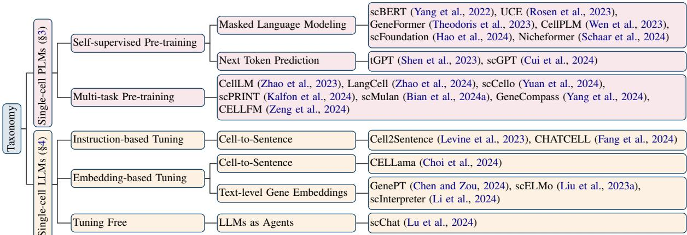
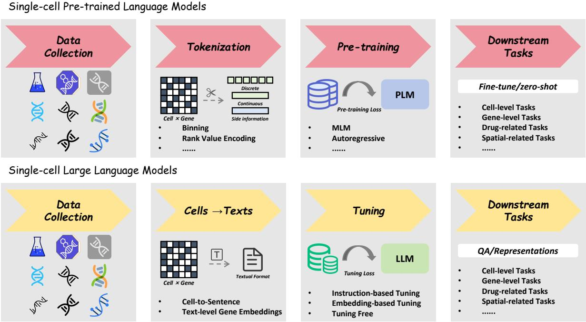
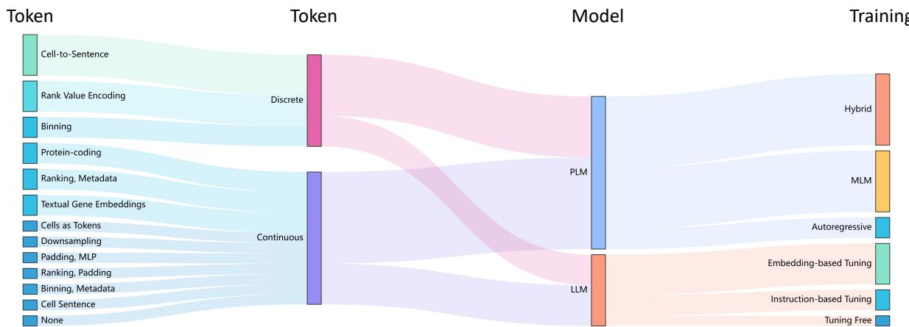

# A Survey on Foundation Language Models for Single-cell Biology

Fan Zhang1, Hao Chen2, Zhihong Zhu3, Ziheng Zhang1,

Zhenxi Lin1, Ziyue Qiao4, Yefeng Zheng5, Xian Wu1†

1Tencent Jarvis Lab 2The Hong Kong University of Science and Technology

3Peking University 4Great Bay University 5Westlake University

fanzhang.karl@gmail.com jhc@cse.ust.hk

zhengyefeng@westlake.edu.cn kevinxwu@tencent.com

## Abstract

The recent advancements in language models have significantly catalyzed progress in computational biology. A growing body of research strives to construct unified foundation models for single-cell biology, with language models serving as the cornerstone. In this paper, we systematically review the developments in foundation language models designed specifically for single-cell biology. Our survey offers a thorough analysis of various incarnations of single-cell foundation language models, viewed through the lens of both pre-trained language models (PLMs) and large language models (LLMs). This includes an exploration of data tokenization strategies, pre-training/tuning paradigms, and downstream single-cell data analysis tasks. Additionally, we discuss the current challenges faced by these pioneering works and speculate on future research directions. Overall, this survey provides a comprehensive overview of the existing single-cell foundation language models, paving the way for future research endeavors.

## 1 Introduction

In recent years, the rise of language models (Vaswani, 2017; Devlin, 2018; Radford et al., 2018; Raffel et al., 2020; Zhu et al., 2025) has driven the flourishing development of research in various fields. Among them, the intersection of computational biology and language models holds great promise and has gained increasing attention. This innovative research direction enables researchers to explore the interpretation of cells as languages (Theodoris et al., 2023; Levine et al., 2023) and leverage language models as a cornerstone to construct foundation models. These foundation language models have demonstrated their ability to obtain robust and generalizable cell representations across various datasets and tasks. Consequently, they have shown remarkable performance in a variety of single-cell data analysis tasks, surpassing the capability of specialist models (Zhang et al., 2024), and promoting developments in various healthcare domains (Wu et al., 2024), including disease diagnosis, drug discovery, and immunotherapy.

Existing single-cell foundation language models can be broadly divided into two groups: single-cell pre-trained language models (PLMs) and singlecell large language models (LLMs).1 In studies centered on single-cell PLMs (Yang et al., 2022; Cui et al., 2024), genes are typically treated as tokens in most cases, allowing cells to be represented as sentences. Researchers can then leverage wellestablished language models in the field of natural language processing (NLP), such as BERT (Devlin, 2018) and GPT (Radford et al., 2018), to perform large-scale pre-training from scratch on cells. This process strives to derive unified cell representations, which can be applied for zero-shot inference or fine-tuning across various single-cell data analysis tasks. In contrast, research based on single-cell LLMs (Levine et al., 2023; Chen and Zou, 2024) often does not require pre-training on extensive cells. Instead, these investigations leverage powerful LLMs with proven emergent capabilities. By converting cells into textual formats, LLMs can interpret cells and can be effectively utilized for various single-cell data analysis tasks after tuning.

To assist researchers in organizing their thoughts and shed light on future research endeavors, we systematically review the existing literature on singlecell foundation language models. By conducting a thorough analysis of data tokenization strategies, pre-training or fine-tuning paradigms, and their applications in a wide spectrum of single-cell data analysis tasks, we meticulously examine and evaluate each of the current models. Furthermore, drawing from this prior analysis, we illuminate the array of challenges encountered in the pursuit of developing unified single-cell foundation language models. Given these challenges, we subsequently propose potential pathways for future research that aim to integrate language models with single-cell biology.

  
Figure 1: Taxonomy of foundation language models for single-cell biology.

While several surveys have been conducted on Transformer-based single-cell models (Lan et al., 2024; Szałata et al., 2024; Bian et al., 2024b), they have not yet provided a comprehensive exposition and analysis from the perspective of language modeling. As shown in Figure 1 and Figure 2, we provide a clear taxonomy and workflow of singlecell foundation language models to facilitate understanding. Overall, the main contributions of this paper can be summarized as follows:

• First Survey. To the best of our knowledge, we are the first to present a comprehensive survey about foundation language models for single-cell biology, thoroughly analyzing the techniques and applications of existing models.

• Novel Perspectives. Based on the approaches in interpreting cells, we categorize existing models into single-cell PLMs and LLMs, and then conduct a comprehensive analysis of them.

• New Frontiers. We discuss and highlight the challenges in constructing unified foundation language models for single-cell biology, which pave the way for future research endeavors.

## 2 Preliminaries

We start by providing definitions and mathematical notations for single-cell foundation language models. Unless stated otherwise, all formulations in this paper follow these definitions and notations.

Encoding. Consider a cell-by-gene matrix X $\mathbb { R } ^ { N \times G }$ , where N and G denote the number of cells and genes collected in a specific dataset, respectively. In this format, cell data exhibits a structure similar to text data, allowing the use of language models for modeling cell representations. In most studies, each gene is treated as a token, enabling cells to be understood as sentences by language models. Let  denote a language model, then the encoding process can be formulated as:

$$
z = \mathcal { L } \mathcal { M } ( T o k e n i z e r ( x ) ) ,\tag{1}
$$

where $x \in \mathbb { R } ^ { 1 \times G }$ is a cell sample drawn from X, and $\boldsymbol { z } \in \mathbb { R } ^ { 1 \times D }$ denotes the corresponding Ddimensional cell representation.

Pre-training. In the pre-training paradigm, cell representation z is fed into a pre-training head to obtain specialized feature h for pre-training using the learning objective $\mathcal { L } _ { \mathcal { P } }$

$$
h = { \mathcal { P H } } ( z ) ,\tag{2}
$$

$$
\begin{array} { r } { \mathcal { L } _ { \mathcal { P } } = P T ( h , y ^ { p } ) , } \end{array}\tag{3}
$$

where $P T$ and $y ^ { p }$ represent different pretext tasks for pre-training and their corresponding labels. Based on the specific pretext task, the label can be a real class label (supervised pre-training), a selfconstructed label (self-supervised pre-training), or a hybrid label (multi-task pre-training).

Tuning. Similarly, in the tuning paradigm, cell representation z is sent into a task-specific head to obtain prediction $p$ for tuning with the learning objective $\mathcal { L } _ { T } \mathrm { : }$

$$
p = T \mathcal { H } ( z ) ,\tag{4}
$$

$$
\begin{array} { r } { \mathcal { L } _ { T } = D T ( p , y ^ { t } ) , } \end{array}\tag{5}
$$

  
Figure 2: Workflow of PLMs and LLMs for single-cell biology.

where DT and yt denote various downstream tasks and the corresponding ground truth labels. Depending on the specific scenario, pre-training and tuning tasks can be either consistent or inconsistent.

## 3 PLMs for Single-cell Biology

In this section, we provide a holistic review of existing PLMs for single-cell biology, including their data tokenization strategies (Section 3.1) and pre-training paradigms (Section 3.2). A summary of these single-cell PLMs is shown in Table 1.

## 3.1 Tokenization Strategies

To encode cells using language models, the first obstacle is to transform cells into a format that language models can understand. On the one hand, the process of tokenizing cells is challenging due to the lengthy nature and the inherent sparsity of gene sequences. On the other hand, since gene sequences are unordered, it is often difficult to unify cell data from different sources, posing difficulties for largescale pre-training. To address this issue, several approaches have proposed various data tokenization strategies from the following perspectives.

Discrete Tokens. In the field of NLP, textual format data needs to be transformed into discrete tokens before it can be understood by a language model (Harris, 1954; Mikolov, 2013; Rong, 2014). For single-cell transcriptomics data composed of gene sequences in continuous form, discretization is also an important step in tokenization. For example, scBERT (Yang et al., 2022) and CellLM (Zhao et al., 2023) utilize a straightforward binning technique that converts log-transformed continuous gene expression values into the nearest integer discrete values, while also setting a ceiling value. Another approach to discretizing cells is rank value encoding, which is proposed by Gene-Former (Theodoris et al., 2023) and widely used in the GeneFormer family (GeneFormer (Theodoris et al., 2023), LangCell (Zhao et al., 2024), and sc-Cello (Yuan et al., 2024)). This strategy involves sorting the frequencies of gene names and encoding them using a gene vocabulary. The maximum length of each cell is set to 2048, and any remaining positions are padded with the <PAD> symbol.

Continuous Embeddings. A more popular strategy uses continuous embeddings for fine-grained information. For example, UCE (Rosen et al., 2023) and scPRINT (Kalfon et al., 2024) utilize large protein language models to obtain continuous embeddings for each gene, which are then used to tokenize cells. CellPLM (Wen et al., 2023) multiplies each gene in the normalized cell data with a randomly initialized learnable layer to obtain continuous cell embeddings. scFoundation (Hao et al., 2024) employs a hierarchical Bayesian downsampling strategy to maintain the quality and consistency of large-scale data. CellFM (Zeng et al., 2024) uses padding to align large-scale data and then applies a multilayer perceptron (MLP) for projection. Nicheformer (Schaar et al., 2024) and GeneCompass (Yang et al., 2024) combine ranked gene information with metadata for continuous value embeddings. tGPT (Shen et al., 2023) adopts padding and ranked gene information for direct continuous encoding of large-scale cell data. scGPT (Cui et al., 2024) incorporates metadata information after binning to transform the embeddings from discrete to continuous values. scMulan (Bian et al., 2024a) combines the original data, metadata, and task placeholders to form cell sentences for obtaining continuous cell embeddings.

<table><tr><td>Model</td><td>Tokenization Strategy</td><td>Pre-training Paradigm</td><td>Pre-training Data</td></tr><tr><td>scBERT (Yang et al., 2022)</td><td>Binning</td><td>Masked Language Modeling</td><td>1M scRNA-seq Data</td></tr><tr><td>UCE (Rosen et al., 2023)</td><td>Protein-coding</td><td>Masked Language Modeling</td><td>36M Cells</td></tr><tr><td>GeneFormer (Theodoris et al., 2023)</td><td>Rank Value Encoding</td><td>Masked Language Modeling</td><td>27.4M Transcriptomics Data</td></tr><tr><td>CellPLM (Wen et al., 2023)</td><td>Cells as Tokens</td><td>Masked Language Modeling</td><td>11M Cells</td></tr><tr><td>scFoundation (Hao et al., 2024)</td><td>Downsampling</td><td>Masked Language Modeling</td><td>50M scRNA-seq Data</td></tr><tr><td>Nicheformer (Schaar et al., 2024)</td><td>Ranking, Metadata</td><td>Masked Language Modeling</td><td>57M Cells</td></tr><tr><td>tGPT (Shen et al., 2023)</td><td>Ranking, Padding</td><td>Next Token Prediction</td><td>22.3M Cells</td></tr><tr><td>scGPT (Cui et al., 2024)</td><td>Binning, Metadata</td><td>Next Token Prediction</td><td>33M Cells</td></tr><tr><td>CellLM (Zhao et al., 2023)</td><td>Binning</td><td>Multi-task Pre-training</td><td>2M scRNA-seq Data</td></tr><tr><td>LangCell (Zhao et al., 2024)</td><td>Rank Value Encoding</td><td>Multi-task Pre-training</td><td>27.5M Cells and Texts</td></tr><tr><td>scCello (Yuan et al., 2024)</td><td>Rank Value Encoding</td><td>Multi-task Pre-training</td><td>22M Cells</td></tr><tr><td>scPRINT (Kalfon et al., 2024)</td><td>Protein-coding</td><td>Multi-task Pre-training</td><td>50M Cells</td></tr><tr><td>scMulan (Bian et al., 2024a)</td><td>Cell Sentence</td><td>Multi-task Pre-training</td><td>10M Transcriptomics Data</td></tr><tr><td>GeneCompass (Yang et al., 2024)</td><td>Ranking, Metadata</td><td>Multi-task Pre-training</td><td>126M Transcriptomics Data</td></tr><tr><td>CellFM (Zeng et al., 2024)</td><td>Padding, MLP</td><td>Multi-task Pre-training</td><td>100M Cells</td></tr></table>

Table 1: Summary of pre-trained language models for single-cell biology.

Side Information. In addition to the raw cell data, many approaches incorporate side information during the tokenization process. One mainstream approach (Nicheformer (Schaar et al., 2024), scGPT (Cui et al., 2024), scMulan (Bian et al., 2024a), and GeneCompass (Yang et al., 2024)) is to utilize metadata to obtain side information. The available metadata attributes include cell state, cell type, organ source and specific region, donor age and gender, and sequencing technology. Another approach is to leverage existing biological foundation models as bridges. For instance, UCE (Rosen et al., 2023) and scPRINT (Kalfon et al., 2024) obtain the side information from large protein language models, which bridge the gap between cells and languages through protein information.

## 3.2 Pre-training Paradigms

An important step in building single-cell foundation language models from scratch is large-scale pre-training. After tokenizing cell data into a format understandable by language models, we can conduct pre-training on a vast volume of cell data using similar pretext tasks in NLP. Next, we will elaborate on these pre-training tasks.

Masked Language Modeling. Numerous studies (Salazar et al., 2019; Min et al., 2023; Minaee et al., 2024) have demonstrated that models can learn high-quality representations with generalization capabilities through reconstructing the masked items (e.g., tokens, patches, and features), laying the foundation for self-supervised learning. The remarkable success of masked language modeling (MLM) in the domains of language (Devlin, 2018; Liu, 2019) and vision (He et al., 2022; Bao et al., 2021) also inspires its application in single-cell biology. For single-cell PLMs, the mainstream masking strategies involve randomly masking genes with a certain probability (e.g., 15%-30%) (Yang et al., 2022; Rosen et al., 2023; Theodoris et al., 2023; Hao et al., 2024; Schaar et al., 2024), or using the Gaussian mixture distribution as priors for masking measured genes (Wen et al., 2023).

Next Token Prediction. Although autoregressively predicting the next token has dominated the pre-training paradigms of LLMs (Touvron et al., 2023; Bai et al., 2023a; Achiam et al., 2023) and multi-modal foundation models (Bai et al., 2023b; Wang et al., 2024), this approach has not yet become popular for single-cell PLMs. Only tGPT (Shen et al., 2023) and scGPT (Cui et al., 2024) adopt this strategy for pre-training language models from scratch. We attribute this phenomenon to two reasons: (1) Compared to the vast amount of text data, existing single-cell datasets are still relatively small, making the autoregressive training process insufficient for strong generalization ability. (2) Cell data naturally exhibits sparsity, resulting in most ground truth values for predicting the next token being zero. This can lead the model to learn trivial solutions during the training process.

<table><tr><td>Model</td><td>Base Model</td><td>From Cells to Texts</td><td>Tuning Paradigm</td></tr><tr><td>Cell2Sentence (Levine et al., 2023)</td><td>GPT-2</td><td>Cell-to-Sentence</td><td>Instruction-based</td></tr><tr><td>CHATCELL (Fang et al., 2024)</td><td>T5</td><td>Cell-to-Sentence</td><td>Instruction-based</td></tr><tr><td>scInterpreter (Li et al., 2024)</td><td>LLaMA-13B</td><td>Text-level Gene Embeddings</td><td>Embedding-based</td></tr><tr><td>GenePT (Chen and Zou, 2024)</td><td>GPT-3.5</td><td>Text-level Gene Embeddings</td><td>Embedding-based</td></tr><tr><td>scELMo (Liu et al., 2023a)</td><td>GPT-3.5</td><td>Text-level Gene Embeddings</td><td>Embedding-based</td></tr><tr><td>CELLama (Choi et al., 2024)</td><td>all-MiniLM-L12-v2</td><td>Cell-to-Sentence</td><td>Embedding-based</td></tr><tr><td>scChat (Lu et al., 2024)</td><td>GPT-40</td><td>None</td><td>Tuning Free</td></tr></table>

Table 2: Summary of large language models for single-cell biology.

Multi-task Pre-training. In contrast to a single pretext task, many approaches opt for multi-task pre-training, including both self-supervised and supervised tasks. Among them, MLM remains the most fundamental task. In addition to MLM, cell generation (Bian et al., 2024a) and contrastive learning (Zhao et al., 2023, 2024; Yuan et al., 2024; Kalfon et al., 2024) are also widely employed. Overall, multi-task pre-training incorporates supervised tasks using labels or other side information on top of self-supervised tasks. These supervised tasks include classification (Zhao et al., 2023; Kalfon et al., 2024; Bian et al., 2024a; Yang et al., 2024; Zeng et al., 2024), cell-text matching (Zhao et al., 2024), bottleneck learning (Kalfon et al., 2024), and metadata prediction (Bian et al., 2024a). Furthermore, some approaches employ denoising (Kalfon et al., 2024) and cell ontology alignment (Yuan et al., 2024) to capture gene-gene and cellcell structural information, respectively.

## 4 LLMs for Single-cell Biology

Due to the high cost required for pre-training language models from scratch, another line of research chooses to build upon powerful LLMs and facilitate their understanding of single-cell biology. In this section, we will specifically introduce single-cell LLMs, including techniques to convert single-cell data into textual formats (Section 4.1) and tuning paradigms (Section 4.2). We also provide a summary of existing single-cell LLMs in Table 2.

## 4.1 From Cells to Texts

To boost the reasoning abilities of LLMs for singlecell data analysis tasks, the first step is to transform single-cell transcriptomics data into textual formats. Currently, the existing transformation approaches can be divided into the following two groups.

Cell-to-Sentence. Cell2Sentence (Levine et al., 2023) proposes to use textual gene names to represent cells. For a set of single-cell ribonucleic acid sequencing (scRNA-seq) data, genes are sorted according to their expression values after normalization. Subsequently, for each cell, the top 100 genes with the highest expression values are selected to form a cell sentence composed of gene names. This transformation approach not only resolves the issue of disorderliness in cell data but also addresses the variability in gene names across different datasets, which is also adopted by CHATCELL (Fang et al., 2024) and CELLama (Choi et al., 2024).

Text-level Gene Embeddings. Another transformation approach (Chen and Zou, 2024; Liu et al., 2023a; Li et al., 2024) involves prompting LLMs to inquire about the function of each gene and encoding their responses into text-level embeddings. Subsequently, the gene expression values at each position of a specific cell sample are used as weights to combine the text-level gene embeddings, through either ranking or weighted averaging methods.

## 4.2 Tuning Paradigms

Even though the construction of single-cell LLMs does not necessitate extensive pre-training like PLMs, several tuning approaches have been proposed to align LLMs with domain knowledge in single-cell biology. In this section, we will specifically introduce the existing tuning paradigms.

Instruction-based Tuning. Instruction-based tuning (Longpre et al., 2023; Zhang et al., 2023; Peng et al., 2023; Liu et al., 2024) is a prevalent paradigm when fine-tuning LLMs. It involves transforming specific tasks and collecting data pairs in <question, answer> formats to fine-tune language models. In single-cell biology, this concept was first introduced by Cell2Sentence (Levine et al., 2023) and further developed by CHATCELL (Fang et al., 2024). Taking cell type annotation as an example, the task and cells can be transformed into questions by prompt templates, with cell types serving as the corresponding answers. This approach enables the collection of paired data formats for instruction-based tuning. However, instructionbased tuning faces notable limitations, as many single-cell data analysis tasks cannot be easily transformed into <question, answer> formats.

Embedding-based Tuning. Due to the limitations of instruction-based tuning, embedding-based tuning remains the mainstream paradigm. For methods based on text-level gene embeddings (Chen and Zou, 2024; Liu et al., 2023a; Li et al., 2024), the embeddings corresponding to each cell or gene can be directly obtained. For methods based on cell-to-sentence (Choi et al., 2024), the features extracted by sentence Transformer models (Reimers and Gurevych, 2019, 2020; Thakur et al., 2021) can be treated as embeddings. Then these embeddings and the corresponding ground truth labels are used for supervised fine-tuning.

Tuning Free. In addition to the above two tuning paradigms, there is another tuning free paradigm that treats LLMs as agents (Lu et al., 2024). This approach enables LLMs to be programmed to generate Python code for a wide range of single-cell data analysis tasks with raw data as input.

## 5 Single-cell Data Analysis Tasks

In this section, we delve into various single-cell data analysis tasks linked to single-cell foundational language models. Predominantly, these tasks encompass cell-level and gene-level analyses. Furthermore, there also exist models tailored towards drug-related, spatial-related, and other tasks.

## 5.1 Cell-level Tasks

As depicted in Appendix Table 3, mainstream celllevel tasks include cell type annotation (Cao et al., 2020b; Pasquini et al., 2021), discovery of novel cell types (Aevermann et al., 2018; Saviano et al., 2020), batch effect correction (Zhou et al., 2019; Tran et al., 2020), cell clustering (Kiselev et al.,

2017, 2019), multi-omics data integration (Subramanian et al., 2020; Kang et al., 2022), and cell generation (Bergmann et al., 2015; Luo et al., 2024). Among these tasks, the most fundamental one is cell type annotation. Similar to traditional deep learning-based models (Shao et al., 2021; Chen et al., 2023), language models typically utilize a classification head after obtaining universal cell representations to make predictions on cell types, followed by fine-tuning or zero-shot inference on downstream datasets. Additionally, some models employ similarity comparison methods for anno tation (Zhao et al., 2024) or transform the anno tation task into a question-answering task (Fang et al., 2024). Building upon annotation, some models further extend their recognition capabili ties to the discovery of novel cell types. These approaches often rely on assessing similarities be tween base cell types and novel cell types (Zhao et al., 2024) or the confidence of predictions (Yang et al., 2022). In scenarios where cell type infor mation is lacking, many models typically resort to cell clustering to assess the discriminative nature of cell representations. Given that cell data is of ten collected across different laboratory settings (Leek et al., 2010; Lazar et al., 2013; Goh et al., 2017), it exhibits a pronounced batch effect. Con sequently, many models pool data from different batches and then evaluate the effectiveness of batch effect correction through clustering performance. Since most language models are pre-trained on scRNA-seq data, they rarely focus on multi-omics tasks. Only scGPT (Cui et al., 2024) and scELMo (Liu et al., 2023a) have validated their ability to in tegrate multi-omics data, such as RNA and protein. In addition to the aforementioned discriminative tasks, generative tasks are also employed to assess the performance of language models, as they align closely with the pre-training objectives. Among these, prevalent tasks include conditional cell gen eration (Bian et al., 2024a) and unconditional cell generation (Levine et al., 2023; Fang et al., 2024).

## 5.2 Gene-level Tasks

We also present common gene-level tasks in Appendix Table 3, which could be broadly divided into three types: gene network analysis (Zhang and Horvath, 2005; van der Zwaag et al., 2009), gene perturbation (Lee et al., 2008; Meinshausen et al., 2016), and gene prediction (Mathé et al., 2002; Maji and Garg, 2013). Gene network analysis aims to elucidate cell functionality by examining interactions between genes, encompassing uncovering gene networks (Cui et al., 2024), inferring gene regulation networks (Hao et al., 2024; Yang et al., 2024; Zeng et al., 2024), exploring gene programs (Chen and Zou, 2024), and conducting in silico treatment analysis (Theodoris et al., 2023; Liu et al., 2023a). The task of gene perturbation refers to perturbing specific genes, such as through knockouts, and observing how these changes affect cells or other genes. This process helps us understand gene functionality and the interactions between genes. Another task to directly understand genes is gene prediction, encompassing marker gene prediction (Yuan et al., 2024), gene expression and sensitivity prediction (Yang et al., 2024), as well as gene function, property, and interaction prediction (Levine et al., 2023; Chen and Zou, 2024).

## 5.3 Drug-related Tasks

Drug-related tasks (Appendix Table 4) (Tatonetti et al., 2012; Costello et al., 2014; Adam et al., 2020) aims to comprehend the mechanisms of drug action within biological systems, facilitating the selection and optimization of therapeutic regimens. The specific tasks in this field can be categorized into drug sensitivity prediction (Zhao et al., 2023; Fang et al., 2024) and drug response prediction (Hao et al., 2024; Yuan et al., 2024; Yang et al., 2024). The former focuses on forecasting the sensitivity of cells to specific drugs, while the latter primarily predicts the cellular response to drug treatment.

## 5.4 Spatial-related Tasks

Single-cell spatial transcriptomics (van den Brink et al., 2020; Weber, 2021; Longo et al., 2021; Piwecka et al., 2023) combines the advantages of single-cell transcriptomics and spatial transcriptomics, providing spatial context information of cells. This approach offers crucial insights into how cells interact with each other and their environment, and how these interactions influence cellular function and behavior. It is a powerful tool for studying complex tissues and diseases such as cancer or neurological disorders. As a result, some language models incorporate spatial information and specifically focus on spatial-related tasks (Appendix Table 4), including spatial transcriptomic imputation (Wen et al., 2023), spatial label prediction and composition (Schaar et al., 2024), as well as spatial context analysis (Choi et al., 2024).

## 5.5 Other Relevant Tasks

In addition to the aforementioned tasks, several single-cell foundation language models have been evaluated with other specific tasks (Appendix Table 4), including scRNA-seq denoising (Wen et al., 2023), inference of developmental lineages (Shen et al., 2023), cell-text retrieval (Zhao et al., 2024), pathway identification (Zhao et al., 2024), cell label prediction (Levine et al., 2023), and in-depth analysis of response from LLMs (Lu et al., 2024).

## 6 Challenges and Future Directions

Despite the advancements in current single-cell foundation language models, there are still several substantial challenges that warrant attention. It is crucial to understand these challenges as it will pave the way for future research endeavors.

## 6.1 Data Quality

Due to the following reasons, data quality has consistently been a hindrance to the development of unified single-cell foundation language models.

Inherent Sparsity. Single-cell data typically exhibits sparse characteristics (Aparicio et al., 2020; Baruzzo et al., 2020; Park and Lee, 2024), in that gene sequences are frequently lengthy, yet only a minor fraction (less than 10%) of genes exhibit measurable expression levels. This presents a significant gap compared to text data, as the information density in cells is much lower. Consequently, this poses challenges for language models in effectively understanding and interpreting cells.

Positional Information. Another characteristic of single-cell data is the irrelevance of gene order (Cao et al., 2020a; Xu et al., 2024). For a given cell, the arrangement of genes lacks a standardized convention and is only dependent on the preference of the sequencer. As a result, a cell can have multiple possible gene orderings, posing a challenge in constructing unified cell representations. Existing language models typically employ Transformer architectures (Vaswani, 2017; Dosovitskiy, 2020), which can easily learn positional and sequential information due to the presence of positional encoding. However, this often introduces noise when attempting to build unified cell representations.

Batch Effect. Pre-training requires collecting a large amount of single-cell data from multiple sources. However, due to the inconsistency in sequencing technologies (Grün and van Oudenaarden,

2015; Kashima et al., 2020), platforms (Zare and Kim, 2010; Valihrach et al., 2018), and laboratory environments (Carlo and Lee, 2006; Kalisky et al., 2011), different batches of single-cell data often exhibit severe batch effects. For the same type of cells from different batches, models tend to provide significantly different predictions, posing a challenge in obtaining unified cell representations.

Omics Resource. Existing datasets predominantly consist of scRNA-seq transcriptomics, while high-quality datasets for other omics, such as deoxyribonucleic acid (DNA) (Karemaker and Vermeulen, 2018; Evrony et al., 2021) and protein (Wu and Singh, 2012; Nasseri et al., 2011), are relatively scarce. This limits the ability of language models to analyze and process single-cell multi-omics data.

Direction. Considering the challenges above, it is crucial to address them and improve the quality of single-cell data for universal cell representations.

## 6.2 Model Design

There is still room for improvement in the structure of existing single-cell foundation language models, primarily due to the absence of a unified cell tokenizer and the emergence of scaling laws.

Cell Tokenizer. Although previous works have attempted to establish gene vocabularies (Theodoris et al., 2023; Cui et al., 2024) and transform all genes into vectors using word2vec techniques (Grohe, 2020; Rong, 2014) borrowed from NLP, we still have a long way to go toward a unified cell tokenizer. On the one hand, the largest gene vocabulary currently contains only around 70,000 genes, which is insufficient to encompass all the genes discovered in humans and mice (Bedell et al., 1997; Ingersoll et al., 2010; Bouabe and Okkenhaug, 2013). On the other hand, the integration of newly discovered genes into existing cell tokenizers remains unexplored.

Scaling Law. The development of foundation language models for single-cell biology significantly lags behind that of other domains (Cherti et al., 2023; Bahri et al., 2024). This is primarily due to limitations in data and model design. Currently, the largest single-cell PLMs have less than 1B parameters, which is relatively small compared to NLP models. Alternatively, single-cell LLMs heavily rely on textual embeddings to construct cell representations and necessitate fine-tuning on specific datasets. These factors indicate that scaling laws have not yet emerged in this domain.

Direction. Taking the above challenges into account, a potential future research direction could involve constructing a unified and scalable cell tokenizer, while also scaling up the model size to facilitate the emergence of intelligent capabilities.

## 6.3 Evaluation Protocol

The evaluation protocol for single-cell foundation language models lacks openness and transparency, primarily due to a scarcity of benchmarks and existing gaps between different domains.

Benchmark. Most of the existing single-cell foundation language models are validated on private datasets and different tasks, which can result in unfair comparisons between models. Currently, there is no publicly available benchmark with standardized datasets and evaluation metrics to assess the performance of these models in an open and fair manner. This hinders our understanding of the strengths and weaknesses of each model.

User-friendliness. The evaluation of single-cell foundation language models demands a substantial understanding of genomics and cell biology, making it less accessible for users without a background in biology. A major challenge lies in how to leverage insights from other domains (Huang et al., 2023; Tang et al., 2024) to transform various tasks into user-friendly question-answer formats.

Direction. Therefore, there is great anticipation for progress in establishing benchmarks to evaluate single-cell foundation language models and transforming various tasks into user-friendly formats.

## 7 Conclusion

This paper presented a systematic and comprehensive survey of foundation language models for single-cell biology. We categorized the existing models into single-cell PLMs and LLMs. Then we conducted a thorough literature review on data tokenization and pre-training paradigms for PLMs, as well as the techniques for converting cells into texts and tuning paradigms for LLMs. Additionally, we introduced various types of single-cell data analysis tasks to evaluate language models, including celllevel, gene-level, drug-related, spatial-related, and other tasks. Finally, we analyzed the challenges and future research directions from three perspectives: data quality, model design, and evaluation protocol. Overall, this survey provides the first comprehensive analysis and summary of singlecell foundation language models, aiming to inspire researchers and encourage greater participation in this field, ultimately contributing to the development of universal foundation models.

## Limitations

This survey provides a comprehensive review of single-cell foundation language models. However, there are still some limitations. Firstly, despite our efforts to cover as many relevant works published before the submission date, there is a possibility that a small portion of the literature may have been overlooked. Additionally, we primarily focus on the technical aspects of each model and do not extensively analyze the biological motivations and significance behind their design. We encourage readers to refer to the original papers for a more in-depth understanding in this regard. Moreover, investigating how single-cell foundation language models specifically enhance downstream applications such as drug sensitivity prediction and multiomics data integration could deepen researchers understanding of single-cell biology, which we leave as future work.

## References

Tamim Abdelaal, Lieke Michielsen, Davy Cats, Dylan Hoogduin, Hailiang Mei, Marcel JT Reinders, and Ahmed Mahfouz. 2019. A comparison of automatic cell identification methods for single-cell rna sequencing data. Genome biology, 20:1–19.

S Abdulla, B Aevermann, P Assis, S Badajoz, SM Bell, E Bezzi, B Cakir, J Chaffer, S Chambers, J Michael Cherry, et al. 2023. Czi single-cell biology program cz cell gene discover: A single-cell data platform for scalable exploration, analysis and modeling of aggregated data. bioRxiv.

Josh Achiam, Steven Adler, Sandhini Agarwal, Lama Ahmad, Ilge Akkaya, Florencia Leoni Aleman, Diogo Almeida, Janko Altenschmidt, Sam Altman, Shyamal Anadkat, et al. 2023. Gpt-4 technical report. arXiv preprint arXiv:2303.08774.

George Adam, Ladislav Rampášek, Zhaleh Safikhani, Petr Smirnov, Benjamin Haibe-Kains, and Anna Goldenberg. 2020. Machine learning approaches to drug response prediction: challenges and recent progress. NPJ precision oncology, 4(1):19.

Britt Adamson, Thomas M Norman, Marco Jost, Min Y Cho, James K Nuñez, Yuwen Chen, Jacqueline E Villalta, Luke A Gilbert, Max A Horlbeck, Marco Y

Hein, et al. 2016. A multiplexed single-cell crispr screening platform enables systematic dissection of the unfolded protein response. Cell, 167(7):1867– 1882.

Brian D Aevermann, Mark Novotny, Trygve Bakken, Jeremy A Miller, Alexander D Diehl, David Osumi-Sutherland, Roger S Lasken, Ed S Lein, and Richard H Scheuermann. 2018. Cell type discovery using single-cell transcriptomics: implications for ontological representation. Human molecular genetics, 27(R1):R40–R47.

Alexandre F Aissa, Abul BMMK Islam, Majd M Ariss, Cammille C Go, Alexandra E Rader, Ryan D Conrardy, Alexa M Gajda, Carlota Rubio-Perez, Klara Valyi-Nagy, Mary Pasquinelli, et al. 2021. Singlecell transcriptional changes associated with drug tolerance and response to combination therapies in cancer. Nature communications, 12(1):1628.

Luis Aparicio, Mykola Bordyuh, Andrew J Blumberg, and Raul Rabadan. 2020. A random matrix theory approach to denoise single-cell data. Patterns, 1(3).

Stephen J Bagley, Zev A Binder, Lamia Lamrani, Eliana Marinari, Arati S Desai, MacLean P Nasrallah, Eileen Maloney, Steven Brem, Robert A Lustig, Goldie Kurtz, et al. 2024. Repeated peripheral infusions of anti-egfrviii car t cells in combination with pembrolizumab show no efficacy in glioblastoma: a phase 1 trial. Nature Cancer, 5(3):517–531.

Yasaman Bahri, Ethan Dyer, Jared Kaplan, Jaehoon Lee, and Utkarsh Sharma. 2024. Explaining neural scaling laws. Proceedings of the National Academy ofSciences, 121(27):e2311878121.

Jinze Bai, Shuai Bai, Yunfei Chu, Zeyu Cui, Kai Dang, Xiaodong Deng, Yang Fan, Wenbin Ge, Yu Han, Fei Huang, et al. 2023a. Qwen technical report. arXiv preprint arXiv:2309.16609.

Jinze Bai, Shuai Bai, Shusheng Yang, Shijie Wang, Sinan Tan, Peng Wang, Junyang Lin, Chang Zhou, and Jingren Zhou. 2023b. Qwen-vl: A frontier large vision-language model with versatile abilities. arXiv preprint arXiv:2308.12966.

Hangbo Bao, Li Dong, Songhao Piao, and Furu Wei. 2021. Beit: Bert pre-training of image transformers. arXiv preprint arXiv:2106.08254.

Jonathan Bard, Seung Y Rhee, and Michael Ashburner. 2005. An ontology for cell types. Genome biology, 6:1–5.

Maayan Baron, Adrian Veres, Samuel L Wolock, Aubrey L Faust, Renaud Gaujoux, Amedeo Vetere, Jennifer Hyoje Ryu, Bridget K Wagner, Shai S Shen-Orr, Allon M Klein, et al. 2016. A single-cell transcriptomic map of the human and mouse pancreas reveals inter-and intra-cell population structure. Cell systems, 3(4):346–360.

Tanya Barrett, Stephen E Wilhite, Pierre Ledoux, Carlos Evangelista, Irene F Kim, Maxim Tomashevsky, Kimberly A Marshall, Katherine H Phillippy, Patti M Sherman, Michelle Holko, et al. 2012. Ncbi geo: archive for functional genomics data sets—update. Nucleic acids research, 41(D1):D991–D995.

Giacomo Baruzzo, Ilaria Patuzzi, and Barbara Di Camillo. 2020. Sparsim single cell: a count data simulator for scrna-seq data. Bioinformatics, 36(5):1468–1475.

Mary A Bedell, Nancy A Jenkins, and Neal G Copeland. 1997. Mouse models of human disease. part i: techniques and resources for genetic analysis in mice. Genes & development, 11(1):1–10.

Olaf Bergmann, Sofia Zdunek, Anastasia Felker, Mehran Salehpour, Kanar Alkass, Samuel Bernard, Staffan L Sjostrom, Mirosława Szewczykowska, Teresa Jackowska, Cris Dos Remedios, et al. 2015. Dynamics of cell generation and turnover in the human heart. Cell, 161(7):1566–1575.

Sanchita Bhattacharya, Patrick Dunn, Cristel G Thomas, Barry Smith, Henry Schaefer, Jieming Chen, Zicheng Hu, Kelly A Zalocusky, Ravi D Shankar, Shai S Shen-Orr, et al. 2018. Immport, toward repurposing of open access immunological assay data for translational and clinical research. Scientific data, 5(1):1–9.

Haiyang Bian, Yixin Chen, Xiaomin Dong, Chen Li, Minsheng Hao, Sijie Chen, Jinyi Hu, Maosong Sun, Lei Wei, and Xuegong Zhang. 2024a. scmulan: a multitask generative pre-trained language model for single-cell analysis. In International Conference on Research in Computational Molecular Biology, pages 479–482. Springer.

Haiyang Bian, Yixin Chen, Erpai Luo, Xinze Wu, Minsheng Hao, Lei Wei, and Xuegong Zhang. 2024b. The development of ai foundation models for singlecell transcriptomics. National Science Review, page nwae340.

Hicham Bouabe and Klaus Okkenhaug. 2013. Gene targeting in mice: a review. Virus-Host Interactions: Methods and Protocols, pages 315–336.

Joseph Burclaff, R Jarrett Bliton, Keith A Breau, Meryem T Ok, Ismael Gomez-Martinez, Jolene S Ranek, Aadra P Bhatt, Jeremy E Purvis, John T Woosley, and Scott T Magness. 2022. A proximal-todistal survey of healthy adult human small intestine and colon epithelium by single-cell transcriptomics. Cellular and molecular gastroenterology and hepatology, 13(5):1554–1589.

Elaine Y Cao, John F Ouyang, and Owen JL Rackham. 2020a. Geneswitches: ordering gene expression and functional events in single-cell experiments. Bioinformatics, 36(10):3273–3275.

Yinghao Cao, Xiaoyue Wang, and Gongxin Peng. 2020b. Scsa: a cell type annotation tool for single-cell rnaseq data. Frontiers in genetics, 11:490.

Dino Di Carlo and Luke P Lee. 2006. Dynamic singlecell analysis for quantitative biology.

Mark Chaffin, Irinna Papangeli, Bridget Simonson, Amer-Denis Akkad, Matthew C Hill, Alessandro Arduini, Stephen J Fleming, Michelle Melanson, Sikander Hayat, Maria Kost-Alimova, et al. 2022. Singlenucleus profiling of human dilated and hypertrophic cardiomyopathy. Nature, 608(7921):174–180.

Jiawei Chen, Hao Xu, Wanyu Tao, Zhaoxiong Chen, Yuxuan Zhao, and Jing-Dong J Han. 2023. Transformer for one stop interpretable cell type annotation. Nature Communications, 14(1):223.

Sijie Chen, Yanting Luo, Haoxiang Gao, Fanhong Li, Yixin Chen, Jiaqi Li, Renke You, Minsheng Hao, Haiyang Bian, Xi Xi, et al. 2022. heca: the cellcentric assembly of a cell atlas. Iscience, 25(5).

Tingting Chen, Xu Chen, Sisi Zhang, Junwei Zhu, Bixia Tang, Anke Wang, Lili Dong, Zhewen Zhang, Caixia Yu, Yanling Sun, et al. 2021. The genome sequence archive family: toward explosive data growth and diverse data types. Genomics, Proteomics and Bioinformatics, 19(4):578–583.

Yiqun Chen and James Zou. 2024. Genept: a simple but effective foundation model for genes and cells built from chatgpt. bioRxiv, pages 2023–10.

Sijin Cheng, Ziyi Li, Ranran Gao, Baocai Xing, Yunong Gao, Yu Yang, Shishang Qin, Lei Zhang, Hanqiang Ouyang, Peng Du, et al. 2021. A pan-cancer singlecell transcriptional atlas of tumor infiltrating myeloid cells. Cell, 184(3):792–809.

Mehdi Cherti, Romain Beaumont, Ross Wightman, Mitchell Wortsman, Gabriel Ilharco, Cade Gordon, Christoph Schuhmann, Ludwig Schmidt, and Jenia Jitsev. 2023. Reproducible scaling laws for contrastive language-image learning. In Proceedings of the IEEE/CVF Conference on Computer Vision and Pattern Recognition, pages 2818–2829.

Regina K Cheung and Paul J Utz. 2011. Cytof—the next generation of cell detection. Nature Reviews Rheumatology, 7(9):502–503.

Hongyoon Choi, Jeongbin Park, Sumin Kim, Jiwon Kim, Dongjoo Lee, Sungwoo Bae, Haenara Shin, and Daeseung Lee. 2024. Cellama: Foundation model for single cell and spatial transcriptomics by cell embedding leveraging language model abilities. bioRxiv, pages 2024–05.

Guy Cochrane, Ruth Akhtar, Philippe Aldebert, Nicola Althorpe, Alastair Baldwin, Kirsty Bates, Sumit Bhattacharyya, James Bonfield, Lawrence Bower, Paul Browne, et al. 2007. Priorities for nucleotide trace, sequence and annotation data capture at the ensembl trace archive and the embl nucleotide sequence database. Nucleic Acids Research, 36(suppl\_1):D5– D12.

GTEx Consortium. 2020. The gtex consortium atlas of genetic regulatory effects across human tissues. Science, 369(6509):1318–1330.

The Tabula Sapiens Consortium\*, Robert C Jones, Jim Karkanias, Mark A Krasnow, Angela Oliveira Pisco, Stephen R Quake, Julia Salzman, Nir Yosef, Bryan Bulthaup, Phillip Brown, et al. 2022. The tabula sapiens: A multiple-organ, single-cell transcriptomic atlas of humans. Science, 376(6594):eabl4896.

James C Costello, Laura M Heiser, Elisabeth Georgii, Mehmet Gönen, Michael P Menden, Nicholas J Wang, Mukesh Bansal, Muhammad Ammad-Ud-Din, Petteri Hintsanen, Suleiman A Khan, et al. 2014. A community effort to assess and improve drug sensitivity prediction algorithms. Nature biotechnology, 32(12):1202–1212.

Cameron S Cowan, Magdalena Renner, Martina De Gennaro, Brigitte Gross-Scherf, David Goldblum, Yanyan Hou, Martin Munz, Tiago M Rodrigues, Jacek Krol, Tamas Szikra, et al. 2020. Cell types of the human retina and its organoids at single-cell resolution. Cell, 182(6):1623–1640.

Haotian Cui, Chloe Wang, Hassaan Maan, Kuan Pang, Fengning Luo, Nan Duan, and Bo Wang. 2024. scgpt: toward building a foundation model for single-cell multi-omics using generative ai. Nature Methods, pages 1–11.

Jacob Devlin. 2018. Bert: Pre-training of deep bidirectional transformers for language understanding. arXiv preprint arXiv:1810.04805.

Atray Dixit, Oren Parnas, Biyu Li, Jenny Chen, Charles P Fulco, Livnat Jerby-Arnon, Nemanja D Marjanovic, Danielle Dionne, Tyler Burks, Raktima Raychowdhury, et al. 2016. Perturb-seq: dissecting molecular circuits with scalable single-cell rna profiling of pooled genetic screens. cell, 167(7):1853– 1866.

C Domínguez Conde, C Xu, LB Jarvis, DB Rainbow, SB Wells, T Gomes, SK Howlett, O Suchanek, K Polanski, HW King, et al. 2022. Cross-tissue immune cell analysis reveals tissue-specific features in humans. Science, 376(6594):eabl5197.

Mingze Dong, Bao Wang, Jessica Wei, Antonio H de O. Fonseca, Curtis J Perry, Alexander Frey, Feriel Ouerghi, Ellen F Foxman, Jeffrey J Ishizuka, Rahul M Dhodapkar, et al. 2023. Causal identification of single-cell experimental perturbation effects with cinema-ot. Nature Methods, 20(11):1769–1779.

Alexey Dosovitskiy. 2020. An image is worth 16x16 words: Transformers for image recognition at scale. arXiv preprint arXiv:2010.11929.

Jingcheng Du, Peilin Jia, Yulin Dai, Cui Tao, Zhongming Zhao, and Degui Zhi. 2019. Gene2vec: distributed representation of genes based on coexpression. BMC genomics, 20:7–15.

Ron Edgar, Michael Domrachev, and Alex E Lash. 2002. Gene expression omnibus: Ncbi gene expression and hybridization array data repository. Nucleic acids research, 30(1):207–210.

Gilad D Evrony, Anjali Gupta Hinch, and Chongyuan Luo. 2021. Applications of single-cell dna sequencing. Annual review of genomics and human genetics, 22(1):171–197.

Yin Fang, Kangwei Liu, Ningyu Zhang, Xinle Deng, Penghui Yang, Zhuo Chen, Xiangru Tang, Mark Gerstein, Xiaohui Fan, and Huajun Chen. 2024. Chatcell: Facilitating single-cell analysis with natural language. arXiv preprint arXiv:2402.08303.

David S Fischer, Leander Dony, Martin König, Abdul Moeed, Luke Zappia, Lukas Heumos, Sophie Tritschler, Olle Holmberg, Hananeh Aliee, and Fabian J Theis. 2021. Sfaira accelerates data and model reuse in single cell genomics. Genome Biology, 22:1–21.

Oscar Franzén, Li-Ming Gan, and Johan LM Björkegren. 2019. Panglaodb: a web server for exploration of mouse and human single-cell rna sequencing data. Database, 2019:baz046.

Avishai Gavish, Michael Tyler, Alissa C Greenwald, Rouven Hoefflin, Dor Simkin, Roi Tschernichovsky, Noam Galili Darnell, Einav Somech, Chaya Barbolin, Tomer Antman, et al. 2023. Hallmarks of transcriptional intratumour heterogeneity across a thousand tumours. Nature, 618(7965):598–606.

Adam Gayoso, Romain Lopez, Galen Xing, Pierre Boyeau, Valeh Valiollah Pour Amiri, Justin Hong, Katherine Wu, Michael Jayasuriya, Edouard Mehlman, Maxime Langevin, et al. 2022. A python library for probabilistic analysis of single-cell omics data. Nature biotechnology, 40(2):163–166.

Wilson Wen Bin Goh, Wei Wang, and Limsoon Wong. 2017. Why batch effects matter in omics data, and how to avoid them. Trends in biotechnology, 35(6):498–507.

Martin Grohe. 2020. word2vec, node2vec, graph2vec, x2vec: Towards a theory of vector embeddings of structured data. In Proceedings of the 39th ACM SIGMOD-SIGACT-SIGAI Symposium on Principles ofDatabase Systems, pages 1–16.

Dominic Grün and Alexander van Oudenaarden. 2015. Design and analysis of single-cell sequencing experiments. Cell, 163(4):799–810.

Dongsheng Guo, Katelyn Daman, Jennifer JC Chen, Meng-Jiao Shi, Jing Yan, Zdenka Matijasevic, Amanda M Rickard, Monica H Bennett, Alex Kiselyov, Haowen Zhou, et al. 2022. imyoblasts for ex vivo and in vivo investigations of human myogenesis and disease modeling. Elife, 11:e70341.

Xiaoping Han, Ziming Zhou, Lijiang Fei, Huiyu Sun, Renying Wang, Yao Chen, Haide Chen, Jingjing Wang, Huanna Tang, Wenhao Ge, et al. 2020. Construction of a human cell landscape at single-cell level. Nature, 581(7808):303–309.

Minsheng Hao, Jing Gong, Xin Zeng, Chiming Liu, Yucheng Guo, Xingyi Cheng, Taifeng Wang, Jianzhu Ma, Xuegong Zhang, and Le Song. 2024. Largescale foundation model on single-cell transcriptomics. Nature Methods, pages 1–11.

ZS Harris. 1954. Distributional structure.

Kaiming He, Xinlei Chen, Saining Xie, Yanghao Li, Piotr Dollár, and Ross Girshick. 2022. Masked autoencoders are scalable vision learners. In Proceedings ofthe IEEE/CVF conference on computer vision and pattern recognition, pages 16000–16009.

Shanshan He, Ruchir Bhatt, Brian Birditt, Carl Brown, Emily Brown, Kan Chantranuvatana, Patrick Danaher, Dwayne Dunaway, Brian Filanoski, Ryan G Garrison, et al. 2021. High-plex multiomic analysis in ffpe tissue at single-cellular and subcellular resolution by spatial molecular imaging. bioRxiv, pages 2021–11.

Shuai He, Lin-He Wang, Yang Liu, Yi-Qi Li, Hai-Tian Chen, Jing-Hong Xu, Wan Peng, Guo-Wang Lin, Pan-Pan Wei, Bo Li, et al. 2020. Single-cell transcriptome profiling of an adult human cell atlas of 15 major organs. Genome biology, 21:1–34.

Hugo G Hilton, Nimrod D Rubinstein, Peter Janki, Andrea T Ireland, Nicholas Bernstein, Nicole L Fong, Kevin M Wright, Megan Smith, David Finkle, Baby Martin-McNulty, et al. 2019. Single-cell transcriptomics of the naked mole-rat reveals unexpected features of mammalian immunity. PLoS Biology, 17(11):e3000528.

Jiaxing Huang, Jingyi Zhang, Kai Jiang, Han Qiu, and Shijian Lu. 2023. Visual instruction tuning towards general-purpose multimodal model: A survey. arXiv preprint arXiv:2312.16602.

Mo Huang, Jingshu Wang, Eduardo Torre, Hannah Dueck, Sydney Shaffer, Roberto Bonasio, John I Murray, Arjun Raj, Mingyao Li, and Nancy R Zhang. 2018. Saver: gene expression recovery for single-cell rna sequencing. Nature methods, 15(7):539–542.

Molly A Ingersoll, Rainer Spanbroek, Claudio Lottaz, Emmanuel L Gautier, Marion Frankenberger, Reinhard Hoffmann, Roland Lang, Muzlifah Haniffa, Matthew Collin, Frank Tacke, et al. 2010. Comparison of gene expression profiles between human and mouse monocyte subsets. Blood, The Journal of the American Society ofHematology, 115(3):e10–e19.

Diya B Joseph, Gervaise H Henry, Alicia Malewska, Jeffrey C Reese, Ryan J Mauck, Jeffrey C Gahan, Ryan C Hutchinson, Venkat S Malladi, Claus G Roehrborn, Chad M Vezina, et al. 2021. Single-cell analysis of mouse and human prostate reveals novel

fibroblasts with specialized distribution and microenvironment interactions. The Journal of pathology, 255(2):141–154.

Jérémie Kalfon, Jules Samaran, Gabriel Peyré, and Laura Cantini. 2024. scprint: pre-training on 50 million cells allows robust gene network predictions. bioRxiv, pages 2024–07.

Tomer Kalisky, Paul Blainey, and Stephen R Quake. 2011. Genomic analysis at the single-cell level. Annual review ofgenetics, 45(1):431–445.

Mingon Kang, Euiseong Ko, and Tesfaye B Mersha. 2022. A roadmap for multi-omics data integration using deep learning. Briefings in Bioinformatics, 23(1):bbab454.

Ino D Karemaker and Michiel Vermeulen. 2018. Singlecell dna methylation profiling: technologies and biological applications. Trends in biotechnology, 36(9):952–965.

Yukie Kashima, Yoshitaka Sakamoto, Keiya Kaneko, Masahide Seki, Yutaka Suzuki, and Ayako Suzuki. 2020. Single-cell sequencing techniques from individual to multiomics analyses. Experimental & Molecular Medicine, 52(9):1419–1427.

Vladimir Yu Kiselev, Tallulah S Andrews, and Martin Hemberg. 2019. Challenges in unsupervised clustering of single-cell rna-seq data. Nature Reviews Genetics, 20(5):273–282.

Vladimir Yu Kiselev, Kristina Kirschner, Michael T Schaub, Tallulah Andrews, Andrew Yiu, Tamir Chandra, Kedar N Natarajan, Wolf Reik, Mauricio Barahona, Anthony R Green, et al. 2017. Sc3: consensus clustering of single-cell rna-seq data. Nature methods, 14(5):483–486.

Lingjia Kong, Vladislav Pokatayev, Ariel Lefkovith, Grace T Carter, Elizabeth A Creasey, Chirag Krishna, Sathish Subramanian, Bharati Kochar, Orr Ashenberg, Helena Lau, et al. 2023. The landscape of immune dysregulation in crohn’s disease revealed through single-cell transcriptomic profiling in the ileum and colon. Immunity, 56(2):444–458.

Bjørt K Kragesteen, Amir Giladi, Eyal David, Shahar Halevi, Laufey Geirsdóttir, Olga M Lempke, Baoguo Li, Andreas M Bapst, Ken Xie, Yonatan Katzenelenbogen, et al. 2023. The transcriptional and regulatory identity of erythropoietin producing cells. Nature medicine, 29(5):1191–1200.

Wei Lan, Guohang He, Mingyang Liu, Qingfeng Chen, Junyue Cao, and Wei Peng. 2024. Transformer-based single-cell language model: A survey. arXiv preprint arXiv:2407.13205.

Cosmin Lazar, Stijn Meganck, Jonatan Taminau, David Steenhoff, Alain Coletta, Colin Molter, David Y Weiss-Solís, Robin Duque, Hugues Bersini, and Ann Nowé. 2013. Batch effect removal methods for microarray gene expression data integration: a survey. Briefings in bioinformatics, 14(4):469–490.

Insuk Lee, Ben Lehner, Catriona Crombie, Wendy Wong, Andrew G Fraser, and Edward M Marcotte. 2008. A single gene network accurately predicts phenotypic effects of gene perturbation in caenorhabditis elegans. Nature genetics, 40(2):181–188.

Jeffrey T Leek, Robert B Scharpf, Héctor Corrada Bravo, David Simcha, Benjamin Langmead, W Evan Johnson, Donald Geman, Keith Baggerly, and Rafael A Irizarry. 2010. Tackling the widespread and critical impact of batch effects in high-throughput data. Nature Reviews Genetics, 11(10):733–739.

Monkol Lek, Konrad J Karczewski, Eric V Minikel, Kaitlin E Samocha, Eric Banks, Timothy Fennell, Anne H O’Donnell-Luria, James S Ware, Andrew J Hill, Beryl B Cummings, et al. 2016. Analysis of protein-coding genetic variation in 60,706 humans. Nature, 536(7616):285–291.

Daniel Levine, Syed Asad Rizvi, Sacha Lévy, Nazreen Pallikkavaliyaveetil, David Zhang, Xingyu Chen, Sina Ghadermarzi, Ruiming Wu, Zihe Zheng, Ivan Vrkic, et al. 2023. Cell2sentence: Teaching large language models the language of biology. bioRxiv, pages 2023–09.

Cong Li, Meng Xiao, Pengfei Wang, Guihai Feng, Xin Li, and Yuanchun Zhou. 2024. scinterpreter: Training large language models to interpret scrnaseq data for cell type annotation. arXiv preprint arXiv:2402.12405.

Yanming Li, Pingping Ren, Ashley Dawson, Hernan G Vasquez, Waleed Ageedi, Chen Zhang, Wei Luo, Rui Chen, Yumei Li, Sangbae Kim, et al. 2020. Singlecell transcriptome analysis reveals dynamic cell populations and differential gene expression patterns in control and aneurysmal human aortic tissue. Circulation, 142(14):1374–1388.

Yingxin Lin, Yue Cao, Hani Jieun Kim, Agus Salim, Terence P Speed, David M Lin, Pengyi Yang, and Jean Yee Hwa Yang. 2020. scclassify: sample size estimation and multiscale classification of cells using single and multiple reference. Molecular systems biology, 16(6):e9389.

Monika Litvinuková, Carlos Talavera-López, Henrikeˇ Maatz, Daniel Reichart, Catherine L Worth, Eric L Lindberg, Masatoshi Kanda, Krzysztof Polanski, Matthias Heinig, Michael Lee, et al. 2020. Cells of the adult human heart. Nature, 588(7838):466–472.

Haotian Liu, Chunyuan Li, Qingyang Wu, and Yong Jae Lee. 2024. Visual instruction tuning. Advances in neural information processing systems, 36.

Qiao Liu, Zhiqiang Hu, Rui Jiang, and Mu Zhou. 2020. Deepcdr: a hybrid graph convolutional network for predicting cancer drug response. Bioinformatics, 36(Supplement\_2):i911–i918.

Tianyu Liu, Tianqi Chen, Wangjie Zheng, Xiao Luo, and Hongyu Zhao. 2023a. scelmo: Embeddings from language models are good learners for single-cell data analysis. bioRxiv, pages 2023–12.

Tianyu Liu, Kexing Li, Yuge Wang, Hongyu Li, and Hongyu Zhao. 2023b. Evaluating the utilities of large language models in single-cell data analysis. bioRxiv.

Yinhan Liu. 2019. Roberta: A robustly optimized bert pretraining approach. arXiv preprint arXiv:1907.11692, 364.

Sophia K Longo, Margaret G Guo, Andrew L Ji, and Paul A Khavari. 2021. Integrating single-cell and spatial transcriptomics to elucidate intercellular tissue dynamics. Nature Reviews Genetics, 22(10):627– 644.

Shayne Longpre, Le Hou, Tu Vu, Albert Webson, Hyung Won Chung, Yi Tay, Denny Zhou, Quoc V Le, Barret Zoph, Jason Wei, et al. 2023. The flan collection: Designing data and methods for effective instruction tuning. In International Conference on Machine Learning, pages 22631–22648. PMLR.

Mohammad Lotfollahi, Mohsen Naghipourfar, Malte D Luecken, Matin Khajavi, Maren Büttner, Marco Wagenstetter, Žiga Avsec, Adam Gayoso, Nir Yosef, Marta Interlandi, et al. 2021. Mapping single-cell data to reference atlases by transfer learning. Nature Biotechnology, pages 1–10.

Mohammad Lotfollahi, Mohsen Naghipourfar, Malte D Luecken, Matin Khajavi, Maren Büttner, Marco Wagenstetter, Žiga Avsec, Adam Gayoso, Nir Yosef, Marta Interlandi, et al. 2022. Mapping single-cell data to reference atlases by transfer learning. Nature biotechnology, 40(1):121–130.

Yen-Chun Lu, Ashley Varghese, Rahul Nahar, Hao Chen, Kunming Shao, Xiaoping Bao, and Can Li. 2024. scchat: A large language model-powered copilot for contextualized single-cell rna sequencing analysis. bioRxiv, pages 2024–10.

Malte D Luecken, Daniel Bernard Burkhardt, Robrecht Cannoodt, Christopher Lance, Aditi Agrawal, Hananeh Aliee, Ann T Chen, Louise Deconinck, Angela M Detweiler, Alejandro A Granados, et al. 2021. A sandbox for prediction and integration of dna, rna, and proteins in single cells. In Thirty-fifth conference on neural information processing systems datasets and benchmarks track (Round 2).

Malte D Luecken, Maren Büttner, Kridsadakorn Chaichoompu, Anna Danese, Marta Interlandi, Michaela F Müller, Daniel C Strobl, Luke Zappia, Martin Dugas, Maria Colomé-Tatché, et al. 2022. Benchmarking atlas-level data integration in singlecell genomics. Nature methods, 19(1):41–50.

Soeren Lukassen, Robert Lorenz Chua, Timo Trefzer, Nicolas C Kahn, Marc A Schneider, Thomas Muley, Hauke Winter, Michael Meister, Carmen Veith, Agnes W Boots, et al. 2020. Sars-cov-2 receptor ace 2 and tmprss 2 are primarily expressed in bronchial transient secretory cells. The EMBO journal, 39(10):e105114.

Erpai Luo, Minsheng Hao, Lei Wei, and Xuegong Zhang. 2024. scdiffusion: conditional generation of high-quality single-cell data using diffusion model. Bioinformatics, 40(9):btae518.

Lichun Ma, Limin Wang, Subreen A Khatib, Ching-Wen Chang, Sophia Heinrich, Dana A Dominguez, Marshonna Forgues, Julián Candia, Maria O Hernandez, Michael Kelly, et al. 2021. Single-cell atlas of tumor cell evolution in response to therapy in hepatocellular carcinoma and intrahepatic cholangiocarcinoma. Journal ofhepatology, 75(6):1397–1408.

Sai Ma, Bing Zhang, Lindsay M LaFave, Andrew S Earl, Zachary Chiang, Yan Hu, Jiarui Ding, Alison Brack, Vinay K Kartha, Tristan Tay, et al. 2020. Chromatin potential identified by shared single-cell profiling of rna and chromatin. Cell, 183(4):1103–1116.

Sonya A MacParland, Jeff C Liu, Xue-Zhong Ma, Brendan T Innes, Agata M Bartczak, Blair K Gage, Justin Manuel, Nicholas Khuu, Juan Echeverri, Ivan Linares, et al. 2018. Single cell rna sequencing of human liver reveals distinct intrahepatic macrophage populations. Nature communications, 9(1):4383.

Srabanti Maji and Deepak Garg. 2013. Progress in gene prediction: principles and challenges. Current Bioinformatics, 8(2):226–243.

Madhav Mantri, Gaetano J Scuderi, Roozbeh Abedini-Nassab, Michael FZ Wang, David McKellar, Hao Shi, Benjamin Grodner, Jonathan T Butcher, and Iwijn De Vlaminck. 2021. Spatiotemporal single-cell rna sequencing of developing chicken hearts identifies interplay between cellular differentiation and morphogenesis. Nature communications, 12(1):1771.

Jamie L Marshall, Teia Noel, Qingbo S Wang, Haiqi Chen, Evan Murray, Ayshwarya Subramanian, Katherine A Vernon, Silvana Bazua-Valenti, Katie Liguori, Keith Keller, et al. 2022. High-resolution slide-seqv2 spatial transcriptomics enables discovery of disease-specific cell neighborhoods and pathways. Iscience, 25(4).

Catherine Mathé, Marie-France Sagot, Thomas Schiex, and Pierre Rouzé. 2002. Current methods of gene prediction, their strengths and weaknesses. Nucleic acids research, 30(19):4103–4117.

Nathan D Mathewson, Orr Ashenberg, Itay Tirosh, Simon Gritsch, Elizabeth M Perez, Sascha Marx, Livnat Jerby-Arnon, Rony Chanoch-Myers, Toshiro Hara, Alyssa R Richman, et al. 2021. Inhibitory cd161 receptor identified in glioma-infiltrating t cells by single-cell analysis. Cell, 184(5):1281–1298.

Colin Megill, Bruce Martin, Charlotte Weaver, Sidney Bell, Lia Prins, Seve Badajoz, Brian McCandless, Angela Oliveira Pisco, Marcus Kinsella, Fiona Griffin, et al. 2021. Cellxgene: a performant, scalable exploration platform for high dimensional sparse matrices. bioRxiv, pages 2021–04.

Nicolai Meinshausen, Alain Hauser, Joris M Mooij, Jonas Peters, Philip Versteeg, and Peter Bühlmann. 2016. Methods for causal inference from gene perturbation experiments and validation. Proceedings ofthe National Academy ofSciences, 113(27):7361– 7368.

Tomas Mikolov. 2013. Efficient estimation of word representations in vector space. arXiv preprint arXiv:1301.3781, 3781.

Bonan Min, Hayley Ross, Elior Sulem, Amir Pouran Ben Veyseh, Thien Huu Nguyen, Oscar Sainz, Eneko Agirre, Ilana Heintz, and Dan Roth. 2023. Recent advances in natural language processing via large pre-trained language models: A survey. ACM Computing Surveys, 56(2):1–40.

Shervin Minaee, Tomas Mikolov, Narjes Nikzad, Meysam Chenaghlu, Richard Socher, Xavier Amatriain, and Jianfeng Gao. 2024. Large language models: A survey. arXiv preprint arXiv:2402.06196.

Mauro J Muraro, Gitanjali Dharmadhikari, Dominic Grün, Nathalie Groen, Tim Dielen, Erik Jansen, Leon Van Gurp, Marten A Engelse, Francoise Carlotti, Eelco Jp De Koning, et al. 2016. A single-cell transcriptome atlas of the human pancreas. Cell systems, 3(4):385–394.

AT Nasseri, Sara Rasoul-Amini, Mohammad Hossein Morowvat, Y Ghasemi, et al. 2011. Single cell protein: production and process. American Journal of food technology, 6(2):103–116.

Zhihua Ni, Xiao-Yu Zhou, Sidra Aslam, and Deng-Ke Niu. 2019. Characterization of human dosagesensitive transcription factor genes. Frontiers in genetics, 10:1208.

Thomas M Norman, Max A Horlbeck, Joseph M Replogle, Alex Y Ge, Albert Xu, Marco Jost, Luke A Gilbert, and Jonathan S Weissman. 2019. Exploring genetic interaction manifolds constructed from rich single-cell phenotypes. Science, 365(6455):786– 793.

Peter J Park. 2009. Chip–seq: advantages and challenges of a maturing technology. Nature reviews genetics, 10(10):669–680.

Sejin Park and Hyunju Lee. 2024. Robust selfsupervised learning strategy to tackle the inherent sparsity in single-cell rna-seq data. Briefings in Bioinformatics, 25(6):bbae586.

Giovanni Pasquini, Jesus Eduardo Rojo Arias, Patrick Schäfer, and Volker Busskamp. 2021. Automated methods for cell type annotation on scrna-seq data. Computational and Structural Biotechnology Journal, 19:961–969.

Baolin Peng, Chunyuan Li, Pengcheng He, Michel Galley, and Jianfeng Gao. 2023. Instruction tuning with gpt-4. arXiv preprint arXiv:2304.03277.

Monika Piwecka, Nikolaus Rajewsky, and Agnieszka Rybak-Wolf. 2023. Single-cell and spatial transcriptomics: deciphering brain complexity in health and disease. Nature Reviews Neurology, 19(6):346–362.

Yu Qiao, Eugenia G Giannopoulou, Chun Hin Chan, Sung-ho Park, Shiaoching Gong, Janice Chen, Xiaoyu Hu, Olivier Elemento, and Lionel B Ivashkiv. 2013. Synergistic activation of inflammatory cytokine genes by interferon-γ-induced chromatin remodeling and toll-like receptor signaling. Immunity, 39(3):454–469.

Alec Radford, Karthik Narasimhan, Tim Salimans, and Ilya Sutskever. 2018. Improving language understanding by generative pre-training.

Colin Raffel, Noam Shazeer, Adam Roberts, Katherine Lee, Sharan Narang, Michael Matena, Yanqi Zhou, Wei Li, and Peter J Liu. 2020. Exploring the limits of transfer learning with a unified text-to-text transformer. Journal ofmachine learning research, 21(140):1–67.

Andrea Ravasio, Myint Z Myaing, Shumei Chia, Aditya Arora, Aneesh Sathe, Elaine Yiqun Cao, Cristina Bertocchi, Ankur Sharma, Bakya Arasi, Vin Yee Chung, et al. 2020. Single-cell analysis of epha clustering phenotypes to probe cancer cell heterogeneity. Communications Biology, 3(1):429.

Aviv Regev, Sarah Teichmann, Orit Rozenblatt-Rosen, Michael Stubbington, Kristin Ardlie, Ido Amit, Paola Arlotta, Gary Bader, Christophe Benoist, Moshe Biton, et al. 2018. The human cell atlas white paper. arXiv preprint arXiv:1810.05192.

Nils Reimers and Iryna Gurevych. 2019. Sentence-bert: Sentence embeddings using siamese bert-networks. In Proceedings ofthe 2019 Conference on Empirical Methods in Natural Language Processing. Association for Computational Linguistics.

Nils Reimers and Iryna Gurevych. 2020. Making monolingual sentence embeddings multilingual using knowledge distillation. In Proceedings of the 2020 Conference on Empirical Methods in Natural Language Processing. Association for Computational Linguistics.

Joseph M Replogle, Thomas M Norman, Albert Xu, Jeffrey A Hussmann, Jin Chen, J Zachery Cogan, Elliott J Meer, Jessica M Terry, Daniel P Riordan, Ni ranjan Srinivas, et al. 2020. Combinatorial single-cell crispr screens by direct guide rna capture and targeted sequencing. Nature biotechnology, 38(8):954–961.

Joseph M Replogle, Reuben A Saunders, Angela N Pogson, Jeffrey A Hussmann, Alexander Lenail, Alina Guna, Lauren Mascibroda, Eric J Wagner, Karen Adelman, Gila Lithwick-Yanai, et al. 2022. Mapping information-rich genotype-phenotype landscapes with genome-scale perturb-seq. Cell, 185(14):2559– 2575.

Xin Rong. 2014. word2vec parameter learning explained. arXiv preprint arXiv:1411.2738.

Yusuf Roohani, Kexin Huang, and Jure Leskovec. 2022. Gears: Predicting transcriptional outcomes of novel multi-gene perturbations. BioRxiv, pages 2022–07.

Yusuf Roohani, Kexin Huang, and Jure Leskovec. 2024. Predicting transcriptional outcomes of novel multigene perturbations with gears. Nature Biotechnology, 42(6):927–935.

Yanay Rosen, Yusuf Roohani, Ayush Agrawal, Leon Samotorcan, Tabula Sapiens Consortium, Stephen Rˇ Quake, and Jure Leskovec. 2023. Universal cell embeddings: A foundation model for cell biology. bioRxiv, pages 2023–11.

Julian Salazar, Davis Liang, Toan Q Nguyen, and Katrin Kirchhoff. 2019. Masked language model scoring. arXiv preprint arXiv:1910.14659.

Antonio Saviano, Neil C Henderson, and Thomas F Baumert. 2020. Single-cell genomics and spatial transcriptomics: discovery of novel cell states and cellular interactions in liver physiology and disease biology. Journal ofhepatology, 73(5):1219–1230.

Anna C Schaar, Alejandro Tejada-Lapuerta, Giovanni Palla, Robert Gutgesell, Lennard Halle, Mariia Minaeva, Larsen Vornholz, Leander Dony, Francesca Drummer, Mojtaba Bahrami, et al. 2024. Nicheformer: a foundation model for single-cell and spatial omics. bioRxiv, pages 2024–04.

Nicholas Schaum, Jim Karkanias, Norma F Neff, Andrew P May, Stephen R Quake, Tony Wyss-Coray, Spyros Darmanis, Joshua Batson, Olga Botvinnik, Michelle B Chen, et al. 2018. Single-cell transcriptomics of 20 mouse organs creates a tabula muris: The tabula muris consortium. Nature, 562(7727):367.

Lucas Schirmer, Dmitry Velmeshev, Staffan Holmqvist, Max Kaufmann, Sebastian Werneburg, Diane Jung, Stephanie Vistnes, John H Stockley, Adam Young, Maike Steindel, et al. 2019. Neuronal vulnerability and multilineage diversity in multiple sclerosis. Nature, 573(7772):75–82.

Åsa Segerstolpe, Athanasia Palasantza, Pernilla Eliasson, Eva-Marie Andersson, Anne-Christine Andréasson, Xiaoyan Sun, Simone Picelli, Alan Sabirsh, Maryam Clausen, Magnus K Bjursell, et al. 2016. Single-cell transcriptome profiling of human pancreatic islets in health and type 2 diabetes. Cell metabolism, 24(4):593–607.

Alan Selewa, Ryan Dohn, Heather Eckart, Stephanie Lozano, Bingqing Xie, Eric Gauchat, Reem Elorbany, Katherine Rhodes, Jonathan Burnett, Yoav Gilad, et al. 2020. Systematic comparison of highthroughput single-cell and single-nucleus transcriptomes during cardiomyocyte differentiation. Scientific reports, 10(1):1535.

Xin Shao, Haihong Yang, Xiang Zhuang, Jie Liao, Penghui Yang, Junyun Cheng, Xiaoyan Lu, Huajun Chen, and Xiaohui Fan. 2021. scdeepsort: a pretrained cell-type annotation method for single-cell transcriptomics using deep learning with a weighted graph neural network. Nucleic acids research, 49(21):e122–e122.

Ankur Sharma, Elaine Yiqun Cao, Vibhor Kumar, Xiaoqian Zhang, Hui Sun Leong, Angeline Mei Lin Wong, Neeraja Ramakrishnan, Muhammad Hakimullah, Hui Min Vivian Teo, Fui Teen Chong, et al. 2018. Longitudinal single-cell rna sequencing of patient-derived primary cells reveals drug-induced infidelity in stem cell hierarchy. Nature communications, 9(1):4931.

Hongru Shen, Jilei Liu, Jiani Hu, Xilin Shen, Chao Zhang, Dan Wu, Mengyao Feng, Meng Yang, Yang Li, Yichen Yang, et al. 2023. Generative pretraining from large-scale transcriptomes for single-cell deciphering. Iscience, 26(5).

Hashem A Shihab, Mark F Rogers, Colin Campbell, and Tom R Gaunt. 2017. Hipred: an integrative approach to predicting haploinsufficient genes. Bioinformatics, 33(12):1751–1757.

Lisa Sikkema, Ciro Ramírez-Suástegui, Daniel C Strobl, Tessa E Gillett, Luke Zappia, Elo Madissoon, Nikolay S Markov, Laure-Emmanuelle Zaragosi, Yuge Ji, Meshal Ansari, et al. 2023. An integrated cell atlas of the lung in health and disease. Nature medicine, 29(6):1563–1577.

Kimberly Siletti, Rebecca Hodge, Alejandro Mossi Albiach, Ka Wai Lee, Song-Lin Ding, Lijuan Hu, Peter Lönnerberg, Trygve Bakken, Tamara Casper, Michael Clark, et al. 2023. Transcriptomic diversity of cell types across the adult human brain. Science, 382(6667):eadd7046.

Bridget Simonson, Mark Chaffin, Matthew C Hill, Ondine Atwa, Yasmine Guedira, Harshit Bhasin, Amelia W Hall, Sikander Hayat, Simon Baumgart, Kenneth C Bedi, et al. 2023. Single-nucleus rna sequencing in ischemic cardiomyopathy reveals common transcriptional profile underlying end-stage heart failure. Cell reports, 42(2).

Emily Speranza, Brandi N Williamson, Friederike Feldmann, Gail L Sturdevant, Lizzette Pérez-Pérez, Kimberly Meade-White, Brian J Smith, Jamie Lovaglio, Craig Martens, Vincent J Munster, et al. 2021. Singlecell rna sequencing reveals sars-cov-2 infection dynamics in lungs of african green monkeys. Science translational medicine, 13(578):eabe8146.

Sanjay R Srivatsan, José L McFaline-Figueroa, Vijay Ramani, Lauren Saunders, Junyue Cao, Jonathan Packer, Hannah A Pliner, Dana L Jackson, Riza M Daza, Lena Christiansen, et al. 2020. Massively multiplex chemical transcriptomics at single-cell resolution. Science, 367(6473):45–51.

Marlon Stoeckius, Christoph Hafemeister, William Stephenson, Brian Houck-Loomis, Pratip K Chattopadhyay, Harold Swerdlow, Rahul Satija, and Peter Smibert. 2017. Simultaneous epitope and transcriptome measurement in single cells. Nature methods, 14(9):865–868.

Aravind Subramanian, Rajiv Narayan, Steven M Corsello, David D Peck, Ted E Natoli, Xiaodong Lu, Joshua Gould, John F Davis, Andrew A Tubelli, Jacob K Asiedu, et al. 2017. A next generation connectivity map: L1000 platform and the first 1,000,000 profiles. Cell, 171(6):1437–1452.

Indhupriya Subramanian, Srikant Verma, Shiva Kumar, Abhay Jere, and Krishanpal Anamika. 2020. Multi-omics data integration, interpretation, and its application. Bioinformatics and biology insights, 14:1177932219899051.

Chenqu Suo, Emma Dann, Issac Goh, Laura Jardine, Vitalii Kleshchevnikov, Jong-Eun Park, Rachel A Botting, Emily Stephenson, Justin Engelbert, Zewen Kelvin Tuong, et al. 2022. Mapping the developing human immune system across organs. Science, 376(6597):eabo0510.

Chayaporn Suphavilai, Shumei Chia, Ankur Sharma, Lorna Tu, Rafael Peres Da Silva, Aanchal Mongia, Ramanuj DasGupta, and Niranjan Nagarajan. 2021. Predicting heterogeneity in clone-specific therapeutic vulnerabilities using single-cell transcriptomic signatures. Genome Medicine, 13:1–14.

Artur Szałata, Karin Hrovatin, Sören Becker, Alejandro Tejada-Lapuerta, Haotian Cui, Bo Wang, and Fabian J Theis. 2024. Transformers in single-cell omics: a review and new perspectives. Nature Methods, 21(8):1430–1443.

Jiabin Tang, Yuhao Yang, Wei Wei, Lei Shi, Lixin Su, Suqi Cheng, Dawei Yin, and Chao Huang. 2024. Graphgpt: Graph instruction tuning for large language models. In Proceedings of the 47th International ACM SIGIR Conference on Research and Development in Information Retrieval, pages 491–500.

Nicholas P Tatonetti, Patrick P Ye, Roxana Daneshjou, and Russ B Altman. 2012. Data-driven prediction of drug effects and interactions. Science translational medicine, 4(125):125ra31–125ra31.

Nandan Thakur, Nils Reimers, Johannes Daxenberger, and Iryna Gurevych. 2021. Augmented SBERT: Data augmentation method for improving bi-encoders for pairwise sentence scoring tasks. In Proceedings of the 2021 Conference of the North American Chapter ofthe Associationfor Computational Linguistics: Human Language Technologies, pages 296–310, Online. Association for Computational Linguistics.

Christina V Theodoris, Ling Xiao, Anant Chopra, Mark D Chaffin, Zeina R Al Sayed, Matthew C Hill, Helene Mantineo, Elizabeth M Brydon, Zexian Zeng, X Shirley Liu, et al. 2023. Transfer learning enables predictions in network biology. Nature, 618(7965):616–624.

Hugo Touvron, Thibaut Lavril, Gautier Izacard, Xavier Martinet, Marie-Anne Lachaux, Timothée Lacroix, Baptiste Rozière, Naman Goyal, Eric Hambro, Faisal Azhar, et al. 2023. Llama: Open and efficient foundation language models. arXiv preprint arXiv:2302.13971.

Hoa Thi Nhu Tran, Kok Siong Ang, Marion Chevrier, Xiaomeng Zhang, Nicole Yee Shin Lee, Michelle Goh, and Jinmiao Chen. 2020. A benchmark of batch-effect correction methods for single-cell rna sequencing data. Genome biology, 21:1–32.

Kyle J Travaglini, Ahmad N Nabhan, Lolita Penland, Rahul Sinha, Astrid Gillich, Rene V Sit, Stephen Chang, Stephanie D Conley, Yasuo Mori, Jun Seita, et al. 2020. A molecular cell atlas of the human lung from single-cell rna sequencing. Nature, 587(7835):619–625.

Nathan R Tucker, Mark Chaffin, Stephen J Fleming, Amelia W Hall, Victoria A Parsons, Kenneth C Bedi Jr, Amer-Denis Akkad, Caroline N Herndon, Alessandro Arduini, Irinna Papangeli, et al. 2020. Transcriptional and cellular diversity of the human heart. Circulation, 142(5):466–482.

Lukas Valihrach, Peter Androvic, and Mikael Kubista. 2018. Platforms for single-cell collection and analysis. International journal of molecular sciences, 19(3):807.

Susanne C van den Brink, Anna Alemany, Vincent van Batenburg, Naomi Moris, Marloes Blotenburg, Judith Vivie, Peter Baillie-Johnson, Jennifer Nichols, Katharina F Sonnen, Alfonso Martinez Arias, et al. 2020. Single-cell and spatial transcriptomics reveal somitogenesis in gastruloids. Nature, 582(7812):405– 409.

Bert van der Zwaag, Lude Franke, Martin Poot, Ron Hochstenbach, Henk A Spierenburg, Jacob AS Vorstman, Emma van Daalen, Maretha V de Jonge, Nienke E Verbeek, Eva H Brilstra, et al. 2009. Gene-network analysis identifies susceptibility genes related to glycobiology in autism. PloS one, 4(5):e5324.

Tavé van Zyl, Wenjun Yan, Alexi M McAdams, Aboozar Monavarfeshani, Gregory S Hageman, and Joshua R Sanes. 2022. Cell atlas of the human ocular anterior segment: Tissue-specific and shared cell types. Proceedings of the National Academy of Sciences, 119(29):e2200914119.

A Vaswani. 2017. Attention is all you need. Advances in Neural Information Processing Systems.

Sean K Wang, Surag Nair, Rui Li, Katerina Kraft, Anusri Pampari, Aman Patel, Joyce B Kang, Christy Luong, Anshul Kundaje, and Howard Y Chang. 2022. Single-cell multiome of the human retina and deep learning nominate causal variants in complex eye diseases. Cell genomics, 2(8).

Xinlong Wang, Xiaosong Zhang, Zhengxiong Luo, Quan Sun, Yufeng Cui, Jinsheng Wang, Fan Zhang, Yueze Wang, Zhen Li, Qiying Yu, et al. 2024. Emu3: Next-token prediction is all you need. arXiv preprint arXiv:2409.18869.

Christine Weber. 2021. Single-cell spatial transcriptomics. Nature Cell Biology, 23(11):1108–1108.

Hongzhi Wen, Wenzhuo Tang, Xinnan Dai, Jiayuan Ding, Wei Jin, Yuying Xie, and Jiliang Tang. 2023. Cellplm: pre-training of cell language model beyond single cells. bioRxiv, pages 2023–10.

Meiye Wu and Anup K Singh. 2012. Single-cell protein analysis. Current opinion in biotechnology, 23(1):83– 88.

Xian Wu, Yutian Zhao, Yunyan Zhang, Jiageng Wu, Zhihong Zhu, Yingying Zhang, Yi Ouyang, Ziheng Zhang, Huimin Wang, Jie Yang, et al. 2024. Medjourney: Benchmark and evaluation of large language models over patient clinical journey. Advances in Neural Information Processing Systems, 37:87621– 87646.

Yurong Xin, Jinrang Kim, Haruka Okamoto, Min Ni, Yi Wei, Christina Adler, Andrew J Murphy, George D Yancopoulos, Calvin Lin, and Jesper Gromada. 2016. Rna sequencing of single human islet cells reveals type 2 diabetes genes. Cell metabolism, 24(4):608– 615.

Qiao Rui Xing, Chadi El Farran, Pradeep Gautam, Yu Song Chuah, Tushar Warrier, Cheng-Xu Delon Toh, Nam-Young Kang, Shigeki Sugii, Young-Tae Chang, Jian Xu, et al. 2020. Diversification of reprogramming trajectories revealed by parallel single-cell transcriptome and chromatin accessibility sequencing. Science Advances, 6(37):eaba1190.

Fei Xu, Huan Hu, Hai Lin, Jun Lu, Feng Cheng, Jiqian Zhang, Xiang Li, and Jianwei Shuai. 2024. scgir: deciphering cellular heterogeneity via gene ranking in single-cell weighted gene correlation networks. Briefings in Bioinformatics, 25(2):bbae091.

Masahito Yamagata, Wenjun Yan, and Joshua R Sanes. 2021. A cell atlas of the chick retina based on singlecell transcriptomics. Elife, 10:e63907.

Fan Yang, Wenchuan Wang, Fang Wang, Yuan Fang, Duyu Tang, Junzhou Huang, Hui Lu, and Jianhua Yao. 2022. scbert as a large-scale pretrained deep language model for cell type annotation of singlecell rna-seq data. Nature Machine Intelligence, 4(10):852–866.

Xiaodong Yang, Guole Liu, Guihai Feng, Dechao Bu, Pengfei Wang, Jie Jiang, Shubai Chen, Qinmeng Yang, Hefan Miao, Yiyang Zhang, et al. 2024. Genecompass: deciphering universal gene regulatory mechanisms with a knowledge-informed crossspecies foundation model. Cell Research, pages 1– 16.

Zizhen Yao, Cindy TJ van Velthoven, Michael Kunst, Meng Zhang, Delissa McMillen, Changkyu Lee, Won Jung, Jeff Goldy, Aliya Abdelhak, Matthew Aitken, et al. 2023. A high-resolution transcriptomic and spatial atlas of cell types in the whole mouse brain. Nature, 624(7991):317–332.

Xinyu Yuan, Zhihao Zhan, Zuobai Zhang, Manqi Zhou, Jianan Zhao, Boyu Han, Yue Li, and Jian Tang. 2024. Cell-ontology guided transcriptome foundation model. arXiv preprint arXiv:2408.12373.

Richard N Zare and Samuel Kim. 2010. Microfluidic platforms for single-cell analysis. Annual review of biomedical engineering, 12(1):187–201.

Jingyao Zeng, Yadong Zhang, Yunfei Shang, Jialin Mai, Shuo Shi, Mingming Lu, Congfan Bu, Zhewen Zhang, Zaichao Zhang, Yang Li, et al. 2022. Cancerscem: a database of single-cell expression map across various human cancers. Nucleic acids research, 50(D1):D1147–D1155.

Yuansong Zeng, Jiancong Xie, Zhuoyi Wei, Yun Su, Ningyuan Shangguan, Shuangyu Yang, Chengyang Zhang, Wenbing Li, Jinbo Zhang, Nan Fang, et al. 2024. Cellfm: a large-scale foundation model pretrained on transcriptomics of 100 million human cells. bioRxiv, pages 2024–06.

Bin Zhang and Steve Horvath. 2005. A general framework for weighted gene co-expression network analysis. Statistical applications in genetics and molecular biology, 4(1).

Fan Zhang, Tianyu Liu, Zihao Chen, Xiaojiang Peng, Chong Chen, Xian-Sheng Hua, Xiao Luo, and Hongyu Zhao. 2024. Semi-supervised knowledge transfer across multi-omic single-cell data. Advances in Neural Information Processing Systems, 37:40861– 40891.

Shengyu Zhang, Linfeng Dong, Xiaoya Li, Sen Zhang, Xiaofei Sun, Shuhe Wang, Jiwei Li, Runyi Hu, Tianwei Zhang, Fei Wu, et al. 2023. Instruction tuning for large language models: A survey. arXiv preprint arXiv:2308.10792.

Xinxin Zhang, Yujia Lan, Jinyuan Xu, Fei Quan, Erjie Zhao, Chunyu Deng, Tao Luo, Liwen Xu, Gaoming Liao, Min Yan, et al. 2019. Cellmarker: a manually curated resource of cell markers in human and mouse. Nucleic acids research, 47(D1):D721–D728.

Ziqi Zhang, Haoran Sun, Xinyu Chen, Ragunathan Mariappan, Xi Chen, Mika Jain, Mirjana Efremova, Vaibhav Rajan, Sarah Teichmann, and Xiuwei Zhang. 2022. scmomat: Mosaic integration of single cell multi-omics matrices using matrix trifactorization. bioRxiv.

Suyuan Zhao, Jiahuan Zhang, Yizhen Luo, Yushuai Wu, and Zaiqing Nie. 2024. Langcell: Language-cell pre-training for cell identity understanding.

Suyuan Zhao, Jiahuan Zhang, and Zaiqing Nie. 2023. Large-scale cell representation learning via divideand-conquer contrastive learning. arXiv preprint arXiv:2306.04371.

Grace XY Zheng, Jessica M Terry, Phillip Belgrader, Paul Ryvkin, Zachary W Bent, Ryan Wilson, Solongo B Ziraldo, Tobias D Wheeler, Geoff P Mc-Dermott, Junjie Zhu, et al. 2017. Massively parallel digital transcriptional profiling of single cells. Nature communications, 8(1):14049.

Zetian Zheng, Junyi Chen, Xingjian Chen, Lei Huang, Weidun Xie, Qiuzhen Lin, Xiangtao Li, and Ka-Chun Wong. 2023. Enabling single-cell drug response annotations from bulk rna-seq using scad. Advanced Science, 10(11):2204113.

Longjian Zhou, Andrew Chi-Hau Sue, and Wilson Wen Bin Goh. 2019. Examining the practical limits of batch effect-correction algorithms: When should you care about batch effects? Journal of genetics and genomics, 46(9):433–443.

Zhihong Zhu, Yunyan Zhang, Xianwei Zhuang, Fan Zhang, Zhongwei Wan, Yuyan Chen, Qingqing Long, Yefeng Zheng, and Xian Wu. 2025. Can we trust ai doctors? a survey of medical hallucination in large language and large vision-language models. In The 63rd Annual Meeting ofthe Associationfor Computational Linguistics.

## A Sankey Plot

We provide the Sankey plot of single-cell foundation language models in Figure 3.

## B Summary of Downstream Tasks

We provide a summary of single-cell data analysis tasks tailored for evaluating the existing foundation language models, which can be broadly categorized into common cell-level and gene-level tasks (Table 3), drug-related tasks (Table 4), spatial-related tasks (Table 4), and other relevant tasks (Table 4).

## C Introduction of Benchmark Datasets

In this section, we list a variety of datasets for different single-cell foundation language models.

## C.1 Datasets for Pre-training

As illustrated in Table 1, the existing single-cell PLMs opt for various datasets for pre-training. The introduction of these datasets is as follows:

• scBERT (Yang et al., 2022) leveraged around 1M scRNA-seq data from the Panglao dataset (Franzén et al., 2019) for pre-training.

• UCE (Rosen et al., 2023) generated the Integrated Mega-scale Atlas (IMA) dataset for pretraining, incorporating data from diverse sources, such as CELL GENE (Abdulla et al., 2023) and Tabula Sapiens v1 (Consortium\* et al., 2022). IMA encompasses a total of 36M cells.

• GeneFormer (Theodoris et al., 2023) generated Genecorpus-30M for pre-training, which consists of 27.4M transcriptomics data from publicly available sources.

• CellPLM (Wen et al., 2023) collected 9M scRNA-seq cells and 2M SRT cells from public data for pre-training.

• scFoundation (Hao et al., 2024) collected over 50M scRNA-seq cells from Gene Expression Omnibus (GEO), Single Cell Portal, Human Cell Atlas (HCA), and European Bioinformatics Institute (EMBL-EBI) for pre-training.

• Nicheformer (Schaar et al., 2024) was pretrained on SpatialCorpus-110M, a large-scale dataset consisting of 57M cells. It was collected from CELL GENE (Abdulla et al., 2023), GEO (Edgar et al., 2002; Barrett et al., 2012), sfaira (Fischer et al., 2021), and HCA.

• tGPT (Shen et al., 2023) collected a large-scale single-cell transcriptomics dataset with 22M cells for pre-training.

• scGPT (Cui et al., 2024) employed 33M cells from CELL GENE (Abdulla et al., 2023) for pre-training.

• CellLM (Zhao et al., 2023) utilized around 2M cells from the Panglao dataset (Franzén et al., 2019) and the CancerSCEM dataset (Zeng et al., 2022) for pre-training.

• LangCell (Zhao et al., 2024) established scLibary, a dataset comprising 27.5M paired scRNA-seq data and textual descriptions, for pre-training. The dataset was sourced from CELL GENE (Abdulla et al., 2023).

• scCello (Yuan et al., 2024) collected 22M scRNA-seq data from CELL GENE (Abdulla et al., 2023) for pre-training.

• scPRINT (Kalfon et al., 2024) collected 50M cells from CELL GENE (Abdulla et al., 2023) for pre-training.

• scMulan (Bian et al., 2024a) collected hECA-10M, a subset of Human Ensemble Cell Atlas (hECA) (Chen et al., 2022) for pre-training.

• GeneCompass (Yang et al., 2024) collected scCompass-126M, a dataset comprising 126M transcriptomic data from humans and mice for pre-training.

• CellFM (Zeng et al., 2024) collected around 100M cells from multiple databases for pretraining, including National Center for Biotechnology Information (NCBI)-GEO (Barrett et al., 2012), European Nucleotide Archive (ENA) (Cochrane et al., 2007), Genome Sequence Archive (GSA) (Chen et al., 2021), and ImmPort (Bhattacharya et al., 2018).

## C.2 Datasets for Downstream Tasks

For downstream data analysis tasks, the introduction of dataset information is as follows:

• scBERT (Yang et al., 2022) employed various datasets for experiments. These datasets include the Zheng68k dataset (Zheng et al., 2017), pancreas datasets (Baron et al., 2016; Muraro et al., 2016; Segerstolpe et al., 2016; Xin et al., 2016), the MacParland dataset (MacParland et al., 2018), heart datasets (Litvinuková et al.ˇ , 2020; Tucker et al., 2020), the lung dataset (Lukassen et al., 2020), and the HCA dataset (He et al., 2020).

  
Figure 3: Sankey plot illustrating the flow of single-cell foundation language models, encompassing tokenization formats, model types, and training paradigms.

<table><tr><td rowspan="2">Model</td><td colspan="6">Cell-level Tasks</td><td colspan="3">Gene-level Tasks</td></tr><tr><td>Annotation</td><td>Discovery</td><td>Batch Clustering</td><td></td><td>Integration</td><td>Generation</td><td>Network</td><td>Perturbation Prediction</td><td></td></tr><tr><td>scBERT (Yang et al., 2022)</td><td>√</td><td>√</td><td></td><td></td><td></td><td></td><td></td><td></td><td></td></tr><tr><td>UCE (Rosen et al., 2023)</td><td>√</td><td>√</td><td>√</td><td>√</td><td></td><td></td><td></td><td></td><td></td></tr><tr><td>GeneFormer (Theodoris et al., 2023)</td><td>√</td><td></td><td>√</td><td>√</td><td></td><td></td><td>√</td><td>√</td><td></td></tr><tr><td>CellPLM (Wen et al., 2023)</td><td>√</td><td></td><td></td><td>√</td><td></td><td></td><td></td><td></td><td></td></tr><tr><td>scFoundation (Hao et al., 2024)</td><td>√</td><td></td><td></td><td>√</td><td></td><td></td><td>√</td><td>√</td><td></td></tr><tr><td>Nicheformer (Schaar et al., 2024)</td><td></td><td></td><td></td><td></td><td></td><td></td><td></td><td></td><td></td></tr><tr><td>tGPT (Shen et al., 2023)</td><td></td><td></td><td>√</td><td>√</td><td></td><td></td><td></td><td></td><td></td></tr><tr><td>scGPT (Cui et al., 2024)</td><td></td><td></td><td>√</td><td>√</td><td>√</td><td></td><td>√</td><td>V</td><td></td></tr><tr><td>CellLM (Zhao et al., 2023)</td><td>√</td><td></td><td></td><td></td><td></td><td></td><td></td><td></td><td></td></tr><tr><td>scCello (Yuan et al., 2024)</td><td>√</td><td>√</td><td>√</td><td>√</td><td></td><td></td><td></td><td></td><td></td></tr><tr><td>LangCell (Zhao et al., 2024)</td><td>√</td><td>√</td><td>√</td><td>√</td><td></td><td></td><td></td><td></td><td></td></tr><tr><td>scPRINT (Kalfon et al., 2024)</td><td>7</td><td></td><td>√</td><td>√</td><td></td><td></td><td>√</td><td></td><td></td></tr><tr><td>scMulan (Bian et al., 2024a)</td><td>7</td><td></td><td>√</td><td>√</td><td></td><td>√</td><td></td><td></td><td></td></tr><tr><td>GeneCompass (Yang et al., 2024)</td><td>7</td><td></td><td></td><td></td><td></td><td></td><td>√</td><td>√</td><td></td></tr><tr><td>CellFM (Zeng et al., 2024)</td><td>V</td><td></td><td></td><td></td><td></td><td></td><td>√</td><td>V</td><td></td></tr><tr><td>Cell2Sentence (Levine et al., 2023)</td><td></td><td></td><td></td><td></td><td></td><td>√</td><td></td><td></td><td></td></tr><tr><td>CHATCELL (Fang et al., 2024)</td><td></td><td></td><td></td><td></td><td></td><td>√</td><td></td><td></td><td></td></tr><tr><td>scInterpreter (Li et al., 2024)</td><td>7</td><td></td><td></td><td></td><td></td><td></td><td></td><td></td><td></td></tr><tr><td>GenePT (Chen and Zou, 2024)</td><td>7</td><td></td><td>√</td><td>√</td><td></td><td></td><td>√</td><td></td><td></td></tr><tr><td>scELMo (Liu et al., 2023a)</td><td>√</td><td></td><td></td><td></td><td></td><td></td><td>√</td><td></td><td></td></tr><tr><td>CELLama (Choi et al., 2024)</td><td>√</td><td></td><td></td><td></td><td></td><td></td><td></td><td></td><td></td></tr><tr><td>scChat (Lu et al., 2024)</td><td></td><td></td><td></td><td></td><td></td><td></td><td></td><td></td><td></td></tr></table>

Table 3: Summary of common single-cell data analysis tasks.

• UCE (Rosen et al., 2023) leveraged several benchmarks and datasets for evaluation, including single-cell integration benchmark (Luecken et al., 2022), cell ontology tree (Bard et al., 2005), Tabula Sapiens v2, Immune Cell Atlas (Domínguez Conde et al., 2022), green monkey lymph node and lung cells (Speranza et al., 2021), naked mole rat spleen and circulating immune cells (Hilton et al., 2019), chick retina (Yamagata et al., 2021), developing chick heart (Mantri et al., 2021), and mouse renal cells (Kragesteen et al., 2023).

• GeneFormer (Theodoris et al., 2023) was evaluated on various datasets, including fibroblasts (Xing et al., 2020), iPSC-derived myogenic cells (Guo et al., 2022), the aortic aneurysm dataset (Li et al., 2020), Drop-seq data (Selewa et al., 2020), dosage-related gene sets (Lek et al., 2016; Shihab et al., 2017; Ni et al., 2019), ESCs2 transcriptomes (Franzén et al., 2019), and Heart Atlas (Litvinuková et al. ˇ , 2020).

• CellPLM (Wen et al., 2023) was evaluated on various datasets, including PBMC 5K and Jurkat from 10x Genomics, MERSCOPE FFPE Human Immuno-oncology data, lung cancer data (Li et al., 2020), liver cancer data (Ma et al., 2021), the Adamson Perturb-Seq dataset (Adamson et al., 2016), the Norman Perturb-Seq dataset (Norman et al., 2019), the hPancreas dataset (Chen et al., 2023), and the Multiple Sclerosis (MS) dataset (Schirmer et al., 2019).

<table><tr><td>Model</td><td>Drug-related Tasks</td><td>Spatial-related Tasks</td><td>Other Tasks</td></tr><tr><td>CellPLM (Wen et al., 2023)</td><td></td><td>Spatial Transcriptomic Imputation</td><td>scRNA-seq Denoising</td></tr><tr><td>scFoundation (Hao et al., 2024)</td><td>Drug Response Prediction</td><td>Spatial Label Prediction,</td><td></td></tr><tr><td>Nicheformer (Schaar et al., 2024)</td><td></td><td>Spatial Composition</td><td></td></tr><tr><td>tGPT (Shen et al., 2023)</td><td></td><td></td><td>Inference of Developmental Lineages</td></tr><tr><td>CellLM (Zhao et al., 2023) scCello (Yuan et al., 2024)</td><td>Drug Sensitivity Prediction</td><td></td><td></td></tr><tr><td></td><td>Drug Response Prediction</td><td></td><td>Cell-text Retrieval,</td></tr><tr><td>LangCell (Zhao et al., 2024)</td><td></td><td></td><td>Pathway Identification</td></tr><tr><td>GeneCompass (Yang et al., 2024)</td><td>Drug Response Prediction</td><td></td><td></td></tr><tr><td>Cell2Sentence (Levine et al., 2023)</td><td></td><td></td><td>Cell Label Prediction</td></tr><tr><td>CHATCELL (Fang et al., 2024)</td><td>Drug Sensitivity Prediction</td><td></td><td></td></tr><tr><td>CELLama (Choi et al., 2024)</td><td></td><td>Spatial Context Analysis</td><td></td></tr><tr><td>scChat (Lu et al., 2024)</td><td></td><td></td><td>In-depth Analysis and Explanation</td></tr></table>

Table 4: Summary of drug-related, spatial-related, and other single-cell data analysis tasks.

• scFoundation (Hao et al., 2024) used several datasets for downstream tasks. These datasets include the Baron dataset (Huang et al., 2018), the Zheng68K dataset (Zheng et al., 2017), the Segerstolpe dataset (Abdelaal et al., 2019), the CDR dataset (Liu et al., 2020), the drug response dataset (Zheng et al., 2023), the perturbation dataset (Roohani et al., 2022), and the cell mapping dataset (Cowan et al., 2020).

• Nicheformer (Schaar et al., 2024) was evaluated on the MERFISH mouse brain dataset (Yao et al., 2023), CosMx human liver and lung datasets (He et al., 2021), as well as Xenium human lung and colon datasets (from 10x Genomics).

• tGPT (Shen et al., 2023) was evaluated on the HCA dataset (Regev et al., 2018), the Human cell Landscape (HCL) dataset (Han et al., 2020), the Tabula Muris dataset (Schaum et al., 2018), the Cancer Genome Atlas (TCGA) dataset, and the Genotype-Tissue Expression Project (GTEx) dataset (Zhang et al., 2019).

• scGPT (Cui et al., 2024) leveraged several datasets for different tasks. For cell type annotation, it was evaluated on the MS dataset (Schirmer et al., 2019) and the myeloid dataset (Cheng et al., 2021). For other tasks, the experiments were conducted on the human pancreas dataset (Chen et al., 2023), the Lung-Kim dataset (Gavish et al., 2023), the COVID-19 dataset (Lotfollahi et al., 2021), the Norman and Adamson datasets, the Replogle dataset (Replogle et al., 2020), the PBMC 10k dataset, the perirhinal cortex dataset (Siletti et al., 2023), the 10x Multiome PBMC dataset, the BMMC dataset (Luecken et al., 2021), the ASAP PBMC dataset (Zhang et al., 2022), and the Immune Human dataset (Luecken et al., 2022).

• CellLM (Zhao et al., 2023) employed various datasets for different tasks. For cell type annotation, it leveraged the Zheng68k (Zheng et al., 2017) dataset and the Baron dataset (Baron et al., 2016). For drug sensitivity prediction, it was evaluated on human lung cancer cells (Aissa et al., 2021) and human oral squamous cancer cells (Sharma et al., 2018; Ravasio et al., 2020; Suphavilai et al., 2021).

• LangCell (Zhao et al., 2024) utilized a variety of benchmark datasets to evaluate the performance, including human peripheral blood cell datasets (Gayoso et al., 2022; Zheng et al., 2017), human liver datasets (Lin et al., 2020), the human brain cell dataset (Siletti et al., 2023), and the human cell dataset (Consortium\* et al., 2022).

• scCello (Yuan et al., 2024) generated one in-distribution (ID) dataset and six out-ofdistribution (OOD) datasets from CELL GENE (Abdulla et al., 2023) for experiments.

• scPRINT (Kalfon et al., 2024) was evaluated on various datasets, encompassing kidney, retina, and colon tissues (Marshall et al., 2022; Wang et al., 2022; Kong et al., 2023), as well as ciliary body, colon, and retina tissues (van Zyl et al., 2022; Burclaff et al., 2022). Additionally, it was evaluated on human prostate tissues (Joseph et al., 2021), perturb-seq data (Dixit et al., 2016; Replogle et al., 2022), ChIP-seq data (Park, 2009), the pancreas dataset (Luecken et al., 2022), and the lung dataset (Sikkema et al., 2023).

• scMulan (Bian et al., 2024a) leveraged many datasets for evaluation, including the hECA-10M dataset, the heart cell dataset (Simonson et al., 2023), the liver dataset (Suo et al., 2022), the bone marrow dataset (He et al., 2020), the Human Cell Landscape dataset, the Lung integration dataset (Luecken et al., 2022), and the COVID-19 integration dataset (Lotfollahi et al., 2022).

• GeneCompass (Yang et al., 2024) employed various datasets for downstream tasks, including PBMC datasets (Qiao et al., 2013), human datasets (multiple sclerosis, lung, and liver), mouse datasets (brain, lung, and pancreas), the Immune Human dataset (Cui et al., 2024), and the drug dataset (Srivatsan et al., 2020).

• CellFM (Zeng et al., 2024) leveraged the Panglao dataset (Franzén et al., 2019) for gene function prediction, the Adamson and Norman datasets for perturbation prediction (Roohani et al., 2024), eight intra-datasets for cell annotation (Liu et al., 2023b), and gene datasets (Roohani et al., 2024; Tran et al., 2020; Luecken et al., 2022) for gene network analysis.

• Cell2Sentence (Levine et al., 2023) was evaluated on both single-cell data and bulk data, including the immune tissue data (Domínguez Conde et al., 2022), the cytokine stimulation dataset (Dong et al., 2023), the multi-tissue data (Megill et al., 2021), the Human PBMC data (Dong et al., 2023), the L1000 bulk RNA data (Subramanian et al., 2017), and the GTEx dataset (Consortium, 2020).

• CHATCELL (Fang et al., 2024) utilized the SHARE-seq mouse skin dataset (Ma et al., 2020) and the human lung cancer cells data (Aissa et al., 2021; Sharma et al., 2018; Ravasio et al., 2020; Suphavilai et al., 2021) for downstream tasks.

• scInterpreter (Li et al., 2024) constructed two datasets HUMAN-10k and MOUSE-13k for downstream tasks.

• GenePT (Chen and Zou, 2024) utilized various datasets for different tasks. For gene-level tasks, it was evaluated on a subset of datasets from GeneFormer (Theodoris et al., 2023) and Gene2vec (Du et al., 2019). For cell-level tasks, it was evaluated on a subset of datasets from scGPT (Cui et al., 2024), the Cardiomyocyte dataset (Chaffin et al., 2022), and the Aorta dataset (Li et al., 2020).

• scELMo (Liu et al., 2023a) was evaluated on CITE-seq data (Stoeckius et al., 2017), CyTOF data (Cheung and Utz, 2011), the PBMC dataset, the hPancreas dataset, the Aorta dataset, the Heart dataset, and perturb-seq-based datasets.

• CELLama (Choi et al., 2024) was evaluated on the Tabula Sapiens dataset (Consortium\* et al., 2022), the COVID-19 dataset (Lotfollahi et al., 2021), human pancreas scRNA-seq data (Luecken et al., 2022), 10x genomics datasets, and human lung cell atals data (Travaglini et al., 2020).

• scChat (Lu et al., 2024) was evaluated on two scRNA-seq datasets from (Bagley et al., 2024) and (Mathewson et al., 2021).