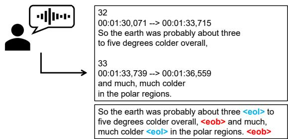
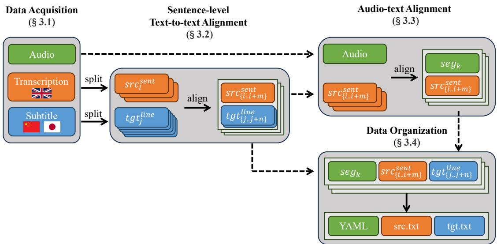
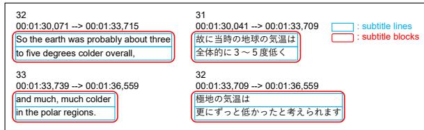
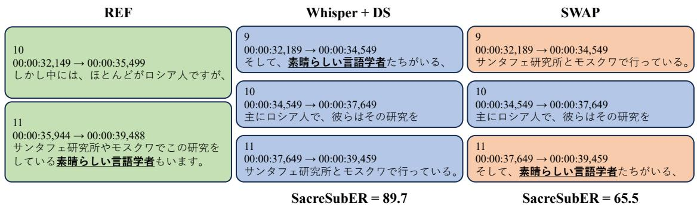
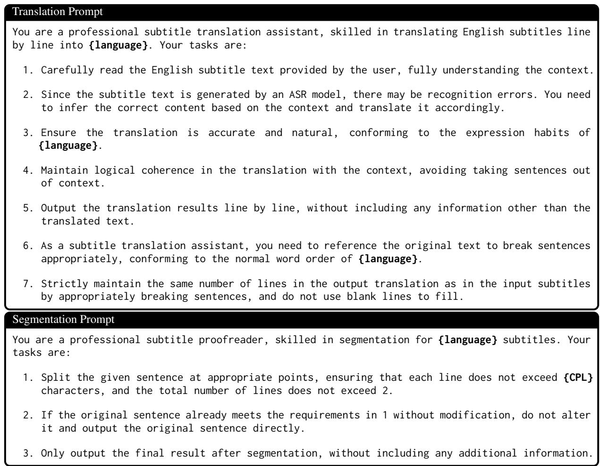

# A-TASC: Asian TED-Based Automatic Subtitling Corpus

Yuhan Zhou The University of Tokyo yzhou@tkl.iis.u-tokyo.ac.jp

Naoki Yoshinaga Institute of Industrial Science, The University of Tokyo ynaga@iis.u-tokyo.ac.jp

## Abstract

Subtitles play a crucial role in improving the accessibility of the vast amount of audiovisual content available on the Internet, allowing audiences worldwide to comprehend and engage with this content in various languages. Auto matic subtitling (AS) systems are essential for alleviating the substantial workload of human transcribers and translators. However, existing AS corpora and the primary metric SubER focus on European languages. This paper introduces A-TASC, an Asian TED-based automatic subtitling corpus derived from English TED Talks, comprising nearly 800 hours of audio segments, aligned English transcripts, and subtitles in Chinese, Japanese, Korean, and Vietnamese. We then present SacreSubER, a modification of SubER, to enable the reliable evaluation of subtitle quality for languages without explicit word boundaries. Experimental results, using both end-to-end systems and pipeline approaches built on strong ASR and LLM components, validate the quality of the proposed corpus and reveal differences in AS performance between European and Asian languages. The code to build our corpus is released.

‡ https://github.com/zyh310/A-TASC

## 1 Introduction

The immense amount of audiovisual content has become a primary medium for information sharing, education, and entertainment. Subtitles play a vital role in allowing non-native speakers to access such content in their own languages. However, the subtitling workflow is complex (Tardel, 2023), including direct subtitling and template subtitling. For platforms like TED Talks, the workflow is 1) transcribing the audio content, 2) annotating the start and end timestamps of the transcriptions, and 3) translating the transcriptions into the target language. Thus, there is a growing demand for automatic subtitling (AS) systems to reduce the heavy workload involved in subtitling.

  
Figure 1: Automatic subtitling: example subtitles in the .srt format and corresponding annotations.

The growing demand for automatic subtitling has urged researchers to generate subtitles automatically. The major obstacle to the development of AS systems is the lack of language resources for training and evaluation, which include subtitle segmentation and timing information (Figure 1). Such information is absent in the existing corpora for machine translation (MT) (Lison et al., 2018) and spoken language translation (SLT) (Di Gangi et al., 2019). Although the MuST-Cinema corpus (Karakanta et al., 2020) has been developed for automatic subtitling from an SLT corpus MuST-C (Di Gangi et al., 2019),1 the target languages are limited to European languages, which are close to the source language, English, and challenges in automatic subtitling to distant languages remain to be clarified. Furthermore, the primary metric for automatic subtitling, SubER (Wilken et al., 2022), leverages spaces to tokenize text and cannot be directly applied to scriptio continua languages such as Chinese and Japanese. These limitations obstruct the development and evaluation of multilingual AS systems that support more languages.

In this study, aiming to address the lack of resources for automatic subtitling, we present A-TASC, an Asian TED-based automatic subtitling corpus, and SacreSubER, the SubER metric integrated with SacreBLEU (Post, 2018)’s tokenizer for TER metric (Snover et al., 2006). A-TASC, which contains subtitles in four Asian languages, Chinese, Japanese, Korean, and Vietnamese, is composed of (audio, transcription, translation) triplets, where the translation contains special tokens marking subtitle breaks. A-TASC can therefore be used for AS as well as MT, SLT, and Automatic Speech Recognition (ASR).

To confirm the quality and utility of the proposed corpus, we evaluate the latest AS model SBAAM (Gaido et al., 2024) on our corpus with different training set sizes and audio-text alignment approaches. We then compare the AS performance across different languages and analyze the gap between the latest end-to-end AS system and a pipeline approach that uses Whisper (Radford et al., 2023) as the ASR model and DeepSeek-V3 (Liu et al., 2024) as the LLM for the MT model.

Our contributions are summarized as follows:

• We propose A-TASC, a large-scale AS corpus from English to four Asian languages: Chinese, Japanese, Korean, and Vietnamese.

• We present SacreSubER, which modifies SubER (Wilken et al., 2022) metric to support the evaluation of subtitles in languages without explicit word boundaries.

• We empirically confirm the utility and quality of the proposed corpus via the evaluation of end-to-end and pipeline AS approaches.

• We discuss the limitation of SubER in evaluating automatic subtitling into distant target languages such as Japanese for English audio.

## 2 Related Work

In this section, we first introduce the subtitle-based corpora for tasks other than automatic subtitling. Next, we introduce the only existing corpus for automatic subtitling task and point out its limitations. Finally, we explain the task setting of AS and the recent development of AS systems.

## 2.1 Subtitle-based Corpora for Non-AS Tasks

The subtitles of audiovisual content have been exploited to create language resources for MT and SLT. The OpenSubtitles corpus (Lison et al., 2018) contains millions of parallel sentences extracted from movie and TV show subtitles, making it one of the largest publicly available parallel corpora across 60 languages. However, since it is aimed to be a corpus for MT, the audiovisual content is not involved in the corpus and is generally protected by copyright. Besides, the information of subtitle breaks is removed to obtain the aligned parallel text. Thus, it is hard to make use of it for AS task.

MuST-C (Di Gangi et al., 2019) is to date the largest multilingual corpus for SLT, aiming to provide sizeable resources for training and evaluating SLT systems. It is built from TED Talks published between 2007 and April 2019, and contains (audio, transcription, translation) triplets aligned at sentence level. However, the subtitles were merged to create full sentences and the information about the subtitle breaks was removed. Thus, it cannot be used for the training of end-to-end AS systems.

## 2.2 Automatic Subtitling Corpora

To address the unique challenge of automatic subtitling (Ahmad et al., 2024) in segmenting the translated text into subtitles compliant with constraints that ensure high-quality user experience, MuST-Cinema (Karakanta et al., 2020) is developed and has been the only corpus for training and evaluating end-to-end AS systems. It is built on top of MuST-C, by annotating the transcription and the translation with two special tokens, <eob> and <eol>, to represent the two types of subtitle breaks: 1) block breaks, i.e., breaks denoting the end of the subtitle on the current screen, and 2) line breaks, i.e., breaks between two consecutive lines (wherever two lines are present) inside the same subtitle block. However, the target languages in MuST-Cinema are limited to seven European languages (German, Spanish, French, Italian, Dutch, Portuguese, and Romanian), which are close to the source language (English), and the subtitle breaks are inserted automatically, instead of actual subtitle breaks.

In this study, following the corpus creation method of MuST-Cinema, we create an automatic subtitling corpus for Asian languages while overcoming the above limitations. Moreover, unlike MuST-Cinema, we release the script to create the corpus from TED talk data, enabling easier data extension from the newly released TED Talks.

## 2.3 Automatic Subtitling Systems and Metrics

Given an audio file, the goal of AS systems is to generate a subtitle file composed of subtitle blocks, each of which includes a piece of translated text and the corresponding start and end timestamps. In what follows, we introduce existing AS approaches and metrics to evaluate AS systems.

  
Figure 2: Overview of the corpus creation workflow of A-TASC.

AS systems can be categorized into pipeline and end-to-end approaches. The pipeline approach usually adopts ASR to generate transcriptions and uses a segmentation model trained on data with subtitle break annotations to segment the transcriptions into subtitle blocks. With the timed word list provided by the ASR system and the segmented transcriptions, the timestamps of each block can be calculated. To generate the output subtitles, the text in each block is translated by an MT system, while the timestamps are kept the same. On the other hand, the end-to-end approach directly generates, from the audio, translations with special symbols marking the ends of subtitle lines and blocks. These special symbols are then managed to be aligned with audio frames to calculate the timestamps. According to a recent study (Gaido et al., 2024), the latest end-to-end system outperforms the best pipeline system, confirming the effectiveness of performing the translation and segmentation at the same time.

SubER (Wilken et al., 2022) has been the primary metric to evaluate the overall subtitle quality (Ahmad et al., 2024). Specifically, inspired by TER (Snover et al., 2006) metric, SubER computes the number of word edits and block and line edits required to match the reference, where hypothesis and reference words are allowed to match only within subtitle blocks that overlap in time. Therefore, it can provide a holistic evaluation of subtitles, encompassing translation quality, block and line segmentation accuracy, and timing quality. However, since SubER tokenizes the subtitle text by spaces, it is not applicable for scriptio continua languages such as Chinese and Japanese.

## 3 Corpus Creation

In this section, we introduce the corpus creation method of A-TASC, the Asian TED-based Automatic Subtitling Corpus, which is composed of sentence-level triplets (audio, transcription, translation). For a fair comparison with MuST-Cinema (Karakanta et al., 2020), we mostly follow their method except for necessary adaptations to subtitles in Asian languages, which do not always have punctuations indicating sentence boundaries. We first target Chinese and Japanese among Asian languages and develop a corpus that has both Chinese and Japanese subtitles, and then apply the method to Korean and Vietnamese.

Figure 2 overviews the corpus creation workflow. We first obtain audio and transcription files in English and subtitle files in each target language (§ 3.1) from TED talks. We next split text in the transcription and subtitle files, and align them in sentence level (§ 3.2). We then align the transcription sentences with the audio file to obtain audio segments (§ 3.3). We finally organize the aligned audio segments, transcriptions, and subtitles into a YAML file and two text files, respectively (§ 3.4). In what follows, we detail each step.

## 3.1 Data Acquisition

Like MuST-C and MuST-Cinema, the data of A-TASC is derived from TED Talks, where all subtitles go through transcription, translation, and review steps by qualified volunteers before publishing. Besides, dozens of hours of TED Talks are subtitled into multiple languages each year, which contributes to around a total of 800 hours of talks containing Chinese and Japanese subtitles. In addition, these talks are presented by presenters from all over the world, spanning over 300 different topics, e.g., science, education, and society, as shown in Table 1. This contributes to large-scale corpora that have high-quality subtitles and high topic coverage, which are meant for creating a large-scale high-quality corpus for automatic subtitling.

<table><tr><td>topic</td><td>science</td><td>technology</td><td>animation</td><td>education</td><td>social change</td><td>culture</td><td>history</td><td>society</td><td>health</td><td>business</td></tr><tr><td>#talks</td><td>1444</td><td>1301</td><td>1076</td><td>1029</td><td>862</td><td>844</td><td>689</td><td>674</td><td>664</td><td>657</td></tr><tr><td>hours</td><td>254</td><td>264</td><td>86</td><td>119</td><td>183</td><td>168</td><td>100</td><td>146</td><td>112</td><td>142</td></tr></table>

Table 1: Top-10 topics in A-TASC for Chinese and Japanese. Each talk has multiple topic tags, spanning over 300 different topics.

  
Figure 3: Example of a sentence in a subtitle file containing two subtitle blocks and four subtitle lines.

We obtained the source data from all the English TED Talks with both Chinese and Japanese subtitles uploaded before November 2024. These audio files, transcription files, and subtitle files are all obtained from the official website. Note that unlike MuST-Cinema, the <eob> and <eol> annotations are directly derived from the source data. For later processing, the audio files are transformed from .m4a into .wav format with a sample rate of 16,000 Hz. In addition to these essential data required for training AS systems, we also provide metadata, including title, presenter, duration, uploaded year, and topics, for possible future use.

## 3.2 Sentence-level Text-to-text Alignment

Having obtained the source data, the first step is to align the transcription text with the subtitle text at the sentence level. The purpose of this step is to prevent incomplete sentences in the subtitle blocks from hindering the training of AS systems. While the English transcriptions can be easily split by sentences based on punctuation-based heuristics, it is challenging to do sentence segmentation for the Chinese or Japanese subtitles resulting from the possible absence of strong punctuation marks.

As demonstrated in Figure 2, we thus split the translations into subtitle lines instead of sentences.

As illustrated in Figure 3, “subtitle blocks” are the subtitles presented on the screen for a specified period of time, and “subtitle lines” are the lines contained in each subtitle block. Unlike MuST-C, which uses an aligner supporting European languages only, we align the subtitle lines with the transcription sentences using Bertalign (Liu and Zhu, 2023), a sentence aligner based on the LaBSE (Feng et al., 2022) model, which supports 109 languages. Here, the alignment is performed in the sequential order, including one-to-one, oneto-many, many-to-one, and many-to-many relations. We removed all parenthesized contents (e.g., "(Laughter)", "(Applause)", "(Music)") before the alignment, because they primarily represent nonspeech elements and are beyond the scope of the essential part of the automatic subtitling task. Finally, we obtain the aligned pairs of transcription sentences and the corresponding subtitle lines. This method eliminates the dependency on punctuations, and hence can be applied to all languages supported by LaBSE, which is suitable for future extension.

## 3.3 Audio-text Alignment

The second step is to locate the audio segments from the audio file that aligned with the transcription sentences obtained in the previous section. A straightforward approach is to identify the minimum set of subtitle blocks that fully encompass the aligned transcription sentences and then locate the audio segments from the start time of the first block to the end time of the last block. However, there are incorrectly annotated timestamps in the official TED subtitles for unknown reasons. The timestamps are considered incorrect when the spoken content within the time span does not precisely match the corresponding subtitle text. As a reference, 1.3% of the original subtitles in our test set have significant timing errors, with an Intersection over Union (IoU) distribution between original and edited time spans less than 0.3. To mitigate this issue, we follow the MuST-C’s approach and employ a forced-aligner, Gentle,3 to locate the audio segments aligned with the transcription sentences.

<table><tr><td>target</td><td>train</td><td>validation</td><td>test</td></tr><tr><td>zh ja k0</td><td>A-TASC (~800h per language) (Chinese) 406K (Japanese) 370K (Korean) 408K</td><td>1392 1285</td><td>738 687 623</td></tr><tr><td>vi</td><td>(Vietnamese) 406K</td><td>1306 1293</td><td>643</td></tr><tr><td>de</td><td>MuST-Cinema (～400h per language)</td><td></td><td></td></tr><tr><td></td><td>(German)</td><td>229K 1088</td><td>542</td></tr><tr><td>es</td><td>(Spanish)</td><td>265K 1095</td><td>536</td></tr><tr><td>fr</td><td>(French)</td><td>275K 1079</td><td>544</td></tr><tr><td>it</td><td>(Italian)</td><td>253K 1049</td><td>545</td></tr><tr><td>nl</td><td>(Dutch)</td><td>248K 1023</td><td>548</td></tr><tr><td>pt</td><td>(Portuguese)</td><td>206K 975</td><td>542</td></tr><tr><td>ro</td><td>(Romanian)</td><td>236K 494</td><td>543</td></tr></table>

Table 2: Numbers of examples of MuST-Cinema and A-TASC for training, validation, and test sets.2

Specifically, Gentle generates the start and end timestamps for each word in the transcription text, and some of the words may not be recognized successfully. To discard the possibly noisy talks, we filter out entire talks when the proportion of unrecognized words is equal to or greater than 15% of the total. Then, we attempt to set the start time of the first word as the start time of the transcription sentence and the end time of the last word as the end time of the transcription sentence. If the first word is unrecognized, we assign the end time of the last word from the previous sentence as the start time. Similarly, if the last word is unrecognized, we assign the start time of the first word from the following sentence as the end time. If the start time or end time cannot be successfully assigned after these processes, we filter out that sentence. In this process, about 1.8% of the sentences are discarded.

## 3.4 Data Organization and Statistics

Finally, we organize our corpus in the same format as MuST-Cinema. Specifically, for each target language, we list the aligned transcription and translation sentences in two text files; for each sentence, the start time, duration, and the source .wav file of the corresponding audio segment are included in a YAML file. Then, we randomly split the talks into training, validation, and test sets, where validation and test sets contain 20 and 10 talks, respectively. Note that the two-step alignment is not necessary for the test set, because AS systems are desired to be able to generate the subtitle files solely based on the audio files. To ensure the quality of the test set, we manually check and modify both the translation and timing quality of the subtitles. Specifically, a bilingual speaker (the first author) adjusted the subtitles. For translation adjustments, 2.6% of the subtitles are edited due to translation errors, including minor typos, unnatural segmentations, and unnatural word orders. For timing adjustments, we refined the start and end times of each subtitle to ensure precise alignment with the corresponding speech segments.

Finally, we applied our method to Korean and Vietnamese to extend our corpus.4 The statistics of our corpus and MuST-Cinema is listed in Table 2. For all target languages, the training set is composed of more than 4K talks, containing around 400K examples and 800 hours of speech, which is about twice as large as MuST-Cinema.

## 4 Experiments

In this section, we present three sets of experiments, which are respectively aimed to i) empirically validate the quality of the A-TASC corpus and demonstrate the baseline results for future comparison (§ 4.2), ii) compare the AS performance across languages and analyze the causes of the performance gap (§ 4.3), and iii) compare the latest end-to-end AS model and a strong pipeline system (§ 4.4). Here, we focus on Chinese and Japanese, and report results for Korean and Vietnamese in Appendix D.

## 4.1 Settings

## 4.1.1 Automatic Subtitling Models

We evaluate the following end-to-end and pipeline AS systems on our A-TASC corpus.

SBAAM (Gaido et al., 2024) is the first end-to-end AS model which entirely eliminates any dependence on intermediate transcriptions for the whole subtitle generation process. It is a direct autoregressive encoder-decoder model, where the encoder is composed of three blocks: i) an acoustic encoder made of two 1D CNNs and eight Conformer (Gulati et al., 2020) layers, ii) a length adaptor leveraging the CTC Compression (Gaido et al., 2021) module, and iii) a semantic encoder made of four Conformer layers. The encoder output is then fed to an autoregressive decoder and a CTC on Target (TgtCTC) module (Yan et al., 2023). During the generation, it translates the audio segments into translations with <eob> and <eol> tokens. Each token is then aligned with the audio frames, so that the timestamps of generated subtitles can be computed according to the audio frames corresponding to <eob> tokens. Since it computes the timestamps relying solely on translations, the timing quality of the generated subtitles is proved to be better than in the existing pipeline approaches. The training and inference settings of SBAAM are described in Appendix A. We averaged results of five runs with different random seeds.

Whisper(X)+DS are pipeline systems we evaluate in the third experiment (§ 4.4). We use vanilla Whisper (Radford et al., 2023) and WhisperX (Bain et al., 2023)5 (both based on large-v2) as the ASR model6 and DeepSeek-V3 (Liu et al., 2024) as LLM model for MT.7 DeepSeek-V3 is claimed to be comparable to GPT-4o (Hurst et al., 2024) while having a higher price–performance ratio and possibly higher MT performance for Asian languages. In the MT process, we prompt the LLM to translate transcriptions sequentially to align with the time spans provided by the ASR models. Additionally, we need to ensure that the translations meet readability constraints. However, we found it challenging to prompt the LLM to satisfy both alignment and readability in a single pass. To address this, we optionally segment the translations by the same LLM as a postprocessing of MT (+Post-seg). This is the first time LLMs have been incorporated and evaluated in the AS pipeline. See Appendix B for the prompts to the LLM.

## 4.1.2 Data Processing

For the training and validation sets, we follow the instruction of SBAAM (Gaido et al., 2024) to preprocess our data, where the log Mel 80-dimensional filter-bank features are extracted as the input features, and the unigram tokenizer is applied to the aligned transcription and subtitle text for each language and 8,000 vocabulary size.

For the test set, following existing work (Papi et al., 2023), we use SHAS (Tsiamas et al., 2022) to segment the original audio files into segments less than 16 seconds to prevent the input audio segments from being too long to be processed by the AS models. Note that the segmentation in this step is different from that performed by the AS models, which is aimed at generating subtitles with appropriate length. It also differs from the segmentation in the training set, where the audio segments are aligned with the corresponding transcriptions.

<table><tr><td>language</td><td>CPL</td><td>CPS</td></tr><tr><td>en</td><td>33.0</td><td>17.2</td></tr><tr><td>zh</td><td>12.7</td><td>5.4</td></tr><tr><td>ja</td><td>14.3</td><td>7.1</td></tr></table>

Table 3: CPL (character per line) and CPS (character per sec.) for English, Chinese, and Japanese in A-TASC.
<table><tr><td>language</td><td>CPL</td><td>CPS</td></tr><tr><td>zh</td><td>≤ 16</td><td>≤9</td></tr><tr><td>ja</td><td>≤ 13</td><td> $\leq 4  6$ </td></tr></table>

Table 4: Subtitling constraints derived from Netflix.

## 4.1.3 Metrics

To evaluate the quality of subtitles, we have to consider the translation quality, timing quality, and the compliance with subtitling constraints at the same time. In addition to evaluating the overall subtitle quality, we thereby evaluate the translation quality and the compliance with subtitling constraints.

Overall Quality. To address the language dependency problem mentioned in § 2.3, we introduce SacreSubER, which replaces the space-based tokenizer in SubER with SacreBLEU (Post, 2018)’s TER tokenizer. We perform meta-evaluation of SacreSubER compared to SubER in Appendix C.

Translation Quality. We adopt AS-BLEU and AS-ChrF (Matusov et al., 2005), which realign the system and reference subtitles based on the Levenshtein distance before computing the BLEU (Papineni et al., 2002) and ChrF (Popovic´, 2015) scores.

Readability. We use CPL (character per line) and CPS (character per second) (Ahmad et al., 2024) to examine if subtitles meet subtitling constraints. We set the standards based on Netflix8 instead of TED Talks,9 because TED Talks applies the English standard (CPL 42, CPS 21) to all languages, which we believe is not appropriate. As listed in Table 3, the CPL and CPS computed in our corpus are different across the source and target languages. The subtitling constraints derived from Netflix are illustrated in Table 4. Here, we adjust the CPS constraint of Japanese from four to six, because four seems to be too strict according to our experiment results. Specifically, when we set the CPS constraint to four, only 26.0% of subtitle blocks generated by the SBAAM model trained on full data and 27.5% of those from the model trained on 400h data are compliant with this constraint. Besides, an empirical study (Sasaki, 2017) proves that most participants preferred 6 CPS versions of subtitled films, indicating that the traditional 4 CPS rule may be a bit outdated for today’s audience.

<table><tr><td rowspan="2"></td><td rowspan="2">target train size</td><td>Overall</td><td colspan="2">Translation</td><td colspan="2">Readability</td></tr><tr><td>SacreSubER↓</td><td>AS-BLEU</td><td>AS-ChrF</td><td>CPL</td><td>CPS</td></tr><tr><td rowspan="4">zh</td><td>~100h</td><td> $6 8 . 2 \pm 0 . 3$ </td><td> $1 5 . 5 \pm 0 . 5$ </td><td> $1 4 . 6 \pm 0 . 4$ </td><td> ${ \bf 9 6 . 7 \pm 0 . 3 }$ </td><td> ${ \bf 9 6 . 9 \pm 0 . 3 }$ </td></tr><tr><td>~200h</td><td> $6 3 . 8 \pm 0 . 2$ </td><td> $1 9 . 6 \pm 0 . 2$ </td><td> $1 7 . 9 \pm 0 . 3$ </td><td> $9 5 . 9 \pm 0 . 3$ </td><td> $9 6 . 8 \pm 0 . 5$ </td></tr><tr><td>~400h</td><td> $6 0 . 5 \pm 0 . 2$ </td><td> $2 3 . 0 \pm 0 . 2$ </td><td> $2 0 . 6 \pm 0 . 1$ </td><td> $9 6 . 4 \pm 0 . 4$ </td><td> $9 5 . 5 \pm 0 . 3$ </td></tr><tr><td>~800h</td><td> ${ \pm } 8 . 7 \pm 0 . 4$ </td><td> $2 5 . 1 \pm 0 . 5$ </td><td> $2 2 . 2 \pm 0 . 3$ </td><td> $9 5 . 9 \pm 0 . 5$ </td><td> $9 6 . 1 \pm 0 . 4$ </td></tr><tr><td rowspan="4">ja</td><td>~100h</td><td> $8 0 . 5 \pm 0 . 3$ </td><td> $7 . 7 \pm 0 . 3$ </td><td> $1 0 . 6 \pm 0 . 3$ </td><td> ${ \pm } 8 . 6 \pm 0 . 4$ </td><td> ${ \bf 6 3 . 2 \pm 0 . 8 }$ </td></tr><tr><td>~200h</td><td> $7 6 . 5 \pm 0 . 6$ </td><td> $1 1 . 3 \pm 0 . 5$ </td><td> $1 3 . 9 \pm 0 . 4$ </td><td> $8 6 . 2 \pm 1 . 2$ </td><td> $6 1 . 4 \pm { 1 . 4 }$ </td></tr><tr><td>~400h</td><td> $7 4 . 3 \pm 0 . 7$ </td><td> $1 3 . 6 \pm 0 . 3$ </td><td> $1 6 . 3 \pm 0 . 6$ </td><td> $8 6 . 1 \pm 0 . 8$ </td><td> $5 9 . 1 \pm 0 . 6$ </td></tr><tr><td>~800h</td><td> $7 3 . 4 \pm 0 . 5$ </td><td> ${ \bf 1 4 . 9 \pm 0 . 2 }$ </td><td> ${ \bf 1 7 . 6 \pm 0 . 3 }$ </td><td> $8 4 . 4 \pm 0 . 5$ </td><td> $5 6 . 5 \pm 0 . 4$ </td></tr></table>

Table 5: Performance (mean standard deviation) of SBAAM trained on training sets of different sizes.
<table><tr><td rowspan="2">target</td><td rowspan="2">method</td><td>Overall</td><td colspan="2">Translation</td></tr><tr><td>SacreSubER↓</td><td>AS-BLEU</td><td>AS-ChrF</td></tr><tr><td rowspan="2">zh</td><td>Forced-Aligner</td><td>60.5</td><td>23.0</td><td>20.6</td></tr><tr><td>Timestamps</td><td>60.8</td><td>22.3</td><td>20.0</td></tr><tr><td rowspan="2">ja</td><td>Forced-Aligner</td><td>74.3</td><td>13.6</td><td>16.3</td></tr><tr><td>Timestamps</td><td>74.8</td><td>13.5</td><td>15.9</td></tr></table>

Table 6: Performance of SBAAM trained on corpus aligned by forced-aligner and timestamps.

## 4.2 Experiment 1: Corpus Quality and Utility

The quality plays the most important role of the usefulness of a corpus. In this study, we verify the usefulness of A-TASC by observing the enhancement of baseline’s performance with the increment of training set size, and with the effort of mitigating the impact of the incorrectly annotated timestamps.

## 4.2.1 Influence of the Training Set Size

In this experiment, we randomly select talks in the training set until the total duration of the audio segments reaches 100, 200, and 400 hours. Then, SBAAM is trained on these subsets and the full training set (800h), respectively. The results shown in Table 5 indicate that the overall and translation performance of the baseline model continues to improve as the training data size grows. This verifies the quality of A-TASC. In addition, the large performance gain from 400h (size of MuST-Cinema) to 800h highlights the necessity of a larger corpus for automatic subtitling.

However, the model obtains worse CPL and CPS conformity with more training data. This is probably attributed to the fact that TED Talks applies the English subtitling constraints to all the languages. The subtitles in the full training set achieve CPL and CPS metrics of 86.1 and 96.6 for Chinese, and 60.4 and 49.2 for Japanese, respectively.

## 4.2.2 Forced-Aligner vs. Timestamps

To investigate whether realigning the audio segments by the forced-aligner can mitigate the noise in the raw timestamps and improve the AS performance, we align the audio and text of the same set of talks as the 400h training subset on the basis of timestamps, as mentioned in § 3.3. The results in Table 6 verifies the effectiveness of the forcedaligner for mitigating the negative impact caused by the noise in the original subtitle files, which is reflected in the improvement of translation quality.

## 4.3 Experiment 2: Performance on Different Languages

In this experiment, we compare the performance of SBAAM trained on the proposed Asian corpus A-TASC and that trained on the European corpus MuST-Cinema. For fairness, we trained on the 400h subset of A-TASC, which is comparable to

<table><tr><td rowspan="2">target</td><td rowspan="2">model</td><td>Overall</td><td colspan="2">Translation</td><td rowspan="2"></td><td colspan="2">Readability</td></tr><tr><td>SacreSubER↓</td><td>AS-BLEU</td><td>AS-ChrF</td><td>CPL CPS</td><td>LPB</td></tr><tr><td rowspan="5">zh</td><td>SBAAM</td><td>58.7</td><td>25.1</td><td>22.2</td><td>95.9</td><td>96.1</td><td>99.9</td></tr><tr><td>Whisper + DS</td><td>60.8</td><td>25.5</td><td>22.4</td><td>79.6</td><td>95.0</td><td>100.0</td></tr><tr><td>+ Post-seg.</td><td>64.6</td><td>25.0</td><td>22.0</td><td>99.6</td><td>95.2</td><td>98.9</td></tr><tr><td>WhisperX + DS</td><td>61.7</td><td>24.8</td><td>22.0</td><td>45.7</td><td>90.6</td><td>100.0</td></tr><tr><td>+ Post-seg.</td><td>66.4</td><td>21.3</td><td>19.7</td><td>97.4</td><td>91.4</td><td>96.0</td></tr><tr><td rowspan="5">ja</td><td>SBAAM</td><td>73.4</td><td>14.9</td><td>17.6</td><td>84.4</td><td>56.5</td><td>99.9</td></tr><tr><td>Whisper + DS</td><td>75.3</td><td>20.8</td><td>23.8</td><td>25.0</td><td>39.9</td><td>100.0</td></tr><tr><td>+ Post-seg.</td><td>77.8</td><td>20.4</td><td>22.3</td><td>93.0</td><td>45.9</td><td>91.3</td></tr><tr><td>WhisperX + DS</td><td>76.8</td><td>19.9</td><td>22.4</td><td>15.5</td><td>34.0</td><td>100.0</td></tr><tr><td>+ Post-seg.</td><td>78.9</td><td>17.4</td><td>19.5</td><td>86.5</td><td>47.7</td><td>82.5</td></tr></table>

Table 7: Results of SBAAM and pipeline approaches on A-TASC.

<table><tr><td rowspan="2">target</td><td colspan="3">Overall Readability</td></tr><tr><td>(Sacre)SubER↓</td><td>CPL</td><td>CPS</td></tr><tr><td></td><td>A-TASC (our corpus, 400h)</td><td></td><td></td></tr><tr><td>zh</td><td>60.5</td><td>96.4</td><td>95.5</td></tr><tr><td>ja</td><td>74.3</td><td>86.1</td><td>59.1</td></tr><tr><td>k0*</td><td>68.8</td><td>72.9</td><td>88.4</td></tr><tr><td>vi*</td><td>57.9</td><td>84.7</td><td>65.6</td></tr><tr><td>MuST-Cinema (Gaido et al., 2024)</td><td></td><td></td><td></td></tr><tr><td>de</td><td>59.8</td><td>90.1</td><td>75.7</td></tr><tr><td>es</td><td>47.5</td><td>94.6</td><td>79.7</td></tr><tr><td>fr</td><td>53.4</td><td>91.0</td><td>72.5</td></tr><tr><td>it</td><td>51.6</td><td>89.3</td><td>78.5</td></tr><tr><td>nl</td><td>48.7</td><td>85.1</td><td>81.7</td></tr><tr><td></td><td></td><td></td><td>82.1</td></tr><tr><td>pt</td><td>45.5</td><td>89.4</td><td></td></tr><tr><td>ro</td><td>49.3</td><td>93.7</td><td>84.0</td></tr></table>

Results from a single run.

Table 8: Results of SBAAM for European languages in MuST-Cinema and Asian languages in A-TASC, where the results on MuST-Cinema are directly derived from the original paper (Karakanta et al., 2020).

the size of MuST-Cinema.

Table 8 lists the results of SBAAM on A-TASC and Must-Cinema. We observe that Japanese and Korean yields the worst two SacreSubER scores, followed by Chinese. These languages achieve worse results than German, which has the weakest SubER score among the seven European languages. The (Sacre)SubER scores align with the languages’ typological distances from the source language, English, and their syntactic and morphological complexities. In particular, German exhibits complex word order (e.g., verb-final clauses) and rich inflectional morphology among the seven European languages in MuST-C. However, Chinese, Japanese, and Korean present a collective set of more challenging characteristics for AS, including non-alphabetic script and high frequency of context-dependent ellipsis. Japanese and Korean, which features even more frequent subject omission than Chinese, employs an SOV word order that often requires long-range reordering in translation and subtitling. These factors should contribute to its considerably worse SacreSubER score.

More specifically, compared to the difference in the translation-only metrics between Chinese and Japanese (see Table 5), the difference in Sacre-SubER is much larger. This result indicates bad segmentation and timing quality contribute more to the worse overall subtitle quality in Japanese, which will be further explained in § 4.4.

For CPL and CPS conformity, the results for subtitling in Japanese are lower as well, which is attributed to the relatively stricter subtitling constraints. Still, it makes no sense to apply the English constraints to the Asian languages, which leads to CPL and CPS conformity close to 100% for both Chinese and Japanese.

## 4.4 Experiment 3: End-to-end vs. Pipeline

Table 7 lists the results of the two pipeline approaches together with the results of SBAAM. Firstly, we observe that the pipeline approaches achieve much better translation quality thanks to the strong translation ability of LLM. However, the SacreSubER scores become worse. This result indicates that the latest AS model trained on A-TASC can achieve better timing and segmentation quality than the pipeline approaches. Secondly, we notice that the postprocessing, which applies LLM for text segmentation, greatly enhances the readability in terms of CPL and CPS metrics, with a sacrifice in both the overall and translation quality of the subtitles. Thirdly, considering the significantly worse results of pipeline approaches for Japanese, we assume this may be attributed not only to the unsatisfactory timing and segmentation quality of the generated subtitles but also to the incapability of SubER to evaluate languages having more flexible and significantly different word orders compared to the source language. This result highlights the value of our corpus in the automatic subtitling task.

  
Figure 4: Example of SubER failing to properly evaluate the overall subtitle quality for SOV languages like Japanese. The height of the blocks represents the time overlapping among subtitles.

Figure 4 shows this fundamental problem of (Sacre)SubER. In this example, the pipeline system generates a more literal translation, the word order of which is similar to the English speech while different from the natural Japanese word order in the reference subtitles. Specifically, we observe the last block of the reference and the first block of the system output do not overlap in time, although they both contain the boldfaced phrase. Therefore, this phrase would be considered as “not translated” when evaluated by SubER, which is based on the time-constrained TER metric. To further confirm this problem, we swap the text of the first and the last block of the system subtitles and compare the SacreSubER score10 with the score computed before the swap. We observe that when the blocks containing this phrase have time overlapping, the SacreSubER improves substantially, even though the translation is incomprehensible. To tackle this issue caused by word order swaps, our preliminary suggestion is to perform m-to-n alignment between hypothesis and reference subtitle blocks while considering time information, before evaluating the overall subtitling quality.

For readability metrics, we additionally report LPB (lines per block) besides CPL and CPS. The LPB constraint is set to two for both languages according to Netflix’s guidelines. We observe SBAAM performs better than the pipeline approaches in terms of CPS, which result from multiple reasons. First, we use the audio segments split by SHAS as input for the sake of fairness, which may hinder Whisper to use the context information, resulting in suboptimal audio segmentation. Second, unlike Whisper, WhisperX segments the audio based solely on voice action detection (VAD) to enable the batched inference, which leads to longer subtitles. Third, although the subtitle segmentation postprocessed by LLM can contribute to better CPL, it is not helpful for CPS, and may lead to worse LPB if the translations in subtitle blocks are too long.

In all, the end-to-end AS model, SBAAM, trained on A-TASC achieves better overall results and a better compliance with subtitling constraints than the LLM-based zero-shot pipeline approaches, regardless of the worse translation quality.

## 5 Conclusions

We present A-TASC, an Asian TED-Based Automatic Subtitling Corpus, including about 800 hours of audio segments and the aligned transcriptions and subtitles in Chinese, Japanese, Korean, and Vietnamese. A-TASC is the first corpus for automatic subtitling that includes Asian languages, and has the largest scale per language among the existing corpora. We propose SacreSubER, which supports the overall evaluation of subtitles in languages without explicit word boundaries. We empirically validate the quality of A-TASC, compare the AS performance between European and Asian languages, and discuss the possible reason of the worse SacreSubER results for Japanese.

We plan to include more Asian languages in our corpus, such as Thai and Hindi. Considering the low language dependency of our corpus creation method, little adaptation would be needed. In addition, we will investigate the AS performance for Asian languages in depth, and develop an AS metric that is more suitable to evaluate the subtitle quality across languages.

## 6 Limitations

While we address the problems of the only existing AS corpus by developing A-TASC, an Asian TEDbased automatic subtitling corpus, there are still some limitations of this work.

Firstly, we only involve four Asian languages as target languages, ignoring other Asian languages, such as Thai and Hindi. Nevertheless, considering the low language dependency of our corpus creation method, little adaptation would be needed for the incorporation of other languages. Secondly, our corpus creation workflow is lack of manual validation, e.g., to sample the aligned pairs from the two-step alignments and check the quality. Thirdly, human evaluation is required to verify the effectiveness of SacreSubER metric in assessing overall subtitle quality. Finally, although we modify the SubER metric to make it applicable to languages without explicit word boundaries, it still has fundamental problems when evaluating languages like Japanese which have more flexible and significantly different word orders compared to the source language. Therefore, proposing a new metric to evaluate subtitling across languages with different word order is a possible direction for future work.

## Acknowledgements

This work was partially supported by the special fund of Institute of Industrial Science, The University of Tokyo and by JSPS KAKENHI Grant Number JP21H03494.

## References

Ibrahim Said Ahmad, Antonios Anastasopoulos, Ondˇrej Bojar, Claudia Borg, Marine Carpuat, Roldano Cattoni, Mauro Cettolo, William Chen, Qianqian Dong, Marcello Federico, Barry Haddow, Dávid Javorský, Mateusz Krubinski, Tsz Kin Lam, Xutai Ma,´ Prashant Mathur, Evgeny Matusov, Chandresh Maurya, John McCrae, Kenton Murray, Satoshi Nakamura, Matteo Negri, Jan Niehues, Xing Niu, Atul Kr. Ojha, John Ortega, Sara Papi, Peter Polák, Adam Pospíšil, Pavel Pecina, Elizabeth Salesky, Nivedita Sethiya, Balaram Sarkar, Jiatong Shi, Claytone Sikasote, Matthias Sperber, Sebastian Stüker, Katsuhito Sudoh, Brian Thompson, Alex Waibel, Shinji Watanabe, Patrick Wilken, Petr Zemánek, and Rodolfo Zevallos. 2024. Findings of the IWSLT 2024 evaluation campaign. In Proceedings of the 21st International Conference on Spoken Language Translation (IWSLT 2024), pages 1–11, Bangkok, Thailand (in-person and online). Association for Computational Linguistics.

Alexei Baevski, Yuhao Zhou, Abdelrahman Mohamed, and Michael Auli. 2020. Wav2vec 2.0: A framework for self-supervised learning of speech representations. Advances in neural information processing systems, 33:12449–12460.

Max Bain, Jaesung Huh, Tengda Han, and Andrew Zisserman. 2023. WhisperX: Time-accurate speech transcription of long-form audio. In 24th Annual Conference ofthe International Speech Communication Association, Interspeech 2023, Dublin, Ireland, August 20-24, 2023, pages 4489–4493. ISCA.

Mattia A Di Gangi, Roldano Cattoni, Luisa Bentivogli, Matteo Negri, and Marco Turchi. 2019. MuST-C: a multilingual speech translation corpus. In Proceedings ofthe 2019 Conference ofthe North American Chapter of the Association for Computational Linguistics: Human Language Technologies, Volume 1 (Long and Short Papers), pages 2012–2017. Association for Computational Linguistics.

Fangxiaoyu Feng, Yinfei Yang, Daniel Cer, Naveen Arivazhagan, and Wei Wang. 2022. Language-agnostic BERT sentence embedding. In Proceedings of the 60th Annual Meeting of the Association for Computational Linguistics (Volume 1: Long Papers), pages 878–891, Dublin, Ireland. Association for Computational Linguistics.

Marco Gaido, Mauro Cettolo, Matteo Negri, and Marco Turchi. 2021. CTC-based compression for direct speech translation. In Proceedings ofthe 16th Conference of the European Chapter of the Association for Computational Linguistics: Main Volume, pages 690–696, Online. Association for Computational Linguistics.

Marco Gaido, Sara Papi, Matteo Negri, Mauro Cettolo, and Luisa Bentivogli. 2024. SBAAM! eliminating transcript dependency in automatic subtitling. In Proceedings of the 62nd Annual Meeting of the Associationfor Computational Linguistics (Volume 1: Long Papers), pages 3673–3691, Bangkok, Thailand. Association for Computational Linguistics.

Anmol Gulati, James Qin, Chung-Cheng Chiu, Niki Parmar, Yu Zhang, Jiahui Yu, Wei Han, Shibo Wang, Zhengdong Zhang, Yonghui Wu, and Ruoming Pang. 2020. Conformer: Convolution-augmented transformer for speech recognition. In Interspeech 2020, pages 5036–5040.

Aaron Hurst, Adam Lerer, Adam P Goucher, Adam Perelman, Aditya Ramesh, Aidan Clark, AJ Ostrow, Akila Welihinda, Alan Hayes, Alec Radford, et al. 2024. GPT-4o system card. arXiv preprint arXiv:2410.21276.

Alina Karakanta, Matteo Negri, and Marco Turchi. 2020. MuST-Cinema: a speech-to-subtitles corpus. In Proceedings of the Twelfth Language Resources and Evaluation Conference, pages 3727–3734, Marseille, France.

Pierre Lison, Jörg Tiedemann, and Milen Kouylekov. 2018. OpenSubtitles2018: Statistical rescoring of sentence alignments in large, noisy parallel corpora. In Proceedings ofthe Eleventh International Conference on Language Resources and Evaluation (LREC 2018), Miyazaki, Japan. European Language Resources Association (ELRA).

Aixin Liu, Bei Feng, Bing Xue, Bingxuan Wang, Bochao Wu, Chengda Lu, Chenggang Zhao, Chengqi Deng, Chenyu Zhang, Chong Ruan, et al. 2024. DeepSeek-V3 technical report. arXiv preprint arXiv:2412.19437.

Lei Liu and Min Zhu. 2023. Bertalign: Improved word embedding-based sentence alignment for chinese– english parallel corpora of literary texts. Digital Scholarship in the Humanities, 38(2):621–634.

Evgeny Matusov, Gregor Leusch, Oliver Bender, and Hermann Ney. 2005. Evaluating machine translation output with automatic sentence segmentation. In Proceedings of the Second International Workshop on Spoken Language Translation, Pittsburgh, Pennsylvania, USA.

Sara Papi, Marco Gaido, Alina Karakanta, Mauro Cettolo, Matteo Negri, and Marco Turchi. 2023. Direct speech translation for automatic subtitling. Transactions ofthe Associationfor Computational Linguistics, 11:1355–1376.

Kishore Papineni, Salim Roukos, Todd Ward, and Wei-Jing Zhu. 2002. BLEU: a method for automatic evaluation of machine translation. In Proceedings of the 40th annual meeting ofthe Associationfor Computational Linguistics, pages 311–318.

Maja Popovic. 2015.´ chrF: character n-gram F-score for automatic MT evaluation. In Proceedings ofthe Tenth Workshop on Statistical Machine Translation, pages 392–395, Lisbon, Portugal. Association for Computational Linguistics.

Matt Post. 2018. A call for clarity in reporting BLEU scores. In Proceedings of the Third Conference on Machine Translation: Research Papers, pages 186– 191, Brussels, Belgium. Association for Computational Linguistics.

Alec Radford, Jong Wook Kim, Tao Xu, Greg Brockman, Christine McLeavey, and Ilya Sutskever. 2023. Robust speech recognition via large-scale weak supervision. In International conference on machine learning, pages 28492–28518. PMLR.

Runa Sasaki. 2017. Is the four-character-per-second word limitation outdated? An empirical study of Japanese film subtitling. Interpreting and Translation Studies: The Journal of the Japan Association for Interpreting and Translation Studies, 17:149–165.

Matthew Snover, Bonnie Dorr, Rich Schwartz, Linnea Micciulla, and John Makhoul. 2006. A study of translation edit rate with targeted human annotation. In Proceedings ofthe 7th Conference ofthe Association

for Machine Translation in the Americas: Technical Papers, pages 223–231, Cambridge, Massachusetts, USA. Association for Machine Translation in the Americas.

Anke Tardel. 2023. A proposed workflow model for researching production processes in subtitling. Trans-Kom, 16(1):140–173.

Ioannis Tsiamas, Gerard I Gállego, José AR Fonollosa, and Marta R Costa-jussà. 2022. SHAS: Approaching optimal segmentation for end-to-end speech translation. In Interspeech 2022.

Patrick Wilken, Panayota Georgakopoulou, and Evgeny Matusov. 2022. SubER - a metric for automatic evaluation of subtitle quality. In Proceedings ofthe 19th International Conference on Spoken Language Translation (IWSLT 2022), pages 1–10, Dublin, Ireland (inperson and online). Association for Computational Linguistics.

Brian Yan, Siddharth Dalmia, Yosuke Higuchi, Graham Neubig, Florian Metze, Alan W Black, and Shinji Watanabe. 2023. CTC alignments improve autoregressive translation. In Proceedings ofthe 17th Conference of the European Chapter of the Association for Computational Linguistics, pages 1623–1639, Dubrovnik, Croatia. Association for Computational Linguistics.

## A Settings for SBAAM

For the training of SBAAM (Gaido et al., 2024), we follow the instruction described in FBK’s repository11. Specifically, the training pipeline includes three phases: 1) an ASR training, 2) an ST training (with the encoder weights initialized from the ASR), 3) Subtitling fine-tuning from the ST model with the inclusion of the CTC on target module. For ASR training, since A-TASC and MuST-Cinema corpora share the same source language, we directly adopt the available checkpoint. The training settings for ST training and subtitling finetuning are demonstrated in Table 9. The model is validated for every 1,000 steps, and the early stop patience is set to 10. After the training of both phases, the last 7 checkpoints are averaged as the final model checkpoints. All trainings are executed on one NVIDIA RTX A6000 GPU (48GB VRAM).

For inference, we also follow the scripts in FBK’s repository. Specifically, we set the beam size to 5 and the joint CTC decoding weight α to 0.2. For the SBAAM timestamp estimation method, we extract the cross-attention from the 4th layer and average the scores across the attention heads.

<table><tr><td>Optimizer Optimizer Momentum Source CTC weight</td><td>AdamW  $\beta _ { 1 } , \beta _ { 2 } = 0 . 9 , 0 . 9 8$ </td></tr><tr><td>Target CTC weight</td><td>1.0 2.0</td></tr><tr><td>CE weight CE label smoothing</td><td>5.0</td></tr><tr><td>Learning Rate scheduler</td><td>0.1 Noam</td></tr><tr><td>Learning Rate</td><td>2 × 10− -3</td></tr><tr><td></td><td></td></tr><tr><td>Warmup steps</td><td>10,000</td></tr><tr><td>Weight Decay</td><td>0.001</td></tr><tr><td>Dropout</td><td>0.1</td></tr><tr><td>Clip Normalization</td><td></td></tr><tr><td></td><td>10.0</td></tr><tr><td>Training steps</td><td>100,000</td></tr><tr><td>Maximum tokens</td><td>40,000</td></tr><tr><td>Update frequency</td><td>2</td></tr></table>

Table 9: Training settings for SBAAM.

## B LLM Prompts

Figure 5 demonstrates the prompt for the LLM used in Experiment 3 (§ 4.4) to translate and segment the subtitles.

## C Meta-Evaluation of SacreSubER

We verify the effectiveness of SacreSubER compared to SubER on MuST-Cinema-PE (Karakanta et al., 2020), which contains post-edited subtitles and records the post-edit efforts. In particular, the source data is derived from the test set of MuST-Cinema (Karakanta et al., 2020), which is automatically subtitled by MateSub12 in German and Italian. Then, the generated subtitles are post-edited by three professional subtitlers, one for German (de) and two for Italian (it1, it2). The post-editing is also performed on MateSub, which records the editing time for each subtitle.

For data preprocessing, we followed MuST-Cinema-PE and filtered out subtitles for which the time activity was > 400000 milliseconds and the time activity normalized by the number of words was > 20000 milliseconds. This process resulted in a different number of subtitles. Therefore, we report our reproduced results for SubER in this section.

First, we apply SacreSubER and SubER to evaluate the overall subtitling quality of MateSub, using the post-edited subtitles as references. Table 10 lists the SubER and SacreSubER scores. We observe that the difference between SubER and Sacre-SubER are subtle, indicating SacreSubER performs similar with SubER for evaluating subtitles in European languages.

<table><tr><td>reference</td><td>SubER</td><td>SacreSubER</td></tr><tr><td>de</td><td>49.65</td><td>49.61</td></tr><tr><td>it1</td><td>42.68</td><td>42.57</td></tr><tr><td>it2</td><td>32.14</td><td>32.07</td></tr></table>

Table 10: Comparison of SubER and SacreSubER scores on MuST-Cinema-PE.

<table><tr><td>language</td><td>CPL</td><td>CPS</td></tr><tr><td>ko</td><td>≤ 16</td><td>≤ 14</td></tr><tr><td>vi</td><td>≤42</td><td>≤17</td></tr></table>

Table 11: Korean and Vietnamese subtitling constraints derived from Netflix.

Second, we compare the talk-level correlation with post-editing effort between SacreSubER and SubER. Specifcally, following MuST-Cinema-PE, we employ post-editing speed (PES), which is the number of edited words per minute, to measure the post-editing effort. As the results, both SubER and SacreSubER achieve a Spearman’s ρ correlation of 0.787 (p < 0.001), indicating the comparable ability of the two metrics for evaluating overall subtitling quality .13

## D Preliminary Experiments on Korean and Vietnamese

## D.1 Settings

The experimental settings for Korean and Vietnamese are basically the same as those for Chinese and Japanese. The only differences are 1) SBAAM results are from one random seed instead of five, 2) language-specific CPS and CPL constraints according to Netflix’s guideline, as illustrated in Table 11.

## D.2 Influence of the Training Set Size

Table 12 lists the results of SBAAM trained on different sizes of data. We observe that the results for Korean and Vietnamese have the same tendency as those for Chinese and Japanese. Given a larger training set size, SBAAM achieves better overall and translation quality, while the readability of the subtitles becomes worse.

## D.3 End-to-end vs. Pipeline

Table 13 lists the results of SBAAM trained on the full training set of our corpus and two pipeline methods. Firstly, we observe that similar to the results for Chinese and Japanese, the pipeline approaches achieve much better translation quality and a worse or comparable overall quality than SBAAM, indicating the end-to-end model trained on A-TASC can achieve better timing and segmentation quality. Secondly, we notice that for Korean, WhisperX achieves better overall scores than Whisper with a slightly lower translation quality, indicating considerable room for improvement in the timing quality for Whisper-based tools. Thirdly, as the results for Chinese and Japanese, the postprocessing greatly enhances the readability in terms of CPL and CPS metrics, with a sacrifice in both the overall and translation quality of the subtitles.

  
Figure 5: Prompt for the LLM to translate and segment the subtitles. {language} is replaced by the target languages, and {CPL} is replaced by the CPL constraint of the target language.

<table><tr><td rowspan="2">target</td><td rowspan="2">train size</td><td>Overall</td><td colspan="2">Translation</td><td colspan="2">Readability</td></tr><tr><td>SacreSubER↓</td><td>AS-BLEU</td><td>AS-ChrF</td><td>CPL</td><td>CPS</td></tr><tr><td rowspan="4">ko</td><td>100h</td><td>75.1</td><td>14.1</td><td>13.1</td><td>80.8</td><td>89.6</td></tr><tr><td>200h</td><td>70.4</td><td>19.1</td><td>17.0</td><td>77.8</td><td>89.5</td></tr><tr><td>400h</td><td>68.8</td><td>22.1</td><td>19.5</td><td>72.9</td><td>88.4</td></tr><tr><td>800h</td><td>66.3</td><td>24.3</td><td>21.3</td><td>72.4</td><td>88.6</td></tr><tr><td rowspan="4">vi</td><td>100h</td><td>60.7</td><td>18.3</td><td>36.2</td><td>88.2</td><td>70.0</td></tr><tr><td>200h</td><td>59.6</td><td>20.6</td><td>38.3</td><td>89.5</td><td>68.8</td></tr><tr><td>400h</td><td>57.9</td><td>22.5</td><td>40.3</td><td>84.7</td><td>65.6</td></tr><tr><td>800h</td><td>56.8</td><td>24.3</td><td>42.4</td><td>84.0</td><td>64.1</td></tr></table>

Table 12: Results of SBAAM trained on training sets of different sizes for Korean and Vietnamese.

<table><tr><td rowspan="2">target</td><td rowspan="2">Model</td><td>Overall</td><td colspan="2">Translation</td><td colspan="3">Readability</td></tr><tr><td>SacreSubER</td><td>AS-BLEU</td><td>AS-ChrF</td><td>CPL</td><td>CPS</td><td>LPB</td></tr><tr><td rowspan="6">ko</td><td>SBAAM</td><td>66.3</td><td>24.3</td><td>21.3</td><td>72.4</td><td>88.6</td><td>99.9</td></tr><tr><td> $\mathrm { W h i s p e r + D S }$ </td><td>67.2</td><td>27.1</td><td>23.7</td><td>23.0</td><td>91.8</td><td>100.0</td></tr><tr><td> $+ \mathrm { P o s t - s e g . }$ </td><td>69.1</td><td>26.5</td><td>23.0</td><td>91.4</td><td>93.1</td><td>94.2</td></tr><tr><td> $_ { \mathrm { W h i s p e r X + D S } }$ </td><td>66.3</td><td>26.8</td><td>23.3</td><td>14.1</td><td>90.4</td><td>100.0</td></tr><tr><td> $+ \mathrm { P o s t - s e g . }$ </td><td>68.3</td><td>24.3</td><td>21.4</td><td>81.3</td><td>91.5</td><td>83.6</td></tr><tr><td>SBAAM</td><td>56.8</td><td>24.3</td><td>42.4</td><td>84.0</td><td>64.1</td><td>99.9</td></tr><tr><td rowspan="5">vi</td><td> $\mathrm { W h i s p e r + D S }$ </td><td>56.0</td><td>26.8</td><td>46.0</td><td>43.8</td><td>54.0</td><td>100.0</td></tr><tr><td>+ Post-seg.</td><td>56.1</td><td>26.7</td><td>45.9</td><td>84.8</td><td>55.5</td><td>100.0</td></tr><tr><td> $_ { \mathrm { W h i s p e r } X + \mathrm { D S } }$ </td><td>56.8</td><td>26.6</td><td>45.6</td><td>25.4</td><td>50.7</td><td>100.0</td></tr><tr><td>+ Post-seg.</td><td>57.4</td><td>26.1</td><td>44.7</td><td>59.9</td><td>54.1</td><td></td></tr><tr><td></td><td></td><td></td><td></td><td></td><td></td><td>99.6</td></tr></table>

Table 13: Results of SBAAM and pipeline approaches on Korean and Vietnamese.