# ANDROIDGEN: Building an Android Language Agent under Data Scarcity

Hanyu Lai<sup>1</sup>∗†, Junjie Gao<sup>3</sup>∗†, Xiao Liu<sup>1,2</sup>∗, Yifan Xu<sup>1</sup>†, Shudan Zhang<sup>1</sup>†, Yuxiao Dong<sup>1</sup>, Jie Tang<sup>1</sup>‡

<sup>1</sup> Tsinghua University <sup>2</sup> Zhipu AI <sup>3</sup> MBZUAI

## Abstract

Large language models have opened up a world of possibilities for various NLP tasks, sparking optimism for the future. Despite their potential, LLMs have yet to be widely used as agents on real mobile devices. The main challenge is the need for high-quality data sources. Time constraints and labor intensity often hinder human annotation. On the other hand, existing LLMs exhibit inadequate completion rates and need a robust data filtration strategy. Given these challenges, we develop a framework called ANDROIDGEN to enhance the capabilities of LLM-based agents under data scarcity. In addition, we leverage AN-DROIDGEN to collect trajectories given human tasks and train open-source LLMs on these trajectories to develop an open-source mobile agent without manually labeled trajectories. We extensively evaluate ANDROIDGEN with AndroidWorld, AitW, and various popular applications, demonstrating its improvements and revealing potential areas for future improvement. Code, model, and data are available at https://github.com/THUDM/AndroidGen.

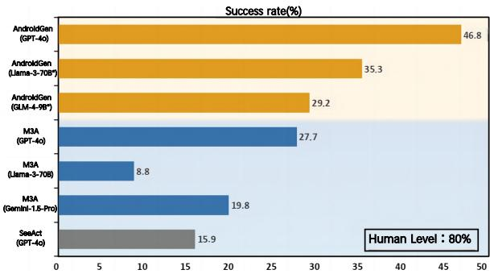  
Figure 1: The success rates of popular mobile agents and humans on AndroidWorld.

## 1 Introduction

With the advancements in large language models (LLMs) (Achiam et al., 2023; Touvron et al., 2023a,b; GLM et al., 2024; Zeng et al., 2022; Zhang et al., 2022; Scao et al., 2022; Team et al., 2023), the capabilities of AI have significantly expanded, reshaping our understanding of it. These developments have heightened expectations for LLMs to act as intelligent agents and autonomously handle various tasks. The emergence of mobile agents, primarily through pervasive smartphones, symbolizes a significant shift, revolutionizing human-technology interactions and extending the boundaries of machine-driven productivity (Xi et al., 2023; Wang et al., 2023a; Liu et al., 2023b).

However, despite various attempts at mobile agents have achieved considerable success (Baechler et al., 2024; Chen and Li, 2024; Cheng et al., 2024; Hong et al., 2023), practical applications still face challenges. For instance, agents often fail when encountering complex tasks or unfamiliar scenarios. Additionally, collecting extensive data on digital agents in real environments remains a significant unresolved challenge. Unlike traditional conversational datasets, data collection for digital environments presents the following difficulties:

• Scenario Diversity: Different scenarios exhibit substantial variability, posing significant challenges to LLMs’ generalization capabilities (Lai et al., 2024). Consequently, the collection of tasks must encompass a wide range of diverse scenes and functionalities.

• Complex Task Data Collection: For complex tasks involving multiple requirements, data collection typically entails numerous steps, necessitating robust planning abilities and precise execution (Zhou et al., 2023; Rawles et al., 2024). This process often leads to increased costs and lower completion rates.

• Data Filtration: Effective data quality control demands meticulously examining the environments and operations to ensure full compliance with the task description. This process is both challenging and time-consuming, thereby further augmenting overall expenditures.

Task 2: Sent a text message using Simple SMS Messenger to +16597910719 with message: Beauty is in the eye of the beholder.  
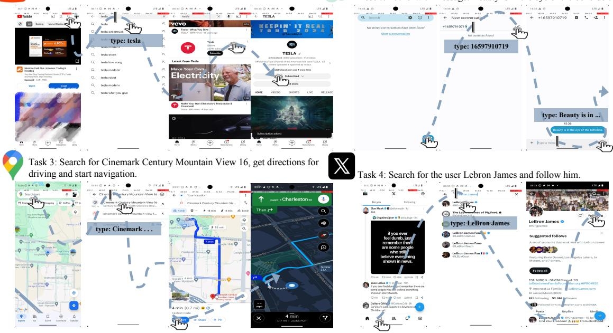  
Figure 2: Examples of ANDROIDGEN’s execution on four user tasks.

Currently, prevalent methods of manual and automated data collection (Wang et al., 2022; Honovich et al., 2022; Peng et al., 2023; Mukherjee et al., 2023) face significant challenges. Manual annotation requires considerable time and financial resources, making collecting large volumes of high-quality trajectory data challenging. On the other hand, utilizing advanced LLMs to accomplish tasks automatically is a potential method (Xu et al., 2023; Luo et al., 2023; Meng et al., 2022; Lai et al., 2024). However, even state-of-the-art LLMs like GPT-4 (Achiam et al., 2023) and Gemini (Team et al., 2023) still result in an unacceptably low success rate. Moreover, no effective automated solution selects high-quality, successful outcomes.

Inspired by these challenges, we build an agent framework, ANDROIDGEN, designed to enhance the agent capabilities of LLMs in Android environments, particularly effective in scenarios where high-quality training data is scarce. ANDROIDGEN includes four modules: ExpSearch, ReflectPlan, AutoCheck, and StepCritic.

• ExpSearch enables LLMs to perform in-context learning through completed similar trajectories, thereby improving agent capabilities and facilitating generalization from simpler tasks to more complex ones through these samples.

• ReflectPlan enables self-reflection on the current environment and updates the plan’s status, thus enhancing the agent’s long-term reasoning capabilities.

• AutoCheck proactively verifies the validity of each agent’s operation, mitigating the risk of task failure due to operation errors.

• StepCritic decomposes tasks into sub-goals and provides step-by-step trajectories evaluation, offering fine-grained labels for model optimization.

We leverage ANDROIDGEN and LLMs to construct a robust Android agent under data scarcity. It can also serve as a pipeline to generate extensive browsing trajectories without human annotation. Furthermore, we introduce a data algorithm utilizing the fine-grained labels from StepCritic to filter and augment the data, thus creating a highquality dataset for Android navigation agents. By fine-tuning open-source LLMs with this dataset, we develop a strong open-source Android agent without manually labeled trajectories.

To validate its effectiveness, we test ANDROID-GEN on various Android benchmarks, including AndroidWorld (Rawles et al., 2024), AitW (Rawles et al., 2023), and our popular Android app benchmark. The results demonstrate the design advantages of ANDROIDGEN, particularly regarding reasoning capabilities, operational accuracy, and generalization ability. These findings underscore the potential of ANDROIDGEN as a versatile and efficient tool in the mobile application.

In summary, our contributions are as follows:

• We develop ANDROIDGEN, a novel Android agent framework, including ExpSearch, Reflect-Plan, and AutoCheck to enhance the agent’s reasoning capabilities and operation accuracy and empower it to generalize to complex tasks.

• We introduce StepCritic for mobile devices providing fine-grained agent trajectories evaluation.

• We employ ANDROIDGEN to generate extensive trajectories and propose a data algorithm to construct a high-quality dataset. We then train opensource LLMs on this dataset to develop a robust open-source Android language agent.

• We conduct evaluations of ANDROIDGEN against several baselines across various Android benchmarks, demonstrating the improvements of ANDROIDGEN over existing systems and identifying potential avenues for future research.

## 2 Related Work

Large Language Models. Large language models (LLMs), such as GPT-4 (Achiam et al., 2023), Gemini (Team et al., 2023), Claude-2 (Anthropic, 2023), the Llama series (Touvron et al., 2023a), the ChatGLM series (Zeng et al., 2022; Du et al., 2022), OPT (Zhang et al., 2022), and BLOOM (Scao et al., 2022), have demonstrated remarkable capabilities in knowledge and language understanding, sparking a lot of research interest.

In-Context Learning. LLMs have shown emergent abilities such as in-context learning (Brown et al., 2020; Schick and Schütze, 2020) when the scale expands to a certain level. APE (Zhou et al., 2022) introduces an iterative search methodology to optimize prompts autonomously. EPR (Rubin et al., 2022) retrieves relevant examples from a fixed dataset and incorporates these examples into the prompt to enhance response quality. These approaches leverage manual or static searching to perform in-context learning, restricting dynamic self-improvement within interactive environments.

Mobile Agents. With LLMs continually surpassing expectations, numerous efforts have integrated them within digital environments (Nakano et al., 2021; Liu et al., 2023a; Mei et al., 2024). Mobile phones represent typical environments for integration, given their pervasive role in daily life. AppAgent (Yang et al., 2023b) develops a multimodal framework allowing smartphones to learn and perform complex tasks through human-like interactions. Mobile-Agent (Wang et al., 2024) autonomously navigates and operates within app interfaces using visual perception, adapting across various mobile environments without XML. See-Act (Zheng et al., 2024) leverages GPT-4V to act upon human instructions on websites, significantly surpassing text-only models when manually grounded. These agents rely on closed-source LLMs, often overlooking crucial aspects such as affordability, reproducibility, and transparency in complex interactive tasks.

Machine Reasoning and Planning. To qualify as a robust agent, one must possess strong reasoning capabilities. The dual-system theory (Daniel, 2017) shed light on the cognitive processes in human thinking. Chain-of-Thought (Wei et al., 2022) enables LLMs to think, enhancing their reasoning abilities. ReAct (Yao et al., 2022) leverages LLMs to produce reasoning processes and actions, facilitating greater synergy. Several works (Yin et al., 2024; Wang et al., 2023b; Xie et al., 2023) focus on task decomposition through subgoal generation with LLMs, improving the planning capabilities. However, these planning techniques do not reflect the plan’s progress based on the environment and execution outcomes. Consequently, they may not be well-suited for complex multi-round scenarios.

Benchmarks of Mobile Agents. The primary Android benchmarking approach relies on Android emulators, where agents attempt to complete various daily user tasks. AITW (Xing et al., 2024) provides a training dataset and offline evaluation metrics, utilizing automated partial match calculations to assess trajectory correctness. AndroidArena (Xing et al., 2024), on the other hand, offers an emulator-based evaluation environment and employs the longest common subsequence to measure task completion rates. AndroidWorld (Rawles et al., 2024) provides automated evaluation metrics for each task, resulting in a more precise task completion determination.

Autonomous Evaluation. Pan et al. (Pan et al., 2024) and DigiRL (Bai et al., 2024) propose using an LLM-based autonomous evaluator to assess task completion. However, their evaluation methodology is limited to binary outcomes and lacks adaptive fine-grained assessment of trajectories. They potentially overlook valuable trajectories, particularly in complex scenarios.

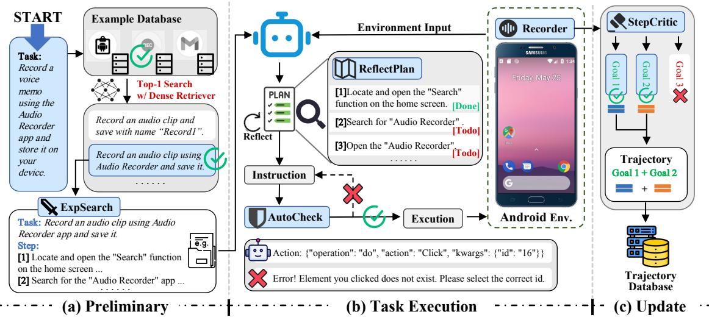  
Figure 3: Overview of ANDROIDGEN framework designed to complete tasks in Android. Our process comprises three stages: preliminary, task execution, and update. Preliminary (a): ExpSearch retrieve the top-1 similar tasks and trajectories from the database and feed them into the agent. Task Execution (b): ReflectPlan assesses the progress and updates the plan. Then, the agent generates operations based on the environment, plan, and retrieval example. AutoCheck verifies these operations, executing them if successful or regenerating them if not. Update (c): StepCritic evaluates the trajectories in fine-grand and updates the database accordingly.

## 3 ANDROIDGEN Framework

This section introduces the ANDROIDGEN framework for integrating LLMs into Android devices. It enables a language agent to complete user tasks through predefined input-output interfaces. We also introduce a modular agent architecture to enhance the LLM’s capabilities.

## 3.1 Environment

The environment, which serves as the substrate for agent interaction, is pivotal in determining the limit of task completion capabilities. We introduce our environment setup based on input and output.

## 3.1.1 Observation Space

Our observation space is designed to provide comprehensive and accurate inputs to our agents, ensuring that the received information mirrors what a human user would perceive. We employ the Android XML as our environmental representation, simplifying and adding attribute details to facilitate element type determination. This structured representation enhances the LLM’s understanding of the environment, enabling it to grasp element attributes and states. The XML format can be found in Appendix D.

## 3.1.2 Action Space

The action space defines how the agent interacts with the environment. Establishing a complete action space is crucial for the agent to fulfill user requests. We define our action space using Python function calls, leveraging the familiarity of LLMs with Python. Furthermore, we represent the action space using Python docstrings for brevity. Based on our empirical insights, we delineate a concise yet extensive action space suitable for the Android environment, which can be found in Appendix C.

## 3.2 Agent Architecture

After the environment construction, we design the agent architecture tailored to the digital environment. We aim to increase the LLMs’ capabilities under data-scarce conditions within the Android environment. The algorithmic workflow is illustrated in Figure 3. Next, we will detail the implementation of the four modules: ExpSearch, ReflectPlan, AutoCheck, and StepCritic.

## 3.2.1 ExpSearch

ExpSearch is a novel approach leveraging LLM’s in-context learning ability to optimize the agent iteratively by learning from its own trajectories. Our implementation consists of two parts:

Trajectory Collection We gather trajectories where the agent self-samples to collect extensive data for the agent to learn from itself. However, the challenge is ensuring these trajectories meet the task requirements. We employ StepCritic (see Section 3.2.4) to assess the trajectories based on their content and the given task. We preserve all the agent’s trajectories and the completion status assessed by StepCritic, which will be utilized to construct our trajectory database (see Section 4.1 for the details of the data collection process).

Trajectory Retrieval Our next challenge is choosing the most similar and informative trajectory for the given task to let the agent learn from. We first identify a collection within the same context, such as a specific application. It is crucial as tasks, even when identical, may vary significantly in execution across different contexts. We then utilize Contriever (Izacard et al., 2021) to encode instructions and compute similarity scores with embeddings from the database. The top-1 result is selected as our learning example. In addition, each time the agent completes a task, we use StepCritic to assess the trajectory and log it to the database, which enables our agent to self-improve iteratively, fostering easy-to-hard generalization in deployment.

## 3.2.2 ReflectPlan

In real-world complex digital environments, previous planning strategies are often overly optimistic about the execution results and prone to failure due to a lack of proper assessment of the current progress. Therefore, we develop ReflectPlan that enables self-assessment of the progress of tasks during execution. This approach empowers the agent to enhance planning and reflecting capabilities. ReflectPlan operates in two phases, as shown in Figure 3 (b):

Plan Initialization. Before the first execution step, the agent analyzes the task and the environment to generate a step-by-step plan to guide the following task execution.

Plan Reflection. From the second step onwards, the agent will reflect on the current progress and update the plan based on the task’s progress. The agent can also revise and create new plans when encountering a failed state or entering a loop, enhancing planning robustness.

## 3.2.3 AutoCheck

LLMs’ operations are not flawless, even when the plan is correct. They are like humans who may make typos or incorrect clicks. However, unlike humans, LLMs struggle to detect and correct simple errors, which can lead to task failure. Therefore, we design the AutoCheck module to mitigate the weakness and enhance agent robustness. Upon generating the operation, AutoCheck proactively verifies the response’s validity. When detecting potential issues or non-compliant actions, the subsequent execution is terminated, and feedback is provided to the agent in the next round.

Table 1: AutoCheck type for ANDROIDGEN
<table><tr><td>Function</td><td>Check Type</td></tr><tr><td>open_app(app_name) quote(content)</td><td>If { app_name } exists in the device If { content } is empty</td></tr><tr><td>do(action,id,text,dir)</td><td></td></tr><tr><td>action type:</td><td></td></tr><tr><td>Click</td><td>If element { id } is on the screen</td></tr><tr><td>Long Press Input Text</td><td>If element { id } is on the screen If element { id } is on the screen</td></tr><tr><td></td><td>If element { id } contains { text }</td></tr><tr><td>Navigate Home</td><td>If return to the home screen</td></tr><tr><td>Scroll</td><td>If direction { dir } is valid</td></tr><tr><td>Swipe</td><td>If direction { dir } is valid</td></tr></table>

Our experiments show that self-checking operations cause inconsistent assessment standards, leading to false positives that can harm performance. We adopt a more straightforward and effective strategy: checking if each operation type achieves the expected outcome, such as the existence of element IDs, type compliance, and scroll completion. Table 1 details the operation validation types.

## 3.2.4 StepCritic

To collect high-quality trajectories for ExpSearch and training, we build StepCritic. StepCritic is built on GPT-4o, can decompose tasks into various sub-goals, and evaluate the trajectory step-by-step. This approach enables a granular assessment of the trajectories, maximizing the data’s learning value.

Due to context length constraints, identifying critical information for evaluation is essential. As shown in Figure 4, we input the complete operation sequence, along with the final state of the device, to enhance the trajectory’s information density under the constraint of limited context length. Then, we instruct StepCritic to assess whether each sub-goal is achieved and the corresponding steps.

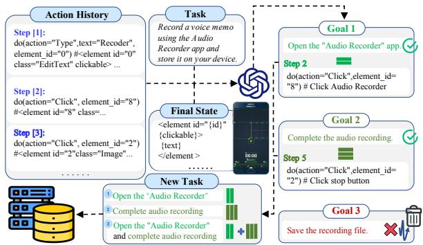  
Figure 4: ANDROIDGEN data construction workflow.

In addition to the environment input, we integrate the information from each module in the architecture to facilitate the agent’s operations. For detailed prompt organization, refer to Appendix E.

## 4 Building An Open-Source Android Language Agent

In Section 3, we develop ANDROIDGEN framework, which integrates existing LLMs to serve directly as Android agents without prior training. Next, we will detail the data collection process and our designed data algorithm for ExpSearch and training. Additionally, we will discuss our approach to model training on the synthesized Android trajectories, thereby constructing a robust open-source Android language agent without human annotation.

## 4.1 Data Collection

We demonstrate how to set up a pipeline for data construction with ANDROIDGEN, as shown in Figure 4. This pipeline can efficiently generate a lot of high-quality Android browsing trajectories:

Task Formulation. We utilize GPT-4o to generate about 300 task instructions drawing on the instructions in AndroidWorld. We ensure no reward signals or golden labels are employed during training to prevent data leakage.

Agent Sampling. We then leverage ANDROIDGEN with GPT-4o to sample a trajectory for each task.

Trajectory Recording. During the sampling process, we build a recorder that records environmental and operational information at each step, which is crucial for constructing a reproducible Android navigation trajectory.

Trajectory Evaluation. Upon finishing each task, we utilize StepCritic to assess the recorded trajectories. StepCritic lists each sub-goal of the task along with the corresponding steps taken to achieve them (where -1 indicates incomplete). If each sub-goal is accomplished, the task is considered completed.

Trajectory Augmentation. For a task T and its corresponding sequence S, T comprises multiple sub-goals $g _ { 1 } , g _ { 2 } , \ldots , g _ { n }$ , each associated with completion steps $p _ { 1 } , p _ { 2 } , \ldots , p _ { n }$ (where $p _ { i } = - 1$ if the goal $g _ { i }$ is not completed). Let $g _ { k }$ be the first incomplete sub-goal (or $g _ { n }$ if all sub-goals are completed). We concatenate the sub-goals $g _ { 1 } + \cdots + g _ { i }$ for i ranging from 1 to k  1, and considering the subsequence $\{ p _ { 1 } , \dotsc , p _ { k - 1 } \}$ as the label, to formulate new trajectories to augment our dataset. The algorithm pseudocode is in Algorithm 1.

Algorithm 1: Data Augmentation Process   
Data: Sequence of operations S for task T   
with sub-goals $g _ { 1 } , g _ { 2 } , \ldots , g _ { n }$ and   
completion steps $p 1 , p 2 , \ldots , p _ { n }$   
Result: Augmented dataset with new   
trajectories   
1 for each task T do   
2 for each completion step $p _ { i }$ do   
3 if $p _ { i } = - 1$ then   
4 k i   
5 break   
6 end if   
7 end for   
8 if all sub-goals are completed then   
9 k n   
10 end if   
11 new\_trajectory   
12 for i 1 to k 1 do   
13 concatenate g<sub>i</sub> to $T _ { \mathrm { n e w } }$   
14 add $( T _ { \mathrm { n e w } } , \{ p _ { 1 } , . . . , p _ { i } \} )$ to   
new\_trajectory   
15 end for   
16 add new\_trajectory to   
augmented\_dataset   
17 end for   
18 return augmented\_dataset

We integrate the original and augmented tasks from different sources to construct a dataset comprising more than 1000 trajectories.

## 4.2 Training

To develop a specialized open-source language agent, we fine-tune GLM-4-9B and Llama-3-70B on automatically constructed datasets. This approach enables the creation of a robust Android agent without necessitating human annotation for trajectories. We employ LoRA (Hu et al., 2021) for LLM fine-tuning based on its advantages in requiring a lighter training load and strong generalization, effectively mitigating overfitting. We train the LLM with each step in the trajectories separately. To enhance deployment efficiency, we mix the planning and execution steps for fine-tuning, equipping the LLM with capabilities for planning and execution. The prompts for training are consistent with Appendix E, facilitating seamless integration of the trained model into our framework. Refer to Appendix B for training details.

Table 2: Per-task performance on AndroidWorld. \* indicates the model is fine-tuned.
<table><tr><td>Agent</td><td>I</td><td>SeeAct</td><td>M3A</td><td></td><td>M3A</td><td>M3A</td><td>I ANDROIDGEN</td><td>ANDROIDGEN</td><td>ANDROIDGEN</td></tr><tr><td>Base Model</td><td>I</td><td>GPT-40</td><td> Llama-3-70B</td><td></td><td>Gemini-1.5-Pro</td><td>GPT-40</td><td>GLM-4-9B*</td><td>Llama-3-70B*</td><td>GPT-40</td></tr><tr><td>AudioRecorder I</td><td></td><td>50.0</td><td>50.0</td><td></td><td>50.0</td><td>50.0</td><td>100.0</td><td>100.0</td><td>100.0</td></tr><tr><td>Calendar</td><td></td><td>0.0</td><td>0.0</td><td></td><td></td><td>11.8</td><td>0.0</td><td>6.3</td><td>12.5</td></tr><tr><td>Camera</td><td></td><td>50.0</td><td>50.0</td><td></td><td>5.9 50.0</td><td>50.0</td><td>50.0</td><td>100.0</td><td>100.0</td></tr><tr><td>Chrome</td><td></td><td>33.3</td><td></td><td>0.0</td><td>0.0</td><td>0.0</td><td>0.0</td><td>0.0</td><td>0.0</td></tr><tr><td>Clock</td><td></td><td>33.3</td><td></td><td>33.3</td><td>66.7</td><td>66.7</td><td>33.3</td><td>66.7</td><td>66.7</td></tr><tr><td>Contacts</td><td></td><td>0.0</td><td></td><td></td><td>33.3</td><td>33.3</td><td>0.0</td><td>33.3</td><td>66.7</td></tr><tr><td>Expense</td><td></td><td>22.2</td><td></td><td>0.0 0.0</td><td>11.1</td><td>22.2</td><td>33.3</td><td>33.3</td><td>37.5</td></tr><tr><td>Files</td><td></td><td>50.0</td><td></td><td>0.0</td><td>0.0</td><td>50.0</td><td>50.0</td><td>50.0</td><td>50.0</td></tr><tr><td>Joplin</td><td></td><td>25.0</td><td></td><td>0.0</td><td>25.0</td><td>50.0</td><td>75.0</td><td>50.0</td><td>100.0</td></tr><tr><td>Markor</td><td></td><td>7.1</td><td></td><td>0.0</td><td>7.1</td><td>14.3</td><td>14.3</td><td>28.6</td><td>35.7</td></tr><tr><td>OpenTracks</td><td></td><td>0.0</td><td></td><td>0.0</td><td>0.0</td><td>0.0</td><td>16.7</td><td>16.7</td><td>16.7</td></tr><tr><td>OsmAnd</td><td></td><td>33.3</td><td></td><td>0.0</td><td>33.3</td><td>33.3</td><td>33.3</td><td>0.0</td><td>33.3</td></tr><tr><td>Recipe</td><td></td><td>8.3</td><td></td><td>0.0</td><td>18.2</td><td>25.0</td><td>41.7</td><td>40.0</td><td>45.5</td></tr><tr><td>Retro</td><td></td><td>0.0</td><td></td><td>0.0</td><td>0.0</td><td>25.0</td><td>0.0</td><td>25.0</td><td>50.0</td></tr><tr><td>Settings</td><td></td><td>26.7</td><td></td><td>26.7</td><td>50.0</td><td>57.1</td><td>64.3</td><td>70.0</td><td>93.3</td></tr><tr><td>SMS</td><td></td><td>16.7</td><td></td><td>33.3</td><td>33.3</td><td>33.3</td><td>57.1</td><td>66.7</td><td>57.1</td></tr><tr><td>Tasks Vlc</td><td></td><td>16.7 50.0</td><td></td><td>16.7 0.0</td><td>16.7 0.0</td><td>33.3 0.0</td><td>0.0 0.0</td><td>0.0 0.0</td><td>16.7</td></tr><tr><td></td><td></td><td></td><td></td><td></td><td></td><td></td><td></td><td></td><td>50.0</td></tr><tr><td>Avg.</td><td>一</td><td>15.9</td><td>一</td><td>8.8</td><td>19.8</td><td>27.7</td><td>29.2</td><td>35.3</td><td>46.8</td></tr></table>

## 5 Experiments

We conduct extensive experiments across various scenarios to evaluate the performance of the AN-DROIDGEN in executing a range of tasks within the Android digital environment compared to common baselines. To closely reflect the real user experience, we select benchmarks that utilize interactive environments for evaluation. These benchmarks include AndroidWorld, AitW, and the benchmark we construct for popular applications.

## 5.1 AndroidWorld

We evaluate ANDROIDGEN on AndroidWorld (Rawles et al., 2024), comparing our results with M3A (Rawles et al., 2024) and SeeAct (Zheng et al., 2024). To ensure a fair comparison, we standardize the action space and a11y tree (text) as the environment input. We adapt $\mathtt { S e e A c t _ { c h o i c e } }$ for the Android environment by augmenting the action space and applying heuristic filtering to modify the environment input, following the approach utilized in AndroidWorld. We use task success rate as the evaluation metric. The results are in Table 2. In addition, we perform a statistical analysis based on AndroidWorld’s task difficulties to evaluate the performance on different levels. The results are in Appendix A.

## 5.2 Android in the Wild (AitW)

We also evaluate ANDROIDGEN on AitW (Xing et al., 2024). To fairly compare DigiRL (Bai et al., 2024), we follow its experiment setup and randomly select 96 tasks from the test splits provided in DigiRL. For the environment, we utilize the environment representation and action space defined in Section 3.1 to evaluate ANDROIDGEN. We leverage human experts for task assessments and compute the task success rate. We compare AN-DROIDGEN with baselines in DigiRL, including prompting methods like Set-of-Mark (Yang et al., 2023a) and AppAgent (Yang et al., 2023b), and training methods like SFT and Offline-to-Online RL (Bai et al., 2024). The results are in Table 3.

Table 3: Performance on AitW. \* indicates the model is fine-tuned. Baselines are taken from DigiRL.
<table><tr><td colspan="2">Method</td><td>General</td><td>Web Shopping</td></tr><tr><td rowspan="2">Set-of-Mark</td><td>Gemini-1.5-Pro</td><td>13.5</td><td>8.3</td></tr><tr><td>GPT-40</td><td>16.7</td><td>11.5</td></tr><tr><td rowspan="2">AppAgent</td><td>Gemini-1.5-Pro</td><td>17.7</td><td>8.3</td></tr><tr><td>GPT-40</td><td>16.7</td><td>8.3</td></tr><tr><td rowspan="2">SFT</td><td>CogAgent*</td><td>25.0</td><td>38.5</td></tr><tr><td>AutoUI*</td><td>14.6</td><td>17.7</td></tr><tr><td rowspan="2">Off-to-On RL</td><td>Filtered BC*</td><td>61.5</td><td>57.8</td></tr><tr><td>DigiRL*</td><td>71.9</td><td>67.2</td></tr><tr><td rowspan="3">ANDROIDGEN</td><td>GLM-4-9B*</td><td>65.6</td><td>59.4</td></tr><tr><td>Llama-3-70B*</td><td>74.0</td><td>79.2</td></tr><tr><td>GPT-40</td><td>85.4</td><td>81.3</td></tr></table>

## 5.3 Popular Applications

In addition to the reproducible benchmark, we select eight globally popular mobile applications, including Google Maps, X, YouTube, Spotify, Chrome, etc., for evaluation. We preinstall the applications on the simulator. For applications requiring login, we use a unified, pre-registered account to perform the login in advance. The environment settings for ANDROIDGEN, SeeAct, and

M3A follow the settings described in Section 5.1. For AppAgent, we employ screenshots with identifiers as input and its specific action space as output. We construct five tasks for each application and employ human experts to judge the results and calculate the success rate. The results are in Table 4.

Table 4: Performance on popular applications. \* indicates the model is fine-tuned.
<table><tr><td>Agent</td><td>Base Model</td><td>SR</td><td>Avg. Steps</td></tr><tr><td>SeeAct</td><td>GPT-40</td><td>22.5</td><td>7.9</td></tr><tr><td>M3A</td><td>GPT-40</td><td>40.0</td><td>7.3</td></tr><tr><td>AppAgent</td><td>GPT-40</td><td>57.5</td><td>6.7</td></tr><tr><td rowspan="4">ANDROIDGEN</td><td>GLM-4-9B*</td><td>35.0</td><td>7.2</td></tr><tr><td>Llama-3-70B*</td><td>52.5</td><td>7.4</td></tr><tr><td>GPT-40</td><td>65.0</td><td>7.6</td></tr><tr><td></td><td></td><td></td></tr></table>

## 5.4 Evaluator Accuracy Comparison

To assess the performance of StepCritic, we employ trajectories generated by ANDROIDGEN as the test set. We evaluate these trajectories using StepCritic and the baselines (Pan et al., 2024). We compare their prediction with environmental oracle prediction and compute the accuracy for entire trajectories to contrast the efficacy of StepCritic with that of the baselines. Moreover, we also manually evaluate StepCritic’s accuracy in predicting whether each specific goal is achieved and the precision of the corresponding step prediction. The results are in Table 5.

Table 5: Evaluator accuracy on AndroidWorld.
<table><tr><td rowspan="2">Model</td><td colspan="2">Sub-goal Acc.</td><td rowspan="2">Overall Acc.</td></tr><tr><td>Completion</td><td>Step</td></tr><tr><td>Captioner + Mixtral</td><td>-</td><td>-</td><td>82.4</td></tr><tr><td>Captioner + GPT-4</td><td>-</td><td>-</td><td>84.6</td></tr><tr><td>StepCritic</td><td>92.8</td><td>82.3</td><td>87.9</td></tr></table>

## 5.5 Ablation Study

To assess the impact of different algorithms and training data on agent performance, we conduct a comprehensive ablation study in Table 6. We conduct experiments on AndroidWorld as our primary performance indicator. To show the improvements more straightforwardly, we present the accuracy across different difficulty levels.

Algorithm Ablation. For algorithm ablation, we validate the effectiveness of various algorithms on GPT-4o. The result indicates a 56.5% overall SR improvement with ReflectPlan and 149.2% for medium-difficulty tasks. Additionally, incorporating AutoCheck reduces operational errors, increasing overall SR by 5.6%. Lastly, ExpSearch enables the agent to learn from simple tasks and generalize to more challenging ones, resulting in substantial improvements for both medium and hard tasks and an overall SR increase of 36.8%.

Table 6: Ablation study.
<table><tr><td>Method</td><td>Easy</td><td>Medium Hard</td><td></td><td>Avg.</td></tr><tr><td colspan="5">Strategy Ablation (w/ GPT-4o)</td></tr><tr><td>Base Agent</td><td>35.0</td><td>5.9</td><td>0.0</td><td>20.7</td></tr><tr><td>+) ReflectPlan</td><td>51.7</td><td>14.7</td><td>0.0</td><td>32.4</td></tr><tr><td>+) AutoCheck</td><td>53.3</td><td>17.6</td><td>0.0</td><td>34.2</td></tr><tr><td>+) ExpSearch</td><td>65.0</td><td>32.4</td><td>11.8</td><td>46.8</td></tr></table>

<table><tr><td colspan="3">Training Data Ablation (w/ Llama-3-70B)</td></tr><tr><td>Untrained</td><td>18.3 2.9</td><td>0.0 10.8</td></tr><tr><td>No Selection</td><td>28.3 2.9 0.0</td><td>16.2</td></tr><tr><td>Oracle-Selection</td><td>48.3 2.9 0.0</td><td>27.0</td></tr><tr><td>StepCritic</td><td>43.3 5.9 0.0</td><td>25.2</td></tr><tr><td>+) ExpSearch</td><td>55.8 12.5 5.9</td><td>35.3</td></tr></table>

Training Data Ablation. For the ablation of data selection, we conduct experiments using Llama-3-70B. We compare several scenarios: untrained, no selection (i.e., all data), and data selection. For selection methods, we choose StepCritic, environmental feedback (oracle), and StepCritic with ExpSearch. The result shows that data selection with StepCritic significantly improves performance compared to the untrained and no-selection scenarios, approaching the efficacy of oracle selection. Integrating ExpSearch enables our agent to generalize from examples, achieving a substantial improvement across diverse tasks.

## 5.6 Case Study and Error Analysis

We conduct case studies on Android devices to explore potential optimizations. ANDROIDGEN yields satisfactory results in most scenarios. However, our agent also has limitations. We identify occasional errors during task execution, broadly categorized into four types: vision, mathematical counting, multiple app interactions, and memorization. Table 7 summarizes the proportions of these error types during evaluation. These errors highlight areas for future improvement of our Android agent. Detailed descriptions of specific good and bad cases are in Appendix G.

## 5.7 Efficiency & Cost Analysis

Last, we calculate the efficiency and cost of AN-DROIDGEN and M3A (Rawles et al., 2024) in data construction and compare with human annotation (compliant with local regulations) in Table 8. Using 1,000 samples as an example, without quality control, ANDROIDGEN’s efficiency and cost are slightly better than those of M3A. Besides, our cost is 12.5% of human annotation, and its efficiency is 275%. For quality-controlled data generation (not compared with M3A due to the lack of quality control), ANDROIDGEN achieves efficiency 5.85 times greater with only 5% of the human annotation cost after selection and augmentation by StepCritic.

Table 7: Error distribution of ANDROIDGEN.
<table><tr><td>Error Type</td><td>Proportion</td></tr><tr><td>Vision</td><td>15%</td></tr><tr><td>Math Counting</td><td>23%</td></tr><tr><td>Multiple App</td><td>26%</td></tr><tr><td>Memorization</td><td>20%</td></tr><tr><td>Others</td><td>16%</td></tr></table>

Table 8: Efficiency and cost statistics for M3A, human annotation, and ANDROIDGEN (for 1,000 trajectories).
<table><tr><td colspan="4">Metrics M3A Human ANDROIDGEN</td></tr><tr><td>Average Time per Step (s)</td><td>4.8</td><td>18</td><td>5.6</td></tr><tr><td>Average Time per Task (s) Cost per Task ($)</td><td>49.5 0.12</td><td>120 0.8</td><td>43.7 0.1</td></tr><tr><td>Without Quality Control:</td><td></td><td></td><td></td></tr><tr><td>Total Cost ($) Total Time (hr)</td><td>120 13.75</td><td>800 33.3</td><td>100 12.1</td></tr><tr><td>Success Rate (%)</td><td>32</td><td>80</td><td>58.2</td></tr><tr><td>Evaluation Cost per Task ($)</td><td></td><td>0.20</td><td>0.005</td></tr><tr><td>Evaluation Time per Task (s)</td><td></td><td></td><td></td></tr><tr><td>Data Augmentation (Factor)</td><td></td><td>30</td><td>3.5</td></tr><tr><td></td><td></td><td>-</td><td>2.52</td></tr><tr><td>With Quality Control:</td><td></td><td></td><td></td></tr><tr><td>Total Cost ($)</td><td></td><td>1,250</td><td>71.6</td></tr><tr><td>Total Time (hr)</td><td></td><td>52.1</td><td>8.9</td></tr></table>

## 6 Limitations

Despite the robust performance of ANDROIDGEN in practical applications, there remains significant room for improvement. We are committed to refining these aspects in future work.

## 6.1 Performance

While ANDROIDGEN has demonstrated an excellent task completion rate, there remains significant room for optimization in its performance. As delineated in Table 7, the language agent often struggles with visual-related tasks, underscoring the importance of integrating vision models to enhance the agent’s capabilities. Furthermore, the agent still faces substantial challenges in handling complex or super long turn interaction scenarios, such as those involving cross-application tasks and counting. Incorporating large-scale adaptive inference search strategies during the reasoning process may present a promising approach to further increasing the agent’s complex planning abilities.

## 6.2 Efficiency

Although ANDROIDGEN can complete tasks that users are willing to delegate to agents, the large scale of the system and model leaves much room for improvement in execution efficiency. We focus on enhancing the operational capabilities of smaller models in GUI environments. The small language models have demonstrated satisfactory performance as executors since they only need to follow the plan’s instructions to complete corresponding operations. However, the planner requires robust reasoning and generalization capabilities, which typically necessitates a larger size.

## 6.3 Safety

Safety is a critical challenge for agents in realworld deployment. As LLMs can now execute tasks beyond text output—such as handling user accounts and passwords, making statements, and even conducting transactions—it is imperative to safeguard against these high-risk operations in practical applications. We are currently working on developing a more comprehensive auto-check module. This module works as a classifier, aiming to identify and prevent erroneous operations and validate high-risk operations with user permission.

## 7 Conclusion

In this work, we present ANDROIDGEN, a language agent framework for Android, including ExpSearch, ReflectPlan, AutoCheck, and StepCritic, significantly enhancing the agent’s ability to perform complex tasks under data scarcity. We employ ANDROIDGEN as a pipeline to efficiently construct training datasets and train a robust open-source Android language agent without human-annotated trajectories. Our findings show significant progress in utilizing LLMs for the Android agent.

## Acknowledgement

This work has been supported by the NSFC for Distinguished Young Scholar (62425601), NSFC (624B2084), New Cornerstone Science Foundation through the XPLORER PRIZE.

## References

Josh Achiam, Steven Adler, Sandhini Agarwal, Lama Ahmad, Ilge Akkaya, Florencia Leoni Aleman, Diogo Almeida, Janko Altenschmidt, Sam Altman, Shyamal Anadkat, et al. 2023. Gpt-4 technical report. arXiv preprint arXiv:2303.08774.

Anthropic. 2023. Model card and evaluations for claude models.

Gilles Baechler, Srinivas Sunkara, Maria Wang, Fedir Zubach, Hassan Mansoor, Vincent Etter, Victor Carbune, Jason Lin, Jindong Chen, and Abhanshu˘ Sharma. 2024. Screenai: A vision-language model for ui and infographics understanding. arXiv preprint arXiv:2402.04615.

Hao Bai, Yifei Zhou, Mert Cemri, Jiayi Pan, Alane Suhr, Sergey Levine, and Aviral Kumar. 2024. Digirl: Training in-the-wild device-control agents with autonomous reinforcement learning. arXiv preprint arXiv:2406.11896.

Tom Brown, Benjamin Mann, Nick Ryder, Melanie Subbiah, Jared D Kaplan, Prafulla Dhariwal, Arvind Neelakantan, Pranav Shyam, Girish Sastry, Amanda Askell, et al. 2020. Language models are few-shot learners. Advances in neural information processing systems, 33:1877–1901.

Wei Chen and Zhiyuan Li. 2024. Octopus v2: Ondevice language model for super agent. arXiv preprint arXiv:2404.01744.

Kanzhi Cheng, Qiushi Sun, Yougang Chu, Fangzhi Xu, Yantao Li, Jianbing Zhang, and Zhiyong Wu. 2024. Seeclick: Harnessing gui grounding for advanced visual gui agents. arXiv preprint arXiv:2401.10935.

Kahneman Daniel. 2017. Thinking,fast and slow.

Zhengxiao Du, Yujie Qian, Xiao Liu, Ming Ding, Jiezhong Qiu, Zhilin Yang, and Jie Tang. 2022. Glm: General language model pretraining with autoregressive blank infilling. In Proceedings of the 60th Annual Meeting ofthe Associationfor Computational Linguistics (Volume 1: Long Papers), pages 320–335.

Team GLM, Aohan Zeng, Bin Xu, Bowen Wang, Chenhui Zhang, Da Yin, Diego Rojas, Guanyu Feng, Hanlin Zhao, Hanyu Lai, et al. 2024. Chatglm: A family of large language models from glm-130b to glm-4 all tools. arXiv preprint arXiv:2406.12793.

Wenyi Hong, Weihan Wang, Qingsong Lv, Jiazheng Xu, Wenmeng Yu, Junhui Ji, Yan Wang, Zihan Wang, Yuxiao Dong, Ming Ding, et al. 2023. Cogagent: A visual language model for gui agents. arXiv preprint arXiv:2312.08914.

Or Honovich, Thomas Scialom, Omer Levy, and Timo Schick. 2022. Unnatural instructions: Tuning language models with (almost) no human labor. arXiv preprint arXiv:2212.09689.

Edward J Hu, Yelong Shen, Phillip Wallis, Zeyuan Allen-Zhu, Yuanzhi Li, Shean Wang, Lu Wang, and Weizhu Chen. 2021. Lora: Low-rank adaptation of large language models. arXiv preprint arXiv:2106.09685.

Gautier Izacard, Mathilde Caron, Lucas Hosseini, Sebastian Riedel, Piotr Bojanowski, Armand Joulin, and Edouard Grave. 2021. Towards unsupervised dense information retrieval with contrastive learning. arXiv preprint arXiv:2112.09118, 2(3).

Hanyu Lai, Xiao Liu, Iat Long Iong, Shuntian Yao, Yuxuan Chen, Pengbo Shen, Hao Yu, Hanchen Zhang, Xiaohan Zhang, Yuxiao Dong, et al. 2024. Autowebglm: Bootstrap and reinforce a large language model-based web navigating agent. arXiv preprint arXiv:2404.03648.

Xiao Liu, Hanyu Lai, Hao Yu, Yifan Xu, Aohan Zeng, Zhengxiao Du, Peng Zhang, Yuxiao Dong, and Jie Tang. 2023a. Webglm: Towards an efficient webenhanced question answering system with human preferences. arXiv preprint arXiv:2306.07906.

Xiao Liu, Hao Yu, Hanchen Zhang, Yifan Xu, Xuanyu Lei, Hanyu Lai, Yu Gu, Hangliang Ding, Kaiwen Men, Kejuan Yang, et al. 2023b. Agentbench: Evaluating llms as agents. arXiv preprint arXiv:2308.03688.

Ziyang Luo, Can Xu, Pu Zhao, Qingfeng Sun, Xiubo Geng, Wenxiang Hu, Chongyang Tao, Jing Ma, Qingwei Lin, and Daxin Jiang. 2023. Wizardcoder: Empowering code large language models with evolinstruct. arXiv preprint arXiv:2306.08568.

Kai Mei, Zelong Li, Shuyuan Xu, Ruosong Ye, Yingqiang Ge, and Yongfeng Zhang. 2024. Llm agent operating system. arXiv preprint arXiv:2403.16971.

Yu Meng, Jiaxin Huang, Yu Zhang, and Jiawei Han. 2022. Generating training data with language models: Towards zero-shot language understanding. Advances in Neural Information Processing Systems, 35:462–477.

Subhabrata Mukherjee, Arindam Mitra, Ganesh Jawahar, Sahaj Agarwal, Hamid Palangi, and Ahmed Awadallah. 2023. Orca: Progressive learning from complex explanation traces of gpt-4. arXiv preprint arXiv:2306.02707.

Reiichiro Nakano, Jacob Hilton, Suchir Balaji, Jeff Wu, Long Ouyang, Christina Kim, Christopher Hesse, Shantanu Jain, Vineet Kosaraju, William Saunders, et al. 2021. Webgpt: Browser-assisted questionanswering with human feedback. arXiv preprint arXiv:2112.09332.

Jiayi Pan, Yichi Zhang, Nicholas Tomlin, Yifei Zhou, Sergey Levine, and Alane Suhr. 2024. Autonomous evaluation and refinement of digital agents. arXiv preprint arXiv:2404.06474.

Baolin Peng, Chunyuan Li, Pengcheng He, Michel Galley, and Jianfeng Gao. 2023. Instruction tuning with gpt-4. arXiv preprint arXiv:2304.03277.

Christopher Rawles, Sarah Clinckemaillie, Yifan Chang, Jonathan Waltz, Gabrielle Lau, Marybeth Fair, Alice Li, William Bishop, Wei Li, Folawiyo Campbell-Ajala, et al. 2024. Androidworld: A dynamic benchmarking environment for autonomous agents. arXiv preprint arXiv:2405.14573.

Christopher Rawles, Alice Li, Daniel Rodriguez, Oriana Riva, and Timothy Lillicrap. 2023. Android in the wild: A large-scale dataset for android device control. Preprint, arXiv:2307.10088.

Ohad Rubin, Jonathan Herzig, and Jonathan Berant. 2022. Learning to retrieve prompts for in-context learning. In Proceedings of the 2022 Conference of the North American Chapter ofthe Associationfor Computational Linguistics: Human Language Technologies, pages 2655–2671, Seattle, United States. Association for Computational Linguistics.

Teven Le Scao, Angela Fan, Christopher Akiki, Ellie Pavlick, Suzana Ilic, Daniel Hesslow, Roman´ Castagné, Alexandra Sasha Luccioni, François Yvon, Matthias Gallé, et al. 2022. Bloom: A 176bparameter open-access multilingual language model. arXiv preprint arXiv:2211.05100.

Timo Schick and Hinrich Schütze. 2020. Few-shot text generation with pattern-exploiting training. arXiv preprint arXiv:2012.11926.

Gemini Team, Rohan Anil, Sebastian Borgeaud, Yonghui Wu, Jean-Baptiste Alayrac, Jiahui Yu, Radu Soricut, Johan Schalkwyk, Andrew M Dai, Anja Hauth, et al. 2023. Gemini: a family of highly capable multimodal models. arXiv preprint arXiv:2312.11805.

Hugo Touvron, Thibaut Lavril, Gautier Izacard, Xavier Martinet, Marie-Anne Lachaux, Timothée Lacroix, Baptiste Rozière, Naman Goyal, Eric Hambro, Faisal Azhar, et al. 2023a. Llama: Open and efficient foundation language models. arXiv preprint arXiv:2302.13971.

Hugo Touvron, Louis Martin, Kevin Stone, Peter Albert, Amjad Almahairi, Yasmine Babaei, Nikolay Bashlykov, Soumya Batra, Prajjwal Bhargava, Shruti Bhosale, et al. 2023b. Llama 2: Open foundation and fine-tuned chat models. arXiv preprint arXiv:2307.09288.

Junyang Wang, Haiyang Xu, Jiabo Ye, Ming Yan, Weizhou Shen, Ji Zhang, Fei Huang, and Jitao Sang. 2024. Mobile-agent: Autonomous multi-modal mobile device agent with visual perception. arXiv preprint arXiv:2401.16158.

Lei Wang, Chen Ma, Xueyang Feng, Zeyu Zhang, Hao Yang, Jingsen Zhang, Zhiyuan Chen, Jiakai Tang, Xu Chen, Yankai Lin, Wayne Xin Zhao, Zhewei Wei, and Ji-Rong Wen. 2023a. A survey on large

language model based autonomous agents. arXiv preprint arXiv:2308.11432.

Lei Wang, Wanyu Xu, Yihuai Lan, Zhiqiang Hu, Yunshi Lan, Roy Ka-Wei Lee, and Ee-Peng Lim. 2023b. Plan-and-solve prompting: Improving zeroshot chain-of-thought reasoning by large language models. Preprint, arXiv:2305.04091.

Xuezhi Wang, Jason Wei, Dale Schuurmans, Quoc V Le, Ed H Chi, Sharan Narang, Aakanksha Chowdhery, and Denny Zhou. 2022. Self-consistency improves chain of thought reasoning in language models. In The Eleventh International Conference on Learning Representations.

Jason Wei, Xuezhi Wang, Dale Schuurmans, Maarten Bosma, Fei Xia, Ed Chi, Quoc V Le, Denny Zhou, et al. 2022. Chain-of-thought prompting elicits reasoning in large language models. Advances in Neural Information Processing Systems, 35:24824–24837.

Zhiheng Xi, Wenxiang Chen, Xin Guo, Wei He, Yiwen Ding, Boyang Hong, Ming Zhang, Junzhe Wang, Senjie Jin, Enyu Zhou, Rui Zheng, Xiaoran Fan, Xiao Wang, Limao Xiong, Yuhao Zhou, Weiran Wang, Changhao Jiang, Yicheng Zou, Xiangyang Liu, Zhangyue Yin, Shihan Dou, Rongxiang Weng, Wensen Cheng, Qi Zhang, Wenjuan Qin, Yongyan Zheng, Xipeng Qiu, Xuanjing Huang, and Tao Gui. 2023. The rise and potential of large language model based agents: A survey. arXiv preprint arXiv:2309.07864.

Yaqi Xie, Chen Yu, Tongyao Zhu, Jinbin Bai, Ze Gong, and Harold Soh. 2023. Translating natural language to planning goals with large-language models. Preprint, arXiv:2302.05128.

Mingzhe Xing, Rongkai Zhang, Hui Xue, Qi Chen, Fan Yang, and Zhen Xiao. 2024. Understanding the weakness of large language model agents within a complex android environment. arXiv preprint arXiv:2402.06596.

Can Xu, Qingfeng Sun, Kai Zheng, Xiubo Geng, Pu Zhao, Jiazhan Feng, Chongyang Tao, and Daxin Jiang. 2023. Wizardlm: Empowering large language models to follow complex instructions. arXiv preprint arXiv:2304.12244.

Jianwei Yang, Hao Zhang, Feng Li, Xueyan Zou, Chunyuan Li, and Jianfeng Gao. 2023a. Set-of-mark prompting unleashes extraordinary visual grounding in gpt-4v. arXiv preprint arXiv:2310.11441.

Zhao Yang, Jiaxuan Liu, Yucheng Han, Xin Chen, Zebiao Huang, Bin Fu, and Gang Yu. 2023b. Appagent: Multimodal agents as smartphone users. arXiv preprint arXiv:2312.13771.

Shunyu Yao, Jeffrey Zhao, Dian Yu, Nan Du, Izhak Shafran, Karthik R Narasimhan, and Yuan Cao. 2022. React: Synergizing reasoning and acting in language models. In The Eleventh International Conference on Learning Representations.

Da Yin, Faeze Brahman, Abhilasha Ravichander, Khyathi Chandu, Kai-Wei Chang, Yejin Choi, and Bill Yuchen Lin. 2024. Agent lumos: Unified and modular training for open-source language agents. In Proceedings of the 62nd Annual Meeting of the Associationfor Computational Linguistics (Volume 1: Long Papers), pages 12380–12403, Bangkok, Thailand. Association for Computational Linguistics.

Aohan Zeng, Xiao Liu, Zhengxiao Du, Zihan Wang, Hanyu Lai, Ming Ding, Zhuoyi Yang, Yifan Xu, Wendi Zheng, Xiao Xia, et al. 2022. Glm-130b: An open bilingual pre-trained model. In The Eleventh International Conference on Learning Representations.

Susan Zhang, Stephen Roller, Naman Goyal, Mikel Artetxe, Moya Chen, Shuohui Chen, Christopher Dewan, Mona Diab, Xian Li, Xi Victoria Lin, et al. 2022. Opt: Open pre-trained transformer language models. arXiv preprint arXiv:2205.01068.

Boyuan Zheng, Boyu Gou, Jihyung Kil, Huan Sun, and Yu Su. 2024. Gpt-4v (ision) is a generalist web agent, if grounded. arXiv preprint arXiv:2401.01614.

Shuyan Zhou, Frank F Xu, Hao Zhu, Xuhui Zhou, Robert Lo, Abishek Sridhar, Xianyi Cheng, Tianyue Ou, Yonatan Bisk, Daniel Fried, et al. 2023. Webarena: A realistic web environment for building autonomous agents. In Second Agent Learning in Open-Endedness Workshop.

Yongchao Zhou, Andrei Ioan Muresanu, Ziwen Han, Keiran Paster, Silviu Pitis, Harris Chan, and Jimmy Ba. 2022. Large language models are human-level prompt engineers. arXiv preprint arXiv:2211.01910.

## A AndroidWorld with Difficulty Levels

Table 9 presents the performance of various agents across different difficulty levels in AndroidWorld.

Table 9: Performance on various difficulty levels in Androidworld. \* indicates model is fine-tuned.
<table><tr><td>Agent</td><td>Base Model</td><td></td><td>Easy Medium Hard Avg.</td><td></td></tr><tr><td>SeeAct</td><td>GPT-40</td><td>28.3</td><td>2.9</td><td>0.0 15.9</td></tr><tr><td>M3A</td><td>Llama-3-70B</td><td>15.0</td><td>2.9</td><td>0.0 8.8</td></tr><tr><td>M3A M3A</td><td>Gemini-1.5 Pro GPT-40</td><td>33.3 45.9</td><td>5.9 8.8</td><td>0.0 19.8 27.7</td></tr><tr><td></td><td></td><td></td><td></td><td>0.0</td></tr><tr><td>ANDROIDGEN GLM-4-9B*</td><td></td><td>47.5</td><td>8.8</td><td>5.6 29.2</td></tr><tr><td></td><td>ANDROIDGEN Llama-3-70B*</td><td>55.8</td><td>12.5</td><td>5.9 35.3</td></tr><tr><td>ANDROIDGEN GPT-40</td><td></td><td>65.0</td><td>32.4</td><td>11.8 46.8</td></tr></table>

## B Training Details

During our LoRA fine-tuning of the GLM-4-9B and Llama-3-70B model, we employ a single-node eight-GPU A100-80B machine. The fine-tuned parameters account for about 0.024% of the total parameters. We set the maximum learning rate to 1e-4 and the sequence length to 8192 and use a total batch size of 32, conducting the training over 3 epochs.

## C Action Space

Our action space for ANDROIDGEN is shown in Table 10.

Table 10: Action space for ANDROIDGEN
<table><tr><td>Function</td><td>Description</td></tr><tr><td>open_app(app_name) quote(content) exit(message)</td><td>Open the app with { app_name } Record { content } for memory End the task with { message }</td></tr><tr><td>do(action,id, text,dir) Do a single operation action type: Click</td><td>Click on { id } element</td></tr><tr><td>Long Press Input Text</td><td>Long press on { id } element Input { text } to { id } element</td></tr><tr><td>Press Enter Navigate Home</td><td>Press enter key Return to the home screen</td></tr><tr><td>Navigate Back</td><td>Return to the previous page</td></tr><tr><td>Scroll</td><td>Scroll in { dir }</td></tr><tr><td>Swipe</td><td></td></tr><tr><td>Wait</td><td>Swipe { id } element in { dir } Wait for a while</td></tr></table>

## D Observation Space

We present the element format of the environment in our observation space as follows:

< element id ="{ id }" class ="{ class }"   
resource - name ="{ resource }" {   
clickable / checkable / status =" on "|" off   
"/ editable }> { text } </ element >

## E Agent Prompt

To enhance the model’s understanding of the tasks and the environment, we design a set of model prompts, which are categorized into the following components:

Setup: In the setup, we articulate the objectives of the task and the rules for interacting with the environment. We utilize in-context learning to enable the LLM to act as an expert assistant within Android, stimulating the model’s agent ability in the environment.

Operation Definition: We define the interfaces of interaction with the environment. We employ Python docstrings to define operation types, which are readily recognizable and understandable by most LLMs. The code-based approach promotes the model’s reasoning capabilities and operational accuracy.

Example: The complete trajectory (omitting specific environment inputs) retrieved by ExpSearch (in Section 3.2.1) will be used as a reference example to facilitate one-shot learning for the model. In addition, we include analysis and confirmation in the example to spur the model’s reasoning and self-checking abilities.

Note: Based on our deployment practices, we include reminders to help agents avoid typical common errors in the note section.

History: We present the operational history in a conversational format involving the environmental input as the user and the operation output as the assistant, which is well-received by most LLMs. We have obscured historical environmental input information to reduce the context length significantly.

Current Status: Besides the environment states, we also incorporate the current plan and feedback from the last round (if available) as the current context for our agent.

We assemble the components above into a system prompt and model dialogue prompts, which are then inputted to the agent. Below is our detailed prompt organization for ANDROIDGEN:

```python
# Setup
You are a professional agent assistant
that can fulfill user ’s high - level
instructions on android devices .
Given the current state of the
device , you should first read
carefully the plan that user provide
, then generate operations to
complete the todo goal in python -
style pseudo code using the
predefined functions .
# More details about the code
Your code should be readable , simple ,
and only ** ONE -LINE -OF - CODE ** at a
time , avoid using loop statement and
only use if - else control if
necessary .
# Predefined functions are as follow :

def open_app ( app_name ):
""" Open the app on the android
device .
Args :
: param app_name : the
name of the app to
open .
Returns :
None . The app will be
opened .
11 11 11
def do(action , element_id , text ,
direction ):
""" A single operation on the
android device .
Args :
: param action : one of
the actions from ["
```

Click ", " Long Press   
", " Input Text ",   
Press Enter ", "   
Navigate Home ", "   
Navigate Back ",   
Scroll ", " Swipe ",   
Wait "]. " Swipe " is   
the inverse of "   
Scroll ".   
: param element\_id : optional .   
Only for [" Click ", " Long   
Press ", " Input Text ", " Swipe   
"].   
: param text : optional .   
Only for [" Input   
Text "], indicating   
the text to input .   
: param direction : optional . Only   
for [" Scroll ", " Swipe "],   
indicating the direction to   
scroll , choose from [" up",   
down ", " left ", " right "].   
Returns :   
None . The device will be   
updated after   
executing the action   
11 11   
def quote ( content ) :   
""" Quoting information from the   
current page for memory . Only   
you can see the quoted content .   
Args :   
: param content : text summarized   
or copied from the page for   
later operation .   
Returns :   
None .   
11 11 11   
def exit ( message ):   
""" Ending the operation process   
if the assistant think it   
has fulfilled the goal .   
Args :   
: param message : optional   
. If user ’s   
instruction is a   
question , return   
assistant ’s answer   
in the message based   
on the operation   
result .   
Returns :   
None .   
11 11 11   
  
# A reference example :   
{ example\_from\_expsearch }   
# REMEMBER :   
Only \*\* ONE -LINE -OF - CODE \*\* at a time .   
You should follow the plan that user

provide and do the operation step by   
step .   
Confirm and Analysis at the beginning   
of each round .   
You must ensure that the id of the   
element you act for is in the   
current page , or you shouldn ’t do   
acitions on the nonexistent element .   
If your action includes an element id ,   
you should add a comment in the   
code to explain the element id.   
" Input Text " action will delete the   
original text in the input box and   
input the new text . You should   
concatenate the text if you want to   
add text to the original text .

Below is our history and input prompt for AN-DROIDGEN:

<| user | >   
User Instruction : { user\_instruction }   
<| assistant |>   
\*\* Task Start \*\*   
<| user |>   
\*\* Environment State ( Omitted ) \*\*   
<| assistant |>   
{ round0\_operation }   
<| user |>   
\*\* Environment State ( Omitted ) \*\*   
<| assistant |>   
{ round1\_operation }   
<| user | >   
\*\* Environment State ( Omitted ) \*\*   
<| assistant |>   
{ round2\_operation }   
<| user |>   
# Current State : {   
current\_environment\_text }   
# Plan : { current\_plan }   
# Last Round Error : { error\_feedback }

## F Evaluator Prompt

Below is the system prompt for our StepCritic:

You are an expert in evaluating the   
performance of an android agent . The   
agent is designed to help a human   
user navigate on their device to   
complete a task . Given the user ’s   
intent , the agent ’s action history ,   
the final state of the device , and   
the agent ’s response to the user ,   
your goal is to list the conditions   
the task requires and their   
respective completion step ( or -1

```csv
for not completed ). There are two
types of tasks :
1. Information seeking : The user wants
to obtain certain information from
the screen , such as information
about a product , reviews , map info ,
comparison of map routes , etc . The
bot ’s response must contain the
information the user wants or
explicitly state that the
information is not available .
Otherwise , e.g., if the bot
encounters an exception and responds
with the error content , the task is
considered a failure . Besides , be
careful about the sufficiency of the
agent ’s actions . For example , when
asked to list the top - searched items
in a shop , the agent should order
the items by the number of searches
and then return the top items . If
the ordering action is missing , the
task is likely to fail .
2. Application Operation : The user wants
to do operations in a specific
application , such as purchasing ,
modifying content or configuration ,
starting a project , etc . Carefully
examine the bot ’s action history and
the final state of the page to
determine whether the bot completes
the task . No need to consider the
bot ’s response .
* IMPORTANT * Your output should STRICTLY
follow the format below and DONOT
output other content :
" condition1 ": " completion step1 (or -1
for not completed )"
condition2 ": " completion step2 (or -1
for not completed )"
```

For the input prompt, we provide the user’s task, action history, and the final state of the screen. The LLM then evaluates the trajectory based on the information provided.

## G Demonstration

This section demonstrates examples from diverse applications, encompassing the first eight good cases and the last three bad cases. These instances embody distinct operational logic and require different functionalities to solve the challenges and requirements encountered when engaging with various applications.

## G.1 Audio Recorder

The targeted task to be executed is "Record an audio clip using the Audio Recorder app and save it." The actual execution steps can be summarized as follows:

• Step1: Click SearchBar

• Step2: Type SearchBar "Audio Recorder"

• Step3: Click "Audio Recorder"

• Step4: Click "Start Recording"

• Step5: Click "End Recording"

• Step6: Save the file

As Figure 5 shows, we end up with a recorded audio on the screenshot. We recorded a 12s audio recording, effectively completing the target task.

## G.2 Phone Contact

The targeted task is "Create a new contact for Hugo Pereira. Their number is +13920741751". The actual execution steps can be summarized as follows:

• Step1: Click "Phone" App

• Step2: Click "Contacts"

• Step3: Click the "Add" button

• Step4: Type contact information

• Step5: Save the contact

As Figure 6 shows, we end up on the screenshot with a contact named Hugo Pereira. We add a contact with his name and phone number, effectively completing the target task.

## G.3 Delete File

The targeted task to be executed is "Delete the file banana.mp3 from the Android filesystem located in the Notifications folder within the sdkgphone storage area". The actual execution steps can be summarized as follows:

• Step1: Open "Files" App

• Step2: Click "Show roots"

• Step3: Click "sdkgphone"

• Step4: Click "Notifications"

• Step5: Scroll Down

• Step6: Long Press "banana.mp3"

• Step7: Click "Delete"

• Step8: Click "OK"

As Figure 7 shows, we end up on the screenshot in the Notifications folder. We delete the file banana.mp3, effectively completing the target task.

## G.4 Marking Map

The targeted task is "Add a favorite location marker for 47.1303814, 9.5930117 in the OsmAnd maps app". The actual execution steps can be summarized as follows:

• Step1: Open app "OsmAnd" App

• Step2: Click the "Search" button

• Step3: Type "47.1303814, 9.5930117"

• Step4: Click "Show on map"

• Step5: Long Press

• Step6: Click the "Add" button

• Step7: Click the "Add Favorite" button

• Step8: Click the "Save" button

As Figure 8 shows, we end up on the OsmAnd maps app with a location marker. We add a favorite location marker, effectively completing the target task.

## G.5 Create Music Playlist

The targeted task to be executed is "Create a playlist in Retro Music titled "Hip Hop Bangers 270" with the following songs, in order: Golden Days." The actual execution steps can be summarized as follows:

• Step1: Open app "Retro Music" App

• Step2: Click "Playlist"

• Step3: Click "More Options"

• Step4: Click "New Playlist"

• Step5: Type "Hip Hop Bangers 270"

• Step6: Click "Create"

• Step7: Click "Songs"

• Step8: Long Press "Golden Days"

• Step9: Click "Add to playlist"

• Step10: Click "Hip Hop Bangers 270"

As Figure 9 shows, we end up on the "Retro Music" playlist. We add "Golden Days" to the playlist, effectively completing the target task.

## G.6 Turn Bluetooth Off

The targeted task to be executed is "Turn Bluetooth off." The actual execution steps can be summarized as follows:

• Step1: Open "Settings" App

• Step2: Click "Connected devices"

• Step3: Click "Connection preferences"

• Step4: Click "Bluetooth"

• Step5: Click "Bluetooth switch"

As Figure 10 shows, we end up on the screenshot with the Bluetooth. We turn Bluetooth off, effectively completing the target task.

## G.7 Play Music Playlist

The targeted task is "Search for the artist Eric Clapton, enter his artist page, and play his playlist." The actual execution steps can be summarized as follows:

• Step1: Open "Spotify" App

• Step2: Click "Search"

• Step3: Click SearchBar

• Step4: Type "Eric Clapton"

• Step5: Click "Play"

As Figure 11 shows, we end up on the screenshot with the playlist. We play Eric Clapton’s playlist, effectively completing the target task.

## G.8 Join a community

The targeted task is "Enter a community page and ask to join." The actual execution steps can be summarized as follows:

• Step1: Open "Twitter" App

• Step2: Click "communities"

• Step3: Click a community

• Step4: Click "Join"

• Step5: Click "Agree and join"

As Figure 12 shows, we end up on the screenshot with a community. We join the large language model community, effectively completing the target task.

## G.9 Math Counting Error

The targeted task to be executed is "Create a playlist in Retro Music titled "Reggae Rhythms 51" with a duration between 45 and 50 minutes using the provided songs". The actual execution steps can be summarized as follows:

• Step1: Open app "Retro Music" App

• Step2: Click "Playlist"

• Step3: Click "More Options"

• Step4: Click "New Playlist"

• Step5: Type "Reggae Rhythms 51"

• Step6: Click "Create"

• Step7: Click "Songs"

• Step8: Long Press "Golden Days"

• Step9: Click "Add to playlist"

• Step10: Click "Reggae Rhythms 51"

• Step11: Long Press "Beyond the Horizon"

• Step12: Click "Add to playlist"

• Step13: Click "Reggae Rhythms 51"

• Step14: Long Press "Chasing Shadows"

• Step15: . . .

As Figure 13 shows, since the model cannot calculate the song’s duration, it will consider that the task has not been completed and continue adding songs, resulting in task failure.

## G.10 Memorization Error

The targeted task is "Add the recipes from recipes.txt in Markor to the Broccoli recipe app." The actual execution steps can be summarized as follows:

• Step1: Open "Markor" App

• Step2: Click "recipes.txt"

• Step3: Quote the content

• Step4: Navigate Home

• Step5: Open "Broccolirecipe" APP

• Step6: Click "Add"

• Step7: Type Title content

• Step8: Type Description content

• Step9: Type Serving content

• Step10: Type Time content

• Step11: Type Ingredients content

• Step12: Type "Save"

• Step13: Click "Add"

• Step14: Type Title content

• Step15: Fail

As Figure 14 shows, we end up on the screenshot with Pages that have not been filled out. This is because the number of steps of the task exceeds the maximum number of steps the model can carry.

## G.11 Vision Error

The targeted task to be executed is "Open the file task.html in Downloads in the file manager; when prompted, open it with Chrome. Then create a drawing using the three colors shown at the top and hit submit". The actual execution steps can be summarized as follows:

• Step1: Open "Files" App

• Step2: Click "task.html"

• Step3: Click "Open with Chrome"

• Step4: Click "Colors"

• Step5: Fail

As Figure 15 shows, we end up with an empty drawing on the screenshot. This is because the model has no visual information, cannot obtain specific color information, and fails to perform the task of selecting colors.

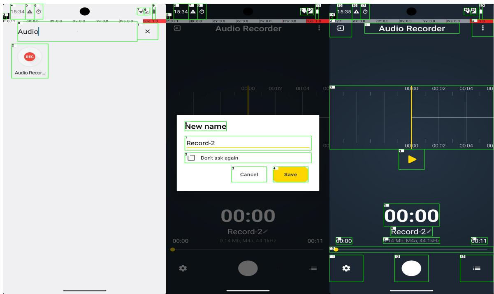  
Figure 5: Audio Recorder

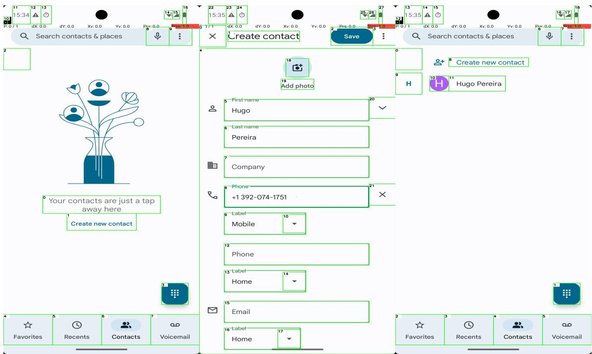  
Figure 6: Phone Contact

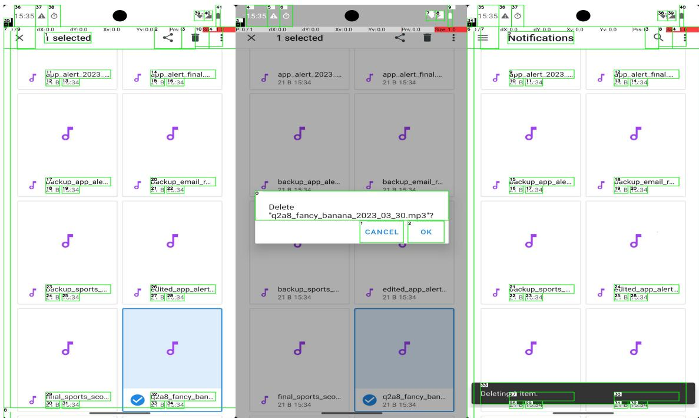  
Figure 7: Delete File

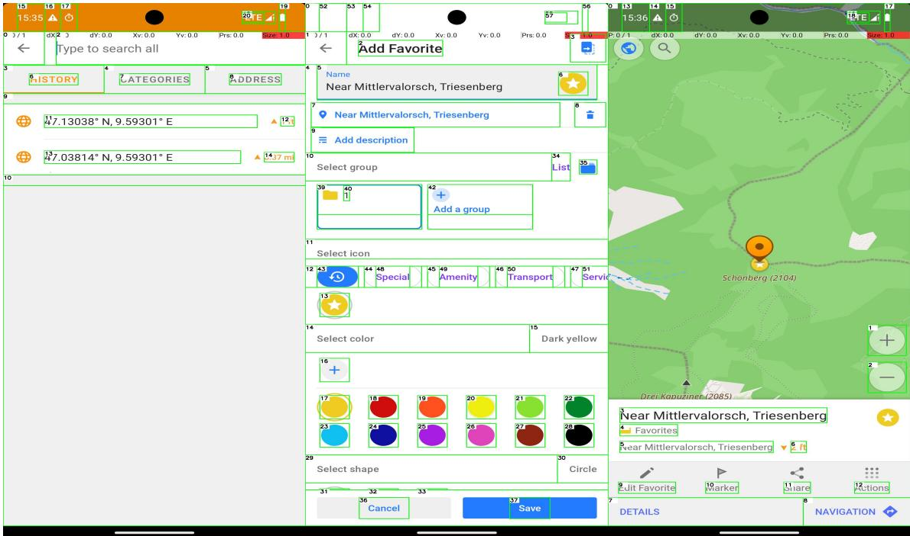  
Figure 8: Marking Map

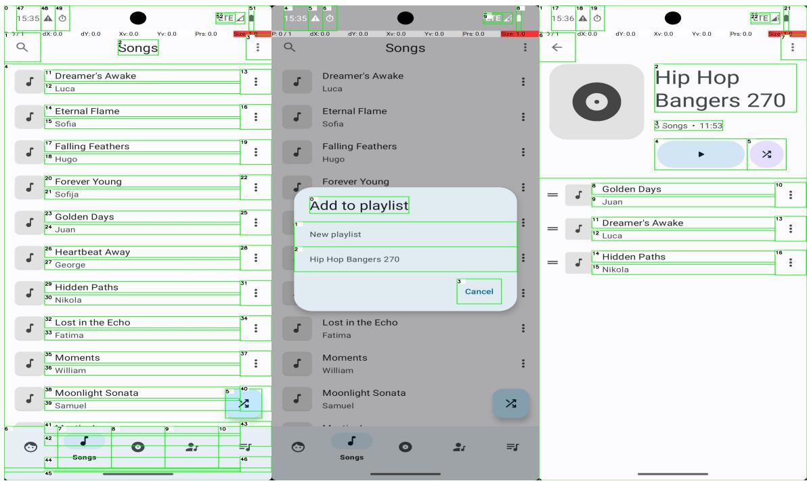  
Figure 9: Create Music Playlist

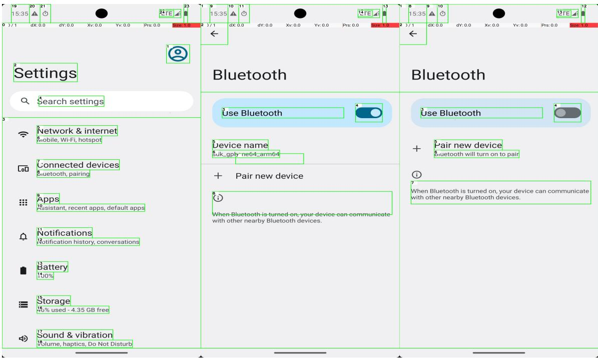  
Figure 10: Turn Bluetooth Off

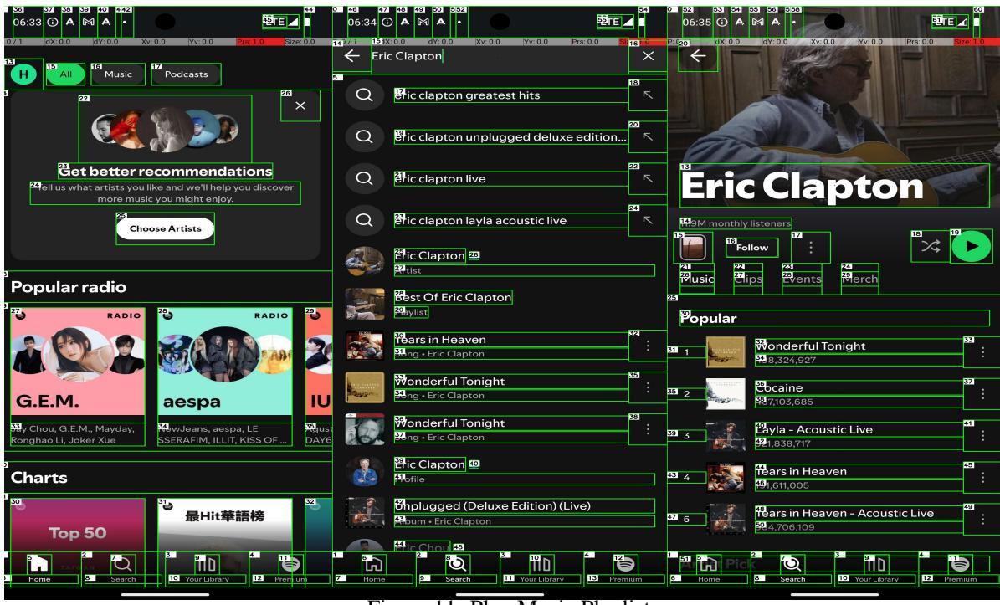  
Figure 11: Play Music Playlist

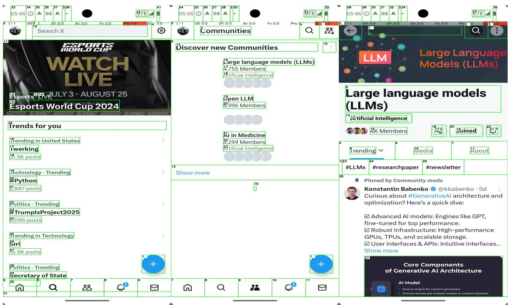  
Figure 12: Join a community

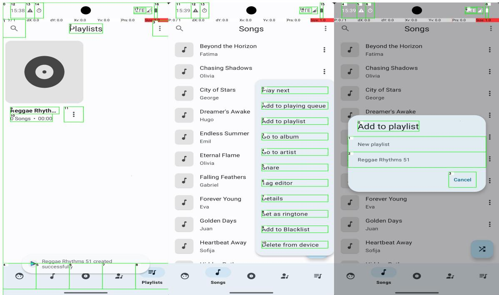  
Figure 13: Math Counting Error

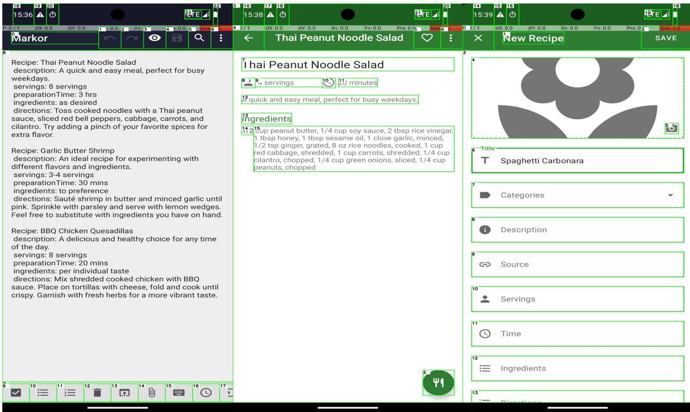  
Figure 14: Memorization Error

Figure 15: Vision Error  
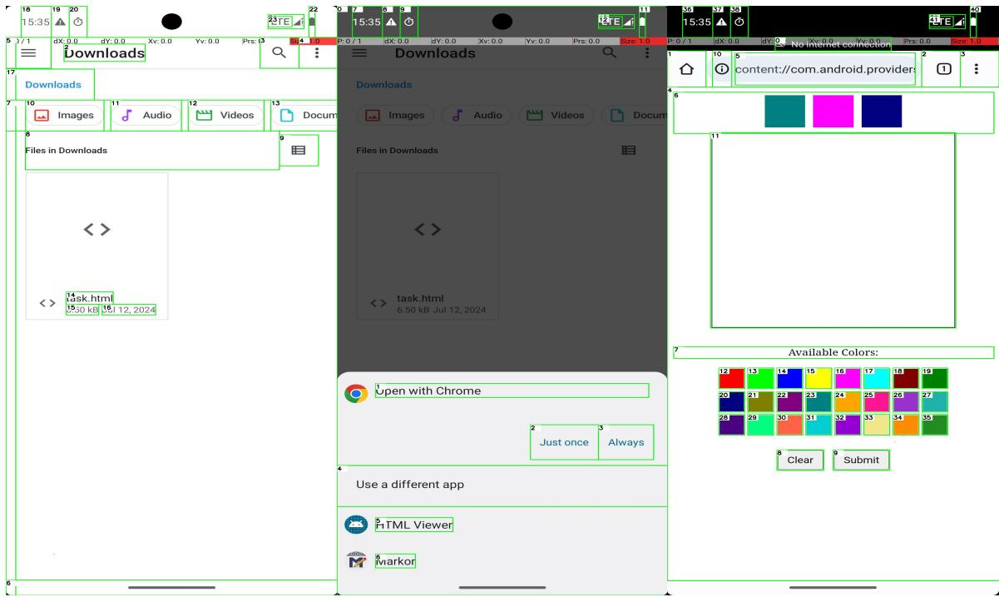