# Addressing Blind Guessing: Calibration of Selection Bias in Multiple-Choice Question Answering by Video Language Models

Olga Loginova University of Trento olga.loginova@unitn.it

Ravi Shekhar University of Essex r.shekhar@essex.ac.uk

Oleksandr Bezrukov Gran Sasso Science Institute oleksandr.bezrukov@gssi.it

Alexey Kravets University of Bath ak3095@bath.ac.uk

## Abstract

Evaluating Video Language Models (VLMs) is a challenging task. Due to its transparency, Multiple-Choice Question Answering (MCQA) is widely used to measure the performance of these models through accuracy. However, existing MCQA benchmarks fail to capture the full reasoning capabilities of VLMs due to selection bias, when models disproportionately favor certain answer options based on positional patterns observed during training. In this work, we conduct a comprehensive empirical analysis of several VLM architectures across major datasets designed to assess complex videofocused reasoning. We identify where the bias is most pronounced and demonstrate to what extent model responses reflect genuine understanding of video content and related questions, as opposed to reliance on arbitrary patterns or superficial cues, such as answer position. By decomposing the MCQA task and adapting fairness bias metrics to VLMs, we introduce a post-processing calibration technique BOLD to balance this bias. Our results show that reducing selection bias improves not only debiasing metrics but also overall model performance, including Accuracy and F1 Mean score. Our method, by suppressing "blind guessing", offers a more cost- and time-effective approach to mitigating selection bias compared to existing techniques. This study represents the first focused investigation of selection bias in videoto-text LLM-powered models.1

## 1 Introduction

Multiple-choice question answering (MCQA) is a transparent and convenient method to assess language models’ performance. Each MCQA instance presents a question and several answer options, requiring the selection of the correct one. However, large language models (LLMs) often exhibit selection bias, i.e., a tendency to favor certain answer positions irrespective of content (Zheng et al., 2024a; Wang et al., 2024a). Such bias compromises fairness, reliability, and the true reasoning capabilities of these models. Although selection bias in LLMs has received increasing attention, it remains largely unexplored for video-language models (VLMs).

VLMs integrate textual and visual inputs by processing sequences of frames and capturing both spatial and temporal features. Recent advances align pre-trained LLMs with video encoders (Bordes et al., 2024). Although VLMs inherit many properties from LLMs, their reliance on complex visual inputs introduces unique challenges, such as higher computational overhead and the need for robust spatiotemporal reasoning. The growing role of VLM-based MCQA tasks thus calls for a tailored investigation of selection bias in VLMs.

We address this gap with the first study of video-MCQA selection bias, focusing on video-specific aspects such as dynamic unfolding of events, spatial object tracking, and camera behavior, rather than general plot understanding.

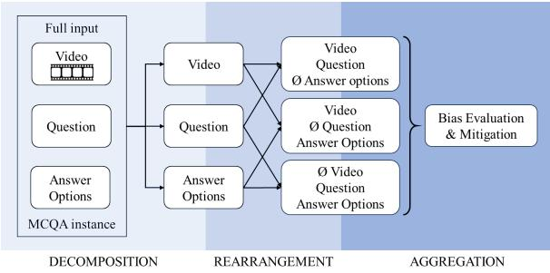  
Figure 1: Decomposition approach in 3 steps: keycomponent decomposition, rearrangement into pairs, applying probability debiasing to the aggregated data.

Through the empirical analysis, we locate where the model’s predictions are skewed by inherent option preferences. We find that, while each model demonstrates specific biases, accuracy-relevant settings yield option distributions similar to those in the default setting. This suggests that the models rely heavily on answer position, regardless of content. Conversely, in accuracy-irrelevant settings, the predicted distributions deviate significantly from uniformity, and this is where the bias is most apparent. Subsequently, we adapt the metrics from fairness bias studies (e.g., regarding race or age) to video-MCQA and deliver a calibration technique.

Figure 1 illustrates our decomposition strategy. We find that depriving the MCQA task of its key constituent components (video, question, answer options) reveals latent bias factors. We systematically isolate the three components: we remove one component at a time and rearrange the remaining pairs, obtaining three “ill-defined” variants of the original data. These decompositions allow us to identify the underlying bias patterns across different sub-spaces of the task. We then aggregate these insights and apply a probability-based debiasing procedure that adjusts the final predictions.

By experimenting with three VLM architectures and four video-specific MCQA datasets, we show that our post-training practical solution enhances interpretability, reduces computational complexity2, and improves bias metrics. Intriguingly, while our method is designed to mitigate bias, it generally improves performance with better accuracy and F1 Mean scores.

In summary, our contributions are:

• A thorough investigation of selection bias in VLM-based MCQA with 11 dataset modifications to target video-specific reasoning challenges.

• Adaptation of fairness metrics to assess selection bias in VLMs on video MCQA benchmarks.

• A novel decomposition post-processing calibration technique that leverages the rearrangement of MCQA, mitigates selection bias and improves performance.

Through the refined MCQA benchmarks, we uncover deeper reasoning issues in contemporary VLMs. Our work helps move toward more robust, fair, reliable and interpretable VLMs by bridging a gap in the study of selection bias in video understanding models and offering a cost-effective solution.

## 2 Related Works

Selection bias in LLMs has been extensively studied (Pezeshkpour and Hruschka, 2023; Zheng et al., 2023; Wang et al., 2024a; Li et al., 2024; Liusie et al., 2024; Wang et al., 2024b). Fewer works are dedicated to image-to-text vision LLMs (Zong et al., 2024; Zhang et al., 2024; Xue et al., 2024).

Zheng et al. (2024a) conducted an empirical analysis of both position and token biases and proposed PriDe, a debiasing method for LLMs that separates prior bias from unbiased results using shuffling.

We also treat the selection bias as subtraction from observed results in order to obtain the debiased outputs, but we move away from shuffling and regard bias as a vector projected onto three planes. Thus, our calibration method aligns more closely with Zhang et al. (2024), who cut off the visual input for the image-to-text MCQA. Differently, we operate on video-to-text, and, going further, decompose the bias vector into several projections rather than one. This way we eliminate the unimodal bias highlighted by Zhang et al. (2023b).

Wang et al. (2024a) and Liu et al. (2023) resolve the selection bias by augmenting datasets with reordered and additional options, increasing number of question-answer pairs in the dataset. We, in contrast, manipulate answer options, as well as videos and questions, not as a solution but as a means of analysis: we identify where the bias is most pronounced and use these modifications as a shortcut for debiasing.

Lastly, Pezeshkpour and Hruschka (2023) propose calibrating LLM predictions by redistributing probabilities to empirically determined options based on the model’s uncertainty. However, we find this approach insufficiently robust, as, according to our analysis, the bias depends on both the model and the dataset, and there is no consistent correlation between the model confidence and the presence of bias.

## 3 Empirical Analysis

## 3.1 Datasets

Our goal is to investigate VLMs’ bais under different conditions. To this end, we chose datasets specifically to cover a wide variety of question types, including what, when, why, how, and yes/no questions, that represent a broad spectrum of videospecific reasoning categories such as causal, temporal, descriptive, situational reasoning, as well as memory, abstraction, physics, and semantics.

Table 1: Summary of Question-Answer (QA) pairs, Videos, and Number of Options for each dataset.
<table><tr><td>Dataset</td><td>QA pairs</td><td>Videos</td><td>Options</td></tr><tr><td>NExT-QA</td><td>8564</td><td>1000</td><td>5</td></tr><tr><td>NExT-GQA</td><td>4962</td><td>971</td><td>5</td></tr><tr><td>STAR</td><td>7098</td><td>914</td><td>4</td></tr><tr><td>Video-MME</td><td>2700</td><td>900</td><td>4</td></tr><tr><td>Perception Test</td><td>7656</td><td>3926</td><td>3</td></tr></table>

We selected the following four video MCQA datasets: NExT-QA (Xiao et al., 2021) (and its subset NExT-GQA (Xiao et al., 2023) with timestamp annotations to locate the answer moment), STAR (Wu and Yu, 2021), Perception Test (Puatruaucean et al., 2023), and Video-MME (Fu et al., 2024). These datasets consist of videos of varying lengths, from a few seconds to over an hour. The questions are either manually crafted or generated via functional programs, and the video content range from short everyday activities to animations.

The datasets also differ in the number of answer options per question. Table 1 gives the overview of the number of QA pairs, videos, and answer options for each dataset. Further details on each dataset, including QA examples, are provided in Appendix A.

For experimenting, we used the test splits of NExT-QA/NExT-GQA and Video-MME and the publicly available validation splits with correct answer annotations of STAR and Perception Test.

## 3.2 Models

To explore selection bias in a broader context, we chose to examine it with respect to diverse model architectures. Despite the differences, the selected models share key characteristics: they sample frames to extract visual features, either by keyframe selection or uniform sampling, and align visual features with textual representations using pre-trained LLMs. Each model leverages pretrained visual encoders and fine-tunes pre-trained components with video-text datasets. The models differ substantially in methods of integrating video and language modalities (Bordes et al., 2024):

Video-LLaMA (Zhang et al., 2023a) has an additional audio channel and uses three query transformers (Q-formers) trained to align the video, audio, and language modalities.

Video-LLaVA (Lin et al., 2023a) aligns videos and LLMs within a shared representation space and has improved multimodal instruction-following capabilities.

SeViLA (Yu et al., 2023), specifically designed for question answering, implements a self-chaining approach with Localizer and Answerer: the first selects relevant frames, which the second uses to generate or choose answers.

Table 2 presents the zero-shot inference results of each model on the chosen datasets. Further details on the models, their settings, and prompts can be found in Appendix B.

## 3.3 Experimental Settings

Eleven dataset modifications are used to examine the role of each component in MCQA benchmarks: video, question, and answer options. The outmost purpose of the modifications is to identify 1) if bias is universal across models and datasets, 2) in what option(s) bias is, 3) how much each component contribute to the bias, and 4) in what settings it is the strongest with respect to each video-MCQA component.

## Video Modifications alter the video input:

1. Correct Frames: Only frames containing the answer are given as video input. This tests if reducing extraneous visual information improves performance. The modification applies only to NExT-QA (NExT-GQA) and STAR due to the availability of timestamp annotations.

2. Empty Frames: Black frames are passed instead of meaningful video input. This tests the model’s response to the absence of visual information within the multimodal setting.

Question Modifications adjust the questions in two ways:

3. Rephrased Questions: Llama3 (Dubey et al., 2024) rephrases the original questions five times, then one rephrasing is randomly selected.3 By changing the wording, we check if the selection bias is linked to the token bias.

4. Empty Questions: Following (Balepur et al.,   
2024a), we replace the question with an empty

Table 2: Inference Accuracy (Acc) and F1 Mean Score by Models and Datasets.
<table><tr><td rowspan="2">Model</td><td colspan="2">NExT-QA</td><td colspan="2">STAR</td><td colspan="2">Perception Test</td><td colspan="2">Video-MME</td></tr><tr><td>Acc</td><td>F1 Mean</td><td>Acc</td><td>F1 Mean</td><td>Acc</td><td>F1 Mean</td><td>Acc</td><td>F1 Mean</td></tr><tr><td>Video-LLaMA</td><td>40.85</td><td>40.85</td><td>36.59</td><td>31.86</td><td>41.59</td><td>37.19</td><td>32.67</td><td>28.15</td></tr><tr><td>Video-LLaVA</td><td>49.96</td><td>49.81</td><td>34.71</td><td>31.83</td><td>40.73</td><td>35.69</td><td>34.22</td><td>30.99</td></tr><tr><td>SeViLA</td><td>63.78</td><td>63.88</td><td>46.28</td><td>46.14</td><td>45.30</td><td>45.11</td><td>39.85</td><td>39.82</td></tr></table>

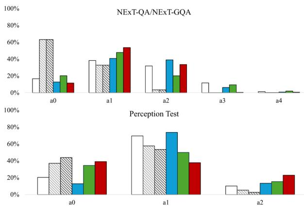

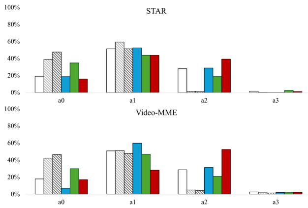  
DefaultAll Each All Correct AnswersEmpty FramesEmpty QuestionsEmpty Answers  
Figure 2: Video-LLaMA option distribution for accuracy-irrelevant settings across tested datasets. All Each represents the aggregated distribution under the All Identical Answers setting.

string to test if models can infer the question from answer choices and video.

Answer Option Modifications examine the role of answer and its position in the emergence of bias:

5. Answer Shuffling: Options are randomly shuffled once. Previous experiments (Zheng et al., 2023; Zong et al., 2023) showed that the models are not robust against changing the option order. Regardless of accuracy, we check if the distribution of answers in each option is the same, which reveals the bias consistency.

6. Correct Answer in Each Option: The correct answer is placed in a fixed position; its content is swapped with another option. By changing the position of correct answer we test to what extend each option contribute to the models’ choice.

7. Correct Answer with Shuffling: The correct answer is fixed, and the remaining options are shuffled. This fusion of the previous two approaches tests how stable a particular option choice is given that it is correct.

8. Additional Empty Option: A new empty option is added in the end to check for overfitting to specific options. If the added blank line is predicted, this indicates a biased distribution of predictions among a certain number of options.

9. All Identical Answers: All options are identical testing for deviation from uniform distribution. When the answer from each option becomes the answer of all options, the answer bias with respect to tokens is eliminated. Moreover, since there is no correct answer in the case of distractors, we can check the answer choice that happens without meaningful reasoning.

10. All Correct Answers: Every option is correct. In addition to (9), where any answer is equal, in this setting any answer is valid. The expectation is to get the consistent uniform distribution.

11. Empty Answers: Each answer option is an empty string. With a non-existent answer, the option name and its position in the question are the only sources for choosing an answer.

To reduce token bias, we use less common option names a0, a1, a2, etc. instead of the conventional A, B, C, etc.

Modifications can also be categorized as accuracy-relevant (e.g., correct frames, shuffling, or rephrased questions) and accuracy-irrelevant (e.g., identical answers or empty parts). Further details, including accuracy results, confusion matrices and examples for each modification are provided in the Appendix C.

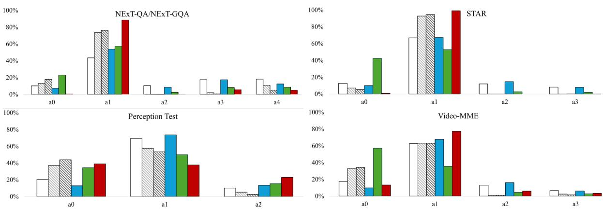  
Default All Each All Correct Answers Empty Frames Empty QuestionsEmpty Answers  
Figure 3: Video-LLaVA option distribution for accuracy-irrelevant settings across tested datasets. All Each represents the aggregated distribution under the All Identical Answers setting.

## 3.4 Observations

Accuracy-relevant settings (Correct Frames, Rephrased Questions, and Answer Shuffling) vary in accuracy but yield almost the same option distributions as the default setting. This suggests that models rely more on answer position than on visual or textual content.

When the correct answer is placed in each option (Correct Answer in Each Option) or combined with shuffling (Correct Answer with Shuffling), the selection rate for that option increases, which indicates adequate reasoning. Moving the correct answer into less favored positions increases their selection proportion, and adding shuffling to it has minimal additional effect.

In contrast, accuracy-irrelevant settings clearly expose bias. Under identical options (All Identical Answers and All Correct Answers) or incomplete conditions (Empty Frames, Empty Questions, Empty Answers), the predicted distributions deviate significantly from uniformity. Figures 2-4 highlight the patterns of the accuracy-agnostic settings as they are indicative for the study of bias, while full performance details are in Appendix C.

In case of All Identical Answers each-option answer showed consistently a very close distribution, so in the figures the result of All Each is obtained by averaging the outcomes across every option experiments within this setting. Tall bars concentrated in certain options indicate bias, while persistently low bars reveal neglected options. Each model exhibits pronounced biases toward specific options.

Video-LLaMA (Figure 2) strongly favors a1 and tends to ignore options beyond the third one. In the Perception Test (three options), it already shows bias against the third option. With identical answers, a0 sometimes competes with a1, and when answers are empty, a2 surprisingly surpasses a1 in Video-MME. Empty settings cover the behavior of the bias to the greatest extent.

Video-LLaVA (Figure 3) behaves similarly but exhibits even stronger bias toward a1, largely ignoring higher-numbered options. Unlike Video-LLaMA, it overwhelmingly favors a1 when answers are empty. With empty questions, a0 begins to compete with a1, especially in Video-MME.

SeViLA5 demonstrates greater robustness on NExT-QA, maintaining about uniform 20% distribution under harsh attacks. It only becomes unstable when all correct answers are identical (favoring a0) and with empty answers (favoring the last option). Figure 4 shows slightly higher saturation for these conditions. Unlike Video-LLaMA and Video-LLaVA, which rely on multinomial probabilities, SeViLA uses the argmax function, always selecting the first option if probabilities are equal. This explains why it often favors the first option, a0, in identical-answer scenarios.

## 4 Methodology

Our bias calibration approach is grounded in established guidelines for developing and validating multiple-choice test items (Haladyna, 2004), which emphasize balanced, independent, and logically plausible options. This way we ensure that the datasets isolate positional bias and allow our calibration method to be applied effectively. Specifically, we require the following conditions to hold in the MCQA benchmark:

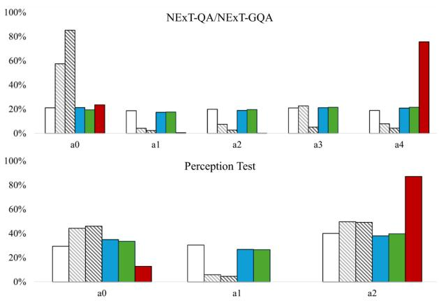

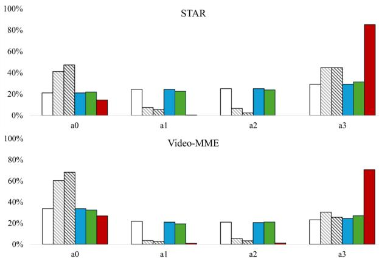  
Default All Each All Correct Answers Empty Frames Empty QuestionsEmpty Answers  
Figure 4: SeViLA option distribution for accuracy-irrelevant settings across tested datasets. All Each represents the aggregated distribution under the All Identical Answers setting.

1. Balanced options: All answer options are presented equally without any positional or presentation bias. This is crucial and straightforward to achieve via minimal preprocessing.

2. Independent options: Each option for a given question is independent of others. There should be no overlapping content or logical dependencies among options that influence selection.

3. No logically better or worse options except the correct one: All distractors should be plausible and not trivially inferior or superior to the correct answer. This ensures that the model must rely on genuine reasoning.

## 4.1 Evaluation Criteria

Our framework both detects bias and evaluates performance. Bias metrics assess model’s consistency in treating all answer options fairly, while performance metrics evaluate accuracy and reliability.

We monitor the standard deviations of the F1 score (F1\_std) and the recall (Recall\_std). A high F1\_std indicates inconsistent performance across options, signaling bias. A high Recall\_std suggests the model is better at identifying correct answers for certain options over others.

For option probabilities, we use the standard deviation of the symmetric Jensen-Shannon distance (JS\_std) to detect inconsistencies between the predicted and the true probability distributions. This metric, bounded between 0 and 1, is more interpretable than Kullback-Leibler (KL) divergence.

By tracking these metrics, we address group fairness, ensuring the model treats all options equitably. Large standard deviations in any metric suggest bias, which we aim to minimize.

## 4.2 Debiasing Approach

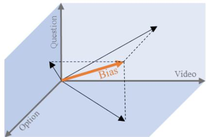  
Figure 5: Bias vector and its projections on the decomposition planes.

Every MCQA benchmark comprises essential components that make the answering task feasible. In the case of video-MCQA, these components include the video, the question, and the answer options. We construct decompositions where the task becomes impossible by design, as one of the key components is removed. This allows us to examine the projections of model’s behavioral bias on each decomposition plane as intuitively shown in Figure 5. In a fair and unbiased model, projecting the dataset by omitting one of the key components would result in a uniform distribution. However, as shown in Section 3, this is far from the case. In the decomposition planes, the bias is more clearly manifested, and since we expect uniformity, the bias becomes easier to detect and mitigate.

## 4.2.1 Decomposition

Let a Multiple-Choice Question Answering task $T$ be well-defined if there is one and only one correct option to answer the question based on the provided context. Otherwise, the $T$ is ill-defined. We wish to decompose $T$ into the following independent components: video context, question, answer options. Omitting any of these components makes $T$ ill-defined. In general, there could be n independent components $C _ { 1 } , C _ { 2 } , \ldots , C _ { n }$ . Let $P ( T )$ be a well-defining property (correctness) of $T$ such that $P ( T ) = 1 { \mathrm { ~ i f ~ } } T$ is well-defined, otherwise - $P ( T ) = 0$ . We assume that all tasks are initially well-defined.

A model M takes a task $T$ as input and outputs an option ID corresponding to the correct answer for a video-based question: $M ( T ) = I D _ { o p t }$

For an ill-defined task, a model that is both reasonable and unbiased should uniformly select any option ID. Formally, if ${ \cal P } ( { \cal T } ) = = 0 : M ( { \cal T } ) =$ RandomChoice $\left( \{ I D _ { o p t } \} \right)$ .

The key insight from the analysis in Section 3 is if the model has bias on a given dataset, this bias is likely to be more ubiquitous, hence evident, in the ill-defined versions of the tasks.

Let A be an attack on the well-defined task that removes one of the task component $C _ { i }$ that makes this task defined insufficiently, i.e. $A ( T ) = { \hat { T } }$ and $P ( \hat { T } ) = 0$ while initially $P ( T ) = 1$ . Let $A ( D )$ be an attack on dataset $D$ which means applying element-wise the same attack A to each $T$ from $D$ Subsequently, we consider three types of attacks that make the task ill-defined: $A _ { v = 0 }$ for all zeroed frames in the video, $A _ { q = 0 }$ for all questions as an empty string, and $A _ { o = 0 }$ for all options as IDs only.

We investigate the importance of the following components of the bias Bias $\boldsymbol { \scriptscriptstyle M } : B i a s _ { M } \big | _ { A _ { v = 0 } ( D ) }$ $B i a s _ { M } | _ { A _ { q = 0 } ( D ) }$ $B i a s _ { M } | _ { A _ { o = 0 } ( D ) }$ , and how efficiently we can handle the general bias by balancing through these components.

## 4.2.2 Debiasing

The observed prediction distribution $P _ { o }$ over options $\{ d _ { i } \} _ { i = 1 } ^ { n }$ and conditioned on task $T$ where task $T =$ (video, question, options) can be decomposed as the prior distribution $P _ { p }$ over $d _ { i }$ and the debiased distribution $P _ { d } \mathbf { : }$

$$
P _ { o } ( d _ { i } | T ) = { \frac { 1 } { Z _ { T } } } P _ { p } ( d _ { i } | T ) \times P _ { d } ( d _ { i } | T )\tag{1}
$$

where $Z _ { T }$ is a normalization factor.

The baseline method BOLD (Bias Optimisation Leveraging Decomposition) estimates the prior bias as following:

$$
\begin{array} { r } { \tilde { P } _ { p } ( d _ { i } | T ) = s o f t m a x \left( \sum _ { j } P _ { p } ( d _ { i } | A _ { j } ( T ) ) \right) } \end{array}\tag{2}
$$

First, we estimate the model bias on the dataset after attack A. We derive the $P _ { p }$ knowing that $P _ { d }$ is uniformly distributed from Equation 1:

$$
P _ { p } ( d _ { i } \mid A ( T ) ) = P _ { o } ( d _ { i } \mid A ( T ) )\tag{3}
$$

To estimate the bias under $A _ { v = 0 } , \ A _ { q = 0 }$ and $A _ { o = 0 }$ attacks, we first compute $P _ { p } ( d _ { i } | A _ { v = 0 } ( T ) )$ , $P _ { p } ( d _ { i } | A _ { q = 0 } ( \boldsymbol { T } ) )$ and $P _ { p } ( d _ { i } | A _ { o = 0 } )$ , and then the prior estimation, respectively: $\tilde { P } _ { p } ( d _ { i } | T )$ = so $\begin{array} { r } { \rlap { / } \mathrm { \Delta } f t m a x [ P _ { p } ( d _ { i } | A _ { v = 0 } ( T ) ) \ + \ P _ { p } ( d _ { i } | A _ { q = 0 } ( T ) ) \ - } \end{array}$ + $P _ { p } ( d _ { i } | A _ { o = 0 } ( T ) ) ]$

According to Zheng et al. (2024b), biases related to option IDs may transfer effectively across different samples and domains. Therefore, finding the global prior with $K$ samples, we can mitigate the bias for the entire dataset with minimal efforts.

From the dataset $D _ { : }$ , we take $K = k * | | D | |$ samples, denoted as $D _ { k }$ , where k is adjusted coefficient based on estimation budget. Each sample in $D _ { k }$ is subjected to the set of attacks A. For each, we calculate the sample-specific prior $P _ { p } ( d _ { i } | A ( T ) )$ by Equation 3 and estimate the adjusted prior $\tilde { P } _ { p } ( d _ { i } | T )$ by Equation 2. The global prior, $\tilde { P } _ { \mathrm { p } } ( d _ { i } )$ , is then obtained by averaging the priors for each sample.

Ultimately, the posterior debiased through the global prior is calculated as follows:

$$
P _ { d } ( d _ { i } | T ) = s o f t m a x \left( \log P _ { o } ( d _ { i } | T ) - \log \tilde { P } _ { p } ( d _ { i } ) \right)\tag{4}
$$

In the extended version, Weighted\_BOLD, we use weights for $P _ { p } ( d _ { i } | A ( T ) )$ ):

$$
\begin{array} { r } { \tilde { P } _ { p } ( d _ { i } | T ) = s o f t m a x \left( \sum _ { j } w _ { j } P _ { p } ( d _ { i } | A _ { j } ( T ) ) \right) } \end{array}\tag{5}
$$

This allows for a more optimal direction in the latent space of the priors, as we can prioritize certain priors by significance and refine the prior estimation $\tilde { P } _ { p } ( d _ { i } | T )$

To gain the optimal weights, we use a 5-fold cross-validation procedure. In each fold, we optimize weights $\{ w _ { i } \}$ using the COBYLA algorithm (Powell, 1994), subject to the constraints $0 \leq w _ { i } \leq 1 \ \mathrm { o r } \ | w _ { i } | \leq 1$

The restriction $0 \leq w _ { i } \leq 1$ implies that the resulting debiasing vector is formed as a convex combination of the prior directions, remaining within the positive span of the original vectors. With this easy-to-interpret setup, we analyze how much each prior contributes to the final debiasing vector. Notably, a weight distribution with $w _ { i } = 0$ enables ablation-style analysis by turning off the corresponding debiasing component. Uninformative or detrimental priors are automatically suppressed, resulting in a more streamlined and potentially more generalizable debiasing vector. When we allow the more relaxed constraint $| w _ { i } | \leq 1$ , the COBYLA optimizer explores the full linear subspace spanned by the prior vectors, and the solution is no longer restricted to the positive orthant. This provides additional flexibility to correct for complex biases that may not be adequately addressed by additive combinations alone.

Table 3: Comparison of BOLD and Weighted\_BOLD bias mitigation approaches across models and datasets for performance and bias monitoring metrics with $k = 0 . 5 .$ Green arrows indicate improvements: upward for Accuracy and F1\_mean, and downward for standard deviation metrics. Red arrows represent deterioration, respectively.
<table><tr><td rowspan="2">Model</td><td rowspan="2">Dataset</td><td rowspan="2">Configuration</td><td colspan="2">Performance Metrics</td><td colspan="3">Bias Monitoring Metrics</td></tr><tr><td>Accuracy</td><td>F1_mean</td><td>Recall_std</td><td>F1_std</td><td>JS_std</td></tr><tr><td rowspan="8">Video-LLaMA</td><td>NExT-QA</td><td>BOLD</td><td>45.88 (↑2.43%)</td><td>42.15 (↑3.18%)</td><td>22.98 (↓3.53%)</td><td>15.53 (↓2.11%)</td><td>15.55 (↓3.31%)</td></tr><tr><td></td><td>Weighted_BOLD</td><td>45.91 (↑2.51%)</td><td>42.2 (↑3.29%)</td><td>22.83 (↓4.19%)</td><td>15.51 (↓2.2%)</td><td>15.56 (↓3.27%)</td></tr><tr><td>STAR</td><td>BOLD</td><td>37.19 (↑1.82%)</td><td>33.02 (↑3.65%)</td><td>22.29 (↓7.5%)</td><td>14.55 (↓5.75%)</td><td>14.58 (↓4.66%)</td></tr><tr><td></td><td>Weighted_BOLD</td><td>37.34 (↑2.24%)</td><td>33.5 (↑5.16%)</td><td>21.13 (↓12.3%)</td><td>14.05 (↓8.98%)</td><td>14.14 (↓7.54%)</td></tr><tr><td>Perception Test</td><td>BOLD</td><td>41.9 (↑1.24%)</td><td>38.68 (↑4.01%)</td><td>24.05 (↓11.11%)</td><td>9.87 (↓13.45%)</td><td>14.45 (↓10.01%)</td></tr><tr><td></td><td>Weighted_BOLD</td><td>42.06 (↑1.62%)</td><td>39.36 (↑5.86%)</td><td>21.8 (↓19.45%)</td><td>9.11 (↓20.06%)</td><td>13.02 (↓18.94%)</td></tr><tr><td>Video-MME</td><td>BOLD</td><td>32.73 (↑2.13%)</td><td>29.23 (↑3.85%)</td><td>19.29 (↓6.45%)</td><td>11.96 (↓4.46%)</td><td>13.1 (↓4.73%)</td></tr><tr><td></td><td>Weighted_BOLD</td><td>32.2 (↑0.47%)</td><td>28.98 (↑2.94%)</td><td>17.65 (↓14.38%)</td><td>11.69 (↓6.56%)</td><td>12.64 (↓8.04%)</td></tr><tr><td rowspan="8">Video-LLaVA</td><td>NExT-QA</td><td>BOLD</td><td>51.81 (↑3.72%)</td><td>51.71 (↑3.82%)</td><td>13.27 (↓18.63%)</td><td>2.67 (↓18.42%)</td><td>4.58 (↓15.06%)</td></tr><tr><td></td><td>Weighted_BOLD</td><td>52.15 (↑4.39%)</td><td>52.04 (↑4.49%)</td><td>12.72 (↓22.02%)</td><td>2.62 (↓19.83%)</td><td>4.49 (↓16.83%)</td></tr><tr><td>STAR</td><td>BOLD</td><td>37.21 (↑7.01%)</td><td>35.76 (↑12.37%)</td><td>18.28 (↓26.85%)</td><td>4.97 (↓27.15%)</td><td>4.54 (↓21.39%)</td></tr><tr><td></td><td>Weighted_BOLD</td><td>37.53 (↑7.94%)</td><td>36.18 (↑13.69%)</td><td>17.45 (↓30.15%)</td><td>4.91 (↓28.03%)</td><td>4.26 (↓26.24%)</td></tr><tr><td>Perception Test</td><td>BOLD</td><td>41.62 (↑2.22%)</td><td>38.69 (↑8.4%)</td><td>21.75 (↓20.9%)</td><td>10.92 (↓25.97%)</td><td>3.78 (↓28.4%)</td></tr><tr><td></td><td>Weighted_BOLD</td><td>41.95 (↑3.02%)</td><td>39.46 (↑10.58%)</td><td>19.73 (↓28.26%)</td><td>10.24 (↓30.53%)</td><td>3.4 (↓35.51%)</td></tr><tr><td>Video-MME</td><td>BOLD</td><td>34.7 (↑1.19%)</td><td>32.79 (↑5.81%)</td><td>18.19 (↓24.51%)</td><td>6.16 (↓23.63%)</td><td>3.84 (↓19.93%)</td></tr><tr><td></td><td>Weighted_BOLD</td><td>34.63 (↑0.97%)</td><td>32.97 (↑6.38%)</td><td>16.36 (↓32.07%)</td><td>6.01 (↓25.43%)</td><td>3.43 (↓28.5%)</td></tr><tr><td rowspan="8">SeViLA</td><td>NExT-QA</td><td>BOLD</td><td>63.92 (↑0.02%)</td><td>63.89 (↑0.02%)</td><td>2.03 (↓5.47%)</td><td>1.18 (↓10.4%)</td><td>1.99 (↓0.17%)</td></tr><tr><td></td><td>Weighted_BOLD</td><td>63.93 (↑0.04%)</td><td>63.91 (↑0.04%)</td><td>1.99 (↓7.64%)</td><td>1.19 (↓9.83%)</td><td>1.99 (↓0.04%)</td></tr><tr><td>STAR</td><td>BOLD</td><td>46.22 (↓0.12%)</td><td>46.1 (↓0.08%)</td><td>4.13 (↓7.46%)</td><td>2.26 (↓1.78%)</td><td>2.1 (↓6.64%)</td></tr><tr><td></td><td>Weighted_BOLD</td><td>46.2 (↓0.18%)</td><td>46.08 (↓0.13%)</td><td>4.01 (↓10.17%)</td><td>2.2 (↓4.36%)</td><td>2.07 (↓8.2%)</td></tr><tr><td>Perception Test</td><td>BOLD</td><td>45.32 (↑0.06%)</td><td>45.18 (↑0.16%)</td><td>5.18 (↓16.61%)</td><td>2.95 (↓2.43%)</td><td>1.3 (↓18.42%)</td></tr><tr><td></td><td>Weighted_BOLD</td><td>45.31 (↑0.03%)</td><td>45.2 (↑0.21%)</td><td>4.56 (↓26.58%)</td><td>2.83 (↓6.43%)</td><td>1.08 (↓31.92%)</td></tr><tr><td>Video-MME</td><td>BOLD</td><td>40.19 (↑0.84%)</td><td>40.17 (↑0.88%)</td><td>4.11 (↓12.03%)</td><td>1.41 (↓16.19%)</td><td>0.73 (↓12.52%)</td></tr><tr><td></td><td>Weighted_BOLD</td><td>40.04 (↑0.46%)</td><td>40.03 (↑0.54%)</td><td>3.78 (↓19.14%)</td><td>1.44 (↓14.6%)</td><td>0.69 (↓17.22%)</td></tr></table>

While we minimize the standard deviation of Recall\_std across the options on the test set, we monitor the same bias metrics on the validation set. After completing the cross-validation we average the estimated global priors across the folds and apply this averaged global prior. Both algorithms, BOLD and Weighted\_BOLD, are outlined in Appendix D.

## 5 Results

We conducted tests with the k sample parameter set to 0.25, 0.5, 0.75, and 1 (the entire dataset) in combination with positive and negative weights. The configuration with k=0.5 and $w _ { i } \geq 0$ provided the optimal balance between sample size and performance. As shown in Table 3 with results for positive weights and $k { = } 0 . 5 , { } ^ { 6 }$ the overall significant improvement in bias metrics, including Recall\_std, indicates that our method effectively reduces option disparity.

Weighted\_BOLD generally outperforms BOLD because the weights capture critical priors in the latent space. Thus, they prove to be effective for fine-tuning bias correction within the decomposed priors.

Both BOLD and Weighted\_BOLD consistently improve performance metrics for Video-LLaMA and Video-LLaVA. SeViLA generally shows more resilience to bias calibration, with minimal effect on performance on NExT-QA and marginal deterioration on STAR. This may be attributed to the model’s training for statistically close to uniform distribution of results over a fixed options number. Despite decreases in Accuracy and F1 Mean on STAR, the reduction in Recall\_std across all datasets for this model suggests that its debiased responses are more truthful, reflecting a fairer distribution of correct answers across options.

Video-LLaVA, which exhibits the most pronounced selection bias, benefits the most from bias reduction via prior decomposition across all datasets, achieving a maximum accuracy gain of 7.94% on STAR with the weighted configuration.

## 6 Conclusion

We presented the first comprehensive analysis of selection bias in video-based MCQA tasks, using modified datasets to pinpoint how bias emerges within specific answer options and across different VLM architectures. Our findings reveal that while all models share common tendencies in answer distribution, they also possess distinct bias profiles both across and within datasets. Notably, the bias vector is consistently more pronounced when projecting onto the decomposed planes where one key MCQA component (video, question, or answer options) is removed.

Building on these insights, we proposed the BOLD calibration method using a global prior bias vector, derived from the decomposed versions of the task, to mitigate selection bias. Our technique requires only three decompositions per question and is thus resource-efficient. Our BOLD bias removal not only enhances fairness and interpretability but also improves performance metrics. Extending the method to Weighted\_BOLD refines the balance between debiasing and performance gains.

This easily scalable, post-processing, automatic, and unsupervised method is applicable to any existing VLM and allows for a sharper focus on its true reasoning capabilities. By making MCQA benchmarks more robust, transparent, and impartial, we enable a clearer assessment of the genuine reasoning cues in VLMs and pave the way for future improvements in model design and training strategies.

Furthermore, elevating bias suppression to an abstract level, where tasks are systematically decomposed and key components are removed to identify bias, we offer a framework beyond the current scope to address other bias-related challenges in machine learning models.

## 7 Limitations

Our approach rests on the assumption that when models lack sufficient direct information, they rely on indirect cues, manifesting as selection bias. While we have shown that bias can be decomposed by selectively removing the video, question, or answer component, this decomposition may not be exhaustive. There could be more optimal directions in the latent space of decomposed priors. Similarly, although our method identifies pronounced bias when all answers are correct, there remain scenarios where further supervised debiasing (e.g., applying COBYLA optimization with true labels) might yield more optimal results. We aimed for an easy-to-implement, unsupervised solution without relying on ground-truth answers.

We also assume the validity of uniform distribution as a baseline: Jensen-Shannon Divergence operates under the assumption that, in the absence of prior information, the distribution should be uniform. If the test MCQA data or task suggest an uneven distribution of answer options, this may lead to underestimating the significance of certain factors.

Another limitation is that we primarily assessed our post-processing calibration on the original datasets rather than systematically verifying performance improvements across all modifications. While our current evaluation covers four challenging video datasets and three model architectures, more granular, scenario-specific testing would provide stronger evidence of robustness. However, performing comprehensive evaluations on every modification poses practical challenges. These limitations point toward future work: exploring more nuanced testing scenarios, investigating methods that do not rely on uniform reference distributions, and potentially leveraging additional computational resources or innovative techniques for even more thorough bias and performance assessments.

## 8 Ethics Statement

We based our experiments on existing datasets, ensuring compliance with their respective copyrights. Our research uses open-source VLMs, which, while offering accessibility and flexibility, also carry the inherent risks associated with openended text generation.

## Acknowledgements

Olga Loginova thanks Amazon Alexa for supporting her research through a generous donation to Raffaella Bernardi. Ravi Shekhar has been partially funded by the UKRI and the European Union. The views and opinions expressed are, however, those of the authors only and do not necessarily reflect those of the European Union or Research Executive Agency. Neither the European Union nor the granting authority can be held responsible for them. All authors are deeply grateful to Giovanni Bonetta for his invaluable contributions and insightful consultations at earlier stages of the project.

## References

Max Bain, Arsha Nagrani, Gül Varol, and Andrew Zisserman. 2021. Frozen in time: A joint video and image encoder for end-to-end retrieval. In IEEE International Conference on Computer Vision.

Nishant Balepur, Abhilasha Ravichander, and Rachel Rudinger. 2024a. Artifacts or abduction: How do llms answer multiple-choice questions without the question? Preprint, arXiv:2402.12483.

Nishant Balepur, Abhilasha Ravichander, and Rachel Rudinger. 2024b. Artifacts or abduction: How do llms answer multiple-choice questions without the question? ArXiv, abs/2402.12483.

Florian Bordes, Richard Yuanzhe Pang, Anurag Ajay, Alexander C. Li, Adrien Bardes, Suzanne Petryk, Oscar Mañas, Zhiqiu Lin, Anas Mahmoud, Bargav Jayaraman, Mark Ibrahim, Melissa Hall, Yunyang Xiong, Jonathan Lebensold, Candace Ross, Srihari Jayakumar, Chuan Guo, Diane Bouchacourt, Haider Al-Tahan, Karthik Padthe, Vasu Sharma, Huijuan Xu, Xiaoqing Ellen Tan, Megan Richards, Samuel Lavoie, Pietro Astolfi, Reyhane Askari Hemmat, Jun Chen, Kushal Tirumala, Rim Assouel, Mazda Moayeri, Arjang Talattof, Kamalika Chaudhuri, Zechun Liu, Xilun Chen, Quentin Garrido, Karen Ullrich, Aishwarya Agrawal, Kate Saenko, Asli Celikyilmaz, and Vikas Chandra. 2024. An introduction to visionlanguage modeling. ArXiv, abs/2405.17247.

Wei-Lin Chiang, Zhuohan Li, Zi Lin, Ying Sheng, Zhanghao Wu, Hao Zhang, Lianmin Zheng, Siyuan Zhuang, Yonghao Zhuang, Joseph E. Gonzalez, Ion Stoica, and Eric P. Xing. 2023. Vicuna: An opensource chatbot impressing gpt-4 with 90%\* chatgpt quality.

Hyung Won Chung, Le Hou, S. Longpre, Barret Zoph, Yi Tay, William Fedus, Eric Li, Xuezhi Wang, Mostafa Dehghani, Siddhartha Brahma, Albert Webson, Shixiang Shane Gu, Zhuyun Dai, Mirac Suzgun, Xinyun Chen, Aakanksha Chowdhery, Dasha Valter, Sharan Narang, Gaurav Mishra, Adams Wei Yu, Vincent Zhao, Yanping Huang, Andrew M. Dai, Hongkun Yu, Slav Petrov, Ed Huai hsin Chi, Jeff Dean, Jacob Devlin, Adam Roberts, Denny Zhou, Quoc V. Le, and Jason Wei. 2022. Scaling instruction-finetuned language models. ArXiv, abs/2210.11416.

Abhimanyu Dubey, Abhinav Jauhri, Abhinav Pandey, Abhishek Kadian, Ahmad Al-Dahle, Aiesha Letman, Akhil Mathur, Alan Schelten, Amy Yang, Angela Fan, Anirudh Goyal, Anthony Hartshorn, Aobo Yang, Archi Mitra, Archie Sravankumar, Artem Korenev, Arthur Hinsvark, Arun Rao, Aston Zhang, Aurelien Rodriguez, Austen Gregerson, Ava Spataru, Baptiste Roziere, Bethany Biron, Binh Tang, Bobbie Chern, Charlotte Caucheteux, Chaya Nayak, Chloe Bi, Chris Marra, Chris McConnell, Christian Keller, Christophe Touret, Chunyang Wu, Corinne Wong, Cristian Canton Ferrer, Cyrus Nikolaidis, Damien Allonsius, Daniel Song, Danielle Pintz, Danny Livshits,

David Esiobu, Dhruv Choudhary, Dhruv Mahajan, Diego Garcia-Olano, Diego Perino, Dieuwke Hupkes, Egor Lakomkin, Ehab AlBadawy, Elina Lobanova Emily Dinan, Eric Michael Smith, Filip Radenovic, Frank Zhang, Gabriel Synnaeve, Gabrielle Lee, Georgia Lewis Anderson, Graeme Nail, Gregoire Mi alon, Guan Pang, Guillem Cucurell, Hailey Nguyen, Hannah Korevaar, Hu Xu, Hugo Touvron, Iliyan Zarov, Imanol Arrieta Ibarra, Isabel Kloumann, Ishan Misra, Ivan Evtimov, Jade Copet, Jaewon Lee, Jan Geffert, Jana Vranes, Jason Park, Jay Mahadeokar, Jeet Shah, Jelmer van der Linde, Jennifer Billock, Jenny Hong, Jenya Lee, Jeremy Fu, Jianfeng Chi, Jianyu Huang, Jiawen Liu, Jie Wang, Jiecao Yu, Joanna Bitton, Joe Spisak, Jongsoo Park, Joseph Rocca, Joshua Johnstun, Joshua Saxe, Junteng Jia, Kalyan Vasuden Alwala, Kartikeya Upasani, Kate Plawiak, Ke Li, Kenneth Heafield, Kevin Stone, Khalid El-Arini, Krithika Iyer, Kshitiz Malik, Kuen ley Chiu, Kunal Bhalla, Lauren Rantala-Yeary, Lau rens van der Maaten, Lawrence Chen, Liang Tan, Liz Jenkins, Louis Martin, Lovish Madaan, Lubo Malo, Lukas Blecher, Lukas Landzaat, Luke de Oliveira, Madeline Muzzi, Mahesh Pasupuleti, Mannat Singh Manohar Paluri, Marcin Kardas, Mathew Oldham, Mathieu Rita, Maya Pavlova, Melanie Kambadur, Mike Lewis, Min Si, Mitesh Kumar Singh, Mona Hassan, Naman Goyal, Narjes Torabi, Nikolay Bash lykov, Nikolay Bogoychev, Niladri Chatterji, Olivier Duchenne, Onur Çelebi, Patrick Alrassy, Pengchuan Zhang, Pengwei Li, Petar Vasic, Peter Weng, Pra jjwal Bhargava, Pratik Dubal, Praveen Krishnan, Punit Singh Koura, Puxin Xu, Qing He, Qingxiao Dong, Ragavan Srinivasan, Raj Ganapathy, Ramon Calderer, Ricardo Silveira Cabral, Robert Stojnic, Roberta Raileanu, Rohit Girdhar, Rohit Patel, Ro main Sauvestre, Ronnie Polidoro, Roshan Sumbaly, Ross Taylor, Ruan Silva, Rui Hou, Rui Wang, Saghar Hosseini, Sahana Chennabasappa, Sanjay Singh Sean Bell, Seohyun Sonia Kim, Sergey Edunov, Shaoliang Nie, Sharan Narang, Sharath Raparthy, Sheng Shen, Shengye Wan, Shruti Bhosale, Shun Zhang, Simon Vandenhende, Soumya Batra, Spencer Whitman, Sten Sootla, Stephane Collot, Suchin Gu rurangan, Sydney Borodinsky, Tamar Herman, Tara Fowler, Tarek Sheasha, Thomas Georgiou, Thomas Scialom, Tobias Speckbacher, Todor Mihaylov, Tong Xiao, Ujjwal Karn, Vedanuj Goswami, Vibhor Gupta, Vignesh Ramanathan, Viktor Kerkez, Vincent Gonguet, Virginie Do, Vish Vogeti, Vladan Petro vic, Weiwei Chu, Wenhan Xiong, Wenyin Fu, Whit ney Meers, Xavier Martinet, Xiaodong Wang, Xiao qing Ellen Tan, Xinfeng Xie, Xuchao Jia, Xuewei Wang, Yaelle Goldschlag, Yashesh Gaur, Yasmine Babaei, Yi Wen, Yiwen Song, Yuchen Zhang, Yue Li, Yuning Mao, Zacharie Delpierre Coudert, Zheng Yan, Zhengxing Chen, Zoe Papakipos, Aaditya Singh Aaron Grattafiori, Abha Jain, Adam Kelsey, Adam Shajnfeld, Adithya Gangidi, Adolfo Victoria, Ahuva Goldstand, Ajay Menon, Ajay Sharma, Alex Boesen berg, Alex Vaughan, Alexei Baevski, Allie Feinstein Amanda Kallet, Amit Sangani, Anam Yunus, An drei Lupu, Andres Alvarado, Andrew Caples, An drew Gu, Andrew Ho, Andrew Poulton, Andrew

Ryan, Ankit Ramchandani, Annie Franco, Apara jita Saraf, Arkabandhu Chowdhury, Ashley Gabriel, Ashwin Bharambe, Assaf Eisenman, Azadeh Yaz dan, Beau James, Ben Maurer, Benjamin Leonhardi, Bernie Huang, Beth Loyd, Beto De Paola, Bhargavi Paranjape, Bing Liu, Bo Wu, Boyu Ni, Braden Han cock, Bram Wasti, Brandon Spence, Brani Stojkovic, Brian Gamido, Britt Montalvo, Carl Parker, Carly Burton, Catalina Mejia, Changhan Wang, Changkyu Kim, Chao Zhou, Chester Hu, Ching-Hsiang Chu, Chris Cai, Chris Tindal, Christoph Feichtenhofer, Da mon Civin, Dana Beaty, Daniel Kreymer, Daniel Li, Danny Wyatt, David Adkins, David Xu, Davide Tes tuggine, Delia David, Devi Parikh, Diana Liskovich, Didem Foss, Dingkang Wang, Duc Le, Dustin Hol land, Edward Dowling, Eissa Jamil, Elaine Mont gomery, Eleonora Presani, Emily Hahn, Emily Wood, Erik Brinkman, Esteban Arcaute, Evan Dunbar, Evan Smothers, Fei Sun, Felix Kreuk, Feng Tian, Firat Ozgenel, Francesco Caggioni, Francisco Guzmán, Frank Kanayet, Frank Seide, Gabriela Medina Flo rez, Gabriella Schwarz, Gada Badeer, Georgia Swee, Gil Halpern, Govind Thattai, Grant Herman, Grigory Sizov, Guangyi, Zhang, Guna Lakshminarayanan, Hamid Shojanazeri, Han Zou, Hannah Wang, Han wen Zha, Haroun Habeeb, Harrison Rudolph, He len Suk, Henry Aspegren, Hunter Goldman, Ibrahim Damlaj, Igor Molybog, Igor Tufanov, Irina-Elena Veliche, Itai Gat, Jake Weissman, James Geboski, James Kohli, Japhet Asher, Jean-Baptiste Gaya, Jeff Marcus, Jeff Tang, Jennifer Chan, Jenny Zhen, Jeremy Reizenstein, Jeremy Teboul, Jessica Zhong, Jian Jin, Jingyi Yang, Joe Cummings, Jon Carvill, Jon Shepard, Jonathan McPhie, Jonathan Torres, Josh Ginsburg, Junjie Wang, Kai Wu, Kam Hou U, Karan Saxena, Karthik Prasad, Kartikay Khan delwal, Katayoun Zand, Kathy Matosich, Kaushik Veeraraghavan, Kelly Michelena, Keqian Li, Kun Huang, Kunal Chawla, Kushal Lakhotia, Kyle Huang, Lailin Chen, Lakshya Garg, Lavender A, Leandro Silva, Lee Bell, Lei Zhang, Liangpeng Guo, Licheng Yu, Liron Moshkovich, Luca Wehrstedt, Madian Khabsa, Manav Avalani, Manish Bhatt, Maria Tsim poukelli, Martynas Mankus, Matan Hasson, Matthew Lennie, Matthias Reso, Maxim Groshev, Maxim Naumov, Maya Lathi, Meghan Keneally, Michael L Seltzer, Michal Valko, Michelle Restrepo, Mihir Patel, Mik Vyatskov, Mikayel Samvelyan, Mike Clark, Mike Macey, Mike Wang, Miquel Jubert Hermoso, Mo Metanat, Mohammad Rastegari, Mun ish Bansal, Nandhini Santhanam, Natascha Parks, Natasha White, Navyata Bawa, Nayan Singhal, Nick Egebo, Nicolas Usunier, Nikolay Pavlovich Laptev, Ning Dong, Ning Zhang, Norman Cheng, Oleg Chernoguz, Olivia Hart, Omkar Salpekar, Ozlem Kalinli, Parkin Kent, Parth Parekh, Paul Saab, Pa van Balaji, Pedro Rittner, Philip Bontrager, Pierre Roux, Piotr Dollar, Polina Zvyagina, Prashant Ratan chandani, Pritish Yuvraj, Qian Liang, Rachad Alao, Rachel Rodriguez, Rafi Ayub, Raghotham Murthy, Raghu Nayani, Rahul Mitra, Raymond Li, Rebekkah Hogan, Robin Battey, Rocky Wang, Rohan Mah eswari, Russ Howes, Ruty Rinott, Sai Jayesh Bondu, Samyak Datta, Sara Chugh, Sara Hunt, Sargun

Dhillon, Sasha Sidorov, Satadru Pan, Saurabh Verma, Seiji Yamamoto, Sharadh Ramaswamy, Shaun Lindsay, Shaun Lindsay, Sheng Feng, Shenghao Lin, Shengxin Cindy Zha, Shiva Shankar, Shuqiang Zhang, Shuqiang Zhang, Sinong Wang, Sneha Agarwal, Soji Sajuyigbe, Soumith Chintala, Stephanie Max, Stephen Chen, Steve Kehoe, Steve Satterfield, Sudarshan Govindaprasad, Sumit Gupta, Sungmin Cho, Sunny Virk, Suraj Subramanian, Sy Choudhury, Sydney Goldman, Tal Remez, Tamar Glaser, Tamara Best, Thilo Kohler, Thomas Robinson, Tianhe Li, Tianjun Zhang, Tim Matthews, Timothy Chou, Tzook Shaked, Varun Vontimitta, Victoria Ajayi, Victoria Montanez, Vijai Mohan, Vinay Satish Kumar, Vishal Mangla, Vítor Albiero, Vlad Ionescu, Vlad Poenaru, Vlad Tiberiu Mihailescu, Vladimir Ivanov, Wei Li, Wenchen Wang, Wenwen Jiang, Wes Bouaziz, Will Constable, Xiaocheng Tang, Xiaofang Wang, Xiaojian Wu, Xiaolan Wang, Xide Xia, Xilun Wu, Xinbo Gao, Yanjun Chen, Ye Hu, Ye Jia, Ye Qi, Yenda Li, Yilin Zhang, Ying Zhang, Yossi Adi, Youngjin Nam, Yu, Wang, Yuchen Hao, Yundi Qian, Yuzi He, Zach Rait, Zachary DeVito, Zef Rosnbrick, Zhaoduo Wen, Zhenyu Yang, and Zhiwei Zhao. 2024. The llama 3 herd of models. Preprint, arXiv:2407.21783.

Chaoyou Fu, Yuhan Dai, Yondong Luo, Lei Li, Shuhuai Ren, Renrui Zhang, Zihan Wang, Chenyu Zhou, Yunhang Shen, Mengdan Zhang, et al. 2024. Video-mme: The first-ever comprehensive evaluation benchmark of multi-modal llms in video analysis. arXiv preprint arXiv:2405.21075.

Rohit Girdhar, Alaaeldin El-Nouby, Zhuang Liu, Mannat Singh, Kalyan Vasudev Alwala, Armand Joulin, and Ishan Misra. 2023. Imagebind: One embedding space to bind them all. In CVPR.

Yash Goyal, Tejas Khot, Douglas Summers-Stay, Dhruv Batra, and Devi Parikh. 2016. Making the v in vqa matter: Elevating the role of image understanding in visual question answering. International Journal of Computer Vision, 127:398 – 414.

Thomas M. Haladyna. 2004. Developing and Validating Multiple-Choice Test Items, 3rd edition. Routledge, New York.

Jingwei Ji, Ranjay Krishna, Li Fei-Fei, and Juan Carlos Niebles. 2019. Action genome: Actions as compositions of spatio-temporal scene graphs. 2020 IEEE/CVF Conference on Computer Vision and Pattern Recognition (CVPR), pages 10233–10244.

Junnan Li, Dongxu Li, Silvio Savarese, and Steven Hoi. 2023. Blip-2: bootstrapping language-image pre-training with frozen image encoders and large language models. In Proceedings ofthe 40th International Conference on Machine Learning, ICML’23. JMLR.org.

Wangyue Li, Liangzhi Li, Tong Xiang, Xiao Liu, Wei Deng, and Noa Garcia. 2024. Can multiple-choice questions really be useful in detecting the abilities of llms? ArXiv, abs/2403.17752.

Bin Lin, Bin Zhu, Yang Ye, Munan Ning, Peng Jin, and Li Yuan. 2023a. Video-llava: Learning united visual representation by alignment before projection. arXiv preprint arXiv:2311.10122.

Zhiqiu Lin, Xinyue Chen, Deepak Pathak, Pengchuan Zhang, and Deva Ramanan. 2023b. Revisiting the role of language priors in vision-language models. In International Conference on Machine Learning.

Yuanzhan Liu, Haodong Duan, Yuanhan Zhang, Bo Li, Songyang Zhang, Wangbo Zhao, Yike Yuan, Jiaqi Wang, Conghui He, Ziwei Liu, Kai Chen, and Dahua Lin. 2023. Mmbench: Is your multi-modal model an all-around player? ArXiv, abs/2307.06281.

Adian Liusie, Yassir Fathullah, and Mark J. F. Gales. 2024. Teacher-student training for debiasing: General permutation debiasing for large language models. In Annual Meeting ofthe Associationfor Computational Linguistics.

Pouya Pezeshkpour and Estevam Hruschka. 2023. Large language models sensitivity to the order of options in multiple-choice questions. ArXiv, abs/2308.11483.

M. J. D. Powell. 1994. A direct search optimization method that models the objective and constraint functions by linear interpolation. In Advances in Optimization and Numerical Analysis, pages 51–67.

Viorica Puatruaucean, Lucas Smaira, Ankush Gupta, Adrià Recasens Continente, Larisa Markeeva, Dylan S. Banarse, Skanda Koppula, Joseph Heyward, Mateusz Malinowski, Yezhou Yang, Carl Doersch, Tatiana Matejovicova, Yury Sulsky, Antoine Miech, Alexander Fréchette, Hanna Klimczak, R. Koster, Junlin Zhang, Stephanie Winkler, Yusuf Aytar, Simon Osindero, Dima Damen, Andrew Zisserman, and João Carreira. 2023. Perception test: A diagnostic benchmark for multimodal video models. ArXiv, abs/2305.13786.

Alec Radford, Jong Wook Kim, Chris Hallacy, Aditya Ramesh, Gabriel Goh, Sandhini Agarwal, Girish Sastry, Amanda Askell, Pamela Mishkin, Jack Clark, Gretchen Krueger, and Ilya Sutskever. 2021. Learning transferable visual models from natural language supervision. In International Conference on Machine Learning.

Xindi Shang, Donglin Di, Junbin Xiao, Yu Cao, Xun Yang, and Tat-Seng Chua. 2019. Annotating objects and relations in user-generated videos. Proceedings ofthe 2019 on International Conference on Multimedia Retrieval.

Hugo Touvron, Thibaut Lavril, Gautier Izacard, Xavier Martinet, Marie-Anne Lachaux, Timothée Lacroix, Baptiste Rozière, Naman Goyal, Eric Hambro, Faisal Azhar, Aurelien Rodriguez, Armand Joulin, Edouard Grave, and Guillaume Lample. 2023. Llama: Open and efficient foundation language models. ArXiv, abs/2302.13971.

Hao Wang, Sendong Zhao, Zewen Qiang, Bing Qin, and Ting Liu. 2024a. Beyond the answers: Reviewing the rationality of multiple choice question answering for the evaluation of large language models. ArXiv, abs/2402.01349.

Xinpeng Wang, Bolei Ma, Chengzhi Hu, Leon Weber-Genzel, Paul Röttger, Frauke Kreuter, Dirk Hovy, and Barbara Plank. 2024b. "my answer is c": First-token probabilities do not match text answers in instructiontuned language models. In Annual Meeting of the Associationfor Computational Linguistics.

Bo Wu and Shoubin Yu. 2021. Star: A benchmark for situated reasoning in real-world videos. In NeurIPS Datasets and Benchmarks.

Junbin Xiao, Xindi Shang, Angela Yao, and Tat seng Chua. 2021. Next-qa: Next phase of questionanswering to explaining temporal actions. 2021 IEEE/CVF Conference on Computer Vision and Pattern Recognition (CVPR), pages 9772–9781.

Junbin Xiao, Angela Yao, Yicong Li, and Tat-Seng Chua. 2023. Can i trust your answer? visually grounded video question answering. ArXiv, abs/2309.01327.

Mengge Xue, Zhenyu Hu, Liqun Liu, Kuo Liao, Shuang Li, Honglin Han, Meng Zhao, and Chengguo Yin. 2024. Strengthened symbol binding makes large language models reliable multiple-choice selectors. In Proceedings of the 62nd Annual Meeting of the Associationfor Computational Linguistics (Volume 1: Long Papers), pages 4331–4344, Bangkok, Thailand. Association for Computational Linguistics.

Shoubin Yu, Jaemin Cho, Prateek Yadav, and Mohit Bansal. 2023. Self-chained image-language model for video localization and question answering. In Thirty-seventh Conference on Neural Information Processing Systems.

Yuan Yuan, Xiaodan Liang, Xiaolong Wang, Dit-Yan Yeung, and Abhinav Gupta. 2017. Temporal dynamic graph lstm for action-driven video object detection. In ICCV.

Hang Zhang, Xin Li, and Lidong Bing. 2023a. Video-LLaMA: An instruction-tuned audio-visual language model for video understanding. In Proceedings of the 2023 Conference on Empirical Methods in Natural Language Processing: System Demonstrations, pages 543–553, Singapore. Association for Computational Linguistics.

Yedi Zhang, Peter E. Latham, and Andrew M. Saxe. 2023b. Understanding unimodal bias in multimodal deep linear networks. In International Conference on Machine Learning.

Yi-Fan Zhang, Weichen Yu, Qingsong Wen, Xue Wang, Zhang Zhang, Liang Wang, Rong Jin, and Tien-Ping Tan. 2024. Debiasing multimodal large language models. ArXiv, abs/2403.05262.

Q: did the woman from the driving seat get back in the car   
after dancing?   
a0: yes. a1: help to a2: watching a3: talk to the a4: touch move the the car. audience. her feet. car.

Chujie Zheng, Hao Zhou, Fandong Meng, Jie Zhou, and Minlie Huang. 2023. Large language models are not robust multiple choice selectors. ArXiv, abs/2309.03882.

Chujie Zheng, Hao Zhou, Fandong Meng, Jie Zhou, and Minlie Huang. 2024a. Large language models are not robust multiple choice selectors. In The Twelfth International Conference on Learning Representations.

Chujie Zheng, Hao Zhou, Fandong Meng, Jie Zhou, and Minlie Huang. 2024b. Large language models are not robust multiple choice selectors. Preprint, arXiv:2309.03882.

Yongshuo Zong, Tingyang Yu, Bingchen Zhao, Ruchika Chavhan, and Timothy Hospedales. 2023. Fool your (vision and) language model with embarrassingly simple permutations. ArXiv, abs/2310.01651.

Yongshuo Zong, Yist Tingyang YU, Bingchen Zhao, Ruchika Chavhan, and Timothy Hospedales. 2024. Fool your large (vision and) language models with embarrassingly simple permutations.

## A Datasets

## A.1 NExT-QA and NExT-GQA

NExT-QA, released in 2021, is one of the first datasets designed to assess a VLM’s ability to capture causal, temporal, and descriptive topics through what/when/why/how and before/after questions. It comprises videos sourced from the VidOR dataset (Shang et al., 2019), with an average length of 35.73 seconds. The test split primarily contains causal questions (52.57%) addressing why and how, temporal reasoning questions (31.03%) about preceeding, following, or concurrent actions, and descriptive tasks (16.04%). Videos are manually annotated with questions and correct answers. Distractors are selected from 50 candidates based on a cosine similarity of less than 0.9 to the correct answer, ensuring they are close but not identical. This approach sometimes allows questions to be meaningfully answered without viewing the video (see Figures 6- 8).

Since our models were released after 2021, they might have included NExT-QA in their training or fine-tuning data.

NExT-GQA, released in 2024 as an extension of NExT-QA, focuses on evaluating the localization abilities of VLMs. It includes manually annotated timestamp labels that are key for answering the questions. Descriptive questions are excluded because they pertain to global video content or have answers available throughout the video with no specific temporal grounding. We also excluded QA pairs with multiple annotated time intervals. Consequently, the test set of NExT-GQA comprises 56.69% causal questions and 43.31% temporal questions.

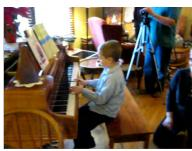

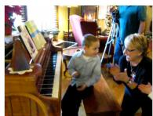  
Q: how did the boy in blue made music from the piano? a0: music a1: press a2: spread a3: press the a4: drum on score piano keys. his arms out. handles. lap using sheet. hands.

Figure 6: Example of a QA pair from NExT-QA in the Causal category. The correct answer is in the box.  
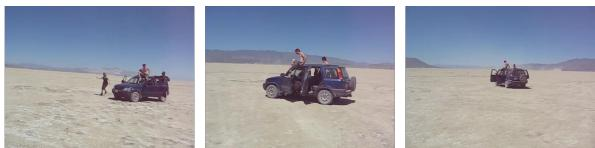

Figure 7: Example of a QA pair from NExT-QA in the Temporal category. The correct answer is in the box.  
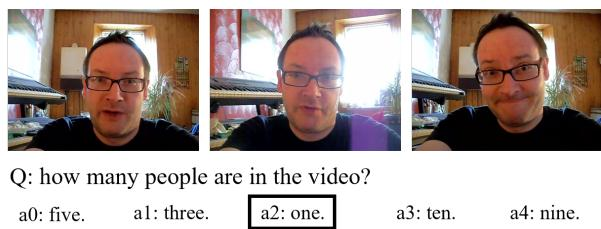  
Figure 8: Example of a QA pair from NExT-QA in the Descriptive category. The correct answer is in the box.

## A.2 STAR

The STAR dataset is derived from the Action Genome dataset (Ji et al., 2019), which itself is based on Charades (Yuan et al., 2017). Charades comprises indoor activity videos with an average length of 30 seconds. Action Genome provides annotations of objects and their relationships within these videos.

The question-answer pairs are generated using functional programs based on situation hypergraphs: the graphs represent the extraction of abstract representations from the videos, while the

a0: Wash.

phone/camera?

functional programs provide multiple types of questions that cover different levels of difficulty in situated reasoning. There are four types of questions focusing on occurred facts, temporal order, future probability, and feasibility in specific situations:

• Sequence (50.53%): What did the person do before/after ...?”

• Interaction (33.78%): “What did a person do ...?”

• Prediction (8.79%): “What will the person do next with ...?”

• Feasibility (6.9%): “What is the person able to do?” or “Which object is possible to be ...?”

All QA pairs are annotated with a timestamp label. To avoid answer distribution bias, each question type is balanced through resampling. To prevent reasoning shortcuts due to frequent action or entity co-occurrences and to ensure models cannot easily answer without genuine understanding, the compositionality of verbs and nouns is controlled. Examples are shown in Figures 9- 12.

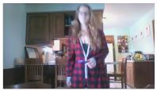  
a0: Took the picture.

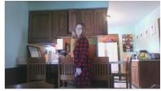  
a1: Closed the door.  
a2: Put down the dish.

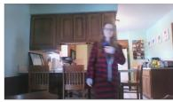  
a3: Took the cup/glass/bottle.

Figure 9: Example of a QA pair from STAR in the Sequence category. The correct answer is in the box.  
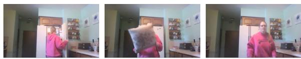  
a0: The box.  
a1: The pillow.  
a2: The blanket. a3: The bag.

Figure 10: Example of a QA pair from STAR in the Interaction category. The correct answer is in the box.  
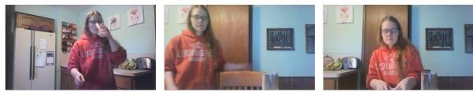  
a1: Tidy up.  
a3: Take.  
Figure 12: Example of a QA pair from STAR in the Feasibility category. The correct answer is in the box.

Figure 11: Example of a QA pair from STAR in the Prediction category. The correct answer is in the box.  
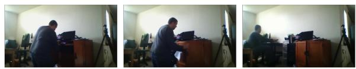  
a0: Tidy up the closet/cabinet.  
a1: Hold the food.  
a2: Throw the bag.  
a3: Put down the paper/notebook.

## A.3 Perception Test

The Perception Test dataset consists of four categories designed to evaluate VLMs on different types of reasoning:

• Physics (36.26%)

• Semantics (30.54%)

• Abstraction (29.28%)

• Memory (3.92%)

These categories test descriptive, explanatory, predictive, and counterfactual reasoning abilities. The video scripts are based on human perception screening tests, with an average length of 23 seconds. All answers are crowd-sourced. Distractors are both manually created and automatically generated, particularly for standard closed yes/no questions.

We use a 40% split of the correct-answerannotated validation set to save the resources. Sampling is stratified to maintain the original balance of question types and the correct answer distribution. The split contains approximately 15% closed questions, which poses an additional challenge for models that tend to exhibit affirmation bias (Pezeshkpour and Hruschka, 2023). Notably, for closed questions in this dataset, Video-LLaMA and Video-LLaVA often respond with "yes" or "no" rather than selecting an answer option.

Examples of QA pairs from the Perception Test are shown in Figures 13- 16.

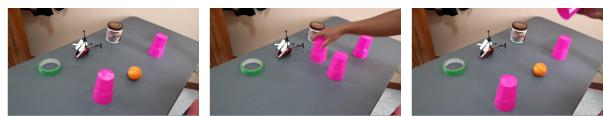  
a1: I don't know a2: yes

Figure 13: Example of a QA pair from Perception Test in the Descriptive Physics category. The correct answer is in the box.

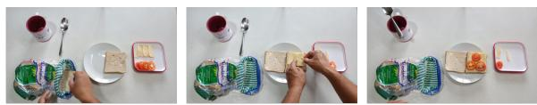  
Q: What is the person preparing? a0: a sandwich al: a salad a2: eggs

Figure 14: Example of a QA pair from Perception Test in the Descriptive Semantics category. The correct answer is in the box.  
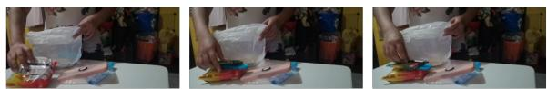  
Q: If the person had taken out one more object from the bag, how many objects would the person have taken out in total? a0:5 a1:2 a2:3

Figure 15: Example of a QA pair from Perception Test in the Counterfactual Abstraction category. The correct answer is in the box.  
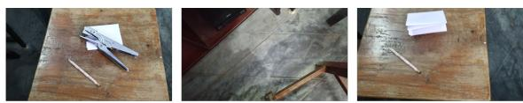  
Q: What changed on the table while the camera was looking away?  
a0: The stapler a1: Nothing changed visibly on the table a2: A paper was removed. while the camera was looking away.was added  
Figure 16: Example of a QA pair from Perception Test in the Explanatory Memory category. The correct answer is in the box.

## A.4 Video-MME

Video-MME was developed to address the lack of diversity in video MCQA benchmarks. It consists of 900 YouTube videos ranging from 11 seconds to 1 hour in length. The dataset covers 6 primary visual domains with 30 subfields and 12 task types including questions on temporal and spatial perception, object and action reasoning, OCR, and counting problems. All QA pairs and distractors are manually created with three questions per video. Additionally, the dataset features videos in languages other than English. The videos additionally are supplied with subtitles.

The released test split has an imbalanced option distribution, so we equalized it to properly assess option bias.

Examples are shown in Figures 17- 20.

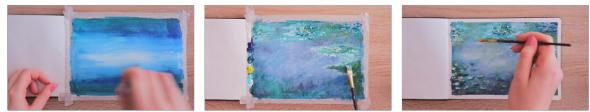  
Q: What's the correct order of the following events? 1. Creating basic background. 2. Add a few flowers to the painting. 3. Building up the texture of the painting even more. 4. Drawing the pads of the water lilies. a0: 4, 1, 2, 3. a1: 2,4, 1, 3. a2: 1,4,2, 3. a3: 1, 4, 3, 2.

Figure 17: Example of a QA pair from Video-MME in the Temporal Reasoning category. The correct answer is in the box.  
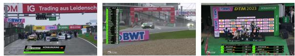  
Q: Which of the following is not a sponsor of the race? a0: Lenovo. a1: BWT. a2: DEKRA. a3: IG.

Figure 18: Example of a QA pair from Video-MME in the OCR Problems category. The correct answer is in the box.  
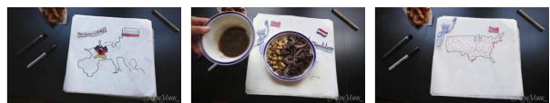  
Q: How many national flags appear in the video? a0:3. a1:5. a2: 2. a3: 4.

Figure 19: Example of a QA pair from Video-MME in the Counting Problem category. The correct answer is in the box.  
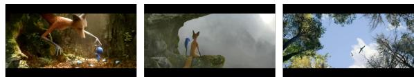  
Q: Where does the baby bird go at last? a0: Flying a1: Staying a2: Flying with its a3: Going to away alone. with the fox. mom to its herd. find its nest.  
Figure 20: Example of a QA pair from Video-MME in the Spatial Perception category. The correct answer is in the box.

## B Models’ Settings and Prompts

## B.1 Video-LLaMA

Video-LLaMA aligns a BLIP-2-based visual encoder (Li et al., 2023) with LLaMA (Touvron et al., 2023). It incorporates audio signals using Imagebind (Girdhar et al., 2023). Both the video and audio Q-formers are trained on the Webvid-2M

dataset (Bain et al., 2021) to align the modalities.   
LLaMA is fine-tuned with visual instructional data.

Video-LLaMA is designed as a conversational model and was likely not specifically trained on MCQA, but rather on open-ended VQA datasets to generate captions, descriptions, and explanatory answers. Consequently, throughout our experiments with different prompt options, it tends to engage in dialogue: it repeats the question, responds with the general phrase "Hello, how can I help you today?", describes the video content, or even asks follow-up questions such as "What do you think about the video?" rather than providing a direct answer from a predefined list of options or option IDs.7 Making it elicit a clear and concise answer option is quite challenging.

To overcome this, we experimented with various prompts, temperature settings, and token limits, and developed the following strategy:

System prompt:

Analyse the video, choose the correct answer in multiple choice question answering. Give the ID of the correct answer option from the given list of options. Be concise.

## User prompt:

<question> Options: <options>. The ID of the correct answer:

We set the number ofbeams to 2 and the temperature to 0.8. Additionally, we allowed the model up to 30 attempts to produce an answer that includes an answer ID. We used the 7B parameter model due to resource constraints. For answering, the model selects eight uniformly sampled frames.

## B.2 Video-LLaVA

Video-LLaVA (Lin et al., 2023a) uses the pretrained CLIP ViT-L/14 vision encoder (Radford et al., 2021) and the Vicuna language model (Chiang et al., 2023). Visual features from the encoder are projected into the same-dimensional space as the textual embeddings via a linear projector.

Video-LLaVA effectively delivers concise answers as just a single option based on a short, general prompt. However, in some cases, the model outputs as an answer option only "A" or responds with "yes" or "no" to a closed question.

For this model, we used the following prompt:

<video\_tag> Question: <question> Options: <options> The ID of the correct answer is: Respond with only the correct answer ID. ASSISTANT:

Notably, on the completely unfamiliar datasets Perception Test and Video-MME adding an empty option increases the number of responses that cannot be parsed as an answer ID (although this increase is statistically insignificant). Combined with the observation that the model tends to disregard options presented later in the prompt, this suggests that the length of the question affects the model’s performance, and tokens closer to the end of the prompt have a lower probability.

The model also selects eight frames from the video by uniform sampling. To conserve computational resources, we used Video-LLaVA-7B with half-precision set by Torch’s autocast. The temperature is equal to 1.

## B.3 SeViLA

SeViLA adopts a selfchaining approach with BLIP-2 (Li et al., 2023) for keyframe localization and answering question. Its Localizer uniformly samples 32 frames and selects the 4 most relevant key ones, while the Answerer generates responses based on those frames. The Localizer and Answerer both have Flan-T5 (Chung et al., 2022) for LLM.

SeViLA does not have any unanswered or unparsable responses because it was specifically tailored for the multiple-choice VQA task: internally, it maps any answer option IDs to {A, B, C, D, E}. However, it is limited to observing at most six answer options. In a side experiment, we shifted all answers to options G, H, I, J, K leaving the first six options empty, and obtained identical results to our other experimental setting, Empty Answers. This indicates that the model is completely blind to options beyond F and is likely overfitted to the options {A, B, C, D, E}.

Furthermore, the shape of the confusion matrices for NExT-QA and STAR in Figures 21 and 22 shows an unusually accurate understanding of these datasets, unlike those for Perception Test and Video-MME. Since NExT-QA and STAR were released before SeViLA, the model might have been fine-tuned on them. On the other hand, this suggests that the positional bias in this model is much less pronounced.

Another vulnerability of SeViLA is that it uses argmax calculated on logit probabilities. However, logits without numerical stabilization can produce

NaN values when activated via softmax. In such cases, according to argmax, the model’s answer defaults to $a _ { 0 }$ . Among the settings relevant for debiasing, such behavior was observed in 22 cases on NExT-QA.

For this model, we used the original prompts: Localizer prompt (when the model selects 32 frames):

Does the information within the frame   
provide necessary details to accurately   
answer the given question?

Answerer prompt (when the model selects the answer based on 4 key frames):

Considering information in frames,   
select the correct answer from the   
options.

The confusion matrices for all models in the default (unmodified) setting in Figures 21–23 provide a quick insight into positional bias: darker blue cells indicate a greater accumulation of answers.

## C Models’ Performance on All Settings

## C.1 Experimental Settings Examples

As the modifications to the video component do not affect the questions and answers, Table 4 presents examples of adjustments applied only to the question-answer pairs, along with their original versions. The example provided for the Video-MME dataset illustrates analogous changes implemented across all four datasets.

## C.2 Models’ Performance on the Settings

Tables 5 through 16 present the distribution of selections across answer options and the accuracy (where applicable) for all settings, along with the target distributions. Notably, as soon as the correct answer aligns with the model’s biased option, the performance boosts.

The full data on distribution answers in each option is given in Figures 25 to 27.

## D Debiasing Algorithms and Results

The BOLD algorithm 1 describes estimating and adjusting for prior probabilities derived from decomposed inputs of ill-defined tasks. The Weighted\_BOLD algorithm 2 is an extension of Algorithm 1, this method introduces weighting to the prior estimation to enhance debiasing by better capturing critical priors.

We fixed the random seed to 1 and conducted a series of experiments varying the weights and the sampling parameter k. All results including the default values are presented in Tables 17–20.

When considering only positive weights $( w _ { i } \geq$ 0), we assume that the debiasing vector is oriented correctly and use the weights to fine-tune the magnitude of its decomposed constituents. Therefore, positive weights generally enhance improvements and aggravate deteriorations. Specifically, in this case, all the primary debiasing metrics improve along with Recall\_std, albeit at different rates across models and datasets.

When we optimize a single bias metric, i. e. Recall\_std, by allowing negative weights, we search the latent subspace for the most optimal vector to improve that specific metric. However, this optimization may not correlate with an improvement in the overall bias, as it focuses solely on that metric. Consequently, using negative weights can lead to deterioration in other bias and performance metrics. This observation underscores the importance of evaluating bias using multiple metrics.

We provide the results for both cases, when weights are constrained to $0 \leq w _ { i } \leq 1$ and when $| w _ { i } | \leq 1$ , as we believe that the observation of the direction of the bias vectors is crucial for understanding the overall debiasing effect.

Table 4: Questions and answers modifications example from MME dataset. Correct answer is highlighted in bold in the “Default” modification type.
<table><tr><td>Modification Type</td><td>Question</td><td>Answers</td></tr><tr><td>Default</td><td>How many national flags appear in (a0) 3. (a1) 5. (a2) 2. (a3) 4. the video?</td><td></td></tr><tr><td>Empty answers</td><td>Default question</td><td>(a0) − (a1) − (a2) − (a3) −</td></tr><tr><td>Answer shuffling</td><td>Default question</td><td>(a0) 4. (a1) 5. (a2) 2. (a3) 3.</td></tr><tr><td>Additional empty option</td><td>Default question</td><td>(a0) 3. (a1) 5. (a2) 2. (a3) 4. (a4) −</td></tr><tr><td>Correct answer in each op- tion</td><td>Default question</td><td>(a0) 4. (a1) 4. (a2) 4. (a3) 4.</td></tr><tr><td>All identical answers (a0)</td><td>Default question</td><td>(a0) 3. (a1) 3. (a2) 3. (a3) 3.</td></tr><tr><td>All identical answers (a1)</td><td>Default question</td><td>(a0) 5. (a1) 5. (a2) 5. (a3) 5.</td></tr><tr><td>All identical answers (a2)</td><td>Default question</td><td>(a0) 2. (a1) 2. (a2) 2. (a3) 2.</td></tr><tr><td>All identical answers (a3)</td><td>Default question</td><td>(a0) 4. (a1) 4. (a2) 4. (a3) 4.</td></tr><tr><td>Correct answer in (a0)</td><td>Default question</td><td>(a0) 4. (a1) 5. (a2) 2. (a3) 3.</td></tr><tr><td>Correct answer in (a1)</td><td>Default question</td><td>(a0) 3. (a1) 4. (a2) 2. (a3) 5.</td></tr><tr><td>Correct answer in (a2)</td><td>Default question</td><td>(a0) 3. (a1) 5. (a2) 4. (a3) 2.</td></tr><tr><td>Correct answer in (a3)</td><td>Default question</td><td>(a0) 3. (a1) 5. (a2) 2. (a3) 4.</td></tr><tr><td>Correct answer (a0) with</td><td>Default question</td><td>(a0) 4. (a1) 5. (a2) 3. (a3) 2.</td></tr><tr><td>shuffling Correct answer (a1) with</td><td>Default question</td><td>(a0) 5. (a1) 4. (a2) 2. (a3) 3.</td></tr><tr><td>shuffling Correct answer (a2) with Default question</td><td></td><td>(a0) 3. (a1) 2. (a2) 4. (a3) 5.</td></tr><tr><td>shuffling Correct answer (a3) with Default question</td><td></td><td>(a0) 5. (a1) 3. (a2) 2. (a3) 4.</td></tr><tr><td>shuffling Rephrased question</td><td>What is the total number of national (a0) 3. (a1) 5. (a2) 2. (a3) 4.</td><td></td></tr><tr><td>Empty questions</td><td>flags that appear in the video?</td><td>(a0) 3. (a1) 5. (a2) 2. (a3) 4.</td></tr></table>

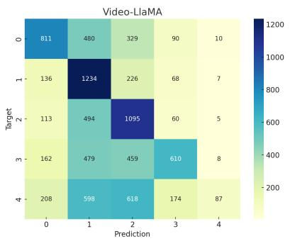

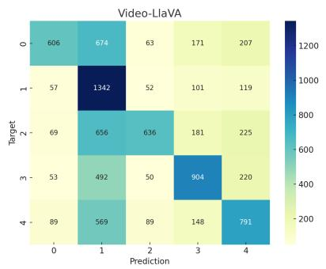

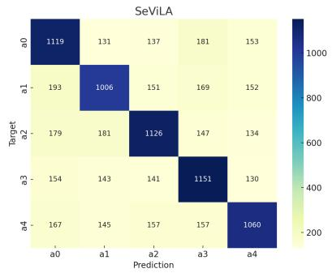  
Figure 21: All Models’ Confusion Matrices for NeXT-QA.

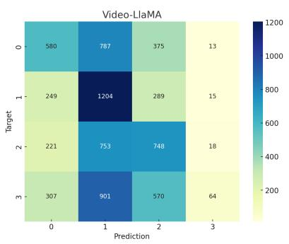

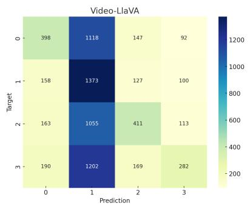

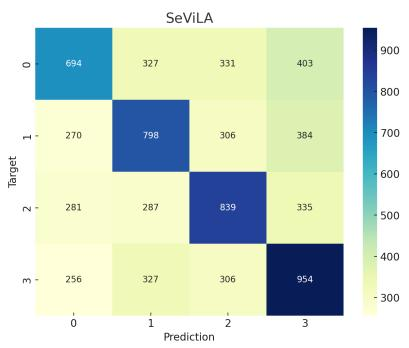  
Figure 22: All Models’ Confusion Matrices for STAR.

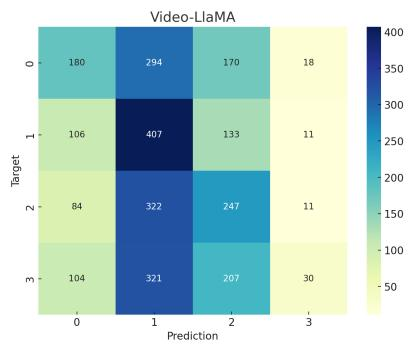

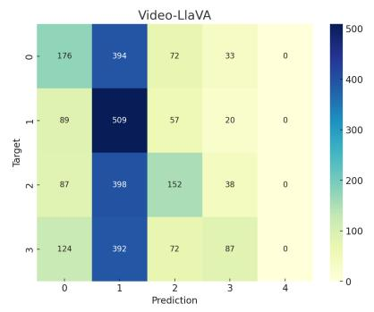

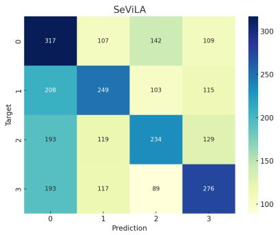  
Figure 23: All Models’ Confusion Matrices for Video-MME.

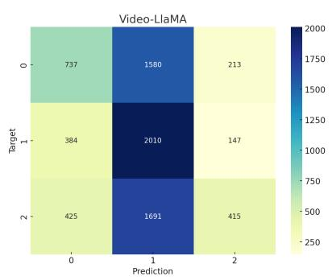

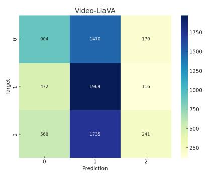

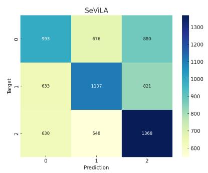  
Figure 24: All Models’ Confusion Matrices for Perception Test.

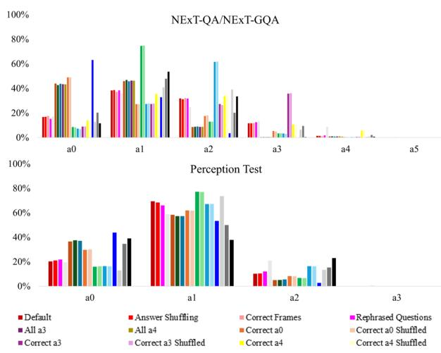

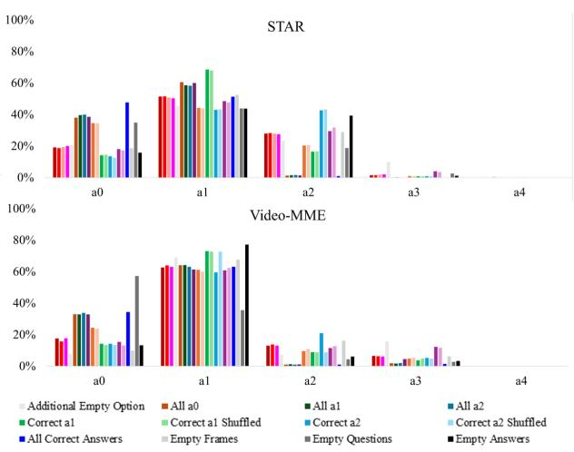  
Figure 25: Video-Llama option distribution for all settings of NeXT-QA, NExT-GQA, STAR, Perception Test and Video-MME. Correct $\mathbf { a } _ { \mathrm { i } } ^ { \phantom { } } .$ , Correct $\mathbf { a } _ { \mathrm { i } }$ Shuffled and All ai represent Correct Answer, Correct Answer with Shuffling and All Correct Answers in each option, respectively.

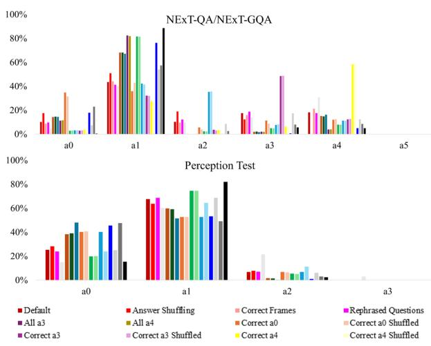

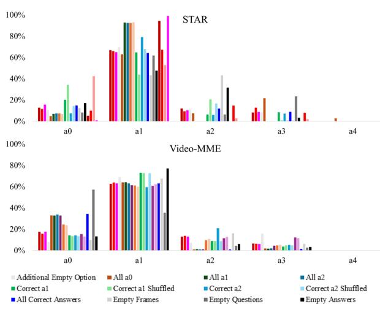  
Figure 26: Video-Llava option distribution for all settings of NeXT-QA, NExT-GQA, STAR, Perception Test and Video-MME. Correct $\mathbf { a } _ { \mathrm { i } } ,$ Correct $\mathbf { a } _ { \mathrm { i } }$ Shuffled and All ai represent Correct Answer, Correct Answer with Shuffling and All Correct Answers in each option, respectively.

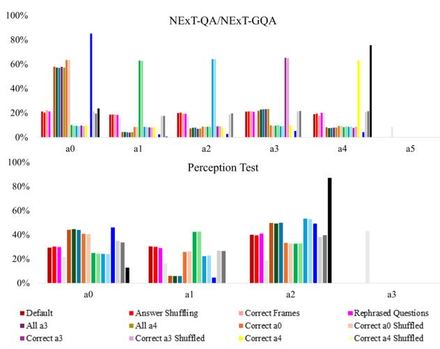

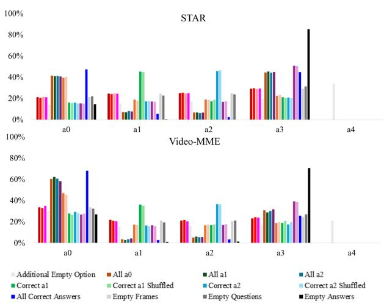  
Figure 27: SeViLA option distribution for all settings of NeXT-QA, NExT-GQA, STAR, Perception Test and Video-MME. Correct $\mathbf { a } _ { \mathrm { i } } ^ { \phantom { } } .$ , Correct $\mathbf { a } _ { \mathrm { i } }$ Shuffled and All $\mathbf { a } _ { \mathrm { i } }$ represent Correct Answer, Correct Answer with Shuffling and All Correct Answers in each option, respectively.

Table 5: Video-LLaMA Performance on All Settings of NExT-QA (including NExT-GQA). Each cell shows the count of selections for each option (a0–a5), along with the percentage in parentheses. The Accuracy column represents the number of correct answers where applicable. The N/A column indicates the number of cases where the model did not output an answer option after 30 attempts.
<table><tr><td>Setting</td><td>a0</td><td>a1</td><td></td><td>a2</td><td>a3</td><td>a4 a5</td><td>N/A</td><td>Accuracy</td></tr><tr><td>Target</td><td>1,721 (20.10%)</td><td>1,671 (19.51%)</td><td>1,767 (20.63%)</td><td>1,719 (20.07%)</td><td>1,686 (19.69%)</td><td></td><td>0 (0.00%)</td><td></td></tr><tr><td>Default</td><td>1,430 (16.70%)</td><td>3,285 (38.37%)</td><td>2,727 (31.85%)</td><td>1,002 (11.70%)</td><td>117 (1.37%)</td><td></td><td>3 (0.04%)</td><td>3,837 (44.82%)</td></tr><tr><td>Answer Shuffling</td><td>1,443 (16.97%)</td><td>3,295 (38.75%)</td><td>2,654 (31.21%)</td><td>993 (11.68%)</td><td>119 (1.40%)</td><td></td><td>60 (0.70%)</td><td>3,799 (44.67%)</td></tr><tr><td>Correct Frames</td><td>869 (17.61%)</td><td>1,836 (37.20%)</td><td>1,588 (32.18%)</td><td>587 (11.89%)</td><td>55 (1.11%)</td><td></td><td>27 (0.54%)</td><td>2,155 (43.67%)</td></tr><tr><td>Rephrased Questions</td><td>1,305 (15.36%)</td><td>3,270 (38.50%)</td><td>2,704 (31.83%)</td><td>1,062 (12.50%)</td><td>153 (1.80%)</td><td></td><td>70 (0.82%)</td><td>3,762 (44.29%)</td></tr><tr><td>Additional Empty Option</td><td>1,432 (17.17%)</td><td>2,987 (35.82%)</td><td>2,067 (24.78%)</td><td>1,090 (13.07%)</td><td>725 (8.69%)</td><td>39 (0.47%)</td><td>224 (2.62%)</td><td>4,086 (48.99%)</td></tr><tr><td>All a1</td><td>3,537 (42.71%)</td><td>3,891 (46.98%)</td><td>737 (8.90%)</td><td>32 (0.39%)</td><td>85 (1.03%)</td><td></td><td>282 (3.29%)</td><td></td></tr><tr><td>All a2</td><td>3,614 (43.82%)</td><td>3,780 (45.83%)</td><td>748 (9.07%)</td><td>32 (0.39%)</td><td>73 (0.89%)</td><td></td><td>317 (3.70%)</td><td></td></tr><tr><td>All a3</td><td>3,585 (43.43%)</td><td>3,831 (46.41%)</td><td>722 (8.75%)</td><td>33 (0.40%)</td><td>83 (1.01%)</td><td></td><td>310 (3.62%)</td><td></td></tr><tr><td>All a4</td><td>3,590 (43.35%)</td><td>3,837 (46.33%)</td><td>733 (8.85%)</td><td>34 (0.41%)</td><td>87 (1.05%)</td><td></td><td>283 (3.30%)</td><td></td></tr><tr><td>Correct a0</td><td>4,136 (48.98%)</td><td>2,303 (27.27%)</td><td>1,489 (17.63%)</td><td>453 (5.36%)</td><td>64 (0.76%)</td><td></td><td>119 (1.39%)</td><td>4,136 (48.98%)</td></tr><tr><td>Correct a0 Shuffled</td><td>4,136 (49.00%)</td><td>2,304 (27.30%)</td><td>1,525 (18.07%)</td><td>415 (4.92%)</td><td>61 (0.72%)</td><td></td><td>123 (1.44%)</td><td>4,136 (49.00%)</td></tr><tr><td>Correct a1</td><td>730 (8.61%)</td><td>6,323 (74.61%)</td><td>1,102 (13.00%)</td><td>292 (3.45%)</td><td>28 (0.33%)</td><td></td><td>89 (1.04%)</td><td>6,323 (74.61%)</td></tr><tr><td>Correct a1 Shuffled</td><td>704 (8.30%)</td><td>6,348 (74.88%)</td><td>1,098 (12.95%)</td><td>297 (3.50%)</td><td>31 (0.37%)</td><td></td><td>86 (1.00%)</td><td>6,348 (74.88%)</td></tr><tr><td>Correct a2</td><td>622 (7.32%)</td><td>2,325 (27.35%)</td><td>5,240 (61.64%)</td><td>280 (3.29%)</td><td>34 (0.40%)</td><td></td><td>63 (0.74%)</td><td>5,240 (61.64%)</td></tr><tr><td>Correct a2 Shuffled</td><td>583 (6.88%)</td><td>2,356 (27.81%)</td><td>5,240 (61.84%)</td><td>254 (3.00%)</td><td>40 (0.47%)</td><td></td><td>91 (1.06%)</td><td>5,240 (61.84%)</td></tr><tr><td>Correct a3</td><td>762 (8.99%)</td><td>2,315 (27.32%)</td><td>2,321 (27.39%)</td><td>3,029 (35.74%)</td><td>47 (0.55%)</td><td></td><td>90 (1.05%)</td><td>3,029 (35.74%)</td></tr><tr><td>Correct a3 Shuffled</td><td>766 (9.07%)</td><td>2,335 (27.65%)</td><td>2,235 (26.47%)</td><td>3,049 (36.11%)</td><td>59 (0.70%)</td><td></td><td>120 (1.40%)</td><td>3,049 (36.11%)</td></tr><tr><td>Correct a4</td><td>1,194 (14.11%)</td><td>3,014 (35.63%)</td><td>2,857 (33.77%)</td><td>909 (10.74%)</td><td>486 (5.74%)</td><td></td><td>104 (1.21%)</td><td>486 (5.74%)</td></tr><tr><td>Correct a4 Shuffled</td><td>1,164 (13.77%)</td><td>2,912 (34.45%)</td><td>2,949 (34.88%)</td><td>912 (10.79%)</td><td>517 (6.12%)</td><td></td><td>110 (1.28%)</td><td>517 (6.12%)</td></tr><tr><td>All Correct Answers</td><td>5,247 (63.17%)</td><td>2,730 (32.87%)</td><td>295 (3.55%)</td><td>9 (0.11%)</td><td>25 (0.30%)</td><td></td><td>258 (3.01%)</td><td></td></tr><tr><td>Empty Frames</td><td>1,092 (12.77%)</td><td>3,494 (40.87%)</td><td>3,344 (39.11%)</td><td>544 (6.36%)</td><td>76 (0.89%)</td><td></td><td>14 (0.16%)</td><td>2,620 (30.64%)</td></tr><tr><td>Empty Questions</td><td>1,686 (20.31%)</td><td>3,975 (47.89%)</td><td>1,676 (20.19%)</td><td>786 (9.47%)</td><td>178 (2.14%) 59 (0.70%)</td><td></td><td>263 (3.07%)</td><td>3,082 (37.13%)</td></tr><tr><td>Empty Answers</td><td>987 (11.66%)</td><td>4,543 (53.68%)</td><td>2,837 (33.52%)</td><td>37 (0.44%)</td><td></td><td></td><td>101 (1.18%)</td><td></td></tr></table>

Table 6: Video-LLaMA Performance on All Settings of STAR. Each cell shows the count of selections for each option (a0–a4), along with the percentage in parentheses. The Accuracy column represents the number of correct answers where applicable. The N/A column indicates the number of cases where the model did not output an answer option after 30 attempts.
<table><tr><td>Setting</td><td>a0</td><td>a1</td><td>a2</td><td>a3</td><td>a4</td><td>N/A</td><td>Accuracy</td></tr><tr><td>Target</td><td>1,755 (24.73%)</td><td>1,758 (24.77%)</td><td>1,742 (24.54%)</td><td>1,843 (25.97%)</td><td></td><td>0 (0.00%)</td><td></td></tr><tr><td>Default</td><td>1,357 (19.13%)</td><td>3,645 (51.38%)</td><td>1,982 (27.94%)</td><td>110 (1.55%)</td><td></td><td>4 (0.06%)</td><td>2,596 (36.59%)</td></tr><tr><td>Answer Shuffling</td><td>1,255 (18.72%)</td><td>3,458 (51.57%)</td><td>1,893 (28.23%)</td><td>99 (1.48%)</td><td></td><td>393 (5.54%)</td><td>2,467 (36.79%)</td></tr><tr><td>Correct Frames</td><td>1,322 (19.43%)</td><td>3,455 (50.79%)</td><td>1,899 (27.91%)</td><td>127 (1.87%)</td><td></td><td>295 (4.16%)</td><td>2,524 (37.10%)</td></tr><tr><td>Rephrased Questions</td><td>1,376 (20.03%)</td><td>3,462 (50.39%)</td><td>1,891 (27.53%)</td><td>141 (2.05%)</td><td></td><td>228 (3.21%)</td><td>2,520 (36.68%)</td></tr><tr><td>Additional Empty Option</td><td>1,314 (20.59%)</td><td>2,892 (45.31%)</td><td>1,494 (23.41%)</td><td>630 (9.87%)</td><td>52 (0.81%)</td><td>716 (10.09%)</td><td>2,528 (39.61%)</td></tr><tr><td>All a0</td><td>2,484 (38.04%)</td><td>3,949 (60.47%)</td><td>88 (1.35%)</td><td>9 (0.14%)</td><td></td><td>568 (8.00%)</td><td></td></tr><tr><td>All a1</td><td>2,695 (39.68%)</td><td>3,976 (58.54%)</td><td>104 (1.53%)</td><td>17 (0.25%)</td><td></td><td>306 (4.31%)</td><td></td></tr><tr><td>All a2</td><td>2,711 (39.93%)</td><td>3,957 (58.28%)</td><td>113 (1.66%)</td><td>9 (0.13%)</td><td></td><td>308 (4.34%)</td><td></td></tr><tr><td>All a3</td><td>2,512 (38.52%)</td><td>3,909 (59.94%)</td><td>94 (1.44%)</td><td>7 (0.11%)</td><td></td><td>576 (8.11%)</td><td></td></tr><tr><td>Correct a0</td><td>2,340 (34.53%)</td><td>2,996 (44.21%)</td><td>1,378 (20.33%)</td><td>63 (0.93%)</td><td></td><td>321 (4.52%)</td><td>2,340 (34.53%)</td></tr><tr><td>Correct a0 Shuffled</td><td>2,313 (34.36%)</td><td>2,960 (43.97%)</td><td>1,392 (20.68%)</td><td>67 (1.00%)</td><td></td><td>366 (5.16%)</td><td>2,313 (34.36%)</td></tr><tr><td>Correct a1</td><td>966 (14.16%)</td><td>4,677 (68.54%)</td><td>1,124 (16.47%)</td><td>57 (0.84%)</td><td></td><td>274 (3.86%)</td><td>4,677 (68.54%)</td></tr><tr><td>Correct a1 Shuffled</td><td>985 (14.48%)</td><td>4,622 (67.93%)</td><td>1,136 (16.70%)</td><td>61 (0.90%)</td><td></td><td>294 (4.14%)</td><td>4,622 (67.93%)</td></tr><tr><td>Correct a2</td><td>918 (13.53%)</td><td>2,913 (42.93%)</td><td>2,898 (42.71%)</td><td>56 (0.83%)</td><td></td><td>313 (4.41%)</td><td>2,898 (42.71%)</td></tr><tr><td>Correct a2 Shuffled</td><td>844 (12.57%)</td><td>2,908 (43.32%)</td><td>2,901 (43.21%)</td><td>60 (0.89%)</td><td></td><td>385 (5.42%)</td><td>2,901 (43.21%)</td></tr><tr><td>Correct a3</td><td>1,226 (18.03%)</td><td>3,298 (48.50%)</td><td>2,002 (29.44%)</td><td>274 (4.03%)</td><td></td><td>298 (4.20%)</td><td>274 (4.03%)</td></tr><tr><td>Correct a3 Shuffled</td><td>1,153 (17.21%)</td><td>3,190 (47.60%)</td><td>2,127 (31.74%)</td><td>231 (3.45%)</td><td></td><td>397 (5.59%)</td><td>231 (3.45%)</td></tr><tr><td>All Correct Answers</td><td>3,129 (47.60%)</td><td>3,376 (51.35%)</td><td>63 (0.96%)</td><td>6 (0.09%)</td><td></td><td>524 (7.38%)</td><td></td></tr><tr><td>Empty Frames</td><td>1,323 (18.64%)</td><td>3,721 (52.42%)</td><td>2,047 (28.84%)</td><td>7 (0.10%)</td><td></td><td>0 (0.00%)</td><td>1,854 (26.12%)</td></tr><tr><td>Empty Questions</td><td>2,365 (34.84%)</td><td>2,973 (43.80%)</td><td>1,275 (18.78%)</td><td>175 (2.58%)</td><td></td><td>310 (4.37%)</td><td>2,427 (35.75%)</td></tr><tr><td>Empty Answers</td><td>1,121 (15.84%)</td><td>3,093 (43.72%)</td><td>2,778 (39.27%)</td><td>83 (1.17%)</td><td></td><td>23 (0.32%)</td><td></td></tr><tr><td></td><td></td><td></td><td></td><td></td><td></td><td></td><td></td></tr></table>

Table 7: Video-LLaMA Performance on All Settings of Perception Test. Each cell shows the count of selections for each option (a0–a3), along with the percentage in parentheses. The Accuracy column represents the number of correct answers where applicable. The N/A column indicates the number of cases where the model did not output an answer option after 30 attempts.
<table><tr><td>Setting</td><td>a0</td><td>a1</td><td>a2</td><td>a3</td><td>N/A</td><td>Accuracy</td></tr><tr><td>Target</td><td>2,549 (33.29%)</td><td>2,561 (33.45%)</td><td>2,546 (33.25%)</td><td></td><td>0 (0.00%)</td><td></td></tr><tr><td>Default</td><td>1,546 (20.34%)</td><td>5,281 (69.47%)</td><td>775 (10.19%)</td><td></td><td>54 (0.71%)</td><td>3,162 (41.59%)</td></tr><tr><td>Answer Shuffling</td><td>1,593 (21.10%)</td><td>5,165 (68.42%)</td><td>791 (10.48%)</td><td></td><td>107 (1.40%)</td><td>3,146 (41.67%)</td></tr><tr><td>Rephrased Questions</td><td>1,652 (21.83%)</td><td>5,004 (66.13%)</td><td>911 (12.04%)</td><td></td><td>89 (1.16%)</td><td>3,161 (41.77%)</td></tr><tr><td>Additional Empty Option</td><td>1,448 (19.56%)</td><td>4,356 (58.86%)</td><td>1,549 (20.93%)</td><td>48 (0.65%)</td><td>255 (3.33%)</td><td>3,004 (40.59%)</td></tr><tr><td>All a0</td><td>2,768 (36.60%)</td><td>4,414 (58.36%)</td><td>381 (5.04%)</td><td></td><td>93 (1.21%)</td><td></td></tr><tr><td>All a1</td><td>2,842 (37.56%)</td><td>4,334 (57.28%)</td><td>390 (5.15%)</td><td></td><td>90 (1.18%)</td><td></td></tr><tr><td>All a2</td><td>2,806 (37.15%)</td><td>4,326 (57.28%)</td><td>421 (5.57%)</td><td></td><td>103 (1.35%)</td><td></td></tr><tr><td>Correct a0</td><td>2,245 (29.76%)</td><td>4,675 (61.98%)</td><td>623 (8.26%)</td><td></td><td>113 (1.48%)</td><td>2,245 (29.76%)</td></tr><tr><td>Correct a0 Shuffled</td><td>2,271 (30.12%)</td><td>4,654 (61.73%)</td><td>614 (8.14%)</td><td></td><td>117 (1.53%)</td><td>2,271 (30.12%)</td></tr><tr><td>Correct a1</td><td>1,204 (15.95%)</td><td>5,833 (77.29%)</td><td>510 (6.76%)</td><td></td><td>109 (1.42%)</td><td>5,833 (77.29%)</td></tr><tr><td>Correct a1 Shuffled</td><td>1,233 (16.32%)</td><td>5,820 (77.06%)</td><td>500 (6.62%)</td><td></td><td>103 (1.35%)</td><td>5,820 (77.06%)</td></tr><tr><td>Correct a2</td><td>1,239 (16.40%)</td><td>5,077 (67.18%)</td><td>1,241 (16.42%)</td><td></td><td>99 (1.29%)</td><td>1,241 (16.42%)</td></tr><tr><td>Correct a2 Shuffled</td><td>1,235 (16.36%)</td><td>5,082 (67.30%)</td><td>1,234 (16.34%)</td><td></td><td>105 (1.37%)</td><td>1,234 (16.34%)</td></tr><tr><td>All Correct Answers</td><td>3,330 (43.87%)</td><td>4,053 (53.40%)</td><td>207 (2.73%)</td><td></td><td>66 (0.86%)</td><td></td></tr><tr><td>Empty Frames</td><td>990 (12.93%)</td><td>5,641 (73.68%)</td><td>1,025 (13.39%)</td><td></td><td>0 (0.00%)</td><td>3,005 (39.25%)</td></tr><tr><td>Empty Questions</td><td>2,564 (34.61%)</td><td>3,707 (50.03%)</td><td>1,138 (15.36%) 1,747 (23.01%)</td><td></td><td>247 (3.23%) 64 (0.84%)</td><td>3,021 (40.77%)</td></tr><tr><td>Empty Answers</td><td>2,969 (39.11%)</td><td>2,876 (37.88%)</td><td></td><td></td><td></td><td></td></tr></table>

Table 8: Video-LLaMA Performance on All Settings of Video-MME. Each cell shows the count of selections for each option (a0–a4), along with the percentage in parentheses. The Accuracy column represents the number of correct answers where applicable. The N/A column indicates the number of cases where the model did not output an answer option after 30 attempts.
<table><tr><td>Setting</td><td>a0</td><td>a1</td><td>a2</td><td>a3</td><td>a4</td><td>N/A</td><td>Accuracy</td></tr><tr><td>Target</td><td>675 (25.00%)</td><td>675 (25.00%)</td><td>675 (25.00%)</td><td>675 (25.00%)</td><td></td><td>0 (0.00%)</td><td></td></tr><tr><td>Default</td><td>474 (17.92%)</td><td>1,344 (50.81%)</td><td>757 (28.62%)</td><td>70 (2.65%)</td><td></td><td>55 (2.04%)</td><td>864 (32.67%)</td></tr><tr><td>Answer Shuffling</td><td>451 (18.11%)</td><td>1,242 (49.86%)</td><td>733 (29.43%)</td><td>65 (2.61%)</td><td></td><td>209 (7.74%)</td><td>785 (31.51%)</td></tr><tr><td>Rephrased Questions</td><td>1,367 (50.65%)</td><td>979 (36.27%)</td><td>198 (7.34%)</td><td>155 (5.74%)</td><td></td><td>1 (0.04%)</td><td>873 (32.35%)</td></tr><tr><td>Additional Empty Option</td><td>391 (17.29%)</td><td>1,040 (45.98%)</td><td>624 (27.59%)</td><td>178 (7.87%)</td><td>29 (1.28%)</td><td>438 (16.22%)</td><td>746 (32.98%)</td></tr><tr><td>All a0</td><td>1,042 (42.81%)</td><td>1,244 (51.11%)</td><td>120 (4.93%)</td><td>28 (1.15%)</td><td></td><td>266 (9.85%)</td><td></td></tr><tr><td>All a1</td><td>1,027 (42.00%)</td><td>1,295 (52.97%)</td><td>91 (3.72%)</td><td>32 (1.31%)</td><td></td><td>255 (9.44%)</td><td></td></tr><tr><td>All a2</td><td>1,061 (43.36%)</td><td>1,232 (50.35%)</td><td>116 (4.74%)</td><td>38 (1.55%)</td><td></td><td>253 (9.37%)</td><td></td></tr><tr><td>All a3</td><td>1,001 (41.06%)</td><td>1,223 (50.16%)</td><td>149 (6.11%)</td><td>65 (2.67%)</td><td></td><td>262 (9.70%)</td><td></td></tr><tr><td>Correct a0</td><td>678 (27.19%)</td><td>1,141 (45.75%)</td><td>624 (25.02%)</td><td>51 (2.04%)</td><td></td><td>206 (7.63%)</td><td>678 (27.19%)</td></tr><tr><td>Correct a0 Shuffled</td><td>699 (27.90%)</td><td>1,085 (43.31%)</td><td>664 (26.51%)</td><td>57 (2.28%)</td><td></td><td>195 (7.22%)</td><td>699 (27.90%)</td></tr><tr><td>Correct a1</td><td>376 (14.98%)</td><td>1,532 (61.04%)</td><td>547 (21.79%)</td><td>55 (2.19%)</td><td></td><td>190 (7.04%)</td><td>1,532 (61.04%)</td></tr><tr><td>Correct a1 Shuffled</td><td>344 (13.78%)</td><td>1,519 (60.83%)</td><td>584 (23.39%)</td><td>50 (2.00%)</td><td></td><td>203 (7.52%)</td><td>1,519 (60.83%)</td></tr><tr><td>Correct a2</td><td>366 (14.63%)</td><td>1,147 (45.86%)</td><td>948 (37.90%)</td><td>40 (1.60%)</td><td></td><td>199 (7.37%)</td><td>948 (37.90%)</td></tr><tr><td>Correct a2 Shuffled</td><td>355 (14.27%)</td><td>1,144 (45.98%)</td><td>942 (37.86%)</td><td>47 (1.89%)</td><td></td><td>212 (7.85%)</td><td>942 (37.86%)</td></tr><tr><td>Correct a3</td><td>408 (16.47%)</td><td>1,178 (47.56%)</td><td>777 (31.37%)</td><td>114 (4.60%)</td><td></td><td>223 (8.26%)</td><td>114 (4.60%)</td></tr><tr><td>Correct a3 Shuffled</td><td>386 (15.55%)</td><td>1,199 (48.31%)</td><td>786 (31.67%)</td><td>111 (4.47%)</td><td></td><td>218 (8.07%)</td><td>111 (4.47%)</td></tr><tr><td>All Correct Answers</td><td>1,195 (46.46%)</td><td>1,226 (47.67%)</td><td>114 (4.43%)</td><td>37 (1.44%)</td><td></td><td>128 (4.74%)</td><td></td></tr><tr><td>Empty Frames</td><td>188 (6.98%)</td><td>1,612 (59.81%)</td><td>843 (31.28%)</td><td>52 (1.93%)</td><td></td><td>5 (0.19%)</td><td>776 (28.79%)</td></tr><tr><td>Empty Questions</td><td>753 (29.89%)</td><td>1,180 (46.84%)</td><td>527 (20.92%)</td><td>59 (2.34%)</td><td></td><td>181 (6.70%)</td><td>798 (31.68%)</td></tr><tr><td>Empty Answers</td><td>440 (17.07%)</td><td>725 (28.13%)</td><td>1,352 (52.46%)</td><td>60 (2.33%)</td><td></td><td>123 (4.56%)</td><td></td></tr></table>

Table 9: Video-LLaVA Performance on All the Settings of NExT-QA (including NExT-GQA). Each cell shows the count of selections for each option (a0–a5) along with the percentage in parentheses. Accuracy represents the number of correct answers where applicable.
<table><tr><td>Setting</td><td>a0</td><td>a1</td><td>a2</td><td>a3</td><td>a4</td><td>a5</td><td>N/A</td><td>Accuracy</td></tr><tr><td>Target</td><td>1,721 (20.10%)</td><td>1,671 (19.51%)</td><td>1,767 (20.63%)</td><td>1,719 (20.07%)</td><td>1,686 (19.69%)</td><td></td><td>0 (0.00%)</td><td></td></tr><tr><td>Default</td><td>874 (10.21%)</td><td>3,733 (43.59%)</td><td>890 (10.39%)</td><td>1,505 (17.57%)</td><td>1,562 (18.24%)</td><td></td><td>0 (0.00%)</td><td>4,279 (49.96%)</td></tr><tr><td>Answer Shuffling</td><td>1,507 (17.60%)</td><td>4,366 (50.98%)</td><td>1,630 (19.03%)</td><td>1,061 (12.39%)</td><td>0 (0.00%)</td><td></td><td>0 (0.00%)</td><td>3,653 (42.66%)</td></tr><tr><td>Correct Frames</td><td>440 (8.87%)</td><td>2,194 (44.22%)</td><td>482 (9.71%)</td><td>791 (15.94%)</td><td>1,055 (21.26%)</td><td></td><td>0 (0.00%)</td><td>2,407 (48.51%)</td></tr><tr><td>Rephrased Questions</td><td>836 (9.79%)</td><td>3,531 (41.36%)</td><td>1,054 (12.34%)</td><td>1,613 (18.89%)</td><td>1,504 (17.62%)</td><td></td><td>26 (0.30%)</td><td>4,287 (50.21%)</td></tr><tr><td>Additional Empty Option</td><td>418 (4.88%)</td><td>3,449 (40.27%)</td><td>847 (9.89%)</td><td>1,208 (14.11%)</td><td>2,641 (30.84%)</td><td>1 (0.01%)</td><td>0 (0.00%)</td><td>4,264 (49.79%)</td></tr><tr><td>All a0</td><td>1,232 (14.39%)</td><td>5,839 (68.18%)</td><td>9 (0.11%)</td><td>175 (2.04%)</td><td>1,309 (15.28%)</td><td></td><td>0 (0.00%)</td><td></td></tr><tr><td>All a1</td><td>1,254 (14.64%)</td><td>5,839 (68.18%)</td><td>9 (0.11%)</td><td>187 (2.18%)</td><td>1,275 (14.89%)</td><td></td><td>0 (0.00%)</td><td></td></tr><tr><td>All a2</td><td>1,238 (14.46%)</td><td>5,755 (67.21%)</td><td>12 (0.14%)</td><td>158 (1.85%)</td><td>1,400 (16.35%)</td><td></td><td>1 (0.01%)</td><td></td></tr><tr><td>All a3</td><td>966 (11.28%)</td><td>7,063 (82.47%)</td><td>14 (0.16%)</td><td>178 (2.08%)</td><td>343 (4.01%)</td><td></td><td>0 (0.00%)</td><td></td></tr><tr><td>All a4</td><td>996 (11.63%)</td><td>7,021 (81.98%)</td><td>20 (0.23%)</td><td>176 (2.06%)</td><td>351 (4.10%)</td><td></td><td>0 (0.00%)</td><td></td></tr><tr><td>Correct a0 Correct a0 Shuffled</td><td>2,966 (34.87%)</td><td>3,054 (35.91%)</td><td>484 (5.69%)</td><td>975 (11.46%)</td><td>1,026 (12.06%)</td><td></td><td>59 (0.69%)</td><td>2,966 (34.87%)</td></tr><tr><td></td><td>2,702 (31.55%)</td><td>3,680 (42.97%)</td><td>341 (3.98%)</td><td>759 (8.86%)</td><td>1,082 (12.63%)</td><td></td><td>0 (0.00%)</td><td>2,702 (31.55%)</td></tr><tr><td>Correct a1</td><td>251 (2.93%)</td><td>6,993 (81.66%)</td><td>209 (2.44%)</td><td>431 (5.03%)</td><td>680 (7.94%)</td><td></td><td>0 (0.00%)</td><td>6,993 (81.66%)</td></tr><tr><td>Correct a1 Shuffled</td><td>270 (3.15%)</td><td>6,981 (81.52%)</td><td>203 (2.37%)</td><td>424 (4.95%)</td><td>686 (8.01%)</td><td></td><td>0 (0.00%)</td><td>6,981 (81.52%)</td></tr><tr><td>Correct a2</td><td>274 (3.20%)</td><td>3,619 (42.26%)</td><td>3,032 (35.41%)</td><td>669 (7.81%)</td><td>969 (11.32%)</td><td></td><td>1 (0.01%)</td><td>3,032 (35.41%)</td></tr><tr><td>Correct a2 Shuffled</td><td>282 (3.29%)</td><td>3,561 (41.58%)</td><td>3,056 (35.68%)</td><td>707 (8.26%)</td><td>958 (11.19%)</td><td></td><td>0 (0.00%)</td><td>3,056 (35.68%)</td></tr><tr><td>Correct a3</td><td>258 (3.01%)</td><td>2,765 (32.29%)</td><td>319 (3.73%)</td><td>4,161 (48.59%)</td><td>1,060 (12.38%)</td><td></td><td>1 (0.01%)</td><td>4,161 (48.59%)</td></tr><tr><td>Correct a3 Shuffled</td><td>278 (3.25%)</td><td>2,746 (32.06%)</td><td>271 (3.16%)</td><td>4,182 (48.83%)</td><td>1,087 (12.69%)</td><td></td><td>0 (0.00%)</td><td>4,182 (48.83%)</td></tr><tr><td>Correct a4</td><td>324 (3.78%)</td><td>2,374 (27.72%)</td><td>300 (3.50%)</td><td>557 (6.50%)</td><td>5,009 (58.49%)</td><td></td><td>0 (0.00%)</td><td>5,009 (58.49%)</td></tr><tr><td>Correct a4 Shuffled</td><td>336 (3.92%)</td><td>2,305 (26.91%)</td><td>313 (3.65%)</td><td>579 (6.76%)</td><td>5,031 (58.75%)</td><td></td><td>0 (0.00%)</td><td>5,031 (58.75%)</td></tr><tr><td>All Correct Answers</td><td>1,536 (17.94%)</td><td>6,531 (76.27%)</td><td>4 (0.05%)</td><td>59 (0.69%)</td><td>433 (5.06%)</td><td></td><td>1 (0.01%)</td><td></td></tr><tr><td>Empty Frames</td><td>634 (7.40%)</td><td>4,625 (54.01%) 4,925 (57.51%)</td><td>740 (8.64%)</td><td>1,499 (17.50%)</td><td>1,066 (12.45%) 739 (8.63%)</td><td></td><td>0 (0.00%)</td><td>3,025 (35.32%)</td></tr><tr><td>Empty Questions</td><td>1,976 (23.07%)</td><td></td><td>228 (2.66%)</td><td>696 (8.13%)</td><td>433 (5.06%)</td><td></td><td>0 (0.00%)</td><td>2,979 (34.79%)</td></tr><tr><td>Empty Answers</td><td>45 (0.53%)</td><td>7,590 (88.63%)</td><td>12 (0.14%)</td><td>484 (5.65%)</td><td></td><td></td><td>0 (0.00%)</td><td></td></tr></table>

Table 10: Video-LLaVA Performance on All the Settings of STAR. Each cell shows the count of selections for each option (a0–a4) along with the percentage in parentheses. Accuracy represents the number of correct answers where applicable.
<table><tr><td>Setting</td><td>a0</td><td>a1</td><td>a2</td><td>a3</td><td>a4</td><td>N/A</td><td>Accuracy</td></tr><tr><td>Target</td><td>1,755 (24.73%)</td><td>1,758 (24.77%)</td><td>1,742 (24.54%)</td><td>1,843 (25.97%)</td><td></td><td>0 (0.00%)</td><td></td></tr><tr><td>Default</td><td>909 (12.81%)</td><td>4,748 (66.89%)</td><td>854 (12.03%)</td><td>587 (8.27%)</td><td></td><td>0 (0.00%)</td><td>2,464 (34.71%)</td></tr><tr><td>Answer Shuffling</td><td>825 (11.62%)</td><td>4,688 (66.05%)</td><td>675 (9.51%)</td><td>910 (12.82%)</td><td></td><td>0 (0.00%)</td><td>2,521 (35.52%)</td></tr><tr><td>Correct Frames</td><td>1,115 (15.71%)</td><td>4,611 (64.96%)</td><td>743 (10.47%)</td><td>629 (8.86%)</td><td></td><td>0 (0.00%)</td><td>1,881 (26.50%)</td></tr><tr><td>Rephrased Questions</td><td>759 (10.70%)</td><td>4,945 (69.70%)</td><td>799 (11.26%)</td><td>592 (8.34%)</td><td></td><td>3 (0.04%)</td><td>2,455 (34.60%)</td></tr><tr><td>Additional Empty Option</td><td>346 (4.87%)</td><td>4,472 (63.00%)</td><td>545 (7.68%)</td><td>1,541 (21.71%)</td><td>194 (2.73%)</td><td>0 (0.00%)</td><td>2,490 (35.08%)</td></tr><tr><td>All a0</td><td>499 (7.03%)</td><td>6,596 (92.93%)</td><td>1 (0.01%)</td><td>2 (0.03%)</td><td></td><td>0 (0.00%)</td><td></td></tr><tr><td>All al</td><td>525 (7.40%)</td><td>6,573 (92.60%)</td><td>0 (0.00%)</td><td>0 (0.00%)</td><td></td><td>0 (0.00%)</td><td></td></tr><tr><td>All a2</td><td>523 (7.37%)</td><td>6,571 (92.58%)</td><td>1 (0.01%)</td><td>3 (0.04%)</td><td></td><td>0 (0.00%)</td><td></td></tr><tr><td>All a3</td><td>485 (6.83%)</td><td>6,610 (93.12%)</td><td>2 (0.03%)</td><td>1 (0.01%)</td><td></td><td>0 (0.00%)</td><td></td></tr><tr><td>Correct a0</td><td>1,438 (20.26%)</td><td>4,598 (64.78%)</td><td>459 (6.47%)</td><td>603 (8.50%)</td><td></td><td>0 (0.00%)</td><td>1,438 (20.26%)</td></tr><tr><td>Correct a0 Shuffled</td><td>1,424 (20.06%)</td><td>4,578 (64.51%)</td><td>453 (6.38%)</td><td>642 (9.05%)</td><td></td><td>1 (0.01%)</td><td>1,424 (20.06%)</td></tr><tr><td>Correct a1</td><td>533 (7.51%)</td><td>5,621 (79.19%)</td><td>426 (6.00%)</td><td>518 (7.30%)</td><td></td><td>0 (0.00%)</td><td>5,621 (79.19%)</td></tr><tr><td>Correct a1 Shuffled</td><td>566 (7.98%)</td><td>5,560 (78.34%)</td><td>449 (6.33%)</td><td>522 (7.36%)</td><td></td><td>1 (0.01%)</td><td>5,560 (78.34%)</td></tr><tr><td>Correct a2</td><td>1,055 (14.86%)</td><td>4,561 (64.26%)</td><td>849 (11.96%)</td><td>633 (8.92%)</td><td></td><td>0 (0.00%)</td><td>849 (11.96%)</td></tr><tr><td>Correct a2 Shuffled</td><td>586 (8.26%)</td><td>4,486 (63.20%)</td><td>1,381 (19.46%)</td><td>645 (9.09%)</td><td></td><td>0 (0.00%)</td><td>1,381 (19.46%)</td></tr><tr><td>Correct a3</td><td>588 (8.28%)</td><td>4,387 (61.81%)</td><td>458 (6.45%)</td><td>1,665 (23.46%)</td><td></td><td>0 (0.00%)</td><td>1,665 (23.46%)</td></tr><tr><td>Correct a3 Shuffled</td><td>1,061 (14.95%)</td><td>4,503 (63.44%)</td><td>741 (10.44%)</td><td>793 (11.17%)</td><td></td><td>0 (0.00%)</td><td>793 (11.17%)</td></tr><tr><td>All Correct Answers</td><td>374 (5.27%)</td><td>6,710 (94.53%)</td><td>1 (0.01%)</td><td>13 (0.18%)</td><td></td><td>0 (0.00%)</td><td></td></tr><tr><td>Empty Frames</td><td>709 (9.99%)</td><td>4,772 (67.23%)</td><td>1,048 (14.76%)</td><td>569 (8.02%)</td><td></td><td>0 (0.00%)</td><td>1,891 (26.64%)</td></tr><tr><td>Empty Questions</td><td>3,013 (42.45%)</td><td>3,748 (52.80%)</td><td>194 (2.73%)</td><td>143 (2.01%)</td><td></td><td>0 (0.00%)</td><td>2,119 (29.85%)</td></tr><tr><td>Empty Answers</td><td>63 (0.89%)</td><td>7,033 (99.08%)</td><td>0 (0.00%)</td><td>2 (0.03%)</td><td></td><td>0 (0.00%)</td><td></td></tr></table>

Table 11: Video-LLaVA Performance on All the Settings of Perception Test. Each cell shows the count of selections for each option (a0–a3) along with the percentage in parentheses. Accuracy represents the number of correct answers where applicable.
<table><tr><td>Setting</td><td>a0</td><td>a1</td><td>a2</td><td>a3</td><td>N/A</td><td>Accuracy</td></tr><tr><td>Target</td><td>2,549 (33.29%)</td><td>2,561 (33.45%)</td><td>2,546 (33.25%)</td><td></td><td>0 (0.00%)</td><td></td></tr><tr><td>Default</td><td>1,944 (25.43%)</td><td>5,174 (67.68%)</td><td>527 (6.89%)</td><td></td><td>11 (0.14%)</td><td>3,114 (40.73%)</td></tr><tr><td>Answer Shuffling</td><td>2,164 (28.28%)</td><td>4,887 (63.86%)</td><td>602 (7.87%)</td><td></td><td>3 (0.04%)</td><td>3,259 (42.58%)</td></tr><tr><td>Rephrased Questions</td><td>1,836 (24.04%)</td><td>5,253 (68.79%)</td><td>547 (7.16%)</td><td></td><td>20 (0.26%)</td><td>3,154 (41.30%)</td></tr><tr><td>Additional Empty Option</td><td>1,133 (15.01%)</td><td>4,548 (60.24%)</td><td>1,634 (21.64%)</td><td>235 (3.11%)</td><td>106 (1.38%)</td><td>3,233 (42.82%)</td></tr><tr><td>All a0</td><td>2,942 (38.43%)</td><td>4,586 (59.90%)</td><td>128 (1.67%)</td><td></td><td>0 (0.00%)</td><td></td></tr><tr><td>All a1</td><td>3,001 (39.20%)</td><td>4,538 (59.27%)</td><td>117 (1.53%)</td><td></td><td>0 (0.00%)</td><td></td></tr><tr><td>All a2</td><td>3,684 (48.13%)</td><td>3,951 (51.61%)</td><td>20 (0.26%)</td><td></td><td>1 (0.01%)</td><td></td></tr><tr><td>Correct a0</td><td>3,086 (40.32%)</td><td>4,040 (52.79%)</td><td>527 (6.89%)</td><td></td><td>3 (0.04%)</td><td>3,086 (40.32%)</td></tr><tr><td>Correct a0 Shuffled</td><td>3,121 (40.78%)</td><td>4,038 (52.76%)</td><td>494 (6.45%)</td><td></td><td>3 (0.04%)</td><td>3,121 (40.78%)</td></tr><tr><td>Correct a1</td><td>1,524 (19.91%)</td><td>5,712 (74.62%)</td><td>419 (5.47%)</td><td></td><td>1 (0.01%)</td><td>5,712 (74.62%)</td></tr><tr><td>Correct a1 Shuffled</td><td>1,542 (20.15%)</td><td>5,712 (74.63%)</td><td>400 (5.23%)</td><td></td><td>2 (0.03%)</td><td>5,712 (74.63%)</td></tr><tr><td>Correct a2</td><td>3,085 (40.32%)</td><td>4,040 (52.80%)</td><td>527 (6.89%)</td><td></td><td>4 (0.05%)</td><td>527 (6.89%)</td></tr><tr><td>Correct a2 Shuffled</td><td>1,839 (24.03%)</td><td>4,944 (64.60%)</td><td>870 (11.37%)</td><td></td><td>3 (0.04%)</td><td>870 (11.37%)</td></tr><tr><td>All Correct Answers</td><td>3,493 (45.64%)</td><td>4,078 (53.28%)</td><td>83 (1.08%)</td><td></td><td>2 (0.03%)</td><td></td></tr><tr><td>Empty Frames</td><td>1,920 (25.08%)</td><td>5,265 (68.77%)</td><td>471 (6.15%)</td><td></td><td>0 (0.00%)</td><td>2,957 (38.62%)</td></tr><tr><td>Empty Questions Empty Answers</td><td>3,649 (47.66%)</td><td>3,767 (49.20%)</td><td>240 (3.13%) 188 (2.46%)</td><td></td><td>0 (0.00%) 1 (0.01%)</td><td>3,007 (39.28%)</td></tr><tr><td></td><td>1,183 (15.45%)</td><td>6,284 (82.09%)</td><td></td><td></td><td></td><td></td></tr></table>

Table 12: Video-LLaVA Performance on All the Settings of Video-MME. Each cell shows the count of selections for each option (a0–a4) along with the percentage in parentheses. Accuracy represents the number of correct answers where applicable.
<table><tr><td>Setting</td><td colspan="2">a0</td><td colspan="2">a2</td><td>a3 a4</td><td>N/A</td><td>Accuracy</td></tr><tr><td>Target</td><td>675 (25.00%)</td><td>675 (25.00%)</td><td>675 (25.00%)</td><td>675 (25.00%)</td><td></td><td>0 (0.00%)</td><td></td></tr><tr><td>Default</td><td>476 (17.63%)</td><td>1,693 (62.70%)</td><td>353 (13.07%)</td><td>178 (6.59%)</td><td></td><td>0 (0.00%)</td><td>924 (34.22%)</td></tr><tr><td>Answer Shuffling</td><td>427 (15.81%)</td><td>1,728 (64.00%)</td><td>373 (13.81%)</td><td>172 (6.37%)</td><td></td><td>0 (0.00%)</td><td>841 (31.15%)</td></tr><tr><td>Rephrased Questions</td><td>478 (17.70%)</td><td>1,705 (63.15%)</td><td>352 (13.04%)</td><td>165 (6.11%)</td><td></td><td>0 (0.00%)</td><td>911 (33.74%)</td></tr><tr><td>Additional Empty Option</td><td>208 (7.84%)</td><td>1,833 (69.12%)</td><td>191 (7.20%)</td><td>420 (15.84%)</td><td>0 (0.00%)</td><td>48 (1.78%)</td><td>909 (34.28%)</td></tr><tr><td>All a0</td><td>891 (33.00%)</td><td>1,730 (64.07%)</td><td>27 (1.00%)</td><td>52 (1.93%)</td><td></td><td>0 (0.00%)</td><td></td></tr><tr><td>All a1</td><td>888 (32.90%)</td><td>1,733 (64.21%)</td><td>33 (1.22%)</td><td>45 (1.67%)</td><td></td><td>1 (0.04%)</td><td></td></tr><tr><td>All a2</td><td>914 (33.86%)</td><td>1,703 (63.10%)</td><td>27 (1.00%)</td><td>55 (2.04%)</td><td></td><td>1 (0.04%)</td><td></td></tr><tr><td>All a3</td><td>888 (32.90%)</td><td>1,657 (61.39%)</td><td>32 (1.19%)</td><td>122 (4.52%)</td><td></td><td>1 (0.04%)</td><td></td></tr><tr><td>Correct a0</td><td>660 (24.44%)</td><td>1,651 (61.15%)</td><td>258 (9.56%)</td><td>131 (4.85%)</td><td></td><td>0 (0.00%)</td><td>660 (24.44%)</td></tr><tr><td>Correct a0 Shuffled</td><td>642 (23.78%)</td><td>1,620 (60.00%)</td><td>293 (10.85%)</td><td>145 (5.37%)</td><td></td><td>0 (0.00%)</td><td>642 (23.78%)</td></tr><tr><td>Correct a1</td><td>384 (14.22%)</td><td>1,974 (73.11%)</td><td>241 (8.93%)</td><td>101 (3.74%)</td><td></td><td>0 (0.00%)</td><td>1,974 (73.11%)</td></tr><tr><td>Correct a1 Shuffled</td><td>364 (13.48%)</td><td>1,964 (72.74%)</td><td>240 (8.89%)</td><td>132 (4.89%)</td><td></td><td>0 (0.00%)</td><td>1,964 (72.74%)</td></tr><tr><td>Correct a2</td><td>386 (14.30%)</td><td>1,606 (59.48%)</td><td>566 (20.96%)</td><td>142 (5.26%)</td><td></td><td>0 (0.00%)</td><td>566 (20.96%)</td></tr><tr><td>Correct a2 Shuffled</td><td>352 (13.04%)</td><td>1,623 (60.11%)</td><td>589 (21.81%)</td><td>136 (5.04%)</td><td></td><td>0 (0.00%)</td><td>589 (21.81%)</td></tr><tr><td>Correct a3</td><td>416 (15.41%)</td><td>1,642 (60.81%)</td><td>311 (11.52%)</td><td>331 (12.26%)</td><td></td><td>0 (0.00%)</td><td>331 (12.26%)</td></tr><tr><td>Correct a3 Shuffled</td><td>357 (13.23%)</td><td>1,682 (62.32%)</td><td>345 (12.78%)</td><td>315 (11.67%)</td><td></td><td>1 (0.04%)</td><td>315 (11.67%)</td></tr><tr><td>All Correct Answers</td><td>928 (34.38%)</td><td>1,702 (63.06%)</td><td>29 (1.07%)</td><td>40 (1.48%)</td><td></td><td>1 (0.04%)</td><td></td></tr><tr><td>Empty Frames</td><td>267 (9.89%)</td><td>1,828 (67.70%)</td><td>437 (16.19%)</td><td>168 (6.22%)</td><td></td><td>0 (0.00%)</td><td>764 (28.30%)</td></tr><tr><td>Empty Questions</td><td>1,545 (57.24%)</td><td>960 (35.57%)</td><td>119 (4.41%)</td><td>75 (2.78%)</td><td></td><td>1 (0.04%)</td><td>790 (29.27%)</td></tr><tr><td>Empty Answers</td><td>359 (13.32%)</td><td>2,082 (77.23%)</td><td>165 (6.12%)</td><td>90 (3.34%)</td><td></td><td>4 (0.15%)</td><td></td></tr></table>

Table 13: SeViLA Performance on All the Settings of NExT-QA (including NExT-GQA). Each cell shows the count of selections for each option (a0–a5) along with the percentage in parentheses. Accuracy represents the number of correct answers where applicable.
<table><tr><td>Setting</td><td>a0</td><td>a1</td><td>a2</td><td>a3</td><td>a4</td><td>a5</td><td>Accuracy</td></tr><tr><td>Target</td><td>1,721 (20.10%)</td><td>1,671 (19.51%)</td><td>1,767 (20.63%)</td><td>1,719 (20.07%)</td><td>1,686 (19.69%)</td><td></td><td>5,462 (63.78%)</td></tr><tr><td>Default</td><td>1,812 (21.16%)</td><td>1,606 (18.75%)</td><td>1,712 (19.99%)</td><td>1,805 (21.08%)</td><td>1,629 (19.02%)</td><td></td><td></td></tr><tr><td>Answer Shuffling</td><td>1,740 (20.32%)</td><td>1,598 (18.66%)</td><td>1,737 (20.28%)</td><td>1,824 (21.30%)</td><td>1,665 (19.44%)</td><td></td><td>5,481 (64.00%)</td></tr><tr><td>Correct Frames</td><td>1,108 (22.33%)</td><td>939 (18.92%)</td><td>961 (19.37%)</td><td>1,069 (21.54%)</td><td>885 (17.84%)</td><td></td><td>2,932 (59.09%)</td></tr><tr><td>Rephrased Questions</td><td>1,825 (21.31%)</td><td>1,571 (18.34%)</td><td>1,657 (19.35%)</td><td>1,793 (20.94%)</td><td>1,718 (20.06%)</td><td></td><td>5,160 (60.25%)</td></tr><tr><td>Additional Empty Option</td><td>1,669 (19.49%)</td><td>1,401 (16.36%)</td><td>1,457 (17.01%)</td><td>1,563 (18.25%)</td><td>1,758 (20.53%)</td><td>716 (8.36%)</td><td>5,054 (59.01%)</td></tr><tr><td>All a0</td><td>4,972 (58.06%)</td><td>381 (4.45%)</td><td>631 (7.37%)</td><td>1,865 (21.78%)</td><td>715 (8.35%)</td><td></td><td></td></tr><tr><td>All a1</td><td>4,906 (57.29%)</td><td>381 (4.45%)</td><td>675 (7.88%)</td><td>1,954 (22.82%)</td><td>648 (7.57%)</td><td></td><td></td></tr><tr><td>All a2</td><td>4,887 (57.06%)</td><td>359 (4.19%)</td><td>681 (7.95%)</td><td>1,968 (22.98%)</td><td>669 (7.81%)</td><td></td><td></td></tr><tr><td>All a3</td><td>4,961 (57.93%)</td><td>337 (3.94%)</td><td>601 (7.02%)</td><td>1,981 (23.13%)</td><td>684 (7.99%)</td><td></td><td></td></tr><tr><td>All a4</td><td>4,904 (57.26%)</td><td>370 (4.32%)</td><td>615 (7.18%)</td><td>1,987 (23.20%)</td><td>688 (8.03%)</td><td></td><td></td></tr><tr><td>Correct a0</td><td>5,434 (63.45%)</td><td>732 (8.55%)</td><td>761 (8.89%)</td><td>844 (9.86%)</td><td>793 (9.26%)</td><td></td><td>5,434 (63.45%)</td></tr><tr><td>Correct a0 Shuffled</td><td>5,443 (63.56%)</td><td>736 (8.59%)</td><td>745 (8.70%)</td><td>814 (9.50%)</td><td>826 (9.65%)</td><td></td><td>5,443 (63.56%)</td></tr><tr><td>Correct a1</td><td>870 (10.16%)</td><td>5,399 (63.04%)</td><td>752 (8.78%)</td><td>825 (9.63%)</td><td>718 (8.38%)</td><td></td><td>5,399 (63.04%)</td></tr><tr><td>Correct a1 Shuffled</td><td>809 (9.45%)</td><td>5,379 (62.81%)</td><td>740 (8.64%)</td><td>866 (10.11%)</td><td>770 (8.99%)</td><td></td><td>5,379 (62.81%)</td></tr><tr><td>Correct a2</td><td>813 (9.49%)</td><td>741 (8.65%)</td><td>5,495 (64.16%)</td><td>772 (9.01%)</td><td>743 (8.68%)</td><td></td><td>5,495 (64.16%)</td></tr><tr><td>Correct a2 Shuffled</td><td>777 (9.07%)</td><td>734 (8.57%)</td><td>5,504 (64.27%)</td><td>796 (9.29%)</td><td>753 (8.79%)</td><td></td><td>5,504 (64.27%)</td></tr><tr><td>Correct a3</td><td>827 (9.66%)</td><td>704 (8.22%)</td><td>778 (9.08%)</td><td>5,591 (65.28%)</td><td>664 (7.75%)</td><td></td><td>5,591 (65.28%)</td></tr><tr><td>Correct a3 Shuffled</td><td>782 (9.13%)</td><td>684 (7.99%)</td><td>783 (9.14%)</td><td>5,566 (64.99%)</td><td>749 (8.75%)</td><td></td><td>5,566 (64.99%)</td></tr><tr><td>Correct a4</td><td>860 (10.04%)</td><td>730 (8.52%)</td><td>708 (8.27%)</td><td>853 (9.96%)</td><td>5,413 (63.21%)</td><td></td><td>5,413 (63.21%)</td></tr><tr><td>Correct a4 Shuffled</td><td>810 (9.46%)</td><td>727 (8.49%)</td><td>760 (8.87%)</td><td>831 (9.70%)</td><td>5,436 (63.48%)</td><td></td><td>5,436 (63.48%)</td></tr><tr><td>All Correct Answers</td><td>7,300 (85.24%)</td><td>209 (2.44%)</td><td>237 (2.77%)</td><td>448 (5.23%)</td><td>370 (4.32%)</td><td></td><td></td></tr><tr><td>Empty Frames</td><td>1,833 (21.40%) 1,671 (19.51%)</td><td>1,495 (17.46%)</td><td>1,626 (18.99%)</td><td>1,820 (21.25%)</td><td>1,790 (20.90%) 1,844 (21.53%)</td><td></td><td>3,921 (45.78%)</td></tr><tr><td>Empty Questions</td><td></td><td>1,513 (17.67%)</td><td>1,685 (19.68%)</td><td>1,851 (21.61%)</td><td></td><td></td><td>4,485 (52.37%)</td></tr><tr><td>Empty Answers</td><td>2,026 (23.66%)</td><td>52 (0.61%)</td><td>5 (0.06%)</td><td>0 (0.00%)</td><td>6,481 (75.68%)</td><td></td><td></td></tr></table>

Table 14: SeViLA Performance on All the Settings of STAR. Each cell shows the count of selections for each option (a0–a4) along with the percentage in parentheses. Accuracy represents the number of correct answers where applicable.
<table><tr><td>Setting</td><td>a0</td><td>a1</td><td>a2</td><td>a3</td><td>a4</td><td>Accuracy</td></tr><tr><td>Target</td><td>1,755 (24.73%)</td><td>1,758 (24.77%)</td><td>1,742 (24.54%)</td><td>1,843 (25.97%)</td><td></td><td></td></tr><tr><td>Default</td><td>1,501 (21.15%)</td><td>1,739 (24.50%)</td><td>1,782 (25.11%)</td><td>2,076 (29.25%)</td><td></td><td>3,285 (46.28%)</td></tr><tr><td>Answer Shuffling</td><td>1,473 (20.75%)</td><td>1,713 (24.13%)</td><td>1,807 (25.46%)</td><td>2,105 (29.66%)</td><td></td><td>3,260 (45.93%)</td></tr><tr><td>Correct Frames</td><td>1,526 (21.50%)</td><td>1,757 (24.75%)</td><td>1,759 (24.78%)</td><td>2,056 (28.97%)</td><td></td><td>3,248 (45.76%)</td></tr><tr><td>Rephrased Questions</td><td>1,507 (21.23%)</td><td>1,736 (24.46%)</td><td>1,771 (24.95%)</td><td>2,084 (29.36%)</td><td></td><td>3,153 (44.42%)</td></tr><tr><td>Additional Empty Option</td><td>1,003 (14.13%)</td><td>1,077 (15.17%)</td><td>1,214 (17.10%)</td><td>1,395 (19.65%)</td><td>2,409 (33.94%)</td><td>2,351 (33.12%)</td></tr><tr><td>All a0</td><td>2,951 (41.58%)</td><td>510 (7.19%)</td><td>480 (6.76%)</td><td>3,157 (44.48%)</td><td></td><td></td></tr><tr><td>All al</td><td>2,909 (40.98%)</td><td>492 (6.93%)</td><td>480 (6.76%)</td><td>3,217 (45.32%)</td><td></td><td></td></tr><tr><td>All a2</td><td>2,935 (41.35%)</td><td>572 (8.06%)</td><td>442 (6.23%)</td><td>3,149 (44.36%)</td><td></td><td></td></tr><tr><td>All a3</td><td>2,892 (40.74%)</td><td>550 (7.75%)</td><td>472 (6.65%)</td><td>3,184 (44.86%)</td><td></td><td></td></tr><tr><td>Correct a0</td><td>2,806 (39.53%)</td><td>1,342 (18.91%)</td><td>1,351 (19.03%)</td><td>1,599 (22.53%)</td><td></td><td>2,806 (39.53%)</td></tr><tr><td>Correct a0 Shuffled</td><td>2,864 (40.35%)</td><td>1,274 (17.95%)</td><td>1,312 (18.48%)</td><td>1,648 (23.22%)</td><td></td><td>2,864 (40.35%)</td></tr><tr><td>Correct a1</td><td>1,149 (16.19%)</td><td>3,216 (45.31%)</td><td>1,231 (17.34%)</td><td>1,502 (21.16%)</td><td></td><td>3,216 (45.31%)</td></tr><tr><td>Correct a1 Shuffled</td><td>1,113 (15.68%)</td><td>3,181 (44.82%)</td><td>1,335 (18.81%)</td><td>1,469 (20.70%)</td><td></td><td>3,181 (44.82%)</td></tr><tr><td>Correct a2</td><td>1,141 (16.07%)</td><td>1,223 (17.23%)</td><td>3,253 (45.83%)</td><td>1,481 (20.87%)</td><td></td><td>3,253 (45.83%)</td></tr><tr><td>Correct a2 Shuffled</td><td>1,090 (15.36%)</td><td>1,252 (17.64%)</td><td>3,301 (46.51%)</td><td>1,455 (20.50%)</td><td></td><td>3,301 (46.51%)</td></tr><tr><td>Correct a3</td><td>1,088 (15.33%)</td><td>1,215 (17.12%)</td><td>1,189 (16.75%)</td><td>3,606 (50.80%)</td><td></td><td>3,606 (50.80%)</td></tr><tr><td>Correct a3 Shuffled</td><td>1,074 (15.13%)</td><td>1,194 (16.82%)</td><td>1,242 (17.50%)</td><td>3,588 (50.55%)</td><td></td><td>3,588 (50.55%)</td></tr><tr><td>All Correct Answers</td><td>3,363 (47.38%)</td><td>391 (5.51%)</td><td>171 (2.41%)</td><td>3,173 (44.70%)</td><td></td><td></td></tr><tr><td>Empty Frames</td><td>1,501 (21.15%)</td><td>1,739 (24.50%)</td><td>1,782 (25.11%)</td><td>2,076 (29.25%)</td><td></td><td>3,285 (46.28%)</td></tr><tr><td>Empty Questions</td><td>1,563 (22.02%)</td><td>1,608 (22.65%)</td><td>1,700 (23.95%)</td><td>2,227 (31.38%)</td><td></td><td>3,496 (49.25%)</td></tr><tr><td>Empty Answers</td><td>1,031 (14.53%)</td><td>25 (0.35%)</td><td>0 (0.00%)</td><td>6,042 (85.12%)</td><td></td><td></td></tr></table>

Table 15: SeViLA Performance on All the Settings of Perception Test. Each cell shows the count of selections for each option (a0–a3) along with the percentage in parentheses. Accuracy represents the number of correct answers where applicable.
<table><tr><td>Setting</td><td>a0</td><td>a1</td><td>a2</td><td>a3</td><td>Accuracy</td></tr><tr><td>Target</td><td>2,549 (33.29%)</td><td>2,561 (33.45%)</td><td>2,546 (33.25%)</td><td></td><td></td></tr><tr><td>Default</td><td>2,256 (29.47%)</td><td>2,331 (30.45%)</td><td>3,069 (40.09%)</td><td></td><td>3,468 (45.30%)</td></tr><tr><td>Answer Shuffling</td><td>2,323 (30.34%)</td><td>2,300 (30.04%)</td><td>3,033 (39.62%)</td><td></td><td>3,519 (45.96%)</td></tr><tr><td>Rephrased Questions</td><td>2,286 (29.86%)</td><td>2,231 (29.14%)</td><td>3,139 (41.00%)</td><td></td><td>3,369 (44.00%)</td></tr><tr><td>Additional Empty Option</td><td>1,674 (21.87%)</td><td>1,246 (16.27%)</td><td>1,436 (18.76%)</td><td>3,300 (43.10%)</td><td>2,223 (29.04%)</td></tr><tr><td>All a0</td><td>3,380 (44.15%)</td><td>464 (6.06%)</td><td>3,812 (49.79%)</td><td></td><td></td></tr><tr><td>All a1</td><td>3,427 (44.76%)</td><td>449 (5.86%)</td><td>3,780 (49.37%)</td><td></td><td></td></tr><tr><td>All a2</td><td>3,377 (44.11%)</td><td>449 (5.86%)</td><td>3,830 (50.03%)</td><td></td><td></td></tr><tr><td>Correct a0</td><td>3,128 (40.86%)</td><td>1,978 (25.84%)</td><td>2,550 (33.31%)</td><td></td><td>3,128 (40.86%)</td></tr><tr><td>Correct a0 Shuffled</td><td>3,112 (40.65%)</td><td>2,022 (26.41%)</td><td>2,522 (32.94%)</td><td></td><td>3,112 (40.65%)</td></tr><tr><td>Correct a1</td><td>1,909 (24.93%)</td><td>3,249 (42.44%)</td><td>2,498 (32.63%)</td><td></td><td>3,249 (42.44%)</td></tr><tr><td>Correct a1 Shuffled</td><td>1,869 (24.41%)</td><td>3,268 (42.69%)</td><td></td><td></td><td></td></tr><tr><td></td><td></td><td>1,714 (22.39%)</td><td>2,519 (32.90%)</td><td></td><td>3,268 (42.69%)</td></tr><tr><td>Correct a2</td><td>1,858 (24.27%)</td><td></td><td>4,084 (53.34%)</td><td></td><td>4,084 (53.34%)</td></tr><tr><td>Correct a2 Shuffled</td><td>1,846 (24.11%)</td><td>1,750 (22.86%)</td><td>4,060 (53.03%)</td><td></td><td>4,060 (53.03%)</td></tr><tr><td>All Correct Answers</td><td>3,531 (46.12%) 2,684 (35.06%)</td><td>353 (4.61%) 2,058 (26.88%)</td><td>3,772 (49.27%) 2,914 (38.06%)</td><td></td><td></td></tr><tr><td>Empty Frames Empty Questions</td><td>2,574 (33.62%)</td><td>2,040 (26.65%)</td><td>3,042 (39.73%)</td><td></td><td>2,766 (36.13%) 3,139 (41.00%)</td></tr><tr><td></td><td></td><td></td><td></td><td></td><td></td></tr><tr><td>Empty Answers</td><td>985 (12.87%)</td><td>0 (0.00%)</td><td>6,671 (87.13%)</td><td></td><td></td></tr></table>

Table 16: SeViLA Performance on All the Settings of Video-MME. Each cell shows the count of selections for each option (a0–a4) along with the percentage in parentheses. Accuracy represents the number of correct answers where applicable.
<table><tr><td>Setting</td><td>a0</td><td>a1</td><td>a2</td><td>a3</td><td>a4</td><td>Accuracy</td></tr><tr><td>Target</td><td>675 (25.00%)</td><td>675 (25.00%)</td><td>675 (25.00%)</td><td>675 (25.00%)</td><td></td><td></td></tr><tr><td>Default</td><td>911 (33.74%)</td><td>592 (21.93%)</td><td>568 (21.04%)</td><td>629 (23.30%)</td><td></td><td>1,076 (39.85%)</td></tr><tr><td>Answer Shuffling</td><td>887 (32.85%)</td><td>566 (20.96%)</td><td>591 (21.89%)</td><td>656 (24.30%)</td><td></td><td>1,041 (38.56%)</td></tr><tr><td>Rephrased Questions</td><td>947 (35.07%)</td><td>556 (20.59%)</td><td>552 (20.44%)</td><td>645 (23.89%)</td><td></td><td>1,041 (38.56%)</td></tr><tr><td>Additional Empty Option</td><td>817 (30.26%)</td><td>413 (15.30%)</td><td>428 (15.85%)</td><td>472 (17.48%)</td><td>570 (21.11%)</td><td>875 (32.41%)</td></tr><tr><td>All a0</td><td>1,631 (60.41%)</td><td>97 (3.59%)</td><td>140 (5.19%)</td><td>832 (30.81%)</td><td></td><td></td></tr><tr><td>All a1</td><td>1,681 (62.26%)</td><td>76 (2.81%)</td><td>164 (6.07%)</td><td>779 (28.85%)</td><td></td><td></td></tr><tr><td>All a2</td><td>1,637 (60.63%)</td><td>100 (3.70%)</td><td>148 (5.48%)</td><td>815 (30.19%)</td><td></td><td></td></tr><tr><td>All a3</td><td>1,573 (58.26%)</td><td>117 (4.33%)</td><td>153 (5.67%)</td><td>857 (31.74%)</td><td></td><td></td></tr><tr><td>Correct a0</td><td>1,271 (47.07%)</td><td>469 (17.37%)</td><td>451 (16.70%)</td><td>509 (18.85%)</td><td></td><td>1,271 (47.07%)</td></tr><tr><td>Correct a0 Shuffled</td><td>1,229 (45.52%)</td><td>464 (17.19%)</td><td>469 (17.37%)</td><td>538 (19.93%)</td><td></td><td>1,229 (45.52%)</td></tr><tr><td>Correct a1</td><td>752 (27.85%)</td><td>977 (36.19%)</td><td>460 (17.04%)</td><td>511 (18.93%)</td><td></td><td>977 (36.19%)</td></tr><tr><td>Correct a1 Shuffled</td><td>714 (26.44%)</td><td>951 (35.22%)</td><td>474 (17.56%)</td><td>561 (20.78%)</td><td></td><td>951 (35.22%)</td></tr><tr><td>Correct a2</td><td>793 (29.37%)</td><td>443 (16.41%)</td><td>990 (36.67%)</td><td>474 (17.56%)</td><td></td><td>990 (36.67%)</td></tr><tr><td>Correct a2 Shuffled</td><td>755 (27.96%)</td><td>430 (15.93%)</td><td>984 (36.44%)</td><td>531 (19.67%)</td><td></td><td>984 (36.44%)</td></tr><tr><td>Correct a3</td><td>725 (26.85%)</td><td>451 (16.70%)</td><td>463 (17.15%)</td><td>1,061 (39.30%)</td><td></td><td>1,061 (39.30%)</td></tr><tr><td>Correct a3 Shuffled</td><td>746 (27.63%)</td><td>433 (16.04%)</td><td>475 (17.59%)</td><td>1,046 (38.74%)</td><td></td><td>1,046 (38.74%)</td></tr><tr><td>All Correct Answers</td><td>1,840 (68.15%)</td><td>75 (2.78%)</td><td>93 (3.44%)</td><td>692 (25.63%)</td><td></td><td></td></tr><tr><td>Empty Frames</td><td>912 (33.78%)</td><td>569 (21.07%)</td><td>555 (20.56%)</td><td>664 (24.59%)</td><td></td><td>773 (28.63%)</td></tr><tr><td>Empty Questions</td><td>876 (32.44%)</td><td>523 (19.37%)</td><td>571 (21.15%)</td><td>730 (27.04%)</td><td></td><td>1,020 (37.78%)</td></tr><tr><td>Empty Answers</td><td>727 (26.93%)</td><td>29 (1.07%)</td><td>37 (1.37%)</td><td>1,907 (70.63%)</td><td></td><td></td></tr></table>

Algorithm 1 BOLD: Debiasing with Prior Estimation by Decomposition   
Require: Video-Language model M, dataset $\mathcal { D } = \{ T _ { i } \}$ , number of options n, estimation budget K   
Ensure: Model predictions   
1: Initialize prediction set $\mathcal { V }  \emptyset$ and prior set $\mathcal { P }  \emptyset$ ▷ Initialization   
2: Sample estimation set $\mathcal { D } _ { k }$ of size K from , set $\mathcal { D } _ { r }  \mathcal { D } \setminus \mathcal { D } _ { k }$   
3: for $T \in \mathcal { D } _ { k }$ do   
4: Apply attacks to get observed predictions:   
$P _ { o } ( d _ { i } \mid A | _ { v = 0 } ( T ) ) , P _ { o } ( d _ { i } \mid A | _ { q = 0 } ( T ) ) , P _ { o } ( d _ { i } \mid A | _ { \mathrm { o p t s = 0 } } ( T ) )$   
5: Compute decomposed priors using Equation 3:   
$P _ { \mathrm { p r i } } ( d _ { i } \mid A | _ { v = 0 } ( T ) ) , P _ { \mathrm { p r i } } ( d _ { i } \mid A | _ { q = 0 } ( T ) ) , P _ { \mathrm { p r i } } ( d _ { i } \mid A | _ { \mathrm { o p t s } = 0 } ( T ) )$   
6: Estimate sample-specific prior ${ \tilde { P } } _ { \mathrm { p r i o r } } ( d _ { i } \mid T )$ using Equation 2; add to $\mathcal { P }$   
7: end for   
8: Estimate global prior $\tilde { P } _ { \mathrm { p r i o r } } ( d _ { i } )$ by averaging $\mathcal { P }$ ▷ Prior Estimation   
9: for $T \in { \mathcal { D } }$ do   
10: Debias model prediction using the global prior:   
$P _ { \mathrm { d e b } } ( d _ { i } \mid T ) = \mathrm { s o f t m a x } \left( \log P _ { o } ( d _ { i } \mid T ) - \log \tilde { P } _ { \mathrm { p r i o r } } ( d _ { i } ) \right)$   
11: Add the predicted answer to   
12: end for   
13: return

Algorithm 2 Weighted\_BOLD: Debiasing with Prior Estimation by Decomposition with Weights   
Require: Model M, dataset $\mathcal { D } = \{ T _ { i } \}$ , estimation budget K, number of folds $F = 5$   
Ensure: Debiased model predictions   
1: Initialize prediction set $\mathcal { V }  \emptyset$ and prior set $\mathcal { P }  \emptyset$ ▷ Initialization   
2: Sample estimation set $\mathcal { D } _ { k }$ of size K from $\mathcal { D } ;$ set remaining samples $\mathcal { D } _ { r }  \mathcal { D } \setminus \mathcal { D } _ { k }$   
3: for each fold $f = 1$ to F do ▷ Cross-validation   
4: Split $\mathcal { D } _ { k }$ into test set $\mathcal { D } _ { \mathrm { t e s t } } ^ { f }$ and validation set $\mathcal { D } _ { \mathrm { v a l } } ^ { f }$   
5: for $T \in \mathcal { D } _ { \mathrm { t e s t } } ^ { f }$ do   
6: Apply attacks to obtain observed predictions: $P _ { o } ( d _ { i } \mid A ( T ) )$   
7: Compute decomposed priors for each attack using Equation 3: $P _ { \mathrm { p r i } } ( d _ { i } \mid A ( T ) )$   
8: Estimate sample-specific prior $\tilde { P } _ { \mathrm { p r i } } ( d _ { i } \mid T )$ using Equation $5 ;$ add to $\mathcal { P } ^ { f }$   
9: end for   
10: Optimize weights $\{ w _ { i } \}$ using COBYLA, subject to constraints $0 \leq w _ { i } \leq 1$ or $| w _ { i } | \le 1$ , to   
minimize recall\_std bias on $\mathcal { D } _ { \mathrm { t e s t } } ^ { f }$   
11: end for   
12: Compute global prior by averaging over folds:   
$\tilde { P } _ { \mathrm { p r i o r } } ( d _ { i } ) = \frac { 1 } { F } \sum _ { f = 1 } ^ { F } \tilde { P } _ { \mathrm { p r i } } ^ { f } ( d _ { i } )$   
▷ Global Prior Estimation   
13: for $T \in { \mathcal { D } }$ do ▷ Debiasing   
14: Debias the model prediction using the global prior:   
$P _ { \mathrm { d e b } } ( d _ { i } \mid T ) = \mathrm { s o f t m a x } \left( \log P _ { o } ( d _ { i } \mid T ) - \log \tilde { P } _ { \mathrm { p r i o r } } ( d _ { i } ) \right)$   
15: Add the predicted answer to   
16: end for   
17: return

Table 17: Comparison of BOLD and Weighted\_BOLD bias mitigation approaches across models and datasets for performance and bias monitoring metrics with k = 0.25. Green arrows indicate improvements: upward for Accuracy and F1\_mean, and downward for standard deviation metrics. Red arrows represent deterioration, respectively.
<table><tr><td rowspan="2">Model</td><td rowspan="2">Dataset</td><td rowspan="2">Configuration</td><td colspan="2">Performance Metrics</td><td colspan="3">Bias Monitoring Metrics</td></tr><tr><td>Accuracy</td><td>F1_mean</td><td>Recall_std</td><td>F1_std</td><td>JS_std</td></tr><tr><td rowspan="10">Video-LLaVA</td><td>NExT-QA</td><td>Default BOLD</td><td>49.95 51.81 (↑3.72%)</td><td>49.81 51.71 (↑3.82%)</td><td>16.31 13.29 (↓18.54%)</td><td>3.27 2.66 (↓18.59%)</td><td>5.4 4.58 (↓15.12%)</td></tr><tr><td></td><td></td><td></td><td></td><td></td><td></td><td>4.56 (↓15.39%)</td></tr><tr><td></td><td>+Weighted_BOLD</td><td>51.89 (↑3.88%)</td><td>51.77 (↑3.95%)</td><td>13.28 (↓18.57%)</td><td>2.73 (↓16.57%)</td><td></td></tr><tr><td>STAR</td><td>-/+Weighted_BOLD</td><td>52.28 (↑4.65%)</td><td>52.25 (↑4.9%)</td><td>10.9 (↓33.18%)</td><td>2.23 (↓31.89%) 6.82</td><td>3.9 (↓27.63%)</td></tr><tr><td></td><td>Default</td><td>34.77</td><td>31.83</td><td>24.99</td><td></td><td>5.78</td></tr><tr><td></td><td>BOLD</td><td>37.45 (↑7.7%)</td><td>36.14 (↑13.54%)</td><td>17.43 (↓30.23%)</td><td>4.84 (↓29.02%)</td><td>4.52 (↓21.74%)</td></tr><tr><td></td><td>+Weighted_BOLD</td><td>37.81 (↑8.75%)</td><td>36.67 (↑15.22%)</td><td>16.15 (↓35.38%)</td><td>4.71 (↓30.94%)</td><td>4.15 (↓28.15%)</td></tr><tr><td></td><td>-/+Weighted_BOLD</td><td>39.87 (↑14.67%)</td><td>39.65 (↑24.57%)</td><td>6.85 (↓72.56%)</td><td>2.34 (↓65.67%) 14.75</td><td>2.08 (↓63.98%)</td></tr><tr><td>Perception Test</td><td>Default</td><td>40.72</td><td>35.69 38.68 (↑8.38%)</td><td>27.5</td><td></td><td>5.28</td></tr><tr><td></td><td>BOLD +Weighted_BOLD</td><td>41.62 (↑2.22%)</td><td>39.46 (↑10.58%)</td><td>21.77 (↓20.85%) 19.73 (↓28.26%)</td><td>10.93 (↓25.88%) 10.24 (↓30.53%)</td><td>3.77 (↓28.54%)</td></tr><tr><td></td><td></td><td>41.95 (↑3.02%)</td><td></td><td></td><td>8.48 (↓42.52%)</td><td>3.39 (↓35.79%) 2.91 (↓44.9%)</td></tr><tr><td>Video-MME</td><td>-/+Weighted_BOLD Default</td><td>42.01 (↑3.18%)</td><td>40.48 (↑13.43%)</td><td>14.69 (↓46.59%)</td><td>8.06</td><td>4.79</td></tr><tr><td></td><td>BOLD</td><td>34.3</td><td>30.99 32.71 (↑5.54%)</td><td>24.09</td><td>6.18 (↓23.36%)</td><td>3.86 (↓19.47%)</td></tr><tr><td></td><td>+Weighted_BOLD</td><td>34.63 (↑0.97%) 34.59 (↑0.86%)</td><td>33.01 (↑6.51%)</td><td>18.21 (↓24.4%) 15.92 (↓33.93%)</td><td>5.91 (↓26.68%)</td><td>3.38 (↓29.56%)</td></tr><tr><td></td><td>-/+Weighted_BOLD</td><td>33.93 (↓1.08%)</td><td>33.21 (↑7.16%)</td><td>10.1 (↓58.07%)</td><td>4.09 (↓49.26%)</td><td>2.33 (↓51.39%)</td></tr><tr><td rowspan="10">Video-LLaMA</td><td>NExT-QA</td><td>Default</td><td>44.79</td><td>40.85</td><td>23.83</td><td>15.86</td><td>16.09</td></tr><tr><td></td><td>BOLD</td><td>45.88 (↑2.43%)</td><td>42.15 (↑3.18%)</td><td>22.98 (↓3.53%)</td><td>15.53 (↓2.11%)</td><td>15.56 (↓3.3%)</td></tr><tr><td></td><td>+Weighted_BOLD</td><td>45.96 (↑2.61%)</td><td>42.27 (↑3.46%)</td><td>22.78 (↓4.4%)</td><td>15.46 (↓2.55%)</td><td>15.52 (↓3.55%)</td></tr><tr><td></td><td>-/+Weighted_BOLD</td><td>47.56 (↑6.19%)</td><td>46.63 (↑14.14%)</td><td>13.79 (↓42.11%)</td><td>8.47 (↓46.62%)</td><td>12.14 (↓24.53%)</td></tr><tr><td>STAR</td><td>Default</td><td>36.52</td><td>31.86</td><td>24.1</td><td>15.44</td><td>15.29</td></tr><tr><td></td><td>BOLD</td><td>37.19 (↑1.82%)</td><td>33.02 (↑3.65%)</td><td>22.29 (↓7.5%)</td><td>14.55 (↓5.75%)</td><td>14.58 (↓4.6%)</td></tr><tr><td></td><td>+Weighted_BOLD</td><td>37.21 (↑1.89%)</td><td>33.32 (↑4.59%)</td><td>21.45 (↓10.97%)</td><td>14.03 (↓9.1%)</td><td>14.22 (↓7.0%)</td></tr><tr><td></td><td>-/+Weighted_BOLD</td><td>38.63 (↑5.76%)</td><td>38.07 (↑19.52%)</td><td>10.16 (↓57.84%)</td><td>4.78 (↓69.05%)</td><td>8.93 (↓41.61%)</td></tr><tr><td>Perception Test</td><td>Default</td><td>41.39</td><td>37.19</td><td>27.06</td><td>11.4</td><td>16.06</td></tr><tr><td></td><td>BOLD</td><td>41.92 (↑1.27%)</td><td>38.7 (↑4.06%)</td><td>24.04 (↓11.16%)</td><td>9.85 (↓13.61%)</td><td>14.44 (↓10.12%)</td></tr><tr><td></td><td>+Weighted_BOLD</td><td>42.06 (↑1.62%)</td><td>39.36 (↑5.86%)</td><td>21.8 (↓19.45%)</td><td>9.11 (↓20.06%)</td><td>13.05 (↓18.75%)</td></tr><tr><td>Video-MME</td><td>-/+Weighted_BOLD Default</td><td>42.05 (↑1.59%)</td><td>41.35 (↑11.2%) 28.15</td><td>11.13 (↓58.86%)</td><td>4.71 (↓58.65%) 12.52</td><td>8.43 (↓47.51%)</td></tr><tr><td></td><td></td><td>32.05</td><td></td><td>20.62</td><td></td><td>13.75</td></tr><tr><td></td><td>BOLD</td><td>32.69 (↑2.01%)</td><td>29.2 (↑3.73%)</td><td>19.28 (↓6.5%)</td><td>11.95 (↓4.54%)</td><td>13.13 (↓4.53%)</td></tr><tr><td>NExT-QA</td><td>+Weighted_BOLD</td><td>32.2 (↑0.47%)</td><td>28.98 (↑2.94%)</td><td>17.65 (↓14.38%)</td><td>11.69 (↓6.56%)</td><td>12.6 (↓8.39%)</td></tr><tr><td></td><td>-/+Weighted_BOLD Default</td><td>32.92 (↑2.72%)</td><td>30.39 (↑7.97%) 63.88</td><td>15.65 (↓24.08%) 2.15</td><td>10.21 (↓18.39%) 1.32</td><td>11.68 (↓15.04%) 1.99</td></tr><tr><td rowspan="10">SeViLA</td><td></td><td></td><td>63.91 63.92 (↑0.02%)</td><td>63.89 (↑0.03%)</td><td>2.0 (↓6.81%)</td><td>1.18 (↓10.43%)</td><td>1.97 (↓0.91%)</td></tr><tr><td></td><td>BOLD</td><td>63.88 (↓0.04%)</td><td>63.86 (↓0.03%)</td><td>2.08 (↓3.47%)</td><td>1.28 (↓2.87%)</td><td>1.9 (↓4.64%)</td></tr><tr><td></td><td>+Weighted_BOLD</td><td></td><td></td><td></td><td>1.16 (↓12.17%)</td><td></td></tr><tr><td></td><td>-/+Weighted_BOLD</td><td>63.95 (↑0.07%)</td><td>63.95 (↑0.11%)</td><td>1.44 (↓32.8%)</td><td></td><td>1.63 (↓18.3%)</td></tr><tr><td>STAR</td><td>Default</td><td>46.28</td><td>46.14</td><td>4.47</td><td>2.3</td><td>2.25</td></tr><tr><td></td><td>BOLD</td><td>46.17 (↓0.24%)</td><td>46.05 (↓0.2%)</td><td>4.09 (↓8.42%)</td><td>2.24 (↓2.93%)</td><td>2.11 (↓6.25%)</td></tr><tr><td></td><td>+Weighted_BOLD</td><td>46.07 (↓0.46%)</td><td>45.95 (↓0.42%)</td><td>4.12 (↓7.63%)</td><td>2.28 (↓1.24%)</td><td>2.13 (↓5.17%)</td></tr><tr><td>Perception Test</td><td>-/+Weighted_BOLD</td><td>46.2 (↓0.18%)</td><td>46.08 (↓0.13%)</td><td>4.04 (↓9.49%)</td><td>2.23 (↓3.15%)</td><td>2.16 (↓3.9%)</td></tr><tr><td></td><td>Default</td><td>45.3</td><td>45.11</td><td>6.21</td><td>3.02</td><td>1.59</td></tr><tr><td></td><td>BOLD</td><td>45.28 (↓0.03%)</td><td>45.15 (↑0.09%)</td><td>5.1 (↓17.85%)</td><td>2.93 (↓3.09%)</td><td>1.26 (↓21.04%)</td></tr><tr><td></td><td>+Weighted_BOLD</td><td>45.34 (↑0.09%)</td><td>45.24 (↑0.29%)</td><td>4.26 (↓31.39%)</td><td>2.65 (↓12.43%)</td><td>1.03 (↓35.41%)</td></tr><tr><td>Video-MME</td><td>-/+Weighted_BOLD</td><td>45.22 (↓0.17%)</td><td>45.15 (↑0.09%)</td><td>3.69 (↓40.51%)</td><td>2.38 (↓21.06%)</td><td>0.85 (↓46.67%)</td></tr><tr><td></td><td>Default</td><td>39.85</td><td>39.82</td><td>4.67</td><td>1.68</td><td>0.84</td></tr><tr><td></td><td>BOLD</td><td>40.04 (↑0.46%)</td><td>40.04 (↑0.56%)</td><td>3.79 (↓18.89%)</td><td>1.48 (↓12.03%)</td><td>0.74 (↓11.46%)</td></tr><tr><td></td><td>+Weighted_BOLD</td><td>40.07 (↑0.56%)</td><td>40.08 (↑0.66%)</td><td>3.64 (↓22.05%)</td><td>1.48 (↓11.82%)</td><td>0.67 (↓20.11%)</td></tr><tr><td></td><td>-/+Weighted_BOLD</td><td>40.04 (↑0.46%)</td><td>40.06 (↑0.63%)</td><td>2.31 (↓50.5%)</td><td>1.36 (↓18.83%)</td><td>0.3 (↓63.83%)</td></tr></table>

Table 18: Comparison of BOLD and Weighted\_BOLD bias mitigation approaches across models and datasets for performance and bias monitoring metrics with k = 0.5. Green arrows indicate improvements: upward for Accuracy and F1\_mean, and downward for standard deviation metrics. Red arrows represent deterioration, respectively.
<table><tr><td rowspan="2">Model</td><td rowspan="2">Dataset</td><td rowspan="2">Configuration</td><td colspan="2">Performance Metrics</td><td colspan="3">Bias Monitoring Metrics</td></tr><tr><td>Accuracy</td><td>F1_mean</td><td>Recall_std</td><td>F1_std</td><td>JS_std</td></tr><tr><td rowspan="10"></td><td>NExT-QA</td><td>Default BOLD</td><td>44.79</td><td>40.85 42.15 (↑3.18%)</td><td>23.83 22.98 (↓3.53%)</td><td>15.86 15.53 (↓2.11%)</td><td>16.09 15.55 (↓3.31%)</td></tr><tr><td></td><td></td><td>45.88 (↑2.43%)</td><td></td><td></td><td></td><td></td></tr><tr><td></td><td>+Weighted_BOLD</td><td>45.91 (↑2.51%)</td><td>42.2 (↑3.29%)</td><td>22.83 (↓4.19%)</td><td>15.51 (↓2.2%)</td><td>15.56 (↓3.27%)</td></tr><tr><td>STAR</td><td>-/+Weighted_BOLD</td><td>48.25 (↑7.73%)</td><td>46.52 (↑13.86%)</td><td>16.6 (↓30.32%)</td><td>10.6 (↓33.17%)</td><td>13.27 (↓17.48%)</td></tr><tr><td></td><td>Default</td><td>36.52</td><td>31.86</td><td>24.1</td><td>15.44</td><td>15.29</td></tr><tr><td>Video-LLaMA</td><td>BOLD</td><td>37.19 (↑1.82%)</td><td>33.02 (↑3.65%)</td><td>22.29 (↓7.5%)</td><td>14.55 (↓5.75%)</td><td>14.58 (↓4.66%)</td></tr><tr><td></td><td>+Weighted_BOLD</td><td>37.34 (↑2.24%)</td><td>33.5 (↑5.16%)</td><td>21.13 (↓12.3%)</td><td>14.05 (↓8.98%)</td><td>14.14 (↓7.54%)</td></tr><tr><td></td><td>-/+Weighted_BOLD</td><td>38.61 (↑5.72%)</td><td>38.06 (↑19.47%)</td><td>10.18 (↓57.75%)</td><td>4.79 (↓68.99%)</td><td>8.58 (↓43.89%)</td></tr><tr><td>Perception Test</td><td>Default</td><td>41.39</td><td>37.19</td><td>27.06</td><td>11.4</td><td>16.06</td></tr><tr><td></td><td>BOLD</td><td>41.9 (↑1.24%)</td><td>38.68 (↑4.01%)</td><td>24.05 (↓11.11%)</td><td>9.87 (↓13.45%)</td><td>14.45 (↓10.01%)</td></tr><tr><td></td><td>+Weighted_BOLD</td><td>42.06 (↑1.62%)</td><td>39.36 (↑5.86%)</td><td>21.8 (↓19.45%)</td><td>9.11 (↓20.06%)</td><td>13.02 (↓18.94%)</td></tr><tr><td>Video-MME</td><td>-/+Weighted_BOLD</td><td>42.27 (↑2.13%)</td><td>41.24 (↑10.9%)</td><td>13.55 (↓49.93%)</td><td>5.64 (↓50.54%)</td><td>9.73 (↓39.41%)</td></tr><tr><td></td><td>Default</td><td>32.05</td><td>28.15</td><td>20.62</td><td>12.52</td><td>13.75</td></tr><tr><td></td><td>BOLD</td><td>32.73 (↑2.13%) 32.2 (↑0.47%)</td><td>29.23 (↑3.85%)</td><td>19.29 (↓6.45%)</td><td>11.96 (↓4.46%)</td><td>13.1 (↓4.73%)</td></tr><tr><td></td><td>+Weighted_BOLD</td><td></td><td>28.98 (↑2.94%)</td><td>17.65 (↓14.38%)</td><td>11.69 (↓6.56%)</td><td>12.64 (↓8.04%)</td></tr><tr><td rowspan="14">Video-LLaVA</td><td>NExT-QA</td><td>-/+Weighted_BOLD</td><td>32.88 (↑2.6%)</td><td>31.21 (↑10.87%)</td><td>12.77 (↓38.06%)</td><td>8.02 (↓35.91%)</td><td>10.42 (↓24.25%)</td></tr><tr><td></td><td>Default</td><td>49.95</td><td>49.81 51.71 (↑3.82%)</td><td>16.31</td><td>3.27</td><td>5.4</td></tr><tr><td></td><td>BOLD +Weighted_BOLD</td><td>51.81 (↑3.72%) 52.15 (↑4.39%)</td><td>52.04 (↑4.49%)</td><td>13.27 (↓18.63%)</td><td>2.67 (↓18.42%) 2.62 (↓19.83%)</td><td>4.58 (↓15.06%)</td></tr><tr><td></td><td>-/+Weighted_BOLD</td><td>53.65 (↑7.41%)</td><td>53.53 (↑7.48%)</td><td>12.72 (↓22.02%) 8.49 (↓47.97%)</td><td>3.15 (↓3.61%)</td><td>4.49 (↓16.83%) 3.78 (↓29.87%)</td></tr><tr><td>STAR</td><td>Default</td><td>34.77</td><td>31.83</td><td>24.99</td><td>6.82</td><td>5.78</td></tr><tr><td></td><td>BOLD</td><td>37.21 (↑7.01%)</td><td>35.76 (↑12.37%)</td><td>18.28 (↓26.85%)</td><td>4.97 (↓27.15%)</td><td>4.54 (↓21.39%)</td></tr><tr><td></td><td>+Weighted_BOLD</td><td>37.53 (↑7.94%)</td><td>36.18 (↑13.69%)</td><td>17.45 (↓30.15%)</td><td>4.91 (↓28.03%)</td><td>4.26 (↓26.24%)</td></tr><tr><td>Perception Test</td><td>-/+Weighted_BOLD</td><td>38.31 (↑10.17%)</td><td>37.39 (↑17.47%)</td><td>13.26 (↓46.92%)</td><td>4.59 (↓32.59%)</td><td>3.25 (↓43.67%)</td></tr><tr><td></td><td>Default</td><td>40.72</td><td>35.69</td><td>27.5</td><td>14.75</td><td>5.28</td></tr><tr><td></td><td>BOLD</td><td>41.62 (↑2.22%)</td><td>38.69 (↑8.4%)</td><td>21.75 (↓20.9%)</td><td>10.92 (↓25.97%)</td><td>3.78 (↓28.4%)</td></tr><tr><td></td><td>+Weighted_BOLD</td><td>41.95 (↑3.02%)</td><td>39.46 (↑10.58%)</td><td>19.73 (↓28.26%)</td><td>10.24 (↓30.53%)</td><td>3.4 (↓35.51%)</td></tr><tr><td>Video-MME</td><td>-/+Weighted_BOLD</td><td>41.62 (↑2.22%)</td><td>40.88 (↑14.56%)</td><td>11.01 (↓59.96%)</td><td>5.44 (↓63.11%)</td><td>2.59 (↓50.97%)</td></tr><tr><td></td><td>Default</td><td>34.3</td><td>30.99</td><td>24.09</td><td>8.06</td><td>4.79</td></tr><tr><td></td><td>BOLD +Weighted_BOLD</td><td>34.7 (↑1.19%)</td><td>32.79 (↑5.81%)</td><td>18.19 (↓24.51%)</td><td>6.16 (↓23.63%)</td><td>3.84 (↓19.93%)</td></tr><tr><td>NExT-QA</td><td>-/+Weighted_BOLD</td><td>34.63 (↑0.97%) 34.0 (↓0.86%)</td><td>32.97 (↑6.38%) 32.6 (↑5.21%)</td><td>16.36 (↓32.07%)</td><td>6.01 (↓25.43%) 5.79 (↓28.18%)</td><td>3.43 (↓28.5%)</td></tr><tr><td></td><td>Default</td><td>63.91</td><td>63.88</td><td>14.11 (↓41.43%) 2.15</td><td>1.32</td><td>2.92 (↓39.01%) 1.99</td></tr><tr><td>STAR</td><td>BOLD</td><td>63.92 (↑0.02%)</td><td>63.89 (↑0.02%)</td><td>2.03 (↓5.47%)</td><td>1.18 (↓10.4%)</td><td>1.99 (↓0.17%)</td></tr><tr><td></td><td>+Weighted_BOLD</td><td>63.93 (↑0.04%)</td><td>63.91 (↑0.04%)</td><td>1.99 (↓7.64%)</td><td>1.19 (↓9.83%)</td><td>1.99 (↓0.04%)</td></tr><tr><td>SeViLA</td><td>-/+Weighted_BOLD</td><td>64.01 (↑0.16%)</td><td>64.0 (↑0.19%)</td><td>1.14 (↓47.18%)</td><td>1.17 (↓11.43%)</td><td>2.01 (↑1.1%)</td></tr><tr><td></td><td>Default</td><td>46.28</td><td>46.14</td><td>4.47</td><td>2.3</td><td>2.25</td></tr><tr><td></td><td>BOLD</td><td>46.22 (↓0.12%)</td><td>46.1 (↓0.08%)</td><td>4.13 (↓7.46%)</td><td>2.26 (↓1.78%)</td><td>2.1 (↓6.64%)</td></tr><tr><td></td><td>+Weighted_BOLD</td><td>46.2 (↓0.18%)</td><td>46.08 (↓0.13%)</td><td>4.01 (↓10.17%)</td><td>2.2 (↓4.36%)</td><td>2.07 (↓8.2%)</td></tr><tr><td></td><td>-/+Weighted_BOLD</td><td>46.38 (↑0.21%)</td><td>46.3 (↑0.34%)</td><td>3.41 (↓23.66%)</td><td>1.94 (↓15.89%)</td><td>1.93 (↓14.33%)</td></tr><tr><td>Perception Test</td><td>Default</td><td>45.3</td><td>45.11</td><td>6.21</td><td>3.02</td><td>1.59</td></tr><tr><td></td><td>BOLD</td><td>45.32 (↑0.06%)</td><td>45.18 (↑0.16%)</td><td>5.18 (↓16.61%)</td><td>2.95 (↓2.43%)</td><td>1.3 (↓18.42%)</td></tr><tr><td></td><td>+Weighted_BOLD</td><td>45.31 (↑0.03%)</td><td>45.2 (↑0.21%)</td><td>4.56 (↓26.58%)</td><td>2.83 (↓6.43%)</td><td>1.08 (↓31.92%)</td></tr><tr><td>Video-MME</td><td>-/+Weighted_BOLD</td><td>45.25 (↓0.12%)</td><td>45.2 (↑0.2%)</td><td>3.25 (↓47.69%)</td><td>2.28 (↓24.52%)</td><td>0.71 (↓55.13%)</td></tr><tr><td></td><td>Default</td><td>39.85</td><td>39.82</td><td>4.67</td><td>1.68</td><td>0.84</td></tr><tr><td></td><td>BOLD</td><td>40.19 (↑0.84%)</td><td>40.17 (↑0.88%)</td><td>4.11 (↓12.03%)</td><td>1.41 (↓16.19%)</td><td>0.73 (↓12.52%)</td></tr><tr><td></td><td>+Weighted_BOLD</td><td>40.04 (↑0.46%)</td><td>40.03 (↑0.54%)</td><td>3.78 (↓19.14%)</td><td>1.44 (↓14.6%)</td><td>0.69 (↓17.22%)</td></tr><tr><td></td><td>-/+Weighted_BOLD</td><td>39.81 (↓0.09%)</td><td>39.83 (↑0.04%)</td><td>2.99 (↓35.93%)</td><td>1.43 (↓14.97%)</td><td>0.45 (↓45.74%)</td></tr></table>

Table 19: Comparison of BOLD and Weighted\_BOLD bias mitigation approaches across models and datasets for performance and bias monitoring metrics with k = 0.75. Green arrows indicate improvements: upward for Accuracy and F1\_mean, and downward for standard deviation metrics. Red arrows represent deterioration for Accuracy and F1\_mean.
<table><tr><td rowspan="2">Model</td><td rowspan="2">Dataset</td><td rowspan="2">Configuration</td><td colspan="2">Performance Metrics</td><td colspan="3">Bias Monitoring Metrics</td></tr><tr><td>Accuracy</td><td>F1_mean</td><td>Recall_std</td><td>F1_std</td><td>JS_std</td></tr><tr><td rowspan="10">Video-LLaMA</td><td>NExT-QA</td><td>Default BOLD</td><td>44.79 45.87 (↑2.4%)</td><td>40.85 42.16 (↑3.19%)</td><td>23.83 22.96 (↓3.63%)</td><td>15.86 15.49 (↓2.37%)</td><td>16.09 15.56 (↓3.28%)</td></tr><tr><td></td><td></td><td></td><td></td><td></td><td></td><td></td></tr><tr><td></td><td>+Weighted_BOLD</td><td>45.91 (↑2.51%)</td><td>42.2 (↑3.29%)</td><td>22.83 (↓4.19%)</td><td>15.51 (↓2.2%)</td><td>15.57 (↓3.23%)</td></tr><tr><td>STAR</td><td>-/+Weighted_BOLD</td><td>47.56 (↑6.19%)</td><td>46.63 (↑14.14%)</td><td>13.36 (↓43.91%)</td><td>8.42 (↓46.91%)</td><td>11.79 (↓26.73%)</td></tr><tr><td></td><td>Default</td><td>36.52</td><td>31.86</td><td>24.1</td><td>15.44</td><td>15.29</td></tr><tr><td></td><td>BOLD</td><td>37.19 (↑1.82%)</td><td>33.02 (↑3.65%)</td><td>22.29 (↓7.5%)</td><td>14.55 (↓5.75%)</td><td>14.59 (↓4.59%)</td></tr><tr><td></td><td>+Weighted_BOLD</td><td>37.34 (↑2.24%)</td><td>33.5 (↑5.16%)</td><td>21.13 (↓12.3%)</td><td>14.05 (↓8.98%)</td><td>14.13 (↓7.56%)</td></tr><tr><td></td><td>-/+Weighted_BOLD</td><td>38.74 (↑6.07%)</td><td>38.14 (↑19.74%)</td><td>10.58 (↓56.11%)</td><td>4.94 (↓68.03%)</td><td>9.64 (↓36.94%)</td></tr><tr><td>Perception Test</td><td>Default</td><td>41.39</td><td>37.19</td><td>27.06</td><td>11.4</td><td>16.06</td></tr><tr><td></td><td>BOLD +Weighted_BOLD</td><td>41.9 (↑1.24%) 42.06 (↑1.62%)</td><td>38.67 (↑3.98%) 39.36 (↑5.86%)</td><td>24.09 (↓11.0%) 21.8 (↓19.45%)</td><td>9.88 (↓13.29%) 9.11 (↓20.06%)</td><td>14.46 (↓9.97%) 13.12 (↓18.33%)</td></tr><tr><td></td><td>-/+Weighted_BOLD</td><td>42.29 (↑2.16%)</td><td>41.32 (↑11.13%)</td><td>12.96 (↓52.13%)</td><td>5.53 (↓51.52%)</td><td>9.56 (↓40.45%)</td></tr><tr><td>Video-MME</td><td>Default</td><td>32.05</td><td>28.15</td><td>20.62</td><td>12.52</td><td>13.75</td></tr><tr><td></td><td>BOLD</td><td>32.69 (↑2.01%)</td><td>29.2 (↑3.75%)</td><td>19.24 (↓6.7%)</td><td>11.94 (↓4.63%)</td><td>13.09 (↓4.8%)</td></tr><tr><td></td><td>+Weighted_BOLD</td><td>32.2 (↑0.47%)</td><td>28.97 (↑2.94%)</td><td>17.65 (↓14.38%)</td><td>11.7 (↓6.54%)</td><td>12.56 (↓8.62%)</td></tr><tr><td></td><td>-/+Weighted_BOLD</td><td>32.65 (↑1.89%)</td><td>30.55 (↑8.55%)</td><td>13.94 (↓32.38%)</td><td>9.24 (↓26.17%)</td><td>11.04 (↓19.73%)</td></tr><tr><td rowspan="10">Video-LLaVA</td><td>NExT-QA</td><td>Default</td><td>49.95</td><td>49.81</td><td>16.31</td><td>3.27</td><td>5.4</td></tr><tr><td></td><td>BOLD</td><td>51.81 (↑3.72%)</td><td>51.71 (↑3.82%)</td><td>13.27 (↓18.63%)</td><td>2.67 (↓18.42%)</td><td>4.58 (↓15.14%)</td></tr><tr><td></td><td>+Weighted_BOLD</td><td>51.96 (↑4.02%)</td><td>51.86 (↑4.12%)</td><td>12.92 (↓20.76%)</td><td>2.64 (↓19.44%)</td><td>4.48 (↓17.02%)</td></tr><tr><td></td><td>-/+Weighted_BOLD</td><td>53.75 (↑7.6%)</td><td>53.66 (↑7.73%)</td><td>8.51 (↓47.82%)</td><td>2.58 (↓21.07%)</td><td>3.6 (↓33.28%)</td></tr><tr><td>STAR</td><td>Default</td><td>34.77</td><td>31.83</td><td>24.99</td><td>6.82</td><td>5.78</td></tr><tr><td></td><td>BOLD</td><td>37.21 (↑7.01%)</td><td>35.76 (↑12.37%)</td><td>18.28 (↓26.85%)</td><td>4.97 (↓27.15%)</td><td>4.62 (↓20.03%)</td></tr><tr><td></td><td>+Weighted_BOLD</td><td>37.52 (↑7.9%)</td><td>36.17 (↑13.64%)</td><td>17.45 (↓30.14%)</td><td>4.91 (↓28.02%)</td><td>4.27 (↓26.1%)</td></tr><tr><td></td><td>-/+Weighted_BOLD</td><td>37.86 (↑8.87%)</td><td>36.87 (↑15.85%)</td><td>13.12 (↓47.51%)</td><td>4.68 (↓31.37%)</td><td>3.09 (↓46.45%)</td></tr><tr><td>Perception Test</td><td>Default</td><td>40.72</td><td>35.69</td><td>27.5</td><td>14.75</td><td>5.28</td></tr><tr><td></td><td>BOLD</td><td>41.62 (↑2.22%)</td><td>38.68 (↑8.38%)</td><td>21.77 (↓20.85%)</td><td>10.93 (↓25.88%)</td><td>3.79 (↓28.21%)</td></tr><tr><td></td><td>+Weighted_BOLD -/+Weighted_BOLD</td><td>41.95 (↑3.02%)</td><td>39.46 (↑10.58%)</td><td>19.73 (↓28.26%)</td><td>10.24 (↓30.53%)</td><td>3.41 (↓35.4%)</td></tr><tr><td>Video-MME</td><td>Default</td><td>42.21 (↑3.66%)</td><td>41.64 (↑16.67%) 30.99</td><td>9.47 (↓65.56%)</td><td>5.14 (↓65.14%) 8.06</td><td>1.8 (↓65.84%) 4.79</td></tr><tr><td></td><td>BOLD</td><td>34.3 34.63 (↑0.97%)</td><td>32.64 (↑5.33%)</td><td>24.09</td><td>6.19 (↓23.2%)</td><td>3.85 (↓19.65%)</td></tr><tr><td></td><td>+Weighted_BOLD</td><td>34.48 (↑0.54%)</td><td>32.89 (↑6.13%)</td><td>18.59 (↓22.84%)</td><td>5.86 (↓27.32%)</td><td>3.37 (↓29.66%)</td></tr><tr><td>NExT-QA</td><td>-/+Weighted_BOLD</td><td>33.78 (↓1.51%)</td><td>33.2 (↑7.12%)</td><td>15.94 (↓33.83%)</td><td>3.35 (↓58.46%)</td><td></td></tr><tr><td></td><td>Default</td><td></td><td>63.88</td><td>9.23 (↓61.7%) 2.15</td><td>1.32</td><td>1.42 (↓70.35%) 1.99</td></tr><tr><td rowspan="10">SeViLA</td><td></td><td></td><td>63.91 63.91 (↑0.0%)</td><td>63.88 (↑0.01%)</td><td>2.03 (↓5.45%)</td><td>1.18 (↓10.77%)</td><td>1.98 (↓0.34%)</td></tr><tr><td></td><td>BOLD +Weighted_BOLD</td><td>63.93 (↑0.04%)</td><td></td><td></td><td>1.2 (↓8.97%)</td><td>1.98 (↓0.23%)</td></tr><tr><td></td><td></td><td></td><td>63.91 (↑0.04%)</td><td>2.0 (↓6.83%)</td><td></td><td></td></tr><tr><td>STAR</td><td>-/+Weighted_BOLD</td><td>64.11 (↑0.31%)</td><td>64.09 (↑0.34%)</td><td>1.2 (↓44.36%)</td><td>1.09 (↓17.41%)</td><td>2.15 (↑8.2%)</td></tr><tr><td></td><td>Default</td><td>46.28</td><td>46.14</td><td>4.47</td><td>2.3</td><td>2.25</td></tr><tr><td></td><td>BOLD</td><td>46.27 (↓0.03%)</td><td>46.15 (↑0.02%)</td><td>4.07 (↓8.91%)</td><td>2.22 (↓3.53%)</td><td>2.08 (↓7.72%)</td></tr><tr><td></td><td>+Weighted_BOLD</td><td>46.17 (↓0.24%)</td><td>46.05 (↓0.19%)</td><td>4.01 (↓10.17%)</td><td>2.2 (↓4.43%)</td><td>2.04 (↓9.14%)</td></tr><tr><td>Perception Test</td><td>-/+Weighted_BOLD</td><td>46.17 (↓0.24%)</td><td>46.1 (↓0.09%)</td><td>2.96 (↓33.63%)</td><td>1.78 (↓22.67%)</td><td>1.64 (↓27.25%)</td></tr><tr><td></td><td>Default</td><td>45.3</td><td>45.11</td><td>6.21</td><td>3.02</td><td>1.59</td></tr><tr><td></td><td>BOLD</td><td>45.31 (↑0.03%)</td><td>45.16 (↑0.12%)</td><td>5.25 (↓15.42%)</td><td>2.98 (↓1.26%)</td><td>1.3 (↓18.44%)</td></tr><tr><td></td><td>+Weighted_BOLD</td><td>45.35 (↑0.12%)</td><td>45.25 (↑0.32%)</td><td>4.27 (↓31.19%)</td><td>2.65 (↓12.18%)</td><td>1.03 (↓34.92%)</td></tr><tr><td>Video-MME</td><td>-/+Weighted_BOLD</td><td>45.15 (↓0.32%)</td><td>45.09 (↓0.03%)</td><td>3.48 (↓43.88%)</td><td>2.3 (↓24.02%)</td><td>0.78 (↓51.02%)</td></tr><tr><td></td><td>Default</td><td>39.85</td><td>39.82</td><td>4.67</td><td>1.68</td><td>0.84</td></tr><tr><td></td><td>BOLD</td><td>40.04 (↑0.46%)</td><td>40.03 (↑0.53%)</td><td>3.84 (↓17.85%)</td><td>1.46 (↓13.42%)</td><td>0.69 (↓18.0%)</td></tr><tr><td></td><td>+Weighted_BOLD</td><td>39.89 (↑0.09%)</td><td>39.87 (↑0.15%)</td><td>3.7 (↓20.9%)</td><td>1.43 (↓14.96%)</td><td>0.58 (↓31.13%)</td></tr><tr><td></td><td>-/+Weighted_BOLD</td><td>39.7 (↓0.37%)</td><td>39.71 (↓0.26%)</td><td>2.69 (↓42.53%)</td><td>1.42 (↓15.75%)</td><td>0.15 (↓81.72%)</td></tr></table>

Table 20: Comparison of BOLD and Weighted\_BOLD bias mitigation approaches across models and datasets for performance and bias monitoring metrics k = 1 (equal to the entire dataset). Green arrows indicate improvements: upward for Accuracy and F1\_mean, and downward for standard deviation metrics. Red arrows represent deterioration for Accuracy and F1\_mean.
<table><tr><td rowspan="2">Model</td><td rowspan="2">Dataset</td><td rowspan="2">Configuration</td><td colspan="2">Performance Metrics</td><td colspan="3">Bias Monitoring Metrics</td></tr><tr><td>Accuracy</td><td>F1_mean</td><td>Recall_std</td><td>F1_std</td><td>JS_std</td></tr><tr><td rowspan="10">Video-LLaMA</td><td rowspan="10">NExT-QA</td><td>Default BOLD</td><td>44.79</td><td>40.85 42.16 (↑3.19%)</td><td>23.83 22.96 (↓3.63%)</td><td>15.86 15.49 (↓2.37%)</td><td>16.09</td></tr><tr><td></td><td>45.87 (↑2.4%)</td><td></td><td></td><td></td><td>15.56 (↓3.29%)</td></tr><tr><td>+Weighted_BOLD</td><td>45.91 (↑2.51%)</td><td>42.2 (↑3.29%)</td><td>22.83 (↓4.19%)</td><td>15.51 (↓2.2%)</td><td>15.57 (↓3.23%)</td></tr><tr><td>-/+Weighted_BOLD</td><td>47.53 (↑6.11%)</td><td>46.62 (↑14.1%)</td><td>13.25 (↓44.39%)</td><td>8.46 (↓46.68%)</td><td>11.78 (↓26.76%)</td></tr><tr><td>Default</td><td>36.52</td><td>31.86</td><td>24.1</td><td>15.44</td><td>15.29</td></tr><tr><td>BOLD</td><td>37.19 (↑1.82%)</td><td>33.02 (↑3.65%)</td><td>22.29 (↓7.5%)</td><td>14.55 (↓5.75%)</td><td>14.59 (↓4.58%)</td></tr><tr><td></td><td>37.34 (↑2.24%)</td><td></td><td>21.13 (↓12.3%)</td><td></td><td></td></tr><tr><td>+Weighted_BOLD</td><td></td><td>33.5 (↑5.16%)</td><td></td><td>14.05 (↓8.98%)</td><td>14.13 (↓7.55%)</td></tr><tr><td>-/+Weighted_BOLD</td><td>38.72 (↑6.03%) 41.39</td><td>38.18 (↑19.85%)</td><td>10.0 (↓58.49%)</td><td>4.85 (↓68.6%)</td><td>8.53 (↓44.23%)</td></tr><tr><td>Perception Test Default BOLD</td><td>41.89 (↑1.21%)</td><td>37.19 38.67 (↑3.98%)</td><td>27.06 24.04 (↓11.18%)</td><td>11.4 9.86 (↓13.52%)</td><td>16.06 14.45 (↓10.04%)</td></tr><tr><td rowspan="8"></td><td></td><td></td><td></td><td></td><td>9.11 (↓20.03%)</td><td></td></tr><tr><td>+Weighted BOLD</td><td>42.08 (↑1.65%)</td><td>39.38 (↑5.89%)</td><td>21.8 (↓19.46%)</td><td></td><td>12.93 (↓19.5%)</td></tr><tr><td>-/+Weighted_BOLD</td><td>42.25 (↑2.07%)</td><td>41.53 (↑11.69%)</td><td>11.21 (↓58.59%)</td><td>4.76 (↓58.2%)</td><td>8.83 (↓45.01%)</td></tr><tr><td>Video-MME Default</td><td>32.05</td><td>28.15</td><td>20.62</td><td>12.52</td><td>13.75</td></tr><tr><td>BOLD</td><td>32.65 (↑1.89%)</td><td>29.13 (↑3.49%)</td><td>19.29 (↓6.44%)</td><td>12.03 (↓3.86%)</td><td>13.09 (↓4.82%)</td></tr><tr><td>+Weighted_BOLD</td><td>32.2 (↑0.47%)</td><td>28.97 (↑2.94%)</td><td>17.65 (↓14.38%)</td><td>11.7 (↓6.54%)</td><td>12.57 (↓8.56%)</td></tr><tr><td>-/+Weighted_BOLD Default</td><td>32.92 (↑2.72%)</td><td>31.32 (↑11.27%)</td><td>12.6 (↓38.89%)</td><td>7.85 (↓37.25%)</td><td>10.36 (↓24.67%)</td></tr><tr><td>NExT-QA</td><td>51.81 (↑3.72%)</td><td>49.95 49.81 51.71 (↑3.82%)</td><td>16.31 13.27 (↓18.63%)</td><td>3.27 2.67 (↓18.42%)</td><td>5.4 4.58 (↓15.18%)</td></tr><tr><td rowspan="8">Video-LLaVA</td><td>STAR</td><td>+Weighted_BOLD</td><td>51.83 (↑3.76%) 51.77 (↑3.93%)</td><td>12.79 (↓21.58%)</td><td>2.5 (↓23.66%)</td><td>4.43 (↓17.81%)</td></tr><tr><td>-/+Weighted_BOLD</td><td>52.94 (↑5.98%)</td><td>53.0 (↑6.41%)</td><td>8.49 (↓47.93%)</td><td>1.98 (↓39.48%)</td><td>3.02 (↓43.96%)</td></tr><tr><td>Default</td><td>34.77</td><td>31.83</td><td>24.99</td><td>6.82</td><td>5.78</td></tr><tr><td>BOLD +Weighted_BOLD</td><td>37.14 (↑6.81%)</td><td>35.65 (↑12.02%)</td><td>18.53 (↓25.84%)</td><td>5.01 (↓26.55%)</td><td>4.6 (↓20.38%)</td></tr><tr><td>-/+Weighted_BOLD</td><td>37.33 (↑7.37%) 38.56 (↑10.9%)</td><td>35.98 (↑13.04%)</td><td>17.62 (↓29.49%)</td><td>4.83 (↓29.09%)</td><td>4.35 (↓24.73%)</td></tr><tr><td>Perception Test Default</td><td>40.72</td><td>37.86 (↑18.96%) 35.69</td><td>11.35 (↓54.56%)</td><td>3.69 (↓45.92%) 14.75</td><td>2.91 (↓49.67%)</td></tr><tr><td>BOLD</td><td>41.62 (↑2.22%)</td><td>38.69 (↑8.4%)</td><td>27.5 21.75 (↓20.9%)</td><td>10.92 (↓25.97%)</td><td>5.28 3.79 (↓28.14%)</td></tr><tr><td>+Weighted_BOLD</td><td>41.95 (↑3.02%)</td><td>39.46 (↑10.58%)</td><td>19.73 (↓28.26%)</td><td>10.24 (↓30.53%)</td><td>3.41 (↓35.37%)</td></tr><tr><td rowspan="8">Video-MME</td><td>-/+Weighted_BOLD</td><td>41.57 (↑2.09%)</td><td>41.11 (↑15.2%)</td><td>8.95 (↓67.47%)</td><td>4.3 (↓70.81%)</td><td>2.11 (↓59.94%)</td></tr><tr><td>Default</td><td>34.3</td><td>30.99</td><td>24.09</td><td>8.06</td><td>4.79</td></tr><tr><td>BOLD</td><td>34.56 (↑0.76%)</td><td></td><td></td><td>6.08 (↓24.59%)</td><td></td></tr><tr><td>+Weighted_BOLD</td><td>34.41 (↑0.32%)</td><td>32.63 (↑5.3%)</td><td>18.24 (↓24.28%)</td><td>5.89 (↓26.93%)</td><td>3.86 (↓19.41%)</td></tr><tr><td>-/+Weighted_BOLD</td><td>34.22 (↓0.22%)</td><td>32.78 (↑5.77%)</td><td>16.1 (↓33.17%)</td><td></td><td>3.37 (↓29.69%)</td></tr><tr><td>NExT-QA Default</td><td></td><td>33.56 (↑8.31%)</td><td>9.8 (↓59.31%)</td><td>3.71 (↓54.0%)</td><td>1.84 (↓61.61%)</td></tr><tr><td>BOLD</td><td>63.91</td><td>63.88</td><td>2.15</td><td>1.32</td><td>1.99</td></tr><tr><td></td><td>63.91 (↑0.0%)</td><td>63.88 (↑0.01%)</td><td>2.03 (↓5.45%)</td><td>1.18 (↓10.77%)</td><td>1.98 (↓0.66%)</td></tr><tr><td rowspan="8">STAR SeViLA</td><td>+Weighted_BOLD</td><td>64.0 (↑0.15%)</td><td>63.98 (↑0.15%)</td><td>1.95 (↓9.2%)</td><td>1.24 (↓6.37%) 1.07 (↓18.78%)</td><td>1.97 (↓0.96%)</td></tr><tr><td>-/+Weighted_BOLD</td><td>64.07 (↑0.26%)</td><td>64.06 (↑0.29%)</td><td>0.84 (↓60.74%)</td><td></td><td>2.08 (↑4.64%)</td></tr><tr><td>Default</td><td>46.28</td><td>46.14</td><td>4.47</td><td>2.3</td><td>2.25</td></tr><tr><td>BOLD +Weighted_BOLD</td><td>46.25 (↓0.06%)</td><td>46.14 (↓0.01%)</td><td>4.05 (↓9.25%)</td><td>2.22 (↓3.75%)</td><td>2.06 (↓8.29%)</td></tr><tr><td>-/+Weighted_BOLD</td><td>46.15 (↓0.27%)</td><td>46.04 (↓0.22%)</td><td>4.01 (↓10.23%)</td><td>2.2 (↓4.52%)</td><td>2.05 (↓9.07%)</td></tr><tr><td>Perception Test Default</td><td>46.18 (↓0.21%)</td><td>46.1 (↓0.1%)</td><td>3.48 (↓22.16%)</td><td>2.04 (↓11.64%)</td><td>1.85 (↓17.64%)</td></tr><tr><td>BOLD</td><td></td><td>45.11</td><td>6.21</td><td>3.02</td><td>1.59</td></tr><tr><td></td><td>45.4 (↑0.23%)</td><td>45.25 (↑0.33%)</td><td>5.24 (↓15.53%)</td><td>3.04 (↑0.72%)</td><td>1.3 (↓18.45%)</td></tr><tr><td rowspan="4">Video-MME</td><td>+Weighted_BOLD</td><td>45.34 (↑0.09%)</td><td>45.24 (↑0.3%)</td><td>4.16 (↓33.06%)</td><td>2.62 (↓13.42%)</td><td>1.03 (↓34.99%)</td></tr><tr><td>-/+Weighted_BOLD</td><td>45.22 (↓0.17%)</td><td>45.14 (↑0.08%)</td><td>3.85 (↓38.0%)</td><td>2.43 (↓19.68%)</td><td>0.9 (↓43.13%)</td></tr><tr><td>Default</td><td>39.85</td><td>39.82</td><td>4.67</td><td>1.68</td><td>0.84</td></tr><tr><td>BOLD</td><td>40.0 (↑0.37%)</td><td>39.99 (↑0.44%)</td><td>3.81 (↓18.5%)</td><td>1.48 (↓11.8%)</td><td>0.66 (↓21.49%)</td></tr><tr><td rowspan="4"></td><td></td><td></td><td></td><td></td><td></td><td></td></tr><tr><td>+Weighted_BOLD</td><td>39.81 (↓0.09%)</td><td>39.81 (↓0.02%)</td><td>3.57 (↓23.49%)</td><td>1.45 (↓13.53%)</td><td>0.53 (↓36.44%)</td></tr><tr><td>-/+Weighted_BOLD</td><td>39.85 (↑0.0%)</td><td>39.85 (↑0.08%)</td><td>2.66 (↓43.14%)</td><td>1.47 (↓12.42%)</td><td>0.16 (↓80.65%)</td></tr><tr><td></td><td></td><td></td><td></td><td></td><td></td></tr></table>