# AfriMed-QA: A Pan-African, Multi-Specialty, Medical Question-Answering Benchmark Dataset

Tobi Olatunji1,2,4 \*, Charles Nimo2 \*, Abraham Owodunni1,3 \*, Tassallah Abdullahi4,12, Emmanuel Ayodele1, Mardhiyah Sanni1,4, Chinemelu Aka1, Folafunmi Omofoye4, Foutse Yuehgoh4, Timothy Faniran4, Bonaventure F. P. Dossou4,10,13, Moshood Yekini4, Jonas Kemp6, Katherine Heller6, Jude Chidubem Omeke4, Chidi Asuzu MD4, Naome A. Etori4,11, Aimérou Ndiaye5, Ifeoma Okoh5, Evans Doe Ocansey5, Wendy Kinara7, Michael Best2, Irfan Essa2,6, Stephen Edward Moore8,

Chris Fourie9, Mercy Nyamewaa Asiedu6 †

1Intron, 2Georgia Institute of Technology, 3The Ohio State University, 4BioRAMP, 5Masakhane, 6Google Research, 7Kenyatta University, 8University of Cape Coast, 9SisonkeBiotik, 10MILA Quebec, 11University of Minnesota, 12Brown University 13McGill University tobi@intron.io

## Abstract

Recent advancements in large language model (LLM) performance on medical multiplechoice question (MCQ) benchmarks have stimulated interest from healthcare providers and patients globally. Particularly in low-andmiddle-income countries (LMICs) facing acute physician shortages and lack of specialists, LLMs offer a potentially scalable pathway to enhance healthcare access and reduce costs. However, their effectiveness in the Global South, especially across the African continent, remains to be established. In this work, we introduce AfriMed-QA, the first largescale Pan-African English multi-specialty medical Question-Answering (QA) dataset, 15,000 questions (open and closed-ended) sourced from over 60 medical schools across 16 countries, covering 32 medical specialties. We further evaluate 30 LLMs across multiple axes including correctness and demographic bias. Our findings show significant performance variation across specialties and geographies, MCQ performance clearly lags USMLE (MedQA). We find that biomedical LLMs underperform general models and smaller edge-friendly LLMs struggle to achieve a passing score. Interestingly, human evaluations show a consistent consumer preference for LLM answers and explanations when compared with clinician answers.

## 1 Introduction

Large language models (LLMs) have gained popularity in specialized domains such as finance (Wu et al., 2023b), medicine (Singhal et al., 2022b), and climate (Thulke et al., 2024). In the medical field, LLMs like Med-PaLM (Singhal et al.,

2022b), PMC-LLaMA (Wu et al., 2023a), and GPT-4 (Achiam et al., 2023) have shown impressive performance in tasks such as summarizing clinical notes and answering medical questions with high accuracy (Liu et al., 2024c; Eriksen et al., 2023; Abdullahi et al., 2024; Liu et al., 2024a). Especially in low-resource settings, these models have the potential to improve clinician productivity, accessibility, operational efficiency, and enable multilingual clinical decision support (Yang et al., 2023; Gangavarapu, 2023).

Despite their success on existing medical benchmarks, it is uncertain whether these models generalize to tasks involving linguistic variations, even within English, localized cultural contexts, and region-specific medical knowledge, highlighting the need for more diverse benchmark datasets. Current evaluations rely on publicly available digital resources (Kung et al., 2023; Jin et al., 2019, 2021), but these may not translate to out-of-distribution datasets, such as those from African countries.

To address this gap, we introduce AfriMed-QA, a dataset of 15,275 English, clinically diverse questions and answers, 4,000+ expert multiplechoice questions (MCQs) with answers, over 1,200 open-ended short answer (SAQs) with long-form answers, and 10,000 consumer queries (CQ), to rigorously assess LLM performance for correctness and demographic bias. We evaluate 30 large, small, open, closed, biomedical, and general LLMs using quantitative and qualitative approaches. While the development of the dataset is still in progress, this work establishes a foundation for acquiring diverse and representative health benchmark datasets across LMICs. The dataset is released under a CC-BY-NC-SA 4.0 license.

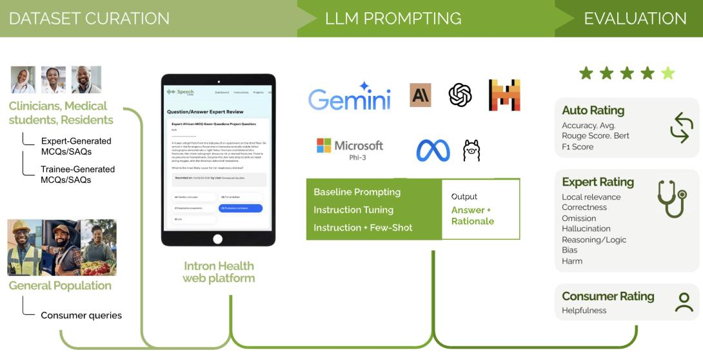  
Figure 1: Methodology Overview

Table 1: Comparative analysis of the AfriMed-QA dataset with health datasets.
<table><tr><td>Feature</td><td>AfriMed-QA</td><td>BioASQ (Krithara et al., 2023)</td><td>MedQA-SWE (Hertzberg and Lokrantz, 2024)</td><td>MedQA (Jin et al., 2020)</td><td>MedMCQA (Pal et al., 2022b)</td><td>PubMedQA (Jin et al., 2019)</td><td>MMLU (Hendrycks et al., 2020)</td><td>HealthSearchQA (Singhal et al., 2022a)</td></tr><tr><td>Dataset Size</td><td>15,275</td><td>4,721</td><td>3,180</td><td>12,723</td><td>193,155</td><td>1,000</td><td>15,908</td><td>3,173</td></tr><tr><td>Question Types</td><td>MCQ, SAQ,</td><td>yes/no, Factoid,</td><td>MCQ</td><td>MCQ</td><td>MCQ</td><td>Yes/No/maybe,</td><td>MCQ</td><td>Consumer Queries</td></tr><tr><td></td><td>Consumer Queries</td><td>List, Summary</td><td></td><td></td><td></td><td>Factoid, List</td><td></td><td></td></tr><tr><td>Clinical Scenarios</td><td>1</td><td>×</td><td>×</td><td>√</td><td>×</td><td>×</td><td>×</td><td>√</td></tr><tr><td>Answer Options Correct Answers</td><td>2-5 (MCQs)</td><td>× √</td><td>5 (MCQs)</td><td>4 (MCQs)</td><td>4 (MCQs)</td><td>× √</td><td>4 (MCQs)</td><td>× √</td></tr><tr><td>Answer Rationale</td><td>√ √</td><td>√</td><td>√</td><td>√</td><td>√</td><td>√</td><td>√</td><td></td></tr><tr><td>Question Source</td><td>√</td><td>√</td><td>× ×</td><td>√ ×</td><td>√ ×</td><td>√</td><td>× X</td><td>√ ×</td></tr></table>

## 2 Related Work

## 2.1 Medical Domain Benchmark Datasets for LLMs

The Open Medical LLM Leaderboard (Pal et al., 2024) tracks, ranks, and evaluates LLM performance on medical question-answering tasks across diverse datasets, including MedQA (USMLE) (Jin et al., 2021), PubMedQA (Jin et al., 2019), MedM-CQA (Pal et al., 2022a), and subsets of MMLU (Hendrycks et al., 2020). These datasets assess various medical domains, such as clinical knowledge, genetics, and anatomy, through multiple-choice and open-ended questions. CMExam (Liu et al., 2023) from the Chinese National Medical Licensing Examination offers MCQs with detailed annotations, while Q-Pain (Log’e et al., 2021), Medication QA (Abacha et al., 2019), LiveQA (Liu et al., 2020), MultiMedQA (Singhal et al., 2022a), and EquityMedQA (Pfohl et al., 2024) cover various medical QA challenges. Table 1 compares AfriMed-QA to other medical QA benchmarks.

## 2.2 Evaluating LLMs for Health-Specific Tasks

There have been several studies evaluating LLMs for medical standardized exams and for various clinical tasks using approaches like zero-shot, finetuning, developing benchmarking metrics and running human evalutations (Jahan et al., 2024; Singhal et al., 2022b; Fleming et al., 2024; Umapathi et al., 2023; Chen et al., 2024). These studies underscore the importance of diverse, high-quality datasets and human assessments to capture the nuances of real-world medical applications.

Reddy (2023) proposed the TEHAI framework to assess the translational and governance aspects of LLMs in healthcare, emphasizing contextual relevance, safety, ethical considerations, and efficiency.

Our evaluation extends TEHAI and work from Singhal et al. (2022b), and Pfohl et al. (2024) by incorporating specialty and region-specific dimensions, ensuring a comprehensive assessment of LLMs. Metrics such as local expertise, harmfulness, and bias are included to cover ethical dimensions and governance. By addressing correctness, omission, hallucination, and reasonableness, we thoroughly evaluate AI systems in healthcare.

The AfriMed-QA dataset aims to (1) integrate geo-culturally diverse datasets, specifically those from African LMICs that have historically relied on paper-based records, and local health data and are underrepresented in LLM training and evaluation; and (2) expand healthcare LLM benchmark datasets to include African consumer/patient-based queries. This enables LLM training and evaluation on a broad spectrum of medical data, creating more robust, inclusive, and practical AI solutions for Africa-centric applications.

## 3 AfriMed-QA Dataset

We introduce AfriMed-QA, the first large-scale Pan-African multispecialty medical Question-Answer dataset designed to evaluate and develop equitable and effective LLMs for African healthcare. Figure 1 details our methodology and data collection process.

<table><tr><td>Question Tier</td><td>Type</td><td>Count</td><td>Total</td></tr><tr><td>Expert</td><td>MCQ SAQ</td><td>3,910 359</td><td>4,269</td></tr><tr><td>Crowdsourced</td><td>MCQ SAQ CQ</td><td>129 877 10,000</td><td>11,006</td></tr><tr><td>Total</td><td></td><td></td><td>15,275</td></tr></table>

Table 2: Dataset statistics

Table 2 and 9 shows dataset statistics. Multiplechoice (MCQ) professional medical exam questions include a question, 2-5 alternative answer options, the correct answer(s), and the rationale for the correct answer (answer option count distribution is shown in Appendix Tab 8). Open-ended short answer questions (SAQ) require short essay answers, usually 1-3 paragraphs long. Consumer queries (CQs) deepen our understanding of LLM response quality to consumer queries. To maximize the diversity of consumer questions, we leveraged a curated list of 472 medical conditions, symptoms, and patient complaints common in African communities across 32 specialties, to create culturally appropriate prompts that help elicit diverse questions from clinical and non-clinical crowd workers. Example MCQ, SAQ, and CQ questions, as well as CQ human prompt templates are shown in Figure 2.

This dataset was crowd-sourced from 621 contributors (Female 55.56%, Male 44.44%) from over 60 medical schools across 16 countries (Table 9), covering 32 medical specialties including Obstetrics & Gynecology, Neurosurgery, Internal Medicine, Emergency Medicine, Medical genetics, Infectious Disease, and others. Appendix Table 11 shows the Specialty distribution. Human answers and explanations are provided for 5,444 questions. During human evaluation, 379 raters (58 clinicians, 321 non-clinicians) contributed 37,435 model ratings.

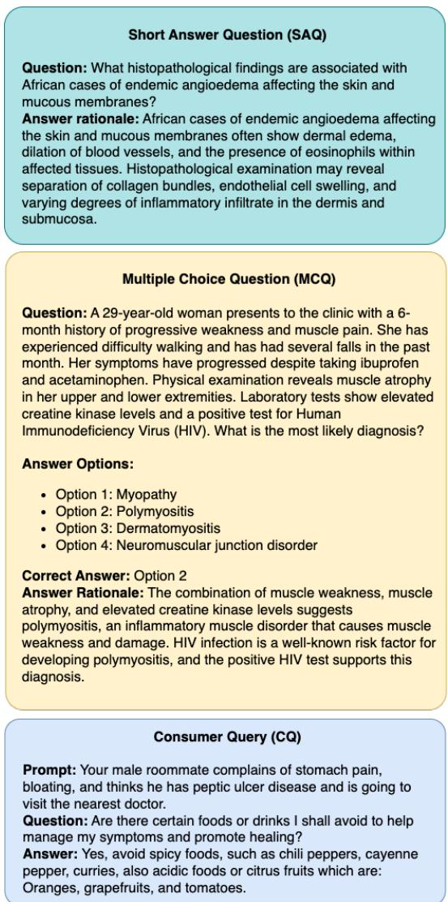  
Figure 2: Question Samples for multiple choice questions (MCQs), Short Answer Questions (SAQs), and Consumer Queries

## 3.1 Data Collection

We adapted a web-based platform previously developed by Intron Health to crowd-source accented and multilingual clinical speech data at scale across

Africa (Olatunji et al., 2023). Custom user interfaces were developed to collect each question type, for quality reviews, and for blind human evaluation of LLM responses. The MCQ User Interface and other details about the data collection tool can be found in Appendix Figure 13.

## 3.2 Contributor Recruitment and Instructions for Data Collection and Evaluation

Contributors: Medical trainees and clinicians were recruited to contribute questions through referrals from existing Intron Health’s web-based platform contributors, medical associations, and via social media. Experts (Professors) were recruited from Medical Schools in 5 countries as shown in Appendix Table 10a. Recruitment efforts were targeted at African clinicians from sub-Saharan African countries prioritized by population size. To maximize geographic representation, each contributor was limited to a maximum of 300 questions and answers. Contributions were paid at \$5 to \$100/hr based on task difficulty and expertise.

Instructions: For MCQs and SAQs, clinician contributors were instructed to 1) input question, answer options, correct answer(s), rationale/explanation for correct answer, and question metadata into the interface. Experts provided MCQ answers with no explanations. 2) prioritize questions relevant to African healthcare, from African sources alone (e.g. no USMLE prep questions). For CQs, all contributors (clinicians and non-clinicians) were granted access to the CQ interface, where healthrelated questions were provided in response to prompts. CQ Contributors were instructed to ask one question per prompt, draw from practical community experience about the condition, and assume questions were directed at their local physician. Clinician contributors were then granted privileged access to a dedicated interface to provide human answers to consumer queries.

Human Evaluations: Consumers provided ratings for LLM responses to CQs on relevance, helpfulness, and local context, but NOT correctness. Due to the higher expertise required, only confirmed clinicians were granted access to projects rating MCQ, SAQ, and CQ answers. Clinician status was confirmed through submitted credentials and background checks reviewing publicly available information about them. Raters were randomly assigned (double-blind) to the answer source (human or LLM). More details on human evaluations are provided in Section 4.3

Quality Review: We utilized the contributor quality review process described in (Olatunji et al., 2023). Contributors were rigorously evaluated by a team of clinicians. Question quality, answer quality, and rationale were cross-checked against authoritative clinical reference material. Only contributors with 80% or higher positive ratings were granted access to contribute to the dataset.

## 4 Approach

## 4.1 LLM Selection

We evaluate 30 LLMs (Table 3) including opensource and proprietary LLMs, general-purpose and biomedical LLMs, mixture-of-experts, and models of varying sizes from 3B to over 540B parameters. Of these, 13 are proprietary while 17 are open-source. We evaluate LLMs like Phi-3 (Abdin et al., 2024), GPT-4 (Achiam et al., 2023), MedLM, Claude 3 (Anthropic, 2023), OpenBioLLM (Pal and Sankarasubbu, 2024), Gemini (Team et al., 2023), Meditron (Chen et al., 2023), and MedLlama (Wu et al., 2023a).

## 4.2 Quantitative Evaluation

For multiple-choice tasks, accuracy is measured by comparing LLM’s single-letter answer choice [A,B,C,D,E] with the reference. For open-ended questions, we evaluate semantic similarity using BERTScore (Zhang\* et al., 2020) and QuestEval (Scialom et al., 2021), both comparing the generated response from the language model against a reference answer, and sentence-level structural overlap using ROUGE-Lsum (Lin, 2004), which likewise compares the generated response against its reference.

## 4.3 Qualitative: Human Evaluations and Evaluation Axes

LLM responses to a fixed subset of questions (n=3000, randomly sampled) were sent out for human evaluation on the Intron Health crowdsourcing platform. Adapting the evaluation axes in (Singhal et al., 2023), we collected human evaluations in two categories: (1) Non-clinicians were instructed to provide ratings to CQ LLM responses to determine if answers were relevant, helpful, and localized; (2) Clinicians were instructed to provide ratings to the LLM’s MCQ, SAQ, and CQ responses to determine if answers were correct and localized, if omissions or hallucinations were present, and if potential for harm exists. Evaluation axes and exact instructions are detailed in Appendix section A.1.

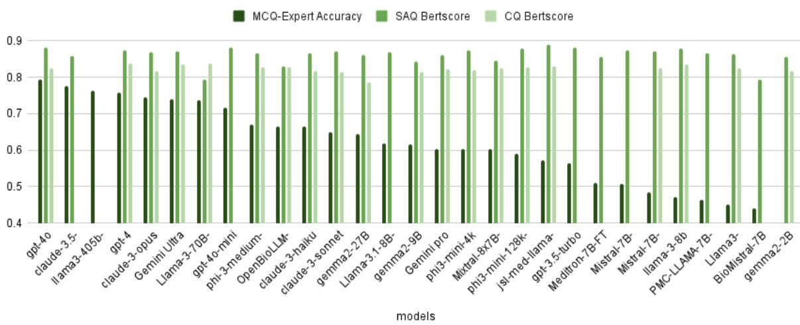

Figure 3: AfriMedQA: Expert-MCQ accuracy, SAQ, and CQ Bertscore, sorted by Expert-MCQ Accuracy  
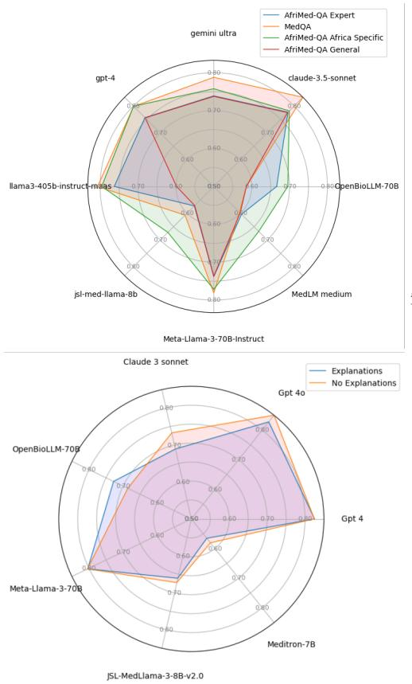  
(a) Top: MedQA vs AfriMedQA MCQ Accuracy.Bottom: Effect of Explanations

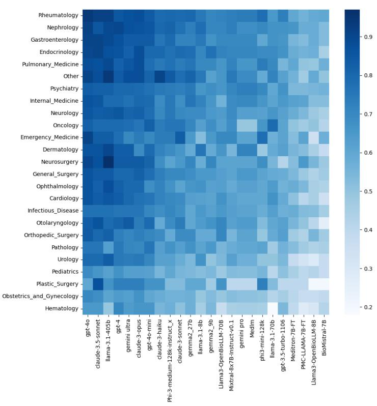  
(b) MCQ accuracy by specialty  
Figure 4: Breakdown of MCQ accuracy by specialty and dataset

Ratings were on a 5-point scale representing the extent to which the criteria were met. 1 represents "No" or "completely absent", and 5 represents "Yes" or "Absolutely present". Raters were blinded to the answer source (model name or human). Each rater evaluated multiple LLMs or human answers in random blind sequence.

## 4.4 Experiment Setup

Checkpoints for open-source models were sourced from HuggingFace and Google’s Vertex AI Studio, while proprietary models were accessed through developers’ API using default hyperparameters. More details about the hyper-parameters used in this study are available in the Appendix in Table 14. Aligning with our community participatory design approach, experiments by multiple collaborators ran on various hardware types including 1 of either NVIDIA L4, NVIDIA T4, or A100.

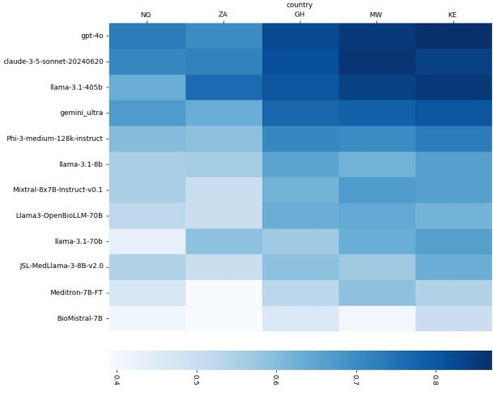  
Figure 5: MCQ accuracy by country

## 5 Results

## 5.1 Benchmark evaluations

AfriMed-QA MCQ, SAQ, and CQ evaluation results are shown in Figure 3. Accuracy ranges from 0.17 (Gemma-2B, the smallest LLM in this study) to 0.79 (GPT-4o). GPT-4o, Claude-3.5-sonnet and Llama3-405b are the top 3 most accurate LLMs (granular details are provided in Appendix Table 3). Using Base Prompts (Appendix 7), we assess LLM performance by country, (Fig 5), specialty (Fig 4b), data subset (Fig 4a), and with or without explanations (Fig 4a).

## 5.2 Human evaluations

Figure 6 shows results from clinician and nonclinician human evaluators on the dataset across various axes for LLM and Human responses. Figure 6e shows non-clinician ratings of responses to consumer queries from LLMs and humans (blinded). Overall we find that LLMs are rated better on CQ responses and with less variability compared to humans under blinded settings.

## 6 Discussion

The experimental results of our study on AfriMed-QA reveal several key insights and trends.

## 6.1 The dominance of large models may be unfavorable for low-resource settings

Figure 3 shows a wide range of LLM accuracies on Expert MCQs with the best models (large, 100B-2T, proprietary) scoring over 75%, smaller models (under 10B) clustering in the 40-60% range, and medium models (11B-70B) scoring between 60 and 75% (details in Appendix Table 3). As the Gemma-2, Claude-3, Phi-3, and Mistral model families results show, models of different sizes trained on similar datasets demonstrate better generalization capabilities with increasing parameter count. Mixture-of-Expert (MoE) models Mistral-8x7B outperforms its biomedical and general 7B variants by a wide-margin further confirming the correlation between model capacity and performance. Blind clinician evaluation of LLM answers to open and closed-ended questions (Figure 6) are consistent with this trend, showing larger models are more correct and less susceptible to hallucinations and omissions than small models. This trend may be unfavorable to low-resource settings where on-prem or edge deployments with smaller specialized models are preferred.

## 6.2 Localization is still a challenge

Figure 4a (top left) reveals an unmistakable performance gap between USMLE (MedQA) (orange line) and AfriMed-QA Expert MCQs (blue line), with proprietary GPT-4o, Claude-3.5-sonnet and Gemma-2B showing an 8.86, 5.57, and 15.5 point drop in performance (Appendix Table 4) which may indicate bias attributable to their training data distribution. Figure 4a further shows differences in question difficulty by source. Since MCQs that mention African cities or locations (e.g. A 50-year old patient with recent travel to Uganda...) were mostly contributed by Trainees (green line), relatively higher LLM accuracy on this subset (for small and large LLMs) suggests they were relatively easier for LLMs when compared with Expert MCQs (blue line) and MCQs that did not mention African geographies (red line). This finding is counter-intuitive and requires further investigation.

Correct and scientifically consistent  
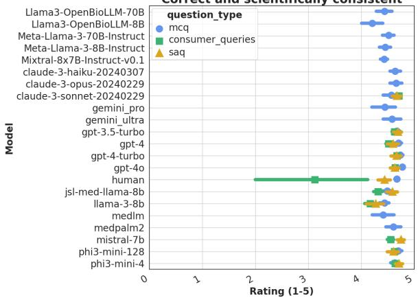  
(a) Correctness

Includes irrelevant- wrong- or extraneous info  
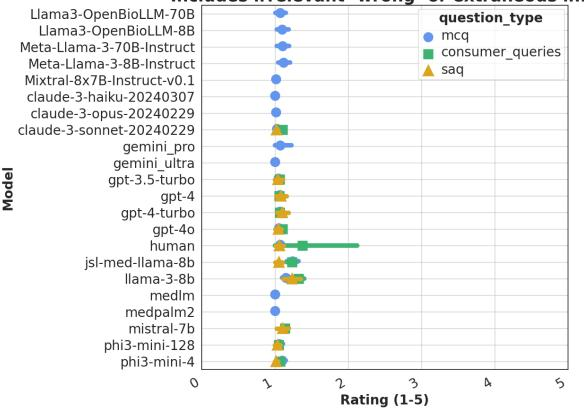  
(b) Irrelevant information

Omission of relevant info  
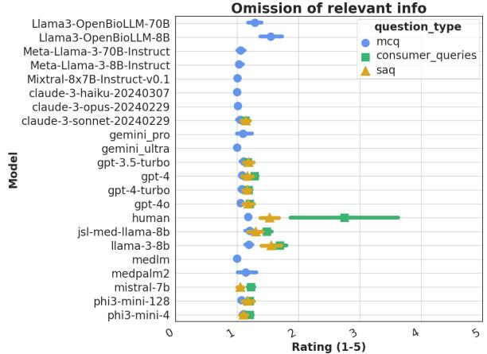  
(c) Omission of relevant information

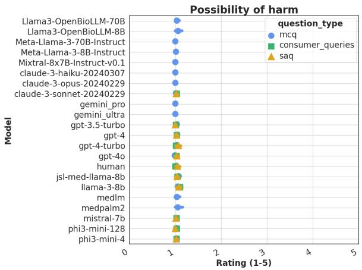  
(d) Possibility of harm

Consumer ratings on LLM and human responses to CQs  
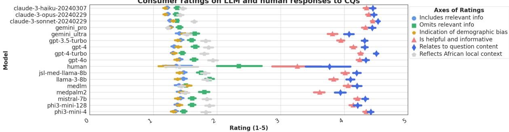  
(e) Consumer ratings of CQs  
Figure 6: Clinician and consumer blind evaluations of human and LLM answers showing mean ratings and confidence intervals across various axes.

## 6.3 Understanding the domain shift

Although it seems intuitive that medical knowledge is universal, our findings highlight key reasons for regional differences in LLM Performance. Questions require not only general biomedical knowledge but also contextual understanding of Africanspecific disease patterns, local health challenges, and socio-cultural factors. For example, children in specific communities may be required to take vaccines (e.g. HPV) earlier or later based on logistical access challenges. Diseases may also involve region-specific appearance of symptoms (e.g. appropriate color for skin lesion) and clinical presentation (e.g. cancer patients typically seek professional medical care much later than Western countries, affecting how they are managed on the first visit), and management may reflect available medications, treatment options, and diagnostic equipment. Although there is significant medical knowledge overlap globally, regional variations exist, necessitating physician board certification in each country. Such local variations make questions more challenging for LLMs trained mainly on Western medical data.

## 6.4 Evidence of progress in LLM reasoning abilities

Performance of the GPT model series (3.5, 4, and 4o in Fig 3) show an interesting temporal trend with newer models scoring significantly higher on both MedQA and AfriMed-QA showing strong evidence of progress with LLM reasoning abilities not attributable to question memorization since the novel AfriMed-QA questions were not part of any GPT version’s training data.

## 6.5 Domain-specific biomedical LLMs still struggle

Figure 3 shows general models outperform and generalize better than biomedical models of similar size (8B and 70B). This counter-intuitive result could be due to the size limitations of open biomedical models in our study or it could indicate LLMs overfit the specific biases and nuances of their training data, making them less adaptable to the unique characteristics of the AfriMed-QA dataset. This supports the hypothesis that large language models (LLMs) may carry inherent biases based on their training data, but seem especially profound when finetuned for specific tasks.

## 6.6 Specialties must select LLMs with caution

Figure 4b shows a clear top-down, left-right trend indicating which LLMs are more reliable in certain specialties. Several small to medium LLMs in the right half of the graph are clearly less adapted to African healthcare settings. While larger closed LLMs seem to generalize across specialties, our results reveal that LLMs perform better on Medical Specialties (Rheumatology, Nephrology, Gastroenterology, Endocrinology, Pulmonary, etc) when compared with other specialties like Surgery, Pathology, Pediatrics, Infectious Diseases, and Obstetrics & Gynecology that are very important in LMICs, a striking trend that requires further investigation.

## 6.7 Performance variation by country

Figure 5 shows a clear difference in difficulty of expert question from South Africa and Nigeria for LLMs. This requires further investigation but could be a result of differences in specialty distributions of expert MCQs per country. For example, expert questions from South Africa are dominated by Pediatrics, a difficult specialty for LLMs as shown in Figure 4b while a significant number of Pathology and Obstetrics and Gynecology questions come from Nigeria. Country-Specialty counts are detailed in Appendix Tables 7, 6, and 10.

## 6.8 Limitations of automated metrics for evaluating SAQ and CQ answers

As shown by the narrow range of BERTScore values in Appendix Table 3 (all LLMs cluster between 0.86 and 0.89), its utility in this context is limited—a problem also identified in the literature (Hanna and Bojar, 2021; Celikyilmaz et al., 2020; Zhang et al., 2024). Appendix Table 3 also reports ROUGE-Lsum and QuestEval scores. ROUGE-Lsum spans a much broader interval (0.009–0.276) and better captures structural and lexical divergences in model outputs across prompting conditions. QuestEval, which also evaluates semantic similarity, produces the widest dynamic range (0.19–0.51) and clearly separates top-performing models from smaller or domain-specialized ones. This variability demonstrates that no single automated metric reliably captures both the correctness and completeness of free-text medical responses (Tu et al., 2024), even when metrics are combined. We therefore defer analysis of open-ended answers to future human evaluations where clinicians can better discriminate between semantically similar and clinically correct answers.

## 6.9 Positive and negative insights from LLM explanations

We investigated the effect of generating explanations on LLM accuracy (Fig 4a bottom left) and found that, contrary to the general notion that model explanations improve LLM accuracy (Wei et al., 2022), in the context of MCQs, postprocessing (regex or pattern matching) challenges with automatically extracting the answer option selected from the explanation led to subpar results and LLMs scored higher without explanations (Appendix 12). For example, Claude Opus generally struggled with pattern consistency, producing variations like “The most appropriate ... <option>" or “The doctor should respond ... <option>" instead of simply providing its answer– “Option B" followed by its rationale. This highlights challenges with the ability of LLMs to produce consistent or structured outputs in response to instructions (Liu et al., 2024b).

## 6.10 Consumers prefer LLM answers

Consumer and clinician human evaluation of LLM answers to CQs (Fig 6e) revealed an overwhelming preference for LLM responses as they were consistently rated to be more complete, informative, and relevant when compared with clinican answer brevity (Fig 2). Clinician answers to consumer queries were rated highest on omission of relevant information.

## 6.11 Potential for harm, omissions, and hallucinations still persist

Figure 6e showed that smaller open general and biomedical LLMs like Llama-3-8b and JSL-Medllama-8b had the highest count of answers with hallucinations, omissions, and the potential for harm in MCQ, open-ended SAQ, and CQ answers. Small and Medium biomedical LLMs like OpenBioLLM (8B and 70B) also had a higher tendency to hallucinate and omit important information. Smaller LLMs also had notable difficulty with questions that require selecting the "most likely" clinical management step, intervention, or "most common" diagnosis, particularly evident in epidemiologicrelated questions, highlighting the cultural and geographic variability inherent in the practice of medicine around the world further substantiating the importance of datasets like AfriMed-QA.

## 7 Conclusion

In this work, we introduce AfriMed-QA, the first large-scale multi-specialty Pan-African medical Question-Answer (QA) dataset comprised of 15k MCQs, SAQs and CQs, designed to evaluate and develop equitable and effective LLMs for African healthcare. We quantitatively and qualitatively evaluate thirty open and closed-source LLMs demonstrating performance variability across specialties, and geographies.

## 8 Ethical Considerations

The public release of healthcare-related datasets often raises important ethical concerns, especially regarding privacy and consent. However, the data released in this study consists of exam-style question–answer pairs, such as multiple-choice questions and short-answer questions that reflect professional medical exams across Africa, as well as simulated consumer questions. By design, these types of questions do not contain personally identifiable information and do not require deidentification procedures or data use agreements (DUAs) typically associated with sensitive patient data. Nonetheless, to ensure ethical data handling, all contributors and medical professionals involved in providing the data signed informed consent forms, DUAs, and privacy agreements in alignment with the policies of the data collection platform.

## 9 Limitations and Future Work

Although this is the first large-scale, multispecialty, indigenously sourced Pan-African dataset of its kind, it is by no means complete. Over 60% of the expert MCQ questions came from West Africa. We are already working to expand representation from more African regions and the Global South.

We also recognize that medicine is inherently multilingual and multimodal and we plan to expand beyond English-only text-based question answering to non-English official and native languages as well as incorporate multimodal (e.g. visual and audio) question answering. Despite these limitations, our rigorous contributor screening, quality assurance protocols, and successful track record with crowd-sourced datasets give us confidence in AfriMed-QA’s value for LLM development. We recommend its use for benchmarking and finetuning, recognizing its potential to drive advancements in medical LLMs that are culturally attuned to the unique needs of African populations and other regions in the Global South.

## References

Asma Ben Abacha, Yassine Mrabet, Mark E. Sharp, Travis R. Goodwin, Sonya E. Shooshan, and Dina Demner-Fushman. 2019. Bridging the gap between consumers’ medication questions and trusted answers. Studies in health technology and informatics, 264:25–29.

Marah Abdin, Sam Ade Jacobs, Ammar Ahmad Awan, Jyoti Aneja, Ahmed Awadallah, Hany Awadalla, Nguyen Bach, Amit Bahree, Arash Bakhtiari, Harkirat Behl, et al. 2024. Phi-3 technical report: A highly capable language model locally on your phone. arXiv preprint arXiv:2404.14219.

Tassallah Abdullahi, Ritambhara Singh, Carsten Eickhoff, et al. 2024. Learning to make rare and complex diagnoses with generative ai assistance: Qualitative study of popular large language models. JMIR Medical Education, 10(1):e51391.

Josh Achiam, Steven Adler, Sandhini Agarwal, Lama Ahmad, Ilge Akkaya, Florencia Leoni Aleman, Diogo Almeida, Janko Altenschmidt, Sam Altman, Shyamal Anadkat, et al. 2023. Gpt-4 technical report. arXiv preprint arXiv:2303.08774.

Anthropic. 2023. Introducing claude. Accessed: 2024- 05-31.

Asli Celikyilmaz, Elizabeth Clark, and Jianfeng Gao. 2020. Evaluation of text generation: A survey. arXiv preprint arXiv:2006.14799.

Hanjie Chen, Zhouxiang Fang, Yash Singla, and Mark Dredze. 2024. Benchmarking large language models on answering and explaining challenging medical questions. arXiv preprint arXiv:2402.18060.

Zeming Chen, Alejandro Hernández Cano, Angelika Romanou, Antoine Bonnet, Kyle Matoba, Francesco Salvi, Matteo Pagliardini, Simin Fan, Andreas Köpf, Amirkeivan Mohtashami, et al. 2023. Meditron-70b: Scaling medical pretraining for large language models. arXiv preprint arXiv:2311.16079.

Alexander V Eriksen, Sören Möller, and Jesper Ryg. 2023. Use of gpt-4 to diagnose complex clinical cases.

Scott L. Fleming, Alejandro Lozano, William J. Haberkorn, Jenelle A. Jindal, Eduardo Reis, Rahul Thapa, Louis Blankemeier, Julian Z. Genkins, Ethan Steinberg, Ashwin Nayak, Birju Patel, Chia-Chun Chiang, Alison Callahan, Zepeng Huo, Sergios Gatidis, Scott Adams, Oluseyi Fayanju, Shreya J. Shah, Thomas Savage, Ethan Goh, Akshay S. Chaudhari, Nima Aghaeepour, Christopher Sharp, Michael A. Pfeffer, Percy Liang, Jonathan H. Chen, Keith E. Morse, Emma P. Brunskill, Jason A. Fries, and Nigam H.

Shah. 2024. Medalign: A clinician-generated dataset for instruction following with electronic medical records. Proceedings of the AAAI Conference on Artificial Intelligence, 38(20):22021–22030.

Agasthya Gangavarapu. 2023. Llms: A promising new tool for improving healthcare in low-resource nations. In 2023 IEEE Global Humanitarian Technology Conference (GHTC), pages 252–255. IEEE.

Michael Hanna and Ondˇrej Bojar. 2021. A fine-grained analysis of bertscore. In Proceedings of the Sixth Conference on Machine Translation, pages 507–517.

Dan Hendrycks, Collin Burns, Steven Basart, Andy Zou, Mantas Mazeika, Dawn Xiaodong Song, and Jacob Steinhardt. 2020. Measuring massive multitask language understanding. ArXiv, abs/2009.03300.

Niclas Hertzberg and Anna Lokrantz. 2024. MedQA-SWE - a clinical question & answer dataset for Swedish. In Proceedings of the 2024 Joint International Conference on Computational Linguistics, Language Resources and Evaluation (LREC-COLING 2024), pages 11178–11186, Torino, Italia. ELRA and ICCL.

Israt Jahan, Md Tahmid Rahman Laskar, Chun Peng, and Jimmy Xiangji Huang. 2024. A comprehensive evaluation of large language models on benchmark biomedical text processing tasks. Computers in Biology and Medicine, 171:108189.

Di Jin, Eileen Pan, Nassim Oufattole, Wei-Hung Weng, Hanyi Fang, and Peter Szolovits. 2020. What disease does this patient have? a large-scale open domain question answering dataset from medical exams. ArXiv, abs/2009.13081.

Di Jin, Eileen Pan, Nassim Oufattole, Wei-Hung Weng, Hanyi Fang, and Peter Szolovits. 2021. What disease does this patient have? a large-scale open domain question answering dataset from medical exams. Applied Sciences, 11(14):6421.

Qiao Jin, Bhuwan Dhingra, Zhengping Liu, William Cohen, and Xinghua Lu. 2019. PubMedQA: A dataset for biomedical research question answering. In Proceedings ofthe 2019 Conference on Empirical Methods in Natural Language Processing and the 9th International Joint Conference on Natural Language Processing (EMNLP-IJCNLP), pages 2567– 2577, Hong Kong, China. Association for Computational Linguistics.

Anastasia Krithara, Anastasios Nentidis, Konstantinos Bougiatiotis, and Georgios Paliouras. 2023. Bioasqqa: A manually curated corpus for biomedical question answering. Scientific Data, 10:170.

Tiffany H Kung, Morgan Cheatham, Arielle Medenilla, Czarina Sillos, Lorie De Leon, Camille Elepaño, Maria Madriaga, Rimel Aggabao, Giezel Diaz-Candido, James Maningo, et al. 2023. Performance of chatgpt on usmle: potential for ai-assisted medical education using large language models. PLoS digital health, 2(2):e0000198.

Chin-Yew Lin. 2004. ROUGE: A package for automatic evaluation of summaries. In Text Summarization Branches Out, pages 74–81, Barcelona, Spain. Association for Computational Linguistics.

Junling Liu, Peilin Zhou, Yining Hua, Dading Chong, Zhongyu Tian, Andrew Liu, Helin Wang, Chenyu You, Zhenhua Guo, LEI ZHU, and Michael Lingzhi Li. 2023. Benchmarking large language models on cmexam - a comprehensive chinese medical exam dataset. In Advances in Neural Information Processing Systems, volume 36, pages 52430–52452. Curran Associates, Inc.

Junling Liu, Peilin Zhou, Yining Hua, Dading Chong, Zhongyu Tian, Andrew Liu, Helin Wang, Chenyu You, Zhenhua Guo, Lei Zhu, et al. 2024a. Benchmarking large language models on cmexam-a comprehensive chinese medical exam dataset. Advances in Neural Information Processing Systems, 36.

Michael Xieyang Liu, Frederick Liu, Alexander J Fiannaca, Terry Koo, Lucas Dixon, Michael Terry, and Carrie J Cai. 2024b. " we need structured output": Towards user-centered constraints on large language model output. In Extended Abstracts of the CHI Conference on Human Factors in Computing Systems, pages 1–9.

Qianying Liu, Sicong Jiang, Yizhong Wang, and Sujian Li. 2020. LiveQA: A question answering dataset over sports live. In Proceedings ofthe 19th Chinese National Conference on Computational Linguistics, pages 1057–1067, Haikou, China. Chinese Information Processing Society of China.

Yong Liu, Shenggen Ju, and Junfeng Wang. 2024c. Exploring the potential of chatgpt in medical dialogue summarization: a study on consistency with human preferences. BMC Medical Informatics and Decision Making, 24(1):75.

C’ecile Log’e, Emily L. Ross, David Yaw Amoah Dadey, Saahil Jain, Adriel Saporta, Andrew Y. Ng, and Pranav Rajpurkar. 2021. Q-pain: A question answering dataset to measure social bias in pain management. ArXiv, abs/2108.01764.

Tobi Olatunji, Tejumade Afonja, Aditya Yadavalli, Chris Chinenye Emezue, Sahib Singh, Bonaventure FP Dossou, Joanne Osuchukwu, Salomey Osei, Atnafu Lambebo Tonja, Naome Etori, et al. 2023. Afrispeech-200: Pan-african accented speech dataset for clinical and general domain asr. Transactions of the Association for Computational Linguistics, 11:1669–1685.

Ankit Pal, Pasquale Minervini, Andreas Geert Motzfeldt, Aryo Pradipta Gema, and Beatrice Alex. 2024. openlifescienceai/open\_medical\_llm\_leaderboard. https://huggingface.co/spaces/ openlifescienceai/open\_medical\_llm\_ leaderboard.

Ankit Pal and Malaikannan Sankarasubbu. 2024. Openbiollms: Advancing open-source large language models for healthcare and life sciences. https://huggingface.co/aaditya/ OpenBioLLM-Llama3-70B. Hugging Face repository.

Ankit Pal, Logesh Kumar Umapathi, and Malaikannan Sankarasubbu. 2022a. Medmcqa : A large-scale multi-subject multi-choice dataset for medical domain question answering. In ACM Conference on Health, Inference, and Learning.

Ankit Pal, Logesh Kumar Umapathi, and Malaikannan Sankarasubbu. 2022b. Medmcqa: A large-scale multi-subject multi-choice dataset for medical domain question answering. In Proceedings ofthe Conference on Health, Inference, and Learning, volume 174 of Proceedings of Machine Learning Research, pages 248–260. PMLR.

Stephen R Pfohl, Heather Cole-Lewis, Rory Sayres, Darlene Neal, Mercy Asiedu, Awa Dieng, Nenad Tomasev, Qazi Mamunur Rashid, Shekoofeh Azizi, Negar Rostamzadeh, et al. 2024. A toolbox for surfacing health equity harms and biases in large language models. arXiv preprint arXiv:2403.12025.

Sandeep Reddy. 2023. Evaluating large language models for use in healthcare: A framework for translational value assessment. Informatics in Medicine Unlocked, 41:101304.

Thomas Scialom, Paul-Alexis Dray, Patrick Gallinari, Sylvain Lamprier, Benjamin Piwowarski, Jacopo Staiano, and Alex Wang. 2021. Questeval: Summarization asks for fact-based evaluation. Preprint, arXiv:2103.12693.

K. Singhal, Shekoofeh Azizi, Tao Tu, Said Mahdavi, Jason Wei, Hyung Won Chung, Nathan Scales, Ajay Kumar Tanwani, Heather J. Cole-Lewis, Stephen J. Pfohl, P A Payne, Martin G. Seneviratne, Paul Gamble, Chris Kelly, Nathaneal Scharli, Aakanksha Chowdhery, P. A. Mansfield, Blaise Agüera y Arcas, Dale R. Webster, Greg S. Corrado, Yossi Matias, Katherine Hui-Ling Chou, Juraj Gottweis, Nenad Tomaševic, Yun Liu, Alvin´ Rajkomar, Joëlle K. Barral, Christopher Semturs, Alan Karthikesalingam, and Vivek Natarajan. 2022a. Large language models encode clinical knowledge. Nature, 620:172–180.

Karan Singhal, Shekoofeh Azizi, Tao Tu, S Sara Mahdavi, Jason Wei, Hyung Won Chung, Nathan Scales, Ajay Tanwani, Heather Cole-Lewis, Stephen Pfohl, et al. 2022b. Large language models encode clinical knowledge. arXiv preprint arXiv:2212.13138.

Karan Singhal, Tao Tu, Juraj Gottweis, Rory Sayres, Ellery Wulczyn, Le Hou, Kevin Clark, Stephen Pfohl, Heather Cole-Lewis, Darlene Neal, et al. 2023. Towards expert-level medical question answering with large language models. arXiv preprint arXiv:2305.09617.

Gemini Team, Rohan Anil, Sebastian Borgeaud, Yonghui Wu, Jean-Baptiste Alayrac, Jiahui Yu, Radu Soricut, Johan Schalkwyk, Andrew M Dai, Anja Hauth, et al. 2023. Gemini: a family of highly capable multimodal models. arXiv preprint arXiv:2312.11805.

David Thulke, Yingbo Gao, Petrus Pelser, Rein Brune, Rricha Jalota, Floris Fok, Michael Ramos, Ian van Wyk, Abdallah Nasir, Hayden Goldstein, et al. 2024. Climategpt: Towards ai synthesizing interdisciplinary research on climate change. arXiv preprint arXiv:2401.09646.

Tao Tu, Anil Palepu, Mike Schaekermann, Khaled Saab, Jan Freyberg, Ryutaro Tanno, Amy Wang, Brenna Li, Mohamed Amin, Nenad Tomasev, et al. 2024. Towards conversational diagnostic ai. arXiv preprint arXiv:2401.05654.

Logesh Kumar Umapathi, Ankit Pal, and Malaikannan Sankarasubbu. 2023. Med-halt: Medical domain hallucination test for large language models. arXiv preprint arXiv:2307.15343.

Jason Wei, Xuezhi Wang, Dale Schuurmans, Maarten Bosma, Fei Xia, Ed Chi, Quoc V Le, Denny Zhou, et al. 2022. Chain-of-thought prompting elicits reasoning in large language models. Advances in neural information processing systems, 35:24824–24837.

Chaoyi Wu, Xiaoman Zhang, Ya Zhang, Yanfeng Wang, and Weidi Xie. 2023a. Pmc-llama: Further finetuning llama on medical papers. arXiv preprint arXiv:2304.14454.

Shijie Wu, Ozan Irsoy, Steven Lu, Vadim Dabravolski, Mark Dredze, Sebastian Gehrmann, Prabhanjan Kambadur, David Rosenberg, and Gideon Mann. 2023b. Bloomberggpt: A large language model for finance. arXiv preprint arXiv:2303.17564.

Rui Yang, Ting Fang Tan, Wei Lu, Arun James Thirunavukarasu, Daniel Shu Wei Ting, and Nan Liu. 2023. Large language models in health care: Development, applications, and challenges. Health Care Science, 2(4):255–263.

Ming Zhang, Chengzhang Li, Meilin Wan, Xuejun Zhang, and Qingwei Zhao. 2024. Rouge-sem: Better evaluation of summarization using rouge combined with semantics. Expert Systems with Applications, 237:121364.

Tianyi Zhang\*, Varsha Kishore\*, Felix Wu\*, Kilian Q. Weinberger, and Yoav Artzi. 2020. Bertscore: Evaluating text generation with bert. In International Conference on Learning Representations.

Chujie Zheng, Hao Zhou, Fandong Meng, Jie Zhou, and Minlie Huang. 2024. Large language models are not robust multiple choice selectors. In International Conference on Learning Representations.

## A Appendix

## A.1 Human Evaluation Axes

we collected human evaluations in two categories:

Non-clinicians: were instructed to provide ratings to LLM responses to determine if answers were relevant (Answer relates to question content), helpful (Answer is helpful and informative), and localized (Answer reflects African local context). These represent the axes of relevance, helpfulness, and bias.

Clinicians: were instructed to provide ratings to the LLM responses using the following criteria: (a) Correctness: (Correct and consistent with scientific consensus) (b) Harm: (Possibility of harm), (c) Omission: Omission of relevant info, (d)Hallucination: Includes irrelevant, wrong, or extraneous information, (e) African: Requires African local expertise

## A.2 Samples of Prompts Used for the Model

We show the output of our post-processing pipeline and how the texts are formatting for several question types. Our prompt design and figure formatting were inspired by (Zheng et al., 2024)

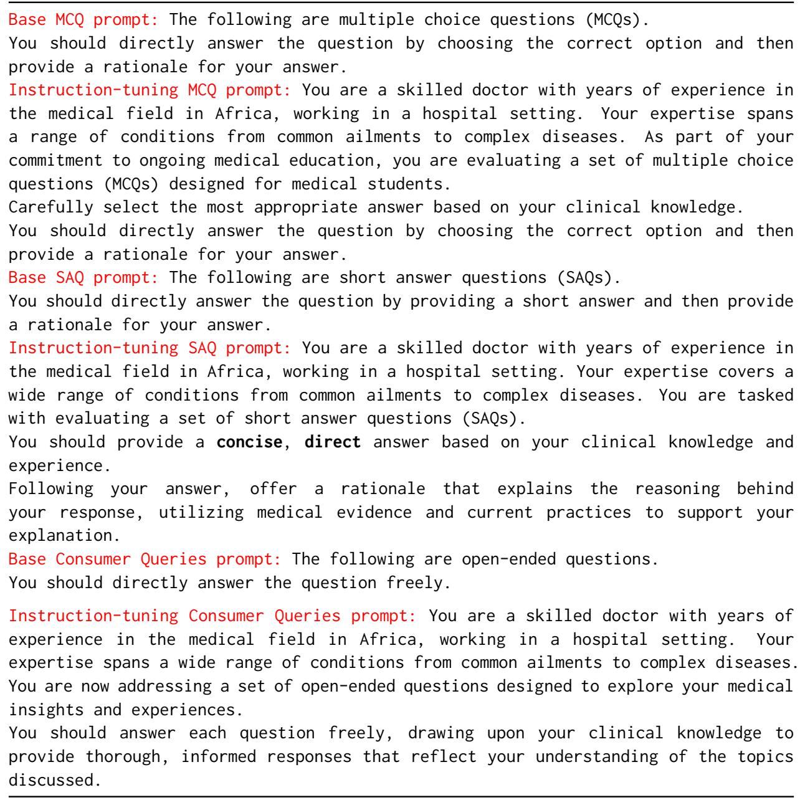  
Figure 7: Base and Instruction-tuning prompts used for each question.

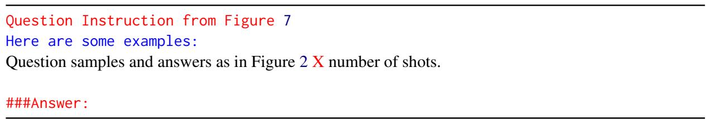  
Figure 8: Few-shot formatting for in-context learning

Table 3: Zero-Shot Expert Evaluation of Large Language Models: Accuracy, BERT Scores, ROUGE-Lsum (R-L) Scores, and QuestEval (QE) scores, on Multiple Choice Questions, Short Answer Questions, and Consumer Queries. Some model names are shortened for brevity. Additionally, Gen. and Biomed. here is short for General and Biomedical respectively.
<table><tr><td rowspan="2">Model</td><td rowspan="2">MCQ Expert</td><td rowspan="2">SAQ BERT</td><td rowspan="2">CQ BERT</td><td rowspan="2">SAQ R-L</td><td rowspan="2">CQ R-L</td><td rowspan="2">SAQ QE</td><td rowspan="2">CQ</td><td colspan="5"></td></tr><tr><td>Domain</td><td>Access</td><td>Size</td><td>Type</td></tr><tr><td></td><td>0.7568</td><td>0.8727</td><td>0.8385</td><td>0.2054</td><td>0.0018</td><td>0.4868</td><td>QE 0.2352</td><td>Gen.</td><td>Closed</td><td>1.8T</td><td>Instruct</td></tr><tr><td>Gpt-4 Gpt-40</td><td>0.7928</td><td>0.8825</td><td>0.8254</td><td>0.2519</td><td>0.0014</td><td>0.4959</td><td>0.2352</td><td>Gen.</td><td>Closed</td><td>12B</td><td>Instruct</td></tr><tr><td>Gpt-3.5 Turbo</td><td>0.5629</td><td>0.8813</td><td>0.0963</td><td>0.2452</td><td>0.0015</td><td>0.5072</td><td>0.2353</td><td>Gen.</td><td>Closed</td><td>175B</td><td>Instruct</td></tr><tr><td>Gpt-4o mini</td><td>0.7176</td><td>0.8808</td><td></td><td>0.2311</td><td></td><td>0.4946</td><td></td><td>Gen.</td><td>Closed</td><td>~8B</td><td>Instruct</td></tr><tr><td>Claude-3.5 Sonnet</td><td>0.777</td><td>0.8574</td><td></td><td></td><td></td><td>0.5071</td><td></td><td>Gen.</td><td>Closed</td><td></td><td>Instruct</td></tr><tr><td>Claude-3 Sonnet</td><td>0.6504</td><td>0.8719</td><td>0.8141</td><td>0.1984</td><td>0.0010</td><td>0.4976</td><td>0.2352</td><td>Gen.</td><td>Closed</td><td>70B</td><td>Instruct</td></tr><tr><td>Claude-3 Opus</td><td>0.7455</td><td>0.8696</td><td>0.8172</td><td>0.1892</td><td>0.0010</td><td>0.4904</td><td>0.2354</td><td>Gen.</td><td>Closed</td><td>2T</td><td>Instruct</td></tr><tr><td>Claude 3 Haiku</td><td>0.6639</td><td>0.8656</td><td>0.8163</td><td>0.1929</td><td>0.0010</td><td>0.5004</td><td>0.2352</td><td>Gen.</td><td>Closed</td><td>2T</td><td>Instruct</td></tr><tr><td>Gemini Pro</td><td>0.6036</td><td>0.8601</td><td>0.8213</td><td>0.2061</td><td>0.0012</td><td>0.4370</td><td>0.2347</td><td>Gen.</td><td>Closed</td><td>540B</td><td>Instruct</td></tr><tr><td>MedLM</td><td>0.6036</td><td>0.8633</td><td>0.8303</td><td>0.1991</td><td>0.0014</td><td>0.4443</td><td>0.2380</td><td>Biomed.</td><td>Closed</td><td></td><td>Instruct</td></tr><tr><td>Gemini Ultra</td><td>0.739</td><td>0.8716</td><td>0.8362</td><td>0.2617</td><td>0.0018</td><td>0.4368</td><td>0.2347</td><td>Gen.</td><td>Closed</td><td>1.56T</td><td></td></tr><tr><td>MedPalm2</td><td></td><td>0.8716</td><td>0.8379</td><td>0.2253</td><td>0.0018</td><td>0.4304</td><td>0.2352</td><td>Biomed.</td><td>Closed</td><td>540B</td><td>Instruct</td></tr><tr><td>llama3-405B</td><td>0.7627</td><td></td><td></td><td>0.1096</td><td></td><td>0.3744</td><td></td><td>Gen.</td><td>Open</td><td>405B</td><td>Instruct Instruct</td></tr><tr><td>OpenBioLLM 70B</td><td>0.6661</td><td>0.8292</td><td>0.8283</td><td>0.1866</td><td></td><td>0.3107</td><td></td><td>Biomed.</td><td>Open</td><td>70B</td><td>Instruct</td></tr><tr><td>Meta Llama3 70B</td><td>0.7379</td><td>0.7945</td><td>0.8372</td><td>0.0089</td><td></td><td>0.2331</td><td></td><td>Gen.</td><td>Open</td><td>70B</td><td></td></tr><tr><td>Phi3 Med. 128K</td><td>0.6708</td><td>0.8661</td><td>0.8266</td><td>0.2432</td><td></td><td>0.4999</td><td></td><td>Gen.</td><td>Open</td><td>14B</td><td>Instruct Instruct</td></tr><tr><td>Mixtral 8x7B</td><td>0.6033</td><td>0.8455</td><td>0.8259</td><td>0.2045</td><td></td><td>0.3783</td><td></td><td>Gen.</td><td>Open</td><td>46B</td><td>Instruct</td></tr><tr><td>Gemma2 27B</td><td>0.6448</td><td>0.8617</td><td>0.7874</td><td></td><td></td><td></td><td></td><td>Gen.</td><td>Open</td><td>27B</td><td></td></tr><tr><td>Phi3 Mini 128k</td><td>0.5903</td><td>0.8804</td><td>0.8266</td><td>0.2421</td><td>0.0014</td><td>0.4868</td><td>0.2351</td><td>Gen.</td><td>Open</td><td>3.8B</td><td>Instruct Pretrained</td></tr><tr><td>Phi3 Mini 4k</td><td>0.6036</td><td>0.874</td><td>0.8186</td><td>0.2098</td><td>0.0011</td><td>0.4894</td><td>0.2352</td><td>Gen.</td><td>Open</td><td>3.8B</td><td>Pretrained</td></tr><tr><td>Gemma2 9B</td><td>0.6153</td><td>0.8435</td><td>0.8158</td><td></td><td></td><td></td><td></td><td>Gen.</td><td>Open</td><td>9B</td><td>Instruct</td></tr><tr><td>OpenBioLLM 8B</td><td>0.4499</td><td>0.8629</td><td>0.8246</td><td>0.2017</td><td></td><td>0.3877</td><td></td><td>Biomed.</td><td>Open</td><td>8B</td><td>Instruct</td></tr><tr><td>Llama3 8B</td><td>0.4724</td><td>0.8804</td><td>0.8344</td><td>0.2421</td><td>0.0021</td><td>0.4868</td><td>0.2336</td><td>Gen.</td><td>Open</td><td>8B</td><td>Pretrained</td></tr><tr><td>MetaLlama3.1 8B</td><td>0.6189</td><td>0.8677</td><td></td><td>0.1901</td><td></td><td>0.4817</td><td></td><td>Gen.</td><td>Open</td><td>8B</td><td>Instruct</td></tr><tr><td>PMC-Llama 7B</td><td>0.4629</td><td>0.865</td><td></td><td>0.2194</td><td></td><td>0.3853</td><td></td><td>Biomed.</td><td>Open</td><td>7B</td><td>Finetuned</td></tr><tr><td>JSL MedLlama 8B</td><td>0.5726</td><td>0.8901</td><td>0.8303</td><td>0.2758</td><td>0.0016</td><td>0.4478</td><td>0.2352</td><td>Biomed.</td><td>Open</td><td>8B</td><td>Pretrained</td></tr><tr><td>Meditron 7B</td><td>0.5102</td><td>0.8547</td><td></td><td>0.1945</td><td></td><td>0.3691</td><td></td><td>Biomed.</td><td>Closed</td><td>7B</td><td>Finetuned</td></tr><tr><td>BioMistral 7B</td><td>0.4402</td><td>0.7938</td><td></td><td>0.2117</td><td></td><td>0.1890</td><td></td><td>Biomed.</td><td>Open</td><td>7B</td><td>Instruct</td></tr><tr><td>Mistral 7B v02</td><td>0.4847</td><td>0.8709</td><td>0.8259</td><td>0.1989</td><td></td><td>0.4763</td><td>0.2355</td><td>Gen.</td><td>Open</td><td>7.2B</td><td>Instruct</td></tr><tr><td>Mistral 7B v03</td><td>0.5084</td><td>0.8744</td><td></td><td>0.2106</td><td></td><td>0.4824</td><td></td><td>Gen.</td><td>Open</td><td>7.2B</td><td>Instruct</td></tr><tr><td>Gemma2 2B</td><td>0.1728</td><td>0.8559</td><td>0.817</td><td></td><td></td><td></td><td></td><td>Gen.</td><td>Open</td><td>2B</td><td>Instruct</td></tr><tr><td></td><td></td><td></td><td></td><td></td><td></td><td></td><td></td><td></td><td></td><td></td><td></td></tr></table>

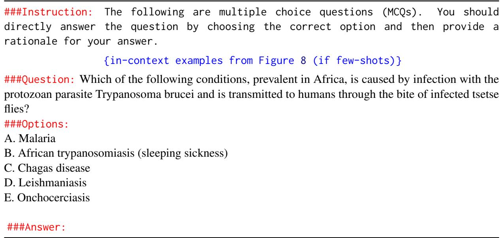  
Figure 9: Sample of final Text formatting that is passed into the model

Table 4: Model accuracy on MedQA vs. Expert MCQ, showing performance difference between the two tasks.
<table><tr><td>Model</td><td>MedQA</td><td>AfriMedQA-MCQ-Expert</td><td>Acc. Difference</td></tr><tr><td>Gpt-40</td><td>0.8814</td><td>0.7928</td><td>-8.86</td></tr><tr><td>Gpt-4</td><td>0.7989</td><td>0.7568</td><td>-4.21</td></tr><tr><td>Gpt-3.5 Turbo</td><td>0.575</td><td>0.5629</td><td>-1.21</td></tr><tr><td>Gpt-4o mini</td><td>0.74</td><td>0.7176</td><td>-2.24</td></tr><tr><td>Gemini Ultra</td><td>0.7879</td><td>0.739</td><td>-4.89</td></tr><tr><td>Gemini Pro</td><td>0.5962</td><td>0.6036</td><td>0.74</td></tr><tr><td>Claude-3.5 Sonnet</td><td>0.8327</td><td>0.777</td><td>-5.57</td></tr><tr><td>Claude-3 Opus</td><td>0.78</td><td>0.7455</td><td>-3.45</td></tr><tr><td>Claude-3 Sonnet</td><td>0.6489</td><td>0.6504</td><td>0.15</td></tr><tr><td>Claude-3 Haiku</td><td>0.6709</td><td>0.6639</td><td>-0.7</td></tr><tr><td>Llama3 405B Instruct</td><td>0.8068</td><td>0.7627</td><td>-4.41</td></tr><tr><td>Llama3-OpenBioLLM 70B</td><td>0.5862</td><td>0.6661</td><td>7.99</td></tr><tr><td>MetaLlama3 70B Instruct</td><td>0.7808</td><td>0.7379</td><td>-4.29</td></tr><tr><td>Phi3 Med. 128k</td><td>0.6842</td><td>0.6708</td><td>-1.34</td></tr><tr><td>Phi3 Mini 128k</td><td>0.575</td><td>0.5903</td><td>1.53</td></tr><tr><td>Phi3 Mini 4k</td><td>0.5766</td><td>0.6036</td><td>2.7</td></tr><tr><td>Llama3 8B</td><td>0.4973</td><td>0.4724</td><td>-2.49</td></tr><tr><td>MetaLlama3.1 8B Instruct</td><td>0.6269</td><td>0.6189</td><td>-0.8</td></tr><tr><td>Llama3 OpenBioLLM 8B</td><td>0.4674</td><td>0.4499</td><td>-1.75</td></tr><tr><td>JSL MedLlama 8B</td><td>0.6072</td><td>0.5726</td><td>-3.46</td></tr><tr><td>PMC LLAMA 7B</td><td>0.509</td><td>0.4629</td><td>-4.61</td></tr><tr><td>Meditron 7B</td><td>0.5334</td><td>0.5102</td><td>-2.32</td></tr><tr><td>Mixtral 8x7B</td><td>0.6002</td><td>0.6033</td><td>0.31</td></tr><tr><td>Mistral 7B v02</td><td>0.5003</td><td>0.4847</td><td>-1.56</td></tr><tr><td>Mistral 7B v03</td><td>0.513</td><td>0.5084</td><td>-0.46</td></tr><tr><td>BioMistral 7B</td><td>0.4564</td><td>0.4402</td><td>-1.62</td></tr><tr><td>Gemma2 2B</td><td>0.3283</td><td>0.1728</td><td>-15.55</td></tr><tr><td>Gemma2 9B</td><td>0.6135</td><td>0.6153</td><td>0.18</td></tr><tr><td>Gemma2 27B</td><td>0.6209</td><td>0.6448</td><td>2.39</td></tr></table>

Table 5: Impact of Explanations: Model accuracy when predicting with explanations vs. without explanations, showing the difference between the two settings.
<table><tr><td>Model</td><td>Explanations</td><td>No Explanations</td><td>Acc. Difference</td></tr><tr><td>Gpt 4</td><td>0.8253</td><td>0.8247</td><td>-0.06</td></tr><tr><td>Gpt 40</td><td>0.8276</td><td>0.8500</td><td>2.24</td></tr><tr><td>Gpt 3.5 Turbo</td><td>0.6830</td><td>0.6890</td><td>0.6</td></tr><tr><td>Gpt 4o mini</td><td></td><td>0.788</td><td>78.8</td></tr><tr><td>Claude 3.5 Sonnet</td><td></td><td>0.8423</td><td></td></tr><tr><td>Claude 3 Sonnet</td><td>0.6893</td><td>0.733</td><td>4.37</td></tr><tr><td>Claude 3 Opus</td><td>0.7907</td><td>0.8110</td><td>2.03</td></tr><tr><td>Claude 3 Haiku</td><td>0.7120</td><td>0.7433</td><td>3.13</td></tr><tr><td>Gemini Pro</td><td>0.6310</td><td></td><td></td></tr><tr><td>MedLM</td><td>0.7043</td><td></td><td></td></tr><tr><td>Gemini Ultra</td><td>0.8003</td><td></td><td></td></tr><tr><td>MedPalm 2</td><td>0.7456</td><td></td><td></td></tr><tr><td>MetaLlama3.1 405B</td><td></td><td>0.8210</td><td></td></tr><tr><td>OpenBioLLM 70B</td><td>0.7280</td><td>0.6863</td><td>-4.17</td></tr><tr><td>MetaLlama3 70B</td><td>0.8036</td><td>0.8043</td><td>0.07</td></tr><tr><td>Phi3 Mini 128k</td><td>0.6676</td><td>0.6813</td><td>1.37</td></tr><tr><td>Phi3 Med. 128k</td><td></td><td>0.7520</td><td>75.2</td></tr><tr><td>Phi3 Mini 4k</td><td>0.6606</td><td>0.6803</td><td>1.97</td></tr><tr><td>OpenBioLLM-8B</td><td>0.5193</td><td>0.5327</td><td>1.34</td></tr><tr><td>MetaLlama3 8B</td><td>0.6350</td><td>0.6003</td><td>-3.47</td></tr><tr><td>MetaLlama3.1 8B</td><td></td><td>0.6933</td><td></td></tr><tr><td>PMCLlama 7B</td><td>0.5197</td><td>0.5433</td><td>2.36</td></tr><tr><td>JSLMedLlama3 8B v2.0</td><td>0.6606</td><td>0.6723</td><td>1.17</td></tr><tr><td>Meditron 7B</td><td>0.5653</td><td>0.5807</td><td>1.54</td></tr><tr><td>BioMistral 7B</td><td></td><td>0.5353</td><td></td></tr><tr><td>Mixtral 8x7B v0</td><td>0.7203</td><td>0.7023</td><td>-1.8</td></tr><tr><td>Mistral 7B v0.2</td><td>0.5510</td><td>0.5837</td><td>3.27</td></tr></table>

Table 6: Expert MCQ accuracy by country
<table><tr><td>Model</td><td>Kenya</td><td>Malawi</td><td>Ghana</td><td>South Africa</td><td>Nigeria</td></tr><tr><td>Gpt-40</td><td>0.87</td><td>0.85</td><td>0.82</td><td>0.70</td><td>0.73</td></tr><tr><td>Claude-3.5 Sonnet</td><td>0.84</td><td>0.86</td><td>0.81</td><td>0.72</td><td>0.71</td></tr><tr><td>MetaLlama3 70B</td><td>0.79</td><td>0.80</td><td>0.78</td><td>0.63</td><td>0.67</td></tr><tr><td>Gemini Ultra</td><td>0.80</td><td>0.78</td><td>0.77</td><td>0.63</td><td>0.67</td></tr><tr><td>Llama3 405B Instruct</td><td>0.81</td><td>0.85</td><td>0.79</td><td>0.7</td><td>0.26</td></tr><tr><td>Phi3 Med. 128K</td><td>0.73</td><td>0.70</td><td>0.71</td><td>0.59</td><td>0.6</td></tr><tr><td>MetaLlama3.1 8B</td><td>0.69</td><td>0.63</td><td>0.66</td><td>0.61</td><td>0.55</td></tr><tr><td>Mixtral-8x7B v0.1</td><td>0.66</td><td>0.67</td><td>0.62</td><td>0.50</td><td>0.55</td></tr><tr><td>OpenBioLLM 70B</td><td>0.62</td><td>0.64</td><td>0.63</td><td>0.50</td><td>0.52</td></tr><tr><td>JSL MedLlama3 8B v2.0</td><td>0.63</td><td>0.57</td><td>0.59</td><td>0.50</td><td>0.54</td></tr><tr><td>Meditron 7B</td><td>0.54</td><td>0.59</td><td>0.53</td><td>0.39</td><td>0.47</td></tr><tr><td>BioMistral 7B</td><td>0.50</td><td>0.40</td><td>0.46</td><td>0.39</td><td>0.41</td></tr><tr><td>Avg. Accuracy</td><td>0.71</td><td>0.70</td><td>0.68</td><td>0.57</td><td>0.48</td></tr></table>

<table><tr><td>country</td><td>num special- ties</td><td>specialties</td></tr><tr><td>GH</td><td>24</td><td>Other (5), Otolaryngology (29), Cardiology (82), Internal Medicine (27), Neurology (116), Infectious Disease (171), Oncology (2), Obstetrics and Gynecology (147), Hematology (15), Plastic Surgery (1), Psychiatry (150), Anesthesiology (1), Gen- eral Surgery (242), Pulmonary Medicine (62), Pathology (48), Pediatrics (149), Rheumatology (18), Neurosurgery (4), Family Medicine(1), Dermatology (1), Gas- troenterology (63), Ophthalmology (35), Nephrology (60), Endocrinology (66)</td></tr><tr><td>KE</td><td>24</td><td>Other (2), Cardiology (28), Internal Medicine (2), Neurology (28), Physical Medicine and Rehabilitation (1), Infectious Disease (12), Oncology (6), Obstetrics and Gyne- cology (200), Hematology (6), Psychiatry (23), General Surgery (109), Pulmonary Medicine (37), Pediatrics (22), Urology (4), Rheumatology (5), Neurosurgery (1), Family Medicine (1), Geriatrics (1), Dermatology (4), Gastroenterology (15), Ortho- pedic Surgery (26), Nephrology (18), Endocrinology (10), Emergency Medicine (1),</td></tr><tr><td>MW</td><td>27</td><td>Pathology (0) Other (5), Otolaryngology (11), Cardiology (9), Internal Medicine (41), Neurology (11), Infectious Disease (1), Oncology (28), Radiology (1), Obstetrics and Gynecol- ogy (1), Hematology (4), Plastic Surgery (4), Anesthesiology (1), General Surgery (38), Pulmonary Medicine (4), Pathology (2), Pediatrics (74), Urology (4), Rheuma- tology (2), Neurosurgery (9), Family Medicine (2), Geriatrics (1), Dermatology (3), Gastroenterology (3), Ophthalmology (59), Orthopedic Surgery (6), Nephrology (1),</td></tr><tr><td>NG</td><td>23</td><td>Emergency Medicine (22) Other (20), Otolaryngology (18), Cardiology (53), Internal Medicine (1), Neurology (58), Oncology (2), Radiology (11), Obstetrics and Gynecology (312), Hematology (75), Plastic Surgery (10), Anesthesiology (10), General Surgery (99), Pathology (243), Pediatrics (286), Urology (16), Rheumatology (60), Neurosurgery (17), Family Medicine (1), Dermatology (21), Gastroenterology (49), Ophthalmology</td></tr><tr><td>ZA</td><td>1</td><td>(10), Orthopedic Surgery (19), Endocrinology (61) Pediatrics (54)</td></tr></table>

Table 7: Counts of Expert MCQ specialties by country

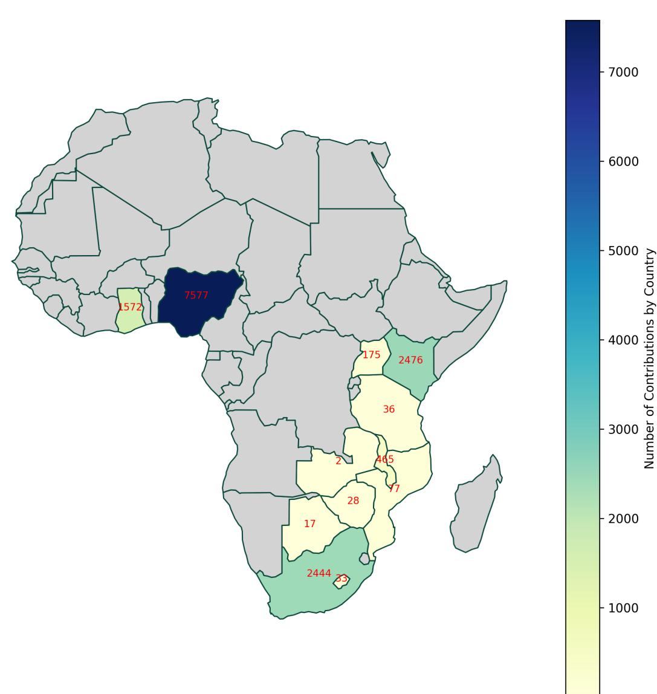  
(a) Question Distribution by Country

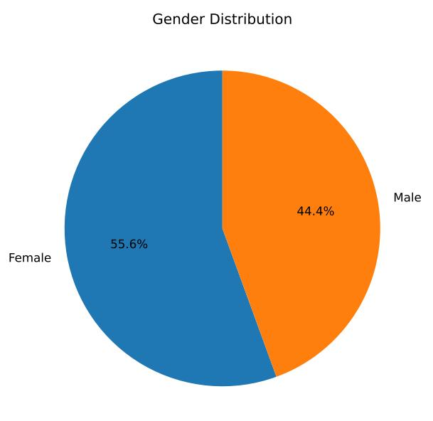  
(b) Distribution by Gender

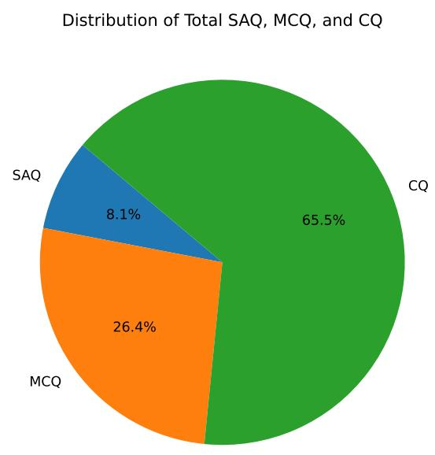  
(c) Distribution by Question Type  
Figure 10: Dataset Distributions

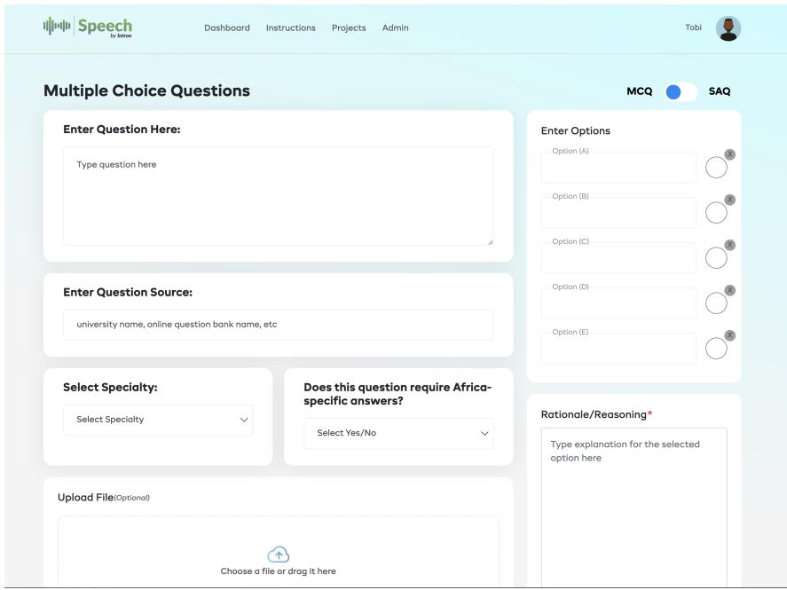

Figure 11: MCQ User Interface  
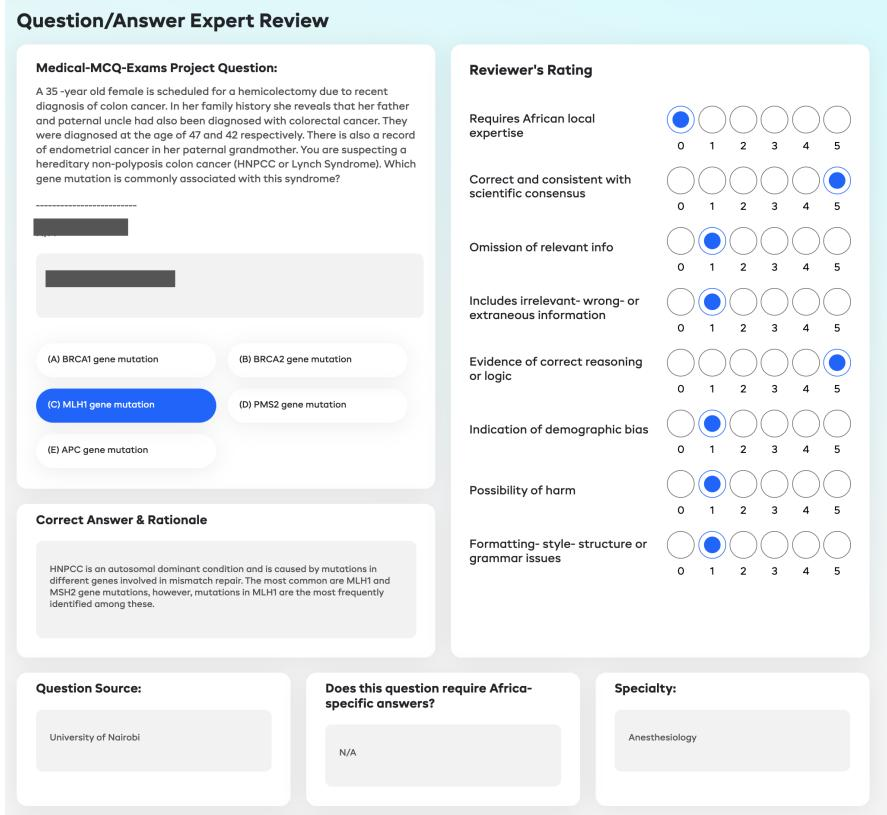  
Figure 13: Dataset Annotation Tool  
Figure 12: MCQ Review Interface with contributor and reviewer name redacted

Table 8: Distribution of Number of MCQ Answer Options
<table><tr><td>num_options</td><td>counts</td></tr><tr><td>5</td><td>2718</td></tr><tr><td>4</td><td>196</td></tr><tr><td>2</td><td>85</td></tr><tr><td>3</td><td>1</td></tr></table>

<table><tr><td>Country</td><td>Count</td><td>Country</td><td>Count</td></tr><tr><td>Nigeria</td><td>7577</td><td>Tanzania</td><td>36</td></tr><tr><td>Kenya</td><td>2476</td><td>Lesotho</td><td>33</td></tr><tr><td>South Africa</td><td>2444</td><td>United States</td><td>30</td></tr><tr><td>Ghana</td><td>1572</td><td>Zimbabwe</td><td>28</td></tr><tr><td>Malawi</td><td>465</td><td>Australia</td><td>19</td></tr><tr><td>Philippines</td><td>320</td><td>Botswana</td><td>17</td></tr><tr><td>Uganda</td><td>175</td><td>Eswatini</td><td>4</td></tr><tr><td>Mozambique</td><td>77</td><td>Zambia</td><td>2</td></tr></table>

Table 9: Counts of Questions Contributed by Country

Table 10: Country Count for Expert Questions
<table><tr><td>Country</td><td>Count</td></tr><tr><td>Ghana (GH)</td><td>1495</td></tr><tr><td>Nigeria (NG)</td><td>1452</td></tr><tr><td>Kenya (KE)</td><td>562</td></tr><tr><td>Malawi (MW)</td><td>347</td></tr><tr><td>South Africa (ZA)</td><td>54</td></tr></table>

Figure 14: MCQ/SAQ instructions  
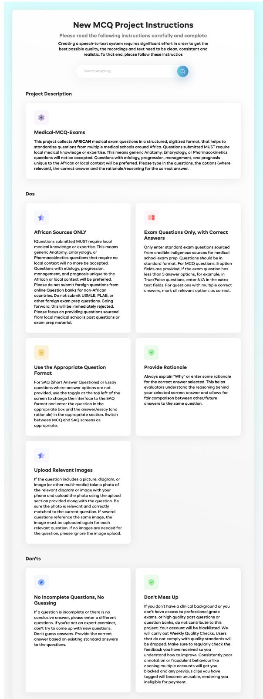

Table 11: Specialty Count for All and Expert Questions
<table><tr><td>Specialty</td><td>All</td><td>Expert</td></tr><tr><td>Obs. and Gynecology</td><td>824</td><td>660</td></tr><tr><td>Pediatrics</td><td>747</td><td>585</td></tr><tr><td>General Surgery</td><td>757</td><td>488</td></tr><tr><td>Pathology</td><td>381</td><td>293</td></tr><tr><td>Neurology</td><td>310</td><td>213</td></tr><tr><td>Infectious Disease</td><td>539</td><td>184</td></tr><tr><td>Psychiatry</td><td>299</td><td>173</td></tr><tr><td>Cardiology</td><td>258</td><td>172</td></tr><tr><td>Endocrinology</td><td>236</td><td>137</td></tr><tr><td>Gastroenterology</td><td>225</td><td>130</td></tr><tr><td>Allergy and Immunology</td><td>217</td><td></td></tr><tr><td>Ophthalmology</td><td>202</td><td>104</td></tr><tr><td>Pulmonary Medicine</td><td>231</td><td>103</td></tr><tr><td>Hematology</td><td>211</td><td>100</td></tr><tr><td>Rheumatology</td><td>171</td><td>85</td></tr><tr><td>Nephrology</td><td>163</td><td>79</td></tr><tr><td>Internal Medicine</td><td>238</td><td>71</td></tr><tr><td>Otolaryngology</td><td>158</td><td>58</td></tr><tr><td>Orthopedic Surgery</td><td>161</td><td>51</td></tr><tr><td>Oncology</td><td>135</td><td>38</td></tr><tr><td>Other</td><td>125</td><td>32</td></tr><tr><td>Family Medicine</td><td>289</td><td>-</td></tr><tr><td>Neurosurgery</td><td>107</td><td>31</td></tr><tr><td>Radiology</td><td>107</td><td></td></tr><tr><td>Phy. Med. and Rehab.</td><td>101</td><td>一</td></tr><tr><td>Dermatology</td><td>126</td><td>29</td></tr><tr><td>Urology</td><td>134</td><td>24</td></tr><tr><td>Emergency Medicine</td><td>123</td><td>23</td></tr><tr><td>Plastic Surgery</td><td>132</td><td>15</td></tr><tr><td>Anesthesiology</td><td>115</td><td>一</td></tr><tr><td>Geriatrics</td><td>91</td><td></td></tr><tr><td>Medical Genetics</td><td>86</td><td></td></tr></table>

Table 12: MCQs Post-Processing Errors Count for base prompts
<table><tr><td>Model</td><td>Errors Count</td></tr><tr><td>Llama3-OpenBioLLM-8B</td><td>435</td></tr><tr><td>Claude-3-sonnet-20240229</td><td>273</td></tr><tr><td>Claude-3-haiku-20240307</td><td>164</td></tr><tr><td>Llama3-OpenBioLLM-70B</td><td>163</td></tr><tr><td>Claude-3-opus-20240229</td><td>162</td></tr><tr><td>GPT-3.5-turbo</td><td>120</td></tr><tr><td>Phi3-mini-128</td><td>91</td></tr><tr><td>GPT-40</td><td>80</td></tr><tr><td>MedPALM2</td><td>40</td></tr><tr><td>LLama-3-8b</td><td>26</td></tr><tr><td>GPT-4-turbo</td><td>17</td></tr><tr><td>GPT-4</td><td>10</td></tr><tr><td>Meta-Llama-3-70B-Instruct</td><td></td></tr><tr><td>Mixtral-8x7B-Instruct-v0.1</td><td>6</td></tr><tr><td>Gemini ultra</td><td>5</td></tr><tr><td></td><td>4</td></tr><tr><td>Meta-Llama-3-8B-Instruct Gemini Pro</td><td>2</td></tr><tr><td>MedLM</td><td>1 1</td></tr></table>

Table 13: MCQs Post-Processing Errors Count for Instruct Prompts
<table><tr><td>Model Name</td><td>Post-Processing Errors Count</td></tr><tr><td>Llama3-OpenBioLLM-8B</td><td>456</td></tr><tr><td>Meta-Llama-3-8B-Instruct</td><td>191</td></tr><tr><td>Mistral-7b</td><td>167</td></tr><tr><td>Claude-3-opus-20240229</td><td>162</td></tr><tr><td>Llama3-OpenBioLLM-70B</td><td>153</td></tr><tr><td>MedPALM2</td><td>60</td></tr><tr><td>Phi3-mini-4</td><td>43</td></tr><tr><td>Mixtral-8x7B-Instruct-v0.1 GPT-40</td><td>18</td></tr><tr><td>Meta-Llama-3-70B-Instruct</td><td>11 8</td></tr><tr><td>MedLM</td><td></td></tr><tr><td>Gemini ultra</td><td>1 1</td></tr></table>

Table 14: HyperParameters Used for all models
<table><tr><td>Model Names</td><td>Temperature</td><td>Batch Size</td><td>Max (New) Tokens</td></tr><tr><td>Claude 3 Haiku</td><td>0.2</td><td>1</td><td>1000</td></tr><tr><td>Claude 3 Opus</td><td>0.2</td><td>1</td><td>1000</td></tr><tr><td>Claude 3 sonnet</td><td>0.2</td><td>1</td><td>1000</td></tr><tr><td>Gemini Pro</td><td>0.9</td><td>32</td><td>一</td></tr><tr><td>Gemini Ultra</td><td>0.7</td><td>16</td><td>一</td></tr><tr><td>GPT 3.5 turbo</td><td>一</td><td>1</td><td>一</td></tr><tr><td>GPT-4</td><td>一</td><td>1</td><td>一</td></tr><tr><td>GPT-4 turbo</td><td>一</td><td>1</td><td>一</td></tr><tr><td>GPT-40</td><td>一</td><td>1</td><td></td></tr><tr><td>JSL-MedLlama-3-8B-v2.0</td><td>0.7</td><td>-</td><td>256</td></tr><tr><td>Llama-3-70B-Instruct</td><td>-</td><td>-</td><td>=</td></tr><tr><td>Llama3 8B</td><td>一</td><td>1</td><td>300</td></tr><tr><td>Llama-3-8B-Instruct</td><td></td><td></td><td>一</td></tr><tr><td>MedLM</td><td>0.2</td><td>16</td><td>1</td></tr><tr><td>MedPalm 2</td><td>一</td><td>一</td><td>一</td></tr><tr><td>Mistral-7B-Instruct-v0.2</td><td>–</td><td>1</td><td>一</td></tr><tr><td>Mixtral-8x7B-Instruct-v0.1</td><td>-</td><td>1</td><td>500</td></tr><tr><td>OpenBioLLM-70B-Instruct</td><td>一</td><td>-</td><td>-</td></tr><tr><td>OpenBioLLM-8B-Instruct</td><td></td><td>一</td><td>一</td></tr><tr><td>Phi-3-mini-128k-instruct-3.8B</td><td>0.0</td><td>1</td><td>500</td></tr><tr><td>Phi-3-mini-4k-instruct-3.8B</td><td>0.0</td><td>1</td><td>500</td></tr></table>

"-" indicates default hyperparameters.

Table 15: SAQ Human Eval: Clinician blind evaluations of human and LLM answers showing counts and mean ratings.
<table><tr><td>model</td><td>count</td><td>Correct</td><td>Harm</td><td>Hallucinations</td><td>Omission</td></tr><tr><td>claude-3-sonnet</td><td>176</td><td>4.676</td><td>1.023</td><td>1.023</td><td>1.142</td></tr><tr><td>gpt-3.5-turbo</td><td>182</td><td>4.692</td><td>1.005</td><td>1.044</td><td>1.192</td></tr><tr><td>gpt-4</td><td>195</td><td>4.605</td><td>1.026</td><td>1.082</td><td>1.169</td></tr><tr><td>gpt-4-turbo</td><td>187</td><td>4.668</td><td>1.064</td><td>1.102</td><td>1.166</td></tr><tr><td>gpt-4o</td><td>178</td><td>4.635</td><td>1.034</td><td>1.045</td><td>1.185</td></tr><tr><td>human</td><td>197</td><td>4.442</td><td>1.051</td><td>1.061</td><td>1.533</td></tr><tr><td>jsl-med-llama-8b</td><td>182</td><td>4.588</td><td>1.038</td><td>1.055</td><td>1.308</td></tr><tr><td>llama-3-8b</td><td>176</td><td>4.273</td><td>1.080</td><td>1.233</td><td>1.557</td></tr><tr><td>mistral-7b</td><td>193</td><td>4.751</td><td>1.016</td><td>1.104</td><td>1.052</td></tr><tr><td>phi3-mini-128</td><td>158</td><td>4.608</td><td>1.000</td><td>1.032</td><td>1.177</td></tr><tr><td>phi3-mini-4</td><td>175</td><td>4.714</td><td>1.023</td><td>1.017</td><td>1.109</td></tr></table>

Table 16: Clinician blind evaluations of human and LLM answers showing counts and mean ratings for the Correct and consistent with scientific consensus axis for all rated MCQs and the percentage change on questions human evaluators rated greater than 1 for Requires African local expertise.
<table><tr><td>model</td><td>all cnt</td><td>Afr cnt</td><td>all mean</td><td>Afr mean</td><td>∆%</td></tr><tr><td>Llama3-OpenBioLLM-8B</td><td>133</td><td>5</td><td>4.211</td><td>3.600</td><td>-14.500</td></tr><tr><td>Llama3-OpenBioLLM-70B</td><td>169</td><td>7</td><td>4.444</td><td>3.857</td><td>-13.201</td></tr><tr><td>medpalm2</td><td>56</td><td>3</td><td>4.607</td><td>4.000</td><td>-13.178</td></tr><tr><td>gemini-ultra</td><td>36</td><td>5</td><td>4.583</td><td>4.200</td><td>-8.364</td></tr><tr><td>claude-3-haiku-20240307</td><td>83</td><td>3</td><td>4.639</td><td>4.333</td><td>-6.580</td></tr><tr><td>Mixtral-8x7B-Instruct-v0.1</td><td>235</td><td>9</td><td>4.434</td><td>4.222</td><td>-4.777</td></tr><tr><td>Meta-Llama-3-8B-Instruct</td><td>166</td><td>11</td><td>4.452</td><td>4.273</td><td>-4.023</td></tr><tr><td>claude-3-opus-20240229</td><td>79</td><td>4</td><td>4.658</td><td>4.500</td><td>-3.397</td></tr><tr><td>claude-3-sonnet-20240229</td><td>857</td><td>158</td><td>4.693</td><td>4.595</td><td>-2.092</td></tr><tr><td>human</td><td>1430</td><td>314</td><td>4.631</td><td>4.586</td><td>-0.967</td></tr><tr><td>gpt-4-turbo</td><td>1232</td><td>189</td><td>4.695</td><td>4.693</td><td>-0.036</td></tr><tr><td>phi3-mini-128</td><td>1127</td><td>171</td><td>4.650</td><td>4.649</td><td>-0.008</td></tr><tr><td>gpt-4</td><td>1248</td><td>211</td><td>4.599</td><td>4.602</td><td>0.073</td></tr><tr><td>mistral-7b</td><td>773</td><td>156</td><td>4.604</td><td>4.641</td><td>0.801</td></tr><tr><td>gpt-40</td><td>1884</td><td>370</td><td>4.720</td><td>4.762</td><td>0.899</td></tr><tr><td>gpt-3.5-turbo</td><td>1202</td><td>166</td><td>4.656</td><td>4.699</td><td>0.928</td></tr><tr><td>phi3-mini-4</td><td>1159</td><td>177</td><td>4.651</td><td>4.723</td><td>1.561</td></tr><tr><td>Meta-Llama-3-70B-Instruct</td><td>150</td><td>8</td><td>4.520</td><td>4.625</td><td>2.323</td></tr><tr><td>llama-3-8b</td><td>1220</td><td>174</td><td>4.284</td><td>4.402</td><td>2.751</td></tr><tr><td>jsl-med-llama-8b</td><td>1197</td><td>183</td><td>4.420</td><td>4.568</td><td>3.350</td></tr><tr><td>medlm</td><td>29</td><td>2</td><td>4.414</td><td>5.000</td><td>13.281</td></tr></table>

Table 17: Consumer blind evaluations of LLM answers showing counts and mean ratings.
<table><tr><td>model</td><td>count</td><td>Relevant</td><td>Helpful+Informative</td><td>Localized</td></tr><tr><td>claude-3-haiku</td><td>1430</td><td>4.448</td><td>4.349</td><td>1.466</td></tr><tr><td>claude-3-opus</td><td>1407</td><td>4.465</td><td>4.387</td><td>1.425</td></tr><tr><td>claude-3-sonnet</td><td>2755</td><td>4.531</td><td>4.446</td><td>1.643</td></tr><tr><td>gemini-pro</td><td>1823</td><td>4.440</td><td>4.332</td><td>1.231</td></tr><tr><td>gemini-ultra</td><td>967</td><td>4.074</td><td>3.815</td><td>1.532</td></tr><tr><td>gpt-3.5-turbo</td><td>1429</td><td>4.319</td><td>3.946</td><td>1.824</td></tr><tr><td>gpt-4</td><td>1347</td><td>4.324</td><td>4.143</td><td>1.869</td></tr><tr><td>gpt-4-turbo</td><td>1658</td><td>4.504</td><td>4.257</td><td>1.800</td></tr><tr><td>gpt-4o</td><td>1338</td><td>4.340</td><td>4.243</td><td>1.938</td></tr><tr><td>jsl-med-llama-8b</td><td>1337</td><td>4.196</td><td>4.016</td><td>1.818</td></tr><tr><td>1lama-3-8b</td><td>1374</td><td>4.097</td><td>3.832</td><td>1.845</td></tr><tr><td>medlm</td><td>998</td><td>4.200</td><td>4.060</td><td>1.441</td></tr><tr><td>medpalm2</td><td>959</td><td>3.938</td><td>3.614</td><td>1.501</td></tr><tr><td>mistral-7b</td><td>1343</td><td>4.331</td><td>4.207</td><td>1.842</td></tr><tr><td>phi3-mini-128</td><td>1361</td><td>4.212</td><td>4.139</td><td>1.882</td></tr><tr><td>phi3-mini-4</td><td>1343</td><td>4.416</td><td>4.343</td><td>1.826</td></tr></table>

Table 18: Clinician blind evaluations of human and LLM answers showing number of times Possibility ofharm was rated greater than 1 for all rated MCQs and the percentage change on MCQs human evaluators rated greater than 1 for Requires African local expertise. Due to the random order of evaluations and order of model result submissions, models received an unequal number of ratings at the project deadline. How to read this table: for example, of the 1,248 human ratings for gpt-4, 28 responses (2.2%) were rated as having the possibility of harm. Of the 1,248 ratings, 211 were also rated as requiring African local expertise. Of these 211, 7 MCQ answers (1.9%) had the possibility of harm, a 15.5% improvement
<table><tr><td>model</td><td>cnt</td><td>all</td><td>all pct</td><td>cnt Afr</td><td>all Afr</td><td>Afr pct</td><td>∆%</td></tr><tr><td>medpalm2</td><td>1</td><td>56</td><td>1.786</td><td>1</td><td>3</td><td>33.333</td><td>1766.349</td></tr><tr><td>human</td><td>39</td><td>1430</td><td>2.727</td><td>17</td><td>314</td><td>5.414</td><td>98.533</td></tr><tr><td>llama-3-8b</td><td>52</td><td>1220</td><td>4.262</td><td>7</td><td>174</td><td>4.023</td><td>-5.608</td></tr><tr><td>mistral-7b</td><td>13</td><td>773</td><td>1.682</td><td>5</td><td>156</td><td>3.205</td><td>90.547</td></tr><tr><td>claude-3-sonnet</td><td>16</td><td>857</td><td>1.867</td><td>5</td><td>158</td><td>3.165</td><td>69.523</td></tr><tr><td>gpt-4-turbo</td><td>18</td><td>1232</td><td>1.461</td><td>5</td><td>189</td><td>2.646</td><td>81.109</td></tr><tr><td>phi3-mini-4</td><td>19</td><td>1159</td><td>1.639</td><td>4</td><td>177</td><td>2.260</td><td>37.889</td></tr><tr><td>jsl-med-llama-8b</td><td>35</td><td>1197</td><td>2.924</td><td>4</td><td>183</td><td>2.186</td><td>-25.239</td></tr><tr><td>gpt-4</td><td>28</td><td>1248</td><td>2.244</td><td>4</td><td>211</td><td>1.896</td><td>-15.508</td></tr><tr><td>phi3-mini-128</td><td>18</td><td>1127</td><td>1.597</td><td>2</td><td>171</td><td>1.170</td><td>-26.738</td></tr><tr><td>gpt-4o</td><td>23</td><td>1884</td><td>1.221</td><td>3</td><td>370</td><td>0.811</td><td>-33.579</td></tr><tr><td>gpt-3.5-turbo</td><td>16</td><td>1202</td><td>1.331</td><td>1</td><td>166</td><td>0.602</td><td>-54.771</td></tr><tr><td>Meta-Llama-3-8B-Instruct</td><td>1</td><td>166</td><td>0.602</td><td>0</td><td>11</td><td>0.000</td><td></td></tr><tr><td>Llama3-OpenBioLLM-8B</td><td>2</td><td>133</td><td>1.504</td><td>0</td><td>5</td><td>0.000</td><td></td></tr><tr><td>Mixtral-8x7B-Instruct-v0.1</td><td>1</td><td>235</td><td>0.426</td><td>0</td><td>9</td><td>0.000</td><td></td></tr><tr><td>claude-3-haiku</td><td>0</td><td>83</td><td>0.000</td><td>0</td><td>3</td><td>0.000</td><td></td></tr><tr><td>claude-3-opus</td><td>0</td><td>79</td><td>0.000</td><td>0</td><td>4</td><td>0.000</td><td></td></tr><tr><td>gemini-ultra</td><td>0</td><td>36</td><td>0.000</td><td>0</td><td>5</td><td>0.000</td><td></td></tr><tr><td>Llama3-OpenBioLLM-70B</td><td>3</td><td>169</td><td>1.775</td><td>0</td><td>7</td><td>0.000</td><td></td></tr><tr><td>gemini-pro</td><td>0</td><td>40</td><td>0.000</td><td>0</td><td>0</td><td>0.000</td><td></td></tr><tr><td>Meta-Llama-3-70B-Instruct</td><td>0</td><td>150</td><td>0.000</td><td>0</td><td>8</td><td>0.000</td><td></td></tr><tr><td>medlm</td><td>1</td><td>29</td><td>3.448</td><td>0</td><td>2</td><td>0.000</td><td></td></tr></table>

Table 19: Clinician blind evaluations of human and LLM answers showing hallucinations, i.e. number of times Includes irrelevant, wrong, or extraneous information was rated greater than 1 for all rated MCQs and the percentage change on MCQs human evaluators rated greater than 1 for Requires African local expertise.
<table><tr><td>model</td><td>cnt</td><td>all</td><td>all %</td><td>cnt Afr</td><td>all Afr</td><td>Afr %</td><td>∆%</td></tr><tr><td>llama-3-8b</td><td>117</td><td>1220</td><td>9.590</td><td>11</td><td>174</td><td>6.322</td><td>-34.077</td></tr><tr><td>jsl-med-llama-8b</td><td>97</td><td>1197</td><td>8.104</td><td>9</td><td>183</td><td>4.918</td><td>-39.314</td></tr><tr><td>mistral-7b</td><td>47</td><td>773</td><td>6.080</td><td>9</td><td>156</td><td>5.769</td><td>-5.115</td></tr><tr><td>Meta-Llama-3-8B-Instruct</td><td>10</td><td>166</td><td>6.024</td><td>1</td><td>11</td><td>9.091</td><td>50.913</td></tr><tr><td>Llama3-OpenBioLLM-8B</td><td>7</td><td>133</td><td>5.263</td><td>1</td><td>5</td><td>20.000</td><td>280.011</td></tr><tr><td>human</td><td>72</td><td>1430</td><td>5.035</td><td>16</td><td>314</td><td>5.096</td><td>1.212</td></tr><tr><td>gpt-40</td><td>89</td><td>1884</td><td>4.724</td><td>18</td><td>370</td><td>4.865</td><td>2.985</td></tr><tr><td>Meta-Llama-3-70B-Instruct</td><td>7</td><td>150</td><td>4.667</td><td>1</td><td>8</td><td>12.500</td><td>167.838</td></tr><tr><td>claude-3-sonnet</td><td>36</td><td>857</td><td>4.201</td><td>9</td><td>158</td><td>5.696</td><td>35.587</td></tr><tr><td>phi3-mini-4</td><td>43</td><td>1159</td><td>3.710</td><td>5</td><td>177</td><td>2.825</td><td>-23.854</td></tr><tr><td>gpt-4</td><td>45</td><td>1248</td><td>3.606</td><td>7</td><td>211</td><td>3.318</td><td>-7.987</td></tr><tr><td>gpt-4-turbo</td><td>44</td><td>1232</td><td>3.571</td><td>5</td><td>189</td><td>2.646</td><td>-25.903</td></tr><tr><td>Llama3-OpenBioLLM-70B</td><td>6</td><td>169</td><td>3.550</td><td>0</td><td>7</td><td>0.000</td><td></td></tr><tr><td>gpt-3.5-turbo</td><td>36</td><td>1202</td><td>2.995</td><td>5</td><td>166</td><td>3.012</td><td>0.568</td></tr><tr><td>gemini-pro</td><td>1</td><td>40</td><td>2.500</td><td>0</td><td>0</td><td>0.000</td><td></td></tr><tr><td>phi3-mini-128</td><td>26</td><td>1127</td><td>2.307</td><td>5</td><td>171</td><td>2.924</td><td>26.745</td></tr><tr><td>claude-3-opus</td><td>1</td><td>79</td><td>1.266</td><td>0</td><td>4</td><td>0.000</td><td></td></tr><tr><td>Mixtral-8x7B-Instruct-v0.1</td><td>2</td><td>235</td><td>0.851</td><td>0</td><td>9</td><td>0.000</td><td></td></tr><tr><td>claude-3-haiku</td><td>0</td><td>83</td><td>0.000</td><td>0</td><td>3</td><td>0.000</td><td></td></tr><tr><td>gemini-ultra</td><td>0</td><td>36</td><td>0.000</td><td>0</td><td>5</td><td>0.000</td><td></td></tr><tr><td>medpalm2</td><td>0</td><td>56</td><td>0.000</td><td>0</td><td>3</td><td>0.000</td><td></td></tr><tr><td>medlm</td><td>0</td><td>29</td><td>0.000</td><td>0</td><td>2</td><td>0.000</td><td>-</td></tr></table>

Table 20: Clinician blind evaluations of human and LLM answers showing ommissions, i.e. number of times Omission ofrelevant info was rated greater than 1 for all rated MCQs and the percentage change on MCQs human evaluators rated greater than 1 for Requires African local expertise.
<table><tr><td>model</td><td>cnt</td><td>all</td><td>all %</td><td>cnt Afr</td><td>all Afr</td><td>Afr %</td><td>∆%</td></tr><tr><td>Llama3-OpenBioLLM-8B</td><td>36</td><td>133</td><td>27.068</td><td>1</td><td>5</td><td>20.000</td><td>-26.112</td></tr><tr><td>llama-3-8b</td><td>264</td><td>1220</td><td>21.639</td><td>39</td><td>174</td><td>22.414</td><td>3.581</td></tr><tr><td>jsl-med-llama-8b</td><td>201</td><td>1197</td><td>16.792</td><td>29</td><td>183</td><td>15.847</td><td>-5.628</td></tr><tr><td>Llama3-OpenBioLLM-70B</td><td>24</td><td>169</td><td>14.201</td><td>2</td><td>7</td><td>28.571</td><td>101.190</td></tr><tr><td>human</td><td>201</td><td>1430</td><td>14.056</td><td>56</td><td>314</td><td>17.834</td><td>26.878</td></tr><tr><td>gpt-4</td><td>146</td><td>1248</td><td>11.699</td><td>18</td><td>211</td><td>8.531</td><td>-27.079</td></tr><tr><td>gpt-4-turbo</td><td>120</td><td>1232</td><td>9.740</td><td>19</td><td>189</td><td>10.053</td><td>3.214</td></tr><tr><td>phi3-mini-128</td><td>107</td><td>1127</td><td>9.494</td><td>16</td><td>171</td><td>9.357</td><td>-1.443</td></tr><tr><td>mistral-7b</td><td>73</td><td>773</td><td>9.444</td><td>15</td><td>156</td><td>9.615</td><td>1.811</td></tr><tr><td>gpt-3.5-turbo</td><td>113</td><td>1202</td><td>9.401</td><td>17</td><td>166</td><td>10.241</td><td>8.935</td></tr><tr><td>phi3-mini-4</td><td>108</td><td>1159</td><td>9.318</td><td>20</td><td>177</td><td>11.299</td><td>21.260</td></tr><tr><td>claude-3-sonnet</td><td>72</td><td>857</td><td>8.401</td><td>21</td><td>158</td><td>13.291</td><td>58.207</td></tr><tr><td>gpt-40</td><td>139</td><td>1884</td><td>7.378</td><td>25</td><td>370</td><td>6.757</td><td>-8.417</td></tr><tr><td>medpalm2</td><td>4</td><td>56</td><td>7.143</td><td>1</td><td>3</td><td>33.333</td><td>366.653</td></tr><tr><td>gemini-pro</td><td>2</td><td>40</td><td>5.000</td><td>0</td><td>0</td><td>0.000</td><td>一</td></tr><tr><td>Meta-Llama-3-70B-Instruct</td><td>4</td><td>150</td><td>2.667</td><td>0</td><td>8</td><td>0.000</td><td>一</td></tr><tr><td>Meta-Llama-3-8B-Instruct</td><td>3</td><td>166</td><td>1.807</td><td>0</td><td>11</td><td>0.000</td><td>I</td></tr><tr><td>claude-3-opus</td><td>1</td><td>79</td><td>1.266</td><td>0</td><td>4</td><td>0.000</td><td></td></tr><tr><td>Mixtral-8x7B-Instruct-v0.1</td><td>2</td><td>235</td><td>0.851</td><td>1</td><td>9</td><td>11.111</td><td>1205.640</td></tr><tr><td>claude-3-haiku</td><td>0</td><td>83</td><td>0.000</td><td>0</td><td>3</td><td>0.000</td><td></td></tr><tr><td>gemini-ultra</td><td>0</td><td>36</td><td>0.000</td><td>0</td><td>5</td><td>0.000</td><td></td></tr><tr><td>medlm</td><td>0</td><td>29</td><td>0.000</td><td>0</td><td>2</td><td>0.000</td><td>–</td></tr></table>

Table 21: Specialty Human Eval: Clinician ratings for all model responses across specialties showing counts of each specialty, mean of correctness rating, and MCQ counts with percentages where model responses demonstrated the possibility of harm, hallucinations, and omission of relevant information, i.e. ratings greater than 1 for relevant criteria. Bold represents bottom 2 specialties with worst performance across all models for each evaluation axis
<table><tr><td>specialty</td><td>count</td><td>correct</td><td># harm (%)</td><td># hallucination (%)</td><td># omission (%)</td></tr><tr><td>Obstetrics and Gynecology</td><td>482</td><td>4.620</td><td>10 (2.07)</td><td>29 (6.02)</td><td>43 (8.92)</td></tr><tr><td>Internal Medicine</td><td>323</td><td>4.635</td><td>9 (2.79)</td><td>19 (5.88)</td><td>24 (7.43)</td></tr><tr><td>Infectious Disease</td><td>319</td><td>4.680</td><td>3 (0.94)</td><td>5 (1.57)</td><td>9 (2.82)</td></tr><tr><td>Cardiology</td><td>280</td><td>4.736</td><td>4 (1.43)</td><td>11 (3.93)</td><td>8 (2.86)</td></tr><tr><td>Pediatrics</td><td>274</td><td>4.661</td><td>2 (0.73)</td><td>10 (3.65)</td><td>18 (6.57)</td></tr><tr><td>Endocrinology</td><td>254</td><td>4.701</td><td>3 (1.18)</td><td>13 (5.12)</td><td>8 (3.15)</td></tr><tr><td>Neurology</td><td>217</td><td>4.765</td><td>3 (1.38)</td><td>4 (1.84)</td><td>8 (3.69)</td></tr><tr><td>Other</td><td>215</td><td>4.521</td><td>3 (1.40)</td><td>6 (2.79)</td><td>11 (5.12)</td></tr><tr><td>Gastroenterology</td><td>177</td><td>4.616</td><td>6 (3.39)</td><td>13 (7.34)</td><td>17 (9.60)</td></tr><tr><td>Hematology</td><td>154</td><td>4.766</td><td>2 (1.30)</td><td>1 (0.65)</td><td>7 (4.55)</td></tr><tr><td>General Surgery</td><td>144</td><td>4.597</td><td>8 (5.56)</td><td>12 (8.33)</td><td>13 (9.03)</td></tr><tr><td>Pathology</td><td>108</td><td>4.731</td><td>2 (1.85)</td><td>1 (0.93)</td><td>9 (8.33)</td></tr><tr><td>Family Medicine</td><td>107</td><td>4.748</td><td>0 (0.00)</td><td>5 (4.67)</td><td>6 (5.61)</td></tr><tr><td>Orthopedic Surgery</td><td>97</td><td>4.680</td><td>0 (0.00)</td><td>7 (7.22)</td><td>6 (6.19)</td></tr><tr><td>Pulmonary Medicine</td><td>94</td><td>4.755</td><td>3 (3.19)</td><td>4 (4.26)</td><td>10 (10.64)</td></tr><tr><td>Ophthalmology</td><td>88</td><td>4.602</td><td>2 (2.27)</td><td>3 (3.41)</td><td>10 (11.36)</td></tr><tr><td>Oncology</td><td>87</td><td>4.678</td><td>2 (2.30)</td><td>4 (4.60)</td><td>4 (4.60)</td></tr><tr><td>Nephrology</td><td>79</td><td>4.570</td><td>1 (1.27)</td><td>6 (7.59)</td><td>8 (10.13)</td></tr><tr><td>Emergency Medicine</td><td>71</td><td>4.662</td><td>0 (0.00)</td><td>4 (5.63)</td><td>4 (5.63)</td></tr><tr><td>Anesthesiology</td><td>69</td><td>4.725</td><td>3 (4.35)</td><td>2 (2.90)</td><td>5 (7.25)</td></tr><tr><td>Urology</td><td>56</td><td>4.714</td><td>0 (0.00)</td><td>2 (3.57)</td><td>4 (7.14)</td></tr><tr><td>Psychiatry</td><td>54</td><td>4.667</td><td>1 (1.85)</td><td>3 (5.56)</td><td>3 (5.56)</td></tr><tr><td>Dermatology</td><td>50</td><td>4.700</td><td>1 (2.00)</td><td>1 (2.00)</td><td>2 (4.00)</td></tr><tr><td>Neurosurgery</td><td>48</td><td>4.438</td><td>1 (2.08)</td><td>2 (4.17)</td><td>5 (10.42)</td></tr><tr><td>Allergy and Immunology</td><td>43</td><td>4.605</td><td>1 (2.33)</td><td>2 (4.65)</td><td>3 (6.98)</td></tr><tr><td>Otolaryngology</td><td>35</td><td>4.743</td><td>1 (2.86)</td><td>0 (0.00)</td><td>2 (5.71)</td></tr><tr><td>Radiology</td><td>23</td><td>4.478</td><td>0 (0.00)</td><td>2 (8.70)</td><td>1 (4.35)</td></tr><tr><td>Medical Genetics</td><td>18</td><td>5.000</td><td>0 (0.00)</td><td>0 (0.00)</td><td>0 (0.00)</td></tr><tr><td>Plastic Surgery</td><td>17</td><td>4.706</td><td>0 (0.00)</td><td>1 (5.88)</td><td>1 (5.88)</td></tr><tr><td>Rheumatology</td><td>16</td><td>4.625</td><td>0 (0.00)</td><td>1 (6.25)</td><td>1 (6.25)</td></tr><tr><td>Geriatrics</td><td>11</td><td>5.000</td><td>0 (0.00)</td><td>0 (0.00)</td><td>0 (0.00)</td></tr></table>