# An Efficient Task-Oriented Dialogue Policy: Evolutionary Reinforcement Learning Injected by Elite Individuals

Yangyang Zhao1 Ben Niu1 Libo Qin2∗ Shihan Wang3

1School of Computer Science and Technology, Changsha University of Science and Technology, China

2School of Computer Science and Engineering, Central South University, China

3School of Information and Computing Sciences, Utrecht University, Netherlands

yyz@csust.edu.cn; niuniuniu@stu.csust.edu.cn; lbqin@csu.edu.cn; s.wang2@uu.nl

## Abstract

Deep Reinforcement Learning (DRL) is widely used in task-oriented dialogue systems to optimize dialogue policy, but it struggles to balance exploration and exploitation due to the high dimensionality of state and action spaces. This challenge often results in local optima or poor convergence. Evolutionary Algorithms (EAs) have been proven to effectively explore the solution space of neural networks by maintaining population diversity. Inspired by this, we innovatively combine the global search capabilities of EA with the local optimization of DRL to achieve a balance between exploration and exploitation. Nevertheless, the inherent flexibility of natural language in dialogue tasks complicates this direct integration, leading to prolonged evolutionary times. Thus, we further propose an elite individual injection mechanism to enhance EA’s search efficiency by adaptively introducing best-performing individuals into the population. Experiments across four datasets show that our approach significantly improves the balance between exploration and exploitation, boosting performance. Moreover, the effectiveness of the EII mechanism in reducing exploration time has been demonstrated, achieving an efficient integration of EA and DRL on task-oriented dialogue policy tasks.

## 1 Introduction

Task-oriented dialogue (TOD) systems aim to understand user intent (Qin et al., 2021), generate responses (Qin et al., 2023), and steer conversations toward goals, with the dialogue policy (DP) (Kwan et al., 2019) playing a crucial role in determining and steering conversations. Deep Reinforcement Learning (DRL) has proven effective in optimizing DPs due to its strengths in sequential decision-making (Kwan et al., 2023). While Large Language Models (Chung et al., 2023; Hu et al., 2024; Kumar, 2024) are increasingly used in

TOD systems for their language capabilities, they are rarely applied in DPs because of their limited decision-making ability and the high resource demands for prompt design and fine-tuning (Yao et al., 2024; Yang et al., 2024). Thus, optimizing DPs through DRL remains the primary approach (Du et al., 2024). However, DRL struggles to balance exploration and exploitation. Insufficient exploration can lead to local optima, while excessive exploration results in inefficient training1 (Henderson et al., 2018).

Research on balancing exploration and exploitation in DRL-based DP can be categorized into two main approaches: direct and indirect enhancement of exploration efficiency. Direct methods focus on designing effective exploration strategies that, while powerful, are often limited to specific domains and are time-consuming (Ladosz et al., 2022). Indirect methods involve leveraging expert knowledge to guide exploration (Wang et al., 2020; Xu et al., 2021) and developing high-quality user simulators to generate diverse experiences (Peng et al., 2018). However, these approaches add costs for constructing expert knowledge and user simulators. Evolutionary Algorithms (EAs) are theoretically well-suited for balancing exploration and exploitation due to their population-based diversity exploration advantages (Crepinsek et al., 2013).

However, EAs struggle with exploitation because they lack gradient guidance, while gradient descent is a key strength of sample-efficient DRL approaches (Li et al., 2024). A natural solution is to combine the complementary strengths of EAs and DRL in task-oriented dialogue policy tasks, referred to as ERL-based DP, to achieve an effective balance between exploration and exploitation (Khadka and Tumer, 2018; Suri, 2022). However, this integration is not straightforward. The inherent flexibility of natural language in TOD tasks results in a vast search space, requiring significant time for EAs to evolve effective strategies(as demonstrated in subsubsection 4.4.1).

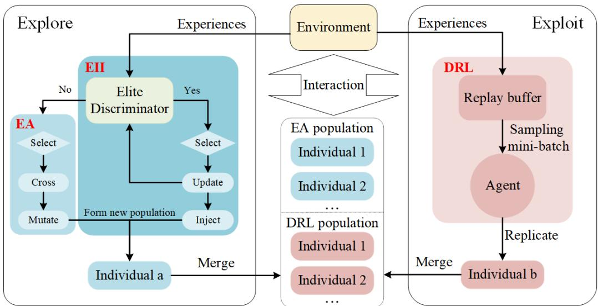  
Figure 1: Framework of the EIERL method, comprising two modules: exploration and exploitation. The exploration module aims to form an EA population (multiple individuals a) to explore diverse experiences, while the exploitation module aims to form a DRL population (multiple individuals b) to use existing experiences for training.

To address the above challenges, we propose an Elite Individual Injection (EII) mechanism, integrating it into an ERL-based DP algorithm to form a novel hybrid algorithm called EIERL. As shown in Figure 1, EIERL comprises two components: Exploration (left) and Exploitation (right). In the Exploration phase, the EA population generates diverse strategies through selection, crossover, and mutation to explore various experiences, while the EII mechanism periodically injects best-performing individuals into the EA population to accelerate evolution. The injection timing is adaptively controlled by an elite discriminator, which adaptively selects optimal injection moments and updates based on the training stage. In the Exploitation phase, the DRL agent optimizes its performance using exsiting experiences and replicates optimized agents to form a DRL population. Both the formed EA and DRL populations then interact with the environment to generate diverse exploration experiences and exploitation experiences. The strengths and generalizability of EIERL in effectively trade-off exploration and exploitation are demonstrated on four public dialogue datasets. Moreover, the EII mechanism has proven effective in accelerating the EA’s exploration process, enabling a seamless integration of DRL and EA for task-oriented dialogue policy tasks. To our knowledge, this is the first study to integrate EAs and DRL into task-oriented dialogue policy tasks.

In summary, our contributions are threefold:

• We propose a hybrid algorithm that leverages the complementary strengths of EAs and DRL to effectively balance exploration and exploitation in dialogue policy learning.

• We introduce an elite individual injection mechanism to solve the prolonged evolution challenges faced by traditional ERL directly migrating to dialogue task, enabling an effective combination of EA and DRL.

• We validate the effectiveness and generalizability of EIERL in multiple dialogue datasets.

## 2 Related Work

## 2.1 The Exploration-Exploitation Trade-off

Methods for balancing exploration and exploitation in DRL-based task-oriented dialogue policies are generally categorized into direct and indirect enhancements of exploration efficiency.

Direct methods involve designing tailored exploration strategies, which are often labor-intensive (Ladosz et al., 2022). For instance, Tegho et al. (2017) and Lipton et al. (2016) proposed a Bayesby-Backprop approach based on Deep Q-Networks (DQN), which customizes exploration strategies by utilizing Thompson sampling to estimate uncertainty from Monte Carlo samples. However, the effectiveness of this method heavily relies on the choice of prior distributions, which may limit its applicability across different scenarios.

Indirect methods utilize expert knowledge to guide exploration (Xu et al., 2021; Wang et al., 2020) or develop high-quality user simulators to generate diverse experiences (Peng et al., 2018). However, expert-driven approaches depend heavily on data quality, where poor data can hinder exploration or lead to ineffective reward structures (Kang et al., 2018). For example, Nishimoto and Costa (2019) combined a softmax strategy with transfer learning, using the source task as expert knowledge, and employed a Boltzmann distribution to assign probabilities to action-state pairs, thereby improving exploration effectiveness. Nevertheless, the differences between the source and target tasks in transfer learning restrict the model’s adaptability. For user simulator-based methods, although Peng et al. (2018) demonstrated that user simulators can enhance efficiency, they require substantial expertise and annotated data, and their quality can be difficult to assess due to challenges in replicating real user behavior (Kwan et al., 2023).

## 2.2 ERL: Integration of DRL and EA

ERL combines the population diversity of EA with the gradient information from DRL, showing promise in addressing exploration-exploitation challenges (Khadka and Tumer, 2018). This integration enhances sample efficiency in the game domain, but the introduction of multiple hyperparameters complicates tuning. To address this, Dong and Li (2024) proposed Adaptive Evolutionary Reinforcement Learning (AERL), which dynamically adjusts the ratio of RL to EA populations based on performance, improving training efficiency and robustness. Jianye et al. (2022) further introduced ERL-Re2, facilitating knowledge sharing between EA and RL agents by adjusting state representations while keeping policy representations independent. Traditional ERL methods often struggle with policy-based RL due to inefficient handling of value functions and sample usage. To improve sample efficiency, Li et al. (2023) suggested using negative temporal difference as a fitness metric, aligning with value iteration principles.

Despite these advancements, most ERL research has focused on the game tasks, with limited exploration of the dialogue tasks. Dialogue tasks involve flexible natural language, diverse user behaviors, and varying dialogue environments, resulting in a significantly larger search space compared to game tasks. Consequently, the EA module in ERL requires a considerable amount of time to evolve effective policies. Moreover, many explorations in this large search space are ineffective, hampering ERL’s ability to identify reliable evolutionary directions and thus reducing learning efficiency. Our experimental results, as shown in Figure 2 and Figure 6(b), corroborate this point. Inspired by this gap, we propose a novel approach that integrates EA with DRL-based dialogue policy methods while tackling the prolonged evolution times of traditional EA methods in dialogue tasks, enabling an efficient integration between EA and DRL.

## 3 EIERL

As illustrated in Figure 1, EIERL consists of two modules: (1) the Exploitation module, implemented using a DRL algorithm, which trains the agents using existing experiences and replicates them to form a DRL population2; (2) the Exploration module, implemented by two submodules: EA and EII mechanism. The EA submodule performs selection, crossover, and mutation operations on individuals within both the EA and DRL populations to create the EA population, facilitating an in-depth exploration of the state space. Meanwhile, the EII submodule adaptively determines the optimal timing for injecting the best-performing individuals into the EA population, thereby accelerating the evolutionary process. Finally, EIERL integrates the DRL and EA populations to interact with the environment, generating experiences for both exploitation and exploration. The full procedure of the EIERL is described in Appendix B.

## 3.1 Exploitation Module

The exploitation module aims to create a DRL population by replicating agents optimized using existing experiences stored in an experience buffer. Specifically, the agents sample a mini-batch of experiences from the experience replay buffer  and update the parameters $\theta _ { Q }$ of the value function Q( ) by minimizing the mean-squared loss function:

$$
\mathcal { L } ( \theta _ { Q } ) = E _ { ( s , a , r , s ^ { \prime } ) \sim \mathcal { D } } [ ( y _ { i } - Q _ { \theta _ { Q } } ( s , a ) ) ^ { 2 } ]\tag{1}
$$

where $y _ { i }$ is specified as follows:

$$
y _ { i } = r + \gamma \operatorname* { m a x } _ { a ^ { \prime } } Q _ { \theta _ { Q ^ { \prime } } } ^ { \prime } ( s ^ { \prime } , a ^ { \prime } )\tag{2}
$$

where the experiences stored in are in the form of (state s,action a,reward r, next\_state $s ^ { \prime } )$ . γ denotes the discount factor and satisfies $0 \leq \gamma \leq 1$ The target network $Q _ { \theta _ { Q ^ { \prime } } } ^ { \prime }$ is refreshed at scheduled intervals, whereas the online network $Q _ { \theta _ { Q } }$ is trained by backpropagation using mini batch gradient descent.

The optimized agents are then replicated to form DRL individuals (individual b in Figure 1), which together constitute the DRL population.

## 3.2 Exploration Module

The exploration module focuses on maintaining a diverse EA population through EA to enhance exploration efficiency by generating varied experiences. In dialogue tasks with large state spaces, traditional EA often begins with a low-fitness population, leading to inefficient exploration of suboptimal areas and high computational costs. To improve this, we introduced the EII mechanism, which uses an elite discriminator to determine the suitable timing for injecting best-performing individuals into the EA population, guiding the search toward more optimal directions and enhancing the exploration process.

## 3.2.1 EAs

The procedure of the EAs is detailed in algorithm 1. It starts with tournament selection (Goldberg and Deb, 1991) to prioritize individuals from regions with higher potential returns (Khadka and Tumer, 2018). Next, gene crossover occurs within the population, followed by mutations applied based on specific probabilities, systematically altering individuals’ genetic structures to improve evolution. These mutations adjust neural network weights using a normal distribution.

## 3.2.2 EII mechanism

The EII mechanism is outlined in lines 9-21 of algorithm 3, where the elite discriminator adaptively determines the timing for elite individual injection. The discriminator evaluates the fitness of each individual by receiving feedback from their interactions with the environment. Specifically, fitness is measured by the cumulative reward obtained from these interactions, with the calculation process detailed in algorithm 2. When an individual’s fitness exceeds the threshold $f _ { m a x }$ (initialized as ), it signifies the emergence of an elite individual during the current iteration, and the elite injection process is triggered. The individual achieving the maximum fitness value, $f _ { m a x } ^ { ' }$ , is then selected as the elite individual, $\pi _ { m a x }$ . Since the fitness threshold reflects the agent’s learning progress, the discriminator updates $f _ { m a x }$ to $f _ { m a x } ^ { ' } ,$ allowing it to adaptively raise the standard as learning progresses. Finally, the elite individual $\pi _ { m a x }$ is injected into the EA population (individual a in Figure 1). If no elite individual is detected, only the EA process is executed.

Algorithm 1: Function Evolution   
1 Function Evolution $( p o p _ { e v o } , a l l _ { - }$ \_fitness):   
2 rank population by all\_fitness   
3 select best $e = \operatorname { i n t } ( \psi \cdot m )$ individuals as   
elite   
4 select $( m - e )$ individuals from $p o p _ { e v o }$   
using tournament selection to form S   
5 while $| S | < ( m - e )$ do   
6 crossover between a random $\pi \in e$   
and $\pi \in S .$ , append to S   
7 end while   
8 for $\pi \in S$ do   
9 if $r ( ) < m u t _ { p r o b }$ then   
10 for $\mathcal { M } \in \theta _ { \pi }$ do   
11 perform $\mathrm { m u t } _ { \mathrm { f r a c } } \cdot | \mathcal { M } |$   
mutations   
12 sample indices $i , j$ from   
13 if $r ( ) <$ supermutprob then   
14 ${ \mathcal { M } } [ i , j ] .$   
$\mathcal { N } ( 0 , 1 0 0 \cdot \mathrm { m u t } _ { \mathrm { s t r e n g t h } } )$   
15 end if   
16 else if $r ( ) <$ resetprob then   
17 $\left| \begin{array} { l l } { \begin{array} { r l } { \mathcal { M } [ i , j ] = \mathcal { N } ( 0 , 1 ) } \end{array} } \end{array} \right.$   
18 end if   
19 else   
20 $\mathcal { M } [ i , j ]$   
$\mathcal { N } ( 0 , \mathrm { m u t } _ { \mathrm { s t r e n g t h } } )$   
21 end if   
22 end for   
23 end if   
24 end for   
25 return $p o p _ { e v o }$

## 4 Experiments

We conducted experiments using three widely used single-domain datasets for DP research: movieticket booking, restaurant reservation, and taxi ordering, based on the Microsoft Dialogue Challenge platform (Li et al., 2017, 2016, 2018; Zhao et al., 2024; Niu et al., 2024). To assess the generalizability of EIERL, we also performed experiments on the MultiWOZ2.1 dataset (Budzianowski et al., 2018), which includes seven domains and is available on the ConvLab platform.

Algorithm 2: Function Evaluate   
1 Function Evaluate(π, ):   
2 $f i t n e s s = 0$   
3 for i = 1 to ξ do   
4 initialize environment and state $s _ { 0 }$   
5 while dialogue is not done do   
6 if rand() < ϵ then   
7 $a _ { t } =$ random action   
8 end if   
9 else   
10 $a _ { t } =$   
$a r g m a x _ { a ^ { \prime } } Q ( s _ { t } , a ^ { \prime } ; \theta _ { \pi } )$   
11 end if   
12 execute $a _ { t } ,$ , observe $r _ { t }$ and $s _ { t + 1 }$   
13 append $\left( { { s _ { t } } , { a _ { t } } , { r _ { t } } , { s _ { t + 1 } } } \right)$ to   
14 f itness = f itness $+ \ r _ { t }$   
$s = s _ { t + 1 }$   
15 end while   
16 end for   
17 return fitness

The objectives of experiments are to validate: 1) the significant advantage of EIERL in balancing exploration-exploitation (subsection 4.3); 2) the notable improvement of the EII mechanism in accelerating EA search efficiency (subsubsection 4.4.1); 3) the impact of EA-introduced hyperparameters on performance (subsubsection 4.4.2); 4) the independent contributions of RL and EA to EIERL (subsubsection 4.4.3); 5) the generalizability of EIERL on multi-domain tasks3(subsubsection 4.4.4).

## 4.1 Baselines

We compared our EIERL with publicly available dialogue agent benchmarks, dialogue agents designed to balance exploration and exploitation, and promising LLM-based dialogue agents:

• DQN\_EPSILON\_N agents are trained using standard DQN with a traditional ϵ greedy exploration strategy, where $\epsilon \ = \ N$ (Mnih et al., 2015)4.

• NOISY\_DQN agents enhance exploration by introducing noise into the network weights (Han et al., 2022).

• ICM\_DQN agents incorporate intrinsic curiosity rewards to encourage exploration of the new space (Pathak et al., 2017).

• LLM-based DA-level (LLM\_DP) agents replace the DP module of the TOD system with an LLM, selecting suitable actions to be passed to the NLG for response generation5.

• LLM-based word-level (LLM\_DP\_NLG) agents replace both the DP and NLG modules of the TOD system with an LLM, directly selecting suitable words to construct responses (Yi et al., 2024)5.

## 4.2 Implementation Details

Each DQN variant employs a multilayer perceptron with two hidden layers of 80 units apiece, and applies ReLU activations throughout to enhance non-linear expressiveness and mitigate vanishing gradients. DQN\_EPSILON\_N uses the optimal ϵ value (0.05) for each domain. Additionally, to assess the algorithm’s intrinsic exploration without external guidance, we included a baseline with ϵ = 0. This design facilitates a clear assessment of the exploration efficiency of the improved algorithms. Across all experiments the hyperparameters are fixed as follows: discount factor $\gamma = 0 . 9 9$ , mini batch size 16, learning rate 0.001, and replay buffer capacity 5000 transitions. In single-domain tasks, the EIERL algorithm uses an EA population P of 3, a DRL population of 1, and a mutation strength σ of 0.1. For multi-domain tasks, the EA population is increased to 10 and the DRL population to 5, while keeping the mutation strength constant. A successful dialogue yields a reward of 2L, whereas an unsuccessful one incurs a penalty of L. Each turn also carries a constant cost of 1 to encourage concise exchanges. The dialogue length is limited to L turns, with L = 30 in single-domain experiments and L = 40 in multi-domain experiments. In addition, to ensure a fair comparison among baseline methods, we consistently set the number of training epochs to 500 for single-domain tasks and 10,000 for multi-domain tasks. While certain methods may demonstrate improved performance with increased training epochs, our focus lies in optimizing the balance between exploration and exploitation to enhance learning efficiency, as reflected by achieving higher success rates with fewer training epochs.

Table 1: Evaluation results for all agents across the three benchmark datasets are provided, with the highest value in each metric column highlighted in bold. All results of agent pairs are statistically significant at the same epoch (t-test, $\mathsf { p } < 0 . 0 5 )$ . Epochs (50, 250, 500) represent early, mid, and post-convergence training stages. The reason for using 500 epochs as the display cutoff, detailed results and variances are provided in Appendix D.
<table><tr><td rowspan="2">Domain</td><td rowspan="2">Agent</td><td colspan="3">Epoch = 50</td><td colspan="3">Epoch = 250</td><td colspan="3">Epoch = 500</td></tr><tr><td>Success↑</td><td>Reward↑</td><td>Turns↓</td><td>Success↑</td><td>Reward↑</td><td>Turns↓</td><td>Success↑</td><td>Reward↑</td><td>Turns↓</td></tr><tr><td rowspan="7">Movie</td><td>DQN_EPSILON_0.0</td><td>0.3505</td><td>-13.00</td><td>32.11</td><td>0.5403</td><td>12.99</td><td>25.70</td><td>0.5553</td><td>14.95</td><td>25.37</td></tr><tr><td>DQN_EPSILON_0.05</td><td>0.3093</td><td>-18.61</td><td>33.44</td><td>0.6795</td><td>31.84</td><td>21.39</td><td>0.7668</td><td>43.42</td><td>19.21</td></tr><tr><td>NOISY_DQN</td><td>0.4137</td><td>-4.73</td><td>30.75</td><td>0.7141</td><td>36.68</td><td>20.04</td><td>0.7280</td><td>39.38</td><td>20.16</td></tr><tr><td>ICM_DQN</td><td>0.1475</td><td>-37.81</td><td>33.00</td><td>0.5166</td><td>10.37</td><td>25.23</td><td>0.5311</td><td>12.49</td><td>24.47</td></tr><tr><td>LLM_DP</td><td>0.4156</td><td>-3.09</td><td>27.34</td><td>0.4156</td><td>-3.09</td><td>27.34</td><td>0.4156</td><td>-3.09</td><td>27.34</td></tr><tr><td>LLM_DP_NLG</td><td>0.2564</td><td>-24.98</td><td>30.96</td><td>0.2564</td><td>-24.98</td><td>30.96</td><td>0.2564</td><td>-24.98</td><td>30.96</td></tr><tr><td>EIERL</td><td>0.2372</td><td>-27.53</td><td>34.01</td><td>0.8033</td><td>48.21</td><td>18.36</td><td>0.8552</td><td>55.29</td><td>16.66</td></tr><tr><td rowspan="8">Rest.</td><td>DQN_EPSILON_0.0</td><td>0.0695</td><td>-36.57</td><td>27.66</td><td>0.4907</td><td>4.10</td><td>22.13</td><td>0.5671</td><td>11.63</td><td>23.22</td></tr><tr><td>DQN_EPSILON_0.05</td><td>0.0726</td><td>-36.28</td><td>27.63</td><td>0.5712</td><td>12.30</td><td>20.21</td><td>0.5817</td><td>12.79</td><td>21.12</td></tr><tr><td>NOISY_DQN</td><td>0.0000</td><td>-43.92</td><td>29.84</td><td>0.1669</td><td>-28.25</td><td>28.55</td><td>0.2988</td><td>-15.20</td><td>26.18</td></tr><tr><td>ICM_DQN</td><td>0.0067</td><td>-40.85</td><td>24.90</td><td>0.0231</td><td>-38.92</td><td>23.99</td><td>0.0082</td><td>-32.88</td><td>9.25</td></tr><tr><td>LLM_DP</td><td>0.3896</td><td>-5.96</td><td>20.16</td><td>0.3896</td><td>-5.96</td><td>29.16</td><td>0.3896</td><td>-5.96</td><td>29.16</td></tr><tr><td>LLM_DP_NLG</td><td>0.2498</td><td>-20.14</td><td>33.72</td><td>0.2498</td><td>-20.14</td><td>33.72</td><td>0.2498</td><td>-20.14</td><td>33.72</td></tr><tr><td>EIERL</td><td>0.0181</td><td>-41.09</td><td>27.44</td><td>0.6975</td><td>24.79</td><td>17.98</td><td>0.7935</td><td>34.99</td><td>16.07</td></tr><tr><td>DQN_EPSILON_0.0</td><td>0.0004</td><td>-42.69</td><td>27.47</td><td>0.4846</td><td>2.26</td><td>24.70</td><td>0.5879</td><td></td><td></td></tr><tr><td rowspan="7">Taxi</td><td>DQN_EPSILON_0.05</td><td>0.0000</td><td></td><td></td><td></td><td>8.19</td><td></td><td></td><td>12.38</td><td>23.06 21.90</td></tr><tr><td>NOISY_DQN</td><td>0.0000</td><td>-42.86</td><td>27.71</td><td>0.5598</td><td>-30.56</td><td>22.38 29.32</td><td>0.6683</td><td>20.19</td><td></td></tr><tr><td></td><td>0.0008</td><td>-43.73</td><td>29.46</td><td>0.1455</td><td></td><td>19.62</td><td>0.2615</td><td>-19.46</td><td>28.00</td></tr><tr><td>ICM_DQN LLM_DP</td><td>0.3496</td><td>-42.34 -10.23</td><td>26.84 25.95</td><td>0.0481</td><td>-34.48 -10.23</td><td>25.95</td><td>0.0706 0.3496</td><td>-28.59</td><td>11.90</td></tr><tr><td>LLM_DP_NLG</td><td>0.2395</td><td>-19.96</td><td>30.96</td><td>0.3496 0.2395</td><td>-19.96</td><td>30.96</td><td>0.2395</td><td>-10.23 -19.96</td><td>25.95 30.96</td></tr><tr><td>EIERL</td><td>0.0000</td><td>-41.55</td><td>25.10</td><td>0.5638</td><td>9.26</td><td>21.96</td><td>0.8159</td><td>35.39</td><td>17.29</td></tr><tr><td></td><td></td><td></td><td></td><td></td><td></td><td></td><td></td><td></td><td></td></tr></table>

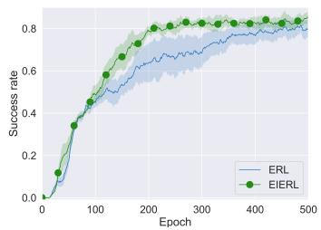  
(a) Movie

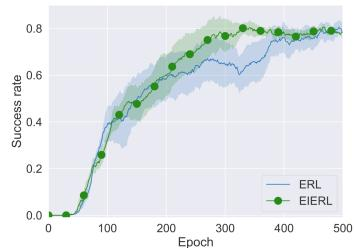  
(b) Rest.

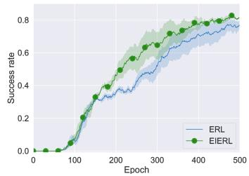  
(c) Taxi  
Figure 2: The effect of the EII mechanism on performance in Movie, Restaurant, and Taxi domains.

Before training begins, all dialogue agents perform a warm start for 120 epochs to pre-fill the experience replay buffer. During the training phase of each epoch, the agents interact with the environment once, storing the acquired experiences in the replay buffer. In the testing phase, each agent interacts with the environment fifty times, averaging these results to produce a one-time result for the current epoch, while the experiences obtained are not stored. Each agent model is executed five times with random seeds, and the average results are used for analysis and comparison to ensure robustness. Furthermore, since our EIERL involves multiple agent individuals in its population, we randomly sample 1/M of the experiences (where M is the number of individuals) from the acquired experiences for storage in the replay buffer, maintaining consistent training costs.

## 4.3 Main Results

The performance comparison of various baselines across different domains is illustrated in Table 1. The performance contrast between DQN\_EPSILON\_0.0 and DQN\_EPSILON\_0.05 highlights that appropriate exploration significantly improves performance. In contrast, although ICM\_DQN also provides exploration guidance, its method of encouraging exploration in new state spaces is not well-suited for task-oriented dialogue scenarios with clearly defined goals. While NOISY\_DQN performs well in the movie domain, the increased complexity of state spaces in the taxi and restaurant domains, due to the larger number of user goals and slots (Zhao et al., 2022), exacerbates the problem of exploration-exploitation trade-off, complicating learning process. This challenge is also evident in ICM\_DQN, which encourages the exploration of new state spaces. It is worth noting that although ICM\_DQN achieves fewer average dialogue turns in both domains, its success rate and average reward are also lower. This is primarily due to ICM\_DQN encountering many dialogues that fail quickly, leading to fewer turns on average and a lower success rate. Although LM\_DP and LLM\_DP\_NLG with tailored prompts perform well in the early stages by leveraging large-scale LLM data, their lack of fine-tuning for DP tasks prevents further performance improvement. Moreover, due to the closed-source nature of ChatGPT-4.0, epochs cannot be directly used to measure its performance. Consequently, we focus more on comparing the performance of the converged trainable model with that of LLMs. In contrast, our EIERL achieves superior performance across various domains due to a better balance between exploration and exploitation.

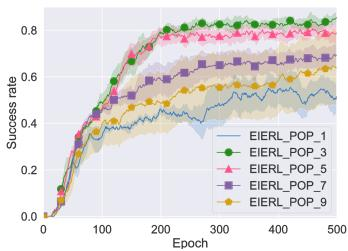  
(a) Movie

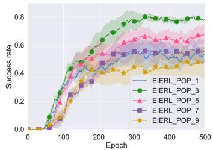  
(b) Rest.

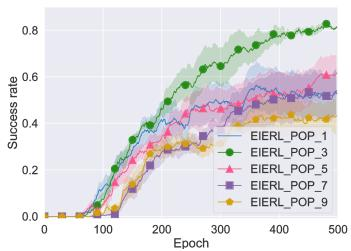  
(c) Taxi

Figure 3: The effect of the EA population size (P) on performance across Movie, Restaurant, and Taxi domains.  
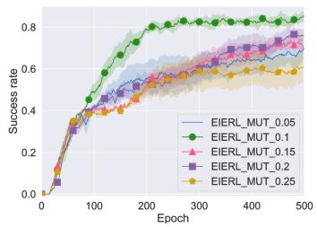  
(a) Movie

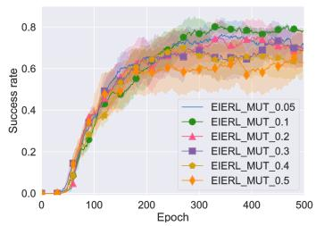  
(b) Rest.

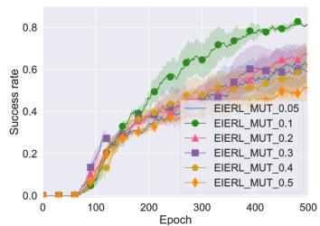  
(c) Taxi  
Figure 4: The impact of mutation strength (σ) on performance across Movie, Restaurant, and Taxi domains.

## 4.4 Analysis

## 4.4.1 Effectiveness of the EII Mechanism

To evaluate the effectiveness of the EII mechanism, we compared the performance of EIERL with ERL, which excludes the EII mechanism, across different domains. As shown in Figure 4, EIERL consistently demonstrated a faster convergence rate and greater stability across various domains. In the early training stages, the performances of ERL and EIERL were comparable. However, as training progressed into later stages, EIERL significantly outperformed ERL in both success rate and the smoothness of the learning curve, particularly in the more challenging restaurant and taxi domains. This advantage arises from the EII mechanism, which allows EIERL to effectively harness the highquality traits of elite individuals, enabling the EA to move toward more optimized search directions and significantly enhancing the exploration process. This mechanism addresses the prolonged evolutionary time challenge associated with incorporating EA into ERL, thereby accelerating the optimization process and minimizing performance fluctuations.

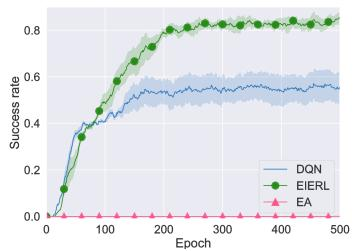  
(a) Movie

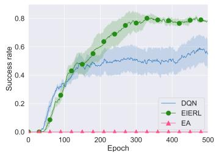  
(b) Rest.

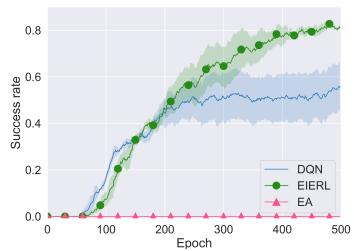  
(c) Taxi

Figure 5: Ablation experiment of two components (DRL and EA) of our method in Movie, Restaurant, and Taxi domains.  
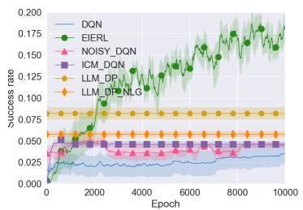  
(a) Effectiveness Experiments.

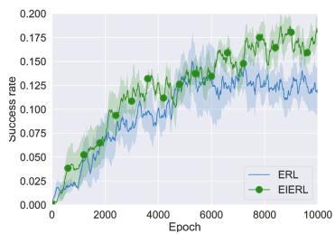  
(b) Effectiveness of EII.

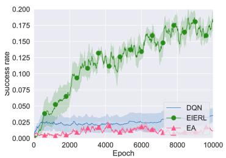  
(c) Ablation Experiment.  
Figure 6: Generalizability experiments of EIERL on MultiWOZ dataset with multiple domains.

## 4.4.2 Impact of EA Hyperparameters

The incorporation of EA introduces two key hyperparameters: EA population size (P) and mutation strength (σ). To investigate how these hyperparameters influence EIERL’s performance and provide insights for future practitioners, we conducted two experiments focused on tuning these parameters.

Intuitively, the size of P plays a crucial role in balancing exploration and exploitation. P represents the number of individuals in the EA population. We hypothesized that a larger EA population could lead to excessive exploration, particularly in dialogue tasks with large state spaces, resulting in low-quality experiences. Conversely, a smaller EA population might lead to insufficient exploration, trapping the model in suboptimal policies. To varify this hypothesis, we conducted experiments with different values of P (denoted as EIERL\_POP\_P). As shown in Figure 3, both excessively large and small populations negatively impacted performance, with the model performing best when P was set to 3. These findings confirm our hypothesis, and we set $P = 3$ as the default for all experiments, except in this experiment.

Similarly, mutation strength (σ) affects the variability and quality of individuals in the EA population, which directly influences the quality of the exploration experience. We hypothesized that a large σ would result in overly random mutations, decreasing exploration quality, while a small σ would limit the EA’s ability to explore the solution space effectively. To test this, we experimented with different values of σ (denoted as EIERL\_ $\mathbf { M U T } _ { - } \sigma ) ^ { 6 }$ The results, presented in Figure 4, validated our hypothesis: a moderate value of $\sigma = 0 . 1$ consistently yielded the best performance, while both larger and smaller values of σ led to suboptimal outcomes. As a result, $\sigma = 0 . 1$ was selected as the default for all experiments, except in this experiment.

## 4.4.3 Ablation Experiment

To validate the individual contributions of DRL and EA within EIERL, we conducted an ablation study. The results, shown in Figure 5, demonstrate that EIERL consistently outperforms either DQN or EA alone. DQN exhibited slow learning and ultimately converged to suboptimal policies, highlighting its limitations in exploration efficiency. In contrast, EA showed minimal improvement throughout the training process. We attribute this to the challenges traditional EA faces in dialogue tasks with highdimensional state spaces, which require a large number of samples for effective exploration. This further emphasizes the significant improvement that the EII mechanism brings to EA. In summary, EIERL excels in complex dialogue tasks by effectively combining the global search capabilities of EA with the local optimization strengths of DQN.

## 4.4.4 Generalizability Experiments

To validate the generalizability of EIERL, we conducted further experiments on the MultiWOZ dataset, which includes seven domains: restaurant, taxi, hotel, train, attraction, hospital, and police. These experiments included effectiveness assessments, evaluations of the EII mechanism, and an ablation study. The detailed results are presented in Figure 6. The findings from these three experiments are consistent with those from the singledomain experiments, demonstrating that EIERL maintains optimal performance in multi-domain dialogue tasks and highlighting the critical role of the proposed EII mechanism.

## 5 Conclusion

In this paper, we proposed a novel method, EIERL, that harnesses the global search capabilities of EA alongside the local optimization strengths of DRL to effectively balance the exploration-exploitation in dialogue policy learning. To alleviate the prolonged evolutionary times caused by large spaces in dialogue tasks when integrating EA, we introduced an innovative EII mechanism. This mechanism adaptively determines the optimal timing for injecting the fittest individuals into the EA population based on training progress, thereby providing a clear search direction for exploration and enhancing the evolutionary process. Experiments across multiple dialogue datasets demonstrated the superior performance of EIERL and EII in improving EA’s exploration efficiency. To the best of our knowledge, this study is the first to effectively integrate EA with DRL specifically for task-oriented dialogue policy tasks.

## Limitation

Despite the innovative integration of EA and DRL in this work, which demonstrates significant performance advantages in both single-domain and multi-domain dialogue datasets, we limited the assessment of individual fitness within the population to a single criterion: the cumulative reward commonly used in task-oriented dialogue settings. This reliance on a single fitness measure imposes limitations in complex environments that often involve multiple objectives and multidimensional evaluation metrics, as it may not accurately reflect the true performance of individuals. Consequently, we plan to investigate a multi-criteria fitness evaluation method in future work to enhance the adaptability of our approach in more complex domains. Additionally, future research could combine EAs with advanced reinforcement learning algorithms such as DDPG (Lillicrap, 2015) and SAC (Haarnoja et al., 2018), which have shown exceptional performance in video game tasks. This combination may lead to further improvements in dialogue tasks.

## Acknowledgments

We thank the anonymous reviewers for their constructive feedback. Special thanks to the human evaluators who assisted in the manual evaluation of our models. This work was supported by the Hunan Provincial Natural Science Foundation (Grant No. 2024JJ6062), and the National Natural Science Foundation of China (NSFC) via grant 62306342. This work was sponsored by the Excellent Young Scientists Fund in Hunan Province (Grant No.2024JJ4070), the Science and Technology Innovation Program of Hunan Province under Grant 2024RC3024.

## References

Paweł Budzianowski, Tsung-Hsien Wen, Bo-Hsiang Tseng, Inigo Casanueva, Stefan Ultes, Osman Ramadan, and Milica Gašic. 2018. Multiwoz–a´ large-scale multi-domain wizard-of-oz dataset for task-oriented dialogue modelling. arXiv preprint arXiv:1810.00278.

Willy Chung, Samuel Cahyawijaya, Bryan Wilie, Holy Lovenia, and Pascale Fung. 2023. Instructtods: Large language models for end-to-end task-oriented dialogue systems. arXiv preprint arXiv:2310.08885.

Matej Crepinsek, Shih-Hsi Liu, and Marjan Mernik. 2013. Exploration and exploitation in evolutionary algorithms: A survey. ACM Comput. Surv., 45(3):35:1– 35:33.

Caibo Dong and Dazi Li. 2024. Adaptive evolutionary reinforcement learning with policy direction. Neural Processing Letters, 56(2):69.

Huifang Du, Shuqin Li, Minghao Wu, Xuejing Feng, Yuan-Fang Li, and Haofen Wang. 2024. Reward-

ing what matters: Step-by-step reinforcement learning for task-oriented dialogue. arXiv preprint arXiv:2406.14457.

David E Goldberg and Kalyanmoy Deb. 1991. A comparative analysis of selection schemes used in genetic algorithms. In Foundations of genetic algorithms, volume 1, pages 69–93. Elsevier.

Tuomas Haarnoja, Aurick Zhou, Pieter Abbeel, and Sergey Levine. 2018. Soft actor-critic: Off-policy maximum entropy deep reinforcement learning with a stochastic actor. In International conference on machine learning, pages 1861–1870. PMLR.

Shuai Han, Wenbo Zhou, Jiayi Lu, Jing Liu, and Shuai Lü. 2022. NROWAN-DQN: A stable noisy network with noise reduction and online weight adjustment for exploration. Expert Syst. Appl., 203:117343.

Peter Henderson, Riashat Islam, Philip Bachman, Joelle Pineau, Doina Precup, and David Meger. 2018. Deep reinforcement learning that matters. In Proceedings ofthe AAAI conference on artificial intelligence, volume 32.

Songbo Hu, Xiaobin Wang, Zhangdie Yuan, Anna Korhonen, and Ivan Vulic. 2024. Dialight: Lightweight´ multilingual development and evaluation of taskoriented dialogue systems with large language models. arXiv preprint arXiv:2401.02208.

HAO Jianye, Pengyi Li, Hongyao Tang, Yan Zheng, Xian Fu, and Zhaopeng Meng. 2022. Erl-re2: Efficient evolutionary reinforcement learning with shared state representation and individual policy representation. In The Eleventh International Conference on Learning Representations.

Bingyi Kang, Zequn Jie, and Jiashi Feng. 2018. Policy optimization with demonstrations. In International conference on machine learning, pages 2469–2478. PMLR.

Shauharda Khadka and Kagan Tumer. 2018. Evolutionguided policy gradient in reinforcement learning. Advances in Neural Information Processing Systems, 31.

Pranjal Kumar. 2024. Large language models (llms): survey, technical frameworks, and future challenges. Artificial Intelligence Review, 57(9):260.

Wai-Chung Kwan, Hong-Ru Wang, Hui-Min Wang, and Kam-Fai Wong. 2023. A survey on recent advances and challenges in reinforcement learning methods for task-oriented dialogue policy learning. Machine Intelligence Research, 20(3):318–334.

WC Kwan, HR Wang, HM Wang, and KF Wong. 2019. A survey on recent advances and challenges in reinforcement learning methods for task-oriented dialogue policy learning. machine intelligence research. corpora, 69:72.

Pawel Ladosz, Lilian Weng, Minwoo Kim, and Hyondong Oh. 2022. Exploration in deep reinforcement learning: A survey. Inf. Fusion, 85:1–22.

Pengyi Li, Jianye Hao, Hongyao Tang, Xian Fu, Yan Zheng, and Ke Tang. 2024. Bridging evolutionary algorithms and reinforcement learning: A comprehensive survey. CoRR, abs/2401.11963.

Pengyi Li, HAO Jianye, Hongyao Tang, Yan Zheng, and Fazl Barez. 2023. Value-evolutionary-based reinforcement learning. In Forty-first International Conference on Machine Learning.

Xiujun Li, Yun-Nung Chen, Lihong Li, Jianfeng Gao, and Asli Celikyilmaz. 2017. End-to-end taskcompletion neural dialogue systems. arXiv preprint arXiv:1703.01008.

Xiujun Li, Zachary C Lipton, Bhuwan Dhingra, Lihong Li, Jianfeng Gao, and Yun-Nung Chen. 2016. A user simulator for task-completion dialogues. arXiv preprint arXiv:1612.05688.

Xiujun Li, Yu Wang, Siqi Sun, Sarah Panda, Jingjing Liu, and Jianfeng Gao. 2018. Microsoft dialogue challenge: Building end-to-end task-completion dialogue systems. arXiv preprint arXiv:1807.11125.

TP Lillicrap. 2015. Continuous control with deep reinforcement learning. arXiv preprint arXiv:1509.02971.

Zachary C Lipton, Jianfeng Gao, Lihong Li, Xiujun Li, Faisal Ahmed, and Li Deng. 2016. Efficient exploration for dialog policy learning with deep bbq networks & replay buffer spiking. CoRR abs/1608.05081.

Volodymyr Mnih, Koray Kavukcuoglu, David Silver, Andrei A Rusu, Joel Veness, Marc G Bellemare, Alex Graves, Martin Riedmiller, Andreas K Fidjeland, Georg Ostrovski, et al. 2015. Human-level control through deep reinforcement learning. nature, 518(7540):529–533.

Bruno Eidi Nishimoto and Anna Helena Reali Costa. 2019. Dialogue management with deep reinforcement learning: Balancing exploration and exploitation. In 2019 8th Brazilian Conference on Intelligent Systems (BRACIS), pages 449–454. IEEE.

Xuecheng Niu, Akinori Ito, and Takashi Nose. 2024. Scheduled curiosity-deep dyna-q: Efficient exploration for dialog policy learning. IEEE Access.

Deepak Pathak, Pulkit Agrawal, Alexei A. Efros, and Trevor Darrell. 2017. Curiosity-driven exploration by self-supervised prediction. In Proceedings of the 34th International Conference on Machine Learning, ICML 2017, Sydney, NSW, Australia, 6-11 August 2017, volume 70 of Proceedings of Machine Learning Research, pages 2778–2787. PMLR.

Baolin Peng, Xiujun Li, Jianfeng Gao, Jingjing Liu, Kam-Fai Wong, and Shang-Yu Su. 2018. Deep dynaq: Integrating planning for task-completion dialogue policy learning. arXiv preprint arXiv:1801.06176.

Libo Qin, Wenbo Pan, Qiguang Chen, Lizi Liao, Zhou Yu, Yue Zhang, Wanxiang Che, and Min Li. 2023. End-to-end task-oriented dialogue: A survey of tasks, methods, and future directions. arXiv preprint arXiv:2311.09008.

Libo Qin, Tianbao Xie, Wanxiang Che, and Ting Liu. 2021. A survey on spoken language understanding: Recent advances and new frontiers. arXiv preprint arXiv:2103.03095.

Karush Suri. 2022. Off-policy evolutionary reinforcement learning with maximum mutations. In 21st International Conference on Autonomous Agents and Multiagent Systems, AAMAS 2022, Auckland, New Zealand, May 9-13, 2022, pages 1237–1245. International Foundation for Autonomous Agents and Multiagent Systems (IFAAMAS).

Christopher Tegho, Paweł Budzianowski, and Milica Gašic. 2017. Uncertainty estimates for efficient´ neural network-based dialogue policy optimisation. arXiv preprint arXiv:1711.11486.

Huimin Wang, Baolin Peng, and Kam-Fai Wong. 2020. Learning efficient dialogue policy from demonstrations through shaping. In Proceedings of the 58th annual meeting of the association for computational linguistics, pages 6355–6365.

Dayong Xu, Fei Zhu, Quan Liu, and Peiyao Zhao. 2021. Improving exploration efficiency of deep reinforcement learning through samples produced by generative model. Expert Systems with Applications, 185:115680.

Jingfeng Yang, Hongye Jin, Ruixiang Tang, Xiaotian Han, Qizhang Feng, Haoming Jiang, Shaochen Zhong, Bing Yin, and Xia Hu. 2024. Harnessing the power of llms in practice: A survey on chatgpt and beyond. ACM Transactions on Knowledge Discovery from Data, 18(6):1–32.

Shunyu Yao, Dian Yu, Jeffrey Zhao, Izhak Shafran, Tom Griffiths, Yuan Cao, and Karthik Narasimhan. 2024. Tree of thoughts: Deliberate problem solving with large language models. Advances in Neural Information Processing Systems, 36.

Zihao Yi, Jiarui Ouyang, Yuwen Liu, Tianhao Liao, Zhe Xu, and Ying Shen. 2024. A survey on recent advances in llm-based multi-turn dialogue systems. CoRR, abs/2402.18013.

Yang Zhao, Hua Qin, Zhenyu Wang, Changxi Zhu, and Shihan Wang. 2022. A versatile adaptive curriculum learning framework for task-oriented dialogue policy learning. In Findings of the Association for Computational Linguistics: NAACL 2022, Seattle, WA, United States, July 10-15, 2022, pages 711–723. Association for Computational Linguistics.

Yangyang Zhao, Kai Yin, Zhenyu Wang, Mehdi Dastani, and Shihan Wang. 2024. Decomposed deep q-network for coherent task-oriented dialogue policy learning. IEEE/ACM Transactions on Audio, Speech, and Language Processing.

## A Prompt Design for LLM-based Baselines

Table 2: Descriptions of Prompts used for LLM-based baselines
<table><tr><td>Model LLM_DP</td><td>Prompt You must strictly execute the following commands:</td></tr><tr><td></td><td>1. Command execution requirements: when receiving a command, you must strictly follow the given instructions without performing any actions outside the scope of the command or generating any additional words. 2. Datasets and system roles: as the dialogue policy component in a task- oriented dialog system, you will make system decisions based on the Multi- WOZ 2.1 dataset. 3. Processing user dialog state: you will receive a formatted user dialog state: Listing 1. This state will be used as a basis for decision making. 4. Generate system actions: based on the user dialog state, you need to generate system actions. These actions should be provided in the following format: [[“ActionType&quot;, “Domain&quot;, “Slot&quot;, &quot;Value&quot;]] where ‘ActionType denotes the type of action (e.g. Request, Inform, Confirm, etc.), ‘Domain specifies the associated domain (e.g. restaurant, taxi, hotel, etc.), ‘Slot‘ is the specific information slot associated with the action (e.g. name, area, type, etc.), and ‘Value is the corresponding value or an empty string.</td></tr><tr><td>LLM_DP_NLG</td><td>You must strictly execute the following commands: 1. Command execution requirements: when receiving a command, you must strictly follow the given instructions without performing any actions outside the scope of the command or generating any additional words. 2. Datasets and system roles: as the dialogue policy component and the natural language generation component of a task-based dialog system, you will make system decisions based on the MultiWOZ 2.1 dataset. 3. Processing user dialog state: you will receive a formatted user dialog state: Listing 1. This state will be used as a basis for decision making. 4. Generate system actions: generate your response to user conversations directly.</td></tr></table>

## Listing 1: Data Format 1

1 {   
2 ’user\_action ’: [[" Inform ", " Hotel ", " Area ", " east "], [" Inform ", " Hotel ", " Stars ",   
"4"]],   
3 ’system\_action ’: [],   
4 ’belief\_state ’: {   
5 ’ police ’: {’ book ’: {’ booked ’: []}, ’ semi ’: {}},   
6 ’ hotel ’: {’ book ’: {’ booked ’: [], ’ people ’: ’’, ’day ’: ’’, ’ stay ’: ’’},   
7 ’ semi ’: {’ name ’: ’’, ’ area ’: ’ east ’, ’ parking ’: ’’, ’ pricerange ’: ’’,   
’ stars ’: ’4’, ’ internet ’: ’’, ’ type ’: ’’}},   
8 ’ attraction ’: {’ book ’: {’ booked ’: []}, ’ semi ’: {’ type ’: ’’, ’ name ’: ’’, ’ area ’:   
’’}},   
9 ’ restaurant ’: {’ book ’: {’ booked ’: [], ’ people ’: ’’, ’day ’: ’’, ’ time ’: ’’},   
10 ’ semi ’: {’ food ’: ’’, ’ pricerange ’: ’’, ’ name ’: ’’, ’ area ’: ’’}},   
11 ’ hospital ’: {’ book ’: {’ booked ’: []}, ’ semi ’: {’ department ’: ’’}},   
12 ’taxi ’: {’book ’: {’booked ’: []},   
13 ’ semi ’: {’ leaveAt ’: ’’, ’ destination ’: ’’, ’ departure ’: ’’, ’ arriveBy ’:   
’’}},   
14 ’ train ’: {’ book ’: {’ booked ’: [], ’ people ’: ’’},   
15 ’ semi ’: {’ leaveAt ’: ’’, ’ destination ’: ’’, ’day ’: ’’, ’ arriveBy ’: ’’,   
’ departure ’: ’’}}   
16 },   
17 ’request\_state ’: {},   
18 ’terminated ’: False ,   
19 ’ history ’: []   
20 }

## B Detailed Description of the EIERL Algorithm

Algorithm 3: Elite-Infused Evolutionary Reinforcement Learning   
Input: $\overline { { N , n , m } }$   
Output: $Q _ { \theta _ { Q } } ( s , a )$   
1 initialize $Q _ { \theta _ { Q } } \ ' ( s , a ) , Q _ { \theta _ { Q ^ { \prime } } } ^ { \prime } ( s , a )$ with $\theta _ { Q ^ { \prime } } = \theta _ { Q }$   
2 initialize populations $p o p _ { p o l i c y } \left( n \right)$ and $p o p _ { e v o } \left( m \right)$   
3 initialize experience buffer and $f _ { m a x } = - \infty$   
4 for epoch = 1 to $N$ do   
5 initialize $f _ { m a x } ^ { \prime } = - \infty , \pi _ { m a x } ,$ and all\_fitness   
6 for each $\pi \in p o p _ { p o l i c y }$ do   
7 load $\theta _ { Q }$ into π   
8 end for   
9 for each $\pi \in p o p _ { e v o } \cup p o p _ { p o l i c y }$ do   
10 fitness, $\mathcal { D } = \mathrm { E v a l u a t e } ( \pi , \mathcal { D } )$   
11 all\_fitness.append(fitness)   
12 $\mathbf { i f } \ f t n e s s > f _ { m a x } ^ { \prime }$ then   
13 一 $f _ { m a x } ^ { \prime } = \mathrm { f i t n e s s , } \pi _ { m a x } = \pi$   
14 end if   
15 end for   
16 if $f _ { m a x } ^ { \prime } > f _ { m a x }$ then   
17 replace $p o p _ { e v o }$ with $\pi _ { m a x }$   
18 $f _ { m a x } = f _ { m a x } ^ { \prime }$   
19 else   
20 $p o p _ { e v o } = \mathrm { E v o l u t i o n } ( p o p _ { e v o } , a l l \_ f i t n e s s )$   
21 end if   
22 sample minibatches of $( s _ { i } , a _ { i } , r _ { i } , s _ { i + 1 } )$ from   
23 by Equation 2 compute $y _ { i }$   
24 update $\theta _ { Q }$ by Equation 1   
25 update the target network $\theta _ { Q ^ { \prime } }  \theta _ { Q }$   
26 end for

The detailed description of EIERL is shown in algorithm 3. The EIERL algorithm requires setting a specific number of training epochs, denoted as $N .$ , which ensures that all baselines converge on the dataset for comprehensive comparison. Additionally, the sizes of the DRL and EA populations, n and m respectively, also should be defined. The goal of EIERL is to obtain a trained DRL agent $Q _ { \theta _ { Q } } ( s , a )$ that effectively balances exploration and exploitation.

Before training begins, the two Q-values in the DRL agent’s network, $Q _ { \theta _ { Q } } ( s , a )$ and $Q _ { \theta _ { Q ^ { \prime } } } ^ { \prime } ( s , a )$ , are initialized. The experience replay buffer D is pre-filled using experiences obtained through a warm start, and the elite discriminator’s initial elite threshold $f _ { m a x }$ is set to negative infinity. In each epoch, every individual in the DRL population, denoted as $p o p _ { p o l i c y } ,$ duplicates the weight parameters of the trained DRL agent. Both the DRL population $p o p _ { p o l i c y }$ and the EA population $p o p _ { e v o }$ are evaluated by the elite discriminator within the EII mechanism to assess their fitness. The current maximum fitness, $f _ { m a x } ^ { \prime } ,$ and its corresponding individual $\pi$ are recorded as $\pi _ { m a x }$ . If $f _ { m a x } ^ { \prime }$ exceeds the elite threshold $a f _ { m a x } ,$ the individual is designated as an elite individual, and its fitness is updated to $f _ { m a x } ^ { \prime }$ . The elite injection process is then triggered, where the elite individual $\pi _ { m a x } \mathrm { \bar { s } }$ weight parameters are loaded into every individual in the EA population $p o p _ { e v o } .$ . If no elite individual is identified, only the EA process (selection, crossover, and mutation) is executed to form the EA population. This process repeats until the specified number of epochs N is reached. Throughout, both EA and DRL populations interact with the environment, generating diverse experiences used for training the DRL agent and evaluating fitness.

## C Impact of Exploration Degree on Dialogue Policy Learning

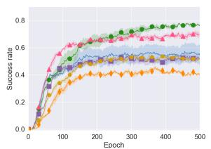  
(a) Movie

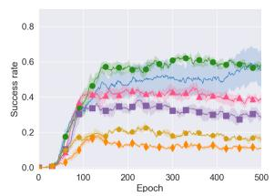  
(b) Rest.

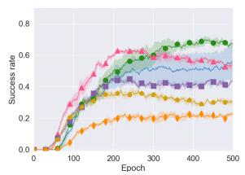  
(c) Taxi  
Figure 7: Effect of epsilon parameters on DQN performance

To validate the impact of exploration degree on DRL-based dialogue agents and identify the optimal ϵ value, we conducted experiments based on the DQN framework, with results presented in Figure 7. As shown, when exploration is absent, DQN\_epsilon\_0.0 consistently selects the action with the highest known reward, preventing it from discovering the global optimal policy and causing it to become stuck in a suboptimal strategy. In contrast, enabling exploration allows the agent to try different actions, thereby uncovering higher-reward pathways. Notably, DQN\_epsilon\_0.05 achieved the best performance, while performance declined as ϵ increased beyond this threshold. This highlights that excessive exploration can lead to random action selection, which in turn reduces the quality of experiences. In summary, DRL-based dialogue agents struggle to balance exploration and exploitation, as both excessive and insufficient exploration can negatively affect their performance. Consequently, the best-performing DQN\_epsilon\_0.05 is used as our baseline model.

## D Complete Results and Variances with 500 Epochs Display Cutoff

The reason for choosing 500 epochs is to have a better view of the pre-learning curve, and at this point all methods have fully converged. Moreover, our approach aims to optimize the balance between exploration and exploitation, and the primary outcome is improved learning efficiency, which is evidenced by higher success rates achieved within fewer epochs. For consistency and clarity in comparison, all plots and statistical analyses were standardized to 500 epochs.

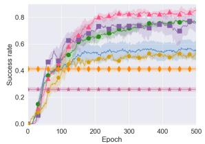  
(a) Movie

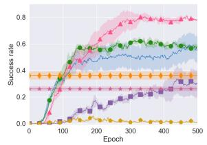  
(b) Restaurant

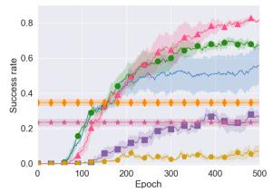  
(c) Taxi  
Figure 8: The learning curves of different agents in Movie, Restaurant, and Taxi domains.