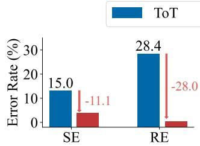
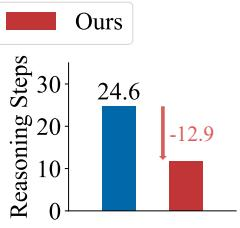
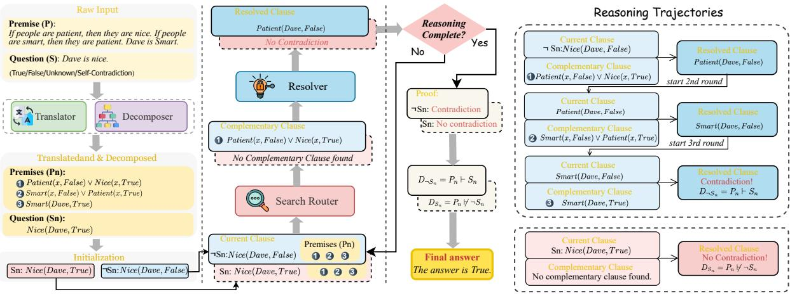
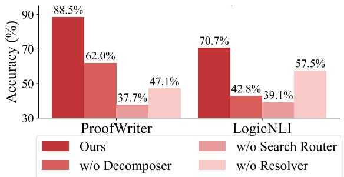
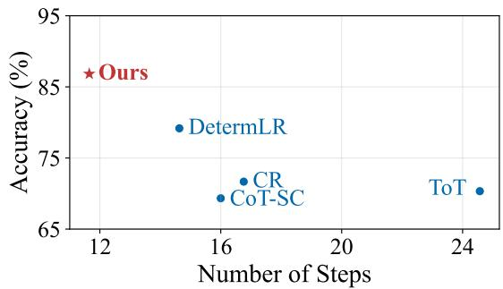
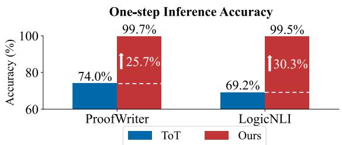
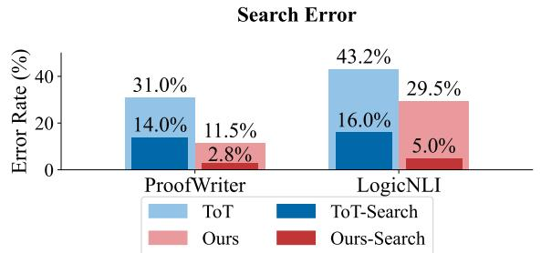
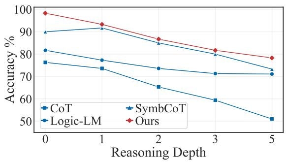
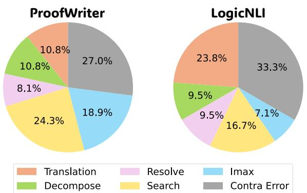

# Aristotle: Mastering Logical Reasoning with A Logic-Complete Decompose-Search-Resolve Framework

Jundong Xu<sup>1</sup>, Hao Fei<sup>1</sup>∗, Meng Luo<sup>1</sup>, Qian Liu<sup>2</sup>, Liangming Pan<sup>3</sup>,

William Yang Wang<sup>4</sup>, Preslav Nakov<sup>5</sup>, Mong-Li Lee<sup>1</sup>, Wynne Hsu<sup>1</sup>

<sup>1</sup> National University of Singapore, <sup>2</sup> University of Auckland, <sup>3</sup> University of Arizona,

<sup>4</sup> University of California, Santa Barbara <sup>5</sup> MBZUAI

jundong.xu@u.nus.edu haofei37@nus.edu.sg mluo@u.nus.edu liu.qian@auckland.ac.nz liangmingpan@arizona.edu william@cs.ucsb.edu preslav.nakov@mbzuai.ac.ae dcsleeml@nus.edu.sg dcshsuw@nus.edu.sg

## Abstract

In the context of large language models (LLMs), current advanced reasoning methods have made impressive strides in various reasoning tasks. However, when it comes to logical reasoning tasks, major challenges remain in both efficacy and efficiency. This is rooted in the fact that these systems fail to fully leverage the inherent structure of logical tasks throughout the reasoning processes such as decomposition, search, and resolution. To address this, we propose a logic-complete reasoning framework, Aristotle, with three key components: Logical Decomposer, Logical Search Router, and Logical Resolver. In our framework, symbolic expressions and logical rules are comprehensively integrated into the entire reasoning process, significantly alleviating the bottlenecks of logical reasoning, i.e., reducing sub-task complexity, minimizing search errors, and resolving logical contradictions. The experimental results on several datasets demonstrate that Aristotle consistently outperforms state-of-the-art reasoning frameworks in both accuracy and efficiency, particularly excelling in complex logical reasoning scenarios. We will open-source all our code at https: //github.com/Aiden0526/Aristotle.

## 1 Introduction

LLMs (Patel et al., 2023; Chowdhery et al., 2023) have unlocked unprecedented potential in semantic understanding (Zhao et al., 2023), sparking immense hope for realizing AGI. A fundamental requirement for true intelligence is the ability to perform human-level reasoning, such as commonsense reasoning (Wang et al., 2024c), mathematical problem-solving (Wang et al., 2024a), and geometric reasoning (Eisner et al., 2024). To achieve this, researchers have drawn inspiration from human reasoning processes, proposing various methods and strategies for LLM-based reasoning. One of the most groundbreaking works is the Chain-of-Thought (CoT) (Wei et al., 2022), which breaks down complex problems into smaller sub-problems, solving them step by step. The birth of CoT has elevated the reasoning capabilities of LLMs to new heights. Further research has built on this foundation by closely emulating human cognitive patterns, introducing more advanced approaches, such as Least-to-Most (Zhou et al., 2023), Tree-of-Thought (ToT) (Yao et al., 2023), Graph-of-Thought (GoT) (Besta et al., 2024), and Plan-and-Solve (Wang et al., 2023a), which have achieved progressively better results on reasoning benchmarks. In summary, successful LLM-based reasoning methods generally involve three key modules (Huang and Chang, 2023; Li et al., 2024): problem decomposition, path searching, and problem resolution.



  
Figure 1: Our reasoning framework vs. the SoTA ToT: comparison in terms of Search Error (SE) and single-step Reasoning Error (RE), as well as in terms of average number of reasoning steps.

Compared to other forms of general reasoning, logical reasoning (Huang and Chang, 2023) stands out as one of the most challenging tasks, as it demands the strictest evidence, arguments, and logical rigor to arrive at sound conclusions or judgments. Logical reasoning more closely mirrors human-level cognitive processes, making it crucial in high-stakes domains such as mathematical proof generation, legal analysis, and scientific discovery (Cummins et al., 1991; Markovits and Vachon, 1989). In recent years, numerous studies have investigated how to integrate LLMs into logical reasoning. For example, some methods (Pan et al., 2023;

  
Figure 2: Our Aristotle logical reasoning framework (best viewed via zooming in). In step 1, the $\$ 3$ Translator and $\underbrace { \frac { 1 } { 4 } \log \frac { 1 } { 4 } } _ { \mathrm { ( f i f ) } }$ Decomposer together transform $P$ and $S$ into $P _ { n }$ and $S _ { n }$ . Then, we initialize the $C _ { \mathrm { c u r r e n t } }$ using the decomposed $S _ { n }$ and $\neg S _ { n }$ . In step 2, the $\textcircled { 1 0 0 }$ Search Router uses the $C _ { \mathrm { c u r r e n t } }$ and $P _ { n }$ to search for $C _ { \mathrm { c o m p l e m e n t } }$ . The $- \frac { 1 } { ( \frac { A } { A } ) ^ { 2 } - 0 }$ Resolver then resolves $C _ { \mathrm { c u r r e n t } }$ with $C _ { \mathrm { c o m p l e m e n t } }$ to produce $C _ { \mathrm { r e s o l v e d } }$ . The reasoning complete if: (1) the $C _ { \mathrm { r e s o l v e d } }$ determines whether a contradiction exists; (2) reach the maximum number of iterations $I _ { \mathrm { m a x } }$ . In step 3, Aristotle then concludes the Proof $D _ { S _ { n } }$ and $D _ { \neg S _ { n } }$ based on the Proof Determination. Using these proofs, Aristotle determines the final answer based on Eq. (1). Note that two distinct reasoning paths will be implemented: a solid box representing the path starting from $\neg S _ { n }$ , and a dotted box representing the path starting from $S _ { n }$ . The complete reasoning process for both two paths, including all iterations are shown in the right part “Reasoning Trajectories”.

Gao et al., 2023) use LLMs to translate textual problems into symbolic expressions, which are then addressed by external logic solvers. Subsequent work, such as SymbCoT (Xu et al., 2024), suggests that LLMs themselves can handle both symbolic translation and logic resolution, thus avoiding potential information loss caused when using external solvers. While SymbCoT has achieved state-of-theart (SoTA) performance, the inherent simplicity of CoT’s linear reasoning process leaves considerable room for further improvement in LLM-based logical reasoning.

In response, certain research (Yao et al., 2023; Besta et al., 2024; Zhang et al., 2023) has applied sophisticated general-purpose reasoning methods (e.g., ToT, GoT) directly to logical reasoning tasks. Unfortunately, these approaches largely overlook the inherent structure of logical tasks and fail to effectively integrate logical rules into the decomposesearch-resolve framework, leaving key issues unresolved in both reasoning efficacy and efficiency:

▶ From an efficacy perspective, first, when LLMs decompose logical problems, they often rely on the linguistic token relations rather than the underlying logical structure, leading to disconnected sub-problems and faulty reasoning. Specifically, when reasoning hinges on specific logical relationships, neglecting them can result in disjointed subproblems, breaking the logical chain and ultimately leading to incorrect conclusions. Furthermore, during the search stage, current path search methods rely heavily on evaluators that may be unreliable, selecting nodes based on possibly flawed logic, causing error propagation through subsequent reasoning steps (Chen et al., 2024; Wang et al., 2024b). For the resolving step, these methods guide LLMs to solve sub-questions with simple text prompts, which frequently contain logical errors, resulting in numerous faulty nodes in the search space (Xu et al., 2024). These errors propagate through subsequent reasoning steps, causing entire paths to fail and leading to reasoning failure. Our preliminary experiments reveal that directly applying SoTA general-purpose reasoning methods with a search mechanism to logical tasks results in significant errors, with 28.4% for reasoning and 15.0% for search, as shown in Fig. 1.

▶ From an efficiency perspective, these approaches also lead to significant shortcomings. For example, generating large numbers of incorrect nodes wastes computational resources (Ning et al., 2024). Moreover, relying on unreliable evaluators introduces bias into the search process, leading to unnecessary node and path explorations, ultimately reducing efficiency (Chen et al., 2024). We note that inefficient logical reasoning systems can significantly undermine their value in practical application scenarios.

To address these challenges, we propose a novel reasoning framework, Aristotle, which effectively tackles the performance and the efficiency bottlenecks in existing logical reasoning tasks by completely integrating symbolic expressions and rules into each stage of the decomposition, search, and resolution. Fig. 2 illustrates the overall framework. Specifically, we first introduce a Logical Decomposer that breaks down the original problem into smaller and simpler components based on its logical structure, reducing the complexity of logical tasks. We then devise a Logical Search Router, which leverages proof by contradiction to directly search for logical inconsistencies, thereby reducing search errors from unreliable evaluators and minimizing the number of steps required by existing methods. Finally, we develop a Logical Resolver, which rigorously resolves logical contradictions at each reasoning step, guided by the Logical Search Router. Overall, Aristotle thoroughly considers the inherent logical structure of tasks, fully incorporating logical symbols into the entire decompose-search-resolve framework. This ensures a more logically coherent reasoning process, leading to more reliable final results.

We conducted experiments across multiple logical reasoning benchmarks, where our method surpasses the current SoTA baselines by 4.5% with GPT-4 and 5.4% with GPT-4o. Further analysis revealed that the decomposer, search router, and resolver modules each contributed to: (i) reducing task complexity during problem decomposition, leading to improved accuracy in subsequent search and reasoning phases; (ii) focusing search efforts on the most direct and relevant paths, which reduced errors and enhanced efficiency; (iii) achieving near-perfect logical reasoning accuracy. Moreover, we observe that Aristotle delivers even greater performance improvements in complex scenarios, such as those with more intricate logical structures or longer reasoning chains. Overall, this work marks the first successful complete integration of symbolic logic expressions into every stage of an LLM-based reasoning framework (decomposition, search, and resolution), demonstrating that LLMs can perform complete logical reasoning over symbolic structures.

## 2 Aristotle Architecture

We first formally define the logical reasoning task. Given a set of premises $P ~ = ~ \{ p 1 , p 2 , . ~ . ~ . , p _ { n } \}$ where each $p _ { i }$ represents a logical statement, a reasoner should derive an answer A regarding a given statement $S .$ The possible answer is true $( T )$ , false (F), unknown $( U )$ , or self-contradictory (SD).<sup>1</sup> The formal definition of each answer can be found in Eq. (1).

As illustrated in Fig. 2, Aristotle has an architecture with four modules: Translator, Decomposer, Search Router, and Resolver.

Translator. We use the LLM itself to parse the given premises $P$ and question statement $S$ into a symbolic format, which aims to eliminate ambiguity and ensure precision in the logical statement. We specifically use Logic Programming (LP) language, adopting Prolog’s grammar (Clocksin and Mellish, 2003) to represent the problem as facts, rules, and queries. Facts and rules (Baader et al., 2003) are derived from P, while queries are formulated based on the S. We denote the translated premises (facts and rules) as $P _ { t } .$ , and queries as $S _ { t }$ The details of the grammar can be found at A

Decomposer. By breaking down the logical statement into a standardized logical form, we can simplify the reasoning process, making it easier to apply formal rules and perform efficient logical calculations. To achieve this, we use an LLM to transform the parsed premises $P _ { t }$ , and queries $S _ { t }$ into a standardized logical form through Normalization (Davis and Putnam, 1960) and Skolemization (Nonnengart, 1996), converting them into Conjunctive Normal Form (CNF) and eliminates quantifiers, denoted as $P _ { n }$ and $S _ { n }$ . For example, the logical rule x $( P ( x ) \to Q ( x ) )$ will be decomposed into $\neg P ( x ) \lor Q ( x )$

C0 Search Router. We adopt the proof-bycontradiction (Bishop, 1967) approach because it allows us to straightforwardly search for complementary clauses. This method reduces search errors and directly targets logical conflicts, making the reasoning process faster and more efficient. We design a rule-based module to search for the clauses $C _ { \mathrm { c o m p l e m e n t } } \in P _ { n }$ such that $C _ { \mathrm { c u r r e n t } }$ and C<sub>complement</sub> contain complementary terms. Terms are complementary when they share the same predicate and argument, but have opposite polarity. For example, if the $C _ { \mathrm { c u r r e n t } }$ is P(x, True), clauses in the premises that contains P(x, False) will be found by the Search Router as C<sub>complement</sub>, since they are complementary (same predicate $P$ and argument x but opposite polarity (True vs. False)). We will explain how we define the $C _ { \mathrm { c u r r e n t } }$ in Section 3. We include more details about the search strategy in Appendix B and H.

Resolver. To conduct effective step-wise reasoning during proof by contradiction, we adhere to the resolution principle (Robinson, 1965) as it provides clear and concise instructions to resolve logical conflicts, minimizing the likelihood of reasoning errors. Specifically, it works by canceling out the complementary terms identified by the Search Router and connecting the remaining terms, a process that will be implemented using an LLM. Specifically, given two clauses $C _ { \mathrm { c u r r e n t } }$ and $C _ { \mathrm { c o m p l e m e n t } } .$ where:

$$
\begin{array} { r l } { C _ { \mathrm { c u r r e n t } } = P ( \boldsymbol { x } , \mathrm { T r u e } ) \vee A } & { { } } \\ { C _ { \mathrm { c o m p l e m e n t } } = P ( \boldsymbol { x } , \mathrm { F a l s e } ) \vee B } & { { } } \end{array}
$$

Here, $P ( x , { \mathrm { T r u e } } )$ and $P ( x , { \mathrm { F a l s e } } )$ are complementary terms. The Resolver cancels out them and connects the remaining terms. The resolved clause becomes:

$C _ { \mathrm { r e s o l v e d } } = \mathrm { R e s o l v e } ( C _ { \mathrm { c u r r e n t } } , C _ { \mathrm { c o m p l e m e n t } } ) = A \lor B$ If the remaining clause is empty or contradiction $( \perp ) ^ { 2 }$ , we can conclude the proof and determine the answer, which will be explained in detail in Section 3 at Step 2.

## 3 Logic-Complete Reasoning Processing

With Aristotle, we now demonstrate how each module comes into play to form the integrated dualpath reasoning process.

Step 1: Search Initialization. As shown in the step 1 of Fig. 2, given the original premises $P$ and the question statement S, we first translate them into symbolic format $P _ { t }$ and $S _ { t } ,$ and then decompose them into $P _ { n }$ and $S _ { n } ,$ respectively.

Translate and Decompose   
▶ Input: P, S   
▶ Output: $P _ { n } , S _ { n } , C _ { \mathrm { c u r r e n t } } = \{ S _ { n } , \lnot S _ { n } \}$   
To implement proof by contradiction, we ini  
tialize the current clause $C _ { \mathrm { c u r r e n t } }$ with both $S _ { n }$ and   
its negation $\neg S _ { n } .$ , denoted as $C _ { \mathrm { c u r r e n t } } = S _ { n }$ and   
$C _ { \mathrm { c u r r e n t } } = \lnot S _ { n }$ . Considering both $S _ { n }$ and $\neg S _ { n }$ is   
necessary because we need both proofs to scrupu  
lously conclude an answer, which is marked in Eq.   
(1) and will be explained in detail later in Step 3.

<sup>2</sup>E.g. Resolve $C _ { \mathrm { c u r r e n t } } = ( A )$ and $C _ { \mathrm { c o m p l e m e n t } } = ( \neg A )$   
will get an empty clause C<sub>resolved</sub> = . An empty clause is   
equivalent to a contradiction.

Step 2: Search and Resolve. At this stage, two reasoning paths are initiated: one from $C _ { \mathrm { c u r r e n t } } =$ $S _ { n }$ and the other from $C _ { \mathrm { c u r r e n t } } = \lnot S _ { n }$ , initialized in Step 1. We aim to reach a final answer using proof by contradiction for both paths, iteratively search for complementary clauses and resolve conflicts. This helps us systematically reach an accurate final answer more quickly. Specifically for each reasoning path, presented in the Step 2 of Fig. 2, the Search Router selects clauses C<sub>complement</sub> $\in \boldsymbol { P _ { n } }$ that are complementary to $C _ { \mathrm { { c u r r e n t } } } .$

```latex
Search
▶ Input: $P _ { n } , C _ { \mathrm { c u r r e n t } }$
▶ Output: Ccomplement
The Resolver module then applies the resolution
rule Resolve $( C _ { \mathrm { c u r r e n t } } , C _ { \mathrm { c o m p l e m e n t } } )$ to produce a new
clause $C _ { \mathrm { r e s o l v e d } } .$
Resolve
▶ Input: $C _ { \mathrm { c u r r e n t } } , C _ { \mathrm { c o m p l e m e n t } }$
▶ Output: $C _ { \mathrm { r e s o l v e d } }$
If the $C _ { \mathrm { r e s o l v e d } }$ indicates a contradiction or con
firms the absence of a contradiction, we then ter
minate the reasoning process. If not, we then up
date $C _ { \mathrm { c u r r e n t } } = C _ { \mathrm { r e s o l v e d } }$ and repeat the Search and
Resolve process. If the process reaches the maxi
mum number of iterations $I _ { \mathrm { m a x } }$ and still does not
find a contradiction, we conclude that there is no
contradiction and terminate the reasoning process.
Given the determination of whether contradiction
exists, we then use the formula presented below
to formally establish the proof $D _ { S _ { n } }$ (started from
$C _ { \mathrm { c u r r e n t } } = S _ { n } )$ and $D _ { \neg S _ { n } }$ (started from $C _ { \mathrm { c u r r e n t } } =$
$\neg S _ { n } )$ to determine whether $P _ { n }$ entails either $S _ { n }$ or
$\neg S _ { n } .$
Proof Determination
$D _ { S _ { n } } = { \left\{ \begin{array} { l l } { P _ { n } \vdash \neg S _ { n } } & { ( C _ { \mathrm { r e s o l v e d } } = \mathrm { C o n t r a d i c t i o n } ) } \\ { P _ { n } \vdash \neg S _ { n } } & { ( C _ { \mathrm { r e s o l v e d } } = \mathrm { N o } \mathrm { C o n t r a d i c t i o n } ) } \end{array} \right. }$
$D _ { \neg S _ { n } } = { \left\{ \begin{array} { l l } { P _ { n } \vdash S _ { n } } & { ( C _ { \mathrm { r e s o l v e d } } = \mathrm { C o n t r a d i c t i o n } ) } \\ { P _ { n } \vdash S _ { n } } & { ( C _ { \mathrm { r e s o l v e d } } = \mathrm { N o } \mathrm { C o n t r a d i c t i o n } ) } \end{array} \right. }$
Step 3: Conclude Answer. This proof $D _ { S _ { n } }$ and
$D _ { \neg S _ { n } }$ can then be used to conclude the truth value
A of S based on Eq. (1). For example, consider a
statement S. If we get $D _ { S _ { n } } = P \vdash \lnot S$ and $D _ { \neg S _ { n } }$
$= P \vdash S .$ , the combination of $P \vdash \lnot S$ and $P \vdash S$
leads to the conclusion A that S is false according
to Eq. (1).
Final Answer
▶ Input:
${ { D } _ { { { S } _ { n } } } } \in \{ { { P } _ { n } } [ \cdot \neg { { S } _ { n } } , { { P } _ { n } }  ] \neg { { S } _ { n } } \}$
$D _ { \neg S _ { n } } \in \{ P _ { n } \vdash S _ { n } , P _ { n } \vdash S _ { n } \}$
▶ Output:
$A \in$ True, False, Unknown, Self-Contradictory
```

$$
A = \left\{ \begin{array} { l l } { \mathrm { T r u e } , } & { P _ { n } \vdash S _ { n } \land P _ { n } \vdash \neg S _ { n } } \\ { \mathrm { F a l s e } , } & { P _ { n } \vdash S _ { n } \land P _ { n } \vdash \neg S _ { n } } \\ { \mathrm { U n k n o w n } , } & { P _ { n } \vdash S _ { n } \land P _ { n } \vdash \neg S _ { n } } \\ { \mathrm { S e l f - C o n t r a d i c t o r y } , } & { P _ { n } \vdash S _ { n } \land P _ { n } \vdash \neg S _ { n } } \end{array} \right.\tag{1}
$$

The full algorithm and an example case can be found in Appendix H and I, respectively.

## 4 Experiments

We present the experiment settings, baselines and results in this Section.

## 4.1 Settings

LLMs. We assess the baselines and our method using GPT-4 and GPT-4o. We also include Claude and LLaMA to verify whether our method can generalize to different LLMs other than GPT series. Dataset. We evaluated both the baselines and our method on three carefully selected logical reasoning datasets: ProntoQA (Saparov and He, 2023), ProofWriter (Tafjord et al., 2021) and LogicNLI (Tian et al., 2021). These datasets were chosen to reflect increasing levels of difficulty, with ProntoQA being the easiest, ProofWriter moderately complex, and LogicNLI the most challenging due to their intricate logical structures. ProntoQA focuses on basic deductive logical relationships, ProofWriter introduces more complex structures such as “and/or,” and LogicNLI presents the most intricate reasoning with constructs such as “either/or” and “if and only if”. This progression enables us to comprehensively evaluate the effectiveness of our method across varying levels of complexity in logical structure. The details of each dataset can be found in appendix D.

Baselines. We compare with a wide range of established baselines. Those baselines can be classified into three main categories. (1) Linear Reasoning (LR) refers to approaches where the model arrives at an answer through a single-step process, using a straightforward response based on the initial prompt including: Naive Prompting and CoT (Wei et al., 2022); (2) Aggregative Reasoning (AR) refers to methods where the model performs reasoning multiple times or aggregates the results to reach a final answer. This includes: CoT-SC (Wang et al., 2023b); Cumulative Reasoning (CR; Zhang et al., 2023); DetermLR (Sun et al., 2024); ToT (Yao et al., 2023); (3) Symbolic Reasoning (SR), which engages symbolic expressions and rules in the reasoning framework including: SymbCoT (Xu et al., 2024) and Logic-LM (Pan et al., 2023). More details can be found in Appendix G.

  
Figure 3: Ablation results (w/ GPT-4o).

## 4.2 Main Result

The main results are presented in Table 1, from which we can learn the following observations:

Our method consistently outperforms all baselines across the three datasets. Specifically, we achieve average improvements over CoT-SC, ToT, CR, and SymbCoT of 11.6%, 11.4%, 7.6%, and 4.5% on GPT-4, and 5.6%, 11.5%, 5.4%, and 6.2% on GPT-4o, respectively. These results demonstrate the general advantage of our method over the existing baselines across different datasets.

Our method performs even more effectively in complex logical scenarios. We notice in Table 1 that our approach does not yield an improvement on the ProntoQA dataset. This can be attributed to the relative simplicity of the dataset, where most baselines already achieve high accuracy, leaving limited room for further enhancement. However, our improvements are more pronounced on the challenging datasets. Specifically, we achieve a 4.3% and 6.2% improvement over the second-best baseline on ProofWriter with GPT-4 and GPT-4o, respectively. On the most challenging dataset, LogicNLI, we observe even greater improvements of 6.3% for GPT-4 and 6.4% for GPT-4o. These results highlight the advantages of our method in scenarios involving complex logical structures and increased difficulty.

Our method is generalizable across different models. In Table 2, we present the results for two models (Claude and Llama) outside the GPT series. We compare our method with strong baselines that aggregate multiple reasoning paths. Our method demonstrates similar improvements over the selected strong baseline, highlighting its generalizability across different models.

## 4.3 Model Ablation

To evaluate the contribution of each module in our framework, we conducted an ablation study by replacing each module individually with simpler alternatives. Specifically, we substitute (1) the

<table><tr><td rowspan="2" colspan="2">Method</td><td colspan="4">GPT-4</td><td colspan="4">GPT-40</td></tr><tr><td>ProntoQA</td><td>ProofWriter</td><td>LogicNLI</td><td>Avg</td><td>ProntoQA</td><td>ProofWriter</td><td>LogicNLI</td><td>Avg</td></tr><tr><td rowspan="2">R</td><td>Naive</td><td>77.4</td><td>53.1</td><td>49.0</td><td>59.8</td><td>89.6</td><td>48.7</td><td>53.0</td><td>63.8</td></tr><tr><td>CoT</td><td>98.9</td><td>68.1</td><td>51.0</td><td>72.6</td><td>98.0</td><td>77.2</td><td>61.0</td><td>78.7</td></tr><tr><td rowspan="4">AR</td><td>CoT-SC</td><td>93.4</td><td>69.3</td><td>57.3</td><td>73.3</td><td>99.6</td><td>78.3</td><td>64.3</td><td>80.7</td></tr><tr><td>CR</td><td>98.2</td><td>71.7</td><td>62.0</td><td>77.3</td><td>99.6</td><td>82.2</td><td>61.0</td><td>80.9</td></tr><tr><td>DetermLR</td><td>98.6</td><td>79.2</td><td>57.0</td><td>78.3</td><td>93.4</td><td>69.8</td><td>58.0</td><td>75.7</td></tr><tr><td>ToT</td><td>97.6</td><td>70.3</td><td>52.7</td><td>73.5</td><td>98.6</td><td>69.0</td><td>56.7</td><td>74.8</td></tr><tr><td rowspan="3">SR</td><td>SymbCoT</td><td>99.6</td><td>82.5</td><td>59.0</td><td>80.4</td><td>99.4</td><td>82.3</td><td>58.7</td><td>80.1</td></tr><tr><td>Logic-LM</td><td>83.2</td><td>79.7</td><td></td><td></td><td>83.2</td><td>72.0</td><td></td><td></td></tr><tr><td>Ours</td><td>99.6</td><td>86.8</td><td>68.3</td><td>84.9</td><td>99.6</td><td>88.5</td><td>70.7</td><td>86.3</td></tr><tr><td colspan="2"></td><td>(+0.0)</td><td>(+4.3)</td><td>(+6.3)</td><td>(+4.5)</td><td>(+0.0)</td><td>(+6.2)</td><td>(+6.4)</td><td>(+5.4)</td></tr></table>

Table 1: Performance on GPT-4 and GPT-4o. The second best score is underlined and bold one is the best. In the brackets are the corresponding improvements in between.

<table><tr><td colspan="2">ProntoQA</td><td>ProofWriter</td><td>LogicNLI</td><td>Avg</td></tr><tr><td colspan="2">• Claude-3.5-Sonnet</td><td></td><td></td><td></td></tr><tr><td>CoT-SC</td><td>98.0</td><td>78.5</td><td>54.3</td><td>77.0</td></tr><tr><td>CR</td><td>88.8</td><td>57.8</td><td>57.7</td><td>68.1</td></tr><tr><td>ToT</td><td>92.0</td><td>69.5</td><td>46.7</td><td>69.4</td></tr><tr><td>Ours</td><td>99.0</td><td>86.5</td><td>61.3</td><td>82.3</td></tr><tr><td></td><td>(+1.0)</td><td>(+8.0)</td><td>(+3.6)</td><td>(+5.3)</td></tr><tr><td colspan="2">• Llama-3.1-405b</td><td></td><td></td><td></td></tr><tr><td>CoT-SC</td><td>84.0</td><td>69.5</td><td>60.3</td><td>71.3</td></tr><tr><td>CR</td><td>96.0</td><td>56.3</td><td>50.7</td><td>67.7</td></tr><tr><td>ToT</td><td>98.4</td><td>65.5</td><td>56.7</td><td>73.5</td></tr><tr><td>Ours</td><td>98.4</td><td>89.5</td><td>69.0</td><td>85.6</td></tr><tr><td></td><td>(+0.0)</td><td>(+20.0)</td><td>(+8.7)</td><td>(+12.1)</td></tr></table>

Table 2: Performance by using Claude-3.5-Sonnet and Llama-3.1-405B LLMs.

Decomposer by prompting the LLM for simple decomposition, (2) the Resolver by prompting the LLM to infer using the given premises, and (3) the Search Router by prompting the LLM to search for relevant premises.

The results, shown in Fig. 3, demonstrate that removing any module leads to a significant performance drop, highlighting the importance of each component. Notably, replacing the Search Router results in the largest performance decline (50.8% and 31.6% for ProofWriter and LogicNLI, respectively), emphasizing the benefits of searching complementary premises under the proof-bycontradiction strategy. Besides, the Decomposer has a greater impact than the Resolver on Logic-NLI, whereas in ProofWriter, the Resolver plays a more significant role than the Decomposer. This is because LogicNLI includes more complex logical structures, such as “either...or...”, “vice versa”, and “if and only if”, while ProofWriter primarily involves simpler conjunctions such as “and”, “or”. As a result, LogicNLI relies more heavily on the Decomposer to break down complex logical statements into simpler forms for optimal performance.

  
Figure 4: Accuracy vs. Efficiency on ProofWriter using GPT-4. Efficiency is measured as the average number of visited nodes/steps required to solve the problem. The upper-left corner is the optimal point, representing the best performance with the fewest visited nodes.

## 5 Analysis and Discussion

We now take one step further, delving into the underlying working mechanisms of our system.

## 5.1 Accuracy vs. Efficiency

Our method achieves better reasoning accuracy with higher efficiency. Here, we measure the average number of steps or nodes for solving problems in the ProofWriter dataset. As shown in Fig. 4, our method not only achieves the highest accuracy across all baselines but does so with the least number of visited nodes indicating both superior efficacy and efficiency. Specifically, our method achieves the highest accuracy among all baselines, while visiting only 11.65 nodes on average, reducing the number of nodes visited by 52.6%, 30.5%, and 20.4% compared to ToT, CR, and DetermLR, respectively. This demonstrates that our approach effectively balances accuracy and computational efficiency. By directly targeting contradictions, it significantly streamlines the reasoning process, making it both precise and efficient.

  
Figure 5: One-step reasoning accuracy using GPT-4o.

## 5.2 Step-wise Reasoning Accuracy

The Resolver can achieve near-perfect accuracy in one-step logical inference. To understand why our framework is effective, we must also examine its one-step logical reasoning accuracy. Since the final answer is derived from these individual inferences (i.e., nodes in ToT and steps in Ours), their accuracy directly impacts the overall performance. We compare the one-step reasoning accuracy of our method with that of ToT shown in Fig. 5.<sup>3</sup> ToT demonstrated around 70% accuracy, which is consistent with prior research showing that LLMs can sometimes introduce logical errors. In contrast, our Aristotle achieved near-perfect accuracy in one-step inference, underscoring the effectiveness of the Resolver module’s use of the resolution principle. This is because the resolution principle provides a systematic and logically rigorous way to resolve contradictions, simplifying the reasoning process compared to methods that rely on LLMs to reason from previous steps and multiple premises.

## 5.3 Search Error

Our method effectively reduces errors from the search strategy. Apart from one-step logical inference, the search router also plays a crucial role. Previous research has shown that methods involving an evaluator to guide the search tend to underperform as the evaluator can be unreliable and may mislead the reasoning process, resulting in incorrect answers. We assess the search error<sup>4</sup>, as shown in Fig. 6. Our search strategy significantly reduces errors, lowering them by 11.2% in ProofWriter and 9.0% in LogicNLI. This demonstrates that our logic-based search approach outperforms LLM selfevaluation, effectively addressing the limitations posed by unreliable evaluators in logical reasoning.

  
Figure 6: The outer bar shows the overall error rate. The inner bar represents the proportion of the error caused by the search strategy.

  
Figure 7: Studying the effect of reasoning depth with GPT-4 on ProofWriter.

An explanation is that our method simplifies the search process by focusing on identifying complementary clauses, a task with clear definitions and rules that an LLM can easily follow with a few examples. In contrast, having an LLM evaluate logical inferences, such as in ToT, requires complex judgments, making it more prone to errors (Chen et al., 2024; Wang et al., 2024b).

## 5.4 Complex Reasoning

Our method demonstrates a clear advantage in handling problems of increasing difficulty. We evaluate accuracy across different reasoning difficulties in ProofWriter, as shown in Fig. 7. Our method consistently outperforms others at all depths, maintaining superior accuracy. It excels particularly at moderate and challenging depths, surpassing baselines like SymbCoT and Logic-LM. Even as other methods struggle at higher depths, our approach remains robust, demonstrating better scalability and resilience to problem difficulty. This effectiveness is due to two main factors: (1) using the resolution principle minimizes errors at each step and prevents them from compounding, and (2) streamlining the reasoning process reduces steps, lowering the likelihood of error accumulation.

The cost scaling is stable with increased reasoning depth. To complement the performance analysis on different reasoning depth, we also address concerns about the scalability of our framework when applied to tasks requiring deeper reasoning involving greater reasoning depth. Specifically, we provide a detailed examination of the marginal computational costs and token usage associated with extended reasoning chains. Aristotle is designed to handle increased reasoning depth in an efficient and controlled manner.

<table><tr><td>Dataset</td><td>Avg. TU</td><td>Std. Dev.</td><td>CV</td></tr><tr><td>ProofWriter</td><td>3076.8</td><td>19.1</td><td>0.71%</td></tr><tr><td>LogicNLI</td><td>2071.1</td><td>26.4</td><td>0.85%</td></tr></table>

Table 3: Token usage statistics per reasoning step. TU denotes Token Usage, Std. Dev. denotes Standard Deviation, and CV denotes Coefficient of Variation.

Each reasoning step in our framework consists of two operations. First, a search operation is performed using a deterministic rule-based method, which introduces minimal computational overhead and does not contribute additional token usage as reasoning depth increases. Second, a resolve operation is executed by the resolver module, which processes one reasoning step at a time and is the only component contributing to token-based computational cost.

This modular design ensures that total token usage grows linearly with the number of reasoning steps, keeping the marginal cost per additional step low and predictable. To empirically validate the efficiency and stability of our approach, we analyzed token usage for individual reasoning steps across two benchmark datasets, ProofWriter and Logic-NLI, as shown in Table 3. The statistics indicate that token usage per reasoning step is highly consistent, exhibiting low standard deviation and coefficient of variation. Moreover, the absolute token cost per step remains modest, ensuring that deeper reasoning does not impose a significant computational burden. Given the stable, linear scaling of token consumption and the low per-step cost, our framework maintains its efficiency even for tasks requiring extended reasoning chains.

## 5.5 Error Analysis

To thoroughly understand the limitations of our framework, we conduct a manual error analysis on the ProofWriter and LogicNLI datasets using GPT-4o. The detailed error statistics are presented in Fig. F.

The majority of errors stem from the Contradiction Error, primarily due to flaws in dataset construction. The next most common source is the Search module, where complementary clauses exist but are not retrieved. This is often due to unexpected symbols (e.g., LaTeX code) in the LLM’s output that disrupt regular expression matching.

  
Figure 8: Error analysis on ProofWriter and LogicNLI with GPT-4o.

Translation and Decomposition errors are the third largest category. These occur when the LLM struggles to parse complex logical relationships or convert them into the correct symbolic form. Such errors are more prevalent in LogicNLI, which features more intricate constructs (e.g., "either...or..." and "if and only if") compared to the simpler logic in ProofWriter (e.g., "and," "or").

Another notable source of error is Insufficient Iterations, where the reasoning process terminates prematurely, often concluding "No contradiction" when further iterations might reveal one. While increasing the iteration threshold could mitigate this, it must be balanced against computational efficiency.

Finally, Resolution errors, often due to incorrect variable instantiations, are relatively infrequent. This is because logical statements have been reduced to a simple conjunctive normal form (CNF) by this point, making them easier to interpret, and the resolution principle offers clear guidance for resolving inconsistencies.

Potential improvements include incorporating more targeted in-context learning (ICL) examples to enhance translation and resolution. Besides, enhancing regular expression patterns to accommodate a wider range of syntactic variations could further reduce search errors. Additionally, tuning iteration limits would help achieve a better balance between accuracy and computational efficiency. More details of error analysis can be found at Appendix F.

## 6 Related Work

Enhancing the logical reasoning of LLMs to achieve human-like levels has been a key focus in recent research (Huang and Chang, 2023; Dunivin, 2024). Existing approaches can be broadly categorized into the following:

Linear Reasoning. These approaches involve prompting LLMs once to emulate human reasoning in a sequential manner. The representative is the CoT method (Wei et al., 2022), which guides the model to generate reasoning steps linearly. Building upon CoT, SymbCoT (Xu et al., 2024) incorporates symbolic expressions and rules into the linear reasoning process to achieve more rigorous logical reasoning. However, these methods lack any searching or backtracking mechanism to avoid flawed reasoning paths, leading to suboptimal performance. In this paper, we thus consider the searching-based reasoning framework.

Sampling Methods. These methods obtain the final answer through samplings to enhance reasoning diversity and accuracy (Wang et al., 2023b; Fu et al., 2023; Manakul et al., 2023). This involves running the reasoning process multiple times, with the increased diversity of reasoning paths contributing to better results. However, they do not resolve the underlying issue of flawed logical reasoning inherent to the LLM, which is resolved by the resolution principle (Robinson, 1965) in our framework.

Iterative Reasoning with Search. These methods rely on an evaluator to search for different reasoning paths to avoid flawed nodes. Techniques such as ToT (Yao et al., 2023), and its variances (Xie et al., 2023; Zhang et al., 2023; Sun et al., 2024), generate multiple thoughts during the reasoning. An evaluator repetitively selects the most probable paths to expand to the next level until the final answer. However, the evaluator may not be reliable (Chen et al., 2024; Wang et al., 2024b), potentially selecting incorrect nodes for expansion and propagating errors. This paper proposes a search mechanism that relies on matching symbolic logic, avoiding the use of an unreliable evaluator.

Reasoning Relying on External Tools. Here LLMs often involve integrating well-developed rule-based reasoning engines, where LLMs act as mere translators, converting the natural language of reasoning questions into specific symbolic forms to be processed by external rule-based engines. Examples include Logic-LM (Pan et al., 2023), LINC (Olausson et al., 2023) and PAL (Gao et al., 2023).

The limitation of this approach lies in the strict formatting requirements of external logic resolver; LLMs inevitably introduce syntax errors during translation, leading to failures in the reasoning process. Fortunately, the success of SymbCoT (Xu et al., 2024) preliminarily demonstrates that enabling LLMs to perform logical reasoning based on symbols is feasible and promising. In our paper, we further prove that symbolic logic expressions can be fully integrated into all processes of the reasoning framework, including decomposition, search, and inference, thereby demonstrating that LLMs themselves can completely achieve high-level symbolic logical reasoning.

## 7 Conclusion

We presented Aristotle, a logic-complete reasoning framework designed to tackle the challenges of logical reasoning, which comprehensively integrates symbolic expressions and logical rules into three core components: Logical Decomposer, Logical Search Router, and Logical Resolver. These modules streamline the reasoning process by reducing the task complexity, minimizing the search errors, and rigorously resolving logical contradictions. Our experiments show that our method consistently outperforms state-of-the-art frameworks in both accuracy and efficiency significantly.

## Acknowledgements

This work is supported by the Ministry of Education, Singapore, under its MOE AcRF TIER 3 Grant (MOEMOET32022-0001).

## Potential Limitations

Our method faces two potential limitations. First, the reasoning process relies on the quality of translation and decomposition. However, even with a few-shot approach, LLMs cannot always guarantee that these processes are fully correct. Future work could consider more advanced methods to guarantee the quality of these processes, such as fine-tuning. Secondly, our reasoning approach requires that all necessary information is explicitly stated in the premises. If any implicit information or assumptions exist, our method may fail to capture them, leading to incorrect reasoning. A more detailed analysis of this limitation is provided in Appendix E. Nevertheless, there are existing methods that explore how to make implicit information explicit. Future work could integrate those methods into this framework to address this limitation.

## Ethics Statement

The datasets employed in our research were carefully selected from publicly available or ethically sourced materials, and we take deliberate steps to identify and reduce biases within these datasets to uphold fairness in our outcomes.

## References

Franz Baader, Diego Calvanese, Deborah L. McGuinness, Daniele Nardi, and Peter F. Patel-Schneider, editors. 2003. The Description Logic Handbook: Theory, Implementation, and Applications. Cambridge University Press.

Maciej Besta, Nils Blach, Ales Kubicek, Robert Gerstenberger, Michal Podstawski, Lukas Gianinazzi, Joanna Gajda, Tomasz Lehmann, Hubert Niewiadomski, Piotr Nyczyk, and Torsten Hoefler. 2024. Graph of thoughts: Solving elaborate problems with large language models. In Proceedings of the AAAI Conference on Artificial Intelligence, pages 17682–17690, Vancouver, Canada.

Errett Bishop. 1967. Foundations of Constructive Analysis. Mcgraw-Hill.

Ziru Chen, Michael White, Ray Mooney, Ali Payani, Yu Su, and Huan Sun. 2024. When is tree search useful for LLM planning? It depends on the discrimi nator. In Proceedings of the 62nd Annual Meeting of the Association for Computational Linguistics, pages 13659–13678, Bangkok, Thailand.

Aakanksha Chowdhery, Sharan Narang, Jacob Devlin, Maarten Bosma, Gaurav Mishra, Adam Roberts, Paul Barham, Hyung Won Chung, Charles Sutton, Sebastian Gehrmann, Parker Schuh, Kensen Shi, Sasha Tsvyashchenko, Joshua Maynez, Abhishek Rao, Parker Barnes, Yi Tay, Noam Shazeer, Vinodkumar Prabhakaran, Emily Reif, Nan Du, Ben Hutchinson, Reiner Pope, James Bradbury, Jacob Austin, Michael Isard, Guy Gur-Ari, Pengcheng Yin, Toju Duke, Anselm Levskaya, Sanjay Ghemawat, Sunipa Dev, Henryk Michalewski, Xavier Garcia, Vedant Misra, Kevin Robinson, Liam Fedus, Denny Zhou, Daphne Ippolito, David Luan, Hyeontaek Lim, Barret Zoph, Alexander Spiridonov, Ryan Sepassi, David Dohan, Shivani Agrawal, Mark Omernick, Andrew M. Dai, Thanumalayan Sankaranarayana Pillai, Marie Pellat, Aitor Lewkowycz, Erica Moreira, Rewon Child, Oleksandr Polozov, Katherine Lee, Zongwei Zhou, Xuezhi Wang, Brennan Saeta, Mark Diaz, Orhan Firat, Michele Catasta, Jason Wei, Kathy Meier-Hellstern, Douglas Eck, Jeff Dean, Slav Petrov, and Noah Fiedel. 2023. Palm: Scaling language modeling with pathways. Journal ofMachine Learning Research, 24:240:1–240:113.

William F Clocksin and Christopher S Mellish. 2003. Programming in Prolog. Springer Science & Business Media.

D.D. Cummins, T. Lubart, O. Alksnis, et al. 1991. Conditional reasoning and causation. Memory & Cognition, 19:274–282.

Martin Davis and Hilary Putnam. 1960. A computing procedure for quantification theory. J. ACM, 7(3):201–215.

Zackary Okun Dunivin. 2024. Scalable qualitative coding with LLMs: Chain-of-Thought reasoning matches human performance in some hermeneutic tasks. ArXiv preprint, abs/2401.15170.

Ben Eisner, Yi Yang, Todor Davchev, Mel Vecerík, Jonathan Scholz, and David Held. 2024. Deep se(3)- equivariant geometric reasoning for precise placement tasks. In The Twelfth International Conference on Learning Representations, Vienna, Austria.

Yao Fu, Hao Peng, Ashish Sabharwal, Peter Clark, and Tushar Khot. 2023. Complexity-based prompting for multi-step reasoning. In The Eleventh International Conference on Learning Representations, Kigali, Rwanda.

Luyu Gao, Aman Madaan, Shuyan Zhou, Uri Alon, Pengfei Liu, Yiming Yang, Jamie Callan, and Graham Neubig. 2023. PAL: program-aided language models. In International Conference on Machine Learning, volume 202, pages 10764–10799, Honolulu, Hawaii, USA. PMLR.

Simeng Han, Hailey Schoelkopf, Yilun Zhao, Zhenting Qi, Martin Riddell, Luke Benson, Lucy Sun, Ekaterina Zubova, Yujie Qiao, Matthew Burtell, David Peng, Jonathan Fan, Yixin Liu, Brian Wong, Malcolm Sailor, Ansong Ni, Linyong Nan, Jungo Kasai, Tao Yu, Rui Zhang, Shafiq R. Joty, Alexander R. Fabbri, Wojciech Kryscinski, Xi Victoria Lin, Caiming Xiong, and Dragomir Radev. 2022. FOLIO: natural language reasoning with first-order logic. ArXiv preprint, abs/2209.00840.

Jie Huang and Kevin Chen-Chuan Chang. 2023. Towards reasoning in large language models: A survey. In Findings of the Association for Computational Linguistics: ACL 2023, pages 1049–1065, Toronto, Canada.

Haoming Li, Zhaoliang Chen, Jonathan Zhang, and Fei Liu. 2024. LASP: surveying the state-of-the-art in large language model-assisted AI planning. ArXiv preprint, abs/2409.01806.

Hanmeng Liu, Ruoxi Ning, Zhiyang Teng, Jian Liu, Qiji Zhou, and Yue Zhang. 2023. Evaluating the logical reasoning ability of ChatGPT and GPT-4. ArXiv preprint, abs/2304.03439.

Jian Liu, Leyang Cui, Hanmeng Liu, Dandan Huang, Yile Wang, and Yue Zhang. 2020. LogiQA: A challenge dataset for machine reading comprehension with logical reasoning. In Proceedings of the Twenty-Ninth International Joint Conference on Artificial Intelligence, pages 3622–3628.

Potsawee Manakul, Adian Liusie, and Mark Gales. 2023. SelfCheckGPT: Zero-resource black-box hallucination detection for generative large language models. In Proceedings of the 2023 Conference on Empirical Methods in Natural Language Processing, pages 9004–9017, Singapore.

Henry Markovits and Robert Vachon. 1989. Reasoning with contrary-to-fact propositions. Journal of Experimental Child Psychology, 47:398–412.

Xuefei Ning, Zinan Lin, Zixuan Zhou, Zifu Wang, Huazhong Yang, and Yu Wang. 2024. Skeleton-of-Thought: Prompting llms for efficient parallel generation. In The Twelfth International Conference on Learning Representations, Vienna, Austria.

Andreas Nonnengart. 1996. Strong skolemization.

Theo Olausson, Alex Gu, Ben Lipkin, Cedegao Zhang, Armando Solar-Lezama, Joshua Tenenbaum, and Roger Levy. 2023. LINC: A neurosymbolic approach for logical reasoning by combining language models with First-Order Logic provers. In Proceedings of the 2023 Conference on Empirical Methods in Natural Language Processing, pages 5153–5176, Singapore.

Liangming Pan, Alon Albalak, Xinyi Wang, and William Wang. 2023. Logic-LM: Empowering large language models with symbolic solvers for faithful logical reasoning. In Findings of the Association for Computational Linguistics: EMNLP 2023, pages 3806–3824, Singapore.

Mihir Parmar, Nisarg Patel, Neeraj Varshney, Mutsumi Nakamura, Man Luo, Santosh Mashetty, Arindam Mitra, and Chitta Baral. 2024. LogicBench: Towards systematic evaluation of logical reasoning ability of large language models. In Proceedings ofthe 62nd Annual Meeting ofthe Associationfor Computational Linguistics, pages 13679–13707, Bangkok, Thailand.

Ajay Patel, Bryan Li, Mohammad Sadegh Rasooli, Noah Constant, Colin Raffel, and Chris Callison-Burch. 2023. Bidirectional language models are also few-shot learners. In The Eleventh International Conference on Learning Representations, Kigali, Rwanda.

Nisarg Patel, Mohith Kulkarni, Mihir Parmar, Aashna Budhiraja, Mutsumi Nakamura, Neeraj Varshney, and Chitta Baral. 2024. Multi-LogiEval: Towards evaluating multi-step logical reasoning ability of large language models. In Proceedings of the Annual Meeting of the Association for Computational Linguistics, pages 20856–20879, Bangkok, Thailand.

John Alan Robinson. 1965. A machine-oriented logic based on the resolution principle. J. ACM, 12(1):23– 41.

Abulhair Saparov and He He. 2023. Language models are greedy reasoners: A systematic formal analysis of Chain-of-Thought. In The Eleventh International Conference on Learning Representations, Kigali, Rwanda.

Hongda Sun, Weikai Xu, Wei Liu, Jian Luan, Bin Wang, Shuo Shang, Ji-Rong Wen, and Rui Yan. 2024. DetermLR: Augmenting LLM-based logical reasoning from indeterminacy to determinacy. In Proceedings of the 62nd Annual Meeting of the Association for Computational Linguistics (Volume 1: Long Papers), pages 9828–9862, Bangkok, Thailand.

Oyvind Tafjord, Bhavana Dalvi, and Peter Clark. 2021. ProofWriter: Generating implications, proofs, and abductive statements over natural language. In Findings of the Association for Computational Linguistics: ACL-IJCNLP 2021, pages 3621–3634.

Jidong Tian, Yitian Li, Wenqing Chen, Liqiang Xiao, Hao He, and Yaohui Jin. 2021. Diagnosing the firstorder logical reasoning ability through LogicNLI. In Proceedings of the 2021 Conference on Empirical Methods in Natural Language Processing, pages 3738–3747, Online and Punta Cana, Dominican Republic.

Nemika Tyagi, Mihir Parmar, Mohith Kulkarni, Aswin RRV, Nisarg Patel, Mutsumi Nakamura, Arindam Mitra, and Chitta Baral. 2024. Step-by-step reasoning to solve grid puzzles: Where do LLMs falter? ArXiv preprint, abs/2407.14790.

Ke Wang, Houxing Ren, Aojun Zhou, Zimu Lu, Sichun Luo, Weikang Shi, Renrui Zhang, Linqi Song, Mingjie Zhan, and Hongsheng Li. 2024a. Mathcoder: Seamless code integration in LLMs for enhanced mathematical reasoning. In The Twelfth International Conference on Learning Representations, ICLR 2024, Vienna, Austria, May 7-11, 2024.

Lei Wang, Wanyu Xu, Yihuai Lan, Zhiqiang Hu, Yunshi Lan, Roy Ka-Wei Lee, and Ee-Peng Lim. 2023a. Plan-and-Solve Prompting: Improving zero-shot Chain-of-Thought reasoning by large language models. In Proceedings ofthe 61st Annual Meeting ofthe Associationfor Computational Linguistics (Volume 1: Long Papers), pages 2609–2634, Toronto, Canada.

Peiyi Wang, Lei Li, Liang Chen, Zefan Cai, Dawei Zhu, Binghuai Lin, Yunbo Cao, Lingpeng Kong, Qi Liu, Tianyu Liu, and Zhifang Sui. 2024b. Large language models are not fair evaluators. In Proceedings of the 62nd Annual Meeting of the Association for Computational Linguistics, pages 9440–9450, Bangkok, Thailand.

Weiqi Wang, Tianqing Fang, Chunyang Li, Haochen Shi, Wenxuan Ding, Baixuan Xu, Zhaowei Wang, Jiaxin Bai, Xin Liu, Cheng Jiayang, Chunkit Chan, and Yangqiu Song. 2024c. CANDLE: Iterative conceptualization and instantiation distillation from large language models for commonsense reasoning. In Proceedings of the Annual Meeting of the Association for Computational Linguistics, pages 2351– 2374, Bangkok, Thailand.

Xuezhi Wang, Jason Wei, Dale Schuurmans, Quoc V. Le, Ed H. Chi, Sharan Narang, Aakanksha Chowdhery, and Denny Zhou. 2023b. Self-consistency im-

proves chain of thought reasoning in language models. In The Eleventh International Conference on Learning Representations, Kigali, Rwanda.

Jason Wei, Xuezhi Wang, Dale Schuurmans, Maarten Bosma, Brian Ichter, Fei Xia, Ed H. Chi, Quoc V. Le, and Denny Zhou. 2022. Chain-of-Thought prompting elicits reasoning in large language models. In Advances in Neural Information Processing Systems 35: Annual Conference on Neural Information Processing Systems, New Orleans, LA, USA.

Yuxi Xie, Kenji Kawaguchi, Yiran Zhao, James Xu Zhao, Min-Yen Kan, Junxian He, and Michael Qizhe Xie. 2023. Self-evaluation guided beam search for reasoning. In Proceedings ofthe Annual Conference on Neural Information Processing Systems, New Orleans, LA, USA.

Jundong Xu, Hao Fei, Liangming Pan, Qian Liu, Mong-Li Lee, and Wynne Hsu. 2024. Faithful logical reasoning via Symbolic Chain-of-Thought. In Proceedings of the 62nd Annual Meeting of the Association for Computational Linguistics, pages 13326–13365, Bangkok, Thailand.

Shunyu Yao, Dian Yu, Jeffrey Zhao, Izhak Shafran, Tom Griffiths, Yuan Cao, and Karthik Narasimhan. 2023. Tree of Thoughts: Deliberate problem solving with large language models. In Advances in Neural Information Processing Systems 36: Annual Conference on Neural Information Processing Systems, New Orleans, LA, USA.

Weihao Yu, Zihang Jiang, Yanfei Dong, and Jiashi Feng. 2020. Reclor: A reading comprehension dataset requiring logical reasoning. In 8th International Conference on Learning Representations.

Yifan Zhang, Jingqin Yang, Yang Yuan, and Andrew Chi-Chih Yao. 2023. Cumulative reasoning with large language models. ArXiv preprint, abs/2308.04371.

Wayne Xin Zhao, Kun Zhou, Junyi Li, Tianyi Tang, Xiaolei Wang, Yupeng Hou, Yingqian Min, Beichen Zhang, Junjie Zhang, Zican Dong, Yifan Du, Chen Yang, Yushuo Chen, Zhipeng Chen, Jinhao Jiang, Ruiyang Ren, Yifan Li, Xinyu Tang, Zikang Liu, Peiyu Liu, Jian-Yun Nie, and Ji-Rong Wen. 2023. A survey of large language models. ArXiv preprint, abs/2303.18223.

Denny Zhou, Nathanael Schärli, Le Hou, Jason Wei, Nathan Scales, Xuezhi Wang, Dale Schuurmans, Claire Cui, Olivier Bousquet, Quoc V. Le, and Ed H. Chi. 2023. Least-to-Most prompting enables complex reasoning in large language models. In The Eleventh International Conference on Learning Representations, Kigali, Rwanda.

## A Logical Grammar

Facts: A fact is an assertion about specific individuals in the domain. It involves a predicate applied to constants (not variables) and states that a particular relationship holds between these individuals. For example, Sees(Jack, Tom, True) asserts Jack sees Tom.

Rules: A rule delineates a logical relationship between predicates and forms an integral component of the domain’s terminological knowledge. These rules typically incorporate variables and are universally quantified, ensuring their applicability across all relevant instances within the domain. Rules can involve logical connectors such as "and" ( ), "or" ( ), "either...or..." (exclusive or, ), and $" \mathrm { n o t } " (  )$ appearing on both sides of the implication ( ) or biconditional ( ) operators. For instance, the rule

$$
\forall x , y ( \operatorname { S e e s } ( x , y ) \to \operatorname { K n o w s } ( x , y ) )
$$

asserts that for all individuals x and $y ,$ if x sees $y ,$ then x knows y.

Query: A query is a fact that needs to be proven based on the given facts and rules.

## B Three potential situations for searching complement

When searching for a complementary clause during the resolution process, three potential situations may arise.

1) If exactly one complementary clause is found the resolution will be directly implemented.

2) If multiple complementary clauses are identified, we prioritize the shorter clauses, while saving the remaining clauses as backup options. In cases where the current reasoning path cannot find any further complementary clauses before reaching the predefined maximum number of iterations, we will backtrack and attempt to use these backup clauses.

3) If no complementary clause is found initially, we will backtrack to the backup list. Should the backup list also be exhausted, we will conclude the reasoning process by determining the result as "No contradiction found."

This approach ensures a structured and efficient search and resolution process, while also accounting for cases where multiple or no complementary clauses are found, improving overall search robustness.

## C Conjunctive Normal Form

Conjunctive Normal Form (CNF) is a standardized way of expressing logical statements in Boolean logic. In CNF, a formula is composed of a conjunction (AND, denoted as ) of clauses, where each clause is a disjunction (OR, denoted as ) of literals. A literal is either a variable or its negation. For example, the logical statement $( A \lor \neg B ) \land ( C \lor D )$ is in CNF. Each group within the parentheses is a clause, and the entire expression is the conjunction of these clauses. The reason we need logical statements to be in CNF to conduct resolution is that resolution is a fundamental inference rule in automated theorem proving. It works by finding pairs of clauses where one contains a literal and the other contains its negation. These pairs can then be combined to eliminate the opposing literals, simplifying the overall logical expression. Since CNF breaks down complex statements into smaller, manageable components of ANDs and ORs, it allows the resolution rule to systematically and efficiently simplify or refute logical expressions, thus enabling automated reasoning systems to solve problems.

## D Dataset Specifications

ProntoQA is a synthetic dataset designed to assess models’ deductive reasoning abilities. For our evaluation, we use the most difficult 5-hop subset. Each question in this dataset requires verifying whether a given claim is "True" or "False" based on the provided premises. The dataset focuses on basic logical relationships. For instance, given "X is $\mathbf { Y " }$ "Y is $Z "$ , determining whether "X is $Z "$

ProofWriter is a popular dataset for logical deductive reasoning. The dataset has five subsets with different reasoning depths (from 1 to 5). We use the hardest depth-5 subset for evaluation. And the context in this dataset contains more challenging logical relationships such as the combination of "and" and "or".

LogicNLI is a challenging NLI-style dataset that effectively disentangles the target logical reasoning from commonsense inference. In addition to common logical relationships such as "and" and "or", it presents the most difficult relationships among the three datasets, such as "either...or...", "vice versa", and "if and only if".

The test sizes are 500 for ProntoQA, 600 for ProofWriter, and 300 for LogicNLI, respectively.

<table><tr><td>Model</td><td>FOLIO</td><td>LogiQA</td></tr><tr><td>CoT</td><td>75.0</td><td>65.6</td></tr><tr><td>Aristotle</td><td>76.5</td><td>31.2</td></tr></table>

Table 4: Performance on Real-world’s Benchmark

## E Evaluation on Real-world Dataset

The ability to solve real-world problems is important, as it reflects a model’s applicability beyond synthetic or constrained settings. Numerous benchmarks (Han et al., 2022; Patel et al., 2024; Liu et al., 2023; Parmar et al., 2024; Liu et al., 2020; Yu et al., 2020; Tyagi et al., 2024) have been introduced to evaluate this capability by incorporating tasks that require implicit reasoning, background knowledge, and commonsense understanding.

We include an evaluation on real-world datasets FOLIO (Han et al., 2022) and LogiQA (Liu et al., 2020), to provide a deeper understanding of Aristotle. As shown in Table 4, Aristotle’s performance is suboptimal. This is primarily due to its design: it operates on explicitly stated premises and deliberately avoids relying on unstated assumptions or external background knowledge. However, realworld scenarios frequently depend on such implicit information and commonsense reasoning, making these capabilities essential for robust performance.

While Aristotle promotes clarity and precision in logical inference, it may not fully capture the complexities inherent in real-world tasks—a limitation we have acknowledged in the main paper. Notably, Aristotle’s performance on LogiQA is significantly worse than on FOLIO. Our qualitative analysis reveals that this discrepancy stems from LogiQA’s greater reliance on commonsense knowledge and implicit assumptions, which makes it less compatible with Aristotle’s strictly premise-driven reasoning approach.

To address this, our plan is to incorporate external knowledge to better handle such scenarios in future work. For instance, information retrieval from the internet or commonsense knowledge graphs could supplement the explicit premises with the necessary implicit knowledge for reasoning. This integration would enable our method to leverage background information that is not explicitly provided, improving its applicability and performance in solving real-world tasks.

## F Error Analysis

Here, we present a more detailed error analysis.

## F.1 False Contradiction

False contradiction refers to when the method identifies a contradiction when none should exist, leading to an incorrect final answer. This issue often arises in cases where the ground truth of a problem is false. For example, when the ground truth is false, we should find a contradiction when reasoning from the negation of the statement and no contradiction when reasoning from the original statement, as outlined in the equation 1.

However, our method sometimes finds a contradiction even when reasoning from the original statement, altering the final answer and producing errors. This should be due to the way datasets are constructed. When the ground truth is false, for instance, the dataset may be built such that the false statement is provable, but the construction process might fail to ensure that the true statement is not provable. This oversight results in both the true and false values being provable, making the problem self-contradictory. This situation occurs more frequently when the ground truth is either true or false, suggesting that the dataset did not fully account for the exclusive relationship between proving one value and excluding the other.

In an ideal dataset construction where the ground truth is true or false, the premises should only allow for the ground truth to be provable, while any other possible answers should be logically excluded. That is, if a statement is provably true, it should be impossible to prove its negation, and vice versa. Ensuring this exclusivity is crucial for logical consistency.

That said, it’s important to note that these False Contradictions represent only a small portion of the overall dataset. While this issue can affect some instances, it doesn’t significantly undermine the dataset’s overall effectiveness for testing reasoning models.

## F.2 Resolver Instantiation Error

An instantiation error occurs when a resolver incorrectly substitutes a variable, leading to an inaccurate conclusion. For example, given two clauses: Smart(Gary, False) and Smart(Gary, T rue)  N ice(x, F alse), the correct resolution would recognize that Smart(Gary, False) directly complements

Smart(Gary, T rue), resulting in the simplified clause Nice(x, False) without needing to instantiate ‘x‘. However, if the resolver mistakenly instantiates "x" as "Gary," the clause changes to N ice(Gary, F alse), which is more specific than necessary.

This error restricts the generality of the conclusion, as the correct clause N ice(x, F alse) is intended to apply to any individual, not just "Gary." Such improper instantiation can lead to faulty reasoning in subsequent steps, where conclusions might be incorrectly drawn because the reasoning process has been prematurely narrowed to a specific case. Ensuring that instantiation only occurs when necessary can help prevent these errors and maintain the validity of logical deductions.

## G Baselines

Here we illustrate the details of each baseline.

Naive Prompting Naive Prompting refers to a basic prompting technique where a model is given a question or task without any complex instructions or intermediate steps. The model is expected to output a direct answer based on its existing knowledge. In this approach, the reasoning process is implicit, and the model simply leverages its pretrained knowledge to respond without additional structured reasoning or step-by-step guidance.

Chain-of-Thought (CoT) Chain-of-Thought (CoT) prompting is a more advanced prompting strategy that encourages the model to generate intermediate reasoning steps before arriving at a final answer. Instead of asking the model for an immediate response, the prompt guides the model to break down the reasoning process into smaller, logical steps. This allows the model to engage in more thoughtful problem-solving and often leads to better performance on tasks requiring multi-step reasoning (Wei et al., 2022).

Chain-of-Thought with Self-Consistency (CoT-SC) Chain-of-Thought with Self-Consistency (CoT-SC) improves upon the standard CoT method by running the chain-of-thought reasoning process multiple times independently. Instead of producing just one reasoning chain per query, the model generates multiple chains for the same task. After running these different reasoning processes, the final answer is determined by applying majority voting on the outputs. This ensures that the model selects the answer that is most consistent across multiple reasoning attempts, which helps reduce variability and errors caused by randomness or incorrect intermediate steps in any single chain(Wang et al., 2023b).

Cumulative Reasoning (CR) Cumulative Reasoning builds on the idea that reasoning can be improved over successive iterations. The model does not simply reach a conclusion in one step, but rather, the reasoning evolves across multiple stages or passes. In this process, intermediate results are used as building blocks for the final solution, allowing the model to accumulate information and refine its reasoning step by step (Zhang et al., 2023).

DetermLR DetermLR is a reasoning approach that rethinks the process as an evolution from indeterminacy to determinacy. It categorizes premises into determinate (clear) and indeterminate (uncertain) types, guiding models to convert indeterminate data into determinate insights. The approach uses quantitative methods to prioritize relevant premises and employs reasoning memory to store and retrieve historical reasoning paths. This helps streamline the reasoning process, progressively refining the model’s understanding to produce more determinate and accurate conclusions (Sun et al., 2024).

Tree-of-Thought (ToT) Tree-of-Thought (ToT) is a framework that uses a tree-like structure for reasoning. Instead of generating a single chain of thought, the model explores multiple reasoning pathways in parallel, branching out into different possible solutions. The tree structure allows the model to evaluate and prune different paths, keeping only the most promising routes to reach the correct solution. This approach is particularly useful for problems where multiple reasoning paths can lead to the answer, allowing for exploration and selection of the best path (Yao et al., 2023).

SymbCoT SymbCoT integrates symbolic expressions and rules into the chain-of-thought (CoT) process. It translates natural language input into symbolic representations, allowing the model to reason based on these symbolic expressions. The LLM then applies symbolic rules to process and analyze the information, enhancing its ability to handle tasks that require formal reasoning and structured problem-solving (Xu et al., 2024).

Logic-LM Logic-LM translates natural language input into a symbolic format and then applies a rulebased logical engine to perform reasoning. This approach leverages formal logic rules to process and analyze the symbolic representation, enabling more structured and precise reasoning, particularly for tasks that require strict logical inferences (Pan et al., 2023).

## H Full Algorithm

Algorithm 1: Methodology   
Input: Premises $P ,$ Question Statement S, LLM $p _ { \theta }$ , Translator $T ( )$ , Decomposer $D ( ) ,$ Search Router $S R ( )$ , Resolver   
$R ( )$ , Search Round Limit S   
1 $P _ { t } , S _ { t } \gets T ( P , S ) ;$ // Translate the given premises and statement   
2 $P _ { n } , S _ { n } \gets D ( P _ { t } , S _ { t } ) ;$ $/ /$ Decompose the translated premises and statement   
3 Ccurrent\_list $ [ S _ { n } , \lnot S _ { n } ]$ ; // Initiate search with $S _ { n }$ and its negation   
4 Search\_round $ 0 ;$   
5 foreach $C _ { c u r r e n t }$ in $C _ { c u r r e n t \_ l i s t }$ do   
6 while Search\_round $< S$ do   
7 $C _ { \mathrm { s e a r c h e d \_ l i s t } }  S R ( C _ { \mathrm { c u r r e n t } } , P _ { n } )$ $/ /$ Search for complementary clause   
8 num\_searched\_C  len(C<sub>searched\_list</sub>);   
9 if num\_searched\_ $C > = 1$ then   
10 $C _ { \mathrm { s e a r c h e d } }  C _ { \mathrm { s e a r c h e d \_ l i s t } } [ 0 ] ;$   
11 else   
12 C<sub>searched</sub> C<sub>searched\_list</sub>.pop(0);   
13 end   
14 cache $ \{ P _ { n } : C \mathrm { { s e a r c h e d \_ l i s t } } \}$ ; $/ /$ If more than one $C _ { \mathsf { c u r r e n t } }$ , save in cache   
15 if num\_searched\_ $C = = 0$ then   
16 if cache[C<sub>current</sub>] is not empty then   
17 <sup>C</sup>current ← <sup>next(iter(cache))</sup> <sup>;</sup> $/ /$ If no $C _ { c }$ urrent found, search from cache   
18 $C _ { \mathrm { s e a r c h e d } }  \mathrm { c a c h e } [ C _ { \mathrm { c u r r e n t } } ] . \mathrm { p o p ( 0 ) } ;$   
19 end   
20 else   
21 if Startfrom $S _ { n }$ then   
22 $\begin{array} { r l } { | } & { { } D _ { S _ { n } } \gets P \Vdash \lnot S ; } \end{array}$ // If cache is empty, make conclusion   
23 end   
24 if Start from $\neg S _ { n }$ then   
25 $D _ { \lnot S _ { n } }  P \nvdash S ;$   
26 end   
27 break;   
28 end   
29 end   
30 $C _ { \mathrm { r e s o l v e d } }  R ( C _ { \mathrm { c u r r e n t } } , C _ { \mathrm { s e a r c h e d } } ) ;$   
31 if ${ } ^ { \prime } C _ { r e s o l \nu e d } = = { } ^ { \prime } C$ ontradiction’ then   
32 if Start from $S _ { n }$ then   
33 $D _ { S _ { n } } \gets P \vdash \lnot S$ ; // If contradiction is found, make conclusion   
34 ;   
35 end   
36 if Startfrom $\neg S _ { n }$ then   
37 $D _ { \lnot S n }  P \vdash S ;$   
38 end   
39 break;   
40 end   
41 else   
42 $P _ { n }  P _ { n } \cup \{ C _ { \mathrm { r e s o l v e d } } \}$ $/ /$ Append $C _ { \mathrm { r e s o l v e d } }$ on $P _ { n }$   
43 end   
44 $C _ { \mathrm { c u r r e n t } }  C _ { \mathrm { r e s o l v e d } } ;$   
45 end   
46 if Startfrom $S _ { n }$ then   
47 $D _ { S _ { n } } \gets P \vdash \lnot S$ ; // If no contradiction found and reach max iterations, make conclusion   
48 end   
49 if Startfrom S<sub>n</sub> then   
50 $D _ { \lnot S _ { n } }  P \nvdash S ;$   
51 end   
52 end

## I Case Study

Given the premises, we need to determine whether the question statement S "Dave is not nice" is true/false/unknown/self-contradictory. We first start the first reasoning path from $C _ { \mathrm { c u r r e n t } } = S _ { n }$ . C<sub>complement</sub> is the complementary clause found by the Search Router from $P _ { n } .$

Logical Resolution Steps   
Translated and Decomposed Premises $P _ { n }$   
1. If someone is green then they are nice ::: x (Green(x, False) Nice(x, True))   
2. If someone is smart then they are green ::: $\forall x$ (Smart(x, False) Green(x, True))   
3. Dave is smart ::: Smart(Dave, True)   
Question Statement $S _ { n } { \mathrm { : } }$ Dave is not nice ::: Nice(Dave, False)   
C<sub>current</sub> : Nice(Dave, False)   
Resolution Steps:   
1. First Resolution:   
<sup>Resolve</sup> <sup>C</sup>current <sup>=</sup> <sup>Nice(Dave,</sup> <sup>False),</sup> <sup>C</sup>complement <sup>=</sup> ∀<sup>x</sup> <sup>(Green(x,</sup> <sup>False)</sup> ∨ <sup>Nice(x,</sup> <sup>True))</sup>   
• Instantiate C<sub>complement</sub> for x = Dave:   
$\mathrm { G r e e n } ( \mathrm { D a v e } , \mathrm { F a l s e } ) \vee \mathrm { N i c e } ( \mathrm { D a v e } , \mathrm { T r u e } )$   
• Resolve with $C _ { \mathrm { c u r r e n t } } = \mathrm { N i c e } ( \mathrm { D a v e } , \mathrm { F a l s e } ) { \mathrm { : } }$   
Nice(Dave, False)   
and   
Green(Dave, False) Nice(Dave, True)   
• Since Nice(Dave, False) contradicts Nice(Dave, True), the new resolved clause is:   
$C _ { \mathrm { r e s o l v e d } } = \mathrm { G r e e n } ( \mathrm { D a v e } , \mathrm { F a l s e } )$   
• Update $C _ { c u r r e n t }$ to C<sub>resolved</sub>:   
$C _ { \mathrm { c u r r e n t } } = C _ { \mathrm { r e s o l v e d } } = \mathrm { G r e e n } ( \mathrm { D a v e } , \mathrm { F a l s e } )$   
2. Second Resolution:   
Resolve C<sub>current</sub> = Green(Dave, False), C<sub>complement</sub> = x (Smart(x, False)  Green(x, True))   
• Instantiate C<sub>complement</sub> for x = Dave:   
Smart(Dave, False)  Green(Dave, True)   
• Resolve with C<sub>current</sub> = Green(Dave, False):   
Green(Dave, False)   
and   
Smart(Dave, False)  Green(Dave, True)

• Since Green(Dave, False) contradicts Green(Dave, True), the new resolved clause is:

$$
C _ { \mathrm { r e s o l v e d } } = \mathrm { S m a r t } ( \mathrm { D a v e } , \mathrm { F a l s e } )
$$

• Update C<sub>current</sub> to C<sub>resolved</sub>:

$$
C _ { \mathrm { c u r r e n t } } = C _ { \mathrm { r e s o l v e d } } = \mathrm { S m a r t } ( \mathrm { D a v e } , \mathrm { F a l s e } )
$$

## 3. Third Resolution:

Resolve $\left( C _ { \mathrm { c u r r e n t } } = { \mathrm { S m a r t } } ( { \mathrm { D a v e } } , { \mathrm { F a l s e } } ) , \ C _ { \mathrm { c o m p l e m e n t } } = { \mathrm { S m a r t } } ( { \mathrm { D a v e } } , { \mathrm { T r u e } } ) \right)$

• Resolve Smart(Dave, False) with Smart(Dave, True):

Smart(Dave, False)

and

$$
\mathrm { S m a r t } ( \mathrm { D a v e } , \mathrm { T r u e } )
$$

• Since Smart(Dave, False) contradicts Smart(Dave, True), thefinal resolved clause is:

$$
C _ { \mathrm { r e s o l v e d } } = \mathrm { C o n t r a d i c t i o n }
$$

Conclusion: $D _ { S _ { n } } = P \vdash \lnot S$

We then start the second reasoning path from $C _ { \mathrm { c u r r e n t } } = \lnot S _ { n } .$

## Logical Resolution Steps

## Translated and Decomposed Premises $P _ { n } \mathbf { : }$

1. If someone is green then they are nice ::: $\forall x ( \mathrm { G r e e n } ( x , \mathrm { F a l s e } ) \lor \mathrm { N i c e } ( x , \mathrm { T r u e } ) )$

2. If someone is smart then they are green ::: $\forall x ( \mathrm { S m a r t } ( x , \mathrm { F a l s e } ) \lor \mathrm { G r e e n } ( x , \mathrm { T r u e } ) )$

3. Dave is smart ::: Smart(Dave, True)

Question Statement $S _ { n } { \mathrm { : } }$ Dave is not nice ::: Nice(Dave, False)

C<sub>current</sub> = S<sub>n</sub> = Nice(Dave, True)

## Resolution Steps:

## 1. First Resolution:

No complementary clause was found from the given premises, thus we directly conclude "No contradiction found"

Conclusion: $D _ { \lnot S _ { n } } = P \ H S$

Since we get: $D _ { S _ { n } } = P \vdash \lnot S$ and $D _ { \lnot S _ { n } } = P \ H S$ from two reasoning paths correspondingly, according to Eq. (1), the final answer is False.

## J Full Prompting of Each Module

## J.1 ProntoQA

## Translation

## Task Description: Descriptlon

You are given a problem description and a question. The task is to:

1. Define all the predicates in the problem.

2. Parse the problem into logic rules based on the defined predicates.

3. Write all the facts mentioned in the problem.

4. Parse the question into the logic form.

## Premises P:

• Each jompus is fruity. Every jompus is a wumpus. Every wumpus is not transparent. Wumpuses are tumpuses. Tumpuses are mean. Tumpuses are vumpuses. Every vumpus is cold. Each vumpus is a yumpus. Yumpuses are orange. Yumpuses are numpuses. Numpuses are dull. Each numpus is a dumpus. Every dumpus is not shy. Impuses are shy. Dumpuses are rompuses. Each rompus is liquid. Rompuses are zumpuses. Alex is a tumpus.

## Statement S:

• True or false: Alex is not shy.

Facts (included in P<sub>t</sub>):

• T umpuses(Alex): Alex is a tumpus.

• (... more facts ...)

Rules (included in P<sub>t</sub>):

• Jompus(x)  F ruity(x): Each jompus is fruity.

• (... more rules ...)

Translated Query S<sub>t</sub>:

• Shy(Alex, F alse) ::: Alex is not shy

## Decomposition

## Task Description:

You are given a problem description and a question. The task is to:

1. Given the premises and conjecture in logical form, decompose the logical statements using normalization and skolemization.

2. Normalization: Convert each premise and conjecture into Prenex Normal Form (PNF), then into Conjunctive Normal Form (CNF).

3. Skolemization: Eliminate existential quantifiers by introducing Skolem constants or functions.

## Premises P<sub>t</sub>:

• Jompus(x, T rue)  Shy(x, F alse)

• Jompus(x, T rue)  Y umpus(x, T rue)

• (...more premises... )

## Query S<sub>t</sub>:

• Sour(Max, T rue)

Decomposed Premises P<sub>n</sub>:

• 1. Jompus(x, T rue)  Shy(x, F alse)

• 2. ( Jompus(x, T rue)  Y umpus(x, T rue)

• (... additional decomposed premises ...)

Query S<sub>n</sub>:

• Sour(Max, T rue)

## Resolve

Task Description:   
You are given a problem description and a question. The task is to:   
1. Check for Complementary/Contradictory Terms. Two terms are contradictory if they share the same predicate and   
arguments but differ in boolean value (True vs. False).   
2. If contradictory terms are found, apply the resolution rule: From (P(x, True) Q(x, True)) and (P(x, False)   
M(x, T rue)), derive Q(x, T rue)  M(x, T rue).   
3. If the resolution leads to an empty clause or direct contradiction, then output "Contradiction". Otherwise output   
the new clause after resolution.   
Example: Given Clauses (C<sub>current</sub> and C<sub>complement</sub>)   
• Difficult(Bradley, True) Known(x, False)   
• Diff icult(x, F alse)  Embarrassed(x, T rue)  Colorful(x, F alse)   
Resolved C<sub>resolved</sub>:   
• Known(x, F alse)  Embarrassed(Bradley, T rue)  Colorful(Bradley, F alse)   
(...more examples...)

## J.2 ProofWriter

## Translation

## Task Description:

You are given a problem description and a question. The task is to:

1. Define all the predicates in the problem.

2. Parse the problem into logic rules based on the defined predicates.

3. Write all the facts mentioned in the problem.

4. Parse the question into the logic form.

## Premises P:

• Anne is quiet. Erin is furry. Erin is green. Fiona is furry. Fiona is quiet. Fiona is red. Fiona is rough. Fiona is white. Harry is furry. Harry is quiet. Harry is white. Young people are furry. If Anne is quiet then Anne is red. Young, green people are rough. If someone is green then they are white. If someone is furry and quiet then they are white. If someone is young and white then they are rough. All red people are young.

## Statement S:

• Is the following statement true, false, or unknown? Anne is white.

Facts (included in P<sub>t</sub>):

• Quite(Anne, True): Anne is quiet.

• (... More facts ...)

Rules (included in P<sub>t</sub>):

• Y oung(x, T rue)  F urry(x, T rue): Young people are furry.

• (... More rules ...)

## Query S<sub>t</sub>:

• White(Anne, True) ::: Anne is white.

## Decomposition

## Task Description:

You are given a problem description and a question. The task is to:

1. Given the premises and conjecture in logical form, decompose the logical statements using normalization and

## skolemization.

2. Normalization: Convert each premise and conjecture into Prenex Normal Form (PNF), then into Conjunctive Normal Form (CNF).

3. Skolemization: Eliminate existential quantifiers by introducing Skolem constants or functions.

## Premises P<sub>t</sub>:

• Quite(Anne, T rue): Anne is quiet.

• Y oung(x, T rue)  F urry(x, T rue): Young people are furry.

• (...more premises... )

## Query S<sub>t</sub>:

• White(Anne, True) ::: Anne is white.

## Decomposed Premises P<sub>n</sub>:

• 1. Quite(Anne, T rue)

• 2. Y oung(x, F alse)  F urry(x, T rue)

• (... additional decomposed premises ...)

## Query S<sub>n</sub>:

• W hite(Anne, T rue)

## Resolve

## Task Description:

You are given a problem description and a question. The task is to:

1. Check for Complementary/Contradictory Terms. Two terms are contradictory if they share the same predicate and arguments but differ in boolean value (True vs. False).

2. If contradictory terms are found, apply the resolution rule: From (P(x, T rue) Q(x, T rue)) and (P(x, F alse) M(x, True)), derive Q(x, True) M(x, True).

3. If the resolution leads to an empty clause or direct contradiction, then output "Contradiction". Otherwise output the new clause after resolution.

## Example: Given Clauses (C<sub>current</sub> and C<sub>complement</sub>)

<sup>•</sup> <sup>Diff</sup> <sup>icult(Bradley,</sup> <sup>T</sup> <sup>rue)</sup> ∨ <sup>Known(x,</sup> <sup>F</sup> <sup>alse)</sup>

• Diff icult(x, F alse)  Embarrassed(x, T rue)  Colorful(x, F alse)

## Resolved C<sub>resolved</sub>:

• Known(x, False) Embarrassed(Bradley, True) Colorful(Bradley, False)

(...more examples...)

## J.3 LogicNLI

## Translation

## Task Description:

You are given a problem description and a question. The task is to:

1. Define all the predicates in the problem.

2. Parse the problem into logic rules based on the defined predicates.

3. Write all the facts mentioned in the problem.

4. Parse the question into the logic form.

5. Please make sure to differentiate ’or’ and ’either. . . or. . . ’. For ’or’, you should translate it with the inclusive ’or’ ( ) operator. For ’either. . . or. . . ’, you should translate it with the ’exclusive or’ ( ) operator.

6. Please be careful when translating clauses with words "equivalent", "vice versa" and "if and only if". Make sure you use the biconditional " " in those translations.

## Premises P:

• Medwin is doubtful. Roberto is not bitter. Roberto is not grieving. If someone is not bitter, then he is not grieving. Medwin being not sociable implies that Medwin is not pure. If there is someone who is either not pure or not doubtful, then Lynda is not grieving.

## Statement S:

• Bernard is not bitter.

## Facts (included in P<sub>t</sub>):

• Doubtful(Medwin, T rue) ::: Medwin is doubtful.

• (... More facts ...)

## Rules (included in P<sub>t</sub>):

• Bitter(x, F alse)  Grieving(x, F alse): If someone is not bitter, then he is not grieving.

• (... More rules ...)

## Query S<sub>t</sub>:

• Bitter(Bernard, False) ::: Bernard is not bitter.

## Decomposition

## Task Description:

You are given a problem description and a question. The task is to:

1. Given the premises and conjecture in logical form, decompose the logical statements using normalization and skolemization.

2. Normalization: Convert each premise and conjecture into Prenex Normal Form (PNF), then into Conjunctive Normal Form (CNF).

3. Skolemization: Eliminate existential quantifiers by introducing Skolem constants or functions.

## Premises P<sub>t</sub>:

• Doubtful(Medwin, T rue) ::: Medwin is doubtful.

• Bitter(x, F alse)  Grieving(x, F alse): If someone is not bitter, then he is not grieving.

• (...more premises... )

## Query S<sub>t</sub>:

• Bitter(Bernard, F alse) ::: Bernard is not bitter.

## Decomposed Premises P<sub>n</sub>:

• 1. Doubtful(Medwin, T rue)

• 2. Bitter(x, T rue)  Grieving(x, F alse)

• (... additional decomposed premises ...)

Query S<sub>n</sub>:

• Bitter(Bernard, F alse)

## Resolve

## Task Description:

You are given a problem description and a question. The task is to:

1. Check for Complementary/Contradictory Terms. Two terms are contradictory if they share the same predicate and arguments but differ in boolean value (True vs. False).

2. If contradictory terms are found, apply the resolution rule: From (P(x, True) Q(x, True)) and (P(x, False) M(x, True)), derive $Q ( x , T r u e ) \overset { \cdot } { \vee } M ( x , T r u e )$

3. If the resolution leads to an empty clause or direct contradiction, then output "Contradiction". Otherwise output the new clause after resolution.

## Example: Given Clauses (C<sub>current</sub> and C<sub>complement</sub>)

• Diff icult(Bradley, T rue)  Known(x, F alse)

• Diff icult(x, F alse)  Embarrassed(x, T rue)  Colorful(x, F alse)

Resolved C<sub>resolved</sub>:

• Known(x, F alse)  Embarrassed(Bradley, T rue)  Colorful(Bradley, F alse)

(...more examples...)