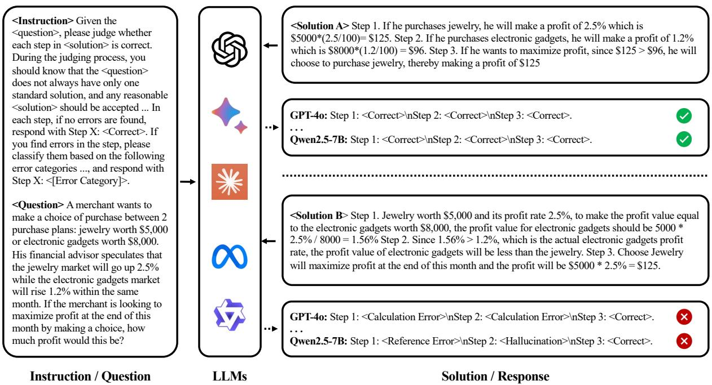
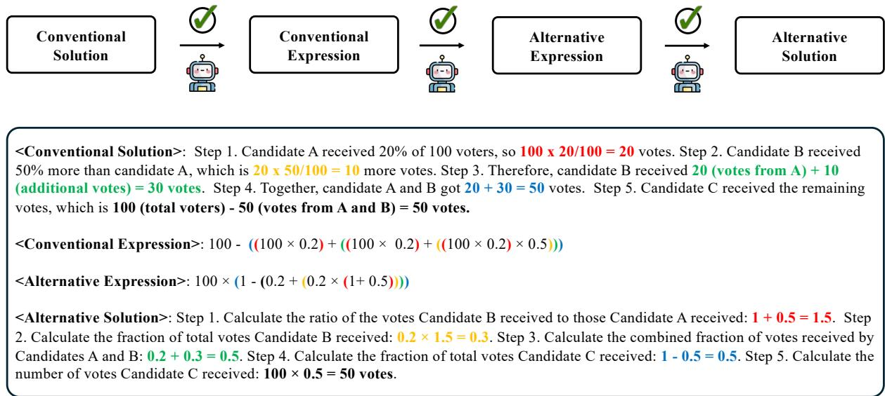
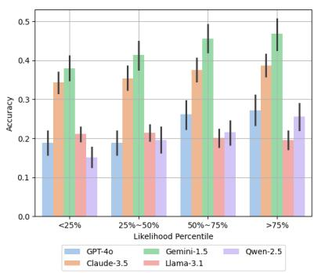
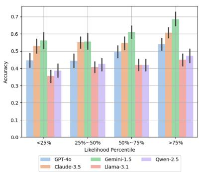
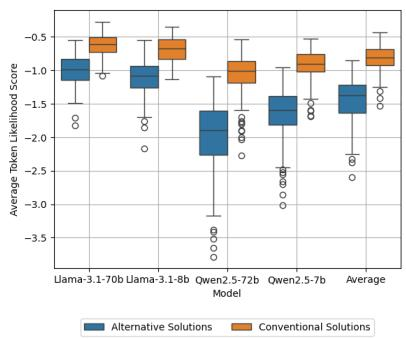
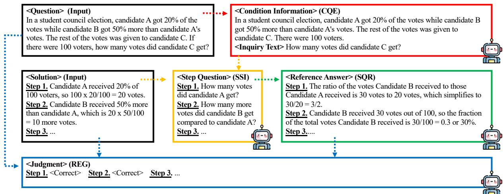
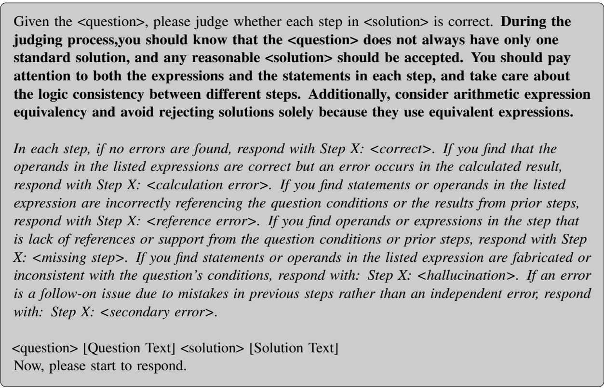
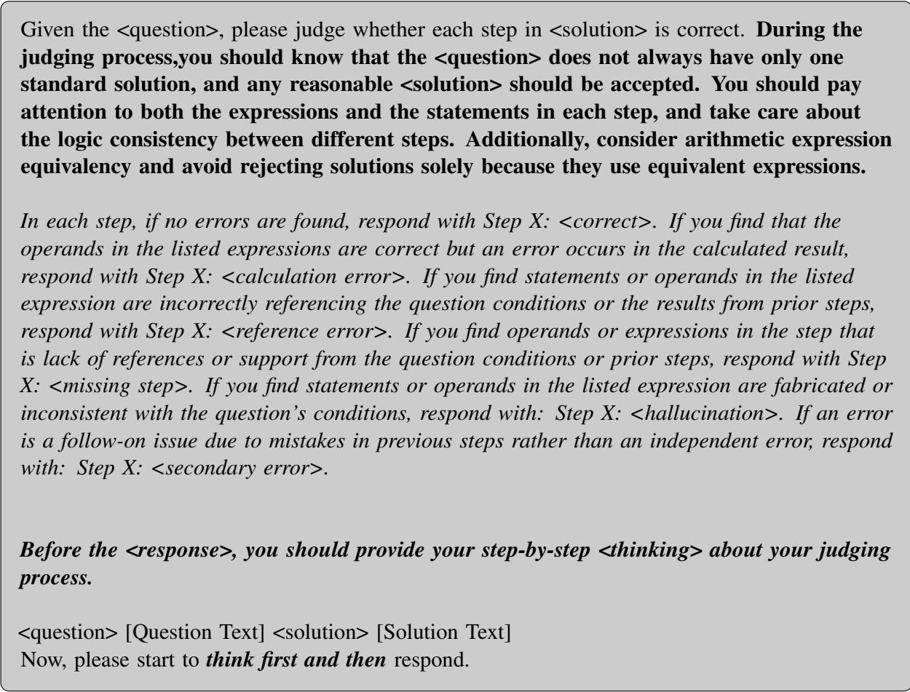

# Ask-Before-Detection: Identifying and Mitigating Conformity Bias in LLM-Powered Error Detector for Math Word Problem Solutions

Hang Li1, Tianlong Xu2, Kaiqi Yang1, Yucheng Chu1, Yanling Chen1, Yichi Song3, Qingsong Wen2, Hui Liu 1

1Michigan State University, 2Squirrel Ai Learning, 3Carleton College, {lihang4,kqyang,chuyuch2,chenya67,liuhui7}@msu.edu {tianlongxu,qingsongwen}@squirrelai.com, {songc2}@carleton.edu

## Abstract

The rise of large language models (LLMs) offers new opportunities for automatic error detection in education, particularly for math word problems (MWPs). While prior studies demonstrate the promise of LLMs as error detectors, they overlook the presence of multiple valid solutions for a single MWP. Our preliminary analysis reveals a significant performance gap between conventional and alternative solutions in MWPs, a phenomenon we term conformity bias in this work. To mitigate this bias, we introduce the Ask-Before-Detect (AskBD) framework, which generates adaptive reference solutions using LLMs to enhance error detection. Experiments on 200 examples of GSM8K show that AskBD effectively mitigates bias and improves performance, especially when combined with reasoning-enhancing techniques like chain-of-thought prompting. The code and data are available at https://github.com/ dse-ai-edu/AskBD.

## 1 Introduction

Automatic Error Detection (AED) has been a prominent research topic in education over the past few decades (Leacock et al., 2014). Supported by rapid advancements in natural language processing (NLP) technologies, particularly in language modeling (Min et al., 2023), AED research has achieved notable success in language education (Huang et al., 2023). The recent emergence of large language models (LLMs) presents new opportunities for AED studies. Leveraging their exceptional capabilities in logical reasoning (Pan et al., 2023), LLMs have become promising tools helping the quick development of AED in more challenging scenarios including programming (Messer et al., 2024) and mathematics learning (Jiang et al., 2024; Yen and Hsu, 2023). Recent studies have introduced benchmark datasets to demonstrate the potential of

LLMs in AED across diverse domains (Yan et al., 2024). Moreover, due to the reasoning-intensive nature of error detection in mathematical problems, recent research has employed AED tasks on math word problems (MWPs) to evaluate the comparative reasoning capabilities of LLMs (Li et al., 2024). Studies (Zhou et al., 2024) have indicated that identifying errors in MWPs, rather than generating correct solutions, serves as a more effective metric for assessing differences in the reasoning capabilities of LLMs. In this paper, we explore AED for MWPs. Specifically, building on prior studies, we define the AED task as identifying both the erroneous step and its error category from a given input pair consisting of a question and its solution. It is important to note that a correct result requires accurate identification of both the error step and the error category.

While previous studies (Li et al., 2024; Zhou et al., 2024) have explored various methods for evaluating the error detection capabilities of LLMs on MWPs, these approaches predominantly focus on generating erroneous solutions based solely on the conventional solutions provided in the dataset. In practice, however, a single MWP can have multiple valid solutions, leaving the performance of LLMs on alternative solutions largely unexplored. In Figure 1, we present an illustrative example where both the conventional and alternative solutions are submitted to an LLM-powered error detector, yet only the conventional solution receives the correct detection result. Motivated by this observation, we propose an automatic method for generating alternative solutions and evaluate the behavior of LLM-powered error detectors on 200 pairs of conventional and alternative solutions. Our preliminary results in section 2.3.1 reveal an average 7% detecting accuracy performance gap between conventional and alternative solutions, with even advanced closed-source models exhibiting the same limitation. These findings suggest that current

  
Figure 1: An illustration of error detection in MWP solutions: <Solution A> represents the conventional solution, which achieves accurate error detection with LLM-powered error detectors. In contrast, <Solution B>, while also correct, encounters erroneous error detection results across all LLM-powered error detectors.

LLM-based error detectors display a pronounced conformity bias, favoring a specific solution format while rejecting others. This bias is particularly concerning in educational contexts, as it discourages students from exploring diverse problemsolving approaches and stifles creativity.

To investigate the underlying causes of conformity bias and develop effective strategies to mitigate it, we conduct further preliminary studies in Section 2.3, which examines the common patterns in the behavior of LLM-powered error detectors when evaluating diverse solutions. Our findings reveal that error detection accuracy is closely correlated with the likelihood scores assigned by LLMs to solutions, with higher likelihood scores corresponding to improved detection performance. Since alternative solutions typically receive lower likelihood scores compared to conventional ones, conformity bias naturally emerges. This observation points to a potential remedy: adjusting the likelihood scores of solutions. However, this approach faces two significant challenges. First, fine-tuning advanced models requires high-quality datasets and incurs substantial costs. Second, while fine-tuning may improve likelihood scores for samples within the training dataset, its generalizability to novel solutions remains uncertain. During our investigation into the impact of introducing a reference answer during error detection, we observed that conformity bias is significantly reduced across all LLMs. This finding inspires us to leverage reference answers as a viable strategy for mitigating bias. However, uniformly providing a standard reference answer for every solution is suboptimal in practice. Misalignment between the reasoning behind different solutions and the reference answer can sometimes degrade final detection performance. To address this, we propose the Ask-Before-Detection (AskBD) framework, which generates adaptive reference answers through step-bystep question-answering techniques. By leveraging the strong problem-solving capabilities of LLMs and employing a decomposed, question-guided approach, the reference answers can be generated with high accuracy, even using less capable models. Incorporating these generated reference solutions significantly mitigates conformity bias in LLM-powered error detectors for MWP solutions. Furthermore, the adaptability of the generated references enhances the overall performance of LLMpowered error detector across both conventional and alternative solutions.

## 2 Preliminary Study

In this section, we present our preliminary studies aimed at identifying and understanding the presence of conformity bias in LLM-powered error detectors. Specifically, we begin by describing our automated method for preparing an error detection dataset featured with paired conventional and alternative solutions. Then, we analyze the relationship between likelihood scores and the behavior patterns of LLM-powered error detectors. Finally, we present our observations on how incorporating reference solution text influences the performance and behavior of error detectors.

  
Figure 2: The ASP pipeline to generate permuted solution. The corresponding relationships between the calculations in each step and the parts enclosed by different parentheses in expression are highlighted using matching colors.

## 2.1 Automatic Solution Permutation

Building a high-quality alternative solution dataset is critical to our preliminary study, as low-quality alternatives, such as simple semantic paraphrases of conventional solutions, fail to effectively expose the "conformity bias" in LLM-powered error detectors. During our initial exploration, we observed that directly using simple prompts to query LLMs for automatically generating alternative solutions presents significant challenges. Specifically, LLMs often produce paraphrased versions of conventional solutions unless detailed and specific instructions about the solving strategy are provided during the generation process. To address this, we propose the Automatic Solution Permutation (ASP) method, which leverages the correspondence between conventional solutions and their solving expressions. Using these expressions as specific instructions helps LLMs move beyond paraphrasing behavior, enabling the generation of high-quality alternative solutions.

The ASP method operates in three stages: Extract, Permute, and Explain. At each stage, LLMs are prompted to execute specific tasks independently. In the Extract stage, ASP encapsulates the steps of a conventional solution into a single mathematical expression. To ensure accuracy, these expressions are executed, and any that fail to produce correct answer values are discarded. In the Permute stage, ASP generates new expressions by applying operations such as factorization, distribution, and order rearrangement, which transform the expressions while preserving their mathematical equivalence. A similar filtering process is applied to these permuted expressions to ensure correctness. Finally, in the Explain stage, the permuted expressions are provided to LLMs to guide the generation of high-quality alternative solutions. By instructing the LLMs to interpret the brackets within each expression as distinct steps, the ASP method produces detailed, step-by-step alternative solutions. Figure 2 illustrates the ASP pipeline and provides an example of paired conventional and alternative solutions alongside their corresponding solving expressions.

In our study, we use GPT-4o as the backbone LLM for each stage of the ASP method. To begin, we randomly sample 200 question-and-answer pairs from the test split of GSM8K (Cobbe et al., 2021) and use them to construct our conventional dataset, . For each sample in , we apply ASP three times to generate three candidate permuted solutions for each conventional solution. Subsequently, a graduate student from the education department reviews the quality of all the generated alternative solutions and selects the highest-quality alternative solution for each convention solution.

These selected solutions are then compiled to form the alternative dataset, $\mathcal { D } ^ { \prime }$

## 2.2 Erroneous Solution Generation

After preparing the alternative solution dataset, the next step is to generate erroneous solutions. Building on prior work (Li et al., 2024), which categorize common errors in solutions to MWPs into categories, we choose four representative error types that commonly encountered in real-world error grading scenarios: calculation errors $( \mathcal { E } _ { C } )$ reference errors $( { \mathcal { E } } _ { R } )$ , missing steps $( { \mathcal { E } } _ { M } )$ , and hallucinations $( \mathcal { E } _ { H } )$ , for our study. It is worth noting that this study specifically aims to explore conformity bias, and therefore, we do not include all possible error types. To minimize the risk of experimental noise caused by ambiguous definitions, we defined these error types in a straightforward and easily distinguishable manner. Detailed descriptions of each error type are provided in Table 8 in Appendix C. To simulate erroneous solutions, we injected these errors into correct solutions using a generation strategy inspired by prior work (Li et al., 2024). During the injection process, the error type was controlled through a hyper-parameter, while the specific error location (error step number) was determined randomly. This approach enables controlled testing of the AED’s ability to handle and identify various error scenarios effectively. For each example in $\mathcal { D }$ and $\mathcal { D } ^ { \prime }$ , we generated four corresponding erroneous solutions, each associated with one of the four error types. This process yielded a total of 2,000 examples, which were prepared for subsequent analysis.

## 2.3 Analysis and Findings

Before delving into the details about our analysis and findings, we first introduce the evaluation metric used for our following analyses. Specifically, since the locations and categories of injected errors are automatically labeled during the error injection process for each solution, we task the LLM-powered error detector with identifying both the error locations and their types. The evaluation metric is the identification accuracy across both correct and erroneous solutions.

## 2.3.1 Conformity Bias Identification

To identify conformity bias, we employ a widelyused LLM-powered error detection approach, leveraging prompt engineering techniques outlined in previous studies (Li et al., 2024). In addition, the instruction text informs the LLMs that alternative solutions to the given question exist and emphasizes that all reasonable solutions should be accepted. To minimize variability in performance due to ambiguity in error categories, we provide explicit definitions for each error category within the prompt text, ensuring clarity for the LLMs. The prompt used for the error detection task is illustrated in Figure 5 in Appendix D.

Table 1: Error detection performance on ordinary ( ) and alternative $( \mathcal { D } ^ { \prime } )$ solutions. The performance gap is calculated as $\Delta = | \mathcal { D } ^ { \prime } - \mathcal { D } |$ . Results marked with \* indicate statistical significance based on student’s t-test.
<table><tr><td rowspan="2">Model</td><td colspan="3">Small</td><td colspan="3">Large</td></tr><tr><td> $\mathcal { D }$ </td><td> $\mathcal { D } ^ { \prime }$ </td><td> $\Delta$ </td><td>D</td><td> $\mathcal { D } ^ { \prime }$ </td><td> $\Delta$ </td></tr><tr><td>GPT-40</td><td>27.2</td><td>18.4</td><td>8.8*</td><td>52.9</td><td>43.4</td><td> $9 . 5 ^ { * }$ </td></tr><tr><td>Claude-3.5</td><td>38.2</td><td>34.7</td><td> $3 . 5 ^ { * }$ </td><td>59.9</td><td>52.7</td><td> $7 . 2 ^ { * }$ </td></tr><tr><td>Gemini-1.5</td><td>46.4</td><td>39.5</td><td> $6 . 9 ^ { * }$ </td><td>65.2</td><td>55.6</td><td> $9 . 6 ^ { * }$ </td></tr><tr><td>Llama-3.1</td><td>20.2</td><td>20.9</td><td>0.7</td><td>44.3</td><td>37.2</td><td> $7 . 2 ^ { * }$ </td></tr><tr><td>Qwen-2.5</td><td>24.7</td><td>16.3</td><td> $8 . 4 ^ { * }$ </td><td>46.3</td><td>38.8</td><td>7.5*</td></tr></table>

To comprehensively analyze the conformity bias exhibited by various LLMs, we conducted experiments with 10 representative models. These include three closed-source series with their large (small) versions (e.g., GPT-4o (Mini) (Bubeck et al., 2023), Gemini-1.5-Pro (Flash) (Team et al., 2023), Claude-3.5-Sonnet (Haiku) (Anthropic, 2024)) and two open-source series with their large (small) counterparts (e.g., Llama-3.1-70B (8B) (Touvron et al., 2023) and Qwen-2.5-72B (7B) (Yang et al., 2024)). Table 1 presents a comparison of the average error detection accuracy across both the conventional solution and the alternative solution $\mathcal { D } ^ { \prime }$ dataset. The results clearly demonstrate a consistent performance gap between the two datasets, confirming the presence of conformity bias in LLM-based error detection tasks.

## 2.3.2 Solution Likelihood Score Analysis

To investigate the underlying causes of conformity bias, we first chose to use the log-likelihood score, denoted as log $L _ { \theta } ( s | q )$ , returned by the LLM for a given solution text s to the question text $q ,$ as an indicator. This likelihood score is utilized as it reflects the LLM’s confidence in the solution text relative to the question text. If a solution known to be correct receives a low confidence score from the LLM, it suggests that the LLM does not fully understand the solution. Conversely, if the correct solution receives a high score, it indicates that the

  
(a) Small models

  
(b) Large models

  
(c) Likelihood distributions  
Figure 3: Average error detection accuracy across samples grouped by the 25th, 50th, and 75th percentiles of $I _ { u }$

LLM is proficient with the solution. The detailed calculation method is presented below:

$$
\log L _ { \theta } ( s | q ) = \sum _ { i = 1 } ^ { | s | } \log L _ { \theta } ( s _ { i } | [ q , s _ { 1 : ( i - 1 ) } ] )\tag{1}
$$

where θ represents the parameters of the LLM, $[ \cdot , \cdot ]$ is text concatenation, $s _ { i }$ is the i-th token of the solution text. However, directly comparing the likelihood scores calculated by Equation 1 for solutions of varying lengths is still problematic, as the likelihood score is inversely proportional to the length of s. In other words, shorter solutions with fewer tokens tend to have higher scores than longer ones. To address this issue, we finally adopt the average token log-likelihood score for our analysis in subsequent studies.

$$
\log \bar { L } _ { \theta } ( s | q ) = \frac { \log L _ { \theta } ( s | q ) } { | s | }\tag{2}
$$

In Figure 3b and Figure 3a, we present the average error detection accuracy across different likelihood score groups. Specifically, given the likelihood score to both convention and alternative solutions, we group them based on their likelihood score percentiles. For simplicity, we use the four quarters in our experiment. It is important to note that, since the likelihood scores of closed-source models are unavailable, we use the average scores of all open-source LLMs as a pseudo-indicator for this analysis. From the figure, we observe that the larger quarter groups with higher indicator values exhibit a clear advantage over those with the smaller quarter ones. In addition, we plot the likelihood score distribution comparisons between the solution from and $\mathcal { D } ^ { \prime }$ in Figure 3c. From these plot, we can draw a clear conclusion that the conformity bias in current LLM to error detection tasks is caused by its decreased understanding to those alternative solution.

## 2.3.3 Reference-based Detection Findings

Directly improving the likelihood scores of alternative solutions poses inherent challenges. Strategies like fine-tuning large language models (LLMs) primarily improve likelihood scores for training samples, but their effectiveness on unseen alternative solutions remains unpredictable. Building on prior work (Daheim et al., 2024), which demonstrated that introducing reference answers during error detection enhances performance on conventional solutions, we extend this approach to alternative solutions. It is important to note that, in realworld error detection scenarios, reference answers are not always available. Even when they are, conventional solutions are more commonly provided. Take this into consideration, we conducted experiments comparing two reference-based detection setups: (1) uniformly using conventional solutions as references and (2) adaptively using corresponding solutions as references. The detailed results are presented in Table 3 and Table 2, respectively.

Table 2: Error detection performance w/ using corresponding solution as reference solution for both ordinary ( ) and alternative ( ′) solutions. The performance gap is calculated by $\Delta = | \mathcal { D } ^ { \prime } - \mathcal { D } |$ . Results marked with \* indicate statistical significance based on student’s t-test.
<table><tr><td rowspan="2">Model</td><td colspan="2">Small</td><td colspan="3">Large</td></tr><tr><td>D D&#x27;</td><td>∆</td><td>D</td><td>D&#x27;</td><td>∆</td></tr><tr><td>GPT-40</td><td>60.0 56.5</td><td>3.5*</td><td>75.5</td><td>73.8</td><td>1.7*</td></tr><tr><td>Claude-3.5</td><td>60.4 57.9</td><td>2.5*</td><td>84.0</td><td>81.6</td><td>2.4*</td></tr><tr><td>Gemini-1.5</td><td>69.7 66.7</td><td>3.0*</td><td>85.3</td><td>83.7</td><td>1.6*</td></tr><tr><td>Llama-3.1</td><td>34.6 33.7</td><td>0.9</td><td>77.5</td><td>79.4</td><td>1.9*</td></tr><tr><td>Qwen-2.5</td><td>54.4 51.2</td><td>3.2*</td><td>59.3</td><td>60.8</td><td>1.5*</td></tr></table>

Table 3: Error detection performance w/ using convention solution as reference for both ordinary ( ) and alternative $( \mathcal { D } ^ { \prime } )$ solutions. The performance gap is calculated by $\Delta = | \mathcal { D } ^ { \prime } - \mathcal { D } |$ . Results marked with \* indicate statistical significance based on student’s t-test.
<table><tr><td rowspan="2">Model</td><td colspan="3">Small</td><td colspan="3">Large</td></tr><tr><td> $\mathcal { D }$ </td><td> $\mathcal { D } ^ { \prime }$ </td><td> $\Delta$ </td><td>D</td><td> $\mathcal { D } ^ { \prime }$ </td><td> $\Delta$ </td></tr><tr><td>GPT-40</td><td>60.0</td><td>32.0</td><td>28.0*</td><td>75.5</td><td>53.3</td><td>22.2*</td></tr><tr><td>Claude-3.5</td><td>60.4</td><td>38.9</td><td>21.5*</td><td>84.0</td><td>59.4</td><td>24.6*</td></tr><tr><td>Gemini-1.5</td><td>69.7</td><td>50.8</td><td>18.9*</td><td>85.3</td><td>67.7</td><td>17.6*</td></tr><tr><td>Llama-3.1</td><td>34.6</td><td>20.5</td><td>14.1*</td><td>77.5</td><td>48.8</td><td>28.7*</td></tr><tr><td>Qwen-2.5</td><td>54.4</td><td>22.2</td><td>32.2*</td><td>59.3</td><td>43.5</td><td>15.8*</td></tr></table>

By analyzing the results across Table 1, Table 3, and Table 2, it is evident that introducing reference solutions improves error detection accuracy for both datasets, and $\mathcal { D } ^ { \prime }$ . However, the choice of reference solution significantly impacts performance. While introducing corresponding reference solutions effectively mitigates bias, uniformly using conventional solutions tends to amplify it. This contrast highlights the critical importance of selecting appropriate reference solutions to enhance error detection in alternative scenarios.

## 3 Method

The findings in Section 2.3.3 suggest that incorporating a reference solution during the detection process is an effective approach to addressing conformity bias. However, the choice of the reference solution plays a critical role. Building on this insight, we propose the Ask-Before-Detection (AskBD) framework, which leverages the generative capabilities of large language models (LLMs) to create adaptive reference solutions tailored to each provided solution during the grading process. The AskBD offers several advantages. First, it utilizes the inherent problem-solving capabilities of LLMs rather than relying on fine-tuning, which makes AskBD easily extendable to various solutions. Second, by adaptively generating reference solutions, the framework ensures that these references are well-aligned with the given answers, significantly reducing the risk of mismatches that could amplify bias. Furthermore, the AskBD is orthogonal to other reasoning techniques, such as chain-of-thought (CoT) (Wei et al., 2022a), meaning that it can complement and enhance their performance. By integrating AskBD with these algorithms, the error detection capabilities of LLMs can be further improved. The overall structure of the AskBD is illustrated in Figure 4.

Algorithm 1: Ask-Before-Detection   
Input: Question text $q ,$ solution text s, large   
lanauge model $f _ { \theta } ,$ , prompt text for   
each component $\mathcal { P } _ { ( \cdot ) }$   
1 Condition and question extractor (CQE):   
Extract condition information $q _ { c }$ and   
inquiry text $q _ { i }$ from the question text $q .$   
$( q _ { c } , q _ { i } ) = f _ { \theta } ( [ \mathcal { P } _ { c q e } , q ] ) ;$   
2 Solution Step Inquirer (SSI): Convert   
solution text s into step-wise question list   
text $Q$ and append inquiry text $q _ { i }$ at the   
end. $Q = [ f _ { \theta } ( [ \mathcal { P } _ { s s i } , s ] ) , q _ { i } ] ;$   
3 Step Question Responder (SQR): Generate   
reference solution r by summarizing the   
answers to each question in $Q$ using   
condition text $q _ { c } . \ r = f _ { \theta } ( [ \mathcal { P } _ { s q r } , q _ { c } , Q ] )$   
4 Reference-Enhanced Grader (REG):   
Generate the error detection result (error   
location $y _ { s } ,$ , error type $y _ { e } )$ based on the   
input $( q , s , r ) . y = f _ { \theta } ( [ \mathcal { P } _ { r e g } , q , s , r ] )$   
5 return $y _ { s } , y _ { e }$

AskBD consists of four components, executed sequentially to generate an adaptive reference answer tailored to the input solution. First, the Condition and Question Extractor (CQE) processes the input question text, $q ,$ by extracting two key elements from the original question stem: condition information and inquiry text. The condition information, $q _ { c } ,$ , represents the known facts or context provided in the question, while the inquiry text, qi, specifies the task or problem posed by the question. Then, the Solution Step Inquirer (SSI) focuses on generating step-specific questions based on the conclusions of each step in the provided solution, s. To improve the stability of the generated results, the SSI first summarizes the conclusion of each step before formulating corresponding questions. These step-specific questions are compiled into a question list, $Q ,$ , with the inquiry text $q _ { i }$ always appended to the end of the list to ensure that the original question’s task is addressed in the generated reference answer. Next, after both the condition text $q _ { c }$ and the question list $Q$ are prepared, the Step Question Responder (SQR) generates responses to each question in $Q$ and reorganizes them into a referenced solution, r. Finally, the Reference-Enhanced Grader (REG) uses the referenced solution r along with the inputs $q$ and s to produce the final grading results. More details can be found in Algorithm 1.

  
Figure 4: An overview of AskBG framework where steps are marked with colors. <Question> and <Solution> are 1the inputs and <Reference Answer> is generated by the framework, which used to generate the final response.

## 4 Experiment

In this section, we present experiments to validate the effectiveness of AskBD. Experiments are designed to address the following research questions:

• RQ1: Does AskBD help mitigate conformity bias in error detection?

• RQ2: What additional performance advantages does AskBD provide?

• RQ3: How compatible is AskBD with other reasoning techniques, such as chain-of-thought?

## 4.1 Experimental Settings

To answer above research questions, we use dataset generated during the preliminary study introduced in Section 2. The detailed statistics of the dataset are shown as Table 6 in Appendix A. To evaluate the generalizability of AskBD, we implement it using the same 10 LLMs described in Section 2, along with two math-specific models, including Qwen2.5- Math. Detailed information about each model is provided in Table 7 in Appendix B. Additionally, we incorporate the CoT reasoning approach into the prompts to assess its compatibility with AskBD, the prompt is shown as Figure 6 in Appendix E. Each experiment is conducted using three different random seeds, and we report the mean error detection accuracy in the results. As this is the first study to systematically examine the occurrence of conformity bias in LLM-powered error detection for MWP solutions, the results from the preliminary study sections serve as one baseline. Furthermore,

CoT, being an orthogonal method to AskBD, is treated as another baseline for comparison.

## 4.2 Result and Discussion

In Table 4, we present the comparison between baseline methods and AskDB over both the conventional solutions and alternative solution $\mathcal { D } ^ { \prime }$ To address RQ1, we analyze the values in the $\Delta$ columns between $\mathcal { M } _ { 2 }$ and $\mathcal { M } _ { 0 }$ . The table clearly demonstrates that AskDB is effective in mitigating conformity bias in error detection results for advanced versions of LLMs. However, for base LLMs, the benefits of naively applying AskDB are less evident. Among the five LLM frameworks, only Gemini exhibits a reduced performance gap between and $\mathcal { D } ^ { \prime }$ . We attribute this to the relatively weaker reasoning capabilities of base models. With the naive instruction prompt, these models fail to fully leverage the valuable information provided by the reference solutions, thereby limiting the effectiveness of AskDB in these cases. Comparing $\mathcal { M } _ { 1 }$ with $\mathcal { M } _ { 2 }$ , we observe that the CoT prompt strategy also helps mitigate conformity bias in LLM-powered error detectors. Nevertheless, in most advanced models, AskDB consistently outperforms CoT in narrowing the gap between conventional and alternative solutions.

To answer RQ2, we compare $\mathcal { M } _ { 2 }$ with $\mathcal { M } _ { 0 }$ in the and $\mathcal { D } ^ { \prime }$ columns. The results indicate a consistent improvement in error detection accuracy $\mathrm { { a f } - }$ ter adopting the AskDB framework. This suggests that AskDB not only helps reduce the performance gap between conventional and alternative solutions but also enhances overall detection performance. Comparing $\mathcal { M } _ { 1 }$ with $\mathcal { M } _ { 2 }$ , we find that AskDB and

Table 4: Error detection performance w/ different baseline methods $( . M _ { 0 } { : }$ Naive prompt, $M _ { \mathrm { 1 } } { \mathrm { : C o T } }$ prompt, $\mathcal { M } _ { 2 } \colon$ Naive prompt + AskBD, $\mathcal { M } _ { 3 } \colon$ CoT prompt + AskBD) on ordinary solutions ( ) and alternative solutions $( \mathcal { D } ^ { \prime } )$ . The performance gap is calculated by $\Delta = | \mathcal { D } - \mathcal { D } ^ { \prime } |$ . The best performed results in each group is marked with underline.
<table><tr><td rowspan="2">Model</td><td colspan="4"> $\mathcal { D } \uparrow$ </td><td colspan="4"> $\mathcal { D } ^ { \prime } \mathrm { \uparrow }$ </td><td colspan="4"> $\Delta \downarrow$ </td></tr><tr><td> $\mathcal { M } _ { 0 }$ </td><td> $\mathcal { M } _ { 1 }$ </td><td> $\mathcal { M } _ { 2 }$ </td><td> $\mathcal { M } _ { 3 }$  1</td><td> $\mathcal { M } _ { 0 }$ </td><td> $\mathcal { M } _ { 1 }$ </td><td> $\mathcal { M } _ { 2 }$ </td><td> $\mathcal { M } _ { 3 }$ </td><td> $\mathcal { M } _ { 0 }$ </td><td> $\mathcal { M } _ { 1 }$ </td><td> $\mathcal { M } _ { 2 }$ </td><td> $\mathcal { M } _ { 3 }$ </td></tr><tr><td></td><td colspan="14">Small</td></tr><tr><td>GPT-40</td><td>27.2</td><td>47.7</td><td>48.8</td><td>59.1</td><td>18.4</td><td>36.7</td><td>37.8</td><td>48.5</td><td>8.8</td><td>11.0</td><td>11.0</td><td>10.6</td></tr><tr><td>Claude-3.5</td><td>38.2</td><td>51.1</td><td>50.7</td><td>56.6</td><td>34.7</td><td>48.5</td><td>44.0</td><td>51.8</td><td>3.5</td><td>2.6</td><td>6.7</td><td>4.8</td></tr><tr><td>Gemini-1.5</td><td>46.4</td><td>54.2</td><td>61.7</td><td>62.4</td><td>39.5</td><td>49.5</td><td>55.5</td><td>59.5</td><td>6.9</td><td>4.7</td><td>6.2</td><td>2.9</td></tr><tr><td>Llama-3.1</td><td>20.2</td><td>34.6</td><td>23.5</td><td>37.9</td><td>20.9</td><td>31.0</td><td>23.6</td><td>32.4</td><td>0.7</td><td>3.6</td><td>0.1</td><td>5.4</td></tr><tr><td>Qwen-2.5</td><td>24.7</td><td>40.3</td><td>34.4</td><td>44.3</td><td>16.3</td><td>35.3</td><td>25.0</td><td>38.3</td><td>8.4</td><td>5.0</td><td>9.5</td><td>6.0</td></tr><tr><td>Qwen-2.5-Math</td><td>24.2</td><td>23.3</td><td>23.4</td><td>23.8</td><td>20.7</td><td>23.0</td><td>22.2</td><td>23.7</td><td>3.5</td><td>0.3</td><td>1.2</td><td>0.1</td></tr><tr><td>Large</td><td colspan="14"></td></tr><tr><td>GPT-40</td><td>52.9</td><td>63.4</td><td>67.1</td><td>66.3</td><td>43.4</td><td>59.3</td><td>58.0</td><td>61.4</td><td>9.5</td><td>4.1</td><td>9.1</td><td>4.9</td></tr><tr><td>Claude-3.5</td><td>59.0</td><td>61.7</td><td>72.5</td><td>73.1</td><td>52.7</td><td>57.0</td><td>67.4</td><td>69.5</td><td>6.3</td><td>4.7</td><td>5.2</td><td>3.6</td></tr><tr><td>Gemini-1.5</td><td>65.2</td><td>65.6</td><td>76.0</td><td>71.8</td><td>55.6</td><td>58.1</td><td>72.2</td><td>68.8</td><td>9.6</td><td>7.5</td><td>3.8</td><td>3.0</td></tr><tr><td>Llama-3.1</td><td>44.3</td><td>64.0</td><td>63.4</td><td>71.9</td><td>37.2</td><td>56.4</td><td>57.1</td><td>67.9</td><td>7.2</td><td>7.6</td><td>6.3</td><td>4.0</td></tr><tr><td>Qwen-2.5</td><td>46.3</td><td>57.4</td><td>45.4</td><td>60.2</td><td>38.8</td><td>50.6</td><td>43.0</td><td>58.2</td><td>7.5</td><td>6.8</td><td>2.4</td><td>2.0</td></tr><tr><td>Qwen-2.5-Math</td><td>43.5</td><td>41.2</td><td>49.6</td><td>48.2</td><td>39.9</td><td>40.0</td><td>47.7</td><td>46.9</td><td>3.6</td><td>1.2</td><td>1.9</td><td>1.3</td></tr></table>

CoT prompts enable different LLMs to achieve better results. In summary, AskDB is more compatible with advanced models, while CoT demonstrates greater efficacy with base-sized models.

To address RQ3, we compare $\mathcal { M } _ { 3 }$ with $\mathcal { M } _ { 1 }$ The results reveal that AskDB is highly compatible with other reasoning-enhancing techniques such as CoT prompts in the context of error detection. For advanced model of Llama-3.1 and base model of Gemini-1.5, combining AskDB with CoT yields significant performance improvements compared to using either method independently. These findings confirm that AskDB is a robust approach for mitigating conformity bias. Moreover, its compatibility with other reasoning-enhancement techniques achieves the best overall performance in error detection tasks.

## 4.3 Further Studies

It is valuable to explore AskBD’s performance when faced with multiple errors, as successful detection of these errors could offer a comprehensive view of the student’s problems in a single instance. To explore this, we sampled 100 solutions each from the original and alternative solutions, introducing two sequential errors into them. To evaluate performance, we used two metrics: (1) first error detection accuracy and (2) overall error detection accuracy. The results are shown in the Table 5. From the table, we can confirm that our AskBD $\left( \mathcal { M } _ { 3 } \right)$ demonstrates robust performance in detecting the first error, even when multiple errors are present in the solution. Although the overall error detection accuracy is lower than the first error detection accuracy, we can still confirm that the reference-based strategy introduced in AskBD helps LLMs achieve better performance compared to the baselines.

Table 5: Error detection performance w/ different baseline methods $( { \mathcal { M } } _ { 0 } { \mathrm { : } }$ Naive prompt, $M _ { 1 } { : } \mathrm { C o T }$ prompt, $\mathcal { M } _ { 2 } \colon$ Naive prompt + AskBD, $\mathcal { M } _ { 3 } \colon$ CoT prompt + AskBD) on solutions with multiple errors.
<table><tr><td rowspan="2">Mode</td><td colspan="4"> $\mathrm { F i r s t }$ </td><td colspan="3">Overall</td></tr><tr><td> $\mathcal { M } _ { \mathrm { 0 } }$ </td><td> $\mathcal { M } _ { 1 }$ </td><td> $\mathcal { M } _ { 2 }$ </td><td> $\mathcal { M } _ { 3 }$ </td><td>M0  $\mathcal { M } _ { 1 }$ </td><td> $\mathcal { M } _ { 2 }$ </td><td> $\mathcal { M } _ { 3 }$ </td></tr><tr><td colspan="2"></td><td colspan="6">Small</td></tr><tr><td>GPT-40</td><td>18.8</td><td>35.9</td><td>38.6</td><td>65.8</td><td>18.8</td><td>35.9</td><td>38.6 45.2</td></tr><tr><td>Claude-3.5</td><td>19.0</td><td>56.5</td><td>38.3</td><td>59.5</td><td>18.1</td><td>40.6</td><td>29.0 40.3</td></tr><tr><td>Gemini-1.5</td><td>20.5</td><td>38.2</td><td>63.5</td><td>69.5</td><td>16.3</td><td>26.7 38.8</td><td>44.8</td></tr><tr><td colspan="2"></td><td colspan="6">Large</td></tr><tr><td>GPT-40 Claude-3.5</td><td>41.7</td><td>62.0</td><td>69.0</td><td>72.2</td><td>31.9</td><td>41.0</td><td>47.4 47.3</td></tr><tr><td></td><td>31.3</td><td>57.3</td><td>62.2</td><td>71.7</td><td>29.3</td><td>48.9 45.6</td><td>54.6</td></tr><tr><td>Gemini-1.5</td><td>57.3</td><td>65.0</td><td>80.2</td><td>80.0</td><td>44.1 45.8</td><td>61.2</td><td>57.1</td></tr></table>

## 5 Related Work

## 5.1 Automatic Error Detection

Automatic error detection (AED) is a widely studied research task in the field of education (Zamora et al., 2018). Since the advent of pre-trained language models (PLMs) such as BERT (Kenton and Toutanova, 2019), AED algorithms in language education have achieved significant advancements (Bryant et al., 2023). Applications like grammar error detection have been widely implemented in the teaching of languages (He, 2021). Moreover, by integrating PLMs with acoustic models, AED has also shown promising results in detecting pronunciation errors (Wei et al., 2022b). The recent emergence of large language models (LLMs) has further expanded the scope of AED research beyond language education. Leveraging their advanced capabilities in mathematical reasoning (Ahn et al., 2024), task planning (Huang et al., 2024), and even programming (Nam et al., 2024), LLMs have been increasingly adopted in recent studies to develop AED solutions for complex educational subjects, such as programming (Gabbay and Cohen, 2024) and mathematics (Yan et al., 2024).

## 5.2 Math Reasoning in LLMs

Reasoning capability is one of the most attractive features reported among the emergent capabilities of large language models (LLMs). Building on approaches such as chain-of-thought (Wei et al., 2022a), LLMs have demonstrated impressive performance in solving complex logical reasoning problems. However, recent studies (Prabhakar et al., 2024) have raised skepticism about these reasoning capabilities, suggesting they may primarily originate from memorization rather than genuine reasoning ability. To address these concerns, numerous new reasoning tasks and benchmark datasets have been introduced (Srivastava et al., 2024). Among these, approaches that involve error detection and correction of flawed solutions have gained popularity in the community as a means to evaluate true mathematical reasoning capabilities, aided by the availability of extensive benchmark datasets (Zhou et al., 2024). To reduce the burden of tedious human annotation, many recent works have proposed algorithms to automatically generate inputs for these tasks based on existing datasets (Li et al., 2024). Through extensive experiments on these newly introduced mathematical reasoning tasks, the reasoning capabilities of LLMs have been rigorously evaluated and significantly validated. Moreover, with the rapid advancements in multi-modal large language models, investigating the multimodal mathematical reasoning capabilities of current vision-language LLMs is becoming an increasingly prominent area of research (Yan et al., 2024).

## 6 Conclusion

In this work, we investigate the behavior of LLMpowered error detectors when encountering alternative solutions commonly found in real-world math word problems. Through a preliminary study on an alternative solution error detection dataset, we identify and confirm the presence of conformity bias in LLMs during error detection. Motivated by our findings on the impact of incorporating reference solutions, we propose the Ask-Before-Detection (AskBD) framework, which enhances error detection by adaptively generating reference solutions. Comprehensive experiments on 200 examples from GSM8K demonstrate the effectiveness of AskBD in mitigating conformity bias. Furthermore, when combined with reasoning enhancement techniques like chain-of-thought (CoT) prompting, AskBD achieves significant improvements in both bias mitigation and overall performance.

## Limitation

In this work, we identify conformity bias in LLMpowered error detectors for math word problem (MWP) solutions using 200 seed samples from the GSM8K dataset. During the data preparation process, we selected four common error types in student solutions as targets to simulate real-world error detection scenarios. However, this approach has limitations, as it overlooks the occurrence of rarer but potentially more challenging error types in student solutions. To address this, we plan to collect samples from real-world student responses in future iterations of our study. Additionally, this work focuses exclusively on alternative solutions for math word problems. The phenomenon of multiple valid solutions to a single problem is widespread across other subjects in education. In future research, we aim to extend our analysis of conformity bias to these subjects, contributing to the development of LLM-powered detectors as more effective tools in educational contexts.

## Acknowledge

Hang Li, Kaiqi Yang, Yucheng Chu and Hui Liu are supported by the National Science Foundation (NSF) under grant numbers CNS2321416, IIS2212032, IIS2212144, IOS2107215, DUE2234015, CNS2246050, DRL2405483 and IOS2035472, US Department of Commerce, Gates Foundation, the Michigan Department of Agriculture and Rural Development, Amazon, Meta, and SNAP.

## References

Janice Ahn, Rishu Verma, Renze Lou, Di Liu, Rui Zhang, and Wenpeng Yin. 2024. Large language models for mathematical reasoning: Progresses and challenges. arXiv preprint arXiv:2402.00157.

Anthropic. 2024. The claude 3 model family: Opus, sonnet, haiku.

Christopher Bryant, Zheng Yuan, Muhammad Reza Qorib, Hannan Cao, Hwee Tou Ng, and Ted Briscoe. 2023. Grammatical error correction: A survey of the state of the art. Computational Linguistics, 49(3):643–701.

Sébastien Bubeck, Varun Chandrasekaran, Ronen Eldan, Johannes Gehrke, Eric Horvitz, Ece Kamar, Peter Lee, Yin Tat Lee, Yuanzhi Li, Scott Lundberg, et al. 2023. Sparks of artificial general intelligence: Early experiments with gpt-4. arXiv preprint arXiv:2303.12712.

Karl Cobbe, Vineet Kosaraju, Mohammad Bavarian, Mark Chen, Heewoo Jun, Lukasz Kaiser, Matthias Plappert, Jerry Tworek, Jacob Hilton, Reiichiro Nakano, et al. 2021. Training verifiers to solve math word problems. arXiv preprint arXiv:2110.14168.

Nico Daheim, Jakub Macina, Manu Kapur, Iryna Gurevych, and Mrinmaya Sachan. 2024. Stepwise verification and remediation of student reasoning errors with large language model tutors. arXiv preprint arXiv:2407.09136.

Hagit Gabbay and Anat Cohen. 2024. Combining llmgenerated and test-based feedback in a mooc for programming. In Proceedings of the Eleventh ACM Conference on Learning@ Scale, pages 177–187.

Zhenhui He. 2021. English grammar error detection using recurrent neural networks. Scientific Programming, 2021(1):7058723.

Xinyi Huang, Di Zou, Gary Cheng, Xieling Chen, and Haoran Xie. 2023. Trends, research issues and applications of artificial intelligence in language education. Educational Technology & Society, 26(1):112–131.

Xu Huang, Weiwen Liu, Xiaolong Chen, Xingmei Wang, Hao Wang, Defu Lian, Yasheng Wang, Ruiming Tang, and Enhong Chen. 2024. Understanding the planning of llm agents: A survey. arXiv preprint arXiv:2402.02716.

Zhuoxuan Jiang, Haoyuan Peng, Shanshan Feng, Fan Li, and Dongsheng Li. 2024. Llms can find mathematical reasoning mistakes by pedagogical chain-ofthought. arXiv preprint arXiv:2405.06705.

Jacob Devlin Ming-Wei Chang Kenton and Lee Kristina Toutanova. 2019. Bert: Pre-training of deep bidirectional transformers for language understanding. In Proceedings ofnaacL-HLT, volume 1, page 2. Minneapolis, Minnesota.

Claudia Leacock, Martin Chodorow, Michael Gamon, and Joel Tetreault. 2014. Automated grammatical error detection for language learners. Morgan & Claypool Publishers.

Xiaoyuan Li, Wenjie Wang, Moxin Li, Junrong Guo, Yang Zhang, and Fuli Feng. 2024. Evaluating mathematical reasoning of large language models: A focus on error identification and correction. arXiv preprint arXiv:2406.00755.

Marcus Messer, Neil CC Brown, Michael Kölling, and Miaojing Shi. 2024. Automated grading and feedback tools for programming education: A systematic review. ACM Transactions on Computing Education, 24(1):1–43.

Bonan Min, Hayley Ross, Elior Sulem, Amir Pouran Ben Veyseh, Thien Huu Nguyen, Oscar Sainz, Eneko Agirre, Ilana Heintz, and Dan Roth. 2023. Recent advances in natural language processing via large pre-trained language models: A survey. ACM Computing Surveys, 56(2):1–40.

Daye Nam, Andrew Macvean, Vincent Hellendoorn, Bogdan Vasilescu, and Brad Myers. 2024. Using an llm to help with code understanding. In Proceedings of the IEEE/ACM 46th International Conference on Software Engineering, pages 1–13.

Liangming Pan, Alon Albalak, Xinyi Wang, and William Yang Wang. 2023. Logic-lm: Empowering large language models with symbolic solvers for faithful logical reasoning. arXiv preprint arXiv:2305.12295.

Akshara Prabhakar, Thomas L Griffiths, and R Thomas McCoy. 2024. Deciphering the factors influencing the efficacy of chain-of-thought: Probability, memorization, and noisy reasoning. arXiv preprint arXiv:2407.01687.

Saurabh Srivastava, Anto PV, Shashank Menon, Ajay Sukumar, Alan Philipose, Stevin Prince, Sooraj Thomas, et al. 2024. Functional benchmarks for robust evaluation of reasoning performance, and the reasoning gap. arXiv preprint arXiv:2402.19450.

Gemini Team, Rohan Anil, Sebastian Borgeaud, Jean-Baptiste Alayrac, Jiahui Yu, Radu Soricut, Johan Schalkwyk, Andrew M Dai, Anja Hauth, Katie Millican, et al. 2023. Gemini: a family of highly capable multimodal models. arXiv preprint arXiv:2312.11805.

Hugo Touvron, Louis Martin, Kevin Stone, Peter Albert, Amjad Almahairi, Yasmine Babaei, Nikolay Bashlykov, Soumya Batra, Prajjwal Bhargava, Shruti Bhosale, et al. 2023. Llama 2: Open foundation and fine-tuned chat models. arXiv preprint arXiv:2307.09288.

Jason Wei, Xuezhi Wang, Dale Schuurmans, Maarten Bosma, Fei Xia, Ed Chi, Quoc V Le, Denny Zhou, et al. 2022a. Chain-of-thought prompting elicits reasoning in large language models. Advances in neural information processing systems, 35:24824–24837.

Xing Wei, Catia Cucchiarini, Roeland van Hout, and Helmer Strik. 2022b. Automatic speech recognition and pronunciation error detection of dutch non-native speech: cumulating speech resources in a pluricentric language. Speech Communication, 144:1–9.

Yibo Yan, Shen Wang, Jiahao Huo, Hang Li, Boyan Li, Jiamin Su, Xiong Gao, Yi-Fan Zhang, Tianlong Xu, Zhendong Chu, et al. 2024. Errorradar: Benchmarking complex mathematical reasoning of multimodal large language models via error detection. arXiv preprint arXiv:2410.04509.

An Yang, Baosong Yang, Binyuan Hui, Bo Zheng, Bowen Yu, Chang Zhou, Chengpeng Li, Chengyuan Li, Dayiheng Liu, Fei Huang, et al. 2024. Qwen2 technical report. arXiv preprint arXiv:2407.10671.

An-Zi Yen and Wei-Ling Hsu. 2023. Three questions concerning the use of large language models to facilitate mathematics learning. arXiv preprint arXiv:2310.13615.

Ángela Zamora, José Manuel Suárez, and Diego Ardura. 2018. Error detection and self-assessment as mechanisms to promote self-regulation of learning among secondary education students. The Journal of Educational Research, 111(2):175–185.

Zihao Zhou, Shudong Liu, Maizhen Ning, Wei Liu, Jindong Wang, Derek F Wong, Xiaowei Huang, Qiufeng Wang, and Kaizhu Huang. 2024. Is your model really a good math reasoner? evaluating mathematical reasoning with checklist. arXiv preprint arXiv:2407.08733.

## A Dataset Statistics

Table 6: Statistics on conventional solutions ( ) and alternative solutions $( \mathcal { D } ^ { \prime } )$ across different error categories.
<table><tr><td rowspan="2">Solution</td><td rowspan="2">Correct</td><td colspan="4">Error</td></tr><tr><td> $\mathcal { E } _ { C }$ </td><td> $\mathcal { E } _ { R }$ </td><td> $\mathcal { E } _ { M }$ </td><td> $\mathcal { E } _ { H }$ </td></tr><tr><td>D</td><td>200</td><td>200</td><td>200</td><td>200</td><td>200</td></tr><tr><td> $\mathcal { D } ^ { \prime }$ </td><td>200</td><td>200</td><td>200</td><td>200</td><td>200</td></tr></table>

## B LLM Details

Table 7: Details about LLM implementation in this paper and source file links.

<table><tr><td>LLM Name</td><td>Model ID</td></tr><tr><td></td><td>Small</td></tr><tr><td>GPT-4o Claude-3.5 Gemini-1.5 Llama-3.1 Qwen-2.5 Qwen-2.5-Math</td><td>gpt-4o-mini-2024-07-18 claude-3-5-haiku-20241022 Gemini-1.5-Flash-002 Llama-3.1-8B-Instruct Qwen2.5-7B-Instruct Qwen2.5-Math-7B-Instruct</td></tr><tr><td></td><td>Large</td></tr><tr><td>GPT-40 Claude-3.5 Gemini-1.5 Llama-3.1 Qwen-2.5 Qwen-2.5-Math</td><td>gpt-4o-2024-08-06 claude-3-5-sonnet-20240620 Gemini-1.5-Pro-002 Llama-3.1-70B-Instruct Qwen2.5-72B-Instruct Qwen2.5-Math-72B-Instruct</td></tr></table>

C Error Definitions

D Naive Instruction Prompt

E COT Instruction Prompt

Table 8: Detailed definition to each error. The error location for each example is marked with the red color. The original solution is presented at the top of the table for reference.
<table><tr><td rowspan=1 colspan=1>Error</td><td rowspan=1 colspan=1>Definition</td><td rowspan=1 colspan=1>Example</td></tr><tr><td rowspan=1 colspan=1></td><td rowspan=1 colspan=1>Correct solution.</td><td rowspan=1 colspan=1>Step 1. Each gust blows the leaf forward 5 feet, so 11 gusts will blow it forward5 × 11 = 55 feet. Step 2. Each swirl after a gust blows it back 2 feet, so 11swirls will blow it back 2 × 11 = 22 feet. Step 3. After 11 gusts, the leaf hastraveled 55 – 22 = 33 feet down the sidewalk.</td></tr><tr><td rowspan=1 colspan=1> $\mathcal { E } _ { C }$ </td><td rowspan=1 colspan=1>Operands in expressions are cor-rect but an error occurs in thecalculated results.</td><td rowspan=1 colspan=1>Step 1. Each gust blows the leaf forward 5 feet, so 11 gusts will blow it forward5 × 11 = 50 feet. Step 2. Each swirl after a gust blows it back 2 feet, so 11swirls will blow it back 2 × 11 = 22 feet. Step 3. After 11 gusts, the leaf hastraveled 55 – 22 = 33 feet down the sidewalk.</td></tr><tr><td rowspan=1 colspan=1> $\mathcal { E } _ { R }$ </td><td rowspan=1 colspan=1>Expression are incorrectly refer-encing the question conditionsor the results from prior steps.</td><td rowspan=1 colspan=1>Step 1. Each gust blows the leaf forward 5 feet, so 10 gusts will blow it forward5 × 10 = 50 feet. Step 2. Each swirl after a gust blows it back 2 feet, so 11swirls will blow it back 2 × 11 = 22 feet. Step 3. After 11 gusts, the leaf hastraveled 55 — 22 = 33 feet down the sidewalk.</td></tr><tr><td rowspan=1 colspan=1> $\mathcal { E } _ { M }$ </td><td rowspan=1 colspan=1>Operands or expressions in thestep that lack of references orsupport from the question con-ditions or prior steps.</td><td rowspan=1 colspan=1>Step 1. Each swirl after a gust blows it back 2 feet, so 11 swirls will blow it back2 × 11 = 22 feet. Step 2. After 11 gusts, the leaf has traveled 55 – 22 = 33feet down the sidewalk.</td></tr><tr><td rowspan=1 colspan=1> $\mathcal { E } _ { H }$ </td><td rowspan=1 colspan=1>Statements or operands in thelisted expression are fabricatedor inconsistent with the ques-tion&#x27;s conditions.</td><td rowspan=1 colspan=1>Step 1. Each gust blows the leaf forward 5 feet, so 11 gusts will blow it forward5 × 11 = 55 feet. Step 2. Each swirl after a gust blows it back 2 feet, so 11swirls will blow it back 2 × 11 = 22 feet. Step 3. After 11 gusts, the leaf hastraveled 55 — 22 = 33 feet down the sidewalk. Finally, a wind blew the leaf 10feet forward, and the leaf traveled 33 + 10 = 43 feet.</td></tr></table>

  
Figure 5: The example prompt we used to implement the error detector with LLMs includes specific formatting for clarity. Instruction text guiding the LLMs to accept alternative solutions is highlighted in bold, while the definitions of error categories are emphasized in italic. Text enclosed in square brackets serves as placeholders for the input question and solution text, respectively.

  
Figure 6: The example CoT prompt we used to implement the error detector with LLMs includes specific formatting for clarity. Instruction text guiding the LLMs to accept alternative solutions is highlighted in bold, while the definitions of error categories are emphasized in italic. Text enclosed in square brackets serves as placeholders for the input question and solution text, respectively.