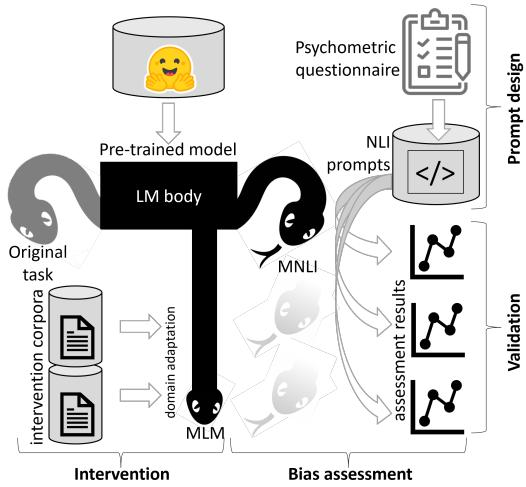
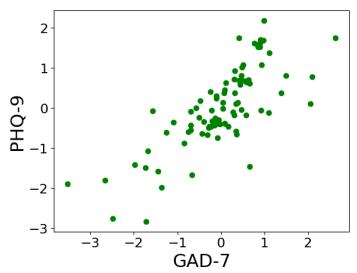
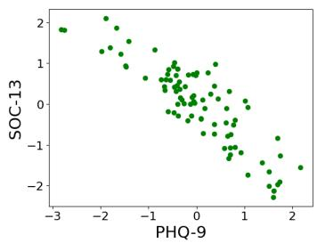
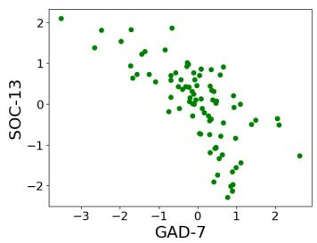

# Assessment and manipulation of latent constructs in pre-trained language models using psychometric scales

Maor Reuben1† Ortal Slobodin2† Aviad Elyashar3‡ Idan-Chaim Cohen4†

Orna Braun-Lewensohn5† Odeya Cohen4†\* Rami Puzis1†\*

1Department of Software and Information Systems Engineering 2School of Education

3Department of Computer Sciences 4Department of Nursing

5Conflict Management & Resolution Program

†Ben-Gurion University of the Negev, Israel ‡Shamoon College of Engineering, Israel {maorreu, idanchai}@post.bgu.ac.il, aviadel2@ac.sce.ac.il, {ortalslo, ornabl, odeyac, puzis}@bgu.ac.il

## Abstract

Human-like personality traits have recently been discovered in large language models, raising the hypothesis that their (known and as yet undiscovered) biases conform with human latent psychological constructs. While large conversational models may be tricked into answering psychometric questionnaires, the latent psychological constructs of thousands of simpler transformers, trained for other tasks, cannot be assessed because appropriate psychometric methods are currently lacking. Here, we show how standard psychological questionnaires can be reformulated into natural language inference prompts, and we provide a code library to support the psychometric assessment of arbitrary models. We demonstrate, using a sample of 88 publicly available models, the existence of human-like mental healthrelated constructs—including anxiety, depression, and Sense of Coherence—which conform with standard theories in human psychology and show similar correlations and mitigation strategies. The ability to interpret and rectify the performance of language models by using psychological tools can boost the development of more explainable, controllable, and trustworthy models.

## 1 Introduction

Recommendations made by language models influence decision-making and impact human welfare in sensitive areas of life (Chang et al., 2023), from education (Wulff et al., 2023), to healthcare and mental support (Vaidyam et al., 2019), and job recruitment (Rafiei et al., 2021). Yet, the responses of language models may inadvertently cause harm, as in the case of the chatbot taken down by a US National Eating Disorder Association helpline due to its harmful advice (Zelin, 2023). Therefore, alongside their numerous benefits, some behaviors of pre-trained language models (PLMs) during human–computer interactions pose potential risks.

Understanding and correcting the behavior of PLMs is a significant challenge that current explainable artificial intelligence (XAI) techniques, such as SHAP (Lundberg and Lee, 2017; Kokalj et al., 2021) and word embeddings (Caliskan and Lewis, 2020), struggle to address effectively. While advanced conversational PLMs use psychological theories for XAI by answering psychometric questionnaires (Pellert et al., 2023; Caron and Srivastava, 2022), many non-conversational models cannot. Previous research also showed that biases in PLMs can propagate to downstream tasks, amplifying disparities in real-world applications (Lyu et al., 2024; Salutari et al., 2023). Given the widespread use of these models in various natural language processing (NLP) tasks, it is essential to develop and adapt psychological tools that can effectively monitor, interpret, and mitigate these biases.

This study aims to assess latent constructs in PLMs by adapting psychological methods and theories. The approach involves three components: (1) designing natural language inference (NLI) prompts based on psychometric questionnaires; (2) applying these prompts through a new NLI head trained on the multi-genre natural language inference (MNLI) dataset; and (3) performing twoway normalization to infer biases from entailment scores. Focusing on mental-health-related constructs, we demonstrate that PLMs exhibit variations in anxiety, depression, and sense of coherence, aligning with established psychological theories. Extensive validation shows that these constructs are influenced by training data and that model behavior can be adjusted to amplify or mitigate specific traits.

The contribution of this research is four-fold:

1. A methodology for the assessment of psychological-like traits in PLMs, which can be used in non-conversational models.

2. A Python library for the assessment and validation of latent constructs in PLMs.

3. A methodology for designing NLI prompts based on standard questionnaires.

4. A validated dataset of NLI prompts specifically designed for mental-health assessment.

## 2 Background and Related Work

## 2.1 Artificial Psychology

The need for artificial intelligence (AI) systems aligned with human values to ensure transparency, fairness, and trust (Morandini et al., 2023; HLEG, 2019) is growing. Integrating psychological principles of human reasoning into AI can enhance our understanding of PLM decision-making processes (Pellert et al., 2023). Recent research highlights the emergence of human-like personality traits in PLMs (Jiang et al., 2022; Safdari et al., 2023; Mao et al., 2023; Li et al., 2022; Pan and Zeng, 2023), and the advent of large-scale conversational PLMs has bolstered the evolution of artificial psychology from theory to practice. Studies further highlight PLMs adopting non-cognitive traits, such as values, moral reasoning, and biases, stemming from their extensive training on human-generated corpora(Pellert et al., 2023; Caron and Srivastava, 2022; Jiang et al., 2022). This trend blurs the distinction between humans and AI agents, prompting investigations into developing psychological-like traits in PLMs (Castelo, 2019).

Several tools study human-like constructs in PLMs. The Big Five Inventory assesses five major personality traits in humans (McCrae and John, 1992) and is commonly used for PLMs (Pellert et al., 2023). Huang et al. (2023) introduced 13 clinical psychology scales to assess PLMs, and Karra et al. (2022) developed natural prompts tests.

However, applying human-centric selfassessment tests to PLMs is challenging due to their context sensitivity and susceptibility to bias from prompts (Gupta et al., 2023; Jiang et al., 2023; Coda-Forno et al., 2023). In this study, we measure latent constructs related to mental health by quantifying biases in PLMs responses through careful context manipulation. This highlights the importance of designing NLI prompts adapted from standard questionnaires for assessing PLMs. Our comprehensive validity assessment combines behavioral and data-science methods, advancing beyond prior work. Our study uniquely involves a diverse set of 88 transformer-based models available on HuggingFace.1

## 2.2 Mental-Health-Related Constructs

We explore how PLMs exhibit three latent constructs in mental health: anxiety, depression, and sense of coherence.

Anxiety and depression are two of the most common mental health disorders. Anxiety involves excessive worry with physical and psychological symptoms, typically assessed using the 7-item generalized anxiety disorder (GAD) scale (Spitzer et al., 2006). Depression involves continuous sadness, hopelessness, and disinterest in joyful activities (anhedonia), typically assessed with the 9-item patient health questionnaire (PHQ) scale (Kroenke et al., 2001). These conditions are positively correlated in humans (Kaufman and Charney, 2000), a correlation we also observe in PLMs (see § 4).

Sense of coherence is a key concept in salutogenic theory, which views health as a spectrum from disease to wellness (Antonovsky, 1987). Typically measured using a 13-item Sense of Coherence (SoC) scale, it consists of three elements: comprehensibility, manageability, and meaningfulness (Lindström and Eriksson, 2005). The theory, often linked with resilience, emphasizes internal resources for coping with stress and adverse psychological conditions (Mittelmark, 2021; Braun-Lewensohn and Mayer, 2020). In § 4, we show that higher SoC levels can mitigate anxiety and depression symptoms in PLMs, as observed in humans.

While we believe questionnaires are intuitive, we briefly discuss Likert scales and questionnaire validity in appendix A.

## 2.3 Natural Language Inference (NLI)

Natural language inference (NLI) tasks are designed to evaluate language understanding in a domain-independent manner (Williams et al., 2018). An NLI classifier takes two sentences—a premise and a hypothesis—and outputs a probability distribution over three options: entailment, contradiction, or neutrality (MacCartney and Manning, 2008). These tasks are primarily used for zero-shot classification, allowing models to handle previously unseen classes. In this article, we focus solely on the entailment scores.

  
Figure 1: EMPALC: the psychometric assessment framework for PLMs.

## 3 Methods

This section explains how existing psychological assessments can be applied to PLMs, forming the framework for evaluation of model psychometrics and assessment of latent constructs (EMPALC). The EMPALC consists of four parts (Fig. 1):

Prompt Design: Translating social-science questionnaires into NLI prompts (§ 3.1).

Assessment: Fine-tuning an NLI classifier with the multi-genre natural language inference (MNLI) dataset, executing NLI prompts, and analyzing entailment biases (§ 3.2).

Validation: Conducting tests based on Terwee et al. (2007)’s validity criteria to ensure responses to the NLI prompts reflect the targeted construct, including evaluating individual items and the entire questionnaire (§ 3.3).

Intervention: Training the models with texts related to the measured constructs and then reevaluating them to determine whether the training has altered the assessment outcomes. The intervention can be used to align models (§ 3.3.5).

Below, we elaborate on the specific methods used in each part of the framework.

## 3.1 NLI Prompt Design

In social sciences, questionnaire items are designed to ensure response variance reflects population variance. Similarly, we design the prompts with ambiguity to elicit varied responses that reflect individual biases. Below, we describe the main steps in designing the NLI prompts for each question in the questionnaires. As a running example, we use the 3rd question of the SoC questionnaire: "Has it happened that people whom you counted on disappointed you?".

The construct terms: Each question includes terms directly related to the construct being measured (CTerms), reflecting the respondent’s stance. We identify CTerms based on the following criteria: (1) CTerms should express an attitude or stance toward the question’s objective. In our example, "disappointed" is the CTerm that expresses a stance toward "people whom you counted on". (2) Removing CTerms should neutralize the main claim of the question. Without the CTerm, the template "Has it happened that people whom you counted on {stance} you?" has no implied stance. (3) CTerms should have clearly identifiable opposites. Here, "supported" or "helped" contrast with "disappointed", inverting its stance.

Most well-structured questionnaires have identifiable CTerms, sometimes more than one per question. If multiple CTerms are unavailable, synonyms can be used if they are interchangeable with the original term. Using multiple CTerms enables internal validation of the NLI prompts (§ 3.3) and compensates for linguistic variability.

We refer to CTerms that retain the original stance as source terms (S+), while inverse terms (S−) invert the stance and antithesize the original construct. Often, antonyms of S+ can be used as inverse terms. We use both source and inverse terms in the NLI prompts (S = S+  S−).

Intensifiers: Likert scales are often presented with a small number of intensifiers; for example, terms such as "never," "rarely," "often," and "always" can form a Likert scale that assesses frequency. By employing such a frequency scale, we can reformulate our running example as: "Has it {intensifier} happened that people whom you counted on {CTerm} you?" To account for language variability, we use multiple terms for each intensity level. Unlike humans, computerized systems do not suffer from attention bias when considering a batch of options.

We use intensifiers from Brown (2010), sorted from least to most intensive, and group interchangeable terms into subsets representing Likert-scale levels. We denote the sets of relevant intensifiers as L, the subsets of terms corresponding to the Likert-scale levels as l1, l2, . . ., and we use numeric weights (W) to represent the impact of each level on the measured construct. The order of intensifiers is empirically validated to identify clear score trends (see Fig. 2 for an example) across multiple questionnaires.

NLI prompt templates: The premise template should retain the context of the original question, while the hypothesis template should enable the completion of the premise in a way that is logically entailed when terms are inserted—rather than being formulated as a question. Both templates should have no implied stance when CTerms are omitted. The NLI prompt templates should be unbiased toward the measured construct, as biased prompts may introduce clear inference or contradiction relationships, priming the model and affecting results.

We argue that (1) the inferential relationship should not be bluntly clear from the prompts, and (2) the prompts should maintain a blurred sense of inferential relationship. Clear inferential relationships will result in all NLI models providing the same responses. Similar to how social science questionnaires are designed to capture response variance to reflect the population, we design our prompts with a certain degree of ambiguity so that different models will provide different answers. For example, consider the prompt premise: "People whom I counted on fail me" and the hypothesis: "It always happens to me". A pessimistic model, similar to a pessimistic person, may infer that an unfortunate event that occurred once is likely to occur again, and, accordingly, the model may assign a high entailment score to this query. Conversely, an optimistic model (or person) is less likely to infer the repeated occurrence of an unfortunate event from a single occurrence.

A good practice is to formulate the neutral premise template with the primary statement and CTerm masking, and the premise with intensifiers. For example, the premise and hypothesis templates may be "People whom I counted on, {stance} me" and It {frequency} happened to me", respectively. Note that, although translating questions into NLI prompts may necessitate slight reformulations, maintaining semantic fidelity to the original questions is crucial. The final NLI prompts templates including the CTerms and the intensifiers we used can be found in our repository2.

## 3.2 Assessment

To assess latent constructs beyond conversational models, we attach an NLI classification head to various base models and fine-tune them on MNLI. Specific details on the fine-tuning process and a discussion on the pros and cons of multiple finetuning approaches can be found in § 5. The results presented in $\ S 4$ were obtained without freezing the base model weights.

We then prompt a fine-tuned NLI model with all prompts formulated according to some question and extract the entailment scores. Consider a set of CTerms $S = S ^ { + } \cup S ^ { - } \{ s _ { 1 } , s _ { 2 } , . . . \}$ and a set of intensifiers $L = \{ l _ { 1 } , l _ { 2 } , . . . \}$ used to generate the prompts. Let $P _ { e } ( s _ { i } , l _ { j } )$ denote the entailment score. $P _ { e }$ is influenced by all terms, but not to the same degree; the a-priory probabilities of the terms have the major effect. For example, in Fig. 2a, the intensifier "frequently" and the CTerm "failed" result in the highest entailment scores because they are frequent in spoken and written language. Conversely, we can compare the entailment scores of different CTerms when conditioned on the same intensifier, such as "frequently."

We apply a two-way normalization $P _ { e }$ over the $s _ { i } , l _ { j }$ pairs, as follows: First, we use softmax to normalize the unconditioned scores of intensifiers across CTerms. Then, we normalize again across intensifiers, resulting in $P S S _ { e } ( l _ { j } | s _ { i } )$ . Essentially, $\begin{array} { r } { \sum _ { j } P S S _ { e } ( l _ { j } | s _ { i } ) = 1 } \end{array}$ , implying a different distribution of intensifiers for each CTerm. The two-way normalization stabilizes the distribution, eliminating biases from the a-priori frequencies of intensifiers and CTerms. Fig. 2b provides a sample result of the two-way normalization. The score trends of CTerms over the intensifiers showcases the intra-question consistency (silhouette).

Next, we calculate the total score of the question,

$$
s c o r e ( q , S ^ { + } , L , W ) = \frac { \sum _ { s _ { i } , l _ { j } } ^ { S ^ { + } , L } P S S _ { e } ( l _ { j } | s _ { i } ) \cdot w _ { j } } { | S ^ { + } | \cdot | L | }
$$

where ${ \cal W } = \{ w _ { 1 } , w _ { 2 } , . . . \}$ are the weights assigned to the intensifiers. Both S+ and S− terms can be used for the aggregated score; however, inverse terms may represent a different latent construct than the source terms. Therefore, to avoid additional biases, we use only $S ^ { + }$ terms for the aggregated score, preserving the original meaning of the questionnaire.

## 3.3 Validation

We treat each PLM as an individual participant, analogous to a human subject in psychological research, and employ five validation techniques to ensure that their responses to the NLI prompts accurately reflect the targeted constructs. These techniques are adapted from established psychometric methodologies (Terwee et al., 2007) and include: (1) content validity, assessed via semantic similarity (SS), linguistic acceptability (LA), and manual curation; (2) a new type of intra-question consistency, assessed using silhouette coefficient (SC); (3) standard (inter-question) internal consistency, assessed using Cronbach’s alpha; (4) construct validity, assessed using Spearman correlations; and (5) qualitative criterion validity, assessed via XAI and domain adaptation. These validation techniques are explained below.

<table><tr><td rowspan=1 colspan=7>indexdeceiveddisappointed failed backed helped supportedfrequency</td></tr><tr><td rowspan=1 colspan=1>never</td><td rowspan=1 colspan=1>0.0000</td><td rowspan=1 colspan=1>0.0000</td><td rowspan=1 colspan=1>0.0000</td><td rowspan=1 colspan=1>0.0000</td><td rowspan=1 colspan=1>0.0000</td><td rowspan=1 colspan=1>0.0000</td></tr><tr><td rowspan=1 colspan=1>very rarely</td><td rowspan=1 colspan=1>0.0287</td><td rowspan=1 colspan=1>0.0117</td><td rowspan=1 colspan=1>0.0821</td><td rowspan=1 colspan=1>0.0348</td><td rowspan=1 colspan=1>0.0027</td><td rowspan=1 colspan=1>0.0245</td></tr><tr><td rowspan=1 colspan=1>rarely</td><td rowspan=1 colspan=1>0.0179</td><td rowspan=1 colspan=1>0.0066</td><td rowspan=1 colspan=1>0.0474</td><td rowspan=1 colspan=1>0.0105</td><td rowspan=1 colspan=1>0.0010</td><td rowspan=1 colspan=1>0.0054</td></tr><tr><td rowspan=1 colspan=1>seldom</td><td rowspan=1 colspan=1>0.0198</td><td rowspan=1 colspan=1>0.0108</td><td rowspan=1 colspan=1>0.0611</td><td rowspan=1 colspan=1>0.0187</td><td rowspan=1 colspan=1>0.0018</td><td rowspan=1 colspan=1>0.0147</td></tr><tr><td rowspan=1 colspan=1>frequently</td><td rowspan=1 colspan=1>0.9344</td><td rowspan=1 colspan=1>0.8671</td><td rowspan=1 colspan=1>0.9167</td><td rowspan=1 colspan=1>0.6357</td><td rowspan=1 colspan=1>0.8691</td><td rowspan=1 colspan=1>0.5684</td></tr><tr><td rowspan=1 colspan=1>often</td><td rowspan=1 colspan=1>0.9800</td><td rowspan=1 colspan=1>0.9438</td><td rowspan=1 colspan=1>0.9511</td><td rowspan=1 colspan=1>0.8665</td><td rowspan=1 colspan=1>0.9864</td><td rowspan=1 colspan=1>0.8978</td></tr><tr><td rowspan=1 colspan=1>very frequently</td><td rowspan=1 colspan=1>0.8120</td><td rowspan=1 colspan=1>0.6446</td><td rowspan=1 colspan=1>0.7926</td><td rowspan=1 colspan=1>0.1854</td><td rowspan=1 colspan=1>0.2928</td><td rowspan=1 colspan=1>0.1263</td></tr><tr><td rowspan=1 colspan=1>always</td><td rowspan=1 colspan=1>0.6572</td><td rowspan=1 colspan=1>0.4087</td><td rowspan=1 colspan=1>0.6271</td><td rowspan=1 colspan=1>0.0059</td><td rowspan=1 colspan=1>0.0029</td><td rowspan=1 colspan=1>0.0040</td></tr></table>

(a) Raw entailment scores.

<table><tr><td rowspan=1 colspan=7>indexdeceiveddisappointed failed backed helpedsupportedfrequency</td></tr><tr><td rowspan=1 colspan=1>never</td><td rowspan=1 colspan=1>0.1226</td><td rowspan=1 colspan=1>0.1243</td><td rowspan=1 colspan=1>0.1226</td><td rowspan=1 colspan=1>0.1270</td><td rowspan=1 colspan=1>0.1261</td><td rowspan=1 colspan=1>0.1273</td></tr><tr><td rowspan=1 colspan=1>very rarely</td><td rowspan=1 colspan=1>0.1226</td><td rowspan=1 colspan=1>0.1239</td><td rowspan=1 colspan=1>0.1237</td><td rowspan=1 colspan=1>0.1271</td><td rowspan=1 colspan=1>0.1255</td><td rowspan=1 colspan=1>0.1271</td></tr><tr><td rowspan=1 colspan=1>rarely</td><td rowspan=1 colspan=1>0.1227</td><td rowspan=1 colspan=1>0.1242</td><td rowspan=1 colspan=1>0.1233</td><td rowspan=1 colspan=1>0.1269</td><td rowspan=1 colspan=1>0.1258</td><td rowspan=2 colspan=1>0.12710.1271</td></tr><tr><td rowspan=1 colspan=1>seldom</td><td rowspan=1 colspan=1>0.1226</td><td rowspan=1 colspan=1>0.1241</td><td rowspan=1 colspan=1>0.1234</td><td rowspan=1 colspan=1>0.1270</td><td rowspan=1 colspan=1>0.1257</td></tr><tr><td rowspan=1 colspan=1>frequently</td><td rowspan=1 colspan=1>0.1254</td><td rowspan=1 colspan=1>0.1256</td><td rowspan=1 colspan=1>0.1250</td><td rowspan=1 colspan=1>0.1237</td><td rowspan=1 colspan=1>0.1274</td><td rowspan=1 colspan=1>0.1228</td></tr><tr><td rowspan=1 colspan=1>often</td><td rowspan=1 colspan=1>0.1235</td><td rowspan=1 colspan=1>0.1245</td><td rowspan=1 colspan=1>0.1228</td><td rowspan=1 colspan=1>0.1256</td><td rowspan=1 colspan=1>0.1271</td><td rowspan=1 colspan=1>0.1264</td></tr><tr><td rowspan=1 colspan=1>very frequently</td><td rowspan=1 colspan=1>0.1299</td><td rowspan=1 colspan=1>0.1272</td><td rowspan=1 colspan=1>0.1293</td><td rowspan=1 colspan=1>0.1212</td><td rowspan=1 colspan=1>0.1220</td><td rowspan=1 colspan=1>0.1206</td></tr><tr><td rowspan=1 colspan=1>always</td><td rowspan=1 colspan=1>0.1309</td><td rowspan=1 colspan=1>0.1261</td><td rowspan=1 colspan=1>0.1300</td><td rowspan=1 colspan=1>0.1214</td><td rowspan=1 colspan=1>0.1204</td><td rowspan=1 colspan=1>0.1215</td></tr></table>

(b) Two-way normalized entailment scores.  
Figure 2: Example of raw (left) and two-way normalized (right) entailment scores for Question 3 from the SoC questionnaire. The NLI query premise is "People whom I counted on {CTerm} me." and the hypothesis is "It {intensifier} happened to me." Rows and columns correspond to the intensifiers and CTerms, respectively.

## 3.3.1 Content Validity

We assess content validity in NLI prompt design by maintaining the semantic accuracy and original meaning of translated questions. We rely on standardized questionnaires, wherein the CTerms have been extensively validated by the questionnaire developers. Additional CTerms, synonyms, and antonyms are manually validated by domain experts, including clinical psychologists and scale developers. We also verify that intensifiers used with CTerms are scrutinized for semantic and logical coherence within prompt templates. In addition, we measure the SS between the original question and prompts (with $S ^ { + }$ terms) using cosine similarity of their vector representations. Finally, we quantify the grammatical correctness of all combinations of terms, using LA scores.

## 3.3.2 Intra-Question Consistency

Intuitively, internal consistency measures the extent to which different questions that assess the same construct are correlated (i.e., homogeneous). In a similar vein, we want to ensure that the source terms $( S ^ { + } )$ are positively correlated between themselves and are negatively correlated with inverse terms (S−) across intensifiers. To this end, we use the silhouette coefficient (SC) (Dinh et al., 2019) to estimate the quality of separation between $S ^ { + }$ and $S ^ { - }$ −. Briefly, SC quantifies the similarity of the $P S S _ { e } ( l _ { j } | s _ { i } )$ distributions between synonyms versus the dissimilarity of the distributions between antonyms, such that a higher SC indicates greater separability of $S ^ { + }$ from $S ^ { - }$

## 3.3.3 Inter-Question Consistency

We use the Cronbach’s alpha statistic to measure the internal consistency of a set of questions that represent a construct. For each construct, we calculate Cronbach’s alpha by using a variety of PLMs that have been fine-tuned on the MNLI dataset (Williams et al., 2018).

## 3.3.4 Construct Validity

Construct validity asserts that the constructs assessed by a scientific instrument align with theoretical expectations. Based on prior human research, we anticipate a positive correlation between anxiety and depression, and a negative correlation between these constructs and SoC. Using the EMPALC framework, we examine these relationships across different PLM.

## 3.3.5 Interventions and Criterion Validity

We operationalize the criterion validity of mentalhealth constructs (PHQ, GAD, and SoC) in PLMs by measuring how models react to training on text exhibiting a high degree of these constructs. We expect the models trained on depressive-mood text to show high GAD and PHQ scores, and low

SoC scores. Using LLAMA2, we generated 200 sentences that reflect a depressive mood on various topics and trained a sample of PLMs for 20 epochs by using a masked language masked language model (MLM) head according to a standard practice of domain adaptation. After each epoch, we measured GAD, PHQ, and SoC scores by using their original pre-trained NLI head.3

Similarly, we expect the models trained on text that reflect a high SoC to increase SoC scores and reduce both the GAD and PHQ scores. Using Chat-GPT, we generated 300 sentences that reflect high comprehensibility, manageability, and meaningfulness, but we discarded 20 sentences after manual inspection. We assessed all constructs after each epoch of domain adaptation, similar to the training on the depressive-mood text. This technique is effectively an intervention that can be used to align PLMs with social norms and mitigate negative psychological constructs.

We assessed discriminant validity by adapting hate-speech domains to confirm that correlations between psychological constructs are not influenced by sentiment differences. We used the hatespeech and offensive-language dataset from Kaggle4 and applied the VADER sentiment analysis tool (Hutto and Gilbert, 2014) to select 1003 sentences with negative sentiments. After conducting domain adaptation, we used a paired t-test to evaluate the differences between the assessments before (T0) and after (T1) the intervention.

## 4 Results

## 4.1 Population of Language Models

We selected 14 MNLI models from HuggingFace that fit a standard RTX 3090 GPU and whose outputs are properly configured according to the MNLI dataset. We also selected the 100 PLMs base models with the highest number of downloads; of these, 74 PLMs scored more than 0.7 in accuracy after being fine-tuned on MNLI. (§ 3.2). The resulting 88 NLI (14 + 74) models served as our study population (see Table 1 for details). All the models used are deterministic PLMs from HuggingFace, with BERT being the most common architecture. Among these models, 38 were updated during 2023, and about half (45) were trained solely in English. Details about the 88 NLI models and their questionnaire results can be found in our repository5.

<table><tr><td colspan="2">Variable</td><td>n</td><td>%</td></tr><tr><td rowspan="3">Architecture</td><td>BERT base uncased</td><td>40</td><td>45.5</td></tr><tr><td>BERT base cased</td><td>12</td><td>13.6</td></tr><tr><td>RoBERTa base other</td><td>24 13</td><td>27.3 14.7</td></tr><tr><td rowspan="3">Last updated</td><td>2021</td><td>23</td><td>26.1</td></tr><tr><td>2022</td><td>27</td><td>30.7</td></tr><tr><td>2023</td><td>38</td><td>43.2</td></tr><tr><td rowspan="2">Languages</td><td>English</td><td>45</td><td>51.1</td></tr><tr><td>other</td><td>43</td><td>29.5</td></tr><tr><td>Likes</td><td>19 (4.75-46.25)</td><td></td><td></td></tr><tr><td>Model size</td><td>110M (100M-125M)</td><td></td><td></td></tr><tr><td>Downloads</td><td>41,400 (4630-204K)</td><td></td><td></td></tr></table>

Table 1: Main characteristics of the study population.

## 4.2 Translated Questionnaires and Questionnaire Level Validity

We translated the three questionnaires into 1408 NLI prompts using eight frequency intensifiers, 2.86 source terms, and 3.0 inverse terms, on average. All translated questions achieved an SS of at least 0.5 and a SC of at least 0.6. A panel of three researchers validated the phrasing for soundness and semantic appropriateness. All questionnaires showed satisfactory content validity, averaging SS of 0.66 and LA of 0.86.

Table 2 presents Cronbach’s alpha values and mean results for SS, LA, and SC, and the number of source and inverse prompts for each questionnaire among the 88 models. The intra-question consistency demonstrated mediocre variability across SC on the different models, with STD values of 0.21, 0.31, and 0.15 for the SC of the GAD, PHQ, and SoC questionnaires, respectively, and minimum SC values of 0.24, 0.04, and 0.40, respectively. Although the questions were optimized for one model, none of the population models showed negative SC values. All Cronbach’s alpha coefficients exceeded 0.71, suggesting that, indeed, the translated questions assessed the intended constructs reliably within each questionnaire.

## 4.3 Construct Validity

All scores were normalized to fit a normal distribution across the 88 NLI models. The GAD and PHQ scores showed a strong positive correlation $( \mathbf { r } = 0 . 7 6 5 , \mathbf { p } < 0 . 0 0 1 )$ , and both were negatively correlated with the SoC scores (r = -0.752 and r = -0.849, respectively, $\mathrm { p } < 0 . 0 0 1$ for both comparisons). The subscales of the SoC questionnaires were positively inter-correlated, further supporting the reliability of the overall SoC construct. Fig. 3 illustrates the relationships between the different questionnaires across the 88 PLMs.

<table><tr><td>Score</td><td>P+</td><td>P-</td><td>SS</td><td>LA</td><td>SC</td><td>α</td></tr><tr><td>GAD</td><td>192</td><td>208</td><td>0.66</td><td>0.88</td><td>0.91</td><td>0.71</td></tr><tr><td>PHQ</td><td>208</td><td>192</td><td>0.62</td><td>0.91</td><td>0.81</td><td>0.92</td></tr><tr><td>SoC</td><td>288</td><td>320</td><td>0.68</td><td>0.92</td><td>0.79</td><td>0.92</td></tr><tr><td>-Compr.</td><td>128</td><td>136</td><td>0.67</td><td>0.92</td><td>0.82</td><td>0.71</td></tr><tr><td>-Manag.</td><td>80</td><td>96</td><td>0.72</td><td>0.94</td><td>0.80</td><td>0.86</td></tr><tr><td>-Mean.</td><td>80</td><td>88</td><td>0.65</td><td>0.91</td><td>0.74</td><td>0.88</td></tr></table>

Table 2: Assessment of study measures, including the number of source (P+) and inverse (P-) prompts, the average SS, LA, and SC, and Cronbach’s α. The measures include GAD, PHQ, and SoC along with its three subscales: Comprehensibility (Compr.), Manageability (Manag.), and Meaningfulness (Mean.).

To ensure that the constructs were not merely reflecting sentiment, we calculated the correlations between the sentiment of the NLI prompts and their entailment probabilities. The correlations were 0.713 for GAD and 0.406 for PHQ, indicating some connection to sentiment—expected since symptoms of anxiety and depression generally have negative connotations. However, the difference in these correlations suggests that GAD and PHQ measure distinct constructs, despite both being related to negative sentiment.

## 4.4 Criterion Validity

We conducted domain adaptation on seven MNLI models across three datasets for 20 epochs (§ 3.3.5), employing a learning rate of 2e-5 and a batch size of 8. Table 3 shows the results, indicating increases in PHQ and GAD scores and decreases in SoC scores after exposure to depressive-mood text.

In contrast to the depressive-mood adaptation, exposure to a high-SoC text decreased both the GAD and PHQ scores, indicating a successful corrective intervention. Exposure to hate speech with negative sentiment non-significantly decreased the SoC scores and did not significantly affect the GAD and PHQ scores. Finally, fine-tuning to the MNLI dataset consistently biased the models toward lower GAD and PHQ scores. Therefore, to avoid aggregating these biases, we fine-tuned the models once, before domain adaptation (see § 5 for additional discussion). The domain adaptation had minimal impact on the performance of the models on the MNLI benchmark.

<table><tr><td rowspan=1 colspan=1>Intervention</td><td rowspan=1 colspan=1>Scale</td><td rowspan=1 colspan=1>T0 µ ± σ</td><td rowspan=1 colspan=1>T1 µ ± σ</td><td rowspan=1 colspan=1>p</td></tr><tr><td rowspan=1 colspan=1>Hatespeech</td><td rowspan=1 colspan=1>GADPHQSOC</td><td rowspan=1 colspan=1>-0.16±0.58-0.68±1.220.81±1.10</td><td rowspan=1 colspan=1>-0.10±0.39-0.31±1.060.16±0.91</td><td rowspan=1 colspan=1>0.3860.1380.060</td></tr><tr><td rowspan=1 colspan=1>Depression</td><td rowspan=1 colspan=1>GADPHQSOC</td><td rowspan=1 colspan=1>0.06±0.35-0.37±1.020.30±0.78</td><td rowspan=1 colspan=1>0.37±0.470.30±0.73-0.51±0.86</td><td rowspan=1 colspan=1>0.0150.0150.001</td></tr><tr><td rowspan=1 colspan=1>High SOC</td><td rowspan=1 colspan=1>GADPHQSOC</td><td rowspan=1 colspan=1>0.06±0.37-0.31±1.000.45±0.82</td><td rowspan=1 colspan=1>-0.27±0.47-0.57±1.200.70±0.88</td><td rowspan=1 colspan=1>0.0050.0370.035</td></tr></table>

Table 3: Summary of intervention statistics. Shown are the intervention results (T1), as compared with the original results (T0), in a sample of seven PLMs. Bold face indicates a statistically significant difference between T0 and T1, assessed by a paired t-test.

## 5 Discussion

Psychometric assessment: The evaluation of pertinent latent constructs offers a systematic method for identifying potential behavioral issues in PLMs, akin to established practices in psychology. This study applied mental–health-related assessment tools to PLMs and validated the methods and results through established techniques. Our findings confirm that associations known in human psychology exist in PLMs.

Alignment interventions: Integrating psychological constructs into the development and testing cycle of PLMs can significantly enhance our capability of understanding their behavior and improve user experience. Our results show that strengthening a positive construct, such as SoC, within PLMs effectively mitigates negative psychological constructs, such as anxiety and depression.

NLI vs conversational prompts: Following Pellert et al. (2023), we adopted NLI as the assessment method. Instead of using questions as premises and Likert scale options as hypotheses, we reformulated premise–hypothesis pairs to enable logical entailment with CTerms inserted. Unlike psychometric assessments focused on large conversational PLMs, EMPALC is designed for base models, enabling the evaluation of arbitrary PLMs, including medium-sized and nonconversational models. It addresses challenges noted by Gupta et al. (2023) and Song et al. (2023), as EMPALC is unaffected by questionnaire option order, a limitation of humans and conversational PLMs. The two-way normalization of biases increases robustness by ensuring consistent assessment across varied prompt phrasings. This was supported by a high SC and consistent trends observed for synonyms across intensifiers.

  
Figure 3: Scatter plots depicting the relationships between different questionnaires across the study population.

Fine-tuning on MNLI: PLMs can be augmented with a new NLI, as described in § 3.2, while freezing or not freezing the weights of the base model during the fine-tuning process. The former option results in less accurate MNLI classifiers but leaves the base model intact, whereas the latter option results in better MNLI classifiers and reduces noise during the psychometric assessment, which, in turn, increases internal consistency (§ 3.3.2) and flexibility during prompt design (§ 3.1). Whereas applying the same procedure to all tested models should not affect their relative assessment, different models may react differently to fine-tuning under the same conditions, introducing unwanted biases.

In this article, we did not freeze base model weights, as no biases were observed during a pilot study. To fine-tune the models on the MNLI dataset (Williams et al., 2018), we used the run\_glue.py 6 script provided by HuggingFace. The fine-tuning was conducted with a learning rate of 5e-5, a batch size of 16, and 3 epochs. We utilized the Adam optimizer with $\beta _ { 1 } = 0 . 9$ and $\beta _ { 2 } = 0 . 9 9 9$ Gradient clipping was set to 1.0, and mixed precision training (using FP16) was enabled to optimize performance and memory usage.

Significantly, fine-tuning the PLMs to MNLI reduced both anxiety and depression scores. Thus, fine-tuning the models to MNLI after each domainadaptation epoch may hinder the attribution of the changes in the measured constructs (Table 3) to the controlled interventions. To retain validity, we fine-tuned the NLI heads once before testing the effect of the interventions.

Ethical Considerations: Psychometric assessment of models trained on large corpora does not directly compromise individual privacy but rather represents aggregated measurements. However, if a model is trained on text authored by a specific individual, our methods can potentially infer psychological constructs conveyed in that text, indirectly enabling psychological assessment of the individual. Individuals who refuse psychological questionnaires may also object to the psychological assessment of the text they authored. Therefore, psychometry of language models is also subject to the responsible use of AI in an ethical and transparent manner (Floridi et al., 2018; Smuha, 2019). Similar to other AI applications, it is important to validate that the psychometric assessment is included in the intended use for which the data was collected. When psychometric assessment is applied to assess the traits or states of some population segment, special care should be taken to validate the results using multiple language models (preferably with different architectures) and questionnaires assessing multiple related latent constructs. This is to avoid inadvertent defamation of population segments under study.

Another perspective on the assessment of psychometric biases in language models is the ability to correct the biases. On the one hand, biased models can be disregarded in favor of their more neutral counterparts. On the other hand, this article suggests a course of action for mitigating the detected biases of pre-trained models using domain adaptation.

Limitations and Future Work: Notably, EMPALC is unsuitable for questionnaires that measure knowledge and do not have a clear stance. Although we paid special attention to biases introduced by fine-tuning and domain adaptation, some adverse effects may have remained unnoticed. Designing NLI prompts to measure latent constructs in PLMs while adhering to the requirements listed in § 3.1 and avoiding caveats highlighted by related work is an arduous and time-consuming process. Especially challenging is the identification of CTerms, intensifiers, and appropriate formulations of neutral templates while retaining the soundness of the phrases and logical entailment. In appendix B, we provide examples highlighting some of the challenges. While automation using large-scale conversational PLMs may streamline parts of the translation process, manual curation will likely remain essential, particularly for non-standardized and sensitive-topic questionnaires such as those addressing sexism.

This study focused exclusively on anxiety, depression, and sense of coherence. An important avenue for future research involves extending the framework to assess broader and more stable psychological traits, including dimensions of personality (e.g., Big Five traits).

We also observed that some models exhibited a stronger disposition toward anxious responses. This variation may be attributable to differences in pretraining corpora, domain-specific biases, or fine-tuning strategies. For instance, models trained on emotionally expressive domains such as social media platforms may be more sensitive to anxietyrelated cues, while those trained on formal or technical texts may present more emotionally neutral profiles. Understanding the origins of such biases could help guide the development of PLMs with calibrated psychological behaviors and inform targeted interventions for model alignment. Future research could also explore PLMs as proxies for the mindsets of corpus authors, building on their ability to reflect latent constructs observed in training data, akin to the virtual persona concept demonstrated by Jiang et al. (2023). Another direction could involve adjusting the NLI prompts and adding an NLI head for conversational PLMs such as GPT and LLaMA, thereby enabling broader applicability across interactive AI systems.

## 5.1 Availability

The data and code reported in this article are publicly accessible on GitHub7 under the Creative Commons license.

## Acknowledgments

This research was partially supported by the Israeli Ministry of Science and Technology proposal number 0005450.

## References

A. Antonovsky. 1987. Unraveling the Mystery of Health: How People Manage Stress and Stay Well. Jossey-Bass.

Laura Badenes-Ribera, N Clayton Silver, and Elisa Pedroli. 2020. Scale development and score validation.

Godfred O Boateng, Torsten B Neilands, Edward A Frongillo, Hugo R Melgar-Quiñonez, and Sera L Young. 2018. Best practices for developing and validating scales for health, social, and behavioral research: a primer. Frontiers in public health, 6:149.

O Braun-Lewensohn and CE Mayer. 2020. Salutogenesis and coping: Ways to overcome stress and conflict.

Sorrel Brown. 2010. Likert scale examples for surveys.

Aylin Caliskan and Molly Lewis. 2020. Social biases in word embeddings and their relation to human cognition. PsyArXiv.

G. Caron and S. Srivastava. 2022. Identifying and manipulating the personality traits of language models. arXiv preprint arXiv:2212.10276.

Noah Castelo. 2019. Blurring the line between human and machine: marketing artificial intelligence. Columbia University.

Yupeng Chang, Xu Wang, Jindong Wang, Yuan Wu, Linyi Yang, Kaijie Zhu, Hao Chen, Xiaoyuan Yi, Cunxiang Wang, Yidong Wang, et al. 2023. A survey on evaluation of large language models. ACM Transactions on Intelligent Systems and Technology.

J. Coda-Forno, K. Witte, A. K. Jagadish, M. Binz, Z. Akata, and E. Schulz. 2023. Inducing anxiety in large language models increases exploration and bias. arXiv preprint arXiv:2304.11111.

Duy-Tai Dinh, Tsutomu Fujinami, and Van-Nam Huynh. 2019. Estimating the optimal number of clusters in categorical data clustering by silhouette coefficient. In Knowledge and Systems Sciences: 20th International Symposium, KSS 2019, Da Nang, Vietnam, November 29–December 1, 2019, Proceedings 20, pages 1–17. Springer.

Luciano Floridi, Josh Cowls, Monica Beltrametti, Raja Chatila, Patrice Chazerand, Virginia Dignum, Christoph Luetge, Robert Madelin, Ugo Pagallo, Francesca Rossi, et al. 2018. Ai4people—an ethical framework for a good ai society: opportunities, risks, principles, and recommendations. Minds and machines, 28:689–707.

Robert H Gault. 1907. A history of the questionnaire method of research in psychology. The Pedagogical Seminary, 14(3):366–383.

Joseph A Gliem, Rosemary R Gliem, et al. 2003. Calculating, interpreting, and reporting cronbach’s alpha

reliability coefficient for likert-type scales. In Midwest research-to-practice conference in adult, continuing, and community education, volume 1, pages 82–87. Columbus, OH.

Akshat Gupta, Xiaoyang Song, and Gopala Anumanchipalli. 2023. Investigating the applicability of self-assessment tests for personality measurement of large language models. arXiv preprint arXiv:2309.08163.

AI HLEG. 2019. Ethics guidelines for trustworthy ai. https://www.aepd.es/sites/default/files/2019-12/ ai-ethics-guidelines.pdf. Accessed: 2024-09-24.

Jen-tse Huang, Wenxuan Wang, Eric John Li, Man Ho Lam, Shujie Ren, Youliang Yuan, Wenxiang Jiao, Zhaopeng Tu, and Michael R Lyu. 2023. Who is chatgpt? benchmarking llms’ psychological portrayal using psychobench. arXiv preprint arXiv:2310.01386.

Clayton Hutto and Eric Gilbert. 2014. Vader: A parsimonious rule-based model for sentiment analysis of social media text. In Proceedings ofthe International AAAI Conference on Web and Social Media, volume 8, pages 216–225.

G. Jiang, M. Xu, S. C. Zhu, W. Han, C. Zhang, and Y. Zhu. 2022. Mpi: Evaluating and inducing personality in pre-trained language models. arXiv preprint arXiv:2206.07550.

Hang Jiang, Xiajie Zhang, Xubo Cao, Jad Kabbara, and Deb Roy. 2023. Personallm: Investigating the ability of gpt-3.5 to express personality traits and gender differences. arXiv preprint arXiv:2305.02547.

Ankur Joshi, Saket Kale, Satish Chandel, and D Kumar Pal. 2015. Likert scale: Explored and explained. British journal of applied science & technology, 7(4):396.

Saketh Reddy Karra, Son The Nguyen, and Theja Tulabandhula. 2022. Estimating the personality of white-box language models. arXiv preprint arXiv:2204.12000.

J Kaufman and D Charney. 2000. Comorbidity of mood and anxiety disorders. Depression and anxiety, 12(S1):69–76.

Truman Lee Kelley. 1927. Interpretation of educational measurements.

Enja Kokalj, Blaž Škrlj, Nada Lavrac, Senja Pollak, andˇ Marko Robnik-Šikonja. 2021. Bert meets shapley: Extending shap explanations to transformer-based classifiers. In Proceedings of the EACL Hackashop on News Media Content Analysis and Automated Report Generation, pages 16–21.

Kurt Kroenke, Robert L Spitzer, and Janet BW Williams. 2001. The phq-9: validity of a brief depression severity measure. Journal of general internal medicine, 16(9):606–613.

Xingxuan Li, Yutong Li, Linlin Liu, Lidong Bing, and Shafiq Joty. 2022. Is gpt-3 a psychopath? evaluating large language models from a psychological perspective. arXiv preprint arXiv:2212.10529.

B Lindström and M Eriksson. 2005. Salutogenesis. Journal ofEpidemiology & Community Health, 59(6):440–442.

Scott M Lundberg and Su-In Lee. 2017. A unified approach to interpreting model predictions. Advances in neural information processing systems, 30.

Jiachen Lyu, Katharina Dost, Yun Sing Koh, and Jörg Wicker. 2024. Regional bias in monolingual english language models. Machine Learning, 113(9):6663– 6696.

Shengyu Mao, Ningyu Zhang, Xiaohan Wang, Mengru Wang, Yunzhi Yao, Yong Jiang, Pengjun Xie, Fei Huang, and Huajun Chen. 2023. Editing personality for llms. arXiv preprint arXiv:2310.02168.

R. R. McCrae and O. P. John. 1992. An introduction to the five-factor model and its applications. Journal of Personality, 60(2):175–215.

Maurice B Mittelmark. 2021. Resilience in the salutogenic model of health. Multisystemic Resilience, pages 153–164.

S. Morandini, F. Fraboni, E. Balatti, A. Hackmann, H. Brendel, G. Puzzo, L. Volpi, D. Giusino, M. de Angelis, and L. Pietrantoni. 2023. Assessing the transparency and explainability of ai algorithms in planning and scheduling tools: A review of the literature. AHFE Conference.

Paul Oosterveld, Harrie CM Vorst, and Niels Smits. 2019. Methods for questionnaire design: a taxonomy linking procedures to test goals. Quality of Life Research, 28(9):2501–2512.

Keyu Pan and Yawen Zeng. 2023. Do llms possess a personality? making the mbti test an amazing evaluation for large language models. arXiv preprint arXiv:2307.16180.

M. Pellert et al. 2023. Repurposing psychometric inventories for diagnosing traits in llms: A novel approach. Journal ofApplied AI Psychology, 12(1):67–82.

Ghazal Rafiei, Bahar Farahani, and Ali Kamandi. 2021. Towards automating the human resource recruiting process. In 2021 5th National Conference on Advances in Enterprise Architecture (NCAEA), pages 43–47. IEEE.

M. Safdari, G. Serapio-García, C. Crepy, S. Fitz, P. Romero, L. Sun, et al. 2023. Personality traits in large language models. arXiv preprint arXiv:2307.00184.

Flavia Salutari, Jerome Ramos, Hossein A Rahmani, Leonardo Linguaglossa, and Aldo Lipani. 2023. Quantifying the bias of transformer-based language

models for african american english in masked language modeling. In Pacific-Asia Conference on Knowledge Discovery and Data Mining, pages 532– 543. Springer.

Mariah L Schrum, Michael Johnson, Muyleng Ghuy, and Matthew C Gombolay. 2020. Four years in review: Statistical practices of likert scales in humanrobot interaction studies. In Companion ofthe 2020 ACM/IEEE International Conference on Human-Robot Interaction, pages 43–52.

Nathalie A Smuha. 2019. The eu approach to ethics guidelines for trustworthy artificial intelligence. Computer Law Review International, 20(4):97–106.

X. Song, A. Gupta, K. Mohebbizadeh, S. Hu, and A. Singh. 2023. Have large language models developed a personality?: Applicability of self-assessment tests in measuring personality in llms. arXiv preprint arXiv:2305.14693.

Robert L Spitzer, Kurt Kroenke, Janet BW Williams, and Bernd Löwe. 2006. A brief measure for assessing generalized anxiety disorder: the gad-7. Archives of internal medicine, 166(10):1092–1097.

CB Terwee, SDM Bot, MR de Boer, DAWM van der Windt, DL Knol, J Dekker, LM Bouter, and HCW de Vet. 2007. Quality criteria were proposed for measurement properties of health status questionnaires. Journal ofclinical epidemiology, 60(1):34–42.

Aditya Nrusimha Vaidyam, Hannah Wisniewski, John David Halamka, Matcheri S Kashavan, and John Blake Torous. 2019. Chatbots and conversational agents in mental health: a review of the psychiatric landscape. The Canadian Journal ofPsychiatry, 64(7):456–464.

A Williams, N Nangia, and S Bowman. 2018. A broadcoverage challenge corpus for sentence understanding through inference. In NAACL, pages 1112–1122. Association for Computational Linguistics.

Peter Wulff, Lukas Mientus, Anna Nowak, and Andreas Borowski. 2023. Utilizing a pretrained language model (bert) to classify preservice physics teachers written reflections. International Journal ofArtificial Intelligence in Education, 33(3):439–466.

Aaron Y Zelin. 2023. “highly nuanced policy is very difficult to apply at scale”: Examining researcher account and content takedowns online. Policy & Internet, 15(4):559–574.

## A Background on Questionnaires

A questionnaire is an instrument measuring one or more constructs using aggregated item scores, called scales (Oosterveld et al., 2019). Questionnaires evolved as a research tool in the 19th century (Gault, 1907), and scales are widely used to capture behavior, feelings, or actions in a range of social, psychological, and health contexts. These scales are based on theoretical understandings (Boateng et al., 2018) and are designed using a set of items that represent latent constructs (Gliem et al., 2003). The theoretical basis of the measured concept influences the content and structure of the questionnaire. Therefore, the scale development process requires a thorough understanding of what we wish to measure (Schrum et al., 2020).

The Likert scale is a widely used method in social sciences for measuring attitudes or opinions. It consists of statements that respondents rate in response to a given prompt (Joshi et al., 2015). Typically, respondents specify their level of agreement or a ranking to a particular statement; however, the use of these scales can also encompass categories, such as importance (e.g., from "not important" to "very important"), frequency (e.g., from "never" to "always"), and other categories (Brown, 2010). In this study, we created Likert scales by using existing vocabularies of intensifiers.

Validity is a critical aspect in the development process of scales (Boateng et al., 2018). An intuitive definition of validity is “. . . whether or not a test measures what it purports to measure” (Kelley, 1927). According to Badenes-Ribera et al. (2020), a good validation process must address several aspects: ensuring that the scale measures the intended concept, comparing the scale with other validated measures, and ensuring that the scale does not measure unintended aspects.

## B Main Challenges in Designing NLI Prompts

Below, we highlight three main challenges in transforming standard questionnaires into NLI prompts and propose a process for designing the prompts. Consider the following general structure of a question: pretext, statement, and a few responses on a Likert scale. We will use a question from the SoC questionnaire as a running example: "Has it happened that people whom you counted on disappointed you?" The answers are arranged on a 7-point Likert scale, ranging from "never happened" (high SoC) to "always happened" (low SoC). In all following examples, we use brackets to mark multiple options, e.g., "it [never | always] happened" and curly braces to specify variables, e.g., "it {frequency} happened".

Developing PLM prompts based on validated questionnaires requires careful consideration. The following are examples of three main challenges:

Congruence and linguistic acceptability: Consider the sentence: "People whom I counted on encouraged disappointment." The phrase "encouraged disappointment" will receive a low probability in most PLMs, regardless of any possible associations between trust and disappointment, because it is incongruent.

Neutrality of the template with respect to the measured construct: Consider the template "Trustworthy people whom I count on [always | never] disappoint me." Here, the scores of "never" and "always" are extremely biased due to priming by "trustworthy."

Measuring the right thing: Our running example quantifies the association between trust and disappointment on a frequency scale. The prompt "It happened that people whom I [never | always] counted on disappointed me" is suboptimal since the intensifiers measure the frequency of trust and not the frequency of disappointment in trusted people.

## C List of acronyms

AI artificial intelligence

XAI explainable artificial intelligence

PLM pre-trained language model

NLI natural language inference

MNLI multi-genre natural language inference

MLM masked language model

GAD 7-item generalized anxiety disorder

PHQ 9-item patient health questionnaire

SoC 13-item Sense of Coherence

EMPALC framework for evaluation of model psychometrics and assessment of latent constructs

CTerm term directly related to the construct being measured

SS semantic similarity

LA linguistic acceptability

SC silhouette coefficient