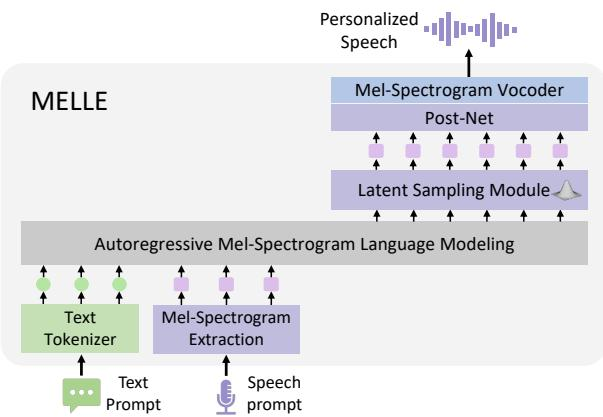
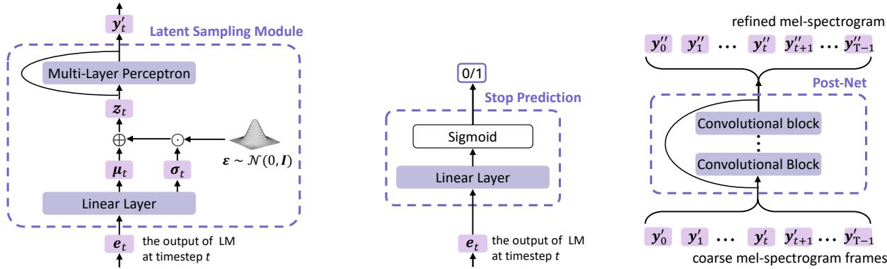

# Autoregressive Speech Synthesis without Vector Quantization

Lingwei Meng1\*, Long Zhou2†, Shujie Liu2, Sanyuan Chen\*, Bing Han2, Shujie Hu1, Yanqing Liu2, Jinyu Li2, Sheng Zhao2, Xixin Wu1, Helen Meng1†, Furu Wei2

1 The Chinese University of Hong Kong 2 Microsoft Corporation {lmeng,sjhu,wuxx,hmmeng}@se.cuhk.edu.hk {lozhou,shujliu,yanqliu,jinyli,szhao,fuwei}@microsoft.com

## Abstract

We present MELLE, a novel continuousvalued token based language modeling approach for text-to-speech synthesis (TTS). MELLE autoregressively generates continuous mel-spectrogram frames directly from text condition, bypassing the need for vector quantization, which is typically designed for audio compression and sacrifices fidelity compared to continuous representations. Specifically, (i) instead of cross-entropy loss, we apply regression loss with a proposed spectrogram flux loss function to model the probability distribution of the continuous-valued tokens; (ii) we have incorporated variational inference into MELLE to facilitate sampling mechanisms, thereby enhancing the output diversity and model robustness. Experiments demonstrate that, compared to the two-stage codec language model VALL-E and its variants, the single-stage MELLE mitigates robustness issues by avoiding the inherent flaws of sampling vector-quantized codes, achieves superior performance across multiple metrics, and, most importantly, offers a more streamlined paradigm. The demos of our work are provided at https://aka.ms/melle.1

## 1 Introduction

The objective of next-token prediction, which involves predicting the next discrete token based on the previous tokens as a condition, is foundational to the recent progress observed in large language models (LLMs) (Brown et al., 2020; OpenAI, 2023; Chen et al., 2024a). Recently, the success of LLMs in natural language processing (NLP) tasks has encouraged the exploration of autoregressive language modeling approaches in audio synthesis fields. Neural codec language models, exemplified by VALL-E (Wang et al., 2023; Zhang et al., 2023), reveal the potential of such principle in the zero-shot text-to-speech (TTS) task by leveraging large-scale multi-lingual multi-speaker multi-domain training corpus. Unlike traditional TTS systems that rely heavily on complex multistep pipelines, they utilize a decoder-only structure to predict discrete codec codes, which are vectorquantized tokens encoded from continuous waveforms leveraging neural codec models (Zeghidour et al., 2021; Défossez et al., 2023).

  
Figure 1: Overview of MELLE. Unlike discrete-valued tokens based language modeling, MELLE samples the variational mel-spectrogram conditioned on text and audio prompts using a single-stage decoder-only structure, coupled with the Latent Sampling Module.

Despite achieving impressive naturalness and diversity in synthesized audios, codec language models are plagued by several drawbacks. First, quantized codec codes, which are typically designed for audio compression, exhibit lower fidelity compared to continuous audio representations if the bit rate is not sufficiently high (Puvvada et al., 2024; Liu et al., 2024; Bai et al., 2024). Most codec models are trained with mel-spectrogram reconstruction loss, such as SoundStream (Zeghidour et al., 2021), EnCodec (Défossez et al., 2023), and DAC (Kumar et al., 2023), suggesting that they acquire knowledge from the denser continuous melspectrogram space. Some information can be lost after training, even though this information cannot be perceived by the human ear or a specific model. The similar phenomenon is observed in the field of graphics, where the reconstruction quality of vector-quantized tokens typically lags behind that of their continuous-valued counterparts (Tschannen et al., 2023; Li et al., 2024a). Second, neural codec language models suffer from robustness issues stemming from their random sampling strategy, which is inherited from text language models for selecting discrete tokens. This issue is more pronounced with acoustic tokens compared to textual ones due to the greater similarity among consecutive codec codes, which can result in extended stretches of silence or persistent noise (Song et al., 2024). Third, neural codec language models typically necessitate a complicated two-pass decoding process, involving an autoregressive (AR) model for generating coarse primary audio tokens, followed by a non-autoregressive (NAR) model to iteratively predict the remaining multi-codebook codes for refinement. This multi-step process compromises inference efficiency, leading to increased computational and storage demands.

To address the limitations associated with discrete-token-based codec language models, we are rethinking the potential of continuous representations and aim to determine whether continuousvalued tokens can supplant discrete-valued tokens within the paradigm of autoregressive speech synthesis models. The successful implementation of the autoregressive model without vector quantization faces two key challenges: (i) How to set training objectives for continuous representation? The continuous space significantly differs from that of vector-quantized tokens, for which autoregressive language models typically adopt a next-token prediction objective, with cross-entropy loss to measure the discrepancy between the predicted probabilities and the targets. (ii) How to enable sampling mechanism in continuous space? The sampling strategy is a critical component in both text generation and speech synthesis systems, as it introduces diversity into the output and enhances their generalization ability. However, continuous-valued token based models can not employ top-p random sampling method used in discrete codec language models.

In this work, we propose MELLE, a robust single-pass zero-shot TTS model that autoregressively predicts continuous mel-spectrogram2 frames based on previous tokens. In response to the aforementioned challenges, we first substitute cross-entropy loss with regression loss and introduce a spectrogram flux loss to promote variation in the prediction and eliminate repetition issues. Second, we design a latent sampling module, derived from variational inference, functioning as a sequence sampling strategy thereby enhancing the diversity of the generated audios. As an option, by adjusting the reduction factor, MELLE can predict multiple frames per step and accelerate inference, thereby further alleviating robustness issues associated with long-sequence modeling and maintaining satisfactory performance.

We conducted evaluations of the proposed MELLE on both the large-scale 50K-hour Libriheavy (Kang et al., 2024) training dataset and the relatively small 960-hour LibriSpeech (Panayotov et al., 2015) training dataset. We use LibriSpeech test-clean set for zero-shot TTS evaluation. Experimental results demonstrate that the proposed MELLE is on par with VALL-E 2 (Chen et al., 2024b) in objective metrics, and surpasses VALL-E 2 in subjective metrics. It also outperforms previous neural codec language models, including VALL-E and its other variants, achieving superior performance across multiple metrics that reflect naturalness, robustness, similarity, and inference efficiency. Specifically, MELLE surpasses the ground truth audios in WER (1.47% vs. 1.61%), achieving a 47.9% relative reduction in WER compared to VALL-E and an 8.1% reduction compared to VALL-E 2 on the continuation inference task for zero-shot TTS. For subjective evaluations, MELLE is more favorably received by human listeners than previous models, achieving comparable performance to the ground truth in terms of MOS (4.20 vs. 4.29) and CMOS (-0.032 vs. ground truth), and an even higher SMOS (4.40 vs. 3.94) than the ground-truth speech.

## 2 Related Work

End-to-End TTS End-to-end neural TTS models are proposed to simplify the previous pipeline by using a single neural network. These models typically generate mel-spectrograms directly from text and then recover the audio from the melspectrograms using a vocoder. TransformerTTS (Li et al., 2019) employs Transformer encoder-decoder network as the backbone to replace RNN structures in Tacotron (Wang et al., 2017). FastSpeech (Ren et al., 2019) further improve the speech quality and decoding efficiency using the non-autoregressive generation model with a duration module. These models are trained on small-scale, clean, single- or few-speaker dataset. Our MELLE leverages the well-established mel-spectrogram as the target representation, however, it differs significantly in two key aspects: (1) We adopt decoder-only network as foundational structure with improved methods, such as variational inference and spectrogram flux loss, (2) MELLE is capable of zero-shot TTS via language modeling training on large-scale data.

Zero-Shot TTS Motivated by the in-context learning abilities of LLMs on NLP tasks, various studies are proposed to address zero-shot TTS through a language modeling approach. VALL-E (Wang et al., 2023; Zhang et al., 2023) first utilizes codec codes as intermediate representation, then uses a codec decoder to reconstruct the audio. Mega-TTS (Jiang et al., 2023) proposes to disentangle the multiple attributes in speech, such as content, timbre, prosody, and phase, then model them with a language model. ELLA-V (Song et al., 2024), RALL-E (Xin et al., 2024), and VALL-E R (Han et al., 2024) aims to improve robustness of VALL-E via additional fine-grained speech-text alignments. BASE TTS (Łajszczak et al., 2024) employs discrete tokens derived from WavLM (Chen et al., 2022) and scales the language model to larger size and training data. Parallel to our work, VALL-E 2 (Chen et al., 2024b) shares the same architecture as VALL-E but employs a repetitionaware sampling strategy that promotes more deliberate sampling choices. Rather than using an NAR model to generate residual discrete codes, some works employ diffusion or flow-matching as the second stage to reconstruct mel-spectrograms or other continuous representations, such as TorToise-TTS (Betker, 2023), CosyVoice (Du et al., 2024), and SEED-TTS (Anastassiou et al., 2024). They indicate that operations in continuous spaces yield improved performance. However, they still necessitate two-stage modeling, unlike MELLE, which requires only single-stage modeling.

Other studies have investigated fully nonautoregressive approaches. SoundStorm (Borsos et al., 2023) adapts a parallel, confidencebased decoding scheme for generating codec codes. StyleTTS 2 (Li et al., 2024b) and NaturalSpeech 3 (Ju et al., 2024) use diffusion model to achieve better TTS synthesis. Voicebox (Le et al., 2023) and Audiobox (Vyas et al., 2023) employ flow-matching based models for transcript-guided speech generation. Recently, E2 TTS (Eskimez et al., 2024) presents a TTS systems consisting of flow-matching-based mel-spectrogram generator trained with the audio infilling task. Different from previous works, MELLE is a continuous-valued token based autoregressive language model with variational inference for text-to-speech synthesis, striving to achieve higher fidelity and naturalness.

## 3 MELLE

## 3.1 Problem Formulation

This study regards TTS as an autoregressive melspectrogram language modeling task. Given the byte-pair-encoded (BPE) text content $\begin{array} { r l } { \pmb { x } } & { { } = } \end{array}$ $[ x _ { 0 } , x _ { 1 } , \dots , x _ { L - 1 } ]$ of an audio sample, MELLE is optimized to predict the mel-spectrogram ${ \pmb y } = [ { \pmb y } _ { 0 } , { \pmb y } _ { 1 } , \dots , { \pmb y } _ { T - 1 } ]$ extracted from the audio. Specifically, at each autoregressive step, MELLE is expected to predict the next mel-spectrogram frame ${ \mathbf { } } _  { \mathbf { } } _ { } { \mathbf { } } _ { } { \mathbf { } } _ { } { \mathbf { } } _ { } { \mathbf { } } _ { } { \mathbf { } } _ { } { \mathbf { } } _ { } { \mathbf { } } _ { } { \mathbf { } } _ { } { \mathbf { } } _ { } { \mathbf { } } _ { } { \mathbf { } } _ { } { \mathbf { } } _ { } { \mathbf { } } _ { } { \mathbf { } } _ { } { \mathbf { } } _ { } { \mathbf { } } _ { } { } \mathbf { } _ { } { } \mathbf { } _ { } { } \mathbf { } _ { } { } \mathbf { } _ { } { } \mathbf { } _ { } { } \mathbf { } _ { } { } \mathbf { } _ { } { } \mathbf { } _ { } { } \mathbf { } _ { } { } \mathbf { } _ { } { } \mathbf { } _ { } { } \mathbf { } _ { } { } \mathbf { } _ { } { } \mathbf { } _ { } { } \mathbf { } _ { } { } \mathbf { } _ { } { } \mathbf { } _ { } { } \mathbf { } _ { } { } \mathbf { } _ { } { } \mathbf { } _ { } { } \mathbf { } _ { } { } \mathbf { } _ { } { } \mathbf { } _ { } { } \mathbf { } _ { } { } \mathbf { } _ { } \mathbf { } _ { } { } \mathbf { } _ { } \mathbf { } _ { } { } \mathbf { } \mathbf { } _ { } \mathbf { } _ { } \mathbf { } _ { } \mathbf { } \mathbf { } _ { } \mathbf { } _ { } \mathbf { } \mathbf { } _ { } \mathbf { } \mathbf { } _ { } \mathbf { } \mathbf { } _ { } \mathbf { } \mathbf { } _ { } \mathbf { } \mathbf _ { } \mathbf { } _ { } \mathbf { } \mathbf { } _ { } \mathbf { } \mathbf _ { } \mathbf { } _ { } \mathbf { } \mathbf _ { } \mathbf { } \mathbf { } _ \mathbf { } \mathbf { } \mathbf _ { } \mathbf { } \mathbf _ { } \mathbf { } \mathbf _ { } \mathbf { } \mathbf _ { } \mathbf { } \mathbf _ { } \mathbf \mathbf { } \mathbf _ { } $ conditioned on the text prompt x and the previous mel-spectrograms $\scriptstyle { \pmb { y } } _ { < t }$ , which is equivalent to maximizing the following distribution:

$$
p ( \pmb { y } \mid \pmb { x } ; \pmb { \theta } ) = \prod _ { t = 0 } ^ { T - 1 } p ( \pmb { y } _ { t } \mid \pmb { y } _ { < t } , \pmb { x } ; \pmb { \theta } )\tag{1}
$$

where $\mathbf { \delta } \mathbf { \cdot } \mathbf { \delta } \mathbf { \cdot } \mathbf { \delta } \mathbf { \cdot } \mathbf { \delta }$ denotes $[ { \pmb y } _ { 0 } , { \pmb y } _ { 1 } , . . . , { \pmb y } _ { t - 1 } ]$ and $\pmb \theta$ represents the parameters of MELLE.

Inspired by previous neural TTS models (Li et al., 2019), we introduce a reduction factor r to control the number of mel-spectrogram frames predicted at each decoding step, providing a balance between computational efficiency and generation quality. Formally, the original melspectrogram sequences y will be partitioned into $\pmb { y } ^ { r } = [ \pmb { y } _ { 0 : r } , \pmb { y } _ { r : 2 r } , . . . , \pmb { y } _ { ( T - r ) : T } ]$ with a factor $r ,$ and the likelihood function can be expressed as

$$
p ( \pmb { y } \mid \pmb { x } ; \pmb { \theta } ) = \prod _ { t = 0 } ^ { T / r - 1 } p ( \pmb { y } _ { t \cdot r : ( t + 1 ) \cdot r } | \ \pmb { y } _ { < t \cdot r } , \pmb { x } ; \pmb { \theta } )\tag{2}
$$

During inference, MELLE executes zero-shot TTS via prompting. Given the text content x for synthesis, the text transcript x˜ and melspectrogram $\tilde { y }$ of speech prompt, the model is designed to generate the target mel-spectrogram y corresponding to x while preserving the characteristics of the speaker in prompt, with maximum likelihood probability as arg max $\dot { \mathbf { \eta } } _ { y } p ( \mathbf { \eta } _ { \mathbf { y } _ { t \cdot r : ( t + 1 ) \cdot r } }$ $[ \tilde { { \pmb x } } ; { \pmb x } ; \tilde { { \pmb y } } ; { \pmb y } _ { < t \cdot r } ] ; { \pmb \theta } )$ at each time step, and it backs to standard mode if $r = 1$

  
Figure 2: The Latent Sampling Module (left), Stop Prediction Layer (mid), and Post-Net (right).

## 3.2 MELLE Architecture

As illustrated in Figure 1, MELLE comprises the following main components: pre-nets that respectively convert text into sub-word tokens and extract mel-spectrograms from speech, before projecting them to the model dimension; an Transformer decoder that serves as the language model; a latent sampling module that samples latent embedding from a predicted distribution, and then projects it back to the spectrogram space; a stop prediction layer to determine the end of the generation and a convolutional post-net for spectrogram refinement. Finally, a vocoder is used to recover the speech from generated mel-spectrogram.

Unlike neural codec language models that iteratively predict multi-layer codec codes, we do not require an additional non-autoregressive (NAR) model thanks to the completeness of the melspectrogram. This simplification significantly improve computational and storage efficiency. Moreover, by adjusting the reduction factor, MELLE can generate multiple mel-spectrogram frames at one step, further enhancing efficiency while still maintaining superior performance.

## 3.2.1 Autoregressive Language Model

We employ an Transformer decoder as the language model (LM) to autoregressively generates acoustic continuous tokens based on the textual and acoustic prompts. Specifically, input text tokens x, with an appended <EOS> token, are first converted into embeddings by the text embedding layer based on their indices. Simultaneously, we employ a multi-layer perceptron, named pre-net, to project the mel-spectrogram y to the language model dimension. The LM, consisting of blocks of multihead attention and feed-forward layers, takes the concatenation of text and acoustic embeddings as input to model the dependency between semantic and acoustic information. The output of the LM $e _ { t }$ at time step t is subsequently processed by the following modules of MELLE to synthesize the next-frame output, which is detailed below.

## 3.2.2 Latent Sampling Module

The sampling strategy is a critical part in TTS systems, as it not only introduces diversity in the output, but also enhances generalization ability. For example, Tacotron (Wang et al., 2017) enable dropout in their pre-net during inference to introduce variation; Codec language models (Wang et al., 2023) adopt the top-p random sampling to avoid the collapse outputs leading by greedy search; Diffusionbased (Ju et al., 2024) and flow-matching-based methods (Le et al., 2023) restore speech representations from the sampling of a simpler distribution.

In this study, inspired by variational autoencoder (VAE) (Kingma and Welling, 2014), we integrate a novel latent sampling module within MELLE, aimed at enhancing both expressive diversity and robustness, as shown in Figure 2 (left). Based on the LM output $\mathbf { } _ { e _ { t } , }$ this module predicts a distribution, from which a latent embedding $z _ { t }$ is sampled.

Specifically, we assume that $z _ { t }$ follows a multivariate Gaussian distribution where each dimension is independent. As depicted in Figure 2, a linear layer (W[ ] + b) predicts a mean vector $\pmb { \mu } _ { t }$ and a log-magnitude variance vector log $\pmb { \sigma } _ { t } ^ { 2 }$ of the Gaussian distribution based on $e _ { t }$ . Leveraging the reparameterization technique, a $z _ { t }$ is sampled as

$$
z _ { t } = \mu _ { t } + \sigma _ { t } \odot \epsilon\tag{3}
$$

where $\epsilon \sim \mathcal { N } ( 0 , I ) , [ \pmb { \mu } _ { t } , \log \pmb { \sigma } _ { t } ^ { 2 } ] = \mathbf { W } e _ { t } +$ b. Then, the probability density function is defined as

$$
p _ { \pmb { \theta } } ( z _ { t } \mid e _ { t } ) = \mathcal { N } ( z _ { t } \mid \mu _ { t } , \mathrm { d i a g } ( \pmb { \sigma } _ { t } ^ { 2 } ) )\tag{4}
$$

Note that it is differentiable with the reparameterization technique. Next, the latent variable $z _ { t }$ is passed through a multi-layer perceptron with residual connections, mapping it to the mel-spectrogram space as $\pmb { y } _ { t } ^ { \prime } .$ , where $t = 0 , 1 , . . . , T - 1$

## 3.2.3 Stop Prediction Layer and Post-Net

We use a linear layer as a binary classifier, taking $e _ { t }$ to determine if the generation should conclude, as depicted in Figure 2 (mid). Following previous neural TTS models (Li et al., 2019), we employ multiple convolutional blocks as the post-net to produce a residual that is added to $\pmb { y } ^ { \prime } = \{ \pmb { y } _ { 0 } ^ { \prime } , \pmb { y } _ { 1 } ^ { \prime } , . . . , \pmb { y } _ { T - 1 } ^ { \prime } \}$ resulting in the refined mel-spectrogram $y ^ { \prime \prime } =$ $\{ \pmb { y } _ { 0 } ^ { \prime \prime } , \pmb { y } _ { 1 } ^ { \prime \prime } , . . . , \pmb { y } _ { T - 1 } ^ { \prime \prime } \}$ , as shown in Figure 2 (right). During training, the model is trained using teacherforcing; while during inference, post-net processes $\boldsymbol { y } ^ { \prime }$ after the AR generation concludes.

## 3.3 Training Objective

The training process of MELLE is efficient and straightforward, due to the absence of VALL-E’s complex hierarchical structure. As illustrated in Figure 1, a single end-to-end autoregressive model is optimized during training in teacher-forcing manner using four loss functions: (1) a regression loss; (2) a Kullback-Leibler (KL) divergence loss; (3) a novel spectrogram flux loss; and (4) a binary cross entropy (BCE) loss for stop prediction. They work collaboratively to enhance overall performance:

$$
\mathcal { L } = \mathcal { L } _ { \mathrm { r e g } } + \lambda \mathcal { L } _ { \mathrm { K L } } + \beta \mathcal { L } _ { \mathrm { f l u x } } + \gamma \mathcal { L } _ { \mathrm { s t o p } }\tag{5}
$$

Regression Loss The regression loss is a fundamental component of the training objective, ensuring the accurate prediction of mel-spectrogram frames. The regression loss, $\mathcal { L } _ { \mathrm { r e g } } .$ , is composed of a combination of L1 and L2 losses, applied to both intermediate prediction $\boldsymbol { y } ^ { \prime }$ and final prediction $y ^ { \prime \prime }$ of the mel-spectrogram. It is defined as follows:

$$
\begin{array} { r l } { \mathcal { L } _ { \mathrm { r e g } } ( y , y ^ { \prime } , y ^ { \prime \prime } ) = \| y - y ^ { \prime } \| _ { 1 } + \| y - y ^ { \prime } \| _ { 2 } ^ { 2 } } & { } \\ { + \| y - y ^ { \prime \prime } \| _ { 1 } + \| y - y ^ { \prime \prime } \| _ { 2 } ^ { 2 } } & { } \end{array}\tag{6}
$$

where $\textbf {  { y } }$ is the ground-truth spectrogram target.

KL Divergence Loss We introduce a Kullback-Leibler (KL) divergence loss based on the concept of variational inference (Kingma and Welling, 2014), to enhance the diversity and stability of MELLE. The KL divergence measures the difference between the predicted latent distribution $p _ { \pmb { \theta } } ( \pmb { z } _ { t } \mid e _ { t } )$ and a simpler distribution $p ( z _ { t } )$ . Unlike Kingma and Welling (2014), which selects $p ( z _ { t } )$ as a standard normal distribution, we let $z _ { t }$ possess the same dimensionality as the mel-spectrogram and define $p ( z _ { t } )$ as $\mathcal { N } ( \boldsymbol { y } _ { t } , \boldsymbol { I } )$ . This can be seen as a shortcut on the optimization path thus accelerates the model’s learning. Combining equation (4)

$$
\begin{array} { l } { \displaystyle \mathcal { L } _ { \mathrm { K L } } ( \pmb { y } , z ) = \sum _ { t = 0 } ^ { T - 1 } D _ { \mathrm { K L } } \big ( p _ { \pmb { \theta } } ( z _ { t } \mid \pmb { e } _ { t } ) \parallel p ( z _ { t } ) \big ) } \\ { = \displaystyle \frac { 1 } { 2 } \sum _ { t = 0 } ^ { T - 1 } ( \lVert \pmb { \sigma } _ { t } \rVert _ { 2 } ^ { 2 } + \lVert \pmb { \mu } _ { t } - \pmb { y } _ { t } \rVert _ { 2 } ^ { 2 } - d - \sum _ { i = 1 } ^ { d } \log \pmb { \sigma } _ { t } ^ { 2 } [ i ] ) } \end{array}\tag{7}
$$

where d is the dimensionality of the feature space. The detailed derivation is provided in Appendix A.1. By integrating the KL divergence loss, MELLE achieves a balance between synthesis quality and latent space regularization, ultimately enhancing the expressive diversity and robustness of the generated mel-spectrograms.

The Spectrogram Flux Loss To encourage dynamic variation in the generated frames, a novel spectrogram flux loss is proposed as a regularization term that penalizes low variability between consecutive frames and promotes changes:

$$
\mathcal { L } _ { \mathrm { f l u x } } ( \pmb { y } , \pmb { \mu } ) = - \sum _ { t = 1 } ^ { T - 1 } \| \pmb { \mu } _ { t } - \pmb { y } _ { t - 1 } \| _ { 1 }\tag{8}
$$

where the L1 norm is employed to measure the difference between the predicted Gaussian mean vector $\pmb { \mu } _ { t }$ and the previous ground truth frame $\mathbf { \nabla } \mathbf { \mathbf { y } } _ { t - 1 }$ By summing the negative values of the differences, the loss rewards variations in the generated frames and discourages overly static frames, which can lead to repetition or prolonged silence in synthesized audio. By penalizing flat predictions, the model is incentivized to produce more diverse and dynamic spectrograms, thereby preventing monotonic and unnatural speech.

Stop Prediction Loss We use a linear layer to project LM output $e _ { t }$ to a logit and calculate the BCE loss, ${ \mathcal { L } } _ { \mathrm { s t o p } } ,$ , for stop prediction, similar to

SpeechT5 (Ao et al., 2022). Considering each utterance has only one positive frame indicating "stop," the positive and negative frames are extremely imbalanced. To address this, we assign a larger weight (100) to the positive frames in the BCE loss.

Inference: In-Context Learning During inference, we perform zero-shot TTS by autoregressively predicting mel-spectrogram. Given the text content x and a piece of speech prompt (with text transcription $\tilde { \mathbf { x } }$ and mel-spectrogram $\tilde { y } )$ , at each time step $t ,$ MELLE generates the next-frame $\mathbf { \nabla } _ { \boldsymbol { y } _ { t } ^ { \prime } }$ from a latent embedding z , which is sampled from a distribution conditioned on the concatenation of ${ \tilde { \mathbf { x } } } ,$ , x, ${ \tilde { \mathbf { y } } } ,$ and $\scriptstyle { \pmb { y } } _ { < t }$ . After the AR generation process concludes, the coarse mel-spectrogram $\boldsymbol { y } ^ { \prime }$ passes through the post-net to obtain the refined spectrogram $y ^ { \prime \prime }$ , which is then converted to speech audio using an off-the-shelf vocoder. If the reduction factor r is set, the input and predicted melspectrograms will be grouped by r.

Unlike codec language models (e.g., VALL-E) that rely on multi-stage iterative predictions across multi-layer codes and require manual configuration of sampling parameters, MELLE accomplishes speech synthesis in a single forward pass and automatically samples from learned distributions that are unique to each input. This automated approach ensures adaptive and consistent sampling, reduces human effort, and makes the method domainindependent. With the strong in-context learning capability from LM, MELLE is capable of generating high-fidelity, natural-sounding speech for unseen speakers without fine-tuning.

## 4 Experimental Setup

## 4.1 Training Datasets

We trained MELLE on the Libriheavy (Kang et al., 2024) corpus, which contains approximately 50K hours of speech from 6,736 speakers, sourced from English audiobooks. We use byte-pair encoding (BPE) for text tokenization with a vocabulary size of 4K. For audios, we perform voice activity detection to remove abnormal silences and facilitate training. The 80-dimensional log-magnitude melspectrograms are extracted at 62.5 Hz with a window length of 1,024 and a hop length of 256, from waveforms resampled at 16 kHz.

Additionally, to verify the effectiveness of our method under constrained resources, we trained a limited version of our model, denoted as MELLElimited, on LibriSpeech (Panayotov et al., 2015),

which contains 960-hour data from 1,251 speakers.   
We use phoneme text tokens for this version.

## 4.2 Experimental Settings

The LM of MELLE contains 12 Transformer blocks, each with 16 attention heads, an embedding dimension of 1,024, a feed-forward network dimension of 4,096, and a dropout rate of 0.1. The input mel-spectrograms are projected to the LM dimension using a 3-layer perceptron with a 0.5 dropout rate enabled during both training and inference, following Tacotron. Within the latent sampling module, the sampled ${ \boldsymbol { z } } _ { t }$ passes through a 3-layer perceptron to produce a residual, which is then added to itself to generate $\pmb { y } _ { t } ^ { \prime }$ . The post-net, consisting of 5 convolutional blocks with a kernel size of 5 and 256 intermediate channels, takes $\boldsymbol { y } ^ { \prime }$ to generate the refined ${ \pmb y } ^ { \prime \prime } .$ . Throughout this study, we utilize an open-source HiFi-GAN vocoder3 (Kong et al., 2020), trained on LibriTTS, to reconstruct audios from mel-spectrograms.

The training hyper-parameters and details of MELLE can be found in Appendix A.3.

## 4.3 Evaluation Settings

Following recent works (Wang et al., 2023; Chen et al., 2024b), we use LibriSpeech test-clean set and screen audios with lengths ranging from 4 to 10 seconds for zero-shot evaluation. We assess MELLE under two inference schemes: (1) Continuation: We use the text transcript and the first 3 seconds of the audio as the prompt, expecting the model to seamlessly synthesize the subsequent portion of the speech; (2) Cross-sentence: Using a reference utterance and its transcript as the prompt, and given the text of a target utterance, expecting the model to generate the corresponding speech while retaining the characteristics of the reference speaker.

To assess the naturalness, robustness, and speaker similarity of MELLE, we employ multiple subjective and objective metrics:

WER To assess robustness and intelligibility, we perform ASR on synthesized speech using both a Conformer-Transducer model4 (Gulati et al., 2020) and HuBERT-Large ASR model5 (Hsu et al., 2021). We calculate WER between the transcripts and the ground truth text. We use $\mathrm { W E R } _ { C }$ and ${ \mathrm { W E R } } _ { H }$ to denote WER obtained from the two ASR systems.

<table><tr><td rowspan="2">System</td><td rowspan="2">Training Data Hours</td><td colspan="3">Continuation</td><td colspan="3">Cross-Sentence</td></tr><tr><td>WERC</td><td> $\mathrm { W E R } _ { H }$ </td><td>SIM</td><td> $\operatorname { W E R } _ { C }$ </td><td> $\mathrm { W E R } _ { H }$ </td><td>SIM</td></tr><tr><td>Ground Truth</td><td></td><td>1.61</td><td>2.15</td><td>0.668</td><td>1.61</td><td>2.15</td><td>0.779</td></tr><tr><td>Ground Truth (mel-spectrogram)</td><td></td><td>1.64</td><td>2.24</td><td>0.617</td><td>1.64</td><td>2.24</td><td>0.732</td></tr><tr><td>Ground Truth (EnCodec, 8 codebooks)</td><td></td><td>1.65</td><td>2.33</td><td>0.593</td><td>1.65</td><td>2.33</td><td>0.710</td></tr><tr><td>RALL-E (Xin et al., 2024)</td><td>44K</td><td></td><td></td><td></td><td>2.5</td><td>2.8</td><td>0.49</td></tr><tr><td>ELLA-V (Song et al., 2024) *</td><td>960</td><td>2.10</td><td>2.91</td><td>0.303</td><td>7.15</td><td>8.90</td><td>0.307</td></tr><tr><td>VALL-E R (Han et al., 2024) †</td><td>960</td><td>1.58</td><td>2.32</td><td>0.363</td><td>3.18</td><td>3.97</td><td>0.365</td></tr><tr><td>CLaM-TTS (Kim et al., 2024)</td><td>55K</td><td></td><td>2.36</td><td>0.477</td><td></td><td>5.11</td><td>0.495</td></tr><tr><td>VALL-E (Wang et al., 2023)</td><td>60K</td><td></td><td>3.8</td><td>0.508</td><td></td><td>5.9</td><td>0.580</td></tr><tr><td>VALL-E 2 (Chen et al., 2024b) †</td><td>50K</td><td>1.6</td><td>2.32</td><td>0.504</td><td>1.5</td><td>2.44</td><td>0.643</td></tr><tr><td>Voicebox (Le et al., 2023)</td><td>60K</td><td></td><td>2.0</td><td>0.593</td><td></td><td>1.9</td><td>0.662</td></tr><tr><td>MELLE</td><td>50K</td><td>1.47</td><td>1.98</td><td>0.508</td><td>1.47</td><td>2.10</td><td>0.625</td></tr><tr><td>MELLE-R2</td><td>50K</td><td>1.45</td><td>2.02</td><td>0.489</td><td>1.50</td><td>2.14</td><td>0.608</td></tr><tr><td>MELLE-R3</td><td>50K</td><td>1.52</td><td>2.10</td><td>0.462</td><td>1.51</td><td>2.19</td><td>0.570</td></tr><tr><td>MELLE-R4</td><td>50K</td><td>1.59</td><td>2.10</td><td>0.437</td><td>1.56</td><td>2.30</td><td>0.532</td></tr><tr><td>MELLE-R5</td><td>50K</td><td>1.66</td><td>2.25</td><td>0.410</td><td>1.96</td><td>2.72</td><td>0.506</td></tr><tr><td>MELLE-limited</td><td>960</td><td>1.53</td><td>2.22</td><td>0.480</td><td>2.21</td><td>2.80</td><td>0.591</td></tr></table>

Table 1: Objective performance comparison on continuation and cross-sentence zero-shot speech synthesis tasks. MELLE-Rx denotes the model is with a reduction factor of x. MELLE-limited denotes the model is trained on smaller-scale corpus. \*We quote Han et al. (2024)’s reproduction results, which demonstrate better performance. †We evaluate metrics not reported in the original paper, using the audios provided by the authors.

SIM Speaker similarity reflects the in-context learning capability of zero-shot TTS models. We utilize WavLM-TDNN6 (Chen et al., 2022) to extract speaker embedding vectors from the original speech prompt and the generated speech. The cosine distance between them is then calculated to measure speaker similarity, denoted as SIM.

Subjective metrics Three mean opinion scores (MOS) are assessed: (1) MOS for assessing speech quality; (2) Similarity MOS (SMOS) for measuring speaker similarity between the speech prompt and the generated speech; and (3) Comparative MOS (CMOS) for evaluating the comparative naturalness of the synthesized speech against ground truth. The assessment criteria is detailed in Appendix A.4.

## 5 Results and Discussion

In this section, we compare the speech synthesis performance of MELLE with various systems, and discuss ablation study and inference efficiency. Particularly, we would like to point out that, as shown in Table 1, the ground-truth speech reconstructed from mel-spectrograms demonstrates better robustness and speaker similarity compared to the speech reconstructed from EnCodec codes. This confirms the hypothesis that discrete codec codes, originally designed for audio compression, sacrifice fidelity compared to the continuous mel-spectrogram.

## 5.1 Objective Evaluation

As illustrated in Table 1, the proposed MELLE outperforms VALL-E and all its variants on the continuation zero-shot speech synthesis task, and is comparable to VALL-E 2 on the cross-sentence task. Most importantly, it presents a much more concise and efficient paradigm for audio language modeling without vector quantization.

MELLE significantly outperforms VALL-E in both robustness and speaker similarity, achieving a 47.9% relative reduction in $\mathrm { W E R } _ { H }$ on continuation task and a 64.4% reduction on cross-sentence task. ELLA-V and VALL-E R explicitly introduce monotonic alignment mechanisms to improve robustness, as reflected in the WERs. However, it comes at the cost of a significant decrease in SIM. CLaM-TTS demonstrated acceptable performance on continuation task, but its performance is limited on cross-sentence task. It introduces more complex assumptions and therefore an intricate structure. Despite both being single-pass models, MELLE outperforms by a large margin featuring a simpler topology. VALL-E 2 uses repetition-aware sampling and employs Vocos (Siuzdak, 2024) as its codec decoder, demonstrating results on par with ours. For continuation task, MELLE reveals better robustness and speaker similarity. This indicates that MELLE exhibits superior zero-shot capabilities with even shorter prompts, highlighting its in-context learning ability. We attribute this advantage to our direct prediction of spectrograms, which encompass richer acoustic cues compared to discrete codes. For cross-sentence task, although MELLE falls slightly behind in the objective SIM metric, it still significantly surpasses VALL-E 2 in subjective metrics, as evidenced in Table 3. We attribute the slight difference in this objective metric to the bias of the speaker verification model, considering that MELLE achieves a higher SIM compared to VALL-E 2 (0.680 vs. 0.662), when evaluate using another well-recognized speaker verification model, ECAPA-TDNN.

<table><tr><td rowspan="2">System</td><td colspan="2">Continuation</td></tr><tr><td>Cross-Sentence WERC WERH SIM WERC WERH</td><td>SIM</td></tr><tr><td>Ground Truth</td><td>1.61 2.15 0.668</td><td>1.61 2.15 0.779</td></tr><tr><td>MELLE</td><td>1.03 1.49 0.561</td><td>0.70 1.07 0.663</td></tr><tr><td>MELLE-R2</td><td>1.04 1.47 0.542</td><td>0.77 1.12 0.647</td></tr><tr><td>MELLE-R3</td><td>1.12 1.54 0.512</td><td>0.86 1.17 0.608</td></tr><tr><td>MELLE-R4</td><td>1.11 1.52 0.487</td><td>0.76 1.08 0.571</td></tr><tr><td>MELLE-R5</td><td>1.05 1.52 0.463</td><td>0.93 1.38 0.547</td></tr><tr><td>MELLE-limited</td><td>1.04 1.57 0.533</td><td>1.04 1.50 0.631</td></tr></table>

Table 2: Comparison of five-time sampling performance with different reduction factors. The results indicate the upper bound of the systems’ performance.

Although Voicebox shows better SIM than MELLE, this gap can be partially attributed to their proprietary vocoder, which was trained on a 60K-hour corpus. In contrast, MELLE utilizes an open-source vocoder trained on the 585-hour LibriTTS. Moreover, Voicebox requires both duration prediction and phoneme tokens for synthesis, whereas MELLE only requires BPE text tokens.

Referring to previous mel-spectrograms prediction works, MELLE can accelerate training and inference by predicting multiple frames through an adjustable reduction factor r. We observe that as r increases, robustness remains consistently high for both continuation and cross-sentence tasks. Although SIM declines due to the prediction of multiple frames at once, MELLE still remarkably outperforms most recent works in both WER and SIM, as shown in Table 1. MELLE-limited, trained on the smaller-scale LibriSpeech corpus, also demonstrates superior performance compared to VALL-E and its variants, except for VALL-E 2.

A potential use of MELLE is to set a larger r while sampling multiple times, selecting the candidate with the highest SIM to the prompt as the final output. This strategy enhances performance while reducing inference time, as the process can be executed in parallel on the GPU. To explore the upper bound performance of MELLE with different r, we report five-time sampling results in Table 2. In this setup, we sample five times for each test utterance and select the candidate with the best score for each metric. MELLEs consistently exhibit high robustness across different r settings, yielding much lower WER than ground truth.

<table><tr><td>System</td><td>MOS</td><td>SMOS</td><td>CMOS</td></tr><tr><td>Ground Truth</td><td> $4 . 2 9 _ { \pm 0 . 1 6 }$ </td><td> $3 . 9 4 _ { \pm 0 . 2 5 }$ </td><td>0.000</td></tr><tr><td>YourTTS (2022)</td><td> $2 . 4 1 _ { \pm 0 . 2 4 }$ </td><td> $2 . 6 2 _ { \pm 0 . 2 5 }$ </td><td>-2.162</td></tr><tr><td>VALL-E (2023)</td><td> $3 . 1 8 _ { \pm 0 . 2 3 }$ </td><td> $3 . 5 0 { \scriptstyle \pm 0 . 2 5 }$ </td><td>-0.912</td></tr><tr><td>VALL-E 2 (2024b)</td><td> $4 . 0 8 _ { \pm 0 . 1 8 }$ </td><td> $3 . 8 8 _ { \pm 0 . 2 5 }$ </td><td>-0.085</td></tr><tr><td>MELLE</td><td> ${ \bf 4 . 2 0 _ { \pm 0 . 2 0 } }$ </td><td> ${ \bf 4 . 4 0 _ { \pm 0 . 2 2 } }$ </td><td>-0.032</td></tr><tr><td>MELLE-R2</td><td> $4 . 1 4 _ { \pm 0 . 1 9 }$ </td><td> $4 . 1 8 _ { \pm 0 . 2 4 }$ </td><td>-0.252</td></tr></table>

Table 3: Subjective evaluation under cross-sentence task for 40 samples from LibriSpeech test-clean set.

## 5.2 Subjective Evaluation

We conducted subjective evaluations using a crowdsource human rating system to assess MOS, SMOS, and CMOS, which correspond to overall speech quality, speaker similarity, and naturalness of the synthesized speech, respectively. We evaluated 40 samples from the test set, selecting one sample per speaker. Each speaker’s previous utterance from the official test set list was used as a prompt to synthesize the target speech audio. We use the original 16 kHz audios as the ground truth in the evaluations, unlike VALL-E 2 paper which utilizes 24 kHz upsampled audios as the ground truth.

As shown in Table 3, MELLE’s synthesized speech is more favorably received by human listeners, achieving the best performance across all metrics compared to other systems. Remarkably, MELLE attains an SMOS score even higher than the ground truth (4.40 vs. 3.94), highlighting its exceptional capability to capture and retain the speaker’s characteristics. Furthermore, MELLE achieves speech quality on par with human-level (CMOS: -0.032 vs. 0, with p-value > 0.1 according to a t-test), indicating that MELLE can generate accurate and highly natural speech. Besides, MELLE-R2, despite sacrificing some performance for efficiency, still outperforms VALL-E 2 in MOS and SMOS.

Additionally, we found that MELLE’s latent sampling, which avoids manually designed sampling strategy for discrete codec codes, enables it to generate more stable and natural speech compared to both VALL-E 2 and VALL-E. We recommend visiting our demo website for more information.

<table><tr><td rowspan="2">LS SFL</td><td rowspan="2"></td><td colspan="3">Continuation</td><td colspan="3">Cross-Sentence</td></tr><tr><td>WERC</td><td>WERH</td><td>SIM</td><td>WERC</td><td>WERH</td><td>SIM</td></tr><tr><td>x</td><td>x</td><td>6.41</td><td>6.91</td><td>0.483</td><td>23.21</td><td>23.65</td><td>0.518</td></tr><tr><td>√</td><td>x</td><td>3.57</td><td>4.07</td><td>0.486</td><td>10.36</td><td>10.87</td><td>0.584</td></tr><tr><td>x</td><td>√</td><td>2.03</td><td>2.61</td><td>0.506</td><td>5.31</td><td>5.90</td><td>0.602</td></tr><tr><td></td><td>√</td><td>1.54</td><td>2.13</td><td>0.506</td><td>2.10</td><td>2.72</td><td>0.615</td></tr><tr><td>√√</td><td></td><td>1.47</td><td>1.98</td><td>0.508</td><td>1.47</td><td>2.10</td><td>0.625</td></tr></table>

Table 4: Ablation study on the latent sampling (LS) and the spectrogram flux loss (SFL). The ✦ denotes that latent sampling is enabled only during training.

## 5.3 Ablation Study

To assess the effectiveness of the proposed methods, we conduct a series of ablation studies on MELLE. If the latent sampling is marked as disabled in Table 4, it will degrade into a simple linear layer without reparameterization.

As illustrated in Table 4, both the proposed latent sampling method and the spectrogram flux loss significantly enhance the robustness and speaker similarity of the synthesized speech. The improvements are particularly pronounced in cross-sentence task, suggesting that the proposed methods substantially facilitate longer sequence modeling. The phenomenon is also evident in the five-time sampling setup, as shown in Appendix A.5. We also conduct an experiment where latent sampling is enabled during training but disabled during inference. The results indicate that latent sampling during inference leads to more robust and natural outputs.

We would like to emphasize the role of latent sampling in improving speaker similarity. Compared to spectrogram flux loss, latent sampling offers relatively less improvement in WER, yet it provides comparable gains in SIM. This suggests that the primary function of latent sampling is to capture and preserve the speaker characteristics present in the speech prompt. On the other hand, spectrogram flux loss improves SIM partly by enhancing MELLE’s robustness and ensuring the accurate generation of semantic context.

## 5.4 Efficiency Comparison

We compare the inference time for generating 10- second speech segments across different models.

<table><tr><td>System</td><td>AR Steps</td><td>Infer. Time (s)</td></tr><tr><td>VALL-E R (2024) *</td><td>375</td><td>3.67</td></tr><tr><td>VoiceBox (2023) † CLaM-TTS (2024) †</td><td>一</td><td>6.4 (64 NFE) 4.15</td></tr><tr><td>VALL-E (2023)</td><td>750</td><td>7.32</td></tr><tr><td>VALL-E 2 (2024b)</td><td>750</td><td>7.32</td></tr><tr><td>MELLE</td><td>625</td><td>5.49</td></tr><tr><td>MELLE-R2</td><td>312</td><td>2.76</td></tr><tr><td>MELLE-R4</td><td>156</td><td>1.40</td></tr></table>

Table 5: Inference time for generating 10-second speech segments. \*Quoted from Han et al. (2024); †Quoted from Kim et al. (2024).

Since VALL-E and VALL-E 2 (without code grouping) share the identical architecture, their inference time can be considered the same. As shown in Table 5, MELLE is more efficient than VALL-E 2, as it forgoes the NAR inference steps, thereby reducing both computational and spatial complexity. By setting the reduction factor r, the training and inference processes of MELLE can be accelerated by approximately r times – MELLE-R2 halves the inference time, while MELLE-R4 reduces it to one quarter, surpassing VALL-E R, CLaM-TTS, and Voicebox. Despite predicting multiple frames per step, they still demonstrate satisfactory performance, as revealed in Table 1 and Table 2.

## 6 Conclusion

We present a continuous-valued token based language modeling approach for zero-shot text-tospeech synthesis, thereby eliminating the use of vector quantization. By exploring the potential of mel-spectrograms within the paradigm of language modeling, the proposed MELLE directly predicts continuous-valued tokens conditioned on text content and speech prompt. This approach obviates the need for the two-stage training and inference procedures typical of neural codec language models like VALL-E, and can further accelerate decoding by setting the reduction factor. With the aid of latent sampling and spectrogram flux loss, MELLE is capable of producing more diverse and robust predictions, attaining highly natural speech comparable to human performance in subjective evaluations.

## Limitations

Despite MELLE’s promising performance and concise topology, we acknowledge several limitations. First, the quality of synthesized speech can be limited by the ability of the vocoder utilized. We anticipate performance improvements by training a more powerful vocoder on a large-scale corpus, as demonstrated by Voicebox (Le et al., 2023). Second, we conduct evaluation on Englishonly LibriSpeech test set. The Multi-lingual setting like VALL-E X (Zhang et al., 2023) on various dataset will be explored in our future work. Third, we adopt only the mel-spectrogram as the target continuous acoustic representation. Future research will explore other continuous representations, such as VAE latent hidden states.

## Broader Impacts and Ethical Statements

We envision advancing the development of speech synthesis by distilling the methodology of audio language modeling to its fundamental principles, eliminating the complexity of heavy codebooks. The proposed approach can substantially reduce the training and inference costs of large-scale audio generation models while improving performance.

MELLE is purely a research project. MELLE could synthesize speech that maintains speaker identity and could be used for education, entertainment, journalistic, self-authored content, accessibility features, interactive voice response systems, translation, chatbot, and so on. While MELLE can speak in a voice like a voice talent, the similarity and naturalness of the generated speech depend on the length and quality of the speech prompt, the background noise, as well as other factors. It may carry potential risks in the misuse of the model, such as spoofing voice identification or impersonating a specific speaker. We conducted the experiments under the assumption that the user agrees to be the target speaker in speech synthesis. If the model is generalized to unseen speakers in the real world, it should include a protocol to ensure that the speaker approves the use of their voice and a synthesized speech detection model.

All data and pre-trained models used are publicly available and are used under following licenses: Creative Commons BY 4.0 License, Creative Commons CC0 License, Creative Commons BY-NC-ND 4.0 License, Creative Commons BY-SA 4.0 License, MIT license, and Apache-2.0 license.

## Acknowledgments

This work is partially supported by the CUHK MoE-Microsoft Key Laboratory of Human-Centric Computing and Interface Technologies, and a grant from the HKSARG Research Grants Council’s

Theme-based Research Grant Scheme (Project No.   
T45-407/19N).

## References

Philip Anastassiou, Jiawei Chen, Jitong Chen, Yuanzhe Chen, Zhuo Chen, Ziyi Chen, Jian Cong, Lelai Deng, Chuang Ding, Lu Gao, et al. 2024. Seed-TTS: A family of high-quality versatile speech generation models. arXiv preprint arXiv:2406.02430.

Junyi Ao, Rui Wang, Long Zhou, Chengyi Wang, Shuo Ren, Yu Wu, Shujie Liu, Tom Ko, Qing Li, Yu Zhang, Zhihua Wei, Yao Qian, Jinyu Li, and Furu Wei. 2022. SpeechT5: Unified-modal encoder-decoder pre-training for spoken language processing. In Proceedings of the 60th Annual Meeting of the Association for Computational Linguistics, pages 5723– 5738.

He Bai, Tatiana Likhomanenko, Ruixiang Zhang, Zijin Gu, Zakaria Aldeneh, and Navdeep Jaitly. 2024. dMel: Speech tokenization made simple. arXiv preprint arXiv:2407.15835.

James Betker. 2023. Better speech synthesis through scaling. arXiv preprint arXiv:2305.07243.

Zalán Borsos, Matt Sharifi, Damien Vincent, Eugene Kharitonov, Neil Zeghidour, and Marco Tagliasacchi. 2023. SoundStorm: Efficient parallel audio generation. arXiv preprint arXiv:2305.09636.

Tom Brown, Benjamin Mann, Nick Ryder, Melanie Subbiah, Jared D Kaplan, Prafulla Dhariwal, Arvind Neelakantan, Pranav Shyam, Girish Sastry, Amanda Askell, et al. 2020. Language models are few-shot learners. Advances in neural information processing systems, 33:1877–1901.

Edresson Casanova, Julian Weber, Christopher D Shulby, Arnaldo Candido Junior, Eren Gölge, and Moacir A Ponti. 2022. YourTTS: Towards zero-shot multi-speaker TTS and zero-shot voice conversion for everyone. In International Conference on Machine Learning, pages 2709–2720.

Liang Chen, Zekun Wang, Shuhuai Ren, Lei Li, Haozhe Zhao, Yunshui Li, Zefan Cai, Hongcheng Guo, Lei Zhang, Yizhe Xiong, et al. 2024a. Next token prediction towards multimodal intelligence: A comprehensive survey. arXiv preprint arXiv:2412.18619.

Sanyuan Chen, Shujie Liu, Long Zhou, Yanqing Liu, Xu Tan, Jinyu Li, Sheng Zhao, Yao Qian, and Furu Wei. 2024b. VALL-E 2: Neural codec language models are human parity zero-shot text to speech synthesizers. arXiv preprint arXiv:2406.05370.

Sanyuan Chen, Chengyi Wang, Zhengyang Chen, Yu Wu, Shujie Liu, Zhuo Chen, Jinyu Li, Naoyuki Kanda, Takuya Yoshioka, Xiong Xiao, et al. 2022. WavLM: Large-scale self-supervised pre-training for full stack speech processing. IEEE Journal of Selected Topics in Signal Processing, 16(6):1505–1518.

Alexandre Défossez, Jade Copet, Gabriel Synnaeve, and Yossi Adi. 2023. High fidelity neural audio compression. Transactions on Machine Learning Research. Featured Certification, Reproducibility Certification.

Zhihao Du, Qian Chen, Shiliang Zhang, Kai Hu, Heng Lu, Yexin Yang, Hangrui Hu, Siqi Zheng, Yue Gu, Ziyang Ma, et al. 2024. CosyVoice: A scalable multilingual zero-shot text-to-speech synthesizer based on supervised semantic tokens. arXiv preprint arXiv:2407.05407.

Sefik Emre Eskimez, Xiaofei Wang, Manthan Thakker, Canrun Li, Chung-Hsien Tsai, Zhen Xiao, Hemin Yang, Zirun Zhu, Min Tang, Xu Tan, et al. 2024. E2 TTS: Embarrassingly easy fully non-autoregressive zero-shot TTS. arXiv preprint arXiv:2406.18009.

Anmol Gulati, James Qin, Chung-Cheng Chiu, Niki Parmar, Yu Zhang, Jiahui Yu, Wei Han, Shibo Wang, Zhengdong Zhang, Yonghui Wu, and Ruoming Pang. 2020. Conformer: Convolution-augmented transformer for speech recognition. In Proc. Interspeech 2020, pages 5036–5040.

Bing Han, Long Zhou, Shujie Liu, Sanyuan Chen, Lingwei Meng, Yanming Qian, Yanqing Liu, Sheng Zhao, Jinyu Li, and Furu Wei. 2024. VALL-E R: Robust and efficient zero-shot text-to-speech synthesis via monotonic alignment. arXiv preprint arXiv:2406.07855.

Wei-Ning Hsu, Benjamin Bolte, Yao-Hung Hubert Tsai, Kushal Lakhotia, Ruslan Salakhutdinov, and Abdelrahman Mohamed. 2021. HuBERT: Self-supervised speech representation learning by masked prediction of hidden units. IEEE/ACM Trans. Audio, Speech and Lang. Proc., 29:3451–3460.

Ziyue Jiang, Yi Ren, Zhenhui Ye, Jinglin Liu, Chen Zhang, Qian Yang, Shengpeng Ji, Rongjie Huang, Chunfeng Wang, Xiang Yin, et al. 2023. Mega-TTS: Zero-shot text-to-speech at scale with intrinsic inductive bias. arXiv preprint arXiv:2306.03509.

Zeqian Ju, Yuancheng Wang, Kai Shen, Xu Tan, Detai Xin, Dongchao Yang, Yanqing Liu, Yichong Leng, Kaitao Song, Siliang Tang, et al. 2024. Naturalspeech 3: Zero-shot speech synthesis with factorized codec and diffusion models. arXiv preprint arXiv:2403.03100.

Wei Kang, Xiaoyu Yang, Zengwei Yao, Fangjun Kuang, Yifan Yang, Liyong Guo, Long Lin, and Daniel Povey. 2024. Libriheavy: a 50,000 hours ASR corpus with punctuation casing and context. In ICASSP 2024-2024 IEEE International Conference on Acoustics, Speech and Signal Processing (ICASSP), pages 10991–10995.

Jaehyeon Kim, Keon Lee, Seungjun Chung, and Jaewoong Cho. 2024. CLaM-TTS: Improving neural codec language model for zero-shot text-to-speech. In The Twelfth International Conference on Learning Representations.

Diederik P Kingma and Max Welling. 2014. Autoencoding variational bayes. In The International Conference on Learning Representations.

Jungil Kong, Jaehyeon Kim, and Jaekyoung Bae. 2020. HiFi-GAN: Generative adversarial networks for efficient and high fidelity speech synthesis. In Advances in Neural Information Processing Systems, volume 33, pages 17022–17033.

Rithesh Kumar, Prem Seetharaman, Alejandro Luebs, Ishaan Kumar, and Kundan Kumar. 2023. Highfidelity audio compression with improved RVQGAN. Advances in Neural Information Processing Systems, 36:27980–27993.

Mateusz Łajszczak, Guillermo Cámbara, Yang Li, Fatih Beyhan, Arent van Korlaar, Fan Yang, Arnaud Joly, Álvaro Martín-Cortinas, Ammar Abbas, Adam Michalski, et al. 2024. BASE TTS: Lessons from building a billion-parameter text-tospeech model on 100K hours of data. arXiv preprint arXiv:2402.08093.

Matthew Le, Apoorv Vyas, Bowen Shi, Brian Karrer, Leda Sari, Rashel Moritz, Mary Williamson, Vimal Manohar, Yossi Adi, Jay Mahadeokar, and Wei-Ning Hsu. 2023. Voicebox: Text-guided multilingual universal speech generation at scale. In Thirty-seventh Conference on Neural Information Processing Systems.

Naihan Li, Shujie Liu, Yanqing Liu, Sheng Zhao, and Ming Liu. 2019. Neural speech synthesis with transformer network. Proceedings of the AAAI Conference on Artificial Intelligence, page 6706–6713.

Tianhong Li, Yonglong Tian, He Li, Mingyang Deng, and Kaiming He. 2024a. Autoregressive image generation without vector quantization. arXiv preprint arXiv:2406.11838.

Yinghao Aaron Li, Cong Han, Vinay Raghavan, Gavin Mischler, and Nima Mesgarani. 2024b. StyleTTS 2: Towards human-level text-to-speech through style diffusion and adversarial training with large speech language models. Advances in Neural Information Processing Systems, 36.

Zhijun Liu, Shuai Wang, Sho Inoue, Qibing Bai, and Haizhou Li. 2024. Autoregressive diffusion transformer for text-to-speech synthesis. arXiv preprint arXiv:2406.05551.

OpenAI. 2023. GPT-4 technical report. arXiv preprint arXiv:2303.08774.

Vassil Panayotov, Guoguo Chen, Daniel Povey, and Sanjeev Khudanpur. 2015. LibriSpeech: An ASR corpus based on public domain audio books. In ICASSP, pages 5206–5210.

Krishna C. Puvvada, Nithin Rao Koluguri, Kunal Dhawan, Jagadeesh Balam, and Boris Ginsburg. 2024. Discrete audio representation as an alternative

to mel-spectrograms for speaker and speech recognition. In ICASSP 2024 - 2024 IEEE International Conference on Acoustics, Speech and Signal Processing (ICASSP), pages 12111–12115.

Yi Ren, Yangjun Ruan, Xu Tan, Tao Qin, Sheng Zhao, Zhou Zhao, and Tie-Yan Liu. 2019. FastSpeech: Fast, robust and controllable text to speech. In NeurIPS, pages 3165–3174.

Hubert Siuzdak. 2024. Vocos: Closing the gap between time-domain and Fourier-based neural vocoders for high-quality audio synthesis. In The Twelfth International Conference on Learning Representations.

Yakun Song, Zhuo Chen, Xiaofei Wang, Ziyang Ma, and Xie Chen. 2024. ELLA-V: Stable neural codec language modeling with alignment-guided sequence reordering. arXiv preprint arXiv:2401.07333.

Michael Tschannen, Cian Eastwood, and Fabian Mentzer. 2023. GIVT: Generative infinitevocabulary transformers. arXiv preprint arXiv:2312.02116.

Apoorv Vyas, Bowen Shi, Matthew Le, Andros Tjandra, Yi-Chiao Wu, Baishan Guo, Jiemin Zhang, Xinyue Zhang, Robert Adkins, William Ngan, et al. 2023. Audiobox: Unified audio generation with natural language prompts. arXiv preprint arXiv:2312.15821.

Chengyi Wang, Sanyuan Chen, Yu Wu, Ziqiang Zhang, Long Zhou, Shujie Liu, Zhuo Chen, Yanqing Liu, Huaming Wang, Jinyu Li, et al. 2023. Neural codec language models are zero-shot text to speech synthesizers. arXiv preprint arXiv:2301.02111.

Yuxuan Wang, R.J. Skerry-Ryan, Daisy Stanton, Yonghui Wu, Ron J. Weiss, Navdeep Jaitly, Zongheng Yang, Ying Xiao, Zhifeng Chen, Samy Bengio, Quoc Le, Yannis Agiomyrgiannakis, Rob Clark, and Rif A. Saurous. 2017. Tacotron: Towards end-to-end speech synthesis. In Proc. Interspeech 2017, pages 4006– 4010.

Detai Xin, Xu Tan, Kai Shen, Zeqian Ju, Dongchao Yang, Yuancheng Wang, Shinnosuke Takamichi, Hiroshi Saruwatari, Shujie Liu, Jinyu Li, et al. 2024. RALL-E: Robust codec language modeling with chain-of-thought prompting for text-to-speech synthesis. arXiv preprint arXiv:2404.03204.

Neil Zeghidour, Alejandro Luebs, Ahmed Omran, Jan Skoglund, and Marco Tagliasacchi. 2021. SoundStream: An end-to-end neural audio codec. IEEE/ACM Transactions on Audio, Speech, and Language Processing, 30:495–507.

Ziqiang Zhang, Long Zhou, Chengyi Wang, Sanyuan Chen, Yu Wu, Shujie Liu, Zhuo Chen, Yanqing Liu, Huaming Wang, Jinyu Li, et al. 2023. Speak foreign languages with your own voice: Cross-lingual neural codec language modeling. arXiv preprint arXiv:2303.03926.

## A Appendix

## A.1 Derivation of Kullback-Leibler (KL) Divergence Loss

We assume that $z _ { t }$ follows a multivariate Gaussian distribution where each dimension is independent. Combining equation (4), the KL divergence loss among T time steps can be analytically computed as

$$
\begin{array} { r l } { \widehat { \mathbf { x } } _ { + } \widehat { \mathbf { \Gamma } } _ { 2 } \widehat { \mathbf { x } } _ { + } ( 1 - \frac { 1 } { 2 } ) \widehat { \mathbf { x } } _ { + } \widehat { \mathbf { \Gamma } } _ { 2 } \widehat { \mathbf { x } } _ { + } ( 1 + \frac { 1 } { 2 } ) \widehat { \mathbf { x } } _ { + } ( 1 + \frac { 1 } { 2 } ) \widehat { \mathbf { x } } _ { + } \widehat { \mathbf { \Gamma } } _ { 2 } ( 1 + \frac { 1 } { 2 } ) \widehat { \mathbf { x } } _ { + } ( 1 + \frac { 1 } { 2 } ) \widehat { \mathbf { x } } _ { + } ( 1 + \frac { 1 } { 2 } ) \widehat { \mathbf { x } } _ { + } } & { { } } \\ { - \frac { 1 } { 2 } \widehat { \mathbf { x } } _ { + } \widehat { \mathbf { \Gamma } } _ { 2 } \widehat { \mathbf { x } } _ { + } ( 1 + \widehat { \mathbf { x } } _ { + } \widehat { \mathbf { \Gamma } } _ { 2 } \widehat { \mathbf { x } } _ { + } ( 1 + \widehat { \mathbf { x } } _ { + } \widehat { \mathbf { \Gamma } } _ { 2 } ) ) \widehat { \mathbf { x } } _ { + } \widehat { \mathbf { \Gamma } } _ { 2 } \widehat { \mathbf { x } } _ { + } ( 1 + \widehat { \mathbf { x } } _ { + } \widehat { \mathbf { \Gamma } } _ { 2 } ) \widehat { \mathbf { x } } _ { + } ( 1 + \widehat { \mathbf { x } } _ { + } \widehat { \mathbf { \Gamma } } _ { 2 } ) \widehat { \mathbf { x } } _ { + } ( 1 + \widehat { \mathbf { x } } _ { + } \widehat { \mathbf { \Gamma } } _ { 2 } ) \widehat { \mathbf { x } } _ { + } } & { { } } \\  - \frac { 1 } { 2 } \widehat { \mathbf { x } } _ { - } \widehat { \mathbf { \Gamma } } _ { 2 } \widehat { \mathbf { x } } _ { - } ( \widehat { \mathbf { x } } _  \end{array}\tag{9}
$$

where d is the dimensionality of the feature space.

## A.2 Mel-Spectrogram Extraction Protocol

We extract log-magnitude mel spectrograms from resampled 16 kHz audios as the target continuous speech representation throughout this work. To extract mel-spectrograms, we apply a 1024-point short-time Fourier transform (STFT) using the Hann window function, with a window length of 1024 and a hop length of 256. We then apply an 80-dimensional mel-filter with the frequency range of 80 Hz to 7600 Hz. Finally, we take the base-10 logarithm of the resulting output as the final representation.

## A.3 Training Details

MELLE are trained on 16 NVIDIA Tesla V100 32G GPUs with a total batch size of 480K input frames for 400K update steps. While MELLE-limited is trained with a batch size of 80K input frames for 400K steps. We optimize the models using AdamW optimizer, warming up the learning rate to a peak of 5e-4 over the first 32K updates, followed by a linear decay. We set $\beta = 0 . 5$ for the spectrogram flux loss and $\gamma = 1 . 0$ for the stop prediction loss. For the KL divergence loss, we set $\lambda = 0$ for the first 10K steps to ensure stable training, and $\lambda = 0 . 1$ thereafter.

## A.4 Detailed Subjective Assessment Criteria

We engaged native English speakers with experience in speech annotation and evaluation to participate as contributors in a crowd-sourced evaluation. The crowd-sourcing platform also oversaw and validated the testing process and results.

We evaluate 40 samples from our test set, with one sample for each speaker. Each utterance was assessed by at least 10 contributors from various perspectives. Three types of mean opinion scores (MOS)

are assessed: (1) MOS for assessing speech quality; (2) Similarity MOS (SMOS) for measuring speaker similarity between the speech prompt and the generated speech; and (3) Comparative MOS (CMOS) for evaluating the comparative naturalness of the synthesized speech against the original ground truth audio. For MOS and SMOS evaluations, each test sample is rated on a scale from 1 to 5, in increments of 0.5 points. Higher scores indicate more positive evaluations. For the CMOS evaluation, the ground truth sample and the generated sample are presented in random order to the participants, who assign scores from -3 (much worse than the baseline) to 3 (much better than the baseline), with intervals of 1.

## A.5 Ablation Study with Five-Time Sampling

To further demonstrate the effectiveness of the proposed method, we also report the results of the ablation study with five-time sampling. In this setup, we sampled five times for each test utterance and selected the candidate with the best score for each metric for reporting. The upper half of Table A1 presents the results for single-time sampling, which is same as Table 4 in the main text. The lower half shows the results for five-time sampling.

As shown in Table A1, the proposed latent sampling method and the spectrogram flux loss significantly enhance the robustness and speaker similarity of the synthesized speech. This improvement is evident in both single-time sampling and five-time sampling setups.

<table><tr><td rowspan="2"></td><td rowspan="2">Latent Sampling</td><td rowspan="2">Spectrogram Flux Loss</td><td colspan="3">Continuation</td><td colspan="3">Cross-Sentence</td></tr><tr><td>WERC</td><td>WERH</td><td>SIM</td><td>WERC</td><td>WERH</td><td>SIM</td></tr><tr><td rowspan="5">Single-Time Sampling</td><td>x</td><td>x</td><td>6.41</td><td>6.91</td><td>0.483</td><td>23.21</td><td>23.65</td><td>0.518</td></tr><tr><td>√</td><td>x</td><td>3.57</td><td>4.07</td><td>0.486</td><td>10.36</td><td>10.87</td><td>0.584</td></tr><tr><td>x</td><td>√</td><td>2.03</td><td>2.61</td><td>0.506</td><td>5.31</td><td>5.90</td><td>0.602</td></tr><tr><td></td><td>√</td><td>1.54</td><td>2.13</td><td>0.506</td><td>2.10</td><td>2.72</td><td>0.615</td></tr><tr><td>√</td><td>√</td><td>1.47</td><td>1.98</td><td>0.508</td><td>1.47</td><td>2.10</td><td>0.625</td></tr><tr><td rowspan="5">Five-Time Sampling</td><td>x</td><td>x</td><td>3.74</td><td>4.15</td><td>0.536</td><td>17.69</td><td>18.00</td><td>0.569</td></tr><tr><td>√</td><td>X</td><td>1.18</td><td>1.63</td><td>0.546</td><td>2.41</td><td>2.86</td><td>0.641</td></tr><tr><td>x</td><td>√</td><td>1.17</td><td>1.65</td><td>0.551</td><td>1.74</td><td>2.13</td><td>0.644</td></tr><tr><td></td><td>√</td><td>1.10</td><td>1.50</td><td>0.552</td><td>1.07</td><td>1.47</td><td>0.645</td></tr><tr><td>√</td><td>√</td><td>1.03</td><td>1.49</td><td>0.561</td><td>0.70</td><td>1.07</td><td>0.663</td></tr></table>

Table A1: Ablation study on the effectiveness of latent sampling and the spectrogram flux loss. The ✦ denotes that latent sampling is enabled during training but disabled during inference.