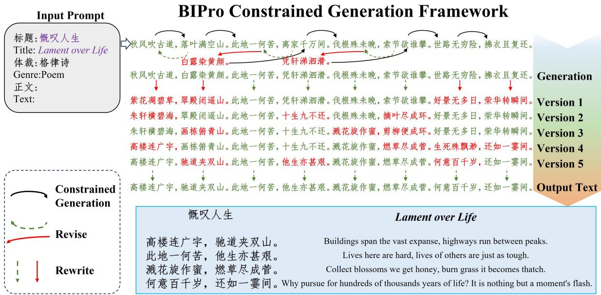
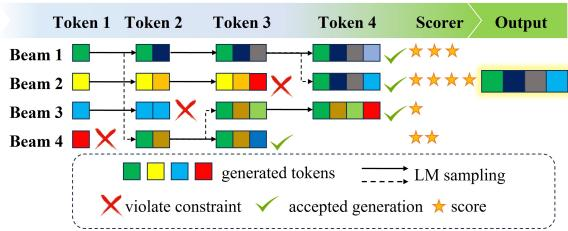
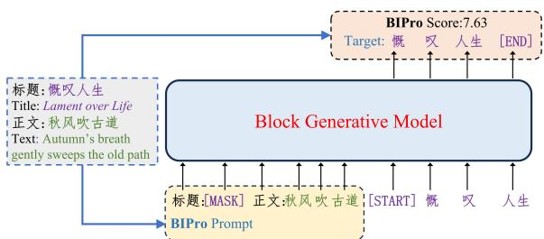
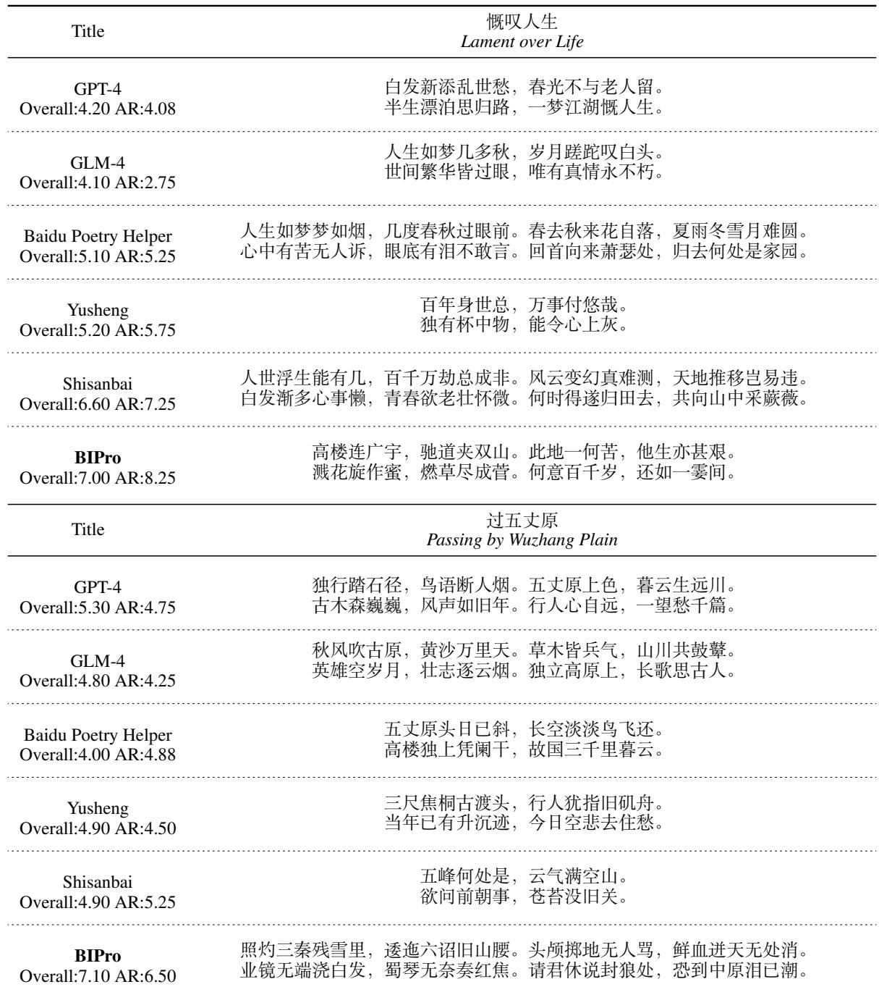

# BIPro: Zero-shot Chinese Poem Generation via Block Inverse Prompting Constrained Generation Framework

Xu Zou Beijing Knowledge Atlas Technology Joint Stock Company Limited xz\_mailbox@xuzou.cn

## Abstract

Recently, generative pre-trained models have made significant strides, particularly highlighted by the release of ChatGPT and GPT-4, which exhibit superior cross-domain capabilities. However, these models still face challenges on constrained writing tasks like poem generation under open-domain titles via direct generation.

In response to this challenge, we introduce Block Inverse Prompting (BIPro) constrained generation framework. BIPro leverages two block inverse prompting methods, revise and rewrite. This inference scaling approach mimics the process of human text writing using block generative models. It significantly improves the zero-shot generation quality on the constrained generation task of open-domain traditional-form Chinese poem generation.

Based on a less powerful block generative model GLM-10B-Chinese, poems composed via BIPro without priming or additional training outperform both much larger direct generative systems like GPT-4 or GLM-4 and domain-specific systems such as Yusheng, Shisanbai, or Baidu Poetry Helper in human evaluation by proficient poets.

BIPro considerably narrows the gap between AI-generated works and short-listed human literary arts in another human evaluation, unveiling the promising potential of inference scaling in improving the quality of constrained generation. It is open-sourced 1 and available as an agent in chatglm app.

## 1 Introduction

The current decade is marked by remarkable advancements in the field of generative pretrained models. Various pre-trained models like GPT (Achiam et al., 2023) and Gemini (Team et al., 2023) have become standout performers across a range of generative tasks, including translation, article writing, problem-solving, code generation, and image creation.

These advanced models are swiftly adopted in numerous social sectors, and AI-generated content is permeating our daily lives. (Du et al., 2023; Baldassarre et al., 2023).

Constrained writing is a literary technique in which the author is bounded by some condition that imposes a certain pattern, often enhancing the aesthetic merit of the text. The most well-known application of constrained writing is poetry, where constraints like rhyme or meter are usually applied. Poets who master those constraints, such as Li Bai or William Shakespeare, are sometimes regarded as icons of their civilizations. (Xie et al., 2019)

However, the very constraints that elevate the artistic value of texts also introduce significant challenges, as they limit the freedom of expression, demanding more deliberate and planned creation. Masterpieces of constrained writing typically emerge from multiple revisions. Authors think deeply before penning their words and produce numerous drafts, trying to find the ideal expression.

This process could elucidate why generative models like GPTs struggle in this domain. (Garbacea and Mei, 2022) Direct generative models sequentially produce tokens through autoregression, considering only preceding text and lacking the ability to revise what has already been generated. Although GPT-generated poems are almost indistinguishable from human masterpieces for general public (Deng et al., 2024), they are not as good in the view of reviewers with expertise in the domain. (Sawicki et al., 2023)

Inverse prompting (Zou et al., 2021) is a text generation method designed to improve generation quality by searching the best generation using perplexity of the inverse form of natural language as scorer. One of the key limitations of inverse prompting lies in its dependence on the existence of precise inverse forms to convey the same meaning, unable to handle cases where inverse forms are absent or imprecise.

  
Figure 1: The generation process of poem “Lament over Life" under BIPro framework. Sentences are generated with constraints using block generative model. Each sentence is revised after its subsequent sentence is generated. The full poem endures several rounds of rewrite.

In this paper, we explore how inverse prompting can be improved through integration with block generative models, models that enable intermediate text generation according to both preceding and subsequent context. We introduce two novel block inverse prompting methods and establish a Block Inverse Prompting (BIPro) framework for constrained generation.

We implement our proposed BIPro framework on one of the most challenging constrained generation tasks, the open-domain traditional-form Chinese poem generation. Figure 1 illustrates an example of the process to generate a poem under open-domain title “Lament over Life"(慨叹人生) using BIPro. Besides direct constrained generation, each sentence of the poem is revised after its subsequent sentence is generated. After the initial generation, the poem is then rewritten for multiple times, mimicking the way humans produce poems. Each rewrite yields better expressions and improves the quality of the poem.

The exemplary open-domain traditional-form Chinese poem in figure 1 does not emerge from most advanced direct generative systems or specialized systems extensively trained on domainspecific data. It is created using a relatively weak model, GLM-10B (Du et al., 2022), as base model. Although this model is outperformed by cutting-edge direct generative systems like GPT-4 (Achiam et al., 2023) or GLM-4 in direct generation, and lacks domain-specific expertise compared with domain-specific systems like Yusheng (Ma et al., 2023) or Shisanbai, BIPro leverages its unique advantage of intermediate text generation, and empowers it to craft poetry of unparalleled excellence.

Reviews of human poets demonstrate that the BIPro framework significantly improves the ability of traditional-form Chinese poem generation of GLM-10B. Poems produced by BIPro framework have outperformed a variety of baselines, including best domain-specific approaches Yusheng or Shisanbai 2 as well as leading direct generation systems like GPT-4 or GLM-4. BIPro narrows the gap between AI generated poems and short-listed human poems in Daily Poem section on China Poetry website.

To summarize, the paper mainly presents the following key contributions:

• We introduce BIPro framework to harness the distinctive capabilities of block generative models, allowing them to refine and improve generated content autonomously on constrained generation tasks.

• BIPro framework significantly improves the quality of the generated texts, enabling the less advanced block generative model GLM-10B to outperform both superior generative systems and domain-specific systems in creating open-domain traditional-form Chinese poetry.

• The efficacy of the BIPro framework highlights the untapped potential of block generative models in producing high-quality constrained generations.

## 2 Related Works

## 2.1 Generative Pre-trained Language Models

Pre-training is first introduced to handle natural language via word embeddings (Mikolov et al., 2013). Following works like BERT (Devlin et al., 2018) and GPT (Radford et al., 2018) expand it to transformer-based language models.

The commercial success of ChatGPT triggers a great wave of generative pre-trained models. Following ChatGPT, various generative pre-trained models are released within a short period of time. Well-known examples include GPT-4 (Achiam et al., 2023), LLaMA (Touvron et al., 2023a,b), Qwen (Bai et al., 2023), GLM-4 3, Falcon (Almazrouei et al., 2023), Baichuan (Yang et al., 2023), ERNIE Bot (Baidu Research, 2023) and Gemini (Team et al., 2023).

## 2.2 Block Generative Models

Generative pre-trained models typically produce text via direct auto-regressive generation, where each token is generated based on solely the preceding tokens. Once generated, the new token is incorporated into the input sequence to facilitate the generation of the subsequent tokens.

GLM (Du et al., 2022) is a departure from this trend as a block generative model that enables non-monotonic generation. It can generate middle texts of any length according to both previous and following texts using its unique block attention mechanism. However, its direct generation performance is not as impressive as direct generative models. As a result, subsequent iterations of the GLM series, ChatGLM and GLM-4 abandon the block generative designation.

## 2.3 Constrained Writing and Traditional-form Chinese Poem Generation

Constrained writing is a writing scenario that the process of writing is bounded by constraints like limited vocabulary, rhyme, meter, usage of vowels, or other constraints. It is particularly challenging for neural language models. (Garbacea and Mei, 2022) In some constrained generation tasks, like word puzzles, the difficulty lies on finding a solution to satisfy hard constraints. In other tasks, the constraints themselves are not hard, but the target is to write as good text as possible under the constraints. These tasks are more challenging for neural language models, as they have to balance between constraints and qualities of generated texts.

One of the most well-known applications of constrained writing is poetry. The task of traditional-form Chinese poem generation is one of the most prestigious. Many Chinese language models including Baichuan (Yang et al., 2023), GLM-4,and Qwen (Bai et al., 2023) highlight poem generation as one of their spotlights in their model applications. There is also a poemspecific Baidu Poetry Helper derived from ERNIE Bot (Baidu Research, 2023) specialized on general poem generation.

Originally codified in the 13th century, the Pingshui (Nie, 1982) rhyme scheme serves as a comprehensive set of rules governing the structure of traditional-form Chinese poems. It is widelyaccepted as the standard for traditional-form Chinese poems.

Being a time-honored task, there exists lots of domain-specific systems specified on creating traditional-form Chinese poems. The most famous instance is Jiuge (Zhipeng et al., 2019), while Shisanbai 4 and Yusheng (Ma et al., 2023) are better and more recent instances.

## 3 Methodology

## 3.1 Inverse Prompting

Inverse prompting (Zou et al., 2021) is a controllable generation method that prompts pre-trained generative models under an inverse way using the inverse representation of natural language. The perplexity of the original prompt under the inverse form is computed and used as a scorer for beam search. The method greatly improves the generation quality of generative pre-trained models.

The problem of text generation is modeled as generating text $t _ { g }$ given the prompt text $t _ { p } ,$ where both $t _ { p }$ and $t _ { g }$ are sequences of tokens.

A language model  takes prompt sequence $t _ { p }$ and outputs a probability distribution of the next token $\mathcal { M } ( t _ { p } ) = \mathcal { D } ( t o k e n s )$ over all available tokens.

For generation texts longer than a single token, the model generates in an auto-regressive way, sampling a token from  and appends the token after the prompt sequence $t _ { p } .$

To improve consistency between prompt and generated text, inverse prompting aims to maximize conditional probability $p ( t _ { p } | t _ { g } )$ , the probability to reconstruct the prompt given the generated context.

$$
\operatorname* { m a x } _ { t _ { g } } f ( t _ { g } | t _ { p } ) = \operatorname* { m a x } _ { t _ { g } } \log p ( t _ { p } | t _ { g } ) .\tag{1}
$$

$p ( t _ { p } | t _ { g } )$ cannot be directly achieved, inverse prompting estimates this by inverse transformation of natural language.

$$
\operatorname* { m a x } _ { t _ { g } } f ( t _ { g } | t _ { p } ) = \operatorname* { m a x } _ { t _ { g } } \log p ( t ^ { \prime } | t _ { p } ^ { d } ) ,\tag{2}
$$

In equation 2, the target text $t ^ { \prime }$ and direct inverse prompt $t _ { p } ^ { d }$ are inverse representations transformed from $t _ { p }$ and $t _ { g }$ using the inverse form of natural language. Some examples of inverse expression transformation are listed in Table 1.

In summary, inverse prompting basically improves the quality of the generated text by offering a scorer that helps the model determine which generation is better.

## 3.2 Block Inverse Prompting

BIPro can be viewed as a broader implementation of inverse prompting under block generative models $\mathcal { M } _ { b } )$ , models that are able to generate intermediate text given previous and following text.

Given prompt sequence $t _ { p } ,$ , block position $b ,$ already generated text $t _ { g } ,$ the model outputs a probability distribution of the next token $\mathcal M _ { b } ( t _ { p } , t _ { g } , b ) = \mathcal D ( t o k e n s )$ over all available tokens. Sampling from  and append the sampled token to $t _ { g }$ we can generate intermediate text of any length in an auto-regressive way using block generative models.

For block generative models, instead of relying on inverse transformation of natural language, $p ( t _ { p } | t _ { g } )$ in equation 1 can be directly computed by simply mask $t _ { p }$ and prompting the model with $t _ { g }$

  
Figure 2: Beam-based constrained generation. Bad generation are replaced by good generations from other beams at each step. Finally, generations that satisfy constraints are scored and selected accordingly.

  
Figure 3: BIPro scorer. The input is first transformed to BIPro prompt and target text, then BIPro prompt is fed into block generative model and the perplexity of the target text is used for scoring.

Table 1 summarizes formats of prompts and targets for inverse prompting and BIPro used in poem generation. As can be seen, instead of using an inverse transformation in natural language, with the help of block generative models, BIPro is more direct. It avoids indistinct expressions of meanings in inverse transformation, and can handle conditions that are hard to construct natural inverse prompts, such as evaluating sentences in the middle of two sentences.

## 3.3 Constrained Generation

In constrained generation, the generated text shall satisfy constraints. Constraints can be conspicuous. They may limit the vocabulary at some positions. Constraints can be inconspicuous. The usage of some words may temporarily satisfy the constraint while making it impossible for further text to lie within constraint. Handling with such constraints is more difficult than dealing with conspicuous constraints, as such dead ends are hard to detect in advance.

In BIPro, we use a search-and-evaluate strategy to generate poem sentences that satisfy the Pingshui constraint, illustrated in figure 2. During generation, a number of beams is maintained.

<table><tr><td>Prompt  $t _ { p }$ </td><td>Generated Text  $t _ { g }$ </td><td>Direct Inverse Prompt  $t _ { p } ^ { d }$ </td><td>BIPro Prompt  $t _ { p } ^ { b }$ </td><td>Target Text t′</td></tr><tr><td>Title:$Title Genre:Poem Text:</td><td>$Text</td><td>$Text belongs to poem</td><td>Title:[M] Genre:Poem Text:$Text</td><td>$Title</td></tr><tr><td>标题：$Title 体裁：诗歌正文：</td><td>$Text</td><td>$Text出自诗歌</td><td>标题：[M]体裁：诗歌 正文: $Text</td><td>$Title</td></tr><tr><td>$S1</td><td>$S2</td><td>The previous sentence of $S2 is</td><td>$S1[M]</td><td>$S2</td></tr><tr><td>$S1</td><td>$S2</td><td>$S2 的上一句话是</td><td>$S1[M]</td><td>$S2</td></tr><tr><td>$S1 $S2</td><td>$S3</td><td>N/A</td><td>$S1[M] $S3</td><td>$S2</td></tr><tr><td>$S1 [M] $S3</td><td>$S2</td><td>N/A</td><td>$S1 $S2 [M]</td><td>$S3</td></tr></table>

Table 1: Examples of formats used in direct inverse prompting and BIPro. BIPro directly masks the prompt and evaluate the perplexity under block generative models, skipping the inverse transformation process in direc inverse prompting. S1,S2,S3 represents sentence 1,2,3 and [M] represents [MASK].

Beams violating constraints are replaced by secondary generations from other beams that still fit in constraints. By maintaining a population of generated texts, the strategy can overcome most of the dead ends of poem constraints.

The generation process continues until all beams reaches an end. Eventually, all generations are evaluated by a scorer and the best beam is selected as the output generation.

Figure 3 illustrates the BIPro scorer, the prompt and the generated text are transformed to BIPro prompt and target text according to Table 1. The BIPro prompt is fed into the block generative model, the perplexity of the target text is used as BIPro score.

## 3.4 BIPro Generation

Direct generative systems cannot revise texts. After subsequent texts are generated, they are unable to retrospectively alter the existing content. This rigidity contrasts with the human approach to text production, where rewriting, revising, and formatting are essential (Seow, 2002), particularly when crafting high-quality texts. Individuals often deliberate extensively, seeking for the optimal expression and making adjustments to the text they have already composed. Such flexibility is challenging for direct generative models, which generally lack the capability to modify earlier sections based on later ones.

Block generative models offer a solution by enabling the generation of intermediary text that considers both preceding and subsequent content, thus facilitating a writing process that more closely resembles human behavior.

In this study, we introduce two methods, revise and rewrite. Revise refers to subtle and immediate modification of a sentence once the subsequent sentence has been produced. Rewrite refers to involves more substantial changes and is undertaken after the entire text has been generated. Figure 1 illustrates the BIPro constrained generation framework using an example of generating traditionalform Chinese poem under title “Lament over Life". Each sentence is generated using the constrained generation method described in the previous subsection. We revise each sentence immediately after its subsequent sentence is generated. We mask that sentence and prompt the model to generate a new one, then compare the new poem with the original one using BIPro scorer. We replace the original sentence with the new one when BIPro scorer gives it a better score. In the example of Figure 1, two sentences are revised during the initial generation.

Following the generation of a complete poem, we systematically rewrite each sentence by masking it and prompting the model with the remaining text, replacing them if the new generation is better in BIPro score. Such rewriting process can be cycled for multiple rounds until the model can no longer offer better expressions for any sentences of the poem, or the number of rounds achieves the set limit. In the case of Figure 1, the poem is rewritten for 5 rounds.

Algorithm 1: BIPro Generation   
Result: Generated Poem p   
Input: Block generative model ${ \mathcal { M } } _ { b } ,$ input   
prompt $t _ { p } .$ , constraint verifier v,   
BIPro scorer s   
Parameter: number of sentences $n ,$   
maximal revise m   
1 Initialize $\scriptstyle \mathrm { p = } ( ) , \mathrm { r = } 0 ;$   
2 for $k \gets 1$ to n do   
3 Generate sentence $p _ { k } \gets \mathcal { M } _ { b } ( t _ { p } , p ) ;$   
4 $p \gets ( p _ { 1 } , . . . , p _ { k } ) ;$   
5 if $k { > } I$ then   
$/ \star$ Revise \*/   
6 $p _ { k - 1 } ^ { ' }  \mathcal { M } _ { b } ( t _ { p } , p / p _ { k - 1 } ) ;$   
7 if $s ( p / p _ { k - 1 } , p _ { \ k - 1 } ^ { ^ { \prime } } ) > s ( p )$ then   
8 $p _ { k - 1 }  p _ { k - 1 } , p $   
$( p / p _ { k - 1 } , p _ { k - 1 } ^ { ' } ) ;$   
9 end   
10 end   
11 end   
12 while $( r < m )$ and (p changes in the last   
rewrite) do   
/\* Rewrite \*/   
13 for k 1 to n do   
14 $p _ { k - 1 } ^ { ' }  \mathcal { M } _ { b } ( t _ { p } , p / p _ { k - 1 } ) ;$   
15 if $s ( p / p _ { k } , p _ { k } ^ { ^ { \prime } } ) > s ( p )$ then   
16 $p _ { k }  p _ { k } ^ { ' } , p  ( p / p _ { k } , p _ { k } ^ { ' } )$   
17 end   
18 end   
19 $r  r + 1 ;$   
20 end   
21 Output final poem p.

The process of poem generation under BIPro framework is also described in Algorithm 1.

## 4 Experiments

Most of the leading language models are direct generative models. Block generative models are rare. Currently the best open-source block generative model may be GLM-10B (Du et al., 2022) and GLM-130B (Zeng et al., 2022). We use the open-sourced Chinese version of GLM-10B 5 as our base model. Detailed implementations are described in Appendix.

To evaluate the quality of poems generated by BIPro framework, we organize two human review challenges. Reviewers in these challenges are amateur poets associated with universities or local poetry clubs. They are experienced in crafting traditional-form Chinese poetry.

## 4.1 Experiment Settings

In each challenge, a number of titles are given to different poem generation systems. The resulting poems, authored anonymously to ensure impartiality, are then presented to the reviewers. To facilitate fair comparison, poems sharing the same title are grouped and provided in random orders.

Reviewers shall rate the poems based on four aspects.

• Format, how well the poem fit into the constraints fluently and euphonically.

• Informativeness, amount of useful information contained in the poem.

• Relevance, how well the poem suits the given title.

• Aesthetic, artistic conception of the poem.

Reviewers are also required to rate an overall score , and how they think others may score for each poem.

Open-domain Poem Generation In this challenge, 42 titles suggested by different reviewers are gathered together and passed to 6 different poem generation systems: GPT-4 (Achiam et al., 2023), GLM-4, Baidu Poetry Helper, Yusheng (Ma et al., 2023), Shisanbai, and BIPro for poem generation. Reviewers shall review 6 different poems for each title.

Parallel Poem Generation In this challenge, titles of 87 human-created traditional-form Chinese poems from Daily Poem section of China Poetry website 6 are passed to 3 different poem generation systems, GPT-4, BIPro and GLM-10B direct generation. For each poem the systems shall generate poems with exactly the same format. Human poems are also included in the evaluation, resulting in a total of 4 poems for each title.

Details of the implementations of BIPro and baseline models are included in Appendix.

All data used in the human review challenges do not contain personally identifying info or offensive content.

## 4.2 Experimental Results

Table 2 displays the results of the two human review challenges. We provide averaged detailed scores and overall scores. Recognizing that reviewers vary in their evaluation criteria, we also collect their predictions for scores others may rate to each poem. Utilizing this data, we apply Answer Ranking (AR) (Kong et al., 2022) and calculate an AR score for each poem. We also provide the averaged AR score for each method.

In open-domain poem generation challenge, due to the lack of domain-specific training for base model, BIPro is not as good in satisfying format constraints or generating aesthetic poems as domain-specific poem generation systems Yusheng and Shisanbai. Using a less powerful base model of GLM-10B, the generated poems from BIPro are also not as related to the given title as those generated by leading secondgeneration generative systems GPT-4 or GLM-4. However, the BIPro framework excels at guiding GLM-10B-Chinese in producing poems that balance between format, aesthetics, informativeness, and title relevance. The poems from BIPro received the highest overall average score(5.27) and AR score(5.22) from reviewers, outperforming all other methods on the open-domain titles the reviewers proposed.

In parallel generation challenge, the overall average of direct generation using GLM-10B stands at 4.65, with the AR score lagging even further behind at 4.37. In comparison, poems crafted by GPT-4 outperform those from GLM-10B with a higher average overall score of 4.98 and AR score of 4.86. It is important to note that this comparison might understate the true disparity in quality, as the GLM-10B output may include instances replicated from well-known poems. An example is offered in Appendix. The BIPro framework markedly enhances the caliber of poems generated using the base model of GLM-10B-Chinese, elevating the average overall/AR score to 5.54/5.43.

In every measure, human poems from Daily Poem maintain their supremacy, boasting an average overall score of 6.37 and AR score of 6.42. Although BIPro represents the present state-of-theart in automated traditional-form Chinese poem generation, using GLM-10B as the underlying model, its output has yet to match the nuanced artistry of human poetry.

## 4.3 Case Study

Table 3 shows an instance in which poem generation systems are tasked with generation a “7- Jueju" poem under the title Swallow, paralleling an existing human poem on Daily Poem. Direct generation copies a famous ancient poem with another title. Such an approach yields verses that are somewhat relevant and get modest scores, but it lacks originality, suggesting the generation ability of GLM-10B without BIPro is weak.

GPT-4 outperforms this approach by producing fresh and title-appropriate content. However, its creation tends to be lack in aesthetics and has critical error that wrongly refers spring to the end of the year. It only gets slightly higher scores.

In contrast, the human poem from Daily Poem is novel and exquisite. It presents a good mixture of the title concept and nature concepts like night, moon, breeze, rain, autumn and spring. This poem gets 6.20 average score and 6.00 AR score, which is the typical level of short-listed human poems in Daily Poem.

The generation from BIPro is even better. Through rounds of revising and rewriting, instead of directly using the title concept, the poem uses descriptions of behaviors to imply the existence of a swallow. It also expresses some deeper subtle human-like feelings. Reviewers rate this generation with 6.70 average score and 7.25 AR score, better than its human counterpart.

<table><tr><td>Challenge</td><td>Generation System</td><td>Format (1-5)</td><td>Info1 (1-5)</td><td>Relevance (1-5)</td><td>Aesthetics (1-5)</td><td>Overall (1-10)</td><td>AR (1-10)</td></tr><tr><td rowspan="5">Open- domain Poem Generation</td><td>Yusheng</td><td>3.43</td><td>3.24</td><td>2.40</td><td>3.08</td><td>4.62</td><td>4.66</td></tr><tr><td>Shisanbai</td><td>3.68</td><td>3.34</td><td>2.94</td><td>3.01</td><td>5.13</td><td>5.16</td></tr><tr><td>GPT-4</td><td>2.50</td><td>3.19</td><td>3.71</td><td>2.67</td><td>4.79</td><td>4.60</td></tr><tr><td>GLM-4</td><td>2.58</td><td>2.95</td><td>3.70</td><td>2.46</td><td>4.72</td><td>4.40</td></tr><tr><td>Baidu BIPro</td><td>2.66 3.26</td><td>3.17 3.42</td><td>3.73 3.30</td><td>2.51 2.93</td><td>4.76 5.27</td><td>4.70 5.22</td></tr><tr><td rowspan="5">Parallel Poem Generation</td><td>Direct</td><td>2.90</td><td>2.99</td><td>2.70</td><td>2.63</td><td>4.65</td><td>4.37</td></tr><tr><td>GPT-4</td><td>2.64</td><td>3.00</td><td>3.59</td><td>2.56</td><td>4.98</td><td>4.86</td></tr><tr><td>BIPro</td><td>3.26</td><td>3.33</td><td>3.34</td><td>2.92</td><td>5.54</td><td>5.43</td></tr><tr><td>Daily Poem</td><td>3.55</td><td>3.59</td><td>3.84</td><td>3.30</td><td>6.37</td><td>6.42</td></tr><tr><td></td><td></td><td></td><td></td><td></td><td></td><td></td></tr></table>

1 Infomativeness

Table 2: Experimental results of poem generation challenges. Best scores of AI generations are bolded.
<table><tr><td>Title</td><td>燕子 Swallow 谁家玉笛暗飞声，散入春风满洛城。</td></tr><tr><td>Direct Overall: 4.30 AR: 3.50</td><td>此夜曲中闻折柳，何人不起故园情。 Whose jade flute utters quietly, Scatters through the spring breeze of Luo. In this tune, I hear the willow branch breaking, Who could resist the longings for homeland?</td></tr><tr><td>GPT-4 Overall: 4.50 AR: 3.85</td><td>燕子飞来春事多，双栖瓦上语呢喃。 泥巢渐暖生儿育，一片繁华报岁阑。 Swallows bringing bustling tales of spring, Coupled on the tiles, whispering sweetly. Mud nest grows warm, nurturing the young, The prosperity heralds the year&#x27;s end.</td></tr><tr><td>Daily Poem Overall: 6.20 AR: 6.00</td><td>燕子斜飞柳色沾，夜听明月入纱帘。 偷偷尝过风和雨，秋水不如春水甜。 Swallows glide, brushing the willow&#x27;s hue, Moonlight whispers through the gauze at night. Secretly savoring the breeze and rain, Fall waters are inferior to the spring refrain.</td></tr><tr><td>BIPro Overall: 6.70 AR: 7.25</td><td>乱入谁家碧瓦中，啄泥衔草过墙墉。 梁间语软娇商量，却向檀郎觅处缝。 Into which green abode do they stray, Pecking mud and grass over the wall away. Amid the beams they softly speak, Seeking amongst the sandalwood for a leak.</td></tr></table>

Table 3: A representative case in parallel poem generation challenge.

The huge leap from direct generation to BIPro framework using the same base model GLM-10B shows the immense power of BIPro framework on elevating qualities of generated texts on constrained generation tasks. More samples are listed in Appendix.

## 5 Conclusion

In this paper, we introduce BIPro framework, an innovative constrained generation framework that leverages the capabilities of block generative models by iteratively revise and rewrite the generated texts using the model itself. The BIPro framework empowers these models to produce significantly improved texts within predefined constraints.

Through human review, we have evidenced that BIPro enables a relatively modest block generative model, GLM-10B, to outperform stronger direct generative models as well as best domainspecific systems in the formidable arena of opendomain traditional-form Chinese poem generation, accomplished with zero-shot prompts and no additional domain-specific training.

Given that the framework of BIPro does not rely on specialized domain training and is not constrained to any particular base models, it shows promise for future improvements. If more advanced block generation models are released, we may anticipate BIPro to deliver better constrained generation works.

## Limitations

## Computational Complexity

As shown in algorithm 1, BIPro framework involves selection, scoring and iterative process during generation, which causes extra computational resources. To be precise, if generating a sentence uses s tokens, the beam size in constrained generation is k, the target text has a length of t, then BIPro spends $k ( t + s )$ tokens to generate a single sentence, $2 n k ( t + s )$ tokens to generate a full poem of n sentences including revise, and $n k ( m + 2 ) ( t + s )$ tokens for the full revise-rewrite process.

This computational cost is $O ( m k )$ times more than direct generation. If we take a usual parameter set of $n = 8 , s = 7 , m = 1 0 , t = 5 , k = 6 ,$ then generating a poem spends around 7000 tokens, which is far more than 50 tokens for direct generation. The computational complexity may limit its usage at very large scales.

In real-world experiments, all poems can be generated within 1 minute time using a single A100 GPU. Commercially, if we use GPT-4o mini(\$0.3/1m token) 7 as reference for potential upgrades to larger models, the cost will be around \$0.002 per poem.

As token costs for pre-trained language models decreasing rapidly due to technological development, controllable generation methods like this work that consumes more token for better generations may become increasingly useful.

## Lack of Automated Benchmarks

BIPro aims at improving generation quality at constrained generation. Evaluating qualities of texts under specific constrained generation tasks is hard, especially under artistic settings like poetry. It seems impossible to create automated benchmarks for poem quality evaluation and we have to rely on human reviewers.

We choose the task of traditional-form Chinese poem generation mainly because of its wellknown and relatively easy access to sufficient reviewers. For other potential constrained generation tasks, we believe BIPro can still work given proper constraint requirements but the improvement may be hard to review.

We acknowledge that human reviewers may not be perfect, and adopt various further measures to increase the accuracy of our experiments. See Appendix for details.

## Potential Abuse

BIPro can largely improve quality of texts under constrained generation situations.

Being a public available high quality and low cost constrained generation method, there may be abuse. This method may help improve qualities of negative content when constraints are set in a negative manner. For example, creating various cute slogans to promote bad things, using poetry for sarcasm, or other abusive situations.

## References

Josh Achiam, Steven Adler, Sandhini Agarwal, Lama Ahmad, Ilge Akkaya, Florencia Leoni Aleman, Diogo Almeida, Janko Altenschmidt, Sam Altman, Shyamal Anadkat, and 1 others. 2023. Gpt-4 technical report. arXiv preprint arXiv:2303.08774.

Ebtesam Almazrouei, Hamza Alobeidli, Abdulaziz Alshamsi, Alessandro Cappelli, Ruxandra Cojocaru, Mérouane Debbah, Étienne Goffinet, Daniel Hesslow, Julien Launay, Quentin Malartic, and 1 others. 2023. The falcon series of open language models. arXiv preprint arXiv:2311.16867.

Jinze Bai, Shuai Bai, Yunfei Chu, Zeyu Cui, Kai Dang, Xiaodong Deng, Yang Fan, Wenbin Ge, Yu Han, Fei Huang, and 1 others. 2023. Qwen technical report. arXiv preprint arXiv:2309.16609.

Baidu Research. 2023. Ernie bot: Baidu’s knowledgeenhanced large language model built on full ai stack technology.

Maria Teresa Baldassarre, Danilo Caivano, Berenice Fernandez Nieto, Domenico Gigante, and Azzurra Ragone. 2023. The social impact of generative ai: An analysis on chatgpt. In Proceedings of the 2023 ACM Conference on Information Technology for Social Good, pages 363–373.

Zekun Deng, Hao Yang, and Jun Wang. 2024. Can ai write classical chinese poetry like humans? an empirical study inspired by turing test. arXiv preprint arXiv:2401.04952.

Jacob Devlin, Ming-Wei Chang, Kenton Lee, and Kristina Toutanova. 2018. Bert: Pre-training of deep bidirectional transformers for language understanding. arXiv preprint arXiv:1810.04805.

Duo Du, Yanling Zhang, and Jiao Ge. 2023. Effect of ai generated content advertising on consumer engagement. In International Conference on Human-Computer Interaction, pages 121–129. Springer.

Zhengxiao Du, Yujie Qian, Xiao Liu, Ming Ding, Jiezhong Qiu, Zhilin Yang, and Jie Tang. 2022. GLM: general language model pretraining with autoregressive blank infilling. pages 320–335.

Cristina Garbacea and Qiaozhu Mei. 2022. Why is constrained neural language generation particularly challenging? arXiv preprint arXiv:2206.05395.

Daya Guo, Dejian Yang, Haowei Zhang, Junxiao Song, Ruoyu Zhang, Runxin Xu, Qihao Zhu, Shirong Ma, Peiyi Wang, Xiao Bi, and 1 others. 2025. Deepseek-r1: Incentivizing reasoning capability in llms via reinforcement learning. arXiv preprint arXiv:2501.12948.

Yuqing Kong, Yunqi Li, Yubo Zhang, Zhihuan Huang, and Jinzhao Wu. 2022. Eliciting thinking hierarchy without a prior. Advances in Neural Information Processing Systems, 35:13329–13341.

Chuang Liu, Renren Jin, Yuqi Ren, Linhao Yu, Tianyu Dong, Xiaohan Peng, Shuting Zhang, Jianxiang Peng, Peiyi Zhang, Qingqing Lyu, and 1 others. 2023. M3ke: A massive multi-level multi-subject knowledge evaluation benchmark for chinese large language models. arXiv preprint arXiv:2305.10263.

Jingkun Ma, Runzhe Zhan, and Derek F Wong. 2023. Yu sheng: Human-in-loop classical chinese poetry generation system. In Proceedings of the 17th Conference of the European Chapter of the Association for Computational Linguistics: System Demonstrations, pages 57–66.

Tomas Mikolov, Ilya Sutskever, Kai Chen, Greg S Corrado, and Jeff Dean. 2013. Distributed representations of words and phrases and their compositionality. Advances in neural information processing systems, 26.

Hongyin Nie. 1982. Pingshui. Knowledge of Literature and History, (1):97–100.

Shen Nie, Fengqi Zhu, Zebin You, Xiaolu Zhang, Jingyang Ou, Jun Hu, Jun Zhou, Yankai Lin, Ji-Rong Wen, and Chongxuan Li. 2025. Large language diffusion models. arXiv preprint arXiv:2502.09992.

Alec Radford, Karthik Narasimhan, Tim Salimans, Ilya Sutskever, and 1 others. 2018. Improving language understanding by generative pre-training.

Piotr Sawicki, Marek Grzes, Fabricio Goes, Dan Brown, Max Peeperkorn, and Aisha Khatun. 2023. Bits of grass: Does gpt already know how to write like whitman? arXiv preprint arXiv:2305.11064.

Anthony Seow. 2002. The writing process and process writing. Methodology in language teaching: An anthology of current practice, pages 315–320.

Gemini Team, Rohan Anil, Sebastian Borgeaud, Yonghui Wu, Jean-Baptiste Alayrac, Jiahui Yu, Radu Soricut, Johan Schalkwyk, Andrew M Dai, Anja Hauth, and 1 others. 2023. Gemini: a family of highly capable multimodal models. arXiv preprint arXiv:2312.11805.

Hugo Touvron, Thibaut Lavril, Gautier Izacard, Xavier Martinet, Marie-Anne Lachaux, Timothée Lacroix, Baptiste Rozière, Naman Goyal, Eric Hambro, Faisal Azhar, and 1 others. 2023a. Llama: Open and efficient foundation language models. arXiv preprint arXiv:2302.13971.

Hugo Touvron, Louis Martin, Kevin Stone, Peter Albert, Amjad Almahairi, Yasmine Babaei, Nikolay Bashlykov, Soumya Batra, Prajjwal Bhargava, Shruti Bhosale, and 1 others. 2023b. Llama 2: Open foundation and fine-tuned chat models. arXiv preprint arXiv:2307.09288.

Zhuohan Xie, Jey Han Lau, and Trevor Cohn. 2019. From shakespeare to li-bai: Adapting a sonnet model to chinese poetry. In Proceedings of the

17th Annual Workshop of the Australasian Language Technology Association, pages 10–18.

Aiyuan Yang, Bin Xiao, Bingning Wang, Borong Zhang, Ce Bian, Chao Yin, Chenxu Lv, Da Pan, Dian Wang, Dong Yan, and 1 others. 2023. Baichuan 2: Open large-scale language models. arXiv preprint arXiv:2309.10305.

Sha Yuan, Hanyu Zhao, Zhengxiao Du, Ming Ding, Xiao Liu, Yukuo Cen, Xu Zou, Zhilin Yang, and Jie Tang. 2021. Wudaocorpora: A super large-scale chinese corpora for pre-training language models. AI Open, 2:65–68.

Aohan Zeng, Xiao Liu, Zhengxiao Du, Zihan Wang, Hanyu Lai, Ming Ding, Zhuoyi Yang, Yifan Xu, Wendi Zheng, Xiao Xia, and 1 others. 2022. Glm-130b: An open bilingual pre-trained model. arXiv preprint arXiv:2210.02414.

Guo Zhipeng, Xiaoyuan Yi, Maosong Sun, Wenhao Li, Cheng Yang, Jiannan Liang, Huimin Chen, Yuhui Zhang, and Ruoyu Li. 2019. Jiuge: A humanmachine collaborative chinese classical poetry generation system. In Proceedings of the 57th annual meeting of the association for computational linguistics: system demonstrations, pages 25–30.

Xu Zou, Da Yin, Qingyang Zhong, Hongxia Yang, Zhilin Yang, and Jie Tang. 2021. Controllable Generation from Pre-Trained Language Models via Inverse Prompting, page 2450–2460. Association for Computing Machinery, New York, NY, USA.

## A Appendix

## A.1 Implementation Details

## A.1.1 Base Model

We use SwissArmyTransformer 8 implementation of the open-sourced Chinese version of GLM-10B 9 as our base model. It is a block generative model with 9.87 billion parameters trained on general modern Chinese text dataset Wudaocorpora (Yuan et al., 2021). We do not apply any additional fine-tuning so its knowledge on traditional-form Chinese poem is limited to its pretrain dataset of Wudaocorpora.

GLM-10B isn’t good at direct generation. Most benchmarks don’t include it for its poor performance. The only benchmark including GLM-10B is the common knowledge benchmark M3KE (Liu et al., 2023). The benchmark evaluates the opendomain Chinese common knowledge for models by asking them common knowledge questions of all fields. GLM-10B gets 19.7% overall accuracy, much worse than ChatGLM-6B’s 23.6% or GPT-4’s 63.8%, detailed performance on M3KE benchmark is displayed in table 4.

## A.1.2 Generation with Constraint

We use the beam-based constrained generation strategy described in section 3.3 to generate multiple candidates for each sentence, and use the perplexity of the target given BIPro prompt as the scorer.

In our application, we use the weighted sum of BIPro score for the title and BIPro score for another poem sentence of the generated sentence as scorer, and use a beam size of 6. We use BIPro score for the previous sentence during the generation phase, and BIPro score for the following sentence in revising. The “match" sentence, which is the next sentence of odd sentences and previous sentence for even sentences is used for BIPro score in rewriting. We set the maximal round of rewriting to 20. In practice, poems are usually generated within 1 minute time using a single A100 GPU.

We use a Pingshui format verifier to ensure generations on all beams follow the Pingshui constraint.

In our experiments, we use zero-shot prompts that only tells the model to produce a poem without offering any examples.

## A.1.3 Compared Methods

In this section we discuss the implementation details of compared methods.

Yusheng Yusheng (Ma et al., 2023) is the best published domain-specific traditional-form Chinese poem generation system focus on traditionalform Chinese poem generation. It is a GPT-2 model trained on more than 1 million traditionalform Chinese poems, and is much better than previous systems like Jiuge (Zhipeng et al., 2019) according to its evaluation. For each title, we randomly choose one of the four formats (“5- Jueju",“7-Jueju", “5-Lvshi",“7-Lvshi") and input the title to the system on its public website. 10 We don’t use Jiuge as Yusheng is a higher-level substitute.

Shisanbai Shisanbai 11 is a domain-specific traditional-form Chinese poem generation system. The initial version of Shisanbai uses around 1 million traditional-form Chinese poems, details for the current version is unknown. The free version of Shisanbai can only generation poems under a limited range of titles. We purchase VIP of it and generate poems using the VIP version.

GPT-4 OpenAI’s GPT-4 has the ability to generate traditional-form Chinese poems. GPT-4- 1106-Preview is better than previous versions in traditional-form Chinese poem generation. To increase the success rate and generation quality, we use few-shot prompt for GPT-4-1106-Preview to generate poems. Sometimes the generation still does not fit the format requirement, on that case we add additional format guide prompts until it generates a poem that fit in the format. Table 5 displays the used prompt and additional prompt.

GLM-4 GLM-4 is a large generative system published by Zhipu.AI. Its Chinese ability is close to GPT-4’s and is also able to generate traditionalform Chinese poems given prompt. We use the same few-shot prompt/additional prompt as GPT-4 to prompt it.

Baidu Poetry Helper Baidu Poetry Helper 12 is a helper released by Baidu. It is likely a fine-tuned version of ERNIE Bot on general Chinese poems. It is not specified to traditional-form Chinese poems so we use the few-shot prompt/additional prompt as GPT-4 to prompt it.

<table><tr><td>Domain</td><td>GLM-10B</td><td>ChatGLM-6B</td><td>GPT-4</td></tr><tr><td>Arts&amp;Humanities</td><td>0.180</td><td>0.246</td><td>0.588</td></tr><tr><td>Social Sciences</td><td>0.229</td><td>0.267</td><td>0.676</td></tr><tr><td>Nature Sciences</td><td>0.219</td><td>0.168</td><td>0.623</td></tr><tr><td>Others</td><td>0.150</td><td>0.263</td><td>0.665</td></tr><tr><td>Average</td><td>0.197</td><td>0.236</td><td>0.638</td></tr></table>

Table 4: Performance(Accuracy of multiple choice) of different models on Chinese common knowledge benchmark M3KE (Liu et al., 2023).

Direct Generation In parallel generation challenge, we also include direct generation from GLM-10B model as baseline to better display how much BIPro contributes. It is unlikely for GLM-10B model to generate poems directly under any prompt as it does not include poems in its training data. Hence the PingShui verifier and beam-based generation method in figure 2 is used. But the BIPro scorer is not applied and the generation of the first beam that satisfy the PingShui constraint is selected. The generations do not experience revise or rewrites.

Daily Poem Being a well-known constrained writing type with rich culture, there exist quite a few populated traditional-form Chinese poem communities. China Poetry(中国诗歌网) 13 is one of them. Poets register and submit their poems on the website. Poems on the website may be modern form or traditional form. The website runs a Daily Poem(每日好诗) 14 section that select best recent poems submitted by poets. Poets may be rewarded a small amount of money if their poems are selected. We focus on the traditionalform poems in the Daily Poem section. We collect all of the traditional-form poems from May 2023 to December 2023 in the section for parallel poem generation challenge.

Table 5 lists the prompts used for different generation systems. We use few-shot prompt for direct generative systems like GPT-4, GLM-4 and Baidu Poetry Helper. The few-shot prompt offers those systems information on formats of traditional-form Chinese poems so that they’re more likely to generate well-formatted poems.

There are four formats of traditional-form Chinese poems, “5-Jueju",“5-Lvshi",“7-Jueju",“7- Lvshi"(五 言/七 言 绝 句/律 诗), in open-domain poem generation challenge we don’t limit the format and only inputs “Poem"(格律诗) as format. In parallel poem generation challenge we also limits the format to be concurrent to the human poem.

Sometimes these systems don’t generate poems that fit into those four types, on that case we point out the error and try to guide it to generate a poem fit in the format by using additional prompt. We use the first generation result that fits in the format as the candidate.

Domain specific systems like Yusheng and Shisanbai have built-in format regulators, so we simply choose the format and input the title. In direct generation experiment, we uses the beambased constrained generation method to generate each sentence to ensure the result fits the constraint, and simply select the output of the first beam instead of using BIPro scorer to select a best beam. Table 6 displays the statistics for the two human evaluation challenges.

## A.2 More Samples of Generations

In section 4.3 we display an representative case to show the generation of different systems. Table 7 and Table 8 offer more examples. The overall scores and Answer Ranking scores of those examples are also attached.

## A.3 Human Evaluation Details

We recruit poets from university or local poetry groups to evaluate the poems. All reviewers are amateur poets that have composed some traditional-form Chinese poems. A total of 12 poets are included in the review, 2 of them only participated in the evaluation of open-domain poem generation challenge, 2 only participated in the evaluation of parallel poem generation challenge. The remaining 8 reviews both challenges.

The human evaluation is conducted on an online platform. For open-domain traditional-form Chinese poem generation challenge, the whole task of evaluating prompts is divided into 6 sub-tasks, and in each sub-task, the evaluator is required to score 6 poems composed by different AI systems for 7 titles, like an online questionnaire.

<table><tr><td>System</td><td>Prompt</td></tr><tr><td>GPT-4 GLM-4 Baidu Poetry Helper</td><td>你是一名大诗人。请根据给定的标题创作格律诗。以下是一些示例： 五言绝句： 静夜思 床上明月光，疑是地上霜。举头望明月，低头思故乡。 五言律诗： 赋得古原草送别 离离原上草，一岁一枯荣。野火烧不尽，春风吹又生。 远芳侵古道，晴翠接荒城。又送王孙去，萋萋满别情。 七言绝句： 望庐山瀑布 日照香炉生紫烟，遥看瀑布挂前川。飞流直下三千尺，疑是银河落九天。 七言律诗： 黄鹤楼 故人西辞黄鹤楼，烟花三月下扬州。黄鹤一去不复返，白云千载空悠悠。</td></tr><tr><td>Additional Prompt 生成的诗歌需要有四/八句，每句需要有五/七个字。请不要生成六或八个字的诗句。</td><td>晴川历历汉阳树，芳草萋萋鹦鹉洲。日暮乡关何处是，烟波江上使人愁。 请选择一种体裁，以标题“$Title”创作一首$Format。</td></tr><tr><td>Direct Generation BIPro</td><td>诗歌《$Title》作者：李白体裁:$Format标题：$Title正文：</td></tr><tr><td>Yusheng Shisanbai</td><td>$Title(Format via selection)</td></tr></table>

Table 5: Prompts used for different generation systems. Format requirement and title of the poem are denoted as \$Format and \$Title.
<table><tr><td>Challenge</td><td>Titles</td><td>Compared Methods</td><td>Reviewers</td><td>Scores Collected</td></tr><tr><td>Open-domain poem generation</td><td>42</td><td>6</td><td>10</td><td>2,520</td></tr><tr><td>Parallel poem generation</td><td>87</td><td>4</td><td>10</td><td>3,480</td></tr></table>

Table 6: Statistics for two human evaluation experiments.

For parallel poem generation challenge, the whole task of evaluating prompts is divided into 8 sub-tasks, and in each sub-task, the evaluator is required to score 4 poems composed by 3 different AI systems and human for 11 titles, resulting in 88 titles. However, one of the title is controversial for scoring so we removed it and take evaluation results of the remaining 87 groups for analysis.

The evaluation does not necessarily need to be finished at once. People can login and logout, change their answers for already completed problems, or continue evaluation from their current points freely. They only need to ensure that all evaluation questions have been answered.

Each reviewer is paid 200 RMB for identicaltitle poem generation challenge and 150 RMB for open-domain traditional-form Chinese poem generation challenge. The top 3 reviewers in estimating scoring of others get a bonus of 200,100 and 50 RMB in both tasks.

Statistics of human evaluation experiments are presented in Table 6.

We also provide variance of scores of the two challenges in Table 9.

## A.4 Answer Ranking(AR) Score

Although all human reviewers are proficient poets, they may have different understandings and evaluate each poem differently. Human-written or AI generated traditional-form Chinese poems usually have subtle metaphors that is uneasy to fully understand. On that case simply averaging scores from each reviewers may not reflect the actual level.

To tackle this problem, (Kong et al., 2022) proposes the Answer Ranking method. The core idea of this method is that reviewers may have different levels of thinking, and the levels can be extracted by asking each reviewer to predict how other reviewers’ choice.

$$
\pi ^ { * } = \arg \operatorname* { m a x } _ { \pi } \sum _ { \pi _ { i } \leq \pi _ { j } } M _ { i , j } ^ { 2 }\tag{3}
$$

Suppose the reviewers’ own choice and predicted choice forms a matrix M, $M _ { i , j }$ is the number of people who choose i and predicts $j ,$ , then the best answer ranking is computed by equation 3. π refers to a ranking, and our goal is to maximize the L2-norm of the people who chooses a higher ranking answer than his predicted other people’s choice.

In our experiments, as scores are continuous, we only allow two types of rankings, $\pi \ = \ ( n , n \ +$ 1 $1 , n - 1 , n + 2 , n - 2 , . . . )$ which corresponds to score n + 0.25, and $\pi = ( n , n - 1 , n + 1 , n$ $2 , n + 2 , \ldots )$ which corresponds to score $n + 0 . 7 5$ We use the score corresponding to the best $\pi ^ { * }$ as the AR score of a poem. If there exists multiple best rankings, we average the scores correspond to those rankings. So the actual range for AR score is 1.25 to 9.75.

## A.5 Pingshui Constraint

Pingshui is the widely-accepted constraint system for traditional-form Chinese poems. Under Pingshui, each Chinese characters belong to one of the two major categorizes, “Ping"(平) and $\sqrt [ 6 ] { 6 } " ( \sqrt { \lambda } )$ based on their ancient pronunciation. Characters further divided to 106 sub-categorizes for rhyming propose.

The fundamental constraints of traditional-form Chinese poems are listed as following:

1 A poem must contain 4 or 8 sentences. Poems with 4 sentences are called “Jueju" while poems with 8 sentences are called “Lvshi".

2 Each sentence must have 5 or 7 characters, the number of characters in different sentences of the same poem must be the same.

3 Odd sentences shall end with a “Ze” character, even sentences shall end with a “Ping” character, except for the first sentence, which can end freely.

4 The last characters of the even sentences shall rhyme. They shall be different characters and they shall all belong to the same one of the

106 sub-categorizes of Pingshui. If the first sentence ends up with “Ping", it shall also satisfy this constraint.

5 For each sentence, the 2nd character shall belong to a different major category than the 4th character. If the sentence has a length of 7, then the 6th character shall belong to the same major category of the 2nd character.

6 The 2nd characters of even sentences shall belong to a different major category than the 2nd character of its previous sentence. The 2nd characters of odd sentences shall belong to the same major category than the 2nd character of its previous sentence, except for the first sentence.

7 The last 3 characters of any sentence shall not belong to the same major category of either “Ping" or “Ze".

8 If a sentence ends up with “Ping", then other “Ping" characters in this sentence shall not have both their previous and next characters being “Ze".

In this paper, the format verifier verifies each sentence based on these 8 constraints. In Ping-Shui, some characters may have multiple pronunciations under different context, in such cases, the verifier will pass if any one of the pronunciations of these characters meet the constraint.

For GPT-4, GLM-4 and Baidu Poetry Helper, it is very hard for their generations to meet all of the 8 constraints. We only check if the generation meets the first 2 constraints and repeatedly prompting them until they produce a poem that satisfies the two constraints.

## A.6 Reproducability

The code and data of this paper are open-sourced on github 15. The repo includes the poem generation code, the review data of two experiments and the result analyze code.

This work is also available on ChatGLM（智谱 清言）app and website as an AI agent Shiyun（诗 韵智能）. 16

## A.7 Further Discussions

This paper is written in early 2024, prior to the appearance of inference scaling models like Deepseek-R1 (Guo et al., 2025). These reasoning models basically overcome the disadvantage of not being able to revise generations through applying the reasoning process and repeatedly evaluating the generation before final output. Although these models may still hallucinate on the exact category (Ping/Ze for example) of every specific word at some times, it can be fixed via pointing out the error locations and repeatedly prompting until a valid generation. The ability of generating perfect format-controlled poems are mostly integrated to these models without additional frameworks. This work can be viewed as a pioneering approach showing manual inference scaling can large improve generation quality on a specific domain.

On the other hand, the idea of refining and revising has been applied to general-domain language generation via large language diffusion models. (Nie et al., 2025) With built-in diffusion generation, language diffusion models can perform refining and revising much faster than autoregressive models. This can be a very potential future direction if proper methods to incorporate extended reasoning to language diffusion models are developed.

  
Table 7: Representative poems in open-domain poem generation challenge.

<table><tr><td rowspan="2">Title</td><td colspan="2">静夜抄经</td></tr><tr><td colspan="2">Transcribing Scriptures on Quiet Night</td></tr><tr><td>GPT-4 Overall:4.80 AR:4.00</td><td>静夜灯火微，孤院抄经归。心随字句定，尘世杂念稀。 窗外月光冷，墨香入梦飞。自怡清兴足，禅心向道迷。</td><td>夜深神授妙，窗外语声稀。床倚明辉月，书看碧落衣。</td></tr><tr><td>Direct Generation Overall:4.10 AR:4.50</td><td>本无轩冕意，来致四方威。伫立空庭中，白呀何怅归。</td><td></td></tr><tr><td>Daily Poem Overall:7.10 AR:7.25</td><td>夜深庭院寂，虫息晚风轻。炉里香初烬，案前灯正明。 开经烦虑散，落笔感愁平。此刻无尘念，禅心如镜清。</td><td></td></tr><tr><td>BIPro Overall:6.80 AR:7.75</td><td>身闲生乐故，手倦写新缘。一闪残灯在，千龛旧帙连。 乍听依露折，俄看挟风宣。圣教今留落，真文昔遍传。</td><td></td></tr><tr><td>Title</td><td>谒昭君墓 Visiting Zhaojun&#x27;s Tomb</td><td></td></tr><tr><td>GPT-4 Overall:6.70 AR:7.25</td><td>汉宫秋思远，昭君墓前情。细草连天碧，长风送魂轻。 玉笛声声怨，边关日日萦。英雄泪沾袖，空对断魂铭。</td><td></td></tr><tr><td>Direct Generation Overall:6.70 AR:5.50</td><td>生平谁料入，今日自分明。青冢临江岸，白苹绕塞生。 群山朝北派，百水向东平。一去紫台诏，独留青史名。</td><td></td></tr><tr><td>Daily Poem Overall:7.00 AR:8.50</td><td>青冢胡沙地，蛾眉笑靥融。一身归朔漠，数代靖兵戎。 若以功名论，该当卫霍同。汉家天子贵，落雁泪啼红。</td><td></td></tr><tr><td>BIPro Overall:7.10 AR:7.00</td><td>冷地阏氏宅，寒沙妃子旗。空留千古恨，不闭九泉基。 夜月征人梦，春云故国期。秋坟家万里，独宿汉臣知。</td><td></td></tr><tr><td>Title</td><td>小丝瓜 Little Luffa</td><td></td></tr><tr><td>GPT-4 Overall:4.40 AR:4.00</td><td>翠蔓轻绕架头垂，小丝瓜上露珠滋。 黄花映日开无声，嫩瓜初长绿更齐。</td><td></td></tr><tr><td>Direct Generation Overall:5.60 AR:5.75</td><td>青青绿蔓长萦阁，引得黄莺下柳条。 碧玉妆成娇欲滴，楚姬含笑入金翘。</td><td></td></tr><tr><td>Daily Poem Overall:5.20 AR:5.25</td><td>绿黄深浅半墙花，更有青藤架上爬。 几只蜜蜂忙不过，篱边又结小丝瓜。</td><td></td></tr><tr><td>BIPro Overall:5.70 AR:7.75</td><td>红绿藤阴覆短笆，条长十五可笼纱。 目看嫩碧撩行蒂，口嗅浓清压落花。</td><td></td></tr></table>

Table 8: Representative poems in parallel generation challenge.

<table><tr><td>Challenge</td><td>Generation System</td><td>Format (1-5)</td><td>Infomativeness (1-5)</td><td>Relevance (1-5)</td><td>Aesthetics (1-5)</td><td>Overall (1-10)</td></tr><tr><td rowspan="5">Open- domain Poem Generation</td><td>Yusheng</td><td> $3 . 4 3 \pm 0 . 6 4$ </td><td> $3 . 2 4 \pm 0 . 5 3$ </td><td> $2 . 4 0 { \pm } 0 . 4 9$ </td><td> $3 . 0 8 { \pm } 0 . 6 2$ </td><td> $4 . 6 2 { \pm } 1 . 2 4 $ </td></tr><tr><td>Shisanbai</td><td> $3 . 6 8 { \pm } 0 . 7 7$ </td><td> $3 . 3 4 \pm 0 . 4 9$ </td><td> $2 . 9 4 \pm 0 . 5 9$ </td><td> $3 . 0 1 { \pm } 0 . 4 5 $ </td><td> $5 . 1 3 { \pm } 1 . 1 8$ </td></tr><tr><td>GPT-4</td><td> $2 . 5 0 { \pm } 0 . 5 5$ </td><td> $3 . 1 9 \pm 0 . 5 7$ </td><td> $3 . 7 1 { \pm } 0 . 6 4$ </td><td> $2 . 6 7 { \pm } 0 . 4 3$ </td><td> $4 . 7 9 2 0 . 9 7$ </td></tr><tr><td>GLM-4</td><td> $2 . 5 8 { \pm } 0 . 5 4$ </td><td> $2 . 9 5 { \pm } 0 . 5 2$ </td><td> $3 . 7 0 { \pm } 0 . 6 6$ </td><td> $2 . 4 6 { \pm } 0 . 4 6$ </td><td> $4 . 7 2 { \pm } 0 . 8 8$ </td></tr><tr><td>Baidu</td><td> $2 . 6 6 { \pm } 0 . 5 0 $ </td><td> $3 . 1 7 { \pm } 0 . 5 5 $ </td><td> $3 . 7 3 { \pm } 0 . 6 7$ </td><td> $2 . 5 1 { \pm } 0 . 3 7$ </td><td> $4 . 7 6 { \pm } 0 . 8 0$ </td></tr><tr><td rowspan="4">Parallel Poem Generation</td><td>BIPro</td><td> $3 . 2 6 { \pm } 0 . 7 3$ </td><td> $3 . 4 2 { \pm } 0 . 5 9$ </td><td> $3 . 3 0 { \pm } 0 . 5 9$ </td><td> $2 . 9 3 { \pm } 0 . 5 6 $ </td><td> $5 . 2 7 { \pm } 1 . 0 7$ </td></tr><tr><td>Direct</td><td> $2 . 9 0 { \pm } 0 . 4 9$ </td><td> $2 . 9 9 { \pm } 0 . 4 6 $ </td><td> $2 . 7 0 { \pm } 0 . 5 8$ </td><td> $2 . 6 3 { \pm } 0 . 4 5$ </td><td> $4 . 6 5 { \pm } 1 . 1 7$ </td></tr><tr><td>GPT-4 BIPro</td><td> $2 . 6 4 { \pm } 0 . 5 1$ </td><td> $3 . 0 0 { \pm } 0 . 4 2$   $3 . 3 3 { \pm } 0 . 4 7$ </td><td> $3 . 5 9 { \pm } 0 . 5 1 $   $3 . 3 4 \pm 0 . 5 1$ </td><td> $2 . 5 6 { \pm } 0 . 4 6$ </td><td> $4 . 9 8 { \pm } 0 . 8 6$ </td></tr><tr><td>Daily Poem</td><td> $3 . 2 6 { \pm } 0 . 5 0 $   $3 . 5 5 { \pm } 0 . 4 5 $ </td><td> $3 . 5 9 { \pm } 0 . 3 7$ </td><td> $3 . 8 4 \pm 0 . 4 1$ </td><td> $2 . 9 2 { \pm } 0 . 3 7$   $3 . 3 0 { \pm } 0 . 3 1$ </td><td> $5 . 5 4 { \pm } 0 . 8 8 $   $6 . 3 7 { \pm } 0 . 6 6$ </td></tr></table>

Table 9: Average and variance of scores by reviewer in poem generation challenges.