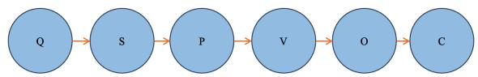
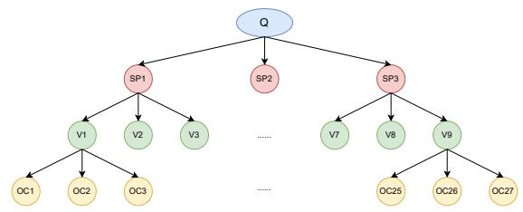
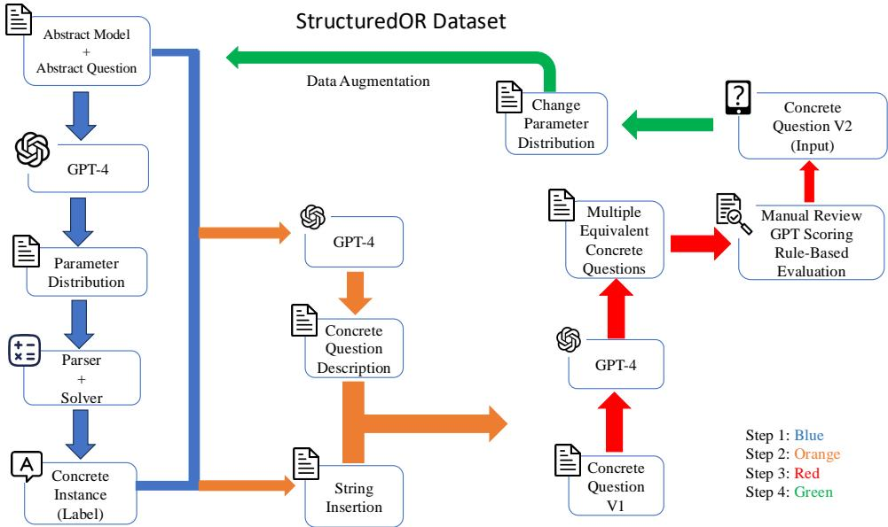
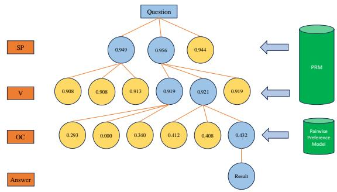
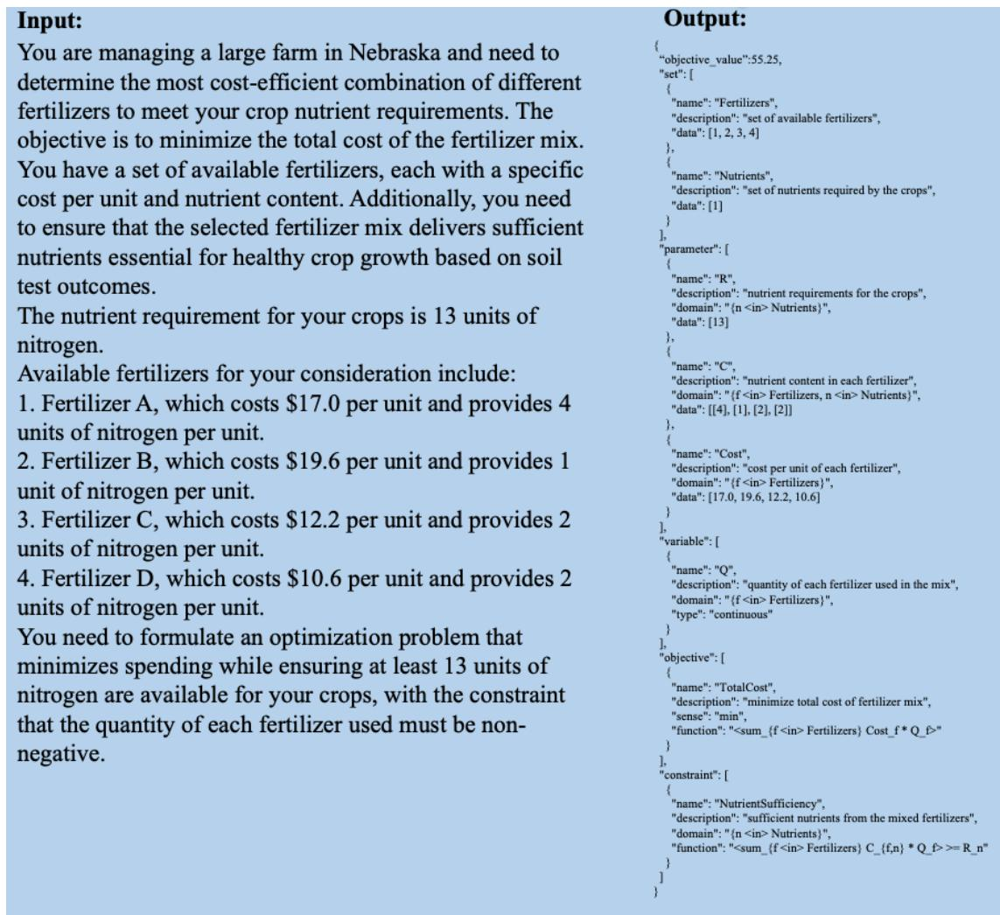
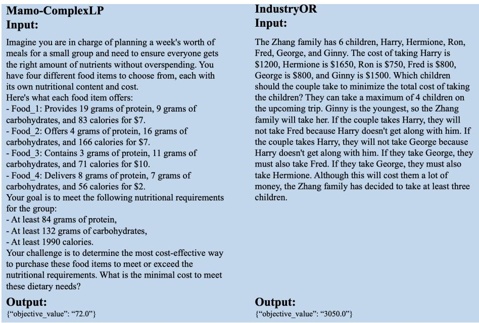
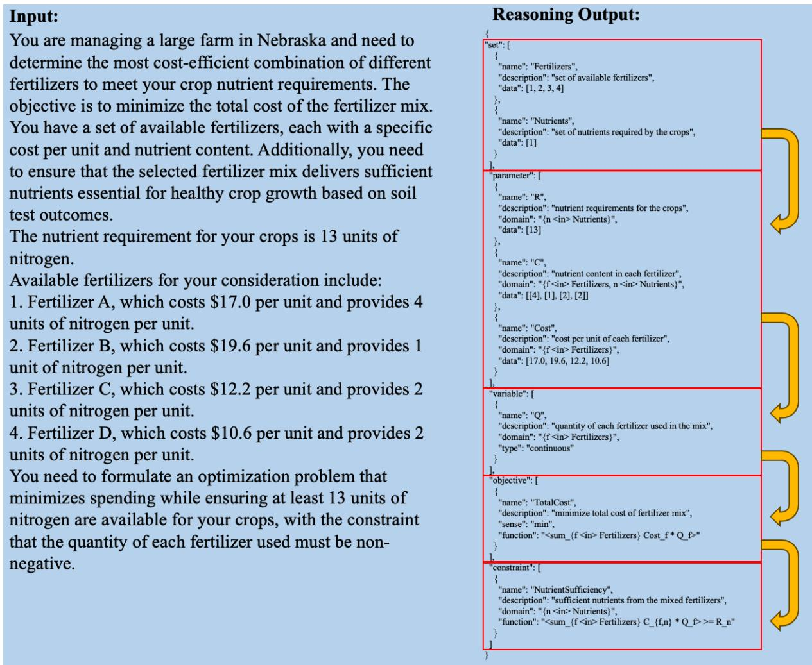
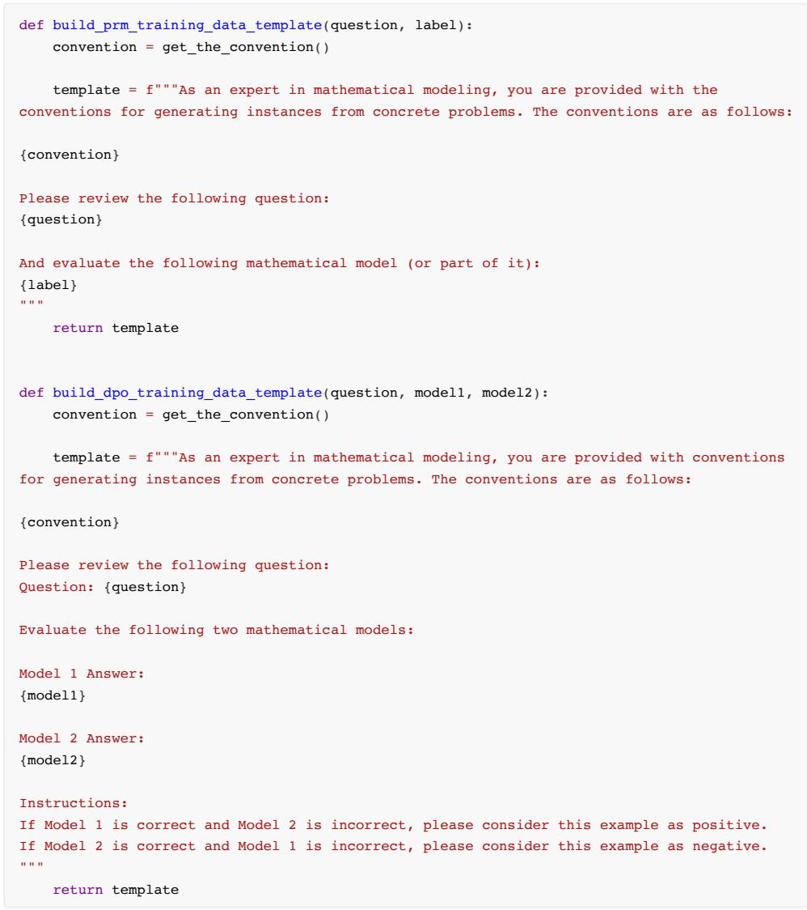

# BPP-Search: Enhancing Tree of Thought Reasoning for Mathematical Modeling Problem Solving

Teng Wang1, Wing-Yin Yu2, Zhenqi He1,   
Zehua Liu2, Hailei Gong2, Han Wu2, Xiongwei Han2,   
Wei Shi2, Ruifeng She2, Fangzhou Zhu2, Tao Zhong2 1the University of Hong Kong, 2Noah’s Ark Lab, Huawei wt0318@connect.hku.hk

## Abstract

LLMs exhibit advanced reasoning capabilities, offering the potential to transform natural language questions into mathematical models. However, existing open-source datasets in operations research domain lack detailed annotations of the modeling process, such as variable definitions, focusing solely on objective values, which hinders reinforcement learning applications. To address this, we release the StructuredOR dataset, annotated with com prehensive labels that capture the complete mathematical modeling process. We further propose BPP-Search, an algorithm that integrates reinforcement learning into a tree-ofthought structure using Beam search, a Process reward model, and a pairwise Preference algorithm. This approach enables efficient exploration of tree structures, avoiding exhaustive search while improving accuracy. Extensive experiments on StructuredOR, NL4OPT, and MAMO-ComplexLP datasets show that BPP-Search significantly outperforms state-ofthe-art methods. In tree-based reasoning, BPP-Search excels in accuracy and efficiency, enabling faster retrieval of correct solutions. The StructuredOR dataset is available on Huggingface1 and GitHub2.

## 1 INTRODUCTION

Mathematical modeling, particularly Linear Programming (LP) and Mixed Integer Programming (MIP), plays a critical role in industrial applications such as logistics (Demirel and Gökçen, 2008), electricity scheduling and transmission (Zhang et al., 2018), and supply chain management (Özceylan and Paksoy, 2013). With the advent of Large Language Models (LLMs), transforming natural language questions into mathematical models has become a promising approach for automating operations research tasks (Wang et al., 2025a; Xiao et al., 2024; Tang et al., 2024a; Wang et al., 2025b).

Despite the increasing availability of opensource operations research (OR) datasets designed for question-to-model transformation (Huang et al., 2024; Ramamonjison et al., 2022; Tang et al., 2024b), these datasets primarily focus on objective values while lacking detailed annotations of the underlying modeling processes. This gap limits the application of Reinforcement Learning (RL), as prior studies (Lightman et al., 2023; Uesato et al., 2022; Cobbe et al., 2021) have shown that process information can significantly enhance mathematical reasoning performance. To address this limitation, we design a rigorous framework for dataset generation and introduce the StructuredOR dataset, which not only provides objective values for evaluation but also includes comprehensive annotations of the modeling process, enabling broader applicability in RL-based methods.

Chain-of-Thought (CoT) (Wei et al., 2022), Self-Consistency (SC) (Wang et al., 2023) and Treeof-Thought (ToT) (Yao et al., 2023) have demonstrated substantial improvements in reasoning tasks. However, these approaches have inherent limitations. CoT heavily relies on the policy model and generates only one reasoning path at a time, making it likely to fail to find the correct answer when the policy model is weak. SC, without a verifier, struggles to validate the correctness of candidate answers, allowing errors in intermediate steps to propagate and mislead the reasoning process. Similarly, ToT generates multiple leaf nodes as potential answers, but without a verifier, it is unclear which leaf node should be selected as the final solution. Nonetheless, ToT remains promising; with sufficiently wide and deep trees and effective node selection strategies, it has the potential to generate optimal solutions.

To enhance the reasoning process within the ToT framework, we propose BPP-Search, a novel method that integrates Beam Search, a Process Reward Model (PRM), and a pairwise Preference algorithm. BPP-Search is designed to improve accuracy and reduce unnecessary node exploration, making it particularly effective for complex reasoning tasks in mathematical modeling.

Our contributions are threefold: (1) We introduce the StructuredOR dataset, which bridges the gap between existing datasets and the requirements of RL-based methods by providing detailed modeling annotations. (2) We propose BPP-Search and explore heuristic algorithms combined with PRM, including Beam Search (Lowerre and Reddy, 1976), Greedy (Prim, 1957), Epsilon Greedy (Sutton, 2018), and Random Greedy we proposed in Section 4.3. (3) We conduct extensive experiments on the StructuredOR, NL4OPT (Ramamonjison et al., 2022), and Mamo-ComplexLP (Huang et al., 2024) datasets, demonstrating the superiority of BPP-Search over baseline and current state-of-theart methods from the perspective of efficiency and accuracy.

## 2 RELATED WORK

## 2.1 Mathematical Modeling Datasets

Mathematical modeling datasets can be broadly categorized into two types: abstract modeling and concrete instance modeling. Modeling tools such as Pyomo (Hart et al., 2017) and AMPL (Gay, 2015), and OPL (Van Hentenryck et al., 1999) provide support for both approaches, enabling users to work with abstract models as well as concrete instances.

Abstract modeling focuses on capturing the essential structural information of a mathematical model. It typically involves two steps: defining basic model declarations and applying data to create concrete instances. This approach is particularly suited for large-scale industrial applications and research, as models can be defined once and reused by importing different datasets. For instance, MLPrompt (Wang et al., 2025a) leverages abstract models to generate parameter distributions, which are subsequently populated with specific values to construct concrete instances within industrial pipelines. Additionally, several studies (Yang et al., 2024c; Wang et al., 2024b) combine abstract models with CoT and LLMs to address problems such as Traveling Salesman Problem (Gavish and Graves, 1978), bypassing the need for traditional mathematical solvers or explicit concrete models.

Concrete modeling requires all data to be available before model processing begins, making it a straightforward and efficient approach. It is particularly suited for analytical projects. This approach is especially advantageous when certain constraints are difficult or time-consuming to generalize into an abstract format, as it allows for more precise and tailored solutions, significantly reducing processing time. For smaller-scale mathematical models, tasks can be solved directly without treating them as a combination of abstract modeling and Named Entity Recognition (Grishman and Sundheim, 1996), which involves first building an abstract model and then mapping numerical parameter values to it. This approach minimizes error accumulation across tasks (Shen et al., 2023).

## 2.2 Process Reward Model

Several works (Cobbe et al., 2021; Lightman et al., 2023; Uesato et al., 2022) introduce the concept of the Process Reward Model (PRM), demonstrating its ability to significantly enhance the performance of weak and small-scale policy models. Compared to the Outcome Reward Model (ORM), PRM achieves better performance but incurs higher labeling costs (Uesato et al., 2022). Initially, PRM training relied on manually labeled data (Lightman et al., 2023). To address the growing demand for processing labels, Monte Carlo Tree Search (MCTS)-based methods (Wang et al., 2024c,a; Luo et al., 2024; Zhang et al., 2024; Setlur et al., 2024; Wang et al., 2025b) were later developed to simulate and assign scores to reasoning processes. While effective, MCTS-based approaches require wide and deep trees to generate labeled data through extensive rollouts for score convergence at intermediate nodes, resulting in extremely high computational resource demands. In contrast, manually labeled data is deterministic and directly reflects the intended reasoning process without relying on approximations.

## 3 Dataset Generation

## 3.1 Preliminary

Greedy. The Greedy algorithm selects the candidate with the highest score at each step, focusing entirely on exploitation without exploration. The selection process can be formalized as:

$$
a ^ { * } = \arg \operatorname* { m a x } _ { a \in A } P ( a ) ,\tag{1}
$$

where $P ( a )$ represents the score of candidate a, and A denotes the set of candidates.

Epsilon Greedy. The Epsilon Greedy algorithm balances exploration and exploitation during candidate selection. At each step, with a probability of $\epsilon ,$ the algorithm selects a candidate randomly. Otherwise, it selects the candidate with the highest score. The selection process can be formalized as:

$$
a ^ { * } = \left\{ \begin{array} { l l l } { { \mathrm { r a n d o m ~ c h o i c e , } } } & { { w . p . } } & { { \epsilon , } } \\ { { \arg \operatorname* { m a x } _ { a \in A } P ( a ) , } } & { { w . p . } } & { { 1 - \epsilon , } } \end{array} \right.\tag{2}
$$

where $P ( a )$ represents the score of candidate $^ { a , }$ and A denotes the set of candidates. The parameter ϵ controls the probability of exploring randomly versus exploiting the best-known option.

Beam Search. Beam Search is a heuristic search algorithm that explores a fixed number (k) of the most promising candidates (beam width) at each step. Unlike Greedy, which selects only the best candidate, Beam Search maintains a set of top k candidates to balance exploration and exploitation. The selection process can be formalized as:

$$
B _ { t + 1 } = { \mathrm { T o p } } { \mathrm { - } } k \left( \bigcup _ { a \in B _ { t } } { \mathrm { E x p a n d } } ( a ) \right) ,\tag{3}
$$

where $B _ { t }$ represents the set of beam candidates at step t, Expand(a) denotes the set of all possible successors of candidate a, and Top-k selects the k candidates with the highest scores. The parameter k controls the trade-off between computational cost and search completeness.

Tree of Thought. Compared with CoT and SC, ToT has the potential to generate many accurate results, but it faces challenges in selecting a single answer from numerous leaf nodes. Our objective is to accelerate this process and efficiently retrieve a satisfactory solution. In the mathematical modeling task, Fig. 1 illustrates the reasoning process, following a structured path through the question, sets, parameters, variables, objectives, and constraints (see Appendix A.3 for an example). Constructing a six-layer tree for each example across all datasets incurs high computational costs. To address this, we group nodes based on property similarities and limit each node to a maximum of three child nodes. The resulting tree structure is as follows: the first layer represents the question, the second combines sets and parameters, the third includes variables, and the fourth integrates objectives and constraints, as shown in Fig. 2. This approach balances tree width and computational efficiency for experiments.

  
Figure 1: Reasoning steps. The process follows the path $Q \to S \to P \to V \to O \to C .$ where Q, S, P, V, O and C represent the question, set, parameter, variable, objective, and constraint respectively.

  
Figure 2: The structure of the Tree of Thought. Here, Q represents the question, SP represents set and parameter, V represents variable, and OC represents objective and constraint.

## 3.2 StructuredOR Dataset Framework

Existing operations research datasets predominantly focus on objective values and the annotations of the underlying modeling process appear to be missing. To bridge the gap, we introduce StructuredOR a new dataset explicitly designed to provide the objective value for evaluation and capture the complete mathematical modeling process.

Building on Xiao et al. (2024)’s work, which introduces a framework for generating abstract mathematical models, we refine and expand this approach to cover a wider spectrum of abstract models. We leverage LLM such as GPT-4o (Achiam et al., 2023) in conjunction with mathematical solvers to instantiate abstract models into concrete examples. Furthermore, we implement a series of validation mechanisms to construct and verify the accuracy of these concrete problems, thereby ensuring the dataset’s quality and reliability. In summary, the StructuredOR dataset provides pairs of concrete questions and corresponding model data, accompanied by comprehensive annotations detailing the entire modeling process. Fig. 3 illustrates the construction pipeline, with each step distinguished by a color-coded arrow: blue for Step 1, orange for Step 2, red for Step 3, and green for Step 4. The whole process is delineated as follows:

Firstly, we leverage LLMs such as GPT-4o to generate distributions for sets and parameters in abstract models, inspired by prior work (Wang et al.,

  
Figure 3: Pipeline of the construction process of our proposed StructuredOR dataset.

<table><tr><td></td><td>Set</td><td>Parameter</td><td>Variable</td><td>Constraint</td></tr><tr><td>Average</td><td>2.22</td><td>3.95</td><td>1.40</td><td>2.38</td></tr><tr><td>Max</td><td>4</td><td>7</td><td>4</td><td>4</td></tr><tr><td>Standard Deviation</td><td>0.66</td><td>1.07</td><td>0.70</td><td>0.85</td></tr></table>

Table 1: Descriptive statistics for the abstract modeling components in the StructuredOR dataset. The table reports the number of sets, parameters, variables, and constraints in the abstract model (note that these numbers will expand after the model is instantiated into a concrete form).

2025a) demonstrating that LLMs, such as GPT-4o, are capable of producing realistic distributions for such applications. This is followed by a simulation process to generate instance-specific parameter data. Subsequently, these parameters are converted into concrete models in LP format using a parser and a modeling tool. The resulting models are then validated for solvability and correctness using the Gurobi solver (Achterberg, 2019). Solvable problems from the solver are then selected as labeled instances, encompassing both the modeling process and the associated objective values. Details about standardizing the mathematical modeling data format are provided in Appendix A.1.

Next, based on the descriptions of sets and parameters in abstract models, we construct templates to generate markdown-formatted lists via string insertion to describe the information of sets and parameters. We subsequentially employ GPT-4o to develop a concrete problem description in natural language, which does not involve specific values for sets or parameters but provides a contextualized description of the problem. By concatenating this description with the numerical details of sets and parameters, a complete problem statement is produced. This string-based insertion ensures consistency and accuracy in the generated problem descriptions.

<table><tr><td>Concrete Variables per Abstract Variable</td><td>Frequency</td></tr><tr><td>1</td><td>70</td></tr><tr><td>2</td><td>214</td></tr><tr><td>3</td><td>36</td></tr><tr><td>4</td><td>143</td></tr><tr><td>6</td><td>5</td></tr><tr><td>8</td><td>22</td></tr></table>

Table 2: Distribution of the number of instantiated variables derived from each abstract variable in the concrete model.

We further utilize GPT-4o to rephrase each generated question into three semantically equivalent versions to enhance fluency and naturalness. This process is supported by a rigorous review framework, comprising manual filtering, GPT-based scoring, and rule-based evaluation, to ensure semantic consistency between the rephrased texts and their corresponding labels.

Finally, we introduce an iterative strategy for data augmentation by changing parameter data distributions during the initial generation phase. This yields a dataset comprising 124 concrete questions and their corresponding models, spanning domains including logistics, scheduling, and networks, of which 77 examples are from the original framework, and 47 are generated through data augmentation. Table 1 presents the statistical distribution of the key components—sets, parameters, variables, and constraints—in the abstract model of the StructuredOR dataset. Table 2 summarizes the number of concrete variables instantiated from each abstract variable, while table 3 shows the industry distribution. Together, these tables illustrate the dataset’s structural diversity and comprehensive domain coverage.

<table><tr><td rowspan=1 colspan=1>Category</td><td rowspan=1 colspan=1>Agriculture</td><td rowspan=1 colspan=1>Logistics</td><td rowspan=1 colspan=1>Education</td><td rowspan=1 colspan=1>Sports</td><td rowspan=1 colspan=1>Military</td><td rowspan=1 colspan=1>Energy</td><td rowspan=1 colspan=1>Telecommunications</td><td rowspan=1 colspan=1>Manufacturing</td><td rowspan=1 colspan=1>Health Services</td><td rowspan=1 colspan=1>Finance</td></tr><tr><td rowspan=1 colspan=1>Count</td><td rowspan=1 colspan=1>24</td><td rowspan=1 colspan=1>20</td><td rowspan=1 colspan=1>15</td><td rowspan=1 colspan=1>12</td><td rowspan=1 colspan=1>12</td><td rowspan=1 colspan=1>12</td><td rowspan=1 colspan=1>11</td><td rowspan=1 colspan=1>9</td><td rowspan=1 colspan=1>5</td><td rowspan=1 colspan=1>4</td></tr></table>

Table 3: Instance category distribution in the StructuredOR dataset, demonstrating broad applicability across industries.

Appendix A.2 provides an example of a concrete question along with its structured modeling process as the label. It also discusses the limitations of other datasets, such as Mamo-ComplexLP (Huang et al., 2024), NL4OPT (Ramamonjison et al., 2022), and IndustryOR (Tang et al., 2024b), highlighting their challenges in addressing the complete modeling process. Since most datasets, apart from StructuredOR, are incompatible with the schema defined in Appendix A.1, some questions in these datasets cannot be successfully parsed, rendering some examples unusable. Given the small size of the IndustryOR (Tang et al., 2024b) dataset, our experiments focus on the StructuredOR, Mamo-ComplexLP, and NL4OPT datasets.

## 3.3 PRM Dataset Preparation

To implement process supervision within the tree structure, we introduce the PRM (Uesato et al., 2022; Lightman et al., 2023), which assigns a score to each intermediate step in the reasoning process. There are two main approaches to generating training data for PRMs. Uesato et al. (2022); Lightman et al. (2023) rely on manually labeling each intermediate step while Wang et al. (2024c,a); Luo et al. (2024); Zhang et al. (2024); Setlur et al. (2024) leverage MCTS to assign scores to intermediate steps.

MCTS-based methods rely on wide and deep trees to generate labeled process data through extensive rollouts, ensuring score convergence for intermediate nodes but demanding significant computational resources and incurring Reward Hacking (Weng, 2024). In contrast, manually labeled data is deterministic and directly captures the intended reasoning process without relying on approximations.

We first utilize the CoT and ToT frameworks across various policy models, including GPT (Achiam et al., 2023), LLama (Dubey et al., 2024), and Qwen series (Yang et al., 2024b), applied to the NL4Opt (Ramamonjison et al., 2022) and MAMO-ComplexLP (Huang et al., 2024) training datasets. Examples with consistent objective values are assumed to have correct modeling processes and therefore do not require manual labeling. Although the StructuredOR dataset already includes detailed modeling process annotations and serves as a source of high-quality positive examples, we adopt the same procedures to further augment its training data.

The process of modeling labels for both correct and incorrect reasoning paths is structured in alignment with the layers of the ToT framework. This follows a cumulative approach, where each layer is constructed sequentially, building upon the outcomes of the preceding layer. If the generated label represents a correct reasoning path, all segmented labels derived from it are also correct, as the correctness of each segment ensures the validity of the entire path. Conversely, if the overall reasoning path is determined to be incorrect and a specific intermediate step can be definitively identified as incorrect, all subsequent steps from that point onward are also labeled as incorrect, as errors propagate forward in the reasoning process. If no specific intermediate step can be identified as incorrect, the entire reasoning path is simply labeled as incorrect without making assumptions about the correctness or incorrectness of individual intermediate steps.

To diversify the PRM dataset, manual perturbations are applied to enrich it with diverse examples in both categories. Detailed descriptions of the PRM training dataset preparation are provided in Appendix A.4.

## 4 Methodology

## 4.1 Training PRM

Previous works (Cobbe et al., 2021; Uesato et al., 2022; Lightman et al., 2023; Luo et al., 2024) have shown that small-scale LLMs equipped with verifiers evaluating intermediate processes are capable of outperforming foundational large-scale LLMs in mathematical reasoning tasks. In this work, we finetune Qwen2.5-Math-1.5B (Yang et al., 2024b) for a binary classification task. Details on constructing prompts for the PRM are provided in Appendix A.5. After full-parameter supervised fine-tuning, we extract the logits corresponding to the correct label and apply the sigmoid function to compute the score:

  
Figure 4: A real demonstration of the BPP-Search process with a beam search width of 2. Yellow nodes represent pruned nodes that are not explored, while light blue nodes indicate nodes that have been visited.

$$
S _ { \mathrm { P R M } } = \frac { 1 } { 1 + e ^ { - l _ { p r m } } } ,\tag{4}
$$

where $l _ { p r m }$ denotes the logit value for the correct label, and SPRM represents the PRM score.

## 4.2 BPP-Search

We integrate the PRM with Greedy (Prim, 1957) and Beam Search (Lowerre and Reddy, 1976) algorithms, where the PRM provides scores to guide node selection. However, as shown in Section 5.3, increasing the Beam Search width does not consistently improve performance and, in some cases, leads to degradation. This limitation stems from the PRM, which is trained for classification tasks but required to assign continuous scores during inference, resulting in output discrepancies. Manual analysis of the tree generation process reveals that the final layer of Beam Search frequently contains both correct and incorrect candidates that are highly similar, with only subtle distinctions. These minor differences yield comparable scores, making it challenging to determine the optimal solution effectively.

To address this challenge, we propose BPP-Search, an algorithm that integrates Beam search, PRM, and a Pairwise Preference model. The core idea is to enhance decision-making in the final layer by leveraging a newly trained Preference Model, fine-tuned from Qwen2.5-Math-1.5B, to generate pairwise preference scores for ranking candidates.

Preference Model Data Preparation. To train the preference model for pairwise preferences, we first use the ToT framework to generate a large set of unlabeled reasoning paths and classify them as correct or incorrect based on objective values. For each problem, one correct reasoning path (A) and one incorrect reasoning path (B) are extracted, and all pairwise combinations of correct and incorrect paths are generated. Prompts are constructed by arranging the problem with A and B in two different orders. If A appears first, the prompt is labeled as 1; otherwise, it is labeled as 0. The resulting labeled data is then used to fine-tune the Preference Model as a binary classifier. Details on constructing prompts for the Preference Model are provided in Appendix A.5.

Pairwise Scoring and Candidate Ranking. During inference, the preference model evaluates pairwise preference scores for any two candidates (A, B). The preference score $S _ { P M } ( A \succ B )$ is calculated as:

$$
S _ { P M } ( A \succ B ) = \frac { 1 } { 1 + e ^ { - l _ { p m } } } ,\tag{5}
$$

where $l _ { p m }$ is the logit value for class 1 and $A \succ B$ denotes the preference for A over B.

To compute a comprehensive score for each candidate (A) in the candidate set, pairwise preference scores are aggregated across all other candidates:

$$
S _ { P M } ( A ) = \frac { 1 } { n - 1 } \sum _ { j \neq i } ^ { j = 1 , \dots , n } S ( A \succ X _ { j } ) ,\tag{6}
$$

where n is the total number of candidates, i is the index corresponding to A, and $X _ { i }$ represents A, while $X _ { j }$ represents other candidates.

Selection of the Optimal Candidate. Using the computed scores $S _ { P M } ( A )$ , candidates are ranked, and the one with the highest score is selected as the optimal answer. This robust ranking mechanism addresses the limitations of the PRM, which struggles to differentiate between similar candidates and accurately identify the correct answer.

Fig. 4 illustrates the BPP-Search process, where nodes are pruned based on PRM scores during beam search (Width = 2), and the Pairwise Preference Algorithm ranks the final candidates to select the optimal solution, ensuring robustness and accuracy. Appendix A.6 analyses computational cost of BPP-Search.

<table><tr><td>Model/Methods</td><td>CoT-BMLD</td><td>CoT-SPVOC</td><td>SC</td><td>ToT-Randomly-Chosen</td><td>ToT-Rethink</td><td>ToT-Fully-Traverse</td></tr><tr><td>GPT-40</td><td>19</td><td>19</td><td>21</td><td>21</td><td>23</td><td>30</td></tr><tr><td>GPT-4o-mini</td><td>13</td><td>14</td><td>19</td><td>12</td><td>19</td><td>21</td></tr><tr><td>Llama-3-70B</td><td>10</td><td>17</td><td>19</td><td>17</td><td>17</td><td>22</td></tr><tr><td>Llama-3.1-70B</td><td>18</td><td>10</td><td>21</td><td>5</td><td>14</td><td>17</td></tr><tr><td>Llama-3.2-11B</td><td>2</td><td>0</td><td>1</td><td>0</td><td>0</td><td>8</td></tr><tr><td>Qwen-2-72B-Instruct</td><td>2</td><td>2</td><td>4</td><td>3</td><td>1</td><td>5</td></tr><tr><td>Qwen-2.5-MATH-72B-Instruct</td><td>2</td><td>2</td><td>0</td><td>0</td><td>0</td><td>4</td></tr><tr><td>Qwen-2.5-72B-Instruct</td><td>6</td><td>5</td><td>9</td><td>2</td><td>2</td><td>2</td></tr><tr><td>Mixtral-8×7B-v0.1</td><td>0</td><td>0</td><td>0</td><td>0</td><td>1</td><td>1</td></tr></table>

Table 4: Performance evaluation (number of correctly solved examples) of various LLMs on the StructuredOR test dataset (38 examples) under different methods: CoT (Wei et al., 2022) (including CoT-BMLD, where modeling is performed first and then data is imported, and CoT-SPVOC, which follows the sequence of set, parameter, variable, objective, and constraint for CoT), ToT (Yao et al., 2023), SC (Wang et al., 2023), ToT-randomly-chosen (where the final result is obtained randomly from the leaf nodes), ToT-rethink (providing all leaf nodes to the LLM and obtaining a revised result), and ToT-fully-traverse (where every leaf node is thoroughly checked).

<table><tr><td rowspan=1 colspan=1>Dataset</td><td rowspan=1 colspan=1>Number of Problems Resolved</td></tr><tr><td rowspan=1 colspan=1>StructuredOR</td><td rowspan=1 colspan=1>30/38</td></tr><tr><td rowspan=1 colspan=1>NL4OPT</td><td rowspan=1 colspan=1>143/289</td></tr><tr><td rowspan=1 colspan=1>ComplexLP</td><td rowspan=1 colspan=1>72/211</td></tr></table>

Table 5: Number of problems resolved using ToT-Fully-Traverse. The numerator represents the number of examples with at least one correct answer, and the denominator indicates the total number of examples in the test dataset. Results are shown for GPT-4o on the StructuredOR, NL4OPT (Ramamonjison et al., 2022), and ComplexLP (Huang et al., 2024) datasets.

## 4.3 Random Greedy Algorithm

To address the limitations of PRM’s scoring precision, we employ the Random Greedy algorithm. Since PRM provides a rough preference ranking rather than precise scores, randomness is introduced to mitigate the impact of PRM’s scoring variability.

The Random Greedy algorithm prioritizes candidates with scores close to the maximum while incorporating randomness to mitigate PRM’s imprecision. Candidates are filtered based on the condition:

$$
P ( a _ { \mathrm { m a x } } ) - P ( a _ { i } ) \leq \mathrm { t h r e s h o l d } ,\tag{7}
$$

where $P ( \boldsymbol { a } _ { \mathrm { m a x } } )$ is the highest score, $P ( a _ { i } )$ is the score of candidate $a _ { i } .$ , and threshold is a predefined margin. From the filtered candidates, one is randomly selected to continue the search process.

## 5 EXPERIMENT

## 5.1 Baseline

Given the varying performance levels of policy models across different scales, our objective is to maximize the accuracy of correct results by fully exploring every leaf node in the ToT structure, without requiring fine-tuning of the policy model. Because this approach ensures greater stability and a larger pool of experimental data for subsequent analyses. To achieve this, we design a set of baseline experiments on the StructuredOR, providing more reliable and consistent evaluations.

We first evaluate the CoT (Wei et al., 2022) approach, including two variations: CoT-BMLD, where the modeling process is performed first and data is imported later, and CoT-SPVOC, which adheres to the sequence of set, parameter, variable, objective, and constraint in the modeling process. Next, since the ToT (Yao et al., 2023) framework lacks a mechanism to select a final answer from all leaf nodes, we introduce the following configurations to address this limitation: ToT-randomlychosen, where the final result is randomly selected from the leaf nodes; ToT-rethink, where all leaf nodes are provided to the LLM for reevaluation to produce a revised result; and ToT-fully-traverse, where every leaf node is thoroughly evaluated to ensure that at least one correct result can be generated. The detailed tree structure is shown in the Fig. 2. Additionally, we include SC (Wang et al., 2023) as a baseline, which aims to obtain consistent results by sampling multiple reasoning paths.

The evaluated policy models include GPT-4o (Achiam et al., 2023), GPT-4o-mini (Achiam et al., 2023), Llama-3-70B (Dubey et al., 2024), Llama-3.1-70B (Dubey et al., 2024), Llama-3.2- 11B (Dubey et al., 2024), Qwen-2-72B (Yang et al., 2024a), Qwen-2.5-72B (Team, 2024), Qwen-2.5-Math-72B (Yang et al., 2024b), and Mixtral-7 8B (Jiang et al., 2024). Table 4 shows the performance of baseline methods across these models in StructuredOR dataset. The results highlight significant variations in performance, demonstrating how model size and architecture impact their effectiveness in solving problems within the StructuredOR dataset.

<table><tr><td rowspan=2 colspan=1>Method</td><td rowspan=1 colspan=5>StructuredOR</td><td rowspan=1 colspan=1>Mamo-Compl</td><td rowspan=1 colspan=1>exLP</td><td rowspan=1 colspan=1>NL4OPT</td><td rowspan=1 colspan=1></td></tr><tr><td rowspan=1 colspan=4>Correct Rate</td><td rowspan=1 colspan=1>Steps</td><td rowspan=1 colspan=1>Correct Rate</td><td rowspan=1 colspan=1>Steps</td><td rowspan=1 colspan=1>Correct Rate</td><td rowspan=1 colspan=1>Steps</td></tr><tr><td rowspan=4 colspan=1>CoT (Wei et al., 2022)SC (Wang et al., 2023)ToT-Randomly-Chosen (Yao et al., 2023)ToT-Rethink (Yao et al., 2023)</td><td rowspan=2 colspan=4>0.633</td><td rowspan=1 colspan=1>0.700</td><td rowspan=2 colspan=1>14</td><td rowspan=2 colspan=1>0.4860.625</td><td rowspan=2 colspan=1>14</td><td rowspan=2 colspan=1>0.5660.713</td></tr><tr><td rowspan=3 colspan=4>0.7000.766</td><td></td></tr><tr><td rowspan=1 colspan=1></td><td rowspan=1 colspan=1>39</td><td rowspan=1 colspan=1>0.444</td><td rowspan=1 colspan=1>39</td><td rowspan=1 colspan=1>0.629</td><td rowspan=1 colspan=1>39</td></tr><tr><td rowspan=1 colspan=1>40</td><td rowspan=1 colspan=1>0.583</td><td rowspan=1 colspan=1>40</td><td rowspan=1 colspan=1>0.622</td><td rowspan=1 colspan=1>40</td></tr><tr><td rowspan=1 colspan=1>Greedy Search Variant (Our Method)</td><td rowspan=1 colspan=4>0.833</td><td rowspan=1 colspan=1>9</td><td rowspan=1 colspan=1>0.555</td><td rowspan=1 colspan=1>9</td><td rowspan=1 colspan=1>0.713</td><td rowspan=1 colspan=1>9</td></tr><tr><td rowspan=1 colspan=1>Beam Search Variant (Our Method)</td><td rowspan=1 colspan=4>0.800</td><td rowspan=1 colspan=1>15</td><td rowspan=1 colspan=1>0.666</td><td rowspan=1 colspan=1>21</td><td rowspan=1 colspan=1>0.783</td><td rowspan=1 colspan=1>15</td></tr><tr><td rowspan=1 colspan=1>BPP-Search Variant (Our Method)</td><td rowspan=1 colspan=4>0.933</td><td rowspan=1 colspan=1>15</td><td rowspan=1 colspan=1>0.722</td><td rowspan=1 colspan=1>21</td><td rowspan=1 colspan=1>0.804</td><td rowspan=1 colspan=1>15</td></tr></table>

Table 6: Accuracy and reasoning steps for BPP-Search and baselines with a fixed policy model (GPT-4o) on the StructuredOR, Mamo-ComplexLP (Huang et al., 2024), and NL4OPT (Ramamonjison et al., 2022) test datasets. The results are based on 30 problems from StructuredOR, 72 from Mamo-ComplexLP, and 143 from NL4OPT that are confirmed solvable by the policy model in prior experiments.
<table><tr><td>Method</td><td>StructuredOR Correct Rate</td><td>Mamo-ComplexLP Correct Rate</td><td>NL4OPT Correct Rate</td><td>Reasoning Step</td></tr><tr><td>Greedy Search + PRM</td><td>0.733</td><td>0.555</td><td>0.699</td><td>9</td></tr><tr><td>Random Greedy Search + PRM</td><td>0.833</td><td>0.513</td><td>0.692</td><td>9</td></tr><tr><td>Epsilon Greedy Search + PRM</td><td>0.733</td><td>0.500</td><td>0.713</td><td>9</td></tr><tr><td>Beam Search (Width=2) + PRM</td><td>0.800</td><td>0.652</td><td>0.783</td><td>15</td></tr><tr><td>Beam Search (Width=3) + PRM</td><td>0.766</td><td>0.666</td><td>0.755</td><td>21</td></tr><tr><td>BPP-Search (Width=2)</td><td>0.933</td><td>0.652</td><td>0.804</td><td>15</td></tr><tr><td>BPP-Search (Width=3)</td><td>0.866</td><td>0.722</td><td>0.797</td><td>21</td></tr></table>

Table 7: Accuracy and reasoning steps for ablation study of our methods with a fixed policy model (GPT-4o) on the StructuredOR, Mamo-ComplexLP (Huang et al., 2024), and NL4OPT (Ramamonjison et al., 2022) test datasets. The results are based on the same 30 problems from StructuredOR, 72 from Mamo-ComplexLP, and 143 from NL4OPT, confirmed solvable by the policy model in prior experiments.

To ensure stable performance in subsequent search algorithm experiments across different datasets, we select GPT-4o as the policy model. We first evaluate its ability to solve questions by finding at least one correct answer within the ToT fullytraverse framework on the test datasets from StructuredOR, MAMO-ComplexLP (Huang et al., 2024), and NL4OPT (Ramamonjison et al., 2022). Table 5 presents the results of this evaluation. For subsequent tree search algorithm experiments, only successful cases—where the policy model identifies at least one valid result—are considered. This ensures that the policy model can generate solutions for these questions within the ToT framework.

## 5.2 Evaluation of BPP-Search

We evaluate our methods on the solvable problems identified in the datasets, as described in Section 5.1. We perform supervised fine-tuning of the PRM and Preference Model on their corresponding training datasets, as described in Sec.3.3 and Sec.4.2, respectively. Detailed evaluation results are provided in Appendix A.7. Table 6 presents a comparison between our methods and baseline approaches, focusing on correct rate and reasoning steps. The results show that, under the condition where none of the methods fine-tune the policy model, our methods achieve superior performance with fewer reasoning steps, significantly outperforming baselines.

These experiments validate the feasibility of utilizing PRM to assist inference within the tree-ofthought structure in the domain of Operations Research. BPP-Search effectively addresses the limitations of traditional ToT methods, which struggle to reliably select a final result. As shown in Table 6, Greedy Search, Beam Search, and BPP-Search generate better results in significantly fewer steps, exponentially reducing computational costs.

## 5.3 Ablation Study

Table 7 presents the performance of our methods under different configurations. It is evident that the PRM struggles to assign precise scores for regression tasks. For instance, as the beam search width increases, the accuracy tends to decrease, and in some cases, the performance of beam search becomes comparable to that of greedy search. Manual analysis of the beam search results in the final layer reveals that the candidate queue sometimes contains both correct and incorrect answers that are highly similar in structure, with only subtle differences. This similarity leads to comparable scores, making it challenging for the PRM to reliably distinguish between them.

To address this limitation, we introduce BPP-Search, which incorporates a pairwise preference algorithm. Instead of scoring candidates individually, BPP-Search evaluates all pairwise combinations of candidates within the final queue, comparing each pair and averaging the pairwise preference scores for each candidate. This approach ensures a more robust evaluation by reducing the bias inherent in relying solely on individual scores. The experimental results in Table 7 demonstrate that this method effectively mitigates the risks associated with the imprecise scoring of the PRM, resulting in improved accuracy and robustness. Additionally, based on the performance of PRM, our random greedy search algorithms can at least guarantee performance comparable to standard greedy search, and in some cases, achieve even better results.

## 6 Conclusion

In this work, we introduce a new operations research dataset that integrates natural language questions with their corresponding detailed modeling processes, addressing the limitations of existing open-source datasets that lack comprehensive annotations of the modeling process. We further propose BPP-Search, an advanced algorithm that combines Beam Search, PRM, and a Pairwise Preference mechanism to enhance the ToT framework. BPP-Search effectively accelerates the reasoning process, improves accuracy, and alleviates the scoring imprecision of PRM, thereby ensuring robust and reliable decision-making. Comprehensive experiments conducted on StructuredOR, NL4OPT, and MAMO-ComplexLP datasets highlight the superiority of BPP-Search. Compared to state-of-the-art approaches, such as CoT, SC, and PRM integrated with Greedy or Beam Search, BPP-Search consistently achieves higher accuracy while requiring fewer reasoning steps, demonstrating its efficacy in addressing complex reasoning tasks in operations research.

## 7 Limitations

## 7.1 Trade-offs in ToT Structure: Performance and Computational Cost

In the ToT framework, both increasing tree width and deepening the tree can enhance performance. A wider tree, achieved by increasing the number of child nodes at each layer, provides more exploration paths, thereby improving the likelihood of finding optimal solutions. Similarly, greater depth, achieved by dividing tasks into finer-grained nodes (e.g., separating "set" and "parameter" into distinct layers), not only facilitates more structured and detailed reasoning but also offers additional exploration paths, further increasing the likelihood of identifying optimal solutions.

However, both approaches entail significant computational costs. For example, a tree with a height of 4 and a branching factor of 3 requires 39 LLM queries, whereas increasing the branching factor to 4 raises this to 84 LLM queries, thereby exacerbating computational demands, particularly for long prompts (e.g., 4000 tokens). This creates a tradeoff between computational cost and performance. In our study, due to limitations in computational resources, we were unable to construct a tree that is both sufficiently deep and wide to fully explore the solution space.

## 7.2 Dilemma between LLM Capability and OR Problem Complexity

In operations research, most problems can be categorized into a limited number of canonical types, which we treat as the "seed" problems. We deliberately avoid indiscriminate expansion of the StructuredOR dataset because simply modifying parameter values results in highly similar instances. This introduces risks such as test set leakage and model overfitting, reducing the robustness of experimental evaluations.

On the other hand, if we were to diversify the dataset by significantly increasing the size and dimensionality of the problem instances, the resulting questions would contain a large number of numerical values. Current LLMs face fundamental limitations in this regard, as they struggle to memorize and accurately reproduce numerous numerical inputs in a structured and orderly fashion.

For instance, a single parameter such as Cost[X][A][t] with three dimensions—each containing 3 elements—already results in $3 ^ { 3 } = 2 7$ values. As the number of elements in each dimension increases, the parameter space grows exponentially. While this level of complexity is trivial for mathematical solvers, it poses a significant challenge for LLMs, which are not yet capable of accurately reproducing large-scale numerical values in a complete and orderly manner.

## References

Josh Achiam, Steven Adler, Sandhini Agarwal, Lama Ahmad, Ilge Akkaya, Florencia Leoni Aleman, Diogo Almeida, Janko Altenschmidt, Sam Altman, Shyamal Anadkat, et al. 2023. Gpt-4 technical report. arXiv preprint arXiv:2303.08774.

Tobias Achterberg. 2019. What’s new in gurobi 9.0. Webinar Talk url: https://www. gurobi. com/wp-content/uploads/2019/12/Gurobi-90- Overview-Webinar-Slides-1. pdf, 5(9):97–113.

Karl Cobbe, Vineet Kosaraju, Mohammad Bavarian, Mark Chen, Heewoo Jun, Lukasz Kaiser, Matthias Plappert, Jerry Tworek, Jacob Hilton, Reiichiro Nakano, et al. 2021. Training verifiers to solve math word problems. arXiv preprint arXiv:2110.14168.

Neslihan Özgün Demirel and Hadi Gökçen. 2008. A mixed integer programming model for remanufacturing in reverse logistics environment. The International Journal ofAdvanced Manufacturing Technology, 39:1197–1206.

Abhimanyu Dubey, Abhinav Jauhri, Abhinav Pandey, Abhishek Kadian, Ahmad Al-Dahle, Aiesha Letman, Akhil Mathur, Alan Schelten, Amy Yang, Angela Fan, et al. 2024. The llama 3 herd of models. arXiv preprint arXiv:2407.21783.

Bezalel Gavish and Stephen C Graves. 1978. The travelling salesman problem and related problems.

David M Gay. 2015. The ampl modeling language: An aid to formulating and solving optimization problems. In Numerical Analysis and Optimization: NAO-III, Muscat, Oman, January 2014, pages 95–116. Springer.

Ralph Grishman and Beth M Sundheim. 1996. Message understanding conference-6: A brief history. In COLING 1996 volume 1: The 16th international conference on computational linguistics.

William E Hart, Carl D Laird, Jean-Paul Watson, David L Woodruff, Gabriel A Hackebeil, Bethany L Nicholson, John D Siirola, et al. 2017. Pyomo-optimization modeling in python, volume 67. Springer.

Xuhan Huang, Qingning Shen, Yan Hu, Anningzhe Gao, and Benyou Wang. 2024. Mamo: a mathematical modeling benchmark with solvers. arXiv preprint arXiv:2405.13144.

Albert Q Jiang, Alexandre Sablayrolles, Antoine Roux, Arthur Mensch, Blanche Savary, Chris Bamford, Devendra Singh Chaplot, Diego de las Casas, Emma Bou Hanna, Florian Bressand, et al. 2024. Mixtral of experts. arXiv preprint arXiv:2401.04088.

Hunter Lightman, Vineet Kosaraju, Yura Burda, Harri Edwards, Bowen Baker, Teddy Lee, Jan Leike, John Schulman, Ilya Sutskever, and Karl Cobbe. 2023. Let’s verify step by step. arXiv preprint arXiv:2305.20050.

Bruce P Lowerre and B Raj Reddy. 1976. Harpy, a connected speech recognition system. The Journal of the Acoustical Society ofAmerica, 59(S1):S97–S97.

Liangchen Luo, Yinxiao Liu, Rosanne Liu, Samrat Phatale, Harsh Lara, Yunxuan Li, Lei Shu, Yun Zhu, Lei Meng, Jiao Sun, et al. 2024. Improve mathematical reasoning in language models by automated process supervision. arXiv preprint arXiv:2406.06592.

Eren Özceylan and Turan Paksoy. 2013. A mixed integer programming model for a closed-loop supplychain network. International Journal ofProduction Research, 51(3):718–734.

Robert Clay Prim. 1957. Shortest connection networks and some generalizations. The Bell System Technical Journal, 36(6):1389–1401.

Rindranirina Ramamonjison, Timothy Yu, Raymond Li, Haley Li, Giuseppe Carenini, Bissan Ghaddar, Shiqi He, Mahdi Mostajabdaveh, Amin Banitalebi-Dehkordi, Zirui Zhou, and Yong Zhang. 2022. Nl4opt competition: Formulating optimization problems based on their natural language descriptions. In Proceedings of the NeurIPS 2022 Competitions Track, pages 189–203.

Amrith Setlur, Chirag Nagpal, Adam Fisch, Xinyang Geng, Jacob Eisenstein, Rishabh Agarwal, Alekh Agarwal, Jonathan Berant, and Aviral Kumar. 2024. Rewarding progress: Scaling automated process verifiers for llm reasoning. arXiv preprint arXiv:2410.08146.

Yongliang Shen, Kaitao Song, Xu Tan, Wenqi Zhang, Kan Ren, Siyu Yuan, Weiming Lu, Dongsheng Li, and Yueting Zhuang. 2023. Taskbench: Benchmarking large language models for task automation. arXiv preprint arXiv:2311.18760.

Richard S Sutton. 2018. Reinforcement learning: An introduction. A Bradford Book.

Zhengyang Tang, Chenyu Huang, Xin Zheng, Shixi Hu, Zizhuo Wang, Dongdong Ge, and Benyou Wang. 2024a. Orlm: Training large language models for optimization modeling. arXiv preprint arXiv:2405.17743.

Zhengyang Tang, Chenyu Huang, Xin Zheng, Shixi Hu, Zizhuo Wang, Dongdong Ge, and Benyou Wang. 2024b. Orlm: Training large language models for optimization modeling. arXiv preprint arXiv:2405.17743.

Qwen Team. 2024. Qwen2.5: A party of foundation models.

Jonathan Uesato, Nate Kushman, Ramana Kumar, Francis Song, Noah Siegel, Lisa Wang, Antonia Creswell, Geoffrey Irving, and Irina Higgins. 2022. Solving math word problems with process-and outcomebased feedback. arXiv preprint arXiv:2211.14275.

Pascal Van Hentenryck, Laurent Michel, Laurent Perron, and J-C Régin. 1999. Constraint programming in opl. In International Conference on Principles and Practice of Declarative Programming, pages 98–116. Springer.

Peiyi Wang, Lei Li, Zhihong Shao, Runxin Xu, Damai Dai, Yifei Li, Deli Chen, Yu Wu, and Zhifang Sui. 2024a. Math-shepherd: Verify and reinforce LLMs step-by-step without human annotations. In ACL.

Teng Wang, Zhenqi He, Wing-Yin Yu, Xiaojin Fu, and Xiongwei Han. 2025a. Large language models are good multi-lingual learners: When llms meet crosslingual prompts. COLING.

Teng Wang, Zhangyi Jiang, Zhenqi He, Wenhan Yang, Yanan Zheng, Zeyu Li, Zifan He, Shenyang Tong, and Hailei Gong. 2025b. Towards hierarchical multistep reward models for enhanced reasoning in large language models. arXiv preprint arXiv:2503.13551.

Teng Wang, Wing-Yin Yu, Ruifeng She, Wenhan Yang, Taijie Chen, and Jianping Zhang. 2024b. Leveraging large language models for solving rare mip challenges. arXiv preprint arXiv:2409.04464.

Xuezhi Wang, Jason Wei, Dale Schuurmans, Quoc Le, Ed Chi, Sharan Narang, Aakanksha Chowdhery, and Denny Zhou. 2023. Self-consistency improves chain of thought reasoning in language models. In ICLR.

Zihan Wang, Yunxuan Li, Yuexin Wu, Liangchen Luo, Le Hou, Hongkun Yu, and Jingbo Shang. 2024c. Multi-step problem solving through a verifier: An empirical analysis on model-induced process supervision. In Findings ofthe Associationfor Computational Linguistics: EMNLP 2024, pages 7309–7319, Miami, Florida, USA. Association for Computational Linguistics.

Jason Wei, Xuezhi Wang, Dale Schuurmans, Maarten Bosma, Fei Xia, Ed Chi, Quoc V Le, Denny Zhou, et al. 2022. Chain-of-thought prompting elicits reasoning in large language models. In NeurIPS.

Lilian Weng. 2024. Reward hacking in reinforcement learning.

Ziyang Xiao, Dongxiang Zhang, Yangjun Wu, Lilin Xu, Yuan Jessica Wang, Xiongwei Han, Xiaojin Fu, Tao Zhong, Jia Zeng, Mingli Song, et al. 2024. Chainof-experts: When llms meet complex operations research problems. In ICLR.

An Yang, Baosong Yang, Binyuan Hui, Bo Zheng, Bowen Yu, Chang Zhou, Chengpeng Li, Chengyuan Li, Dayiheng Liu, Fei Huang, et al. 2024a. Qwen2 technical report. arXiv preprint arXiv:2407.10671.

An Yang, Beichen Zhang, Binyuan Hui, Bofei Gao, Bowen Yu, Chengpeng Li, Dayiheng Liu, Jianhong Tu, Jingren Zhou, Junyang Lin, et al. 2024b. Qwen2. 5-math technical report: Toward mathematical expert model via self-improvement. arXiv preprint arXiv:2409.12122.

Chengrun Yang, Xuezhi Wang, Yifeng Lu, Hanxiao Liu, Quoc V. Le, Denny Zhou, and Xinyun Chen. 2024c. Large language models as optimizers. Preprint, arXiv:2309.03409.

Shunyu Yao, Dian Yu, Jeffrey Zhao, Izhak Shafran, Thomas L Griffiths, Yuan Cao, and Karthik Narasimhan. 2023. Tree of thoughts: Deliberate problem solving with large language models. In NeurIPS.

Dan Zhang, Sining Zhoubian, Ziniu Hu, Yisong Yue, Yuxiao Dong, and Jie Tang. 2024. Rest-mcts\*: Llm self-training via process reward guided tree search. In ICLR.

Yao Zhang, Yuan Hu, Jin Ma, and Zhaohong Bie. 2018. A mixed-integer linear programming approach to security-constrained co-optimization expansion planning of natural gas and electricity transmission systems. IEEE Transactions on Power Systems, 33(6):6368–6378.

## A Appendix

## A.1 Modeling Data Format Specification

Tables 8, 9, 10, 11, 12, 13, 14, 15, 16 define the standardized data format for representing mathematical models. This convention provides a structured and consistent way to label and organize modeling data, ensuring clarity and usability across different tasks and datasets.

## A.2 Operations Research Dataset Comparison

The StructuredOR dataset, as illustrated in Figure 5, provides not only the objective value but also the complete modeling process, offering a structured and transparent view of optimization problems. In contrast, as shown in Figure 6, the Mamo-ComplexLP (Huang et al., 2024) and IndustryOR (Tang et al., 2024b) datasets include only the objective value as the label, without detailing the modeling process. This limitation makes it difficult to verify the correctness of the data and prevents the application of reinforcement learning to intermediate steps. Similarly, the NL4OPT (Ramamonjison et al., 2022) dataset lacks both a structured modeling process and clear objective values, further complicating the interpretation and validation of results.

## A.3 An Example to Illustrate Reasoning in Mathematical Modeling

Figure 7 illustrates the reasoning steps in the Xof-Thought (XoT) framework under the modeling structure defined in Appendix A.1. The process follows a structured sequence, starting with the question (Q), then progressing through sets (S), parameters (P), variables (V ), objectives (O), and constraints (C). Each step builds upon the previous one, progressively transforming the natural language question into a fully defined mathematical model.

## A.4 PRM Training Data Collection

To augment positive data for Process Reward Model training, we adopt the following four strategies:

1. Utilizing ground truth: Segment the ground truth data into accumulative chunks corresponding to different layers of the reasoning process. This ensures that the hierarchical structure of the data is preserved.

2. Leveraging LLM-generated data: Identify correctly generated data from LLMs operating under ToT, CoT, and SC frameworks, and apply the same segmentation operations used for correct generated data. This approach expands the dataset with additional examples while ensuring consistency and alignment with the hierarchical structure.

3. Swapping indices in summation constraints: Exchange indices within summation functions in constraints derived from ground truth data. This operation does not alter the final result, thereby introducing diversity while preserving correctness.

4. Modifying inequalities: Swap the left-hand and right-hand sides of inequalities derived from ground truth data, and adjust the inequality signs accordingly (e.g., ‘>=‘ becomes ‘<=‘). This operation creates valid variations of the data while maintaining correctness.

To augment incorrect data for Process Reward Model training, we apply the following strategies:

1. Mismatch instance data: Replace the correct instance data with mismatched values. For example:

• Modify the value of a parameter so that it no longer corresponds to the data of the set.

• Delete or add random data to a ‘set‘.

• Delete a column from a random dimension of a parameter.

• Reshuffle the data of a random parameter.

2. Incorrect format: Generate data using LLMs based on the training dataset, then select examples that cannot be used for modeling due to structural inconsistencies or formatting issues.

3. Constraint modifications: Introduce errors in constraints or objectives by:

• Changing a greater-than sign into a lessthan sign.

• Swapping the indices within a constraint.

• Altering the summation domain of a constraint.

• Randomly deleting a constraint.

<table><tr><td rowspan=1 colspan=1>Name</td><td rowspan=1 colspan=1>Type</td><td rowspan=1 colspan=1>Required</td><td rowspan=1 colspan=1>Description</td></tr><tr><td rowspan=1 colspan=1>set</td><td rowspan=1 colspan=1>list</td><td rowspan=1 colspan=1>No</td><td rowspan=1 colspan=1>Collection definitions needed for abstract modeling</td></tr><tr><td rowspan=1 colspan=1>parameter</td><td rowspan=1 colspan=1>list</td><td rowspan=1 colspan=1>No</td><td rowspan=1 colspan=1>Constants needed for abstract modeling</td></tr><tr><td rowspan=1 colspan=1>variable</td><td rowspan=1 colspan=1>list</td><td rowspan=1 colspan=1>Yes</td><td rowspan=1 colspan=1>Variables required for modeling</td></tr><tr><td rowspan=1 colspan=1>objective</td><td rowspan=1 colspan=1>list</td><td rowspan=1 colspan=1>Yes</td><td rowspan=1 colspan=1>Objective function definition required for modeling</td></tr><tr><td rowspan=1 colspan=1>constraint</td><td rowspan=1 colspan=1>list</td><td rowspan=1 colspan=1>No</td><td rowspan=1 colspan=1>Constraints needed for modeling</td></tr></table>

Table 8: Summary of components for abstract modeling
<table><tr><td rowspan=1 colspan=1>Name</td><td rowspan=1 colspan=1>Type</td><td rowspan=1 colspan=1>Description</td></tr><tr><td rowspan=1 colspan=1>name</td><td rowspan=1 colspan=1>str</td><td rowspan=1 colspan=1>Collection name, must meet programming naming conventions,no spaces allowed</td></tr><tr><td rowspan=1 colspan=1>description</td><td rowspan=1 colspan=1>str</td><td rowspan=1 colspan=1>Description of the collection</td></tr><tr><td rowspan=1 colspan=1>data</td><td rowspan=1 colspan=1>list</td><td rowspan=1 colspan=1>Use a list starting from 1 and ending at the size of the set torepresent the number of elements in the set.</td></tr></table>

Table 9: Details of the Set Component
<table><tr><td rowspan=1 colspan=1>Name</td><td rowspan=1 colspan=1>Type</td><td rowspan=1 colspan=1>Description</td></tr><tr><td rowspan=1 colspan=1>name</td><td rowspan=1 colspan=1>str</td><td rowspan=1 colspan=1>Parameter name, must meet programming naming conventions, nospaces allowed</td></tr><tr><td rowspan=1 colspan=1>description</td><td rowspan=1 colspan=1>str</td><td rowspan=1 colspan=1>Parameter description</td></tr><tr><td rowspan=1 colspan=1>domain</td><td rowspan=1 colspan=1>str</td><td rowspan=1 colspan=1>The index dimension of the parameter, e.g., “a &lt;in&gt;Aircraft&quot;. Ifthis parameter is a constant, the domain is an empty string. Ifthis parameter is multi-dimensional, please list the correspondingindex.</td></tr><tr><td rowspan=1 colspan=1>data</td><td rowspan=1 colspan=1>list</td><td rowspan=1 colspan=1>Use a list or a number depending on whether the domain is anempty string. If the domain is an empty string, the data is a number.Otherwise, it is a list that can be either one-dimensional or multi-dimensional, representing the values of each parameter acrossdifferent sets. There is a one-to-one correspondence between thedimensions of data and the domain.</td></tr></table>

Table 10: Details of the Parameter Component
<table><tr><td rowspan=1 colspan=1>Name</td><td rowspan=1 colspan=1>Type</td><td rowspan=1 colspan=1>Description</td></tr><tr><td rowspan=1 colspan=1>name</td><td rowspan=1 colspan=1>str</td><td rowspan=1 colspan=1>Variable name, must meet programming naming conventions, nospaces allowed</td></tr><tr><td rowspan=1 colspan=1>description</td><td rowspan=1 colspan=1>str</td><td rowspan=1 colspan=1>Variable description</td></tr><tr><td rowspan=1 colspan=1>domain</td><td rowspan=1 colspan=1>str</td><td rowspan=1 colspan=1>Index dimension of the variable, e.g., “a &lt;in&gt;Aircraft&quot;</td></tr><tr><td rowspan=1 colspan=1>type</td><td rowspan=1 colspan=1>str</td><td rowspan=1 colspan=1>Variable type: CONTINUOUS, INTEGER, BINARY. Default isCONTINUOUS. Case insensitive</td></tr></table>

Table 11: Details of the Variable Component

• Modifying the function in either the constraint or the objective.

4. Objective reversals: Convert a minimization objective into its maximization counterpart, or vice versa.

5. Generated incorrect models: Utilize LLMgenerated data that is structurally valid and adheres to modeling conventions but produces incorrect results, where the objective value from the modeling solution deviates from the expected outcome. This approach ensures the data aligns with modeling principles while intentionally introducing errors in reasoning or optimization outcomes.

<table><tr><td rowspan=1 colspan=1>Name</td><td rowspan=1 colspan=1>Type</td><td rowspan=1 colspan=1>Description</td></tr><tr><td rowspan=1 colspan=1>name</td><td rowspan=1 colspan=1>str</td><td rowspan=1 colspan=1>Objective function name, must meet programming naming con-ventions, no spaces allowed</td></tr><tr><td rowspan=1 colspan=1>description</td><td rowspan=1 colspan=1>str</td><td rowspan=1 colspan=1>Objective function description</td></tr><tr><td rowspan=1 colspan=1>sense</td><td rowspan=1 colspan=1>str</td><td rowspan=1 colspan=1>Optimization direction of the objective function: min, max, mini-mize, maximize</td></tr><tr><td rowspan=1 colspan=1>function</td><td rowspan=1 colspan=1>str</td><td rowspan=1 colspan=1>Formula of the objective function, details below</td></tr></table>

Table 12: Details of the Objective Component
<table><tr><td rowspan=1 colspan=1>Name</td><td rowspan=1 colspan=1>Type</td><td rowspan=1 colspan=1>Description</td></tr><tr><td rowspan=1 colspan=1>name</td><td rowspan=1 colspan=1>str</td><td rowspan=1 colspan=1>Constraint name, must meet programming naming conventions,no spaces allowed</td></tr><tr><td rowspan=1 colspan=1>description</td><td rowspan=1 colspan=1>str</td><td rowspan=1 colspan=1>Constraint description</td></tr><tr><td rowspan=1 colspan=1>domain</td><td rowspan=1 colspan=1>str</td><td rowspan=1 colspan=1>Index dimension of the constraint. Without filter: “a &lt;in&gt;Aircraft&quot;.</td></tr><tr><td rowspan=1 colspan=1>function</td><td rowspan=1 colspan=1>str</td><td rowspan=1 colspan=1>Formula of the constraint, details below</td></tr></table>

Table 13: Details of the Constraint Component
<table><tr><td>Type</td><td>Expression</td><td>Description</td><td></td></tr><tr><td>Formula with sum symbol</td><td> $\textstyle \sum _ { i \in I } x _ { i }$ </td><td> $\overline { { \{ i \in I \} } }$  is the summation dimension</td><td rowspan="2"></td></tr><tr><td></td><td></td><td></td></tr></table>

Table 14: Details of Formula Expressions
<table><tr><td rowspan=1 colspan=1>Type</td><td rowspan=1 colspan=1>Expression</td><td rowspan=1 colspan=1>Description</td></tr><tr><td rowspan=1 colspan=1>Sum dimensionwith subscriptparameter</td><td rowspan=1 colspan=1> $\sum { _ { i \in \mathrm { S u c c e s s o r s } _ { k } } }$ </td><td rowspan=1 colspan=1>Does not support Successorsk forms</td></tr><tr><td rowspan=1 colspan=1>Nested parenthe-ses in index di-mension</td><td rowspan=1 colspan=1> $\{ i \in \mathbb { P } \{ k \in A \{ l \in \mathbb { Q }$  $A \} \}$ </td><td rowspan=1 colspan=1>Nested parentheses in index dimension are not sup-ported</td></tr><tr><td rowspan=1 colspan=1>Subscript   re-striction</td><td rowspan=1 colspan=1> $x _ { i , j }$ where $i , j$ cannot be anumber</td><td rowspan=1 colspan=1>Numeric subscripts like $x _ { i , 1 } , x _ { 1 , j }$ are not supported</td></tr></table>

Table 15: Unsupported Formulas and Their Limitations
<table><tr><td rowspan=1 colspan=1>Type</td><td rowspan=1 colspan=1>Expression</td><td rowspan=1 colspan=1>Description</td></tr><tr><td rowspan=1 colspan=1>Continuous ex-pression</td><td rowspan=1 colspan=1> $a < b < c$ </td><td rowspan=1 colspan=1>Continuous expressions are supported.</td></tr><tr><td rowspan=1 colspan=1>Expression sep-arated by com-mas</td><td rowspan=1 colspan=1> $x + y < 0 , y + z < 1$ </td><td rowspan=1 colspan=1>Must be separated by English commas; will be splitinto two constraints.</td></tr><tr><td rowspan=1 colspan=1>Two consecutivesums</td><td rowspan=1 colspan=1> $\overline { { \sum _ { i \in I } \sum _ { j \in J } x _ { i j } } }$ </td><td rowspan=1 colspan=1>Will be merged into: $\textstyle { \overline { { \sum _ { i \in I , j \in J } x _ { i j } } } } .$ </td></tr><tr><td rowspan=1 colspan=1>Missing * mul-tiplication sym-bol</td><td rowspan=1 colspan=1> $\overline { { \sum _ { i \in I } ( a _ { i } x _ { i } + b _ { i } y _ { i } ) } }$ </td><td rowspan=1 colspan=1>Multiplication symbol will be automatically filled.</td></tr></table>

Table 16: Supported Special Formulas

<table><tr><td rowspan=1 colspan=1>Metric</td><td rowspan=1 colspan=1>Accuracy</td><td rowspan=1 colspan=1>Precision</td><td rowspan=1 colspan=1>Recall</td><td rowspan=1 colspan=1>F1-Score</td></tr><tr><td rowspan=1 colspan=1>Value</td><td rowspan=1 colspan=1>0.9823</td><td rowspan=1 colspan=1>0.9772</td><td rowspan=1 colspan=1>0.9868</td><td rowspan=1 colspan=1>0.9820</td></tr></table>

Table 17: Performance metrics of the PRM on the PRM test dataset (Section 3.3).
<table><tr><td rowspan=1 colspan=1>Metric</td><td rowspan=1 colspan=1>Accuracy</td><td rowspan=1 colspan=1>Precision</td><td rowspan=1 colspan=1>Recall</td><td rowspan=1 colspan=1>F1-Score</td></tr><tr><td rowspan=1 colspan=1>Value</td><td rowspan=1 colspan=1>0.7560</td><td rowspan=1 colspan=1>0.7761</td><td rowspan=1 colspan=1>0.7196</td><td rowspan=1 colspan=1>0.7468</td></tr></table>

Table 18: Performance metrics of the Preference Model on the Preference Model test dataset (Section 4.2)

## A.5 PRM and Preference Model Prompt

Figure 8 shows two functions illustrating how PRM and Preference Model construct prompts.

## A.6 BPP Search Complexity Analysis

The computational complexity of BPP-Search is determined by the number of invocations of the policy model, the pairwise preference model, and the PRM. Specifically, the overall complexity can be decomposed into the following three components:

Here, h denotes the height of the search tree, b represents the beam width, and n is the number of child nodes per parent node.

Policy Model Invocations: $\mathcal { O } ( n \cdot b \cdot ( h - 1 ) + n )$ This term quantifies the cost incurred by the policy model during the node expansion process across the tree levels.

Pairwise Preference Model Invocations: $\mathcal { O } ( b ^ { 2 }$ $n ^ { 2 } )$ . This cost arises from ranking and selecting candidates in the final layer, where each candidate is compared pairwise with the others.

PRM Invocations: $\mathscr { O } ( n \cdot b \cdot ( h - 2 ) + n )$ . This component reflects the number of calls to the PRM for evaluating the intermediate steps throughout the search.

Since the reward model and the pairwise preference model, typically implemented with 1.5B or 3B parameters, are relatively small compared to the policy model (usually a 70B, 405B parameter model), the primary concern is the time spent calling the policy model.

## A.7 PRM, PM Training

Table 17 and Table 18 report the performance of the PRM and the Preference Model on their corresponding test sets after supervised fine-tuning.

Figure 5: An example showcasing a concrete question and its structured modeling process as the label in the StructuredOR dataset.  
  
Figure 6: Comparison highlighting the limitations of the Mamo-ComplexLP and IndustryOR datasets.

  
Figure 7: An example illustrating the reasoning process in mathematical modeling.

  
Figure 8: How PRM and the Preference Model construct prompts.