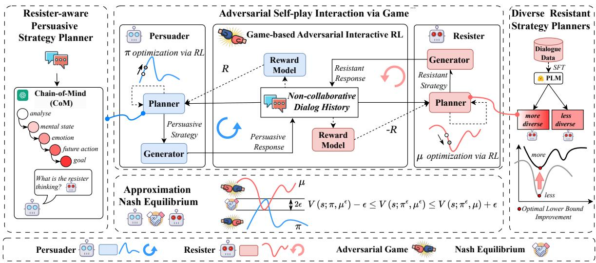
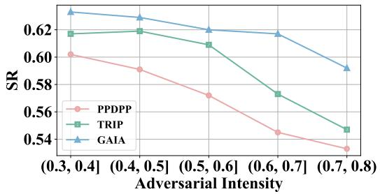
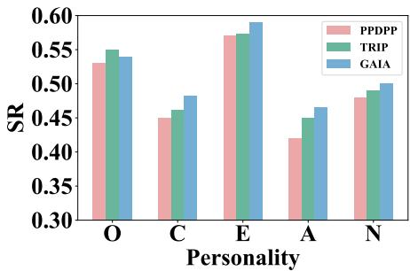

# Battling against Tough Resister: Strategy Planning with Adversarial Game for Non-collaborative Dialogues

Haiyang Wang1, Zhiliang Tian1\*, Yuchen Pan2, Xin Niu1, Xin Song1, Minlie Huang3, Bin Zhou1

1College of Computer Science and Technology, National University of Defense Technology

2 Intelligent Game and Decision Lab, Academy of Military Science

3Tsinghua University

{wanghaiyang19, tianzhiliang, panyuchen, niuxin, songxin, binzhou}@nudt.edu.cn aihuang@tsinghua.edu.cn

## Abstract

Non-collaborative dialogue involves two participants with conflicting interests engaging in a multi-round dialogue to achieve their own goals. Strategy planning is the key to guiding both participants towards a consensus. Most LLMs-based methods use stimulus prompts or external strategy planners for strategy planning. However, stimulus prompts fail to teach LLMs to plan dialogue strategies explicitly. Moreover, training external strategy planners doesn’t fully account for adversarial interactions, thereby limiting their effectiveness against tough resisters. In this paper, to mitigate the above issues, we propose GAIA, a Gamebased Adversarial self-play InterActive training paradigm, which constructs an adversarial two-player (a persuader and a resister) zerosum game and guides the game to approximate Nash Equilibrium (NE) via reinforcement learning (RL) for the non-collaborative dialogues. First, we design a Chain-of-Mind prompt to reason the resister’s dialogue act step-by-step to plan the persuasive strategies. Secondly, to adversarially improve the persuader, we construct diverse resistant planners and theoretically improve the persuader’s optimal lower bound. Finally, we iteratively optimise their policies via adversarial self-play interactive RL and design an ϵ-NE verification algorithm to approximate the game’s NE. Experiments on three datasets show that our model obtains stateof-the-art performance.

## 1 Introduction

Non-collaborative dialogue is when two dialogue participants with conflicting interests make multiround dialogue to achieve their own goals (Zhan et al., 2024). It has widespread applications, including legal debates (He et al., 2024b) and opinion controversy (Mou et al., 2024). The mainstream methods in non-collaborative dialogue are to make strategy planning to guide both parties towards a consensus (Zhang et al., 2024b).

The strategy planning for non-collaborative dialogue contains: (1) Traditional deep learning methods typically plan strategies through supervised training. They explicitly consider dialogues’ states (Zhou et al., 2020; Tian et al., 2023) and historical strategies (Joshi et al., 2021). However, these methods rely heavily on datasets with annotations. They typically plan strategies based solely on the next turn’s feedback, thus tending to neglect the long-term goals. (2) LLMs-based stimulus prompt methods plan strategies through various stimulus prompts with in-context learning (ICL). These prompts stimulate the LLMs to self-thinking (Wang et al., 2023b; Deng et al., 2023b), selfreflective (Zhang et al., 2023), and critical feedback (Fu et al., 2023) for dialogue strategy planning. These methods exploit the internal knowledge of LLMs via zero/few-shot examples to produce the strategies. However, the pre-training of LLMs seldom learned to explicitly plan non-collaborative strategy, thus it limited LLMs’ ability to be directly applied to sequential strategy planning for specific tasks.

To mitigate these limitations, researchers propose equipping LLMs with an external strategy planner. Instead of employing the aforementioned zero/few-shot, they conduct supervised learning or RL to fine-tune a strategy planner to predict the dialogue strategy for the next turn, and then they merge the strategy planner and LLMs to generate dialogue (Deng et al., 2024; Zhang et al., 2024b). These methods not only (1) leverage LLMs’ remarkable capabilities to generate dialogues, but also (2) fine-tune the planner on non-collaborative strategy planning tasks (Deng et al., 2024). However, the strategy planner’s training does not consider adversarial interactions. Tuning the strategy planner considers only the current dialogue state instead of the dialogue opponent’s potential responses and the future dialogue directions after the opponent’s responses.

Furthermore, some researchers propose an opponent agent to conduct adversarial training (Zhang et al., 2024b; Deng et al., 2024; Fu et al., 2023). Due to the difficulty of constructing a realistic opponent agent, researchers exploit LLMs’ capabilities to meticulously design prompts to simulate opponents and generate high-quality responses (Fu et al., 2023). The mechanism contributes to composing an adversarial strategy planner to estimate the opponent’s responses. However, this adversarial training fails to dynamically adapt to the increasing abilities of the agents. The adversarial capability comes from LLMs with prompt texts, and the static prompts constrain the model’s ability as the training goes on. That is, the opponent agent cannot adaptively become stronger as our planner improves thus weakening the robustness and adversarial of our strategy planner.

In this paper, we propose GAIA, a Gamebased Adversarial self-play InterActive training paradigm for LLMs-based non-collaborative dialogues via strategy planning. GAIA constructs a two-player zero-sum game that involves the two participants (dialogue agents) and guides the game to approximate Nash Equilibrium (NE) through reinforcement learning (RL) optimization for the noncollaborative dialogue. Specifically, the two-player zero-sum game is conducted between persuasive strategy planners and resistant strategy planners. To perceive and persuade the resister more effectively, we design a Chain-of-Mind prompt to reason the resister’s dialogue act step-by-step and incorporate them into strategy planning. To adversarially improve the generalization ability of the persuasive strategy planner, we propose a diverse resistant planner construction method. We theoretically prove that our training against diverse resisters improves the optimal lower bound of the persuader. To enhance the adversarial intensity, we construct a zero-sum persuader-resister game and iteratively optimize their policies through adversarial self-play interactive RL. To guide the game approximates the NE, we design a ϵ-NE iteration verification algorithm to obtain the near-optimal policy. Extensive experiments on three non-collaborative dialogue datasets show that significantly outperforms all the baselines, excelling against tough resisters.

Our contributions are threefold: (1) We propose a game-based adversarial self-play interactive training paradigm for LLMs-based intensely adversarial non-collaborative dialogue via strategy planning. (2) We design an adversarial interactive reinforcement learning method with ϵ-NE iteration verification to guide the game approximates NE to obtain the near-optimal policy for strategy planer. (3) Extensive experiments on three non-collaborative dialogue datasets show that GAIA achieves stateof-the-art performance.

## 2 Related Work

## 2.1 Non-Collaborative Strategy Planning

Non-collaborative dialogue is a form of usersystem interaction aiming to reach an agreement despite conflicting interests (Deng et al., 2023b). Strategy planning aims to use a series of strategies to guide both participants towards a consensus (Zhang et al., 2024b; Zhan et al., 2024). It can be divided into three categories: (1) Traditional deep learning methods conduct the strategy planning via dialogue act prediction (Deng et al., 2024; Joshi et al., 2021; Cheng et al., 2022). (2) LLMsbased stimulus prompt methods unleash the perception and planning potential of LLMs to strategize and guide the dialogue strategy (Deng et al., 2023b; Fu et al., 2023). (3) Equipping LLMs with external strategy planner methods conducts a tunable PLM as a strategy planner to predict the dialogue strategy at the next turn (Deng et al., 2024; Zhang et al., 2024b). In addition, there are also other methods, such as quasi-online direct preference optimization (Chen et al., 2024b) or dialogue action tokens (Li et al., 2024), used for goal-directed dialogue tasks.

To enhance LLMs’ strategy planning in noncollaborative dialogues, three key capabilities need improvement: perception, planning, and adversariality (Deng et al., 2023b). LLMs need to better perceive opponents’ emotions and infer intentions from conversation history (Zhang et al., 2024b; Tian et al., 2021). Their planning should be strengthened to adjust strategies dynamically toward long-term goals (Deng et al., 2024). Lastly, enhancing adversarial adaptability make them respond effectively in complex dialogues to achieve their objectives.

## 2.2 Two-Player Zero-Sum Markov Games

The Markov decision process (MDP) is a common tool to describe interactions between an agent and its environment (Lahikainen et al., 2024). Markov games (MGs) extend MDPs to multi-agents. In

  
Figure 1: The architecture of GAIA. The left is the Resister-aware Persuasive Strategy Planner. The right is the Diverse Resistant Strategy Planners. The upper centre illustrates the Adversarial Self-play Interaction via Game of the both planners. At the bottom centre, we guide the game to approximate the ϵ-NE.

MGs, multiple agents make decisions to maximize their or common interests (Ghaemi et al., 2024). Specifically, two-player zero-sum Markov games (TZMGs) involve two players with completely opposing interests (Nika et al., 2024). Both share the same reward function: one aims to maximize future rewards, while the other aims to minimize them. In TZMGs, the Nash Equilibrium represents the best possible payoff a player can achieve against the worst-case opponent (Silva, 2024).

## 3 Methodology

## 3.1 Task Definition

Given the role setting, dialogue goals, dialogue strategy sets $\mathcal { A } ^ { p } , \mathcal { A } ^ { r }$ , and the first utterance $u _ { 1 } ^ { p } , u _ { 1 } ^ { r }$ of non-collaborative dialogue participants, the noncollaborative dialogue task aims to generate a multiturn dialogue $\{ u _ { 1 } ^ { p } , u _ { 1 } ^ { r } , \cdot \cdot \cdot , u _ { t } ^ { p } , u _ { t } ^ { r } \}$ to gradually guide two dialogue participants with conflicting dialogue goals towards a consensus by planning a series of strategies. Each utterance $u _ { i }$ in the multiturn non-collaborative dialogue is generated based on an appropriate dialogue strategy $a _ { i } \in { \mathcal { A } }$

## 3.2 Model Overview

Our model GAIA (Fig. 1) aims to train an exceptional persuasive strategy planner through gamebased adversarial interactive training with various resistant strategy planners. GAIA consists of five modules:

• Resister-aware persuasive strategy planner aims to plan strategy in highly adversarial noncollaborative dialogues and persuades the resister.

• Diverse resistant strategy planners construct various resistant strategy planners to adversarially improve the generalization ability of the persuasive strategy planner.

• Strategic response generator aims to generate dialogue utterances based on a specified strategy.

• Adversarial self-play interaction via game aims to enable the above planners (persuasive and resistant strategy planners) to engage in the adversarial game for non-collaborative dialogues.

• Approximation of Nash Equilibrium finds an approximate Nash Equilibrium in the games to learn a near-optimal policy for the persuasive strategy planner.

## 3.3 Resister-aware Persuasive Planner

To effectively persuade resisters, we propose a persuasive strategy planner that can plan dialogue strategies based on the emotion, future action and dialogue act of the resister.

## 3.3.1 Chain-of-Mind for Persuader

We design a Chain-of-Mind (CoM) prompt for LLMs to reason the resister’s emotion, future action, and dialogue goal. In non-collaborative dialogues, the inferred emotion of the resister helps the persuasive planner plan strategies that are empathetic and resonate emotionally. The inferred future action of the resister enables the persuasive planner to plan a proactive and preemptive strategy, ensuring they are well-prepared to counter any resistance. Dialogue goal of the resister allows the persuasive planner to choose compelling strategies and focus on key concerns, thus increasing the chances of successful persuasion.

Recent research has shown that LLMs have the Theory-of-Mind (ToM) ability to reason others mental states (Moghaddam and Honey, 2023). The CoM prompt relies on the ToM ability of LLMs. CoM applies a chain to step-by-step reason the emotions, future action and dialogue goal with the following steps:

• Step 1: Analyze the dialogue history.

• Step 2: Reason mental states based on the analysis.

• Step 3: Reason the resister’s emotion from mental states.

• Step 4: Reason the resister’s possible future action based on the above information.

• Step 5: Reason the resister’s dialogue goal.

Based on the above reasoning steps, following CoT (Wei et al., 2022), we construct CoM exemplars to achieve in-context learning (ICL) in LLMs. The CoM prompt template is as follows: Task definition is the definition of mind reasoning task. Guideline Instruction is the instruction we expect LLMs to follow. CoM Exemplars are the instances used to better assist LLMs with ICL. Dialogue Context is the historical dialogue. Tab. 6 shows the example of the Chain-of-Mind (CoM) prompt template. CoM excels in strategic dialogue by explicitly modeling the resister’s responses and dynamically adjusting its reasoning based on realtime feedback. It analyzes the resister from multiple perspectives, including emotion, future action and dialogue goals providing deeper insights that enhance the effectiveness of strategy planning.

## 3.3.2 Persuasive Planner Initialization

To incorporate the emotion, future action and goal of the resister into planning, we supervised finetuning (SFT) a model as the initialization of the persuasive strategy planner $\mathbf { S P } _ { p e r }$ . Specifically, given the reasoning emotion $\hat { e } ^ { r }$ , future action $\hat { a } _ { t } ^ { r }$ , dialogue goal $\hat { g } ^ { r }$ of the resister, and the dialogue history $d = \{ u _ { 1 } ^ { p } , u _ { 1 } ^ { r } , \cdot \cdot \cdot , u _ { t - 1 } ^ { p } , u _ { t - 1 } ^ { r } \}$ , we fine-tune a pre-trained LM over a supervised dialogue corpus $\mathcal { D }$ which contains many dialogues with annotated strategies. The training aims to minimize the crossentropy $\mathcal { L } _ { c } ^ { p }$ between the predicted strategy $a _ { t } ^ { p }$ and the labeled strategy $y _ { t } ^ { p }$ for each turn t of the annotated dialogue:

$$
\mathcal { L } _ { c } ^ { p } = - \frac { 1 } { | \mathcal { D } | } \sum _ { d \in \mathcal { D } } \frac { 1 } { T _ { d } } \sum _ { t = 1 } ^ { T _ { d } } a _ { t } ^ { p } \mathrm { l o g } y _ { t } ^ { p } ,\tag{1}
$$

where $T _ { d }$ is the number of turns of the dialogue. Finally, the planner $\mathbf { S P } _ { p e r }$ that can predict the persuasive strategy $a _ { t } ^ { p }$ as $a _ { t } ^ { p } = \mathbf { S } \mathbf { P } _ { p e r } ( \hat { e } ^ { r } , \hat { a } _ { t } ^ { r } , \hat { g } ^ { r } , d )$ According to (Deng et al., 2024), SFT probably only obtains a sub-optimal policy for $\mathbf { S P } _ { p e r } ;$ hence, we apply the RL in further training (Sec. 3.6).

## 3.4 Diverse Resistant Planners

To adversarially improve the generalization ability of the persuasive strategy planner, we construct a set containing multiple diverse resistant strategy planners.

## 3.4.1 Improving Persuader’s Optimal Lower Bound via Diversing Resisters

The persuader can effectively improve the persuasive strategy planner’s optimal lower bound by training against diverse resistant strategy planners with varying resistance capabilities. The construction of more diverse or less diverse planners is determined by the variance in the performance distribution during strategy planning. Compared to less diverse resisters, more diverse resisters offer more information gain (He et al., 2024a) for optimizing the persuader’s parameters. Taking price negotiations as an example, the buyer aims to persuade the seller to their target price. By negotiating with sellers of diverse bargaining skills, the buyer enhances their negotiation abilities more effectively than interacting with fewer sellers.

To prove that training against more diverse resistant planners improves the persuader’s optimal lower bound, we define that (a) the persuader’s initial policy $\pi ^ { 0 }$ and the optimized policy is $\pi ^ { * } ;$ (b) the training resister sets are $S _ { r } ^ { m }$ and $S _ { r } ^ { l } \mathrm { : }$ ; (c) the test resisters set is $S _ { r } ^ { t e s t } \colon$ ; (d) policy of resister is $\mu .$ We assume that (1) $S _ { r } ^ { m }$ is more diverse than $S _ { r } ^ { l }$ and $S _ { r } ^ { l } \subseteq S _ { r } ^ { m } ; ( 2 )$ The optimized policy of persuader through the training with resisters $\mu \in S _ { r } ^ { m }$ is $\pi ^ { m }$ and that with $\mu \in S _ { r } ^ { l }$ is $\pi ^ { l } ; ( 3 )$ The function $u ( \pi , \mu )$ measures the total reward for the policy tuple $( \pi , \mu ) ; ( 4 )$ The total reward gain after optimization is $\mathbb { E } _ { \mu ^ { t e s t } \in S _ { r } ^ { t e s t } } [ u ( \pi ^ { * } , \mu ^ { t e s t } ) - u ( \pi ^ { 0 } , \mu ^ { t e s t } ) ]$ ; (5)

The optimal lower bound of persuader is $L ( \pi ^ { * } )$ $m i n _ { \pi ^ { * } } \mathbb { E } [ u ( \pi ^ { * } , \mu ^ { t e s t } ) - u ( \pi ^ { 0 } , \mu ^ { t e s t } ) ]$

Based on information-theoretic research for analysing optimal lower bound (Shannon, 1948; Gálvez, 2024; He et al., 2024a), we prove $L ( \pi ^ { m } ) \geq$ $L ( \pi ^ { l } )$ , which indicates that more diverse resisters can improve the optimal lower bound of persuader. The detailed proof is in App. B.

## 3.4.2 Diverse Resistant Planners Construction

The resistant strategy planner $\mathbf { S P } _ { r e s }$ plans resistance strategies based on dialogue history as $a _ { t } ^ { r } =$ ${ \bf S P } _ { r e s } ( d )$ . Similar to the construction of the persuasive planner, we initialize the resistant strategy planner $\mathbf { S P } _ { r e s }$ by supervised fine-tuning (SFT) over an annotated dataset. Different from the persuasive planner, during SFT, we save various resistant strategy planners with varying strategy planning performances to ensure resister diversity.

## 3.5 Strategic Response Generator

To generate responses according to the planned strategies, we employ an LLM-based generator with a prompt $p _ { s y s }$ indicating its role setting (persuader or resister) and dialogue goals. This prompt $p _ { s y s }$ constrains the LLM’s output to fit the role. We also design strategy-aware instructions and build a mapping $\mathcal { M }$ to map each strategy a to an instruction. Given a dialogue history $d$ and an instruction $\mathcal M ( a )$ , the LLM-based generator $\mathbf { G } ( \cdot | p _ { s y s } )$ outputs the strategic response u as $u =$ $\mathbf { G } ( \mathcal { M } ( a ) , d \vert p _ { s y s } )$ . As the persuader and resister have distinct role settings and dialogue goals, we construct two different prompts $p _ { s y s } ^ { p e r }$ and $p _ { s y s } ^ { r e s }$ for persuader generator $\mathbf { G } _ { p e r } ( \cdot | p _ { s y s } ^ { p e r } )$ and resistant generator $\mathbf { G } _ { r e s } ( \cdot | p _ { s y s } ^ { r e s } )$ , respectively. To diversify response styles, we further assign various personas (Big-Five Personality) to the resistant generator (Zhang et al., 2024b; Jiang et al., 2023).

## 3.6 Adversarial Self-play Interaction via Game

To adaptively enhance the resister as the persuader improves, we propose a two-player zero-sum game trained by an adversarially self-play interaction RL, which aims to achieve the ϵ-NE of two players (planners).

## 3.6.1 Persuader-Resister Game

We construct a two-player zero-sum Markov game (TZMG) $\mathcal { G } = ( S , \mathcal { A } ^ { p } , \mathcal { A } ^ { r } , \mathcal { P } , \mathcal { R } , \gamma )$ for the two planners. In ${ \mathcal { G } } , S$ is the game state set representing the dialogue history, $\mathcal { A } ^ { p }$ is a pre-defined set of persuasive strategies, $\mathcal { A } ^ { r }$ is the resistant strategies set, $\mathcal { P }$ is state transition function, is the bounded and deterministic reward function, and $\gamma$ is the discounted factor. At each step $t ,$ the persuasive strategy planner chooses strategy $a _ { t } ^ { p } \sim \pi ( s _ { t } )$ then the resistant planner chooses strategy $a _ { t } ^ { r } \sim \mu ( s _ { t } )$ The two planners aim to maximize the expected value $V \left( s _ { 0 } \right) = \mathbb { E } [ \sum _ { t = 0 } ^ { \infty } \gamma ^ { l } { \bf r } _ { t + 1 } ]$ , which is the expectation of the sum of future rewards r.

## 3.6.2 Adversarial Self-play Interactive RL

To optimize the policies of the persuasive and resistant strategy planners, we propose adversarial self-play interactive RL. We enable the persuader and resister to perform self-play dialogue interaction. During the interaction, we dynamically measure the reward and employ RL to optimize their policies. This process gradually increases the adversarial intensity of the persuader-resister game.

Policy Models (Strategy Planners). In the RL framework, our policy models are resister-aware persuasive strategy planner $\mathbf { S P } _ { p e r }$ and resistant strategy planner $\mathbf { S P } _ { r e s }$ . We use $\mathbf { S P } _ { p e r }$ to plan a persuasive strategy $a ^ { p }$ and feed $a ^ { p }$ into $\mathbf { G } _ { p e r }$ to generate an utterance $u _ { t } ^ { p }$ . Then, we use $\mathbf { S P } _ { r e s }$ to plan a resistant strategy $a ^ { r }$ and feed $a ^ { r }$ into $\mathbf { G } _ { r e s }$ to counter with a response $u _ { t } ^ { r }$ . The persuader and resister alternately choose strategies (actions) and interact through dialogue.

Goal-oriented Reward. We design a reward function to provide goal-oriented quantitative feedback r for the planners after applying strategies. In particular, for the price negotiation task, we adopt the sale-to-list ratio (SL%) (Zhou et al., 2019) as reward function, which is the ratio between the current price $P _ { t }$ and the buy’s target price $P _ { b u y e r } ,$ formulated as $S L \% = P _ { c u r r e n t } / P _ { b u y e r }$ . For the countering hate speech task, we adopt the hate intensity $\Delta \mathcal { H }$ (Wang et al., 2024b). It measures the difference in the hate intensity $\mathcal { H } ( \cdot )$ between the initial hate speech and the current utterance of the hater, formulated as $\Delta \mathcal { H } = \mathcal { H } ( u _ { 0 } ) - \mathcal { H } ( u _ { t } )$ . When the adversarial interaction reaches a terminal state, we calculate the total reward $\begin{array} { r } { R _ { t } = \sum _ { t ^ { \prime } = t } ^ { T } \gamma ^ { T - t ^ { \prime } } \mathbf { r } _ { t ^ { \prime } } } \end{array}$ accumulating from turn t to the final $T$ , where $\gamma$ is the discount factor. Then, we feed reward $R _ { t }$ back to $\mathbf { S P } _ { p e r }$ and the negative $- R _ { t }$ back to $\mathbf { S P } _ { r e s }$

Optimization via RL. We use the REINFORCE algorithm (Sutton et al., 1999) to optimize the parameter θ of the policy models (strategy planners,

SP) based on the total reward $R _ { t }$ and learning rate α as $\theta  \theta - \alpha \nabla$ log $\pi _ { \theta } R _ { t }$ . Their adversarial interaction repeats until the persuader’s goal is achieved or the maximum dialogue turn is reached.

## 3.7 Approximation of Nash Equilibrium

Adversarial self-play interactive RL often struggles to converge to a strict NE. Thus, we guide the adversarial game to converge at ϵ-NE to approximate the strict NE. This method not only can obtain a near-optimal policy but also mitigate the difficulties of finding strict NE. These difficulties mainly arise from the following reasons: (1) the unpredictability of resister behaviours, (2) the limited rationality of LLM-based generators, and (3) the increased dialogue adversarial intensity.

## 3.7.1 The ϵ-NE of Persuader-Resister Game

We define ϵ-Best Response and ϵ-Nash Equilibrium in the persuader-resister game as follows (McAleer et al., 2024).

Definition 1: ϵ-Best Response. Given the policy µ of resistant strategy planner, the policy $\pi ^ { \epsilon b }$ of persuasive strategy planner is called the ϵ-best response that is at most ϵ worse than the best response1 $\pi ^ { b } ,$ , as shown in Eq. 2. The definitionfor ϵ-best response $\mu ^ { \epsilon b }$ of resistant strategy planners is similar with $\pi ^ { \epsilon b }$ as shown in Eq. 3.

$$
V \left( s ; \pi ^ { \epsilon b } , \mu \right) \geq V \left( s ; \pi ^ { b } , \mu \right) - \epsilon\tag{2}
$$

$$
V \left( s ; \pi , \mu ^ { \epsilon b } \right) \leq V \left( s ; \pi , \mu ^ { b } \right) + \epsilon\tag{3}
$$

Definition 2: ϵ-Nash Equilibrium. The ϵ-Nash Equilibrium corresponds to a pair of $( \pi ^ { \epsilon } , \mu ^ { \epsilon } )$ that are both the ϵ-best responses to each other:

$$
V \left( s ; \pi , \mu ^ { \epsilon } \right) - \epsilon \le V \left( s ; \pi ^ { \epsilon } , \mu ^ { \epsilon } \right) \le V \left( s ; \pi ^ { \epsilon } , \mu \right) + \epsilon \quad \forall \pi , \mu\tag{4}
$$

Based on the definitions, we can conclude that under ϵ-NE:

• (C1): the persuasive strategy planner changes to other policies, the increase of the expected reward does not exceed ϵ;

• (C2): the resistant strategy planner changes to other policies, the decrease of the expected reward does not exceed ϵ.

## 3.7.2 The ϵ-NE Iteration Verification

To obtain the near-optimal policy of the above two planners, we design a ϵ-NE iteration verification algorithm to push the game to converge at ϵ-NE. It iteratively optimizes the policy and continuously verifies whether ϵ-NE has been achieved. If so, we terminate the optimization. Otherwise, continue. The verification is divided into the persuader and resister verification phases. The former checks whether C1 is satisfied by only changing the policy π, while the latter checks C2 by only changing the policy $\mu .$ . If both are satisfied, the ϵ-NE is achieved. The ϵ-NE iteration verification algorithm as shown in Alg. 1.

Algorithm 1 ϵ-Nash Equilibrium Iteration Verifi  
cation   
1: for iterations : i = 1 to N do   
2: for all $d \in D$ do   
3: Adversarial Self-play Interaction RL   
4: end for   
5: Test $\pi _ { i }$ and $\mu _ { i }$ and calculate V.   
6: /\* Persuader Validation Phase \*/   
7: Only optimize $\pi _ { i t e r + i }$ and record $V _ { i t e r + i } ^ { \pi }$   
8: /\* Resister Validation Phase \*/   
9: Only optimize $\mu _ { i t e r + i }$ and record Vµiter+i   
10: /\* Verify the ϵ-NE \*/   
11: if the condition satisfies with Eq. 1 then   
12: break;   
13: else   
14: continue optimization;   
15: end if   
16: end for

The ϵ-NE plays a vital role in non-collaborative dialogues. For the pricing negotiation, it helps to find a nearly fair price in buyer-seller interactions, preventing detrimental price wars. For countering hate speech (Wang et al., 2024a), it seeks a balanced viewpoint that is acceptable to both haters and anti-haters, avoiding the dialogue escalating into malicious insults.

## 4 Experiments

## 4.1 Experimental Setups

Datasets: We focus on three different noncollaborative dialogue scenarios: (1) Craisglist-Bargain (CB) (He et al., 2018) is developed in a bargaining negotiation context where a buyer and a seller negotiate the price of an item for sale. (2) DIALOCONAN (DC) (Bonaldi et al., 2022) is designed for fighting online hate speech. The dataset involves a hater and an anti-hater, intending to persuade the hater to change their hateful attitude. (3) Charity Persuasion (CP) (Wang et al., 2019) is designed for studying persuasive dialogues aimed at encouraging charitable donations. It involves a Persuader and a Persuadee.

Baselines: We use three prompt-based (LLMs) methods and three LLMs with external strategy planners as baselines. Standard (Deng et al., 2024) prompts two LLMs to conduct self-play conversations using task instructions, without considering any dialogue strategy. ProCoT (Deng et al., 2023b) prompts the LLMs to generate a chain-of-thought analysis for planning the the next turn dialogue strategy. ICL-AIF (Fu et al., 2023) prompts another LLM to provide feedback to a player to improve their dialogue strategies. MCTS (Yu et al., 2023) uses Monte Carlo Tree Search to perform goal-oriented dialogue policy planning. PPDPP (Deng et al., 2024) uses a pre-trained LM as a trainable plug-in for determining next-step strategies. TRIP (Zhang et al., 2024b) develops an external planner by modelling dialogue user characteristics and training with diverse user simulators.

Implementation details: As for the planner, we adopt RoBERTa2 as the default plug-and-play dialogue policy planner for evaluation. The training process for the planner includes supervised fine-tuning (SFT) and reinforcement learning (RL). During the SFT, the batch size is 32, the learning Rate is 1e-5 and the max sequence length is 512. During the RL, the learning Rate is 1e-6 and the max conversation turn is 12. Moreover, we follow the previous work (Deng et al., 2024; Zhang et al., 2024b) to design reward, which can be divided into three situations: (1) when the persuasive goal is successfully achieved, the reward is defined as 1.0 for the CP dataset, SL% for the CB datasets, and ∆ for the DC dataset. (2) when the persuasive goal is not achieved, the reward is -1.0. (3) Furthermore, a small negative reward (-0.1) per turn penalises the lengthy dialogue. As for the adversarial training, we construct a policy pool for diverse resisters. And resister policies are dynamically sampled to adversarially train the persuader. As for the generator, we adopt GPT-3.53 to generate the strategic response on the CB and CP datasets. For DC datasets, we adopt an uncensored LLM4 for the hater and GPT-3.5 for the anti-hater.

Evaluation Protocols: The evaluation metrics contain: Success Rate (SR) measures effectiveness by the percentage of goal achievement within a maximum number of turns, and Average Turn (AT) measures efficiency by the average number of turns required to achieve the goal. Additionally, we also used dataset-specific metrics: SL% for the CB dataset and ∆ for DC. SL% is to determine the effectiveness of goal completion in price negotiations. ∆ is the reduction of hate intensity (Wang et al., 2024b). The calculation details of success rates and dataset-specific metrics can be found in App. D. Resister details in the evaluation in App. D.2.3.

## 4.2 Main Results

<table><tr><td rowspan="2">Methods</td><td colspan="3">CB Dataset</td><td colspan="3">DC Dataset</td><td colspan="2">CP Dataset</td></tr><tr><td>SR↑</td><td>AT↓</td><td>SL%↑</td><td>SR↑</td><td>AT↓</td><td>∆↑</td><td>SR↑</td><td>AT↓</td></tr><tr><td colspan="9">Prompt-based planning</td></tr><tr><td>Standard</td><td>0.429</td><td>7.95</td><td>0.218</td><td>0.402</td><td>9.45</td><td>0.298</td><td>0.105</td><td>10.2</td></tr><tr><td>ProCoT</td><td>0.551</td><td>7.58</td><td>0.246</td><td>0.432</td><td>8.68</td><td>0.324</td><td>0.195</td><td>9.82</td></tr><tr><td>ICL-AIF</td><td>0.475</td><td>8.23</td><td>0.257</td><td>0.443</td><td>8.72</td><td>0.325</td><td>0.174</td><td>9.93</td></tr><tr><td colspan="9">External strategy planner</td></tr><tr><td>MCTS</td><td>0.471</td><td>7.77</td><td>0.238</td><td>0.521</td><td>7.89</td><td>0.356</td><td>0.246</td><td>9.63</td></tr><tr><td>PPDPP</td><td>0.623</td><td>6.82</td><td>0.342</td><td>0.578</td><td>7.42</td><td>0.364</td><td>0.463</td><td>9.12</td></tr><tr><td>TRIP</td><td>0.659</td><td>6.46</td><td>0.389</td><td>0.601</td><td>7.46</td><td>0.372</td><td>0.528</td><td>8.49</td></tr><tr><td>GAIA</td><td>0.693</td><td>6.03</td><td>0.413</td><td>0.643</td><td>6.92</td><td>0.412</td><td>0.562</td><td>8.12</td></tr><tr><td>∆ ∆%</td><td>↑0.034 ↑5.2</td><td>↓0.43 ↓6.7</td><td>↑0.024 ↑6.1</td><td>↑0.042 ↑6.9</td><td>↓0.50 ↓6.7</td><td>↑0.040 ↑10.7</td><td>↑0.034 ↑6.4</td><td>↓0.37 ↓4.4</td></tr></table>

Table 1: Main Results on 3 datasets. Best scores are in bold. The suboptimal scores are underlined. ∆ represents the difference between the best and the suboptimal result, and ∆% is the percentage. The significance tests of our GAIA over PPDPP and TRIP (with p <0.05).

The overall performances are shown in Tab. 1. The main experimental setup is consistent with previous studies (Deng et al., 2024). The opponent is based on an LLM without a strategy planner. For prompt-based LLMs planning methods, standard prompt methods provide a baseline for all competing methods having low success rates. Pro-CoT is a competitive prompt-based method that has achieved high persuasion success rates on the CB and CP datasets. ICL-AIF slightly improves SR over standard prompts but requires more turns, indicating that AI feedback (ICL-AIF) doesn’t effectively adjust strategies with changing dialogue states. For external planners with LLMs methods, most of these methods achieve a higher SR than prompt-based methods and require fewer dialogue rounds (lower AT). This indicates that explicit strategy planning benefits the achievement of the persuader’s goal in non-collaborative dialogues. Among external strategy planner methods, TRIP achieves good performance. TRIP uses a population-based training paradigm that enhances the effectiveness of strategy planning. Our proposed GAIA consistently outperforms all baselines across three datasets. The average improvement in SR is about 6.6% and AT is about 5.9%. The significance tests of our GAIA over PPDPP and TRIP (with p <0.05) show that GAIA presents a statistically significant improvement. The results show that GAIA not only achieves the dialogue goal efficiently (less AT) but also persuades resisters effectively (higher SR). We attribute this to the diverse resisters and adversarial interactive RL, which enables the successful persuasion of tough resisters that other methods fail to convince.

## 4.3 Ablation Study

<table><tr><td rowspan="2">Methods</td><td colspan="3">CB</td><td colspan="3">DC</td></tr><tr><td>SR↑</td><td>AT↓</td><td>SL %↑</td><td>SR↑</td><td>AT ↓</td><td>∆H↑</td></tr><tr><td>GAIA</td><td>0.693</td><td>6.03</td><td>0.413</td><td>0.643</td><td>6.92</td><td>0.412</td></tr><tr><td>w/o RA ∆</td><td>0.661</td><td>6.57</td><td>0.382</td><td>0.626</td><td>7.34</td><td>0.398</td></tr><tr><td>w/o D</td><td>↓0.032</td><td>↑0.53</td><td>↓0.034</td><td>↓0.017</td><td>↑0.42</td><td>↓0.014</td></tr><tr><td rowspan="2">∆</td><td>0.665</td><td>6.62</td><td>0.379 ↓0.034</td><td>0.633 ↓0.010</td><td>7.44</td><td>0.381 ↓0.031</td></tr><tr><td>↓0.028</td><td>↑0.59</td><td></td><td></td><td>↑0.52</td><td></td></tr><tr><td>w/o AI ∆</td><td>0.636 ↓0.057</td><td>7.21 ↑1.18</td><td>0.367 ↓0.046</td><td>0.592 ↓0.051</td><td>7.47</td><td>0.370 ↓0.042</td></tr><tr><td rowspan="2">w/o NEV ∆</td><td></td><td></td><td></td><td></td><td>↑0.55</td><td></td></tr><tr><td>0.672 ↓0.021</td><td>6.22 ↑0.19</td><td>0.393 ↓0.020</td><td>0.620 ↓0.023</td><td>7.12 ↑0.20</td><td>0.399 ↓0.013</td></tr></table>

Table 2: Experimental results of ablation study.

To verify the effectiveness of each component, we conduct an ablation study (Tab. 2). We observe that removing the resister-aware module ("w/o RA") slightly reduces performance, which verifies that reasoning about the resister’s emotions, future actions, and dialogue goals during non-collaborative dialogues helps the persuader achieve its own goals. From the results of removing the diverse resisters ("w/o D") that only train against a single resister, we conclude that training with diverse resisters is effective in enhancing the robustness of the persuasive strategy planner. Additionally, the performance drops significantly when removing the adversarial interaction ("w/o AI") that the resister without a planner. The result indicates that the resister can adaptively improve, which is crucial for optimizing the persuasive strategy planner. Furthermore, removing the NE validation ("w/o NEV") leads to a noticeable performance decline. It suggests that finding an approximate NE helps obtain a nearoptimal policy for the persuasive strategy planner.

## 4.4 Adversarial Analysis of GAIA

This section aims to analyze GAIA’s adversarial performance against resisters with varying strategy planning abilities and adversarial intensity.

4.4.1 Resistant Strategy Planners Ability
<table><tr><td rowspan="2">Methods</td><td colspan="2">Weak</td><td colspan="2">Medium</td><td colspan="2">Tough</td></tr><tr><td>SR↑</td><td>∆↑</td><td>SR↑</td><td>∆↑</td><td>SR↑</td><td>∆↑</td></tr><tr><td>PPDPP</td><td>0.573</td><td>0.362</td><td>0.523</td><td>0.310</td><td>0.437</td><td>0.274</td></tr><tr><td>TRIP</td><td>0.577</td><td>0.373</td><td>0.519</td><td>0.301</td><td>0.441</td><td>0.269</td></tr><tr><td>GAIA</td><td>0.603</td><td>0.382</td><td>0.558</td><td>0.341</td><td>0.492</td><td>0.318</td></tr><tr><td>∆PPDPP</td><td>↑0.030</td><td>↑0.020</td><td>↑0.035</td><td>↑0.031</td><td>↑0.055</td><td>↑0.044</td></tr><tr><td>∆TRIP</td><td>↑0.026</td><td>↑0.009</td><td>↑0.039</td><td>↑0.040</td><td>↑0.051</td><td>↑0.049</td></tr></table>

Table 3: Adversarial analysis when against resisters with various resistant strategy planning abilities.

To assess GAIA’s performance against resisters with various resister strategy planning abilities, we set up resisters with varying difficulty levels. They exhibit distinct strategic planning abilities, which are classified as weak, medium, and tough in terms of the strengths of resisters (difficulty for the persuader). The experiment results are shown in Tab. 3. We observe that GAIA shows strong performance when dealing with resisters of varying strengths including weak, middle, and tough (Definition details in App. D). More importantly, we find that when facing a tough resister, GAIA shows an improvement of about 5% over baselines, which is higher than the 2.8% improvement when facing a weak resister. This indicates that GAIA excels in dealing with tougher resisters and remains effective against weaker ones. We attribute this to (1) the construction of diverse resister strategy planners with varying strategic capabilities, and (2) adversarial self-play interactive RL that improves generalization against various resisters.

## 4.4.2 Adversarial Intensity of Dialogue

  
Figure 2: Persuasion SR with increasing adversariality.

To investigate GAIA’s performance in tackling dialogues with varying adversarial intensities, we evaluate the persuasion success rates across varying adversarial intensities on DC, as shown in Fig. 2. We measure non-collaborative dialogues’ adversarial intensity based on the prior work (Wang et al., 2023a), where the adversarial intensity ranges from a minimum of 0.32 to a maximum of 0.78. We observe that GAIA shows a significant improvement (8%) in SR within the high adversarial intensity range ([0.6, 0.8]) compared with PPDPP and TRIP. It is higher (5%) than the improvement (3%) in the low adversarial intensity range ([0.3, 0.5]). This demonstrates the GAIA’s superiority in tackling intense adversarial dialogues.

## 4.5 Personality Generalization Analysis

  
Figure 3: Persuasion SR with five personalities.

To analyze the generalization of the persuader towards resisters with different personalities, we equip the resisters with big-five personalities on DC dataset (Jiang et al., 2023), which are Openness, Conscientiousness, Extraversion, Agreeableness, and Neuroticism generators. The results are shown in Fig. 3. GAIA achieves the highest persuasion SR when dealing with resisters on most personalities. It indicates that training against the diverse personalities of resisters makes strategy planning more personality-adaptive.

## 4.6 Human Evaluation

<table><tr><td>Methods</td><td>PSR</td><td>Coherent</td></tr><tr><td>PPDPP</td><td>0.48</td><td>3.54</td></tr><tr><td>TRIP</td><td>0.54</td><td>3.57</td></tr><tr><td>GAIA</td><td>0.59</td><td>3.68</td></tr></table>

Table 4: The Human Evaluation Results.

We conduct a human evaluation (App. E) on the full test set of the CB dataset in line with the previous research (Deng et al., 2024; Zhang et al., 2024c). We consider the metrics of (1) persuasion success rate (PSR): the success (1) or not (0) of persuasion based on dialogue texts. (2) coherent: the coherence of dialogue and strategic planning on a scale of 1 (bad) to 5 (good). The experimental results are shown in Tab. 4, demonstrating that our approach also outperforms two competitive baselines in human evaluations.

## 4.7 Case Study

We provide detailed case studies to analyze the advantages of GAIA when tackling tough resisters and intense adversarial dialogue compared to PPDPP and TRIP, as shown in Tab. 10, Tab. 11 and Tab. 12. From Tab. 10, we can observe that: (1) GAIA does not easily succumb to the resister and maintains its stances when facing a tough resister; (2) GAIA is good at employing positive strategies (e.g. empathy) to influence the resister subtly; (3) GAIA’s strategic planning is coherent to progressively persuading resisters. From Tab. 11, the anti-hate speaker tries to correct the hate speaker’s wrong beliefs using constant criticism and questioning. However, this excessive attacking and probing only makes the hate speaker more defensive, leading to a heated argument and worsening their hate instead of easing it. From Tab. 12 the anti-hate speaker used many strategies to engage in a friendly debate. However, despite these strategies aimed at fostering understanding and reducing hatred, the hater’s position remained unchanged and, in some respects, even deepened.

## 5 Conclusion

In this paper, we propose GAIA, a Game-based Adversarial self-play InterActive training paradigm for non-collaborative dialogue via strategy planning. In GAIA, we propose Chian-of-Mind to construct a resister-aware persuasive strategy planner that can reason resister’s dialogue act step-bystep to plan the persuasive strategies. To improve the generalization ability of the persuasive strategy planner, we also construct diverse resistant strategy planners and theoretically improve the persuader’s optimal lower bound. To enhance the adversarial intensity of the game, we iteratively optimize the policies of the two planners through adversarial self-play interactive reinforcement learning. GAIA converges at the approximation NE of the game. Experimental results show that GAIA significantly outperforms other methods across three non-collaborative dialogue datasets, particularly in intense adversarial scenarios.

## Acknowledgements

The authors thank the anonymous reviewers for their insightful suggestions. This work is supported by the following fundings: National Natural Science Foundation of China (No.62172428), Young Elite Scientist Sponsorship Program by CAST (2023QNRC001) under Grant No. YESS20230367, the National Natural Science Foundation of China under Grant No. 62306330 and the National Science Foundation for Distinguished Young Scholars under Grant No. 62125604.

## Limitations

While the proposed GAIA method presents a novel approach for enhancing non-collaborative dialogue strategies, there are a few limitations that should be acknowledged: (1) GAIA’s reliance on reinforcement learning can be computationally expensive, making it challenging to scale to more complex dialogue scenarios. (2) While GAIA performs well on three benchmarks, its effectiveness in diverse, realworld applications remains untested. (3) GAIA’s performance depends on the quality of the underlying LLMs, which may introduce biases or limitations in handling nuanced interactions.

## Ethics Statement

The goal of this paper is to enhance strategy planning in non-collaborative dialogues, with applications in scenarios such as product trading, hate mitigation, and emotional support. Our research may give rise to some ethical and moral considerations. Nevertheless, we are confident that our work aligns with the ethical policy established by ACL.

## References

Helena Bonaldi, Yi-Ling Chung, Gavin Abercrombie, and Marco Guerini. 2024. NLP for counterspeech against hate: A survey and how-to guide. In Findings of the Association for Computational Linguistics: NAACL 2024, Mexico City, Mexico, June 16-21, 2024, pages 3480–3499. Association for Computational Linguistics.

Helena Bonaldi, Sara Dellantonio, Serra Sinem Tekiroglu, and Marco Guerini. 2022. Humanmachine collaboration approaches to build a dialogue dataset for hate speech countering. In Proceedings of the 2022 Conference on Empirical Methods in Natural Language Processing, EMNLP 2022, Abu Dhabi, United Arab Emirates, December 7-11, 2022, pages 8031–8049. Association for Computational Linguistics.

Jiangjie Chen, Xintao Wang, Rui Xu, Siyu Yuan, Yikai Zhang, Wei Shi, Jian Xie, Shuang Li, Ruihan Yang, Tinghui Zhu, Aili Chen, Nianqi Li, Lida Chen, Caiyu Hu, Siye Wu, Scott Ren, Ziquan Fu, and Yanghua Xiao. 2024a. From persona to personalization: A survey on role-playing language agents. CoRR, abs/2404.18231.

Maximillian Chen, Ruoxi Sun, Sercan Ö. Arik, and Tomas Pfister. 2024b. Learning to clarify: Multiturn conversations with action-based contrastive selftraining. CoRR, abs/2406.00222.

Yi Cheng, Wenge Liu, Wenjie Li, Jiashuo Wang, Ruihui Zhao, Bang Liu, Xiaodan Liang, and Yefeng Zheng. 2022. Improving multi-turn emotional support dialogue generation with lookahead strategy planning. In Proceedings of the 2022 Conference on Empirical Methods in Natural Language Processing, EMNLP 2022, Abu Dhabi, United Arab Emirates, December 7-11, 2022, pages 3014–3026. Association for Computational Linguistics.

Yang Deng, Wenqiang Lei, Minlie Huang, and Tat-Seng Chua. 2023a. Goal awareness for conversational AI: proactivity, non-collaborativity, and beyond. In Proceedings of the 61st Annual Meeting of the Association for Computational Linguistics: Tutorial Abstracts, ACL 2023, Toronto, Canada, July 9-14, 2023, pages 1–10. Association for Computational Linguistics.

Yang Deng, Lizi Liao, Liang Chen, Hongru Wang, Wenqiang Lei, and Tat-Seng Chua. 2023b. Prompting and evaluating large language models for proactive dialogues: Clarification, target-guided, and noncollaboration. In Findings of the Association for Computational Linguistics: EMNLP 2023, Singapore, December 6-10, 2023, pages 10602–10621. Association for Computational Linguistics.

Yang Deng, Wenxuan Zhang, Wai Lam, See-Kiong Ng, and Tat-Seng Chua. 2024. Plug-and-play policy planner for large language model powered dialogue agents.

Yao Fu, Hao Peng, Tushar Khot, and Mirella Lapata. 2023. Improving language model negotiation with self-play and in-context learning from AI feedback. CoRR, abs/2305.10142.

Borja Rodríguez Gálvez. 2024. An Information-Theoretic Approach to Generalization Theory. Ph.D. thesis, Royal Institute of Technology, Stockholm, Sweden.

Hafez Ghaemi, Hamed Kebriaei, Alireza Ramezani Moghaddam, and Majid Nili Ahmadabadi. 2024. Risk-sensitive multi-agent reinforcement learning in network aggregative markov games. In Proceedings of the 23rd International Conference on Autonomous Agents and Multiagent Systems, AAMAS 2024, Auckland, New Zealand, May 6-10, 2024, pages 2282–2284. International Foundation for Autonomous Agents and Multiagent Systems / ACM.

Haiyun He, Christina Lee Yu, and Ziv Goldfeld. 2024a. Information-theoretic generalization bounds for deep neural networks. CoRR, abs/2404.03176.

He He, Derek Chen, Anusha Balakrishnan, and Percy Liang. 2018. Decoupling strategy and generation in negotiation dialogues. In Proceedings of the 2018 Conference on Empirical Methods in Natural Language Processing, Brussels, Belgium, October 31 - November 4, 2018, pages 2333–2343. Association for Computational Linguistics.

Zhitao He, Pengfei Cao, Chenhao Wang, Zhuoran Jin, Yubo Chen, Jiexin Xu, Huaijun Li, Xiaojian Jiang, Kang Liu, and Jun Zhao. 2024b. Simucourt: Building judicial decision-making agents with real-world judgement documents. CoRR, abs/2403.02959.

Guangyuan Jiang, Manjie Xu, Song-Chun Zhu, Wenjuan Han, Chi Zhang, and Yixin Zhu. 2023. Evaluating and inducing personality in pre-trained language models. In Advances in Neural Information Processing Systems 36: Annual Conference on Neural Information Processing Systems 2023, NeurIPS 2023, New Orleans, LA, USA, December 10 - 16, 2023.

Rishabh Joshi, Vidhisha Balachandran, Shikhar Vashishth, Alan W. Black, and Yulia Tsvetkov. 2021. Dialograph: Incorporating interpretable strategygraph networks into negotiation dialogues. In 9th International Conference on Learning Representations, ICLR 2021, Virtual Event, Austria, May 3-7, 2021. OpenReview.net.

Joonas Lahikainen, Nadia M. Ady, and Christian Guckelsberger. 2024. Creativity and markov decision processes. CoRR, abs/2405.14966.

Kenneth Li, Yiming Wang, Fernanda B. Viégas, and Martin Wattenberg. 2024. Dialogue action tokens: Steering language models in goal-directed dialogue with a multi-turn planner. CoRR, abs/2406.11978.

Stephen Marcus McAleer, JB Lanier, Kevin A. Wang, Pierre Baldi, Tuomas Sandholm, and Roy Fox. 2024. Toward optimal policy population growth in twoplayer zero-sum games. In The Twelfth International Conference on Learning Representations, ICLR 2024, Vienna, Austria, May 7-11, 2024. OpenReview.net.

Shima Rahimi Moghaddam and Christopher J. Honey. 2023. Boosting theory-of-mind performance in large language models via prompting. CoRR, abs/2304.11490.

Xinyi Mou, Zhongyu Wei, and Xuanjing Huang. 2024. Unveiling the truth and facilitating change: Towards agent-based large-scale social movement simulation. CoRR, abs/2402.16333.

Andi Nika, Debmalya Mandal, Adish Singla, and Goran Radanovic. 2024. Corruption-robust offline twoplayer zero-sum markov games. In International Conference on Artificial Intelligence and Statistics, 2-4 May 2024, Palau de Congressos, Valencia, Spain, volume 238 of Proceedings of Machine Learning Research, pages 1243–1251. PMLR.

Claude E. Shannon. 1948. A mathematical theory of communication. Bell Syst. Tech. J., 27(3):379–423.

Alonso Silva. 2024. Large language models playing mixed strategy nash equilibrium games. CoRR, abs/2406.10574.

Richard S. Sutton, David A. McAllester, Satinder Singh, and Yishay Mansour. 1999. Policy gradient methods for reinforcement learning with function approximation. In Advances in Neural Information Processing Systems 12, [NIPS Conference, Denver, Colorado, USA, November 29 - December 4, 1999], pages 1057– 1063. The MIT Press.

Zhiliang Tian, Wei Bi, Zihan Zhang, Dongkyu Lee, Yiping Song, and Nevin L. Zhang. 2021. Learning from my friends: Few-shot personalized conversation systems via social networks. In Thirty-Fifth AAAI Conference on Artificial Intelligence, AAAI 2021, Thirty-Third Conference on Innovative Applications of Artificial Intelligence, IAAI 2021, The Eleventh Symposium on Educational Advances in Artificial Intelligence, EAAI 2021, Virtual Event, February 2-9, 2021, pages 13907–13915. AAAI Press.

Zhiliang Tian, Zheng Xie, Fuqiang Lin, and Yiping Song. 2023. A multi-view meta-learning approach for multi-modal response generation. In Proceedings of the ACM Web Conference 2023, WWW 2023, Austin, TX, USA, 30 April 2023 - 4 May 2023, pages 1938–1947. ACM.

Haiyang Wang, Yuchen Pan, Xin Song, Xuechen Zhao, Minghao Hu, and Bin Zhou. 2024a. F2rl: Factuality and faithfulness reinforcement learning framework for claim-guided evidence-supported counterspeech generation. In Proceedings ofthe 2024 Conference on Empirical Methods in Natural Language Processing, EMNLP 2024, Miami, FL, USA, November 12- 16, 2024, pages 4457–4470. Association for Computational Linguistics.

Haiyang Wang, Zhiliang Tian, Xin Song, Yue Zhang, Yuchen Pan, Hongkui Tu, Minlie Huang, and Bin Zhou. 2024b. Intent-aware and hate-mitigating counterspeech generation via dual-discriminator guided llms. In Proceedings ofthe 2024 Joint International Conference on Computational Linguistics, Language Resources and Evaluation, LREC/COLING 2024, 20- 25 May, 2024, Torino, Italy, pages 9131–9142. ELRA and ICCL.

Haiyang Wang, Ye Wang, Xin Song, Bin Zhou, Xuechen Zhao, and Feng Xie. 2023a. Quantifying controversy from stance, sentiment, offensiveness and sarcasm: a fine-grained controversy intensity measurement framework on a chinese dataset. World Wide Web (WWW), 26(5):3607–3632.

Hongru Wang, Rui Wang, Fei Mi, Yang Deng, Zezhong Wang, Bin Liang, Ruifeng Xu, and Kam-Fai Wong. 2023b. Cue-cot: Chain-of-thought prompting for responding to in-depth dialogue questions with llms. In Findings of the Association for Computational Linguistics: EMNLP 2023, Singapore, December 6-10,

2023, pages 12047–12064. Association for Computational Linguistics.

Xuewei Wang, Weiyan Shi, Richard Kim, Yoojung Oh, Sijia Yang, Jingwen Zhang, and Zhou Yu. 2019. Persuasion for good: Towards a personalized persuasive dialogue system for social good. In Proceedings of the 57th Conference of the Association for Computational Linguistics, ACL 2019, Florence, Italy, July 28- August 2, 2019, Volume 1: Long Papers, pages 5635–5649. Association for Computational Linguistics.

Jason Wei, Xuezhi Wang, Dale Schuurmans, Maarten Bosma, Brian Ichter, Fei Xia, Ed H. Chi, Quoc V. Le, and Denny Zhou. 2022. Chain-of-thought prompting elicits reasoning in large language models. In Advances in Neural Information Processing Systems 35: Annual Conference on Neural Information Processing Systems 2022, NeurIPS 2022, New Orleans, LA, USA, November 28 - December 9, 2022.

Xiao Yu, Maximillian Chen, and Zhou Yu. 2023. Prompt-based monte-carlo tree search for goaloriented dialogue policy planning. In Proceedings of the 2023 Conference on Empirical Methods in Natural Language Processing, EMNLP 2023, Singapore, December 6-10, 2023, pages 7101–7125. Association for Computational Linguistics.

Haolan Zhan, Yufei Wang, Zhuang Li, Tao Feng, Yuncheng Hua, Suraj Sharma, Lizhen Qu, Zhaleh Semnani-Azad, Ingrid Zukerman, and Reza Haffari. 2024. Let’s negotiate! A survey of negotiation dialogue systems. In Findings of the Association for Computational Linguistics: EACL 2024, St. Julian’s, Malta, March 17-22, 2024, pages 2019–2031. Association for Computational Linguistics.

Qiang Zhang, Jason Naradowsky, and Yusuke Miyao. 2023. Ask an expert: Leveraging language models to improve strategic reasoning in goal-oriented dialogue models. In Findings ofthe Associationfor Computational Linguistics: ACL 2023, Toronto, Canada, July 9-14, 2023, pages 6665–6694. Association for Computational Linguistics.

Ruize Zhang, Zelai Xu, Chengdong Ma, Chao Yu, Wei-Wei Tu, Shiyu Huang, Deheng Ye, Wenbo Ding, Yaodong Yang, and Yu Wang. 2024a. A survey on self-play methods in reinforcement learning. CoRR, abs/2408.01072.

Tong Zhang, Chen Huang, Yang Deng, Hongru Liang, Jia Liu, Zujie Wen, Wenqiang Lei, and Tat-Seng Chua. 2024b. Strength lies in differences! improving strategy planning for non-collaborative dialogues via diversified user simulation. In Proceedings of the 2024 Conference on Empirical Methods in Natural Language Processing, EMNLP 2024, Miami, FL, USA, November 12-16, 2024, pages 424–444. Association for Computational Linguistics.

Tong Zhang, Chen Huang, Yang Deng, Hongru Liang, Jia Liu, Zujie Wen, Wenqiang Lei, and Tat-Seng

Chua. 2024c. Strength lies in differences! improving strategy planning for non-collaborative dialogues via diversified user simulation. pages 424–444.

Yiheng Zhou, He He, Alan W. Black, and Yulia Tsvetkov. 2019. A dynamic strategy coach for effective negotiation. In Proceedings of the 20th Annual SIGdial Meeting on Discourse and Dialogue, SIGdial 2019, Stockholm, Sweden, September 11-13, 2019, pages 367–378. Association for Computational Linguistics.

Yiheng Zhou, Yulia Tsvetkov, Alan W. Black, and Zhou Yu. 2020. Augmenting non-collaborative dialog systems with explicit semantic and strategic dialog history. In 8th International Conference on Learning Representations, ICLR 2020, Addis Ababa, Ethiopia, April 26-30, 2020. OpenReview.net.

## A Details of Chain-of-Mind

Tab. 6 shows the example of the Chain-of-Mind (CoM) prompt template. The CoM prompt template is as follows: Task definition is the definition of mind reasoning task. Guideline Instruction is the instruction we expect LLMs to follow. CoM Exemplars are the instances used to better assist LLMs with ICL. Dialogue Context is the historical dialogue. It is worth noting that we apply the Chain-of-Mind prompt only to the persuader for the following reasons: (1) Focus on improving the persuader: Our work aims to enhance the persuader’s strategic planning ability, which is best achieved by applying the Chainof-Mind prompt to them. (2) Information asymmetry: In non-collaborative dialogues, the persuader typically has more information than the resister (Deng et al., 2023a; Bonaldi et al., 2024). Applying the prompt only to the persuader simulates this real-world imbalance. (3) Benefits of heterogeneity in self-play: Our method uses self-play reinforcement learning. Research (Zhang et al., 2024a) shows that in complex, diverse scenarios like non-collaborative dialogues, having heterogeneous agents improves learning and leads to better performance.

## B Proof for Improving Persuader’s Optimal Lower Bound via Diversing Resisters

The diversity of resistant planners is determined by the variance in performance (F1) distribution. More diverse resisters exhibit a larger variance in performance, while less diverse resisters show a smaller variance. To prove that training against more diverse resistant planners improves the persuader’s optimal lower bound, we define:

(a) the persuader’s initial policy $\pi ^ { 0 }$ and the optimized policy is $\pi ^ { * }$ ;

(b) the training resister sets are $S _ { r } ^ { m }$ and $S _ { r } ^ { l }$ ;

(c) the test resisters set is $S _ { r } ^ { t e s t }$ ;

(d) policy of resister is $\mu .$

We assume that

(1) $S _ { r } ^ { m }$ is more diverse than $S _ { r } ^ { l }$ and $S _ { r } ^ { l } \subseteq S _ { r } ^ { m }$

(2) The optimized policy of persuader through the training with resisters $\mu \in S _ { r } ^ { m }$ is $\pi ^ { m }$ and that with $\mu \in S _ { r } ^ { l } \mathrm { i s } \pi ^ { l } ;$

(3) The function $u ( \pi , \mu )$ measures the total reward for the policy tuple $( \pi , \mu )$

(4) The total reward gain after optimization is $\mathbb { E } _ { \mu ^ { t e s t } \in S _ { r } ^ { t e s t } } [ u ( \pi ^ { * } , \mu ^ { t e s t } ) - u ( \pi ^ { 0 } , \mu ^ { t e s t } ) ] \mathrm { . }$ ;

(5) The optimal lower bound of persuader is $\begin{array} { r l r } { L ( \bar { \pi } ^ { * } ) } & { { } = } & { m i n _ { \pi ^ { * } } \mathbb { E } [ u ( \pi ^ { * } , \bar { \mu } ^ { t e s t } ) ~ - } \end{array}$ $u ( \pi ^ { 0 } , \mu ^ { t e s t } ) ]$

Proof:

$$
\begin{array} { r l } & { L ( \pi ^ { m } ) - L ( \pi ^ { l } ) } \\ & { = \underset { \pi ^ { m } } { \operatorname* { m i n } } \mathbb { E } [ u ( \pi ^ { m } , \mu ^ { t \epsilon s t } ) - u ( \pi ^ { 0 } , \mu ^ { t \epsilon s t } ) ] } \\ & { \quad - \underset { \pi ^ { l } } { \operatorname* { m i n } } \mathbb { E } [ u ( \pi ^ { * } , \mu ^ { t \epsilon s t } ) - u ( \pi ^ { 0 } , \mu ^ { t \epsilon s t } ) ] } \\ & { = \underset { \pi ^ { m } } { \operatorname* { m i n } } \mathbb { E } [ u ( \pi ^ { m } , \mu ^ { t \epsilon s t } ) ] - \mathbb { E } [ u ( \pi ^ { 0 } , \mu ^ { t \epsilon s t } ) ] } \\ & { \quad - \underset { \pi ^ { l } } { \operatorname* { m i n } } \mathbb { E } [ u ( \pi ^ { l } , \mu ^ { t \epsilon s t } ) ] + \mathbb { E } [ u ( \pi ^ { 0 } , \mu ^ { t \epsilon s t } ) ] } \\ & { = \underset { \pi ^ { m } } { \operatorname* { m i n } } \mathbb { E } [ u ( \pi ^ { m } , \mu ^ { t \epsilon s t } ) ] - \underset { \pi ^ { l } } { \operatorname* { m i n } } \mathbb { E } [ u ( \pi ^ { l } , \mu ^ { t \epsilon s t } ) ] } \end{array}
$$

Given the definition of entropy as

$$
H ( X ) = - \sum _ { i } P ( x _ { i } ) \ln P ( x _ { i } ) ,
$$

we have

$$
H \left( S _ { 2 } ^ { m } \right) = - \sum _ { \mu \in S _ { 2 } ^ { m } } P \left( \mu \right) \log P \left( \mu \right)
$$

$$
H \left( S _ { 2 } ^ { l } \right) = - \sum _ { \mu \in S _ { 2 } ^ { l } } P \left( \mu \right) \log P \left( \mu \right) .
$$

Since the diversity of opponents in $S _ { 2 } ^ { m }$ is greater than in $S _ { 2 } ^ { l }$ , and $S _ { 2 } ^ { l } \subseteq S _ { 2 } ^ { m }$ , the strategy space from $S _ { 2 } ^ { l }$ to $S _ { 2 } ^ { m }$ provides more information gain for $\pi ,$ $\mathrm { i . e . }$ •

Information Gain $= H \left( S _ { 2 } ^ { m } \right) - H \left( S _ { 2 } ^ { l } \right) \geq 0$

Since min $\mathbf { \sigma } _ { \pi ^ { * } } \mathbb { E } [ u ( \pi ^ { * } , \mu ^ { t e s t } ) ] \propto H \left( S _ { 2 } ^ { * } \right)$ , we have

$$
\operatorname* { m i n } _ { \pi ^ { m } } \mathbb { E } [ u ( \pi ^ { m } , \mu ^ { t e s t } ) ] - \operatorname* { m i n } _ { \pi ^ { l } } \mathbb { E } [ u ( \pi ^ { l } , \mu ^ { t e s t } ) ] \geq 0
$$

Thus,

$$
L ( \pi ^ { m } ) - L ( \pi ^ { l } ) \ge 0
$$

$$
L ( \pi ^ { m } ) \geq L ( \pi ^ { l } ) .
$$

## C Definitions of Best Response and Nash Equilibrium

We define Best Response and Nash equilibrium in the persuader-resister game as follows.

Definition 1: Best Response. Given the policy $\mu$ of resistant strategy planner, the policy $\pi ^ { b }$ of persuasive strategy planner is called the best response if there are no policies better than $\pi ^ { b } .$ , as shown in Eq. 5. The definition for best response $\mu ^ { b }$ of resistant strategy planners is similar to $\pi ^ { b }$ as shown in Eq.6.

$$
V \left( s ; \pi ^ { b } , \mu \right) \geq V \left( s ; \pi , \mu \right) \quad \forall \pi\tag{5}
$$

$$
V \left( s ; \pi , \mu ^ { b } \right) \leq V \left( s ; \pi , \mu \right) \quad \forall \mu\tag{6}
$$

Definition 2: Nash equilibrium. The Nash equilibrium corresponds to a pair of $( \pi ^ { * } , \mu ^ { * } )$ that are both the best responses to each other:

$$
V \left( s ; \pi , \mu ^ { * } \right) \leq V \left( s ; \pi ^ { * } , \mu ^ { * } \right) \leq V \left( s ; \pi ^ { * } , \mu \right) \quad \forall \pi , \mu .\tag{7}
$$

## D Implementation Details

<table><tr><td>Dataset</td><td># Case</td><td>#PS</td><td>#RS</td></tr><tr><td>CraisglistBargain</td><td>3,090/188/188</td><td>11</td><td>8</td></tr><tr><td>DIALOCONAN</td><td>2,805/246/246</td><td>6</td><td>6</td></tr><tr><td>CharityPersuasion</td><td>300/50/50</td><td>11</td><td>8</td></tr></table>

Table 5: The statistics of datasets (train/dev/test).

## D.1 Datasets

We evaluate GAIA in three different applications of non-collaborative Dialogues, including negotiation dialogues, countering hate speech, and charity persuasion. The statistics of adopted datasets are presented in Table 5. The strategies and instructions of persuaders and resistors are shown in Tab. 7, Tab. 8 and Tab 9.

## D.2 Evaluation Protocols

## D.2.1 Success Rate

Success Rate measures effectiveness by the percentage of goal achievement within a maximum number of turns. The automatic calculation methods for the three datasets are as follows: (1) For CB dataset: success is when both parties reach a deal. The success rate is the number of successful transactions in the test set divided by the total number of examples. In practice, given a conversation, we use an LLM-based Critic Model (Deng et al.,

2024) to determine whether the deal was made. (2) For DC dataset, success is when the hater changes their hateful stance. The success rate is the number of examples where the hater changes their stance divided by the total number of examples in the test set. We also use an LLM-based Critic Model to evaluate whether the hater has changed their original hateful position. (3) For CP dataset, success is when the persuadee agrees to donate. The success rate is the number of examples where the persuadee agrees to donate divided by the total number of examples in the test set. We use an LLM-based Critic Model to determine whether the persuadee agrees to donate.

## D.2.2 Dataset-Specific Metrics

As for the CB dataset, we adopt the SL% to determine the effectiveness of goal completion.

$$
S L \% = \frac { ( P _ { d e a l } - P _ { t a r g e t } ^ { s e l l e r } ) } { ( P _ { t a r g e t } ^ { b u y e r } - P _ { t a r g e t } ^ { s e l l e r } ) }\tag{8}
$$

As for the DC dataset, we adopt hate intensity reduction.

$$
\Delta \mathcal { H } = \mathcal { H } ( u _ { 0 } ^ { r } ) - \mathcal { H } ( u _ { T } ^ { r } )\tag{9}
$$

We define a hate intensity function $\mathcal { H } ( \cdot )$ . It is based on a model-dependent score $\mathcal { C } ( \cdot )$ and a lexiconbased score $L e ( \cdot )$ . First, we employ a state-of-theart HS classifier5 $\mathcal { C } ( \cdot )$ which classifies a text into HS with a score, indicating the probability of the text being an HS. Then, we can obtain a modelindependent lexicon-based hate score $L e ( \cdot )$ based on a domain-independent hate lexicon with 2,895 hate words6. We examine the presence of hate words in a text and sum their hate score. The hate intensity function $\mathcal { H } ( \cdot )$ can be defined as

$$
\mathcal { H } ( \cdot ) = \gamma \mathcal { C } ( \cdot ) + ( 1 - \gamma ) L e ( \cdot )\tag{10}
$$

where $\gamma = 0 . 6$ adjusts the weights of two components. Moreover, the PerspectiveAPI can also be used as the hate intensity function7.

## D.2.3 Resister Details in Evaluation

Recent research (Chen et al., 2024a) shows that with proper instructions, LLMs have role-playing abilities to represent users in non-collaborative dialogues. LLMs can generate convincing human-like effects. They can follow role-playing instructions and replicate the role’s knowledge base, imitate language and behavior patterns, and reproduce deep personality traits. Current research on strategy planning, including PPDPP (Deng et al., 2024) and TRIP (Zhang et al., 2024c), all uniformly employ LLMs-based user simulators for evaluation. We maintain consistency with these previous methods.

In the main and ablation experiments (Sec 4.2 & 4.3), we use a single resister simulator (Deng et al., 2024) to evaluate the general strategy planning capability. In the adversarial analysis experiments (Sec 4.4), we use diverse resister simulators (Zhang et al., 2024b) to evaluate the strategy planning capability when facing varying levels of resistance.

The strength of resistance abilities is assessed based on the planner’s strategy planning F1-score during SFT. We define two threshold F1 values, α and $\beta _ { ; }$ to classify resistance strength: when $\mathrm { F } 1 < \alpha$ the resistance is classified as weak; when $\alpha \leq \mathrm { F } 1$ $\leq \beta ,$ , it is classified as medium; and when $\mathrm { F } 1 > \beta _ { \mathrm { r } }$ the resistance is classified as tough.

## E Human Evaluation

We conduct an interactive human evaluation on the full test set of the CB dataset (Deng et al., 2024; Zhang et al., 2024c). We invite 5 annotators to converse with each of the three dialogue agents (PPDPP, TRIP, and GAIA). We then conducted a human evaluation on collecting dialogues for each dialogue agent. Then we invite another 5 volunteers to evaluate their performance considering the metrics of (1) persuasion success rate (PSR): volunteers judge the success of persuasion based on dialogue texts, with success marked as 1 and failure as 0. (2) coherent: volunteers rate the coherence of dialogue and strategic planning on a scale of 1 to 5, with 1 being the worst and 5 being the best.

<table><tr><td>Prompt Template</td><td>Contents</td></tr><tr><td>Task Definition</td><td>You are tasked with reasoning the mental states of a resister in a non- collaborative dialogue. Non-collaborative dialogue involves two participants with conflicting interests engaging in a multi-round dialogue to achieve their own goals. Specifically, you need to infer the resister&#x27;s emotion, future action,</td></tr><tr><td>Guideline Instruc- tion</td><td>and dialogue goal based on the dialogue history. Follow these steps: Step 1: Analyze the dialogue history provided. Step 2: Reason the resister&#x27;s mental states based on your analysis. Step 3: Infer the resister&#x27;s emotion from the mental states. Step 4: Predict the resister&#x27;s possible future actions based on their inferred emotion and mental states. Step 5: Determine the resister&#x27;s dialogue goal.</td></tr><tr><td>CoM Exemplars</td><td>The following is the existing dialogue. Instance 1: Dialogue Context sampled from training set Analyse Mental State Emotion Future action</td></tr><tr><td>Dialogue Context</td><td>Dialogue Goal Persuader:  $\overline { { u _ { 1 } ^ { p } } }$  Resister:  $u _ { 1 } ^ { r }$  Persuader:  $u _ { T } ^ { p }$  Resister:  $u _ { T } ^ { r }$ </td></tr></table>

Table 6: The example of the CoM prompt template.

<table><tr><td></td><td>Dataset Persuasive Strategy and Instruction</td><td>Resistant Strategy and Instruction</td></tr><tr><td rowspan="5">CB</td><td>Greet: Please say hello or chat randomly. Inquire: Source Derogation: Attacks the other party or Please ask any question about product, year, price, questions the item. usage, etc.</td><td></td></tr><tr><td>Inform: Please provide information about the Counter Argument: Provides a non-personal argu- product, year, usage, etc.</td><td>ment/factual response to refute a previous claim or to justify a new claim.</td></tr><tr><td>Propose: Please initiate a price or a price range for the product.</td><td>Personal Choice: Provides a personal reason for disagreeing with the current situation or chooses to agree with the situation provided some specific</td></tr><tr><td>Counter: Please propose a new price or a new price range.</td><td>condition is met. Information Inquiry: Requests for clarification or asks additional information about the item or</td></tr><tr><td>using comparatives with existing price. tion to be confirmed.</td><td>situation. Counter-noprice: Please propose a vague price by Self Pity: Provides a reason (meant to elicit sym- pathy) for disagreeing with the current terms. Confirm: Please ask a question about the informa- Hesitance: Stalls for time and is hesitant to com- mit; specifically, they seek to further the conver- sation and provide a chance for the other party to</td></tr><tr><td rowspan="2">price.</td><td>Affirm: Please give an affirmative response to a Self-assertion: Asserts a new claim or refutes a confirm.</td><td>make a better offer. previous claim with an air of finality/ confidence.</td></tr><tr><td>firm. Agree: Please agree with the proposed price. Disagree: Please disagree with the proposed</td><td>Deny: Please give a negative response to a con- Others: Do not explicitly foil the negotiation at- tempts.</td></tr></table>

Table 7: The strategies and instructions for CB datasets.

<table><tr><td></td><td>Dataset Persuasive Strategy and Instruction</td><td>Resistant Strategy and Instruction</td></tr><tr><td rowspan="3">DC</td><td>Informative: Offer clear, factual information to correct and counter false claims. Denouncing: Strongly denounce and reject the</td><td>Informative: Generate a response that provides factual information to challenge the claims. Denouncing: Create a response that strongly de-</td></tr><tr><td>hateful statement with firm language. Question: Pose thoughtful questions to challenge</td><td>nounces the viewpoint, expressing clear disap- proval and condemnation. Question: Develop a response that questions the</td></tr><tr><td>and question the hateful statement's validity. Positive: Highlight positive values and inclusivity</td><td>validity or logic behind the statement, prompting critical reflection. Positive: Write a response that promotes positive</td></tr><tr><td rowspan="3"></td><td>to counteract the negativity. Humour: Use humor to defuse and counter the hateful statement in a respectful way.</td><td>values. Humour: Craft a response using humor to deflate and address the statement in a light-hearted but</td></tr><tr><td>Other: Apply a creative approach not covered by</td><td>respectful manner. Other: Formulate a unique response that doesn't</td></tr><tr><td>other strategies to address the hate.</td><td>fit the standard strategies.</td></tr><tr><td rowspan="5">CP</td><td>Logical Appeal: Create a logical argument with clear evidence and rational reasons. Emotional Appeal: Craft a message that evokes strong emotions like empathy or excitement.</td><td>Source Derogation: Attacks/doubts the organisa- tion's credibility. Counter Argument: Argues that the responsibility</td></tr><tr><td>Credibility Appeal: Develop an argument high- Personal Choice: Attempts to save face by assert- lighting the reliability or expertise of the source.</td><td>of donation is not on them or refutes a previous statement. ing their personal preference such as their choice</td></tr><tr><td>Foot-in-the-Door: Start with a small request to lead into a larger one.</td><td>of charity and their choice of donation. Information Inquiry: Ask for factual information about the organisation for clarification or as an</td></tr><tr><td>Self-Modeling: Showcase positive behaviors or traits to encourage others to follow. Personal Story: Share a personal story to make</td><td>attempt to stall. Self Pity: Provides a self-centred reason for not being able/willing to donate at the moment. Hesitance: Attempts to stall the conversation by</td></tr><tr><td>your argument more relatable. Donation Information: Provide compelling details on how donations will be used and their impact. Source-Related Inquiry: Question the credibility</td><td>either stating they would donate later or is cur- rently unsure about donating. Self-assertion: Explicitly refuses to donate with- out even providing a factual/personal reason. Others: Do not explicitly foil the persuasion at-</td></tr><tr><td>Role</td><td>Strategy</td><td>Utterances</td></tr><tr><td>Hater Anti-Hater</td><td>Denouncing Informative</td><td>All Muslims are rapists. This statement is factually incorrect and harmful. For example, studies</td></tr><tr><td>Hater</td><td>Denouncing</td><td>show that the majority of Muslims are peaceful and law-abiding. In fact, the FBI's data shows that the rate of crime among Muslims is similar to that of other religious groups. It's crucial to rely on accurate statistics rather than make sweeping generalizations. I don't believe that. I've read about Muslims committing crimes.</td></tr><tr><td>Anti-Hater Hater</td><td>Denouncing Question</td><td>It's deeply offensive and inaccurate to label an entire religion based on the actions of a few individuals. Such broad generalizations only serve to spread hatred and misunderstanding. But aren't there patterns or trends that we should be concerned about?</td></tr><tr><td>Anti-Hater</td><td>Question</td><td>What specific patterns are you referring to? Have you considered that these might be isolated incidents rather than a reflection of an entire religion? Generalizing from a few cases to a whole community is not fair or accurate.</td></tr><tr><td>Hater Anti-Hater</td><td>Informative Positive</td><td>I see stories of Muslims committing crimes often. Isn't it a widespread issue? Many Muslims are dedicated to building better communities. For in-</td></tr><tr><td></td><td></td><td>stance, many Muslim organizations offer support to those in need, run educational programs, and work to foster understanding between differ- ent groups. By focusing on the positive contributions that Muslims make, we can see that individual actions should not define an entire community.</td></tr><tr><td>Hater Anti-Hater</td><td>Humour Humour</td><td>Maybe there are some good individuals, but what about the problems? Saying that all Muslims are rapists is as absurd as claiming that all people who wear glasses are criminals because a few criminals happen to wear glasses. It's important to avoid such ridiculous generalizations and focus on facts.</td></tr><tr><td>Hater Anti-Hater</td><td>Others</td><td>Alright, I see your point. But I still think there are issues that need addressing. I understand your concerns, and it's important to address real issues.</td></tr><tr><td></td><td>Positive</td><td>However, let's also recognize that Muslims, like everyone else, have families, hopes, and dreams. Many work hard every day to make the world a better place. By empathizing with their experiences and focusing</td></tr><tr><td>Hater</td><td>Others</td><td>on common values, we can build stronger, more inclusive communities. I understand now that generalizing like that isn't fair. I'll try to approach these issues with a more open mind.</td></tr><tr><td>Hater</td><td>Denouncing</td><td>All Muslims are rapists.</td></tr><tr><td>Anti-Hater</td><td>Denouncing</td><td>That's a completely false and offensive statement. It's unacceptable to generalize an entire group of people based on the actions of a few. Such views only spread hate and division.</td></tr><tr><td>Hater Anti-Hater</td><td>Denouncing</td><td>I don't agree. There's plenty of evidence that shows this is true. What evidence are you referring to? Have you looked into credible</td></tr><tr><td></td><td>Question</td><td>sources or statistics that show a more accurate picture? I don't need to look further. The evidence I've seen is clear enough, and</td></tr><tr><td>Hater Anti-Hater</td><td>Denouncing Denouncing</td><td>I stand by my statement. Your refusal to consider other perspectives or evidence only shows how</td></tr><tr><td></td><td></td><td>entrenched you are in your hate. This kind of thinking is harmful and dangerous. How can you claim it's harmful? What about the real issues happening</td></tr><tr><td>Hater Anti-Hater</td><td>Question</td><td>around us? Can you provide specific examples that justify such a broad generaliza-</td></tr><tr><td></td><td></td><td>tion? How do you reconcile these views with the fact that many Muslims actively work to improve their communities? You're just trying to deflect from the real issue. I believe what I see and</td></tr><tr><td>Hater</td><td>Denouncing</td><td>experience. You're refusing to see the damage your statements cause. Spreading</td></tr><tr><td>Anti-Hater</td><td>Denouncing</td><td>hate and generalizing about people based on religion only creates more division and suffering.</td></tr><tr><td>Hater</td><td>Denouncing</td><td>Your constant attacks aren't convincing me. I think you're just as biased</td></tr><tr><td>Hater</td><td>Denouncing</td><td>All Muslims are rapists. That's a harmful and inaccurate statement. For example, research shows</td></tr><tr><td>Anti-Hater</td><td>Informative</td><td>that the vast majority of Muslims are peaceful and law-abiding. Statistics from credible sources indicate that crime rates among Muslims are similar to those in other religious communities. It's important to base opinions</td></tr><tr><td>Hater</td><td>Denouncing</td><td>on facts rather than stereotypes. I don't think so. There are many news stories about Muslims committing crimes.</td></tr><tr><td>Anti-Hater</td><td>Question</td><td>Can you point to specific studies or data that support your claim? Have you considered that news stories often focus on sensational cases rather</td></tr><tr><td>Hater</td><td>Denouncing</td><td>than providing a balanced view? Even if that's true, the problems seem widespread. I believe there's more to it.</td></tr><tr><td>Anti-Hater</td><td>Positive</td><td>Many Muslims are making positive contributions to society. For example, many Muslim organizations engage in community service, charitable work, and efforts to build bridges between different groups. It's important to recognize these positive actions rather than focusing solely on negative</td></tr><tr><td>Hater</td><td>Humour</td><td>examples. I still think there's an issue. It's like saying all pizza lovers are criminals because a few criminals like pizza.</td></tr><tr><td>Anti-Hater</td><td>Humour</td><td>Exactly, making such broad generalizations is not helpful. Just as we wouldn't judge all pizza lovers by a few, we shouldn't judge all Muslims</td></tr><tr><td>Hater</td><td>Others</td><td>based on the actions of a few individuals. I see what you're saying, but I still have concerns. There are serious issues that need to be addressed</td></tr><tr><td>Anti-Hater</td><td>Positive</td><td>I understand that you have concerns. However, it's also important to empathize with Muslims who, like everyone, have families, dreams, and are working hard to improve their communities. Focusing on shared human experiences can help build understanding and reduce negative</td></tr><tr><td>Hater</td><td>Denouncing</td><td>perceptions. Your arguments are interesting, but they haven't changed my view. I think there's a deeper problem.</td></tr></table>

Table 8: The strategies and instructions for DC datasets.

Table 9: The strategies and instructions for CP datasets.

Table 10: Example dialogue with GAIA on the DC datasets.

Table 11: Example dialogue with PPDPP on the DC datasets.

Table 12: Example dialogue with TRIP on the DC datasets.