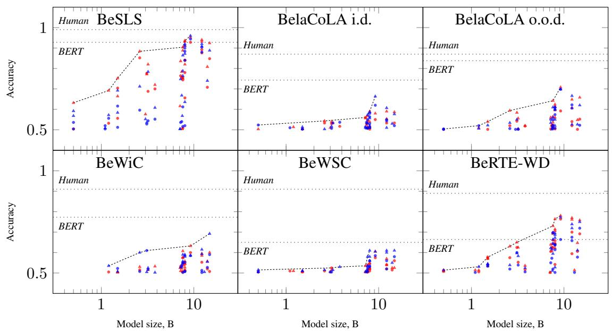

# BelarusianGLUE: Towards a Natural Language Understanding Benchmark for Belarusian

Maksim Aparovich1, Volha Harytskaya2, Vladislav Poritski2, Oksana Volchek2, Pavel Smrz1

1 Brno University of Technology, Brno, Czech Republic 2 Independent researcher, Vilnius, Lithuania Correspondence: belarusianglue@gmail.com

## Abstract

In the epoch of multilingual large language models (LLMs), it is still challenging to evaluate the models’ understanding of lowerresourced languages, which motivates further development of expert-crafted natural language understanding benchmarks. We introduce BelarusianGLUE — a natural language understanding benchmark for Belarusian, an East Slavic language, with 15K instances in five tasks: sentiment analysis, linguistic acceptability, word in context, Winograd schema challenge, textual entailment. A systematic evaluation of BERT models and LLMs against this novel benchmark reveals that both types of models approach human-level performance on easier tasks, such as sentiment analysis, but there is a significant gap in performance between machine and human on a harder task — Winograd schema challenge. We find the optimal choice of model type to be task-specific: e.g. BERT models underperform on textual entailment task but are competitive for linguistic acceptability. We release the datasets1 and evaluation code.2

## 1 Introduction

Recent advances in NLP, such as large language models (LLMs) based on transformer architectures (Vaswani et al., 2017), have had groundbreaking impact on the field. LLMs are projected to bring significant economic effect in the future (Eloundou et al., 2023), however, in the first place it is anticipated to benefit the largest language communities, such as people speaking English or Chinese (Xie and Avila, 2024). For smaller language communities, especially those of vulnerable languages, state-of-the-art NLP tools may help preserve and promote the linguistic and cultural heritage (Mohanty et al., 2024), maybe even (under favorable circumstances) stimulate language revival, given that enough effort is put into improving the multilingual capabilities of LLMs. The case of Belarusian, an East Slavic language, illustrates this point.

In the UNESCO World Atlas of Languages, Belarusian is characterized as “potentially vulnerable”.3 According to the 2019 population census data, 54% of the residents of Belarus consider Belarusian their native language but only 26% speak it at home.4 Based on statistical analysis of the census data, it was argued that the true proportion of Belarusian-speaking residents of Belarus is in fact even lower (Sokolov, 2022). In an earlier study, 4% respondents in urban areas of Belarus claimed to be using standard Belarusian, possibly with some Russian words, as their primary language of communication, while 41% reported using substandard, mixed Belarusian–Russian varieties (Kittel et al., 2010). Despite its official status and symbolic importance, Belarusian is a de facto minority language in its home country (Zaprudski, 2007).

To advance computational support of a particular language — such as Belarusian — in the epoch of LLMs, it is crucial to have (1) training data, (2) task-specific fine-tuning data, and (3) evaluation data for this language available in the open. In the case of Belarusian, as shown below, evaluation datasets are the most glaring omission; multilingual benchmarks that include tasks in Slavic languages, such as the recent EU-20 set of benchmarks (Thellmann et al., 2024), can only serve as a proxy indicator of the models’ performance in Belarusian. To address this issue, we introduce BelarusianGLUE, the first natural language understanding benchmark for Belarusian, modeled after GLUE-type benchmarks for other languages. It includes five novel expert-crafted datasets.

The rest of this paper is structured as follows. Section 2 is a review of existing datasets, containing Belarusian data, and natural language understanding benchmarks. Section 3 is a detailed description of BelarusianGLUE, its guiding principles and the datasets included. In section 4, we measure human performance on BelarusianGLUE and compare it with the performance of BERT models and LLMs. Discussion and conclusion follow.

## 2 Related work

## 2.1 Belarusian data in multilingual datasets

Starting from (Buck et al., 2014), Belarusian texts are available in Common Crawl-based massively multilingual corpora: OSCAR (Ortiz Suárez et al., 2019), CC-100 (Conneau et al., 2020; Wenzek et al., 2020), mC4 (Xue et al., 2021), CulturaX (Nguyen et al., 2023), and HPLT (de Gibert et al., 2024) that also includes data from the Internet Archive’s crawls. In each of the above, the amount of Belarusian texts ranges from several dozen million to several billion tokens, which is two–three orders of magnitude less than Russian, two orders less than Polish, one order less than Ukrainian, on par with e.g. Kazakh, Armenian, or Icelandic.

Belarusian is not entirely lacking training data in other modalities than text: e.g. Common Voice (Ardila et al., 2020) includes 1873 hours of speech recordings in Belarusian, as of March 2025.

The amount of task-specific data for Belarusian is smaller, and their quality is generally lower. As an example, consider machine translation. Among the parallel corpora available in OPUS (Tiedemann, 2012),5 the largest ones that include Belarusian data are NLLB (NLLB Team et al., 2022) derived from Common Crawl and ParaCrawl (Bañón et al., 2020), bilingual HPLT and two other Common Crawl-based corpora: CCMatrix (Schwenk et al., 2021) and CCAligned (El-Kishky et al., 2020). We labeled random samples of 100 Belarusian–English aligned sentence pairs from each corpus, following the taxonomy of Kreutzer et al. (2022), and found the ratios of natural, correctly translated sentences to be 17%, 41%, 7%, and 31% respectively in NLLB, HPLT, CCMatrix, and CCAligned.6

Instruction tuning is another example. Upadhayay and Behzadan (2024) introduced a version of Alpaca-52K and Dolly-15K instruction tuning datasets machine-translated into 132 languages, including Belarusian. Although the overall quality of the Belarusian translations is high, there is still some noise in translations of English-specific tasks, code snippets, rare words, etc.

Evaluation datasets for Belarusian are scarce: available for some of the more traditional NLP tasks, such as POS tagging and dependency parsing, e.g. in Universal Dependencies (Shishkina and Lyashevskaya, 2022), but not available for most tasks related to natural language understanding, thus providing no guidance for future models supporting Belarusian. The situation has begun to improve only recently: e.g. the question-answering benchmark INCLUDE (Romanou et al., 2024) contains several hundred instances in Belarusian.

## 2.2 GLUE-type benchmarks

Language understanding benchmarks emerged as a way of assessing transformer models’ capabilities to understand linguistic structure above the word level and apply this understanding in downstream tasks. The benchmarks are often based on preexisting datasets and cover a wide range of tasks, from sentiment analysis to question answering and beyond. It is common to frame the tasks as classification, although other types of tasks, e.g. sequence tagging, may also be included in the benchmark.

Most of the GLUE-type benchmarks created to date are monolingual. While the original GLUE and SuperGLUE focused on English (Wang et al., 2019a,b), their influence has since expanded through the development of benchmarks for many genetically and typologically diverse languages, such as Chinese (Xu et al., 2020), Arabic (Elmadany et al., 2022), or Hungarian (Ligeti-Nagy et al., 2024). Russian and Ukrainian, the two East Slavic languages most closely related to Belarusian, are covered by RussianSuperGLUE (Shavrina et al., 2020) and Eval-UA-tion (Hamotskyi et al., 2024) respectively; one more benchmark, MERA (Fenogenova et al., 2024), specifically targeting LLMs, has recently been proposed for Russian. Another neighboring and related language, Polish, has two comprehensive benchmarks: KLEJ (Rybak et al., 2020) and LEPISZCZE (Augustyniak et al., 2022). Language understanding datasets have also been created for smaller Slavic languages, such as Bulgarian (Hardalov et al., 2023) or Slovene (Žagar and Robnik-Šikonja, 2022). Multilingual benchmarks XGLUE (Liang et al., 2020) and XTREME-R (Ruder et al., 2021) include tasks for Slavic languages, however, Belarusian is missing from both.

<table><tr><td rowspan="2">Dataset ID</td><td rowspan="2">Task</td><td rowspan="2">Instance type</td><td colspan="3">No. instances</td></tr><tr><td>train</td><td>dev</td><td>test</td></tr><tr><td>BeSLS</td><td>sentiment analysis</td><td>sentence</td><td>1500</td><td>250</td><td>250</td></tr><tr><td>BelaCoLA</td><td>acceptability prediction</td><td>sentence</td><td>1992</td><td>800</td><td>800</td></tr><tr><td>BeWiC</td><td>word sense disambiguation</td><td>word + sentence pair</td><td>5626</td><td>400</td><td>400</td></tr><tr><td>BeWSC</td><td>coreference resolution</td><td>sentence / sentence pair</td><td>570</td><td>200</td><td>200</td></tr><tr><td>BeRTE-WD</td><td>textual entailment</td><td>sentence pair</td><td>1080</td><td>360</td><td>360</td></tr></table>

Table 1: Datasets summary.

## 3 BelarusianGLUE

BelarusianGLUE is a natural language understanding benchmark that includes five novel expertcrafted datasets (summarized in Table 1), with all tasks formulated as binary classification. Sample instances from each dataset are shown in Table 4 in Appendix A. All Belarusian examples below are given in romanized spelling.

## 3.1 Guiding principles

During the benchmark development we adhered to the following principles:

• Prefer quality over size. The material was selected from representative sources for each dataset (see the descriptions below). When necessary to construct or label linguistic data in Belarusian, this was done by at least two fluent speakers of Belarusian with a background in linguistics (M.A. or Ph.D. degree). Each dataset was thoroughly reviewed.

• When possible, leverage existing resources. For example, Wikidata properties and labels in Belarusian were leveraged to build a textual entailment dataset, with careful attention given to gender and cultural balance (representation of women, Belarusian objects, etc.). Some of our datasets are modeled after similar resources in other languages: e.g., to construct the train set of a Belarusian Winograd schema challenge (WSC), English instances were translated, incorporating insights from the corresponding Russian dataset and adapting examples where needed. This approach minimized effort and maximized the quality and consistency of new datasets while respecting the unique characteristics of the target language.

• Take into account the specifics of Belarusian. While sampling linguistic data from various sources, we tried to reflect the variability of modern Belarusian language. E.g., the distribution of orthographic variants in the sentiment analysis dataset reflects the real-world diversity of written Belarusian: most sentences follow the official modern orthography (narkamauka˘ ), some — less than 10% — use the classical orthography (taraškievica), and a tiny minority is written in Latin script (łacinka).

• Embrace open licensing. While the sources are variously (and not always permissively) licensed, we made sure that none of the passages borrowed or derived from copyrighted work are longer than one sentence. We believe such use of copyrighted material for scholarly purposes to qualify under fair use or similar provisions in most legislations, thus allowing us to publish the novel datasets under an open license.

## 3.2 Tasks

## 3.2.1 Sentiment analysis

BeSLS is a small dataset of sentiment-labeled Belarusian sentences, partially inspired by a similar English dataset from (Kotzias et al., 2015).

Data sources: The sentences were sampled from newspaper articles, reviews posted by the users of online shopping and booking platforms, messages in thematic Telegram channels and other social media, such as Mastodon. Five domains are covered: movie reviews, book reviews, hotel and travel reviews, consumer product reviews, social media posts.

Methodology of data selection and processing: In multilingual sources, non-Belarusian sentences were filtered out using Lingua.7 Following Petrovic et al.´ (2010), we anonymized user mentions in Mastodon posts. The sentences were manually tagged for sentiment polarity using a two-stage approach: initial labeling by one expert followed by comprehensive review and refinement by another. This results in 100% agreement, as either both labelers agree on the label, or the instance is not included in the dataset.

Dataset structure: The dataset contains 2000 sentences with positive or negative polarity. The classes are balanced: 50% positive and 50% negative, none of the sentences are neutral. Sentences are equally distributed over domains: 300 per domain in the train set, 50 in the dev and test sets.

## 3.2.2 Linguistic acceptability

BelaCoLA is a small-scale Belarusian corpus of linguistic acceptability, similar to CoLA (Warstadt et al., 2019) and RuCoLA (Mikhailov et al., 2022), with some inspiration also taken from BLiMP (Warstadt et al., 2020).

Data sources: We used five major sources of data to create the corpus:

1) sentences from Russian linguistic publications included in RuCoLA, manually translated into Belarusian and reviewed (we made sure to keep only instances with acceptability judgments transferable from the original Russian sentences to their Belarusian translations, due to deep similarities between Russian and Belarusian grammar);

2) contexts from Belarusian language textbooks and other normative sources;

3) sentences from the Belarusian section of Common Voice project, evaluated as unacceptable by speakers of Belarusian participating in the project;

4) passages produced by lightweight, non-stateof-the-art language models, i.e. hallucinations;

5) outputs of machine translation models.

Methodology of data selection and processing: All unacceptable sentences in the corpus were taken from the sources “as is” or with minor simplifications. Unlike the original CoLA, they exemplify not only morphological, syntactic, and semantic violations, but also certain pragmatical anomalies, prescriptive rule violations, and errors produced by language models, such as hallucinations and machine translation errors, which don’t always fall neatly into a single category. Their corresponding acceptable sentences were extracted from the sources (if available) or, more typically, constructed by the experts — three of the paper’s authors. For example, a hallucinated sentence Jana navat ´zlohku zachvalavausia i vyjša˘ u˘ ‘She even got.3SG.M a little excited and left.3SG.M’ is transformed to Jon navat ´zlohku zachvalavausia i vyjša˘ u˘ ‘He even got.3SG.M a little excited and left.3SG.M by correcting the gender agreement.

Dataset structure: The dataset contains 3592 sentences tagged as acceptable or unacceptable. The class balance is close to 50 : 50. The sentences have been randomly shuffled. Sentences translated from Russian, extracted from Belarusian textbooks and Common Voice data constitute the in-domain set, split into train/dev/test sets. Hallucinations and machine translations constitute the out-of-domain set, split into dev/test sets.

## 3.2.3 Word in context

BeWiC is a Word-in-Context dataset for Belarusian, similar to the original WiC (Pilehvar and Camacho-Collados, 2019) and RUSSE (Shavrina et al., 2020, section 3.1.2). It can be viewed as a version of word sense disambiguation task.

Data sources: The dataset is based on the Explanatory Dictionary of Belarusian (Tłumaˇcalny słounik biełaruskaj movy˘ , 1977–1984, vol. 1– 5). While a newer dictionary exists (Tłumaˇcalny słounik biełaruskaj litaraturnaj movy ˘ , 1996, revised 2022), our choice of the older source was deliberate based on several advantages: broader lexical coverage, machine-readable accessibility and, crucially, availability of illustrative contexts.

Methodology of data selection and processing: For most words and word senses, the dictionary provides usage examples — phrases or sentences. To make each context one sentence long, we expanded phrases to full sentences by finding suitable contexts on the web or constructing them from scratch. E.g., the phrase abarva´c spiełyja jahady´ ‘to pick ripe berries’ was expanded to My abarvali spiełyjajahady´ ‘We’ve picked the ripe berries’, and hruntouny adkaz ˘ ‘a profound answer’ to Hruntouny˘ adkaz vuˇcnia u˘sciešy´ u nasta˘ unika˘ ‘The student’s profound answer made the teacher happy’.

Each instance in the dataset is a pair of contexts c1, c2 containing the target word w. The contexts refer either to the same word sense of w or to two different homonyms of w. An instance is positive if both c and c refer to the same word sense of w, and negative if c1 and c2 refer to two different homonyms of w (possibly belonging to different parts of speech), which are listed separately in the dictionary with their respective word senses. This is a stronger distinction than in WiC, so that less instances can be constructed from the dictionary data but they are easier to solve for humans and therefore don’t require pruning.

Dataset structure: The dataset contains 6426 instances. The dev and test sets contain 400 instances each, half of them positive and half negative. None of the sentences repeat across instances in the dev and test sets, and each target word is represented by 3 instances. The training set contains all positive and negative instances that can be constructed from the remaining sentences.

## 3.2.4 Winograd schema challenge

BeWSC is a Belarusian version of the Winograd schema challenge, WSC (Levesque et al., 2012).

The dataset is available in two flavors: WSC proper, formatted as in SuperGLUE, and WNLI, formatted as in GLUE, i.e. converted into an NLI task. The number of instances and their (randomized) ordering are the same in both variants.

Data sources: Most of the training instances have been manually translated into Belarusian from the standard English dataset, WSC-2858; when adaptation was not possible, we translated those items from the similar Russian dataset RWSD (Shavrina et al., 2020, section 3.1.4) that were created specifically to replace unsuitable English sentences. The dev and test instances are based on or inspired by contexts from fiction books in Belarusian, available on the web.

Methodology of data selection and processing: Issues in English Belarusian translation of the training instances are typically caused by differences in grammar, such as the grammaticalization of gender in Belarusian, or the reflexive pronoun svoj, which is equivalent to English possessive pronouns in certain contexts but doesn’t have ambiguous reference. In such cases, the sentences were adapted to maintain the overall meaning of the original while altering its grammatical structure and wording.

The dev and test sentences were sampled (with modifications) from a corpus of Belarusian fiction books: we split the texts into sentences using sentence-splitter,9 added morphological tags using beltagger,10 extracted all sentences with a personal pronoun and at least two distinct nouns that precede it and have matching gender/number, then processed the output manually. These instances are intended to be hard to solve by selectional restrictions. Not all of them are Googleproof, as some sentences follow the source contexts rather closely.

Dataset structure: The training set has 570 instances, the dev and test sets have 200 instances each. Half of the instances are positive (the antecedent is correct), and half negative.

## 3.2.5 Textual entailment

BeRTE-WD is a small-scale textual entailment dataset for Belarusian, derived from Wikidata.11 Data sources: To produce the sentences, we extracted all statements from a June 2024 dump of Wikidata such that: (1) the property relates an entity to a timestamp, a number, or another entity; and (2) all entities in the statement, i.e. one or both, have Belarusian labels available.

Methodology of data selection and processing: Each instance in the dataset is a pair of sentences in Belarusian, denoted “text” (t) and “hypothesis” (h); t is said to entail h if, typically, a human reading t would infer that h is most likely true (Dagan et al., 2006). Unlike many of the standard benchmarks, such as SNLI (Bowman et al., 2015), MNLI (Williams et al., 2018), or XNLI (Conneau et al., 2018), we don’t distinguish between contradictory and neutral pairs, so the labels are binary: entailment or non-entailment.

For each of the three value types, as described above, we manually sampled 200 diverse statements. Three fluent speakers of Belarusian then transformed the statements into texts and wrote two hypotheses per text: one entailed, one non-entailed. Additional texts and hypotheses were produced from the same statements grouped into pairs.

The entailed hypotheses have at their core a wide range of phenomena, including but not limited to timestamp or numeric comparison, reasoning about time intervals, conversion of units, domain-specific or world knowledge, logical consequence, paraphrasing, etc. A non-entailed hypothesis is typically produced by modifying the entailed one to make its claim contrary or neutral w.r.t. the text.

Dataset structure: The dataset contains 1800 instances. Train/dev/test split was obtained by grouping the statement pairs belonging to each value type into 60 : 20 : 20, so that none of the source statements would overlap between the samples. The dataset is balanced by class (half of the instances entailed, half non-entailed) and by value type (equal counts of timestamps, numbers, and entities).

## 3.3 Evaluation

For BeSLS, BeWiC, BeWSC and BeRTE-WD, accuracy is reported. For BelaCoLA, Matthews correlation and accuracy are reported. Although there have been attempts to evaluate model performance on various datasets with a single metric, such as Krippendorff’s alpha (Berdicevskis et al., 2023), or a unified set of metrics, such as accuracy, precision, recall, and F1 (Augustyniak et al., 2022), these choices are still not very popular, so we use the most common evaluation metric(s) for each dataset type, to ensure compatibility of our results with related work for other languages.

## 4 Experiments

## 4.1 Human baseline

We evaluated human performance on each dataset for comparison with the performance of NLP models. The usual procedure, outlined e.g. in (Wang et al., 2019a, §5.2), involves recruiting paid crowdworkers, who are first provided with task-specific instructions, then asked to label a few dozen dev set instances as a pre-screening, and then proceed to annotate a sample of test set instances. Due to the low availability of crowdworkers fluent in Belarusian, we recruited unpaid volunteers from the language community and followed a simplified version of the above procedure. We wrote task-specific instructions including labeled examples from the train set (3 positive + 3 negative) and 5 self-check instances from the dev set. A random sample of 100 instances, balanced by class and certain other parameters (such as in-domain / out-of-domain in BelaCoLA, PoS of the target word in BeWiC, etc.), was then extracted from the test set and split into 5 groups of 20 instances with approximately the same balance of classes in each group. 5 volunteers, all of them competent and fluent speakers of Belarusian, were invited to tag the samples. Each volunteer tagged 20 instances per dataset, i.e. 100 instances in total, without overlaps (a single label obtained per instance). A balanced Latin square (Bradley, 1958) was used to reduce order effects while presenting the samples to volunteers.

Human baseline scores are shown in Table 2. BeSLS gold labels are in near-perfect agreement with speaker judgments, while in all other datasets the agreement is around 90%. The human baseline in BelaCoLA is lower than in other tasks but this difference in scores isn’t statistically significant, given the sample size. It might reflect the unique linguistic situation of Belarusian with two codified standards (narkamauka˘ and taraškievica), so that even competent speakers show variation in grammatical form usage.

<table><tr><td>Dataset</td><td>Metric</td><td>Score</td></tr><tr><td>BeSLS</td><td>acc</td><td>0.99</td></tr><tr><td>BelaCoLA</td><td>acc / MCC</td><td>0.87 / 0.754</td></tr><tr><td>BeWiC</td><td>acc</td><td>0.91</td></tr><tr><td>BeWSC</td><td>acc</td><td>0.91</td></tr><tr><td>BeRTE-WD</td><td>acc</td><td>0.89</td></tr></table>

Table 2: Human baseline scores.

## 4.2 BERT baselines

We fine-tuned mBERT (Devlin et al., 2019), XLM-R base (Conneau et al., 2020), mDeBERTa-v3 (He et al., 2023) and a recent monolingual model — Belarusian HPLT BERT (Samuel et al., 2023; de Gibert et al., 2024) on each of the five training sets separately. All tasks were formulated as binary classification: in particular, BeWSC was presented in WNLI format, i.e. as a sentence pair classification task. Evaluation scores for BelaCoLA indomain and out-of-domain instances were calculated separately. The models were fine-tuned for 5 epochs with learning rate 2e-5, batch size 16 on a single GeForce RTX 4090 GPU. Snapshots were saved once per epoch, and the best snapshot for evaluation was selected by the dev set accuracy.

The results are shown in Table 3. Since mDeBERTa-v3 has the strongest overall performance, we experimented with additional pretraining of this model on Belarusian texts from HPLT 1.2 (deduplicated version12 with custom filtering applied), adjusting the script published by the model authors.13 This brought some more performance gains. Further experiments are targeting this enhanced version of mDeBERTa-v3.

With the size of our training datasets ranging between several hundred and a few thousand instances, it may be beneficial to freeze a subset of the model’s layers while training the classifier on top of it (Grießhaber et al., 2020). We tried progressively freezing the layers of mDeBERTa-v3 during fine-tuning: only the embeddings or 3, 6, 9, 12 layers in addition to the embeddings. As shown in Table 3, the model’s performance on BelaCoLA and BeWiC goes up but is sensitive to the number of layers frozen: in particular, prediction quality drops abruptly when all layers are frozen and only the classification head is trained. Also, freezing layers doesn’t help to beat the trivial baseline on BeWSC and BeRTE-WD.

We also tried transfer learning by mixing our training data with instances from larger datasets:

• Sentiment analysis: all positive and negative instances no longer than 500 characters with selfconfidence score at least 0.7 were taken from the train folds of MMS (Augustyniak et al., 2023) for all languages in it. The classes were balanced per language by subsampling the larger class. Together with the BeSLS data, there are 970K instances.

<table><tr><td>Model</td><td>Dataset: Metric:</td><td>BeSLS acc</td><td>BelaCoLA i.d. acc / MCC</td><td>BelaCoLA o.o.d. acc / MCC</td><td>BeWiC acc</td><td>BeWSC acc</td><td>BeRTE-WD acc</td></tr><tr><td>mBERT</td><td></td><td>0.712</td><td>0.490 / -0.029</td><td>0.510 / 0.029</td><td>0.515</td><td>0.500</td><td>0.517</td></tr><tr><td>XLM-R</td><td></td><td>0.816</td><td>0.510 / 0.033</td><td>0.506 / 0.019</td><td>0.500</td><td>0.500</td><td>0.503</td></tr><tr><td>HPLT BERT be</td><td></td><td>0.912</td><td>0.480 / -0.048</td><td>0.576 / 0.167</td><td>0.575</td><td>0.495</td><td>0.506</td></tr><tr><td>mDeBERTa-v3:</td><td></td><td></td><td></td><td></td><td></td><td></td><td></td></tr><tr><td>Original</td><td></td><td>0.892</td><td>0.623 / 0.260</td><td>0.742 / 0.488</td><td>0.613</td><td>0.500</td><td>0.511</td></tr><tr><td>With pre-train</td><td></td><td></td><td></td><td></td><td></td><td></td><td></td></tr><tr><td rowspan="7">Frozen:</td><td>no layers</td><td>0.916</td><td>0.620 / 0.274</td><td>0.784 / 0.589</td><td>0.678</td><td>0.500</td><td>0.522</td></tr><tr><td>only emb.</td><td>0.928</td><td>0.610 / 0.234</td><td>0.826 / 0.666</td><td>0.678</td><td>0.500</td><td>0.514</td></tr><tr><td>emb. + 3</td><td>0.916</td><td>0.640 / 0.297</td><td>0.828 / 0.666</td><td>0.685</td><td>0.500</td><td>0.514</td></tr><tr><td>emb. + 6</td><td>0.924</td><td>0.633 / 0.322</td><td>0.772 / 0.570</td><td>0.690</td><td>0.500</td><td>0.517</td></tr><tr><td>emb. + 9</td><td>0.916</td><td>0.657 / 0.362</td><td>0.788 / 0.590</td><td>0.710</td><td>0.490</td><td>0.494</td></tr><tr><td>emb. + 12</td><td>0.508</td><td>0.547 / 0.221</td><td>0.628 / 0.369</td><td>0.510</td><td>0.500</td><td>0.500</td></tr><tr><td></td><td></td><td></td><td></td><td></td><td></td><td></td></tr><tr><td rowspan="6">With pre-train &amp; transfer Frozen:</td><td>no layers</td><td>0.904</td><td>0.693 / 0.425</td><td>0.802 / 0.622</td><td>0.745</td><td>0.650</td><td>0.633</td></tr><tr><td>only emb.</td><td>0.896</td><td>0.717 / 0.461</td><td>0.822 / 0.661</td><td>0.760</td><td>0.500</td><td>0.661</td></tr><tr><td>emb. + 3</td><td>0.916</td><td>0.720 / 0.449</td><td>0.830 / 0.677</td><td>0.768</td><td>0.500</td><td>0.664</td></tr><tr><td>emb. + 6</td><td>0.896</td><td>0.743 / 0.502</td><td>0.838 / 0.688</td><td>0.773</td><td>0.500</td><td>0.619</td></tr><tr><td>emb. + 9</td><td>0.920</td><td>0.707 / 0.454</td><td>0.826 / 0.671</td><td>0.748</td><td>0.600</td><td>0.600</td></tr><tr><td>emb. + 12</td><td>0.848</td><td>0.637 / 0.348</td><td>0.730 / 0.480</td><td>0.510</td><td>0.515</td><td>0.494</td></tr></table>

Table 3: Results of BERT model fine-tuning.

• Linguistic acceptability: all train and dev instances were taken from MELA v1.0 (Zhang et al., 2024), as well as Dutch COLA14 and HuCOLA (Ligeti-Nagy et al., 2024). Positive instances were subsampled to maintain the class balance. Together with the BelaCoLA data, there are 42K instances.

• Word in context: all train and dev instances were taken from XL-WiC (Raganato et al., 2020) and RUSSE (Shavrina et al., 2020, section 3.1.2). Negative instances in RUSSE were subsampled to maintain the class balance. Together with the BeWiC data, there are 145K instances.

• Winograd schema challenge: all training instances were taken from WinoGrande (Sakaguchi et al., 2021) and XWINO (Tikhonov and Ryabinin, 2021), and all German, French, Russian instances — from the folder lm\_wino\_x of Wino-X (Emelin and Sennrich, 2021). To deal with three different formats in the data, we brought all instances to WNLI structure by constructing the hypotheses automatically from the original sentences: the pronoun or the \_ sign is replaced with one of the two coreference candidate spans, and the label is 1 with the correct candidate and 0 otherwise. Note this is a very crude procedure, so that in morphologically richer languages it often produces ungrammatical (although comprehensible) sentences. Together with the BeWSC data, there are 110K instances.

• Textual entailment: all instances in the folds dev\_matched and dev\_mismatched were taken from MNLI (Williams et al., 2018), and all dev instances — from XNLI (Conneau et al., 2018). Since there are three balanced classes (entailment / neutral / contradiction), we subsampled half of the neutral / contradictory instances to represent nonentailment. Together with the BeRTE-WD data, there are 40K instances.

Transfer learning allows to beat the trivial baseline on BeWSC and BeRTE-WD (see Table 3). Improvement is also observed in other datasets.

## 4.3 LLM baselines

We added configurations for BelarusianGLUE tasks to a fork of lm-evaluation-harness (Gao et al., 2024). Four types of prompts are examined:

• instructions in Belarusian, zero-shot or fewshot (11 instances, the same as those provided to humans to establish their baseline performance);

• instructions in English, zero-shot or few-shot (first 10 instances in the dev set of each dataset).

Predictions are estimated from log probabilities of the tokens 0 / 1 to follow the target instance.

We measured the performance of local LLMs below 15B parameters on BelarusianGLUE. Among recent (as of December 2024) models and model families with multilingual capabilities, we evaluated Llama 3.1 and 3.2 (Dubey et al., 2024), Phi 3 and 3.5 (Abdin et al., 2024), Gemma 2 (Riviere et al., 2024), Qwen 2 and 2.5 (Yang et al., 2024), Mistral Nemo and Ministral (Jiang et al., 2023), Aya 23 8B (Aryabumi et al., 2024). Additionally we tested several models that demonstrate stateof-the-art performance for Ukrainian and Russian: Sherlock (Boros et al., 2024) and Vikhr (Nikolich et al., 2024), based on various versions of Llama and Mistral, — as well as several older multilingual models: XGLM-7.5B (Lin et al., 2022), mGPT-13B (Shliazhko et al., 2023), BLOOM (Scao et al., 2023) and BLOOMZ (Muennighoff et al., 2023) up to 7B parameters.

  
Figure 1: Local LLM size vs. accuracy on BelarusianGLUE. Each point represents a single evaluation run against a local LLM with prompt in Belarusian (blue) or English (red), zero-shot (circle marks) or few-shot (triangle marks). Scores 0.5 are not shown. Dotted lines are human scores and the best BERT model scores on each dataset respectively. Dashed line is the Pareto front of optimal LLM performance at given size.

Our evaluation of state-of-the-art commercial models was less systematic: we tested GPT-4o and Claude 3.5 Sonnet, but, since their APIs don’t support sampling log probabilities for the tokens specified in advance (such as 0 / 1), we only checked for exact match. This may understate the true performance of these models in comparison with the local models. Due to Claude’s tendency to include reasoning in its outputs, an additional post-processing step was required to extract predictions.

Full evaluation results are available in the Tables 6–9 in Appendix B. Among the local LLMs below 15B parameters, Gemma 2 9B is the top competitor, in line with the findings of Thellmann et al. (2024). When a model beats the trivial baseline of 50% accuracy, its few-shot scores tend to be better than zero-shot ones, while the impact of prompting language, Belarusian or English, isn’t as clear and varies between datasets.

Figure 1 visualizes the dependency between model size and its scores. Larger models generally perform better, although the Pareto fronts show that the relation isn’t linear. Both in zero-shot and in few-shot setting, LLMs outperform supervised BERT baselines on BeSLS and, most impressively, BeRTE-WD, which may be a sign of inherently stronger reasoning capabilities. In other tasks, the supervised baselines are closer to the human level.

Additionally, we tried fine-tuning Gemma 2 9B with PEFT15 on each of the five training sets separately. LoRA adapters were trained in 4-bit precision for 10 epochs with learning rate 2e-4, batch size 64 on a single GPU. Snapshots were saved once per epoch, and the best snapshot was selected by the dev set loss. As shown in Table 5 in Appendix B, this brings some improvements, especially in BeWiC and BeRTE-WD, although there doesn’t seem to be any consistent pattern.

Overall, the highest scores were observed for commercial models with Belarusian prompts. While both GPT-4o and Claude perform well with Belarusian prompts in the zero-shot setting, their behavior diverges with in-context examples. GPT-4o maintains consistent performance with Belarusian prompts and shows improvements in certain tasks with the English ones. Claude 3.5 Sonnet tends to provide reasoning, when prompted in Belarusian, and shows weaker performance on Be-WSC with in-context examples.

## 5 Discussion

Our findings indicate that a traditional GLUE-type benchmark for a lower-resourced language (Belarusian) may still be challenging for the current generation of LLMs. This offers a complementary perspective to Fenogenova et al. (2024) who assess the benchmarks existing for a related high-resource language (Russian) to be not challenging enough.

Unlike Rybak et al. (2020), we find that a multilingual pretrained BERT model, such as mDeBERTa-v3, is able to outperform a more narrowly focused, monolingual model, such as Belarusian HPLT BERT, possibly due to more advanced architecture or larger scale of the pre-training data.

Our results support the conventional wisdom that the model size is not the only factor that affects the down-stream performance (Hardalov et al., 2023).

## 6 Conclusion

We have introduced BelarusianGLUE and measured how BERT models and LLMs perform on this novel benchmark, as compared with human performance. The easiest dataset, BeSLS, is mostly solved, although some of the instances in it are challenging even for state-of-the-art commercial LLMs: they are struggling to correctly classify instances with implied positivity that relies on domain knowledge or complex pragmatics. For the hardest dataset, BeWSC, there is still a significant gap in performance between human and machine. To obtain higher scores from the LLMs, further prompting tweaks may be required.

We release the datasets16 and evaluation code.17

In the future, we may want to expand the benchmark by adding a diagnostic dataset (present in many of the GLUE-type benchmarks); a perplexity dataset for evaluating generative capabilities of multilingual LLMs, applied to Belarusian; a culture-specific QA dataset that would be hard for the current generation of LLMs but reasonably easy for the native speakers, etc. Converting all datasets to the alternative Belarusian orthographies, taraškievica and łacinka, may help understand how the model performance on Belarusian language tasks depends on the choice of orthography. Following the common practice, we may want to create a leaderboard to automate evaluation of new models on BelarusianGLUE. For the cutting-edge reasoning models, not covered in our evaluation, it remains to be investigated how the token budget (Wang et al., 2024) affects performance. Finally, the analysis of model errors is also a promising direction of further research.

## Acknowledgments

This work was supported by the Technology Agency of the Czech Republic under the project FactDeMice – Fact Verification Based on Textual Evidence Using Fact-Consistent Translation, Fake Review Detection, and Automatic Extraction of Misleading Claims (Project Code: TQ16000028).

## Limitations and ethical considerations

As of yet, we haven’t been able to train strong baseline models based on mT5 architecture (Xue et al., 2021) for our datasets, although state-of-theart performance was reported for similar English datasets, such as WinoGrande (Sakaguchi et al., 2021).

Dataset usage is affected by the political situation in Belarus. Due to sheer amount of sources officially recognized as “extremist materials” by Belarusian courts,18 we cannot guarantee that BelarusianGLUE is legally safe to use in Belarus — or will be safe in the future, as the list of “extremist materials” is being regularly updated.

## References

Marah Abdin, Jyoti Aneja, Hany Awadalla, Ahmed Awadallah, Ammar Ahmad Awan, Nguyen Bach, Amit Bahree, Arash Bakhtiari, Jianmin Bao, and Harkirat Behl et al. 2024. Phi-3 technical report: A highly capable language model locally on your phone. Preprint, arXiv:2404.14219.

Rosana Ardila, Megan Branson, Kelly Davis, Michael Kohler, Josh Meyer, Michael Henretty, Reuben Morais, Lindsay Saunders, Francis Tyers, and Gregor Weber. 2020. Common voice: A massivelymultilingual speech corpus. In Proceedings of the Twelfth Language Resources and Evaluation Conference, pages 4218–4222, Marseille, France. European Language Resources Association.

Viraat Aryabumi, John Dang, Dwarak Talupuru, Saurabh Dash, David Cairuz, Hangyu Lin, Bharat Venkitesh, Madeline Smith, Jon Ander Campos, Yi Chern Tan, Kelly Marchisio, Max Bartolo, Sebastian Ruder, Acyr Locatelli, Julia Kreutzer, Nick Frosst, Aidan Gomez, Phil Blunsom, Marzieh Fadaee, Ahmet Üstün, and Sara Hooker. 2024. Aya 23:

Open weight releases to further multilingual progress. Preprint, arXiv:2405.15032.

Lukasz Augustyniak, Kamil Tagowski, Albert Sawczyn, Denis Janiak, Roman Bartusiak, Adrian Szymczak, Arkadiusz Janz, Piotr Szymanski, Marcin W ˛atroba,´ Mikoł aj Morzy, Tomasz Kajdanowicz, and Maciej Piasecki. 2022. This is the way: designing and compiling LEPISZCZE, a comprehensive NLP benchmark for Polish. In Advances in Neural Information Processing Systems, volume 35, pages 21805–21818. Curran Associates, Inc.

Łukasz Augustyniak, Szymon Wo´zniak, Marcin Gruza, Piotr Gramacki, Krzysztof Rajda, Mikołaj Morzy, and Tomasz Kajdanowicz. 2023. Massively multilingual corpus of sentiment datasets and multifaceted sentiment classification benchmark. Preprint, arXiv:2306.07902.

Marta Bañón, Pinzhen Chen, Barry Haddow, Kenneth Heafield, Hieu Hoang, Miquel Esplà-Gomis, Mikel L. Forcada, Amir Kamran, Faheem Kirefu, Philipp Koehn, Sergio Ortiz Rojas, Leopoldo Pla Sempere, Gema Ramírez-Sánchez, Elsa Sarrías, Marek Strelec, Brian Thompson, William Waites, Dion Wiggins, and Jaume Zaragoza. 2020. ParaCrawl: Web-scale acquisition of parallel corpora. In Proceedings ofthe 58th Annual Meeting of the Association for Computational Linguistics, pages 4555–4567, Online. Association for Computational Linguistics.

Aleksandrs Berdicevskis, Gerlof Bouma, Robin Kurtz, Felix Morger, Joey Öhman, Yvonne Adesam, Lars Borin, Dana Dannélls, Markus Forsberg, Tim Isbister, Anna Lindahl, Martin Malmsten, Faton Rekathati, Magnus Sahlgren, Elena Volodina, Love Börjeson, Simon Hengchen, and Nina Tahmasebi. 2023. Superlim: A Swedish language understanding evaluation benchmark. In Proceedings ofthe 2023 Conference on Empirical Methods in Natural Language Processing, pages 8137–8153, Singapore. Association for Computational Linguistics.

Tiberiu Boros, Radu Chivereanu, Stefan Dumitrescu, and Octavian Purcaru. 2024. Fine-tuning and retrieval augmented generation for question answering using affordable large language models. In Proceedings ofthe Third Ukrainian Natural Language Processing Workshop (UNLP) @ LREC-COLING 2024, pages 75–82, Torino, Italia. ELRA and ICCL.

Samuel R. Bowman, Gabor Angeli, Christopher Potts, and Christopher D. Manning. 2015. A large annotated corpus for learning natural language inference. In Proceedings of the 2015 Conference on Empirical Methods in Natural Language Processing, pages 632–642, Lisbon, Portugal. Association for Computational Linguistics.

James V. Bradley. 1958. Complete counterbalancing of immediate sequential effects in a latin square design. Journal ofthe American Statistical Association, 53(282):525–528.

Christian Buck, Kenneth Heafield, and Bas van Ooyen. 2014. N-gram counts and language models from the Common Crawl. In Proceedings of the Ninth International Conference on Language Resources and Evaluation (LREC’14), pages 3579–3584, Reykjavik, Iceland. European Language Resources Association (ELRA).

Alexis Conneau, Kartikay Khandelwal, Naman Goyal, Vishrav Chaudhary, Guillaume Wenzek, Francisco Guzmán, Edouard Grave, Myle Ott, Luke Zettlemoyer, and Veselin Stoyanov. 2020. Unsupervised cross-lingual representation learning at scale. In Proceedings of the 58th Annual Meeting of the Associationfor Computational Linguistics, pages 8440– 8451, Online. Association for Computational Linguistics.

Alexis Conneau, Ruty Rinott, Guillaume Lample, Adina Williams, Samuel Bowman, Holger Schwenk, and Veselin Stoyanov. 2018. XNLI: Evaluating crosslingual sentence representations. In Proceedings of the 2018 Conference on Empirical Methods in Natural Language Processing, pages 2475–2485, Brussels, Belgium. Association for Computational Linguistics.

Ido Dagan, Oren Glickman, and Bernardo Magnini. 2006. The PASCAL recognising textual entailment challenge. In Machine Learning Challenges. Evaluating Predictive Uncertainty, Visual Object Classification, and Recognising Tectual Entailment, pages 177–190, Berlin, Heidelberg. Springer Berlin Heidelberg.

Ona de Gibert, Graeme Nail, Nikolay Arefyev, Marta Bañón, Jelmer van der Linde, Shaoxiong Ji, Jaume Zaragoza-Bernabeu, Mikko Aulamo, Gema Ramírez-Sánchez, Andrey Kutuzov, Sampo Pyysalo, Stephan Oepen, and Jörg Tiedemann. 2024. A new massive multilingual dataset for high-performance language technologies. In Proceedings of the 2024 Joint International Conference on Computational Linguistics, Language Resources and Evaluation (LREC-COLING 2024), pages 1116–1128, Torino, Italia. ELRA and ICCL.

Jacob Devlin, Ming-Wei Chang, Kenton Lee, and Kristina Toutanova. 2019. BERT: Pre-training of deep bidirectional transformers for language understanding. In Proceedings ofthe 2019 Conference of the North American Chapter of the Association for Computational Linguistics: Human Language Technologies, Volume 1 (Long and Short Papers), pages 4171–4186, Minneapolis, Minnesota. Association for Computational Linguistics.

Abhimanyu Dubey, Abhinav Jauhri, Abhinav Pandey, Abhishek Kadian, Ahmad Al-Dahle, Aiesha Letman, Akhil Mathur, Alan Schelten, Amy Yang, and Angela Fan et al. 2024. The Llama 3 herd of models. Preprint, arXiv:2407.21783.

Ahmed El-Kishky, Vishrav Chaudhary, Francisco Guzmán, and Philipp Koehn. 2020. CCAligned: A

massive collection of cross-lingual web-document pairs. In Proceedings of the 2020 Conference on Empirical Methods in Natural Language Processing (EMNLP), pages 5960–5969, Online. Association for Computational Linguistics.

Abdel Rahim Elmadany, El Moatez Billah Nagoudi, and Muhammad Abdul-Mageed. 2022. Orca: A challenging benchmark for arabic language understanding. arXiv preprint arXiv:2212.10758. Accepted by COL-ING2020; 10 pages, 4 figures.

Tyna Eloundou, Sam Manning, Pamela Mishkin, and Daniel Rock. 2023. GPTs are GPTs: An early look at the labor market impact potential of large language models. Preprint, arXiv:2303.10130.

Denis Emelin and Rico Sennrich. 2021. Wino-X: Multilingual Winograd schemas for commonsense reasoning and coreference resolution. In Proceedings ofthe 2021 Conference on Empirical Methods in Natural Language Processing, pages 8517–8532, Online and Punta Cana, Dominican Republic. Association for Computational Linguistics.

Alena Fenogenova, Artem Chervyakov, Nikita Martynov, Anastasia Kozlova, Maria Tikhonova, Albina Akhmetgareeva, Anton Emelyanov, Denis Shevelev, Pavel Lebedev, Leonid Sinev, Ulyana Isaeva, Katerina Kolomeytseva, Daniil Moskovskiy, Elizaveta Goncharova, Nikita Savushkin, Polina Mikhailova, Anastasia Minaeva, Denis Dimitrov, Alexander Panchenko, and Sergey Markov. 2024. MERA: A comprehensive LLM evaluation in Russian. In Proceedings ofthe 62nd Annual Meeting ofthe Association for Computational Linguistics (Volume 1: Long Papers), pages 9920–9948, Bangkok, Thailand. Association for Computational Linguistics.

Leo Gao, Jonathan Tow, Baber Abbasi, Stella Biderman, Sid Black, Anthony DiPofi, Charles Foster, Laurence Golding, Jeffrey Hsu, Alain Le Noac’h, Haonan Li, Kyle McDonell, Niklas Muennighoff, Chris Ociepa, Jason Phang, Laria Reynolds, Hailey Schoelkopf, Aviya Skowron, Lintang Sutawika, Eric Tang, Anish Thite, Ben Wang, Kevin Wang, and Andy Zou. 2024. A framework for few-shot language model evaluation.

Daniel Grießhaber, Johannes Maucher, and Ngoc Thang Vu. 2020. Fine-tuning BERT for low-resource natural language understanding via active learning. In Proceedings of the 28th International Conference on Computational Linguistics, pages 1158–1171, Barcelona, Spain (Online). International Committee on Computational Linguistics.

Serhii Hamotskyi, Anna-Izabella Levbarg, and Christian Hänig. 2024. Eval-UA-tion 1.0: Benchmark for evaluating Ukrainian (large) language models. In Proceedings of the Third Ukrainian Natural Language Processing Workshop (UNLP) @ LREC-COLING 2024, pages 109–119, Torino, Italia. ELRA and ICCL.

Momchil Hardalov, Pepa Atanasova, Todor Mihaylov, Galia Angelova, Kiril Simov, Petya Osenova, Veselin Stoyanov, Ivan Koychev, Preslav Nakov, and Dragomir Radev. 2023. bgGLUE: A Bulgarian general language understanding evaluation benchmark. In Proceedings of the 61st Annual Meeting of the Associationfor Computational Linguistics (Volume 1: Long Papers), pages 8733–8759, Toronto, Canada. Association for Computational Linguistics.

Pengcheng He, Jianfeng Gao, and Weizhu Chen. 2023. DeBERTaV3: Improving DeBERTa using ELECTRA-style pre-training with gradientdisentangled embedding sharing. Preprint, arXiv:2111.09543.

Albert Q. Jiang, Alexandre Sablayrolles, Arthur Mensch, Chris Bamford, Devendra Singh Chaplot, Diego de las Casas, Florian Bressand, Gianna Lengyel, Guillaume Lample, Lucile Saulnier, Lélio Renard Lavaud, Marie-Anne Lachaux, Pierre Stock, Teven Le Scao, Thibaut Lavril, Thomas Wang, Timothée Lacroix, and William El Sayed. 2023. Mistral 7B. Preprint, arXiv:2310.06825.

Bernhard Kittel, Diana Lindner, Sviatlana Tesch, and Gerd Hentschel. 2010. Mixed language usage in Belarus: the sociostructural background of language choice. International Journal of the Sociology of Language, 2010(206):47–71.

Dimitrios Kotzias, Misha Denil, Nando de Freitas, and Padhraic Smyth. 2015. From group to individual labels using deep features. In Proceedings of the 21th ACM SIGKDD International Conference on Knowledge Discovery and Data Mining, KDD ’15, pages 597–606, New York, NY, USA. Association for Computing Machinery.

Julia Kreutzer, Isaac Caswell, Lisa Wang, Ahsan Wahab, Daan van Esch, Nasanbayar Ulzii-Orshikh, Allahsera Tapo, Nishant Subramani, Artem Sokolov, Claytone Sikasote, Monang Setyawan, Supheakmungkol Sarin, Sokhar Samb, Benoît Sagot, Clara Rivera, Annette Rios, Isabel Papadimitriou, Salomey Osei, Pedro Ortiz Suarez, Iroro Orife, Kelechi Ogueji, Andre Niyongabo Rubungo, Toan Q. Nguyen, Mathias Müller, André Müller, Shamsuddeen Hassan Muhammad, Nanda Muhammad, Ayanda Mnyakeni, Jamshidbek Mirzakhalov, Tapiwanashe Matangira, Colin Leong, Nze Lawson, Sneha Kudugunta, Yacine Jernite, Mathias Jenny, Orhan Firat, Bonaventure F. P. Dossou, Sakhile Dlamini, Nisansa de Silva, Sakine Çabuk Ballı, Stella Biderman, Alessia Battisti, Ahmed Baruwa, Ankur Bapna, Pallavi Baljekar, Israel Abebe Azime, Ayodele Awokoya, Duygu Ataman, Orevaoghene Ahia, Oghenefego Ahia, Sweta Agrawal, and Mofetoluwa Adeyemi. 2022. Quality at a glance: An audit of web-crawled multilingual datasets. Transactions ofthe Associationfor Computational Linguistics, 10:50–72.

Hector J. Levesque, Ernest Davis, and Leora Morgenstern. 2012. The Winograd schema challenge. In

Proceedings ofthe Thirteenth International Conference on Principles ofKnowledge Representation and Reasoning, KR’12, pages 552–561. AAAI Press.

Yaobo Liang, Nan Duan, Yeyun Gong, Ning Wu, Fenfei Guo, Weizhen Qi, Ming Gong, Linjun Shou, Daxin Jiang, Guihong Cao, Xiaodong Fan, Ruofei Zhang, Rahul Agrawal, Edward Cui, Sining Wei, Taroon Bharti, Ying Qiao, Jiun-Hung Chen, Winnie Wu, Shuguang Liu, Fan Yang, Daniel Campos, Rangan Majumder, and Ming Zhou. 2020. XGLUE: A new benchmark dataset for cross-lingual pre-training, understanding and generation. In Proceedings of the 2020 Conference on Empirical Methods in Natural Language Processing (EMNLP), pages 6008–6018, Online. Association for Computational Linguistics.

Noémi Ligeti-Nagy, Gergo Ferenczi, Enik˝ o Héja, Lás-˝ zló János Laki, Noémi Vadász, Zijian Gyoz˝ o Yang,˝ and Tamás Váradi. 2024. HuLU: Hungarian language understanding benchmark kit. In Proceedings of the 2024 Joint International Conference on Computational Linguistics, Language Resources and Evaluation (LREC-COLING 2024), pages 8360–8371, Torino, Italia. ELRA and ICCL.

Xi Victoria Lin, Todor Mihaylov, Mikel Artetxe, Tianlu Wang, Shuohui Chen, Daniel Simig, Myle Ott, Naman Goyal, Shruti Bhosale, Jingfei Du, Ramakanth Pasunuru, Sam Shleifer, Punit Singh Koura, Vishrav Chaudhary, Brian O’Horo, Jeff Wang, Luke Zettlemoyer, Zornitsa Kozareva, Mona Diab, Veselin Stoyanov, and Xian Li. 2022. Few-shot learning with multilingual language models. Preprint, arXiv:2112.10668.

Vladislav Mikhailov, Tatiana Shamardina, Max Ryabinin, Alena Pestova, Ivan Smurov, and Ekaterina Artemova. 2022. RuCoLA: Russian corpus of linguistic acceptability. In Proceedings ofthe 2022 Conference on Empirical Methods in Natural Language Processing, pages 5207–5227, Abu Dhabi, United Arab Emirates. Association for Computational Linguistics.

Sushree Sangita Mohanty, Satya Ranjan Dash, and Shantipriya Parida, editors. 2024. Applying AI-Based Tools and Technologies Towards Revitalization of Indigenous and Endangered Languages. Springer, Singapore.

Niklas Muennighoff, Thomas Wang, Lintang Sutawika, Adam Roberts, Stella Biderman, Teven Le Scao, M Saiful Bari, Sheng Shen, Zheng-Xin Yong, Hailey Schoelkopf, Xiangru Tang, Dragomir Radev, Alham Fikri Aji, Khalid Almubarak, Samuel Albanie, Zaid Alyafeai, Albert Webson, Edward Raff, and Colin Raffel. 2023. Crosslingual generalization through multitask finetuning. Preprint, arXiv:2211.01786.

Thuat Nguyen, Chien Van Nguyen, Viet Dac Lai, Hieu Man, Nghia Trung Ngo, Franck Dernoncourt, Ryan A. Rossi, and Thien Huu Nguyen. 2023. CulturaX: A cleaned, enormous, and multilingual dataset

for large language models in 167 languages. Preprint, arXiv:2309.09400.

Aleksandr Nikolich, Konstantin Korolev, Sergei Bratchikov, Igor Kiselev, and Artem Shelmanov. 2024. Vikhr: Constructing a state-of-the-art bilingual open-source instruction-following large language model for Russian. In Proceedings of the Fourth Workshop on Multilingual Representation Learning (MRL 2024), pages 189–199, Miami, Florida, USA. Association for Computational Linguistics.

NLLB Team, Marta R. Costa-jussà, James Cross, Onur Çelebi, Maha Elbayad, Kenneth Heafield, Kevin Heffernan, Elahe Kalbassi, Janice Lam, Daniel Licht, Jean Maillard, Anna Sun, Skyler Wang, Guillaume Wenzek, Al Youngblood, Bapi Akula, Loic Barrault, Gabriel Mejia Gonzalez, Prangthip Hansanti, John Hoffman, Semarley Jarrett, Kaushik Ram Sadagopan, Dirk Rowe, Shannon Spruit, Chau Tran, Pierre Andrews, Necip Fazil Ayan, Shruti Bhosale, Sergey Edunov, Angela Fan, Cynthia Gao, Vedanuj Goswami, Francisco Guzmán, Philipp Koehn, Alexandre Mourachko, Christophe Ropers, Safiyyah Saleem, Holger Schwenk, and Jeff Wang. 2022. No language left behind: Scaling human-centered machine translation. Preprint, arXiv:2207.04672.

Pedro Javier Ortiz Suárez, Benoît Sagot, and Laurent Romary. 2019. Asynchronous pipeline for processing huge corpora on medium to low resource infrastructures. In 7th Workshop on the Challenges in the Management of Large Corpora (CMLC-7), Cardiff, United Kingdom.

Saša Petrovic, Miles Osborne, and Victor Lavrenko.´ 2010. The Edinburgh Twitter corpus. In Proceedings ofthe NAACL HLT2010 Workshop on Computational Linguistics in a World of Social Media, pages 25– 26, Los Angeles, California, USA. Association for Computational Linguistics.

Mohammad Taher Pilehvar and Jose Camacho-Collados. 2019. WiC: the word-in-context dataset for evaluating context-sensitive meaning representations. In Proceedings of the 2019 Conference of the North American Chapter ofthe Association for Computational Linguistics: Human Language Technologies, Volume 1 (Long and Short Papers), pages 1267–1273, Minneapolis, Minnesota. Association for Computational Linguistics.

Alessandro Raganato, Tommaso Pasini, Jose Camacho-Collados, and Mohammad Taher Pilehvar. 2020. XL-WiC: A multilingual benchmark for evaluating semantic contextualization. In Proceedings ofthe 2020 Conference on Empirical Methods in Natural Language Processing (EMNLP), pages 7193–7206, Online. Association for Computational Linguistics.

Gemma Team: Morgane Riviere, Shreya Pathak, Pier Giuseppe Sessa, Cassidy Hardin, Surya Bhupatiraju, Léonard Hussenot, Thomas Mesnard, Bobak Shahriari, Alexandre Ramé, and Johan Ferret et al.

2024. Gemma 2: Improving open language models at a practical size. Preprint, arXiv:2408.00118.

Angelika Romanou, Negar Foroutan, Anna Sotnikova, Zeming Chen, Sree Harsha Nelaturu, Shivalika Singh, Rishabh Maheshwary, Micol Altomare, Mohamed A. Haggag, Snegha A, Alfonso Amayuelas, Azril Hafizi Amirudin, Viraat Aryabumi, Danylo Boiko, Michael Chang, Jenny Chim, Gal Cohen, Aditya Kumar Dalmia, Abraham Diress, Sharad Duwal, Daniil Dzenhaliou, Daniel Fernando Erazo Florez, Fabian Farestam, Joseph Marvin Imperial, Shayekh Bin Islam, Perttu Isotalo, Maral Jabbarishiviari, Börje F. Karlsson, Eldar Khalilov, Christopher Klamm, Fajri Koto, Dominik Krzeminski,´ Gabriel Adriano de Melo, Syrielle Montariol, Yiyang Nan, Joel Niklaus, Jekaterina Novikova, Johan Samir Obando Ceron, Debjit Paul, Esther Ploeger, Jebish Purbey, Swati Rajwal, Selvan Sunitha Ravi, Sara Rydell, Roshan Santhosh, Drishti Sharma, Marjana Prifti Skenduli, Arshia Soltani Moakhar, Bardia Soltani Moakhar, Ran Tamir, Ayush Kumar Tarun, Azmine Toushik Wasi, Thenuka Ovin Weerasinghe, Serhan Yilmaz, Mike Zhang, Imanol Schlag, Marzieh Fadaee, Sara Hooker, and Antoine Bosselut. 2024. INCLUDE: Evaluating multilingual language understanding with regional knowledge. Preprint, arXiv:2411.19799.

Sebastian Ruder, Noah Constant, Jan Botha, Aditya Siddhant, Orhan Firat, Jinlan Fu, Pengfei Liu, Junjie Hu, Dan Garrette, Graham Neubig, and Melvin Johnson. 2021. XTREME-R: Towards more challenging and nuanced multilingual evaluation. In Proceedings of the 2021 Conference on Empirical Methods in Natural Language Processing, pages 10215–10245, Online and Punta Cana, Dominican Republic. Association for Computational Linguistics.

Piotr Rybak, Robert Mroczkowski, Janusz Tracz, and Ireneusz Gawlik. 2020. KLEJ: Comprehensive benchmark for Polish language understanding. In Proceedings of the 58th Annual Meeting of the Association for Computational Linguistics, pages 1191– 1201, Online. Association for Computational Linguistics.

Keisuke Sakaguchi, Ronan Le Bras, Chandra Bhagavatula, and Yejin Choi. 2021. WinoGrande: an adversarial winograd schema challenge at scale. Commun. ACM, 64(9):99–106.

David Samuel, Andrey Kutuzov, Lilja Øvrelid, and Erik Velldal. 2023. Trained on 100 million words and still in shape: BERT meets British National Corpus. In Findings of the Association for Computational Linguistics: EACL 2023, pages 1954–1974, Dubrovnik, Croatia. Association for Computational Linguistics.

BigScience Workshop: Teven Le Scao, Angela Fan, Christopher Akiki, Ellie Pavlick, Suzana Ilic, Daniel´ Hesslow, Roman Castagné, Alexandra Sasha Luccioni, François Yvon, and Matthias Gallé et al. 2023. BLOOM: A 176b-parameter open-access multilingual language model. Preprint, arXiv:2211.05100.

Holger Schwenk, Guillaume Wenzek, Sergey Edunov, Edouard Grave, Armand Joulin, and Angela Fan. 2021. CCMatrix: Mining billions of high-quality parallel sentences on the web. In Proceedings ofthe 59th Annual Meeting ofthe Associationfor Computational Linguistics and the 11th International Joint Conference on Natural Language Processing (Volume 1: Long Papers), pages 6490–6500, Online. Association for Computational Linguistics.

Tatiana Shavrina, Alena Fenogenova, Emelyanov Anton, Denis Shevelev, Ekaterina Artemova, Valentin Malykh, Vladislav Mikhailov, Maria Tikhonova, Andrey Chertok, and Andrey Evlampiev. 2020. RussianSuperGLUE: A Russian language understanding evaluation benchmark. In Proceedings of the 2020 Conference on Empirical Methods in Natural Language Processing (EMNLP), pages 4717–4726, Online. Association for Computational Linguistics.

Yana Shishkina and Olga Lyashevskaya. 2022. Sculpting enhanced dependencies for Belarusian. In Analysis of Images, Social Networks and Texts, pages 137–147, Cham. Springer International Publishing.

Oleh Shliazhko, Alena Fenogenova, Maria Tikhonova, Vladislav Mikhailov, Anastasia Kozlova, and Tatiana Shavrina. 2023. mGPT: Few-shot learners go multilingual. Preprint, arXiv:2204.07580.

Aleksandr S. Sokolov. 2022. Assessment of reliability of results of the 2019 Belarus population census based on an analysis of changes in the ethnolinguistic composition of population. Demographic Review, 9(4):61–103.

Klaudia Thellmann, Bernhard Stadler, Michael Fromm, Jasper Schulze Buschhoff, Alex Jude, Fabio Barth, Johannes Leveling, Nicolas Flores-Herr, Joachim Köhler, René Jäkel, and Mehdi Ali. 2024. Towards multilingual LLM evaluation for European languages. Preprint, arXiv:2410.08928.

Jörg Tiedemann. 2012. Parallel data, tools and interfaces in OPUS. In Proceedings of the Eighth International Conference on Language Resources and Evaluation (LREC’12), pages 2214–2218, Istanbul, Turkey. European Language Resources Association (ELRA).

Alexey Tikhonov and Max Ryabinin. 2021. It’s All in the Heads: Using Attention Heads as a Baseline for Cross-Lingual Transfer in Commonsense Reasoning. In Findings of the Association for Computational Linguistics: ACL-IJCNLP 2021, pages 3534–3546, Online. Association for Computational Linguistics.

Bibek Upadhayay and Vahid Behzadan. 2024. TaCo: Enhancing cross-lingual transfer for low-resource languages in LLMs through translation-assisted chainof-thought processes. Preprint, arXiv:2311.10797.

Ashish Vaswani, Noam Shazeer, Niki Parmar, Jakob Uszkoreit, Llion Jones, Aidan N Gomez, Ł ukasz Kaiser, and Illia Polosukhin. 2017. Attention is all you need. In Advances in Neural Information Processing Systems, volume 30. Curran Associates, Inc.

Alex Wang, Yada Pruksachatkun, Nikita Nangia, Amanpreet Singh, Julian Michael, Felix Hill, Omer Levy, and Samuel Bowman. 2019a. SuperGLUE: A stickier benchmark for general-purpose language understanding systems. In Advances in Neural Information Processing Systems, volume 32. Curran Associates, Inc.

Alex Wang, Amanpreet Singh, Julian Michael, Felix Hill, Omer Levy, and Samuel R. Bowman. 2019b. GLUE: A multi-task benchmark and analysis platform for natural language understanding. In Proceedings of the International Conference on Learning Representations (ICLR).

Xiaolong Wang, Yile Wang, Yuanchi Zhang, Fuwen Luo, Peng Li, Maosong Sun, and Yang Liu. 2024. Reasoning in conversation: Solving subjective tasks through dialogue simulation for large language models. In Proceedings of the 62nd Annual Meeting of the Associationfor Computational Linguistics (Volume 1: Long Papers), pages 15880–15893, Bangkok, Thailand. Association for Computational Linguistics.

Alex Warstadt, Alicia Parrish, Haokun Liu, Anhad Mohananey, Wei Peng, Sheng-Fu Wang, and Samuel R. Bowman. 2020. BLiMP: A benchmark of linguistic minimal pairs for English. In Proceedings ofthe Societyfor Computation in Linguistics 2020, pages 409–410, New York, New York. Association for Computational Linguistics.

Alex Warstadt, Amanpreet Singh, and Samuel R. Bowman. 2019. Neural network acceptability judgments. Transactions of the Association for Computational Linguistics, 7:625–641.

Guillaume Wenzek, Marie-Anne Lachaux, Alexis Conneau, Vishrav Chaudhary, Francisco Guzmán, Armand Joulin, and Edouard Grave. 2020. CCNet: Extracting high quality monolingual datasets from web crawl data. In Proceedings of the Twelfth Language Resources and Evaluation Conference, pages 4003–4012, Marseille, France. European Language Resources Association.

Adina Williams, Nikita Nangia, and Samuel Bowman. 2018. A broad-coverage challenge corpus for sentence understanding through inference. In Proceedings of the 2018 Conference of the North American Chapter of the Association for Computational Linguistics: Human Language Technologies, Volume 1 (Long Papers), pages 1112–1122, New Orleans, Louisiana. Association for Computational Linguistics.

Yu Xie and Sofia Avila. 2024. The social impact of generative LLM-based AI. Preprint, arXiv:2410.21281.

Liang Xu, Hai Hu, Xuanwei Zhang, Lu Li, Chenjie Cao, Yudong Li, Yechen Xu, Kai Sun, Dian Yu, Cong Yu, Yin Tian, Qianqian Dong, Weitang Liu, Bo Shi, Yiming Cui, Junyi Li, Jun Zeng, Rongzhao Wang, Weijian Xie, Yanting Li, Yina Patterson, Zuoyu Tian, Yiwen Zhang, He Zhou, Shaoweihua Liu, Zhe Zhao,

Qipeng Zhao, Cong Yue, Xinrui Zhang, Zhengliang Yang, Kyle Richardson, and Zhenzhong Lan. 2020. CLUE: A Chinese language understanding evaluation benchmark. In Proceedings of the 28th International Conference on Computational Linguistics, pages 4762–4772, Barcelona, Spain (Online). International Committee on Computational Linguistics.

Linting Xue, Noah Constant, Adam Roberts, Mihir Kale, Rami Al-Rfou, Aditya Siddhant, Aditya Barua, and Colin Raffel. 2021. mT5: A massively multilingual pre-trained text-to-text transformer. In Proceedings ofthe 2021 Conference ofthe North American Chapter of the Association for Computational Linguistics: Human Language Technologies, pages 483–498, Online. Association for Computational Linguistics.

An Yang, Baosong Yang, Binyuan Hui, Bo Zheng, Bowen Yu, Chang Zhou, Chengpeng Li, Chengyuan Li, Dayiheng Liu, and Fei Huang et al. 2024. Qwen2 technical report. Preprint, arXiv:2407.10671.

Aleš Žagar and Marko Robnik-Šikonja. 2022. Slovene SuperGLUE benchmark: Translation and evaluation. In Proceedings of the Thirteenth Language Resources and Evaluation Conference, pages 2058–2065, Marseille, France. European Language Resources Association.

Siarhiej Zaprudski. 2007. In the grip of replacive bilingualism: the Belarusian language in contact with Russian. International Journal of the Sociology of Language, 2007(183):97–118.

Ziyin Zhang, Yikang Liu, Weifang Huang, Junyu Mao, Rui Wang, and Hai Hu. 2024. MELA: Multilingual evaluation of linguistic acceptability. In Proceedings of the 62nd Annual Meeting of the Association for Computational Linguistics (Volume 1: Long Papers), pages 2658–2674, Bangkok, Thailand. Association for Computational Linguistics.

## A Sample instances

<table><tr><td>Dataset ID</td><td>Instance</td><td>Label</td></tr><tr><td>BeSLS</td><td>Nie razumieju, čamu niekamu nie spadabałasia kniha. &#x27;I don&#x27;t understand why someone didn&#x27;t like the book.&#x27; Stolki pafasu, a na vychadzie adzin pšyk.</td><td>1 0</td></tr><tr><td>BelaCoLA</td><td>‘So much pathos, and nothing at the end.&#x27; Aleś zaǔvažyǔ na drevie niezvyčajnych ptušak. ‘Aleś noticed unusual birds on the tree. Jany ličyli jaho talenavitymi.</td><td>1</td></tr><tr><td></td><td>‘They considered him talented.PL.&#x27; U spravazdačnym dakładzie staršynia źviarnuǔ uvahu na šerah važnych momantaǔ. | Uviečary ǔ kłubie, paśla dakłada, była mastackaja častka. In the status report, the chairman drew attention</td><td>0</td></tr><tr><td>BeWiC</td><td>to a number of important points. I In the evening in the club, after the report, there was a performance.&#x27; Hordaja hałava alenia, upryhožanaja raskidzistymi rahami była krychu pryǔźniata, vušy naściarožany. | Prypyniǔšysia na rahu vulicy, Natalla Maksimaǔna pačakała, pakul projdzie kałona aǔtamašyn z vajskoǔcami. ‘The deer&#x27;s proud head, decorated with spreading antlers, was slightly raised, the ears were alert. I Having stopped at the corner of the street, Natalla Maksimaǔna waited for a column of cars with soldiers to pass.&#x27; Navat śmieły voin byǔ biaśsilny suprać lutaha lva</td><td>1 0</td></tr><tr><td>BeWSC</td><td>i navat vostry mieč nie moh dapamahčy jamu. (⇒ Navat vostry mieč nie moh dapamahčy voinu.) Even a brave warrior was powerless against the fierce lion, and even a sharp sword could not help him. (⇒ Even a sharp sword could not help the warrior.&#x27;) Ja apuściǔ haračuju dałoń u vadu, i jana astyła. (⇒ Vada astyła.) &#x27;I dipped my hot palm into water, and it cooled down.&#x27; (⇒ ‘The water cooled down.&#x27;)</td><td>1 0</td></tr><tr><td rowspan="3">BeRTE-WD</td><td>Natałka Babina pierakłała kulinarnuju knihu «Litoǔskaja kucharka». ⇒ Natałka Babina maje dośvied u halinie pierakładu. Natałka Babina translated the cookbook</td><td>1</td></tr><tr><td>&quot;Lithuanian Cook&quot;. ⇒ Natałka Babina has experience in the field of translation. Kamianieckaja vieža była pabudavana ǔ 1288 hodzie, a Novy zamak u Hrodnie byǔ pabudavany ǔ 1751 hodzie</td><td></td></tr><tr><td>⇒ Kamianieckaja vieža była pabudavana bolš jak na čatyry stahodździ paźniej za Novy zamak u Hrodnie. ‘The Kamianiec Tower was built in 1288, and the New Castle in Hrodna was built in 1751. ⇒ The Kamianiec Tower was built more than four centuries later than the New Castle in Hrodna.&#x27;</td><td>0</td></tr></table>

Table 4: Sample instances (in romanized spelling) with English translations.

## B Detailed results of LLM evaluation

<table><tr><td>Prompt language and type</td><td>Dataset: Metric:</td><td>BeSLS acc</td><td>BelaCoLA i.d. acc / MCC</td><td>BelaCoLA o.o.d. acc / MCC</td><td>BeWiC acc</td><td>BeWSC acc</td><td>BeRTE-WD acc</td></tr><tr><td rowspan="3">Belarusian</td><td>zero-shot</td><td>0.944</td><td>0.620 / 0.247</td><td>0.698 / 0.397</td><td>0.585</td><td>0.585</td><td>0.664</td></tr><tr><td>few-shot</td><td>0.960</td><td>0.663 / 0.327</td><td>0.698 / 0.396</td><td>0.585</td><td>0.605</td><td>0.772</td></tr><tr><td>zero-shot w. fine-tuning</td><td>0.936</td><td>0.620 / 0.255</td><td>0.678 / 0.356</td><td>0.685</td><td>0.585</td><td>0.792</td></tr><tr><td rowspan="2">English</td><td>zero-shot</td><td>0.928</td><td>0.550/0.124</td><td>0.592 / 0.202</td><td>0.600</td><td>0.575</td><td>0.764</td></tr><tr><td>few-shot</td><td>0.952</td><td>0.580 / 0.235</td><td>0.708 / 0.443</td><td>0.633</td><td>0.605</td><td>0.781</td></tr><tr><td></td><td>zero-shot w. fine-tuning</td><td>0.956</td><td>0.643 / 0.287</td><td>0.686 / 0.379</td><td>0.635</td><td>0.605</td><td>0.814</td></tr></table>

Table 5: Results of Gemma 2 9B fine-tuning.

<table><tr><td colspan="3"></td><td rowspan="2">Dataset: BeSLS acc</td><td rowspan="2">BelaCoLA i.d. acc / MCC</td><td rowspan="2">BelaCoLA o.o.d. acc / MCC</td><td rowspan="2">BeWiC acc</td><td rowspan="2">BeWSC acc</td><td rowspan="2">BeRTE-WD acc</td></tr><tr><td>Model ID on HuggingFace</td><td>Size</td><td>Metric: Prec.</td></tr><tr><td>ai-forever/mGPT-13B</td><td>13,0</td><td>8bit</td><td>0.500</td><td>0.500 / 0.000</td><td>0.500 / 0.000</td><td>0.500</td><td>0.500</td><td>0.503</td></tr><tr><td>bigscience/bloom-1b1</td><td>1,1</td><td>full</td><td>0.504</td><td>0.500 / 0.000</td><td>0.500 / 0.000</td><td>0.500</td><td>0.500</td><td>0.503</td></tr><tr><td>bigscience/bloom-3b</td><td>3,0</td><td>full</td><td>0.488</td><td>0.497 / -0.014</td><td>0.502 / 0.010</td><td>0.500</td><td>0.505</td><td>0.500</td></tr><tr><td>bigscience/bloom-7b1</td><td>7,1</td><td>full</td><td>0.500</td><td>0.500 / 0.000</td><td>0.500 / 0.000</td><td>0.500</td><td>0.500</td><td>0.500</td></tr><tr><td>bigscience/bloomz-1b1</td><td>1,1</td><td>full</td><td>0.520</td><td>0.510 / 0.023</td><td>0.492 / -0.019</td><td>0.498</td><td>0.500</td><td>0.500</td></tr><tr><td>bigscience/bloomz-3b</td><td>3,0</td><td>full</td><td>0.500</td><td>0.500 / 0.000</td><td>0.498 / -0.026</td><td>0.500</td><td>0.500</td><td>0.500</td></tr><tr><td>bigscience/bloomz-7b1</td><td>7,1</td><td>full</td><td>0.500</td><td>0.500 / 0.000</td><td>0.500 / 0.000</td><td>0.500</td><td>0.500</td><td>0.500</td></tr><tr><td>CohereForAI/aya-23-8B</td><td>8,0</td><td>full</td><td>0.520</td><td>0.510 / 0.078</td><td>0.508 / 0.074</td><td>0.500</td><td>0.490</td><td>0.503</td></tr><tr><td>facebook/xglm-7.5B</td><td>7,5</td><td>full</td><td>0.456</td><td>0.497 / -0.007</td><td>0.516 / 0.033</td><td>0.495</td><td>0.505</td><td>0.497</td></tr><tr><td>google/gemma-2-2b-it</td><td>2,6</td><td>full</td><td>0.596</td><td>0.497 / -0.034</td><td>0.506 / 0.060</td><td>0.508</td><td>0.500</td><td>0.519</td></tr><tr><td>google/gemma-2-9b-it</td><td>9,2</td><td>full</td><td>0.944</td><td>0.620 / 0.247</td><td>0.698 / 0.397</td><td>0.585</td><td>0.585</td><td>0.664</td></tr><tr><td>meta-llama/Llama-3.1-8B-Instruct</td><td>8,0</td><td>full</td><td>0.884</td><td>0.530 / 0.063</td><td>0.598 / 0.198</td><td>0.508</td><td>0.530</td><td>0.636</td></tr><tr><td>meta-llama/Llama-3.2-1B-Instruct</td><td>1,2</td><td>full</td><td>0.556</td><td>0.500 / 0.000</td><td>0.520 / 0.040</td><td>0.493</td><td>0.495</td><td>0.492</td></tr><tr><td>meta-llama/Llama-3.2-3B-Instruct</td><td>3,2</td><td>full</td><td>0.544</td><td>0.533 / 0.069</td><td>0.502 / 0.004</td><td>0.518</td><td>0.500</td><td>0.539</td></tr><tr><td>microsoft/Phi-3-medium-4k-instruct</td><td>14,0</td><td>8bit</td><td>0.496</td><td>0.493 / -0.019</td><td>0.494 / -0.020</td><td>0.528</td><td>0.495</td><td>0.578</td></tr><tr><td>microsoft/Phi-3-small-8k-instruct</td><td>7,4</td><td>full</td><td>0.540</td><td>0.537 / 0.091</td><td>0.492 / -0.021</td><td>0.538</td><td>0.510</td><td>0.572</td></tr><tr><td>microsoft/Phi-3.5-mini-instruct</td><td>3,8</td><td>full</td><td>0.552</td><td>0.537 / 0.133</td><td>0.498 / -0.009</td><td>0.495</td><td>0.500</td><td>0.506</td></tr><tr><td>mistralai/Ministral-8B-Instruct-2410</td><td>8,0</td><td>full</td><td>0.900</td><td>0.563 / 0.171</td><td>0.574 / 0.186</td><td>0.553</td><td>0.535</td><td>0.614</td></tr><tr><td>mistralai/Mistral-Nemo-Instruct-2407</td><td>12,2</td><td>8bit</td><td>0.880</td><td>0.550 / 0.164</td><td>0.606 / 0.297</td><td>0.503</td><td>0.520</td><td>0.658</td></tr><tr><td>Qwen/Qwen2-0.5B-Instruct</td><td>0,5</td><td>full</td><td>0.504</td><td>0.523 / 0.084</td><td>0.504 / 0.014</td><td>0.498</td><td>0.505</td><td>0.500</td></tr><tr><td>Qwen/Qwen2-1.5B-Instruct</td><td>1,5</td><td>full</td><td>0.512</td><td>0.503 / 0.058</td><td>0.498 / -0.045</td><td>0.500</td><td>0.480</td><td>0.533</td></tr><tr><td>Qwen/Qwen2-7B-Instruct</td><td>7,6</td><td>full</td><td>0.516</td><td>0.507 / 0.082</td><td>0.522 / 0.129</td><td>0.498</td><td>0.530</td><td>0.644</td></tr><tr><td>Qwen/Qwen2.5-0.5B-Instruct</td><td>0,5</td><td>full</td><td>0.536</td><td>0.490 / -0.046</td><td>0.502 / 0.009</td><td>0.498</td><td>0.500</td><td>0.497</td></tr><tr><td>Qwen/Qwen2.5-1.5B-Instruct</td><td>1,5</td><td>full</td><td>0.616</td><td>0.440 / -0.120</td><td>0.484 / -0.032</td><td>0.523</td><td>0.500</td><td>0.539</td></tr><tr><td>Qwen/Qwen2.5-3B-Instruct</td><td>3,1</td><td>full</td><td>0.528</td><td>0.507 / 0.034</td><td>0.488 / -0.036</td><td>0.610</td><td>0.505</td><td>0.600</td></tr><tr><td>Qwen/Qwen2.5-7B-Instruct</td><td>7,6</td><td>full</td><td>0.400</td><td>0.550 / 0.115</td><td>0.548 / 0.123</td><td>0.550</td><td>0.520</td><td>0.697</td></tr><tr><td>Qwen/Qwen2.5-14B-Instruct SherlockAssistant/Mistral-7B-</td><td>14,8</td><td>8bit</td><td>0.436</td><td>0.520 / 0.065</td><td>0.522 / 0.091</td><td>0.590</td><td>0.580</td><td>0.719</td></tr><tr><td>Instruct-Ukrainian</td><td>7,2</td><td>full</td><td>0.536</td><td>0.513 / 0.038</td><td>0.550 / 0.116</td><td>0.490</td><td>0.500</td><td>0.550</td></tr><tr><td>Vikhrmodels/Vikhr-7B-instruct_0.4 Vikhrmodels/Vikhr-Llama3.1-8B-</td><td>7,6</td><td>full</td><td>0.612</td><td>0.497 / -0.018</td><td>0.506 / 0.041</td><td>0.503</td><td>0.490</td><td>0.519</td></tr><tr><td>Instruct-R-21-09-24</td><td>8,0</td><td>full</td><td>0.840</td><td>0.580 / 0.169</td><td>0.608 / 0.218</td><td>0.508</td><td>0.560</td><td>0.639</td></tr><tr><td>Vikhrmodels/Vikhr-Nemo-12B- Instruct-R-21-09-24</td><td>12,2</td><td>8bit</td><td>0.904</td><td>0.543 / 0.087</td><td>0.622 / 0.245</td><td>0.513</td><td>0.560</td><td>0.675</td></tr><tr><td>claude-3-5-sonnet-20241022</td><td></td><td></td><td>0.956</td><td>0.747 / 0.523</td><td>0.882 / 0.767</td><td>0.878</td><td>0.775</td><td>0.778</td></tr><tr><td>gpt-4o-2024-11-20</td><td></td><td></td><td>0.976</td><td>0.700 / 0.473</td><td>0.860 / 0.739</td><td>0.850</td><td>0.710</td><td>0.889</td></tr></table>

Table 6: Results of LLM evaluation with zero-shot prompts in Belarusian.

<table><tr><td colspan="3"></td><td rowspan="2">Dataset: BeSLS acc</td><td rowspan="2">BelaCoLA i.d. acc / MCC</td><td rowspan="2">BelaCoLA o.o.d. acc / MCC</td><td rowspan="2">BeWiC acc</td><td rowspan="2">BeWSC acc</td><td rowspan="2">BeRTE-WD acc</td></tr><tr><td>Model ID on HuggingFace</td><td>Size</td><td>Metric: Prec.</td></tr><tr><td>ai-forever/mGPT-13B</td><td>13,0</td><td>8bit</td><td>0.500</td><td>0.500 / 0.000</td><td>0.500 / 0.000</td><td>0.505</td><td>0.500</td><td>0.500</td></tr><tr><td>bigscience/bloom-1b1</td><td>1,1</td><td>full</td><td>0.508</td><td>0.490 / -0.101</td><td>0.500 / 0.000</td><td>0.495</td><td>0.500</td><td>0.497</td></tr><tr><td>bigscience/bloom-3b</td><td>3,0</td><td>full</td><td>0.552</td><td>0.490 / -0.038</td><td>0.498 / -0.007</td><td>0.483</td><td>0.500</td><td>0.494</td></tr><tr><td>bigscience/bloom-7b1</td><td>7,1</td><td>full</td><td>0.504</td><td>0.500 / 0.000</td><td>0.500 / 0.000</td><td>0.500</td><td>0.500</td><td>0.497</td></tr><tr><td>bigscience/bloomz-1b1</td><td>1,1</td><td>full</td><td>0.500</td><td>0.500 / 0.000</td><td>0.500 / 0.000</td><td>0.500</td><td>0.500</td><td>0.500</td></tr><tr><td>bigscience/bloomz-3b</td><td>3,0</td><td>full</td><td>0.500</td><td>0.500 / 0.000</td><td>0.500 / 0.000</td><td>0.500</td><td>0.500</td><td>0.500</td></tr><tr><td>bigscience/bloomz-7b1</td><td>7,1</td><td>full</td><td>0.504</td><td>0.500 / 0.000</td><td>0.500 / 0.000</td><td>0.460</td><td>0.500</td><td>0.500</td></tr><tr><td>CohereForAI/aya-23-8B</td><td>8,0</td><td>full</td><td>0.636</td><td>0.510 / 0.028</td><td>0.520 / 0.051</td><td>0.500</td><td>0.500</td><td>0.528</td></tr><tr><td>facebook/xglm-7.5B</td><td>7,5</td><td>full</td><td>0.568</td><td>0.533 / 0.077</td><td>0.510 / 0.025</td><td>0.500</td><td>0.500</td><td>0.511</td></tr><tr><td>google/gemma-2-2b-it</td><td>2,6</td><td>full</td><td>0.712</td><td>0.503 / 0.010</td><td>0.534 / 0.105</td><td>0.600</td><td>0.515</td><td>0.539</td></tr><tr><td>google/gemma-2-9b-it</td><td>9,2</td><td>full</td><td>0.960</td><td>0.663 / 0.327</td><td>0.698 / 0.396</td><td>0.585</td><td>0.605</td><td>0.772</td></tr><tr><td>meta-llama/Llama-3.1-8B-Instruct</td><td>8,0</td><td>full</td><td>0.912</td><td>0.520 / 0.067</td><td>0.550 / 0.133</td><td>0.580</td><td>0.580</td><td>0.672</td></tr><tr><td>meta-llama/Llama-3.2-1B-Instruct</td><td>1,2</td><td>full</td><td>0.572</td><td>0.490 / -0.046</td><td>0.506 / 0.038</td><td>0.535</td><td>0.500</td><td>0.531</td></tr><tr><td>meta-llama/Llama-3.2-3B-Instruct</td><td>3,2</td><td>full</td><td>0.784</td><td>0.497 / -0.008</td><td>0.504 / 0.009</td><td>0.525</td><td>0.515</td><td>0.583</td></tr><tr><td>microsoft/Phi-3-medium-4k-instruct</td><td>14,0</td><td>8bit</td><td>0.740</td><td>0.530 / 0.065</td><td>0.526 / 0.058</td><td>0.555</td><td>0.550</td><td>0.611</td></tr><tr><td>microsoft/Phi-3-small-8k-instruct</td><td>7,4</td><td>full</td><td>0.668</td><td>0.507 / 0.019</td><td>0.502 / 0.006</td><td>0.530</td><td>0.495</td><td>0.617</td></tr><tr><td>microsoft/Phi-3.5-mini-instruct</td><td>3,8</td><td>full</td><td>0.608</td><td>0.483 / -0.035 0.587 / 0.201</td><td>0.490 / -0.022</td><td>0.503</td><td>0.530</td><td>0.525</td></tr><tr><td>mistralai/Ministral-8B-Instruct-2410</td><td>8,0 12,2</td><td>full</td><td>0.872</td><td>0.607 / 0.213</td><td>0.612 / 0.249</td><td>0.585</td><td>0.560</td><td>0.694</td></tr><tr><td>mistralai/Mistral-Nemo-Instruct-2407</td><td></td><td>8bit</td><td>0.908</td><td></td><td>0.666 / 0.334</td><td>0.615</td><td>0.600</td><td>0.719</td></tr><tr><td>Qwen/Qwen2-0.5B-Instruct</td><td>0,5</td><td>full</td><td>0.568</td><td>0.470 / -0.065 0.503 / 0.034</td><td>0.492 / -0.017</td><td>0.435</td><td>0.505</td><td>0.514</td></tr><tr><td>Qwen/Qwen2-1.5B-Instruct</td><td>1,5</td><td>full</td><td>0.692</td><td>0.530 / 0.071</td><td>0.500 / 0.000</td><td>0.508</td><td>0.510</td><td>0.544</td></tr><tr><td>Qwen/Qwen2-7B-Instruct</td><td>7,6 0,5</td><td>full full</td><td>0.864</td><td>0.500 / 0.000</td><td>0.560 / 0.138</td><td>0.558</td><td>0.535</td><td>0.664</td></tr><tr><td>Qwen/Qwen2.5-0.5B-Instruct</td><td></td><td></td><td>0.592</td><td>0.513 / 0.028</td><td>0.472 / -0.060 0.522 / 0.046</td><td>0.443</td><td>0.515</td><td>0.500</td></tr><tr><td>Qwen/Qwen2.5-1.5B-Instruct</td><td>1,5</td><td>full</td><td>0.584</td><td>0.517 / 0.033</td><td>0.550 / 0.105</td><td>0.468</td><td>0.510</td><td>0.544</td></tr><tr><td>Qwen/Qwen2.5-3B-Instruct</td><td>3,1 7,6</td><td>full full</td><td>0.536</td><td>0.573 / 0.148</td><td>0.610 / 0.220</td><td>0.505 0.590</td><td>0.480</td><td>0.597</td></tr><tr><td>Qwen/Qwen2.5-7B-Instruct</td><td>14,8</td><td>8bit</td><td>0.788</td><td>0.577 / 0.201</td><td>0.620 / 0.286</td><td></td><td>0.580</td><td>0.697</td></tr><tr><td>Qwen/Qwen2.5-14B-Instruct SherlockAssistant/Mistral-7B-</td><td></td><td></td><td>0.888</td><td></td><td></td><td>0.693</td><td>0.610</td><td>0.750</td></tr><tr><td>Instruct-Ukrainian</td><td>7,2</td><td>full</td><td>0.748</td><td>0.510 / 0.024</td><td>0.534 / 0.087</td><td>0.528</td><td>0.505</td><td>0.622</td></tr><tr><td>Vikhrmodels/Vikhr-7B-instruct_0.4 Vikhrmodels/Vikhr-Llama3.1-8B-</td><td>7,6</td><td>full</td><td>0.764</td><td>0.510 / 0.026</td><td>0.494 / -0.014</td><td>0.548</td><td>0.510</td><td>0.594</td></tr><tr><td>Instruct-R-21-09-24 Vikhrmodels/Vikhr-Nemo-12B.</td><td>8,0</td><td>full</td><td>0.920</td><td>0.557 / 0.136</td><td>0.600 / 0.227</td><td>0.590</td><td>0.610</td><td>0.686</td></tr><tr><td>Instruct-R-21-09-24</td><td>12,2</td><td>8bit</td><td>0.920</td><td>0.510 / 0.039</td><td>0.526 / 0.136</td><td>0.593</td><td>0.610</td><td>0.739</td></tr><tr><td>claude-3-5-sonnet-20241022 gpt-4o-2024-11-20</td><td></td><td></td><td>0.964</td><td>0.773 / 0.565</td><td>0.874 / 0.748</td><td>0.755</td><td>0.570</td><td>0.806</td></tr><tr><td></td><td></td><td></td><td>0.980</td><td>0.733 / 0.513</td><td>0.864 / 0.733</td><td>0.843</td><td>0.740</td><td>0.883</td></tr><tr><td>ai-forever/mGPT-13B</td><td>13,0</td><td>8bit</td><td>0.500</td><td>0.500 / 0.000</td><td>0.500 / 0.000</td><td>0.500</td><td>0.500</td><td>0.500</td></tr><tr><td>bigscience/bloom-1b1</td><td>1,1</td><td>full</td><td>0.500</td><td>0.500 / 0.000</td><td>0.500 / 0.000</td><td>0.500</td><td>0.500</td><td>0.500</td></tr><tr><td>bigscience/bloom-3b</td><td>3,0</td><td>full</td><td>0.500</td><td>0.500 / 0.000</td><td>0.500 / 0.000</td><td>0.500</td><td>0.500</td><td>0.500</td></tr><tr><td>bigscience/bloom-7b1</td><td>7,1</td><td>full</td><td>0.500</td><td>0.500 / 0.000</td><td>0.500 / 0.000</td><td>0.500</td><td>0.500</td><td>0.500</td></tr><tr><td>bigscience/bloomz-1b1</td><td>1,1</td><td>full</td><td>0.500</td><td>0.500 / 0.000</td><td>0.500 / 0.000</td><td>0.500</td><td>0.510</td><td>0.500</td></tr><tr><td>bigscience/bloomz-3b</td><td>3,0</td><td>full</td><td>0.500</td><td>0.500 / 0.000</td><td>0.500 / 0.000</td><td>0.500</td><td>0.500</td><td>0.500</td></tr><tr><td>bigscience/bloomz-7b1</td><td>7,1</td><td>full</td><td>0.500</td><td>0.500 / 0.000</td><td>0.500 / 0.000</td><td>0.500</td><td>0.500</td><td>0.503</td></tr><tr><td>CohereForAI/aya-23-8B</td><td>8,0</td><td>full</td><td>0.656</td><td>0.503 / 0.034</td><td>0.488 / -0.064</td><td>0.498</td><td>0.500</td><td>0.542</td></tr><tr><td>facebook/xglm-7.5B</td><td>7,5</td><td>full</td><td>0.500</td><td>0.500 / 0.000</td><td>0.500 / 0.000</td><td>0.500</td><td>0.500</td><td>0.500</td></tr><tr><td>google/gemma-2-2b-it</td><td>2,6</td><td>full</td><td>0.852</td><td>0.533 / 0.083</td><td>0.520 / 0.057</td><td>0.515</td><td>0.510</td><td>0.575</td></tr><tr><td>google/gemma-2-9b-it</td><td>9,2</td><td>full</td><td>0.928</td><td>0.550 / 0.124</td><td>0.592 / 0.202</td><td>0.600</td><td>0.575</td><td>0.764</td></tr><tr><td>meta-llama/Llama-3.1-8B-Instruct</td><td>8,0</td><td>full</td><td>0.840</td><td>0.497 / -0.026</td><td>0.498 / -0.014</td><td>0.493</td><td>0.520</td><td>0.642</td></tr><tr><td>meta-llama/Llama-3.2-1B-Instruct</td><td>1,2</td><td>full</td><td>0.532</td><td>0.500 / 0.000</td><td>0.500 / 0.000</td><td>0.505</td><td>0.500</td><td>0.506</td></tr><tr><td>meta-llama/Llama-3.2-3B-Instruct</td><td>3,2</td><td>full</td><td>0.688</td><td>0.500 / 0.000</td><td>0.504 / 0.037</td><td>0.483</td><td>0.500</td><td>0.553</td></tr><tr><td>microsoft/Phi-3-medium-4k-instruct</td><td>14,0</td><td>8bit</td><td>0.708</td><td>0.493 / -0.041</td><td>0.502 / 0.020</td><td>0.520</td><td>0.515</td><td>0.606</td></tr><tr><td>microsoft/Phi-3-small-8k-instruct</td><td>7,4</td><td>full</td><td>0.756</td><td>0.530 / 0.070</td><td>0.522 / 0.045</td><td>0.473</td><td>0.480</td><td>0.625</td></tr><tr><td>microsoft/Phi-3.5-mini-instruct</td><td>3,8</td><td>full</td><td>0.700</td><td>0.517 / 0.041</td><td>0.518 / 0.049</td><td>0.498</td><td>0.490</td><td>0.517</td></tr><tr><td>mistralai/Ministral-8B-Instruct-2410</td><td>8,0</td><td>full</td><td>0.840</td><td>0.487 / -0.074</td><td>0.500 / 0.000</td><td>0.513</td><td>0.510</td><td>0.658</td></tr><tr><td>mistralai/Mistral-Nemo-Instruct-2407</td><td>12,2</td><td>8bit</td><td>0.892</td><td>0.477 / -0.063</td><td>0.520 / 0.048</td><td>0.553</td><td>0.540</td><td>0.700</td></tr><tr><td>Qwen/Qwen2-0.5B-Instruct</td><td>0,5</td><td>full</td><td>0.504</td><td>0.500 / 0.000</td><td>0.500 / 0.000</td><td>0.498</td><td>0.500</td><td>0.514</td></tr><tr><td>Qwen/Qwen2-1.5B-Instruct</td><td>1,5</td><td>full</td><td>0.556</td><td>0.503 / 0.018</td><td>0.490 / -0.052</td><td>0.500</td><td>0.505</td><td>0.578</td></tr><tr><td>Qwen/Qwen2-7B-Instruct</td><td>7,6</td><td>full</td><td>0.744</td><td>0.543 / 0.096</td><td>0.522 / 0.044</td><td>0.575</td><td>0.515</td><td>0.661</td></tr><tr><td>Qwen/Qwen2.5-0.5B-Instruct</td><td>0,5</td><td>full</td><td>0.500</td><td>0.500 / 0.000</td><td>0.502 / 0.045</td><td>0.500</td><td>0.505</td><td>0.508</td></tr><tr><td>Qwen/Qwen2.5-1.5B-Instruct</td><td>1,5</td><td>full</td><td>0.704</td><td>0.500 / 0.000</td><td>0.502 / 0.045</td><td>0.495</td><td>0.500</td><td>0.572</td></tr><tr><td>Qwen/Qwen2.5-3B-Instruct</td><td>3,1</td><td>full</td><td>0.776</td><td>0.530 / 0.064</td><td>0.542 / 0.090</td><td>0.500</td><td>0.525</td><td>0.625</td></tr><tr><td>Qwen/Qwen2.5-7B-Instruct</td><td>7,6</td><td>full</td><td>0.756</td><td>0.500 / 0.000</td><td>0.508 / 0.037</td><td>0.505</td><td>0.540</td><td>0.697</td></tr><tr><td>Qwen/Qwen2.5-14B-Instruct SherlockAssistant/Mistral-7B-</td><td>14,8</td><td>8bit</td><td>0.848</td><td>0.533 / 0.067</td><td>0.552 / 0.105</td><td>0.508</td><td>0.560</td><td>0.692</td></tr><tr><td>Instruct-Ukrainian</td><td>7,2</td><td>full</td><td>0.764</td><td>0.560 / 0.121</td><td>0.504 / 0.008</td><td>0.533</td><td>0.505</td><td>0.606</td></tr><tr><td>Vikhrmodels/Vikhr-7B-instruct_0.4 Vikhrmodels/Vikhr-Llama3.1-8B-</td><td>7,6</td><td>full</td><td>0.508</td><td>0.510 / 0.027</td><td>0.516 / 0.045</td><td>0.538</td><td>0.505</td><td>0.625</td></tr><tr><td>Instruct-R-21-09-24</td><td>8,0</td><td>full</td><td>0.780</td><td>0.497 / -0.034</td><td>0.504 / 0.023</td><td>0.543</td><td>0.545</td><td>0.644</td></tr><tr><td>Vikhrmodels/Vikhr-Nemo-12B- Instruct-R-21-09-24</td><td>12,2</td><td>8bit</td><td>0.876</td><td>0.533 / 0.068</td><td>0.540 / 0.087</td><td>0.495</td><td>0.520</td><td>0.594</td></tr><tr><td>claude-3-5-sonnet-20241022</td><td></td><td></td><td>0.828</td><td>0.670 / 0.389</td><td>0.808 / 0.632</td><td>0.585</td><td>0.710</td><td>0.506</td></tr><tr><td>gpt-4o-2024-11-20</td><td></td><td></td><td>0.964</td><td>0.680 / 0.450</td><td>0.814 / 0.674</td><td>0.845</td><td>0.685</td><td>0.911</td></tr></table>

Table 7: Results of LLM evaluation with few-shot prompts in Belarusian.

Table 8: Results of LLM evaluation with zero-shot prompts in English.

<table><tr><td colspan="3"></td><td rowspan="2">Dataset: BeSLS acc</td><td rowspan="2">BelaCoLA i.d. acc / MCC</td><td rowspan="2">BelaCoLA o.o.d. acc / MCC</td><td rowspan="2">BeWiC acc</td><td rowspan="2">BeWSC acc</td><td rowspan="2">BeRTE-WD acc</td></tr><tr><td>Model ID on HuggingFace</td><td>Size</td><td>Metric: Prec.</td></tr><tr><td>ai-forever/mGPT-13B</td><td>13,0</td><td>8bit</td><td>0.500</td><td>0.497 / -0.058</td><td>0.470 / -0.070</td><td>0.483</td><td>0.500</td><td>0.514</td></tr><tr><td>bigscience/bloom-1b1</td><td>1,1</td><td>full</td><td>0.496</td><td>0.497 / -0.034</td><td>0.470 / -0.070</td><td>0.490</td><td>0.500</td><td>0.514</td></tr><tr><td>bigscience/bloom-3b</td><td>3,0</td><td>full</td><td>0.576</td><td>0.510 / 0.025</td><td>0.462 / -0.076</td><td>0.478</td><td>0.505</td><td>0.494</td></tr><tr><td>bigscience/bloom-7b1</td><td>7,1</td><td>full</td><td>0.616</td><td>0.497 / -0.058</td><td>0.496 / -0.014</td><td>0.525</td><td>0.500</td><td>0.500</td></tr><tr><td>bigscience/bloomz-1b1</td><td>1,1</td><td>full</td><td>0.500</td><td>0.500 / 0.000</td><td>0.496 / -0.063</td><td>0.500</td><td>0.500</td><td>0.500</td></tr><tr><td>bigscience/bloomz-3b</td><td>3,0</td><td>full</td><td>0.500</td><td>0.500 / 0.000</td><td>0.480 / -0.094</td><td>0.500</td><td>0.500</td><td>0.500</td></tr><tr><td>bigscience/bloomz-7b1</td><td>7,1</td><td>full</td><td>0.496</td><td>0.500 / 0.000</td><td>0.498 / -0.045</td><td>0.500</td><td>0.500</td><td>0.503</td></tr><tr><td>CohereForAI/aya-23-8B</td><td>8,0</td><td>full</td><td>0.820</td><td>0.513 / 0.033</td><td>0.560 / 0.120</td><td>0.528</td><td>0.500</td><td>0.622</td></tr><tr><td>facebook/xglm-7.5B</td><td>7,5</td><td>full</td><td>0.504</td><td>0.473 / -0.056</td><td>0.488 / -0.030</td><td>0.508</td><td>0.505</td><td>0.494</td></tr><tr><td>google/gemma-2-2b-it</td><td>2,6</td><td>full</td><td>0.884</td><td>0.543 / 0.157</td><td>0.594 / 0.205</td><td>0.530</td><td>0.475</td><td>0.631</td></tr><tr><td>google/gemma-2-9b-it</td><td>9,2</td><td>full</td><td>0.952</td><td>0.580 / 0.235</td><td>0.708 / 0.443</td><td>0.633</td><td>0.605</td><td>0.781</td></tr><tr><td>meta-llama/Llama-3.1-8B-Instruct</td><td>8,0</td><td>full</td><td>0.912</td><td>0.540 / 0.160</td><td>0.596 / 0.215</td><td>0.558</td><td>0.525</td><td>0.706</td></tr><tr><td>meta-llama/Llama-3.2-1B-Instruct</td><td>1,2</td><td>full</td><td>0.692</td><td>0.513 / 0.031</td><td>0.510 / 0.020</td><td>0.500</td><td>0.510</td><td>0.514</td></tr><tr><td>meta-llama/Llama-3.2-3B-Instruct</td><td>3,2</td><td>full</td><td>0.820</td><td>0.533 / 0.096</td><td>0.556 / 0.112</td><td>0.515</td><td>0.495</td><td>0.625</td></tr><tr><td>microsoft/Phi-3-medium-4k-instruct</td><td>14,0</td><td>8bit</td><td>0.808</td><td>0.487 / -0.068</td><td>0.548 / 0.096</td><td>0.558</td><td>0.525</td><td>0.647</td></tr><tr><td>microsoft/Phi-3-small-8k-instruct</td><td>7,4</td><td>full</td><td>0.784</td><td>0.523 / 0.084</td><td>0.520 / 0.058</td><td>0.523</td><td>0.495</td><td>0.608</td></tr><tr><td>microsoft/Phi-3.5-mini-instruct</td><td>3,8</td><td>full</td><td>0.720</td><td>0.490 / -0.028 0.517 / 0.068</td><td>0.520 / 0.040</td><td>0.533</td><td>0.490</td><td>0.536</td></tr><tr><td>mistralai/Ministral-8B-Instruct-2410</td><td>8,0 12,2</td><td>full 8bit</td><td>0.932</td><td>0.553 / 0.154</td><td>0.624 / 0.297 0.648 / 0.343</td><td>0.515</td><td>0.520</td><td>0.764</td></tr><tr><td>mistralai/Mistral-Nemo-Instruct-2407</td><td></td><td>full</td><td>0.940</td><td>0.500 / 0.000</td><td></td><td>0.595</td><td>0.540</td><td>0.769</td></tr><tr><td>Qwen/Qwen2-0.5B-Instruct</td><td>0,5</td><td></td><td>0.632</td><td>0.503 / 0.009</td><td>0.494 / -0.018</td><td>0.500</td><td>0.500</td><td>0.500</td></tr><tr><td>Qwen/Qwen2-1.5B-Instruct</td><td>1,5</td><td>full</td><td>0.664</td><td>0.510 / 0.046</td><td>0.496 / -0.023 0.564 / 0.171</td><td>0.505</td><td>0.505</td><td>0.569</td></tr><tr><td>Qwen/Qwen2-7B-Instruct</td><td>7,6 0,5</td><td>full full</td><td>0.888</td><td>0.503 / 0.008</td><td>0.496 / -0.045</td><td>0.608 0.500</td><td>0.505</td><td>0.692</td></tr><tr><td>Qwen/Qwen2.5-0.5B-Instruct</td><td>1,5</td><td>full</td><td>0.500</td><td>0.487 / -0.028</td><td>0.540 / 0.094</td><td>0.503</td><td>0.500 0.510</td><td>0.508</td></tr><tr><td>Qwen/Qwen2.5-1.5B-Instruct</td><td></td><td>full</td><td>0.752</td><td>0.540 / 0.082</td><td>0.584 / 0.190</td><td>0.500</td><td>0.515</td><td>0.533</td></tr><tr><td>Qwen/Qwen2.5-3B-Instruct Qwen/Qwen2.5-7B-Instruct</td><td>3,1 7,6</td><td>full</td><td>0.772 0.904</td><td>0.567 / 0.179</td><td>0.642 / 0.285</td><td>0.575</td><td>0.490</td><td>0.650</td></tr><tr><td>Qwen/Qwen2.5-14B-Instruct</td><td>14,8</td><td>8bit</td><td>0.924</td><td>0.587 / 0.174</td><td>0.658 / 0.339</td><td>0.600</td><td>0.525</td><td>0.731</td></tr><tr><td>SherlockAssistant/Mistral-7B-</td><td></td><td></td><td></td><td></td><td></td><td></td><td></td><td>0.758</td></tr><tr><td>Instruct-Ukrainian</td><td>7,2</td><td>full</td><td>0.836</td><td>0.557 / 0.114</td><td>0.560 / 0.122</td><td>0.510</td><td>0.535</td><td>0.639</td></tr><tr><td>Vikhrmodels/Vikhr-7B-instruct_0.4 Vikhrmodels/Vikhr-Llama3.1-8B-</td><td>7,6</td><td>full</td><td>0.752</td><td>0.500 / 0.000</td><td>0.536 / 0.098</td><td>0.550</td><td>0.510</td><td>0.642</td></tr><tr><td>Instruct-R-21-09-24 Vikhrmodels/Vikhr-Nemo-12B-</td><td>8,0</td><td>full</td><td>0.936</td><td>0.590 / 0.233</td><td>0.614 / 0.256</td><td>0.548</td><td>0.550</td><td>0.714</td></tr><tr><td>Instruct-R-21-09-24</td><td>12,2</td><td>8bit</td><td>0.932</td><td>0.590 / 0.186</td><td>0.606 / 0.246</td><td>0.585</td><td>0.570</td><td>0.761</td></tr><tr><td>claude-3-5-sonnet-20241022 gpt-4o-2024-11-20</td><td></td><td></td><td>0.888</td><td>0.667 / 0.383</td><td>0.754 / 0.540</td><td>0.585</td><td>0.515 0.740</td><td>0.656</td></tr><tr><td></td><td></td><td></td><td>0.976</td><td>0.720 / 0.506</td><td>0.864 / 0.742</td><td>0.848</td><td></td><td>0.914</td></tr></table>

Table 9: Results of LLM evaluation with few-shot prompts in English.