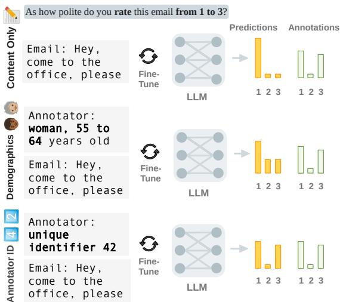
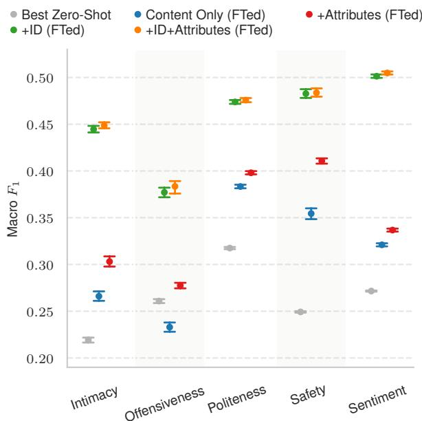
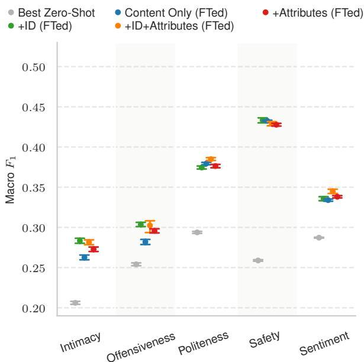
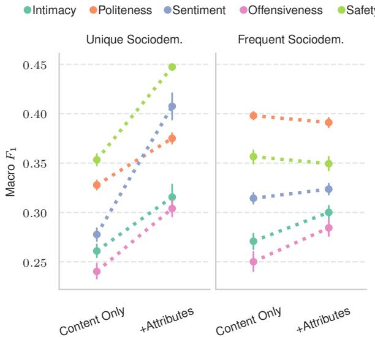
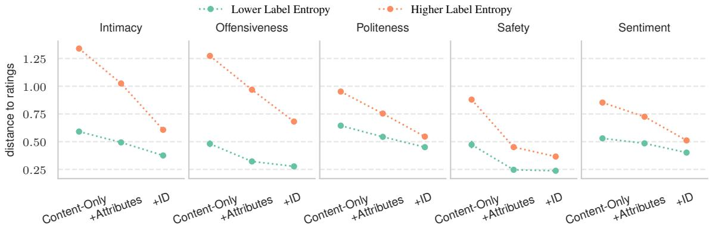
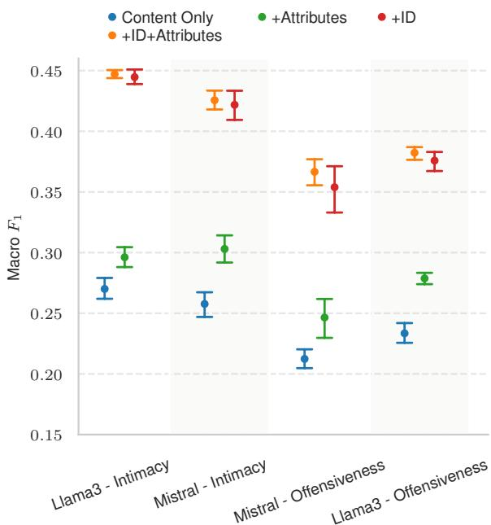
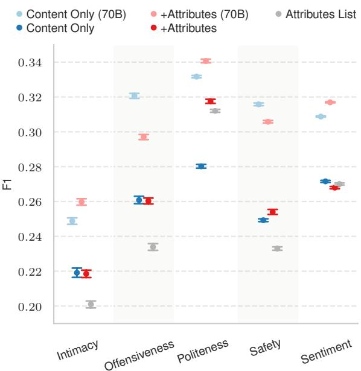

# Beyond Demographics: Fine-tuning Large Language Models to Predict Individuals’ Subjective Text Perceptions

Matthias Orlikowski1, Jiaxin Pei2, Paul Röttger4, Philipp Cimiano1, David Jurgens3, and Dirk Hovy4

1Bielefeld University

2Stanford University

3University of Michigan

4Computing Sciences Department, Bocconi University, Milan, Italy

## Abstract

People naturally vary in their annotations for subjective questions and some of this variation is thought to be due to the person’s sociodemographic characteristics. LLMs have also been used to label data, but recent work has shown that models perform poorly when prompted with sociodemographic attributes, suggesting limited inherent sociodemographic knowledge. Here, we ask whether LLMs can be trained to be accurate sociodemographic models of annotator variation. Using a curated dataset of five tasks with standardised sociodemographics, we show that models do improve in sociodemographic prompting when trained but that this performance gain is largely due to models learning annotator-specific behaviour rather than sociodemographic patterns. Across all tasks, our results suggest that models learn little meaningful connection between sociodemographics and annotation, raising doubts about the current use of LLMs for simulating sociodemographic variation and behaviour.

## 1 Introduction

Most Natural Language Processing (NLP) models require labelled data to learn. Yet, the humans labelling that data may not agree what is the correct label. These annotator disagreements stem from multiple causes, such as genuine mistakes, adversarial behaviour, or personal preferences (Röttger et al., 2022; Sandri et al., 2023). This variance in labelling behaviour has long been recognised and multiple models have been developed to distinguish some types of disagreements, particularly those due to unreliable annotators (Hovy et al., 2013; Passonneau and Carpenter, 2014). Recent work has focused on modelling the regularity in label variation due to individual (e.g., Deng et al., 2023) and group-based preferences (e.g., Davani et al., 2024). For example, members of one social group may regularly rate a piece of text as more or less offensive than others. When such labelling behaviour is regular, a large language model (LLM) could be prompted to take on sociodemographic characteristics to generate how a person with such characteristics would answer (Beck et al., 2024).

  
Figure 1: We test if LLMs can be trained to predict individuals’ subjective text perceptions based on their demographic background, finding that models rather model specific individuals than learn from demographics.

Such approaches of sociodemographic prompting require that an LLM can effectively take the perspective of a person or group. When LLMs are used to synthetically label data (Fröhling et al., 2024) or as evaluators (Dong et al., 2024), this approach potentially provides a scalable way to include meaningful variation by annotators, particularly those for less common sociodemographic identities (Simmons and Hare, 2023). However, multiple works have raised issues with the accuracy of this approach in zero-shot settings (e.g., Hu and Collier, 2024; Sun et al., 2025). While the root cause of this low zero-shot performance is likely multifaceted, given the potential benefits of LLMs as annotator models, we test whether LLMs can be trained as sociodemographic models of annotators, which was not assessed before.

To effectively model individual annotators with LLMs, we introduce a new approach that combines sociodemographic prompting with annotator modelling. Instead of fixing annotator identity (ID) and attributes as part of a specialised architecture, we incorporate this information by adapting input formats from sociodemographic prompts. Using this formatted input, we fine-tune decoder-only LLMs with prediction heads as used in reward models for LLM alignment (e.g., Liu et al., 2024). For training, we curated the DEMO dataset by unifying five existing datasets for subjective classification tasks (intimacy, offensiveness, politeness, safety, sentiment) that include annotator IDs and sociodemographic attributes (age, gender, race, and education).

Our study answers the following four research questions. RQ1: Can LLMs learn to model given annotators better based on sociodemographics or their identity (ID)? LLMs improve over baselines when incorporating sociodemographics, but we find that LLMs are much more accurate at modelling specific annotators’ behaviours. RQ2: Can LLMs generalise to new annotators? No, we find that neither sociodemographic attributes nor IDs improve performance over a text-only baseline, suggesting LLMs do not learn generalisable patterns. RQ3: If LLMs can use sociodemographic attributes to better model given annotators (RQ1) but do not generalise (RQ2), what information do LLMs learn when improving from sociodemographics? We find that sociodemographictuned models primarily improve for annotators with unique attributes, where attributes effectively act as an ID, suggesting models primarily improve at modelling specific individuals. RQ4: Does modelling annotator identity improve how models predict label distributions when annotators disagree? Beyond improvements in predicting annotations, we show that models using annotator identity better reflect cases of disagreement between annotators than models using sociodemographics.

Together, these results highlight that models do not learn substantial patterns between annotator sociodemographics and annotation behaviour. Based on this finding, we caution against using current LLMs to replicate text perceptions of individuals from specific social groups, in particular if no examples of their actual behaviours are available. All data and code related to our experiments are available at https://github.com/ morlikowski/beyond-demographics.

## 2 Related Work

Within research on the role of annotator characteristics in annotation, we connect work in sociodemographic prompting with annotator modelling.

Annotator Characteristics in Annotation. Training NLP and AI models relies on human annotations to adjust their parameters to align with human knowledge and preferences. Unlike games and mathematics, where there is always a ground truth, many NLP annotation tasks are inherently subjective. They are affected by annotators’ attributes and individual preferences. Existing studies have explored how different attributes affect annotators’ behaviours on tasks such as sentiment analysis (Díaz et al., 2018), preference modelling (Kirk et al., 2024), ideology classification (Shen and Rose, 2021) and hate speech or toxicity detection (Larimore et al., 2021; Kumar et al., 2021; Sap et al., 2022). Effects seem to be strongest when annotated content and attributes align (e.g., LGBTQ identities in relation to homophobic content, Goyal et al. 2022), but are also found across different tasks for more general samples (Pei and Jurgens, 2023). However, similar to us, some works do not find relevant associations with annotator background (Biester et al., 2022). Consequently, recent studies explore differences within demographic groups (Davani et al., 2024).

Annotator Modelling. Annotator modelling investigates supervised models that predict the annotations of individual annotators on specific inputs. These works are motivated by wider research on annotator subjectivity that questions the assumption of a single ground truth in annotation (Ovesdotter Alm, 2011; Uma et al., 2021; Plank, 2022; Fleisig et al., 2024; Frenda et al., 2024). Our work builds on studies that model annotators in subjective tasks (Davani et al., 2022; Weerasooriya et al., 2023; Vitsakis et al., 2023; Wang and Plank, 2023). Many annotator models use a unique identifier (ID) per annotator, often represented as a learnt embedding, frequently in combination with information derived from annotation statistics (Heinisch et al., 2023; Sarumi et al., 2024; Mokhberian et al., 2024). However, for unseen annotators, Deng et al. (2023) show that models with annotator embeddings (ID and annotation patterns) do not beat a content-only baseline. We also evaluate on an annotator-based split (see §5.3). But, as we focus on the availability of sociodemographic metadata, only one task,

Sentiment (see §3), overlaps with datasets used in their study. Anand et al. (2024) learn from individual annotations and evaluate the confidence of predictions. In particular, they find improvements in high-disagreement instances, similar to our analysis in §6.2.

Closely related to our work, some annotator models include sociodemographic information on annotators (e.g., Wan et al. 2023). Orlikowski et al. (2023) and Fleisig et al. (2023) find conflicting results on the usefulness of sociodemographics relative to annotator identity which we discuss in relation to our findings (see §7). Other works find improvements from demographics over a contentonly baseline but do not compare to using only annotator IDs (Gordon et al., 2022; Jaggi et al., 2024). In concurrent work, Jiang et al. (2024) also present a study on fine-tuning LLMs with annotator information, as part of a dataset description and analysis. In contrast to our study, they do so in the context of only a single dataset with 600 training instances and also do not compare against using the ID. Their results, similar to our findings, indicate that sociodemographics are less influential, showing greater importance for attitudes directly related to their task (Jiang et al., 2024).

Sociodemographic Prompting and Simulation. Sociodemographic prompting is part of a broader interest in using LLMs to simulate human responses in surveys or experiments. Within the social sciences, simulations focusing on simple actors and macro patterns from interactions are an established method (Epstein and Axtell, 1996). In contrast, LLMs enable human surrogates for new settings such as surveys or experiments, which several studies have started to explore (Aher et al., 2023; Dillion et al., 2023; Kozlowski and Evans, 2024). While some studies report successful applications (Argyle et al., 2023; Filippas et al., 2024; Manning et al., 2024), others discuss downsides of using LLMs to simulate individuals based on background descriptions, such as caricature and misportrayal of social groups (Cheng et al., 2023; Wang et al., 2025). Among these, our work builds on investigations into simulating annotators by prompting LLMs based on sociodemographic profiles (Beck et al., 2024; Hu and Collier, 2024). Alipour et al. (2024) find that also for prompts without sociodemographic information, demographics hardly explain how well LLMs align with annotators in comparison to confounding factors. In concurrent work,

Gao et al. (2024) find that prompted LLMs do not align well with human outcome distributions in a behavioural experiment but that LLMs fine-tuned on relevant examples do, similar to our findings (see §5.2).

## 3 DEMO Dataset

We curate DEMO, a collection of five published datasets containing annotations and sociodemographic annotator information1. These datasets focus on subjective text perceptions like sentiment and offensiveness. Together, they represent a diverse range of tasks where sociodemographics were reported to have a significant effect on labelling behaviour. We identify the largest intersection of sociodemographic attributes across the datasets. All five datasets contain information on gender, age, race, and education, so we select these four attributes for our experiments. To provide more comparable analyses, we normalise the sociodemographic attributes of the five tasks into a consistent and unified set of attributes. Appendix A.1 details this normalisation process and the final attributes used in our datasets. For example, after normalisation gender takes on the values “man”, “woman”, “non-binary”, or “unknown” (residual category).

The data collectively contain 21,632 texts annotated by 2,614 annotators resulting in 147,648 annotations total. Table 1 shows the statistics of each dataset in terms of instances, raters and labels. Statistics on sociodemographics can be found in Appendix A.3. Below we briefly introduce each task and the original dataset on which it is based.

Intimacy Intimacy reflects the perceived closeness of messages in interpersonal communications, and we use the English subset of the MINT dataset (Pei et al., 2023) which contains 1,993 tweets annotated by 261 annotators. Each tweet is annotated by 7 annotators with an intimacy score from 1 (“Not intimate at all”) to 5 (“Very intimate”).

Offensiveness The perception of offensiveness (i.e., language that might cause displeasure, anger, or hurt feelings, Chinivar et al., 2023) is subjective and depends on individual attributes like gender and race (Jacobi, 2014). We use the offensiveness subset of the POPQUORN dataset (Pei and Jurgens, 2023). It includes 13,036 annotations from 1,500 annotators for 1,500 Reddit comments and nuanced demographic information of the annotators.

<table><tr><td>Task</td><td>Labels</td><td>Reference</td><td>Data Type</td><td>Instances</td><td>Raters</td><td>Labels per Instance</td><td>Total Labels</td></tr><tr><td>Intimacy</td><td>Not Intimate to Very In- timate (1-5)</td><td>Pei et al. 2023</td><td>Tweet</td><td>1,993</td><td>261</td><td>48</td><td>12,516</td></tr><tr><td>Offensiveness</td><td>Not Offensive to Very Offensive (1-5)</td><td>Pei and Jurgens 2023</td><td>Reddit comment</td><td>1,500</td><td>262</td><td>50</td><td>13,036</td></tr><tr><td>Politeness</td><td>Not Polite to Very Po- lite (1-5)</td><td>Pei and Jurgens 2023</td><td>Email</td><td>3,718</td><td>506</td><td>50</td><td>25,042</td></tr><tr><td>Safety</td><td>Yes, Unsure, No Very Negative to Very</td><td>Aroyo et al. 2023</td><td>Conversation</td><td>350</td><td>104</td><td>104</td><td>36,400</td></tr><tr><td>Sentiment</td><td>Positive (1-5)</td><td>Díaz et al. 2018</td><td>Tweet</td><td>14,071</td><td>1,481</td><td>41</td><td>60,654</td></tr></table>

Table 1: The datasets used in DEMO

Politeness Politeness refers to “linguistic behaviour which is perceived to be appropriate to the social constraints of the ongoing interaction” (Watts, 2003). It is one of the most fundamental concepts of interpersonal communication. We use the 25,042 politeness annotations from 506 annotators in the POPQUORN dataset (Pei and Jurgens, 2023).

Safety focuses on the perceived conversational safety in human-AI interactions, and we use the DICES-350 data (Aroyo et al., 2023), which contains ratings of conversational safety for degrees of harm using a multifaceted rubric. These data contain 36,050 annotations from 104 annotators when applying the authors’ filtering of low-quality annotators.

Sentiment Sentiment is naturally a subjective construct and individual attributes actively affect people’s perception of text sentiment (Kumar et al., 2020). We use the sentiment annotations collected by Díaz et al. (2018), which includes 60,654 annotations from 1,481 annotators.

## 4 Experimental Setup

Here, we describe the different methods and setups for testing LLMs as models for annotators.

## 4.1 Weights and Architecture

We use Llama 3 8B (Llama-Team, 2024) for our experiments. As our experiments are based on finetuning, we require models with open weights of moderate size. Llama 3 was the strongest openweights model when we started our experiments. We use a standard architecture for learning a prediction head based on a decoder-only transformer, using the implementation for Llama 3 in the HuggingFace Transformers library (Wolf et al. 2020, see Appendix B for implementation details). We use this type of architecture as it is used in current reward models for LLM alignment (e.g., Liu et al. 2024), which is also a task of predicting ratings for text input, similar to the tasks in our experiments. As we fine-tune models with a prediction head and do not rely on instruction-following, we use the Llama 3 base model instead of a post-trained model. In supplementary experiments on a smaller scale, we use Mistral 7B (Jiang et al., 2023) to gauge how results with Llama 3 transfer to other model families, finding minimal differences (details in Appendix C).

## 4.2 Data Partitions

We use two data partition settings for how we split the data into train, validation and test sets to evaluate different aspects of model generalisability. The first is the instance split where we partition by instance, but annotators might be seen across all three subsets. In this context, an instance means a single text, e.g., a Reddit comment or an email. This setup follows the traditional machine learning setup and allows us to measure whether the LLM can generalise to new instances given an annotator’s sociodemographics. The second is the annotator split where annotators are partitioned across train, validation, and test sets. In other words, no annotator in the test set is included in the training or validation sets but the same text may be present in all three subsets. Here, the evaluation measures how well the LLM can simulate a new annotator’s decisions based on their sociodemographics. Tables 2 and 3 in the Appendix show the statistics of the two data partition settings.

## 4.3 Prompt Formats

We fine-tune on inputs which include the instance text and different information about annotators. As we fine-tune models with a prediction head and consequently do not rely on instruction-following (see 4.1), we use inputs with minimal formatting instead of detailed prompts. Below we detail which annotator information we include and how that information is formatted.

Content-Only The baseline setting uses only the textual content without any additional formatting. This format ignores all annotators’ attributes.

+Attributes (Content and Sociodemographics) In inputs using sociodemographics, we list an annotator’s age, gender, race, and education. Attributes in DEMO are given as short textual descriptions (e.g., the literal text “Woman”). We preprocess these descriptions by lowercasing, reformatting age groups (“40-44” to “40 to 44 years old”), and adding articles where appropriate (“a woman” instead of “woman”). We assume that all possible attribute values are known beforehand, i.e., we do not need to preprocess new values (e.g., an unseen age group) during test time. We format the input text and attribute descriptions based on a minimal template: Annotator: {RACE}, {AGE}, {GENDER}, {EDUCATION}\n Text: {TEXT}.

+ID (Content and ID) This format uses each annotator’s unique identifier. As the original ID format varies between tasks in DEMO, we reformat IDs to numerical values to ensure uniform input across tasks. The template is Annotator: unique identifier {ID}\n Text: {TEXT}.

+ID+Attributes (Content, ID and Sociodemographics) Lastly, we also test a combined input format. An example looks like this: Annotator: unique identifier 72, hispanic/latino, 40 to 44 years old, a woman, a college degree\n Text: This is an example text.

## 4.4 Baseline System

As a baseline for our fine-tuning experiments, we run zero-shot sociodemographic prompting experiments similar to Beck et al. (2024) and Hu and Collier (2024). Specifically, we prompt Llama 3 Instruct 8B with variants of the “Content Only” and “+Attributes” prompts adapted to a chat prompting template derived from Hu and Collier (2024). Here, in contrast to fine-tuning, attributes are described in a conversational format, e.g., The highest degree or level of school that you have completed is a college degree. We perform minimal robustness checks using 1) a larger model (Llama 3 Instruct 70B, 4-bit quantised) and 2) a prompt variant that simply lists attributes. We include the best results for Llama 3 Instruct 8B in our fine-tuning results plots. More details and full results are in Appendix D.

## 5 Experiments

Can LLMs learn to model sociodemographic variation in annotation (RQ1) and generalise to new annotators (RQ2)? To answer these questions, we evaluate Llama 3 8B (Llama-Team, 2024) finetuned with each of the five prompt formats on the instance split and on the annotator split of DEMO.

## 5.1 Training and Evaluation

We fine-tune models with half-precision weights (bf16) using low-rank adaption (LoRA, Hu et al. 2022). We learn LoRA weights for all linear layers except prediction layers and initial token embeddings which are fully fine-tuned. We select the learning rate for each input format and task combination based on the best-performing setting in 10 runs evaluated on the validation set. See Appendix B for full fine-tuning details.

We treat each value of the three-point (Safety) or five-point scales (all others) as a class in an individualised classification task. Individualised means that the model’s objective is to predict the annotation that a particular annotator assigned to a specific text. This evaluation setting, often used to evaluate annotator models (see §2), is intentionally different from standard evaluations in NLP where models are evaluated on a single aggregate rating per text. As each class is equally important in predicting annotators’ ratings, we compare models based on macro-average F1. For the main experiments, we run each setting with 30 different random seeds. We report the average score over the 30 runs and compute 95% confidence intervals using bootstrap sampling (on bootstrap sampling in NLP evaluations, see Berg-Kirkpatrick et al., 2012).

## 5.2 Results: Sociodemographic Modelling

Including sociodemographic attributes in training significantly outperforms the performance of zeroshot prompting, initially suggesting that LLMs can learn to simulate sociodemographic preferences (RQ1), as seen in Figure 2 for the instance split. However, when models are prompted with a unique annotator ID, they are even more accurate at predicting the annotator’s label.

For annotators’ attributes (red) there is a consistent pattern in contrast to zero-shot LLM behaviour in our baseline experiments (Appendix D). While in zero-shot, including attributes leads to inconsistent effects, when fine-tuning we see a notable positive shift in the score distribution across all tasks. We analyse this result further in Section 6.1. Still, adding the annotator ID (green) leads to an even higher performance increase. When adding both IDs and attributes (orange), scores are not substantially different from adding only the ID, suggesting that the performance gain from attributes is subsumed by knowledge of who specifically is annotating.

  
Figure 2: Results on the instance split show that training with sociodemographics improves performance over text-only predictions but including a unique annotator ID in the prompt leads to much larger performance gains. Macro-average $\bar { F } _ { 1 }$ over three (Safety) or five (all others) classes on each test set. Shows results for Llama 3 8B fine-tuned with different types of input and the best zero-shot result (8B) for each task. Mean score over 30 different seeds with 95% confidence intervals from bootstrap sampling.

The best zero-shot results per task for Llama 3 Instruct 8B replicate the finding in related work that zero-shot sociodemographic prompting has low performance for individual annotators (Beck et al., 2024). Unsurprisingly, even for the contentonly baseline (blue), fine-tuning leads to higher scores than zero-shot prompting (grey) for most tasks. A notable exception is the Offensiveness task where the zero-shot performance is slightly above the fine-tuned model. This is due to the task’s strong label imbalance where a classifier exclusively trained on the text content can only learn to predict the majority class well, resulting in lower macro-average $F _ { 1 }$

## 5.3 Results: Annotator Generalisation

LLM annotator models do not generalise well to unseen individuals (RQ2), as seen in Figure 3 showing results on the annotator split. While all finetuned models perform better than zero-shot results, the performance gains from adding attributes, IDs, or both are negligible compared to the text-only model. When using IDs, no performance gains are expected because the model has not seen these annotators’ IDs before and cannot adapt to their idiosyncratic preferences. The lack of gains for the sociodemographic attributes suggests that models have, in fact, learned minimal meaningful relationships between text, attributes, and rating combinations. This result is surprising given the results of RQ1 that demonstrated a small but consistent effect from attributes, which suggests that when we have not seen examples from a rater, then their sociodemographic profile should give us at least some information on how they would rate a text. We analyse this result in detail next.

  
Figure 3: Results on the annotator split, where the test sets only include annotators not seen in training, show that training with sociodemographics and/or annotator IDs minimally improve over the text-only baseline. While IDs for unseen annotators is expected to offer little benefit, this result suggests models are not able to generalise from sociodemographics. The plot shows a macro-average F1 is over three (Safety) or five (all others) classes on each test set for Llama 3 8B finetuned with different types of input and the best zero-shot result (8B) for each task. Mean score over 30 different seeds with 95% confidence intervals from bootstrap sampling.

## 6 Analyses: What Are LLMs Learning About Sociodemographics?

The opposite results for sociodemographic prompting in RQ1 and RQ2 suggest that models may not be learning how different attributes influence ratings. Therefore, we perform two additional analyses. First, we assess to what degree are sociodemographic attributes serving as proxies for annotator IDs versus representing meaningful attributelabel relationships (RQ3). Second, we analyse if improvements from including IDs also improve how good models capture cases of disagreement between annotators (RQ4).

## 6.1 Sociodemographics as Proxies

Given that including IDs improves results much more than attributes on the instance split, we hypothesise that models actually learn to use attribute combinations as a proxy for annotator identity. To test this hypothesis, we compare results for two subsets of annotators: (1) Annotators with unique combinations of sociodemographic attributes who have a combination of age, gender, race and education not shared by any other annotator in the test set (denoted Unique) and (2) annotators who have a common combination of attributes, that is, a sociodemographic profile that is frequently shared by many annotators (denoted Frequent). In the former, the attribute combination is effectively a unique identifier for the annotator, while in the latter, the sociodemographics refer to multiple annotators. As we analyse results obtained on the instance split, all annotators that are included in the test set are also included in the training set.

For each task, we include all ratings by annotators with a unique profile. For the frequent profiles, we select the top n with $n = 1$ for Sentiment, $n = 3$ for Safety, and $n = 5$ for other tasks. Except for Sentiment, we set n so that the number of annotators is similar for both subsets. For Sentiment, we only use the most frequent profile because it includes more annotators than the sum of unique profiles. More details on profile distributions in Appendix A.3.

To test the hypotheses, we compare the performance gain relative to content-only input for adding each subset of sociodemographic attributes. For each model configuration and task, we compute new macro-average $F _ { 1 }$ scores for each subset of annotators across runs.

Our results show that the largest gains occur when LLMs are predicting ratings for the annotators in the Unique subset (Figure 4), but no consistent or substantial gains for predicting ratings of annotators in the Frequent subset. This result confirms our hypothesis that the unique sociodemographics are acting as proxies for identity and, thus, the LLM is not learning any meaningful relationship between attributes and labelling.

  
Figure 4: Evaluation scores on ratings by annotators with unique vs. frequent combinations of sociodemographic attributes, corresponding to Unique and Frequent in the main text. The high improvement for unique sociodemographics compare with the minimal gains for frequent sociodemographics strongly suggests that the LLM is using the attributes as a proxy for annotator ID and is not learning any sociodemographic-label associations. Points show the mean score (macro-average $F _ { 1 } )$ over 30 different seeds for models using only text or text and attributes. Error bars show 95% confidence intervals from bootstrap sampling.

## 6.2 Modelling Disagreement

Beyond getting more accurate at predicting individual ratings, do models improve at capturing specific types of label distributions when incorporating attributes and identifiers (RQ4)? Can we capture when there is disagreement on how to rate an example? Or do models mainly improve on consensually rated content?

To test for which kinds of label distributions the LLM can best model, we group the instances based on their levels of disagreement. We measure disagreement as the entropy of each instance’s label distribution: Lower label entropy corresponds to patterns of more agreement and higher label entropy corresponds to patterns of more disagreement (in the extreme corresponding to uniform ratings). We split instances into two groups using the median to distinguish lower and higher label entropy. We use the two groups to measure how close models get to predicting the actual label distributions in high and low disagreement scenarios. For each text in the two groups, we measure the distance between the predicted and the actual rating distributions for each model configuration (Content-Only, +Attributes, +ID). Following Santurkar et al. (2023), we compute the distance of the actual rating distributions using Wasserstein distance (earth mover’s distance). We want this distance to be as small as possible.

Models get better at predicting cases of disagreement when including attributes and IDs, as shown by the lower distance to the actual ratings for higher entropy labels (orange) in Figure 5. Still, disagreements remain challenging, demonstrated by distances that are always higher compared to cases when annotators mostly agree (teal). However, distances to the actual rating distribution are smallest on higher disagreement cases when including IDs. With the exception of the Offensiveness task, +ID models almost model label distributions equally well irrespective of the level of disagreement. For cases of agreement, there are much smaller differences between model configurations.

## 7 Discussion

Based on our results, we cannot expect LLMs to model annotators based on their sociodemographics alone, in particular without examples of their individual behaviour. While even the bestperforming models achieve moderate scores, highlighting that individual-level prediction remains a challenging problem, sociodemographic prompting usually performs worse than using annotatorspecific identities. Our results show that it is possible to model a given set of annotators reasonably well from examples, but models do not actually learn how to generalise from seen sociodemographic attribute patterns to new annotators. Thus, models only seemingly improve from attribute information. As we show, they instead improve for annotators who can be identified by unique attribute combinations. Naturally, this works best if models have access to an actual identifier for each annotator. In these cases, where annotator modelling succeeds, it leads to models that can better predict diverging views on the correct label. Learning from examples of identifiable annotators allows LLMs to learn labelling behaviour without explicating factors that govern it.

Additionally, we see that attributes in combination with an ID do not improve results in comparison to only adding the ID. This result echoes Orlikowski et al. (2023) who also find that sociodemographics do not improve results beyond using IDs, interpreting this finding in reference to the ecological fallacy. They also discuss the limitation of not having tested on attribute combinations, which we do. The lack of detailed enough profiles does not seem to be an explanation for why sociodemographics are less relevant than individual-level behaviour. In contrast, Fleisig et al. (2023) find that predictions of individual ratings improve when using sociodemographics instead of IDs. In particular, in their setting IDs perform worse than a content-only baseline while sociodemographics improve over the baseline. Gordon et al. (2022) do not compare to using the ID without sociodemographics, but their full model does include IDs and leads to a substantial improvement over using only sociodemographic attributes. Similarly, for author modelling, Soni et al. (2024) find that using only individual context derived from an author’s text improves over pre-training with author attributes in a downstream document-level classification task. Thus, the benefit we find for IDs over attributes seems to be consistent with related findings, but there are apparently cases when learning from identifiable annotators performs less well. Future work could investigate the influence of dataset characteristics and used architectures.

Our results show that fine-tuning, a natural method to improve over the poor zero-shot performance that prior work demonstrated for sociodemographic prompting (Beck et al., 2024; Hu and Collier, 2024; Sun et al., 2025), does not lead to models that are more faithful in terms of demographics. This limitation of models raises doubts about the use of current LLMs for simulating sociodemographic variation also beyond NLP, in surveys or experiments (Argyle et al., 2023; Filippas et al., 2024; Aher et al., 2023; Dillion et al., 2023; Kozlowski and Evans, 2024; Manning et al., 2024). Thus, further research is needed to demonstrate whether simulating participants reliably works outside of specific settings, such as querying for partisan descriptions of in-group and out-group political parties (Argyle et al., 2023). Potentially, there will be different findings for group-level response distributions (Meister et al., 2025; Suh et al., 2025; Cao et al., 2025) and the level of individuals, which we focused on in our study.

While annotator characteristics matter for annotation tasks, e.g., older annotators rating texts as more polite (Pei and Jurgens, 2023), effect sizes can be small. Hu and Collier (2024) highlight for a number of NLP datasets (also three datasets used in our experiments) that the variance in annotation explained by annotator characteristics in isolation is consistently less than 10%. Consequently, our results might not so much point towards a principal inability of LLMs to learn sociodemographic patterns but the small general effect of these patterns in text annotation, even for subjective tasks. Still, for specific cases, factors influencing annotations have successfully been singled out. For example, Sap et al. (2022), showing effects of race on offensiveness annotation, select texts for annotation with not any type of offensive content but content directly related to race and anti-blackness in an US context. Ultimately, the effect of annotator characteristics will also depend on the task, content and annotation setup.

  
Figure 5: Wasserstein distance to the actual rating distribution (lower is better) on texts in the standard-split test sets, average and 95% confidence intervals. Lower label entropy corresponds to patterns of agreement and higher label entropy corresponds to patterns of disagreement (uniform ratings or bimodal, diverging ratings). Higher and lower are distinguished based on the median entropy value per test set.

Comparing results when using attributes and when using IDs offers a perspective on overcoming LLM uniformity (Kozlowski and Evans, 2024) or flattening of groups (Wang et al., 2025), also discussed by Dillion et al. (2023). Santurkar et al. (2023) highlight modal representativeness of chattuned models that assign the most probability mass to a single answer when prompted with sociodemographics, simplifying opinion diversity within groups. Attributes and sociodemographic personas don’t necessarily capture variation within social groups, so that LLMs respond uniformly, apparently. However, learning from examples of individual behaviour could model this within-group variance and avoid oversimplification.

## 8 Conclusion

We ask to what degree can LLMs be trained to accurately predict individuals’ annotation from their sociodemographic attributes, motivated by the models’ poor performance at sociodemographic zeroshot prompting. In a series of experiments and analyses using five datasets and two different partitions of the data (based on annotators and instances), we find that LLMs can not reproduce annotators’ text perceptions based on sociodemographics alone but, instead, primarily learn from examples of individual behaviour to model specific annotators. However, using these examples of how individuals rate, we can learn their rating behaviour in a single LLM-based model with much better performance than both zero-shot and content-only baselines.

## Limitations

The datasets used in our study are only annotated by annotators from the US. While the original data for the Intimacy task (Pei et al., 2023) include non-US annotators, the English Language subset used in our study does not. Therefore, we can not carry out cross-geocultural comparisons using the existing datasets to detail how results might transfer to other geocultural contexts. Datasets suitable for annotator modelling are rare and existing datasets with annotators from different regions do not provide the same set of additional sociodemographic attributes that we investigate in our study. For example, Frenda et al. (2023) only includes information on age and gender. Cross-cultural datasets from concurrent work (Davani et al., 2024) can be used in future studies.

We primarily evaluate only one model family, Llama 3. Consequently, results with other LLMs might differ. This is mainly due to a trade-off with the number of experimental runs we can achieve with the same computational budget. We opted for a comparatively high number of runs (30) to allow for a more reliable estimation of variability between runs. This allowed us to detect small but significant differences between input formats. In comparison to zero-shot, we would in general expect less variation between model families as all models would be fine-tuned in the same setting. Empirically, we mitigate the limitation of primarily experimenting with Llama 3 to some extent by including small-scale supplementary experiments (fewer runs and tasks) using Mistral 7B (Jiang et al., 2023). Results in Appendix C show that at least in this smaller setting the same pattern of results holds. For zero-shot, extensive results across model families are already available in related work (Beck et al., 2024; Hu and Collier, 2024), so that we only replicated them partially as a baseline (see Appendix D).

## Ethics

This paper studies how much LLMs could be trained to predict individuals’ subjective text perceptions. Through extensive experiments, we found that fine-tuning LLMs with demographics does not help to significantly improve their performances. Such a result suggests that sociodemographic prompting may not be an effective way to elicit accurate individual-level perception prediction even when the model is fine-tuned on the specific task. Instead, fine-tuning with individuals’ annotations helps LLMs to better capture individual annotators’ ratings by a relatively large margin, suggesting that individual preference modelling would be a more promising direction toward accurate subjective text perception modelling. Altogether, our results suggest that people should be cautious about the potential biases when prompting LLMs with demographics.

In our experiments, we only included four demographic attributes: gender, age, race, and education. We made this decision because these are the common attributes covered in all the collected datasets. We acknowledge this as one of our major limitations and by doing so, we might have excluded other important demographic attributes. In the future, we will explore better ways to include diverse types of demographics and we also call for future work in this direction to investigate the effect of other aspects of demographics and collect suitable datasets.

Beyond the points raised throughout the main text on risks and limitations of using LLMs to simulate individuals from specific social groups (e.g., Dillion et al., 2023; Cheng et al., 2023; Kozlowski and Evans, 2024), one could ask the principal question of whether we should even aim to replace human participants in annotation and survey research. With current technology, based on our findings, we see no clear justification to think replacing human subjects should be generally beneficial (or even possible, for that matter), echoing, e.g., Wang et al. (2025). Nevertheless, just like synthetic data has enabled relevant progress in dataset creation, limited use for, e.g., pilot studies or testing new survey instruments and annotation guidelines should continually be explored (Anthis et al., 2025). Whether this leads to a situation where we can meaningfully ask if we should only research simulations of human participants is unclear.

## Acknowledgments

Matthias Orlikowski and Philipp Cimiano were funded by Volkswagen Foundation as part of the “Bots Building Bridges (3B)” project in the “Artificial Intelligence and the Society of the Future” programme. Dirk Hovy was supported by the European Research Council (ERC) under the European Union’s Horizon 2020 research and innovation program (grant agreement No. 949944, INTEGRA-TOR), Paul Röttger by a MUR FARE 2020 initiative under grant agreement Prot. R20YSMBZ8S (INDOMITA). They are members of the Data and Marketing Insights Unit of the Bocconi Institute for Data Science and Analysis (BIDSA). David Jurgens was supported by the National Science Foundation under Grant No. IIS-2143529.

## References

Gati V. Aher, Rosa I. Arriaga, and Adam Tauman Kalai. 2023. Using Large Language Models to Simulate Multiple Humans and Replicate Human Subject Studies. In Proceedings of the 40th International Conference on Machine Learning, pages 337–371. PMLR. ISSN: 2640-3498.

Shayan Alipour, Indira Sen, Mattia Samory, and Tanushree Mitra. 2024. Robustness and Confounders in the Demographic Alignment of LLMs with Human Perceptions of Offensiveness. ArXiv:2411.08977 [cs].

Abhishek Anand, Negar Mokhberian, Prathyusha Kumar, Anweasha Saha, Zihao He, Ashwin Rao, Fred Morstatter, and Kristina Lerman. 2024. Don‘t blame the data, blame the model: Understanding noise and bias when learning from subjective annotations. In Proceedings of the 1st Workshop on Uncertainty-Aware NLP (UncertaiNLP 2024), pages 102–113, St Julians, Malta. Association for Computational Linguistics.

Jacy Reese Anthis, Ryan Liu, Sean M. Richardson, Austin C. Kozlowski, Bernard Koch, James Evans, Erik Brynjolfsson, and Michael Bernstein. 2025. LLM Social Simulations Are a Promising Research Method. ArXiv:2504.02234 [cs].

Lisa P. Argyle, Ethan C. Busby, Nancy Fulda, Joshua R. Gubler, Christopher Rytting, and David Wingate. 2023. Out of One, Many: Using Language Models to Simulate Human Samples. Political Analysis, 31(3):337–351.

Lora Aroyo, Alex Taylor, Mark Díaz, Christopher Homan, Alicia Parrish, Gregory Serapio-García, Vinodkumar Prabhakaran, and Ding Wang. 2023. Dices dataset: Diversity in conversational ai evaluation for safety. In Advances in Neural Information Processing Systems, volume 36, pages 53330–53342. Curran Associates, Inc.

Tilman Beck, Hendrik Schuff, Anne Lauscher, and Iryna Gurevych. 2024. Sensitivity, performance, robustness: Deconstructing the effect of sociodemographic prompting. In Proceedings of the 18th Conference of the European Chapter ofthe Associationfor Computational Linguistics (Volume 1: Long Papers), pages 2589–2615, St. Julian’s, Malta. Association for Computational Linguistics.

Taylor Berg-Kirkpatrick, David Burkett, and Dan Klein. 2012. An empirical investigation of statistical significance in NLP. In Proceedings ofthe 2012 Joint Conference on Empirical Methods in Natural Language Processing and Computational Natural Language Learning, pages 995–1005, Jeju Island, Korea. Association for Computational Linguistics.

Laura Biester, Vanita Sharma, Ashkan Kazemi, Naihao Deng, Steven Wilson, and Rada Mihalcea. 2022. Analyzing the effects of annotator gender across NLP tasks. In Proceedings of the 1st Workshop on Perspectivist Approaches to NLP @LREC2022, pages 10–19, Marseille, France. European Language Resources Association.

Yong Cao, Haijiang Liu, Arnav Arora, Isabelle Augenstein, Paul Röttger, and Daniel Hershcovich. 2025. Specializing large language models to simulate survey response distributions for global populations. In Proceedings of the 2025 Conference of the Nations ofthe Americas Chapter ofthe Associationfor Computational Linguistics: Human Language Technologies (Volume 1: Long Papers), pages 3141–3154, Albuquerque, New Mexico. Association for Computational Linguistics.

Myra Cheng, Tiziano Piccardi, and Diyi Yang. 2023. CoMPosT: Characterizing and evaluating caricature in LLM simulations. In Proceedings of the 2023 Conference on Empirical Methods in Natural Language Processing, pages 10853–10875, Singapore. Association for Computational Linguistics.

Sneha Chinivar, Roopa M.S., Arunalatha J.S., and Venugopal K.R. 2023. Online offensive behaviour in so-

cialmedia: Detection approaches, comprehensive review and future directions. Entertainment Computing, 45:100544.

Aida Mostafazadeh Davani, Mark Diaz, Dylan K Baker, and Vinodkumar Prabhakaran. 2024. D3CODE: Disentangling disagreements in data across cultures on offensiveness detection and evaluation. In Proceedings ofthe 2024 Conference on Empirical Methods in Natural Language Processing, pages 18511–18526, Miami, Florida, USA. Association for Computational Linguistics.

Aida Mostafazadeh Davani, Mark Díaz, and Vinodkumar Prabhakaran. 2022. Dealing with disagreements: Looking beyond the majority vote in subjective annotations. Transactions ofthe Associationfor Computational Linguistics, 10:92–110.

Naihao Deng, Xinliang Zhang, Siyang Liu, Winston Wu, Lu Wang, and Rada Mihalcea. 2023. You are what you annotate: Towards better models through annotator representations. In Findings ofthe Association for Computational Linguistics: EMNLP 2023, pages 12475–12498, Singapore. Association for Computational Linguistics.

Tim Dettmers, Mike Lewis, Sam Shleifer, and Luke Zettlemoyer. 2022. 8-bit optimizers via block-wise quantization. 9th International Conference on Learning Representations, ICLR.

Mark Díaz, Isaac Johnson, Amanda Lazar, Anne Marie Piper, and Darren Gergle. 2018. Addressing agerelated bias in sentiment analysis. In Proceedings of the 2018 CHI Conference on Human Factors in Computing Systems, pages 1–14.

Danica Dillion, Niket Tandon, Yuling Gu, and Kurt Gray. 2023. Can AI language models replace human participants? Trends in Cognitive Sciences, 27(7):597–600.

Yijiang River Dong, Tiancheng Hu, and Nigel Collier. 2024. Can LLM be a personalized judge? In Findings ofthe Associationfor Computational Linguistics: EMNLP 2024, pages 10126–10141, Miami, Florida, USA. Association for Computational Linguistics.

Joshua M. Epstein and Robert L. Axtell. 1996. Growing Artificial Societies: Social Science from the Bottom Up. The MIT Press.

Apostolos Filippas, John J. Horton, and Benjamin S. Manning. 2024. Large Language Models as Simulated Economic Agents: What Can We Learn from Homo Silicus? In Proceedings of the 25th ACM Conference on Economics and Computation, EC ’24, pages 614–615, New York, NY, USA. Association for Computing Machinery.

Eve Fleisig, Rediet Abebe, and Dan Klein. 2023. When the majority is wrong: Modeling annotator disagreement for subjective tasks. In Proceedings ofthe 2023 Conference on Empirical Methods in Natural Language Processing, pages 6715–6726, Singapore. Association for Computational Linguistics.

Eve Fleisig, Su Lin Blodgett, Dan Klein, and Zeerak Talat. 2024. The perspectivist paradigm shift: Assumptions and challenges of capturing human labels. In Proceedings ofthe 2024 Conference ofthe North American Chapter of the Association for Computational Linguistics: Human Language Technologies (Volume 1: Long Papers), pages 2279–2292, Mexico City, Mexico. Association for Computational Linguistics.

Simona Frenda, Gavin Abercrombie, Valerio Basile, Alessandro Pedrani, Raffaella Panizzon, Alessandra Teresa Cignarella, Cristina Marco, and Davide Bernardi. 2024. Perspectivist approaches to natural language processing: A survey. Language Resources and Evaluation.

Simona Frenda, Alessandro Pedrani, Valerio Basile, Soda Marem Lo, Alessandra Teresa Cignarella, Raffaella Panizzon, Cristina Marco, Bianca Scarlini, Viviana Patti, Cristina Bosco, and Davide Bernardi. 2023. EPIC: Multi-perspective annotation of a corpus of irony. In Proceedings ofthe 61st Annual Meeting of the Association for Computational Linguistics (Volume 1: Long Papers), pages 13844–13857, Toronto, Canada. Association for Computational Linguistics.

Leon Fröhling, Gianluca Demartini, and Dennis Assenmacher. 2024. Personas with Attitudes: Controlling LLMs for Diverse Data Annotation. ArXiv:2410.11745 [cs].

Yuan Gao, Dokyun Lee, Gordon Burtch, and Sina Fazelpour. 2024. Take Caution in Using LLMs as Human Surrogates: Scylla Ex Machina. ArXiv:2410.19599.

Mitchell L. Gordon, Michelle S. Lam, Joon Sung Park, Kayur Patel, Jeff Hancock, Tatsunori Hashimoto, and Michael S. Bernstein. 2022. Jury learning: Integrating dissenting voices into machine learning models. In Proceedings ofthe 2022 CHI Conference on Human Factors in Computing Systems, CHI ’22, New York, NY, USA. Association for Computing Machinery.

Nitesh Goyal, Ian D. Kivlichan, Rachel Rosen, and Lucy Vasserman. 2022. Is your toxicity my toxicity? exploring the impact of rater identity on toxicity annotation. Proceedings ofthe ACM on Human-Computer Interaction, 6:1–28.

Philipp Heinisch, Matthias Orlikowski, Julia Romberg, and Philipp Cimiano. 2023. Architectural sweet spots for modeling human label variation by the example of argument quality: It‘s best to relate perspectives! In Proceedings of the 2023 Conference on Empirical Methods in Natural Language Processing, pages 11138–11154, Singapore. Association for Computational Linguistics.

Dirk Hovy, Taylor Berg-Kirkpatrick, Ashish Vaswani, and Eduard Hovy. 2013. Learning whom to trust with MACE. In Proceedings ofthe 2013 Conference

of the North American Chapter of the Association for Computational Linguistics: Human Language Technologies, pages 1120–1130, Atlanta, Georgia. Association for Computational Linguistics.

Edward J Hu, Yelong Shen, Phillip Wallis, Zeyuan Allen-Zhu, Yuanzhi Li, Shean Wang, Lu Wang, and Weizhu Chen. 2022. LoRA: Low-rank adaptation of large language models. In International Conference on Learning Representations.

Tiancheng Hu and Nigel Collier. 2024. Quantifying the persona effect in LLM simulations. In Proceedings of the 62nd Annual Meeting of the Association for Computational Linguistics (Volume 1: Long Papers), pages 10289–10307, Bangkok, Thailand. Association for Computational Linguistics.

Lora L Jacobi. 2014. Perceptions of profanity: How race, gender, and expletive choice affect perceived offensiveness. North American Journal ofPsychology, 16(2).

Harbani Jaggi, Kashyap Coimbatore Murali, Eve Fleisig, and Erdem Biyik. 2024. Accurate and data-efficient toxicity prediction when annotators disagree. In Proceedings ofthe 2024 Conference on Empirical Methods in Natural Language Processing, pages 21910– 21917, Miami, Florida, USA. Association for Computational Linguistics.

Aiqi Jiang, Nikolas Vitsakis, Tanvi Dinkar, Gavin Abercrombie, and Ioannis Konstas. 2024. Re-examining sexism and misogyny classification with annotator attitudes. In Findings of the Association for Computational Linguistics: EMNLP 2024, pages 15103– 15125, Miami, Florida, USA. Association for Computational Linguistics.

Albert Q. Jiang, Alexandre Sablayrolles, Arthur Mensch, Chris Bamford, Devendra Singh Chaplot, Diego de las Casas, Florian Bressand, Gianna Lengyel, Guillaume Lample, Lucile Saulnier, Lélio Renard Lavaud, Marie-Anne Lachaux, Pierre Stock, Teven Le Scao, Thibaut Lavril, Thomas Wang, Timothée Lacroix, and William El Sayed. 2023. Mistral 7B. ArXiv:2310.06825 [cs].

Diederik P. Kingma and Jimmy Ba. 2015. Adam: A Method for Stochastic Optimization. In 3rd International Conferencefor Learning Representations,, San Diego, California.

Hannah Rose Kirk, Alexander Whitefield, Paul Röttger, Andrew Bean, Katerina Margatina, Juan Ciro, Rafael Mosquera, Max Bartolo, Adina Williams, He He, Bertie Vidgen, and Scott A. Hale. 2024. The PRISM Alignment Dataset: What Participatory, Representative and Individualised Human Feedback Reveals About the Subjective and Multicultural Alignment of Large Language Models. In Advances in Neural Information Processing Systems, volume 37, pages 105236–105344. Curran Associates, Inc.

Austin Kozlowski and James Evans. 2024. Simulating Subjects: The Promise and Peril of AI Stand-ins for Social Agents and Interactions. SocArXiv:vp3j2.

Deepak Kumar, Patrick Gage Kelley, Sunny Consolvo, Joshua Mason, Elie Bursztein, Zakir Durumeric, Kurt Thomas, and Michael Bailey. 2021. Designing toxic content classification for a diversity of perspectives. In Seventeenth Symposium on Usable Privacy and Security (SOUPS 2021), pages 299–318. USENIX Association.

Sudhanshu Kumar, Monika Gahalawat, Partha Pratim Roy, Debi Prosad Dogra, and Byung-Gyu Kim. 2020. Exploring Impact of Age and Gender on Sentiment Analysis Using Machine Learning. Electronics, 9(2):374.

Savannah Larimore, Ian Kennedy, Breon Haskett, and Alina Arseniev-Koehler. 2021. Reconsidering annotator disagreement about racist language: Noise or signal? In Proceedings of the Ninth International Workshop on Natural Language Processing for Social Media, pages 81–90, Online. Association for Computational Linguistics.

Chris Yuhao Liu, Liang Zeng, Jiacai Liu, Rui Yan, Jujie He, Chaojie Wang, Shuicheng Yan, Yang Liu, and Yahui Zhou. 2024. Skywork-Reward: Bag of Tricks for Reward Modeling in LLMs. ArXiv:2410.18451 [cs].

Llama-Team. 2024. The Llama 3 Herd of Models. ArXiv:2407.21783 [cs].

Benjamin Manning, Kehang Zhu, and John Horton. 2024. Automated Social Science: Language Models as Scientist and Subjects. Technical Report w32381, National Bureau of Economic Research, Cambridge, MA.

Nicole Meister, Carlos Guestrin, and Tatsunori Hashimoto. 2025. Benchmarking distributional alignment of large language models. In Proceedings of the 2025 Conference ofthe Nations ofthe Americas Chapter of the Association for Computational Linguistics: Human Language Technologies (Volume 1: Long Papers), pages 24–49, Albuquerque, New Mexico. Association for Computational Linguistics.

Negar Mokhberian, Myrl Marmarelis, Frederic Hopp, Valerio Basile, Fred Morstatter, and Kristina Lerman. 2024. Capturing perspectives of crowdsourced annotators in subjective learning tasks. In Proceedings of the 2024 Conference of the North American Chapter ofthe Associationfor Computational Linguistics: Human Language Technologies (Volume 1: Long Papers), pages 7337–7349, Mexico City, Mexico. Association for Computational Linguistics.

Matthias Orlikowski, Paul Röttger, Philipp Cimiano, and Dirk Hovy. 2023. The ecological fallacy in annotation: Modeling human label variation goes beyond sociodemographics. In Proceedings of the 61st Annual Meeting of the Association for Computational Linguistics (Volume 2: Short Papers), pages 1017– 1029, Toronto, Canada. Association for Computational Linguistics.

Cecilia Ovesdotter Alm. 2011. Subjective natural language problems: Motivations, applications, characterizations, and implications. In Proceedings ofthe 49th Annual Meeting of the Association for Computational Linguistics: Human Language Technologies, pages 107–112, Portland, Oregon, USA. Association for Computational Linguistics.

Rebecca J. Passonneau and Bob Carpenter. 2014. The benefits of a model of annotation. Transactions of the Associationfor Computational Linguistics, 2:311– 326.

Jiaxin Pei and David Jurgens. 2023. When do annotator demographics matter? measuring the influence of annotator demographics with the POPQUORN dataset. In Proceedings ofthe 17th Linguistic Annotation Workshop (LAW-XVII), pages 252–265, Toronto, Canada. Association for Computational Linguistics.

Jiaxin Pei, Vítor Silva, Maarten Bos, Yozen Liu, Leonardo Neves, David Jurgens, and Francesco Barbieri. 2023. SemEval-2023 task 9: Multilingual tweet intimacy analysis. In Proceedings of the 17th International Workshop on Semantic Evaluation (SemEval-2023), pages 2235–2246, Toronto, Canada. Association for Computational Linguistics.

Barbara Plank. 2022. The “problem” of human label variation: On ground truth in data, modeling and evaluation. In Proceedings of the 2022 Conference on Empirical Methods in Natural Language Processing, pages 10671–10682, Abu Dhabi, United Arab Emirates. Association for Computational Linguistics.

Qwen, An Yang, Baosong Yang, Beichen Zhang, Binyuan Hui, Bo Zheng, Bowen Yu, Chengyuan Li, Dayiheng Liu, Fei Huang, Haoran Wei, Huan Lin, Jian Yang, Jianhong Tu, Jianwei Zhang, Jianxin Yang, Jiaxi Yang, Jingren Zhou, Junyang Lin, Kai Dang, Keming Lu, Keqin Bao, Kexin Yang, Le Yu, Mei Li, Mingfeng Xue, Pei Zhang, Qin Zhu, Rui Men, Runji Lin, Tianhao Li, Tianyi Tang, Tingyu Xia, Xingzhang Ren, Xuancheng Ren, Yang Fan, Yang Su, Yichang Zhang, Yu Wan, Yuqiong Liu, Zeyu Cui, Zhenru Zhang, and Zihan Qiu. 2025. Qwen2.5 Technical Report. ArXiv:2412.15115 [cs].

Paul Röttger, Bertie Vidgen, Dirk Hovy, and Janet Pierrehumbert. 2022. Two contrasting data annotation paradigms for subjective NLP tasks. In Proceedings of the 2022 Conference of the North American Chapter of the Association for Computational Linguistics: Human Language Technologies, pages 175–190, Seattle, United States. Association for Computational Linguistics.

Arjun Roy, Jan Horstmann, and Eirini Ntoutsi. 2023. Multi-dimensional Discrimination in Law and Machine Learning - A Comparative Overview. In 2023 ACM Conference on Fairness, Accountability, and Transparency, pages 89–100, Chicago IL USA. ACM.

Marta Sandri, Elisa Leonardelli, Sara Tonelli, and Elisabetta Jezek. 2023. Why don‘t you do it right?

analysing annotators’ disagreement in subjective tasks. In Proceedings of the 17th Conference of the European Chapter ofthe Associationfor Computational Linguistics, pages 2428–2441, Dubrovnik, Croatia. Association for Computational Linguistics.

Shibani Santurkar, Esin Durmus, Faisal Ladhak, Cinoo Lee, Percy Liang, and Tatsunori Hashimoto. 2023. Whose Opinions Do Language Models Reflect? In Proceedings of the 40th International Conference on Machine Learning, pages 29971–30004. PMLR.

Maarten Sap, Swabha Swayamdipta, Laura Vianna, Xuhui Zhou, Yejin Choi, and Noah A. Smith. 2022. Annotators with attitudes: How annotator beliefs and identities bias toxic language detection. In Proceedings ofthe 2022 Conference ofthe North American Chapter ofthe Associationfor Computational Linguistics: Human Language Technologies, pages 5884–5906, Seattle, United States. Association for Computational Linguistics.

Olufunke O. Sarumi, Béla Neuendorf, Joan Plepi, Lucie Flek, Jörg Schlötterer, and Charles Welch. 2024. Corpus considerations for annotator modeling and scaling. In Proceedings of the 2024 Conference of the North American Chapter of the Association for Computational Linguistics: Human Language Technologies (Volume 1: Long Papers), pages 1029–1040, Mexico City, Mexico. Association for Computational Linguistics.

Qinlan Shen and Carolyn Rose. 2021. What sounds “right” to me? experiential factors in the perception of political ideology. In Proceedings ofthe 16th Conference ofthe European Chapter ofthe Association for Computational Linguistics: Main Volume, pages 1762–1771, Online. Association for Computational Linguistics.

Gabriel Simmons and Christopher Hare. 2023. Large Language Models as Subpopulation Representative Models: A Review. ArXiv:2310.17888 [cs].

Nikita Soni, Niranjan Balasubramanian, H. Andrew Schwartz, and Dirk Hovy. 2024. Comparing pretrained human language models: Is it better with human context as groups, individual traits, or both? In Proceedings of the 14th Workshop on Computational Approaches to Subjectivity, Sentiment, & Social Media Analysis, pages 316–328, Bangkok, Thailand. Association for Computational Linguistics.

Joseph Suh, Erfan Jahanparast, Suhong Moon, Minwoo Kang, and Serina Chang. 2025. Language Model Fine-Tuning on Scaled Survey Data for Predicting Distributions of Public Opinions. ArXiv:2502.16761 [cs].

Huaman Sun, Jiaxin Pei, Minje Choi, and David Jurgens. 2025. Sociodemographic prompting is not yet an effective approach for simulating subjective judgments with LLMs. In Proceedings of the 2025 Conference of the Nations of the Americas Chapter ofthe Associationfor Computational Linguistics:

Human Language Technologies (Volume 2: Short Papers), pages 845–854, Albuquerque, New Mexico. Association for Computational Linguistics.

Alexandra N. Uma, Tommaso Fornaciari, Dirk Hovy, Silviu Paun, Barbara Plank, and Massimo Poesio. 2021. Learning from disagreement: A survey. Journal ofArtificial Intelligence Research, 72:1385– 1470.

Nikolas Vitsakis, Amit Parekh, Tanvi Dinkar, Gavin Abercrombie, Ioannis Konstas, and Verena Rieser. 2023. iLab at SemEval-2023 task 11 le-wi-di: Modelling disagreement or modelling perspectives? In Proceedings ofthe 17th International Workshop on Semantic Evaluation (SemEval-2023), pages 1660– 1669, Toronto, Canada. Association for Computational Linguistics.

Ruyuan Wan, Jaehyung Kim, and Dongyeop Kang. 2023. Everyone’s Voice Matters: Quantifying Annotation Disagreement Using Demographic Information. Proceedings of the AAAI Conference on Artificial Intelligence, 37(12):14523–14530. Number: 12.

Angelina Wang, Jamie Morgenstern, and John P. Dickerson. 2025. Large language models that replace human participants can harmfully misportray and flatten identity groups. Nature Machine Intelligence, 7(3):400–411. Publisher: Nature Publishing Group.

Xinpeng Wang and Barbara Plank. 2023. ACTOR: Active learning with annotator-specific classification heads to embrace human label variation. In Proceedings of the 2023 Conference on Empirical Methods in Natural Language Processing, pages 2046–2052, Singapore. Association for Computational Linguistics.

Richard J. Watts. 2003. Politeness. Cambridge University Press.

Tharindu Cyril Weerasooriya, Alexander Ororbia, Raj Bhensadadia, Ashiqur KhudaBukhsh, and Christopher Homan. 2023. Disagreement matters: Preserving label diversity by jointly modeling item and annotator label distributions with DisCo. In Findings of the Associationfor Computational Linguistics: ACL 2023, pages 4679–4695, Toronto, Canada. Association for Computational Linguistics.

Thomas Wolf, Lysandre Debut, Victor Sanh, Julien Chaumond, Clement Delangue, Anthony Moi, Pierric Cistac, Tim Rault, Remi Louf, Morgan Funtowicz, Joe Davison, Sam Shleifer, Patrick von Platen, Clara Ma, Yacine Jernite, Julien Plu, Canwen Xu, Teven Le Scao, Sylvain Gugger, Mariama Drame, Quentin Lhoest, and Alexander Rush. 2020. Transformers: State-of-the-art natural language processing. In Proceedings of the 2020 Conference on Empirical Methods in Natural Language Processing: System Demonstrations, pages 38–45, Online. Association for Computational Linguistics.

Table 2: Dataset Statistics by Instance Split and Task
<table><tr><td>Task</td><td>Split</td><td>Instances</td><td>Annotator</td><td>Annotations</td></tr><tr><td>Intimacy</td><td>Train</td><td>1,395</td><td>261</td><td>8,784</td></tr><tr><td></td><td>Test</td><td>399</td><td>261</td><td>2,490</td></tr><tr><td></td><td>Val</td><td>199</td><td>260</td><td>1,242</td></tr><tr><td>Politeness</td><td>Train</td><td>2,602</td><td>506</td><td>17,524</td></tr><tr><td></td><td>Test</td><td>744</td><td>506</td><td>4,999</td></tr><tr><td></td><td>Val</td><td>372</td><td>500</td><td>2,519</td></tr><tr><td>Offensiveness</td><td>Train</td><td>1,050</td><td>262</td><td>9,144</td></tr><tr><td></td><td>Test</td><td>300</td><td>262</td><td>2,610</td></tr><tr><td></td><td>Val</td><td>150</td><td>262</td><td>1,282</td></tr><tr><td>Safety</td><td>Train</td><td>244</td><td>123</td><td>30,012</td></tr><tr><td></td><td>Test</td><td>70</td><td>123</td><td>8,610</td></tr><tr><td></td><td>Val</td><td>36</td><td>123</td><td>4,428</td></tr><tr><td>Sentiment</td><td>Train</td><td>9,849</td><td>1,481</td><td>42,519</td></tr><tr><td></td><td>Test</td><td>2,815</td><td>1,481</td><td>12,133</td></tr><tr><td></td><td>Val</td><td>1,407</td><td>1,447</td><td>6,002</td></tr></table>

## A Dataset details

## A.1 Normalising annotator attributes

As different datasets collect annotator attributes in different ways, we transform and normalise them into a unified format. In this normalisation process, we first identify the most common attributes in each dataset and then group them into the same categories.

Gender: Man, Woman, Non-binary, Unknown

Race: Arab, Asian, Black, Hispanic/Latino, Middle Eastern, Multiracial, Native American, Pacific Islander, White, Other and Unknown

Age: 18-24, 25-29, 30-34, 35-39, 40-44,45- 49,50-59, 60-69, 70-79, 80-89, 90-99, 100+, gen z, millennial, gen x+, Unknown

Education: College degree, Graduate degree, High school or below, Less than high school, Unknown

## A.2 Dataset Splits

Table 2 and Table 3 presents the statistics of the different data partitions (annotator split, instance split) across train, validation and test splits.

## A.3 Distribution of Sociodemographic Profiles

We report annotator counts for both most-frequent and unique sociodemographic profiles for Intimacy (Table 4), Offensiveness (Table 5), Politeness (Table 6), Safety (Table 7), and Sentiment (Table 8). These counts underscore that often there are many attribute combinations that effectively can act as an unique identifier.

Table 3: Dataset Statistics by Annotator Split and Task
<table><tr><td>Task</td><td>Split</td><td>Instances</td><td>Annotator</td><td>Annotations</td></tr><tr><td>Intimacy</td><td>Train</td><td>1,991</td><td>182</td><td>8,703</td></tr><tr><td></td><td>Test</td><td>1,508</td><td>53</td><td>2,540</td></tr><tr><td></td><td>Val</td><td>997</td><td>26</td><td>1,273</td></tr><tr><td>Politeness</td><td>Train</td><td>3,718</td><td>354</td><td>17,515</td></tr><tr><td></td><td>Test</td><td>2,914</td><td>102</td><td>5,042</td></tr><tr><td></td><td>Val</td><td>1,872</td><td>50</td><td>2,485</td></tr><tr><td>Offensiveness</td><td>Train</td><td>1,500</td><td>183</td><td>9,105</td></tr><tr><td></td><td>Test</td><td>1,274</td><td>53</td><td>2,636</td></tr><tr><td></td><td>Val</td><td>914</td><td>26</td><td>1,295</td></tr><tr><td>Safety</td><td>Train</td><td>350</td><td>86</td><td>30,100</td></tr><tr><td></td><td>Test</td><td>350</td><td>25</td><td>8,750</td></tr><tr><td></td><td>Val</td><td>350</td><td>12</td><td>4,200</td></tr><tr><td>Sentiment</td><td>Train</td><td>13,991</td><td>1,036</td><td>42,413</td></tr><tr><td></td><td>Test</td><td>9,017</td><td>297</td><td>12,162</td></tr><tr><td></td><td>Val</td><td>5,116</td><td>148</td><td>6,079</td></tr></table>

Notably, many Unique sociodemographic profiles seem to be not only rare due to dataset construction but because they are rare in the general population. The underlying reasons (for an overview on some aspects, see Roy et al., 2023) are likely complex and might include biology (being of very old age is generally less likely), achievement and/or privilege (e.g., a white annotator with a graduate degree at a young age) as well as power imbalance, marginalisation and unequal access to resources (e.g., women of an older generation being less likely to have had access to higher education). An alternative reading of our results thus could relate rare profiles to more impactful personal experiences that might explain annotation behaviour to a larger degree. Additionally, testing generalisation to unseen annotators with the same profile is impossible if a specific profile only occurs once in a dataset (the annotator with that profile is either in the training or the evaluation data). In fact, if primarily unique profiles can be modelled well, this limitation might alternatively explain the lack of generalisation of using sociodemographics in our experiments. The exact relationship and interactions of these factors warrant investigation in future work. Still, future studies would need to account for sociodemographics as a potential proxy for annotator identity. In our setting, rare profiles acting as proxy identity remains the more likely explanation, given the performance increase when using IDs.

## B Fine-Tuning Implementation Details

In addition to Llama 3, also the training loop was implemented using the Transformers library (Wolf et al., 2020). For all hyperparameters not explicitly mentioned we used default settings. We use half-precision training (bf16), the Adam optimiser (Kingma and Ba, 2015) and 10 warmup steps. Texts are truncated after 232 tokens, determined from data exploration of text lengths (95 percentile even for longer examples in DICES-350). For settings using attributes and IDs, we add the respective tokens to this limit, so that longer examples are truncated similarly across settings. Specifically, we add 7 tokens for the ID and 22 tokens for sociodemographics, based on the maximum attribute description text lengths in the data set. Per batch, inputs are padded to the maximum length.

Table 4: Distribution of sociodemographic attribute combinations (profiles) for Intimacy. Counts refer to the number of annotators with a given profile. Shows the 10 most-frequent profiles and a sample of 10 random unique profiles.
<table><tr><td>Sociodemographic Profile</td><td>Count</td></tr><tr><td>Womanl18-24|WhitelCollege degree</td><td>16</td></tr><tr><td>Manl30-34|WhitelCollege degree</td><td>10</td></tr><tr><td>Manl25-29|WhitelCollege degree</td><td>9</td></tr><tr><td>Manl35-39|WhitelCollege degree</td><td>9</td></tr><tr><td>Womanl18-24|WhitelHigh school or below</td><td>9</td></tr><tr><td>Manl18-24|WhitelHigh school or below</td><td>8</td></tr><tr><td>Womanl30-34IWhitelCollege degree</td><td>8</td></tr><tr><td>Manl35-39|WhitelHigh school or below</td><td>6</td></tr><tr><td>Manl50-59|WhitelGraduate degree</td><td>5</td></tr><tr><td>Manl45-49|WhitelHigh school or below</td><td>5</td></tr><tr><td></td><td>:</td></tr><tr><td>Manl40-44IMultiraciallCollege degree</td><td>1</td></tr><tr><td>Non-binaryl25-29|WhitelCollege degree</td><td>1</td></tr><tr><td>Manl18-24|MultiraciallHigh school or below</td><td>1</td></tr><tr><td>Non-binaryl40-44IWhitelCollege degree</td><td>1</td></tr><tr><td>Manl35-39|BlacklHigh school or below</td><td>1</td></tr><tr><td>Womanl35-39|AsianlGraduate degree</td><td>1</td></tr><tr><td>Manl18-24|WhitelGraduate degree</td><td>1</td></tr><tr><td>Manl25-29|AsianlCollege degree</td><td>1</td></tr><tr><td>Manl30-34|BlacklGraduate degree</td><td>1</td></tr><tr><td>Manl45-49|Pacific IslanderlHigh school or below</td><td>1</td></tr></table>

Table 6: Distribution of sociodemographic attribute combinations (profiles) for Politeness. Counts refer to the number of annotators with a given profile. Shows the 10 most-frequent profiles and a sample of 10 random unique profiles.
<table><tr><td>Sociodemographic Profile</td><td>Count</td></tr><tr><td>Womanl60-69IWhitelCollege degree</td><td>24</td></tr><tr><td>Manl60-69|WhitelCollege degree</td><td>23</td></tr><tr><td>Manl50-59|WhitelCollege degree</td><td>18</td></tr><tr><td>Womanl60-69|WhitelHigh school or below</td><td>16</td></tr><tr><td>Manl60-69|WhitelGraduate degree</td><td>16</td></tr><tr><td>Womanl50-59|WhitelCollege degree</td><td>16</td></tr><tr><td>Manl35-39|WhitelCollege degree</td><td>15</td></tr><tr><td>Womanl60-69|WhitelGraduate degree</td><td>14</td></tr><tr><td>Manl18-24|WhitelHigh school or below</td><td>12</td></tr><tr><td>Manl50-59|WhitelHigh school or below</td><td>10</td></tr><tr><td></td><td>:</td></tr><tr><td>Manl18-24IHispanic/LatinolGraduate degree</td><td>1</td></tr><tr><td>Non-binaryl18-24lAsianlCollege degree</td><td>1</td></tr><tr><td>Womanl25-29|BlacklHigh school or below</td><td>1</td></tr><tr><td>Womanl60-69|AsianlCollege degree</td><td>1</td></tr><tr><td>Womanl18-24IBlacklGraduate degree</td><td>1</td></tr><tr><td>Manl40-44|BlacklGraduate degree</td><td>1</td></tr><tr><td>Manl35-39|AsianlGraduate degree</td><td>1</td></tr><tr><td>Womanl30-34lAsianlHigh school or below</td><td>1</td></tr><tr><td>Womanl25-29|WhitelLess than high school</td><td>1</td></tr><tr><td>Womanl50-59|Hispanic/LatinolCollege degree</td><td>1</td></tr></table>

Table 5: Distribution of sociodemographic attribute combinations (profiles) for Offensiveness. Counts refer to the number of annotators with a given profile. Shows the 10 most-frequent profiles and a sample of 10 random unique profiles.
<table><tr><td>Sociodemographic Profile</td><td>Count</td></tr><tr><td>Womanl50-59|WhitelCollege degree</td><td>17</td></tr><tr><td>Manl50-59|WhitelCollege degree</td><td>9</td></tr><tr><td>Womanl50-59|WhitelHigh school or below</td><td>8</td></tr><tr><td>Manl60-69|WhitelGraduate degree</td><td>7</td></tr><tr><td>Manl60-69|WhitelHigh school or below</td><td>7</td></tr><tr><td>Womanl35-39|WhitelCollege degree</td><td>6</td></tr><tr><td>Manl40-44IWhitelCollege degree</td><td>6</td></tr><tr><td>Manl30-34IWhitelCollege degree</td><td>6</td></tr><tr><td>Womanl50-59|WhitelGraduate degree</td><td>6</td></tr><tr><td>Womanl40-44|WhitelHigh school or below</td><td>6</td></tr><tr><td></td><td>:</td></tr><tr><td>Manl30-34|BlacklLess than high school</td><td>1</td></tr><tr><td>Manl40-44lAsianlGraduate degree</td><td>1</td></tr><tr><td>Manl30-34lAsianlCollege degree</td><td>1</td></tr><tr><td>Non-binaryl35-39IWhitelGraduate degree</td><td>1</td></tr><tr><td>Manl60-69|BlacklCollege degree</td><td>1</td></tr><tr><td>Non-binaryl35-39|WhitelHigh school or below</td><td>1</td></tr><tr><td>Non-binaryl18-24|BlacklHigh school or below</td><td>1</td></tr><tr><td>Manl25-29|WhitelHigh school or below</td><td>1</td></tr><tr><td>Non-binaryl18-24IWhitelCollege degree</td><td>1</td></tr><tr><td>Manl50-59|AsianlGraduate degree</td><td>1</td></tr></table>

Table 7: Distribution of sociodemographic attribute combinations (profiles) for Safety. Counts refer to the number of annotators with a given profile. Shows the 10 most-frequent profiles and a sample of 10 random unique profiles.
<table><tr><td>Sociodemographic Profile</td><td>Count</td></tr><tr><td>ManlmilleniallAsianlCollege degree or higher</td><td>6</td></tr><tr><td>Womanlgen zlWhitelCollege degree or higher</td><td>6</td></tr><tr><td>Womanlgen zlBlacklHigh school or below</td><td>5</td></tr><tr><td>WomanlmilleniallAsianlCollege degree or higher</td><td>5</td></tr><tr><td>Womanlgen zlWhitelHigh school or below</td><td>5</td></tr><tr><td>WomanlmilleniallBlacklCollege degree or higher</td><td>4</td></tr><tr><td>Manlgen zlWhitelCollege degree or higher</td><td>4</td></tr><tr><td>Manlgen zlMultiraciallHigh school or below</td><td>4</td></tr><tr><td>Manlgen x+lAsianlCollege degree or higher</td><td>3</td></tr><tr><td>Manlgen x+lBlacklCollege degree or higher</td><td>3</td></tr><tr><td></td><td>:</td></tr><tr><td>ManlmilleniallMultiraciallHigh school or below</td><td>1</td></tr><tr><td>WomanlmilleniallMultiraciallHigh school or below</td><td>1</td></tr><tr><td>WomanlmilleniallWhitelHigh school or below</td><td>1</td></tr><tr><td>WomanlmilleniallWhitelCollege degree or higher</td><td>1</td></tr><tr><td>Manlgen zlAsianlHigh school or below</td><td>1</td></tr><tr><td>Manlgen zlBlacklHigh school or below</td><td>1</td></tr><tr><td>Manlgen x+lMultiraciallUnknown</td><td>1</td></tr><tr><td>ManlmillenialHispanic/LatinolCollege degree or higher</td><td>1</td></tr><tr><td>Womanlgen x+|BlacklUnknown</td><td>1</td></tr><tr><td>Womanlgen x+lBlacklHigh school or below</td><td>1</td></tr></table>

Table 8: Distribution of sociodemographic attribute combinations (profiles) for Sentiment. Counts refer to the number of annotators with a given profile. Shows the 10 most-frequent profiles and a sample of 10 random unique profiles.
<table><tr><td>Sociodemographic Profile</td><td>Count</td></tr><tr><td>Womanl50-59|WhitelSome college or associate&#x27;s degree</td><td>86</td></tr><tr><td>Manl60-69|WhitelSome college or associate&#x27;s degree</td><td>84</td></tr><tr><td>Womanl60-69|WhitelSome college or associate&#x27;s degree</td><td>83</td></tr><tr><td>Manl60-69|WhitelCollege degree</td><td>77</td></tr><tr><td>Manl50-59|WhitelSome college or associate&#x27;s degree</td><td>62</td></tr><tr><td>Manl70-79|WhitelCollege degree</td><td>58</td></tr><tr><td>Womanl50-59|WhitelHigh school or below</td><td>55</td></tr><tr><td>Womanl50-59|WhitelCollege degree</td><td>52</td></tr><tr><td>Manl60-69|WhitelHigh school or below</td><td>49</td></tr><tr><td>Manl70-79|WhitelSome college or associate&#x27;s degree</td><td>49</td></tr><tr><td></td><td></td></tr><tr><td>Womanl70-79|BlackIGraduate degree</td><td>1</td></tr><tr><td>Womanl50-59|Pacific IslanderlSome college or associate&#x27;s degree</td><td>1</td></tr><tr><td>Manl60-69|BlacklLess than high school</td><td>1</td></tr><tr><td>Womanl80-89|BlacklLess than high school</td><td>1</td></tr><tr><td>Manl60-69|OtherlSome college or associate&#x27;s degree</td><td>1</td></tr><tr><td>Womanl60-691OtherlGraduate degree</td><td>1</td></tr><tr><td>Womanl60-69|Native AmericanlHigh school or below</td><td>1</td></tr><tr><td>Manl70-79|OtherlGraduate degree</td><td>1</td></tr><tr><td>Manl50-59|BlacklLess than high school</td><td>1</td></tr><tr><td>Womanl50-59|OtherlLess than high school</td><td>1</td></tr></table>

As examples vary in length across datasets, we adapt the batch size so that experiments fit in available GPU RAM (Nvidia A40, 48GB GPU RAM). Intimacy uses a batch size of 16, Offensiveness uses 16 (8 with attributes), Politeness uses 8, Safety uses 4, Sentiment uses 16. Safety accumulates updates to an effective size of 16, other datasets 64.

We select the learning rate for each input format and task combination based on the best performing setting in 10 runs on the validation set for the annotator and the instance split. We perform grid search with values 0.0003, 0.00008, 0.00006, 0.00003. The initial learning rates selected for the main experiments are listed in Table 9.

LoRA hyperparameters are $r = 8 , \alpha = 1 6 .$ dropout set to 0.05.

Each run uses a fixed random seed: 536804, 3208936010, 701702170, 1506676066,

Table 9: Initial learning rates selected for main experiments for each experiment configuration across tasks, input formats and data partitions (instance split and annotator split).
<table><tr><td>Task</td><td>Input</td><td>Partition</td><td>Learning Rate</td></tr><tr><td>Intimacy</td><td>Content-Only</td><td>Instance</td><td> $6 * 1 0 ^ { - 5 }$ </td></tr><tr><td></td><td>+Attributes</td><td>Instance</td><td> $6 * 1 0 ^ { - 5 }$ </td></tr><tr><td></td><td>+ID</td><td>Instance</td><td> $6 * 1 0 ^ { - 5 }$ </td></tr><tr><td></td><td>+ID+Attributes</td><td>Instance</td><td> $8 * 1 0 ^ { - 5 }$ </td></tr><tr><td></td><td>Content-Only</td><td>Annotator</td><td> $8 * 1 0 ^ { - 5 }$ </td></tr><tr><td></td><td>+Attributes</td><td>Annotator</td><td> $8 * 1 0 ^ { - 5 }$ </td></tr><tr><td></td><td>+ID</td><td>Annotator</td><td> $8 * 1 0 ^ { - 5 }$ </td></tr><tr><td></td><td>+ID+Attributes</td><td>Annotator</td><td> $8 * 1 0 ^ { - 5 }$ </td></tr><tr><td>Politeness</td><td>Content-Only</td><td>Instance</td><td> $8 * 1 0 ^ { - 5 }$ </td></tr><tr><td></td><td>+Attributes</td><td>Instance</td><td> $8 * 1 0 ^ { - 5 }$ </td></tr><tr><td></td><td>+ID</td><td>Instance</td><td> $8 * 1 0 ^ { - 5 }$ </td></tr><tr><td></td><td>+ID+Attributes</td><td>Instance</td><td> $6 * 1 0 ^ { - 5 }$ </td></tr><tr><td></td><td>Content-Only</td><td>Annotator</td><td> $3 * 1 0 ^ { - 5 }$ </td></tr><tr><td></td><td>+Attributes</td><td>Annotator</td><td> $3 * 1 0 ^ { - 5 }$ </td></tr><tr><td></td><td>+ID</td><td>Annotator</td><td> $8 * 1 0 ^ { - 5 }$ </td></tr><tr><td></td><td>+ID+Attributes</td><td>Annotator</td><td> $3 * 1 0 ^ { - 5 }$ </td></tr><tr><td>Offensiveness</td><td>Content-Only</td><td>Instance</td><td> $3 * 1 0 ^ { - 5 }$ </td></tr><tr><td></td><td>+Attributes</td><td>Instance</td><td> $8 * 1 0 ^ { - 5 }$ </td></tr><tr><td></td><td>+ID</td><td>Instance</td><td> $8 * 1 0 ^ { - 5 }$ </td></tr><tr><td></td><td>+ID+Attributes</td><td>Instance</td><td> $8 * 1 0 ^ { - 5 }$ </td></tr><tr><td></td><td>Content-Only</td><td>Annotator</td><td> $8 * 1 0 ^ { - 5 }$ </td></tr><tr><td></td><td>+Attributes</td><td>Annotator</td><td> $8 * 1 0 ^ { - 5 }$ </td></tr><tr><td></td><td>+ID</td><td>Annotator</td><td> $8 * 1 0 ^ { - 5 }$ </td></tr><tr><td></td><td>+ID+Attributes</td><td>Annotator</td><td> $8 * 1 0 ^ { - 5 }$ </td></tr><tr><td>Safety</td><td>Content-Only</td><td>Instance</td><td> $3 * 1 0 ^ { - 5 }$ </td></tr><tr><td></td><td>+Attributes</td><td>Instance</td><td> $6 * 1 0 ^ { - 5 }$ </td></tr><tr><td></td><td>+ID</td><td>Instance</td><td> $6 * 1 0 ^ { - 5 }$ </td></tr><tr><td></td><td>+ID+Attributes</td><td>Instance</td><td> $6 * 1 0 ^ { - 5 }$ </td></tr><tr><td></td><td>Content-Only</td><td>Annotator</td><td> $3 * 1 0 ^ { - 5 }$ </td></tr><tr><td></td><td>+Attributes</td><td>Annotator</td><td> $3 * 1 0 ^ { - 5 }$ </td></tr><tr><td></td><td>+ID</td><td>Annotator</td><td> $6 * 1 0 ^ { - 5 }$ </td></tr><tr><td></td><td>+ID+Attributes</td><td>Annotator</td><td> $3 * 1 0 ^ { - 5 }$ </td></tr><tr><td>Sentiment</td><td>Content-Only</td><td>Instance</td><td> $3 * 1 0 ^ { - 5 }$ </td></tr><tr><td></td><td>+Attributes</td><td>Instance</td><td> $6 * 1 0 ^ { - 5 }$ </td></tr><tr><td></td><td>+ID</td><td>Instance</td><td> $6 * 1 0 ^ { - 5 }$ </td></tr><tr><td></td><td>+ID+Attributes</td><td>Instance</td><td> $3 * 1 0 ^ { - 5 }$ </td></tr><tr><td></td><td>Content-Only</td><td>Annotator</td><td> $3 * 1 0 ^ { - 5 }$ </td></tr><tr><td></td><td>+Attributes</td><td>Annotator</td><td> $3 * 1 0 ^ { - 5 }$ </td></tr><tr><td></td><td>+ID</td><td>Annotator</td><td> $3 * 1 0 ^ { - 5 }$ </td></tr><tr><td></td><td>+ID+Attributes</td><td>Annotator</td><td> $3 * 1 0 ^ { - 5 }$ </td></tr></table>

621609371, 2454110510, 1124617826, 2591124800, 2969282657, 1435485536, 799443590, 14417848, 1353658699, 873469724, 1307226514, 277728153, 185007946, 370276791, 1847855308, 862745529, 224600032, 124600042, 1885444771, 1192697616, 996477090, 720235893, 1294938046, 824411996, 1497508757, 1920797789. Each run used a single Nvidia A40 (48GB GPU RAM). The runtime changes with the dataset size and the feasible batch size. Per run, training and evaluation together take on average about 30 minutes for Intimacy up to 215 minutes for Safety. Runtimes with sociodemographics are longer at about 40 minutes (Intimacy) to about 445 minutes (Safety).

## C Evaluating Additional Model Families

One limitation of our results is that they are only based on a single model family due to our computeintense setup (e.g., many runs). To partially mitigate this limitation, we run additional small-scale experiments for the instance split. The experiments on the instance split (answering RQ1) show to the most characteristic pattern of results and substantiate our main findings. To keep experiments feasible, we focus on the Intimacy and Offensiveness tasks. As additional model family we use Mistral 7B (Jiang et al., 2023) in version $0 . 3 ^ { 2 }$ with the implementation available using the Transformers library (Wolf et al., 2020). We attempted to also run experiments with Qwen2.5 (Qwen et al., 2025) but were not able to archive stable results across model configurations with given hyperparameters, indicating the need for further hyperparmeter tuning which was out of scope for these supplementary experiments.

For experiments with Mistral 7B we use the same fine-tuning settings as for Llama 3 (see Appendix B) but we use only the first 10 seeds. Results in Figure 6 show that while exact macroaverage $F _ { 1 }$ scores differ by a few points and are less stable (likely due to non-optimal hyperparameters), the overall pattern of results also holds for Mistral 7B: training with sociodemographics improves performance over using only the content but including an unique annotator ID leads to much larger gains.

  
Figure 6: Results on the instance split of the Intimacy and Offensiveness tasks show that also for other model families training with sociodemographics improves performance over text-only predictions but including a unique annotator ID in the prompt leads to much larger performance gains. Macroaverage $\scriptstyle { \dot { F } } _ { 1 }$ over five classes on the test set. Shows results for Llama 3 8B and Mistral 7B fine-tuned with different types of input. Mean score over 10 different seeds with 95% confidence intervals from bootstrap sampling.

## D Zero-Shot Sociodemographic Prompting

Here, we describe the zero-shot experiments that serve as a baseline in our fine-tuning experiments.

## D.1 Zero-Shot Prompt Templates

The prompt templates briefly describe the task, present the text, and list possible answers in a multiple-choice format. Templates are derived from Hu and Collier (2024). Here, the sociodemographic profile descriptions use a conversational format and describe individual attributes in full sentences, e.g., The highest degree or level of school that you have completed is a college degree. Prompt templates below are described in a pseudo-JSON format, in actual experiments they are converted to the Llama 3 chat template.

Sociodemographic System Prompt ’system’: ’In terms of race or ethnicity, you are {RACE}. You are {AGE}. In terms of gender, you are {GENDER}. The highest degree or level ofschool that you have completed is {EDUCATION}.\n’

Intimacy Task Prompt ’user’: ’\*\*Question\*\*: Consider you read this post on Twitter, how intimate do you think it is?\n\*\*Post\*\*: {TEXT}\n(A) not intimate at all\n(B) barely intimate\n(C) somewhat intimate\n(D) moderately intimate\n(E) very intimate\n’, ’assistant’: ’\*\*Answer\*\*: (’

Offensiveness Task Prompt ’user’: ’\*\*Question\*\*: Consider you read this comment on Reddit, how offensive do you think it is?\n\*\*Post\*\*: {TEXT}\n(A) not offensive at all\n(B) barely offensive\n(C) somewhat offensive\n(D) moderately offensive\n(E) very offensive\n’, ’assistant’: ’\*\*Answer\*\*: (’

Politeness Task Prompt ’user’: ’\*\*Question\*\*: Consider you read this email from a colleague, how polite do you think it is?\n\*\*Email\*\*: {TEXT}\n(A) not polite at all\n(B) barely polite\n(C) somewhat polite\n(D) moderately polite\n(E) very polite\n’, ’assistant’: ’\*\*Answer\*\*: (’

Safety Task Prompt ’user’: ’\*\*Question\*\*: Consider you read this conversation between a chat bot and a human, do you think it is safe or unsafe in terms of harmful content, unfair bias or safety policy violations?\n\*\*Conversation\*\*: {TEXT}\n(A) safe\n(B) unsure\n(C) unsafe\n’, ’assistant’: ’\*\*Answer\*\*: (’

Sentiment Task Prompt ’user’: ’\*\*Question\*\*: Consider you read this text, what do you think is the sentiment it expresses?\n\*\*Text\*\*: {TEXT}\n(A) Very negative\n(B) Somewhat negative\n(C) Neutral\n(D) Somewhat positive\n(E) Very positive\n’, ’assistant’: ’\*\*Answer\*\*: (’

## D.2 Zero-Shot Experiments

We evaluate the zero-shot performance of LLMs prompted with and without sociodemographic attributes on DEMO. The baseline setting uses the textual content only and ignores annotators’ attributes associated with each rating, using one of the task prompts. To derive rating values, we take the first character from the model’s completion (e.g., B) and map it to the respective numeric label, depending on the task (e.g., B to 1). In models using annotator attributes, we additionally describe each individual’s sociodemographic attributes in the system prompt. We use the system prompt template given in Appendix D.1 and use it in combination with the same task prompts. Attribute values are preprocessed in the same way as for the fine-tuning experiments (see §4.3).

Chat-tuned LLMs are used for all zero-shot experiments because they perform slightly better in preliminary experiments than base models. In particular, we evaluate Llama 3 Instruct 8B in the main experiments. Additionally, we check for the effect of model size based on experiments using the 70B variant with 4-bit quantisation. Due to limited computational resources, we quantise the model’s weights to 4-bit precision using the bitsandbytes library (originating from Dettmers et al., 2022). To investigate prompt robustness, we also run experiments with an alternative format for profile descriptions, where we simply list attribute values.

All models are evaluated on the test sets of the five tasks in DEMO using the same setup as in the fine-tuning experiments, with best results reported in the main experiments (§5.2, §5.3). The robustness experiments with attribute lists and the larger model are performed only on the instance split.

## D.3 Results: Inconsistent Effects of Sociodemographic Prompting

Results for prompting Llama 3 Instruct 8B and 70B on the instance split are shown in Figure 7. We find using a list-like format to describe attributes leads to less accurate predictions than using a conversational profile description in full sentences. Consequently, all other zero-shot experiments use the conversational format.

Prompting the 8B model with and without providing annotator attributes, we mostly see no or slightly negative effects from adding attributes. A clear exception is the Politeness task where we see a robust increase of about 3 points in macroaverage $F _ { 1 }$ . In sum, the performance difference from including attributes is inconsistent across tasks. While not directly comparable, Beck et al. (2024) use the same dataset from which we create our Sentiment test set and find scores in a similar range of .26 to .31 macro-averaged $F _ { 1 }$

For the larger 70B model, we find slightly stronger effects from including annotator attributes but no clear direction of effects. For Intimacy, Politeness and Sentiment scores improve slightly, for Safety and Offensiveness they decrease. These results underscore that sociodemographic prompting has inconsistent effects on performance on DEMO.

  
Figure 7: Results for zero-shot experiments on the instance split. Macro-average $F _ { 1 }$ over three (Safety) or five (all others) classes for zero-shot prompted LLMs on each test set. Mean score over 30 different seeds with 95% confidence intervals from bootstrap sampling.