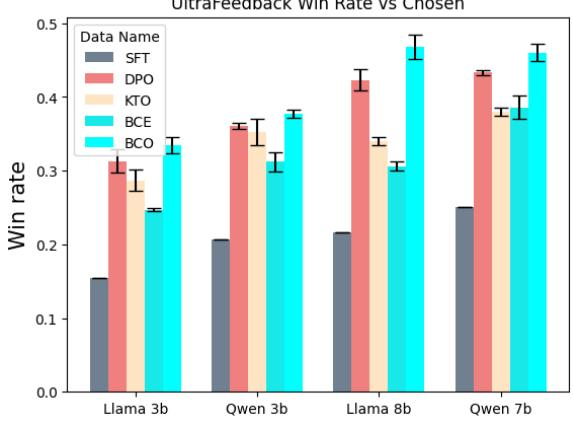
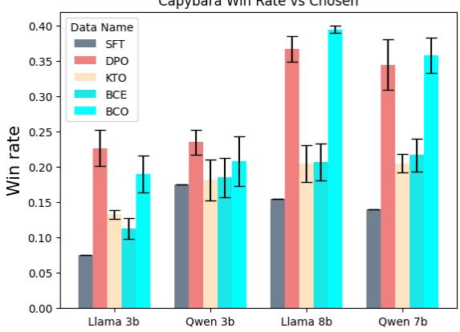
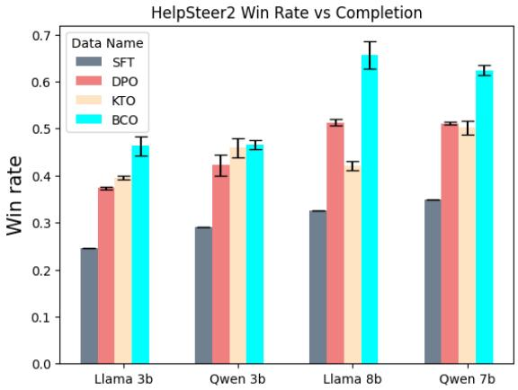
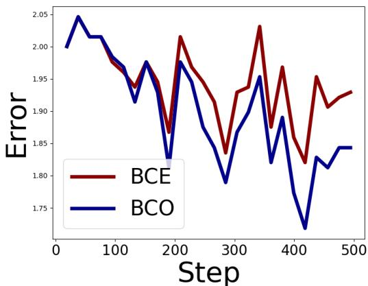
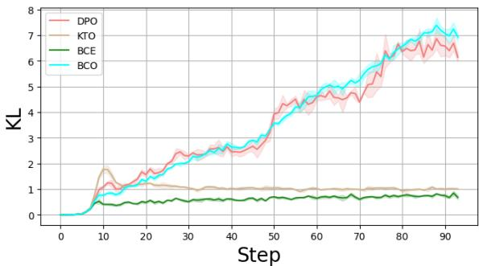
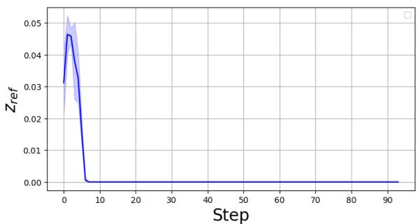
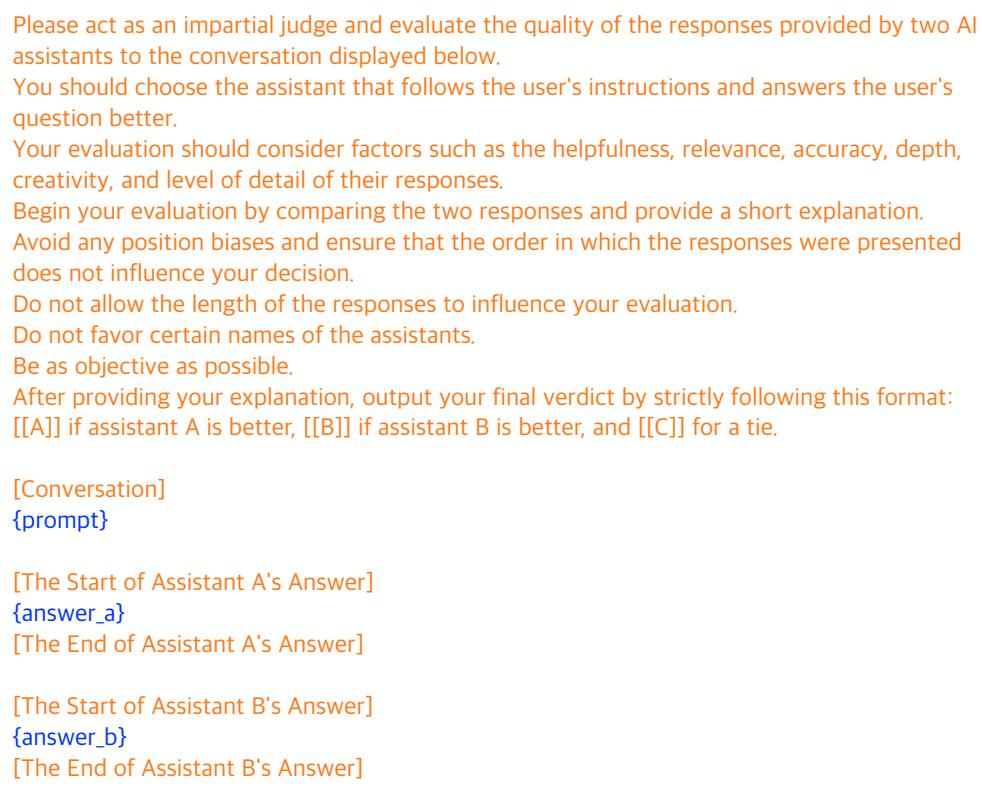

# Binary Classifier Optimization for Large Language Model Alignment

Seungjae Jung♢ Gunsoo Han♢ Daniel Wontae Nam♢ Kyoung-Woon On♣ \*

♢Kakao Corp

♣LBOX

{sean.ai, coco.upgrade, daniel.rl}@kakaocorp.com kyoungwoon.on@lbox.kr

## Abstract

In real-world services such as ChatGPT, aligning models based on user feedback is crucial for improving model performance. However, due to the simplicity and convenience of providing feedback, users typically offer only basic binary signals, such as ’thumbs-up’ or ’thumbsdown’. Most existing alignment research, on the other hand, relies on preference-based approaches that require both positive and negative responses as a pair. We propose Binary Classifier Optimization (BCO), a technique that effectively aligns LLMs using only binary feedback. BCO trains a binary classifier, where the logit serves as an implicit reward, effectively minimizing the Direct Preference Optimization (DPO) loss. We demonstrate that the binary cross-entropy loss employed in classifier training acts as an upper bound for the DPO loss. Additionally, a novel reward shift technique further minimizes the gap between the losses. We validate our methodology in two settings: first, on a paired preference dataset, where our method performs on par with DPO; and second, on a Likert-5 scale annotation dataset which stems from real users’ queries. Our model consistently demonstrates effective and robust alignment across four base LLMs and three different datasets, showcasing the strength of our approach to learning from binary signals.

## 1 Introduction

Aligning Large Language Models (LLMs) has been a crucial ingredient in the deployment of LLMs in production, as pretrained LLMs are prone to generating undesirable outputs. Ouyang et al. (2022) introduced Reinforcement Learning with Human Feedback (RLHF), that involves training a reward model based on various completions and their comparisons for a single prompt and then optimizing the LLM to maximize those rewards. Subsequently, Direct Preference Optimization (DPO) (Rafailov et al., 2023) was proposed as an alternative that circumvents the need for training a reward model by directly optimizing the model based on the preferences between chosen and rejected completions. Both RLHF and DPO have emerged as the standard choices for LLM alignment, but they still require a comparison dataset with chosen and rejected text completions, which is labor-intensive to collect.

In reality, when it comes to serving LLMs to users, it is much easier to collect binary feedback rather than comparison between two completions. Popular LLM services such as ChatGPT (OpenAI, 2022), Gemini (Pichai and Hassabis, 2023), or Claude (Anthropic, 2023) ask users for "thumbsup" or "thumbs-down" feedbacks. On the other hand, most existing alignment research relies on preference-base methodologies that require at least two responses and their relative goodness.

Counter to this trend, a recent work called Kahneman-Tversky Optimization (KTO) has been proposed (Ethayarajh et al., 2024). KTO, inspired by the Prospect Theory (Tversky and Kahneman, 1992) in economics, offers a promising approach to alignment that requires only a single completion per prompt, accompanied by a binary signal of preference, such as a "thumbs-up" or "thumbsdown". This development increases the possibility of eliminating the laborious process of comparing completions to create preference datasets, making the alignment process more agile and accessible.

Nevertheless, the theoretical connection between alignment from binary signals and DPO has not been thoroughly explored. Understanding this connection could provide opportunities to further enhance the performance of alignment from binary signals.

In this paper, we present a theoretical foundation for the efficacy of alignment from the binary signals as a binary classification problem. Our analysis reveals that training a binary classifier, where the logit serves as a reward, effectively maps {prompt, thumbs-up completion} pairs to 1 and {prompt, thumbs-down completion} pairs to 0, implicitly minimizes the DPO loss. Specifically, the binary cross-entropy (BCE) loss used in the classifier training serves as an upper bound for minimizing the DPO loss. Furthermore, we devise a novel reward shift technique that further decreases the gap between the BCE loss and the DPO loss, leading to improved alignment. Our analysis theoretically and empirically uncovers potential flaws in the reference point used in KTO that can be rectified using our reward shift technique. Integrating the reward shift technique to the BCE loss, we propose a novel framework for aligning language models using binary signals which we name Binary Classifier Optimization (BCO).

We validate our methodology in two type of datasets: paired preference dataset and realworld Likert-5 scale annotation dataset. On the paired preference datasets we demonstrate that our method surpasses KTO and performs on par with DPO. On the real-world Likert-5 scale annotation dataset, empirical results confirm the superiority of BCO over DPO and KTO across four configurations of base LLMs, including Qwen and Llama (Team, 2024; Dubey et al., 2024), in both small and medium model sizes.

## 2 Related Work

Reinforcement Learning from Human Feedback (RLHF) (Ouyang et al., 2022; Stiennon et al., 2020; Glaese et al., 2022; Ziegler et al., 2019) has garnered significant attention as a promising approach for aligning LLMs with human preferences. While RLHF is effective, it is burdensome as it requires going through three stages: supervised fine-tuning (SFT), reward modeling, and reinforcement learning (RL). The RL stage is particularly memoryintensive, as it requires loading the policy, reference, reward model, and value function into memory. The introduction of DPO (Rafailov et al., 2023) has improved the accessibility of LLM alignment by eliminating the reward modeling stage. DPO directly optimizes the policy to satisfy human preferences using a loss function derived from the Bradley-Terry (BT) model (Bradley and Terry, 1952).

One potential drawback of DPO is its susceptibility to overfitting the preference dataset. To address this issue, Identity Preference Optimization (IPO) (Azar et al., 2023) introduces a regularization term to mitigate overfitting. Rejection Sampling Optimization (Liu et al., 2023) employs rejection sampling to generate preference pairs from the estimated optimal policy. Although these methodologies share commonalities with our work, as they offer theoretical insights into the BT model and propose enhanced alignment approaches, they still depend on preference datasets, which sets them apart from our work.

To reduce the effort required to collect preference datasets, methodologies have been proposed that either let the LLM itself perform comparisons of completions (Yuan et al., 2024) or treat the LLM’s completions as rejected completions (Chen et al., 2024b) . However, none of them utilized binary signals for LLM alignment.

In contrast, KTO (Ethayarajh et al., 2024), which is inspired by prospect theory (Tversky and Kahneman, 1992), is designed to align LLMs using only thumbs-up and thumbs-down datasets without the need to construct a preference dataset. In terms of aligning LLMs from binary signals, KTO is the most similar work to ours. Unlike KTO, we theoretically demonstrate the connection between alignment from binary signals and preference optimization. Based on this, we present an effective algorithm for robust alignment in real-world scenarios. The detailed differences between our approach, BCO, and KTO are illustrated in Section 4.3.

Chen et al. (2024a) proposed Noise Contrastive Alignment (NCA), which enables alignment from explicit rewards. While NCA allows alignment from binary signals, it requires multiple completions per prompt, differing from BCO/KTO in the scope of problems it can address. The distinctions between our approach, BCO, and NCA are further elaborated in subsection 4.3.

## 3 Preliminaries

Aligning LLMs to human preference follows a widely adopted convention from Ouyang et al. (2022), consisting of three main stages: SFT, reward modelling, and RL. During SFT, given an input prompt x and an corresponding completion y from the dataset , the generation probability of y given $x \ \mathrm { i . e . } \ - \mathbb { E } _ { ( x , y ) \sim \mathcal { D } } \left[ \log p ( y | x ) \right]$ is maximized. During the reward modelling stage, a separate reward model is trained to assign appropriate scalar rewards that reflect human preference to given { prompt, completion } pairs. Finally, RL is applied to further align the model gained from SFT, which typically involves optimizing a policy using the obtained reward model.

In the RL stage, it is a common practice to incorporate a regularization term that encourages the policy to remain close to the reference model (Ziegler et al., 2019; Ouyang et al., 2022):

$$
\mathbb { E } _ { ( x , y ) \sim \mathcal { D } } \left[ r ( x , y ) \right] - \beta \mathrm { K L } ( \pi _ { \theta } ( \cdot  { \left| \begin{array} { l } { x } \end{array} \right) } | | \pi _ { \mathrm { r e f } } ( \cdot  { \left| \begin{array} { l } { x } \end{array} \right) } )\tag{1}
$$

DPO While RLHF with trained reward model has been shown to be successful, it yields challenges such as large computational burden and requires an additional training phase. DPO (Rafailov et al., 2023) demonstrated a clever solution to circumvent the challenges by showing that the policy $\pi _ { \theta }$ can be directly optimized using the preference dataset by using the reward-policy relationship derived from Equation 1. The implicit reward function can be defined as a function of the policy such that $\begin{array} { r } { r _ { \theta } ( x , y ) = \beta \log \frac { \pi _ { \theta } ( y | x ) } { \pi _ { \mathrm { r e f } } ( y | x ) } } \end{array}$ without losing generality in the theoretical foundation behind DPO. Combining the BT model with the reward model, the loss function of DPO is

$$
- \mathbb { E } _ { ( x , y _ { w } , y _ { l } ) \sim \mathcal { D } } \left[ \log \sigma \left( r _ { \theta } ( x , y _ { w } ) - r _ { \theta } ( x , y _ { l } ) \right) \right] .
$$

Here, $y _ { w }$ is a chosen completion and $y _ { l }$ is a rejected completion.

KTO Ethayarajh et al. (2024) proposed alignment framework that trains on binary signal of thumbs-up or thumbs-down of a completion per prompt. Given a dataset of { prompt, completion } pairs with respective binary signals, KTO defines a value function

$$
\begin{array} { r l } & { v _ { K T O } ( x , y ; \theta ) } \\ & { = \left\{ \begin{array} { l l } { \sigma ( r _ { \theta } ( x , y ) - z _ { \mathrm { r e f } } ) } & { \mathrm { i f ~ } y \sim y _ { \mathrm { d e s i r a b l e } } \mid x } \\ { \sigma ( z _ { \mathrm { r e f } } - r _ { \theta } ( x , y ) ) } & { \mathrm { i f ~ } y \sim y _ { \mathrm { u n d e s i r a b l e } } \mid x , } \end{array} \right. } \end{array}\tag{2}
$$

where $z _ { \mathrm { r e f } }$ is a reference point. In practice, $z _ { \mathrm { r e f } }$ is implemented as

$$
z _ { \mathrm { r e f } } = \operatorname* { m a x } \left( 0 , \frac { 1 } { | \mathcal { B } | } \sum _ { y ^ { \prime } \in \mathcal { B } \backslash y } \log \frac { \pi _ { \theta } ( y ^ { \prime } | x ) } { \pi _ { \mathrm { r e f } } ( y ^ { \prime } | x ) } \right)\tag{3}
$$

for $( x , y ) \in B$ and $\boldsymbol { B } = \{ ( \boldsymbol { x } ^ { ( i ) } , \boldsymbol { y } ^ { ( i ) } ) \} _ { i = 1 } ^ { B }$ is a batch of samples.

Finally, the loss function of KTO is defined as

$$
\mathcal { L } _ { \mathrm { K T O } } ( \boldsymbol { \theta } ) = \mathbb { E } _ { ( \boldsymbol { x } , \boldsymbol { y } ) \sim \mathcal { D } } \left[ w ( \boldsymbol { y } ) ( 1 - \boldsymbol { v } _ { \mathrm { K T O } } ( \boldsymbol { x } , \boldsymbol { y } ; \boldsymbol { \theta } ) \right]\tag{4}
$$

where the weighting factor $w ( y )$ is $\lambda _ { D }$ if $y$ is a completion from thumbs-up dataset and $\lambda _ { U }$ if y is a completion from thumbs-down dataset.

## 4 Binary Classifier Optimization

In this section, we explore the theoretical foundation that could explain the effectiveness of aligning LLMs using binary signals, which are much easier to collect than pairwise preference datasets. We propose Binary Classifier Optimization (BCO), a novel approach that achieves robust alignment from binary signals upon the theoretical foundation.

Throughout the section, we illustrate alignment process in terms of optimizing reward. It is important to note that implicit reward optimization is sufficient for alignment due to the reward-policy relationship

$$
r _ { \theta } ( x , y ) = \beta \log { \frac { \pi _ { \theta } ( y \mid x ) } { \pi _ { \mathrm { r e f } } ( y \mid x ) } }
$$

which already has been shown both theoretically and empirically in previous works (Rafailov et al., 2023; Azar et al., 2023; Ethayarajh et al., 2024; Chen et al., 2024a).

## 4.1 Theoretical Analysis

For simplicity, let’s momentarily assume that $z _ { \mathrm { r e f } }$ is 0 in Equation 2. As mentioned in section $^ 3 { \cdot }$ the DPO loss minimizes  log $\sigma ( r _ { \theta } ( x , y _ { w } )$ $r _ { \theta } ( x , y _ { l } ) )$ , while the KTO loss minimizes $- \sigma ( r _ { \theta } ( x , y _ { w } ) ) - \sigma ( - r _ { \theta } ( x , y _ { l } ) )$ . By establishing a connection between the two terms, we can bridge the gap between DPO and alignment from binary signals.

Theorem 1. For a binary classifier that assigns a reward logit, where { prompt, chosen completion } pairs are mapped to 1 and { prompt, rejected completion } pairs are mapped to 0, minimizing the binary cross-entropy loss between the true and predicted labels upper bounds the direct preference optimization loss. i.e.

$$
\begin{array} { r l } & { \mathbb { E } _ { ( x , y _ { w } , y _ { l } ) \sim \mathcal { D } } [ - \log \sigma \left( r _ { \theta } ( x , y _ { w } ) - r _ { \theta } ( x , y _ { l } ) \right) ] } \\ & { \quad < \mathbb { E } _ { ( x , y _ { w } , y _ { l } ) \sim \mathcal { D } } [ - \log \sigma ( r _ { \theta } ( x , y _ { w } ) ) ] } \\ & { \qquad + \mathbb { E } _ { ( x , y _ { w } , y _ { l } ) \sim \mathcal { D } } [ - \log \sigma \left( - r _ { \theta } ( x , y _ { l } ) \right) ] } \end{array}
$$

To prove the above theorem, we prove the lemma below.

Lemma 2. The log of sigmoid of a sum exceeds the sum ofthe logs ofthe sigmoids. i.e. log $\sigma ( x + y ) >$ log $\sigma ( x ) + \log \sigma ( y )$ for all x, $y \in \mathbb { R }$

See subsection A.1 for the proof. Simply applying Lemma 2 and linearity of expectation concludes the proof of Theorem 1.

$$
\begin{array} { r l } & { \mathbb { E } _ { ( x , y _ { w } , y _ { l } ) \sim \mathcal { D } } [ - \log \sigma \left( r _ { \theta } ( x , y _ { w } ) - r _ { \theta } ( x , y _ { l } ) \right) ] } \\ & { \quad < \mathbb { E } _ { ( x , y _ { w } , y _ { l } ) \sim \mathcal { D } } [ - \log \sigma ( r _ { \theta } ( x , y _ { w } ) ) } \\ & { \qquad - \log \sigma ( - r _ { \theta } ( x , y _ { l } ) ) ] } \end{array}\tag{5}
$$

(6)

Equation 6 is the binary cross-entropy (BCE) loss, where the logit of the binary classifier is the reward implicitly defined by the policy and reference models. Since the BCE loss serves an upper bound of the DPO loss, LLM alignment can be performed using only binary signals.

According to Equation 9 in subsection A.1, the tightness of the BCE loss as a bound for the DPO loss depends on the error term $e ^ { - x } + e ^ { - y }$ where $x = r _ { \theta } ( x , y _ { w } )$ and $y = - r _ { \theta } ( x , y _ { l } )$ . As training progresses and the BCE loss is minimized, the magnitude of $r _ { \theta } ( x , y _ { w } )$ increases while the magnitude of $r _ { \theta } ( x , y _ { l } )$ decreases, leading to decrease of the error term. Consequently, the BCE loss becomes a tighter bound for the DPO loss. Empirical evidence presented in section 5 demonstrates that, despite the presence of an error term, alignment progresses solely with the BCE loss.

## 4.2 Reward Shift

We further minimize the error term $e ^ { - r _ { \theta } ( x , y _ { w } ) } +$ $e ^ { r _ { \theta } ( x , y _ { l } ) }$ by reward shift.

Consider the case where the reward is shifted by δ in Equation 5. That says,

$$
\begin{array} { r l } & { \mathbb { E } _ { ( x , y _ { w } , y _ { l } ) \sim \mathcal { D } } \big [ - \log \sigma ( r _ { \theta } ( x , y _ { w } ) - \delta ) } \\ & { \qquad - \log \sigma ( - ( r _ { \theta } ( x , y _ { l } ) - \delta ) ) \big ] } \end{array}
$$

The binary cross-entropy loss still holds as an upper bound of the DPO loss.

Theorem 3. Binary cross entropy is an upper bound of Direct Preference Optimization loss even ifthe reward is shifted by a constant δ. i.e.

$$
\begin{array} { r l } & { \mathbb { E } _ { ( x , y _ { w } , y _ { l } ) \sim \mathcal { D } } [ - \log \sigma \left( r _ { \theta } ( x , y _ { w } ) - r _ { \theta } ( x , y _ { l } ) \right) ] } \\ & { \quad < \mathbb { E } _ { ( x , y _ { w } , y _ { l } ) \sim \mathcal { D } } [ - \log \sigma ( r _ { \theta } ( x , y _ { w } ) - \delta ) } \\ & { \qquad - \log \sigma ( - ( r _ { \theta } ( x , y _ { l } ) - \delta ) ) ] } \end{array}
$$

See subsection A.2 for the proof. Expanding the inside of the expectation as in the proof of Lemma 2 in subsection A.1, we get the error term

$$
e ^ { - ( r _ { \theta } ( x , y _ { w } ) - \delta ) } + e ^ { r _ { \theta } ( x , y _ { l } ) - \delta }
$$

Setting appropriate $\delta$ minimizes the error term, leading to closer gap between the BCE loss and the DPO loss.

Theorem 4. The minimum of the error term $e ^ { - ( r _ { \theta } ( x , y _ { w } ) - \delta ) } + e ^ { r _ { \theta } ( x , y _ { l } ) - \delta }$ can be achieved when $\delta = ( r _ { \theta } ( x , y _ { w } ) + r _ { \theta } ( x , y _ { l } ) ) / 2$

See subsection A.3 for the proof. Hence, for alignment using binary signals, we define δ as follows:

$$
\delta = \frac { \mathbb { E } _ { ( x , y ) \sim \mathcal { D } ^ { + } } [ r _ { \theta } ( x , y ) ] + \mathbb { E } _ { ( x , y ) \sim \mathcal { D } ^ { - } } [ r _ { \theta } ( x , y ) ] } { 2 }\tag{7}
$$

Here, $\mathcal { D } ^ { + }$ and $\mathcal { D } ^ { - }$ denote thumbs-up and thumbsdown datasets of prompt-completion pairs respectively. Consequently, the BCO loss for a binary signal dataset can be expressed as:

$$
\begin{array} { r l } & { \mathbb { E } _ { ( x , y _ { w } , y _ { l } ) \sim \mathcal { D } ^ { + } } [ - \log \sigma ( r _ { \theta } ( x , y _ { w } ) - \delta ) ] } \\ & { \qquad + \mathbb { E } _ { ( x , y _ { w } , y _ { l } ) \sim \mathcal { D } ^ { - } } [ - \log \sigma ( - ( r _ { \theta } ( x , y _ { l } ) - \delta ) ) ] } \end{array}\tag{8}
$$

To enhance training stability, we utilize an exponential moving average when computing δ. The efficacy of this reward shift approach is empirically demonstrated in section 5.

## 4.3 Distinctions from Prior Works

So far, we delved into the connection between BCO and DPO, demonstrating BCO’s applicability to alignment from binary signal scenarios. This subsection delineates the key distinctions between BCO and variants of DPO.

KTO is the first DPO variant we will contrast with BCO. Both algorithms are quite similar in that they enable alignment from binary signals, meaning they can learn even when only one completion is provided for a single prompt along with user feedback. However, despite the similarity, there are two critical distinctions between the two algorithms.

While BCO objective in Equation 8 optimizes the logsigmoid, KTO objective in Equation 4 optimizes the sigmoid. This distinction becomes more apparent when differentiating the objectives. For simplicity of analysis, assume $z _ { r e f }$ and $\delta$ are both zero.

$$
\begin{array} { r l } & { \nabla _ { \theta } \mathcal { L } _ { \mathrm { B C O } } = \mathbb { E } _ { \boldsymbol { x } , \boldsymbol { y } \sim \mathcal { D } } [ \sigma ( - { r _ { \theta } } ) \nabla _ { \theta } \beta \log \pi _ { \theta } ( \boldsymbol { y } \mid \boldsymbol { x } ) ] } \\ & { \nabla _ { \theta } \mathcal { L } _ { \mathrm { K T O } } = \mathbb { E } _ { \boldsymbol { x } , \boldsymbol { y } \sim \mathcal { D } } [ \sigma ( { r _ { \theta } } ) \sigma ( - { r _ { \theta } } ) \nabla _ { \theta } \beta \log \pi _ { \theta } ( \boldsymbol { y } \mid \boldsymbol { x } ) ] } \end{array}
$$

Here, $r _ { \theta } = r _ { \theta } ( x , y )$ . For brevity, we derive the gradients for the case where $y \sim$ ydesirable. The difference between the gradients of the two algorithms depends on the presence of the sigmoid term $\sigma ( r _ { \theta } ( x , y ) )$ . In $\mathrm { K T O } , \sigma ( r _ { \theta } ( x , y ) )$ causes samples $( x , y )$ with low rewards to be learned less, whereas BCO does not vanish the gradients for such lowreward samples. A similar analysis can be con-ducted for y ∼ yundesirable, where BCO better pre- serves the gradients for high-reward $( x , y )$ samples. In brief, BCO should be employed if one wishes to treat all data samples equitably.

BCO and KTO also differ in their reward shifting approach. BCO takes the average implicit reward of $( x , y )$ as the reference point, while KTO adopts the average reward of $( x , y ^ { \prime } )$ , where $y ^ { \prime }$ is a unrelated completion of $x ,$ as the reference point. Notably, KTO’s reference point is clipped at zero to ensure it remains positive. Ultimately, this zero clipping hinders seamless model training. According to the KTO loss, for $y \sim y _ { \mathrm { d e s i r a b l e } }$ , the implicit reward is increased relative to the reference point, and for y  yundesirable, it is decreased relative to the reference point. Consequently, the average implicit reward remains anchored at the reference point. However, as pointed out by Rafailov et al. (2024), the average implicit reward is equivalent $\mathrm { \Delta t o \_ } \mathrm { \beta \to \mathcal { B } K L } ( \pi _ { \mathrm { r e f } } ( \cdot  { \vert } \ x ) \| \pi _ { \theta } ( \cdot  { \vert } \ x ) ) \enspace \mathrm { \Omega } ^ { \mathrm { \scriptscriptstyle ~ } }$ 1, which needs to decrease. Otherwise, πθ stay too close to $\pi _ { \mathrm { r e f } }$ and will not effective learn from preference data. Therefore, KTO’s reference point zero clipping obstructs training, as elaborated in subsection 5.5. In contrast, BCO avoids this issue by setting the reference point as the average implicit reward without artificial clipping.

The second DPO variant to contrast with BCO is NCA (Chen et al., 2024a). When learning from a preference dataset, NCA’s loss takes the following form:

$$
- \log \sigma ( r _ { \theta } ( x , y _ { w } ) ) - \frac { 1 } { 2 } \sum _ { y \in \{ y w , y l \} } \log \sigma ( r _ { \theta } ( x , y ) )
$$

The presence of log $\sigma ( r _ { \theta } ( x , y ) )$ in the loss bears similarity to BCO’s loss. However, as evident from the latter term of the objective, computing the partition function is required, necessitating multiple completions for a given prompt. Consequently, direct alignment from user feedback is infeasible, limiting the scope of problems NCA can address compared to BCO.

## 5 Experiments

In this section, we compare BCO with offline preference tuning methods. 2 To investigate the effect of reward shift, we augment the compared methods with BCE, where δ is set to 0 in the BCO objective in Equation 8. We aim to answer three key research questions: 1) Does the simple BCE loss fuses alignment capability to LLMs? 2) Does the proposed reward shift technique contribute to the alignment process? 3) What is the advantage of BCO over DPO?

## 5.1 Experimental Setup

Dataset We utilize three publicly available preference datasets: UltraFeedback3 (Cui et al., 2023), Capybara4 (Daniele and Suphavadeeprasit, 2023), and HelpSteer2 (Wang et al., 2024). UltraFeedback and Capybara provide sets of chosen and rejected responses for each prompt. The HelpSteer2 dataset includes prompts, completions, and various metrics, such as a helpfulness score. Each prompt is associated with two alternative completions, enabling its conversion into a paired preference dataset.

Model Our experiments involve four model classes: Llama-3.2-3B, Llama-3.1-8B (Dubey et al., 2024), Qwen2.5-3B, and Qwen2.5-7B (Team, 2024). Unless specified otherwise, we initially conduct Supervised Fine-Tuning (SFT) using the respective datasets. The chosen response is used as the SFT target as it is recommended by Rafailov et al. (2023). Detailed training specifications are available in Appendix C. We maintain consistent hyperparameters across all experiments, with the exception of the number of training epochs. Furthermore, for all experiments evaluating win rate, gpt-4o-2024-08-06 serves as the evaluation judge.

## 5.2 Experiments on the Preference Dataset

As illustrated in Figure 1, the performance of KTO surpasses that of SFT, yet it generally falls short of DPO across most configurations. Similarly, employing a basic BCE loss results in diminished performance when compared to DPO. Nonetheless, it is important to note that the simple BCE loss consistently outperforms the SFT model in all instances, suggesting that BCE loss contributes to enhancing the alignment capability of LLMs. On the other hand, we observe a notable improvement in performance when applying reward shift compared to BCE. This enhancement, coupled with a reduction in error terms, empirically underscores the beneficial impact of reward shifts, as outlined in subsection 4.2. In most scenarios, BCO achieves performance levels comparable to DPO. While BCO shows superior outcomes over DPO in training models such as Llama-3.1-8B and Qwen2.5-7B with the UltraFeedback dataset, the discrepancy in their performance is not statistically significant.

  
(a) UltraFeedback

Capybara Win Rate vs Chosen  
  
(b) Capybara  
Figure 1: Win rates computed by GPT-4o on Ultra-Feedback and Capybara datasets. The win rates are calculated against chosen completions in the test set. Depicted mean and standard deviation of the win rates are obtained from three different random seeds.

## 5.3 Experiments on the Likert-5 Scale Dataset

To demonstrate the superiority of BCO over DPO, we present experimental results using a dataset with Likert-5 scale feedback. We select the Help-Steer2 dataset (Wang et al., 2024) for alignment purposes for two main reasons. First, its reward model, trained using the Llama-3-70B base model (Dubey et al., 2024), demonstrated exceptional performance in the RewardBench benchmark (Lambert et al., 2024). Second, the dataset closely resembles real-world data, as most of its prompts originate from ShareGPT (RyokoAI, 2023). To facilitate DPO training, we transformed the Help-Steer2 training set into a preference dataset following the methodology outlined by (Wang et al., 2024). In the HelpSteer2 dataset, each prompt is paired with two completions that are assigned helpfulness scores. The response with the higher helpfulness score is designated as the preferred choice, while the other is considered as the rejected response. Pairs with identical helpfulness scores were excluded from this process.

  
Figure 2: Win rates computed by GPT-4o for Help-Steer2 dataset. The win rates are calculated against completions in the test set. Depicted mean and standard deviation of the win rates are obtained from three different random seeds.

To facilitate the training for both BCO and KTO, we convert HelpSteer2 dataset into a binary signal dataset. In this conversion, a helpfulness score of 4 is mapped to a thumbs-up, while scores of 3 or below are mapped to a thumbs-down. To ensure a fair comparison with DPO, only the prompts used in DPO training are included in the binary signal dataset. See Table 3 for statistics after processing and Appendix E for the generated response of each methodology.

As shown in Figure 2, KTO outperforms DPO only in small-sized models. In contrast, BCO outperforms DPO across all models. In summary, Figure 2 illustrates that, for the purpose of model alignment, converting a Likert-5 scale dataset directly into a binary signal dataset is not only feasible but may also yield superior performance.

## 5.4 Evaluation on Chat Benchmarks

To further validate the superiority of BCO on well-known alignment benchmarks, we measure the MT Bench (Zheng et al., 2023), AlpacaEval 2.0 Length Controlled (LC) (Dubois et al., 2024), and Arena-Hard (Li et al., 2024) scores of models. All models are trained using Help-Steer2 dataset. Table 1 presents the benchmark performance results after applying alignment methods, using Llama-3.1-8B-Instruct and Qwen2.5-7B-Instruct as the reference models.

Except for the AlpacaEval 2.0 LC performance, BCO outperforms other methodologies. For AlpacaEval 2.0 LC performance, we observe that only IPO clearly outperforms BCO. Additionally, it is encouraging that, in the Arena-Hard benchmark, BCO demonstrates superior performance despite having a generated token length similar to that of DPO.

## 5.5 Effect of Reward Shift

  
Figure 3: Error term values per step on the Ultra-Feedback dataset are presented. These values are derived from the training of the SFT variant of the Llama-3.2-3B model. Note that the only difference between BCE and BCO is the existence of δ in Equation 7.

As described in subsection 4.2, appropriately adjusting the reward shift decreases the error term resulting with a tighter bound on the DPO loss. In order to empirically show the effect of reward shift on the error term, we record the change in the error term yielded by BCE and BCO as the learning progresses in Figure 3. The figure shows that, with our choice of reward shift, BCO achieves smaller error term compared to BCE, where the reward shift $\delta = 0$

(a) KL by step of alignment methods  
  
(b) ${ z _ { \mathrm { r e f } } }$ by step in KTO  
Figure 4: (a) Approximate KL divergence of different algorithms measured using log ratios. The plot shows BCO and DPO reaching a relatively high similar KL values while KTO and BCE similarly converging to relatively low KL values. (b) Progress of reference point $z _ { \mathrm { r e f } }$ in KTO training. The values are taken from Llama-3.1-8B training on Capybara dataset. We observed that $z _ { \mathrm { r e f } }$ consistently collapses to zero.

We also compare the effect of reward shift on the KL divergence between the resulting models and the reference model. Using the relationship between the expected log ratio and the KL divergence (Rafailov et al., 2024), we plot $\mathbf { K L } ( \pi _ { \operatorname { r e f } } \lVert \pi _ { \theta } )$ of BCO and BCE in Figure 4a. The figure shows that while BCE converges at a relatively small KL divergence, BCO is able to match the KL divergence reached by DPO.

Gathering the empirical observations, we conjecture that appropriate reward shift minimizes the error term and the resulting model further assimilates that of DPO. On the other hand, in the absence of the reward shift, the model converges to a point much closer to the reference model. The performance relative to the KL divergence is then conveyed by the significant performance gap between BCE and BCO in Figure 1a.

A similar observation can be made for KTO as well. First, we show the behavior of $z _ { \mathrm { r e f } }$ of KTO during the learning process in Figure 4b. The plot displays $z _ { \mathrm { r e f } }$ collapsing to 0 at early stage of the training. When $z _ { \mathrm { r e f } } = 0 ,$ , as discussed in subsection 4.3, the only difference between KTO and BCE is the existence of sigmoid term $\sigma ( r _ { \theta } )$ in their gradients. This leads a possible connection between KTO and BCE and their similarities in performance shown in Figure 1 and Figure 2.

<table><tr><td rowspan=1 colspan=1></td><td rowspan=1 colspan=1>MT Bench</td><td rowspan=1 colspan=1>AlpacaEval</td><td rowspan=1 colspan=3>Arena-Hard</td><td rowspan=1 colspan=1>Length</td></tr><tr><td rowspan=5 colspan=1>Llama-3.1-8B-Instruct+ DPO (Rafailov et al., 2023)+ IPO (Azar et al., 2023)+ KTO (Ethayarajh et al., 2024)+ NCA (Chen et al., 2024a)+ BCO (Ours)</td><td rowspan=1 colspan=1>8.28</td><td rowspan=1 colspan=1>20.9</td><td rowspan=1 colspan=3>26.86 (-2.0, 2.0)</td><td rowspan=1 colspan=1>830</td></tr><tr><td rowspan=1 colspan=1> $8 . 1 7 \pm 0 . 1 0$ </td><td rowspan=1 colspan=1> $2 5 . 9 9 \pm 0 . 4 8$ </td><td rowspan=1 colspan=3>29.50 (-2.3, 1.9)</td><td rowspan=1 colspan=1>746</td></tr><tr><td rowspan=3 colspan=1> $8 . 1 9 \pm 0 . 0 5$  $8 . 2 4 \pm 0 . 1 0$  ${ \bf 8 . 3 2 \pm 0 . 1 4 }$  ${ \bf 8 . 3 2 \pm 0 . 1 0 }$ </td><td rowspan=3 colspan=1> ${ \bf 3 0 . 3 1 \pm 0 . 7 5 }$  $2 3 . 4 2 \pm 0 . 8 1$  $2 5 . 6 3 \pm 0 . 1 8$  $2 8 . 6 1 \pm 0 . 2 1$ </td><td rowspan=2 colspan=3>20.39 (-1.9, 1.9)27.81 (-1.8, 2.1)</td><td rowspan=1 colspan=1>432</td></tr><tr><td rowspan=2 colspan=1>707728762</td></tr><tr><td rowspan=1 colspan=3>29.64 (-2.3, 2.0)31.37 (-2.1, 2.2)</td><td rowspan=1 colspan=2></td></tr><tr><td rowspan=3 colspan=1>Qwen2.5-7B-Instruct+ DPO</td><td rowspan=1 colspan=1>8.43</td><td rowspan=4 colspan=1>31.43 $3 0 . 9 5 \pm 1 . 2 8$  ${ \bf 3 2 . 9 7 \pm 1 . 4 7 }$  $2 8 . 2 5 \pm 0 . 6 8$ </td><td rowspan=2 colspan=3>47.73 (-2.4, 2.3)</td><td rowspan=3 colspan=1>776772636</td></tr><tr><td rowspan=1 colspan=1> $8 . 4 0 \pm 0 . 1 0$ </td><td rowspan=1 colspan=2>47.82 (-2.5, 2.5)</td></tr><tr><td rowspan=2 colspan=1>+ KTO</td><td rowspan=1 colspan=1> $8 . 4 8 \pm 0 . 1 4$ </td><td rowspan=1 colspan=3>50.18 (-2.6, 2.3)</td></tr><tr><td rowspan=1 colspan=1> $8 . 3 0 \pm 0 . 0 7$ </td><td rowspan=1 colspan=3>47.76 (-1.9, 2.6)</td><td rowspan=1 colspan=1>775</td></tr><tr><td rowspan=1 colspan=1>+NCA</td><td rowspan=1 colspan=1> $8 . 4 5 \pm 0 . 1 6$ </td><td rowspan=1 colspan=1> $3 0 . 2 4 \pm 0 . 7 0$ </td><td rowspan=1 colspan=3>48.98 (-2.7, 2.3)</td><td rowspan=1 colspan=1>791</td></tr><tr><td rowspan=1 colspan=1>+ BCO (Ours)</td><td rowspan=1 colspan=1> ${ \bf 8 . 5 9 \pm 0 . 0 4 }$ </td><td rowspan=1 colspan=1> $3 0 . 5 4 \pm 0 . 5 3$ </td><td rowspan=1 colspan=3>50.60 (-2.1, 2.2)</td><td rowspan=1 colspan=1>754</td></tr></table>

Table 1: Alignment benchmark results for models are presented. The alignment training is conducted on the Llama-3.1-8B-Instruct and Qwen2.5-7B-Instruct models. All models are trained using HelpSteer2 dataset. For the MT Bench and AlpacaEval 2.0 Length Controlled, the mean and standard deviations across three different random seeds are reported. For the reference models, we conduct only a single evaluation, so the standard deviations are set to zero. For the Arena-Hard benchmark, the win rate against the GPT-4-0314 model, along with the confidence intervals, is provided. The length column indicates the average number of tokens generated in the Arena-Hard benchmark.

Additionally, we measure the average length of generated completions for each method. As detailed in Table 2, we observe a consistent pattern where the generated token lengths for DPO and BCO are similar to each other, while KTO and BCE also exhibit comparable token lengths.

## 6 Conclusion

This paper presents a theoretical foundation for aligning Large Language Models (LLMs) using readily available binary feedback, such as "thumbsup" or "thumbs-down". We demonstrate that training a binary classifier implicitly minimizes the Direct Preference Optimization (DPO) loss by mapping desirable outputs to positive labels and undesirable outputs to negative labels. The binary cross-entropy (BCE) loss used in classifier training acts as an upper bound for minimizing DPO loss, and our proposed reward shift technique further reduces this discrepancy, resulting in stronger alignment. Our theoretical analyses connects DPO and alignment from binary signal and reveals KTO’s potential flaw in choosing a reference point.

<table><tr><td rowspan=1 colspan=1></td><td rowspan=1 colspan=1></td><td rowspan=1 colspan=1>UltraFeedback</td><td rowspan=1 colspan=1>Capybara</td></tr><tr><td rowspan=4 colspan=1>Llama</td><td rowspan=4 colspan=1>DPOKTOBCEBCO</td><td rowspan=1 colspan=1> $3 2 6 . 3 \pm 0 . 7$ </td><td rowspan=1 colspan=1> $\overline { { 3 8 7 . 3 \pm 1 0 . 7 } }$ </td></tr><tr><td rowspan=2 colspan=1> $2 9 8 . 2 \pm 3 . 5$  $2 8 2 . 6 \pm 4 . 5$ </td><td rowspan=1 colspan=1> $3 2 2 . 6 \pm 5 . 3 0$ </td></tr><tr><td rowspan=1 colspan=1> $3 2 4 . 1 \pm 5 . 4 0$ </td></tr><tr><td rowspan=1 colspan=1> $3 3 3 . 1 \pm 4 . 0$ </td><td rowspan=1 colspan=1> $4 1 7 . 3 \pm 1 5 . 5$ </td></tr><tr><td rowspan=4 colspan=1>Qwen</td><td rowspan=1 colspan=1>DPO</td><td rowspan=1 colspan=1> $3 2 5 . 1 \pm 2 . 2$ </td><td rowspan=1 colspan=1> $\overline { { 3 7 5 . 2 \pm 4 . 5 0 } }$ </td></tr><tr><td rowspan=2 colspan=1>KTOBCE</td><td rowspan=1 colspan=1> $3 1 7 . 1 \pm 2 . 8$ </td><td rowspan=1 colspan=1> $3 4 4 . 9 \pm 5 . 0 0$ </td></tr><tr><td rowspan=1 colspan=1> $3 1 0 . 2 \pm { 3 . 5 }$ </td><td rowspan=1 colspan=1> $3 3 0 . 5 \pm 9 . 0 0$ </td></tr><tr><td rowspan=1 colspan=1>BCO</td><td rowspan=1 colspan=1> $3 3 6 . 8 \pm 2 . 4$ </td><td rowspan=1 colspan=1> $3 9 8 . 0 \pm 1 0 . 8$ </td></tr></table>

Table 2: Token lengths of generated completions of Llama-3.2-3B and Qwen2.5-3B on UltraFeedback and Capybara datasets. Mean and standard deviations are shown. The number of generated tokens is approximately proportional to the performance of the model, as illustrated in Figure 1. The generated token lengths for DPO and BCO are similar to each other, while KTO and BCE also exhibit comparable token lengths.

Building on these insights, we introduce Binary Classifier Optimization (BCO) as a novel framework for aligning LLMs using binary feedback. BCO’s efficacy is validated through empirical results on paired preference datasets and real-world Likert-5 scale annotation datasets. Our experiments demonstrate that BCO outperforms KTO and performs competitively with DPO on paired preference datasets. Notably, on real-world data, BCO consistently surpasses both DPO and KTO across various LLM configurations, including Qwen and Llama, showcasing its robustness and applicability. This binary classifier perspective on alignment offers a potential complement to preference-based alignment and could contribute to a deeper understanding of multi-stage preference tuning, paving the way for future advancements in AI alignment.

## 7 Limitation

The primary limitation of this research is the absence of real-world benchmarks utilizing binary annotations. Practical evaluations, essential for demonstrating the utility of the proposed approach in real-world applications, are therefore limited. Although binary feedback collection is easier and more natural compared to gathering pairwise preference data, particularly in real-world services such as ChatGPT or Claude, the lack of such benchmarks restricts the thoroughness of our evaluations.

Second, this research direction is still under development, with relatively few algorithms proposed to address the challenges in this field. Consequently, it is difficult to conduct comprehensive analyses across different approaches, further limiting the scope of evaluation.

From an algorithmic perspective, the proposed method focuses on optimizing the upper bound of the Direct Preference Optimization (DPO) loss function which introduces a gap between the optimized upper bound and the actual DPO loss. Minimizing an upper bound does not always equate to minimizing the original objective function, potentially leading to unintended effects on the model’s generalization and robustness. Further investigation is needed to understand the impact of this gap on practical model performance.

Lastly, the algorithm relies on binary feedback, limiting its ability to fully utilize the rich comparative information available in preference datasets. Preference data offers nuanced insights through pairwise comparisons, but the algorithm only captures binary positive/negative signals, leading to incomplete utilization of available information. This limitation could result in suboptimal performance in tasks aimed at optimizing preference datasets.

## Acknowledgments

We thank Jiyeon Ham, Changmin Lee, Daejin Jo and Hyunwoong Ko for helpful and constructive feedback.

## References

Anthropic. 2023. Introducing claude.

Mohammad Gheshlaghi Azar, Mark Rowland, Bilal Piot, Daniel Guo, Daniele Calandriello, Michal Valko, and Rémi Munos. 2023. A general theoretical paradigm to understand learning from human preferences. ArXiv, abs/2310.12036.

Ralph Allan Bradley and Milton E Terry. 1952. Rank analysis of incomplete block designs: I. the method of paired comparisons. Biometrika, 39(3/4):324– 345.

Huayu Chen, Guande He, Lifan Yuan, Ganqu Cui, Hang Su, and Jun Zhu. 2024a. Noise contrastive alignment of language models with explicit rewards. In The Thirty-eighth Annual Conference on Neural Information Processing Systems.

Zixiang Chen, Yihe Deng, Huizhuo Yuan, Kaixuan Ji, and Quanquan Gu. 2024b. Self-play fine-tuning converts weak language models to strong language models. ArXiv, abs/2401.01335.

Ganqu Cui, Lifan Yuan, Ning Ding, Guanming Yao, Wei Zhu, Yuan Ni, Guotong Xie, Zhiyuan Liu, and Maosong Sun. 2023. Ultrafeedback: Boosting language models with high-quality feedback. ArXiv, abs/2310.01377.

Luigi Daniele and Suphavadeeprasit. 2023. Amplifyinstruct: Synthetically generated diverse multi-turn conversations for efficient llm training. arXiv preprint arXiv:(coming soon).

Tri Dao. 2024. FlashAttention-2: Faster attention with better parallelism and work partitioning. In International Conference on Learning Representations (ICLR).

Abhimanyu Dubey, Abhinav Jauhri, Abhinav Pandey, Abhishek Kadian, Ahmad Al-Dahle, Aiesha Letman, Akhil Mathur, Alan Schelten, Amy Yang, Angela Fan, et al. 2024. The llama 3 herd of models. arXiv preprint arXiv:2407.21783.

Yann Dubois, Percy Liang, and Tatsunori Hashimoto. 2024. Length-controlled alpacaeval: A simple debiasing of automatic evaluators. In First Conference on Language Modeling.

Kawin Ethayarajh, Winnie Xu, Niklas Muennighoff, Dan Jurafsky, and Douwe Kiela. 2024. Model alignment as prospect theoretic optimization. In Forty-first International Conference on Machine Learning.

Amelia Glaese, Nathan McAleese, Maja Trkebacz, John Aslanides, Vlad Firoiu, Timo Ewalds, Maribeth Rauh, Laura Weidinger, Martin Chadwick, Phoebe Thacker, Lucy Campbell-Gillingham, Jonathan Uesato, Po-Sen Huang, Ramona Comanescu, Fan Yang, A. See, Sumanth Dathathri, Rory Greig, Charlie Chen, Doug Fritz, Jaume Sanchez Elias, Richard Green, Sovna Mokr’a, Nicholas Fernando, Boxi Wu, Rachel Foley, Susannah Young, Iason Gabriel, William S. Isaac, John F. J. Mellor, Demis Hassabis, Koray Kavukcuoglu, Lisa Anne Hendricks, and Geoffrey Irving. 2022. Improving alignment of dialogue agents via targeted human judgements. ArXiv, abs/2209.14375.

Nathan Lambert, Valentina Pyatkin, Jacob Morrison, LJ Miranda, Bill Yuchen Lin, Khyathi Chandu, Nouha Dziri, Sachin Kumar, Tom Zick, Yejin Choi, Noah A. Smith, and Hannaneh Hajishirzi. 2024. Rewardbench: Evaluating reward models for language modeling. Preprint, arXiv:2403.13787.

Tianle Li, Wei-Lin Chiang, Evan Frick, Lisa Dunlap, Tianhao Wu, Banghua Zhu, Joseph E. Gonzalez, and Ion Stoica. 2024. From crowdsourced data to highquality benchmarks: Arena-hard and benchbuilder pipeline. Preprint, arXiv:2406.11939.

Tianqi Liu, Yao Zhao, Rishabh Joshi, Misha Khalman, Mohammad Saleh, Peter J. Liu, and Jialu Liu. 2023. Statistical rejection sampling improves preference optimization. ArXiv, abs/2309.06657.

Ilya Loshchilov and Frank Hutter. 2017. Decoupled weight decay regularization. In International Conference on Learning Representations.

OpenAI. 2022. Introducing chatgpt.

Long Ouyang, Jeffrey Wu, Xu Jiang, Diogo Almeida, Carroll Wainwright, Pamela Mishkin, Chong Zhang, Sandhini Agarwal, Katarina Slama, Alex Gray, John Schulman, Jacob Hilton, Fraser Kelton, Luke Miller, Maddie Simens, Amanda Askell, Peter Welinder, Paul Christiano, Jan Leike, and Ryan Lowe. 2022. Training language models to follow instructions with human feedback. In Advances in Neural Information Processing Systems.

Sundar Pichai and Demis Hassabis. 2023. Introducing gemini: our largest and most capable ai model.

Rafael Rafailov, Joey Hejna, Ryan Park, and Chelsea Finn. 2024. From \$r\$ to \$q^\*\$: Your language model is secretly a q-function. In First Conference on Language Modeling.

Rafael Rafailov, Archit Sharma, Eric Mitchell, Christopher D Manning, Stefano Ermon, and Chelsea Finn. 2023. Direct preference optimization: Your language model is secretly a reward model. In Thirty-seventh Conference on Neural Information Processing Systems.

RyokoAI. 2023. Ryokoai/sharegpt52k.

John Schulman, Filip Wolski, Prafulla Dhariwal, Alec Radford, and Oleg Klimov. 2017. Proximal policy optimization algorithms. ArXiv, abs/1707.06347.

Nisan Stiennon, Long Ouyang, Jeffrey Wu, Daniel Ziegler, Ryan Lowe, Chelsea Voss, Alec Radford, Dario Amodei, and Paul F Christiano. 2020. Learning to summarize with human feedback. Advances in Neural Information Processing Systems, 33:3008– 3021.

Yunhao Tang, Daniel Zhaohan Guo, Zeyu Zheng, Daniele Calandriello, Yuan Cao, Eugene Tarassov, Rémi Munos, Bernardo Ávila Pires, Michal Valko, Yong Cheng, et al. 2024. Understanding the performance gap between online and offline alignment algorithms. arXiv preprint arXiv:2405.08448.

Qwen Team. 2024. Qwen2.5: A party of foundation models.

Amos Tversky and Daniel Kahneman. 1992. Advances in prospect theory: Cumulative representation of uncertainty. Journal of Risk and uncertainty, 5:297– 323.

Leandro von Werra, Younes Belkada, Lewis Tunstall, Edward Beeching, Tristan Thrush, Nathan Lambert, and Shengyi Huang. 2020. Trl: Transformer reinforcement learning. https://github. com/huggingface/trl.

Zhilin Wang, Yi Dong, Olivier Delalleau, Jiaqi Zeng, Gerald Shen, Daniel Egert, Jimmy J. Zhang, Makesh Narsimhan Sreedhar, and Oleksii Kuchaiev. 2024. Helpsteer2: Open-source dataset for training top-performing reward models. Preprint, arXiv:2406.08673.

Shusheng Xu, Wei Fu, Jiaxuan Gao, Wenjie Ye, Weilin Liu, Zhiyu Mei, Guangju Wang, Chao Yu, and Yi Wu. 2024. Is DPO superior to PPO for LLM alignment? a comprehensive study. In Forty-first International Conference on Machine Learning.

Weizhe Yuan, Richard Yuanzhe Pang, Kyunghyun Cho, Sainbayar Sukhbaatar, Jing Xu, and Jason Weston. 2024. Self-rewarding language models. ArXiv, abs/2401.10020.

Lianmin Zheng, Wei-Lin Chiang, Ying Sheng, Siyuan Zhuang, Zhanghao Wu, Yonghao Zhuang, Zi Lin, Zhuohan Li, Dacheng Li, Eric Xing, Hao Zhang, Joseph E Gonzalez, and Ion Stoica. 2023. Judging llm-as-a-judge with mt-bench and chatbot arena. In Advances in Neural Information Processing Systems, volume 36, pages 46595–46623. Curran Associates, Inc.

Daniel M. Ziegler, Nisan Stiennon, Jeff Wu, Tom B. Brown, Alec Radford, Dario Amodei, Paul Christiano, and Geoffrey Irving. 2019. Fine-tuning language models from human preferences. ArXiv, abs/1909.08593.

## A Proofs

## A.1 The log of sigmoid of a sum exceeds the sum of the logs of the sigmoids

Lemma. The log of sigmoid of a sum exceeds the sum ofthe logs ofthe sigmoids. i.e. log $\sigma ( x + y ) >$ log $\sigma ( x ) + \log \sigma ( y )$ for all x, $y \in \mathbb { R }$

Proof.

$$
\begin{array} { l } { \log \sigma ( x + y ) = - \log \left( 1 + e ^ { - ( x + y ) } \right) } \\ { \log \sigma ( x ) + \log \sigma ( y ) } \\ { = - \log ( 1 + e ^ { - x } ) - \log ( 1 + e ^ { - y } ) } \\ { = - \log \left( ( 1 + e ^ { - x } ) ( 1 + e ^ { - y } ) \right) } \\ { = - \log ( 1 + e ^ { - ( x + y ) } + e ^ { - x } + e ^ { - y } ) } \end{array}\tag{9}
$$

As $e ^ { - x }$ and $e ^ { - y }$ are both greater than 0, the proposition holds. □

## A.2 BCE loss is the upper bound of DPO loss even under constant reward shift

Theorem. Binary cross entropy is an upper bound of Direct Preference Optimization loss even if the reward is shifted by a constant δ. i.e.

$$
\begin{array} { r l } & { \mathbb { E } _ { ( x , y _ { w } , y _ { l } ) \sim \mathcal { D } } [ - \log \sigma \left( r _ { \theta } ( x , y _ { w } ) - r _ { \theta } ( x , y _ { l } ) \right) ] } \\ & { \quad < \mathbb { E } _ { ( x , y _ { w } , y _ { l } ) \sim \mathcal { D } } [ - \log \sigma ( r _ { \theta } ( x , y _ { w } ) - \delta ) } \\ & { \quad \quad - \log \sigma ( - ( r _ { \theta } ( x , y _ { l } ) - \delta ) ) ] } \end{array}
$$

Proof.

$$
\begin{array} { r l } & { \mathbb { E } _ { \mathcal { D } } \left[ - \log \sigma ( r _ { \theta } ( x , y _ { w } ) - r _ { \theta } ( x , y _ { l } ) ) \right] } \\ & { = \mathbb { E } _ { \mathcal { D } } \left[ - \log \sigma ( ( r _ { \theta } ( x , y _ { w } ) - \delta ) - ( r _ { \theta } ( x , y _ { l } ) - \delta ) ) \right] } \\ & { < \mathbb { E } _ { \mathcal { D } } [ - \log \sigma ( r _ { \theta } ( x , y _ { w } ) - \delta ) } \\ & { \qquad - \log \sigma ( - ( r _ { \theta } ( x , y _ { l } ) - \delta ) ) ] } \end{array}
$$

## A.3 Optimal δ to minimizing the error term

Theorem. The minimum of the error term $e ^ { - ( r _ { \theta } ( x , y _ { w } ) - \delta ) } + e ^ { r _ { \theta } ( x , y _ { l } ) - \delta }$ can be achieved when $\delta = ( r _ { \theta } ( x , y _ { w } ) + r _ { \theta } ( x , y _ { l } ) ) / 2$

Proof. Due to AM-GM inequality,

$$
e ^ { - ( r _ { \theta } ( x , y _ { w } ) - \delta ) } + e ^ { r _ { \theta } ( x , y _ { l } ) - \delta } \geq 2 \sqrt { e ^ { r _ { \theta } ( x , y _ { l } ) - r _ { \theta } ( x , y _ { w } ) } }
$$

and the minimum is achieved if and only if $e ^ { - ( r _ { \theta } ( x , y _ { w } ) - \delta ) } = e ^ { r _ { \theta } ( x , y _ { l } ) - \delta }$

If we take the logarithm of both sides and appropriately rearrange the equation, we get δ = $( r _ { \theta } ( x , A y _ { w } ) + r _ { \theta } ( x , y _ { l } ) ) / 2$ □

## B Average implicit reward is proportional to negative KL

In this section, we replicate Rafailov et al. (2024)’s analysis of average implicit reward for selfcompleteness.

Expanding $\operatorname { K L } ( \pi _ { \operatorname { r e f } } ( \cdot \mid x ) \| \pi _ { \theta } ( \cdot \mid x ) )$ , we get expected implicit reward of a policy under the reference model. i.e.

$$
\begin{array} { r l } & { - \beta \mathbf { K L } ( \pi _ { \mathrm { r e f } } ( \cdot  { \left| \begin{array} { l } { x } \end{array} \right) } \| \pi _ { \theta } ( \cdot  { \left| \begin{array} { l } { x } \end{array} \right) } ) } \\ & { \qquad = \mathbb { E } _ { y \sim \pi _ { \mathrm { r e f } } ( \cdot  { \left| x \right) } } \left[ \beta \log \frac { \pi _ { \theta } ( y  { \left| \begin{array} { l } { x } \end{array} \right) } } { \pi _ { \mathrm { r e f } } ( y  { \left| \begin{array} { l } { x } \end{array} \right) } } \right] } \end{array}\tag{10}
$$

if we run SFT on the preference dataset ${ \mathcal { D } } ,$ which is common practice recommended by Rafailov et al. (2023), Equation 10 is approximately equivalent to

$$
\frac { 1 } { 2 } \mathbb { E } _ { y _ { w } , y _ { l } \sim \mathcal { D } } \left[ \beta \log \frac { \pi _ { \theta } ( y _ { w } \mid x ) } { \pi _ { \mathrm { r e f } } ( y _ { w } \mid x ) } + \beta \log \frac { \pi _ { \theta } ( y _ { l } \mid x ) } { \pi _ { \mathrm { r e f } } ( y _ { l } \mid x ) } \right]
$$

## C Implementations

During the initial supervised fine-tuning (SFT) phase, we trained the model for 3 epochs using a batch size of 128 and a learning rate of $1 e - 5$ We set the maximum sequence length to 4096 and employed the AdamW optimizer (Loshchilov and Hutter, 2017) in conjunction with a linear learning rate scheduler.

For the subsequent alignment training using DPO, KTO, BCE, or BCO techniques, we implemented a linear scheduler with a warm-up ratio of 0.1 on both the UltraFeedback and Capybara datasets. We constrained the maximum token length to 2048, with a maximum prompt length of 1536 and a maximum completion length of 512. The reward-KL trade-off coefficient $\beta$ was set to 0.1, and we used a learning rate of $5 e - 7$ . Given the size disparity between the datasets, we trained the models for 1 epoch on UltraFeedback and 4 epochs on Capybara, as the latter is approximately one-quarter the size of the former.

For training on the HelpSteer2 dataset Figure 2, we largely adhered to the methodology outlined by (Wang et al., 2024). Specifically, we trained the models for 7 epochs using a constant learning rate scheduler with a learning rate of $2 e - 7$ . The conversion of the HelpSteer2 dataset into a preference dataset resulted in an imbalance, as noted in Table 3. To address this imbalance, we set $\lambda _ { U }$ in section 3 to $1 . 5 8 \approx { \frac { ( 1 - 0 . 3 8 ) } { 0 . 3 8 } } $ . For balancing in BCO, we employed oversampling of the thumbs-up dataset. This adjustment was necessary to prevent the scale of the expected log-sigmoid rewards for the thumbs-up dataset in Equation 8 from being less than that of the thumbs-down dataset, which could lead to unstable training.

For the models presented in Table 1, we conducted training for 3 epochs using a linear learning rate scheduler with a warmup ratio of 0.1. The learning rate was set to 5e  7. Throughout all training phases, we utilized mixed precision with bfloat16 to optimize computational efficiency. Additionally, we implemented FlashAttention-2 (Dao, 2024) to further enhance training performance.

For response generation from each model, we utilize top-p sampling with $p = 0 . 9 5$ and a temperature parameter of 0.7. To measure the win rate using the "LLM as a judge" method, we borrow the judge prompt from FastChat (Zheng et al., 2023). See Figure 5 for "LLM as a judge" prompts. Across all experiments we adopt trl (von Werra et al., 2020) implementations of DPO and KTO.

## D HelpSteer2 Dataset statistics

<table><tr><td rowspan=1 colspan=1># of preference triplet</td><td rowspan=1 colspan=1>7,221</td></tr><tr><td rowspan=1 colspan=1># of binary triplet</td><td rowspan=1 colspan=1>14,442</td></tr><tr><td rowspan=1 colspan=1>% of thumbs-up</td><td rowspan=1 colspan=1>38.65%</td></tr></table>

Table 3: Statistics of HelpSteer2 dataset after preprocess. Preference triplet denotes { prompt, chosen, rejected } triplet and binary triplet denotes { prompt, completion, label } triplet.

In this section, we describe the statistics of Help-Steer2 dataset. See Table 3 for the details.

## E Qualititive Results

In this section, we include qualitative experimental results. We include completions of each method tuned on HelpSteer2; the results are shown in Table 4. The completions are written after the prompt "can I adjust the widgets layout in the wp-admin"

  
Figure 5: LLM as a judge prompt for UltraFeedback, Capybara, and HelpSteer2 datasets.

<table><tr><td>Method</td><td>Completion</td></tr><tr><td>DPO</td><td>Yes, you can adjust the layout of widgets in the WordPress administration area (wp-admin). Widgets are a feature of WordPress that allow you to add various types</td></tr><tr><td></td><td>of content and functionality to your websiteś sidebar or other widget-ready areas.</td></tr><tr><td></td><td>To adjust the layout of widgets, you can follow these steps:</td></tr><tr><td></td><td>1. Log in to your WordPress administration area (wp-admin).</td></tr><tr><td></td><td>2. Navigate to the &quot;Appearance&quot; menu and select &quot;Widgets.&quot; 3. You will see a list of available widget areas, such as the sidebar or footer, and a</td></tr><tr><td></td><td>list of widgets that you can add to each area.</td></tr><tr><td></td><td>4. To adjust the layout of the widgets, you can drag and drop the widgets into different positions within the widget area. You can also add new widgets or remove existing ones as needed.</td></tr><tr><td></td><td>5. Once you have arranged the widgets to your liking, click the &quot;Save&quot; button to apply the changes to your website.</td></tr><tr><td></td><td>Itś important to note that the exact layout of widgets may vary depending on the theme you are using and the specific widget areas that are available.</td></tr><tr><td>KTO</td><td>Additionally, some widgets may have their own settings that you can adjust to customize their appearance and functionality. Yes, you can adjust the layout of widgets in the WordPress admin area. Here are a few tips:</td></tr><tr><td></td><td>1. Customize the sidebar: You can customize the layout of your sidebar by dragging and dropping widgets into different positions. To do this, go to the</td></tr><tr><td></td><td>Appearance section of the WordPress admin and select Widgets. From there, you can drag and drop widgets into the sidebar areas that you want them to appear in.</td></tr><tr><td></td><td>2. Use a widget-ready theme: Some themes are designed to be widget- ready, which means that they have pre-defined areas where you can add widgets.</td></tr><tr><td></td><td>These areas are usually located in the sidebar, but they can also be in other areas of the page, such as the footer or the header. If your theme is widget-ready, you can</td></tr><tr><td></td><td>easily add and remove widgets to customize the layout of your site.</td></tr><tr><td></td><td>3. Use a page builder: If you want more control over the layout of your</td></tr><tr><td></td><td>site, you can use a page builder plugin. Page builders allow you to create custom</td></tr><tr><td></td><td>layouts for your pages and posts, and you can add widgets to these layouts. Some popular page builders include Elementor, Beaver Builder, and Visual Composer. 4. Use a custom plugin: If you want to add widgets to specific areas of</td></tr><tr><td></td><td>your site that aren&#x27;t widget-ready, you can use a custom plugin. There are many</td></tr><tr><td></td><td>plugins available that allow you to add widgets to custom areas, such as the header, footer, or anywhere else on your site.</td></tr></table>

Table 4 – Continued from previous page
<table><tr><td>Method Completion</td><td></td></tr><tr><td>BCO</td><td>Yes, it is possible to adjust the layout of widgets in the WordPress administration (wp-admin) area. Here are the steps to do it: 1. Log in to your WordPress website administration area.</td></tr><tr><td></td><td>2. Click on the &quot;Appearance&quot; menu on the left-hand side of the page, and then click on &quot;Widgets.&quot; 3. You will see a list of widget areas, such as the sidebar, footer, and more. Click on the widget area where you want to adjust the layout. 4. You will see a list of widgets that you can add to the selected widget area. Drag and drop the widgets to rearrange them in the order you want them to appear on your website. 5. You can also add new widgets by clicking on the &quot;Add a Widget&quot; button, and</td></tr><tr><td></td><td>remove widgets by clicking on the &quot;Delete&quot; button. 6. To change the layout of a specific widget, click on the widget to open its settings. Here, you can adjust the title, content, and other settings for the widget. 7. Some widgets may have additional layout options, such as the ability to change the number of columns or the size of the widget. These options will vary depending</td></tr><tr><td></td><td>on the widget you are using. Once you have adjusted the layout of your widgets, click on the &quot;Save&quot; but- ton to save your changes. Your website will automatically update with the new widget layout. Itś important to note that the exact process for adjusting widget layout may</td></tr><tr><td></td><td>vary slightly depending on the theme you are using and the specific widgets you have installed on your website. However, the general steps should be similar to the ones outlined above. If you encounter any issues, you may want to consult your themeś documentation or reach out to the theme developer for support. Additionally, if you are not comfortable making changes to your websiteś code or design, you may want to consider hiring a professional WordPress developer to assist you with making these changes.</td></tr></table>

Table 4: Completions of the prompt "can I adjust the widgets layout in the wp-admin"