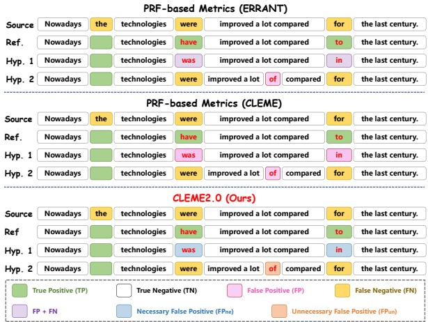
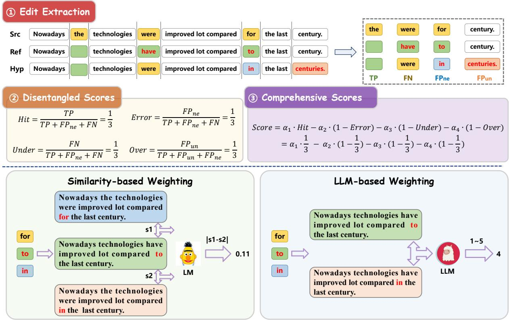
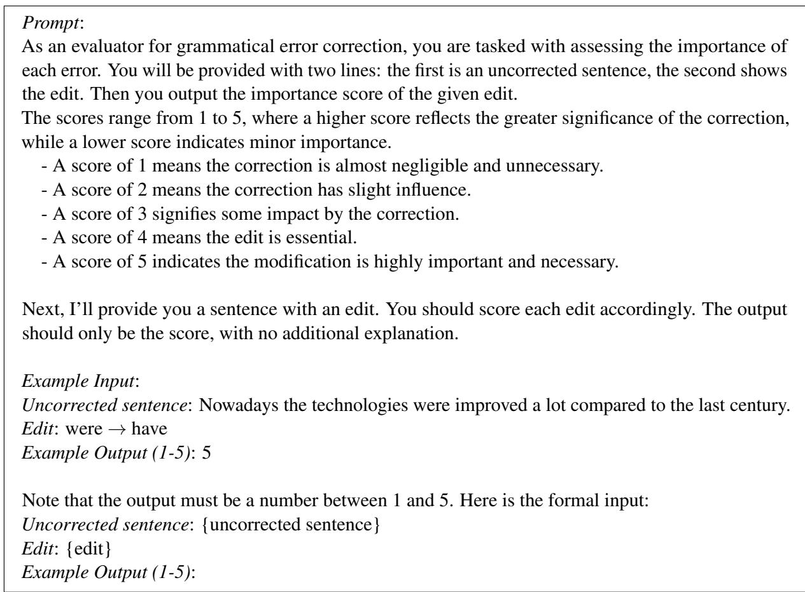

# CLEME2.0: Towards Interpretable Evaluation by Disentangling Edits for Grammatical Error Correction

Jingheng Ye1\*, Zishan Xu1\*, Yinghui Li1, Linlin Song2, Qingyu Zhou3, Hai-Tao Zheng1,4†, Ying Shen5, Wenhao Jiang6, Hong-Gee Kim7, Ruitong Liu1, Xin Su8, Zifei Shan8 1Tsinghua University, 2Huazhong University of Science and Technology, 3ByteDance Inc., 4Peng Cheng Laboratory, 5Sun-Yat Sen University, 6Guangdong Laboratory of Artificial Intelligence and Digital Economy (SZ), 7Seoul National University, 8Tencent {yejh22,xzs23}@mails.tsinghua.edu.cn

## Abstract

The paper focuses on the interpretability of Grammatical Error Correction (GEC) evaluation metrics, which received little attention in previous studies. To bridge the gap, we introduce CLEME2.0, a reference-based metric describing four fundamental aspects of GEC systems: hit-correction, wrong-correction, undercorrection, and over-correction. They collectively contribute to exposing critical qualities and locating drawbacks of GEC systems. Evaluating systems by combining these aspects also leads to superior human consistency over other reference-based and reference-less metrics. Extensive experiments on two human judgment datasets and six reference datasets demonstrate the effectiveness and robustness of our method, achieving a new state-of-theart result. Our codes are released at https: //github.com/THUKElab/CLEME.

## 1 Introduction

The task of Grammatical Error Correction (GEC) automatically detects and corrects grammatical errors in a given text (Bryant et al., 2023). A core component of GEC is the development of automatic metrics that can objectively measure model performance (Kobayashi et al., 2024b; Ye et al., 2023c). However, proposing appropriate evaluation of GEC has long been a challenging task (Madnani et al., 2011), due to the subjectivity (Bryant and Ng, 2015), complexity (Mita et al., 2019) and subtlety (Choshen and Abend, 2018) of GEC.

Recent research efforts have focused on developing GEC metrics that closely align with human judgements (Koyama et al., 2024), whereas the interpretability of these metrics has received less emphasis. We define the interpretability of metrics as their capacity to disclose concerned characteristics of systems, which is crucial for identifying weaknesses in a given GEC system. It is generally recognized that excellent systems should adhere to the principles of grammaticality and faithfulness (Bryant et al., 2023). Grammaticality demands that all grammatical errors be accurately corrected, while faithfulness ensures that corrections retain the original meaning and syntactic structure. Nevertheless, the commonly utilized GEC metrics (Bryant et al., 2017; Dahlmeier and Ng, 2012a) are PRF-based (Precision, Recall, and F scores). We claim that PRF-based metrics fail to effectively capture subtle dimensions of GEC systems, consequently hindering progress. As illustrated in Figure 1, the edits [were was] and [for in] in Hyp. 1 are regarded as 2 FP + FN edits by ERRANT (Bryant et al., 2017) or 2 FP edits by CLEME (Ye et al., 2023c). Meanwhile, the edit [ϵ of] in Hyp. 2 is categorized as an FP edit for both ERRANT and CLEME. Despite this, these two categories of FP edits carry different implications. The former type is correctly placed but wrongly modified, whereas the latter is incorrectly positioned. The inability to differentiate between these FP edits results in ambiguous interpretations of $\mathrm { P / R / F _ { 0 . 5 } }$ scores, as they fail to quantify grammaticality and faithfulness.

  
Figure 1: An example of CLEME2.0. We highlight TP, FP, FPne, FPun, and FN in different colors.

Thus, we introduce CLEME2.0, an interpretable reference-based metric describing four fundamental aspects of GEC systems: 1) the hit-correction score reflects the degree to which a system accurately corrects grammatical errors, 2) the wrongcorrection score denotes the degree of incorrect corrections made, 3) the under-correction score reveals the degree of missing corrections, and 4) the over-correction score measures the degree of excessive corrections. An excellent GEC system should gain a higher hit-correction score and lower wrongcorrection, under-correction, and over-correction scores. The initial three aspects assess grammaticality, whereas the over-correction score pertains to faithfulness, given that it often alters the original meaning, a challenge notably observed with LLMs (Coyne et al., 2023; Li et al., 2023a). To achieve this, CLEME2.0 first distinguishes between necessary and unnecessary false positive (FP) edits. The idea is that necessary FP edits indicate the system’s wrong-correction degree, while unnecessary FP edits reveal the system’s overcorrection degree. As shown in the bottom block of Figure 1, [were was] and $[ f o r $ in] in Hyp. 1 are regarded as $\mathrm { F P _ { n e } }$ edits, while [ϵ of] in Hyp. 2 is considered as an $\mathrm { F P _ { u n } }$ edit.

As a result, CLEME2.0 establishes a one-to-one relationship between four distinct system aspects and four types of edits: hit-correction v.s. TP, wrong-correction v.s. $\mathrm { F P _ { n e } }$ , under-correction v.s. FN, and over-correction v.s. $\mathrm { F P _ { u n } }$ . Unlike conventional GEC metrics like ERRANT (Bryant et al., 2017) and MaxMatch (Dahlmeier and Ng, 2012a) that evaluate using $\mathrm { P / R / F _ { 0 . 5 } }$ scores, it offers a nuanced view into the detailed aspects necessary for characterizing critical features of GEC systems. These separated scores are then consolidated into an overall score via linear weighted summation, giving varying importance to these distinct scores. This aggregate score provides a holistic measure of system performance. Similar to CLEME, our method adopts the chunk partition technique and supports evaluations based on either correction dependence or correction independence assumptions, so we dub the metric as CLEME2.0.

Moreover, we propose that edits of varying modification levels should uniquely influence the evaluation outcomes. For example, corrections involving punctuation are often less significant than corrections of content words. Therefore, we integrate two edit weighting techniques into CLEME2.0, similarity-based weighting (Gong et al., 2022) and LLM-based weighting. In particular, these methods compute a specific weight for each edit through a language model rather than assigning equal weight to all edits, thereby enabling CLEME2.0 to grasp contextual semantics and address the limitations of conventional metrics that depend on surface-level form similarity (Kobayashi et al., 2024a).

To verify the effectiveness of CLEME2.0, we conduct extensive experiments on two human judgment datasets (GJG15 (Grundkiewicz et al., 2015) and SEEDA (Kobayashi et al., 2024b)), where our method consistently achieves high correlations. We also demonstrate the robustness of CLEME2.0 by computing the evaluation results based on six reference datasets with disparate annotation styles. In summary, our contributions are three folds:

(1) We introduce CLEME2.0, an interpretable reference-based metric, which is beneficial to reveal crucial aspects of GEC systems.

(2) We enhance CLEME2.0 by incorporating two edit weighting techniques, addressing the limitations of conventional reference-based metrics in capturing semantics.

(3) Extensive experiments and analyses are conducted to confirm the effectiveness and robustness of our proposed method.

## 2 Related Work

Reference-based metrics. Reference-based metrics evaluate GEC systems by comparing their outputs to manually written references (Ye et al., 2022, $2 0 2 3 \mathrm { a } , \mathrm { b } ;$ Huang et al., 2023; Li et al., 2024c, 2022c,b, 2024d; Ma et al., 2022; Zhang et al., 2023, 2025a; Li et al., 2025c). The $\mathbf { M } ^ { 2 }$ scorer (Dahlmeier and Ng, 2012b) identifies optimal edit sequences between source sentences and system hypotheses, using $\mathrm { F _ { 0 . 5 } }$ scores. However, this method can inflate scores by manipulating edit boundaries. To mitigate this problem, ERRANT (Bryant et al., 2017) improves edit extraction through a linguistically-informed alignment algorithm, but it remains language-dependent and biased in multireference evaluation. CLEME (Ye et al., 2023c) further provides unbiased $\mathrm { F _ { 0 . 5 } }$ scores and introduces an extra correction assumption for multi-reference evaluation. $\mathrm { P T } \mathbf { - M } ^ { 2 }$ (Gong et al., 2022) combines PT-based and existing GEC metrics for higher correlations with human judgments.

  
Figure 2: Overview of CLEME2.0. Initially, we extract edits and categorize hypothesis edits as TP, FN, FPne, and FP . Next, we compute four distinct scores. Finally, we integrate these scores into an overall score utilizing one of the edit weighting techniques.

Reference-less metrics. To overcome the limitations of reference-based metrics, recent studies focus on reference-less scoring. Inspired by quality estimation in NMT (Liu et al., 2022; Dong et al., 2023), Napoles et al. (2016a) propose Grammaticality-Based Metrics (GBMs) using an existing GEC system or a pre-trained ridge regression model. Asano et al. (2017) enhance GBMs by adding criteria like grammaticality, fluency, and meaning preservation. Yoshimura et al. (2020) introduce SOME, which uses sub-metrics optimized for manual assessment with regression models. Scribendi Score (Islam and Magnani, 2021) combines language perplexity and token/Levenshtein distance ratios. IMPARA (Maeda et al., 2022) incorporates a Quality Estimator and a Semantic Estimator based on BERT to evaluate GEC output quality and semantic similarity. While referenceless metrics align well with human judgments, they lack interpretability due to the heavy dependence on trained models, thus posing latent risks.

## 3 Method

Our CLEME2.0 can be generally divided into three main steps, with the overview shown in Fig-

ure 2. Additionally, we incorporate two distinct edit weighting techniques to enhance performance.

## 3.1 Edit Extraction

Given a source sentence X and a target (either hypothesis or reference) sentence Y, we extract the edits describing the modification from X to Y. Here, we utilize the chunk partition technique from CLEME (Ye et al., 2023c) to execute the process of edit extraction. Unlike the traditional metrics like ERRANT (Bryant et al., 2017) and Max-Match (Dahlmeier and Ng, 2012a), CLEME concurrently aligns all sentences, including the source, the hypothesis, and all the references. This facilitates segmentation of them all into chunk sequences with an equal number of chunks, irrespective of the varying token counts in different sentences, as delineated in Figure 2. It is worth noting that a chunk is a basic edit unit, which can be unchanged, corrected, or dummy (empty) (Ye et al., 2023c).

## 3.2 Disentangled Scores

To compute disentangled scores, we initially disentangle edits into four elementary types. 1) TP edits refer to the corrected/dummy hypothesis chunks that share the same tokens as the corresponding reference chunks. 2) $\mathbf { F P _ { n e } }$ edits are the corrected/dummy hypothesis chunks that have different tokens from those in the corresponding reference chunks wherein the reference chunks are also corrected/dummy ones. 3) $\mathbf { F P _ { u n } }$ edits are the corrected hypothesis chunks but their corresponding reference chunks remain unchanged. 4) FN edits indicate the unchanged hypothesis chunks but the corresponding reference chunks are corrected/dummy. It is highlighted that traditional metrics (Dahlmeier and Ng, 2012a; Bryant et al., 2017; Li et al., 2023c) do not distinguish between $\mathrm { F P _ { n e } }$ and $\mathrm { F P } _ { \mathrm { u n } } ,$ treating both as FP, thereby resulting in confusion between wrong-correction and overcorrection. Actually, we have $F P = F P _ { \mathrm { n e } } + F P _ { \mathrm { u n } }$

Furthermore, we can differentiate between necessary and unnecessary edits. TP, $\mathrm { F P _ { n e } } ,$ and FN edits are all necessary edits, since their corresponding reference chunks are also corrected/dummy, implying the existence of grammatical errors in the related parts of X. On the contrary, $\mathrm { F P _ { u n } }$ edit are unnecessary edits because the systems propose corrections not represented in references. Consequently, we can define four disentangled scores.

Hit-correction score. This paper defines the hitcorrection score as the ratio of TP edits to all necessary reference edits. Its purpose is to quantify the accuracy with which systems offer correct corrections. The formula is as follows:

$$
H i t = { \frac { T P } { n e c e s s i t y } } = { \frac { T P } { T P + F P _ { \mathrm { n e } } + F N } }\tag{1}
$$

Wrong-correction score. Conversely, the wrongcorrection score is defined as the ratio of $\mathrm { F P _ { n e } }$ edits to all necessary reference edits. This score seeks to evaluate the degree to which systems generate erroneous corrections for grammatical errors. The formula for this score is as follows:

$$
W r o n g = \frac { F P _ { \mathrm { n e } } } { n e c e s s i t y } = \frac { F P _ { \mathrm { n e } } } { T P + F P _ { \mathrm { n e } } + F N }\tag{2}
$$

Under-correction score. Similarly, the undercorrection score is proposed to measure the degree to which systems omit to correct grammatical errors, which is computed as follows:

$$
U n d e r = { \frac { F N } { n e c e s s i t y } } = { \frac { F N } { T P + F P _ { \mathrm { { n e } } } + F N } }\tag{3}
$$

Over-correction score. The score is introduced in response to frequent observations that LLMs are prone to over-correcting texts. This score is determined by the proportion of $\mathrm { F P _ { u n } }$ edits to all hypothesis corrected/dummy edits, aiming to gauge the level to which systems offer excessive corrections:

$$
O v e r = { \frac { F P _ { \mathrm { u n } } } { T P + F P } } = { \frac { F P _ { \mathrm { u n } } } { T P + F P _ { n e } + F P _ { u n } } }\tag{4}
$$

With the disentangled scores indicating disparate aspects of GEC systems, researchers can identify specific weaknesses and implement targeted improvements without expensive human labor.

## 3.3 Comprehensive Score

Once the four disentangled scores have been computed, they need to be merged into a comprehensive score that encapsulates the global performance of the systems. We employ a weighted summation approach to organize these four scores for interpretability and simplification. By definition, systems with higher hit-correction scores are usually preferable, a tendency that inversely applies to the remaining scores. Thus, the comprehensive score can be calculated using the following formula:

$$
\begin{array} { l } { { S c o r e = \alpha _ { 1 } \cdot H i t + \alpha _ { 2 } \cdot ( 1 - W r o n g ) } } \\ { { \ + \alpha _ { 3 } \cdot ( 1 - U n d e r ) + \alpha _ { 4 } \cdot ( 1 - O v e r ) } } \end{array}\tag{5}
$$

where $\alpha _ { i }$ is the trade-off factor for each disentangled score, and we constrain that $0 < \alpha _ { i } < 1$ and $\alpha _ { 1 } + \alpha _ { 2 } + \alpha _ { 3 } + \alpha _ { 4 } = 1$

## 3.4 Edit Weighting

Existing reference-based metrics, such as ER-RANT and CLEME, depend heavily on superficial literal similarity. This means that, regardless of length or modification, all types of edits have equal weighting in the evaluation scores. This aspect fails to acknowledge that human evaluators might semantically consider the edits’ varying importance levels. Therefore, we introduce two distinct edit weighting techniques to compute the importance weights of edits. These weights are then incorporated into the calculation of the aforementioned disentangled scores as depicted in Equation (1) (4). Take the hit-correction score as a typical example, we reformulate the Equation (1) as follows:

$$
H i t = \frac { w _ { T P } } { w _ { T P } + w _ { F P _ { \mathrm { n e } } } + w _ { F N } }\tag{6}
$$

Similarity-based weighting. We use PTScore to assign edit weights (Gong et al., 2022). Since it performs based on BERTScore (Zhang et al., 2019), a tool for evaluating text generation through similarity scores, we refer to this technique as similaritybased weighting. The rationale is to prioritize edits with a more significant modification of the meaning and quality of the text.

By simulating a partially accurate version $X ^ { \prime }$ of the source sentence X, PTScore can associate specific weights to edits within a sentence. The computation process is as follows:

$$
X ^ { \prime } = \mathrm { r e p l a c e } ( X , e _ { \mathrm { h y p } } )\tag{7}
$$

$$
w = \operatorname { P T S c o r e } ( X ^ { \prime } , R ) - \operatorname { P T S c o r e } ( X , R )\tag{8}
$$

where R is the reference sentence, while the function replace() is used to replace a specific chunk of the source X with the corrected/dummy hypothesis chunk $e _ { \mathrm { h y p } } .$ A positive weight $w > 0$ indicates a beneficial correction, whereas a negative value suggests a wrong correction. The absolute value w is utilized as the edit weight following (Gong et al., 2022), and the significance1 of an edit in a sentence grows with a larger w .

LLM-based weighting. Recent studies have begun investigating the effectiveness of LLM-based evaluation, known for their advanced semantic comprehension (Qin et al., 2024b), in assessing various NLP tasks (Pavlovic and Poesio, 2024; Sottana et al., 2023). Building on this trend, we prompt Llama-2-7B (Touvron et al., 2023) to assign edit weights from 1 to 5, where a higher value signifies more critical edits. This methodology is rooted in the idea that LLMs, due to their extensive training on diverse data, are adept at grasping intricate language patterns and text structure. Detailed implementation instructions and the prompting framework are available in Appendix A.

## 4 Experiments

## 4.1 Experimental Settings

Human ranking datasets. We conduct comprehensive experiments across two human judgment datasets with disparate annotation protocols.

• GJG15 (Grundkiewicz et al., 2015) is constructed to manually evaluate classical systems (Junczys-Dowmunt and Grundkiewicz, 2014; Rozovskaya et al., 2014) in the CoNLL-2014 shared task (Ng et al., 2014).

• SEEDA. Kobayashi et al. (2024b) reveal several shortcomings in GJS15 and subsequently propose SEEDA, an alternative dataset featuring human judgments across two levels of granularity. To align with the contemporary trend in GEC, SEEDA is primarily focused on mainstream neural-based systems.

Both of human judgment datasets derive the overall human rankings for all GEC systems by employing Expected Wins (EW) (Bojar et al., 2013) and TrueSkill (TS) (Sakaguchi et al., 2014) methods. Following the previous approaches (Ye et al., 2023c; Kobayashi et al., 2024b), we compute the Pearson $( \gamma )$ and Spearman (ρ) correlations between metrics and human judgments, in order to ascertain the effectiveness and robustness of GEC metrics within the context of system-level ranking.

Reference datasets. Reference-based metrics rely on a reference set to establish a system ranking list, the properties of which may significantly influence the performance of the metrics. To investigate the impact of variable reference sets, we assess human consistency across 6 reference datasets. These datasets encompass a range of annotation styles, and a number of human annotators, including CoNLL-2014 (Grundkiewicz et al., 2015), BN-10GEC (Bryant and Ng, 2015) and SN-8GEC (Sakaguchi et al., 2016). Notably, SN-8GEC is partitioned into 4 sub-sets, i.e., Expert-Minimal, Expert-Fluency, Non-Expert-Minimal, and Non-Expert-Fluency. A more thorough breakdown of these datasets and the statistics is provided in Appendix B.

Corpus and sentence levels. GEC evaluation metrics can compute an overall system-level score for a given system in two settings (Gong et al., 2022). Given the metric M, source sentences S, hypothesis sentences H and reference sentences R, 1) corpus-level metrics compute the system score based on the whole corpus M(S, H, R), and 2) sentence-level metrics use the average of the sentence-level scores $\textstyle \sum _ { i } ^ { I } M ( \mathbf { S } _ { i } , \mathbf { H } _ { i } , \mathbf { R } _ { i } ) { \big / } I .$

Trade-off factors. We leverage a crossevaluation search method to identify two optimal sets of trade-off factors for both the corpus and sentence levels. At the corpus level, the factors are assigned as α1, α2, α3, α4 = 0.45, 0.35, 0.15, 0.05, while for the sentence level, they are adjusted to $\alpha _ { 1 } , \alpha _ { 2 } , \alpha _ { 3 } , \alpha _ { 4 } ~ = ~ 0 . 3 5 , 0 . 2 5 , 0 . 2 0 , 0 . 2 0 .$ The details of the chosen values of trade-off factors can be seen in Appendix B.5.

<table><tr><td rowspan=2 colspan=10>CoNLL-2014 BN-10GEC    E-Minimal   E-Fluency  NE-MinimalMetricEW TS  EW   TS  EW   TS</td><td rowspan=2 colspan=3>NE-FluencyAvg.EW TS</td></tr><tr><td rowspan=1 colspan=4>EW TS EW TS</td></tr><tr><td rowspan=2 colspan=2>γ0.6230.672M2ρ0.6870.720</td><td rowspan=1 colspan=2>0.547 0.610</td><td rowspan=1 colspan=2>0.597 0.650</td><td rowspan=1 colspan=4>0.5900.6590.575 0.634</td><td rowspan=1 colspan=2>0.5820.649</td><td rowspan=1 colspan=1>0.616</td></tr><tr><td rowspan=1 colspan=1>0.648</td><td rowspan=1 colspan=1>0.69211</td><td rowspan=1 colspan=2>0.654 0.7031</td><td rowspan=1 colspan=1>0.654</td><td rowspan=1 colspan=1>0.709</td><td rowspan=1 colspan=1>0.577</td><td rowspan=1 colspan=1>0.648</td><td rowspan=1 colspan=2>0.6480.703</td><td rowspan=1 colspan=1>0.670</td></tr><tr><td rowspan=2 colspan=2>γ0.7010.750GLEUρ0.4670.555</td><td rowspan=1 colspan=1>0.678</td><td rowspan=1 colspan=1>0.761</td><td rowspan=1 colspan=2>0.533 0.513</td><td rowspan=1 colspan=1>0.693</td><td rowspan=1 colspan=1>0.771</td><td rowspan=1 colspan=1>-0.044</td><td rowspan=1 colspan=1>-0.113</td><td rowspan=1 colspan=2>0.6740.767</td><td rowspan=1 colspan=1>0.557</td></tr><tr><td rowspan=1 colspan=1>0.7541</td><td rowspan=1 colspan=1>0.806=1</td><td rowspan=1 colspan=1>0.577=</td><td rowspan=1 colspan=1>0.5111</td><td rowspan=1 colspan=1>0.710</td><td rowspan=1 colspan=1>0.757</td><td rowspan=1 colspan=1>-0.005</td><td rowspan=1 colspan=1>-0.055</td><td rowspan=1 colspan=2>0.7250.819</td><td rowspan=1 colspan=1>0.551</td></tr><tr><td rowspan=2 colspan=1>γ0.642ERRANTρ0.659</td><td rowspan=1 colspan=1>0.688</td><td rowspan=1 colspan=1>0.586</td><td rowspan=1 colspan=1>0.644</td><td rowspan=1 colspan=1>0.578</td><td rowspan=1 colspan=1>0.631</td><td rowspan=1 colspan=1>0.594</td><td rowspan=1 colspan=1>0.663</td><td rowspan=1 colspan=1>0.585</td><td rowspan=1 colspan=1>0.637</td><td rowspan=1 colspan=2>0.5970.659</td><td rowspan=1 colspan=1>0.625</td></tr><tr><td rowspan=1 colspan=1>0.698</td><td rowspan=1 colspan=1>0.637</td><td rowspan=1 colspan=1>0.698</td><td rowspan=1 colspan=1>0.742</td><td rowspan=1 colspan=1>0.786</td><td rowspan=1 colspan=1>0.720</td><td rowspan=1 colspan=1>0.775</td><td rowspan=1 colspan=1>0.747</td><td rowspan=1 colspan=1>0.797</td><td rowspan=1 colspan=2>0.7530.797</td><td rowspan=1 colspan=1>0.734</td></tr><tr><td rowspan=2 colspan=1>γ0.693PT-M2ρ0.758</td><td rowspan=1 colspan=1>0.737</td><td rowspan=1 colspan=1>0.650</td><td rowspan=1 colspan=1>0.706</td><td rowspan=1 colspan=1>0.626</td><td rowspan=1 colspan=1>0.667</td><td rowspan=1 colspan=1>0.621</td><td rowspan=1 colspan=1>0.681</td><td rowspan=1 colspan=1>0.630</td><td rowspan=1 colspan=1>0.675</td><td rowspan=1 colspan=2>0.6200.682</td><td rowspan=1 colspan=1>0.666</td></tr><tr><td rowspan=1 colspan=1>0.769</td><td rowspan=1 colspan=1>0.690</td><td rowspan=1 colspan=1>0.824</td><td rowspan=1 colspan=1>0.709</td><td rowspan=1 colspan=1>0.736</td><td rowspan=1 colspan=1>0.758</td><td rowspan=1 colspan=1>0.802</td><td rowspan=1 colspan=1>0.736</td><td rowspan=1 colspan=1>0.758</td><td rowspan=1 colspan=2>0.758 0.802</td><td rowspan=1 colspan=1>0.758</td></tr><tr><td rowspan=2 colspan=1>γ0.648CLEME-depρ0.709</td><td rowspan=1 colspan=1>0.691</td><td rowspan=1 colspan=1>0.602</td><td rowspan=1 colspan=1>0.656</td><td rowspan=1 colspan=1>0.594</td><td rowspan=1 colspan=1>0.644</td><td rowspan=1 colspan=1>0.589</td><td rowspan=1 colspan=1>0.654</td><td rowspan=1 colspan=1>0.595</td><td rowspan=1 colspan=1>0.643</td><td rowspan=1 colspan=2>0.6120.673</td><td rowspan=1 colspan=1>0.633</td></tr><tr><td rowspan=1 colspan=1>0.742</td><td rowspan=1 colspan=1>0.692</td><td rowspan=1 colspan=1>0.747</td><td rowspan=1 colspan=1>0.797</td><td rowspan=1 colspan=1>0.813</td><td rowspan=1 colspan=1>0.714</td><td rowspan=1 colspan=1>0.775</td><td rowspan=1 colspan=1>0.786</td><td rowspan=1 colspan=1>0.835</td><td rowspan=1 colspan=2>0.7200.791</td><td rowspan=1 colspan=1>0.760</td></tr><tr><td rowspan=2 colspan=1>γ0.649CLEME-indρ0.709</td><td rowspan=1 colspan=1>0.691</td><td rowspan=1 colspan=1>0.609</td><td rowspan=1 colspan=1>0.659</td><td rowspan=1 colspan=1>0.593</td><td rowspan=1 colspan=1>0.643</td><td rowspan=1 colspan=1>0.587</td><td rowspan=1 colspan=1>0.653</td><td rowspan=1 colspan=1>0.601</td><td rowspan=1 colspan=1>0.647</td><td rowspan=1 colspan=2>0.6110.672</td><td rowspan=1 colspan=1>0.635</td></tr><tr><td rowspan=1 colspan=1>0.731</td><td rowspan=1 colspan=1>0.692</td><td rowspan=1 colspan=1>0.747</td><td rowspan=1 colspan=1>0.791</td><td rowspan=1 colspan=1>0.802</td><td rowspan=1 colspan=1>0.731</td><td rowspan=1 colspan=1>0.791</td><td rowspan=1 colspan=1>0.797</td><td rowspan=1 colspan=1>0.841</td><td rowspan=1 colspan=2>0.7140.786</td><td rowspan=1 colspan=1>0.761</td></tr><tr><td rowspan=2 colspan=1>γ0.700CLEME2.0-dep (Ours)ρ0.665</td><td rowspan=1 colspan=1>0.765</td><td rowspan=1 colspan=1>0.675</td><td rowspan=1 colspan=1>0.745</td><td rowspan=1 colspan=1>0.690</td><td rowspan=1 colspan=1>0.768</td><td rowspan=1 colspan=1>0.695</td><td rowspan=1 colspan=1>0.788</td><td rowspan=1 colspan=1>0.702</td><td rowspan=1 colspan=1>0.778</td><td rowspan=1 colspan=2>0.7040.800</td><td rowspan=1 colspan=1>0.734</td></tr><tr><td rowspan=1 colspan=1>0.736</td><td rowspan=1 colspan=1>0.626</td><td rowspan=1 colspan=1>0.692</td><td rowspan=1 colspan=1>0.736</td><td rowspan=1 colspan=1>0.808</td><td rowspan=1 colspan=1>0.742</td><td rowspan=1 colspan=1>0.83</td><td rowspan=1 colspan=1>0.7750</td><td rowspan=1 colspan=1>0.846</td><td rowspan=1 colspan=2>0.5990.714</td><td rowspan=1 colspan=1>0.730</td></tr><tr><td rowspan=2 colspan=1>γ0.718CLEME2.0-ind (Ours)ρ0.665</td><td rowspan=1 colspan=1>0.777</td><td rowspan=1 colspan=1>0.731</td><td rowspan=1 colspan=1>0.793</td><td rowspan=1 colspan=1>0.708</td><td rowspan=1 colspan=1>0.784</td><td rowspan=1 colspan=1>0.736</td><td rowspan=1 colspan=1>0.824</td><td rowspan=1 colspan=1>0.757</td><td rowspan=1 colspan=1>0.826</td><td rowspan=1 colspan=2>0.8010.848</td><td rowspan=1 colspan=1>0.775</td></tr><tr><td rowspan=1 colspan=1>0.736</td><td rowspan=1 colspan=1>0.698</td><td rowspan=1 colspan=1>0.758</td><td rowspan=1 colspan=1>0.736</td><td rowspan=1 colspan=1>0.808</td><td rowspan=1 colspan=1>0.742</td><td rowspan=1 colspan=1>0.830</td><td rowspan=1 colspan=1>0.775</td><td rowspan=1 colspan=1>0.846</td><td rowspan=1 colspan=2>0.6700.769</td><td rowspan=1 colspan=1>0.753</td></tr><tr><td rowspan=2 colspan=1>γ0.783CLEME2.0-sim-dep (Ours)ρ0.819</td><td rowspan=1 colspan=1>0.853</td><td rowspan=1 colspan=1>0.721</td><td rowspan=1 colspan=1>0.801</td><td rowspan=1 colspan=1>0.765</td><td rowspan=1 colspan=1>0.834</td><td rowspan=1 colspan=1>0.737</td><td rowspan=1 colspan=1>0.827</td><td rowspan=1 colspan=1>0.761</td><td rowspan=1 colspan=1>0.824</td><td rowspan=1 colspan=1>0.741</td><td rowspan=1 colspan=1>0.834</td><td rowspan=1 colspan=1>0.790</td></tr><tr><td rowspan=1 colspan=1>0.890</td><td rowspan=1 colspan=1>0.802</td><td rowspan=1 colspan=1>0.863</td><td rowspan=1 colspan=1>0.791</td><td rowspan=1 colspan=1>0.868</td><td rowspan=1 colspan=1>0.758</td><td rowspan=1 colspan=1>0.852</td><td rowspan=1 colspan=1>0.830</td><td rowspan=1 colspan=1>0.896</td><td rowspan=1 colspan=1>0.786</td><td rowspan=1 colspan=1>0.857</td><td rowspan=1 colspan=1>0.834</td></tr><tr><td rowspan=2 colspan=1>γ0.806CLEME2.0-sim-ind (Ours)ρ0.846</td><td rowspan=1 colspan=1>0.871</td><td rowspan=1 colspan=1>0.772</td><td rowspan=1 colspan=1>0.839</td><td rowspan=1 colspan=1>0.780</td><td rowspan=1 colspan=1>0.841</td><td rowspan=1 colspan=1>0.761</td><td rowspan=1 colspan=1>0.844</td><td rowspan=1 colspan=1>0.782</td><td rowspan=1 colspan=1>0.834</td><td rowspan=1 colspan=1>0.798</td><td rowspan=1 colspan=1>0.877</td><td rowspan=1 colspan=1>0.817</td></tr><tr><td rowspan=1 colspan=1>0.901</td><td rowspan=1 colspan=1>0.835</td><td rowspan=1 colspan=1>0.885</td><td rowspan=1 colspan=1>0.819</td><td rowspan=1 colspan=1>0.885</td><td rowspan=1 colspan=1>0.758</td><td rowspan=1 colspan=1>0.852</td><td rowspan=1 colspan=1>0.846</td><td rowspan=1 colspan=1>0.896</td><td rowspan=1 colspan=1>0.863</td><td rowspan=1 colspan=1>0.923</td><td rowspan=1 colspan=1>0.859</td></tr><tr><td rowspan=2 colspan=1>γ0.871SentM²ρ0.731</td><td rowspan=1 colspan=1>0.864</td><td rowspan=1 colspan=1>0.567</td><td rowspan=1 colspan=1>0.646</td><td rowspan=1 colspan=1>0.805</td><td rowspan=1 colspan=1>0.836</td><td rowspan=1 colspan=1>0.655</td><td rowspan=1 colspan=1>0.732</td><td rowspan=1 colspan=1>0.729</td><td rowspan=1 colspan=1>0.785</td><td rowspan=1 colspan=2>0.6210.699</td><td rowspan=1 colspan=1>0.734</td></tr><tr><td rowspan=1 colspan=1>0.758</td><td rowspan=1 colspan=1>0.593</td><td rowspan=1 colspan=1>0.648</td><td rowspan=1 colspan=1>0.806*</td><td rowspan=1 colspan=1>0.845*</td><td rowspan=1 colspan=1>0.731</td><td rowspan=1 colspan=1>0.764</td><td rowspan=1 colspan=1>0.797*</td><td rowspan=1 colspan=1>0.846*</td><td rowspan=1 colspan=1>0.632</td><td rowspan=1 colspan=1>0.687</td><td rowspan=1 colspan=1>0.737</td></tr><tr><td rowspan=2 colspan=1>γ0.784SentGLEUρ0.7200</td><td rowspan=1 colspan=1>0.828</td><td rowspan=1 colspan=1>0.756</td><td rowspan=1 colspan=1>0.826</td><td rowspan=1 colspan=1>0.742</td><td rowspan=1 colspan=1>0.773</td><td rowspan=1 colspan=1>0.785</td><td rowspan=1 colspan=1>0.846</td><td rowspan=1 colspan=1>0.723</td><td rowspan=1 colspan=1>0.762</td><td rowspan=1 colspan=1>0.778</td><td rowspan=1 colspan=1>0.848</td><td rowspan=1 colspan=1>0.788</td></tr><tr><td rowspan=1 colspan=1>.775</td><td rowspan=1 colspan=1>0.769</td><td rowspan=1 colspan=1>0.824</td><td rowspan=1 colspan=1>0.764*</td><td rowspan=1 colspan=1>0.797*</td><td rowspan=1 colspan=1>0.791</td><td rowspan=1 colspan=1>0.846</td><td rowspan=1 colspan=1>0.764*</td><td rowspan=1 colspan=1>0.830*</td><td rowspan=1 colspan=1>0.768</td><td rowspan=1 colspan=1>0.846</td><td rowspan=1 colspan=1>0.791</td></tr><tr><td rowspan=2 colspan=1>γ0.870SentERRANTρ0.742</td><td rowspan=1 colspan=1>0.846</td><td rowspan=1 colspan=1>0.885</td><td rowspan=1 colspan=1>0.896</td><td rowspan=1 colspan=1>0.768</td><td rowspan=1 colspan=1>0.803</td><td rowspan=1 colspan=1>0.806</td><td rowspan=1 colspan=1>0.732</td><td rowspan=1 colspan=1>0.710</td><td rowspan=1 colspan=1>0.765</td><td rowspan=1 colspan=1>0.793</td><td rowspan=1 colspan=1>0.847</td><td rowspan=1 colspan=1>0.810</td></tr><tr><td rowspan=1 colspan=1>0.747</td><td rowspan=1 colspan=1>0.786</td><td rowspan=1 colspan=1>0.830</td><td rowspan=1 colspan=1>0.775*</td><td rowspan=1 colspan=1>0.819</td><td rowspan=1 colspan=1>0.813</td><td rowspan=1 colspan=1>0.764</td><td rowspan=1 colspan=1>0.780</td><td rowspan=1 colspan=1>0.841</td><td rowspan=1 colspan=1>0.830</td><td rowspan=1 colspan=1>0.857</td><td rowspan=1 colspan=1>0.799</td></tr><tr><td rowspan=2 colspan=1>20.949SentPT-M2ρ0.907</td><td rowspan=1 colspan=1>0.938</td><td rowspan=1 colspan=1>0.602</td><td rowspan=1 colspan=1>0.682</td><td rowspan=1 colspan=1>0.831</td><td rowspan=1 colspan=1>0.855</td><td rowspan=1 colspan=1>0.689</td><td rowspan=1 colspan=1>0.763</td><td rowspan=1 colspan=1>0.770</td><td rowspan=1 colspan=1>0.822</td><td rowspan=1 colspan=1>0.648</td><td rowspan=1 colspan=1>0.725</td><td rowspan=1 colspan=1>0.772</td></tr><tr><td rowspan=1 colspan=1>0.874</td><td rowspan=1 colspan=1>0.626</td><td rowspan=1 colspan=1>0.670</td><td rowspan=1 colspan=1>0.808*</td><td rowspan=1 colspan=1>0.819*</td><td rowspan=1 colspan=1>0.797</td><td rowspan=1 colspan=1>0.841</td><td rowspan=1 colspan=1>0.813*</td><td rowspan=1 colspan=1>0.857*</td><td rowspan=1 colspan=1>0.742</td><td rowspan=1 colspan=1>0.786</td><td rowspan=1 colspan=1>0.795</td></tr><tr><td rowspan=2 colspan=1>γ0.876SentCLEME-depρ0.824</td><td rowspan=1 colspan=1>0.844</td><td rowspan=1 colspan=1>0.915</td><td rowspan=1 colspan=1>0.913</td><td rowspan=1 colspan=1>0.806</td><td rowspan=1 colspan=1>0.838</td><td rowspan=1 colspan=1>0.849</td><td rowspan=1 colspan=1>0.886</td><td rowspan=1 colspan=1>0.742</td><td rowspan=1 colspan=1>0.795</td><td rowspan=1 colspan=1>0.876</td><td rowspan=1 colspan=1>0.921</td><td rowspan=1 colspan=1>0.855</td></tr><tr><td rowspan=1 colspan=1>0.808</td><td rowspan=1 colspan=1>0.835</td><td rowspan=1 colspan=1>0.874</td><td rowspan=1 colspan=1>0.775*</td><td rowspan=1 colspan=1>0.819</td><td rowspan=1 colspan=1>0.824</td><td rowspan=1 colspan=1>0.863</td><td rowspan=1 colspan=1>0.797*</td><td rowspan=1 colspan=1>0.846</td><td rowspan=1 colspan=1>0.791</td><td rowspan=1 colspan=1>0.846</td><td rowspan=1 colspan=1>0.825</td></tr><tr><td rowspan=2 colspan=1>γ0.868SentCLEME-indρ0.725</td><td rowspan=1 colspan=1>0.857</td><td rowspan=1 colspan=1>0.855</td><td rowspan=1 colspan=1>0.876</td><td rowspan=1 colspan=1>0.821</td><td rowspan=1 colspan=1>0.856</td><td rowspan=1 colspan=1>0.841</td><td rowspan=1 colspan=1>0.877</td><td rowspan=1 colspan=1>0.782</td><td rowspan=1 colspan=1>0.831</td><td rowspan=1 colspan=1>0.852</td><td rowspan=1 colspan=1>0.896</td><td rowspan=1 colspan=1>0.851</td></tr><tr><td rowspan=1 colspan=1>0.758</td><td rowspan=1 colspan=1>0.659</td><td rowspan=1 colspan=1>0.714*</td><td rowspan=1 colspan=1>0.775*</td><td rowspan=1 colspan=1>0.819</td><td rowspan=1 colspan=1>0.808</td><td rowspan=1 colspan=1>0.846</td><td rowspan=1 colspan=1>0.819</td><td rowspan=1 colspan=1>0.874*</td><td rowspan=1 colspan=1>0.762</td><td rowspan=1 colspan=1>0.825</td><td rowspan=1 colspan=1>0.782</td></tr><tr><td rowspan=2 colspan=1>γ0.870SentCLEME2.0-dep (Ours)ρ0.7140</td><td rowspan=1 colspan=1>0.881</td><td rowspan=1 colspan=1>0.766</td><td rowspan=1 colspan=1>0.830</td><td rowspan=1 colspan=1>0.941</td><td rowspan=1 colspan=1>0.954</td><td rowspan=1 colspan=1>0.892</td><td rowspan=1 colspan=1>0.938</td><td rowspan=1 colspan=1>0.913</td><td rowspan=1 colspan=1>0.918</td><td rowspan=1 colspan=1>0.916</td><td rowspan=1 colspan=1>0.949</td><td rowspan=1 colspan=1>0.897</td></tr><tr><td rowspan=1 colspan=1>.725</td><td rowspan=1 colspan=1>0.681</td><td rowspan=1 colspan=1>0.747</td><td rowspan=1 colspan=1>0.857*</td><td rowspan=1 colspan=1>0.885</td><td rowspan=1 colspan=1>0.824</td><td rowspan=1 colspan=1>0.901</td><td rowspan=1 colspan=1>0.857*</td><td rowspan=1 colspan=1>0.912*</td><td rowspan=1 colspan=2>0.7200.791</td><td rowspan=1 colspan=1>0.801</td></tr><tr><td rowspan=2 colspan=1>γ0.866SentCLEME2.0-ind (Ours)ρ0.709</td><td rowspan=1 colspan=1>0.881</td><td rowspan=1 colspan=1>0.799</td><td rowspan=1 colspan=1>0.853</td><td rowspan=1 colspan=1>0.941</td><td rowspan=1 colspan=1>0.956</td><td rowspan=1 colspan=1>0.915</td><td rowspan=1 colspan=1>0.952</td><td rowspan=1 colspan=1>0.915</td><td rowspan=1 colspan=1>0.917</td><td rowspan=1 colspan=1>0.883</td><td rowspan=1 colspan=1>0.904</td><td rowspan=1 colspan=1>0.899</td></tr><tr><td rowspan=1 colspan=1>0.720</td><td rowspan=1 colspan=1>0.681</td><td rowspan=1 colspan=1>0.747</td><td rowspan=1 colspan=1>0.879*</td><td rowspan=1 colspan=1>0.912*</td><td rowspan=1 colspan=1>0.857</td><td rowspan=1 colspan=1>0.923</td><td rowspan=1 colspan=1>0.824*</td><td rowspan=1 colspan=1>0.885</td><td rowspan=1 colspan=1>0.654</td><td rowspan=1 colspan=1>0.720</td><td rowspan=1 colspan=1>0.793</td></tr><tr><td rowspan=2 colspan=1>γ0.926SentCLEME2.0-sim-dep (Ours)ρ0.907</td><td rowspan=1 colspan=1>0.937</td><td rowspan=1 colspan=1>0.797</td><td rowspan=1 colspan=1>0.861</td><td rowspan=1 colspan=1>0.939</td><td rowspan=1 colspan=1>0.948</td><td rowspan=1 colspan=1>0.908</td><td rowspan=1 colspan=1>0.952</td><td rowspan=1 colspan=1>0.871</td><td rowspan=1 colspan=1>0.872</td><td rowspan=1 colspan=1>0.918</td><td rowspan=1 colspan=1>0.947</td><td rowspan=1 colspan=1>0.906</td></tr><tr><td rowspan=1 colspan=1>0.912</td><td rowspan=1 colspan=1>0.808</td><td rowspan=1 colspan=1>0.863</td><td rowspan=1 colspan=1>0.852*</td><td rowspan=1 colspan=1>0.879</td><td rowspan=1 colspan=1>0.885</td><td rowspan=1 colspan=1>0.945</td><td rowspan=1 colspan=1>0.753</td><td rowspan=1 colspan=1>0.780</td><td rowspan=1 colspan=1>0.896</td><td rowspan=1 colspan=1>0.940</td><td rowspan=1 colspan=1>0.868</td></tr><tr><td rowspan=2 colspan=1>γ0.915SentCLEME2.0-sim-ind (Ours)ρ0.868</td><td rowspan=1 colspan=1>0.936</td><td rowspan=1 colspan=1>0.808</td><td rowspan=1 colspan=1>0.866</td><td rowspan=1 colspan=1>0.945*</td><td rowspan=1 colspan=1>0.956</td><td rowspan=1 colspan=1>0.923</td><td rowspan=1 colspan=1>0.963</td><td rowspan=1 colspan=1>0.885*</td><td rowspan=1 colspan=1>0.887*</td><td rowspan=1 colspan=1>0.931</td><td rowspan=1 colspan=1>0.961</td><td rowspan=1 colspan=1>0.915</td></tr><tr><td rowspan=1 colspan=1>0.879</td><td rowspan=1 colspan=1>0.753</td><td rowspan=1 colspan=2>0.824  $0 . 8 6 3 ^ { \pm }$ </td><td rowspan=1 colspan=1>0.901</td><td rowspan=1 colspan=1>0.879</td><td rowspan=1 colspan=2>0.9560.775*</td><td rowspan=1 colspan=1>0.802*</td><td rowspan=1 colspan=2>0.8350.923</td><td rowspan=1 colspan=1>0.855</td></tr></table>

Table 1: Correlation results on GJG15 Ranking. CLEME2.0-sim is based on similarity-based weighting. We highlight the highest scores in bold and the second-highest scores with underlines. We exclude unchanged references for higher correlations due to low-quality annotations in some reference sets. Results without excluding references are presented in Appendix C.1.

Evaluation assumptions. CLEME can evaluate GEC systems based on correction dependence (- dep) or independence (-ind) assumptions. The correction independence assumption offers a more relaxed edit-matching process, implying that systems might yield better scores when multiple references are available. Inspired by this work, CLEME2.0 also supports both assumptions, and we will study their effects on our method.

## 4.2 Results of GJG15 Ranking

The correlations between the GEC metrics and human judgments on the GJG15 rankings are shown in Table 1, and we have the following insights.

CLEME2.0 outperforms other metrics at both corpus and sentence levels. For corpus-level, CLEME2.0-sim-ind achieves the highest average correlations, closely followed by CLEME2.0-simdep. CLEME2.0-ind and CLEME2.0-dep can also gain comparable correlations with other metrics, even though they do not utilize any edit weighting techniques. On the other hand, sentence-level metrics exhibit a similar pattern. SentCLEME2.0-simdep and SentCLEME2.0-sim-ind achieve the highest Pearson and Spearson correlations, respectively. These results significantly demonstrate the effectiveness and robustness of our proposed method across different settings.

Sentence-level metrics outperform their corpuslevel counterparts. This observation is consistent with recent studies (Gong et al., 2022; Ye et al., 2023c). This is because system-level rankings treat each sample equally regardless of edit numbers, mirroring how sentence-level metrics are evaluated. On the other hand, corpus-level metrics emphasize samples with more edits, thus causing the gap between automatic metrics and human evaluation. SentPT-M2 shows superior performance on CoNLL-2014 but performs worse on BN-10GEC, E-Minimal, and NE-Fluency compared to our approach, revealing a lack of robustness of the metric.

Generally, our method aligns more closely with human assessments than existing popular metrics. Notably, our method with similarity-based weighting surpasses unweighted ones, thanks to the integration of semantic factors. However, on E-Minimal and NE-Minimal, weighted and unweighted results are comparable. We suspect this is because these datasets have minimal yet crucial annotations, reducing the possibility of varying weights and the efficacy of edit weighting.

Furthermore, we present comprehensive results of CLEME2.0 on CoNLL-2014 and offer insights into our method for analyzing and identifying weaknesses in GEC systems in Appendix C.5.

## 4.3 Results of SEEDA Ranking

We carry out an additional experiment on the SEEDA-Sentence and SEEDA-Edit datasets, where we compare our method against various GEC metrics. As presented in Table 2, our approach consistently achieves the best outcomes across both datasets. According to Kobayashi et al. (2024b), the correlations of most metrics tend to decrease when transitioning from classical to neural evaluation systems. This implies that conventional metrics might face difficulties in evaluating the more extensively edited or fluent corrections produced by state-of-the-art neural GEC systems. Nevertheless, our method effectively tackles these challenges, delivering even improved performance for all indicators. The results for SEEDA-Edit exceed those for SEEDA-Sentence, due to the greater detail in SEEDA-Edit, aligning more closely with the operation of CLEME2.0.

<table><tr><td rowspan="2">Metric</td><td colspan="2">SEEDA-S</td><td colspan="2">SEEDA-E</td><td rowspan="2">Avg.</td></tr><tr><td>γ</td><td>ρ</td><td>γ</td><td>ρ</td></tr><tr><td>M2</td><td>0.658</td><td>0.487</td><td>0.791</td><td>0.764</td><td>0.675</td></tr><tr><td>PT-M2</td><td>0.845</td><td>0.769</td><td>0.896</td><td>0.909</td><td>0.855</td></tr><tr><td>ERRANT</td><td>0.557</td><td>0.406</td><td>0.697</td><td>0.671</td><td>0.583</td></tr><tr><td>PT-ERRANT</td><td>0.818</td><td>0.720</td><td>0.888</td><td>0.888</td><td>0.829</td></tr><tr><td>GoToScorer</td><td>0.929</td><td>0.881</td><td>0.901</td><td>0.937</td><td>0.912</td></tr><tr><td>GLEU</td><td>0.847</td><td>0.886</td><td>0.911</td><td>0.897</td><td>0.885</td></tr><tr><td>Scribendi Score</td><td>0.631</td><td>0.641</td><td>0.830</td><td>0.848</td><td>0.738</td></tr><tr><td>SOME</td><td>0.892</td><td>0.867</td><td>0.901</td><td>0.951</td><td>0.903</td></tr><tr><td>IMPARA</td><td>0.911</td><td>0.874</td><td>0.889</td><td>0.944</td><td>0.903</td></tr><tr><td>CLEME-dep</td><td>0.633</td><td>0.501</td><td>0.755</td><td>0.757</td><td>0.662</td></tr><tr><td>CLEME-ind</td><td>0.616</td><td>0.466</td><td>0.736</td><td>0.708</td><td>0.632</td></tr><tr><td>CLEME2.0-dep (Ours)</td><td>0.937</td><td>0.865</td><td>0.945</td><td>0.939</td><td>0.922</td></tr><tr><td>CLEME2.0-ind (Ours)</td><td>0.908</td><td>0.844</td><td>0.961</td><td>0.946</td><td>0.915</td></tr><tr><td>CLEME2.0-sim-dep (Ours)</td><td>0.923</td><td>0.914</td><td>0.948</td><td>0.974</td><td>0.940</td></tr><tr><td>CLEME2.0-sim-ind (Ours)</td><td>0.921</td><td>0.907</td><td>0.953</td><td>0.981</td><td>0.941</td></tr><tr><td>Sent-M²</td><td>0.802</td><td>0.692</td><td>0.887</td><td>0.846</td><td>0.807</td></tr><tr><td>SentERRANT</td><td>0.758</td><td>0.643</td><td>0.860</td><td>0.825</td><td>0.772</td></tr><tr><td>SentCLEME-dep</td><td>0.866</td><td>0.809</td><td>0.944</td><td>0.939</td><td>0.890</td></tr><tr><td>SentCLEME-ind</td><td>0.864</td><td>0.858</td><td>0.935</td><td>0.911</td><td>0.892</td></tr><tr><td>SentCLEME2.0-dep (Ours)</td><td>0.905</td><td>0.844</td><td>0.955</td><td>0.946</td><td>0.913</td></tr><tr><td>SentCLEME2.0-ind (Ours)</td><td>0.875</td><td>0.837</td><td>0.953</td><td>0.953</td><td>0.905</td></tr><tr><td>SentCLEME2.0-sim-dep (Ours)</td><td>0.924</td><td>0.858</td><td>0.923</td><td>0.953</td><td>0.915</td></tr><tr><td>SentCLEME2.0-sim-ind (Ours)</td><td>0.921</td><td>0.886</td><td>0.957</td><td>0.960</td><td>0.931</td></tr></table>

Table 2: Results of human correlations on SEEDA Ranking based on TrueSkill (TS).

It is crucial to mention that reference-less metrics such as SOME and IMPARA yield high outcomes, in part, because these are fine-tuned on GEC data. Although fine-tuned metrics generally perform better, they are not without their limitations. Firstly, the incorporation of fine-tuning in SOME and IMPARA makes these referenceless metrics more costly. Second, these referenceless metrics may suffer from poor robustness since the assessment process is not guided by human-annotated references. For example, the authors of Scribendi Score claim that it can achieve high correlations on the human judgment dataset from Napoles et al. (2016b). However, only moderate correlations are observable on SEEDA-Edit.

<table><tr><td></td><td>Chunk 1</td><td>Chunk 2</td><td>Chunk 3</td><td>Chunk 4</td><td>Chunk 5</td><td>Chunk 6</td></tr><tr><td>Source</td><td>Do one</td><td>who</td><td>suffered</td><td>from this disease keep it a secret</td><td>of infrom</td><td>their relatives ?</td></tr><tr><td>Reference</td><td>Does one</td><td>who</td><td>suffers</td><td>from this disease keep it a secret</td><td>or inform</td><td>their relatives ?</td></tr><tr><td></td><td>Hypothesis Do one (0.028)</td><td>who</td><td></td><td>suffer (0.011) from this disease keep it a secret to inform (0.094) their relatives ?</td><td></td><td></td></tr><tr><td></td><td></td><td> $H i t = 0 . 0 0 ,$ </td><td> $W r o n g = 0 . 7 9 ,$ </td><td> $U n d e r = 0 . 2 1 $ </td><td> $\textit { O v e r } = 0 . 0 0$ </td><td></td></tr></table>

<table><tr><td></td><td>Chunk 1</td><td>Chunk 2</td><td>Chunk 3</td><td>Chunk 4</td><td>Chunk 5</td><td>Chunk 6</td><td>Chunk 7</td><td>Chunk 8</td><td>Chunk 9</td></tr><tr><td></td><td>Source When we are</td><td>diagonosed out</td><td>with certain genetic</td><td>disease</td><td>, should we disclose</td><td>this result</td><td>to</td><td>our</td><td>relatives ?</td></tr><tr><td>Ref.</td><td>When we are</td><td>diagnosed</td><td>with certain genetic</td><td>diseases</td><td>, should we disclose</td><td>this result</td><td>to</td><td>our</td><td>relatives ?</td></tr><tr><td>Hyp.</td><td></td><td>When we are diagnosed out (0.056)</td><td></td><td></td><td>) with certain genetic diseases (0.006) , should we disclose the results (0.019)</td><td></td><td>to</td><td></td><td>their (0.021) relatives ?</td></tr><tr><td></td><td></td><td></td><td>Hit = 0.10,</td><td>Wrong = 0.90,</td><td>Under = 0.0, Over = 0.39</td><td></td><td></td><td></td><td></td></tr></table>

Table 3: Study cases of CLEME2.0 with similarity-based weighting. We highlight TP, $\mathrm { F P _ { n e } } .$ $\mathrm { F P } _ { \operatorname* { u n } } .$ , and FN chunks in different colors. Values in brackets are similarity-based weighting scores.

<table><tr><td rowspan="2">Dataset</td><td colspan="2">Corpus-EW</td><td colspan="2">Corpus-TS</td><td colspan="2">Sentence-EW</td><td colspan="2">Sentence-TS</td></tr><tr><td>γ</td><td>ρ</td><td>γ</td><td>ρ</td><td>γ</td><td>ρ</td><td>γ</td><td>ρ</td></tr><tr><td>CoNLL-2014</td><td>0.697</td><td>0.659</td><td>0.759</td><td>0.720</td><td>0.626</td><td>0.654</td><td>0.696</td><td>0.698</td></tr><tr><td>BN-10GEC</td><td>0.732</td><td>0.764</td><td>0.796</td><td>0.813</td><td>0.638</td><td>0.637</td><td>0.708</td><td>0.698</td></tr><tr><td>E-Minimal</td><td>0.709</td><td>0.786</td><td>0.779</td><td>0.819</td><td>0.642</td><td>0.692</td><td>0.715</td><td>0.747</td></tr><tr><td>E-Fluency</td><td>0.760</td><td>0.786</td><td>0.831</td><td>0.841</td><td>0.642</td><td>0.665</td><td>0.720</td><td>0.714</td></tr><tr><td>NE-Minimal</td><td>0.777</td><td>0.823</td><td>0.839</td><td>0.861</td><td>0.654</td><td>0.747</td><td>0.723</td><td>0.791</td></tr><tr><td>NE-Fluency</td><td>0.823</td><td>0.692</td><td>0.849</td><td>0.709</td><td>0.664</td><td>0.791</td><td>0.742</td><td>0.830</td></tr></table>

Table 4: Correlation results of LLM-based weighting on GJG15 Ranking.

## 4.4 Results of LLM-based Weighting

Table 4 presents the outcomes of LLM-based weighting, noting that its effectiveness is less favorable than similarity-based weighting. A likely reason is the coarse grading method of LLMs, which allocates edit weights from 1 to 5, unlike the finer continuous scale [0, 1]. Although Kobayashi et al. (2024a) argue that LLMs serve as effective evaluators for GEC, their research pertains to huge closedsource LLMs (GPT-4 and GPT-3.5) and involves specific prompt engineering. They also identify the importance of the LLM scale since GPT-3.5 may even obtain negative correlations with human judgments. In contrast, we employ a more straightforward approach with open-source LLama-2-7B.

## 5 Analysis

## 5.1 Case Study

Table 3 demonstrates instances of CLEME2.0. In the first set, Chunks 3 and 5 are $\mathrm { F P } _ { n e }$ edits contributing to the wrong-correction score, with a higher edit weight of Chunk 5 than Chunk 3 since Chunk 5 introduces an error that entirely alters the sentence’s meaning. In the second set, Chunk 2 obtains the highest edit weight of 0.056, underscoring its substantial influence on the evaluation. Despite the correct modification of “diagnosed”, the misuse of “out” remains, keeping the correction wrong. Chunk 4 illustrates a singular-to-plural correction in the source sentence, with a low weight indicating a minor impact. Chunks 6 and 8 showcase overcorrections. Chunk 6 leaves the original meaning unchanged, whereas Chunk 8 introduces a significant error by misusing a personal pronoun.

<table><tr><td rowspan="2">Metric</td><td colspan="2">EW</td><td colspan="2">TS</td><td rowspan="2">Avg.</td></tr><tr><td>γ</td><td>ρ</td><td>γ</td><td>ρ</td></tr><tr><td rowspan="3">CLEME2.0-dep-Hit CLEME2.0-dep-Wrong CLEME2.0-dep-Under</td><td>0.599</td><td>0.593</td><td>0.673</td><td>0.648</td><td>0.628</td></tr><tr><td>-0.444</td><td>-0.533</td><td>-0.526</td><td>-0.593</td><td>-0.524</td></tr><tr><td>0.496 0.118</td><td>0.599 0.269</td><td>0.576 0.073</td><td>0.659 0.275</td><td>0.583 0.253</td></tr><tr><td>SentCLEME2.0-dep-Hit SentCLEME2.0-dep-Wrong SentCLEME2.0-dep-Under SentCLEME2.0-dep-Over -0.247</td><td>0.594 -0.405 0.489</td><td>0.593 -0.429 0.511</td><td>0.672 -0.489 0.572</td><td>0.648 -0.500 0.582</td><td>0.627 -0.456 0.539</td></tr></table>

Table 5: Correlation results of each disentangled score on GJG15 Ranking.

The cases highlight the effectiveness of the weighting technique. Otherwise, all edits are given equal weight, failing to distinguish hypothesis edits with varying correction levels. We display the cases of LLM-based weighting in Appendix C.2.

## 5.2 Ablation Study

We conduct ablation studies on (Sent)CLEME2.0- dep to analyze the performance of individual disentangled scores. A preferable system has reduced wrong-correction, under-correction, and over-correction scores, so we report corrections between 1-x with human judgments where x is one of the scores. The outcomes are detailed in

<table><tr><td>Metric</td><td>Time (Seconds)</td></tr><tr><td>ERRANT</td><td>33.4</td></tr><tr><td>GLEU</td><td>21.5</td></tr><tr><td>CLEME-dep</td><td>54.1</td></tr><tr><td>CLEME-ind</td><td>54.1</td></tr><tr><td>(Sent)CLEME2.0-dep</td><td>54.1</td></tr><tr><td>(Sent)CLEME2.0-ind</td><td>54.1</td></tr><tr><td>(Sent)CLEME2.0-sim-ind</td><td>88.4</td></tr><tr><td>(Sent)CLEME2.0-sim-ind</td><td>87.6</td></tr></table>

Table 6: Efficiency of metrics.

Table 5. Hit-correction and under-correction show moderate correlations. Over-correction scores have small positive correlations at the corpus level, with minimal negative correlations at the sentence level. Notably, wrong-correction scores display negative correlations, but this does not mean they do not impact the overall score. In reality, the trade-off factor for wrong-correction scores is relatively substantial. The hypothesis is that focusing evaluations only on wrong-correction scores might prefer systems that make only highly confident edits, potentially leading to assessment bias.

Additionally, we utilize the similarity-weighting approach on CLEME to evaluate its efficacy, with the outcomes detailed in Appendix C.3. To examine our method on a broad scale, we also provide the average correlations obtained from a comprehensive analysis of all potential parameter settings. The results are found in Appendix C.4.

## 5.3 Efficiency

This section provides a comparative analysis of the efficiency of our methods against other prevailing metrics. The experiments were executed on a GPU 3090 within the CoNLL-2014 framework, with the evaluation times of the AMU system reported. Our observations are as follows: (1) For ERRANT, the primary time expenditure is associated with edit extraction, lasting 33.4 seconds. (2) CLEME and CLEME2.0 primarily incur time costs from edit extraction at 33.4 seconds and chunk partitioning at 20.7 seconds. (3) For CLEME2.0-sim, the most significant time costs are assignable to edit extraction (33.4 s), chunk partitioning (20.7 s), and edit weighting (34.3 s). PT-M2 exhibits the slowest runtime when replicating existing mainstream methods, with its evaluation process taking several hours; thus, we did not report a precise runtime due to the time constraints. Some technical solutions can mitigate the runtime when evaluating a system using these metrics concurrently. For instance, when assessing a system with ERRANT, CLEME, and CLEME2.0, the minimum cumulative duration is calculated as 33.4 seconds for edit extraction, 20.7 seconds for chunk partitioning, and 34.3 seconds for edit weighting, totaling 88.4 seconds.

## 6 Conclusion

This paper introduces CLEME2.0, an interpretable evaluation metric for GEC that effectively highlights four key aspects of systems. By incorporating edit weighting techniques, we overcome the challenges traditional reference-based metrics face in recognizing semantic subtleties. Extensive experiments and analyses confirm the effectiveness and robustness of our method. We anticipate that CLEME2.0 will offer a valuable perspective in the GEC community.

## Limitation

Limitation in languages and datasets. While CLEME2.0 is adaptable to various languages, its efficiency beyond English remains unverified. Additionally, the reference sets employed in our experiments stem from the CoNLL-2014 shared task, which involves a second language dataset. To confirm the robustness of our methods, it’s necessary to conduct further experiments using evaluation datasets that cover a range of languages and text domains. Finally, we highly encourage the creation of new GEC evaluation datasets to foster progress.

Lack of further human evaluation for interpretability. The experiments discussed in the paper are primarily concerned with assessing the correlation between automatic metrics and human judgments. However, they fall short of providing a thorough analysis of the method’s interpretability. Although we showcase the strong correlation performance of CLEME2.0, its interpretability is still unverified. In future work, we will conduct human evaluation experiments to showcase the interpretability of our method.

## Ethics Statement

In this paper, we validate the effectiveness and robustness of our proposed approach using the CoNLL-2014, BN-10GEC, and SN-8GEC reference datasets. These datasets are sourced from publicly available resources on legitimate websites and do not contain any sensitive data. Additionally, all the baselines employed in our experiments are publicly accessible GEC metrics, and we have duly cited the respective authors. We confirm that all datasets and baselines utilized in our experiments are consistent with their intended purposes.

## Acknowledgements

This research is supported by National Natural Science Foundation of China (Grant No. 62276154), Research Center for Computer Network (Shenzhen) Ministry of Education, the Natural Science Foundation of Guangdong Province (Grant No. 2023A1515012914 and 440300241033100801770), Basic Research Fund of Shenzhen City (Grant No. JCYJ20210324120012033, JCYJ20240813112009013 and GJHZ20240218113603006), the Major Key Project of PCL (NO. PCL2024A08).

## References

Hiroki Asano, Tomoya Mizumoto, and Kentaro Inui. 2017. Reference-based metrics can be replaced with reference-less metrics in evaluating grammatical error correction systems. In Proceedings ofthe Eighth International Joint Conference on Natural Language Processing (Volume 2: Short Papers), pages 343– 348.

Ondˇrej Bojar, Christian Buck, Chris Callison-Burch, Christian Federmann, Barry Haddow, Philipp Koehn, Christof Monz, Matt Post, Radu Soricut, and Lucia Specia. 2013. Findings of the 2013 Workshop on Statistical Machine Translation. In Proceedings of the Eighth Workshop on Statistical Machine Translation, pages 1–44, Sofia, Bulgaria. Association for Computational Linguistics.

Christopher Bryant, Mariano Felice, and Ted Briscoe. 2017. Automatic annotation and evaluation of error types for grammatical error correction. In Proceedings ofthe 55th Annual Meeting ofthe Associationfor Computational Linguistics (Volume 1: Long Papers), pages 793–805, Vancouver, Canada. Association for Computational Linguistics.

Christopher Bryant and Hwee Tou Ng. 2015. How far are we from fully automatic high quality grammatical error correction? In Proceedings ofthe 53rd Annual Meeting of the Association for Computational Linguistics and the 7th International Joint Conference on Natural Language Processing (Volume 1: Long Papers), pages 697–707, Beijing, China. Association for Computational Linguistics.

Christopher Bryant, Zheng Yuan, Muhammad Reza Qorib, Hannan Cao, Hwee Tou Ng, and Ted Briscoe.

2023. Grammatical error correction: A survey of the state of the art. Computational Linguistics, 49(3):643–701.

Guiming Hardy Chen, Shunian Chen, Ziche Liu, Feng Jiang, and Benyou Wang. 2024. Humans or llms as the judge? a study on judgement biases. arXiv preprint arXiv:2402.10669.

Leshem Choshen and Omri Abend. 2018. Inherent biases in reference-based evaluation for grammatical error correction. In Proceedings ofthe 56th Annual Meeting of the Association for Computational Linguistics (Volume 1: Long Papers), pages 632–642.

Zhendong Chu, Shen Wang, Jian Xie, Tinghui Zhu, Yibo Yan, Jingheng Ye, Aoxiao Zhong, Xuming Hu, Jing Liang, Philip S Yu, et al. 2025. Llm agents for education: Advances and applications. arXiv preprint arXiv:2503.11733.

Steven Coyne, Keisuke Sakaguchi, Diana Galvan-Sosa, Michael Zock, and Kentaro Inui. 2023. Analyzing the performance of gpt-3.5 and gpt-4 in grammatical error correction. arXiv preprint arXiv:2303.14342.

Daniel Dahlmeier and Hwee Tou Ng. 2012a. Better evaluation for grammatical error correction. In Proceedings of the 2012 Conference of the North American Chapter ofthe Associationfor Computational Linguistics: Human Language Technologies, pages 568–572, Montréal, Canada. Association for Computational Linguistics.

Daniel Dahlmeier and Hwee Tou Ng. 2012b. Better evaluation for grammatical error correction. In Proceedings of the 2012 Conference of the North American Chapter of the Association for Computational Linguistics: Human Language Technologies, pages 568–572.

Chenhe Dong, Yinghui Li, Haifan Gong, Miaoxin Chen, Junxin Li, Ying Shen, and Min Yang. 2023. A survey of natural language generation. ACM Comput. Surv., 55(8):173:1–173:38.

Jiangshu Du, Yibo Wang, Wenting Zhao, Zhongfen Deng, Shuaiqi Liu, Renze Lou, Henry Peng Zou, Pranav Narayanan Venkit, Nan Zhang, Mukund Srinath, Haoran Zhang, Vipul Gupta, Yinghui Li, Tao Li, Fei Wang, Qin Liu, Tianlin Liu, Pengzhi Gao, Congying Xia, Chen Xing, Cheng Jiayang, Zhaowei Wang, Ying Su, Raj Sanjay Shah, Ruohao Guo, Jing Gu, Haoran Li, Kangda Wei, Zihao Wang, Lu Cheng, Surangika Ranathunga, Meng Fang, Jie Fu, Fei Liu, Ruihong Huang, Eduardo Blanco, Yixin Cao, Rui Zhang, Philip S. Yu, and Wenpeng Yin. 2024. Llms assist NLP researchers: Critique paper (meta-)reviewing. In Proceedings of the 2024 Conference on Empirical Methods in Natural Language Processing, EMNLP 2024, Miami, FL, USA, November 12- 16, 2024, pages 5081–5099. Association for Computational Linguistics.

Peiyuan Gong, Xuebo Liu, Heyan Huang, and Min Zhang. 2022. Revisiting grammatical error correction evaluation and beyond. In Proceedings of the 2022 Conference on Empirical Methods in Natural Language Processing, pages 6891–6902, Abu Dhabi, United Arab Emirates. Association for Computational Linguistics.

Takumi Gotou, Ryo Nagata, Masato Mita, and Kazuaki Hanawa. 2020. Taking the correction difficulty into account in grammatical error correction evaluation. In Proceedings ofthe 28th International Conference on Computational Linguistics, pages 2085–2095.

Roman Grundkiewicz, Marcin Junczys-Dowmunt, and Edward Gillian. 2015. Human evaluation of grammatical error correction systems. In Proceedings of the 2015 Conference on Empirical Methods in Natural Language Processing, pages 461–470.

Xinyu Hu, Mingqi Gao, Sen Hu, Yang Zhang, Yicheng Chen, Teng Xu, and Xiaojun Wan. 2024. Are llm-based evaluators confusing nlg quality criteria? arXiv preprint arXiv:2402.12055.

Haojing Huang, Jingheng Ye, Qingyu Zhou, Yinghui Li, Yangning Li, Feng Zhou, and Hai-Tao Zheng. 2023. A frustratingly easy plug-and-play detectionand-reasoning module for chinese spelling check. In Findings ofthe Associationfor Computational Linguistics: EMNLP 2023, Singapore, December 6-10, 2023, pages 11514–11525. Association for Computational Linguistics.

Shulin Huang, Shirong Ma, Yinghui Li, Mengzuo Huang, Wuhe Zou, Weidong Zhang, and Haitao Zheng. 2024. Lateval: An interactive llms evaluation benchmark with incomplete information from lateral thinking puzzles. In Proceedings ofthe 2024 Joint International Conference on Computational Linguistics, Language Resources and Evaluation, LREC/COLING 2024, 20-25 May, 2024, Torino, Italy, pages 10186–10197. ELRA and ICCL.

Md Asadul Islam and Enrico Magnani. 2021. Is this the end of the gold standard? a straightforward referenceless grammatical error correction metric. In Proceedings ofthe 2021 Conference on Empirical Methods in Natural Language Processing, pages 3009–3015.

Marcin Junczys-Dowmunt and Roman Grundkiewicz. 2014. The amu system in the conll-2014 shared task: Grammatical error correction by data-intensive and feature-rich statistical machine translation. In Proceedings ofthe Eighteenth Conference on Computational Natural Language Learning: Shared Task, pages 25–33.

Masamune Kobayashi, Masato Mita, and Mamoru Komachi. 2024a. Large language models are state-ofthe-art evaluator for grammatical error correction. arXiv preprint arXiv:2403.17540.

Masamune Kobayashi, Masato Mita, and Mamoru Komachi. 2024b. Revisiting meta-evaluation for grammatical error correction. arXiv preprint arXiv:2403.02674.

Shota Koyama, Ryo Nagata, Hiroya Takamura, and Naoaki Okazaki. 2024. n-gram F-score for evaluating grammatical error correction. In Proceedings of the 17th International Natural Language Generation Conference, pages 303–313, Tokyo, Japan. Association for Computational Linguistics.

Jiayi Kuang, Jingyou Xie, Haohao Luo, Ronghao Li, Zhe Xu, Xianfeng Cheng, Yinghui Li, Xika Lin, and Ying Shen. 2024. Natural language understanding and inference with MLLM in visual question answering: A survey. CoRR, abs/2411.17558.

Yangning Li, Yinghui Li, Xinyu Wang, Yong Jiang, Zhen Zhang, Xinran Zheng, Hui Wang, Hai-Tao Zheng, Fei Huang, Jingren Zhou, and Philip S. Yu. 2025a. Benchmarking multimodal retrieval augmented generation with dynamic VQA dataset and self-adaptive planning agent. In The Thirteenth International Conference on Learning Representations, ICLR 2025, Singapore, April 24-28, 2025. OpenReview.net.

Yangning Li, Tingwei Lu, Hai-Tao Zheng, Yinghui Li, Shulin Huang, Tianyu Yu, Jun Yuan, and Rui Zhang. 2024a. MESED: A multi-modal entity set expansion dataset with fine-grained semantic classes and hard negative entities. In Thirty-Eighth AAAI Conference on Artificial Intelligence, AAAI 2024, Thirty-Sixth Conference on Innovative Applications ofArtificial Intelligence, IAAI 2024, Fourteenth Symposium on Educational Advances in Artificial Intelligence, EAAI 2014, February 20-27, 2024, Vancouver, Canada, pages 8697–8706. AAAI Press.

Yangning Li, Qingsong Lv, Tianyu Yu, Yinghui Li, Shulin Huang, Tingwei Lu, Xuming Hu, Wenhao Jiang, Hai-Tao Zheng, and Hui Wang. 2024b. Ultrawiki: Ultra-fine-grained entity set expansion with negative seed entities. CoRR, abs/2403.04247.

Yinghui Li, Haojing Huang, Jiayi Kuang, Yangning Li, Shu-Yu Guo, Chao Qu, Xiaoyu Tan, Hai-Tao Zheng, Ying Shen, and Philip S. Yu. 2025b. Refine knowledge of large language models via adaptive contrastive learning. In The Thirteenth International Conference on Learning Representations, ICLR 2025, Singapore, April 24-28, 2025. OpenReview.net.

Yinghui Li, Haojing Huang, Shirong Ma, Yong Jiang, Yangning Li, Feng Zhou, Hai-Tao Zheng, and Qingyu Zhou. 2023a. On the (in)effectiveness of large language models for chinese text correction. CoRR, abs/2307.09007.

Yinghui Li, Shulin Huang, Xinwei Zhang, Qingyu Zhou, Yangning Li, Ruiyang Liu, Yunbo Cao, Hai-Tao Zheng, and Ying Shen. 2023b. Automatic context pattern generation for entity set expansion. IEEE Trans. Knowl. Data Eng., 35(12):12458–12469.

Yinghui Li, Yangning Li, Yuxin He, Tianyu Yu, Ying Shen, and Hai-Tao Zheng. 2022a. Contrastive learning with hard negative entities for entity set expansion. In SIGIR ’22: The 45th International ACM

SIGIR Conference on Research and Development in Information Retrieval, Madrid, Spain, July 11 - 15, 2022, pages 1077–1086. ACM.

Yinghui Li, Shirong Ma, Shaoshen Chen, Haojing Huang, Shulin Huang, Yangning Li, Hai-Tao Zheng, and Ying Shen. 2025c. Correct like humans: Progressive learning framework for chinese text error correction. Expert Syst. Appl., 265:126039.

Yinghui Li, Shirong Ma, Qingyu Zhou, Zhongli Li, Yangning Li, Shulin Huang, Ruiyang Liu, Chao Li, Yunbo Cao, and Haitao Zheng. 2022b. Learning from the dictionary: Heterogeneous knowledge guided fine-tuning for chinese spell checking. In Findings of the Association for Computational Linguistics: EMNLP 2022, Abu Dhabi, United Arab Emirates, December 7-11, 2022, pages 238–249. Association for Computational Linguistics.

Yinghui Li, Shang Qin, Jingheng Ye, Shirong Ma, Yangning Li, Libo Qin, Xuming Hu, Wenhao Jiang, Hai-Tao Zheng, and Philip S. Yu. 2024c. Rethinking the roles of large language models in chinese grammatical error correction. CoRR, abs/2402.11420.

Yinghui Li, Zishan Xu, Shaoshen Chen, Haojing Huang, Yangning Li, Yong Jiang, Zhongli Li, Qingyu Zhou, Hai-Tao Zheng, and Ying Shen. 2023c. Towards real-world writing assistance: A chinese character checking benchmark with faked and misspelled characters. CoRR, abs/2311.11268.

Yinghui Li, Zishan Xu, Shaoshen Chen, Haojing Huang, Yangning Li, Shirong Ma, Yong Jiang, Zhongli Li, Qingyu Zhou, Hai-Tao Zheng, and Ying Shen. 2024d. Towards real-world writing assistance: A chinese character checking benchmark with faked and misspelled characters. In Proceedings of the 62nd Annual Meeting of the Association for Computational Linguistics (Volume 1: Long Papers), ACL 2024, Bangkok, Thailand, August 11-16, 2024, pages 8656– 8668. Association for Computational Linguistics.

Yinghui Li, Qingyu Zhou, Yangning Li, Zhongli Li, Ruiyang Liu, Rongyi Sun, Zizhen Wang, Chao Li, Yunbo Cao, and Hai-Tao Zheng. 2022c. The past mistake is the future wisdom: Error-driven contrastive probability optimization for chinese spell checking. In Findings of the Association for Computational Linguistics: ACL 2022, Dublin, Ireland, May 22-27, 2022, pages 3202–3213. Association for Computational Linguistics.

Yinghui Li, Qingyu Zhou, Yuanzhen Luo, Shirong Ma, Yangning Li, Hai-Tao Zheng, Xuming Hu, and Philip S. Yu. 2024e. When llms meet cunning texts: A fallacy understanding benchmark for large language models. In Advances in Neural Information Processing Systems 38: Annual Conference on Neural Information Processing Systems 2024, NeurIPS 2024, Vancouver, BC, Canada, December 10 - 15, 2024.

Ruiyang Liu, Yinghui Li, Linmi Tao, Dun Liang, and Hai-Tao Zheng. 2022. Are we ready for a new

paradigm shift? A survey on visual deep MLP. Patterns, 3(7):100520.

Shirong Ma, Yinghui Li, Rongyi Sun, Qingyu Zhou, Shulin Huang, Ding Zhang, Yangning Li, Ruiyang Liu, Zhongli Li, Yunbo Cao, Haitao Zheng, and Ying Shen. 2022. Linguistic rules-based corpus generation for native chinese grammatical error correction. In Findings ofthe Associationfor Computational Linguistics: EMNLP 2022, Abu Dhabi, United Arab Emirates, December 7-11, 2022, pages 576–589. Association for Computational Linguistics.

Nitin Madnani, Martin Chodorow, Joel Tetreault, and Alla Rozovskaya. 2011. They can help: Using crowdsourcing to improve the evaluation of grammatical error detection systems. In Proceedings of the 49th Annual Meeting of the Association for Computational Linguistics: Human Language Technologies, pages 508–513.

Koki Maeda, Masahiro Kaneko, and Naoaki Okazaki. 2022. Impara: Impact-based metric for gec using parallel data. In Proceedings of the 29th International Conference on Computational Linguistics, pages 3578–3588.

Masato Mita, Tomoya Mizumoto, Masahiro Kaneko, Ryo Nagata, and Kentaro Inui. 2019. Cross-corpora evaluation and analysis of grammatical error correction models—is single-corpus evaluation enough? In Proceedings of NAACL-HLT, pages 1309–1314.

Courtney Napoles, Keisuke Sakaguchi, Matt Post, and Joel Tetreault. 2015. Ground truth for grammatical error correction metrics. In Proceedings ofthe 53rd Annual Meeting ofthe Associationfor Computational Linguistics and the 7th International Joint Conference on Natural Language Processing (Volume 2: Short Papers), pages 588–593.

Courtney Napoles, Keisuke Sakaguchi, and Joel Tetreault. 2016a. There’s no comparison: Referenceless evaluation metrics in grammatical error correction. arXiv preprint arXiv:1610.02124.

Courtney Napoles, Keisuke Sakaguchi, and Joel Tetreault. 2016b. There’s no comparison: Referenceless evaluation metrics in grammatical error correction. In Proceedings of the 2016 Conference on Empirical Methods in Natural Language Processing, pages 2109–2115, Austin, Texas. Association for Computational Linguistics.

Hwee Tou Ng, Siew Mei Wu, Ted Briscoe, Christian Hadiwinoto, Raymond Hendy Susanto, and Christopher Bryant. 2014. The conll-2014 shared task on grammatical error correction. In Proceedings ofthe eighteenth conference on computational natural language learning: shared task, pages 1–14.

Maja Pavlovic and Massimo Poesio. 2024. The effectiveness of llms as annotators: A comparative overview and empirical analysis of direct representation. arXiv preprint arXiv:2405.01299.

Libo Qin, Qiguang Chen, Xiachong Feng, Yang Wu, Yongheng Zhang, Yinghui Li, Min Li, Wanxiang Che, and Philip S Yu. 2024a. Large language models meet nlp: A survey. arXiv preprint arXiv:2405.12819.

Libo Qin, Qiguang Chen, Yuhang Zhou, Zhi Chen, Yinghui Li, Lizi Liao, Min Li, Wanxiang Che, and Philip S. Yu. 2024b. Multilingual large language model: A survey of resources, taxonomy and frontiers. CoRR, abs/2404.04925.

Alec Radford, Jeffrey Wu, Rewon Child, David Luan, and Dario Amodei. 2019. Gpt 2; language models are unsupervised multitask learners. In 2019 by OpenAI.

Alla Rozovskaya, Kai-Wei Chang, Mark Sammons, Dan Roth, and Nizar Habash. 2014. The illinois-columbia system in the conll-2014 shared task. In Proceedings of the Eighteenth Conference on Computational Natural Language Learning: Shared Task, pages 34–42.

Keisuke Sakaguchi, Courtney Napoles, Matt Post, and Joel Tetreault. 2016. Reassessing the goals of grammatical error correction: Fluency instead of grammaticality. Transactions of the Association for Computational Linguistics, 4:169–182.

Keisuke Sakaguchi, Matt Post, and Benjamin Van Durme. 2014. Efficient elicitation of annotations for human evaluation of machine translation. In Proceedings ofthe Ninth Workshop on Statistical Machine Translation, pages 1–11.

Andrea Sottana, Bin Liang, Kai Zou, and Zheng Yuan. 2023. Evaluation metrics in the era of gpt-4: reliably evaluating large language models on sequence to sequence tasks. arXiv preprint arXiv:2310.13800.

Jiamin Su, Yibo Yan, Fangteng Fu, Han Zhang, Jingheng Ye, Xiang Liu, Jiahao Huo, Huiyu Zhou, and Xuming Hu. 2025. Essayjudge: A multi-granular benchmark for assessing automated essay scoring capabilities of multimodal large language models. arXiv preprint arXiv:2502.11916.

Zhen Tan, Alimohammad Beigi, Song Wang, Ruocheng Guo, Amrita Bhattacharjee, Bohan Jiang, Mansooreh Karami, Jundong Li, Lu Cheng, and Huan Liu. 2024. Large language models for data annotation: A survey. arXiv preprint arXiv:2402.13446.

Jiwei Tang, Zhicheng Zhang, Shunlong Wu, Jingheng Ye, Lichen Bai, Zitai Wang, Tingwei Lu, Jiaqi Chen, Lin Hai, Hai-Tao Zheng, et al. 2025. Gmsa: Enhancing context compression via group merging and layer semantic alignment. arXiv preprint arXiv:2505.12215.

Hugo Touvron, Louis Martin, Kevin Stone, Peter Albert, Amjad Almahairi, Yasmine Babaei, Nikolay Bashlykov, Soumya Batra, Prajjwal Bhargava, Shruti Bhosale, et al. 2023. Llama 2: Open foundation and fine-tuned chat models. arXiv preprint arXiv:2307.09288.

Zhikun Xu, Yinghui Li, Ruixue Ding, Xinyu Wang, Boli Chen, Yong Jiang, Haitao Zheng, Wenlian Lu, Pengjun Xie, and Fei Huang. 2025. Let llms take on the latest challenges! A chinese dynamic question answering benchmark. In Proceedings of the 31st International Conference on Computational Linguistics, COLING 2025, Abu Dhabi, UAE, January 19-24, 2025, pages 10435–10448. Association for Computational Linguistics.

Yibo Yan, Shen Wang, Jiahao Huo, Jingheng Ye, Zhendong Chu, Xuming Hu, Philip S Yu, Carla Gomes, Bart Selman, and Qingsong Wen. 2025. Position: Multimodal large language models can significantly advance scientific reasoning. arXiv preprint arXiv:2502.02871.

Jingheng Ye, Yong Jiang, Xiaobin Wang, Yinghui Li, Yangning Li, Hai-Tao Zheng, Pengjun Xie, and Fei Huang. 2024. Productagent: Benchmarking conversational product search agent with asking clarification questions. arXiv preprint arXiv:2407.00942.

Jingheng Ye, Yinghui Li, Yangning Li, and Hai-Tao Zheng. 2023a. Mixedit: Revisiting data augmentation and beyond for grammatical error correction. In Findings of the Association for Computational Linguistics: EMNLP 2023, Singapore, December 6-10, 2023, pages 10161–10175. Association for Computational Linguistics.

Jingheng Ye, Yinghui Li, Shirong Ma, Rui Xie, Wei Wu, and Hai-Tao Zheng. 2022. Focus is what you need for chinese grammatical error correction. arXiv preprint arXiv:2210.12692.

Jingheng Ye, Yinghui Li, and Haitao Zheng. 2023b. System report for ccl23-eval task 7: Thu kelab (sz)- exploring data augmentation and denoising for chinese grammatical error correction. In Proceedings ofthe 22nd Chinese National Conference on Computational Linguistics (Volume 3: Evaluations), pages 262–270.

Jingheng Ye, Yinghui Li, Qingyu Zhou, Yangning Li, Shirong Ma, Hai-Tao Zheng, and Ying Shen. 2023c. CLEME: Debiasing multi-reference evaluation for grammatical error correction. In Proceedings of the 2023 Conference on Empirical Methods in Natural Language Processing, pages 6174–6189, Singapore. Association for Computational Linguistics.

Jingheng Ye, Shang Qin, Yinghui Li, Xuxin Cheng, Libo Qin, Hai-Tao Zheng, Ying Shen, Peng Xing, Zishan Xu, Guo Cheng, et al. 2025a. Excgec: A benchmark for edit-wise explainable chinese grammatical error correction. In Proceedings of the AAAI Conference on Artificial Intelligence, volume 39, pages 25678–25686.

Jingheng Ye, Shang Qin, Yinghui Li, Hai-Tao Zheng, Shen Wang, and Qingsong Wen. 2025b. Corrections meet explanations: A unified framework for explainable grammatical error correction. arXiv preprint arXiv:2502.15261.

Jingheng Ye, Shen Wang, Deqing Zou, Yibo Yan, Kun Wang, Hai-Tao Zheng, Zenglin Xu, Irwin King, Philip S Yu, and Qingsong Wen. 2025c. Position: Llms can be good tutors in foreign language education. arXiv preprint arXiv:2502.05467.

Ryoma Yoshimura, Masahiro Kaneko, Tomoyuki Kajiwara, and Mamoru Komachi. 2020. Some: Reference-less sub-metrics optimized for manual evaluations of grammatical error correction. In Proceedings of the 28th International Conference on Computational Linguistics, pages 6516–6522.

Miao Yu, Junyuan Mao, Guibin Zhang, Jingheng Ye, Junfeng Fang, Aoxiao Zhong, Yang Liu, Yuxuan Liang, Kun Wang, and Qingsong Wen. 2024a. Mind scramble: Unveiling large language model psychology via typoglycemia. arXiv preprint arXiv:2410.01677.

Tianyu Yu, Chengyue Jiang, Chao Lou, Shen Huang, Xiaobin Wang, Wei Liu, Jiong Cai, Yangning Li, Yinghui Li, Kewei Tu, Hai-Tao Zheng, Ningyu Zhang, Pengjun Xie, Fei Huang, and Yong Jiang. 2024b. Seqgpt: An out-of-the-box large language model for open domain sequence understanding. In Thirty-Eighth AAAI Conference on Artificial Intelligence, AAAI 2024, Thirty-Sixth Conference on Innovative Applications of Artificial Intelligence, IAAI 2024, Fourteenth Symposium on Educational Advances in Artificial Intelligence, EAAI 2014, February 20-27, 2024, Vancouver, Canada, pages 19458– 19467. AAAI Press.

Ding Zhang, Yangning Li, Lichen Bai, Hao Zhang, Yinghui Li, Haiye Lin, Hai-Tao Zheng, Xin Su, and Zifei Shan. 2025a. Loss-aware curriculum learning for chinese grammatical error correction. CoRR, abs/2501.00334.

Ding Zhang, Yinghui Li, Qingyu Zhou, Shirong Ma, Yangning Li, Yunbo Cao, and Hai-Tao Zheng. 2023. Contextual similarity is more valuable than character similarity: An empirical study for chinese spell checking. In IEEE International Conference on Acoustics, Speech and Signal Processing ICASSP 2023, Rhodes Island, Greece, June 4-10, 2023, pages 1–5. IEEE.

Tianyi Zhang, Varsha Kishore, Felix Wu, Kilian Q Weinberger, and Yoav Artzi. 2019. Bertscore: Evaluating text generation with bert. arXiv preprint arXiv:1904.09675.

Weizhi Zhang, Yuanchen Bei, Liangwei Yang, Henry Peng Zou, Peilin Zhou, Aiwei Liu, Yinghui Li, Hao Chen, Jianling Wang, Yu Wang, Feiran Huang, Sheng Zhou, Jiajun Bu, Allen Lin, James Caverlee, Fakhri Karray, Irwin King, and Philip S. Yu. 2025b. Cold-start recommendation towards the era of large language models (llms): A comprehensive survey and roadmap. CoRR, abs/2501.01945.

Deqing Zou, Jingheng Ye, Yulu Liu, Yu Wu, Zishan Xu, Yinghui Li, Hai-Tao Zheng, Bingxu An, Zhao

Wei, and Yong Xu. 2025. Revisiting classification taxonomy for grammatical errors. arXiv preprint arXiv:2502.11890.

## A LLM-based Edit Weighting

Because of the powerful semantic comprehension abilities of LLMs (Qin et al., 2024a; Tan et al., 2024; Ye et al., 2025a; Yu et al., 2024a; Tang et al., 2025; Yan et al., 2025; Li et al., 2024e, 2022a; Du et al., 2024; Huang et al., 2024; Li et al., 2023b; Yu et al., 2024b; Li et al., 2025a; Kuang et al., 2024), recent studies (Chu et al., 2025; Ye et al., 2025c,b, 2024; Hu et al., 2024; Chen et al., 2024; Su et al., 2025; Zou et al., 2025; Xu et al., 2025; Li et al., 2025b, 2024b; Zhang et al., 2025b; Li et al., 2024a) have generated interest in employing LLMs for text assessment on various NLP tasks. Building on this idea, we use Llama-2-7B (Touvron et al., 2023) as a scorer to determine edit weights. The prompt for edit weighting is presented in Figure 3. We set the temperature to 0.1 to ensure consistent and certain results. We instruct the LLM to evaluate each edit individually to prevent interference from other grammatical errors. Edit weights vary from 1 to 5, with higher values representing a greater need for correction. We do not specify the types of edits to the LLM; instead, we allow the LLM to directly evaluate the importance of edits through its inherent language understanding abilities. An input is composed of an uncorrected sentence and a certain edit.

## B Details about GEC Meta-Evaluation

## B.1 Human Rankings

GJG15 ranking. Grundkiewicz et al. (2015) propose the first large-scale human judgement dataset for 12 participating systems of the CoNLL-2014 shared task. In this assessment, 8 native speakers are asked to rank the systems’ outputs from best to worst. Two system ranking lists are generated using Expected Wins (EW) and TrueSkill (TS), respectively.

SEEDA ranking. Kobayashi et al. (2024b) identify several limitations of the GJG15 ranking dataset, and propose a new human ranking dataset called SEEDA. SEEDA consists of corrections with human ratings along two different granularities: edit-based and sentence-based, covering 12 stateof-the-art systems, including large language models (LLMs), and two human corrections with different focuses. Three native English speakers participate in the annotation process. Similar to Grundkiewicz et al. (2015), the overall human rankings are derived from TrueSkill (TS) and Expected Wins (EW) based on pairwise judgments.

  
Figure 3: Prompt of LLM-based weighting.

## B.2 Ranking Algorithms

Our employed human judgments are originally pairwise comparisons, i.e., humans choose the better of two available system outputs. The overall rankings are derived by using ranking algorithms, including Expected Wins (EW) and TrueSkill (TS).

Expected Wins (EW) EW (Bojar et al., 2013) is a derived ranking metric that quantifies the theoretical number of wins a participant is expected to achieve against a defined set of opponents. It is calculated by summing the probability of winning against each opponent, where these probabilities are typically derived from an existing skill rating system. EW provides a single aggregate score for ranking, useful for pre-match seeding or assessing theoretical group performance.

TrueSkill (TS) TS (Sakaguchi et al., 2014) is a Bayesian skill rating system developed by Microsoft Research. Unlike simpler systems, TS models a participant’s skill as a probability distribution $( N ( \mu , \sigma ^ { 2 } ) _ { , }$ ), where µ represents the estimated skill level and σ quantifies the uncertainty in that estimate. Upon match outcomes, TS updates these distributions using Bayesian inference, allowing for rapid adjustments and robust ranking. A key advantage is its inherent support for multi-player or team-based matches and the explicit handling of draws. Participants are typically ranked by a conservative estimate of their skill, such as µ  3σ, which accounts for confidence.

## B.3 Statistics of Reference Datasets

Table 7 presents the statistics of all the reference sets involved in our experiments.

## B.4 Baseline Metrics

In our evaluation, we compare our method with the following reference-based baseline metrics, including corpus and sentence-level variants:

<table><tr><td>Item</td><td>CoNLL-2014</td><td>BN-10GEC</td><td>E-Minimal</td><td>E-Fluency</td><td>NE-Minimal</td><td>NE-Fluency</td></tr><tr><td># Sentence (Length)</td><td>1,312 (23.0)</td><td>1,312 (23.0)</td><td>1,312 (23.0)</td><td>1,312 (23.0)</td><td>1,312 (23.0)</td><td>1,312 (23.0)</td></tr><tr><td># Reference (Length)</td><td>2,624 (22.8)</td><td>13,120 (22.9)</td><td>2,624 (23.2)</td><td>2,624 (22.8)</td><td>2,624 (23.0)</td><td>2,624 (22.2)</td></tr><tr><td># Edit (Length)</td><td>5,937 (1.0)</td><td>36,677 (1.0)</td><td>4,500 (1.0)</td><td>8,373 (1.1)</td><td>4,964 (0.9)</td><td>11,033 (1.2)</td></tr><tr><td># Unchanged Chunk (Length)</td><td>11,174 (4.8)</td><td>93,496 (2.5)</td><td>8,887 (6.3)</td><td>12,823 (3.8)</td><td>10,748 (5.1)</td><td>14,086 (2.9)</td></tr><tr><td># Corrected/Dummy Chunk (Length)</td><td>4,994 (1.3)</td><td>26,948 (2.4)</td><td>3,963 (1.2)</td><td>6,305 (1.7)</td><td>4,221 (1.2)</td><td>6,892 (2.6)</td></tr></table>

Table 7: Statistics of CoNLL-2014 (Ng et al., 2014), BN-10GEC (Bryant and Ng, 2015) and SN-8GEC (Sakaguchi et al., 2016) reference sets. We leverage ERRANT (Bryant et al., 2017) for edit extraction, and CLEME (Ye et al., 2023c) for chunk extraction.
<table><tr><td rowspan="2">Metric</td><td colspan="2">CoNLL-2014</td><td colspan="2">BN-10GEC</td><td colspan="2">E-Minimal</td><td colspan="2">E-Fluency</td><td colspan="2">NE-Minimal</td><td colspan="2">NE-Fluency</td><td rowspan="2">Avg.</td></tr><tr><td>EW</td><td>TS</td><td>EW</td><td>TS</td><td>EW</td><td>TS</td><td>EW</td><td>TS</td><td>EW</td><td>TS</td><td>EW TS</td><td></td></tr><tr><td rowspan="2">SentGLEU</td><td>γ 0.784</td><td>0.828</td><td></td><td>0.756 0.826</td><td>0.624</td><td>0.581</td><td>0.785</td><td>0.846</td><td>0.218</td><td>0.142</td><td>0.778</td><td>0.848</td><td>0.668 (↓ 0.120)</td></tr><tr><td>0.720 ρ</td><td>0.775</td><td>0.769</td><td>0.824</td><td>0.599</td><td>0.593</td><td>0.791</td><td>0.846</td><td>0.220</td><td>0.170</td><td>0.768</td><td>0.846</td><td>0.660 (↓ 0.131)</td></tr><tr><td></td><td>0.870 γ</td><td>0.846</td><td></td><td>0.885 0.896</td><td>0.760</td><td>0.692</td><td>0.806</td><td>0.732</td><td>0.104</td><td>-0.066</td><td>0.793</td><td>0.847</td><td>0.680 (↓ 0.130)</td></tr><tr><td>SentERRANT</td><td>ρ 0.742</td><td>0.747</td><td></td><td>0.786 0.830</td><td>0.626</td><td>0.588</td><td>0.813</td><td>0.764</td><td>-0.003</td><td>-0.137</td><td>0.830</td><td>0.857</td><td>0.620 (↓ 0.179)</td></tr><tr><td></td><td>γ 0.876</td><td>0.844</td><td></td><td>0.915 0.913</td><td>0.602</td><td>0.507</td><td>0.849</td><td>0.886</td><td>-0.021</td><td>-0.127</td><td>0.876</td><td>0.921</td><td>0.670 (↓ 0.185)</td></tr><tr><td>SentCLEME-dep</td><td>ρ 0.824</td><td>0.808</td><td></td><td>0.835 0.874</td><td>0.451</td><td>0.412</td><td>0.824</td><td>0.863</td><td>-0.181</td><td>-0.247</td><td>0.791</td><td>0.846</td><td>0.592 (↓ 0.233)</td></tr><tr><td>SentCLEME-ind</td><td>γ 0.868</td><td>0.857</td><td></td><td>0.539 0.453</td><td>0.513</td><td>0.410</td><td>0.841</td><td>0.877</td><td>-0.061</td><td>-0.181</td><td>0.852</td><td>0.896</td><td>0.572 (↓ 0.279)</td></tr><tr><td></td><td>ρ 0.725</td><td>0.758</td><td></td><td>0.209 0.143</td><td>0.368</td><td>0.335</td><td>0.808</td><td>0.846</td><td>-0.167</td><td>-0.247</td><td>0.762</td><td>0.825</td><td>0.447 (↓ 0.335)</td></tr><tr><td>SentCLEME2.0-dep (Ours)</td><td>γ 0.870</td><td></td><td>0.881</td><td>0.766</td><td>0.830 0.937</td><td>0.928</td><td>0.892</td><td>0.938</td><td>0.634</td><td>0.571</td><td>0.916</td><td>0.949</td><td>0.843 (↓ 0.054)</td></tr><tr><td></td><td>ρ 0.714</td><td></td><td>0.725</td><td>0.681</td><td>0.747 0.846</td><td>0.852</td><td>0.824</td><td>0.901</td><td>0.368</td><td>0.352</td><td>0.720</td><td>0.791</td><td>0.710 (↓ 0.091)</td></tr><tr><td>SentCLEME2.0-ind (Ours)</td><td>0.866 γ</td><td></td><td>0.881</td><td>0.799</td><td>0.853 0.940</td><td>0.933</td><td>0.915</td><td>0.952</td><td>0.693</td><td>0.631</td><td>0.883</td><td>0.904</td><td>0.854 (↓ 0.045)</td></tr><tr><td></td><td>0.709 ρ</td><td></td><td>0.720</td><td>0.681</td><td>0.747 0.819</td><td>0.835</td><td>0.857</td><td>0.923</td><td>0.423</td><td>0.401</td><td>0.654</td><td>0.720</td><td>0.707 (↓ 0.086)</td></tr><tr><td>SentCLEME2.0-sim-dep (Ours)</td><td>γ 0.926</td><td></td><td>0.937</td><td>0.797</td><td>0.861 0.914</td><td>0.902</td><td>0.908</td><td>0.952</td><td>0.607</td><td>0.550</td><td>0.918</td><td>0.947</td><td>0.852 (↓ 0.054)</td></tr><tr><td></td><td>ρ 0.907</td><td></td><td>0.912</td><td>0.808</td><td>0.863 0.808</td><td>0.813</td><td>0.885</td><td>0.945</td><td>0.527</td><td>0.505</td><td>0.896</td><td>0.940</td><td>0.817 (↓ 0.051)</td></tr><tr><td>SentCLEME2.0-sim-ind (Ours)</td><td>0.915 γ</td><td></td><td>0.936</td><td>0.808</td><td>0.866 0.922</td><td>0.916</td><td>0.923</td><td>0.963</td><td>0.720</td><td>0.669</td><td>0.931</td><td>0.961</td><td>0.877 (↓ 0.038)</td></tr><tr><td></td><td>ρ</td><td>0.868</td><td>0.879</td><td>0.753</td><td>0.824</td><td>0.808 0.841</td><td>0.879</td><td>0.956</td><td>0.544</td><td>0.527</td><td>0.835</td><td>0.923</td><td>0.803 (↓ 0.052)</td></tr></table>

Table 8: Correlation results on GJG15 Ranking. We report the results without excluding unchanged reference sentences and the reduction compared with Table 1. We highlight the highest scores in bold and the second-highest scores with underlines.

M2 and SentM2 (Dahlmeier and Ng, 2012a) dynamically extract the hypothesis edits with the maximum overlap of gold annotations by utilizing the Levenshtein algorithm.

GLEU and SentGLEU (Napoles et al., 2015) are BLEU-like GEC metrics based on n-gram matching, rewarding hypothesis n-grams that align with the reference but not the source, while penalizing those aligning solely with the source. GLEU is the main metric in JFLEG, an English GEC dataset that highlights holistic fluency edits.

ERRANT and SentERRANT (Bryant et al., 2017) are among the most widely recognized in grammatical error correction. They enhance the accuracy of edit extraction by employing a linguistically refined version of the Damerau-Levenshtein algorithm.

PT-M2 and SentPT-M2 (Gong et al., 2022) leverage pre-trained language model (PLM) to evaluate GEC systems. The main idea is similar to M2 and ERRANT, but they can leverage the knowledge of pre-trained language models to score edits effectively.

CLEME and SentCLEME (Ye et al., 2023c) are proposed to provide unbiased scores for multireference evaluation. Furthermore, the authors present the correction independence assumption, enabling CLEME to function under either the traditional correction dependence or correction independence assumptions.

For the evaluation on SEEDA, we add extra evaluation metrics following the evaluation methods reported in Kobayashi et al. (2024b):

GoToScorer (Gotou et al., 2020): takes into account the difficulty of error correction when calculating the evaluation score. The difficulty is calculated based on the number of systems that can correct errors.

<table><tr><td></td><td></td><td>Chunk 1 Chunk 2 Chunk 3</td><td></td><td></td><td>Chunk 4</td><td>Chunk 5</td><td></td><td>Chunk 6</td></tr><tr><td></td><td>Source</td><td>Do one</td><td>who</td><td></td><td>suffered from this disease keep it a secret</td><td>of infrom</td><td>their relatives ?</td><td></td></tr><tr><td></td><td>Reference</td><td>Does one</td><td>who</td><td></td><td>suffers from this disease keep it a secret</td><td>or inform</td><td>their relatives ?</td><td></td></tr><tr><td></td><td>Hypothesis Do one (5)</td><td></td><td>who</td><td></td><td>suffer (5) from this disease keep it a secret to inform (1) their relatives ?</td><td></td><td></td><td></td></tr><tr><td></td><td></td><td> $H i t = 0 . 0 0 ,$ </td><td></td><td> $W r o n g = 0 . 5 5 .$ </td><td> $U n d e r = 0 . 4 5 ,$   $\textit { O v e r } = 0 . 0 0$ </td><td></td><td></td><td></td></tr><tr><td colspan="9"></td></tr><tr><td>Source When we are</td><td>Chunk 1</td><td>Chunk 2</td><td>Chunk 3</td><td>Chunk 4</td><td>Chunk 5</td><td>Chunk 6</td><td></td><td>Chunk 7 Chunk 8 Chunk 9</td></tr><tr><td>Ref.</td><td>When we are</td><td>diagonosed out</td><td>with certain genetic</td><td>disease</td><td>, should we disclose</td><td>this result</td><td>to to</td><td>our relatives ?</td></tr><tr><td>Hyp.</td><td></td><td>diagnosed</td><td>with certain genetic</td><td>diseases</td><td>, should we disclose</td><td>this result</td><td>our</td><td>relatives ?</td></tr><tr><td></td><td></td><td></td><td></td><td></td><td>When we are diagnosed out (5) with certain genetic diseases (5) , should we disclose the results (4)</td><td></td><td></td><td>their (5) relatives ?</td></tr><tr><td colspan="9">to Hit = 0.50, W rong = 0.50, Under = 0.00, Over = 0.47</td></tr></table>

Table 9: Study cases of CLEME2.0 with LLM-based weighting. We highlight TP, $\mathrm { F P _ { n e } } .$ $\mathrm { F P _ { u n } } .$ and FN chunks in different colors. Values in brackets are LLM-based weighting scores.

Scribendi Score (Islam and Magnani, 2021): evaluates GEC systems in conjunction with the complexity calculated by GPT-2 (Radford et al., 2019), the labeled ranking ratio and the Levenstein distance ratio.

SOME (Yoshimura et al., 2020): optimizes human evaluation by fine-tuning BERT separately for criteria such as grammaticality, fluency, and meaning preservation.

IMPARA (Maeda et al., 2022): incorporates a quality assessment model fine-tuned using BERT parallel data and a similarity model that takes into account the effects of editing.

## B.5 Details of Determining Trade-off Factors

A cross-validation approach was employed on the six reference sets of GJG15 to determine the optimal set. Five of the six reference sets were selected, and an exhaustive exploration of all trade-off factors was conducted. The candidate factors were evaluated at intervals determined by a grid value of 0.05. The optimal factors were then identified and applied to the remaining reference set, yielding resultant corrections. We reiterated this process six times to ascertain the final set of trade-off factors, which exhibited the highest average correction for the remaining reference sets.

## C Extra Results

## C.1 Results of Full References

The results without excluding unchanged reference sentences are presented in Table 8. We observe an obvious performance reduction in traditional metrics, especially in NE-Minimal, which contains numerous under-corrections due to annotation by nonexperts under the minimal editing guideline. We remove 470 unchanged references in E-Minimal and 612 unchanged references in NE-Minimal. In particular, SentERRANT, SentCLEME-dep, and SentCLEME-ind exhibit negative correlations in NE-Minimal, revealing their lack of robustness. Many metrics also undergo a significant decrease in E-Minimal except CLEME2.0. In the case of E-Minimal, many metrics also show a marked decline, except for CLEME2.0. Our approach achieves the highest or comparable correlations across all reference sets, underscoring its robustness.

## C.2 Case Study of LLM-based Weighting

In Table 9, we report instances of CLEME2.0 using LLM-based weighting. We notice distinct preferences when comparing similarity-based and LLMbased weighting methods. In the first example, Llama-2 attributes significant weights to Chunks 1 and 2, highlighting key grammatical mistakes. Conversely, it assigns a minor weight to Chunk 5 due to its imperfect modification. The second example shows Llama-2 attributing substantial weights to all chunks. Specifically, for Chunk 2, the hypothesis fails to remove the redundant “out," emphasizing the under-correction issue. Chunks 6 and 8 display excessive corrections, altering the sentence’s original intent and thus indicating considerable overcorrection. Generally, Llama-2 tends to ascribe either very high or very low weights to modifications. We speculate it is due to the small scale of the LLM we adopt, impairing its ability to distinguish grammatical errors with varying levels.

<table><tr><td rowspan="2">Metric</td><td colspan="2">EW</td><td colspan="2">TS</td></tr><tr><td>γ</td><td>ρ</td><td>γ</td><td>ρ</td></tr><tr><td>CLEME-dep-unw</td><td>0.638 0.640</td><td>0.654 0.648</td><td>0.681 0.680</td><td>0.709 0.698</td></tr><tr><td>CLEME-ind-unw CLEME-dep-len</td><td>0.700</td><td>0.665</td><td>0.691</td><td>0.742</td></tr><tr><td>CLEME-ind-len</td><td>0.649</td><td>0.709</td><td>0.691</td><td>0.731</td></tr><tr><td>CLEME-dep-sim</td><td>0.655</td><td>0.764</td><td>0.698</td><td>0.797</td></tr><tr><td>CLEME-ind-sim</td><td>0.641</td><td>0.720</td><td>0.687</td><td>0.747</td></tr><tr><td>SentCLEME-dep-unw</td><td>0.853</td><td>0.687</td><td>0.805</td><td>0.604</td></tr><tr><td>SentCLEME-ind-unw</td><td>0.790</td><td>0.275</td><td>0.722</td><td>0.181</td></tr><tr><td>SentCLEME-dep-len</td><td>0.876</td><td>0.824</td><td>0.844</td><td></td></tr><tr><td></td><td></td><td></td><td></td><td>0.808</td></tr><tr><td>SentCLEME-ind-len</td><td>0.868</td><td>0.725</td><td>0.857</td><td>0.758</td></tr><tr><td>SentCLEME-dep-sim</td><td>0.888</td><td>0.692</td><td>0.844</td><td>0.648</td></tr><tr><td></td><td></td><td></td><td></td><td></td></tr><tr><td>SentCLEME-ind-sim</td><td>0.843</td><td>0.500</td><td>0.786</td><td>0.434</td></tr></table>

Table 10: Extra results of CLEME with different edit weighting techniques: unweighting (unw), length-based weighting (len), and similarity-based weighting (sim).

## C.3 Extra Results of CLEME with Similarity Weighting

We additionally investigate the application of similarity-based weighting to CLEME (Ye et al., 2023c) and present the results on CoNLL2014 in Table 10. We find that similarity-based weighting is superior to length-based weighting for corpuslevel CLEME, while the trend is reversed for Sent-CLEME, and both are better than the unweighted setting. Moreover, it should be noted that no matter the weighting strategy employed, CLEME consistently underperforms compared to CLEME2.0. This is attributed to the fundamental disparities in design and scoring frameworks between the versions. CLEME2.0 was crafted to incorporate these sophisticated weighting techniques, allowing it to better distinguish between diverse error types and deliver a more thorough and refined performance assessment.

## C.4 Average Correlations.

To analyze our method from a global viewpoint, we present the average correlations derived from the exhaustive enumeration of possible parameter configurations. We explore all potential parameter combinations with increments of 0.05. Table 11 shows that all correlations are positive, regardless of the correction assumptions, levels of evaluation, or weighting techniques used. By comparing results from unweighted and similarity-based weighted metrics, we determine that similaritybased weighting substantially enhances human correlation on a global level. Additionally, corpuslevel metrics generally achieve higher average values compared to sentence-level metrics. However, sentence-level metrics with optimal parameters can outperform their corpus-level equivalents. This implies that corpus-level metrics might demonstrate greater robustness concerning parameter selection.

<table><tr><td rowspan="2">Metric</td><td colspan="2">EW</td><td colspan="2">TS</td><td rowspan="2">Avg.</td></tr><tr><td>γ</td><td>ρ</td><td>γ</td><td>ρ</td></tr><tr><td>CLEME2.0-dep CLEME2.0-ind</td><td>0.461 0.468</td><td>0.423 0.421</td><td>0.483 0.489</td><td>0.457</td><td>0.456 0.458</td></tr><tr><td>CLEME2.0-sim-dep</td><td>0.559</td><td>0.592</td><td>0.581</td><td>0.453 0.624</td><td>0.589</td></tr><tr><td>CLEME2.0-sim-ind SentCLEME2.0-dep</td><td>0.566</td><td>0.593</td><td>0.588</td><td>0.622</td><td>0.592</td></tr><tr><td></td><td>0.374</td><td>0.305</td><td>0.362</td><td>0.290</td><td>0.333</td></tr><tr><td>SentCLEME2.0-ind</td><td>0.372</td><td>0.302</td><td>0.356</td><td>0.283</td><td>0.328</td></tr><tr><td>SentCLEME2.0-sim-dep</td><td>0.410</td><td></td><td></td><td></td><td></td></tr><tr><td></td><td></td><td>0.361</td><td>0.400</td><td>0.345</td><td>0.379</td></tr><tr><td>SentCLEME2.0-sim-ind</td><td>0.412</td><td>0.360</td><td>0.399</td><td>0.338</td><td>0.377</td></tr></table>

Table 11: Average correlations of (Sent)CLEME2.0 and (Sent)CLEME2.0-sim on CoNLL-2014.

## C.5 Details Results on CoNLL-2014

Table 12 presents a comprehensive evaluation of CLEME2.0 on CoNLL-2014 across all GEC systems. Our method offers a clear and quantitative examination of detailed features of GEC systems, which other automatic metrics cannot provide. For instance, the CAMB system attains the top hit-correction score of 0.271 for CLEME2.0- dep, which shows that about 27.1% of edits by the system are accurate. The wrong-correction score of 0.194 indicates that 19.4% of edits are correctly placed but incorrect, the under-correction score of 0.534 indicates that 53.4% of grammatical errors are overlooked by the system, and the overcorrection score of 0.470 suggests that 47.0% of the edits are unnecessary.

As a result, developers and researchers can pinpoint the aspects of their systems that require enhancement. Furthermore, users can select GEC systems that best meet their requirements. For instance, users might opt for a system with a minimal under-correction score in high-stakes situations, as they expect to detect every possible grammatical mistake even though the system might make some unnecessary edits.

<table><tr><td rowspan=1 colspan=6>MetricAMU CAMB CUUI IITB</td><td rowspan=1 colspan=2>INPUT IPN</td><td rowspan=1 colspan=5>NTHU PKU POST RAC SJTU</td><td rowspan=1 colspan=1>UFC</td><td rowspan=1 colspan=1>UMC</td></tr><tr><td rowspan=1 colspan=3></td><td rowspan=1 colspan=1>584</td><td rowspan=1 colspan=1>471</td><td rowspan=1 colspan=1>22</td><td rowspan=1 colspan=1></td><td rowspan=1 colspan=1>39</td><td rowspan=1 colspan=1>330</td><td rowspan=1 colspan=1>246</td><td rowspan=1 colspan=1>412</td><td rowspan=1 colspan=1>254</td><td rowspan=1 colspan=1>85</td><td rowspan=1 colspan=1>32</td><td rowspan=1 colspan=1>260</td></tr><tr><td rowspan=2 colspan=3></td><td rowspan=1 colspan=1>12.66</td><td rowspan=1 colspan=1>7.58</td><td rowspan=1 colspan=1>0.39</td><td rowspan=1 colspan=1>0.00</td><td rowspan=1 colspan=1>0.77</td><td rowspan=1 colspan=1>5.79</td><td rowspan=1 colspan=1>6.69</td><td rowspan=1 colspan=1>8.80</td><td rowspan=1 colspan=1>6.68</td><td rowspan=1 colspan=1>1.50</td><td rowspan=1 colspan=1>0.42</td><td rowspan=1 colspan=1>5.29</td></tr><tr><td rowspan=1 colspan=1>1307</td><td rowspan=1 colspan=1>964</td><td rowspan=1 colspan=1>67</td><td rowspan=1 colspan=1></td><td rowspan=1 colspan=1>488</td><td rowspan=1 colspan=1>905</td><td rowspan=1 colspan=1>709</td><td rowspan=1 colspan=1>1145</td><td rowspan=1 colspan=1>782</td><td rowspan=1 colspan=1>272</td><td rowspan=1 colspan=1>18</td><td rowspan=1 colspan=1>789</td></tr><tr><td rowspan=1 colspan=3></td><td rowspan=1 colspan=1>30.92</td><td rowspan=1 colspan=1>16.06</td><td rowspan=1 colspan=1>1.80</td><td rowspan=1 colspan=1>0.00</td><td rowspan=1 colspan=1>11.93</td><td rowspan=1 colspan=1>24.56</td><td rowspan=1 colspan=1>14.36</td><td rowspan=1 colspan=1>19.25</td><td rowspan=1 colspan=1>11.98</td><td rowspan=1 colspan=1>6.49</td><td rowspan=1 colspan=1>0.25</td><td rowspan=1 colspan=1>18.26</td></tr><tr><td rowspan=1 colspan=3>FPne    276</td><td rowspan=1 colspan=1>418</td><td rowspan=1 colspan=1>311</td><td rowspan=1 colspan=1>34</td><td rowspan=1 colspan=1>0</td><td rowspan=1 colspan=1>149</td><td rowspan=1 colspan=1>302</td><td rowspan=1 colspan=1>254</td><td rowspan=1 colspan=1>316</td><td rowspan=1 colspan=1>259</td><td rowspan=1 colspan=1>76</td><td rowspan=1 colspan=1>12</td><td rowspan=1 colspan=1>245</td></tr><tr><td rowspan=1 colspan=2>sim</td><td rowspan=1 colspan=1>4.08</td><td rowspan=1 colspan=1>6.55</td><td rowspan=1 colspan=1>3.68</td><td rowspan=1 colspan=1>0.75</td><td rowspan=1 colspan=1>0.00</td><td rowspan=1 colspan=1>4.61</td><td rowspan=1 colspan=1>5.89</td><td rowspan=1 colspan=1>4.06</td><td rowspan=1 colspan=1>4.60</td><td rowspan=1 colspan=1>3.80</td><td rowspan=1 colspan=1>2.30</td><td rowspan=1 colspan=1>0.17</td><td rowspan=1 colspan=1>3.83</td></tr><tr><td rowspan=1 colspan=2>FPun</td><td rowspan=1 colspan=1>541</td><td rowspan=1 colspan=1>889</td><td rowspan=1 colspan=1>653</td><td rowspan=1 colspan=1>33</td><td rowspan=1 colspan=1>0</td><td rowspan=1 colspan=1>339</td><td rowspan=1 colspan=1>603</td><td rowspan=1 colspan=1>455</td><td rowspan=1 colspan=1>829</td><td rowspan=1 colspan=1>523</td><td rowspan=1 colspan=1>196</td><td rowspan=1 colspan=1>6</td><td rowspan=1 colspan=1>544</td></tr><tr><td rowspan=1 colspan=3>sim   11.95</td><td rowspan=1 colspan=1>24.36</td><td rowspan=1 colspan=1>12.38</td><td rowspan=1 colspan=1>1.05</td><td rowspan=1 colspan=1>0.00</td><td rowspan=1 colspan=1>7.33</td><td rowspan=1 colspan=1>18.67</td><td rowspan=1 colspan=1>10.30</td><td rowspan=1 colspan=1>14.64</td><td rowspan=1 colspan=1>8.18</td><td rowspan=1 colspan=1>4.19</td><td rowspan=1 colspan=1>0.081</td><td rowspan=1 colspan=1>4.43</td></tr><tr><td rowspan=1 colspan=3>FN     1360</td><td rowspan=1 colspan=1>1150</td><td rowspan=1 colspan=1>1357</td><td rowspan=1 colspan=1>2057</td><td rowspan=1 colspan=1>1782</td><td rowspan=1 colspan=1>2886</td><td rowspan=1 colspan=1>1388</td><td rowspan=1 colspan=1>1454</td><td rowspan=1 colspan=1>1354</td><td rowspan=1 colspan=1>1487</td><td rowspan=1 colspan=1>1668</td><td rowspan=1 colspan=1>2087</td><td rowspan=1 colspan=1>1461</td></tr><tr><td rowspan=1 colspan=3>sim   34.25</td><td rowspan=1 colspan=1>28.45</td><td rowspan=1 colspan=1>36.21</td><td rowspan=1 colspan=1>78.39</td><td rowspan=1 colspan=1>48.24</td><td rowspan=1 colspan=1>83.10</td><td rowspan=1 colspan=1>46.53</td><td rowspan=1 colspan=1>36.15</td><td rowspan=1 colspan=1>34.48</td><td rowspan=1 colspan=1>38.00</td><td rowspan=1 colspan=1>56.28</td><td rowspan=1 colspan=1>51.27</td><td rowspan=1 colspan=1>39.60</td></tr><tr><td rowspan=1 colspan=3>CLEME2.0-dep   Hit    0.188</td><td rowspan=1 colspan=1>0.271</td><td rowspan=1 colspan=1>0.220</td><td rowspan=1 colspan=1>0.010</td><td rowspan=1 colspan=1>0.00</td><td rowspan=1 colspan=1>0.013</td><td rowspan=1 colspan=1>0.163</td><td rowspan=1 colspan=1>0.126</td><td rowspan=1 colspan=1>0.198</td><td rowspan=1 colspan=1>0.1270</td><td rowspan=1 colspan=1>.046</td><td rowspan=1 colspan=1>0.0150</td><td rowspan=1 colspan=1>.132</td></tr><tr><td rowspan=1 colspan=3>sim  0.194</td><td rowspan=1 colspan=1>0.266</td><td rowspan=1 colspan=1>0.160</td><td rowspan=1 colspan=1>0.005</td><td rowspan=1 colspan=1>0.00</td><td rowspan=1 colspan=1>0.009</td><td rowspan=1 colspan=1>0.100</td><td rowspan=1 colspan=1>0.143</td><td rowspan=1 colspan=1>0.184</td><td rowspan=1 colspan=1>0.1380</td><td rowspan=1 colspan=1>.025</td><td rowspan=1 colspan=1>0.0080</td><td rowspan=1 colspan=1>.109</td></tr><tr><td rowspan=1 colspan=3>Wrong 0.137</td><td rowspan=1 colspan=1>0.194</td><td rowspan=1 colspan=1>0.145</td><td rowspan=1 colspan=1>0.016</td><td rowspan=1 colspan=1>0.00</td><td rowspan=1 colspan=1>0.048</td><td rowspan=1 colspan=1>0.150</td><td rowspan=1 colspan=1>0.130</td><td rowspan=1 colspan=1>0.152</td><td rowspan=1 colspan=1>0.1300</td><td rowspan=1 colspan=1>.042</td><td rowspan=1 colspan=1>0.0060</td><td rowspan=1 colspan=1>.125</td></tr><tr><td rowspan=1 colspan=3>sim  0.086</td><td rowspan=1 colspan=1>0.138</td><td rowspan=1 colspan=1>0.078</td><td rowspan=1 colspan=1>0.009</td><td rowspan=1 colspan=1>0.00</td><td rowspan=1 colspan=1>0.052</td><td rowspan=1 colspan=1>0.101</td><td rowspan=1 colspan=1>0.0866</td><td rowspan=1 colspan=1>0.096</td><td rowspan=1 colspan=1>0.0780</td><td rowspan=1 colspan=1>.038</td><td rowspan=1 colspan=1>0.0030</td><td rowspan=1 colspan=1>.079</td></tr><tr><td rowspan=1 colspan=3>Under  0.675</td><td rowspan=1 colspan=1>0.534</td><td rowspan=1 colspan=1>0.634</td><td rowspan=1 colspan=1>0.973</td><td rowspan=1 colspan=1>1.00</td><td rowspan=1 colspan=1>0.939</td><td rowspan=1 colspan=1>0.687</td><td rowspan=1 colspan=1>0.744</td><td rowspan=1 colspan=1>0.650</td><td rowspan=1 colspan=1>0.7440</td><td rowspan=1 colspan=1>.912</td><td rowspan=1 colspan=1>0.9790</td><td rowspan=1 colspan=1>.743</td></tr><tr><td rowspan=1 colspan=3>sim  0.721</td><td rowspan=1 colspan=1>0.597</td><td rowspan=1 colspan=1>0.763</td><td rowspan=1 colspan=1>0.986</td><td rowspan=1 colspan=1>1.00</td><td rowspan=1 colspan=1>0.939</td><td rowspan=1 colspan=1>0.799</td><td rowspan=1 colspan=1>0.771</td><td rowspan=1 colspan=1>0.720</td><td rowspan=1 colspan=1>0.7840</td><td rowspan=1 colspan=1>.937</td><td rowspan=1 colspan=1>0.9890</td><td rowspan=1 colspan=1>.813</td></tr><tr><td rowspan=1 colspan=3>Over   0.452</td><td rowspan=1 colspan=1>0.470</td><td rowspan=1 colspan=1>0.455</td><td rowspan=1 colspan=1>0.371</td><td rowspan=1 colspan=1>0.00</td><td rowspan=1 colspan=1>0.643</td><td rowspan=1 colspan=1>0.488</td><td rowspan=1 colspan=1>0.476</td><td rowspan=1 colspan=1>0.532</td><td rowspan=1 colspan=1>0.5050</td><td rowspan=1 colspan=1>.549</td><td rowspan=1 colspan=1>0.120</td><td rowspan=1 colspan=1>.519</td></tr><tr><td rowspan=1 colspan=3>sim  0.474</td><td rowspan=1 colspan=1>0.559</td><td rowspan=1 colspan=1>0.524</td><td rowspan=1 colspan=1>0.478</td><td rowspan=1 colspan=1>0.00</td><td rowspan=1 colspan=1>0.577</td><td rowspan=1 colspan=1>0.615</td><td rowspan=1 colspan=1>0.490</td><td rowspan=1 colspan=1>0.522</td><td rowspan=1 colspan=1>0.4380</td><td rowspan=1 colspan=1>.524</td><td rowspan=1 colspan=1>0.1160</td><td rowspan=1 colspan=1>.613</td></tr><tr><td rowspan=1 colspan=3>Score  0.483</td><td rowspan=1 colspan=1>0.508</td><td rowspan=1 colspan=1>0.497</td><td rowspan=1 colspan=1>0.431</td><td rowspan=1 colspan=1>0.45</td><td rowspan=1 colspan=1>0.408</td><td rowspan=1 colspan=1>0.463</td><td rowspan=1 colspan=1>0.450</td><td rowspan=1 colspan=1>0.479</td><td rowspan=1 colspan=1>0.5050</td><td rowspan=1 colspan=1>.434</td><td rowspan=1 colspan=1>0.4500</td><td rowspan=1 colspan=1>.453</td></tr><tr><td rowspan=1 colspan=3>sim  0.503</td><td rowspan=1 colspan=1>0.520</td><td rowspan=1 colspan=1>0.484</td><td rowspan=1 colspan=1>0.425</td><td rowspan=1 colspan=1>0.45</td><td rowspan=1 colspan=1>0.408</td><td rowspan=1 colspan=1>0.439</td><td rowspan=1 colspan=1>0.474</td><td rowspan=1 colspan=1>0.4910</td><td rowspan=1 colspan=1>.4380</td><td rowspan=1 colspan=1>.4240</td><td rowspan=1 colspan=1>.4480</td><td rowspan=1 colspan=1>.452</td></tr><tr><td rowspan=1 colspan=3>TP     376</td><td rowspan=1 colspan=1>580</td><td rowspan=1 colspan=1>467</td><td rowspan=1 colspan=1>22</td><td rowspan=1 colspan=1>0</td><td rowspan=1 colspan=1>39</td><td rowspan=1 colspan=1>327</td><td rowspan=1 colspan=1>244</td><td rowspan=1 colspan=1>409</td><td rowspan=1 colspan=1>251</td><td rowspan=1 colspan=1>84</td><td rowspan=1 colspan=1>32</td><td rowspan=1 colspan=1>259</td></tr><tr><td rowspan=1 colspan=3>sim   9.14</td><td rowspan=1 colspan=1>12.63</td><td rowspan=1 colspan=1>7.52</td><td rowspan=1 colspan=1>0.39</td><td rowspan=1 colspan=1>0.00</td><td rowspan=1 colspan=1>0.76</td><td rowspan=1 colspan=1>5.72</td><td rowspan=1 colspan=1>6.65</td><td rowspan=1 colspan=1>8.75</td><td rowspan=1 colspan=1>6.59</td><td rowspan=1 colspan=1>1.48</td><td rowspan=1 colspan=1>0.42</td><td rowspan=1 colspan=1>5.23</td></tr><tr><td rowspan=1 colspan=3>FP     821</td><td rowspan=1 colspan=1>1311</td><td rowspan=1 colspan=1>968</td><td rowspan=1 colspan=1>67</td><td rowspan=1 colspan=1>0</td><td rowspan=1 colspan=1>488</td><td rowspan=1 colspan=1>908</td><td rowspan=1 colspan=1>711</td><td rowspan=1 colspan=1>1148</td><td rowspan=1 colspan=1>785</td><td rowspan=1 colspan=1>273</td><td rowspan=1 colspan=1>18</td><td rowspan=1 colspan=1>790</td></tr><tr><td rowspan=1 colspan=2>sim</td><td rowspan=1 colspan=1>16.49</td><td rowspan=1 colspan=1>31.25</td><td rowspan=1 colspan=1>16.50</td><td rowspan=1 colspan=1>1.85</td><td rowspan=1 colspan=1>0.00</td><td rowspan=1 colspan=1>13.00</td><td rowspan=1 colspan=1>24.83</td><td rowspan=1 colspan=1>14.38</td><td rowspan=1 colspan=1>19.36</td><td rowspan=1 colspan=1>12.34</td><td rowspan=1 colspan=1>7.13</td><td rowspan=1 colspan=1>0.26</td><td rowspan=1 colspan=1>18.47</td></tr><tr><td rowspan=1 colspan=2>FPne</td><td rowspan=1 colspan=1>286</td><td rowspan=1 colspan=1>431</td><td rowspan=1 colspan=1>320</td><td rowspan=1 colspan=1>22</td><td rowspan=1 colspan=1>0</td><td rowspan=1 colspan=1>132</td><td rowspan=1 colspan=1>310</td><td rowspan=1 colspan=1>262</td><td rowspan=1 colspan=1>326</td><td rowspan=1 colspan=1>271</td><td rowspan=1 colspan=1>81</td><td rowspan=1 colspan=1>10</td><td rowspan=1 colspan=1>255</td></tr><tr><td rowspan=1 colspan=2>sim</td><td rowspan=1 colspan=1>4.60</td><td rowspan=1 colspan=1>7.51</td><td rowspan=1 colspan=1>4.27</td><td rowspan=1 colspan=1>0.44</td><td rowspan=1 colspan=1>0.00</td><td rowspan=1 colspan=1>2.62</td><td rowspan=1 colspan=1>6.58</td><td rowspan=1 colspan=1>4.58</td><td rowspan=1 colspan=1>5.06</td><td rowspan=1 colspan=1>4.02</td><td rowspan=1 colspan=1>1.28</td><td rowspan=1 colspan=1>0.15</td><td rowspan=1 colspan=1>4.39</td></tr><tr><td rowspan=1 colspan=2>FPun</td><td rowspan=1 colspan=1>535</td><td rowspan=1 colspan=1>880</td><td rowspan=1 colspan=1>648</td><td rowspan=1 colspan=1>45</td><td rowspan=1 colspan=1>0</td><td rowspan=1 colspan=1>356</td><td rowspan=1 colspan=1>598</td><td rowspan=1 colspan=1>449</td><td rowspan=1 colspan=1>822</td><td rowspan=1 colspan=1>514</td><td rowspan=1 colspan=1>192</td><td rowspan=1 colspan=1>8</td><td rowspan=1 colspan=1>535</td></tr><tr><td rowspan=1 colspan=2>sim</td><td rowspan=1 colspan=1>11.89</td><td rowspan=1 colspan=1>23.74</td><td rowspan=1 colspan=1>12.23</td><td rowspan=1 colspan=1>1.42</td><td rowspan=1 colspan=1>0.00</td><td rowspan=1 colspan=1>10.39</td><td rowspan=1 colspan=1>18.24</td><td rowspan=1 colspan=1>9.80</td><td rowspan=1 colspan=1>14.30</td><td rowspan=1 colspan=1>8.32</td><td rowspan=1 colspan=1>5.85</td><td rowspan=1 colspan=1>0.12</td><td rowspan=1 colspan=1>14.07</td></tr><tr><td rowspan=1 colspan=2>FN</td><td rowspan=1 colspan=1>1600</td><td rowspan=1 colspan=1>1374</td><td rowspan=1 colspan=1>1577</td><td rowspan=1 colspan=1>1972</td><td rowspan=1 colspan=1>1982</td><td rowspan=1 colspan=1>1940</td><td rowspan=1 colspan=1>1660</td><td rowspan=1 colspan=1>1712</td><td rowspan=1 colspan=1>1587</td><td rowspan=1 colspan=1>1744</td><td rowspan=1 colspan=1>1900</td><td rowspan=1 colspan=1>1980</td><td rowspan=1 colspan=1>1714</td></tr><tr><td rowspan=1 colspan=2>sim</td><td rowspan=1 colspan=1>43.65</td><td rowspan=1 colspan=1>35.92</td><td rowspan=1 colspan=1>45.22</td><td rowspan=1 colspan=1>57.46</td><td rowspan=1 colspan=1>58.31</td><td rowspan=1 colspan=1>54.69</td><td rowspan=1 colspan=1>46.92</td><td rowspan=1 colspan=1>46.02</td><td rowspan=1 colspan=1>43.09</td><td rowspan=1 colspan=1>46.05</td><td rowspan=1 colspan=1>55.32</td><td rowspan=1 colspan=1>58.35</td><td rowspan=1 colspan=1>48.02</td></tr><tr><td rowspan=2 colspan=3>Hit    0.136SentCLEME2.0-dep        0.131sim</td><td rowspan=1 colspan=1>0.210</td><td rowspan=1 colspan=1>0.163</td><td rowspan=1 colspan=1>0.008</td><td rowspan=1 colspan=1>0.00</td><td rowspan=1 colspan=1>0.013</td><td rowspan=1 colspan=1>0.119</td><td rowspan=1 colspan=1>0.088</td><td rowspan=1 colspan=1>0.142</td><td rowspan=1 colspan=1>0.0890</td><td rowspan=1 colspan=1>.032</td><td rowspan=1 colspan=1>0.0120</td><td rowspan=1 colspan=1>.091</td></tr><tr><td rowspan=1 colspan=2>sim0.131</td><td rowspan=1 colspan=1>0.205</td><td rowspan=1 colspan=1>0.142</td><td rowspan=1 colspan=1>0.007</td><td rowspan=1 colspan=1>0.00</td><td rowspan=1 colspan=1>0.011</td><td rowspan=1 colspan=1>0.104</td><td rowspan=1 colspan=1>0.088</td><td rowspan=1 colspan=1>0.1290</td><td rowspan=1 colspan=1>.0860</td><td rowspan=1 colspan=1>.027</td><td rowspan=1 colspan=1>0.0080</td><td rowspan=1 colspan=1>.087</td></tr><tr><td rowspan=1 colspan=1></td><td rowspan=1 colspan=1>Wrong</td><td rowspan=1 colspan=1>0.080</td><td rowspan=1 colspan=1>0.129</td><td rowspan=1 colspan=1>0.090</td><td rowspan=1 colspan=1>0.005</td><td rowspan=1 colspan=1>0.00</td><td rowspan=1 colspan=1>0.038</td><td rowspan=1 colspan=1>0.095</td><td rowspan=1 colspan=1>0.076</td><td rowspan=1 colspan=1>0.0880</td><td rowspan=1 colspan=1>.0710</td><td rowspan=1 colspan=1>.023</td><td rowspan=1 colspan=1>0.0020</td><td rowspan=1 colspan=1>.070</td></tr><tr><td rowspan=1 colspan=1></td><td rowspan=1 colspan=1>sim</td><td rowspan=1 colspan=1>0.063</td><td rowspan=1 colspan=1>0.102</td><td rowspan=1 colspan=1>0.066</td><td rowspan=1 colspan=1>0.004</td><td rowspan=1 colspan=1>0.00</td><td rowspan=1 colspan=1>0.033</td><td rowspan=1 colspan=1>0.079</td><td rowspan=1 colspan=1>0.059</td><td rowspan=1 colspan=1>0.0700</td><td rowspan=1 colspan=1>.051</td><td rowspan=1 colspan=1>0.020</td><td rowspan=1 colspan=1>0.001</td><td rowspan=1 colspan=1>0.059</td></tr><tr><td rowspan=1 colspan=1></td><td rowspan=1 colspan=1>Under</td><td rowspan=1 colspan=1>0.500</td><td rowspan=1 colspan=1>0.392</td><td rowspan=1 colspan=1>0.479</td><td rowspan=1 colspan=1>0.675</td><td rowspan=1 colspan=1>0.687</td><td rowspan=1 colspan=1>0.639</td><td rowspan=1 colspan=1>0.496</td><td rowspan=1 colspan=1>0.538</td><td rowspan=1 colspan=1>0.4860</td><td rowspan=1 colspan=1>.551</td><td rowspan=1 colspan=1>0.637</td><td rowspan=1 colspan=1>0.678</td><td rowspan=1 colspan=1>0.546</td></tr><tr><td rowspan=1 colspan=1></td><td rowspan=1 colspan=1>sim</td><td rowspan=1 colspan=1>0.519</td><td rowspan=1 colspan=1>0.419</td><td rowspan=1 colspan=1>0.517</td><td rowspan=1 colspan=1>0.673</td><td rowspan=1 colspan=1>0.684</td><td rowspan=1 colspan=1>0.645</td><td rowspan=1 colspan=1>0.524</td><td rowspan=1 colspan=1>0.553</td><td rowspan=1 colspan=1>0.5090</td><td rowspan=1 colspan=1>.567</td><td rowspan=1 colspan=1>0.641</td><td rowspan=1 colspan=1>0.6800</td><td rowspan=1 colspan=1>.557</td></tr><tr><td rowspan=1 colspan=1></td><td rowspan=1 colspan=2>Over   0.248</td><td rowspan=1 colspan=1>0.419</td><td rowspan=1 colspan=1>0.293</td><td rowspan=1 colspan=1>0.031</td><td rowspan=1 colspan=1>0.00</td><td rowspan=1 colspan=1>0.242</td><td rowspan=1 colspan=1>0.304</td><td rowspan=1 colspan=1>0.235</td><td rowspan=1 colspan=1>0.342</td><td rowspan=1 colspan=1>0.2320</td><td rowspan=1 colspan=1>.121</td><td rowspan=1 colspan=1>0.0060</td><td rowspan=1 colspan=1>.267</td></tr><tr><td rowspan=1 colspan=1></td><td rowspan=1 colspan=2>sim  0.241</td><td rowspan=1 colspan=1>0.421</td><td rowspan=1 colspan=1>0.294</td><td rowspan=1 colspan=1>0.030</td><td rowspan=1 colspan=1>0.00</td><td rowspan=1 colspan=1>0.224</td><td rowspan=1 colspan=1>0.302</td><td rowspan=1 colspan=1>0.224</td><td rowspan=1 colspan=1>0.331</td><td rowspan=1 colspan=1>0.2030</td><td rowspan=1 colspan=1>.119</td><td rowspan=1 colspan=1>0.0050</td><td rowspan=1 colspan=1>.267</td></tr><tr><td rowspan=1 colspan=1></td><td rowspan=1 colspan=2>Score   0.498</td><td rowspan=1 colspan=1>0.513</td><td rowspan=1 colspan=1>0.507</td><td rowspan=1 colspan=1>0.467</td><td rowspan=1 colspan=1>0.466</td><td rowspan=1 colspan=1>0.447</td><td rowspan=1 colspan=1>0.481</td><td rowspan=1 colspan=1>0.475</td><td rowspan=1 colspan=1>0.495</td><td rowspan=1 colspan=1>0.4770</td><td rowspan=1 colspan=1>.469</td><td rowspan=1 colspan=1>0.4710</td><td rowspan=1 colspan=1>.476</td></tr><tr><td rowspan=1 colspan=3>sim  0.502</td><td rowspan=1 colspan=1>0.520</td><td rowspan=1 colspan=1>0.504</td><td rowspan=1 colspan=1>0.467</td><td rowspan=1 colspan=1>0.466</td><td rowspan=1 colspan=1>0.449</td><td rowspan=1 colspan=1>0.479</td><td rowspan=1 colspan=1>0.481</td><td rowspan=1 colspan=1>0.494</td><td rowspan=1 colspan=1>0.4840</td><td rowspan=1 colspan=1>.467</td><td rowspan=1 colspan=1>0.4690</td><td rowspan=1 colspan=1>.479</td></tr><tr><td rowspan=1 colspan=3>TP     388</td><td rowspan=1 colspan=1>596</td><td rowspan=1 colspan=1>487</td><td rowspan=1 colspan=1>22</td><td rowspan=1 colspan=1>0</td><td rowspan=1 colspan=1>39</td><td rowspan=1 colspan=1>338</td><td rowspan=1 colspan=1>248</td><td rowspan=1 colspan=1>420</td><td rowspan=1 colspan=1>255</td><td rowspan=1 colspan=1>85</td><td rowspan=1 colspan=1>32</td><td rowspan=1 colspan=1>262</td></tr><tr><td rowspan=1 colspan=1></td><td rowspan=1 colspan=1>sim</td><td rowspan=1 colspan=1>9.47</td><td rowspan=1 colspan=1>13.11</td><td rowspan=1 colspan=1>7.99</td><td rowspan=1 colspan=1>0.40</td><td rowspan=1 colspan=1>0.00</td><td rowspan=1 colspan=1>0.81</td><td rowspan=1 colspan=1>6.13</td><td rowspan=1 colspan=1>6.80</td><td rowspan=1 colspan=1>9.07</td><td rowspan=1 colspan=1>6.91</td><td rowspan=1 colspan=1>1.54</td><td rowspan=1 colspan=1>0.47</td><td rowspan=1 colspan=1>5.49</td></tr><tr><td rowspan=1 colspan=1></td><td rowspan=1 colspan=1>FP</td><td rowspan=1 colspan=1>809</td><td rowspan=1 colspan=1>1295</td><td rowspan=1 colspan=1>948</td><td rowspan=1 colspan=1>67</td><td rowspan=1 colspan=1>0</td><td rowspan=1 colspan=1>488</td><td rowspan=1 colspan=1>897</td><td rowspan=1 colspan=1>707</td><td rowspan=1 colspan=1>1137</td><td rowspan=1 colspan=1>781</td><td rowspan=1 colspan=1>272</td><td rowspan=1 colspan=1>18</td><td rowspan=1 colspan=1>787</td></tr><tr><td rowspan=1 colspan=1></td><td rowspan=1 colspan=1>sim</td><td rowspan=1 colspan=1>14.74</td><td rowspan=1 colspan=1>28.11</td><td rowspan=1 colspan=1>14.42</td><td rowspan=1 colspan=1>1.91</td><td rowspan=1 colspan=1>0.00</td><td rowspan=1 colspan=1>11.82</td><td rowspan=1 colspan=1>22.93</td><td rowspan=1 colspan=1>13.03</td><td rowspan=1 colspan=1>17.62</td><td rowspan=1 colspan=1>11.23</td><td rowspan=1 colspan=1>6.46</td><td rowspan=1 colspan=1>0.25</td><td rowspan=1 colspan=1>16.99</td></tr><tr><td rowspan=1 colspan=1></td><td rowspan=1 colspan=1>FPne</td><td rowspan=1 colspan=1>408</td><td rowspan=1 colspan=1>627</td><td rowspan=1 colspan=1>449</td><td rowspan=1 colspan=1>34</td><td rowspan=1 colspan=1>0</td><td rowspan=1 colspan=1>234</td><td rowspan=1 colspan=1>447</td><td rowspan=1 colspan=1>388</td><td rowspan=1 colspan=1>487</td><td rowspan=1 colspan=1>406</td><td rowspan=1 colspan=1>134</td><td rowspan=1 colspan=1>12</td><td rowspan=1 colspan=1>366</td></tr><tr><td rowspan=1 colspan=1></td><td rowspan=1 colspan=1>sim</td><td rowspan=1 colspan=1>6.32</td><td rowspan=1 colspan=1>10.62</td><td rowspan=1 colspan=1>5.51</td><td rowspan=1 colspan=1>0.86</td><td rowspan=1 colspan=1>0.00</td><td rowspan=1 colspan=1>4.79</td><td rowspan=1 colspan=1>9.50</td><td rowspan=1 colspan=1>7.30</td><td rowspan=1 colspan=1>7.12</td><td rowspan=1 colspan=1>5.56</td><td rowspan=1 colspan=1>2.41</td><td rowspan=1 colspan=1>0.17</td><td rowspan=1 colspan=1>6.14</td></tr><tr><td rowspan=1 colspan=1></td><td rowspan=1 colspan=1>FPun</td><td rowspan=1 colspan=1>401</td><td rowspan=1 colspan=1>668</td><td rowspan=1 colspan=1>499</td><td rowspan=1 colspan=1>33</td><td rowspan=1 colspan=1>0</td><td rowspan=1 colspan=1>254</td><td rowspan=1 colspan=1>450</td><td rowspan=1 colspan=1>319</td><td rowspan=1 colspan=1>650</td><td rowspan=1 colspan=1>375</td><td rowspan=1 colspan=1>138</td><td rowspan=1 colspan=1>6</td><td rowspan=1 colspan=1>421</td></tr><tr><td rowspan=1 colspan=1></td><td rowspan=1 colspan=1>sim</td><td rowspan=1 colspan=1>8.42</td><td rowspan=1 colspan=1>17.49</td><td rowspan=1 colspan=1>8.91</td><td rowspan=1 colspan=1>1.05</td><td rowspan=1 colspan=1>0.00</td><td rowspan=1 colspan=1>7.03</td><td rowspan=1 colspan=1>13.43</td><td rowspan=1 colspan=1>5.73</td><td rowspan=1 colspan=1>10.50</td><td rowspan=1 colspan=1>5.67</td><td rowspan=1 colspan=1>4.05</td><td rowspan=1 colspan=1>0.08</td><td rowspan=1 colspan=1>10.85</td></tr><tr><td rowspan=1 colspan=1></td><td rowspan=1 colspan=1>FN</td><td rowspan=1 colspan=1>1029</td><td rowspan=1 colspan=1>778</td><td rowspan=1 colspan=1>984</td><td rowspan=1 colspan=1>1497</td><td rowspan=1 colspan=1>1530</td><td rowspan=1 colspan=1>1382</td><td rowspan=1 colspan=1>1045</td><td rowspan=1 colspan=1>1129</td><td rowspan=1 colspan=1>989</td><td rowspan=1 colspan=1>1135</td><td rowspan=1 colspan=1>1398</td><td rowspan=1 colspan=1>1506</td><td rowspan=1 colspan=1>1136</td></tr><tr><td rowspan=1 colspan=1></td><td rowspan=1 colspan=1>sim</td><td rowspan=1 colspan=1>26.88</td><td rowspan=1 colspan=1>20.31</td><td rowspan=1 colspan=1>27.94</td><td rowspan=1 colspan=1>53.23</td><td rowspan=1 colspan=1>41.31</td><td rowspan=1 colspan=1>50.21</td><td rowspan=1 colspan=1>36.83</td><td rowspan=1 colspan=1>28.40</td><td rowspan=1 colspan=1>26.59</td><td rowspan=1 colspan=1>29.304</td><td rowspan=1 colspan=1>0.63</td><td rowspan=1 colspan=1>41.49</td><td rowspan=1 colspan=1>31.88</td></tr><tr><td rowspan=1 colspan=1>CLEME2.0-ind</td><td rowspan=1 colspan=1>Hit</td><td rowspan=1 colspan=1>0.213</td><td rowspan=1 colspan=1>0.298</td><td rowspan=1 colspan=1>0.254</td><td rowspan=1 colspan=1>0.014</td><td rowspan=1 colspan=1>0.000</td><td rowspan=1 colspan=1>0.024</td><td rowspan=1 colspan=1>0.185</td><td rowspan=1 colspan=1>0.141</td><td rowspan=1 colspan=1>0.222</td><td rowspan=1 colspan=1>0.1420</td><td rowspan=1 colspan=1>.0530</td><td rowspan=1 colspan=1>.021</td><td rowspan=1 colspan=1>0.149</td></tr><tr><td rowspan=1 colspan=1></td><td rowspan=1 colspan=1>sim</td><td rowspan=1 colspan=1>0.222</td><td rowspan=1 colspan=1>0.298</td><td rowspan=1 colspan=1>0.193</td><td rowspan=1 colspan=1>0.007</td><td rowspan=1 colspan=1>0.000</td><td rowspan=1 colspan=1>0.015</td><td rowspan=1 colspan=1>0.117</td><td rowspan=1 colspan=1>0.160</td><td rowspan=1 colspan=1>0.212</td><td rowspan=1 colspan=1>0.1650</td><td rowspan=1 colspan=1>.035</td><td rowspan=1 colspan=1>0.011</td><td rowspan=1 colspan=1>0.126</td></tr><tr><td rowspan=1 colspan=1></td><td rowspan=1 colspan=1>Wrong</td><td rowspan=1 colspan=1>0.224</td><td rowspan=1 colspan=1>0.313</td><td rowspan=1 colspan=1>0.234</td><td rowspan=1 colspan=1>0.022</td><td rowspan=1 colspan=1>0.000</td><td rowspan=1 colspan=1>0.141</td><td rowspan=1 colspan=1>0.244</td><td rowspan=1 colspan=1>0.220</td><td rowspan=1 colspan=1>0.257</td><td rowspan=1 colspan=1>0.2260</td><td rowspan=1 colspan=1>.083</td><td rowspan=1 colspan=1>0.008</td><td rowspan=1 colspan=1>0.207</td></tr><tr><td rowspan=1 colspan=1></td><td rowspan=1 colspan=1>sim</td><td rowspan=1 colspan=1>0.148</td><td rowspan=1 colspan=1>0.241</td><td rowspan=1 colspan=1>0.133</td><td rowspan=1 colspan=1>0.016</td><td rowspan=1 colspan=1>0.000</td><td rowspan=1 colspan=1>0.086</td><td rowspan=1 colspan=1>0.181</td><td rowspan=1 colspan=1>0.172</td><td rowspan=1 colspan=1>0.1660</td><td rowspan=1 colspan=1>.1330</td><td rowspan=1 colspan=1>.054</td><td rowspan=1 colspan=1>0.0040</td><td rowspan=1 colspan=1>.141</td></tr><tr><td rowspan=1 colspan=1></td><td rowspan=1 colspan=1>Under</td><td rowspan=1 colspan=1>0.564</td><td rowspan=1 colspan=1>0.389</td><td rowspan=1 colspan=1>0.513</td><td rowspan=1 colspan=1>0.964</td><td rowspan=1 colspan=1>1.000</td><td rowspan=1 colspan=1>0.835</td><td rowspan=1 colspan=1>0.571</td><td rowspan=1 colspan=1>0.640</td><td rowspan=1 colspan=1>0.522</td><td rowspan=1 colspan=1>0.632</td><td rowspan=1 colspan=1>0.865</td><td rowspan=1 colspan=1>0.972</td><td rowspan=1 colspan=1>0.644</td></tr><tr><td rowspan=1 colspan=1></td><td rowspan=1 colspan=1>sim</td><td rowspan=1 colspan=1>0.630</td><td rowspan=1 colspan=1>0.461</td><td rowspan=1 colspan=1>0.674</td><td rowspan=1 colspan=1>0.977</td><td rowspan=1 colspan=1>1.000</td><td rowspan=1 colspan=1>0.900</td><td rowspan=1 colspan=1>0.702</td><td rowspan=1 colspan=1>0.668</td><td rowspan=1 colspan=1>0.622</td><td rowspan=1 colspan=1>0.7010</td><td rowspan=1 colspan=1>.911</td><td rowspan=1 colspan=1>0.9850</td><td rowspan=1 colspan=1>.733</td></tr><tr><td rowspan=1 colspan=1></td><td rowspan=1 colspan=1>Over</td><td rowspan=1 colspan=1>0.335</td><td rowspan=1 colspan=1>0.353</td><td rowspan=1 colspan=1>0.348</td><td rowspan=1 colspan=1>0.371</td><td rowspan=1 colspan=1>0.000</td><td rowspan=1 colspan=1>0.482</td><td rowspan=1 colspan=1>0.364</td><td rowspan=1 colspan=1>0.334</td><td rowspan=1 colspan=1>0.417</td><td rowspan=1 colspan=1>0.3620</td><td rowspan=1 colspan=1>.387</td><td rowspan=1 colspan=1>0.120</td><td rowspan=1 colspan=1>.401</td></tr><tr><td rowspan=1 colspan=1></td><td rowspan=1 colspan=1>sim</td><td rowspan=1 colspan=1>0.348</td><td rowspan=1 colspan=1>0.424</td><td rowspan=1 colspan=1>0.397</td><td rowspan=1 colspan=1>0.454</td><td rowspan=1 colspan=1>0.000</td><td rowspan=1 colspan=1>0.557</td><td rowspan=1 colspan=1>0.462</td><td rowspan=1 colspan=1>0.289</td><td rowspan=1 colspan=1>0.393</td><td rowspan=1 colspan=1>0.3130</td><td rowspan=1 colspan=1>.506</td><td rowspan=1 colspan=1>0.110</td><td rowspan=1 colspan=1>.483</td></tr><tr><td rowspan=1 colspan=1></td><td rowspan=1 colspan=2>Score  0.472</td><td rowspan=1 colspan=1>0.486</td><td rowspan=1 colspan=1>0.490</td><td rowspan=1 colspan=1>0.432</td><td rowspan=1 colspan=1>0.450</td><td rowspan=1 colspan=1>0.389</td><td rowspan=1 colspan=1>0.448</td><td rowspan=1 colspan=1>0.434</td><td rowspan=1 colspan=1>0.461</td><td rowspan=1 colspan=1>0.4310</td><td rowspan=1 colspan=1>.431</td><td rowspan=1 colspan=1>0.4530</td><td rowspan=1 colspan=1>.439</td></tr><tr><td rowspan=1 colspan=3>sim  0.503</td><td rowspan=1 colspan=1>0.508</td><td rowspan=1 colspan=1>0.490</td><td rowspan=1 colspan=1>0.426</td><td rowspan=1 colspan=1>0.450</td><td rowspan=1 colspan=1>0.400</td><td rowspan=1 colspan=1>0.428</td><td rowspan=1 colspan=1>0.463</td><td rowspan=1 colspan=1>0.4890</td><td rowspan=1 colspan=1>.4790</td><td rowspan=1 colspan=1>.4250</td><td rowspan=1 colspan=1>.4490</td><td rowspan=1 colspan=1>.446</td></tr><tr><td rowspan=1 colspan=3>TP-sim 9.16</td><td rowspan=1 colspan=1>12.59</td><td rowspan=1 colspan=1>7.73</td><td rowspan=1 colspan=1>0.40</td><td rowspan=1 colspan=1>0.00</td><td rowspan=1 colspan=1>0.75</td><td rowspan=1 colspan=1>5.93</td><td rowspan=1 colspan=1>6.67</td><td rowspan=1 colspan=1>8.77</td><td rowspan=1 colspan=1>6.67</td><td rowspan=1 colspan=1>1.50</td><td rowspan=1 colspan=1>0.47</td><td rowspan=1 colspan=1>5.21</td></tr><tr><td rowspan=1 colspan=3>FP-sim 15.83</td><td rowspan=1 colspan=1>29.93</td><td rowspan=1 colspan=1>15.62</td><td rowspan=1 colspan=1>1.76</td><td rowspan=1 colspan=1>0.00</td><td rowspan=1 colspan=1>12.58</td><td rowspan=1 colspan=1>24.30</td><td rowspan=1 colspan=1>14.17</td><td rowspan=1 colspan=1>18.94</td><td rowspan=1 colspan=1>12.00</td><td rowspan=1 colspan=1>6.84</td><td rowspan=1 colspan=1>0.27</td><td rowspan=1 colspan=1>17.76</td></tr><tr><td rowspan=2 colspan=3>FPne-sim7.20FPun-sim8.63</td><td rowspan=1 colspan=1>12.38</td><td rowspan=1 colspan=1>6.58</td><td rowspan=1 colspan=1>0.70</td><td rowspan=1 colspan=1>0.00</td><td rowspan=1 colspan=1>5.27</td><td rowspan=1 colspan=1>10.94</td><td rowspan=1 colspan=1>8.38</td><td rowspan=1 colspan=1>8.37</td><td rowspan=1 colspan=1>6.25</td><td rowspan=1 colspan=1>2.70</td><td rowspan=1 colspan=1>0.19</td><td rowspan=1 colspan=1>6.81</td></tr><tr><td rowspan=1 colspan=3>FPup-sim8.63</td><td rowspan=1 colspan=1>17.54</td><td rowspan=1 colspan=1>9.03</td><td rowspan=1 colspan=1>1.07</td><td rowspan=1 colspan=1>0.00</td><td rowspan=1 colspan=1>7.31</td><td rowspan=1 colspan=1>13.36</td><td rowspan=1 colspan=1>5.80</td><td rowspan=1 colspan=1>10.57</td><td rowspan=1 colspan=1>5.75</td><td rowspan=1 colspan=1>4.14</td><td rowspan=1 colspan=1>0.08</td><td rowspan=1 colspan=1>10.95</td></tr><tr><td rowspan=1 colspan=3>FN-sim 31.54</td><td rowspan=1 colspan=1>22.55</td><td rowspan=1 colspan=1>32.06</td><td rowspan=1 colspan=1>47.73</td><td rowspan=1 colspan=1>48.90</td><td rowspan=1 colspan=1>43.66</td><td rowspan=1 colspan=1>33.43</td><td rowspan=1 colspan=1>33.87</td><td rowspan=1 colspan=1>30.37</td><td rowspan=1 colspan=1>33.614</td><td rowspan=1 colspan=1>5.12</td><td rowspan=1 colspan=1>48.29</td><td rowspan=1 colspan=1>36.24</td></tr><tr><td rowspan=1 colspan=2>Hit</td><td rowspan=1 colspan=1>0.155</td><td rowspan=1 colspan=1>0.239</td><td rowspan=1 colspan=1>0.189</td><td rowspan=1 colspan=1>0.010</td><td rowspan=1 colspan=1>0.000</td><td rowspan=1 colspan=1>0.016</td><td rowspan=1 colspan=1>0.137</td><td rowspan=1 colspan=1>0.100</td><td rowspan=1 colspan=1>0.165</td><td rowspan=1 colspan=1>0.1060</td><td rowspan=1 colspan=1>.036</td><td rowspan=1 colspan=1>0.0150</td><td rowspan=1 colspan=1>.105</td></tr><tr><td rowspan=1 colspan=2>sim</td><td rowspan=1 colspan=1>0.154</td><td rowspan=1 colspan=1>0.240</td><td rowspan=1 colspan=1>0.174</td><td rowspan=1 colspan=1>0.009</td><td rowspan=1 colspan=1>0.000</td><td rowspan=1 colspan=1>0.014</td><td rowspan=1 colspan=1>0.125</td><td rowspan=1 colspan=1>0.100</td><td rowspan=1 colspan=1>0.1550</td><td rowspan=1 colspan=1>.1030</td><td rowspan=1 colspan=1>.033</td><td rowspan=1 colspan=1>0.0120</td><td rowspan=1 colspan=1>.102</td></tr><tr><td rowspan=1 colspan=2>SentCLEME2.0-indWrong</td><td rowspan=1 colspan=1>0.159</td><td rowspan=1 colspan=1>0.261</td><td rowspan=1 colspan=1>0.178</td><td rowspan=1 colspan=1>0.015</td><td rowspan=1 colspan=1>0.000</td><td rowspan=1 colspan=1>0.110</td><td rowspan=1 colspan=1>0.192</td><td rowspan=1 colspan=1>0.165</td><td rowspan=1 colspan=1>0.1920</td><td rowspan=1 colspan=1>.1620</td><td rowspan=1 colspan=1>.059</td><td rowspan=1 colspan=1>0.0050</td><td rowspan=1 colspan=1>.147</td></tr><tr><td rowspan=1 colspan=1></td><td rowspan=1 colspan=1>sim</td><td rowspan=1 colspan=1>0.134</td><td rowspan=1 colspan=1>0.229</td><td rowspan=1 colspan=1>0.147</td><td rowspan=1 colspan=1>0.013</td><td rowspan=1 colspan=1>0.000</td><td rowspan=1 colspan=1>0.094</td><td rowspan=1 colspan=1>0.170</td><td rowspan=1 colspan=1>0.144</td><td rowspan=1 colspan=1>0.164</td><td rowspan=1 colspan=1>0.1290</td><td rowspan=1 colspan=1>.051</td><td rowspan=1 colspan=1>0.0040</td><td rowspan=1 colspan=1>.127</td></tr><tr><td rowspan=1 colspan=1></td><td rowspan=1 colspan=1>Under</td><td rowspan=1 colspan=1>0.403</td><td rowspan=1 colspan=1>0.268</td><td rowspan=1 colspan=1>0.373</td><td rowspan=1 colspan=1>0.627</td><td rowspan=1 colspan=1>0.647</td><td rowspan=1 colspan=1>0.563</td><td rowspan=1 colspan=1>0.390</td><td rowspan=1 colspan=1>0.447</td><td rowspan=1 colspan=1>0.375</td><td rowspan=1 colspan=1>0.4500</td><td rowspan=1 colspan=1>.574</td><td rowspan=1 colspan=1>0.6350</td><td rowspan=1 colspan=1>.449</td></tr><tr><td rowspan=1 colspan=1></td><td rowspan=1 colspan=1>sim</td><td rowspan=1 colspan=1>0.429</td><td rowspan=1 colspan=1>0.299</td><td rowspan=1 colspan=1>0.415</td><td rowspan=1 colspan=1>0.629</td><td rowspan=1 colspan=1>0.647</td><td rowspan=1 colspan=1>0.580</td><td rowspan=1 colspan=1>0.425</td><td rowspan=1 colspan=1>0.467</td><td rowspan=1 colspan=1>0.407</td><td rowspan=1 colspan=1>0.4750</td><td rowspan=1 colspan=1>.586</td><td rowspan=1 colspan=1>0.6390</td><td rowspan=1 colspan=1>.471</td></tr><tr><td rowspan=1 colspan=1></td><td rowspan=1 colspan=1>Over</td><td rowspan=1 colspan=1>0.183</td><td rowspan=1 colspan=1>0.315</td><td rowspan=1 colspan=1>0.227</td><td rowspan=1 colspan=1>0.023</td><td rowspan=1 colspan=1>0.000</td><td rowspan=1 colspan=1>0.171</td><td rowspan=1 colspan=1>0.224</td><td rowspan=1 colspan=1>0.163</td><td rowspan=1 colspan=1>0.266</td><td rowspan=1 colspan=1>0.1650</td><td rowspan=1 colspan=1>.086</td><td rowspan=1 colspan=1>0.0040</td><td rowspan=1 colspan=1>.206</td></tr><tr><td rowspan=3 colspan=1></td><td rowspan=1 colspan=1>sim</td><td rowspan=1 colspan=1>0.183</td><td rowspan=1 colspan=1>0.320</td><td rowspan=1 colspan=1>0.230</td><td rowspan=1 colspan=1>0.023</td><td rowspan=1 colspan=1>0.000</td><td rowspan=1 colspan=1>0.169</td><td rowspan=1 colspan=1>0.229</td><td rowspan=1 colspan=1>0.159</td><td rowspan=1 colspan=1>0.264</td><td rowspan=1 colspan=1>0.150</td><td rowspan=1 colspan=1>0.089</td><td rowspan=1 colspan=1>0.005</td><td rowspan=1 colspan=1>0.211</td></tr><tr><td rowspan=1 colspan=1>Score</td><td rowspan=1 colspan=1>0.485</td><td rowspan=1 colspan=1>0.486</td><td rowspan=1 colspan=1>0.493</td><td rowspan=1 colspan=1>0.466</td><td rowspan=1 colspan=1>0.468</td><td rowspan=1 colspan=1>0.428</td><td rowspan=1 colspan=1>0.461</td><td rowspan=1 colspan=1>0.453</td><td rowspan=1 colspan=1>0.474</td><td rowspan=1 colspan=1>0.4580</td><td rowspan=1 colspan=1>.461</td><td rowspan=1 colspan=1>0.4740</td><td rowspan=1 colspan=1>.461</td></tr><tr><td rowspan=1 colspan=2>sim  0.493</td><td rowspan=1 colspan=1>0.498</td><td rowspan=1 colspan=1>0.496</td><td rowspan=1 colspan=1>0.466</td><td rowspan=1 colspan=1>0.468</td><td rowspan=1 colspan=1>0.432</td><td rowspan=1 colspan=1>0.462</td><td rowspan=1 colspan=1>0.461</td><td rowspan=1 colspan=1>0.478</td><td rowspan=1 colspan=1>0.4690</td><td rowspan=1 colspan=1>.462</td><td rowspan=1 colspan=1>0.4730</td><td rowspan=1 colspan=1>.466</td></tr></table>

Table 12: Detailed evaluation results across GEC systems on CoNLL-2014. We report True Positives (TPs), False Positives (FPs), False Negatives (FNs), and True Negatives (TNs) with or w/o similarity-based weighting (sim).