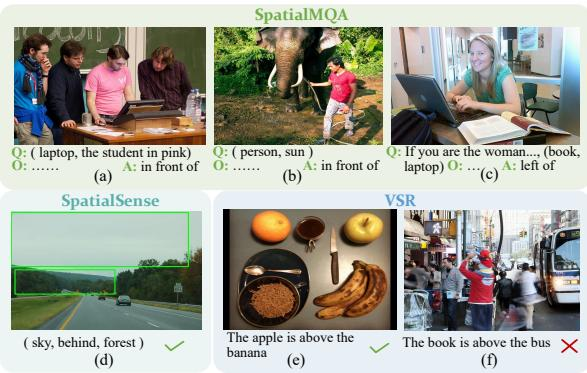
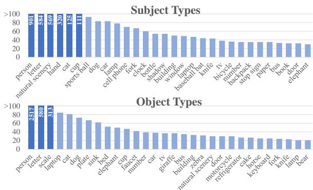
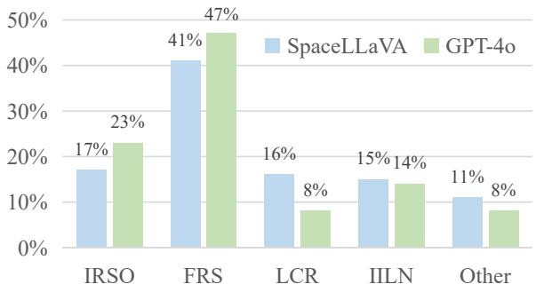
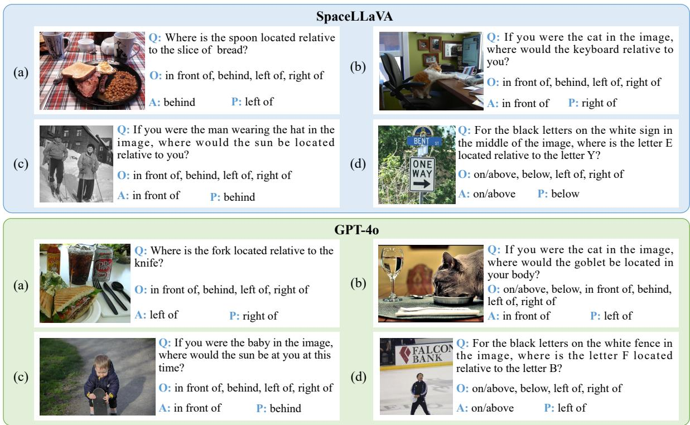
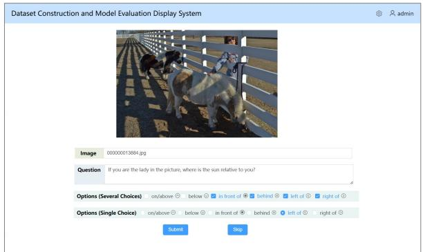
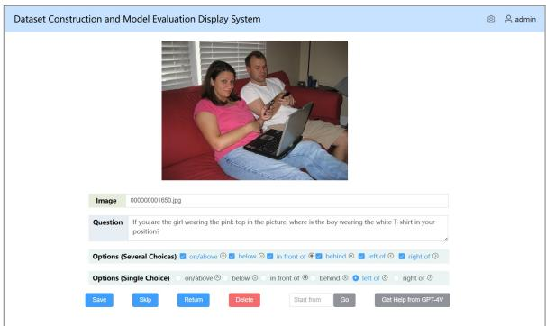
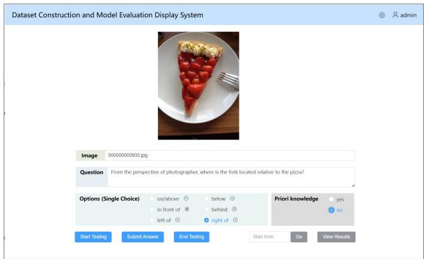

# Can Multimodal Large Language Models Understand Spatial Relations?

Jingping Liu♢\*, Ziyan Liu♢, Zhedong Cen♢, Yan Zhou♢, Yinan Zou♢, Weiyan Zhang♢\*, Haiyun Jiang♠, Tong Ruan♢

♢School of Information Science and Engineering, East China University of Science and Technology, Shanghai, China

♠School of Computer Science, Fudan University, Shanghai, China {jingpingliu,weiyanzhang}@ecust.edu.cn, y30241069@mail.ecust.edu.cn

## Abstract

Spatial relation reasoning is a crucial task for multimodal large language models (MLLMs) to understand the objective world. However, current benchmarks have issues like relying on bounding boxes, ignoring perspective substitutions, or allowing questions to be answered using only the model’s prior knowledge without image understanding. To address these issues, we introduce SpatialMQA, a humanannotated spatial relation reasoning benchmark based on COCO2017, which enables MLLMs to focus more on understanding images in the objective world. To ensure data quality, we design a well-tailored annotation procedure, resulting in SpatialMQA consisting of 5,392 samples. Based on this benchmark, a series of closed- and open-source MLLMs are implemented and the results indicate that the current state-of-the-art MLLM achieves only 48.14% accuracy, far below the human-level accuracy of 98.40%. Extensive experimental analyses are also conducted, suggesting the future research directions. The benchmark and codes are available at https://huggingface. co/datasets/liuziyan/SpatialMQA.

## 1 Introduction

Multimodal large language models have become increasingly significant in AI due to their ability to process and integrate data from multiple sources such as text and images. Although MLLMs excel in tasks like image recognition (Guo et al., 2023) and classification (Wang et al., 2023), they still face challenges with more complex tasks, such as multimodal understanding and reasoning (Zheng et al., 2023), highlighting the need for further exploration and enhancement of their capabilities.

A critical aspect of evaluating MLLMs is their ability to understand spatial relations, which involves inferring the spatial relations between entities in a given scene (Liu et al., 2023a). For instance, in Figure 1(a), given the subject “laptop” and the object “the student in pink”, the model needs to infer that the spatial relation between them is “in front of”. This task is important because understanding spatial relations in the objective world is a fundamental human ability essential for daily life (Proulx et al., 2016; Hawes and Ansari, 2020). For instance, to fully the scene of four students discussing at the podium in Figure 1(a), it is necessary to identify the entities (laptop, podium, the student in pink) and their spatial relations (laptop on podium, laptop in front of the student in pink).

  
Figure 1: Samples from spatial relation reasoning benchmarks. “Q”, “O”, and “A” in our SpatialMQA denote the question, options, and answer. In SpatialSense (Yang et al., 2019) and VSR (Liu et al., 2023a), questions are binary classification, with image and text inputs, and true/false outputs.

Several benchmarks exist for spatial relation reasoning, yet they remain insufficient for fully evaluating MLLMs’ ability to understand spatial relations. These benchmarks can be categorized based on whether they use bounding boxes (bboxes) to enclose subjects and objects. First, benchmarks with bbox annotations, such as SpatialVOC2K (Belz et al., 2018), Rel3D (Goyal et al., 2020), and SpatialSense+ (Wen et al., 2024), face two main challenges. On one hand, the subject or object in the question may not be explicitly visible in images, making it impossible to use bboxes (Liu et al., 2023a). As illustrated in Figure 1(b), the subject “sun” cannot be framed with a bbox in the question “Where is the sun located relative to the man?”. On the other hand, some spatial relations in these benchmarks are not grounded in the objective world, leading to a gap between machine and human cognition. For instance, in Figure 1(d), the sky is objectively above the forest, but SpatialSense marks it as behind the forest. Secondly, benchmarks without labeled bboxes, like EmbSpatial (Du et al., 2024), VSR (Liu et al., 2023a), and SpatialVLM (Chen et al., 2024), also face two main issues. One major issue is that they often ignore perspective substitution (first- and third-person). Even when included, it is only a small part. For instance, in VSR, only 6% of the benchmark uses a first-person perspective. This limits the model’s ability to understand spatial relations from different perspectives, which is important for complex, dynamic scenarios like autonomous driving (Gao et al., 2024). Another issue is that some questions in these benchmarks can be answered correctly without images, relying only on the model’s prior knowledge. As shown in Figure 1(f), the question “the book is above the bus” can often be answered “No” based on commonsense, without needing to analyze the image. This prevents a proper evaluation of MLLMs’ image understanding abilities.

Table 1: Overview of spatial relation reasoning benchmarks. “Q. Type”, “Rel.”, “Type”, “Obj. W”, “Per. sub.”, “Kn.”, and “MQA” stand for “question type”, “relations”, “types of subject or object”, “objective world”, “perspective substitution” “knowledge”, and “multiple-choice QA”, respectively. “Objective world” indicates whether the benchmark’s annotations use the objective world as the reference system. “Perspective substitution” means whether questions involve perspective (first- or third-person). “Knowledge” indicates whether questions in the benchmark can be answered solely with models’ prior knowledge, without images.
<table><tr><td>Benchmark</td><td>Q. Type</td><td># Rel.</td><td># Type</td><td>w/o bbox</td><td>Obj. W</td><td>Per. sub.</td><td>w/o Kn.</td><td>Size</td></tr><tr><td>SpatialVOC2K (Belz et al., 2018)</td><td>Cloze</td><td>17</td><td>20</td><td>X</td><td>X</td><td>X</td><td>X</td><td>2,026</td></tr><tr><td>SpatialSense (Yang et al., 2019)</td><td>T or F</td><td>9</td><td>-</td><td>X</td><td>X</td><td>First</td><td>X</td><td>17,498</td></tr><tr><td>Rel3D (Goyal et al., 2020)</td><td>T or F</td><td>30</td><td>67</td><td>X</td><td>X</td><td>X</td><td>-</td><td>27,336</td></tr><tr><td>SpatialSense+ (Wen et al., 2024)</td><td>T or F</td><td>9</td><td>-</td><td>X</td><td>X</td><td>X</td><td>√</td><td>7,254</td></tr><tr><td>SpatialRGPT (Cheng et al., 2024)</td><td>OpenQA</td><td>12</td><td>88</td><td>X</td><td>√</td><td>X</td><td>√</td><td>1,406</td></tr><tr><td>EmbSpatial (Du et al., 2024)</td><td>MQA</td><td>6</td><td>294</td><td>√</td><td>X</td><td>X</td><td>X</td><td>3640</td></tr><tr><td>VSR (Liu et al., 2023a)</td><td>T or F</td><td>66</td><td>32</td><td>√</td><td>Partly</td><td>First</td><td>X</td><td>10,972</td></tr><tr><td>SpatialVLM (Chen et al., 2024)</td><td>OpenQA</td><td>-</td><td></td><td>√</td><td>Partly</td><td>X</td><td>X</td><td>546</td></tr><tr><td>SpatialMQA (ours)</td><td>MQA</td><td>6</td><td>128</td><td>√</td><td>√</td><td>First/Third</td><td>√</td><td>5,392</td></tr></table>

Hence, in this paper, we introduce SpatialMQA, a new benchmark in a multiple-choice question & answer format, designed to fully evaluate the ability of MLLMs in multimodal spatial relation reasoning. The benchmark includes 5,392 samples based on COCO2017 (Lin et al., 2014), covering 128 subject and object types, without the use of bboxes. To address the limitations of existing benchmarks, we establish clear annotation guidelines for SpatialMQA, incorporating questions that involve perspective substitution based on the objective world as a reference system, while avoiding questions that can be answered solely through the models’ prior knowledge without images. In addition, we design a three-round annotation procedure for quality control. To assess the spatial relation reasoning capabilities of MLLMs, we conduct comprehensive experiments using closed-source models such as GPT-4o (Achiam et al., 2023) and Gemini-1.5-flash (Team et al., 2023), as well as open-source models like LLaVA (Liu et al., 2024) and SpaceLLaVA (Chen et al., 2024).

In summary, our contributions include:

• We introduce a new manually annotated highquality benchmark for multimodal spatial relation reasoning without bboxes.

• The main characteristic of SpatialMQA is that the questions involve perspective substitutions using the objective world as a reference. Also, the questions cannot be answered using only the model’s prior knowledge without images.

• We evaluate both open- and closed-source MLLMs on SpatialMQA, indicating that stateof-the-art (SoTA) methods like GPT-4o and instruction-tuned SpaceLLaVA achieve accuracies of 40.20% and 48.14%, respectively, far below the human accuracy of 98.40%. We further provide detailed analyses and suggest future research directions.

Table 2: The definition of the spatial coordinate system (SCS) and its six spatial relations. The coordinates for the subject are specified as $( x _ { s } , y _ { s } , z _ { s } )$ and for the object as $( x _ { o } , y _ { o } , z _ { o } )$
<table><tr><td rowspan=1 colspan=2>Terms     Definition</td></tr><tr><td rowspan=1 colspan=1>SCS</td><td rowspan=3 colspan=1>The spatial coordinate system is established based on the objective world, with gravity pointing downwardand the observer as the origin. The X-axis spans the observer&#x27;s left (negative) to right (positive), the Y-axisfrom back (negative) to front (positive), and the Z-axis from down (negative) to up (positive).</td></tr><tr><td rowspan=1 colspan=1></td></tr><tr><td rowspan=1 colspan=1></td></tr><tr><td rowspan=1 colspan=1>left of</td><td rowspan=2 colspan=1>The subject is to the left of the object when $x _ { s } < x _ { o } .$ The subject is to the right of the object when $x _ { s } > x _ { o } .$ </td></tr><tr><td rowspan=1 colspan=1>right of</td></tr><tr><td rowspan=1 colspan=1>in front of</td><td rowspan=2 colspan=1>The subject is in front of the object when 1) $y _ { s } \cdot y _ { o } > 0 , \left| y _ { s } \right| - \left| y _ { o } \right| < 0 , { \mathrm { o r } } 2 ) y _ { s } \cdot y _ { o } < 0 , y _ { s } > 0 > y _ { o } .$ The subject is behind the object when 1) $y _ { s } \cdot y _ { o } > 0 , | y _ { s } | - | y _ { o } | > 0 , 0 \mathrm { r } 2 ) y _ { s } \cdot y _ { o } < 0 , y _ { s } < 0 < y _ { o } .$ </td></tr><tr><td rowspan=1 colspan=1>behind</td></tr><tr><td rowspan=1 colspan=1>on/above</td><td rowspan=1 colspan=1>The subject is on/above the object when $z _ { s } > z _ { o } .$ below      The subject is below the object when $z _ { s } < z _ { o } .$ </td></tr></table>

## 2 Problem Formulation

In this paper, we consider the spatial relation reasoning task as a multiple-choice questionanswering problem. Given a text question Q and an image I, where Q asks about the spatial relation between two target entities, the task requires the model to select the correct answer from k (k = $2 , . . . , 6 )$ options. Each option corresponds to a spatial relation from the pre-defined set $R = \{ l e f t o f ,$ right of, in front of, behind, on/above, below , with their definitions provided in Table 2. For instance, in Figure 1(a), given the question “Where is the laptop located relative to the student in pink?”, an image, and six options, an ideal model would select “in front of” as the correct answer.

## 3 SpatialMQA Construction

In this section, we detail the construction of the SpatialMQA benchmark, including image source, annotation guidelines, and annotation procedures.

## 3.1 Image Source

In this study, we choose COCO2017 (Lin et al., 2014) as our image source due to its notable advantages: 1) Extensive collection. COCO2017 contains over 160,000 images, providing a broad selection for identifying high-quality images to analyze spatial relations. 2) Diverse types: The dataset encompasses 80 entity types, covering a wide range of entities in the objective world, such as people, animals, cars, and food. 3) Multi-entity scenarios: The images in COCO2017 often involve multiple entities, making it easier to select two appropriate entities to determine their spatial relation. From this dataset, we select 30,000 high-quality images to annotate two entities and their spatial relation.

## 3.2 Annotation Guidelines

Based on the collected images, we label each one with a question, options, and the correct answer. To assist annotators in creating high-quality samples, we provide annotation guidelines, including question types and important precautions.

Question types. Based on the observer’s perspective, we divide the question types into two types: out-of-image and in-image perspectives. In the first type, the observer exists outside the image and we manually pre-define several question templates like “Where is the subject located relative to the object?”. See Appendix A for more templates. In the second type, the observer’s perspective is within the image and can be further divided into two types. The first type uses the object’s perspective as the observer’s perspective (also denoted as the first-person perspective). Question templates for this type address the spatial relation between the subject and the observer (the object), such as “If you are [object] in the image, where is the subject located relative to you?”. The second type considers a living being (third-person perspective) within the image as the observer, distinct from both the subject and the object. It includes question templates like, “If you are the [living being] in the image, from your perspective, where is the subject located relative to the object?”.

Precautions. This part guides annotators in excluding low-quality samples. There are two main precautions to consider: Firstly, the question cannot be correctly answered based solely on the model’s prior knowledge without an image. For instance, the question “the book is above the bus” in Figure 1(f) can be answered as “No” without visual input. Secondly, the image must be clear, with the subject or object of the question being easily identifiable.

Table 3: Statistics of our SpatialMQA. The samples in “first-p”(first-person perspective) and “third-p”(thirdperson perspective) are both from “In-I”(In-image). The latter has fewer samples due to the limited number of images that depict three distinct living entities. “Out-I” means “out-of-image”.
<table><tr><td></td><td>Train</td><td>Dev</td><td>Test</td><td>Total</td><td>Ratio</td><td></td><td></td><td>Min.L Max.L Avg.L</td></tr><tr><td>SpatialMQA</td><td>3,780</td><td>536</td><td>1,076</td><td>5,392</td><td>100.00</td><td>7</td><td>34</td><td>18.84</td></tr><tr><td colspan="9">Spatial relations</td></tr><tr><td>left of</td><td>1,040</td><td>148</td><td>296</td><td>1,484</td><td>27.52</td><td>7</td><td>34</td><td>18.39</td></tr><tr><td>right of</td><td>980</td><td>139</td><td>279</td><td>1,398</td><td>25.93</td><td>8</td><td>32</td><td>18.50</td></tr><tr><td>in front of</td><td>565</td><td>80</td><td>161</td><td>806</td><td>14.95</td><td>9</td><td>33</td><td>20.04</td></tr><tr><td>behind</td><td>529</td><td>75</td><td>151</td><td>755</td><td>14.00</td><td>7</td><td>34</td><td>18.61</td></tr><tr><td>on/above below</td><td>353 313</td><td>50</td><td>100</td><td>503</td><td>9.33</td><td>8</td><td>33</td><td>18.30</td></tr><tr><td></td><td></td><td>44</td><td>89</td><td>446</td><td>8.27</td><td>8</td><td>32</td><td>20.29</td></tr><tr><td colspan="9">Question types</td></tr><tr><td>Out-I</td><td>1,513</td><td>217</td><td>452</td><td>2,182</td><td>40.00</td><td>7</td><td>33</td><td>15.81</td></tr><tr><td>In-I</td><td>2,267</td><td>319</td><td>624</td><td>3,210</td><td>60.00</td><td>12</td><td>34</td><td>20.91</td></tr><tr><td>#first-p</td><td>2,136</td><td>299</td><td>590</td><td>3,025</td><td>94.24</td><td>12</td><td>34</td><td>20.60</td></tr><tr><td># third-p</td><td>131</td><td>20</td><td>34</td><td>185</td><td>5.76</td><td>18</td><td>34</td><td>25.91</td></tr></table>

## 3.3 Annotation Procedure

To create a high-quality benchmark, we organize a professional team of three annotators, two checkers, and one reviewer. All team members are trained to understand the definition of the spatial coordinate system, six spatial relations, and annotation guidelines. The procedure includes first-round annotation, second-round checking, and third-round review.

First-round annotation. We invite three college students, assigning 10,000 images to each for annotation. According to the guidelines, they write a reasonable question for each image, select options from a predefined set, and mark the correct answer from the options.

Second-round checking. We invite two other college students to simultaneously check the rationality of all samples. Furthermore, each student is assigned an additional task. One student is responsible for checking whether the correct answer to the question can be determined through prior knowledge without images (corresponding to precaution 1). The other student verifies whether the subject or object in the image is clear (corresponding to precaution 2). Samples identified as unqualified by the checkers are returned to annotators with explanations for correction. This process is repeated until a batch achieves 90% accuracy, as determined by the checkers.

Third-round review. A verified batch is given to a main author for double review. The author randomly inspects 20% of the batch samples. Any unqualified annotations are returned to the check team with explanations, allowing them to refine their criteria, which in turn helps standardize the construction team’s work. The cycle continues until the batch achieves 95% accuracy. Finally, we obtain 5,392 high-quality samples to form SpatialMQA.

  
Figure 2: Distributions of subject and object types.

## 4 SpatialMQA Analysis

Benchmark statistics. As reported in Table 3, SpatialMQA contains 5,392 samples, divided into training, validation, and test sets according to a 7:1:2 ratio. In this benchmark, the questions have a minimum length of 7 words, a maximum length of 34, and an average length of 18.84. Notably, the minimum length of questions in the in-image perspective is 2-3 times longer than the minimum length of questions in the entire benchmark, as these questions typically involve three entities, while other questions generally involve only two.

Diversity of subject and object types in questions. To verify the diversity of questions in our benchmark, we use GPT-4o with in-context learning (ICL) to extract the subjects and objects in questions and classify them into predefined categories. This process is detailed in Appendix B. According to our statistics, there are 113 subject categories and an additional category that includes all subject categories with a sample size of five or fewer, and 84 object categories, along with an additional category that encompasses all object categories with a sample size of five or fewer. Due to the overlap between subject and object types, we have a total of 128 distinct subject and object types. To provide a more intuitive understanding of these types, we present the subject and object types with Top-30 frequency, as shown in Figure 2.

Option combinations. In SpatialMQA, the number of question options varies to ensure they are appropriate for questions. For instance, options like “on/above” and “below” are not suitable for “where is the motorcycle located relative to the car?”. Hence, we only include the other four options. Based on the coordinate dimensions, we set the number of options to 2 (two spatial relations in one dimension), 4 (four spatial relations in two dimensions), or 6. According to our statistics, 75% of samples (4036) have 4 options, while 12% (637) and 13% (719) have 2 and 6 options, respectively.

Table 4: Model comparison (%) on our SpatialMQA benchmark. All results are the average of three runs.
<table><tr><td>Model</td><td>Settings</td><td>P</td><td>R</td><td>F1</td><td>Acc</td><td>Settings</td><td>P</td><td>R</td><td>F1</td><td>Acc</td></tr><tr><td colspan="9">Open-source MLLMs</td><td></td></tr><tr><td>BLIP-vqa-base</td><td></td><td>32.92</td><td>20.86</td><td>25.54</td><td>26.49</td><td>FULL</td><td>48.12</td><td>31.48</td><td>38.06</td><td>33.64</td></tr><tr><td>BLIP2-opt-2.7B</td><td></td><td>31.31</td><td>34.97</td><td>33.04</td><td>26.86</td><td>LoRA</td><td>55.20</td><td>37.47</td><td>44.64</td><td>29.93</td></tr><tr><td>InstructBLIP-3B</td><td></td><td>37.42</td><td>27.47</td><td>31.69</td><td>28.53</td><td>LoRA</td><td>44.22</td><td>44.80</td><td>44.51</td><td>42.38</td></tr><tr><td>mPLUG-Owl-7B</td><td></td><td>34.30</td><td>32.90</td><td>33.58</td><td>26.49</td><td>LoRA</td><td>36.05</td><td>38.59</td><td>37.28</td><td>31.88</td></tr><tr><td>IDEFICS-9B</td><td></td><td>17.72</td><td>25.80</td><td>21.00</td><td>22.12</td><td>LoRA</td><td>35.13</td><td>36.41</td><td>35.76</td><td>29.28</td></tr><tr><td>LLaVA1.5-7B</td><td></td><td>30.72</td><td>31.18</td><td>30.95</td><td>29.28</td><td>LoRA</td><td>46.10</td><td>44.56</td><td>45.32</td><td>46.85</td></tr><tr><td>SpaceLLaVA</td><td></td><td>35.13</td><td>32.58</td><td>33.81</td><td>31.32</td><td>LoRA</td><td>47.96</td><td>46.18</td><td>47.05</td><td>48.14</td></tr><tr><td colspan="9">Closed-source MLLMs</td><td></td></tr><tr><td>Gemini-1.5-flash</td><td>0-shot</td><td>38.55 51.47</td><td>35.47 33.46</td><td>36.95 40.55</td><td>35.40</td><td>2-shot 3-shot</td><td>49.30 51.52</td><td>35.11</td><td>41.01</td><td>36.80</td></tr><tr><td></td><td>1-shot</td><td></td><td></td><td></td><td>36.20</td><td></td><td></td><td>35.82</td><td>42.26</td><td>38.00</td></tr><tr><td>GPT-40</td><td>0-shot 1-shot</td><td>48.62 48.04</td><td>40.19 39.17</td><td>44.01 43.15</td><td>40.20 39.00</td><td>2-shot 3-shot</td><td>48.70 46.76</td><td>38.36 36.99</td><td>42.92 41.30</td><td>38.40 37.80</td></tr><tr><td colspan="9">Other Methods</td></tr><tr><td>Random Choose</td><td></td><td>30.22</td><td>27.97</td><td>29.05</td><td>27.20</td><td></td><td></td><td></td><td></td><td></td></tr><tr><td>Human</td><td></td><td>98.56</td><td>98.40</td><td>98.48</td><td>98.40</td><td>Text-only</td><td>23.94</td><td>24.58</td><td>24.26</td><td>24.40(3)</td></tr></table>

## 5 Experiments

In this section, we implement state-of-the-art models on our newly constructed SpatialMQA benchmark, aiming at assessing their performance and identifying the underlying challenges.

## 5.1 Baselines

We mainly select three types of methods: opensource MLLMs, closed-source MLLMs, and others.

Open-source MLLMs. We use BLIP (Li et al., 2022), BLIP2 (Li et al., 2023), InstructBLIP (Dai et al., 2024), mPLUG-Owl (Ye et al., 2023), IDEFICS (Laurençon et al., 2023), LLaVA (Liu et al., 2024), and SpaceLLaVA (Chen et al., 2024) for comparison. Two settings are designed: direct inference and instruction tuning. In the first setting, models directly produce the answer given an image, a question, and multiple options. Note that all models except BLIP receive a task prompt, as described in Appendix C. In the second setting, we use different tuning strategies: full parameter updates for BLIP and parameter-efficient tuning (LoRA (Hu et al., 2021)) for the other MLLMs. Instruction data is generated by transforming the input and output from the training data, and the task prompt remains consistent with the previous setting.

Closed-source MLLMs. We randomly select 500 samples in SpatialMQA and adopt Gemini-1.5-flash and GPT-4o, two of the most powerful models, for our experiments. For both models, we employ two settings: zero-shot reasoning and few-shot reasoning. In the first setting, we input images, questions, and options, and use a task prompt to guide the MLLM to output answers. Detailed prompts are provided in Appendix D. In the second setting, we use 1-shot, 2-shot, and 3-shot ICL with the same instructions. The ICL examples are randomly selected from the training set and fixed for all samples in the test set.

Other methods. We further design two methods: random selection and manual answering. In the first method, we use a random function to select an answer from the options for each question. In the second method, we randomly select 500 samples from SpatialMQA and invite three college students (different from the annotation team in Section 3.3) to answer the questions. The final answer is determined by majority voting, and if the three students provide different answers, the question is considered incorrect.

Table 5: Results (Acc %) grouped by question types and answer types. Q1, Q2, and Q3 represent the question from the “Out-of-image” perspective, “first-person” , and “third-person” perspectives in images. Ax, Ay, and Az represent answers involving “left of” and “right of” on the X-axis, “in front of” and “behind” on the Y-axis, and “on/above” and “below” on the Z-axis. † and ‡ denote the best few-shot settings in the Main Results, specifically 3-shot and 1-shot, respectively.
<table><tr><td>Model</td><td>Settings</td><td>Q1</td><td>Q2</td><td>Q3</td><td>Ax</td><td>Ay</td><td>Az</td></tr><tr><td colspan="8">Open-source MLLMs</td></tr><tr><td>BLIP-vqa-base</td><td>Full</td><td>40.93</td><td>36.10</td><td>52.94</td><td>39.65</td><td>25.64</td><td>28.57</td></tr><tr><td>BLIP2-opt-2.7B</td><td>LoRA</td><td>32.30</td><td>28.47</td><td>23.53</td><td>11.65</td><td>49.04</td><td>53.97</td></tr><tr><td>InstructBLIP-3B</td><td>LoRA</td><td>44.47</td><td>40.68</td><td>44.12</td><td>36.17</td><td>48.72</td><td>50.79</td></tr><tr><td>mPLUG-Owl-7B</td><td>LoRA</td><td>37.83</td><td>28.14</td><td>17.65</td><td>17.74</td><td>46.47</td><td>50.79</td></tr><tr><td>IDEFICS-9B</td><td>LoRA</td><td>33.41</td><td>26.95</td><td>14.71</td><td>15.13</td><td>45.51</td><td>45.50</td></tr><tr><td>LLaVA1.5-7B</td><td>LoRA</td><td>53.14</td><td>40.99</td><td>64.71</td><td>55.71</td><td>29.64</td><td>48.13</td></tr><tr><td>SpaceLLaVA</td><td>LoRA</td><td>54.87</td><td>42.37</td><td>58.82</td><td>56.00</td><td>51.85</td><td>31.41</td></tr><tr><td colspan="8">Closed-source MLLMs</td></tr><tr><td>Gemini-1.5-flash</td><td>0-shot Few-shot†</td><td>42.73 48.18</td><td>26.83 26.83</td><td>50.00 52.94</td><td>39.17 49.58</td><td>26.25 21.88</td><td>41.00</td></tr><tr><td>GPT-40</td><td>0-shot</td><td>44.09</td><td>33.74</td><td>61.76</td><td>37.08</td><td>47.50</td><td>36.00 36.00</td></tr><tr><td></td><td>Few-shot</td><td>45.00</td><td>32.52</td><td>47.06</td><td>38.75</td><td>38.75</td><td>40.00</td></tr><tr><td colspan="8">Other Methods</td></tr><tr><td>Random Choose</td><td></td><td>30.00</td><td>24.80</td><td>26.47</td><td>25.42</td><td>27.50</td><td></td></tr><tr><td></td><td></td><td>25.91</td><td></td><td>23.53</td><td></td><td></td><td>31.00</td></tr><tr><td>Human</td><td>Text-only</td><td>98.51</td><td>23.17 98.24</td><td>100.00</td><td>23.75 98.61</td><td>25.00 97.79</td><td>25.00 98.68</td></tr></table>

## 5.2 Settings and Metrics

The hyperparameter settings for the open-source MLLMs are detailed in Appendix E. These models are executed on a workstation with two NVIDIA A100-PCIE-40GB GPUs. In the experiments, we report four metrics: precision (P), recall (R), F1, and accuracy (Acc).

## 5.3 Main Results

We perform all baseline methods on our SpatialMQA benchmark. The experimental results are presented in Table 4. From the table, we notice that: 1) All MLLMs perform poorly on SpatialMQA, with significant room for improvement compared to the human accuracy of 98.40%. The best-performing model, SpaceLLaVA with LoRA, achieves only 48.14% accuracy, despite being finetuned on LLaVA with a large amount of spatial VQA samples. Notably, LLaVA’s visual instruction tuning also involves incorporating coordinate data with bboxes and corresponding captions. This indicates that our SpatialMQA benchmark presents a significant challenge for MLLMs. 2) Among opensource MLLMs, instruction-tuned models excel in spatial relation reasoning compared to those without instruction tuning. For instance, the instructiontuned SpaceLLaVA shows a 16.82% accuracy improvement over its non-instruction-tuned version.

Among closed-source LLMs, GPT-4o performs best with zero-shot learning, but its accuracy decreases as the number of ICL samples increases. In contrast, Gemini’s accuracy improves with more ICL samples. The reasons for these opposing results are explained in “Impact of different ICL examples” of Section 5.4. 3) In other methods, when humans answer questions without images, the accuracy is 24.40% (based on a random selection of 500 samples from the test set), which is comparable to random selection and significantly lower than the accuracy achieved with images. This indicates that our benchmark heavily relies on images to answer questions. In other words, our benchmark rarely includes questions that can be answered solely with prior knowledge. Furthermore, manual annotation reveals that only 3 out of 500 samples could be answered using prior knowledge alone.

## 5.4 Detailed Analysis

Group analysis of question types and answer types. As mentioned in Section 3.2, question types include “Out-of-image” (denoted as Q1) and “Inimage” (further divided into “first-person perspective” (Q2) and “third-person perspective” (Q3)). In addition, we classify the answer types as Ax, Ay, and Az, representing answers involving left of and right of on the X-axis, in front of and behind on the Y-axis, and on/above and below on the Z-axis, respectively. The results are listed in Table 5. From the table, we observe that human reasoning abilities in spatial relations are generally consistent across different groups, but all models display significant performance discrepancies within these groups. For instance, human scores for Ax, Ay, and Az are consistently around 98%, while SpaceLLaVA with LoRA exhibits a maximum performance gap of 24.59% in these groups. This suggests that it is essential to improve the model’s reasoning abilities in various spatial relations in a balanced manner.

Table 6: Results (Acc %) for different ICL.
<table><tr><td>Model</td><td>Settings</td><td>Alig.</td><td>Misalig.</td></tr><tr><td rowspan="3">Gemini-1.5-flash</td><td>1-shot</td><td>36.42</td><td>35.16</td></tr><tr><td>2-shot</td><td>37.14</td><td>35.94</td></tr><tr><td>3-shot</td><td>38.28</td><td>37.09</td></tr><tr><td rowspan="3">GPT-40</td><td>1-shot</td><td>39.09</td><td>37.75</td></tr><tr><td>2-shot</td><td>39.43</td><td>36.96</td></tr><tr><td>3-shot</td><td>39.88</td><td>35.87</td></tr></table>

Impact of different ICL examples. We introduce ICL samples for closed-source MLLMs in experiments. To explore the impact of different ICL examples, we divide them into two categories: aligned with the input question type and misaligned. For evaluation, we randomly selected 100 samples for question types Q1, Q2, and Q3 respectively (if a certain category has fewer than 100 samples, we use all available samples). The results are listed in Table 6. From the results, we notice that models with aligned ICL examples outperform those with misaligned ICL examples. For instance, GPT-4o with aligned 3-shot ICL examples improves accuracy by 4.01% over misaligned ones. Notably, the decrease in GPT-4o’s spatial relation reasoning ability, mentioned in Section 5.3, may be due to the misalignment of examples with the input question type. In contrast, Gemini’s performance improves with more ICL examples in the misaligned setting. This could indicate that Gemini effectively utilizes a wider range of examples to enhance generalization and extract relevant features despite the misalignment.

Impact of images and option counts. We conduct analysis experiments by either removing images (I) in the input or using a fixed count of six options (O). The results are listed in Table 7. From the results, we draw the conclusions: 1) MLLMs with Q+O, when tested with varying options, perform similarly to random selection and significantly underperform MLLMs with ${ \mathrm { I } } { + } { \mathrm { Q } } { + } { \mathrm { O } } .$ . This indicates that our benchmark heavily relies on image inputs and cannot depend solely on the model’s prior knowledge. 2) MLLMs with $_ { \mathrm { Q + O } }$ still perform significantly better than random selection (17.20%) when given a fixed set of six options. This is because some of the options in this set contradict common sense, allowing the model to exclude them, even without image inputs. This observation is why we remove options that contradict commonsense from our benchmark.

Table 7: Impact (Acc %) of images and option counts.
<table><tr><td colspan="2"></td><td>All</td><td>Part</td></tr><tr><td>Random</td><td></td><td>17.20</td><td>27.20</td></tr><tr><td rowspan="2">Gemini-1.5-flash</td><td> $_ { \mathrm { Q + O } }$ </td><td>23.20</td><td>27.60</td></tr><tr><td> $_ { \mathrm { I + Q + O } }$ </td><td>29.60</td><td>35.40</td></tr><tr><td rowspan="2">GPT-40</td><td>Q+0</td><td>26.40</td><td>27.80</td></tr><tr><td> $_ { \mathrm { I + Q + O } }$ </td><td>33.80</td><td>40.20</td></tr></table>

  
Figure 3: Distribution of error types.

## 5.5 Error Types

To guide future research in spatial relation reasoning for MLLMs, we analyze 200 error samples produced by SpaceLLaVA and GPT-4o on SpatialMQA. After manual classification, error types are divided into four categories and other errors: (a) incorrect recognition of subjects and objects (IRSO), (b) failure in perspective substitution (FRS), (c) lack of commonsense reasoning ability (LCR), and (d) incorrect identification of spatial relations for letters and numbers (IILN). The error distribution is shown in Figure 3. We observe that FRS errors are the most frequent, with IRSO, LCR, and IILN errors being comparable. To illustrate these error types more intuitively, we provide examples, as shown in Figure 4.

  
Figure 4: Error examples. (a), (b), (c), and (d) describe examples of the IRSO, FRS, LCR, and IILN types, respectively. “A” and “P” represent the ground truth answer and predicted answer.

## 6 Related Work

Spatial relation reasoning. Identifying spatial relations between subjects and objects in images is crucial for understanding the world. Benchmarks for this task fall into two main types: those with bboxes and those without. The former are sourced from either synthetic or realworld scenes. CLEVR (Johnson et al., 2017) and Rel3D (Goyal et al., 2020) are typical examples of synthesized benchmarks, but they do not accurately reflect real-world scenes. Hence, several real-scene benchmarks have been proposed, including SpatialVOC2K (Belz et al., 2018), SpatialSense (Yang et al., 2019), SpatialSense+ (Wen et al., 2024), SpatialRGPT-Bench (Cheng et al., 2024), NLVR2 (Suhr et al., 2017), COCO (Lin et al., 2014), and GQA (Hudson and Manning, 2019). However, they still use bboxes, which cause two problems: first, some complex spatial relations can’t be fully captured with bboxes (Liu et al., 2023a); second, bboxes make it easier for models to solve tasks without fully understanding the image (Wen et al., 2024). Typical benchmarks for the latter include EmbSpatial-Bench (Du et al., 2024), MME (Fu et al., 2023), SpatialVLM (Chen et al., 2024), EgoThink (Cheng et al., 2023), and VSR (Liu et al., 2023a). The first three focus only on out-of-image perspectives and do not always annotate samples based on the objective world. Note that SpatialVLM’s test set is small and not yet opensourced. EgoThink is limited to the first-person perspective, with fewer than 100 samples in its spatial reasoning benchmark. While VSR considers different perspectives, only 6% of its data covers them, and some questions can be answered using prior knowledge without images.

Multimodal large language models. With the development of MLLMs, many researchers have applied these models to multimodal downstream tasks. MLLMs can be divided into two categories: closed- and open-source models. Typical closedsource MLLMs include GPT-4o and Gemini. Common methods to adapt these models for multimodal tasks mainly include ICL (Shukor et al., 2023; Liu et al., 2023b) and Chain-of-Thought (CoT) (Zhang et al., 2024; Wang et al., 2024). Typical open-source MLLMs include BLIP2 (Li et al., 2023), LLaVA (Liu et al., 2024), and SpaceLLaVA (Chen et al., 2024). Due to their relatively limited instruction-following capabilities, open-source MLLMs often require instruction tuning for downstream tasks. This tuning can involve full parameter updates or minimal parameter updates, such as LoRA (Hu et al., 2021) and P-tuning v2 (Liu et al., 2021). Despite the promising progress of current MLLMs, they still perform poorly on our constructed SpatialMQA benchmark.

## 7 Conclusion

We introduce SpatialMQA, a manually annotated multimodal spatial relation reasoning benchmark based on COCO2017. To address the weaknesses of existing benchmarks, SpatialMQA is constructed without bboxes, involving perspective substitutions based on the objective world and excluding questions that can be answered solely by model’s prior knowledge without images. We implement a series of closed- and open-source MLLMs and conducted extensive experimental analyses. The results indicate that SpatialMQA is a challenging benchmark worth further exploration.

## Limitations

While SpatialMQA offers a valuable benchmark for evaluating current MLLMs, it has two main limitations: 1) SpatialMQA is created to assess the performance of MLLMs in spatial relation reasoning. To ensure high data quality, we design a manual annotation process, which guarantees a well-constructed and reliable test set. However, this method limits the scale of the training set, making it insufficient for fully fine-tuning MLLMs. Although several automatic annotation tools for spatial relation reasoning are mentioned in (Chen et al., 2024; Cheng et al., 2024; Cai et al., 2024), they are unsuitable for SpatialMQA due to its complex real-world samples from multiple perspectives. 2) SpatialMQA currently covers six basic spatial relations (left of, right of, in front of, behind, on/above, and below), and does not include more complex relations. We focus on these six because experimental results show they already pose significant challenges to current MLLMs. Mastering these fundamental relations is essential before tackling more complex spatial reasoning tasks.

## Ethical Statement

Our SpatialMQA benchmark is built upon COCO2017 (Lin et al., 2014), which is licensed under the Creative Commons Attribution 4.0 License. This license allows us to distribute and re-annotate the dataset, as long as the original work is properly cited. Hence, we release SpatialMQA under the CC-BY 4.0 license. Additionally, we have carefully reviewed the benchmark to ensure it contains no harmful content, such as gender bias, racial discrimination, or inappropriate material.

## Acknowledgments

This paper was supported by the National Natural Science Foundation of China (No. 62306112), Shanghai Sailing Program (No. 23YF1409400), and Shanghai Pilot Program for Basic Research (No. 22TQ1400100-20).

## References

Josh Achiam, Steven Adler, Sandhini Agarwal, Lama Ahmad, Ilge Akkaya, Florencia Leoni Aleman, Diogo Almeida, Janko Altenschmidt, Sam Altman, Shyamal Anadkat, et al. 2023. Gpt-4 technical report. arXiv preprint arXiv:2303.08774.

Anja Belz, Adrian Muscat, Pierre Anguill, Mouhamadou Sow, Gaétan Vincent, and Yassine Zinessabah. 2018. Spatialvoc2k: A multilingual dataset of images with annotations and features for spatial relations between objects. In Proceedings of the 11th International Conference on Natural Language Generation, pages 140–145.

Wenxiao Cai, Yaroslav Ponomarenko, Jianhao Yuan, Xiaoqi Li, Wankou Yang, Hao Dong, and Bo Zhao. 2024. Spatialbot: Precise spatial understanding with vision language models. arXiv preprint arXiv:2406.13642.

Boyuan Chen, Zhuo Xu, Sean Kirmani, Brain Ichter, Dorsa Sadigh, Leonidas Guibas, and Fei Xia. 2024. Spatialvlm: Endowing vision-language models with spatial reasoning capabilities. In Proceedings ofthe IEEE/CVF Conference on Computer Vision and Pattern Recognition, pages 14455–14465.

An-Chieh Cheng, Hongxu Yin, Yang Fu, Qiushan Guo, Ruihan Yang, Jan Kautz, Xiaolong Wang, and Sifei Liu. 2024. Spatialrgpt: Grounded spatial reasoning in vision language model. arXiv preprint arXiv:2406.01584.

Sijie Cheng, Zhicheng Guo, Jingwen Wu, Kechen Fang, Peng Li, Huaping Liu, and Yang Liu. 2023. Can vision-language models think from a first-person perspective? arXiv preprint arXiv:2311.15596.

Wenliang Dai, Junnan Li, Dongxu Li, Anthony Meng Huat Tiong, Junqi Zhao, Weisheng Wang, Boyang Li, Pascale N Fung, and Steven Hoi. 2024. Instructblip: Towards general-purpose visionlanguage models with instruction tuning. Advances in Neural Information Processing Systems, 36.

Mengfei Du, Binhao Wu, Zejun Li, Xuanjing Huang, and Zhongyu Wei. 2024. Embspatial-bench: Benchmarking spatial understanding for embodied tasks with large vision-language models. arXiv preprint arXiv:2406.05756.

Chaoyou Fu, Peixian Chen, Yunhang Shen, Yulei Qin, Mengdan Zhang, Xu Lin, Zhenyu Qiu, Wei Lin, Jinrui Yang, Xiawu Zheng, Ke Li, Xing Sun, and Rongrong Ji. 2023. Mme: A comprehensive evaluation benchmark for multimodal large language models. ArXiv, abs/2306.13394.

Haoxiang Gao, Yaqian Li, Kaiwen Long, Ming Yang, and Yiqing Shen. 2024. A survey for foundation models in autonomous driving. arXiv preprint arXiv:2402.01105.

Ankit Goyal, Kaiyu Yang, Dawei Yang, and Jia Deng. 2020. Rel3d: A minimally contrastive benchmark for grounding spatial relations in 3d. Advances in Neural Information Processing Systems, 33:10514–10525.

Zixian Guo, Bowen Dong, Zhilong Ji, Jinfeng Bai, Yiwen Guo, and Wangmeng Zuo. 2023. Texts as images in prompt tuning for multi-label image recognition. In Proceedings of the IEEE/CVF Conference on Computer Vision and Pattern Recognition, pages 2808–2817.

Zachary Hawes and Daniel Ansari. 2020. What explains the relationship between spatial and mathematical skills? a review of evidence from brain and behavior. Psychonomic bulletin & review, 27:465–482.

Edward J Hu, Yelong Shen, Phillip Wallis, Zeyuan Allen-Zhu, Yuanzhi Li, Shean Wang, Lu Wang, and Weizhu Chen. 2021. Lora: Low-rank adaptation of large language models. arXiv preprint arXiv:2106.09685.

Drew A Hudson and Christopher D Manning. 2019. Gqa: A new dataset for real-world visual reasoning and compositional question answering. In Proceedings of the IEEE/CVF conference on computer vision and pattern recognition, pages 6700–6709.

Justin Johnson, Bharath Hariharan, Laurens Van Der Maaten, Li Fei-Fei, C Lawrence Zitnick, and Ross Girshick. 2017. Clevr: A diagnostic dataset for compositional language and elementary visual reasoning. In Proceedings ofthe IEEE CVPR, pages 2901–2910.

Hugo Laurençon, Daniel van Strien, Stas Bekman, Leo Tronchon, Lucile Saulnier, Thomas Wang, Siddharth Karamcheti, Amanpreet Singh, Giada Pistilli, Yacine Jernite, et al. 2023. Introducing idefics: An open reproduction of state-of-the-art visual language model, 2023. URL https://huggingface. co/blog/idefics. Accessed, pages 09–18.

Junnan Li, Dongxu Li, Silvio Savarese, and Steven Hoi. 2023. Blip-2: Bootstrapping language-image pretraining with frozen image encoders and large language models. In International conference on machine learning, pages 19730–19742. PMLR.

Junnan Li, Dongxu Li, Caiming Xiong, and Steven Hoi. 2022. Blip: Bootstrapping language-image pretraining for unified vision-language understanding and generation. In International conference on machine learning, pages 12888–12900. PMLR.

Tsung-Yi Lin, Michael Maire, Serge Belongie, James Hays, Pietro Perona, Deva Ramanan, Piotr Dollár, and C Lawrence Zitnick. 2014. Microsoft coco: Common objects in context. In Computer Vision– ECCV 2014: 13th European Conference, Zurich, Switzerland, September 6-12, 2014, Proceedings, Part V 13, pages 740–755. Springer.

Fangyu Liu, Guy Emerson, and Nigel Collier. 2023a. Visual spatial reasoning. Transactions ofthe Association for Computational Linguistics, 11:635–651.

Haotian Liu, Chunyuan Li, Qingyang Wu, and Yong Jae Lee. 2024. Visual instruction tuning. Advances in neural information processing systems, 36.

Weihao Liu, Fangyu Lei, Tongxu Luo, Jiahe Lei, Shizhu He, Jun Zhao, and Kang Liu. 2023b. Mmhqaicl: Multimodal in-context learning for hybrid question answering over text, tables and images. arXiv preprint arXiv:2309.04790.

Xiao Liu, Kaixuan Ji, Yicheng Fu, Weng Lam Tam, Zhengxiao Du, Zhilin Yang, and Jie Tang. 2021. Ptuning v2: Prompt tuning can be comparable to finetuning universally across scales and tasks. arXiv preprint arXiv:2110.07602.

Michael J Proulx, Orlin S Todorov, Amanda Taylor Aiken, and Alexandra A de Sousa. 2016. Where am i? who am i? the relation between spatial cognition, social cognition and individual differences in the built environment. Frontiers in psychology, 7:158846.

Mustafa Shukor, Alexandre Rame, Corentin Dancette, and Matthieu Cord. 2023. Beyond task performance: evaluating and reducing the flaws of large multimodal models with in-context-learning. In The Twelfth International Conference on Learning Representations.

Alane Suhr, Mike Lewis, James Yeh, and Yoav Artzi. 2017. A corpus of natural language for visual reasoning. In Proceedings of the 55th Annual Meeting of the Association for Computational Linguistics (Volume 2: Short Papers), pages 217–223.

Gemini Team, Rohan Anil, Sebastian Borgeaud, Yonghui Wu, Jean-Baptiste Alayrac, Jiahui Yu, Radu Soricut, Johan Schalkwyk, Andrew M Dai, Anja Hauth, et al. 2023. Gemini: a family of highly capable multimodal models. arXiv preprint arXiv:2312.11805.

Junjie Wang, Wei Li, Yinjian Wang, Ran Tao, and Qian Du. 2023. Representation-enhanced status replay network for multisource remote-sensing image classification. IEEE Transactions on Neural Networks and Learning Systems.

Lei Wang, Yi Hu, Jiabang He, Xing Xu, Ning Liu, Hui Liu, and Heng Tao Shen. 2024. T-sciq: Teaching multimodal chain-of-thought reasoning via large language model signals for science question answering. In Proceedings ofthe AAAI Conference on Artificial Intelligence, volume 38, pages 19162–19170.

Chuan Wen, Dinesh Jayaraman, and Yang Gao. 2024. Can transformers capture spatial relations between objects? arXiv preprint arXiv:2403.00729.

Kaiyu Yang, Olga Russakovsky, and Jia Deng. 2019. Spatialsense: An adversarially crowdsourced benchmark for spatial relation recognition. In Proceedings ofthe IEEE/CVF International Conference on Computer Vision, pages 2051–2060.

Qinghao Ye, Haiyang Xu, Guohai Xu, Jiabo Ye, Ming Yan, Yiyang Zhou, Junyang Wang, Anwen Hu, Pengcheng Shi, Yaya Shi, et al. 2023. mplug-owl: Modularization empowers large language models with multimodality. arXiv preprint arXiv:2304.14178.

Daoan Zhang, Junming Yang, Hanjia Lyu, Zijian Jin, Yuan Yao, Mingkai Chen, and Jiebo Luo. 2024. Cocot: Contrastive chain-of-thought prompting for large multimodal models with multiple image inputs. arXiv preprint arXiv:2401.02582.

Ge Zheng, Bin Yang, Jiajin Tang, Hong-Yu Zhou, and Sibei Yang. 2023. Ddcot: Duty-distinct chain-ofthought prompting for multimodal reasoning in language models. Advances in Neural Information Processing Systems, 36:5168–5191.

## A Question Templates

In Section 3.2, we design three types of questions. For each type, we manually define several question templates, as listed in Table 8. Q1, Q2, and Q3 indicate that the sample’s question type is “Out-ofimage”, the first-, and third-person perspective of “In-image”, respectively.

Table 8: Question Template.
<table><tr><td>Question Template</td></tr><tr><td>Q1 Where is ×× located relative to</td><td>Is ×× located to the left or right of ××? Which side of ×× is ×× located on?  $\underline { { \times } } \times : 2$  If you are ×× in the image, is ×× located to your</td></tr><tr><td rowspan="2">Q2 Q3</td><td>left or right? If you are ×× in the image, which side of ×× is ×× located on? If you are ×× in the image, where is ×× located</td></tr><tr><td>relative to you? If you are ×× in the image, from your perspective, is ×× located to the left or right of ××? If you are ×× in the image, from your perspective,</td></tr></table>

## B Statistics of Subject and Object Types

In Section 4, we use GPT-4o with ICL to extract the subjects and objects in questions and classify them into predefined categories. The process is as follows. First, we adopt GPT-4o with ICL to extract the subject and object of each question in SpatialMQA. Second, we randomly select 500 samples from the entire benchmark and manually define common types, in addition to the original 80 types from COCO2017, resulting in a total of 90 types. Third, we employ GPT-4o with ICL to classify every subject and object into these 90 types. Finally, samples that are not classified into predefined types are manually categorized into new types.

## C Details of Open-source MLLMs

In Section 5.1, we consider open-source MLLMs as baseline models. The task prompts and instruction data format of these models are presented in Tables 9 and 10.

## D Details of Closed-source MLLMs

In Section 5.1, we consider closed-source MLLMs as baseline models. The task prompts of these models are listed in Table 11.

Table 9: Task prompts for open-source MLLMs.
<table><tr><td>Models</td><td>Task prompt</td></tr><tr><td>BLIP</td><td>Input: Image: &lt;image&gt;, Question: {ques- tion}, Options: {options}. \n Output:</td></tr><tr><td>BLIP2, In- structBLIP, IDEFICS, mPLUG-</td><td>You are currently a senior expert in spa- tial relation reasoning. \n Given an Im- age, a Question, and Options, your task is to answer the correct spatial relation.</td></tr><tr><td>Owl, LLaVA,</td><td>Note that you only need to choose one option from all options without explain-</td></tr><tr><td></td><td>SpaceLLaVA ing any reason. \n Input: Image: &lt;im- age&gt;, Question: {question}, Options:</td></tr></table>

Table 10: Instruction data format for open-source MLLMs.
<table><tr><td>Models</td><td>Instruction</td></tr><tr><td>BLIP</td><td>Input: Image: &lt;image&gt;, Question: {ques- tion} Options: {options }. \n Output: {an- swer}</td></tr><tr><td>structBLIP, IDEFICS, LLaVA,</td><td>BLIP2, In- You are currently a senior expert in spa- tial relation reasoning. \n Given an Im- age, a Question, and Options, your task is to answer the correct spatial relation. SpaceLLaVA Note that you only need to choose one option from all options without explain- ing any reason. \n Input: Image: &lt;im- age&gt;, Question: {question}, Options: {options }. \n Output: {answer} The following is a conversation between</td></tr><tr><td>mPLUG- Owl</td><td>a curious human and an AI assistant. \n Human: &lt;image&gt; \n Human: You are cur- rently a senior expert in spatial relation reasoning. \n Given an Image, a Ques- tion, and Options, your task is to answer the correct spatial relation. Note that you only need to choose one option from all options without explaining any reason. \n Input: Image: &lt;image&gt;, Question: {ques- tion}, Options: {options }. \n Output: \n A: {answer}</td></tr></table>

## E Hyperparameter Settings

Details of the hyperparameter settings for opensource MLLMs are presented in Table 12.

## F Annotation Tool

To enhance annotation efficiency, we develop a tool used for annotating (Figure 5) and checking (Figure 6) samples in SpatialMQA, as well as answering (Figure 7) questions in the test set for evaluators. Each volunteer was compensated at a rate of \$17 per hour.

Table 11: Task prompts for closed-source MLLMs.
<table><tr><td>Zero-shot</td><td>Task prompt You are currently a senior expert in spatial</td></tr><tr><td></td><td>relation reasoning. \n Given an Image, a Question, and Options, your task is to an- swer the correct spatial relation. Note that you only need to choose one option from all options without explaining any reason. \n Input: Image: &lt;image&gt;, Question: {ques- tion}, Options: {options}. \n Output:</td></tr><tr><td rowspan="2">Text-only</td><td>You are currently a senior expert in spa- tial relation reasoning. \n Given an Image, a Question, and Options, your task is to answer the correct spatial relation. Note that you only need to choose one option from all options without explaining any rea- son. \n Given the following 3 examples to learn the spatial relation reasoning task: \n Example1: Input: Image: &lt;image&gt; \n Question: For the clock in the image, does the hour hand point above or below the 9 scales?, Options: on/above; below. \n Out- put: above. \n Example2: ... \n Example3:</td></tr><tr><td>You are currently a senior expert in spatial relation reasoning. \n Given an Image, a Question, and Options, your task is to an- swer the correct spatial relation. Note that you only need to choose one option from all options without explaining any reason. \n Input: Question: {question }, Options: {options}. \n Output:</td></tr></table>

  
Figure 5: First-round annotation page in our tool.

  
Figure 6: Second-round checking and third-round review pages in our tool.

Table 12: Hyperparameter settings for open-source MLLMs. “Ep”, “BS”, “ES”, “LR”, “Opt”, “LR. S”, “PAW8”, “ExpLR” and “LD” stand for “Epochs”, “Batch Size”, “Early Stop”, “Learning Rate”, “Optimizer”, “LR Schedule”, “Paged\_Adamw\_8bit”, “ExponentialLR”, and “Linear Decay”, respectively.
<table><tr><td>Model</td><td>Ep</td><td>BS</td><td>ES</td><td>LR</td><td>Opt</td><td>LR.S</td></tr><tr><td>BLIP</td><td>30</td><td>8</td><td>5</td><td>6e-7</td><td>AdamW</td><td>ExpLR</td></tr><tr><td>BLIP2</td><td>30</td><td>8</td><td>5</td><td>4e-5</td><td>AdamW</td><td>ExpLR</td></tr><tr><td>InstructBLIP</td><td>30</td><td>8</td><td>5</td><td>4e-5</td><td>AdamW</td><td>ExpLR</td></tr><tr><td>mPLUG-Owl</td><td>10</td><td>8</td><td></td><td>5e-5</td><td>AdamW</td><td>LD</td></tr><tr><td>IDEFICS</td><td>10</td><td>8</td><td></td><td>2e-4</td><td>PAW8</td><td>LD</td></tr><tr><td>LLaVA</td><td>10</td><td>8</td><td></td><td>2e-4</td><td>AdamW</td><td>Cosine</td></tr><tr><td>SpaceLLaVA</td><td>10</td><td>8</td><td>-</td><td>2e-4</td><td>AdamW</td><td>Cosine</td></tr></table>

  
Figure 7: Human evaluation page in our tool.