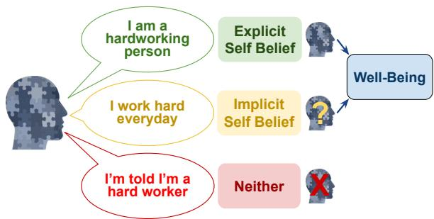
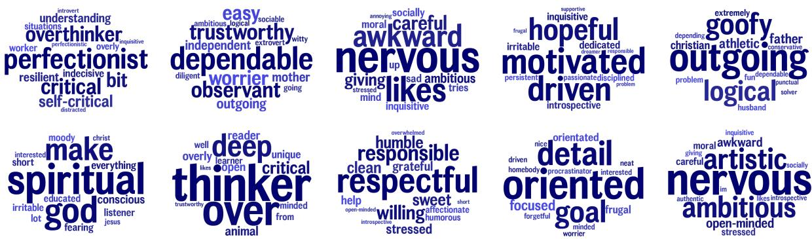
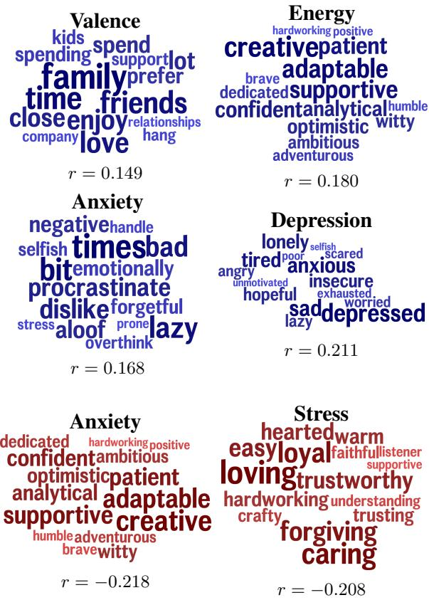
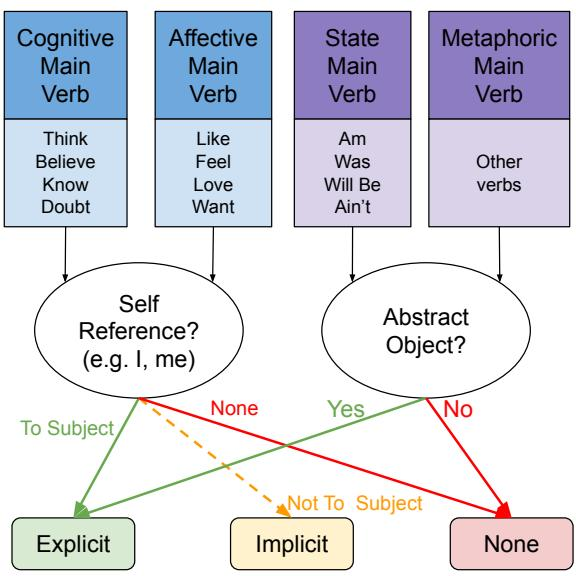
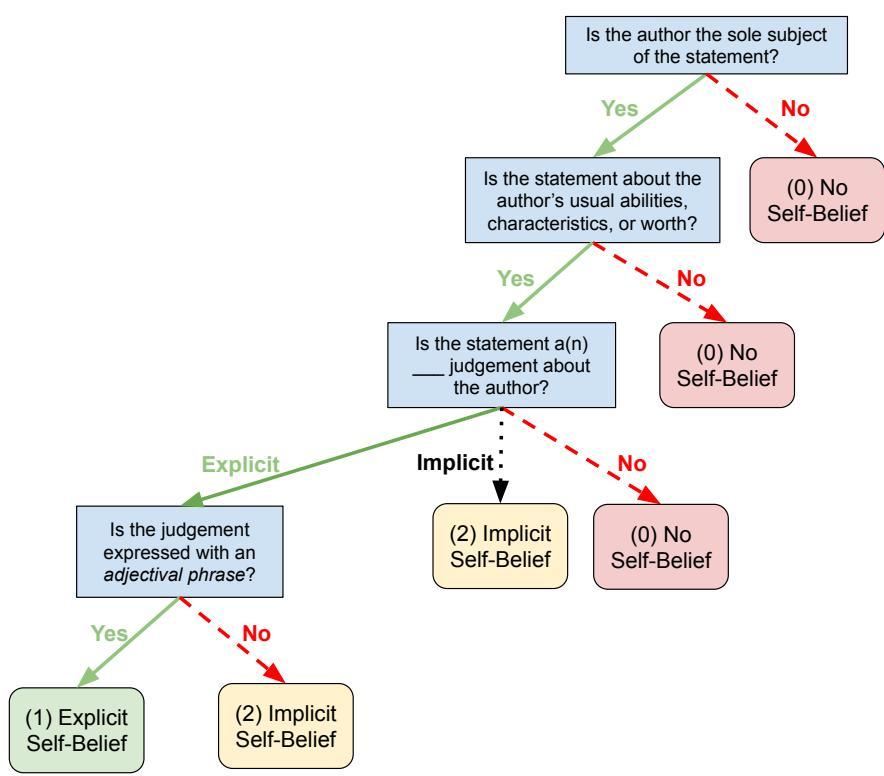
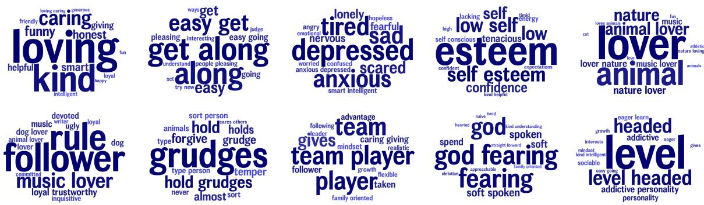

# Capturing Author Self Beliefs in Social Media Language

Siddharth Mangalik1, Adithya V. Ganesan1, Abigail Wheeler2, Nicholas Kerry2, Jeremy D. W. Clifton2, H. Andrew Schwartz1, Ryan L. Boyd3

1Stony Brook University, Stony Brook NY, 2University of Pennsylvania, Philadelphia PA, 3The University of Texas at Dallas, Richardson, TX

## Abstract

Measuring the prevalence and dimensions of self beliefs is essential for understanding human self-perception and various psychological outcomes. In this paper, we develop a novel task for classifying language that contains explicit or implicit mentions of the author’s self beliefs. We contribute a set of 2,000 humanannotated self beliefs, 100,000 LLM-labeled examples, and 10,000 surveyed self belief paragraphs. We then evaluate several encoder-based classifiers and training routines for this task. Our trained model, SelfAwareNet, achieved an AUC of 0.944, outperforming 0.839 from OpenAI’s state-of-the-art GPT-4o model. Using this model we derive data-driven categories of self beliefs and demonstrate their ability to predict valence, depression, anxiety, and stress. We release the resulting self belief classification model and annotated datasets for use in future research.

## 1 Introduction

Self beliefs — statements about an author’s usual abilities, characteristics, or worth — have been shown to hold strong connections to key psychological and mental health factors. Negative self beliefs are reliably associated with depression and its development (Beck, 1967; Dean et al., 2024). Conversely, positive views of the self have been shown to have a positive impact on health behavior (Schwarzer and Renner, 2000; Stinson et al., 2008) and academic endeavors (Valentine et al., 2004). However, limited research has been done to understand the types of beliefs that people hold about themselves and how those self beliefs are expressed in language.

In this paper, we develop a message-level classifier for the presence of self beliefs into three categories – explicit mentions of self belief, implicit mentions, or neither. Our explicit/implicit distinction addresses the differing needs of psychologists and NLP researchers in belief analysis. Psychologists working to understand beliefs (Clifton et al., 2019; Vu et al., 2022) work with explicit mentions like “The world is safe” or “The universe is enticing”. NLP researchers, by contrast, are more interested in capturing a breadth of language with extractable belief content (Alturayeif et al., 2023) to create data-driven mappings between language and psychological outcomes (Schwartz et al., 2013; Schwartz and Ungar, 2015).

  
Figure 1: People express beliefs about themselves explicitly or implicitly through contextual language and have demonstrable connections to individual well-being. Self beliefs cannot easily be detected with the current suite of LLMs available to us. We address this need by contributing annotated datasets and fine-tuned models that are more capable of identifying self beliefs.

Building on previous work for detecting nonself beliefs (Vu et al., 2022; Murzaku and Rambow, 2024), we evaluate auto-encoder-based classifiers along with a psycholinguistics-inspired approach and an LLM few-shot approach. Utilizing a dataset we created with 2,000 expert-labeled examples, we evaluated the techniques to arrive at the strongest approach, SelfAwareNet1. We then applied SelfAwareNet to summarize the beliefs expressed across another dataset of free response beliefs into 50 topics. To the best of our knowledge, this represents the first paper to identify and enumerate self beliefs from language.

This task is challenging because it requires inferencing beyond surface lexical patterns. For example, using patterns such as “I am...” or “I usually...” fails to cover self belief constructions such as “I like the sound of my voice” or “I spend most of my time in bed”. Identifying self beliefs involves capturing contextual nuances, parsing implicit meanings, and understanding social norms, which are not easily dissected or stated outright. It is also difficult due to the highly diverse sentence structures used to express self beliefs, while other beliefs, like those about parenting and education, can often be captured by simpler syntactic patterns (Vu et al., 2022). Further, we found modern LLMs agree with expert humans much less than expert humans agree with each other (see Table 2) and attempts using constituent syntactic parses (e.g. capturing verbal subjects of first-person pronoun subjects; Figure 4) have not been effective, highlighting this dilemma.

We aim to capture a comprehensive variety of the possible self beliefs expressed to inform the psychological theory of self beliefs. In doing so, we aim to help develop a similar taxonomy of self beliefs as the one created for world beliefs (Clifton et al., 2019); in essence, creating a data-driven factorized model of the types of beliefs we have about ourselves. Therefore, we include both ecological sources such as social media (Reddit and X/Twitter) as well as gathering a unique dataset of self belief essays of authors’ self-perceptions.

The major contributions of this work include: (1) the creation of a large dataset of expert and LLM annotated self beliefs with high human interannotator agreement, (2) a classifier for identifying explicit/implicit self beliefs, (3) inferring core categories of beliefs people self-report in free responses, and (4) eliciting evidence for how beliefs correlate with mental health and other psychological outcomes.

## 2 Background

Psychologists and philosophers have long pursued an understanding of the subjective experience of self: how individuals perceive and relate to themselves and ultimately form beliefs and behaviors from those perceptions (Markus, 1977; Borders and Archadel, 1987; Pajares and Schunk, 2002; Smith, 2006). Similarly, computational studies have a rich history of extracting relationships between authors and particular beliefs or stances (Fraisier et al., 2018; Benton and Dredze, 2018; Küçük and Can, 2020). Here, we delve into some background on self beliefs, computational techniques used to extract beliefs from text, and related natural language processing tasks.

## 2.1 Self Beliefs

Our fundamental beliefs impact our behavior and well-being. For example, Cognitive Behavioral Therapy (Beck, 1979), the most widely-used psychotherapy in the world, focuses on identifying cognitive distortions or irrational beliefs. Beliefs about two topics in particular—the self and the world—have been claimed to be the most critical (Janoff-Bulman, 1989), because the world and the self are the only two situations the individual can never leave (Clifton and Crum, 2024).

Recently, a comprehensive effort to map world beliefs – beliefs that individuals have about the external world, broadly construed – demonstrated that mapping efforts might reveal entire sectors of overlooked beliefs. For example, identifying the belief that the world is “Enticing” and its seven subfacets (Clifton et al., 2019). However, disagreement remains on the ontology of self beliefs (Clifton and Crum, 2024).

The range of psychological studies of self belief is varied. Many works focus on self-esteem (Marsh and Craven, 2006), understood as an overarching measure of self-liking, or domain-specific self-concepts such as being someone who thinks they are good at math or gets along with their parents (Bracken and Howell, 1991; Marsh and O’Neill, 1984; Rosenberg et al., 1995). Other perspectives on self beliefs have focused on certain classes of self beliefs, like beliefs about one’s agency (as in self-efficacy research; Abele et al. (2016); Bandura (1982)), and peoples’ physical self-perceptions (Fox and Corbin, 1989). Though these works have been foundational, it remains unclear which under-researched self beliefs are essential to daily life.

Traditionally, researchers have used two approaches to define a belief space. The most common approach in psychology is for researchers to create a list of dimensions based on their expertise and the existing theoretical framework (Bracken and Howell, 1991; Peterson, 2004). The second approach involves expert institutions deciding the important dimensions for a given area as done by the American Psychological Association (APA) for the Diagnostic and Statistical Manual of Mental Disorders (DSM) (First, 2013). Our work follows a proven alternative option, using a data-driven approach to identify existing dimensions that are important to people in vivo (Clifton, 2020; Clifton et al., 2019; McCrae and IU, 2002). Such an approach has been used to identify fundamental factors of individual differences and human personality (McCrae and IU, 2002), as well as primal beliefs about the world (Clifton et al., 2019). We seek to help close that gap with a data-driven approach using language to identify important self beliefs with minimal researcher interpretation.

## 2.2 Related Works

Within NLP, other research has attempted to derive beliefs from language. For example, our work builds on Vu et al. (2022) which extracted beliefs about the world, politics, parenting, and education (Vu et al., 2022) using straightforward stems such as “The world is”, “education is”, or “parents should”. What followed the stem was a clear adjective or noun phrase expressing the belief. However, for capturing self beliefs this does not work. Consider the examples “I usually listen to music” or “I am listening to music”. Using a similar stem construction technique with “I am” or “I usually” would mislabel a wide diversity of false positives that do not express a belief about the subject. To resolve such complications, we move towards developing a contextually-aware classifier by using encoder-based models.

Other works have also explored using language to detect human beliefs and stances (Alturayeif et al., 2023). In these cases, belief prediction intends to capture whether a writer firmly believes in the factuality of their stated propositions (Prabhakaran et al., 2015) and not whether a proposition contains a belief about a specific concept. We distinguish the task of self belief classification from belief prediction or event factuality prediction (Saurí and Pustejovsky, 2009) in that the target for self belief and the particular belief is not limited to positive, negative, or a degree of truth or falsehood.

Similarly, other works have also explored how linguistically derived human traits have predictive power over other facets of being, such as age, gender, and personality (Schwartz et al., 2013; Schwartz and Ungar, 2015). In the specific domain of world beliefs, believing the world is inherently “Interesting” and “Abundant” was found to be related to mental well-being (Clifton et al., 2019). We were unable to identify works that found connections between self beliefs and human factors from language.

While this work focuses on self beliefs used in personal discourse (social media, conversation, journaling), beliefs expressed in contexts like therapy logs and novels constitute a new task to be explored.

## 3 Datasets

We collected self beliefs using text from social media posts from Twitter (now X) and posts/comments from the /r/AskReddit subreddit. Social media provides a medium for individuals to express their beliefs without being prompted. We also gathered self beliefs from prompted essays where writers are asked to describe the sort of person they are most of the time.

## 3.1 Filtering

Self beliefs are expressed in diverse forms that suffer from significant failure rates when using automatic identification as shown in Figure 4. To address this, we delineated the scope of messages considered into a pairing of one high precision and one high recall pattern. In the first scenario, we permitted more freedom, only requiring that utterances contain “I” followed by a verb (particularly the VBD part-of-speech tag) that modifies the “I”. This would successfully capture “I work hard‘’ but incorrectly capture “I like hiking”. In the second scenario, utterances follow the structure “I am ... person...”. This captures beliefs that conform to a pattern like “I am a funny person”, but misses out on even simpler statements like “I am funny”. The latter approach was subjectively observed to increase the rate of self beliefs within the posts, however, this comes at the cost of limiting language diversity.

The Twitter language was collected from the County Tweet Lexical Bank (Mangalik et al., 2024), sampled from nearly 6% of all Twitter users in 2019 to 2020 with a total of almost 1 billion English tweets filtered for retweets, URLs, duplicates, and bots by proxy. The high precision pattern “I <VBD> ...” returned 3,686,860 candidates, and the more constrained “I am ... person ...” pattern returned 508,195 candidates. We remove duplicate tweets from our candidate pool and then sample 30,000 tweets from each pattern collection, giving

<table><tr><td rowspan="2"></td><td colspan="2">All Human Annotations</td><td colspan="2">Human Test Subset</td><td colspan="2">GPT-4o Annotations</td></tr><tr><td>Reddit</td><td>Twitter</td><td>Reddit</td><td>Twitter</td><td>Reddit</td><td>Twitter</td></tr><tr><td>Explicit</td><td>109</td><td>193</td><td>47</td><td>155</td><td>4,533</td><td>8,493</td></tr><tr><td>Implicit</td><td>91</td><td>228</td><td>10</td><td>195</td><td>15,914</td><td>21,525</td></tr><tr><td>Neither</td><td>800</td><td>535</td><td>42</td><td>151</td><td>29,331</td><td>29,746</td></tr><tr><td>Total</td><td>1,000</td><td>956</td><td>99</td><td>501</td><td>49,778</td><td>59,764</td></tr></table>

Table 1: Breakdown of Twitter and Reddit annotations by the type of self belief in the text. Given the rates above we estimate at least 0.55% of Reddit posts/comments and 0.23% of tweets contain an explicit or implicit self belief.

us 60,000 total tweets.

AskReddit data consisted of 17.3 million posts and comments from 2015 to 2019. Since our Reddit data had vastly more comments than posts, we opted to be stricter when collecting self beliefs from comments. The precision targeted pattern, “I <VBD> ...”, filtered the posts down to 178,178 candidates, and the recall targeted pattern, “I am ... person ...”, filtered the comments down to 296,340 candidates. We sampled 25,000 deduplicated messages from each collection, for 50,000 total.

## 3.2 Human Annotation

Two co-authors trained in the psychology of self belief provided expert annotations to label 1,000 Twitter posts and 1,000 AskReddit posts/comments. See Appendix A for the exact criteria provided to the annotators. Table 1 shows the breakdown of each class’s prevalence.

From the human-annotation set, 501 of the Twitter posts and 99 of the Reddit posts were then double-annotated to capture the agreement between the two annotators. On this subset, we find an interrater agreement of 88.9% (Cohen’s Kappa of 0.803) for Reddit and 91.4% (Cohen’s Kappa of 0.871) for Twitter between annotators 1 and 2. These Cohen’s Kappa coefficients imply substantial to nearly perfect annotator agreement. Afterward, a third annotator was brought in to break ties on any disagreements between the initial two annotators; this is considered the final Human Test Subset.

## 3.3 LLM Annotation

To generate 100,000 annotations from generative LLMs we considered two models representing the state-of-the-art for open and closed systems. Meta’s Llama 3.1, with 8 and 70 billion parameters, was used as a baseline for LLM performance. Meanwhile, OpenAI’s GPT-4o was used as the state-of-the-art off-the-shelf LLM solution. All the prompts used for both Llama and GPT can be found in Appendix B.

While annotating with GPT-4o the model was specifically prompted to classify the statements into one of three classes described: Explicit Self Beliefs – Statements that directly and unambiguously reflect the writer’s personal assessment of their own usual abilities/characteristics/worth; Implicit Self Beliefs – Statements that indirectly express the writer’s beliefs about the categories of person that the author believes they belong to; Neither – Statements for which there is neither an explicit nor an implicit belief present. Unlike the human annotators, the LLMs were prompted to generate 0-100 confidence scores for their labels for use in Few-Shot classification AUC.

## 3.4 Data Segmentation

We consider three data settings for the training of our self belief classification models: human-only, LLM-only, and joint human-LLM. Besides a fixed set of 300 randomly selected test data points from the human consensus set, the data was segmented into train (70%) and evaluation (30%) sets.

## 3.5 Self Belief Paragraphs

We collected a dataset of self belief paragraphs by surveying study participants to describe themselves in a long-form text response to the prompt:

A team of psychological researchers at [...] are currently seeking to understand how people see themselves. In this survey, we aim to hear from 10,000 people, including yourself, who will spend several minutes reflecting on a simple but powerful question: From your own perspective, most of the time, what sort of person are you? Please make a list of adjectives or short, simple phrases that you feel describe your qualities, both the good and the bad.

This survey only involves one main reflection question. It should take about five minutes to answer (the submit button will appear after 3 minutes).

This study collected 6,736 responses to the above question from unique interviewees. We took these self belief paragraphs and sentence-tokenized them, discarding any empty sentences, resulting in 33,407 sentences. We applied our best self belief classification model, SelfAwareNet, to these sentences and filtered the sentences to only those that contained an explicit belief, capturing 7,573 explicit beliefs.

## 3.6 DS4UD Essays

We conducted additional analyses using essays collected as part of a study on unhealthy drinking behaviors (Nilsson et al., 2024; Matero et al., 2024). As a part of this multi-wave longitudinal study, participants described their feelings in 2 to 3 sentences with a minimum of 200 characters over 14 days per wave. To measure their psychological well-being and mental health, they were also administered standard rating scales of depression (Kroenke et al., 2001), anxiety (Spitzer et al., 2006), and stress (Cohen et al., 1983).

After sentence-tokenizing them, we tagged the sentences from this data into ones containing explicit beliefs (as labeled by SelfAwareNet), sentences with implicit beliefs, and all other sentences. This resulted in 61,556 usable sentences from 14,475 essays and 587 distinct users. Of those sentences, 3,288 were labeled as containing explicit beliefs, 8,196 with implicit beliefs, and 49,151 with neither.

## 4 Methods

In this paper, we present an LLM system to identify the ways people describe their self beliefs – simple, adjectival, goal-adjacent, and domain-general claims about the self – on Twitter (now X) and Reddit. This method simultaneously allows for the bottom-up identification of self beliefs to be distinctly empirical, while also taking advantage of the sheer volume of highly relevant data available on social media platforms.

We consider that self beliefs exist on a continuum of expression, ranging from explicitly stated to implicitly inferable. It is possible to directly convey a self belief; “I am a hardworking person” but it is also equally possible to create an utterance like “I work hard every day” which contains an implication to the explicit statement. Especially in the case of the latter example, it would be difficult for a non-contextual model to identify the presence of implicit self beliefs from statements about habits (“I hike every day”), preferences (“I like to hike”), or group identity (“I am a hiker”). To this end, our modeling systems consider self belief classification as a 3-class problem of explicit, implicit, or no self belief.

We developed and evaluated a variety of LMencoder-based fine-tuned classifiers to predict the self belief labels and experimented with curricula learning setups to improve over using human annotation alone. Since this task has not been attempted before, there is no best-practice model to use. Therefore, in addition to using a Most Frequent Class baseline, we also developed one theoretically driven classifier and evaluated it against generative LLMs using few-shot prompting.

## 4.1 Self Belief Classification

Theoretical Model. To test a theoretical linguistic approach, we developed and implemented a rule-based system to classify messages as explicit/implicit/no self beliefs (Visual depiction; Figure 4). This model assumes that the input message begins with the author as the subject and uses SpaCy’s (Honnibal et al., 2020) transformer-based model to complete a constituent and dependency parse of the message. The root verb that modifies the subject is then binned into one of four classes: cognitive (I think), affective (I like), state (I am), and metaphoric (I exude) via word lists collected using VerbNet (Schuler and Palmer, 2005). For messages with cognitive or affective root verbs, the object of the sentence is checked for self-reference to the subject; if yes then a label of explicit is given, if no but there is a reference to another object then implicit, otherwise none. For messages with a state or metaphoric root verb, if the object of the sentence is abstract then a label of explicit is given, otherwise none. Object abstractness is measured using word concreteness (Charbonnier and Wartena, 2019) as is commonly done in psycholinguistics.

Few-Shot Models. To evaluate the performance of off-the-shelf generative models, we used both open-weight and closed models. For our open models, we used the 8B and 70B parameter variants of

<table><tr><td>MODEL</td><td>PARAMETERS</td><td>AcC</td><td>BINARY ACC</td><td>F1</td><td>AUC</td></tr><tr><td>MOST FREQUENT CLASS</td><td>1</td><td>.357</td><td>.643</td><td>.188</td><td>.500</td></tr><tr><td>THEORETICAL MODEL</td><td>9</td><td>.297</td><td>.297</td><td>.272</td><td>-</td></tr><tr><td>LLAMA 3.1 Few-shot</td><td>8,000 M</td><td>.430</td><td>.610</td><td>.398</td><td>.575</td></tr><tr><td>LLAMA 3.1 Few-shot GPT-40 Few-shot</td><td>70,900 M &gt; 70,900 M</td><td>.657 .703</td><td>.820 .843</td><td>.650 .710</td><td>.836</td></tr><tr><td>FT-ALBERTV2-LARGE</td><td>18M</td><td></td><td></td><td></td><td>.839</td></tr><tr><td></td><td></td><td>.717</td><td>.853</td><td>.724</td><td>.878*</td></tr><tr><td>T5-BASE (ENC)</td><td>110 M</td><td>.346</td><td>.643</td><td>.178</td><td>.506</td></tr><tr><td>ELECTRA-BASE-DISC.</td><td>110 M</td><td>.777</td><td>.890</td><td>.780</td><td>.875†</td></tr><tr><td>FT-ROBERTA-BASE</td><td>125 M</td><td>.813</td><td>.920</td><td>.814</td><td>.900‡</td></tr><tr><td>FT-DEBERTAV3-BASE</td><td>184 M</td><td>.787</td><td>.900</td><td>.792</td><td>.881†</td></tr><tr><td>FT-ROBERTA-LARGE</td><td>335 M</td><td>.833</td><td>.910</td><td>.837</td><td>.922‡</td></tr><tr><td>FT-BERTWEET-LARGE</td><td>355 M</td><td>.817</td><td>.913</td><td>.821</td><td>.921‡</td></tr><tr><td>FT-DEBERTAV3-LARGE</td><td>436M</td><td>.780</td><td>.883</td><td>.787</td><td>.927</td></tr></table>

Table 2: Comparison of few-shot LLMs and fine-tuning procedures for training encoder models for the self belief classification against 300 withheld test samples. Weighted F1 is reported across the three self belief classes. Binary Acc measures the accuracy of classifying explicit beliefs vs. others. AUC significances were measured against Few-Shot GPT-4o performance using bootstrapping and are reported as ${ ^ { * } p } < 0 . 0 5 .$ , †p < 0.01, $^ { \ddagger } p < 0 . 0 0 1$

<table><tr><td>Model</td><td>Acc</td><td>Bin Acc</td><td>F1</td><td>AUC</td></tr><tr><td>FT()</td><td>.833</td><td>.910</td><td>.837</td><td>.922‡</td></tr><tr><td>FT()</td><td>.717</td><td>.870</td><td>.719</td><td>.894†</td></tr><tr><td>FT(：)</td><td>.727</td><td>.870</td><td>.733</td><td>.898‡</td></tr><tr><td>FT()→FT()</td><td>.823</td><td>.917</td><td>.826</td><td>.944</td></tr></table>

Table 3: Comparison of fine-tuning (FT) procedures for training RoBERTa-Large on self belief classification. The procedures either use of Human ( ) annotations, GPT-4o ( ) annotations, a concatenation (:), or curriculum learning ( ). The model created with curriculum training was chosen as the final SelfAwareNet.

Meta’s instruction-tuned Llama 3.1 (Dubey et al., 2024) to annotate the messages into the aforementioned categories of self belief. For our closed model, we elect to use OpenAI’s GPT-4o; this model was also used to build the set of 100k LLMannotated self belief samples.

To ensure our experiments are consistent while achieving good performance from the model, we set Llama to a very low temperature (0.01) for controlled outputs and a top\_p value of 0.92. Likewise, for GPT-4o we set the temperature to 0.1. Without access to sufficient compute resources, and constrained by the cost of 3rd party inference APIs, we were unable to use the largest version of Llama with 405B parameters. The total cost of running the GPT-4o inference was about 80 USD on the 100k posts. Llama inferences, including the 8B and 70B models, were run on an RTX A6000 for a total of 6 hours for the human-annotation set.

Fine-Tuned Models. We consider the following BERT (Devlin et al., 2018) variants: ALBERT (Lan et al., 2019), BerTweet (Nguyen et al., 2020), De-BERTa (He et al., 2021), and RoBERTa (Liu et al., 2019). These modifications to the underlying transformer model and training set are all expected to give sizable and general improvements in language modeling. BerTweet especially intrigued us since it was specifically trained using a large corpus of tweets, unlike the other BERT variants. The finetuned models all shared the same hyperparameters: 50 epochs of training, batch size of 8, 2 gradient accumulation steps, a learning rate of 0.0001, weight decay of 0.0001, and an early stopping threshold of 0.0001. For models trained with human-annotated data, the model is evaluated every 50 steps with an early stopping patience of 5. Due to the massive increase in data size, for models trained with LLM annotations evaluation is done every 500 steps with an early stopping patience of 3. Weighted F1 is used as the evaluation metric at each evaluation step.

## 4.2 Fine-Tuning Settings

We examined four unique settings for training RoBERTa-Large, our selected base model for Self-AwareNet, based on weighted F1 and balancing parameter size with performance. We consider two sets of training data, a human set, and an LLM set. The training data from the human set is comprised of 1,700 human annotations, and the LLM set is made of all 100,000+ LLM annotations collected. Our training settings cover the following combinations of these annotations, including a curriculum learning setting, as follows: (1) fine-tune RoBERTa-Large on only the human set, (2) finetune the model on only the LLM set, (3) fine-tune on a concatenation of the human and LLM set, and (4) fine-tune first on the LLM set and then fine-tune again on the human set. The results of this testing can be found in Table 3.

## 5 Results & Discussion

## 5.1 Self Belief Classifier

Our Most Frequent Class baseline model demonstrates a fairly balanced test set with a 3-class accuracy of 0.357, skewing slightly toward the most common class (No Self Belief). Looking at the theoretical model, we find that its pattern-matching can achieve a weighted F1 better than the baseline, but it underperforms in both 3-class and binary accuracy. This lackluster result is expected for a linguistic model applied to a highly contextual task.

We find that encoder-based models fine-tuned on our set of human annotations always outperform both Few-Shot LLMs, Llama, and GPT-4o, at the self belief classification task. Using 2,000 highquality human annotated examples, our fine-tuned models outperform 4,000 larger generative model pre-trained on orders of magnitude more world knowledge. Evaluating the specific capabilities of models that made modifications to BERT, we found that RoBERTa-Large was the highest performing on weighted F1. BerTweet, despite being trained on a large corpus of Twitter language and using a similar number of parameters to RoBERTa-Large, was not able to outperform it. We observe a general trend of improving AUCs as the number of parameters for the fine-tuned models increases. The performances of the various models are recorded in Table 2.

## 5.2 Fine-Tuning Settings

Experiments comparing different training regiments found small benefits, over training solely on human annotations, from pre-fine-tuning on a large (>100,000) set of LLM annotations and then fine-tuning with the 2,000 Human annotations. The weakest performance was attributed to models that fine-tuned primarily on LLM annotations. Interestingly we find that a RoBERTa-Large fine-tuned on the annotations generated by GPT-4o outperformed GPT-4o itself (F1 of .710 .719; AUC of .839  .894). This gives encouraging evidence for exploring the generalizability of models fine-tuned on LLM annotations improving over the actual LLM outputs for classification tasks. We might hypothesize that using a corpus of LLM annotations allows a downstream language model to combine a collection of “expert” opinions as a Mixture of Experts (Jordan and Jacobs, 1994; Jacobs et al., 1991). Model metrics for each type of finetuning can be found in Table 3

The best-performing model, SelfAwareNet was built using a RoBERTa-Large model with the curriculum training design via pre-fine-training on the full set of GPT-4o annotations and then fine-tuning on all human annotations not in the test or validation sets. This presents evidence for systematic errors in GPT-4o’s annotations, which can be rectified with a few high-quality human annotations.

## 5.3 Extraction of Self Beliefs

We factor-analyzed the language from the sentencetokenized self belief paragraphs. These sentences were filtered to only those containing explicit beliefs by applying SelfAwareNet (RoBERTa-Large with curriculum learning on LLM then Human annotations). We filtered out sentences with fewer than 10 words and removed the 850 most common words from English. Then we applied Latent Dirichlet Allocation (Blei et al., 2003) with Gibbs sampling for 700 iterations using dlatk (Schwartz et al., 2017) on the sentence unigrams into 50 topics (Lee and Seung, 2000).

The resulting topics summarize the characteristic notions of people’s self beliefs, they are represented as word clouds in Figure 2. In addition to LDAbased topic modeling, we ran a Meaning Extraction Method (Wilson et al., 2016a,b; Markowitz, 2021) version of this task (Figure 6).

The topics, shown as word clouds, illustrate intuitive and coherent clusters of self belief. For instance, beliefs about being ‘detail-oriented’ paired with ‘goal-focused,’ and beliefs about being ‘respectful’ paired with ‘humble’ and ‘responsible.’.

  
Figure 2: Select examples of topic clusters generated from the classified self belief paragraphs. 50 clusters were created from LDA generating 300 topics and then reduced those to 50 super topics (clusters) with non-negative matrix factorization. Word sizing is proportional to prevalence within topic (probability of the word given the topic). Here we see self beliefs of perfectionism, dependability, nervousness, hopefulness, and overthinking.

  
Figure 3: Self Belief topics correlated with outcomes from the DS4UD essays after applying SelfAwareNet. The Pearson correlation (r) signifies the relationship between these topic usages in the DS4UD feelings essays and the self-reported outcomes. Positive correlations are depicted in blue, while negative correlations are shown in red. All correlations were statistically significant to p < 0.05 after Benjamini–Hochberg Correction.

## 5.4 Exploring External Validity

External validity, a study design commonly used in psychometrics (Rust and Golombok, 2021), is concerned with the ability of a measure to predict an external associated outcome. In this case, our measure is holding specific self beliefs, and the external outcomes are well-being and mental health.

Using the 50 topics derived from LDA on the entire set of self belief paragraphs, we correlated the self belief topic usage in the DS4UD study’s feeling essays (containing only explicit beliefs using SelfAwareNet) with their mental health selfreports. This analysis (Figure 3) revealed many face-valid results including positive associations between topics of self beliefs containing (1) familyorientation and valuing relationships, with higher valence (Vogel et al., 2017), (2) disengaged behaviors (procrastination, aloof, lazy, forgetful) with high anxiety (Scher and Osterman, 2002), and (3) symptomatic markers (fatigue, low mood, lack of interest) with depression (Watson, 2009). We also find negative associations with self belief topics, suggesting the linking of (1) trusting and caring relationships with reduced stress, and (2) resourcefulness (supportive, patient) and openness (creative, adaptive) with reduced anxiety.

## 5.5 Qualitative Error Analysis

Examining the mistakes of GPT-4o against human annotations, we found that it makes mistakes in each possible pairing of the three classes. The most instructional errors were found when GPT-4o made false positive and false negative predictions of self belief presence. GPT fails to label messages as having self beliefs when they contain additional language specifying that the belief is held by another person, or if the belief was about someone else (True=Neither and GPT-4o=Explicit in Table 4). GPT was also unable to classify self beliefs about curiosity, desperation (True=Explicit and GPT-4o=Neither), or uniqueness (True=Implicit and GPT-4o=Neither). SelfAwareNet also struggles with self beliefs about curiosity but corrects issues where complex constructions negate the existence of a self belief. On average, when Self-AwareNet fails it makes the same mistake as GPT.

Mislabeling beliefs as non-beliefs could create oversights in tasks moderated by AI or human therapists that rely on a holistic understanding of patient self beliefs to provide care. Failures in labeling explicit from implicit beliefs could result in a systematic failure to capture entire classes of beliefs.

## 6 Conclusion

In this work, we introduce an expert annotated dataset for performing a novel task of self belief classification from natural language. This highquality dataset enabled 4000 smaller language models to outperform the likes of few-shot generative models like Llama 3.1 and GPT-4o. In addition, we find that smaller models fine-tuned on GPT-4o’s annotations of self belief are better than GPT-4o’s direct annotations, encouraging further investigation into a method for augmenting LLM capabilities scalably and affordably without fine-tuning LLMs.

The extracted beliefs demonstrated external validity through significant associations with mental health and well-being measures on an external dataset. These findings underscore the importance of exploring future directions to track longitudinal trends between self beliefs and human outcomes, and further expand to inform public health research on the self-perceptions prevalent in different communities.

## 7 Limitations

This work is presented in light of several limitations regarding the conception of self beliefs themselves. The differentiation of explicit and implicit self beliefs is not a canonical concept, thus all annotations should be considered in the context of the annotation guide (see Supplement). We claim that we describe a reasonable self belief framework, with no expectation that it covers all edge cases.

Notably, self beliefs are uncommon on social media. This leads us to use permissive stemming methods rather than all possible language patterns. As a result, the training data cannot catch a maximally comprehensive collection of the forms of self belief expression. This work was only completed for English texts, and all findings here cannot be extrapolated to non-English authors or non-textual modalities. Using social media as a training corpus for SelfAwareNet potentially limits its generalizability to more formal settings or beliefs not common on social media.

While there is reason to believe that self beliefs may converge with personality, this work does not study this connection. However, when observing the language of DS4UD study participants we did not find strong correlations between a person’s self beliefs and their Big-5 personality traits. We caveat this finding with the observation that other research working with this data also struggled to find connections with personality (Nilsson et al., 2024). The correlations between topic usage and outcomes found in this work were overall rather modest, which can generally be expected for external criteria.

Due to computational limits, we were unable to fine-tune large-scale models (such as Llama 3.3 70B) similar to GPT-4o for this task. Likely, finetuning a larger model with our annotated training data might have resulted in an even more performant version of SelfAwareNet.

## 8 Ethical Considerations

We collected publicly available social media language to conduct the analyses completed in this work. We have removed all identifying user information in the posts considered. Both the self belief paragraphs and the DS4UD essays were collected consensually after following IRB study protocols, with the understanding that the language would be used for research purposes. We do not anticipate other privacy or security risks from using the self belief classifier.

Since self beliefs are at the core of human psychology and how people behave in the world, extracting these beliefs could be highly invasive. Commercial actors could potentially misuse data about a person’s self beliefs for more effective advertising, marketing, or message targeting. Self beliefs may also contain details that a person would not willingly disclose and there is reason to be concerned about their use to target vulnerable populations. The purpose of this work is to explore the connections between human outcomes and self beliefs and we do not condone the use of technology for malicious purposes. Given its potential to enhance behavior prediction, personalize cognitive behavioral therapy, and automate cognitive distortion analysis, this work offers valuable contributions to NLP and public health research.

## References

Andrea E Abele, Nicole Hauke, Kim Peters, Eva Louvet, Aleksandra Szymkow, and Yanping Duan. 2016. Facets of the fundamental content dimensions: Agency with competence and assertiveness—communion with warmth and morality. Frontiers in psychology, 7:1810.

Nora Alturayeif, Hamzah Luqman, and Moataz Ahmed. 2023. A systematic review of machine learning techniques for stance detection and its applications. Neural Comput. Appl., 35(7):5113–5144.

Albert Bandura. 1982. Self-efficacy mechanism in human agency. American psychologist, 37(2):122.

Aaron T Beck. 1967. Depression; clinical. Experimental, and Theoretical aspects.

Aaron T Beck. 1979. Cognitive therapy and the emotional disorders. Penguin.

Adrian Benton and Mark Dredze. 2018. Using author embeddings to improve tweet stance classification. In Proceedings of the 2018 EMNLP Workshop W-NUT: The 4th Workshop on Noisy User-generated Text, pages 184–194, Brussels, Belgium. Association for Computational Linguistics.

David M. Blei, Andrew Y. Ng, and Michael I. Jordan. 2003. Latent dirichlet allocation. J. Mach. Learn. Res., 3(null):993–1022.

L DiAnne Borders and Kathleen A Archadel. 1987. Self-beliefs and career counseling. Journal ofCareer Development, 14(2):69–79.

Bruce A Bracken and Karen Kuehn Howell. 1991. Multidimensional self concept validation: A threeinstrument investigation. Journal of Psychoeduca tional Assessment, 9(4):319–328.

Jean Charbonnier and Christian Wartena. 2019. Predicting word concreteness and imagery. In Proceedings of the 13th International Conference on Computational Semantics - Long Papers, pages 176–187, Gothenburg, Sweden. Association for Computational Linguistics.

Jeremy DW Clifton. 2020. Managing validity versus reliability trade-offs in scale-building decisions. Psychological Methods, 25(3):259.

Jeremy DW Clifton, Joshua D Baker, Crystal L Park, David B Yaden, Alicia BW Clifton, Paolo Terni, Jessica L Miller, Guang Zeng, Salvatore Giorgi, H Andrew Schwartz, et al. 2019. Primal world beliefs. Psychological Assessment, 31(1):82.

Jeremy DW Clifton and Alia J Crum. 2024. Beliefs that influence personality likely concern a situation humans never leave. American Psychologist.

Sheldon Cohen, Tom Kamarck, and Robin Mermelstein. 1983. A global measure of perceived stress. Journal ofhealth and social behavior, pages 385–396.

RL Dean, KJ Lester, E Grant, AP Field, F Orchard, and V Pile. 2024. The impact of interventions for depression on self-perceptions in young people: A systematic review & meta-analysis. Clinical Psychology Review, page 102521.

Jacob Devlin, Ming-Wei Chang, Kenton Lee, and Kristina Toutanova. 2018. BERT: pre-training of deep bidirectional transformers for language understanding. CoRR, abs/1810.04805.

Abhimanyu Dubey, Abhinav Jauhri, Abhinav Pandey, Abhishek Kadian, Ahmad Al-Dahle, Aiesha Letman, Akhil Mathur, Alan Schelten, Amy Yang, Angela Fan, et al. 2024. The llama 3 herd of models. arXiv preprint arXiv:2407.21783.

Michael B First. 2013. DSM-5-TR® Handbook of Differential Diagnosis. American Psychiatric Pub.

Kenneth R Fox and Charles B Corbin. 1989. The physical self-perception profile: Devlopment and preliminary validation. Journal of sport and Exercise Psychology, 11(4):408–430.

Ophélie Fraisier, Guillaume Cabanac, Yoann Pitarch, Romaric Besançon, and Mohand Boughanem. 2018. Stance classification through proximity-based community detection. In Proceedings of the 29th on Hypertext and Social Media, pages 220–228. ACM New York, NY, USA.

Pengcheng He, Jianfeng Gao, and Weizhu Chen. 2021. Debertav3: Improving deberta using electra-style pretraining with gradient-disentangled embedding sharing. Preprint, arXiv:2111.09543.

Matthew Honnibal, Ines Montani, Sofie Van Landeghem, and Adriane Boyd. 2020. spaCy: Industrialstrength Natural Language Processing in Python. To appear.

Robert A Jacobs, Michael I Jordan, Steven J Nowlan, and Geoffrey E Hinton. 1991. Adaptive mixtures of local experts. Neural computation, 3(1):79–87.

Ronnie Janoff-Bulman. 1989. Assumptive worlds and the stress of traumatic events: Applications of the schema construct. Social cognition, 7(2):113–136.

Michael I Jordan and Robert A Jacobs. 1994. Hierarchical mixtures of experts and the em algorithm. Neural computation, 6(2):181–214.

Kurt Kroenke, Robert L Spitzer, and Janet BW Williams. 2001. The phq-9: validity of a brief depression severity measure. Journal of general internal medicine, 16(9):606–613.

Dilek Küçük and Fazli Can. 2020. Stance detection: A survey. ACM Computing Surveys (CSUR), 53(1):1– 37.

Zhenzhong Lan, Mingda Chen, Sebastian Goodman, Kevin Gimpel, Piyush Sharma, and Radu Soricut. 2019. Albert: A lite bert for self-supervised learning of language representations. arXiv preprint arXiv:1909.11942.

Daniel Lee and H Sebastian Seung. 2000. Algorithms for non-negative matrix factorization. Advances in neural information processing systems, 13.

Yinhan Liu, Myle Ott, Naman Goyal, Jingfei Du, Mandar Joshi, Danqi Chen, Omer Levy, Mike Lewis, Luke Zettlemoyer, and Veselin Stoyanov. 2019. Roberta: A robustly optimized BERT pretraining approach. CoRR, abs/1907.11692.

Siddharth Mangalik, Johannes C Eichstaedt, Salvatore Giorgi, Jihu Mun, Farhan Ahmed, Gilvir Gill, Adithya V. Ganesan, Shashanka Subrahmanya, Nikita Soni, Sean AP Clouston, et al. 2024. Robust language-based mental health assessments in time and space through social media. NPJ Digital Medicine, 7(1):109.

David M Markowitz. 2021. The meaning extraction method: An approach to evaluate content patterns from large-scale language data. Frontiers in Communication, 6:588823.

Hazel Rose Markus. 1977. Self-schemata and processing information about the self. Journal of Personality and Social Psychology, 35:63–78.

Herbert W Marsh and Rhonda G Craven. 2006. Reciprocal effects of self-concept and performance from a multidimensional perspective: Beyond seductive pleasure and unidimensional perspectives. Perspectives on psychological science, 1(2):133–163.

Herbert W Marsh and Rosalie O’Neill. 1984. Self description questionnaire iii: the construct validity of multidimensional self-concept ratings by late adolescents. Journal of educational measurement, 21(2):153–174.

Matthew Matero, Huy Vu, August Nilsson, Syeda Mahwish, Young Min Cho, James McKay, Johannes Eichstaedt, Richard Rosenthal, Lyle Ungar, and H. Andrew Schwartz. 2024. Using daily language to understand drinking: Multi-level longitudinal differential language analysis. In Proceedings of the 9th Workshop on Computational Linguistics and Clinical Psychology (CLPsych 2024), pages 133–144, St. Julians, Malta. Association for Computational Linguistics.

Robert R McCrae and Allik IU. 2002. Thefive-factor model ofpersonality across cultures. Springer Science & Business Media.

John Murzaku and Owen Rambow. 2024. BeLeaf: Belief prediction as tree generation. In Proceedings of the 2024 Conference of the North American Chapter of the Association for Computational Linguistics: Human Language Technologies (Volume 3: System Demonstrations), pages 97–106, Mexico City, Mexico. Association for Computational Linguistics.

Dat Quoc Nguyen, Thanh Vu, and Anh Tuan Nguyen. 2020. BERTweet: A pre-trained language model for English Tweets. In Proceedings of the 2020 Conference on Empirical Methods in Natural Language Processing: System Demonstrations, pages 9–14.

August Nilsson, Ryan Boyd, Adithya V Ganesan, Oscar Kjell, Syeda Mahwish, Haitao Huang, Richard N Rosenthal, Lyle H Ungar, and H Andrew Schwartz. 2024. Language-based assessments for experienced well-being: Accuracy and external validity across behaviors, traits, and states. PsyArXiv Preprints.

Frank Pajares and Dale H. Schunk. 2002. Self and self-belief in psychology and education: A historical perspective. In Impact ofPsychological Factors on Education.

Christopher Peterson. 2004. Character strengths and virtues: A handbook and classification, volume 3. Oxford University Press.

Vinodkumar Prabhakaran, Tomas By, Julia Hirschberg, Owen Rambow, Samira Shaikh, Tomek Strzalkowski, Jennifer Tracey, Michael Arrigo, Rupayan Basu, Micah Clark, Adam Dalton, Mona Diab, Louise Guthrie, Anna Prokofieva, Stephanie Strassel, Gregory Werner, Yorick Wilks, and Janyce Wiebe. 2015. A new dataset and evaluation for belief/factuality. In Proceedings of the Fourth Joint Conference on Lexical and Computational Semantics, pages 82–91, Denver, Colorado. Association for Computational Linguistics.

Morris Rosenberg, Carmi Schooler, Carrie Schoenbach, and Florence Rosenberg. 1995. Global self-esteem and specific self-esteem: Different concepts, different outcomes. American sociological review, pages 141– 156.

John Rust and Susan Golombok. 2021. Modern psychometrics: The science of psychological assessment, 4th edition. Routledge, London.

Roser Saurí and James Pustejovsky. 2009. Factbank: a corpus annotated with event factuality. Language Resources and Evaluation, 43:227–268.

Steven J Scher and Nicole M Osterman. 2002. Procrastination, conscientiousness, anxiety, and goals: Exploring the measurement and correlates of procrastination among school-aged children. Psychology in the Schools, 39(4):385–398.

Karin Kipper Schuler and Martha Palmer. 2005. Verbnet: a broad-coverage, comprehensive verb lexicon. University of Pennsylvania.

H Andrew Schwartz, Johannes C Eichstaedt, Margaret L Kern, Lukasz Dziurzynski, Stephanie M Ramones, Megha Agrawal, Achal Shah, Michal Kosinski, David Stillwell, Martin EP Seligman, et al. 2013. Personality, gender, and age in the language of social media: The open-vocabulary approach. PloS one, 8(9):e73791.

H Andrew Schwartz, Salvatore Giorgi, Maarten Sap, Patrick Crutchley, Lyle Ungar, and Johannes Eichstaedt. 2017. Dlatk: Differential language analysis toolkit. In Proceedings of the 2017 conference on empirical methods in natural language processing: System demonstrations, pages 55–60.

H Andrew Schwartz and Lyle H Ungar. 2015. Datadriven content analysis of social media: A systematic overview of automated methods. The ANNALS ofthe American Academy of Political and Social Science, 659(1):78–94.

Ralf Schwarzer and Britta Renner. 2000. Socialcognitive predictors of health behavior: action selfefficacy and coping self-efficacy. Health psychology, 19(5):487.

Richard Smith. 2006. On diffidence: The moral psychology of self-belief. Journal of Philosophy of Education, 40(1):51–62.

Robert L Spitzer, Kurt Kroenke, Janet BW Williams, and Bernd Löwe. 2006. A brief measure for assessing generalized anxiety disorder: the gad-7. Archives of internal medicine, 166(10):1092–1097.

Danu Anthony Stinson, Christine Logel, Mark P Zanna, John G Holmes, Jessica J Cameron, Joanne V Wood, and Steven J Spencer. 2008. The cost of lower selfesteem: testing a self-and social-bonds model of health. Journal ofpersonality and social psychology, 94(3):412.

Jeffrey C Valentine, David L DuBois, and Harris Cooper. 2004. The relation between self-beliefs and academic achievement: A meta-analytic review. Educational psychologist, 39(2):111–133.

Nina Vogel, Nilam Ram, David E Conroy, Aaron L Pincus, and Denis Gerstorf. 2017. How the social ecology and social situation shape individuals’ affect valence and arousal. Emotion, 17(3):509.

Huy Vu, Salvatore Giorgi, Jeremy DW Clifton, Niranjan Balasubramanian, and H Andrew Schwartz. 2022. Modeling latent dimensions of human beliefs. In Proceedings of the International AAAI Conference on Web and Social Media, volume 16, pages 1064– 1074.

David Watson. 2009. Differentiating the mood and anxiety disorders: A quadripartite model. Annual review ofclinical psychology, 5(1):221–247.

Steven Wilson, Rada Mihalcea, Ryan Boyd, and James Pennebaker. 2016a. Disentangling topic models: A cross-cultural analysis of personal values through

words. In Proceedings of the First Workshop on NLP and Computational Social Science, pages 143– 152, Austin, Texas. Association for Computational Linguistics.

Steven R Wilson, Rada Mihalcea, Ryan L Boyd, and James W Pennebaker. 2016b. Cultural influences on the measurement of personal values through words. In 2016 AAAI Spring Symposium Series.

## A Human Annotation Guide

For human annotators labeling self-beliefs, we asked that they follow the following guidelines which include definitions, a flowchart, and edge cases. All human annotations were completed by graduate researchers, for the interrater data points, where the two primary annotators disagreed, a third annotator was given the same annotation guide to make a final decision.

## A.1 Definitions

• Explicit Self-Belief (1): Statements that clearly and explicitly reflect the writer’s beliefs about themselves. These self-belief statements should be direct and unambiguous, conveying the writer’s personal assessment of their own usual abilities, characteristics, or worth.

• Implicit Self-Belief (2): Statements that indirectly express the writer’s beliefs about themselves. This includes vague references or statements about the types/categories of persons that the author believes they are, not directly tied to their identity. The purpose of this classification is to capture statements that can be used to infer explicit self-beliefs.

• No Self-Belief (0): Statements for which there is neither an explicit nor an implicit self-belief present

## A.2 Flowchart

See Figure 5 for the flowchart provided to human annotators for categorizing self belief candidates.

## A.3 Edge-Cases

• Statements about identity are not self-beliefs since they lack a judgment (“I am a doctor”, “I am a woman”, “I am six-feet tall”)

• Statements about how the author judges the type of person they are should be treated as implicit self-beliefs (“I am a people person and I love that”). However, if the category has no implicit evaluation attached to it, no selfbelief is present (“I am a morning person.”).

  
Figure 4: A deterministic flowchart that demonstrates how the theoretical model processes statements where the root verb modifies a first-person pronoun subject. We categorize self beliefs as being either cognitive, affective, stateful, or metaphoric, then check for self-references and abstract objects, and finally, a determination of the class of self belief is made.

  
Figure 5: Flowchart provided to human annotators for classifying self beliefs into explicit, implicit, or neither categories.

• Statements about preferences that are not about the self do not include a self-belief (“I like pizza”, “I love you”)

• Statements that are the author’s recollection of what others have said about them do not contain a self-belief (“People say that I am. . . ”)

• Do not consider subsets of statements that contain explicit self-beliefs, consider the full statement when determining the label. For example: “I am happy when I drink” would be an implicit self-belief even though “I am happy” would be an explicit self-belief statement.

• Statements which express the authors’ belief that they are unique for some behavior are implicit self-beliefs about uniqueness (“I am the only person. . . ”)

## B LLM Annotation Prompt

For both Llama and ChatGPT we use the same prompt for generating LLM annotations, the prompt is as follows:

Does the following post on social media contain an explicit/implicit self-belief?

Explicit Self-Belief: Statements that clearly and explicitly reflect the writer’s beliefs about themselves. These selfbelief statements should be direct and unambiguous, conveying the writer’s personal assessment of their own usual abilities, characteristics, or worth.

Implicit Self-Belief: Statements that indirectly express the writer’s beliefs about themselves. This includes vague references or statements about the types/categories of persons that the author believes they are, not directly tied to their identity. The purpose of this classification is to capture statements that can be used to infer explicit self-beliefs.

No Self-Belief: Statements for which there is neither an explicit nor an implicit self-belief present.

Some examples of explicit self-beliefs are: “I am the coolest person I know”, “I am a hard worker”, “I think I am the worst”

Some examples of implicit self-beliefs are: “I am told that I am funny”, “I love being a morning person”, “I work hard everyday”

Some examples of no self-beliefs are: “I am a doctor”, “I love you”, “I like pizza”, “I miss you a lot”

Here is the post: “<Insert Post Here>”

Please ONLY respond in the format below, do not include other extraneous text in your response:

<1 if explicit self-belief, 2 if implicit selfbelief, 0 if no self-belief>

<The probability of your classification being correct between 0 and 100>

## C Theoretical model

A visual representation of the theoretical model described in the Methods can be found in Figure 4. Messages flow in from the top and are assigned a label at the bottom.

  
Figure 6: Sample factors generated from the processed self belief paragraphs. Clusters were created by using MEM with 50 components. Here we see self beliefs of a caring nature, agreeableness, rule-following, and low self-esteem.

<table><tr><td>TRUE</td><td>GPT-40</td><td>SelfAwareNet</td><td>MESSAGE</td></tr><tr><td>Neither</td><td>Explicit</td><td>Neither</td><td>I am dating my favorite person in the world</td></tr><tr><td>Neither</td><td>Explicit</td><td>Neither</td><td>I am not gonna get pissy if some non black person says it</td></tr><tr><td>Neither</td><td>Explicit</td><td>Implicit</td><td>I am honestly not a morning person</td></tr><tr><td>Neither</td><td>Implicit</td><td>Neither</td><td>I am done with my in person class now so I have no excuse</td></tr><tr><td>Neither</td><td>Implicit</td><td>Neither</td><td>I am so determined to find this person</td></tr><tr><td>Neither</td><td>Implicit</td><td>Neither</td><td>I am 18 and I have donated whole blood about 8 times</td></tr><tr><td>Neither</td><td>Implicit</td><td>Neither</td><td>I am so happy I don&#x27;t have to deal with him in person</td></tr><tr><td>Neither</td><td>Implicit</td><td>Implicit</td><td>I&#x27;ve been told I am not the funniest person</td></tr><tr><td>Explicit</td><td>Neither</td><td>Explicit</td><td>I am desparate</td></tr><tr><td>Explicit</td><td>Neither</td><td>Neither</td><td>I am curious</td></tr><tr><td>Implicit</td><td>Neither</td><td>Implicit</td><td>I feel like I am the only person in the world</td></tr><tr><td>Implicit</td><td>Neither</td><td>Neither</td><td>I am the only person still pissed at that [...] movie</td></tr></table>

Table 4: Error analysis of errors made by GPT-4o on the test set where we create human annotator consensus as the True label. This demonstrates both false positive and false negative predictions for the presence of self beliefs.