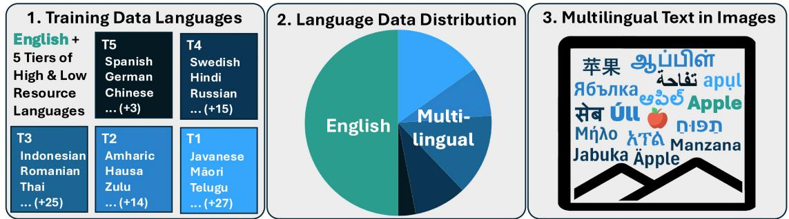
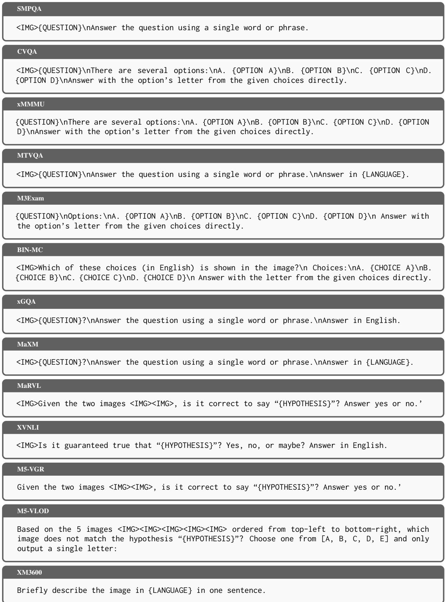
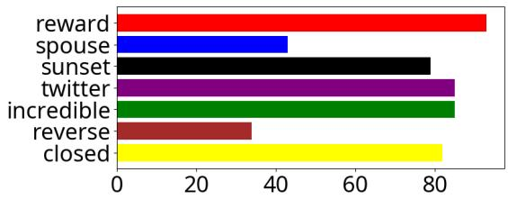
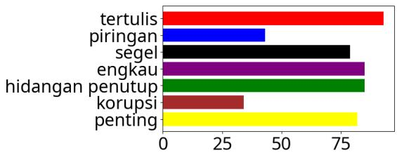
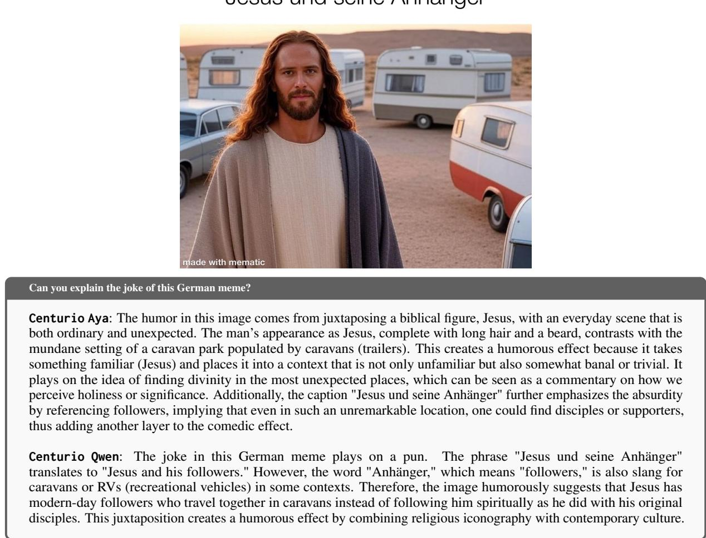
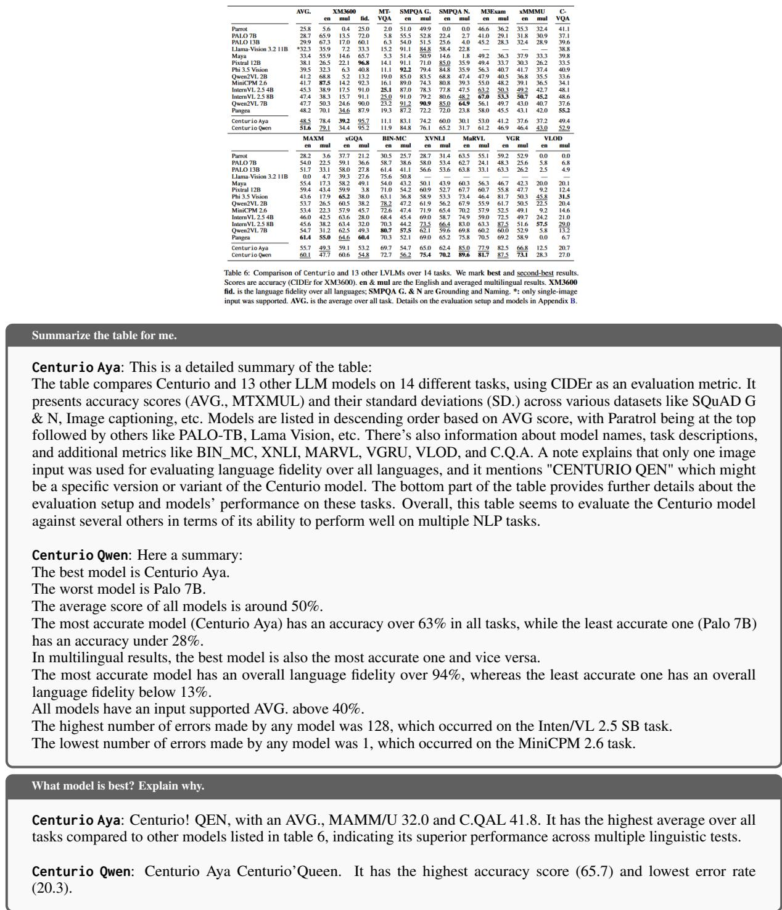
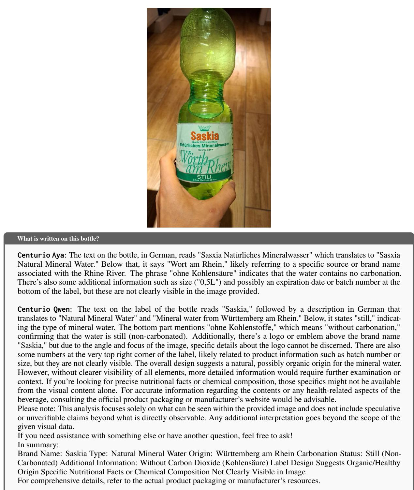
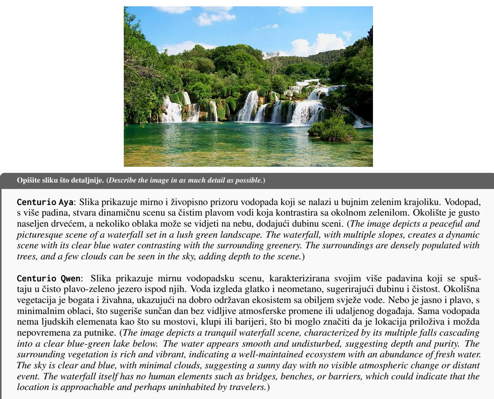
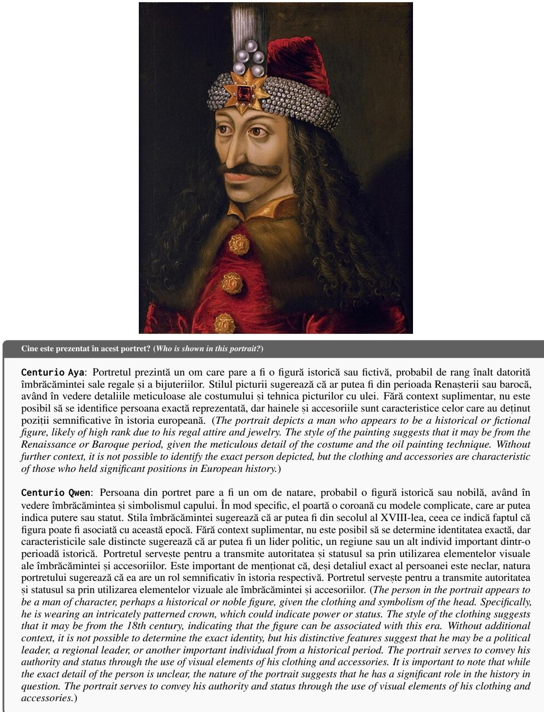

# Centurio: On Drivers of Multilingual Ability of Large Vision-Language Model

Gregor Geigle12∗ Florian Schneider3∗ Carolin Holtermann4

Chris Biemann3 Radu Timofte2 Anne Lauscher4 Goran Glavaš1

1WüNLP, 2Computer Vision Lab, CAIDAS, University of Würzburg   
3Language Technology Group, 4Data Science Group, University of Hamburg   
(gregor.geigle|florian.schneider-1)@uni-(wuerzburg|hamburg).de gregor-ge.github.io/Centurio

## Abstract

Most Large Vision-Language Models (LVLMs) to date are trained predominantly on English data, which makes them struggle to understand non-English input and fail to generate output in the desired target language. Existing efforts mitigate these issues by adding multilingual training data, but do so in a largely ad-hoc manner, lacking insight into how different training mixes tip the scale for different groups of languages. In this work, we present a comprehensive investigation into the training strategies for massively multilingual LVLMs. First, we conduct a series of multi-stage experiments spanning 13 downstream vision-language tasks and 43 languages, systematically examining: (1) the number of training languages that can be included without degrading English performance and (2) optimal language distributions of pretraining as well as (3) instruction-tuning data. Further, we (4) investigate how to improve multilingual text-in-image understanding, and introduce a new benchmark for the task. Surprisingly, our analysis reveals that one can (i) include as many as 100 training languages simultaneously (ii) with as little as 25-50% of non-English data, to greatly improve multilingual performance while retaining strong English performance. We further find that (iii) including non-English OCR data in pre-training and instruction-tuning is paramount for improving multilingual text-in-image understanding. Finally, we put all our findings together and train Centurio, a 100-language LVLM, offer ing highly competitive performance in an evaluation covering 14 tasks and 56 languages.

## 1 Introduction

Large Vision-Language Models (LVLMs) extend Large Language Models (LLMs) (Brown et al., 2020) to natively understand images as input (Li et al., 2023; Liu et al., 2023). This leverages the impressive language generation and reasoning abilities of recent LLMs (Llama Team, 2024; Yang et al., 2024) for vision-language tasks like image captioning or visual question answering.

While there exists a plethora of LVLMs (Zhang et al., 2024), most models are trained with just English data (Liu et al., 2024a; Dai et al., 2023; Liu et al., 2024b). This limits the access for speakers of other languages as the resulting models have several limitations even if the underlying LLMs exhibit multilingual capabilities: the models fail to understand non-English instructions (Schneider and Sitaram, 2024), struggle with non-English text content in images (Tang et al., 2024), and often fail to reply in the correct language, i.e., they have problems with languagefidelity (Hinck et al., 2024). To ameliorate these issues, LVLMs need to be trained on a multilingual data composition. As the amount of data one can train on is always limited—by time, computing resources, financial costs, or other constraints—an effective distribution of the data across different languages is paramount. Existing multilingual LVLM work has, however, given minimal consideration to this central question of optimal training data composition (e.g., Geigle et al., 2023; Sun et al., 2024; Maaz et al., 2025).

In this work, we comprehensively investigate the space of language distributions of LVLM training mixes, focusing on the presumed trade-off between the number of included languages and performance across languages—grouped by the amount of data available for them—under a fixed training budget. We train several models with different data compositions obtained by machine-translating high-quality English data and benchmark them across 13 downstream tasks covering 43 diverse languages—from low-resource languages like Igbo to high-resource languages like German. We focus on four research questions, each building on the previous one, designed to identify an optimal multilingual training mix: RQ1: What is the optimal number of training languages? RQ2 & RQ3: What is the optimal distribution of data across languages in (RQ3) pre-training data and (RQ2) instructiontuning? RQ4: How to improve the understanding of multilingual text in images? To measure progress for RQ4, we introduce SMPQA (Synthetic Multilingual Plot Question Answering), a novel dataset for testing multilingual OCR capabilities, spanning 11 languages and 7 scripts.

  
Figure 1: Exploring drivers of multilingual ability: (1) Languages in the training data; (2) Distribution of languages in the training data; (3) Incorporating multilingual OCR samples to understand non-English text in images.

Our findings are encouraging, albeit surprising. 1. We do not observe the infamous “curse of multilinguality” (Conneau et al., 2020; Pfeiffer et al., 2022b) and find that gradually increasing the number of languages incurs only a negligible “performance tax”: scaling from 7 to 100 languages greatly improves performance for languages newly added to the training data, especially with respect to language fidelity, while largely retaining performance levels for all previously added languages.

2. We find that exposure to a language matters more than increasing the training portion of the language or, in particular, that the majority of the training data can still be in English, which lowers the cost of acquiring training data in other languages (e.g., via machine translation). Concretely, we find that turning 25 to 50% of training data multilingual yields strong performance, with more data sometimes even degrading performance; in pre-training, having a larger share of multilingual data is more beneficial, but it also saturates after 50%.

3. We obtain mixed results for text-in-image problems: while incorporating (synthetic) OCR data with 5k samples per language rapidly boosts the performance for Latin-script languages, the same does not hold for languages with other scripts.

Finally, to demonstrate the practical impact of our findings, we train Centurio, a massively multilingual LVLM with 100 languages, following what we found to be an “optimal” data distribution across languages for both training stages. Centurio achieves state-of-the-art results over 14 tasks , matching the performance of popular multilingual open-weight LVLMs like Qwen2-VL (Wang et al., 2024b), InternVL 2.5 (Chen et al., 2024d) and Pangea (Yue et al., 2025) on English and other high-resource languages while outperforming them on low(er)-resource languages.

## 2 Drivers of Multilingual Ability

The design space for training (multilingual) LVLMs is extensive, ranging from the choice of the image encoder and the alignment module between the image encoder and LLM to the selection of training data. (Karamcheti et al., 2024; Laurençon et al., 2025; Tong et al., 2024). Exhaustively searching through the cross-product of all choices is not feasible. In this work, we focus on extensive evaluation of language distributions of training data in both pre-training and instructiontuning. Intuitively, this should be a major factor affecting the multilingual ability of an LVLM. Figure 1 illustrates the scope of our analysis. We keep adding groups of languages—from highestto lowest-resourced, following the “resourceness” tiers of (Joshi et al., 2020)—into the training mix while keeping the data size fixed. Besides the number of languages, our main focus is on the division of the training budget between English and all other languages. Finally, we posit that, besides understanding instructions and generating outputs in different languages, truly multilingual LVLMs must be able to “understand” multilingual text in images. We thus pay special attention to training adaptions for multilingual text-in-image problems.

## 2.1 Experimental Setup

Architecture. For our experiments, we adopt the popular LLaVA architecture (Liu et al., 2023, 2024a): An image encoder encodes images into a sequence of visual tokens, which are projected with a 2-layer MLP into the LLM embedding space. These projected visual tokens are then concatenated with the text tokens and fed through the LLM to generate textual output.

For all our experiments, we chose SigLIP SO4001 (Zhai et al., 2023) as the image encoder because it seems to be the best-performing “CLIPlike”, i.e., language-supervised, embedding model, as shown by Tong et al. (2024). Further, we decided against other current image encoders for the following two reasons:1) The multilingual language understanding and text generation capabilities evaluated in RQ1, RQ2, and RQ3 are mainly attributed to the LLM, with the image encoder expected to play only a minor role. 2) When it comes to “textin-image” understanding capabilities assessed in RQ4, where the image encoder is thought to play a more important role, all relevant image encoders are trained primarily with English image captions. Hence, we expect all of them to struggle with lowresource languages and especially with non-Latin scripts due to the lack of exposure to respective data during training.

We chose Phi 3.5 (Abdin et al., 2024b) as our LLM because it exhibits strong multilingual performance while its small size (3.8B parameters) allows for more computationally efficient experimentation while still exhibiting strong multilingual performance. To show that our findings generalize to other LLMs, we repeat a subset of the analysis experiments with Llama 3 (8B) (Llama Team, 2024) as the LLM backbone (see Appendix D.1).

Training Setup. Following previous work (Liu et al., 2024a; Tong et al., 2024), we split the training into two phases : 1) pre-training: the model is trained only on image captioning, with dense image captions; 2) instruction tuning: the model is trained on a mix of diverse vision-language tasks using several public datasets. While pre-training benefits downstream performance, it is not strictly necessary for the LVLM to perform well on the downstream tasks (Karamcheti et al., 2024). To reduce the computational cost of our analysis (i.e., to avoid coupling each language distribution over pretraining data with every language distribution of instruction-tuning data), we skip pre-training while searching for an optimal language distribution for instruction tuning. Then, with instruction-tuning data fixed, we search for an optimal language distribution for pre-training data. In both stages, we freeze the image encoder and only update the MLP and LLM (with LoRA (Hu et al., 2022)) weights. We provide further details in Appendix A.

Training Data. Our controlled experiments require comparable data over a wide range of languages. Existing multilingual datasets, available only for some tasks and in a handful of languages2 thus do not meet our needs. Instead, we resort to machine translation (MT) and use the open NLLB model (Costa-jussà et al., 2022)3 to translate readily available English datasets.4 While MT results in lower data quality, especially for lower-resource languages, it is the only option to obtain multilingual vision-language training data at scale. Moreover, gains from “low-quality” MT data are guaranteed to be met or even surpassed with higherquality translations (e.g., commercial MT or human translators). Our instruction-tuning data is adapted from LLaVA-Next (Liu et al., 2024b) and contains 0.77M samples. For pre-training, we use the 1.3M dense captions from ShareGPT4v (Chen et al., 2024b). We provide further details in Appendix B.

Evaluation. We curate an extensive test suite of 13 tasks covering 43 languages to assess the multilingual abilities of our models. Following Joshi et al. (2020), we cluster the tested languages into five tiers, with T5 encompassing the high-resource languages (e.g., German, Chinese) and T1 extremely low-resource languages (e.g., Maori, Telugu). The tasks contained in our test suite are twofold: (1) discriminative tasks with questions that require binary (”yes/no”) or multiple-choice answers and (2) open generation tasks, where the models need to generate output in the target language (e.g., an image caption or a free-form answer). Generative tasks additionally evaluate a model’s language fidelity, i.e., the ability to generate the answer in the language of the instruction. The full list of evaluation tasks and languages, along with further details, is in Appendix C. We report the results for language tiers (T1–T5), averaging the scores over all tasks and all tier languages.5 We separately report English performance and exclude it from T5.

## 2.2 RQ1: Number of Training Languages

We first investigate on how many languages to actually train with: does training on few high-resource languages and (zero-shot) cross-lingual transfer to unseen languages suffice, as suggested, e.g., by Shaham et al. (2024); Chen et al. (2024c); Kew et al. (2024), or do we need to explicitly include each targeted languages? Conversely, does training with more languages harm the per-language performance, with a smaller portion of the training data now allocated to each language?

Setup. We focus on the instruction-tuning step: 50% of the data is kept in English6, while the other 50% split between $N$ other languages equally, i.e., each language gets $\frac { 5 0 } { N } \%$ of the data budget. We gradually increase $N ,$ starting with the highestresource tier (T5) and then including tiers of lowerresource languages (T4 to T1), one at a time. This results in the following setups: T5 (N = 6), T5- T4 (N = 24), T5-T3 (N = 52), T5-T2 (N = 69), and finally L100 (N = 99). In L100, in addition to languages from T5-T2, we include T1 languages to cover XM3600 (Thapliyal et al., 2022) and otherwise randomly to reach 99 languages.

Results. Table 1 summarizes the results. Expectedly, we find that including a language (tier) in instruction-tuning improves their performance (Table 1a, top half). Nevertheless, the (negative) effect of adding new languages on performance of previously included languages is negligible, if at all present. This makes training massively multilingual LVLMs feasible with only minor performance drawbacks for any given language. In-language training leads to dramatic improvements in language fidelity (i.e., the model producing the output in the correct language), as shown in Table 1b. Interestingly, the more multilingual the training, the larger the fidelity gains also for languages not included in training; explicit in-language training, expectedly, then further improves fidelity for any given language (see Table 27 in the Appendix for detailed per language results). Even when excluding tasks where language fidelity plays a role (Table 1a bottom), we observe the same trends: steady improvements from in-language training, with negligible (if any) performance drops for other languages. A subset of experiments with Llama 3 (setups: English, T5, and L100) in Table 13 in the Appendix confirms these trends observed with Phi

<table><tr><td>Train Lang.</td><td>T1</td><td>T2</td><td>T3</td><td>T4</td><td>T5</td><td>en</td></tr><tr><td>All tasks</td></tr><tr><td></td><td></td><td>24.4</td><td>23.6</td><td>28.5</td><td>53.6</td></tr><tr><td>English T5</td><td>14.4 16.5</td><td>30.4 31.0</td><td>26.3</td><td>26.7</td><td>34.0</td><td>53.7</td></tr><tr><td>T5-4</td><td>17.4</td><td>30.6</td><td>27.9</td><td>29.6</td><td>33.5</td><td>51.5</td></tr><tr><td>T5-3</td><td>17.7</td><td>31.4</td><td>32.1</td><td>29.0</td><td>34.1</td><td>52.7</td></tr><tr><td>T5-2</td><td>17.0</td><td>34.5</td><td>30.0</td><td>28.2</td><td>33.4</td><td>54.1</td></tr><tr><td>L100</td><td>19.3</td><td>32.6</td><td>30.7</td><td>28.9</td><td>34.4</td><td>52.6</td></tr><tr><td colspan="7">Tasks unaffected by language fidelity</td></tr><tr><td>English</td><td>33.0</td><td>32.5</td><td>36.3</td><td>38.5</td><td>42.9</td><td>55.7</td></tr><tr><td>T5</td><td>35.3</td><td>33.2</td><td>36.4</td><td>38.7</td><td>42.4</td><td>56.0</td></tr><tr><td>T5-T4</td><td>35.8</td><td>32.6</td><td>37.8</td><td>40.1</td><td>42.2</td><td>55.7</td></tr><tr><td>T5-T3</td><td>35.9</td><td>33.6</td><td>40.5</td><td>39.7</td><td>42.6</td><td>56.3</td></tr><tr><td>T5-T2</td><td>35.2</td><td>36.5</td><td>38.5</td><td>39.5</td><td>42.8</td><td>55.5</td></tr><tr><td>L100</td><td>36.1</td><td>34.3</td><td>39.1</td><td>39.8</td><td>42.7</td><td>54.6</td></tr></table>

(a) Scores are averaged over results from all tasks grouped by language tier. The performance on the following tasks is affected by language fidelity: XM3600, MaXM, MTVQA.
<table><tr><td>Train Lang.</td><td>T1</td><td>T2</td><td>T3</td><td>T4</td><td>T5</td><td>en</td></tr><tr><td>English</td><td>0.2</td><td>0.2</td><td>0.1</td><td>2.4</td><td>6.2</td><td>100.0</td></tr><tr><td>T5</td><td>39.1</td><td>36.1</td><td>82.2</td><td>83.9</td><td>99.1</td><td>100.0</td></tr><tr><td>T5-T4</td><td>61.8</td><td>84.6</td><td>87.5</td><td>99.2</td><td>98.4</td><td>100.0</td></tr><tr><td>T5-T3</td><td>72.9</td><td>84.4</td><td>98.2</td><td>95.2</td><td>97.9</td><td>100.0</td></tr><tr><td>T5-T2</td><td>68.5</td><td>99.0</td><td>97.9</td><td>98.4</td><td>98.1</td><td>100.0</td></tr><tr><td>L100</td><td>72.9</td><td>98.2</td><td>95.4</td><td>97.8</td><td>98.2</td><td>100.0</td></tr></table>

(b) Average language fidelity on XM3600 in %.  
Table 1: RQ1 (§2.2) results for models trained with different sets of languages. We emphasize the best and second-best result in each column.

3.5: in fact, we see even larger gains over all tasks when training with more languages.

## 2.3 RQ2: Language Distribution in Instruction-Tuning

RQ1 experiments show that massively multilingual instruction-tuning data is beneficial across the board. We now analyze how much of the training data should be multilingual. On the one hand, intuitively, increasing the non-English portion of the training data budget could then lead to further gains. On the other hand, the gains from more multilingual training are, at some point, likely to be offset by the fact that we are adding noisy (MT-obtained) data at the expense of clean (English) data.

Setup. We opt for the full set of 100 languages (L100) in this experiment due to their robust multilingual performance. However, we adjust the language distribution by keeping E% of the data budget in English and splitting the remaining 100  E% equally across the other 99 lan-$\mathrm { \ g u a g e s } ^ { 7 }$ . We consider the following six setups: $E \in \{ 1 , 1 0 , 2 5 , 5 0 , 7 5 , 9 0 \}$

Results. We present the results in Table 2. We observe peak performance for all language tiers when between 25% and 75% of the training data is in English. For some tasks (e.g., XM3600, MaXM, BIN-MC), we see weaker performance with more English data, while for others (e.g., MTVQA, xGQA, MaRVL) more multilingual data leads to slight performance drops (see per-task results in F.1). Overall, lower-resource languages benefit from more multilingual data and, conversely, higher-resource languages benefit from more English data. However, this is in part also a consequence of language coverage across tasks: XM3600 and BIN-MC profit from a more multilingual training mix; at the same time, they are the tasks that encompass the most low(er)-resource languages.

<table><tr><td>English %</td><td>T1</td><td>T2</td><td>T3</td><td>T4</td><td>T5</td><td>en</td></tr><tr><td>1</td><td>19.1</td><td>30.3</td><td>28.8</td><td>27.1</td><td>31.7</td><td>48.9</td></tr><tr><td>10</td><td>18.1</td><td>32.4</td><td>29.4</td><td>27.4</td><td>32.5</td><td>50.1</td></tr><tr><td>25</td><td>19.7</td><td>35.5</td><td>29.9</td><td>27.9</td><td>33.0</td><td>50.3</td></tr><tr><td>50</td><td>19.3</td><td>32.6</td><td>30.7</td><td>28.9</td><td>34.4</td><td>52.6</td></tr><tr><td>75</td><td>18.5</td><td>31.5</td><td>30.7</td><td>28.4</td><td>34.6</td><td>54.1</td></tr><tr><td>90</td><td>15.9</td><td>31.2</td><td>27.6</td><td>26.9</td><td>34.1</td><td>54.8</td></tr></table>

Table 2: RQ2 (§2.3) results for models trained with different ratios of English to multilingual data in the instruction-tuning phase. Scores are averaged over results from all tasks grouped by language tier.

Results obtained with the Llama 3 backbone (see Table 14 in the Appendix) follow the same pattern: we observe the best performance in T1 and T2 with $E = 1 0 ;$ ; and for T5 and English with $E = 9 0 !$ $E = 5 0$ yields the best results overall, considering all tiers. Our findings align with concurrent work by Yue et al. (2025), who found that anywhere between 20 and 80% of English data yields good global performance. Following these results, we choose $E = 5 0$ as a robust value for the training.

## 2.4 RQ3: Language Distribution in Pre-Training

As hinted by (Liu et al., 2023, 2024b) and explicitly demonstrated by Tong et al. (2024), pre-training on image-caption pairs improves the LVLM’s performance. We therefore, after identifying an effective distribution of instruction-tuning data, next explore the effect of different distributions of pre-training data across languages. Specifically, we test if balancing out the English and multilingual portions delivers better performance than unbalanced distributions, that assign more training budget to English or the multilingual mix, respectively.

Setup. In these experiments, we fix the instructiontuning mix to L100 with ${ E _ { I T } \ = \ 5 0 \% }$ of data in English, which we found in the previous section to produce overall most balanced results. For the pre-training data mix, we select the same 100 languages, varying the portion of English imagecaption pairs, $E _ { P T } ~ \in ~ \{ 1 0 0 \% , 5 0 \% , 1 \% \}$ ; as in instruction-tuning, the non-English data budget is equally distributed across the other 99 languages.

<table><tr><td>English %</td><td>T1</td><td>T2</td><td>T3</td><td>T4</td><td>T5</td><td>en</td></tr><tr><td>No pre-training</td><td>19.3</td><td>32.6</td><td>30.7</td><td>28.9</td><td>34.4</td><td>52.6</td></tr><tr><td>100</td><td>19.3</td><td>33.3</td><td>32.1</td><td>29.4</td><td>34.5</td><td>55.2</td></tr><tr><td>50</td><td>22.8</td><td>39.5</td><td>33.8</td><td>30.8</td><td>35.7</td><td>54.9</td></tr><tr><td>1</td><td>22.7</td><td>38.9</td><td>33.7</td><td>31.2</td><td>35.4</td><td>55.1</td></tr></table>

Table 3: RQ3 (§2.4) results with different English-tomultilingual ratios (L100) for pre-training. All variants are identically instruction-tuned (L100, 50% En.).

Results. Scores in Table 3 reveal that while English-only pre-training yields downstream benefits on English tasks, it has a largely negligible effect on other languages. The multilingual mixes substantially improve the performance for virtually all language tiers, with gains being the most prominent for lowest-resource languages from T2 and T1. In contrast to instruction-tuning, a very low proportion of clean English data does not result in tangible performance degradation, but it generally does not improve the multilingual performance either. We thus select $E _ { P T } = 5 0 \%$ as the “optimal” choice for subsequent experiments. Experiments with Llama 3, with 1% and 100% of English data (see Table 15 in the Appendix) support this finding that having a highly multilingual pre-training benefits multilingual downstream performance.

## 2.5 RQ4: Improving on Multilingual Text-in-Image Tasks

Finally, we focus on the models’ multilingual understanding of text in images and how to improve it. Unlike tasks based on natural images, text-in-image tasks cannot be translated trivially from English: even if the prompt and output text are translated, the text in the image remains in English. Because of this, we test how synthetic multilingual OCR data, which can be generated at scale in any number of languages, can help improve performance.

Novel Evaluation Dataset. To this end, we introduce SMPQA (Synthetic Multilingual Plot QA) a new multilingual evaluation dataset, which focuses on two fundamental skills required in text-in-image tasks: 1) reading (and outputting) the text from an image and 2) grounding the input text (given as part of the prompt) to the corresponding text in the image (via balanced ‘yes/no’ questions, e.g., “Is the bar with label \$Label the largest?”). We provide further details on the construction and examples in Appendix C.5.8 We construct SMPQA to cover (i) 5 Latin-script languages, one from each tier, and (ii) 6 major languages with different non-Latin scripts.

<table><tr><td>Setup</td><td colspan="3">SMPQA Ground</td><td colspan="3">SMPQA Read</td></tr><tr><td></td><td>en</td><td>Latin</td><td>other</td><td>en</td><td>Latin</td><td>other</td></tr><tr><td>No pre-training</td><td>69.6</td><td>67.2</td><td>51.9</td><td>33.4</td><td>12.8</td><td>0.1</td></tr><tr><td>No OCR</td><td>76.1</td><td>73.0</td><td>55.3</td><td>41.8</td><td>23.1</td><td>0.2</td></tr><tr><td>100% Eng.</td><td>78.4</td><td>74.7</td><td>57.9</td><td>55.8</td><td>39.9</td><td>3.9</td></tr><tr><td>50% Eng.</td><td>81.2</td><td>76.7</td><td>60.0</td><td>53.8</td><td>41.8</td><td>7.1</td></tr><tr><td>50% (frozen)</td><td>76.1</td><td>70.8</td><td>56.3</td><td>47.2</td><td>34.1</td><td>3.5</td></tr><tr><td>1% Eng.</td><td>81.0</td><td>78.3</td><td>64.1</td><td>54.8</td><td>43.5</td><td>8.0</td></tr><tr><td>Latin down</td><td>78.9</td><td>74.2</td><td>59.5</td><td>54.6</td><td>41.0</td><td>9.9</td></tr></table>

Table 4: RQ4 (§2.5) results of models trained with additional synthetic OCR data on SMPQA for English, Latin-script languages, and languages with other scripts. No pre-training: from Table 2; No OCR: from Table 3; frozen: image encoder frozen; N% Eng.: N% of OCR data is English, rest uniform distributed over L100 languages; Latin down: 2.5k samples for all Latin-script languages, 10k samples for others.

Setup. We generate multilingual synthetic text-inimage data for training following the Synthdog approach (Kim et al., 2022) (see B.3 for details). We again adopt the training setup L100 with 50% English data, both in pre-training and fine-tuning, now adding 500k Synthdog samples to pre-training and a subset of 50k instances to the instruction-tuning mix. As before, we select E  100, 50, 1 % English samples, distributing the rest of the budget equally over the other 99 languages. We test an additional Latin-down distribution: we double the budget allocated to 32 non-Latin-script languages and cut the training budget for Latin-script languages (other than English) in half. Importantly, in these experiments we unfreeze the image encoder and fine-tune its parameters as well.

Results. Table 4 summarizes the results. The models from prior experiments, No pre-training and No OCR, succeed for English and other Latin-script languages but utterly fail on non-Latin scripts with near-random performance. We note that the model with the pre-training step (without the additional OCR data) already performs better than the model trained just via instruction-tuning; this is likely due to the presence of images with text coupled with captions that explicitly mention this text. Training with synthetic data greatly improves the performance across all languages even if all of the OCR data is in English (100% Eng.). Nonetheless, using multilingual synthetic OCR data is very effective and, importantly, does not degrade English SM-PQA performance even if English constitutes only 1% of the training data. We note that unfreezing and training the image encoder is critical for optimal performance in all scripts. Despite all this, we still observe a large performance gap between Latinand non-Latin-script languages, even if we skew the training budget towards the non-Latin scripts (Latin-down). We hypothesize that orders of magnitude more text-in-image training data for other scripts are required for adequate performance.9

## 3 Centurio: Applying Lessons Learned

Our answers to RQ1–RQ4 (see §2) point to the feasibility of training massively multilingual LVLMs supporting 100 languages with a “sweet spot” of roughly 50% of the English data being MTtranslated to the languages covered. For improving multilingual OCR capabilities, training on largescale synthetic data with an unfrozen image encoder has proven effective. Demonstrating the practicability of our findings, we now train state-ofthe-art multilingual LVLMs applying our lessons learned, which we call Centurio. We briefly describe further design choices below.

## 3.1 Design Choices

Text Encoder. The choice of the LLM greatly impacts multilingual performance. We benchmark several LLMs (with 7-9B parameters) following the evaluation setup described in §2 for L100 languages and translations for 50% of the English instruct data to find candidates for Centurio (details in Appendix D.3). The best performances where obtained with Aya-Expanse (Dang et al., 2024) and Qwen 2.5 (Yang et al., 2024) as backbones.

Image Tiling and Projection. Image tiling methods (Lin et al., 2024; Liu et al., 2024b) increase the image resolution by concatenating encodings of n non-overlapping tiles of an input image together, which significantly helps with ‘reading’ small text in images. However, they also greatly increase the input length: a 2 2 tiling would yield 3,645 tokens per image with our model.10 Instead, we adopt the method by Shi et al. (2024), which concatenates the tokens of the whole image and the tiles along the feature dimension before projection by the MLP. This gives an efficient trade-off between computing cost—the number of tokens stays constant—and performance gains for fine-grained content.

<table><tr><td></td><td>AVG.</td><td colspan="3">XM3600 en mul</td><td>MT- VQA</td><td colspan="2">SMPQA G. mul en</td><td colspan="2">SMPQA N. en mul</td><td colspan="2">M3Exam en mul</td><td colspan="2">xMMMU en mul</td><td>C- VQA</td></tr><tr><td>Parrot</td><td>25.8</td><td>5.6</td><td>0.4</td><td>25.0</td><td>2.0</td><td>51.0</td><td>49.9</td><td>0.0</td><td>0.0</td><td>46.6</td><td>36.2</td><td>35.3</td><td>32.4</td><td>41.1</td></tr><tr><td>PALO 7B</td><td>28.7</td><td>65.9</td><td>13.5</td><td>72.0</td><td>5.8</td><td>55.5</td><td>52.8</td><td>22.4</td><td>2.7</td><td>41.0</td><td>29.1</td><td>31.8</td><td>30.9</td><td>37.1</td></tr><tr><td>PALO 13B</td><td>29.9</td><td>67.3</td><td>17.0</td><td>60.1</td><td>6.3</td><td>54.0</td><td>51.5</td><td>25.6</td><td>4.0</td><td>45.2</td><td>28.3</td><td>32.4</td><td>28.9</td><td>39.6</td></tr><tr><td>Llama-Vision 3.2 11B</td><td>*32.3</td><td>35.9</td><td>7.2</td><td>33.3</td><td>15.2</td><td>91.1</td><td>84.8</td><td>58.4</td><td>22.8</td><td></td><td></td><td></td><td></td><td>38.8</td></tr><tr><td>Maya</td><td>33.4</td><td>55.9</td><td>14.6</td><td>65.7</td><td>5.3</td><td>51.4</td><td>50.9</td><td>14.6</td><td>1.8</td><td>49.2</td><td>36.3</td><td>37.9</td><td>33.3</td><td>39.8</td></tr><tr><td>Pixtral 12B</td><td>38.1</td><td>26.5</td><td>22.1</td><td>96.8</td><td>14.1</td><td>91.1</td><td>71.0</td><td>85.0</td><td>35.9</td><td>49.4</td><td>33.7</td><td>30.3</td><td>26.2</td><td>33.5</td></tr><tr><td>Phi 3.5 Vision</td><td>39.5</td><td>32.3</td><td>6.3</td><td>40.8</td><td>11.1</td><td>92.2</td><td>79.4</td><td>84.8</td><td>35.9</td><td>56.3</td><td>40.7</td><td>41.7</td><td>37.4</td><td>40.9</td></tr><tr><td>Qwen2VL 2B</td><td>41.2</td><td>68.8</td><td>5.2</td><td>13.2</td><td>19.0</td><td>85.0</td><td>83.5</td><td>68.8</td><td>47.4</td><td>47.9</td><td>40.5</td><td>36.8</td><td>35.5</td><td>33.6</td></tr><tr><td>MiniCPM 2.6</td><td>41.7</td><td>87.5</td><td>14.2</td><td>92.3</td><td>16.1</td><td>89.0</td><td>74.3</td><td>80.8</td><td>39.3</td><td>55.0</td><td>48.2</td><td>39.1</td><td>36.5</td><td>34.1</td></tr><tr><td>InternVL 2.5 4B</td><td>45.3</td><td>38.9</td><td>17.5</td><td>91.0</td><td>25.1</td><td>87.0</td><td>78.3</td><td>77.8</td><td>47.5</td><td>63.2</td><td>50.3</td><td>49.2</td><td>42.7</td><td>48.1</td></tr><tr><td>InternVL 2.5 8B</td><td>47.4</td><td>38.3</td><td>15.7</td><td>91.1</td><td>25.0</td><td>91.0</td><td>79.2</td><td>80.6</td><td>48.2</td><td>67.0</td><td>53.3</td><td>50.7</td><td>45.2</td><td>48.6</td></tr><tr><td>Qwen2VL 7B</td><td>47.7</td><td>50.3</td><td>24.6</td><td>90.0</td><td>23.2</td><td>91.2</td><td>90.9</td><td>85.0</td><td>64.9</td><td>56.1</td><td>49.7</td><td>43.0</td><td>40.7</td><td>37.6</td></tr><tr><td>Pangea</td><td>48.2</td><td>70.1</td><td>34.6</td><td>87.9</td><td>19.3</td><td>87.2</td><td>72.2</td><td>72.0</td><td>23.8</td><td>58.0</td><td>45.5</td><td>43.1</td><td>42.0</td><td>55.2</td></tr><tr><td>Centurio Aya</td><td>48.5</td><td>78.4</td><td>39.2</td><td>95.7</td><td>11.1</td><td>83.1</td><td>74.2</td><td>60.0</td><td>30.1</td><td>53.0</td><td>41.2</td><td>37.6</td><td>37.2</td><td>49.4</td></tr><tr><td>Centurio Qwen</td><td>51.6</td><td>79.1</td><td>34.4</td><td>95.2</td><td>11.9</td><td>84.8</td><td>76.1</td><td>65.2</td><td>31.7</td><td>61.2</td><td>46.9</td><td>46.4</td><td>43.0</td><td>52.9</td></tr><tr><td></td><td>MAXM en</td><td>mul</td><td>xGQA en</td><td>mul</td><td>en</td><td>BIN-MC mul</td><td>en</td><td>XVNLI mul</td><td>MaRVL en</td><td></td><td>VGR</td><td></td><td>VLOD</td><td></td></tr><tr><td>Parrot</td><td>28.2</td><td>3.6</td><td></td><td></td><td></td><td></td><td></td><td></td><td></td><td>mul</td><td>en</td><td>mul</td><td>en</td><td>mul</td></tr><tr><td>PALO 7B</td><td>54.0</td><td>22.5</td><td>37.7 59.1</td><td>21.2</td><td>30.5</td><td>25.7</td><td>28.7</td><td>31.4</td><td>63.5</td><td>55.1</td><td>59.2</td><td>52.9</td><td>0.0</td><td>0.0</td></tr><tr><td>PALO 13B</td><td>51.7</td><td>33.1</td><td>58.0</td><td>36.6 27.8</td><td>58.7 61.4</td><td>38.6 41.1</td><td>58.0</td><td>53.4 53.6</td><td>62.7 63.8</td><td>24.1</td><td>48.3</td><td>25.6</td><td>5.8</td><td>6.8 4.9</td></tr><tr><td>Llama-Vision 3.2 11B</td><td>0.0</td><td>4.7</td><td>39.3</td><td>27.6</td><td>75.6</td><td>50.8</td><td>56.6</td><td></td><td></td><td>33.1</td><td>63.3</td><td>26.2</td><td>2.5</td><td></td></tr><tr><td>Maya</td><td>55.4</td><td>17.3</td><td>58.2</td><td>49.1</td><td>54.0</td><td>43.2</td><td>50.1</td><td>43.9</td><td>60.3</td><td>56.3</td><td>46.7</td><td></td><td>20.0</td><td>20.1</td></tr><tr><td>Pixtral 12B</td><td>59.4</td><td>43.4</td><td>59.9</td><td>3.8</td><td></td><td></td><td></td><td>52.7</td><td>67.7</td><td>60.7</td><td></td><td>42.3</td><td></td><td>12.4</td></tr><tr><td>Phi 3.5 Vision</td><td>43.6</td><td>17.9</td><td>65.2</td><td>38.0</td><td>71.0</td><td>54.2</td><td>60.9</td><td>53.3</td><td>73.4</td><td>46.4</td><td>55.8</td><td>47.7</td><td>9.2</td><td>31.5</td></tr><tr><td>Qwen2VL 2B</td><td>53.7</td><td>26.5</td><td>60.5</td><td>38.2</td><td>63.1</td><td>36.8</td><td>58.9</td><td></td><td>67.9</td><td>55.9</td><td>81.7</td><td>50.3</td><td>45.8</td><td>20.4</td></tr><tr><td>MiniCPM 2.6</td><td>53.4</td><td>22.3</td><td>57.9</td><td>45.7</td><td>78.2 72.6</td><td>47.2</td><td>61.9</td><td>56.2</td><td>70.2</td><td></td><td>61.7</td><td>50.5</td><td>22.5</td><td>14.6</td></tr><tr><td>InternVL 2.5 4B</td><td>46.0</td><td>42.5</td><td>63.6</td><td>28.0</td><td>68.4</td><td>47.4 45.4</td><td>71.9</td><td>65.4</td><td>74.9</td><td>57.9</td><td>52.5</td><td>49.1</td><td>9.2</td><td>21.0</td></tr><tr><td>InternVL 2.5 8B</td><td>45.6</td><td>38.2</td><td>63.4</td><td>32.0</td><td>70.3</td><td>44.2</td><td>69.0 73.5</td><td>58.7 66.4</td><td>83.0</td><td>59.0 63.3</td><td>72.5</td><td>49.7 51.6</td><td>24.2 57.5</td><td>29.0</td></tr><tr><td>Qwen2VL 7B</td><td>54.7</td><td>31.2</td><td>62.5</td><td>49.3</td><td>80.7</td><td>57.5</td><td>62.1</td><td>59.6</td><td>69.8</td><td>60.2</td><td>87.5 60.0</td></table>

Table 5: Comparison of Centurio and 13 other LVLMs across 14 tasks. We highlight the best and second-best results. Scores are accuracy (CIDEr for XM3600). en & mul are the English and averaged multilingual results. XM3600 fid. is the language fidelity over all languages; SMPQA G. & N are Grounding and Naming. \*: supports only single-image input. AVG.: average over all tasks. Details on the setup and models are provided in Appendix C.

<table><tr><td>Model</td><td>T1</td><td>T2</td><td>T3</td><td>T4</td><td>T5</td><td>en</td></tr><tr><td>Centurio Aya</td><td>35.1</td><td>46.4</td><td>47.0</td><td>46.7</td><td>48.3</td><td>60.6</td></tr><tr><td>Centurio Qwen</td><td>38.1</td><td>51.0</td><td>48.3</td><td>47.0</td><td>50.9</td><td>66.6</td></tr><tr><td>InternVL 2.5 8B</td><td>29.9</td><td>37.0</td><td>37.4</td><td>41.0</td><td>50.5</td><td>64.4</td></tr><tr><td>Qwen2VL 7B</td><td>30.6</td><td>36.8</td><td>40.5</td><td>46.2</td><td>48.0</td><td>56.8</td></tr><tr><td>Pangea</td><td>38.5</td><td>38.6</td><td>46.9</td><td>44.2</td><td>49.9</td><td>59.8</td></tr><tr><td colspan="7">Without multi-image tasks (MaRVL, VGR, VLOD):</td></tr><tr><td>Centurio Aya</td><td>35.1</td><td>44.5</td><td>45.7</td><td>46.2</td><td>47.7</td><td>60.7</td></tr><tr><td>Centurio Qwen</td><td>38.1</td><td>49.5</td><td>45.6</td><td>45.8</td><td>49.6</td><td>66.0</td></tr><tr><td>InternVL 2.5 8B</td><td>29.9</td><td>40.4</td><td>35.2</td><td>39.4</td><td>49.7</td><td>62.3</td></tr><tr><td>Qwen2VL 7B</td><td>30.6</td><td>38.7</td><td>40.8</td><td>46.8</td><td>48.3</td><td>61.7</td></tr><tr><td>Pangea</td><td>38.5</td><td>46.5</td><td>47.7</td><td>44.4</td><td>49.9</td><td>64.9</td></tr></table>

Table 6: Comparison between Centurio and the top-3 models of Table 5. Scores are averages over results from all 14 tasks grouped by language tier.

Training Data. We increase the amount of the pretraining and instruct tuning data to further improve performance beyond our analysis setup. For pretraining, we add the 0.7M ALLaVA captions (Chen et al., 2024a) to the ShareGPT-4V captions and we use all synthetic OCR data generated in §2.5 (1.16M total: 500k English, 5k for Latin-script language, 10k for other scripts). For instructiontuning, we incorporate additional datasets from the Cambrian collection (Tong et al., 2024) along with several text-only instruction-tuning datasets (see Appendix B.2 for a list). We translate the data to the L100 50% En. setup, excluding text-heavy datasets and others that are problematic for MT.

## 3.2 Results

We compare our Centurio models against 13 other multilingual LVLMs across the 13 tasks used in §2, and additionally evaluate them on CVQA11, testing the models’ capabilities across 56 languages. We provide details for all models in Appendix C.6.

On average, Centurio achieves the best results across all 14 tasks (cf. Table 5). Focusing on multilingual single-task performance, our model sometimes lags behind the best-performing models but still achieves best or second-best results in 9 of 14 tasks. While Centurio performs strongly on English, it is more often surpassed by other models. These results prove the effectiveness of our training composition: we are able to retain high English performances while maximizing the models’ multilingual capabilities. When analyzing these results grouped by language tier (Table 6), we find that our models shine in the low-resource tiers T112 and T2, with competitive results for higherresource languages—even when excluding multiimage tasks (VGR, MaRVL, VLOD), where our models greatly outperform most others.

For text-heavy tasks (primarily MTVQA and SMPQA), we find that Centurio falls behind. While we show the importance of multilingual OCR training—Centurio succeeds at the SMPQA reading task in more languages than, for example, Pangea—the limited input resolution and magnitudes less OCR data compared to Qwen2-VL and others result in comparably poor performance.

## 4 Related Work

Multilingual LVLMs. Building on the success of monolingual LVLMs like BLIP-2 (Li et al., 2023) and LLaVA (Liu et al., 2023, 2024a), researchers extended the English training protocols to include multilingual data for obtaining massively multilingual LVLMs (e.g., Maaz et al., 2025; Geigle et al., 2023). As such, Google’s PaLI models (Chen et al., 2022, 2023) were the first closed-weight models trained on multilingual captions and VQA data with the recent open-weight PaliGemma (Beyer et al., 2024) following a similar training strategy. Geigle et al. (2023) presented with mBLIP the first open model, trained with image captions and a limited mix of instruct data translated to 98 languages. Subsequent models similarly followed an established procedure by directly translating parts of the English training data (Maaz et al., 2025; Hu et al., 2024; Alam et al., 2024). For the concurrent Pangea, Yue et al. (2025) optimized for multicultural aspects and used a mix of machine-translated data, existing multilingual data, and synthetically generated data. While they analyze the ratio between English and multilingual data, they do not vary the number of languages, fixing it at 39. Interestingly, most researchers either (i) did not properly motivate their multilingual data mix (e.g., Geigle et al., 2023; Alam et al., 2024; Beyer et al., 2024), or (ii) did not provide any details on the training data composition (e.g., Wang et al., 2024b; Yao et al., 2024; Chen et al., 2024d))

Multilingual OCR with LVLMs. While OCR recently gained popularity for English LVLMs (Lu et al., 2024; Tong et al., 2024), multilingual OCR has largely been neglected in prior work. As an exception, Qwen2-VL (Wang et al., 2024b) and InternVL 2.5 (Chen et al., 2024d) exhibit excellent multilingual OCR capabilities, but no training details are known. Towards open knowledge on improving multilingual OCR, Yue et al. (2025) performed preliminary experiments leveraging data in 10 languages. However, such efforts are still hindered by the lack of evaluation resources: MTVQA (Tang et al., 2024) and M3Exam (Zhang et al., 2023a) only cover up to 9 languages and conflate language understanding (in the text input) with understanding text on images. In this work, we push multilingual OCR research by presenting the novel SMPQA dataset dedicated to evaluation of multilingual OCR. We further explore how synthetic training data can improve models’ capabilities.

Multilingual Instruction Tuning of LLMs.. While older LLMs struggled in multilingual tasks (Ahuja et al., 2024), more recent ones like Qwen 2.5 (Yang et al., 2024), Llama 3 (Llama Team, 2024), Gemma 2 (Team et al., 2024), or Aya (Aryabumi et al., 2024) have greatly improved in that respect, making them usable in many languages besides English. Still, current LLMs often fail to respond faithfully to the prompting language if that language is not English, especially for lowresource languages (Holtermann et al., 2024; Kew et al., 2024; Marchisio et al., 2024). To mitigate this issue, several works have analyzed the importance of multilingual instruction tuning. Weber et al. (2024) demonstrated that multilingual training is crucial for downstream performance even if the base models are pre-trained on multilingual data mixtures. Others showed that just a small set of languages is sufficient to improve cross-lingual transfer for multilingual downstream tasks significantly (Shaham et al., 2024; Chen et al., 2024c; Kew et al., 2024). However, they focus on a small set of primarily higher-resource languages, while we consider the problem in the vision-language context for a wider language selection.

In (Soykan and Sahin, 2024), the authors propose methods to select the optimal mix of languages for instruction tuning in a ”linguisticallyinformed manner”. However, they find no general best selection, and instead a task- and modeldependent selection is necessary. Therefore, in our work, we do not apply these techniques and instead choose languages based on the taxonomy introduced by Joshi et al. (2020).

## 5 Conclusion

In this study, we systematically investigated the optimal data composition for training a multilingual LVLM through four progressively refined analysis setups. Our findings reveal that massively multilingual training with 100 languages is highly effective, achieving comparable results to configurations with fewer languages. Moreover, only 25–50% of the training data needs to be non-English, keeping the cost of multilingual data production low. To enhance multilingual text understanding in images, we introduced a novel evaluation benchmark and demonstrated the importance and effectiveness of including multilingual synthetic OCR data in the training mix. Finally, we apply our findings to train Centurio, massively multilingual LVLMs trained with 100 languages, and achieve state-of-the-art results on our evaluation suite covering 14 tasks and 56 language tasks against 13 other LVLMs.

## 6 Limitations

Lack of Explicit Multicultural Training The focus of this work is on language understanding in a massively multilingual setup, that is, how to train the model to maximize its ability to understand and generate text in various languages. We do not consider the multicultural aspect, that is, training a model so that it is also more knowledgeable about concepts from the countries whose languages it can understand as measured by benchmarks like CVQA or CulturalVQA (Nayak et al., 2024). While the two aspects — multilingual and multicultural knowledge — can be intermingled in practice, they require distinct approaches in training: Multilingual data is necessary for multilingual language understanding, as we have shown. However, multicultural knowledge can be learned from multilingual resources as created by, for example, by Yue et al. (2025), but also from fully English resources like Wikipedia (Srinivasan et al., 2021).

Using Machine-Translated Training Data We train our model using machine-translated (MT) data derived from high-quality English datasets. This is advantageous because it allows us to create comparable setups for our analyses with full control over the languages and their proportions. While the data proves effective in increasing multilingual performance, MT data, especially for low-resource languages, can be of low quality and, even in higherresource languages, might exhibit unwanted “translationese” artifacts. This can negatively impact the quality of generated text in a way that the metrics employed in our evaluation suite do not adequately measure. While native multilingual training data is available, it is not available for all tasks or languages equally, or, for most languages, not at all. Future work should consider evaluation setups to quantify the effect the MT data has on the final model, work on better MT pipelines, or create more data through native speakers.

Using Synthetically Generated OCR Data The text-heavy, “real-world” tasks in some datasets of our instruction tuning mix, which cover diverse image types such as plots, scans, application screenshots, or screenshots of webpages, are still entirely in English. Due to the issues that arise when translating such samples, we do not translate them. Hence, our methods to improve the understanding of multilingual texts in images are limited to only using synthetically generated images. While we have seen that our synthetic data positively impacts the performance of models on the respective tasks, future work should explore methods for collecting or generating more diverse data in different languages beyond our synthetic OCR data.

Another limitation regarding OCR capabilities is our relatively small image input resolution compared to models like Qwen2-VL or InternVL 2.5 — both of which support image inputs in native resolution at the cost of thousands of tokens per image —, which limits the performance of Centurio for images with small text.

## Acknowledgments

Simulations were performed with computing resources granted by WestAI under project 9148.

Simulations were performed with computing resources from Julia 2. Julia 2 was funded as DFG project as “Forschungsgroßgerät nach Art 91b GG” under INST 93/1145-1 FUGG

The work of Gregor Geigle was in part supported by the Alexander von Humboldt Foundation.

The work of Carolin Holtermann and Anne Lauscher is funded under the Excellence Strategy of the German Federal Government and the States.

## References

Marah Abdin, Jyoti Aneja, Hany Awadalla, Ahmed Awadallah, Ammar Ahmad Awan, Nguyen Bach, Amit Bahree, Arash Bakhtiari, Jianmin Bao, Harkirat Behl, et al. 2024a. Phi-3 Technical Report: A Highly Capable Language Model Locally on Your Phone. arXiv preprint arXiv:2404.14219.

Marah Abdin, Sam Ade Jacobs, Ammar Ahmad Awan, Jyoti Aneja, Ahmed Awadallah, Hany Awadalla, Nguyen Bach, Amit Bahree, Arash Bakhtiari, Harkirat Behl, Alon Benhaim, Misha Bilenko, Johan Bjorck, Sébastien Bubeck, Martin Cai, Caio César Teodoro Mendes, Weizhu Chen, Vishrav Chaudhary, Parul Chopra, Allie Del Giorno, Gustavo de Rosa, Matthew Dixon, Ronen Eldan, Dan Iter, Amit Garg, Abhishek Goswami, Suriya Gunasekar, Emman Haider, Junheng Hao, Russell J. Hewett, Jamie Huynh, Mojan Javaheripi, Xin Jin, Piero Kauffmann, Nikos Karampatziakis, Dongwoo Kim, Mahoud Khademi, Lev Kurilenko, James R. Lee, Yin Tat Lee, Yuanzhi Li, Chen Liang, Weishung Liu, Eric Lin, Zeqi Lin, Piyush Madan, Arindam Mitra, Hardik Modi, Anh Nguyen, Brandon Norick, Barun Patra, Daniel Perez-Becker, Thomas Portet, Reid Pryzant, Heyang Qin, Marko Radmilac, Corby Rosset, Sambudha Roy, Olatunji Ruwase, Olli Saarikivi, Amin Saied, Adil Salim, Michael Santacroce, Shital Shah, Ning Shang, Hiteshi Sharma, Xia Song, Masahiro Tanaka, Xin Wang, Rachel Ward, Guanhua Wang, Philipp Witte, Michael Wyatt, Can Xu, Jiahang Xu, Sonali Yadav, Fan Yang, Ziyi Yang, Donghan Yu, Chengruidong Zhang, Cyril Zhang, Jianwen Zhang, Li Lyna Zhang, Yi Zhang, Yue Zhang, Yunan Zhang, and Xiren Zhou. 2024b. Phi-3 Technical Report: A Highly Capable Language Model Locally on Your Phone. arXiv preprint arXiv:2404.14219.

Manoj Acharya, Kushal Kafle, and Christopher Kanan. 2019. TallyQA: Answering Complex Counting Questions. In Proceedings of the AAAI Conference on Artificial Intelligence, volume 33, pages 8076–8084.

Željko Agic and Natalie Schluter. 2018. Baselines and ´ Test Data for Cross-Lingual Inference. In Proceedings of the Eleventh International Conference on Language Resources and Evaluation (LREC 2018), pages 3890–3894, Miyazaki, Japan.

Pravesh Agrawal, Szymon Antoniak, Emma Bou Hanna, Baptiste Bout, Devendra Chaplot, Jessica Chudnovsky, Diogo Costa, Baudouin De Monicault, Saurabh Garg, Theophile Gervet, et al. 2024. Pixtral 12B. arXiv preprint arXiv:2410.07073.

Sanchit Ahuja, Divyanshu Aggarwal, Varun Gumma, Ishaan Watts, Ashutosh Sathe, Millicent Ochieng, Rishav Hada, Prachi Jain, Mohamed Ahmed, Kalika Bali, and Sunayana Sitaram. 2024. MEGAVERSE: Benchmarking Large Language Models Across Languages, Modalities, Models and Tasks. In Proceedings ofthe 2024 Conference ofthe North American Chapter of the Association for Computational Linguistics: Human Language Technologies (Volume 1: Long Papers), pages 2598–2637, Mexico City, Mexico.

AI@Meta. 2024. Llama 3 Model Card.

Nahid Alam, Karthik Reddy Kanjula, Surya Guthikonda, Timothy Chung, Bala Krishna S Vegesna, Abhipsha Das, Anthony Susevski, Ryan Sze-Yin Chan, SM Uddin, Shayekh Bin Islam, et al. 2024. Maya: An Instruction Finetuned Multilingual Multimodal Model. arXiv preprint arXiv:2412.07112.

Viraat Aryabumi, John Dang, Dwarak Talupuru, Saurabh Dash, David Cairuz, Hangyu Lin, Bharat Venkitesh, Madeline Smith, Jon Ander Campos, Yi Chern Tan, Kelly Marchisio, Max Bartolo, Sebastian Ruder, Acyr Locatelli, Julia Kreutzer, Nick Frosst, Aidan N. Gomez, Phil Blunsom, Marzieh Fadaee, Ahmet Üstün, and Sara Hooker. 2024. Aya 23: Open Weight Releases to Further Multilingual Progress. arXiv preprint arXiv:2405.15032.

Jonas Belouadi, Anne Lauscher, and Steffen Eger. 2024. AutomaTikZ: Text-Guided Synthesis of Scientific Vector Graphics with TikZ. In The Twelfth International Conference on Learning Representations, ICLR 2024, Vienna, Austria.

Lucas Beyer, Andreas Steiner, André Susano Pinto, Alexander Kolesnikov, Xiao Wang, Daniel Salz, Maxim Neumann, Ibrahim Alabdulmohsin, Michael Tschannen, Emanuele Bugliarello, Thomas Unterthiner, Daniel Keysers, Skanda Koppula, Fangyu Liu, Adam Grycner, Alexey A. Gritsenko, Neil Houlsby, Manoj Kumar, Keran Rong, Julian Eisenschlos, Rishabh Kabra, Matthias Bauer, Matko Bosnjak, Xi Chen, Matthias Minderer, Paul Voigtlaender, Ioana Bica, Ivana Balazevic, Joan Puigcerver, Pinelopi Papalampidi, Olivier J. Hénaff, Xi Xiong, Radu Soricut, Jeremiah Harmsen, and Xiaohua Zhai. 2024. PaliGemma: A versatile 3B VLM for transfer. arXiv preprint arXiv:2407.07726.

Ali Furkan Biten, Rubèn Tito, Andrés Mafla, Lluís Gómez i Bigorda, Marçal Rusiñol, C. V. Jawahar, Ernest Valveny, and Dimosthenis Karatzas. 2019. Scene Text Visual Question Answering. In 2019 IEEE/CVF International Conference on Computer Vision, ICCV 2019, pages 4290–4300, Seoul, Korea (South).

Samuel R. Bowman, Gabor Angeli, Christopher Potts, and Christopher D. Manning. 2015. A large annotated corpus for learning natural language inference. In Proceedings of the 2015 Conference on Empirical Methods in Natural Language Processing, pages 632–642, Lisbon, Portugal.

Tom Brown, Benjamin Mann, Nick Ryder, Melanie Subbiah, Jared D Kaplan, Prafulla Dhariwal, Arvind Neelakantan, Pranav Shyam, Girish Sastry, Amanda Askell, et al. 2020. Language Models are Few-Shot Learners. In Advances in Neural Information Processing Systems, volume 33, pages 1877–1901, Virtual.

Emanuele Bugliarello, Fangyu Liu, Jonas Pfeiffer, Siva Reddy, Desmond Elliott, Edoardo Maria Ponti, and Ivan Vulic. 2022. IGLUE: A Benchmark for Transfer Learning across Modalities, Tasks, and Languages. In International Conference on Machine Learning, pages 2370–2392, Baltimore, MD, USA. PMLR.

Soravit Changpinyo, Linting Xue, Michal Yarom, Ashish Thapliyal, Idan Szpektor, Julien Amelot, Xi Chen, and Radu Soricut. 2023. MaXM: Towards Multilingual Visual Question Answering. In Findings of the Association for Computational Linguistics: EMNLP 2023, pages 2667–2682, Singapore.

Guiming Hardy Chen, Shunian Chen, Ruifei Zhang, Junying Chen, Xiangbo Wu, Zhiyi Zhang, Zhihong Chen, Jianquan Li, Xiang Wan, and Benyou Wang. 2024a. ALLaVA: Harnessing GPT4V-synthesized Data for A Lite Vision-Language Model. arXiv preprint arXiv:2402.11684.

Lin Chen, Jinsong Li, Xiaoyi Dong, Pan Zhang, Conghui He, Jiaqi Wang, Feng Zhao, and Dahua Lin. 2024b. ShareGPT4V: Improving Large Multi-modal Models with Better Captions. In European Conference on Computer Vision, pages 370–387, Milan, Italy. Springer.

Pinzhen Chen, Shaoxiong Ji, Nikolay Bogoychev, Andrey Kutuzov, Barry Haddow, and Kenneth Heafield. 2024c. Monolingual or Multilingual Instruction Tuning: Which Makes a Better Alpaca. In Findings of the Association for Computational Linguistics: EACL 2024, pages 1347–1356, St. Julian’s, Malta.

Xi Chen, Josip Djolonga, Piotr Padlewski, Basil Mustafa, Soravit Changpinyo, Jialin Wu, Carlos Riquelme Ruiz, Sebastian Goodman, Xiao Wang, Yi Tay, Siamak Shakeri, Mostafa Dehghani, Daniel Salz, Mario Lucic, Michael Tschannen, Arsha Nagrani, Hexiang Hu, Mandar Joshi, Bo Pang, Ceslee Montgomery, Paulina Pietrzyk, Marvin Ritter, A. J. Piergiovanni, Matthias Minderer, Filip Pavetic, Austin Waters, Gang Li, Ibrahim Alabdulmohsin, Lucas Beyer, Julien Amelot, Kenton Lee, Andreas Peter Steiner, Yang Li, Daniel Keysers, Anurag Arnab, Yuanzhong Xu, Keran Rong, Alexander Kolesnikov, Mojtaba Seyedhosseini, Anelia Angelova, Xiaohua Zhai, Neil Houlsby, and Radu Soricut. 2023. PaLI-X: On Scaling up a Multilingual Vision and Language Model. arXiv preprint arXiv:2305.18565.

Xi Chen, Xiao Wang, Soravit Changpinyo, A. J. Piergiovanni, Piotr Padlewski, Daniel Salz, Sebastian Goodman, Adam Grycner, Basil Mustafa, Lucas Beyer, Alexander Kolesnikov, Joan Puigcerver, Nan Ding, Keran Rong, Hassan Akbari, Gaurav

Mishra, Linting Xue, Ashish Thapliyal, James Bradbury, Weicheng Kuo, Mojtaba Seyedhosseini, Chao Jia, Burcu Karagol Ayan, Carlos Riquelme, Andreas Steiner, Anelia Angelova, Xiaohua Zhai, Neil Houlsby, and Radu Soricut. 2022. PaLI: A Jointly-Scaled Multilingual Language-Image Model. In The Eleventh International Conference on Learning Representations, Kigali, Rwanda.

Zhe Chen, Weiyun Wang, Yue Cao, Yangzhou Liu, Zhangwei Gao, Erfei Cui, Jinguo Zhu, Shenglong Ye, Hao Tian, Zhaoyang Liu, Lixin Gu, Xuehui Wang, Qingyun Li, Yimin Ren, Zixuan Chen, Jiapeng Luo, Jiahao Wang, Tan Jiang, Bo Wang, Conghui He, Botian Shi, Xingcheng Zhang, Han Lv, Yi Wang, Wenqi Shao, Pei Chu, Zhongying Tu, Tong He, Zhiyong Wu, Huipeng Deng, Jiaye Ge, Kai Chen, Min Dou, Lewei Lu, Xizhou Zhu, Tong Lu, Dahua Lin, Yu Qiao, Jifeng Dai, and Wenhai Wang. 2024d. Expanding Performance Boundaries of Open-Source Multimodal Models with Model, Data, and Test-Time Scaling. arXiv preprint arXiv:2412.05271.

Zhe Chen, Weiyun Wang, Yue Cao, Yangzhou Liu, Zhangwei Gao, Erfei Cui, Jinguo Zhu, Shenglong Ye, Hao Tian, Zhaoyang Liu, et al. 2024e. Expanding Performance Boundaries of Open-Source Multimodal Models with Model, Data, and Test-Time Scaling. arXiv preprint arXiv:2412.05271.

Zhiyu Chen, Wenhu Chen, Charese Smiley, Sameena Shah, Iana Borova, Dylan Langdon, Reema Moussa, Matt Beane, Ting-Hao Huang, Bryan R. Routledge, and William Yang Wang. 2021. FinQA: A Dataset of Numerical Reasoning over Financial Data. In Proceedings of the 2021 Conference on Empirical Methods in Natural Language Processing, EMNLP 2021, pages 3697–3711, Virtual Event / Punta Cana, Dominican Republic.

Zhoujun Cheng, Haoyu Dong, Zhiruo Wang, Ran Jia, Jiaqi Guo, Yan Gao, Shi Han, Jian-Guang Lou, and Dongmei Zhang. 2022. HiTab: A Hierarchical Table Dataset for Question Answering and Natural Language Generation. In Proceedings of the 60th Annual Meeting of the Association for Computational Linguistics (Volume 1: Long Papers), ACL 2022, pages 1094–1110, Dublin, Ireland.

Alexis Conneau, Kartikay Khandelwal, Naman Goyal, Vishrav Chaudhary, Guillaume Wenzek, Francisco Guzmán, Edouard Grave, Myle Ott, Luke Zettlemoyer, and Veselin Stoyanov. 2020. Unsupervised Cross-lingual Representation Learning at Scale. In Proceedings of the 58th Annual Meeting of the Associationfor Computational Linguistics, ACL 2020, pages 8440–8451, Online.

Marta R. Costa-jussà, James Cross, Onur Çelebi, Maha Elbayad, Kenneth Heafield, Kevin Heffernan, Elahe Kalbassi, Janice Lam, Daniel Licht, Jean Maillard, Anna Sun, Skyler Wang, Guillaume Wenzek, Al Youngblood, Bapi Akula, Loïc Barrault, Gabriel Mejia Gonzalez, Prangthip Hansanti, John Hoffman, Semarley Jarrett, Kaushik Ram

Sadagopan, Dirk Rowe, Shannon Spruit, Chau Tran, Pierre Andrews, Necip Fazil Ayan, Shruti Bhosale, Sergey Edunov, Angela Fan, Cynthia Gao, Vedanuj Goswami, Francisco Guzmán, Philipp Koehn, Alexandre Mourachko, Christophe Ropers, Safiyyah Saleem, Holger Schwenk, and Jeff Wang. 2022. No Language Left Behind: Scaling Human-Centered Machine Translation. arXiv preprint arXiv:2207.04672.

Wenliang Dai, Junnan Li, Dongxu Li, Anthony Meng Huat Tiong, Junqi Zhao, Weisheng Wang, Boyang Li, Pascale Fung, and Steven C. H. Hoi. 2023. InstructBLIP: Towards General-purpose Vision-Language Models with Instruction Tuning. In Proceedings of the 37th International Conference on Neural Information Processing Systems, volume abs/2305.06500, pages 49250–49267, New Orleans, LA, USA.

John Dang, Shivalika Singh, Daniel D’souza, Arash Ahmadian, Alejandro Salamanca, Madeline Smith, Aidan Peppin, Sungjin Hong, Manoj Govindassamy, Terrence Zhao, Sandra Kublik, Meor Amer, Viraat Aryabumi, Jon Ander Campos, Yi-Chern Tan, Tom Kocmi, Florian Strub, Nathan Grinsztajn, Yannis Flet-Berliac, Acyr Locatelli, Hangyu Lin, Dwarak Talupuru, Bharat Venkitesh, David Cairuz, Bowen Yang, Tim Chung, Wei-Yin Ko, Sylvie Shang Shi, Amir Shukayev, Sammie Bae, Aleksandra Piktus, Roman Castagné, Felipe Cruz-Salinas, Eddie Kim, Lucas Crawhall-Stein, Adrien Morisot, Sudip Roy, Phil Blunsom, Ivan Zhang, Aidan Gomez, Nick Frosst, Marzieh Fadaee, Beyza Ermis, Ahmet Üstün, and Sara Hooker. 2024. Aya Expanse: Combining Research Breakthroughs for a New Multilingual Frontier. arXiv preprint arXiv:2412.04261.

J. Deng, W. Dong, R. Socher, L. Li, Kai Li, and Li Fei-Fei. 2009. ImageNet: A large-scale hierarchical image database. In 2009 IEEE Conference on Computer Vision and Pattern Recognition, pages 248–255, Miami, FL, USA.

Peter Devine. 2024. Tagengo: A Multilingual Chat Dataset. In Proceedings of the Fourth Workshop on Multilingual Representation Learning (MRL 2024), pages 106–113, Miami, FL, USA.

Jiahui Gao, Renjie Pi, Jipeng Zhang, Jiacheng Ye, Wanjun Zhong, Yufei Wang, Lanqing Hong, Jianhua Han, Hang Xu, Zhenguo Li, and Lingpeng Kong. 2023. G-LLaVA: Solving Geometric Problem with Multi-Modal Large Language Model. In The Thirteenth International Conference on Learning Representations, Singapore.

William Gaviria Rojas, Sudnya Diamos, Keertan Kini, David Kanter, Vijay Janapa Reddi, and Cody Coleman. 2022. The Dollar Street Dataset: Images Representing the Geographic and Socioeconomic Diversity of the World. In Advances in Neural Information Processing Systems, volume 35, pages 12979–12990.

Gregor Geigle, Abhay Jain, Radu Timofte, and Goran Glavas. 2023. mBLIP: Efficient Bootstrapping

of Multilingual Vision-LLMs. arXiv preprint arXiv:2307.06930.

Gregor Geigle, Radu Timofte, and Goran Glavas. 2024a. African or European Swallow? Benchmarking Large Vision-Language Models for Fine-Grained Object Classification. In Proceedings of the 2024 Conference on Empirical Methods in Natural Language Processing, EMNLP 2024, pages 2653–2669, Miami, FL, USA.

Gregor Geigle, Radu Timofte, and Goran Glavaš. 2024b. Babel-ImageNet: Massively Multilingual Evaluation of Vision-and-Language Representations. In Proceedings ofthe 62nd Annual Meeting ofthe Associationfor Computational Linguistics (Volume 1: Long Papers), pages 5064–5084, Bangkok, Thailand.

Y. Goyal, T. Khot, D. Summers-Stay, D. Batra, and D. Parikh. 2017. Making the V in VQA Matter: Elevating the Role of Image Understanding in Visual Question Answering. In 2017 IEEE Conference on Computer Vision and Pattern Recognition (CVPR), pages 6325–6334, Honolulu, HI, USA.

Danna Gurari, Qing Li, Abigale J. Stangl, Anhong Guo, Chi Lin, Kristen Grauman, Jiebo Luo, and Jeffrey P. Bigham. 2018. VizWiz Grand Challenge: Answering Visual Questions From Blind People. In 2018 IEEE Conference on Computer Vision and Pattern Recognition, CVPR 2018, pages 3608–3617, Salt Lake City, UT, USA.

Musashi Hinck, Carolin Holtermann, Matthew L. Olson, Florian Schneider, Sungduk Yu, Anahita Bhiwandiwalla, Anne Lauscher, Shao-Yen Tseng, and Vasudev Lal. 2024. Why do LLaVA Vision-Language Models Reply to Images in English? In Findings of the Associationfor Computational Linguistics: EMNLP 2024, pages 13402–13421, Miami, FL, USA.

Carolin Holtermann, Paul Röttger, Timm Dill, and Anne Lauscher. 2024. Evaluating the Elementary Multilingual Capabilities of Large Language Models with MultiQ. In Findings ofthe Associationfor Computational Linguistics: ACL 2024, pages 4476–4494, Bangkok, Thailand.

Yu-Chung Hsiao, Fedir Zubach, Gilles Baechler, Srinivas Sunkara, Victor Carbune, Jason Lin, Maria Wang, Yun Zhu, and Jindong Chen. 2025. ScreenQA: Large-Scale Question-Answer Pairs Over Mobile App Screenshots. In Proceedings ofthe 2025 Conference ofthe Nations ofthe Americas Chapter ofthe Associationfor Computational Linguistics: Human Language Technologies (Volume 1: Long Papers), pages 9427–9452, Albuquerque, New Mexico, USA.

Edward J. Hu, Yelong Shen, Phillip Wallis, Zeyuan Allen-Zhu, Yuanzhi Li, Shean Wang, Lu Wang, and Weizhu Chen. 2022. LoRA: Low-Rank Adaptation of Large Language Models. In The Tenth International Conference on Learning Representations, ICLR 2022, Virtual.

Jinyi Hu, Yuan Yao, Chongyi Wang, Shan Wang, Yinxu Pan, Qianyu Chen, Tianyu Yu, Hanghao Wu, Yue Zhao, Haoye Zhang, Xu Han, Yankai Lin, Jiao Xue, Dahai Li, Zhiyuan Liu, and Maosong Sun. 2024. Large Multilingual Models Pivot Zero-Shot Multimodal Learning across Languages. In The Twelfth International Conference on Learning Representations, ICLR 2024, Vienna, Austria.

Drew A. Hudson and Christopher D. Manning. 2019. GQA: A New Dataset for Real-World Visual Reasoning and Compositional Question Answering. In IEEE Conference on Computer Vision and Pattern Recognition, CVPR 2019, pages 6700–6709, Long Beach, CA, USA.

Harsh Jhamtani and Taylor Berg-Kirkpatrick. 2018. Learning to Describe Differences Between Pairs of Similar Images. In Proceedings of the 2018 Conference on Empirical Methods in Natural Language Processing, pages 4024–4034, Brussels, Belgium.

Justin Johnson, Bharath Hariharan, Laurens van der Maaten, Li Fei-Fei, C. Lawrence Zitnick, and Ross B. Girshick. 2017. CLEVR: A Diagnostic Dataset for Compositional Language and Elementary Visual Reasoning. In 2017 IEEE Conference on Computer Vision and Pattern Recognition, CVPR 2017, pages 1988–1997, Honolulu, HI, USA.

Pratik Joshi, Sebastin Santy, Amar Budhiraja, Kalika Bali, and Monojit Choudhury. 2020. The State and Fate of Linguistic Diversity and Inclusion in the NLP World. In Proceedings of the 58th Annual Meeting of the Associationfor Computational Linguistics, ACL 2020, pages 6282–6293, Online.

Kushal Kafle, Brian L. Price, Scott Cohen, and Christopher Kanan. 2018. DVQA: Understanding Data Visualizations via Question Answering. In 2018 IEEE Conference on Computer Vision and Pattern Recognition, CVPR 2018, pages 5648–5656, Salt Lake City, UT, USA.

Siddharth Karamcheti, Suraj Nair, Ashwin Balakrishna, Percy Liang, Thomas Kollar, and Dorsa Sadigh. 2024. Prismatic VLMs: investigating the design space of visually-conditioned language models. In Proceedings ofthe 41st International Conference on Machine Learning, pages 23123–23144, Vienna, Austria.

Mehran Kazemi, Hamidreza Alvari, Ankit Anand, Jialin Wu, Xi Chen, and Radu Soricut. 2023. GeomVerse: A Systematic Evaluation of Large Models for Geometric Reasoning. In AIfor Math Workshop@ ICML 2024.

Sahar Kazemzadeh, Vicente Ordonez, Mark Matten, and Tamara Berg. 2014. ReferItGame: Referring to Objects in Photographs of Natural Scenes. In Proceedings of the 2014 Conference on Empirical Methods in Natural Language Processing (EMNLP), pages 787–798, Doha, Qatar.

Aniruddha Kembhavi, Mike Salvato, Eric Kolve, Minjoon Seo, Hannaneh Hajishirzi, and Ali Farhadi.

2016. A Diagram is Worth a Dozen Images. In Computer Vision – ECCV 2016, pages 235–251, Amsterdam, The Netherlands.

Aniruddha Kembhavi, Min Joon Seo, Dustin Schwenk, Jonghyun Choi, Ali Farhadi, and Hannaneh Hajishirzi. 2017. Are You Smarter Than a Sixth Grader? Textbook Question Answering for Multimodal Machine Comprehension. In 2017 IEEE Conference on Computer Vision and Pattern Recognition, CVPR 2017, pages 5376–5384, Honolulu, HI, USA.

Tannon Kew, Florian Schottmann, and Rico Sennrich. 2024. Turning English-centric LLMs Into Polyglots: How Much Multilinguality Is Needed? In Findings ofthe Associationfor Computational Linguistics: EMNLP 2024, pages 13097–13124, Miami, Florida, USA.

Geewook Kim, Teakgyu Hong, Moonbin Yim, JeongYeon Nam, Jinyoung Park, Jinyeong Yim, Wonseok Hwang, Sangdoo Yun, Dongyoon Han, and Seunghyun Park. 2022. OCR-Free Document Understanding Transformer. In Computer Vision - ECCV 2022 - 17th European Conference, volume 13688, pages 498–517, Tel Aviv, Israel.

Ranjay Krishna, Yuke Zhu, Oliver Groth, Justin Johnson, Kenji Hata, Joshua Kravitz, Stephanie Chen, Yannis Kalantidis, Li-Jia Li, David A. Shamma, Michael S. Bernstein, and Li Fei-Fei. 2017. Visual Genome: Connecting Language and Vision Using Crowdsourced Dense Image Annotations. Int. J. Comput. Vision, 123(1):32–73.

Hugo Laurençon, Léo Tronchon, and Victor Sanh. 2024. Unlocking the conversion of Web Screenshots into HTML Code with the WebSight Dataset. arXiv preprint arXiv:2403.09029.

Hugo Laurençon, Léo Tronchon, Matthieu Cord, and Victor Sanh. 2025. What matters when building vision-language models? In Proceedings of the Winter Conference on Applications of Computer Vision, pages 1372–1381.

Junnan Li, Dongxu Li, Silvio Savarese, and Steven Hoi. 2023. BLIP-2: Bootstrapping Language-Image Pretraining with Frozen Image Encoders and Large Language Models. In International Conference on Machine Learning, pages 19730–19742, Honolulu, HI, USA. PMLR.

Lei Li, Yuqi Wang, Runxin Xu, Peiyi Wang, Xiachong Feng, Lingpeng Kong, and Qi Liu. 2024. Multimodal ArXiv: A Dataset for Improving Scientific Comprehension of Large Vision-Language Models. In Proceedings of the 62nd Annual Meeting of the Associationfor Computational Linguistics (Volume 1: Long Papers), ACL 2024, pages 14369–14387, Bangkok, Thailand.

Tsung-Yi Lin, Michael Maire, Serge J. Belongie, James Hays, Pietro Perona, Deva Ramanan, Piotr Dollár, and C. Lawrence Zitnick. 2014. Microsoft COCO: Common Objects in Context. In Computer Vision

- ECCV 2014 - 13th European Conference, volume 8693, pages 740–755, Zurich, Switzerland.

Ziyi Lin, Dongyang Liu, Renrui Zhang, Peng Gao, Longtian Qiu, Han Xiao, Han Qiu, Wenqi Shao, Keqin Chen, Jiaming Han, Siyuan Huang, Yichi Zhang, Xuming He, Yu Qiao, and Hongsheng Li. 2024. SPHINX: A Mixer of Weights, Visual Embeddings and Image Scales for Multi-modal Large Language Models. In Computer Vision - ECCV 2024 - 18th European Conference, volume 15120, pages 36–55, Milan, Italy.

Adam Dahlgren Lindström and Savitha Sam Abraham. 2022. CLEVR-Math: A Dataset for Compositional Language, Visual and Mathematical Reasoning. In Proceedings ofthe 16th International Workshop on Neural-Symbolic Learning and Reasoning as part of the 2nd International Joint Conference on Learning & Reasoning (IJCLR 2022), volume 3212 of CEUR Workshop Proceedings, pages 155–170, Windsor Great Park, UK.

Fangyu Liu, Emanuele Bugliarello, Edoardo Maria Ponti, Siva Reddy, Nigel Collier, and Desmond Elliott. 2021. Visually Grounded Reasoning across Languages and Cultures. In Proceedings ofthe 2021 Conference on Empirical Methods in Natural Language Processing, EMNLP 2021, pages 10467–10485, Virtual Event / Punta Cana, Dominican Republic.

Haotian Liu, Chunyuan Li, Yuheng Li, and Yong Jae Lee. 2024a. Improved Baselines with Visual Instruction Tuning. In Proceedings ofthe IEEE/CVF Conference on Computer Vision and Pattern Recognition, CVPR 2020, pages 26296–26306, Seattle, WA, USA.

Haotian Liu, Chunyuan Li, Yuheng Li, Bo Li, Yuanhan Zhang, Sheng Shen, and Yong Jae Lee. 2024b. LLaVA-NeXT: Improved reasoning, OCR, and world knowledge.

Haotian Liu, Chunyuan Li, Qingyang Wu, and Yong Jae Lee. 2023. Visual Instruction Tuning. In Advances in Neural Information Processing Systems, volume 36, pages 34892–34916.

Llama Team. 2024. The Llama 3 Herd of Models. arXiv preprint arXiv:2407.21783.

Ilya Loshchilov and Frank Hutter. 2019. Decoupled Weight Decay Regularization. In 7th International Conference on Learning Representations, ICLR 2019, New Orleans, LA, USA, May 6-9, 2019.

Haoyu Lu, Wen Liu, Bo Zhang, Bingxuan Wang, Kai Dong, Bo Liu, Jingxiang Sun, Tongzheng Ren, Zhuoshu Li, Hao Yang, Yaofeng Sun, Chengqi Deng, Hanwei Xu, Zhenda Xie, and Chong Ruan. 2024. DeepSeek-VL: Towards Real-World Vision-Language Understanding. arXiv preprint arXiv:2403.05525.

Pan Lu, Ran Gong, Shibiao Jiang, Liang Qiu, Siyuan Huang, Xiaodan Liang, and Song-Chun Zhu. 2021a. Inter-GPS: Interpretable Geometry Problem Solving

with Formal Language and Symbolic Reasoning. In Proceedings of the 59th Annual Meeting of the Associationfor Computational Linguistics and the 11th International Joint Conference on Natural Language Processing, ACL/IJCNLP 2021, (Volume 1: Long Papers), pages 6774–6786, Virtual Event.

Pan Lu, Swaroop Mishra, Tanglin Xia, Liang Qiu, Kai-Wei Chang, Song-Chun Zhu, Oyvind Tafjord, Peter Clark, and Ashwin Kalyan. 2022. Learn to Explain: Multimodal Reasoning via Thought Chains for Science Question Answering. In Advances in Neural Information Processing Systems 35, NeurIPS 2022, New Orleans, LA, USA.

Pan Lu, Liang Qiu, Kai-Wei Chang, Ying Nian Wu, Song-Chun Zhu, Tanmay Rajpurohit, Peter Clark, and Ashwin Kalyan. 2023. Dynamic Prompt Learning via Policy Gradient for Semi-structured Mathematical Reasoning. In The Eleventh International Conference on Learning Representations, ICLR 2023, Kigali, Rwanda.

Pan Lu, Liang Qiu, Jiaqi Chen, Tanglin Xia, Yizhou Zhao, Wei Zhang, Zhou Yu, Xiaodan Liang, and Song-Chun Zhu. 2021b. IconQA: A New Benchmark for Abstract Diagram Understanding and Visual Language Reasoning. In Proceedings ofthe Neural Information Processing Systems Track on Datasets and Benchmarks 1, NeurIPS Datasets and Benchmarks 2021, Virtual.

Muhammad Maaz, Hanoona Rasheed, Abdelrahman Shaker, Salman Khan, Hisham Cholakal, Rao M Anwer, Tim Baldwin, Michael Felsberg, and Fahad S Khan. 2025. Palo: A Polyglot Large Multimodal Model for 5B People. In 2025 IEEE/CVF Winter Conference on Applications of Computer Vision (WACV), pages 1745–1754, Tucson, Arizona, USA.

Junhua Mao, Jonathan Huang, Alexander Toshev, Oana Camburu, Alan L. Yuille, and Kevin Murphy. 2016. Generation and Comprehension of Unambiguous Object Descriptions. In 2016 IEEE Conference on Computer Vision and Pattern Recognition, CVPR 2016, pages 11–20, Las Vegas, NV, USA.

Kelly Marchisio, Wei-Yin Ko, Alexandre Berard, Théo Dehaze, and Sebastian Ruder. 2024. Understanding and Mitigating Language Confusion in LLMs. In Proceedings of the 2024 Conference on Empirical Methods in Natural Language Processing, EMNLP 2024, pages 6653–6677, Miami, FL, USA.

Kenneth Marino, Mohammad Rastegari, Ali Farhadi, and Roozbeh Mottaghi. 2019. OK-VQA: A Visual Question Answering Benchmark Requiring External Knowledge. In 2019 IEEE/CVF Conference on Computer Vision and Pattern Recognition (CVPR), pages 3190–3199, Long Beach, CA, USA.

Ahmed Masry, Do Xuan Long, Jia Qing Tan, Shafiq R. Joty, and Enamul Hoque. 2022. ChartQA: A Benchmark for Question Answering about Charts with Visual and Logical Reasoning. In Findings of the As-

sociation for Computational Linguistics: ACL 2022, pages 2263–2279, Dublin, Ireland.

Minesh Mathew, Viraj Bagal, Rubèn Tito, Dimosthenis Karatzas, Ernest Valveny, and C. V. Jawahar. 2022. InfographicVQA. In IEEE/CVF Winter Conference on Applications of Computer Vision, WACV 2022, pages 2582–2591, Waikoloa, HI, USA.

Minesh Mathew, Dimosthenis Karatzas, and C. V. Jawahar. 2021. DocVQA: A Dataset for VQA on Document Images. In IEEE Winter Conference on Applications of Computer Vision, WACV 2021, pages 2199–2208, Waikoloa, HI, USA.

Anand Mishra, Shashank Shekhar, Ajeet Kumar Singh, and Anirban Chakraborty. 2019. OCR-VQA: Visual Question Answering by Reading Text in Images. In 2019 International Conference on Document Analysis and Recognition, ICDAR 2019, pages 947–952, Sydney, Australia.

Shravan Nayak, Kanishk Jain, Rabiul Awal, Siva Reddy, Sjoerd van Steenkiste, Lisa Anne Hendricks, Karolina Stanczak, and Aishwarya Agrawal. 2024. Benchmarking Vision Language Models for Cultural Understanding. In Proceedings of the 2024 Conference on Empirical Methods in Natural Language Processing, EMNLP 2024, pages 5769–5790, Miami, FL, USA.

Jason Obeid and Enamul Hoque. 2020. Chart-to-Text: Generating Natural Language Descriptions for Charts by Adapting the Transformer Model. In Proceedings of the 13th International Conference on Natural Language Generation, INLG 2020, pages 138–147, Dublin, Ireland.

Jonas Pfeiffer, Gregor Geigle, Aishwarya Kamath, Jan-Martin O. Steitz, Stefan Roth, Ivan Vulic, and Iryna Gurevych. 2022a. xGQA: Cross-Lingual Visual Question Answering. In Findings of the Association for Computational Linguistics: ACL 2022, pages 2497–2511, Dublin, Ireland.

Jonas Pfeiffer, Naman Goyal, Xi Lin, Xian Li, James Cross, Sebastian Riedel, and Mikel Artetxe. 2022b. Lifting the Curse of Multilinguality by Pre-training Modular Transformers. In Proceedings of the 2022 Conference of the North American Chapter of the Association for Computational Linguistics: Human Language Technologies, pages 3479–3495, Seattle, WA, USA.

David Romero, Chenyang Lyu, Haryo Akbarianto Wibowo, Teresa Lynn, Injy Hamed, Aditya Nanda Kishore, Aishik Mandal, Alina Dragonetti, Artem Abzaliev, Atnafu Lambebo Tonja, Bontu Fufa Balcha, Chenxi Whitehouse, Christian Salamea, Dan John Velasco, David Ifeoluwa Adelani, David Le Meur, Emilio Villa-Cueva, Fajri Koto, Fauzan Farooqui, Frederico Belcavello, Ganzorig Batnasan, Gisela Vallejo, Grainne Caulfield, Guido Ivetta, Haiyue Song, Henok Biadglign Ademtew, Hernán Maina, Holy Lovenia, Israel Abebe Azime, Jan

Christian Blaise Cruz, Jay Gala, Jiahui Geng, Jesus-German Ortiz-Barajas, Jinheon Baek, Jocelyn Dunstan, Laura Alonso Alemany, Kumaranage Ravindu Yasas Nagasinghe, Luciana Benotti, Luis Fernando D' Haro, Marcelo Viridiano, Marcos Estecha-Garitagoitia, Maria Camila Buitrago Cabrera, Mario Rodríguez-Cantelar, Mélanie Jouitteau, Mihail Mihaylov, Naome Etori, Mohamed Fazli Mohamed Imam, Muhammad Farid Adilazuarda, Munkhjargal Gochoo, Munkh-Erdene Otgonbold, Olivier Niyomugisha, Paula Mónica Silva, Pranjal Chitale, Raj Dabre, Rendi Chevi, Ruochen Zhang, Ryandito Diandaru, Samuel Cahyawijaya, Santiago Góngora, Soyeong Jeong, Sukannya Purkayastha, Tatsuki Kuribayashi, Teresa Clifford, Thanmay Jayakumar, Tiago Timponi Torrent, Toqeer Ehsan, Vladimir Araujo, Yova Kementchedjhieva, Zara Burzo, Zheng Wei Lim, Zheng Xin Yong, Oana Ignat, Joan Nwatu, Rada Mihalcea, Thamar Solorio, and Alham Fikri Aji. 2024. CVQA: Culturally-diverse Multilingual Visual Question Answering Benchmark. In Advances in Neural Information Processing Systems, volume 37, pages 11479–11505, Vancouver, Canada.

Florian Schneider and Sunayana Sitaram. 2024. M5 – A Diverse Benchmark to Assess the Performance of Large Multimodal Models Across Multilingual and Multicultural Vision-Language Tasks. In Findings ofthe Associationfor Computational Linguistics: EMNLP 2024, pages 4309–4345, Miami, FL, USA.

Christoph Schuhmann, Romain Beaumont, Richard Vencu, Cade Gordon, Ross Wightman, Mehdi Cherti, Theo Coombes, Aarush Katta, Clayton Mullis, Mitchell Wortsman, Patrick Schramowski, Srivatsa Kundurthy, Katherine Crowson, Ludwig Schmidt, Robert Kaczmarczyk, and Jenia Jitsev. 2022. LAION-5B: An Open Large-Scale Dataset for Training Next Generation Image-Text Models. In Proceedings of the 36th International Conference on Neural Information Processing Systems, NIPS ’22, pages 25278–25294, New Orleans, LA, USA.

Dustin Schwenk, Apoorv Khandelwal, Christopher Clark, Kenneth Marino, and Roozbeh Mottaghi. 2022. A-OKVQA: A Benchmark for Visual Question Answering Using World Knowledge. In Computer Vision - ECCV 2022 - 17th European Conference, volume 13668, pages 146–162, Tel Aviv, Israel.

Uri Shaham, Jonathan Herzig, Roee Aharoni, Idan Szpektor, Reut Tsarfaty, and Matan Eyal. 2024. Multilingual Instruction Tuning With Just a Pinch of Multilinguality. In Findings ofthe Associationfor Computational Linguistics: ACL 2024, pages 2304–2317, Bangkok, Thailand.

Baifeng Shi, Ziyang Wu, Maolin Mao, Xin Wang, and Trevor Darrell. 2024. When Do We Not Need Larger Vision Models? In Computer Vision - ECCV 2024 - 18th European Conference, volume 15066, pages 444–462, Milan, Italy.

Chenglei Si, Yanzhe Zhang, Zhengyuan Yang, Ruibo Liu, and Diyi Yang. 2024. Design2Code: How Far

Are We From Automating Front-End Engineering? arXiv preprint arXiv:2403.03163.

Shivalika Singh, Freddie Vargus, Daniel D’souza, Börje Karlsson, Abinaya Mahendiran, Wei-Yin Ko, Herumb Shandilya, Jay Patel, Deividas Mataciunas, Laura O’Mahony, Mike Zhang, Ramith Hettiarachchi, Joseph Wilson, Marina Machado, Luisa Moura, Dominik Krzeminski, Hakimeh Fadaei, Irem´ Ergun, Ifeoma Okoh, Aisha Alaagib, Oshan Mudannayake, Zaid Alyafeai, Vu Chien, Sebastian Ruder, Surya Guthikonda, Emad Alghamdi, Sebastian Gehrmann, Niklas Muennighoff, Max Bartolo, Julia Kreutzer, Ahmet Üstün, Marzieh Fadaee, and Sara Hooker. 2024. Aya Dataset: An Open-Access Collection for Multilingual Instruction Tuning. In Proceedings ofthe 62nd Annual Meeting ofthe Association for Computational Linguistics (Volume 1: Long Papers), pages 11521–11567, Bangkok, Thailand.

Gurkan Soykan and Gözde Gül Sahin. 2024. Linguistically-Informed Multilingual Instruction Tuning: Is There an Optimal Set of Languages to Tune? arXiv preprint arXiv:2410.07809.

Krishna Srinivasan, Karthik Raman, Jiecao Chen, Michael Bendersky, and Marc Najork. 2021. WIT: Wikipedia-based Image Text Dataset for Multimodal Multilingual Machine Learning. In Proceedings of the 44th International ACM SIGIR Conference on Research and Development in Information Retrieval, SIGIR ’21, pages 2443–2449, New York, NY, USA.

Alane Suhr, Stephanie Zhou, Ally Zhang, Iris Zhang, Huajun Bai, and Yoav Artzi. 2019. A Corpus for Reasoning about Natural Language Grounded in Photographs. In Proceedings of the 57th Annual Meeting of the Association for Computational Linguistics, pages 6418–6428, Florence, Italy.

Hai-Long Sun, Da-Wei Zhou, Yang Li, Shiyin Lu, Chao Yi, Qing-Guo Chen, Zhao Xu, Weihua Luo, Kaifu Zhang, De-Chuan Zhan, et al. 2024. Parrot: Multilingual Visual Instruction Tuning. arXiv preprint arXiv:2406.02539.

Ryota Tanaka, Kyosuke Nishida, and Sen Yoshida. 2021. VisualMRC: Machine Reading Comprehension on Document Images. In Thirty-Fifth AAAI Conference on Artificial Intelligence, AAAI 2021, pages 13878– 13888, Virtual.

Benny J. Tang, Angie W. Boggust, and Arvind Satyanarayan. 2023. VisText: A Benchmark for Semantically Rich Chart Captioning. In Proceedings of the 61st Annual Meeting of the Association for Computational Linguistics (Volume 1: Long Papers), ACL 2023, pages 7268–7298, Toronto, Canada.

Jingqun Tang, Qi Liu, Yongjie Ye, Jinghui Lu, Shu Wei, Chunhui Lin, Wanqing Li, Mohamad Fitri Faiz Bin Mahmood, Hao Feng, Zhen Zhao, Yanjie Wang, Yuliang Liu, Hao Liu, Xiang Bai, and Can Huang.

2024. MTVQA: Benchmarking Multilingual Text-Centric Visual Question Answering. arXiv preprint arXiv:2405.11985.

Gemma Team, Morgane Riviere, Shreya Pathak, Pier Giuseppe Sessa, Cassidy Hardin, Surya Bhupatiraju, Léonard Hussenot, Thomas Mesnard, Bobak Shahriari, Alexandre Ramé, et al. 2024. Gemma 2: Improving Open Language Models at a Practical Size. arXiv preprint arXiv:2408.00118.

Ashish V. Thapliyal, Jordi Pont Tuset, Xi Chen, and Radu Soricut. 2022. Crossmodal-3600: A Massively Multilingual Multimodal Evaluation Dataset. In Proceedings ofthe 2022 Conference on Empirical Methods in Natural Language Processing, pages 715–729, Abu Dhabi, United Arab Emirates.

Shengbang Tong, Ellis Brown, Penghao Wu, Sanghyun Woo, Manoj Middepogu, Sai Charitha Akula, Jihan Yang, Shusheng Yang, Adithya Iyer, Xichen Pan, Austin Wang, Rob Fergus, Yann LeCun, and Saining Xie. 2024. Cambrian-1: A Fully Open, Vision-Centric Exploration of Multimodal LLMs. In Advances in Neural Information Processing Systems, volume 37, pages 87310–87356, Vancouver, Canada.

Haoqin Tu, Chenhang Cui, Zijun Wang, Yiyang Zhou, Bingchen Zhao, Junlin Han, Wangchunshu Zhou, Huaxiu Yao, and Cihang Xie. 2024. How Many Are in This Image A Safety Evaluation Benchmark for Vision LLMs. In Computer Vision – ECCV 2024: 18th European Conference, page 37–55, Milan, Italy.

Ramakrishna Vedantam, C. Lawrence Zitnick, and Devi Parikh. 2015. CIDEr: Consensus-based image description evaluation. In IEEE Conference on Computer Vision and Pattern Recognition, CVPR 2015, pages 4566–4575, Boston, MA, USA.

Junke Wang, Lingchen Meng, Zejia Weng, Bo He, Zuxuan Wu, and Yu-Gang Jiang. 2023. To See is to Believe: Prompting GPT-4V for Better Visual Instruction Tuning. arXiv preprint arXiv:2311.07574.

Ke Wang, Junting Pan, Weikang Shi, Zimu Lu, Houxing Ren, Aojun Zhou, Mingjie Zhan, and Hongsheng Li. 2024a. Measuring Multimodal Mathematical Reasoning with MATH-Vision Dataset. In Advances in Neural Information Processing Systems, volume 37, pages 95095–95169, Vancouver, Canada.

Peng Wang, Shuai Bai, Sinan Tan, Shijie Wang, Zhihao Fan, Jinze Bai, Keqin Chen, Xuejing Liu, Jialin Wang, Wenbin Ge, Yang Fan, Kai Dang, Mengfei Du, Xuancheng Ren, Rui Men, Dayiheng Liu, Chang Zhou, Jingren Zhou, and Junyang Lin. 2024b. Qwen2-VL: Enhancing Vision-Language Model’s Perception of the World at Any Resolution. arXiv preprint arXiv:2409.12191.

Alexander Arno Weber, Klaudia Thellmann, Jan Ebert, Nicolas Flores-Herr, Jens Lehmann, Michael Fromm, and Mehdi Ali. 2024. Investigating Multilingual Instruction-Tuning: Do Polyglot Models Demand for Multilingual Instructions? In Proceedings of the

2024 Conference on Empirical Methods in Natural Language Processing, pages 20829–20855, Miami, Florida, USA.

Ning Xie, Farley Lai, Derek Doran, and Asim Kadav. 2019. Visual Entailment: A Novel Task for Fine-grained Image Understanding. arXiv preprint arXiv:1901.06706.

Zhangchen Xu, Fengqing Jiang, Luyao Niu, Yuntian Deng, Radha Poovendran, Yejin Choi, and Bill Yuchen Lin. 2024. Magpie: Alignment Data Synthesis from Scratch by Prompting Aligned LLMs with Nothing. CoRR, abs/2406.08464.

An Yang, Baosong Yang, Binyuan Hui, Bo Zheng, Bowen Yu, Chang Zhou, Chengpeng Li, Chengyuan Li, Dayiheng Liu, Fei Huang, Guanting Dong, Haoran Wei, Huan Lin, Jialong Tang, Jialin Wang, Jian Yang, Jianhong Tu, Jianwei Zhang, Jianxin Ma, Jianxin Yang, Jin Xu, Jingren Zhou, Jinze Bai, Jinzheng He, Junyang Lin, Kai Dang, Keming Lu, Keqin Chen, Kexin Yang, Mei Li, Mingfeng Xue, Na Ni, Pei Zhang, Peng Wang, Ru Peng, Rui Men, Ruize Gao, Runji Lin, Shijie Wang, Shuai Bai, Sinan Tan, Tianhang Zhu, Tianhao Li, Tianyu Liu, Wenbin Ge, Xiaodong Deng, Xiaohuan Zhou, Xingzhang Ren, Xinyu Zhang, Xipin Wei, Xuancheng Ren, Xuejing Liu, Yang Fan, Yang Yao, Yichang Zhang, Yu Wan, Yunfei Chu, Yuqiong Liu, Zeyu Cui, Zhenru Zhang, Zhifang Guo, and Zhihao Fan. 2024. Qwen2 Technical Report. CoRR, abs/2407.10671.

Yuan Yao, Tianyu Yu, Ao Zhang, Chongyi Wang, Junbo Cui, Hongji Zhu, Tianchi Cai, Haoyu Li, Weilin Zhao, Zhihui He, Qianyu Chen, Huarong Zhou, Zhensheng Zou, Haoye Zhang, Shengding Hu, Zhi Zheng, Jie Zhou, Jie Cai, Xu Han, Guoyang Zeng, Dahai Li, Zhiyuan Liu, and Maosong Sun. 2024. MiniCPM-V: A GPT-4V Level MLLM on Your Phone. CoRR, abs/2408.01800.

Xiang Yue, Yuansheng Ni, Kai Zhang, Tianyu Zheng, Ruoqi Liu, Ge Zhang, Samuel Stevens, Dongfu Jiang, Weiming Ren, Yuxuan Sun, Cong Wei, Botao Yu, Ruibin Yuan, Renliang Sun, Ming Yin, Boyuan Zheng, Zhenzhu Yang, Yibo Liu, Wenhao Huang, Huan Sun, Yu Su, and Wenhu Chen. 2024. MMMU: A Massive Multi-discipline Multimodal Understanding and Reasoning Benchmark for Expert AGI. In Proceedings ofthe IEEE/CVF Conference on Computer Vision and Pattern Recognition, volume abs/2311.16502, pages 9556–9567, Seattle, WA, USA.

Xiang Yue, Yueqi Song, Akari Asai, Seungone Kim, Jean de Dieu Nyandwi, Simran Khanuja, Anjali Kantharuban, Lintang Sutawika, Sathyanarayanan Ramamoorthy, and Graham Neubig. 2025. Pangea: A Fully Open Multilingual Multimodal LLM for 39 Languages. In The Thirteenth International Conference on Learning Representations, Singapore, Republic of Singapore.

Xiaohua Zhai, Basil Mustafa, Alexander Kolesnikov, and Lucas Beyer. 2023. Sigmoid Loss for Language Image Pre-Training. CoRR, abs/2303.15343.

Chi Zhang, Feng Gao, Baoxiong Jia, Yixin Zhu, and Song-Chun Zhu. 2019. RAVEN: A Dataset for Relational and Analogical Visual REasoNing. In IEEE Conference on Computer Vision and Pattern Recognition, CVPR 2019, pages 5317–5327, Long Beach, CA, USA.

Duzhen Zhang, Yahan Yu, Jiahua Dong, Chenxing Li, Dan Su, Chenhui Chu, and Dong Yu. 2024. MM-LLMs: Recent Advances in MultiModal Large Language Models. In Findings of the Association for Computational Linguistics: ACL 2024, pages 12401– 12430, Bangkok, Thailand.

Wenxuan Zhang, Mahani Aljunied, Chang Gao, Yew Ken Chia, and Lidong Bing. 2023a. M3Exam: A Multilingual, Multimodal, Multilevel Benchmark for Examining Large Language Models. In Advances in Neural Information Processing Systems, volume 36, pages 5484–5505, New Orleans, LA, USA.

Yanzhe Zhang, Ruiyi Zhang, Jiuxiang Gu, Yufan Zhou, Nedim Lipka, Diyi Yang, and Tong Sun. 2023b. LLaVAR: Enhanced Visual Instruction Tuning for Text-Rich Image Understanding. CoRR, abs/2306.17107.

Yilun Zhao, Chen Zhao, Linyong Nan, Zhenting Qi, Wenlin Zhang, Xiangru Tang, Boyu Mi, and Dragomir Radev. 2023. RobuT: A Systematic Study of Table QA Robustness Against Human-Annotated Adversarial Perturbations. In Proceedings ofthe 61st Annual Meeting ofthe Associationfor Computational Linguistics (Volume 1: Long Papers), ACL 2023, pages 6064–6081, Toronto, Canada.

Fengbin Zhu, Wenqiang Lei, Youcheng Huang, Chao Wang, Shuo Zhang, Jiancheng Lv, Fuli Feng, and Tat-Seng Chua. 2021. TAT-QA: A Question Answering Benchmark on a Hybrid of Tabular and Textual Content in Finance. In Proceedings of the 59th Annual Meeting ofthe Associationfor Computational Linguistics and the 11th International Joint Conference on Natural Language Processing, ACL/IJCNLP 2021, (Volume 1: Long Papers), pages 3277–3287, Virtual Event.

Yuke Zhu, Oliver Groth, Michael S. Bernstein, and Li Fei-Fei. 2016. Visual7W: Grounded Question Answering in Images. In 2016 IEEE Conference on Computer Vision and Pattern Recognition, CVPR 2016, pages 4995–5004, Las Vegas, NV, USA.

## Appendix Overview

Due to the number of experiments, the general density of our work, and our aim to be as transparent as possible in the sense of open science, the following appendix is extensive. Hence, we provide a brief outline of its content to ease navigation and to get an overview quickly.

A Training Setup Hyperparameters and Languages

B Training Data Training Datasets

C Evaluation Setup Hyperparameters, Metrics, Datasets

D Additional Experiments Ablation Studies on Architecture and Data

E Qualitative Examples Showcasing Centurio

B Full Results All Models, Datasets, and Languages

## A Training Setup

All models are trained with the following hyperparameters: AdamW optimizer (Loshchilov and Hutter, 2019) with cosine learning rate schedule and 3% linear warmup; LORA (Hu et al., 2022) is used with rank 256 and α512 and applied to all matrices in the LLM – the LLM is otherwise frozen; the image encoder is frozen in the first three experiments and jointly trained with the model otherwise; weight decay is 0; batch size is 32 using gradient accumulation; learning rate is 1e 6 for the image encoder, 1e 4 for LORA and the MLP in general except when training Centurio, we use 5e 5 during pretraining and 3e 5 during instruct tuning. Models are always trained for one epoch on the entire data. The training loss is causal language modeling and we mask both image and input prompt tokens for calculating the loss.

For going from the pretraining to the instruct tuning phase, we found it best to continue training the same LORA adapter; merging the LORA weights after pretraining and initializing a new adapter gave worse results.

Hyperparameter (LORA rank & α, learning rates, weight decay) were tuned for Phi 3.5 and transferred to the other LLMs.

All models were trained with 4 H100 GPUs. Training Centurio took  6 days (half for pretraining, half for instruct tuning).

Training of one Phi 3.5 model for §2 takes 8- 10h for instruct tuning, and for pre-training 12 to

20h (with synthetic OCR data and unfrozen image encoder).

## A.1 Training Languages

We list the 100 languages used in training in Table 7.

## B Training Data

## B.1 For Analysis Experiments

The collections of datasets used in the instruct tuning phase for the analysis experiments (§2) is adapted from LLaVA-Next (Liu et al., 2024b). As multiple evaluation datasets contain multiple images in the input (MaRVL, VGR, VLOD, M3Exam, xMMMU), we include additional datasets to improve capabilities for this situation. See Table 8 for the full list.

## B.2 For Training Centurio

For training Centurio, we combine the datasets from Table 8 with additional datasets listed in Table 9.

## B.3 Synthetic OCR Data

We use the official Synthdog code13 to generate the samples using the Google Noto font and with images from the ImageNet train split as background. Text is sampled from Wikipedias of the respective languages.

We consider the following 32 languages as not using the Latin script: am, ar, as, azb, be, bg, bn, bo, el, fa, he, hi, ja, ka, kk, km, ko, lo, mr, my, pa, ru, sa, sd, sr, ta, te, th, ti, uk, ur, zh.

## C Evaluation Setup

This section describes the details of our evaluation setup.

## C.1 Generation Parameters

In all experiments of our test suite, we use greedy decoding (temperature=0.0; do\_sample=False;).

## C.2 Metrics

Depending on the dataset and task, we employ either CIDEr (Vedantam et al., 2015), the exact match accuracy, or a relaxed match accuracy (see Table C.4).

<table><tr><td>Name</td><td>Script</td><td>ISO-639</td><td>Flores-200</td><td>Tier</td></tr><tr><td>Arabic</td><td>Arabic</td><td>ar</td><td>arb_Arab</td><td>5</td></tr><tr><td>Chinese</td><td>Trad. Han</td><td>zh</td><td>zho_Hant</td><td>5</td></tr><tr><td>English</td><td>Latin</td><td>en</td><td>eng_Latn</td><td>5</td></tr><tr><td>French</td><td>Latin</td><td>fr</td><td>fra_Latn</td><td>5</td></tr><tr><td>German</td><td>Latin</td><td>de</td><td>deu_Latn</td><td>5</td></tr><tr><td>Japanese</td><td>Japanese</td><td>ja</td><td>jpn_Jpan</td><td>5</td></tr><tr><td>Spanish</td><td>Latin</td><td>es</td><td>spa_Latn</td><td>5</td></tr><tr><td>Basque</td><td>Latin</td><td>eu</td><td>eus_Latn</td><td>4</td></tr><tr><td>Catalan</td><td>Latin</td><td>ca</td><td>cat_Latn</td><td>4</td></tr><tr><td>Croatian</td><td>Latin</td><td>hr</td><td>hrv_Latn</td><td>4</td></tr><tr><td>Czech</td><td>Latin</td><td>CS</td><td>ces_Latn</td><td>4</td></tr><tr><td>Dutch</td><td>Latin</td><td>nl</td><td>nld_Latn</td><td>4</td></tr><tr><td>Finnish</td><td>Latin</td><td>fi</td><td>fin_Latn</td><td>4</td></tr><tr><td>Hindi</td><td>Devanagari</td><td>hi</td><td>hin_Deva</td><td>4</td></tr><tr><td>Hungarian</td><td>Latin</td><td>hu</td><td>hun_Latn</td><td>4</td></tr><tr><td>Italian</td><td>Latin</td><td>it</td><td>ita_Latn</td><td>4</td></tr><tr><td>Korean</td><td>Hangul</td><td>ko</td><td>kor_Hang</td><td>4</td></tr><tr><td>Persian</td><td>Arabic</td><td>fa</td><td>pes_Arab</td><td>4</td></tr><tr><td>Polish</td><td>Latin</td><td>pl</td><td>pol_Latn</td><td>4</td></tr><tr><td>Portuguese</td><td>Latin</td><td>pt</td><td>por_Latn</td><td>4</td></tr><tr><td>Russian</td><td>Cyrillic</td><td>ru</td><td>rus_Cyr1</td><td>4</td></tr><tr><td>Serbian</td><td>Cyrillic</td><td>sr</td><td>srp_Cyr1</td><td>4</td></tr><tr><td>Swedish</td><td>Latin</td><td>SV</td><td>swe_Latn</td><td>4</td></tr><tr><td>Turkish</td><td>Latin</td><td>tr</td><td>tur_Latn</td><td>4</td></tr><tr><td>Vietnamese</td><td>Latin</td><td>vi</td><td>vie_Latn</td><td>4</td></tr><tr><td>Afrikaans</td><td>Latin</td><td>af</td><td>afr_Latn</td><td>3</td></tr><tr><td>Bangla</td><td>Bengali</td><td>bn</td><td>ben_Beng</td><td>3</td></tr><tr><td>Belarusian</td><td>Cyrillic</td><td>be</td><td>bel_Cyri</td><td>3</td></tr><tr><td>Bosnian</td><td>Latin</td><td>bs</td><td>bos_Latn</td><td>3</td></tr><tr><td>Bulgarian</td><td>Cyrillic</td><td>bg</td><td>bul_Cyr1</td><td>3</td></tr><tr><td>Cebuano</td><td>Latin</td><td>ceb</td><td>ceb_Latn</td><td>3</td></tr><tr><td>Danish</td><td>Latin</td><td>da</td><td>dan_Latn</td><td>3</td></tr><tr><td>Egyptian Arabic</td><td>Arabic</td><td>ar-eg</td><td>arz_Arab</td><td>3</td></tr><tr><td>Estonian</td><td>Latin</td><td>et</td><td>est_Latn</td><td>3</td></tr><tr><td>Galician</td><td>Latin</td><td>gl</td><td>glg_Latn</td><td>3</td></tr><tr><td>Georgian</td><td>Georgian</td><td>ka</td><td>kat_Geor</td><td>3</td></tr><tr><td>Greek Indonesian</td><td>Greek</td><td>el</td><td>ell_Grek</td><td>3</td></tr><tr><td>Kazakh</td><td>Latin</td><td>id</td><td>ind_Latn</td><td>3</td></tr><tr><td>Latin</td><td>Cyrillic</td><td>kk</td><td>kaz_Cyr1</td><td>3</td></tr><tr><td></td><td>Latin</td><td>la</td><td>NO</td><td>3</td></tr><tr><td>Latvian Lithuanian</td><td>Latin</td><td>1v</td><td>lvs_Latn</td><td>3</td></tr><tr><td></td><td>Latin</td><td>1t</td><td>lit_Latn</td><td>3</td></tr><tr><td>Malay</td><td>Latin</td><td>ms</td><td>zsm_Latn</td><td>3</td></tr><tr><td>Romanian</td><td>Latin</td><td>ro</td><td>ron_Latn</td><td>3</td></tr><tr><td>Slovak</td><td>Latin</td><td>sk</td><td>slk_Latn</td><td>3</td></tr><tr><td>Slovenian</td><td>Latin</td><td>sl</td><td>slv_Latn</td><td>3</td></tr><tr><td>Tagalog</td><td>Latin</td><td>tl</td><td>tgl_Latn</td><td>3</td></tr><tr><td>Tamil</td><td>Tamil</td><td>ta</td><td>tam_Taml</td><td>3</td></tr><tr><td>Thai</td><td>Thai</td><td>th</td><td>tha_Thai</td><td>3</td></tr><tr><td>Ukrainian</td><td>Cyrillic</td><td>uk</td><td>ukr_Cyr1</td><td>3</td></tr></table>

<table><tr><td>Name</td><td>Script</td><td>ISO-639</td><td>Flores-200</td><td>Tier</td></tr><tr><td>Urdu</td><td>Arabic</td><td>ur</td><td>urd_Arab</td><td>3</td></tr><tr><td>Uzbek</td><td>Latin</td><td>uz</td><td>uzn_Latn</td><td>3</td></tr><tr><td>Hebrew</td><td>Hebrew</td><td>iwhe</td><td>heb_Hebr</td><td>3</td></tr><tr><td>Amharic</td><td>Ethiopic</td><td>am</td><td>amh_Ethi</td><td>2</td></tr><tr><td>Haitian</td><td>Latin</td><td>ht</td><td>hat_Latn</td><td>2</td></tr><tr><td>Hausa</td><td>Latin</td><td>ha</td><td>hau_Latn</td><td>2</td></tr><tr><td>Icelandic</td><td>Latin</td><td>is</td><td>isl_Latn</td><td>2</td></tr><tr><td>Irish</td><td>Latin</td><td>ga</td><td>gle_Latn</td><td>2</td></tr><tr><td>Lao</td><td>Lao</td><td>io</td><td>lao_Laoo</td><td>2</td></tr><tr><td>Maltese</td><td>Latin</td><td>mt</td><td>mlt_Latn</td><td>2</td></tr><tr><td>Marathi</td><td>Devanagari</td><td>mr</td><td>mar_Deva</td><td>2</td></tr><tr><td>Punjabi</td><td>Gurmukhi</td><td>pa</td><td>pan_Guru</td><td>2</td></tr><tr><td>Sanskrit</td><td>Devanagari</td><td>sa</td><td>san_Deva</td><td>2</td></tr><tr><td>Swahili</td><td>Latin</td><td>SW</td><td>swh_Latn</td><td>2</td></tr><tr><td>Tigrinya</td><td>Ethiopic</td><td>ti</td><td>tir_Ethi</td><td>2</td></tr><tr><td>Tswana</td><td>Latin</td><td>tn</td><td>tsn_Latn</td><td>2</td></tr><tr><td>Wolof</td><td>Latin</td><td>WO</td><td>wol_Latn</td><td>2</td></tr><tr><td>Xhosa</td><td>Latin</td><td>xh</td><td>xho_Latn</td><td>2</td></tr><tr><td>Yoruba</td><td>Latin</td><td>yo</td><td>yor_Latn</td><td>2</td></tr><tr><td>Zulu</td><td>Latin</td><td>zu</td><td>zul_Latn</td><td>2</td></tr><tr><td>Albanian</td><td>Latin</td><td>sq</td><td>als_Latn</td><td>1</td></tr><tr><td>Assamese</td><td>Bengali</td><td>as</td><td>asm_Beng</td><td>1</td></tr><tr><td>Azerbaijani</td><td>Arabic</td><td>azb</td><td>azb_Arab</td><td>1</td></tr><tr><td>Bambara</td><td>Latin</td><td>bm</td><td>bam_Latn</td><td>1</td></tr><tr><td>Burmese</td><td>Myanmar</td><td>my</td><td>mya_Mymr</td><td>1</td></tr><tr><td>Esperanto</td><td>Latin</td><td>eo</td><td>epo_Latn</td><td>1</td></tr><tr><td>Igbo</td><td>Latin</td><td>ig</td><td>ibo_Latn</td><td>1</td></tr><tr><td>Javanese</td><td>Latin</td><td>jv</td><td>jav_Latn</td><td>1</td></tr><tr><td>Khmer</td><td>Khmer</td><td>km</td><td>khm_Khmr</td><td>1</td></tr><tr><td>Kikuyu</td><td>Latin</td><td>ki</td><td>kik_Latn</td><td>1</td></tr><tr><td>Lingala</td><td>Latin</td><td>1n</td><td>lin_Latn</td><td>1</td></tr><tr><td>Luxembourgish</td><td>Latin</td><td>1b</td><td>ltz_Latn</td><td>1</td></tr><tr><td>Maori</td><td>Latin</td><td>mi</td><td>mri_Latn</td><td>1</td></tr><tr><td>Norwegian</td><td>Latin</td><td>no</td><td>nob_Latn</td><td>1</td></tr><tr><td>Occitan</td><td>Latin</td><td>OC</td><td>oci_Latn</td><td>1</td></tr><tr><td>Quechua</td><td>Latin</td><td>qu</td><td>quy_Latn</td><td>1</td></tr><tr><td>Samoan</td><td>Latin</td><td>sm</td><td>smo_Latn</td><td>1</td></tr><tr><td>Sango</td><td>Latin</td><td>sg</td><td>sag_Latn</td><td>1</td></tr><tr><td>Sardinian</td><td>Latin</td><td>SC</td><td>srd_Latn</td><td>1</td></tr><tr><td>Scottish Gaelic</td><td>Latin</td><td>gd</td><td>gla_Latn</td><td>1</td></tr><tr><td>Sindhi</td><td>Arabic</td><td>sd</td><td>snd_Arab</td><td>1</td></tr><tr><td>Somali</td><td>Latin</td><td>SO</td><td>som_Latn</td><td>1</td></tr><tr><td>Swati</td><td>Latin</td><td>SS</td><td>ssw_Latn</td><td>1</td></tr><tr><td>Telugu</td><td>Telugu</td><td>te</td><td>tel_Telu</td><td>1</td></tr><tr><td>Tibetan</td><td>Tibetan</td><td>bo</td><td>bod_Tibt</td><td>1</td></tr><tr><td>Tok Pisin</td><td>Latin</td><td>tpi</td><td>tpi_Latn</td><td>1</td></tr><tr><td>Tsonga</td><td>Latin</td><td>ts</td><td>tso_Latn</td><td>1</td></tr><tr><td>Twi</td><td>Latin</td><td>tw</td><td>twi_Latn</td><td>1</td></tr><tr><td>Waray</td><td>Latin</td><td>war</td><td>war_Latn</td><td>1</td></tr><tr><td>Welsh</td><td>Latin</td><td>cy</td><td>cym_Latn</td><td>1</td></tr></table>

Table 7: The list of 100 languages used in our training experiments. The ”Tier” column represents the tier in the taxonomy proposed by Joshi et al. (2020), where a higher tier indicates more available resources, i.e., data, in the respective language.

<table><tr><td>Dataset</td><td>Size (Images)</td><td>Translated?</td></tr><tr><td>Natural Image:</td><td></td><td></td></tr><tr><td>LLaVA Instruct (Liu et al., 2023)</td><td>160k</td><td>yes</td></tr><tr><td>VQAv2 (Goyal et al., 2017)</td><td>83k</td><td>yes</td></tr><tr><td>GQA (Hudson and Manning, 2019)</td><td>72k</td><td>yes</td></tr><tr><td>OKVQA (Marino et al., 2019)</td><td>9k</td><td>yes</td></tr><tr><td>A-OKVQA (Schwenk et al., 2022)</td><td>30k</td><td>yes</td></tr><tr><td>RefCOCO (Kazemzadeh et al., 2014; Mao et al., 2016)</td><td>48k</td><td>yes</td></tr><tr><td>VG (Krishna et al., 2017)</td><td>86k</td><td>yes</td></tr><tr><td>MSCOCO (Lin et al., 2014)</td><td>50k (subset)</td><td>yes</td></tr><tr><td>Multiple Images:</td><td></td><td></td></tr><tr><td>NLVR (Suhr et al., 2019)</td><td>86k</td><td>yes</td></tr><tr><td>Spot-the-difference (Jhamtani and Berg-Kirkpatrick, 2018)</td><td>8k</td><td>yes</td></tr><tr><td>OCR:</td><td></td><td></td></tr><tr><td>OCRVQA (Mishra et al., 2019)</td><td>50k (subset)</td><td>no</td></tr><tr><td>DocVQA (Mathew et al., 2021)</td><td>10k</td><td>no</td></tr><tr><td>AI2D (Kembhavi et al., 2016)</td><td>3k</td><td>no</td></tr><tr><td>ChartQA (Masry et al., 2022)</td><td>18k</td><td>no</td></tr><tr><td>DVQA (Kafle et al., 2018)</td><td>50k (subset)</td><td>no</td></tr><tr><td>ScienceQA (Lu et al., 2022)</td><td>6k</td><td>no</td></tr><tr><td>Total</td><td>766k</td><td></td></tr></table>

Table 8: List of datasets included in the instruct tuning phase in our analysis experiments. All sizes are based on unique images; examples about the same image are packed into one sequence.

For the relaxed match accuracy, we consider an answer correct if it starts with the correct choice letter. For example, answers like ”A.” are also counted as correct if the gold label is ”A”.

## C.3 Prompts

We list the prompts for each dataset in our test suite used for all models in Figure 2.

## C.4 Datasets

In the following, datasets included in our test suite are briefly introduced. An overview is provided in Table 10. Details about the languages covered by the datasets are listed in Table 11.

xGQA The xGQA dataset (Pfeiffer et al., 2022a) is a cross-lingual visual question-answering dataset. It extends the well-known English-only GQA dataset (Hudson and Manning, 2019) by manually translating the questions in the balanced test-dev set. Each of the 9666 questions is available in eight languages covering five scripts, while the answers are in English only. The dataset holds 300 unique images from Visual Genome (Krishna et al., 2017).

MaXM The MaXM dataset was introduced by Changpinyo et al. (2023) and is a VQA dataset comprising seven languages in five scripts. In MaXM, the questions and their respective answers are in the same language. The images are a subset of the XM3600 (Thapliyal et al., 2022) dataset and are chosen to match a region where the language of the question-answer pair is spoken. This ensures cultural diversity in the images in addition to the language diversity in the question-answer texts.

<table><tr><td>Dataset</td><td>Size (Images)</td><td>Translated?</td></tr><tr><td>Natural Image:</td><td></td><td></td></tr><tr><td>ALLaVA Instruct1 (Chen et al., 2024a)</td><td>760k</td><td>yes</td></tr><tr><td>LVIS Instruct4V (Wang et al., 2023)</td><td>223k</td><td>yes</td></tr><tr><td>Visual7W (Zhu et al., 2016)</td><td>14k</td><td>no</td></tr><tr><td>VizWiz QA (Gurari et al., 2018)</td><td>21k</td><td>no</td></tr><tr><td>TallyQA (Acharya et al., 2019)</td><td>133k</td><td>yes</td></tr><tr><td>SketchyVQA (Tu et al., 2024)</td><td>4k</td><td>yes</td></tr><tr><td>OODVQA (Tu et al., 2024)</td><td>3k</td><td>no</td></tr><tr><td>OCR:</td><td></td><td></td></tr><tr><td>ScienceQA (Cambrian version)</td><td>6k</td><td>no</td></tr><tr><td>AI2D (Cambrian version)</td><td>4k</td><td>no</td></tr><tr><td>Rendered Text 2</td><td>10k</td><td>no</td></tr><tr><td>ScreenQA (Hsiao et al., 2025)</td><td>33k</td><td>no</td></tr><tr><td>LLaVAR (Zhang et al., 2023b)</td><td>20k</td><td>no</td></tr><tr><td>ArxivQA (Li et al., 2024)</td><td>54k</td><td>no</td></tr><tr><td>Chart2Text (Obeid and Hoque, 2020)</td><td>25k</td><td>no</td></tr><tr><td>InfographicVQA (Mathew et al., 2022)</td><td>2k</td><td>no</td></tr><tr><td>VisText (Tang et al., 2023)</td><td>10k</td><td>no</td></tr><tr><td>TQA (Kembhavi et al., 2017)</td><td>1k</td><td>no</td></tr><tr><td>STVQA (Biten et al., 2019)</td><td>17k</td><td>no</td></tr><tr><td>TAT-QA (Zhu et al., 2021)</td><td>2k</td><td>no</td></tr><tr><td>TabMWP (Lu et al., 2023)</td><td>23k</td><td>no</td></tr><tr><td>HiTab (Cheng et al., 2022)</td><td>2k</td><td>no</td></tr><tr><td>IconQA (Lu et al., 2021b)</td><td>27k</td><td>no</td></tr><tr><td>VisualMRC (Tanaka et al., 2021)</td><td>3k</td><td>no</td></tr><tr><td>RobuT (Zhao et al., 2023)</td><td>113k</td><td>no</td></tr><tr><td>FinQA (Chen et al., 2021)</td><td>5k</td><td>no</td></tr><tr><td>Math &amp; Code:</td><td></td><td></td></tr><tr><td>WebSight (Laurençon et al., 2024)</td><td>10k</td><td>yes</td></tr><tr><td>Design2Code (Si et al., 2024)</td><td>0k</td><td>yes</td></tr><tr><td>DaTikz (Belouadi et al., 2024)</td><td>48k</td><td>no</td></tr><tr><td>CLEVR (Johnson et al., 2017)</td><td>70k</td><td>yes</td></tr><tr><td>CLEVR-Math (Lindström and Abraham, 2022)</td><td>70k</td><td>yes</td></tr><tr><td>Geo170k (Gao et al., 2023)</td><td>9k</td><td>no</td></tr><tr><td>GeomVerse (Kazemi et al., 2023)</td><td>9k</td><td>no</td></tr><tr><td>Inter-GPS (Lu et al., 2021a)</td><td>1k</td><td>no</td></tr><tr><td>MathVision (Wang et al., 2024a)</td><td>3k</td><td>no</td></tr><tr><td>Raven (Zhang et al., 2019)</td><td>42k</td><td>no</td></tr><tr><td>Text (no images):</td><td></td><td></td></tr><tr><td>Aya Dataset (Singh et al., 2024)</td><td>202k</td><td></td></tr><tr><td>Tagengo-GPT4 (Devine, 2024)</td><td>70k</td><td></td></tr><tr><td>Magpie2 (Xu et al., 2024)</td><td>400k</td><td></td></tr><tr><td>Total</td><td>2.47M</td><td></td></tr></table>

Table 9: Datasets used on top of the datasets from Table 8 for the instruct tuning phase of Centurio. 1: also contains web-scraped images from LAION (Schuhmann et al., 2022) which contain textual elements. 2:https://huggingface.co/datasets/ wendlerc/RenderedText. 2: Combining magpie-ultrav0.1 (50k), Magpie-Qwen2-Pro-200K-English (200k), Magpie-Llama-3.1-Pro-MT-300K-Filtered (150k subset).

XVNLI The XVNLI dataset (Bugliarello et al., 2022) introduces the task of Cross-lingual Visual Natural Language Inference where a model needs to predict whether a textual hypothesis entails, contradicts, or is neutral concerning a visual premise. XVNLI comprises five languages covering three scripts and 357 unique images from Visual Genome. It is based on a combination of the text-only SNLI (Bowman et al., 2015) dataset and its cross-lingual (Agic and Schluter´ , 2018) and cross-modal (Xie et al., 2019) equivalents.

MaRVL The MaRVL dataset (Liu et al., 2021) aims to benchmark models on Multicultural Reasoning over Vision and Language. A task sample comprises two images, a textual statement, and a binary true or false answer grounded in the images. MaRVL comprises five languages covering three scripts and 4914 culturally diverse images that match the respective languages. The images in a sample are chosen to match the culture of the annotator who has written the textual statement in his or her native language.

  
Figure 2: Prompts used for the different datasets of our test suite. For M3Exam and xMMMU, the questions contain images at individual positions, and also the options can consist of images. In total, a sample of M3Exam can contain up to 8 images and 8 options, and a sample of xMMMU can contain up to 4 images and 4 options.

<table><tr><td>Dataset</td><td>Task</td><td>Visual Input</td><td>Textual Input</td><td>Target Output</td><td>Metric</td><td>#Lang.</td></tr><tr><td>MaXM</td><td>VQA</td><td>Single-Image</td><td>Question (TL)</td><td>WoP (TL)</td><td>E. Acc.</td><td>6</td></tr><tr><td>xGQA</td><td>VQA</td><td>Single-Image</td><td>Question (TL)</td><td> ${ \bf W o P ( E N ) }$ </td><td>E. Acc.</td><td>8</td></tr><tr><td>XVNLI</td><td>VNLI</td><td>Single-Image</td><td>Hypothesis (TL)</td><td> $\mathrm { ^ { \circ } y e s ^ { \circ } / \Omega \mathrm { n o ^ { \circ } / \Omega \mathrm { n a y b e ^ { \circ } } } }$ </td><td>E. Acc.</td><td>5</td></tr><tr><td>M5B-VLOD</td><td>VLOD</td><td>Multi-Image</td><td>Hypothesis (TL)</td><td> $\dot { \mathrm { L o C } }$ </td><td>R. Acc.</td><td>12</td></tr><tr><td>M5B-VGR</td><td>VGR</td><td>Multi-Image</td><td>Hypothesis (TL)</td><td> $\mathrm { ^ y e s } ^ { \prime } / \mathrm { ^ n o } ^ { \prime }$ </td><td>E. Acc.</td><td>12</td></tr><tr><td>MaRVL</td><td>VGR</td><td>Multi-Image</td><td>Hypothesis (TL)</td><td> $\mathrm { { \dot { y } e s } } ^ { \prime } / \mathrm { { \dot { n } o } } ^ { \prime }$ </td><td>E. Acc.</td><td>6</td></tr><tr><td>MTVQA</td><td>TH VQA</td><td>Single-Image</td><td>Question (TL)</td><td> $\dot { \mathsf { W o P } } ( \mathrm { T L } )$ </td><td>E. Acc.</td><td>9</td></tr><tr><td>SMPQA - Name</td><td>TH VQA</td><td>Single-Image</td><td>Question (TL)</td><td> ${ \mathsf { W o P } } ( { \mathrm { T L } } )$ </td><td>E. Acc.</td><td>11</td></tr><tr><td>SMPQA - Ground</td><td>TH VGR</td><td>Single-Image</td><td>Question (TL)</td><td> $\mathrm {  ~ \cdot ~ } \mathrm {  ~ y e s } ^ { \mathrm { \tiny ~ , ~ } } / \mathrm {  ~ \cdot ~ } \mathrm {  ~ \cdot ~ }$ </td><td>E. Acc.</td><td>11</td></tr><tr><td>M3Exam</td><td>TH MC VQA</td><td>Single or Multi-Image</td><td>Question (TL)</td><td> $\dot { \mathrm { L o C } }$ </td><td>R. Acc.</td><td>7</td></tr><tr><td>MMMU</td><td>TH MC VQA</td><td>Single or Multi-Image</td><td>Question (EN)</td><td> $\mathrm { L o C }$ </td><td>R. Acc.</td><td>1</td></tr><tr><td>xMMMU</td><td>TH MC VQA</td><td>Single or Multi-Image</td><td>Question (TL)</td><td> $\mathrm { L o C }$ </td><td>R. Acc.</td><td>7</td></tr><tr><td>BabelImageNet-MC</td><td>MC VQA</td><td>Single-Image</td><td>Question (TL)</td><td> $\mathrm { L o C }$ </td><td>R. Acc.</td><td>20</td></tr><tr><td>CVQA</td><td>MC VQA</td><td>Single-Image</td><td>Question (TL)</td><td> $\mathrm { L o C }$ </td><td>R. Acc.</td><td>39</td></tr><tr><td>XM3600</td><td>Captioning</td><td>Single-Image</td><td>Prompt (EN)</td><td>Caption (TL)</td><td>CIDEr</td><td>36</td></tr></table>

Table 10: List of datasets contained in our test suite. In the Task column, ”VQA” ”VNLI”, ”VLOD”, ”VGR”, ”TH”, and $\mathbf { \vec { \omega } } ^ { , } \mathbf { M } \mathbf { C } ^ { , , }$ are acronyms for ”Visual Question Answering”, ”Visual Natural Language Inference”, ”Visio-Linguistic Outlier Detection”, ”Visually Grounded Reasoning”, ”Text-Heavy”, and ”Multiple-Choice”, respectively. In the ”Textual Input” and ”Target Output” columns, the acronyms ”WoP”, ”LoC”, ”TL”, and ”EN” stand for ”(Single) Word or Phrase”, ”Letter of the correct Choice”, ”Target Language”, and ”English”, respectively. Further, ”E. Acc.” is ”Exact Accuracy” and ”R. Acc.” is ”Relaxed Accuracy”. CVQA is not used in §2 due to its hidden test set with limited submissions.

XM3600 The XM3600 dataset (Thapliyal et al., 2022) is a large multilingual image captioning dataset comprising 36 languages with 261375 captions covering 13 different scripts for 100 unique images per language. The images are selected to match the language’s cultural background, ensuring cultural and linguistic diversity. The captions were not automatically translated but manually created by professional annotators who are native speakers of the respective language.

We only use a subset of 500/3600 images (selected randomly) per language when evaluating XM3600 due to its size.

Babel-ImageNet (multiple-choice) (BIN-MC) Babel-ImageNet (Geigle et al., 2024b) translates the labels of ImageNet (Deng et al., 2009) to nearly 300 languages, which allows us to test if models are capable of recognizing and linking the diverse objects of ImageNet to their correct label in the tested language. Testing all 300 languages would be too expensive, instead we use it to deepen our evaluation in languages appearing in only 1 or 2 other datasets, plus English and select few high-resource languages. Also, we only use 10 images per class instead of 50, again, to keep computational cost reasonable.

We formulate the task as a multiple-choice problem, following the approach by Geigle et al. (2024a) to mine hard negative options from the total label pool. This avoids problems of unclear or underspecified answers that appear in a traditional open-ended VQA formulation. We mine negatives with the English labels, filtering out all candidates not translated by Babel-ImageNet in the target language, that is, in the end, we select the three most similar negative labels that appear in the Babel-ImageNet labels of a given language.

SMPQA We propose SMPQA (Synthetic Multilingual Plot QA) as a novel test dataset for evaluating multilingual OCR capabilities in images – bar plots and pie charts to be specific – in 11 languages, covering different scripts and resource levels. See §C.5 for details.

M5B-VGR The M5B-VGR dataset is a Visually Grounded Reasoning dataset similar to MaRVL and was introduced by (Schneider and Sitaram, 2024). A sample comprises two images, a textual statement, and a binary true or false answer grounded in the images. It comprises 12 languages covering 7 scripts and culturally diverse photos taken in regions where the respective language is spoken. The images are sampled from the Dollar Street (Gaviria Rojas et al., 2022) dataset. For each language, there are 120 samples.

<table><tr><td>Name</td><td>Tier</td><td>ISO-639-3</td><td>ISO-639-1</td><td>Datasets</td></tr><tr><td>Afrikaans</td><td>3</td><td>afr</td><td>af</td><td>BabelImageNet-MC, M3Exam</td></tr><tr><td>Amharic</td><td>25</td><td>amh</td><td>am</td><td>BabelImageNet-MC, CVQA, M5B-VGR, M5B-VLOD</td></tr><tr><td>Arabic</td><td></td><td>ara</td><td>ar</td><td>MTVQA, SMPQA, XM3600, xMMMU, XVNLI</td></tr><tr><td>Bengali</td><td>3</td><td>ben</td><td>bn</td><td>CVOA. M5B-VGR. M5B-VLOD, xGOA. XM3600</td></tr><tr><td>Berber (macrolanguage)</td><td>0</td><td>ber</td><td></td><td>M5B-VGR, M5B-VLOD</td></tr><tr><td>Breton</td><td>1</td><td>bre</td><td>br</td><td>CVQA</td></tr><tr><td>Bulgarian</td><td>3</td><td>bul</td><td>bg</td><td>CVQA</td></tr><tr><td>Chinese</td><td>5</td><td>zho</td><td>zh</td><td>CVQA, M3Exam, MaRVL, MaXM, SMPQA, xGQA, XM3600</td></tr><tr><td>Croatian</td><td>4</td><td>hrv</td><td>hr</td><td>BabelImageNet-MC, XM3600</td></tr><tr><td>Cusco Quechua</td><td>1</td><td>quz</td><td>=</td><td>XM3600</td></tr><tr><td>Czech</td><td>4</td><td>ces</td><td>cs</td><td>BabelImageNet-MC, XM3600</td></tr><tr><td>Danish</td><td>3</td><td>dan</td><td>da</td><td>XM3600</td></tr><tr><td>Dutch</td><td>4</td><td>nld</td><td>nl</td><td>BabelImageNet-MC, XM3600</td></tr><tr><td>Egyptian Arabic</td><td>3</td><td>arz</td><td></td><td>CVQA</td></tr><tr><td>English</td><td>5</td><td>eng</td><td>en</td><td>BabelImageNet-MC, M3Exam, M5B-VGR, M5B-VLOD, MaRVL, MaXM, MME, MMMU, SMPQA, xGQA, XM3600, xMMMU, XVNLI</td></tr><tr><td>Filipino</td><td>3</td><td>fil</td><td></td><td>CVQA, M5B-VGR, M5B-VLOD, XM3600</td></tr><tr><td>Finnish</td><td>4</td><td>fin</td><td>fi</td><td>BabelImageNet-MC, XM3600</td></tr><tr><td>French</td><td>5</td><td>fra</td><td>fr</td><td>MaXM, MTVQA, XM3600, xMMMU, XVNLI</td></tr><tr><td>German</td><td>5</td><td>deu</td><td>de</td><td>M5B-VGR, M5B-VLOD, MTVQA, SMPQA, xGQA, XM3600</td></tr><tr><td>Hausa</td><td>2</td><td>hau</td><td>ha</td><td>BabelImageNet-MC, M5B-VGR, M5B-VLOD</td></tr><tr><td>Hebrew</td><td>3</td><td>heb</td><td>he</td><td>XM3600</td></tr><tr><td>Hindi</td><td>4</td><td>hin</td><td>hi</td><td>M5B-VGR, M5B-VLOD, MaXM, SMPQA, XM3600, xMMMU</td></tr><tr><td>Hungarian</td><td>4</td><td>hun</td><td>hu</td><td>BabelImageNet-MC, XM3600</td></tr><tr><td>Igbo</td><td>1</td><td>ibo</td><td>ig</td><td>CVQA</td></tr><tr><td>Indonesian</td><td>3</td><td>ind</td><td>id</td><td>CVQA, MaRVL, SMPQA, xGQA, XM3600, xMMMU</td></tr><tr><td>Irish</td><td>2</td><td>gle</td><td>ga</td><td>CVQA</td></tr><tr><td>Italian</td><td>4</td><td>ita</td><td>it</td><td>M3Exam, MTVQA, SMPQA, XM3600</td></tr><tr><td>Japanese</td><td>5</td><td>jpn</td><td>ja</td><td>BabelImageNet-MC, CVQA, MTVQA, XM3600, xMMMU</td></tr><tr><td>Javanese</td><td>1</td><td>jav</td><td>jv</td><td>CVQA</td></tr><tr><td>Kanuri</td><td>0</td><td>kau</td><td>kr</td><td>CVQA</td></tr><tr><td>Kinyarwanda</td><td>1</td><td>kin</td><td>rw</td><td>CVQA</td></tr><tr><td>Korean</td><td>4</td><td>kor</td><td>ko</td><td>CVQA, SMPQA, xGQA, XM3600</td></tr><tr><td>Malay (macrolanguage)</td><td>3</td><td>msa</td><td>ms</td><td>CVQA</td></tr><tr><td>Maori</td><td></td><td>mri</td><td>mi</td><td>BabelImageNet-MC, XM3600</td></tr><tr><td>Mi-gkabau</td><td></td><td>min</td><td></td><td>CVQA</td></tr><tr><td>Modern Greek</td><td>3</td><td>ell</td><td>el</td><td>BabelImageNet-MC, XM3600</td></tr><tr><td>Mongolian</td><td>1</td><td>mon</td><td>mn</td><td>CVQA</td></tr><tr><td>Norwegian</td><td>1</td><td>nor</td><td>no</td><td>BabelImageNet-MC, CVQA, XM3600</td></tr><tr><td>Oromo</td><td>1</td><td>orm</td><td>om</td><td>CVQA</td></tr><tr><td>Persian</td><td>4</td><td>fas</td><td>fa</td><td>BabelImageNet-MC, XM3600</td></tr><tr><td>Polish</td><td>4</td><td>pol</td><td>pl</td><td>BabelImageNet-MC, XM3600</td></tr><tr><td>Portuguese</td><td>4</td><td>por</td><td>pt</td><td>CVQA, M3Exam, xGQA, XM3600, xMMMU</td></tr><tr><td>Romanian</td><td>3</td><td>ron</td><td>ro</td><td>BabelImageNet-MC, CVQA, MaXM, XM3600</td></tr><tr><td>Russian</td><td>4</td><td>rus</td><td>ru</td><td>CVQA, M5B-VGR, M5B-VLOD, MTVQA, SMPQA, xGQA, XM3600,</td></tr><tr><td>Sinhala</td><td>0</td><td>sin</td><td>si</td><td>XVNLI CVQA</td></tr><tr><td>Spanish</td><td></td><td>spa</td><td>es</td><td>BabelImageNet-MC, CVQA, XM3600, XVNLI</td></tr><tr><td>Sundanese</td><td>1</td><td>sun</td><td>su</td><td>CVQA</td></tr><tr><td>Swahili (macrolanguage)</td><td>2</td><td>swa</td><td>SW</td><td>CVQA, M5B-VGR, M5B-VLOD, MaRVL, XM3600</td></tr><tr><td>Swedish</td><td>4</td><td>swe</td><td>SV</td><td>XM3600</td></tr><tr><td>Tamil</td><td>3</td><td>tam</td><td>ta</td><td>BabelImageNet-MC, CVQA, MaRVL</td></tr><tr><td>Telugu</td><td>1</td><td>tel</td><td>te</td><td>BabelImageNet-MC, CVQA, XM3600</td></tr><tr><td>Thai</td><td>3</td><td>tha</td><td>th</td><td>M3Exam, M5B-VGR, M5B-VLOD, MaXM, MTVQA, SMPQA, XM3600</td></tr><tr><td>Turkish</td><td>4</td><td>tur</td><td>tr</td><td>MaRVL, XM3600</td></tr><tr><td>Ukrainian</td><td>3</td><td>ukr</td><td>uk</td><td>XM3600</td></tr><tr><td>Urdu</td><td>3</td><td>urd</td><td>ur</td><td>CVQA</td></tr><tr><td>Vietnamese</td><td>4</td><td>vie</td><td>vi</td><td>M3Exam, MTVQA, XM3600</td></tr><tr><td>Zulu</td><td>2</td><td>zul</td><td>zu</td><td>BabelImageNet-MC, M5B-VGR, M5B-VLOD, SMPQA</td></tr></table>

Table 11: List of languages covered in the datasets of our test suite. The ”Tier” column represents the tier in the taxonomy proposed by Joshi et al. (2020), where a higher tier indicates more available resources, i.e., data, in the respective language. CVQA is not used in §2 due to its hidden test set with limited submissions.

M5B-VLOD The M5B-VLOD (Visio-Linguistic Outlier Detection) dataset was introduced by (Schneider and Sitaram, 2024). A sample comprises five images and a textual statement that is true for all but one of the images. The task is to find the outlier image, that is, the image that does not match the statement. It comprises the same 12 languages as M5B-VGR and images sampled with a similar strategy from the same dataset. For each language, there are 120 samples.

MTVQA The MTVQA dataset was introduced by (Tang et al., 2024) and comprises text-heavy Visual Question Answering (VQA) tasks. It features human expert annotations across 9 diverse languages, consisting of a total of 6778 questionanswer pairs across 2116 images. The images primarily contain text in the respective language and the question (and answer) related to that text. The images are sampled from different publicly available datasets.

CVQA The CVQA dataset was introduced by (Romero et al., 2024) and is a multilingual, culturally nuanced VQA benchmark that includes a diverse set of languages, many of them underrepresented and understudied in NLP. It consists of 10000 questions across 30 countries, covering 31 languages, and in 39 distinct country-language pairs (e.g., the dataset includes 7 different splits for Spanish because it contains 7 countries where Spanish is spoken). The images in the dataset were manually gathered by human annotators to match and depict the culture of the respective countrylanguage pair.

A sample consists of one image and a question related to the image in the respective language. The authors did not release the test set publicly but allowed up to 5 daily submissions to their leaderboard to obtain evaluation results.

M3Exam The M3Exam dataset was introduced by (Zhang et al., 2023a). It contains real-world exam questions in 9 languages, which are either text-only or multi-modal. In our test suite, we only consider samples that require at least one image. Further, due to the low number of resulting samples for Swhalili and Javanese, we only include the remaining 7 languages. The remaining samples consist of multiple-choice questions in the target language and up to 8 images that can appear both in the question and the answer options. Further, the number of options ranges from 4 to 8 depending on the individual sample.

xMMMU The xMMMU was introduced by (Yue et al., 2025) and consists of college-level multiplechoice VQA samples across seven languages. It was automatically translated using GPT4o from a subset of 300 randomly selected questions from the MMMU (Yue et al., 2024) validation split.

## C.5 Details for SMPQA

We propose SMPQA (Synthetic Multilingual Plot QA) as a test dataset for evaluating multilingual OCR capabilities, that is capabilities to identify and read text in various languages in images, specifically bar plots and pie charts.

We test the capabilities in two directions: i) grounding requires the model to ground a given label in the user prompt to the corresponding part in the plot to answer a yes/no question (“Is the bar with label \$X the biggest?”); ii) reading requires the model to output the label of a specified part of the plot (“What is the label of the biggest slice?”). The questions are simple by design, requiring minimal reasoning, math, or multi-hop capabilities, as to isolate solely the OCR capabilities in the tested language. We show example plots and questions in Figure 3.

We use exact match accuracy for both tasks. For reading, edit distance to the correct word would be a fine-grained alternative but since word lengths differ between languages – Chinese can be 1-2 characters while Indonesian can be >10 – we opt against it to more easily compare results between languages. To have a fair comparison between languages, we construct the dataset in a way that plots and questions about them are identical between languages (except for labels in the respective languages, obviously).

Construction: SMPQA is constructed with a deterministic pipeline yielding identical results for each language.

1. We define a list of diverse pie charts and bar plots by randomly sampling the number of bars/slices, the size of each, their colors, the plot size and aspect ratio, and vertical/horizontal orientation for bar plots, and exploding some slices in pie charts. For each plot type, we define 50 configurations, so we have 100 plots/images in total per language.

2. Using word lists of common words in the languages, we sample words for use as labels for the bars and pie slices to fill and ultimately render the pre-defined plots. This means the plots are identical between languages except for the labels and some size adjustments caused by different word lengths.

3. For each plot, we use templates to generate 5 questions for reading and 8 questions for grounding (with balanced ‘yes’ and ‘no’ as answers). The questions are always the same for a plot, so each language has the same questions, just with different labels.

Language Selection: We selected the languages as follows: For Latin-script languages, we chose English and one language from Tier 5 to 2 to have both high- and low-resource languages: German, Italian, Indonesian, and Zulu. For non-Latin scripts, we select 6 languages to represent scripts with high usage in the world: Russian (Cyrillic), Chinese, Korean (Hangul), Hindi (Devanagari), Arabic, and Thai.

<table><tr><td>HuggingFace Model ID</td><td>Params</td></tr><tr><td>Qwen/Qwen2-VL-2B-Instruct (Wang et al., 2024b)</td><td>2B</td></tr><tr><td>Qwen/Qwen2-VL-7B-Instruct (Wang et al., 2024b)</td><td>7B</td></tr><tr><td>microsoft/Phi-3.5-vision-instruct (Abdin et al., 2024a)</td><td>4B</td></tr><tr><td>neulab/Pangea-7B-hf (Yue et al., 2025)</td><td>7B</td></tr><tr><td>openbmb/MiniCPM-V-2_6 (Yao et al., 2024)</td><td>8B</td></tr><tr><td>meta-llama/Llama-3.2-11B-Vision-Instruct (AI@Meta, 2024)</td><td>11B</td></tr><tr><td>mistralai/Pixtral-12B-2409 (Agrawal et al., 2024)</td><td>12B</td></tr><tr><td>AIDC-AI/Parrot-7B (Sun et al., 2024)</td><td>7B</td></tr><tr><td>MBZUAI/PALO-7B (Maaz et al., 2025)</td><td>7B</td></tr><tr><td>MBZUAI/PALO-13B (Maaz et al., 2025)</td><td>13B</td></tr><tr><td>OpenGVLab/InternVL2_5-4B (Chen et al., 2024e)</td><td>4B</td></tr><tr><td>OpenGVLab/InternVL2_5-8B (Chen et al., 2024e)</td><td>8B</td></tr><tr><td>maya-multimodal/maya (Alam et al., 2024)</td><td>8B</td></tr></table>

Table 12: List of models considered in our evaluation experiments.

We note that our dataset construction can easily be extended to other languages if needed (as long as word lists are available) to test, for example, more scripts (Telugu, Greek, Hebrew, ...) or languages using the Latin script with heavy use of diacritics (Vietnamese, Turkish, ...). This makes SMPQA an ideal starting point for probing OCR capabilities in diverse languages.

## C.6 Baseline Models

We list the evaluated baseline models in Table 12. In all baseline evaluation experiments, we use greedy decoding (temperature=0.0; do\_sample=False;). Further, we do not preprocess the images in any way and use the provided code for inference with the respective model.

We use relaxed match accuracy for all tasks even if Centurio uses exact match for a fairer comparison because some models struggled with replying just ‘yes’/‘no’ and similar issues.

## D Additional Experiments

## D.1 Analysis Results with Llama 3

We report the results with Llama 3 when repeating the experiments of §2.2, 2.3, 2.4 in Table 13, 14, 15.

## D.2 Non-Uniform Language Allocation

In our experiments in §2, we distribute the non-English portion of the data uniformly over all languages. We now consider two stratified distributions that upsample low-resource languages. A language with taxonomy i will get allocated the following portion of the non-English data:

<table><tr><td>Train Lang.</td><td>T1</td><td>T2</td><td>T3</td><td>T4</td><td>T5</td><td>en</td></tr><tr><td>English</td><td>16.1</td><td>34.7</td><td>26.3</td><td>24.3</td><td>26.2</td><td>56.4</td></tr><tr><td>T5</td><td>19.1</td><td>32.5</td><td>29.3</td><td>27.2</td><td>35.5</td><td>54.3</td></tr><tr><td>L100</td><td>31.1</td><td>43.0</td><td>39.4</td><td>35.9</td><td>36.4</td><td>56.6</td></tr><tr><td>Without tasks affected by language fidelity:</td><td></td><td></td><td></td><td></td><td></td><td></td></tr><tr><td>English</td><td>36.6</td><td>37.1</td><td>39.0</td><td>39.6</td><td>40.0</td><td>54.6</td></tr><tr><td>T5</td><td>38.8</td><td>34.8</td><td>40.1</td><td>40.2</td><td>40.4</td><td>53.5</td></tr><tr><td>L100</td><td>46.3</td><td>44.0</td><td>45.0</td><td>42.8</td><td>42.9</td><td>55.3</td></tr></table>

Table 13: Experimental setup of Table 1 repeated with Llama 3 and the setups: just English, T5 languages, and L100 languages.

<table><tr><td>English %</td><td>T1</td><td>T2</td><td>T3</td><td>T4</td><td>T5</td><td>en</td></tr><tr><td>10</td><td>32.9</td><td>43.1</td><td>38.7</td><td>35.4</td><td>35.4</td><td>54.2</td></tr><tr><td>50</td><td>31.1</td><td>43.0</td><td>39.4</td><td>35.9</td><td>36.4</td><td>56.6</td></tr><tr><td>90</td><td>26.9</td><td>38.7</td><td>36.9</td><td>34.2</td><td>35.8</td><td>56.6</td></tr></table>

Table 14: Experimental setup of Table 2 repeated with Llama 3 and the setups: 10, 50, and 90% English instruct tune data.

$$
p ( i ) = { \frac { f ( i ) } { \sum _ { j \in { \mathrm { T r a i n L a n g u a g e s } } } f ( j ) } }\tag{1}
$$

with $\begin{array} { r } { f ( i ) = \frac { 1 } { i } } \end{array}$ for Stratified-1 and $\begin{array} { r } { f ( i ) = \frac { 1 } { \exp { i } } } \end{array}$ for Stratified-2. This effectively doubles the allocated data for T1 languages, and divides the data for T5 languages by a factor 3 or 20 (depending on Stratified-1 or -2).

Results are reported in Table 16. We do observe a small decrease for T5 and T4 languages, and also for T3 with Stratified-2, but results for T1 and T2 languages stay relatively constant despite more data. This suggests that higher-resource languages can be quite sample efficient even with what amounts to a few hundred samples (at least in the instruct tuning phase) but as the stratified distributions fail to improve lower-resource languages, there is little reason in practice to not use the uniform distribution which makes no assumptions about the resource-level of a language.

## D.3 LLM Comparison

We train several recent 7-9B parameter LLMs on the instruct tuning data mix used in our analysis with L100 languages and 50% English. All models are trained with the same hyperparameters. We compare Llama 3 (Llama Team, 2024)14, Gemma 2 (Team et al., 2024), Aya-Expanse (Aryabumi et al., 2024; Dang et al., 2024), and Qwen 2.5 (Yang et al., 2024).

<table><tr><td>English %</td><td>T1</td><td>T2</td><td>T3</td><td>T4</td><td>T5</td><td>en</td></tr><tr><td>No pretrain</td><td>31.1</td><td>43.0</td><td>39.4</td><td>35.9</td><td>36.4</td><td>56.6</td></tr><tr><td>100</td><td>33.9</td><td>44.7</td><td>43.3</td><td>39.9</td><td>39.9</td><td>60.8</td></tr><tr><td>1</td><td>37.8</td><td>47.4</td><td>45.0</td><td>41.1</td><td>40.7</td><td>61.4</td></tr></table>

Table 15: Results of Table 3 repeated with Llama 3 and the setups: 1 and 100% English pre-train data.
<table><tr><td>Distribution</td><td>T1</td><td>T2</td><td>T3</td><td>T4</td><td>T5</td><td>en</td></tr><tr><td>Uniform</td><td>18.9</td><td>32.6</td><td>30.7</td><td>28.8</td><td>34.4</td><td>52.6</td></tr><tr><td>Stratified-1</td><td>18.6</td><td>32.5</td><td>30.7</td><td>28.0</td><td>33.8</td><td>53.0</td></tr><tr><td>Stratified-2</td><td>19.2</td><td>32.6</td><td>29.5</td><td>27.4</td><td>33.9</td><td>52.0</td></tr></table>

Table 16: Comparison between our uniform allocation of data compared to two stratified allocations that upsample low-resource languages.

Table 17 shows that Qwen and Aya yield the overall best results with Aya slightly ahead in T3- T5 and Qwen (with Llama 3) better in T1 and T2. Qwen achievs by far the best English results. Qwen is also notably strong in the exam tasks (M3Exam, xMMMU) and is the only model with better-thanguessing results on average for VLOD.

## D.4 Qualitative Analysis of the Effect of Synthetic OCR-Training Data on Non-Latin Scripts

We performed a qualitative analysis of the predictions in the SMPQA Naming subtask to identify potential issues with non-Latin scripts when synthetic OCR training data is used. However, the results were not conclusive. For example, without the OCR training data, some models answered with colors or values (of the chart elements) but only in non-Latin scripts, while they tried to give a proper answer in other languages. We also saw (for models trained with OCR data) that in some scripts (e.g., Thai, Hindi), answers were sometimes nearly correct with only 1 or 2 characters wrong, but e.g., in Chinese or Korean, predicted answers were often completely wrong, i.e., did not just differ by 1 or 2 incorrect radicals.

## E Qualitative Examples

We provide some qualitative examples of our Centurio models. Figure 4, 5, and 6 show results with (non-English) text in images with English prompts. Figure 7 and 8 show examples for multilingual prompts (and responses).

<table><tr><td>LLM</td><td>T1</td><td>T2</td><td>T3</td><td>T4</td><td>T5</td><td>en</td></tr><tr><td>Phi-3.5-mini-instruct</td><td>18.9</td><td>32.6</td><td>30.7</td><td>28.8</td><td>34.4</td><td>52.6</td></tr><tr><td>gemma-2-9b-it</td><td>29.2</td><td>40.9</td><td>36.4</td><td>33.5</td><td>35.3</td><td>52.8</td></tr><tr><td>Meta-Llama-3-8B-Instruct</td><td>31.1</td><td>43.0</td><td>39.4</td><td>35.9</td><td>36.4</td><td>56.6</td></tr><tr><td>Qwen2.5-7B-Instruct</td><td>30.7</td><td>43.7</td><td>42.0</td><td>38.1</td><td>40.5</td><td>62.7</td></tr><tr><td>aya-expanse-8b</td><td>28.3</td><td>42.5</td><td>43.0</td><td>39.8</td><td>40.9</td><td>59.9</td></tr></table>

Table 17: Comparison between different LLM backbones all trained with the instruct tuning data with L100 languages and 50% English (as in §2.3).

## F Full Results

We report the full results of all tasks with all language-specific results. Avg. refers to the average without English. Metric are the same as in §C.

## F.1 Analysis Experiments

We report the full results for all models trained for §2 (and also the LLMs tested for §D.3).

The following holds for all Tables: Models of the form ‘Phi 3.5 - T5 50’ are to be interpreted as using the LLM Phi 3.5 with the T5 languages and 50% English with analog interpretation for other rows.

‘Phi 3.5 - PT 1’ means the model was pretrained with 1% English and then instruct-tuned with the L100 50% English mix (see §3).

‘Phi 3.5 - OCR 1’ means the model was pretrained with 50% English for the captions and 1% English for the OCR data and then instruct-tuned with the L100 50% English mix (see §4).

BIN-MC Table 18

M3Exam Table 19

VGR Table 20

VLOD Table 21

MaRVL Table 22

MaXM Table 23

MTVQA Table 24

xGQA Table 25

XM3600 Table 26. Language fidelity for §2.2 in Table 27.

XVNLI Table 28

xMMMU Table 29

SMPQA - Ground Table 30

SMPQA - Name Table 31

<table><tr><td></td><td>en</td><td>avg.</td><td>af</td><td>am</td><td>cs</td><td>el</td><td>es</td><td>fa</td><td>fi</td><td>ha</td><td>hr</td><td>hu</td><td>ja mi</td><td></td><td>nl no</td><td>pl</td><td>ro</td><td></td><td>ta</td><td>te zu</td></tr><tr><td>Phi i 3.5 - - English</td><td>64.7</td><td>38.1</td><td>43.3</td><td>29.7</td><td>41.5</td><td>35.5</td><td>55.9</td><td>33.6 36.4 33.4</td><td></td><td>24.5 43.3</td><td>39.0</td><td>49.8</td><td>27.8</td><td>47.3</td><td></td><td>41.4</td><td>42.8</td><td>30.0</td><td>27.1</td><td>31.1</td></tr><tr><td>Phi i 3.5 - -T550</td><td>66.0</td><td>39.6</td><td>46.0</td><td>30.3</td><td>43.1</td><td>36.3</td><td>56.3</td><td>36.5</td><td>35.1</td><td>45.1</td><td>40.7</td><td>50.9</td><td>30.1</td><td>48.4</td><td>46. .</td><td>41.1</td><td>43.1</td><td>31.0</td><td>29.6</td><td>29.1</td></tr><tr><td>Phi 3.5 -T5-4 50</td><td></td><td>40.6</td><td>46.8</td><td></td><td>44.6</td><td></td><td>59.1</td><td>36.7 37.5</td><td>29.0</td><td>46.4</td><td>42.5</td><td>52.0</td><td>31.1</td><td>50.7</td><td>47.4</td><td>43.0</td><td>43.5</td><td>31.5</td><td>29.0</td><td>32.4</td></tr><tr><td>i3.5- -T5-3 50 Phi</td><td>5555</td><td>40.6</td><td>50.0</td><td>2888</td><td>43.3</td><td>37</td><td>58.6</td><td>34.4 38.4</td><td></td><td>33.0 46.1</td><td>41.4</td><td>50.9</td><td></td><td>49.7</td><td>47.0</td><td>41.9</td><td>43.8</td><td>32.5</td><td>29.6</td><td>32.7</td></tr><tr><td>Phi i 3.5 - T5-2 50</td><td>64.8</td><td>39.1</td><td>47.2</td><td>25.6</td><td>41.9</td><td>35.8</td><td>57.9</td><td>34.0 36.0</td><td>29.8</td><td>44.8</td><td>39.5</td><td>50.0</td><td></td><td>47.7</td><td>45.8</td><td>41.2</td><td>42.4</td><td>30.4</td><td>29.2</td><td>33.9</td></tr><tr><td>Phi 3.5 - L100 50</td><td>64.7</td><td>39.9</td><td>48.1</td><td></td><td>42.8</td><td>36.8</td><td>57.2</td><td>34.7 37.0</td><td>28.2</td><td>44.7</td><td>40.4</td><td>51.2</td><td>2336</td><td>47.</td><td>46.4</td><td>40.9</td><td>43.8</td><td>30.6</td><td>30.1</td><td>37.5</td></tr><tr><td>Llama 3 - English</td><td>65.4</td><td>40.9</td><td>44.0</td><td>2期2</td><td>46.9</td><td>42.2</td><td>53.0</td><td>42.4 38.7</td><td>31.1</td><td>47.6</td><td>46.3</td><td>48.6</td><td>30.1</td><td></td><td>47.4</td><td>44.0</td><td>44.9</td><td>31.6</td><td>32.5</td><td>29.3</td></tr><tr><td>Llama 3 - T5 50</td><td>63.9</td><td>43.7</td><td>50.6</td><td></td><td>49.2</td><td>46.4</td><td>54.6</td><td>46.6 41.7</td><td>35.4</td><td>50.7</td><td>50.8</td><td>51.9</td><td>30.0</td><td>51.2</td><td>50.9</td><td>47.0</td><td>48.4</td><td>31.1</td><td>35.6</td><td>30.1</td></tr><tr><td>Llama 3 - L100 50</td><td>66.2</td><td>48.8</td><td>55.3</td><td>35.1</td><td>54.2</td><td> 3..</td><td>56.2</td><td>47.. 46.2</td><td></td><td>56.1</td><td>54.1</td><td>53.3</td><td>33.7</td><td>54.6</td><td>54.3</td><td>50.8</td><td>51.9</td><td>43.6</td><td>50.9</td><td>40.8</td></tr><tr><td>Phi 3.5 - L100 1</td><td>63.1</td><td>39.7</td><td>47.4</td><td>26.8</td><td>42.9</td><td>36.8</td><td>56.2 36.5</td><td>35.9 34.4</td><td>335</td><td>46.8</td><td>40.5</td><td>49.0</td><td>32.7</td><td>48.4</td><td>46.7</td><td>41.3</td><td>43.1</td><td>29.0</td><td>29.9</td><td>34.2</td></tr><tr><td>Phi 3.5 - L100 10</td><td>62.7</td><td>39.4</td><td>47.1</td><td>27.1</td><td>43.1</td><td></td><td></td><td>36.5</td><td>29.3</td><td>43.8</td><td>40.9</td><td>49.8</td><td>29.8</td><td>47.2</td><td>48.2</td><td>41.4</td><td>43.6</td><td>30.2</td><td>28.0</td><td>34.4</td></tr><tr><td>Phi i 3.5 - L100 24</td><td></td><td>40.4 39.9</td><td>48.0</td><td></td><td>43.3</td><td></td><td>57.2</td><td>36.7</td><td>2.2</td><td>46.9</td><td>40.7</td><td>50.7</td><td>33.0</td><td>49.3 47.8</td><td></td><td>41.8</td><td>44.4</td><td>31.9</td><td>31.2</td><td>31.1</td></tr><tr><td>Phi i 3.5 - L100 50 Phi 3.5 - L100 75</td><td>3.37 5..7</td><td></td><td>48.1</td><td>288</td><td>42.8</td><td>3.8</td><td></td><td>35. 37.0 36.9</td><td>2.0</td><td>44.7</td><td>40.4</td><td>51.2 51.3</td><td>31.6</td><td></td><td>414</td><td>40.9</td><td>43.8</td><td>30.6</td><td>30.1</td><td>37.5</td></tr><tr><td>Phi 3.5 - L100 90</td><td></td><td>39.5</td><td>47.1 43.8</td><td>26.0 24.1</td><td>42.0</td><td></td><td>57.4 57.1</td><td>34.7 31.8 35.7</td><td></td><td>44.2 43.1</td><td>40.4 39.2</td><td>49.1</td><td></td><td>49.4 47.9</td><td>46.8 44.4</td><td>41.6</td><td>42.9</td><td>31.1 28.7</td><td></td><td></td></tr><tr><td>Llama 3 - L100 10</td><td></td><td>49.8</td><td>58.4</td><td>38.1</td><td>40.3 55.0</td><td>30.8 50.9</td><td>58.5</td><td>49.3 45.7</td><td>40.7</td><td>59.4</td><td>56.3</td><td>54.1</td><td>3115 34.9</td><td>53.7</td><td>56.8</td><td>39.3</td><td>42.8</td><td></td><td>2..5</td><td>31 36.0</td></tr><tr><td>Llama 3 - L100 50</td><td>65.9</td><td>45.3</td><td>5.35</td><td></td><td>54.2</td><td></td><td></td><td>46.2</td><td></td><td>56.1</td><td>54.1</td><td>53.3</td><td>33.7</td><td>54.6</td><td></td><td>51.8</td><td>51.3 51.9</td><td>42.6</td><td>51.9 50.9</td><td></td></tr><tr><td>Llama 3 - L100 90</td><td>时</td><td></td><td></td><td></td><td>51.0</td><td></td><td></td><td>44.0</td><td></td><td>54.1</td><td>50.0</td><td>51.2</td><td></td><td>52.1</td><td></td><td>50.8 48.6</td><td>49.8</td><td></td><td>48.3</td><td>40.8 34.7</td></tr><tr><td>Phi 3.5 - L100 50</td><td></td><td>39.9</td><td>48.1</td><td>26..8 28.2</td><td>42.8</td><td></td><td>54.. 57.2</td><td>4155 34.7 37.0</td><td>132</td><td>44.7</td><td>40.4</td><td>51.2</td><td>3. </td><td>47.8</td><td>51.88 46.4</td><td>40.9</td><td>43.8</td><td>36.6.5 30.6</td><td></td><td>37.5</td></tr><tr><td>Phi 3.5 - PT 100</td><td></td><td>38.9</td><td>48.4</td><td>25.0</td><td>42.7</td><td>1 36.0</td><td>78</td><td>33.2 36.5</td><td>22.3</td><td>44.8</td><td>39.8</td><td>49.9</td><td>31.3</td><td>48.6</td><td>46.4</td><td>41.3</td><td>43.2</td><td>30.5</td><td>30.1 30.7</td><td>30.6</td></tr><tr><td>Phi 3.5 - PT 50</td><td></td><td>42.2</td><td>50.0</td><td>37.8</td><td>44.2</td><td>40.0</td><td></td><td>36.0 36.5</td><td>33.0</td><td>45.2</td><td>41.8</td><td>49.3</td><td>35.0</td><td>49.0</td><td>48.1</td><td>42.0</td><td>44.1</td><td>33.7</td><td></td><td>40.6</td></tr><tr><td>Phi 3.5 - PT 1</td><td>5.5.37 65.8 9.</td><td>42.8 45.5</td><td>50.1 55.3</td><td>35.1 35.1</td><td>44.8</td><td>38.9 0 04 56.2</td><td>56.9</td><td>37.9 37.5 2</td><td>41.2 37..4</td><td>49.1</td><td>42.1</td><td>49.6 53.3</td><td>33.4</td></table>

Table 18: BIN-MC  
F.2 Comparison with Centurio

BIN-MC Table 32   
M3Exam Table 33   
VGR Table 34   
VLOD Table 35   
MaRVL Table 36   
MaXM Table 37   
MTVQA Table 38   
xGQA Table 39   
XM3600 Table 40. Language fidelity Table 41.   
XVNLI Table 42   
xMMMU Table 43   
CVQA Table 44   
SMPQA - Ground Table 45   
SMPQA - Name Table 46

<table><tr><td></td><td>en</td><td>avg.</td><td>af</td><td>zh</td><td>it</td><td>pt</td><td>th</td><td>vi</td></tr><tr><td>Phi 3.5 - English</td><td>52.9</td><td>32.7</td><td>32.5</td><td>37.0</td><td>49.6</td><td>39.7</td><td>25.4</td><td>12.2</td></tr><tr><td>Phi 3.5 - T5 50</td><td>51.2</td><td>35.3</td><td>39.9</td><td>35.9</td><td>46.4</td><td>39.7</td><td>28.2</td><td>21.7</td></tr><tr><td>Phi 3.5 - T5-4 50</td><td>52.2</td><td>34.2</td><td>40.5</td><td>32.4</td><td>49.1</td><td>38.6</td><td>25.2</td><td>19.1</td></tr><tr><td>Phi 3.5 - T5-3 50</td><td>51.3</td><td>35.3</td><td>43.6</td><td>34.0</td><td>47.4</td><td>37.3</td><td>27.9</td><td>21.7</td></tr><tr><td>Phi 3.5 - T5-2 50</td><td>49.2</td><td>33.7</td><td>39.3</td><td>32.9</td><td>45.1</td><td>38.4</td><td>22.2</td><td>24.3</td></tr><tr><td>Phi 3.5 - L100 50</td><td>50.8</td><td>36.0</td><td>39.3</td><td>36.1</td><td>50.9</td><td>40.1</td><td>26.2</td><td>23.5</td></tr><tr><td>Llama 3 - English</td><td>46.1</td><td>32.5</td><td>38.6</td><td>32.6</td><td>41.6</td><td>35.0</td><td>25.9</td><td>20.9</td></tr><tr><td>Llama 3 - T5 50</td><td>45.0</td><td>33.8</td><td>40.5</td><td>34.3</td><td>41.9</td><td>34.1</td><td>25.7</td><td>26.1</td></tr><tr><td>Llama 3 - L100 50</td><td>46.6</td><td>34.2</td><td>44.2</td><td>31.0</td><td>42.4</td><td>34.6</td><td>27.2</td><td>26.1</td></tr><tr><td>Phi 3.5 - L100 1</td><td>50.3</td><td>35.1</td><td>39.9</td><td>35.4</td><td>46.6</td><td>39.2</td><td>23.9</td><td>25.2</td></tr><tr><td>Phi 3.5 - L100 10</td><td>48.8</td><td>33.9</td><td>35.0</td><td>33.6</td><td>48.1</td><td>36.1</td><td>24.7</td><td>26.1</td></tr><tr><td>Phi 3.5 - L100 24</td><td>50.8</td><td>36.5</td><td>41.7</td><td>37.0</td><td>51.6</td><td>35.9</td><td>27.7</td><td>25.2</td></tr><tr><td>Phi 3.5 - L100 50</td><td>50.8</td><td>36.0</td><td>39.3</td><td>36.1</td><td>50.9</td><td>40.1</td><td>26.2</td><td>23.5</td></tr><tr><td>Phi 3.5 - L100 75</td><td>48.0</td><td>36.1</td><td>44.2</td><td>35.9</td><td>47.1</td><td>38.4</td><td>26.7</td><td>24.3</td></tr><tr><td>Phi 3.5 - L100 90</td><td>51.7</td><td>35.1</td><td>36.8</td><td>38.0</td><td>48.1</td><td>36.8</td><td>26.4</td><td>24.3</td></tr><tr><td>Llama 3 - L100 10</td><td>43.7</td><td>33.6</td><td>41.7</td><td>29.4</td><td>44.9</td><td>35.3</td><td>23.7</td><td>27.0</td></tr><tr><td>Llama 3 - L100 50</td><td>46.6</td><td>34.2</td><td>44.2</td><td>31.0</td><td>42.4</td><td>34.6</td><td>27.2</td><td>26.1</td></tr><tr><td>Llama 3 - L100 90</td><td>43.3</td><td>34.6</td><td>37.4</td><td>32.2</td><td>44.9</td><td>35.3</td><td>30.2</td><td>27.8</td></tr><tr><td>Phi 3.5 - L100 50</td><td>50.8</td><td>36.0</td><td>39.3</td><td>36.1</td><td>50.9</td><td>40.1</td><td>26.2</td><td>23.5</td></tr><tr><td>Phi 3.5 - PT 100</td><td>50.3</td><td>35.8</td><td>41.7</td><td>37.5</td><td>49.4</td><td>36.6</td><td>24.2</td><td>25.2</td></tr><tr><td>Phi 3.5 - PT 50</td><td>49.7</td><td>33.1</td><td>41.1</td><td>36.1</td><td>44.4</td><td>35.0</td><td>21.7</td><td>20.0</td></tr><tr><td>Phi 3.5 - PT 1</td><td>48.4</td><td>33.8</td><td>41.7</td><td>35.9</td><td>46.4</td><td>34.8</td><td>23.2</td><td>20.9</td></tr><tr><td>Llama 3 - L100 50</td><td>46.6</td><td>34.2</td><td>44.2</td><td>31.0</td><td>42.4</td><td>34.6</td><td>27.2</td><td>26.1</td></tr><tr><td>Llama 3 - PT 1</td><td>50.2</td><td>37.9</td><td>44.8</td><td>34.7</td><td>48.1</td><td>40.6</td><td>31.4</td><td>27.8</td></tr><tr><td>Llama 3 - PT 100</td><td>52.9</td><td>37.1</td><td>50.3</td><td>33.8</td><td>46.6</td><td>37.5</td><td>30.2</td><td>24.3</td></tr><tr><td>Gemma 2 - L100 50</td><td>42.5</td><td>33.4</td><td>43.6</td><td>33.6</td><td>41.6</td><td>30.4</td><td>27.7</td><td>23.5</td></tr><tr><td>Llama 3 - L100 50</td><td>46.6</td><td>34.2</td><td>44.2</td><td>31.0</td><td>42.4</td><td>34.6</td><td>27.2</td><td>26.1</td></tr><tr><td>Qwen 2.5 - L100 50</td><td>53.6</td><td>39.6</td><td>46.0</td><td>44.7</td><td>50.6</td><td>42.4</td><td>29.7</td><td>24.3</td></tr><tr><td>Aya-Expanse - L100 50</td><td>49.3</td><td>36.5</td><td>46.6</td><td>36.8</td><td>51.9</td><td>39.0</td><td>26.2</td><td>18.3</td></tr><tr><td>Centurio Aya</td><td>53.0</td><td>41.2</td><td>52.8</td><td>40.3</td><td>51.4</td><td>47.7</td><td>27.4</td><td>27.8</td></tr><tr><td>Centurio Qwen</td><td>61.2</td><td>46.9</td><td>50.9</td><td>64.1</td><td>55.6</td><td>49.0</td><td>31.9</td><td>29.6</td></tr></table>

Table 19: M3Exam

<table><tr><td></td><td>en</td><td>avg.</td><td>am</td><td>ber</td><td>bn</td><td>de</td><td>fil</td><td>ha</td><td>hi</td><td>ru</td><td>SW</td><td>th</td><td>zu</td></tr><tr><td>Phi 3.5 - English</td><td>80.8</td><td>54.1</td><td>45.0</td><td>50.8</td><td>41.5</td><td>71.7</td><td>55.8</td><td>41.7</td><td>62.7</td><td>85.0</td><td>35.8</td><td>68.3</td><td>36.2</td></tr><tr><td>Phi 3.5 - T5 50</td><td>75.8</td><td>50.9</td><td>49.2</td><td>49.2</td><td>40.7</td><td>72.5</td><td>55.0</td><td>42.5</td><td>54.2</td><td>60.8</td><td>37.5</td><td>60.8</td><td>37.9</td></tr><tr><td>Phi 3.5 - T5-4 50</td><td>83.3</td><td>55.1</td><td>51.7</td><td>43.3</td><td>49.2</td><td>70.8</td><td>65.8</td><td>42.5</td><td>61.9</td><td>70.8</td><td>38.3</td><td>75.0</td><td>36.2</td></tr><tr><td>Phi 3.5 - T5-3 50</td><td>83.3</td><td>56.6</td><td>43.3</td><td>50.8</td><td>50.8</td><td>74.2</td><td>69.2</td><td>42.5</td><td>57.6</td><td>76.7</td><td>43.3</td><td>71.7</td><td>42.2</td></tr><tr><td>Phi 3.5 - T5-2 50</td><td>81.7</td><td>57.5</td><td>45.8</td><td>52.5</td><td>44.1</td><td>73.3</td><td>64.2</td><td>39.2</td><td>59.3</td><td>73.3</td><td>60.0</td><td>60.8</td><td>59.5</td></tr><tr><td>Phi 3.5 - L100 50</td><td>76.7</td><td>56.4</td><td>46.7</td><td>46.7</td><td>54.2</td><td>71.7</td><td>60.0</td><td>45.0</td><td>57.6</td><td>70.8</td><td>57.5</td><td>65.8</td><td>44.0</td></tr><tr><td>Llama 3 - English</td><td>82.5</td><td>56.3</td><td>66.7</td><td>30.8</td><td>49.2</td><td>77.5</td><td>50.8</td><td>48.3</td><td>63.6</td><td>75.8</td><td>46.7</td><td>70.0</td><td>39.7</td></tr><tr><td>Llama 3 - T5 50</td><td>77.5</td><td>55.9</td><td>47.5</td><td>49.2</td><td>49.2</td><td>71.7</td><td>63.3</td><td>42.5</td><td>62.7</td><td>73.3</td><td>45.8</td><td>70.8</td><td>38.8</td></tr><tr><td>Llama 3 - L100 50</td><td>80.0</td><td>64.8</td><td>58.3</td><td>47.5</td><td>64.4</td><td>75.8</td><td>61.7</td><td>67.5</td><td>64.4</td><td>73.3</td><td>59.2</td><td>67.5</td><td>73.3</td></tr><tr><td>Phi 3.5 - L100 1</td><td>65.0</td><td>47.5</td><td>42.5</td><td>50.0</td><td>38.1</td><td>65.0</td><td>58.3</td><td>40.0</td><td>45.8</td><td>58.3</td><td>39.2</td><td>42.5</td><td>42.2</td></tr><tr><td>Phi 3.5 - L100 10</td><td>73.3</td><td>54.5</td><td>43.3</td><td>50.0</td><td>51.7</td><td>67.5</td><td>60.0</td><td>45.0</td><td>51.7</td><td>63.3</td><td>53.3</td><td>63.3</td><td>50.0</td></tr><tr><td>Phi 3.5 - L100 24</td><td>73.3</td><td>60.3</td><td>54.2</td><td>47.5</td><td>58.5</td><td>72.5</td><td>55.0</td><td>58.3</td><td>60.2</td><td>72.5</td><td>64.2</td><td>59.2</td><td>61.2</td></tr><tr><td>Phi 3.5 - L100 50</td><td>76.7</td><td>56.4</td><td>46.7</td><td>46.7</td><td>54.2</td><td>71.7</td><td>60.0</td><td>45.0</td><td>57.6</td><td>70.8</td><td>57.5</td><td>65.8</td><td>44.0</td></tr><tr><td>Phi 3.5 - L100 75</td><td>80.0</td><td>56.7</td><td>51.7</td><td>53.3</td><td>55.1</td><td>70.8</td><td>67.5</td><td>41.7</td><td>63.6</td><td>75.8</td><td>38.3</td><td>69.2</td><td>36.2</td></tr><tr><td>Phi 3.5 - L100 90</td><td>79.2</td><td>54.6</td><td>43.3</td><td>50.0</td><td>44.9</td><td>80.8</td><td>60.0</td><td>42.5</td><td>55.9</td><td>77.5</td><td>45.0</td><td>55.8</td><td>44.8</td></tr><tr><td>Llama 3 - L100 10</td><td>77.5</td><td>65.4</td><td>65.0</td><td>45.0</td><td>63.6</td><td>76.7</td><td>58.3</td><td>70.8</td><td>64.4</td><td>74.2</td><td>63.3</td><td>69.2</td><td>69.0</td></tr><tr><td>Llama 3 - L100 50</td><td>80.0</td><td>64.8</td><td>58.3</td><td>47.5</td><td>64.4</td><td>75.8</td><td>61.7</td><td>67.5</td><td>64.4</td><td>73.3</td><td>59.2</td><td>67.5</td><td>73.3</td></tr><tr><td>Llama 3 - L100 90</td><td>82.5</td><td>63.0</td><td>45.8</td><td>39.2</td><td>66.1</td><td>80.8</td><td>58.3</td><td>68.3</td><td>61.9</td><td>75.0</td><td>63.3</td><td>75.0</td><td>59.5</td></tr><tr><td>Phi 3.5 - L100 50</td><td>76.7</td><td>56.4</td><td>46.7</td><td>46.7</td><td>54.2</td><td>71.7</td><td>60.0</td><td>45.0</td><td>57.6</td><td>70.8</td><td>57.5</td><td>65.8</td><td>44.0</td></tr><tr><td>Phi 3.5 - PT 100</td><td>80.8</td><td>58.6</td><td>44.2</td><td>49.2</td><td>56.8</td><td>78.3</td><td>56.7</td><td>47.5</td><td>65.3</td><td>75.0</td><td>47.5</td><td>73.3</td><td>50.9</td></tr><tr><td>Phi 3.5 - PT 50</td><td>80.0</td><td>63.2</td><td>58.3</td><td>50.0</td><td>55.1</td><td>78.3</td><td>63.3</td><td>60.0</td><td>61.9</td><td>76.7</td><td>55.0</td><td>75.0</td><td>61.2</td></tr><tr><td>Phi 3.5 - PT 1</td><td>80.0</td><td>62.0</td><td>55.8</td><td>50.0</td><td>51.7</td><td>81.7</td><td>62.5</td><td>60.0</td><td>66.1</td><td>75.0</td><td>50.0</td><td>66.7</td><td>62.1</td></tr><tr><td>Llama 3 - L100 50</td><td>80.0</td><td>64.8</td><td>58.3</td><td>47.5</td><td>64.4</td><td>75.8</td><td>61.7</td><td>67.5</td><td>64.4</td><td>73.3</td><td>59.2</td><td>67.5</td><td>73.3</td></tr><tr><td>Llama 3 - PT 1</td><td>87.5</td><td>71.2</td><td>70.0</td><td>50.8</td><td>65.3</td><td>79.2</td><td>63.3</td><td>83.3</td><td>68.6</td><td>82.5</td><td>66.7</td><td>85.8</td><td>68.1</td></tr><tr><td>Llama 3 - PT 100</td><td>85.0</td><td>68.8</td><td>65.8</td><td>49.2</td><td>67.8</td><td>80.8</td><td>61.7</td><td>70.0</td><td>66.9</td><td>85.0</td><td>70.0</td><td>74.2</td><td>65.5</td></tr><tr><td>Gemma 2 - L100 50</td><td>77.5</td><td>61.8</td><td>64.2</td><td>52.5</td><td>48.3</td><td>70.8</td><td>51.7</td><td>64.2</td><td>58.5</td><td>71.7</td><td>54.2</td><td>70.8</td><td>73.3</td></tr><tr><td>Llama 3 - L100 50</td><td>80.0</td><td>64.8</td><td>58.3</td><td>47.5</td><td>64.4</td><td>75.8</td><td>61.7</td><td>67.5</td><td>64.4</td><td>73.3</td><td>59.2</td><td>67.5</td><td>73.3</td></tr><tr><td>Qwen 2.5 - L100 50</td><td>91.7</td><td>71.2</td><td>76.7</td><td>50.0</td><td>69.5</td><td>81.7</td><td>77.5</td><td>57.5</td><td>72.9</td><td>83.3</td><td>71.7</td><td>80.8</td><td>62.1</td></tr><tr><td>Aya-Expanse - L100 50</td><td>92.5</td><td>69.9</td><td>52.5</td><td>54.2</td><td>55.9</td><td>80.8</td><td>85.0</td><td>72.5</td><td>79.7</td><td>83.3</td><td>63.3</td><td>78.3</td><td>63.8</td></tr><tr><td>Centurio Aya</td><td>82.5</td><td>66.8</td><td>71.7 77.5</td><td>54.2 49.2</td><td>59.3 62.7</td><td>73.3 80.8</td><td>59.2 78.3</td><td>65.0 76.7</td><td>71.2 72.9</td><td>75.8 85.0</td><td>67.5 70.0</td><td>72.5 81.7</td><td>65.5 69.0</td></tr><tr><td>Centurio Qwen</td><td>87.5</td><td>73.1</td></table>

Table 20: VGR

<table><tr><td></td><td>en</td><td>avg.</td><td>am</td><td>ber</td><td>bn</td><td>de</td><td>fil</td><td>ha</td><td>hi</td><td>ru</td><td>SW</td><td>th</td><td>zu</td></tr><tr><td>Phi 3.5 - English</td><td>16.7</td><td>21.3</td><td>20.8</td><td>20.8</td><td>19.2</td><td>16.7</td><td>25.8</td><td>28.3</td><td>17.0</td><td>12.5</td><td>25.0</td><td>26.7</td><td>22.0</td></tr><tr><td>Phi 3.5 - T5 50</td><td>23.3</td><td>20.0</td><td>15.0</td><td>18.3</td><td>20.8</td><td>21.7</td><td>16.7</td><td>20.0</td><td>23.2</td><td>27.5</td><td>22.3</td><td>15.8</td><td>18.6</td></tr><tr><td>Phi 3.5 - T5-4 50</td><td>17.5</td><td>18.2</td><td>19.2</td><td>20.8</td><td>13.3</td><td>20.8</td><td>17.5</td><td>16.7</td><td>21.4</td><td>26.7</td><td>16.1</td><td>10.0</td><td>17.8</td></tr><tr><td>Phi 3.5 - T5-3 50</td><td>25.8</td><td>19.8</td><td>16.7</td><td>17.5</td><td>21.7</td><td>21.7</td><td>20.0</td><td>21.7</td><td>23.2</td><td>20.8</td><td>18.8</td><td>16.7</td><td>18.6</td></tr><tr><td>Phi 3.5 - T5-2 50</td><td>21.7</td><td>20.5</td><td>21.7</td><td>18.3</td><td>16.7</td><td>22.5</td><td>27.5</td><td>27.5</td><td>17.9</td><td>21.7</td><td>17.0</td><td>13.3</td><td>21.2</td></tr><tr><td>Phi 3.5 - L100 50</td><td>18.3</td><td>19.5</td><td>16.7</td><td>20.8</td><td>19.2</td><td>25.8</td><td>20.0</td><td>16.7</td><td>25.0</td><td>20.8</td><td>13.4</td><td>17.5</td><td>18.6</td></tr><tr><td>Llama 3 - English</td><td>12.5</td><td>20.8</td><td>18.3</td><td>21.7</td><td>20.0</td><td>10.8</td><td>24.2</td><td>29.2</td><td>15.2</td><td>12.5</td><td>28.6</td><td>29.2</td><td>19.5</td></tr><tr><td>Llama 3 - T5 50</td><td>20.8</td><td>20.1</td><td>18.3</td><td>19.2</td><td>17.5</td><td>16.7</td><td>25.0</td><td>21.7</td><td>24.1</td><td>15.0</td><td>19.6</td><td>23.3</td><td>20.3</td></tr><tr><td>Llama 3 - L100 50</td><td>12.5</td><td>20.6</td><td>19.2</td><td>20.8</td><td>20.0</td><td>10.8</td><td>24.2</td><td>30.0</td><td>15.2</td><td>10.8</td><td>28.6</td><td>27.5</td><td>19.5</td></tr><tr><td>Phi 3.5 - L100 1</td><td>24.2</td><td>19.3</td><td>15.0</td><td>21.7</td><td>17.5</td><td>20.0</td><td>29.2</td><td>22.5</td><td>17.9</td><td>14.2</td><td>16.1</td><td>22.5</td><td>16.1</td></tr><tr><td>Phi 3.5 - L100 10</td><td>23.3</td><td>19.2</td><td>23.3</td><td>15.0</td><td>16.7</td><td>21.7</td><td>20.8</td><td>20.8</td><td>20.5</td><td>24.2</td><td>10.7</td><td>15.8</td><td>22.0</td></tr><tr><td>Phi 3.5 - L100 24</td><td>25.0</td><td>18.3</td><td>20.8</td><td>18.3</td><td>16.7</td><td>20.8</td><td>16.7</td><td>20.8</td><td>17.9</td><td>21.7</td><td>14.3</td><td>16.7</td><td>16.9</td></tr><tr><td>Phi 3.5 - L100 50</td><td>18.3</td><td>19.5</td><td>16.7</td><td>20.8</td><td>19.2</td><td>25.8</td><td>20.0</td><td>16.7</td><td>25.0</td><td>20.8</td><td>13.4</td><td>17.5</td><td>18.6</td></tr><tr><td>Phi 3.5 - L100 75</td><td>16.7</td><td>18.0</td><td>15.0</td><td>20.0</td><td>19.2</td><td>19.2</td><td>16.7</td><td>23.3</td><td>17.0</td><td>13.3</td><td>17.9</td><td>15.8</td><td>20.3</td></tr><tr><td>Phi 3.5 - L100 90</td><td>22.5</td><td>19.0</td><td>20.0</td><td>16.7</td><td>15.8</td><td>20.0</td><td>16.7</td><td>23.3</td><td>21.4</td><td>23.3</td><td>16.1</td><td>15.8</td><td>19.5</td></tr><tr><td>Llama 3 - L100 10</td><td>13.3</td><td>20.4</td><td>18.3</td><td>21.7</td><td>19.2</td><td>10.8</td><td>23.3</td><td>26.7</td><td>17.9</td><td>10.0</td><td>28.6</td><td>28.3</td><td>19.5</td></tr><tr><td>Llama 3 - L100 50</td><td>12.5</td><td>20.6</td><td>19.2</td><td>20.8</td><td>20.0</td><td>10.8</td><td>24.2</td><td>30.0</td><td>15.2</td><td>10.8</td><td>28.6</td><td>27.5</td><td>19.5</td></tr><tr><td>Llama 3 - L100 90</td><td>12.5</td><td>19.9</td><td>18.3</td><td>21.7</td><td>15.0</td><td>10.8</td><td>22.5</td><td>28.3</td><td>15.2</td><td>10.8</td><td>28.6</td><td>28.3</td><td>19.5</td></tr><tr><td>Phi 3.5 - L100 50</td><td>18.3</td><td>19.5</td><td>16.7</td><td>20.8</td><td>19.2</td><td>25.8</td><td>20.0</td><td>16.7</td><td>25.0</td><td>20.8</td><td>13.4</td><td>17.5</td><td>18.6</td></tr><tr><td>Phi 3.5 - PT 100</td><td>23.3</td><td>20.0</td><td>16.7</td><td>16.7</td><td>24.2</td><td>20.0</td><td>25.0</td><td>21.7</td><td>19.6</td><td>15.0</td><td>20.5</td><td>20.0</td><td>20.3</td></tr><tr><td>Phi 3.5 - PT 50</td><td>20.0</td><td>18.6</td><td>18.3</td><td>17.5</td><td>15.0</td><td>15.8</td><td>14.2</td><td>21.7</td><td>17.9</td><td>23.3</td><td>20.5</td><td>20.8</td><td>19.5</td></tr><tr><td>Phi 3.5 - PT 1</td><td>25.0</td><td>19.4</td><td>21.7</td><td>22.5</td><td>19.2</td><td>22.5</td><td>16.7</td><td>15.8</td><td>20.5</td><td>21.7</td><td>16.1</td><td>15.0</td><td>22.0</td></tr><tr><td>Llama 3 - L100 50</td><td>12.5</td><td>20.6</td><td>19.2</td><td>20.8</td><td>20.0</td><td>10.8</td><td>24.2</td><td>30.0</td><td>15.2</td><td>10.8</td><td>28.6</td><td>27.5</td><td>19.5</td></tr><tr><td>Llama 3 - PT 1</td><td>19.2</td><td>20.5</td><td>15.8</td><td>19.2</td><td>22.5</td><td>15.0</td><td>23.3</td><td>23.3</td><td>17.9</td><td>13.3</td><td>25.9</td><td>28.3</td><td>21.2</td></tr><tr><td>Llama 3 - PT 100</td><td>13.3</td><td>20.8</td><td>18.3</td><td>21.7</td><td>20.0</td><td>12.5</td><td>23.3</td><td>29.2</td><td>17.0</td><td>10.8</td><td>28.6</td><td>28.3</td><td>19.5</td></tr><tr><td>Gemma 2 - L100 50</td><td>14.2</td><td>21.1</td><td>18.3</td><td>22.5</td><td>20.8</td><td>10.8</td><td>25.0</td><td>28.3</td><td>16.1</td><td>11.7</td><td>27.7</td><td>30.0</td><td>20.3</td></tr><tr><td>Llama 3 - L100 50</td><td>12.5</td><td>20.6</td><td>19.2</td><td>20.8</td><td>20.0</td><td>10.8</td><td>24.2</td><td>30.0</td><td>15.2</td><td>10.8</td><td>28.6</td><td>27.5</td><td>19.5</td></tr><tr><td>Qwen 2.5 - L100 50</td><td>26.7</td><td>27.3</td><td>25.0</td><td>21.7</td><td>26.7</td><td>27.5</td><td>27.5</td><td>25.0</td><td>29.5</td><td>25.0</td><td>29.5</td><td>40.0</td><td>22.9</td></tr><tr><td>Aya-Expanse - L100 50</td><td>12.5</td><td>20.7</td><td>18.3</td><td>21.7</td><td>20.0</td><td>10.8</td><td>24.2</td><td>29.2</td><td>15.2</td><td>10.8</td><td>28.6</td><td>29.2</td><td>19.5</td></tr><tr><td>Centurio Aya</td><td>12.5</td><td>20.7</td><td>18.3 18.3</td><td>21.7 20.0</td><td>20.0 33.3</td><td>11.7 32.5</td><td>24.2 29.2</td><td>29.2 22.5</td><td>15.2 25.0</td><td>10.8 22.5</td><td>28.6 30.4</td><td>29.2 30.0</td><td>19.5 33.1</td></tr><tr><td>Centurio Qwen</td><td>28.3</td><td>27.0</td></table>

Table 21: VLOD

<table><tr><td></td><td>en</td><td>avg.</td><td>id</td><td>SW</td><td>ta</td><td>tr</td><td>zh</td></tr><tr><td>Phi 3.5 - English</td><td>82.1</td><td>61.4</td><td>65.6</td><td>50.8</td><td>53.3</td><td>63.8</td><td>73.2</td></tr><tr><td>Phi 3.5 - T5 50</td><td>81.5</td><td>61.8</td><td>66.4</td><td>53.4</td><td>53.7</td><td>61.6</td><td>73.8</td></tr><tr><td>Phi 3.5 - T5-4 50</td><td>81.2</td><td>64.3</td><td>68.7</td><td>52.3</td><td>54.3</td><td>70.2</td><td>76.2</td></tr><tr><td>Phi 3.5 - T5-3 50</td><td>81.5</td><td>65.9</td><td>70.8</td><td>56.4</td><td>56.7</td><td>68.9</td><td>76.7</td></tr><tr><td>Phi 3.5 - T5-2 50</td><td>79.7</td><td>66.4</td><td>70.2</td><td>62.2</td><td>57.5</td><td>66.7</td><td>75.4</td></tr><tr><td>Phi 3.5 - L100 50</td><td>79.6</td><td>64.4</td><td>69.0</td><td>59.0</td><td>53.6</td><td>67.5</td><td>73.0</td></tr><tr><td>Llama 3 - English</td><td>85.2</td><td>65.0</td><td>68.8</td><td>52.5</td><td>54.3</td><td>69.7</td><td>79.8</td></tr><tr><td>Llama 3 - T5 50</td><td>84.5</td><td>67.1</td><td>73.8</td><td>55.7</td><td>53.6</td><td>72.7</td><td>79.6</td></tr><tr><td>Llama 3 - L100 50</td><td>83.7</td><td>74.2</td><td>75.3</td><td>71.4</td><td>68.4</td><td>79.8</td><td>76.0</td></tr><tr><td>Phi 3.5 - L100 1</td><td>71.9</td><td>61.4</td><td>65.1</td><td>56.1</td><td>54.3</td><td>65.2</td><td>66.1</td></tr><tr><td>Phi 3.5 - L100 10</td><td>74.1</td><td>63.4</td><td>66.8</td><td>58.1</td><td>57.2</td><td>65.1</td><td>70.0</td></tr><tr><td>Phi 3.5 - L100 24</td><td>76.0</td><td>61.6</td><td>63.4</td><td>57.6</td><td>56.9</td><td>64.0</td><td>66.3</td></tr><tr><td>Phi 3.5 - L100 50</td><td>79.6</td><td>64.4</td><td>69.0</td><td>59.0</td><td>53.6</td><td>67.5</td><td>73.0</td></tr><tr><td>Phi 3.5 - L100 75</td><td>81.7</td><td>64.7</td><td>71.3</td><td>54.4</td><td>56.1</td><td>64.8</td><td>77.0</td></tr><tr><td>Phi 3.5 - L100 90</td><td>83.1</td><td>64.3</td><td>70.7</td><td>56.3</td><td>53.8</td><td>62.8</td><td>77.8</td></tr><tr><td>Llama 3 - L100 10</td><td>80.0</td><td>72.9</td><td>71.9</td><td>70.8</td><td>71.7</td><td>75.7</td><td>74.2</td></tr><tr><td>Llama 3 - L100 50</td><td>83.7</td><td>74.2</td><td>75.3</td><td>71.4</td><td>68.4</td><td>79.8</td><td>76.0</td></tr><tr><td>Llama 3 - L100 90</td><td>85.1</td><td>71.1</td><td>73.4</td><td>63.7</td><td>65.1</td><td>75.7</td><td>77.6</td></tr><tr><td>Phi 3.5 - L100 50</td><td>79.6</td><td>64.4</td><td>69.0</td><td>59.0</td><td>53.6</td><td>67.5</td><td>73.0</td></tr><tr><td>Phi 3.5 - PT 100</td><td>82.0</td><td>65.6</td><td>68.6</td><td>59.4</td><td>57.9</td><td>67.6</td><td>74.5</td></tr><tr><td>Phi 3.5 - PT 50</td><td>82.5</td><td>69.9</td><td>75.2</td><td>64.0</td><td>64.1</td><td>71.1</td><td>74.9</td></tr><tr><td>Phi 3.5 - PT 1</td><td>81.9</td><td>67.9</td><td>74.0</td><td>64.0</td><td>60.2</td><td>68.0</td><td>73.4</td></tr><tr><td>Llama 3 - L100 50</td><td>83.7</td><td>74.2</td><td>75.3</td><td>71.4</td><td>68.4</td><td>79.8</td><td>76.0</td></tr><tr><td>Llama 3 - PT 1</td><td>87.5</td><td>80.4</td><td>82.5</td><td>75.5</td><td>77.1</td><td>84.5</td><td>82.3</td></tr><tr><td>Llama 3 - PT 100</td><td>86.5</td><td>78.9</td><td>81.3</td><td>73.0</td><td>75.1</td><td>83.4</td><td>81.5</td></tr><tr><td>Gemma 2 - L100 50</td><td>82.5</td><td>73.0</td><td>72.6</td><td>71.4</td><td>68.3</td><td>76.4</td><td>76.2</td></tr><tr><td>Llama 3 - L100 50</td><td>83.7</td><td>74.2</td><td>75.3</td><td>71.4</td><td>68.4</td><td>79.8</td><td>76.0</td></tr><tr><td>Qwen 2.5 - L100 50</td><td>89.6</td><td>79.4</td><td>84.8</td><td>73.9</td><td>65.2</td><td>86.6</td><td>86.6</td></tr><tr><td>Aya-Expanse - L100 50</td><td>87.0</td><td>80.2</td><td>83.9</td><td>75.6</td><td>71.7</td><td>86.9</td><td>83.0</td></tr><tr><td>Centurio Aya</td><td>85.0</td><td>77.9</td><td>79.5</td><td>70.9</td><td>73.4</td><td>83.4</td><td>82.4</td></tr><tr><td>Centurio Qwen</td><td>89.6</td><td>81.7</td><td>85.0</td><td>76.8</td><td>76.0</td><td>84.2</td><td>86.7</td></tr></table>

Table 22: MaRVL

<table><tr><td></td><td>en</td><td>avg.</td><td>fr</td><td>hi</td><td>he</td><td>ro</td><td>th</td><td>zh</td></tr><tr><td>Phi 3.5 - English</td><td>53.0</td><td>9.2</td><td>14.3</td><td>11.9</td><td>7.9</td><td>7.2</td><td>7.0</td><td>7.2</td></tr><tr><td>Phi 3.5 - T5 50</td><td>51.3</td><td>25.6</td><td>41.0</td><td>30.6</td><td>17.5</td><td>15.6</td><td>27.5</td><td>21.5</td></tr><tr><td>Phi 3.5 - T5-4 50</td><td>51.0</td><td>33.1</td><td>45.4</td><td>50.7</td><td>27.0</td><td>23.7</td><td>32.5</td><td>19.5</td></tr><tr><td>Phi 3.5 - T5-3 50</td><td>53.7</td><td>36.7</td><td>41.0</td><td>45.9</td><td>33.0</td><td>36.6</td><td>40.4</td><td>23.5</td></tr><tr><td>Phi 3.5 - T5-2 50</td><td>53.4</td><td>35.9</td><td>42.3</td><td>48.0</td><td>33.3</td><td>35.1</td><td>32.8</td><td>23.8</td></tr><tr><td>Phi 3.5 - L100 50</td><td>54.4</td><td>36.6</td><td>43.0</td><td>48.0</td><td>30.8</td><td>35.1</td><td>39.1</td><td>23.5</td></tr><tr><td>Llama 3 - English</td><td>55.4</td><td>7.7</td><td>9.2</td><td>10.9</td><td>6.7</td><td>4.5</td><td>8.3</td><td>6.8</td></tr><tr><td>Llama 3 - T5 50</td><td>41.3</td><td>20.2</td><td>45.1</td><td>12.6</td><td>2.9</td><td>24.3</td><td>14.6</td><td>21.8</td></tr><tr><td>Llama 3 - L100 50</td><td>52.7</td><td>42.3</td><td>42.3</td><td>54.4</td><td>40.6</td><td>40.5</td><td>52.6</td><td>23.1</td></tr><tr><td>Phi 3.5 - L100 1</td><td>48.0</td><td>33.8</td><td>39.9</td><td>45.2</td><td>32.4</td><td>32.4</td><td>32.8</td><td>19.9</td></tr><tr><td>Phi 3.5 - L100 10</td><td>52.0</td><td>35.4</td><td>44.7</td><td>45.6</td><td>34.6</td><td>36.0</td><td>29.5</td><td>22.1</td></tr><tr><td>Phi 3.5 - L100 24</td><td>50.7</td><td>35.1</td><td>44.0</td><td>44.6</td><td>29.8</td><td>33.0</td><td>38.1</td><td>21.2</td></tr><tr><td>Phi 3.5 - L100 50</td><td>54.4</td><td>36.6</td><td>43.0</td><td>48.0</td><td>30.8</td><td>35.1</td><td>39.1</td><td>23.5</td></tr><tr><td>Phi 3.5 - L100 75</td><td>51.0</td><td>32.5</td><td>42.0</td><td>36.4</td><td>29.8</td><td>33.3</td><td>31.8</td><td>21.8</td></tr><tr><td>Phi 3.5 - L100 90</td><td>54.7</td><td>29.7</td><td>41.6</td><td>28.2</td><td>27.3</td><td>28.5</td><td>30.5</td><td>21.8</td></tr><tr><td>Llama 3 - L100 10</td><td>49.0</td><td>41.9</td><td>37.9</td><td>53.4</td><td>45.7</td><td>41.4</td><td>51.0</td><td>21.8</td></tr><tr><td>Llama 3 - L100 50</td><td>52.7</td><td>42.3</td><td>42.3</td><td>54.4</td><td>40.6</td><td>40.5</td><td>52.6</td><td>23.1</td></tr><tr><td>Llama 3 - L100 90</td><td>52.7</td><td>40.6</td><td>43.3</td><td>52.7</td><td>36.2</td><td>40.2</td><td>49.0</td><td>22.1</td></tr><tr><td>Phi 3.5 - L100 50</td><td>54.4</td><td>36.6</td><td>43.0</td><td>48.0</td><td>30.8</td><td>35.1</td><td>39.1</td><td>23.5</td></tr><tr><td>Phi 3.5 - PT 100</td><td>54.0</td><td>36.2</td><td>44.0</td><td>48.6</td><td>32.4</td><td>33.9</td><td>36.8</td><td>21.5</td></tr><tr><td>Phi 3.5 - PT 50</td><td>53.4</td><td>39.0</td><td>45.7</td><td>49.3</td><td>39.4</td><td>36.6</td><td>40.7</td><td>22.1</td></tr><tr><td>Phi 3.5 - PT 1</td><td>55.7</td><td>39.7</td><td>44.7</td><td>52.0</td><td>41.0</td><td>40.8</td><td>40.1</td><td>19.9</td></tr><tr><td>Llama 3 - L100 50</td><td>52.7</td><td>42.3</td><td>42.3</td><td>54.4</td><td>40.6</td><td>40.5</td><td>52.6</td><td>23.1</td></tr><tr><td>Llama 3 - PT 1</td><td>55.0</td><td>48.5</td><td>47.4</td><td>57.1</td><td>56.2</td><td>47.4</td><td>57.3</td><td>25.7</td></tr><tr><td>Llama 3 - PT 100</td><td>58.1</td><td>47.4</td><td>44.7</td><td>54.8</td><td>54.0</td><td>47.1</td><td>57.3</td><td>26.4</td></tr><tr><td>Gemma 2 - L100 50</td><td>51.7</td><td>41.5</td><td>39.6</td><td>52.4</td><td>44.1</td><td>39.3</td><td>48.7</td><td>24.8</td></tr><tr><td>Llama 3 - L100 50</td><td>52.7</td><td>42.3</td><td>42.3</td><td>54.4</td><td>40.6</td><td>40.5</td><td>52.6</td><td>23.1</td></tr><tr><td>Qwen 2.5 - L100 50</td><td>58.7</td><td>45.8</td><td>46.4</td><td>51.4</td><td>50.2</td><td>41.7</td><td>57.9</td><td>27.0</td></tr><tr><td>Aya-Expanse - L100 50</td><td>53.4</td><td>47.2</td><td>46.4</td><td>58.8</td><td>59.4</td><td>49.9</td><td>41.4</td><td>27.4</td></tr><tr><td>Centurio Aya</td><td>55.7</td><td>49.3</td><td>45.1</td><td>62.9</td><td>58.7</td><td>51.1</td><td>46.7</td><td>31.6</td></tr><tr><td>Centurio Qwen</td><td>60.1</td><td>47.7</td><td>47.1</td><td>56.8</td><td>45.1</td><td>47.7</td><td>57.0</td><td>32.2</td></tr></table>

Table 23: MaXM

<table><tr><td></td><td>avg.</td><td>ar</td><td>de</td><td>fr</td><td>it</td><td>ja</td><td>ko</td><td>ru</td><td>th</td><td>vi</td></tr><tr><td>Phi 3.5 - English</td><td>3.2</td><td>0.9</td><td>6.5</td><td>9.3</td><td>8.1</td><td>0.8</td><td>0.7</td><td>1.6</td><td>0.0</td><td>1.1</td></tr><tr><td>Phi 3.5 - T5 50</td><td>5.7</td><td>1.7</td><td>12.0</td><td>15.9</td><td>10.1</td><td>2.4</td><td>3.8</td><td>2.6</td><td>0.9</td><td>1.8</td></tr><tr><td>Phi 3.5 - T5-4 50</td><td>5.9</td><td>2.7</td><td>14.0</td><td>15.1</td><td>9.6</td><td>3.5</td><td>3.8</td><td>1.9</td><td>0.9</td><td>1.6</td></tr><tr><td>Phi 3.5 - T5-3 50</td><td>5.8</td><td>2.0</td><td>13.5</td><td>14.6</td><td>9.4</td><td>3.9</td><td>3.8</td><td>2.4</td><td>0.9</td><td>2.0</td></tr><tr><td>Phi 3.5 - T5-2 50</td><td>6.6</td><td>5.3</td><td>15.9</td><td>15.1</td><td>9.4</td><td>4.1</td><td>3.8</td><td>2.5</td><td>0.4</td><td>2.7</td></tr><tr><td>Phi 3.5 - L100 50</td><td>6.3</td><td>2.8</td><td>15.8</td><td>16.8</td><td>8.9</td><td>3.9</td><td>2.7</td><td>2.8</td><td>0.4</td><td>2.9</td></tr><tr><td>Llama 3 - English</td><td>3.2</td><td>0.3</td><td>6.9</td><td>8.0</td><td>8.7</td><td>0.7</td><td>0.5</td><td>0.7</td><td>0.4</td><td>2.7</td></tr><tr><td>Llama 3 - T5 50</td><td>5.6</td><td>2.0</td><td>14.2</td><td>15.0</td><td>9.1</td><td>1.9</td><td>1.4</td><td>2.6</td><td>1.3</td><td>2.8</td></tr><tr><td>Llama 3 - L100 50</td><td>6.0</td><td>2.1</td><td>11.9</td><td>15.8</td><td>7.2</td><td>2.1</td><td>3.2</td><td>2.4</td><td>4.8</td><td>4.1</td></tr><tr><td>Phi 3.5 - L100 1</td><td>4.7</td><td>2.0</td><td>12.0</td><td>9.4</td><td>7.5</td><td>3.4</td><td>3.4</td><td>1.9</td><td>0.9</td><td>2.3</td></tr><tr><td>Phi 3.5 - L100 10</td><td>5.7</td><td>3.0</td><td>12.1</td><td>14.2</td><td>8.6</td><td>4.6</td><td>4.1</td><td>2.1</td><td>0.9</td><td>1.5</td></tr><tr><td>Phi 3.5 - L100 24</td><td>6.2</td><td>3.6</td><td>14.0</td><td>15.8</td><td>8.7</td><td>3.1</td><td>3.8</td><td>3.3</td><td>0.9</td><td>2.5</td></tr><tr><td>Phi 3.5 - L100 50</td><td>6.3</td><td>2.8</td><td>15.8</td><td>16.8</td><td>8.9</td><td>3.9</td><td>2.7</td><td>2.8</td><td>0.4</td><td>2.9</td></tr><tr><td>Phi 3.5 - L100 75</td><td>6.3</td><td>2.6</td><td>13.8</td><td>18.3</td><td>8.7</td><td>4.3</td><td>2.9</td><td>2.8</td><td>0.9</td><td>2.8</td></tr><tr><td>Phi 3.5 - L100 90</td><td>7.0</td><td>2.6</td><td>14.7</td><td>19.3</td><td>10.4</td><td>3.6</td><td>4.1</td><td>3.2</td><td>3.5</td><td>1.5</td></tr><tr><td>Llama 3 - L100 10</td><td>5.3</td><td>1.6</td><td>11.3</td><td>13.8</td><td>7.5</td><td>2.9</td><td>3.4</td><td>2.6</td><td>0.9</td><td>3.5</td></tr><tr><td>Llama 3 - L100 50</td><td>6.0</td><td>2.1</td><td>11.9</td><td>15.8</td><td>7.2</td><td>2.1</td><td>3.2</td><td>2.4</td><td>4.8</td><td>4.1</td></tr><tr><td>Llama 3 - L100 90</td><td>6.5</td><td>2.1</td><td>14.0</td><td>17.8</td><td>9.7</td><td>2.5</td><td>3.8</td><td>2.8</td><td>2.2</td><td>3.5</td></tr><tr><td>Phi 3.5 - L100 50</td><td>6.3</td><td>2.8</td><td>15.8</td><td>16.8</td><td>8.9</td><td>3.9</td><td>2.7</td><td>2.8</td><td>0.4</td><td>2.9</td></tr><tr><td>Phi 3.5 - PT 100</td><td>6.9</td><td>3.7</td><td>16.0</td><td>15.9</td><td>11.3</td><td>3.4</td><td>3.2</td><td>2.9</td><td>2.2</td><td>3.5</td></tr><tr><td>Phi 3.5 - PT 50</td><td>6.1</td><td>1.8</td><td>14.8</td><td>15.8</td><td>10.5</td><td>3.5</td><td>2.9</td><td>2.6</td><td>0.9</td><td>2.1</td></tr><tr><td>Phi 3.5 - PT 1</td><td>6.2</td><td>1.6</td><td>14.9</td><td>15.9</td><td>11.1</td><td>3.7</td><td>3.0</td><td>1.7</td><td>0.9</td><td>2.7</td></tr><tr><td>Llama 3 - L100 50</td><td>6.0</td><td>2.1</td><td>11.9</td><td>15.8</td><td>7.2</td><td>2.1</td><td>3.2</td><td>2.4</td><td>4.8</td><td>4.1</td></tr><tr><td>Llama 3 - PT 1</td><td>6.9</td><td>2.4</td><td>17.1</td><td>16.6</td><td>9.1</td><td>3.4</td><td>4.5</td><td>2.5</td><td>1.7</td><td>5.2</td></tr><tr><td>Llama 3 - PT 100</td><td>8.3</td><td>2.6</td><td>18.7</td><td>19.6</td><td>11.4</td><td>4.0</td><td>4.3</td><td>4.0</td><td>4.8</td><td>5.3</td></tr><tr><td>Gemma 2 - L100 50</td><td>4.3</td><td>1.7</td><td>11.1</td><td>8.1</td><td>7.1</td><td>3.0</td><td>2.3</td><td>2.1</td><td>1.7</td><td>1.7</td></tr><tr><td>Llama 3 - L100 50</td><td>6.0</td><td>2.1</td><td>11.9</td><td>15.8</td><td>7.2</td><td>2.1</td><td>3.2</td><td>2.4</td><td>4.8</td><td>4.1</td></tr><tr><td>Qwen 2.5 - L100 50</td><td>6.4</td><td>5.5</td><td>12.0</td><td>13.0</td><td>10.3</td><td>3.0</td><td>3.2</td><td>2.9</td><td>2.2</td><td>5.2</td></tr><tr><td>Aya-Expanse - L100 50</td><td>6.2</td><td>3.7</td><td>13.2</td><td>13.9</td><td>9.5</td><td>3.0</td><td>3.4</td><td>3.4</td><td>1.7</td><td>3.6</td></tr><tr><td>Centurio Aya</td><td>11.1</td><td>6.7</td><td>19.9</td><td>22.5</td><td>16.7</td><td>5.0</td><td>9.0</td><td>5.2</td><td>5.2</td><td>9.7</td></tr><tr><td>Centurio Qwen</td><td>11.9</td><td>4.6</td><td>22.7</td><td>26.5</td><td>18.6</td><td>5.9</td><td>9.9</td><td>5.0</td><td>5.2</td><td>8.9</td></tr></table>

Table 24: MTVQA

<table><tr><td></td><td>en</td><td>avg.</td><td>bn</td><td>de</td><td>id</td><td>ko</td><td>pt</td><td>ru</td><td>zh</td></tr><tr><td>Phi 3.5 - English</td><td>59.7</td><td>37.2</td><td>4.9</td><td>47.8</td><td>33.2</td><td>38.2</td><td>47.1</td><td>42.1</td><td>47.2</td></tr><tr><td>Phi 3.5 - T5 50</td><td>54.1</td><td>34.1</td><td>2.6</td><td>44.6</td><td>34.3</td><td>36.3</td><td>43.8</td><td>36.4</td><td>41.0</td></tr><tr><td>Phi 3.5 - T5-4 50</td><td>52.0</td><td>37.4</td><td>5.7</td><td>45.6</td><td>38.7</td><td>40.4</td><td>45.2</td><td>43.4</td><td>42.7</td></tr><tr><td>Phi 3.5 - T5-3 50</td><td>54.8</td><td>40.6</td><td>22.7</td><td>46.5</td><td>42.1</td><td>39.8</td><td>46.0</td><td>43.6</td><td>43.6</td></tr><tr><td>Phi 3.5 - T5-2 50</td><td>57.8</td><td>45.3</td><td>27.4</td><td>50.3</td><td>46.0</td><td>46.4</td><td>48.6</td><td>49.5</td><td>48.9</td></tr><tr><td>Phi 3.5 - L100 50</td><td>56.6</td><td>45.1</td><td>27.0</td><td>51.4</td><td>44.8</td><td>44.9</td><td>50.8</td><td>48.2</td><td>48.7</td></tr><tr><td>Llama 3 - English</td><td>61.9</td><td>39.2</td><td>13.2</td><td>49.0</td><td>35.6</td><td>39.1</td><td>44.9</td><td>44.1</td><td>48.4</td></tr><tr><td>Llama 3 - T5 50</td><td>49.3</td><td>33.8</td><td>5.9</td><td>43.8</td><td>38.0</td><td>32.4</td><td>41.7</td><td>37.3</td><td>37.4</td></tr><tr><td>Llama 3 - L100 50</td><td>60.6</td><td>51.0</td><td>46.7</td><td>54.1</td><td>51.2</td><td>49.4</td><td>53.4</td><td>51.2</td><td>51.3</td></tr><tr><td>Phi 3.5 - L100 1</td><td>48.4</td><td>40.3</td><td>28.2</td><td>43.9</td><td>41.1</td><td>40.6</td><td>43.0</td><td>42.8</td><td>42.8</td></tr><tr><td>Phi 3.5 - L100 10</td><td>51.8</td><td>42.2</td><td>27.6</td><td>46.3</td><td>43.0</td><td>42.2</td><td>45.7</td><td>44.8</td><td>45.6</td></tr><tr><td>Phi 3.5 - L100 24</td><td>53.8</td><td>42.9</td><td>29.1</td><td>47.6</td><td>43.4</td><td>42.2</td><td>46.6</td><td>45.9</td><td>45.4</td></tr><tr><td>Phi 3.5 - L100 50</td><td>56.6</td><td>45.1</td><td>27.0</td><td>51.4</td><td>44.8</td><td>44.9</td><td>50.8</td><td>48.2</td><td>48.7</td></tr><tr><td>Phi 3.5 - L100 75</td><td>58.6</td><td>45.8</td><td>26.4</td><td>52.4</td><td>44.4</td><td>45.4</td><td>51.9</td><td>49.9</td><td>50.0</td></tr><tr><td>Phi 3.5 - L100 90</td><td>58.5</td><td>42.1</td><td>14.2</td><td>53.0</td><td>39.8</td><td>43.3</td><td>51.4</td><td>45.7</td><td>47.7</td></tr><tr><td>Llama 3 - L100 10</td><td>54.9</td><td>45.0</td><td>40.5</td><td>46.4</td><td>45.7</td><td>42.5</td><td>46.5</td><td>46.2</td><td>47.4</td></tr><tr><td>Llama 3 - L100 50</td><td>60.6</td><td>51.0</td><td>46.7</td><td>54.1</td><td>51.2</td><td>49.4</td><td>53.4</td><td>51.2</td><td>51.3</td></tr><tr><td>Llama 3 - L100 90</td><td>61.9</td><td>51.4</td><td>42.5</td><td>56.2</td><td>51.7</td><td>50.1</td><td>54.6</td><td>52.5</td><td>52.1</td></tr><tr><td>Phi 3.5 - L100 50</td><td>56.6</td><td>45.1</td><td>27.0</td><td>51.4</td><td>44.8</td><td>44.9</td><td>50.8</td><td>48.2</td><td>48.7</td></tr><tr><td>Phi 3.5 - PT 100</td><td>58.0</td><td>46.1</td><td>29.5</td><td>52.8</td><td>46.1</td><td>44.5</td><td>51.7</td><td>49.5</td><td>48.3</td></tr><tr><td>Phi 3.5 - PT 50</td><td>58.3</td><td>47.6</td><td>35.4</td><td>52.8</td><td>48.7</td><td>45.5</td><td>52.5</td><td>49.6</td><td>48.6</td></tr><tr><td>Phi 3.5 - PT 1</td><td>58.3</td><td>47.0</td><td>37.6</td><td>52.6</td><td>46.8</td><td>44.1</td><td>51.5</td><td>48.1</td><td>48.1</td></tr><tr><td>Llama 3 - L100 50</td><td>60.6</td><td>51.0</td><td>46.7</td><td>54.1</td><td>51.2</td><td>49.4</td><td>53.4</td><td>51.2</td><td>51.3</td></tr><tr><td>Llama 3 - PT 1</td><td>61.1</td><td>55.1</td><td>52.8</td><td>56.6</td><td>56.0</td><td>53.9</td><td>56.0</td><td>55.4</td><td>55.0</td></tr><tr><td>Llama 3 - PT 100</td><td>61.6</td><td>53.0</td><td>50.4</td><td>54.9</td><td>53.6</td><td>52.4</td><td>53.0</td><td>53.1</td><td>53.4</td></tr><tr><td>Gemma 2 - L100 50</td><td>56.5</td><td>47.5</td><td>43.9</td><td>51.6</td><td>47.6</td><td>44.2</td><td>50.1</td><td>47.5</td><td>47.5</td></tr><tr><td>Llama 3 - L100 50</td><td>60.6</td><td>51.0</td><td>46.7</td><td>54.1</td><td>51.2</td><td>49.4</td><td>53.4</td><td>51.2</td><td>51.3</td></tr><tr><td>Qwen 2.5 - L100 50</td><td>60.3</td><td>51.9</td><td>44.2</td><td>54.8</td><td>53.1</td><td>51.3</td><td>54.3</td><td>53.2</td><td>52.8</td></tr><tr><td>Aya-Expanse - L100 50</td><td>60.5</td><td>52.5</td><td>45.2</td><td>54.6</td><td>53.8</td><td>51.7</td><td>54.7</td><td>53.9</td><td>53.4</td></tr><tr><td>Centurio Aya</td><td>59.1</td><td>53.2</td><td>43.4</td><td>56.9</td><td>54.4</td><td>53.6</td><td>56.2</td><td>54.0</td><td>54.3</td></tr><tr><td>Centurio Qwen</td><td>60.6</td><td>54.8</td><td>49.9</td><td>57.0</td><td>54.9</td><td>53.5</td><td>57.2</td><td>55.8</td><td>55.6</td></tr></table>

Table 25: xGQA

<table><tr><td rowspan=1 colspan=27></td></tr><tr><td rowspan=1 colspan=14></td><td rowspan=2 colspan=13>10.4 0.0 1.4 1.9 39.1 0.0 0.0 0.5 0.0 1.5</td></tr><tr><td rowspan=1 colspan=14></td><td rowspan=1 colspan=7>34.40.41.81.9</td></tr><tr><td rowspan=1 colspan=9></td><td rowspan=1 colspan=2>10.8</td><td rowspan=1 colspan=3>24.41.4</td><td rowspan=1 colspan=5>27.38.67.0</td><td rowspan=1 colspan=2>3.6</td><td rowspan=1 colspan=4>31.33.59.79.2</td><td rowspan=1 colspan=2>10.58.4</td></tr><tr><td rowspan=1 colspan=9></td><td rowspan=1 colspan=2>18.2</td><td rowspan=1 colspan=3>25.47.0</td><td rowspan=1 colspan=5>31.07.15.7</td><td rowspan=1 colspan=2>11.9</td><td rowspan=1 colspan=4>30.77.67.29.4</td><td rowspan=1 colspan=2>8.222.9</td></tr><tr><td rowspan=1 colspan=9></td><td rowspan=1 colspan=2>12.4</td><td rowspan=1 colspan=3>20.46.4</td><td rowspan=1 colspan=5>20.45.75.5</td><td rowspan=1 colspan=2>10.1</td><td rowspan=1 colspan=4>24.87.46.78.0</td><td rowspan=1 colspan=2>7.117.5</td></tr><tr><td rowspan=1 colspan=9></td><td rowspan=1 colspan=2>18.0</td><td rowspan=1 colspan=3>26.44.5</td><td rowspan=1 colspan=5>30.94.14.4</td><td rowspan=1 colspan=2>11.1</td><td rowspan=1 colspan=4>38.56.76.37.3</td><td rowspan=1 colspan=2>7.822.4</td></tr><tr><td rowspan=1 colspan=9>Llama 3 - English</td><td rowspan=1 colspan=2>2.3</td><td rowspan=1 colspan=3>1.60.1</td><td rowspan=1 colspan=7>2.10.10.82.9</td><td rowspan=1 colspan=6>1.3  2.1</td></tr><tr><td rowspan=1 colspan=9>Llama 3 - T5 50       76.1 12.6 27.9  0.5</td><td rowspan=1 colspan=2>20.7</td><td rowspan=1 colspan=3>29.2 0.6</td><td rowspan=1 colspan=7>61.6  0.4  1.1  2.9</td><td rowspan=1 colspan=6>58.2 0.0  0.4  0.9  1.6 19.6</td></tr><tr><td rowspan=1 colspan=2>Llama 3 - L100 50     72.6</td><td rowspan=1 colspan=2>28.5</td><td rowspan=1 colspan=5>25.6 14.0 30.5</td><td rowspan=1 colspan=2>38.1</td><td rowspan=1 colspan=3>27.6 23.3</td><td rowspan=1 colspan=5>56.0 24.3 13.8</td><td rowspan=1 colspan=2>29.0</td><td rowspan=1 colspan=4>50.9 15.5 22.5 19.7</td><td rowspan=1 colspan=2>18.0 39.9</td></tr><tr><td rowspan=1 colspan=2>Phi 3.5 - L100 1       43.3</td><td rowspan=1 colspan=2>13.3</td><td rowspan=1 colspan=2>5.2 4.3</td><td></td><td rowspan=1 colspan=2>11.1</td><td rowspan=1 colspan=2>15.3</td><td rowspan=1 colspan=3>24.5</td><td rowspan=1 colspan=2>25.4</td><td rowspan=1 colspan=3>5.4  6.1</td><td rowspan=1 colspan=2>13.3</td><td rowspan=1 colspan=1>37.1</td><td rowspan=1 colspan=1>7.0</td><td rowspan=1 colspan=2>7.2 7.9</td><td rowspan=1 colspan=2>6.7 22.6</td></tr><tr><td rowspan=1 colspan=2>Phi 3.5 - L100 10      38.9</td><td rowspan=1 colspan=2>12.7</td><td rowspan=1 colspan=2>4.1</td><td></td><td rowspan=1 colspan=2>11.4</td><td rowspan=1 colspan=2>12.5</td><td rowspan=1 colspan=3>23.6</td><td rowspan=1 colspan=2>28.1</td><td rowspan=1 colspan=3>4.8</td><td rowspan=1 colspan=2>14.2</td><td rowspan=1 colspan=1>33.3</td><td rowspan=1 colspan=1>8.5</td><td rowspan=1 colspan=2>8.6</td><td rowspan=1 colspan=2>6.3 22.6</td></tr><tr><td rowspan=1 colspan=2>Phi 3.5 - L100 24      31.5</td><td rowspan=1 colspan=2>13.2</td><td rowspan=1 colspan=2>5.25.0</td><td></td><td rowspan=1 colspan=2>11.6</td><td rowspan=1 colspan=2>15.1</td><td rowspan=1 colspan=3>22.6  6.9</td><td rowspan=1 colspan=2>30.9</td><td rowspan=1 colspan=3>4.9</td><td rowspan=1 colspan=2>12.0</td><td rowspan=1 colspan=1>39.2</td><td rowspan=1 colspan=1>8.2</td><td rowspan=1 colspan=2>7.7</td><td rowspan=1 colspan=2>5.1 22.4</td></tr><tr><td rowspan=1 colspan=2>Phi 3.5 - L100 50      31.0</td><td rowspan=1 colspan=2>13.2</td><td rowspan=1 colspan=2>5.6</td><td></td><td rowspan=1 colspan=2>10.9</td><td rowspan=1 colspan=2>18.0</td><td rowspan=1 colspan=3>26.4  4.5</td><td rowspan=1 colspan=2>30.9</td><td rowspan=1 colspan=3>4.1  4.4</td><td rowspan=1 colspan=2>11.1</td><td rowspan=1 colspan=1>38.5</td><td rowspan=1 colspan=1>6.7</td><td rowspan=1 colspan=2>6.3  7.3</td><td rowspan=1 colspan=2>7.8 22.4</td></tr><tr><td rowspan=1 colspan=2>Phi 3.5 - L100 75      36.5</td><td rowspan=1 colspan=2>12.0</td><td rowspan=1 colspan=2>4.4</td><td></td><td rowspan=1 colspan=2>9.1</td><td rowspan=1 colspan=2>13.6</td><td rowspan=1 colspan=3>25.0  3.0</td><td rowspan=1 colspan=2>25.7</td><td rowspan=1 colspan=3>3.4 3.8</td><td rowspan=1 colspan=2>7.1</td><td rowspan=1 colspan=1>33.6</td><td rowspan=1 colspan=1>6.3</td><td rowspan=1 colspan=2>5.2 5.9</td><td rowspan=1 colspan=2>7.0 20.2</td></tr><tr><td rowspan=1 colspan=2>Phi 3.5 - L100 90</td><td rowspan=1 colspan=2>9.4</td><td rowspan=1 colspan=2>4.0  1.9</td><td></td><td rowspan=1 colspan=2>6.7</td><td rowspan=1 colspan=2>9.2</td><td rowspan=1 colspan=3>21.8 2.8</td><td rowspan=1 colspan=2>23.4</td><td rowspan=1 colspan=3>2.0  3.8</td><td rowspan=1 colspan=2>4.1</td><td rowspan=1 colspan=1>26.2</td><td rowspan=1 colspan=1>4.4</td><td rowspan=1 colspan=2>3.7  4.7</td><td rowspan=1 colspan=2>4.9 12.5</td></tr><tr><td rowspan=1 colspan=2>Llama 3 - L100 10</td><td rowspan=1 colspan=2>28.9</td><td rowspan=1 colspan=2>23.0 11.9</td><td></td><td rowspan=1 colspan=2>25.8</td><td rowspan=1 colspan=2>43.6</td><td rowspan=1 colspan=3>26.0 24.6</td><td rowspan=1 colspan=7>53.7 24.9 16.0 30.2</td><td rowspan=1 colspan=2>52.6 17.1</td><td rowspan=1 colspan=2>20.1 20.5</td><td rowspan=1 colspan=2>18.5 43.3</td></tr><tr><td rowspan=1 colspan=2>Llama 3 - L100 50     72.6</td><td rowspan=1 colspan=2>28.5</td><td rowspan=1 colspan=5>25.6 14.0 30.5</td><td rowspan=1 colspan=2>38.1</td><td rowspan=1 colspan=3>27.6 23.3</td><td rowspan=1 colspan=7>56.0 24.3 13.8 29.0</td><td rowspan=1 colspan=2>50.9 15.5</td><td rowspan=1 colspan=2>19.7</td><td rowspan=1 colspan=2>18.0 39.9</td></tr><tr><td rowspan=1 colspan=2>Llama 3 - L100 90     73.6</td><td rowspan=1 colspan=2>23.0</td><td rowspan=1 colspan=2>18.2</td><td></td><td rowspan=1 colspan=2>24.1</td><td rowspan=1 colspan=2>36.7</td><td rowspan=1 colspan=3>23.0 19.5</td><td rowspan=1 colspan=7>54.2 17.6 10.5 24.0</td><td rowspan=1 colspan=1>51.9</td><td rowspan=1 colspan=1>9.7</td><td rowspan=1 colspan=2>15.4</td><td rowspan=1 colspan=2>15.3 33.0</td></tr><tr><td rowspan=1 colspan=2>Phi 3.5 - L100 50     31.0</td><td rowspan=1 colspan=2>13.2</td><td rowspan=1 colspan=2>5.63.3</td><td></td><td rowspan=1 colspan=2>10.9</td><td rowspan=1 colspan=2>18.0</td><td rowspan=1 colspan=3>26.44.5</td><td rowspan=1 colspan=7>30.9             11.1</td><td rowspan=1 colspan=1>38.5</td><td rowspan=1 colspan=1>6.7</td><td rowspan=1 colspan=2>7.3</td><td rowspan=1 colspan=2>7.8 22.4</td></tr><tr><td rowspan=1 colspan=2>Phi 3.5 - PT 100      35.9</td><td rowspan=1 colspan=2>13.5</td><td rowspan=1 colspan=2>5.35.0</td><td></td><td rowspan=1 colspan=2>13.9</td><td rowspan=1 colspan=2>15.7</td><td rowspan=1 colspan=3>26.55.9</td><td rowspan=1 colspan=7>29.6             9.1</td><td rowspan=1 colspan=1>33.5</td><td rowspan=1 colspan=1>8.3</td><td rowspan=1 colspan=2>6.9  8.8</td><td rowspan=1 colspan=2>7.122.3</td></tr><tr><td rowspan=1 colspan=2>Phi 3.5 - PT 50        37.1</td><td rowspan=1 colspan=2>17.3</td><td rowspan=1 colspan=2>7.7 9.0</td><td></td><td rowspan=1 colspan=2>16.5</td><td rowspan=1 colspan=2>21.2</td><td rowspan=1 colspan=3>27.8</td><td rowspan=1 colspan=5>38.0  8.2  7.0</td><td rowspan=1 colspan=2>15.2</td><td rowspan=1 colspan=2>42.4 10.9</td><td rowspan=1 colspan=2>10.4 11.8</td><td rowspan=1 colspan=2>9.7 28.5</td></tr><tr><td rowspan=1 colspan=2>Phi 3.5 - PT 1        33.1</td><td rowspan=1 colspan=2>17.4</td><td rowspan=1 colspan=1>6.3</td><td rowspan=1 colspan=1>9.3</td><td></td><td rowspan=1 colspan=2>17.2</td><td rowspan=1 colspan=2>22.1</td><td rowspan=1 colspan=3>26.9  8.2</td><td rowspan=1 colspan=5>37.5  9.1  7.2</td><td rowspan=1 colspan=2>13.9</td><td rowspan=1 colspan=2>40.6 12.2</td><td rowspan=1 colspan=2>9.1 11.5</td><td rowspan=1 colspan=2>11.1 28.9</td></tr><tr><td rowspan=1 colspan=2>Llama 3 - L100 50     72.6</td><td rowspan=1 colspan=2>28.5</td><td rowspan=1 colspan=1>25.6</td><td rowspan=1 colspan=1>14.0</td><td></td><td rowspan=1 colspan=2>30.5</td><td rowspan=1 colspan=2>38.1</td><td rowspan=1 colspan=3>27.6 23.3</td><td rowspan=1 colspan=5>56.0 24.3 13.8</td><td rowspan=1 colspan=2>29.0</td><td rowspan=1 colspan=2>50.9 15.5</td><td rowspan=1 colspan=2>22.5 19.7</td><td rowspan=1 colspan=2>18.0 39.9</td></tr><tr><td rowspan=1 colspan=2>Llama 3 - PT 1       80.8</td><td rowspan=1 colspan=2>35.3</td><td rowspan=1 colspan=1>30.6</td><td rowspan=1 colspan=4>15.4 35.5</td><td rowspan=1 colspan=5>51.3 34.0 28.2</td><td rowspan=1 colspan=7>65.4 32.3 17.9 36.3</td><td rowspan=1 colspan=1>62.5</td><td rowspan=1 colspan=1>24.6</td><td rowspan=1 colspan=2>27.4 26.9</td><td rowspan=1 colspan=2>24.7 49.2</td></tr><tr><td rowspan=1 colspan=2>Llama 3 - PT 100      77.9</td><td rowspan=1 colspan=2>31.8</td><td rowspan=1 colspan=1>26.1</td><td rowspan=1 colspan=4>14.4 35.4</td><td rowspan=1 colspan=5>43.5 33.4 27.0</td><td rowspan=1 colspan=7>60.7 23.0 14.6 31.7</td><td rowspan=1 colspan=1>58.9</td><td rowspan=1 colspan=1>18.2</td><td rowspan=1 colspan=2>24.6 22.2</td><td rowspan=1 colspan=2>22.6 45.2</td></tr><tr><td rowspan=1 colspan=2>Gemma 2 - L100 50    66.6</td><td rowspan=1 colspan=2>27.5</td><td rowspan=1 colspan=1>24.5</td><td rowspan=1 colspan=1>17.9</td><td rowspan=1 colspan=3>28.6</td><td rowspan=1 colspan=2>35.1</td><td rowspan=1 colspan=3>26.0 18.2</td><td rowspan=1 colspan=7>54.7 29.4 13.7 26.8</td><td rowspan=1 colspan=1>54.3</td><td rowspan=1 colspan=1>22.8</td><td rowspan=1 colspan=2>21.6 17.7</td><td rowspan=1 colspan=2>20.1 43.8</td></tr><tr><td rowspan=1 colspan=2>Qwen 2.5 - L100 50    74.8</td><td rowspan=1 colspan=2>27.8</td><td rowspan=1 colspan=1>28.6</td><td rowspan=1 colspan=1>13.9</td><td rowspan=1 colspan=3>26.1</td><td rowspan=1 colspan=2>35.4</td><td rowspan=1 colspan=3>29.6 11.6</td><td rowspan=1 colspan=5>58.7 17.1 10.2</td><td></td><td rowspan=1 colspan=1>26.0</td><td rowspan=1 colspan=1>55.6</td><td rowspan=1 colspan=1>22.2</td><td rowspan=1 colspan=2>16.3 19.8</td><td rowspan=1 colspan=1>11.7</td><td rowspan=1 colspan=1>40.3</td></tr><tr><td rowspan=1 colspan=2>Aya-Expanse - L100 50 75.6</td><td rowspan=1 colspan=2>33.4</td><td rowspan=1 colspan=1>40.4</td><td rowspan=1 colspan=1>12.2</td><td rowspan=1 colspan=3>39.4</td><td rowspan=1 colspan=2>37.7</td><td rowspan=1 colspan=3>32.7 31.9</td><td rowspan=1 colspan=5>69.2 41.6  8.4</td><td></td><td rowspan=1 colspan=1>26.2</td><td rowspan=1 colspan=1>67.6</td><td rowspan=1 colspan=1>42.5</td><td rowspan=1 colspan=2>24.5 19.1</td><td rowspan=1 colspan=1>12.5</td><td rowspan=1 colspan=1>50.3</td></tr><tr><td rowspan=1 colspan=2>Centurio Aya        78.4</td><td rowspan=1 colspan=2>39.2</td><td rowspan=1 colspan=1>40.4</td><td rowspan=1 colspan=1>18.5</td><td rowspan=1 colspan=3>33.9</td><td rowspan=1 colspan=10>40.0 38.6 35.3 69.7 55.8 11.0</td><td></td><td rowspan=1 colspan=1>34.0</td><td rowspan=1 colspan=1>71.3</td><td rowspan=1 colspan=1>47.1</td><td rowspan=1 colspan=2>26.3 24.9</td><td rowspan=1 colspan=1>19.6</td><td rowspan=1 colspan=1>58.3</td></tr><tr><td rowspan=1 colspan=2>Centurio Qwen       79.1</td><td rowspan=1 colspan=19>34.4 36.6 17.1 29.7 43.1 32.0 19.2 69.2 31.2 12.0 33.6</td><td rowspan=1 colspan=6>67.6 27.6 20.3 22.0 18.7 50.4</td></tr><tr><td rowspan=1 colspan=2>it</td><td rowspan=1 colspan=3>ja  k0</td><td rowspan=1 colspan=16>mi  nl  no  pl  pt quz  ro  ru  SV  SW</td><td rowspan=1 colspan=6>te  th  tr  uk  vi  zh</td></tr><tr><td rowspan=1 colspan=2>Phi 3.5 - English</td><td rowspan=1 colspan=2>0.1</td><td rowspan=1 colspan=1>0.0</td><td rowspan=1 colspan=16>0.0  1.6  1.5 0.7 1.9 0.1  0.7  0.4 1.1  0.6</td><td rowspan=1 colspan=3>0.0  0.2 0.3</td><td rowspan=1 colspan=1>0.1</td><td rowspan=1 colspan=2>0.6 0.0</td></tr><tr><td rowspan=1 colspan=2>Phi 3.5 - T5 50</td><td rowspan=1 colspan=2>27.6</td><td rowspan=1 colspan=1>1.6</td><td rowspan=1 colspan=1>0.1</td><td rowspan=1 colspan=15>20.4 8.8  4.8 30.2 0.7  5.4      11.8  1.3</td><td rowspan=1 colspan=1>0.0</td><td rowspan=1 colspan=1>4.0</td><td rowspan=1 colspan=1>3.2</td><td rowspan=1 colspan=1>5.7</td><td rowspan=1 colspan=1>2.6</td><td rowspan=1 colspan=1>12.8</td></tr><tr><td rowspan=1 colspan=2>Phi 3.5 - T5-4 50</td><td rowspan=1 colspan=2>27.9</td><td rowspan=1 colspan=1>3.1</td><td rowspan=1 colspan=1>2.1</td><td rowspan=1 colspan=2>21.7</td><td rowspan=1 colspan=4>12.0 14.1</td><td rowspan=1 colspan=6>24.0 0.5  6.0</td><td rowspan=1 colspan=2>24.1</td><td rowspan=1 colspan=1>2.1</td><td rowspan=1 colspan=1>0.0</td><td rowspan=1 colspan=1>5.8</td><td rowspan=1 colspan=1>9.4</td><td rowspan=1 colspan=1>4.6</td><td rowspan=1 colspan=1>18.8</td><td rowspan=1 colspan=1>10.6</td></tr><tr><td rowspan=1 colspan=2>Phi 3.5 - T5-3 50</td><td rowspan=1 colspan=2>27.3</td><td rowspan=1 colspan=1>3.0</td><td rowspan=1 colspan=1>1.8</td><td rowspan=1 colspan=2>28.5</td><td rowspan=1 colspan=2>14.1</td><td rowspan=1 colspan=2>13.6</td><td rowspan=1 colspan=6>22.1 0.4 11.0 16.7</td><td rowspan=1 colspan=2>23.8</td><td rowspan=1 colspan=1>1.5</td><td rowspan=1 colspan=1>0.0</td><td rowspan=1 colspan=1>12.9</td><td rowspan=1 colspan=1>7.6</td><td rowspan=1 colspan=1>10.0</td><td rowspan=1 colspan=1>15.9</td><td rowspan=1 colspan=1>20.2</td></tr><tr><td rowspan=1 colspan=2>Phi 3.5 - T5-2 50      18.5</td><td rowspan=1 colspan=2>27.0</td><td rowspan=1 colspan=1>2.5</td><td rowspan=1 colspan=1>2.0</td><td rowspan=1 colspan=2>18.9</td><td rowspan=1 colspan=2>11.2</td><td rowspan=1 colspan=2>10.0</td><td rowspan=1 colspan=5>18.1 0.4 7.6</td><td rowspan=1 colspan=1>21.1</td><td rowspan=1 colspan=2>17.8</td><td rowspan=1 colspan=1>7.0</td><td rowspan=1 colspan=1>0.0</td><td rowspan=1 colspan=1>12.6</td><td rowspan=1 colspan=1>7.9</td><td rowspan=1 colspan=1>10.3</td><td rowspan=1 colspan=1>12.7</td><td rowspan=1 colspan=1>9.5</td></tr><tr><td rowspan=1 colspan=2>Phi 3.5 - L100 50      30.6</td><td rowspan=1 colspan=2>23.7</td><td rowspan=1 colspan=1>2.5</td><td rowspan=1 colspan=1>2.6</td><td rowspan=1 colspan=2>24.2</td><td rowspan=1 colspan=2>18.8</td><td rowspan=1 colspan=2>10.8</td><td rowspan=1 colspan=5>29.0 1.1</td><td rowspan=1 colspan=1>18.6</td><td rowspan=1 colspan=3>17.8  8.1</td><td rowspan=1 colspan=1>1.5</td><td rowspan=1 colspan=1>10.2</td><td rowspan=1 colspan=1>7.2</td><td rowspan=1 colspan=1>8.3</td><td rowspan=1 colspan=1>14.7</td><td rowspan=1 colspan=1>15.6</td></tr><tr><td rowspan=1 colspan=2>Llama 3 - English      1.5</td><td rowspan=1 colspan=3>0.20.0</td><td rowspan=1 colspan=1>0.2</td><td rowspan=1 colspan=2>3.0</td><td rowspan=1 colspan=2>1.8</td><td rowspan=1 colspan=2>1.1</td><td rowspan=1 colspan=5>0.8</td><td rowspan=1 colspan=1>0.7</td><td rowspan=1 colspan=3>2.0 0.8</td><td rowspan=1 colspan=1>0.0</td><td rowspan=1 colspan=1>0.4</td><td rowspan=1 colspan=1>0.5</td><td rowspan=1 colspan=1>0.3</td><td rowspan=1 colspan=1>0.5</td><td rowspan=1 colspan=1>0.3</td></tr><tr><td rowspan=1 colspan=2>Llama 3 - T5 50      26.8</td><td rowspan=1 colspan=3>0.1</td><td rowspan=1 colspan=1>0.2</td><td rowspan=1 colspan=2>34.9</td><td rowspan=1 colspan=2>15.7</td><td rowspan=1 colspan=2>11.3</td><td rowspan=1 colspan=5>1.3</td><td rowspan=1 colspan=1>12.8</td><td rowspan=1 colspan=3>0.6</td><td rowspan=1 colspan=1>0.0</td><td rowspan=1 colspan=1>4.4</td><td rowspan=1 colspan=1>6.1</td><td rowspan=1 colspan=1>0.2</td><td rowspan=1 colspan=1>10.1</td><td rowspan=1 colspan=1>17.2</td></tr><tr><td rowspan=1 colspan=2>Llama 3 - L100 50     44.1</td><td rowspan=1 colspan=3>13.4</td><td rowspan=1 colspan=1>24.9</td><td rowspan=1 colspan=2>50.1</td><td rowspan=1 colspan=4>41.5 26.9</td><td rowspan=1 colspan=6>45.1 1.3 22.6</td><td rowspan=1 colspan=2>42.7</td><td rowspan=1 colspan=1>28.9</td><td rowspan=1 colspan=1>11.0</td><td rowspan=1 colspan=1>27.7</td><td rowspan=1 colspan=1>21.8</td><td rowspan=1 colspan=1>21.9</td><td rowspan=1 colspan=2>49.7 16.9</td></tr><tr><td rowspan=1 colspan=1>Phi 3.5 - L100 1</td><td rowspan=1 colspan=1>28.1</td><td rowspan=1 colspan=2>25.4</td><td rowspan=1 colspan=1>2.1</td><td rowspan=1 colspan=1>4.0</td><td rowspan=1 colspan=2>22.3</td><td rowspan=1 colspan=2>17.7</td><td rowspan=1 colspan=2>12.0</td><td rowspan=1 colspan=1>24.9</td><td rowspan=1 colspan=4>1.4 10.7</td><td rowspan=1 colspan=1>21.4</td><td rowspan=1 colspan=2>17.8</td><td rowspan=1 colspan=1>11.1</td><td rowspan=1 colspan=1>1.4</td><td rowspan=1 colspan=1>12.6</td><td rowspan=1 colspan=1>7.6</td><td rowspan=1 colspan=1>8.2</td><td rowspan=1 colspan=1>17.2</td><td rowspan=1 colspan=1>16.9</td></tr><tr><td rowspan=1 colspan=1>Phi 3.5 - L100 10</td><td rowspan=1 colspan=1>23.3</td><td rowspan=1 colspan=2>25.2</td><td rowspan=1 colspan=1>2.4</td><td rowspan=1 colspan=1>3.0</td><td rowspan=1 colspan=2>23.0</td><td rowspan=1 colspan=2>15.6</td><td rowspan=1 colspan=2>12.0</td><td rowspan=1 colspan=1>25.8</td><td rowspan=1 colspan=4>0.7  8.2</td><td rowspan=1 colspan=1>20.0</td><td rowspan=1 colspan=2>15.9</td><td rowspan=1 colspan=1>9.9</td><td rowspan=1 colspan=1>1.8</td><td rowspan=1 colspan=1>11.8</td><td rowspan=1 colspan=1>6.7</td><td rowspan=1 colspan=1>11.9</td><td rowspan=1 colspan=1>14.7</td><td rowspan=1 colspan=1>11.8</td></tr><tr><td rowspan=1 colspan=1>Phi 3.5 - L100 24</td><td rowspan=1 colspan=1>24.7</td><td rowspan=1 colspan=2>25.8</td><td rowspan=1 colspan=1>5.</td><td rowspan=1 colspan=1>4.8</td><td rowspan=1 colspan=2>24.8</td><td rowspan=1 colspan=2>18.5</td><td rowspan=1 colspan=2>13.6</td><td rowspan=1 colspan=1>17.7</td><td rowspan=1 colspan=4>0.7  9.1</td><td rowspan=1 colspan=1>17.8</td><td rowspan=1 colspan=2>17.5</td><td rowspan=1 colspan=1>9.3</td><td rowspan=1 colspan=1>2.3</td><td rowspan=1 colspan=1>13.3</td><td rowspan=1 colspan=1>6.5</td><td rowspan=1 colspan=1>9.6</td><td rowspan=1 colspan=1>15.4</td><td rowspan=1 colspan=1>14.4</td></tr><tr><td rowspan=1 colspan=1>Phi 3.5 - L100 50</td><td rowspan=1 colspan=1>30.6</td><td rowspan=1 colspan=2>23.7</td><td rowspan=1 colspan=1>2.5</td><td rowspan=1 colspan=1>2.6</td><td rowspan=1 colspan=2>24.2</td><td rowspan=1 colspan=2>18.8</td><td rowspan=1 colspan=2>10.8</td><td rowspan=1 colspan=1>29.0</td><td rowspan=1 colspan=4>1.1  8.1</td><td rowspan=1 colspan=1>18.6</td><td rowspan=1 colspan=2>17.8</td><td rowspan=1 colspan=1>8.1</td><td rowspan=1 colspan=1>1.5</td><td rowspan=1 colspan=1>10.2</td><td rowspan=1 colspan=1>7.2</td><td rowspan=1 colspan=1>8.3</td><td rowspan=1 colspan=1>14.7</td><td rowspan=1 colspan=1>15.6</td></tr><tr><td rowspan=1 colspan=2>Phi 3.5 - L100 75      29.7</td><td rowspan=1 colspan=2>24.8</td><td rowspan=1 colspan=1>2.0</td><td rowspan=1 colspan=1>3.3</td><td rowspan=1 colspan=2>23.0</td><td rowspan=1 colspan=2>17.1</td><td rowspan=1 colspan=2>9.8</td><td rowspan=1 colspan=1>27.8</td><td rowspan=1 colspan=4>0.8  6.2</td><td rowspan=1 colspan=1>19.6</td><td rowspan=1 colspan=2>15.2</td><td rowspan=1 colspan=1>5.0</td><td rowspan=1 colspan=1>1.4</td><td rowspan=1 colspan=1>10.9</td><td rowspan=1 colspan=1>5.7</td><td rowspan=1 colspan=1>8.9</td><td rowspan=1 colspan=2>13.0 18.5</td></tr><tr><td rowspan=1 colspan=2>Phi 3.5 - L100 90     21.3</td><td rowspan=1 colspan=1>21.3</td><td></td><td rowspan=1 colspan=1>2.0</td><td rowspan=1 colspan=1>1.2</td><td rowspan=1 colspan=2>12.7</td><td rowspan=1 colspan=2>11.8</td><td rowspan=1 colspan=2>7.3</td><td rowspan=1 colspan=1>22.5</td><td rowspan=1 colspan=2>0.8</td><td rowspan=1 colspan=2>5.9</td><td rowspan=1 colspan=1>16.3</td><td rowspan=1 colspan=2>16.1</td><td rowspan=1 colspan=1>5.6</td><td rowspan=1 colspan=1>0.6</td><td rowspan=1 colspan=1>7.5</td><td rowspan=1 colspan=1>3.9</td><td rowspan=1 colspan=1>7.8</td><td rowspan=1 colspan=2>8.8 20.3</td></tr><tr><td rowspan=1 colspan=2>Llama 3 - L100 10     40.3</td><td rowspan=1 colspan=2>35.0</td><td rowspan=1 colspan=1>13.9</td><td rowspan=1 colspan=1>29.4</td><td rowspan=1 colspan=2>53.4</td><td rowspan=1 colspan=2>41.9</td><td rowspan=1 colspan=2>25.6</td><td rowspan=1 colspan=1>44.8</td><td rowspan=1 colspan=2>1.6</td><td rowspan=1 colspan=2>19.8</td><td rowspan=1 colspan=1>25.3</td><td rowspan=1 colspan=2>44.0</td><td rowspan=1 colspan=1>30.3</td><td rowspan=1 colspan=1>13.8</td><td rowspan=1 colspan=1>28.8</td><td rowspan=1 colspan=1>22.1</td><td rowspan=1 colspan=1>21.1</td><td rowspan=1 colspan=1>47.4</td><td rowspan=1 colspan=1>20.2</td></tr><tr><td rowspan=1 colspan=2>Llama 3 - L100 50     44.1</td><td rowspan=1 colspan=1>33.8</td><td></td><td rowspan=1 colspan=1>13.4</td><td rowspan=1 colspan=1>24.9</td><td rowspan=1 colspan=2>50.1</td><td rowspan=1 colspan=2>41.5</td><td rowspan=1 colspan=2>26.9</td><td rowspan=1 colspan=1>45.1</td><td rowspan=1 colspan=2>1.3</td><td rowspan=1 colspan=2>22.6</td><td rowspan=1 colspan=1>23.5</td><td rowspan=1 colspan=2>42.7</td><td rowspan=1 colspan=1>28.9</td><td rowspan=1 colspan=1>11.0</td><td rowspan=1 colspan=1>27.7</td><td rowspan=1 colspan=1>21.8</td><td rowspan=1 colspan=1>21.9</td><td rowspan=1 colspan=1>49.7</td><td rowspan=1 colspan=1>16.9</td></tr><tr><td rowspan=1 colspan=2>Llama 3 - L100 90     38.0</td><td rowspan=1 colspan=4>25.6 10.4 17.5</td><td rowspan=1 colspan=2>46.1</td><td rowspan=1 colspan=2>33.1</td><td rowspan=1 colspan=2>19.8</td><td rowspan=1 colspan=1>41.2</td><td rowspan=1 colspan=2>0.2</td><td rowspan=1 colspan=2>17.1</td><td rowspan=1 colspan=1>20.6</td><td rowspan=1 colspan=2>38.1</td><td rowspan=1 colspan=1>14.6</td><td rowspan=1 colspan=1>5.8</td><td rowspan=1 colspan=1>23.2</td><td rowspan=1 colspan=1>16.3</td><td rowspan=1 colspan=1>0.3</td><td rowspan=1 colspan=1>43.9</td><td rowspan=1 colspan=1>13.3</td></tr><tr><td rowspan=1 colspan=2>Phi 3.5 - L100 50     30.6</td><td rowspan=1 colspan=3>23.72.5</td><td rowspan=1 colspan=1>2.6</td><td rowspan=1 colspan=2>24.2</td><td rowspan=1 colspan=2>18.8</td><td rowspan=1 colspan=2>10.8</td><td rowspan=1 colspan=1>29.0</td><td rowspan=1 colspan=2>1.1</td><td rowspan=1 colspan=2>8.1</td><td rowspan=1 colspan=1>18.6</td><td rowspan=1 colspan=2>17.8</td><td rowspan=1 colspan=1>8.1</td><td rowspan=1 colspan=1>1.5</td><td rowspan=1 colspan=1>10.2</td><td rowspan=1 colspan=1>7.2</td><td rowspan=1 colspan=1>8.3</td><td rowspan=1 colspan=1>14.7</td><td rowspan=1 colspan=1>15.6</td></tr><tr><td rowspan=1 colspan=2>Phi 3.5 - PT 50       33.9</td><td rowspan=1 colspan=3>26.2</td><td rowspan=1 colspan=1>7.2</td><td rowspan=1 colspan=2>30.0</td><td rowspan=1 colspan=2>24.7</td><td rowspan=1 colspan=2>16.1</td><td rowspan=1 colspan=1>29.1</td><td rowspan=1 colspan=4>14.7</td><td rowspan=1 colspan=1>21.3</td><td rowspan=1 colspan=2>24.1</td><td rowspan=1 colspan=1>15.3</td><td rowspan=1 colspan=1>4.3</td><td rowspan=1 colspan=1>18.6</td><td rowspan=1 colspan=2>8.0  9.8</td><td rowspan=1 colspan=1>19.4</td><td rowspan=1 colspan=1>22.3</td></tr><tr><td rowspan=1 colspan=2>Phi 3.5 - PT 1        34.8</td><td rowspan=1 colspan=3>30.5</td><td rowspan=1 colspan=1>7.9</td><td rowspan=1 colspan=2>27.7</td><td rowspan=1 colspan=2>26.4</td><td rowspan=1 colspan=2>14.9</td><td rowspan=1 colspan=1>31.2</td><td rowspan=1 colspan=4>14.4</td><td rowspan=1 colspan=1>22.4</td><td rowspan=1 colspan=2>23.8</td><td rowspan=1 colspan=1>14.7</td><td rowspan=1 colspan=1>4.4</td><td rowspan=1 colspan=1>18.4</td><td rowspan=1 colspan=2>10.8 10.5</td><td rowspan=1 colspan=1>18.8</td><td rowspan=1 colspan=1>21.1</td></tr><tr><td rowspan=1 colspan=2>Llama 3 - L100 50     44.1</td><td rowspan=1 colspan=3>33.8</td><td rowspan=1 colspan=1>24.9</td><td rowspan=1 colspan=2>50.1</td><td rowspan=1 colspan=2>41.5</td><td rowspan=1 colspan=2>26.9</td><td rowspan=1 colspan=1>45.1</td><td rowspan=1 colspan=2>1.3</td><td rowspan=1 colspan=2>22.6</td><td rowspan=1 colspan=1>23.5</td><td rowspan=1 colspan=2>42.7</td><td rowspan=1 colspan=1>28.9</td><td rowspan=1 colspan=1>11.0</td><td rowspan=1 colspan=1>27.7</td><td rowspan=1 colspan=1>21.8</td><td rowspan=1 colspan=1>21.9</td><td rowspan=1 colspan=2>49.7 16.9</td></tr><tr><td rowspan=1 colspan=2>Llama 3 - PT 1       51.6</td><td rowspan=1 colspan=1>38.7</td><td rowspan=1 colspan=2>15.2</td><td rowspan=1 colspan=1>35.9</td><td rowspan=1 colspan=2>59.1</td><td rowspan=1 colspan=2>49.2</td><td rowspan=1 colspan=2>32.5</td><td rowspan=1 colspan=1>51.1</td><td rowspan=1 colspan=2>2.9</td><td rowspan=1 colspan=2>30.7</td><td rowspan=1 colspan=1>32.3</td><td rowspan=1 colspan=2>51.8</td><td rowspan=1 colspan=1>38.0</td><td rowspan=1 colspan=1>17.4</td><td rowspan=1 colspan=1>36.2</td><td rowspan=1 colspan=1>29.3</td><td rowspan=1 colspan=1>26.4</td><td rowspan=1 colspan=2>58.1 16.5</td></tr><tr><td rowspan=1 colspan=2>Llama 3 - PT 100     49.2</td><td rowspan=1 colspan=1>35.9</td><td rowspan=1 colspan=2>14.0</td><td rowspan=1 colspan=1>26.5</td><td rowspan=1 colspan=2>55.3</td><td rowspan=1 colspan=2>45.8</td><td rowspan=1 colspan=2>32.3</td><td rowspan=1 colspan=1>51.6</td><td rowspan=1 colspan=2>0.9</td><td rowspan=1 colspan=2>25.2</td><td rowspan=1 colspan=1>30.7</td><td rowspan=1 colspan=2>47.7</td><td rowspan=1 colspan=1>29.3</td><td rowspan=1 colspan=1>12.4</td><td rowspan=1 colspan=1>32.0</td><td rowspan=1 colspan=1>27.0</td><td rowspan=1 colspan=1>25.2</td><td rowspan=1 colspan=2>56.0 15.2</td></tr><tr><td rowspan=1 colspan=2>Gemma 2 - L100 50    39.7</td><td rowspan=1 colspan=1>36.3</td><td rowspan=1 colspan=2>11.5</td><td rowspan=1 colspan=1>21.5</td><td rowspan=1 colspan=2>46.2</td><td rowspan=1 colspan=2>38.7</td><td rowspan=1 colspan=2>25.1</td><td rowspan=1 colspan=3>45.3 1.8</td><td rowspan=1 colspan=2>21.7</td><td rowspan=1 colspan=1>24.0</td><td rowspan=1 colspan=2>37.9</td><td rowspan=1 colspan=1>27.2</td><td rowspan=1 colspan=1>13.1</td><td rowspan=1 colspan=1>28.5</td><td rowspan=1 colspan=2>19.0 0.2</td><td rowspan=1 colspan=2>50.1 18.5</td></tr><tr><td rowspan=1 colspan=2>Qwen 2.5 - L100 50</td><td rowspan=1 colspan=3>39.0</td><td rowspan=1 colspan=1>21.8</td><td rowspan=1 colspan=2>48.9</td><td rowspan=1 colspan=2>36.6</td><td rowspan=1 colspan=2>25.0</td><td rowspan=1 colspan=3>52.3 0.9</td><td rowspan=1 colspan=2>16.9</td><td rowspan=1 colspan=1>33.6</td><td rowspan=1 colspan=2>36.7</td><td rowspan=1 colspan=1>18.9</td><td rowspan=1 colspan=1>8.0</td><td rowspan=1 colspan=1>38.1</td><td rowspan=1 colspan=2>17.4 18.1</td><td rowspan=1 colspan=2>19.9</td></tr><tr><td rowspan=1 colspan=2>Aya-Expanse - L100 50</td><td rowspan=1 colspan=3>39.5</td><td rowspan=1 colspan=1>20.1</td><td rowspan=1 colspan=2>59.6</td><td rowspan=1 colspan=2>36.3</td><td rowspan=1 colspan=2>35.5</td><td rowspan=1 colspan=3>50.6 0.7</td><td rowspan=1 colspan=2>31.3</td><td rowspan=1 colspan=1>31.9</td><td rowspan=1 colspan=2>34.9</td><td rowspan=1 colspan=1>21.3</td><td rowspan=1 colspan=1>9.2</td><td rowspan=1 colspan=1>19.0</td><td rowspan=1 colspan=2>29.8 27.7</td><td rowspan=1 colspan=2>26.1</td></tr><tr><td rowspan=1 colspan=2>Centurio Aya        60.4</td><td rowspan=1 colspan=3>49.1</td><td rowspan=1 colspan=1>33.7</td><td rowspan=1 colspan=2>61.7</td><td rowspan=1 colspan=2>42.5</td><td rowspan=1 colspan=2>37.9</td><td rowspan=1 colspan=3>59.3 1.7</td><td rowspan=1 colspan=2>34.6</td><td rowspan=1 colspan=1>38.0</td><td rowspan=1 colspan=2>45.9</td><td rowspan=1 colspan=1>29.9</td><td rowspan=1 colspan=1>15.1</td><td rowspan=1 colspan=1>26.0</td><td rowspan=1 colspan=2>30.6 30.6</td><td rowspan=1 colspan=2>56.9</td></tr><tr><td rowspan=1 colspan=12>Centurio Qwen       53.7 43.5 13.4 34.9 56.2 41.4 30.0</td><td rowspan=1 colspan=15>59.9 2.1 23.4 39.2 42.7 30.2 13.5 42.3 23.3 20.3 69.4 33.8</td></tr></table>

Table 26: XM3600

<table><tr><td></td><td>ar</td><td>bn</td><td>cs</td><td>da</td><td>de</td><td>el</td><td></td><td>en</td><td>es</td><td>fa</td><td>fi</td><td>fil</td><td>fr</td><td>he</td><td>hi</td><td>hr</td><td></td><td>hu id</td></tr><tr><td>Phi 3.5 - L100</td><td>93.8</td><td>99.0</td><td>99.0</td><td>91.8</td><td>100.0</td><td>88.3</td><td>100.0</td><td>100.0</td><td></td><td>98.8</td><td>100.0</td><td>96.7</td><td>100.0</td><td>99.6</td><td>97.7</td><td>76.2</td><td>100.0</td><td>95.3</td></tr><tr><td>Phi 3.5 - T5-2</td><td>94.7</td><td>100.0</td><td>99.4</td><td>98.4</td><td>100.0</td><td>99.8</td><td>100.0</td><td>100.0</td><td>100.0</td><td>100.0</td><td>99.6</td><td></td><td>100.0</td><td>100.0</td><td>98.8</td><td>79.1</td><td>100.0</td><td>88.5</td></tr><tr><td>Phi 3.5 - T5-3</td><td>92.2</td><td>99.8</td><td>99.2</td><td>97.9</td><td>100.0</td><td>99.8</td><td>100.0</td><td>100.0</td><td>100.0</td><td>100.0</td><td>99.6</td><td></td><td>100.0</td><td>99.8</td><td>99.0</td><td>77.9</td><td>100.0</td><td>91.8</td></tr><tr><td>Phi 3.5 - T5-4</td><td>96.5</td><td>96.1</td><td>99.2</td><td>78.3</td><td>100.0</td><td>98.4</td><td>100.0</td><td>100.0</td><td>100.0</td><td>100.0</td><td>99.6</td><td></td><td>100.0</td><td>99.4</td><td>98.6</td><td>89.8</td><td>100.0</td><td>98.0</td></tr><tr><td>Phi 3.5 - T5 Phi 3.5 - English</td><td>98.2</td><td>97.3</td><td>78.7</td><td>87.5</td><td>100.0</td><td>50.2</td><td>100.0 100.0</td><td>99.8 31.4</td><td>2.3 0.0</td><td>76.4 0.8</td><td>49.4</td><td></td><td>100.0</td><td>96.7</td><td>99.2</td><td>73.6</td><td>99.2</td><td>95.1 0.6</td></tr><tr><td></td><td>0.0</td><td>0.0</td><td>0.0</td><td>0.2</td><td>0.2</td><td>0.0</td><td></td><td></td><td></td><td></td><td></td><td>0.0</td><td>5.3</td><td>0.0</td><td>0.0</td><td>0.2</td><td>0.0</td><td></td></tr><tr><td></td><td>it</td><td>ja</td><td>k0</td><td>mi</td><td>nl</td><td>no</td><td>pl</td><td>pt</td><td>quz</td><td>ro</td><td></td><td>SW</td><td>te</td><td>th</td><td>tr</td><td>uk</td><td></td><td>zh</td></tr><tr><td>Phi 3.5 - L100</td><td>100.0</td><td>99.2</td><td>99.8</td><td>100.0</td><td>100.0</td><td>98.4</td><td>100.0</td><td>97.7</td><td>0.2 100.0</td><td>99.8</td><td>98.6</td><td>98.2</td><td>93.2</td><td>99.8</td><td>100.0</td><td>92.6</td><td>100.0</td><td>96.5</td></tr><tr><td>Phi 3.5 - T5-2 Phi 3.5 - T5-3</td><td>100.0</td><td>99.8</td><td>100.0</td><td>97.3</td><td>100.0</td><td>85.7 100.0</td><td></td><td>99.2 27.5</td><td>100.0</td><td>99.8</td><td>99.6</td><td>99.0</td><td>63.5</td><td>100.0</td><td>100.0</td><td>96.9</td><td>100.0</td><td>93.9</td></tr><tr><td></td><td>100.0</td><td>100.0</td><td>95.9</td><td>100.0</td><td>75.2</td><td>100.0</td><td>52.1</td><td>37.5 100.0</td><td>100.0</td><td>99.2</td><td>84.4</td><td>82.8</td><td>100.0</td><td>100.0</td><td>96.5</td><td>100.0</td><td>95.3</td><td></td></tr><tr><td>Phi 3.5 - T5-4</td><td>100.0</td><td>100.0</td><td>100.0</td><td>95.7</td><td>100.0</td><td>71.5 100.0</td><td>100.0</td><td>12.7</td><td>100.0</td><td>100.0</td><td>100.0</td><td>84.6</td><td>67.2</td><td>99.0</td><td>100.0</td><td>30.9</td><td>100.0</td><td>94.1</td></tr><tr><td>Phi 3.5 - T5</td><td>100.0</td><td>100.0</td><td>99.8</td><td>1.6</td><td>99.8</td><td>92.0</td><td>96.5 100.0</td><td>0.2</td><td>96.3 0.0</td><td>100.0 0.0</td><td>98.6 0.0</td><td>36.1 0.2</td><td>62.5</td><td>90.2</td><td>94.9</td><td>91.6</td><td>39.8</td><td>96.7</td></tr><tr><td>Phi 3.5 - English</td><td>31.2</td><td>0.0</td><td>0.0</td><td>0.0</td><td>0.2</td><td>1.0</td><td>0.0</td><td>2.5</td><td>0.0</td><td></td><td></td><td></td><td>0.0</td><td>0.0</td><td>0.6</td><td>0.0</td><td>0.0</td><td>0.0</td></tr></table>

Table 27: XM3600 language fidelity (§1b)

<table><tr><td></td><td>en</td><td>avg.</td><td>ar</td><td>es</td><td>fr</td><td>ru</td></tr><tr><td>Phi 3.5 - English</td><td>59.6</td><td>55.0</td><td>52.3</td><td>54.9</td><td>57.6</td><td>55.2</td></tr><tr><td>Phi 3.5 - T5 50</td><td>59.9</td><td>51.8</td><td>49.7</td><td>51.3</td><td>55.2</td><td>51.0</td></tr><tr><td>Phi 3.5 - T5-4 50</td><td>58.9</td><td>48.3</td><td>47.7</td><td>47.1</td><td>51.2</td><td>47.3</td></tr><tr><td>Phi 3.5 - T5-3 50</td><td>58.6</td><td>50.5</td><td>46.6</td><td>51.3</td><td>52.6</td><td>51.3</td></tr><tr><td>Phi 3.5 - T5-2 50</td><td>58.5</td><td>53.6</td><td>50.7</td><td>54.7</td><td>55.1</td><td>54.0</td></tr><tr><td>Phi 3.5 - L100 50</td><td>59.6</td><td>53.3</td><td>49.9</td><td>53.7</td><td>56.8</td><td>52.6</td></tr><tr><td>Llama 3 - English</td><td>46.1</td><td>36.3</td><td>33.4</td><td>37.0</td><td>36.5</td><td>38.2</td></tr><tr><td>Llama 3 - T5 50</td><td>45.4</td><td>37.5</td><td>36.6</td><td>36.1</td><td>38.7</td><td>38.7</td></tr><tr><td>Llama 3 - L100 50</td><td>59.7</td><td>54.8</td><td>53.0</td><td>54.7</td><td>56.3</td><td>55.4</td></tr><tr><td>Phi 3.5 - L100 1</td><td>55.2</td><td>48.2</td><td>42.2</td><td>50.6</td><td>51.1</td><td>48.8</td></tr><tr><td>Phi 3.5 - L100 10</td><td>58.3</td><td>53.4</td><td>50.5</td><td>54.3</td><td>55.7</td><td>53.1</td></tr><tr><td>Phi 3.5 - L100 24</td><td>58.2</td><td>48.4</td><td>43.5</td><td>50.3</td><td>52.7</td><td>47.3</td></tr><tr><td>Phi 3.5 - L100 50</td><td>59.6</td><td>53.3</td><td>49.9</td><td>53.7</td><td>56.8</td><td>52.6</td></tr><tr><td>Phi 3.5 - L100 75</td><td>61.9</td><td>54.5</td><td>50.3</td><td>56.2</td><td>57.5</td><td>54.2</td></tr><tr><td>Phi 3.5 - L100 90</td><td>60.0</td><td>50.5</td><td>43.6</td><td>53.8</td><td>55.1</td><td>49.5</td></tr><tr><td>Llama 3 - L100 10</td><td>60.8</td><td>55.3</td><td>56.3</td><td>52.6</td><td>55.0</td><td>57.1</td></tr><tr><td>Llama 3 - L100 50</td><td>59.7</td><td>54.8</td><td>53.0</td><td>54.7</td><td>56.3</td><td>55.4</td></tr><tr><td>Llama 3 - L100 90</td><td>57.8</td><td>51.1</td><td>48.9</td><td>52.3</td><td>52.1</td><td>51.0</td></tr><tr><td>Phi 3.5 - L100 50</td><td>59.6</td><td>53.3</td><td>49.9</td><td>53.7</td><td>56.8</td><td>52.6</td></tr><tr><td>Phi 3.5 - PT 100</td><td>54.3</td><td>45.4</td><td>40.1</td><td>47.8</td><td>49.4</td><td>44.4</td></tr><tr><td>Phi 3.5 - PT 50</td><td>58.9</td><td>52.5</td><td>49.0</td><td>53.8</td><td>54.6</td><td>52.5</td></tr><tr><td>Phi 3.5 - PT 1</td><td>56.8</td><td>49.7</td><td>46.8</td><td>49.6</td><td>53.9</td><td>48.6</td></tr><tr><td>Llama 3 - L100 50</td><td>59.7</td><td>54.8</td><td>53.0</td><td>54.7</td><td>56.3</td><td>55.4</td></tr><tr><td>Llama 3 - PT 1</td><td>61.7</td><td>59.4</td><td>58.8</td><td>59.0</td><td>60.0</td><td>59.7</td></tr><tr><td>Llama 3 - PT 100</td><td>60.3</td><td>57.3</td><td>56.5</td><td>56.5</td><td>58.3</td><td>57.8</td></tr><tr><td>Gemma 2 - L100 50</td><td>59.9</td><td>55.0</td><td>53.1</td><td>54.6</td><td>57.1</td><td>55.1</td></tr><tr><td>Llama 3 - L100 50</td><td>59.7</td><td>54.8</td><td>53.0</td><td>54.7</td><td>56.3</td><td>55.4</td></tr><tr><td>Qwen 2.5 - L100 50</td><td>57.8</td><td>52.6</td><td>55.7</td><td>47.5</td><td>52.5</td><td>54.8</td></tr><tr><td>Aya-Expanse - L100 50</td><td>58.2</td><td>54.7</td><td>54.7</td><td>54.0</td><td>56.4</td><td>53.5</td></tr><tr><td>Centurio Aya</td><td>65.0</td><td>62.4</td><td>61.7</td><td>61.0</td><td>64.3</td><td>62.7</td></tr><tr><td>Centurio Qwen</td><td>75.4</td><td>70.2</td><td>68.8</td><td>70.9</td><td>70.5</td><td>70.8</td></tr></table>

Table 28: XVNLI

<table><tr><td></td><td>en</td><td>avg.</td><td>ar</td><td>fr</td><td>hi</td><td>id</td><td>ja</td><td>pt</td></tr><tr><td>Phi 3.5 - English</td><td>38.4</td><td>36.2</td><td>36.2</td><td>41.9</td><td>29.9</td><td>35.4</td><td>34.2</td><td>39.7</td></tr><tr><td>Phi 3.5 - T5 50</td><td>36.7</td><td>36.2</td><td>31.5</td><td>38.9</td><td>31.6</td><td>37.0</td><td>34.9</td><td>43.4</td></tr><tr><td>Phi 3.5 - T5-4 50</td><td>37.0</td><td>33.9</td><td>33.2</td><td>39.9</td><td>29.2</td><td>32.3</td><td>31.2</td><td>37.7</td></tr><tr><td>Phi 3.5 - T5-3 50</td><td>37.3</td><td>35.8</td><td>32.5</td><td>39.3</td><td>32.3</td><td>37.0</td><td>36.8</td><td>37.0</td></tr><tr><td>Phi 3.5 - T5-2 50</td><td>37.6</td><td>35.1</td><td>32.2</td><td>40.3</td><td>32.6</td><td>34.7</td><td>32.3</td><td>38.7</td></tr><tr><td>Phi 3.5 - L100 50</td><td>36.6</td><td>32.0</td><td>28.5</td><td>35.9</td><td>27.8</td><td>32.0</td><td>31.2</td><td>36.7</td></tr><tr><td>Llama 3 - English</td><td>33.2</td><td>32.4</td><td>30.9</td><td>34.2</td><td>30.6</td><td>32.7</td><td>30.5</td><td>35.7</td></tr><tr><td>Llama 3 - T5 50</td><td>33.4</td><td>32.4</td><td>34.9</td><td>36.6</td><td>28.9</td><td>31.3</td><td>30.9</td><td>31.6</td></tr><tr><td>Llama 3 - L100 50</td><td>33.0</td><td>31.7</td><td>31.5</td><td>34.6</td><td>34.0</td><td>31.6</td><td>27.9</td><td>30.6</td></tr><tr><td>Phi 3.5 - L100 1</td><td>37.3</td><td>34.1</td><td>32.5</td><td>40.3</td><td>30.9</td><td>31.3</td><td>31.6</td><td>37.7</td></tr><tr><td>Phi 3.5 - L100 10</td><td>36.1</td><td>30.9</td><td>27.5</td><td>33.9</td><td>28.2</td><td>28.6</td><td>32.7</td><td>34.7</td></tr><tr><td>Phi 3.5 - L100 24</td><td>34.4</td><td>31.9</td><td>28.5</td><td>35.9</td><td>29.2</td><td>30.3</td><td>33.5</td><td>34.0</td></tr><tr><td>Phi 3.5 - L100 50</td><td>36.6</td><td>32.0</td><td>28.5</td><td>35.9</td><td>27.8</td><td>32.0</td><td>31.2</td><td>36.7</td></tr><tr><td>Phi 3.5 - L100 75</td><td>36.2</td><td>33.2</td><td>31.9</td><td>38.9</td><td>29.2</td><td>32.7</td><td>29.0</td><td>37.4</td></tr><tr><td>Phi 3.5 - L100 90</td><td>37.1</td><td>31.9</td><td>30.5</td><td>35.6</td><td>25.8</td><td>31.0</td><td>33.8</td><td>34.7</td></tr><tr><td>Llama 3 - L100 10</td><td>32.6</td><td>30.0</td><td>26.8</td><td>31.5</td><td>26.8</td><td>31.6</td><td>32.0</td><td>31.3</td></tr><tr><td>Llama 3 - L100 50</td><td>33.0</td><td>31.7</td><td>31.5</td><td>34.6</td><td>34.0</td><td>31.6</td><td>27.9</td><td>30.6</td></tr><tr><td>Llama 3 - L100 90</td><td>32.7</td><td>33.5</td><td>30.5</td><td>35.9</td><td>30.9</td><td>35.4</td><td>31.2</td><td>37.0</td></tr><tr><td>Phi 3.5 - L100 50</td><td>36.6</td><td>32.0</td><td>28.5</td><td>35.9</td><td>27.8</td><td>32.0</td><td>31.2</td><td>36.7</td></tr><tr><td>Phi 3.5 - PT 100</td><td>33.4</td><td>30.2</td><td>28.5</td><td>32.9</td><td>28.9</td><td>30.0</td><td>27.5</td><td>33.3</td></tr><tr><td>Phi 3.5 - PT 50</td><td>35.0</td><td>33.4</td><td>30.9</td><td>39.3</td><td>33.7</td><td>31.0</td><td>30.5</td><td>35.0</td></tr><tr><td>Phi 3.5 - PT 1</td><td>36.0</td><td>31.3</td><td>26.5</td><td>35.9</td><td>29.2</td><td>32.0</td><td>28.3</td><td>36.0</td></tr><tr><td>Llama 3 - L100 50</td><td>33.0</td><td>31.7</td><td>31.5</td><td>34.6</td><td>34.0</td><td>31.6</td><td>27.9</td><td>30.6</td></tr><tr><td>Llama 3 - PT 1</td><td>38.6</td><td>35.2</td><td>33.9</td><td>34.2</td><td>34.0</td><td>35.0</td><td>36.1</td><td>38.0</td></tr><tr><td>Llama 3 - PT 100</td><td>36.9</td><td>36.1</td><td>34.6</td><td>36.2</td><td>36.8</td><td>36.7</td><td>36.1</td><td>36.0</td></tr><tr><td>Gemma 2 - L100 50</td><td>32.8</td><td>32.0</td><td>32.5</td><td>30.9</td><td>33.0</td><td>30.6</td><td>32.7</td><td>32.0</td></tr><tr><td>Llama 3 - L100 50</td><td>33.0</td><td>31.7</td><td>31.5</td><td>34.6</td><td>34.0</td><td>31.6</td><td>27.9</td><td>30.6</td></tr><tr><td>Qwen 2.5 - L100 50</td><td>39.8</td><td>39.7</td><td>38.6</td><td>40.3</td><td>34.4</td><td>40.7</td><td>38.7</td><td>45.5</td></tr><tr><td>Aya-Expanse - L100 50</td><td>36.8</td><td>35.4</td><td>34.9</td><td>35.2</td><td>37.5</td><td>36.4</td><td>34.6</td><td>33.7</td></tr><tr><td>Centurio Aya</td><td>37.6</td><td>37.2</td><td>36.2</td><td>38.9</td><td>38.8</td><td>39.7</td><td>34.2</td><td>35.4</td></tr><tr><td>Centurio Qwen</td><td>46.4</td><td>43.0</td><td>39.6</td><td>45.0</td><td>41.6</td><td>44.1</td><td>43.5</td><td>44.1</td></tr></table>

Table 29: xMMMU

<table><tr><td colspan="2"></td><td rowspan="2">en avg.</td><td colspan="2">avg. Latin</td><td colspan="2">avg. ar other</td><td rowspan="2">de</td><td rowspan="2">hi</td><td rowspan="2">id</td><td rowspan="2">it</td><td rowspan="2">k0</td><td rowspan="2">ru</td><td rowspan="2">th zh</td><td rowspan="2">zu</td></tr><tr><td></td><td></td><td></td><td></td><td></td></tr><tr><td>Phi 3.5 - English</td><td>65.8</td><td>55.8</td><td>62.3</td><td>51.5</td><td>50.2</td><td>63.5</td><td>58.5</td><td>61.4</td><td>64.0</td><td>49.0</td><td>52.1</td><td>49.1</td><td>49.8</td><td>60.2</td></tr><tr><td>Phi 3.5 - T5 50</td><td>75.2</td><td>60.2</td><td>70.9</td><td>53.1</td><td>50.2</td><td>70.8</td><td>65.4</td><td>71.8</td><td>71.6</td><td>49.8</td><td>54.1</td><td>51.0</td><td>48.0</td><td>69.4</td></tr><tr><td>Phi 3.5 - T5-4 50</td><td>74.2</td><td>60.8</td><td>71.4</td><td>53.7</td><td>52.2</td><td>71.5</td><td>65.5</td><td>72.8</td><td>73.1</td><td>51.1</td><td>53.9</td><td>49.6</td><td>49.6</td><td>68.4</td></tr><tr><td>Phi 3.5 - T5-3 50</td><td>70.4</td><td>58.7</td><td>67.7</td><td>52.8</td><td>51.6</td><td>66.9</td><td>61.0</td><td>69.6</td><td>67.2</td><td>50.0</td><td>53.6</td><td>48.9</td><td>51.4</td><td>67.0</td></tr><tr><td>Phi 3.5 - T5-2 50</td><td>68.4</td><td>56.2</td><td>64.2</td><td>50.8</td><td>49.5</td><td>64.5</td><td>58.4</td><td>65.4</td><td>64.9</td><td>50.0</td><td>50.5</td><td>48.8</td><td>47.9</td><td>62.0</td></tr><tr><td>Phi 3.5 - L100 50</td><td>69.6</td><td>58.0</td><td>67.2</td><td>51.9</td><td>49.9</td><td>68.0</td><td>62.4</td><td>69.0</td><td>67.9</td><td>48.6</td><td>52.5</td><td>49.6</td><td>48.4</td><td>64.1</td></tr><tr><td>Llama 3 - English</td><td>72.0</td><td>60.5</td><td>69.6</td><td>54.4</td><td>53.5</td><td>69.9</td><td>67.2</td><td>71.1</td><td>70.9</td><td>48.9</td><td>57.5</td><td>50.1</td><td>49.4</td><td>66.5</td></tr><tr><td>Llama 3 - T5 50</td><td>73.4</td><td>62.2</td><td>72.5</td><td>55.4</td><td>54.5</td><td>72.2</td><td>67.1</td><td>74.4</td><td>71.5</td><td>50.5</td><td>56.6</td><td>51.6</td><td>51.9</td><td>72.0</td></tr><tr><td>Llama 3 - L100 50</td><td>72.0</td><td>58.4</td><td>67.9</td><td>52.1</td><td>51.6</td><td>69.6</td><td>62.0</td><td>65.9</td><td>70.4</td><td>49.9</td><td>52.0</td><td>48.8</td><td>48.4</td><td>65.6</td></tr><tr><td>Phi 3.5 - L100 1</td><td>58.4</td><td>52.6</td><td>55.7</td><td>50.5</td><td>50.2</td><td>55.2</td><td>53.5</td><td>57.5</td><td>56.4</td><td>49.6</td><td>50.9</td><td>48.2</td><td>50.5</td><td>53.5</td></tr><tr><td>Phi 3.5 - L100 10</td><td>56.9</td><td>51.6</td><td>54.9</td><td>49.4</td><td>48.5</td><td>54.8</td><td>49.6</td><td>55.1</td><td>56.8</td><td>50.5</td><td>48.2</td><td>49.6</td><td>50.0</td><td>52.9</td></tr><tr><td>Phi 3.5 - L100 24</td><td>60.4</td><td>54.0</td><td>58.8</td><td>50.8</td><td>51.8</td><td>58.9</td><td>54.5</td><td>58.1</td><td>60.0</td><td>50.0</td><td>51.1</td><td>48.4</td><td>49.2</td><td>58.0</td></tr><tr><td>Phi 3.5 - L100 50</td><td>69.6</td><td>58.0</td><td>67.2</td><td>51.9</td><td>49.9</td><td>68.0</td><td>62.4</td><td>69.0</td><td>67.9</td><td>48.6</td><td>52.5</td><td>49.6</td><td>48.4</td><td>64.1</td></tr><tr><td>Phi 3.5 - L100 75</td><td>74.5</td><td>61.2</td><td>71.6</td><td>54.2</td><td>53.2</td><td>71.2</td><td>63.8</td><td>74.0</td><td>70.5</td><td>50.5</td><td>54.2</td><td>51.9</td><td>51.8</td><td>70.6</td></tr><tr><td>Phi 3.5 - L100 90</td><td>71.6</td><td>59.4</td><td>69.2</td><td>52.9</td><td>51.0</td><td>70.2</td><td>60.5</td><td>69.4</td><td>71.2</td><td>49.6</td><td>54.1</td><td>50.4</td><td>51.8</td><td>66.1</td></tr><tr><td>Llama 3 - L100 10</td><td>65.9</td><td>56.6</td><td>62.6</td><td>52.6</td><td>51.5</td><td>62.1</td><td>59.5</td><td>62.6</td><td>65.8</td><td>50.8</td><td>54.5</td><td>50.4</td><td>48.8</td><td>59.9</td></tr><tr><td>Llama 3 - L100 50</td><td>72.0</td><td>58.4</td><td>67.9</td><td>52.1</td><td>51.6</td><td>69.6</td><td>62.0</td><td>65.9</td><td>70.4</td><td>49.9</td><td>52.0</td><td>48.8</td><td>48.4</td><td>65.6</td></tr><tr><td>Llama 3 - L100 90</td><td>73.1</td><td>59.4</td><td>68.4</td><td>53.3</td><td>51.0</td><td>67.4</td><td>65.8</td><td>71.0</td><td>69.0</td><td>50.6</td><td>52.6</td><td>49.9</td><td>50.1</td><td>66.2</td></tr><tr><td>Phi 3.5 - L100 50</td><td>69.6</td><td>58.0</td><td>67.2</td><td>51.9</td><td>49.9</td><td>68.0</td><td>62.4</td><td>69.0</td><td>67.9</td><td>48.6</td><td>52.5</td><td>49.6</td><td>48.4</td><td>64.1</td></tr><tr><td>Phi 3.5 - PT 100</td><td>79.5</td><td>63.3</td><td>74.8</td><td>55.6</td><td>52.8</td><td>75.8</td><td>68.5</td><td>76.2</td><td>76.5</td><td>50.8</td><td>59.6</td><td>50.9</td><td>51.0</td><td>70.8</td></tr><tr><td>Phi 3.5 - PT 50</td><td>76.1</td><td>62.4</td><td>73.0</td><td>55.3</td><td>52.4</td><td>72.2</td><td>69.6</td><td>73.6</td><td>73.8</td><td>49.2</td><td>59.9</td><td>50.0</td><td>50.6</td><td>72.2</td></tr><tr><td>Phi 3.5 - PT 1</td><td>78.1</td><td>64.5</td><td>74.5</td><td>57.7</td><td>57.0</td><td>74.0</td><td>72.8</td><td>76.8</td><td>75.0</td><td>52.8</td><td>62.2</td><td>51.4</td><td>50.2</td><td>72.4</td></tr><tr><td>Llama 3 - L100 50</td><td>72.0</td><td>58.4</td><td>67.9</td><td>52.1</td><td>51.6</td><td>69.6</td><td>62.0</td><td>65.9</td><td>70.4</td><td>49.9</td><td>52.0</td><td>48.8</td><td>48.4</td><td>65.6</td></tr><tr><td>Llama 3 - PT 1</td><td>76.9</td><td>65.1</td><td>74.4</td><td>58.9</td><td>55.0</td><td>74.8</td><td>73.0</td><td>75.5</td><td>74.4</td><td>53.4</td><td>65.9</td><td>52.5</td><td>53.8</td><td>72.9</td></tr><tr><td>Llama 3 - PT 100</td><td>79.9</td><td>65.2</td><td>77.4</td><td>57.0</td><td>52.6</td><td>77.6</td><td>73.4</td><td>78.1</td><td>78.2</td><td>51.0</td><td>64.0</td><td>49.1</td><td>51.8</td><td>75.8</td></tr><tr><td>Phi 3.5 - OCR English</td><td>78.4 81.2</td><td>64.6 66.7</td><td>74.7 76.7</td><td>57.9 60.0</td><td>59.1 61.4</td><td>77.1 78.6</td><td>70.9 72.1</td><td>73.6 76.0</td><td>74.5 77.1</td><td>50.6 51.5</td><td>66.5 71.5</td><td>51.1 52.1</td><td>49.0 51.6</td><td>73.6 75.0</td></tr><tr><td>Phi 3.5 - OCR 50 Phi 3.5 - OCR 1</td></table>

Table 30: SMPQA Ground

<table><tr><td colspan="2">en</td><td rowspan="2">avg.</td><td colspan="2">avg. Latin</td><td rowspan="2">avg. ar</td><td colspan="2">de</td><td rowspan="2">hi</td><td colspan="2">id it</td><td rowspan="2">k0</td><td colspan="2">ru th</td><td rowspan="2">zh</td><td rowspan="2">zu</td></tr><tr><td></td><td></td><td></td><td>other</td><td></td><td></td><td></td><td></td></tr><tr><td>Phi 3.5 - English</td><td>36.2</td><td>5.0</td><td>12.4</td><td>0.0</td><td>0.0</td><td>17.4</td><td>0.0</td><td>12.6</td><td>15.2</td><td>0.0</td><td>0.0</td><td>0.0</td><td>0.0</td><td>4.4</td></tr><tr><td>Phi 3.5 - T5 50</td><td>36.4</td><td>5.4</td><td>13.6</td><td>0.0</td><td>0.0</td><td>21.2</td><td>0.0</td><td>13.2</td><td>16.0</td><td>0.0</td><td>0.0</td><td>0.0</td><td>0.0</td><td>3.8</td></tr><tr><td>Phi 3.5 - T5-4 50</td><td>35.0</td><td>5.8</td><td>14.4</td><td>0.0</td><td>0.0</td><td>20.0</td><td>0.0</td><td>14.6</td><td>16.6</td><td>0.0</td><td>0.0</td><td>0.0</td><td>0.0</td><td>6.4</td></tr><tr><td>Phi 3.5 - T5-3 50</td><td>34.6</td><td>5.8</td><td>14.4</td><td>0.0</td><td>0.0</td><td>16.0</td><td>0.0</td><td>16.6</td><td>20.4</td><td>0.0</td><td>0.0</td><td>0.0</td><td>0.0</td><td>4.8</td></tr><tr><td>Phi 3.5 - T5-2 50</td><td>35.8</td><td>5.8</td><td>14.5</td><td>0.0</td><td>0.0</td><td>18.0</td><td>0.0</td><td>14.8</td><td>19.6</td><td>0.0</td><td>0.0</td><td>0.0</td><td>0.0</td><td>5.6</td></tr><tr><td>Phi 3.5 - L100 50</td><td>33.4</td><td>5.2</td><td>12.8</td><td>0.1</td><td>0.0</td><td>17.4</td><td>0.0</td><td>14.0</td><td>14.6</td><td>0.0</td><td>0.2</td><td>0.2</td><td>0.0</td><td>5.2</td></tr><tr><td>Llama 3 - English</td><td>41.0</td><td>8.5</td><td>21.1</td><td>0.0</td><td>0.0</td><td>24.4</td><td>0.0</td><td>21.6</td><td>23.8</td><td>0.0</td><td>0.0</td><td>0.2</td><td>0.0</td><td>14.8</td></tr><tr><td>Llama 3 - T5 50</td><td>41.4</td><td>8.2</td><td>20.4</td><td>0.0</td><td>0.0</td><td>25.2</td><td>0.0</td><td>21.8</td><td>23.4</td><td>0.0</td><td>0.0</td><td>0.2</td><td>0.0</td><td>11.2</td></tr><tr><td>Llama 3 - L100 50</td><td>39.2</td><td>7.3</td><td>18.2</td><td>0.0</td><td>0.0</td><td>21.6</td><td>0.0</td><td>18.8</td><td>21.6</td><td>0.0</td><td>0.0</td><td>0.2</td><td>0.0</td><td>10.8</td></tr><tr><td>Phi 3.5 - L100 1</td><td>22.0</td><td>4.0</td><td>10.1</td><td>0.0</td><td>0.0</td><td>12.0</td><td>0.0</td><td>9.0</td><td>14.0</td><td>0.0</td><td>0.0</td><td>0.0</td><td>0.0</td><td>5.2</td></tr><tr><td>Phi 3.5 - L100 10</td><td>24.6</td><td>4.1</td><td>10.3</td><td>0.0</td><td>0.0</td><td>11.6</td><td>0.0</td><td>10.0</td><td>14.2</td><td>0.0</td><td>0.0</td><td>0.0</td><td>0.0</td><td>5.4</td></tr><tr><td>Phi 3.5 - L100 24</td><td>26.0</td><td>3.8</td><td>9.5 12.8</td><td>0.1</td><td>0.0</td><td>12.2</td><td>0.0</td><td>8.4</td><td>12.6</td><td>0.0</td><td>0.0</td><td>0.4</td><td>0.0</td><td>4.8</td></tr><tr><td>Phi 3.5 - L100 50</td><td>33.4</td><td>5.2</td><td>15.1</td><td>0.1 0.0</td><td>0.0 0.0</td><td>17.4 21.0</td><td>0.0</td><td>14.0 14.8</td><td>14.6</td><td>0.0</td><td>0.2</td><td>0.2</td><td>0.0</td><td>5.2</td></tr><tr><td>Phi 3.5 - L100 75</td><td>38.4 39.8</td><td>6.0</td><td>16.1</td><td>0.0</td><td>0.0</td><td>21.0</td><td>0.0</td><td></td><td>18.6</td><td>0.0</td><td>0.2</td><td>0.0</td><td>0.0</td><td>5.8</td></tr><tr><td>Phi 3.5 - L100 90</td><td>32.0</td><td>6.5</td><td>15.6</td><td>0.1</td><td>0.0</td><td>17.8</td><td>0.0 0.0</td><td>17.0</td><td>21.8</td><td>0.0</td><td>0.0</td><td>0.0</td><td>0.0</td><td>4.8</td></tr><tr><td>Llama 3 - L100 10</td><td></td><td>6.3</td><td>18.2</td><td>0.0</td><td></td><td>21.6</td><td>0.0</td><td>15.8</td><td>19.2</td><td>0.0</td><td>0.0</td><td>0.4</td><td>0.0</td><td>9.6</td></tr><tr><td>Llama 3 - L100 50</td><td>39.2</td><td>7.3</td><td>18.8</td><td></td><td>0.0</td><td>21.2</td><td></td><td>18.8</td><td>21.6</td><td>0.0</td><td>0.0</td><td>0.2</td><td>0.0</td><td>10.8</td></tr><tr><td>Llama 3 - L100 90</td><td>40.0 33.4</td><td>7.5 5.2</td><td>12.8</td><td>0.0 0.1</td><td>0.0</td><td>17.4</td><td>0.0</td><td>21.0</td><td>20.4</td><td>0.0</td><td>0.0</td><td>0.2</td><td>0.0</td><td>12.6</td></tr><tr><td>Phi 3.5 - L100 50 Phi 3.5 - PT 100</td><td>44.0</td><td>9.9</td><td>24.5</td><td>0.2</td><td>0.0 0.0</td><td>31.4</td><td>0.0 0.0</td><td>14.0 25.6</td><td>14.6 26.8</td><td>0.0</td><td>0.2</td><td>0.2</td><td>0.0</td><td>5.2</td></tr><tr><td>Phi 3.5 - PT 50</td><td>41.8</td><td>9.4</td><td>23.1</td><td>0.2</td><td>0.0</td><td>27.8</td><td>0.0</td><td>24.4</td><td>25.0</td><td>0.0 0.0</td><td>1.2</td><td>0.2</td><td>0.0</td><td>14.0</td></tr><tr><td>Phi 3.5 - PT 1</td><td>42.2</td><td>9.5</td><td>23.7</td><td>0.1</td><td>0.0</td><td>27.2</td><td>0.0</td><td>24.4</td><td></td><td></td><td>1.2</td><td>0.2</td><td>0.0</td><td>15.0</td></tr><tr><td>Llama 3 - L100 50</td><td>39.2</td><td>7.3</td><td>18.2</td><td>0.0</td><td>0.0</td><td>21.6</td><td>0.0</td><td>18.8</td><td>29.0 21.6</td><td>0.0 0.0</td><td>0.4</td><td>0.0</td><td>0.0</td><td>14.0</td></tr><tr><td>Llama 3 - PT 1</td><td>48.4</td><td>11.4</td><td>27.9</td><td>0.4</td><td>0.0</td><td>29.6</td><td>0.2</td><td>30.6</td><td></td><td></td><td>0.0</td><td>0.2</td><td>0.0</td><td>10.8</td></tr><tr><td>Llama 3 - PT 100</td><td>48.8</td><td>10.5</td><td>25.0</td><td>0.8</td><td>0.0</td><td>28.8</td><td>2.6</td><td>26.2</td><td>30.6</td><td>0.0</td><td>1.6</td><td>0.4</td><td>0.0</td><td>20.6</td></tr><tr><td>Phi 3.5 - OCR English</td><td>55.8</td><td>18.3</td><td>39.9</td><td>3.9</td><td>5.2</td><td>38.6</td><td>2.4</td><td></td><td>28.4</td><td>0.2</td><td>1.8</td><td>0.4</td><td>0.0</td><td>16.6</td></tr><tr><td>Phi 3.5 - OCR 50</td><td>53.8</td><td>21.0</td><td>41.8</td><td>7.1</td><td>14.4</td><td>42.2</td><td>6.4</td><td>43.2 45.8</td><td>41.6 42.6</td><td>0.0 0.2</td><td>15.2 21.2</td><td>0.4 0.6</td><td>0.0 0.0</td><td>36.4 36.4</td></tr><tr><td>Phi 3.5 - OCR 1</td><td>54.8</td></table>

Table 31: SMPQA Name

<table><tr><td></td><td>en</td><td>avg.</td><td>af</td><td>am</td><td>cs</td><td>el</td><td>es</td><td>fa</td><td>fi</td><td>ha</td><td>hr</td><td>hu</td><td>ja</td><td>mi</td><td>nl no</td><td>pl</td><td>ro</td><td>ta</td><td></td><td>te zu</td></tr><tr><td>Centurio Aya</td><td>69.7</td><td>54.7</td><td>63.6</td><td>29.4</td><td>66.2</td><td>67.8</td><td>65.1</td><td>60.0</td><td>43.3</td><td>37.5</td><td>63.6</td><td>49.8 66.7</td><td>37.0</td><td>62.4</td><td>59.1</td><td>62.6</td><td>64.0</td><td>46.9</td><td>50.9</td><td>42.6</td></tr><tr><td>Centurio Qwen</td><td>72.7</td><td>56.2</td><td>65.3</td><td>47.4</td><td>62.2</td><td>56.7</td><td>67.0</td><td>53.6</td><td>48.8</td><td>36.7</td><td>65.4 54.1</td><td>67.6</td><td>39.1</td><td>63.7</td><td>63.6</td><td>60.4</td><td>58.5</td><td>45.2</td><td>63.4</td><td>49.5</td></tr><tr><td>Parrot</td><td>30.5</td><td>25.7</td><td>26.0</td><td>22.8</td><td>26.1</td><td>25.5</td><td>27.3</td><td>25.9</td><td>26.4</td><td>23.7 25.3</td><td>25.6</td><td>26.7</td><td>25.4</td><td>28.0</td><td>26.6</td><td>26.5</td><td>26.8</td><td>25.5</td><td>23.9</td><td>24.0</td></tr><tr><td>PALO 13B</td><td>61.4</td><td>41.1</td><td>48.4</td><td>25.9</td><td>47.9</td><td>35.8</td><td>53.2</td><td>37.5</td><td>42.7</td><td>26.1 52.3</td><td>47.9</td><td>49.1</td><td>31.0</td><td>48.9</td><td>51.2</td><td>46.1</td><td>46.5</td><td>28.9</td><td>32.2</td><td>28.3</td></tr><tr><td>PALO 7B</td><td>58.7</td><td>38.6</td><td>44.2</td><td>231.1</td><td>43.6</td><td>33.5</td><td>49.9</td><td>36.9</td><td>39.1</td><td>24.5 49.6</td><td>45.4</td><td>48.8</td><td>27.8</td><td>45.1</td><td>45.8</td><td>42.0</td><td>44.0</td><td>26.7</td><td>30.1</td><td>26.3</td></tr><tr><td>InternVL 2.5 4B</td><td>68.4</td><td>45.4</td><td>53.2</td><td></td><td>53.2</td><td>42.3</td><td>60.8</td><td>45.4</td><td>38.3</td><td>26.3 55.2</td><td>42.1</td><td>60.5</td><td>29.5</td><td>56.6</td><td>53.7</td><td>53.1</td><td>49.7</td><td>35.3</td><td>50.1</td><td></td></tr><tr><td>InternVL 2.5 8B</td><td>70.3</td><td>44.2</td><td>54.4</td><td>29.1</td><td>52.8</td><td>43.3</td><td>57.8</td><td>40.5</td><td>41.3</td><td>25.8 55.6</td><td>44.9</td><td>57.3</td><td>30.0</td><td>51.8</td><td>54.8</td><td>50.3</td><td>48.9</td><td>33.2</td><td>41.2</td><td>27.3</td></tr><tr><td>Qwen2-VL 2B</td><td>78.2</td><td>47.2</td><td>56.6</td><td>30.3</td><td>56.7</td><td>47.2</td><td>64.0</td><td>48.7</td><td>41.7</td><td>26.1</td><td>57.1 48.0</td><td>62.2</td><td>30.0</td><td>59.2</td><td>57.8</td><td>54.6</td><td>54.5</td><td>31.9</td><td>43.4</td><td>27.6</td></tr><tr><td>Qwen2-VL 7B</td><td>80.7</td><td>57.5</td><td>68.9</td><td>37.2</td><td>68.5</td><td>62.2</td><td>72.6</td><td>59.8</td><td>55.1</td><td>27.1 72.2</td><td>61.8</td><td>71.8</td><td>29.5</td><td>69.5</td><td>69.6</td><td>67.5</td><td>65.6</td><td>42.7</td><td>62.3</td><td>29.3</td></tr><tr><td>Maya</td><td>54.0</td><td>43.2</td><td>50.6</td><td>27.1</td><td>53.3</td><td>53.6</td><td>52.7</td><td>48.7 35.3</td><td>23.7</td><td>50.5</td><td>39.3</td><td>55.2</td><td>28.6</td><td>51.4</td><td>46.4</td><td>50.0</td><td>51.3</td><td>31.9</td><td>36.9</td><td>33.4</td></tr><tr><td>Llama-Vision</td><td>75.6</td><td>50.8</td><td>65.1</td><td>30.6</td><td>61.3</td><td>42.9</td><td>65.1</td><td>49.9 31.55</td><td>31.1</td><td>60.9</td><td>65.0</td><td>46.3</td><td>32.8</td><td>61.5</td><td>61.8</td><td>55.7 38.5</td><td>57.3</td><td>42.0</td><td>51.6</td><td>31.9</td></tr><tr><td>Phi 3.5 Vision</td><td>63.1</td><td></td><td>40.9</td><td>28.7</td><td>41.0</td><td>34.7</td><td>52.7</td><td></td><td>27.1</td><td>40.5</td><td>36.8</td><td>45.9</td><td>28.2</td><td>43.6</td><td>44.4</td><td></td><td>39.8</td><td>30.9</td><td>28.1</td><td>28.1</td></tr><tr><td>Pixtral 12B</td><td>71.0</td><td></td><td>62.3</td><td></td><td>61.6</td><td></td><td>66.1</td><td></td><td>52.0</td><td>27.7 67.1</td><td>60.4</td><td></td><td>31.9</td><td>58.6</td><td>62.1</td><td></td><td>59.0</td><td>56.7</td><td></td><td>25.0</td></tr><tr><td>Pangea MiniCPM 2.6</td><td>70.3</td><td>0 47.4</td><td>61.4</td><td>34.43</td><td>59.6</td><td>58. . 46.6</td><td>64.4</td><td>3</td><td>45.4 41.8</td><td>27.9 63.0 22.9</td><td>49.8</td><td>1.. 62.9</td><td>29.6</td><td>61.0 57.8</td><td>64.1</td><td>59 54.7</td><td>60.6</td><td>42.4 34.5</td><td>602..5</td><td>29.3</td></tr><tr><td></td><td>72.6</td><td></td><td>56.0</td><td>29.9</td><td>55.1</td><td></td><td>62.1</td><td>48.5</td><td></td><td>59.5</td><td>44.9</td><td></td><td>29.0</td><td></td><td>55.2</td><td></td><td>52.7</td><td></td><td>53.9</td><td>33.4</td></tr></table>

Table 32: BIN-MC

<table><tr><td></td><td>en</td><td>avg.</td><td>af</td><td>zh</td><td>it</td><td>pt</td><td>th</td><td>vi</td></tr><tr><td>Centurio Aya</td><td>53.0</td><td>41.2</td><td>52.8</td><td>51.4</td><td>47.7</td><td>27.4</td><td>27.8</td><td>40.3</td></tr><tr><td>Centurio Qwen</td><td>61.2</td><td>46.9</td><td>50.9</td><td>55.6</td><td>49.0</td><td>31.9</td><td>29.6</td><td>64.1</td></tr><tr><td>Parrot</td><td>46.6</td><td>36.2</td><td>38.0</td><td>37.8</td><td>36.8</td><td>25.9</td><td>23.5</td><td>55.1</td></tr><tr><td>PALO 13B</td><td>45.2</td><td>28.3</td><td>33.1</td><td>31.3</td><td>36.5</td><td>19.3</td><td>20.2</td><td>29.2</td></tr><tr><td>PALO 7B</td><td>41.0</td><td>29.1</td><td>34.4</td><td>31.5</td><td>32.7</td><td>21.8</td><td>21.1</td><td>33.4</td></tr><tr><td>InternVL 2.5 4B</td><td>63.2</td><td>50.3</td><td>46.0</td><td>60.9</td><td>50.3</td><td>34.9</td><td>39.1</td><td>70.4</td></tr><tr><td>InternVL 2.5 8B</td><td>67.0</td><td>53.3</td><td>57.7</td><td>61.7</td><td>53.2</td><td>33.0</td><td>39.1</td><td>75.2</td></tr><tr><td>Qwen2-VL 2B</td><td>47.9</td><td>40.5</td><td>38.0</td><td>51.6</td><td>36.4</td><td>36.2</td><td>26.1</td><td>54.9</td></tr><tr><td>Qwen2-VL 7B</td><td>56.1</td><td>49.7</td><td>50.9</td><td>58.6</td><td>46.8</td><td>34.7</td><td>38.3</td><td>69.0</td></tr><tr><td>Maya</td><td>49.2</td><td>36.3</td><td>48.5</td><td>46.4</td><td>36.6</td><td>25.9</td><td>20.0</td><td>40.3</td></tr><tr><td>Phi 3.5 Vision</td><td>56.3</td><td>40.7</td><td>51.5</td><td>54.4</td><td>44.1</td><td>25.2</td><td>24.3</td><td>44.4</td></tr><tr><td>Pixtral 12B</td><td>49.4</td><td>33.7</td><td>39.9</td><td>53.6</td><td>34.4</td><td>19.5</td><td>7.0</td><td>47.7</td></tr><tr><td>Pangea</td><td>58.0</td><td>45.5</td><td>50.3</td><td>58.6</td><td>49.0</td><td>32.2</td><td>27.8</td><td>55.3</td></tr><tr><td>MiniCPM 2.6</td><td>55.0</td><td>48.2</td><td>44.2</td><td>54.6</td><td>44.3</td><td>36.9</td><td>38.3</td><td>70.8</td></tr></table>

Table 33: M3Exam

<table><tr><td></td><td>en</td><td>avg.</td><td>am</td><td>ber</td><td>bn</td><td>de</td><td>fil</td><td>ha</td><td>hi</td><td>ru</td><td>SW</td><td>th</td><td>zu</td></tr><tr><td>Centurio Aya</td><td>82.5</td><td>66.8</td><td>71.7</td><td>54.2</td><td>59.3</td><td>73.3</td><td>59.2</td><td>65.0</td><td>71.2</td><td>75.8</td><td>67.5</td><td>72.5</td><td>65.5</td></tr><tr><td>Centurio Qwen</td><td>87.5</td><td>73.1</td><td>77.5</td><td>49.2</td><td>62.7</td><td>80.8</td><td>78.3</td><td>76.7</td><td>72.9</td><td>85.0</td><td>70.0</td><td>81.7</td><td>69.0</td></tr><tr><td>Parrot</td><td>59.2</td><td>52.9</td><td>45.0</td><td>64.2</td><td>53.4</td><td>63.3</td><td>49.2</td><td>41.7</td><td>62.7</td><td>62.5</td><td>35.8</td><td>67.5</td><td>36.2</td></tr><tr><td>PALO 13B</td><td>63.3</td><td>26.2</td><td>25.0</td><td>55.0</td><td>0.8</td><td>44.2</td><td>47.5</td><td>40.0</td><td>0.0</td><td>5.8</td><td>32.5</td><td>0.0</td><td>37.1</td></tr><tr><td>PALO 7B</td><td>48.3</td><td>25.6</td><td>40.8</td><td>75.0</td><td>0.0</td><td>0.0</td><td>49.2</td><td>40.0</td><td>0.0</td><td>0.0</td><td>39.2</td><td>0.0</td><td>37.9</td></tr><tr><td>InternVL 2.5 4B</td><td>72.5</td><td>49.7</td><td>43.3</td><td>50.0</td><td>40.7</td><td>62.5</td><td>56.7</td><td>41.7</td><td>42.4</td><td>63.3</td><td>35.8</td><td>74.2</td><td>36.2</td></tr><tr><td>InternVL 2.5 8B</td><td>87.5</td><td>51.6</td><td>43.3</td><td>50.0</td><td>41.5</td><td>64.2</td><td>49.2</td><td>41.7</td><td>59.3</td><td>75.8</td><td>36.7</td><td>68.3</td><td>37.1</td></tr><tr><td>Qwen2-VL 2B</td><td>61.7</td><td>50.5</td><td>44.2</td><td>50.0</td><td>43.2</td><td>65.0</td><td>53.3</td><td>41.7</td><td>61.0</td><td>52.5</td><td>38.3</td><td>67.5</td><td>38.8</td></tr><tr><td>Qwen2-VL 7B</td><td>60.0</td><td>52.9</td><td>48.3</td><td>50.0</td><td>46.6</td><td>60.0</td><td>50.0</td><td>46.7</td><td>48.3</td><td>63.3</td><td>58.3</td><td>60.8</td><td>49.1</td></tr><tr><td>Maya</td><td>46.7</td><td>42.3</td><td>43.3</td><td>48.3</td><td>33.9</td><td>50.8</td><td>51.7</td><td>40.8</td><td>42.4</td><td>45.8</td><td>34.2</td><td>38.3</td><td>35.3</td></tr><tr><td>Phi 3.5 Vision</td><td>81.7</td><td>50.3</td><td>45.8</td><td>49.2</td><td>56.8</td><td>73.3</td><td>54.2</td><td>41.7</td><td>56.8</td><td>85.8</td><td>38.3</td><td>15.0</td><td>36.2</td></tr><tr><td>Pixtral 12B</td><td>55.8</td><td>47.7</td><td>51.7</td><td>32.5</td><td>47.5</td><td>63.3</td><td>51.7</td><td>44.2</td><td>16.1</td><td>54.2</td><td>65.8</td><td>53.3</td><td>44.0</td></tr><tr><td>Pangea</td><td>69.2</td><td>58.9</td><td>45.8</td><td>90.0</td><td>53.4</td><td>61.7</td><td>55.0</td><td>41.7</td><td>60.2</td><td>74.2</td><td>54.2</td><td>75.8</td><td>36.2</td></tr><tr><td>MiniCPM 2.6</td><td>52.5</td><td>49.1</td><td>45.0</td><td>55.8</td><td>49.2</td><td>45.8</td><td>48.3</td><td>40.8</td><td>44.1</td><td>59.2</td><td>48.3</td><td>65.8</td><td>37.9</td></tr><tr><td>Centurio Aya</td><td>12.5</td><td>20.7</td><td>18.3</td><td>21.7</td><td>20.0</td><td>11.7</td><td>24.2</td><td>29.2</td><td>15.2</td><td>10.8</td><td>28.6</td><td>29.2</td><td>19.5</td></tr><tr><td>Centurio Qwen</td><td>28.3</td><td>27.0</td><td>18.3</td><td>20.0</td><td>33.3</td><td>32.5</td><td>29.2</td><td>22.5</td><td>25.0</td><td>22.5</td><td>30.4</td><td>30.0</td><td>33.1</td></tr><tr><td>Parrot</td><td>0.0</td><td>0.0</td><td>0.0</td><td>0.0</td><td>0.0</td><td>0.0</td><td>0.0</td><td>0.0</td><td>0.0</td><td>0.0</td><td>0.0</td><td>0.0</td><td>0.0</td></tr><tr><td>PALO 13B</td><td>2.5</td><td>4.9</td><td>6.7</td><td>5.0</td><td>6.7</td><td>5.0</td><td>5.8</td><td>2.5</td><td>3.6</td><td>4.2</td><td>5.4</td><td>5.0</td><td>4.2</td></tr><tr><td>PALO 7B</td><td>5.8</td><td>6.8</td><td>8.3</td><td>9.2</td><td>10.0</td><td>5.8</td><td>6.7</td><td>4.2</td><td>9.8</td><td>5.0</td><td>4.5</td><td>5.8</td><td>5.1</td></tr><tr><td>InternVL 2.5 4B</td><td>24.2</td><td>21.0</td><td>18.3</td><td>26.7</td><td>17.5</td><td>20.8</td><td>20.0</td><td>23.3</td><td>22.3</td><td>20.0</td><td>23.2</td><td>20.0</td><td>18.6</td></tr><tr><td>InternVL 2.5 8B</td><td>57.5</td><td>29.0</td><td>25.0</td><td>22.5</td><td>25.8</td><td>38.3</td><td>36.7</td><td>25.8</td><td>41.1</td><td>35.8</td><td>15.2</td><td>30.0</td><td>22.9</td></tr><tr><td>Qwen2-VL 2B</td><td>22.5</td><td>20.4</td><td>17.5</td><td>20.0</td><td>13.3</td><td>26.7</td><td>25.0</td><td>24.2</td><td>20.5</td><td>16.7</td><td>21.4</td><td>15.8</td><td>23.7</td></tr><tr><td>Qwen2-VL 7B</td><td>5.8</td><td>13.2</td><td>14.2</td><td>15.8</td><td>13.3</td><td>11.7</td><td>10.0</td><td>15.0</td><td>12.5</td><td>12.5</td><td>13.4</td><td>13.3</td><td>13.6</td></tr><tr><td>Maya</td><td>20.0</td><td>20.1</td><td>20.0</td><td>25.8</td><td>19.2</td><td>20.8</td><td>15.0</td><td>25.8</td><td>17.9</td><td>23.3</td><td>21.4</td><td>15.8</td><td>16.1</td></tr><tr><td>Phi 3.5 Vision</td><td>45.8</td><td>31.5</td><td>27.5</td><td>29.2</td><td>23.3</td><td>36.7</td><td>30.0</td><td>31.7</td><td>33.9</td><td>29.2</td><td>37.5</td><td>35.8</td><td>31.4</td></tr><tr><td>Pixtral 12B</td><td>9.2</td><td>12.4</td><td>17.5</td><td>13.3</td><td>10.0</td><td>16.7</td><td>10.0</td><td>16.7</td><td>3.6</td><td>14.2</td><td>8.9</td><td>12.5</td><td>13.6</td></tr><tr><td>Pangea</td><td>0.0</td><td>6.7</td><td>0.0</td><td>0.8</td><td>0.0</td><td>20.8</td><td>24.2</td><td>15.8</td><td>6.2</td><td>0.8</td><td>3.6</td><td>0.8</td><td>0.8</td></tr><tr><td>MiniCPM 2.6</td><td>9.2</td><td>14.6</td><td>11.7</td><td>19.2</td><td>12.5</td><td>10.8</td><td>10.0</td><td>22.5</td><td>10.7</td><td>12.5</td><td>19.6</td><td>11.7</td><td>19.5</td></tr></table>

Table 34: VGR

Table 35: VLOD

<table><tr><td></td><td>en</td><td>avg.</td><td>id</td><td>SW</td><td>ta</td><td>tr</td><td>zh</td></tr><tr><td>Centurio Aya</td><td>85.0</td><td>77.9</td><td>79.5</td><td>70.9</td><td>73.4</td><td>83.4</td><td>82.4</td></tr><tr><td>Centurio Qwen</td><td>89.6</td><td>81.7</td><td>85.0</td><td>76.8</td><td>76.0</td><td>84.2</td><td>86.7</td></tr><tr><td>Parrot</td><td>63.5</td><td>55.1</td><td>56.6</td><td>51.2</td><td>50.7</td><td>58.6</td><td>58.2</td></tr><tr><td>PALO 13B</td><td>63.8</td><td>33.1</td><td>58.7</td><td>50.9</td><td>2.6</td><td>53.1</td><td>0.2</td></tr><tr><td>PALO 7B</td><td>62.7</td><td>24.1</td><td>33.6</td><td>47.8</td><td>0.4</td><td>38.5</td><td>0.0</td></tr><tr><td>InternVL 2.5 4B</td><td>74.9</td><td>59.0</td><td>65.7</td><td>50.7</td><td>50.9</td><td>64.2</td><td>63.5</td></tr><tr><td>InternVL 2.5 8B</td><td>83.0</td><td>63.3</td><td>63.2</td><td>51.4</td><td>54.6</td><td>67.2</td><td>79.9</td></tr><tr><td>Qwen2-VL 2B</td><td>67.9</td><td>55.9</td><td>60.9</td><td>51.8</td><td>52.2</td><td>59.0</td><td>55.8</td></tr><tr><td>Qwen2-VL 7B</td><td>69.8</td><td>60.2</td><td>61.1</td><td>53.1</td><td>60.9</td><td>65.3</td><td>60.7</td></tr><tr><td>Maya</td><td>60.3</td><td>56.3</td><td>60.3</td><td>50.7</td><td>50.6</td><td>58.9</td><td>61.2</td></tr><tr><td>Phi 3.5 Vision</td><td>73.4</td><td>46.4</td><td>56.4</td><td>51.3</td><td>50.8</td><td>58.0</td><td>15.7</td></tr><tr><td>Pixtral 12B</td><td>67.7</td><td>60.7</td><td>62.5</td><td>54.4</td><td>61.8</td><td>65.5</td><td>59.1</td></tr><tr><td>Pangea</td><td>75.8</td><td>70.5</td><td>74.3</td><td>70.9</td><td>66.6</td><td>71.1</td><td>69.6</td></tr><tr><td>MiniCPM 2.6</td><td>70.2</td><td>57.9</td><td>57.8</td><td>54.2</td><td>57.2</td><td>63.3</td><td>57.2</td></tr></table>

Table 36: MaRVL

<table><tr><td></td><td>en</td><td>avg.</td><td>fr</td><td>hi</td><td>he</td><td>ro</td><td>th</td><td>zh</td></tr><tr><td>Centurio Aya</td><td>55.7</td><td>49.3</td><td>45.1</td><td>58.7</td><td>62.9</td><td>51.1</td><td>46.7</td><td>31.6</td></tr><tr><td>Centurio Qwen</td><td>60.1</td><td>47.7</td><td>47.1</td><td>45.1</td><td>56.8</td><td>47.7</td><td>57.0</td><td>32.2</td></tr><tr><td>Parrot</td><td>28.2</td><td>3.6</td><td>2.7</td><td>2.9</td><td>1.4</td><td>1.2</td><td>3.0</td><td>10.7</td></tr><tr><td>PALO 13B</td><td>51.7</td><td>33.1</td><td>42.0</td><td>17.5</td><td>53.4</td><td>34.2</td><td>20.9</td><td>30.6</td></tr><tr><td>PALO 7B</td><td>54.0</td><td>22.5</td><td>39.9</td><td>9.2</td><td>30.6</td><td>16.8</td><td>12.3</td><td>26.4</td></tr><tr><td>InternVL 2.5 4B</td><td>46.0</td><td>42.5</td><td>45.7</td><td>37.1</td><td>38.8</td><td>31.5</td><td>51.0</td><td>50.8</td></tr><tr><td>InternVL 2.5 8B</td><td>45.6</td><td>38.2</td><td>51.2</td><td>27.9</td><td>24.5</td><td>35.7</td><td>36.4</td><td>53.4</td></tr><tr><td>Qwen2-VL 2B</td><td>53.7</td><td>26.5</td><td>40.3</td><td>10.8</td><td>9.5</td><td>15.6</td><td>38.1</td><td>44.6</td></tr><tr><td>Qwen2-VL 7B</td><td>54.7</td><td>31.2</td><td>38.6</td><td>18.7</td><td>13.9</td><td>37.2</td><td>42.1</td><td>36.8</td></tr><tr><td>Maya</td><td>55.4</td><td>17.3</td><td>19.1</td><td>13.0</td><td>21.1</td><td>18.0</td><td>11.6</td><td>20.8</td></tr><tr><td>Llama-Vision</td><td>0.0</td><td>4.7</td><td>0.0</td><td>0.6</td><td>2.4</td><td>0.3</td><td>24.8</td><td>0.0</td></tr><tr><td>Phi 3.5 Vision</td><td>43.6</td><td>17.9</td><td>23.5</td><td>12.1</td><td>16.3</td><td>7.8</td><td>20.9</td><td>27.0</td></tr><tr><td>Pixtral 12B</td><td>59.4</td><td>43.4</td><td>46.8</td><td>31.7</td><td>54.4</td><td>44.1</td><td>44.4</td><td>39.1</td></tr><tr><td>Pangea</td><td>61.4</td><td>55.0</td><td>47.4</td><td>61.0</td><td>53.7</td><td>52.9</td><td>67.2</td><td>47.9</td></tr><tr><td>MiniCPM 2.6</td><td>53.4</td><td>22.3</td><td>14.3</td><td>12.1</td><td>5.1</td><td>19.5</td><td>53.6</td><td>29.3</td></tr></table>

Table 37: MaXM

<table><tr><td></td><td>avg.</td><td>ar</td><td>de</td><td>fr</td><td>it</td><td>ja</td><td>ko</td><td>ru</td><td>th</td><td>vi</td></tr><tr><td>Centurio Aya</td><td>11.1</td><td>6.7</td><td>19.9</td><td>22.5</td><td>16.7</td><td>5.0</td><td>9.0</td><td>5.2</td><td>5.2</td><td>9.7</td></tr><tr><td>Centurio Qwen</td><td>11.9</td><td>4.6</td><td>22.7</td><td>26.5</td><td>18.6</td><td>5.9</td><td>9.9</td><td>5.0</td><td>5.2</td><td>8.9</td></tr><tr><td>Parrot</td><td>2.0</td><td>1.4</td><td>1.9</td><td>0.9</td><td>1.6</td><td>1.6</td><td>2.7</td><td>2.0</td><td>5.2</td><td>0.9</td></tr><tr><td>PALO 13B</td><td>6.3</td><td>2.6</td><td>15.6</td><td>12.1</td><td>10.4</td><td>4.0</td><td>4.3</td><td>4.0</td><td>0.0</td><td>4.2</td></tr><tr><td>PALO 7B</td><td>5.8</td><td>1.8</td><td>14.3</td><td>13.3</td><td>8.3</td><td>3.4</td><td>3.2</td><td>3.6</td><td>0.4</td><td>4.1</td></tr><tr><td>InternVL 2.5 4B</td><td>25.1</td><td>11.2</td><td>34.4</td><td>38.4</td><td>33.5</td><td>18.4</td><td>29.0</td><td>9.8</td><td>16.5</td><td>34.6</td></tr><tr><td>InternVL 2.5 8B</td><td>25.0</td><td>11.5</td><td>33.8</td><td>37.4</td><td>35.3</td><td>19.7</td><td>30.3</td><td>10.4</td><td>16.5</td><td>30.4</td></tr><tr><td>Qwen2-VL 2B</td><td>19.0</td><td>6.1</td><td>26.8</td><td>30.9</td><td>30.7</td><td>13.5</td><td>21.1</td><td>9.3</td><td>10.0</td><td>22.4</td></tr><tr><td>Qwen2-VL 7B</td><td>23.2</td><td>16.9</td><td>27.3</td><td>31.7</td><td>35.2</td><td>16.1</td><td>24.6</td><td>10.8</td><td>15.6</td><td>30.7</td></tr><tr><td>Maya</td><td>5.3</td><td>2.8</td><td>13.1</td><td>12.2</td><td>6.6</td><td>2.8</td><td>4.8</td><td>2.9</td><td>0.4</td><td>2.3</td></tr><tr><td>Llama-Vision</td><td>15.2</td><td>7.4</td><td>24.0</td><td>18.7</td><td>25.3</td><td>9.4</td><td>14.5</td><td>6.1</td><td>15.2</td><td>15.8</td></tr><tr><td>Phi 3.5 Vision</td><td>11.1</td><td>3.3</td><td>18.2</td><td>20.2</td><td>25.2</td><td>5.6</td><td>8.8</td><td>5.4</td><td>3.0</td><td>10.5</td></tr><tr><td>Pixtral 12B</td><td>14.1</td><td>4.3</td><td>25.7</td><td>27.3</td><td>25.2</td><td>5.9</td><td>9.1</td><td>7.5</td><td>5.2</td><td>16.6</td></tr><tr><td>Pangea</td><td>19.3</td><td>8.3</td><td>29.5</td><td>35.2</td><td>29.2</td><td>9.3</td><td>14.5</td><td>7.4</td><td>10.8</td><td>29.2</td></tr><tr><td>MiniCPM 2.6</td><td>16.1</td><td>2.3</td><td>23.9</td><td>27.5</td><td>32.7</td><td>11.7</td><td>12.7</td><td>7.3</td><td>10.0</td><td>16.5</td></tr></table>

Table 38: MTVQA

<table><tr><td></td><td>en</td><td>avg.</td><td>bn</td><td>de</td><td>id</td><td>ko</td><td>pt</td><td>ru</td><td>zh</td></tr><tr><td>Parrot</td><td>37.7</td><td>21.2</td><td>20.2</td><td>23.2</td><td>19.8</td><td>22.8</td><td>21.7</td><td>19.7</td><td>21.2</td></tr><tr><td>PALO 13B</td><td>58.0</td><td>27.8</td><td>26.3</td><td>14.7</td><td>29.6</td><td>30.9</td><td>17.8</td><td>30.9</td><td>44.1</td></tr><tr><td>PALO 7B</td><td>59.1</td><td>36.6</td><td>42.8</td><td>34.5</td><td>30.0</td><td>40.8</td><td>27.7</td><td>32.2</td><td>47.9</td></tr><tr><td>InternVL 2.5 4B</td><td>63.6</td><td>28.0</td><td>28.1</td><td>29.2</td><td>15.4</td><td>38.3</td><td>27.2</td><td>31.5</td><td>25.9</td></tr><tr><td>InternVL 2.5 8B</td><td>63.4</td><td>32.0</td><td>17.4</td><td>23.8</td><td>25.0</td><td>38.2</td><td>27.6</td><td>36.4</td><td>55.2</td></tr><tr><td>Qwen2-VL 2B</td><td>60.5</td><td>38.2</td><td>18.6</td><td>43.2</td><td>32.6</td><td>39.0</td><td>39.9</td><td>44.1</td><td>50.3</td></tr><tr><td>Qwen2-VL 7B</td><td>62.5</td><td>49.3</td><td>37.4</td><td>51.1</td><td>48.4</td><td>50.3</td><td>51.8</td><td>52.1</td><td>54.1</td></tr><tr><td>Maya</td><td>58.2</td><td>49.1</td><td>40.1</td><td>53.2</td><td>49.7</td><td>47.2</td><td>52.5</td><td>50.6</td><td>50.1</td></tr><tr><td>Llama-Vision</td><td>39.3</td><td>27.6</td><td>26.0</td><td>29.2</td><td>26.8</td><td>24.9</td><td>27.9</td><td>30.7</td><td>27.9</td></tr><tr><td>Phi 3.5 Vision</td><td>65.2</td><td>38.0</td><td>5.0</td><td>51.9</td><td>37.3</td><td>35.6</td><td>50.6</td><td>45.9</td><td>39.5</td></tr><tr><td>Pixtral 12B</td><td>59.9</td><td>3.8</td><td>0.7</td><td>5.4</td><td>14.0</td><td>0.3</td><td>3.6</td><td>0.4</td><td>1.9</td></tr><tr><td>Pangea</td><td>64.6</td><td>60.4</td><td>59.1</td><td>61.6</td><td>60.7</td><td>58.8</td><td>62.1</td><td>60.7</td><td>59.6</td></tr><tr><td>MiniCPM 2.6</td><td>57.9</td><td>45.7</td><td>33.9</td><td>49.0</td><td>46.3</td><td>42.1</td><td>51.0</td><td>48.7</td><td>48.6</td></tr></table>

Table 39: xGQA

<table><tr><td></td><td>en</td><td>avg.</td><td>ar</td><td>bn</td><td>cs</td><td>da</td><td>de</td><td>el</td><td>es</td><td>fa</td><td>fi</td><td>fil</td><td>fr</td><td>he</td><td>hi</td><td></td><td>hr</td><td>hu</td></tr><tr><td>Centurio Aya</td><td>78.4</td><td>39.2</td><td>40.4</td><td>18.5</td><td>33.9</td><td>40.0</td><td>38.6</td><td>35.3</td><td>69.7</td><td>55.8</td><td>11.0</td><td>34.0</td><td>71.3</td><td>47.1</td><td>26.3</td><td>24.9</td><td>19.6</td><td>58.3</td></tr><tr><td>Centurio Qwen</td><td>79.1</td><td>34.4</td><td>36.6</td><td>17.1</td><td>29.7</td><td>43.1</td><td>32.0</td><td>19.2</td><td>69.2</td><td>31.2</td><td>12.0</td><td>33.6</td><td>67.6</td><td>27.6</td><td>20.3</td><td>22.0</td><td>18.7</td><td>50.4</td></tr><tr><td>Parrot</td><td>5.6</td><td>0.4</td><td>0.6</td><td>0.0</td><td>0.2</td><td>0.0</td><td>0.0</td><td>0.0</td><td>3.3</td><td>2.3</td><td>0.0</td><td>0.0</td><td>0.3</td><td>0.0</td><td>0.0</td><td>0.0</td><td>0.0</td><td>0.0</td></tr><tr><td>PALO 13B</td><td>67.3</td><td>17.0</td><td>23.5</td><td>22.9</td><td>7.9</td><td>30.3</td><td>32.4</td><td>0.2</td><td>57.0</td><td>1.5</td><td>6.6</td><td>8.4</td><td>66.2</td><td>0.6</td><td>25.0</td><td>9.9</td><td>2.7</td><td>22.7</td></tr><tr><td>PALO 7B</td><td>65.9</td><td>13.5</td><td>17.3</td><td>18.8</td><td>5.8</td><td>18.5</td><td>23.3</td><td>0.1</td><td>48.3</td><td>1.5</td><td>4.0</td><td>2.7</td><td>59.1</td><td>0.2</td><td>21.2</td><td>2.8</td><td>6.3</td><td>20.2</td></tr><tr><td>InternVL 2.5 4B</td><td>38.9</td><td>17.5</td><td>12.1</td><td>3.7</td><td>9.4</td><td>13.6</td><td>28.0</td><td>2.0</td><td>39.7</td><td>10.1</td><td>2.6</td><td>6.2</td><td>49.2</td><td>8.5</td><td>5.4</td><td>5.6</td><td>3.8</td><td>39.9</td></tr><tr><td>InternVL 2.5 8B</td><td>38.3</td><td>15.7</td><td>7.9</td><td>4.0</td><td>10.7</td><td>19.2</td><td>27.8</td><td>2.9</td><td>35.0</td><td>8.7</td><td>5.0</td><td>10.9</td><td>47.0</td><td>8.2</td><td>8.3</td><td>7.9</td><td>5.3</td><td>24.7</td></tr><tr><td>Qwen2-VL 2B</td><td>68.8</td><td>5.2</td><td>0.8</td><td>0.0</td><td>1.7</td><td>7.2</td><td>7.0</td><td>0.2</td><td>5.1</td><td>9.0</td><td>1.2</td><td>2.9</td><td>9.4</td><td>0.4</td><td>0.0</td><td>1.4</td><td>2.1</td><td>8.9</td></tr><tr><td>Qwen2-VL 7B</td><td>50.3</td><td>24.6</td><td>17.9</td><td>11.5</td><td>23.8</td><td>32.3</td><td>36.1</td><td>13.5</td><td>38.9</td><td>23.6</td><td>8.0</td><td>8.3</td><td>50.6</td><td>13.7</td><td>6.7</td><td>11.6</td><td>15.5</td><td>45.4</td></tr><tr><td>Maya</td><td>55.9</td><td>14.6</td><td>20.6</td><td>18.4</td><td>11.4</td><td>10.6</td><td>23.6</td><td>10.7</td><td>38.2</td><td>1.5</td><td>0.5</td><td>2.1</td><td>47.3</td><td>18.9</td><td>15.0</td><td>2.0</td><td>0.9</td><td>19.4</td></tr><tr><td>Llama-Vision</td><td>35.9</td><td>7.2</td><td>0.0</td><td>0.0</td><td>0.9</td><td>15.5</td><td>22.4</td><td>0.5</td><td>14.7</td><td>0.0</td><td>4.0</td><td>13.1</td><td>32.1</td><td>0.0</td><td>0.0</td><td>2.9</td><td>13.2</td><td>2.2</td></tr><tr><td>Phi 3.5 Vision</td><td>32.3</td><td>6.3</td><td>2.8</td><td>0.0</td><td>0.6</td><td>10.5</td><td>21.3</td><td>0.1</td><td>21.9</td><td>0.1</td><td>0.9</td><td>2.5</td><td>32.5</td><td>1.0</td><td>0.1</td><td>1.5</td><td>2.6</td><td>4.2</td></tr><tr><td>Pixtral 12B</td><td>26.5</td><td>22.1</td><td>18.6</td><td>9.6</td><td>16.8</td><td>24.4</td><td>33.2</td><td>8.9</td><td>36.5</td><td>20.5</td><td>10.4</td><td>15.3</td><td>47.8</td><td>18.0</td><td>6.3</td><td>18.7</td><td>15.6</td><td>44.6</td></tr><tr><td>Pangea MiniCPM 2.6</td><td>70.1 87.5</td><td>34.6 14.2</td><td>33.3 6.7</td><td>30.8 3.3</td><td>19.4 8.5</td><td>25.2 8.7</td><td>39.4 27.5</td><td>13.0 1.7</td><td>61.4 44.0</td><td>25.4 5.8</td><td>4.2 3.2</td><td>6.7 5.0</td><td>69.7 52.1</td><td>42.7 1.5</td><td>21.5</td><td>9.5 6.1</td><td>3.6 5.8</td><td>70.9 24.6</td></tr><tr><td></td><td></td><td></td><td></td><td></td><td></td><td></td><td></td><td></td><td></td><td></td><td></td><td></td><td></td><td></td><td>3.0</td><td></td><td></td><td></td></tr><tr><td></td><td>it</td><td>ja</td><td>k0</td><td>mi</td><td>nl</td><td>no</td><td>pl</td><td>pt</td><td>quz</td><td>ro</td><td>ru</td><td>SV SW</td><td></td><td>th</td><td>tr</td><td>uk</td><td></td><td>zh</td></tr><tr><td>Centurio Aya</td><td>60.4</td><td>49.1</td><td>21.3</td><td>33.7</td><td>61.7</td><td>42.5</td><td>37.9</td><td>59.3</td><td>34.6</td><td>38.0</td><td>45.9</td><td>29.9</td><td>15.1</td><td>26.0</td><td>30.6</td><td>30.6</td><td>72.7</td><td>56.9</td></tr><tr><td>Centurio Qwen</td><td>53.7</td><td>43.5</td><td>13.4</td><td>34.9</td><td>56.2 41.4</td><td>30.0</td><td>59.9</td><td>1</td><td>23.4</td><td>39.2</td><td>42.7</td><td>30.2</td><td>13.5</td><td>42.3</td><td>23.3</td><td>20.3</td><td>69.4</td><td>33.8</td></tr><tr><td>Parrot</td><td>0.2</td><td>0.0</td><td>0.0</td><td>0.0</td><td>1.6 0.0</td><td>0.0</td><td>4.0</td><td>0.2</td><td>0.4</td><td>0.4</td><td>0.0</td><td>0.0</td><td>0.8</td><td>0.0</td><td>1.0</td><td>0.0</td><td>0.0</td><td>0.0</td></tr><tr><td>PALO 13B</td><td>40.4</td><td>19.7</td><td>0.2</td><td>0.3</td><td>36.5 31.0</td><td></td><td>9.1 13.8</td><td>0.8</td><td>14.5</td><td>21.3</td><td>33.9</td><td>0.8</td><td>0.0</td><td>0.5</td><td>0.6</td><td>2.6</td><td>15.6</td><td>37.0</td></tr><tr><td>PALO 7B</td><td>31.0</td><td>29.8</td><td>2.4</td><td>0.3</td><td>29.8 16.5</td><td></td><td>8.4</td><td>8.9 0.5</td><td>2.6</td><td>19.7</td><td>23.3</td><td>0.0</td><td>0.0</td><td>0.0</td><td>0.5</td><td>0.1</td><td>17.4</td><td>29.7</td></tr><tr><td>InternVL 2.5 4B</td><td>33.1</td><td>33.1</td><td>8.9</td><td>0.8</td><td>29.3 14.2</td><td>12.9</td><td>39.0</td><td>0.2</td><td>9.9</td><td>23.4</td><td>17.1</td><td>0.6</td><td>1.1</td><td>27.9 7.2</td><td>7.8 9.3</td><td>7.1 4.7</td><td>61.3 46.2</td><td>44.1 40.1</td></tr><tr><td>InternVL 2.5 8B Qwen2-VL 2B</td><td>27.5 5.9</td><td>22.0 8.4</td><td>6.7</td><td>0.9 0.3</td><td>26.8 16.6</td><td>12.0 5.2 1.5</td><td>35.0</td><td>0.8 21.0 1.0</td><td>12.0 3.7</td><td>22.6 1.1</td><td>20.5 13.0</td><td>1.0 1.1</td><td>2.6 0.0</td></tr><tr><td></td><td>en</td><td>avg.</td><td>ar</td><td>bn</td><td>cs</td><td>da</td><td>de</td><td>el</td><td>es</td><td>fa</td><td>fi</td><td>fil</td><td>fr</td><td>he</td><td>hi</td><td>hr</td><td></td><td>hu id</td></tr><tr><td>Centurio Aya</td><td>100.0</td><td>95.7</td><td>93.6</td><td>100.0</td><td>97.7</td><td>96.7</td><td>100.0</td><td>100.0</td><td>99.8</td><td>100.0</td><td>99.8</td><td>100.0</td><td>100.0</td><td>99.8</td><td>99.6</td><td>84.6</td><td>99.8</td><td>99.2</td></tr><tr><td>Centurio Qwen</td><td>99.8</td><td>95.2</td><td>95.1</td><td>100.0</td><td>98.6</td><td>93.9</td><td>100.0</td><td>100.0</td><td>99.4</td><td>100.0</td><td>100.0</td><td>100.0</td><td>100.0</td><td>98.8</td><td>99.0</td><td>80.9</td><td>100.0</td><td>96.7</td></tr><tr><td>Parrot</td><td>100.0</td><td>25.0</td><td>100.0</td><td>0.0</td><td>0.0</td><td>0.0</td><td>0.0</td><td>0.0</td><td>100.0</td><td>100.0</td><td>0.0</td><td>0.0</td><td>0.0</td><td>0.0</td><td>0.0</td><td>0.0</td><td>0.0</td><td>0.0</td></tr><tr><td>PALO 13B</td><td>100.0</td><td>60.1</td><td>98.6</td><td>93.9</td><td>47.1</td><td>87.5</td><td>100.0</td><td>60.7</td><td>99.6</td><td>0.0</td><td>74.0</td><td>71.5</td><td>99.8</td><td>35.4</td><td>98.2</td><td>70.1</td><td>9.0</td><td>66.4</td></tr><tr><td>PALO 7B</td><td>100.0</td><td>72.0</td><td>99.6</td><td>98.8</td><td>47.5</td><td>93.4</td><td>100.0</td><td>58.2</td><td>99.8</td><td>0.0</td><td>91.8</td><td>52.7</td><td>100.0</td><td>30.7</td><td>98.8</td><td>27.0</td><td>90.8</td><td>96.9</td></tr><tr><td>InternVL 2.5 4B</td><td>100.0</td><td>91.0</td><td>96.7</td><td>93.9</td><td>97.1</td><td>82.8</td><td>100.0</td><td>99.0</td><td>99.8</td><td>98.8</td><td>96.1</td><td>95.3</td><td>100.0</td><td>96.7</td><td>88.9</td><td>91.4</td><td>96.1</td><td>96.9</td></tr><tr><td>InternVL 2.5 8B</td><td>100.0</td><td>91.1</td><td>99.4</td><td>95.3</td><td>97.7</td><td>82.8</td><td>100.0</td><td>100.0</td><td>99.4</td><td>97.9</td><td>98.2</td><td>96.3</td><td>100.0</td><td>98.4</td><td>95.1</td><td>83.2</td><td>98.2</td><td>96.7</td></tr><tr><td>Qwen2-VL 2B</td><td>100.0</td><td>13.2</td><td>8.2</td><td>0.0</td><td>0.0</td><td>9.6</td><td>12.9</td><td>0.2</td><td>5.9</td><td>58.4</td><td>0.2</td><td>10.9</td><td>10.0</td><td>4.5</td><td>0.0</td><td>3.1</td><td>0.2</td><td>12.7</td></tr><tr><td>Qwen2-VL 7B</td><td>100.0</td><td>90.0</td><td>96.5</td><td>98.2</td><td>93.9</td><td>86.1</td><td>99.8</td><td>99.4</td><td>99.2</td><td>99.2</td><td>95.7</td><td>96.3</td><td>98.2</td><td>98.2</td><td>60.2</td><td>79.1</td><td>75.4</td><td>86.9</td></tr><tr><td>Maya</td><td>100.0</td><td>65.7</td><td>99.0</td><td>96.1</td><td>67.6</td><td>85.5</td><td>98.6</td><td>92.0</td><td>99.8</td><td>0.2</td><td>12.1</td><td>1.0</td><td>100.0</td><td>77.0</td><td>98.4</td><td>20.7</td><td>60.7</td><td>40.6</td></tr><tr><td>Llama-Vision</td><td>100.0</td><td>33.3</td><td>0.0</td><td>0.0</td><td>4.9</td><td>68.8</td><td>95.5</td><td>7.0</td><td>52.7</td><td>0.0</td><td>35.0</td><td>80.7</td><td>88.3</td><td>0.0</td><td>0.0</td><td>17.0</td><td>91.0</td><td>1.6</td></tr><tr><td>Phi 3.5 Vision</td><td>100.0</td><td>40.8</td><td>58.4</td><td>0.6</td><td>1.4</td><td>85.4</td><td>99.2</td><td>16.2</td><td>99.4</td><td>0.0</td><td>15.2</td><td>30.1</td><td>99.8</td><td>14.8</td><td>4.7</td><td>25.2</td><td>56.4</td><td>31.6</td></tr><tr><td>Pixtral 12B</td><td>100.0</td><td>96.8</td><td>99.8</td><td>99.6</td><td>98.8</td><td>95.9</td><td>100.0</td><td>99.4</td><td>100.0</td><td>100.0</td><td>99.8</td><td>99.8</td><td>100.0</td><td>99.8</td><td>100.0</td><td>93.4</td><td>100.0</td><td>99.6</td></tr><tr><td>Pangea</td><td>99.8</td><td>87.9</td><td>98.8</td><td>99.0</td><td>97.9</td><td>19.1</td><td>99.6</td><td>99.8</td><td>99.2</td><td>98.4</td><td>91.6</td><td>68.9</td><td>100.0</td><td>100.0</td><td>98.2</td><td>67.8</td><td>93.6</td><td>97.9</td></tr><tr><td>MiniCPM 2.6</td><td>99.8</td><td>92.3</td><td>94.7</td><td>96.5</td><td>95.5</td><td>96.3</td><td>100.0</td><td>99.8</td><td>99.8</td><td>99.0</td><td>98.4</td><td>97.9</td><td>100.0</td><td>62.9</td><td>92.6</td><td>77.3</td><td>94.5</td><td>93.6</td></tr><tr><td colspan="10">it k0 mi nl no pl</td><td></td><td></td><td></td><td></td><td></td><td></td><td></td><td></td><td></td></tr><tr><td colspan="10"></td><td>ru</td><td>SV</td><td>SW</td><td>te</td><td>th</td><td>tr</td><td></td><td>uk</td><td>vi zh</td></tr><tr><td>Centurio Aya</td><td>99.6</td><td>ja 98.8</td><td>100.0</td><td>98.8</td><td>100.0 97.3</td><td>99.8</td><td>pt 100.0</td><td>quz 1.8</td><td>100.0</td><td>99.6</td><td>98.8</td><td>90.6</td><td>100.0</td><td>99.6</td><td>100.0</td><td>99.8</td><td></td><td>89.6</td></tr><tr><td>Centurio Qwen</td><td>99.8</td><td>98.8</td><td>100.0</td><td>100.0</td><td>95.7</td><td>99.6</td><td>99.4</td><td>3.7</td><td>100.0</td><td>99.4</td><td>98.2</td><td>86.5</td><td>100.0</td><td>99.8</td><td>99.6</td><td>99.2</td><td>100.0</td><td>86.5</td></tr><tr><td>Parrot</td><td>0.0</td><td>0.0</td><td>0.0</td><td>0.0</td><td>100.0 100.0</td><td>0.0</td><td>0.0 100.0</td><td>0.0</td><td>0.0</td><td>100.0</td><td>0.0</td><td>0.0</td><td>100.0</td><td>0.0</td><td>100.0</td><td>0.0</td><td>100.0</td><td>0.0</td></tr><tr><td>PALO 13B</td><td>99.2</td><td>61.5</td><td>9.8</td><td>0.0</td><td>99.8</td><td>92.2</td><td>41.2 27.5</td><td>0.0</td><td>95.5</td><td>68.2</td><td>94.9</td><td>1.6</td><td>26.4</td><td>68.0</td><td>9.4</td><td>11.3</td><td>0.0 54.7</td><td>88.9</td></tr><tr><td>PALO 7B</td><td>99.4</td><td>99.2</td><td>91.6</td><td>0.0</td><td>99.4</td><td>95.1</td><td>95.5 27.0</td><td>0.0</td><td>69.1</td><td>100.0</td><td>96.9</td><td>0.0</td><td>56.8</td><td>91.6</td><td>84.4</td><td>0.0</td><td>99.6</td><td>99.8</td></tr><tr><td>InternVL 2.5 4B</td><td>99.6</td><td>100.0</td><td>99.2</td><td>48.2</td><td>99.6 99.2</td><td>83.0 86.5</td><td>99.6 100.0 99.6 99.8</td><td>7.0 1.2</td><td>98.8 99.8</td><td>99.2 99.8</td><td>97.7 98.2</td><td>34.6 54.7</td><td>90.8 99.4</td><td>98.2 99.2</td><td>97.7 98.4</td><td>95.7 40.6</td><td>96.1 100.0</td><td>99.8 99.8</td></tr><tr><td>InternVL 2.5 8B Qwen2-VL 2B</td><td>100.0 3.9</td><td>99.8 19.3</td><td>99.2 18.0</td><td>66.8 0.2</td></tr></table>

Table 40: XM3600

Table 41: XM3600 Language Fidelity

<table><tr><td></td><td>en</td><td>avg.</td><td>ar</td><td>es</td><td>fr</td><td>ru</td></tr><tr><td>Centurio Aya</td><td>65.0</td><td>62.4</td><td>61.7</td><td>61.0</td><td>64.3</td><td>62.7</td></tr><tr><td>Centurio Qwen</td><td>75.4</td><td>70.2</td><td>68.8</td><td>70.9</td><td>70.5</td><td>70.8</td></tr><tr><td>Parrot</td><td>28.7</td><td>31.4</td><td>34.0</td><td>24.3</td><td>30.0</td><td>37.4</td></tr><tr><td>PALO 13B</td><td>56.6</td><td>53.6</td><td>51.8</td><td>52.7</td><td>54.9</td><td>55.0</td></tr><tr><td>PALO 7B</td><td>58.0</td><td>53.4</td><td>52.5</td><td>52.3</td><td>53.7</td><td>55.1</td></tr><tr><td>InternVL 2.5 4B</td><td>69.0</td><td>58.7</td><td>55.7</td><td>58.8</td><td>61.4</td><td>59.0</td></tr><tr><td>InternVL 2.5 8B</td><td>73.5</td><td>66.4</td><td>61.8</td><td>68.0</td><td>68.4</td><td>67.3</td></tr><tr><td>Qwen2-VL 2B</td><td>61.9</td><td>56.2</td><td>52.9</td><td>55.3</td><td>58.6</td><td>57.9</td></tr><tr><td>Qwen2-VL 7B</td><td>62.1</td><td>59.6</td><td>59.2</td><td>58.9</td><td>60.0</td><td>60.3</td></tr><tr><td>Maya</td><td>50.1</td><td>43.9</td><td>45.3</td><td>42.7</td><td>45.8</td><td>41.8</td></tr><tr><td>Phi 3.5 Vision</td><td>58.9</td><td>53.3</td><td>49.7</td><td>52.7</td><td>56.4</td><td>54.3</td></tr><tr><td>Pixtral 12B</td><td>60.9</td><td>52.7</td><td>36.0</td><td>57.9</td><td>59.0</td><td>58.1</td></tr><tr><td>Pangea</td><td>69.0</td><td>65.2</td><td>64.5</td><td>64.3</td><td>66.3</td><td>65.7</td></tr><tr><td>MiniCPM 2.6</td><td>71.9</td><td>65.4</td><td>61.1</td><td>67.5</td><td>67.0</td><td>66.1</td></tr></table>

Table 42: XVNLI

<table><tr><td></td><td>en</td><td>avg.</td><td>ar</td><td>fr</td><td>hi</td><td>id</td><td>ja</td><td>pt</td></tr><tr><td>Centurio Aya</td><td>37.6</td><td>37.2</td><td>36.2</td><td>38.9</td><td>38.8</td><td>39.7</td><td>34.2</td><td>35.4</td></tr><tr><td>Centurio Qwen</td><td>46.4</td><td>43.0</td><td>39.6</td><td>45.0</td><td>41.6</td><td>44.1</td><td>43.5</td><td>44.1</td></tr><tr><td>Parrot</td><td>35.3</td><td>32.4</td><td>31.9</td><td>34.9</td><td>26.1</td><td>31.3</td><td>34.9</td><td>35.4</td></tr><tr><td>PALO 13B</td><td>32.4</td><td>28.9</td><td>24.2</td><td>34.9</td><td>24.2</td><td>31.6</td><td>26.4</td><td>32.3</td></tr><tr><td>PALO 7B</td><td>31.8</td><td>30.9</td><td>28.2</td><td>33.6</td><td>27.3</td><td>30.6</td><td>32.3</td><td>33.3</td></tr><tr><td>InternVL 2.5 4B</td><td>49.2</td><td>42.7</td><td>41.6</td><td>45.6</td><td>33.7</td><td>43.4</td><td>44.2</td><td>47.8</td></tr><tr><td>InternVL 2.5 8B</td><td>50.7</td><td>45.2</td><td>40.3</td><td>48.7</td><td>41.2</td><td>43.1</td><td>47.6</td><td>50.2</td></tr><tr><td>Qwen2-VL 2B</td><td>36.8</td><td>35.5</td><td>31.5</td><td>41.3</td><td>30.2</td><td>36.7</td><td>36.1</td><td>37.0</td></tr><tr><td>Qwen2-VL 7B</td><td>43.0</td><td>40.7</td><td>36.9</td><td>42.6</td><td>38.5</td><td>41.1</td><td>41.3</td><td>43.8</td></tr><tr><td>Maya</td><td>37.9</td><td>33.3</td><td>32.6</td><td>36.6</td><td>31.3</td><td>31.6</td><td>32.0</td><td>36.0</td></tr><tr><td>Phi 3.5 Vision</td><td>41.7</td><td>37.4</td><td>34.9</td><td>44.3</td><td>29.2</td><td>37.7</td><td>35.7</td><td>42.4</td></tr><tr><td>Pixtral 12B</td><td>30.3</td><td>26.2</td><td>19.1</td><td>28.5</td><td>19.2</td><td>27.3</td><td>28.6</td><td>34.7</td></tr><tr><td>Pangea</td><td>43.1</td><td>42.0</td><td>37.6</td><td>43.0</td><td>38.5</td><td>46.8</td><td>41.6</td><td>44.8</td></tr><tr><td>MiniCPM 2.6</td><td>39.1</td><td>36.5</td><td>30.5</td><td>38.9</td><td>33.7</td><td>37.7</td><td>37.2</td><td>40.7</td></tr></table>

Table 43: xMMMU

<table><tr><td></td><td>avg.</td><td>amh-ethiopia</td><td>arz-egypt</td><td>ben-india</td><td>bre-france</td><td>bul-bulgaria</td><td>fil-philippines</td><td>gle-ireland</td><td>hin-india</td><td>ibo-nigeria</td></tr><tr><td>Centurio Aya</td><td>49.4</td><td>32.1</td><td>52.7</td><td>45.8</td><td>30.4</td><td>50.1</td><td>48.8</td><td>41.7</td><td>67.2</td><td>31.0</td></tr><tr><td>Centurio Qwen</td><td>52.9</td><td>38.0</td><td>52.7</td><td>54.9</td><td>30.6</td><td>49.6</td><td>51.7</td><td>48.5</td><td>65.7</td><td>30.5</td></tr><tr><td>Parrot</td><td>41.1</td><td>31.6</td><td>35.5</td><td>33.9</td><td>31.1</td><td>38.8</td><td>45.3</td><td>45.1</td><td>41.8</td><td>35.5</td></tr><tr><td>PALO 13B</td><td>39.6</td><td>26.1</td><td>31.5</td><td>33.9</td><td>31.6</td><td>35.3</td><td>45.3</td><td>41.1</td><td>40.3</td><td>32.5</td></tr><tr><td>PALO 7B</td><td>37.1</td><td>20.5</td><td>25.1</td><td>30.1</td><td>27.7</td><td>32.6</td><td>43.3</td><td>37.1</td><td>43.3</td><td>31.0</td></tr><tr><td>InternVL 2.5 4B</td><td>48.1</td><td>36.3</td><td>38.9</td><td>42.7</td><td>33.1</td><td>42.0</td><td>47.8</td><td>45.7</td><td>51.7</td><td>29.0</td></tr><tr><td>InternVL 2.5 8B</td><td>48.6</td><td>29.5</td><td>41.4</td><td>42.3</td><td>29.4</td><td>47.4</td><td>46.8</td><td>47.5</td><td>50.2</td><td>33.5</td></tr><tr><td>Qwen2-VL 2B</td><td>33.6</td><td>27.4</td><td>31.0</td><td>33.6</td><td>25.9</td><td>32.9</td><td>32.0</td><td>31.3</td><td>34.8</td><td>35.5</td></tr><tr><td>Qwen2-VL 7B</td><td>37.6</td><td>31.2</td><td>35.5</td><td>31.5</td><td>31.1</td><td>35.6</td><td>40.9</td><td>37.1</td><td>39.3</td><td>31.0</td></tr><tr><td>Maya</td><td>39.8</td><td>30.3</td><td>41.9</td><td>38.8</td><td>30.6</td><td>36.7</td><td>35.0</td><td>34.4</td><td>46.8</td><td>31.0</td></tr><tr><td>Llama-Vision</td><td>38.8</td><td>32.1</td><td>5.4</td><td>60.1</td><td>13.6</td><td>22.4</td><td>43.8</td><td>35.9</td><td>46.3</td><td>28.5</td></tr><tr><td>Phi 3.5 Vision</td><td>40.9</td><td>28.6</td><td>38.4</td><td>28.7</td><td>28.9</td><td>33.7</td><td>45.3</td><td>40.2</td><td>42.8</td><td>38.0</td></tr><tr><td>Pixtral 12B</td><td>33.5</td><td>22.6</td><td>27.1</td><td>21.7</td><td>24.9</td><td>30.5</td><td>35.5</td><td>38.7</td><td>41.3</td><td>26.5</td></tr><tr><td>Pangea</td><td>55.2</td><td>35.5</td><td>49.3</td><td>53.5</td><td>33.1</td><td>52.3</td><td>56.7</td><td>53.1</td><td>66.2</td><td>40.0</td></tr><tr><td>MiniCPM 2.6</td><td>34.1</td><td>26.9</td><td>31.5</td><td>27.6</td><td>25.9</td><td>32.6</td><td>31.5</td><td>37.1</td><td>32.3</td><td>36.0</td></tr></table>

<table><tr><td></td><td>ind-indonesia</td><td>jav-indonesia</td><td>jpn-japan</td><td>kin-rwanda</td><td>kor-south korea</td><td>mar-india</td><td>min-indonesia</td><td>mon-mongolia</td><td>msa-malaysia</td><td>nor-norway</td></tr><tr><td>Centurio Aya</td><td>53.6</td><td>41.1</td><td>44.8</td><td>32.8</td><td>61.7</td><td>56.9</td><td>42.6</td><td>29.2</td><td>52.7</td><td>55.5</td></tr><tr><td>Centurio Qwen</td><td>54.9</td><td>46.1</td><td>44.8</td><td>42.1</td><td>66.2</td><td>55.9</td><td>41.8</td><td>33.3</td><td>55.9</td><td>58.2</td></tr><tr><td>Parrot</td><td>43.4</td><td>37.7</td><td>34.5</td><td>32.8</td><td>47.6</td><td>32.2</td><td>36.3</td><td>34.3</td><td>42.9</td><td>49.5</td></tr><tr><td>PALO 13B</td><td>41.0</td><td>35.4</td><td>33.0</td><td>28.9</td><td>42.8</td><td>37.6</td><td>37.8</td><td>26.3</td><td>44.1</td><td>54.5</td></tr><tr><td>PALO 7B</td><td>37.9</td><td>33.7</td><td>29.1</td><td>29.4</td><td>42.4</td><td>33.7</td><td>31.1</td><td>25.6</td><td>36.8</td><td>47.5</td></tr><tr><td>InternVL 2.5 4B</td><td>54.6</td><td>44.4</td><td>39.4</td><td>34.9</td><td>65.9</td><td>48.0</td><td>41.0</td><td>27.6</td><td>53.0</td><td>52.8</td></tr><tr><td>InternVL 2.5 8B</td><td>54.9</td><td>44.8</td><td>41.4</td><td>32.8</td><td>56.9</td><td>43.6</td><td>44.6</td><td>33.0</td><td>54.3</td><td>55.2</td></tr><tr><td>Qwen2-VL 2B</td><td>36.9</td><td>31.6</td><td>25.1</td><td>31.5</td><td>37.6</td><td>24.3</td><td>27.9</td><td>31.1</td><td>32.1</td><td>40.5</td></tr><tr><td>Qwen2-VL 7B</td><td>40.8</td><td>32.3</td><td>36.0</td><td>30.2</td><td>43.4</td><td>31.2</td><td>33.5</td><td>34.0</td><td>43.5</td><td>42.8</td></tr><tr><td>Maya</td><td>36.2</td><td>34.7</td><td>29.1</td><td>31.5</td><td>50.0</td><td>42.6</td><td>33.9</td><td>31.1</td><td>44.4</td><td>47.5</td></tr><tr><td>Llama-Vision</td><td>42.0</td><td>34.0</td><td>25.1</td><td>18.3</td><td>45.9</td><td>38.1</td><td>34.3</td><td>27.9</td><td>40.6</td><td>48.5</td></tr><tr><td>Phi 3.5 Vision</td><td>40.8</td><td>35.4</td><td>36.9</td><td>36.2</td><td>44.1</td><td>33.7</td><td>39.0</td><td>35.3</td><td>41.3</td><td>48.2</td></tr><tr><td>Pixtral 12B</td><td>36.9</td><td>32.3</td><td>27.6</td><td>25.1</td><td>39.7</td><td>24.3</td><td>28.3</td><td>24.7</td><td>36.8</td><td>32.1</td></tr><tr><td>Pangea</td><td>60.0</td><td>50.5</td><td>42.9</td><td>33.6</td><td>68.3</td><td>57.9</td><td>48.2</td><td>40.7</td><td>60.3</td><td>58.2</td></tr><tr><td>MiniCPM 2.6</td><td>36.2</td><td>31.6</td><td>33.5</td><td>30.6</td><td>31.0</td><td>32.2</td><td>29.9</td><td>29.2</td><td>34.6</td><td>40.5</td></tr></table>

<table><tr><td></td><td>orm-ethiopia</td><td>por-brazil</td><td>ron-romania</td><td>rus-russia</td><td>sin-sri lanka</td><td>spa-argentina</td><td>spa-chile</td><td>spa-colombia</td><td>spa-ecuador</td><td>spa-mexico</td></tr><tr><td>Centurio Aya</td><td>36.4</td><td>65.1</td><td>61.6</td><td>65.5</td><td>28.9</td><td>60.0</td><td>58.5</td><td>56.0</td><td>55.2</td><td>52.6</td></tr><tr><td>Centurio Qwen</td><td>35.0</td><td>70.8</td><td>57.0</td><td>67.5</td><td>42.7</td><td>63.8</td><td>66.2</td><td>59.8</td><td>58.8</td><td>61.9</td></tr><tr><td>Parrot</td><td>34.6</td><td>60.9</td><td>44.0</td><td>45.0</td><td>28.0</td><td>47.9</td><td>52.1</td><td>48.5</td><td>43.9</td><td>44.3</td></tr><tr><td>PALO 13B</td><td>29.4</td><td>53.9</td><td>52.6</td><td>44.0</td><td>24.9</td><td>47.5</td><td>50.0</td><td>47.3</td><td>47.8</td><td>44.9</td></tr><tr><td>PALO 7B</td><td>51.1</td><td>49.3</td><td>45.5</td><td>24.0</td><td>47.5</td><td>49.1</td><td>45.2</td><td>45.9</td><td>42.4</td><td>57.5</td></tr><tr><td>InternVL 2.5 4B</td><td>34.6</td><td>66.5</td><td>49.7</td><td>65.5</td><td>34.7</td><td>60.4</td><td>59.8</td><td>54.4</td><td>56.6</td><td>53.9</td></tr><tr><td>InternVL 2.5 8B</td><td>32.2</td><td>64.4</td><td>60.3</td><td>62.5</td><td>29.8</td><td>60.4</td><td>65.4</td><td>56.4</td><td>59.7</td><td>57.0</td></tr><tr><td>Qwen2-VL 2B</td><td>33.2</td><td>39.8</td><td>32.5</td><td>33.0</td><td>24.9</td><td>40.0</td><td>40.2</td><td>40.7</td><td>39.0</td><td>35.0</td></tr><tr><td>Qwen2-VL 7B</td><td>37.4</td><td>47.9</td><td>34.8</td><td>47.5</td><td>30.7</td><td>44.5</td><td>47.9</td><td>40.7</td><td>42.3</td><td>40.2</td></tr><tr><td>Maya</td><td>29.9</td><td>53.5</td><td>51.3</td><td>42.0</td><td>30.2</td><td>44.9</td><td>47.4</td><td>45.2</td><td>45.6</td><td>39.3</td></tr><tr><td>Llama-Vision</td><td>23.4</td><td>38.7</td><td>47.7</td><td>52.0</td><td>48.4</td><td>47.9</td><td>55.1</td><td>51.0</td><td>48.1</td><td>48.3</td></tr><tr><td>Phi 3.5 Vision</td><td>33.6</td><td>62.0</td><td>43.7</td><td>45.0</td><td>29.3</td><td>55.1</td><td>59.0</td><td>51.9</td><td>52.8</td><td>48.0</td></tr><tr><td>Pixtral 12B</td><td>21.5</td><td>41.2</td><td>28.8</td><td>40.5</td><td>23.6</td><td>49.1</td><td>54.3</td><td>43.6</td><td>48.3</td><td>40.6</td></tr><tr><td>Pangea</td><td>36.4</td><td>69.7</td><td>62.9</td><td>73.5</td><td>36.0</td><td>63.8</td><td>67.1</td><td>61.4</td><td>62.4</td><td>60.7</td></tr><tr><td>MiniCPM 2.6</td><td>36.0</td><td>45.1</td><td>33.4</td><td>37.0</td><td>26.7</td><td>37.7</td><td>44.4</td><td>40.7</td><td>38.7</td><td>35.9</td></tr></table>

<table><tr><td></td><td>spa-spain</td><td>spa-uruguay</td><td>sun-indonesia</td><td>swa-kenya</td><td>tam-india</td><td>tel-india</td><td>urd-india</td><td>urd-pakistan</td><td>zho-china</td><td>zho-singapore</td></tr><tr><td>Centurio Aya</td><td>68.2</td><td>40.3</td><td>42.0</td><td>50.2</td><td>49.5</td><td>37.0</td><td>47.3</td><td>50.5</td><td>64.6</td><td>65.6</td></tr><tr><td>Centurio Qwen</td><td>70.4</td><td>42.5</td><td>41.5</td><td>56.4</td><td>43.0</td><td>50.5</td><td>52.7</td><td>56.9</td><td>71.1</td><td>73.1</td></tr><tr><td>Parrot</td><td>65.7</td><td>36.2</td><td>31.5</td><td>40.7</td><td>36.9</td><td>29.5</td><td>31.8</td><td>32.9</td><td>64.3</td><td>55.2</td></tr><tr><td>PALO 13B</td><td>63.2</td><td>39.4</td><td>37.5</td><td>39.6</td><td>31.3</td><td>29.5</td><td>35.9</td><td>40.3</td><td>46.6</td><td>39.6</td></tr><tr><td>PALO 7B</td><td>57.5</td><td>36.2</td><td>31.5</td><td>31.1</td><td>29.0</td><td>28.5</td><td>34.1</td><td>40.3</td><td>46.3</td><td>42.0</td></tr><tr><td>InternVL 2.5 4B</td><td>68.2</td><td>44.8</td><td>44.0</td><td>45.8</td><td>35.5</td><td>41.0</td><td>47.7</td><td>41.7</td><td>74.6</td><td>66.5</td></tr><tr><td>InternVL 2.5 8B</td><td>72.3</td><td>44.8</td><td>41.5</td><td>50.9</td><td>35.5</td><td>39.5</td><td>44.1</td><td>39.8</td><td>78.5</td><td>72.6</td></tr><tr><td>Qwen2-VL 2B</td><td>42.1</td><td>34.6</td><td>33.5</td><td>37.7</td><td>25.2</td><td>27.0</td><td>30.5</td><td>31.9</td><td>44.1</td><td>41.5</td></tr><tr><td>Qwen2-VL 7B</td><td>47.8</td><td>41.6</td><td>31.5</td><td>34.1</td><td>26.6</td><td>26.5</td><td>37.3</td><td>31.0</td><td>51.4</td><td>43.4</td></tr><tr><td>Maya</td><td>55.7</td><td>34.3</td><td>33.5</td><td>38.8</td><td>32.2</td><td>29.0</td><td>43.2</td><td>48.1</td><td>50.5</td><td>50.9</td></tr><tr><td>Llama-Vision</td><td>70.1</td><td>37.1</td><td>29.5</td><td>52.0</td><td>60.7</td><td>62.5</td><td>24.5</td><td>15.3</td><td>36.3</td><td>23.1</td></tr><tr><td>Phi 3.5 Vision</td><td>64.2 48.4</td><td>45.1</td><td>32.0</td><td>46.5</td><td>29.4</td><td>32.5</td><td>29.5</td><td>26.9</td><td>51.1</td><td>40.6</td></tr><tr><td>Pixtral 12B</td><td>73.0</td><td>40.3</td><td>27.0</td><td>42.1</td><td>22.9</td><td>19.0</td><td>27.7</td><td>23.6</td><td>47.3</td><td>39.6</td></tr><tr><td>Pangea</td><td>42.5</td><td>44.8</td><td>49.0</td><td>65.6</td><td>46.7</td><td>55.0</td><td>57.7</td><td>65.7</td><td>71.7</td><td>68.4</td></tr><tr><td>MiniCPM 2.6</td><td></td><td>36.2</td><td>29.0</td><td>34.1</td><td>24.3</td><td>28.5</td><td>32.7</td><td>22.7</td><td>48.2</td><td>46.2</td></tr></table>

Table 44: CVQA

<table><tr><td></td><td>en</td><td>avg.</td><td>avg. Latin</td><td>avg. other</td><td>ar</td><td>de</td><td>hi</td><td>id</td><td>it</td><td>k0</td><td>ru</td><td>th</td><td>zh</td><td>zu</td></tr><tr><td>Centurio Aya</td><td>83.1</td><td>74.2</td><td>80.9</td><td>69.7</td><td>75.9</td><td>82.1</td><td>80.1</td><td>81.4</td><td>80.6</td><td>68.8</td><td>73.5</td><td>66.5</td><td>53.4</td><td>79.5</td></tr><tr><td>Centurio Qwen</td><td>84.8</td><td>76.1</td><td>82.7</td><td>71.8</td><td>76.9</td><td>83.5</td><td>82.4</td><td>83.8</td><td>83.1</td><td>72.4</td><td>75.6</td><td>64.4</td><td>58.9</td><td>80.2</td></tr><tr><td>Parrot</td><td>51.0</td><td>49.9</td><td>50.5</td><td>49.5</td><td>50.4</td><td>51.6</td><td>49.6</td><td>51.0</td><td>49.8</td><td>50.4</td><td>50.5</td><td>48.2</td><td>47.8</td><td>49.5</td></tr><tr><td>PALO 13B</td><td>54.0</td><td>51.5</td><td>52.7</td><td>50.7</td><td>50.9</td><td>53.2</td><td>51.2</td><td>52.5</td><td>52.8</td><td>51.0</td><td>49.5</td><td>51.0</td><td>50.7</td><td>52.1</td></tr><tr><td>PALO 7B</td><td>55.5</td><td>52.8</td><td>55.4</td><td>51.0</td><td>50.4</td><td>56.9</td><td>51.0</td><td>55.0</td><td>54.1</td><td>51.6</td><td>51.1</td><td>51.4</td><td>50.2</td><td>55.8</td></tr><tr><td>InternVL 2.5 4B</td><td>87.0</td><td>78.3</td><td>86.9</td><td>72.6</td><td>54.9</td><td>87.6</td><td>59.8</td><td>87.0</td><td>88.2</td><td>89.4</td><td>86.4</td><td>55.1</td><td>90.4</td><td>84.8</td></tr><tr><td>InternVL 2.5 8B</td><td>91.0</td><td>79.2</td><td>88.7</td><td>72.8</td><td>55.8</td><td>89.8</td><td>54.9</td><td>89.1</td><td>89.1</td><td>92.5</td><td>86.9</td><td>53.1</td><td>93.6</td><td>86.9</td></tr><tr><td>Qwen2-VL 2B</td><td>85.0</td><td>83.5</td><td>83.4</td><td>83.5</td><td>70.6</td><td>84.4</td><td>86.5</td><td>84.1</td><td>83.5</td><td>88.1</td><td>78.8</td><td>86.4</td><td>90.4</td><td>81.8</td></tr><tr><td>Qwen2-VL 7B</td><td>91.2</td><td>90.9</td><td>90.1</td><td>91.4</td><td>83.4</td><td>90.5</td><td>94.8</td><td>91.0</td><td>90.8</td><td>93.8</td><td>87.5</td><td>94.1</td><td>94.9</td><td>88.2</td></tr><tr><td>Maya</td><td>51.4</td><td>50.9</td><td>51.6</td><td>50.4</td><td>50.4</td><td>53.4</td><td>50.1</td><td>51.5</td><td>50.0</td><td>49.9</td><td>49.5</td><td>51.1</td><td>51.6</td><td>51.6</td></tr><tr><td>Llama-Vision</td><td>91.1</td><td>84.8</td><td>89.9</td><td>81.5</td><td>63.2</td><td>90.1</td><td>91.1</td><td>89.5</td><td>91.9</td><td>87.4</td><td>83.0</td><td>84.8</td><td>79.5</td><td>88.0</td></tr><tr><td>Phi 3.5 Vision</td><td>92.2</td><td>79.4</td><td>90.2</td><td>72.2</td><td>53.1</td><td>91.9</td><td>83.8</td><td>89.2</td><td>90.9</td><td>77.9</td><td>86.6</td><td>55.5</td><td>76.5</td><td>88.8</td></tr><tr><td>Pixtral 12B</td><td>91.1</td><td>71.0</td><td>90.5</td><td>58.0</td><td>50.4</td><td>91.5</td><td>53.6</td><td>91.1</td><td>90.9</td><td>49.5</td><td>88.2</td><td>52.9</td><td>53.4</td><td>88.4</td></tr><tr><td>Pangea</td><td>87.2</td><td>72.2</td><td>85.7</td><td>63.1</td><td>51.5</td><td>86.6</td><td>69.4</td><td>86.2</td><td>87.1</td><td>71.4</td><td>79.2</td><td>54.4</td><td>52.9</td><td>82.9</td></tr><tr><td>MiniCPM 2.6</td><td>89.0</td><td>74.3</td><td>88.0</td><td>65.2</td><td>52.0</td><td>89.0</td><td>53.1</td><td>87.9</td><td>89.0</td><td>54.8</td><td>84.0</td><td>53.1</td><td>94.5</td><td>86.0</td></tr><tr><td>Centurio Aya</td><td>60.0</td><td>30.1</td><td>49.8</td><td>17.0</td><td>29.2</td><td>50.2</td><td>17.6</td><td>52.6</td><td>51.2</td><td>11.2</td><td>38.2</td><td>4.8</td><td>0.8</td><td>45.2</td></tr><tr><td>Centurio Qwen</td><td>65.2</td><td>31.7</td><td>54.3</td><td>16.6</td><td>21.4</td><td>53.2</td><td>21.4</td><td>55.4</td><td>56.6</td><td>16.2</td><td>34.8</td><td>5.2</td><td>0.6</td><td>52.2</td></tr><tr><td>Parrot</td><td>0.0</td><td>0.0</td><td>0.0</td><td>0.1</td><td>0.0</td><td>0.0</td><td>0.0</td><td>0.0</td><td>0.0</td><td>0.4</td><td>0.0</td><td>0.0</td><td>0.0</td><td>0.0</td></tr><tr><td>PALO 13B</td><td>25.6</td><td>4.0</td><td>9.9</td><td>0.1</td><td>0.0</td><td>12.0</td><td>0.0</td><td>10.2</td><td>12.4</td><td>0.4</td><td>0.0</td><td>0.0</td><td>0.0</td><td>5.0</td></tr><tr><td>PALO 7B</td><td>22.4</td><td>2.7</td><td>6.7</td><td>0.1</td><td>0.0</td><td>8.4</td><td>0.0</td><td>7.0</td><td>7.0</td><td>0.4</td><td>0.0</td><td>0.0</td><td>0.0</td><td>4.4</td></tr><tr><td>InternVL 2.5 4B</td><td>77.8</td><td>47.5</td><td>67.7</td><td>34.0</td><td>0.0</td><td>71.0</td><td>0.0</td><td>69.8</td><td>69.6</td><td>69.0</td><td>54.4</td><td>0.2</td><td>80.2</td><td>60.4</td></tr><tr><td>InternVL 2.5 8B</td><td>80.6</td><td>48.2</td><td>68.1</td><td>34.9</td><td>0.0</td><td>69.2</td><td>0.0</td><td>70.4</td><td>70.8</td><td>67.2</td><td>61.2</td><td>0.2</td><td>80.8</td><td>62.2</td></tr><tr><td>Qwen2-VL 2B</td><td>68.8</td><td>47.4</td><td>60.0</td><td>39.0</td><td>0.2</td><td>61.2</td><td>24.8</td><td>59.4</td><td>61.2</td><td>66.0</td><td>46.8</td><td>24.0</td><td>72.0</td><td>58.2</td></tr><tr><td>Qwen2-VL 7B</td><td>85.0</td><td>64.9</td><td>76.2</td><td>57.4</td><td>1.8</td><td>80.6</td><td>58.6</td><td>75.8</td><td>79.2</td><td>77.6</td><td>70.6</td><td>43.8</td><td>92.0</td><td>69.2</td></tr><tr><td>Maya</td><td>14.6</td><td>1.8</td><td>4.3</td><td>0.1</td><td>0.0</td><td>8.2</td><td>0.0</td><td>3.6</td><td>4.6</td><td>0.4</td><td>0.0</td><td>0.0</td><td>0.0</td><td>0.8</td></tr><tr><td>Llama-Vision</td><td>58.4</td><td>22.8</td><td>46.6</td><td>6.9</td><td>0.0</td><td>55.4</td><td>2.4</td><td>38.4</td><td>37.2</td><td>8.4</td><td>13.0</td><td>6.0</td><td>11.8</td><td>55.4</td></tr><tr><td>Phi 3.5 Vision</td><td>84.8</td><td>35.9</td><td>69.4</td><td>13.5</td><td>0.2</td><td>70.8</td><td>12.0</td><td>69.4</td><td>76.6</td><td>15.4</td><td>40.4</td><td>0.2</td><td>12.8</td><td>61.0</td></tr><tr><td>Pixtral 12B</td><td>85.0</td><td>35.9</td><td>73.3</td><td>10.9</td><td>0.0</td><td>71.8</td><td>0.0</td><td>75.4</td><td>81.6</td><td>0.4</td><td>64.6</td><td>0.4</td><td>0.0</td><td>64.6</td></tr><tr><td>Pangea</td><td>72.0</td><td>23.8</td><td>54.4</td><td>3.4</td><td>0.0</td><td>58.6</td><td>0.2</td><td>57.2</td><td>64.4</td><td>0.4</td><td>19.2</td><td>0.4</td><td>0.0</td><td>37.4</td></tr><tr><td>MiniCPM 2.6</td><td>80.8</td><td>39.3</td><td>67.5</td><td>20.6</td><td>0.0</td><td>67.2</td><td>0.0</td><td>69.8</td><td>71.4</td><td>1.0</td><td>38.4</td><td>0.4</td><td>83.6</td><td>61.6</td></tr></table>

Table 45: SMPQA Ground

Table 46: SMPQA Name

  
(a) Example of a bar plot in SMPQA for English.  
Questions for Grounding: "Is the bar with label ’reward’ the biggest?", "Is the bar with label ’incredible’ the biggest?", "Is the bar with label ’reverse’ the smallest?", "Is the bar with label ’sunset’ the smallest?", "Is the bar with label ’closed colored in yellow?", "Is the bar with label ’closed’ colored in purple?", "Is the bar with label ’twitter’ colored in purple?", "Is the bar with label ’twitter’ colored in red?"  
Questions for Reading: "What is the label of the biggest bar?", "What is the label of the smallest bar?", "What is the label of the yellow bar?", "What is the label of the red bar?", "What is the label of the purple bar?"

(b) The same plot in Indonesian. Note that all questions refer to the same parts of the plot as the English version just with different words for labels.

Questions for Grounding: "Is the bar with label ’tertulis the biggest?", "Is the bar with label ’hidangan penutup’ the biggest?", "Is the bar with label ’korupsi’ the smallest?", "Is the bar with label ’segel’ the smallest?", "Is the bar with label ’penting’ colored in yellow?", "Is the bar with label ’penting colored in purple?", "Is the bar with label ’engkau’ colored in purple?", "Is the bar with label ’engkau’ colored in red?" Questions for Reading: "What is the label of the biggest bar?", "What is the label of the smallest bar?", "What is the label of the yellow bar?", "What is the label of the red bar?", "What is the label of the purple bar?"

Figure 3: Examples of one plot configuration in SMPQA for English and Indonesian.

  
Jesus und seine Anhänger  
Figure 4: Centurio explaining a German meme. Both models correctly read the caption but only Qwen ‘understands the pun and gets the explanation (mostly) correct.

  
Figure 5: Centurio struggle with images containing small text.

  
Figure 6: Centurio summarizing the label of a water bottle. While mostly correct, there are some OCR mistakes, e.g., with the city name (’Wörth‘)

  
Figure 7: Centurio describing an image in Croatian. Translations by Google Translate are provided in brackets for the reader.

  
Figure 8: Centurio answering a question in Romanian at length. Still, neither model correctly identifies the famous portrait of Vlad III Dracula and both models are wrong with their guess of creation time (16th century). Translations by Google Translate are provided in brackets for the reader.