# Comparing Moral Values in Western English-speaking societies and LLMs with Word Associations

Chaoyi Xiang1 Chunhua Liu1 Simon De Deyne2 Lea Frermann1

1School of Computing and Information Systems, The University of Melbourne

2Complex Human Data Hub, The University of Melbourne

chaoyix@student.unimelb.edu.au

{chunhua.liu1, simon.dedeyne, lea.frermann}@unimelb.edu.au

## Abstract

As the impact of large language models increases, understanding the moral values they reflect becomes ever more important. Assessing the nature of moral values as understood by these models via direct prompting is challenging due to potential leakage of human norms into model training data, and their sensitivity to prompt formulation. Instead, we propose to use word associations, which have been shown to reflect moral reasoning in humans, as lowlevel underlying representations to obtain a more robust picture of LLMs’ moral reasoning. We study moral differences in associations from western English-speaking communities and LLMs trained predominantly on English data. First, we create a large dataset of LLMgenerated word associations, resembling an existing data set of human word associations. Next, we propose a novel method to propagate moral values based on seed words derived from Moral Foundation Theory through the human and LLM-generated association graphs. Finally, we compare the resulting moral conceptualizations, highlighting detailed but systematic differences between moral values emerging from English speakers and LLM associations.1

## 1 Introduction

Large Language Models (LLMs) are trained on extensive corpora to learn linguistic patterns, contextual nuances, and implicit elements of human values. As these models are increasingly deployed in real-world applications, concerns have arisen regarding their moral alignment with humans (Ji et al., 2024). Assessing moral alignment poses a complex challenge because it remains unclear how to quantify an LLM’s adherence to ethical principles and societal norms, given their next-token prediction nature (Scherrer et al., 2023) and their sensitivity to context and question framing, leading to varied responses (Almeida et al., 2024; Nam et al., 2024; Anagnostidis and Bulian, 2024). Moreover, the leakage of moral questionnaires into the LLMs’ training data (Abdulhai et al., 2023; Dai et al., 2024) raises questions about the genuineness of their responses.

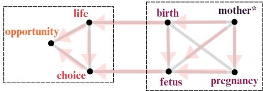  
Figure 1: An illustration of moral information propagation (colored nodes and arrows) through word associations (gray edges). Information is propagated from the moral seed word ‘mother’ ( ). The right box contains directly connected concepts with ‘mother’, while the box on the left illustrates information flow to a more distant area in the graph. Color reflects the inferred moral intensity of a concept.

We present a framework for a more robust comparison of morality in humans and LLMs, focusing on moral values in western English-speaking cultures given their prevalence in prior research and LLM training data (Henrich et al., 2010). We address the limitations of existing methods that directly prompt LLMs with moral questionnaires, which have been shown to yield unreliable results (Almeida et al., 2024; Scherrer et al., 2023; Abdulhai et al., 2023). Instead, we measure the “mental lexicon” of LLMs using the wellestablished psychological paradigm of word associations (Clark, 1970; Van Rensbergen et al., 2015), see Figure 1. In a typical word association experiment, participants are provided with a cue word and tasked with generating spontaneous associations. We pose the same task to LLMs to measure how LLMs internally organize and relate concepts. Previous work (Ramezani and Xu, 2024) has shown that moral values of English language speakers can be reliably recovered from their word associations. Here, we compare moral values embedded in English word associations from humans and LLMs, allowing for a more robust evaluation of LLMs’ moral inference by avoiding the brittleness of direct prompting.

Our methodological contributions are two-fold: first, we present metrics that ensure structural alignment of LLM- and human-generated word associations to ensure the robustness and reproducibility of our results. Secondly, we introduce a novel moral value propagation algorithm based on a random walk over the global association network and show that it leads to moral estimates that better correspond to human moral perception than previous work (Ramezani and Xu, 2024), which operated on local sub-graphs.

We identify general patterns of similarity and divergence between LLMs and human participants,2 revealing that LLMs and humans align more closely for positive moral values compared to negative ones. Humans show greater emotional diversity and concreteness in their responses, while LLMs are less varied and more abstract. These findings provide critical insights into how LLMs process moral concepts differently from human participants, in the context of western Anglo-centric cultural norms.

In summary, our contributions are as follows:

• We are the first to explore moral alignment between humans and LLMs through the lens of the mental lexicon, offering a novel approach to understanding moral alignment.

• A framework to effectively extract multidimensional moral values from global word association networks, allowing for fine-grained evaluation.

• A detailed comparison of human and LLM associations, including explanations for divergences along certain dimensions (e.g., fairness and sanctity), in terms of differences in graph structures and varying levels of concreteness and emotionality of generated associations.

## 2 Background

Moral Foundation Theory (MFT; Graham et al. (2013)) is a widely-used framework that attempts to explain human morality through five fundamental and universal dimensions: Care, Fairness, Loyalty, Authority, and Sanctity. Each dimension is characterized on a scale from vice (-1) to virtue (+1). The Moral Foundations Dictionary (Frimer et al., 2017) which assigns English words along this scale, for each dimension and has been widely used to assess morality in written text. While the original dictionary was expert-created, follow-up work crowd-sourced the extended MFD (eMFD; Hopp et al. (2021)) resulting in a much larger and more diverse set of words associated with moral dimensions. Recent work has re-visited the MFT and proposed to split the fairness dimension into equality and proportionality to better capture distinct justice motives (Atari et al., 2023). We acknowledge that the exact definition of moral foundations are under active research, however, will base our work on the original MFT to directly compare with relevant related work, and to be able to draw on its linguistic resources (MFD and eMFD) to support our study.

Mental lexicon for moral inference The Mental Lexicon refers to the mental representations and connections of word meanings that support understanding and reasoning (Field, 1981). It is often conceptualized as a semantic network, where words are represented as nodes and weighted edges reflect their degree of connectivity (Lowe, 1997; De Deyne et al., 2016). The Word Association Test can reveal mental connections by exposing participants to cues (e.g., volunteer) and asking them for the first words that spring to their mind (e.g., help, kind or care). The obtained results are turned into a word association graph with cues and responses as nodes, and edge weights indicating the number of participants who produced a cue-response pair. Prior work has shown that such networks capture basic commonsense knowledge (Liu et al., 2021, 2022) and complex semantics more reliably than direct text-based measures (De Deyne et al., 2020, 2021), including moral inference (Ramezani and Xu, 2024).

Computational investigations of moral inference Moral Association Graphs (MAG) are cognitively motivated models of human moral inference (Ramezani and Xu, 2024). Based on humangenerated word association networks, the extract local undirected graphs for a given cue word, where nodes are responses and edges are weighted by cooccurrences. Selected responses are seeded with ground truth moral values which are propagated through the local network until convergence. MAG has been shown to be able to predict human moral values, however, MAG operates on local graphs centered around a single cue which prevents the model to make more complex, long distance interactions. We extend this idea to a global graph propagation framework where we propagate multidimensional moral associations corresponding to the five dimensions of MFT.

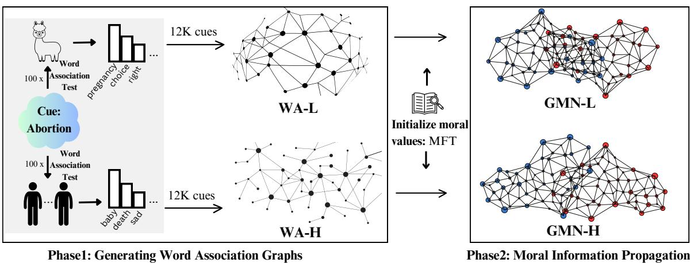  
Figure 2: Overview of our two-phase framework: (1) Collecting word association graphs from humans (WA-H) and Llama (WA-L); (2) Propagating moral information through the word association graphs to obtain two global moral networks (WA-H GMN-H; WA-L GMN-L), where red and blue nodes indicate words with negative and positive inferred moral scores, respectively.

Recent research has applied the word association test to LLMs and investigated similarities and differences to human-generated data sets. Abramski et al. (2024) found substantial overlap of node-pairs in the association graphs, but LLMs generated significantly less diverse responses compared to humans, prompting us to explicitly assess response diversity in our experiments. Ramezani and Xu (2023) demonstrated that LLMs can capture moral norms when prompted directly. However, it remains unclear whether these elicited moral norms reflect a deeper conceptual organization within LLMs regarding morality, or if they are primarily superficial patterns learned from training data that do not necessarily indicate such organization.

Ji et al. (2024) applied the widely-used Moral Foundations Questionnaire (Graham et al., 2009) to LLMs, comparing LLM and human responses. They found that LLMs exhibit a superficial understanding of morality, predominantly characterized by phrases they have been exposed to during training, which questions the reliability of their answers3 . Given their extensive human training data,

LLMs are biased towards responses that are widely reported (Anagnostidis and Bulian, 2024; Scherrer et al., 2023). Additionally, enforcing a binary response (agree/disagree) prohibits to assess a more nuanced moral reasoning. In contrast, our work probes for moral values indirectly by eliciting conceptual associations from LLMs – a method that has been shown effective to simulate human moral reasoning (Ramezani and Xu, 2024). By reducing the influence of explicit prompting for moral values, our approach minimizes contextual impact.

## 3 Framework Overview

We aim to (1) capture moral values encoded in LLM representations and (2) compare them with human values. We do so in a 3-step framework as shown in Figure 2: First, we obtain spontaneous responses for the same set of 12,000 cues from both humans (using an existing data set from Deyne et al. (2019)) and LLMs (by prompting with the same set of cues and instructions; Section 4). Based on this, we construct a word association graph from human data and another from LLM data. Second, we initialize a ‘morality score’ for selected concepts from a ground truth dataset based on MFT, and propagate this information through the graphs, resulting in two Global Moral Networks (GMN, Section 5). This GMN enables a comparative analysis of moral alignment between humans and the LLM (Section 6).

## 3.1 Model and External Datasets

Model We used Llama-3.1-8B-Instruct (henceforth Llama) in all our experiments, a state-of-theart LLM trained over 15 trillion token and including RLHF optimisation (Huang et al., 2024). It was selected due to its performance, accessibility, and good trade-off between computational efficiency and scalability (Dubey et al., 2024; Guo et al., 2024).

Human Word Associations We used the English Small World ofWords data set (Deyne et al., 2019), which comprises responses from about 90k native English-speaking participants for over 12k cues. We refer to this data set as WA-H (Word Associations - Human). Each cue was presented to 100 participants, and each participant produced up to three responses, resulting in a broad and varied set of responses. Participants are primarily English speakers from the U.S. (50%), as well as the U.K., Canada, and Australia.

Moral Foundations Dictionary 2.0 (MFD, Frimer et al. (2017)), which contains 2041 words, assigns selected words to one or more of the five dimensions of the MFT (Section 2). Each word is assigned a moral score of 1 if it relates to the dimension’s virtue, -1 if it aligns with its vice, and 0 if it is unrelated, leading to a hard assignment of words to moral dimensions. We use the MFD to identify moral seed words in the word association graphs, using the intersection of MFD and 12K cues in word association graphs, resulting in 626 moral seed words.

Extended Moral Foundations Dictionary (eMFD; Hopp et al. (2021)) is a crowdsourced extension of MFD. It provides soft associations of English words with one or more of the five moral dimensions, assigning a value between -1 (vice) and 1 (virtue). Following Ramezani and Xu (2024), we use the eMFD for evaluation. For this, we compare the moral values from eMFD against those predicted by our method for the words found in the intersection of eMFD and our cue word set. This intersection comprises 2,186 words (out of eMFD’s 3,270 total words) that are present in our cue set and are used for the correlation comparison (Section 5.1.1).

## 4 Eliciting Word Associations from LLMs

Starting from human word association data set by Deyne et al. (2019) (henceforth, WA-H). Then we

prompt Llama to obtain a comparable set of LLMgenerated word associations which we also transfer into a separate graph (WA-L).

## 4.1 Methods

We prompted Llama to elicit associations with the 12k cues underlying WA-H. LLM responses are known to be unstable with respect to changes in prompts, and changes in temperature. To address the former, we employ the exact same instructions as used in the WA-H data collections (full prompt in Appendix A) requesting Llama to generate up to three responses per cue, repeating this process 100 times for each cue word, this effectively provides a Monte-Carlo approximation of the probability distribution of word associations. To ensure validity of our results, we define two criteria for LLM-generated associations: like large-scale human associations, the overall patterns must be robust and not change significantly should the data be re-collected; in addition, responses should resemble the variability (or diversity) observed in human associations. We tune Llama’s temperature for these objectives.

Temperature tuning We measure variability as the total number of distinct word types in Llama’s responses over given set of cues. Robustness is calculated by randomly splitting the responses for each cue in WA-L into two halves and computing the relative word association strength of each response for a given cue in each half.4 The reliability for a given cue is calculated by Spearman-Brown split-half reliability $\begin{array} { r } { r _ { \mathrm { t o t a l } } = \frac { 2 r _ { \mathrm { h a l f } } } { 1 + r _ { \mathrm { h a l f } } } } \end{array}$ , where rhalf represents the correlation between association strengths in the two halves (Walker, 2006; Charter, 1996). We average rtotal over all selected cues.

Evaluating WA-L We evaluate the overlap of responses between WA-L and $\mathrm { w A } { - } \mathrm { H } . ^ { 5 }$ We compute precision at k of WA-L responses in the humanproduced association set for the same cue with varying k. We also report average correlation of association strength in WA-H and WA-L per cue.6

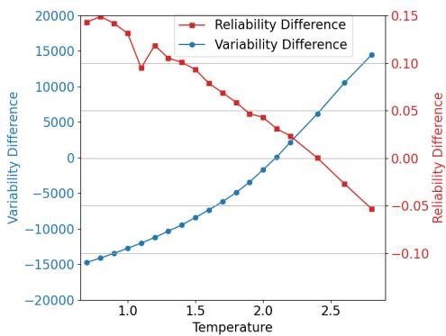  
Figure 3: Effect of temperature on differences in variability (blue) and reliability (red) between WA-L and WA-H (0 is best).

We include a baseline Word2Vec model which associates each cue with the k nearest neighbors in an embedding space based on Google News 300- dimensional embeddings (Mikolov et al., 2013).

## 4.2 Results

We tune the temperature based on a random subset of 400 cues. Results in Figure 3 show that as the temperature increases, Llama produces more varied responses leading to an increase in diversity and decrease in robustness, both of which approach human values. We generate the full WA-L with the identified optimal temperature of 2.1.

For the evaluation of our final WA-L we select 279 cues from the MFD, ensuring equal representation of verbs, adjectives, and nouns.7 We focus on cues from the MFD to specifically assess agreement on this domain of interest. Figure 4 shows that WA-L almost perfectly agrees with the most frequent response for a moral cue (k = 1), with the precision slowly decreasing just below 80% agreement for the top 10 cues. Precision declines further as k increases, reflecting the divergence between Llama’s broader set of moral associations and WA-H responses. The Word2Vec baseline leads to noticeably worse precision, particularly for small k. Appendix C provides statistics for WA-H and WA-L.

## 5 Global Moral Networks

WA-H and WA-L reflect how words are interconnected in human and LLM representations, but do not inherently encode moral scores. We now propagate moral values through the WA-H and WA-L networks to predict moral associations scores of concepts with each of the five MFT dimensions. We propagate moral information separately through each network obtaining two Global Moral Networks (GMN): GMN-H (propagated from WA-H) and GMN-L (propagated from WA-L).

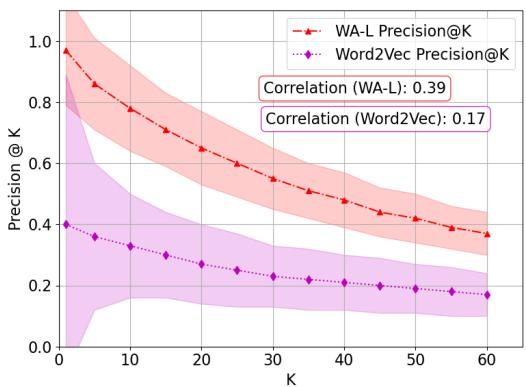  
Figure 4: Precision@K for WA-L, and Word2Vec Associations relative to WA-H. Shaded regions show standard deviation over 50 runs. Correlation scores are noted.

## 5.1 Moral Information Propagation

Our word association graph ${ \cal G } \in \{ \mathrm { w A \mathrm { - } H , W A \mathrm { - } L } \}$ consists of $| n |$ nodes and ϵ edges, and we aim to assign a five-dimensional moral value vector to each node $c _ { i }$ to obtain a GMN. We represent the moral values in a matrix $F \in \mathbb { R } ^ { | n | \times 5 }$ , where each row represents a cue word $c _ { i }$ from G, and columns are the five moral dimensions. Initially, all elements in $F _ { 0 }$ are set to zero. We then initialize $F _ { 0 }$ with moral values by assigning each $c _ { i } \in \mathrm { M F D }$ its five associated moral values $\in \ [ - 1 , 1 , 0 ]$ for vice, virtue and no association, respectively. This moral information is spread iteratively to the entire graph using a random walk (Zhou et al., 2003; Du et al., 2019):

$$
F _ { t + 1 } = \alpha S F _ { t } + ( 1 - \alpha ) F _ { 0 } ,
$$

where

$$
S = D ^ { - \frac { 1 } { 2 } } W D ^ { - \frac { 1 } { 2 } } \in \mathbb { R } ^ { | n | \times | n | }
$$

W is the adjacency matrix of the word association graph G, and the diagonal matrix D contains the sum of the corresponding row values in W. $\alpha \in ( 0 , 1 )$ is a hyperparameter that controls the extent of propagation in the graph, with smaller values pulling the local connections closer to the initial matrix $F _ { 0 }$ . This process assigns a 5-dimensional moral value to all words in the GMN.8

## 5.1.1 Experimental Setup

Optimizing alpha We use the portion of the eMFD which is not used in evaluation, obtaining 277 words with eMFD labels and optimize the correlation between predicted and eMFD moral values.9 We find that GMN-H requires a smaller $\alpha { = } 0 . 7 5$ for optimal performance, while GMN-L performs best at $\alpha { = } 0 . 9$ (detailed in the Appendix D). A higher α promotes stronger propagation, suggesting GMN-L might be less efficient at transmitting information. This is supported by graph statistics: the human graph has a smaller diameter10 (3 vs. 4), higher density (0.013 vs. 0.007), and higher connectivity (114 vs. 77), indicating that information can diffuse through it more easily (Taxidou and Fischer, 2014; Centola, 2010), hence needing a lower α for effective propagation.

From a robustness perspective, results in Appendix D suggest limited sensitivity of the propagation algorithm to alpha, indicating stability up to a threshold where performance decreases rapidly.

Evaluation Following the propagation process, we obtain moral scores across five dimensions for each of the 12,000 cues in both GMN-L and GMN-H. To assess the alignment of these moral scores with MFT, we measure the Spearman correlation between our propagated scores and human-annotated moral scores in the eMFD. To measure the generalizability of propagation on new concepts, we subtract the seed values from all nodes which were part of the MFD initialization. We compare against the state-of-the-art model MAG (Ramezani and Xu, 2024), which has been shown to outperform Word2Vec and GPT-3.5 on the same task.

## 5.2 Results: Concept Morality Prediction

Table 1 presents our experimental results. Overall, our propagated moral scores demonstrate higher correlation with human judgments than MAG. This stronger positive correlation highlights the effectiveness of global graph propagation, in contrast to MAG’s local, cue-specific graphs (see Section 2). We attribute this improved performance to the importance of multi-hop propagation over longer distances in the network. For instance, our model effectively captures the association between “mother” and “life” through intermediate concepts such as “birth”. This demonstrates how our model captures the nuanced relationships between seemingly different concepts, reflecting a more comprehensive understanding of moral concepts.11

<table><tr><td>Moral Dimension</td><td>MAG</td><td></td><td>GMN-H GMN-L</td></tr><tr><td>Care (n = 1895)</td><td>0.29</td><td>0.47</td><td>0.46</td></tr><tr><td rowspan="3">Sanctity (n = 1893) Fairness (n = 1514) Authority (n = 1737)</td><td>0.25</td><td>0.39</td><td>0.44</td></tr><tr><td>0.23</td><td>0.29</td><td>0.32</td></tr><tr><td>0.21 0.30</td><td>0.19 0.26</td><td>0.25 0.30</td></tr><tr><td>Loyalty (n = 1714) All (n = 8753)</td><td>0.20</td><td>0.28</td><td>0.29</td></tr></table>

Table 1: Correlation of predicted moral values against the eMFD. MAG and GMN-H are run on the same underlying graph (WA-H) while GMN-L ran on WA-L. n indicates the number of concepts per dimension, and overall. All correlations are statistically significant (p $\leq 0 . 0 1 )$ .

Our two association graphs, GMN-L and GMN-H exhibit comparable overall correlation with the eMFD, but differ across individual dimensions, with the largest differences observed for sanctity and authority.12 This is interesting, as it indicates where humans and LLMs diverge, however, it does not explain why these differences exist. We next qualitatively analyze these differences and uncover systematic underlying factors.

## 6 Moral Alignment between Humans and LLMs

After evaluating the reliability and robustness of our framework, we proceed to assess moral alignment between GMN-H and GMN-L using propagated values derived from our approach.

## 6.1 Cross-Dimensional Analysis

We start our analysis by investigating the moral alignment between GMN-H and the GMN-L on the overall moral perception on concepts. We calculate each concept’s overall morality by summing its moral scores across the five dimensions for both positive (virtues) and negative (vices), then rank the concepts accordingly. From these ranked lists, we select representative samples and analyze their responses within each moral dimension to observe the patterns of GMN-H and GMN-L. Lastly, we build local subgraphs for the top 50 negative words in each dimension to understand propagation efficiency using density and weighted average edge.

<table><tr><td colspan="2">Negative</td><td colspan="2">Positive</td><td colspan="2">Different</td></tr><tr><td>GMN-H</td><td>GMN-L</td><td>GMN-H</td><td>GMN-L</td><td>GMN-L↑ GMN-H↓</td><td>GMN-L↓ GMN-H↑</td></tr><tr><td>disgusting</td><td>betrayal</td><td>church</td><td>church</td><td>abortion</td><td>jail</td></tr><tr><td>traitor</td><td>prejudice</td><td>religion</td><td>kindness</td><td>immigrant</td><td>air</td></tr><tr><td>vomit</td><td>cheating</td><td>God</td><td>religion</td><td>politician</td><td>plastic</td></tr><tr><td>hurt</td><td>disgusting</td><td>priest</td><td>priest</td><td>capitalist</td><td>Soviet</td></tr><tr><td>dirty</td><td>discrimination</td><td>holy</td><td>prayer</td><td>homosexual</td><td>bees</td></tr><tr><td>pain</td><td>dishonest</td><td>religious</td><td>bible</td><td>commercial</td><td>snob</td></tr></table>

Table 2: Comparison of top negative, positive, and most different concepts between GMN-L and GMN-H. Common concepts are bolded. Responses from the two methods for the underlined concepts are given in Table 3. The Difference block shows concepts rated significantly more positive by the GMN-L compared to GMN-H (left) and vice versa (right). Moral values for these concepts, along with other top 10 negative and positive moral concepts, are provided in Appendix E.

<table><tr><td>Concept</td><td colspan="2">Top Unique Responses GMN-H GMN-L</td></tr><tr><td>prejudice</td><td>pride, black, race, racist</td><td>stereotypes, biases, stereotyping, bigoted</td></tr><tr><td>discrimination</td><td>race, racist, sexism, gender</td><td>stereotypes, stereo- typing, equality, prejudices</td></tr><tr><td>vomit</td><td>gross, spew, smell, green</td><td>stomachache, queasy, hangover, poisoning</td></tr><tr><td>kind</td><td>type, sort, happy, person</td><td>nurturing, soft, charitable, warmth</td></tr><tr><td>church</td><td>catholic, syn- agogue, stone, school</td><td>altar, minister, baptism, service</td></tr></table>

Table 3: Comparison of the top four unique responses between GMN-H and GMN-L for highly negative (top) and positive (bottom) moral concepts.

Results Table 2 presents the top positive and negative moral concepts for GMN-H and GMN-L. GMN-H’s top negative concepts often relate to physically or emotionally charged words in the sanctity dimension (e.g., “disgusting”, “gross”), whereas GMN-L focuses predominantly on social vices in the fairness dimension (e.g., “betrayal”, “racism”). Despite these differences, both GMN-H and GMN-L significantly overlap in top positive concepts which refer to virtuous or religious concepts. In several instances GMN-H and GMN-L moral scores diverged in polarity such as “abortion”, “capitalist” (humans more negative than Llama) or “plastic” (humans more positive than Llama).

Why do the top negative concepts diverge between GMN-L and GMN-H? We inspected the local graph topology around the most negative abstract GMN-L concepts (like “prejudice”, or “discrimination”) and find a dense network13 of abstract (thematic or causal) connections among these concepts. Associations for “prejudice” and “discrimination” are shown in Table 3; more examples in Appendix F.1). These associations are reflective of systemic discussions captured in the model’s training data (Fish and Syed, 2020; Baldwin, 2017; Dai et al., 2024; Zheng et al., 2023; Tjuatja et al., 2024; Dillion et al., 2023). In contrast, GMN-H associations for the same concepts are more varied, often influenced by individual sensory experiences and cultural context (Kostova and Radoynovska, 2008; Son et al., 2014; Shin et al., 2018). For example, the concept “prejudice” is frequently associated with culturally specific concepts like “race” or “black” resulting in divergent semantic networks compared to GMN-L’s statistically driven associations (e.g., “bigotry”). When considering negative physical or emotional concepts like “vomit” GMN-H consistently involves synonymous concepts, indicative of direct sensory or emotional experiences (see “vomit” in Table 3 and more examples in Ap pendix F.1). In contrast, GMN-L still maintains a focus on causal relations. This discrepancy highlights a systematic qualitative difference between representations based on statistical word co-occurrence patterns (Kang and Choi, 2023) and the rich associations observed in humans reflecting their rich physical and emotional experience (Ji et al., 2024). This difference clearly persists in associations, although in the dialogue tasks that LLMs increasingly approach human capabilities.

<table><tr><td></td><td colspan="2">Care H L</td><td colspan="2">Fairness H L</td><td colspan="2">Loyalty H L</td><td colspan="2">Authority H L</td><td colspan="2">Sanctity H L</td><td colspan="2">All H L</td></tr><tr><td># Moral Concepts</td><td></td><td>70</td><td></td><td>68</td><td>一</td><td>60</td><td></td><td>65</td><td></td><td>70</td><td></td><td>6941</td></tr><tr><td>Emotional responses (%) Emotional intensity</td><td>72 4.24</td><td>61* 4.1</td><td>67 3.71</td><td>54* 3.77</td><td>69 3.8</td><td>54* 3.82</td><td>67 3.78</td><td>59* 4.10*</td><td>69 3.81</td><td>58* 3.60*</td><td>66 3.30</td><td>55* 3.17*</td></tr><tr><td>Concrete responses (%) Concreteness score</td><td>35 3</td><td>24* 2.7*</td><td>24 2.6</td><td>12* 2.2*</td><td>24 2.5</td><td>12* 2.3*</td><td>29 2.7</td><td>16* 2.5*</td><td>40 3.2</td><td>33* 3*</td><td>42 3.1</td><td>36* 2.9*</td></tr></table>

Table 4: Average proportion of emotional responses and intensity (top), and concrete responses and concreteness scores (bottom) in the top 50 negative cues from GMN-H (H) and GMN-L (L)-generated responses. The concepts are associated with moral dimensions identified by both humans and the LLM. The comparison size of moral concepts is the union of H and L from their respective top words. \* indicates statistically significant differences (t-test; p < 0.05). Significantly higher scores are bolded.

In positive moral concepts, we observe that responses from both GMN-H and GMN-L to virtuerelated words often display synonymy or antonymy, while religion-related concepts exhibit various types of meronymy (Table 3 bottom, and Appendix F.2). Llama is predominantly trained on training data from Western cultures, where religious concepts have a strong, positive historical presence despite the declining influence of religion in many Western societies (Topkev, 2024; Halman and De Moor, 1994). This cultural frameworks naturally lead to overlap in positive moral concepts between humans and Llama.14

The quantitative analysis of subgraphs across dimensions reveals several important findings (statistical details are provided in Appendix G). First, the statistics suggest that moral words associated with the fairness and sanctity dimensions in GMN-L exhibit stronger propagation efficiency (higher weighted average edge centrality) and are more densely connected in the fairness dimension, leading to significant advantages in spreading moral information (Taxidou and Fischer, 2014; Centola, 2010).15 Moreover, GMN-L demonstrates notably stronger connections within other abstract dimensions such as loyalty and authority, with weighted degree centrality being two times higher than GMN-H, while the magnitude is similar in the care and sanctity dimensions. Finally, both propagation efficiency and density decrease significantly when pruning the graph to retain only the top moral words for both GMN-H and GMN-L, suggesting that morally significant concepts across dimensions are highly interconnected and exhibit stronger propagation efficiency compared to less morally related concepts.

## 6.2 Human moral associations are more emotional and concrete

We identified systematic qualitative differences in the associations with morally negatively connotated cues (vices). Specifically, Llama associations with morally loaded words are more sterile with less emotion and a higher level of abstractness.

Method We analyze emotionality in responses to the top 50 morally significant concepts across five moral dimensions. We obtain an emotion score for each response using the arousal norms from the VAD-norms (Warriner et al., 2013), a human-labeled emotion lexicon of over 13k English words.16 We quantify the degree of emotions reflected in responses per cue using (a) the proportion of emotional responses among all responses and (b) their average emotional intensity. A response is considered emotional if it is in the emotion lexicon. Emotional response intensity per concept was calculated by multiplying the emotional intensity of responses by their word association strength, then averaging these values for each moral dimension. The concreteness of responses was assessed using the Brysbaert et al. (2014) concreteness lexicon.17 The lexicon contains 37,058 concepts, concepts with a score above 3.5 were considered concrete. The same set of concepts and comparison size from the emotion analysis was used to maintain consistency. We calculated concept-level concreteness analogously to emotional intensity.18

Results Table 4 presents a detailed comparison of the results. GMN-H exhibits a consistently higher proportion of unique emotional responses across all dimensions, indicating that it generally provides more diverse emotional responses on average. Additionally, GMN-H shows higher emotional intensity for sanctity-related dimensions, suggesting that concepts associated with emotional or physical states are more likely to elicit a strong emotional response from GMN-H compared to GMN-L. Conversely, for abstract concepts, which are often represented in the fairness, loyalty, and authority dimensions, GMN-H are less likely to show highly intense emotional responses compared to GMN-L. Furthermore, when examining all top negative words, which include a substantial number of morally less significant concepts, we observe a lower average emotional intensity compared to the top 50 negative moral values across dimensions for both GMN-H and GMN-L. This suggests a positive correlation between moral significance and emotional intensity in responses.

In the concreteness experiment, GMN-H tends to produce more concrete responses, whereas GMN-L’s responses are generally more abstract. As observed in Appendix F.1, GMN-H frequently connects cues to real-life or physical experiences (Kostova and Radoynovska, 2008; Son et al., 2014; Shin et al., 2018). In contrast, Llama relies on abstract associations derived from textual data (Ji et al., 2024; Scherrer et al., 2023). This reliance on statistical, text-based associations limits its ability to replicate the sensory-driven responses typical of humans, which dominate moral word associations. Consequently, Llama’s responses exhibit lower concreteness scores and less variation overall (Dillion et al., 2023; Santurkar et al., 2023)

## 7 Conclusions

We presented a framework for a detailed comparison of moral associations between Englishspeaking, western populations and LLMs, introducing a method to elicit word associations from LLMs that ensures structural similarity to human responses. Our findings demonstrate that moral perspectives can be uncovered through these associations without direct moral prompting, with Llama’s moral associations broadly aligning with human performance. The use of a global network approach enabled us to capture nuanced relationships between moral concepts. A key finding is the considerable alignment in top positive moral concepts, likely reflecting shared cultural frameworks. This alignment suggests that LLM representations do reflect aspects of human moral conceptualizations. If such alignment can be consistently achieved, it could further ensure the safety of deploying trustworthy AI when navigating morally-tinged scenarios. However, we also observed notable divergences, particularly among top negative moral concepts. Humans exhibit sensory and experiencedriven associations, which are more grounded and emotional. In contrast, LLMs tend towards more abstract concepts with lower emotional intensity, particularly for physical or mental states. These divergences highlight the potential risks of current LLMs operating with a misaligned ‘moral map’. An LLM lacking the experiential, affective grounding for negative concepts might misjudge the severity of harm or respond inappropriately in critical situations, even if capable of superficially correct answers to direct queries.

Overall, while LLMs mirror moral associations in English western cultures in many respects, internal processing differences can lead to significant divergences. Our framework provides a valuable tool for identifying these areas. Future work can apply our framework across a wider range of models and to different cultures. Crucially, further research could explicitly link these associative alignments and misalignments to observable LLM behaviors in ethically relevant tasks, thereby deepening our understanding of the critical question of how foundational conceptual structures translate to practical human-LLM alignment.

## 8 Limitations

LLM Selection As our main focus is to explore the feasibility of automatically generating reliable large-scale word associations and comparing morality alignment, we selected the recent representative Llama-3.1-8B model given its balance of performance and size in various NLP tasks. We acknowledge that different models might exhibit different behaviors. However, our study is designed as a proof of concept for a framework that is adaptable to different language models. The proposed three-step framework—comprising word association generation, graph-based propagation of moral values, and comparative analysis—is not reliant on any specific LLM. Thus, the methods and insights developed in this study can be applied to other models. While variations in outputs may arise, these differences reflect the inherent diversity of the models being evaluated rather than any limitation of the framework itself. We leave the exploration of more large language models with varying sizes and types as future work.

Cultural specificity Moral values vary across cultures (Atari et al., 2023) and our study only covers Western, English-speaking cultures because both the human participants that generated WA-H as well as the training data for Llama3.1-8b predominantly originate from this culture. We emphasize this focus in our paper. However, human word association data sets exist for other countries, too (Deyne et al., 2019) and LLMs are currently developed in and adapted to many languages and communities. While we make no universal claims, we believe that our method enables cross-cultural studies in the future.

Concept-Level Alignment Our study focuses on providing a framework to systematically evaluate the moral alignments between concepts in humans and LLMs. This approach is not directly applicable to assess morality alignment in broader contexts, such as sentences or documents, where the overall morality is complex to predict. However, the propagated moral scores for large-scale concepts can serve as basic, word-level scores, supporting future work on contextual moral inference.

## Acknowledgements

We thank Aida Ramezani and Yang Xu for sharing their code and data. LF is supported by the ARC Discovery Early Career Research Award (Grant

No. DE230100761). SDD is supported by the ARC Discovery Project Research Award (Grant No. DP240101873).

## References

Marwa Abdulhai, Gregory Serapio-Garcia, Clément Crepy, Daria Valter, John Canny, and Natasha Jaques. 2023. Moral foundations of large language models. arXiv preprint arXiv:2310.15337.

Katherine Abramski, Clara Lavorati, Giulio Rossetti, and Massimo Stella. 2024. Llm-generated word association norms. In HHAI 2024: Hybrid Human AI Systemsfor the Social Good, pages 3–12. IOS Press.

Guilherme F. C. F. Almeida, José Luiz Nunes, Neele Engelmann, Alex Wiegmann, and Marcelo de Araújo. 2024. Exploring the psychology of llms’ moral and legal reasoning. Artificial Intelligence, 333:104145.

Sotiris Anagnostidis and Jannis Bulian. 2024. How susceptible are llms to influence in prompts? arXiv preprint arXiv:2408.11865. Computer Science > Computation and Language (cs.CL).

M. Atari, J. Haidt, J. Graham, S. Koleva, S. T. Stevens, and M. Dehghani. 2023. Morality beyond the weird: How the nomological network of morality varies across cultures. Journal of Personality and Social Psychology, 125(5):1157–1188.

John Baldwin. 2017. Culture, prejudice, racism, and discrimination. Oxford Research Encyclopedia of Communication. Date of access 5 Oct. 2024.

Marc Brysbaert, Amy Beth Warriner, and Victor Kuperman. 2014. Concreteness ratings for 40 thousand generally known english word lemmas. Behavior Research Methods, 46(3):904–911.

Damon Centola. 2010. The spread of behavior in an online social network experiment. Science, 329:1194– 1197.

Richard A. Charter. 1996. Note on the underrepresentation of the split-half reliability formula for unequal standard deviations. Perceptual and Motor Skills, 82(2):401–402.

Herbert H Clark. 1970. Word associations and linguistic theory. New horizons in linguistics, 1:271–286.

Sunhao Dai, Chen Xu, Shicheng Xu, Liang Pang, Zhenhua Dong, and Jun Xu. 2024. Bias and unfairness in information retrieval systems: New challenges in the llm era. In Proceedings ofthe 30th ACM SIGKDD Conference on Knowledge Discovery and Data Mining (KDD ’24), page 11 pages, New York, NY, USA. ACM.

Simon De Deyne, Álvaro Cabana, Bing Li, Qing Cai, and Meredith McKague. 2020. A cross-linguistic study into the contribution of affective connotation in the lexico-semantic representation of concrete and abstract concepts. In CogSci.

Simon De Deyne, Yoed N. Kenett, David Anaki, and Miriam Faust. 2016. Large-scale network representations of semantics in the mental lexicon. In Michael Ramscar, Matt Jones, Melody Dye, and Ernest Klein, editors, Big Data in Cognitive Science, 1st edition, page 7. Psychology Press.

Simon De Deyne, Danielle J Navarro, Guillem Collell, and Andrew Perfors. 2021. Visual and affective multimodal models of word meaning in language and mind. Cognitive Science, 45(1):e12922.

Simon De Deyne, Danielle J. Navarro, Amy Perfors, Marc Brysbaert, and Gert Storms. 2019. The “small world of words” english word association norms for over 12,000 cue words. Behavior Research Methods, 51(3):987–1006.

Danica Dillion, Niket Tandon, Yuling Gu, and Kurt Gray. 2023. Can ai language models replace human participants? Trends in Cognitive Sciences, 27(7):597–600.

Yupei Du, Yuanbin Wu, and Man Lan. 2019. Exploring human gender stereotypes with word association test. In Proceedings ofthe 2019 Conference on Empirical Methods in Natural Language Processing and the 9th International Joint Conference on Natural Language Processing (EMNLP-IJCNLP), pages 6133– 6143, Hong Kong, China. Association for Computational Linguistics.

Abhimanyu Dubey, Abhinav Jauhri, Abhinav Pandey, Abhishek Kadian, Ahmad Al-Dahle, Aiesha Letman, Akhil Mathur, Alan Schelten, Amy Yang, Angela Fan, et al. 2024. The llama 3 herd of models. arXiv preprint arXiv:2407.21783.

Hartry H. Field. 1981. 5. Mental Representation, pages 78–114. Harvard University Press, Cambridge, MA and London, England.

Jillian Fish and Moin Syed. 2020. Racism, discrimination, and prejudice. In The Encyclopedia of Child and Adolescent Development, pages 1–12. John Wiley & Sons, Inc.

Jeremy Frimer, Jonathan Haidt, Jesse Graham, Morteza Dehghani, and Reihane Boghrati. 2017. Moral foundations dictionaries for linguistic analyses, 2.0. Unpublished Manuscript.

Jesse Graham, Jonathan Haidt, Sena Koleva, Matt Motyl, Ravi Iyer, Sean P. Wojcik, and Peter H. Ditto. 2013. Moral foundations theory: The pragmatic validity of moral pluralism. In Patricia Devine and Ashby Plant, editors, Advances in Experimental Social Psychology, volume 47, pages 55–130. Academic Press.

Jesse Graham, Jonathan Haidt, and Brian A. Nosek. 2009. Liberals and conservatives rely on different sets of moral foundations. Journal ofPersonality and Social Psychology, 96(5):1029–1046.

Rui Guo, Greg Farnan, Niall McLaughlin, and Barry Devereux. 2024. QUB-cirdan at “discharge me!”: Zero shot discharge letter generation by open-source LLM. In Proceedings of the 23rd Workshop on Biomedical Natural Language Processing, pages 664–674, Bangkok, Thailand. Association for Computational Linguistics.

Loek Halman and Ruud De Moor. 1994. Religion, churches and moral values. In The individualizing society, pages 37–65. Brill.

Joseph Henrich, Steven J Heine, and Ara Norenzayan. 2010. The weirdest people in the world? Behavioral and brain sciences, 33(2-3):61–83.

Frederic R. Hopp, Jacob T. Fisher, Devin Cornell, Richard Huskey, and René Weber. 2021. The extended moral foundations dictionary (emfd): Development and applications of a crowd-sourced approach to extracting moral intuitions from text. Behavior Research Methods, 53(1):232–246.

Wei Huang, Xingyu Zheng, Xudong Ma, Haotong Qin, Chengtao Lv, Hong Chen, Jie Luo, Xiaojuan Qi, Xianglong Liu, and Michele Magno. 2024. An empirical study of llama3 quantization: From llms to mllms. arXiv preprint arXiv:2404.14047.

Anil Jain, Karthik Nandakumar, and Arun Ross. 2005. Score normalization in multimodal biometric systems. Pattern Recognition, 38(12):2270–2285.

Jianchao Ji, Yutong Chen, Mingyu Jin, Wujiang Xu, Wenyue Hua, and Yongfeng Zhang. 2024. Moralbench: Moral evaluation of llms. arXiv preprint arXiv:2406.04428.

Cheongwoong Kang and Jaesik Choi. 2023. Impact of co-occurrence on factual knowledge of large language models. In Findings of the Association for Computational Linguistics: EMNLP 2023, pages 7721–7735, Singapore. Association for Computational Linguistics.

S. Kappal. 2019. Data normalization using median median absolute deviation mmad based z-score for robust predictions vs. min–max normalization. London Journal of Research in Science: Natural and Formal, 19(4):39–44.

Zdravka Kostova and Blagovesta Radoynovska. 2008. Word association test for studying conceptual structures of teachers and students. Bulgarian Journal ofScience and Education Policy (BJSEP), 2(2):209– 231.

Chunhua Liu, Trevor Cohn, Simon De Deyne, and Lea Frermann. 2022. WAX: A new dataset for word association eXplanations. In Proceedings of the 2nd Conference of the Asia-Pacific Chapter of the Association for Computational Linguistics and the 12th International Joint Conference on Natural Language Processing (Volume 1: Long Papers), pages 106–120, Online only. Association for Computational Linguistics.

Chunhua Liu, Trevor Cohn, and Lea Frermann. 2021. Commonsense knowledge in word associations and ConceptNet. In Proceedings of the 25th Conference on Computational Natural Language Learning, pages 481–495, Online. Association for Computational Linguistics.

Will Lowe. 1997. Meaning and the mental lexicon. In Proceedings ofthe 15th International Joint Conference on Artificial Intelligence (IJCAI), pages 1092– 1097.

Tomas Mikolov, Ilya Sutskever, Kai Chen, Greg S Corrado, and Jeff Dean. 2013. Distributed representations of words and phrases and their compositionality. In Advances in Neural Information Processing Systems, volume 26. Curran Associates, Inc.

Daye Nam, Andrew Macvean, Vincent Hellendoorn, Bogdan Vasilescu, and Brad Myers. 2024. Using an llm to help with code understanding. In ICSE ’24: Proceedings of the IEEE/ACM 46th International Conference on Software Engineering, New York, NY, USA. Association for Computing Machinery.

Aida Ramezani and Yang Xu. 2023. Knowledge of cultural moral norms in large language models. In Proceedings of the 61st Annual Meeting of the Associationfor Computational Linguistics (Volume 1: Long Papers), pages 428–446, Toronto, Canada. Association for Computational Linguistics.

Aida Ramezani and Yang Xu. 2024. Moral association graph: A cognitive model for moral inference. In Proceedings ofthe Annual Meeting ofthe Cognitive Science Society, volume 46.

Shibani Santurkar, Esin Durmus, Faisal Ladhak, Cinoo Lee, Percy Liang, and Tatsunori Hashimoto. 2023. Whose opinions do language models reflect? In Proceedings ofthe 40th International Conference on Machine Learning, ICML’23. JMLR.org.

Nino Scherrer, Claudia Shi, Amir Feder, and David Blei. 2023. Evaluating the moral beliefs encoded in llms. In Advances in Neural Information Processing Systems, volume 36, pages 51778–51809.

Ji-eun Shin, Eunkook M. Suh, Kimin Eom, and Heejung S. Kim. 2018. What does “happiness” prompt in your mind? culture, word choice, and experienced happiness. Journal of Happiness Studies, 19:649– 662.

Jung-Soo Son, Vinh Bao Do, Kwang-Ok Kim, Mi Sook Cho, Thongchai Suwonsichon, and Dominique Valentin. 2014. Understanding the effect of culture on food representations using word associations: The case of “rice” and “good rice”. Food Quality and Preference, 31:38–48.

Io Taxidou and Peter M. Fischer. 2014. Online analysis of information diffusion in twitter. In Proceedings of the 23rd International Conference on World Wide Web (WWW ’14 Companion), pages 1313–1318, New York, NY, USA. Association for Computing Machinery.

Lindia Tjuatja, Valerie Chen, Tongshuang Wu, Ameet Talwalkar, and Graham Neubig. 2024. Do llms exhibit human-like response biases? a case study in survey design. Transactions of the Association for Computational Linguistics, 12:1011–1026.

Ahmed Topkev. 2024. Framing Religion, pages 185– 284. Springer Nature Switzerland, Cham.

Bram Van Rensbergen, Gert Storms, and Simon De Deyne. 2015. Examining assortativity in the mental lexicon: Evidence from word associations. Psychonomic Bulletin & Review, 22:1717–1724.

David A. Walker. 2006. A comparison of the spearmanbrown and flanagan-rulon formulas for split half reliability under various variance parameter conditions. Archives, 5(2).

Amy Beth Warriner, Victor Kuperman, and Marc Brysbaert. 2013. Norms of valence, arousal, and dominance for 13,915 english lemmas. Behavior Research Methods, 45(4):1191–1207.

Lianmin Zheng, Wei-Lin Chiang, Ying Sheng, Siyuan Zhuang, Zhanghao Wu, Yonghao Zhuang, Zi Lin, Zhuohan Li, Dacheng Li, Eric Xing, Hao Zhang, Joseph E Gonzalez, and Ion Stoica. 2023. Judging llm-as-a-judge with mt-bench and chatbot arena. In Advances in Neural Information Processing Systems, volume 36, pages 46595–46623. Curran Associates, Inc.

Dengyong Zhou, Olivier Bousquet, Thomas Lal, Jason Weston, and Bernhard Schölkopf. 2003. Learning with local and global consistency. In Advances in Neural Information Processing Systems 16 (NeurIPS 2003). MIT Press.

## A Word Association Test Instructions

We used the following prompt to generate WA-L.

## System Prompt:

Background: On average, an adult knows about 40,000 words, but what do these words mean to people like you and me? You can help scientists understand how meaning is organized in our mental dictionary by playing the game of word associations. This game is easy: Just give the first three words that come to mind for a given cue word.

Output Format: Output your response in the following format:

response1, response2, response3

Do not provide any additional context or explanations. Just the words as commaseparated values.

## User Prompt: Cue word: {keyword}

The fixed system prompt positions the model as a human participant in a psychology experiment, requesting three word associations for a given cue word, formatted as comma-separated values without additional context. The exact same system prompt has been used to collecting human responses for WA-H. The {keyword} will be replaced with actual cue words when generating word associations, and each cue will be prompted 100 times.

## B WA-H and WA-L Reliability Test

Figure 5 presents reliability test for WA-L and WA-H using the the Precision@K.

WA-H refers to word associations produced by human participants, as detailed in Section 3.1. The figure compares precision@K for each internal half. Each line shows precision at different K values, with shaded regions representing standard deviation over 50 runs. Reliability values are noted

## C Graph Statistics

Table 5 presents the overall graph statistics of WA-H and WA-L. Both graphs were prompted with the same 12,216 cue words.

Compared to WA-H, WA-L has fewer edges, lower density, and lower average connectivity, but exhibits a slightly higher local clustering coefficient and a larger diameter, indicating more localized subgraph connections.

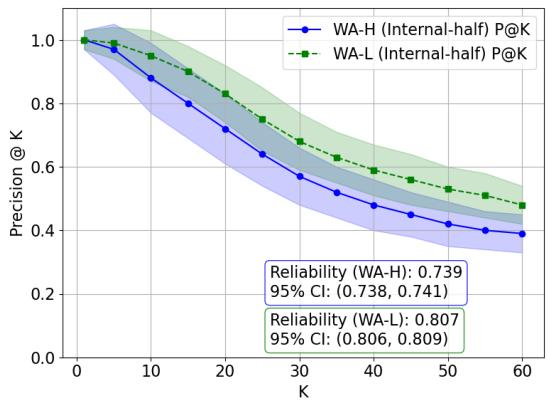

Figure 5: Precision@K for WA-H and WA-L associations.
<table><tr><td></td><td>WA-H</td><td>WA-L</td></tr><tr><td>Nodes</td><td>12,216</td><td>12,216</td></tr><tr><td>Edges Number</td><td>963,043</td><td>502,174</td></tr><tr><td>Density</td><td>0.013</td><td>0.007</td></tr><tr><td>Local Cluster</td><td>0.12</td><td>0.15</td></tr><tr><td>Max Connectivity</td><td>221</td><td>208</td></tr><tr><td>Min Connectivity</td><td>48</td><td>10</td></tr><tr><td>AVG Connectivity</td><td>114</td><td>77</td></tr><tr><td>SD Connectivity</td><td>21</td><td>23</td></tr><tr><td>Diameter</td><td>3</td><td>4</td></tr></table>

Table 5: A statistical overview of the global word association graphs in WA-H and WA-L.

## D Optimizing Alpha

Figure 6 shows how the Spearman correlation varies with different α values for both GMN-H and GMN-L.

The GMN-L correlation reaches its peak at alpha = 0.75, while the GMN-H correlation peaks at alpha = 0.9. We used these respective optimal values in Section 5 to propagate the moral values.

## E Ranking Values

We present the top-ranked positive and negative words that we used, as well as words with different polarity in the Section 6 supplemented with their overall morality score and dimensions.

The morality score is calculated as the sum of scores across five dimensions after propagation. Due to differences in word association responses between LLMs and humans, the values produced may not be directly comparable. To address this, we applied median absolute deviation (MAD) normalization post-aggregation to the sum scores for both LLMs and humans. This helps ensure consistency in comparisons across potentially skewed distributions and mitigating outliers, while still preserving the internal structure of the data.(Jain et al., 2005; Kappal, 2019).

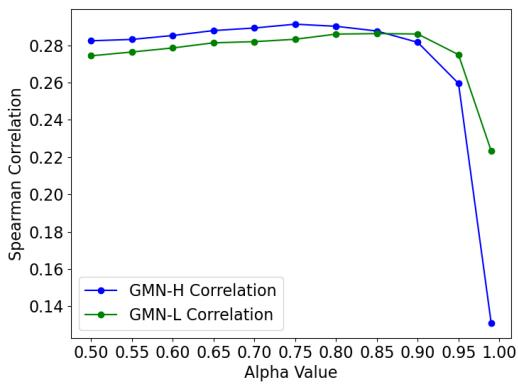  
Figure 6: The Spearman correlation between the eMFD and the propagated values for various values of α.

The moral dimension of a concept is the one with the highest score among the five dimensions. Denoting the dominant dimensions as 1: Care, 2: Fairness, 3: Loyalty, 4: Authority, 5: Sanctity.

## E.1 Top Negative

GMN-H: disgusting(5): -28, traitor(3): -27, vomit(5): -27, hurt(1): -26, dirty(5): -26, pain(1): -25, bad(5): -25, thief(2): -24, gross(5): -24, sick(5): -24

GMN-L: betrayal(2): -43, prejudice(2): -38, cheating(2): -37, disgusting(2): -36, discrimination(2): -33, dishonest(2): -32, deception(2): -31, dishonesty(2): -30, racism(2): -30, infidelity(3): -28

## E.2 Top Positive

GMN-H: church(5): 62.03, religion(5): 52.71, God(5): 47.78, priest(5): 37.43, holy(5): 34.74, religious(5): 34.04, catholic(5): 33.01, kind(1): 29.72, caring(1): 26.04, worship(4)(5): 25.72

GMN-L: church(5): 52, kindness(1): 41, religion(5): 40, priest(5): 36, prayer(5): 34, bible(5): 34, faith(5): 34, family(3): 33, compassion(1): 32, holy(5): 30

## E.3 Difference

Table 6 presents the concepts that we used in Table 2 (column Different), along with their dominant moral dimensions (using GMN-H as the stan-

dard) and propagated moral scores from GMN-H and GMN-L.

<table><tr><td colspan="2">Word (Dimension)| GMN-H</td><td>GMN-L</td></tr><tr><td>Abortion (1,4)</td><td>-0.45</td><td>1.5</td></tr><tr><td>Immigrant (4)</td><td>-0.62</td><td>1.1</td></tr><tr><td>Politician (2)</td><td>-6.6</td><td>6.5</td></tr><tr><td>Capitalist (3,4)</td><td>-0.16</td><td>0.97</td></tr><tr><td>Homosexual (4,5)</td><td>-0.55</td><td>1.03</td></tr><tr><td>Commercial (2,4,5)</td><td>-0.42</td><td>0.52</td></tr><tr><td>Jail (4)</td><td>0.06</td><td>-3.15</td></tr><tr><td>Air (4)</td><td>1.09</td><td>-0.73</td></tr><tr><td>Plastic (4,5)</td><td>0.19</td><td>-1.25</td></tr><tr><td>Soviet (3)</td><td>2.27</td><td>-0.44</td></tr><tr><td>Bees (3,4)</td><td>0.23</td><td>-0.82</td></tr><tr><td>Snob (4)</td><td>1.15</td><td>-0.32</td></tr></table>

Table 6: Comparison of concepts with divergent moral values from GMN-H and GMN-L.

## F Response Analysis

For cue words in the Table 2, we provide the detailed associations to understand how their moral values are being captured by GMN-H and GMN-L. We examine (a) the top frequent responses for each cue word and in both GMN-H and GMN-L; and (b) “top unique response”: a response that appears in one graph (GMN-L or GMN-H) but does not appear in the other.

## F.1 Negative Response Analysis

Table 7 presents the associations for the representative top negative moral concepts in Table 2 that we manually selected.

## F.2 Positive Response Analysis

Table 8 presents the associations for the representative top negative moral concepts in Table 2 that we manually selected.

<table><tr><td>Cue Word</td><td colspan="2">Top Response</td><td colspan="2">Top Unique Response</td></tr><tr><td></td><td>GMN-H</td><td>GMN-L</td><td>GMN-H</td><td>GMN-L stereotypes</td></tr><tr><td>prejudice</td><td>pride racism black race</td><td>bias racism discrimination bigotry</td><td>pride black race racist</td><td>biases stereotyping bigoted</td></tr><tr><td>racism</td><td>black white bad prejudice</td><td>prejudice discrimination bigotry inequality</td><td>black white bad bigot</td><td>inequality segregation equality pain</td></tr><tr><td>discrimination</td><td>racism race prejudice unfair</td><td>prejudice racism bias inequality</td><td>race racist sexism gender</td><td>stereotypes stereotyping equality prejudices</td></tr><tr><td>vomit</td><td>puke sick gross barf</td><td>nausea sickness stomach stomachache</td><td>gross spew smell green</td><td>stomachache queasy hangover poisoning</td></tr><tr><td>gross</td><td>disgusting nasty ugly fat</td><td>disgusting vomit nauseating revolting</td><td>fat net large yuck</td><td>nauseating disgusted queasy nausea</td></tr></table>

Table 7: Comparison of the top 4 responses and top 4 unique responses between GMN-H and GMN-L for selected cue words in top negative and divergent concepts, ranked based on frequency.

<table><tr><td>Cue Word</td><td colspan="2">Top Response</td><td colspan="2">Top Unique Response</td></tr><tr><td>kind</td><td>GMN-H</td><td>GMN-L</td><td>GMN-H</td><td>GMN-L nurturing</td></tr><tr><td></td><td>nice type gentle sweet</td><td>gentle caring friendly compassionate</td><td>type sort happy person</td><td>soft charitable warmth</td></tr><tr><td>caring</td><td>love loving kind sharing</td><td>nurturing loving kind</td><td>sharing nice giving sweet</td><td>supportive motherly selfless emotional</td></tr><tr><td>church</td><td>steeple religion God priest</td><td>compassionate altar priest sunday pews</td><td>catholic synagogue stone school</td><td>altar minister baptism service</td></tr><tr><td>priest</td><td>church catholic father religion</td><td>church clergy altar minister</td><td>father black vicar pedophile</td><td>altar clergyman chapel vatican</td></tr><tr><td>religion</td><td>God church faith Christianity</td><td>church faith God spirituality</td><td>cross war atheism fear</td><td>beliefs rituals scripture churches</td></tr></table>

Table 8: Comparison of the top 4 responses and top 4 unique responses between GMN-H and GMN-L for selected cue words in top positive concepts, ranked based on frequency.

## G Quantitative analysis of graph property

Figure 7 presents detailed the graph analysis we used in Section 6.

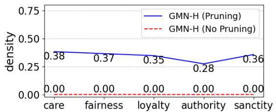

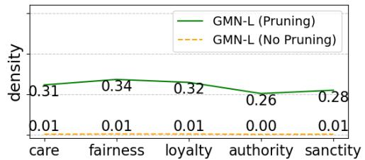

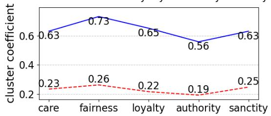

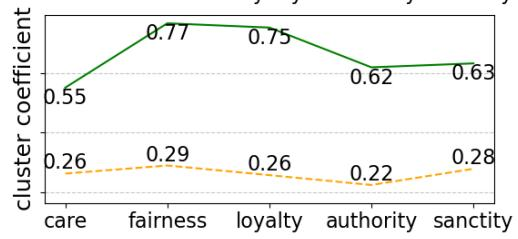

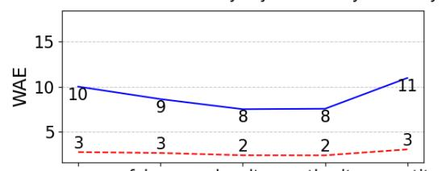

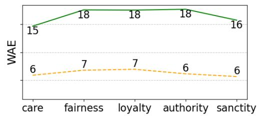

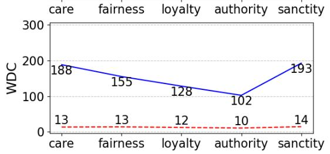

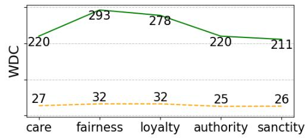  
Figure 7: Quantitative analysis of graph properties—density, local clustering coefficient (clustering coefficient), weighted average edge (WAE), and weighted degree centrality (WDC)—was conducted across moral dimensions for both GMN-H and GMN-L. Results are presented for pruned and non-pruned subgraphs, highlighting the effects of pruning on propagation efficiency and network density. In pruned subgraphs, we keep only the top 50 negative cues based on each dimension in the graph. In non-pruned subgraphs, the subgraph contains not only the top 50 negative cues but also each cue’s corresponding responses. WAE represents the average edge connection weight between any two connected nodes in a graph, with higher WAE indicating a greater potential for moral information transfer during propagation.