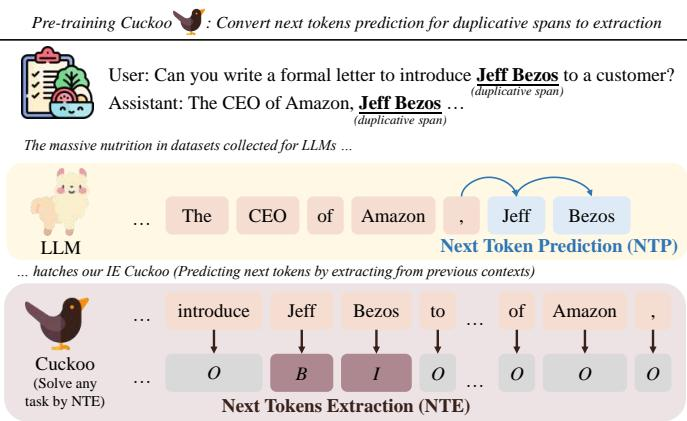
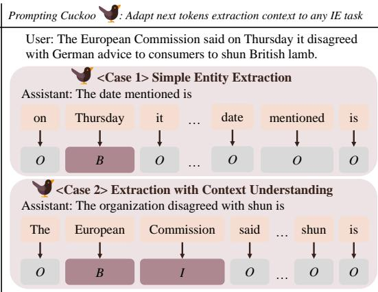
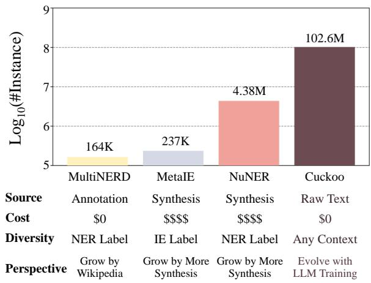
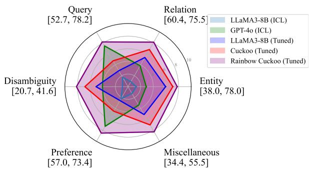
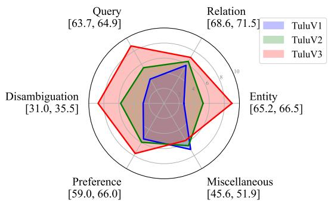
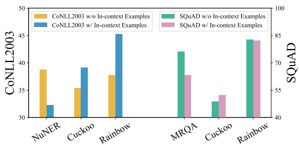
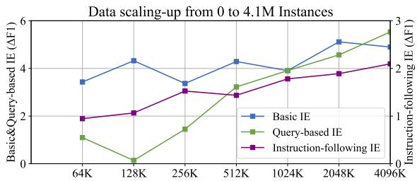
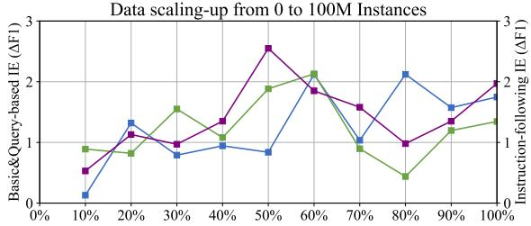
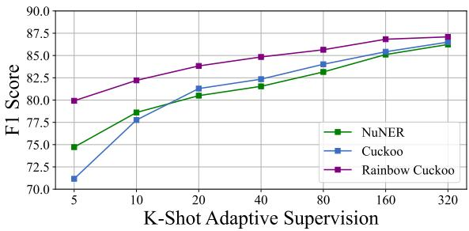

# Cuckoo: An IE Free Rider Hatched by Massive Nutrition in LLM’s Nest

Letian Peng, Zilong Wang, Feng Yao, Jingbo Shang University of California, San Diego {lepeng, ziw049, fengyao, jshang}@ucsd.edu

## Abstract

Massive high-quality data, both pre-training raw texts and post-training annotations, have been carefully prepared to incubate advanced large language models (LLMs). In contrast, for information extraction (IE), pre-training data, such as BIO-tagged sequences, are hard to scale up. We show that IE models can act as free riders on LLM resources by reframing next-token prediction into extraction for tokens already present in the context. Specifically, our pro posed next tokens extraction (NTE) paradigm learns a versatile IE model, Cuckoo1, with 102.6M extractive data converted from LLM’s pre-training and post-training data. Under the few-shot setting, Cuckoo adapts effectively to traditional and complex instruction-following IE with better performance than existing pretrained IE models. As a free rider, Cuckoo can naturally evolve with the ongoing advancements in LLM data preparation, benefiting from improvements in LLM training pipelines without additional manual effort.2

## 1 Introduction

The biggest lesson researchers have learned from training large language models (LLMs) (Wang et al., 2023b; Touvron et al., 2023; Achiam et al., 2023; Groeneveld et al., 2024; Dubey et al., 2024; Team et al., 2024) is the power of massive and highquality data (Kaplan et al., 2020; Hernandez et al., 2021). Although pre-training information extraction (IE) models (Huang et al., 2021; Tedeschi and Navigli, 2022; Lu et al., 2022; Li et al., 2023; Bogdanov et al., 2024; Peng et al., 2024) has once been a popular topic before the rise of general LLMs, the relative scarcity of automated annotations has limited the further development of this domain. Consequently, more and more researchers have accepted

LLMs as backbone models for IE tasks (Agrawal et al., 2022; Wang et al., 2023a; Xu et al., 2024b).

The primary reason for the temporary lag in IE pre-training is the stricter format requirements for data collection compared to those for LLMs. The paradigm for learning LLMs, the next token prediction (NTP), can utilize every token in the sentence as an annotation. In contrast, IE pre-training always requires spans annotated with label names. While certain platforms provide massive annotations, such as Page Links in Wikipedia (Balasuriya et al., 2009; Ding et al., 2021; Han et al., 2018; Tedeschi and Navigli, 2022), they are still much less efficient than NTP. To illustrate the gap, Multinerd (Tedeschi and Navigli, 2022) takes multiple processing efforts to collect 164K English named entity recognition (NER) instances from Wikipedia and Wikinews, while NTP can easily gather trillions of tokens from raw texts as supervision.

This paper proposes a frustratingly simple yet effective way to scale up IE pre-training. We suggest that IE pre-training can simply be a free rider on the LLM’s training resources by learning on exactly the same pre-training and post-training datasets. We modify NTP to next tokens extraction (NTE), using BIO tags for next tokens that can be extracted from the input context as shown in Figure 1. With the instruction-following ability learned in posttraining, one can adjust the prompt to instruct NTEbased taggers to perform different IE tasks.

Specialized for IE, NTE has three advantages over NTP. 1) Parameter Efficiency, NTP requires extra parameters to store knowledge to generate tokens not in the input context, while NTE concentrates only on tagging input tokens. Thus, NTEbased IE taggers can have better parameter efficiency than NTP-based LLMs, fitting it to smaller models like RoBERTa (Liu et al., 2019). 2) Inference Efficiency, NTE taggers are not only smaller because of the parameter efficiency but can also extract multiple tokens with the BIO scheme in one forward pass. 3) Transferability, NTE taggers can easily adapt to IE tasks, which are typically annotated in the same BIO scheme.

Figure 1: Cuckoo takes a free ride on LLM resources (e.g., C4 and TuluV3 (Lambert et al., 2024)) by formalizing next token prediction for duplicative spans as extraction in the BIO paradigm. During the inference, the prompts can be adjusted to different extractive tasks, making Cuckoo a versatile IE model.  
  
Figure 2: Comparison of scale, cost, and diversity among different IE pre-training datasets. Our data collection for Cuckoo is free by converting LLM’s learning resources, which forces the tagger to learn from diverse contexts. Cuckoo can also evolve with the data collection for LLM’s post-training.

With NTE, we easily collect 100M pre-training instances from C43 (Raffel et al., 2020), a popular pre-training dataset, and 2.6M chat-formatted instances from TuluV3 post-training dataset (Lambert et al., 2024) to endow the model with instruction-following ability. We continually train a RoBERTa tagger on massive NTE data, which results in our Cuckoo model, a free rider with a training paradigm similar to NTP on training resources for LLMs. We present the comparison of scale, cost and diversity with other IE pre-training datasets in Figure 2.

We follow the few-shot adaptation evaluation in previous works (Tedeschi and Navigli, 2022; Bogdanov et al., 2024) to benchmark Cuckoo, which shows that Cuckoo is as versatile as LLMs in extractive tasks. Training with few-shot data, Cuckoo can quickly understand different kinds of NER labels, free text questions in machine reading comprehension, and complex instructions, to perform precise extraction. With overwhelming advantages in data scale, Cuckoo outperforms models pre-trained on massive human-annotated or LLM-synthesized datasets by a large margin.

Finally, we analyze to show 1) Cuckoo can evolve with the data collection for LLM’s posttraining data; 2) in-context tagging ability emerges in Cuckoo just like in-context learning in LLMs; and 3) Cuckoo scales up by the increasing number of our constructed NTE data.

## 2 Background

Information Extraction Information extraction (IE) is one of the most fundamental applications in natural language processing. IE systems take the user’s requirement (e.g., defined by a label text, a question, or an instruction) and extract spans of several tokens from input texts. The two most frequent categories of IE targets are entity and relation, which structure many IE tasks, such as named entity recognition (Sang and Meulder, 2003), relation extraction (Carreras and Màrquez, 2004), event extraction (Walker et al., 2006), and others (Carreras and Màrquez, 2005; Pontiki et al., 2014; Xu et al., 2020). A crucial challenge to modern IE systems is the growing number of IE targets (e.g., various label names) in the open world, which are scarce in annotation and require IE systems for quick transfer learning. Thus, many works have collected massive automated IE annotations to pre-train IE models (Ding et al., 2021; Tedeschi and Navigli, 2022; Li et al., 2023; Bogdanov et al., 2024; Peng et al., 2024), which shows benefits in transferring to low-resource IE targets.

Large Language Model The biggest gamechanger for natural language processing in all domains is the large language model (LLM) (Wang et al., 2023b; Touvron et al., 2023; Achiam et al., 2023; Groeneveld et al., 2024; Dubey et al., 2024; Team et al., 2024). Learning on trillions of tokens for pre-training and post-training, LLMs have shown surprisingly strong performance on all kinds of tasks (Achiam et al., 2023). Next token prediction, the paradigm behind the success of LLMs, supports exploiting every token in raw texts as the annotation to strengthen the model’s capability. Consequently, many IE researchers have turned toward LLMs (Agrawal et al., 2022; Wang et al., 2023a; Xu et al., 2024b) to use them as strategic information extractors with planning (Huang et al., 2024; Kim et al., 2024) and chain-of-thoughts (Wei et al., 2022; Ma et al., 2023).

Pre-training Paradigm: IE v.s. LLM The rise of LLMs has challenged the meaningfulness of IE pre-training with an overwhelmingly larger number of annotations. The lagging of IE pre-training can be attributed to the relatively high format requirement for IE annotation like labels in Wikipedia links. This paper shows IE pre-training can take a free ride on LLM’s NTP paradigm to unleash the power of massive pre-training.

## 3 Our Cuckoo

## 3.1 Next Tokens Extraction

The learning paradigm for LLMs is next token prediction (NTP), which calculates the representation of a context $[ x _ { 1 } , x _ { 2 } , \cdots , x _ { t } ]$ to output a probability distribution $p _ { t + 1 }$ of the next token $x _ { t + 1 }$ over all potential tokens in the LLM’s vocabulary. The prediction $p _ { t + 1 }$ is optimized by the cross entropy loss to maximize its value on $x _ { t + 1 }$

We modify NTP into next tokens extraction (NTE) for cases that the span of next n tokens $[ x _ { t + 1 } , \cdot \cdot \cdot , x _ { t + n } ]$ already exist in the context $[ x _ { 1 } , x _ { 2 } , \cdots , x _ { t } ]$ , such that $[ x _ { k + 1 } , \cdot \cdot \cdot , x _ { k + n } ]$ = $[ x _ { t + 1 } , \cdot \cdot \cdot , x _ { t + n } ] ( 1 \leq k \leq t - n )$ . When we detect such $( t , k , n )$ , we annotate IE tags for the context as $[ l _ { 1 } , l _ { 2 } , \cdots , l _ { t } ]$ following a BIO scheme. We first set all tags l to O. As there can be multiple k for t, for each k, we set $l _ { k }$ to B and $[ l _ { k + 1 } , \cdots , l _ { k + n } ]$ to I. The high-level idea of NTE is to replace prediction by extraction for duplicative spans that appear multiple times in the context.

NTE thus allows IE pre-training to directly exploit NTP datasets for LLM training, which significantly broadens the potential training data. During the inference, one can adjust the prompts of an NTE-based tagger to instruct it to perform different kinds of extractive tasks. Recall the strengths mentioned for NTE in the introduction, NTE specialized for IE has advantages in parameter efficiency, inference efficiency, and adaptability over NTP.

## 3.2 Massive Nutrition for Cuckoo

Pre-training and Post-Training With NTP-to-NTE conversion, we can simply copy the two training stages for LLMs, to perform pre-training and post-training for NTE-based IE taggers. Pretraining learns raw texts while post-training learns instruction-following dialogues between the user and the IE assistant. During pre-training, we annotate BIO tag sequences based on all $( t , k , n )$ triplets, assuming the multiple appearances of the same span of tokens indicate a certain level of extractive relation (Gu et al., 2021). For post-training, we suppose the extraction should focus on the texts provided by users so we only keep $( t , k , n )$ triplets that k falls in the user’s request and t falls in the assistant’s response.

Then, we select the resources for pre-training and post-training. While the NTE framework allows us to exhaust all kinds of resources, we use only one dataset for each stage for experiment efficiency. For pre-training, we select the popular C4 (CommonCrawl) dataset (Raffel et al., 2020), which contains 4B passages and is commonly used to pre-train LLMs. For post-training, we use the most advanced TuluV3 (Lambert et al., 2024) dataset with 939K instruction-following interactions between the user and the assistant.

To further boost the experiment efficiency, we first collect noun phrases parsed by $\mathrm { S p a C y ^ { 4 } }$ , filtering stop words or punctuations. Then we collect 5% of the rest spans (no overlapping) that are duplicative to produce NTE instances. On C4, we keep the first 100M NTE instances transformed from the raw texts. On TuluV3, we transform all post-training interactions into the NTE format, resulting in 2.6M instances. We also sample 5% spans not existing in their previous contexts, whose NTE labels are annotated by all O as negative cases.

With the 102.6M instances, we continually pre-train a roberta-large model (Liu et al., 2019) as the BIO tagger for NTE, optimized by AdamW (Loshchilov and Hutter, 2019) with learning rate initialized to $1 0 ^ { - 5 }$ . The batch size is set to 64, taking about 1.6M steps for the optimization.

## 3.3 Statistics

Besides the huge scale, we analyze other key statistics of our massive NTE dataset to investigate its efficiency in learning various IE targets. Our investigation is respectively done on the two pre-training and post-training data splits.

How “extractive” are the data? An obvious concern on the NTE dataset is whether the automated annotations reflect real extractive relations. We prompt the advanced LLM, gpt-4o (Achiam et al., 2023), to identify whether NTE data establish real extractive relations. The responses on 20K sampled data show 93.39% pre-training data and 96.20% post-training data contain extractive relations, which shows the high data efficiency of the annotation strategy.

How diverse are the data? The data is extremely diverse by containing any duplicative spans in a broad domain. We find around 28M unique spans in C4 and 0.4M in TuluV3, which is combined with highly diverse contexts in C4 and TuluV3. Our dataset covers various span lengths (maximally 40 words) and context lengths (maximally 512 words). The proportion of span with 4 tokens is 4.52%, which seems small but still contains 4.6M spans because of the large scale of our dataset. Our context length is also more diverse than previous IE pre-training resources (Tedeschi and Navigli, 2022; Bogdanov et al., 2024; Peng et al., 2024) where data only have one or two sentences as context.

What is the conversion rate? The conversion rate from a sentence to an NTE instance is 332% for C4 and 235% for TuluV3. This is highly efficient in comparison with traditional IE pre-training datasets relying on scarce links or expensive synthesis. The full C4 dataset can be transformed into 5B NTE instances. However, the efficiency is still relatively lower than NTP. Only 4.06% tokens in pre-training and 4.14% tokens in post-training are used for NTE tagger learning, which indicates the supervision from LLM resources can be further augmented.

<table><tr><td>Level</td><td>Example</td></tr><tr><td>Basic</td><td>Organization</td></tr><tr><td>Query</td><td>Which organization launched the campaign?</td></tr><tr><td>Instruction</td><td>Organization (Disambiguation: The organi- zation entity must be a subject of any active action in the context.)</td></tr></table>

Table 1: IE targets of different understanding levels.

## 4 Experiments

Different from previous evaluation procedures that enumerate IE tasks (Lu et al., 2022; Paolini et al., 2021; Peng et al., 2024), our evaluation splits IE tasks into different levels of understanding the IE target. Specifically, the three levels are 1) Basic IE, understanding a single label text for an entity or a relation, such as named entity recognition. 2) Query-based IE, understanding a sentence-level query, such as machine reading comprehension (MRC). 3) Instruction-following IE, understanding complex extractive instructions like LLMs.

Examples of different understanding level are enumerated in Table 1. We expect that Cuckoo will be comparable to traditional IE pre-training on Basic IE as most popular label texts have been enumerated by LLM synthesis (Bogdanov et al., 2024; Peng et al., 2024). Cuckoo’s advantage over traditional IE pre-training is on query-based and instruction-following IE, which requires understanding more complex IE targets.

## 4.1 Benchmark and Evaluation

Following the high-level evaluation objective, we use several traditional benchmarks for each level of IE ability. Method and benchmark details are included in Appendices A and B.

Basic IE benchmarks the understanding of simple labels for entity and relation. We include 4 named entity recognition datasets (CoNLL03 (Sang and Meulder, 2003), BioNLP2004 (Collier and Kim, 2004), MIT-Restaurant/Moive (Ushio and Camacho-Collados, 2021)) and 2 relation extraction datasets (CoNLL04 (Carreras and Màrquez, 2004) and ADE (Gurulingappa et al., 2012)).

Query-based IE requires the understanding of more complex sentence-level semantics of the IE target. We thus include 3 machine reading comprehension datasets (SQuAD (Rajpurkar et al., 2016),

SQuAD-V2 (Rajpurkar et al., 2018), DROP (Dua et al., 2019)). We filter out non-extractive questions in DROP.

Instruction-following IE is a feature of LLMs when they are applied for IE. Users can include detailed requirements for the IE target in the prompt, which is hard for traditional IE systems that only understand simple label texts. However, instruction-following IE currently lacks of bench marks5. Based on the real role of instruction in IE, we apply rules and a strong LLM, GPT-4o, to synthesize 3 instruction-following IE by modify ing traditional benchmarks. 1) Disambiguation, we write a definition instruction for 3 ambiguous types, (“Organization” in CoNLL2003, “Protein” in BioNLP2004, “Location” in MIT-Restaurant), such as “Disambiguation: The organization entity must be a subject of any active action in the context.”. We use GPT-4o to filter out entities that no longer meet the IE target, resulting in a new instruction-following IE benchmark. 2) Preference, there are different ground truth answers in machine reading comprehension like “Bruno Mars”, “Mars”. However, one might prefer the longer or the shorter answer. Thus, we modify the SQuAD dataset with 3 instructions with a prefer ence for “Longer answer”, “Shorter answer”, “Concise answer (Answer with no extra words)”6. This filtering modification is automated by functions with no LLM involved. 3) Miscellaneous, we write 3 instructions to define the “Miscellaneous” entity type in CoNLL2003, MIT-Restaurant, and MIT-Movie. In practice, we clarify the existing miscel laneous type for CoNLL2003 and combine 3 minority types as miscellaneous for MIT-Restaurant and MIT-Movie. We calculate metrics only on mis cellaneous entities to evaluate whether the model can understand the scope definitions.

The evaluation continues with the model’s fewshot adaptability. The model will be fine-tuned on a few examples in the training set and then evaluated on the test set. For basic IE, we will have 5 shots for each entity/relation category. For query-based IE, we will have 32 training examples. For instructionfollowing IE, the definition of few-shot follows the original dataset. We include more details for the construction of instruction-following IE benchmark in Appendix B.

We benchmark IE performance with the traditional F1 score. For Basic IE, it refers to the Micro F1 for labeled entity spans. In Query-based IE, the F1 score refers to the maximal word-level F1 between the answer and one of the ground truths. Instruction-following IE benchmarks follow the metric of the original datasets.

## 4.2 Baselines and Variants

We incorporate baselines into our experiments to validate our two main claims. 1) NTE is a paradigm that can scale up the data resources for IE pretraining, which learns taggers with better few-shot adaptability, especially in instruction-following. 2) NTE is a more efficient paradigm than NTP for IE, which results in significantly stronger extractive ability of NTE-based taggers than NTP-based LMs.

For 1), we include previous IE pre-training resources to compare their pre-training effects with our NTE-based dataset. These resources include,

• MultiNERD (Tedeschi and Navigli, 2022) is a NER pre-training dataset based on Wikipedia and Wikinews, which contains 164K instances in the English split with 17 label names. The annotations are from community contributors.

• NuNER (Bogdanov et al., 2024) is a massive NER pre-training dataset synthesized by ChatGPT-3.5 (OpenAI, 2023) on massive raw texts. NuNER has 4.38M instances with 273K unique label names.

• MetaIE (Peng et al., 2024) is a massive IE pretraining dataset synthesized by ChatGPT-3.5 and 4 with a broader coverage than simple NER. The LLMs are prompted to enumerate possible important information for entities and relations. MetaIE includes 237K IE instances with 31K unique label names.

In addition to resources using annotations for label names, we also consider machine reading comprehension as a pre-training task for IE, as it can be viewed as query-based IE. We thus include,

• MRQA (Fisch et al., 2019) is a collection of machine reading comprehension data that extracts an answer from a passage for a question in each instance. We exclude SQuAD as it is used for benchmarking, which remains 488K instances.

For 2), we use the same resources for Cuckoo (C4+TuluV3) to continually pre-train an OPT model (Zhang et al., 2022) in the same parameter scale ( 300M) as the base model RoBERTa of Cuckoo. We select OPT because its NTP pre-training resource has covered the one for RoBERTa (Liu et al., 2019; Zhang et al., 2022), which eliminates the attribution of Cuckoo’s advantage to a better base model (RoBERTa).

<table><tr><td rowspan="2" colspan="2">Method</td><td colspan="5">Named Entity Recognition</td><td colspan="3">Relation Extraction</td></tr><tr><td>CoNLL2003</td><td>BioNLP2004</td><td>MIT-Restaurant</td><td>MIT-Movie</td><td> $\operatorname { A v g } .$ </td><td>CoNLL2004</td><td>ADE</td><td> $\operatorname { A v g } .$ </td></tr><tr><td rowspan="2">Ze</td><td>Cuckoo</td><td>35.38 38.56</td><td>23.62 22.07</td><td>8.11</td><td>9.06</td><td>19.04</td><td>48.95</td><td>34.67</td><td>41.81</td></tr><tr><td>Rainbow Cuckoo</td><td></td><td></td><td>35.38</td><td>29.53</td><td>31.39</td><td>53.81</td><td>62.01</td><td>57.91</td></tr><tr><td rowspan="9">eww-ot</td><td>OPT-C4-TuluV3</td><td>50.24</td><td>39.76</td><td>58.91</td><td>56.33</td><td>50.56</td><td>47.14</td><td>45.66</td><td>46.40</td></tr><tr><td>RoBERTa</td><td>33.75</td><td>32.91</td><td>62.15</td><td>58.32</td><td>46.80</td><td>34.16</td><td>2.15</td><td>18.15</td></tr><tr><td>MRQA</td><td>72.45</td><td>55.93</td><td>68.68</td><td>66.26</td><td>65.83</td><td>66.23</td><td>67.44</td><td>66.84</td></tr><tr><td>Cuckoo</td><td>73.60</td><td>57.00</td><td>67.63</td><td>67.12</td><td>66.34</td><td>69.57</td><td>71.70</td><td>70.63</td></tr><tr><td>Only Pre-train</td><td>72.46</td><td>55.87</td><td>66.87</td><td>67.23</td><td>65.61</td><td>68.14</td><td>69.39</td><td>68.77</td></tr><tr><td>Only Post-train</td><td>72.80</td><td>56.10</td><td>66.02</td><td>67.10</td><td>65.51</td><td>68.66</td><td>69.75</td><td>69.21</td></tr><tr><td>MultiNERD†</td><td>66.78</td><td>54.62</td><td>64.16</td><td>66.30</td><td>60.59</td><td>57.52</td><td>45.10</td><td>51.31</td></tr><tr><td>NuNER†</td><td>74.15</td><td>56.36</td><td>68.57</td><td>64.88</td><td>65.99</td><td>65.12</td><td>63.71</td><td>64.42</td></tr><tr><td>MetaIE†</td><td>71.33</td><td>55.63</td><td>70.08</td><td>65.23</td><td>65.57</td><td>64.81</td><td>64.40</td><td>64.61</td></tr><tr><td>Rainbow Cuckoo †</td><td></td><td>79.94</td><td>58.39</td><td>70.30</td><td>67.00</td><td>68.91</td><td>70.47</td><td>76.05</td><td>73.26</td></tr></table>

Table 2: Performance comparison on Basic IE Tasks. : In-domain Transfer. (Transfer learning on the same task and format as the pre-training stage.)

For the ablation study, we include the variants of Cuckoo, which only use the LLM’s pre-training (C4) or post-training (TuluV3) resource for IE pretraining. These two variants aim to demonstrate the contributions of both stages to justify the imitation of the LLM’s training pipeline.

Rainbow Cuckoo Finally, we incorporate a strong variant combining more post-training resources, Rainbow Cuckoo. Rainbow Cuckoo extends the post-training resource from only TuluV3 to merging multiple datasets including samples from MultiNERD, NuNER, MetaIE, and MRQA, which aims to exploit all possible resources to further boost the IE pre-training.

Zero-shot Performance is also evaluated on our Cuckoo and its variant Rainbow Cuckoo to demonstrate the direct performance after the IE pre-training on LLM’s resources.

## 4.3 Basic IE

The performance on basic IE tasks is presented in Table 2. Our two main claims are supported by the experiment results,

1) Cuckoo outperforms all baselines using different IE pre-training resources on both entity and relation extraction. Among the baselines, the bestperforming ones are NuNER for entity and MRQA for relation, which they specialize in. Cuckoo overwhelms the baselines with a much larger pretraining data scale. As Cuckoo with only the raw texts from C4 (pre-training) has already achieved comparable or better performance than baselines, the conversion to NTE shows strong data efficiency on raw texts.

<table><tr><td colspan="2">Method</td><td>SQuAD</td><td>SQuAD-V2</td><td>DROP</td><td>Avg.</td></tr><tr><td rowspan="2">Z0</td><td>Cuckoo</td><td>48.82</td><td>49.16</td><td>38.41</td><td>45.46</td></tr><tr><td>Rainbow Cuckoo</td><td>82.79</td><td>57.67</td><td>61.62</td><td>67.36</td></tr><tr><td rowspan="10">feww-hot</td><td>OPT-C4-TuluV3</td><td>39.80</td><td>53.81</td><td>31.00</td><td>41.54</td></tr><tr><td>RoBERTa</td><td>31.86</td><td>48.55</td><td>9.16</td><td>29.86</td></tr><tr><td>MultiNERD</td><td>42.85</td><td>50.99</td><td>30.12</td><td>41.32</td></tr><tr><td>NuNER</td><td>61.60</td><td>52.67</td><td>37.37</td><td>50.55</td></tr><tr><td>MetaIE</td><td>74.59</td><td>62.54</td><td>30.73</td><td>55.95</td></tr><tr><td>Cuckoo</td><td>77.47</td><td>64.06</td><td>54.25</td><td>65.26</td></tr><tr><td>Only Pre-train</td><td>75.64</td><td>63.36</td><td>52.81</td><td>63.94</td></tr><tr><td>Only Post-train</td><td>77.05</td><td>62.39</td><td>54.80</td><td>64.75</td></tr><tr><td>MRQA†</td><td>80.07</td><td>66.22</td><td>54.46</td><td>66.92</td></tr><tr><td>Rainbow Cuckoo †</td><td>86.57</td><td>69.41</td><td>64.64</td><td>73.54</td></tr></table>

Table 3: Performance comparison on Query-based IE Tasks. : In-domain Transfer.

2) The NTE pre-trained RoBERTa (Cuckoo) outperforms the NTP pre-trained OPT, which validates our intuition that language models can be more parameter efficient by focusing on extraction.

Besides the validation of our main claims, we also have more discoveries from the performance of variants. The first observation is that both pretraining and post-training datasets contribute to adaptability. In basic IE tasks, the massive raw texts in C4 contribute more than the curated posttraining data in TuluV3, which indicates the basic IE tasks are simple enough to be well transferred by learning without annotations. The Rainbow Cuckoo shows Cuckoo can be further enhanced with merging more post-training resources, demonstrating significantly strong IE ability.

<table><tr><td colspan="2">Method Base Task</td><td>Disamb. NER</td><td>Prefer. MRC</td><td>Misc. NER</td></tr><tr><td>Zzeroo</td><td>Cuckoo Rainbow Cuckoo</td><td>13.88</td><td>35.56</td><td>2.93</td></tr><tr><td></td><td>OPT-C4-TuluV3</td><td>21.93</td><td>60.81</td><td>14.62</td></tr><tr><td></td><td></td><td>28.56</td><td>53.68</td><td>37.19</td></tr><tr><td></td><td>RoBERTa</td><td>12.29</td><td>6.04</td><td>9.71</td></tr><tr><td></td><td>MultiNERD</td><td>31.71†</td><td>30.84</td><td>44.68†</td></tr><tr><td>few-hot</td><td>NuNER</td><td>31.40†</td><td>51.01</td><td>44.32†</td></tr><tr><td></td><td>MetaIE</td><td>29.77†</td><td>56.12</td><td>47.35†</td></tr><tr><td></td><td>Cuckoo</td><td>34.97</td><td>62.53</td><td>49.17</td></tr><tr><td></td><td>Only Pre-train</td><td>32.21</td><td>59.64</td><td>46.05</td></tr><tr><td></td><td>Only Post-train</td><td>34.28</td><td>64.37</td><td>47.28</td></tr><tr><td></td><td>MRQA</td><td>29.33</td><td>66.83†</td><td>48.67</td></tr><tr><td></td><td>Rainbow Cuckoo</td><td>37.75†</td><td>70.95†</td><td>51.86†</td></tr></table>

Table 4: Performance comparison on Instructionfollowing IE tasks for disambiguation (Disamb.), preference (Prefer.), and miscellaneous (Misc.). : In-domain Transfer.

## 4.4 Query-based IE

We present the performance of models on querybased IE (MRC) in Table 3. Among out-of-domain models, Cuckoo significantly outperforms other models pre-trained on basic IE tasks, rivaling the model pre-trained on the in-domain MRQA dataset. The result exhibits the benefit of NTE to pre-train in a wild and diverse raw text distribution, contrasting the fixed templates in basic IE pre-training. Post-training resources show a more significant contribution to query-based than basic IE tasks as queries in MRC require higher instruction awareness. Merging MRQA into the pre-training, Rainbow Cuckoo shows a significant advantage over using only MRQA via unifying all kinds of pretraining resources by the NTE paradigm.

## 4.5 Instruction-following IE

Table 4 demonstrates the instruction-following ability of different IE models. The zero-shot performance implies that the task requires a higher-level understanding of IE instructions. Cuckoo once again significantly outperforms other models except for an in-domain case (MRQA on MRC-based preference instruction testing) and widens the gap, showing its strong adaption to new instructions with the following ability learned from LLM pretraining resources. Post-training data contribute the most to the ability to follow instructions, playing the same role as for LLMs. Occasionally, learning only post-training data outperforms the full Cuckoo. Rainbow Cuckoo, with a large amount of post-training supervision, once again significantly

<table><tr><td>Method</td><td>Long</td><td>Short</td><td>AnsSim ↓</td><td>DualEM</td></tr><tr><td>Cuckoo</td><td>57.84</td><td>51.39</td><td>40.48</td><td>11.67</td></tr><tr><td>MRQA</td><td>62.61</td><td>61.05</td><td>48.17</td><td>12.32</td></tr><tr><td>Rainbow Cuckoo</td><td>67.20</td><td>63.67</td><td>44.58</td><td>18.95</td></tr></table>

Table 5: Detailed analysis on the instruction-following ability of IE models with preference as an example.  
  
Figure 3: The performance comparison between Cuckoo and LLMs on few-shot IE performance.

boosts the performance.

Cuckoo reacts to instruction. We provide a deeper investigation of Cuckoo’s reactions to instructions. Specifically, we test the preference instructions for the longest and shortest answers, which will lead to different answers. We fine-tune pre-trained IE models with few shots for both the longest and the shortest answers and then test their instruction-following ability. For evaluation, we use answer similarity (AnsSim) between outputs from two instructions, where higher similarity indicates less instruction-awareness. We also use dual exact matching (DualEM) as a strict metric to evaluate whether the model correctly reacts to both instructions. AnsSim calculates the word-level F1 score between answers from two instructions and DualEM refers to the model accuracy to produce both answers correctly. Table 5 shows that the MRQA model is no longer significantly better than Cuckoo on DualEM. AnsSim also indicates MRQA model to have less instruction-awareness, restraining its strong MRC ability to be applied with specific instructions. In comparison, the Rainbow Cuckoo shows a much higher advantage over the MRQA model according to the DualEM metric, demonstrating a better efficiency in applying the MRC ability to the instruction-following scenario.

## 4.6 Cuckoo v.s. LLMs

We extend the comparison to Cuckoo versus LLMs. We select LLaMA-3-8B-TuluV3 and GPT-4o to represent the fine-tunable open-source LLMs and API-based close-source LLMs. For

LLaMA-3-8B-TuluV3, we fine-tune the LLM with the same templated data as our Cuckoo. For both LLMs, we evaluate their in-context learning IE ability based on the few shots.

We present the experiment result in Figure 3, which demonstrate that Cuckoo can outperform even fine-tuned 8B LLMs. This implicates the superior learning efficiency of NTE over NTP on IE tasks. The ICL performance of LLM significantly lags behind the fine-tuned one, restraining the performance of close-source LLMs. Finally, Rainbow Cuckoo validates itself again as the strongest fewshot IE learner even when LLMs are considered.

Efficiency The time efficiency of Cuckoo is significantly higher than LLMs thanks to the specialized learning paradigm for IE. Taking NER as an example, Cuckoo is around 60 faster than LLaMA-3-8B-TuluV3 (166.79 instance/s versus 2.75 instance/s). When the LLM is using ICL, the efficiency advantage becomes more than 50 , demonstrating the superior efficiency of Cuckoo.

## 5 Analyses

## 5.1 Evolution with LLMs

A feature of our Cuckoo is its evolution with LLM’s training resources, especially for posttraining data which are progressively curated by researchers (Groeneveld et al., 2024; Xu et al., 2024a; Lambert et al., 2024). In Figure 4, we plot the performance of Cuckoo post-trained by different versions of Tulu post-training datasets from V1 to V3 (Wang et al., 2023b; Ivison et al., 2023; Lambert et al., 2024) after pre-training on C4. All performances are normalized by a linear mapping from $[ \mu - 2 \sigma , \mu + 2 \sigma ] ^ { 7 }$ to [0, 10] for demonstration. The result illustrates a evolution between Cuckoo and the LLMs. With each evolution in post-training data collection for LLMs, Cuckoo’s performance can also be expanded in most dimensions. In the future, Cuckoo can be further improved together with the quality of LLM’s training data with the free-riding feature of our NTE paradigm.

## 5.2 Emergence of In-context Tagging

In-context learning is an emerging skill in LLMs that adapts LLMs to new tasks with examples in the given context. We investigate whether in-context learning appears in Cuckoo, which uses a similar learning paradigm and resource as LLMs. We append 5 examples for CoNLL2003 and 1 example for SQuAD (due to context window limitation) to the context and test the in-context tagging performance of different models. In Figure 5, we find only Cuckoo able to improve (at least retain) its IE ability while other models (even pre-trained on similar tasks) show a significant drop. Thus, NTE on LLM’s resources is verified to enable in-context tagging for Cuckoo. As suggested in Chan et al. (2022), the occasional burstiness in raw texts contributes to the emergence of in-context tagging in Cuckoo. While NuNER and MRQA are well formalized, they fail to learn models with in-context learning ability because of the lack of burstiness.

  
Figure 4: The evolution of Cuckoo with LLM’s posttraining resources. Domain $[ \mu - 2 \sigma , \mu + 2 \sigma ]$ is annotated under each evaluation dimension.

  
Figure 5: In-context tagging ability emerges in Cuckoo but not in IE models pre-trained by other resources.

## 5.3 Data Scaling Trend

Data is an important factor in the scaling law (Kaplan et al., 2020). Thus, we test the transfer learning ability of checkpoints pre-trained with different data scales to downstream tasks. We focus on the scaling law of raw texts in C4 as they are cheaper to scale up and we have discussed the evolution of Cuckoo with post-training data collection. Our investigation covers both early pre-training stages to 4.1M instances and the scaling-up to 100M.

  
Figure 6: The data scaling trend of Cuckoo on the early 4.1M C4 instances and the massive 100M instances.

In the two subfigures of Figure 6, we plot the data scaling trend in pre-training Cuckoo. The upper figure shows a clear performance rising trend together with the increasing data amount, indicating all dimensions of IE ability are scaled-up in the early pre-training stage. In the scaling-up to 100M stage, the macroscopic trend retains its steady increase but turbulence emerges. Some intermediate checkpoints like at 50% 60% data scale show a competitive performance with the fully pre-trained model. This implicates that the capacity of the small RoBERTa might meet its bound, and further improvement requires more parameters.

## 6 Conclusion and Future Work

This paper proposes a large-scale IE pre-training paradigm with the LLM’s pre-training and posttraining resources. The massive nutrition incubates a versatile Cuckoo model, which outperforms the pre-training with previous IE resources. Cuckoo can evolve with the data preparation for LLMs. Further work on Cuckoo will focus on variants in learning paradigms, datasets, and backbones.

## Limitations

While Cuckoo validates the strength of NTE to take a free ride with LLM resources, our scope can be extended to several topics out of the main claims.

Label Embedding Some IE paradigms (e.g., original NuNER) learns label embeddings to efficiently label the extracted spans. As Cuckoo imitates NTP to perform NTE, its IE process requires enumerating the label names similar as the generative IE using LLMs. Matching label embedding has its efficiency advantage while generative IE allows the label texts to interact with the context, resulting in potentially better performance. Cuckoo follows the generative IE paradigm to pursue better performance based on the established success of LLMs. However, future efforted can be devoted into a label embedding version of Cuckoo, which takes the context as the label text to boost the IE efficiency.

Data Source The C4 corpus for raw text features broad coverage. However, recent progress in LLMs shows that specific sources of pre-training data (e.g., textbooks) benefit certain skills of LLMs, such as math. This paper only discusses C4 to avoid the IE performance improvement attributed to a specific data source. Future works can extend our scope to compare the effect of all kinds of resources in pre-training, which might find certain resources are superior in IE pre-training using NTE.

Backbone Variants The current scopes is designed to justify the benefit of NTE in gathering massive IE pre-training data. Thus, the comparison is biased to data quality rather than backbone models. Further exploration in backbone models include the scaling law in model size, multilingual backbone, and model architectures.

## References

Josh Achiam, Steven Adler, Sandhini Agarwal, Lama Ahmad, Ilge Akkaya, Florencia Leoni Aleman, Diogo Almeida, Janko Altenschmidt, Sam Altman, Shyamal Anadkat, et al. 2023. Gpt-4 technical report. arXiv preprint arXiv:2303.08774.

Monica Agrawal, Stefan Hegselmann, Hunter Lang, Yoon Kim, and David A. Sontag. 2022. Large language models are few-shot clinical information extractors. In Proceedings of the 2022 Conference on Empirical Methods in Natural Language Processing, EMNLP 2022, Abu Dhabi, United Arab Emirates, December 7-11, 2022, pages 1998–2022. Association for Computational Linguistics.

Dominic Balasuriya, Nicky Ringland, Joel Nothman, Tara Murphy, and James R. Curran. 2009. Named entity recognition in wikipedia. In Proceedings of the 1st 2009 Workshop on The People’s Web Meets NLP: Collaboratively Constructed Semantic Resources@IJCNLP 2009, Suntec, Singapore, August 7, 2009, pages 10–18. Association for Computational Linguistics.

Sergei Bogdanov, Alexandre Constantin, Timothée Bernard, Benoît Crabbé, and Etienne Bernard. 2024. Nuner: Entity recognition encoder pre-training via llm-annotated data. In Proceedings ofthe 2024 Conference on Empirical Methods in Natural Language Processing, EMNLP 2024, Miami, FL, USA, November 12-16, 2024, pages 11829–11841. Association for Computational Linguistics.

Xavier Carreras and Lluís Màrquez. 2004. Introduction to the conll-2004 shared task: Semantic role labeling. In Proceedings of the Eighth Conference on Computational Natural Language Learning, CoNLL 2004, Held in cooperation with HLT-NAACL 2004, Boston, Massachusetts, USA, May 6-7, 2004, pages 89–97. ACL.

Xavier Carreras and Lluís Màrquez. 2005. Introduction to the conll-2005 shared task: Semantic role labeling. In Proceedings of the Ninth Conference on Computational Natural Language Learning, CoNLL 2005, Ann Arbor, Michigan, USA, June 29-30, 2005, pages 152–164. ACL.

Stephanie C. Y. Chan, Adam Santoro, Andrew K. Lampinen, Jane X. Wang, Aaditya K. Singh, Pierre H. Richemond, James L. McClelland, and Felix Hill. 2022. Data distributional properties drive emergent in-context learning in transformers. In Advances in Neural Information Processing Systems 35: Annual Conference on Neural Information Processing Systems 2022, NeurIPS 2022, New Orleans, LA, USA, November 28 - December 9, 2022.

Nigel Collier and Jin-Dong Kim. 2004. Introduction to the bio-entity recognition task at JNLPBA. In Proceedings ofthe International Joint Workshop on Natural Language Processing in Biomedicine and its Applications, NLPBA/BioNLP 2004, Geneva, Switzerland, August 28-29, 2004.

Ning Ding, Guangwei Xu, Yulin Chen, Xiaobin Wang, Xu Han, Pengjun Xie, Haitao Zheng, and Zhiyuan Liu. 2021. Few-nerd: A few-shot named entity recognition dataset. In Proceedings of the 59th Annual Meeting of the Association for Computational Linguistics and the 11th International Joint Conference on Natural Language Processing, ACL/IJCNLP 2021, (Volume 1: Long Papers), Virtual Event, August 1-6, 2021, pages 3198–3213. Association for Computational Linguistics.

Dheeru Dua, Yizhong Wang, Pradeep Dasigi, Gabriel Stanovsky, Sameer Singh, and Matt Gardner. 2019. DROP: A reading comprehension benchmark requiring discrete reasoning over paragraphs. In Proceedings ofthe 2019 Conference ofthe North American Chapter of the Association for Computational Linguistics: Human Language Technologies, NAACL-HLT 2019, Minneapolis, MN, USA, June 2-7, 2019, Volume 1 (Long and Short Papers), pages 2368–2378. Association for Computational Linguistics.

Abhimanyu Dubey, Abhinav Jauhri, Abhinav Pandey, Abhishek Kadian, Ahmad Al-Dahle, Aiesha Letman,

Akhil Mathur, Alan Schelten, Amy Yang, Angela Fan, et al. 2024. The llama 3 herd of models. arXiv preprint arXiv:2407.21783.

Adam Fisch, Alon Talmor, Robin Jia, Minjoon Seo, Eunsol Choi, and Danqi Chen. 2019. MRQA 2019 shared task: Evaluating generalization in reading comprehension. In Proceedings of the 2nd Workshop on Machine Readingfor Question Answering, MRQA@EMNLP 2019, Hong Kong, China, November 4, 2019, pages 1–13. Association for Computational Linguistics.

Dirk Groeneveld, Iz Beltagy, Evan Pete Walsh, Akshita Bhagia, Rodney Kinney, Oyvind Tafjord, Ananya Harsh Jha, Hamish Ivison, Ian Magnusson, Yizhong Wang, Shane Arora, David Atkinson, Russell Authur, Khyathi Raghavi Chandu, Arman Cohan, Jennifer Dumas, Yanai Elazar, Yuling Gu, Jack Hessel, Tushar Khot, William Merrill, Jacob Morrison, Niklas Muennighoff, Aakanksha Naik, Crystal Nam, Matthew E. Peters, Valentina Pyatkin, Abhilasha Ravichander, Dustin Schwenk, Saurabh Shah, Will Smith, Emma Strubell, Nishant Subramani, Mitchell Wortsman, Pradeep Dasigi, Nathan Lambert, Kyle Richardson, Luke Zettlemoyer, Jesse Dodge, Kyle Lo, Luca Soldaini, Noah A. Smith, and Hannaneh Hajishirzi. 2024. Olmo: Accelerating the science of language models. In Proceedings of the 62nd Annual Meeting of the Association for Computational Linguistics (Volume 1: Long Papers), ACL 2024, Bangkok, Thailand, August 11-16, 2024, pages 15789–15809. Association for Computational Linguistics.

Xiaotao Gu, Zihan Wang, Zhenyu Bi, Yu Meng, Liyuan Liu, Jiawei Han, and Jingbo Shang. 2021. Ucphrase: Unsupervised context-aware quality phrase tagging. In KDD ’21: The 27th ACM SIGKDD Conference on Knowledge Discovery and Data Mining, Virtual Event, Singapore, August 14-18, 2021, pages 478– 486. ACM.

Honghao Gui, Shuofei Qiao, Jintian Zhang, Hongbin Ye, Mengshu Sun, Lei Liang, Jeff Z. Pan, Huajun Chen, and Ningyu Zhang. 2024. Instructie: A bilingual instruction-based information extraction dataset. In The Semantic Web - ISWC 2024 - 23rd International Semantic Web Conference, Baltimore, MD, USA, November 11-15, 2024, Proceedings, Part III, volume 15233 of Lecture Notes in Computer Science, pages 59–79. Springer.

Harsha Gurulingappa, Abdul Mateen Rajput, Angus Roberts, Juliane Fluck, Martin Hofmann-Apitius, and Luca Toldo. 2012. Development of a benchmark corpus to support the automatic extraction of drugrelated adverse effects from medical case reports. J. Biomed. Informatics, 45(5):885–892.

Xu Han, Hao Zhu, Pengfei Yu, Ziyun Wang, Yuan Yao, Zhiyuan Liu, and Maosong Sun. 2018. Fewrel: A large-scale supervised few-shot relation classification dataset with state-of-the-art evaluation. In Proceedings ofthe 2018 Conference on Empirical Methods

in Natural Language Processing, Brussels, Belgium, October 31 - November 4, 2018, pages 4803–4809. Association for Computational Linguistics.

Danny Hernandez, Jared Kaplan, Tom Henighan, and Sam McCandlish. 2021. Scaling laws for transfer. CoRR, abs/2102.01293.

Edward J. Hu, Yelong Shen, Phillip Wallis, Zeyuan Allen-Zhu, Yuanzhi Li, Shean Wang, Lu Wang, and Weizhu Chen. 2022. Lora: Low-rank adaptation of large language models. In The Tenth International Conference on Learning Representations, ICLR 2022, Virtual Event, April 25-29, 2022. OpenReview.net.

Jiaxin Huang, Chunyuan Li, Krishan Subudhi, Damien Jose, Shobana Balakrishnan, Weizhu Chen, Baolin Peng, Jianfeng Gao, and Jiawei Han. 2021. Fewshot named entity recognition: An empirical baseline study. In Proceedings of the 2021 Conference on Empirical Methods in Natural Language Processing, EMNLP 2021, Virtual Event / Punta Cana, Dominican Republic, 7-11 November, 2021, pages 10408– 10423. Association for Computational Linguistics.

Xu Huang, Weiwen Liu, Xiaolong Chen, Xingmei Wang, Hao Wang, Defu Lian, Yasheng Wang, Ruiming Tang, and Enhong Chen. 2024. Understanding the planning of LLM agents: A survey. CoRR, abs/2402.02716.

Hamish Ivison, Yizhong Wang, Valentina Pyatkin, Nathan Lambert, Matthew E. Peters, Pradeep Dasigi, Joel Jang, David Wadden, Noah A. Smith, Iz Beltagy, and Hannaneh Hajishirzi. 2023. Camels in a changing climate: Enhancing LM adaptation with tulu 2. CoRR, abs/2311.10702.

Yizhu Jiao, Ming Zhong, Sha Li, Ruining Zhao, Siru Ouyang, Heng Ji, and Jiawei Han. 2023. Instruct and extract: Instruction tuning for on-demand information extraction. In Proceedings of the 2023 Conference on Empirical Methods in Natural Language Processing, EMNLP 2023, Singapore, December 6-10, 2023, pages 10030–10051. Association for Computational Linguistics.

Jared Kaplan, Sam McCandlish, Tom Henighan, Tom B. Brown, Benjamin Chess, Rewon Child, Scott Gray, Alec Radford, Jeffrey Wu, and Dario Amodei. 2020. Scaling laws for neural language models. CoRR, abs/2001.08361.

Hongjin Kim, Jai-Eun Kim, and Harksoo Kim. 2024. Exploring nested named entity recognition with large language models: Methods, challenges, and insights. In Proceedings ofthe 2024 Conference on Empirical Methods in Natural Language Processing, EMNLP 2024, Miami, FL, USA, November 12-16, 2024, pages 8653–8670. Association for Computational Linguistics.

Nathan Lambert, Jacob Morrison, Valentina Pyatkin, Shengyi Huang, Hamish Ivison, Faeze Brahman, Lester James V. Miranda, Alisa Liu, Nouha Dziri, Shane Lyu, Yuling Gu, Saumya Malik, Victoria

Graf, Jena D. Hwang, Jiangjiang Yang, Ronan Le Bras, Oyvind Tafjord, Chris Wilhelm, Luca Soldaini, Noah A. Smith, Yizhong Wang, Pradeep Dasigi, and Hannaneh Hajishirzi. 2024. Tulu 3: Pushing frontiers in open language model post-training. Preprint, arXiv:2411.15124.

Yongqi Li, Yu Yu, and Tieyun Qian. 2023. Type-aware decomposed framework for few-shot named entity recognition. In Findings ofthe Associationfor Computational Linguistics: EMNLP 2023, Singapore, December 6-10, 2023, pages 8911–8927. Association for Computational Linguistics.

Yinhan Liu, Myle Ott, Naman Goyal, Jingfei Du, Mandar Joshi, Danqi Chen, Omer Levy, Mike Lewis, Luke Zettlemoyer, and Veselin Stoyanov. 2019. Roberta: A robustly optimized BERT pretraining approach. CoRR, abs/1907.11692.

Ilya Loshchilov and Frank Hutter. 2019. Decoupled weight decay regularization. In 7th International Conference on Learning Representations, ICLR 2019, New Orleans, LA, USA, May 6-9, 2019. OpenReview.net.

Yaojie Lu, Qing Liu, Dai Dai, Xinyan Xiao, Hongyu Lin, Xianpei Han, Le Sun, and Hua Wu. 2022. Unified structure generation for universal information extraction. In Proceedings ofthe 60th Annual Meeting ofthe Associationfor Computational Linguistics (Volume 1: Long Papers), ACL 2022, Dublin, Ireland, May 22-27, 2022, pages 5755–5772. Association for Computational Linguistics.

Xilai Ma, Jing Li, and Min Zhang. 2023. Chain of thought with explicit evidence reasoning for few-shot relation extraction. In Findings ofthe Associationfor Computational Linguistics: EMNLP 2023, Singapore, December 6-10, 2023, pages 2334–2352. Association for Computational Linguistics.

OpenAI. 2023. GPT-4 technical report. CoRR, abs/2303.08774.

Giovanni Paolini, Ben Athiwaratkun, Jason Krone, Jie Ma, Alessandro Achille, Rishita Anubhai, Cícero Nogueira dos Santos, Bing Xiang, and Stefano Soatto. 2021. Structured prediction as translation between augmented natural languages. In 9th International Conference on Learning Representations, ICLR 2021, Virtual Event, Austria, May 3-7, 2021. OpenReview.net.

Letian Peng, Zilong Wang, Feng Yao, Zihan Wang, and Jingbo Shang. 2024. Metaie: Distilling a meta model from LLM for all kinds of information extraction tasks. CoRR, abs/2404.00457.

Maria Pontiki, Dimitris Galanis, John Pavlopoulos, Harris Papageorgiou, Ion Androutsopoulos, and Suresh Manandhar. 2014. Semeval-2014 task 4: Aspect based sentiment analysis. In Proceedings ofthe 8th International Workshop on Semantic Evaluation, SemEval@COLING 2014, Dublin, Ireland, August 23- 24, 2014, pages 27–35. The Association for Computer Linguistics.

Colin Raffel, Noam Shazeer, Adam Roberts, Katherine Lee, Sharan Narang, Michael Matena, Yanqi Zhou, Wei Li, and Peter J. Liu. 2020. Exploring the limits of transfer learning with a unified text-to-text transformer. J. Mach. Learn. Res., 21:140:1–140:67.

Pranav Rajpurkar, Robin Jia, and Percy Liang. 2018. Know what you don’t know: Unanswerable questions for squad. In Proceedings ofthe 56th Annual Meeting ofthe Associationfor Computational Linguistics, ACL 2018, Melbourne, Australia, July 15-20, 2018, Volume 2: Short Papers, pages 784–789. Association for Computational Linguistics.

Pranav Rajpurkar, Jian Zhang, Konstantin Lopyrev, and Percy Liang. 2016. Squad: 100, 000+ questions for machine comprehension of text. In Proceedings of the 2016 Conference on Empirical Methods in Natural Language Processing, EMNLP 2016, Austin, Texas, USA, November 1-4, 2016, pages 2383–2392. The Association for Computational Linguistics.

Erik F. Tjong Kim Sang and Fien De Meulder. 2003. Introduction to the conll-2003 shared task: Languageindependent named entity recognition. In Proceedings of the Seventh Conference on Natural Language Learning, CoNLL 2003, Held in cooperation with HLT-NAACL 2003, Edmonton, Canada, May 31 - June 1, 2003, pages 142–147. ACL.

Gemma Team, Thomas Mesnard, Cassidy Hardin, Robert Dadashi, Surya Bhupatiraju, Shreya Pathak, Laurent Sifre, Morgane Rivière, Mihir Sanjay Kale, Juliette Love, et al. 2024. Gemma: Open models based on gemini research and technology. arXiv preprint arXiv:2403.08295.

Simone Tedeschi and Roberto Navigli. 2022. Multinerd: A multilingual, multi-genre and fine-grained dataset for named entity recognition (and disambiguation). In Findings of the Association for Computational Linguistics: NAACL 2022, Seattle, WA, United States, July 10-15, 2022, pages 801–812. Association for Computational Linguistics.

Hugo Touvron, Louis Martin, Kevin Stone, Peter Albert, Amjad Almahairi, Yasmine Babaei, Nikolay Bashlykov, Soumya Batra, Prajjwal Bhargava, Shruti Bhosale, Dan Bikel, Lukas Blecher, Cristian Canton-Ferrer, Moya Chen, Guillem Cucurull, David Esiobu, Jude Fernandes, Jeremy Fu, Wenyin Fu, Brian Fuller, Cynthia Gao, Vedanuj Goswami, Naman Goyal, Anthony Hartshorn, Saghar Hosseini, Rui Hou, Hakan Inan, Marcin Kardas, Viktor Kerkez, Madian Khabsa, Isabel Kloumann, Artem Korenev, Punit Singh Koura, Marie-Anne Lachaux, Thibaut Lavril, Jenya Lee, Diana Liskovich, Yinghai Lu, Yuning Mao, Xavier Martinet, Todor Mihaylov, Pushkar Mishra, Igor Molybog, Yixin Nie, Andrew Poulton, Jeremy Reizenstein, Rashi Rungta, Kalyan Saladi, Alan Schelten, Ruan Silva, Eric Michael Smith, Ranjan Subramanian, Xiaoqing Ellen Tan, Binh Tang, Ross Taylor, Adina Williams, Jian Xiang Kuan, Puxin Xu, Zheng Yan, Iliyan Zarov, Yuchen Zhang, Angela Fan,

Melanie Kambadur, Sharan Narang, Aurélien Rodriguez, Robert Stojnic, Sergey Edunov, and Thomas Scialom. 2023. Llama 2: Open foundation and finetuned chat models. CoRR, abs/2307.09288.

Asahi Ushio and Jose Camacho-Collados. 2021. T-NER: An all-round python library for transformerbased named entity recognition. In Proceedings of the 16th Conference ofthe European Chapter ofthe Association for Computational Linguistics: System Demonstrations, pages 53–62, Online. Association for Computational Linguistics.

Christopher Walker, Stephanie Strassel, Julie Medero, and Kazuaki Maeda. 2006. ACE 2005 Multilingual Training Corpus. Web Download. LDC Catalog No. LDC2006T06.

Shuhe Wang, Xiaofei Sun, Xiaoya Li, Rongbin Ouyang, Fei Wu, Tianwei Zhang, Jiwei Li, and Guoyin Wang. 2023a. GPT-NER: named entity recognition via large language models. CoRR, abs/2304.10428.

Yizhong Wang, Hamish Ivison, Pradeep Dasigi, Jack Hessel, Tushar Khot, Khyathi Raghavi Chandu, David Wadden, Kelsey MacMillan, Noah A. Smith, Iz Beltagy, and Hannaneh Hajishirzi. 2023b. How far can camels go? exploring the state of instruction tuning on open resources. In Advances in Neural Information Processing Systems 36: Annual Conference on Neural Information Processing Systems 2023, NeurIPS 2023, New Orleans, LA, USA, December 10 - 16, 2023.

Jason Wei, Xuezhi Wang, Dale Schuurmans, Maarten Bosma, Brian Ichter, Fei Xia, Ed H. Chi, Quoc V. Le, and Denny Zhou. 2022. Chain-of-thought prompting elicits reasoning in large language models. In Advances in Neural Information Processing Systems 35: Annual Conference on Neural Information Processing Systems 2022, NeurIPS 2022, New Orleans, LA, USA, November 28 - December 9, 2022.

Can Xu, Qingfeng Sun, Kai Zheng, Xiubo Geng, Pu Zhao, Jiazhan Feng, Chongyang Tao, Qingwei Lin, and Daxin Jiang. 2024a. Wizardlm: Empowering large pre-trained language models to follow complex instructions. In The Twelfth International Conference on Learning Representations, ICLR 2024, Vienna, Austria, May 7-11, 2024. OpenReview.net.

Derong Xu, Wei Chen, Wenjun Peng, Chao Zhang, Tong Xu, Xiangyu Zhao, Xian Wu, Yefeng Zheng, Yang Wang, and Enhong Chen. 2024b. Large language models for generative information extraction: a survey. Frontiers Comput. Sci., 18(6):186357.

Lu Xu, Hao Li, Wei Lu, and Lidong Bing. 2020. Position-aware tagging for aspect sentiment triplet extraction. In Proceedings ofthe 2020 Conference on Empirical Methods in Natural Language Processing, EMNLP 2020, Online, November 16-20, 2020, pages 2339–2349. Association for Computational Linguistics.

Susan Zhang, Stephen Roller, Naman Goyal, Mikel Artetxe, Moya Chen, Shuohui Chen, Christopher Dewan, Mona T. Diab, Xian Li, Xi Victoria Lin, Todor Mihaylov, Myle Ott, Sam Shleifer, Kurt Shuster, Daniel Simig, Punit Singh Koura, Anjali Sridhar, Tianlu Wang, and Luke Zettlemoyer. 2022. OPT: open pre-trained transformer language models. CoRR, abs/2205.01068.

<table><tr><td>Target</td><td>Template</td></tr><tr><td>Entity</td><td>User: [Context] Question: What is the [Label] mentioned? Assistant: Answer: The [Label] is</td></tr><tr><td>Relation (Kill)</td><td>User: [Context] Question: Who does [En- tity] kill? Assistant: Answer: [Entity] kills</td></tr><tr><td>Relation (Live)</td><td>User: [Context] Question: Where does [Entity] live in? Assistant: Answer: [En- tity] lives in</td></tr><tr><td>Relation (Work)</td><td>User: [Context] Question: Who does [En- tity] work for? Assistant: Answer: [En- tity] works for</td></tr><tr><td>Relation (Located)</td><td>User: [Context] Question: Where is [En- tity] located in? Assistant: Answer: [En- tity] is located in</td></tr><tr><td>Relation (Based)</td><td>User: [Context] Question: Where is [En- tity] based in? Assistant: Answer: [En- tity] is based in</td></tr><tr><td>Relation (Adverse)</td><td>User: [Context] Question: What is the adverse effect of [Entity]? Assistant: An- swer: The adverse effect of [Entity] is</td></tr><tr><td>Query</td><td>User: [Context] Question: [Question] As- sistant: Answer:</td></tr><tr><td>Instruction (Entity)</td><td>User: [Context] Question: What is the [Label] mentioned? ([Instruction]) Assis- tant: Answer: The [Label] is</td></tr><tr><td>Instruction (Query)</td><td>User: [Context] Question: [Question] ([Instruction]) Assistant: Answer:</td></tr></table>

Table 6: The templates used in our experiments for different tasks.

## A Templates and Hyperparameters

Task Templates are included in Table 6, which are used to fine-tune NTE and NTP models like Cuckoo and LLaMA on IE tasks.

Hyperparameter All models are fully finetuned except for LLaMA-3-8B-TuluV3, which exhibits a poor performance without LoRA (Hu et al., 2022). We use a 128-dimension LoRA for LLaMA-3-8B-TuluV3. All fine-tuning uses AdamW (Loshchilov and Hutter, 2019) as the optimizer, learning rate initialized as 1 10−5 to fully fine-tune RoBERTa and OPT, and 2 10−4 to finetune the LoRA. The batch size is set to 64 for all fine-tuning.

## B Benchmark Details

All results in the main experiments are an average of 3 runs on different subsets of a few shots. MRC results are evaluated on the validation split as in previous works. Instruction-following IE only focuses on the modified entity types like organization and miscellaneous.

Relation Extraction gives the ground-truth entities to extract related entities. We don’t run end-toend experiments to avoid mixing entity and relation extraction abilities.

Duplicates When an entity is extracted as multiple types in NER, we keep all of them because modern generative IE models (e.g., LLM) allow such features to fit into a broader usage. For instance, an LLM would say “Kobe Bryant” to be both a “person” and a “basketball player”. For MRC, when multiple answers are extracted, we will select the answer that appears the most.

SQuAD-V2 is a special MRC dataset that contains unanswerable questions. We follow the initial evaluation to assign 1.0 F1 score to abstain for these questions and 0.0 F1 score for any answer. Adaptive training for SQuAD-V2 contains extra 32-shot unanswerable questions.

Disambiguation The 3 instructions used for disambiguation are presented in Table 7. We use the follow template to prompt GPT-4o for filtering.

[Instruction] Does “[Entity]” in “[Context]” satisfy the definition above? Answer “yes” or “no” only.

We manually check the filtering quality of 50 random cases for each instruction, and find a high filtering quality of 134/150 = 89.33%.

Miscellaneous For CoNLL2003, as there is already a miscellaneous type, we manually write an instruction to define the scope of miscellaneous. For MIT-Restaurant dataset, we combine “amenity”, “hours”, and “price” entity types. For MIT-Movie dataset, we combine “actor”, “soundtrack”, and “quote” entity types. Then we simply collect those types of entities to build the miscellaneous type for the benchmark. In the instruction, we include negations of miscellaneous as distractors to increase the difficulty in instructionfollowing.

The specific instructions used for instructionfollowing IE are listed in Table 7.

## C Adaptive Supervision Scaling

In the application for IE, it’s common to scale up the adaptive supervision (few-shot instances) to strengthen the model’s IE ability. We plot such an example for CoNLL2003 in Figure 7 for transferring learning with different scales of supervision, from 5-shot to 320-shot. For comparison, we include the strongest NER baseline, NuNER, from the main experiment.

<table><tr><td>Task</td><td>Dataset</td><td>Instruction</td></tr><tr><td></td><td>Disamb. CoNLL2003</td><td>The organization entity must be a subject of any active action in the context.</td></tr><tr><td></td><td>BioBLP2004</td><td>The provided context must con- tain some descriptive informa- tion about the protein.</td></tr><tr><td></td><td>Restaurant</td><td>The rating should describe a food or drink mentioned in the sentence.</td></tr><tr><td>Prefer.</td><td>SQuAD</td><td>Give the longest answer Give the shortest answer Give a concise answer</td></tr><tr><td>Misc.</td><td>CoNLL2003</td><td>Miscellaneous includes events, nationalities and products but not person, location or organi- zation.</td></tr><tr><td></td><td>Restaurant</td><td>Miscellaneous includes amenity, hours and price but not rating, dish, or location.</td></tr><tr><td></td><td>Movie</td><td>Miscellaneous includes actor, soundtrack and quote but not di- rector, opinion, or plot.</td></tr></table>

Table 7: The specific instructions used for instructionfollowing IE.

  
Figure 7: The scaling-up performance on adaptive supervision from CoNLL2003 of pre-trained IE models.

<table><tr><td></td><td>Rephrase New Template/Label</td></tr><tr><td rowspan="2">Template</td><td>User: [Context] Instruction: Extract [Label] from the text above. Assistant: [Label]:</td></tr><tr><td>User: List all [Label] entities: [Context] Assis- tant: Here are [Label] entities: 1.</td></tr><tr><td rowspan="4">Label</td><td>(CoNLL2003) Person → Name</td></tr><tr><td>(BioBLP2004) DNA → Deoxyribonucleic acid</td></tr><tr><td>(Restaurant) Rating → Recommendation</td></tr><tr><td>(Movie) Genre → Category</td></tr></table>

Table 8: The template/label variants used for robustness testing.

The results demonstrate that Cuckoo can scale up similarly as NuNER, the in-domain transfer of NuNER shows its advantage under very weak supervision but is surpassed by Cuckoo when the adaptive supervision is enough for domain understanding. Finally, Rainbow Cuckoo consistently show advantages under different adaptive supervision scales.

## D Robustness to Verbalization

As Cuckoo relies on prompts to perform different tasks. Its robustness to different verbalization of tasks and labels needs more emphasis. We select NER as an example and rephrase templates and labels in our experiments, which are listed in Table 8. We rerun the experiments with these modifications and find the NER performance is not significantly (defined as $p < 0 . 0 5$ in significance testing) different from the initial results. This indicates Cuckoo to be robustness to different verbalization styles.