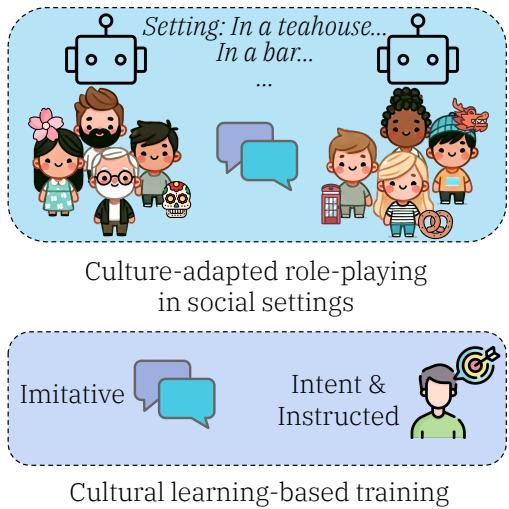
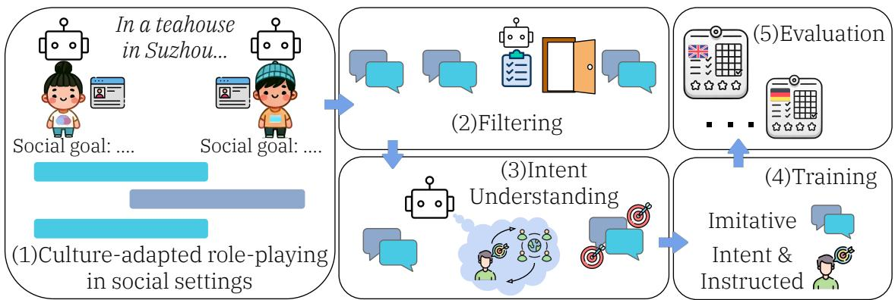
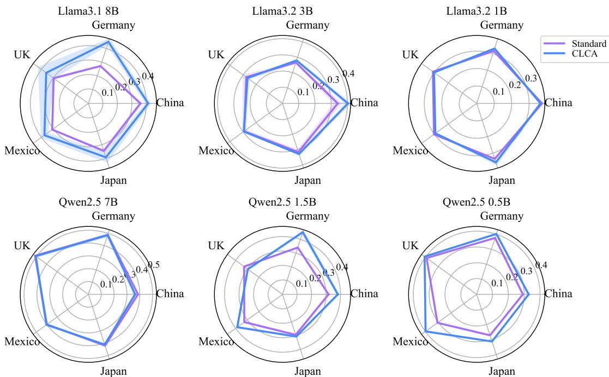
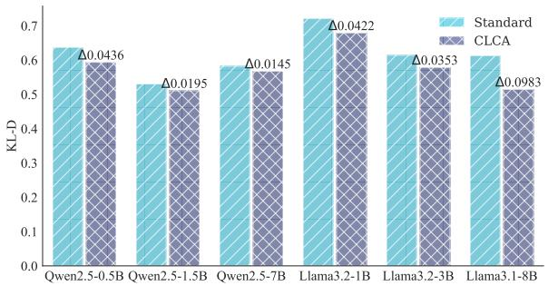
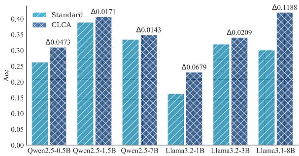
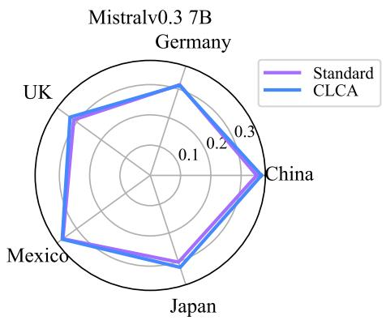
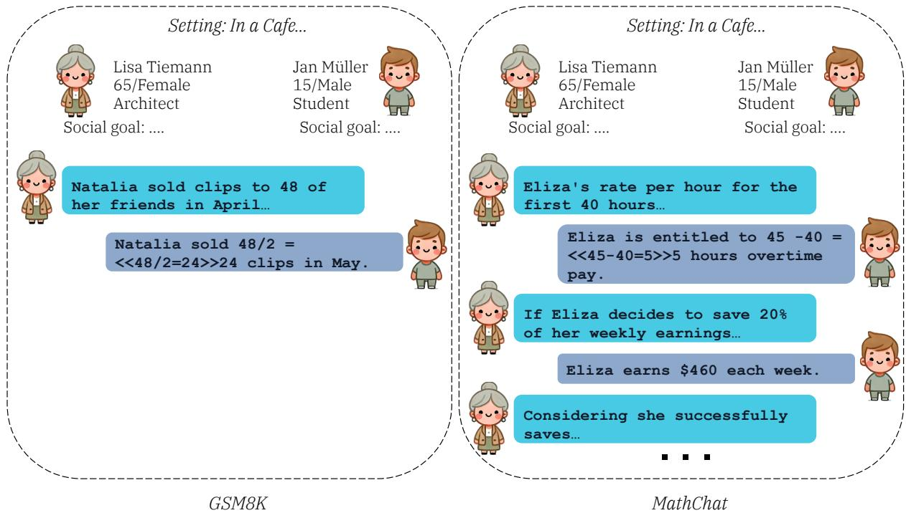

# Cultural Learning-Based Culture Adaptation of Language Models

Chen Cecilia Liu1 and Anna Korhonen2 and Iryna Gurevych1

1 Ubiquitous Knowledge Processing Lab, Department of Computer Science and Hessian Center for AI (hessian.AI), Technical University of Darmstadt 2 Language Technology Lab, University of Cambridge www.ukp.tu-darmstadt.de

## Abstract

Adapting large language models (LLMs) to diverse cultural values is a challenging task, as existing LLMs often reflect the values of specific groups by default, and potentially cause harm to others. In this paper, we present CLCA, a novel framework for enhancing LLM align ment with cultural values based on cultural learning. The framework leverages simulated social interactions to generate conversations in which LLMs engage in role-playing within culturally adapted social scenarios, capturing implicit cultural norms for model fine-tuning. CLCA improves cultural value alignment across various model architectures measured using World Value Survey data, demonstrating the effectiveness of our proposed approach. Our results provide early evidence that understanding intent and social interactions can enhance cultural value adaptation in LLMs, highlighting the promise of training approaches based on cultural learning. 1

## 1 Introduction

Culture has become an increasingly important topic in natural language processing (NLP), particularly following the wide adoption of Large Language Models (LLMs) (Hershcovich et al., 2022; Adilazuarda et al., 2024; Liu et al., 2024b). Despite their success, deploying LLMs in real-world applications requires these models to be culturally competent and adapt to different values and perspectives. However, current LLMs lack such competency across a diverse range of tasks (Cao et al., 2023; Liu et al., 2024a; Khanuja et al., 2024, inter alia), and aligning primarily with WEIRD (Western, Educated, Industrialized, Rich, and Democratic, Henrich et al. 2010) values by default, limiting their global applicability.

Existing methods for adapting language models to diverse cultural values often rely on prompt engineering (Tao et al., 2024; AlKhamissi et al., 2024).

  
Figure 1: We use culture-adapted role-playing to generate synthetic social interaction conversations. Then, the proposed cultural learning-based framework jointly trains on conversations, intents and their relevance to culture, to improve cultural value alignment.

These approaches use demographic information and anthropological reasoning to modify how models respond to human survey questions during inference. However, prompting relies on LLMs already embedding sufficient cultural values during pre-training. Choenni et al. (2024) investigate the impact on diverse cultural value shifts through additional generic pre-training corpora. The study reveals that while training on such data may embed additional cultural signals into models, it often falls short in achieving controlled adaptation to specific cultures. These findings emphasize the need for further research to enhance the cultural value alignment of LLMs.

Recent studies (Bhoopchand et al., 2023; Duéñez-Guzmán et al., 2023) show the importance of cultural learning in training intelligent systems. Cultural2 learning (Tomasello et al., 1993;

Tomasello, 2016, 2019; Henrich, 2016; Heyes, 2017) enables humans to acquire knowledge and behaviours through social interactions and observation within a shared cultural context,3 facilitating cultural transmission and cultural evolution in humans across generations.

Key aspects of cultural learning highlight that culture is acquired through mechanisms such as imitation and instruction, along with the ability for intent understanding (or “mind-reading”, Premack and Woodruff 1978), and enables individuals to internalize behaviours and values from their communities through social interactions. While prior research in NLP has explored the sociality and social interactions of LLMs (Park et al., 2022; Liu et al., 2024c; Sharma et al., 2024; Louie et al., 2024; Chen et al., 2024; Du et al., 2024, inter alia) — including areas such as decision-making and human-AI collaboration — there has been limited attention given to leveraging concepts in cultural learning (§3) for behaviour-driven cultural value adaptation. Inspired by this human-centric view, we propose a Cultural Learning-based framework for Culture Adaptation (CLCA, Figure 14), adapting LLMs to different cultural values by leveraging simulated social interactions. By incorporating elements of imitative learning, instructed learning, and intent understanding, CLCA improves cultural value alignment across multiple LLMs.

Contributions. To summarize: 1) We propose CLCA for cultural value adaptation by leveraging synthetic conversations generated through simulation (i.e., role-playing) of LLMs in generated social situations. 2) We show that simulated social conversations effectively improve LLMs’ response alignment with survey questions across different cultures and various models. 3) Through extensive ablation studies, we demonstrate that social interaction data and intent understanding are essential for adapting models through cultural learning.

## 2 Related Work

Adapting LLMs to Cultural Values. Recent studies show the effectiveness of role-playing prompts in improving cultural value alignment in LLMs. For instance, Tao et al. (2024) demonstrate that prompting LLMs to role-play as (generic) individuals from specific cultures effectively improves their cultural value alignment. While lightweight, this relies on the assumption that a model has already acquired sufficient cultural values. Similarly, AlKhamissi et al. (2024) introduce anthropological reasoning prompting with fine-grained demographic information and improved alignment with Arabic cultural values, as assessed using World Values Survey (WVS) data. These findings suggest that role-playing influences the evaluation of cultural values, allowing targeted adaptation of models during evaluations. Alternatively, studies such as Li et al. (2024a,b) focus on leveraging explicit value data to adapt downstream tasks, either through direct tuning or synthetic data based on value surveys. This approach leads to explicit, value-driven behavioural changes, which differ from ours (i.e., behaviour-driven value changes).

Close to ours, Choenni et al. (2024) examine the impact of fine-tuning with different pre-training corpora (Christodoulopoulos and Steedman, 2015; Goyal et al., 2022) on cultural value shifts. Their results suggest that the semantic content (e.g., news, Bible) alone of the fine-tuning data does not effectively induce controlled value alignment across various cultures. Our work focuses on utilizing simulated social interactions, inspired by cultural learning theories from evolutionary anthropology and psychology.

Synthetic Data Generation & Simulations in Social Settings. Generating synthetic data with LLMs is a promising way to enhance various model capabilities (Kim et al., 2022; Yue et al., 2023; Lu et al., 2024). LLMs can effectively role-play characters (Park et al., 2022; Argyle et al., 2023), for both domain-general and domain-specific applications (Du et al., 2024; Zhang et al., 2024; Shaikh et al., 2024; Louie et al., 2024, inter alia). While roleplaybased synthetic data improves LLM performance in social contexts (Zhou et al., 2024b; Wang et al., 2024; Tamoyan et al., 2024), prior work does not address adaptation to different cultural values or specifically examine cultural learning.

## 3 Cultural Learning

Cultural learning is a general concept from anthropology and psychology (Tomasello et al., 1993; Tomasello, 2016, 2019; Henrich and McElreath, 2003; Henrich, 2016; Heyes, 2017, 2018, inter alia) that refers to the process by which individuals acquire behaviours, knowledge, and other aspects of “culture” from their social environment. It is critical in shaping human social values and enabling the transmission of culture across generations.

  
Figure 2: (1) The framework first automatically generates conversations through culture-adapted role-playing in social settings. (2) These conversations are then filtered using GPT models to ensure quality and relevance. (3) The filtered data is labelled with free-text intents. (4) Both the conversation and intent data are integrated into a cultural learning-based training process (CLCA). (5) The resulting models are evaluated using the World Values Survey.

There are three primary forms of cultural learning (Tomasello et al., 1993): 1. imitative learning, 2. instructed learning and 3. collaborative learning. This work focuses on imitative and instructed learning, as they represent the foundational forms through which individuals first acquire culture (i.e., transmission of culture).5 We provide a brief description of each form below.

Imitative Learning. This involves observing and replicating the actions of others (often adults or experts). In robotics and reinforcement learning, it is implemented through methods such as imitation learning (Osa et al., 2018), behaviour cloning (Torabi et al., 2018), or supervised fine-tuning like in NLP. Imitative learning is key to skill acquisition, particularly in childhood, as individuals learn by mimicking behaviours without necessarily understanding the underlying intent.

Instructed Learning. In this form, the cultural knowledge or practices are explicitly conveyed or demonstrated. Instructed learning allows learners to acquire essential cultural practices within a limited timeframe.

One important factor in cultural learning is the ability to understand the intentions of others during interactions. In imitative learning, understanding intention can help differentiate between actions that are essential to a task and those that are incidental. Similarly, in instructed learning, understanding the intent behind instructions enhances the learner’s ability to generalize and apply knowledge in various contexts.

## 4 Method

Our overall adaptation framework is in Figure 2.

## 4.1 Social Data Generation

Culture-Adapted Social Scenarios. We use the setup of text descriptions of social scenarios, character profiles and corresponding social goals following the setup in Sotopia (Zhou et al., 2024b; Wang et al., 2024). To make them appropriate for culture-based interactions, we perform automatic culture adaptations of social settings in Wang et al. (2024) using a GPT-4 model (prompts in Appendix F), as well as generating new scenarios based on social and cultural norms from Social Chemistry (Forbes et al., 2020) and Culture Atlas.6 Each social task contains a setting, two participant profiles (including name, age, gender and occupation), and their respective private social goals for the interaction. After the adaptation, participant names are localized (e.g., from Anthony to Henrik or Kenji) and settings are adapted (e.g., from Alps to Yunnan, or from a bar in London to a teahouse in Suzhou). Interaction Data Generation. Following Zhou et al. (2024a,b), two LLMs are role-playing the participants (in “agent mode”). During the interaction, the shared information is the setting (e.g., “a mentor and mentee team up discussing a research project” ), and participants’ basic information (e.g., “Jie Li”, “45 / female”, “a senior researcher”). The social goals and secrets are only visible to each

LLM (e.g., “ensure that the project reflects university’s priority and interests”). The data generation process is guided by incorporating cultural context from Hofstede’s cultural dimensions (G. Hofstede and Minkov, 2010) and Inglehart-Welzel cultural map (Inglehart and Welzel, 2005) into the system prompt (see Appendix E).

Unlike the prior work (Zhou et al., 2024b; Wang et al., 2024), the completion rate of these goals in interaction is not relevant to our study. Instead, we focus on the implicit social and cultural values during interactions and use them for cultural value adaptation (an example conversation in Table 7).

Filtering. To ensure the data quality, we filter the generated synthetic data by using LLM-as-a-Judge (Zheng et al., 2023; Cui et al., 2024; Kim et al., 2024). We create a two-step rubric-based approach with a model verbalizing its confidence based on prior research (Lin et al., 2022; Tanneru et al., 2024; Dong et al., 2024; Xiong et al., 2024, inter alia).

We evaluate an entire conversation based on two aspects with confidence: 1. general generation quality, and 2. cultural adherentness. Based on these evaluations, we ask the model to make a metaevaluation critique on the quality of evaluation and output its confidence (prompts in Appendix F).

We generate data twice for each social scenario and apply the filtering process. Data labelled with high-confidence bad “meta-evaluation” or “general generation quality” are discarded. Table 9 presents the resulting data statistics. In this work, we use LLM-as-a-Judge as a proxy for data quality, and we provide a qualitative analysis in Appendix D.

Intent Generation. After generating the conversations, the model identifies the free-text intent of each conversational turn based on the history and evaluates its relevance to social and cultural expectations.7 Two example intents are in Table 1 (prompt in Table 22 and a detailed example in Table 7). An intent may be generic (e.g., greeting or signalling the end of the conversation) or reflect culturally specific expectations. When the intent is annotated with culture-specific expectations, we take this form as “instruction” (as in instructed learning, introduced in §3), as it conveys the expected behaviour in a particular culture.

<table><tr><td>Example Intents</td></tr><tr><td>Generic: To verify the recipient&#x27;s identity and re- turn the misdelivered package to its rightful owner.</td></tr><tr><td>Cultural: To politely and professionally express</td></tr><tr><td>interest in Wang Lei&#x27;s project while maintaining a</td></tr><tr><td>humble and respectful demeanour, as is expected</td></tr><tr><td>in Chinese culture when interacting with someone of higher social status or age.</td></tr></table>

Table 1: Generated intent examples.

## 4.2 Cultural learning-Based Culture Adaptation (CLCA)

To enhance the cultural value alignment of LLM, we use a multi-task training approach leveraging the generated data. The training process consists of two tasks: 1. multi-turn conversation, and 2. intent understanding, with respect to cultural and social expectations.

Multi-Turn Converstaion Training. This task mirrors imitative learning in cultural learning, designed to improve the model’s ability to handle contextually rich conversations in social settings. During training, each conversation is used twice (once from each participant’s perspective), so the model learns appropriate responses by switching perspectives.

Intent Understanding. This task focuses on generating the underlying intention of the conversation turn while learning its relevance to social and cultural expectations. This mirrors the instructed learning and intent understanding in cultural learning. During training, the model is provided with contextual information about the social setting and the conversation but does not receive explicit prompts to role-play. This training helps the model handle culturally sensitive scenarios.

By combining these two tasks, our approach is equipped with two basic forms of cultural learning.

## 5 Experimental Setup

## 5.1 World Values Survey (WVS) and Evaluation

Following the evaluation setup in AlKhamissi et al. (2024) for measuring cultural values in LLM, we conducted an evaluation using the WVS (Haerpfer et al., 2022). The WVS is a survey for public opinions (i.e., cultural values) on a wide range of topics such as economic developments, and religious beliefs across various countries (i.e., geo-political cultures). It is widely used in sociological research to assess cultural shifts and became popular recently in NLP for cultural value evaluations (Arora et al., 2023; AlKhamissi et al., 2024; Choenni et al., 2024). The WVS uses a representative sample of each country’s general population across various demographics. It contains questions spanning 13 categories, such as Social Capital, Trust & Organizational Membership or Security (Table 8 for a complete list).

In this work, we used the 7th version of the survey (conducted from 2017 - 2020) for five different (geo-political) cultures: the United Kingdom (UK), China, Germany, Mexico, and Japan. We use all questions from the Social Values, Norms, Stereotypes category (44 questions per culture), based on an implementation in WorldValueBench (Zhao et al., 2024). This category is the most relevant as it closely aligns with our data generation process, which is grounded in social and cultural norms.

To simulate the model’s response as a member of a specific cultural group, we utilize the demographic information of survey respondents in WVS, similar to AlKhamissi et al. (2024). In this context, we refer to these profiles as personas to distinguish them from the character profiles used in our data generation process. These personas are then integrated into the model as the system prompts during evaluation. The information included in the personas is in Table 20. The questions from the survey are provided to the model as the user prompt, and the template is in Table 21. We sample 1000 personas per culture randomly without replacement (a total of 220k questions evaluated per model for all cultures) for evaluation. The survey, originally in English, is further translated for multilingual evaluation (§6.4) using the GPT-4 model.

## 5.2 Models

We evaluate the adaptation of the following open source state-of-the-art LLMs: Llama (Touvron et al., 2023; Dubey et al., 2024) - 3.2 1B/3B, 3.1 8B; Mistral (Jiang et al., 2023) - v0.3 7B; Qwen (Yang et al., 2024) - 2.5 0.5B/1.5B/7B. Here, the Llama and Qwen models are multilingual. We experiment with all instruction-tuned models, due to their performant instruction-following and conversation abilities, as well as their closeness to the realistic usage scenarios (base models are unlikely to be used outside of academic research).

## 5.3 Methods

Persona. Zero-shot evaluation baseline using the personas described in Table 20. There is no suffix for this variant in the results tables, and we also refer to this as the Standard evaluation in all figures.

Cultural. Cultural prompting (Tao et al., 2024, suffix: cultural) uses culture-specific prompts but excludes any demographics (i.e., same prompt per culture), serving as another baseline.

We do not compare with existing training-based methods (e.g., Li et al. 2024a) due to differences in goals, as discussed in §2. Further, their training data serves as evaluation data in our setting.

CLCA. In this work, we aim to enhance the cultural value alignment of smaller models by leveraging the Llama3.1 70B model as the source for conversation generation. Llama3.1 70B is selected for its role-playing capabilities and its suitability for the investigation of cultural learning-based adaptation, where smaller, weaker models learn and adapt by observing “expert” behaviour demonstrated by larger models. We use a GPT-4 model (Ouyang et al., 2022) as the judge for data filtering. We use LoRA (Hu et al., 2022) adapters for adaptations (hyperparameters in Appendix B). The evaluation uses the same persona prompts described in §5.1.

## 5.4 Metrics

We measure cultural value alignment using two metrics: one at the culture level and one at the individual level (i.e., simulated persona level). While the primary goal of our work is to achieve adaptation at the culture level (i.e., over distributions of answers for a culture), it is also crucial to assess individual-level alignment to avoid issues like improving culture-level alignment while individuals hold swapped answers.

Kullback-Leibler Divergence. To evaluate the similarity between the predicted answer distributions and the ground truth from the survey, we report the culture-level Kullback-Leibler Divergence (KL-D) 8 as follows:

$$
D _ { \mathrm { K L } } ( P ; Q ) = \frac { 1 } { M } \sum _ { i = 1 } ^ { M } \sum _ { k = 1 } ^ { K ( i ) } P _ { i } ( k ) \log \frac { P _ { i } ( k ) } { Q _ { i } ( k ) } ,
$$

where $P _ { i } ( k )$ represents the probability of the k-th answer for question i, and $Q _ { i } ( k )$ represents the probability of the ground truth (i.e., from the survey) for the same question and answer. $K ( i )$ is the number of answers for question i. M is the number of questions used for evaluation (same per culture). We add a category for safeguarded answers when calculating the KL-D, which is a more stringent measure (i.e., assuming all the safeguarded answers are wrong). The best possible KL-D is 0 when two distributions are identical.

<table><tr><td></td><td>China</td><td>Germany</td><td>UK</td><td>Mexico</td><td>Japan</td><td> $\mathbf { A v g . \ K L - D \perp }$ </td></tr><tr><td>Llama3.1 8B</td><td>0.5958</td><td>0.6717</td><td>0.6268</td><td>0.5391</td><td>0.5721</td><td>0.6011</td></tr><tr><td>Llama3.1  $8 \mathbf { B } _ { \mathtt { c u l t u r a l } }$ </td><td>0.5881</td><td>0.6690</td><td>0.6431</td><td>0.5437</td><td>0.5660</td><td>0.6020</td></tr><tr><td>Llama3.1 8BCLCA</td><td>0.5462</td><td>0.4935</td><td>0.5510</td><td>0.4630</td><td>0.5024</td><td>0.5112 ∆0.0899</td></tr><tr><td>Llama3.2 3B</td><td>0.6174</td><td>0.6903</td><td>0.6631</td><td>0.5667</td><td>0.6221</td><td>0.6319</td></tr><tr><td>Llama3.2 3Bcultural</td><td>0.5996</td><td>0.6729</td><td>0.6375</td><td>0.5569</td><td>0.6042</td><td>0.6142</td></tr><tr><td>Llama3.2 3BCLcA</td><td>0.5337</td><td>0.6732</td><td>0.6695</td><td>0.5525</td><td>0.6100</td><td>0.6078 ∆0.0241</td></tr><tr><td>Llama3.2 1B</td><td>0.5936</td><td>0.6479</td><td>0.6384</td><td>0.5584</td><td>0.6024</td><td>0.6081</td></tr><tr><td>Llama3.2  $1 \mathrm { B _ { c u l t u r a l } }$ </td><td>0.5905</td><td>0.6840</td><td>0.6675</td><td>0.5209</td><td>0.6664</td><td>0.6259</td></tr><tr><td>Llama3.2 1BcLcA</td><td>0.5671</td><td>0.6208</td><td>0.6348</td><td>0.5683</td><td>0.5743</td><td>0.5931 ∆0.0150</td></tr><tr><td>Qwen2.5 7B</td><td>0.5692</td><td>0.4610</td><td>0.4221</td><td>0.4509</td><td>0.5053</td><td>0.4817</td></tr><tr><td>Qwen2.5  $7 \mathrm { B _ { c u l t u r a l } }$ </td><td>0.5984</td><td>0.5051</td><td>0.5355</td><td>0.4961</td><td>0.5467</td><td>0.5364</td></tr><tr><td>Qwen2.5 7BCLCA</td><td>0.5917</td><td>0.4605</td><td>0.4439</td><td>0.4390</td><td>0.5047</td><td>0.4880 △0.0063</td></tr><tr><td>Qwen2.5 1.5B</td><td>0.6315</td><td>0.6069</td><td>0.6040</td><td>0.5134</td><td>0.6225</td><td>0.5956</td></tr><tr><td> $\mathrm { Q w e n } 2 . 5 \ 1 . 5 \mathrm { B } _ { \mathrm { c u l t u r a l } }$ </td><td>0.6271</td><td>0.6406</td><td>0.6540</td><td>0.5476</td><td>0.6343</td><td>0.6207</td></tr><tr><td> $\mathrm { Q w e n } 2 . 5 \ 1 . 5 \mathrm { B } _ { \tt C L C A }$ </td><td>0.5614</td><td>0.4895</td><td>0.6414</td><td>0.4559</td><td>0.6129</td><td>0.5522 ∆0.0434</td></tr><tr><td>Qwen2.5 0.5B</td><td>0.6381</td><td>0.5589</td><td>0.5205</td><td>0.5192</td><td>0.6373</td><td>0.5748</td></tr><tr><td> $\mathrm { Q w e n } 2 . 5 0 . 5 \mathrm { B } _ { \mathrm { c u l t u r a l } }$ </td><td>0.5661</td><td>0.6382</td><td>0.6093</td><td>0.5305</td><td>0.5818</td><td>0.5852</td></tr><tr><td> $\mathrm { Q w e n } 2 . 5 0 . 5 \mathrm { B } _ { \tt C L C A }$ </td><td>0.6130</td><td>0.5173</td><td>0.5061</td><td>0.4428</td><td>0.5794</td><td>0.5317 ∆0.0431</td></tr><tr><td>Mistral-v0.3 7B</td><td>0.6216</td><td>0.6414</td><td>0.6249</td><td>0.5069</td><td>0.6458</td><td>0.6081</td></tr><tr><td>Mistral-v0.3  $7 \mathrm { B _ { c u l t u r a l } }$ </td><td>0.6155</td><td>0.6733</td><td>0.6553</td><td>0.5219</td><td>0.6475</td><td>0.6227</td></tr><tr><td>Mistral-v0.3  $7 \mathtt { B _ { C I C A } }$ </td><td>0.6171</td><td>0.6407</td><td>0.6178</td><td>0.5074</td><td>0.6341</td><td>0.6034 ∆0.0047</td></tr></table>

Table 2: The Kullback–Leibler Divergence (KL-D) between the distribution of predicted answers and the distribution of the ground truth answers from the WVS survey of various models on different cultures. All models are instructiontuned, the green arrow indicates the lower the KL-D the better, and the best average result is in bold. Delta is calculated with respect to the persona baseline (no suffix in the table) since they use the same evaluation prompts.

Individual-level Accuracy. It is defined as:

$$
\mathrm { A c c u r a c y } = \frac { 1 } { N } \sum _ { n = 1 } ^ { N } \left( \frac { 1 } { M } \sum _ { i = 1 } ^ { M } \mathbb { I } ( \hat { y } _ { n } ^ { i } , y _ { n } ^ { i } ) \right) ,
$$

where

$$
\mathbb { I } ( \hat { y } _ { n } ^ { i } , y _ { n } ^ { i } ) = \left\{ { 1 \atop 0 } \right. \mathrm { i f } \hat { y } _ { n } ^ { i } = y _ { n } ^ { i } ,
$$

$\hat { y } _ { n } ^ { i }$ is the model predicted answer, N is the total number of personas. The best possible value is 1.

## 6 Results and Discussion

## 6.1 Cultural Learning Aligns Models to Surveys

Table 2 shows the KL-D across different cultures and models. In general, the persona baseline (no suffix) tends to perform better than the cultural baseline. Our method, CLCA, consistently outperforms the persona baseline across various model sizes and types, with the exception of Qwen2.5 7B. Notably, the largest improvement is over Llama3.1 8B with a reduction of 0.0899 in KL-D. Further, we do not observe clear scaling trends in Qwen models. However, larger Llama models appear to be more adaptable.

While our goal is to improve culture-level alignment, it is important to verify if individual-level accuracy improves. Figure 3 shows the results across different models and cultures for the persona baseline (i.e., Standard) and CLCA. Similarly, the largest improvement is observed for the Llama3.1 8B model across all cultures.

## 6.2 Social Interaction Plays a Significant Role

A key question is whether social interaction data is important for the controlled improvement of culture alignment. To validate this, we perform two experiments with mathematical reasoning datasets that exhibit minimal cultural and social conventions in a typical social interaction setting. The first experiment utilizes the GSM8K dataset (Cobbe et al., 2021), which consists of single-question mathematical reasoning problems with corresponding answers. We reformulate this as a one-turn conversation where a user poses a question, and the model provides the answer (left panel in Figure 6). The second experiment employs the MathChat dataset (Liang et al., 2024), a multi-turn conversational dataset for mathematical reasoning. It begins with a single question and answer, followed by additional follow-up questions about the problem (right panel in Figure 6). This multi-turn nature mirrors our synthetically generated conversations. We train the Llama3.1 8B using the same format, system prompt, and personas as in previous experiments, but replace the simulated conversations with mathematical reasoning datasets.

  
Figure 3: The individual-level accuracy (the higher the better) of CLCA versus zero-shot results of the persona baseline (Standard, described in §5.3) against the ground truth answers from the survey for different cultures. Mistral results in Figure 5, and averages for all models in Table 5 in the Appendix. All models are instruction-tuned.

<table><tr><td>Model</td><td>Acc ↑</td><td>KL-D↓</td></tr><tr><td>Llama3.1 8B</td><td>0.3162</td><td>0.6011</td></tr><tr><td>Llama3.1 8BCLCA</td><td>0.3973</td><td>0.5112</td></tr><tr><td>Llama3.1  $8 \mathbf { B _ { \mathtt { G S M } 8 \mathrm { K } } }$ </td><td>0.3287</td><td>0.5902</td></tr><tr><td>Llama3.1  $8 { \bf B } _ { \mathrm { M a t h C h a t } }$ </td><td>0.3260</td><td>0.5818</td></tr></table>

Table 3: Comparison of Llama3.1 8B model trained with reasoning-only datasets versus training with social conversations. All models are instruction-tuned, the direction of the arrows indicates if the values should be maximized or minimized.

Table 3 shows that training exclusively on mathematical reasoning datasets improves the results by a small margin. This is expected, as any update in model weights affects the model’s predictions. However, compared to social interaction data, this adjustment has a minimal effect on aligning the model’s evaluation with WVS data. We conducted two additional experiments using cultural knowledge data presented in a conversational format (Appendix A, Table 12) to better isolate the effect of social interactions. These experiments confirmed our original conclusion.

## 6.3 Intent Understanding is Important in CLCA

Our main results in Table 2 and experiments in the previous subsections show that training on social data is important and effective for culture adaptation. Here, we further analyze the significance of intent understanding in this adaptation process. We perform experiments with 1) training on the conversation data only (i.e., dialogue\_only); and 2) training with intent understanding with respect to social and cultural norms (i.e., intent\_only). The results are in Table 4.

We observe that training on the conversation data alone improves individual-level accuracy by 2.91% points and improves KL-D by 0.0307. While it is interesting to see that training with intent alone has nearly no effect on the results, it can further improve the individual-level accuracy by 5.2% points from conversation training. Similar compounding effects are also observed for Qwen models in Table 6 (in Appendix). This confirms that the combination of two cultural learning strategies (i.e., imitative, instructed and intent) is more effective.

  
(a) Kullback-Leibler Divergence (KL-D, lower is better) between the model prediction and WVS data.

  
(b) Individual-level accuracy (higher is better) between the model prediction and WVS data.  
Figure 4: Average performance of models (Standard is the zero-shot evaluation of the persona baseline described in §5.3., CLCA is the adaptation in English) responding to survey questions in the native language of the culture. Results are averaged over all languages.

<table><tr><td>Model</td><td>Acc ↑</td><td>KL-D↓</td></tr><tr><td>Llama3.1 8B</td><td>0.3162</td><td>0.6011</td></tr><tr><td>Llama3.1 8B CLCA</td><td>0.3973</td><td>0.5112</td></tr><tr><td>Llama3.1 8B CLCA intent_only</td><td>0.3117</td><td>0.6037</td></tr><tr><td>Llama3.1 8B CLCA dialogue_only</td><td>0.3453</td><td>0.5704</td></tr></table>

Table 4: Ablation study of the Llama3.1 8B model: training on conversation only, intent understanding only, versus both objectives combined (i.e., CLCA). The best results are bolded, and the direction of the arrows indicates if the metrics should be maximized or minimized.

## 6.4 Zero-shot Value Transfer to Other Languages

So far, we have used English data to improve the cultural value alignment of LLMs, with evaluations conducted in English. Next, we evaluate the Llama 3.1 8B model (selected for its significant improvements after adaptation and exceptional task performance) using translated WVS questions in the respective languages of the target cultures. British culture is excluded as its primary language, English, requires no translation. Survey questions and prompt templates are translated using GPT-4.

Figure 4 presents the results for the six multilingual models, averaged across languages. Overall, the models show consistent improvements in both culture-level KL-D and individual-level accuracy. Notably, the Llama models exhibit greater improvements compared to the Qwen models, although they are initially less aligned with respected cultural values. It is also interesting to observe that while Qwen2.5 7B shows no improvement in English evaluations (Table 2), it demonstrates improved performance in multilingual evaluations, with a 1.43% increase in individual-level accuracy and a reduction of 0.0145 in KL-D.

## 6.5 Data Generation Model

Another key question is whether the adaptation works only with the Llama3.1 70B model as a teacher. To assess the generalizability of our findings, we use the same pipeline to collect simulated data from the Qwen2.5 32B model. This data was then used to train the Llama3.1 8B model, resulting in an average KL-D of 0.5617 and an accuracy of 0.3487. Although these results outperform the baselines, they fall short of those achieved using data generated by the Llama3.1 70B model. The discrepancy stems from two factors: a smaller training dataset after filtering and the quality of the generated content, including issues like code-mixing in conversations. While the teacher model’s capability and the quality of generated data influence adaptation results, the improvements highlight cultural learning as an effective adaptation strategy.9

## 7 Conclusion

In this work, we investigate the effectiveness of cultural learning-based training for cultural value adaptation in LLMs. We propose a novel framework, CLCA, that leverages culturally adapted social scenarios, social interactions, intents and their relation to social and cultural norms.

We validate the effectiveness of CLCA, showcasing how LLMs can be adapted to align with various cultural values across different model architectures and sizes. It provides early evidence that social interaction data can help align cultural values. Our analysis reveals the importance of intent understanding and a complementary relationship between the two cultural learning strategies. Our findings highlight cultural learning as a promising direction for adaptation, paving the way toward building more inclusive and culturally aware NLP.

## Limitations

There are several limitations to our work:

Bias in synthetic data generation and LLMas-a-Judge. In our experiments, we use LLMs to role-play individuals from different cultures. While training on this synthetic data improves alignment with human survey responses on cultural values, the data could reflect biases, stereotypes, or unrealistic interactions and caricatures associated with cultural groups (Cheng et al., 2023; Wang et al., 2025) due to their synthetic nature. While beyond our scope, we provide qualitative studies into the data which highlight the need for further research into this area (Appendix D).

Additionally, our data collection is conducted in English rather than multilingually. Collecting multilingual data would require the model to demonstrate greater fluency and authenticity in generating conversations in different social settings. This ability is often overlooked in current LLM evaluations and culturally aware NLP (Liu et al., 2024b), which primarily focuses on multiple-choice questions or reasoning tasks. Addressing this gap is a goal for future work but lies beyond the scope of this paper.

Finally, we employ the LLM-as-a-Judge for data filtering, which has become a common practice (Ouyang et al., 2022; Zheng et al., 2023; Dang et al., 2024; Kim et al., 2024, inter alia) in NLP. Although model-based judgments correlate with human evaluations, they still exhibit discrepancies, indicating potential biases that require further investigation, especially in diverse cultural contexts.

Real social interaction conversations. While our proposed cultural learning-based framework has demonstrated effectiveness, its robustness in real-world scenarios remains uncertain. In this paper, we demonstrate that a hypothetical culture expert model (e.g., Llama3.1 70B, the data generation model), can improve weaker models aligning to cultural values. Since individuals from the target culture are the ultimate cultural experts, incorporating real human interactions into cultural learningbased training presents an exciting opportunity for improvement. However, their effectiveness remains unknown and requires further investigation.

Low-resource cultures. Our paper takes an exciting first step toward exploring whether a theorybased approach, cultural learning, can be effectively used for cultural value adaptation. We focused on more widely available cultures to validate our idea and leave the important question of lowresource cultures for future work. In this study, we selected a diverse range of cultures based on the availability of sufficient responses from the WVS, which we believe provides adequate validation for our proposed learning method. To address challenges related to low-resource cultures with cultural learning-based methods, a potential direction is to collect more real human data.

Survey evaluation as a proxy. In this study, we evaluate the adaptation results using WVS data. While WVS data serves as a proxy (Adilazuarda et al., 2024) for human values, it has limitations, such as survey sample size and potential gaps between survey responses and actual values. In future work, we aim to incorporate a broader range of proxies and downstream tasks to enable a more comprehensive evaluation.

## Ethics Statement

In this work, we aim to investigate the effectiveness of cultural learning-based training strategies for adapting LLMs to different cultural values. Our primary goal is not to treat models as potential human subjects or anthropomorphize LLMs. We strive to address technical challenges responsibly, and we encourage users of our findings to adhere to ethical and moral guidelines.

Through this research, we demonstrate the potential of a human-inspired methodology to improve LLMs for different cultures. We seek to inspire interdisciplinary collaborations to ethically design technology that meets human needs, advancing NLP that promotes respect for cultural variations globally.

## Acknowledgements

This work has been funded by the LOEWE Distinguished Chair “Ubiquitous Knowledge Processing”, LOEWE initiative, Hesse, Germany (Grant Number: LOEWE/4a//519/05/00.002(0002)/81). This work has also been supported by the UK Research and Innovation (UKRI) Frontier Research Grant EP/Y031350/1 EQUATE (the UK government’s funding guarantee for ERC Advanced Grants) awarded to Anna Korhonen at the University of Cambridge.

We thank Thy Thy Tran, Sheng Lu, and Fengyu Cai for their feedback on a draft of this work.

## References

Muhammad Adilazuarda, Sagnik Mukherjee, Pradhyumna Lavania, Siddhant Singh, Alham Aji, Jacki O’Neill, Ashutosh Modi, and Monojit Choudhury. 2024. Towards measuring and modeling “culture” in LLMs: A survey. In Proceedings ofthe 2024 Conference on Empirical Methods in Natural Language Processing, pages 15763–15784, Miami, Florida, USA. Association for Computational Linguistics.

Badr AlKhamissi, Muhammad ElNokrashy, Mai Alkhamissi, and Mona Diab. 2024. Investigating cultural alignment of large language models. In Proceedings of the 62nd Annual Meeting of the Association for Computational Linguistics (Volume 1: Long Papers), pages 12404–12422, Bangkok, Thailand. Association for Computational Linguistics.

Lisa P. Argyle, Ethan C. Busby, Nancy Fulda, Joshua R. Gubler, Christopher Rytting, and David Wingate. 2023. Out of one, many: Using language models to simulate human samples. Political Analysis, 31(3):337–351.

Arnav Arora, Lucie-aimée Kaffee, and Isabelle Augenstein. 2023. Probing pre-trained language models for cross-cultural differences in values. In Proceedings of the First Workshop on Cross-Cultural Considerations in NLP (C3NLP), pages 114–130, Dubrovnik, Croatia. Association for Computational Linguistics.

Avishkar Bhoopchand, Bethanie Brownfield, Adrian Collister, Agustin Dal Lago, Ashley Edwards, Richard Everett, Alexandre Frechette, Yanko Gitahy Oliveira, Edward Hughes, Kory Wallace Mathewson, Piermaria Mendolicchio, Julia Pawar, Miruna Pislar, Alex Platonov, Evan Senter, Sukhdeep Singh, Alexander Zacherl, and Lei M Zhang. 2023. Learning few-shot imitation as cultural transmission. Nature Communications, 14(1):7536.

Yong Cao, Li Zhou, Seolhwa Lee, Laura Cabello, Min Chen, and Daniel Hershcovich. 2023. Assessing cross-cultural alignment between ChatGPT and human societies: An empirical study. In Proceedings of

the First Workshop on Cross-Cultural Considerations in NLP (C3NLP), pages 53–67, Dubrovnik, Croatia. Association for Computational Linguistics.

Hongzhan Chen, Hehong Chen, Ming Yan, Wenshen Xu, Gao Xing, Weizhou Shen, Xiaojun Quan, Chenliang Li, Ji Zhang, and Fei Huang. 2024. Social-Bench: Sociality evaluation of role-playing conversational agents. In Findings ofthe Associationfor Computational Linguistics: ACL 2024, pages 2108–2126, Bangkok, Thailand. Association for Computational Linguistics.

Myra Cheng, Tiziano Piccardi, and Diyi Yang. 2023. CoMPosT: Characterizing and evaluating caricature in LLM simulations. In Proceedings of the 2023 Conference on Empirical Methods in Natural Language Processing, pages 10853–10875, Singapore. Association for Computational Linguistics.

Rochelle Choenni, Anne Lauscher, and Ekaterina Shutova. 2024. The echoes of multilinguality: Tracing cultural value shifts during language model finetuning. In Proceedings ofthe 62nd Annual Meeting of the Association for Computational Linguistics (Volume 1: Long Papers), pages 15042–15058, Bangkok, Thailand. Association for Computational Linguistics.

Christos Christodoulopoulos and Mark Steedman. 2015. A massively parallel corpus: the bible in 100 languages. Lang. Resour. Evaluation, 49(2):375–395.

Karl Cobbe, Vineet Kosaraju, Mohammad Bavarian, Mark Chen, Heewoo Jun, Lukasz Kaiser, Matthias Plappert, Jerry Tworek, Jacob Hilton, Reiichiro Nakano, Christopher Hesse, and John Schulman. 2021. Training verifiers to solve math word problems. ArXiv preprint, abs/2110.14168.

Ganqu Cui, Lifan Yuan, Ning Ding, Guanming Yao, Bingxiang He, Wei Zhu, Yuan Ni, Guotong Xie, Ruobing Xie, Yankai Lin, Zhiyuan Liu, and Maosong Sun. 2024. ULTRAFEEDBACK: boosting language models with scaled AI feedback. In Forty-first International Conference on Machine Learning, ICML 2024, Vienna, Austria, July 21-27, 2024. OpenReview.net.

John Dang, Arash Ahmadian, Kelly Marchisio, Julia Kreutzer, Ahmet Üstün, and Sara Hooker. 2024. RLHF can speak many languages: Unlocking multilingual preference optimization for LLMs. In Proceedings ofthe 2024 Conference on Empirical Methods in Natural Language Processing, pages 13134– 13156, Miami, Florida, USA. Association for Computational Linguistics.

Yijiang River Dong, Tiancheng Hu, and Nigel Collier. 2024. Can LLM be a personalized judge? In Findings of the Association for Computational Linguistics: EMNLP 2024, pages 10126–10141, Miami, Florida, USA. Association for Computational Linguistics.

Yilun Du, Shuang Li, Antonio Torralba, Joshua B. Tenenbaum, and Igor Mordatch. 2024. Improving

factuality and reasoning in language models through multiagent debate. In Forty-first International Conference on Machine Learning, ICML 2024, Vienna, Austria, July 21-27, 2024. OpenReview.net.

Abhimanyu Dubey, Abhinav Jauhri, Abhinav Pandey, Abhishek Kadian, Ahmad Al-Dahle, Aiesha Letman, Akhil Mathur, Alan Schelten, Amy Yang, Angela Fan, Anirudh Goyal, Anthony Hartshorn, Aobo Yang, Archi Mitra, Archie Sravankumar, Artem Korenev, Arthur Hinsvark, Arun Rao, Aston Zhang, Aurélien Rodriguez, Austen Gregerson, Ava Spataru, Baptiste Rozière, Bethany Biron, Binh Tang, Bobbie Chern, Charlotte Caucheteux, Chaya Nayak, Chloe Bi, Chris Marra, Chris McConnell, Christian Keller, Christophe Touret, Chunyang Wu, Corinne Wong, Cristian Canton Ferrer, Cyrus Nikolaidis, Damien Allonsius, Daniel Song, Danielle Pintz, Danny Livshits, David Esiobu, Dhruv Choudhary, Dhruv Mahajan, Diego Garcia-Olano, Diego Perino, Dieuwke Hupkes, Egor Lakomkin, Ehab AlBadawy, Elina Lobanova, Emily Dinan, Eric Michael Smith, Filip Radenovic, Frank Zhang, Gabriel Synnaeve, Gabrielle Lee, Georgia Lewis Anderson, Graeme Nail, Grégoire Mialon, Guan Pang, Guillem Cucurell, Hailey Nguyen, Hannah Korevaar, Hu Xu, Hugo Touvron, Iliyan Zarov, Imanol Arrieta Ibarra, Isabel M. Kloumann, Ishan Misra, Ivan Evtimov, Jade Copet, Jaewon Lee, Jan Geffert, Jana Vranes, Jason Park, Jay Mahadeokar, Jeet Shah, Jelmer van der Linde, Jennifer Billock, Jenny Hong, Jenya Lee, Jeremy Fu, Jianfeng Chi, Jianyu Huang, Jiawen Liu, Jie Wang, Jiecao Yu, Joanna Bitton, Joe Spisak, Jongsoo Park, Joseph Rocca, Joshua Johnstun, Joshua Saxe, Junteng Jia, Kalyan Vasuden Alwala, Kartikeya Upasani, Kate Plawiak, Ke Li, Kenneth Heafield, Kevin Stone, and et al. 2024. The Llama 3 herd of models. ArXiv preprint, abs/2407.21783.

Edgar A. Duéñez-Guzmán, Suzanne Sadedin, Jane X. Wang, Kevin R. McKee, and Joel Z. Leibo. 2023. A social path to human-like artificial intelligence. Nature Machine Intelligence, 5(11):1181–1188.

Esin Durmus, Karina Nyugen, Thomas I. Liao, Nicholas Schiefer, Amanda Askell, Anton Bakhtin, Carol Chen, Zac Hatfield-Dodds, Danny Hernandez, Nicholas Joseph, Liane Lovitt, Sam McCandlish, Orowa Sikder, Alex Tamkin, Janel Thamkul, Jared Kaplan, Jack Clark, and Deep Ganguli. 2024. Towards measuring the representation of subjective global opinions in language models. In First Conference on Language Modeling.

Maxwell Forbes, Jena D. Hwang, Vered Shwartz, Maarten Sap, and Yejin Choi. 2020. Social chemistry 101: Learning to reason about social and moral norms. In Proceedings of the 2020 Conference on Empirical Methods in Natural Language Processing (EMNLP), pages 653–670, Online. Association for Computational Linguistics.

G.J. Hofstede G. Hofstede and Michael Minkov. 2010. Cultures and Organizations: Software of the Mind. Third Millennium Edition. McGraw-Hill.

Naman Goyal, Cynthia Gao, Vishrav Chaudhary, Peng-Jen Chen, Guillaume Wenzek, Da Ju, Sanjana Krishnan, Marc’Aurelio Ranzato, Francisco Guzmán, and Angela Fan. 2022. The Flores-101 evaluation benchmark for low-resource and multilingual machine translation. Transactions ofthe Associationfor Computational Linguistics, 10:522–538.

The Culture Factor Group. 2024. Country comparison tool. https://www.theculturefactor. com/country-comparison-tool; accessed 31-Dec-2024.

Christian Haerpfer, Ronald Inglehart, Alejandro Moreno, Christian Welzel, Kseniya Kizilova, Jaime Diez-Medrano, Marta Lagos, Pippa Norris, Eduard Ponarin, Bjorn Puranen, et al. 2022. World values survey: Round seven-country-pooled datafile version 5.0. Madrid, Spain & Vienna, Austria: JD Systems Institute & WVSA Secretariat, 12(10):8.

Joseph Henrich. 2016. The secret ofour success: How culture is driving human evolution, domesticating our species, and making us smarter. Princeton University Press.

Joseph Henrich, Steven J Heine, and Ara Norenzayan. 2010. The weirdest people in the world? Behavioral and brain sciences, 33(2-3):61–83.

Joseph Henrich and Richard McElreath. 2003. The evolution of cultural evolution. Evolutionary Anthropology: Issues, News, and Reviews: Issues, News, and Reviews, 12(3):123–135.

Daniel Hershcovich, Stella Frank, Heather Lent, Miryam de Lhoneux, Mostafa Abdou, Stephanie Brandl, Emanuele Bugliarello, Laura Cabello Piqueras, Ilias Chalkidis, Ruixiang Cui, Constanza Fierro, Katerina Margatina, Phillip Rust, and Anders Søgaard. 2022. Challenges and strategies in crosscultural NLP. In Proceedings of the 60th Annual Meeting of the Association for Computational Linguistics (Volume 1: Long Papers), pages 6997–7013, Dublin, Ireland. Association for Computational Linguistics.

Cecilia Heyes. 2017. When does social learning become cultural learning? Developmental Science, 20(2):e12350.

Cecilia Heyes. 2018. Cognitive gadgets: The cultural evolution ofthinking. Harvard University Press.

G Hofstede and GJ Hofsted. 2022. [link].

Edward J. Hu, Yelong Shen, Phillip Wallis, Zeyuan Allen-Zhu, Yuanzhi Li, Shean Wang, Lu Wang, and Weizhu Chen. 2022. Lora: Low-rank adaptation of large language models. In The Tenth International Conference on Learning Representations, ICLR 2022, Virtual Event, April 25-29, 2022. OpenReview.net.

Ronald Inglehart and Christian Welzel. 2005. Modernization, Cultural Change, and Democracy The Human Development Sequence. Cambridge: Cambridge university press.

Albert Q. Jiang, Alexandre Sablayrolles, Arthur Mensch, Chris Bamford, Devendra Singh Chaplot, Diego de Las Casas, Florian Bressand, Gianna Lengyel, Guillaume Lample, Lucile Saulnier, Lélio Renard Lavaud, Marie-Anne Lachaux, Pierre Stock, Teven Le Scao, Thibaut Lavril, Thomas Wang, Timothée Lacroix, and William El Sayed. 2023. Mistral 7b. ArXiv preprint, abs/2310.06825.

Simran Khanuja, Sathyanarayanan Ramamoorthy, Yueqi Song, and Graham Neubig. 2024. An image speaks a thousand words, but can everyone listen? on image transcreation for cultural relevance. In Proceedings of the 2024 Conference on Empirical Methods in Natural Language Processing, pages 10258–10279, Miami, Florida, USA. Association for Computational Linguistics.

Hyunwoo Kim, Youngjae Yu, Liwei Jiang, Ximing Lu, Daniel Khashabi, Gunhee Kim, Yejin Choi, and Maarten Sap. 2022. ProsocialDialog: A prosocial backbone for conversational agents. In Proceedings ofthe 2022 Conference on Empirical Methods in Natural Language Processing, pages 4005–4029, Abu Dhabi, United Arab Emirates. Association for Computational Linguistics.

Seungone Kim, Jamin Shin, Yejin Choi, Joel Jang, Shayne Longpre, Hwaran Lee, Sangdoo Yun, Seongjin Shin, Sungdong Kim, James Thorne, and Minjoon Seo. 2024. Prometheus: Inducing finegrained evaluation capability in language models. In The Twelfth International Conference on Learning Representations, ICLR 2024, Vienna, Austria, May 7-11, 2024. OpenReview.net.

Cheng Li, Mengzhuo Chen, Jindong Wang, Sunayana Sitaram, and Xing Xie. 2024a. Culturellm: Incorporating cultural differences into large language models. In Advances in Neural Information Processing Systems 38: Annual Conference on Neural Information Processing Systems 2024, NeurIPS 2024, Vancouver, BC, Canada, December 10 - 15, 2024.

Cheng Li, Damien Teney, Linyi Yang, Qingsong Wen, Xing Xie, and Jindong Wang. 2024b. Culturepark: Boosting cross-cultural understanding in large language models. In Advances in Neural Information Processing Systems 38: Annual Conference on Neural Information Processing Systems 2024, NeurIPS 2024, Vancouver, BC, Canada, December 10 - 15, 2024.

Zhenwen Liang, Dian Yu, Wenhao Yu, Wenlin Yao, Zhihan Zhang, Xiangliang Zhang, and Dong Yu. 2024. Mathchat: Benchmarking mathematical reasoning and instruction following in multi-turn interactions. ArXiv preprint, abs/2405.19444.

Stephanie Lin, Jacob Hilton, and Owain Evans. 2022. Teaching models to express their uncertainty in words. Transactions on Machine Learning Research, 2022.

Chen Liu, Fajri Koto, Timothy Baldwin, and Iryna Gurevych. 2024a. Are multilingual LLMs culturallydiverse reasoners? an investigation into multicultural proverbs and sayings. In Proceedings of the 2024 Conference of the North American Chapter of the Associationfor Computational Linguistics: Human Language Technologies (Volume 1: Long Papers), pages 2016–2039, Mexico City, Mexico. Association for Computational Linguistics.

Chen Cecilia Liu, Iryna Gurevych, and Anna Korhonen. 2024b. Culturally aware and adapted NLP: A taxonomy and a survey of the state of the art. ArXiv preprint, abs/2406.03930.

Ruibo Liu, Ruixin Yang, Chenyan Jia, Ge Zhang, Diyi Yang, and Soroush Vosoughi. 2024c. Training socially aligned language models on simulated social interactions. In The Twelfth International Conference on Learning Representations, ICLR 2024, Vienna, Austria, May 7-11, 2024. OpenReview.net.

Ryan Louie, Ananjan Nandi, William Fang, Cheng Chang, Emma Brunskill, and Diyi Yang. 2024. Roleplay-doh: Enabling domain-experts to create LLM-simulated patients via eliciting and adhering to principles. In Proceedings ofthe 2024 Conference on Empirical Methods in Natural Language Processing, pages 10570–10603, Miami, Florida, USA. Association for Computational Linguistics.

Zimu Lu, Aojun Zhou, Houxing Ren, Ke Wang, Weikang Shi, Junting Pan, Mingjie Zhan, and Hongsheng Li. 2024. MathGenie: Generating synthetic data with question back-translation for enhancing mathematical reasoning of LLMs. In Proceedings of the 62nd Annual Meeting of the Association for Computational Linguistics (Volume 1: Long Papers), pages 2732–2747, Bangkok, Thailand. Association for Computational Linguistics.

Takayuki Osa, Joni Pajarinen, Gerhard Neumann, J. Andrew Bagnell, Pieter Abbeel, and Jan Peters. 2018. An algorithmic perspective on imitation learning. Found. Trends Robotics, 7(1-2):1–179.

Long Ouyang, Jeffrey Wu, Xu Jiang, Diogo Almeida, Carroll L. Wainwright, Pamela Mishkin, Chong Zhang, Sandhini Agarwal, Katarina Slama, Alex Ray, John Schulman, Jacob Hilton, Fraser Kelton, Luke Miller, Maddie Simens, Amanda Askell, Peter Welinder, Paul F. Christiano, Jan Leike, and Ryan Lowe. 2022. Training language models to follow instructions with human feedback. In Advances in Neural Information Processing Systems 35: Annual Conference on Neural Information Processing Systems 2022, NeurIPS 2022, New Orleans, LA, USA, November 28 - December 9, 2022.

Joon Sung Park, Lindsay Popowski, Carrie J. Cai, Meredith Ringel Morris, Percy Liang, and Michael S. Bernstein. 2022. Social simulacra: Creating populated prototypes for social computing systems. In The 35th Annual ACM Symposium on User Interface Software and Technology, UIST 2022, Bend, OR,

USA, 29 October 2022 - 2 November 2022, pages 74:1–74:18. ACM.

David Premack and Guy Woodruff. 1978. Does the chimpanzee have a theory of mind? Behavioral and brain sciences, 1(4):515–526.

Chen Qu, Liu Yang, W. Bruce Croft, Yongfeng Zhang, Johanne R. Trippas, and Minghui Qiu. 2019. User intent prediction in information-seeking conversations. In Proceedings of the 2019 Conference on Human Information Interaction and Retrieval, CHIIR 2019, Glasgow, Scotland, UK, March 10-14, 2019, pages 25–33. ACM.

Omar Shaikh, Valentino Emil Chai, Michele Gelfand, Diyi Yang, and Michael S. Bernstein. 2024. Rehearsal: Simulating conflict to teach conflict resolution. In Proceedings of the CHI Conference on Human Factors in Computing Systems, CHI 2024, Honolulu, HI, USA, May 11-16, 2024, pages 920:1– 920:20. ACM.

Ashish Sharma, Sudha Rao, Chris Brockett, Akanksha Malhotra, Nebojsa Jojic, and Bill Dolan. 2024. Investigating agency of LLMs in human-AI collaboration tasks. In Proceedings ofthe 18th Conference ofthe European Chapter ofthe Associationfor Computational Linguistics (Volume 1: Long Papers), pages 1968–1987, St. Julian’s, Malta. Association for Computational Linguistics.

Hovhannes Tamoyan, Hendrik Schuff, and Iryna Gurevych. 2024. LLM roleplay: Simulating humanchatbot interaction. ArXiv preprint, abs/2407.03974.

Sree Harsha Tanneru, Chirag Agarwal, and Himabindu Lakkaraju. 2024. Quantifying uncertainty in natural language explanations of large language models. In International Conference on Artificial Intelligence and Statistics, 2-4 May 2024, Palau de Congressos, Valencia, Spain, volume 238 of Proceedings ofMachine Learning Research, pages 1072–1080. PMLR.

Yan Tao, Olga Viberg, Ryan S Baker, and René F Kizilcec. 2024. Cultural bias and cultural alignment of large language models. PNAS nexus, 3(9):pgae346.

Michael Tomasello. 2016. Cultural learning redux. Child development, 87(3):643–653.

Michael Tomasello. 2019. Becoming human: A theory of ontogeny. Harvard University Press.

Michael Tomasello, Ann Cale Kruger, and Hilary Horn Ratner. 1993. Cultural learning. Behavioral and brain sciences, 16(3):495–511.

Faraz Torabi, Garrett Warnell, and Peter Stone. 2018. Behavioral cloning from observation. In Proceedings ofthe Twenty-Seventh International Joint Conference on Artificial Intelligence, IJCAI 2018, July 13-19, 2018, Stockholm, Sweden, pages 4950–4957. ijcai.org.

Hugo Touvron, Thibaut Lavril, Gautier Izacard, Xavier Martinet, Marie-Anne Lachaux, Timothée Lacroix, Baptiste Rozière, Naman Goyal, Eric Hambro, Faisal Azhar, Aurélien Rodriguez, Armand Joulin, Edouard Grave, and Guillaume Lample. 2023. LLaMA: Open and efficient foundation language models. ArXiv preprint, abs/2302.13971.

Angelina Wang, Jamie Morgenstern, and John P. Dickerson. 2025. Large language models that replace human participants can harmfully misportray and flatten identity groups. Nature Machine Intelligence, 7(3):400–411.

Ruiyi Wang, Haofei Yu, Wenxin Zhang, Zhengyang Qi, Maarten Sap, Yonatan Bisk, Graham Neubig, and Hao Zhu. 2024. SOTOPIA-π: Interactive learning of socially intelligent language agents. In Proceedings of the 62nd Annual Meeting of the Association for Computational Linguistics (Volume 1: Long Papers), pages 12912–12940, Bangkok, Thailand. Association for Computational Linguistics.

Miao Xiong, Zhiyuan Hu, Xinyang Lu, Yifei Li, Jie Fu, Junxian He, and Bryan Hooi. 2024. Can llms express their uncertainty? an empirical evaluation of confidence elicitation in llms. In The Twelfth International Conference on Learning Representations, ICLR 2024, Vienna, Austria, May 7-11, 2024. OpenReview.net.

An Yang, Baosong Yang, Beichen Zhang, Binyuan Hui, Bo Zheng, Bowen Yu, Chengyuan Li, Dayiheng Liu, Fei Huang, Haoran Wei, Huan Lin, Jian Yang, Jianhong Tu, Jianwei Zhang, Jianxin Yang, Jiaxi Yang, Jingren Zhou, Junyang Lin, Kai Dang, Keming Lu, Keqin Bao, Kexin Yang, Le Yu, Mei Li, Mingfeng Xue, Pei Zhang, Qin Zhu, Rui Men, Runji Lin, Tianhao Li, Tingyu Xia, Xingzhang Ren, Xuancheng Ren, Yang Fan, Yang Su, Yichang Zhang, Yu Wan, Yuqiong Liu, Zeyu Cui, Zhenru Zhang, and Zihan Qiu. 2024. Qwen2.5 technical report. ArXiv preprint, abs/2412.15115.

Xiang Yue, Huseyin Inan, Xuechen Li, Girish Kumar, Julia McAnallen, Hoda Shajari, Huan Sun, David Levitan, and Robert Sim. 2023. Synthetic text generation with differential privacy: A simple and practical recipe. In Proceedings of the 61st Annual Meeting of the Association for Computational Linguistics (Volume 1: Long Papers), pages 1321–1342, Toronto, Canada. Association for Computational Linguistics.

Hanlei Zhang, Hua Xu, Ting-En Lin, and Rui Lyu. 2021. Discovering new intents with deep aligned clustering. In Thirty-Fifth AAAI Conference on Artificial Intelligence, AAAI 2021, Thirty-Third Conference on Innovative Applications of Artificial Intelligence, IAAI 2021, The Eleventh Symposium on Educational Advances in Artificial Intelligence, EAAI 2021, Virtual Event, February 2-9, 2021, pages 14365–14373. AAAI Press.

Jintian Zhang, Xin Xu, Ningyu Zhang, Ruibo Liu, Bryan Hooi, and Shumin Deng. 2024. Exploring collaboration mechanisms for LLM agents: A social

psychology view. In Proceedings of the 62nd Annual Meeting of the Association for Computational Linguistics (Volume 1: Long Papers), pages 14544– 14607, Bangkok, Thailand. Association for Computational Linguistics.

Yuwei Zhang, Haode Zhang, Li-Ming Zhan, Xiao-Ming Wu, and Albert Lam. 2022. New intent discovery with pre-training and contrastive learning. In Proceedings ofthe 60th Annual Meeting ofthe Associationfor Computational Linguistics (Volume 1: Long Papers), pages 256–269, Dublin, Ireland. Association for Computational Linguistics.

Wenlong Zhao, Debanjan Mondal, Niket Tandon, Danica Dillion, Kurt Gray, and Yuling Gu. 2024. World-ValuesBench: A large-scale benchmark dataset for multi-cultural value awareness of language models. In Proceedings ofthe 2024 Joint International Conference on Computational Linguistics, Language Resources and Evaluation (LREC-COLING 2024), pages 17696–17706, Torino, Italia. ELRA and ICCL.

Lianmin Zheng, Wei-Lin Chiang, Ying Sheng, Siyuan Zhuang, Zhanghao Wu, Yonghao Zhuang, Zi Lin, Zhuohan Li, Dacheng Li, Eric P. Xing, Hao Zhang, Joseph E. Gonzalez, and Ion Stoica. 2023. Judging llm-as-a-judge with mt-bench and chatbot arena. In Advances in Neural Information Processing Systems 36: Annual Conference on Neural Information Processing Systems 2023, NeurIPS 2023, New Orleans, LA, USA, December 10 - 16, 2023.

Xuhui Zhou, Zhe Su, Tiwalayo Eisape, Hyunwoo Kim, and Maarten Sap. 2024a. Is this the real life? is this just fantasy? the misleading success of simulating social interactions with LLMs. In Proceedings ofthe 2024 Conference on Empirical Methods in Natural Language Processing, pages 21692–21714, Miami, Florida, USA. Association for Computational Linguistics.

Xuhui Zhou, Hao Zhu, Leena Mathur, Ruohong Zhang, Haofei Yu, Zhengyang Qi, Louis-Philippe Morency, Yonatan Bisk, Daniel Fried, Graham Neubig, and Maarten Sap. 2024b. SOTOPIA: interactive evaluation for social intelligence in language agents. In The Twelfth International Conference on Learning Representations, ICLR 2024, Vienna, Austria, May 7-11, 2024. OpenReview.net.

Figure 5: Individual-level accuracy for Mistral model.
<table><tr><td>Avg. Acc ↑</td></tr><tr><td>Llama3.1 8B 0.3162</td></tr><tr><td>Llama3.1 8BCLCA 0.3973</td></tr><tr><td>Llama3.2 3B 0.2983</td></tr><tr><td>Llama3.2  $3 \tt B _ { C I C A }$  0.3148</td></tr><tr><td>Llama3.2 1B 0.3275</td></tr><tr><td>Llama3.2  $1 \mathtt { B _ { C I C A } }$  0.3293</td></tr><tr><td>Qwen2.5 7B 0.4412 0.4337</td></tr><tr><td>Qwen2.5 7BcLCA Qwen2.5 1.5B 0.3211</td></tr><tr><td>0.3645</td></tr><tr><td>Qwen2.5 1.5BCLCA 0.3272</td></tr><tr><td>Qwen2.5 0.5B Qwen2.5  $0 . 5 \mathrm { B } _ { \mathtt { C I C A } }$  0.3698</td></tr><tr><td></td></tr><tr><td>Mistral-v0.3 7B 0.3273 Mistral-v0.3  $7 \mathtt { B _ { C I C A } }$  0.3372</td></tr></table>

Table 5: Individual-level accuracy averaged across cultures.

## A Additional Ablations

No Data Filtering. Prior work shows that data filtering is important to achieve better performance of synthetic data. Here, we ablate the effect of data filtering with Llama3.1 8B model, and the results are in Table 10. While showing improvements after training, this shows that having quality data is important.

Prompting. We additionally experimented with Anthropological prompting (AlKhamissi et al., 2024, anthropological) for Llama3.1 8B, Qwen2.5 7B and Mistral-v0.3 7B models. This method uses personas along with an anthropological reasoning guidance prompt to elicit the LLM’s explanation before answering survey questions. Note that the evaluation time for anthropological prompting per persona is significantly longer than other evaluation methods, as it requires extended reasoning generation prior to answering. Therefore, we allocate a fixed evaluation time budget using anthropological prompting: 6 hours per culture (30 hours in total on a single A6000 GPU, 4-bit inference, 50 personas) using the Llama3.1 8B model, nearly double the time used in other evaluations (e.g., 3 to 4 hours per culture, 4-bit inference) of the same model per culture.

<table><tr><td>Model</td><td>Acc ↑</td><td>KL-D↓</td></tr><tr><td>Qwen2.5 1.5B Qwen2.5 1.5B CLCA Qwen2.5 1.5B CLCA intent_only Qwen2.5 1.5B</td><td>0.3211 0.3645 0.3084</td><td>0.5956 0.5522 0.6108</td></tr><tr><td>CLCA dialogue_only Qwen2.5 0.5B Qwen2.5 0.5BCLCA Qwen2.5 0.5B CLCA intent_only</td><td>0.3184 0.3272 0.3698 0.3292</td><td>0.5962 0.5748 0.5317 0.5726</td></tr><tr><td>Qwen2.5 0.5B CLCA dialogue_only Llama3.2 3B Llama3.2  $\underline { { 3 \mathrm { B } } } _ { \mathtt { C I C A } }$  Llama3.2 3B CLCA intent_only</td><td>0.3598 0.2983 0.3148 0.2969</td><td>0.5499 0.6319 0.6078 0.6336</td></tr><tr><td>Llama3.2 3B CLCA dialogue_only Llama3.2 1B Llama3.2 1BCLCA Llama3.2 1B cica intent_only Llama3.2 1B cLcA dialogue_only</td><td>0.3058 0.3275 0.3293 0.3265</td><td>0.6204 0.6081 0.5931 0.6092</td></tr></table>

Table 6: Additional ablation results for other Llama and Qwen models: training on conversation only, intent understanding only, versus both objectives combined (i.e., CLCA). The best results are bolded, and the direction of the arrows indicates if the metrics should be maximized or minimized. In general, training with intent only does not improve results. However, combining both approaches yields significant improvements.

The evaluation results are shown in Table 11, along with cultural prompting and the persona baseline. Overall, the performance of anthropological prompting is relatively inconsistent compared to the persona baseline or cultural prompting. Interestingly, anthropological prompting achieves better KL-D but worse individual-level accuracy for Llama3.1 8B, while other prompting methods are more stable across models and achieve better results. Nonetheless, existing prompting methods perform worse than training using CLCA in general (as seen in our main paper, Table 2).

More Ablations Using MathChat. The average number of turns in MathChat (3.66 turns) is approximately half of the generated social interaction dialogues (Table 9). To investigate this further, we perform an additional ablation experiment by concatenating two randomly chosen Math-Chat dialogues for training (MathChat\_Long). The results in Table 12 show that incorporating MathChat\_Long does not impact the model’s performance, indicating that the number of turns does not influence the training results here.

  
Figure 6: Illustration of training with GSM8K and training with MathChat (the follow-up setting). In these two experiments, we keep the social setting, participants and their social goals the same as CLCA training, while conversations are replaced with GSM8K or MatchChat which reflects minimal social and cultural information. The example (including the setting) is shortened for illustration purposes.

Ablations Using Cultural Knowledge. As the prior experiment has shown, reasoning data does not improve the models’ value alignment. Here, we investigate whether cultural knowledge helps with value alignment. To the best of our knowledge, there is no existing dataset containing cultural knowledge in a conversational format without social interactions. Therefore, we perform two additional ablations with synthetic data as follows.

The first experiment (Wiki) uses Wikipedia pages that provide high-level descriptions of a culture. We prompt the GPT-4 model to generate factual conversation grounded in the provided paragraphs (3 consecutive paragraphs randomly sampled every time) from selected Wikipedia pages (in Table 13). Our goal is to eliminate cultural knowledge as a contributing factor in value adaptation. We generated 200 conversations and trained the model using the same settings as in the GSM8K and MathChat experiments.

The second experiment (CK\_Roleplaying)

utilizes cultural concepts sourced from Wikipedia (e.g., Heinerfest or Kung Pao Chicken), covering topics like food, holidays, dances, and music. We then apply the same data generation pipeline as CLCA, using the Llama 3.1 70B model. All social settings and goals from the filtered data in CLCA are replaced with {Concept\_Name} and Want to share factual knowledge about {Concept\_Name} from {culture} culture. We generate role-playing conversations while keeping them focused on cultural concepts without exhibiting social interactions. The objective is to eliminate the possibility that linguistic or stylistic cues from role-playing influence value adaptation, ensuring that value alignment primarily results from social interactions. For each pair of characters used in training, we generate two conversations.

The results in Table 12 (last two rows) show that cultural knowledge alone does not impact the model’s performance.

## B Hyperparameters and Hardware

In our experiments, we use the following hyperparameters for models. We perform the hyperparameter search with learning rate over [1e-5, 5e-5, 1e-4], training epochs of 1 or 3. Table 14 outlines all the

<table><tr><td>Example</td></tr><tr><td>Setting: At a bustling shopping mall a tourist is trying to find the nearest restroom. Li Wei: 35 / Male, Mall Security Guard Goal: To assist Zhang in finding the restroom while maintaining the flow of traffic in the mall.</td></tr><tr><td>Zhang Qi: 45 / Male, Tourist Goal: To find the nearest restroom as quickly as possible.</td></tr><tr><td>二二二二二二二二 Li Wei: Excuse me, sir. Are you looking for 二 something? Intent: Offering help.</td></tr><tr><td>Zhang Qi: Ah, restroom. I&#x27;m looking for the restroom. Could you tell me where it is? Intent: To get directions to the restroom. Li Wei: The restroom is just down that hall-</td></tr><tr><td>way, sir. You can&#x27;t miss it. Intent: Li Wei&#x27;s intent is to politely and effi- ciently provide directions to the tourist. Zhang Qi: Thank you, I&#x27;ll just go take a look.</td></tr><tr><td>Intent: Zhang Qi intends to politely thank Li Wei and follow his directions to find the restroom. Li Wei: Sir, would you like me to escort you</td></tr><tr><td>to the restroom? Intent: Li Wei is showing respect and courtesy, as is customary in Chinese culture, especially when interacting with an older person (Zhang Qi is years older than Li Wei).</td></tr></table>

Table 7: An generated conversation example with intents.

<table><tr><td>Categories</td></tr><tr><td>Ethical Values Perceptions of Security</td></tr><tr><td>Religious Values Happiness and Wellbeing</td></tr><tr><td>Demographic and Socioeconomic Variables Perceptions about Science and Technology</td></tr><tr><td>Social Capital, Trust and Organizational Membership Political Interest and Political Participation</td></tr><tr><td>Perceptions of Corruption Perceptions of Migration Social Values, Norms, Stereotypes</td></tr></table>

Table 8: All Question categories in the World Value Survey.

<table><tr><td>Culture</td><td>Scenarios</td><td>Size</td><td>AT</td><td>AW</td><td>CI</td></tr><tr><td>China</td><td>225</td><td>107</td><td>6.37</td><td>77.45</td><td>45.38</td></tr><tr><td>Germany</td><td>208</td><td>85</td><td>6.92</td><td>76.42</td><td>31.87</td></tr><tr><td>UK</td><td>193</td><td>143</td><td>7.04</td><td>75.48</td><td>29.52</td></tr><tr><td>Mexico</td><td>221</td><td>105</td><td>6.10</td><td>79.14</td><td>53.21</td></tr><tr><td>Japan</td><td>209</td><td>69</td><td>5.36</td><td>74.74</td><td>33.30</td></tr></table>

Table 9: Data statistics of the number of social scenarios, number of conversations after filtering, average turns (AT), average words per turn (AW) and percentage of intents with cultural context (CI) in the dataset.

<table><tr><td>Model</td><td>Acc ↑</td><td>KL-D↓</td></tr><tr><td>Llama3.1 8B</td><td>0.3162</td><td>0.6011</td></tr><tr><td>Llama3.1 8BcLcA no_filter</td><td>0.3608</td><td>0.5639</td></tr><tr><td>Llama3.1 8BcLca</td><td>0.3973</td><td>0.5112</td></tr></table>

Table 10: Ablation results using unfiltered data versus data with filtering on Llama3.1 8B.

<table><tr><td>Model</td><td>Acc ↑</td><td>KL-D↓</td></tr><tr><td>Llama3.1 8B</td><td>0.3162</td><td>0.6011</td></tr><tr><td>Llama3.1 8B cultural</td><td>0.3274</td><td>0.6020</td></tr><tr><td>Llama3.1 8B anthropological</td><td>0.3039</td><td>0.5694</td></tr><tr><td>Qwen2.5 7B</td><td>0.4412</td><td>0.4817</td></tr><tr><td>Qwen2.5 7B cultural</td><td>0.3921</td><td>0.5364</td></tr><tr><td>Qwen2.5 7B anthropological</td><td>0.3420</td><td>0.5561</td></tr><tr><td>Mistral-v0.3 7B</td><td>0.3273</td><td>0.6081</td></tr><tr><td>Mistral-v0.3 7B cultural</td><td>0.3101</td><td>0.6227</td></tr><tr><td>Mistral-v0.3 7B anthropological</td><td>0.2255</td><td>0.6604</td></tr><tr><td>Llama3.1  $8 \tt B _ { C I C A }$ </td><td>0.3973</td><td>0.5112</td></tr><tr><td>Llama3.1  ${ 8 \mathrm { B _ { G S M 8 K } } }$ </td><td>0.3287</td><td>0.5902</td></tr><tr><td>Llama3.1  $8 { \bf B } _ { \mathrm { M a t h C h a t } }$ </td><td>0.3260</td><td>0.5818</td></tr><tr><td>Llama3.1  $8 { \bf B } _ { \underline { { { \mathrm { M a t h } } } } \underline { { { \mathrm { T h a t } } } } \underline { { { \mathrm { L o n g } } } } }$ </td><td>0.3156</td><td>0.6041</td></tr><tr><td>Llama3.1  $8 \mathbf { B } _ { \mathrm { W i k i } }$ </td><td>0.3238</td><td>0.6010</td></tr><tr><td>Llama3.1  $8 \mathbf { B } _ { \mathbb { C } \mathbb { K } _ { - } \mathbb { R } \mathrm { o } 1 \mathrm { e p } 1 \mathrm { a y i n g } }$ </td><td>0.3151</td><td>0.6130</td></tr></table>

Table 11: Results using different prompting methods on Llama3.1 8B, Qwen2.5 7B and Mistral-v0.3 7B.

Table 12: Comparison of Llama3.1 8B model trained with a reasoning-only dataset, cultural knowledge-only datasets versus training with social conversation. All models are instruction-tuned, the direction of the arrows indicates if the values should be maximized or minimized.
<table><tr><td>Title</td></tr><tr><td>Culture of the United Kingdom</td></tr><tr><td>Culture of Germany</td></tr><tr><td>Chinese culture</td></tr><tr><td>Culture of Mexico Culture of Japan</td></tr><tr><td></td></tr></table>

Table 13: Titles of the Wikipedia pages used for data generation.  
hyperparameters.

The experiments were conducted on a server with a single NVIDIA A6000 or A100 GPU, depending on availability. Inference was performed in 4-bit precision. For the 7B and 8B models, the inference time ranged from 3 to 4 hours per culture.

## C Alternative Metrics

In our main paper, we use KL-D to measure the similarity between predicted answers to the “ground truth” human answer distributions. This is used since our goal is to achieve distributional similarity using the approximate distributions (i.e., answers from LLMs) to real distributions (i.e., answers from humans).

Alternatively, a symmetric metric, Jensen-
<table><tr><td>Parameter</td><td>Value</td></tr><tr><td>Batch Size</td><td>8</td></tr><tr><td>Learning Rate</td><td>Llama=1e-4, Qwen=1e-4, Mistral=5e-5</td></tr><tr><td>Epochs</td><td>Llama=3, Qwen=1, Mistral=3</td></tr><tr><td>LoRAr</td><td>4</td></tr><tr><td>LoRA alpha</td><td>0.1</td></tr><tr><td>LoRA dropout</td><td>0.5</td></tr><tr><td>LoRA target modules</td><td>q_proj, v_proj</td></tr></table>

Table 14: Hyperparameters used in our experiments.

<table><tr><td>Avg. JS-D ↓</td></tr><tr><td>Llama3.1 8B 0.5134</td></tr><tr><td>Llama3.1  $8 \tt { B _ { C I C A } }$  0.4303</td></tr><tr><td>Llama3.2 3B 0.5626</td></tr><tr><td>Llama3.2  $3 \tt { B _ { C I C A } }$  0.5402</td></tr><tr><td>Llama3.2 1B 0.5592</td></tr><tr><td>Llama3.2  $1 \mathtt { B _ { C I C A } }$  0.5195</td></tr><tr><td>Qwen2.5 7B 0.4267</td></tr><tr><td>Qwen2.5  $7 \mathtt { B _ { C I C A } }$  0.4279</td></tr><tr><td>Qwen2.5 1.5B 0.5138</td></tr><tr><td>Qwen2.5 1  $. 5 \mathrm { B } _ { \mathtt { C I C A } }$  0.4817 Qwen2.5 0.5B 0.4575</td></tr><tr><td> $\mathrm { Q w e n } 2 . 5 0 . 5 \mathrm { B } _ { \tt C L C A }$  0.4100</td></tr><tr><td>Mistral-v0.3 7B 0.5604 Mistral-v0.3  $7 \mathtt { B _ { C I C A } }$  0.5522</td></tr></table>

Table 15: The JS-D between the distribution of predicted answers and the distribution of the ground truth answers from the WVS survey of various models on different cultures. All models are instruction-tuned, the green arrow indicates the lower the JS-D the better, and the bold indicates the better result.

Shannon Distance (JS-D), as used in Durmus et al. (2024) can be used. JS-D is defined as:

$$
\begin{array} { l } { { \displaystyle D _ { J S } ( P _ { i } ; Q _ { i } ) } } \\ { { \displaystyle = \sqrt { \frac { 1 } { 2 } D _ { K L } ( P _ { i } ; m _ { i } ) + \frac { 1 } { 2 } D _ { K L } ( Q _ { i } ; m _ { i } ) } , } } \end{array}
$$

where $m _ { i }$ is the pointwise mean of $P _ { i }$ and $Q _ { i } .$ , and $D _ { K L } ( P _ { i } ; m _ { i } )$ is the KL-D for question i from the model, $D _ { K L } ( Q _ { i } ; m _ { i } )$ is the KL-D for question i from the survey. The final $D _ { J S }$ is averaged over all questions. When the distributions are similar, the JS-D value is smaller.

The results of the persona baseline and CLCA presented in Table 2 of our main paper, using JS-D, are provided in Table 15. Since JS-D is derived from KL-D, the results exhibit similar trends. CLCA enhances the alignment of cultural values across models of various sizes, with the Qwen2.5 7B model being an outlier.

## D Synthetic Data Quality

In this work, we rely on model filtering as an approximation for quality. In addition, we provide qualitative studies on the overall conversation’s cultural acceptability and intent acceptability.

We recruit participants from Prolific based on nationality and language proficiency to approximate cultural backgrounds. We also require English proficiency, as our synthetic data is in English.

<table><tr><td>Culture</td><td>Intent</td><td>Cultural Intent</td></tr><tr><td>Germany</td><td>0.7424</td><td>0.6094</td></tr><tr><td>Mexico</td><td>0.8305</td><td>0.7143</td></tr><tr><td>Japan</td><td>0.9661</td><td>0.9200</td></tr><tr><td>UK</td><td>0.8592</td><td>0.8868</td></tr><tr><td>China</td><td>0.8438</td><td>0.7500</td></tr></table>

Table 16: Intent and cultural intent evaluations.

Intents. We randomly sampled 5 conversations per culture (total of 320 intents) that passed the filter and performed the human evaluation of the intents with two annotators from each culture. We asked the annotators to assess the plausibility of the general and cultural intents, aggregating the results using a majority vote. The overall evaluation results are in Table 16. The intents have an overall acceptability rate of 86.82% on average across cultures. However, this value drops to 78.70% for the cultural intents, which we still consider acceptable.

Conversations. We randomly sampled five conversations per culture and asked human evaluators from each culture to assess and provide feedback on the data’s acceptability with respect to their cultural norms. Overall, participants rated the Chinese and Japanese conversations as acceptable to excellent (5 out of 5). In contrast, this rating dropped for German, British and Mexican cultures (4 out of 5). While this small-scale qualitative study cannot determine whether the synthetic data truly aligns with cultural aspects, the results indicate that it captures some cultural nuances, supporting its use in our cultural learning-based training in this work.

However, our study revealed significant subjectivity, where it is possible for human evaluators to assign opposite labels to the same data (e.g., excellent example versus impossible for the culture). Additionally, an evaluator noted that while the data represent cultural aspects, their assessment reflects only the perspective of their specific region.

This highlights the need for carefully designed, large-scale studies across a broad range of demographic groups, improved role-playing methods for individuals from different cultures, and rigorous metrics to evaluate generational and behavioural alignment with a culture.

## E Additional Cultural Information to Guide the Conversation Generation

We incorporate additional cultural information to guide the role-playing per culture. We supplement the system prompt with information from Hofstede’s cultural dimensions (G. Hofstede and Minkov, 2010) and Inglehart–Welzel cultural map (Inglehart and Welzel, 2005).

We map Hofstede’s cultural dimensions values (Hofstede and Hofsted, 2022; Group, 2024) for the respective cultures into verbal descriptions such as “highly hierarchical”, “moderately collective” etc. The Hofstede cultural dimensions consist of six dimensions, including:

• Power distance (verbalized as hierarchical versus equal)

• Individualism / Collectivism (verbalized as individualistic versus collective)

• Motivation towards achievement and success (verbalized as motivation for achievement and success)

• Uncertainty avoidance (verbalized as risktaking versus uncertainty avoidance)

• Long-term orientation / Short-term orientation (verbalized as normative versus pragmatic)

• Indulgence / Restraint (verbalized as indulgent versus restrained)

The resulting verbalized descriptions of Hofstede’s cultural dimensions values are in Table 17.

The Inglehart–Welzel cultural map consists of two dimensions10, including:

• Traditional values versus secular values (verbalized as traditional versus secular)

• Survival values versus self-expression values (verbalized as-is)

Similarly, we verbalize the cultural dimensions, which are in Table 18.

## F Prompts

Table 19 to Table 24 provide the prompts used in our experiments.

<table><tr><td>Culture</td><td>Dimensions</td></tr><tr><td>China</td><td>highly hierarchical, moderately collec- tive, moderate motivation for achieve- ment and success, moderately risk- taking, highly pragmatic, highly re-</td></tr><tr><td>Mexico</td><td>strained highly hierarchical, moderately collec- tive, moderate motivation for achieve-</td></tr><tr><td>Japan</td><td>ment and success, high uncertainty avoid- ance, highly normative, highly indulgent moderately hierarchical, moderately indi- vidualistic, high motivation for achieve- ment and success, high uncertainty avoid- ance, highly pragmatic, moderately re-</td></tr><tr><td>Germany</td><td>strained moderately equal, highly individualis- tic, moderate motivation for achieve- ment and success, moderately uncer- tainty avoidance, moderately pragmatic,</td></tr><tr><td>British</td><td>moderately restrained moderately equal, highly individualis- tic, moderate motivation for achievement and success, moderately risk-taking, moderately pragmatic, moderately indul- gent</td></tr></table>

Table 17: Mapping of Hofstede’s cultural dimensions to verbalized form for prompting.

<table><tr><td>Culture</td><td>Dimensions</td></tr><tr><td>China</td><td>little survival values, moderately secular</td></tr><tr><td>Mexico</td><td>little self-expression values, moderately traditional</td></tr><tr><td>Japan</td><td>moderate self-expression values, utter- most secular</td></tr><tr><td>Germany</td><td>uttermost self-expression values, moder- ately secular</td></tr><tr><td>British</td><td>uttermost self-expression values, moder- ately secular</td></tr></table>

Table 18: Mapping of Inglehart–Welzel cultural map to verbalized form for prompting.

<table><tr><td>Culture Adaptation (User) Prompt</td></tr><tr><td>Here is a generic social interaction. Could you update the name, occupation, setting, goals, and secrets to make the information logically coherent so that it represents a believable sce- nario that could occur within {culture}? Please change all participants’ names to di- verse {culture} names with diverse occu-</td></tr><tr><td>pations. The goals and secrets should be rele- vant to the interaction setting and play a key role in inciting or resolving conflicts in this interaction. Return the data using the same JSON schema in English without any expla-</td></tr><tr><td>nation. Input: {scenario} Output:</td></tr></table>

Table 19: Prompt used to create culturally adapted scenarios.

Persona (System) Prompt   
You are currently living in {country}   
and here is your basic demographic informa  
tion:   
Settlement: {settlement}, {region}   
Gender: {gender}   
Age: {age}   
Born in {country}: {born}   
Marital status: {marital\_status}   
Number of people in household:   
{household}   
Education: {education}   
Profession: {profession}   
Employment: {employeed}   
Class: {classes}  
Table 20: Demographic information used in our work for evaluation.

<table><tr><td>Evaluation Question (User) Prompt</td></tr><tr><td>Please answer the following question, output the integer option when instructed, don&#x27;t ex-</td></tr><tr><td>plain: QUESTION: {question}</td></tr><tr><td>ANSWER:</td></tr><tr><td></td></tr></table>

Table 21: Prompt used to evaluate WVS questions.

<table><tr><td></td><td rowspan=1 colspan=3>Intent Generation Prompts</td><td rowspan=3 colspan=2></td></tr><tr><td></td><td rowspan=1 colspan=3>System Prompt</td></tr><tr><td></td><td rowspan=1 colspan=3>Here is the basic information about this con-versation.</td></tr><tr><td></td><td rowspan=3 colspan=3>Scenario: {setting}Information about { name } :Background: {background}Occupation: {occupation}</td><td rowspan=1 colspan=1></td><td rowspan=1 colspan=1>Filter (User) Prompt 1</td></tr><tr><td></td><td rowspan=2 colspan=1></td><td rowspan=8 colspan=1>Please read the provided dialogue between twopeople and their basic information, judge if theirconversation aligns with the {culture} cul-ture. Output the culture alignment and the confi-dence.Culture alignment choices: 1. aligned to theculture, 2. not aligned to the cultureConfidence choices: 1. very confident, 2. confi-dent, 3. not sureHere is the basic information of the participantsin this conversation: {participants}Here is the dialogue: {dialoque}Please output the choice number only (don&#x27;t ex-plain) using the following schema:Culture alignment: &lt;choice&gt;Confidence: &lt;choice&gt;</td></tr><tr><td></td><td rowspan=2 colspan=2>Background: {background2}</td></tr><tr><td></td><td rowspan=1 colspan=3>Occupation: {occupation2}</td><td rowspan=1 colspan=1></td></tr><tr><td></td><td rowspan=2 colspan=3>culture, you are an expert in {culture} cul-</td><td rowspan=1 colspan=3>articipants are from the {culture}</td></tr><tr><td></td><td rowspan=1 colspan=1></td></tr><tr><td></td><td rowspan=1 colspan=3>ture.</td><td rowspan=1 colspan=1></td></tr><tr><td></td><td rowspan=1 colspan=3>User Prompt</td><td rowspan=1 colspan=1></td></tr><tr><td></td><td rowspan=2 colspan=3>Please predict { n ame } &#x27;s intent in the last turnbased on the provided conversation, and rea-son the prediction with respect to the socialor cultural expectations in {culture} thatmight influence the tone and content of thisinteraction in a short sentence. Don&#x27;t explainif you are unsure of the reasons, only explain</td><td rowspan=2 colspan=1></td></tr><tr><td></td><td rowspan=1 colspan=1>Filter (User) Prompt 2</td></tr><tr><td></td><td rowspan=2 colspan=3>if you are very certain, keep it shortPlease follow the schema:</td><td rowspan=10 colspan=2>Please read the provided dialogue between twopeople and their basic information, judge thequality of their conversation. Output quality andconfidence. The conversation is bad quality ifit contains many repeated sentences toward theend or if the content doesn&#x27;t align with the givensetting.Quality choices: 1. good, 2. badConfidence choices: 1. very confident, 2. confi-dent, 3. not sure</td><td rowspan=1 colspan=1></td></tr><tr><td></td><td rowspan=1 colspan=1></td></tr><tr><td></td><td rowspan=1 colspan=3>INTENT: {intent}</td><td rowspan=1 colspan=1></td></tr><tr><td></td><td rowspan=1 colspan=3>Please only output the response in English:</td></tr><tr><td></td><td rowspan=1 colspan=3>Table 22: Prompts used to generate intents.</td></tr><tr><td></td><td rowspan=1 colspan=3>Meta Filter (User) Prompt</td></tr><tr><td rowspan=4 colspan=6>Previous judgements: { judgements }Please output the choice number only (don&#x27;t ex-     Table 24: Prompts used for evaluating the quality ofplain) using the following schema:                     generated dialogues. The first prompt assesses the cul-Meta label: &lt;choice&gt;                                    tural alignment of the generated data, the second promptConfidence: &lt;choice&gt;                                    assesses the general generation quality.Critic: &lt;critic&gt;</td></tr><tr><td rowspan=1 colspan=3>put a meta label on the conversation's alignment</td></tr><tr><td rowspan=1 colspan=3>with the culture culture and the confidence. Meta</td><td rowspan=1 colspan=1></td></tr><tr><td rowspan=1 colspan=3></td></tr></table>

Table 23: This is the prompt used for judging the quality of the data after the data is evaluated based on the prompt in Table 24.