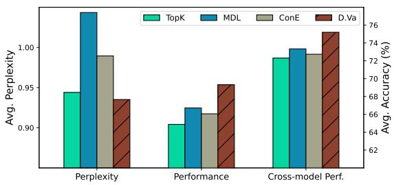
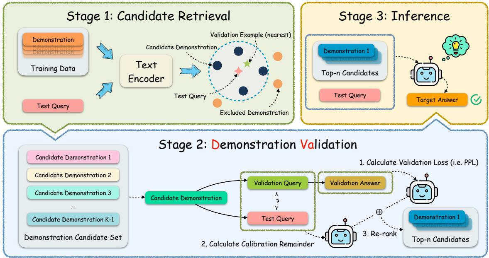
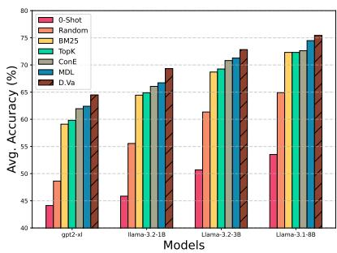
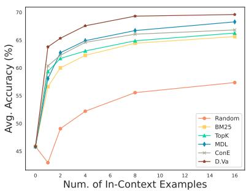
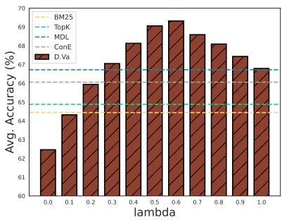
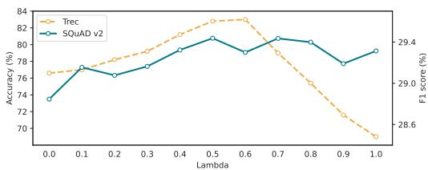
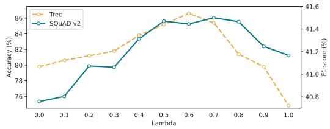
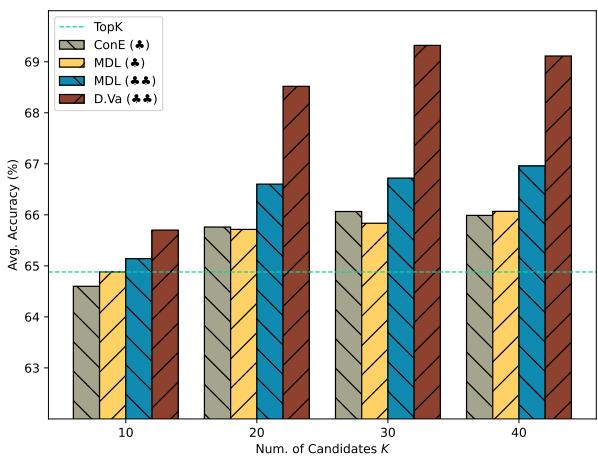
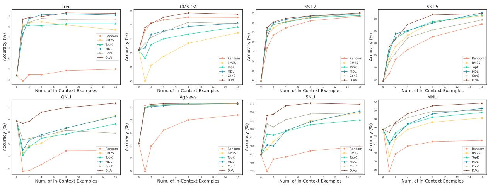

# D.Va: Validate Your Demonstration First Before You Use It

Qi Zhang, Zhiqing Xiao, Ruixuan Xiao, Lirong Gao, Junbo Zhao

Zhejiang University

{cheung\_se,zhiqing.xiao,xiaoruixuan,gaolirong, j.zhao}@zju.edu.cn

## Abstract

In-context learning (ICL) has demonstrated significant potential in enhancing the capabilities of large language models (LLMs) during inference. It’s well-established that ICL heavily relies on selecting effective demonstrations to generate outputs that better align with the expected results. As for demonstration selection, previous approaches have typically relied on intuitive metrics to evaluate the effectiveness of demonstrations, which often results in limited robustness and poor crossmodel generalization capabilities. To tackle these challenges, we propose a novel method, Demonstration Validation (D.Va), which integrates a demonstration validation perspective into this field. By introducing the demonstration validation mechanism, our method effectively identifies demonstrations that are both effective and highly generalizable. D.Va surpasses all existing demonstration selection techniques across both natural language understanding (NLU) and natural language generation (NLG) tasks. Additionally, we demonstrate the robustness and generalizability of our approach across various language models with different retrieval models. The code is available at https://github.com/Cheungki/dva.

## 1 Introduction

Large language models (LLMs) demonstrate impressive generalization capabilities under the incontext learning (ICL) paradigm, adapting to new tasks without parameter updates (Brown et al., 2020). In this ICL setup, LLMs utilize demonstration samples provided in the input context as exemplars to guide their output generation. This emergent ICL ability allows LLMs to generalize costeffectively to unseen tasks. However, prior research highlights that the quality of demonstration samples significantly impacts ICL performance (Liu et al., 2022; Lu et al., 2022). Poorly constructed demonstrations can significantly degrade overall performance, making effective demonstration selection a crucial area of study (Iter et al., 2023).

  
Figure 1: Collaborative comparison of the average perplexity, performance, and cross-model performance of different methods across eight NLU datasets on Llama-3.2-1B. Cross-model refers to selecting demonstrations with Llama-3.2-1B while inferring with Llama-3.1- 8B. Although MDL and ConE outperform the datadependent baseline TopK in terms of performance, they don’t effectively reduce the model’s perplexity on the ground-truth labels and show limited cross-model generalization capabilities.

Effective demonstration selection has become a key focus in ICL research (Dong et al., 2024; Luo et al., 2024). While early corpus-level methods relied on a fixed set of demonstrations (Brown et al., 2020; Shin et al., 2020; Gao et al., 2021; Jiang et al., 2021; Sorensen et al., 2022), recent studies emphasize dynamically selecting the most suitable demonstrations for each test input (Luo et al., 2024). These methods fall into two categories: data-dependent strategies and self-adaptive strategies. Data-dependent strategies typically rely on measures, $i . e . ,$ , the textual or semantic similarity between the test input and demonstrations to conduct demonstration selection. Such measures are often extracted by off-the-shelf retrievers such as BM25 (Robertson and Zaragoza, 2009) and Sentence-BERT (Reimers and Gurevych, 2019). Despite the simplicity, such approaches entirely hinge on a static, offline retriever, limiting its ability to generalize to previously untrained fields.

Another research line in this field is self-adaptive strategies, adopting a more dynamic way. Wu et al. proposed a model-based metric to evaluate demonstration effectiveness from a novel self-adaptive view of demonstration selection. They introduced a select-then-rank framework that leverages off-theshelf retrievers to retrieve a candidate set and rerank them based on their metric. Later, Peng et al. further demonstrated that the language model’s understanding of the test input could help identify effective demonstrations. These methods typically retrieve a set of candidate demonstrations and then select the most effective ones based on their proposed metrics.

Self-adaptive methods, while often outperforming data-dependent ones, still face significant challenges. Due to their dependence on superficial metrics for selection, these adaptive methods can exhibit subpar performance when applied in cross-model and other real-world scenarios, sometimes even yielding worse results than basic datadependent methods (Dong et al., 2024). Through extensive observations and analysis, we conclude that these shortcomings stem from their inability to fully capture the fundamental essence of demonstration selection in ICL. The key challenge lies in identifying demonstrations that can effectively guide the language model to generate the groundtruth answer with minimal perplexity. However, the absence of ground-truth labels during the selection process makes it inherently difficult to evaluate the quality of demonstrations from this perspective.

To address these challenges, we introduce Demonstration Validation (D.Va), a novel selfadaptive demonstration selection method that adopts a validation-driven perspective. Inspired by previous corpus-level methods (Lu et al., 2022; Sorensen et al., 2022) that partition a separate validation set to construct a fixed demonstration set, we intend to adapt this validation paradigm for a self-adaptive framework. Our principle is to select demonstrations via a simulated validation process, ensuring the LLM achieves minimal perplexity for the potential unseen ground-truth answer. However, unlike corpus-level scenarios, the distribution shift between single validation input and single test input significantly impacts the overall performance. To further address this challenge, we propose a preference-based calibration mechanism that adjusts the validation loss based on the language model’s preferences between the test and validation inputs, effectively mitigating this phenomenon. As illustrated in Figure 1, D.Va resolves the accuracyconfidence discrepancy seen in prior methods and demonstrates strong cross-model capabilities. In general, D.Va achieves superior, generalizable performance across diverse datasets, surpassing all existing demonstration selection methods for both natural language understanding (NLU) and natural language generation (NLG) tasks.

To sum up, our contributions can be concluded as follows:

• To our best knowledge, we are the first to propose a novel demonstration validation mechanism for self-adaptive selection methods.

• We propose a novel demonstration selection method (D.Va) for in-context learning, which helps diverse language models achieve stateof-the-art performance on various datasets with different retrieval models.

• By using small language models as surrogates for LLMs, the strong cross-model generalization capabilities of D.Va highlight its potential in demonstration selection scenarios.

## 2 Related Work

## 2.1 In-Context Learning

It was discovered that pre-trained LLMs have remarkable capabilities in adapting to new tasks by providing a related context or several demonstrations alongside the test input (Brown et al., 2020; Dong et al., 2024; Luo et al., 2024), which is typically referred to as the in-context learning ability of LLMs. However, it’s evident that the selection and order of demonstrations can largely affect the final performance (Liu et al., 2022; Lu et al., 2022).

## 2.2 Demonstration Selection in ICL

While early corpus-level methods relied on a fixed set of demonstrations (Brown et al., 2020; Shin et al., 2020; Gao et al., 2021; Jiang et al., 2021; Sorensen et al., 2022), recent studies emphasize dynamically selecting the most suitable demonstrations for each test input (Luo et al., 2024), which can be categorized into two groups: data-dependent strategies and self-adaptive strategies.

As for data-dependent strategies, previous work always relies on the textual or semantical similarity between the test input and the demonstrations to select the most suitable demonstrations, namely retrieval-based ICL (Ret-ICL). In this circumstance, BM25 (Robertson and Zaragoza, 2009) and Sentence-BERT (Reimers and Gurevych, 2019) are commonly used to retrieve the most similar demonstrations for each test input. Besides, many researchers also focus on extracting high-quality training data and further optimizing the ability of retrievers (Ye et al., 2023; Li et al., 2023; Luo et al., 2023; Wang et al., 2024).

  
Figure 2: The main framework of D.Va. We first retrieve the nearest demonstration as the validation example and a demonstration candidate set of size K 1. Then use our proposed metric to re-rank all the candidates and concatenate the top n candidates as the final context at the inference stage.

In the realm of self-adaptive strategies, Wu et al. (2023) pioneered this area by introducing a selfadaptive method for selecting effective demonstrations for classification tasks. Subsequently, Peng et al. (2024) leveraged the language models’ understanding of test inputs together with candidate examples to identify demonstrations that effectively minimize the perplexity of the test inputs.

## 3 Methodology

In this section, we first introduce the problem formulation of in-context learning and then present our proposed method D.Va in detail. Figure 2 briefly illustrates the framework of our method.

## 3.1 Problem Formulation

The primary objective of ICL demonstration selection is to increase the probability that the model outputs the correct answer based on the selected demonstrations and test input. Thus, considering an ideal scenario where the ground-truth answer to the test input is available, we can find the optimal demonstration $d ^ { * }$ for ICL by solving the following optimization problem:

$$
d ^ { * } = \arg \operatorname* { m a x } _ { { d \in D ^ { K } } } P _ { \theta } ( \boldsymbol { y } _ { t } | d , \boldsymbol { x } _ { t } )\tag{1}
$$

where d and $D ^ { K }$ , represent a candidate demonstration and a candidate set of size K. $x _ { t }$ and $y _ { t }$ refer to the test input and its ground truth respectively.

Although the approach of directly selecting demonstrations based on the test input-output is intuitive and effective, in practical scenarios, the ground-truth label $y _ { t }$ of the test input $x _ { t }$ is unseen while inferring. Previous approaches can be broadly categorized into two types: one focuses on calculating the information entropy of the model under a given label space (Wu et al., 2023), while the other uses the model’s understanding of the test inputs as the selection criteria (Peng et al., 2024). The former entails high computational costs and is unsuitable for open-ended tasks, while the latter suffers from limited performance due to the inability to accurately measure the model’s perplexity on test samples.

To address this challenge, we take inspiration from Lu et al.; Sorensen et al. who perform corpuslevel selection with a validation set. In practice, we incorporate a query-specific validation example as the anchor instead of a validation set for the whole train set, thereby proposing a demonstration validation metric that enables indirect estimation of the model’s perplexity on the unseen ground-truth labels.

## 3.2 Demonstration Validation Process

In this section, we propose a novel demonstration validation metric aiming to indirectly estimate the model’s perplexity on the unseen ground-truth labels. To enable more accurate estimation, the design principle of this metric is to reflect the ability of the demonstration to guide the model in generating the ground truth. The core issue is twofold: i)-how to select the validation example; ii)-how to design the metric based on the validation example.

We start by retrieving the nearest k demonstrations as the original candidate set D. Then we choose the semantically nearest demonstration as the validation example to minimize the distribution shift between the validation and test examp $\mathrm { l e ^ { 1 } }$ , and the remaining $K - 1$ demonstration examples consist of the under-selected candidates set $D ^ { \prime }$ :

$$
\begin{array} { l } { d _ { v } = \underset { d \in D } { \arg \operatorname* { m a x } } \sin ( d , x _ { t } ) } \\ { D ^ { \prime } = D \backslash \{ d _ { v } \} } \end{array}\tag{2}
$$

Since $d _ { v }$ is the semantically nearest demonstration to the test input $x _ { t } .$ , the perplexity of the language model on the validation answer $\mathcal { L } _ { v } .$ can be regarded as a surrogate indicator that reflects the appropriateness of a candidate $d$ as the demonstration of $x _ { t }$ to some extent. In the scope of ICL, $\mathcal { L } _ { v }$ and the target test perplexity $\scriptstyle { \mathcal { L } } _ { t }$ can be denoted as $\mathcal { L } _ { v } =$ log $P _ { \theta } ( y _ { v } | d , x _ { v } )$ and $\mathcal { L } _ { t } ~ = ~ - \log P _ { \theta } ( y _ { t } | d , x _ { t } )$ respectively. Although a smaller $L _ { v }$ may highlight the superiority of d in assisting the model in addressing problems similar to $x _ { t }$ , this does not convincingly demonstrate that d is an appropriate demonstration for $x _ { t }$ , given the distribution shift between $x _ { t }$ and $x _ { v }$ may be significant.

To address this issue, a calibration remainder should be introduced to further approximate $\mathcal { L } _ { t }$ and reduce this discrepancy. Specifically, a compensation should be applied to $\mathcal { L } _ { v }$ if it is overestimated; otherwise, a penalty should be introduced if $\mathcal { L } _ { v }$ is underestimated.

Furthermore, a more intuitive challenge lies in determining whether the estimation of test perplexity $\mathcal { L } _ { t }$ based on validation perplexity $\mathcal { L } _ { v }$ constitutes an overestimation or an underestimation. Previous research has revealed a negative correlation between the language model’s perplexity on the prompt and the probability of the language model correctly answering the question (Gonen et al., 2023; Peng et al., 2024). Inspired by this, we further state that with a given demonstration $d ,$ the language model can better solve the problem that it can better understand. We hereby introduce a calibration remainder ϵ which helps distinguish the difference in the model’s understanding of $x _ { t }$ and $x _ { v } ,$ namely, whether the estimation of $L _ { t }$ is an overestimation or an underestimation according to its sign:

$$
\epsilon = - \log \frac { P _ { \theta } ( x _ { t } | d ) } { P _ { \theta } ( x _ { v } | d ) }\tag{3}
$$

To better integrate the two indicators above, a tunable hyper-parameter λ is introduced to balance $\mathcal { L } _ { v }$ and ϵ. Given a demonstration d and a test input $x _ { t } .$ , we finally present the expression of the demonstration validation metric, denoted as Score $( d , x _ { t } )$

$$
\mathrm { S c o r e } ( d , x _ { t } ) = ( 1 - \lambda ) \cdot \mathcal { L } _ { v } + \lambda \cdot \epsilon\tag{4}
$$

## 3.3 Overall Selection Framework

We further demonstrate the overall demonstration selection process based on our proposed demonstration validation metric in this section.

Following the select-then-rank framework proposed by Wu et al., we first retrieve K candidates for each test input due to computational considera-$\mathrm { t i o n } ^ { 2 }$ . Then we adapt the semantically nearest one as the validation example, and sample the minimaln demonstrations $D _ { s }$ (under an n-shot setting) according to our proposed metric:

$$
D _ { s } = \underset { d \in D ^ { \prime } } { \arg \operatorname { s o r t } } \mathrm { S c o r e } ( d , x _ { t } ) [ : n ]\tag{5}
$$

The selected n demonstrations will then be concatenated in a descending order to generate the final demonstration organization according to their corresponding scores following Liu et al.. The impact of demonstrations concatenation order is further analyzed in Appendix E.3.

## 3.4 Interpretation of ϵ from a Preference Perspective

When we rethink the role of ϵ in Equation 3, we find that ϵ can be regarded as a transformation of the preference exhibited by the language model between two inputs. We here use Bradley-Terry (BT) model (Bradley and Terry, 1952) to describe the preference of the language model over $x _ { t }$ and $x _ { v }$ with demonstration d as the context:

$$
P _ { \theta } ( x _ { v } \prec x _ { t } | d ) = \frac { P _ { \theta } ( x _ { t } | d ) } { P _ { \theta } ( x _ { t } | d ) + P _ { \theta } ( x _ { v } | d ) }\tag{6}
$$

Thus the original expression can be transformed as:

$$
\epsilon = - \log \frac { P _ { \theta } ( x _ { v } \prec x _ { t } | d ) } { 1 - P _ { \theta } ( x _ { v } \prec x _ { t } | d ) }\tag{7}
$$

From this viewpoint, the calibration remainder ϵ implies the language model’s preference over the two queries. This perspective corroborates the phenomenon found by Jiang et al. where the language model tends to be more confident in answering its self-generated next prompt.

## 4 Experimental Settings

## 4.1 Datasets

For natural language understanding (NLU) tasks, we evaluate our method on 8 datasets including two topic classification datasets Trec (Hovy et al., 2001) and AgNews (Zhang et al., 2015), one multi-choice question answering dataset: Commonsense QA (CMS QA) (Talmor et al., 2019), two sentiment classification (Socher et al., 2013) datasets SST-2 and SST-5, three natural language inference datasets: SNLI (Bowman et al., 2015), MNLI (Williams et al., 2018) and QNLI (Wang et al., 2018) following the settings of Wu et al. (2023). The detailed evaluation strategies are listed in Appendix B.

Besides, we also consider several natural language generation (NLG) tasks including two translation tasks from Flores200 (Guzmán et al., 2019; Goyal et al., 2021; Team et al., 2022), one question answering task SQuAD v2 (Rajpurkar et al., 2016, 2018) and one text summarization task Samsum (Gliwa et al., 2019).

## 4.2 Baselines

To compare D.Va with previous methods, we mainly take the following methods into consideration. 0-shot: the zero-shot setting where no demonstration is provided. Random: we randomly select demonstrations from the training set. BM25: we use BM25 (Robertson and Zaragoza, 2009) to retrieve the most similar demonstrations for each test example. TopK: we use Sentence-Transformer to retrieve the most similar demonstrations for each test example. MDL (Wu et al., 2023): a twostage method that integrates Minimum Description

Length (MDL) principle to demonstration selection3. ConE (Peng et al., 2024): a self-adaptive demonstration selection method aims at selecting the demonstrations that can help language models understand the test input to the greatest extent.

## 4.3 Implementation Details

We conduct our experiments with GPT2-XL (1.5B) (Radford et al., 2019) and Llama-3 series (Meta, 2024) including Llama-3.1-8B, Llama-3.2-1B, and Llama-3.2-3B. We perform each experiment three times using different random seeds and report the average performance. Unless otherwise specified, all experiments in this paper are conducted using an 8-shot setting.

For the choice of λ, we conduct exploring experiments by randomly selecting 1000 examples as the validation set on the Trec dataset. We split the range of λ into 10 intervals from 0.0 to 1.0 and the validation accuracy peaks when $\lambda = 0 . 6 .$ Thus, the coefficient λ is set to 0.6 for all models and datasets in this paper.

## 5 Experiments

## 5.1 Main Results

The main results of our method compared to other methods on Llama-3.2-1B and Llama-3.1-8B are shown in Table 1 and Table 2. In general, our proposed method D.Va consistently outperforms other methods across all datasets and tasks, demonstrating the effectiveness of our method in selecting the most suitable demonstrations for in-context learning. Specifically, D.Va achieves an average improvement of 2.60% and 0.94% over the secondbest method on Llama-3.2-1B and Llama-3.1-8B respectively.

To further show the superiority of our method compared to previous methods, we further evaluate the performance of our method on more language models including Llama-3.2-3B and GPT2-XL. As shown in Figure 3a, our method achieves a relative improvement of 3.35%, 3.90%, 2.19% and 1.26% over the second-best method on GPT2-XL, Llama-3.2-1B, Llama-3.2-3B and Llama-3.1-8B respectively, which indicates that weaker language models can benefit more from our proposed method.

<table><tr><td>Model</td><td>Method</td><td>CMS QA</td><td>Trec</td><td>AgNews</td><td>SST-2</td><td>SST-5</td><td>QNLI</td><td>SNLI</td><td>MNLI</td><td>Avg.</td></tr><tr><td rowspan="6">Llama-3.2 (1B)</td><td>0-Shot</td><td>51.19</td><td>24.20</td><td>61.59</td><td>59.69</td><td>24.39</td><td>57.73</td><td>42.45</td><td>45.52</td><td>45.85</td></tr><tr><td>Random</td><td>62.90</td><td>28.80</td><td>80.21</td><td>90.94</td><td>42.58</td><td>52.88</td><td>43.48</td><td>42.61</td><td>55.55</td></tr><tr><td>BM25</td><td>53.56</td><td>71.60</td><td>92.57</td><td>92.97</td><td>48.64</td><td>56.60</td><td>52.34</td><td>47.22</td><td>64.44</td></tr><tr><td>TopK</td><td>56.84</td><td>72.80</td><td>92.78</td><td>92.53</td><td>48.82</td><td>55.67</td><td>51.22</td><td>48.38</td><td>64.88</td></tr><tr><td>MDL</td><td>59.57</td><td>82.20</td><td>92.59</td><td>93.32</td><td>48.24</td><td>56.62</td><td>52.08</td><td>49.17</td><td>66.72</td></tr><tr><td>ConE</td><td>61.10</td><td>76.60</td><td>92.45</td><td>92.59</td><td>45.38</td><td>56.23</td><td>54.42</td><td>49.75</td><td>66.06</td></tr><tr><td></td><td>D.Va</td><td>64.46</td><td>83.00</td><td>93.30</td><td>93.52</td><td>51.63</td><td>59.95</td><td>57.61</td><td>51.10</td><td>69.32</td></tr><tr><td rowspan="6">Llama-3.1 (8B)</td><td>0-Shot</td><td>63.31</td><td>28.20</td><td>74.64</td><td>83.09</td><td>25.34</td><td>51.93</td><td>52.59</td><td>49.05</td><td>53.52</td></tr><tr><td>Random</td><td>73.46</td><td>38.20</td><td>84.12</td><td>96.10</td><td>45.70</td><td>56.93</td><td>67.32</td><td>57.45</td><td>64.91</td></tr><tr><td>BM25</td><td>67.73</td><td>78.00</td><td>93.16</td><td>95.72</td><td>49.00</td><td>61.52</td><td>71.37</td><td>61.99</td><td>72.31</td></tr><tr><td>TopK</td><td>69.21</td><td>76.40</td><td>93.28</td><td>96.05</td><td>50.09</td><td>60.92</td><td>71.08</td><td>61.50</td><td>72.31</td></tr><tr><td>MDL</td><td>71.28</td><td>86.20</td><td>93.05</td><td>96.96</td><td>51.60</td><td>62.26</td><td>72.10</td><td>62.41</td><td>74.48</td></tr><tr><td>ConE</td><td>70.60</td><td>82.80</td><td>93.33</td><td>95.55</td><td>45.20</td><td>59.91</td><td>70.83</td><td>62.72</td><td>72.62</td></tr><tr><td></td><td>D.Va</td><td>73.55</td><td>86.60</td><td>93.97</td><td>96.43</td><td>50.45</td><td>63.94</td><td>74.70</td><td>63.72</td><td>75.42</td></tr></table>

Table 1: Performance of our method compared to other methods with Llama-3.2-1B and Llama-3.1-8B as the selection and inference model on classification tasks. The best results are highlighted in bold.
<table><tr><td rowspan="2">Model</td><td rowspan="2">Method</td><td colspan="3">Flores (de-ru)</td><td colspan="3">Flores (en-zh)</td><td colspan="2">SQuAD v2</td><td colspan="2">SamSum</td><td rowspan="2"></td></tr><tr><td>bleu ↑</td><td>c20 ↑</td><td>c22↑</td><td>bleu ↑</td><td>c20↑</td><td>c22 ↑</td><td>em ↑</td><td>f1↑</td><td>r-1↑ r-2 ↑</td><td>r-1↑</td></tr><tr><td rowspan="6">Llama-3.2 (1B)</td><td>0-Shot</td><td>6.69</td><td>-37.49</td><td>64.77</td><td>0.49</td><td>-10.01</td><td>71.43</td><td>10.65</td><td>20.34</td><td>17.60</td><td>5.86</td><td>14.87</td></tr><tr><td>Random</td><td>9.60</td><td>-2.15</td><td>72.14</td><td>1.83</td><td>20.01</td><td>77.29</td><td>19.93</td><td>27.89</td><td>36.86</td><td>14.02</td><td>28.71</td></tr><tr><td>BM25</td><td>9.28</td><td>-4.16</td><td>71.92</td><td>5.09</td><td>19.38</td><td>77.47</td><td>19.30</td><td>27.10</td><td>38.48</td><td>15.58</td><td>30.19</td></tr><tr><td>TopK</td><td>9.25</td><td>-0.45</td><td>72.89</td><td>3.24</td><td>20.40</td><td>77.74</td><td>20.26</td><td>28.01</td><td>39.66</td><td>16.44</td><td>31.22</td></tr><tr><td>ConE</td><td>9.65</td><td>2.39</td><td>73.87</td><td>2.81</td><td>22.79</td><td>77.97</td><td>17.76</td><td>26.98</td><td>40.18</td><td>16.47</td><td>31.59</td></tr><tr><td>D.Va</td><td>9.85</td><td>5.07</td><td>74.24</td><td>5.48</td><td>23.84</td><td>78.38</td><td>21.53</td><td>29.30</td><td>40.74</td><td>16.98</td><td>31.99</td></tr><tr><td rowspan="6">Llama-3.1 (8B)</td><td>0-Shot</td><td>17.29</td><td>44.54</td><td>82.65</td><td>1.74</td><td>41.97</td><td>82.86</td><td>20.10</td><td>30.46</td><td>4.43</td><td>1.97</td><td>3.57</td></tr><tr><td>Random</td><td>19.43</td><td>62.60</td><td>86.11</td><td>4.74</td><td>49.43</td><td>84.60</td><td>33.97</td><td>40.70</td><td>46.21</td><td>22.86</td><td>37.82</td></tr><tr><td>BM25</td><td>19.43</td><td>61.65</td><td>86.00</td><td>7.66</td><td>49.85</td><td>84.76</td><td>32.59</td><td>39.44</td><td>46.75</td><td>22.54</td><td>38.14</td></tr><tr><td>TopK</td><td>19.14</td><td>61.82</td><td>85.97</td><td>7.60</td><td>50.94</td><td>84.95</td><td>33.13</td><td>40.29</td><td>47.28</td><td>23.68</td><td>38.71</td></tr><tr><td>ConE</td><td>19.46</td><td>62.20</td><td>86.10</td><td>7.44</td><td>50.46</td><td>85.00</td><td>30.64</td><td>38.33</td><td>47.69</td><td>23.67</td><td>39.28</td></tr><tr><td>D.Va</td><td>19.98</td><td>62.76</td><td>86.16</td><td>8.11</td><td>51.00</td><td>85.03</td><td>34.75</td><td>41.44</td><td>47.70</td><td>24.02</td><td>38.96</td></tr></table>

Table 2: Performance of our method compared to other methods with Llama-3.2-1B and Llama-3.1-8B as the selection and inference model on generation tasks. The best results are highlighted in bold. Specifically, c20 and c22 refer to COMET-20 and COMET-22 metrics.

## 5.2 Performance with Different Retrieval Models

To further demonstrate the effectiveness and robustness of our proposed method, we conduct experiments to evaluate the impact of different retrieval models on the final performance of our method.

In our experiments, we consider six commonlyused retrieval models, including four models from Sentence-Bert (Reimers and Gurevych, 2019), DPR (Karpukhin et al., 2020) and bge-m3 (Chen et al., 2024). As depicted in Table 3 and Table 11, our proposed method D.Va consistently outperforms other methods across all retrieval models, demonstrating the effectiveness and robustness of our method under different retrieval models. Moreover, the superior performance of our method is more pronounced when using more powerful re-

<table><tr><td>Retriever</td><td>TopK</td><td>ConE</td><td>MDL</td><td>D.Va</td></tr><tr><td>BM25</td><td>64.44</td><td>65.75</td><td>66.25</td><td>67.83</td></tr><tr><td>all-MiniLM-L6-v2</td><td>63.55</td><td>65.50</td><td>65.64</td><td>67.34</td></tr><tr><td>all-MiniLM-L12-v2</td><td>63.68</td><td>65.29</td><td>65.85</td><td>67.91</td></tr><tr><td>DPR</td><td>63.83</td><td>65.87</td><td>65.24</td><td>67.77</td></tr><tr><td>all-distilroberta-v1</td><td>63.87</td><td>65.68</td><td>65.87</td><td>68.57</td></tr><tr><td>bge-m3</td><td>64.64</td><td>66.69</td><td>67.05</td><td>69.34</td></tr><tr><td>all-mpnet-base-v2</td><td>64.88</td><td>66.06</td><td>66.72</td><td>69.32</td></tr></table>

Table 3: Average performance comparison between D.Va and other methods on different retrieval models. The detailed results are listed in Appendix D.

trieval models.

## 5.3 Cross-Model Generalization

As our method is model-dependent, we further investigate the generalization ability of our method by selecting and re-ranking with smaller language models while inferring with larger language models. We utilize Llama-3.2-1B as the demonstration selection model, then use larger language models including GPT2-XL, Llama-3.2-3B, and Llama-3.1-8B as the inference model.

  
(a)

  
(b)

  
(c)

Figure 3: (a) The performance of our method compared to other methods on GPT2-XL, Llama-3.2-1B, Llama-3.2- 3B and Llama-3.1-8B, respectively. (b) The performance of various methods using different numbers of in-context examples on Llama-3.2-1B. (c) The overall performance of our method across eight NLU datasets using different values of λ on Llama-3.2-1B.
<table><tr><td rowspan=1 colspan=1>InferenceMethodModel</td><td rowspan=1 colspan=1>Scoring ModelItself  SLM</td><td rowspan=1 colspan=1>RelativeChange</td></tr><tr><td rowspan=3 colspan=1>MDLGPT2-XL  ConED.Va</td><td rowspan=1 colspan=1>62.40  61.35</td><td rowspan=1 colspan=1>-1.68%</td></tr><tr><td rowspan=2 colspan=1>61.95  61.3264.49  64.73</td><td rowspan=1 colspan=1>-1.02%</td></tr><tr><td rowspan=1 colspan=1>0.37%</td></tr><tr><td rowspan=2 colspan=1>MDLLlama-3.2ConE(3B)D.Va</td><td rowspan=2 colspan=1>71.27  70.9170.81  70.2672.83  72.62</td><td rowspan=1 colspan=1>-0.50%</td></tr><tr><td rowspan=1 colspan=1>-0.78%-0.28%</td></tr><tr><td rowspan=1 colspan=1>MDLLlama-3.1ConE(8B)D.Va</td><td rowspan=1 colspan=1>74.48  73.3472.62  72.7475.42 75.20</td><td rowspan=1 colspan=1>-1.54%0.17%-0.30%</td></tr></table>

Table 4: Cross-model generalization performance with small language model (i.e., Llama-3.2-1B) as the selection model while other larger language models as the inference model.

As shown in Table 4, D.Va exhibits strong crossmodel generalizability from smaller language models to larger language models, with a relative drop of less than 0.30% on Llama-3.2-3B and Llama-3.1-8B and even performs slightly better than selfselection performance on GPT2-XL. Overall, D.Va demonstrates the most robust cross-model generalization capabilities. Furthermore, even when demonstration selection is performed on the small language model, D.Va significantly outperforms other methods, highlighting its advantage in costefficiency.

## 6 Analysis & Ablation Study

## 6.1 Impact of In-Context Examples

To further substantiate the efficacy of our proposed method, we perform a comparative analysis of D.Va against other methodologies under varying amounts of in-context examples. In addition to the 8 demonstrations presented in our primary results, we evaluate the performance of different methods with 1, 2, 4, and 16 demonstrations.

As depicted in Figure 3b, the performance of our proposed method D.Va demonstrates a stable improvement with the increasing number of in-context examples. Notably, D.Va consistently outperforms other methods in all datasets, regardless of the number of demonstrations. In addition, a more detailed comparison of different demonstration selection methods in different numbers of in-context examples is listed in Appendix E.2, results show that our method surpasses all baselines across almost all datasets.

## 6.2 Impact of Coefficient λ

For the hyper-parameter λ, we conduct experiments to investigate the impact of λ on the final performance of our method with other hyper-parameters unchanged. We first present the results of one classification dataset Trec and one generation dataset SQuAD v2 in Figure 4. Experiments are conducted with Llama-3.2-1B and Llama-3.1-8B.

The results indicate that performance peaks when λ is set to around 0.6 for both Llama-3.2-1B and Llama-3.1-8B. Moreover, the overall performance of our method in eight NLU datasets with varying λ in Llama-3.2-1B is shown in Figure 3c.

The results indicate that the overall performance of our method exhibits a stable trend of initially increasing and then decreasing as the value of λ changes, and consistently outperforms all previous methods across a wide range of λ values from 0.3 to 1.0. Besides, two noteworthy special cases are when $\lambda = 0 . 0$ and λ = 1.0, where the final score is solely determined by the validation loss $\mathcal { L } _ { v }$ and the preference-based calibration remainder ϵ, respectively. We further conduct a detailed analysis in Appendix E.4.

  
Figure 4: The performance of our method on Trec and SQuAD v2 using different values of λ on Llama-3.2-1B (top) and Llama-3.1-8B (bottom).

## 6.3 Impact of Validation Example Selection

To investigate the influence of validation example selection on the final performance of our method, we conduct experiments utilizing either a randomly chosen example or the furthest example from the retrieved subset as the validation instance. Table 5 illustrates the performance of D.Va with three types of validation example selection methods on Llama-3.2-1B. Detailed results are listed in Appendix E.1, which demonstrates that the nearest example selection method consistently outperforms the other two methods on most datasets.

<table><tr><td>Validation Example</td><td>Random</td><td>Furthest</td><td>Nearest</td></tr><tr><td>Avg. Accuracy (%)</td><td>67.65</td><td>67.95</td><td>69.32</td></tr></table>

Table 5: Average performance of our method with different validation example selection methods.

## 6.4 Computational Costs Analysis

Computational costs are another critical factor that affects the performance of Ret-ICL methods. Table 6 illustrates the overall computational costs of three self-adaptive methods mentioned in this paper.

<table><tr><td>Method</td><td>Computational Costs Analysis</td><td>Relative Costs</td><td>GPU hours</td></tr><tr><td>MDL</td><td>∝ num. of options &amp; organizations</td><td>小吊吊吊</td><td>33</td></tr><tr><td>ConE</td><td>∝ num. of candidates K</td><td></td><td>8</td></tr><tr><td>D.Va</td><td>∝ num. of candidates K</td><td>吊品</td><td>15</td></tr></table>

Table 6: Computational costs analysis of three selfadaptive methods. Relative Costs and GPU hours give the relative computational costs and the real-time GPU hours across all datasets under their default settings: the more , the higher the real-time costs.

Considering that the time complexity of our method is positively correlated to the value of K, we adjust the overall computational cost by shifting the hyper-parameter K. Figure 5 depicts the performance of our method with different candidate subset sizes compared to MDL and ConE. Under the same K, we provide two results of MDL with varying numbers of organizations (discussed in Wu et al., Section 6.4) referring to different overall computational costs.

  
Figure 5: Impact of the number of candidates retrieved by the TopK method. The amount of refers to the real-time costs under the same value of K.

We can also observe that MDL and ConE perform similarly under the same computational cost, while our method D.Va largely outperforms the MDL method with the same computational cost. By taking MDL as an intermediate reference, we can conclude that our method is also effective when considering the computational costs. Besides, both ConE and D.Va present a performance drop when the value of K continues to grow, which is identical to the conclusion drawn in (Peng et al., 2024).

## 7 Conclusion

In this paper, we first introduce a demonstration validation perspective into the self-adaptive demonstration selection process in in-context learning. We propose a novel method D.Va that surpasses all existing retrieval-based in-context learning methods on both natural language understanding (NLU) and natural language generation (NLG) tasks. We further present the generalizability of our methods under different language models, different retrieval models, the number of demonstrations, and numerous datasets.

## 8 Limitations

Despite D.Va achieving significant results on the mainstream GPT2-XL and Llama-3 series, due to cost constraints, we have not been able to validate our approach on larger language models. Overall, our research empirically showcases the superiority of introducing the demonstration validation mechanism to the demonstration selection field. Although this introduces a minor overhead in the demonstration selection phase, it significantly outperforms previous methods within an acceptable cost margin.

## 9 Acknowledgment

This paper is supported by NSFC under Grants (No. U24A201401) and the Pioneer R&D Program of Zhejiang (No. 2024C01021).

## References

Samuel R. Bowman, Gabor Angeli, Christopher Potts, and Christopher D. Manning. 2015. A large annotated corpus for learning natural language inference. In Proceedings of the 2015 Conference on Empirical Methods in Natural Language Processing, pages 632–642, Lisbon, Portugal. Association for Computational Linguistics.

Ralph Allan Bradley and Milton E. Terry. 1952. Rank analysis of incomplete block designs: I. the method of paired comparisons. Biometrika, 39(3/4):324– 345.

Tom Brown, Benjamin Mann, Nick Ryder, Melanie Subbiah, Jared D Kaplan, Prafulla Dhariwal, Arvind Neelakantan, Pranav Shyam, Girish Sastry, Amanda Askell, Sandhini Agarwal, Ariel Herbert-Voss, Gretchen Krueger, Tom Henighan, Rewon Child, Aditya Ramesh, Daniel Ziegler, Jeffrey Wu, Clemens Winter, Chris Hesse, Mark Chen, Eric Sigler, Mateusz Litwin, Scott Gray, Benjamin Chess, Jack Clark, Christopher Berner, Sam McCandlish, Alec Radford, Ilya Sutskever, and Dario Amodei. 2020. Language models are few-shot learners. In Advances in Neural Information Processing Systems, volume 33, pages 1877–1901. Curran Associates, Inc.

Jianlv Chen, Shitao Xiao, Peitian Zhang, Kun Luo, Defu Lian, and Zheng Liu. 2024. Bge m3-embedding: Multi-lingual, multi-functionality, multi-granularity text embeddings through self-knowledge distillation. Preprint, arXiv:2402.03216.

Qingxiu Dong, Lei Li, Damai Dai, Ce Zheng, Jingyuan Ma, Rui Li, Heming Xia, Jingjing Xu, Zhiyong Wu, Baobao Chang, Xu Sun, Lei Li, and Zhifang Sui. 2024. A survey on in-context learning. In Proceedings of the 2024 Conference on Empirical Methods in Natural Language Processing, pages 1107–1128, Miami, Florida, USA. Association for Computational Linguistics.

Tianyu Gao, Adam Fisch, and Danqi Chen. 2021. Making pre-trained language models better few-shot learners. In Proceedings of the 59th Annual Meeting ofthe Associationfor Computational Linguistics and the 11th International Joint Conference on Natural Language Processing (Volume 1: Long Papers), pages 3816–3830, Online. Association for Computational Linguistics.

Bogdan Gliwa, Iwona Mochol, Maciej Biesek, and Aleksander Wawer. 2019. SAMSum corpus: A humanannotated dialogue dataset for abstractive summarization. In Proceedings of the 2nd Workshop on New Frontiers in Summarization, pages 70–79, Hong Kong, China. Association for Computational Linguistics.

Hila Gonen, Srini Iyer, Terra Blevins, Noah Smith, and Luke Zettlemoyer. 2023. Demystifying prompts in language models via perplexity estimation. In Findings of the Association for Computational Linguistics: EMNLP 2023, pages 10136–10148, Singapore. Association for Computational Linguistics.

Naman Goyal, Cynthia Gao, Vishrav Chaudhary, Peng-Jen Chen, Guillaume Wenzek, Da Ju, Sanjana Krishnan, Marc’Aurelio Ranzato, Francisco Guzmán, and Angela Fan. 2021. The flores-101 evaluation benchmark for low-resource and multilingual machine translation.

Francisco Guzmán, Peng-Jen Chen, Myle Ott, Juan Pino, Guillaume Lample, Philipp Koehn, Vishrav Chaudhary, and Marc’Aurelio Ranzato. 2019. Two new evaluation datasets for low-resource machine translation: Nepali-english and sinhala-english.

Eduard Hovy, Laurie Gerber, Ulf Hermjakob, Chin-Yew Lin, and Deepak Ravichandran. 2001. Toward semantics-based answer pinpointing. In Proceedings ofthe First International Conference on Human Language Technology Research.

Dan Iter, Reid Pryzant, Ruochen Xu, Shuohang Wang, Yang Liu, Yichong Xu, and Chenguang Zhu. 2023. In-context demonstration selection with cross entropy difference. In Findings of the Association for Computational Linguistics: EMNLP 2023, pages 1150– 1162, Singapore. Association for Computational Linguistics.

Zhengbao Jiang, Jun Araki, Haibo Ding, and Graham Neubig. 2021. How can we know when language models know? on the calibration of language models for question answering. Transactions ofthe Associationfor Computational Linguistics, 9:962–977.

Zhongtao Jiang, Yuanzhe Zhang, Cao Liu, Jun Zhao, and Kang Liu. 2023. Generative calibration for incontext learning. In Findings of the Association for Computational Linguistics: EMNLP 2023, pages 2312–2333, Singapore. Association for Computational Linguistics.

Vladimir Karpukhin, Barlas Oguz, Sewon Min, Patrick Lewis, Ledell Wu, Sergey Edunov, Danqi Chen, and Wen-tau Yih. 2020. Dense passage retrieval for opendomain question answering. In Proceedings of the 2020 Conference on Empirical Methods in Natural Language Processing (EMNLP), pages 6769–6781, Online. Association for Computational Linguistics.

Xiaonan Li, Kai Lv, Hang Yan, Tianyang Lin, Wei Zhu, Yuan Ni, Guotong Xie, Xiaoling Wang, and Xipeng Qiu. 2023. Unified demonstration retriever for incontext learning. In Proceedings ofthe 61st Annual Meeting of the Association for Computational Linguistics (Volume 1: Long Papers), pages 4644–4668, Toronto, Canada. Association for Computational Linguistics.

Jiachang Liu, Dinghan Shen, Yizhe Zhang, Bill Dolan, Lawrence Carin, and Weizhu Chen. 2022. What makes good in-context examples for GPT-3? In Proceedings of Deep Learning Inside Out (DeeLIO 2022): The 3rd Workshop on Knowledge Extraction and Integrationfor Deep Learning Architectures, pages 100–114, Dublin, Ireland and Online. Association for Computational Linguistics.

Yao Lu, Max Bartolo, Alastair Moore, Sebastian Riedel, and Pontus Stenetorp. 2022. Fantastically ordered prompts and where to find them: Overcoming fewshot prompt order sensitivity. In Proceedings ofthe 60th Annual Meeting ofthe Associationfor Computational Linguistics (Volume 1: Long Papers), pages 8086–8098, Dublin, Ireland. Association for Computational Linguistics.

Man Luo, Xin Xu, Zhuyun Dai, Panupong Pasupat, Mehran Kazemi, Chitta Baral, Vaiva Imbrasaite, and Vincent Y Zhao. 2023. Dr.icl: Demonstration-retrieved in-context learning. Preprint, arXiv:2305.14128.

Man Luo, Xin Xu, Yue Liu, Panupong Pasupat, and Mehran Kazemi. 2024. In-context learning with retrieved demonstrations for language models: A survey. Transactions on Machine Learning Research. Survey Certification.

Meta. 2024. The llama 3 herd of models. Preprint, arXiv:2407.21783.

Keqin Peng, Liang Ding, Yancheng Yuan, Xuebo Liu, Min Zhang, Yuanxin Ouyang, and Dacheng Tao. 2024. Revisiting demonstration selection strategies

in in-context learning. In Proceedings ofthe 62nd Annual Meeting of the Association for Computational Linguistics (Volume 1: Long Papers), pages 9090– 9101, Bangkok, Thailand. Association for Computational Linguistics.

Alec Radford, Jeffrey Wu, Rewon Child, David Luan, Dario Amodei, Ilya Sutskever, et al. 2019. Language models are unsupervised multitask learners. OpenAI blog, 1(8):9.

Pranav Rajpurkar, Robin Jia, and Percy Liang. 2018. Know what you don‘t know: Unanswerable questions for SQuAD. In Proceedings ofthe 56th Annual Meeting of the Association for Computational Linguistics (Volume 2: Short Papers), pages 784–789, Melbourne, Australia. Association for Computational Linguistics.

Pranav Rajpurkar, Jian Zhang, Konstantin Lopyrev, and Percy Liang. 2016. SQuAD: 100,000+ questions for machine comprehension of text. In Proceedings of the 2016 Conference on Empirical Methods in Natural Language Processing, pages 2383–2392, Austin, Texas. Association for Computational Linguistics.

Ricardo Rei, José G. C. de Souza, Duarte Alves, Chrysoula Zerva, Ana C Farinha, Taisiya Glushkova, Alon Lavie, Luisa Coheur, and André F. T. Martins. 2022. COMET-22: Unbabel-IST 2022 submission for the metrics shared task. In Proceedings of the Seventh Conference on Machine Translation (WMT), pages 578–585, Abu Dhabi, United Arab Emirates (Hybrid). Association for Computational Linguistics.

Ricardo Rei, Craig Stewart, Ana C Farinha, and Alon Lavie. 2020. COMET: A neural framework for MT evaluation. In Proceedings ofthe 2020 Conference on Empirical Methods in Natural Language Processing (EMNLP), pages 2685–2702, Online. Association for Computational Linguistics.

Nils Reimers and Iryna Gurevych. 2019. Sentence-BERT: Sentence embeddings using Siamese BERTnetworks. In Proceedings ofthe 2019 Conference on Empirical Methods in Natural Language Processing and the 9th International Joint Conference on Natural Language Processing (EMNLP-IJCNLP), pages 3982–3992, Hong Kong, China. Association for Computational Linguistics.

Stephen Robertson and Hugo Zaragoza. 2009. The probabilistic relevance framework: Bm25 and beyond. Found. Trends Inf. Retr., 3(4):333–389.

Taylor Shin, Yasaman Razeghi, Robert L. Logan IV, Eric Wallace, and Sameer Singh. 2020. AutoPrompt: Eliciting Knowledge from Language Models with Automatically Generated Prompts. In Proceedings ofthe 2020 Conference on Empirical Methods in Natural Language Processing (EMNLP), pages 4222–4235, Online. Association for Computational Linguistics.

Richard Socher, Alex Perelygin, Jean Wu, Jason Chuang, Christopher D. Manning, Andrew Ng, and Christopher Potts. 2013. Recursive deep models for

semantic compositionality over a sentiment treebank. In Proceedings of the 2013 Conference on Empiri cal Methods in Natural Language Processing, pages 1631–1642, Seattle, Washington, USA. Association for Computational Linguistics.

Taylor Sorensen, Joshua Robinson, Christopher Rytting, Alexander Shaw, Kyle Rogers, Alexia Delorey, Mahmoud Khalil, Nancy Fulda, and David Wingate. 2022. An information-theoretic approach to prompt engineering without ground truth labels. In Proceedings ofthe 60th Annual Meeting ofthe Association for Computational Linguistics (Volume 1: Long Papers), pages 819–862, Dublin, Ireland. Association for Computational Linguistics.

Alon Talmor, Jonathan Herzig, Nicholas Lourie, and Jonathan Berant. 2019. CommonsenseQA: A question answering challenge targeting commonsense knowledge. In Proceedings ofthe 2019 Conference ofthe North American Chapter ofthe Associationfor Computational Linguistics: Human Language Technologies, Volume 1 (Long and Short Papers), pages 4149–4158, Minneapolis, Minnesota. Association for Computational Linguistics.

NLLB Team, Marta R. Costa-jussà, James Cross, Onur Çelebi, Maha Elbayad, Kenneth Heafield, Kevin Heffernan, Elahe Kalbassi, Janice Lam, Daniel Licht, Jean Maillard, Anna Sun, Skyler Wang, Guillaume Wenzek, Al Youngblood, Bapi Akula, Loic Barrault, Gabriel Mejia Gonzalez, Prangthip Hansanti, John Hoffman, Semarley Jarrett, Kaushik Ram Sadagopan, Dirk Rowe, Shannon Spruit, Chau Tran, Pierre Andrews, Necip Fazil Ayan, Shruti Bhosale, Sergey Edunov, Angela Fan, Cynthia Gao, Vedanuj Goswami, Francisco Guzmán, Philipp Koehn, Alexandre Mourachko, Christophe Ropers, Safiyyah Saleem, Holger Schwenk, and Jeff Wang. 2022. No language left behind: Scaling human-centered machine translation. Preprint, arXiv:2207.04672.

Alex Wang, Amanpreet Singh, Julian Michael, Felix Hill, Omer Levy, and Samuel Bowman. 2018. GLUE: A multi-task benchmark and analysis platform for natural language understanding. In Proceedings ofthe 2018 EMNLP Workshop BlackboxNLP: Analyzing and Interpreting Neural Networks for NLP, pages 353–355, Brussels, Belgium. Association for Computational Linguistics.

Liang Wang, Nan Yang, and Furu Wei. 2024. Learning to retrieve in-context examples for large language models. In Proceedings of the 18th Conference of the European Chapter of the Association for Computational Linguistics (Volume 1: Long Papers), pages 1752–1767, St. Julian’s, Malta. Association for Computational Linguistics.

Adina Williams, Nikita Nangia, and Samuel Bowman. 2018. A broad-coverage challenge corpus for sentence understanding through inference. In Proceedings ofthe 2018 Conference ofthe North American

Chapter of the Association for Computational Linguistics: Human Language Technologies, Volume 1 (Long Papers), pages 1112–1122, New Orleans, Louisiana. Association for Computational Linguistics.

Zhiyong Wu, Yaoxiang Wang, Jiacheng Ye, and Lingpeng Kong. 2023. Self-adaptive in-context learning: An information compression perspective for incontext example selection and ordering. In Proceedings ofthe 61st Annual Meeting ofthe Associationfor Computational Linguistics (Volume 1: Long Papers), pages 1423–1436, Toronto, Canada. Association for Computational Linguistics.

Jiacheng Ye, Zhiyong Wu, Jiangtao Feng, Tao Yu, and Lingpeng Kong. 2023. Compositional exemplars for in-context learning. In Proceedings of the 40th International Conference on Machine Learning, ICML’23. JMLR.org.

Xiang Zhang, Junbo Zhao, and Yann LeCun. 2015. Character-level convolutional networks for text classification. In Advances in Neural Information Processing Systems, volume 28. Curran Associates, Inc.

## A Datasets

Dataset information is detailed in Table 7.
<table><tr><td>Dataset</td><td>Task</td><td>Data Split</td></tr><tr><td>CMS QA</td><td>Commonsense Question Answering</td><td>9471/1221/1140</td></tr><tr><td>Trec</td><td>Topic Classification</td><td>5452/0/500</td></tr><tr><td>AgNews</td><td>Topic Classification</td><td>120000/0/7600</td></tr><tr><td>SST-2</td><td>Sentiment Classification</td><td>6920/872/1821/</td></tr><tr><td>SST-5</td><td>Sentiment Classification</td><td>8544/1101/2210</td></tr><tr><td>QNLI</td><td>Natural Language Inference</td><td>104743/5463/5463</td></tr><tr><td>SNLI</td><td>Natural Language Inference</td><td>550152/10000/10000</td></tr><tr><td>MNLI</td><td>Natural Language Inference</td><td>392702/19647/19643</td></tr></table>

Table 7: Details of datasets.

## B Evaluation Strategy

For the classification tasks, we evaluate the performance of our method on the test set using the accuracy metric. For the generation tasks, we evaluate the performance of our method on the test set using the exact match score and f1 score for the SQuAD v2 dataset and the ROUGE score for the Samsum dataset. Specifically, we follow the modelbased evaluation settings of Peng et al. (2024), using COMET metrics4 (Rei et al., 2020, 2022) for the translation tasks and the corresponding BLEU scores are also considered. Besides, we use a 1- shot setting for SQuAD V2 and a 3-shot setting for the translation tasks.

## C Performance with Different Backbone Models

We further evaluate our methods with various models as the selection and inference model on classification tasks. As shown in Table 8, our proposed D.Va consistently surpasses all the baselines on eight classification tasks.

## D Performance with Different Retrieval Models

The detailed performance of our proposed D.Va compared to previous methods with different retrieval models are shown in Table 11. Our D.Va surpasses all the methods in almost all datasets. Furthermore, as the capability of the retrieval model increases, the performance advantage of D.Va becomes more pronounced. We hypothesize that this may be related to D.Va’s relative reliance on the optimal validation example.

<table><tr><td>Model</td><td>Prompting</td><td>Random</td><td>BM25</td><td>TopK</td><td>MDL</td><td>ConE</td><td>D.Va</td></tr><tr><td>Llama-3.2-1B</td><td>45.85</td><td>55.55</td><td>64.44</td><td>64.88</td><td>66.72</td><td>66.06</td><td>69.32</td></tr><tr><td>GPT2-XL</td><td>44.13</td><td>48.63</td><td>59.10</td><td>59.82</td><td>62.40</td><td>61.95</td><td>64.49</td></tr><tr><td>Qwen2.5-1.5B</td><td>53.16</td><td>63.46</td><td>70.85</td><td>71.66</td><td>73.61</td><td>72.54</td><td>74.10</td></tr><tr><td>Llama-3.2-3B</td><td>50.68</td><td>61.34</td><td>68.70</td><td>69.26</td><td>71.27</td><td>70.81</td><td>72.83</td></tr><tr><td>Llama-2-7B</td><td>48.87</td><td>61.44</td><td>68.96</td><td>69.48</td><td>71.20</td><td>71.40</td><td>73.11</td></tr><tr><td>Llama-3.1-8B</td><td>53.52</td><td>64.91</td><td>72.31</td><td>72.31</td><td>74.48</td><td>72.62</td><td>75.42</td></tr></table>

Table 8: Performance of D.Va compared to other methods with different backbone models as the selection and inference model on classification tasks. The best results are highlighted in bold.

## E Analysis & Ablation Study

## E.1 Impact of Validation Example Selection

The detailed performance of D.Va with three different validation example selection methods are listed below. As depicted in 9, selecting the semantically nearest demonstration as the validation example consistently outperforms the other two selecting methods, especially for Trec dataset and Commonsense QA dataset.

<table><tr><td>Valid. Example</td><td>Random</td><td>Furthest</td><td>Nearest</td></tr><tr><td>Trec</td><td>75.00</td><td>76.80</td><td>83.00</td></tr><tr><td>CMS QA</td><td>61.51</td><td>59.79</td><td>64.46</td></tr><tr><td>SST-2</td><td>92.86</td><td>93.30</td><td>93.52</td></tr><tr><td>SST-5</td><td>50.36</td><td>51.54</td><td>51.63</td></tr><tr><td>QNLI</td><td>60.48</td><td>60.94</td><td>59.95</td></tr><tr><td>AgNews</td><td>93.58</td><td>93.42</td><td>93.30</td></tr><tr><td>SNLI</td><td>57.17</td><td>57.83</td><td>57.61</td></tr><tr><td>MNLI</td><td>50.25</td><td>49.98</td><td>51.10</td></tr><tr><td>Avg.</td><td>67.65</td><td>67.95</td><td>69.32</td></tr></table>

Table 9: Results of different validation example selection methods.

## E.2 Impact of In-Context Examples

In this section, we provide a detailed comparison of the performance of D.Va and previous methods across different amount of in-context examples in Figure 6. As the number of in-context examples increases, the performance of all methods improves. Notably, D.Va maintains a consistent lead.

## E.3 Demonstration Ordering

In this section, we investigate the impact of demonstration ordering on the final performance of our method. We conduct experiments to evaluate the performance of our method with three intuitive ordering methods, including the descending order (ours), the ascending order, and the randomly shuffled order. In particular, we conducted experiments with three random seeds for the third ordering method and reported the average performance as well as the standard deviation.

  
Figure 6: Impact of the number of in-context examples on different datasets on Llama-3.2-1B.

<table><tr><td>Ordering</td><td>Ascending</td><td>Random</td><td>Descending</td></tr><tr><td>Llama-3.2-1B</td><td>68.68</td><td> $6 8 . 8 9 \pm 0 . 1 9$ </td><td>69.32</td></tr><tr><td>Llama-3.1-8B</td><td>75.19</td><td> $7 5 . 2 7 \pm 0 . 0 8$ </td><td>75.42</td></tr></table>

Table 10: The impact of ordering methods on the final performance of our method.

Table 10 depicted that the performance of our method with the descending order of demonstrations outperforms the other two ordering methods, indicating that learning from the less informative demonstrations first can help the language model better understand the test input. Besides, despite the poor performance compared to the other two ordering methods, the ascending ordering under D.Va selection still outperforms other methods, demonstrating the effectiveness of our method.

## E.4 Impact of Coefficient λ

In this section, we further analyze the two special cases of the value of λ.

When λ is set to 0.0. For the former case, the performance of which is significantly inferior to other methods due to the distribution shift between the validation example and the test example. This phenomenon is soon alleviated as λ increases to 0.3 and beyond, where the preference-based calibration remainder plays a more significant role in the final score.

When λ is set to 1.0. For the latter, the average performance across eight NLU datasets is slightly higher than other methods but still inferior to the optimal performance achieved with $\lambda = 0 . 6$ . In this case, demonstrations with a lower preferencebased calibration remainder are more likely to be selected, which indicates that the language model prefers the test example over the validation example as the next input after in-context training on the current under-evaluated training example. On the other hand, despite the semantical similarity between the test example and the validation demonstration, the language model still exhibits a preference for the test sample input. Consequently, under this condition, even when only considering the calibration remainder, the performance of our method is preserved to some extent.

## F Templates

## F.1 Templates for Classification Tasks

The templates for classification tasks used in this paper are detailed in Table 12.

## F.2 Templates for Generation Tasks

The templates for generation tasks used in this paper are detailed in Table 13.

<table><tr><td>Retriever</td><td>Methods</td><td>CMS QA</td><td>Trec</td><td>AgNews</td><td>SST-2</td><td>SST-5</td><td>QNLI</td><td>SNLI</td><td>MNLI</td><td>Avg.</td></tr><tr><td>1</td><td>0-Shot</td><td>51.19</td><td>24.20</td><td>61.59</td><td>59.69</td><td>24.39</td><td>57.73</td><td>42.45</td><td>45.52</td><td>45.85</td></tr><tr><td>1</td><td>Random</td><td>62.90</td><td>28.80</td><td>80.21</td><td>90.94</td><td>42.58</td><td>52.88</td><td>43.48</td><td>42.61</td><td>55.55</td></tr><tr><td rowspan="4">BM25</td><td>BM25</td><td>53.56</td><td>71.60</td><td>92.57</td><td>92.97</td><td>48.64</td><td>56.60</td><td>52.34</td><td>47.22</td><td>64.44</td></tr><tr><td>MDL</td><td>56.51</td><td>81.00</td><td>92.67</td><td>94.07</td><td>48.10</td><td>57.06</td><td>53.04</td><td>47.56</td><td>66.25</td></tr><tr><td>ConE</td><td>57.66</td><td>78.20</td><td>92.75</td><td>92.75</td><td>43.53</td><td>56.32</td><td>56.15</td><td>48.63</td><td>65.75</td></tr><tr><td>D.Va</td><td>62.16</td><td>80.40</td><td>92.93</td><td>94.07</td><td>47.83</td><td>58.74</td><td>57.61</td><td>48.87</td><td>67.83</td></tr><tr><td rowspan="4">all-MiniLM-L6-v2</td><td>TopK</td><td>56.27</td><td>68.20</td><td>92.67</td><td>91.10</td><td>47.42</td><td>54.99</td><td>50.41</td><td>47.31</td><td>63.55</td></tr><tr><td>MDL</td><td>58.07</td><td>79.60</td><td>92.80</td><td>92.75</td><td>46.47</td><td>56.16</td><td>50.99</td><td>48.28</td><td>65.64</td></tr><tr><td>ConE</td><td>58.31</td><td>78.00</td><td>92.99</td><td>92.26</td><td>44.98</td><td>55.46</td><td>53.08</td><td>48.91</td><td>65.50</td></tr><tr><td>D.Va</td><td>62.00</td><td>79.00</td><td>93.08</td><td>92.70</td><td>48.01</td><td>59.67</td><td>55.47</td><td>48.77</td><td>67.34</td></tr><tr><td rowspan="4">all-MiniLM-L12-v2</td><td>TopK</td><td>55.61</td><td>67.60</td><td>92.64</td><td>91.93</td><td>48.14</td><td>54.68</td><td>50.74</td><td>48.12</td><td>63.68</td></tr><tr><td>MDL</td><td>57.66</td><td>79.60</td><td>92.22</td><td>92.15</td><td>48.14</td><td>56.67</td><td>51.48</td><td>48.89</td><td>65.85</td></tr><tr><td>ConE</td><td>57.66</td><td>76.60</td><td>92.63</td><td>92.70</td><td>44.48</td><td>55.13</td><td>53.49</td><td>49.64</td><td>65.29</td></tr><tr><td>D.Va</td><td>63.06</td><td>78.40</td><td>92.97</td><td>93.63</td><td>48.64</td><td>59.60</td><td>56.74</td><td>50.27</td><td>67.91</td></tr><tr><td rowspan="4">DPR</td><td>TopK</td><td>56.02</td><td>66.80</td><td>91.89</td><td>92.64</td><td>47.96</td><td>54.73</td><td>53.31</td><td>47.28</td><td>63.83</td></tr><tr><td>MDL</td><td>56.76</td><td>74.20</td><td>91.66</td><td>93.08</td><td>46.97</td><td>56.10</td><td>55.42</td><td>47.75</td><td>65.24</td></tr><tr><td>ConE</td><td>58.72</td><td>77.00</td><td>92.53</td><td>92.42</td><td>44.39</td><td>56.34</td><td>56.92</td><td>48.67</td><td>65.87</td></tr><tr><td>D.Va</td><td>62.08</td><td>78.60</td><td>92.83</td><td>92.70</td><td>48.28</td><td>59.95</td><td>58.56</td><td>49.20</td><td>67.77</td></tr><tr><td rowspan="4">all-distilroberta-v1</td><td>TopK</td><td>58.48</td><td>64.40</td><td>92.54</td><td>92.75</td><td>48.28</td><td>54.84</td><td>51.43</td><td>48.26</td><td>63.87</td></tr><tr><td>MDL</td><td>58.80</td><td>78.20</td><td>92.29</td><td>93.14</td><td>47.19</td><td>56.20</td><td>52.30</td><td>48.87</td><td>65.87</td></tr><tr><td>ConE</td><td>58.15</td><td>76.40</td><td>92.55</td><td>92.53</td><td>46.65</td><td>55.04</td><td>54.63</td><td>49.45</td><td>65.68</td></tr><tr><td>D.Va</td><td>63.55</td><td>80.20</td><td>93.20</td><td>93.79</td><td>50.00</td><td>60.88</td><td>56.59</td><td>50.32</td><td>68.57</td></tr><tr><td rowspan="4">bge-m3</td><td>TopK</td><td>55.77</td><td>69.80</td><td>92.82</td><td>91.65</td><td>49.59</td><td>56.69</td><td>50.15</td><td>50.64</td><td>64.64</td></tr><tr><td>MDL</td><td>59.38</td><td>80.60</td><td>92.59</td><td>92.70</td><td>48.78</td><td>59.00</td><td>51.85</td><td>51.48</td><td>67.05</td></tr><tr><td>ConE</td><td>58.31</td><td>80.00</td><td>93.07</td><td>92.48</td><td>47.15</td><td>57.57</td><td>54.38</td><td>50.59</td><td>66.69</td></tr><tr><td>D.Va</td><td>64.62</td><td>82.40</td><td>93.58</td><td>94.01</td><td>49.64</td><td>61.52</td><td>56.02</td><td>52.90</td><td>69.34</td></tr><tr><td rowspan="4">all-mpnet-base-v2</td><td>TopK</td><td>56.84</td><td>72.80</td><td>92.78</td><td>92.53</td><td>48.82</td><td>55.67</td><td>51.22</td><td>48.38</td><td>64.88</td></tr><tr><td>MDL</td><td>59.57</td><td>82.20</td><td>92.59</td><td>93.32</td><td>48.24</td><td>56.62</td><td>52.08</td><td>49.17</td><td>66.72</td></tr><tr><td>ConE</td><td>61.10</td><td>76.60</td><td>92.45</td><td>92.59</td><td>45.38</td><td>56.23</td><td>54.42</td><td>49.75</td><td>66.06</td></tr><tr><td>D.Va</td><td>64.46</td><td>83.00</td><td>93.30</td><td>93.52</td><td>51.63</td><td>59.95</td><td>57.61</td><td>51.10</td><td>69.32</td></tr></table>

Table 11: Full results of our method compared to other methods on different retrieval models with Llama-3.2-1B as the selection and inference model on classification tasks. The best results under the same retriever are highlighted in bold.

<table><tr><td>Dataset</td><td>Prompt</td><td>Class</td></tr><tr><td rowspan="2">SST-2</td><td>Review: &lt;X&gt; Sentiment: positive</td><td>Positive</td></tr><tr><td>Review: &lt;X&gt; Sentiment: negative</td><td>Negative</td></tr><tr><td rowspan="4">SST-5</td><td>Review: &lt;X&gt; Sentiment: terrible</td><td>Very Negative</td></tr><tr><td>Review: &lt;X&gt; Sentiment: bad</td><td>Negative</td></tr><tr><td>Review: &lt;X&gt; Sentiment: okay</td><td>Neutral</td></tr><tr><td>Review: &lt;X&gt; Sentiment: good Review: &lt;X&gt; Sentiment: great</td><td>Positive</td></tr><tr><td rowspan="3">SNLI &amp; MNLI</td><td>&lt;C&gt; Can we know &lt;X&gt;? Yes.</td><td>Very Positive Entailment</td></tr><tr><td>&lt;C&gt; Can we know &lt;X&gt;? Maybe.</td><td>Neutral</td></tr><tr><td>&lt;C&gt; Can we know &lt;X&gt;? No.</td><td>Contradiction</td></tr><tr><td rowspan="2">QNLI</td><td>&lt;C&gt; Can we know &lt;X&gt;? Yes.</td><td>Entailment</td></tr><tr><td>&lt;C&gt; Can we know &lt;X&gt;? No.</td><td>Contradiction</td></tr><tr><td rowspan="6">TREC</td><td>&quot;&lt;X&gt;&quot; It is about abbreviation.</td><td>ABBR</td></tr><tr><td>&quot;&lt;X&gt;&quot; It is about entity.</td><td>ENTY</td></tr><tr><td>&quot;&lt;X&gt;&quot; It is about description and abstract concept.</td><td>DESC</td></tr><tr><td>&quot;&lt;X&gt;&quot; It is about human being.</td><td>HUM</td></tr><tr><td>&quot;&lt;X&gt;&quot; It is about location.</td><td>LOC</td></tr><tr><td>&quot;&lt;X&gt;&quot; It is about numeric value.</td><td>NUM</td></tr><tr><td rowspan="4">AgNews</td><td>Input: &lt;X&gt; Type: world</td><td>World</td></tr><tr><td>Input: &lt;X&gt; Type: sports</td><td>Sports</td></tr><tr><td>Input: &lt;X&gt; Type: business</td><td>Business</td></tr><tr><td>Input: &lt;X&gt; Type: technology</td><td>Sci/Tech</td></tr><tr><td rowspan="5"></td><td>Answer the following question: &lt;X&gt; Answer: &lt;A&gt;.</td><td>A</td></tr><tr><td>Answer the following question: &lt;X&gt; Answer: &lt;B&gt;.</td><td>B</td></tr><tr><td>Commonsense QA Answer the following question: &lt;X&gt; Answer: &lt;C&gt;.</td><td>C</td></tr><tr><td>Answer the following question: &lt;X&gt; Answer: &lt;D&gt;.</td><td>D</td></tr><tr><td>Answer the following question: &lt;X&gt; Answer: &lt;E&gt;.</td><td>E</td></tr></table>

Table 12: Templates of classification tasks. Placeholders (e.g., <X> and <A>) will be replaced by real inputs or answers (in Commonsense QA).

<table><tr><td>Dataset</td><td>Prompt</td></tr><tr><td>Flores</td><td>Translate from &lt;src&gt; to &lt;tgt&gt;:</td></tr><tr><td></td><td>&lt;src&gt;: &lt;source&gt; &lt;tgt&gt;: &lt;target&gt;</td></tr><tr><td></td><td>Answer each question using information in the preceding background paragraph. If there is not enough information provided, answer with &quot;Not in background&quot;.</td></tr><tr><td></td><td>Title: &lt;title&gt;</td></tr><tr><td>SQuAD v2</td><td>Background: &lt;context&gt;</td></tr><tr><td></td><td>Q: &lt;question&gt;</td></tr><tr><td></td><td></td></tr><tr><td></td><td>A: &lt;answer&gt;</td></tr><tr><td></td><td></td></tr><tr><td></td><td>What is a summary of this dialogue?</td></tr><tr><td></td><td></td></tr><tr><td>SamSum</td><td>Dialogue:</td></tr><tr><td></td><td>&lt;dialogue&gt;</td></tr><tr><td></td><td></td></tr><tr><td></td><td></td></tr><tr><td></td><td>Summary: &lt;summary&gt;</td></tr></table>

Table 13: Templates of generation tasks. For Flores, <src> and <tgt> refer to the source and target language. For SQuAD v2, we use a similar format as Llama-3’s evaluation.