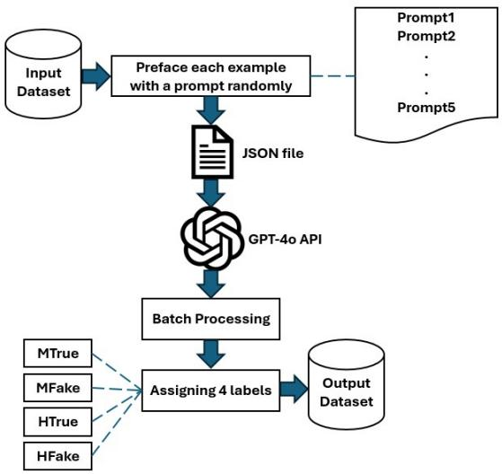
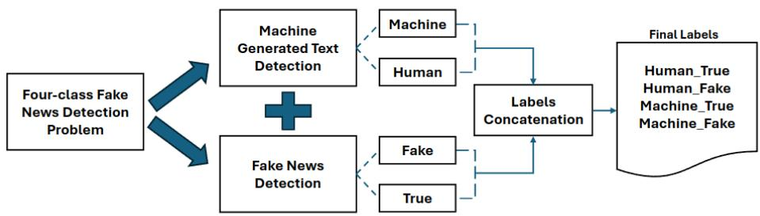
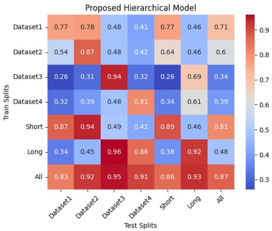
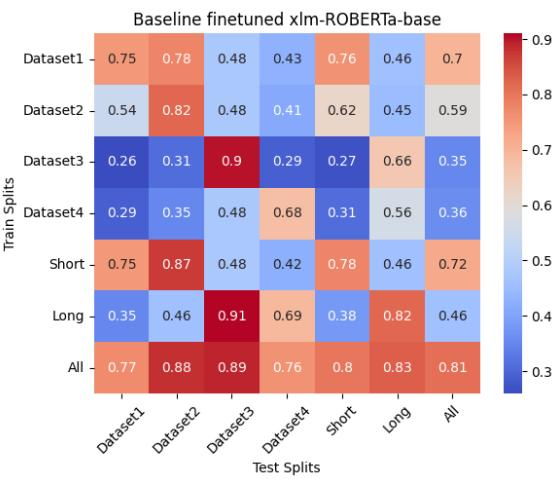
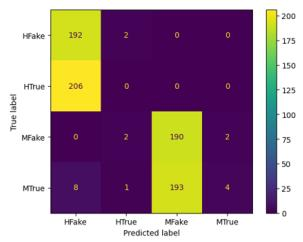
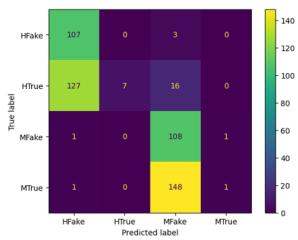
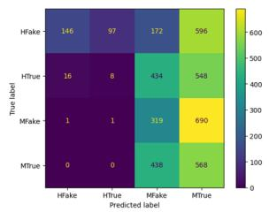
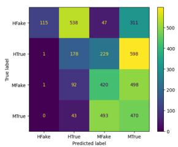

# Detection of Human and Machine-Authored Fake News in Urdu

Muhammad Zain Ali1 Yuxia Wang2 Bernhard Pfahringer1 Tony Smith1

1University of Waikato, New Zealand 2MBZUAI, United Arab Emirates ma1389@students.waikato.ac.nz, yuxia.wang@mbzuai.ac.ae {bernhard, tcs}@waikato.ac.nz

## Abstract

The rise of social media has amplified the spread of fake news, now further complicated by large language models (LLMs) like Chat-GPT, which ease the generation of highly convincing, error-free misinformation, making it increasingly challenging for the public to discern truth from falsehood. Traditional fake news detection methods relying on linguistic cues have also become less effective. Moreover, current detectors primarily focus on binary classification and English texts, often overlooking the distinction between machine-generated true vs. fake news and the detection in low-resource languages. To this end, we updated the detection schema to include machine-generated news focusing on Urdu. We further propose a conjoint detection strategy to improve the accuracy and robustness. Experiments show its effectiveness across four datasets in various settings.1

## 1 Introduction

Fake news detection aims to identify false or misleading information presented in news (Shu et al., 2019). With the rise of unrestricted social media, users can post virtually anything, accelerating the spread of misleading information. A substantial percentage of content shared on social media is found to be fake, making it a challenge for the general public to distinguish truth from falsehood. A recent study revealed that 48% of individuals across 27 countries have been misled by fake news, believing a false story to be true before later discovering it is fabricated.2 This phenomenon may have serious consequences, including influencing public opinion, undermining democratic processes, and exacerbating societal divisions (Tandoc Jr et al., 2018; Lewandowsky et al., 2017). Effective fake news detection is thus crucial for maintaining a reliable society and ensuring the integrity of information.

While many studies exist for English fake news detection, research on low-resource languages such as Urdu remains under-explored (Ahmed et al., 2017; Previti et al., 2020). Previous work treats fake news detection as a binary classification task, relying on linguistic features. However, the ease of access to LLMs like GPT-4o (OpenAI, 2024) now enables propagandists to produce endless content mimicking journalistic tone with minimal errors, greatly complicating the task of evaluating the veracity of any given text (Wang et al., 2024a). Additionally, LLMs are increasingly utilized by journalists and media organizations, thereby blurring features that might help distinguish fake and real news. Currently, the publicly available Urdu datasets consist solely of human-written text (Amjad et al., 2020b; Akhter et al., 2021), which limits the amount of reliable data for developing new effective detection methods.

To fill this gap, we collected machine-generated news based on four existing datasets, spanning short news headlines and long articles. These datasets resulted in four four-label datasets comprising human fake, human true, machine fake, and machine true categories, as previously done by Su et al. (2023a). Transformation of the binary problem into four labels improves robustness against machine-generated fake news. It also enables nuanced analysis to distinguish human- from machine-authored content, thereby improving detection accuracy and furthering the development of useful training datasets to explore the balance between human- and machine-written examples. We found that baseline four-class detectors using fine-tuned XLM-RoBERTa lack robustness, often misclassifying machine true and machine fake as other classes.

To address this, we propose a conjoint method that breaks down the original four-class problem into two subtasks: machine-generated text detection and fake news detection, as explained in Section 4.2. Experiments show that the proposed approach outperforms the baseline in accuracy and F1-score across both tasks in in-domain and crossdomain settings, demonstrating effectiveness and robustness. Our contributions are summarized as follows:

• We collect the first Urdu dataset for machinegenerated fake and true news.

• We propose a conjoint model for four-label fake news detection that is more accurate and robust than a single XLM-RoBERTa model directly fine-tuned on four labels.

• We conduct a detailed analysis investigating (1) reasons for low accuracy in cross-domain settings, and (2) the impact of data augmentation in the machine-generated text detection task on enhancing overall fake news detection.

## 2 Related Works

This section reviews previous research on (1) methods for detecting fake news, with an emphasis on general approaches and those specific to Urdu, and (2) techniques for acquiring machine-generated real and fake news.

General Approach for Fake News Detection Fake news detectors vary in terms of input features and model architectures. Features involve content features, social features, temporal features, or combinations of these (Shu et al., 2017). Content features encompass details such as term frequency (Ahmed et al., 2017), sentiment (Bhutani et al., 2019), and parts of speech (Balwant, 2019). Social features are primarily used on social media platforms and include information such as friends circles, pages followed, and reactions to posts (Sahoo and Gupta, 2021). Temporal features capture time-related aspects that indicate when a post was published. For example, Previti et al. (2020) propose a Twitter-based fake news detector that integrates time series data with other features and report favorable results.

Existing research explores various model architectures, ranging from traditional machine learning (ML) algorithms to advanced transformers (Vaswani et al., 2017). For instance, Raza and Ding (2022) introduce an encoder-decoder transformer that leverages content and social data for early detection. Similarly, Dhiman et al. (2024)

introduce the Generative BERT (GBERT) framework, which integrates generative capabilities of GPT with the discriminative power of BERT for fake news detection, achieving state-of-the-art performance on two public datasets. Unsupervised methods circumvent the labor-intensive labeling task and utilize various clustering heuristics. Yin et al. (2007) suggest that a website’s credibility is linked to its consistency in providing accurate information. Similarly, Orlov and Litvak (2019) propose a heuristic to indicate that coordinated propagandists tend to exhibit similar patterns.

Urdu Fake News Detection Research on the Urdu language is underexplored. Existing studies often exhibit a lack of diversity in the features and model architectures. Kausar et al. (2020) employ n-grams and BERT embeddings as features, and logistic regression and CNNs as models for training the classifiers. However, translated versions of datasets do not necessarily reflect the real-world news lexicon of the target language. Similarly, Amjad et al. (2020a) compare models trained on organically labeled Urdu fake news data with those trained on English fake news data translated into Urdu, showing that models trained on organic Urdu data outperform those trained on translations.

For Urdu datasets, Kausar et al. (2020) translate an English dataset Qprop (Barrón-Cedeno et al., 2019) into Urdu using Google Translate. Akhter et al. (2021) create an Urdu fake news dataset via semi-automatic translation of an English dataset and apply ensemble methods with content features for model training. In addition, three commonly used fake news datasets are specifically curated in Urdu: bend-the-truth (Amjad et al., 2020b), ax-togrind (Harris et al., 2023), and UFN2023 (Farooq et al., 2023). The work presented here utilizes these datasets for experiments detailed in Section 3.1.

Machine Generated Text What prompts have been used to generate paraphrased text via LLMs? Zellers et al. (2019) train a model, GROVER, which can generate and identify fabricated articles. Huang et al. (2022) use BART for maskinfilling to replace salient sentences in articles with plausible but non-entailed text, ensuring disinformation through self-critical sequence training with an NLI component. Similarly, Mosallanezhad et al. (2021) propose a deep reinforcement learning-based method for topic-preserving synthetic news generation, controlling the output of large pre-trained language models. All these studies focus on generating fake news, whereas LLMs are now used by news organizations and journalists, requiring a new schema for generating machine-true news. Su et al. (2023b) present a Structured Mimicry Prompting approach for generating both machine fake and true news using GPT-4o, where the LLM interprets the title and article body to generate similar text. Wan et al. (2024) further propose DELL, a framework that employs LLMs to simulate user-news interactions and perform auxiliary proxy tasks, enabling more accurate and explainable fake news detection.

## 3 Dataset Collection

## 3.1 Datasets

Four publicly available Urdu fake news datasets are used to train models, with the creation of new data for two classes: machine true and machine fake. The datasets are as follows.

Dataset 1: Ax-to-Grind Urdu This is the newest of the four datasets, published in early 2024. It contains 10,083 samples across fifteen domains, with an approximately equal distribution of fake and true classes. Harris et al. (2023) maintain the originality of the corpus by keeping only the original news headlines. Real news headlines were collected from authentic sources such as BBC Urdu, Jang, and Dawn News. Fake news headlines were collected from two of arguably the most controversial news websites: Vishwas News and Sachee Khabar. Additionally, some fake news was collected through crowdsourcing. Professional journalists were hired to fact-check each news sample and label it accordingly.

Dataset 2: UFN2023 This dataset was constructed using a hybrid approach, combining real news from authentic websites with Urdu fake news translated (under supervision) from the fake category of an English dataset. Additionally, some clearly phony news headlines from Vishwas News were also included. The dataset contains 4,097 samples across nine different domains, such as health, sports, technology, and showbiz. Of these, 1,642 samples fall under the real news category, while 2,455 belong to the fake category.

Dataset 3: UFN Augmented Corpus UFN Augmented Corpus is another publicly available Urdu Fake News dataset. Akhter et al. (2021) randomly selected two thousand news articles from an English fake news dataset and translated them into

  
Figure 1: Machine-generated News collection process

Urdu using Google Translate with human supervision. The quality of translations was manually verified, and articles that lost journalistic tone or meaning were replaced with other translated articles. The name of the English dataset has not been revealed in their work. Out of two thousand translated articles, 968 news articles belong to the fake class and 1032 news articles belong to the true class.

Dataset 4: Bend the Truth This is perhaps one of the first publicly available Urdu fake news datasets, presented by Amjad et al. (2020b). It is relatively small, with only 1,300 articles (750 real, 550 fake), but the authors used an interesting approach to keep the dataset organic. They collected true articles from authentic news websites and hired journalists to rewrite them with counterfactual narratives while preserving the original journalistic tone.

Categorization Table 1 provides a summary of the four datasets used in this work. The text was tokenized using the word tokenizer from the NLTK library3, which, for Urdu, segments words based on spaces. Token counts are carried out after removing stop words. Based on the average counts in both categories, the datasets are classified as either Short or Long: Datasets 1 and 2 primarily contain short texts and news headlines, thus categorized as Short, whereas Datasets 3 and 4 consist of longer news articles, thus categorized as Long.

Split of Training, Development and Test Sets To create test sets, 20% of each dataset was randomly set aside before producing machinegenerated text. This ensures the test set—both human-written and machine-generated—is completely unseen during training. The validation set for each experiment comprises 25% of the training set. Thus, 60% of the data is used for training, 20% for validation, and 20% for testing.

<table><tr><td>Dataset</td><td>#Examples</td><td>#HF</td><td>#HT</td><td>#MF</td><td>#MT</td><td> ${ \hat { T } } ( \mathbf { H } \mathbf { F } )$ </td><td> $\hat { T } ( \mathbf { H T } )$ </td><td> ${ \hat { T } } ( \mathbf { M } \mathbf { F } )$ </td><td> $\hat { T } ( \mathbf { M T } )$ </td><td>Content</td><td>Category</td></tr><tr><td>Dataset1-4L</td><td>20166</td><td>5053</td><td>5030</td><td>5053</td><td>5030</td><td>58.7</td><td>19.2</td><td>61.2</td><td>20.1</td><td>headlines</td><td>Short</td></tr><tr><td>Dataset2-4L</td><td>8194</td><td>2455</td><td>1642</td><td>2455</td><td>1642</td><td>105.6</td><td>34.3</td><td>110.2</td><td>33.4</td><td>headlines</td><td>Short</td></tr><tr><td>Dataset3-4L</td><td>4000</td><td>968</td><td>1032</td><td>968</td><td>1032</td><td>645.0</td><td>516.1</td><td>602.2</td><td>499.4</td><td>articles</td><td>Long</td></tr><tr><td>Dataset4-4L</td><td>2600</td><td>550</td><td>750</td><td>550</td><td>750</td><td>134.1</td><td>198.0</td><td>101.3</td><td>211.6</td><td>articles</td><td>Long</td></tr></table>

Table 1: Statistical summary of four datasets after adding machine-generated content. Suffix “-4L” denotes the four-label version of each dataset. # = number of news items, Tˆ=average tokens. HF: Human Fake, HT: Human True, MF: Machine Fake, MT: Machine True.

## 3.2 Machine-generated News Collection

GPT-4o was used to produce machine-generated news articles and short messages for both true and fake categories, paraphrasing the original text using five different prompts. Figure 1 shows the overview of the generation and gold label assignment process. Each example is generated with one prompt randomly sampled from the five, using OpenAI batch generation. Afterward, gold labels are assigned by changing original article labels from True and Fake to human true and humanfake. Machine-generated articles receive machine true and machine fake labels based on the labels of their parent news articles.

Generation Prompts Table 2 lists the five prompts used to generate machine data. These prompts were carefully designed and refined to instruct GPT-4o to rephrase the given article or headline while preserving its meaning and stance without distortion.

Quality Control To ensure data quality and prevent factual errors, especially in machine true text, we randomly sampled 1,008 examples from Dataset 1 (10,083 machine-generated texts) and had three native Urdu speakers review the articles. They compared machine text with original articles and found that 9% of samples had minor discrepancies, generally introducing additional context (i.e., more tokens).

Therefore, we filtered out cases where the number of tokens in machine-generated articles differed from the original articles by 20%, identifying 712 such cases in Dataset 1. We further analyzed these

712 examples and identified three problems: (i) 209 examples were not paraphrased; instead, GPT-4o responded with prompts like Please provide the news article for rephrasing. (ii) in 403 examples, GPT-4o introduced information not present in the original text; and (iii) 100 paraphrased articles began with a preface from GPT-4o, such as Certainly! I can help you with rephrasing.

To address these problems, all prompts were re-engineered by adding the following line before the last sentence: Please directly rewrite without opening words like Of course I can help you with rewriting, and note that do not generate or extend extra information that is not included in the given article, DO NOT HALLUCINATE EXTRA INFOR-MATION. These newly engineered prompts were applied to the problematic samples for dataset 1 and the remaining three datasets.

The generated text was re-evaluated using the methods discussed above, with particular emphasis on the machine\_true class. Each generated article or headline was manually verified to ensure no narrative shift occurred compared to its corresponding human\_true version, as any deviation would disqualify it from being labeled machine\_true. Minor issues, identified during this process, were resolved by human annotators.

## 4 Methods

This section describes baseline methods and our conjoint detection strategy.

## 4.1 Baselines

We employed both traditional machine learning algorithms (e.g., SVM with bag-of-words and TF-IDF features) and a fine-tuned multilingual pretrained language model, XLM-RoBERTa (XLM-R), as baseline classifiers.

Linear SVM We first performed data cleaning (e.g., removal of punctuation, stop words, and URLs), followed by bag-of-words representation and TF-IDF feature extraction. Several machine learning models were trained, including SVM, Multinomial Naive Bayes, and Random Forest. The best models were selected using a grid search over various hyperparameters. Among all the models, the Linear SVM achieved the best results.

<table><tr><td>ID</td><td>Prompt</td></tr><tr><td>Prompt1</td><td>I am going to provide you with an Urdu article. Please rewrite that article while keeping the same narrative. Feel free to completely change everything, every single word, if you have to. In fact, I would appreciate it if there were very little similarity between the original article and</td></tr><tr><td>Prompt2</td><td>what you write. Just the idea and narrative should essentially be the same. The article follows: I will provide you with an Urdu article. Your task is to rewrite this article while maintaining the same core message and narrative. Ensure that the wording and structure are significantly</td></tr><tr><td>Prompt3</td><td>different from the original. Here is the article: Here is an Urdu article that I need you to rewrite. Please keep the underlying story and narrative intact, but rephrase it thoroughly so that it appears entirely new. Aim for minimal</td></tr><tr><td>Prompt4</td><td>similarity to the original text. The article is as follows: Please take the following Urdu article and rewrite it in such a way that the narrative and main idea remain unchanged, but the language and wording are entirely different. Your goal is to</td></tr></table>

Table 2: Different prompts used for rewriting Urdu articles while maintaining the core narrative. The word "article" was replaced with "headline" in all prompts for Short datasets.

XLM-R XLM-RoBERTa-base was selected for its strong multilingual capabilities in classification tasks. Given dataset sizes ranging from 2.6k to 20k examples and available computational resources, we fine-tuned XLM-R rather than larger models, such as Llama3.1-8B, to minimize the risk of overfitting. Manzoor et al. (2024) fine-tuned LLaMA3- 8B on a dataset of fewer than 10k samples using both LoRA and full parameter fine-tuning, and reported significantly lower accuracy on empathy score prediction compared to using RoBERTa embeddings. We fine-tuned XLM-R using a learning rate of 2 10−5, weight decay of 0.01, and for 10 epochs. The parameter load\_best\_model\_at\_end was set to True to retrieve the best model from all epochs.

## 4.2 Conjoint Fake News Detection

Baseline results in Table 3 show that performance on the machine true and machine fake classes is consistently worse than on their human true and humanfake counterparts. This indicates that machinegenerated news is detected ineffectively by multiclass classification. This motivates us to split the four-class fake news classification task into two subtasks: (i) detecting whether a text is machineor human-written (machine-generated text detection), allowing the use of additional data from other domains and languages to improve accuracy; and (ii) classifying the text as fake or true (fake news detection), where the current model performs well.

To this end, we propose a conjoint method that breaks the multiclass problem into two subtasks: detecting machine-generated text and identifying fake news. The goal is to break a complex task into two simpler subtasks, as shown in Figure 2, to improve the performance of each by leveraging the data curated for it, ultimately enhancing the overall results.

We adapted the training labels of four datasets to meet the subtask requirements. For machinegenerated text (MGT) detection, we used the labels ‘Human’ and ‘Machine’, and for fake news detection, ‘Fake’ and ‘True’. Given the better performance of XLM-R and to ensure a fair comparison with the baseline, we used XLM-R for fine-tuning both subtasks. The hyperparameters were kept consistent with those used for training the baseline models. The models are trained and optimized using the validation data. During inference, each model predicts its respective labels on the test data, which are then concatenated and mapped back to the original four-class labels.

  
Figure 2: Proposed Conjoint Fake News Detection Architecture

## 5 Experiments

This section presents the experimental results and key findings from our analysis.

## 5.1 Four-class vs. Conjoint Detection

We compare the proposed conjoint fake news detection model with four-class baseline models in three settings to assess the benefit of task decomposition. These include training and testing (i) within a single dataset, (ii) on datasets grouped by the long and short categories across datasets, and (iii) on all four datasets combined. A withheld test set (described in Section 3.1) was used to evaluate the performance for all settings.

Individual Dataset Results For each of the four datasets, we train and test using their respective data splits. As shown in Table 3, the two-step detection approach (first identifying machine-generated text and then classifying it as true or fake) consistently outperforms the baselines across all datasets, yielding higher accuracy and F1 scores for the fourclass classification task. The only exception is in Dataset 1, where the F1 score for the human true class is lower than the baselines, though overall accuracy remains higher. Most importantly, the conjoint detection method improved the F1 scores for machine fake and machine true, effectively mitigating the baseline models’ weakness of lower accuracy on machine-generated fake news compared to human-written fake news. This highlights the efficacy of the conjoint classification approach in four-class fake news detection.

Long, Short and All Datasets Evaluation Applying the same training steps and hyperparameters, training on the combined datasets — 1 and

<table><tr><td>Dataset</td><td>Model</td><td>HF</td><td>HT</td><td>MF</td><td>MT</td><td>Acc</td></tr><tr><td rowspan="3">Dataset1-4L</td><td>LSVM</td><td>0.73</td><td>0.61</td><td>0.64</td><td>0.52</td><td>0.63</td></tr><tr><td>XLM-R-base</td><td>0.83</td><td>0.71</td><td>0.77</td><td>0.69</td><td>0.75</td></tr><tr><td>Conjoint</td><td>0.85</td><td>0.69</td><td>0.80</td><td>0.74</td><td>0.77</td></tr><tr><td rowspan="2">Dataset2-4L</td><td>LSVM</td><td>0.82</td><td>0.60</td><td>0.77</td><td>0.53</td><td>0.71</td></tr><tr><td>XLM-R-base Conjoint</td><td>0.93 0.93</td><td>0.66 0.80</td><td>0.88 0.90</td><td>0.70 0.77</td><td>0.82 0.87</td></tr><tr><td rowspan="2">Dataset3-4L</td><td>LSVM</td><td>0.89</td><td>0.87</td><td>0.86</td><td>0.85</td><td>0.87</td></tr><tr><td>XLM-R-base</td><td>0.91</td><td>0.91</td><td>0.88</td><td>0.89</td><td>0.90</td></tr><tr><td rowspan="2">Dataset4-4L</td><td>Conjoint LSVM</td><td>0.96</td><td>0.95</td><td>0.92</td><td>0.91</td><td>0.94</td></tr><tr><td>XLM-R-base</td><td>0.56 0.76</td><td>0.59 0.73</td><td>0.30 0.58</td><td>0.42 0.65</td><td>0.48 0.68</td></tr><tr><td rowspan="2">Short</td><td>Conjoint</td><td>0.85</td><td>0.85</td><td>0.74</td><td>0.79</td><td>0.81</td></tr><tr><td>XLM-R-base</td><td>0.88</td><td>0.68</td><td>0.83</td><td>0.72</td><td>0.78</td></tr><tr><td>Long</td><td>Conjoint XLM-R-base</td><td>0.93 0.89</td><td>0.85 0.88</td><td>0.91 0.74</td><td>0.86 0.77</td><td>0.89 0.82</td></tr><tr><td rowspan="2"></td><td>Conjoint</td><td>0.94</td><td>0.94</td><td>0.89</td><td>0.90</td><td>0.92</td></tr><tr><td>XLM-R-base</td><td>0.89</td><td>0.77</td><td>0.83</td><td>0.74</td><td>0.81</td></tr><tr><td>All</td><td>Conjoint</td><td>0.91</td><td>0.85</td><td>0.88</td><td>0.83</td><td>0.87</td></tr></table>

Table 3: Accuracy (Acc) and F1-score over four classes on four individual datasets (top four rows) and their combinations: Short=1+2, Long=3+4, and All=1+2+3+4. HF: Human Fake, HT: Human True, MF: Machine Fake, MT: Machine True.

2 (Short), 3 and 4 (Long), or all datasets (All) — leads to improved detection accuracy compared to the individual dataset setting, as shown in the bottom three rows of Table 3. The proposed conjoint detection once again outperforms the baselines across all three combined setups and reduces the F1 score gap between human and machine classes in fake news detection.

Across all methods, the human fake class achieves the highest performance, followed by machinefake, human true, and machine true, indicating that fake news is generally easier to detect than true news. Moreover, short headlines are more challenging to classify than long articles, as the latter provide more context and greater token variation. Combining short and long texts during training yields poorer performance than using either short or long texts alone, highlighting the adverse impact of data augmentation when incorporating domaindistant data.

  
Figure 3: Cross-domain evaluation accuracy of conjoint detection vs. baseline model XLM-R.

## 5.2 Cross-domain Evaluation

We perform cross-distribution evaluation by training on each dataset and combination (Short, Long, All), and testing across all individual and combined test sets using both the XLM-R baseline and the conjoint method. Heatmaps in Figure 3 show accuracy values, with train splits on the y-axis and test splits on the x-axis. The overall trend in the heatmaps for both methods is similar, showing higher accuracy along the diagonal and lower accuracy in the off-diagonal entries, except for the last entry in the All setting (which is not a cross-domain evaluation). This indicates that the models do not generalize well to out-of-domain data, particularly when trained on longer datasets (3,4) and tested on shorter datasets (1, 2). Training on shorter datasets (1, 2) yields relatively better generalization on long texts, while training on longer datasets (3,4) leads to poorer generalization on short texts. This suggests that models trained on harder cases, i.e., news headlines, can more easily recognize full articles, but the reverse does not hold.

To investigate the cause of poor generalization in cross-domain evaluation, we conduct the following analysis.

Short for training and Long for testing: all long text are fake. Figure 4 shows the confusion matrix of the conjoint model trained on dataset 1 and tested on datasets 3 and 4. Notably, the matrices exhibit almost no correct predictions for the machine fake and machine true classes. Interestingly, despite overall incorrect predictions, machine true is mostly misclassified as machinefake, and human true as human fake, suggesting that the machinegenerated text detection component performs well on both datasets 3 and 4. The reason the fake news detection module fails, in this case, can be attributed to an observation: for short datasets, there is a significant difference in average token count between true and fake classes, with fake articles having more tokens, as shown in Table 1. This may inadvertently cause the model to treat text length as a key distinguishing feature, resulting in all long articles being classified as fake.

  
Figure 4: Confusion matrix of testing on long datasets using a model trained on Dataset 1. Left: Test Split Dataset 3 (Long) and Right: Test Split Dataset 4 (Long)

  
Figure 5: Confusion matrix of testing on dataset 1 using model trained Left: Train Split Dataset 3 (Long) and Right: Train Split Dataset 4 (Long)

Long for Training and Short for Testing: random prediction with high precision on human fake. Figure 5 shows the confusion matrix of testing on dataset 1 using models trained on the two long datasets 3 and 4. Unlike the high machinegenerated text detection accuracy observed above, the models trained on long-category datasets behave differently. The machine-generated text detection module performs less effectively than in the previous case, with values scattered across the confusion matrix. Moreover, unlike in the short datasets, the average token count for true and fake classes is similar in long datasets, preventing the model from using text length as a distinguishing feature during training. Consequently, the fake news detection module does not misclassify all short texts as fake. For the model trained on dataset 3, the human true class performs poorly, with all samples misclassified as either machine true or machinefake. In contrast, the model trained on dataset 4 shows a more dispersed confusion matrix with most samples being classified into one of the following three classes: human true, machine true, or machine fake. While precision for human fake is high, recall is low, making it less useful. Overall, this model appears to produce somewhat random predictions. We speculate that this may stem from being trained on the smallest dataset among the four.

## 5.3 Data Augmentation in MGT Detection

Among the four individual datasets, the proposed conjoint model performs worst on Dataset 1, achieving only 77% accuracy on its test split. Closer inspection reveals that the subpar performance of the machine-generated-text (MGT) detection module affects overall results. This may be because when GPT-4o rephrases short texts, like those in Dataset 1, it makes minimal changes, making it challenging for the model to learn distinguishing features.

In response to this observation, we investigate whether diversifying and increasing the machinegenerated text (MGT) detection data can enhance the four-class fake news detection. To test this hypothesis, the Urdu subset of a publicly available machine-generated text detection dataset M4 (Wang et al., 2024b) was augmented, and the model was retrained. This led to a 3% improvement in the accuracy of the MGT module, which in turn increased the overall accuracy of the model trained on Dataset 1 by 4%. This highlights the importance of enhancing machine-generated text detection for four-class fake news detection, especially in datasets with short texts.

## 6 Conclusion and Future Work

In this work, we introduced a four-class Urdu fake news detection task and presented the first publicly available datasets for this task. We proposed a conjoint approach that breaks down the four-class problem into machine-generated text detection and fake news classification. Experiments demonstrate that our approach consistently improves accuracy over baseline methods and exhibits robustness across unseen domains. Additionally, the proposed method effectively mitigates the challenges faced by baseline models in identifying machine-generated true and fake news. Data augmentation for the machinegenerated text (MGT) module can further improve its accuracy and thereby enhance overall performance in four-class fake news detection. Our analysis shows that models trained on short text tend to classify long text as fake, while those trained on long text generalize poorly to short text.

For future work, we will explore methods that force the classifier to learn semantic and stylistic distinguishing features, rather than length, during training. Experiments with other multilingual LLMs could further enhance the performance of fake news detection models. Exploring domain adaptation techniques to improve generalization across diverse datasets and integrating explainability methods to understand model decisions are also interesting.

## Limitations

We acknowledge certain limitations in this work that can be addressed in future research. First, the reliance on publicly available datasets may limit the diversity and richness of the training data, potentially affecting the generalizability of our model. This could lead to suboptimal performance when applied to real-world scenarios where misinformation varies widely in style and content. Secondly, the TFIDF features used for the LSVM classifier may not be the most optimal for fake news detection. Alternative features, such as those derived from the News Landscape (NELA), could enhance performance, but their implementation requires considerable effort, particularly for the Urdu language. Third, the model may inadvertently learn to rely on text length as a distinguishing feature, which could skew predictions, especially with varying lengths of articles. This tendency was observed during the analysis of our results, indicating that further refinement is necessary to mitigate this issue. Finally, the machine-generated text detection (MGT) module primarily addresses a subset of machine-generated content, potentially missing other forms of automated misinformation. Future work could focus on expanding the MGT module to encompass a broader range of machine-generated texts.

## Ethical Statement and Broad Impact

Ethical Statement We recognize that our approach to fake news detection involves the use of machine-generated text, which may inadvertently incorporate biases present in the training data or models. Given the potential for misinformation to influence public opinion and societal well-being, it is crucial to emphasize the importance of human oversight in the evaluation of our system’s outputs. We advocate for the involvement of human reviewers, particularly in sensitive contexts, to ensure responsible decision-making and to mitigate the risk of misclassification.

Broader Impact This work has the potential to significantly enhance the field of fake news detection, particularly for low-resource languages like Urdu. By providing publicly available datasets and a robust conjoint approach, this research will empower journalists, researchers, and the general public to identify and combat misinformation more effectively. The proposed methodology can be adapted for various applications, including integration into news platforms and social media, thereby facilitating the identification of misleading information and contributing to the overall integrity of public discourse. Ultimately, this work aims to foster a more informed society by improving the tools available for discerning fact from fiction in the rapidly evolving digital landscape.

## References

Hadeer Ahmed, Issa Traore, and Sherif Saad. 2017. Detection of online fake news using n-gram analysis and machine learning techniques. In Intelligent, Secure, and Dependable Systems in Distributed and Cloud Environments: First International Conference, IS-DDC 2017, Vancouver, BC, Canada, October 26-28, 2017, Proceedings 1, pages 127–138. Springer.

Muhammad Pervez Akhter, Jiangbin Zheng, Farkhanda Afzal, Hui Lin, Saleem Riaz, and Atif Mehmood. 2021. Supervised ensemble learning methods towards automatically filtering urdu fake news within social media. PeerJ Computer Science, 7:e425.

Maaz Amjad, Grigori Sidorov, and Alisa Zhila. 2020a. Data augmentation using machine translation for fake news detection in the urdu language. In Proceedings ofthe 12th language resources and evaluation conference, pages 2537–2542.

Maaz Amjad, Grigori Sidorov, Alisa Zhila, Helena Gómez-Adorno, Ilia Voronkov, and Alexander Gelbukh. 2020b. “bend the truth”: Benchmark dataset for fake news detection in urdu language and its evaluation. Journal of Intelligent & Fuzzy Systems, 39(2):2457–2469.

Manoj Kumar Balwant. 2019. Bidirectional lstm based on pos tags and cnn architecture for fake news detection. In 2019 10th International conference on computing, communication and networking technologies (ICCCNT), pages 1–6. IEEE.

Alberto Barrón-Cedeno, Israa Jaradat, Giovanni Da San Martino, and Preslav Nakov. 2019. Proppy: Organizing the news based on their propagandistic content. Information Processing & Management, 56:1849–1864.

Bhavika Bhutani, Neha Rastogi, Priyanshu Sehgal, and Archana Purwar. 2019. Fake news detection using sentiment analysis. In 2019 twelfth international conference on contemporary computing (IC3), pages 1–5. IEEE.

Pummy Dhiman, Amandeep Kaur, Deepali Gupta, Sapna Juneja, Ali Nauman, and Ghulam Muhammad. 2024. Gbert: A hybrid deep learning model based on gpt-bert for fake news detection. Heliyon, 10(16).

Muhammad Shoaib Farooq, Ansar Naseem, Furqan Rustam, and Imran Ashraf. 2023. Fake news detection in urdu language using machine learning. PeerJ Computer Science, 9:e1353.

Sheetal Harris, Jinshuo Liu, Hassan Jalil Hadi, and Yue Cao. 2023. Ax-to-grind urdu: Benchmark dataset for urdu fake news detection. In 2023 IEEE 22nd International Conference on Trust, Security and Privacy in Computing and Communications (TrustCom), pages 2440–2447. IEEE.

Kung-Hsiang Huang, Kathleen McKeown, Preslav Nakov, Yejin Choi, and Heng Ji. 2022. Faking fake news for real fake news detection: Propagandaloaded training data generation. arXiv preprint arXiv:2203.05386.

Soufia Kausar, Bilal Tahir, and Muhammad Amir Mehmood. 2020. Prosoul: a framework to identify propaganda from online urdu content. IEEE access, 8:186039–186054.

Stephan Lewandowsky, Ullrich KH Ecker, and John Cook. 2017. Beyond misinformation: Understanding and coping with the “post-truth” era. Journal of applied research in memory and cognition, 6(4):353– 369.

Muhammad Arslan Manzoor, Yuxia Wang, Minghan Wang, and Preslav Nakov. 2024. Can machines resonate with humans? evaluating the emotional and empathic comprehension of LMs. In Findings ofthe Associationfor Computational Linguistics: EMNLP 2024, pages 14683–14701, Miami, Florida, USA. Association for Computational Linguistics.

Ahmadreza Mosallanezhad, Kai Shu, and Huan Liu. 2021. Generating topic-preserving synthetic news. In 2021 IEEE International Conference on Big Data (Big Data), pages 490–499. IEEE.

OpenAI. 2024. Hello gpt-4o.

Michael Orlov and Marina Litvak. 2019. Using behavior and text analysis to detect propagandists and misinformers on twitter. In Information Management and Big Data: 5th International Conference, SIMBig 2018, Lima, Peru, September 3–5, 2018, Proceedings 5, pages 67–74. Springer.

Marialaura Previti, Victor Rodriguez-Fernandez, David Camacho, Vincenza Carchiolo, and Michele Malgeri. 2020. Fake news detection using time series and user features classification. In Applications of Evolutionary Computation: 23rd European Conference, EvoApplications 2020, Held as Part ofEvoStar 2020, Seville, Spain, April 15–17, 2020, Proceedings 23, pages 339–353. Springer.

Shaina Raza and Chen Ding. 2022. Fake news detection based on news content and social contexts: a transformer-based approach. International Journal ofData Science and Analytics, 13(4):335–362.

Somya Ranjan Sahoo and Brij B Gupta. 2021. Multiple features based approach for automatic fake news detection on social networks using deep learning. Applied Soft Computing, 100:106983.

Kai Shu, H Russell Bernard, and Huan Liu. 2019. Studying fake news via network analysis: detection and mitigation. Emerging research challenges and opportunities in computational social network analysis and mining, pages 43–65.

Kai Shu, Amy Sliva, Suhang Wang, Jiliang Tang, and Huan Liu. 2017. Fake news detection on social media: A data mining perspective. ACM SIGKDD explorations newsletter, 19(1):22–36.

Jinyan Su, Claire Cardie, and Preslav Nakov. 2023a. Adapting fake news detection to the era of large language models. arXiv preprint arXiv:2311.04917.

Jinyan Su, Terry Yue Zhuo, Jonibek Mansurov, Di Wang, and Preslav Nakov. 2023b. Fake news detectors are biased against texts generated by large language models. arXiv preprint arXiv:2309.08674.

Edson C Tandoc Jr, Zheng Wei Lim, and Richard Ling. 2018. Defining “fake news” a typology of scholarly definitions. Digital journalism, 6(2):137–153.

Ashish Vaswani, Noam Shazeer, Niki Parmar, Jakob Uszkoreit, Llion Jones, Aidan N. Gomez, Łukasz Kaiser, and Illia Polosukhin. 2017. Attention is all you need. In Proceedings ofthe 31st International Conference on Neural Information Processing Systems, NIPS’17, page 6000–6010, Red Hook, NY, USA. Curran Associates Inc.

Herun Wan, Shangbin Feng, Zhaoxuan Tan, Heng Wang, Yulia Tsvetkov, and Minnan Luo. 2024. Dell: Generating reactions and explanations for llm-based misinformation detection. arXiv preprint arXiv:2402.10426.

Yuxia Wang, Jonibek Mansurov, Petar Ivanov, Jinyan Su, Artem Shelmanov, Akim Tsvigun, Osama Mohammed Afzal, Tarek Mahmoud, Giovanni Puccetti, Thomas Arnold, Alham Aji, Nizar Habash, Iryna Gurevych, and Preslav Nakov. 2024a. M4GTbench: Evaluation benchmark for black-box machinegenerated text detection. In Proceedings ofthe 62nd Annual Meeting of the Association for Computational Linguistics (Volume 1: Long Papers), pages 3964– 3992, Bangkok, Thailand. Association for Computational Linguistics.

Yuxia Wang, Jonibek Mansurov, Petar Ivanov, Jinyan Su, Artem Shelmanov, Akim Tsvigun, Chenxi Whitehouse, Osama Mohammed Afzal, Tarek Mahmoud, Toru Sasaki, Thomas Arnold, Alham Fikri Aji, Nizar Habash, Iryna Gurevych, and Preslav Nakov. 2024b. M4: Multi-generator, multi-domain, and multi-lingual black-box machine-generated text detection. In Proceedings ofthe 18th Conference ofthe European Chapter ofthe Associationfor Computational Linguistics (Volume 1: Long Papers), pages 1369–1407, St. Julian’s, Malta. Association for Computational Linguistics.

Xiaoxin Yin, Jiawei Han, and Philip S Yu. 2007. Truth discovery with multiple conflicting information providers on the web. In Proceedings of the 13th ACM SIGKDD international conference on Knowledge discovery and data mining, pages 1048–1052.

Rowan Zellers, Ari Holtzman, Hannah Rashkin, Yonatan Bisk, Ali Farhadi, Franziska Roesner, and Yejin Choi. 2019. Defending against neural fake news. Advances in neural information processing systems, 32.