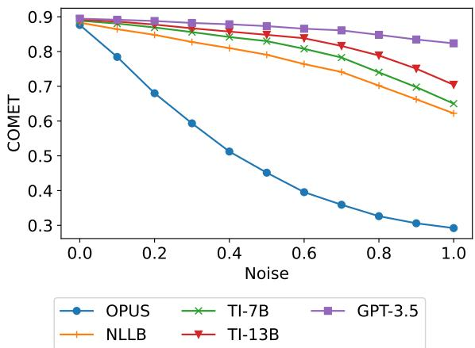
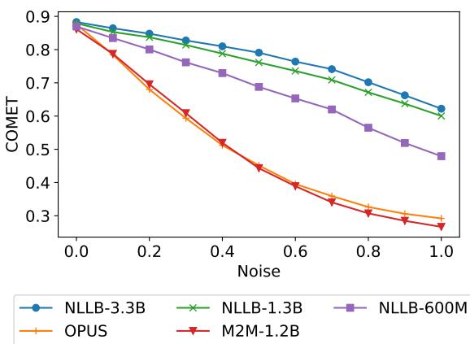
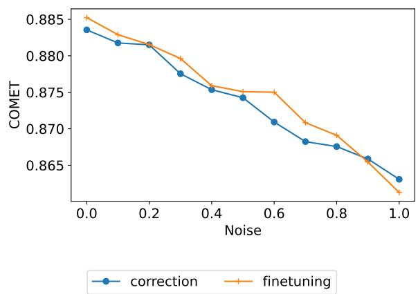
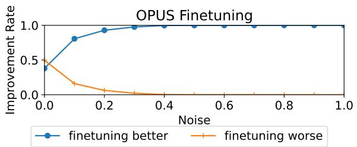
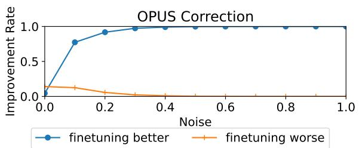
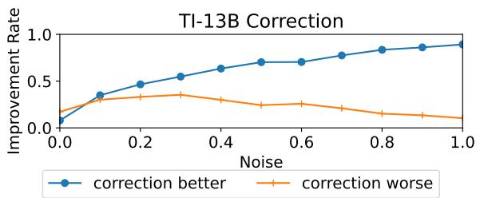

# Did Translation Models Get More Robust Without Anyone Even Noticing?

Ben Peters∗ and André F. T. Martins∗†‡⋄

∗Instituto de Telecomunicações, Lisbon, Portugal

†Instituto Superior Técnico, Universidade de Lisboa, Lisbon, Portugal

‡ELLIS Unit Lisbon (LUMLIS), Lisbon, Portugal

⋄Unbabel, Lisbon, Portugal

benzurdopeters@gmail.com, andre.t.martins@tecnico.ulisboa.pt

## Abstract

Neural machine translation (MT) models achieve strong results across a variety of settings, but it is widely believed that they are highly sensitive to “noisy” inputs, such as spelling errors, abbreviations, and other formatting issues. In this paper, we revisit this insight in light of recent multilingual MT models and large language models (LLMs) applied to machine translation. Somewhat surprisingly, we show through controlled experiments that these models are far more robust to many kinds of noise than previous models, even when they perform similarly on clean data. This is notable because, even though LLMs have more parameters and more complex training processes than past models, none of the open ones we consider use any techniques specifically designed to encourage robustness. Next, we show that similar trends hold for social media translation experiments – LLMs are more robust to social media text. We include an analysis of the circumstances in which source correction techniques can be used to mitigate the effects of noise. Altogether, we show that robustness to many types of noise has increased.

## 1 Introduction

For years, the conventional wisdom has been that neural machine translation (MT) models are highly sensitive to source-side artificial and natural noise at inference time (Belinkov and Bisk, 2018). This insight has motivated many works that seek to make MT models more robust to noise through either specialized training (Ebrahimi et al., 2018; Karpukhin et al., 2019; Park et al., 2020; Vaibhav et al., 2019) or bespoke architectures (Rust et al., 2022; Salesky et al., 2021). However, MT is increasingly being performed in a different paradigm than when these analyses and architectures were created. Previously, models were mostly trained from scratch on taskspecific data. Nowadays, strong results often depend on instruction-tuned large language models (LLMs) like TowerLLM (Alves et al., 2024) or opaque proprietary systems like ChatGPT.1 These huge models may make existing robustness techniques more expensive (due to higher parameter counts) or impossible (specialized architectures cannot be grafted onto an existing pretrained system). So the question is, are these robustness techniques still necessary in the era of LLMs, or have larger models and training sets made today’s models sufficiently robust on their own?

  
Figure 1: COMET-22 on the FLORES English-French devtest set when some proportion of source tokens are noised by swapping an adjacent pair of characters.

In this work, we investigate these questions through experiments on social media text and synthetically noised corpora. These experiments play complementary roles: social media text contains diverse noise phenomena, but their effect is hard to isolate because the errors are unlabeled. On the other hand, synthetic errors differ from real-world noise, but they are interpretable and controllable, offering a way to measure noise in vitro. By evaluating on a broad spectrum of error types, we can paint a more vivid picture of what kinds of noise, and at what quantities, cause problems for MT systems. We make the following contributions:2

• We show (§3) that large pretrained models are much more robust to synthetic errors than conventional NMT models (see Figure 1), even when they perform similarly on clean data. This result holds across noise types and language pairs, even though the large models lack architectural features that specifically encourage robustness to character noise.

• We introduce (§3.1) a novel technique for measuring the robustness of MT models by learning a regression to predict the quality decline as a function of how noisy the source is.

• We show (§4.1) that models that are robust to synthetic errors perform better at translating social media text. We investigate the relationship between synthetic robustness and performance on “real-world” noise.

• We conduct (§4.2) reference-free MT experiments on MultiLexNorm (van der Goot et al., 2021), which has never before been used for MT. We show that LLMs are more robust than conventional models to this type of noise.

• We show (§5) that finetuning on noisy translation data and source correction pipelines are both effective approaches to mitigate synthetic noise without substantially worsening performance on clean data, allowing conventional NMT models to become more robust than GPT-3.5 to 3 out of 4 synthetic noise types. Combining correction with 7- 13B parameter LLM-based translation models yields even higher robustness, allowing these pipelines to surpass GPT-3.5 on all of our synthetic benchmarks, often by a wide margin. Although correction is less effective for social media data on the whole, many individual examples benefit from it, suggesting that identifying these examples is a future direction.

## 2 Background

## 2.1 Architectures for MT

The transformer. In recent years, mainstream MT techniques have been based on the transformer (Vaswani et al., 2017), which uses multi-headed self-attention to mix information across time steps.

In the original work, transformers used an encoderdecoder paradigm similar to recurrent MT models (Bahdanau et al., 2014). These models pair an encoder over the source with a decoder, an autoregressive language model that predicts target tokens one at a time. These tokens usually come from a subword vocabulary (Kudo, 2018; Sennrich et al., 2016). Initially, transformer MT models were trained from scratch for a single language pair on parallel data from sources such as the OPUS parallel corpus collection (Tiedemann, 2012).

Multilingual models. Although single language pair models often perform well, they struggle in the absence of large quantities of data, making it difficult to achieve good results in low resource language settings. This problem can be mitigated through multilingual training with systems like M2M-100 (Fan et al., 2021) and NLLB-200 (NLLB Team et al., 2022). Low resource language pairs often benefit from training data in other languages. One challenge is language imbalance – the subword vocabulary and training procedure need to be designed to allow strong performance across covered language pairs in spite of this imbalance.

LLMs for MT. In parallel to these MT-centric developments, transformers have increasingly been used in a transfer learning set-up in which a model is pretrained on a generic objective for which massive data is available. The model can then be finetuned on one or more downstream tasks. When the pretraining objective is language modeling (Radford et al., 2018), it is straightforward to use the model for generation tasks, including MT (Hendy et al., 2023). Recently, the paradigm has shifted from traditional finetuning to instruction tuning (Sanh et al., 2022; Wei et al., 2022), in which the finetuning data is accompanied by an instructional prompt. This has been shown to give models the ability to generalize to related tasks and has proven effective for MT (Alves et al., 2023, 2024).

## 2.2 Robustness to Character Noise

Character perturbations can have a large negative impact on MT model performance (Belinkov and Bisk, 2018). Consequently, a number of techniques have been proposed to mitigate their impact.

Robustness through training. A common technique to increase robustness is to train MT models on examples with added source errors. Given that high-quality corpora containing authentic errors are rare, the added noise is generally synthetic (Karpukhin et al., 2019), although it can be tuned to resemble natural errors (Martucci et al., 2021; Vaibhav et al., 2019). Whether training on synthetic noise is actually helpful for becoming robust to natural errors is an open question, with various works coming to contradictory conclusions (Belinkov and Bisk, 2018; Vaibhav et al., 2019).

xx en
<table><tr><td>Model</td><td>de→en</td><td>fr→en</td><td>ko→en</td><td>pt→en</td><td>avg.</td></tr><tr><td>OPUS</td><td>88.17</td><td>89.19</td><td>86.35</td><td>88.36</td><td>88.02</td></tr><tr><td>NLLB</td><td>89.28</td><td>89.29</td><td>87.69</td><td>89.72</td><td>89.00</td></tr><tr><td>TI</td><td>89.77</td><td>89.76</td><td>88.69</td><td>90.16</td><td>89.60</td></tr><tr><td>GPT-3.5</td><td>89.64</td><td>89.45</td><td>87.98</td><td>89.81</td><td>89.22</td></tr></table>

<table><tr><td>Model</td><td>en→de</td><td>en→fr</td><td>en→ko</td><td>en→pt</td><td>avg.</td></tr><tr><td>OPUS</td><td>84.02</td><td>87.63</td><td>86.58</td><td>88.94</td><td>86.79</td></tr><tr><td>NLLB</td><td>88.07</td><td>88.30</td><td>88.48</td><td>89.58</td><td>88.61</td></tr><tr><td>TI</td><td>88.57</td><td>89.16</td><td>90.12</td><td>90.02</td><td>89.47</td></tr><tr><td>GPT-3.5</td><td>88.52</td><td>88.83</td><td>89.04</td><td>89.83</td><td>89.05</td></tr></table>

Table 1: COMET on FLORES without added noise.

Robustness through architecture. As an alternative to specialized training techniques, robustness can be achieved with architectures other than the ubiquitous subword-level transformer. Modeling at the character or byte level (Sutskever et al., 2011; Xue et al., 2022) means that perturbations make only small changes to the sequence of tokens that the model is exposed to, whereas these same perturbations can cause a subword-level model to be exposed to completely different subword types. This may make character- and byte-level models more robust, although the evidence is mixed (Mielke et al., 2021). These models are also much slower than subword-level models because of longer sequence lengths. As an alternative, MT models can be trained on representations that are invariant to character shuffles (Belinkov and Bisk, 2018) or on visual representations of text (Salesky et al., 2021).

## 3 Robustness to Synthetic Noise

In our first experiments, we evaluate how models perform in the presence of token-level synthetic errors. Although these errors differ from “naturally occurring” noise, they are adjustable and function as a stress test for MT systems.

## 3.1 Experiments

In all of our synthetic experiments, we adopt a simple set-up: for each translation corpus, we introduce a particular type of perturbation into some percentage of the source-side tokens. We then compare performance translating this perturbed corpus to the performance on clean data. A model’s robustness can be characterized by the steepness of its decline as the noise level is increased: a flatter slope indicates that the model handles noise better.

Data. We use four types of synthetic perturbations, each of which is a plausible error based on the mechanics of typing. For each noise type, we create ten noised versions of the FLORES-200 devtest set (NLLB Team et al., 2022) corresponding to noise levels $p \in \{ 0 . 1 , 0 . 2 , . . . 1 . 0 \}$ Within a version of the corpus, each whitespace-delimited token is perturbed with probability p and otherwise not altered. Therefore each token can be perturbed at most once. We use the following noise types:

• swap: flip two adjacent characters.

• dupe: duplicate a character.

• drop: delete a character.

• key: replace a character with an adjacent key. Further details are in Appendix A.

Models. We use models that differ in their scope (bi- or multilingual), architecture (encoder-decoder or decoder-only), and size (74M-13B parameters).

• OPUS: We use transformer encoder-decoder models trained from scratch on a single language pair and released as part of OPUS-MT (Tiedemann and Thottingal, 2020). Model and vocabulary sizes are listed in Appendix B.

• NLLB (NLLB Team et al., 2022), like OPUS, is an encoder-decoder transformer trained on parallel text. However, NLLB is a many-tomany system trained on data in 202 languages. We use the 3.3 billion parameter version.

• TI: We use the 13 billion parameter version of TowerInstruct-v0.1 (Alves et al., 2024), an instruction-tuned LLM that can translate between 10 languages.

• GPT-3.5:3 the architecture and training data of GPT-3.5 are unknown, but we include it because of its success at MT (Hendy et al., 2023); the related GPT-4 can also correct character perturbations (Cao et al., 2023).

<table><tr><td>Model</td><td>de→en</td><td>fr→en</td><td>ko→en</td><td>pt→en</td><td>avg.</td></tr><tr><td>OPUS</td><td>-65.05</td><td>-65.41</td><td>-36.18</td><td>-63.44</td><td>-57.52</td></tr><tr><td>NLLB</td><td>-18.14</td><td>-20.97</td><td>-23.79</td><td>-20.81</td><td>-20.93</td></tr><tr><td>TI</td><td>-27.61</td><td>-27.01</td><td>-23.45</td><td>-25.54</td><td>-25.90</td></tr><tr><td>GPT-3.5</td><td>-4.36</td><td>-5.85</td><td>-20.89</td><td>-6.78</td><td>-9.47</td></tr><tr><td colspan="6">drop</td></tr><tr><td>Model</td><td>de→en</td><td>fr→en</td><td>ko→en</td><td>pt→en</td><td>avg.</td></tr><tr><td>OPUS</td><td>-53.61</td><td>-49.92</td><td>-29.54</td><td>-52.48</td><td>-46.39</td></tr><tr><td>NLLB</td><td>-16.50</td><td>-17.27</td><td>-21.11</td><td>-19.04</td><td>-18.48</td></tr><tr><td>TI</td><td>-19.62</td><td>-18.01</td><td>-17.33</td><td>-17.71</td><td>-18.17</td></tr><tr><td>GPT-3.5</td><td>-6.55</td><td>-5.68</td><td>-17.81</td><td>-7.09</td><td>-9.28</td></tr><tr><td colspan="6">dupe</td></tr><tr><td>Model</td><td>de→en</td><td>fr→en</td><td>ko→en</td><td>pt→en</td><td>avg.</td></tr><tr><td>OPUS</td><td>-34.31</td><td>-31.83</td><td>-6.92</td><td>-34.58</td><td>-26.91</td></tr><tr><td>NLLB</td><td>-4.07</td><td>-5.31</td><td>-4.36</td><td>-4.58</td><td>-4.58</td></tr><tr><td>TI</td><td>-3.37</td><td>-4.54</td><td>-1.82</td><td>-3.62</td><td>-3.38</td></tr><tr><td>GPT-3.5</td><td>-1.36</td><td>-1.42</td><td>-5.64</td><td>-1.44</td><td>-2.47</td></tr><tr><td colspan="6">key</td></tr><tr><td>Model</td><td>de→en</td><td>fr→en</td><td>ko→en</td><td>pt→en</td><td>avg.</td></tr><tr><td>OPUS</td><td>-63.78</td><td>-65.40</td><td>-38.48</td><td>-65.50</td><td>-58.29</td></tr><tr><td>NLLB</td><td>-20.66</td><td>-21.86</td><td>-28.01</td><td>-23.60</td><td>-23.53</td></tr><tr><td>TI</td><td>-29.15</td><td>-32.18</td><td>-19.80</td><td>-34.15</td><td>-28.82</td></tr><tr><td>GPT-3.5</td><td>-9.17</td><td>-8.63</td><td>-16.31</td><td>-10.27</td><td>-11.09</td></tr></table>

Table 2: COMET-slope on FLORES for xx→en.

As TI and GPT-3.5 were both trained on closed data, it is possible that they were trained on our test sets. We include them because of the lack of highquality fully-open LLM-based translation systems.

Inference. For GPT-3.5, we sample with temperature 0. For other models, we decode with a beam size of 5. Details are in Appendix C.

Evaluation. Our base corpus-level translation metric is COMET (Rei et al., 2020).4 COMET computes a normalized score for a hypothesis y, conditioned on the source x and a reference r. When we compute scores for translations from noisy data, we provide the COMET model the clean source, not the noisy version that was actually used to generate hypotheses. We measure the trajectory of performance as the amount of noise is increased, as depicted in Figure 1. To represent this trajectory as a single number, we fit a linear regression to predict the COMET decline relative to the clean score5 as a function of the proportion of noised tokens. We report the learned slope, which we call COMET-slope. A higher (closer to zero) COMETslope indicates a more robust model. This metric can be interpreted as the number of COMET points that would be lost if every token were corrupted.

<table><tr><td>Model</td><td>en→de</td><td>en→fr</td><td>en→ko</td><td>en→pt</td><td>avg.</td></tr><tr><td>OPUS</td><td>-72.01</td><td>-69.59</td><td>-73.99</td><td>-72.97</td><td>-72.14</td></tr><tr><td>NLLB</td><td>-23.33</td><td>-22.75</td><td>-19.68</td><td>-22.41</td><td>-22.04</td></tr><tr><td>TI</td><td>-16.64</td><td>-13.71</td><td>-12.63</td><td>-13.44</td><td>-14.11</td></tr><tr><td>GPT-3.5</td><td>-3.89</td><td>-4.46</td><td>-4.79</td><td>-3.76</td><td>-4.23</td></tr><tr><td colspan="6">drop</td></tr><tr><td>Model</td><td>en→de</td><td>en→fr</td><td>en→ko</td><td>en→pt</td><td>avg.</td></tr><tr><td>OPUS</td><td>-67.77</td><td>-63.30</td><td>-71.31</td><td>-69.66</td><td>-68.01</td></tr><tr><td>NLLB</td><td>-22.65</td><td>-22.23</td><td>-18.45</td><td>-21.71</td><td>-21.26</td></tr><tr><td>TI</td><td>-17.22</td><td>-15.00</td><td>-9.08</td><td>-14.68</td><td>-14.00</td></tr><tr><td>GPT-3.5</td><td>-6.59</td><td>-7.32</td><td>-6.72</td><td>-6.63</td><td>-6.81</td></tr><tr><td colspan="6">dupe</td></tr><tr><td>Model</td><td>en→de</td><td>en→fr</td><td>en→ko</td><td>en→pt</td><td>avg.</td></tr><tr><td>OPUS</td><td>-54.90</td><td>-46.25</td><td>-65.86</td><td>-57.94</td><td>-56.24</td></tr><tr><td>NLLB</td><td>-4.04</td><td>-3.81</td><td>-2.79</td><td>-4.13</td><td>-3.69</td></tr><tr><td>TI</td><td>-2.40</td><td>-1.79</td><td>-1.39</td><td>-1.89</td><td>-1.87</td></tr><tr><td>GPT-3.5</td><td>-1.14</td><td>-1.32</td><td>-1.42</td><td>-0.98</td><td>-1.21</td></tr><tr><td colspan="6">key</td></tr><tr><td>Model</td><td>en→de</td><td>en→fr</td><td>en→ko</td><td>en→pt</td><td>avg.</td></tr><tr><td>OPUS</td><td>-72.46</td><td>-72.01</td><td>-76.64</td><td>-75.81</td><td>-74.23</td></tr><tr><td>NLLB</td><td>-27.32</td><td>-25.91</td><td>-23.90</td><td>-25.57</td><td>-25.67</td></tr><tr><td>TI</td><td>-24.51</td><td>-21.10</td><td>-15.95</td><td>-22.04</td><td>-20.90</td></tr><tr><td>GPT-3.5</td><td>-8.19</td><td>-8.17</td><td>-8.91</td><td>-7.78</td><td>-8.26</td></tr></table>

Table 3: COMET-slope on FLORES for en→xx.

<table><tr><td>Model</td><td>clean</td><td>swap</td><td>drop</td><td>dupe</td><td>key</td></tr><tr><td>OPUS</td><td>88.94</td><td>-72.97</td><td>-69.66</td><td>-57.94</td><td>-75.81</td></tr><tr><td>OPUSLLM</td><td>85.78</td><td>-73.05</td><td>-69.68</td><td>-55.63</td><td>-74.48</td></tr></table>

Table 4: Robustness of OPUSLLM on en pt.

Results. Table 1 shows that on clean data, TI records the highest COMET for all eight language pairs. The gap between the strongest system and the much smaller OPUS models is less than 2.5 COMET for all pairs except en de and en ko. However, Tables 2 and 3 show that OPUS suffers more from perturbations than the other models do. On the other end of the spectrum, GPT-3.5 is almost always the most robust system. NLLB and TI are between these two extremes. For swap and drop noise, NLLB is more robust than TI when translating to English, while the reverse is true when translating from English. This trend is less consistent for dupe noise. For key noise, NLLB is more robust than TI for every pair except ko en. BLEU and chrF results are in Appendix H.

  
Figure 2: COMET on en→fr swaps.

## 3.2 Analysis

Size and multilinguality. From these experiments, one might conclude that robustness depends largely on model size (OPUS is 14 times smaller than any other system) or multilinguality (all except OPUS are multilingual). However, Figure 2 shows that these are not the only factors. We reran swap experiments with NLLB-600M, NLLB-1.3B, and M2M-1.2B (Fan et al., 2021); despite the similar sizes of NLLB-1.3B and M2M-1.2B, and the fact that they are both massively multilingual, they handle noise differently: NLLB-1.3B is similar to NLLB-3.3B, while M2M-1.2B suffers as much as OPUS.

Impact of architecture. Having shown that model size does not have a strong effect on robustness (at least not for NLLB), we next investigate the impact of architecture on performance. Is the gap between OPUS and other models primarily due to differences in training data, or is there some aspect of the LLMs’ decoder-only structure that encourages robustness? To investigate, we trained a 1.3B parameter6 decoder-only model on the same Tatoeba Challenge data as was used by the en pt OPUS model. Training details are given in Appendix D. The performance and robustness of this model, which we dub OPUSLLM, are shown in Table 4. Although its performance on clean data lags 3 COMET points behind OPUS, the COMETslope is similar for all four noise types, suggesting that the robustness of recent models is due to their training data, not their size or architecture.

Tokenizer robustness. Introducing perturbations affects not only translation quality but also runtime. Perturbations create character sequences that are less similar to the data that tokenizers are trained on, which leads to more pieces being used to encode the sentence. This is true even for drop noise, which increases the length of the tokenized sequence even as it shortens the detokenized sequence. In Table 5, we compare tokenizers by their fertility — the average number of subword pieces per whitespace word — on clean and key data. While OPUS tokenizers generally have very low fertility on clean data, it increases more than the other tokenizers, suggesting the tokenizer itself is less robust to character perturbations. It is also notable that TI and GPT-3.5 have high fertility even on clean Korean text. While this is a symptom of tokenizer unfairness in large models (Petrov et al., 2023), it can also be a sign of tokenizer robustness: the higher the fertility, the closer the model is to byte-level tokenization. This results in noisy token sequences that are much closer to the clean sequences for TI and GPT-3.5, as can be seen in terms of F1 in Table 6. The same trend does not hold for the other languages.

<table><tr><td></td><td colspan="2">English</td><td colspan="2">Portuguese</td><td colspan="2">Korean</td></tr><tr><td></td><td>clean</td><td>key</td><td>clean</td><td>key</td><td>clean</td><td>key</td></tr><tr><td>OPUS</td><td>1.25</td><td>2.71</td><td>1.29</td><td>2.62</td><td>1.75</td><td>2.93</td></tr><tr><td>NLLB</td><td>1.40</td><td>2.20</td><td>1.53</td><td>2.21</td><td>2.03</td><td>3.02</td></tr><tr><td>TI</td><td>1.42</td><td>2.47</td><td>1.88</td><td>2.55</td><td>6.37</td><td>7.44</td></tr><tr><td>GPT-3.5</td><td>1.24</td><td>2.23</td><td>1.71</td><td>2.34</td><td>4.17</td><td>5.12</td></tr></table>

Table 5: Tokenizer fertility with clean and key-perturbed data. For English, we used the en fr OPUS model.
<table><tr><td></td><td>swap</td><td>drop</td><td>dupe</td><td>key</td></tr><tr><td>OPUS</td><td>21.6</td><td>27.3</td><td>36.9</td><td>33.8</td></tr><tr><td>NLLB</td><td>27.6</td><td>35.1</td><td>45.7</td><td>42.3</td></tr><tr><td>TI</td><td>50.0</td><td>62.4</td><td>74.8</td><td>71.9</td></tr><tr><td>GPT-3.5</td><td>39.5</td><td>52.3</td><td>65.5</td><td>62.8</td></tr></table>

Table 6: F1 between clean Korean token sequences and their 100% noisy counterparts.

## 4 Robustness to Social Media Text

The previous experiments show that large translation models and LLMs are more robust to synthetic character perturbations than conventional MT models. But is this result applicable to “authentically noisy” domains such as social media text? The nature of “noise” here is different than in the synthetic task: social media text does not necessarily contain many errors (Rello and Baeza-Yates, 2012), but the domain is very different from FLORES. This makes it difficult to isolate the effect of noise from the general domain adaptation problem. Ideally, we would have a translation corpus in which each example is a triple consisting of an original noisy source, a manually annotated cleaned source, and a gold standard translation. This would allow translations of clean and noisy versions of the same source to be compared on some reference-based metric, isolating the effect of the errors. As we are aware of only one such corpus (Bawden and Sagot, 2023), we instead perform two complementary investigations. First, we evaluate on MTNT (Michel and Neubig, 2018), a noisy social media MT corpus. Although this is a useful test of our models, the noise is not labeled and there is no clean version of the same data to compare to. This motivates our second experiment, in which we translate data from MultiLexNorm (van der Goot et al., 2021), a lexical normalization benchmark. Together, these experiments allow us to see both which models succeed and how badly they fail.

<table><tr><td>Method</td><td>en→fr</td><td>fr→en</td></tr><tr><td>OPUS</td><td>77.21</td><td>79.64</td></tr><tr><td>r/OPUS</td><td>79.22</td><td>81.94</td></tr><tr><td>NLLB</td><td>79.33</td><td>80.59</td></tr><tr><td>TI</td><td>81.91</td><td>83.66</td></tr><tr><td>GPT-3.5</td><td>81.33</td><td>84.72</td></tr></table>

Table 7: COMET on the MTNT test set.

## 4.1 MTNT Experiments

MTNT pairs Reddit posts with high-quality professional translations. Although the references are somewhat clean, the sources are only lightly filtered, making them potentially noisy.7 Unfortunately no cleaned sources exist, making the effect of noise difficult to isolate. Despite this difficulty, it is often used as a robustness benchmark (Karpukhin et al., 2019; Park et al., 2020; Salesky et al., 2021; Vaibhav et al., 2019, inter alia).

Finetuning. We finetuned OPUS on MTNT en fr as described in Appendix E. We dub this model r/OPUS.

Results. Results are shown in Table 7. Despite in-domain finetuning benefiting OPUS by more than 2 COMET points for both en fr and fr en, this does not close the gap to TI and GPT-3.5.

This suggests that TI and GPT-3.5 benefit from their massive training corpora, which likely contain large quantities of social media text. In contrast, the only social media text the finetuned OPUS models have seen are MTNT’s tiny training sets (36k parallel examples for en fr, 19k for fr en), plus whatever is in the Tatoeba Challenge corpora.

## 4.2 MultiLexNorm Experiments

While MTNT is an established benchmark and useful sanity check, it is not controllable like our synthetic experiments; we cannot isolate the effect of noise because there is no non-noisy version of the corpus. Therefore we pivot to evaluate models on translating MultiLexNorm (van der Goot et al., 2021), a lexical normalization dataset that pairs social media text primarily from Twitter with manually cleaned versions of the same. Switching from MTNT to MultiLexNorm comes with a trade-off: in order to gain clean sources, we lose references.

Data. We use the English, German, and Spanish data from MultiLexNorm as our translation sources. In experiments with English sources, we translate to German and Spanish; otherwise, we translate to English. Statistics are presented in Appendix F.

Evaluation. As MultiLexNorm lacks reference translations, we use three reference-free metrics. Faux-BLEU (Anastasopoulos, 2019) computes spBLEU $( y _ { n } , y _ { c } )$ (Papineni et al., 2002; NLLB Team et al., 2022), where $y _ { n }$ and $y _ { c }$ are the hypotheses computed from the noisy source and the clean source, respectively. $y _ { c }$ is treated as a pseudoreference. By analogy we also compute faux-COMET. These faux-metrics measure the similarity between $y _ { c }$ and $y _ { n } .$ , with faux-BLEU capturing lexical features while faux-COMET is “deeper.” In addition, we use a new metric that we dub $\Delta \mathrm { Q E }$ . Given $y _ { n } .$ $y _ { c } ,$ noisy and clean source sequences $x _ { n }$ and $x _ { c } ,$ and a reference-free quality estimation metric QE, $\Delta \mathrm { Q E } = \mathrm { Q E } ( x _ { c } , y _ { c } ) { - \mathrm { Q E } ( x _ { c } , y _ { n } ) }$ . We compute QE with COMETKiwi8 (Rei et al., 2022b). A ∆QE close to zero means that a model produces similarquality outputs for both inputs, indicating robustness, whereas a large positive value indicates that translation quality suffers on noisy data.

Results. Table 8 shows the performance of all models with both noisy and gold-standard cleaned versions of the corpora. In terms of ∆QE, GPT-3.5 performs best for all language pairs. It also records the best faux-BLEU for all pairs except en de, on which TI and NLLB both outperform it. The faux-COMET results show a split, where GPT-3.5 has the highest scores for both to-English pairs but TI passes it for en de and en es.

<table><tr><td rowspan="2">Model</td><td colspan="3">en→de</td><td colspan="3">de→en</td><td colspan="3">en→es</td><td colspan="3">es→en</td></tr><tr><td>FB</td><td>FC</td><td>∆QE</td><td>FB</td><td>FC</td><td>∆QE</td><td>FB</td><td>FC</td><td>∆QE</td><td>FB</td><td>FC</td><td>∆QE</td></tr><tr><td>OPUS</td><td>81.9</td><td>81.50</td><td>6.21</td><td>74.8</td><td>88.36</td><td>3.95</td><td>80.3</td><td>82.54</td><td>4.11</td><td>86.2</td><td>88.52</td><td>2.54</td></tr><tr><td>NLLB</td><td>87.3</td><td>87.28</td><td>2.81</td><td>74.8</td><td>87.75</td><td>2.88</td><td>88.3</td><td>88.62</td><td>2.24</td><td>84.2</td><td>88.70</td><td>2.30</td></tr><tr><td>TI</td><td>88.8</td><td>89.07</td><td>1.86</td><td>75.2</td><td>90.57</td><td>2.41</td><td>89.0</td><td>90.26</td><td>1.19</td><td>85.3</td><td>89.32</td><td>2.63</td></tr><tr><td>GPT-3.5</td><td>87.1</td><td>88.45</td><td>1.15</td><td>83.1</td><td>91.86</td><td>1.32</td><td>89.1</td><td>90.14</td><td>0.72</td><td>87.9</td><td>91.23</td><td>0.91</td></tr></table>

Table 8: MultiLexNorm results. FB is faux-BLEU and FC is faux-COMET.

## 5 Strategies for Mitigating Noise

So far we have shown that OPUS is less robust to synthetic noise than larger models and performs worse on social media text. Next we evaluate two techniques for mitigating noise: finetuning MT models on synthetically noised data and incorporating a source correction pipeline. These approaches have contrasting trade-offs. Finetuning the MT model allows the robust translation task to be learned end-to-end. However, this is expensive if a model is very large (TI, NLLB) and impossible if its weights are closed (GPT-3.5). On the other hand, pipelines are modular, allowing the same correction system to be reused with any model. The drawback of this modularity is that pipelines may introduce errors as well as fixing them.

## 5.1 Synthetic Experiments

As a comparison of finetuning and source correction, we focus on en pt with the same synthetically noised corpora as in Section 3. We kept the training data as similar as possible between finetuning and correction experiments: in both cases, we subsampled 5 million examples from the Tatoeba Challenge en pt training set. We noised 15% of source tokens with each of the four noise types used in Section 3, so a total of 60% of tokens were corrupted. For validation, we concatenated the original FLORES en pt development set to a version of the same set in which 20% of tokens have been corrupted with each noise type. By including clean validation data, this favors models that do not forget how to translate clean data. For finetuning OPUS, these noised source examples are paired with clean Portuguese targets. For finetuning correction models, they are paired with the original clean English sources. We followed the training procedure in

<table><tr><td>Model</td><td>clean</td><td>swap</td><td>drop</td><td>dupe</td><td>key</td></tr><tr><td>OPUS</td><td>88.94</td><td>-72.97</td><td>-69.66</td><td>-57.94</td><td>-75.81</td></tr><tr><td>+finetuning</td><td>88.52</td><td>-2.14</td><td>-7.59</td><td>-0.87</td><td>-5.01</td></tr><tr><td>+correction</td><td>88.36</td><td>-2.02</td><td>-11.81</td><td>-0.08</td><td>-7.20</td></tr><tr><td>NLLB</td><td>89.58</td><td>-22.41</td><td>-21.71</td><td>-4.13</td><td>-25.57</td></tr><tr><td>+correction</td><td>89.11</td><td>-1.57</td><td>-9.09</td><td>-0.07</td><td>-5.47</td></tr><tr><td>TI</td><td>90.02</td><td>-13.44</td><td>-14.68</td><td>-1.89</td><td>-22.04</td></tr><tr><td>+correction</td><td>89.57</td><td>-0.86</td><td>-5.59</td><td>-0.16</td><td>-2.99</td></tr><tr><td>ChatGPT</td><td>89.83</td><td>-3.76</td><td>-6.63</td><td>-0.98</td><td>-7.78</td></tr></table>

Table 9: Clean COMET and COMET-slope for en→pt with finetuning and source correction.

<table><tr><td colspan="6">MT Finetuning</td></tr><tr><td>Model</td><td>clean</td><td>swap</td><td>drop</td><td>dupe</td><td>key</td></tr><tr><td>100k</td><td>88.28</td><td>-12.08</td><td>-18.96</td><td>-4.63</td><td>-18.65</td></tr><tr><td>1m</td><td>88.13</td><td>-5.21</td><td>-11.72</td><td>-2.04</td><td>-9.49</td></tr><tr><td>5m</td><td>88.52</td><td>-2.14</td><td>-7.59</td><td>-0.87</td><td>-5.01</td></tr><tr><td colspan="6">Source Correction</td></tr><tr><td>Model</td><td>clean</td><td>swap</td><td>drop</td><td>dupe</td><td>key</td></tr><tr><td>100k</td><td>88.59</td><td>-4.12</td><td>-15.31</td><td>-0.11</td><td>-10.84</td></tr><tr><td>1m</td><td>88.30</td><td>-2.25</td><td>-12.83</td><td>-0.15</td><td>-7.83</td></tr><tr><td>5m</td><td>88.36</td><td></td><td>-11.81</td><td></td><td></td></tr><tr><td></td><td></td><td>-2.02</td><td></td><td>-0.08</td><td>-7.20</td></tr></table>

Table 10: Performance of noise mitigation with OPUS en pt at varying quantities of noisy training data.

Appendix E for both MT and correction models.

Source correction (SC). As our base model for SC, we adopted ByT5-Small (Xue et al., 2022). At inference time we report the results of a pipeline that pairs the corrector with a translation model. In intrinsic terms, this corrector manages a chrF (Popovic´, 2015) of at least 89.6 at correcting each noise type, and over 97.5 for swaps and dupes. Additional results are shown in Appendix G.

Results. Our main results are shown in Table 9. For OPUS, both MT finetuning and correction greatly improve robustness to synthetic errors, with both techniques reporting flatter COMET-slopes than GPT-3.5 for all noise types except drop. At a more granular level, in Figure 3 we show OPUS’s COMET scores at all levels of swap noise for MT finetuning and SC. It is clear that MT finetuning outperforms SC across almost all noise levels. Despite NLLB and TI being more robust than OPUS in general, they too benefit from SC, suggesting that its effect is complementary with the models inherent robustness. Both MT finetuning and SC slightly degrade model performance on clean translation. However, these degradations are small, and become smaller as the base model gets larger: corrected OPUS declines 0.58 COMET, versus only 0.45 for TI. These results also show the surprising difficulty of drop errors: although these are not more problematic for baseline models than other error types (see Tables 2 and 3), neither correction nor MT finetuning handles them as effectively as the other error types. This suggests that the missing information from a single deleted character often cannot be recovered from surrounding context.

  
Figure 3: OPUS en pt swaps with finetuning and SC.

Effect of training size. Although we used 5 million training examples in our main experiments, Table 10 shows the effect that using fewer has on OPUS’s robustness. The correction approach performs much better when data is restricted to 100k examples, but this advantage shrinks as the training size is increased and eventually MT finetuning outperforms it. This supports the intuition that noisy translation is a harder task than correction, so the OPUS model requires more examples to learn it.

How often does mitigation work? In the main results, we showed that MT finetuning and SC both greatly improve robustness. However, as the scores are presented at corpus level, they do not give insight into what percentage of examples are actually helped, versus how many are harmed. To fill in this missing piece, we compared sentence-level COMET between our baseline models and the two mitigation approaches. Results are shown in Figure 4. At high noise levels, both techniques nearly always help OPUS. However, they behave differently on clean sources. While SC almost never improves clean scores and harms less than 10% of examples, finetuning is more of a high-risk strategy, as it makes scores worse for about half of examples while also improving COMET for 38% of them. The trend is subtly different for SC with TI. While correction helps more examples than it hurts whenever the noise level is at least 10%, the percentage of examples that are harmed by correction actually increases up to 30% noise. This suggests that correction may introduce errors into some noisy sequences that TI could have handled itself.

  
Figure 4: Percentage of en pt swap examples for which finetuning OPUS (top), correcting OPUS (middle), or correcting TI (bottom) outperforms the baseline.

## 5.2 Mitigating Errors in MTNT

Having shown that MT finetuning and SC are both effective techniques for improving robustness to synthetic errors, we return to MTNT. Our goal is to determine whether either MT finetuning or SC can provide some benefit to performance on en fr.

Finetuning vs. correction for OPUS. We evaluate MT finetuning and SC on MTNT. For MT finetuning, we compare two techniques: finetuning only on MTNT, as in Section 4.1; and finetuning on

<table><tr><td>Finetuning</td><td>Uncorrected</td><td>Corrected</td></tr><tr><td>None</td><td>77.21</td><td>76.31</td></tr><tr><td>MTNT</td><td>79.22</td><td>77.97</td></tr><tr><td>Synthetic</td><td>75.95</td><td>75.31</td></tr></table>

Table 11: OPUS performance on the MTNT en fr test set with various finetuning techniques.
<table><tr><td>Method</td><td>r/OPUS</td><td>NLLB</td><td>TI</td></tr><tr><td>Base</td><td>79.22</td><td>79.33</td><td>81.91</td></tr><tr><td>Correction</td><td>77.97</td><td>78.32</td><td>80.94</td></tr><tr><td>Oracle</td><td>79.71</td><td>79.82</td><td>82.43</td></tr></table>

Table 12: MTNT results with and without source correction. The oracle selects the translation with the higher COMET between the baseline and the pipeline.

5 million synthetically noised Tatoeba Challenge en fr examples, matching the procedure used for en pt in Section 5.1. For SC, we use the same English model as in the synthetic experiments. Results are shown in Table 11. Finetuning on MTNT outperforms the baseline, but both SC and MT finetuning are harmful, confirming that MTNT is not very noisy in terms of spelling errors (Karpukhin et al., 2019; Michel and Neubig, 2018).

Effect of source correction. In Table 12, we show results with and without SC for various models. Although correction does not improve results on the whole, the oracle consistently outperforms the baseline by about 0.5 COMET, illustrating that many sequences do benefit from correction. Indeed, 21.8% of MTNT examples improve with correction and another 46.1% are not harmed. Future work could investigate the use of a routing mechanism that decides for each example whether to apply SC.

## 6 Conclusion

We presented several experiments testing the robustness of MT systems to synthetic and natural noise. On synthetic noise, we showed that large multilingual MT models and LLMs are far more robust than older models. The experiments on social media translation showed that larger models also worked better on natural noise. We further supported this conclusion through reference-free translation experiments with a novel evaluation metric based on quality estimation. Finally, we showed that noisy finetuning and source correction allow smaller models to exceed GPT-3.5’s robustness synthetic noise, while also being useful in many cases for handling natural errors.

## Limitations

We acknowledge the limitations of our work. All of the languages included in this study have large speaker populations and many resources available, and are the official languages of countries. Some conclusions may not generalize to low resource languages. Additionally, this paper studies only one source of natural noise, namely social media text. Other varieties of text perceived as noisy, such as transcribed speech or text written by nonfluent language users, may have different properties. Finally, the evaluation techniques used in this work are all automatic or neural, and may differ from gold-standard human evaluation.

## Acknowledgments

This work was supported by EU’s Horizon Europe Research and Innovation Actions (UTTER, contract 101070631), by the project DECOLLAGE (ERC-2022-CoG 101088763), by the Portuguese Recovery and Resilience Plan through project C645008882-00000055 (Center for Responsible AI), and by FCT/MECI through national funds and when applicable co-funded EU funds under UID/50008: Instituto de Telecomunicações. We thank Sweta Agrawal and the anonymous reviewers for their helpful comments.

## References

Iñaki Alegria, Nora Aranberri, Víctor Fresno, Pablo Gamallo, Lluis Padró, Iñaki San Vicente, Jordi Turmo, and Arkaitz Zubiaga. 2013. Introducción a la tarea compartida Tweet-Norm 2013: Normalización léxica de tuits en Español. In Tweet-Norm@ SEPLN, pages 1–9.

Duarte Alves, Nuno Guerreiro, João Alves, José Pombal, Ricardo Rei, José de Souza, Pierre Colombo, and Andre Martins. 2023. Steering large language models for machine translation with finetuning and in-context learning. In Findings of the Association for Computational Linguistics: EMNLP 2023, pages 11127–11148, Singapore. Association for Computational Linguistics.

Duarte M. Alves, José Pombal, Nuno M. Guerreiro, Pedro H. Martins, João Alves, Amin Farajian, Ben Peters, Ricardo Rei, Patrick Fernandes, Sweta Agrawal, Pierre Colombo, José G. C. de Souza, and André F. T. Martins. 2024. Tower: An open multilingual large language model for translation-related tasks. Preprint, arXiv:2402.17733.

Antonios Anastasopoulos. 2019. An analysis of sourceside grammatical errors in NMT. In Proceedings of the 2019 ACL Workshop BlackboxNLP: Analyzing and Interpreting Neural Networks for NLP, pages 213–223, Florence, Italy. Association for Computational Linguistics.

Dzmitry Bahdanau, Kyunghyun Cho, and Yoshua Bengio. 2014. Neural machine translation by jointly learning to align and translate. arXiv preprint arXiv:1409.0473.

Timothy Baldwin, Marie Catherine de Marneffe, Bo Han, Young-Bum Kim, Alan Ritter, and Wei Xu. 2015. Shared tasks of the 2015 workshop on noisy user-generated text: Twitter lexical normalization and named entity recognition. In Proceedings ofthe Workshop on Noisy User-generated Text, pages 126– 135, Beijing, China. Association for Computational Linguistics.

Rachel Bawden and Benoît Sagot. 2023. RoCS-MT: Robustness challenge set for machine translation. In Proceedings of the Eighth Conference on Machine Translation, pages 198–216, Singapore. Association for Computational Linguistics.

Yonatan Belinkov and Yonatan Bisk. 2018. Synthetic and natural noise both break neural machine translation. In International Conference on Learning Representations.

Qi Cao, Takeshi Kojima, Yutaka Matsuo, and Yusuke Iwasawa. 2023. Unnatural error correction: GPT-4 can almost perfectly handle unnatural scrambled text. In Proceedings ofthe 2023 Conference on Empirical Methods in Natural Language Processing, pages 8898–8913, Singapore. Association for Computational Linguistics.

Javid Ebrahimi, Daniel Lowd, and Dejing Dou. 2018. On adversarial examples for character-level neural machine translation. In Proceedings of the 27th International Conference on Computational Linguistics, pages 653–663, Santa Fe, New Mexico, USA. Association for Computational Linguistics.

Angela Fan, Shruti Bhosale, Holger Schwenk, Zhiyi Ma, Ahmed El-Kishky, Siddharth Goyal, Mandeep Baines, Onur Celebi, Guillaume Wenzek, Vishrav Chaudhary, et al. 2021. Beyond english-centric multilingual machine translation. The Journal ofMachine Learning Research, 22(1):4839–4886.

Amr Hendy, Mohamed Abdelrehim, Amr Sharaf, Vikas Raunak, Mohamed Gabr, Hitokazu Matsushita, Young Jin Kim, Mohamed Afify, and Hany Hassan Awadalla. 2023. How good are gpt models at machine translation? a comprehensive evaluation. Preprint, arXiv:2302.09210.

Marcin Junczys-Dowmunt, Roman Grundkiewicz, Tomasz Dwojak, Hieu Hoang, Kenneth Heafield, Tom Neckermann, Frank Seide, Ulrich Germann, Alham Fikri Aji, Nikolay Bogoychev, André F. T. Martins, and Alexandra Birch. 2018. Marian: Fast

neural machine translation in C++. In Proceedings of ACL 2018, System Demonstrations, pages 116–121, Melbourne, Australia. Association for Computational Linguistics.

Vladimir Karpukhin, Omer Levy, Jacob Eisenstein, and Marjan Ghazvininejad. 2019. Training on synthetic noise improves robustness to natural noise in machine translation. In Proceedings of the 5th Workshop on Noisy User-generated Text (W-NUT 2019), pages 42–47, Hong Kong, China. Association for Computational Linguistics.

Taku Kudo. 2018. Subword regularization: Improving neural network translation models with multiple subword candidates. In Proceedings ofthe 56th Annual Meeting of the Association for Computational Linguistics (Volume 1: Long Papers), pages 66–75, Melbourne, Australia. Association for Computational Linguistics.

Woosuk Kwon, Zhuohan Li, Siyuan Zhuang, Ying Sheng, Lianmin Zheng, Cody Hao Yu, Joseph E. Gonzalez, Hao Zhang, and Ion Stoica. 2023. Efficient memory management for large language model serving with pagedattention. In Proceedings of the ACM SIGOPS 29th Symposium on Operating Systems Principles.

Giuseppe Martucci, Mauro Cettolo, Matteo Negri, and Marco Turchi. 2021. Lexical modeling of asr errors for robust speech translation. In Proceedings of Interspeech 2021, pages 2282–2286. ISCA.

Paul Michel and Graham Neubig. 2018. MTNT: A testbed for machine translation of noisy text. In Proceedings of the 2018 Conference on Empirical Methods in Natural Language Processing, pages 543–553, Brussels, Belgium. Association for Computational Linguistics.

Sabrina J Mielke, Zaid Alyafeai, Elizabeth Salesky, Colin Raffel, Manan Dey, Matthias Gallé, Arun Raja, Chenglei Si, Wilson Y Lee, Benoît Sagot, et al. 2021. Between words and characters: a brief history of open-vocabulary modeling and tokenization in nlp. arXiv preprint arXiv:2112.10508.

NLLB Team, Marta R. Costa-jussà, James Cross, Onur Çelebi, Maha Elbayad, Kenneth Heafield, Kevin Heffernan, Elahe Kalbassi, Janice Lam, Daniel Licht, Jean Maillard, Anna Sun, Skyler Wang, Guillaume Wenzek, Al Youngblood, Bapi Akula, Loic Barrault, Gabriel Mejia Gonzalez, Prangthip Hansanti, John Hoffman, Semarley Jarrett, Kaushik Ram Sadagopan, Dirk Rowe, Shannon Spruit, Chau Tran, Pierre Andrews, Necip Fazil Ayan, Shruti Bhosale, Sergey Edunov, Angela Fan, Cynthia Gao, Vedanuj Goswami, Francisco Guzmán, Philipp Koehn, Alexandre Mourachko, Christophe Ropers, Safiyyah Saleem, Holger Schwenk, and Jeff Wang. 2022. No language left behind: Scaling human-centered machine translation. Preprint, arXiv:2207.04672.

Filipp Ozinov. 2019. Jamspell.

Kishore Papineni, Salim Roukos, Todd Ward, and Wei-Jing Zhu. 2002. Bleu: a method for automatic evaluation of machine translation. In Proceedings ofthe 40th Annual Meeting of the Association for Computational Linguistics, pages 311–318, Philadelphia, Pennsylvania, USA. Association for Computational Linguistics.

Jungsoo Park, Mujeen Sung, Jinhyuk Lee, and Jaewoo Kang. 2020. Adversarial subword regularization for robust neural machine translation. In Findings of the Associationfor Computational Linguistics: EMNLP 2020, pages 1945–1953, Online. Association for Computational Linguistics.

Aleksandar Petrov, Emanuele La Malfa, Philip Torr, and Adel Bibi. 2023. Language model tokenizers introduce unfairness between languages. Advances in Neural Information Processing Systems, 36.

Maja Popovic. 2015.´ chrF: character n-gram F-score for automatic MT evaluation. In Proceedings ofthe Tenth Workshop on Statistical Machine Translation, pages 392–395, Lisbon, Portugal. Association for Computational Linguistics.

Alec Radford, Karthik Narasimhan, Tim Salimans, Ilya Sutskever, et al. 2018. Improving language understanding by generative pre-training. OpenAI blog.

Ricardo Rei, José G. C. de Souza, Duarte Alves, Chrysoula Zerva, Ana C Farinha, Taisiya Glushkova, Alon Lavie, Luisa Coheur, and André F. T. Martins. 2022a. COMET-22: Unbabel-IST 2022 submission for the metrics shared task. In Proceedings of the Seventh Conference on Machine Translation (WMT), pages 578–585, Abu Dhabi, United Arab Emirates (Hybrid). Association for Computational Linguistics.

Ricardo Rei, Craig Stewart, Ana C Farinha, and Alon Lavie. 2020. COMET: A neural framework for MT evaluation. In Proceedings ofthe 2020 Conference on Empirical Methods in Natural Language Processing (EMNLP), pages 2685–2702, Online. Association for Computational Linguistics.

Ricardo Rei, Marcos Treviso, Nuno M. Guerreiro, Chrysoula Zerva, Ana C Farinha, Christine Maroti, José G. C. de Souza, Taisiya Glushkova, Duarte Alves, Luisa Coheur, Alon Lavie, and André F. T. Martins. 2022b. CometKiwi: IST-unbabel 2022 submission for the quality estimation shared task. In Proceedings ofthe Seventh Conference on Machine Translation (WMT), pages 634–645, Abu Dhabi, United Arab Emirates (Hybrid). Association for Computational Linguistics.

Luz Rello and Ricardo Baeza-Yates. 2012. Social media is not that bad! the lexical quality of social media. In Proceedings of the International AAAI Conference on Web and Social Media, volume 6, pages 559–562.

Phillip Rust, Jonas F Lotz, Emanuele Bugliarello, Elizabeth Salesky, Miryam de Lhoneux, and Desmond Elliott. 2022. Language modelling with pixels. arXiv preprint arXiv:2207.06991.

Elizabeth Salesky, David Etter, and Matt Post. 2021. Robust open-vocabulary translation from visual text representations. In Proceedings ofthe 2021 Conference on Empirical Methods in Natural Language Processing, pages 7235–7252, Online and Punta Cana, Dominican Republic. Association for Computational Linguistics.

Victor Sanh, Albert Webson, Colin Raffel, Stephen Bach, Lintang Sutawika, Zaid Alyafeai, Antoine Chaffin, Arnaud Stiegler, Arun Raja, Manan Dey, M Saiful Bari, Canwen Xu, Urmish Thakker, Shanya Sharma Sharma, Eliza Szczechla, Taewoon Kim, Gunjan Chhablani, Nihal Nayak, Debajyoti Datta, Jonathan Chang, Mike Tian-Jian Jiang, Han Wang, Matteo Manica, Sheng Shen, Zheng Xin Yong, Harshit Pandey, Rachel Bawden, Thomas Wang, Trishala Neeraj, Jos Rozen, Abheesht Sharma, Andrea Santilli, Thibault Fevry, Jason Alan Fries, Ryan Teehan, Teven Le Scao, Stella Biderman, Leo Gao, Thomas Wolf, and Alexander M Rush. 2022. Multitask prompted training enables zero-shot task generalization. In International Conference on Learning Representations.

Rico Sennrich, Barry Haddow, and Alexandra Birch. 2016. Neural machine translation of rare words with subword units. In Proceedings of the 54th Annual Meeting of the Association for Computational Linguistics (Volume 1: Long Papers), pages 1715–1725, Berlin, Germany. Association for Computational Linguistics.

Uladzimir Sidarenka, Tatjana Scheffler, and Manfred Stede. 2013. Rule-based normalization of German Twitter messages. In Proc. of the GSCL Workshop Verarbeitung und Annotation von Sprachdaten aus Genres internetbasierter Kommunikation.

Ilya Sutskever, James Martens, and Geoffrey E Hinton. 2011. Generating text with recurrent neural networks. In Proceedings ofthe 28th international conference on machine learning (ICML-11), pages 1017–1024.

Jörg Tiedemann. 2012. Parallel data, tools and interfaces in OPUS. In Proceedings of the Eighth International Conference on Language Resources and Evaluation (LREC’12), pages 2214–2218, Istanbul, Turkey. European Language Resources Association (ELRA).

Jörg Tiedemann. 2020. The tatoeba translation challenge – realistic data sets for low resource and multilingual MT. In Proceedings of the Fifth Conference on Machine Translation, pages 1174–1182, Online. Association for Computational Linguistics.

Jörg Tiedemann and Santhosh Thottingal. 2020. OPUS-MT – building open translation services for the world. In Proceedings of the 22nd Annual Conference of the European Associationfor Machine Translation, pages 479–480, Lisboa, Portugal. European Association for Machine Translation.

Vaibhav Vaibhav, Sumeet Singh, Craig Stewart, and Graham Neubig. 2019. Improving robustness of machine

translation with synthetic noise. In Proceedings of the 2019 Conference of the North American Chapter ofthe Associationfor Computational Linguistics: Human Language Technologies, Volume 1 (Long and Short Papers), pages 1916–1920, Minneapolis, Minnesota. Association for Computational Linguistics.

Rob van der Goot, Alan Ramponi, Arkaitz Zubiaga, Barbara Plank, Benjamin Muller, Iñaki San Vicente Roncal, Nikola Ljubešic, Özlem Çetino´ glu, Rahmad Ma-˘ hendra, Talha Çolakoglu, Timothy Baldwin, Tom-˘ maso Caselli, and Wladimir Sidorenko. 2021. MultiLexNorm: A shared task on multilingual lexical normalization. In Proceedings ofthe Seventh Workshop on Noisy User-generated Text (W-NUT 2021), pages 493–509, Online. Association for Computational Linguistics.

Ashish Vaswani, Noam Shazeer, Niki Parmar, Jakob Uszkoreit, Llion Jones, Aidan N Gomez, Łukasz Kaiser, and Illia Polosukhin. 2017. Attention is all you need. Advances in neural information processing systems, 30.

Jason Wei, Maarten Bosma, Vincent Zhao, Kelvin Guu, Adams Wei Yu, Brian Lester, Nan Du, Andrew M. Dai, and Quoc V Le. 2022. Finetuned language models are zero-shot learners. In International Conference on Learning Representations.

Linting Xue, Aditya Barua, Noah Constant, Rami Al-Rfou, Sharan Narang, Mihir Kale, Adam Roberts, and Colin Raffel. 2022. ByT5: Towards a token-free future with pre-trained byte-to-byte models. Transactions ofthe Associationfor Computational Linguistics, 10:291–306.

## A Key Noise

As different languages customarily use different keyboard layouts, we made slight alterations to our key noising procedure for each source language. We use the QWERTZ layout for German, AZERTY for French, QWERTY for English and Portuguese, and South Korean Dubeolsik for Korean. For Korean, we used hangul-jamo9 to decompose hangul characters into jamo, which represent individual keystrokes, before applying perturbations.

## B OPUS Models

The parameters and vocabulary sizes of the OPUS models are shown in Table 13. All checkpoints come from the Tatoeba Challenge (Tiedemann, 2020).10

<table><tr><td>LP</td><td>Vocab</td><td>Params</td></tr><tr><td>en→de</td><td>58.1k</td><td>74.4M</td></tr><tr><td>de→en</td><td>58.1k</td><td>74.4M</td></tr><tr><td>en→es</td><td>55.0k</td><td>234.8M</td></tr><tr><td>es→en</td><td>65.0k</td><td>77.9M</td></tr><tr><td>en→fr</td><td>53.0k</td><td>232.7M</td></tr><tr><td>fr→en</td><td>53.0k</td><td>232.7M</td></tr><tr><td>en→ko</td><td>32.0k*</td><td>209.2M</td></tr><tr><td>ko→en</td><td>32.0k*</td><td>209.2M</td></tr><tr><td>en→pt</td><td>54.7k</td><td>234.5M</td></tr><tr><td>pt→en</td><td>60.0k</td><td>75.4M</td></tr></table>

Table 13: OPUS models. Each path is preceded by Helsinki-NLP/. \*en ko use separate 32k source and target vocabularies. All others use shared vocabularies.

## C Inference

Owing to the differing frameworks between OPUS, OPUSLLM, NLLB, TI, and ByT5 models, we use different beam search implementations depending on the model. For OPUS models, we decode with Marian (Junczys-Dowmunt et al., 2018), while NLLB and ByT5 use Hugging Face transformers.11 TI models and OPUSLLM are decoded with vllm (Kwon et al., 2023).12 Regardless of framework, we used a beam size of 5 across all experiments.

## C.1 Prompt for TowerInstruct

“Translate the following text from [source language] to [target language]. nSource:[source text] n[target language]:”

## C.2 Prompt for GPT-3.5

“Translate this sentence from [source language] to [target language]. nSource:[source text] nTarget:”

## D OPUSLLM Training Details

The OPUSLLM model was trained with used Megatron-DeepSpeed13 for a maximum of 300k steps with an effective batch size of 65k tokens and a base learning rate of 3 10−4, with a constant learning rate schedule and 5000 warmup steps.

en xx

The model used the same 32k tokenizer as TI. To account for the model’s decoder-only structure, examples were formatted with two special tokens to indicate the beginning of the source and target sequences. At inference time, we selected the check-point with the best COMET on the FLORES en→pt dev set.

## E Training Hyperparameters

In this work, we finetune two types of base models: OPUS models and ByT5-Small. Despite the various technical differences between these two models, we used almost identical training procedures for them, with differences noted below.

Basic training procedure. We finetuned using early stopping with patience 3. We validated every 500 steps. We used a grid over the learning rates $\{ 1 0 ^ { - 4 } , \bar { 1 } 0 ^ { - 5 } , 1 0 ^ { - 6 } \}$ and selected the best checkpoint by validation loss.

Training library. For OPUS models, we finetuned with the marian command line tool from Marian (Junczys-Dowmunt et al., 2018). For ByT5- Small, we used a script that leverages the Trainer class from Hugging Face transformers.

## F MultiLexNorm Statistics

<table><tr><td>Lang.</td><td>Sent.</td><td>%Noisy</td><td>Reference</td></tr><tr><td>English</td><td>1967</td><td>6.9</td><td>(Baldwin et al., 2015)</td></tr><tr><td>German</td><td>583</td><td>8.9</td><td>(Sidarenka et al., 2013)</td></tr><tr><td>Spanish</td><td>531</td><td>7.7</td><td>(Alegria et al., 2013)</td></tr></table>

Table 14: Statistics of selected MultiLexNorm corpora.

## G Intrinsic Correction Performance

<table><tr><td></td><td>swap</td><td>drop</td><td>dupe</td><td>key</td></tr><tr><td>None</td><td>40.0</td><td>47.0</td><td>68.2</td><td>45.7</td></tr><tr><td>JamSpell</td><td>75.5</td><td>63.5</td><td>91.7</td><td>78.0</td></tr><tr><td>ByT5-Small</td><td>97.5</td><td>89.6</td><td>99.6</td><td>94.4</td></tr></table>

Table 15: chrF (Popovic´, 2015) of source correctors at 100% noise in FLORES.

Intrinsic correction results in terms of chrF (Popovic´, 2015) are shown in Table 15. In addition to our ByT5-Small corrector, we include the results of the pretrained English model from JamSpell14 (Ozinov, 2019), a trigram-based spell-checker.

<table><tr><td>Model</td><td>de→en</td><td>fr→en</td><td>ko→en</td><td>pt→en</td><td>avg.</td></tr><tr><td>OPUS</td><td>44.7</td><td>49.7</td><td>30.7</td><td>49.3</td><td>43.6</td></tr><tr><td>NLLB</td><td>49.3</td><td>50.3</td><td>34.8</td><td>55.1</td><td>47.4</td></tr><tr><td>TI</td><td>50.6</td><td>52.1</td><td>37.0</td><td>56.7</td><td>49.1</td></tr><tr><td>GPT-3.5</td><td>48.8</td><td>49.1</td><td>32.5</td><td>53.6</td><td>46.0</td></tr></table>

<table><tr><td>Model</td><td>en→de</td><td>en→fr</td><td>en→ko</td><td>en→pt</td><td>avg.</td></tr><tr><td>OPUS</td><td>42.0</td><td>55.6</td><td>23.8</td><td>54.6</td><td>44.0</td></tr><tr><td>NLLB</td><td>46.8</td><td>56.2</td><td>24.8</td><td>54.5</td><td>45.6</td></tr><tr><td>TI</td><td>47.0</td><td>57.1</td><td>29.5</td><td>52.8</td><td>46.6</td></tr><tr><td>GPT-3.5</td><td>47.8</td><td>56.6</td><td>25.6</td><td>56.6</td><td>46.7</td></tr></table>

Table 16: BLEU on FLORES without added noise.
<table><tr><td colspan="6">xx→en</td></tr><tr><td>Model</td><td>de→en</td><td>fr→en</td><td>ko→en</td><td>pt→en</td><td>avg.</td></tr><tr><td>OPUS</td><td>66.4</td><td>69.1</td><td>55.8</td><td>69.4</td><td>65.2</td></tr><tr><td>NLLB</td><td>69.2</td><td>69.9</td><td>58.6</td><td>72.9</td><td>67.7</td></tr><tr><td>TI</td><td>69.9</td><td>70.6</td><td>60.3</td><td>73.9</td><td>68.7</td></tr><tr><td>GPT-3.5</td><td>69.8</td><td>69.7</td><td>58.2</td><td>72.7</td><td>67.6</td></tr><tr><td></td><td></td><td>en→xx</td><td></td><td></td><td></td></tr><tr><td>Model</td><td>en→de</td><td>en→fr</td><td>en→ko</td><td>en→pt</td><td>avg.</td></tr><tr><td>OPUS</td><td>62.9</td><td>71.7</td><td>36.2</td><td>71.3</td><td>60.5</td></tr><tr><td>NLLB</td><td>65.7</td><td>71.8</td><td>36.7</td><td>71.0</td><td>61.3</td></tr><tr><td>TI</td><td>66.2</td><td>72.3</td><td>38.7</td><td>70.3</td><td>61.9</td></tr><tr><td>GPT-3.5</td><td>67.1</td><td>72.6</td><td>35.1</td><td>72.8</td><td>61.9</td></tr></table>

Table 17: chrF on FLORES without added noise.

## H Synthetic Results with Other Metrics

The models’ synthetic performance on clean data is shown in terms of BLEU15 in Table 16 and in chrF16 in Table 17. Synthetic results showing BLEU-slope are shown in Tables 18 and 19. Synthetic results showing chrF-slope are shown in Tables 20 and 21. BLEU-slope and chrF-slope are computed analogously to COMET-slope.

<table><tr><td colspan="6">swap</td></tr><tr><td>Model</td><td>de→en</td><td>fr→en</td><td>ko→en</td><td>pt→en</td><td>avg.</td></tr><tr><td>OPUS</td><td>-51.4</td><td>-58.2</td><td>-28.2</td><td>-56.2</td><td>-48.5</td></tr><tr><td>NLLB</td><td>-33.4</td><td>-35.8</td><td>-30.6</td><td>-37.5</td><td>-34.3</td></tr><tr><td>TI</td><td>-37.9</td><td>-38.8</td><td>-30.4</td><td>-39.6</td><td>-36.7</td></tr><tr><td>GPT-3.5</td><td>-10.9</td><td>-14.4</td><td>-27.4</td><td>-17.2</td><td>-17.5</td></tr><tr><td colspan="6">drop</td></tr><tr><td>Model</td><td>de→en</td><td>fr→en</td><td>ko→en</td><td>pt→en</td><td>avg.</td></tr><tr><td>OPUS</td><td>-45.6</td><td>-49.6</td><td>-26.4</td><td>-49.1</td><td>-42.7</td></tr><tr><td>NLLB</td><td>-29.8</td><td>-29.9</td><td>-26.1</td><td>-32.7</td><td>-29.6</td></tr><tr><td>TI</td><td>-29.5</td><td>-29.7</td><td>-25.6</td><td>-30.0</td><td>-28.7</td></tr><tr><td>GPT-3.5</td><td>-14.4</td><td>-13.8</td><td>-24.9</td><td>-16.0</td><td>-17.3</td></tr><tr><td colspan="6">dupe</td></tr><tr><td>Model</td><td>de→en</td><td>fr→en</td><td>ko→en</td><td>pt→en</td><td>avg.</td></tr><tr><td>OPUS</td><td>-34.3</td><td>-38.0</td><td>-8.8</td><td>-37.6</td><td>-29.7</td></tr><tr><td>NLLB</td><td>-13.9</td><td>-15.7</td><td>-11.5</td><td>-14.8</td><td>-14.0</td></tr><tr><td>TI</td><td>-9.9</td><td>-13.0</td><td>-5.5</td><td>-10.5</td><td>-9.7</td></tr><tr><td>GPT-3.5</td><td>-5.5</td><td>-5.3</td><td>-12.0</td><td>-5.8</td><td>-7.2</td></tr><tr><td colspan="6">key</td></tr><tr><td>Model</td><td>de→en</td><td>fr→en</td><td>ko→en</td><td>pt→en</td><td>avg.</td></tr><tr><td>OPUS</td><td>-50.3</td><td>-57.3</td><td>-27.8</td><td>-57.2</td><td>-48.2</td></tr><tr><td>NLLB</td><td>-35.2</td><td>-36.4</td><td>-33.3</td><td>-40.3</td><td>-36.3</td></tr><tr><td>TI</td><td>-38.5</td><td>-42.7</td><td>-27.2</td><td>-46.3</td><td>-38.7</td></tr><tr><td>GPT-3.5</td><td>-18.3</td><td>-18.2</td><td>-22.5</td><td>-21.9</td><td>-20.2</td></tr></table>

Table 18: BLEU-slope on FLORES for xx en.

<table><tr><td colspan="6">swap</td></tr><tr><td>Model</td><td>de→en</td><td>fr→en</td><td>ko→en</td><td>pt→en</td><td>avg.</td></tr><tr><td>OPUS</td><td>-45.2</td><td>-47.4</td><td>-32.9</td><td>-46.0</td><td>-42.9</td></tr><tr><td>NLLB</td><td>-25.3</td><td>-26.6</td><td>-27.7</td><td>-26.4</td><td>-26.5</td></tr><tr><td>TI</td><td>-28.4</td><td>-27.3</td><td>-29.0</td><td>-28.1</td><td>-28.2</td></tr><tr><td>GPT-3.5</td><td>-7.1</td><td>-9.6</td><td>-29.2</td><td>-10.9</td><td>-14.2</td></tr><tr><td colspan="6">drop</td></tr><tr><td>Model</td><td>de→en</td><td>fr→en</td><td>ko→en</td><td>pt→en</td><td>avg.</td></tr><tr><td>OPUS</td><td>-40.1</td><td>-39.7</td><td>-29.0</td><td>-38.7</td><td>-36.9</td></tr><tr><td>NLLB</td><td>-23.8</td><td>-23.6</td><td>-26.6</td><td>-24.1</td><td>-24.5</td></tr><tr><td>TI</td><td>-22.3</td><td>-20.9</td><td>-25.5</td><td>-21.1</td><td>-22.5</td></tr><tr><td>GPT-3.5</td><td>-10.0</td><td>-9.3</td><td>-26.0</td><td>-10.4</td><td>-13.9</td></tr><tr><td colspan="6">dupe</td></tr><tr><td>Model</td><td>de→en</td><td>fr→en</td><td>ko→en</td><td>pt→en</td><td>avg.</td></tr><tr><td>OPUS</td><td>-22.9</td><td>-24.5</td><td>-6.8</td><td>-23.1</td><td>-19.3</td></tr><tr><td>NLLB</td><td>-7.6</td><td>-8.6</td><td>-6.1</td><td>-7.5</td><td>-7.4</td></tr><tr><td>TI</td><td>-5.1</td><td>-6.4</td><td>-3.9</td><td>-5.3</td><td>-5.2</td></tr><tr><td>GPT-3.5</td><td>-2.7</td><td>-2.7</td><td>-10.2</td><td>-2.8</td><td>-4.6</td></tr><tr><td colspan="6">key</td></tr><tr><td>Model</td><td>de→en</td><td>fr→en</td><td>ko→en</td><td>pt→en</td><td>avg.</td></tr><tr><td>OPUS</td><td>-43.6</td><td>-45.5</td><td>-34.5</td><td>-46.0</td><td>-42.4</td></tr><tr><td>NLLB</td><td>-26.6</td><td>-27.7</td><td>-31.0</td><td>-29.6</td><td>-28.7</td></tr><tr><td>TI</td><td>-28.6</td><td>-30.6</td><td>-26.3</td><td>-34.6</td><td>-30.0</td></tr><tr><td>GPT-3.5</td><td>-12.1</td><td>-11.9</td><td>-22.6</td><td>-14.0</td><td>-15.2</td></tr></table>

Table 20: chrF-slope on FLORES for xx en.

<table><tr><td colspan="6">swap</td></tr><tr><td>Model</td><td>en→de</td><td>en→fr</td><td>en→ko</td><td>en→pt</td><td>avg.</td></tr><tr><td>OPUS</td><td>-49.1</td><td>-62.6</td><td>-28.9</td><td>-64.5</td><td>-51.3</td></tr><tr><td>NLLB</td><td>-31.2</td><td>-33.8</td><td>-18.1</td><td>-37.1</td><td>-30.0</td></tr><tr><td>TI</td><td>-19.8</td><td>-20.7</td><td>-12.6</td><td>-20.0</td><td>-18.3</td></tr><tr><td>GPT-3.5</td><td>-7.8</td><td>-9.3</td><td>-7.1</td><td>-5.1</td><td>-7.3</td></tr><tr><td colspan="6">drop</td></tr><tr><td>Model</td><td>en→de</td><td>en→fr</td><td>en→ko</td><td>en→pt</td><td>avg.</td></tr><tr><td>OPUS</td><td>-47.8</td><td>-59.4</td><td>-27.9</td><td>-61.4</td><td>-49.1</td></tr><tr><td>NLLB</td><td>-30.7</td><td>-33.7</td><td>-16.6</td><td>-36.2</td><td>-29.3</td></tr><tr><td>TI</td><td>-21.9</td><td>-23.5</td><td>-13.7</td><td>-22.6</td><td>-20.4</td></tr><tr><td>GPT-3.5</td><td>-12.0</td><td>-13.4</td><td>-9.6</td><td>-12.8</td><td>-12.0</td></tr><tr><td colspan="6">dupe</td></tr><tr><td>Model</td><td>en→de</td><td>en→fr</td><td>en→ko</td><td>en→pt</td><td>avg.</td></tr><tr><td>OPUS</td><td>-39.5</td><td>-45.9</td><td>-26.5</td><td>-54.5</td><td>-41.6</td></tr><tr><td>NLLB</td><td>-9.3</td><td>-8.9</td><td>-3.6</td><td>-14.7</td><td>-9.1</td></tr><tr><td>TI</td><td>-4.6</td><td>-5.0</td><td>-3.5</td><td>-5.2</td><td>-4.6</td></tr><tr><td>GPT-3.5</td><td>-3.7</td><td>-4.0</td><td>-3.2</td><td>-3.1</td><td>-3.5</td></tr><tr><td colspan="6">key</td></tr><tr><td>Model</td><td>en→de</td><td>en→fr</td><td>en→ko</td><td>en→pt</td><td>avg.</td></tr><tr><td>OPUS</td><td>-48.8</td><td>-62.9</td><td>-29.0</td><td>-64.6</td><td>-51.3</td></tr><tr><td>NLLB</td><td>-34.1</td><td>-37.4</td><td>-20.1</td><td>-40.3</td><td>-33.0</td></tr><tr><td>TI</td><td>-25.0</td><td>-26.9</td><td>-15.3</td><td>-26.8</td><td>-23.5</td></tr><tr><td>GPT-3.5</td><td>-11.8</td><td>-13.1</td><td>-10.5</td><td>-12.5</td><td>-12.0</td></tr></table>

Table 19: BLEU-slope on FLORES for en xx.

<table><tr><td colspan="6">swap</td></tr><tr><td>Model</td><td>en→de</td><td>en→fr</td><td>en→ko</td><td>en→pt</td><td>avg.</td></tr><tr><td>OPUS</td><td>-50.0</td><td>-56.8</td><td>-38.0</td><td>-55.7</td><td>-50.1</td></tr><tr><td>NLLB</td><td>-24.7</td><td>-26.4</td><td>-21.0</td><td>-27.4</td><td>-24.9</td></tr><tr><td>TI</td><td>-15.9</td><td>-15.0</td><td>-11.8</td><td>-14.8</td><td>-14.4</td></tr><tr><td>GPT-3.5</td><td>-5.1</td><td>-6.0</td><td>-6.4</td><td>-5.1</td><td>-5.7</td></tr><tr><td colspan="6">drop</td></tr><tr><td>Model</td><td>en→de</td><td>en→fr</td><td>en→ko</td><td>en→pt</td><td>avg.</td></tr><tr><td>OPUS</td><td>-48.3</td><td>-53.3</td><td>-36.6</td><td>-53.5</td><td>-47.9</td></tr><tr><td>NLLB</td><td>-24.7</td><td>-26.6</td><td>-20.3</td><td>-27.2</td><td>-24.7</td></tr><tr><td>TI</td><td>-17.4</td><td>-17.0</td><td>-12.7</td><td>-16.6</td><td>-15.9</td></tr><tr><td>GPT-3.5</td><td>-8.3</td><td>-9.0</td><td>-8.4</td><td>-8.2</td><td>-8.5</td></tr><tr><td colspan="6">dupe</td></tr><tr><td>Model</td><td>en→de</td><td>en→fr</td><td>en→ko</td><td>en→pt</td><td>avg.</td></tr><tr><td>OPUS</td><td>-34.7</td><td>-36.8</td><td>-33.6</td><td>-41.8</td><td>-36.7</td></tr><tr><td>NLLB</td><td>-5.7</td><td>-5.8</td><td>-5.7</td><td>-8.6</td><td>-6.4</td></tr><tr><td>TI</td><td>-2.8</td><td>-2.6</td><td>-2.8</td><td>-2.7</td><td>-2.7</td></tr><tr><td>GPT-3.5</td><td>-1.9</td><td>-2.1</td><td>-2.5</td><td>-1.3</td><td>-2.0</td></tr><tr><td colspan="6">key</td></tr><tr><td>Model</td><td>en→de</td><td>en→fr</td><td>en→ko</td><td>en→pt</td><td>avg.</td></tr><tr><td>OPUS</td><td>-50.0</td><td>-56.6</td><td>-37.9</td><td>-55.9</td><td>-50.1</td></tr><tr><td>NLLB</td><td>-27.9</td><td>-29.8</td><td>-22.7</td><td>-30.4</td><td>-27.7</td></tr><tr><td>TI</td><td>-21.0</td><td>-20.6</td><td>-15.3</td><td>-20.5</td><td>-19.4</td></tr><tr><td>GPT-3.5</td><td>-8.4</td><td>-9.0</td><td>-8.8</td><td>-8.1</td><td>-8.6</td></tr></table>

Table 21: chrF-slope on FLORES for en xx.