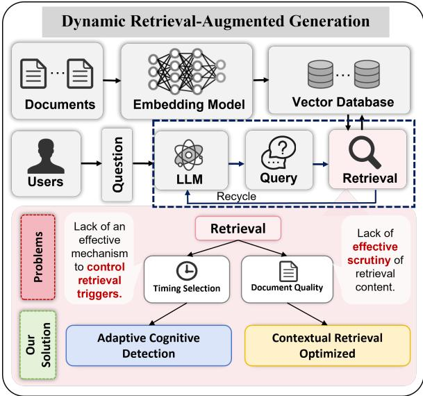
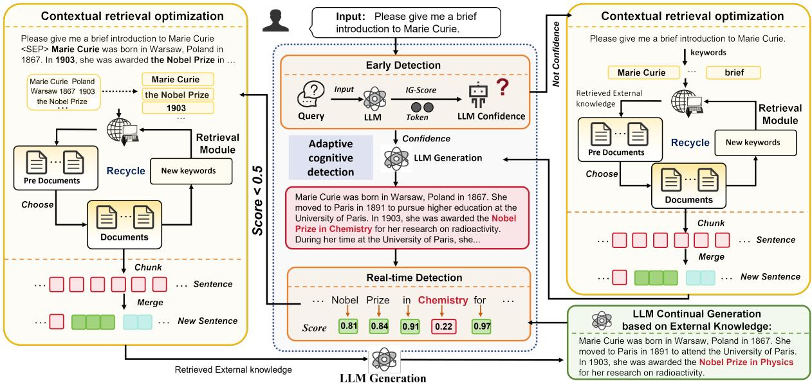
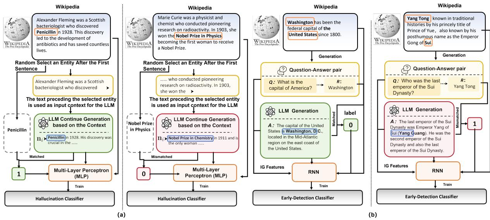
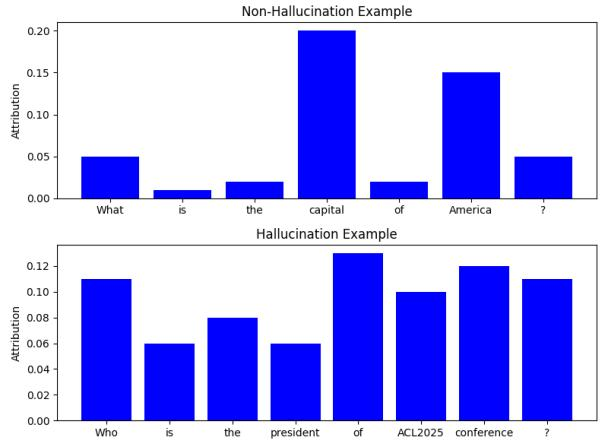
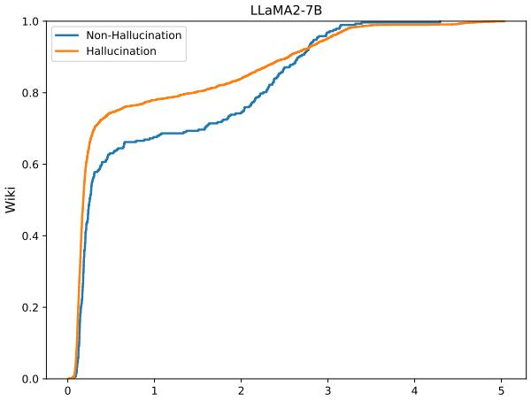
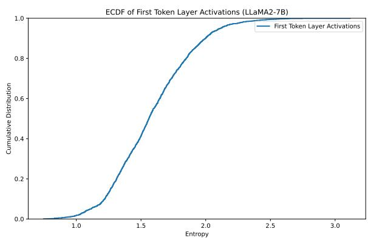
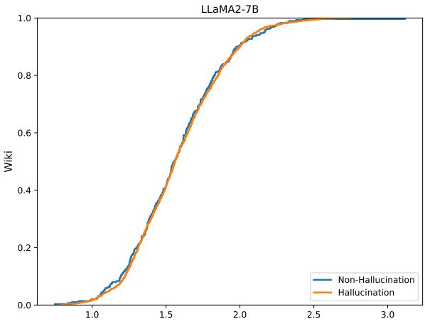
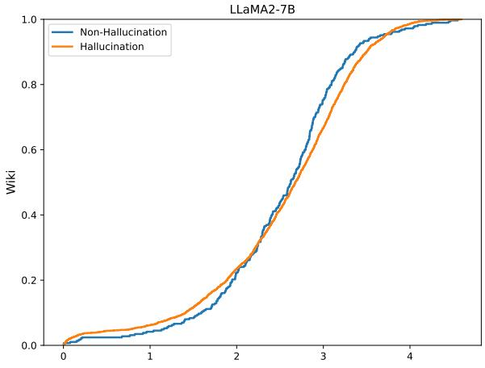
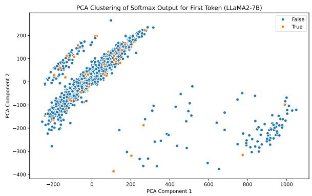

# DioR: Adaptive Cognitive Detection and Contextual Retrieval Optimization for Dynamic Retrieval-Augmented Generation

Hanghui Guo<sup>1,2</sup>, Jia Zhu<sup>1</sup>∗, Shimin Di<sup>3</sup>∗, Weijie Shi<sup>4</sup>∗, Zhangze Chen<sup>1</sup>, Jiajie Xu<sup>5</sup>

<sup>1</sup>Zhejiang Key Laboratory of Intelligent Education Technology and Application, Zhejiang Normal University

<sup>2</sup>School of Computer Science and Technology, Zhejiang Normal University

<sup>3</sup>School of Computer Science and Engineering, Southeast University

<sup>4</sup>Department of Computer Science and Engineering, Hong Kong University of Science and Technology <sup>5</sup>School of Computer Science and Technology, Soochow University

## Abstract

Dynamic Retrieval-augmented Generation (RAG) has shown great success in mitigating hallucinations in large language models (LLMs) during generation. However, existing dynamic RAG methods face significant limitations in two key aspects: 1) Lack ofan effective mechanism to control retrieval triggers, and 2) Lack of effective scrutiny of retrieval content. To address these limitations, we propose an innovative dynamic RAG method, DioR (Adaptive Cognitive Detection and Contextual Retrieval Optimization), which consists of two main components: adaptive cognitive detection and contextual retrieval optimization, specifically designed to determine when retrieval is needed and what to retrieve for LLMs is useful. Experimental results demonstrate that DioR achieves superior performance on all tasks, demonstrating the effectiveness of our work.

## 1 Introduction

Large language models (LLMs) have demonstrated remarkable capabilities across various generative tasks, such as text creation, dialogue generation, and content summarization (Raffel et al., 2020; Brown et al., 2020; Achiam et al., 2023; Chan et al., 2024). However, LLMs remain inherently static and lack the ability to learn in real-time (Mallen et al., 2023; Xing et al., 2024; Kumar, 2024). As a result, they cannot incorporate up-to-date information, which may generate inaccurate or even fabricated content when encountering unfamiliar scenarios (Maynez et al., 2020). This phenomenon is commonly referred to as “hallucination”.

Retrieval-Augmented Generation (RAG) has gained attention as an innovative approach to reducing hallucinations in LLM. By integrating external knowledge bases during the generation process and leveraging the contextual learning capabilities of LLMs, RAG effectively minimizes the generation of erroneous information, enhancing the reliability and precision of LLM generation (Jiang et al., 2022, 2024b; Niu et al., 2023; Zhu et al., 2025).

  
Figure 1: Dynamic RAG and its limitations about “Timing Selection” and “Document Quality”, as well as our solution to address the “Retrieval” limitation.

Conventional RAG methods are a single-turn retrieval process, where relevant documents are extracted based on the LLM’s input query and used for content generation (Ye et al., 2024; Roy et al., 2024; Zhang et al., 2024). While effective for simpler tasks, this method struggles with complex tasks or extensive text generation (He et al., 2024). These highlight the need for advanced retrieval mechanisms to handle these complex scenarios.

In contrast, Dynamic RAG effectively alleviates this issue by enhancing the quality of LLM outputs through multi-turn retrieval during the generation process (Tayal and Tyagi, 2024; Yang et al., 2024b; Su et al., 2024a). Specifically, it consists of two main steps: 1) Selecting the appropriate retrieval timing, and 2) Constructing the appropriate query once retrieval is triggered. This approach effectively addresses the shortcomings of conventional RAG in handling more complex problems.

However, as shown in Figure 1, existing dynamic RAG methods exhibit significant limitations from two perspectives, specifically:

1. Lack ofan effective mechanism to control retrieval triggers: Current dynamic RAG strategies typically rely on static, predefined rules to trigger the retrieval module, such as when the generation probability of a token falls below a predefined threshold. However, a low generation probability only indicates low confidence in the token, which does not necessarily imply hal lucination after LLM generation text. Moreover, existing RAG strategies often trigger retrieval only after hallucinations occur during the LLM text generation process. If the existence mechanism could predict whether the LLM is capable of answering a question in advance and trigger retrieval accordingly before generating, hallucinations might be avoided when generating.

2. Lack of effective scrutiny of retrieval content: The current dynamic RAG method performs single-batch retrieval in each round and also relies on the confidence scores of the most recent sentences’ tokens generated by the LLM to determine the final retrieval keyword, without fully considering the overall contextual requirements of the task. This can lead to the retrieval of documents that are not entirely relevant, as well as the introduction of noisy data. In addition, single-batch retrieval often focuses on limited aspects of the context, and the retrieved information has high redundancy, leading to repeated retrievals and increased computational costs. Moreover, retrieving documents with excessively long content can significantly hinder the LLM’s ability to understand, leading to information overload and impacting the model’s ability to extract key information from documents and perform effective reasoning.

To bridge these gaps, we propose a novel dynamic RAG method, named DioR (Adaptive Cognitive Detection and Contextual Retrieval Optimization). DioR consists of two main components: adaptive cognitive detection, and contextual retrieval optimization. Specifically:

In terms of adaptive cognitive detection, we utilize the Wiki dataset to construct two hallucination detection datasets and train two classifiers: Early Detection and Real-time Detection. The Early Detection Classifier assesses the model’s ability to answer questions independently, while Real-time Detection monitors for hallucinations during the generation process. Once Early Detection finds LLM has no confidence in its response or Realtime Detection identifies hallucinations, we present contextual retrieval optimization to step-by-step retrieve documents. We optimize the priority of query keywords through contextual analysis for retrieval. Retrieved documents are then used to capture new concepts to refine query keywords for more relevant and precise retrieval in later steps. Additionally, we use a sentence-level chunking module to reduce the impact of long texts, enhancing model understanding and inference performance.

The main contributions are listed as follows:

• We propose DioR, a novel dynamic RAG method that addresses two key limitations of existing methods: 1) Lack of an effective mechanism to control retrieval triggers, and 2) Lack of effective scrutiny of retrieval content.

• We constructed and trained both early detection and real-time detection classifiers to determine the optimal retrieval trigger timing based on the internal state of the LLM before and during the text generation process. Additionally, we adopted contextual retrieval optimization to enhance both the retrieval process and the quality of the documents, thereby improving the LLM’s reasoning generation capabilities.

• Our experiments demonstrate that DioR surpasses popular methods in four knowledgeintensive generation datasets, achieving superior performance across the board.

## 2 Related Work

Large language models (LLMs) have shown outstanding performance in solving downstream tasks (Kumar, 2024); however, due to their inability to integrate new information, they are prone to generating hallucinations during generation (Su et al., 2024b; Ramprasad et al., 2024). To address this issue, Retrieval-Augmented Generation (RAG) is an effective strategy, enhancing the model’s ability to leverage non-parametric knowledge by retrieving external data resources (Jiang et al., 2022, 2024b).

  
Figure 2: Detailed technical framework of DioR. It is mainly divided into two technical aspects: 1) Adaptive cognitive detection; and 2) Contextual retrieval optimization.

The initial RAG paradigm primarily focused on single-turn retrievals, such as Single-round RAG (SR-RAG) methods like KNN-LM (Wang et al., 2023), ReAtt (Jiang et al., 2022), REPLUG (Shi et al., 2024), and UniWeb (Li et al., 2023), which retrieve relevant passages from external corpora based on the initial query and append them to the LLM’s input. Single-turn retrieval indeed shows significant improvements in the context of simple tasks. However, when confronted with more complex tasks, such as multi-step reasoning, long-form question answering, and chain-of-thought reasoning (Ayala and Béchard, 2024a; Su et al., 2024a), relying solely on the initial input for RAG often fails to provide sufficient effective external knowledge, resulting in limited improvements in addressing hallucinations (Wu et al., 2024).

To address this issue, researchers have explored multi-turn retrieval-augmented strategies (Dynamic RAG). Fixed Length RAG (FL-RAG) methods, such as RETRO (Borgeaud et al., 2022) and ICRALM (Ram et al., 2023), trigger the retrieval module after every n token, using the generated tokens from the previous token window as the query. Fixed Sentence RAG (FS-RAG) methods, such as IRCot (Trivedi et al., 2023), trigger retrieval after each sentence, treating each generated sentence as a new query. However, these multi-turn retrieval approaches do not fully consider the real-time needs of the LLM during the generation process, which may lead to suboptimal results. In contrast, FLARE (Jiang et al., 2023) triggers retrieval when uncertain tokens are encountered (i.e., when the probability of any token in the text falls below a certain threshold), and inspired by this, Dragin (Su et al., 2024a), a novel dynamic RAG method, determines the timing and content of retrieval based on the LLM’s attention entropy and token relevance.

However, current dynamic RAG methods fail to predict whether the LLM has the capability to answer a question prior to generation, thereby triggering retrieval in advance. Moreover, most methods often rely on static rules, leading to ineffective timing for retrieval triggers during the generation process. Additionally, existing dynamic RAG approaches lack optimization strategies for the document retrieval process and the quality of retrieved documents, such as relevance and length, which significantly hampers the LLM’s performance

## 3 Proposed Method: DioR

In this section, we present the DioR, an innovative dynamic Retrieval-Augmented Generation (RAG) method, as illustrated in Figure 2. DioR consists of two main components: adaptive cognitive detection and contextual retrieval optimization.

## 3.1 Adaptive cognitive detection

In view of the limitation of existing dynamic RAG methods that Lack an effective mechanism to control retrieval triggers, we propose an innovative approach, Adaptive cognitive detection, which aims to effectively judge the optimal timing of retrieval based on the cognitive characteristics of large language models (LLMs). We specifically explain the method from two perspectives.

## 3.1.1 Is LLM confident in answering this?

We mentioned before that existing dynamic RAG methods all determine whether hallucinations occur after LLM generates content. However, if an LLM exhibits a lack of sufficient confidence when confronted with a particular question before generating, does it mean the model is more likely to generate incorrect information in uncertain situations, potentially leading to hallucinations? Therefore, can we intervene in the model’s output too early, before it generates such hallucinations?

Algorithm 1 Early Detection Dataset Construction   
and Training   
1: Input: Wikipedia   
2: Output: Trained RNN classifier $R N N _ { C }$   
3: Step 1: Data Preparation   
4: for each question-answer pair $Q ,$ R do   
5: Generate answer A using LLaMA2-7B   
based on question $Q$   
6: if A matches R or contains R (i.e., R A)   
then   
7: Label as Non-Hallucination   
8: else   
9: Label as Hallucination   
10: end if   
11: Extract IG Attribution Entropy (IG fea  
tures) from question $Q$   
12: Store (Q, A, R, IG, Label)   
13: end for   
14: Step 2: Model Training   
15: Initialize RNN-based classifier $R N N _ { C }$   
16: for each data point (Q, A, R, IG, Label) do   
17: Feed (Q, A, R, IG) into the RNN   
18: Compute predicted label yˆ and loss   
(ˆy, Label)   
19: Backpropagate and update model parame  
ters to minimize   
20: end for   
21: Step 3: Output Trained classifier RNN<sub>C</sub>

Therefore, we plan to train a detector to determine whether early intervention in retrieval timing is necessary to optimize the subsequent generation process. Specifically, Early Detection aims to assess the LLM’s confidence level regarding a given question before generation, and based on this assessment, decide whether retrieval should occur prior to generation. The specific dataset construction and training process is detailed in Algorithm 1 and Appendix A.1 (Algorithm Explanation).

Based on this, we trained an RNN classifier on a large Wikipedia dataset to determine whether to trigger RAG based on the LLM’s confidence level in responding to a given question.

## 3.1.2 Does LLM have accurate output?

Algorithm 2 Real-time Detection Dataset Con  
struction and Training   
1: Input: Wikipedia $W = \{ w _ { 1 } , w _ { 2 } , . . . , w _ { n } \}$   
2: Output: Trained MLP classifier $M L P _ { C }$   
3: Step 1: Data Preparation   
4: for each article $w _ { i } \in W$ do   
5: Truncate article based on entity positions   
6: Generate text $t _ { i }$ using LLaMA2-7B from   
truncated article   
7: end for   
8: Step 2: Entity Extraction and Comparison   
9: Extract entities $e _ { i }$ from original article $w _ { i }$   
10: Extract entities $n _ { i }$ from generated text $t _ { i }$   
11: for each entity $n _ { j } \in n _ { i } , e _ { j } \in e _ { i }$ do   
12: Compare $e _ { j }$ and $n _ { j }$ for cosine similarity   
13: if similarity between $e _ { j }$ and $n _ { j }$ is high then   
14: Consider $e _ { j }$ and $n _ { j }$ as the same entity   
(no hallucination)   
15: else   
16: Mark $t _ { i }$ as hallucination (0)   
17: end if   
18: end for   
19: Step 3: Dataset Construction   
20: Construct data point $D _ { i } = \{ w _ { i } , e _ { i } , t _ { i } , n _ { i } , H _ { i } \}$   
where $H _ { i }$ is hallucination label (0 for halluci  
nation, 1 for non-hallucination)   
21: Store data point $D _ { i }$ in dataset $D _ { n }$   
22: Step 4: Model Training   
23: Train MLP classifier $M L P _ { C }$ on dataset $D _ { n }$   
24: for each data point $( w _ { i } , e _ { i } , t _ { i } , n _ { i } , H _ { i } ) \in D _ { n }$   
do   
25: Feed $w _ { i } , e _ { i } , t _ { i } , n _ { i }$ into the MLP classifier   
26: Compute predicted hallucination label $\hat { H _ { i } }$   
and loss $\mathcal { L } ( \hat { H _ { i } } , H _ { i } )$   
27: Backpropagate and update classifier param  
eters to minimize $\mathcal { L }$   
28: end for   
29: Step 5: Output Trained classifier MLP

As mentioned earlier, most existing dynamic RAG frameworks rely on static, predefined rules to trigger the retrieval module. For example, retrieval is initiated when the generation probability of a token during the LLM’s output process falls below a predefined threshold, treating such low-probability tokens as potential hallucinations.

However, hallucination detection should not rely on generation probability. While the generation probability could indicate model confidence (Farquhar et al., 2024; Ayala and Béchard, 2024b), it does not directly reflect the accuracy of the LLMgenerated text, and therefore may not be a reliable criterion for the occurrence of hallucinations.

Thus, the Real-time Detection aims to monitor the generation process of the LLM and detect in real time whether the output tokens from LLMs are likely to be hallucinations, as the standard of the retrieval timing. The specific dataset construction and training process is described in Algorithm 2 and Appendix A.2 in detail.

Therefore, we have trained an MLP-based hallucination detector on a large corpus of Wikipedia data to ensure its effectiveness in accurately identifying hallucinations.

## 3.2 When to retrieve is needed?

The appropriate retrieval timing helps LLM to avoid hallucinations in the generation process with maximum efficiency. So we define the detection process of the above two classifiers as follows:

Definition 1. Let $C ( Q )$ denote the LLM’s confidence in question Q. $I G ( Q )$ represents the Attribution Entropy (IG features) (more ref. A.1.1).

$$
I G ( Q ) = \sum _ { j = 1 } ^ { N } \frac { - \mathrm { I G } _ { j } } { \sum _ { k = 1 } ^ { N } \mathrm { I G } _ { k } } \log \left( \frac { \sum _ { k = 1 } ^ { N } \mathrm { I G } _ { k } } { \mathrm { I G } _ { j } } \right)\tag{1}
$$

$$
C ( Q ) = \mathbb { I } ( \operatorname { S o f t m a x } ( f _ { \mathrm { R N N } } ( \mathrm { I G } ( Q ) ) ) > 0 . 5 ) .\tag{2}
$$

If C(Q) is 1, the retrieval trigger. We calculate the IG attribution value IG<sub>i</sub> separately for each token $t _ { i }$ ofQ, and the mean ofall token is $_ { I G }$ <sub>mean</sub>. For selecting candidate keywords for retrieval (the model tends tofocus on), wefollowing bellow:

$$
I f I G _ { i } > I G _ { m e a n } \Rightarrow t _ { i } a s c a n d i d a t e .\tag{3}
$$

Definition 2. Let $t _ { j }$ as the generating token of $L L M s$ . $P _ { t _ { j } }$ as hallucination probability of $t _ { j }$

$$
P _ { t _ { j } } = \sigma ( f _ { M L P } ( t _ { j } ) ) .\tag{4}
$$

If $P _ { t _ { j } }$ (the sigmoid layer score σ) is below 0.5, the token t<sub>j</sub> is flagged as a hallucination and the retrieval trigger. Then, use spaCy to extract all entitiesfrom the generated text, convert them into tokens, filter out the tokens labeled as hallucinations, and ultimately attain valid candidate keywords.

## 3.3 Contextual retrieval optimization

Once the LLM is determined to lack confidence in answering a question or when hallucinations are detected, triggering RAG becomes necessary. The next step in the RAG framework is to generate queries and retrieve relevant information from external databases to support the LLM in continuing text generation. However, existing dynamic RAG methods suffer from the limitation of Lack of effective scrutiny of retrieval content.

To address the limitation, we propose a novel method called Contextual retrieval optimization, consisting of two key steps: pre-retrieval and postretrieval. Specifically, as follows.

## 3.3.1 Pre-retrieval

Existing dynamic RAG frameworks rely solely on the token confidence scores (e.g., attention weights) of the most recent sentences generated by the LLM to select the final retrieval keyword. This approach, which selects keywords based on recent sentences or token confidence, struggles to accurately capture subtle semantic relationships between contextual information, potentially leading to suboptimal retrieval results. Therefore, we performed the following optimizations in the selection of keywords.

We analyzed the entire text generated by the LLM using the two detectors (sec. 3.2, Early and Real-time Detection) and identified a set of candidate keywords. Then, we assess the importance of each candidate keyword (token) through four evaluation metrics. This helps the model choose the most important keyword (token) to retrieve.

We first compute the attention scores of each token using a multi-head attention mechanism. By representing attention across different heads, the model can focus on various semantic and syntactic features of the text, offering a more comprehensive understanding of which parts of the text are most important for retrieving external information. Let $A _ { i }$ represent the attention score for token i. Next, we incorporate TF-IDF scores to evaluate the information density of each token. We assign higher priority to tokens with greater information density. We then calculate a positional score based on the relative position of each token in the text, taking into account its contextual role in text generation. The positional score for token i is computed as: $\begin{array} { r } { P _ { i } = \frac { \mathrm { P o s } ( i ) } { N } } \end{array}$ , where $\mathrm { P o s } ( i )$ and $N$ are the position of the token and the total number of tokens respectively. Finally, we assess the semantic relevance between each token and the query term by calculating the cosine similarity $S _ { i }$ between the word embedding vectors of the token i and the query ${ \vec { q } } .$

The overall importance score $I _ { i }$ for each token is computed as a weighted sum of four components, which enables more accurate identification of relevant tokens and enhances subsequent retrieval.

DioR ranks tokens in descending order of importance based on $I _ { i } ,$ , it prioritizes those most relevant to the retrieval task. These top-ranked tokens facilitate the extraction of the most relevant external knowledge with the question. Advanced retrieval models, such as BM25, are then used to retrieve relevant documents from an external knowledge base, enhancing the precision of the retrieval process. Then, we put the retrieved documents in the candidate area for the next step of optimization.

## 3.3.2 Post-retrieval

After retrieving relevant documents from the knowledge base based on token priority, we need to design a dynamic optimization strategy to enhance the accuracy and relevance of documents for real-time retrieval needs. Specifically, since current dynamic RAG frameworks retrieve all documents in a single batch per query trigger, lacking flexibility and failing to fully understand the task context, we discard this strategy in favor of stepwise retrieval.

For example, if five documents need to be retrieved, we first choose the top two most relevant from the candidate area (n/2, where n is the number of remaining documents to be retrieved). Next, we perform keyword extraction on these two documents, focusing on newly emerging keywords or concepts. The newly emerged concepts are merged with the original keywords, and a new round of retrieval is conducted based on the updated keyword set. This process is repeated until the required number of documents is selected, providing accurate information support for subsequent generation.

Once the document selection is complete, the next step is to input the selected documents into the LLM. If any individual document is too long, it may hinder the model’s understanding and reasoning. To address this, we design a sentence-level segmentation approach for the document. However, simple sentence segmentation may lead to semantic breaks, potentially causing misinterpretations by the model. To solve this problem, we reassemble the sentences into shorter, semantically coherent segments, ensuring that the split content maintains logical continuity. Specifically, for each sentence $x ,$ we first split it into sub-clauses $x _ { 1 } , x _ { 2 } , \ldots , x _ { n }$ then evaluate the scores for various sub-clause combinations. For instance, we compare the score of the combination of $x _ { 1 }$ and $x _ { 2 }$ with that of $x _ { 1 }$ alone. If the combination score improves, we proceed by adding $x _ { 3 } ,$ comparing the score of $x _ { 1 } , x _ { 2 } , x _ { 3 }$ with that of $x _ { 1 } , x _ { 2 }$ , and repeat this process until the score decreases. At that point, the sub-clauses are grouped into a block. This method enables us to break each document $d _ { i }$ into several semantically coherent and shorter blocks $( \mathbf { e . g . , } d _ { i 1 } , d _ { i 2 } , \ldots , d _ { i k } )$ mitigating the negative impact of long texts on the model’s comprehension and optimizing its reasoning performance. This ensures that each input is semantically clear and concise.

We integrate all the segmented blocks from the retrieved documents into the LLM prompt template, please refer to the following for details:

External Knowledge After Chunk:

$$
\left[ 1 \right] d _ { 1 } [ ( 1 ) . d _ { 1 1 } , ( 2 ) . d _ { 1 2 } , \ldots , ( u ) . d _ { 1 u } ]
$$

$$
[ 2 ] d _ { 2 } [ ( 1 ) . d _ { 2 1 } , ( 2 ) . d _ { 2 2 } , . . . , ( t ) . d _ { 2 t } ]
$$

$$
[ 3 ] \ d _ { i } [ ( 1 ) . d _ { i 1 } , ( 2 ) . d _ { i 2 } , . . . , ( k ) . d _ { i k } ] \ . . .
$$

Using the external knowledge provided above, please answer the following question:

Question: [Ques.]

Answer: Insert truncated output [ ] and additional relevant details here.

This integration method effectively addresses the knowledge gaps during the LLM generation process. Specifically, when hallucinations occur in the content generated by the LLM, we make it a truncation point, and we introduce externally retrieved knowledge to allow the LLM to continue generating more accurate and comprehensive content from the truncation point. This enhances the model’s understanding of the documents and ensures that the generated content is more precise and relevant.

## 4 Experiment

## 4.1 Experimental Setups

The comprehensive and detailed descriptions of the experimental setups, including the datasets, evaluation metrics, and implementation specifics, can be found in Appendix B.

Table 1: Comparison of EM, F1, Precision, and Recall scores between the Base method and DioR across various datasets and retrieval strategies. The highest scores for each metric in each dataset are highlighted in underline.
<table><tr><td rowspan="2">Matrix</td><td colspan="2">2WikiMultihopQA</td><td colspan="2">HotpotQA</td><td colspan="2">IIRC</td><td colspan="2">StrategyQA</td></tr><tr><td>Base</td><td>DioR</td><td>Base</td><td>DioR</td><td>Base</td><td>DioR</td><td>Base</td><td>DioR</td></tr><tr><td>EM (BM25)</td><td>0.214</td><td>0.254</td><td>0.219</td><td>0.274</td><td>0.156</td><td>0.201</td><td>0.639</td><td>0.659</td></tr><tr><td>EM (SGPT)</td><td>0.209</td><td>0.226</td><td>0.202</td><td>0.212</td><td>0.125</td><td>0.178</td><td>0.604</td><td>0.616</td></tr><tr><td>EM (SBERT)</td><td>0.231</td><td>0.266</td><td>0.165</td><td>0.205</td><td>0.142</td><td>0.153</td><td>0.645</td><td>0.654</td></tr><tr><td>F1 (BM25)</td><td>0.282</td><td>0.335</td><td>0.314</td><td>0.379</td><td>0.188</td><td>0.245</td><td>0.639</td><td>0.659</td></tr><tr><td>F1 (SGPT)</td><td>0.278</td><td>0.292</td><td>0.301</td><td>0.307</td><td>0.153</td><td>0.224</td><td>0.604</td><td>0.616</td></tr><tr><td>F1 (SBERT)</td><td>0.294</td><td>0.328</td><td>0.244</td><td>0.303</td><td>0.172</td><td>0.179</td><td>0.645</td><td>0.654</td></tr><tr><td>Pre. (BM25)</td><td>0.288</td><td>0.342</td><td>0.331</td><td>0.399</td><td>0.195</td><td>0.255</td><td>0.639</td><td>0.659</td></tr><tr><td>Pre. (SGPT)</td><td>0.284</td><td>0.298</td><td>0.319</td><td>0.333</td><td>0.159</td><td>0.229</td><td>0.604</td><td>0.616</td></tr><tr><td>Pre. (SBERT)</td><td>0.298</td><td>0.334</td><td>0.256</td><td>0.324</td><td>0.176</td><td>0.185</td><td>0.645</td><td>0.654</td></tr><tr><td>Rec. (BM25)</td><td>0.285</td><td>0.345</td><td>0.316</td><td>0.381</td><td>0.196</td><td>0.243</td><td>0.639</td><td>0.659</td></tr><tr><td>Rec. (SGPT)</td><td>0.281</td><td>0.299</td><td>0.305</td><td>0.312</td><td>0.156</td><td>0.219</td><td>0.604</td><td>0.616</td></tr><tr><td>Rec. (SBERT)</td><td>0.299</td><td>0.332</td><td>0.255</td><td>0.303</td><td>0.180</td><td>0.189</td><td>0.645</td><td>0.654</td></tr></table>

Table 2: Comparison of DioR and other RAG methods for LLaMA2-7B-CHAT across four different datasets
<table><tr><td>Dataset</td><td>Metric</td><td>DioR</td><td>SEAKR RaDIO</td><td></td><td>Dragin wo-RAG</td><td></td><td>SR-RAG</td><td>FL-RAG</td><td>FS-RAG FLARE</td><td></td></tr><tr><td>2WikiMultihopQA</td><td>EM F1</td><td>0.266 0.335</td><td>0.264 0.330</td><td>0.254 0.317</td><td>0.231 0.294</td><td>0.146 0.223</td><td>0.169 0.255</td><td>0.112 0.192</td><td>0.189 0.265</td><td>0.143 0.213</td></tr><tr><td>HotpotQA</td><td>EM F1</td><td>0.274 0.379</td><td>0.261 0.365</td><td>0.246 0.351</td><td>0.219 0.314</td><td>0.184 0.275</td><td>0.164 0.150</td><td>0.146 0.211</td><td>0.214 0.304</td><td>0.149 0.221</td></tr><tr><td>IIRC</td><td>EM F1</td><td>|0.201 0.245</td><td>0.195 0.235</td><td>0.196 0.239</td><td>0.156 0.188</td><td>0.139 0.173</td><td>0.187 0.226</td><td>0.172 0.203</td><td>0.178 0.216</td><td>0.136 0.164</td></tr><tr><td>StrategyQA</td><td>Pre.</td><td>0.659</td><td>0.650</td><td>0.654</td><td>0.645</td><td>0.659</td><td>0.645</td><td>0.634</td><td>0.629</td><td>0.627</td></tr></table>

## 4.2 Experimental Results

In this subsection, we mainly discuss the most important experimental results, which aim to comprehensively evaluate DioR’s performance across four datasets with various competitors. The additional experimental results, which provide further insights into the performance of our method, are discussed in greater detail in Appendix C.

## 4.2.1 Overall Results

In this part, we present results comparing the performance of the Base (Dragin (Su et al., 2024a)) and DioR (Using LLaMA2-7B). As shown in Table 1 in detail.

In 2WikiMultihopQA, the DioR method consistently outperforms the Base method across all retrieval methods and evaluation metrics. Specifically, DioR achieves a notable increase in EM, with a score of 0.254 (BM25) compared to the Base’s 0.214. Similarly, F1, Precision, and Recall scores show advantages for DioR, surpassing the Base.

In HotpotQA. For EM, DioR reaches 0.274 (BM25), an improvement over the Base’s 0.219. The F1 score is also better for DioR, achieving 0.379 (BM25) versus the Base’s 0.314. Pre. and Rec. follow a similar trend. It is worth noting that under the SBERT retrieval strategy, the Pre. is improved by 0.068, the largest increase compared with BM25 and SGPT.

In the IIRC dataset, DioR demonstrates a consistent advantage across metrics. The EM score increases from 0.156 (Base) to 0.201 (DioR, BM25). F1, Pre., and Rec. scores also show significant improvement, with DioR reaching a Pre. of 0.255 (BM25) and Rec. of 0.243 (BM25), higher than the Base method by a noticeable margin.

In the StrategyQA dataset, DioR outperforms the Base method across all retrieval methods. The EM score increases from 0.639 (Base) to 0.659 (DioR, BM25). F1, Pre., and Rec. show similar improvements, with DioR achieving a Precision score of 0.659 and a Recall score of 0.659 (both BM25), marking a consistent performance boost.

Table 3: Ablation experiments. ED: Early-Detection, RD: Real-time Detection, Pre-R/Post -R: Pre/Post -retrieve.
<table><tr><td>Dataset</td><td>Metric</td><td>DioR</td><td>w/o ED</td><td>w/o RD</td><td>w/o Pre-R</td><td>w/o Post-R</td></tr><tr><td rowspan="2">2WikiMultihopQA</td><td>EM</td><td>0.266</td><td>0.258</td><td>0.239</td><td>0.249</td><td>0.260</td></tr><tr><td>F1</td><td>0.335</td><td>0.327</td><td>0.301</td><td>0.306</td><td>0.322</td></tr><tr><td rowspan="2">HotpotQA</td><td>EM</td><td>0.274</td><td>0.266</td><td>0.223</td><td>0.237</td><td>0.249</td></tr><tr><td>F1</td><td>0.379</td><td>0.363</td><td>0.319</td><td>0.334</td><td>0.356</td></tr><tr><td rowspan="2">IIRC</td><td>EM</td><td>0.201</td><td>0.191</td><td>0.169</td><td>0.172</td><td>0.197</td></tr><tr><td>F1</td><td>0.245</td><td>0.233</td><td>0.197</td><td>0.206</td><td>0.240</td></tr><tr><td>StrategyQA</td><td>Pre.</td><td>0.659</td><td>0.652</td><td>0.646</td><td>0.648</td><td>0.655</td></tr></table>

Overall, results show that DioR outperforms the Base method across all datasets and evaluation metrics, providing a more robust solution for questionanswering tasks and effectively addressing hallucinations while enhancing LLM reasoning.

## 4.2.2 Comparison with Other RAG methods

In this part, we present a comparison of the performance of DioR and various RAG-based methods (Using LLaMA2-7B). As shown in Table 2.

On the 2WikiMultihopQA dataset, DioR achieves the highest performance. Specifically, DioR scores 0.266 for EM, surpassing some popular dynamic RAG methods, such as SEAKR, Ra-DIO, and Dragin. Similarly, DioR leads in F1, with a score of 0.335. Other RAG methods, such as wo-RAG (EM: 0.146, F1: 0.223) and SR-RAG (EM: 0.169, F1: 0.255), perform notably worse.

In HotpotQA, DioR also outperforms other methods, achieving higher EM (0.274) and F1 (0.379) scores than popular dynamic RAG methods such as RaDIO (EM: 0.246, F1: 0.351), SEAKR (EM: 0.261, F1: 0.365), and Dragin (EM: 0.231, F1: 0.294). In contrast, wo-RAG and SR-RAG show significantly lower scores (EM: 0.184, F1: 0.275 for wo-RAG; EM: 0.164, F1: 0.150 for SR-RAG).

In the IIRC dataset, DioR achieves the highest EM (0.201) and F1 (0.245) scores, outperforming other RAG methods such as Dragin (EM: 0.156, F1: 0.188), FL-RAG (EM: 0.172, F1: 0.203) and FS-RAG (EM: 0.178, F1: 0.216).

On the StrategyQA dataset, DioR achieves the highest Precision score (0.659), surpassing the Ra-DIO (0.654), Dragin (0.645), SEAKR (0.650), and other RAG methods. While wo-RAG shows similar performance (0.659) due to the dataset is not complex, DioR still leads in all datasets, which is indicative of its overall more reliable performance.

Thus, the experimental results demonstrate that DioR offers a robust solution for handling LLMgenerated hallucinations, making it a superior choice for tasks requiring high factual accuracy, such as those involving complex, multi-hop reasoning or multi-turn question answering.

## 4.2.3 Ablation Experiment

In this part, we mainly test the effectiveness of the following two components of our proposed method: adaptive cognitive detection and contextual retrieval optimization. As shown in Tabel. 3.

It is worth noting that if we remove the Real-time Detection module, retrieval is triggered directly when the generation probability of a token is below 0.5. If we remove the “Pre-retrieval” step, retrieval is performed sequentially based on the order of token appearances. The remaining two modules can be directly removed: removing Early Detection eliminates the need to assess the LLM’s ability to answer in advance while removing “Post-retrieval” leads to single-batch retrieval, where all documents are included in the prompt input to the LLM (the prompt for LLMs reference Appendix F).

Based on the results of the ablation experiments, we can observe the effectiveness of each component in enhancing DioR across four datasets. This further validates the efficacy of our proposed method in addressing the two limitations of existing dynamic RAG approaches.

## 5 Conclusion and Future work

In this paper, we investigate the effectiveness of Retrieval-Augmented Generation (RAG) techniques in mitigating hallucination issues in large language models (LLMs). However, existing dynamic RAG methods face significant limitations in two key aspects, 1) Lack of an effective mechanism to control retrieval triggers, and 2) Lack of effective scrutiny of retrieval content. To address these limitations, we propose an innovative dynamic RAG approach, DioR (Adaptive Cognitive Detection and Contextual Retrieval Optimization), achieving when retrieval is needed and what to retrieve for LLMs is useful. Compared to existing popular dynamic RAG methods, DioR demonstrates superior performance across four knowledge-intensive generation datasets, proving the effectiveness of our method in improving.

Looking ahead, we will refine DioR, especially in its ability to tackle complex problems in a stepby-step manner. By integrating more refined reasoning strategies, we aim to further elevate the model’s performance on intricate tasks.

## Limitations

We acknowledge the limitations of this paper. Specifically, we face the performance impact of retrieving long documents for model inference. While we have implemented chunking to shorten the length of individual knowledge pieces and improve the model’s understanding of each, the total length of all input knowledge remains unchanged. In the future, we could introduce a model that summarizes the key points of each document, reducing the overall length and focusing on the core content for retrieval, thereby improving both the efficiency and the relevance of the retrieved knowledge.

On the other hand, we have identified that complex problems often pose significant challenges when approached through a single, direct reasoning process. For instance, in mathematical problems, attempting to solve them in one step can lead to increased computational complexity, higher error rates, and difficulty in identifying intermediate issues. To address these challenges, we plan to adopt a step-by-step reasoning approach in the future. Specifically, we will plan to break down complex problems into a series of smaller, more manageable sub-problems. By tackling each sub-problem sequentially, we can enhance the clarity and accuracy of the reasoning process, making it easier to identify and correct errors at each stage, and ultimately improve the overall effectiveness and reliability of large language models’ reasoning.

## Acknowledgment

This work was supported by the National Key R&D Program of China under Grant No. 2022YFC3303600, the Zhejiang Provincial Natural Science Foundation of China under Grant No. LY23F020010, and the National Natural Science Foundation of China under Grant Nos. 62337001.

## References

Mohamed Abdelsalam, Mojtaba Faramarzi, Shagun Sodhani, and Sarath Chandar. 2021. Iirc: Incremental implicitly-refined classification. In Proceedings ofthe IEEE/CVF conference on computer vision and pattern recognition, pages 11038–11047.

Josh Achiam, Steven Adler, Sandhini Agarwal, Lama Ahmad, Ilge Akkaya, Florencia Leoni Aleman, Diogo Almeida, Janko Altenschmidt, Sam Altman, Shyamal Anadkat, et al. 2023. Gpt-4 technical report. arXiv preprint arXiv:2303.08774.

Orlando Ayala and Patrice Béchard. 2024a. Reducing hallucination in structured outputs via retrievalaugmented generation. In Proceedings ofthe 2024 Conference of the North American Chapter of the Associationfor Computational Linguistics: Human Language Technologies: Industry Track, NAACL 2024, Mexico City, Mexico, June 16-21, 2024, pages 228–238. Association for Computational Linguistics.

Orlando Ayala and Patrice Béchard. 2024b. Reducing hallucination in structured outputs via retrievalaugmented generation. In Proceedings ofthe 2024 Conference of the North American Chapter of the Associationfor Computational Linguistics: Human Language Technologies: Industry Track, NAACL 2024, Mexico City, Mexico, June 16-21, 2024, pages 228–238. Association for Computational Linguistics.

Sebastian Borgeaud, Arthur Mensch, Jordan Hoffmann, Trevor Cai, Eliza Rutherford, Katie Millican, George Bm Van Den Driessche, Jean-Baptiste Lespiau, Bogdan Damoc, Aidan Clark, et al. 2022. Improving language models by retrieving from trillions of tokens. In International conference on machine learning, pages 2206–2240. PMLR.

Tom Brown, Benjamin Mann, Nick Ryder, Melanie Subbiah, Jared D Kaplan, Prafulla Dhariwal, Arvind Neelakantan, Pranav Shyam, Girish Sastry, Amanda Askell, et al. 2020. Language models are few-shot learners. Advances in neural information processing systems, 33:1877–1901.

Chi-Min Chan, Chunpu Xu, Ruibin Yuan, Hongyin Luo, Wei Xue, Yike Guo, and Jie Fu. 2024. Rq-rag: Learning to refine queries for retrieval augmented generation. arXiv preprint arXiv:2404.00610.

Tyler A Chang, Katrin Tomanek, Jessica Hoffmann, Nithum Thain, Erin MacMurray van Liemt, Kathleen

Meier-Hellstern, and Lucas Dixon. 2024. Detecting hallucination and coverage errors in retrieval augmented generation for controversial topics. In Proceedings ofthe 2024 Joint International Conference on Computational Linguistics, Language Resources and Evaluation (LREC-COLING 2024), pages 4729– 4743.

Sebastian Farquhar, Jannik Kossen, Lorenz Kuhn, and Yarin Gal. 2024. Detecting hallucinations in large language models using semantic entropy. Nature, 630(8017):625–630.

Mor Geva, Daniel Khashabi, Elad Segal, Tushar Khot, Dan Roth, and Jonathan Berant. 2021. Did aristotle use a laptop? a question answering benchmark with implicit reasoning strategies. Transactions of the Association for Computational Linguistics, 9:346– 361.

Bolei He, Nuo Chen, Xinran He, Lingyong Yan, Zhenkai Wei, Jinchang Luo, and Zhen-Hua Ling. 2024. Retrieving, rethinking and revising: The chainof-verification can improve retrieval augmented generation. In Findings of the Association for Computational Linguistics: EMNLP 2024, pages 10371– 10393.

Xanh Ho, Anh-Khoa Duong Nguyen, Saku Sugawara, and Akiko Aizawa. 2020. Constructing a multi-hop qa dataset for comprehensive evaluation of reasoning steps. In Proceedings ofthe 28th International Conference on Computational Linguistics, pages 6609– 6625.

Lei Huang, Weijiang Yu, Weitao Ma, Weihong Zhong, Zhangyin Feng, Haotian Wang, Qianglong Chen, Weihua Peng, Xiaocheng Feng, Bing Qin, et al. 2024. A survey on hallucination in large language models: Principles, taxonomy, challenges, and open questions. ACM Transactions on Information Systems.

Ziwei Ji, Nayeon Lee, Rita Frieske, Tiezheng Yu, Dan Su, Yan Xu, Etsuko Ishii, Ye Jin Bang, Andrea Madotto, and Pascale Fung. 2023. Survey of hallucination in natural language generation. ACM Computing Surveys, 55(12):1–38.

Xuhui Jiang, Yuxing Tian, Fengrui Hua, Chengjin Xu, Yuanzhuo Wang, and Jian Guo. 2024a. A survey on large language model hallucination via a creativity perspective. arXiv preprint arXiv:2402.06647.

Zhengbao Jiang, Luyu Gao, Zhiruo Wang, Jun Araki, Haibo Ding, Jamie Callan, and Graham Neubig. 2022. Retrieval as attention: End-to-end learning of retrieval and reading within a single transformer. In Proceedings of the 2022 Conference on Empirical Methods in Natural Language Processing, pages 2336–2349.

Zhengbao Jiang, Frank F Xu, Luyu Gao, Zhiqing Sun, Qian Liu, Jane Dwivedi-Yu, Yiming Yang, Jamie Callan, and Graham Neubig. 2023. Active retrieval augmented generation. In Proceedings ofthe 2023 Conference on Empirical Methods in Natural Language Processing, pages 7969–7992.

Ziyan Jiang, Xueguang Ma, and Wenhu Chen. 2024b. Longrag: Enhancing retrieval-augmented generation with long-context llms. arXiv preprint arXiv:2406.15319.

Mandar Joshi, Eunsol Choi, Daniel Weld, and Luke Zettlemoyer. 2017. Triviaqa: A large scale distantly supervised challenge dataset for reading comprehension. In Proceedings ofthe 55th Annual Meeting of the Associationfor Computational Linguistics (Volume 1: Long Papers). Association for Computational Linguistics.

Pranjal Kumar. 2024. Large language models (llms): survey, technical frameworks, and future challenges. Artificial Intelligence Review, 57(10):260.

Tom Kwiatkowski, Jennimaria Palomaki, Olivia Redfield, Michael Collins, Ankur Parikh, Chris Alberti, Danielle Epstein, Illia Polosukhin, Jacob Devlin, Kenton Lee, et al. 2019. Natural questions: a benchmark for question answering research. Transactions of the Association for Computational Linguistics, 7:453– 466.

Junyi Li, Tianyi Tang, Wayne Xin Zhao, Jingyuan Wang, Jian-Yun Nie, and Ji-Rong Wen. 2023. The web can be your oyster for improving language models. In Findings of the Association for Computational Linguistics: ACL 2023, pages 728–746.

Ningke Li, Yuekang Li, Yi Liu, Ling Shi, Kailong Wang, and Haoyu Wang. 2024. Drowzee: Metamorphic testing for fact-conflicting hallucination detection in large language models. Proceedings ofthe ACM on Programming Languages, 8(OOPSLA2):1843–1872.

Yuanhua Lv and ChengXiang Zhai. 2011. Adaptive term frequency normalization for bm25. In Proceedings ofthe 20th ACM international conference on Information and knowledge management, pages 1985–1988.

Alex Troy Mallen, Akari Asai, Victor Zhong, Rajarshi Das, Daniel Khashabi, and Hannaneh Hajishirzi. 2023. When not to trust language models: Investigating effectiveness of parametric and non-parametric memories. In The 61st Annual Meeting OfThe Association For Computational Linguistics.

Joshua Maynez, Shashi Narayan, Bernd Bohnet, and Ryan McDonald. 2020. On faithfulness and factuality in abstractive summarization. In Proceedings of the 58th Annual Meeting of the Association for Computational Linguistics, pages 1906–1919.

Niklas Muennighoff. 2022. Sgpt: Gpt sentence embeddings for semantic search. arXiv preprint arXiv:2202.08904.

Cheng Niu, Yuanhao Wu, Juno Zhu, Siliang Xu, Kashun Shum, Randy Zhong, Juntong Song, and Tong Zhang. 2023. Ragtruth: A hallucination corpus for developing trustworthy retrieval-augmented language models. arXiv preprint arXiv:2401.00396.

Colin Raffel, Noam Shazeer, Adam Roberts, Katherine Lee, Sharan Narang, Michael Matena, Yanqi Zhou, Wei Li, and Peter J Liu. 2020. Exploring the limits of transfer learning with a unified text-to-text transformer. Journal ofmachine learning research, 21(140):1–67.

Pranav Rajpurkar, Robin Jia, and Percy Liang. 2018. Know what you don’t know: Unanswerable questions for squad. In Proceedings ofthe 56th Annual Meeting of the Association for Computational Linguistics (Volume 2: Short Papers), pages 784–789.

Ori Ram, Yoav Levine, Itay Dalmedigos, Dor Muhlgay, Amnon Shashua, Kevin Leyton-Brown, and Yoav Shoham. 2023. In-context retrieval-augmented language models. Transactions of the Association for Computational Linguistics, 11:1316–1331.

Sanjana Ramprasad, Elisa Ferracane, and Zachary C. Lipton. 2024. Analyzing LLM behavior in dialogue summarization: Unveiling circumstantial hallucination trends. In Proceedings ofthe 62nd Annual Meeting of the Association for Computational Linguistics (Volume 1: Long Papers), ACL 2024, Bangkok, Thailand, August 11-16, 2024, pages 12549–12561. Association for Computational Linguistics.

Nirmal Roy, Leonardo FR Ribeiro, Rexhina Blloshmi, and Kevin Small. 2024. Learning when to retrieve, what to rewrite, and how to respond in conversational qa. arXiv preprint arXiv:2409.15515.

Weijia Shi, Sewon Min, Michihiro Yasunaga, Minjoon Seo, Richard James, Mike Lewis, Luke Zettlemoyer, and Wen-tau Yih. 2024. Replug: Retrievalaugmented black-box language models. In Proceedings of the 2024 Conference of the North American Chapter of the Association for Computational Linguistics: Human Language Technologies (Volume 1: Long Papers), pages 8364–8377.

Ben Snyder, Marius Moisescu, and Muhammad Bilal Zafar. 2024. On early detection of hallucinations in factual question answering. In Proceedings of the 30th ACM SIGKDD Conference on Knowledge Discovery and Data Mining, pages 2721–2732.

Weihang Su, Yichen Tang, Qingyao Ai, Zhijing Wu, and Yiqun Liu. 2024a. DRAGIN: dynamic retrieval augmented generation based on the real-time information needs of large language models. In Proceedings of the 62nd Annual Meeting of the Association for Computational Linguistics (Volume 1: Long Papers), ACL 2024, Bangkok, Thailand, August 11-16, 2024, pages 12991–13013. Association for Computational Linguistics.

Weihang Su, Changyue Wang, Qingyao Ai, Yiran Hu, Zhijing Wu, Yujia Zhou, and Yiqun Liu. 2024b. Unsupervised real-time hallucination detection based on the internal states of large language models. In Findings ofthe Associationfor Computational Linguistics, ACL 2024, Bangkok, Thailand and virtual meeting, August 11-16, 2024, pages 14379–14391. Association for Computational Linguistics.

Anuja Tayal and Aman Tyagi. 2024. Dynamic contexts for generating suggestion questions in rag based conversational systems. In Companion Proceedings of the ACM on Web Conference 2024, pages 1338–1341.

Hugo Touvron, Louis Martin, Kevin Stone, Peter Albert, Amjad Almahairi, Yasmine Babaei, Nikolay Bashlykov, Soumya Batra, Prajjwal Bhargava, Shruti Bhosale, et al. 2023. Llama 2: Open foundation and fine-tuned chat models. arXiv preprint arXiv:2307.09288.

Harsh Trivedi, Niranjan Balasubramanian, Tushar Khot, and Ashish Sabharwal. 2023. Interleaving retrieval with chain-of-thought reasoning for knowledgeintensive multi-step questions. In Proceedings ofthe 61st Annual Meeting of the Association for Computational Linguistics (Volume 1: Long Papers), pages 10014–10037.

Bin Wang and C-C Jay Kuo. 2020. Sbert-wk: A sentence embedding method by dissecting bert-based word models. IEEE/ACM Transactions on Audio, Speech, and Language Processing, 28:2146–2157.

Shufan Wang, Yixiao Song, Andrew Drozdov, Aparna Garimella, Varun Manjunatha, and Mohit Iyyer. 2023. knn-lm does not improve open-ended text generation. In Proceedings of the 2023 Conference on Empirical Methods in Natural Language Processing, pages 15023–15037.

Yike Wu, Yi Huang, Nan Hu, Yuncheng Hua, Guilin Qi, Jiaoyan Chen, and Jeff Pan. 2024. Cotkr: Chain-ofthought enhanced knowledge rewriting for complex knowledge graph question answering. In Proceedings ofthe 2024 Conference on Empirical Methods in Natural Language Processing, pages 3501–3520.

Mingzhe Xing, Rongkai Zhang, Hui Xue, Qi Chen, Fan Yang, and Zhen Xiao. 2024. Understanding the weakness of large language model agents within a complex android environment. In Proceedings of the 30th ACM SIGKDD Conference on Knowledge Discovery and Data Mining, pages 6061–6072.

An Yang, Baosong Yang, Beichen Zhang, Binyuan Hui, Bo Zheng, Bowen Yu, Chengyuan Li, Dayiheng Liu, Fei Huang, Haoran Wei, et al. 2024a. Qwen2. 5 technical report. arXiv preprint arXiv:2412.15115.

Xiao Yang, Kai Sun, Hao Xin, Yushi Sun, Nikita Bhalla, Xiangsen Chen, Sajal Choudhary, Rongze Daniel Gui, Ziran Will Jiang, Ziyu Jiang, Lingkun Kong, Brian Moran, Jiaqi Wang, Yifan Xu, An Yan, Chenyu Yang, Eting Yuan, Hanwen Zha, Nan Tang, Lei Chen, Nicolas Scheffer, Yue Liu, Nirav Shah, Rakesh Wanga, Anuj Kumar, Scott Yih, and Xin Dong. 2024b. CRAG - comprehensive RAG benchmark. In Advances in Neural Information Processing Systems 38: Annual Conference on Neural Information Processing Systems 2024, NeurIPS 2024, Vancouver, BC, Canada, December 10 - 15, 2024.

Zhilin Yang, Peng Qi, Saizheng Zhang, Yoshua Bengio, William Cohen, Ruslan Salakhutdinov, and Christopher D Manning. 2018. Hotpotqa: A dataset for diverse, explainable multi-hop question answering. In Proceedings ofthe 2018 Conference on Empirical Methods in Natural Language Processing. Association for Computational Linguistics.

Zijun Yao, Weijian Qi, Liangming Pan, Shulin Cao, Linmei Hu, Weichuan Liu, Lei Hou, and Juanzi Li. 2024. Seakr: Self-aware knowledge retrieval for adaptive retrieval augmented generation. arXiv preprint arXiv:2406.19215.

Linhao Ye, Zhikai Lei, Jianghao Yin, Qin Chen, Jie Zhou, and Liang He. 2024. Boosting conversational question answering with fine-grained retrievalaugmentation and self-check. In Proceedings ofthe 47th International ACM SIGIR Conference on Research and Development in Information Retrieval, pages 2301–2305.

Yu Zhang, Kehai Chen, Xuefeng Bai, Zhao Kang, Quanjiang Guo, and Min Zhang. 2024. Question-guided knowledge graph re-scoring and injection for knowledge graph question answering. In Findings of the Associationfor Computational Linguistics: EMNLP 2024, pages 8972–8985.

Jia Zhu, Hanghui Guo, Weijie Shi, Zhangze Chen, and Pasquale De Meo. 2025. Radio: Real-time hallucination detection with contextual index optimized query formulation for dynamic retrieval augmented generation. Proceedings ofthe AAAI Conference on Artificial Intelligence, 39(24):26129–26137.

## A Adaptive cognitive detection algorithm details

In Section 3, we build two hallucination detection classifiers, as shown in Figure 3. We describe the algorithm described above in detail as follows and the effectiveness analysis of these two classifiers is shown in the Appendix C.6:

## A.1 Early Detection

We choose the Wikipedia dataset and used LLaMA2-7B-CHAT for generative question answering. For a randomly selected question Q, we generate an answer A with the model, where each Q contains a ground truth answer R, as described in lines 3 to 5 of Algorithm 1. We consider that if the generated answer A is inconsistent with the factual details of R, then it is factually incorrect, and the model’s response is a hallucination (Jiang et al., 2024a; Ji et al., 2023). This definition aligns with previous generative question-answering studies, which view factually incorrect statements as hallucinations. However, since LLM outputs can be quite long, merely matching the generated answer A with the reference answer R via exact string comparison is insufficient for judging the correctness of A. For example, assume Q = [Where is the capital of America?] and R = [Washington]. Whether LLaMA generates the answer A as "Washington" or "Washington D.C." both represent correct answers. Therefore, we consider that the reference answer R is contained within the generated answer A, i.e., $R \subseteq A$ , and the answer is correct, as described in lines 6 to 10 of Algorithm 1.

To effectively determine whether the LLM has enough information to answer a question, we can assess the model’s focus on certain words within the question, i.e., whether the LLM can capture the key points of the question. We use the Integrated Gradients (IG) method to generate feature attribution, which indicates the importance of each feature in the specific prediction (Snyder et al., 2024). This method is typically used to inspect the behavior of the model and uncover potential problematic patterns. In simple terms, if we calculate the feature attribution based on the LLM’s attention, if the LLM’s output does not generate hallucinations, i.e., if it focuses on certain keywords, the attribution entropy will be low (focusing on keywords, keywords’ attribution is high). Otherwise, when hallucinations are generated, the model will focus on more input words, resulting in higher attribution entropy (the focus is more dispersed, and all word attribution is relatively even). Specific proof of attribution entropy process reference A.1.1.

Thus, we construct an Early-Detection dataset consisting of $Q , A , R .$ and the IG-generated feature attribution values, along with hallucination labels, as described in lines 11 and 12 of Algorithm 1.

Due to the sequential nature of the data, we use a Recurrent Neural Network (RNN) for training, as RNNs are adept at handling sequential data and effectively capture contextual dependencies within the input sequence, as described in lines 14 to 21 of Algorithm 1. During training, we use the standard binary cross-entropy loss function to predict the $\hat { y } _ { i }$ given $Q , A , R .$ , and IG, as follows:

$$
L ( \theta ) = - \sum _ { i = 1 } ^ { N } \left[ y _ { i } \log ( \hat { y } _ { i } ) + ( 1 - y _ { i } ) \log ( 1 - \hat { y } _ { i } ) \right] ,\tag{5}
$$

where $\boldsymbol { \hat { y } _ { i } } ~ = ~ \mathrm { s i g m o i d } \left( f ( Q _ { i } , A _ { i } , R _ { i } , I G _ { i } , \theta ) \right)$ and $f ( Q _ { i } , A _ { i } , R _ { i } , I G _ { i } , \theta )$ is the model’s output, calculated from the model parameters $\theta$ and the inputs $Q _ { i } , A _ { i } , R _ { i } , I G _ { i }$

## A.1.1 Proof of Attribution Entropy Behavior

Uniform distribution of attribution values: If the model pays almost equal attention to each input feature (for example, the attribution value of each feature is similar), the entropy value will be high because the model as a whole does not tend to favor a specific feature, but pays attention to multiple features. In this case, the system is more uncertain or chaotic, so the attribution entropy is large.

Concentrated attribution values: If the model’s attention is mainly focused on a few features, while the attribution values of other features are small or close to zero (for example, the attribution values of some features are significantly higher than other features), the entropy value will be small because the model’s attention is not scattered, but concentrated on a few features, which reduces the uncertainty of the system, so the attribution entropy is small.

The following proves the attribution entropy, specifically:

## 1. Definition of Attribution Entropy:

The attribution entropy $H ( P )$ of a probability distribution $P = \{ p _ { 1 } , p _ { 2 } , . . . , p _ { n } \}$ is defined as:

$$
H ( P ) = - \sum _ { i = 1 } ^ { n } p _ { i } \log p _ { i } ,\tag{6}
$$

where $\textstyle \sum _ { i = 1 } ^ { n } p _ { i } = 1$

## 2. Uniform Distribution (Hallucination):

For a uniform distribution, where each probability $\textstyle p _ { i } = { \frac { 1 } { n } }$ , the attribution entropy becomes:

$$
H ( P ) = - \sum _ { i = 1 } ^ { n } { \frac { 1 } { n } } \log { \frac { 1 } { n } } = \log n\tag{7}
$$

3. Concentrated Distribution (Non-Hallucination):

Now, consider a distribution where most of the probability mass is concentrated on one element. For example, let $p _ { 1 } = 1 - \epsilon$ and $p _ { 2 } = p _ { 3 } =$ $\textstyle \cdot \cdot = p _ { n } = { \frac { \epsilon } { n - 1 } }$ , where $\epsilon \to 0$ . The attribution entropy is:

$$
\begin{array} { c } { { H ( P ) = - \left( ( 1 - \epsilon ) \log ( 1 - \epsilon ) \right) } } \\ { { - \left( n - 1 \right) \times \displaystyle \frac { \epsilon } { n - 1 } \log \displaystyle \frac { \epsilon } { n - 1 } } } \end{array}\tag{8}
$$

When ϵ is small, we can approximate $\log ( 1 -$ $\epsilon ) \approx - \epsilon .$ . Thus:

$$
\begin{array} { l } { \displaystyle { H ( P ) \approx - ( ( 1 - \epsilon ) ( - \epsilon ) ) } } \\ { \displaystyle { \qquad - ( n - 1 ) \times \frac \epsilon { n - 1 } \log \frac \epsilon { n - 1 } } } \end{array}\tag{9}
$$

This simplifies to:

$$
H ( P ) \approx \epsilon - \epsilon ^ { 2 } - \epsilon \log \frac { \epsilon } { n - 1 }\tag{10}
$$

$\mathrm { A s } \epsilon  0 , H ( P )  0$ , indicating that the attribution entropy is minimized for a concentrated distribution.

## A.2 Real-Time Detection

Specifically, we consider that the part of the LLM output most prone to hallucinations typically involves changes in entities (e.g., incorrect dates or names) (Huang et al., 2024; Li et al., 2024; Chang et al., 2024). Therefore, effectively identifying the semantic differences of entities is an effective solution for detecting hallucinations. Based on this, we select the Wikipedia dataset, denoted as $W ,$ which contains several independent article paragraphs $\{ w _ { 1 } , w _ { 2 } , . . . , w _ { n } \}$ . From each article $w _ { i } .$ , we extract key entities (such as names, years, numbers, and other important terms), and truncate each article $w _ { i }$ based on the positions of the extracted entities $e _ { i }$ (excluding the beginning of each sentence). The truncated document is then fed into the LLM with the prompt: "Below is the opening sentence from a Wikipedia article titled [Title]. Please continue the passage from where the sentence ends. [First sentence of that article]." We choose LLaMA2-7b-CHAT to generate a new piece of text based on the prompt, which we define as $t _ { i }$ as shown in lines 1-7 of Algorithm 2.

  
Figure 3: The construction process of Real-time Detection (a) and Early Detection (b) datasets

To detect whether the newly generated text contains hallucinations, we perform entity extraction on the same truncated portion of $t _ { i }$ and the original text $w _ { i } .$ , resulting in $n _ { i }$ . We then compare the extracted entities $n _ { i }$ with the original entities $e _ { i }$ to determine if a hallucination has occurred. However, entities often exist in multiple forms, such as abbreviations, variations in naming conventions, or different word orders. Therefore, simple direct matching may not capture all entity-level errors. To address this, we combine manual evaluation with the cosine similarity comparison between the vector representations of the extracted entities and the originally selected entities. In this way, we can assess whether two entities are semantically equivalent. If the entities are semantically similar (e.g., "USA" and "United States of America" are considered the same), a hallucination is not detected. Otherwise, the LLM-generated text is labeled as a hallucination. This is specifically described in lines 8-18 of step 2 in Algorithm 2.

Based on the above steps, we construct a realtime hallucination detection dataset $D _ { i } .$ which includes $( w _ { i } , e _ { i } , t _ { i } , n _ { i } , H _ { i } )$ , where $H _ { i }$ represents the hallucination label, with 0 indicating a hallucination and 1 indicating no hallucination. For $D _ { i }$ , we train a multi-layer perceptron (MLP) model.

$$
P = \mathrm { M L P } ( \mathbf { D } _ { i } \left\{ \mathbf { w } _ { i } , \mathbf { e } _ { i } , \mathbf { t } _ { i } , \mathbf { n } _ { i } , \mathbf { H } _ { i } \right\} + b ) ,\tag{11}
$$

where b is the bias vector.

## A.3 How many training samples are generated from Wikipedia?

In this subsection, we mainly explain how much data is constructed to train these two classifiers: Early Detection and Real-time Detection.

## A.3.1 The number of training samples of Early Detection

We used LLaMA2-7B to construct 5201 data from Wikipedia, with a training set and a test set ratio of 0.8:0.2, to train and validate Early Detection. We use an NVIDIA A100 GPU, which processes for about half an hour.

## A.3.2 The number of training samples of Real-time Detection

We constructed the training set for Real-time Detection from Wikipedia by means of the LLaMA2- 7B model. Our dataset comprises 6,000 training samples, 1,000 validation samples, and 1,304 test samples. We use an NVIDIA A100 GPU, which processes for about one hour.

## B Experimental Setups

## B.1 Datasets

We evaluate our approach using four multi-hop benchmark datasets and three single-hop benchmark datasets, each designed to assess different aspects of model reasoning and performance:

a) 2WikiMultihopQA (Ho et al., 2020): This dataset is specifically designed to test a model’s ability to perform chain-of-thought (CoT) reasoning. It challenges the model to generate answers by integrating information from multiple Wikipedia articles, requiring the model to navigate through several hops of information to synthesize a final response. It has 1000 examples.

b) HotpotQA (Yang et al., 2018): Similar to 2WikiMultihopQA, this dataset focuses on questions that necessitate information retrieval from multiple documents. It evaluates the model’s capacity to engage in CoT reasoning, requiring it to identify and connect different pieces of evidence scattered across diverse passages to formulate a coherent and accurate answer. It has 1000 examples.

c) IIRC (Abdelsalam et al., 2021): The IIRC dataset is aimed at evaluating reading comprehension and advanced synthesis. Questions in this dataset require the model to integrate information from multiple documents, often spanning several passages, and demand a deep level of synthesis to derive accurate answers from complex, interconnected pieces of text. It has 954 examples.

d) StrategyQA (Geva et al., 2021): This dataset is designed to assess commonsense reasoning by posing questions that involve implicit strategies. To answer these questions, models must generate CoT reasoning steps and leverage abstract thinking, making it a strong test for evaluating a model’s commonsense knowledge and its ability to navigate reasoning processes that are not explicitly stated. It has 1000 examples.

e) NaturalQuestions (Kwiatkowski et al., 2019): NaturalQuestions is a large-scale open-domain question answering dataset constructed from real user queries issued to Google Search. Each question is paired with a Wikipedia page, and annotated with both long answers (typically paragraphs) and short answers (typically named entities or phrases). The dataset is challenging due to the natural, freeform nature of the questions and the need for deep contextual understanding, making it a strong benchmark for evaluating information retrieval and reading comprehension models.

f) TriviaQA (Joshi et al., 2017): TriviaQA is a question answering dataset collected from trivia websites, featuring naturally occurring questions written by trivia enthusiasts. Each question is associated with multiple evidence documents retrieved from Wikipedia and the web, with answers annotated within these documents. The dataset covers a broad range of topics and requires models to perform reasoning across long and sometimes noisy contexts, providing a robust test for reading comprehension in real-world settings.

g) SQuAD (Rajpurkar et al., 2018): The Stanford Question Answering Dataset (SQuAD) is one of the most widely used benchmarks in QA research. In version 2.0, it combines answerable and unanswerable questions, requiring models to either extract a precise span from a given Wikipedia paragraph or determine that no answer is present. SQuAD emphasizes fine-grained language understanding, span-level prediction, and the ability to distinguish between answerable and unanswerable contexts.

## B.2 Evaluation Metrics

We employed a comprehensive set of metrics to evaluate the performance of DioR and other RAG methods on different datasets and retrieval methods. These metrics can be broadly categorized into two groups: effectiveness metrics and efficiency metrics. Specifically as follows:

Effectiveness metrics aimed to measure the accuracy and quality of the generated answers. We evaluated the models using Exact Match (EM), F1 Score, Precision (Pre.), and Recall (Rec.). The EM metric measures the proportion of model-generated answers that exactly match the reference answers, providing a strict assessment of answer accuracy. The F1 Score calculates the harmonic mean of precision and recall, offering a balanced evaluation of answer quality. We assessed the precision and recall of the models to evaluate their ability to produce accurate responses.

Efficiency metrics focused on assessing the computational resources and time complexity associated with each model. We measured the Retrieve Count (Rc) for the number of documents retrieved during the retrieval process, which measures the ability of the model to efficiently gather relevant information. Furthermore, we calculated the Generate Count (Gc) for the number of times generated answers are produced, reflecting the model’s capacity for generating responses. The Hallucinated Count (Hc) metric assesses the number of hallucinated content occurrences, where the model generates responses that are not grounded in the input text or retrieved documents. Finally, we measured the Token Count (Tc) and Sentence Count (Sc) to evaluate the verbosity and response length of the models. Due to the fact that LLM is generated more than once, multiple RAGs may be performed, resulting in cumulative statistics of Tc and Sc indicators.

## B.3 Implementation

We compare our method with seven RAG baselines, including SEAKR (Yao et al., 2024), RaDIO (Zhu et al., 2025), DRAGIN (Su et al., 2024a), wo-RAG (Su et al., 2024a), SR-RAG (Su et al., 2024a), FL-RAG (Borgeaud et al., 2022; Ram et al., 2023), FS-RAG (Trivedi et al., 2023), and FLARE (Jiang et al., 2023; Su et al., 2024a). wo-RAG represents a setting where no retrieval-augmented generation (RAG) is applied. Other methods are already introduced in the related work section. Notably, wo-RAG and SR-RAG are single-round RAG methods, while the remaining techniques employ a multiround retrieval strategy.

For our experiments, DRAGIN serves as the baseline (we express it as Base), referenced throughout this work. We employ two fine-tuned large language models as the underlying backbone: LLaMA2-7B CHAT (Touvron et al., 2023) and Qwen2.5-7B (Yang et al., 2024a), both optimized for dialogue-oriented tasks.

Three retrieval strategies are employed: BM25 (Lv and Zhai, 2011), SBERT (Wang and Kuo, 2020), and SGPT (Muennighoff, 2022). Specifically as follows,

1) BM25: It is a classic information retrieval algorithm based on the idea of TF-IDF (Word Frequency Inverse Document Frequency), but has been improved to consider factors such as document length. It can quantitatively evaluate the relevance between documents and queries, help determine the most relevant documents, and thus improve retrieval performance.

2) SGPT: It is a semantic search sentence embedding method based on GPT model. It utilizes the powerful semantic understanding ability of the GPT model and proposes two architectures: dual encoder (SGPT-BE) and cross encoder (SGPT-CE).

SGPT-BE generates sentence representations by fine-tuning the bias tensor of the GPT model and using position weighted average pooling.

3) SBERT: It is a variant based on BERT, designed specifically for generating sentence embeddings, mainly used for tasks such as calculating semantic similarity, text clustering, and information retrieval. It optimizes the generation of semantic embeddings, making it more efficient to calculate the similarity between sentence pairs. SBERT solves the problem of low efficiency in semantic similarity calculation of the original BERT model. By introducing sentence embeddings, each sentence only needs to be encoded once, greatly improving efficiency.

The experiments are conducted on NVIDIA A100 80GB. For hyperparameter settings, we set the maximum generated sequence length to 256 tokens, with a retrieval top-k value of 3 and max retrieval times of 5, and selected the top 25 passages to ensure high-quality responses. We used datasets containing 1000 data points each to ensure robust and reliable results. We processed approximately 12,000 samples on four A100 GPUs. The total runtime was around 18 hours, with an average overall response time of 5.4 seconds per sample.

## C More Experimental Results

## C.1 Efficiency Comparison Experiment

As shown in Table 4, We discuss the effectiveness of DioR from the perspective of efficiency indicators.

DioR demonstrates a more efficient retrieval and generation process. For example, in 2WikiMultihopQA, DioR retrieves significantly more documents, reaching 3.006, while reducing hallucinated generations to just 1.003. The same findings can also be observed from SBERT.

In HotpotQA, DioR retrieves more documents with BM25 (3.033 vs. 2.832) but generates fewer responses (Gc 3.037 vs. Base 6.372), leading to more computationally efficient performance.

Additionally, DioR reduces hallucinated content across all retrieval methods. In 2WikiMultihopQA (BM25), DioR’s Hc is 1.003, much lower than Base’s 1.018, reflecting its improved ability to ground responses and minimize irrelevant information. This trend is consistent across datasets, with DioR generally exhibiting fewer hallucinations than the Base method.

In terms of verbosity, DioR produces slightly longer responses in some cases, such as 2Wiki-MultihopQA (Tc 772.585 vs. Base 523.763), but this is balanced by its ability to generate more precise answers with fewer sentences (Sc 47.589 vs. 36.530 with BM25). In datasets like StrategyQA, DioR achieves a more concise output (Tc 323.321 vs. 894.252 for Base) without sacrificing accuracy, showing its flexibility in adjusting verbosity based on the task requirements.

Table 4: Compare the efficiency of various retrieval and generation methods in base and DioR across four different datasets.
<table><tr><td rowspan="2">Matrix</td><td colspan="2">2WikiMultihopQA</td><td colspan="2">HotpotQA</td><td colspan="2">IIRC</td><td colspan="2">StrategyQA</td></tr><tr><td>Base</td><td>DioR</td><td>Base</td><td>DioR</td><td>Base</td><td>DioR</td><td>Base</td><td>DioR</td></tr><tr><td>Rc (BM25)</td><td>1.018</td><td>3.006</td><td>2.832</td><td>3.033</td><td>3.696</td><td>3.019</td><td>4.422</td><td>3.173</td></tr><tr><td>Rc (SGPT)</td><td>3.602</td><td>1.932</td><td>3.002</td><td>2.053</td><td>3.002</td><td>2.023</td><td>4.305</td><td>2.213</td></tr><tr><td>Rc (SBERT)</td><td>1.804</td><td>4.006</td><td>0.974</td><td>4.060</td><td>1.534</td><td>4.018</td><td>2.390</td><td>4.258</td></tr><tr><td>Gc (BM25)</td><td>2.038</td><td>3.006</td><td>6.372</td><td>3.037</td><td>7.431</td><td>3.022</td><td>8.849</td><td>3.206</td></tr><tr><td>Gc (SGPT)</td><td>7.208</td><td>2.021</td><td>6.007</td><td>2.092</td><td>6.009</td><td>2.074</td><td>8.613</td><td>2.280</td></tr><tr><td>Gc (SBERT)</td><td>3.982</td><td>2.033</td><td>2.725</td><td>2.098</td><td>3.206</td><td>2.062</td><td>5.601</td><td>2.206</td></tr><tr><td>Hc (BM25)</td><td>1.018</td><td>1.003</td><td>2.832</td><td>2.017</td><td>3.696</td><td>2.010</td><td>4.422</td><td>2.093</td></tr><tr><td>Hc (SGPT)</td><td>3.602</td><td>1.005</td><td>3.002</td><td>1.046</td><td>3.002</td><td>1.035</td><td>4.305</td><td>1.134</td></tr><tr><td>Hc (SBERT)</td><td>1.804</td><td>1.014</td><td>0.974</td><td>1.046</td><td>1.534</td><td>1.030</td><td>2.390</td><td>1.098</td></tr><tr><td>Tc (BM25)</td><td>523.763</td><td>772.585</td><td>694.887</td><td>391.962</td><td>959.080</td><td>776.529</td><td>894.252</td><td>323.321</td></tr><tr><td>Tc (SGPT)</td><td>1852.543</td><td>519.481</td><td>775.129</td><td>270.201</td><td>775.328</td><td>533.008</td><td>870.086</td><td>229.660</td></tr><tr><td>Tc (SBERT)</td><td>537.053</td><td>522.566</td><td>216.537</td><td>270.896</td><td>497.527</td><td>529.970</td><td>325.277</td><td>222.434</td></tr><tr><td>Sc (BM25)</td><td>36.530</td><td>47.589</td><td>34.372</td><td>21.491</td><td>47.099</td><td>42.073</td><td>59.893</td><td>23.066</td></tr><tr><td>Sc (SGPT)</td><td>123.930</td><td>32.572</td><td>40.494</td><td>14.887</td><td>36.826</td><td>29.014</td><td>60.191</td><td>16.984</td></tr><tr><td>Sc (SBERT)</td><td>30.908</td><td>32.544</td><td>10.629</td><td>14.575</td><td>25.094</td><td>29.376</td><td>23.592</td><td>16.293</td></tr></table>

DioR outperforms the Base method by retrieving more relevant documents, generating fewer responses, and reducing hallucinations, all while maintaining a balanced verbosity. These improvements result in a more efficient and effective approach to complex question-answering tasks.

## C.2 Compare With Single-hop Datasets

As shown in Table 5, we conducted experiments on three single-hop datasets: NaturalQuestions, TriviaQA, and SQuAD. From the results, we observed that DioR achieves certain advantages in terms of EM and F1 scores in most cases. Compared to other dynamic RAG methods such as FLARE, DRIGIN, and RaDIO, our approach consistently demonstrates a certain level of improvement.

Table 5: Performance of various models on NaturalQuestions, TriviaQA, and SQuAD using LLaMA2- 7B and BM25. Metrics shown are Exact Match (EM) and F1 scores.
<table><tr><td rowspan="2">Model</td><td colspan="2">NQ</td><td colspan="2">TriviaQA</td><td colspan="2">SQuAD</td></tr><tr><td>EM</td><td>F1</td><td>EM</td><td>F1</td><td>EM</td><td>F1</td></tr><tr><td>DioR</td><td>26.2</td><td>35.9</td><td>52.3</td><td>61.9</td><td>21.5</td><td>27.8</td></tr><tr><td>CoT</td><td>13.4</td><td>18.7</td><td>42.6 21.2</td><td>48.6</td><td>8.7</td><td>13.6</td></tr><tr><td>Self-RAG</td><td>32.3</td><td>40.2</td><td></td><td>37.9</td><td>5.1</td><td>18.3</td></tr><tr><td>FLARE</td><td>25.3</td><td>35.9</td><td>51.5</td><td>60.3</td><td>19.4</td><td>28.3</td></tr><tr><td>DRAGIN</td><td>23.2</td><td>33.2</td><td>42.0</td><td>62.3</td><td>18.7</td><td>28.7</td></tr><tr><td>RaDIO</td><td>24.6</td><td>34.0</td><td>48.3</td><td>61.8</td><td>20.4</td><td>27.5</td></tr></table>

## C.3 Compare with other LLM backbone

We have supplemented our results with experiments using Qwen2.5-7B, comparing performance from both effectiveness and efficiency perspectives. Our results on four knowledge-intensive datasets further validate the effectiveness of DioR. Specifically see Table 6.

## C.4 More effciency ablation study

Our efficiency analysis further demonstrates that, compared to the baseline (DRAGIN), DioR effectively minimizes hallucinations, improves the conciseness of generated content, and optimizes inference time. Consequently, DioR not only achieves accuracy improvements over existing state-of-theart RAG methods while maintaining answer quality but also significantly reduces computational overhead. The table 7 below presents an efficiency experiment that validates the effectiveness of our approach in improving computational efficiency. (Early-Detection: ED)

Table 6: Performance Metrics for Multiple Datasets using Qwen2.5-7B
<table><tr><td rowspan="2">Metric</td><td colspan="3">2WikiMultihopQA</td><td colspan="3">HotpotQA</td><td colspan="3">IIRC</td><td colspan="3">StrategyQA</td></tr><tr><td>Base</td><td>RaDIO</td><td>DioR</td><td>Base</td><td>RaDIO</td><td>DioR</td><td>Base</td><td>RaDIO</td><td>DioR</td><td>Base</td><td>RaDIO</td><td>DioR</td></tr><tr><td>EM (BM25)</td><td>0.165</td><td>0.178</td><td>0.214</td><td>0.111</td><td>0.124</td><td>0.163</td><td>0.1488</td><td>0.1594</td><td>0.1719</td><td>0.768</td><td>0.776</td><td>0.789</td></tr><tr><td>F1 (BM25)</td><td>0.246</td><td>0.2641</td><td>0.2902</td><td>0.1951</td><td>0.2236</td><td>0.2548</td><td>0.1851</td><td>0.2039</td><td>0.2086</td><td>0.768</td><td>0.776</td><td>0.789</td></tr><tr><td>Precision (BM25)</td><td>0.259</td><td>0.2704</td><td>0.2913</td><td>0.1931</td><td>0.2261</td><td>0.2605</td><td>0.1899</td><td>2.0645</td><td>0.2145</td><td>0.768</td><td>0.776</td><td>0.789</td></tr><tr><td>Recall (BM25)</td><td>0.245</td><td>0.2556</td><td>0.3032</td><td>0.3003</td><td>0.3023</td><td>0.3052</td><td>0.1939</td><td>0.2036</td><td>0.2153</td><td>0.768</td><td>0.776</td><td>0.789</td></tr></table>

<table><tr><td rowspan="2">Metric</td><td colspan="3">2WikiMultihopQA</td><td colspan="3">HotpotQA</td><td colspan="3">IIRC</td><td colspan="3">StrategyQA</td></tr><tr><td>Base</td><td>RaDIO</td><td>DioR</td><td>Base</td><td>RaDIO</td><td>DioR</td><td>Base</td><td>RaDIO</td><td>DioR</td><td>Base</td><td>RaDIO</td><td>DioR</td></tr><tr><td>Rc (BM25)</td><td>1.866</td><td>1.015</td><td>2.036</td><td>2.904</td><td>3.024</td><td>2.524</td><td>1.9004</td><td>2.1962</td><td>2.0922</td><td>1.776</td><td>3.026</td><td>2.638</td></tr><tr><td>Gc (BM25)</td><td>3.737</td><td>2.301</td><td>2.04</td><td>4.386</td><td>3.985</td><td>2.553</td><td>3.8050</td><td>3.136</td><td>2.0953</td><td>4.06</td><td>2.897</td><td>2.703</td></tr><tr><td>Hc (BM25)</td><td>1.866</td><td>1.135</td><td>1.019</td><td>2.094</td><td>1.765</td><td>1.263</td><td>1.9004</td><td>1.693</td><td>1.0471</td><td>1.776</td><td>1.471</td><td>1.321</td></tr><tr><td>Tc (BM25)</td><td>856.514</td><td>521.979</td><td>442.793</td><td>302.894</td><td>200.398</td><td>194.395</td><td>868.561</td><td>697.563</td><td>515.927</td><td>239.286</td><td>210.397</td><td>171.608</td></tr><tr><td>Sc (BM25)</td><td>54.754</td><td>36.474</td><td>28.751</td><td>19.146</td><td>13.562</td><td>12.273</td><td>48.010</td><td>36.854</td><td>30.769</td><td>17.845</td><td>14.672</td><td>12.487</td></tr></table>

Table 7: Comparison of Gc and Hc Metrics Across Datasets and Retrieval Methods (w/o ED vs DioR)
<table><tr><td>Metric</td><td colspan="2">2WikiMultihopQA</td><td colspan="2">HotpotQA</td><td colspan="2">IIRC</td><td colspan="2">StrategyQA</td></tr><tr><td></td><td>w/o ED</td><td>DioR</td><td>w/o ED</td><td>DioR</td><td>w/o ED</td><td>DioR</td><td>w/o ED</td><td>DioR</td></tr><tr><td>Gc (BM25)</td><td>3.165</td><td>3.006</td><td>3.574</td><td>3.037</td><td>3.566</td><td>3.022</td><td>3.406</td><td>3.206</td></tr><tr><td>Gc (SBERT)</td><td>3.356</td><td>2.021</td><td>2.357</td><td>2.092</td><td>2.431</td><td>2.074</td><td>2.862</td><td>2.280</td></tr><tr><td>Gc (SGPT)</td><td>2.833</td><td>2.033</td><td>2.114</td><td>2.098</td><td>3.012</td><td>2.062</td><td>2.232</td><td>2.206</td></tr><tr><td>Hc (BM25)</td><td>1.015</td><td>1.003</td><td>2.041</td><td>2.017</td><td>2.209</td><td>2.010</td><td>2.131</td><td>2.093</td></tr><tr><td>Hc (SBERT)</td><td>1.035</td><td>1.014</td><td>1.075</td><td>1.046</td><td>1.084</td><td>1.030</td><td>1.268</td><td>1.098</td></tr><tr><td>Hc (SGPT)</td><td>1.016</td><td>1.005</td><td>1.304</td><td>1.046</td><td>1.242</td><td>1.035</td><td>1.165</td><td>1.134</td></tr></table>

## C.5 Case Study

As shown in Table 8, we present a case study comparing the Base method and DioR on five example questions, evaluating their ability to generate accurate answers while minimizing hallucinations (Hc), reducing verbosity (Sc), and optimizing response generation (Gc). For each example, we assess the correctness of the predictions and the associated metrics.

## 1. Does Santa Claus work during summer?

The Base method incorrectly asserts that Santa Claus works during summer based on flawed reasoning, leading to a hallucination (Hc = 2) and generating 16 sentences (Sc = 16). In contrast, DioR correctly deduces that Santa Claus works during winter, producing a correct answer with only one hallucination (Hc = 1) and 15 sentences (Sc = 15), but with a lower number of generations (Gc = 2), indicating a more efficient response.

## 2. Would an uninsured person be more likely than an insured person to decline a CT scan?

The Base method fails to reason effectively, resulting in incorrect reasoning and an answer that was not grounded in the text, with 4 hallucinations (Hc = 4) and 46 sentences (Sc = 46). DioR, however, produces a grounded and correct response with minimal hallucination (Hc = 1) and more concise reasoning (Sc = 16) while generating only 2 responses (Gc = 2).

## 3. Are Christmas trees dissimilar to deciduous trees?

The Base method incorrectly concludes that Christmas trees are similar to deciduous trees, producing a large number of hallucinations (Hc = 6) and an extensive response (Sc = 59). DioR, however, correctly answers that Christmas trees are evergreen and not deciduous, with significantly fewer hallucinations (Hc = 1) and a more succinct response (Sc = 11), generating only 2 answers (Gc = 2), indicating better efficiency and correctness.

## 4. Is the language used in Saint Vincent and the Grenadines rooted in English?

The Base method produces a false response, relying on incorrect reasoning, resulting in 2 hallucinations (Hc = 2) and 15 sentences (Sc = 15). DioR provides the correct answer, grounded in more accurate reasoning, with only 1 hallucination (Hc = 1) and a more concise response (Sc = 10), generating 2 answers (Gc = 2).

## 5. Are more people today related to Genghis Khan than Julius Caesar?

Both methods provide a correct answer, but the Base method’s reasoning leads to a higher number of hallucinations (Hc = 5) and a larger response (Sc = 33). DioR correctly answers with more concise reasoning, fewer hallucinations (Hc = 1), and shorter response length (Sc = 12), generating only 2 answers (Gc = 2), demonstrating higher efficiency.

## 6. Does Hades appear in a Disney Channel musical movie?

The Base method incorrectly concludes that Hades does not appear in a Disney Channel musical movie, producing a large number of hallucinations and an extensive response. In contrast, DioR correctly answers, with significantly fewer hallucinations (Hc = 2) and a more succinct response (Sc = 18), indicating better efficiency and correctness

## 7. Could someone theoretically use an armadillo as a shield?

Although both the Base and DioR methods produce the correct answer that someone theoretically use an armadillo as a shield. However, DioR demonstrates a greater advantage in metrics.

## 8. Did a Mediterranean Sea creature kill Steve Irwin?

For this question, the Base method incorrectly believes that Steve Irwin was killed by Stingray, so the answer is incorrect. In contrast, DioR can generate fewer hallucination (Hc = 1) to answer correctly.

## 9. Does a Generation Y member satisfy NYPD police officer age requirement?

  
Figure 4: An example of an IG attribution score for hallucination and non-hallucination.

The logic of the Base method is confusing. The age requirement for the New York Police Department is 21 years old, while the age range for millennial members is from 26 to 41 years old (based on members born in 1994). Since the minimum age for members of the millennial generation is 26 years old, which is already higher than 21 years old, they clearly meet the age requirements of the New York Police Department. On the contrary, DioR can correctly derive the answer and all indicators are superior to Base.

## 10. Would someone with back pain enjoy picking strawberries?

The description of the Base method is incorrect. Strawberry picking is not a sedentary activity, but a physical activity that requires frequent bending, twisting, and weightlifting. This activity may cause discomfort for people suffering from back pain. And DioR can output the correct answer, that strawberry picking does require these actions, which may cause discomfort for people with back pain.

DioR consistently outperforms the Base method across all five examples by producing correct answers with fewer hallucinations, more efficient responses (lower Gc), and more concise text (lower Sc). These results demonstrate DioR’s superior ability to ground its answers while minimizing unnecessary verbosity, highlighting its advantage in handling complex reasoning tasks.

  
Figure 5: The difference in the distribution of the output entropy values when the model generates the correct answer (non-hallucination) and the wrong answer (hallucination).

  
Figure 6: The uncertainty distribution of the model when processing the input and generating the first token.

  
Figure 7: The difference in the distribution of input token attribution scores when the model generates correct answers and incorrect answers.

  
Figure 8: The model outputs the difference in softmax probability distribution when generating correct answers and incorrect answers.

  
Figure 9: The distribution of correct and incorrect answers in the PCA dimensionality reduction space when the model generates the first token.

## C.6 Effectiveness Analysis of Hallucination Detection Methods

As mentioned earlier, to validate whether our method can effectively determine whether a large language model (LLM) is capable of answering a question, we assess the model’s attention to particular words within the input question. Specifically, we use the Integrated Gradients (IG) method to generate feature attribution, which allows us to quantify the attention distribution of the LLM when processing different questions. This approach enables us to determine whether the model is able to recognize and focus on the key features of a question during the answering process, to assess the level of confidence LLMs have in facing a new problem.

As shown in Figure 4. By comparing instances of hallucination and non-hallucination generation, we observe significant differences in the model’s attention distribution between the two cases. In non-hallucination examples, the model accurately identifies and focuses on the key information in the question. In contrast, in hallucination examples, the model’s attention is more dispersed, failing to concentrate on the core words, which leads to incorrect or irrelevant responses. These experimental results indicate that the model’s ability to effectively focus on key features directly impacts the accuracy of its answers, thus validating that our method can effectively assess whether an LLM is capable of answering a question before the generation to reduce the probability of hallucination generation (The confidence level of LLMs in answering questions).

We can observe from Figures 5, 6, 7, 8, and 9 that the model exhibits noticeable differences when generating hallucinations versus non-hallucinations. The horizontal axis of the first three Figures is the entropy value, the vertical axis is the cumulative distribution function, and the horizontal axis of the fourth Figure is the Softmax probability value. These Figures provide insight into the behavior of the LLaMA2-7B model in generating text, analyzed through various methods such as ECDF, PCA, integrated gradients, and more.

As shown in Figure 5, the two curves for nonhallucination and hallucination are clearly separated in specific entropy ranges, indicating that the model’s behavior differs significantly between these two scenarios.

Figure 6 illustrates the cumulative distribution of entropy values from the first layer of activation values when the model generates the first token. By comparing the distributions of activation values for correct and incorrect answers, we can observe the differences in the model’s uncertainty during the generation of the initial word, further revealing how the internal state varies between correct and incorrect answers. A higher cumulative distribution in the higher entropy regions suggests that the model experiences greater uncertainty when generating the first token.

Figure 7 shows the cumulative distribution of entropy values for input token attribution scores generated using the integrated gradients (IG) method. This figure highlights the disparity in the model’s attention to input tokens when generating correct and incorrect answers. We can observe a subtle difference in IG scores between scenes that produce hallucinations and those that do not.

Figure 8 displays the cumulative distribution of the Softmax output probabilities. Higher Softmax probability values reflect greater model confidence in a prediction. We can observe that in the high softmax range, the range of non-hallucinations is greater than that of hallucinations, indicating that the model is more confident in generating nonhallucination scenes. However, in the low softmax range, the model appears less confident and prone to hallucinations.

Lastly, Figure 9 presents a two-dimensional scatter plot of the Softmax output after PCA dimensionality reduction for the first token. The distribution of correct and incorrect predictions in the PCA space shows a clear separation between the two, indicating that the Softmax output is significantly different when the model generates correct versus incorrect answers.

These findings validate that our Early-Detection method can effectively assess whether a large language model (LLM) is capable of answering a question before it starts generating text.

We also experimented with the Real-time Detection module to prove its feasibility in hallucination detection. We conduct experiments on LLaMA2-7B to judge the state-of-the-art methods for sentence-level hallucination detection, achieving an AUC of 0.7913, compared to 0.6583 for GPT4-HDM (Achiam et al., 2023) and 0.7876 for MIND (Su et al., 2024b).

## D Hallucination Prevention vs. Detection and Regeneration

Listing 1: Hallucination Prevention (DioR)   
function answerWithHallucinationControl(question   
):   
// Initial detection phase   
confidence = EarlyDetection(question)   
// Based on confidence, decide whether to   
retrieve information upfront   
context = confidence ? "" :   
retrieveRelevantInformation(question)   
answer = 111   
// Token-by-token generation   
while not isEndOfSequence(answer) and len(   
answer) < max\_tokens:   
// Generate next token   
next\_token = generateNextToken(question,   
answer, context)   
// Real-time detection for hallucination   
in the token   
if RealTimeDetection(next\_token):   
// Hallucination detected, retrieve   
relevant documents   
new\_context = Retrieve()

// Continue generation with newly   
retrieved context   
return continueGeneration(question,   
answer, new\_context)   
// Token is valid, add it to the answer   
answer += next\_token   
return answer

```go
Listing 2: Detection and Regeneration
function answerWithHallucinationControl(question
):
answer = generateLLMResponse(question)
isHallucination = detectHallucination(
question, answer)
if isHallucination:
// Discard the hallucinated answer
retrievedContext =
retrieveRelevantInformation(question)
return generateNewResponse(question,
retrievedContext)
else:
return answer
```

## E Traditional RAG vs. Dynamic RAG

Traditional RAG: Traditional RAG uses a singleround retrieval method to perform a one-time document retrieval operation before generating answers. This method is based on the user’s original query, retrieves relevant documents, and simultaneously inputs all retrieved information into a large language model, forming a static contextual window. Due to the fact that the retrieval process is only performed once before the start of generation, the model cannot obtain additional knowledge based on the new information requirements that arise during the generation process, which may result in information gaps or inaccuracies in the answers.

Dynamic RAG: Dynamic RAG fundamentally changes the way information is obtained and integrated by implementing multiple rounds of retrieval processes. It consists of two key steps: 1) Determining the appropriate retrieval timing during the generation process of the LLM; 2) Formulating queries upon retrieval activation.

## Listing 3: Traditional RAG Pseudocode Listing 3: Traditional RAG Pseudocode

```python
def traditional_rag(user_query, knowledge_base):
# 1. Single-round retrieval based on user
query
relevant_documents = retrieve_documents(
user_query, knowledge_base)
# 2. Input retrieved documents and user query
to LLM
context = prepare_context(relevant_documents)
```

```julia
# 3. Generate response
response = generate_response(user_query,
context)
return response
```

## Listing 4: Dynamic RAG Pseudocode

```python
def dynamic_rag(user_query, knowledge_base):
# Initialize response state
response_so_far = ""
llm_state = initialize_llm()
# Iteratively generate response
while not is_generation_complete(llm_state):
# 1. Determine if retrieval is needed at
current generation step
if should_retrieve_now(llm_state,
response_so_far, user_query):
# 2. Dynamically construct retrieval
query
retrieval_query = formulate_query(
llm_state, response_so_far,
user_query)
# 3. Retrieve documents
relevant_documents =
retrieve_documents(
retrieval_query, knowledge_base)
# 4. Update LLM state with new
context
llm_state = update_llm_with_context(
llm_state, relevant_documents)
# 5. Continue generating the next part of
the response
next_token, llm_state =
generate_next_token(llm_state)
response_so_far += next_token
return response_so_far
```

## F The prompt words input to LLM after removing the “Post-retrieval” component in the ablation experiment

After removing the “Post-retrieval” component in the ablation experiment, the RAG prompt template is as follows:

Using the external knowledge provided above, please answer the following question:

## Question: [Ques.]

Answer: Insert truncated output [] and additional relevant details here

Table 8: Comparison between the Base method and DioR methods in terms of Hc, Sc, and Gc for a case study. The table highlights specific examples, their predictions and outcomes, and the metrics associated with each method. A checkmark ( ✓ ) denotes correct outcomes, while a cross ( ) indicates incorrect outcomes.
<table><tr><td rowspan=1 colspan=1>Example</td><td rowspan=1 colspan=2>Base</td><td rowspan=1 colspan=3>Num.</td><td rowspan=1 colspan=2>DioR</td><td rowspan=1 colspan=3>Num.</td></tr><tr><td rowspan=1 colspan=1></td><td rowspan=1 colspan=1>Prediction</td><td rowspan=1 colspan=1>Outcome</td><td rowspan=1 colspan=1>Hc</td><td rowspan=1 colspan=1>Sc</td><td rowspan=1 colspan=1>Gc</td><td rowspan=1 colspan=1>Prediction</td><td rowspan=1 colspan=1>Outcome</td><td rowspan=1 colspan=1>Hc</td><td rowspan=1 colspan=1>Sc</td><td rowspan=1 colspan=1>Gc</td></tr><tr><td rowspan=1 colspan=1></td><td rowspan=1 colspan=1>The text states that Howard worked at the train station, which is a place of business. Businesses aretypically open during the summer. Thus, Santa Clausworks during summer. So the answer is yes.</td><td rowspan=1 colspan=1>X</td><td rowspan=1 colspan=1>2</td><td rowspan=1 colspan=1>16</td><td rowspan=1 colspan=1>5</td><td rowspan=1 colspan=1>Santa Claus works during winter. Winter is fromDecember to February. Summer is from June toAugust. Thus, Santa Claus does not work duringsummer. So the answer is no.</td><td rowspan=1 colspan=1>√</td><td rowspan=1 colspan=1>1</td><td rowspan=1 colspan=1>15</td><td rowspan=1 colspan=1>2</td></tr><tr><td rowspan=1 colspan=1>2</td><td rowspan=1 colspan=1>An uninsured person would be more likely than aninsured person to decline a CT scan. Reasoning:1. The diagnostic accuracy of coronary CT angiog-raphy (CCTA) is similar to that of invasive coronaryangiography via cardiac catheterization (ICA). (1)2. Both CCTA and ICA yield similar prognostic in-formation, such as stenosis severity and extent ofcoronary artery disease.</td><td rowspan=1 colspan=1>X</td><td rowspan=1 colspan=1>4</td><td rowspan=1 colspan=1>46</td><td rowspan=1 colspan=1>8</td><td rowspan=1 colspan=1>The cost of a CT scan is $500. If a person has insur-ance, the person&#x27;s insurance company pays for theCT scan. If a person does not have insurance, theperson pays for the CT scan. Thus, if a person doesnot have insurance, the person is more likely than aninsured person to decline a CT scan. So the answeris yes.</td><td rowspan=1 colspan=1>√</td><td rowspan=1 colspan=1>1</td><td rowspan=1 colspan=1>16</td><td rowspan=1 colspan=1>2</td></tr><tr><td rowspan=1 colspan=1>3</td><td rowspan=1 colspan=1>1. The text states that the Christmas tree was a 40-foot Colorado Blue Spruce donated by the LovingShepherd Lutheran Church and School.2. Deciduous trees are trees that lose their leaves inthe fall.3. Colorado Blue Spruce trees are evergreen, whichmeans they keep their needles year-round. Thus, theChristmas tree is not dissimilar to deciduous trees.So the answer is no.</td><td rowspan=1 colspan=1>×</td><td rowspan=1 colspan=1>6</td><td rowspan=1 colspan=1>59</td><td rowspan=1 colspan=1>13</td><td rowspan=1 colspan=1>Christmas trees are evergreen. Evergreen trees arenot deciduous. Thus, Christmas trees are dissimilarto deciduous trees. So the answer is yes.</td><td rowspan=1 colspan=1>√</td><td rowspan=1 colspan=1>1</td><td rowspan=1 colspan=1>11</td><td rowspan=1 colspan=1>2</td></tr><tr><td rowspan=1 colspan=1>4</td><td rowspan=1 colspan=1>No.Reasoning:The passage states that the official language ofGuernsey is English, but it also mentions that Frenchwas the official language until 1948. This impliesthat the language used in Guernsey is not rooted inEnglish. Therefore, the answer is no.</td><td rowspan=1 colspan=1>X</td><td rowspan=1 colspan=1>2</td><td rowspan=1 colspan=1>15</td><td rowspan=1 colspan=1>5</td><td rowspan=1 colspan=1>Saint Vincent and the Grenadines is an independentcountry. The official language of an independentcountry is the language of the country. Thus, thelanguage used in Saint Vincent and the Grenadinesis rooted in English. So the answer is yes.</td><td rowspan=1 colspan=1>√</td><td rowspan=1 colspan=1>1</td><td rowspan=1 colspan=1>10</td><td rowspan=1 colspan=1>2</td></tr><tr><td rowspan=1 colspan=1>5</td><td rowspan=1 colspan=1>Genghis Khan lived in the 13th century. Julius Caesarlived in the 1st century. Today is in the 21st centuryThe distance between the 13th century and the 21stcentury is 890 years. There are 890 years betweenthe number of people alive today and Genghis KhanThus, more people today are related to Genghis Khanthan Julius Caesar. So the answer is yes.</td><td rowspan=1 colspan=1>√</td><td rowspan=1 colspan=1>5</td><td rowspan=1 colspan=1>33</td><td rowspan=1 colspan=1>11</td><td rowspan=1 colspan=1>The world population is about 7 billion. GenghisKhan lived about 800 years ago. Julius Caesar livedabout 2000 years ago. So, more people today arerelated to Genghis Khan than Julius Caesar. Thus,the answer is yes.</td><td rowspan=1 colspan=1>√</td><td rowspan=1 colspan=1>1</td><td rowspan=1 colspan=1>12</td><td rowspan=1 colspan=1>2</td></tr><tr><td rowspan=1 colspan=1>6</td><td rowspan=1 colspan=1>No. Explanation: 1. Hades is a character from Greekmythology. 2. The Disney Channel is a televisionnetwork. 3. Musical movies are movies with music4. Hades does not appear in any Disney Channelmusical movies. Therefore, the answer is no.</td><td rowspan=1 colspan=1>X</td><td rowspan=1 colspan=1>3</td><td rowspan=1 colspan=1>27</td><td rowspan=1 colspan=1>6</td><td rowspan=1 colspan=1>Hades appears in the Disney Channel musical movieÉercules. Thus, the answer is yes.</td><td rowspan=1 colspan=1>√</td><td rowspan=1 colspan=1>2</td><td rowspan=1 colspan=1>18</td><td rowspan=1 colspan=1>3</td></tr><tr><td rowspan=1 colspan=1></td><td rowspan=1 colspan=1>Someone theoretically could use an armadillo as ashield. Reasoning: 1. Armadillos have a hard cara-pace that protects their body. 2. The carapace isflexible, allowing the armadillo to roll into a ball fordefense. 3. The armadillo&#x27;s small size makes it easierto hold and use as a shield. 4. The armadillo&#x27;s curvedclaws could be used to grip onto an attacker&#x27;s shield.</td><td rowspan=1 colspan=1>√</td><td rowspan=1 colspan=1>7</td><td rowspan=1 colspan=1>70</td><td rowspan=1 colspan=1>14</td><td rowspan=1 colspan=1>An armadillo is a mammal. Mammals can use theirbodies as shields. Thus, someone theoretically coulduse an armadillo as a shield. So the answer is yes.</td><td rowspan=1 colspan=1>√</td><td rowspan=1 colspan=1>2</td><td rowspan=1 colspan=1>25</td><td rowspan=1 colspan=1>3</td></tr><tr><td rowspan=1 colspan=1>8</td><td rowspan=1 colspan=1>Mediterranean Sea creatures are not known to killhumans. Steve Irwin was killed by a stingray. Thus,no Mediterranean Sea creature killed Steve Irwin. Sothe answer is no.</td><td rowspan=1 colspan=1>X</td><td rowspan=1 colspan=1>2</td><td rowspan=1 colspan=1>11</td><td rowspan=1 colspan=1>3</td><td rowspan=1 colspan=1>Steve Irwin died when a stingray barb pierced hischest. The stingray lives in the Mediterranean Sea.Thus, the Mediterranean Sea creature that killedSteve Irwin was a stingray. So the answer is yes.</td><td rowspan=1 colspan=1>√</td><td rowspan=1 colspan=1>1</td><td rowspan=1 colspan=1>13</td><td rowspan=1 colspan=1>3</td></tr><tr><td rowspan=1 colspan=1>9</td><td rowspan=1 colspan=1>The NYPD police officer age requirement is 21 yearsold. A Generation Y member is someone born be-tween 1980 and 1994. The youngest GenerationY member is 26 years old, which is older than theNYPD police officer age requirement. Thus, a Gen-eration Y member does not satisfy the NYPD policeofficer age requirement. So the answer is no.</td><td rowspan=1 colspan=1>X</td><td rowspan=1 colspan=1>3</td><td rowspan=1 colspan=1>24</td><td rowspan=1 colspan=1>7</td><td rowspan=1 colspan=1>The NYPD age requirement is 21. Generation Yis 1980 and 1994. 1994 is the year Generation Yends. Thus, a Generation Y member could satisfy theNYPD age requirement. So the answer is yes.</td><td rowspan=1 colspan=1>√</td><td rowspan=1 colspan=1>2</td><td rowspan=1 colspan=1>14</td><td rowspan=1 colspan=1>3</td></tr><tr><td rowspan=1 colspan=1>10</td><td rowspan=1 colspan=1>Someone with back pain could enjoy picking straw-berries. The reason is that picking strawberries is asedentary activity. Sedentary activities do not strainthe back. Thus, picking strawberries would not causeback pain.</td><td rowspan=1 colspan=1>X</td><td rowspan=1 colspan=1>3</td><td rowspan=1 colspan=1>23</td><td rowspan=1 colspan=1>6</td><td rowspan=1 colspan=1>Strawberry picking typically involves bending, twist-ing, and lifting weights, which may cause discomfortfor patients with back pain.</td><td rowspan=1 colspan=1>√</td><td rowspan=1 colspan=1>2</td><td rowspan=1 colspan=1>12</td><td rowspan=1 colspan=1>3</td></tr></table>