# ECERC: Evidence-Cause Attention Network for Multi-Modal Emotion Recognition in Conversation

Tao Zhang† and Zhenhua Tan†‡§∗

†Software College, Northeastern University, Shenyang, China

‡National Frontiers Science Center for Industrial Intelligence and Systems Optimization,

Northeastern University, Shenyang, China

§Key Laboratory of Data Analytics and Optimization for Smart Industry (Northeastern University), Ministry of Education, China zhangt1111@qq.com, tanzh@mail.neu.edu.cn

## Abstract

Multi-modal Emotion Recognition in Conversation (MMERC) aims to identify speakers’ emotional states using multi-modal conversational data, significant for various domains. MMERC requires addressing emotional causes: contextual factors that influence emotions, alongside emotional evidence directly expressed in the target utterance. Existing methods primarily model general conversational dependencies, such as sequential utterance relationships or inter-speaker dynamics, but fall short in capturing diverse and detailed emotional causes, including emotional contagion, influences from others, and self-referenced or externally introduced events. To address these limi tations, we propose the Evidence-Cause Attention Network for Multi-Modal Emotion Recognition in Conversation (ECERC). ECERC integrates emotional evidence with contextual causes through five stages: Evidence Gating extracts and refines emotional evidence across modalities; Cause Encoding captures causes from conversational context; Evidence-Cause Interaction uses attention to integrate evidence with diverse causes, generating rich candidate features for emotion inference; Feature Gating adaptively weights contributions of candidate features; and Emotion Classification classifies emotions. We evaluate ECERC on two widely used benchmark datasets, IEMOCAP and MELD. Experimental results show that ECERC achieves competitive performance in weighted F1-score and accuracy, demonstrating its effectiveness in MMERC 1.

## 1 Introduction

Multi-modal Emotion Recognition in Conversation (MMERC) involves identifying a speaker’s emotional state using multi-modal data (e.g., text, audio, and video) in a conversational context. This task holds significant importance in domains such as emotional support systems (Liu et al., 2021; Tu et al., 2022), customer service (Li et al., 2019; Lou et al., 2023; Qiu et al., 2020), and other emotion-sensitive applications. Recognizing speakers’ emotional states during multi-modal conversations poses significant challenges. Unlike emotion recognition in isolated utterances (Seyeditabari et al., 2018), which primarily relies on extracting emotional evidence (explicit expressions of emotions in the target utterance), conversational emotion recognition requires understanding emotional causes (contextual factors within the conversation that influence the speaker’s emotions). This task becomes especially significant when the target utterance lacks enough emotional cues, necessitating careful analysis of the conversational context to uncover relevant causes.

Most existing MMERC approaches have focused on capturing sequential utterance relationships or inter-speaker dynamics through models based on recurrence (Hazarika et al., 2018c,a; Majumder et al., 2019) and graphs (Ghosal et al., 2019a; Zhang et al., 2019; Hu et al., 2021b; Mao et al., 2021; Shi and Huang, 2023; Zhang and Li, 2023; Shi and Huang, 2023; Chandola et al., 2024; Yao and Shi, 2024; Zhang et al., 2023b; Chen et al., 2023). Despite the remarkable progress achieved by previous methods, they only capture general conversational dependencies and fail to identify and differentiate specific emotional causes. As noted in (Poria et al., 2021), key causes influencing emotions include: 1) Emotional contagion from prior emotions. 2) Influence of others’ emotions. 3) No context, self-referenced events (textual semantics). 4) Events uttered by others. For example, in Figure 1, Speaker B exhibits evidence of sadness in their utterance (e.g., lowering their head and speaking in a low voice), which is caused by Speaker A’s prior sadness in the conversation. Other types of cause cases can be found in Appendix B. The limited consideration of these detailed causes constrains the performance of existing methods.

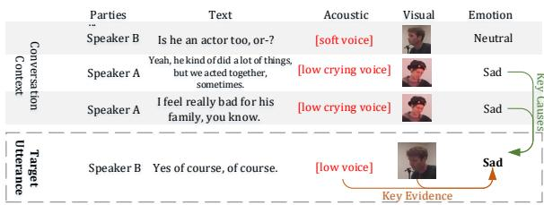  
Figure 1: An illustration of the emotion evidence and its cause: influence of others’ emotions. Speaker B shows evidence of sadness, such as lowering his head and speaking in a low voice, influenced by Speaker A’s sadness in the context.

To address these limitations, we propose the Evidence-Cause Attention Network for Multi-Modal Emotion Recognition in Conversation (ECERC), a novel method that comprehensively considers the four types of causes. ECERC utilizes attention mechanisms to integrate emotional evidence with diverse contextual causes for enhanced emotion recognition. Specifically, The approach primarily consists of five stages: Evidence Gating, Cause Encoding, Evidence-Cause Interaction, Feature Gating, and Emotion Classification.

Evidence Gating: Emotional evidence is extracted from each utterance using existing modalityspecific emotion models. Then an inter-modal evidence gating mechanism, inspired by GRUs (Cho, 2014), evaluates and adjusts the contribution of each modality. This step suppresses conflicting or unimportant modalities, improving the quality of emotional evidence. Cause Encoding: Potential causes are extracted from the conversational context through two processes: event encoding and emotion encoding. Event factors are captured using pre-trained language models, while emotional evidence from prior utterances represents the emotional factors for the target speaker. Both event and emotion information are encoded to produce context-aware cause representations. Evidence-Cause Interaction: To model the complex interaction between evidence and causes, we introduce a multi-faceted evidence-cause interaction module, comprising 1) Self-Party Event Attention: Focuses on events referenced by the speaker in the target utterance. 2) Cross-Party Event Attention: Considers events introduced by other speakers. 3) Self-Party Emotion Attention: Tracks the speaker’s prior emotional states. 4) Cross-Party Emotion Attention: Incorporates emotional influences from others. These sub-modules retrieve and integrate diverse cause information with evidence, producing diverse candidate feature representations for emotion inference. Feature Gating: Not all causes influence emotions equally. The Feature Gating module dynamically weighs the contributions of different candidate features using two cause-specific parameter matrices (one for events, one for emotions). This ensures that only the most relevant causes are emphasized for the current inference. Emotion Classification: Finally, the refined features are concatenated and passed through a fully connected perceptron for emotion classification.

To evaluate the effectiveness of our proposed ECERC, we conduct extensive experiments on the widely used MMERC benchmark dataset IEMO-CAP (Busso et al., 2008) and MELD (Poria et al., 2019). The experimental results show that our approach achieves competitive performance in terms of weighted F1-score and Accuracy metrics. These promising findings confirm the effectiveness of our method. Overall, the main contributions of this paper are summarized as follows:

• We introduce ECERC, a novel approach that comprehensively considers the four identified types of causes, and leverages attention mechanisms to integrate emotional evidence with diverse cause information, enabling more effective emotion recognition.

• Specifically, ECERC incorporates five key components: Evidence Gating refines emotional evidence across modalities; Cause Encoding captures conversational causes; Evidence-Cause Interaction integrates evidence with causes via attention; Feature Gating weights candidate features; and Emotion Classification identifies emotions.

• We conduct extensive experiments on the widely-used benchmark dataset IEMOCAP and MELD, achieving competitive performance, and proving our ECERC’s effectiveness.

## 2 Related Work

Existing studies on conversational emotion recognition primarily focus on modeling conversational context using various recurrence-based or graphbased structures to infer emotional categories.

Among recurrence-based methods, Bi-LSTM (Poria et al., 2017) processes context-independent unimodal evidence through an LSTM (Hochreiter and Schmidhuber, 1997; Graves, 2014) network to generate context-sensitive unimodal representations for each utterance, concatenating the outputs for a second LSTM network. CMN (Hazarika et al., 2018d) utilizes GRUs to sequentially store past utterance emotions from each speaker, capturing inter-speaker emotion dependencies. ICON (Hazarika et al., 2018b) extends CMN by modeling self- and inter-speaker emotional influences with global memories via GRUs. DialogueRNN (Majumder et al., 2019) employs three GRUs to track speaker states, conversational context, and emotions using concatenated multimodal emotion representations. COSMIC (Ghosal et al., 2020) leverages commonsense knowledge to model interlocutor interactions with GRUs. DialogueCRN (Hu et al., 2021a) focuses on the text modality, employing multi-turn reasoning modules based on LSTMs to extract and integrate emotional features from a cognitive perspective. These methods, however, struggle to capture information from distant utterances, limiting their effectiveness in emotion recognition within conversations. To address these limitations, graph-based methods have emerged.

Among graph-based methods, DialogueGCN (Ghosal et al., 2019b) represents conversational context with a relation-specific directed graph. MMGCN (Hu et al., 2021b) constructs fully connected graphs within each modality and builds cross-modality edges for corresponding utterances. DAG-ERC (Shen et al., 2021) creates a directed acyclic graph based on speaker identity and positional relations, focusing solely on the text modality. UniMSE (Hu et al., 2022b) unifies sentiment and emotions. MM-DFN (Hu et al., 2022a) implements a graph-based dynamic fusion module to enhance complementarity and reduce redundancy across modalities. CMCF (Zhang and Li, 2023) performs cross-modality context fusion and semantic refinement using semantic graph-based transformers. MultiEMO (Shi and Huang, 2023) model the cross-modal interactions and mapping relationships across multiple modalities. DualGAT (Zhang et al., 2023a) integrates speaker-aware context and discourse structure within the text modality to address overlooked discourse relationships. M3Net (Chen et al., 2023) captures intricate multivariate relationships among modalities and context. SDT (Ma et al., 2024) combines a Transformer-based architecture (we also regard Transformer (Vaswani, 2017) as a graph-based method because the selfattention in the Transformer can also be viewed as a fully connected graph) with a hierarchical gated fusion strategy for intra- and inter-modal emotion interactions. HAUCL (Yi et al., 2024) Leverages hypergraphs to optimize hypergraph reconstruction, contrastive learning, and emotion recognition for globally optimal performance.

Despite these advancements, existing methods often capture general conversational dependencies, lacking detailed differentiation and comprehensive modeling of different types of causes, constraining their performance. This study addresses these limitations by focusing on these critical aspects.

## 3 Methodology

## 3.1 Task Definition

We are given a dataset $\mathcal { D } = \{ c o n v e r s a t i o n _ { i } \} _ { i = 1 } ^ { I } ,$ where I denotes the total number of conversations. Each conversation conversationi consists of a sequence of utterances $\{ u _ { i , j } | j \in \{ 1 , . . . , J ( i ) \} \}$ with $J ( i )$ representing the number of utterances in the i-th conversation. The dataset contains K modalities, and each utterance $u _ { i , j }$ is represented as $\{ u _ { i , j , k } | k \in \{ 1 , . . . , K \} \}$ . The emotional category label for utterance $u _ { i , j }$ is denoted as $y _ { i , j } \in \{ 0 , 1 \} ^ { C }$ where C is the number of emotion categories. The utterance $u _ { i , j }$ is spoken by the speaker $s ( u _ { i , j } ) \in S$ where $\boldsymbol { \mathcal { S } }$ is the set of all participants in the dataset. The goal is to develop a model that predicts the emotional category label $y _ { i , j }$ based on the preceding utterances $\{ u _ { i , 1 } , u _ { i , 2 } , . . . , u _ { i , j } \}$ and the corresponding speakers $\{ s ( u _ { i , 1 } ) , s ( u _ { i , 2 } ) , . . . , s ( u _ { i , j } ) \}$

## 3.2 Preprocessing

Since emotional evidence typically appears across each modality of the target utterance, we follow previous works (Chen et al., 2023; Ma et al., 2024; Yi et al., 2024) and extract emotion features from each modality of the target utterance as the emotion evidence. Consistent with these studies, the RoBERTa Large model (Liu et al., 2019) finetuned on emotion labels of transcripts is utilized to extract context-independent emotion features from the text, OpenSMILE (Eyben et al., 2010) and 3D-CNN are utilized to extract emotional features from acoustic and visual. Finally, for $u _ { i , j , k }$ , we obtain the representations of emotional evidence $\hat { r } _ { i , j , k } ^ { e m o } \in \mathbb { R } ^ { d _ { k } }$

The causes of the emotion in the target utterance can be attributed to the events discussed in the conversation, as well as the emotions of the participants expressed in prior utterances. For events, since event information is conveyed through the text modality, we adopt a method similar to the one used for extracting emotional evidence in the text modality. Specifically, we use the original RoBERTa Large model to extract utterance-level semantics from the text and apply average pooling to obtain the event representation. For instance, we derive the event representation $\hat { r } _ { i , j , k = 1 } ^ { e v e } \in \mathbb { R } ^ { d _ { 0 } }$ from the utterance $u _ { i , j }$ , where we define $k = 1$ to indicate the text modality. Regarding emotions, the potential causes of emotion in the target utterance $u _ { i , j }$ are derived from the emotions in previous utterances. These are represented by their corresponding emotional evidence $\hat { r } _ { i , j _ { 1 } } ^ { e m o }$ , where $j _ { 1 } < j .$ To facilitate subsequent calculations, we apply a linear transformation to unify the dimensions of the different emotional modalities and event representations to a common dimension $d .$ Formally,

$$
\begin{array} { r l } & { r _ { i , j , k } ^ { e m o } = W _ { k } \hat { r } _ { i , j , k } ^ { e m o } } \\ & { r _ { i , j , k = 1 } ^ { e v e } = W _ { 0 } \hat { r } _ { i , j , k = 1 } ^ { e v e } } \end{array}\tag{1}
$$

where $W _ { k } \in \mathbb { R } ^ { d \times d _ { k } } , W _ { 0 } \in \mathbb { R } ^ { d \times d _ { 0 } }$ . Note that eve refers to $\ " \mathrm { e v e n t } "$ , and emo refers to "emotion".

## 3.3 Our Model

In this section, we introduce our core proposal ECERC, which consists of five core components: Evidence Gating, Cause Encoding, Evidence-Cause Interaction, Feature Gating, and Emotion Classification, as illustrated in Fig. 2.

Since our approach is based on attention mechanisms, we begin by providing a formal definition of the standard attention mechanism. It is important to note that the symbols used in the attention equations are distinct from those defined elsewhere in the paper. For the function Attention(Q, K, V), where $Q \in \mathbb { R } ^ { l _ { q } \times d } , K \in \mathbb { R } ^ { l _ { k } \times d } , V \in \mathbb { R } ^ { l _ { k } \times d }$ , we compute a group of queries, keys, and values.

$$
\begin{array} { r } { \hat { Q } = W _ { q } \left( Q \right) ^ { T } } \\ { \hat { K } = W _ { k } \left( K \right) ^ { T } } \\ { \hat { V } = W _ { v } \left( V \right) ^ { T } } \end{array}\tag{2}
$$

where $W _ { q } , W _ { k } \in \mathbb { R } ^ { d _ { k } \times d } , \ W _ { v } \ \in \ \mathbb { R } ^ { d _ { v } \times d } , \ { \hat { Q } } \ \in$ $\mathbb { R } ^ { d _ { k } \times l _ { q } } , \hat { K } \in \mathbb { R } ^ { d _ { k } \times l _ { k } } , \hat { V } \in \mathbb { R } ^ { d _ { v } \times l _ { k } }$ . After that, one-head attention is computed.

$$
( H ) ^ { 1 } = \operatorname { S o f t m a x } ( \frac { ( \hat { Q } ) ^ { T } \hat { K } } { \sqrt { d } } , \operatorname { m a s k } ) ( \hat { V } ) ^ { T }\tag{3}
$$

where $( H ) ^ { 1 } \in \mathbb { R } ^ { l _ { q } \times d _ { v } }$ and $( \cdot ) ^ { 1 }$ indicates the first head. Here, multi-head attention is applied for

diverse representation learning. Formally, for h heads,

$$
\tilde { Q } = ( W _ { h e a d } ( \operatorname { C o n c a t } ( ( H ) ^ { 1 } , . . . , ( H ) ^ { h } ) ) ^ { T } ) ^ { T }\tag{4}
$$

where $W _ { h e a d } \in \mathbb { R } ^ { d \times ( h \times d _ { v } ) } , \tilde { Q } \in \mathbb { R } ^ { l _ { q } \times d }$ Then a residual connection is employed, followed by layer normalization:

$$
Z = \mathrm { L a y e r N o r m } ( \tilde { Q } + Q )\tag{5}
$$

A feed-forward network is then applied:

$$
\tilde { Z } = ( W _ { 2 } \ : \mathbf { M a x } ( 0 , W _ { 1 } Z ^ { T } + b _ { 1 } ) + b _ { 2 } ) ^ { T }\tag{6}
$$

where $W _ { 1 } \in \mathbb { R } ^ { d _ { 1 } \times d } , b _ { 1 } \in \mathbb { R } ^ { d _ { 1 } } , W _ { 2 } \in \mathbb { R } ^ { d \times d _ { 1 } } , b _ { 2 } \in$ $\mathbb { R } ^ { d } , \tilde { Z } \in \mathbb { R } ^ { l _ { q } \times d }$ . Then a residual connection is employed, followed by layer normalization:

$$
H = \operatorname { L a y e r N o r m } ( \tilde { Z } + Z )\tag{7}
$$

As a result, we obtain a latent representation matrix of $Q ,$ that is, H. Note that when $Q , K$ , and V are identical, this is referred to as Self-Attention; otherwise, it is Cross-Attention.

Evidence Gating: This component aims to leverage the latent relationships among multiple modalities to reduce the influences of conflicting or unimportant modalities by calculating the weight of each modality. Specifically, the weight of the query modality is determined by fusing the features of the query modality with other modalities, and then it is weighted to the corresponding modality. Formally,

$$
\begin{array} { r l } & { w _ { k } = \mathrm { S i g m o i d } ( W _ { q } r _ { i , j , k } ^ { e m o } + b _ { q } + \{ W _ { o } r _ { i , j , k _ { 1 } } ^ { e m o } + b _ { o } | k _ { 1 } \neq k \} ) } \\ & { \tilde { r } _ { i , j , k } ^ { e m o } = w _ { k } \odot r _ { i , j , k } ^ { e m o } } \end{array}\tag{8}
$$

where $W _ { q } \in \mathbb { R } ^ { d \times d } , b _ { q } \in \mathbb { R } ^ { d } , W _ { o } \in \mathbb { R } ^ { d \times d } , b _ { o } \in$ $\mathbb { R } ^ { d \times d }$ $w _ { k } \in \mathbb { R } ^ { d } , \tilde { r } _ { i , j , k } ^ { e m o } \in \mathbb { R } ^ { d } .$ , is the Hadamard product.

Finally, we obtained an enhanced emotion evidence representation, denoted as $\tilde { r } _ { i , j , k } ^ { e m o }$ , through evidence gating.

Cause Encoding Next, since causes are distributed in the conversational context, we initially encode causes at the context level through attention to draw their context dependencies. Specifically, since event semantics and emotional evidence in conversation are both potential causes, we input event and emotional features into Attention to obtain their respective representations, each enriched with contextual information. Formally,

$$
\begin{array} { r l } & { h _ { i , k = 1 } ^ { e v e } = \mathrm { A t t e n t i o n } ( r _ { i , k = 1 } ^ { e v e } , r _ { i , k = 1 } ^ { e v e } , r _ { i , k = 1 } ^ { e v e } , H m a s k ) } \\ & { h _ { i } ^ { e m o } = \mathrm { A t t e n t i o n } ( \tilde { r } _ { i } ^ { e m o } , \tilde { r } _ { i } ^ { e m o } , \tilde { r } _ { i } ^ { e m o } , H m a s k ) } \end{array}\tag{9}
$$

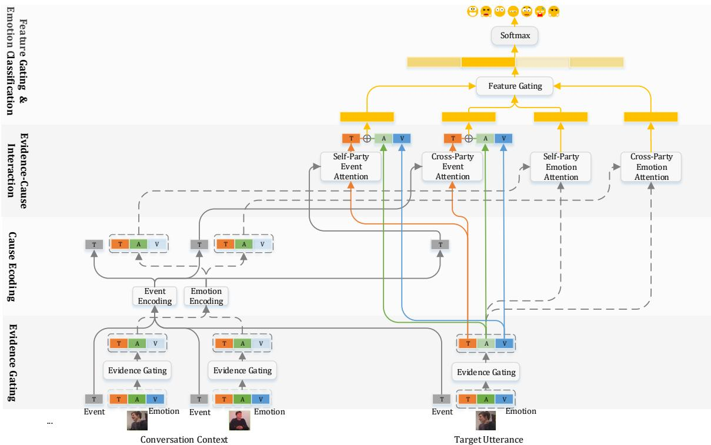  
Figure 2: The overall architecture of the ECERC, which consists of five core components: Evidence Gating, Cause Encoding, Evidence-Cause Interaction, Feature Gating, and Emotion Classification.

where Hmask represents only historical context attention, as illustrated in Fig. $3 ( \mathrm { a } ) , r _ { i , k = 1 } ^ { e v e } \in \mathbb { R } ^ { J ( i ) \times d } ,$ $h _ { i , k = 1 } ^ { e v e } ~ \in ~ \mathbb { R } ^ { J ( i ) \times d } , ~ \tilde { r } _ { i } ^ { e m o } ~ \in ~ \mathbb { R } ^ { J ( i ) \times K d } , ~ h _ { i } ^ { e m o } ~ \in$ $\mathbb { R } ^ { j ( i ) \times K d }$

Finally, through Cause Encoding, we get the context-aware cause representations $h _ { i , k = 1 } ^ { e v e }$ and $h _ { i } ^ { e m o }$

Evidence-Cause Interaction Since the primary information, i.e. the emotional evidence, is not enough to infer the speaker’s emotions, it is necessary to integrate auxiliary information, i.e. causes, to enhance the inference of emotions. As stated in the Introduction, four factors are considered as causes of emotions: 1) no-context, selfreferenced events (textual semantics), 2) events uttered by others, 3) emotional contagion from prior emotions, and 4) other speakers’ emotions. We use four attention modules to retrieve and fuse them with evidence information defined in Equations (10) (11) (12) (13), respectively. Formally,

$$
\begin{array} { r l } & { \tilde { g } _ { i , k = 1 } ^ { s - e v e } = \mathrm { A t t e n t i o n } ( h _ { i , k = 1 } ^ { e m o } , h _ { i , k = 1 } ^ { e v e } , h _ { i , k = 1 } ^ { e v e } , I m a s k ) } \\ & { g _ { i } ^ { s - e v e } = \mathrm { C o n c a t } ( \tilde { g } _ { i , k = 1 } ^ { s - e v e } , \tilde { r } _ { i , k > 1 } ^ { e m o } ) } \end{array}\tag{10}
$$

$$
\begin{array} { r l } & { \tilde { g } _ { i , k = 1 } ^ { c - e v e } = \mathrm { A t t e n t i o n } ( h _ { i , k = 1 } ^ { e m o } , h _ { i , k = 1 } ^ { e v e } , h _ { i , k = 1 } ^ { e v e } , C m a s k ) } \\ & { g _ { i } ^ { c - e v e } = \mathrm { C o n c a t } ( \tilde { g } _ { i , k = 1 } ^ { c - e v e } , \tilde { r } _ { i , k > 1 } ^ { e m o } ) } \end{array}\tag{11}
$$

$$
g _ { i } ^ { s - e m o } = \mathrm { A t t e n t i o n } ( \tilde { h } _ { i } ^ { e m o } , h _ { i } ^ { e m o } , h _ { i } ^ { e m o } , S m a s k )\tag{12}
$$

$$
g _ { i } ^ { c - e m o } = \mathrm { A t t e n t i o n } ( \tilde { h } _ { i } ^ { e m o } , h _ { i } ^ { e m o } , h _ { i } ^ { e m o } , C m a s k )\tag{13}
$$

where $g _ { i } ^ { s - e v e } \ \in \ \mathbb { R } ^ { J ( i ) \times K d } , \ g _ { i } ^ { c - e v e } \ \in \ \mathbb { R } ^ { J ( i ) \times K d } ,$ $g _ { i } ^ { s - e m o } ~ \in ~ \mathbb { R } ^ { J ( i ) \times K d }$ , and $g _ { i } ^ { \bar { c } - e m o } \ \in \ \mathbb { R } ^ { J ( i ) \times K d } .$ Imask represents the attention within the target utterance, as illustrated in Fig. 3(b). Smask represents the attention within utterances in historical context spoked by the same speaker, as shown in Fig. 3(c). Cmask represents the cross-participant attention, as depicted in Fig. 3(d). Note that since event information is conveyed through the textual modality, the event is incorporated into the textual modality representation of the evidence in Equations (10) and (11). This intra-modal learning helps prevent errors caused by modality gaps. The resulting features are then concatenated with emotion evidence from other modalities to form the candidate features used to infer the final emotional states.

As a result, four candidating features are obtained, that is, $g _ { i } ^ { s - e v e } , g _ { i } ^ { c - e v e } , g _ { i } ^ { s - e m o }$ , and $g _ { i } ^ { c - e m o }$

Feature Gating Since not all causes influence emotions equally, we use two linear matrices to calculate the weights of candidate features associated with different causes, enabling dynamic screening. The final weighted candidate features are then used as representations for emotion inference. Formally,

$$
\begin{array} { l } { { x _ { i } ^ { s - e v e } = g _ { i } ^ { s - e v e } \odot \mathrm { S i g m o i d } ( g _ { i } ^ { s - e v e } W ^ { e v e } + b ^ { e v e } ) } } \\ { { x _ { i } ^ { c - e v e } = g _ { i } ^ { c - e v e } \odot \mathrm { S i g m o i d } ( g _ { i } ^ { c - e v e } W ^ { e v e } + b ^ { e v e } ) } } \\ { { x _ { i } ^ { s - e m o } = g _ { i } ^ { s - e m o } \odot \mathrm { S i g m o i d } ( g _ { i } ^ { s - e m o } W ^ { e m o } + b ^ { e m o } ) } } \\ { { x _ { i } ^ { c - e m o } = g _ { i } ^ { c - e m o } \odot \mathrm { S i g m o i d } ( g _ { i } ^ { c - e m o } W ^ { e m o } + b ^ { e m o } ) } } \\ { { x _ { i } = \mathrm { C o n c a t } ( x _ { i } ^ { s - e v e } , x _ { i } ^ { c - e v e } , x _ { i } ^ { s - e m o } , x _ { i } ^ { c - e m o } ) } } \end{array}\tag{14}
$$

where $W ^ { e v e } \quad \in \quad \mathbb { R } ^ { K d \times K d } , b ^ { e v e } \quad \in \quad \mathbb { R } ^ { K d } ,$ $W ^ { e m o } \in  { \mathbb { R } } ^ { K d \times K d } , \quad b ^ { e m o } \in  { \mathbb { R } } ^ { K d }$ $\begin{array} { r l r l } & { x _ { i } ^ { s - e v e } , x _ { i } ^ { c - e v e } , x _ { i } ^ { s - e m o } , x _ { i } ^ { s - e m o } } & { { } \in ~ } & { { \mathbb R } ^ { J ( i ) \times K d } . } \end{array}$ $\boldsymbol { x } _ { i } \in \mathbb { R } ^ { J ( i ) \times 4 K d }$

The four candidate features are weighted and concatenated, as described above, to form the final feature representations used for emotion inference.

Emotion Classification Finally, the obtained feature representation is passed through a linear layer, followed by a Softmax activation, to generate the probability distribution over the emotion categories.

$$
\begin{array} { r } { \mathcal { P } _ { i , j } = \operatorname { S o f t m a x } ( x _ { i , j } W _ { e } + b _ { e } ) } \\ { \hat { y } _ { i , j } = \arg \operatorname* { m a x } _ { c } ( \mathcal { P } _ { i , j } ( c ) ) } \end{array}\tag{15}
$$

where $W _ { e } ~ \in ~ \mathbb { R } ^ { 4 K d \times C } , ~ b _ { e } , \mathcal { P } _ { i , j } ~ \in ~ \mathbb { R } ^ { C } , ~ c ~ \in \mathcal { C }$ $\{ 1 , 2 , . . . , C \}$

Objective Function The objective function of our model is

$$
\mathcal { L } = - \frac { 1 } { \sum _ { i = 1 } ^ { I } J ( i ) } \sum _ { i = 1 } ^ { I } \sum _ { j = 1 } ^ { J ( i ) } l o g \mathcal { P } _ { i , j } [ y _ { i , j } ]\tag{16}
$$

where I is the number of conversations, $J ( i )$ is the number of utterances in sample $i , \mathcal { P } _ { i , j }$ and $y _ { i , j }$ are the probability distribution and ground-truth of emotion labels for utterance j of dialogue i, respectively.

## 4 Experiments

## 4.1 Experimental Setup

## 4.1.1 Datasets

We evaluate our approach using the widely-used MMERC dataset IEMOCAP (Busso et al., 2008) and MELD (Poria et al., 2019). Statistical details of the dataset are provided in Table 1.

IEMOCAP comprises 151 conversations across five sessions, with ten different speakers. The final session is reserved for testing. The dataset includes 7,433 utterances, each labeled with one of six emotions: happy, sad, neutral, angry, excited, or frustrated. As no validation set is provided, we randomly select 10% of the training conversations from IEMOCAP to be used as the validation set.

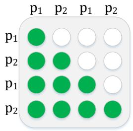  
(a) Hmask

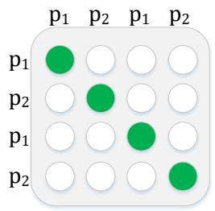  
(b) Imask

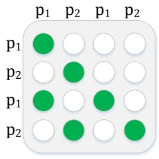  
(c) Smask

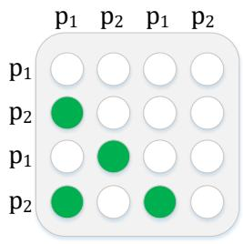  
(d) Cmask

Figure 3: Illustration of different masks. Hmask: Masked for historical context; Imask: masked for the speaker self; Smask: masked for the speaker in context; Cmask: masked for other parties in context. p1 and $p 2$ represent two parties. The vertical axis represents Q and the horizontal axis represents K in Attention. Green and white represent the attention and inattention among parties, respectively.  
Table 1: Statistics of the datasets.
<table><tr><td rowspan="2">Dataset</td><td colspan="3"># Conversations</td><td colspan="3"># Utterances</td><td rowspan="2"># Classes</td></tr><tr><td>Train</td><td>Valid</td><td>Test</td><td>Train</td><td>Valid</td><td>Test</td></tr><tr><td rowspan="2">IEMOCAP MELD</td><td colspan="2">120</td><td>31</td><td colspan="2">5810</td><td>1623</td><td>6</td></tr><tr><td>1038</td><td>114</td><td>280</td><td>9989</td><td>1109</td><td>2610</td><td>7</td></tr></table>

MELD contains 1,433 dialogues and 13,708 utterances from 304 speakers in the Friends TV series. The dataset consists of multi-speaker conversations, with each utterance labeled with one of seven emotions: anger, disgust, sadness, joy, neutral, surprise, or fear. We follow the official dataset splits, which include 1,039 dialogues (9,989 utterances) for training, 114 dialogues (1,109 utterances) for validation, and the remaining dialogues for testing.

## 4.1.2 Baselines

To ensure a comprehensive evaluation of ECERC, we perform a comparative analysis, comparing our model against the typical MMERC methods proposed in recent years which have opensourced their original codes or been successfully reproduced by us: DialogueRNN (Majumder et al., 2019), DialogueGCN (Ghosal et al., 2019b), MMGCN (Hu et al., 2021b), MM-DFN (Hu et al., 2022a), M3Net (Chen et al., 2023), SDT (Ma et al., 2024), and HAUCL (Yi et al., 2024). These works have open-sourced their original codes, so we conduct the baseline comparison by re-running their released original codes of baselines on our experimental platform to achieve a fair comparison.

Table 2: Comparison of our approach against MMERC baselines on the IEMOCAP dataset. F1.=F1-score. Acc.= Accuracy.
<table><tr><td rowspan="3"></td><td colspan="6">Emotion Categories of IEMOCAP</td><td colspan="4">Overall (weighted)</td></tr><tr><td>Happy</td><td>Sad</td><td>Neutral</td><td>Angry</td><td>Excited</td><td>Frustrated</td><td>1</td><td>F1.</td><td>Acc.</td></tr><tr><td>DialogueRNN (Majumder et al., 2019)</td><td>52.81</td><td>80.16</td><td>68.45</td><td>63.88</td><td>67.75</td><td>61.56</td><td></td><td>66.60</td><td>66.48</td></tr><tr><td>DialogueGCN (Ghosal et al., 2019b)</td><td>53.38</td><td>74.61</td><td>64.08</td><td>57.01</td><td>77.18</td><td>43.81</td><td></td><td>61.64</td><td>62.23</td></tr><tr><td>MMGCN (Hu et al., 2021b)</td><td>42.14</td><td>83.67</td><td>63.98</td><td>64.25</td><td>73.90</td><td>59.13</td><td></td><td>65.73</td><td>65.80</td></tr><tr><td>MM-DFN (Hu et al., 2022a)</td><td>46.09</td><td>82.74</td><td>69.77</td><td>68.52</td><td>71.14</td><td>65.44</td><td></td><td>68.73</td><td>69.07</td></tr><tr><td>M3Net (Chen et al., 2023)</td><td>51.35</td><td>81.51</td><td>68.81</td><td>64.29</td><td>73.02</td><td>61.17</td><td></td><td>67.69</td><td>67.65</td></tr><tr><td>SDT (Ma et al., 2024)</td><td>53.68</td><td>79.01</td><td>68.47</td><td>66.92</td><td>72.16</td><td>66.40</td><td></td><td>68.78</td><td>68.47</td></tr><tr><td>HAUCL (Yi et al., 2024)</td><td>54.30</td><td>81.85</td><td>68.24</td><td>65.90</td><td>77.03</td><td>64.52</td><td></td><td>69.56</td><td>69.62</td></tr><tr><td>ECERC (ours)</td><td>60.86</td><td>79.28</td><td>71.95</td><td>66.27</td><td>78.29</td><td>68.25</td><td></td><td>71.78</td><td>71.60</td></tr></table>

Table 3: Comparison of our approach against MMERC baselines on the MELD dataset. F1.=F1-score. Acc.= Accuracy.
<table><tr><td></td><td colspan="6">Emotion Categories of MELD</td><td colspan="4">Overall (weighted)</td></tr><tr><td></td><td>Neutral</td><td>Surprise</td><td>Fear</td><td>Sad</td><td>Joy</td><td>Disgust</td><td>Angry</td><td>F1.</td><td>Acc.</td></tr><tr><td>DialogueRNN (Majumder et al., 2019)</td><td>78.00</td><td>55.59</td><td>20.51</td><td>39.80</td><td>62.30</td><td>23.21</td><td>51.46</td><td>64.09</td><td>64.29</td></tr><tr><td>DialogueGCN (Ghosal et al., 2019b)</td><td>77.76</td><td>58.43</td><td>8.70</td><td>38.64</td><td>58.66</td><td>15.09</td><td>50.81</td><td>63.10</td><td>63.83</td></tr><tr><td>MMGCN (Hu et al., 2021b)</td><td>79.58</td><td>58.54</td><td>0.00</td><td>43.34</td><td>63.69</td><td>0.00</td><td>50.56</td><td>64.55</td><td>66.21</td></tr><tr><td>MM-DFN (Hu et al., 2022a)</td><td>77.38</td><td>57.19</td><td>14.29</td><td>41.36</td><td>63.25</td><td>20.41</td><td>51.44</td><td>64.04</td><td>63.83</td></tr><tr><td>M3Net (Chen et al., 2023)</td><td>78.61</td><td>58.48</td><td>22.22</td><td>41.65</td><td>62.71</td><td>29.75</td><td>49.44</td><td>64.84</td><td>65.17</td></tr><tr><td>SDT (Ma et al., 2024)</td><td>79.59</td><td>58.01</td><td>6.18</td><td>43.70</td><td>63.36</td><td>19.08</td><td>50.86</td><td>65.12</td><td>66.18</td></tr><tr><td>HAUCL (Yi et al., 2024)</td><td>79.11</td><td>59.27</td><td>19.18</td><td>41.11</td><td>62.93</td><td>22.00</td><td>52.89</td><td>65.35</td><td>66.25</td></tr><tr><td>ECERC (ours)</td><td>79.80</td><td>58.98</td><td>26.12</td><td>40.95</td><td>64.95</td><td>31.43</td><td>53.89</td><td>66.46</td><td>67.32</td></tr></table>

## 4.1.3 Settings

The hyperparameters of our model are gridsearched and set as follows. The batch size is 64 and 32 on IEMOCAP and MELD respectively. We set the learning rate as 1e 4 and 1e 5 on IEMOCAP and MELD respectively. The unified dimension of multiple emotion modalities and event representations d is 128. The hyperparameters in the Attention function follow their default setting (Vaswani, 2017). We use Adam (Kingma and Ba, 2014) optimizer to train our model on both datasets. We conduct experiments on a Windows operating system with a GPU A100. The codes are implemented in PyTorch.

## 4.2 Model Comparison

To evaluate the effectiveness of our proposed ECERC, we compare its performance against several strong MMERC baselines. Experiments were conducted on two widely recognized MMERC benchmark datasets, IEMOCAP and MELD, with the results presented in Table 2 and Table 3, respectively. Both tables primarily focus on the F1-score as the main evaluation metric, supplemented by Accuracy as a secondary measure. Specifically, the tables provide category-wise F1 scores and the overall performance metrics (weighted average F1 score and Accuracy). Bolded results denote the best performance in each group with p < 0.05. From the tables, it is evident that ECERC outperforms all baseline models. On the IEMOCAP dataset, ECERC surpasses the second-best model, HAUCL, by 2.22% in F1-score and 1.98% in Accuracy. Similarly, on the MELD dataset, ECERC achieves improvements of 1.11% in F1-score and 1.07% in Accuracy over HAUCL. These consistent improvements on diverse datasets validate the effectiveness of ECERC. Furthermore, ECERC demonstrates strong results across most emotion categories, consistently exceeding baseline performance in many cases. This suggests that ECERC’s ability to integrate emotional evidence with causal reasoning is effective across a variety of emotional contexts, not just specific emotion categories. Overall, these findings highlight that comprehensively considering causal factors and integrating them with emotional evidence significantly enhances emotional inference capabilities. This could be attributed to its explicit integration of causal factors, which aligns closely with human emotional understanding, providing critical context, and leading to more precise classifications.

## 4.3 Ablation Study

## 4.3.1 Effect of Core Components

In order to verify the importance of each core component in ECERC, we remove them one at a time to evaluate their impact on model performance. The experimental results are shown in Table 4. Regarding Evidence, we test Evidence Gating. Regarding causes, we examine Event Encoding and Emotion Encoding. Regarding evidence-cause interaction, we evaluate Self-Party Event Attention, Self-Party Emotion Attention, Cross-Party Event Attention, and Cross-Party Emotion Attention. Regarding candidate features, we verify Feature Gating. The results show that removing any of these components significantly degrades model performance, highlighting the importance of each element. Specifically, when Evidence Gating is removed, all modality weights become equal, causing modalities with smaller contributions to introduce biases into the evidence representation, which affects subsequent reasoning. Removing Event Encoding and Emotion Encoding leads to a loss of contextual information in cause encoding, diminishing the quality of cause representation. When Self-Party Event Attention, Self-Party Event Attention, Self-Party Event Attention, and Self-Party Event Attention are removed respectively, the corresponding four cause factors are ignored, lowering the accuracy of emotion inference. When Feature Gating is removed, all key cause factors contribute equally to emotion inference, but the actual target emotion is affected by different causes to varying degrees, so this will disturb the inference results. In conclusion, this experiment demonstrates the importance of these core components.

## 4.3.2 Effect of Modalities

We also conduct ablation experiments on modalities to investigate how different modality configurations impact emotion recognition performance. By removing one or two modalities at a time, we obtained the results presented in Table 5. In this table, V. stands for vision, A. represents acoustic, and T. refers to text. Our findings show that the textual modality significantly outperforms the other two, highlighting its dominant role in the task. Additionally, any bimodal combination surpasses its unimodal counterpart, with the fusion of textual and acoustic or visual modalities outperforming the combination of acoustic and visual alone, due to the importance of textual features. Finally, the best performance is achieved when all three modalities are used, confirming that useful information for emotion inference exists in multiple expressions of textual semantics, acoustics, and vision, and emphasizing the need to integrate multimodal information for effective MMERC.

Table 4: Impact of core components on models’ performance.
<table><tr><td></td><td colspan="2">IEMOCAP</td><td colspan="2">MELD</td></tr><tr><td></td><td>F1.</td><td>Acc.</td><td>F1.</td><td>Acc.</td></tr><tr><td>ECERC</td><td>71.78</td><td>71.60</td><td>66.46</td><td>67.32</td></tr><tr><td>w/o Evidence Gating</td><td>69.39</td><td>69.17</td><td>65.40</td><td>66.28</td></tr><tr><td>w/o Event Encoding</td><td>69.63</td><td>69.46</td><td>65.34</td><td>66.28</td></tr><tr><td>w/o Emotion Encoding</td><td>68.99</td><td>68.78</td><td>65.85</td><td>66.85</td></tr><tr><td>w/o Self-Party Event Attention</td><td>69.86</td><td>69.66</td><td>65.36</td><td>66.31</td></tr><tr><td>w/o Cross-Party Event Attention</td><td>69.63</td><td>69.50</td><td>65.40</td><td>66.50</td></tr><tr><td>w/o Self-Party Emotion Attention</td><td>66.81</td><td>66.60</td><td>65.22</td><td>66.27</td></tr><tr><td>w/o Cross-Party Emotion Attention</td><td>67.55</td><td>67.49</td><td>65.35</td><td>66.34</td></tr><tr><td>w/o Feature Gating</td><td>68.79</td><td>68.68</td><td>65.50</td><td>66.58</td></tr></table>

Table 5: Impact of modalities on models’ performance.
<table><tr><td rowspan="2">Modalities</td><td colspan="2">IEMOCAP</td><td colspan="2">MELD</td></tr><tr><td>F1.</td><td> $\operatorname { A c c } .$ </td><td>F1.</td><td>Acc.</td></tr><tr><td>T. &amp; A. &amp; V.</td><td>71.78</td><td>71.60</td><td>66.46</td><td>67.32</td></tr><tr><td>T. &amp; A.</td><td>69.89</td><td>69.71</td><td>65.21</td><td>65.95</td></tr><tr><td>T. &amp; V.</td><td>67.89</td><td>67.84</td><td>65.53</td><td>66.63</td></tr><tr><td>A. &amp; V.</td><td>59.11</td><td>59.21</td><td>43.54</td><td>47.78</td></tr><tr><td>T.</td><td>63.51</td><td>63.34</td><td>65.25</td><td>66.37</td></tr><tr><td>A.</td><td>56.05</td><td>56.99</td><td>32.23</td><td>47.98</td></tr><tr><td>V.</td><td>27.57</td><td>30.72</td><td>43.24</td><td>48.33</td></tr></table>

## 5 Conclusion

To capture the complex emotional causes that influence emotions in conversations, We propose ECERC, a novel approach for the MMERC task, which integrates evidence with diverse contextual causes. ECERC consists of five core stages: Evidence Gating refines emotional evidence across modalities, Cause Encoding captures causes from conversational context, Evidence-Cause Interaction model interactions between evidence and diverse causes and obtains candidate features, Feature Gating adaptively weights candidate features, and Emotion Classification determines the final emotion. Extensive experiments on IEMOCAP and MELD demonstrate the effectiveness of ECERC.

## Limitations

In this paper, we propose a novel approach for MMERC called ECERC. This approach integrates emotional evidence with contextual causes for enhanced emotion recognition performance. Despite the progress made, there are still limitations regarding the misclassification of closely related categories, as well as the imbalance in sample sizes, both of which were analyzed in Appendix C. These issues continue to pose challenges to the accuracy of the MMERC models and will need to be carefully addressed in future work to enhance its overall performance.

## Acknowledgements

This work is supported by the National Key Research and Development Program of China under Grant No.2023YFC3306201, the 111 Project (B16009), the National Natural Science Foundation of China under Grant No.61772125, and the Fundamental Research Funds for the Central Universities under Grant No.N2317004.

## References

Carlos Busso, Murtaza Bulut, Chi-Chun Lee, Abe Kazemzadeh, Emily Mower, Samuel Kim, Jeannette N Chang, Sungbok Lee, and Shrikanth S Narayanan. 2008. Iemocap: Interactive emotional dyadic motion capture database. Language resources and evaluation, 42(4):335–359.

Deeksha Chandola, Enas Altarawneh, Michael Jenkin, and Manos Papagelis. 2024. Serc-gcn: Speech emotion recognition in conversation using graph convolutional networks. In ICASSP 2024-2024 IEEE International Conference on Acoustics, Speech and Signal Processing (ICASSP), pages 76–80. IEEE.

Feiyu Chen, Jie Shao, Shuyuan Zhu, and Heng Tao Shen. 2023. Multivariate, multi-frequency and multimodal: Rethinking graph neural networks for emotion recognition in conversation. In 2023 IEEE/CVF Conference on Computer Vision and Pattern Recognition (CVPR), pages 10761–10770.

Kyunghyun Cho. 2014. Learning phrase representations using rnn encoder-decoder for statistical machine translation. arXiv preprint arXiv:1406.1078.

Florian Eyben, Martin Wöllmer, and Björn Schuller. 2010. Opensmile: the munich versatile and fast opensource audio feature extractor. In Proceedings ofthe 18th ACM international conference on Multimedia, pages 1459–1462.

Deepanway Ghosal, Navonil Majumder, Alexander F. Gelbukh, Rada Mihalcea, and Soujanya Poria. 2020.

COSMIC: commonsense knowledge for emotion identification in conversations. In Findings of the Associationfor Computational Linguistics: EMNLP 2020, Online Event, 16-20 November 2020, pages 2470–2481.

Deepanway Ghosal, Navonil Majumder, Soujanya Poria, Niyati Chhaya, and Alexander Gelbukh. 2019a. DialogueGCN: A graph convolutional neural network for emotion recognition in conversation. In Proceedings ofthe 2019 Conference on Empirical Methods in Natural Language Processing and the 9th International Joint Conference on Natural Language Processing (EMNLP-IJCNLP), pages 154–164, Hong Kong, China. Association for Computational Linguistics.

Deepanway Ghosal, Navonil Majumder, Soujanya Poria, Niyati Chhaya, and Alexander Gelbukh. 2019b. Dialoguegcn: A graph convolutional neural network for emotion recognition in conversation. In Proceedings ofthe 2019 Conference on Empirical Methods in Natural Language Processing and the 9th International Joint Conference on Natural Language Processing (EMNLP-IJCNLP), pages 154–164.

Alex Graves. 2014. Generating sequences with recurrent neural networks.

Devamanyu Hazarika, Soujanya Poria, Rada Mihalcea, Erik Cambria, and Roger Zimmermann. 2018a. ICON: Interactive conversational memory network for multimodal emotion detection. In Proceedings of the 2018 Conference on Empirical Methods in Natural Language Processing, pages 2594–2604, Brussels, Belgium. Association for Computational Linguistics.

Devamanyu Hazarika, Soujanya Poria, Rada Mihalcea, Erik Cambria, and Roger Zimmermann. 2018b. Icon: Interactive conversational memory network for multimodal emotion detection. In Proceedings ofthe 2018 conference on empirical methods in natural language processing, pages 2594–2604.

Devamanyu Hazarika, Soujanya Poria, Amir Zadeh, Erik Cambria, Louis-Philippe Morency, and Roger Zimmermann. 2018c. Conversational memory network for emotion recognition in dyadic dialogue videos. In Proceedings of the 2018 Conference of the North American Chapter ofthe Associationfor Computational Linguistics: Human Language Technologies, Volume 1 (Long Papers), pages 2122–2132, New Orleans, Louisiana. Association for Computational Linguistics.

Devamanyu Hazarika, Soujanya Poria, Amir Zadeh, Erik Cambria, Louis-Philippe Morency, and Roger Zimmermann. 2018d. Conversational memory network for emotion recognition in dyadic dialogue videos. In Proceedings of the 2018 Conference of the North American Chapter ofthe Associationfor Computational Linguistics: Human Language Technologies, Volume 1 (Long Papers), pages 2122–2132.

Sepp Hochreiter and Jürgen Schmidhuber. 1997. Long short-term memory. Neural Computation, 9(8):1735– 1780.

Dou Hu, Xiaolong Hou, Lingwei Wei, Lianxin Jiang, and Yang Mo. 2022a. Mm-dfn: Multimodal dynamic fusion network for emotion recognition in conversations. In ICASSP 2022-2022 IEEE International Conference on Acoustics, Speech and Signal Processing (ICASSP), pages 7037–7041. IEEE.

Dou Hu, Lingwei Wei, and Xiaoyong Huai. 2021a. DialogueCRN: Contextual reasoning networks for emotion recognition in conversations. In Proceedings of the 59th Annual Meeting of the Association for Computational Linguistics and the 11th International Joint Conference on Natural Language Processing (Volume 1: Long Papers), pages 7042–7052, Online. Association for Computational Linguistics.

Guimin Hu, Ting-En Lin, Yi Zhao, Guangming Lu, Yuchuan Wu, and Yongbin Li. 2022b. UniMSE: Towards unified multimodal sentiment analysis and emotion recognition. In Proceedings of the 2022 Conference on Empirical Methods in Natural Language Processing, pages 7837–7851, Abu Dhabi, United Arab Emirates. Association for Computational Linguistics.

Jingwen Hu, Yuchen Liu, Jinming Zhao, and Qin Jin. 2021b. Mmgcn: Multimodal fusion via deep graph convolution network for emotion recognition in conversation. In Proceedings ofthe 59th Annual Meeting ofthe Associationfor Computational Linguistics and the 11th International Joint Conference on Natural Language Processing (Volume 1: Long Papers), pages 5666–5675.

D. Kingma and J. Ba. 2014. Adam: A method for stochastic optimization. Computer Science.

Bryan Li, Dimitrios Dimitriadis, and Andreas Stolcke. 2019. Acoustic and lexical sentiment analysis for customer service calls. In ICASSP 2019 - 2019 IEEE International Conference on Acoustics, Speech and Signal Processing (ICASSP), pages 5876–5880.

Siyang Liu, Chujie Zheng, Orianna Demasi, Sahand Sabour, Yu Li, Zhou Yu, Yong Jiang, and Minlie Huang. 2021. Towards emotional support dialog systems. In Proceedings of the 59th Annual Meeting of the Association for Computational Linguistics and the 11th International Joint Conference on Natural Language Processing (Volume 1: Long Papers), pages 3469–3483, Online. Association for Computational Linguistics.

Yinhan Liu, Myle Ott, Naman Goyal, Jingfei Du, Mandar Joshi, Danqi Chen, Omer Levy, Mike Lewis, Luke Zettlemoyer, and Veselin Stoyanov. 2019. Roberta: A robustly optimized bert pretraining approach. arXiv preprint arXiv:1907.11692.

Wenzhe Lou, Wenzhong Yang, and Fuyuan Wei. 2023. Dialogcin: Contextual inference networks for emotional dialogue generation. Applied Sciences, 13(15).

Hui Ma, Jian Wang, Hongfei Lin, Bo Zhang, Yijia Zhang, and Bo Xu. 2024. A transformer-based model with self-distillation for multimodal emotion recognition in conversations. IEEE Transactions on Multimedia, 26:776–788.

Navonil Majumder, Soujanya Poria, Devamanyu Hazarika, Rada Mihalcea, Alexander F. Gelbukh, and Erik Cambria. 2019. Dialoguernn: An attentive RNN for emotion detection in conversations. In The Thirty-Third AAAI Conference on Artificial Intelligence, AAAI 2019, The Thirty-First Innovative Applications of Artificial Intelligence Conference, IAAI 2019, The Ninth AAAI Symposium on Educational Advances in Artificial Intelligence, EAAI 2019, Honolulu, Hawaii, USA, January 27 - February 1, 2019, pages 6818–6825.

Yuzhao Mao, Guang Liu, Xiaojie Wang, Weiguo Gao, and Xuan Li. 2021. Dialoguetrm: Exploring multimodal emotional dynamics in a conversation. In Findings ofthe Associationfor Computational Linguistics: EMNLP 2021, pages 2694–2704.

Soujanya Poria, Erik Cambria, Devamanyu Hazarika, Navonil Majumder, Amir Zadeh, and Louis-Philippe Morency. 2017. Context-dependent sentiment analysis in user-generated videos. In Proceedings of the 55th Annual Meeting of the Association for Computational Linguistics (Volume 1: Long Papers), pages 873–883, Vancouver, Canada. Association for Computational Linguistics.

Soujanya Poria, Devamanyu Hazarika, Navonil Majumder, Gautam Naik, Erik Cambria, and Rada Mihalcea. 2019. MELD: A multimodal multi-party dataset for emotion recognition in conversations. In Proceedings of the 57th Conference of the Association for Computational Linguistics, ACL 2019, Florence, Italy, July 28- August 2, 2019, Volume 1: Long Papers, pages 527–536.

Soujanya Poria, Navonil Majumder, Devamanyu Hazarika, Deepanway Ghosal, Rishabh Bhardwaj, Samson Yu Bai Jian, Pengfei Hong, Romila Ghosh, Abhinaba Roy, Niyati Chhaya, et al. 2021. Recognizing emotion cause in conversations. Cognitive Computation, 13:1317–1332.

Lisong Qiu, Yingwai Shiu, Pingping Lin, Ruihua Song, Yue Liu, Dongyan Zhao, and Rui Yan. 2020. What if bots feel moods? In Proceedings of the 43rd International ACM SIGIR Conference on Research and Development in Information Retrieval, SIGIR ’20, page 1161–1170.

Armin Seyeditabari, Narges Tabari, and Wlodek Zadrozny. 2018. Emotion detection in text: a review. arXiv preprint arXiv:1806.00674.

Weizhou Shen, Siyue Wu, Yunyi Yang, and Xiaojun Quan. 2021. Directed acyclic graph network for conversational emotion recognition. In Proceedings of the 59th Annual Meeting of the Association for Computational Linguistics and the 11th International

Joint Conference on Natural Language Processing (Volume 1: Long Papers), pages 1551–1560, Online. Association for Computational Linguistics.

Tao Shi and Shao-Lun Huang. 2023. Multiemo: An attention-based correlation-aware multimodal fusion framework for emotion recognition in conversations. In Proceedings of the 61st Annual Meeting of the Association for Computational Linguistics (Volume 1: Long Papers), pages 14752–14766.

Quan Tu, Yanran Li, Jianwei Cui, Bin Wang, Ji-Rong Wen, and Rui Yan. 2022. MISC: A mixed strategyaware model integrating COMET for emotional support conversation. In Proceedings of the 60th Annual Meeting of the Association for Computational Linguistics (Volume 1: Long Papers), pages 308–319, Dublin, Ireland. Association for Computational Linguistics.

A Vaswani. 2017. Attention is all you need. Advances in Neural Information Processing Systems.

Biyun Yao and Wuzhen Shi. 2024. Speaker-centric multimodal fusion networks for emotion recognition in conversations. In ICASSP 2024-2024 IEEE International Conference on Acoustics, Speech and Signal Processing (ICASSP), pages 8441–8445. IEEE.

Zijian Yi, Ziming Zhao, Zhishu Shen, and Tiehua Zhang. 2024. Multimodal fusion via hypergraph autoencoder and contrastive learning for emotion recognition in conversation. In Proceedings of the 32nd ACM International Conference on Multimedia, pages 4341–4348.

Dong Zhang, Liangqing Wu, Changlong Sun, Shoushan Li, Qiaoming Zhu, and Guodong Zhou. 2019. Modeling both context- and speaker-sensitive dependence for emotion detection in multi-speaker conversations. In Proceedings of the Twenty-Eighth International Joint Conference on Artificial Intelligence, IJCAI 2019, Macao, China, August 10-16, 2019, pages 5415–5421.

Duzhen Zhang, Feilong Chen, and Xiuyi Chen. 2023a. Dualgats: Dual graph attention networks for emotion recognition in conversations. In Proceedings ofthe 61st Annual Meeting of the Association for Computational Linguistics (Volume 1: Long Papers), pages 7395–7408.

Tao Zhang, Zhenhua Tan, and Xiaoer Wu. 2023b. Haanerc: hierarchical adaptive attention network for multimodal emotion recognition in conversation. Neural Computing and Applications, pages 1–14.

Xiaoheng Zhang and Yang Li. 2023. A cross-modality context fusion and semantic refinement network for emotion recognition in conversation. In Proceedings of the 61st Annual Meeting of the Association for Computational Linguistics (Volume 1: Long Papers), pages 13099–13110.

Table 6: Evidence Gating
<table><tr><td></td><td colspan="2">IEMOCAP</td><td colspan="2">MELD</td></tr><tr><td>Using other modal evidence</td><td>F1.</td><td>Acc.</td><td>F1.</td><td>Acc.</td></tr><tr><td>Yes</td><td>71.78</td><td>71.60</td><td>66.46</td><td>67.32</td></tr><tr><td>No</td><td>70.06</td><td>69.77</td><td>66.02</td><td>66.99</td></tr></table>

Table 7: Feature Gating
<table><tr><td></td><td colspan="2">IEMOCAP</td><td colspan="2">MELD</td></tr><tr><td>Using other candidate features</td><td>F1.</td><td>Acc.</td><td>F1.</td><td>Acc.</td></tr><tr><td>No</td><td>71.78</td><td>71.60</td><td>66.46</td><td>67.32</td></tr><tr><td>Yes</td><td>70.64</td><td>70.38</td><td>66.01</td><td>66.85</td></tr></table>

## A Impact of Gating Mechanisms with Distinct Inputs

The two gating mechanisms (Evidence Gating and Feature Gating) utilize distinct inputs, as defined in Equations (8) and (14), respectively. This section investigates the impact of these gates under distinct input conditions. Experimental results are presented in Tables 6 and 7.

The primary objective of Evidence Gating is to exploit potential connections between emotional evidence across multiple modalities to assign appropriate weights to each modality (for example, the emotional tone of speech may be better understood when combined with facial expressions). Its input comprises evidence from each modality. Table 6 examines the performance of Evidence Gating with and without other modalities. Results reveal a decline in performance when other modalities are excluded, as the model is unable to fully utilize cross-modal associations, leading to diminished quality of emotional evidence representation.

Similarly, Table 7 evaluates the performance of Feature Gating with and without additional candidate features. The findings indicate that incorporating other candidate features adversely affects performance. The occurrence of emotion-influenced causes can be considered independent because each cause (whether it is an event or a person’s emotional state) can exist and influence a person’s emotional state on its own, without necessarily relying on the presence or influence of other causes. Therefore, including other cause-related features introduces noise in weight calculation, reducing accuracy.

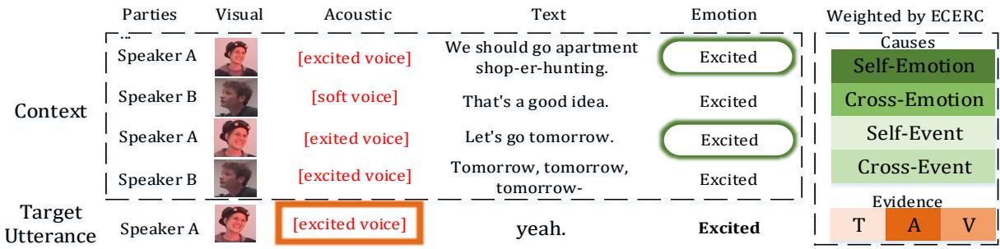  
(a) Mainly influenced by the speaker’s previous emotions.

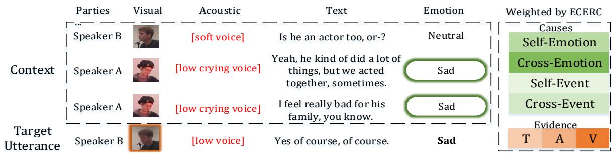  
(b) Mainly Influenced by other speaker’s emotions.  
Figure 4: Two cases regarding emotion causes.

## B Case Study

To demonstrate the efficacy of ECERC, we present a set of case studies in this section, showcasing four cases successfully predicted by our model from the IEMOCAP and MELD datasets. These cases are illustrated in Figures 4 and 5, where Figure 4 highlights emotion-related causes (such as emotional contagion and influence of others’ emotions), and Figure 5 showcases event-related causes (including self-referenced events and events uttered by others). For each case, we visualize the weights assigned by ECERC in Evidence Gating (brown) and Feature Gating (green) to observe how these gates function. The darker the color, the higher the assigned weight.

In Figure 4(a), the acoustic modality of the target utterance carries strong emotional evidence, resulting in the highest weight assigned by ECERC. In contrast, the text modality "yeah" contains minimal emotional evidence, and thus receives the lowest weight. The emotional evidence interacts with potential causes to retrieve cause-related information and generate candidate features. When gating candidate features, the target’s emotion is primarily influenced by its own emotional inertia within the conversation context. Therefore, ECERC assigns the highest weight to candidate features from Self-Party Emotion Attention (self-emotion), while the weight for Self-Party Event Attention (selfevent) is minimal due to the limited information in the "yeah" utterance. In Figure 4(b), the visual and acoustic modalities of the target utterance exhibit strong emotional signals (head down, low voice), leading ECERC to assign them relatively high weights. The text modality provides no significant emotional evidence, so it receives the lowest weight. When gating candidate features, the target’s emotion is mainly influenced by Speaker A’s emotion in the conversation context. As a result, ECERC assigns the highest weight to the candidate features derived from Cross-Party Emotion Attention (cross-emotion). In Figure 5(a), the visual and acoustic modalities of the target utterance express neutral emotions, resulting in relatively high weights from ECERC. The text modality, while lacking emotional expression, provides numerous rational event descriptions: Phoebe asks logical questions. When gating candidate features, the target’s emotions are primarily shaped by the event information present in the target utterance, as well as emotional inertia within the conversation context. Therefore, ECERC assigns the highest weight to candidate features from Self-Party Event Attention (self-event), with Self-Emotion being secondary due to the existence of emotional contagion. In Figure 5(b), the visual and acoustic modalities of the target utterance display emotional expressions that contradict the speaker’s actual emotions. Consequently, despite the absence of direct emotional expression in the text, ECERC assigns relatively high weights to text modalities. When gating candidate features, Chandler’s emotions are likely influenced by Ross’s previous utterance (a joke) and tend to be neutral. As a result, ECERC assigns the highest weight to candidate features from Cross-Party Event Attention (cross-event). In conclusion, these case studies demonstrate the functionality and effectiveness of ECERC, showcasing how the model dynamically adjusts weights based on different emotional and event-related cues in various modalities.

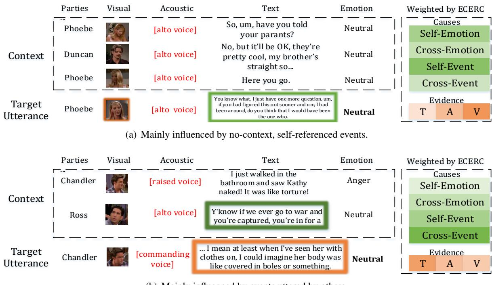  
Figure 5: Two cases regarding event causes.

## C Confusion Matrix

We show the confusion matrix of ECERC on the IEMOCAP and MELD datasets to analyze the performance, as shown in Figure 6. We observe that: 1) Emotion categories that are closely related tend to be misclassified, such as Happy vs. Excited, Angry vs. Frustrated, and Disgust vs. Angry. This can be attributed to the similarity in the potential expressions of these emotions, making them prone to misclassification. 2) Like most existing approaches, the model still faces challenges related to the imbalance in sample sizes across categories. In IEMOCAP, the sample sizes are relatively balanced, which results in smaller performance variations across categories (with the lowest accuracy being 66.67% in the Angry category and the highest being 78.78% in the Sad category). In contrast, MELD has more imbalanced sample sizes, leading to larger performance differences across categories. For example, the accuracy ranges from a low of 22% in the Fear category to a high of 82.72% in the Neutral category. The Neutral category, with the largest sample size in MELD, often leads to misclassifications of other categories as Neutral, as shown in the first column of Figure 6(b). This skew toward Neutral reduces the performance of other categories, as excessive Neutral training samples make it easier for non-neutral utterances to be misclassified as Neutral. These challenges remain open issues that need to be addressed by future researchers.

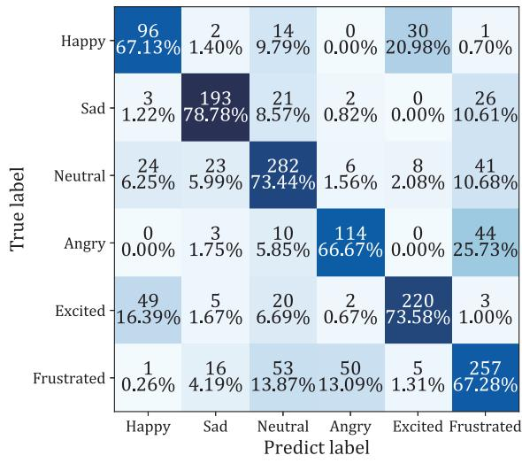  
(a) IEMOCAP

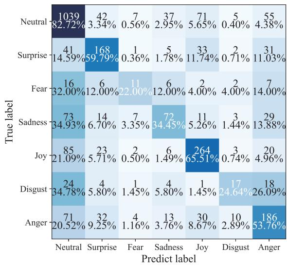  
(b) MELD  
Figure 6: Confusion Matrix