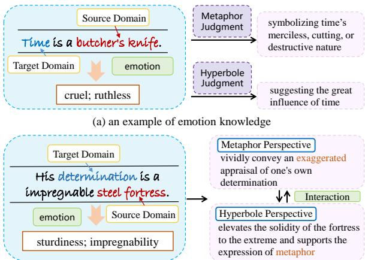
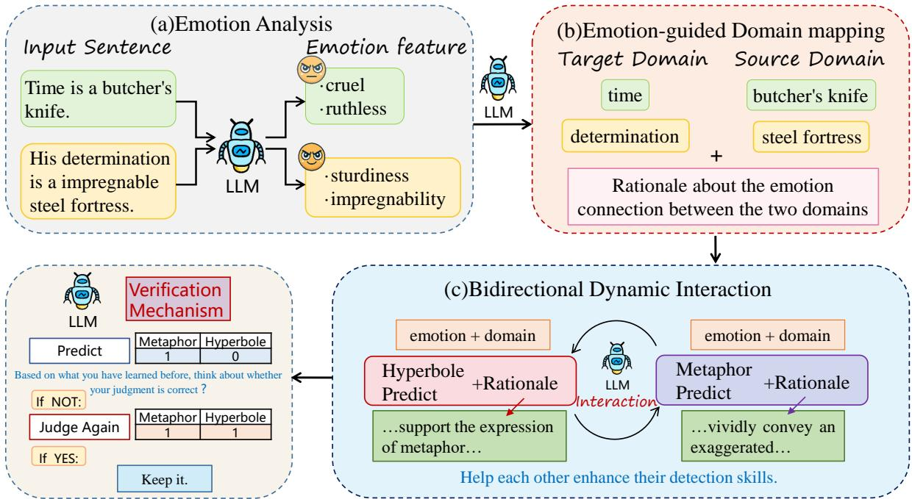
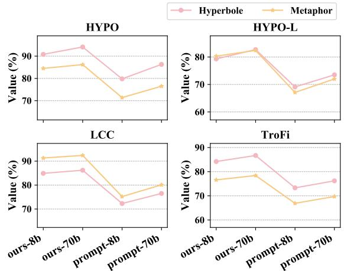
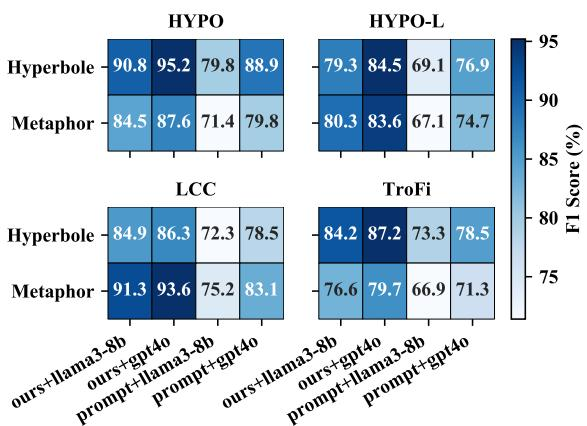
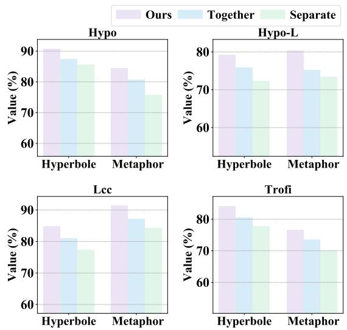

# Enhancing Hyperbole and Metaphor Detection with Their Bidirectional Dynamic Interaction and Emotion Knowledge

Li Zheng1, Sihang Wang1, Hao Fei2, Zuquan Peng1, Fei Li1∗, Jianming Fu1, Chong Teng1, Donghong Ji1

1Key Laboratory of Aerospace Information Security and Trusted Computing, Ministry of Education, School of Cyber Science and Engineering, Wuhan University, Wuhan, China 2National University of Singapore, Singapore, Singapore

{zhengli,sihangwang,pzq\_cse,lifei\_csnlp,jmfu,tengchong,dhji}@whu.edu.cn haofei37@nus.edu.sg

## Abstract

Text-based hyperbole and metaphor detection are of great significance for natural language processing (NLP) tasks. However, due to their semantic obscurity and expressive diversity, it is rather challenging to identify them. Existing methods mostly focus on superficial text features, ignoring the associations of hyperbole and metaphor as well as the effect of implicit emotion on perceiving these rhetorical devices. To implement these hypotheses, we propose an emotion-guided hyperbole and metaphor detection framework based on bidirectional dynamic interaction (EmoBi). Firstly, the emo tion analysis module deeply mines the emotion connotations behind hyperbole and metaphor. Next, the emotion-based domain mapping module identifies the target and source domains to gain a deeper understanding of the implicit meanings of hyperbole and metaphor. Finally, the bidirectional dynamic interaction module enables the mutual promotion between hyperbole and metaphor. Meanwhile, a verification mechanism is designed to ensure detection ac curacy and reliability. Experiments show that EmoBi outperforms all baseline methods on four datasets. Specifically, compared to the current SoTA, the F1 score increased by 28.1% for hyperbole detection on the TroFi dataset and 23.1% for metaphor detection on the HYPO-L dataset. These results, underpinned by in-depth analyses, underscore the effectiveness and potential of our approach for advancing hyperbole and metaphor detection.

## 1 Introduction

Hyperbole and metaphor, as common rhetorical devices, not only enrich language expressions but also play a crucial role in emotion conveyance (Mohammad et al., 2016; Djokic et al., 2021) and semantic understanding (Neuman et al., 2013; Ding et al., 2025; He et al., 2025). Therefore, the accurate detection and understanding of hyperbole and metaphor are of critical significance for improving the performance of many Natural Language Processing (NLP) tasks, such as emotion analysis systems (Zheng et al., 2023b; Zhang et al., 2024a; Lee et al., 2023) and intelligent chatbots (Samad et al., 2022; Zheng et al., 2023a; Xie et al., 2024; Zheng et al., 2025). However, due to their semantic obscurity and expressive diversity, identifying hyperbole and metaphor has always been a challenging issue in NLP research.

  
(b) an example of bidirectional dynamic interaction  
Figure 1: Examples of Hyperbole and Metaphor Detection.

Several studies have made commendable efforts in hyperbole and metaphor detection. Some researches build separate detection models for hyperboles (Tian et al., 2021; Schneidermann et al., 2023) or metaphors (Tian et al., 2024; Zhang et al., 2024b). Additionally, the latest work (Badathala et al., 2023) considering the interaction between hyperboles and metaphors, proposed a multi-task method for simultaneously detecting them. However, these methods mainly focus on the extraction of surface-level text features and implicit feature sharing among tasks. They ignore the emotions behind rhetorical expressions and the dynamic interaction between tasks. Specifically, the employment of rhetorical devices is often emotion-driven (Dankers et al., 2019; Chen et al., 2023; Zhang et al., 2024a), and different devices can interact and jointly construct semantics. Therefore, (1) how to mine the emotions behind hyperbole and metaphor and (2) how to model the dynamic interaction relationship between them, and utilize these to achieve detection are of crucial importance.

On the one hand, most prior approaches (Elzohbi and Zhao, 2023; Zhang and Wan, 2023; Badathala et al., 2023) only focus on lexical and syntactic features, while the consideration of emotion factors remains insufficient. In fact, emotion is the vehicle of semantic expression and a key factor in facilitating the understanding of rhetorical effects. As shown in Figure 1 (a), from the emotion perspective, the term “butcher’s knife” carries a cruel and ruthless emotion connotation. Without emotion knowledge, it is arduous to fathom that “time” (the target domain) is metaphorically referred to as a “butcher’s knife” (the source domain) just from a literal interpretation. It might be misinterpreted as a description of an actual knife. For hyperbole detection, the cruel and ruthless “butcher’s knife” holds a hyperbolic significance, intimating the great influence of time. Absent the aid of emotion knowledge, it could be misapprehended as a meaningless text.

On the other hand, although hyperboles and metaphors differ in linguistic manifestations, they possess certain inherent associations as both involve deviations from the literal meaning to achieve specific expressive effects (Carston and Wearing, 2011; Burgers et al., 2016). Nevertheless, existing methods (Troiano et al., 2018; Badathala et al., 2023; Qiao et al., 2024) either treat these two rhetorical devices separately or simply conduct implicit feature fusion, neglecting to explicitly explore and utilize the bidirectional dynamic interaction process between them. As illustrated in Figure 1 (b), from the metaphor perspective, comparing “determination” to “steel fortress” vividly exaggerates the firmness of determination via the fortress’s sturdiness and impregnability. Conversely, this hyperbole elevates the sturdiness of the fortress to the extreme, reinforcing the metaphorical link between “determination” and “steel fortress”.

Based on the above observations, we propose an Emotion-guided hyperbole and metaphor detection framework based on Bidirectional Dynamic Interaction (EmoBi). Firstly, we conduct an emotion analysis of the sentence. By excavating the deepseated correlations between emotions and hyperboles as well as metaphors within the text, crucial cues are provided for subsequent identification and comprehension. Secondly, we perform emotionbased domain mapping. Based on the emotion analysis results, we prompt the large language model (LLM) to identify the target domain and the source domain from the emotion perspective. This enriches the semantic representation of the target domain through emotional connotations, facilitating a deeper understanding of implicit meaning in hyperboles and metaphors. Finally, we design a bidirectional dynamic interaction mechanism to enable hyperbole and metaphor to mutually reinforce each other. The intense emotion and degree variation within hyperbole render the conceptual mapping of metaphor more profound and expressive. Meanwhile, metaphor sets the semantic framework and emotional tone for hyperbole. Additionally, we set up a verification mechanism to ensure detection accuracy and reliability.

To validate the effectiveness of our model, we conduct experiments on four widely used datasets for hyperbole and metaphor detection, namely HYPO (Troiano et al., 2018), and HYPO-L (Zhang and Wan, 2021), LCC (Mohler et al., 2016), TroFi (Birke and Sarkar, 2006). The experimental results show that our model significantly outperforms all state-of-the-art (SoTA) baselines on all evaluation metrics. Specifically, in hyperbole and metaphor detection, the F1 scores are improved by 28.1% on the TroFi dataset and 23.1% on the HYPO-L dataset respectively compared to the current SoTA. Moreover, we carry out a large number of experiments to show the effectiveness of the emotion guidance and the bidirectional dynamic interaction. Our main contributions are summarized as follows:

• We propose a novel emotion-guided framework to understand hyperbole and metaphor comprehensively through emotion expressions, providing a new perspective for rhetorical language study.

• We design a bidirectional dynamic interaction mechanism that promotes the mutual enhancement between hyperboles and metaphors.

• Our extensive experimental results on the four widely used hyperbole and metaphor datasets demonstrate that our scheme achieves SoTA performance.1

## 2 Related Work

## 2.1 Hyperbole and Metaphors Detection

Hyperbole and metaphor detection has been an active research area in Natural Language Processing (NLP) (Zhang and Wan, 2024; Kalarani et al., 2024; Govindan and Balakrishnan, 2022). For metaphor detection, Birke and Sarkar (2006) developed the TroFi dataset, focusing on literal and metaphorical verb usages. Mohler et al. (2016) contributed the LCC dataset with sentence-level metaphor annotations in four languages. Tian et al. (2024) proposed a domain mining method based on interpretable word pairs for metaphor detection. Yang et al. (2024) bootstraped and combined tacit knowledge to conduct verb metaphor detection. In the realm of hyperbole detection, McCarthy and Carter (2004) established a theoretical framework, which provided a foundation for subsequent research efforts. Troiano et al. (2018) took a significant step forward by developing the first comprehensive hyperbole dataset. Tian et al. (2021) utilized common sense and counterfactual knowledge to generate sentencelevel hyperboles. Schneidermann et al. (2023) explored hyperbole detection in pre-trained language models. Nevertheless, these methods typically handle metaphors or hyperboles independently, overlooking the interactions between them. Badathala et al. (2023) proposed a multi-task approach that considered the mutual promotion between hyperboles and metaphors. However, they mainly focused on surface feature sharing and insufficiently considered the emotion guidance and the deep-level interaction between hyperboles and metaphors.

## 2.2 Emotion Analysis

Significant progress has been made in emotion analysis (Liu, 2020; Akhtar et al., 2016; Pang et al., 2002; Zheng et al., 2024b,a), evolving from early dictionary matching methods to deep learning models. Turney (2002) proposed a pointwise mutual information measure method for predicting emotions. With the emergence of deep learning, Rakhlin (2016) introduced convolutional neural networks for sentiment analysis. Wang et al. (2023) found that emotions can be effectively used to study personality traits. Regarding the research on the association between emotions and rhetoric. Mohammad et al. (2016) explored the relationship between metaphor and emotion, finding that metaphors often carry emotion tendencies. Chen et al. (2023) proposed an emotion recognition model through hierarchical structure and rhetorical correlation. Considering the driving role of emotion on rhetorical devices, we propose an emotion-guided framework to achieve more accurate and comprehensive detection.

## 2.3 LLM Reasoning

The emergence of large language models (LLMs) has opened up new avenues for hyperbole and metaphor detection (Mann et al., 2020; Wu et al., 2023; Xu et al., 2024). Prompting techniques have been widely explored to elicit the knowledge and reasoning capabilities of LLMs (Li et al., 2023; Liang et al., 2024; Zhou et al., 2024). Chain-of-Thought (CoT) prompting and its variants have been proposed to guide LLMs in generating intermediate reasoning steps, which have shown promising results in improving performance on complex tasks (Wei et al., 2022; Yao et al., 2024; Besta et al., 2024). Although existing prompting techniques have achieved success in other domains, the unique characteristics of hyperbole and metaphor, such as their implicitness and context-dependence, pose additional challenges. There is a lack of systematic research to effectively prompt LLMs to capture the essence of these rhetorical devices. Our work builds upon these previous efforts and proposes a novel emotion-guided framework that explicitly models the emotion knowledge and dynamic interaction between hyperboles and metaphors.

## 3 Methodology

## 3.1 Task Definition

For a given sentence x , our goal is to predict the corresponding hyperbole label $y _ { h }$ and metaphor label $y _ { m }$ , that is $f ( x )  ( y _ { h } , y _ { m } )$ , where f(x) represents the detection model.

## 3.2 Method Overview

In this paper, we propose an emotion-guided hyperbole and metaphor detection framework based on bidirectional dynamic interaction (EmoBi), which fully utilizes emotion information and inter-task interactions to enhance hyperbole and metaphor detection. The architecture of our framework is illustrated in Figure 2 and comprises three components: (1) an emotion analysis module, (2) an emotion-guided domain mapping module, and (3) a bidirectional dynamic interaction module. The emotion analysis module, captures the emotion context of the sentence, supplying key cues for later detection. The domain mapping module utilizes semantic and emotion information to identify target and source domains, aiding in understanding implicit meanings. Finally, the bidirectional dynamic interaction mechanism enables mutual promotion in detection via knowledge transfer.

  
Figure 2: The overall architecture of our model.

## 3.3 Emotion Analysis

The first stage involves a comprehensive sentiment analysis of the given sentence. This step is of utmost importance as emotion is a key factor in facilitating the understanding of rhetorical effects. By deeply mining the emotion within the sentence, it can effectively connect the surface level of language with the deeper level of rhetoric, thus contributing to a precise interpretation of the rhetorical effects of the text. Specifically, we prompt the LLM to analyze the emotion of the sentence. The specific input template is as follows:

Input: <sentence>   
Prompt1: Please analyze the emotion   
of the following sentence.

This step can be formulated as:

$$
x _ { e } = L L M ( x , P r o m p t 1 )\tag{1}
$$

where $x _ { e }$ represents the result of emotion analysis. The LLM processes the input and returns the emotion information. Emotion analysis not only enables us to understand the emotion background of hyperboles and metaphors but also provides crucial guidance for subsequent domain mapping.

## 3.4 Emotion-Based Domain Mapping

Domain mapping is of crucial significance as it facilitates the comprehension of semantic transfer and conceptual relationships within a sentence, which are typically the key elements in the detection of hyperboles and metaphor. Based on the emotion analysis result from the previous step, we prompt the LLM to perform domain mapping from an emotion perspective and identify the source domain and target domain of the sentence. We design the following prompt template for the LLM:

Input: <sentence> + <emotion   
analysis>   
Prompt2: Based on the above emotion   
analysis result, identify the source   
domain and target domain in the   
sentence, and analyze the emotion   
connection between the two domains.

This step can be formulated as:

$$
x _ { d } = L L M ( x , x _ { e } , P r o m p t 2 )\tag{2}
$$

where $x _ { d }$ contains the source domain, the target domain, and the corresponding explanations. The identification of source and target domains constructs a crucial bridge for understanding hyperbole and metaphor. The source domain, as the initial conceptual foundation of hyperbolic and metaphorical expressions, bears fundamental semantic features and emotional connotations. The target domain is the destination where these semantic features and emotional connotations are transferred and mapped. By identifying the source domain and the target domain, the starting and ending points of semantic transfer can be accurately located. This allows for a clear examination of semantic magnifi cation or distortion in hyperbole and cross-domain conceptual mapping and fusion in metaphor. Consequently, it promotes a more comprehensive understanding of sentence semantics and more precise detection of hyperbole and metaphor.

## 3.5 Bidirectional Dynamic Interaction

Utilizing the obtained emotion knowledge and domain understanding, we design a bidirectional dynamic interaction mechanism to further perform hyperbole and metaphor detection. In this mechanism, hyperbole and metaphor mutually reinforce each other. The intense emotions and degree changes inherent in hyperbole can provide richer semantic expansion directions for metaphor, enhancing the depth and expressiveness of the metaphorical concept mapping. Conversely, metaphor sets the semantic framework and emotion tone for hyperbole, making the degree changes in hyperbole more reasonable and coherent. This bidirectional dynamic interaction promotes mutual learning between the hyperbole and metaphor detection tasks, thereby improving the accuracy and efficiency of detection.

Taking metaphor-guided hyperbole detection as an example, we prompt the LLM to perform metaphor detection based on the knowledge obtained from the previous two steps, obtaining metaphor detection knowledge.

$$
x _ { m } = L L M ( x , x _ { e } , x _ { d } )\tag{3}
$$

where $x _ { m }$ denotes the metaphor information in the sentence. Then, based on the prior emotion knowledge, domain knowledge, and metaphor information, we conduct hyperbole detection.

<table><tr><td>Input:</td><td>&lt;sentence&gt;</td><td>+</td><td>&lt;emotion</td></tr><tr><td>analysis&gt;</td><td>+ &lt;domain</td><td>mapping&gt;</td><td>+</td></tr><tr><td>&lt;metaphor analysis&gt;</td><td></td><td></td><td></td></tr></table>

Prompt3: Based on the emotion knowledge, domain knowledge, and metaphor knowledge, analyze whether the sentence is a hyperbole sentence.

This step can be formulated as:

$$
y _ { h } = L L M ( x , x _ { e } , x _ { d } , x _ { m } , P r o m p t 3 )\tag{4}
$$

The LLM analyzes the sentence based on the provided information and outputs the hyperbole label $y _ { h }$ . Conversely, the process of hyperboleguided metaphor detection is similar. First, we utilize the emotion and domain knowledge from the previous two steps to analyze the hyperbole information $x _ { h }$ in the sentence. Subsequently, the final metaphor label $y _ { m }$ is derived based on the emotion knowledge $x _ { e } ,$ domain knowledge $x _ { d } ,$ , and hyperbole information $x _ { h }$ . This bidirectional dynamic interaction not only improves the detection of each individual rhetorical device but also enriches the overall understanding of the semantic and rhetorical complexity of the text.

Furthermore, we design a validation mechanism. If an error is detected in the identified hyperboles or metaphors, the model re-evaluate and adjust the results. Through the validation mechanism, we ensure the accuracy and reliability of the hyperbole and metaphor detection and improve the overall performance of the framework.

## 4 Experiments

## 4.1 Experimental Setting

Datasets. We evaluate the effectiveness of our framework on four widely-used datasets with both hyperbole and metaphor labels, namely HYPO (Troiano et al., 2018), and HYPO-L (Zhang and Wan, 2021), LCC (Mohler et al., 2016), TroFi (Birke and Sarkar, 2006).

Evaluation Metrics. In terms of evaluation metrics, we align with (Badathala et al., 2023) and use three metrics, namely precision (P), and recall (R), and F1, to assess the performance.

## 4.2 Baseline Systems

To verify the effectiveness of our model, we compare it with the following state-of-the-art baselines. (1) Badathala et al. (2023) propose a multi-task method with a fully shared layers (MTL-F) model based on BERT (Devlin, 2018), ALBERT (Lan, 2019), and RoBERTa (Liu, 2019) respectively.

(2) Standard Prompting. Standard prompting methods have been widely utilized in previous works (Ma et al., 2023; Zhu et al., 2024). For this task, we construct the following prompt template as the input for LLMs:

<table><tr><td rowspan="2">Method</td><td colspan="3">Hyperbole</td><td colspan="3">Metaphor</td><td colspan="3">Hyperbole</td><td colspan="3">Metaphor</td></tr><tr><td></td><td>R</td><td>F1</td><td>P</td><td>R</td><td>F1</td><td>P</td><td>R</td><td>F1 HYPO-L</td><td>P</td><td>R</td><td>F1</td></tr><tr><td colspan="10">HYPO</td><td colspan="3"></td></tr><tr><td>MTL-F-BERT</td><td>85.3</td><td>82.4</td><td>83.6</td><td>79.9</td><td>68.6</td><td>72.9</td><td>65.5</td><td>61.9</td><td>63.8</td><td>55.2</td><td>45.4</td><td>50.3</td></tr><tr><td>MTL-F-ALBERT</td><td>84.7</td><td>87.7</td><td>86.0</td><td>75.7</td><td>76.1</td><td>75.3</td><td>63.8</td><td>59.3</td><td>61.4</td><td>49.8</td><td>38.5</td><td>43.0</td></tr><tr><td>MTL-F-RoBERTa</td><td>87.9</td><td>88.4</td><td>88.1</td><td>82.6</td><td>75.2</td><td>78.7</td><td>70.6</td><td>66.8</td><td>68.7</td><td>59.9</td><td>55.4</td><td>57.2</td></tr><tr><td>Prompt-based</td><td>71.6</td><td>90.2</td><td>79.8</td><td>72.8</td><td>70.1</td><td>71.4</td><td>62.4</td><td>77.3</td><td>69.1</td><td>61.9</td><td>73.2</td><td>67.1</td></tr><tr><td>CoT-based</td><td>76.1</td><td>91.8</td><td>83.2</td><td>75.4</td><td>79.2</td><td>77.2</td><td>67.5</td><td>78.7</td><td>72.8</td><td>65.3</td><td>81.7</td><td>72.6</td></tr><tr><td>Ours</td><td>87.7</td><td>94.1</td><td>90.8</td><td>81.2</td><td>88.1</td><td>84.5</td><td>74.2</td><td>85.1</td><td>79.3</td><td>75.8</td><td>85.4</td><td>80.3</td></tr><tr><td>(+2.3%)</td><td>(-0.2%)</td><td></td><td>(+2.7%)</td><td>(-1.4%)</td><td>(+8.9%)</td><td>(+5.8%)</td><td>(+3.6%)</td><td>(+6.4%)</td><td>(+6.5%) TroFi</td><td>(+10.5%)</td><td>(+3.7%)</td><td>(+7.7%)</td></tr><tr><td colspan="10">LCC</td><td colspan="3"></td></tr><tr><td>MTL-F-BERT</td><td>63.3</td><td>53.1</td><td>57.5</td><td>75.0</td><td>77.4</td><td>76.0</td><td>56.5</td><td>43.3</td><td>48.6</td><td>55.6</td><td>52.5</td><td>54.0</td></tr><tr><td>MTL-F-ALBERT</td><td>61.4</td><td>42.5</td><td>49.9</td><td>70.9</td><td>78.5</td><td>74.4</td><td>48.7</td><td>24.1</td><td>31.2</td><td>51.6</td><td>45.7</td><td>47.5</td></tr><tr><td>MTL-F-RoBERTa</td><td>63.0</td><td>69.1</td><td>65.9</td><td>79.8</td><td>81.2</td><td>80.5</td><td>60.5</td><td>52.9</td><td>56.1</td><td>56.5</td><td>58.7</td><td>57.3</td></tr><tr><td>Prompt-based</td><td>61.4</td><td>87.9</td><td>72.3</td><td>82.3</td><td>69.1</td><td>75.2</td><td>68.1</td><td>79.4</td><td>73.3</td><td>82.4</td><td>56.3</td><td>66.9</td></tr><tr><td>CoT-based</td><td>68.1</td><td>90.1</td><td>77.5</td><td>89.4</td><td>78.4</td><td>83.6</td><td>71.3</td><td>87.3</td><td>78.5</td><td>83.5</td><td>61.2</td><td>70.7</td></tr><tr><td>Ours</td><td>76.3</td><td>95.6</td><td>84.9</td><td>95.7</td><td>87.3</td><td>91.3</td><td>76.6</td><td>93.5</td><td>84.2</td><td>91.3</td><td>65.9</td><td>76.6</td></tr><tr><td></td><td>(+8.2%)</td><td>(+5.5%)</td><td>(+7.4%)</td><td>(+6.3%)</td><td>(+6.1%)</td><td>(+7.7%)</td><td>(+5.3%)</td><td>(+6.2%)</td><td>(+5.7%)</td><td>(+7.8%)</td><td>(+4.7%)</td><td>(+5.9%)</td></tr></table>

Table 1: Experimental results on hyperbole and metaphor detection. In the brackets are the improvements of our model over the best-performing baseline(s). MTL-F-RoBERTa is the current SoTA.

Prompt: Please identify the hyperbole label $y _ { h }$ and metaphor label $y _ { m }$ of the following sentence x.

Nevertheless, this method lacks explicit guidance for the LLM’s step-by-step reasoning process, diminishing the interpretability of their answers and making it challenging to understand the underlying logic behind the LLM’s responses.

(3) Vanilla CoT Prompting. To enhance the standard prompting method, chain-of-thought (CoT) prompting has been investigated (Wei et al., 2022). It has made progress not only in generating answers but also in inspiring the LLM to provide the rationale basis behind the answers. We construct the following prompt template as inputs to LLMs:

Prompt: Let’s think step by step to   
identify the hyperbole label $y _ { h }$ and   
metaphor label $y _ { m }$ of the following   
sentence x.

However, the CoT merely prompts the model to directly generate the intermediate reasoning process. It falls short of delving into the emotion background behind hyperbole and metaphor and the profound interaction between them.

## 4.3 Main Results

The experimental results of the hyperbole and metaphor detection tasks on four datasets are shown in Table 1. The results highlight that our method outperforms the SoTA baselines on four datasets, revealing several key findings. Firstly, compared with prompt-based and CoT-based reasoning, our method has unique advantages. On the LCC dataset, the F1 score of the metaphor detection has risen by 16.1% and 7.7% respectively compared with prompt-based and CoT-based reasoning, and the F1 score of the hyperbole detection has increased by 12.6% and 7.4%. This firmly validates that in-depth text emotion analysis and hyperbole-metaphor interaction exploration enable a more precise grasp of their nuanced semantics. In addition, contrasted with the current SoTA (MTL-F-RoBERTa), our method presents more prominent benefits. On the TroFi dataset, the F1 scores of the hyperbole detection has surged by 28.1%. And on the HYPO-L dataset, the F1 scores of the metaphor detection has increased by 23.1%. This indicates that it is insufficient for MTL-F to mine the clues of hyperbole and metaphor only from the surface features. It also shows the necessity and effectiveness of understanding the emotional background behind the sentence. The hyperbole providing a richer semantic expansion direction for the metaphor and the metaphor setting a semantic framework for the hyperbole. Furthermore, compared to the current SoTA, the F1 scores of prompt-based and CoT-based reasoning in hyperbole detection on the HYPO dataset decreased by 8.3% and 4.9% respectively, and those in metaphor detection declined by 7.3% and 1.5% respectively. This indicates that relying solely on the inference ability of the LLM itself is inadequate and further demonstrates the effectiveness of our method.

## 4.4 Ablation Study

We perform ablation experiments to evaluate the contribution of each component in our model. As depicted in Table 2, no variant matches the full model’s performance, highlighting the indispensability of each component. Specifically, when the emotional analysis is not utilized, the performance degradation is the most prominent across both tasks on all four datasets. Particularly, on the metaphor detection of the HYPO-L dataset, the F1 score dropped by 5.7%. This indicates the signifi cance of providing emotional context. To verify the necessity of the bidirectional dynamic interaction mechanism, we remove this module. The sharp decline in the results demonstrate that this module enables a mutual reinforcement between hyperbole and metaphor, facilitating a more comprehensive and accurate understanding of their semantic relationships. Besides, removing the emotion-guided domain mapping led to a decline in performance. This implies that identifying the source domain and the target domain as well as tracing the emotional connections between the two domains can enhance the model’s ability. Furthermore, the performance declined when the verification mechanism is removed, which indicates that re-evaluate the results contributes to the improvement of performance.

<table><tr><td rowspan="2"></td><td colspan="2">HYPO</td><td colspan="2">HYPO-L</td></tr><tr><td>Hyperbole</td><td>Metaphor</td><td>Hyperbole</td><td>Metaphor</td></tr><tr><td>Ours</td><td>90.8</td><td>84.5</td><td>79.3</td><td>80.3</td></tr><tr><td>w/o emotion</td><td> $8 6 . 2 \ ( - 4 . 6 )$ </td><td> $7 9 . 4 \ ( - 5 . 1 )$ </td><td> $7 4 . 7 \ ( - 4 . 6 )$ </td><td>74.6 (-5.7)</td></tr><tr><td>w/o interaction</td><td>87.4 (-3.4)</td><td>80.7 (-3.8)</td><td>75.8 (-3.5)</td><td>75.3 (-5.0)</td></tr><tr><td>w/o domain</td><td>88.2 (-2.6)</td><td>81.2 (-3.3)</td><td>76.6 (-2.7)</td><td>76.0 (4.3)</td></tr><tr><td>w/o verification</td><td>89.3 (-1.5)</td><td>83.1 (-1.4)</td><td>78.1 (-1.2)</td><td>78.4 (-1.9)</td></tr><tr><td></td><td colspan="2">LCC</td><td colspan="2">TroFi</td></tr><tr><td></td><td>Hyperbole</td><td>Metaphor</td><td>Hyperbole</td><td>Metaphor</td></tr><tr><td>Ours</td><td>84.9</td><td>91.3</td><td>84.2</td><td>76.6</td></tr><tr><td>w/o emotion</td><td> $7 9 . 6 \ ( - 5 . 3 )$ </td><td> $8 5 . 9 \ ( . 5 . 4 )$ </td><td> $7 9 . 8 \ ( . 4 . 4 )$ </td><td> $7 2 . 2 \ ( . 4 . 4 )$ </td></tr><tr><td>w/o interaction</td><td> $8 0 . 9 \ ( - 4 . 0 )$ </td><td> $8 7 . 2 \ ( - 4 . 1 )$ </td><td> $8 0 . 6 \ ( . 3 . 6 )$ </td><td> $7 3 . 6 \ ( - 3 . 0 )$ </td></tr><tr><td>w/o domain</td><td> $8 1 . 4 ( - 3 . 5 )$ </td><td> $8 8 . 1 \ ( - 3 . 2 )$ </td><td> $8 1 . 4 \ : ( - 2 . 8 )$ </td><td> $7 3 . 9 \ : _ { ( - 2 . 7 ) }$ </td></tr><tr><td>w/o verification</td><td> $8 3 . 4 \ ( - 1 . 5 )$ </td><td> $8 9 . 9 \ _ { ( - 1 . 4 ) }$ </td><td> $8 2 . 9 \ _ { ( - 1 . 3 ) }$ </td><td>75.2 (-1.4)</td></tr></table>

Table 2: Ablation results. The numbers in the brackets are the decreased values compared with our full model.

## 4.5 Discussion

To further investigate the effectiveness of our method, we conduct in-depth analyses to answer the following questions, aiming to deeply mine the intuition and analyze implicit phenomena.

1) What are the impacts of LLM scales? With the attempt to investigate the impact of different LLM scales, we evaluate the hyperbole and metaphor detection performance of Llama models with different sizes on four datasets. As illustrated in the Figure 3, it can be observed that for both our method and the prompt-based method, the performance of hyperbole and metaphor detection improves as the model scale increases. Moreover, we discover that compared with the prompt-based method, our method exhibits a more significant enhancement in performance when the model scale is enlarged. This indicates that our method can deeply mine the semantic and emotional information within the text, thereby demonstrating stronger adaptability in hyperbole and metaphor detection tasks.

  
Figure 3: Comparison results of different LLM scales.

  
Figure 4: Comparison results of different LLMs.

2) What are the influences of different LLMs? To explore the impact of different LLMs on hyperbole and metaphor detection, we select two representative models: Llama3-8b and GPT-4o for comparative experiments. The experimental results are shown in Figure 4. We observe that on all four datasets, GPT-4o consistently outperforms Llama3- 8b. This consistent performance gap indicates that more powerful LLMs indeed have better rhetorical comprehension abilities. Additionally, we find that the performance of our method far surpasses that of prompt-based method, regardless of whether it is applied to Llama3-8b or GPT-4o. This shows that by deeply mining the semantic and emotional cues in the text, we compensate for the potential deficiencies of LLMs in handling rhetorical detection tasks, proving the effectiveness of our method.

3) What are the advantages of the bidirectional dynamic interaction mechanism? We are curious about the effectiveness of the bidirectional dynamic interaction mechanism. In Figure 5, we design three groups of experiments for comparison, namely: 1) detecting hyperboles or metaphors separately (Separate). 2) detecting hyperboles and metaphors simultaneously (Together). 3) detecting hyperboles and metaphors using the bidirectional dynamic mechanism (Ours). We observe that our method outperforms both separate and simultaneous detection on the four datasets. This indicates that the mechanism can better capture the semantic features. It averts information one-sidedness in separate detection and overcomes interaction deficiency in simultaneous detection, yielding more accurate and efficient results. Moreover, we find that the performance of separate detection is the worst, which proves that hyperboles and metaphors can help each other and highlights the importance of integrating the effective knowledge between them.

  
Figure 5: Influence of the bidirectional dynamic interaction mechanism in hyperbole and metaphor detection.

## 4.6 Case Study

We conduct a case study to gain a deeper understanding of the importance and effectiveness of our framework. As shown in Figure 6, our framework successfully detects hyperboles and metaphors, while the prompt-based method fails. 1 In terms of emotion analysis, in Eg.1, our method correctly detects it as a hyperbole based on the emotions of hope and commitment it conveyed, yet the prompt-based method misses this. Similarly, in Eg.2, guided by the shopping tired emotion, our method successfully detects the sentence as hyperbole. In contrast, the prompt-based method misinterprets it as a direct statement. 2 Regard-

Figure 6: Case study to compare with prompt-based and our framework.

ing the emotion-based domain mapping, in Eg.3, our method discerns the source domain “sanctuary” and the metaphorical meaning of safety and comfort, while the prompt-based method fails to recognize it as an exaggeration. In Eg.4, our method pinpoints “hunger” as the source domain and “ambitious” as the target domain, likening ambition to hunger to express a strong desire. Whereas the prompt-based method erroneously views the sentence as simply expressing hunger. 3 Concerning the bidirectional dynamic interaction between hyperbole and metaphor, in Eg.5, our method analyzes the metaphor that a person’s body is frozen like a statue and thus infers that the sentence exaggerates the static state. The prompt-based method, unfortunately, fails to identify the hyperbole. In Eg.6, Our method reasons out the metaphorical nature of “bend” by identifying the hyperbole of his influence in the sentence, which the prompt-based method cannot capture. Overall, this analysis emphasizes the significant meaning and effectiveness of the emotion analysis, the emotion-based domain mapping, and the bidirectional dynamic interaction between hyperbole and metaphor in precisely detecting hyperboles and metaphors.

## 5 Conclusion

In this paper, we proposes an emotion-guided hyperbole and metaphor detection framework based on bidirectional dynamic interaction(EmoBi). By means of emotion analysis, emotion-based domain mapping, and bidirectional dynamic interaction mechanism, it fully utilizes the interaction between emotion information and tasks to enhance the detection performance. Through in-depth analysis, it is discovered that EmoBi can compensate for the deficiencies of LLM in handling specific rhetorical detection tasks by mining emotion cues. The experimental results on four widely-used datasets demonstrate the effectiveness of our proposed innovative method, achieving SoTA performance.

## 6 Limitations

Despite the remarkable achievements of the proposed EmoBi in this paper, there are still some limitations that present opportunities for further improvement. First, due to its multi-step reasoning approach, EmoBi suffers from the issue of error propagation. When an error occurs in the previous steps, it may affect the judgments in the subsequent steps. Second, while emotion knowledge plays a crucial role in our model, the current emotion analysis module may not always accurately capture all the subtle emotions. In future work, we will consider how to further ensure the quality of emotion knowledge to better assist in hyperbole and metaphor detection.

## Acknowledgments

This work is supported by the National Key Research and Development Program of China (No. 2022YFB3103602), the National Natural Science Foundation of China (No. 62176187).

## References

Md Shad Akhtar, Ayush Kumar, Asif Ekbal, and Pushpak Bhattacharyya. 2016. A hybrid deep learning architecture for sentiment analysis. In Proceedings of COLING 2016, the 26th International Conference on Computational Linguistics: Technical Papers, pages 482–493.

Naveen Badathala, Abisek Rajakumar Kalarani, Tejpalsingh Siledar, and Pushpak Bhattacharyya. 2023. A match made in heaven: A multi-task framework for hyperbole and metaphor detection. arXiv preprint arXiv:2305.17480.

Maciej Besta, Nils Blach, Ales Kubicek, Robert Gerstenberger, Michal Podstawski, Lukas Gianinazzi, Joanna Gajda, Tomasz Lehmann, Hubert Niewiadomski, Piotr Nyczyk, et al. 2024. Graph of thoughts: Solving elaborate problems with large language models. In Proceedings of the AAAI Conference on Artificial Intelligence, volume 38, pages 17682–17690.

Julia Birke and Anoop Sarkar. 2006. A clustering approach for nearly unsupervised recognition of nonliteral language. In 11th Conference of the European chapter of the association for computational linguistics, pages 329–336.

Christian Burgers, Elly A Konijn, and Gerard J Steen. 2016. Figurative framing: Shaping public discourse through metaphor, hyperbole, and irony. Communication theory, 26(4):410–430.

Robyn Carston and Catherine Wearing. 2011. Metaphor, hyperbole and simile: A pragmatic approach.

Xin Chen, Suge Wang, Xiaoli Li, Zhen Hai, Yang Li, Deyu Li, and Jianghui Cai. 2023. Identifying implicit emotions via hierarchical structure and rhetorical correlation. International Journal of Machine Learning and Cybernetics, 14(11):3753–3764.

Verna Dankers, Marek Rei, Martha Lewis, and Ekaterina Shutova. 2019. Modelling the interplay of metaphor and emotion through multitask learning. In Proceedings of the 2019 Conference on Empirical Methods in Natural Language Processing and the 9th International Joint Conference on Natural Language Processing (EMNLP-IJCNLP), pages 2218–2229.

Jacob Devlin. 2018. Bert: Pre-training of deep bidirectional transformers for language understanding. arXiv preprint arXiv:1810.04805.

Yuzhe Ding, Kang He, Bobo Li, Li Zheng, Haijun He, Fei Li, Chong Teng, and Donghong Ji. 2025. Zeroshot conversational stance detection: Dataset and approaches. In Proceedings of the 63rd Annual Meeting of the Association for Computational Linguistics (ACL’25).

Vesna G Djokic, Ekaterina Shutova, and Rebecca Fiebrink. 2021. Metavr: Understanding metaphors in the mind and relation to emotion through immersive, spatial interaction. In Extended Abstracts of the 2021 CHI Conference on Human Factors in Computing Systems, pages 1–4.

Mohamad Elzohbi and Richard Zhao. 2023. Contrastwsd: Enhancing metaphor detection with word sense disambiguation following the metaphor identification procedure. arXiv preprint arXiv:2309.03103.

Vithyatheri Govindan and Vimala Balakrishnan. 2022. A machine learning approach in analysing the effect of hyperboles using negative sentiment tweets for sarcasm detection. Journal of King Saud University-Computer and Information Sciences, 34(8):5110– 5120.

Kang He, Yuzhe Ding, Haining Wang, Fei Li, Chong Teng, and Donghong Ji. 2025. Dalr: Dual-level alignment learning for multimodal sentence representation learning. In Findings ofthe Associationfor Computational Linguistics: ACL 2025.

Abisek Rajakumar Kalarani, Pushpak Bhattacharyya, and Sumit Shekhar. 2024. Unveiling the invisible: Captioning videos with metaphors. In Findings ofthe Association for Computational Linguistics: EMNLP 2024, pages 6306–6320.

Z Lan. 2019. Albert: A lite bert for self-supervised learning of language representations. arXiv preprint arXiv:1909.11942.

Ain Lee, Juhyun Lee, Sooyeon Ahn, and Youngik Lee. 2023. Mindterior: A mental healthcare game with metaphoric gamespace and effective activities for mitigating mild emotional difficulties. In Extended Abstracts of the 2023 CHI Conference on Human Factors in Computing Systems, pages 1–6.

Xiaonan Li, Kai Lv, Hang Yan, Tianyang Lin, Wei Zhu, Yuan Ni, Guotong Xie, Xiaoling Wang, and Xipeng Qiu. 2023. Unified demonstration retriever for in-context learning. In Proceedings of the 61st Annual Meeting of the Association for Computational Linguistics (Volume 1: Long Papers), pages 4644– 4668.

Xingwei Liang, Geng Tu, Jiachen Du, and Ruifeng Xu. 2024. Multi-modal attentive prompt learning for fewshot emotion recognition in conversations. Journal ofArtificial Intelligence Research, 79:825–863.

Bing Liu. 2020. Sentiment analysis: Mining opinions, sentiments, and emotions. Cambridge university press.

Yinhan Liu. 2019. Roberta: A robustly optimized bert pretraining approach. arXiv preprint arXiv:1907.11692, 364.

Zhiyuan Ma, Zhihuan Yu, Jianjun Li, and Guohui Li. 2023. Hybridprompt: bridging language models and human priors in prompt tuning for visual question answering. In Proceedings ofthe AAAI Conference on Artificial Intelligence, volume 37, pages 13371– 13379.

Ben Mann, N Ryder, M Subbiah, J Kaplan, P Dhariwal, A Neelakantan, P Shyam, G Sastry, A Askell, S Agarwal, et al. 2020. Language models are fewshot learners. arXiv preprint arXiv:2005.14165, 1.

Michael McCarthy and Ronald Carter. 2004. “there’s millions of them”: hyperbole in everyday conversation. Journal of pragmatics, 36(2):149–184.

Saif Mohammad, Ekaterina Shutova, and Peter Turney. 2016. Metaphor as a medium for emotion: An empirical study. In Proceedings of the fifth joint conference on lexical and computational semantics, pages 23– 33.

Michael Mohler, Mary Brunson, Bryan Rink, and Marc Tomlinson. 2016. Introducing the lcc metaphor datasets. In Proceedings of the Tenth International Conference on Language Resources and Evaluation (LREC’16), pages 4221–4227.

Yair Neuman, Dan Assaf, Yohai Cohen, Mark Last, Shlomo Argamon, Newton Howard, and Ophir Frieder. 2013. Metaphor identification in large texts corpora. PloS one, 8(4):e62343.

Bo Pang, Lillian Lee, and Shivakumar Vaithyanathan. 2002. Thumbs up? sentiment classification using machine learning techniques. arXiv preprint cs/0205070.

Wenbo Qiao, Peng Zhang, and ZengLai Ma. 2024. A quantum-inspired matching network with linguistic theories for metaphor detection. In Proceedings of the 2024 Joint International Conference on Computational Linguistics, Language Resources and Evaluation (LREC-COLING 2024), pages 1435–1445.

A Rakhlin. 2016. Convolutional neural networks for sentence classification. GitHub, 6:25.

Azlaan Mustafa Samad, Kshitij Mishra, Mauajama Firdaus, and Asif Ekbal. 2022. Empathetic persuasion: reinforcing empathy and persuasiveness in dialogue systems. In Findings of the Association for Computational Linguistics: NAACL 2022, pages 844–856.

Nina Schneidermann, Daniel Hershcovich, and Bolette Sandford Pedersen. 2023. Probing for hyperbole in pre-trained language models. In Proceedings of the 61st Annual Meeting ofthe Associationfor Computational Linguistics (Volume 4: Student Research Workshop), pages 200–211.

Yuan Tian, Ruike Zhang, Nan Xu, and Wenji Mao. 2024. Bridging word-pair and token-level metaphor detection with explainable domain mining. In Proceedings of the 62nd Annual Meeting of the Association for Computational Linguistics (Volume 1: Long Papers), pages 13311–13325.

Yufei Tian, Nanyun Peng, et al. 2021. Hypogen: Hyperbole generation with commonsense and counterfactual knowledge. arXiv preprint arXiv:2109.05097.

Enrica Troiano, Carlo Strapparava, Gözde Özbal, and Serra Sinem Tekiroglu. 2018. A computational ex-˘ ploration of exaggeration. In Proceedings of the 2018 Conference on Empirical Methods in Natural Language Processing, pages 3296–3304.

Peter D Turney. 2002. Thumbs up or thumbs down? semantic orientation applied to unsupervised classification of reviews. arXiv preprint cs/0212032.

Yusong Wang, Dongyuan Li, Kotaro Funakoshi, and Manabu Okumura. 2023. Emp: Emotion-guided multi-modal fusion and contrastive learning for personality traits recognition. In Proceedings of the 2023 ACM International Conference on Multimedia Retrieval, pages 243–252.

Jason Wei, Xuezhi Wang, Dale Schuurmans, Maarten Bosma, Fei Xia, Ed Chi, Quoc V Le, Denny Zhou, et al. 2022. Chain-of-thought prompting elicits reasoning in large language models. Advances in neural information processing systems, 35:24824–24837.

Shengqiong Wu, Hao Fei, Leigang Qu, Wei Ji, and Tat-Seng Chua. 2023. Next-gpt: Any-to-any multimodal llm. arXiv preprint arXiv:2309.05519.

Chenxing Xie, Yanding Wang, and Yang Cheng. 2024. Does artificial intelligence satisfy you? a metaanalysis of user gratification and user satisfaction with ai-powered chatbots. International Journal of Human–Computer Interaction, 40(3):613–623.

Yanzhi Xu, Yueying Hua, Shichen Li, and Zhongqing Wang. 2024. Exploring chain-of-thought for multimodal metaphor detection. In Proceedings of the 62nd Annual Meeting of the Association for Computational Linguistics (Volume 1: Long Papers), pages 91–101.

Cheng Yang, Puli Chen, and Qingbao Huang. 2024. Can chatgpt’s performance be improved on verb metaphor detection tasks? bootstrapping and combining tacit knowledge. In Proceedings ofthe 62nd Annual Meeting of the Association for Computational Linguistics (Volume 1: Long Papers), pages 1016–1027.

Shunyu Yao, Dian Yu, Jeffrey Zhao, Izhak Shafran, Tom Griffiths, Yuan Cao, and Karthik Narasimhan. 2024. Tree of thoughts: Deliberate problem solving with large language models. Advances in Neural Information Processing Systems, 36.

Huixuan Zhang and Xiaojun Wan. 2023. Image matters: A new dataset and empirical study for multimodal hyperbole detection. arXiv preprint arXiv:2307.00209.

Huixuan Zhang and Xiaojun Wan. 2024. Image matters: A new dataset and empirical study for multimodal hyperbole detection. In Proceedings of the 2024 Joint International Conference on Computational Linguistics, Language Resources and Evaluation (LREC-COLING 2024), pages 8652–8661.

Linhao Zhang, Li Jin, Guangluan Xu, Xiaoyu Li, Cai Xu, Kaiwen Wei, Nayu Liu, and Haonan Liu. 2024a. Camel: Capturing metaphorical alignment with context disentangling for multimodal emotion recognition. In Proceedings of the AAAI Conference on Artificial Intelligence, volume 38, pages 9341–9349.

Linhao Zhang, Jintao Liu, Li Jin, Hao Wang, Kaiwen Wei, and Guangluan Xu. 2024b. Gome: Groundingbased metaphor binding with conceptual elaboration for figurative language illustration. In Proceedings of the 2024 Conference on Empirical Methods in Natural Language Processing, pages 18500–18510.

Yunxiang Zhang and Xiaojun Wan. 2021. Mover: Mask, over-generate and rank for hyperbole generation. arXiv preprint arXiv:2109.07726.

Li Zheng, Boyu Chen, Hao Fei, Fei Li, Shengqiong Wu, Lizi Liao, Donghong Ji, and Chong Teng. 2024a. Self-adaptive fine-grained multi-modal data augmentation for semi-supervised muti-modal coreference resolution. In Proceedings of the 32nd ACM International Conference on Multimedia, pages 8576–8585.

Li Zheng, Hao Fei, Ting Dai, Zuquan Peng, Fei Li, Huisheng Ma, Chong Teng, and Donghong Ji. 2025. Multi-granular multimodal clue fusion for meme understanding. In Proceedings ofthe AAAI Conference on Artificial Intelligence, volume 39, pages 26057– 26065.

Li Zheng, Hao Fei, Fei Li, Bobo Li, Lizi Liao, Donghong Ji, and Chong Teng. 2024b. Reverse multi-choice dialogue commonsense inference with

graph-of-thought. In Proceedings ofthe AAAI Conference on Artificial Intelligence, volume 38, pages 19688–19696.

Li Zheng, Donghong Ji, Fei Li, Hao Fei, Shengqiong Wu, Jingye Li, Bobo Li, and Chong Teng. 2023a. Ecqed: emotion-cause quadruple extraction in dialogs. arXiv preprint arXiv:2306.03969.

Li Zheng, Fei Li, Yuyang Chai, Chong Teng, and Donghong Ji. 2023b. A bi-directional multi-hop inference model for joint dialog sentiment classification and act recognition. In CCF International Conference on Natural Language Processing and Chinese Computing, pages 235–248.

Qianrui Zhou, Hua Xu, Hao Li, Hanlei Zhang, Xiaohan Zhang, Yifan Wang, and Kai Gao. 2024. Token-level contrastive learning with modality-aware prompting for multimodal intent recognition. In Proceedings of the AAAI Conference on Artificial Intelligence, volume 38, pages 17114–17122.

Kaijie Zhu, Qinlin Zhao, Hao Chen, Jindong Wang, and Xing Xie. 2024. Promptbench: A unified library for evaluation of large language models. Journal of Machine Learning Research, 25(254):1–22.