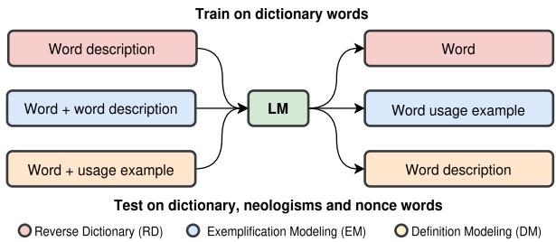
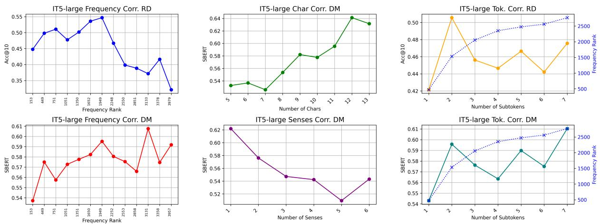
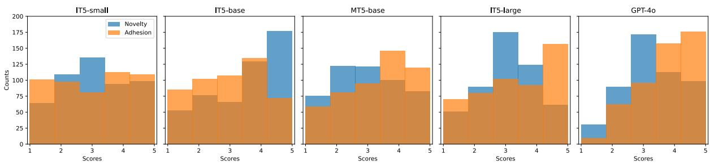
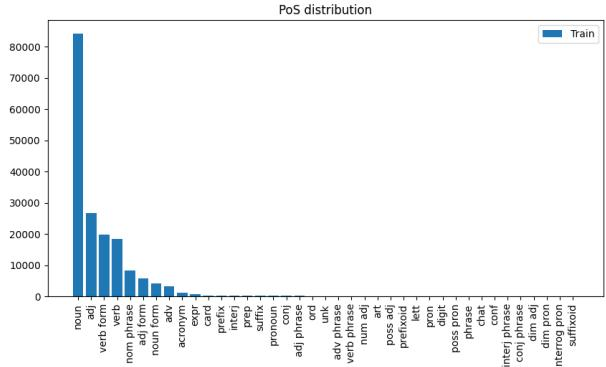
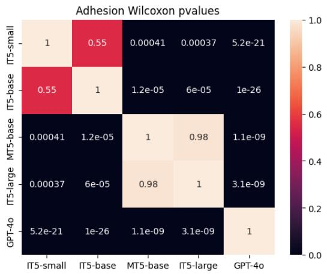
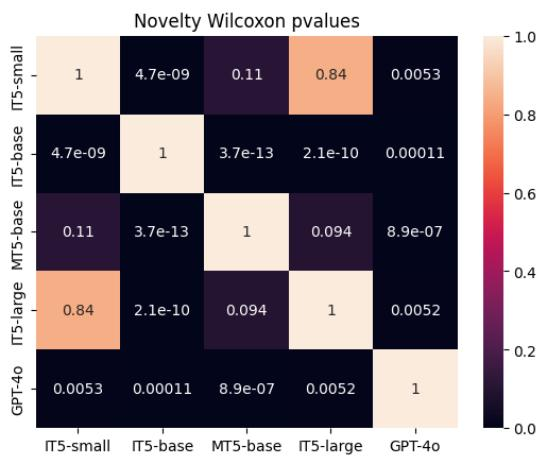

# Evaluating Lexical Proficiency in Neural Language Models

Cristiano Ciaccio, Alessio Miaschi, Felice Dell’Orletta Istituto di Linguistica Computazionale “Antonio Zampolli” (CNR-ILC) ItaliaNLP Lab, Pisa {name.surname}@ilc.cnr.it

## Abstract

We present a novel evaluation framework designed to assess the lexical proficiency and linguistic creativity of Transformer-based Language Models (LMs). We validate the framework by analyzing the performance of a set of LMs of different sizes, in both mono- and multilingual configuration, across tasks involving the generation, definition, and contextual usage of lexicalized words, neologisms, and nonce words. To support these evaluations, we developed a novel dataset of lexical entries for the Italian language, including curated definitions and usage examples sourced from various online platforms. The results highlight the robustness and effectiveness of our framework in evaluating multiple dimensions of LMs’ linguistic understanding and offer an insight, through the assessment of their linguistic creativity, on the lexical generalization abilities of LMs1.

## 1 Introduction

Recent advancements in Natural Language Processing have been significantly shaped by the Deep Learning tsunami (Manning, 2015) and the introduction of Transformer-based Language Models (Vaswani et al., 2017). As a result, several studies have been conducted to investigate the potential of such models in numerous tasks, downstream applications (Hendrycks et al., 2021b,a; Beeching et al., 2023) and their linguistic competencies (Gauthier et al., 2020; Waldis et al., 2024). On another front, some studies focused on investigating the abilities of these models in tasks related to lexical proficiency. Among these, Xu et al. (2024) and Aljaafari et al. (2024) tested LLMs on the reverse dictionary (RD) task, which involves generating words that match a given description D (Siddique and Beg, 2023), to probe their capacity for conceptual inference. To the best of our knowledge, only one work (Zheng et al., 2024, Neo-Bench) has examined the lexical proficiency of LMs in linguistic contexts that extend beyond commonly lexicalized words. Despite the efforts, lexical proficiency in LMs remains an underlooked topic. This is significant since linguistic generalization tasks such as defining and generating novel words require complex morphological understanding, linguistic creativity, commonsense knowledge and the ability to generalize over seen concepts (Fauconnier and Turner, 2003), thus serving as a key playground to assess the generalization capabilities of LMs. For example, defining seismophony as "the sound made by earthquakes", or vice versa, generating seismophony from the definition, entails that an LM learned and generalized the meaning shift caused by the -phony suffix. This also requires identifying the lexical base (seism), linking it correctly to the concept of earthquake and deriving a novel concept through the morphological combination of the two morphemes. Hence, to be executed efficiently, these generalization tasks require both a strong lexical and morphological grounding: learning word formation rules plays an essential role in achieving abilities that can ease the understanding of linguistically motivated out-of-vocabulary (OOV) words.

  
Figure 1: Overview of the proposed framework and the lexical proficiency tasks.

Building upon these premises, we propose a framework to (stress-)test the lexical abilities of

LMs. Specifically, we focus on the Italian language and employ T5 models (Raffel et al., 2019), both mono and multi-lingual and at different sizes, to assess their ability to: generate, define, and coherently use lexicalized words (see Figure 1), as well as to extend these capabilities to neologisms and nonce words, where nonce words should be interpreted as unattested linguistic artifacts (H-Creative, Boden, 2004). Furthermore, we assess the creative dimensions of the generated nonce words leveraging the Optimal Innovation Hypothesis (Giora et al., 2004), which states that the pleasure of an optimally innovative stimulus is in function of their degree of novelty and the automatic recoverability of a salient response related to that stimulus. Our approach is designed to answer the following questions: how do language models perform on lexical proficiency tasks? How do model size and pre-training language (mono- vs. multi-lingual) influence LMs’ lexical abilities? To what extent do neologisms affect performance? Can language models approximate word-formation rules to successfully define, generate, and use nonce words that are meaningful and linguistically plausible?

To conduct the experiments, we built a novel resource of lexical entries, along with their definitions and usage examples, derived from different online sources.

To the best of our knowledge, this is the first time a unified framework has been proposed to test a language model’s abilities in the generation, definition, and contextualized usage of words across various lexical settings, ranging from common words to neologisms and nonce words.

Contributions In this paper we: (i) propose a novel evaluation framework for assessing the lexical proficiency of LMs across tasks involving on the generation, definition and usage of words; (ii) develop a new lexical resource that supports such evaluations; (iii) evaluate the performance of different LMs focusing on the impact of model sizes, pre-training languages, linguistic settings and tasks; (iv) perform a human evaluation to quantify the degree of linguistic creativity exhibited by the LMs.

## 2 Related Work

In this section, we adopt the nomenclature from Veale and Butnariu (2006) when referring to the the creation of lexical innovations, predictive lexicology, and the definition of novel words, explanatory lexicology. We propose to distinguish between open vocabulary and closed vocabulary approaches for the Reverse Dictionary task, where the former refers to ranking a predefined vocabulary set of target words given a definition and the latter is not limited to a fixed vocabulary set and instead involves generation rather than ranking or prediction.

## 2.1 Reverse Dictionary (RD)

A reverse dictionary (Sierra, 2000) takes the description of a target lemma as input and outputs one or more lemmas that match the input description. Such systems have significant practical value in aiding for conditions such as anomia (Benson, 1979) and the Tip ofthe Tongue phenomenon (Brown and McNeill, 1966). Early approaches consisted mainly of string-matching methods with hand-crafted features (Zock and Bilac, 2004). The task evolved as a text-to-vector closed vocabulary retrieval problem, encoding the input query into the embedding space and rank a fixed set of vocabulary words whose embeddings are closest to the input representation (Hill et al., 2016; Zhang et al., 2020; Mickus et al., 2022). Recently, researchers started to leverage pre-trained transformer encoders with several predictors (Qi et al., 2020; Tian et al., 2024b,a; Yan et al., 2020; Siddique and Sufyan Beg, 2023). Mane et al. (2022) fine-tuned T5 on the RD task with a text-to-text approach and therefore in an open vocabulary fashion. Interestingly, Xu et al. (2024) and Aljaafari et al. (2024) exploit the task to probe the concept inference ability of generative LLMs.

Predictive lexicology Most works addressing neologisms come from the field of Computational Creativity and focus on the development of rulebased systems that leverage algorithms and various linguistic resources to generate new words, especially blends (Özbal and Strapparava, 2012; Stock and Strapparava, 2005; Smith et al., 2014; Mizrahi et al., 2020). More recently, word embeddings and character-based encoder-decoder LSTM architectures were used to generate blends given a pair of words (Simon, 2018; Das and Ghosh, 2017; Gangal et al., 2017). These systems can be used to generate neologisms, but they lack general linguistic knowledge, understanding of morphological restrictions, and they are confined to blends. Closest to our approach, Lencione et al. (2022) presented neologism generation as an extreme summarization task by training T5 to summarize definitions into single words. The model, when prompted with nonce glosses, is able to propose nonce words due to the open vocabulary nature of this approach.

## 2.2 Definition Modeling (DM)

Originally proposed by Noraset et al. (2017) as a technique to explain distributed representations, Definition Modeling (DM) is the task of generating a gloss that describe the meaning of a word. As Mickus et al. (2019) suggested, due to the Distributional Hypothesis (Harris, 1954), the correct definition of a word can only be given when the linguistic context in which it occurs is known. Therefore, researchers started using contextual representations in order to account for polysemy (Ni and Wang, 2017; Ishiwatari et al., 2019). Similar to our approach, Generationary (Bevilacqua et al., 2020) used an encoder-decoder transformer by adding usage examples of the definiendum to the input text.

Explanatory lexicology Pinter et al. (2020), interestingly, studied blends as a class of OOV words and found that to recover the components of a blend is an extremely difficult task for BERT models. Malkin et al. (2021) discovered that GPT-3 (Brown et al., 2020) definitions of nonce words are sometimes preferred to those invented by humans . Contemporary to our work, NEO-BENCH (Zheng et al., 2024) evaluates state-of-the-art LLMs on several linguistic tasks involving neologisms (definition generation, translation, etc.) and discovered that performance is nearly halved, with bigger models achieving better results.

## 2.3 Exemplification Modeling (EM)

Proposed by Barba et al. (2021), Exemplification Modeling (EM) is the task of generating usage examples given a lemma paired with its gloss. Systems capable of performing this task have different practical applications being effective not only in WSD but also in the artificial generation of dictionary examples (He and Yiu, 2022).

## 3 Our Approach

We investigate the generation, definition, and usage of words, neologisms, and nonce words in the tasks of Reverse Dictionary (RD), Definition Modeling (DM) and Exemplification Modeling (EM). While attempting to solve these lexical tasks, the LMs are underneath exposed to a wide variety of phenomena that, for what concerns motivated words2 (Grossmann and Rainer, 2013), exposes the morpholexical link that relates glosses to lemmas (i.e. compounding, derivation, blending, acronyms etc.). Acting according to these phenomena requires strong character knowledge (Liu et al., 2023, Spelling Miracle), morphemes identification, phonological understanding, etc.; rules that, when learned, ease the understanding of motivated words instead of solely relying on memorization.

Since a closed vocabulary approach would not work, as it is limited to a finite set of existing words $V = \{ v _ { 1 } , \ldots , v _ { | V | } \}$ , our approach leverages generative models pre-trained on a fixed set of subword tokens $S = \{ s _ { 1 } , \ldots , s _ { | S | } \}$ (Kudo and Richardson, 2018), that can be combined to form the infinite set of all possible words $V \cup N$ , where N indicates the infinite set of possible words3.

For the purpose of our work, we used T5 Italian models (IT5) of different sizes, as well as the multilingual counterpart, to assess the impact of both model size and language capabilities. This choice is motivated by the fact that the IT5 models family is the only one for the Italian language available at different sizes and pre-trained on the same corpus.

While each model is fine-tuned only on a set of words that are conventionally lexicalized (i.e. present in a dictionary) and a small set of neologisms, the evaluation is conducted across three linguistically different settings: i) the dictionary setting, which consists in evaluating against an unseen split of the dictionary data as traditionally done in the RD and DM literature, ii) the neologisms setting, which involves evaluating against unseen neologisms that have zero to few occurrences in the models’ pretraining data, iii) the nonce words setting, which consists of assessing the linguistically creative abilities in creating, defining, and using nonce words.

Lexical Proficiency Tasks Each task’s input output pair is constructed starting from the following components: word, PoS, definition and, if available, label tags (e.g. ##medicine##, ##chemistry##, figurative sense, etc.), an etymology and a usage example:

RD: "(PoS) + labels + definition + eventual etymology" "word", where the etymology is appended with a 1/5 chance if available. E.g. "(adj) (figurative sense) that can be touched by hand, and therefore evident to reason [ETYMOLOGY: from the late Latin tangib˘ılis which derivesfrom tangere meaning ’to touch’]"˘ "tangible".

DM: "labels + word + (PoS) + eventual usage example" "definition". E.g. "##law## gallows (noun) [EXAMPLE: to send someone to the gallows or to be led to the gallows]" "place where the death sentence is carried out".

EM: "word + (PoS) + labels + definition"   
"usage example". E.g. "curiosity (noun) [DEFI-  
NITION: deep interest in learning new things]"   
"curiosity is a strong stimulus to knowl  
edge".

Both the etymology and the labels are kept in order to further guide the model, during inference, towards a specific lexical and semantic field4.

## 4 Datasets

In order to perform our experiments, we developed three new datasets, one for each lexical setting: the dictionary setting, the neologisms setting and the nonce words setting (see Appendix H for examples of lemmas in each dataset).

Dictionary dataset A set of words paired with definitions and usage examples essentially constitutes a dictionary. To the best of our knowledge, the only effort to develop an open and machinereadable dictionary for the Italian language is GLAW-IT (Calderone et al., 2016): built from the 2015 Wikizionario5 dump, the resource is outdated. Therefore, in order to build our training data, we developed a new linguistic resource by parsing the April 2024 Wikizionario dump. The resource counts 370 786 Italian lexical entries, including forms, each paired with several linguistic metadata data when available (see coverage in Appendix A, Table 7). The extraction of structured data from the Wikizionario is a challenging task (Declerck et al., 2012) due to an unstructured markup language oriented to visualization and a lack of annotation constraints. Therefore the resource may naturally contain errors caused by both data and parsing inconsistencies. The resource covers 95.77% (with at least one definition) of the basic Italian vocabulary (De Mauro and Chiari, 2016) and contains 38 550 specialized terms, denoted by a semantic field label, offering a wide coverage of both common and technical lexicon.

To include some established neologisms in the training of our models, we also expanded our dataset with the ONLI neologisms database (Osservatorio Neologico della Lingua Italiana6), which contains 2 986 neologisms, up to 2019, paired with definitions, etymology, PoS and usage examples.

<table><tr><td></td><td>Task</td><td>Train</td><td>Validation</td><td>Test</td></tr><tr><td rowspan="3">Dict.</td><td>RD</td><td>80,321</td><td>4,486</td><td>4,485</td></tr><tr><td>DM</td><td>79,361</td><td>4,462</td><td>4,462</td></tr><tr><td>EM</td><td>17,510</td><td>973</td><td>970</td></tr><tr><td colspan="2">Total</td><td>177,192</td><td>9,921</td><td>10,517</td></tr></table>

Table 1: Number of training, test and validation samples for each task for the dictionary setting.

Neologism dataset For the neologisms dataset we collected a list of neologisms from various online dictionaries (lexicalized after 2020 since the IT5-mT5 pre-training corpus reaches the end of 2020) that are not part of the Wikizionario or ONLI database. After selecting words with less then five occurrences in a 10% split of the IT5 pre-training data, we kept 100 neologisms and manually annotated them with definitions, PoS and usage examples. It should be noted that words in this setting mostly come from the news domain focusing on politics, COVID-19 social dynamics and contain several foreignerisms.

Nonce words dataset For the nonce words dataset, we used GPT-4o to obtain a list of 100 unattested nonce words paired with definitions, PoS and usage examples. This strategy builds on the findings that GPT-3’s definitions of nonce words are sometimes preferred to those invented by humans (Malkin et al., 2021) (see Appendix E). The definitions are mostly about innovative and concrete objects, focusing on combining technology with several scientific disciplines or artefacts.

## 5 Experimental setting

We fine-tuned each model in a text-to-text multitask format (Raffel et al., 2019) only on the dictionary dataset by combining the Wikizionario with the ONLI neologisms database7. The obtained dataset was split into 90% training, 5% validation, and 5% test (see Table 1), stratifying by PoS tags. The models were tuned for a maximum of 15 epochs with early stopping based on validation loss (see Appendix B for training details).

For the RD task, our models don’t rank words by default but rather rely on a decoder that autoregressively generates each subtoken. Therefore, for each definition we produce 100 words (beam = 100) using the diverse beam search decoding strategy (Vijayakumar et al., 2016) with a diverse penalty of 0.8 (to ensure diversity) and rank them based on their probability. It’s important to note that using beam search with such a high number of beams for creative lexical tasks as nonce word generation, may result in a very conservative, and possibly degenerate (Holtzman et al., 2020), approximation of the linguistically creative abilities of these models. That is, while a deterministic decoding strategy allows for a fair comparison between models, a sampling-based one would lead to the generation of more interesting candidates.

<table><tr><td>Model</td><td>Lang</td><td>#P</td><td>#T</td><td>#T/#P</td></tr><tr><td>IT5-small</td><td>IT</td><td>60M</td><td>41B</td><td>683.33</td></tr><tr><td>IT5-base</td><td>IT</td><td>220M</td><td>41B</td><td>186.36</td></tr><tr><td>MT5-base</td><td>Multi</td><td>580M</td><td>6.3T</td><td>10,862.06</td></tr><tr><td>IT5-large</td><td>IT</td><td>738M</td><td>41B</td><td>55.55</td></tr></table>

Table 2: Models used in experiments along with the pretraining languages (Lang), number of parameters (#P), training tokens (#T) and tokens per parameter (#T/#P).

## 5.1 Models

The experiments were conducted on the Italian T5 models family (Sarti and Nissim, 2024): encoderdecoder Transformers pre-trained with masked span prediction on a cleaned version of the mC4’s Italian split. Specifically, we finetuned and evaluated three different sizes of parameters: small (60M), base (220M) and large (738M). Furthermore, we included the MT5-base (580M) model (Xue et al., 2021) to assess the impact of multilingual pre-training on the tasks. Details about the models are reported in Table 2.

## 5.2 Evaluation strategies

We tested several metrics to assess the models’ abilities across all tasks. Given the differences between them, some metrics are shared while others are taskspecific. ROUGE-N (Lin, 2004) is used across RD and DM to measure the non-continuous overlap of n-grams (computed at a subtoken level ). Performances on the RD task are also evaluated using CER (Morris et al., 2004) (normalized Levenshtein distance) and, in compliance with previous work, using Acc@1/10/1009. For generative tasks, metrics of lexical overlap show a weak correlation with human judgment (Liu et al., 2016) and should be paired with a semantic-oriented score. Therefore, RD and DM are evaluated using SBERT (Reimers and Gurevych, 2019) representations: assuming that a word carries a similar representation to its definition, we discount the cosine similarity sim between target embedding t and prediction embedding p by a factor Z that measures how similar t is to the source input s with respect to p, penalizing predictions that are less similar to the source text even though they could be broadly semantically similar to the target. The measure m is:

$$
\begin{array} { c } { { Z = 1 - \operatorname* { m a x } \left( 0 , { s i m } ( \mathbf { s } , \mathbf { t } ) - { s i m } ( \mathbf { s } , \mathbf { p } ) \right) } } \\ { { { } } } \\ { { m = Z \cdot { s i m } ( \mathbf { t } , \mathbf { p } ) } } \end{array}
$$

The EM task is evaluated using the median perplexity of the prediction versus the target usage examples, computed with Minerva-1B (Orlando et al., 2024)10. Since both DM and EM are tackled with a sampling decoding strategy and due to the small size of the evaluation datasets, the metrics reported in the neologisms and nonce words settings are the average across 5 runs.

Unlike the previous lexical settings, the evaluation of the nonce words setting is conducted in two ways: 1) for the DM and EM tasks we used the definitions and examples from the nonce dataset as targets, collected using GPT-4o; 2) the RD task for nonce words is evaluated by human judges due to the creative aspects of this scenario. Using the Prolific platform11, we collected human judgments over 100 pairs of definitions (taken from the nonce words dataset) and nonce words (generated by our models). Building on the Optimal Innovation Hypothesis, 5 Italian native speakers are asked to read each definition-word pair and express two judgments about the nonce word on a 5-point Likert scale: the perceived novelty of the word w.r.t. their lexicon and a score of adhesion to the definition12. The intuition is that words that lie in the top-middle of the novelty scale but excel in adhesion should represent a lexical creative artefact that also entails the definition. To ensure that the candidate words are effectively new, we kept words that are not present in a lexicon of the Italian language (see Appendix G for details).

<table><tr><td rowspan="2"></td><td rowspan="2">Acc@1/10/100</td><td colspan="5">Reverse Dictionary</td><td colspan="4">Definition Modeling</td><td colspan="2">Exemplification Modeling</td></tr><tr><td></td><td>R-1</td><td>R-2</td><td>CER↓</td><td>SBERT</td><td>R-1</td><td>R-2</td><td>R-L</td><td>SBERT</td><td>PPL pred. ↓</td><td>PPL target</td></tr><tr><td rowspan="5">Dict.</td><td>IT5-small</td><td>.29/.4/.53</td><td>41.33</td><td>31.19</td><td>50.58</td><td>0.68</td><td>36.85</td><td>23.98</td><td>34.87</td><td>0.61</td><td>144.49</td><td></td></tr><tr><td>IT5-base</td><td>.37/.52/.66</td><td>48</td><td>37.01</td><td>46</td><td>0.71</td><td>39.58</td><td>26.54</td><td>37.42</td><td>0.65</td><td>118.26</td><td>80.26</td></tr><tr><td>MT5-base</td><td>.33/.46/.57</td><td>43.64</td><td>33.73</td><td>47.95</td><td>0.7</td><td>36.43</td><td>24.58</td><td>34.71</td><td>0.62</td><td>161.8</td><td></td></tr><tr><td>IT5-large</td><td>.39/.56/.69</td><td>49.7</td><td>38.8</td><td>43.83</td><td>0.73</td><td>38.97</td><td>25.94</td><td>36.94</td><td>0.65</td><td>112.66</td><td></td></tr><tr><td>Avg</td><td>.34/.48/.61</td><td>45.67</td><td>35.18</td><td>47.09</td><td>0.7</td><td>37.96</td><td>25.26</td><td>35.98</td><td>0.63</td><td>134.3</td><td></td></tr><tr><td rowspan="5">Neo.</td><td>IT5-small</td><td>.06/.12/.13</td><td>25.39</td><td>16.37</td><td>71.95</td><td>0.55</td><td>18.36</td><td>3.44</td><td>14.8</td><td>0.45</td><td>60.6</td><td></td></tr><tr><td>IT5-base</td><td>.09/.16/.21</td><td>33.06</td><td>19.99</td><td>61.47</td><td>0.6</td><td>21.21</td><td>5.36</td><td>16.92</td><td>0.53</td><td>53.6</td><td></td></tr><tr><td>MT5-base</td><td>.08/.15/.18</td><td>26.82</td><td>14.23</td><td>59.98</td><td>0.59</td><td>18.43</td><td>3.66</td><td>14.4</td><td>0.48</td><td>79.52</td><td>53.38</td></tr><tr><td>IT5-large</td><td>.1/.16/.27</td><td>32.42</td><td>20.64</td><td>63.2</td><td>0.6</td><td>20.69</td><td>4.34</td><td>16.36</td><td>0.53</td><td>43.44</td><td></td></tr><tr><td>Avg</td><td>.08/.14/.19</td><td>29.4</td><td>17.8</td><td>64.05</td><td>0.58</td><td>19.67</td><td>4.2</td><td>15.62</td><td>0.5</td><td>59.15</td><td></td></tr><tr><td rowspan="4">Nonce</td><td>IT5-small</td><td></td><td></td><td></td><td></td><td></td><td>18.91</td><td>2.83</td><td>15.13</td><td>0.49</td><td>68.35</td><td></td></tr><tr><td>IT5-base</td><td></td><td></td><td></td><td></td><td></td><td>21.79</td><td>4.19</td><td>17.13</td><td>0.56</td><td>67.31</td><td></td></tr><tr><td>MT5-base</td><td></td><td></td><td></td><td></td><td></td><td>18.1</td><td>2.93</td><td>14.15</td><td>0.51</td><td>84.33</td><td>64.28</td></tr><tr><td>IT5-large</td><td></td><td></td><td></td><td></td><td></td><td>21.09</td><td>3.78</td><td>16.6</td><td>0.58</td><td>48.05</td><td></td></tr></table>

Table 3: Results obtained by all the models for all the tasks (RD, DM and EM) and the three linguistically different settings: Dict., Neo. and Nonce. R-1, R-2, and R-L stands for Rouge-1, Rouge-2 and Rouge-L (longest common subsequence).

<table><tr><td></td><td>Noun</td><td>Adj.</td><td>Verb</td><td>Acron.</td></tr><tr><td>IT5-small</td><td>.25/.5</td><td>.391.57</td><td>.21/.5</td><td>.26/.30</td></tr><tr><td>IT5-base</td><td>.37/.56</td><td>.51/.61</td><td>.35/.54</td><td>.68/.38</td></tr><tr><td>MT5-base</td><td>.29/.5</td><td>.471.55</td><td>.29/.48</td><td>.52/.38</td></tr><tr><td>IT5-large</td><td>.43/.56</td><td>.57/.62</td><td>.42/.54</td><td>.76/.44</td></tr><tr><td>Avg.</td><td>.33/.53</td><td>.48/.58</td><td>.317.51</td><td>.42/.38</td></tr></table>

Table 4: Reverse Dictionary Acc@10/Definition Modeling SBERT for full words and acronyms.

## 6 Results

First, we present the results obtained for the three different linguistic settings (Table 3), assessing the change in performance between model sizes and tasks. Subsequently, we analyze the results obtained from the human annotations of the generated nonce words13.

Dictionary setting For the RD task, the metrics show a significant shift between IT5-small and other models, while IT5-large ranks first across all scores, closely followed by the monolingual base model. The multilingual counterpart, MT5- base, stays behind IT5-base, despite its bigger parameter size. ROUGE-1 and ROUGE-2 indicate that almost 50% of the time, the large model correctly predicts a single subtoken of the word, dropping to 38.8% when it comes to predicting at least two non-overlapping subtokens of the target word. Along with CER, this indicates that the models are morphologically flexible, to some extent, while still maintaining an overlap with the target word. The Acc@1/10/100 and the SBERT scores follow the same rank and add a semantic component to our evaluation. DM follows a similar trend, with ROUGE-N being slightly higher for IT5-base. Our SBERT metric follows the aforementioned rank, being equal between the Italian base and large models. In the EM task, the perplexity of the generated examples follows the tokens-per-parameters rank with the multilingual model ranking lowest. Table 4 shows that, among full PoS, adjectives are the easiest to retrieve and define, while verbs are the hardest: this is in line with the hypothesis that verbs, functioning as relational terms rather than discrete referents (Gentner, 2006), require more contextual anchoring. Nouns also show lower performance, which may be partly explained by the high proportion of specialized terms in the test set – 64% of nouns are marked with a domain-specific category label. Since the Wiktionary also contains acronyms, we were able to monitor acronym generation, which might leverage lexical memorization (i.e. memorize that LLM stands for Large Language Model), but it would also require character competence for unknown and low-frequency cases 14. Interestingly, for acronyms, metrics increase drastically in the MT5-base, IT5-base and IT5-large. The plots in Figure 2 show the impact of several linguistic and non-linguistic factors in RD Acc@10 and DM SBERT (any point in the plots consist of at least 100 data instances). For the RD task, performance tends to decrease with increasing frequency rank15 following a non-linear trend in which accuracy starts low, peaks for midfrequency words, and then declines $( \rho ^ { 1 6 } = - 0 . 0 9 , p$ < 0.001). This suggests that mid-frequency words, being less ambiguous yet still frequent, are easier to retrieve. Conversely, the performance trend for DM follows positively the frequency rank (although with almost no correlation, $\rho = 0 . 0 6 , p <$ 0.001). Consistent with Zipfian principles of word distribution, we observe a positive but weak correlation with the target lemma’s number of characters, $\rho = 0 . 1 6 , p < 0 . 0 0 1$ , and a negative one with the number of senses, $\rho = - 0 . 1 8 , p < 0 . 0 0 1$ . For RD, accuracy peaks when the target word is composed of exactly two subtokens, then gradually declines, yet remaining higher than for single-token words. A possible explanation is that single-token words tend to be high frequency17 and have no compositional structure, token-wise, requiring pure lexical grounding. On the contrary, two token words are the ones located at the peak of the frequency rankaccuracy plot and may offer more compositional clues. This suggests that certain degrees of token compositionality could facilitate RD predictions. For DM, words with a higher number of subtokens reach higher levels of SBERT, again with a strong peak for words composed of exactly two subtokens, supporting the hypothesis that models may leverage token compositionality to decode meaning from the definiendum instead of relying solely on lexical memorization. Overall, the presented influencing factors show that the RD and DM tasks are, for some dynamics, inversely correlated: frequency has a positive impact on DM and a negative one on RD. Given the strong collinearity between frequency and the number of subtokens introduced by word segmentation algorithms, future work could disentangle this features dependence by leveraging partial correlation analysis to understand whether and how subtoken-level structure contributes to lexical generalization, especially in tasks that stress creativity and morphological productivity.

  
Figure 2: Variations of IT5-large performance according to frequency rank, number of characters, senses and subtokens. Scores are computed only against uninflected content words (nouns, adjectives and verbs).

Neologisms setting The values reported for the neologisms setting on the RD task show a performance rank that is mostly consistent with the one reported for the dictionary setting. IT5-large and IT5-base tie in the reverse dictionary task while strongly outperforming other models according to ROUGE-N. The CER score, on the other hand, puts the MT5-base model as a top performer: several lemmas in the neologism dataset are foreignerisms (e.g. booktoker, algospeak), thus facilitating this task for the multilingual model. The reported metrics for the EM and DM tasks reflect the already observed rank in the dictionary setting. Overall, the results show that model performance significantly drops when dealing with extremely lowfrequency neologisms according to both lexical and semantic metrics.

Nonce words setting Metrics for the nonce words automatic evaluation (DM and EM tasks) maintain the same rank between models found in the dictionary setting. Overall, the results are slightly better w.r.t. the neologisms evaluation with the SBERT score increasing across all models. This dynamic lies in the fact that words in this scenario are less related to the journalistic lexicon and the semantic field is less specific. Therefore, definitions in the nonce words dataset tend to be less related to real facts, which may be unknown to the models. The improvements over SBERT, especially for the IT5-large model (+5%), w.r.t. the neologisms setting, support the hypothesis.

<table><tr><td></td><td>Adhesion</td><td>Novelty</td><td>α</td></tr><tr><td>IT5-small</td><td> $3 . 0 6 { \pm } 1 . 4 5$ </td><td> $3 . 1 1 \pm 1 . 3$ </td><td>.51/.14</td></tr><tr><td>IT5-base</td><td> $3 . 0 1 \pm 1 . 3 2$ </td><td> $3 . 6 1 \pm 1 . 3 7$ </td><td>.29/.34</td></tr><tr><td>MT5-base</td><td> $3 . 3 7 { \pm } 1 . 3 2 $ </td><td> $2 . 9 8 { \pm } 1 . 3 1 $ </td><td>.37/.15</td></tr><tr><td>IT5-large</td><td> $3 . 3 7 { \pm } 1 . 4 2 $ </td><td> $3 . 1 1 \pm 1 . 1 5$ </td><td>.41/.18</td></tr><tr><td>GPT-40</td><td> $3 . 8 6 { \pm } 1 . 0 9$ </td><td> $3 . 3 2 { \pm } 1 . 1 5$ </td><td>.17/.07</td></tr></table>

Table 5: Mean and standard deviation for the adhesion and novelty scores given by human annotators. The column α reports Krippendorff’s Alpha between annotators for adhesion/novelty.

## 6.1 Human evaluation: nonce generation

The average scores from the human annotation (see Table 5 and Figure 3) show several interesting results. We also reported scores for GPT-4o to pro vide a theoretical upper bound. The annotators agreement is consistently higher for adhesion rather than novelty indicating that the latter is a more sub jective judgment than the former. Nonetheless, annotators have an overall reasonable agreement considering the inherent personal variables that play a role in novelty perception and adhesion assessment of unseen words. The monolingual small and base models rank the lowest on the adhesion scale with their respective distributions of judgments being statistically different from all other models (see Appendix D) but similar to each other. Regard ing novelty, IT5-base is the top performer but the worst in terms of adhesion. Along with IT5-small, they both have a higher degree of novelty than adhe sion thus reversing the Optimal Innovation criterion which would require strong adhesion and medium novelty. In this regard, GPT-4o scores represent candidates that better approximate our theoret ical assumption, with the majority of words being highly related to the definitions and with an average degree of novelty. On the other hand, the multilingual model ties with the IT5-large in terms of adhesion but has the lowest novelty score, while the IT5-large is the only model, among ours, that can maintain a good degree of adhesion and a medium novelty. Looking at the distributions in Figure 3, the trend emerges quite well: IT5-small produces a lot of incoherent and less innovative words, IT5-base received high values of novelty but failed to maximize adhesion and IT5-large pro duced judgments that, between our models, better approximate our theoretical assumption, with words mostly being perceived as quite novel and coherent with the definitions (see Table 6).

The variations in the agreement can be explained by the degree of obviousness and ambiguity of the generated words: for example, candidates that are clearly questionable in terms of novelty or adhesion would lead to a higher agreement, while more plausible words could enhance subjective factors. IT5-small candidates have a high adhesion agreement and scores are relatively low suggesting that the nonce words are evidently less related to the definitions. Interestingly, the IT5-base model has the highest score and agreement for novelty but the lowest one in terms of adhesion, thus indicating that the model produces highly innovative words which may be naturally less familiar and difficult to interpret in terms of adhesion. On the other hand, the multilingual and IT5-large models have the highest agreement in terms of adhesion and the lowest scores in terms of novelty, suggesting that medium-novelty words are easier to interpret in terms of adhesion to definitions. GPT-4o’s low agreement, following this hypothesis, could mean that the generated words are linguistically more niche, refined, novel and less transparent thus fueling judgment ambiguity.

## 6.2 Discussion

The model’s ranking is mostly consistent across all metrics showing that they tend to correctly capture a general trend in performance while offering a view on different linguistic axes. Larger, monolingual models generally outperformed their multilingual counterparts with MT5-base only gaining an edge when handling neologisms, particularly those containing foreignerism. These results align with previous findings (Sarti and Nissim, 2024), where IT5-models outperformed the multilingual ones on several downstream tasks, closely following our rank, suggesting that proficiency on lexical tasks can be indicative of broader downstream performance (Xu et al., 2024). Despite the notable drop in performance with low-frequency neologisms and nonce words (as observed in Zheng et al. 2024), the rank between models remained consistent. The same rank can be observed for the acronym accuracy in the RD task, where the sharp increase of larger models suggests that larger models can store and access more sublexical information, such as spelling patterns, even in characterblind models (Liu et al., 2023, Spelling Miracle).

Our models’ ability to generate novel and coherent nonce words further indicates that LMs are capable of learning approximations of word formation rules, rather than relying solely on memorization, thus showing signs of generalization. The human evaluation results, inspired by the Optimal Innovation Hypothesis, confirmed that larger models like IT5-large were more adept at producing creative and semantically consistent nonce words. Additionally, GPT-4o demonstrated potential for generating candidates aligned with the Optimal Innovation criteria.

  
Figure 3: Distribution of novelty and adhesion human scores across the 5 values of the Likert scale for all models.

<table><tr><td>Definitions</td><td>Model</td><td>Predicted Word</td><td>Adhesion</td><td>Novelty</td></tr><tr><td rowspan="3">Veicolo progettato per esplorazioni su superfici planetarie, adatto a terreni extraterrestri. [transl. Vehicle designed for exploration on planetary surfaces, suitable for extraterrestrial terrain.]</td><td>IT5-small IT5-base</td><td>planetaro</td><td>3.0</td><td>4.2</td></tr><tr><td></td><td>elioplano [helioplane]</td><td>2.2</td><td>4.6</td></tr><tr><td>MT5-base IT5-large</td><td>cosmoplano [cosmoplane]</td><td>3.2 4.6</td><td>4.0 3.2</td></tr><tr><td rowspan="6">Vela navigabile che raccoglie dati geologici mentre si sposta su laghi o mari, utilizzata in esplorazioni scientifiche. [Navigable sail that collects geological data</td><td>GPT-40</td><td>astroveicolo [astrovehicle] roverastro [astrorover]</td><td>3.6</td><td>3.4</td></tr><tr><td>IT5-small</td><td></td><td>4.6</td><td>2.4</td></tr><tr><td>IT5-base</td><td>geonauta [geonaut] ecovela [ecosail]</td><td>4.4</td><td>1.8</td></tr><tr><td>MT5-base</td><td>vettolaghiera</td><td>2.0</td><td></td></tr><tr><td>IT5-large</td><td>idrovedetta [hydropatrol]</td><td>4.6</td><td>4.4</td></tr><tr><td>GPT-40</td><td>geonave [geoship]</td><td>4.0</td><td>2.8 3.2</td></tr><tr><td rowspan="6">Una tavola o superficie capace di mostrare visivamente il passare del tempo, evidenziando i cambiamenti avvenuti su di essa. [A table or surface capable of visually showing the passage of time, highlighting the changes that have occurred on it.]</td><td>IT5-small</td><td>cromatopompa</td><td>1.2</td><td>3.8</td></tr><tr><td>IT5-base</td><td>cronopalestra [chronogym]</td><td>2.0</td><td>5.0</td></tr><tr><td>MT5-base</td><td>retrotavola [retrotable]</td><td>2.2</td><td>3.0</td></tr><tr><td>IT5-large</td><td>cronotavolo [chronotable]</td><td>4.4</td><td>3.0</td></tr><tr><td>GPT-40</td><td>cronotavola [chronotable]</td><td>3.6</td><td></td></tr><tr><td>IT5-small</td><td>immersivismo [immersivism]</td><td>3.8</td><td>3.6 2.4</td></tr><tr><td rowspan="4">Forma d&#x27;arte che utilizza nebbie artificiali e giochi di luce per creare installazioni immersive. [An art form that uses artificial fog and light effects to create immersive installations.]</td><td>IT5-base</td><td>metacaduta [metafall]</td><td>2.0</td><td>4.6</td></tr><tr><td>MT5-base</td><td>fotoart [photoart]</td><td>3.4</td><td>2.6</td></tr><tr><td>IT5-large</td><td>nebbiografia [foggraphy]</td><td>4.4</td><td></td></tr><tr><td>GPT-40</td><td>nebbioarte [fogart]</td><td>3.6</td><td>3.0 3.6</td></tr><tr><td rowspan="4">Fenomeno in cui i movimenti delle placche terrestri generano onde sismiche che producono suoni dissonanti, studiato in geologia e acustica. [Phenomenon in which the movements of the earth&#x27;s plates generate seismic waves that produce dissonant</td><td>IT5-small</td><td>biogeoacustica [biogeoacoustics]</td><td>4.4</td><td>3.4</td></tr><tr><td>IT5-base</td><td>sismofonia [seismophony]</td><td>3.0</td><td>4.0</td></tr><tr><td>MT5-base IT5-large</td><td>sismismo [seismism]</td><td>3.0</td><td>4.0</td></tr><tr><td>GPT-40</td><td>sismofonia [seismophony]</td><td>4.2</td><td>3.2</td></tr><tr><td rowspan="4">sounds, studied in geology and acoustics.]</td><td></td><td>sismofonia [seismophony]</td><td>4.2</td><td>2.0</td></tr><tr><td></td><td></td><td></td><td></td></tr><tr><td></td><td></td><td></td><td></td></tr><tr><td></td><td></td><td></td><td></td></tr></table>

Table 6: Sample of generated nonce words (we tried to provide a translation when possible), along with adhesion and novelty average scores, for all the models. The definitions are those generated by GPT-4o.

## 7 Conclusion

In this paper, we presented a novel evaluation framework for assessing the lexical proficiency of Language Models. Additionally, we developed a tailored resource of Italian lexical entries suitable for a variety of lexical proficiency tasks. To the best of our knowledge, this is the first work to extend the Reverse Dictionary, Definition Modeling, and Exemplification Modeling tasks across commonly lexicalized words, recent neologisms and nonce words, with an emphasis on the creative aspects of this last setting. Our multifaceted evaluation framework showed that lexical proficiency tasks remain a significant challenge for LMs, particularly when stress-tested with neologisms and nonce words. On the other hand, the capability of bigger mono-lingual models to occasionally produce, use and define meaningful and unattested nonce words suggests that such models exhibit an understanding of the compositional nature of word formation rules, which is fundamental to master language understanding and to handle lexical innovation. Furthermore, the results obtained were consistent across models and settings, aligning with the results on downstream tasks found by Sarti and Nissim (2024), suggesting that lexical proficiency tasks are correlated to downstream performance (Xu et al., 2024). These findings, along with the insights on linguistic creativity, show the robustness and effectiveness of our framework in evaluating several aspects of LMs linguistic understanding. The proposed framework could provide a useful method that can be expanded to different languages and models. Moreover, our experiments also provide a first effort towards building RD, DM and EM tools for the Italian language.

## Limitations

In this section, we discuss the limitations of our work. 1) Tested models: For our experiments, we relied on models based on the T5 family. We specifically chose these models to have a fair repre sentation of model sizes, as well as the distinction between mono- and multi-lingual models, for the Italian language. Nevertheless, it would be benefi cial to evaluate models with different architectures (e.g. encoder-decoder vs decoder-only), bigger in terms of parameters and including zero or few-shot evaluation of instruction-tuned models, in order to understand their abilities in the tasks we devised. 2) Multilinguality: Our results are limited to the Italian language, which constrains the generaliz ability of our findings to other languages. Since our framework is based on tasks that require access to sources with lexical entries, it would be rela tively straightforward to port this approach to other languages. Therefore, in future work, it would be beneficial to test its generalizability and to explore potential cross-linguistic differences in LMs performance. 3) Human evaluation: Our selection of human raters was based on Italian as their native language with at least a BA/BSc degree. Future work could investigate whether the results would differ across different occupations and education levels. Moreover, extending the number of anno tators per instance could provide stronger insights into their level of agreement and therefore about the generalizability of the results. 4) Linguistic analysis: Since our focus was to introduce a novel evaluation framework and to assess whether LMs can produce, explain and use lexical innovations, we did not conduct an in depth analysis on the specific phenomena related to the understanding of LMs’ morphological productivity. On the other hand, our framework opens to future works that could investigate more particular linguistic aspects related to the generation and explanation of neolo gisms and nonce words.

## Acknowledgments

The authors acknowledge the support of the project XAI-CARE-PNRR-MAD-2022-12376692 under the NRRP MUR program funded by the NextGenerationEU and the PNRR MUR project PE0000013- FAIR. Partial support was also received by the project “Advancing Italian Language Processing with Small-Scale Training and Preference Modeling” (IsCb8\_AILP), funded by CINECA under the ISCRA initiative, for the availability of HPC resources and support.

## References

Nura Aljaafari, Danilo S Carvalho, and André Freitas. 2024. The mechanics of conceptual interpretation in gpt models: Interpretative insights. arXiv preprint arXiv:2408.11827.

Edoardo Barba, Luigi Procopio, Caterina Lacerra, Tommaso Pasini, and Roberto Navigli. 2021. Exemplification modeling: Can you give me an example, please? In Proceedings ofthe Thirtieth International Joint Conference on Artificial Intelligence, IJCAI-21, pages 3779–3785. International Joint Conferences on Artificial Intelligence Organization. Main Track.

Edward Beeching, Clémentine Fourrier, Nathan Habib, Sheon Han, Nathan Lambert, Nazneen Rajani, Omar Sanseviero, Lewis Tunstall, and Thomas Wolf. 2023. Open llm leaderboard. https://huggingface. co/spaces/open-llm-leaderboard/open\_llm\_ leaderboard.

D Frank Benson. 1979. Neurologic correlates of anomia. In Studies in neurolinguistics, pages 293–328. Elsevier.

Michele Bevilacqua, Marco Maru, and Roberto Navigli. 2020. Generationary or “how we went beyond word sense inventories and learned to gloss”. In Proceedings ofthe 2020 Conference on Empirical Methods in Natural Language Processing (EMNLP), pages 7207–7221, Online. Association for Computational Linguistics.

Margaret A Boden. 2004. The creative mind: Myths and mechanisms.

Roger Brown and David McNeill. 1966. The “tip of the tongue” phenomenon. Journal of verbal learning and verbal behavior, 5(4):325–337.

Tom Brown, Benjamin Mann, Nick Ryder, Melanie Subbiah, Jared D Kaplan, Prafulla Dhariwal, Arvind Neelakantan, Pranav Shyam, Girish Sastry, Amanda Askell, Sandhini Agarwal, Ariel Herbert-Voss, Gretchen Krueger, Tom Henighan, Rewon Child, Aditya Ramesh, Daniel Ziegler, Jeffrey Wu, Clemens Winter, Chris Hesse, Mark Chen, Eric Sigler, Mateusz Litwin, Scott Gray, Benjamin Chess, Jack Clark, Christopher Berner, Sam McCandlish, Alec Radford, Ilya Sutskever, and Dario Amodei. 2020. Language models are few-shot learners. In Advances in Neural Information Processing Systems, volume 33, pages 1877–1901. Curran Associates, Inc.

Basilio Calderone, Franck Sajous, and Nabil Hathout. 2016. Glaw-it: A free large italian dictionary encoded in a fine-grained xml format. In 49th Annual Meeting of the Societas Linguistica Europaea (SLE 2016), pages 43–45.

Noam Chomsky. 2002. Syntactic structures. Mouton de Gruyter.

Kollol Das and Shaona Ghosh. 2017. Neuramanteau: A neural network ensemble model for lexical blends. In Proceedings ofthe Eighth International Joint Conference on Natural Language Processing (Volume 1: Long Papers), pages 576–583, Taipei, Taiwan. Asian Federation of Natural Language Processing.

Tullio De Mauro and I Chiari. 2016. Il nuovo vocabolario di base della lingua italiana. Internazionale.[28/11/2020]. https://www. internazionale. it/opinione/tullio-de-mauro/2016/12/23/il-nuovovocabolario-di-base-della-lingua-italiana.

Thierry Declerck, Stefania Racioppa, and Karlheinz Mörth. 2012. Automatized merging of italian lexical resources. In LREC 2012 Workshop on Language Resource Merging Workshop Programme, page 45.

Gilles Fauconnier and Mark Turner. 2003. Conceptual blending, form and meaning. Recherches en communication, 19:57–86.

Varun Gangal, Harsh Jhamtani, Graham Neubig, Eduard Hovy, and Eric Nyberg. 2017. Charmanteau: Character embedding models for portmanteau creation. In Proceedings of the 2017 Conference on Empirical Methods in Natural Language Processing, pages 2917–2922, Copenhagen, Denmark. Association for Computational Linguistics.

Jon Gauthier, Jennifer Hu, Ethan Wilcox, Peng Qian, and Roger Levy. 2020. SyntaxGym: An online platform for targeted evaluation of language models. In Proceedings ofthe 58th Annual Meeting ofthe Associationfor Computational Linguistics: System Demonstrations, pages 70–76, Online. Association for Computational Linguistics.

Dedre Gentner. 2006. Why verbs are hard to learn. Action meets word: How children learn verbs, pages 544–564.

Rachel Giora, Ofer Fein, Ann Kronrod, Idit Elnatan, Noa Shuval, and Adi Zur. 2004. Weapons of mass distraction: Optimal innovation and pleasure ratings. Metaphor and symbol, 19(2):115–141.

Maria Grossmann and Franz Rainer. 2013. La formazione delle parole in italiano. Walter de Gruyter.

Zellig S Harris. 1954. Distributional structure. Word, 10(2-3):146–162.

Xingwei He and Siu Ming Yiu. 2022. Controllable dictionary example generation: Generating example sentences for specific targeted audiences. In Proceedings ofthe 60th Annual Meeting ofthe Association for Computational Linguistics (Volume 1: Long Papers), pages 610–627, Dublin, Ireland. Association for Computational Linguistics.

Dan Hendrycks, Collin Burns, Steven Basart, Andy Zou, Mantas Mazeika, Dawn Song, and Jacob Steinhardt. 2021a. Measuring massive multitask language understanding. Proceedings ofthe International Conference on Learning Representations (ICLR).

Dan Hendrycks, Collin Burns, Saurav Kadavath, Akul Arora, Steven Basart, Eric Tang, Dawn Song, and Jacob Steinhardt. 2021b. Measuring mathematical problem solving with the math dataset. NeurIPS.

Felix Hill, Kyunghyun Cho, Anna Korhonen, and Yoshua Bengio. 2016. Learning to understand phrases by embedding the dictionary. Transactions of the Association for Computational Linguistics, 4:17–30.

Ari Holtzman, Jan Buys, Li Du, Maxwell Forbes, and Yejin Choi. 2020. The curious case of neural text degeneration. In International Conference on Learning Representations.

Shonosuke Ishiwatari, Hiroaki Hayashi, Naoki Yoshinaga, Graham Neubig, Shoetsu Sato, Masashi Toyoda, and Masaru Kitsuregawa. 2019. Learning to describe unknown phrases with local and global contexts. In Proceedings of the 2019 Conference of the North American Chapter of the Association for Computational Linguistics: Human Language Technologies, Volume 1 (Long and Short Papers), pages 3467–3476, Minneapolis, Minnesota. Association for Computational Linguistics.

Nitish Shirish Keskar, Bryan McCann, Lav R Varshney, Caiming Xiong, and Richard Socher. 2019. Ctrl: A conditional transformer language model for controllable generation. arXiv preprint arXiv:1909.05858.

Taku Kudo and John Richardson. 2018. SentencePiece: A simple and language independent subword tokenizer and detokenizer for neural text processing. In Proceedings of the 2018 Conference on Empirical Methods in Natural Language Processing: System Demonstrations, pages 66–71, Brussels, Belgium. Association for Computational Linguistics.

Gabriel R Lencione, Rodrigo F Nogueira, and Paula Y Pasqualini. 2022. Nameling: Creative neologism generation with transfer learning.

Chin-Yew Lin. 2004. ROUGE: A package for automatic evaluation of summaries. In Text Summarization Branches Out, pages 74–81, Barcelona, Spain. Association for Computational Linguistics.

Chia-Wei Liu, Ryan Lowe, Iulian V Serban, Michael Noseworthy, Laurent Charlin, and Joelle Pineau. 2016. How not to evaluate your dialogue system: An empirical study of unsupervised evaluation metrics for dialogue response generation. arXiv preprint arXiv:1603.08023.

Rosanne Liu, Dan Garrette, Chitwan Saharia, William Chan, Adam Roberts, Sharan Narang, Irina Blok, Rj Mical, Mohammad Norouzi, and Noah Constant. 2023. Character-aware models improve visual text

rendering. In Proceedings ofthe 61st Annual Meeting of the Association for Computational Linguistics (Volume 1: Long Papers), pages 16270–16297, Toronto, Canada. Association for Computational Linguistics.

Nikolay Malkin, Sameera Lanka, Pranav Goel, Sudha Rao, and Nebojsa Jojic. 2021. GPT perdetry test: Generating new meanings for new words. In Proceedings ofthe 2021 Conference ofthe North American Chapter ofthe Associationfor Computational Linguistics: Human Language Technologies, pages 5542–5553, Online. Association for Computational Linguistics.

Sunil B Mane, Harshal Navneet Patil, Kanhaiya Balaji Madaswar, and Pranav Nitin Sadavarte. 2022. Wordalchemy: a transformer-based reverse dictionary. In 2022 2nd International Conference on Intelligent Technologies (CONIT), pages 1–5. IEEE.

Christopher D. Manning. 2015. Last words: Computational linguistics and deep learning. Computational Linguistics, 41(4):701–707.

Timothee Mickus, Denis Paperno, and Matthieu Constant. 2019. Mark my word: A sequence-to-sequence approach to definition modeling. In Proceedings of the First NLPL Workshop on Deep Learning for Natural Language Processing, pages 1–11, Turku, Finland. Linköping University Electronic Press.

Timothee Mickus, Kees Van Deemter, Mathieu Constant, and Denis Paperno. 2022. Semeval-2022 task 1: CODWOE – comparing dictionaries and word embeddings. In Proceedings ofthe 16th International Workshop on Semantic Evaluation (SemEval-2022), pages 1–14, Seattle, United States. Association for Computational Linguistics.

Moran Mizrahi, Stav Yardeni Seelig, and Dafna Shahaf. 2020. Coming to Terms: Automatic Formation of Neologisms in Hebrew. In Findings ofthe Association for Computational Linguistics: EMNLP 2020, pages 4918–4929, Online. Association for Computational Linguistics.

Andrew Cameron Morris, Viktoria Maier, and Phil D Green. 2004. From wer and ril to mer and wil: improved evaluation measures for connected speech recognition. In Interspeech, pages 2765–2768.

Ke Ni and William Yang Wang. 2017. Learning to explain non-standard English words and phrases. In Proceedings of the Eighth International Joint Conference on Natural Language Processing (Volume 2: Short Papers), pages 413–417, Taipei, Taiwan. Asian Federation of Natural Language Processing.

Thanapon Noraset, Chen Liang, Larry Birnbaum, and Doug Downey. 2017. Definition modeling: Learning to define word embeddings in natural language. Proceedings of the AAAI Conference on Artificial Intelligence, 31(1).

Riccardo Orlando, Luca Moroni, Pere-Lluís Huguet Cabot, Simone Conia, Edoardo Barba, Sergio Orlandini, Giuseppe Fiameni, and Roberto Navigli. 2024. Minerva llms: The first family of large language models trained from scratch on italian data. In Proceedings ofthe 10th Italian Conference on Computational Linguistics (CLiC-it 2024), pages 707–719.

Gözde Özbal and Carlo Strapparava. 2012. A computational approach to the automation of creative naming. In Proceedings of the 50th Annual Meeting of the Associationfor Computational Linguistics (Volume 1: Long Papers), pages 703–711, Jeju Island, Korea. Association for Computational Linguistics.

Yuval Pinter, Cassandra L. Jacobs, and Jacob Eisenstein. 2020. Will it unblend? In Findings ofthe Association for Computational Linguistics: EMNLP 2020, pages 1525–1535, Online. Association for Computational Linguistics.

Fanchao Qi, Lei Zhang, Yanhui Yang, Zhiyuan Liu, and Maosong Sun. 2020. WantWords: An open-source online reverse dictionary system. In Proceedings of the 2020 Conference on Empirical Methods in Natural Language Processing: System Demonstrations, pages 175–181, Online. Association for Computational Linguistics.

Colin Raffel, Noam Shazeer, Adam Roberts, Katherine Lee, Sharan Narang, Michael Matena, Yanqi Zhou, Wei Li, and Peter J. Liu. 2019. Exploring the limits of transfer learning with a unified text-to-text transformer. CoRR, abs/1910.10683.

Nils Reimers and Iryna Gurevych. 2019. Sentence-BERT: Sentence embeddings using Siamese BERTnetworks. In Proceedings ofthe 2019 Conference on Empirical Methods in Natural Language Processing and the 9th International Joint Conference on Natural Language Processing (EMNLP-IJCNLP), pages 3982–3992, Hong Kong, China. Association for Computational Linguistics.

Gabriele Sarti and Malvina Nissim. 2024. IT5: Textto-text pretraining for Italian language understanding and generation. In Proceedings of the 2024 Joint International Conference on Computational Linguistics, Language Resources and Evaluation (LREC-COLING 2024), pages 9422–9433, Torino, Italia. ELRA and ICCL.

Rico Sennrich, Barry Haddow, and Alexandra Birch. 2016. Neural machine translation of rare words with subword units. In Proceedings of the 54th Annual Meeting of the Association for Computational Linguistics (Volume 1: Long Papers), pages 1715–1725, Berlin, Germany. Association for Computational Linguistics.

Noam Shazeer and Mitchell Stern. 2018. Adafactor: Adaptive learning rates with sublinear memory cost. In International Conference on Machine Learning, pages 4596–4604. PMLR.

Bushra Siddique and M. M. Sufyan Beg. 2023. Reverse dictionary formation: State of the art and future directions. SN Comput. Sci., 4(2):168.

Bushra Siddique and MM Sufyan Beg. 2023. Reverse dictionary formation: State of the art and future directions. SN Computer Science, 4(2):168.

Gerardo Sierra. 2000. The onomasiological dictionary: a gap in lexicography. In Proceedings of the ninth Euralex international congress, pages 223–235.

Jonathan A Simon. 2018. Entendrepreneur: Generating humorous portmanteaus using wordembeddings. In Second Workshop on Machine Learning for Creativity and Design (NeurIPS 2018).

Michael R. Smith, Ryan S. Hintze, and Dan Ventura. 2014. Nehovah: A Neologism Creator Nomen Ipsum. In Proceedings ofthe Fifth International Conference on Computational Creativity, pages 173–181, Ljubljana, Slovenia.

Oliviero Stock and Carlo Strapparava. 2005. HA-HAcronym: A computational humor system. In Proceedings ofthe ACL Interactive Poster and Demonstration Sessions, pages 113–116, Ann Arbor, Michigan. Association for Computational Linguistics.

Christian Szegedy, Vincent Vanhoucke, Sergey Ioffe, Jon Shlens, and Zbigniew Wojna. 2016. Rethinking the inception architecture for computer vision. In Proceedings of the IEEE conference on computer vision and pattern recognition, pages 2818–2826.

Sicheng Tian, Shaobin Huang, Rongsheng Li, and Chi Wei. 2024a. A prompt construction method for the reverse dictionary task of large-scale language models. Engineering Applications of Artificial Intelligence, 133:108596.

Sicheng Tian, Shaobin Huang, Rongsheng Li, Chi Wei, and Liu Ye. 2024b. Rdmtl: Reverse dictionary model based on multitask learning. Knowledge-Based Systems, page 111869.

Ashish Vaswani, Noam Shazeer, Niki Parmar, Jakob Uszkoreit, Llion Jones, Aidan N Gomez, Ł ukasz Kaiser, and Illia Polosukhin. 2017. Attention is all you need. In Advances in Neural Information Processing Systems, volume 30. Curran Associates, Inc.

Tony Veale and Cristina Butnariu. 2006. Exploring linguistic creativity via predictive lexicology. In At the ECAI’2006 Joint International Workshop on Computational Creativity. Italy.

Ashwin K Vijayakumar, Michael Cogswell, Ramprasath R Selvaraju, Qing Sun, Stefan Lee, David Crandall, and Dhruv Batra. 2016. Diverse beam search: Decoding diverse solutions from neural sequence models. arXiv preprint arXiv:1610.02424.

Andreas Waldis, Yotam Perlitz, Leshem Choshen, Yufang Hou, and Iryna Gurevych. 2024. Holmes: Benchmark the linguistic competence of language models. arXiv preprint arXiv:2404.18923.

Thomas Wolf, Lysandre Debut, Victor Sanh, Julien Chaumond, Clement Delangue, Anthony Moi, Pierric Cistac, Tim Rault, Remi Louf, Morgan Funtowicz, Joe Davison, Sam Shleifer, Patrick von Platen, Clara Ma, Yacine Jernite, Julien Plu, Canwen Xu, Teven Le Scao, Sylvain Gugger, Mariama Drame, Quentin Lhoest, and Alexander Rush. 2020. Transformers: State-of-the-art natural language processing. In Proceedings ofthe 2020 Conference on Empirical Methods in Natural Language Processing: System Demonstrations, pages 38–45, Online. Association for Computational Linguistics.

Ningyu Xu, Qi Zhang, Menghan Zhang, Peng Qian, and Xuanjing Huang. 2024. On the tip of the tongue: Analyzing conceptual representation in large language models with reverse-dictionary probe. arXiv preprint arXiv:2402.14404.

Linting Xue, Noah Constant, Adam Roberts, Mihir Kale, Rami Al-Rfou, Aditya Siddhant, Aditya Barua, and Colin Raffel. 2021. mT5: A massively multilingual pre-trained text-to-text transformer. In Proceedings of the 2021 Conference of the North American Chapter of the Association for Computational Linguistics: Human Language Technologies, pages 483–498, Online. Association for Computational Linguistics.

Hang Yan, Xiaonan Li, Xipeng Qiu, and Bocao Deng. 2020. BERT for monolingual and cross-lingual reverse dictionary. In Findings ofthe Associationfor Computational Linguistics: EMNLP 2020, pages 4329–4338, Online. Association for Computational Linguistics.

Lei Zhang, Fanchao Qi, Zhiyuan Liu, Yasheng Wang, Qun Liu, and Maosong Sun. 2020. Multi-channel reverse dictionary model. Proceedings of the AAAI Conference on Artificial Intelligence, 34(01):312– 319.

Jonathan Zheng, Alan Ritter, and Wei Xu. 2024. NEO-BENCH: Evaluating robustness of large language models with neologisms. In Proceedings of the 62nd Annual Meeting of the Association for Computational Linguistics (Volume 1: Long Papers), pages 13885– 13906, Bangkok, Thailand. Association for Computational Linguistics.

Michael Zock and Slaven Bilac. 2004. Word lookup on the basis of associations : from an idea to a roadmap. In Proceedings of the Workshop on Enhancing and Using Electronic Dictionaries, pages 29–35, Geneva, Switzerland. COLING.

## A Datasets statistics and preprocessing

Table 7 reports the total number and coverage distribution of linguistic metadata of the Wikizionario dataset.

In order to obtain the training set, the following processing steps are followed: a training instance is created for each sense, therefore if a lemma has 2 PoS and 2 senses for each PoS we create 4 instances of training; we skipped 97% of verb forms, 70% of noun forms and 70% of adjective forms, we kept all lemmas longer than 1 character that are paired with a gloss of at least 20 characters, etymology is appended to the definition when available with a 1/5 chance. Other small processing steps are employed to clean empty glosses, too long examples, too short etymologies, glosses without meaning (as proper nouns), and glosses with the definiendum in the definiens. The obtained dataset is split into 90% training, 5% validation, 5% test stratifying by PoS (see Table 4 for PoS distribution).

  
Figure 4: Distribution of PoS in the training set.

## B Training details

The experiments were carried out using two NVIDIA GeForce RTX 4090 GPUs. All models share the following hyperparameters and tuning strategy: max length of the input and output text is 128 and 64 tokens, finetuning is performed for max 15 epochs with an early stopping (patience 3) based on the validation loss, the first 5% of the total steps have a linear warm up in the learning rate and, after that, the learning rate drops following a half cosine function until it reaches 5e-7; label smoothing (Szegedy et al., 2016) is used to introduce noise in the one-hot encoded target logits making the model less confident during generation; Adafactor (Shazeer and Stern, 2018) is used along with a weight decay of 1e-3. In order to perform the tuning with the batch sizes reported in table 8 we used gradient accumulation for the IT5-base, MT5-base and IT5-large models. All models maintained a decreasing validation loss across all the finetuning steps except for the IT5-base, which was stopped at the 13 epoch due to an increasing validation loss for the last three epochs.

Inference for the RD task uses diverse beam search with 100 beams, 100 beam groups and a diversity penalty of 0.8. Inference for the RD and EM tasks uses nucleus sampling with top\_k = 50, top\_p = 0.9 and a repetition penalty (Keskar et al., 2019) of 1.3 since outputs often contain word repetitions; 5 candidates are generated for each source text, then sorted by probability, the highest one is chosen. The sentence-transformer model used for computing similarity metrics, SBERT (Reimers and Gurevych, 2019), is "paraphrase-multilingualmpnet-base-v2"18 (278M) (the model is loaded through the Sentence Transformers library19). All experiments are conducted using the Hugging Face transformers library (Wolf et al., 2020).

## C Human annotation

Human annotation was performed on the Prolific platform20. We recruited a total of 83 Italian native speakers with at least a BA/BSc degree and no language-related disorders. We performed the annotation for 100 definition-word pairs for each model (including GPT-4o), for a total of 500 samples. Each task was formulated as a questionnaire composed of a set of 27 definition-word pairs (25 + 2 control questions) and, for each of them, we collected the scores of 5 annotators. Each annotator was paid 1.30£ (7.80£ per hour). The annotators were asked to provide a score on a 5-value Likert scale according to the perceived novelty of the word and its adhesion to the definition. For instance, given the pair:

• Definition: Formaggio talmente buono che sembra venire dallo spazio [transl. A cheese which tastes so good that it seems to have come from outer space]

• Word: astrocacio [astrocheese]

The following questions were asked in the questionnaire:

<table><tr><td>PoS</td><td>total</td><td>def%</td><td>etym%</td><td>example%</td><td>syn%</td><td>ant%</td><td>ipa%</td><td>morpho%</td><td>syll%</td></tr><tr><td>verb form</td><td>289013</td><td>99.99</td><td>99.61</td><td>0.21</td><td>3.36</td><td>1.88</td><td>1.96</td><td>0.38</td><td>4.36</td></tr><tr><td>noun</td><td>34763</td><td>91.43</td><td>75.82</td><td>13.31</td><td>30.88</td><td>14.13</td><td>52.41</td><td>83.01</td><td>75.71</td></tr><tr><td>adj form</td><td>15332</td><td>99.32</td><td>61.38</td><td>2.30</td><td>15.45</td><td>12.95</td><td>7.02</td><td>94.73</td><td>57.72</td></tr><tr><td>noun form</td><td>15329</td><td>99.44</td><td>87.64</td><td>2.97</td><td>17.12</td><td>7.85</td><td>7.78</td><td>95.79</td><td>82.81</td></tr><tr><td>adj</td><td>13904</td><td>85.31</td><td>44.99</td><td>13.03</td><td>20.12</td><td>15.83</td><td>31.54</td><td>80.97</td><td>44.96</td></tr><tr><td>verb</td><td>6795</td><td>87.86</td><td>88.67</td><td>29.17</td><td>68.98</td><td>45.03</td><td>73.16</td><td>0.04</td><td>94.33</td></tr><tr><td>name</td><td>4673</td><td>98.29</td><td>24.59</td><td>1.58</td><td>2.10</td><td>0.11</td><td>8.20</td><td>50.61</td><td>16.46</td></tr><tr><td>adv</td><td>3116</td><td>96.05</td><td>84.40</td><td>6.74</td><td>35.17</td><td>21.92</td><td>41.91</td><td>0.22</td><td>93.42</td></tr><tr><td>noun phrase</td><td>3100</td><td>99.00</td><td>61.71</td><td>4.13</td><td>7.55</td><td>1.48</td><td>4.65</td><td>22.52</td><td>30.55</td></tr><tr><td>acron</td><td>567</td><td>96.30</td><td>34.57</td><td>3.70</td><td>2.12</td><td>0.00</td><td>6.00</td><td>7.58</td><td>3.00</td></tr></table>

Table 7: Linguistic metadata coverage over PoS with more than 500 words. Verb forms have no annotated morphology because it’s usually fully written in the definitions. Forms in general are generated automatically by bots and are not fully annotated.

<table><tr><td></td><td>lr</td><td>batch</td></tr><tr><td>IT5-small</td><td>1e-3</td><td>128</td></tr><tr><td>IT5-base</td><td>7e-4</td><td>128</td></tr><tr><td>MT5-base</td><td>1e-4</td><td>64</td></tr><tr><td>IT5-large</td><td>1e-4</td><td>32</td></tr></table>

Table 8: Hyperparameters that differs between models.

• Novelty: Rispetto al lessico che già conosci, quanto percepisci come nuova la parola che stai vedendo? La novità va intesa sia a livello della parola in sé sia a livello delle parti che la compongono. [Compared to your vocabulary, how new do you perceive the word you are reading? Newness should be understood both at the level ofthe word itselfand at the level ofits component.]

• Adhesion: Quanto è plausibile che questa parola sia descritta dalla definizione associata? [How plausibly is this word described by the associated definition?]

Before the annotation task, a set of 3 solved examples were presented to the annotators.

## D Wilcoxon test

Figures 5 and 6 report the results obtained performing the Wilcoxon significance test between the distributions of adhesion and novelty human scores between each model pair.

## E Nonce words dataset creation

In order to obtain a set 100 fictional dictionary entries of nonce words we prompted GPT-4o with the following text, where n is the number of requested entries and PoS is the part of speech:

Prompt "Inventa n parole italiane accompagnate da Part Of Speech (PoS), una definizione e un esempio d’uso. Fai in modo che (sia per questioni di motivazione morfologica sia per altre dinamiche linguistiche) le parole appaiano correlate con la definizione. Assicurati che le parole e i rispettivi sensi si riferiscano ad artefatti (concreti o astratti) inesistenti. Infine, le entrate lessicali fittizie devono sembrare reali, quindi ometti termini come "magico" o "immaginario" dalle definizioni. Varia il dominio". [transl. "Invent n Italian words accompanied by Part OfSpeech (PoS), a definition and an example ofuse. Make sure that (bothfor reasons ofmorphological motivation andfor other linguistic dynamics) the words appear correlated with the definition. Make sure the words and their meanings refer to non-existent (concrete or abstract) artifacts. Finally, fictional lexical entries must sound real, so omit terms like "magical" or "imaginary"from the definitions. The domain varies."].

  
Figure 5: Wilcoxon significance test computed on the distribution of adhesion human scores between all models.

  
Figure 6: Wilcoxon significance test computed on the distribution of novelty human scores between all models.

We collected entries in batches of 10, trying to maintain a ratio of 70% nouns, 15% adjectives and 15% verbs. For each generated word we checked the existence of the generated nonce word in a huge lexicon of 4 592 345 words extracted form the WIkizionario, Italian Wikipedia (March 2019 dump) and the English Wiktionary (Sept. 2024 dump). Since GPT-4o often struggled to generate H-Creative linguistic artifacts, especially for adjectives and verbs, we had to perform several iterations to finally obtain a sample of 100 samples composed of 70 nouns, 16 verbs and 14 adjectives.

## F Fictional acronym generation

In order to investigate whether character knowledge is actually leveraged by the models to perform RD on acronyms, we report in Table 9 ten examples of acronyms generated by the models starting from fictional definitions: such cases would require to understand the mechanism behind acronym generation and to rely on character knowledge (Liu et al., 2023, Spelling Miracle) since there is no prior association between the acronym and the definition. Only the large and, partially, the monolingual base model were able to effectively generate some correct acronyms, with IT5-large producing almost always the correct acronym. On the other hand, the smallest model seems to rely on existing acronyms failing to address novel cases. This supports the hypothesis that bigger and monolingual models generalized the task by effectively leveraging some kind of stored character information.

## G Further details on the nonce words filtering process

In the RD task, given a set of 100 candidate words generated for each definition in the nonce words dataset, we introduced a filter that excludes candidates present in a lexicon extracted from the WIkizionario, Italian Wikipedia and the English Wiktionary. We employed this filter since all models, including GPT-4o, struggled to consistently generate a novel word as the most probable. On the other hand, each model was able to generate at least one unattested word in the 100 candidates set. Since words are ranked by probability we extracted the mean and standard deviation, reported in Table 10, of the first index where an unattested nonce word appeared.

<table><tr><td>Definition</td><td>IT5-small</td><td>IT5-base</td><td>IT5-large</td><td>MT5-base</td></tr><tr><td>(acron) ente tutela lampade (acron) associazione</td><td>eni</td><td>epli</td><td>etl</td><td>ttl</td></tr><tr><td>xilofoni italia (acron) istituto di cucina</td><td>ais</td><td>api</td><td>axi</td><td>asip</td></tr><tr><td>computazionale (acron) centro</td><td>iso</td><td>icc</td><td>icc</td><td>icpc</td></tr><tr><td>internazionale di pittura analitica</td><td>ici</td><td>cipa</td><td>cipa</td><td>ipa</td></tr><tr><td>(acron) lezioni italiane di stile e atteggiamento</td><td>ita</td><td>lisi</td><td>lisa</td><td>iat</td></tr><tr><td>(acron) ente nazionale matite spesse</td><td>eni</td><td>enis</td><td>enms</td><td>nms</td></tr><tr><td>(acron) società anonima camionisti notturni</td><td>aci</td><td>sat</td><td>satn</td><td>sno</td></tr><tr><td>(acron) circolo robot indipendenti</td><td>cdc</td><td>cri</td><td>cri</td><td>ccrp</td></tr><tr><td>(acron) fictional character analysis</td><td>sms</td><td>lca</td><td>fca</td><td>fbi</td></tr><tr><td>(acron) società anonima lavanda europea</td><td>cep</td><td>soe</td><td>sale</td><td>snel</td></tr></table>

Table 9: Some examples of acronyms generated by the models from fictional definitions. Correct predicitons are in bold.

<table><tr><td>IT5-small</td><td>IT5-base</td><td>MT5-base</td><td>IT5-large</td></tr><tr><td>2.5±3.02</td><td>3.82±6.3</td><td>2.39±5.53</td><td>3.73±6.56</td></tr></table>

Table 10: Mean and standard deviation of the first index where an unattested nonce word appeared.
<table><tr><td>Setting</td><td>Lemmas</td></tr><tr><td>Dict.</td><td>emissario (emissary), sorpresa (surprise), demineralizzare (dem- ineralize), webdesigner, malmostoso (malmostous)</td></tr><tr><td>Neos.</td><td>deplastificazione (deplasticization), dop economy, solarpunk, antropausa (anthropause), domicidio (domicide)</td></tr><tr><td>Nonce</td><td>idrotex (hydrotex), cronodinamica (cronodynamics), crepuscolo- scopio (duskscope), fitocrazia (phytocracy), neurovisore (neurovi- sor)</td></tr></table>

Table 11: Some examples of lemmas taken from each linguistic setting.

All models were able to produce unattested words in the first ranks of the 100 candidates set, with bigger and monolingual models being the most "conservative" in terms of lexical innovation, while the smallest and multilingual ones are more prone to produce novel words.

## H Datasets examples

To give a better understanding of each linguistic setting (i.e. dictionary, neologisms and nonce words) we report in Table 11 a small sample of lemmas taken from each dataset.

## I Models generations

The following tables report samples of the generated outputs for the tasks of RD, DM and EM.

<table><tr><td>RD</td><td>source</td><td>target</td><td>models IT5-small</td><td>predictions 'giudizio' [judgment], 'condanna' [conviction], 'esecrazione'</td></tr><tr><td rowspan="9"></td><td rowspan="3">(sost) ##diritto## giudizio espresso da un giudice in un processo che può essere di assoluzione o di condanna [transl. (noun) ##law## judgment rendered by a judge in a trial, which may be of acquittal or conviction]</td><td rowspan="3">sentenza [sentence]</td><td>IT5-base</td><td>[execration] 'sentenza' [sentence], 'sentenza', 'verdetto' [verdict]</td></tr><tr><td>MT5-base</td><td>'sentenza', 'provvedimento' [provision], 'giurisdizione' [ju-</td></tr><tr><td>IT5-large</td><td>risdiction] 'sentenza', 'sentenza', 'pronunzia' [pronouncement]</td></tr><tr><td rowspan="3">(verb) avere un'opinione diversa da quella di altre persone e</td><td rowspan="3">obiettare [to object]</td><td>IT5-small</td><td>adeguarsi' [to conform], 'opinionizzare' [to opinionize], 'biasimare' [to blame]</td></tr><tr><td>IT5-base</td><td>'smentirsi' [to contradict], 'diffidare' [to distrust], 'discol- pare' [to exonerate]</td></tr><tr><td>MT5-base IT5-large</td><td>'divergere' [to diverge], 'divergere', 'diffondersi' [to spread] 'dissentire' [to dissent], 'opporsi' [to oppose], 'discostarsi'</td></tr><tr><td rowspan="3">(agg) che fa bene al proprio benessere [ (adj.) that promotes well-being]</td><td rowspan="3"></td><td>IT5-small</td><td>[to differ] 'benevolo' [benevolent], 'sano' [healthy], 'benefico' [benefi-</td></tr><tr><td>IT5-base</td><td>cial] 'benefico' [beneficial], 'sano', 'salubre' [healthful]</td></tr><tr><td>MT5-base</td><td>'benevolo' [benevolent], 'buono' [good], 'rispettoso' [re-</td></tr><tr><td rowspan="3"></td><td rowspan="3"></td><td>IT5-large</td><td>spectful] 'sano' [healthy], 'salubre' [healthful], 'salutare'</td></tr><tr><td>IT5-small</td><td>'inimmaginabile' [unimaginable], 'assurdo' [absurd], 'inde- cifrabile' [indecipherable]</td></tr><tr><td>IT5-base</td><td>'irrazionale' [irrational], 'inconcepibile' [inconceivable],</td></tr><tr><td rowspan="3">unacceptable, patently foolish] (loc nom) ##neologismo## ##forestierismo## Settore</td><td rowspan="3">palesemente sciocco [(adj) which is absurd, unimaginable, pazzesco [crazy]</td><td>MT5-base</td><td>'ipocrita' [hypocritical] 'inimmaginabile' [unimaginable], 'illusorio' [illusory], 'as-</td></tr><tr><td>IT5-large</td><td>surdo' [absurd] 'pazzesco' [crazy], 'strampalato' [bizarre], 'improponibile'</td></tr><tr><td>IT5-small</td><td>[unthinkable] 'agrifood', 'food-survivaid', 'food-relations'</td></tr><tr><td rowspan="9">individui non vedenti o ipovedenti [etimologia: dal greco διδσω Neo. tone and style]</td><td rowspan="9">economico focalizzato sui prodotti agricoli con Indicazione Geografica, contribuendo significativamente al valore del comparto agroalimentare nazionale. [(noun phrase) ##neologism## ##foreignerism## Economic sector focused on agricultural products with Geographical Indication, agri-food sector.]</td><td rowspan="3">dop economy</td><td>IT5-base</td><td>'food&amp;wine', 'agroalimentare di qualità' [high-quality agri- food], 'horeca'</td></tr><tr><td>MT5-base</td><td>'food economy', 'green economy', 'agrobusiness'</td></tr><tr><td>IT5-large</td><td>'dop economy', 'wholesale agriculture', 'agroalimentare di</td></tr><tr><td rowspan="3">significantly contributing to the value of the national (sost) ##neologismo## Insegnante specializzato per</td><td></td><td>qualità'</td></tr><tr><td></td><td>'tiflonaio', 'pedodidaco', 'timidida'</td></tr><tr><td>IT5-small IT5-base</td><td>'tiflodidasco', 'tuflodidattico', 'totodidattico'</td></tr><tr><td rowspan="3">antico τ∪φλóζ e δtδσxω] [(noun) ##neologism## tiflodidatta Specialized teacher for blind or visually impaired [tifloteacher] individuals [etymology: from ancient Greek τ∪φλó and</td><td>MT5-base</td><td>'tifoso' [fan], 'tettodidattico', 'trofoide' 'tiflodidattico' [tifloeducational], 'tiflologo' [tiflologist], 'tu-</td></tr><tr><td>IT5-large</td><td>flologo'</td></tr><tr><td></td><td>'pop-up', 'comunicativa' [communicative], 'teleconducibil-</td></tr><tr><td rowspan="3">(sost) ##neologismo## la capacità di esprimersi e di interagire con un tono e in uno stile conversevole, vivido ed efficace [(noun) ##neologism## the ability to express oneself and interact in a vivid, conversational, and effective</td><td rowspan="3">conversevolezza [conversationality]</td><td>IT5-small IT5-base</td><td>ità' 'conversalità' [conversality], 'eloquenza' [eloquence], 'con-</td></tr><tr><td>MT5-base</td><td>versalità' 'dialettica' [dialectic], 'dialogismo' [dialogism], 'conver-</td></tr><tr><td>IT5-large</td><td>sazione' [conversation] 'conversalità' [conversality], 'bidimensionalità' [bidimen-</td></tr><tr><td rowspan="3">(sost) ##neologismo## Termine usato per descrivere un colpo di stato narcotrafficante, spesso associato a organizzazioni criminali che prendono il controllo di un governo o di un territorio. [(noun) ##neologism## Term used to describe a drug-trafficking coup, often associated</td><td rowspan="3"></td><td>IT5-small</td><td>sionality], 'iperbole' [hyperbole] 'narcotrafficante' [drug-trafficker], 'narcotrafficante', 'anti- mafia'</td></tr><tr><td>IT5-base</td><td>'narco- colpo' [narco-coup], 'narco colpo', 'super- colpo di stato' [super- coup]</td></tr><tr><td>MT5-base</td><td>'narcotraffico' [drug trafficking], 'narcoterrorismo' [nar- coterrorism], 'narco-golpe'</td></tr><tr><td rowspan="3">with criminal organizations taking control of a government or territory.]</td><td rowspan="3"></td><td>IT5-large</td><td>'narcocrazia' [narcocracy], 'desaparecido', 'colpo di stato'</td></tr><tr><td></td><td>[coup]</td></tr><tr><td></td><td></td></tr><tr><td rowspan="6">DM</td><td>source ##astronomia## ##meteorologia## celeste (agg)</td><td>target</td><td>models IT5-small</td><td>predictions che riguarda il sole [related to the sun]</td></tr><tr><td rowspan="4">[##astronomy## ##meteorology## celestial (adj.)]</td><td rowspan="4">di o relativo al cielo [related to the sky]</td><td>IT5-base</td><td>che riguarda il cielo [related to the sky]</td></tr><tr><td>MT5-base IT5-large</td><td>che riguarda il sole [related to the sun] che riguarda il cielo [related to the sky]</td></tr><tr><td>IT5-small</td><td>genere letterario di grande formato, soprattutto nella letter- atura e nel mondo contemporaneo [a large format literary</td></tr><tr><td>IT5-base</td><td>genre, especially in literature and contemporary world] un libro che ha una lunga tradizione, o che è stato oggetto</td></tr><tr><td rowspan="4">classico (sost) [ESEMPIO: la Divina Commedia è un classico della letteratura] [classic (noun) [EXAMPLE: The Divine Comedy is a classic of literature]]</td><td rowspan="4">qualsiasi opera di riferimento o di particolare importanza [any work of reference or particular importance</td><td></td><td>di studio per molti anni [a book that has a long tradition, or has been studied for many years]</td></tr><tr><td>MT5-base IT5-large</td><td>persona che è considerata un grande classico [a person con- sidered a great classic] libro o opera di letteratura, letteraria, artistica e scientifica</td></tr><tr><td></td><td>arts, or science that belongs to tradition]</td></tr><tr><td>IT5-small</td><td>colpire con forza [to hit hard]</td></tr><tr><td rowspan="10">Neo.</td><td rowspan="4">sono certo che si riprenderà] [to weaken, figuratively [EXAMPLE: the illness weakened grandpa, but I'm sure he'll recover]] ##neologismo## deplastificazione (sost)</td><td rowspan="4">debolezza fisica, detto in particolare di malattie, sforzi etc. [to cause great fatigue or physical weakness, especially due to illness, effort, etc.]</td><td></td><td>sconquassarsi, infermandosi [to be shaken, becoming ill]</td></tr><tr><td>IT5-base MT5-base</td><td>rendere difficoltoso, insofferente [to make difficult, irritable] provocare un affaticamento, una debolezza [to cause fatigue,</td></tr><tr><td>IT5-large</td><td>weakness]</td></tr><tr><td>IT5-small</td><td>rimozione di plastificazione [removal of plasticization] rimozione dei residui di polimerizzazione da una materia</td></tr><tr><td rowspan="3">[ESEMPIO: L'azienda ha iniziato un percorso di de-plastificazione su prodotti e imballi] [##neologism## deplasticization (noun) [EXAMPLE: The company has begun a deplasticization process for products and packaging]]</td><td rowspan="3">Rimozione di sostanze plastiche da un materiale o da un prodotto [Removal of plastic substances from a material or product]</td><td>IT5-base</td><td>[removal of polymerization residues from a material] Procedura che consiste nell’eliminazione di un tessuto plas-</td></tr><tr><td>MT5-base</td><td>tico da una parte dell'imballo, in particolare dal legno [Proce- dure that eliminates plastic tissue from part of the packaging, particularly from wood]</td></tr><tr><td>IT5-large IT5-small</td><td>riduzione della quantità di plastica presente in un oggetto [reduction of the amount of plastic in an object] arte e tecnica di coniugare una cultura eco-sostenibile con la</td></tr><tr><td rowspan="3">##neologismo## ecofiction (sost) [ESEMPIO: La prima ecofiction italiana è napoletana. 'La famiglia Lindi', in onda dalla fine di giugno su Canale 9, si ispira alla crisi dei rifiuti.] [##neologism## ecofiction (noun) [EXAMPLE: The first Italian ecofiction is Neapolitan. 'The Lindi Family', airing at the end of June on Channel 9, is inspired by the waste crisis.]]</td><td rowspan="3">opere narrative focalizzate sulla natura e sull'ecosistema come elementi centrali della trama, del punto di vista o del messaggio [A literary genre that includes narrative works focused on nature and the ecosystem as central elements of the plot, perspective, or</td><td>Un genere letterario che include</td><td>natura [art and technique of combining an eco-sustainable culture with nature] romanzo o fiction che tratta tematiche ambientali [novel or</td></tr><tr><td>IT5-base MT5-base</td><td>fiction dealing with environmental themes] (Iron.) Storia incentrata sul rispetto dei processi ambientali [(Iron.) Story focused on respect for environmental pro-</td></tr><tr><td>IT5-large</td><td>cesses] film o serie televisiva che si ispira alla tutela dei valori eco- logici [film or TV series inspired by the protection of ecolog</td></tr><tr><td rowspan="4">##neologismo## plusvalente (agg) [ESEMPIO: Pallotta vende prima tutti i giocatori plusvalenti e poi la Roma stessa] [##neologism## plus-value (adj), [EXAMPLE: Pallotta first sells all the plus-value players, and then Roma itself]]</td><td rowspan="4">che ha un valore maggiore rispetto a quello di mercato [that has a greater value compared to the market value]</td><td></td><td>ical values]</td><td>che è capace di avere plusvalore [that is capable of having</td></tr><tr><td>IT5-small IT5-base</td><td>surplus value]</td><td>(iron.) di più valore, che ha un notevole pregio [(iron.) of</td></tr><tr><td>MT5-base</td><td>more value, with notable merit]</td><td>(Iron.) Che è favorito per qualcosa di importante [(Iron.)</td></tr><tr><td>IT5-large</td><td>Favored for something important]</td><td>che vale di più, che possiede un valore maggiore [that is</td></tr><tr><td rowspan="8">##neologismo## fototrasmettere (verb) [ESEMPIO: L'azienda ha sviluppato un nuovo sistema per fototrasmettere dati a velocità Nonce incredibili.] [##neologism## photo-transmit (verb) [EXAMPLE: The company developed a new system to photo-transmit data at incredible speeds.]</td><td rowspan="8">##neologismo## ecoedificio (sost) [ESEMPIO: L’ecoedificio ha ricevuto numerosi premi per il suo design ecologico.] [##neologism## eco-building (noun), [EXAMPLE: The eco-building has received numerous awards for its ecological design. ]] and sustainable materials, designed for minimal environmental impact]</td><td rowspan="8">Edificio costruito interamente con materiali riciclati e sostenibili. progettato per un impatto ambientale minimo [Building entirely constructed from recycled</td><td>IT5-small</td><td>worth more, that has a greater value] edificio che fa uso di fonti rinnovabili, ad esempio per edifici</td></tr><tr><td></td><td>pubblici [building that uses renewable energy sources, e.g., for public buildings]</td></tr><tr><td>IT5-base</td><td>edificio che rispetta i criteri di efficienza energetica [building that meets energy efficiency criteria]</td></tr><tr><td>MT5-base</td><td>Edificio che è ambientalmente sostenuto [Building that is environmentally supported] edificio costruito secondo i principi della sostenibilità am-</td></tr><tr><td>IT5-large</td><td>bientale [building constructed according to sustainability principles]</td></tr><tr><td>IT5-small</td><td>mandare dati in forma di video e viceversa [send data in video form and vice versa] trasmettere immagini e dati con mezzi di comunicazione</td></tr><tr><td>IT5-base</td><td>elettronica [transmit images and data via electronic means of communication]</td></tr><tr><td>MT5-base</td><td>Trasmettere dati mediante la trasmissione di foto [To transmit data through the transmission of photos]</td></tr><tr><td rowspan="3"></td><td rowspan="3">##neologismo## solarmobile (sost) [ESEMPIO: Con il solarmobile, ha attraversato l'intero continente senza mai fermarsi per fare</td><td rowspan="3">Automobile alimentata esclusivamente da pannelli solari integrati, progettata per viaggi a lungo raggio senza emissioni</td><td>IT5-large</td><td>trasmettere dati, informazioni e immagini con la luce [to transmit data, information, and images using light] nave da guerra dotata di due passeggeri [warship equipped</td></tr><tr><td>IT5-small IT5-base</td><td>with two passengers] telefono cellulare alimentato da energia solare [cell phone</td></tr><tr><td></td><td>powered by solar energy]</td></tr><tr><td rowspan="3">entire continent without ever stopping to refuel.]</td><td rowspan="3">rifornimento.] [##neologism## solar-car (noun) [EXAMPLE: With the solar-car, he crossed the</td><td rowspan="3">[Automobile powered exclusively by integrated solar panels, designed for long-range travel with no emissions]</td><td>MT5-base</td><td>Automobile destinato al volo dell'energia solare [Automobile</td></tr><tr><td></td><td>intended for solar energy flight]</td></tr><tr><td>IT5-large</td><td>mezzo di trasporto pubblico a propulsione elettrica, che sfrutta l’energia solare per produrre carburante [electric- powered public transport vehicle, harnessing solar energy</td></tr></table>

<table><tr><td rowspan=12 colspan=14>EM    source                     target              models    predictionsIT5-small   determinare la morte di un individuo [to determine the death of an individual]schiavo (agg) [DEFINIZIONE: (per                     IT5-small   è schiavo di sé stesso [he is a slave to himself]contegno] [slave (adj)Dict.to yourself]someone who cannot controlzompettare (verb) [DEFINIZIONE:  alcuni conigli         IT5-small   mi zompettavo in un arco [I was hopping in an arch]##familiare## muoversi compiendoMT5-base[DEFINITION: ##familiar## to                        IT5-largemove by making small jumps]]     grass in the meadow]</td></tr><tr><td rowspan=2 colspan=12></td><td rowspan=4 colspan=1></td></tr><tr><td rowspan=1 colspan=3>essere causa di uno specifico effetto</td></tr><tr><td rowspan=1 colspan=3></td><td rowspan=2 colspan=9></td></tr><tr><td rowspan=1 colspan=3></td></tr><tr><td rowspan=1 colspan=3></td><td rowspan=2 colspan=9></td><td rowspan=3 colspan=1></td></tr><tr><td rowspan=1 colspan=3>[DEFINITION: (by extension)</td></tr><tr><td rowspan=1 colspan=12></td></tr><tr><td rowspan=1 colspan=3>zompettare (verb) [DEFINIZIONE:</td><td rowspan=1 colspan=9></td><td rowspan=1 colspan=1>mi zompetta</td></tr><tr><td rowspan=1 colspan=3>dei piccoli salti] [to hop (verb)</td><td rowspan=1 colspan=9>del prato [some rabbits MT5-base</td></tr><tr><td rowspan=1 colspan=3>[DEFINITION: ##familiar## to</td><td rowspan=1 colspan=9>were hopping on theIT5-large</td></tr><tr><td rowspan=1 colspan=3>move by making small jumps]]</td><td rowspan=1 colspan=9>grass in the meadow]</td></tr><tr><td rowspan=21 colspan=1>Neo.</td><td rowspan=1 colspan=3>iper-estate (sost) [DEFINIZIONE:</td><td rowspan=1 colspan=9>In particolare, i fattori   IT5-smallche possono contribuireall&#x27;iper-estate</td><td rowspan=9 colspan=1>e&#x27; la guerra che si disputa ogni due giorni e che si conclude con una fase di iper-estate,al confine tra il nord e l’estonia. [it is the war that takes place every two days andconcludes with a hyper-summer phase, at the border between the north and Estonia]il rischio è che la vera iper-estate porti con sé anche il surriscaldamento globale. [therisk is that the real hyper-summer will bring with it global warming]La maggior parte dei giorni dell&#x27;estate ha scoperto che è molto caldo per quantoriguarda l&#x27;estate. [Most of the summer days have found it very hot in terms ofin questo anno di iper-estate il termometro segna un incremento dell&#x27;1,7% rispetto al1990, e la temperatura si sta rapidamente innalzando. [in this year of hyper-summer,the thermometer shows a 1.7% increase compared to 1990, and the temperature isrising rapidly]</td></tr><tr><td rowspan=1 colspan=3>riferirsi a un periodo estivo di caldo</td><td rowspan=1 colspan=9>includono: Effetto serra   IT5-base</td></tr><tr><td rowspan=2 colspan=3>estremo e prolungato...][hyper-summer (noun)</td><td rowspan=2 colspan=9>Cambiamenti climaticie urbanizzazione [In    MT5-base</td></tr><tr><td rowspan=1 colspan=1>risk is tht the real hper</td></tr><tr><td rowspan=1 colspan=3>[DEFINITION: ##neologism## a</td><td rowspan=1 colspan=9>particular, the factors</td><td rowspan=2 colspan=1></td></tr><tr><td rowspan=1 colspan=3>term used to refer to an extreme and</td><td rowspan=1 colspan=9>contributing to thehyper-summer include:   IT5-large</td></tr><tr><td rowspan=1 colspan=3>associated with heatwaves and</td><td></td><td></td><td></td><td></td><td></td><td></td><td></td><td></td><td></td></tr><tr><td rowspan=2 colspan=3>drought]]</td><td></td><td></td><td></td><td></td><td></td><td></td><td></td><td></td><td></td></tr><tr><td rowspan=1 colspan=9>Greenhouse effect,climate change, andurbanization]</td></tr><tr><td rowspan=1 colspan=3></td><td rowspan=1 colspan=9>IT5-small</td><td rowspan=6 colspan=1>l&#x27;iperturismo è un fenomeno che inonda il turismo, iperturismo è in grado di fardiventare iperturistico e scomodo a pochi istanti dai propri monumenti e monumenti.[over-tourism is a phenomenon that floods tourism, making it overwhelming anduncomfortable near monuments.]è evidente che il cosiddetto iperturismo, il turismo di massa, è una vera e propriamoda. [it is evident that the so-called over-tourism, mass tourism, is a real trend.]Lo stesso che iperturismo (da ieri al 22 gennaio) è l&#x27;insieme dei turisti che di solitonon hanno a che fare con l&#x27;Italia come una città. [The same as over-tourism (fromyesterday to January 22) is the group of tourists who usually have nothing to do withItaly as a city.]«una delle cause principali dell&#x27;iperturismo è il sovraffollamento delle città, in parti-colare del centro storico, e il conseguente deterioramento delle opere architettoniche.[one of the main causes of over-tourism is the overcrowding of cities, particularly inthe historic center, and the consequent deterioration of architectural works.]</td></tr><tr><td rowspan=1 colspan=3>iperturismo (sost) [DEFINIZIONE:##neologismo## Sovraffollamento</td><td rowspan=1 colspan=4></td><td rowspan=3 colspan=6></td><td rowspan=3 colspan=1>IT5-baseMT5-base</td></tr><tr><td></td><td></td><td></td><td rowspan=2 colspan=5></td></tr><tr><td></td><td></td><td></td><td rowspan=1 colspan=4></td></tr><tr><td rowspan=1 colspan=3></td><td rowspan=2 colspan=10>all’iperturismo. [Viennasays no to over-tourism]##neologism## high levels oftourism, concentrated in certain                       IT5-largeperiods of the year]]</td><td rowspan=1 colspan=1>no. [Vienne</td></tr><tr><td></td><td></td><td rowspan=1 colspan=2>er-touri.</td></tr><tr><td rowspan=2 colspan=3>brevimirante (agg) [DEFINIZIONE</td><td rowspan=3 colspan=9>IT5-smallIn un panoramaimprenditorialeIT5-basebrevimirante, attentoMT5-base</td><td rowspan=6 colspan=1>se l&#x27;interstizio tra due stati è il sintomo di un «divido» di cui l&#x27;italia si è liberataper il «veicolo» della «pleopamir [if the gap between two states is the symptom of a&quot;divide&quot; from which Italy has freed itself thanks to the &quot;vehicle&quot; of &quot;pleopamir&quot;]Nel 2005 ci fu un&#x27;inchiesta sulla scelta del governo della destra che la Francia, oltre atrasformare in un escenario, prolungato, è stata un&#x27;ipotesi brevimirante di una partitaculturale a lungo [In 2005, there was an inquiry into the right-wing government&#x27;schoice that France, besides transforming into a long scenario, was a short-sightedhypothesis in a long cultural game]il governo, e soprattutto il pd, cercano di essere meno brevimiranti possibile. [thegovernment, especially the PD, are trying to be as little short-sighted as possible.]</td></tr><tr><td rowspan=1 colspan=3>##neologismo## Attributo di chi</td></tr><tr><td rowspan=1 colspan=3>mostra una visione ristretta e manca</td><td rowspan=1 colspan=9>della capacità di anticipare</td></tr><tr><td rowspan=1 colspan=3>saggiamente gli eventi futuri...][short-sighted (adj) [DEFINITION:##neologism## attribute of</td><td rowspan=2 colspan=9>curva del profitto... [Ina short-sightedentrepreneurial</td></tr><tr><td rowspan=1 colspan=3>someone with a narrow vision andlack of ability to wisely anticipate</td><td rowspan=2 colspan=9>on the profit curve....]</td></tr><tr><td rowspan=1 colspan=3>future events]]</td></tr><tr><td rowspan=27 colspan=13>raccoglie dati geologici mentre sisposta su laghi o mari, utilizzata inecosail provided new##neologism## ##geology##       information about theseabed.]IT5-smallquantosensibile haNonceche reagiscono a variazioniIT5-smallsembra generato dal vento,portando con sé messaggi oemozioni non udibili altrimenti.]sound that seems generated by thewind, carrying messages oremotions otherwise unheard.]]</td><td rowspan=1 colspan=1>geovela sost) IDEFINIZIONE:</td></tr><tr><td rowspan=1 colspan=3>##tecnologia## Vela navigabile che</td><td rowspan=1 colspan=1></td></tr><tr><td rowspan=1 colspan=3></td><td rowspan=2 colspan=9>nuove informazioni del IT5-base</td><td></td></tr><tr><td rowspan=1 colspan=3>sposta su laghi o mari, utilizzata in</td><td rowspan=1 colspan=5>sulla composizione de</td><td></td></tr><tr><td rowspan=2 colspan=3>esplorazioni scientifiche.] [ecosail</td><td></td></tr><tr><td rowspan=1 colspan=7>fondale marino. [The</td><td rowspan=1 colspan=4>MT5-base</td><td></td></tr><tr><td rowspan=1 colspan=3>(noun) [DEFINITION:</td><td rowspan=1 colspan=5>##neologism## ##geology##</td><td rowspan=1 colspan=1></td></tr><tr><td rowspan=1 colspan=3>##technology##sail that collects</td><td rowspan=2 colspan=7>composition of the</td><td rowspan=2 colspan=1></td></tr><tr><td rowspan=1 colspan=3>geological data while moving</td></tr><tr><td rowspan=2 colspan=3></td><td></td></tr><tr><td rowspan=1 colspan=9></td><td></td></tr><tr><td rowspan=1 colspan=3></td><td rowspan=2 colspan=9></td><td rowspan=9 colspan=1>per il professor antonio mazzini si tratta della prima «gara d&#x27;avorio» (cioè una«carte di acqua») di elica emilio rocchi, la prima, ma ancora più importante: «ti[for Professor Antonio Mazzini, this is the first &quot;ivory race&quot; (i.e., a &quot;water card&quot;) ofEmilio Rocchi&#x27;s propeller, the first, but even more important: &quot;ti...&quot;]il nanoscopio nano-chimico è tantosensibile da essere considerato, a conti fatti, unipotetico e ipotetico dispositivo analogico. [the nano-chemical nanoscope is soIn Italia la soluzione è quella di un sistema quantosensibile, che ha a che fare a favoredella distribuzione delle acque (circa 300 miliardi di chilometri), che rappresentainvece l’insieme delle onde di trasporto [In Italy, the solution is a quantum-sensitivesystem, dealing with water distribution (about 300 billion kilometers), representingthe set of transport waves.]il nostro cervello è un corpo quantosensibile. [our brain is a quantum-sensitivebody.]</td></tr><tr><td rowspan=1 colspan=2>##fisica## Sensibile ai fenomeni</td><td rowspan=1 colspan=2>meni</td><td rowspan=1 colspan=1></td></tr><tr><td rowspan=1 colspan=2>quantistici, spesso utilizzato per</td><td rowspan=1 colspan=2>per</td></tr><tr><td rowspan=2 colspan=3>descrivere dispositivi o materiali</td></tr><tr><td rowspan=4 colspan=9>二二</td></tr><tr><td rowspan=1 colspan=3>quantistiche.] [quantum-sensible</td></tr><tr><td rowspan=1 colspan=3></td></tr><tr><td rowspan=1 colspan=3></td></tr><tr><td rowspan=1 colspan=12></td><td rowspan=1 colspan=1>often used to describe devices or</td></tr><tr><td rowspan=1 colspan=3>suonovento (sost) [DEFINIZIONE:</td><td rowspan=4 colspan=9></td><td rowspan=7 colspan=1>è in programma il prossimo weekend, e le «fiamme» al «gridovento» al policlinicosan paolo e al sant&#x27;agostino di santa lucia al sacro cuore. [It is scheduled fornext weekend, and the &quot;flames&quot; at the &quot;gridovento&quot; at San Paolo Policlinic andil suonovento, l&#x27;’eco di elton john, in questi giorni è più intenso. [the sound-wind, theecho of Elton John, has been more intense these days.]Un brano di «suono vento» suscita molto commozione. [A piece of &quot;sound-wind&quot;evokes a lot of emotion.]in questi anni il suonovento ha fatto il boom, ma questa volta si è spostato dal popall&#x27;emotivo: un mix di musica jazz, etnica e popolare che ha fatto impazzire ilpubblico. [in recent years, the sound-wind has boomed, but this time it has shiftedfrom pop to emotional: a mix of jazz, ethnic, and popular music that has wowed theaudience.]</td></tr><tr><td rowspan=1 colspan=3>##neologismo## Un suono che</td></tr><tr><td rowspan=1 colspan=3></td></tr><tr><td rowspan=1 colspan=3></td><td rowspan=2 colspan=9></td><td rowspan=2 colspan=1>5-base</td></tr><tr><td rowspan=1 colspan=3></td></tr><tr><td rowspan=1 colspan=3>[DEFINIZIONE: ##neologism## a</td><td rowspan=1 colspan=6>passed through the</td><td rowspan=1 colspan=1></td></tr><tr><td rowspan=1 colspan=8></td><td rowspan=1 colspan=1></td></tr></table>

<table><tr><td>Definitions</td><td>Model</td><td>Predicted Word</td><td>Adhesion</td><td>Novelty</td></tr><tr><td rowspan="2">Un&#x27;acqua speciale che conserva i ricordi delle persone che vi si immergono, trasmettendoli a chi la tocca. [A special water that preserves the memories of people</td><td>IT5-small IT5-base</td><td>acquadimmergente [immerging water] acquarifuga [memory-repelling water]</td><td>3.0 1.8</td><td>4.4 5.0</td></tr><tr><td>MT5-base</td><td>extraacquea [extra-water]</td><td>2.0</td><td>3.2</td></tr><tr><td rowspan="4">who immerse themselves in it, transmitting them to anyone who touches it.] ##architettura## ##energia## Abitazione futuristica che sfrutta l&#x27;energia eolica per la propria autosufficienza energetica, progettata per ambienti ventosi.</td><td>IT5-large</td><td>acquamemoria [memory-water]</td><td>5.0</td><td>3.6</td></tr><tr><td>GPT-40</td><td>acquamemoria [memory-water]</td><td>4.2</td><td>3.6</td></tr><tr><td>IT5-small</td><td>eolita [eolite]</td><td>4.4</td><td>3.8</td></tr><tr><td>IT5-base</td><td>windowcase</td><td>2.4</td><td>3.2</td></tr><tr><td rowspan="4">[##architecture## ##energy## Futuristic house that harnesses wind energy for self-sufficiency, designed for windy environments.]</td><td>MT5-base</td><td>ecoabitazione [eco-habitation]</td><td>3.8</td><td>3.2</td></tr><tr><td>IT5-large GPT-40</td><td>eohouse eolicasa [windhouse]</td><td>3.4</td><td>4.2</td></tr><tr><td>IT5-small</td><td>verzucchero</td><td>4.2</td><td>4.2</td></tr><tr><td>IT5-base</td><td>supercereale [super-cereal]</td><td>1.2</td><td>3.6</td></tr><tr><td rowspan="4">(iron.) Formaggio talmente buono che sembra venire dallo spazio. [Cheese so good it seems to come from space.]</td><td>MT5-base</td><td>superformaggio [super-cheese]</td><td>2.0 3.0</td><td>2.6</td></tr><tr><td>IT5-large</td><td>astrocacio [astro-cheese]</td><td>3.2</td><td>1.6 3.6</td></tr><tr><td>GPT-40</td><td>cosmaggio [cosmo-cheese]</td><td>3.2</td><td>3.4</td></tr><tr><td>IT5-small</td><td>autobottega [auto-shop]</td><td>1.4</td><td></td></tr><tr><td rowspan="3">Struttura volante utilizzata per raccogliere e analizzare i flussi d’aria a diverse altitudini, impiegata in studi climatici. [Flying structure used to collect and analyze air currents at different altitudes, employed in climate studies.]</td><td>IT5-base</td><td>pneumoscopio [pneumo-scope]</td><td>2.4</td><td>2.6 2.6</td></tr><tr><td>MT5-base</td><td>aereometro [aerometer]</td><td>4.0</td><td>2.8</td></tr><tr><td>IT5-large</td><td>turbosnodo [turbo-joint]</td><td>2.4</td><td>3.8</td></tr><tr><td rowspan="3">##design## Che cambia colore in risposta al tocco, utilizzato in arte interattiva e design tecnologico. [##design## Changes color in response to touch, used in interactive art and technological design.]</td><td>GPT-40</td><td>aeroflux [aero-flux]</td><td>3.8</td><td>4.0</td></tr><tr><td>IT5-small IT5-base</td><td>superlucido [super-glossy]</td><td>2.2</td><td>2.6</td></tr><tr><td>MT5-base</td><td>ipercolore [hyper-color] trasformacolore [color-transformer]</td><td>3.0</td><td>4.2</td></tr><tr><td rowspan="3">##biologia## Vernice biologica che cambia colore in risposta a stimoli ambientali. utilizzata per segnalazione visiva e decorazione interattiva. [##biology## Biological</td><td>IT5-large</td><td>biosensibile [bio-sensitive]</td><td>3.8 3.0</td><td>2.0</td></tr><tr><td>GPT-40</td><td>cromotattile [chromo-tactile]</td><td>4.0</td><td>2.8 3.6</td></tr><tr><td>IT5-small</td><td>biopolvere [bio-powder]</td><td>2.4</td><td>3.4</td></tr><tr><td rowspan="3">paint that changes color in response to environmental stimuli, used for visual signaling and interactive decoration.</td><td>IT5-base MT5-base</td><td>biopittura [bio-paint] biovernice [bio-varnish]</td><td>4.0</td><td>3.2</td></tr><tr><td>IT5-large</td><td>biopittura [bio-paint]</td><td>4.0</td><td>2.6</td></tr><tr><td>GPT-40</td><td>biocromatica [biochromatic]</td><td>4.0</td><td>3.2</td></tr><tr><td rowspan="3">##astronomia## Una notte particolarmente luminosa, dove le stelle e la luna sembrano quasi illuminare a giorno. [##astronomy## A particularly bright night, where the stars and the moon seem to almost light up the day.]</td><td>IT5-small</td><td>supernotte [super-night]</td><td>4.0 2.6</td><td>3.0</td></tr><tr><td>IT5-base</td><td>lunabeauty [luna-beauty]</td><td>2.2</td><td>2.2 4.8</td></tr><tr><td>MT5-base IT5-large</td><td>ultraluminescenza [ultra-luminescence]</td><td>3.0</td><td>2.0</td></tr><tr><td rowspan="3">##musica## Modificare o adattare il tono di un suono, utilizzato in contesti musicali o tecnologici per regolare le qualità sonore. [##music## Modify or adapt the tone of</td><td>GPT-40</td><td>neonavigazione [neo-navigation] nottechiara [clear-night]</td><td>1.4</td><td>3.4</td></tr><tr><td>IT5-small</td><td>soundinserire [sound-insert]</td><td>4.8 2.0</td><td>2.4</td></tr><tr><td>IT5-base MT5-base</td><td>tonotizzare [tonotize]</td><td>3.0</td><td>4.2 3.8</td></tr><tr><td rowspan="3">a sound, used in musical or technological contexts to regulate sound qualities.] ##tecnologia## Trasmettere dati o informazioni utilizzando impulsi di luce, spesso</td><td>IT5-large</td><td>audioregolare [audio-regulate] audiomodificare [audio-modify]</td><td>4.4</td><td>1.6</td></tr><tr><td>GPT-40</td><td>sonomodulare [sono-modulate]</td><td>4.4</td><td>2.6</td></tr><tr><td>IT5-small</td><td>fototrasmettere [photo-transmit]</td><td>3.6</td><td>3.6</td></tr><tr><td rowspan="3">impiegato in tecnologie avanzate di comunicazione. [##technology## Transmit data or information using light pulses, often employed in advanced communication technologies.]</td><td>IT5-base</td><td>fototrasmettere</td><td>4.6 4.2</td><td>3.0 2.4</td></tr><tr><td>MT5-base</td><td>fototrasmettere</td><td>4.2</td><td>2.4</td></tr><tr><td>IT5-large GPT-40</td><td>fototrasmettere</td><td>4.4</td><td>3.0</td></tr><tr><td rowspan="3">##politica## Quando il potere politico di uno stato è influenzato da paesi esterni. [##politics## When the political power of a state is influenced by external countries.]</td><td>IT5-small</td><td>fototrasmettere extracraziale [extra-cratial]</td><td>4.0</td><td>2.4</td></tr><tr><td>IT5-base</td><td>intraneopolitismo [intra-neopolitism]</td><td>3.0</td><td>3.6</td></tr><tr><td>MT5-base</td><td>esteropolitica [foreign-politics]</td><td>2.0 3.2</td><td>4.0 2.2</td></tr><tr><td rowspan="3">##botanica## Piante geneticamente modificate in grado di codificare e</td><td>IT5-large</td><td>mediorientalismo [middle-orientalism]</td><td>2.0</td><td>2.0</td></tr><tr><td>GPT-40</td><td>eteropolitica [hetero-politics]</td><td>2.0</td><td>3.4</td></tr><tr><td>IT5-small IT5-base</td><td>biodipendente [bio-dependent]</td><td>2.2</td><td>3.4</td></tr><tr><td rowspan="3">immagazzinare dati digitali nelle loro strutture cellulari. [##botany## Genetically modified plants capable of encoding and storing digital data in their cellular structures.]</td><td>MT5-base</td><td>nanobloccanti [nano-blocking] micropiante [micro-plants]</td><td>2.8</td><td>4.0</td></tr><tr><td>IT5-large</td><td>digitoterapie [digital-therapies]</td><td>3.0</td><td>2.4</td></tr><tr><td>GPT-40</td><td>fitodigitale [phyto-digital]</td><td>1.8 4.4</td><td>3.6 3.6</td></tr><tr><td rowspan="3">##moda## Quasi trasparente, ma con una lucentezza opaca che lascia intravedere appena le forme sottostanti. [##fashon## Almost transparent, but with a matte sheen that barely reveals the underlying shapes.]</td><td>IT5-small</td><td>paraluminescente [para-luminescent]</td><td>3.8</td><td>3.2</td></tr><tr><td>IT5-base MT5-base</td><td>semichiaro [semi-clear]</td><td>3.0</td><td>1.8</td></tr><tr><td>IT5-large</td><td>ultratrasparente [ultra-transparent] aeroluminescente [aero-luminescent]</td><td>1.8 2.0</td><td>2.6 3.0</td></tr><tr><td rowspan="3">##musica## Dispositivo musicale che riproduce suoni e melodie basate sul ritmo biologico di chi lo utilizza, adattandosi all&#x27;umore del momento. [##music## Musical</td><td>GPT-40</td><td>luminebbioso [lumi-misty]</td><td>3.2</td><td>4.2</td></tr><tr><td>IT5-small</td><td>biomemoria [bio-memory]</td><td>2.2</td><td>2.8</td></tr><tr><td>IT5-base MT5-base</td><td>etomusica</td><td>2.0</td><td>5.0</td></tr><tr><td rowspan="3">device that plays sounds and melodies based on the user&#x27;s biological rhythm, adapting to their mood.]</td><td></td><td>biomelodico [bio-melodic]</td><td>3.8</td><td>2.8</td></tr><tr><td>IT5-large</td><td>biotape</td><td>3.0</td><td>4.0 3.6</td></tr><tr><td>GPT-40 IT5-small</td><td>bioarmonico [bio-harmonic]</td><td>3.0</td><td></td></tr><tr><td rowspan="3">##psicologia## L&#x27;irrefrenabile desiderio di viaggiare. [##psychology## The uncontrollable desire to travel.]</td><td></td><td>viaggiapia</td><td>3.0</td><td>4.0 3.8</td></tr><tr><td>IT5-base</td><td>micelinismo</td><td>2.0</td><td></td></tr><tr><td>MT5-base</td><td>viaggiofobia [travel-phobia]</td><td>1.0</td><td>3.0</td></tr><tr><td rowspan="3"></td><td></td><td></td><td></td><td></td></tr><tr><td>IT5-large</td><td>travelmania [travel-mania]</td><td>3.6</td><td>2.0</td></tr><tr><td>GPT-40</td><td>viaggiomania [travel-mania]</td><td>4.0</td><td>2.4</td></tr></table>

Table 12: Additional generated nonce words with novelty and adhesion scores for various models.