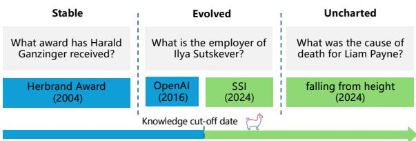
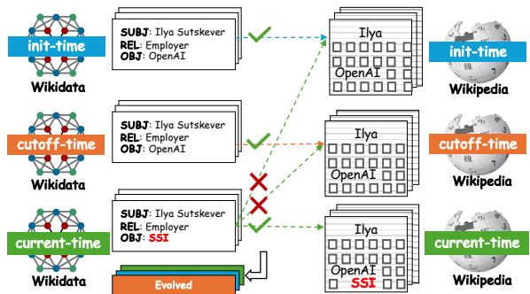
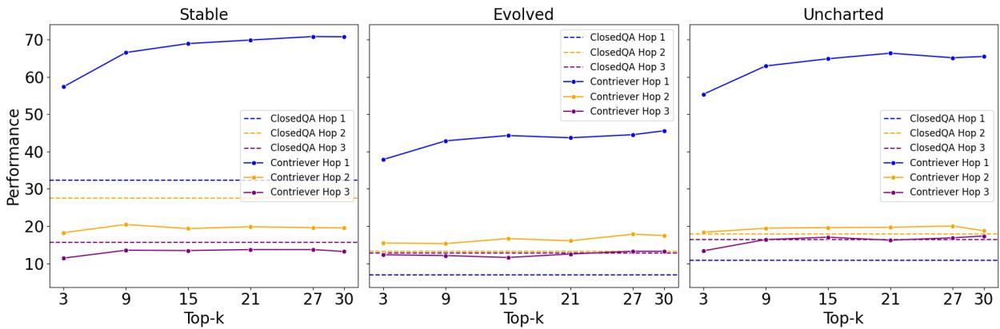
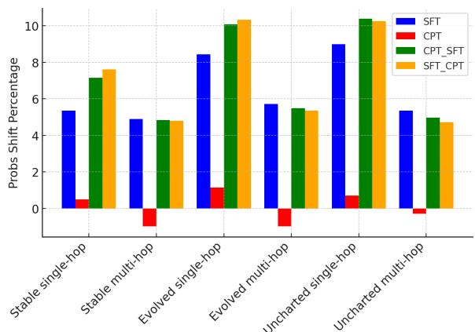
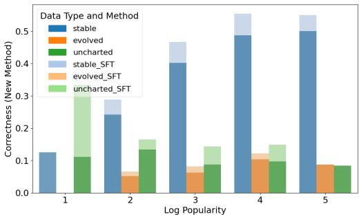

# EvoWiki: Evaluating LLMs on Evolving Knowledge

Wei Tang 1,2, Yixin Cao 3\*, Yang Deng 4, Jiahao Ying 4, Bo Wang 5, Yizhe Yang 5 Yuyue Zhao 1,2, Qi Zhang 3, Xuanjing Huang 3, Yugang Jiang 3, Yong Liao 1,2

1 University of Science and Technology of China

2 CCCD Key Lab of Ministry of Culture and Tourism

3 Institute of Trustworthy Embodied AI, Fudan University 4 Singapore Management University, 5 Beijing Institute of Technology weitangcs@gmail.com yxcao@fudan.edu.cn

## Abstract

Knowledge utilization is a critical aspect of LLMs, and understanding how they adapt to evolving knowledge is essential for their effective deployment. However, existing benchmarks are predominantly static, failing to capture the evolving nature of LLMs and knowledge, leading to inaccuracies and vulnerabilities such as contamination. In this paper, we introduce EvoWiki, an evolving dataset designed to reflect knowledge evolution by categorizing information into stable, evolved, and uncharted states. EvoWiki is fully auto-updated, enabling precise evaluation of continuously changing knowledge and newly released LLMs. Through experiments with Retrieval-Augmented Generation (RAG) and Continual Learning (CL), we evaluate how effectively LLMs adapt to evolving knowledge. Our results indicate that current models often struggle with evolved knowledge, frequently providing outdated or incorrect responses. Moreover, the dataset highlights a synergistic effect between RAG and CL, demonstrating their potential to better adapt to evolving knowledge. EvoWiki1 provides a robust benchmark for advancing future research on the knowledge evolution capabilities of large language models.

## 1 Introduction

Knowledge utilization, as a fundamental capability, is crucial for evaluating the effectiveness of LLMs. However, most existing benchmarks, e.g., NaturalQuestion (Kwiatkowski et al., 2019) and HotpotQA (Yang et al., 2018), are designed for traditional machine learning methods, which are static and not sensitive to temporal changes. In contrast, LLMs and knowledge continuously evolve, making static benchmarks insufficient for precise performance assessment and prone to issues such as potential contamination or overfitting (Cao et al., 2025a).

  
Figure 1: EvoWiki categorizes knowledge into three states according to the cut-off date of the LLMs.

To keep pace with the evolving nature of LLMs and knowledge, dynamically updated benchmarks have gained increasing attention (White et al., 2024; Jain et al., 2024; Ying et al., 2024a; Kasai et al., 2023). For instance, to mitigate test set contamination during the evolution of LLMs, LiveBench (White et al., 2024) constructs benchmarks based on frequently updated questions. Similarly, Realtime QA (Kasai et al., 2023) addresses evolving knowledge by providing real-time answers, enabling the evaluation of an LLM’s ability to acquire newly emerged information. However, there remains a notable gap in dynamic benchmarks designed to assess the utilization of knowledge by LLMs in scenarios where both models and knowledge are continuously evolving.

The evolution of LLMs and knowledge presents significant challenges for accurately evaluating knowledge utilization: 1) Newly released LLMs are prone to potential test set contamination, compromising the integrity of evaluation. 2) As knowledge evolves, static golden answers may become outdated or incorrect, leading to false negatives in assessment. 3) The difficulty of knowledge utilization varies depending on whether the knowledge is already present in the LLMs’ training data. To this end, evolving benchmarks are essential for precise evaluation. Such benchmarks should be autoupdated, encompass diverse types of knowledge across varying temporal states, and provide rich attributes for comprehensive performance analysis.

In this study, we introduce EvoWiki, a continually auto-updated evaluation benchmark designed for contamination-free, accurate, and comprehensive assessment of LLMs on evolving knowledge. As shown in Table 1, EvoWiki possesses three salient characteristics as follows:

1) Three levels of evolved knowledge. As shown in Figure 1, EvoWiki categorizes knowledge into three types based on the cut-off date of the LLMs: stable, evolved, and uncharted. Evolved and uncharted knowledge represent information that has been updated or newly emerged, respectively, mitigating potential contamination issues while reflecting challenging yet realistic evaluation scenarios. However, focusing solely on the newness of knowledge risks underestimating LLM performance, as internal knowledge also significantly influences knowledge utilization. Hence, stable knowledge is included as a baseline for evaluating LLM performance on consistent, unchanging information.

2) Multi-dimensional attributes. EvoWiki integrates multi-dimensional attributes, including referenced context, multi-hop reasoning, and popularity, to enable comprehensive analysis. Referenced context evaluates the utilization of external knowledge, multi-hop reasoning measures an LLM’s ability to connect and integrate multiple pieces of information, and popularity reflects the relevance and significance of the knowledge. These attributes offer valuable insights into the challenges LLMs encounter when leveraging knowledge and provide a more nuanced understanding of their performance.

3) Auto-updatability and Contextualization. EvoWiki is designed to be auto-updated, allowing for the seamless incorporation of updated and emerging data while supporting the evaluation of newly released LLMs. It is constructed using continually updated knowledge graphs and sources, such as Wikidata and Wikipedia, to ensure the freshness and accuracy of the data. The construction process involves identifying changing triples in the knowledge graph and the corresponding texts in the knowledge sources. This approach not only ensures high-quality data but also enables a fully automated updating process.

Based on EvoWiki, we then delve into the impacts of knowledge evolution on the performance of LLMs’ utilization. We specifically employ Retrieval-Augmented Generation and Continual Learning as exemplary methods for utilizing external knowledge. We conduct a range of experiments to assess how these approaches handle external knowledge that varies in its currency and complexity, thereby providing insights into their effectiveness and adaptability in real-world scenarios.

Our findings reveal that current methods face significant challenges in effectively utilizing evolving knowledge. RAG demonstrates strong performance on single-hop questions but struggles with multihop questions. In contrast, CL provides modest yet consistent improvements across all question types. Notably, combining RAG and CL results in a synergistic effect, suggesting that hybrid models could be a promising direction for future research.

To summarize, our contributions are as follows:

• We develop EvoWiki, a continually auto-updated evaluation dataset that captures the evolving nature of knowledge for evaluating LLMs’ ability to utilize external knowledge in dynamic, realworld scenarios.

• We conduct extensive experiments to analyze the impact of knowledge evolution on LLM performance with RAG and CL.

• Our experimental results reveal that RAG and CL face challenges in effectively utilizing evolving knowledge, and combining these methods can lead to a synergistic effect.

## 2 Related Works

Temporal QA Benchmark Several benchmarks have been developed to assess the ability of LLMs to process temporal information in text, for examples, TempQuestions (Jia et al., 2018a), Tequila (Jia et al., 2018b), TimeQuestions (Jia et al., 2021), and CRONQuestions (Saxena et al., 2021). Others, such as TimeQA (Chen et al., 2021), TEMPLAMA (Dhingra et al., 2021), TEMPREA-SON (Tan et al., 2023), MenatQA (Wei et al., 2023), and PAT-Questions (Meem et al., 2024), emphasize reasoning capabilities. Other studies have explored temporally-sensitive knowledge editing (Ge et al., 2024).

Another line of research explores the dynamic nature of knowledge and its implications for LLMs. Benchmarks like ckl-Lama (Jang et al., 2022b) and TemporalWiki (Jang et al., 2022a) assess knowledge retention, updates, and incorporation, while Realtime QA (Kasai et al., 2023) and Dy-Know (Mousavi et al., 2024) evaluate knowledge freshness in evolving content. A detailed comparison of these benchmarks is shown in Table 1.

<table><tr><td rowspan="2">Datasets</td><td rowspan="2">Up-to-date</td><td colspan="3">Evolution Levels</td><td colspan="3">Attributes</td></tr><tr><td>Stable</td><td>Evolved</td><td>1 Uncharted</td><td>Context</td><td>Multi-hop</td><td>Popularity</td></tr><tr><td>CKL-LAMA (Jang et al., 2022b)</td><td>X</td><td>V</td><td>V</td><td>V</td><td>V</td><td>X</td><td>X</td></tr><tr><td>TemporalWiki (Jang et al., 2022a)</td><td>√</td><td>V</td><td>V</td><td>X</td><td>V</td><td>X</td><td>X</td></tr><tr><td>REALTIME QA (Kasai et al., 2023)</td><td>V</td><td>X</td><td>X</td><td>V</td><td>X</td><td>X</td><td>X</td></tr><tr><td>DyKnow (Mousavi et al., 2024)</td><td>V</td><td>X</td><td>V</td><td>X</td><td>X</td><td>X</td><td>X</td></tr><tr><td>EvoWiki</td><td>V</td><td>V</td><td>V</td><td>V</td><td>V</td><td>V</td><td>V</td></tr></table>

Table 1: Comparison with related datasets.

Knowledge Utilization RAG offers a promising approach to knowledge utilization (Lewis et al., 2020). However, challenges like low precision (retrieving irrelevant or misaligned data) and low recall (missing pertinent information) persist across stages, including the pre-retrieval (Li et al., 2023) and post-retrieval phases (Litman et al., 2020; Jiang et al., 2023; Xu et al., 2023), hindering retrieval quality (Gao et al., 2023).

CL methods enable models to adapt to new knowledge through fine-tuning. For instance, Wang et al. (2023) enhance retrieval selectively based on question classification, while Selfmem (Cheng et al., 2023) uses model-generated outputs as selfmemory for iterative learning. Jiang et al. (2024) explore strategies for injecting knowledge via SFT, and Zhang et al. (2024a) introduce a fine-tuning scaling law. Self-tuning (Zhang et al., 2024b) improves LLMs’ ability to acquire knowledge from raw documents through self-teaching.

Alternative approaches, such as GenRead (Yu et al., 2022), replace retrievers with LLM generators, using generated contexts to answer questions. Additionally, Tang et al. (2024) propose the “A+B” generator-reader framework, facilitating new knowledge acquisition through CL.

More recently, Li et al. (2025) analyzed the impact of knowledge boundaries on how models memorize and utilize information. Meanwhile, Cao et al. (2025b) proposed MUI to evaluate the ability of LLMs from the perspective of interpretability.

Knowledge Conflict Evolving knowledge highlights conflicts between internal and external knowledge. Recent studies investigate the impact of knowledge conflicts on LLMs (Ying et al., 2024b; Xie et al., 2024; Marjanovi’c et al., 2024). These studies find that such conflicts do affect LLM performance. For instance, Ying et al. (2024b) find that LLMs tend to generate answers aligned with their internal knowledge, even when the provided external knowledge is correct.

  
Figure 2: Evolution level identification process.

## 3 EvoWiki Dataset

In this section, we outline the construction process of the EvoWiki dataset, which integrates several features, such as knowledge evolution levels, referenced context, multi-hop reasoning capabilities, and popularity attributes. We identify facts at various stages of evolution by comparing different temporal versions of English Wikidata2 (referred to as Wikidata). These facts are then anchored to English Wikipedia3 (referred to as Wikipedia) using distant supervision to ensure data integrity and provide referenced context. Additionally, we develop multi-hop reasoning questions based on the identified knowledge facts and incorporate extra attributes such as popularity.

## 3.1 Knowledge Evolution Level Identification

The evolution of a fact is determined in relation to the knowledge cut-off date of LLMs. Specifically, as shown in Figure 1, facts are categorized into three levels: stable, evolved, and uncharted. Stable facts remain unchanged after the LLM’s knowledge cut-off date. Evolved facts were established before the cut-off date but have undergone changes since. Uncharted facts represent entirely new information introduced after the cut-off date.

To determine the evaluation level of a fact, we introduce three key timestamps: init-time, cutofftime, and current-time. Init-time represents an early point in time before which facts are wellestablished in LLMs, cutoff-time is the knowledge cut-off date of the LLM, and current-time is the time at which the evaluation is conducted. In our implementation, we set the init-time to September 2021, the cutoff-time to January 2024, and the current-time to May 2024, aligning with the knowledge update timeline of popular LLMs, as detailed in the Appendix B. These timestamps are easily adjustable to accommodate different LLMs knowledge update schedules, which enables the auto-update of the EvoWiki benchmark.

<table><tr><td>Data type</td><td>Num. of questions</td><td>Avg. length of context</td><td>Avg. popularity</td></tr><tr><td>Stable</td><td>3,819</td><td>5,411.98</td><td>16,305.96</td></tr><tr><td>Evolved</td><td>3,491</td><td>4,451.90</td><td>42,807.55</td></tr><tr><td>Uncharted</td><td>2,954</td><td>5,014.30</td><td>24,039.57</td></tr></table>

Table 2: Detailed Statistics of EvoWiki.

As shown in Figure 2, based on the three snapshots of Wikidata/Wikipedia, the evolution level of a fact is determined by analyzing changes across different timestamps. The classification rules are outlined as follows (detailed in Appendix C):

• Stable: facts that remain unchanged from inittime to current-time.

• Evolved: facts that are established before inittime and exhibit changes between cutoff-time (or init-time) and current-time.

• Uncharted: facts that are introduced after cutofftime.

Facts are categorized into distinct evolution levels. However, some of these facts may contain noise, such as unanswerable or inaccurate details. To mitigate this, we link each factual triple to its corresponding context on the relevant Wikipedia page using distant supervision, ensuring that the triple’s value is referenced within that context.

## 3.2 Multi-dimensional Attributes

We further expand the dataset by incorporating additional attributes, including Referenced Context, Multi-hop Reasoning, and Popularity. The overall statistics of the current version of the EvoWiki dataset are presented in Table 2.

Referenced Context We restrict the entity type to humans and link the triples to their corresponding Wikipedia pages using the identical wiki\_link of the entity. A fact is considered supported if the triple’s object entity (or subject entity) is explicitly mentioned on the corresponding Wikipedia page of the subject entity (or object entity). For triples with multiple objects, we verify all objects and retain only those explicitly mentioned to ensure high quality. Additionally, for stable facts, the triples must be supported by the corresponding Wikipedia pages across all three timestamps. Evolved and uncharted facts must be supported by the current-time version of the Wikipedia page but not by the previous version. This process ensures that the facts are answerable, accurate, and provide a reliable, high-quality context for each fact triple. Based on distant supervision, we consider the short mentioned sentence as the golden context of the fact triple and the corresponding Wikipedia page as the golden document.

Multi-hop Reasoning Building on the refined fact triples and corresponding contexts, we further enhance the dataset by constructing multi-hop reasoning questions. To maintain high quality, we apply the same rigorous filtering process, retaining only those triples where the objects (or subjects) are explicitly mentioned in the corresponding context for each hop. To reduce ambiguity, triples in the middle hop are restricted to facts with a single object. In our implementation, reasoning questions are extended up to three hops4.

To generate questions, we first use templates to create questions asking for the object entity of the triple in the last hop. For instance, given the triple (Barack Obama, spouse, Michelle Obama), a template question is “Who is the spouse of Barack Obama?”. Afterward, we employ GPT-4o-mini (OpenAI et al., 2024) to refine the questions for improved naturalness. Prompts are provided in Appendix G. The answers correspond to the object entity labels of the last hop, with all objects considered correct for multi-object facts.

Popularity We also incorporate additional attributes, such as popularity, to enrich the dataset. Popularity is measured by the number of page views for the corresponding Wikipedia page. This metric provides insights into the relevance and significance of the facts, allowing for more comprehensive analysis and evaluation.

## 3.3 Human Evaluation of Data Quality

To ensure data quality, we perform manual checks to validate the generated questions and answers. A human evaluation is carried out by four senior computational linguistics researchers on 180 randomly selected samples (20 samples for each hop level of each evolution type). The evaluation assesses each question-answer pair based on three criteria: fluency (whether the question is grammatically correct and flows smoothly), answerability (whether the question has clear and explicit answers), and accuracy (whether the provided answer is correct). The detailed annotation guidelines for the human annotators are presented in Appendix F. As shown in Table 3, all three key aspects of data quality are verified by the human annotators. The evaluation results suggest that the questions are clear and easy to understand, as well as answerable, with the provided answers demonstrating high accuracy. Annotators reported that potential inaccuracies in answers primarily stem from noise in Wikidata.

<table><tr><td>Metrics</td><td>Stable</td><td>Evolved</td><td>Uncharted</td></tr><tr><td>Fluency</td><td>99.17 / 95.69</td><td>94.58 / 95.56</td><td>95.00 / 95.42</td></tr><tr><td>Answerability</td><td>96.67 / 94.44</td><td>94.17 / 95.69</td><td>92.92 / 92.64</td></tr><tr><td>Accuracy</td><td>97.92 / 93.19</td><td>93.33 / 94.58</td><td>91.67 / 90.97</td></tr></table>

Table 3: Human evaluation on data quality. The scores indicate the normalized average scores of single-hop questions (%) / all questions (%).

## 4 Experiments

We evaluate two types of widely-adopted methods on the EvoWiki dataset: Retrieval-Augmented Generation (RAG) and Continual Learning (CL). In the RAG setting, models are required to retrieve relevant documents for the question from a knowledge source and generate answers based on the retrieved documents. In the CL setting, models are finetuned with newly introduced data. Additionally, we explore the performance of combining RAG and CL to assess potential improvements.

## 4.1 Experimental Settings

Our experiments are conducted using two widely used models: Llama-3.1-8B-Instruct (referred to as Llama) and Mistral-7B-Instruct (referred to as Mistral) on EvoWiki. The corpus is built from a 15K Wikipedia dump of golden documents, and we also provide an additional expanded version (denoted as large\_corpus) that includes 370K randomly selected Wikipedia articles to simulate a more practical scenario. Each document is divided into 256-token chunks. The models answer questions in a zero-shot setting using a simple prompt (Appendix G). Performance is measured with the exact match (EM) metric, evaluating the percentage of questions answered correctly. For evolved data, we consider responses with the latest answer as correct and also compare results with outdated answers.

Closed-Book and Open-Book QA. Closedbook and open-book QA represent the lower and upper performance bounds. In closed-book QA, models answer questions using their internal memory. In open-book QA, models are provided with a golden context, a concise yet informative sentence extracted from Wikipedia (Section 3.2), ensuring minimal noise and optimal contextual support.

RAG. We employ two retrieval models, BM25 (Robertson and Zaragoza, 2009) and Contriever (Izacard et al., 2022), to fetch relevant documents. BM25, a sparse retrieval model, scores relevance using term frequency and inverse document frequency. Contriever, a dense retrieval model, encodes queries and documents into a shared embedding space, measuring relevance via cosine similarity. Models generate answers using the top-15 retrieved chunks as context.

CL. We integrate new knowledge into the model using continual pre-training (CPT) and supervised fine-tuning (SFT). CPT trains the model on the corpus with a language modeling objective, while SFT fine-tunes the model on question-answer pairs generated by prompting Llama with the given context. Following Jiang et al. (2024), we also evaluate combinations of CPT and SFT. Implementation details are provided in Appendix D.

## 4.2 Overall Results

Models perform better on stable facts than on evolved and uncharted facts. As shown in Table 4, Both Llama and Mistral demonstrate expected results in the closed-book setting for single-hop questions, achieving an average of 31.61% and 29.81% on stable facts, 6.96% and 5.83% on evolved facts, and 10.84% and 10.04% for both models on uncharted facts. These results suggest models have reliable memory for knowledge they previously encountered but struggle to adapt to new knowledge relying solely on reasoning. Additionally, these findings validate the construction of EvoWiki.

With golden context, models perform well across all data types, though accuracy drops significantly on evolved facts. Performance on outdated answers matches that on other types of facts, suggesting conflicts between internal and external knowledge limit effective utilization. Both RAG and CL improve performance across all data types but lag behind the open-book setting. Larger gaps for evolved and uncharted facts highlight the difficulty of integrating new knowledge into models.

<table><tr><td rowspan="2">Method</td><td colspan="2">Stable</td><td colspan="2">Evolved</td><td colspan="2">Uncharted</td></tr><tr><td>single-hop</td><td>multi-hop</td><td>single-hop</td><td>multi-hop</td><td>single-hop</td><td>multi-hop</td></tr><tr><td colspan="7">Meta-Llama-3.1-8B-Instruct</td></tr><tr><td>Open-book</td><td>86.87</td><td>56.40</td><td>75.24 (83.47)</td><td>60.30</td><td>83.52</td><td>51.32</td></tr><tr><td>Closed-book</td><td>31.61</td><td>22.17</td><td>6.96 (24.61)</td><td>13.99</td><td>10.84</td><td>17.90</td></tr><tr><td>BM25</td><td>59.41</td><td>14.42</td><td>36.13 (53.78)</td><td>13.85</td><td>44.93</td><td>15.47</td></tr><tr><td>Contriever</td><td>77.90</td><td>19.37</td><td>48.99 (72.70)</td><td>17.85</td><td>72.69</td><td>21.42</td></tr><tr><td>BM25large corpus</td><td>51.77</td><td>14.81</td><td>28.12 (44.95)</td><td>14.27</td><td>35.86</td><td>15.70</td></tr><tr><td>Contrieverlarge corpus</td><td>68.92</td><td>16.49</td><td>44.28 (67.99)</td><td>14.41</td><td>64.85</td><td>18.72</td></tr><tr><td>CPT + Closed-book</td><td>35.83</td><td>24.41</td><td>8.83 (28.12)</td><td>15.85</td><td>15.07</td><td>20.38</td></tr><tr><td>SFT + Closed-book</td><td>36.97</td><td>24.41</td><td>8.53 (28.12)</td><td>17.34</td><td>15.15</td><td>20.59</td></tr><tr><td>CPT + SFT + Closed-book</td><td>38.31</td><td>25.48</td><td>8.75 (29.32)</td><td>17.85</td><td>15.86</td><td>20.98</td></tr><tr><td>SFT + CPT + Closed-book</td><td>38.58</td><td>28.84</td><td>10.25 (31.19)</td><td>18.22</td><td>17.27</td><td>22.41</td></tr><tr><td>CPT + Open-book</td><td>87.94</td><td>59.06</td><td>70.98 (83.40)</td><td>62.06</td><td>84.32</td><td>53.36</td></tr><tr><td>SFT + Open-book</td><td>92.10</td><td>60.22</td><td>80.78 (88.56)</td><td>62.90</td><td>89.34</td><td>55.07</td></tr><tr><td>CPT + SFT + Open-book</td><td>90.69</td><td>60.27</td><td>79.66 (87.51)</td><td>63.51</td><td>87.31</td><td>53.80</td></tr><tr><td>SFT + CPT + Open-book</td><td>89.82</td><td>59.54</td><td>74.87 (85.71)</td><td>63.27</td><td>86.52</td><td>55.34</td></tr><tr><td>CPT + Contriever</td><td>77.70</td><td>22.73</td><td>44.05 (73.00)</td><td>19.53</td><td>71.45</td><td>22.74</td></tr><tr><td>SFT + Contriever</td><td>82.85</td><td>24.02</td><td>57.22 (79.36)</td><td>20.22</td><td>78.85</td><td>24.84</td></tr><tr><td>CPT + SFT + Contriever</td><td>79.64</td><td>24.19</td><td>49.74 (76.29)</td><td>19.39</td><td>75.51</td><td>23.35</td></tr><tr><td>SFT + CPT + Contriever</td><td>76.02</td><td>24.97</td><td>47.27 (74.05)</td><td>20.18</td><td>73.13</td><td>23.40</td></tr><tr><td colspan="7">Mistral-7B-Instruct-v0.3</td></tr><tr><td>Open-book</td><td>87.68</td><td>60.57</td><td>77.56 (83.99)</td><td>60.44</td><td>82.64</td><td>56.00</td></tr><tr><td>Closed-book</td><td>29.81</td><td>23.12</td><td>5.83 (19.90)</td><td>15.76</td><td>10.04</td><td>18.89</td></tr><tr><td>BM25</td><td>52.85</td><td>14.46</td><td>34.78 (50.49)</td><td>16.08</td><td>44.14</td><td>16.46</td></tr><tr><td>Contriever</td><td>73.14</td><td>22.17</td><td>52.43 (74.05)</td><td>19.11</td><td>71.89</td><td>23.57</td></tr><tr><td>BM25large corpus</td><td>40.32</td><td>14.25</td><td>26.33 (38.82)</td><td>13.20</td><td>32.25</td><td>13.43</td></tr><tr><td>Contrieverlarge corpus</td><td>63.16</td><td>18.04</td><td>46.97 (67.02)</td><td>15.20</td><td>61.85</td><td>20.04</td></tr><tr><td>CPT + Closed-book</td><td>35.43</td><td>28.20</td><td>9.57 (28.57)</td><td>18.83</td><td>14.98</td><td>23.57</td></tr><tr><td>SFT + Closed-book</td><td>38.31</td><td>33.62</td><td>10.77 (30.29)</td><td>21.62</td><td>16.30</td><td>27.53</td></tr><tr><td>CPT + Open-book</td><td>88.61</td><td>60.27</td><td>78.53 (83.40)</td><td>62.58</td><td>81.23</td><td>55.62</td></tr><tr><td>SFT + Open-book</td><td>91.43</td><td>71.16</td><td>85.86 (89.75)</td><td>73.18</td><td>89.07</td><td>66.19</td></tr><tr><td>CPT + Contriever</td><td>74.28</td><td>26.43</td><td>52.88 (75.69)</td><td>21.89</td><td>71.72</td><td>25.88</td></tr><tr><td>SFT + Contriever</td><td>80.44</td><td>30.99</td><td>61.78 (78.98)</td><td>24.27</td><td>76.04</td><td>29.29</td></tr></table>

Table 4: Main performance of the methods on EvoWiki. Values in parentheses indicate the precision of all answers that contain outdated answers.

## 4.3 Retrieval-augmented Generation

RAG shows promising performance but struggles with multi-hop reasoning. With the use of RAG, the performance of both models on singlehop questions significantly improves, as shown in Table 4, with an increase of +27.80%/46.29% and +23.04%/43.33% on stable facts, +29.17%/42.03% and +28.95%/46.60% on evolved facts, and +34.09%/61.85% and +34.10%/61.85% on uncharted facts for BM25/Contriever, respectively. However, performance on multi-hop questions is severely limited, with a noticeable degradation on stable and uncharted facts, even when compared to the closed-book setting. Additionally, RAG experiences a performance drop when the corpus is enlarged. These results suggest that RAG’s effectiveness depends on the retrieval model’s ability to provide relevant information, which works well for simpler questions but introduces more noise than useful content when handling complex questions.

RAG is influenced by noise, leading to negative effects on known knowledge. To further explore the impact of noise, we conduct experiments with varying top-k retrieval settings, as shown in Figure 3. Increasing top-k improves performance initially, but beyond 15, the improvement flattens and even showing a downward trend. This trend is observed across all three types of data, suggesting that noise affects each evolution level similarly.

We also noticed that on the evolved and uncharted data, RAG’s performance on multi-hop data exceeds that of the closed-book, while the opposite holds for stable data. Because of lacking of explicit keyword, the noise introduced in multi-hop retrieval is likely to be less relevant to the answer, and this noise do negatively affect the model’s utilization of its known internal knowledge.

  
Figure 3: RAG performance across top-k values of Contriever; the dashed line represents closed-book QA results.

<table><tr><td rowspan="2">Method</td><td colspan="2">Stable</td><td colspan="2">Evolved</td><td colspan="2">Uncharted</td></tr><tr><td>Single-hop</td><td>Multi-hop</td><td>Single-hop</td><td>Multi-hop</td><td>Single-hop</td><td>Multi-hop</td></tr><tr><td>Open-book</td><td>86.87</td><td>56.40</td><td>75.24 (83.47)</td><td>60.30</td><td>83.52</td><td>51.32</td></tr><tr><td>SC Open-book I Memory</td><td>64.84</td><td>28.32</td><td>53.78 (65.74)</td><td>26.73</td><td>51.10</td><td>24.01</td></tr><tr><td>SC Open-book I Open-book</td><td>84.80</td><td>35.21</td><td>72.85 (81.53)</td><td>42.68</td><td>80.53</td><td>36.56</td></tr><tr><td>BM25</td><td>59.41</td><td>14.42</td><td>36.13 (53.78)</td><td>13.85</td><td>44.93</td><td>15.47</td></tr><tr><td>SC BM25 | Memory</td><td>50.84</td><td>16.19</td><td>28.12 (47.42)</td><td>12.97</td><td>32.60</td><td>16.36</td></tr><tr><td>SC BM25 |BM25</td><td>58.20</td><td>11.88</td><td>36.13 (52.95)</td><td>10.55</td><td>43.96</td><td>12.44</td></tr><tr><td>SC BM25 | Contriever</td><td>72.94</td><td>15.80</td><td>47.57 (71.28)</td><td>15.20</td><td>69.87</td><td>17.62</td></tr><tr><td>Contriever</td><td>77.90</td><td>19.37</td><td>48.99 (72.70)</td><td>17.85</td><td>72.69</td><td>21.42</td></tr><tr><td>SC Contriever I Memory</td><td>60.42</td><td>17.78</td><td>35.98 (58.41)</td><td>14.41</td><td>44.05</td><td>17.02</td></tr><tr><td>SC Contriever | BM25</td><td>63.50</td><td>13.60</td><td>35.83 (55.05)</td><td>12.04</td><td>46.52</td><td>13.93</td></tr><tr><td>SC Contriever I Contriever</td><td>73.74</td><td>17.14</td><td>46.52 (70.83)</td><td>15.34</td><td>69.07</td><td>17.84</td></tr></table>

Table 5: Performance of self-critique. ‘A | B’ means using B as the reference context to check the answer of A. Values in parentheses indicate the precision of all answers that contain outdated answers.

Self-critique failed to improve the performance of RAG. Inspired by recent advancements in self-critique techniques (Shinn et al., 2023; Valmeekam et al., 2023), we investigated the potential of self-critique to enhance RAG by verifying the consistency between generated answers and contexts (or memory), enabling the model to revise its responses on their own. Experiments combining RAG with self-critique, as summarized in Table 5, revealed that self-critique did not improve RAG’s performance. While using stronger retrieval results as reference context enhanced weaker retrieval models, it still fell short of directly leveraging the stronger retrieval. We attribute this limitation to that models tend to rely on their internal knowledge when faced with uninformative context. Distinguishing when to rely on internal memory versus retrieved context remains a non-trivial challenge.

## 4.4 Continual Learning

CL shows modest yet consistent improvement. In Table 4, on single-hop questions, both CPT and SFT yield notable gains, with +4.22%/5.36% and +5.62%/8.50% on stable facts, and +4.23%/4.31% and +4.94%/6.26% on uncharted facts for Llama and Mistral, respectively. On evolved facts, when only considering the latest answer, improvements are smaller, at +1.87%/1.57% and +3.74%/4.94% for Llama and Mistral. Including outdated answers brings performance closer to stable and uncharted facts, highlighting challenges in modifying knowledge. Unlike RAG, CL does not negatively impact multi-hop questions but instead improves performance, demonstrating its potential in integrating knowledge without sacrificing multi-hop scenarios.

CPT and SFT are complementary. We further explore the performance of combining CPT and SFT. Drawing inspiration from (Jiang et al., 2024), we evaluate the impact of different training orders of CPT and SFT. As shown in Table 4, in closedbook QA, improvements are observed across all data types when combining CPT and SFT, with the best performance achieved when applying SFT first, followed by CPT—consistent with the findings in (Jiang et al., 2024). These results suggest a synergistic effect between CPT and SFT in integrating new knowledge into the model.

  
Figure 4: Probability shift (%) of CL methods on Llama for the first token of the golden answer.

  
Figure 5: Popularity effects of SFT on Llama. Due to data scarcity, we aggregated the popularity levels of 0 and 1 into a single category, as well as levels 5 and 6.

SFT demonstrates superior knowledge integration over CPT. It is non-trivial to compare CPT and SFT using the EM metric, as their performance is quite similar. Therefore, we introduce a simplified Persuasion Score (Du et al., 2024) that measures how the CL method affects the model’s probability of generating the correct answer. As shown in Figure 4, the probability shifts reveal that SFT is much better at correcting the model’s predictions than CPT. Furthermore, the combination of CPT and SFT shows a significant impact regardless of the order in which they are applied.

Popularity influences the effectiveness of CL. Popularity is a well-known factor that affects the performance of knowledge acquisition (Mallen et al., 2023). To examine this, we follow recent research that considers Wikipedia page views as a measure of popularity and investigate its influence across different levels of knowledge evolution.

As illustrated in Figure 5, the results show different trends based on the data’s evolution level. In the closed-book QA setting, stable data exhibits a positive correlation with popularity, which is intuitive since more popular knowledge is likely to have been encountered by the model. In contrast, both evolved and uncharted data show minor correlation with popularity, indicating that the model lacks relevant knowledge.

When augmented with SFT, stable data continues to show a positive correlation with popularity, while evolved data highlights the difficulty of reflecting changes in the model’s internal knowledge. Interestingly, the model appears to learn new knowledge more effectively when the popularity is lower. For example, the improvement is significantly greater when the log popularity is 1 compared to when it is 5. These findings suggest that, rather than merely increasing the data scale, the proportion of training data should account for the popularity of the knowledge being learned.

## 4.5 Combination of RAG and CL

RAG shows strong performance on single-hop questions but is limited on multi-hop questions, while CL demonstrates modest yet consistent improvement on both single-hop and multi-hop questions. A natural approach is to combine RAG and CL to leverage the strengths of both methods. Thus, we conducted experiments with different combinations of RAG and CL, as shown in Table 4.

The combination of RAG and CL demonstrates a synergistic effect. Integrating RAG with CL enhances performance across data types, particularly on multi-hop questions, compared to RAG with an untuned model. By updating internal knowledge through CL, the model provides more accurate answers when confronted with uninformative context from the retriever. This highlights the potential of combining both methods to leverage complementary strengths effectively.

## 5 Conclusion

In conclusion, this study presents EvoWiki, a dynamic, auto-updated benchmark for evaluating LLMs’ ability to utilize evolving knowledge. EvoWiki categorizes knowledge into stable, evolved, and uncharted types, addressing challenges like test set contamination and knowledge conflicts while enabling comprehensive analysis through attributes such as referenced context, multihop reasoning, and popularity. Experiments with RAG and CL reveal their limitations in handling evolving knowledge, with a combined approach showing promising synergy. EvoWiki sets a new standard for adaptive, contamination-free evaluation, advancing research on knowledge utilization in real-world scenarios.

## 6 Limitations

Despite being recognized as high-quality corpora, Wikidata and Wikipedia inevitably contain noise. Even newly updated Wikidata entries and newly uploaded Wikipedia pages may contain outdated knowledge. Our quantitative analysis found that new uploads of knowledge (even older knowledge) are relatively difficult for LLMs to answer directly. And we ensure data adherence to the evolutionary level by restricting direct consistency between Wikidata and Wikipedia. Experimental results also demonstrate the rationality of our current partition scheme. However, this noise cannot be completely eliminated, and in the future, we will reduce this noise by using more aggressive relation filtering strategies and increasing sources of more timely knowledge.

## 7 Ethical Considerations

The dataset in this study is specifically designed for research evaluating the performance of language models on evolutionary knowledge and is limited to research purposes only, not to be used for other applications. We have made every effort to minimize bias in the selection of knowledge triples and the question-answer generation process, but unintended bias leakage may still exist. Therefore, thorough examination is crucial for any use beyond the intended scope of research.

## 8 Acknowledgement

This work is supported by the Key Science & Technology Project of Anhui Province (202423l10050033) and CCF-Zhipu Large Model Innovation Fund (NO. CCF-Zhipu202401).

## References

Yixin Cao, Shibo Hong, Xinze Li, Jiahao Ying, Yubo Ma, Haiyuan Liang, Yantao Liu, Zijun Yao, Xiaozhi Wang, Dan Huang, Wenxuan Zhang, Lifu Huang, Muhao Chen, Lei Hou, Qianru Sun, Xingjun Ma, Zuxuan Wu, Min-Yen Kan, David Lo, Qi Zhang,

Heng Ji, Jing Jiang, Juanzi Li, Aixin Sun, Xuanjing Huang, Tat-Seng Chua, and Yu-Gang Jiang. 2025a. Toward generalizable evaluation in the llm era: A survey beyond benchmarks. Preprint, arXiv:2504.18838.

Yixin Cao, Jiahao Ying, Yaoning Wang, Xipeng Qiu, Xuanjing Huang, and Yugang Jiang. 2025b. Model utility law: Evaluating llms beyond performance through mechanism interpretable metric. Preprint, arXiv:2504.07440.

Wenhu Chen, Xinyi Wang, and William Yang Wang. 2021. A dataset for answering time-sensitive questions. In Thirty-fifth Conference on Neural Information Processing Systems Datasets and Benchmarks Track (Round 2).

Xin Cheng, Di Luo, Xiuying Chen, Lemao Liu, Dongyan Zhao, and Rui Yan. 2023. Lift yourself up: Retrieval-augmented text generation with self memory. arXiv preprint arXiv:2305.02437.

Bhuwan Dhingra, Jeremy R. Cole, Julian Martin Eisenschlos, Daniel Gillick, Jacob Eisenstein, and William W. Cohen. 2021. Time-aware language models as temporal knowledge bases. Transactions ofthe Associationfor Computational Linguistics, 10:257– 273.

Kevin Du, Vésteinn Snæbjarnarson, Niklas Stoehr, Jennifer C. White, Aaron Schein, and Ryan Cotterell. 2024. Context versus prior knowledge in language models. Preprint, arXiv:2404.04633.

Yunfan Gao, Yun Xiong, Xinyu Gao, Kangxiang Jia, Jinliu Pan, Yuxi Bi, Yi Dai, Jiawei Sun, and Haofen Wang. 2023. Retrieval-augmented generation for large language models: A survey. arXiv preprint arXiv:2312.10997.

Xiou Ge, Ali Mousavi, Edouard Grave, Armand Joulin, Kun Qian, Benjamin Han, Mostafa Arefiyan, and Yunyao Li. 2024. Time sensitive knowledge editing through efficient finetuning. In Proceedings of the 62nd Annual Meeting of the Association for Computational Linguistics (Volume 2: Short Papers), pages 583–593, Bangkok, Thailand. Association for Computational Linguistics.

Edward J. Hu, Yelong Shen, Phillip Wallis, Zeyuan Allen-Zhu, Yuanzhi Li, Shean Wang, Lu Wang, and Weizhu Chen. 2021. Lora: Low-rank adaptation of large language models. Preprint, arXiv:2106.09685.

Gautier Izacard, Mathilde Caron, Lucas Hosseini, Sebastian Riedel, Piotr Bojanowski, Armand Joulin, and Edouard Grave. 2022. Unsupervised dense information retrieval with contrastive learning. Preprint, arXiv:2112.09118.

Naman Jain, King Han, Alex Gu, Wen-Ding Li, Fanjia Yan, Tianjun Zhang, Sida Wang, Armando Solar-Lezama, Koushik Sen, and Ion Stoica. 2024. Livecodebench: Holistic and contamination free evaluation of large language models for code. Preprint, arXiv:2403.07974.

Joel Jang, Seonghyeon Ye, Changho Lee, Sohee Yang, Joongbo Shin, Janghoon Han, Gyeonghun Kim, and Minjoon Seo. 2022a. Temporalwiki: A lifelong benchmark for training and evaluating ever-evolving language models. In Conference on Empirical Methods in Natural Language Processing.

Joel Jang, Seonghyeon Ye, Sohee Yang, Joongbo Shin, Janghoon Han, Gyeonghun KIM, Stanley Jungkyu Choi, and Minjoon Seo. 2022b. Towards continual knowledge learning of language models. In International Conference on Learning Representations.

Zhen Jia, Abdalghani Abujabal, Rishiraj Saha Roy, Jannik Strötgen, and Gerhard Weikum. 2018a. Tempquestions: A benchmark for temporal question answering. In Companion Proceedings ofthe The Web Conference 2018, WWW ’18, page 1057–1062, Republic and Canton of Geneva, CHE. International World Wide Web Conferences Steering Committee.

Zhen Jia, Abdalghani Abujabal, Rishiraj Saha Roy, Jannik Strötgen, and Gerhard Weikum. 2018b. Tequila: Temporal question answering over knowledge bases. In Proceedings ofthe 27th ACM International Conference on Information and Knowledge Management, CIKM ’18, page 1807–1810, New York, NY, USA. Association for Computing Machinery.

Zhen Jia, Soumajit Pramanik, Rishiraj Saha Roy, and Gerhard Weikum. 2021. Complex temporal question answering on knowledge graphs. In Proceedings of the 30th ACM International Conference on Information & Knowledge Management, CIKM ’21, page 792–802, New York, NY, USA. Association for Computing Machinery.

Huiqiang Jiang, Qianhui Wu, Chin-Yew Lin, Yuqing Yang, and Lili Qiu. 2023. Llmlingua: Compressing prompts for accelerated inference of large language models. arXiv preprint arXiv:2310.05736.

Zhengbao Jiang, Zhiqing Sun, Weijia Shi, Pedro Rodriguez, Chunting Zhou, Graham Neubig, Xi Victoria Lin, Wen-tau Yih, and Srinivasan Iyer. 2024. Instruction-tuned Language Models are Better Knowledge Learners. In Annual Meeting of the Association for Computational Linguistics, volume abs/2402.12847, pages 5421–5434.

Jungo Kasai, Keisuke Sakaguchi, yoichi takahashi, Ronan Le Bras, Akari Asai, Xinyan Velocity Yu, Dragomir Radev, Noah A. Smith, Yejin Choi, and Kentaro Inui. 2023. Realtime QA: What’s the answer right now? In Thirty-seventh Conference on Neural Information Processing Systems Datasets and Benchmarks Track.

Diederik P Kingma. 2014. Adam: A method for stochastic optimization. arXiv preprint arXiv:1412.6980.

Tom Kwiatkowski, Jennimaria Palomaki, Olivia Redfield, Michael Collins, Ankur Parikh, Chris Alberti, Danielle Epstein, Illia Polosukhin, Jacob Devlin, Kenton Lee, Kristina Toutanova, Llion Jones, Matthew Kelcey, Ming-Wei Chang, Andrew M. Dai, Jakob

Uszkoreit, Quoc Le, and Slav Petrov. 2019. Natural questions: A benchmark for question answering research. Transactions ofthe Associationfor Computational Linguistics, 7:452–466.

Patrick Lewis, Ethan Perez, Aleksandra Piktus, Fabio Petroni, Vladimir Karpukhin, Naman Goyal, Heinrich Küttler, Mike Lewis, Wen-tau Yih, Tim Rocktäschel, et al. 2020. Retrieval-augmented generation for knowledge-intensive nlp tasks. Advances in Neural Information Processing Systems, 33:9459–9474.

Moxin Li, Yong Zhao, Wenxuan Zhang, Shuaiyi Li, Wenya Xie, See-Kiong Ng, Tat-Seng Chua, and Yang Deng. 2025. Knowledge boundary of large language models: A survey. Preprint, arXiv:2412.12472.

Xinze Li, Zhenghao Liu, Chenyan Xiong, Shi Yu, Yu Gu, Zhiyuan Liu, and Ge Yu. 2023. Structureaware language model pretraining improves dense retrieval on structured data. arXiv preprint arXiv:2305.19912.

Ron Litman, Oron Anschel, Shahar Tsiper, Roee Litman, Shai Mazor, and R Manmatha. 2020. Scatter: selective context attentional scene text recognizer. In proceedings of the IEEE/CVF conference on computer vision and pattern recognition, pages 11962– 11972.

Alex Mallen, Akari Asai, Victor Zhong, Rajarshi Das, Daniel Khashabi, and Hannaneh Hajishirzi. 2023. When not to trust language models: Investigating effectiveness of parametric and non-parametric memories. In Proceedings ofthe 61st Annual Meeting of the Associationfor Computational Linguistics (Volume 1: Long Papers), pages 9802–9822, Toronto, Canada. Association for Computational Linguistics.

Sara Vera Marjanovi’c, Haeun Yu, Pepa Atanasova, Maria Maistro, Christina Lioma, and Isabelle Augenstein. 2024. Dynamicqa: Tracing Internal Knowledge Conflicts in Language Models. In Conference on Empirical Methods in Natural Language Processing, volume abs/2407.17023, pages 14346–14360.

Jannat Ara Meem, Muhammad Shihab Rashid, Yue Dong, and Vagelis Hristidis. 2024. Pat-questions: A self-updating benchmark for present-anchored temporal question-answering. In Annual Meeting of the Association for Computational Linguistics.

Seyed Mahed Mousavi, Simone Alghisi, and Giuseppe Riccardi. 2024. Dyknow: Dynamically verifying time-sensitive factual knowledge in llms. Preprint, arXiv:2404.08700.

OpenAI, :, Aaron Hurst, Adam Lerer, Adam P. Goucher, Adam Perelman, Aditya Ramesh, Aidan Clark, AJ Ostrow, Akila Welihinda, Alan Hayes, Alec Radford, Aleksander M ˛adry, Alex Baker-Whitcomb, Alex Beutel, Alex Borzunov, Alex Carney, Alex Chow, Alex Kirillov, Alex Nichol, Alex Paino, Alex Renzin, Alex Tachard Passos, Alexander Kirillov, Alexi Christakis, Alexis Conneau, Ali Kamali, Allan Jabri, Allison Moyer, Allison Tam, Amadou Crookes,

Amin Tootoochian, Amin Tootoonchian, Ananya Kumar, Andrea Vallone, Andrej Karpathy, Andrew Braunstein, Andrew Cann, Andrew Codispoti, An drew Galu, Andrew Kondrich, Andrew Tulloch, An drey Mishchenko, Angela Baek, Angela Jiang, An toine Pelisse, Antonia Woodford, Anuj Gosalia, Arka Dhar, Ashley Pantuliano, Avi Nayak, Avital Oliver, Barret Zoph, Behrooz Ghorbani, Ben Leimberger, Ben Rossen, Ben Sokolowsky, Ben Wang, Benjamin Zweig, Beth Hoover, Blake Samic, Bob McGrew, Bobby Spero, Bogo Giertler, Bowen Cheng, Brad Lightcap, Brandon Walkin, Brendan Quinn, Brian Guarraci, Brian Hsu, Bright Kellogg, Brydon East man, Camillo Lugaresi, Carroll Wainwright, Cary Bassin, Cary Hudson, Casey Chu, Chad Nelson, Chak Li, Chan Jun Shern, Channing Conger, Char lotte Barette, Chelsea Voss, Chen Ding, Cheng Lu, Chong Zhang, Chris Beaumont, Chris Hallacy, Chris Koch, Christian Gibson, Christina Kim, Christine Choi, Christine McLeavey, Christopher Hesse, Clau dia Fischer, Clemens Winter, Coley Czarnecki, Colin Jarvis, Colin Wei, Constantin Koumouzelis, Dane Sherburn, Daniel Kappler, Daniel Levin, Daniel Levy, David Carr, David Farhi, David Mely, David Robin son, David Sasaki, Denny Jin, Dev Valladares, Dim itris Tsipras, Doug Li, Duc Phong Nguyen, Duncan Findlay, Edede Oiwoh, Edmund Wong, Ehsan As dar, Elizabeth Proehl, Elizabeth Yang, Eric Antonow, Eric Kramer, Eric Peterson, Eric Sigler, Eric Wal lace, Eugene Brevdo, Evan Mays, Farzad Khorasani, Felipe Petroski Such, Filippo Raso, Francis Zhang, Fred von Lohmann, Freddie Sulit, Gabriel Goh, Gene Oden, Geoff Salmon, Giulio Starace, Greg Brockman, Hadi Salman, Haiming Bao, Haitang Hu, Hannah Wong, Haoyu Wang, Heather Schmidt, Heather Whitney, Heewoo Jun, Hendrik Kirchner, Henrique Ponde de Oliveira Pinto, Hongyu Ren, Huiwen Chang, Hyung Won Chung, Ian Kivlichan, Ian O’Connell, Ian O’Connell, Ian Osband, Ian Sil ber, Ian Sohl, Ibrahim Okuyucu, Ikai Lan, Ilya Kostrikov, Ilya Sutskever, Ingmar Kanitscheider, Ishaan Gulrajani, Jacob Coxon, Jacob Menick, Jakub Pachocki, James Aung, James Betker, James Crooks, James Lennon, Jamie Kiros, Jan Leike, Jane Park, Jason Kwon, Jason Phang, Jason Teplitz, Jason Wei, Jason Wolfe, Jay Chen, Jeff Harris, Jenia Varavva, Jessica Gan Lee, Jessica Shieh, Ji Lin, Jiahui Yu, Jiayi Weng, Jie Tang, Jieqi Yu, Joanne Jang, Joaquin Quinonero Candela, Joe Beutler, Joe Lan ders, Joel Parish, Johannes Heidecke, John Schul man, Jonathan Lachman, Jonathan McKay, Jonathan Uesato, Jonathan Ward, Jong Wook Kim, Joost Huizinga, Jordan Sitkin, Jos Kraaijeveld, Josh Gross, Josh Kaplan, Josh Snyder, Joshua Achiam, Joy Jiao, Joyce Lee, Juntang Zhuang, Justyn Harriman, Kai Fricke, Kai Hayashi, Karan Singhal, Katy Shi, Kavin Karthik, Kayla Wood, Kendra Rimbach, Kenny Hsu, Kenny Nguyen, Keren Gu-Lemberg, Kevin Button, Kevin Liu, Kiel Howe, Krithika Muthukumar, Kyle Luther, Lama Ahmad, Larry Kai, Lauren Itow, Lau ren Workman, Leher Pathak, Leo Chen, Li Jing, Lia Guy, Liam Fedus, Liang Zhou, Lien Mamitsuka, Lil ian Weng, Lindsay McCallum, Lindsey Held, Long Ouyang, Louis Feuvrier, Lu Zhang, Lukas Kon draciuk, Lukasz Kaiser, Luke Hewitt, Luke Metz, Lyric Doshi, Mada Aflak, Maddie Simens, Madelaine Boyd, Madeleine Thompson, Marat Dukhan, Mark Chen, Mark Gray, Mark Hudnall, Marvin Zhang, Marwan Aljubeh, Mateusz Litwin, Matthew Zeng, Max Johnson, Maya Shetty, Mayank Gupta, Meghan Shah, Mehmet Yatbaz, Meng Jia Yang, Mengchao Zhong, Mia Glaese, Mianna Chen, Michael Janner, Michael Lampe, Michael Petrov, Michael Wu, Michele Wang, Michelle Fradin, Michelle Pokrass, Miguel Castro, Miguel Oom Temudo de Castro, Mikhail Pavlov, Miles Brundage, Miles Wang, Minal Khan, Mira Murati, Mo Bavarian, Molly Lin, Murat Yesildal, Nacho Soto, Natalia Gimelshein, Natalie Cone, Natalie Staudacher, Natalie Summers, Natan LaFontaine, Neil Chowdhury, Nick Ryder, Nick Stathas, Nick Turley, Nik Tezak, Niko Felix, Nithanth Kudige, Nitish Keskar, Noah Deutsch, Noe Bundick, Nora Puckett, Ofir Nachum, Ola Okelola, Oleg Boiko, Oleg Murk, Oliver Jaffe, Olivia Watkins, Olivier Godement, Owen Campbell-Moore, Patrick Chao, Paul McMillan, Pavel Belov, Peng Su, Peter Bak, Peter Bakkum, Peter Deng, Peter Dolan, Peter Hoeschele, Peter Welinder, Phil Tillet, Philip Pronin, Philippe Tillet, Prafulla Dhariwal, Qiming Yuan, Rachel Dias, Rachel Lim, Rahul Arora, Rajan Troll, Randall Lin, Rapha Gontijo Lopes, Raul Puri, Reah Miyara, Reimar Leike, Renaud Gaubert, Reza Zamani, Ricky Wang, Rob Donnelly, Rob Honsby, Rocky Smith, Rohan Sahai, Rohit Ramchandani, Romain Huet, Rory Carmichael, Rowan Zellers, Roy Chen, Ruby Chen, Ruslan Nigmatullin, Ryan Cheu, Saachi Jain, Sam Altman, Sam Schoenholz, Sam Toizer, Samuel Miserendino, Sandhini Agar wal, Sara Culver, Scott Ethersmith, Scott Gray, Sean Grove, Sean Metzger, Shamez Hermani, Shantanu Jain, Shengjia Zhao, Sherwin Wu, Shino Jomoto, Shirong Wu, Shuaiqi, Xia, Sonia Phene, Spencer Papay, Srinivas Narayanan, Steve Coffey, Steve Lee, Stewart Hall, Suchir Balaji, Tal Broda, Tal Stramer, Tao Xu, Tarun Gogineni, Taya Christianson, Ted Sanders, Tejal Patwardhan, Thomas Cunninghman, Thomas Degry, Thomas Dimson, Thomas Raoux, Thomas Shadwell, Tianhao Zheng, Todd Underwood, Todor Markov, Toki Sherbakov, Tom Rubin, Tom Stasi, Tomer Kaftan, Tristan Heywood, Troy Peterson, Tyce Walters, Tyna Eloundou, Valerie Qi, Veit Moeller, Vinnie Monaco, Vishal Kuo, Vlad Fomenko, Wayne Chang, Weiyi Zheng, Wenda Zhou, Wesam Manassra, Will Sheu, Wojciech Zaremba, Yash Patil, Yilei Qian Yongjik Kim, Youlong Cheng, Yu Zhang, Yuchen He, Yuchen Zhang, Yujia Jin, Yunxing Dai, and Yury Malkov. 2024. Gpt-4o system card. Preprint, arXiv:2410.21276.

Stephen Robertson and Hugo Zaragoza. 2009. The probabilistic relevance framework: Bm25 and beyond. Found. Trends Inf. Retr., 3(4):333–389.

Apoorv Saxena, Soumen Chakrabarti, and Partha Talukdar. 2021. Question answering over temporal knowledge graphs. In Proceedings of the 59th Annual Meeting of the Association for Computational Linguistics and the 11th International Joint Conference

on Natural Language Processing (Volume 1: Long Papers), pages 6663–6676, Online. Association for Computational Linguistics.

Noah Shinn, Federico Cassano, Edward Berman, Ashwin Gopinath, Karthik Narasimhan, and Shunyu Yao. 2023. Reflexion: Language agents with verbal reinforcement learning. Preprint, arXiv:2303.11366.

Qingyu Tan, Hwee Tou Ng, and Lidong Bing. 2023. Towards benchmarking and improving the temporal reasoning capability of large language models. In Proceedings of the 61st Annual Meeting of the Associationfor Computational Linguistics (Volume 1: Long Papers), pages 14820–14835, Toronto, Canada. Association for Computational Linguistics.

Wei Tang, Yixin Cao, Jiahao Ying, Bo Wang, Yuyue Zhao, Yong Liao, and Peng Zhou. 2024. A + B: A general generator-reader framework for optimizing LLMs to unleash synergy potential. In Findings of the Associationfor Computational Linguistics: ACL 2024, pages 3670–3685, Bangkok, Thailand. Association for Computational Linguistics.

Karthik Valmeekam, Matthew Marquez, and Subbarao Kambhampati. 2023. Can large language models really improve by self-critiquing their own plans? Preprint, arXiv:2310.08118.

Yile Wang, Peng Li, Maosong Sun, and Yang Liu. 2023. Self-knowledge guided retrieval augmentation for large language models. arXiv preprint arXiv:2310.05002.

Yifan Wei, Yisong Su, Huanhuan Ma, Xiaoyan Yu, Fangyu Lei, Yuanzhe Zhang, Jun Zhao, and Kang Liu. 2023. MenatQA: A new dataset for testing the temporal comprehension and reasoning abilities of large language models. In Findings of the Association for Computational Linguistics: EMNLP 2023, pages 1434–1447, Singapore. Association for Computational Linguistics.

Colin White, Samuel Dooley, Manley Roberts, Arka Pal, Ben Feuer, Siddhartha Jain, Ravid Shwartz-Ziv, Neel Jain, Khalid Saifullah, Siddartha Naidu, Chinmay Hegde, Yann LeCun, Tom Goldstein, Willie Neiswanger, and Micah Goldblum. 2024. Livebench: A challenging, contamination-free llm benchmark. Preprint, arXiv:2406.19314.

Thomas Wolf, Lysandre Debut, Victor Sanh, Julien Chaumond, Clement Delangue, Anthony Moi, Pierric Cistac, Tim Rault, Rémi Louf, Morgan Funtowicz, Joe Davison, Sam Shleifer, Patrick von Platen, Clara Ma, Yacine Jernite, Julien Plu, Canwen Xu, Teven Le Scao, Sylvain Gugger, Mariama Drame, Quentin Lhoest, and Alexander M. Rush. 2020. Huggingface’s transformers: State-of-the-art natural language processing. Preprint, arXiv:1910.03771.

Jian Xie, Kai Zhang, Jiangjie Chen, Renze Lou, and Yu Su. 2024. Adaptive chameleon or stubborn sloth: Revealing the behavior of large language models in knowledge conflicts. In The Twelfth International Conference on Learning Representations.

Peng Xu, Wei Ping, Xianchao Wu, Lawrence McAfee, Chen Zhu, Zihan Liu, Sandeep Subramanian, Evelina Bakhturina, Mohammad Shoeybi, and Bryan Catanzaro. 2023. Retrieval meets long context large language models. arXiv preprint arXiv:2310.03025.

Zhilin Yang, Peng Qi, Saizheng Zhang, Yoshua Bengio, William Cohen, Ruslan Salakhutdinov, and Christopher D. Manning. 2018. HotpotQA: A dataset for diverse, explainable multi-hop question answering. In Proceedings of the 2018 Conference on Empirical Methods in Natural Language Processing, pages 2369–2380, Brussels, Belgium. Association for Computational Linguistics.

Jiahao Ying, Yixin Cao, Yushi Bai, Qianru Sun, Bo Wang, Wei Tang, Zhaojun Ding, Yizhe Yang, Xuanjing Huang, and Shuicheng Yan. 2024a. Automating dataset updates towards reliable and timely evaluation of large language models. In Advances in Neural Information Processing Systems, volume 37, pages 17106–17132. Curran Associates, Inc.

Jiahao Ying, Yixin Cao, Kai Xiong, Long Cui, Yidong He, and Yongbin Liu. 2024b. Intuitive or dependent? investigating LLMs’ behavior style to conflicting prompts. In Proceedings of the 62nd Annual Meeting of the Association for Computational Linguistics (Volume 1: Long Papers), pages 4221–4246, Bangkok, Thailand. Association for Computational Linguistics.

Wenhao Yu, Dan Iter, Shuohang Wang, Yichong Xu, Mingxuan Ju, Soumya Sanyal, Chenguang Zhu, Michael Zeng, and Meng Jiang. 2022. Generate rather than retrieve: Large language models are strong context generators. arXiv preprint arXiv:2209.10063.

Biao Zhang, Zhongtao Liu, Colin Cherry, and Orhan Firat. 2024a. When Scaling Meets LLM Finetuning: The Effect of Data, Model and Finetuning Method. In The Twelfth International Conference on Learning Representations.

Xiaoying Zhang, Baolin Peng, Ye Tian, Jingyan Zhou, Yipeng Zhang, Haitao Mi, and Helen Meng. 2024b. Self-tuning: Instructing llms to effectively acquire new knowledge through self-teaching. Preprint, arXiv:2406.06326.

## A Evaluation Results on Larger LLMs

To further evaluate the performance of largerparameter LLMs on EvoWiki, we conducted experiments using GPT-4o and DeepSeek-V3, which are powerful closed-source and open-source models respectively, with hundreds of billions of parameters. As shown in Table 6, larger LLMs demonstrate stronger performance on multi-hop questions and exhibit similar trends in results across different knowledge utilization methods, as observed with smaller LLMs.

<table><tr><td rowspan="2">Method</td><td colspan="2">Stable</td><td colspan="2">Evolved</td><td colspan="2">Uncharted</td></tr><tr><td>single-hop multi-hop</td><td></td><td>single-hop</td><td>multi-hop</td><td>single-hop </td><td>multi-hop</td></tr><tr><td colspan="7">GPT-40</td></tr><tr><td>Open-book</td><td>92.16</td><td>76.15</td><td>82.80 (90.35)</td><td>71.59</td><td>86.52</td><td>69.99</td></tr><tr><td>Closed-book</td><td>45.68</td><td>33.23</td><td>17.13 (45.77)</td><td>21.80</td><td>25.46</td><td>28.85</td></tr><tr><td colspan="7">DeepSeek-V3</td></tr><tr><td>Open-book</td><td>89.55</td><td>64.40</td><td>80.40 (87.58)</td><td>66.94</td><td>87.67</td><td>62.56</td></tr><tr><td>Closed-book</td><td>45.68</td><td>33.23</td><td>17.13 (45.77)</td><td>21.80</td><td>25.46</td><td>28.85</td></tr><tr><td>Contriever</td><td>82.32</td><td>35.90</td><td>58.41 (79.88)</td><td>28.08</td><td>79.91</td><td>33.09</td></tr></table>

Table 6: Performance of larger closed- and open-source LLMs on EvoWiki. Values in parentheses indicate the precision of all answers that contain outdated answers.

## B Cut-off Dates of LLMs

According to the model cards of the LLMs, we statically collected the cut-off date of the LLMs as shown in below.

• chatGPT-4: Up to December 2023.

• chatGPT-3.5: Up to September 2021.

• Llama3: March 2023 for the 7B and December 2023 for the 70B.

• Llama2: Between January 2023 and July 2023.

• Llama1: Between December 2022 and February 2023.

• Vicuna 1.1: Between March 2023 and April 2023.

• Mistral: No official cut-off date.

## C Detail of Evolution Level Identification

Identify the evolution level of a fact, primarily based on the changes in Wikidata and Wikipedia at three different time snapshots. As shown in the Figure 2, we first determine the same triples across the three snapshots based on the unique identifier of the fact triple in Wikidata. Then we determine whether the triple has changed at cutoff-time or currenttime; if not, it is temporarily marked as stable data; otherwise, it is considered evolved data. Next, we look for facts in the current-time Wikidata data that did not appear in init-time and cutoff-time, and these facts are temporarily marked as uncharted.

Next, to further ensure data quality, we added a distant supervision process to ensure consistency across Wikipedia. Our strategy is as follows: for Stable facts, we ensure that the corresponding fact mentions can be found in all three Wikipedia snapshots. For Evolved facts, the fact before the change should have a mention in the corresponding Wikipedia, while the fact after the change should only be mentioned in the Wikipedia snapshot from the time the change occurred and not in earlier snapshots. For uncharted facts, the mention should only exist in the current-time Wikipedia snapshot.

## D Implementation Details of Continual Learning

For continual pre-tranining, we simply fine-tune the model with the 15K Wikipedia documents with a language modeling objective. We train the model in 3 epochs with a batch size of 4, using Adam (Kingma, 2014) optimizer with learning rate of 5e-6, and a maximum sequence length of 2048. We use the same hyperparameters for all models.

For supervised fine-tuning, we first generate the SFT data with Meta-Llama-3.1-8B-Instruct. Each document of Wikipedia are splited into multiple chunks with a maximum 512 tokens. Then we prompt the model to generate 6 questions for each chunk. We finally get 552K question-answer pairs as the SFT data. We fine-tune the model with the SFT data for 3 epochs with a batch size of 32, using Adam optimizer with learning rate of 5e-6, and a maximum sequence length of 256. We use the same hyperparameters for all models.

All implementations are conducted on 4 Nvidia A6000 GPUs. We use the Huggingface’s transformers library (Wolf et al., 2020), and implementate parameter-efficient fine-tuning with Lora (Hu et al., 2021) and set rank 16 and alpha 256.

## E Examples of EvoWiki

This section presents two examples from EvoWiki and illustrating how different methods handle uncharted and evolving knowledge (Tables 7 and 8).

In Example 1, the question about Greg Moriarty’s award shows that open-book QA and Contriever returned correct answers, while closed-book and CPT failed. SFT answered correctly but included extra details. This suggests that for unknown knowledge, combining continual learning with retrieval can enhance performance.

In Example 2, the question on Yundi’s record label revealed greater challenges. Only open-book QA returned a clean, correct answer. Contriever and CPT mixed correct and incorrect labels, while SFT introduced more errors. This reflects the difficulty of handling evolving knowledge where internal memory may conflict with updated facts.

Overall, the examples highlight that retrieval and continual learning methods are complementary. While effective for unknown knowledge, all methods struggle more with dynamic knowledge changes, stressing the need for better stability and factual consistency in future research.

Table 7: Example 1 (Uncharted)
<table><tr><td>Question Answer</td><td>What award has Greg Moriarty received? [“Officer of the Order of Australia”]</td></tr><tr><td>Method</td><td>Response</td></tr><tr><td>Closed-book</td><td>AACTA Award</td></tr><tr><td>Open-book</td><td>Officer of the Order of Australia</td></tr><tr><td>Contriever</td><td>Officer of the Order of Australia</td></tr><tr><td>CPT</td><td>Australian of the Year</td></tr><tr><td>SFT</td><td>Officer of the Order of Australia (AO) (2024) and Companion of the Order of Australia (AC) (2024) and ...</td></tr><tr><td>SFT + CPT</td><td>Companion of the Order of Australia.</td></tr><tr><td>CPT + Contriever</td><td>Officer of the Order of Australia</td></tr><tr><td>SFT + Contriever</td><td>Officer of the Order of Australia</td></tr></table>

Table 8: Example 2 (Evolved)
<table><tr><td>Question Answer</td><td>What record labels are associated with Yundi? [“EMI Classics&quot;, “Warner Classics&quot;]</td></tr><tr><td>Method</td><td>Response</td></tr><tr><td>Closed-book</td><td>Deutsche Grammophon, Sony Classical.</td></tr><tr><td>Open-book</td><td>Warner Classics and EMI Classics.</td></tr><tr><td>Contriever</td><td>Deutsche Grammophon, EMI Classics, Universal Music Group, Warner Classics.</td></tr><tr><td>CPT</td><td>Deutsche Grammophon, EMI Classics, Sony Classical, Warner Classics.</td></tr><tr><td>SFT</td><td>Deutsche Grammophon and Sony Classical.</td></tr><tr><td>SFT + CPT</td><td>Deutsche Grammophon, Sony Classical, and Warner Classics.</td></tr><tr><td>CPT + Contriever</td><td>Deutsche Grammophon, EMI Classics, Universal Music Group, Warner Classics.</td></tr><tr><td>SFT + Contriever</td><td>Deutsche Grammophon, EMI Classics, Universal Music Group, and Warner Classics.</td></tr></table>

## F Human Evaluation Guidelines

The human evaluation guidelines for data quality validation are presented in Table 9.

<table><tr><td rowspan=1 colspan=2>Guideline of Data Quality Evaluation</td></tr><tr><td rowspan=1 colspan=2>This evaluation focuses on the Fluency, Answerability, and Accuracy of the generated question-answer pairs. Eachquestion will have referenced context, referenced document, and two corresponding answers: the latest answer and allanswers (where the latest answer and all answers are the same except for the evolved data). Accuracy is evaluated basedon the latest answer.</td></tr><tr><td rowspan=1 colspan=2>Case</td></tr><tr><td rowspan=1 colspan=1>Question:</td><td rowspan=1 colspan=1>What is the occupation of Ashley Neal?</td></tr><tr><td rowspan=1 colspan=1>Latest Answer:</td><td rowspan=1 colspan=1>[&#x27;driving instructor&#x27;, &#x27;YouTuber&#x27;]</td></tr><tr><td rowspan=1 colspan=1>All Answer:</td><td rowspan=1 colspan=1>[&#x27;driving instructor&#x27;, &#x27;YouTuber&#x27;, &#x27;association football player&#x27;]</td></tr><tr><td rowspan=1 colspan=1>Referenced Context</td><td rowspan=1 colspan=1>[&#x27;Retired from football, Neal now works as a driving instructor and YouTuber.&#x27;, &#x27;He is now adriving instructor and instructor trainer.&#x27;]</td></tr><tr><td rowspan=1 colspan=1>Referenced Document</td><td rowspan=1 colspan=1>[&#x27;Ashley Neal (born 16 December 1974) is an English former professional footballer who playedas a defender ... as of 16th December 2023 it had over 5,700 subscribers.&#x27;]</td></tr><tr><td rowspan=1 colspan=2>Scoring Guide</td></tr><tr><td rowspan=3 colspan=1>Fluency</td><td rowspan=1 colspan=1>3: The question is perfectly clear and grammatically correct, with no ambiguities or errors.</td></tr><tr><td rowspan=1 colspan=1>2: The question is mostly clear but contains minor grammatical errors or slight ambiguities thatdo not hinder understanding.</td></tr><tr><td rowspan=1 colspan=1>1: The question is unclear, incomplete, or contains major grammatical errors that make it difficultto understand.</td></tr><tr><td rowspan=3 colspan=1>Answerability</td><td rowspan=1 colspan=1>3: The question is highly specific and can be answered unambiguously based on the providedcontext.</td></tr><tr><td rowspan=1 colspan=1>2: The question is somewhat specific but may lead to multiple interpretations or require additionalclarification.</td></tr><tr><td rowspan=1 colspan=1>1: The question is vague or too broad, making it difficult to determine an exact answer.</td></tr><tr><td rowspan=3 colspan=1>Accuracy</td><td rowspan=1 colspan=1>3: The provided answer completely and accurately addresses the question without any inconsis-tencies.</td></tr><tr><td rowspan=1 colspan=1>2: The provided answer addresses the question partially, with minor inaccuracies or missingdetails.</td></tr><tr><td rowspan=1 colspan=1>1: The provided answer does not accurately address the question or is irrelevant to the question.</td></tr></table>

Table 9: Human evaluation guidelines for data quality validation.

## G Prompts

## G.1 Question Generation

The following prompt is used for question generation. The placeholders inside the single curly braces will be replaced respectively with the corresponding number of hops, triple strings, answer lists, and template questions.

This is a {hop\_num}-hop question generation task. You are given {hop\_num} factual triples. Each triple consists of a subject entity, a relation, and an object entity. You should generate a question that ask about the last hop object entity. For a given triple, you should first understand the factual triples about what the fact is about. Then you need to union the relations of the multiple hops to generate a question that can be answered by the answer list.   
The question should follow the below requirements:   
- The question could only mention the subject entity of the first hop and the relations of the multiple hops. DO NOT mention any other entities.   
- The question should be generated based on the union of the relations of the multiple hops.   
- The question should be a valid question that can be answered by the answer list.   
- You are given a template question. You should rewrite the template question to make it natural. DO NOT introduce any new information that is not in the template question.   
For example, you are given the triples to generate a 2-hop question:   
hop1: [Ksenija Zadorina](Q457910), [country of citizenship](P27), [[Russia]]([Q159])   
hop2: [Russia](Q159), [follows](P155), [[Soviet Union]]([Q2164])   
answer list: [Soviet Union]   
template question: What is the follows of the country of citizenship of Ksenija Zadorina?   
Understanding the factual triples:   
This is a 2-hop relation. The first hop can be interpreted as: “Ksenija Zadorina has the country of citizenship as Russia.” This means that Ksenija Zadorina is a Russian citizen. The second triple can be interpreted as: “Russia follows the Soviet Union.” This likely refers to the historical transition where Russia is considered the successor state to the Soviet Union.   
Based on these triples, I can generate a 2-hop question by rewriting the template question to make it natural: Which entity does the country of citizenship of Ksenija Zadorina follow? And the answer is [Soviet Union], which is aligned to the requirement that the answer should be in the answer list. In this question, only mentioned the subject entity of the first hop and the relations of the multiple hops. The question is a valid question that can be answered by the answer list.   
Quetion: Which entity does the country of citizenship of Ksenija Zadorina follow?   
Answer: Soviet Union   
Now, you are given the following triples to generate a {hop\_num}-hop question:   
{triple\_str}   
answer list: {answer\_list}   
template\_question: {template\_question}   
Understanding the factual triples:

## G.2 SFT Data Generation

The following prompt is used for generating SFT data. The placeholders inside the single curly braces will be replaced with the Wikipeida title and dump context.

I want you to act as a question writer expert. Your objective is to write \*\*10\*\* really complex and difficult question according to the given context make those famous AI systems (e.g., ChaGPT and GPT4) a bit harder to handle.

1. The question should be answerable without the given context. The question descirption should contain as much background information as possible, so the LLM can understand what the question is asking and where to find the answer.

2. The question should require llm to have already learnt and understood the context carefully so they can directly give the answer.

3. Ensure that you can confidently answer the questions you are proposing, if you can not answer it correctly or have no related knowledge about the entity please return "None".

## G.3 Answer Without Context

The following prompt is used for performing closed-book QA. The placeholders inside the single curly braces will be replaced with questions in the dataset.

Answer the question directly with a single word or short phrase representing the most recent answer.   
The response format is as follows:   
# Answer   
The correct answer: your answer   
# Question   
{question}   
# Answer   
The correct answer:

## G.4 Answer With Context

The following prompt is used for performing open-book QA and RAG. The placeholders inside the single curly braces will be replaced with questions and referenced context (or retrieved chunks).

Answer the question directly based on the latest context, using a single word or short phrase.   
The response format is as follows:   
# Answer   
The correct answer: your answer   
# Context   
{context}   
# Question   
{question}   
# Answer The correct answer:

## G.5 Self-Critique Prompt

The following prompt is used for performing self-critique. The placeholders inside the single curly braces will be replaced with questions and the answer to be judged.

Check if the student answer of the question is correct, answer with Yes/No, and provide the correct answer if   
it’s not correct.   
The response format is as follows:   
# Answer   
Yes/No: your reason   
The correct answer: your answer   
For example, if the studen answer is correct, your response is:   
# Answer   
Yes: The student answer is correct   
The correct answer: studen answer   
If the student answer is not correct, your response is:   
# Answer   
No: The correct answer is correct answer which is reason   
The correct answer: correct answer   
Now, check the student answer below:   
# Question   
{question}   
# Student Answer   
{first\_answer}   
# Answer