# Exploring Forgetting in Large Language Model Pre-Training

Chonghua Liao1, Ruobing Xie2†

Xingwu Sun23, Haowen Sun1, Zhanhui Kang2

1 Tsinghua University, 2 Large Language Model Department, Tencent, 3 University of Macau lch22@mails.tsinghua.edu.cn xrbsnowing@163.com

## Abstract

Catastrophic forgetting remains a formidable obstacle to building an omniscient model in large language models (LLMs). Despite the pioneering research on task-level forgetting in LLM fine-tuning, there is scant focus on forgetting during pre-training. We systematically explored the existence and measurement of forgetting in pre-training, questioning traditional metrics such as perplexity (PPL) and introducing new metrics to better detect entity memory retention. Based on our revised assessment of forgetting metrics, we explored low-cost, straightforward methods to mitigate forgetting during the pre-training phase. In addition, we carefully analyzed the learning curves, offering insights into the dynamics of forgetting. Extensive evaluations and analyses on forgetting of pre-training could facilitate future research on LLMs.

## 1 Introduction

Catastrophic forgetting (McCloskey and Cohen, 1989; Ratcliff, 1990) poses a significant challenge to the development of models Traditionally, the challenge of catastrophic forgetting in neural networks is especially pronounced when models are tasked with retaining knowledge across diverse datasets (Sun et al., 2020; Jin et al., 2021; de Masson D’Autume et al., 2019; Wang et al., 2020; Qin et al., 2022). This issue arises due to the shift in input distribution across different tasks, which leads to the model’s inability to remember past knowledge and capability effectively.

Although pioneer efforts have explored the forgetting issue in LLM fine-tuning, which primarily addresses task-specific forgetting, there is a lack of research on finer-grained forgetting in pretraining. Luo et al. (2023), Wang et al. (2023b), and Wu et al. (2024) focused on forgetting in finetuning by measuring the performance of new tasks with continual tuning. Other efforts (Tirumala et al., 2022; Biderman et al., 2023a) studied samplelevel memorization, where some experiments imply the existence of forgetting in LLM pre-training. Nonetheless, these studies have devoted limited attention to systematically exploring and quantifying the forgetting in pre-training.

Forgetting in pre-training is a critical issue that must be addressed. It is prevalent among current LLMs and significantly affects their performance. Usually, models are believed to acquire various factual knowledge during the pre-training phase, and during the fine-tuning phase, they enhance their task-related capabilities (Chang et al., 2024). Intuitively, LLMs may give unsatisfactory replies to fact-relevant queries, even when the necessary information was present in the pre-training data. This indicates forgetting. Despite being easily noticed, measuring this forgetting in pre-training is very challenging. In contrast to works studying fine-tuning that measure with specific task-related metrics (e.g., QA accuracy), the pre-training data is too diverse, inherently consisting of dozens of tasks, making it almost impossible to use a specific ability-related metric to reflect forgetting. Moreover, there’s almost no metrics designed for forgetting. General metrics such as perplexity (PPL) are also shown to be insensitive in measuring forgetting in pre-training (Gupta et al., 2023). This raises a pertinent question: (1) How to correctly recognize and quantifyforgetting in pre-training?

After correctly understanding and assessing the phenomenon of forgetting, which we address by introducing innovative metrics, we then shift our focus to exploring lightweight methods aimed at mitigating this issue. Inspired by the proven success of memory replay methods (de Masson D’Autume et al., 2019; Wang et al., 2020) in combating forgetting during dataset shifts, we delve into the inquiry: (2) Can these methods also mitigate forgetting during the pre-training phase?

Then, following the above investigation, we proceed to examine the interplay between memory replay and the learning dynamics. That is, we emphasis on elucidating the models’ forgetting curves. Inspired by the human learning premise that a higher review intensity can decelerate the forgetting rate (Loftus, 1985), we aim to observe whether the aspects of knowledge replay and learning intensity in models exhibit similar phenomena on the learning curve as those inspired by human learning processes. This observation could, in turn, guide the design of memory replay methods. With this in mind, we pose the inquiries: (3) Do models displayforgetting patterns akin to human learning? Can these patterns guide the design of memory replay to further mitigate forgetting?

To address the above questions, we conducted a series of explorations that progressively and deeply advance in logic. We first magnify the forgetting issue by building a didactic scenario, and scrutinize the limitation of conventional metrics (e.g., PPL) in identifying forgetting. Next, we focus on the recall ability of entity-related information, one of the most explicit and significant indicator of forgetting during pre-training. We propose four novel entity-related metrics and experimentally confirm the existence of forgetting during pretraining. Within a standard pre-training setting, we present several simple and lightweight memory replay strategies, and show that simple and costeffective replay strategies can effectively mitigate forgetting. Finally, drawing an analogy to the human memory curve, we examine how the metrics of recently learned samples evolve over the course of further learning. We then explore the impact of short-term, high-frequency learning on the model’s memory retention, shedding light on future pretraining designs aimed at mitigating forgetting.

Our main contributions are: (1) We systematically explore and quantify the phenomenon of pretraining forgetting through new entity-focused metrics. (2) We examine the effectiveness of memory replay in reducing pre-training forgetting. (3) We further examine how short-term, high-frequency learning affects the forgetting curve.

## 2 Related Work

Catastrophic Forgetting in Language Models. Neural networks often experience catastrophic forgetting when changing data distribution (Mc-Closkey and Cohen, 1989; Ratcliff, 1990). Various strategies have been proposed, such as simultaneous training of new and old tasks (Sun et al., 2020), incremental lifelong pre-training (Jin et al., 2021), and the incorporation of episodic memory (de Masson D’Autume et al., 2019). Other approaches include meta-lifelong frameworks (Wang et al., 2020) and function-preserved model expansion (Qin et al., 2022). However, most of these studies do not explore single data distribution scenarios. Our study uniquely focuses the pre-training phase, offering fresh insights into forgetting.

Example Forgetting and Forgetting During Pretraining. Despite significant research on forgetting, there is limited investigation within the context of a single task. Toneva et al. (2018) first defined example forgetting. Tirumala et al. (2022) explored forgetting dynamics in LLMs. Biderman et al. (2023a) studied model behavior forecasting, while Gupta et al. (2023) examined warmup strategies in continual pre-training. However, a detailed formalization and quantification of forgetting during pre-training using metrics has been lacking—this is where our research steps in.

## 3 Existence of Pre-training Forgetting

## 3.1 Intuition on Pre-training Forgetting

First, to test if there is a forgetting trend, we explore whether, after pre-trained, an LLM exhibits a pattern of decreased performance on earlier seen samples. To test this, a direct approach is: after training, we obtain a checkpoint and then use this exact checkpoint to test on samples in the sequence they were encountered during training. This helps us to assess the model’s retention of information over time. We aim to assess if existing metrics like PPL can monitor trends throughout training.

## 3.1.1 Setup and PPL

We uniformly sampled a subset with 4.9e8 tokens from SlimPajama (Soboleva et al., 2023). Then we conducted standard and memory-replay pretraining. To reflect the model’s training progression, a test set was created by sequentially segmenting the training data according to the training steps and uniformly sampling 1/100 of each segment. PPL is plotted against the number of training tokens processed, with the test set’s token count scaled to match the model’s exposure. More details are in Appendix C.1.

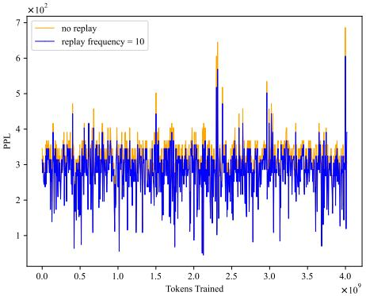  
Figure 1: Perplexity (PPL) of the GPT-2 XL model on uniformly sampled 1/100 segments of the training data. Considering forgetting does help the performance.

Results: The result is shown in Figure 1. This indicate that: (1) The model shows stable performance across early and late training data, with comparable PPL, challenging the hypothesis of higher early training perplexity. This suggests either that forgetting is not occurring, contrary to our understanding, or that forgetting exists but is not captured by PPL. (2) Model with replay during pre-training shows better performance, with a notable drop in average PPL (280.66 with replay vs. 303.63 without), indirectly confirming the existence of forgetting through performance gains from repeated learning.

## 3.2 The Failure of Traditional Metrics

In previous experiments, we realized that detecting forgetting was challenging in a single pre-training dataset due to the uniformity ofthe data. To tackle this, we build an A+B dual-dataset scenario, aiming for datasets A and B to be similar yet slightly different to magnify forgetting effects. With dataset A being much smaller than B, we aim to avoid overfitting on it. This emulates the scenario in an actual single pre-training dataset where A represents a little portion of the early data at risk of being forgotten as training advances with an ever-growing pool of data. Beyond practical convenience, this is also a common setting for continuing pre-training. Setup: We uniformly sample a subset from dataset A as a test set and then train on dataset B, evaluating the model to observe forgetting of dataset A. We conduct two experiments, employing the Open-WebText (Gokaslan\* et al., 2019) dataset ( 8B tokens) for dataset A in one experiment, and a uniformly sampled subset from the Pile (Gao et al., 2020) ( 13B) for the other. Dataset B is constituted by a uniformly sampled subset ( 49 B) tokens from SlimPajama. More details are in Appendix C.2. Our investigation into forgetting in pretraining, while pioneering, is bounded by computational limitations. The requirements in the following sections, estimated at 10,000 GPU hours on 8 NVIDIA A100 GPUs (40 GiB VRAM), present a significant challenge. This indicates that utilizing a 1.5B model to complete all subsequent experiments would require 30,000 GPU hours ( 150 days). Such computational costs are prohibitive for a research exploration. To allocate more computational resources towards exploration of phenomena across dozens of experiments and to gain a deeper understanding, we decided to conduct all subsequent experiments on GPT-2.

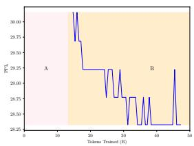

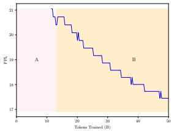  
(a) PPL on OpenWebText  
(b) PPL on the Pile

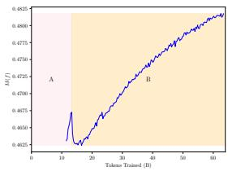  
(c) M(f) on the Pile  
Figure 2: (a), (b): PPL of the eval of dataset A in relation to the number of trained tokens. A is a subset of OpenWebText(a) or the Pile(b). The fluctuating PPL is not a good indicator of forgetting. (c): M(f) of the eval for the Pile. At the A-to-B dataset transition, M(f) shows negligible changes, where we capture the subtle signal of forgetting, and then consistently increases.

Results of PPL: The results in Figure 2 (a)(b) reveal an unexpected trend: contrary to expectations of increasing PPL for dataset A as a sign of forgetting during dataset B’s training, the PPL for dataset A actually decreased in both setups. Even during the transition between datasets, PPL showed minimal signs of forgetting.

## 3.2.1 M(f) Metric

Recognizing the shortcomings of PPL in accurately measuring forgetting, we turned to the M(f) metric introduced by Tirumala et al. (2022) for evaluation. The detailed definition of M(f) is:

Definition 1 Let V denotes the vocabulary size. The set C consists of contexts (s, y), s is an incomplete text and y is the correct token index. $f : \bar { S } \to \mathbb { R } ^ { V }$ is a language model. A context c is memorized $i f \ f ( s ) \ \ ' s$ maximum value corresponds to y, i.e., ar $\operatorname { m a x } _ { \mathbf { w } \in \mathbb { R } ^ { V } } f ( s ) \ = \ y .$ We assess the fraction of contexts memorized using $\begin{array} { r } { M ( f ) = \frac { \breve { \sum } _ { ( s , y ) \in C } 1 \{ \arg \operatorname* { m a x } ( f ( s ) ) = y \} } { | C | } } \end{array}$

Results of M(f): In this experiment, we continued to employ the A (the Pile) + B (SlimPajama) setup and evaluated the model throughout the entire training process. We also continue to use a uniformly sampled 1/1000 part of A as the test set. We observed that at the transition from dataset A to dataset B, M(f) exhibited subtle fluctuations. Subsequently, as training progressed on B, the test set’s performance, demonstrated a continuous improvement. The results are given in Figure 2.

It is plausible to hypothesize that PPL’s probabilistic averaging inherent may not accurately reflect forgetting for common tokens due to their high prediction accuracy, potentially masking information loss for less frequent elements. In contrast, the M(f) metric’s binary evaluation is more sensitive to memory errors, offering a clearer view of the model’s retention of critical information, essential for understanding catastrophic forgetting.

## 3.2.2 Limitation Leads to Underestimate

Certainly, it is important to acknowledge that both metrics have limitations in capturing forgetting. Our observations indicate that throughout the training process, after the model completed training on dataset A and transitions to dataset B, both metrics show a continuous improvement, with subtle signs of forgetting at the transition point. This suggests a plausible hypothesis: The metrics’ inability to account for the token difficulty lead to an underestimation of forgetting, as they are dominated by features that are inherently resistant to forgetting, such as common tokens and simple, everyday text. These features may not exhibit significant prediction errors when the dataset changes, thereby obscuring the true extent of the model’s forgetting.

Takeaway 1: PPL and M(f) metrics potentially mask true forgetting, as their bias towards easy-to-remember elements can underestimate the model’s memory decline across dataset shifts.

4 New Entity-related Metrics for Measuring Pre-training Forgetting

## 4.1 How to Understand Pre-training Forgetting

Building upon the findings presented, a pertinent inquiry emerges: Which segments of the dataset should be scrutinized to gain a comprehensive understanding of the forgetting phenomenon?

We argue that during pre-training, the focus should be on the forgetting associated with entityrelated information. We posit that the capabilities imparted to a model by a dataset can be broadly categorized into two components: information related to entities and task-specific competencies. (1) As demonstrated by Sorscher et al. (2022), the power law scaling of error shows that many training examples are redundant, and in data-rich scenarios, pruning should focus on retaining challenging examples. Entity-related information, which is less frequent (Penedo et al., 2023), is crucial for users perception of forgetting in LLMs, as it’s harder to determine if the loss of abstract capabilities is due to model limitations or forgetting, making entity information key in pre-training. (2) We also considered the approach of Supervised Fine-Tuning (SFT), which involves training on instructional data. This phase of training enhances the model’s capabilities for downstream tasks, and we view it as a stage where the emphasis is on augmenting the model’s competencies. Nevertheless, for the pretraining phase, our focus is more directed towards the acquisition of entity information. (3) Comparing with the forgetting of entities, the forgetting of other content, such as capabilities related to downstream tasks, is more challenging to define and remains ambiguous. Entities serve as an optimal vehicle for exploring the phenomenon of forgetting within our cognitive framework.

## 4.2 Our Proposed Entity-related Metrics

To evaluate forgetting of entities, we follow the memorization score (Biderman et al., 2023a) and introduce new metrics. These new metrics resemble entity-focused question answering. For further elaboration on the design and illustrative examples of our metrics, please refer to Appendix C.3.

(1) $\mathbf { M _ { i n } } \mathbf { : }$ Intuitively, this evaluates the model’s capacity to output entity-related details given its context. We select all samples $S$ containing a set of entities C. For each sample $\mathbf { s _ { i } } \in S$ , we locate the entities and use the 32 preceding tokens as input, ensuring the entity $\mathbf { c _ { j } } \in \mathit { C }$ is at the end. Given $\mathbf { s _ { i } }$ , we then greedily decode 32 tokens $\hat { \bf o } =$ $\left( o _ { 1 } , o _ { 2 } , . . . , o _ { 3 2 } \right)$ . The original next 32 tokens of $s _ { i }$ $( t _ { 1 } , t _ { 2 } , . . . , t _ { 3 2 } )$ is our target output. The accuracy is defined as $M _ { \mathrm { { i n } } } = \frac { \sum _ { { \bf { s _ { j } } } \in { \cal { S } } } \sum _ { i = 1 } ^ { 3 2 } \mathbb { 1 } \left\{ o _ { i } = t _ { i } \right\} } { 3 2 | { \cal { S } } | }$

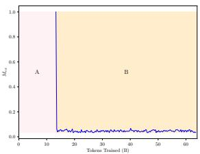  
(a) $M _ { \mathrm { e x } }$

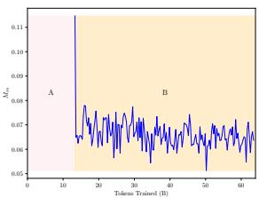

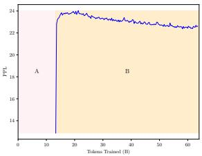  
(c) $\mathrm { P P L } _ { \mathrm { e n t } }$

(b) $M _ { \mathrm { i n } }$  
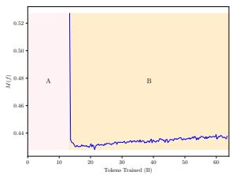  
(d) $\mathbf { M } ( \mathbf { f } ) _ { \mathrm { e n t } }$  
Figure 3: Training dynamics (A (Pile) B (SlimPajama)): entity-focused evaluation set from A reveals marked metric degradation during the A-to-B transition. Besides, traditional metrics on entity-focused samples such as PPL $\scriptstyle { \mathtt { \Gamma } } \mathtt { e n t }$ and $\mathbf { M } ( \mathbf { f } ) _ { \mathrm { e n t } }$ exhibit partial recovery during training B. This implies that even for entity-related samples, conventional metrics still focus on information that is less related to entities, which can continue to improve with further learning.

(2) $\mathbf { M } _ { \mathbf { e x } }$ : Intuitively, this tests if the model can recall an entity from the context where the entity is implied but not directly mentioned. Similar to $M _ { \mathrm { { i n } } }$ , for a sample $\mathbf { s _ { i } }$ containing entity $\mathbf { c _ { j } }$ we use the preceding 32 tokens as input (excluding $\mathbf { c _ { j } } )$ . After greedy decoding of 32 tokens ${ \hat { \mathbf { o } } } ,$ we calculate $\begin{array} { r } { M _ { \mathrm { e x } } = \frac { \sum _ { { \bf s _ { i } } \in { \cal S } } \mathrm { i s } _ { - } \mathrm { s u b s t r i n g } ( { \bf c _ { j } } , \hat { \bf o } ) } { | { \cal S } | } } \end{array}$ , where is\_ $s \mathbf { u } \mathbf { b } \mathrm { s t r i n g } ( \mathbf { a } _ { 1 } , \mathbf { a } _ { 2 } )$ returns 1 if $\mathbf { a } _ { 1 }$ is a substring of $\mathbf { a } _ { 2 }$ and 0 otherwise.

Besides, we also adopt two entity-centric metrics $\mathbf { P P L _ { e n t } }$ and $\mathbf { M ( f ) _ { e n t } }$ , which measure existing metrics PPL and M(f) on entity-involved samples. Setup: We continue to leverage the A+B dataset configuration to accentuate the phenomenon of forgetting, employing the A (the Pile) + B (SlimPajama) dataset setup and training the model on both datasets. Given that A and B are commonly used general-purpose datasets with similar sources, they exhibit no significant differences in text style. Testing is conducted during the training of dataset B.

We proceed by analyzing frequencies, identifying a set of entities more frequently found in A but less found in B. Using this set, we curated an test set from A and monitored its metrics during $\mathbf { B } ^ { \prime } \mathbf { s }$ training to measure the forgetting effect due to less exposure in B. See Appendix C.3 for more details. Results: In Figure 3, we have demonstrated the following: (1) When evaluating forgetting on entityrelated data, a significantly more pronounced decline is noted, with a notably slow recovery of metrics even during continued training. (2) In evaluations focusing on a subset of data that is rich in samples from source A compared to B, traditional metrics like PPL and M(f) show a recovery. This apparent recovery may be due to less forgettable elements in the data. (3) Comparatively, the newly proposed metrics $M _ { \mathrm { e x } }$ and $M _ { \mathrm { { i n } } }$ exhibit a more difficult recovery, which aligns closely with our expected manifestation of forgetting. This makes them more suitable for indicating forgetting.

Takeaway 2: Our newly proposed entityrelated metrics, $M _ { \mathrm { e x } }$ and $M _ { \mathrm { i n } } .$ exhibit a more noticeable decline and difficult rebound, offering a clearer reflection of the forgetting phenomenon.

## 5 Explorations on Memory Replay

With the introduction of our new entity-related metrics, we proceed to an intuitive exploration, specifically investigating whether simple and lightweight design approaches can alleviate this phenomenon. Inspired by de Masson D’Autume et al. (2019), we introduce novel methods for episodic memory replay. We incorporate a module that retains a record of examples. During the learning period, we periodically draw a uniform sample from the memory’s stored examples to conduct gradient updates.

Although other types of methods to reduce task-level forgetting during fine-tuning exist, like BERT-based memory (de Masson D’Autume et al., 2019) and function-preserved expansion (Qin et al., 2022), they are computationally intensive and unsuitable for pre-training with vast data. Considering the practical feasibility, we confine our exploration to the realm of memory replay methods.

## 5.1 Key Factors in Memory Replay

We have considered several potential design dimensions within the replay process:

• Replay Frequency. Following de Masson D’Autume et al. (2019), we match the size of our retrieved memory batches to our training batches. We execute a retrieval and gradient update every 100 steps, achieving an efficient 1% replay rate.

• What to Store into Memory. We consider strategies for memory sample storage: (1) including all samples encountered during pre-training, (2) prioritizing samples with entities, and (3) choosing high-loss samples that may be more susceptible to forgetting. Advanced selection methods are reserved for future research.

• Retrieve Strategy. We’ve introduced two basic but impactful retrieval methods: random sampling and similarity-based sampling. Unlike de Masson D’Autume et al. (2019), who used a pre-trained BERT (Devlin et al., 2018) model for the similaritybased sampling, we opted for BM25 (Robertson et al., 2009) for its efficiency (Yao et al., 2022).

• Exit Mechanism. Given the fixed intervals of memory replay, the number of replayable samples is inherently limited. Simple replay methods may lead to an imbalance in the samples being replayed, such as coincidentally focusing on a few samples every replay batch. Thus, limiting the maximum replay threshold of a sample may help.

## 5.2 Experimental Settings

In the previous section, we used two datasets, A and B, to study the forgetting effect. Now, to mimic a realistic pre-training setup, we’ve mixed and shuffled A with B into one complete set. We trained GPT2 from scratch using this combined set. To measure forgetting across the dataset, we took 1/5 of A+B, selected samples with entities, and made an test set( 200,000 samples). We then use the aforementioned 4 metrics to assess the results.

Although the ability to relearn past samples is beneficial, a drawback of the replay method is its increased training cost. Considering realistic feasibility and the need for simplicity, we select the following straightforward strategies, while leaving more sophisticated replay methods for future work:

• Vanilla pre-training The standard pre-training.

• Upper Bound We train from the above pre-training checkpoint on the test set, evaluating immediately to determine the model’s peak memory retention.

• BM25. We leverage Elasticsearch (Elasticsearch, 2018) to maintain a memory of all encountered samples. At designated replay intervals, we use the current batch as queries to search for previously seen similar data for replay.

• BM25 + Samples with entities only. During learning, we only keep samples with the presence of entities in our memory.

• Focused Stochasticity: Constrained Entity Sampling with Exit Limit. We shift from similaritybased retrieval to random sampling. We use the previously mentioned exit mechanism and exclude samples from the memory after they have been replayed 5 times.

• Intensive Focused Stochasticity: This variant of Focused Stochasticity intensifies the replay process, subjecting replayed samples to multiple epochs of learning. The idea behind this method and further details are elaborated in Section 6.2.2.

Let $T _ { 0 }$ denote the computational cost of vanilla pretraining, $T$ represent the interval between replays, and f be the number of epochs conducted on the replay batch. The computational cost for the Intensive Focused Stochasticity method is $T _ { \mathrm { r e p l a y } } =$ $( 1 + f / T ) T _ { 0 }$ . We use $f = 5$ and $T = 1 0 0$ in this experiment. Thus $T _ { \mathrm { r e p l a y } } = 1 . 0 5 T _ { 0 } .$ which is affordable for practical use. More discussions are presented in Appendix C.

<table><tr><td>Method</td><td> $\mathrm { P P L } _ { \mathrm { e n t } }$ </td><td> $\mathbf { M } ( \mathrm { f } ) _ { \mathrm { e n t } }$ </td><td>Mex (×10−3)</td><td> $\overline { { M _ { \mathrm { i n } } \left( \times 1 0 ^ { - 2 } \right) } }$ </td></tr><tr><td>Vanilla pre-training</td><td>26.03</td><td>0.4093</td><td>5.273</td><td>3.988</td></tr><tr><td>Upper Bound</td><td>23.74</td><td>0.4182</td><td>14.46</td><td>4.162</td></tr><tr><td>BM25</td><td>27.95</td><td>0.4015</td><td>4.586</td><td>3.895</td></tr><tr><td>BM25 + Samples with entities only</td><td>28.09</td><td>0.4013</td><td>4.575</td><td>3.941</td></tr><tr><td>Focused Stochasticity</td><td>25.79</td><td>0.4101</td><td>5.496</td><td>3.980</td></tr><tr><td>Intensive Focused Stochasticity</td><td>25.40</td><td>0.4121</td><td>5.450</td><td>4.003</td></tr></table>

Table 1: Evaluation results for replay strategies.

## 5.3 Effectiveness of Memory Replay

We display the evaluation in Table 1. The results indicates that similarity-based replay methods do not outperform the baseline, no matter if all samples or only those related to entities are kept in memory. This might be due to the strategies don’t spread replay evenly; replaying all samples might focus too much on non-entity ones, while focusing only on entity-related samples could lead to too much attention on a specific subset, exaggerating the forgetting of other samples.

On the other hand, a simple sampling method improves upon the baseline, hinting that replay helps reduce forgetting during pre-training. Nevertheless, there’s still a gap between the replay methods and the upperbound.

To further demonstrate the effectiveness of memory replay, we conducted an in-depth analysis of the impact of sample-level forgetting on the model’s performance across common benchmark datasets. We utilized the following common benchmark datasets for our analysis: Hellaswag (Zellers et al., 2019), MMLU (Hendrycks et al., 2020) and Winograd (Levesque et al., 2012). We compared the zero-shot accuracy between the vanilla pre-training and our Intensive Focused Stochasticity.

<table><tr><td>Method</td><td>| Hellaswag</td><td>MMLU</td><td>Winograd</td><td>Avg.</td></tr><tr><td>Vanilla pre-training</td><td>27.46</td><td>23.20</td><td>53.47</td><td>34.71</td></tr><tr><td>Intensive Focused Stochasticity</td><td>27.75</td><td>23.00</td><td>55.68</td><td>35.48</td></tr></table>

Table 2: Results across common benchmark datasets.

The performance shows that Intensive Focused Stochasticity method is generally superior to the non-replay method. The MMLU dataset is relatively more difficult, and the results may be subject to disturbances. The results indicates that intensified memory replay methods offer improvements compared to the standard pre-training approach. Considering forgetting do help performance on downstream tasks.

Takeaway 3: Our memory replay methods show potential in alleviating forgetting in the pre-training phase, while a gap persists relative to the upper bound, signifying the necessity for further research.

## 6 Explorations on Forgetting Curves

In the preceding section, we demonstrated the efficacy of memory replay methods. Recognizing that traditional memory replay methods (de Masson D’Autume et al., 2019; Wang et al., 2020) involve samples being learned uniformly and at equal intervals with low intensity. We now seek to explore the impact of replay learning on subsequent learning processes, as well as investigate factors such as the intensity of replay and the effects of periodic replay on learning curves. This exploration is motivated by the renowned forgetting curve from human psychology (Loftus, 1985), which underscores the link between the intensity of learning and the pace of forgetting.

We first focus on factors that we expect to manifest their influence on the model’s forgetting curve. After an in-depth observation, we aim to apply the phenomena observed on the forgetting curve to guide the design of memory replay methods during pre-training. This approach is intended to refine and understand our strategies for combating forgetting, ensuring that they are informed by empirical insights into the model’s learning dynamics.

## 6.1 Setup

We focus on two critical factors: (1) Learning intensity’s impact: We explore the hypothesis that increased initial learning intensity may result in more robust memory retention, potentially flattening the forgetting curve. (2) Memorability and memory durability: We determine if challenging samples, post-intensive learning, remain at risk of forgetting during pre-training.

To tackle these inquiries, we first select samples related to entities of interest. After the model undergoes an initial epoch of pre-training, we subject these samples to intensive training across several epochs. The purpose of the initial pre-training epoch is to ensure the model reaches a basic level of language proficiency. This step is crucial to prevent general language ability improvements from confounding the experiment, allowing for a clear focus on the forgetting phenomenon rather than overall enhancement.

Post the intensive learning phase, these entityrelated samples serve as our test set. As we proceed with pre-training, we continuously assess this set using our established metrics to monitor the forgetting curve. This ongoing evaluation allows us to track how the memory of these samples evolves and to understand the interplay between initial learning intensity and long-term retention within the context of pre-training. For further details on the experimental design, please refer to the Appendix C.4.

## 6.2 Results on LLMs’ Forgetting Curves

## 6.2.1 Forgetting Curves

As shown in Figure 4, experiments indicate that (1) a significant decline is still observed even when the dataset used for subsequent training is identical and uniformly distributed to the source of the data in the initial epoch of pre-training. This reinforces our conclusions presented in Section 4.2, reflecting that even under an identical data distribution, forgetting is still remarkably pronounced. (2) higher initial learning intensity results in better performance across various metrics, yet as further pre-training occurs, the results from experiments with lower initial learning intensity tend to catch up. This pattern mirrors human learning curves (Loftus, 1985), and we offer a detailed comparison in Appendix G. (3) Over the learning period, a divergence is observed; experiments with a very high initial learning intensity maintain a gap compared to those with a lower initial intensity. This gap is more pronounced for less difficult data. This suggests that data that are more difficult to memorize benefit from more intensive learning to achieve enhanced memory retention.

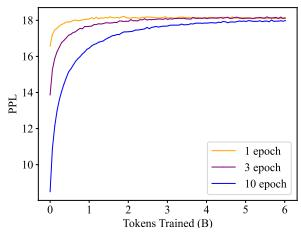  
(a) PPL, low difficulty.

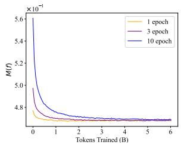  
(b) M(f), low difficulty.

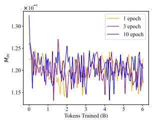  
(c) $M _ { \mathrm { i n } } .$ low difficulty.

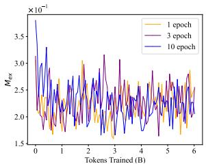  
(d) $M _ { \mathrm { e x } }$ , low difficulty.

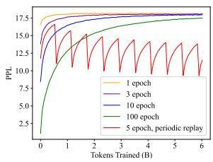  
(e) PPL, high difficulty.

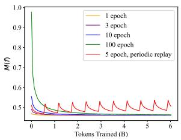  
(f) M(f), high difficulty.

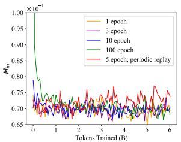  
(g) $M _ { \mathrm { i n } } .$ , high difficulty.

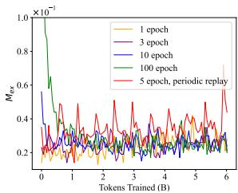  
(h) $M _ { \mathrm { e x } }$ , high difficulty.  
Figure 4: Forgetting curves on samples categorized by difficulty level. After sufficiently training, experiments with varying degrees of replay intensity tend to converge, while there remains a gap between methods with higher and lower replay intensities. Our key experiment, periodic replay method (red) demonstrates the ability to achieve continuous performance improvement across the entire learning curve with a smaller computational cost. Remarkably, even at the end of the curve, the upper and lower bounds of the periodic replay method remain consistently better.

## 6.2.2 Periodic Intensive Replay

Building on findings above, we recall the intuition that human can reduce forgetting through periodic, intense learning. We aim to (1) assess its impact on a model’s forgetting curve, and (2) determine if this can enhance previous memory replay methods. To delve deeper into these effects, we focused our experiments on the more challenging samples. After the initial phase of high-intensity learning, we introduced a replay process in the ongoing pre-training. This process involves revisiting the samples every 1000 steps, with each replay session consisting of 5 epochs of learning.

In this experiment, the replay intervals were relatively large, which was acceptable in terms of efficiency. Moreover, the periodic replay method outperformed the baseline. Although there was a temporary decline after each replay, the overall performance improves over time. We discovered that periodic, high-intensity replay on the forgetting curve leads to an enhancement of both the upper and lower bounds. Moreover, this approach proved more effective and cost-efficient than directly replay with 100 epochs.

## 6.2.3 Intensive Replay for Pre-training

Thus, we believe that such human-like strategies could guide the design of replay mechanisms. To test this hypothesis, we conducted an experiment and enhanced the Focused Stochasticity method in Section 5.2. Specifically, we intensified the learning process for each replay batch, with each batch undergoing 5 epochs of learning. The approach, referred to as Intensive Focused Stochasticity, has been included in Table 1 for ease of comparison with other methods. Additionally, its performance on general downstream tasks is presented in Table 2. The results indicate that Intensive Focused Stochasticity outperforms vanilla pre-training across all metrics, suggesting its efficacy in mitigating forgetting during pre-training.

Takeaway 4: The forgetting patterns of LLMs suggest that periodic, intensive replay could be key to mitigating memory loss. Experiments of intensified memory replay conducted during the pre-training phase also confirmed this point.

## 7 Conclusion and Future Work

We aspire to capture the industry’s attention and stimulate optimization efforts regarding the oftenoverlooked potential danger within model development. Our research sheds new light on catastrophic forgetting in LLMs during pre-training. We scrutinized traditional metrics, introduced novel ones for a clearer analysis of forgetting, and proposed memory-replay techniques to bolster knowledge retention. Additionally, we explored the forgetting curve post-intense, short-term learning, uncovering similarities with human memory decay, offering insights into information retention dynamics.

## Limitations

Our research on catastrophic forgetting in LLMs during pre-training is innovative but computationally demanding, requiring significant resources like 10,000 GPU hours. Our core contribution is highlighting the often-overlooked issue of pre-training forgetting, aiming to draw industry attention and optimize solutions.

Drawing from scaling laws (Kaplan et al., 2020), we acknowledge that insights from smaller models can inform larger-scale experiments, though our results have limitations in scalability. Our memory replay approach shows promise in mitigating catastrophic forgetting but needs further improvement and nuanced analysis to understand the interplay of variables.

Focused memory replay may improve specific areas but could compromise generalizability, especially for tasks like numerical data processing. We also recognize that pre-training forgetting differs from that in SFT, requiring distinct metrics and methods. Future work will explore the impact on downstream tasks.

Despite limitations, our study exemplifies rigorous scientific inquiry, advancing understanding of memory retention and forgetting in LLMs and contributing to collective knowledge.

## Acknowledgments

Ruobing Xie is supported by the Young Elite Scientists Sponsorship Program by CAST (2023QNRC001).

## References

James Urquhart Allingham, Florian Wenzel, Zelda E Mariet, Basil Mustafa, Joan Puigcerver, Neil Houlsby, Ghassen Jerfel, Vincent Fortuin, Balaji Lakshminarayanan, Jasper Snoek, et al. 2021. Sparse moes meet efficient ensembles. arXiv preprint arXiv:2110.03360.

Stella Biderman, USVSN Sai Prashanth, Lintang Sutawika, Hailey Schoelkopf, Quentin Anthony,

Shivanshu Purohit, and Edward Raf. 2023a. Emergent and predictable memorization in large language models. arXiv preprint arXiv:2304.11158.

Stella Biderman, Hailey Schoelkopf, Quentin Gregory Anthony, Herbie Bradley, Kyle O’Brien, Eric Hallahan, Mohammad Aflah Khan, Shivanshu Purohit, USVSN Sai Prashanth, Edward Raff, et al. 2023b. Pythia: A suite for analyzing large language models across training and scaling. In International Conference on Machine Learning. PMLR.

Lucas Bourtoule, Varun Chandrasekaran, Christopher A Choquette-Choo, Hengrui Jia, Adelin Travers, Baiwu Zhang, David Lie, and Nicolas Papernot. 2021. Machine unlearning. In 2021 IEEE Symposium on Security and Privacy (SP). IEEE.

Hoyeon Chang, Jinho Park, Seonghyeon Ye, Sohee Yang, Youngkyung Seo, Du-Seong Chang, and Minjoon Seo. 2024. How do large language models acquire factual knowledge during pretraining? arXiv preprint arXiv:2406.11813.

Min Chen, Zhikun Zhang, Tianhao Wang, Michael Backes, Mathias Humbert, and Yang Zhang. 2022. Graph unlearning. In Proceedings ofthe 2022 ACM SIGSAC conference on computer and communications security.

C Samuel Craig, Brian Sternthal, and Karen Olshan. 1972. The effect of overlearning on retention. Journal ofGeneral Psychology.

Cyprien de Masson D’Autume, Sebastian Ruder, Lingpeng Kong, and Dani Yogatama. 2019. Episodic memory in lifelong language learning. NeurIPS.

Jacob Devlin, Ming-Wei Chang, Kenton Lee, and Kristina Toutanova. 2018. Bert: Pre-training of deep bidirectional transformers for language understanding. arXiv preprint arXiv:1810.04805.

BV Elasticsearch. 2018. Elasticsearch. software], version.

Wikimedia Foundation. Wikimedia downloads.

Leo Gao, Stella Biderman, Sid Black, Laurence Golding, Travis Hoppe, Charles Foster, Jason Phang, Horace He, Anish Thite, Noa Nabeshima, et al. 2020. The Pile: An 800GB dataset of diverse text for language modeling. arXiv preprint arXiv:2101.00027.

Aaron Gokaslan\*, Vanya Cohen\*, Ellie Pavlick, and Stefanie Tellex. 2019. Openwebtext corpus.

Dirk Groeneveld, Iz Beltagy, Pete Walsh, Akshita Bhagia, Rodney Kinney, Oyvind Tafjord, Ananya Harsh Jha, Hamish Ivison, Ian Magnusson, Yizhong Wang, et al. 2024. Olmo: Accelerating the science of language models. arXiv preprint arXiv:2402.00838.

Suriya Gunasekar, Yi Zhang, Jyoti Aneja, Caio César Teodoro Mendes, Allie Del Giorno, Sivakanth Gopi, Mojan Javaheripi, Piero Kauffmann, Gustavo de Rosa, Olli Saarikivi, et al. 2023. Textbooks are all you need. arXiv preprint arXiv:2306.11644.

Daya Guo, Dejian Yang, Haowei Zhang, Junxiao Song, Ruoyu Zhang, Runxin Xu, Qihao Zhu, Shirong Ma, Peiyi Wang, Xiao Bi, et al. 2025. Deepseek-r1: Incentivizing reasoning capability in llms via reinforcement learning. arXiv preprint arXiv:2501.12948.

Kshitij Gupta, Benjamin Thérien, Adam Ibrahim, Mats L Richter, Quentin Anthony, Eugene Belilovsky, Irina Rish, and Timothée Lesort. 2023. Continual pretraining of large language models: How to (re) warm your model? arXiv preprint arXiv:2308.04014.

Dan Hendrycks, Collin Burns, Steven Basart, Andy Zou, Mantas Mazeika, Dawn Song, and Jacob Steinhardt. 2020. Measuring massive multitask language understanding. arXiv preprint arXiv:2009.03300.

Aaron Jaech, Adam Kalai, Adam Lerer, Adam Richardson, Ahmed El-Kishky, Aiden Low, Alec Helyar, Aleksander Madry, Alex Beutel, Alex Carney, et al. 2024. Openai o1 system card. arXiv preprint arXiv:2412.16720.

Xisen Jin, Dejiao Zhang, Henghui Zhu, Wei Xiao, Shang-Wen Li, Xiaokai Wei, Andrew Arnold, and Xiang Ren. 2021. Lifelong pretraining: Continually adapting language models to emerging corpora. arXiv preprint arXiv:2110.08534.

Jared Kaplan, Sam McCandlish, Tom Henighan, Tom B Brown, Benjamin Chess, Rewon Child, Scott Gray, Alec Radford, Jeffrey Wu, and Dario Amodei. 2020. Scaling laws for neural language models. arXiv preprint arXiv:2001.08361.

Hector Levesque, Ernest Davis, and Leora Morgenstern. 2012. The winograd schema challenge. In Thirteenth international conference on the principles of knowledge representation and reasoning.

Geoffrey R Loftus. 1985. Evaluating forgetting curves. Journal of Experimental Psychology: Learning, Memory, and Cognition.

Yun Luo, Zhen Yang, Fandong Meng, Yafu Li, Jie Zhou, and Yue Zhang. 2023. An empirical study of catastrophic forgetting in large language models during continual fine-tuning. arXiv preprint arXiv:2308.08747.

Michael McCloskey and Neal J Cohen. 1989. Catastrophic interference in connectionist networks: The sequential learning problem. In Psychology oflearning and motivation. Elsevier.

Guilherme Penedo, Quentin Malartic, Daniel Hesslow, Ruxandra Cojocaru, Alessandro Cappelli, Hamza Alobeidli, Baptiste Pannier, Ebtesam Almazrouei, and Julien Launay. 2023. The refinedweb dataset for falcon llm: outperforming curated corpora with web data, and web data only. arXiv preprint arXiv:2306.01116.

Yujia Qin, Jiajie Zhang, Yankai Lin, Zhiyuan Liu, Peng Li, Maosong Sun, and Jie Zhou. 2022. Elle: Efficient lifelong pre-training for emerging data. arXiv preprint arXiv:2203.06311.

Alec Radford, Jeffrey Wu, Rewon Child, David Luan, Dario Amodei, Ilya Sutskever, et al. 2019. Language models are unsupervised multitask learners. OpenAI blog.

Samyam Rajbhandari, Jeff Rasley, Olatunji Ruwase, and Yuxiong He. 2020. Zero: Memory optimizations toward training trillion parameter models. In SC20: International Conferencefor High Performance Computing, Networking, Storage and Analysis. IEEE.

Roger Ratcliff. 1990. Connectionist models of recognition memory: constraints imposed by learning and forgetting functions. Psychological review.

Stephen Robertson, Hugo Zaragoza, et al. 2009. The probabilistic relevance framework: Bm25 and beyond. Foundations and Trends® in Information Retrieval.

Daria Soboleva, Faisal Al-Khateeb, Robert Myers, Jacob R Steeves, Joel Hestness, and Nolan Dey. 2023. SlimPajama: A 627B token cleaned and deduplicated version of RedPajama.

Ben Sorscher, Robert Geirhos, Shashank Shekhar, Surya Ganguli, and Ari Morcos. 2022. Beyond neural scaling laws: beating power law scaling via data pruning. NeurIPS.

Yu Sun, Shuohuan Wang, Yukun Li, Shikun Feng, Hao Tian, Hua Wu, and Haifeng Wang. 2020. Ernie 2.0: A continual pre-training framework for language understanding. In AAAI.

Kimi Team, Angang Du, Bofei Gao, Bowei Xing, Changjiu Jiang, Cheng Chen, Cheng Li, Chenjun Xiao, Chenzhuang Du, Chonghua Liao, et al. 2025. Kimi k1. 5: Scaling reinforcement learning with llms. arXiv preprint arXiv:2501.12599.

Kushal Tirumala, Aram Markosyan, Luke Zettlemoyer, and Armen Aghajanyan. 2022. Memorization without overfitting: Analyzing the training dynamics of large language models. NeurIPS.

Mariya Toneva, Alessandro Sordoni, Remi Tachet des Combes, Adam Trischler, Yoshua Bengio, and Geoffrey J Gordon. 2018. An empirical study of example forgetting during deep neural network learning. arXiv preprint arXiv:1812.05159.

Hugo Touvron, Louis Martin, Kevin Stone, Peter Albert, Amjad Almahairi, Yasmine Babaei, Nikolay Bashlykov, Soumya Batra, Prajjwal Bhargava, Shruti Bhosale, et al. 2023. Llama 2: Open foundation and fine-tuned chat models. arXiv preprint arXiv:2307.09288.

Cunxiang Wang, Xiaoze Liu, Yuanhao Yue, Xiangru Tang, Tianhang Zhang, Cheng Jiayang, Yunzhi Yao, Wenyang Gao, Xuming Hu, Zehan Qi, et al. 2023a. Survey on factuality in large language models: Knowledge, retrieval and domain-specificity. arXiv preprint arXiv:2310.07521.

Xiao Wang, Tianze Chen, Qiming Ge, Han Xia, Rong Bao, Rui Zheng, Qi Zhang, Tao Gui, and Xuanjing Huang. 2023b. Orthogonal subspace learning for language model continual learning. arXiv preprint arXiv:2310.14152.

Yizhong Wang, Yeganeh Kordi, Swaroop Mishra, Alisa Liu, Noah A Smith, Daniel Khashabi, and Hannaneh Hajishirzi. 2022. Self-instruct: Aligning language models with self-generated instructions. arXiv preprint arXiv:2212.10560.

Zirui Wang, Sanket Vaibhav Mehta, Barnabás Póczos, and Jaime Carbonell. 2020. Efficient meta lifelonglearning with limited memory. arXiv preprint arXiv:2010.02500.

Chengyue Wu, Yukang Gan, Yixiao Ge, Zeyu Lu, Jiahao Wang, Ye Feng, Ping Luo, and Ying Shan. 2024. Llama pro: Progressive llama with block expansion. arXiv preprint arXiv:2401.02415.

Jinyang Wu, Chonghua Liao, Mingkuan Feng, Shuai Zhang, Zhengqi Wen, Pengpeng Shao, Huazhe Xu, and Jianhua Tao. 2025. Thought-augmented policy optimization: Bridging external guidance and internal capabilities. arXiv preprint arXiv:2505.15692.

Yinjun Wu, Edgar Dobriban, and Susan Davidson. 2020. Deltagrad: Rapid retraining of machine learning models. In International Conference on Machine Learning. PMLR.

Can Xu, Qingfeng Sun, Kai Zheng, Xiubo Geng, Pu Zhao, Jiazhan Feng, Chongyang Tao, and Daxin Jiang. 2023. Wizardlm: Empowering large language models to follow complex instructions. arXiv preprint arXiv:2304.12244.

Xingcheng Yao, Yanan Zheng, Xiaocong Yang, and Zhilin Yang. 2022. Nlp from scratch without largescale pretraining: A simple and efficient framework. PMLR.

Rowan Zellers, Ari Holtzman, Yonatan Bisk, Ali Farhadi, and Yejin Choi. 2019. Hellaswag: Can a machine really finish your sentence? arXiv preprint arXiv:1905.07830.

## A TL;DR: Main Contributions

In this work, our focus is on exploring an issue that developers and researchers in the industry have frequently noticed: large models, despite their widespread use, are susceptible to errors in factual domains, particularly regarding entity-related information (Wang et al., 2023a). While the erosion of knowledge retention during pre-training is acknowledged, no previous work has addressed the issue of forgetting in pre-training, nor provided a clear definition, analysis, or methods to address it. Our core contributions in this work are:

• We are the first to identify the problem of forgetting during pre-training.

• Within an affordable computational range, we conducted dozens of experiments to carefully explore the existence of the pre-training forgetting issue, the metrics for measurement, the forgetting curve, and the design of replay methods guided by the forgetting curve to provide feasible methods for mitigating pre-training forgetting.

Although the issue of forgetting is important and has been extensively studied during the SFT phase, no one is willing to tackle such a challenging problem in pre-training. The pretrain data is extremely vast and complex, inherently containing thousands of tasks. It cannot be characterized by task-level metrics, and such metrics also cannot reflect the general factual forgetting. Moreover, representing the forgetting of task-specific capabilities is too vague and elusive. In pre-training, most efforts have focused on synthetic data (Gunasekar et al., 2023) and model structures (Allingham et al., 2021), with too little research on the phenomenon itself.

We hope that the explorations and conclusions presented in this paper can facilitate the design of pre-training in the industry. We also aim to conduct experiments on larger models and more diverse datasets to provide more detailed conclusions.

## B Further Discussions on Pre-training Forgetting

In this section, we discuss the intuition and methodology behind the paper, as well as potential issues.

## 1. Why should we be concerned about model forgetting at the sample level during pretraining?

Developers and researchers have frequently observed that large models, despite their extensive deployment, are prone to errors in factual domains, especially concerning entity-related information (Wang et al., 2023a). These discrepancies can substantially affect user perception and trust. However, there is a scarcity of research on the influence of learning during the pre-training phase on this type of information, and even less on how models remember and forget information during pre-training. The phenomenon of sample-level forgetting in pre-training is also difficult to define clearly, analyze, and further explore.

## 2. How should we understand entity-related metrics, and why is it important to focus on forgetting at the entity level?

(1) Forgetting across the entire pre-training dataset is extremely difficult to define and study, hence we concentrate on a specific subset. Errors related to entity information are easily noticeable in model applications and significantly impact user experience. (2) Beyond the model’s memory of entity information, we also consider its capabilities during pre-training, especially since the Supervised Fine-Tuning (SFT) phase places more emphasis on instructional data. This phase enhances the model’s competencies for downstream tasks, and we see it as a stage for augmenting the model’s capabilities. Therefore, we believe the pre-training phase should place greater emphasis on exploring entity information. (3) In Section 3.2, we demonstrate that overall data forgetting is hard to evaluate, as there is no clear decline in model performance when switching training data (we deliberately selected parts of data from A to ensure minimal repetition in B), and almost no change in metrics is observed during the switch. Instead, during training in B, the model’s capabilities continue to improve, even surpassing the metrics achieved during training in A, which contradicts the intuition of forgetting. PPL does not intuitively reflect the model’s forgetting; in contrast, the metrics concentrated on enti ties show significant changes on entity-related data, with almost no recovery, facilitating the direct study of the forgetting phenomenon.

## 3. Why the proposed metrics better reflect forgetting? Might the decreased performance on the metric be attributed to the application of a more stringent metric?

Attempting to identify the phenomenon of forgetting during pre-training and to indicate it with a reasonably sound metric poses a considerable challenge. However, this question has never been explored in the past. We have extensively reviewed previous work and have adopted the PPL and M(f) metrics, while also proposing two novel metrics.

The A and B datasets in Section 4.2, as general pre-training datasets, show no significant differences in text style. Besides, in Section 6.2, we showed that a significant decline in metrics is still observed, even the dataset used for subsequent training is identical and uniformly distributed to the source of the data in the initial epoch of pre-training. This indicates that forgetting detected by our metrics does not stem from a shift in text styles.

Regarding the difficulty of metrics, in the experiment shown in Figure 3, we observe that even metrics that are simple by design, such as PPL and M(f), show a significant decline. This suggests that the forgetting phenomenon is unrelated to the difficulty of the metric. Besides, for M(f), which involves calculating the accuracy of the subsequent 32 tokens for each decoded token using teacher forcing, it is not simpler. However, we can see that PPL and M(f) slowly recover during subsequent training, indicating they are not sensitive enough to capture the forgetting phenomenon. While the $M _ { e x }$ and $M _ { i n } .$ , though more complex, are more sensitive. We believe that by combining a range of metrics with varying degrees of design complexity and sensitivity, we can provide as comprehensive a portrayal of the phenomenon of forgetting as possible.

## 4. Since the model may leak verbatim sequences of personal information, is samplelevel forgetting harmful?

In our study, we focus on learning and the retention of factual information related to entities, which models should not forget and that is prevalent in the pre-training data. We diverge from concerns about leaking verbatim personal information. There is extensive literature on machine unlearning (Wu et al., 2020; Bourtoule et al., 2021; Chen et al., 2022), which typically addresses scenarios involving privacy protection and changes in user information. These scenarios fall outside the scope of our work, although our research might offer insights into the design of machine unlearning

methods.

## 5. Is this study primarily addressing hallucinations, or is it actually more focused on the model’s tendency to forget entity-related information rather than producing false outputs?

Our research concentrates on the model’s inclination to forget information pertaining to entities, diverging from the generation of erroneous outputs, commonly known as hallucinations. However, it is true that our work offers a perspective on the concept of hallucinations, where the two newly designed metrics, $M _ { \mathrm { e x } }$ and $M _ { \mathrm { i n } } .$ , can be interpreted as potential false negatives and false positives in the pre-training model’s responses: the model, given relevant information, fails to identify the correct entity; or the model provides an entity and some information but is unable to supply the related context.

## 6. Should we expect an LLM to reproduce exact training text, given it’s not a lossless compression model?

In our study, we do not anticipate LLMs to reproduce the exact training text. Specifically, our $M _ { \mathrm { e x } }$ metric solely assesses whether the ground truth entity is included in the output; while capturing the formalization of information related to the entity presents challenges. For the $M _ { \mathrm { { i n } } }$ metric, we follow the design of Biderman et al. (2023a), calculating accuracy for each token. We consider that alternative design schemes might be possible, such as utilizing a BERT model (Devlin et al., 2018) to calculate the similarity between the generated tokens and the ground truth tokens. We have reserved this exploration for future research.

## 7. Analysis of computational costs for replay methods.

To discuss the computational cost of replay methods, let $T _ { 0 }$ denote the computational cost of vanilla pre-training, T represent the interval between replays, and f be the number of epochs conducted on the replay batch. $( 1 + f / T ) T _ { 0 }$ Every T training steps, the model gets a replay batch and undergoes f epochs of training on that batch. Therefore, training T batches of unique data, replay methods necessitate $T + f$ steps of training, whereas vanilla pre-training requires training with just T batches. This indicates that the computational cost for the Intensive Focused

Stochasticity method is $T _ { \mathrm { r e p l a y } } = ( 1 + f / T ) T _ { 0 }$ Setting $f = 1$ , the Intensive Focused Stochasticity will degenerate to Focused Stochasticity. For instance, if $f = 5 , T = 1 0 0$ , and $T _ { \mathrm { r e p l a y } } = 1 . 0 5 T _ { 0 } ,$ such computational cost is deemed acceptable.

## C Setup Details

In this section, we outline our experimental setup. We selected a batch size of 576, informed by our use of 8 NVIDIA A100 GPUs with 40 GiB VRAM, and aligned with GPT-2‘s (Radford et al., 2019) hyperparameter recommendations for optimal performance on our hardware configuration. A consistent sequence length of 1024 was applied across all experiments. Training is executed in half-precision format using BF16, and we capitalize on the Zero Redundancy Optimizer (ZeRO) Stage 2 (Rajbhandari et al., 2020) to enable efficient scaling across multiple machines. We draw inspiration from the works of Biderman et al. (2023b); Gupta et al. (2023); Radford et al. (2019), employing a cosine learning rate decay that reduces to a minimum of 0.1 times the Maximum Learning Rate (MaxLr), with the MaxLr itself set at $6 \times 1 0 ^ { - 4 }$

## C.1 Setup for Section 3.1

We utilized the GPT-2 XL model (1.5B) (Radford et al., 2019) and trained it on a dataset sampled from SlimPajama (Soboleva et al., 2023), consisting of 4.9e8 tokens. Prior to training, we shuffled the data to ensure that the order of training instances was consistent across different experiments. We conducted two experiments: a standard pre-training and a pre-training with a replay mechanism that retrieves a batch of data, equivalent in size to the training batch. (where we stored all trained data using Elasticsearch (Elasticsearch, 2018) and performed a replay every 10 steps). At each replay step, we use the current batch‘s training data to uniformly sample an equal amount of data from the completed training data based on similarity. This ensures a uniform replay throughout the entire data training process, with an additional 1/10 increase in computational budget. For evaluation, we constructed a test set by sequentially segmenting the training data according to the training steps and uniformly sampling 1/100 of each segment. The samples were then reassembled in their original stepwise order to ensure uniform distribution across the training steps, thus creating a test set that mirrors the model‘s training progression. We plotted perplexity (PPL) against the number of training tokens processed, with the evaluation set‘s token count scaled proportionally to reflect the model‘s exposure to the training data.

## C.2 Setup for Section 3.2

To ensure computational feasibility in our experiments, we choose GPT-2 (0.1B) in this section. We uniformly sample 1/1000 of dataset A to constitute a eval set, and perform evaluations every 1000 training steps during the training process of dataset B.

## C.3 Setup for Section 4.2

We followed Biderman et al. (2023a), selecting a sequence length of 32 for both the input and output of our $M _ { \mathrm { e x } }$ and $M _ { \mathrm { { i n } } }$ metrics. We collected entities from English Wikipedia dataset (Foundation). Some randomly sampled entities are shown in Table 5.

To spotlight entity-level forgetting, we evenly sampled 400,000 English Wikipedia entries, comparing entity frequencies in datasets A and B. We selected the intersection $C$ of entities that were top 1/2 frequent in A and bottom 1/2 in B to accentuate the distribution disparity. Samples from A with entities in $C$ constituted our evaluation set. Following the approach of Biderman et al. (2023a), we retained a subset where $M _ { \mathrm { e x } } = 1$ post A’s training to scrutinize their forgetting during B’s training.

We provide illustrative examples in Table 3 and Table 4 to provide clearer explanations of $M _ { \mathrm { { i n } } }$ and $M _ { \mathrm { e x } }$

## C.4 Setup for Section 6.2

It is evident that $M _ { \mathrm { e x } }$ assigns a binary label to each sample: a label of 1 is given if the ground truth entity appears within the generated 32 tokens, and a 0 is assigned otherwise. Utilizing the challenging metric of $M _ { \mathrm { e x } }$ , we can categorize the difficulty of data memorization as follows: We performed an evaluation on the portion of the pre-training data that includes entities, recorded each entity alongside the samples that received labels of 1 or 0, and then calculated the accuracy rate for each entity based on these labels. We then divided the entities into groups with roughly equal accuracy rates, ensuring that during the phase of intensive, short-term learning, the related samples for certain entities are the focus of concentrated study. For the data categorized into different difficulty levels, we carried out experiments with varying degrees of learning intensity—specifically, by adjusting the number of epochs dedicated to this phase of learning.

<table><tr><td>Prompt</td><td>True Continuation</td><td>Greedily Generated Sequence</td><td></td><td>Min</td></tr><tr><td>The Amazon Rainforest,</td><td>known as the Earth&#x27;s lungs</td><td>known as the Moon&#x27;s lungs</td><td></td><td>1+1+1+0+1 =0.8</td></tr><tr><td>The Amazon Rainforest</td><td>known as the Earth&#x27;s lungs</td><td>known as the Moon&#x27;s legs</td><td></td><td>1+1+1+0+1 = 0.6</td></tr><tr><td>The Colosseum in Rome, also known as the Flavian Amphitheatre</td><td>is an iconic symbol of the Roman Empire&#x27;s architectural prowess.</td><td>an iconic symbol of the</td><td>scientific prowess</td><td>+1+1+0+0+0+1 = 0.7</td></tr></table>

Table 3: Examples of $M _ { \mathrm { { i n } } }$ calculation with different prompts. These samples are provided for illustrative purposes and are not from the real training data.
<table><tr><td rowspan=1 colspan=1>Entity</td><td rowspan=1 colspan=1>Prompt</td><td rowspan=1 colspan=1>True Continuation</td><td rowspan=1 colspan=1>Greedily Generated Sequence</td><td rowspan=1 colspan=1>Mex</td></tr><tr><td rowspan=1 colspan=1>Leonardo da Vinci</td><td rowspan=1 colspan=1>The Mona Lisa, painted by</td><td rowspan=1 colspan=1>Leonardo da Vinci, is renowned for its elusive</td><td rowspan=1 colspan=1>Leonardo da Vinci, is renowned for its elusive</td><td rowspan=1 colspan=1>1</td></tr><tr><td rowspan=1 colspan=1>Leonardo da Vinci</td><td rowspan=1 colspan=1>The Mona Lisa, painted by</td><td rowspan=1 colspan=1>Leonardo da Vinci, is renowned for its elusive</td><td rowspan=1 colspan=1>a man calledLeonardo da Vinci, is renowned for</td><td rowspan=1 colspan=1>1</td></tr><tr><td rowspan=1 colspan=1>Leonardo da Vinci</td><td rowspan=1 colspan=1>The Mona Lisa, painted by</td><td rowspan=1 colspan=1>Leonardo da Vinci, is renowned for its elusive</td><td rowspan=1 colspan=1>Donald Trump, is renowned for its elusive</td><td rowspan=1 colspan=1>0</td></tr><tr><td rowspan=1 colspan=1>the United States</td><td rowspan=1 colspan=1>The Statue of Liberty, a gift from France to</td><td rowspan=1 colspan=1>the United States, stands as a symbol</td><td rowspan=1 colspan=1>the world, mysteriously appeared on an uninhabited island</td><td rowspan=1 colspan=1>0</td></tr><tr><td rowspan=1 colspan=1>the United States</td><td rowspan=1 colspan=1>The Statue of Liberty, a gift from France to</td><td rowspan=1 colspan=1>the United States, stands as a symbol</td><td rowspan=1 colspan=1>tell the enduring friendship with the United States</td><td rowspan=1 colspan=1>1</td></tr></table>

Table 4: Examples of $M _ { \mathrm { e x } }$ calculation with different prompts. These samples are provided for illustrative purposes and are not from the real training data.

## D Performance across Various Entity Types

To further enhance the effectiveness of replay methods and the new metrics, an analysis is presented on how these metrics perform with different types of entities.

The entities employed for evaluation in Table 1 have been systematically categorized into four distinct classes: MISC (miscellaneous entities), PER (person names), LOC (location) and ORG (organization). We compare Intensive Focused Stochasticity in Table 1 with the standard pre-training, the results are shown in Table 6 below.

The Intensive Focused Stochasticity method demonstrates superior performance over vanilla pre-training across a broad spectrum of entity types, indicating that the replay approach and its associated metrics are broadly applicable to various linguistic contexts.

## E Extension to More Models

To verify whether similar learning patterns also exist in larger models, we have added experiments on the pretrained LLaMA2-7B (Touvron et al., 2023) checkpoint. Since we do not have access to the training set of LLaMA, we additionally trained on a subset of The Pile to adapt it to the data distribution. Then, we also conducted periodic high-intensity replay experiments to observe the forgetting curve on large models. To be specific, we performed replay with an intensity of 5 every 300 steps. We have included the numerical results in the figure below. It can be seen that LLaMA2-7B exhibits forgetting dynamics similar to GPT-2 in our paper. Moreover, the overall numerical values are much higher than those of GPT-2, which indicates that

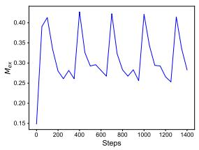  
(a) $M _ { \mathrm { e x } }$

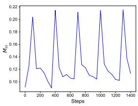  
(b) Min  
Figure 5: Replay on LLaMA2-7B. The model was first warmed up on The Pile, followed by replay on a heldout dataset every 300 steps.

LLaMA2-7B has similar learning patterns and a stronger memory capacity. This demonstrates that stronger models exhibit enhanced memory retention for entities and also follow similar forgetting patterns as discussed in the main conclusions.

## F Discussions on Future Experiments

To inspire future research on model forgetting, we discuss some potential future experiments here.

• This paper presents the forgetting patterns of a single model throughout the training process and provides experiments on the larger LLaMA2-7B model. To further explore the relationship between model size and memory capacity, one can utilize existing released data and checkpoints, such as those from OLMO (Groeneveld et al., 2024) or Pythia (Biderman et al., 2023b), to perform replay at certain points and compare the results with checkpoints that do not undergo replay.

• Moreover, we speculate that the presence of contradictory information about entities in the pretraining data may also affect the model’s memory. For instance, compared to entities that have consistent descriptions across all samples, certain entities with inconsistent descriptions in multiple data points might hinder the model’s learning. We can consider constructing such a dataset: in one part of the data, collect samples with contradictory entity

## Sampled entities

‘ Terrel Bell‘, ‘ BIST‘, ‘ The Great Hunt‘, ‘ Best in Drag Show‘, ‘ Stella Maris‘, ‘ William Knighton‘, ‘ Italian campaign‘, ‘ The Octopus Project‘, ‘ Light Cycle‘, ‘ Clark Street‘, ‘ Paulette Hamilton‘, ‘ Robert Mack‘, ‘ Nusrat‘, ‘ Soul Catcher‘, ‘ Lord of Light‘, ‘ Bieger‘, ‘ Foreach loop‘, ‘ Choruss‘, ‘ Screen space ambient occlusion‘, ‘ Florida Department of Environmental Protection‘, ‘ USA Ultimate‘, ‘ Historical Association‘, ‘ Robert Holt‘, ‘ Willie Nile‘, ‘ Fiordland National Park‘, ‘ Star Wars: The Clone Wars‘, ‘ Crouch End‘, ‘ Tracy Ham‘, ‘ Jimmy Chamberlin‘, ‘ Journal of Food Science‘, ‘ Comet Tempel‘, ‘ AirMed International‘, ‘ CanWaCH‘, ‘ Pumapunku‘, ‘ Pre-law‘, ‘ Arovane‘, ‘ Diex‘, ‘ Her Escape‘, ‘ Voltige‘, ‘ Triadelphia‘, ‘ Florian Zeller‘, ‘ The Busy World of Richard Scarry‘, ‘ Texting while driving‘, ‘ Amir Wilson‘, ‘ Julie White‘, ‘ Lenox‘, ‘ GNPDA2‘, ‘ Cammie Dunaway‘, ‘ Session Man‘, ‘ Charoen Krung Road‘, ‘ James Raine‘, ‘ Archie Andrews‘, ‘ The Picture of Dorian Gray‘, ‘ Theresa Caputo‘, ‘ Schauinslandbahn‘, ‘ Japanese relocation‘, ‘ O.C. Handa‘, ‘ Afula‘, ‘ The Secrets‘, ‘ Sonnet 61‘, ‘ Daniel Bell‘, ‘ The Dawn‘, ‘ Bob Berry‘, ‘ Bigger Life‘, ‘ Jamaica Wine House‘, ‘ Conica‘, ‘ Renuar‘, ‘ Plantation, Florida‘, ‘ Fasser‘, ‘ Al-Qadi‘, ‘ Vassy‘, ‘ Tom Dempsey‘, ‘ Department of Agriculture, Environment and Rural Affairs‘, ‘ Abdallah Djaballah‘, ‘ Silent Hill 2‘, ‘ Bill Ayres‘, ‘ Jeremy Howe‘, ‘ J15‘, ‘ Jake Ryan‘, ‘ Black Mafia‘, ‘ Nicholas Fox‘, Interstate 78‘, ‘ Mark Stein‘, ‘ Pietro Torri‘, ‘ Wet sump‘, ‘ Centre national des arts plastiques‘, ‘ Nitro Express‘, ‘ Wyvill‘, ‘ WSRA‘, ‘ Whitewater River‘, ‘ Merry Christmas Mr. Lawrence‘, ‘ Jon Jansen‘, Le Message‘, ‘ Mavrommati‘, ‘ Tourouvre‘, ‘ Bob Peterson‘, ‘ America Again‘, ‘ Livernois‘, ‘ The Shepherd Express‘, ‘ Hypercalcaemia‘

Table 5: Sampled entities from English Wikipedia.
<table><tr><td>Method</td><td>Entity Type</td><td>|PPLent</td><td>M(f)ent</td><td>Mex (×10−3) Min (×10−2)</td><td></td></tr><tr><td rowspan="4">Vanilla pre-training</td><td>MISC</td><td>27.24</td><td>0.4045</td><td>5.685</td><td>3.786</td></tr><tr><td>PER</td><td>27.47</td><td>0.4008</td><td>3.530</td><td>3.760</td></tr><tr><td>LOC</td><td>25.30</td><td>0.4126</td><td>3.336</td><td>4.282</td></tr><tr><td>ORG</td><td>25.13</td><td>0.4144</td><td>7.070</td><td>3.832</td></tr><tr><td rowspan="4">Intensive Focused Stochasticity</td><td>MISC</td><td>26.46</td><td>0.4071</td><td>6.464</td><td>3.861</td></tr><tr><td>PER</td><td>26.55</td><td>0.4044</td><td>3.544</td><td>3.774</td></tr><tr><td>LOC</td><td>24.41</td><td>0.4164</td><td>4.776</td><td>4.303</td></tr><tr><td>ORG</td><td>24.24</td><td>0.4183</td><td>6.637</td><td>3.850</td></tr></table>

Table 6: The evaluation results of replay strategies across different subsets of entities.

information, and in the other part, ensure that each entity has consistent descriptions across all data points. Using the methods mentioned in this paper, we can train the model separately with these two parts of data and compare the model’s memory capacity for different types of information.

• Recently, post-training methods for LLMs, such as Supervised Fine-Tuning (SFT) (Wang et al., 2022; Xu et al., 2023), and Reinforcement Learning (RL) (Jaech et al., 2024; Guo et al., 2025; Team et al., 2025), have made significant progress. However, few studies have focused on the learning patterns of high-level capabilities during the posttraining stage. Future experiments could consider: 1. Implementing replay during the SFT stage to observe the learning curve for a specific type of abstract downstream capability. 2. During the RL stage, incorporating a few-shot learning approach by adding some old samples into the rollout process (Wu et al., 2025) to mitigate forgetting of a particular type of question.

## G Comparison of Forgetting Curves between Humans and LLMs

The reproduced human forgetting curve, originally reported by Craig et al. (1972), is illustrated below, reflecting the typical decline in memory retention over time. In their study, 180 undergraduates participated in an experiment involving exposure to magazine advertisements under controlled conditions. They were categorized into three groups based on the extent of learning: 100%, 200%, and 300%, determined by the number of 5-second repetitions of 12 ads. Following exposure, 15 participants from each group were assigned to one of four retention tests occurring at immediate, 1-day, 7-day, or 28-day intervals. The study utilized a 3 4 factorial design, assessing the impact of learning intensity and retention intervals on the recall of brand names. It can be observed that there are similarities between the model’s forgetting curve and the human forgetting curve, with higher initial learning intensity resulting in a relatively slower rate of forgetting.

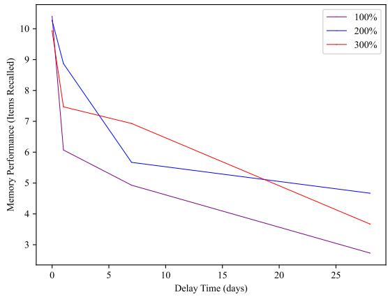  
Figure 6: Human forgetting curve from Craig et al. (1972).