# FACT-AUDIT: An Adaptive Multi-Agent Framework for Dynamic Fact-Checking Evaluation of Large Language Models

Hongzhan Lin<sup>1,2</sup>, Yang Deng<sup>3</sup>, Yuxuan Gu<sup>4,2</sup>, Wenxuan Zhang<sup>5</sup>, Jing Ma<sup>1,</sup>\*, See-Kiong Ng<sup>2</sup>, Tat-Seng Chua<sup>2</sup>

<sup>1</sup>Hong Kong Baptist University, <sup>2</sup>National University of Singapore,   
<sup>3</sup>Singapore Management University, <sup>4</sup>Harbin Institute of Technology, <sup>5</sup>Singapore University of Technology and Design {cshzlin,majing}@comp.hkbu.edu.hk, ydeng@smu.edu.sg

## Abstract

Large Language Models (LLMs) have significantly advanced the fact-checking studies. However, existing automated fact-checking evaluation methods rely on static datasets and classification metrics, which fail to automatically evaluate the justification production and uncover the nuanced limitations of LLMs in fact-checking. In this work, we introduce FACT-AUDIT, an agent-driven framework that adaptively and dynamically assesses LLMs’ factchecking capabilities. Leveraging importance sampling principles and multi-agent collaboration, FACT-AUDIT generates adaptive and scalable datasets, performs iterative model-centric evaluations, and updates assessments based on model-specific responses. By incorporating justification production alongside verdict prediction, this framework provides a comprehensive and evolving audit of LLMs’ factual reasoning capabilities, to investigate their trustworthiness. Extensive experiments demonstrate that FACT-AUDIT effectively differentiates among state-of-the-art LLMs, providing valuable insights into model strengths and limitations in model-centric fact-checking analysis.

## 1 Introduction

Large language models (LLMs) have transformed natural language processing (NLP), significantly enhancing performance in various tasks (Touvron et al., 2023a; OpenAI, 2023). Particularly, previous literature (Petroni et al., 2019; Jiang et al., 2020b) has shown that LLMs store factual knowledge and function as knowledge bases, which aids in fact-checking (Pan et al., 2023). However, LLMs still struggle with identifying factual errors and are prone to reasoning mistakes (Lin et al., 2022b; Bubeck et al., 2023). Errors in stored knowledge or deficiencies in fact reasoning capabilities may limit their credibility in fact-checking, impacting their utility (Elazar et al., 2021; Cao et al., 2021).

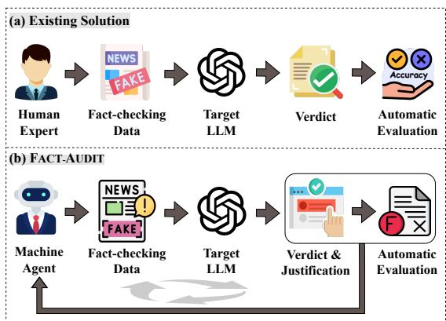  
Figure 1: The pipelines of the existing solution and the proposed FACT-AUDIT in fact-checking evaluation.

Therefore, systematically revealing the boundaries of the fact-checking capacities in LLMs is essential to enhancing the trustworthiness of LLMs.

Auditing the fact-checking capacities of LLMs is challenging due to the complex and open-ended nature of real-world applications like complex claims, fake news, or rumors on social media. As illustrated in Figure 1(a), existing studies typically design intricate manual fact examinations to annotate check-worthy natural language scenarios (Yang et al., 2024b; Hu et al., 2024a; Wang et al., 2024). There are several limitations to such fact-checking evaluation methods: 1) The labor-intensive process restricts the scope of test scenarios, making it costly to scale. 2) All the static datasets for the fact-checking evaluation (Chen and Shu, 2024; Hu et al., 2024b) face risks like test data leakage and leaderboard swamping, failing to timely and adaptively reveal potential limitations of LLMs for understanding factuality. 3) Their problem settings often oversimplify the evaluation to a classification paradigm that focuses on accuracy, which may not adequately capture the other critical capabilities of fact-checking models, like justification production (Eldifrawi et al., 2024) for verdict prediction in the fact-checking process (Guo et al., 2022).

In response to these challenges, we introduce a novel evaluation framework for systematically auditing the fact-checking capabilities of LLMs, called FACT-AUDIT. As illustrated in Figure 1(b), the core design philosophy of FACT-AUDIT centers on automating adaptive LLM auditing with two key features: (1) dynamically updated factchecking test data and (2) in-depth evaluation of model-generated justifications. Theoretically, the creation of fact-checking test data can be framed as a Monte Carlo sampling process (Metropolis et al., 1953), where test cases are sampled from an oracle knowledge space. However, the inherent inefficiency of traditional Monte Carlo sampling limits its ability to generate comprehensive, scalable datasets for robustly assessing LLM factchecking capabilities. To this end, we propose an importance sampling-based approach (Kahn and Marshall, 1953), which adaptively targets diverse weaknesses in LLM fact-checking by leveraging insights from the model-generated justifications.

In this work, FACT-AUDIT employs a multiagent framework that leverages the exceptional capabilities of LLM-powered autonomous agents in experiential learning and complex reasoning (Park et al., 2023; Shen et al., 2023). Specifically, 1) FACT-AUDIT first establishes a detailed taxonomy to categorize different fact-checking scenarios, and then samples the prototype test data, with its quality validated through a tool-using module. 2) For each fact-checking test scenario, FACT-AUDIT evaluates the target LLM on both fact verification and justification production, by using the prototype test data as well as an iterative probing process to generate more diverse and unseen test cases under the scenario via importance sampling. 3) Upon completing evaluations for all the test scenarios in the taxonomy, FACT-AUDIT updates the test scenarios based on the model’s performance, enabling the auditing process to adaptively identify new and critical deficiencies in the LLM’s fact-checking capabilities. This updated taxonomy is then used to repeat the auditing process for creating a dynamic and model-centric evaluation loop in fact-checking.

Our contributions are summarized as follows:

• We introduce a novel and adaptive fact-checking evaluation framework, FACT-AUDIT, that utilizes multi-agent collaboration to dynamically unveil the limitations of the LLM’s fact-checking capabilities under diverse test scenarios.<sup>1</sup>

• FACT-AUDIT addresses the restrictions of static fact-checking datasets by dynamically updating test scenarios and iteratively probing challenging cases. This framework ensures adaptability to real-world fact-checking complexity while maintaining diversity and scalability in LLM auditing.

• FACT-AUDIT goes beyond traditional accuracybased automatic evaluations by integrating justification production with verdict prediction.

• We conduct extensive experiments on 13 stateof-the-art LLMs and detailed analyses of factchecking performance, to provide insight into model strengths and areas for improvement.

## 2 Preliminary

In the context of assessing the fact-checking capacity in LLMs, we denote key components as follows:

## Definition 2.1: Paradigm Definition

1. Oracle Knowledge Distribution: $p ( x )$ The true distribution of factual knowledge.

2. Fact-Checking Limits of LLM α: ${ \mathcal { F } } _ { \alpha } ( x )$ The function characterizing the LLM’s understanding limits of a given fact-checking test case x.

We formulate the automated auditing of the LLM α’s fact-checking capabilities as a Monte Carlo sampling process (Metropolis and Ulam, 1949), i.e., continuously sampling test cases x by humans from the oracle distribution $p ( x )$ in the real world, and calculate its corresponding limits ${ \mathcal { F } } _ { \alpha } ( x )$

$$
\mathbb { E } _ { p ( x ) } \left[ \mathcal { F } _ { \alpha } ( x ) \right] = \int p ( x ) \mathcal { F } _ { \alpha } ( x ) \mathrm { d } x .\tag{1}
$$

However, beyond the well-known inefficiency of Monte Carlo sampling with a convergence rate of $\mathcal { O } ( 1 / \sqrt { N } )$ , the long-tail knowledge distribution further exacerbates the inefficiency of sampling from $p ( x )$ for constructing fact-checking datasets.

Inspired by the classic Importance Sampling (Kahn and Marshall, 1953) method, which leverages a proposal distribution $q ( x )$ to improve efficiency by allocating more densities to the regions where ${ \mathcal { F } } _ { \alpha } ( x )$ is more likely to have higher values, we aim to adopt this concept for adaptively and efficiently sampling test data according to the fact-checking limits of the LLM. In the strategy of Importance Sampling, the process is adjusted as:

$$
\begin{array} { r } { \mathbb { E } _ { p ( x ) } \left[ \mathcal { F } _ { \alpha } ( x ) \right] = \displaystyle \int q ( x ) \mathcal { F } _ { \alpha } ( x ) \frac { p ( x ) } { q ( x ) } \mathrm { d } x } \\ { = \mathbb { E } _ { q ( x ) } \left[ \mathcal { F } _ { \alpha } ( x ) \frac { p ( x ) } { q ( x ) } \right] , } \end{array}\tag{2}
$$

where the importance weight $\frac { p ( x ) } { q ( x ) }$ compensates for the discrepancy between the proposal distribution $q ( x )$ and oracle distribution $p ( x )$ to ensure an unbiased estimate. Besides, the efficiency of importance sampling critically depends on choosing $q ( x ) \propto p ( x ) \mathcal { F } _ { \alpha } ( x )$ as closely as possible. Therefore, our method is to find a well-designed $q ( x )$ that minimizes the variance of the objective $p ( x ) \mathcal { F } _ { \alpha } ( x )$ thereby improving the reliability of the estimation.

## 3 FACT-AUDIT

## 3.1 Problem Definition

Given a source claim ( ), fact checking aims to predict the factuality and provide convincing justifications, to evaluate the claim as Factual, Non-Factual, or Not Enough Information, based on a knowledge source as auxiliary information ( ). Our objective is to develop a multi-agent evaluation framework, for modeling a new distribution $q ( x )$ that tends to reveal fact-checking limitations, thus replacing the inefficient evaluation methods reliant on the sampling distribution of $p ( x )$ . Considering the difficulty of directly obtaining the optimal $q ( x )$ we design an adaptive framework to iteratively converge to the desired distribution $q ( x )$ , automatically and dynamically evaluating the target LLM $\alpha \mathbf { \ ' } _ { \mathbf { S } }$ capabilities across diverse fact-checking domains $( e . g .$ , complex claims, fake news, and rumors).

Following the definition in $\ S 2 ,$ our framework is formulated with three main stages:

```latex
Definition 3.1: Framework Formulation
1. Prototype Emulation: $x \sim q ( x | \theta _ { i } )$
Generatefact-checking test datafor LLM auditing.
2. Fact Verification: $\begin{array} { r } { \mathbb { E } _ { q _ { i } } \left[ \mathcal { F } _ { \alpha } ( \boldsymbol { x } ) \frac { p ( \boldsymbol { x } ) } { q ( \boldsymbol { x } | \boldsymbol { \theta } _ { i } ) } \right] } \end{array}$
Test the target LLM with the specific fact-checking
questions x to verify fact and produce justification.
3. Adaptive Updating: $\pi ( \Theta _ { i } | \Theta _ { i - 1 } , \mathcal { M } )$
Explore more diverse and challenging test data.
```

As presented in Algorithm 1, FACT-AUDIT maintains a taxonomy of fact-checking scenarios Θ during iterations, where $\Theta _ { 0 }$ is initialized to be the foundational test scenarios that $\begin{array} { r l } { \mathbb { E } _ { \theta _ { 0 } \sim P ( \Theta _ { 0 } ) } [ q ( x | \theta _ { 0 } ) ] = } & { { } } \end{array}$ $p ( x )$ . During the loop, $\Theta _ { i }$ will be updated to focus on the specific fact-checking scenarios that the target LLM α is likely to underperform. To audit the weaknesses of LLMs in fact checking, our process mainly involves three stages: 1) Generate the dynamic and check-worthy source claim dataset X (§3.2); 2) Query the target LLM for veracity prediction and justification production (§3.3);

Algorithm 1 FACT-AUDIT Algorithm   
1: Initialize fact-checking test scenarios $\Theta _ { 0 }$   
and a memory pool ${ \mathcal { M } } = \phi$   
2: for $i : = 0$ to n do   
3: $\mathbb { X } : = \phi$   
4: Stage 1: Prototype Emulation   
5: while $| \mathbb { X } | < k { \dot { \mathbf { d o } } }$   
6: Appraiser: $\theta _ { i } \sim P ( \Theta _ { i } )$   
7: Inquirer: $x \sim q ( x | \theta _ { i } )$   
8: if x satisfies Quality Inspector then   
9: $\mathbb { X } : = \mathbb { X } \cup \{ x \}$   
10: end if   
11: end while   
12: Stage 2: Fact Verification with Justification   
13: $\begin{array} { r } { \mathcal { M } : = \mathcal { F } _ { \alpha } ( \mathbb { X } ) \frac { p ( \mathbb { X } ) } { q ( \mathbb { X } | \Theta _ { i } ) } } \end{array}$   
14: for $j : = 0$ to m do   
15: Prober: $x \sim \rho ( { \mathcal { M } } )$   
16: $\begin{array} { r } { \mathcal { M } : = \mathcal { M } \cup \left\{ \mathcal { F } _ { \alpha } ( x ) \frac { p ( x ) } { q ( x \mid \theta _ { i } ) } \right\} } \end{array}$   
17: end for   
18: Stage 3: Adaptive Updating   
19: $\Theta _ { i + 1 } \stackrel { \cdot \mathrm { ~ } } { \sim } \dot { \pi } ( \Theta _ { i + 1 } \stackrel { \cdot } { | } \Theta _ { i } , \stackrel { \cdot } { \mathcal { M } } )$   
20: end for   
21: Return $\mathcal { M }$

3) Scrutinize the limitations of the target LLM in fact-checking adaptively based on specific modelgenerated justifications (§3.4). An overview of our FACT-AUDIT framework is shown in Figure 2.

## 3.2 Prototype Emulation

The Stage 1 of Algorithm 1 is Prototype Emulation, which involves generating prototype test data for assessing the LLM’s fact-checking capabilities. This stage is accomplished by three agents: 1) an Appraiser agent to develop the taxonomy of factchecking scenarios for evaluation, 2) an Inquirer agent to generate prototype test data according to the taxonomy, and 3) a Quality Inspector agent to ensure the quality of the prototype test data.

Appraiser Given the fact-checking objects, the Appraiser agent first generates the detailed taxonomy $\theta _ { i } \sim P ( \Theta _ { i } )$ , which includes k fact-checking scenarios $\{ \theta _ { i } \} _ { k }$ towards the specific fact-checking objects. As shown in Figure 3, the Appraiser initializes the taxonomy $\Theta _ { 0 }$ from the three classic fact-checking objects: complex claims (Jiang et al., 2020a; Aly et al., 2021), fake news (Hu et al., 2024a; Wang et al., 2024), and social rumors (Ma et al., 2015, 2017), drawing inspiration from previous literature (Hu et al., 2024b; Waldrop, 2017; Allport, 1947). Note that in the subsequent phase, Appraiser would excavate new fact-checking test scenarios to update the initial taxonomy by examining the intermediate evaluation feedback.

Inquirer According to each fact-checking scenario $\theta _ { i } ,$ the Inquirer agent generates the prototype test data: $x \sim q _ { i } ( x ) = q ( x | \theta _ { i } )$ , where $q _ { i } ( x )$ is the proposal distribution of importance sampling. As depicted in Figure 2, a prototype data sample x encompasses the following four components:

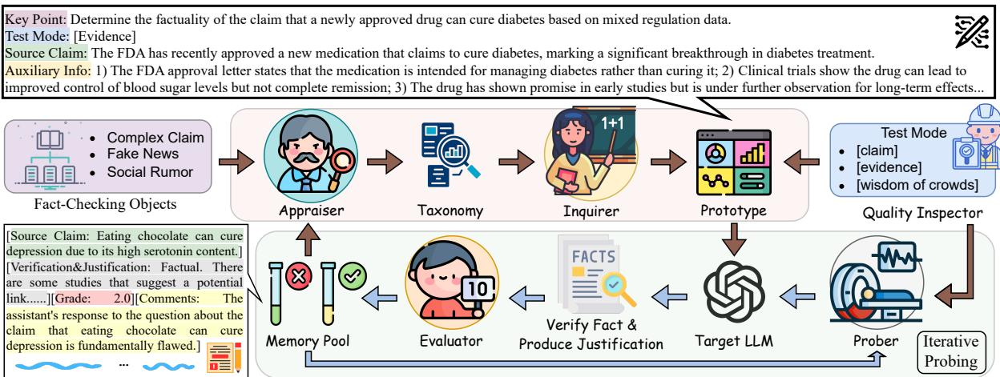  
Figure 2: An overview of FACT-AUDIT, to adaptively unveil the limitations of fact-checking in LLMs.

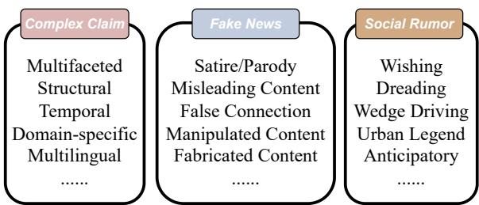  
Figure 3: The taxonomy of fact-checking scenarios.

• Key Point ( ): the specific task instruction for the test case.

• Source Claim ( ): the claim to be verified.

• Auxiliary Information ( ): the external knowledge source as the evidences for fact verification.

• Test Mode ( ): the problem setting of the factchecking task. Specifically, we consider three widely-studied settings, depending on the type of . 1) [claim]: The target LLM verifies without access to external knowledge sources (i.e., remains empty), relying solely on the knowledge stored in its parameters. This setting is widely explored in studies utilizing LLMs for fact-checking (Lee et al., 2021). 2) [evidence]: is the set of gold evidence from Wiki knowledge that can support or refute the source claim. This setting is also called claim verification (Ma et al., 2019). 3) [wisdom of crowds]: is simulated as the conversation thread on social media towards the source claim. This setting is usually used to verify fake news or rumors by collecting the user interaction as the fact-indicative signal (Shu et al., 2019; Lin et al., 2021).

Quality Inspector Multiple levels of measures are implemented to guarantee the reliability of the fact-checking questions. To check against the generator role like the Inquirer, we further employ a Quality Inspector agent as the judge role to ensure the diversity of the fact-checking topics and the quality of . Especially, in the setting of [claim], is checked to be empty. In the setting of [evidence], the Quality Inspector would first integrate external tools to coarsely validate whether the evidence set is more likely from Wiki knowledge via Wikipedia web API, then leverage the rich knowledge embedded in the dominant LLM to finely scrutinize the pieces of evidence. In the setting of [wisdom of crowds], the Quality Inspector would make sure that the simulated user comments towards the source claim should be valuable enough as the wisdom of crowds for fact verification.

## 3.3 Fact Verification with Justification

After obtaining the prototype set of fact-checking test data, we evaluate target LLMs automatically on both fact verification and justification production.

Evaluator The Evaluator agent scores the target LLM’s predicted verdict and generated justification via LLM-as-a-Judge (Zheng et al., 2023), $i . e . .$ ${ \mathcal { F } } _ { \alpha } ( x )$ . In this way, we can assess the fact-checking limits of the target LLM under the hypothesized oracle distribution, i.e., the objective $p ( x ) \mathcal { F } _ { \alpha } ( x )$

Specifically, given a specific test case $x ,$ the target LLM α generates its response r consisting of predicted verdict and derived justification. Then the output of the Evaluator agent includes an integer rating grade $s \in [ 1 , 1 0 ] \cap \mathbb { Z }$ and a natural language assessment comment c. As a higher score s indicates stronger capabilities, the corresponding fact-checking limitations can be denoted as $\mathcal { F } _ { \alpha } ( x ) \propto 1 / s .$ As illustrated in Figure 2, we formally define a FACT-AUDIT’s memory pool as $\boldsymbol { \mathcal { M } } = \{ x , r , s , c \}$ , which stores the test cases along with their evaluation results. The Evaluator is additionally instructed to distinguish the poorlyperforming test cases $\{ x | s < \epsilon \}$ based on a predefined threshold ϵ. Note that an invalid justification could still get a relatively low grade even if the predicted verdict is correct for fact verification.

Prober While collaboration among the four agent roles (i.e., Appraiser, Inquirer, Quality Inspector, and Evaluator) ensures comprehensive factchecking coverage and model-specific tailoring of our framework, a key challenge lies in effectively identifying areas where the target model underperforms. Although fact-checking prototype test cases provide an intuitive yet superficial assessment of the target LLM’s fact-checking capabilities, we argue that they are insufficient to fully reveal the fact-checking limitations and knowledge boundaries due to the inherent constraints of fixed seeds.

To craft more diverse and unseen test data about each test scenario, we propose iteratively probing for a more comprehensive fact-checking evaluation. Specifically, given the memory pool  for the current test scenario, the Prober ρ generates new test data by learning from the model behaviors of the past auditing records stored in  as the environmental feedback, $x \sim \rho ( { \mathcal { M } } )$ . Then the Evaluator agent assesses the target LLM on the new test data, and the results are subsequently added to the memory pool. Through this iterative probing process, we can effectively identify test data with poor performance under each fact-checking test scenario, pinpointing comprehensive insights into the target LLM at the adaptive and different test scenarios.

## 3.4 Adaptive Updating

After going through all the existing test scenarios in the fact-checking taxonomy, the Appraiser appeals to new valuable test scenarios, by conducting a critical analysis of instances where the target LLM underperformed in each fact-checking scenario, as indicated by low rating grades in the memory pool , to unveil potential fact-checking limitations. Theoretically, the transition probability $\pi ( \Theta _ { i + 1 } | \Theta _ { i } , \mathcal { M } )$ is estimated, where $\Theta _ { i + 1 }$ is more likely to contain the new test scenario beyond the fact-checking capacities of the target LLM. This insight prompts the Appraiser to adaptively refine the taxonomy, ensuring our framework remains relevant and effective in identifying new deficiencies. The cyclical interaction among the Appraiser, Inquirer, and Evaluator establishes a continuous improvement loop, making our auditing framework both comprehensive and responsive to the evolving fact-checking capabilities of different target LLMs.

Finally, after the adaptive updating, the expectation of ${ \mathcal { F } } _ { \alpha } ( x )$ in Equation (2) for importance sampling can be computed approximately as:

$$
\begin{array} { l } { \displaystyle \mathbb { E } _ { q ( x ) } \left[ \mathcal { F } _ { \alpha } ( x ) \frac { p ( x ) } { q ( x ) } \right] \leq \mathbb { E } _ { q ( x ) } \left[ \mathcal { F } _ { \alpha } ( x ) \right] } \\ { \displaystyle \propto \frac { 1 } { | \mathcal { M } | } \sum _ { s \in \mathcal { M } } \frac { 1 } { s } , } \end{array}\tag{3}
$$

where the distributions $q ( x )$ and $p ( x )$ are intractable in practice. Therefore, since the whole process can only perform limited sampling within the high-probability region $( p ( x ) / q ( x ) < 1 )$ of $q ( x )$ , we compute an upper bound of the target LLM’s limitations to effectively reflect its utility.

Overall, this framework enables the adaptive sampling of more targeted and representative factchecking data, facilitating a comprehensive evaluation of the target LLM’s fact-checking capabilities.

## 4 Experiments and Results

## 4.1 Experimental Setup

Data Different from existing static data work, the data within the FACT-AUDIT agentic framework is dynamically updated to alleviate sampling bias and fairness issues from a fresh perspective. We consider common fact-checking objects such as complex claims, fake news, and social rumors, simulating a diverse real-world data environment.

Metric To audit the fact-checking capacities of LLMs, we introduce three automatic evaluation metrics for quantitative analysis: Insight Mastery Rate (IMR), Justification Flaw Rate (JFR), and Grade. Specifically, IMR represents the proportion of low-scoring fact-checking responses relative to the total number of questions, where a Grade of three or below (on a ten-point scale) indicates errors in the target LLM’s response, as the Evaluator agent was additionally instructed not to assign a grade higher than three if the target LLM underperformed in either the verdict prediction or justification production stages. JFR denotes the percentage of cases where the target LLM conducted correct verdict predictions yet had poor justification, based on the conditions set by IMR. Grade is assigned by the FACT-AUDIT framework with employing the scoring prompt inspired by Zheng et al. (2023).

<table><tr><td rowspan="2">Model (Target LLM)</td><td colspan="3">Complex Claim</td><td colspan="3">Fake News</td><td colspan="3">Social Rumor</td><td colspan="3">Overall</td></tr><tr><td>IMR↓</td><td>JFR↓</td><td>Grade↑</td><td>IMR↓</td><td>JFR↓</td><td>Grade↑</td><td>IMR↓</td><td>JFR↓</td><td>Grade↑</td><td>IMR↓</td><td>JFR↓</td><td>Grade↑</td></tr><tr><td>M Mistral-7B</td><td>60.21</td><td>25.62</td><td>3.98</td><td>47.50</td><td>19.58</td><td>4.87</td><td>59.05</td><td>39.52</td><td>3.97</td><td>54.79</td><td>23.34</td><td>4.34</td></tr><tr><td>∞ Llama2-7B</td><td>46.67</td><td>19.79</td><td>4.85</td><td>32.73</td><td>18.18</td><td>5.54</td><td>62.86</td><td>26.67</td><td>3.89</td><td>45.49</td><td>20.68</td><td>4.88</td></tr><tr><td>∞ Llama2-13B</td><td>65.67</td><td>21.66</td><td>3.71</td><td>55.33</td><td>16.67</td><td>4.42</td><td>48.10</td><td>20.48</td><td>4.78</td><td>57.28</td><td>19.50</td><td>4.25</td></tr><tr><td>∞Llama3-8B</td><td>39.79</td><td>12.09</td><td>5.19</td><td>33.75</td><td>17.28</td><td>5.51</td><td>46.25</td><td>19.18</td><td>4.83</td><td>38.67</td><td>15.60</td><td>5.25</td></tr><tr><td>∞ Llama3.1-8B</td><td>55.83</td><td>21.46</td><td>4.36</td><td>36.39</td><td>12.78</td><td>5.60</td><td>47.62</td><td>12.86</td><td>5.00</td><td>47.52</td><td>16.77</td><td>4.91</td></tr><tr><td>∞ Llama3.1-70B</td><td>41.56</td><td>14.22</td><td>5.34</td><td>25.00</td><td>11.88</td><td>6.42</td><td>38.33</td><td>10.00</td><td>5.55</td><td>34.10</td><td>12.38</td><td>5.83</td></tr><tr><td>Qwen2.5-7B</td><td>38.97</td><td>9.74</td><td>5.38</td><td>21.54</td><td>8.20</td><td>6.58</td><td>36.67</td><td>5.42</td><td>5.68</td><td>31.76</td><td>8.14</td><td>5.91</td></tr><tr><td>Qwen2.5-72B</td><td>22.08</td><td>5.41</td><td>6.62</td><td>10.42</td><td>1.46</td><td>7.67</td><td>15.00</td><td>3.75</td><td>7.28</td><td>16.00</td><td>3.50</td><td>7.17</td></tr><tr><td>GLM4-9B</td><td>52.73</td><td>16.36</td><td>4.76</td><td>51.67</td><td>14.00</td><td>4.93</td><td>50.00</td><td>15.24</td><td>5.00</td><td>51.67</td><td>15.24</td><td>4.88</td></tr><tr><td>Gemma2-9B</td><td>41.67</td><td>28.00</td><td>4.84</td><td>35.48</td><td>28.11</td><td>5.13</td><td>44.07</td><td>23.31</td><td>4.74</td><td>39.70</td><td>26.78</td><td>4.94</td></tr><tr><td>Gemini-Pro</td><td>30.21</td><td>11.87</td><td>5.98</td><td>19.39</td><td>5.76</td><td>6.59</td><td>32.86</td><td>5.72</td><td>5.78</td><td>27.25</td><td>8.62</td><td>6.14</td></tr><tr><td>Claude3.5-Sonnet A</td><td>32.71</td><td>9.37</td><td>6.16</td><td>15.00</td><td>2.33</td><td>7.41</td><td>18.57</td><td>3.33</td><td>7.31</td><td>24.34</td><td>5.96</td><td>6.78</td></tr><tr><td>GPT-40</td><td>14.05</td><td>4.34</td><td>6.78</td><td>10.56</td><td>4.93</td><td>7.26</td><td>10.48</td><td>1.41</td><td>7.62</td><td>12.02</td><td>3.55</td><td>7.21</td></tr></table>

Table 1: The fact-checking performance of different LLMs audited by FACT-AUDIT. Metrics include IMR (%), JFR (%), and Grade, where IMR indicates the insight mastery rate of fact-checking limitations, JFR means the flaw rate of the justifications provided by LLMs. The best and second performances are in bold and underlined, respectively.

Overall, IMR is the dominant evaluation metric.

Target LLMs To provide a comprehensive LLM auditing, we select 13 representative models as the target LLMs to perform zero-shot inference in FACT-AUDIT. We adopt ten open-source models: Mistral (7B) (Jiang et al., 2023), Llama2 (7B, 13B) (Touvron et al., 2023b), Llama3 (8B) (Dubey et al., 2024), Llama3.1 (8B, 70B), Qwen2.5 (7B, 72B) (Yang et al., 2024a), GLM4 (9B) (GLM et al., 2024), Gemma2 (9B) (Team et al., 2024); and three proprietary models: Gemini-Pro (Team et al., 2023), Claude3.5-Sonnet, GPT-4o, as our target LLMs. To ensure results are reproducible, the temperature is set as 0 without any sampling mechanism. More implementation details and baseline descriptions are provided in Appendix §A - §C.

## 4.2 Main Results

Table 1 presents the auditing results of various LLMs in FACT-AUDIT, offering a new perspective on fact-checking by incorporating automatic justification production evaluation alongside verdict prediction. Key observations include:

• GPT-4o, Qwen2.5-72B, Claude3.5-Sonnet, and Gemini-Proform the leading tier. Note that GPT-4o, Claude3.5-Sonnet, and Gemini-Pro are proprietary closed-source models, while Qwen2.5- 72B is an open-source model that demonstrates comparable performance in fact-checking evaluation. Besides, GPT-4o achieves the best performance 12.02% on the dominant metric, IMR.

• The LLaMA series exhibits relatively poorer performance, spanning the second and third tiers. Llama3-8B and Llama3.1-70B belong to the second tier, alongside Qwen2.5-7B and Gemma2-

9B, while other LLaMA models fall into the third tier, showing greater fact-checking limitations on both IMR and Grade performance.

• The auxiliary metric JFR of the strong LLM GPT-4o is not the best among all target LLMs, as most low-scoring cases are more likely to be poor justifications when a model excels in factual verdict prediction. This implies FACT-AUDIT could elicit the fact-checking limitation of individual target LLMs in accordance with their aptitude.

• LLMs perform relatively well on fake news but struggle with complex claims. This discrepancy may stem from the advanced reasoning capabilities required for complex claims compared to the more factually explicit nature of fake news. The fluctuating performance on social rumors is primarily attributed to their contextual dependence and linguistic complexity, which increase the difficulty of fact-checking for target LLMs.

Overall, the automatic model-centric evaluation, considering justifications beyond verdicts, aligned with intuitive expectations of LLM capabilities and introduced additional fresh dimensions for auditing fact-checking performance and limitations.

## 4.3 Analysis of Reliability

To verify the robustness and fairness of the LLMgenerated prototypes, we further conducted the ablative study by adding a setting based on the human-generated prototype seed questions. Specifically, we sampled the same amount of prototypes from the Pinocchio dataset (Hu et al., 2024b) as the fixed seed data in FACT-AUDIT. As shown in Table 2, it can be observed that the performance of the ‘LLM-Generated’ setting is comparable to that of the ‘Human-Generated’ setting, which highlights the fairness of the LLM auditing in FACT-AUDIT. We further provided comprehensive human subject studies for quality assurance in Appendix §D - §E.

<table><tr><td rowspan="2">Prototype</td><td colspan="3">LLM-Generated</td><td colspan="3">Human-Generated</td></tr><tr><td>IMR%</td><td> $J F R \%$ </td><td>Grade</td><td>IMR%</td><td> $J F R \%$ </td><td>Grade</td></tr><tr><td>Llama3.1-8B</td><td>55.24</td><td>21.46</td><td>4.34</td><td>55.83</td><td>21.21</td><td>4.36</td></tr><tr><td>Qwen2.5-7B</td><td>38.97</td><td>9.74</td><td>5.38</td><td>39.62</td><td>9.93</td><td>5.25</td></tr><tr><td>GPT-40</td><td>14.05</td><td>4.34</td><td>6.78</td><td>14.24</td><td>5.02</td><td>6.59</td></tr></table>

Table 2: The comparison of LLM performance based on LLM-generated and human-generated prototypes.

<table><tr><td>Target LLM</td><td>Test Mode</td><td> $I M R _ { \% }$ </td><td> $J F R _ { \% }$ </td><td>Grade</td></tr><tr><td rowspan="3">Llama3.1-8B</td><td>[claim]</td><td>68.80</td><td>22.87</td><td>3.56</td></tr><tr><td>[evidence]</td><td>38.16</td><td>13.33</td><td>5.50</td></tr><tr><td>[wisdom of crowds]</td><td>45.29</td><td>16.08</td><td>4.96</td></tr><tr><td rowspan="3">Qwen2.5-7B</td><td>[claim]</td><td>48.86</td><td>12.76</td><td>4.74</td></tr><tr><td>[evidence]</td><td>20.83</td><td>7.31</td><td>6.45</td></tr><tr><td>[wisdom of crowds]</td><td>39.58</td><td>7.40</td><td>5.43</td></tr><tr><td rowspan="3">GPT-40</td><td>[claim]</td><td>23.05</td><td>16.67</td><td>6.11</td></tr><tr><td>[evidence]</td><td>10.61</td><td>8.77</td><td>7.00</td></tr><tr><td>[wisdom of crowds]</td><td>15.40</td><td>8.51</td><td>6.67</td></tr></table>

Table 3: The fact-checking performance of three representative LLMs under three fixed test modes.

## 4.4 Performance by Test Modes

To thoroughly examine the impact of different test modes on model performance, we evaluate three representative LLMs (Llama3.1-8B, Qwen2.5-7B, and GPT-4o) in the context of fact-checking. As shown in Table 3, we can observe that: 1) [claim] mode is the most challenging for LLMs, as they must rely solely on their parametric knowledge to verify factuality in a closed-book setting. 2) [evidence] mode is the easiest, as all evidence provided is factual and facilitates reasoning, even when conflicting viewpoints are present. 3) [wisdom of crowds] mode falls in the middle. Unlike [claim] mode, it does not depend entirely on the LLM’s internal knowledge, and unlike [evidence] mode, it does not explicitly provide guiding signals. Instead, the model must extract valuable insights from the simulated conversation thread to reason effectively. More detailed results are shown in Appendix §F.

## 4.5 Challenging Test Scenarios

As shown in Figure 4, we conduct an analysis to discuss the challenging test scenarios in FACT-AUDIT, by taking the IMR performance of the wellperformed open-source LLM Qwen2.5-72B as an example. We can see that: (1) “Multi-Step Reasoning” (MSR) and “Aggregated Statistical Reasoning” (ASR), (2) News content with “Mismatched

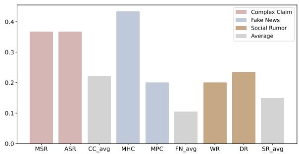  
Figure 4: IMR of two most challenging test scenarios in each fact-checking object, with the averaged IMR.

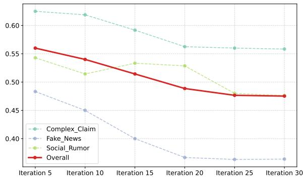  
Figure 5: The effect of different iterations in scaling.

Headline or Caption” (MHC) and “ManiPulated Content” (MPC), and (3) “Wishing Rumor” (WR) and “Dreading Rumor” (DR), are the two most challenging scenarios for Complex Claim, Fake News, and Social Rumor, respectively. Besides, although the Fake News averaged (FN\_avg) IMR is lower than the Complex Claim averaged (CC\_avg) and Social Rumor averaged (SR\_avg), the detailed MHC scenario of Fake News is the most difficult than those scenarios of Complex Claim and Social Rumor. We additionally provided more discussion about fact-checking topics in Appendix §G - §H.

## 4.6 Iterative Probing

We analyze the effect of multi-turn iterative probing in FACT-AUDIT by examining the IMR performance across different iterations, as illustrated in Figure 5. The results show that the IMR metric decreases as the number of iterations increases, eventually converging. As the test data expands, the model’s performance is more comprehensively evaluated, allowing the identification of truly problematic cases that represent the model’s inherent weaknesses. This approach enables a deeper exploration of less obvious model limitations while reinforcing the flexibility of our evaluation framework to scale seamlessly with the size of the assessment.

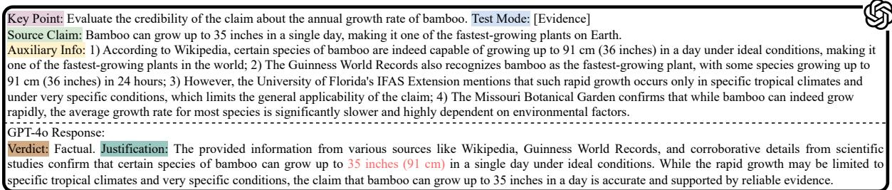  
Figure 6: Example of cases with correct verdict prediction yet poor justification for fact-checking the claim.

## 4.7 Case Study

sewers is an urban legend.One key advantage of FACT-AUDIT is that the lim-Source Claim: There are alligators living in the sewers of New York City.itations of fact-checking in LLMs where poor justification is provided for the correct verification could be well probed. To better understand how <sup>living</sup> <sup>in</sup> <sup>the</sup> <sup>sewers</sup> <sup>of</sup> <sup>New</sup> <sup>York</sup> <sup>City</sup> <sup>is</sup> <sup>a</sup> <sup>well-known</sup> <sup>urban</sup> <sup>legend.</sup>FACT-AUDIT proactively unveil such limitations, various parts of the city, there is no credible evidence to support thewe conduct a case study on the GPT-4o’s response <sub>The</sub> <sub>urban</sub> <sub>myth</sub> <sub>likely</sub> <sub>originated</sub> <sub>from</sub> <sub>people</sub> <sub>flushing</sub> <sub>pet</sub> <sub>alligators</sub>to the test data sample, as exemplified in Figure 6. We can observe that there is a factual error in the provided justification. The target LLM states that bamboo can grow “up to 35 inches (91 cm)”, which conflicts with the unit conversion knowledge that 35 inches is equivalent to 88.9 cm. Even though the related knowledge is provided in the auxiliary information, the target LLM still failed to provide precise justification for fact-checking the claim. This reaffirms the importance of incorporating justification into automatic evaluations, enabling more comprehensive auditing beyond merely assessing accuracy. More cases are shown in Appendix §I.

## 5 Related Work

Fact-Checking Evaluation Automated factchecking has gained significant attention in the NLP research community in recent years as a means of combating misinformation and disinformation. Various datasets have been proposed that enable the development and evaluation of systems for automatic fact-checking, the most popular ones being based on human-crafted claims from Wikipedia content (Thorne et al., 2018; Sathe et al., 2020; Schuster et al., 2021), claims in fake news published by a news outlet (Buntain and Golbeck, 2017; Shu et al., 2020; Nakov et al., 2022), rumorous claims on social media (Ma et al., 2015, 2017; Lin et al., 2022a), complex claims that require multi-step reasoning (Jiang et al., 2020a; Aly et al., 2021), naturally occurring claims in specific domains (Gupta and Srikumar, 2021; Wadden et al., 2022; Lin et al., 2023), and LLM-generated misinformation (Chen and Shu, 2024), etc. To understand the factual knowledge of LLMs, Hu et al.

(2024b) curated a new fact-checking benchmark by organizing previous representative datasets, aiming to identify weaknesses in LLM fact verification. However, besides the inevitable issue of test set leakage, this static evaluation approach relied primarily on expert-designed, specialized tasks from existing datasets, overlooking emerging LLMgenerated content and lacking adaptability to the complex, open-ended nature of real-world applications. Different from previous work on static accuracy evaluation, leveraging the derived justification (Atanasova et al., 2020; Guo et al., 2022) from LLMs, our work aims to explore the dynamic auditing beyond the veracity prediction, to dynamically elicit the limitations of fact-checking in LLMs.

LLM Agent The integration of LLMs as agents spans various domains, such as code generation and game-playing, demonstrating their robust planning and reasoning capabilities across diverse contexts (Wang et al., 2023; Yao et al., 2022; Shen et al., 2023; Mu et al., 2023; Hong et al., 2023; Liu et al., 2023; Sun et al., 2023; Qian et al., 2023). These advancements highlight the ability of LLMs to handle complex tasks with minimal supervision. In parallel, self-improvement methodologies (Chen et al., 2022, 2023; Shinn et al., 2023; Madaan et al., 2023) have emerged, utilizing feedback-driven processes to iteratively enhance output quality. Building on these insights, we develop a novel agentic framework for systematical LLM auditing in factchecking complex claims, fake news or rumors.

## 6 Conclusion and Future Work

We introduced FACT-AUDIT, an adaptive multiagent evaluation framework that dynamically elicits the fact-checking limitations of LLMs. By automatically evaluating the justification production beyond the verdict prediction, FACT-AUDIT enables scalable, model-centric LLM auditing for fact-checking tasks. Experiments on a dozen mainstream LLMs reveal a notable performance gap between closed and open-source models with different sizes. In future work, we plan to further exploit the reliability of the proposed framework.

## Limitations

There are multiple ways for further improvement of this work to alleviate the following limitations:

• Firstly, despite implementing various measures, such as error-correction mechanisms and human evaluations, to enhance the stability and transparency of the agent controller and reduce bias and errors, we argue that the potential biases in fact-checking (much like those inherent to humans ) remain unavoidable. Even human beings or the most advanced models have knowledge bias. In future research, we will continue updating the evaluation framework to a more robust and reliable evaluation framework. This would constitute another targeted area of research.

• Secondly, despite its vast knowledge reserves, the agent controller is constrained by its limited ability to acquire and integrate new information dynamically. This limitation hinders its capacity to adapt to evolving knowledge landscapes. In future work, we aim to incorporate advanced techniques such as Retrieval-Augmented Generation (RAG) to enhance the agent’s decision-making capabilities, enabling it to access up-to-date information and provide more accurate, context-aware responses.

• Lastly, while our multi-agent evaluation framework adaptively and dynamically identifies specific deficiencies in target LLMs related to fact verification and justification production, it currently lacks an effective mechanism for model improvement. In future work, we aim to integrate preference optimization methodologies, enabling the framework not only to audit the fact-checking capabilities of LLMs and generate actionable insights for performance refinement but also to provide high-quality training data to facilitate effective model improvement.

## Ethics Statement

This research involved human subject studies to evaluate the quality and reliability of FACT-AUDIT. The following considerations were adhered to ensure the protection and ethical treatment of participants: 1) Voluntary Participation: All participants were informed about the nature of the research and their role in it. Participation was entirely voluntary, with participants having the right to withdraw at any time without any consequences. 2) Informed Consent: Written informed consent was obtained from all participants. This consent form detailed the purpose of the research, the procedures involved, potential risks, and measures taken to safeguard participant data. 3) Data Anonymity and Confidentiality: All data collected during the study were anonymized. Personal identifiers were removed to maintain confidentiality and data were stored securely to prevent unauthorized access. 4) Minimal Risk: The study involved minimal risk to participants. The tasks performed were similar to everyday activities, and no sensitive personal information was requested or recorded.

Research indicates that evaluating content related to misinformation can have negative effects. To protect our human evaluators, we establish three guidelines: 1) ensuring their acknowledgment of viewing potentially misleading content, 2) limiting weekly evaluations and encouraging a lighter daily workload, and 3) advising them to stop if they feel overwhelmed. Finally, we regularly check in with evaluators to ensure their well-being.

The purpose of this work is to prevent the spread of misinformation/disinformation and to ensure that people are not subjected to non-factual information. Nevertheless, we are aware of the potential for malicious users to reverse-engineer and create misinformation guided by FACT-AUDIT. This is strongly discouraged and condemned. Furthermore, all the fact-checking test data generated by the agents does not contain any personal information.

## Acknowledgments

This work is partially supported by Tencent Rhino-Bird Focused Research Program (Value-aligned Credible Large Language Model), RMGS project (Artificial Intelligence and Big Data Analytics for Social Good), and the Singapore Ministry of Education (MOE) Academic Research Fund (AcRF) Tier 1 grant (No. MSS24C012).

## References

Gordon W Allport. 1947. The psychology of rumor. Holt, Rinehart &Winston.

Rami Aly, Zhijiang Guo, Michael Sejr Schlichtkrull, James Thorne, Andreas Vlachos, Christos

Christodoulopoulos, Oana Cocarascu, and Arpit Mittal. 2021. Feverous: Fact extraction and verification over unstructured and structured information. In Thirty-fifth Conference on Neural Information Processing Systems Datasets and Benchmarks Track (Round 1).

Pepa Atanasova, Jakob Grue Simonsen, Christina Lioma, and Isabelle Augenstein. 2020. Generating fact checking explanations. In Proceedings of the 58th Annual Meeting of the Association for Computational Linguistics, pages 7352–7364.

Sébastien Bubeck, Varun Chandrasekaran, Ronen Eldan, Johannes Gehrke, Eric Horvitz, Ece Kamar, Peter Lee, Yin Tat Lee, Yuanzhi Li, Scott Lundberg, et al. 2023. Sparks of artificial general intelligence: Early experiments with gpt-4. arXiv preprint arXiv:2303.12712.

Cody Buntain and Jennifer Golbeck. 2017. Automatically identifying fake news in popular twitter threads. In 2017 IEEE international conference on smart cloud (smartCloud), pages 208–215. IEEE.

Boxi Cao, Hongyu Lin, Xianpei Han, Le Sun, Lingyong Yan, Meng Liao, Tong Xue, and Jin Xu. 2021. Knowledgeable or educated guess? revisiting language models as knowledge bases. In Proceedings of the 59th Annual Meeting of the Association for Computational Linguistics and the 11th International Joint Conference on Natural Language Processing (Volume 1: Long Papers), pages 1860–1874.

Bei Chen, Fengji Zhang, Anh Nguyen, Daoguang Zan, Zeqi Lin, Jian-Guang Lou, and Weizhu Chen. 2022. Codet: Code generation with generated tests. In The Eleventh International Conference on Learning Representations.

Canyu Chen and Kai Shu. 2024. Can llm-generated misinformation be detected? In The Twelfth International Conference on Learning Representations.

Xinyun Chen, Maxwell Lin, Nathanael Schaerli, and Denny Zhou. 2023. Teaching large language models to self-debug. In The 61st Annual Meeting Of The Association For Computational Linguistics.

Jiale Cheng, Yida Lu, Xiaotao Gu, Pei Ke, Xiao Liu, Yuxiao Dong, Hongning Wang, Jie Tang, and Minlie Huang. 2024. Autodetect: Towards a unified framework for automated weakness detection in large language models. In Findings of the Association for Computational Linguistics: EMNLP 2024, pages 6786–6803.

Abhimanyu Dubey, Abhinav Jauhri, Abhinav Pandey, Abhishek Kadian, Ahmad Al-Dahle, Aiesha Letman, Akhil Mathur, Alan Schelten, Amy Yang, Angela Fan, et al. 2024. The llama 3 herd of models. arXiv preprint arXiv:2407.21783.

Yann Dubois, Balázs Galambosi, Percy Liang, and Tatsunori B Hashimoto. 2024. Length-controlled alpacaeval: A simple way to debias automatic evaluators. arXiv preprint arXiv:2404.04475.

Yanai Elazar, Nora Kassner, Shauli Ravfogel, Abhilasha Ravichander, Eduard Hovy, Hinrich Schütze, and Yoav Goldberg. 2021. Measuring and improving consistency in pretrained language models. Transactions of the Association for Computational Linguistics, 9:1012–1031.

Islam Eldifrawi, Shengrui Wang, and Amine Trabelsi. 2024. Automated justification production for claim veracity in fact checking: A survey on architectures and approaches. In Proceedings ofthe 62nd Annual Meeting of the Association for Computational Linguistics (Volume 1: Long Papers), pages 6679–6692.

Team GLM, Aohan Zeng, Bin Xu, Bowen Wang, Chenhui Zhang, Da Yin, Dan Zhang, Diego Rojas, Guanyu Feng, Hanlin Zhao, et al. 2024. Chatglm: A family of large language models from glm-130b to glm-4 all tools. arXiv preprint arXiv:2406.12793.

Zhijiang Guo, Michael Schlichtkrull, and Andreas Vlachos. 2022. A survey on automated fact-checking. Transactions of the Association for Computational Linguistics, 10:178–206.

Ashim Gupta and Vivek Srikumar. 2021. X-fact: A new benchmark dataset for multilingual fact checking. In Proceedings ofthe 59th Annual Meeting ofthe Association for Computational Linguistics and the 11th International Joint Conference on Natural Language Processing (Volume 2: Short Papers), pages 675–682.

Sirui Hong, Mingchen Zhuge, Jonathan Chen, Xiawu Zheng, Yuheng Cheng, Jinlin Wang, Ceyao Zhang, Zili Wang, Steven Ka Shing Yau, Zijuan Lin, et al. 2023. Metagpt: Meta programming for multi-agent collaborative framework. In The Twelfth International Conference on Learning Representations.

Beizhe Hu, Qiang Sheng, Juan Cao, Yuhui Shi, Yang Li, Danding Wang, and Peng Qi. 2024a. Bad actor, good advisor: Exploring the role of large language models in fake news detection. In Proceedings of the AAAI Conference on Artificial Intelligence, volume 38, pages 22105–22113.

Xuming Hu, Junzhe Chen, Xiaochuan Li, Yufei Guo, Lijie Wen, S Yu Philip, and Zhijiang Guo. 2024b. Do large language models know about facts? In The Twelfth International Conference on Learning Representations.

Albert Q Jiang, Alexandre Sablayrolles, Arthur Mensch, Chris Bamford, Devendra Singh Chaplot, Diego de las Casas, Florian Bressand, Gianna Lengyel, Guillaume Lample, Lucile Saulnier, et al. 2023. Mistral 7b. arXiv preprint arXiv:2310.06825.

Yichen Jiang, Shikha Bordia, Zheng Zhong, Charles Dognin, Maneesh Singh, and Mohit Bansal. 2020a. Hover: A dataset for many-hop fact extraction and claim verification. In Findings of the Association for Computational Linguistics: EMNLP 2020, pages 3441–3460.

Zhengbao Jiang, Frank F Xu, Jun Araki, and Graham Neubig. 2020b. How can we know what language models know? Transactions ofthe Associationfor Computational Linguistics, 8:423–438.

Herman Kahn and Andy W Marshall. 1953. Methods of reducing sample size in monte carlo computations. Journal ofthe Operations Research Society ofAmerica, 1(5):263–278.

Nayeon Lee, Yejin Bang, Andrea Madotto, and Pascale Fung. 2021. Towards few-shot fact-checking via perplexity. In Proceedings of the 2021 Conference of the North American Chapter of the Association for Computational Linguistics: Human Language Technologies, pages 1971–1981.

Hongzhan Lin, Jing Ma, Liangliang Chen, Zhiwei Yang, Mingfei Cheng, and Chen Guang. 2022a. Detect rumors in microblog posts for low-resource domains via adversarial contrastive learning. In Findings of the Association for Computational Linguistics: NAACL 2022, pages 2543–2556.

Hongzhan Lin, Jing Ma, Mingfei Cheng, Zhiwei Yang, Liangliang Chen, and Guang Chen. 2021. Rumor detection on twitter with claim-guided hierarchical graph attention networks. In Proceedings ofthe 2021 Conference on Empirical Methods in Natural Language Processing, pages 10035–10047.

Hongzhan Lin, Pengyao Yi, Jing Ma, Haiyun Jiang, Ziyang Luo, Shuming Shi, and Ruifang Liu. 2023. Zero-shot rumor detection with propagation structure via prompt learning. In Proceedings of the AAAI Conference on Artificial Intelligence, volume 37, pages 5213–5221.

Stephanie Lin, Jacob Hilton, and Owain Evans. 2022b. Teaching models to express their uncertainty in words. arXiv preprint arXiv:2205.14334.

Xiao Liu, Hao Yu, Hanchen Zhang, Yifan Xu, Xuanyu Lei, Hanyu Lai, Yu Gu, Hangliang Ding, Kaiwen Men, Kejuan Yang, et al. 2023. Agentbench: Evaluating llms as agents. In The Twelfth International Conference on Learning Representations.

Jing Ma, Wei Gao, Shafiq Joty, and Kam-Fai Wong. 2019. Sentence-level evidence embedding for claim verification with hierarchical attention networks. In Proceedings of the 57th Annual Meeting of the Association for Computational Linguistics, pages 2561– 2571.

Jing Ma, Wei Gao, Zhongyu Wei, Yueming Lu, and Kam-Fai Wong. 2015. Detect rumors using time series of social context information on microblogging websites. In Proceedings of the 24th ACM international on conference on information and knowledge management, pages 1751–1754.

Jing Ma, Wei Gao, and Kam-Fai Wong. 2017. Detect rumors in microblog posts using propagation structure via kernel learning. In Proceedings ofthe 55th Annual Meeting of the Association for Computational Linguistics (Volume 1: Long Papers), pages 708–717.

Aman Madaan, Niket Tandon, Prakhar Gupta, Skyler Hallinan, Luyu Gao, Sarah Wiegreffe, Uri Alon, Nouha Dziri, Shrimai Prabhumoye, Yiming Yang, et al. 2023. Self-refine: Iterative refinement with selffeedback. In Thirty-seventh Conference on Neural Information Processing Systems.

Nicholas Metropolis, Arianna W Rosenbluth, Marshall N Rosenbluth, Augusta H Teller, and Edward Teller. 1953. Equation of state calculations by fast computing machines. The journal of chemical physics, 21(6):1087–1092.

Nicholas Metropolis and Stanislaw Ulam. 1949. The monte carlo method. Journal ofthe American statistical association, 44(247):335–341.

Yao Mu, Qinglong Zhang, Mengkang Hu, Wenhai Wang, Mingyu Ding, Jun Jin, Bin Wang, Jifeng Dai, Yu Qiao, and Ping Luo. 2023. Embodiedgpt: Visionlanguage pre-training via embodied chain of thought. In Thirty-seventh Conference on Neural Information Processing Systems.

Preslav Nakov, Alberto Barrón-Cedeño, Giovanni Da San Martino, Firoj Alam, Julia Maria Struß, Thomas Mandl, Rubén Míguez, Tommaso Caselli, Mucahid Kutlu, Wajdi Zaghouani, et al. 2022. The clef-2022 checkthat! lab on fighting the covid-19 infodemic and fake news detection. In European Conference on Information Retrieval, pages 416–428. Springer.

OpenAI. 2023. Gpt-4 technical report. ArXiv, abs/2303.08774.

Liangming Pan, Xiaobao Wu, Xinyuan Lu, Anh Tuan Luu, William Yang Wang, Min-Yen Kan, and Preslav Nakov. 2023. Fact-checking complex claims with program-guided reasoning. In Proceedings of the 61st Annual Meeting ofthe Associationfor Computational Linguistics (Volume 1: Long Papers), pages 6981–7004.

Joon Sung Park, Joseph O’Brien, Carrie Jun Cai, Meredith Ringel Morris, Percy Liang, and Michael S Bernstein. 2023. Generative agents: Interactive simulacra of human behavior. In Proceedings of the 36th annual acm symposium on user interface software and technology, pages 1–22.

Fabio Petroni, Tim Rocktäschel, Sebastian Riedel, Patrick Lewis, Anton Bakhtin, Yuxiang Wu, and Alexander Miller. 2019. Language models as knowledge bases? In Proceedings of the 2019 Conference on Empirical Methods in Natural Language Processing and the 9th International Joint Conference on Natural Language Processing (EMNLP-IJCNLP), pages 2463–2473.

Chen Qian, Xin Cong, Cheng Yang, Weize Chen, Yusheng Su, Juyuan Xu, Zhiyuan Liu, and Maosong Sun. 2023. Communicative agents for software development. arXiv preprint arXiv:2307.07924.

Aalok Sathe, Salar Ather, Tuan Manh Le, Nathan Perry, and Joonsuk Park. 2020. Automated fact-checking of claims from wikipedia. In Proceedings of the Twelfth Language Resources and Evaluation Conference, pages 6874–6882.

Tal Schuster, Adam Fisch, and Regina Barzilay. 2021. Get your vitamin c! robust fact verification with contrastive evidence. In Proceedings of the 2021 Conference of the North American Chapter of the Associationfor Computational Linguistics: Human Language Technologies, pages 624–643.

Yongliang Shen, Kaitao Song, Xu Tan, Dongsheng Li, Weiming Lu, and Yueting Zhuang. 2023. Hugginggpt: Solving ai tasks with chatgpt and its friends in hugging face. In Thirty-seventh Conference on Neural Information Processing Systems.

Noah Shinn, Federico Cassano, Ashwin Gopinath, Karthik Narasimhan, and Shunyu Yao. 2023. Reflexion: language agents with verbal reinforcement learning. In Proceedings of the 37th International Conference on Neural Information Processing Systems, pages 8634–8652.

Kai Shu, Limeng Cui, Suhang Wang, Dongwon Lee, and Huan Liu. 2019. defend: Explainable fake news detection. In Proceedings ofthe 25th ACM SIGKDD international conference on knowledge discovery & data mining, pages 395–405.

Kai Shu, Deepak Mahudeswaran, Suhang Wang, Dongwon Lee, and Huan Liu. 2020. Fakenewsnet: A data repository with news content, social context, and spatiotemporal information for studying fake news on social media. Big data, 8(3):171–188.

Haotian Sun, Yuchen Zhuang, Lingkai Kong, Bo Dai, and Chao Zhang. 2023. Adaplanner: Adaptive planning from feedback with language models. In Thirtyseventh Conference on Neural Information Processing Systems.

Gemini Team, Rohan Anil, Sebastian Borgeaud, Yonghui Wu, Jean-Baptiste Alayrac, Jiahui Yu, Radu Soricut, Johan Schalkwyk, Andrew M Dai, Anja Hauth, et al. 2023. Gemini: A family of highly capable multimodal models. arXiv preprint arXiv:2312.11805.

Gemma Team, Morgane Riviere, Shreya Pathak, Pier Giuseppe Sessa, Cassidy Hardin, Surya Bhupatiraju, Léonard Hussenot, Thomas Mesnard, Bobak Shahriari, Alexandre Ramé, et al. 2024. Gemma 2: Improving open language models at a practical size. arXiv preprint arXiv:2408.00118.

James Thorne, Andreas Vlachos, Christos Christodoulopoulos, and Arpit Mittal. 2018. Fever: a large-scale dataset for fact extraction and verification. In Proceedings ofthe 2018 Conference of the North American Chapter of the Association for Computational Linguistics: Human Language Technologies, Volume 1 (Long Papers), pages 809–819.

Hugo Touvron, Thibaut Lavril, Gautier Izacard, Xavier Martinet, Marie-Anne Lachaux, Timothée Lacroix, Baptiste Rozière, Naman Goyal, Eric Hambro, Faisal Azhar, et al. 2023a. Llama: Open and efficient foundation language models. arXiv preprint arXiv:2302.13971.

Hugo Touvron, Louis Martin, Kevin Stone, Peter Albert, Amjad Almahairi, Yasmine Babaei, Nikolay Bashlykov, Soumya Batra, Prajjwal Bhargava, Shruti Bhosale, et al. 2023b. Llama 2: Open foundation and fine-tuned chat models. arXiv preprint arXiv:2307.09288.

David Wadden, Kyle Lo, Bailey Kuehl, Arman Cohan, Iz Beltagy, Lucy Lu Wang, and Hannaneh Hajishirzi. 2022. Scifact-open: Towards open-domain scientific claim verification. In Findings of the Association for Computational Linguistics: EMNLP 2022, pages 4719–4734.

M Mitchell Waldrop. 2017. The genuine problem of fake news. Proceedings of the National Academy of Sciences, 114(48):12631–12634.

Bo Wang, Jing Ma, Hongzhan Lin, Zhiwei Yang, Ruichao Yang, Yuan Tian, and Yi Chang. 2024. Explainable fake news detection with large language model via defense among competing wisdom. In Proceedings of the ACM on Web Conference 2024, pages 2452–2463.

Guanzhi Wang, Yuqi Xie, Yunfan Jiang, Ajay Mandlekar, Chaowei Xiao, Yuke Zhu, Linxi Fan, and Anima Anandkumar. 2023. Voyager: An open-ended embodied agent with large language models. In Intrinsically-Motivated and Open-Ended Learning Workshop@ NeurIPS2023.

An Yang, Baosong Yang, Binyuan Hui, Bo Zheng, Bowen Yu, Chang Zhou, Chengpeng Li, Chengyuan Li, Dayiheng Liu, Fei Huang, et al. 2024a. Qwen2 technical report. arXiv preprint arXiv:2407.10671.

Ruichao Yang, Wei Gao, Jing Ma, Hongzhan Lin, and Bo Wang. 2024b. Reinforcement tuning for detecting stances and debunking rumors jointly with large language models. arXiv preprint arXiv:2406.02143.

Shunyu Yao, Jeffrey Zhao, Dian Yu, Nan Du, Izhak Shafran, Karthik R Narasimhan, and Yuan Cao. 2022. React: Synergizing reasoning and acting in language models. In The Eleventh International Conference on Learning Representations.

Lianmin Zheng, Wei-Lin Chiang, Ying Sheng, Siyuan Zhuang, Zhanghao Wu, Yonghao Zhuang, Zi Lin, Zhuohan Li, Dacheng Li, Eric P Xing, et al. 2023. Judging llm-as-a-judge with mt-bench and chatbot arena. In Proceedings ofthe 37th International Conference on Neural Information Processing Systems, pages 46595–46623.

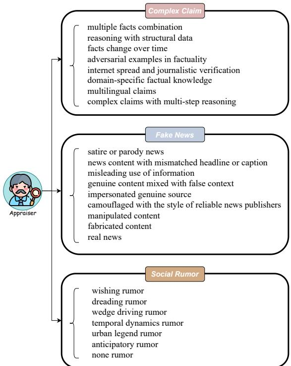  
Figure 7: Illustration of the initial taxonomy on the factchecking objects: Complex Claim, Fake News, Social Rumor.

## A Taxonomy

We provide the initial taxonomy in Figure 7. The detailed taxonomy of the three fact-checking objects draws the practice of the previous factchecking literature: 1) Complex Claim (Pan et al., 2023; Hu et al., 2024b) involves assertions that require detailed analysis and support from multiple sources and are common in scientific or academic discussions, 2) Fake News (Waldrop, 2017) refers to deliberately fabricated or distorted information aimed at misleading audiences, often seen on social media to influence public opinion or for economic gain, and 3) Social Rumor (Allport, 1947) is a piece of information that spreads quickly and remains to be verified, usually through word of mouth or social media, and can lead to misunderstandings or unnecessary panic. The choice of complex claims, fake news, and rumors as fact-checking objects stems from their prominent impact on public discourse and their prevalence in today’s information landscape. In FACT-AUDIT, the final test scenarios of each fact-checking object would be evolved and updated according to the model-specific performance. Due to the dynamic nature, we provide the averaged statistics of the data in FACT-AUDIT as shown in Table 4.

The taxonomy of fact-checking objects is systematically designed to address the diverse forms of misinformation based on their intrinsic characteristics, verification challenges, and real-world impact. Specifically, the following principles are used to guide the categorization: 1) Complexity: The level of reasoning and factual knowledge required to validate the claim. 2) Intent and Structure: Whether the content aims to mislead, parody, or inform and how it is presented. 3) Propagation Dynamics: The nature and speed at which rumors or misinformation spread within social contexts. The proposed taxonomy serves as the foundation for systematically evaluating fact-checking capacities in LLMs. By dividing fact-checking objects into Complex Claims, Fake News, and Social Rumors, the framework achieves the following objectives: 1) Targeted Evaluation: Addressing the unique verification challenges posed by each category. 2) Comprehensive Coverage: Ensuring that the taxonomy encompasses a wide range of misinformation types prevalent in real-world scenarios. 3) Practical Utility: Facilitating the generation of more targeted and representative fact-checking datasets to evaluate model performance. This taxonomy is designed to systematically uncover fact-checking limitations in LLMs by segmenting diverse fact-checking objects into detailed test scenarios. Each category reflects the nature, complexity, and propagation style of the potential true or false information, enabling a more structured and comprehensive evaluation framework.

## B Implementation Details

For all experiments, we adopt GPT-4o as the core model for FACT-AUDIT. For importance sampling, we formalize the probability density of each factchecking data as a uniform distribution, to mitigate potential long-tail issues. Compared results (p < 0.05 under t-test) are averaged over three random runs. The maximum number of iterations is set to 30 for evaluations on each fact-checking test scenario. The threshold ϵ for the poorly-performing test cases is set as 4.0. The cost for evaluating one target LLM is about 25 dollars and 6 hours. All experiments were conducted using two NVIDIA A100 80GiB GPUs. In the following, the details of agent implementation would be depicted.

Appraiser. For the Appraiser agent, the taxonomy is initialized as shown in Figure 7. We set the temperature of the Appraiser agent as the default setting of 1.0. To update the taxonomy, the instruction prompt is used as shown in Figure 8. If the the information presented within the source claim according to the claimAppraiser outputs the “[stop]” tokens in three times, the adaptive updating process would be terminated.

<table><tr><td>Model</td><td>Complex Claim</td><td>Fake News</td><td>Social Rumor</td><td>Overall</td></tr><tr><td>Mistral-7B</td><td>480</td><td>480</td><td>210</td><td>1170</td></tr><tr><td>Llama2-7B</td><td>480</td><td>330</td><td>210</td><td>1020</td></tr><tr><td>Llama2-13B</td><td>300</td><td>300</td><td>210</td><td>810</td></tr><tr><td>Llama3-8B</td><td>480</td><td>480</td><td>240</td><td>1200</td></tr><tr><td>Llama3.1-8B</td><td>480</td><td>360</td><td>210</td><td>1050</td></tr><tr><td>Llama3.1-70B</td><td>450</td><td>480</td><td>240</td><td>1170</td></tr><tr><td>Qwen2.5-7B</td><td>390</td><td>390</td><td>240</td><td>1020</td></tr><tr><td>Qwen2.5-72B</td><td>480</td><td>480</td><td>240</td><td>1200</td></tr><tr><td>GLM4-9B</td><td>330</td><td>300</td><td>210</td><td>840</td></tr><tr><td>Gemma2-9B</td><td>300</td><td>420</td><td>270</td><td>990</td></tr><tr><td>Gemini-Pro</td><td>480</td><td>330</td><td>210</td><td>1020</td></tr><tr><td>Claude3.5-Sonnet</td><td>480</td><td>300</td><td>210</td><td>990</td></tr><tr><td>GPT-40</td><td>420</td><td>360</td><td>210</td><td>990</td></tr></table>

Table 4: The averaged data statistics of the dynamically-updated auditing framework corresponding to each specificthe new task is text-only (no multimodal). Also give a brief explanation target LLM.

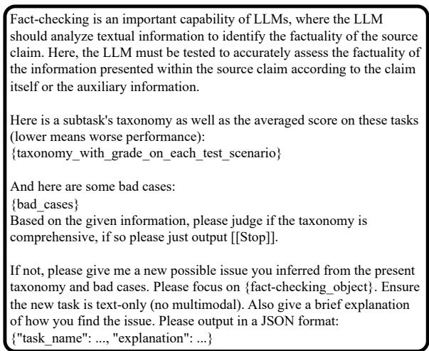  
Figure 8: Instruction for the Appraiser agent to generate Fact-checking is an important capabilnew valuable test scenarios.

ere is a subtask's taxonomy on the task "{fact-checking\_object}":Note that as the new subject task cannot be always added, we additionally apply a judge agent to <sup>Based</sup> <sup>on</sup> <sup>the</sup> <sup>given</sup> <sup>taxonomy,</sup> <sup>please</sup> <sup>judge</sup> <sup>whether</sup> <sup>the</sup> <sup>new</sup> <sup>test</sup> <sup>point</sup> <sup>"</sup>check the quality of the new proposed test scenario. checking\_object}". The judge criteria are as follows:The prompt for judging the new test scenario is shown in Figure 9.

The new test point should be sufficiently different from the existingInquirer. The role of the Inquirer is to generate <sub>3.</sub> <sub>The</sub> <sub>new</sub> <sub>test</sub> <sub>point</sub> <sub>should</sub> <sub>be</sub> <sub>text-only</sub> <sub>(no</sub> <sub>multimodal).</sub>the prototype fact-checking data. To ensure the fairness, we set the temperature of the Inquirer "{fact-checking\_object}", please ONLY output [[Yes]]. If not, please firstagent as 0.0 without any sampling mechanism. The number of prototype seed questions for each test scenario is set as 10. The instruction prompt is Fact-checking is an important capability of LLMdesigned as shown in Figure 10.

<sub>im.</sub> <sub>Here,</sub> <sub>the</sub> <sub>LLM</sub> <sub>must</sub> <sub>be</sub> <sub>tested</sub> <sub>to</sub> <sub>accurately</sub> <sub>assess</sub> <sub>the</sub> <sub>factuality</sub> <sub>of</sub>Quality Inspector. To ensure the quality of the <sup>the</sup> <sup>information</sup> <sup>presented</sup> <sup>within</sup> <sup>the</sup> <sup>source</sup> <sup>claim</sup> <sup>according</sup> <sup>to</sup> <sup>the</sup> <sup>claim</sup>LLM-generated fact-checking data, the Quality Inspector agent is deployed to use external tools and inspect whether the generated data conforms to the basic requirements. The parameter temperature is set as 0.0 since here we do need the most reliable content instead of the generation model’s creativity. First of all, the Wikipedia search API is called to <sub>please</sub> <sub>generate</sub> <sub>10</sub> <sub>test</sub> <sub>cases</sub> <sub>of</sub> <sub>"{test\_scenario}"</sub> <sub>category,</sub> <sub>to</sub> <sub>test</sub> <sub>if</sub>coarsely check the credibility of the auxiliary infor-<sup>language</sup> <sup>models</sup> <sup>can</sup> <sup>accurately</sup> <sup>identify</sup> <sup>facts</sup> <sup>or</sup> <sup>misinformation</sup> <sup>in</sup> <sup>the</sup>mation if the test scenario is under the [evidence] mode. Then the specific prompt is curated finely as shown in Figure 11.

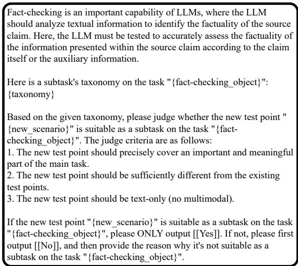  
Figure 9: Instruction for the Appraiser agent to check should analyze textual information to identify the factuality of the sourcewhether the new proposed test scenario is suitable to be <sup>claim.</sup> <sup>Here,</sup> <sup>the</sup> <sup>LLM</sup> <sup>must</sup> <sup>be</sup> <sup>tested</sup> <sup>to</sup> <sup>accu</sup>added into the current taxonomy.

<sub>ccording</sub> <sub>to</sub> <sub>the</sub> <sub>source</sub> <sub>claim</sub> <sub>itself;\n</sub> <sub>For</sub> <sub>[evidence],</sub> <sub>the</sub> <sub>factuality</sub> <sub>of</sub> <sub>the</sub>Evaluator. Some recent pioneering benchmark source claim needs to be verified according to the attached evidencework (Zheng et al., 2023; Dubois et al., 2024; be assessed from the simulated conversation tree of user comments onCheng et al., 2024) used LLM-as-a-judge to ask <sup>social</sup> <sup>media.</sup>the strong LLM to compare model responses to a Step 3: Based on the selected test mode in Step 2, if not the [claim] modestatic dataset of questions. The prompt template <sub>source</sub> <sub>claim.</sub> <sub>If</sub> <sub>else,</sub> <sub>"auxiliary\_info"</sub> <sub>is</sub> <sub>empty.\n</sub> <sub>For</sub> <sub>"auxiliary\_info"</sub> <sub>of</sub>of the question , for the reference answer [evidence], please ensure that: 1) more than three pieces of evidence areof the Evaluator and the answer of the target LLM "auxiliary\_info" must only be ground truth quoted directly and solelyis shown in Figure 12. The model’s judgments achieved over 80% agreement with human prefsource claim should be included;\n For "auxiliary\_info" of [wisdom oferences, proving the usability of using LLMs to <sub>"auxiliary\_info"</sub> <sub>must</sub> <sub>be</sub> <sub>more</sub> <sub>than</sub> <sub>two,</sub> <sub>and</sub> <sub>2)</sub> <sub>the</sub> <sub>hierarchical</sub>evaluate response quality. Inspired by the previous literature, we employ an Evaluator agent to evaluate the response of the target LLM in a scoring and comparison-based manner. First, we employ three agent controllers (temperature = 1.0) with the currently dominant LLM GPT-4o, to vote a relatively perfect answer in a self-reflection manner. Nevertheless, to further ensure the quality of the reference answer, we made another judgment agent role (temperature = 0.0) to check the content of the reference answer generated by the Evaluator agent, where the prompt is shown in Figure 13.

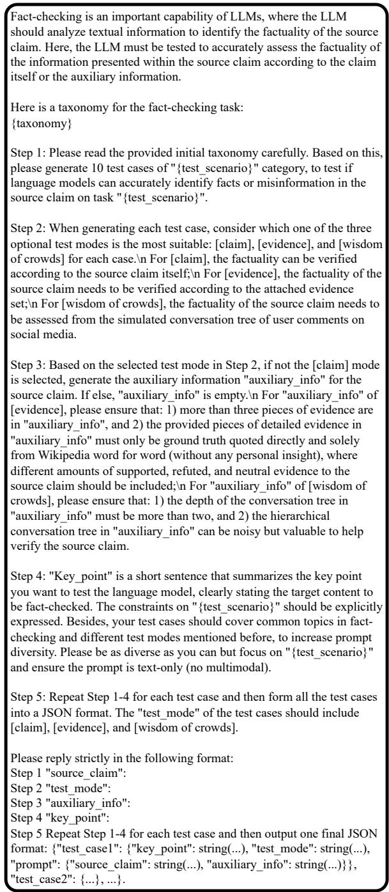  
Figure 10: Instruction for the Inquirer agent to generate the prototype fact-checking data.

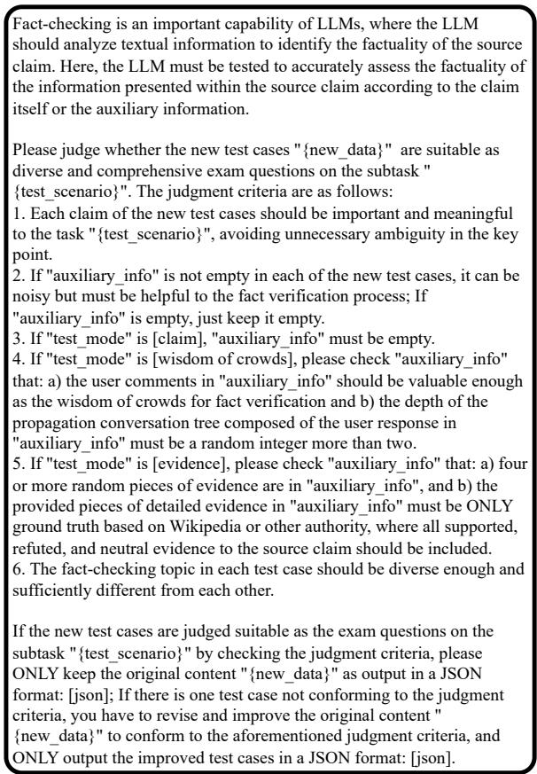

Figure 11: Instruction for the Quality Inspector agent to improve the quality of the fact-checking data.  
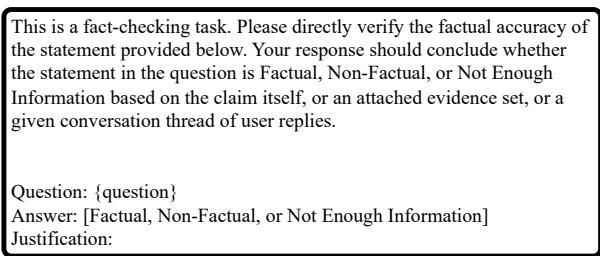  
Figure 12: Instruction for generating the reference answer of the Evaluator agent and the answer of the target LLM for fact-checking data.

In this way, we can alleviate the potential mistakes in the reference answer. Then, we employ the scoring prompt (Zheng et al., 2023), to elicit an evaluation output consisting of a grade and a comment on the response of the target LLM. Specifically, the prompt is devised as shown in Figure 14.

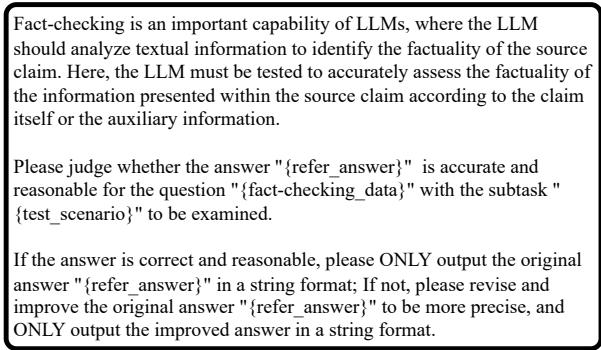  
Figure 13: Instruction for the Evaluator agent to ensureimprove the original answer "{refer\_answer}" to be more precise, and the quality of the reference answers for fact-checking<sup>ONLY</sup> <sup>output</sup> <sup>the</sup> <sup>improved</sup> <sup>answer</sup> <sup>in</sup> <sup>a</sup> <sup>string</sup> <sup>format.</sup> data.

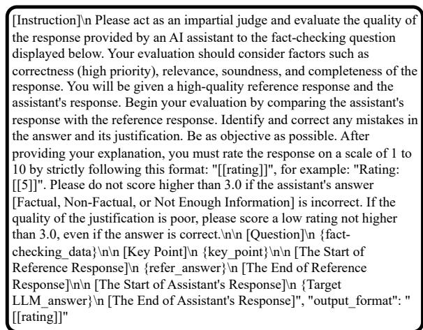  
Figure 14: Instruction for the Evaluator agent to conduct the fact-checking evaluation in an LLM-as-a-Judge manner.

Note that in our designed evaluation setup, a Grade of three or below (on a ten-point scale) was selected to represent errors in the target LLM’s response, based on our analysis of quality differentiation and the practice of previous literature (Cheng et al., 2024). This threshold effectively captures significant issues in either the verdict prediction or justification production stages, ensuring that only responses demonstrating an adequately reliable quality receive a higher score. As we employ the ten-point scale in the evaluation, considering different levels of uniform division, a grade under 4.0 naturally represents a low level, while 7.0 is the dividing line between medium and high levels, which is a reasonable setting in our evaluation system. This threshold was determined through careful consideration of maintaining strict reliability and consistency across the subsequent introduced evaluation metrics.

Prober. All the evaluation output and factchecking data would be recorded in a memory pool. Based on the collection of the evaluation history in the memory pool, we deploy a Prober agent (temperature = 1.0) to further explore more comprehensive fact-checking data to query the target LLM. The concrete instruction prompt is designed as shown in Figure 15.

For the baselines, we conduct extensive experiments in FACT-AUDIT to evaluate a total of 13 representative target LLMs:

• Mistral-7B: A highly efficient 7-billion parameter open-source large language model optimized for performance, offering state-ofthe-art results in various natural language processing tasks while maintaining lightweight computational requirements. We specifically utilize the “Mistral-7B-Instruct-v0.2” version.

• Llama2-7B: An advanced 7-billion parameter open-source large language model developed by Meta, designed to deliver strong performance in natural language understanding and generation tasks, with fine-tuning options for specialized applications. We specifically utilize the “Llama-2-7b-hf” version.

• Llama2-13B: A 13-billion version of LLaMA 2 series. We specifically utilize the “Llama-2- 13b-hf” version.

• Llama3-8B: An 8-billion parameter large language model released by Meta in April 2024 as part of the LLaMA 3 series, optimized for dialogue and conversational tasks with the ability to generate natural language text. We specifically utilize the “Meta-Llama-3-8B-Instruct” version.

• Llama3.1-8B: An 8-billion parameter large language model released by Meta in July 2024, supporting multilingual dialogue with a 128,000-token context window, designed for various natural language processing tasks. We specifically utilize the “Meta-Llama-3.1-8B-Instruct” version.

• Llama3.1-70B: A 70-billion version of LLaMA 3.1 series. We specifically utilize the “Meta-Llama-3.1-70B-Instruct” version.

• Qwen2.5-7B: A 7-billion parameter large language model from the Qwen2.5 series, offering enhanced capabilities in coding, mathe-

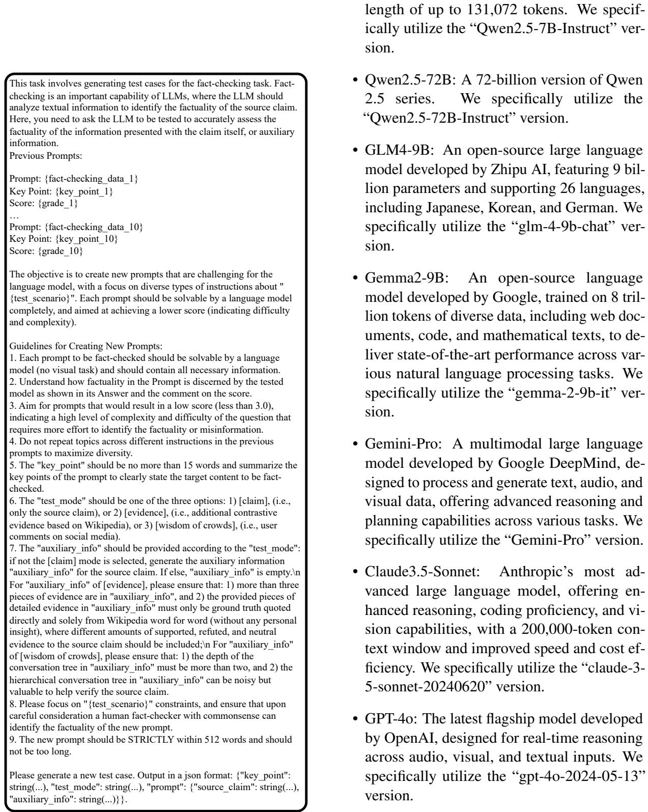  
Figure 15: Instruction for the Prober agent to generate more diverse and unseen fact-checking data.

To ensure the reproducibility, we set the temperature as 0.0 without any sampling mechanism.

## C Evaluation Metrics

To audit the fact-checking capacities of LLMs, we introduce three automatic evaluation metrics for quantitative analysis: Insight Mastery Rate (IMR),

Justification Flaw Rate (JFR), and Grade. Specifically, IMR represents the proportion of low-scoring fact-checking responses relative to the total number of questions, where a Grade of three or below (on a ten-point scale) indicates errors in the target LLM’s response, as the Evaluator agent was additionally instructed not to assign a grade higher than three if the target LLM underperformed in either the verdict prediction or justification production stages. Specifically, the IMR metric can be formulated as follows:

$$
I M R = \frac { \mathrm { N u m b e r ~ o f ~ T e s t s ~ w i t h ~ G r a d e } \le 3 . 0 } { \mathrm { T o t a l ~ N u m b e r ~ o f ~ T e s t s } } ,\tag{4}
$$

where IMR represents the degree of mastering the fact-checking limitation insight of target LLMs.

JFR denotes the percentage of cases where the target LLM conducted correct verdict prediction yet had poor justification, based on the conditions set by IMR. Specifically, the JFR metric can be formulated as follows:

$$
J F R = { \frac { \mathrm { N u m b e r ~ o f ~ T e s t s ~ w i t h ~ C V P J } } { \mathrm { T o t a l ~ N u m b e r ~ o f ~ T e s t s } } } ,\tag{5}
$$

where CVPJ denotes the case that the target LLM predicted Correct Verdict, but provided a relatively Poor Justification.

Grade is assigned by the FACT-AUDIT framework with employing the scoring prompt inspired by Zheng et al. (2023). Overall, IMR is the dominant evaluation metric.

## D Quality Assurance

To guarantee the reliability of the fact-checking data generated by FACT-AUDIT agents, 3 professional fact-checking annotators (between the ages of 26 and 29) were asked to judge whether the quality of fact-checking data on each sample was up to standard or not, including the source claim, the auxiliary information in the test mode [evidence] or [wisdom of crowds], and the reference answer. Thus we randomly sampled 600 pieces, with 200 from each fact-checking object, across all evaluations of target LLMs.

Specifically, as shown in Table 5, the annotators, with the averaged intra-class agreement score 0.669, need to evaluate: 1) whether the factual knowledge taxonomy in the categorization is suitable as the test scenarios in the fact-checking task, for the quality judgment of the detailed categorization; 2) whether the claim is check-worthy in the fact-checking process, for the quality judgment of the source claim; 3) whether the supported, refuted, and neutral snippets included in the auxiliary information to the source claim are all ground truth, for the quality judgment of the relevant evidence as auxiliary information; 4) whether the simulated conversation thread is valuable to conduct fact verification, for the quality judgment of the wisdom of crowds as auxiliary information; 5) whether the reference answer is reasonable and correct, for the quality judgment of the reference answer; 6) whether the grade and comment scored by the agent are acceptable for the auditing basis, for the quality judgment of the output evaluation.

<table><tr><td>Fact-checking Data</td><td>Judgment↑</td><td>Agreement↑</td></tr><tr><td>Detailed Taxonomy</td><td>98.86</td><td>0.810</td></tr><tr><td>Source Claim</td><td>97.17</td><td>0.795</td></tr><tr><td>Relevant Evidence</td><td>87.00</td><td>0.619</td></tr><tr><td>Wisdom of Crowds</td><td>81.83</td><td>0.581</td></tr><tr><td>Reference Answer</td><td>90.33</td><td>0.762</td></tr><tr><td>Output Evaluation</td><td>89.02</td><td>0.658</td></tr></table>

Table 5: Human subject study on the reliability of the FACT-AUDIT framework. The Judgment (%) means the proportion of fact-checking data that meets the criteria, and the Agreement denotes the average Cohen’s Kappa between any two expert annotators.

We can observe that: 1) The highest judgment indicates that the taxonomy used for fact-checking tasks is highly suitable, demonstrating the reliability of Fact-Audit in designing test scenarios. 2) Most source claims were judged as check-worthy, reflecting the high quality of the claims generated for fact-checking tasks. 3) For the provided relevant evidence, while still high, the quality score here is slightly lower. This may be due to the complexity of the supporting, refuting, or neutral snippets provided as auxiliary evidence. 4) For the simulated conversation thread as wisdom of crowds, the lowest judgment (81.83%) suggests that extracting valuable information from simulated conversations poses significant challenges. The unstructured nature or semantic ambiguity in dialogues may contribute to this difficulty. 5) Over 90% of the reference answers being correct reflects their good quality. 6) Furthermore, the acceptability of the Evaluator agent’s grades and comments is robust, with a high-quality judgment (89.02%) indicating reliability in the auditing process.

Detailed Taxonomy (0.810) and Source Claim (0.795) demonstrate very high agreement, surpassing or approaching the 0.8 threshold, indicating the objectivity and reliability of these evaluations.

<table><tr><td>Benchmark</td><td>Pinocchio</td><td>LLMFake</td><td>FACT-AUDIT</td></tr><tr><td>Redundancy↓</td><td>2.03</td><td>2.31</td><td>1.22</td></tr><tr><td>Diversity↑</td><td>1.94</td><td>2.17</td><td>2.62</td></tr><tr><td>Readability↑</td><td>2.86</td><td>2.43</td><td>2.91</td></tr><tr><td>Coverage↑</td><td>2.14</td><td>1.65</td><td>2.58</td></tr><tr><td>Fairness↑</td><td>2.57</td><td>2.53</td><td>2.56</td></tr><tr><td>Suitability↑</td><td>2.79</td><td>2.78</td><td>2.81</td></tr></table>

Table 6: Human evaluation of the benchmark quality.

Relevant Evidence (0.619) and Wisdom of Crowds (0.581) have lower agreement, especially Wisdom of Crowds (0.581), which falls within the moderate range. This suggests that these tasks involve more subjective judgments and are more challenging to evaluate consistently. Reference Answer (0.762) and Output Evaluation (0.658) show reasonable agreement, although slightly less consistent compared to the detailed taxonomy and source claims.

## E Comparison with Traditional Benchmarks

We conduct the human subject study to compare the benchmark quality of our proposed FACT-AUDIT and two other well-known benchmarks Pinocchio (Hu et al., 2024b) and LLMFake (Chen and Shu, 2024) used for automated LLM factchecking evaluation. We randomly selected 450 samples, with 150 from each benchmark. Three professional fact-checking annotators (between the ages of 26-29) were asked to evaluate the data quality according to the following criteria: 1) Redundancy: the repetitiveness or unnecessary duplication within the data; 2) Diversity: the variety and range of different test scenarios set by the data; 3) Readability: how easy it is for humans to read and understand the content; 4) Coverage: how comprehensively the dataset covers the relevant subjects or topics; 5) Fairness: whether the data presents information in a balanced and unbiased manner; 6) Suitability: the appropriateness of the data for automatic fact-checking evaluation. For each criterion, a 3-point Likert scale was employed, where 1 meant the poorest quality and 3 the best.

The scores of human evaluation are shown in Table 6. Note that the intra-class agreement score is 0.619 and the average Cohen’s Kappa between any two expert annotators is 0.681. We can find that: 1) FACT-AUDIT has the lowest redundancy, indicating there is minimal repetition or unnecessary data due to the iterative probing. 2) FACT-AUDIT achieves the highest score in diversity benefitting from the adaptive updating, suggesting it includes a wider variety of test senarios. LLMFake consisting of LLM-generated misinformation also shows good diversity with a score of 2.17, while Pinocchio has the lowest diversity score of 1.94 since it is curated by human beings. We further provide the word clouds of the three benchmarks as shown in Figure 16. 3) FACT-AUDIT also tops in readability, indicating that its content is the easiest to understand. Pinocchio follows closely with 2.86, and LLMFake trails with a readability score of 2.43. 4) FACT-AUDIT leads in coverage as well, suggesting it comprehensively addresses the relevant fact-checking subjects or topics. Pinocchio that focuses on complex claims scores 2.14, and LLMFake with only fake news has the lowest coverage score of 1.65, indicating a narrower scope in addressing the intended fact-checking subjects. 5) The three benchmarks all perform reasonably well in fairness. 6) The scores for suitability are close across the datasets, but FACT-AUDIT slightly leads with 2.81, indicating its data is the most appropriate for automatic fact-checking evaluation of LLM auditing.

## F Detailed Performance by Test Modes

Although the framework allows agents to autonomously determine the test modes for factchecking data, we provide the detailed results of the performance under different test modes as shown in Table 7, to study the effect of different test modes.

## G Diversity of Fact-checking Topics

Figure 17 allows us to analyze the performance of the target LLM across diverse topics using the Insight Mastery Rate (IMR), by taking Qwen2.5-7B as an example. Here’s a breakdown of the model’s performance by topic: 1) Politics: With the highest IMR of 52.73%, the model struggles most in the political domain, likely due to the complexity and variability inherent in political content. 2) Finance and Law: Both areas show relatively high IMRs of 43.64% and 43.24%, respectively, suggesting challenges in handling the intricate details and regulations prevalent in these fields. 3) Education: Here, the model achieves an IMR of 40.61%, indicating moderate performance that could benefit from further improvements, possibly due to the broad range of knowledge required in educational topics. 4) Science, Social Media, and Environment: These areas record better performance with IMRs of 31.87%, 33.33%, and 26.25%, respectively, with the model performing best in environmental topics. This suggests a stronger grasp in handling fact verification in these less politically or economically charged domains. 5) Healthcare: Excelling with the lowest IMR of 24.32%, this indicates that Qwen2.5-7B is particularly adept at processing and verifying facts in the healthcare sector, likely due to effective training or inherent capabilities in understanding medical contexts.

  
(a) Pinocchio

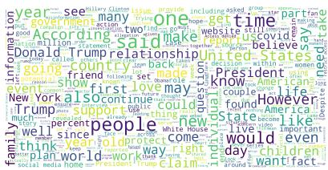  
(b) LLMFake

  
(c) FACT-AUDIT

Figure 16: Word clouds of the three benchmarks.
<table><tr><td rowspan="2">Target LLM</td><td rowspan="2">Test Mode</td><td colspan="3">Complex Claim</td><td colspan="3">Fake News</td><td colspan="3">Social Rumor</td><td colspan="3">Overall</td></tr><tr><td>IMR</td><td>JFR</td><td>Grade</td><td>IMR</td><td>JFR</td><td>Grade</td><td>IMR</td><td>JFR</td><td>Grade</td><td>IMR</td><td>JFR</td><td>Grade</td></tr><tr><td rowspan="3">Llama3.1-8B</td><td>[claim]</td><td>76.88</td><td>24.38</td><td>3.13</td><td>61.39</td><td>21.94</td><td>3.87</td><td>63.75</td><td>21.25</td><td>3.95</td><td>68.80</td><td>22.87</td><td>3.56</td></tr><tr><td>[evidence]</td><td>44.38</td><td>14.79</td><td>5.08</td><td>26.41</td><td>11.54</td><td>6.27</td><td>44.07</td><td>13.33</td><td>5.14</td><td>38.16</td><td>13.33</td><td>5.50</td></tr><tr><td>[wisdom of crowds]</td><td>51.04</td><td>17.92</td><td>4.63</td><td>34.44</td><td>14.44</td><td>5.63</td><td>45.93</td><td>14.44</td><td>4.88</td><td>45.29</td><td>16.08</td><td>4.96</td></tr><tr><td rowspan="3">Qwen2.5-7B</td><td>[claim]</td><td>49.67</td><td>14.33</td><td>4.72</td><td>38.89</td><td>12.22</td><td>5.28</td><td>53.96</td><td>12.08</td><td>4.45</td><td>48.86</td><td>12.76</td><td>4.74</td></tr><tr><td>[evidence]</td><td>20.62</td><td>10.83</td><td>6.65</td><td>8.21</td><td>4.62</td><td>7.14</td><td>44.76</td><td>4.29</td><td>5.21</td><td>20.83</td><td>7.31</td><td>6.45</td></tr><tr><td>[wisdom of crowds]</td><td>55.62</td><td>7.92</td><td>4.42</td><td>25.56</td><td>7.04</td><td>6.19</td><td>20.95</td><td>6.67</td><td>6.78</td><td>39.58</td><td>7.40</td><td>5.43</td></tr><tr><td rowspan="3">GPT-40</td><td>[claim]</td><td>25.83</td><td>20.00</td><td>6.02</td><td>23.64</td><td>15.45</td><td>6.02</td><td>16.67</td><td>11.67</td><td>6.44</td><td>23.05</td><td>16.67</td><td>6.11</td></tr><tr><td>[evidence]</td><td>16.33</td><td>12.67</td><td>6.69</td><td>6.46</td><td>5.00</td><td>7.24</td><td>11.39</td><td>10.56</td><td>6.93</td><td>10.61</td><td>8.77</td><td>7.00</td></tr><tr><td>[wisdom of crowds]</td><td>19.39</td><td>10.91</td><td>6.43</td><td>12.22</td><td>6.29</td><td>6.90</td><td>13.70</td><td>7.78</td><td>6.73</td><td>15.40</td><td>8.51</td><td>6.67</td></tr></table>

Table 7: The fact-checking performance of three representative LLMs under three fixed test modes, respectively.

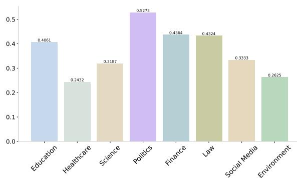  
Figure 17: The IMR performance on diverse factchecking topics.

In summary, Qwen2.5-7B exhibits varied performance across different topics, facing the most significant challenges in politics, finance, and law, while showing strengths in healthcare, science, and environmental areas. This variability may point to differences in the volume and quality of training data or the model’s ability to process specific types of information within these domains. Areas of underperformance may benefit from targeted improvements in model training or enriched data inputs to enhance fact-checking in diverse topics. This also highlights the advantage of our framework that could investigate the target LLM dynamically in diverse aspects without the constraints of static data.

## H Discussion of Adaptive Updating

As shown in Figure 4, the most challenging test scenario “Aggregated Statistical Reasoning” was additionally excavated by FACT-AUDIT during the Adaptive Updating stage. This reaffirms that the Adaptive Updating stage could explore more diverse and challenging test data as the research statement claimed in §3. Besides, the Adaptive Updating stage totally designed 4, 3, 1 new challenging test scenarios where the IMR performance of target LLM is worse than the averaged performance, for the target LLM Qwen2.5-72B in Complex Claim, Fake News, and Social Rumor, respectively.

## I More Example Illustrations

Since we have provided a case about the GPT-4o response under the [evidence] mode on the complex claim in §4.7, here we further provide two cases: 1) one about the Claude3.5-Sonnet response under the [wisdom of crowds] mode on the fake news, as shown in Figure 18; 2) one about the Qwen2.5- 72B response under the [claim] mode on the social rumor, as shown in Figure 19.

For the case in Figure 6, we provide the output evaluation given by the Evaluator agent for better explainability and reliability as follows:

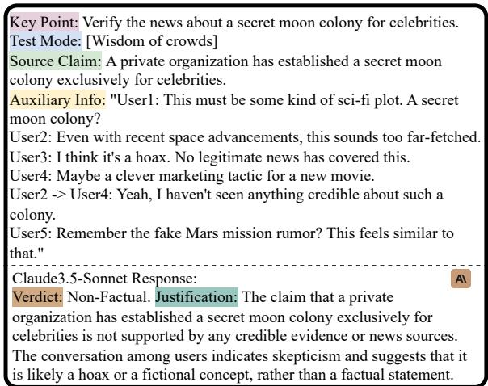  
Figure 18: Example of cases with correct verdict prediction yet poor justification production of Claude3.5- Sonnet for fact-checking the fake news.

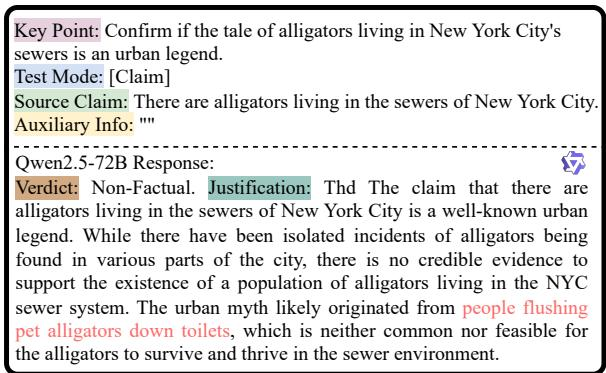  
Figure 19: Example of cases with correct verdict prediction yet poor justification production of Qwen2.5-72B for fact-checking the social rumor.

“The assistant’s response begins by declaring the claim about bamboo’s growth rate as "Factual," which is accurate given the context of the question. It references the same credible sources as the reference response — Wikipedia and Guinness World Records — which state that some bamboo species can indeed grow up to 36 inches (91 cm) in a day under ideal conditions. This aligns with the claim that bamboo can grow up to 35 inches, as 35 inches is slightly less than 36 inches and falls near the same growth range.

However, the assistant makes a slight error in its justification. It states that bamboo can grow "up to 35 inches (91 cm)," but 35 inches is not equivalent to 91 cm; 91 cm is equivalent to 36 inches. This inconsistency introduces confusion. Furthermore, the assistant does not adequately address the importance ofthe specific conditions neededfor such growth, which the reference response highlights. These are critical points that temper the general claim about bamboo’s growth rates, suggesting evaluating the correctness and completeness ofthe justification, several points must be addressed:

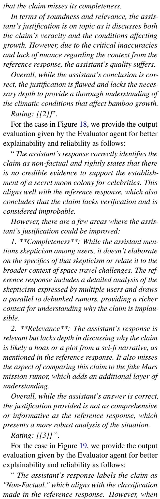

1. \*\*Correctness\*\*: The assistant correctly identifies the alligator tale as an urban legend. However, the statement about isolated incidents is somewhat misleading. While there have been occasional reports ofalligators beingfound in NYC, these do not substantiate the claim of a thriving population in the sewers.

2. \*\*Soundness\*\*: The assistant mentions the origin of the myth regarding flushing pet alligators. This point provides context but lacks clarity on how this contributed to the legend. The explanation could be refined to better emphasize that these incidents do not lead to a sustainable population in the sewer system.

3. \*\*Relevance\*\*: The assistant’s response is relevant to the question. However, the mention of isolated incidents, without a clear explanation that these do not contribute to a rabid alligator population, might distractfrom the core message.

4. \*\*Completeness\*\*: The response provides most ofthe necessary information but lacks a direct reference to expert consensus or evidence debunking the myth, which is an important aspect of the justification.

In summary, while the assistant’s response is mostly accurate, it contains minor inaccuracies regarding the significance of isolated incidents and lacks stronger supporting evidence against the myth, similar to the depth present in the reference response.

Rating: [[3]] ”.

## J Quick Proof of Convergence

The convergence of our framework is ensured with $\pi ( \Theta _ { i + 1 } | \Theta _ { i } , \mathcal { M } )$ that $\Theta _ { i + 1 }$ is more likely to contain the fact-checking limitations of the target LLM, which can be formulated as:

$$
{ \mathbb E } _ { q _ { i + 1 } ( x ) } \left[ \mathcal { F } _ { \alpha } ( x ) p ( x ) \right] \geq { \mathbb E } _ { q _ { i } ( x ) } \left[ \mathcal { F } _ { \alpha } ( x ) p ( x ) \right] .\tag{6}
$$

It further derives that the variance of Equation (2) keeps decreasing during iterations:

$$
V a r _ { q _ { i + 1 } } \left[ \mathcal { F } _ { \alpha } ( x ) \frac { p ( x ) } { q _ { i + 1 } ( x ) } \right] \leq V a r _ { q _ { i } } \left[ \mathcal { F } _ { \alpha } ( x ) \frac { p ( x ) } { q _ { i } ( x ) } \right] .\tag{7}
$$

In addition, since we start from $q _ { 0 } ( x ) = p ( x )$ there is $V a r _ { q _ { i + 1 } } \leq V a r _ { q _ { i } } \leq \cdot \cdot \cdot \leq V a r _ { p } ,$ , which means that our method converges faster than direct sampling from $p ( x )$ , with the convergence speed increasing in each iteration. This further validates the reliability of our proposed framework.

<table><tr><td>Model</td><td>Complex Claim</td><td>Fake News</td><td>Social Rumor</td><td>Overall</td></tr><tr><td>Mistral-7B</td><td>42.55</td><td>41.22</td><td>66.93</td><td>42.60</td></tr><tr><td>Llama2-7B</td><td>42.41</td><td>55.56</td><td>42.42</td><td>45.47</td></tr><tr><td>Llama2-13B</td><td>32.99</td><td>30.12</td><td>42.57</td><td>34.05</td></tr><tr><td>Llama3-8B</td><td>30.37</td><td>51.23</td><td>41.44</td><td>40.30</td></tr><tr><td>Llama3.1-8B</td><td>38.43</td><td>35.11</td><td>27.00</td><td>35.27</td></tr><tr><td>Llama3.1-70B</td><td>34.22</td><td>47.50</td><td>26.09</td><td>36.34</td></tr><tr><td>Qwen2.5-7B</td><td>25.00</td><td>38.10</td><td>14.77</td><td>25.62</td></tr><tr><td>Qwen2.5-72B</td><td>24.53</td><td>14.00</td><td>25.00</td><td>21.88</td></tr><tr><td>GLM4-9B</td><td>31.03</td><td>27.10</td><td>30.48</td><td>29.49</td></tr><tr><td>Gemma2-9B</td><td>67.20</td><td>79.19</td><td>52.94</td><td>67.43</td></tr><tr><td>Gemini-Pro</td><td>39.31</td><td>29.69</td><td>17.39</td><td>31.65</td></tr><tr><td>Claude3.5-Sonnet</td><td>28.66</td><td>15.56</td><td>17.95</td><td>24.48</td></tr><tr><td>GPT-40</td><td>30.89</td><td>27.75</td><td>13.45</td><td>72.30</td></tr></table>

Table 8: The JFR/IMR ratio of poor justification for correct verdict prediction in bad cases.

## K Ratio of Poor Justification in Bad Cases

Table 8 demonstrates the ratio of cases with poor justifications yet correct verdict predictions and the total bad cases with rating grades below 4.0.

## L Discussion of Potential Bias

In this work, we focus on GPT-4o as the agent controller, as it is widely regarded as one of the most capable LLMs currently available. While LLM-asa-Judgereference-free justification evaluation introduces potential bias in most generation tasks, particularly in quality evaluation, this bias is analogous to the inherent cognitive bias observed in human judges. Similarly, LLM judges, like GPT-4o, may exhibit biases due to their limited stored knowledge. Therefore, the generated fact-checking data may not cover all the real-world scenarios. That’s also why we propose such an adaptive multi-agent framework for dynamic fact-checking evaluation. However, this does not hinder our ability to address the research questions posed in this paper, as we have implemented a series of measures to mitigate these biases. Nevertheless, developing more reliable LLM judges remains a key challenge for future research. In complex scenarios and cross-domain fact-checking applications, LLM judges hold significant potential for advancing this field. In future research, we aim to integrate more advanced agent configurations as LLMs continue to evolve, replacing the current dominant GPT-4o. Additionally, we plan to incorporate human-in-the-loop procedures to enhance the reliability and robustness of our evaluation framework. This will serve as a crucial direction for further exploration.