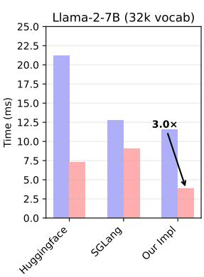
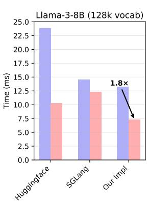
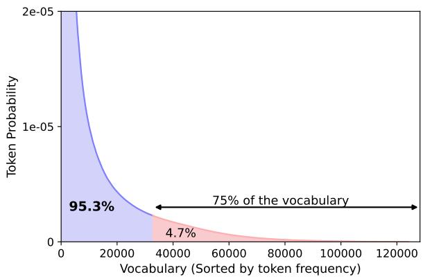
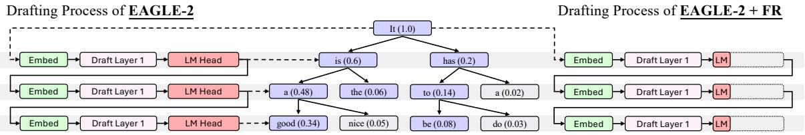
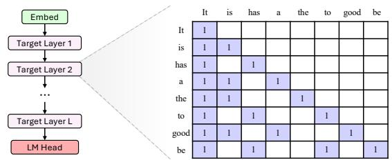
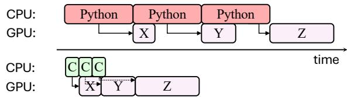
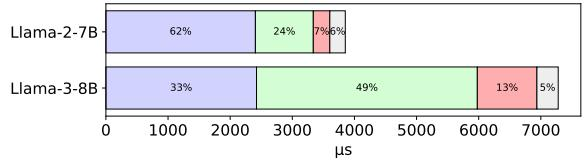
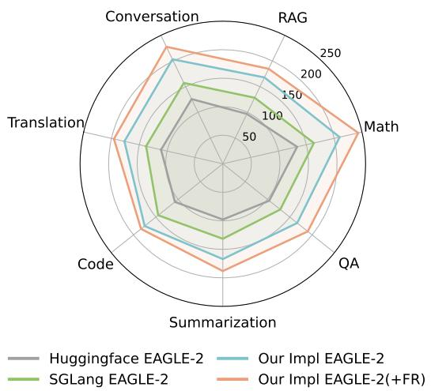
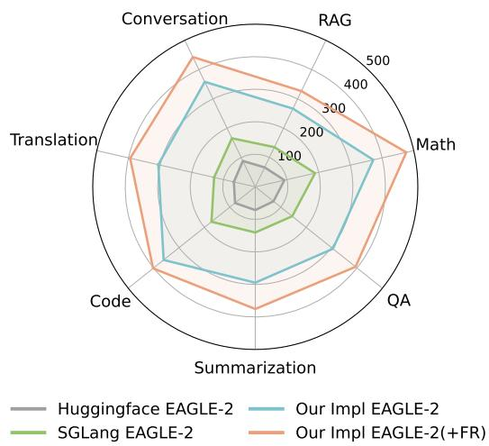

# FR-Spec: Accelerating Large-Vocabulary Language Models via Frequency-Ranked Speculative Sampling

Weilin Zhao<sup>1</sup>\*, Tengyu Pan<sup>1</sup>∗, Xu Han<sup>1†</sup>, Yudi Zhang<sup>2</sup>, Ao Sun<sup>3</sup>, Yuxiang Huang<sup>1</sup>, Kaihuo Zhang<sup>4</sup>, Weilun Zhao<sup>4</sup>, Yuxuan Li<sup>1</sup>, Jie Zhou<sup>5</sup>, Hao Zhou<sup>5</sup>, Jianyong Wang<sup>1</sup>, Zhiyuan Liu<sup>1</sup>†, Maosong Sun<sup>1</sup>   
<sup>1</sup>Tsinghua University, Beijing, China. <sup>2</sup>Harbin Institute of Technology, Harbin, China. <sup>3</sup>Beijing University of Posts and Telecommunications, Beijing, China. <sup>4</sup>OpenBMB. <sup>5</sup>Pattern Recognition Center, WeChat AI, Tencent Inc.   
{zwl23,pty23}@mails.tsinghua.edu.cn, {han-xu,liuzy}@tsinghua.edu.cn

## Abstract

Speculative sampling has emerged as an important technique for accelerating the autoregressive generation process of large language models (LLMs) by utilizing a draft-then-verify mechanism to produce multiple tokens per forward pass. While state-of-the-art speculative sampling methods use only a single layer and a language modeling (LM) head as the draft model to achieve impressive layer compression, their efficiency gains are substantially reduced for large-vocabulary LLMs, such as Llama-3- 8B with a vocabulary of 128k tokens. To address this, we present FR-Spec, a frequencyranked speculative sampling framework that optimizes draft candidate selection through vocabulary space compression. By constraining the draft search to a frequency-prioritized token subset, our method reduces LM Head computation overhead by 75% while ensuring the equivalence of the final output distribution. Experiments across multiple datasets demonstrate an average of 1.12 speedup over the state-ofthe-art speculative sampling method EAGLE-2. Code is available at https://github.com/ thunlp/FR-Spec.

## 1 Introduction

Large language models (LLMs) have revolutionized the field of artificial intelligence (AI), enabling a wide range of applications from conversational AI to complex reasoning tasks (Brown et al., 2020; OpenAI, 2022; Guo et al., 2025). Over time, driven by the need to improve tokenization efficiency and support multilingual capabilities and domain-specific terminologies, the standard vocabulary size of LLMs has grown significantly, from a vocabulary of 32k tokens used in Llama-2 (Touvron et al., 2023) to the much larger vocabularies adopted by recent mainstream models. Notable examples include Llama-3 (Dubey et al., 2024)



  
Figure 1: Comparison of the drafting and verification times of EAGLE-2 implemented by three frameworks (Huggingface, SGLang, and our optimized implementation) for two vocabulary sizes: 32k (Llama-2-7B) and 128k (Llama-3-8B).

with 128k vocabulary tokens, Qwen-2.5 (Yang et al., 2024b) with 152k vocabulary tokens, and DeepSeek-V3 (Liu et al., 2024) with 129k vocabulary tokens. While larger vocabularies enhance model capabilities (Takase et al., 2024; Tao et al., 2024), the side effect of a large vocabulary on the generation speed of LLMs remains unstudied.

To meet the demand for faster generation speed, speculative sampling (Leviathan et al., 2023; Chen et al., 2023) has emerged as a leading technique, particularly for deploying LLMs on resourcerestricted devices such as PCs, laptops, and mobile phones. These methods, such as Medusa (Cai et al., 2024) and EAGLE-2 (Li et al., 2024b), employ a two-stage draft-then-verify mechanism. In each iteration, a lightweight draft model first predicts several draft sequences. Subsequently, the target LLM verifies the drafted tokens in parallel and accepts the longest correct subsequence matching the LLM’s own predictions. This approach allows the LLM to validate multiple tokens in one forward pass. The recent state-of-the-art speculative sampling method, EAGLE-2, has made remarkable progress in reducing the time required for the drafting process, by employing an extremely lightweight architecture — the drafting process relies solely on a single-layer transformer. Despite its simplicity, EAGLE-2 achieves impressive drafting quality, enabling accurate and efficient token predictions that significantly accelerate the overall generation process.

Although speculative sampling has shown promising results, its research highly relies on the Huggingface framework for experimental speedup evaluation. As a result, the negative effects of large vocabularies are obscured due to Python overhead, CPU processing, and suboptimal operator implementations. By implementing EAGLE-2 in native C and CUDA, we observed a substantial increase in drafting time when transitioning from small to large vocabulary models, as illustrated in Figure 1.

To tackle this challenge and achieve further speedup, we introduce FR-Spec, a frequencyranked speculative sampling framework that optimizes draft candidate selection through vocabulary space compression. Our key inspiration is drawn from the long-tailed distribution (Zipf, 1950) of token frequencies in natural languages, as depicted in Figure 2. This distribution indicates that a significant portion of tokens in the vocabulary of LLMs are rarely used. By restricting the draft search to a frequency-prioritized subset of high-probability tokens, we reduce the computational overhead of the language modeling (LM) Head by 75%. While this results in a slight reduction in drafting accuracy, it significantly improves the overall generation speed. Importantly, FR-Spec preserves the mathematical equivalence of the verification process, ensuring that the final output distribution remains unaltered compared with the original sampling methods.

Our contributions are summarized as follows:

1. A Systematic Time Breakdown of Speculative Sampling. To address the current limitations where the bottleneck analyses of speculative sampling are either insufficiently explored or commonly rely on sub-optimized implementations (e.g. Huggingface Transformers), we develop a highly optimized implementation and conduct detailed profiling. Surprisingly, our analysis reveals that the LM Head, rather than the transformer layers, is the primary bottleneck in the drafting process.

2. Frequency-Ranked Speculative Sampling. To mitigate the computational cost of the LM Head, we propose using a frequency-prioritized subset of the vocabulary for the drafting process, while retaining the full vocabulary for verification. Our method, FR-Spec, is designed as a plug-and-play solution, compatible with existing speculative sampling techniques and requiring no retraining. Our <sup>approach</sup> <sup>achieves</sup> <sup>an</sup> <sup>extra</sup> <sup>1.12</sup>× <sup>speedup</sup> <sup>when</sup> integrated with the current state-of-the-art method EAGLE-2 and 1.08 speedup when integrated with Medusa.

  
Figure 2: Token frequency distribution, statistically analyzed using the tokenizer of Llama-3-8B on a subset of 1B tokens randomly sampled from the SlimPajama-627B dataset (Soboleva et al., 2023). As shown in the figure, 75% of the vocabulary tokens account for less than 5% of all token occurrences in the dataset, presenting a “Long Tail” effect.

## 2 Preliminary

In this section, we introduce the concept of speculative sampling by taking the state-of-the-art method EAGLE-2 (Li et al., 2024b) as an example. The fundamental principles and operations of EAGLE-2 can serve as a representative model; other speculative sampling methods follow similar logic and can refer to the related work section (Section 5).

An LLM  with the vocabulary  consists of an embedding layer , L layers of transformer blocks $\mathcal { T } _ { \mathrm { l a y e r } } ^ { ( 1 ) } , \mathcal { T } _ { \mathrm { l a y e r } } ^ { ( 2 ) } , \cdot \cdot \cdot , \mathcal { T } _ { \mathrm { l a y e r } } ^ { ( L ) }$ , and an LM Head with the weight $\mathbf { W _ { L M } } \in \mathbb { R } ^ { | \mathcal { V } | \times d }$ . The embedding layer is responsible for mapping tokens $\mathbf { x } \in \mathbb { R } ^ { n }$ into a d-dimensional latent space. After using the transformer blocks to encode token embeddings, the LM Head projects the output representations back into the vocabulary space. Finally, a softmax function is applied to the vocabulary space to get output token probabilities. Overall, the model $\tau$ can be represented as first calculating the last hidden state $\mathbf { H } _ { \mathcal { T } } ( \mathbf { x } ) \in \mathbb { R } ^ { n \times d }$ , followed by the LM Head projection and softmax computation to obtain the final output token probabilities:

hasVerification Process of EAGLE-2 or FR-Spec using Attention Mask  
  
Figure 3: (Left) The drafting process of EAGLE-2 when prompt $P = ^ { \ast } \mathrm { I t } ^ { \ast }$ , beam width = 2 and search depth = 3. <sub>Verification Process of EAGLE-2 or FR-Spec using Attention Mask</sub>It picks out the top K = 8 probability tokens (purple) as the draft tree. (Right) The drafting process of FR-Spec, <sub>It is has a the to good be</sub>where the LM Head is cropped during the drafting process while the beam search procedure remains the same.<sup>good</sup> <sup>(0.34)</sup> <sup>nice</sup> <sup>(0.05)</sup> <sup>be</sup> <sup>(0.08)</sup> <sup>do</sup> <sup>(0.03)LM</sup> <sup>Head Embed</sup> <sup>Draft</sup> <sup>Layer</sup> <sup>1 LM</sup>

  
Figure 4: The illustration of the verification process for EAGLE-2 and FR-Spec, given the draft in Figure 3. FR-Spec solely modifies the drafting process while the verification process remains consistent with EAGLE-2.

$$
\begin{array} { r } { \mathbf { H } _ { \mathcal { T } } ( \mathbf { x } ) = \mathcal { T } _ { \mathrm { l a y e r } } ^ { ( L ) } \circ \dots \circ \mathcal { T } _ { \mathrm { l a y e r } } ^ { ( 2 ) } \circ \mathcal { T } _ { \mathrm { l a y e r } } ^ { ( 1 ) } \big ( \mathcal { E } ( \mathbf { x } ) \big ) , \quad } \\ { \mathcal { T } ( \mathbf { x } ) = \mathrm { S o f t m a x } \big ( \mathbf { H } _ { \mathcal { T } } ( \mathbf { x } ) \mathbf { W } _ { \mathrm { L M } } ^ { T } \big ) . \qquad } \end{array}\tag{1}
$$

For the LLM  , EAGLE-2 trains a lightweight draft model to approximate ’s behavior while drastically reducing computational overhead. The draft model  is structured as a single-layer transformer, with its latent dimension d being identical to that of the target LLM. For the draft model, the parameters of its embedding layer and LM head are directly sourced from the target LLM and are frozen during the training process. The transformer layer of the draft model is then trained on some training data to make the draft model mimic the generation results of the target LLM. To summarize, can be represented as calculating the hidden state $\mathbf { H } _ { \mathcal { D } } ( \mathbf { x } ) \in \mathbb { R } ^ { n \times d }$ , and conducting LM Head projection:

$$
\begin{array} { r l } & { \mathbf { H } _ { \mathcal { D } } ( \mathbf { x } ) = \mathcal { D } _ { \mathrm { l a y e r } } ^ { ( 1 ) } ( \mathcal { E } ( \mathbf { x } ) ) , } \\ & { \quad \mathcal { D } ( \mathbf { x } ) = \mathrm { S o f t m a x } ( \mathbf { H } _ { \mathcal { D } } ( \mathbf { x } ) \mathbf { W } _ { \mathrm { L M } } ^ { T } ) . } \end{array}\tag{2}
$$

EAGLE-2 actually combines ${ \bf { H } } _ { \mathcal { T } } ( { \bf { x } } )$ from the target LLM with $\mathcal { E } ( \mathbf { x } )$ on the draft input, but this does not affect the presentation of our paper, so the formula is simplified as $\operatorname { E q . } ( 2 )$ for clarity.

<sup>1</sup>During inference, given a specific prompt P, EAGLE-2 adopts a beam-search algorithm based 1 1on the softmax output of the draft model to complete a drafting process. Given a beam width and a search depth, EAGLE-2 uses the draft model to forward depth times and then select the top K probability tokens from the beam search history as the draft. As illustrated in Figure 3 (left), EAGLE-2 finally generates a draft tree consisting of multiple draft sequences, and the draft tree is then verified by the target LLM  using a tree attention mask demonstrated in Figure 4. The special tree attention mask is created based on the draft tree, where each token can only see tokens in its ancestral path and in the prompt prefix P.

## 3 Methodology

## 3.1 Identifying Key Bottlenecks for Speculative Sampling

To gain deeper insights into the time breakdown of speculative sampling and quantify the contribution of each component, we first implement an optimized speculative sampling framework and employ profiling tools to analyze the key bottlenecks of EAGLE-2 under our optimized framework.

Filtering out Non-Algorithmic Overheads. Before conducting the analysis, it is crucial to rule out the analysis errors caused by sub-optimized framework implementations. For instance, despite its widespread use and convenience, Python’s dynamic typing and interpreted nature can introduce inefficiencies that are not directly related to the analyzed algorithms. For example, the beam search algorithm in EAGLE-2, characterized by a large number of short-duration computational tasks, leads to significant latency issues in the original PyTorch (Paszke et al., 2019) implementation, as illustrated in Figure 5. Specifically, executing these tasks requires frequent waiting for Python’s launch commands, making them one of the bottlenecks. To mitigate this, we reimplement EAGLE-2 using native C and CUDA and preallocate all required memory in advance. This eliminates the overhead associated with Python’s interpreter. As demonstrated in Figure 5, this optimization can significantly reduce latency and make the overall execution more streamlined.

  
Figure 5: Comparison of Python-based implementation and C-based implementation. X, Y, and Z represent three different short-duration computational tasks.

Additionally, suboptimal operator implementations can introduce significant implementationlevel overheads. We thus modify FlashAttention (Dao, 2023) to support complex tree attention masks as in Figure 4. To minimize the performance impact of memory access for attention masks, we optimize the process by transmitting only the portion of the mask corresponding to the draft tokens, given that the prompt prefix P is entirely causal. Moreover, since EAGLE-2 (and other speculative sampling methods) typically involves no more than 64 draft tokens, we employ bitmask compression using “uint64” to ensure more contiguous and compact memory access patterns, thereby enhancing overall efficiency.

Wall Time Breakdown. Based on our optimized implementation framework, we observe a substantial increase in drafting time when shifting from small vocabulary LLMs to large vocabulary LLMs, as in Figure 1. To investigate the underlying reasons for this, we conduct a comprehensive profiling analysis on our proposed framework. As shown in Figure 6, the computational bottleneck in the drafting process has shifted from the transformer layer, which is traditionally considered timeconsuming, to the LM Head. The vocabulary size directly causes such a significant disparity associated with the LM Head component. Additionally, the softmax function, which operates across the dimension of the vocabulary size, also exhibits a notable increase in wall time.

Specifically, the profiling data indicates that the LM Head component accounts for a substantial 49% of the total computational time in the drafting process, nearly half of the entire processing time. When accounting for the combined computation time of the LM Head and the softmax operation, both directly proportional to the vocabulary size, the proportion increases to 62%. In contrast, the transformer layer accounts for only 33% of the computation time. This indicates that vocabularyrelated computations require nearly twice the time of the transformer layer’s operations.

Embedding + Transformer Layer Softmax on the LM Head Projection Weight Projection of the LM Head Others  
  
Figure 6: Time breakdown of the drafting process of EAGLE-2. We profile the EAGLE-2 trained on Llama-2-7B (32k vocabulary) and the EAGLE-2 trained on Llama-3-8B (128k vocabulary).

These findings indicate that while a large vocabulary has a relatively moderate impact on the speed of the LLM itself, the scenario shifts significantly within the speculative sampling framework. This is due to the highly lightweight architecture of the drafting model, which follows a 1:1 ratio of one transformer layer to one LM Head. This underscores the importance of optimizing vocabularyrelated operations to enhance the efficiency of speculative sampling in large vocabulary settings.

## 3.2 Addressing the Bottleneck Caused by Large Vocabulary

To optimize for large-vocabulary scenarios, we conducted a corpus-level token-frequency analysis, which revealed that the vast majority of tokens hardly appear in the corpus, demonstrating a sparse pattern across the vocabulary. We then utilize the sparse pattern to let the draft model focus exclusively on drafting high-probability tokens, while tokens with extremely low probabilities of occurrence are left to be handled by the LLM.

Corpus-Level Token Statistics. We begin by analyzing the token frequency distribution across a pretraining corpus SlimPajama-627B (Soboleva et al., 2023). The data in the pre-training corpus encompasses a vast amount of information from diverse fields. It is highly suitable for token-frequency analysis. As illustrated in Figure 2, we use a 1 billion token subset of the pretraining corpus to get the corpus-level token statistics. Our statistical study reveals a pronounced long-tail pattern: a small subset (25%) of tokens (e.g., common words, punctuation, and general-domain terms) accounts for the majority of occurrences (95%), while the remaining (75%) tokens exhibit sparse frequencies (5%). This observation motivates our core design: restricting the draft model’s generation scope to the small subset of high-frequency tokens can significantly accelerate the drafting process without sacrificing much draft quality.

FR-Spec. We propose a frequency-ranked drafting mechanism. Let denote the full vocabulary of the language model, and $\mathcal { V } _ { \mathrm { h i g h } } \subset \mathcal { V }$ represent the subset of high-frequency tokens identified through previously mentioned corpus-level statistics. At each generation step, instead of computing probabilities over the entire vocabulary, we restrict the drafting model’s output distribution $\mathcal { D } ( \mathbf { x } )$ to $\mathcal { V } _ { \mathrm { h i g h } }$ as shown in Figure 3 (right). We only limit the vocabulary of the drafting process while keeping the verification process untouched.

To this end, we first create a sub matrix $\tilde { \mathbf { W } } _ { \mathrm { L M } } \in$ $\mathbb { R } ^ { | \nu _ { \mathrm { h i g h } } | \times d }$ from $\mathbf { W _ { L M } } \in \mathbb { R } ^ { | \mathcal { V } | \times d }$ , by letting

$$
\begin{array} { r } { \tilde { \mathbf { W } } _ { \mathrm { L M } } [ i , : ] = \mathbf { W } _ { \mathrm { L M } } [ \mathcal { V } _ { \mathrm { h i g h } } [ i ] , : ] , i = 1 \ldots | \mathcal { V } _ { \mathrm { h i g h } } | . } \end{array}\tag{3}
$$

Then we change the draft equation from $\operatorname { E q . } ( 2 )$ to

$$
\mathcal { D } _ { \mathrm { F R } } ( \mathbf { x } ) = \mathrm { S o f t m a x } ( \mathbf { H } _ { \mathcal { D } } ( \mathbf { x } ) \tilde { \mathbf { W } } _ { \mathrm { L M } } ^ { T } )\tag{4}
$$

As can be seen, from changing Eq.(2) to Eq.(4), the computational complexity of the LM Head projection is reduced from the original $\mathrm { O } ( n d | \nu | )$ to $\mathrm { O } ( n d | \mathcal { V } _ { \mathrm { h i g h } } | )$ , achieving a reduction by a factor of $\frac { \vert \mathcal { V } \vert } { \vert \mathcal { V } _ { \mathrm { h i g h } } \vert }$ . Additionally, the input dimension of Softmax is reduced from $\mathbf { H } _ { \mathcal { D } } ( \mathbf { x } ) \mathbf { W } _ { \mathrm { L M } } ^ { T } \in \mathbb { R } ^ { n \times | \mathcal { V } | }$ to $\mathbf { H } _ { \mathcal { D } } ( \mathbf { x } ) \tilde { \mathbf { W } } _ { \mathrm { L M } } ^ { T } \in \mathbb { R } ^ { n \times | \mathcal { V } _ { \mathrm { h i g h } } | }$ . The operation time of the softmax function, proportional to the input size, is also decreased by a factor of $\frac { \vert \mathcal { V } \vert } { \vert \mathcal { V } _ { \mathrm { h i g h } } \vert }$ when using a reduced vocabulary subset.

By using a small subset of the original vocabulary, FR-Spec indicates a context-related acceleration paradigm: sequences dominated by highfrequency tokens benefit from reduced computational overheads. While those regions requiring low-frequency tokens (e.g., rare named entities or technical terms) inherently bypass acceleration. We will balance this tradeoff in the subsequent experiment section and demonstrate that the benefits of our approach outweigh its drawbacks.

## 4 Experiments

This section focuses on evaluating FR-Spec on various tasks when applying to various large-

vocabulary LLMs to demonstrate the efficiency and effectiveness of FR-Spec.

## 4.1 Experimental Settings

Datasets. To comprehensively assess the speed performance of various speculative sampling methods, we evaluate FR-Spec across seven representative text generation tasks: machine translation (MT.), multi-turn conversation (Conv.), retrievalaugmented generation (RAG), arithmetic reasoning (Math), question answering (QA), document summarization (Summ.), and code generation (Code). Specifically, we adopt Spec-Bench (Xia et al., 2024) benchmark, a widely used benchmark for speculative sampling, which covers the first six subtasks, with datasets drawn from the following sources: Translation from WMT14 DE-EN (Bojar et al., 2014), Multi-turn Conversation from MTbench (Zheng et al., 2023), RAG and QA from Natural Questions (Kwiatkowski et al., 2019), Math from GSM8K (Cobbe et al., 2021), and Summarization from CNN/Daily Mail (Nallapati et al., 2016), with 80 entries per subtask. In addition, we include the HumanEval (Chen et al., 2021) benchmark, which focuses on code generation tasks and contains 164 entries. Following Xia et al. (2024), we set the maximum generation lengths to 1024 for all subtasks in Spec-Bench and 512 for HumanEval.

Models. We select Llama-3-8B-Instruct (128k vocabulary) (Dubey et al., 2024), Llama-3.2- 1B-Instruct (128k vocabulary) and Qwen-2-7B-Instruct (152k vocabulary) (Yang et al., 2024a) as the language models for experiments. These models are recently representative and popular LLMs.

Evaluation Methods. We select vanilla autoregressive decoding and EAGLE-2 as our baselines. We integrate FR-Spec with EAGLE-2, which we called “EAGLE-2 (+FR)” later. We report the mean acceptance length and decoding speed (token/s). Following the settings in Spec-Bench (Xia et al., 2024), we set the search depth of EAGLE-2 to 6 and the total amount of draft tokens to 60.

Hardware Settings. Experiments in this section are performed on 1  NVIDIA 80GB A800 GPU. The CPU used is the Intel(R) Xeon(R) Platinum 8470. Experiments on other platforms can refer to Appendix A.2.

## 4.2 Accept Length

To thoroughly investigate the impact of the frequency-ranked drafting mechanism on existing speculative sampling frameworks, we conducted experiments across seven subtasks, measuring the average acceptance length under different vocabulary truncation strategies. The average acceptance length is an important metric in speculative sampling. It quantifies the number of draft tokens that are verified as correct in each iteration. It serves as an effective assessment of drafting quality and is one important factor that affects the final speedup aside from the drafting time.

<table><tr><td>Configuration</td><td>MT.</td><td>Conv.</td><td>RAG</td><td>Math</td><td>QA</td><td>Summ.</td><td>Code</td><td>Average</td></tr><tr><td>Full Vocab (128k)</td><td>3.66</td><td>4.12</td><td>4.05</td><td>4.29</td><td>3.49</td><td>3.68</td><td>3.92</td><td>3.89 (100%)</td></tr><tr><td>+FR 64k (ShareGPT)</td><td>3.45</td><td>4.08</td><td>3.89</td><td>4.20</td><td>3.40</td><td>3.56</td><td>3.83</td><td>3.77 (96.9%)</td></tr><tr><td>+FR 32k (ShareGPT)</td><td>3.23</td><td>3.95</td><td>3.59</td><td>4.04</td><td>3.25</td><td>3.31</td><td>3.62</td><td>3.57 (91.8%)</td></tr><tr><td>+FR 16k (ShareGPT)</td><td>3.03</td><td>3.71</td><td>3.30</td><td>3.74</td><td>3.04</td><td>3.02</td><td>3.40</td><td>3.32 (85.3%)</td></tr><tr><td>+FR 8k (ShareGPT)</td><td>2.82</td><td>3.42</td><td>2.95</td><td>3.45</td><td>2.82</td><td>2.77</td><td>3.19</td><td>3.06 (78.7%)</td></tr><tr><td>+FR 64k (SlimPajama)</td><td>3.59</td><td>4.07</td><td>3.98</td><td>4.26</td><td>3.42</td><td>3.65</td><td>3.62</td><td>3.80 (97.7%)</td></tr><tr><td>+FR 32k (SlimPajama)</td><td>3.39</td><td>3.89</td><td>3.85</td><td>4.15</td><td>3.34</td><td>3.51</td><td>3.29</td><td>3.63 (93.3%)</td></tr><tr><td>+FR 16k (SlimPajama)</td><td>3.20</td><td>3.63</td><td>3.56</td><td>3.84</td><td>3.19</td><td>3.28</td><td>3.10</td><td>3.40 (87.4%)</td></tr><tr><td>+FR 8k (SlimPajama)</td><td>2.98</td><td>3.33</td><td>3.25</td><td>3.52</td><td>2.97</td><td>2.98</td><td>2.86</td><td>3.13 (80.5%)</td></tr></table>

Table 1: Average accepted length for Llama-3-8B under different FR-Spec configurations. The numbers in parentheses (97.7%) indicate the ratio achieved compared to the full vocabulary baseline.
<table><tr><td>Method</td><td>MT.</td><td>Conv.</td><td>RAG</td><td>Math</td><td>QA</td><td>Summ.</td><td>Code</td><td>Average</td></tr><tr><td>Vanilla</td><td>90.94</td><td>90.43</td><td>83.43</td><td>91.16</td><td>91.05</td><td>86.63</td><td>90.10</td><td>89.11 (1.00×)</td></tr><tr><td>EAGLE-2</td><td>176.79</td><td>203.41</td><td>168.05</td><td>209.88</td><td>166.60</td><td>167.12</td><td>175.11</td><td>180.99 (2.03×)</td></tr><tr><td>+FR 64k</td><td>192.85</td><td>224.52</td><td>178.53</td><td>231.99</td><td>183.17</td><td>183.86</td><td>183.11</td><td>196.86 (2.21×)</td></tr><tr><td>+FR 32k</td><td>195.60</td><td>227.68</td><td>184.85</td><td>243.36</td><td>190.27</td><td>188.14</td><td>183.19</td><td>201.87 (2.27×)</td></tr><tr><td>+FR 16k</td><td>194.02</td><td>223.32</td><td>178.22</td><td>233.69</td><td>188.60</td><td>182.26</td><td>176.70</td><td>196.69 (2.21×)</td></tr><tr><td>+FR 8k</td><td>185.78</td><td>210.66</td><td>167.64</td><td>218.57</td><td>180.40</td><td>170.97</td><td>167.85</td><td>185.98 (2.09×)</td></tr></table>

Table 2: Decoding speed (token/s) of FR-Spec and baselines on Llama-3-8B under our implementation framework using temperature=0. The numbers in parentheses (2.27 ) indicate the speedup compared to the baseline (Vanilla).

Specifically, we tried two datasets for token frequency statistics: (1) SlimPajama-627B (Soboleva et al., 2023). We sample a 1 billion token subset from it. Conducting tokenization on this subset requires less than 30 minutes. (2) ShareGPT (ShareGPT, 2023). ShareGPT is the training data for EAGLE-2, and we use the whole dataset, which comprises 134 million tokens.

Based on the token-frequency statistics, we select four different vocabulary sizes $( | \mathcal { V } _ { \mathrm { h i g h } } | ~ =$ 8k, 16k, 32k, 64k ) to serve as the new LM Head configurations for the draft model. Table 1 reports the average acceptance length of the Llama-3-8B model across different FR-Spec configurations. As shown in the results, when the vocabulary size of the draft model was halved from 128k to 64k, the average acceptance length only decreased slightly (2.3% for SlimPajama and 3.1% for ShareGPT). This result is consistent with the “long-tail” characteristic of token frequency analyzed in Section 3.2. When the vocabulary size was reduced to 8k, a significant shortening of the acceptance length was observed. This finding underscores the need to strike a balance between the draft accuracy and drafting time of the draft model. In Section 4.3 below, we will conduct an in-depth analysis of this trade-off, taking into account the drafting time.

Notably, frequency statistics derived from SlimPajama outperform those from ShareGPT in terms of average accept length. The observation remains consistent when applied to Qwen-2-7B and Llama-3.2-1B, as detailed in Appendix A.1 and A.2. We attribute this difference to the higher quality and the larger volume of the SlimPajama data. More ablations on corpus can refer to Appendix A.3 Therefore, we adopted SlimPajamabased statistics for subsequent experiments.

## 4.3 Decoding Speed

Based on our native C and CUDA implementation, we evaluate the speed of the proposed FR-Spec method and baselines on the Llama-3-8B model, as detailed in Table 2. As can be seen, FR-Spec surpasses the original EAGLE-2 in all vocabulary configurations. Comparing different vocabulary sizes, setting <sub>high</sub> = 32k consistently outperforms other vocabulary configurations.

  
Figure 7: Decoding speed (token/s) of FR-Spec and EAGLE-2 for Llama-3-8B under different frameworks.

Specifically, this configuration achieves an average speedup improvement of 11.8% over EAGLE-2, achieving the best trade-off between draft accuracy and drafting time. Experiments on Llama-3-1B can refer to Appendix A.2, where FR-Spec achieves 24.2% extra speedup over EAGLE-2.

Furthermore, we conducted speed analyses between our implementation and mainstream frameworks, namely Huggingface and SGLang. As the experimental results demonstrated in Figure 7, our optimized EAGLE-2 achieves average speedups of 1.63 and 1.28 compared to the original HuggingFace and SGLang versions, respectively. The FR-Spec further improves these performance gains, with speedups of 1.82 and 1.42 over the HuggingFace and SGLang implemented EAGLE-2, respectively.

FR-Spec supports both greedy decoding and random sampling. As illustrated in Table 3, FR-Spec can achieve a speedup ratio of 1.13 compared to EAGLE-2 at a temperature of 1. This performance is comparable to the acceleration observed at the temperature of 0, showing that FR-Spec is effective at different generation settings.

## 4.4 Model Performance

To validate the correctness of our FR-Spec, we assessed the generation quality of the Llama-3-8B model across two tasks: code generation using the HumanEval benchmark and mathematical reasoning with the GSM8K benchmark. We compare the model’s performance between the HuggingFace implementation and our optimized implementation in Table 4, in both greedy decoding (temperature=0)

<table><tr><td>Benchmark</td><td>Vanilla token/s</td><td>EAGLE-2 token/s Speedup</td><td>EAGLE-2(+FR 32k) token/s</td><td>Speedup</td></tr><tr><td>MT.</td><td>90.32</td><td>171.03 1.89×</td><td>188.69</td><td>2.09×</td></tr><tr><td>Conv.</td><td>89.85</td><td>187.95 2.09×</td><td>212.08</td><td>2.36×</td></tr><tr><td>RAG</td><td>83.18</td><td>159.37 1.92×</td><td>178.64</td><td>2.15×</td></tr><tr><td>Math</td><td>89.75</td><td>196.34 2.19×</td><td>237.96</td><td>2.65×</td></tr><tr><td>QA</td><td>90.58</td><td>155.10 1.71×</td><td>182.59</td><td>2.02×</td></tr><tr><td>Summ.</td><td>87.41</td><td>158.72</td><td>1.82× 182.70</td><td>2.09×</td></tr><tr><td>Code</td><td>89.77</td><td>180.67</td><td>2.01× 183.54</td><td>2.04×</td></tr><tr><td>Average</td><td>88.69</td><td>172.74</td><td>1.95× 195.17</td><td>2.20×</td></tr></table>

Table 3: Decoding speed (token/s) of Llama-3-8B using temperature=1 under our implementation.
<table><tr><td rowspan="2">Benchmark Temp</td><td rowspan="2"></td><td colspan="2">Huggingface</td><td colspan="2">Our Implementation</td></tr><tr><td>Vanilla</td><td>EAGLE-2</td><td>Vanilla</td><td>FR-Spec</td></tr><tr><td rowspan="2">HumanEval</td><td>0</td><td>54.9</td><td>54.9</td><td>57.3</td><td>58.5</td></tr><tr><td>1</td><td>51.0±1.4</td><td>50.6±3.1</td><td>51.1±1.2</td><td>51.2±1.2</td></tr><tr><td rowspan="2">GSM8K</td><td>0</td><td>76.8</td><td>77.0</td><td>76.3</td><td>76.1</td></tr><tr><td>1</td><td>70.8±2.0</td><td>66.5±2.9</td><td>65.6±1.8</td><td>67.1±0.8</td></tr></table>

Table 4: Performance of the Llama-3-8B model on math reasoning and code generation tasks across two implementation frameworks. Due to variability in results with temperature=1, we report the average scores and variance across five different random seeds.

and random sampling (temperature=1) scenarios.

The experimental results indicate that the performance across both implementations is comparable, with only minor discrepancies. These differences are expected, as different implementations use different computational orders, resulting in floatingpoint numerical errors that accumulate within the model layers.

## 4.5 Integration to Other Speculative Methods

As a plug-and-play acceleration solution that is compatible with various speculative sampling methods, we further assess FR-Spec by integrating FR-Spec to Medusa (Cai et al., 2024), another representative speculative sampling method. Table 5 presents the performance of FR-Spec in our optimized implementation of Medusa, where FR-Spec achieve 1.08 extra speedup. The experimental results demonstrate that while our previous analysis primarily focused on EAGLE-2, our method also shows effectiveness when applied to other representative speculative sampling approaches, exhibiting strong compatibility and user-friendliness across different implementations.

## 4.6 Case Study

To more intuitively illustrate how the FR-Spec’s restriction on the drafter model’s vocabulary size affects the decoding process, we present a case study of speculative decoding in Figure 8. FR-Spec requires an extra draft attempt when encountering the ‘-pointer’ token, since it is not included in FR-Spec’s small vocabulary, but the subsequent drafting progress quickly realigns with EAGLE-2.

<table><tr><td rowspan="2">Benchmark</td><td rowspan="2">Vanilla token/s</td><td colspan="2">Medusa</td><td colspan="2">Medusa (+FR 32k)</td></tr><tr><td></td><td>token/s Speedup</td><td>token/s</td><td>Speedup</td></tr><tr><td>MT.</td><td>90.94</td><td>146.42</td><td>1.61×</td><td>157.54</td><td>1.73×</td></tr><tr><td>Conv.</td><td>90.43</td><td>157.99</td><td>1.75×</td><td>169.26</td><td>1.87×</td></tr><tr><td>RAG</td><td>83.43</td><td>130.56</td><td>1.56×</td><td>139.62</td><td>1.67×</td></tr><tr><td>Math</td><td>91.16</td><td>160.95</td><td>1.77×</td><td>174.56</td><td>1.91×</td></tr><tr><td>QA</td><td>91.05</td><td>138.92</td><td>1.53×</td><td>151.07</td><td>1.66×</td></tr><tr><td>Summ.</td><td>86.63</td><td>130.08</td><td>1.50×</td><td>141.39</td><td>1.63×</td></tr><tr><td>Code</td><td>90.10</td><td>152.57</td><td>1.69×</td><td>161.28</td><td>1.79×</td></tr><tr><td>Average</td><td>89.11</td><td>145.36</td><td>1.63×</td><td>156.39</td><td>1.76×</td></tr></table>

Table 5: Decoding speed (token/s) of Llama-3-8B using temperature=0 under our implemented Medusa.

## 5 Related Work

This section mainly introduces model acceleration methods related to large vocabulary and speculative sampling. More details on how LLMs work can refer to surveys (Qiu et al., 2020; Han et al., 2021; Bommasani et al., 2021; Zhao et al., 2023). Other acceleration methods such as quantization and distillation can refer to suverys (Xu and McAuley, 2023; Li et al., 2024a).

## 5.1 Acceleration on Large Vocabulary

Recent advancements in large language models (LLMs) have prompted a growing interest in addressing the challenges associated with large vocabularies. While several optimization efforts have been proposed to tackle these issues, the majority focus primarily on the training phase. Computing the LM Head and the loss function over large vocabularies requires storing a huge intermediate state before gradient computation. Therefore, MST (Luo et al., 2024) and CCE (Wijmans et al., 2024) tried to mitigate the memory overhead caused by computing loss functions over large vocabularies. These approaches address the issue by using input partitioning or weight partitioning, and conduct activation recomputation (Chen et al., 2016) during the backward propagation. In addition to the aforementioned works that require no modifications to the model architecture, Joulin et al. (2017) proposes a hierarchical vocabulary structure to eliminate the computation of irrelevant vocabulary adaptively.

Constrained Decoding (Hokamp and Liu, 2017;

Dong et al., 2024) restricts the vocabulary space to generate highly structured outputs, particularly in the context of LLM agents, where the generated content must adhere to specific formats, such as producing parsable code or invocable functions.

## 5.2 Speculative Sampling

Traditional autoregressive generation in LLMs suffers from low generation speed due to the sequential nature of token prediction. To address this limitation, speculative sampling has emerged as a promising approach, leveraging draft-thenverification paradigms to accelerate decoding (Xia et al., 2023; Leviathan et al., 2023; Chen et al., 2023). Existing speculative sampling methods can be categorized into two branches: (1) retrievalbased drafting approaches like PLD (Saxena, 2023), LLMA (Yang et al., 2023), and REST (He et al., 2024) retrieve relevant context from the prompt, gaining significant speedups in contextdependent tasks (e.g., summarization) by reusing retrieved text spans from the prompt. (2) modelbased drafting methods exemplified by SpecInfer (Miao et al., 2024), DistillSpec (Zhou et al.), Medusa (Cai et al., 2024) and EAGLE (Li et al., 2024b), which employ a draft model for generalpurpose acceleration. Our work focuses on the latter category due to its broader applicability. The draft models’ structures also differ. For example, Medusa generates draft tokens based solely on the model’s last hidden state, using a “MLP+LM Head” structure, while EAGLE incorporates both the last hidden state and preceding tokens, using a transformer structure. Among these model-based drafting methods, EAGLE-2 (Li et al., 2024b) achieves the current state-of-the-art speed.

To further accelerate existing speculative sampling methods, recent advancements have been made at both the algorithmic and implementation levels. At the algorithm level, HASS (Zhang et al., 2025) has enhanced the training tasks for draft models, AdaEAGLE (Zhang et al., 2024) and OPT-Tree (Wang et al., 2024) introduced adaptive draft tree structures at inference time. Additionally, TriForce (Sun et al., 2024) employs KV-Cache compression on draft models to accelerate the drafting process in long-context scenarios, Ouroboros (Zhao et al., 2024) utilizes Lookahead Decoding (Fu et al., 2024) to accelerate the draft models when the draft model is not lightweight enough. From an implementation perspective, efficient LLM frameworks like vLLM (Kwon et al.,

<table><tr><td>Here is a Python solution that uses a two I -pointer</td><td>approach to find the median of twoI sorted arrays</td></tr><tr><td>in OI (n) time complexity and  O(1) space| complexity:\n\n```def</td></tr><tr><td>(a) EAGLE-2 w/ FR-Spec</td></tr><tr><td>Here is a Python solution that uses a two I I -pointer approach to find the median of I two sorted arrays in</td></tr><tr><td></td></tr><tr><td>0 I(n) time complexity and | O(1) space | complexity:\n\n```def (b) EAGLE-2 w/o FR-Spec</td></tr></table>

Figure 8: A case study of Llama-3-8B using EAGLE-2 decoding with and without FR-Spec. We use | to separate the accepted tokens from each speculative sampling attempt.

2023) and SGLang (Zheng et al., 2024) have integrated speculative sampling. DeFT (Yao et al., 2025) leverages FlashAttention (Dao, 2023) to enhance the efficiency of speculative sampling.

## 6 Conclusion

In this paper, we systematically analyze the overlooked issue of LM Head in speculative sampling. Based on our frequency statistics, we propose a frequency-ranked optimization strategy to optimize the drafting process. We restrict the drafting space to a high-frequency subset of the vocabulary to make draft models faster. Experiments demonstrate that by building on top of EAGLE-2 and Medusa, we can further achieve speedup ratios of 1.12 and 1.08 , respectively. FR-Spec can be applied to most existing speculative sampling methods with one-click modification and requires no retraining.

## Limitations

Our current approach relies on static frequency analysis of the vocabulary, which, while effective, lacks adaptive mechanisms. Despite this limitation, the proposed solution has demonstrated promising compatibility. In the future, we will explore better dynamic mechanisms for further speedup.

## Acknowledgement

This work is supported by the National Key R&D Program of China (No.2022ZD0116312) and a grant from the Guoqiang Institute, Tsinghua University. Yuxiang Huang is supported by Beijing National Science Foundation (No. QY24253).

## References

Ondˇrej Bojar, Christian Buck, Christian Federmann, Barry Haddow, Philipp Koehn, Johannes Leveling, Christof Monz, Pavel Pecina, Matt Post, Herve Saint-Amand, Radu Soricut, Lucia Specia, and Aleš Tamchyna. 2014. Findings of the 2014 workshop on

statistical machine translation. In Proceedings ofthe Ninth Workshop on Statistical Machine Translation, pages 12–58.

Rishi Bommasani, Drew A Hudson, Ehsan Adeli, Russ Altman, Simran Arora, Sydney von Arx, Michael S Bernstein, Jeannette Bohg, Antoine Bosselut, Emma Brunskill, et al. 2021. On the opportunities and risks of foundation models. arXiv preprint arXiv:2108.07258.

Tom Brown, Benjamin Mann, Nick Ryder, Melanie Subbiah, Jared D Kaplan, Prafulla Dhariwal, Arvind Neelakantan, Pranav Shyam, Girish Sastry, Amanda Askell, et al. 2020. Language models are few-shot learners. In Proceedings of NeurIPS, pages 1877– 1901.

Tianle Cai, Yuhong Li, Zhengyang Geng, Hongwu Peng, Jason D. Lee, Deming Chen, and Tri Dao. 2024. Medusa: Simple LLM inference acceleration framework with multiple decoding heads. In Proceedings of ICML.

Charlie Chen, Sebastian Borgeaud, Geoffrey Irving, Jean-Baptiste Lespiau, Laurent Sifre, and John Jumper. 2023. Accelerating large language model decoding with speculative sampling. arXiv preprint arXiv:2302.01318.

Mark Chen, Jerry Tworek, Heewoo Jun, Qiming Yuan, Henrique Ponde de Oliveira Pinto, Jared Kaplan, Harri Edwards, Yuri Burda, Nicholas Joseph, Greg Brockman, et al. 2021. Evaluating large language models trained on code. arXiv preprint arXiv:2107.03374.

Tianqi Chen, Bing Xu, Chiyuan Zhang, and Carlos Guestrin. 2016. Training deep nets with sublinear memory cost. arXiv preprint arXiv:1604.06174.

Karl Cobbe, Vineet Kosaraju, Mohammad Bavarian, Mark Chen, Heewoo Jun, Lukasz Kaiser, Matthias Plappert, Jerry Tworek, Jacob Hilton, Reiichiro Nakano, Christopher Hesse, and John Schulman. 2021. Training verifiers to solve math word problems. arXiv preprint arXiv:2110.14168.

Tri Dao. 2023. Flashattention-2: Faster attention with better parallelism and work partitioning. arXiv preprint arXiv:2307.08691.

Yixin Dong, Charlie F Ruan, Yaxing Cai, Ruihang Lai, Ziyi Xu, Yilong Zhao, and Tianqi Chen. 2024. Xgrammar: Flexible and efficient structured generation engine for large language models. arXiv preprint arXiv:2411.15100.

Abhimanyu Dubey, Abhinav Jauhri, Abhinav Pandey, Abhishek Kadian, Ahmad Al-Dahle, Aiesha Letman, Akhil Mathur, Alan Schelten, Amy Yang, Angela Fan, et al. 2024. The llama 3 herd of models. arXiv preprint arXiv:2407.21783.

Yichao Fu, Peter Bailis, Ion Stoica, and Hao Zhang. 2024. Break the sequential dependency of LLM inference using lookahead decoding. In Proceedings ofICML.

Daya Guo, Dejian Yang, Haowei Zhang, Junxiao Song, Ruoyu Zhang, Runxin Xu, Qihao Zhu, Shirong Ma, Peiyi Wang, Xiao Bi, et al. 2025. Deepseek-r1: Incentivizing reasoning capability in llms via reinforcement learning. arXiv preprint arXiv:2501.12948.

Xu Han, Zhengyan Zhang, Ning Ding, Yuxian Gu, Xiao Liu, Yuqi Huo, Jiezhong Qiu, Yuan Yao, Ao Zhang, Liang Zhang, et al. 2021. Pre-trained models: Past, present and future. AI Open, 2:225–250.

Zhenyu He, Zexuan Zhong, Tianle Cai, Jason Lee, and Di He. 2024. REST: Retrieval-based speculative decoding. In Proceedings of NAACL, pages 1582– 1595.

Chris Hokamp and Qun Liu. 2017. Lexically constrained decoding for sequence generation using grid beam search. In Proceedings ofACL, pages 1535– 1546.

Armand Joulin, Moustapha Cissé, David Grangier, Hervé Jégou, et al. 2017. Efficient softmax approximation for gpus. In Proceedings of ICML, pages 1302–1310. PMLR.

Tom Kwiatkowski, Jennimaria Palomaki, Olivia Redfield, Michael Collins, Ankur Parikh, Chris Alberti, Danielle Epstein, Illia Polosukhin, Jacob Devlin, Kenton Lee, Kristina Toutanova, Llion Jones, Matthew Kelcey, Ming-Wei Chang, Andrew M. Dai, Jakob Uszkoreit, Quoc Le, and Slav Petrov. 2019. Natural questions: A benchmark for question answering research. TACL, 7:453–466.

Woosuk Kwon, Zhuohan Li, Siyuan Zhuang, Ying Sheng, Lianmin Zheng, Cody Hao Yu, Joseph Gonzalez, Hao Zhang, and Ion Stoica. 2023. Efficient memory management for large language model serving with pagedattention. In Proceedings of SOSP, pages 611–626.

Yaniv Leviathan, Matan Kalman, and Yossi Matias. 2023. Fast inference from transformers via speculative decoding. In Proceedings of ICML, pages 19274–19286.

Jinhao Li, Jiaming Xu, Shan Huang, Yonghua Chen, Wen Li, Jun Liu, Yaoxiu Lian, Jiayi Pan, Li Ding, Hao Zhou, et al. 2024a. Large language model inference acceleration: A comprehensive hardware perspective. arXiv preprint arXiv:2410.04466.

Yuhui Li, Fangyun Wei, Chao Zhang, and Hongyang Zhang. 2024b. Eagle-2: Faster inference of language models with dynamic draft trees. In Proceedings of EMNLP, pages 7421–7432.

Aixin Liu, Bei Feng, Bing Xue, Bingxuan Wang, Bochao Wu, Chengda Lu, Chenggang Zhao, Chengqi Deng, Chenyu Zhang, Chong Ruan, et al. 2024. Deepseek-v3 technical report. arXiv preprint arXiv:2412.19437.

Cheng Luo, Jiawei Zhao, Zhuoming Chen, Beidi Chen, and Anima Anandkumar. 2024. Mini-sequence transformer: Optimizing intermediate memory for long sequences training. arXiv preprint arXiv:2407.15892.

Xupeng Miao, Gabriele Oliaro, Zhihao Zhang, Xinhao Cheng, Zeyu Wang, Zhengxin Zhang, Rae Ying Yee Wong, Alan Zhu, Lijie Yang, Xiaoxiang Shi, et al. 2024. Specinfer: Accelerating large language model serving with tree-based speculative inference and verification. In Proceedings ofASPLOS, pages 932– 949.

Ramesh Nallapati, Bowen Zhou, Cicero dos Santos, Çaglar Gu˘ ˙lçehre, and Bing Xiang. 2016. Abstractive text summarization using sequence-to-sequence RNNs and beyond. In Proceedings ofCoNLL, pages 280–290.

TB OpenAI. 2022. Chatgpt: Optimizing language models for dialogue. OpenAI.

Adam Paszke, Sam Gross, Francisco Massa, Adam Lerer, James Bradbury, Gregory Chanan, Trevor Killeen, Zeming Lin, Natalia Gimelshein, Luca Antiga, et al. 2019. Pytorch: An imperative style, high-performance deep learning library. Proceedings of NeurIPS, 32.

Xipeng Qiu, Tianxiang Sun, Yige Xu, Yunfan Shao, Ning Dai, and Xuanjing Huang. 2020. Pre-trained models for natural language processing: A survey. Science China Technological Sciences, 63(10):1872– 1897.

Apoorv Saxena. 2023. Prompt lookup decoding.

ShareGPT. 2023. Sharegpt.

Daria Soboleva, Faisal Al-Khateeb, Robert Myers, Jacob R Steeves, Joel Hestness, and Nolan Dey. 2023. SlimPajama: A 627B token cleaned and deduplicated version of RedPajama.

Hanshi Sun, Zhuoming Chen, Xinyu Yang, Yuandong Tian, and Beidi Chen. 2024. Triforce: Lossless acceleration of long sequence generation with hierarchical speculative decoding. In Proceedings ofCOLM.

Sho Takase, Ryokan Ri, Shun Kiyono, and Takuya Kato. 2024. Large vocabulary size improves large language models. arXiv preprint arXiv:2406.16508.

Chaofan Tao, Qian Liu, Longxu Dou, Niklas Muennighoff, Zhongwei Wan, Ping Luo, Min Lin, and Ngai Wong. 2024. Scaling laws with vocabulary: Larger models deserve larger vocabularies. In Proceedings of NeurIPS, volume 37, pages 114147– 114179.

Hugo Touvron, Louis Martin, Kevin Stone, Peter Albert, Amjad Almahairi, Yasmine Babaei, Nikolay Bashlykov, Soumya Batra, Prajjwal Bhargava, Shruti Bhosale, et al. 2023. Llama 2: Open foundation and fine-tuned chat models. arXiv preprint arXiv:2307.09288.

Jikai Wang, Yi Su, Juntao Li, Qingrong Xia, Zi Ye, Xinyu Duan, Zhefeng Wang, and Min Zhang. 2024. Opt-tree: Speculative decoding with adaptive draft tree structure. arXiv preprint arXiv:2406.17276.

Erik Wijmans, Brody Huval, Alexander Hertzberg, Vladlen Koltun, and Philipp Krähenbühl. 2024. Cut your losses in large-vocabulary language models. arXiv preprint arXiv:2411.09009.

Heming Xia, Tao Ge, Peiyi Wang, Si-Qing Chen, Furu Wei, and Zhifang Sui. 2023. Speculative decoding: Exploiting speculative execution for accelerating seq2seq generation. In Proceedings ofEMNLP, pages 3909–3925.

Heming Xia, Zhe Yang, Qingxiu Dong, Peiyi Wang, Yongqi Li, Tao Ge, Tianyu Liu, Wenjie Li, and Zhifang Sui. 2024. Unlocking efficiency in large language model inference: A comprehensive survey of speculative decoding. In Findings ofthe ACL, pages 7655–7671.

Canwen Xu and Julian McAuley. 2023. A survey on model compression and acceleration for pretrained language models. In Proceedings of AAAI, volume 37, pages 10566–10575.

An Yang, Baosong Yang, Binyuan Hui, Bo Zheng, Bowen Yu, Chang Zhou, Chengpeng Li, Chengyuan Li, Dayiheng Liu, Fei Huang, Guanting Dong, et al. 2024a. Qwen2 technical report.

An Yang, Baosong Yang, Beichen Zhang, Binyuan Hui, Bo Zheng, Bowen Yu, Chengyuan Li, Dayiheng Liu, Fei Huang, Haoran Wei, et al. 2024b. Qwen2.5 technical report. arXiv preprint arXiv:2412.15115.

Nan Yang, Tao Ge, Liang Wang, Binxing Jiao, Daxin Jiang, Linjun Yang, Rangan Majumder, and Furu Wei. 2023. Inference with reference: Lossless acceleration of large language models. arXiv preprint arXiv:2304.04487.

Jinwei Yao, Kaiqi Chen, Kexun Zhang, Jiaxuan You, Binhang Yuan, Zeke Wang, and Tao Lin. 2025. DeFT: Decoding with flash tree-attention for efficient tree-structured LLM inference. In Proceedings of ICLR.

Lefan Zhang, Xiaodan Wang, Yanhua Huang, and Ruiwen Xu. 2025. Learning harmonized representations for speculative sampling. In Proceedings ofICLR.

Situo Zhang, Hankun Wang, Da Ma, Zichen Zhu, Lu Chen, Kunyao Lan, and Kai Yu. 2024. Adaeagle: Optimizing speculative decoding via explicit modeling of adaptive draft structures. arXiv preprint arXiv:2412.18910.

Wayne Xin Zhao, Kun Zhou, Junyi Li, Tianyi Tang, Xiaolei Wang, Yupeng Hou, Yingqian Min, Beichen Zhang, Junjie Zhang, Zican Dong, et al. 2023. A survey of large language models. arXiv preprint arXiv:2303.18223.

Weilin Zhao, Yuxiang Huang, Xu Han, Wang Xu, Chaojun Xiao, Xinrong Zhang, Yewei Fang, Kaihuo Zhang, Zhiyuan Liu, and Maosong Sun. 2024. Ouroboros: Generating longer drafts phrase by phrase for faster speculative decoding. In Proceedings ofEMNLP, pages 13378–13393.

Lianmin Zheng, Wei-Lin Chiang, Ying Sheng, Siyuan Zhuang, Zhanghao Wu, Yonghao Zhuang, Zi Lin, Zhuohan Li, Dacheng Li, Eric Xing, Hao Zhang, Joseph E Gonzalez, and Ion Stoica. 2023. Judging llm-as-a-judge with mt-bench and chatbot arena. In Proceedings of CoNLL, volume 36, pages 46595– 46623.

Lianmin Zheng, Liangsheng Yin, Zhiqiang Xie, Chuyue Sun, Jeff Huang, Cody Hao Yu, Shiyi Cao, Christos Kozyrakis, Ion Stoica, Joseph E Gonzalez, et al. 2024. Sglang: Efficient execution of structured language model programs. arXiv preprint arXiv:2312.07104.

Yongchao Zhou, Kaifeng Lyu, Ankit Singh Rawat, Aditya Krishna Menon, Afshin Rostamizadeh, Sanjiv Kumar, Jean-François Kagy, and Rishabh Agarwal. Distillspec: Improving speculative decoding via knowledge distillation. In Proceedings ofICLR.

George Kingsley Zipf. 1950. Human behavior and the principle of least effort: An introduction to human ecology. Language, 26:394.

## A Additional Results

## A.1 Qwen-2-7B Performance

Following the settings in Section 4.2, we investigated the impact of FR-Spec on draft model’s accepted length in the Qwen-2-7B model, which has a different vocabulary. The results in Table 6 show that the decrease ratio in acceptance length across various configuration settings in Qwen-2- 7B is similar to or even less than that observed in Llama-3-8B, indicating the effectiveness of our method on various LLMs.

## A.2 Llama-3.2-1B Performance

Following the settings in Section 4.2 and Section 4.3, we conducted accept length and speed experiments on the Llama-3.2-1B model using a single 3090 GPU. Given the smaller size of the model, we adjusted the drafting depth of Eagle-2 to 3 and set the total number of draft tokens to 30.

The average acceptance length obtained from the experiments is presented in Table 7, while the speedup ratio in our implemented framework is shown in Table 8. Results show that FR-Spec achieves an extra 1.24 speedup over the state-of-the-art EAGLE-2. The speedup is even higher than the experimental results for Llama-3- 8B. Generally, in smaller size models, since the vocabulary size typically remains similar to that of larger models, the LM Head occupies a proportionally larger fraction of inference time, making the FR-Spec method particularly effective.

Speed comparison with other frameworks is illustrated in Figure 9. The overall speedup ratio of FR-Spec was 5.24 and 2.61 compared with Huggingface and SGLang, respectively.

## A.3 Ablation on corpus

As shown in Table 1 of our paper, ShareGPT has a better accept length than SlimPajama on some domains, such as the Conv. (Conversation) datasets, since ShareGPT has more chat-style data, which is more aligned. However, the seven datasets evaluated in our paper cover multiple tasks, and their data proportions do not closely align with ShareGPT.

In theory, the closer the corpus used for FR-Spec vocabulary pruning is to the test environment, the better the acceleration effect of FR-Spec will be. We encourage adjusting the vocabulary based on the actual data distribution required by users in practical applications. Furthermore, the vocabulary

  
Figure 9: Decoding speed (token/s) of FR-Spec and EAGLE-2 for Llama-3.2-1B under different implementation framework.  
can be refined dynamically based on the test time user behavior.

<table><tr><td>Configuration</td><td>MT.</td><td>Conv.</td><td>RAG</td><td>Math</td><td>QA</td><td>Summ.</td><td>Code</td><td>Average</td></tr><tr><td>Full Vocab (152k)</td><td>2.90</td><td>4.06</td><td>3.65</td><td>4.31</td><td>3.27</td><td>3.74</td><td>4.22</td><td>3.74 (100%)</td></tr><tr><td>+FR 64k (ShareGPT)</td><td>2.86</td><td>3.98</td><td>3.65</td><td>4.22</td><td>3.23</td><td>3.67</td><td>4.17</td><td>3.68 (98.6%)</td></tr><tr><td>+FR 32k (ShareGPT)</td><td>2.76</td><td>3.90</td><td>3.42</td><td>4.10</td><td>3.24</td><td>3.39</td><td>3.98</td><td>3.54 (94.8%)</td></tr><tr><td>+FR 16k (ShareGPT)</td><td>2.62</td><td>3.64</td><td>3.20</td><td>3.85</td><td>2.99</td><td>3.08</td><td>3.71</td><td>3.30 (88.3%)</td></tr><tr><td>+FR 8k (ShareGPT)</td><td>2.45</td><td>3.39</td><td>3.01</td><td>3.60</td><td>2.48</td><td>2.81</td><td>3.41</td><td>3.02 (80.9%)</td></tr><tr><td>+FR 64k (SlimPajama)</td><td>2.90</td><td>3.97</td><td>3.64</td><td>4.29</td><td>3.28</td><td>3.73</td><td>3.98</td><td>3.69 (98.6%)</td></tr><tr><td>+FR 32k (SlimPajama)</td><td>2.83</td><td>3.73</td><td>3.53</td><td>4.20</td><td>3.39</td><td>3.58</td><td>3.71</td><td>3.57 (95.4%)</td></tr><tr><td>+FR 16k (SlimPajama)</td><td>2.67</td><td>3.50</td><td>3.33</td><td>3.95</td><td>3.25</td><td>3.35</td><td>3.40</td><td>3.35 (89.7%)</td></tr><tr><td>+FR 8k (SlimPajama)</td><td>2.60</td><td>3.28</td><td>3.12</td><td>3.65</td><td>2.91</td><td>3.04</td><td>3.10</td><td>3.10 (83.0%)</td></tr></table>

Table 6: Average accepted length for Qwen-2-7B under different FR-Spec configurations.

<table><tr><td>Configuration</td><td>MT.</td><td>Conv.</td><td>RAG</td><td>Math</td><td>QA</td><td>Summ.</td><td>Code</td><td>Average</td></tr><tr><td>Full Vocab (128k)</td><td>2.49</td><td>2.96</td><td>2.80</td><td>3.08</td><td>2.69</td><td>2.62</td><td>3.04</td><td>2.809 (100%)</td></tr><tr><td>+FR 64k (ShareGPT)</td><td>2.43</td><td>2.93</td><td>2.75</td><td>3.05</td><td>2.67</td><td>2.58</td><td>2.98</td><td>2.771 (98.6%)</td></tr><tr><td>+FR 32k (ShareGPT)</td><td>2.39</td><td>2.90</td><td>2.65</td><td>2.98</td><td>2.54</td><td>2.51</td><td>2.85</td><td>2.688 (95.7%)</td></tr><tr><td>+FR 16k (ShareGPT)</td><td>2.34</td><td>2.78</td><td>2.56</td><td>2.88</td><td>2.42</td><td>2.42</td><td>2.75</td><td>2.593 (92.3%)</td></tr><tr><td>+FR 8k (ShareGPT)</td><td>2.25</td><td>2.66</td><td>2.44</td><td>2.76</td><td>2.35</td><td>2.31</td><td>2.65</td><td>2.489 (88.6%)</td></tr><tr><td>+FR 64k (SlimPajama)</td><td>2.47</td><td>2.92</td><td>2.78</td><td>3.07</td><td>2.68</td><td>2.61</td><td>2.88</td><td>2.773 (98.7%)</td></tr><tr><td>+FR 32k (SlimPajama)</td><td>2.43</td><td>2.82</td><td>2.69</td><td>3.04</td><td>2.58</td><td>2.57</td><td>2.70</td><td>2.690 (95.8%)</td></tr><tr><td>+FR 16k (SlimPajama)</td><td>2.38</td><td>2.72</td><td>2.62</td><td>2.91</td><td>2.51</td><td>2.50</td><td>2.58</td><td>2.601 (92.6%)</td></tr><tr><td>+FR 8k (SlimPajama)</td><td>2.30</td><td>2.58</td><td>2.50</td><td>2.80</td><td>2.40</td><td>2.39</td><td>2.43</td><td>2.486 (88.5%)</td></tr></table>

Table 7: Average accepted length for Llama-3.2-1B under different FR-Spec configurations.

<table><tr><td>Method</td><td>MT.</td><td>Conv.</td><td>RAG</td><td>Math</td><td>QA</td><td>Summ.</td><td>Code</td><td>Average</td></tr><tr><td>Vanilla</td><td>259.83</td><td>255.89</td><td>220.25</td><td>263.34</td><td>260.13</td><td>248.15</td><td>256.64</td><td>252.03 (1.00×)</td></tr><tr><td>EAGLE-2</td><td>306.04</td><td>358.37</td><td>266.84</td><td>372.37</td><td>305.52</td><td>294.82</td><td>360.60</td><td>323.51 (1.28×)</td></tr><tr><td>+FR 64k</td><td>349.12</td><td>406.14</td><td>297.62</td><td>427.14</td><td>350.08</td><td>338.81</td><td>390.78</td><td>365.67 (1.45×)</td></tr><tr><td>+FR 32k</td><td>378.90</td><td>428.75</td><td>317.68</td><td>467.53</td><td>378.39</td><td>363.70</td><td>395.95</td><td>390.13 (1.55×)</td></tr><tr><td>+FR 16k</td><td>394.81</td><td>443.00</td><td>326.75</td><td>476.47</td><td>394.47</td><td>375.70</td><td>402.07</td><td>401.90 (1.59×)</td></tr><tr><td>+FR 8k</td><td>386.97</td><td>428.94</td><td>319.83</td><td>462.98</td><td>382.75</td><td>363.50</td><td>392.13</td><td>391.01 (1.55×)</td></tr></table>

Table 8: Decoding speed (token/s) of FR-Spec and other baselines on Llama-3.2-1B under our implementation using temperature=0 and SlimPajama token-frequency statistics. The numbers in parentheses (1.59 ) indicate the speedup compared to the baseline (Vanilla).