# From Information to Insight: Leveraging LLMs for Open Aspect-Based Educational Summarization

Yang Zhong Department of Computer Science University of Pittsburgh yaz118@pitt.edu

## Abstract

Diane Litman Department of Computer Science and LRDC University of Pittsburgh dlitman@pitt.edu

This paper addresses the challenge of aspectbased summarization in education by introducing Reflective ASPect-based summarization (ReflectASP), a novel dataset that summarizes student reflections on STEM lectures. Despite the promising performance of large language models in general summarization, their application to nuanced aspect-based summaries remains under-explored. ReflectASP eases the exploration of open-aspect-based summarization (OABS), overcoming the limitations of current datasets and comes with ample human annotations. We benchmarked different types of zero-shot summarization methods and proposed two refinement methods to improve summaries, supported by both automatic and human manual evaluations. Additionally, we analyzed suggestions and revisions made during the refinement process, offering a fine-grained study of the editing strategies employed by these methods. We make our models, dataset, and all human evaluation results available at https://github.com/ cs329yangzhong/ReflectASP.

## 1 Introduction

Real-world documents often contain various aspects (Titov and McDonald, 2008), necessitating summaries that respond to specific user interests. While aspect-based summarization (ABS) focuses on shareable subtopics across documents, such as summaries of customer reviews emphasizing the room and location aspects of hotels (Angelidis et al., 2021a), the emergence of open-aspect-based summarization (OABS) (Tan et al., 2020; Yang et al., 2023; Amar et al., 2023) enables the identification of unique aspects for each document and the generation of tailored summaries.

This paper argues for domain-specific aspect construction and appropriate evaluations, focusing on opinions in the educational domain in the form of student reflections. Student reflections provide valuable insights into students’ learning (Menekse et al., 2011; Menekse, 2020; Kim, 2024) and help instructors identify student misconceptions (Aslan et al., 2019; Alrajhi et al., 2021; Jacobs et al., 2022), thereby enabling them to strategize suitable followup actions. In the example in Figure 1, 26 students wrote reflections after a physics lecture, which covered different aspects such as Grounding, Current and Circuit, etc. While a prior corpus in this domain (REFLECTSUMM (Zhong et al., 2024)) provides human-written generic summaries, when focusing on a specific aspect such as Grounding, this generic summary merely notes that “The students also found the concept of grounding and current really interesting.” It thus fails to provide instructors with meaningful insights into how students engage with these aspects. For example, details like “they enjoyed how grounding simplifies calculation” could help instructors better prepare for future lectures and ensure that students are following the material effectively. Similarly, for reflections on confusing points, the aspect-based summaries can pinpoint the major sources of confusion. This allows instructors to revisit these topics or provide additional practice examples. Additional examples contrasting generic versus aspect-based reflection summaries are provided in Appendix A.

Student reflections offer a robust domain for OABS research due to their inherent complexity. The aspects can vary across disciplines, e.g., “sorting algorithms” is highly relevant to Computer Science while “in class activities” is relevant across course disciplines. This diversity tests the summarizing model’s capability to capture aspect-specific information within different contexts. Furthermore, students may articulate their reflections differently, even on the same aspect. The model must discern and synthesize both the shared underlying challenges and the distinctive insights unique to each student’s perspective. Additionally, evaluating and improving the capabilities of large language models (LLMs) for generating aspect-based summaries in the educational domain is strategically critical. Unlike other text domains potentially compromised by training data leakage (Zhou et al., 2023), the educational data, collected from real-world scenarios and excluded from web sources, offer a more rigorous assessment of model performance. Once more capable LLMs are validated on the task, they can be deployed to real-world learning systems, helping instructors improve lectures and providing platforms for peer learning.

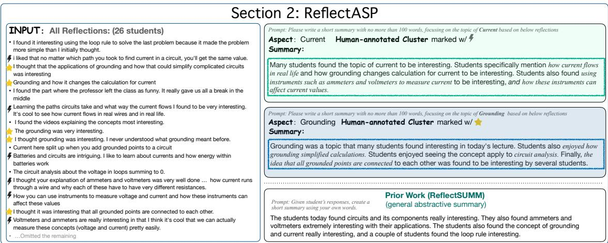  
Figure 1: An example from our REFLECTASP dataset. For a given collection of reflections and a specified aspect, we provide human-annotated clusters of aspect-related reflections (highlighted in the input) and human-written aspect-based reference summaries (top right). Unlike prior work (REFLECTSUMM), which produces a single generic summary (bottom right), our annotated dataset includes individual summaries for each aspect, accounting for cases where multiple aspects exist within a single input. These aspect-based summaries capture more detailed elements of students’ reflections (italicized) such as enjoyed how grounding simplified calculations in the second summary, offering valuable insights that can help instructors enhance their teaching.

We introduce Reflective ASPect-based summarization (ReflectASP), a novel dataset containing 313 manually annotated data instances, including aspect, source student reflections, annotated aspectbased clusters of student reflections, and humanwritten abstractive aspect-based summaries. Our dataset addresses the lack of open aspect-based summarization resources in education. Built on real-world application data, it avoids potential data contamination and provides a fairer evaluation and is of similar scale when compared to the test split of similar manually curated datasets (Amplayo et al., 2021; Takeshita et al., 2024). It also features human-annotated abstractive summaries, ensuring natural and coherent text, as well as high-quality annotations of supporting aspect clusters, providing further validation of summary quality.

Using this corpus, we benchmark various zeroshot summarization approaches and propose two refinement methods that leverage LLMs’ capability to self-critic and improve (Madaan et al., 2023; Huang et al., 2023; Welleck et al., 2023). Our experiments, covering multiple LLM backbones, include diverse automatic evaluations and human evaluations to validate the benefits of each approach and provide suggestions for future work in this novel domain and related aspect-based summarization tasks. Finally, we conduct a data-driven analysis of both the refinement suggestions and pre-/post-refinement summaries to identify common strategies used by LLMs to improve aspect-based summary generation, shedding insights for future work in the aspect-based summarization task.

## 2 Constructing the REFLECTASP Corpus

Dataset Curation. The student reflections in RE-FLECTASP are a subset of those in REFLECT-SUMM (Zhong et al., 2024), which comes with phrase-based, extractive and generic abstractive summaries. For each lecture, the dataset provides a collection of student reflections focusing on interesting or confusing points. Annotators are directed to extract five noun-phrases summarizing the reflections, and mark original student reflections as evidence for their annotated noun phrases. Out of the 782 reflections-summary pairs in the dataset, we construct our dataset by treating all reflections as the multi-document summarization input and the annotated phrases as the aspects. We removed lectures where the number of students was small (fewer than ten students, so summarization isn’t needed) and selected aspect-reflection pairs where at least five students mentioned the phrase. This reduced the total amount of data points from 3908 to 1096, which was further reduced to 1064 by removing phrases on “No Confusion”. There exist 767 distinct aspects, highlighting the open-aspect nature of the dataset compared to other corpora. Our further analysis reveals several distinct groups of phrases. The primary group consists of coursespecific terminologies, which vary across different courses and are dependent on the lecture and subject matter (i.e., Newton’s Laws in a Physics course). There are also multiple clusters of phrases that are shareable across different lectures, such as “Assignment related problems”, “Quiz and examination”, along with “Other Statements” and “No Confusions”. We include details in Appendix B.2.

<table><tr><td>Domain</td><td colspan="5">| Collect. | Sum. Rew. | Incl. Ext | # Test Set</td><td colspan="5"> $\mathbf { W o r d } _ { \mathrm { i n p u t } }$   $\bf { D o c } _ { \mathrm { { i n p u t } } }$  | Aspect |</td><td colspan="2">Novelty-n(1/2/3) | Comp. Ratio</td></tr><tr><td>FACETSUM</td><td>Scientific</td><td>A</td><td>No</td><td>××</td><td>6,000</td><td>6,827</td><td></td><td></td><td></td><td>290</td><td></td><td></td></tr><tr><td>ASPECTNEWS</td><td>News</td><td>M</td><td>No</td><td></td><td></td><td>400 248</td><td></td><td></td><td>4 4</td><td>115</td><td></td><td></td></tr><tr><td>SPACE</td><td>Reviews</td><td>M</td><td>Yes</td><td>√</td><td></td><td>150  $^ { 1 \bar { 4 } , 3 3 5 }$ </td><td></td><td>100</td><td>6</td><td>26</td><td>0.02/0.23/0.50</td><td>704:1</td></tr><tr><td>OPOSUM+</td><td>Reviews</td><td>M</td><td>Yes</td><td>√√</td><td></td><td>120 1,002</td><td></td><td>10</td><td>18</td><td>30</td><td>0.11/0.49/0.69</td><td>30:1</td></tr><tr><td>ACLSUM</td><td>Scientific</td><td>M</td><td>Yes</td><td></td><td></td><td>300 915</td><td></td><td></td><td>3</td><td>22</td><td>0.16/0.58/0.76</td><td>41:1</td></tr><tr><td>OASUM</td><td>Wikipedia</td><td>A</td><td>No</td><td>×××</td><td>112,005</td><td>1,612</td><td></td><td></td><td></td><td>40</td><td></td><td></td></tr><tr><td>OPENASP</td><td>News</td><td>M</td><td>No</td><td></td><td></td><td>596 6,860</td><td></td><td>26</td><td>576</td><td>82</td><td>0.11/0.49/0.74</td><td>68:1</td></tr><tr><td>LEXABSUMM</td><td>Legal</td><td>A</td><td>No</td><td></td><td></td><td>148 14,357</td><td></td><td>-</td><td>50</td><td>251</td><td>0.07/0.49/0.70</td><td>66:1</td></tr><tr><td>REFLECTASP (ours) | Education</td><td></td><td>M</td><td>Yes</td><td></td><td></td><td>313|</td><td>817</td><td>43</td><td>280</td><td>69</td><td>0.19/0.63/0.84</td><td>12:1</td></tr></table>

Table 1: Descriptive statistics comparing prior datasets (top) to REFLECTASP with their test split. The first five are on ABS, and the others belong to OABS. For the Collection method of aspect-based summaries, A denotes $\mathrm { ^ { * } A u t o m a t i c ^ { * } }$ and M denotes “Manual.” We distinguish human-rewritten aspect-based summaries (Sum. Rew.) from those extracted from the input or generic summaries. Incl. Ext. refers to human-annotated content extracted from the input to support the abstractive summary. # Test Set is the number of instances in the test split (document set + aspect + summary). $\bf { D o c } _ { \mathrm { { i n p u t } } }$ measures the average number of input reflections/documents/articles. We also report the number of unique aspects (Aspect), input length $( \mathbf { W o r d } _ { \mathrm { i n p u t } } )$ and summary length $( \mathbf { W _ { 0 r d _ { \mathrm { s u m . } } } } )$ in words. We also report the proportion of novel n-grams absent from the input (Novelty-n) and the input-tosummary length ratio (Comp. Ratio). The dash (-) indicates that the metric is not applicable. Gray rows are comparable to our corpus given the bold features in the last row.

Gold Reference Summaries. We recruit two inhouse annotators to annotate a subset of 313 unique aspect-lecture pairs. Annotators were first trained in two batches to understand and grasp the tasks before beginning assigned real jobs. We explored two approaches in constructing the summaries: (1) clustering all reflections and drafting the summary from scratch and (2) extracting aspect-related input and revising on top of a GPT-4 generated summary. A pilot study on ten samples suggested that the second option retained good quality through manual inspection and significantly reduced the time needed to write the summary (from 40 mins to 15 mins per data point). We thus apply the second option to produce the full corpus, with full details in Appendix C. We measure inter-annotator performance in ROUGE (Lin, 2004) (R-1/R-2/R-L), which are 48.1/21.9/35.1 among 90 doublyannotated instances (of the 313 instances).

<table><tr><td>Category</td><td>Total Edits</td><td>Del.</td><td>Insert.</td><td>Sub.</td></tr><tr><td>Percentage</td><td>65.17%</td><td>35.20%</td><td>1.70%</td><td>28.27%</td></tr></table>

Table 2: Human revision analysis on REFLECTASP by the proportion of word-level edit operations: Deletion (Del.), Insertion (Insert.), and Substitution (Sub.).

Human Edits Analysis. Following the methodology outlined in DCR (Wadhwa et al., 2024), we utilize the Levenshtein distance to quantify the number of edits between the original GPT-4-generated summaries and human-edited versions in Table 2. Specifically, we analyze the edit distance by categorizing operations into deletions, insertions, and substitutions at the word level and report the average normalized proportion of edits across all summary pairs. We divide the number of words that are deleted/inserted/substituted by the original length of the GPT-4 generated summary. Our analysis reveals that deletion is the most frequent edit operation, which aligns with the annotators’ feedback, indicating that GPT-4-generated summaries often include extraneous aspect-unrelated details. Additionally, we observe that approximately 28.27 percent of words are substituted, suggesting that human annotators engage in revisions to improve the quality and relevance of the summaries.

Comparison to Other Datasets. Table 1 compares our REFLECTASP to existing ABS corpora, including FACETSUM (Meng et al., 2021), ASPECT-NEWS (Ahuja et al., 2022), SPACE (Angelidis et al., 2021a), OPOSUM+ (Amplayo et al., 2021), and ACLSUM (Takeshita et al., 2024), as well as to OABS corpora, including OASUM (Yang et al., 2023), OPENASP (Amar et al., 2023), and LEXABSUMM (T.y.s.s. et al., 2024). We highlighted the datasets that are comparable to ours, focusing on the key features of manual collection, human-rewritten summaries, and including annotated extractive supporting sentences. Among ABS corpora with human-rewritten summaries (which guarantees reference coherence), our dataset’s test size is comparable or larger, making it sufficient for evaluation purposes. In the domain of OABS, our dataset is the only one that includes high-quality human-rewritten summaries along with supporting annotations on the source side. In contrast, OpenASP bypasses the source document, relying instead on manually extracting portions of generic summaries. This approach not only limits its quality to that of the original summaries but also risks compromising text coherence when extracting content from different locations. Additionally, unlike prior work that often relies on extreme compression (e.g., SPACE compressing 14k words into summaries averaging 26 words), our dataset strikes a balance between quality and abstractiveness. Our dataset uniquely focuses on the under-explored educational domain, offering potential real-world applications to enhance teaching performance.

Dataset Analysis. We discuss properties of RE-FLECTASP that emphasize its underlying diversity from several angles. The input document lengths vary from 39 to 2467 tokens (Figure 6 in the Appendix), averaging 817 words. The summary length ranges from 16 to 145 tokens, with a median input-to-output (compression) ratio of 12:1. The aspect label length ranges from 1 to 8 words, showcasing the diversity of aspects. Measuring novelty-n (See et al., 2017) further confirmed that summaries contain a certain level of abstractiveness by using new words not present in the input (0.19/0.63/0.84 for 1/2/3 grams, respectively). Overall, REFLECTASP requires models to perform well on abstractive forms of summarization. Details for these analyses are in Appendix D.

## 3 Aspect-based Summarization Task

Given course reflections from one lecture and an aspect such as “Integration”, we experiment with large language models and test how well they can pick up the salient reflections to generate an abstractive aspect-based summary of the reflections.

LLM Backbones. For LLM backbones, we selected different versions of powerful open-sourced models: LLAMA 3-8B (LLAMA3), LLAMA 3.1- 8B (LLAMA3.1) and also LLAMA 3.1-70B (Dubey et al., 2024), all with instructed version. We further add proprietary LLMs GPT-3.5, GPT-4 and GPT-4o as strong baselines. Implementation details are in Appendix E.1

Methods. Given different backbone LLMs, we instruct them using combinations of different methods: (1) Baseline uses a basic prompt (see Table 9 in Appendix F). (2) Self-Refine uses a Generate-Suggest-Refine framework to use the model to improve its outputs (details and prompt in Appendix F.2). This design aligns with the prompt-chaining in Sun et al. (2024), which was proven to be effective. (3) DCR (Wadhwa et al., 2024) employs a Detect-Critique-Refine pipeline with models finetuned for each phase. We used their released models based on LLAMA3. (4) E2A (mimicking the human annotation instructions) uses an extractthen-abstract approach (Takeshita et al., 2024) by prompting the model to first extract relevant student reflections, then generate the abstractive summary. (5) E2A w/ MC-Refine harnesses a fact checker to help identify the salient errors in the generated summaries and refine accordingly. Given the initial summary generated from E2A, we apply MINICHECK (MC) (Tang et al., 2024) to evaluate the faithfulness of individual sentences, utilizing the system-extracted aspect-relevant reflections. Next, we generate sentence-level error detection and revision suggestions among those detected sentences. However, instead of relying on fine-tuned critique and feedback modules, we instruct the LLM to detect spans within the sentences and provide revision suggestions accordingly. In the end, the LLM is prompted to incorporate all sentence-level revision suggestions to generate the final refined version. We visualize these methods in Figure 2 and include prompts in Appendix F.

Evaluation Metrics. Given the gold references, we measure ROUGE F1s (Lin, 2004) (ROUGE-1 (R-1), ROUGE-2 (R-2), ROUGE-L (R-L)) and BERTScore F1 (Zhang\* et al., 2020) (BS). To assess factual accuracy (faithfulness), we report the proportion of summary sentences supported by the documents using the SOTA fact-checker MINICHECK (Tang et al., 2024). We report MCEXT and MCINPUT, which evaluate faithfulness based on annotated aspect-related reflections and the full lecture reflections, respectively, as grounding documents. Metric details are in Appendix G.

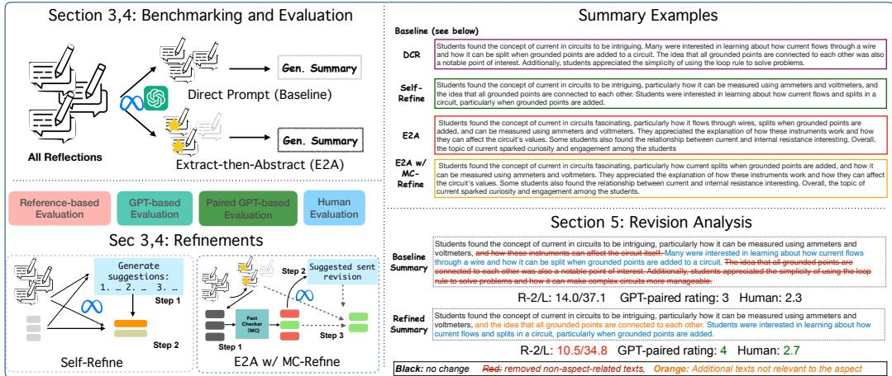  
Figure 2: Left: the exemplification of different approaches on leveraging LLMs in zero-shot open-aspect-based summarization task (§3 and §4). Top Right: the outputs of different refining approaches (DCRand Self-Refine), as well as our proposed approaches (E2A and E2A w/ MC-Refine). Bottom Right: an analysis of the revision process, showing the evaluation discrepancies among reference-based evaluation, GPT-based evaluation, and human evaluation.

## 4 Results

This section addresses two research questions: RQ1. How well do LLMs generate aspect-based summaries of reflections in a zero-shot setting? RQ2. How does different refinement help with the summarization? We conducted automatic and human evaluations to validate our findings.

## 4.1 Automatic Reference-based Evaluation

RQ1. Table 3 shows models’ performance with different LLM backbones. Comparing among the baseline prompt methods (lines 1, 7, 13), we observe that stronger and more advanced models generally obtained higher R1, R-L, and BS. This is evident in the faithfulness evaluation scores (MCEXT and MCINPUT). We also note that proprietary LLMs obtain lower automatic scores than the opensourced LLMs, indicating that their wording might not align with human-written references (rows 19- 21). Unlike the findings in ACLSUM (Takeshita et al., 2024), we observe that E2A can help consolidate the aspect-relevant information. We posit that this is due to the differing compression ratios of the summaries: ours are longer and include aspectspecific details, making them sufficient to evaluate the behavior of different approaches, unlike ACLSUM’s extremely short, one-sentence summaries. Among different variants of LLAMA3 and LLAMA3.1 models (row 1 vs. 4, row 7 vs. 10, and row 13 vs. 16), the E2A approach obtained significant improvements across different metrics. Such gain is more salient in smaller models such as LLAMA3. Additional results are in Appendix H.

RQ2. We first assess the revision effects of the Self-Refine and DCR methods (the second and third rows in each block) across all three LLM backbones. Overall, both obtained worse ROUGE and BERTScore results compared to human-written references. However, while the performance gap for Self-Refine narrows as the model improves (rows 1/2 vs. rows 13/14), DCR exhibits greater performance degradation. The analysis of generated summary length (last two columns in Table 3) shows that DCR tends to aggressively shorten the original summary, likely due to the domain mismatch between its training data (meeting summarization) and our education dataset. 2 Our proposed E2A w/ MC-Refine overall generate better summaries compared to the baseline prompting on Llama3.1 and LLama3.1-70B (rows 12/18 vs. 7/13). Moreover, it obtained highest faithfulness scores on LLAMA3.1- 70B (row 16 vs. 18) through revision. We attribute it to the strong extractive capability of the LLM (LLAMA3.1-70B obtains 79.6 R-L in extracting the supporting aspect-based reflections, comparable to human extracting performance).3

<table><tr><td>ID</td><td>Model</td><td>R-1</td><td>R-2</td><td>R-L</td><td>BS</td><td>MCEXT</td><td>MCINPUT</td><td># Sents</td><td># Words</td></tr><tr><td>1</td><td>LLAMA3</td><td>45.99</td><td>18.32</td><td>41.29</td><td>89.89</td><td>39.31</td><td>83.04</td><td>4.15</td><td>105.8</td></tr><tr><td></td><td>w/ Self-Refine</td><td>44.16</td><td>15.87</td><td>39.03</td><td>89.58</td><td>36.87</td><td>79.45</td><td>3.28</td><td>88.6</td></tr><tr><td></td><td>w/DČR</td><td>38.67</td><td>13.66</td><td>34.88</td><td>89.68</td><td>56.61</td><td>85.49</td><td>2.74</td><td>47.2</td></tr><tr><td></td><td>E2A</td><td>48.43*</td><td>19.51*</td><td>42.83*</td><td>90.22*</td><td>56.59*</td><td>89.35*</td><td>3.12</td><td>74.3</td></tr><tr><td></td><td>w/DCR</td><td>35.02</td><td>14.13</td><td>31.53</td><td>89.70</td><td>71.17</td><td>91.27</td><td>1.86</td><td>30.9</td></tr><tr><td>23456</td><td>w/MC-Refine</td><td>44.69</td><td>17.02</td><td>41.88</td><td>90.01</td><td>53.87*</td><td>87.59*</td><td>2.48</td><td>60.9</td></tr><tr><td>7</td><td>LLAMA3.1</td><td>46.21</td><td>17.57</td><td>41.02</td><td>89.89</td><td>40.72</td><td>85.11</td><td>3.49</td><td>94.8</td></tr><tr><td>8</td><td>w/ Self-Refine</td><td>43.68</td><td>15.29</td><td>38.41</td><td>89.53</td><td>38.98</td><td>79.10</td><td>3.18</td><td>90.1</td></tr><tr><td>9</td><td>w/DCR</td><td>37.95</td><td>13.70</td><td>34.09</td><td>89.75</td><td>56.74</td><td>86.38</td><td>2.39</td><td>42.5</td></tr><tr><td>10</td><td>E2A</td><td>48.08*</td><td>18.97*</td><td>42.78*</td><td>90.12*</td><td>57.79*</td><td>90.44*</td><td>3.32</td><td>78.7</td></tr><tr><td>11</td><td>w/DCR</td><td>34.97</td><td>13.78</td><td>31.59</td><td>89.70</td><td>72.70</td><td>92.60</td><td>1.94</td><td>32.4</td></tr><tr><td>12</td><td>w/MC-Refine</td><td>46.99*</td><td>18.13*</td><td>41.88*</td><td>89.16</td><td>57.35*</td><td>88.85*</td><td>3.25</td><td>75.9</td></tr><tr><td>13</td><td>LLAMA3.1-70B</td><td>47.54</td><td>18.64</td><td>42.12</td><td>90.04</td><td>53.97</td><td>89.48</td><td>3.55</td><td>94.9</td></tr><tr><td>14</td><td>w/ Self-Refine</td><td>46.05</td><td>16.88</td><td>40.37</td><td>89.90</td><td>55.74*</td><td>86.58</td><td>2.93</td><td>82.6</td></tr><tr><td>15</td><td>w/DCR</td><td>38.25</td><td>14.08</td><td>34.22</td><td>89.89</td><td>71.08</td><td>91.77</td><td>2.45</td><td>42.2</td></tr><tr><td>16</td><td>E2A</td><td>48.75*</td><td>18.79*</td><td>43.17*</td><td>90.08</td><td>69.55*</td><td>88.20</td><td>3.51</td><td>84.7</td></tr><tr><td>17</td><td>w/DCR</td><td>34.84</td><td>13.47</td><td>31.25</td><td>89.83</td><td>82.43</td><td>93.37</td><td>1.94</td><td>32.1</td></tr><tr><td>18</td><td>w/ MC-Refine</td><td>47.80</td><td>18.44</td><td>42.40</td><td>90.34*</td><td>71.79*</td><td>90.50*</td><td>3.43</td><td>79.9</td></tr><tr><td colspan="10">Proprietary LLMs</td></tr><tr><td>19</td><td>GPT3.5-turbo</td><td>35.72</td><td>9.95</td><td>32.05</td><td>88.04</td><td>44.85</td><td>91.25</td><td>4.96</td><td>100.8</td></tr><tr><td>20 21</td><td>GPT4</td><td>33.51</td><td>7.08</td><td>29.06</td><td>87.50</td><td>51.30</td><td>89.82</td><td>4.05</td><td>97.3</td></tr><tr><td></td><td>GPT40</td><td>34.15</td><td>7.93</td><td>30.48</td><td>87.52</td><td>58.07</td><td>91.57</td><td>4.89</td><td>102.9</td></tr><tr><td>32</td><td>Human (Oracle)</td><td></td><td>N/A</td><td></td><td></td><td>76.97</td><td>87.42</td><td>3.49</td><td>69.2</td></tr></table>

Table 3: Experimental results on REFLECTASP. All results are averaged over three runs. Gray rows indicate the baseline models, and \* means the score is significantly better than the baseline models within each block. The best score for each backbone is bold. Light colored cells are not directly comparable to other cells.

Prior studies have shown that some models, despite achieving higher human ratings, may underperform on reference-based metrics (Zhang et al., 2023; Wadhwa et al., 2024). This motivates us to pursue further evaluations, incorporating both human assessments and analyses assisted by large language models (LLMs) in the following section.

## 4.2 Automatic GPT-based Evaluation

To overcome the drawbacks of lexical-based metrics, following Wadhwa et al. (2024), we include multiple GPT-4 based evaluation metrics: GPT-4 Factuality Likert Scale Score (G), which uses GPT-4 to score generations when provided a welldefined rubric (Li et al., 2024). We scored the refined/new generation and the initial/baseline output individually and also report the score differences ∆G. Additionally, we compute the pairwise score difference (Pair ∆G) between refined/new generations and initial/baseline outputs and use them to determine the fractions of Wins (W), Same Scores (S), and Losses (L). The order of responses is randomized during the evaluation. Scoring prompts and metric details are in Appendix G.

We report the GPT-based evaluation results for LLAMA3 and LLAMA3.1-70B in Table 4 to compare between the weakest and strongest opensourced models.4 A more complete table can be found in Appendix H.2. Regarding RQ1, similar to the findings in §4.1, according to the scoring rubric, LLMs can generate summaries that are “overall factually consistent, with a few inconsistencies with the source materials” (rounded to 3), and E2A approaches can further improve. On RQ2, unlike the trend observed in reference-based methods, all refined approaches are found to bring performance gains when compared to the baseline with the simple prompt (as evidenced by the positive values of Pair ∆G and Win rate W). These improvements are more profound in the smaller model. While DCR tends to truncate contents more aggressively, it enhances the faithfulness of generated summaries, as indicated by the significant value on Pair ∆G and Win rate. However, it is also worth noting the larger Lose rate compared to other refinement approaches, suggesting that this approach can not constantly improve the summary’s quality. Our proposed E2A w/ MC-Refine approach obtained the highest GPT-4 rating, and pair-wise test (last block) indicated significant improvements.

## 4.3 Human Evaluation

We conduct human evaluations on the generated summaries. Using Amazon Mechanical Turk, we randomly selected 50 samples from ReflectASP and collected annotations on summaries generated by ten different systems. For each sample, three annotations were obtained (thus a total of 1500 annotations), with document-level metrics (Relevance to Aspect and Consistency) reported as averages and sentence-level annotations determined by majority vote. We selected two baseline models LLAMA3-8B and LLAMA3.1-70B. To investigate the effects of different approaches, we conducted a comparative analysis of summaries generated by the raw baseline, E2A, Self-Refine and E2A w/ MC-Refine outputs. We additionally include GPT3.5 and GPT4. All systems are anonymized. Annotation details and interface are in Appendix I.

<table><tr><td>Model</td><td>|G↑</td><td>∆G↑ | Pair ∆G↑</td><td></td><td>W↑</td><td>S</td><td>L</td></tr><tr><td colspan="7">Pairwise Comparison with Baseline Summary as the Original Input</td></tr><tr><td>LLAMA3</td><td>2.74</td><td></td><td></td><td></td><td></td><td></td></tr><tr><td>w/Self-Refine w/DČR</td><td>2.74 2.78</td><td>0.00 0.02</td><td>0.10* 0.25*</td><td>0.19</td><td>0.71 1</td><td>0.10</td></tr><tr><td>E2A E2A w/ MC-Refine</td><td>2.85+ 2.87</td><td>0.11* 0.11*</td><td>0.28* 0.31*</td><td>0.40 0.35 0.35</td><td>0.46 0.57 0.59</td><td>0.14 0.08 0.06</td></tr><tr><td>LLAMA3.1-70B</td><td>2.85</td><td></td><td></td><td></td><td></td><td>1</td></tr><tr><td>w/Self-Refine</td><td>2.84</td><td>-0.04</td><td>0.14*</td><td>0.24</td><td>0.65</td><td>0.11</td></tr><tr><td>w/DCR</td><td>2.88</td><td>0.03*</td><td>0.17*</td><td>0.39</td><td>0.42</td><td>0.20</td></tr><tr><td></td><td></td><td></td><td></td><td></td><td></td><td></td></tr><tr><td>E2A</td><td>2.87</td><td>0.02</td><td>0.11*</td><td>0.19</td><td>0.73</td><td>0.09</td></tr><tr><td></td><td>2.91+</td><td></td><td></td><td></td><td></td><td></td></tr><tr><td>E2A w/ MC-Refine</td><td></td><td>0.04*</td><td>0.14*</td><td>0.20</td><td>0.73</td><td>0.07</td></tr></table>

Pairwise Comparison with E2A Summary as the Original Input
<table><tr><td>LLAMA3 E2A</td><td>2.85</td><td></td><td></td><td></td><td></td><td></td></tr><tr><td>w/MC-Refine</td><td>2.87</td><td>0.02</td><td>0.10*</td><td>0.18</td><td>0.74</td><td>0.08</td></tr><tr><td>LLAMA3.1-70B E2A</td><td>2.87</td><td></td><td></td><td></td><td></td><td></td></tr><tr><td>w/MC-Refine</td><td>2.91†</td><td>0.02</td><td>0.10*</td><td>0.13</td><td>0.84</td><td>0.03</td></tr></table>

Table 4: GPT-related evaluation results of different methods. Within each block, pairwise metrics compare the outputs of the given system to those in the highlighted rows. A ✝ indicates significant improvement over the previous row (p<0.05) based on a paired bootstrap test, while \* denotes that the absolute value is significantly different from zero.

Table 5 shows the performance of different approaches. Consistent with the results in Table 3 and Table 4, different approaches improved the initial summary. The E2A approach obtained performance gains on all three metrics (row 1/5 vs. row 3/7). Unlike the drastic reference-based performance gap between the original and self-refined version, human raters assigned higher relevance scores to self-refined summaries, suggesting that the revisions can help improve the aspect-relevance (rows 2 and 6). Our introduced E2A w/ MC-Refine (rows 4 and 8) obtained the best performances on both backbone LLMs, improving both relevance and consistency of the contents, which aligns with the observations from the faithfulness metrics (Table 3) and GPT-4 based evaluations (Table 4). We observed that sentence-level aspect-based faithfulness evaluations across different models show similar distributions. This differs from the automatic faithfulness scores in Table 3, where applying E2A on $\mathbf { M C } _ { \mathrm { E X T } }$ (rows 1-3) improved scores by over 17 points, compared to a 1.5% gain in "Fully Supported" scores for LLAMA3. We attribute this discrepancy to the complexity of sentence-level annotations and the relatively small sample size used in human evaluations compared to the full test set.

<table><tr><td>ID</td><td>Model</td><td>Rel. to A</td><td>Consis.</td><td colspan="3">Asp. Faithful.</td></tr><tr><td></td><td></td><td>(1-3)</td><td>(1-3)</td><td>Fully</td><td>Part.</td><td>Not</td></tr><tr><td>1</td><td>LLAMA3</td><td>2.57</td><td>2.56</td><td>75.7%</td><td>24.3%</td><td>N/A</td></tr><tr><td></td><td>w/ Self-Refine</td><td>2.61</td><td>2.56</td><td>76.1%</td><td>23.9%</td><td>0.6%</td></tr><tr><td>234</td><td>E2A</td><td>2.60</td><td>2.58</td><td>77.2%</td><td>22.1%</td><td>0.7%</td></tr><tr><td></td><td>w/ MC-Refine</td><td>2.63</td><td>2.69</td><td>77.6%</td><td>22.4%</td><td>N/A</td></tr><tr><td>5</td><td>LLAMA3.1-70B</td><td>2.52</td><td>2.52</td><td>73.3%</td><td>26.7%</td><td>N/A</td></tr><tr><td>6</td><td>w/ Self-Refine</td><td>2.63</td><td>2.56</td><td>76.7%</td><td>23.3%</td><td>N/A</td></tr><tr><td>7</td><td>E2A</td><td>2.59</td><td>2.63</td><td>77.7%</td><td>22.3%</td><td>N/A</td></tr><tr><td>8</td><td>w/ MC-Refine</td><td>2.66</td><td>2.67</td><td>78.5%</td><td>21.5%</td><td>N/A</td></tr><tr><td>9</td><td>GPT3.5</td><td>2.70</td><td>2.72</td><td>76.6%</td><td>22.6%</td><td>0.8%</td></tr><tr><td>10</td><td>GPT4</td><td>2.61</td><td>2.60</td><td>84.5%</td><td>15.0%</td><td>0.5%</td></tr></table>

Table 5: Human evaluation results. Relevance to Aspect (Rel. to A.) assesses whether the summary discusses the aspect exclusively (3), partially (2), or not at all (1). Consistency determines whether the facts in the summary are consistent with the facts in the original input from fully (3) to not supported (1). Additionally, we report the aspect-based sentencelevel faithfulness (Asp. Faithful.), which measures the proportion of sentences that are Fully/Partially/Not supported by the annotated aspect-focused reflections.

## 5 Analysis of Summary Revisions

GPT-based and human evaluations suggested that revised summaries become more relevant to the aspect, but how do different refinement approaches help with it? In this section, we present a datadriven study on document-level revisions, aiming to understand what common strategies LLMs use in different refinement approaches. To examine the modifications made by different refinement approaches, we run an automated system (Jiang et al., 2022) to extract edits and determine their underlying intentions. This model (trained on scientific paper revisions) compromises sentence alignment, edit extraction, and intention classification modules. The taxonomy and model details are in Appendix J.1. Figure 3 provides an illustrative example.

We start by exploring the dynamics of sentencelevel edit operations, aiming to understand how LLMs modify sentences during refinement. As shown in Figure 4, an individual LLM exhibits different behaviors with different refinement strategies. On Llama3.1-70B, DCR favors more proportion of deletions compared to the other approaches (more than 50% of edit operations), which explains its reduced performance on automatic metrics and the shorter content length. For the smaller LLAMA3, Self-Refine makes more adding edits compared to the other approaches, potentially introducing details from the original reflections that are not covered by the human reference summaries. When comparing LLAMA3.1-70B and LLAMA3, our proposed E2A w/ MC-Refine approach demonstrates differing proportions of deletion and addition edits, which we attribute to the varying capabilities of LLMs. We include additional analysis on the refinement suggestions and the linguistic features of summaries in Appendices J.2 and J.3.

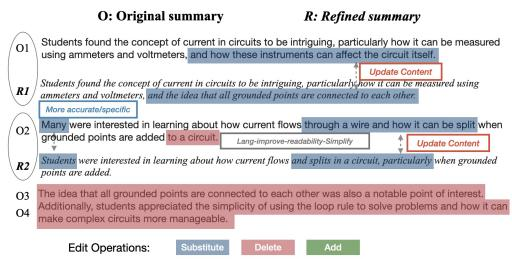  
Figure 3: An illustration of edits analysis. Summaries are also in bottom right of Figure 2.

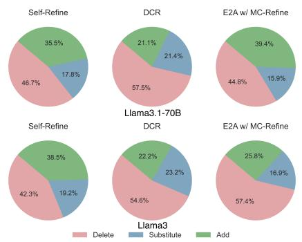  
Figure 4: Distribution of edit actions among revised sentences.

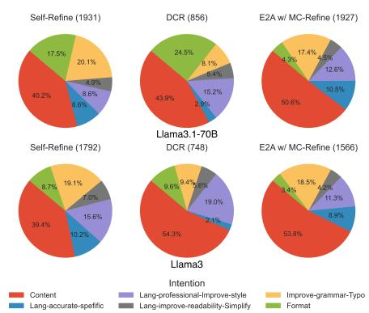  
Figure 5: Distribution of span-level edit intentions during different refinements. We include the count of edits in parenthesis.

We also analyzed the edit intentions on all revised sentences between the original and refined summaries. The distribution of the intentions is visualized in Figure 5. Most edits are categorized as content updates. Notably, DCR exhibits the fewest edits overall (i.e., for LLAMA3.1-70B, DCR contains 856 edits, way less than the other two approaches with around 1900 edits). This matches with previous findings that DCR tends to remove content. Additionally, DCR contains higher proportion of style improvements compared to the other two methods, which does not alter the meaning. Self-Refine instead contains the least proportion of content updates, and includes more grammar typo fixes. The E2A w/ MC-Refine approach has a smaller portion of edits for improving the simplicity (4.5% and 4.2%) and improve format (4.3% and 3.4%), which aligns with the goal of enhancing the quality of aspect-based summaries.

## 6 Related Work

Open Aspect-based Summarization. Recent work introduced multiple OABS datasets (Tan et al., 2020; Amar et al., 2023; Guo and Vosoughi, 2024), where aspects are document-based. Our corpus is the first to have the unique combination of ample human-annotated sentences from the source document with carefully crafted, human-rewritten aspect-based summaries. While proprietary LLM (GPT-3.5) started demonstrating zero-shot capability in performing OABS task (Amar et al., 2023; Guo and Vosoughi, 2024; Mukku et al., 2024), the capabilities of more accessible open-sourced LLMs remain under-explored. Additionally, much of the prior work focuses on domains like news and product reviews, which could potentially be influenced by contamination in the LLMs’ training process. Our study explores the use of open-source LLMs for OABS on a novel dataset featuring diverse, document-dependent aspects in the educational domain, evaluating their performance through comprehensive approaches beyond basic prompting..

LLM Feedback and Refinement. Generating feedback at inference-time is essential for LLMs to refine their answers (Madaan et al., 2023; Welleck et al., 2023; Zheng et al., 2023a). More recently, researchers (Huang et al., 2023; Kamoi et al., 2024; Palmeira Ferraz et al., 2024) noticed that LLMs may struggle with self-correction without external guidance. In summarization, prior work (Zhang et al., 2023) leverages GPT-3.5 to iteratively revise summaries to improve the factuality and controllability in news articles. Wadhwa et al. (2024) proposed a specialized "Detect-Critique-Refine" pipeline, which incorporatesfine-tuned critique and feedback models to enhance the factuality of refined summaries. We employ open-sourced LLMs to generatefeedback based on minimal instructions, leveraging the extractive power ofthe model and an external fact-checker to better localize errors, to produce better summaries on a given aspect.

## 7 Discussion

Dataset Characteristics. We carefully compared our dataset to existing ABS and OABS corpora in §2 Table 1, showing that our dataset is larger than most manually curated corpora for evaluation purposes. Our annotations are based on publicly available real-world application data (Reflect-Summ) released in prior work (Zhong et al., 2024), which covers four distinct subjects and spans over 20 courses, offering a rich and diverse testbed. Regarding the size of collected reflections per lecture, our survey of undergraduate course sizes at three well-known universities in the Northeastern US– including the institution where the original Reflect-Summ dataset was collected (details in Appendix L)– indicates that approximately 84% of undergraduate courses have 50 or fewer students. Given the self-volunteering nature of data collection and variations in attendance throughout the semester, our dataset, with an average of 43 student reflections per lecture, represents the majority of real-world scenarios. Lastly, collecting annotations from inhouse annotators is both time-consuming (15 mins per instance) and expensive (suppose the annotator is paid \$15 per hour, each annotated summary costs around \$4).

Out-of-Domain Testing and Insights. In addition to our REFLECTASP corpus, we further evaluated our proposed approaches on an out-of-domain dataset, SPACE (Angelidis et al., 2021a), by using their testing split, which contains reviews about 25 unique hotels and covers six popular aspects. We compare our approaches to the strong baseline systems released in prior work (Hosking et al., 2023). We find that the MC-Refine approach substantially outperformed other methods (details in Appendix K). A close examination of both SPACE and our datasets, together with manual verification of the generated summaries from different systems, provides us with valuable insights into the advantages of our datasets. Firstly, our dataset’s highquality annotation resolves the inconsistency between reference-based metrics and the faithfulness evaluation. In contrast, older datasets suffer from their noisy annotation and heuristic-based construction, leading to inconsistent performance. Moreover, our dataset contains richer information in the summaries that well summarize the input. Lastly, our dataset motivates innovations in faithfulnessguided approaches by identifying two main challenges in aspect-based summarization: (a) the inclusion of aspect-unrelated details and (b) the oversimplification of aspect-specific content. We provide further justifications in Appendix K.4.

## 8 Conclusion

In this work, we contribute REFLECTASP, the first open-aspect-based summarization dataset in the educational domain, with 313 high-quality aspectbased summaries and annotated supporting clusters. This dataset offers rich coverage of various aspects, diverse inputs and outputs, and an abstractive nature to enhance human understanding. We extensively test open-sourced LLMs in zero-shot fashions. Our introduced extract-then-abstract (E2A) and refinement approaches improved LLMs’ capability in generating more focused summaries, of which results are verified through rigorous automatic and human evaluations. Lastly, our analysis of revisions across different text versions reveals the techniques used by various refinement approaches, offering insights for future innovations in aspect-based summarization.

## Acknowledgement

The research reported here was supported in part by the Institute of Education Sciences, U.S. Department of Education, through Grant R305A180477, and the National Science Foundation through Grants 2329273 and 2329274. This work is also supported by LRDC. This research was supported in part by the University of Pittsburgh Center for Research Computing and Data, RRID:SCR\_022735, through the H2P cluster, which is supported by NSF award number OAC-2117681. We want to thank the members of the Pitt PETAL group, the Pitt NLP group, the CourseMIR-ROR group, and anonymous reviewers for their valuable comments in improving this work. We also thank Alfa Satya Putra and Ali Alhaddad from Purdue University for their annotation efforts.

## Limitations

Methodologies. This study leverages existing student-written reflections and utilizes the generative power of LLMs to produce and refine aspectbased summaries. Although this approach was effective for the specific educational dataset we used, it may not be readily applicable to different datasets. Also, our reliance on conducting experiments in a zero-shot manner may hinder the model from understanding the meaning of the prompts and thus fail to produce higher-quality revisions.

Is GPT-based Evaluation Reliable? While there exists work on prompting GPT models to rate the summaries (Liu et al., 2023; Zhang et al., 2023; Dubois et al., 2023; Wadhwa et al., 2024), we acknowledge that leveraging LLM as an evaluator may carry biases and the model could favor its own output (Zheng et al., 2023b; Panickssery et al., 2024). In this work, we use the proprietary LLM, GPT4o, as the evaluator to measure the quality of open-sourced models like LLAMA to avoid the potential self-preference. The evaluation prompts are adopted from previous work (Wadhwa et al., 2024). Manual Annotation Challenges. Curating humanannotated datasets presents challenges. As summarized in Table 1, an examination of existing datasets reveals a reliance on automatic collection and alignment methods, such as the heuristic selection of Wikipedia abstracts for OASUM (Yang et al., 2023). This approach often results in incoherent reference summaries. While some work, such as AspectNews (Ahuja et al., 2022) and OpenASP (Amar et al., 2023), repurposed the generic summary through human annotations on aspect labels of sentences, they acknowledged the high cost of such annotations. SPACE (Angelidis et al., 2021a) produced abstractive summarization, proposing a multi-stage pipeline to identify salient sentences and then produce generic/aspect summaries with the help of off-the-shelf classifiers. They reported low inter-annotator agreement. Instead, our dataset came with human-annotated aspect-based clusters with aspect values, which provide more grounding for our collected high-quality human-based abstractive summaries.

Dataset Scale. We acknowledge that our dataset only has a test set but no training split. To enhance the future work, we plan to include continuing annotation on the remainder of the unannotated portion of the 1064 aspect-lecture pairs curated in S2, as well as employing LLMs in synthesizing large-scale training data leveraging similar educational datasets. Extending our work to other types of classes such as MOOCs would be an exciting direction parallel to our current studies but with a focus on aiming to handle longer inputs (hundreds and even thousands of reflections) and much noisier input as the course takers typically come from different backgrounds.

Utilization of LLM Output as the Summary Reference Draft. LLMs have been proven to produce high-quality summaries from a human perspective. Goyal et al. (2022) found that summaries crafted by GPT-3 are preferred over those from state-ofthe-art (SOTA) fine-tuned models, despite the latter achieving higher scores in reference-based evaluations against human-produced summaries. Furthermore, Pu et al. (2023) found that human evaluators significantly prefer summaries generated by GPT-4, outperforming human-generated summaries and summaries generated by fine-tuned models from multiple perspectives. Our dataset is created as a hybrid of LLM output and human revision, combining the precision of human judgment with the generative capabilities of LLMs to streamline the lengthy process of initial drafting, similar to Liu et al. (2024).

Other Perspectives of Human-Evaluated Text Quality. Recent advanced LLMs like GPT-4 are found to produce fluent texts. Besides the mentioned “Relevance to Aspect” annotation, in an older version of the annotation, we prompted the annotators to provide a binary label for fluency, observing that two in-house annotators annotated over 95% of summaries as fluent. This finding aligns with Zhang et al. (2024) and Amar et al. (2023), who found that LLMs generated fluent texts. In our reported human annotation, we introduced both Consistency and Aspect-based Factuality (Sentence-level) to account for the much more challenging aspect of assessing the factuality of AI-generated summaries. Recent work (Hosking et al., 2024) also demonstrated that human preference scores can under-represent aspects such as factuality, presenting the challenges in better evaluating text qualities in the era of LLMs.

## Ethical Considerations

Abstractive summarization models have been found to contain hallucinated artifacts that do not faithfully represent the source texts. Regarding the usersensitive information within the dataset, we do not see concerns about applying our model, as userspecific information will not be included in the students’ reflections. The original ReflectSumm dataset was created with students’ consent, ensuring their responses could be collected and used for research purposes. We acknowledge the potential for bias in human annotation, particularly in the context of abstractive summaries and crowdsourced summary evaluations. This is due to the majority of our crowd-sourcing annotators being based in the U.S. However, no private information is collected from the annotators. We only collect annotator’s input on the refined summary, as well as evaluations on the qualities. Lastly, the authors acknowledge the use of Grammarly and GPT-4o for correcting sentences that are less fluent but not for generating or drafting new content.

## References

2024. The Role of Reflection-Informed Learning and Instruction in an Introductory Physics Course for Engineering and Science Students. Zenodo.

Ojas Ahuja, Jiacheng Xu, Akshay Gupta, Kevin Horecka, and Greg Durrett. 2022. ASPECTNEWS: Aspect-oriented summarization of news documents. In Proceedings of the 60th Annual Meeting of the Associationfor Computational Linguistics (Volume 1: Long Papers), pages 6494–6506, Dublin, Ireland. Association for Computational Linguistics.

Laila Alrajhi, Ahmed Alamri, Filipe Dwan Pereira, and Alexandra Ioana Cristea. 2021. Urgency analysis of learners’ comments: An automated intervention priority model for mooc. In International Conference on Intelligent Tutoring Systems.

Shmuel Amar, Liat Schiff, Ori Ernst, Asi Shefer, Ori Shapira, and Ido Dagan. 2023. OpenAsp: A benchmark for multi-document open aspect-based summarization. In Proceedings ofthe 2023 Conference on Empirical Methods in Natural Language Processing, pages 1967–1991, Singapore. Association for Computational Linguistics.

Reinald Kim Amplayo, Stefanos Angelidis, and Mirella Lapata. 2021. Aspect-controllable opinion summarization. In Proceedings ofthe 2021 Conference on Empirical Methods in Natural Language Processing, pages 6578–6593, Online and Punta Cana, Dominican Republic. Association for Computational Linguistics.

Stefanos Angelidis, Reinald Kim Amplayo, Yoshihiko Suhara, Xiaolan Wang, and Mirella Lapata. 2021a. Extractive Opinion Summarization in Quantized Transformer Spaces. Transactions of the Associationfor Computational Linguistics, 9:277–293.

Stefanos Angelidis, Reinald Kim Amplayo, Yoshihiko Suhara, Xiaolan Wang, and Mirella Lapata. 2021b. Extractive opinion summarization in quantized transformer spaces. Transactions of the Association for Computational Linguistics, 9:277–293.

Stefanos Angelidis and Mirella Lapata. 2018. Summarizing opinions: Aspect extraction meets sentiment prediction and they are both weakly supervised. In Proceedings of the 2018 Conference on Empirical Methods in Natural Language Processing, pages 3675–3686, Brussels, Belgium. Association for Computational Linguistics.

Sinem Aslan, Nese Alyuz, Cagri Tanriover, Sinem E. Mete, Eda Okur, Sidney K. D’Mello, and Asli Arslan Esme. 2019. Investigating the impact of a realtime, multimodal student engagement analytics technology in authentic classrooms. In Proceedings of the 2019 CHI Conference on Human Factors in Computing Systems, CHI ’19, page 1–12, New York, NY, USA. Association for Computing Machinery.

Steven Bird, Ewan Klein, and Edward Loper. 2009. Natural language processing with Python: analyzing text with the natural language toolkit. " O’Reilly Media, Inc.".

Hyung Won Chung, Le Hou, Shayne Longpre, Barret Zoph, Yi Tay, William Fedus, Eric Li, Xuezhi Wang, Mostafa Dehghani, Siddhartha Brahma, Albert Webson, Shixiang Shane Gu, Zhuyun Dai, Mirac Suzgun, Xinyun Chen, Aakanksha Chowdhery, Sharan Narang, Gaurav Mishra, Adams Yu, Vincent Zhao, Yanping Huang, Andrew Dai, Hongkun Yu, Slav Petrov, Ed H. Chi, Jeff Dean, Jacob Devlin, Adam Roberts, Denny Zhou, Quoc V. Le, and Jason Wei. 2022. Scaling instruction-finetuned language models.

Noam Dahan and Gabriel Stanovsky. 2025. The state and fate of summarization datasets: A survey. In Proceedings ofthe 2025 Conference ofthe Nations ofthe Americas Chapter ofthe Associationfor Computational Linguistics: Human Language Technologies (Volume 1: Long Papers), pages 7259–7278, Albuquerque, New Mexico. Association for Computational Linguistics.

Abhimanyu Dubey, Abhinav Jauhri, Abhinav Pandey, Abhishek Kadian, Ahmad Al-Dahle, Aiesha Letman, Akhil Mathur, Alan Schelten, Amy Yang, Angela Fan, et al. 2024. The llama 3 herd of models. arXiv preprint arXiv:2407.21783.

Yann Dubois, Xuechen Li, Rohan Taori, Tianyi Zhang, Ishaan Gulrajani, Jimmy Ba, Carlos Guestrin, Percy Liang, and Tatsunori Hashimoto. 2023. Alpacafarm: A simulation framework for methods that learn from human feedback. In Thirty-seventh Conference on Neural Information Processing Systems.

Sebastian Gehrmann, Tosin Adewumi, Karmanya Aggarwal, Pawan Sasanka Ammanamanchi, Anuoluwapo Aremu, Antoine Bosselut, Khyathi Raghavi Chandu, Miruna-Adriana Clinciu,

Dipanjan Das, Kaustubh Dhole, Wanyu Du, Esin Durmus, Ondˇrej Dušek, Chris Chinenye Emezue, Varun Gangal, Cristina Garbacea, Tatsunori Hashimoto, Yufang Hou, Yacine Jernite, Harsh Jhamtani, Yangfeng Ji, Shailza Jolly, Mihir Kale, Dhruv Kumar, Faisal Ladhak, Aman Madaan, Mounica Maddela, Khyati Mahajan, Saad Mahamood, Bodhisattwa Prasad Majumder, Pedro Henrique Martins, Angelina McMillan-Major, Simon Mille, Emiel van Miltenburg, Moin Nadeem, Shashi Narayan, Vitaly Nikolaev, Andre Niyongabo Rubungo, Salomey Osei, Ankur Parikh, Laura Perez-Beltrachini, Niranjan Ramesh Rao, Vikas Raunak, Juan Diego Rodriguez, Sashank Santhanam, João Sedoc, Thibault Sellam, Samira Shaikh, Anastasia Shimorina, Marco Antonio Sobrevilla Cabezudo, Hendrik Strobelt, Nishant Subramani, Wei Xu, Diyi Yang, Akhila Yerukola, and Jiawei Zhou. 2021. The GEM benchmark: Natural language generation, its evaluation and metrics. In Proceedings of the 1st Workshop on Natural Language Generation, Evaluation, and Metrics (GEM 2021), pages 96–120, Online. Association for Computational Linguistics.

Tanya Goyal, Junyi Jessy Li, and Greg Durrett. 2022. News summarization and evaluation in the era of gpt-3. arXiv preprint arXiv:2209.12356.

Max Grusky, Mor Naaman, and Yoav Artzi. 2018. Newsroom: A dataset of 1.3 million summaries with diverse extractive strategies. In Proceedings of the 2018 Conference of the North American Chapter of the Association for Computational Linguistics: Human Language Technologies, Volume 1 (Long Papers), pages 708–719, New Orleans, Louisiana. Association for Computational Linguistics.

Xiaobo Guo and Soroush Vosoughi. 2024. Disordered-DABS: A benchmark for dynamic aspect-based summarization in disordered texts. In Findings of the Associationfor Computational Linguistics: EMNLP 2024, pages 416–431, Miami, Florida, USA. Association for Computational Linguistics.

Tom Hosking, Phil Blunsom, and Max Bartolo. 2024. Human feedback is not gold standard. In The Twelfth International Conference on Learning Representations.

Tom Hosking, Hao Tang, and Mirella Lapata. 2023. Attributable and scalable opinion summarization. In Proceedings of the 61st Annual Meeting of the Associationfor Computational Linguistics (Volume 1: Long Papers), pages 8488–8505, Toronto, Canada. Association for Computational Linguistics.

Jie Huang, Xinyun Chen, Swaroop Mishra, Huaixiu Steven Zheng, Adams Wei Yu, Xinying Song, and Denny Zhou. 2023. Large language models cannot self-correct reasoning yet. ArXiv, abs/2310.01798.

Jennifer Jacobs, Karla Scornavacco, Charis Harty, Abhijit Suresh, Vivian Jia Yin Lai, and Tamara R. Sumner. 2022. Promoting rich discussions in mathematics

classrooms: Using personalized, automated feedback to support reflection and instructional change. Teaching and Teacher Education.

Albert Q Jiang, Alexandre Sablayrolles, Arthur Mensch, Chris Bamford, Devendra Singh Chaplot, Diego de las Casas, Florian Bressand, Gianna Lengyel, Guillaume Lample, Lucile Saulnier, et al. 2023. Mistral 7b. arXiv preprint arXiv:2310.06825.

Chao Jiang, Wei Xu, and Samuel Stevens. 2022. arXivEdits: Understanding the human revision process in scientific writing. In Proceedings ofthe 2022 Conference on Empirical Methods in Natural Language Processing, pages 9420–9435, Abu Dhabi, United Arab Emirates. Association for Computational Linguistics.

Ryo Kamoi, Yusen Zhang, Nan Zhang, Jiawei Han, and Rui Zhang. 2024. When can llms actually correct their own mistakes? a critical survey of selfcorrection of llms. Transactions of the Association for Computational Linguistics, 12:1417–1440.

Klaus Krippendorff. 2011. Computing krippendorff’s alpha-reliability.

Woosuk Kwon, Zhuohan Li, Siyuan Zhuang, Ying Sheng, Lianmin Zheng, Cody Hao Yu, Joseph E. Gonzalez, Hao Zhang, and Ion Stoica. 2023. Efficient memory management for large language model serving with pagedattention. In Proceedings of the ACM SIGOPS 29th Symposium on Operating Systems Principles.

Zhen Li, Xiaohan Xu, Tao Shen, Can Xu, Jia-Chen Gu, Yuxuan Lai, Chongyang Tao, and Shuai Ma. 2024. Leveraging large language models for NLG evaluation: Advances and challenges. In Proceedings ofthe 2024 Conference on Empirical Methods in Natural Language Processing, pages 16028–16045, Miami, Florida, USA. Association for Computational Linguistics.

Chin-Yew Lin. 2004. ROUGE: A package for automatic evaluation of summaries. In Text Summarization Branches Out, pages 74–81, Barcelona, Spain. Association for Computational Linguistics.

Yang Liu, Dan Iter, Yichong Xu, Shuohang Wang, Ruochen Xu, and Chenguang Zhu. 2023. G-eval: NLG evaluation using gpt-4 with better human alignment. In Proceedings of the 2023 Conference on Empirical Methods in Natural Language Processing, pages 2511–2522, Singapore. Association for Computational Linguistics.

Yixin Liu, Alexander Fabbri, Jiawen Chen, Yilun Zhao, Simeng Han, Shafiq Joty, Pengfei Liu, Dragomir Radev, Chien-Sheng Wu, and Arman Cohan. 2024. Benchmarking generation and evaluation capabilities of large language models for instruction controllable summarization. In Findings of the Association for Computational Linguistics: NAACL 2024, pages 4481–4501, Mexico City, Mexico. Association for Computational Linguistics.

Wencan Luo and Diane Litman. 2015. Summarizing student responses to reflection prompts. In Proceedings ofthe 2015 Conference on Empirical Methods in Natural Language Processing, pages 1955–1960, Lisbon, Portugal. Association for Computational Linguistics.

Wencan Luo, Fei Liu, and Diane Litman. 2016. An improved phrase-based approach to annotating and summarizing student course responses. In Proceedings of COLING 2016, the 26th International Conference on Computational Linguistics: Technical Papers, pages 53–63, Osaka, Japan. The COLING 2016 Organizing Committee.

Aman Madaan, Niket Tandon, Prakhar Gupta, Skyler Hallinan, Luyu Gao, Sarah Wiegreffe, Uri Alon, Nouha Dziri, Shrimai Prabhumoye, Yiming Yang, Sean Welleck, Bodhisattwa Prasad Majumder, Shashank Gupta, Amir Yazdanbakhsh, and Peter Clark. 2023. Self-refine: Iterative refinement with self-feedback. Neurips.

Muhsin Menekse. 2020. The reflection-informed learning and instruction to improve students’ academic success in undergraduate classrooms. The Journal of Experimental Education, 88(2):183–199.

Muhsin Menekse, Glenda Stump, Stephen Krause, and Michelene Chi. 2011. The effectiveness of students daily reflections on learning in an engineering context. pages 22.1451.1–22.1451.10.

Rui Meng, Khushboo Thaker, Lei Zhang, Yue Dong, Xingdi Yuan, Tong Wang, and Daqing He. 2021. Bringing structure into summaries: a faceted summarization dataset for long scientific documents. In Proceedings of the 59th Annual Meeting of the Associationfor Computational Linguistics and the 11th International Joint Conference on Natural Language Processing (Volume 2: Short Papers), pages 1080– 1089, Online. Association for Computational Linguistics.

Sandeep Sricharan Mukku, Abinesh Kanagarajan, Chetan Aggarwal, and Promod Yenigalla. 2024. MARS: Multilingual aspect-centric review summarisation. In Proceedings of the 2024 Conference on Empirical Methods in Natural Language Processing: Industry Track, pages 894–909, Miami, Florida, US. Association for Computational Linguistics.

Thomas Palmeira Ferraz, Kartik Mehta, Yu-Hsiang Lin, Haw-Shiuan Chang, Shereen Oraby, Sijia Liu, Vivek Subramanian, Tagyoung Chung, Mohit Bansal, and Nanyun Peng. 2024. LLM self-correction with De-CRIM: Decompose, critique, and refine for enhanced following of instructions with multiple constraints. In Findings of the Association for Computational Linguistics: EMNLP 2024, pages 7773–7812, Miami, Florida, USA. Association for Computational Linguistics.

Arjun Panickssery, Samuel R. Bowman, and Shi Feng. 2024. LLM evaluators recognize and favor their own

generations. In The Thirty-eighth Annual Conference on Neural Information Processing Systems.

Fabian Pedregosa, Gaël Varoquaux, Alexandre Gramfort, Vincent Michel, Bertrand Thirion, Olivier Grisel, Mathieu Blondel, Peter Prettenhofer, Ron Weiss, Vincent Dubourg, et al. 2011. Scikit-learn: Machine learning in python. the Journal of machine Learning research, 12:2825–2830.

Xiao Pu, Mingqi Gao, and Xiaojun Wan. 2023. Summarization is (almost) dead. ArXiv, abs/2309.09558.

Abigail See, Peter J. Liu, and Christopher D. Manning. 2017. Get to the point: Summarization with pointergenerator networks. In Proceedings of the 55th Annual Meeting of the Association for Computational Linguistics (Volume 1: Long Papers), pages 1073– 1083, Vancouver, Canada. Association for Computational Linguistics.

Shichao Sun, Ruifeng Yuan, Ziqiang Cao, Wenjie Li, and Pengfei Liu. 2024. Prompt chaining or stepwise prompt? refinement in text summarization. In Findings ofthe Associationfor Computational Linguistics ACL 2024, pages 7551–7558, Bangkok, Thailand and virtual meeting. Association for Computational Linguistics.

Sotaro Takeshita, Tommaso Green, Ines Reinig, Kai Eckert, and Simone Ponzetto. 2024. ACLSum: A new dataset for aspect-based summarization of scientific publications. In Proceedings of the 2024 Conference ofthe North American Chapter ofthe Associationfor Computational Linguistics: Human Language Technologies (Volume 1: Long Papers), pages 6660–6675, Mexico City, Mexico. Association for Computational Linguistics.

Bowen Tan, Lianhui Qin, Eric Xing, and Zhiting Hu. 2020. Summarizing text on any aspects: A knowledge-informed weakly-supervised approach. In Proceedings of the 2020 Conference on Empirical Methods in Natural Language Processing (EMNLP), pages 6301–6309, Online. Association for Computational Linguistics.

Liyan Tang, Philippe Laban, and Greg Durrett. 2024. MiniCheck: Efficient fact-checking of LLMs on grounding documents. In Proceedings of the 2024 Conference on Empirical Methods in Natural Language Processing, pages 8818–8847, Miami, Florida, USA. Association for Computational Linguistics.

Ivan Titov and Ryan McDonald. 2008. A joint model of text and aspect ratings for sentiment summarization. In Proceedings of ACL-08: HLT, pages 308–316, Columbus, Ohio. Association for Computational Linguistics.

Hugo Touvron, Louis Martin, Kevin Stone, Peter Albert, Amjad Almahairi, Yasmine Babaei, Nikolay Bashlykov, Soumya Batra, Prajjwal Bhargava, Shruti Bhosale, Dan Bikel, Lukas Blecher, Cristian Canton Ferrer, Moya Chen, Guillem Cucurull, David Esiobu,

Jude Fernandes, Jeremy Fu, Wenyin Fu, Brian Fuller, Cynthia Gao, Vedanuj Goswami, Naman Goyal, Anthony Hartshorn, Saghar Hosseini, Rui Hou, Hakan Inan, Marcin Kardas, Viktor Kerkez, Madian Khabsa, Isabel Kloumann, Artem Korenev, Punit Singh Koura, Marie-Anne Lachaux, Thibaut Lavril, Jenya Lee, Diana Liskovich, Yinghai Lu, Yuning Mao, Xavier Martinet, Todor Mihaylov, Pushkar Mishra, Igor Molybog, Yixin Nie, Andrew Poulton, Jeremy Reizenstein, Rashi Rungta, Kalyan Saladi, Alan Schelten, Ruan Silva, Eric Michael Smith, Ranjan Subramanian, Xiaoqing Ellen Tan, Binh Tang, Ross Taylor, Adina Williams, Jian Xiang Kuan, Puxin Xu, Zheng Yan, Iliyan Zarov, Yuchen Zhang, Angela Fan, Melanie Kambadur, Sharan Narang, Aurelien Rodriguez, Robert Stojnic, Sergey Edunov, and Thomas Scialom. 2023. Llama 2: Open foundation and finetuned chat models.

Santosh T.y.s.s., Mahmoud Aly, and Matthias Grabmair. 2024. LexAbSumm: Aspect-based summarization of legal decisions. In Proceedings of the 2024 Joint International Conference on Computational Linguistics, Language Resources and Evaluation (LREC-COLING 2024), pages 10422–10431, Torino, Italia. ELRA and ICCL.

Manya Wadhwa, Xinyu Zhao, Junyi Jessy Li, and Greg Durrett. 2024. Learning to refine with fine-grained natural language feedback. In Findings of the Associationfor Computational Linguistics: EMNLP 2024, pages 12281–12308, Miami, Florida, USA. Association for Computational Linguistics.

Shufan Wang, Laure Thompson, and Mohit Iyyer. 2021. Phrase-BERT: Improved phrase embeddings from BERT with an application to corpus exploration. In Proceedings of the 2021 Conference on Empirical Methods in Natural Language Processing, pages 10837–10851, Online and Punta Cana, Dominican Republic. Association for Computational Linguistics.

Sean Welleck, Ximing Lu, Peter West, Faeze Brahman, Tianxiao Shen, Daniel Khashabi, and Yejin Choi. 2023. Generating sequences by learning to self-correct. In The Eleventh International Conference on Learning Representations.

Xianjun Yang, Kaiqiang Song, Sangwoo Cho, Xiaoyang Wang, Xiaoman Pan, Linda Petzold, and Dong Yu. 2023. OASum: Large-scale open domain aspectbased summarization. In Findings ofthe Association for Computational Linguistics: ACL 2023, pages 4381–4401, Toronto, Canada. Association for Computational Linguistics.

Haopeng Zhang, Xiao Liu, and Jiawei Zhang. 2023. SummIt: Iterative text summarization via ChatGPT. In Findings of the Association for Computational Linguistics: EMNLP 2023, pages 10644–10657, Singapore. Association for Computational Linguistics.

Tianyi Zhang\*, Varsha Kishore\*, Felix Wu\*, Kilian Q. Weinberger, and Yoav Artzi. 2020. Bertscore: Evaluating text generation with bert. In International Conference on Learning Representations.

Tianyi Zhang, Faisal Ladhak, Esin Durmus, Percy Liang, Kathleen McKeown, and Tatsunori B. Hashimoto. 2024. Benchmarking Large Language Models for News Summarization. Transactions of the Associationfor Computational Linguistics, 12:39–57.

Chuanyang Zheng, Zhengying Liu, Enze Xie, Zhenguo Li, and Yu Li. 2023a. Progressive-hint prompting improves reasoning in large language models. arXiv preprint arXiv:2304.09797.

Lianmin Zheng, Wei-Lin Chiang, Ying Sheng, Siyuan Zhuang, Zhanghao Wu, Yonghao Zhuang, Zi Lin, Zhuohan Li, Dacheng Li, Eric Xing, Hao Zhang, Joseph E. Gonzalez, and Ion Stoica. 2023b. Judging LLM-as-a-judge with MT-bench and chatbot arena. In Thirty-seventh Conference on Neural Information Processing Systems Datasets and Benchmarks Track.

Yang Zhong, Mohamed Elaraby, Diane Litman, Ahmed Ashraf Butt, and Muhsin Menekse. 2024. ReflectSumm: A benchmark for course reflection summarization. In Proceedings of the 2024 Joint International Conference on Computational Linguistics, Language Resources and Evaluation (LREC-COLING 2024), pages 13819–13846, Torino, Italia. ELRA and ICCL.

Kun Zhou, Yutao Zhu, Zhipeng Chen, Wentong Chen, Wayne Xin Zhao, Xu Chen, Yankai Lin, Ji-Rong Wen, and Jiawei Han. 2023. Don’t make your llm an evaluation benchmark cheater.

## A Examples Comparing General and Aspect-based Summaries

In Table 6, we provide more examples from our datasets, where student reflections on “what they find most interesting / confusing” are well summarized in the aspect-based summaries.

## B Aspect Analysis

## B.1 Open-Aspect Extraction for OABS

We acknowledge that aspect-based summarization, query-based summarization, and keywordcontrolled summarization are intermingled and hard to fully separate. While we agree that one can treat the aspect as a keyword that is extracted from the source reflections, open-aspect summarization fits better in this case, as the aspects can be either specific to the source document (i.e., course concepts) or generalizable across different documents such as “Homework” or “Exams.” More details on aspect analysis are documented in Appendix B.2. Similar to the aspect-based summarization setup in OASUM (Yang et al., 2023), Space and OPPSUM+ (Amplayo et al., 2021), we provided the model with pre-extracted (highquality human-annotated) aspects in our dataset to guide the generation. For future work, we would like to add baselines that prompt the model to extract aspects independently before generating aspect-based summaries, though it may introduce another layer of complexity. This approach could lead to more contentious evaluations, given the need to guarantee that differing Large Language Models (LLMs) would need to extract consistent aspects with the human-annotated aspects.

Regarding the aspect extraction for real world applications, the ReflectSumm (Zhong et al., 2024) dataset came from a real-world application that has been deployed in real universities. We used their publicly released dataset to conduct our experiments. The process of aspect extraction, conceptualized as phrase-based summarization, has been addressed in existing literature. Luo et al. have outlined systems for phrase-based summarization comprising candidate phrase extraction, phrase clustering, and phrase ranking (Luo and Litman, 2015; Luo et al., 2016). More recent work has also explored applying LLMs to generate phrase summaries from lecture reflections with promising performances (Zhong et al., 2024). Our research primarily investigates LLMs’ capability to produce aspect-based summaries. Thus, we leave the refinement of aspect mining methodologies for future exploration.

## B.2 ReflectASP Aspect Analysis

Out of the 1096 phrases collected in Data Curation, 767 are unique. To examine the variations among aspects, we encoded them using Phrase-BERT (Wang et al., 2021), followed by the application of the K-means unsupervised clustering algorithm, to organize them into clusters. Our analysis reveals several distinct groups of phrases. The primary group consists of course-specific terminologies, which vary across different courses and are dependent on the lecture and subject matter (i.e., Newton’s Laws in a Physics course). There are also multiple clusters of phrases that are shareable across different lectures, such as “Assignment related problems”, “Quiz and examination”, along with “Other Statements” and “No Confusions”.

The variability of aspects in the first group necessitates open aspects in aspect-based summarization to satisfy the user’s need to learn about interesting/confusing points. Moreover, we observe that reflections tagged with “No Confusion” carry the least amount of information and are deemed superficial. Thus, we excluded the data points with aspects annotated as “No confusion,” reducing the total number of data points to 1064. This refinement helps to focus on more substantive aspects.

The K-means algorithm we used is from the scikit-learn package (Pedregosa et al., 2011)5. The parameters for K-means are { "init": "k-means++", "n\_init": 3, "max\_iter": 300}. We search for the best N based on the SSE of cosine similarities. Table 7 is one example of clustering results, with 5 aspects per cluster.

## C Human Annotation Details on Reference Summaries

We recruited two in-house annotators (not the authors) to annotate the 313 data points. Both annotators are funded by the project and have taken the courses / possessed the knowledge of course materials covered in the ReflectSumm dataset (Zhong et al., 2024). One of the annotator is a PhD student and the other one is pursing the undergraduate degree.

<table><tr><td rowspan=1 colspan=1>General Summary (REFLECTSUMM)</td><td rowspan=1 colspan=1>Aspect</td><td rowspan=1 colspan=1>Aspect-based Summary (REFLECTASP)</td></tr><tr><td rowspan=1 colspan=1>Many of the students today seemed tostruggle with the concepts regardingflux and gauss&#x27; law, as well as gaussiansurfaces. Some students also struggledwith mathematical calculations, whileothers struggled with the examples thatthey were doing in class.</td><td rowspan=1 colspan=1>Gauss Law/Surface</td><td rowspan=1 colspan=1>Students found the topic of Gauss Law and Gaussian surface to be confusing.Although they said that the lesson on flux and Gaussian surface was tiedtogether seamlessly and easier to understand than their high schoollessons, students still struggle on certain aspects of the topic. Specifically,students expressed difficulty in choosing a proper Gaussian surface thatproduces symmetry to allow certain components to cancel out. Studentsrequested more explanations on the topic to help them understand the topicbetter.</td></tr><tr><td rowspan=1 colspan=1>Most of the responses today includedtopics about potential and how it con-fused the students, as well as integratingand setting up their problems that theyare given in class. They also had sometrouble with some electric field concepts.</td><td rowspan=1 colspan=1>Problem Setup</td><td rowspan=1 colspan=1>Students struggled with the problem set up in this lecture. On the topic ofintegrals, students said that solving the integration was understandable andnot difficult, but they were having problems with setting up the integral.Students were specifically confused about the limits and variables ofintegration, and how the limit can change midway through the problem.Students stated that they could use more clarity and examples of setting upintegrals in different situations.</td></tr><tr><td rowspan=1 colspan=1>Most students were confused about com-ing up with designing algorithms andwriting pseudo-code for the algorithms.Some students were confused aboutlogistics and content of Milestone 2 andgraphing in Matlab. A few students wereconfused about velocity calculationswith regression and the contents of theconcept quiz.</td><td rowspan=1 colspan=1>Milestone 2</td><td rowspan=1 colspan=1>Many students reported feeling confused about the coding aspect of Mile-stone 2, specifically regarding which MATLAB functions to use andhow to write the pseudo code for the in-class activity. Some studentsalso expressed confusion about the noise aspect of the graphs and howto start the coding for the project. Students were also confused aboutapproaching the project and how to best complete the Milestone, and wouldhave appreciated more clear instructions.</td></tr></table>

Table 6: Aspect-based summary examples in ReflectASP. In each sample, we highlight the details extracted from students’ reflections, which are helpful for the instructor to better assist students’ learning.
<table><tr><td>ID</td><td>Cluster Size</td><td>Example Aspects</td></tr><tr><td>0</td><td>32</td><td>[&#x27;excel&#x27;, &#x27;No Confusion&#x27;, &#x27;No Confusion&#x27;, &#x27;No Confusion&#x27;, &#x27;No Confusion&#x27;]</td></tr><tr><td>1</td><td>61</td><td>[&#x27;In-Class Problems&#x27;, &#x27;In-Class Problems&#x27;, &#x27;Exam Prep&#x27;, &#x27;In-class assignments&#x27;, &#x27;Syl- labus&#x27;, Structure of Class&#x27;]</td></tr><tr><td>2</td><td>69</td><td>[&#x27;Other Statements&#x27;, &#x27;Other Statements&#x27;, &#x27;Other Statements&#x27;, &#x27;Other Statements&#x27;, &#x27;Other Statements&#x27;]</td></tr><tr><td>3</td><td>85</td><td>[&#x27;Teamwork/Breakout Rooms&#x27;, &#x27;Capital Investment&#x27;, &#x27;Groupwork&#x27;, &#x27;New Project&#x27;, &#x27;Groupwork&#x27;]</td></tr><tr><td>4</td><td>88</td><td>[&#x27;Electric/Uniform Field&#x27;, &#x27;Energy Calculations and Units&#x27;, &#x27;Car Carbon Emissions&#x27;, &#x27;Electric Charges&#x27;, &#x27;Current/Resistance&#x27;]</td></tr><tr><td>5</td><td>108</td><td>[&#x27;Evaluating and citing reliable resources&#x27;, &#x27;Phone book activity&#x27;, &#x27;Downloading the file&#x27;, &#x27;Introduction to the new project&#x27;, &#x27;Last example question&#x27;]</td></tr><tr><td>6</td><td>32</td><td>[&#x27;Assignment 17&#x27;, &#x27;Assignment 8, A08&#x27;, &#x27;Assignment 8, A08&#x27;, &#x27;Assignment 8 OR 5&#x27;, &#x27;Assignment 13&#x27;]</td></tr><tr><td>7</td><td>127</td><td>[&#x27;Redefining Systems&#x27;, &#x27;Prototyping/Creating Prototypes&#x27;, &#x27;Engineering Majors&#x27;, &#x27;Cod- ing&#x27;, &#x27;Pseudocode and Algorithm&#x27;]</td></tr><tr><td>8</td><td>62</td><td>[&#x27;Related to Trig&#x27;, &#x27;Related to Functions&#x27;, &#x27;Related to the Quiz&#x27;, &#x27;Related to the Project&#x27;, &#x27;Related to Induction&#x27;]</td></tr><tr><td>9</td><td>50</td><td>[&#x27;RB BST/Red-Black tree/red-black BST/Red Black BST&#x27;, &#x27;excel/Excel&#x27;, &#x27;1 vs 100 Sheets Question&#x27;, &#x27;A10&#x27;, &quot;Red Black BST&#x27;s&quot;]</td></tr><tr><td>10</td><td>118</td><td>[&#x27;Matlab/matlab/MATLAB&#x27;, &#x27;Backtracking&#x27;, &#x27;Porblem scope of the project&#x27;, &#x27;Breakout Rooms&#x27;, &#x27;Deck of cards/poker problem&#x27;]</td></tr><tr><td>11</td><td>107</td><td>[&#x27;When to use certain graphs&#x27;, &#x27;Comparing Excel &amp; MatLab&#x27;, &#x27;Free Body Diagrams&#x27;, &#x27;Difference between data types (categorical/numerical, nominal/ordinal, discrete/continu- ous)&#x27;, &#x27;Histograms&#x27;]</td></tr><tr><td>12</td><td>47</td><td>[&#x27;In-Class Demonstrations&#x27;, &#x27;Meeting People/Professor&#x27;, &#x27;Videos shown in Class&#x27;, &#x27;In- Class Demonstrations&#x27;, &#x27;In-Class Activity or In-Class Assignment&#x27;]</td></tr><tr><td>13</td><td>19</td><td>[’Taum Salk reservoir power activity&#x27;, &#x27;The Tom Sauk Reservoir&#x27;, &#x27;Hydropower and Hydroelectricity&#x27;, &#x27;Hydroelectric dams, power, and reservoirs&#x27;, &#x27;Taum Sauk Project or Reservoirs&#x27;]</td></tr><tr><td>14</td><td>91</td><td>[&#x27;Related to Flux&#x27;, &#x27;Related to Concepts (Gaussian Surfaces, Faraday Cages, E Fields)’, &#x27;Related to Loops&#x27;, &#x27;Related to Circuits &amp; Graphs&#x27;, &#x27;Related to Linear Regression&#x27;]</td></tr></table>

Table 7: K-Means clustering results of aspects, K =15.

Two annotation strategies are explored on a first batch of five examples:

(1) Given all the reflections, the annotator needs to first cluster them into different clusters and assign the focused aspect (in noun-phrases). Afterwards, given an assigned aspect, the annotator is tasked to utilize the clusters they built and write a aspect-focused summary from scratch.

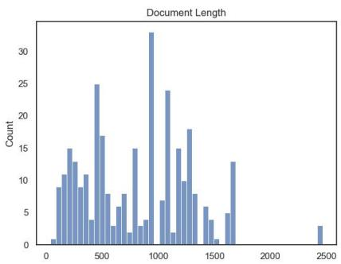  
Figure 6: ReflectASP input length distribution.

(2) Alternatively, the annotators are presented with an AI model-generated aspect-based summary (here, we used the generated version of GPT-4), together with the original aspect. The first step of the annotation is to identify the subset of student reflections that are related to the aspect. Then, the annotators are instructed to check and revise the system summaries to make them aspect-based (focusing on talking about the aspects). The revision also includes removing content that does not exist in the original student reflection (i.e., that is not faithful), as well as adding content that annotators feel is important.

We employed OpenAI’s ChatGPT (GPT-4) as our LLM to execute zero-shot aspect-based summarization, similar to Zhang et al. (2023). For each case in the REFLECTASP dataset, we prompted the ChatGPT model to produce a focused summary centered around the aspect. (We include the prompt in Appendix F.1). The instructions emphasized minimal requirements and explicitly requested the avoidance of unrelated text inclusions.

For the first strategy, the average time spent by the annotators on each instance is 40 mins, since assembling and drafting from scratch takes a long time. In contrast, the second strategy took on average 15 mins, as the annotators are more focused at identifying the weaknesses of the system summary and focus on producing a high-quality revised version.

## D Dataset Analysis Details

## D.1 Metric Details

Here we describe the linguistic metrics and would encourage the reader to read the original papers if interested in more technical details.

Content diversity (Grusky et al., 2018) is a joint measure for extractiveness of coverage and density.

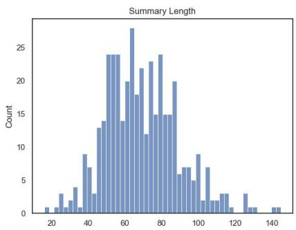  
Figure 7: ReflectASP summary length distribution.

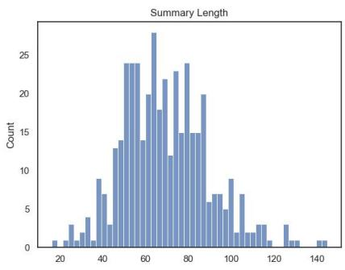  
Figure 8: ReflectASP summary’s compression ratio.

Grusky et al. (2018) first proposed an algorithm to compute a set of extractive components between the input and target. Coverage measures the percentage of words in the summary that come from the source document, while density quantifies how well the word sequence of a summary can be described as a series of extractions, given that word orders can be rearranged to construct new contents.

Compression ratio measures the length ratio between the source and target summary, and Noveltyn denotes the ratio of new n-grams present in the summary that are not included in the input.

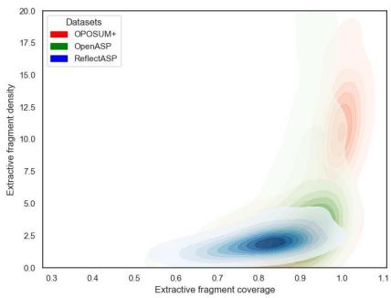  
Figure 9: ReflectASP content diversity (Grusky et al., 2018). The area of the plot indicates that, when comparing to the other two corpora, ReflectASP’s summary is less extractive (repeating the exact words) but remains faithful based on the high coverage.

## D.2 Statistics

Figure 6 and Figure 7 present the distribution of token lengths (measured by word) in input documents and human written summaries. The compression ratio is plotted in Figure 8. Figure 9 compared ReflectASP to the ABS (OPOSUM+) and OABS corpus (OpenASP), showing that ReflectASP contains less direct copying of long spans from the source (lower density) while still retains good enough coverage.

## E Model Implementation Details

All of our experiments are conducted on Nvidia L40S GPUs, each with 48 GB RAM. To tackle the memory limitation and speed up the inference with LLMs, we utilize the vLLM (Kwon et al., 2023) to conduct experiments. The Llama3.1-70B needs four cards for inference, and all other models use one card.

## E.1 LLMs

We employ LLAMA 2-13B-chat (Touvron et al., 2023)6, and Mistral-Nemo (Jiang et al., 2023)7 models for experiments. We additionally include the Llama3-8B-Instruct and Llama3.1-8B-Instruct (https://huggingface. co/meta-llama/Meta-Llama-3-8B-Instruct) as well as Llama3.1-70B-Instruct with the quantized version from neuralmagic/Meta-Llama-3. 1-70B-Instruct-quantized.w8a8. We set the temperature at 0.3 and the max new token at 8000 for generation. We manually evaluated the aspect-based summaries generated during a brief manual tuning of the prompt text to determine the appropriate prompt. We include all model outputs in Appendix F.

For the GPT-3.5 model, we used GPT3.5- turbo 1106 from https://platform.openai. com/docs/models/gpt-3-5-turbo as one strong baseline. We additionally included the GPT-4 (gpt4-turbo-0125-preview) and GPT4o (gpt-4o-2024-08-06) models. The temperature is set as 0.5, and the max\_token length is set to 256.

<table><tr><td>Role</td><td>Content</td></tr><tr><td>system:</td><td>You are a responsive abstractive summarizer that summarizes the collection of student lecture reflections by focusing on a specific topic.</td></tr><tr><td>user:</td><td>Please write a short summary with no more than 100 words, focusing on the topic of {topic} based on below reflections:</td></tr></table>

Table 8: GPT-4 prompt used to generate first draft of reference aspect-based summaries for human revision.
<table><tr><td>Role</td><td>Content</td></tr><tr><td>system:</td><td>You are a TA for a undergraduate-level course, you are given a collection of student reflections after taking one lecture and tasked to write a summary to present to the instructor</td></tr><tr><td>user:</td><td>Given the students&#x27; responses and a focused topic {aspect}, create a short summary using your own words (no more than 100 words). The summary needs to be a coherent paragraph and should include the major points. The summary should focus on the provided topic only, contain only information about reflections, and avoid adding irrelevant sentences or suggestions such as &#x27;make sure to bring this up in next class&#x27;, or &#x27;Consider this for future lectures&#x27;, etc... REFLECTION: {reflections}</td></tr></table>

Table 9: The baseline prompt used for aspect-based summarization given an aspect.

## F Approaches and Prompt Templates

## F.1 GPT-4 Prompt for Human-Annotation

We use the prompt in Table 8 to generate system summaries as the initial draft for human revision.

## F.2 Self-Refine Method

Inspired by the success of recent lines of study on self-correction (Madaan et al., 2023; Welleck et al., 2023), we employ a Generate-Suggest-Refine framework to use the model to improve its outputs. More specifically, after generating an initial aspect-based summary, we prompt the model to provide suggestions to improve the summary by making it more concise and concentrated on the topic. We carefully craft the prompts to ensure the suggestions are grounded in the original reflections, whilst the revision suggestions should be based on the context of the first version. Lastly, we refine the summary by providing the LLM with all reflections, the initial draft, and improvement suggestions, prompting it to produce a refined version. Our design aligns with the prompt-chaining in (Sun et al., 2024), which was effective and obtained a higher winning rate compared to the stepwise prompt. The prompt for our proposed selfrefine framework can be found in Table 10. Our approach differed from prior work (Madaan et al.,

2023; Welleck et al., 2023) in that they relied on few-shot samples and had restricted the feedback formatting. Instead, our work elicited the model’s capability to provide feedback and conducted extensive analysis to evaluate the quality of suggestions and refinement.

## F.3 Prompts Used for Experiments

Table 9, 10, 11, and 12 present the final prompts used in our experiments.

## F.4 Model Outputs

We include examples of different baseline prompting outputs in Table 13, as well as the comparison of different refinements in Table 14.

## G Evaluation Metric Details

ROUGE : We used the implementation in torchmetrics,8 using stemmer and computing the average when multiple references are available.

BERTScore : We used the implementation from huggingface’s evaluate\_metrics module9 and followed the default setup.

MCEXT : We harnessed the SOTA Llama-3.1- Bespoke-MiniCheck-7B (BeSpoke- 1500 MC-7B) released by Bespoke Labs (Tang et al., 2024). The model is fine-tuned from “internlm/internlm2\_5- 7b-chat” on the combination of 35K data 1503 points following the approach in MiniCheck (Tang et al., 2024). We use the suggested code repo from https://huggingface.co/bespokelabs/ Bespoke-MiniCheck-7B. Here we paired the human-annotated extractive cluster of aspectrelated reflections and a single sentence from the summary as the doc and claim in the fact-checker. We record the predicted labels for that sentence (1 for being faithful and 0 for not) and report the macro distribution of labels for all sentences in the 313 generated summmaries.

MCINPUT : This is similar to the setting in MCINPUT, with one exception that we use the full student reflections as the doc for fact-checking.

GPT-4 related metrics : We use the scoring prompt and rubrics from Wadhwa et al. (2024) and cite their prompts in Figure 10 and Figure 11. We use the GPT4o (gpt-4o-1117 2024-08-06) model.

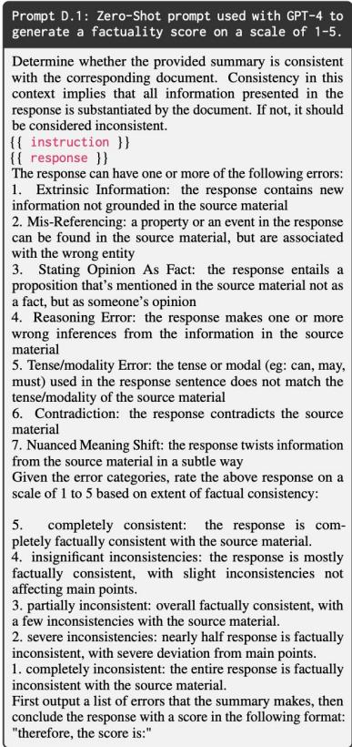  
Figure 10: Zero-shot prompt used with GPT-4 to generate single factuality scores on a scale of 1-5. The figure is created by Wadhwa et al. (2024)

<table><tr><td>Stage</td><td>Role</td><td>Content</td></tr><tr><td></td><td>system:</td><td>You are a responsive abstractive summarizer that summarizes the collection of student lecture reflections by focusing on a specific topic.</td></tr><tr><td>GENERATION</td><td>user:</td><td>Please write a short summary with no more than 100 words, focusing on the topic of {topic} based on below reflections: {reflections}</td></tr><tr><td></td><td></td><td>SUMMARY:</td></tr><tr><td></td><td>sys:</td><td>[GENERATED TEXT]</td></tr><tr><td>SUGGESTION</td><td>user</td><td>[INST] Can you provide a short list of 2-3 suggestions to improve the generated summary, making it more concise and focused on the topic – topic? The suggestions should be based on the original reflections and generated summaries, don&#x27;t give generic suggestions. [/INST]</td></tr><tr><td></td><td>sys:</td><td>[SUGGESTIONS]</td></tr><tr><td></td><td></td><td></td></tr><tr><td colspan="3"></td></tr><tr><td></td><td>system:</td><td>Restart the conversation</td></tr><tr><td></td><td>user:</td><td>You are a responsive abstractive summarizer that summarizes the collection of student lecture reflections by focusing on a specific topic Please improve the short summary written below with the suggestions. The revised ver-</td></tr><tr><td>REFINE</td><td></td><td>sion should be no more than 100 words, focusing on the topic of {topic} based on below reflections: {reflections }.</td></tr><tr><td></td><td></td><td>ORIGINAL SUMMARY: {GENERATED TEXT}</td></tr><tr><td></td><td></td><td>SUGGESTIONS FOR IMPROVEMENT:</td></tr><tr><td></td><td></td><td></td></tr><tr><td></td><td></td><td>{SUGGESTIONS}</td></tr></table>

Table 10: The self-refine prompt with three stages: GENERATION, SUGGESTION, and REFINE.

<table><tr><td>Stage</td><td>Role</td><td>Content</td></tr><tr><td></td><td>system:</td><td>You are a TA for a undergraduate-level course, you are given a collection of student reflec- tions after taking one lecture and tasked to write a summary to present to the instructor</td></tr><tr><td>GENERATION</td><td>user:</td><td>Given the students' responses, and a focused topic {aspect}, create a short summary using your own words (no more than 100 words). The summary needs to be a coherent paragraph and should include the major points. The summary should focus on the provided topic only, contain only information about reflections, and avoid adding irrelevant sentences or suggestions such as 'make sure to bring this up in next class', or 'Consider this for future lectures', etc... You are tasked to perform this task in two steps:(1) Extract the list of indexes and students' reflections in the given REFLECTIONS that are relevant to the focused topic. (2) summarize them into a short summary using your own words (no more than 100 words). REFLECTIONS: {all reflections}</td></tr><tr><td>Input</td><td></td><td>Extracted list of reflections; E2A initial summary</td></tr><tr><td>MiniCheck Detect</td><td></td><td>Run the Minicheck Detector on E2A initial summary sentences, then collect those labeled as not faithful in GIVEN_SENTENCES</td></tr><tr><td></td><td>system:</td><td>You are a TA for a undergraduate-level course, you are given a collection of student reflec- tions after taking one lecture and tasked to write a summary to present to the instructor</td></tr><tr><td>SUGGESTION</td><td>user:</td><td>Given the students’ responses, and a focused topic {aspect}, you are provided an ex- tracted list of reflections that are related to the topic and a short summary. (no more than 100 words).</td></tr><tr><td></td><td></td><td>Extracted List of original relection and initial Summary: {extsummary} Initial Summary: {summary} Now, given the below GIVEN_SENTENCES in the summary that is identified as unfaith- ful, reason if there is any factually inconsistent span in the sentence and propose a way to improve the sentence, making it more concise and focused on the topic {aspect}, utilizing information from the extracted list of reflections. The suggestions should be based on the original reflections and the extracted list of reflections, don't give generic suggestions. ***GIVEN_SENTENCES: {revised_sents}*** ### Task: If GIVE_SENTENCES is []: your response should just return: Suggestions: &lt;no revision needed&gt;. Otherwise, for each sent in GIVEN_SENTENCES, your response should output: Suggestions: original_sent: &lt;SENT1 from GIVEN_SENTENCES&gt;, the er- ror span: &lt;span from SENT1&gt;, the revision suggestion: &lt;your suggested revision&gt;(Delete if there is no need to keep or the post-edit version of SENT1) ### EXAMPLE OUTPUTS:</td></tr><tr><td></td><td></td><td>if GIVEN SENTENCES: [], you should just return "&lt;no suggestion needed&gt;". if GIVEN_SENTENCES= [&lt;SÉNT1&gt;, &lt;SÉNT2&gt;], your output would be Suggestions: "{{original_sent: &lt;SENT1&gt;, the error span: &lt;span in SENT1&gt;, the revision suggestion: &lt;Modified version of SENT1&gt;}} {{oiriginal_sent: &lt;SENT2&gt; , the error span: &lt;span in Reminder: you should only provide Suggestions on sentences from the</td></tr><tr><td>sys:</td><td> $\operatorname { S E N T } 2 > \ldots \} \} "$ </td><td>GIVEN_SENTENCES. If it is empty, just return Suggestions: &lt;no revision needed&gt;.</td></tr><tr><td></td><td>[suggestions]</td><td>Restart the conversation</td></tr><tr><td></td><td>system:</td><td>You are a TA for a undergraduate-level course, you are given a collection of student reflec- tions after taking one lecture and tasked to write a summary to present to the instructor Given the students' responses, and a focused topic {aspect}, a list of extracted responses</td></tr><tr><td>REFINE</td><td>user:</td><td>that are relevant to the topic, and some suggestions on revisions, you are tasked to im- prove a short summary. (no more than 100 words). Please improve the short summary written below, incorporating the suggestions. The suggestions are on sentences of the summary, so please only modify those highlighted</td></tr><tr><td></td><td></td><td>sentences and keep the remainder unchanged. The revised version should be no more than</td></tr><tr><td></td><td></td><td></td></tr><tr><td></td><td></td><td></td></tr><tr><td></td><td></td><td></td></tr><tr><td></td><td></td><td></td></tr><tr><td></td><td></td><td>100 words, focusing on the topic of {aspect} based on below reflections, The summary</td></tr><tr><td></td><td></td><td>should be a coherent paragraph and should include the major points. If you think the</td></tr><tr><td></td><td></td><td>initial summary is good enough, you can make minimal changes. You also need to pay</td></tr><tr><td></td><td></td><td>attention to the extracted list of reflections that are related to the given topic {aspect}:</td></tr><tr><td></td><td></td><td></td></tr><tr><td></td><td></td><td></td></tr><tr><td></td><td></td><td>ALL REFLECTION: {reflections}</td></tr><tr><td></td><td></td><td></td></tr><tr><td></td><td></td><td>FOCUSED TOPIC: {aspect}</td></tr><tr><td></td><td></td><td></td></tr><tr><td></td><td></td><td>Extracted List of original reflection and Initial Summary: {summary}</td></tr><tr><td></td><td></td><td></td></tr><tr><td></td><td></td><td></td></tr><tr><td></td><td></td><td>Revision Suggestions: {suggestions}</td></tr><tr><td></td><td></td><td></td></tr><tr><td></td><td></td><td></td></tr><tr><td></td><td></td><td></td></tr><tr><td></td><td></td><td></td></tr><tr><td></td><td></td><td></td></tr><tr><td></td><td></td><td>You should pay attention to the revision suggestions and decide whether you want to</td></tr><tr><td></td><td></td><td></td></tr><tr><td></td><td></td><td></td></tr><tr><td></td><td></td><td></td></tr><tr><td></td><td></td><td>edit the sentences with suggested revisions. If the Revision Suggestions mentions "no</td></tr><tr><td></td><td></td><td></td></tr><tr><td></td><td></td><td></td></tr><tr><td></td><td></td><td></td></tr><tr><td></td><td></td><td></td></tr><tr><td></td><td></td><td></td></tr><tr><td></td><td></td><td></td></tr><tr><td></td><td></td><td>suggestion needed", you should not revise the initial summary. Your summary should</td></tr><tr><td></td><td></td><td></td></tr><tr><td></td><td></td><td></td></tr><tr><td></td><td></td><td></td></tr><tr><td></td><td></td><td></td></tr><tr><td></td><td></td><td></td></tr><tr><td></td><td></td><td></td></tr><tr><td></td><td></td><td></td></tr><tr><td></td><td></td><td></td></tr><tr><td></td><td></td><td></td></tr><tr><td></td><td></td><td></td></tr><tr><td></td><td></td><td>have minimal changes on the initial summary and be factual.</td></tr><tr><td></td><td></td><td></td></tr><tr><td></td><td></td><td></td></tr><tr><td></td><td></td><td></td></tr><tr><td></td><td></td><td></td></tr><tr><td></td><td></td><td></td></tr><tr><td></td><td></td><td></td></tr><tr><td></td><td></td><td></td></tr><tr><td></td><td></td><td></td></tr><tr><td></td><td></td><td></td></tr><tr><td></td><td></td><td></td></tr><tr><td></td><td></td><td></td></tr><tr><td></td><td></td><td>Your response should just output the refined summary and should not include any extra</td></tr></table>

Table 11: The E2A prompt used in our task.

Table 12: The E2A w/ MC-Refine prompt used for open-aspect-based summarization (OABS).

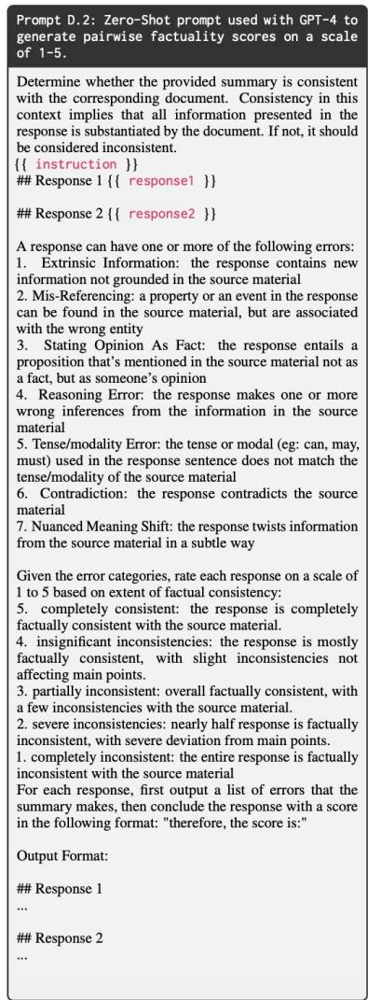  
Figure 11: Zero-shot prompt used with GPT-4 to generate pairwise factuality scores on a scale of 1-5. The figure is created by Wadhwa et al. (2024).

<table><tr><td colspan="1" rowspan="1">Model</td><td colspan="1" rowspan="1">Summary</td></tr><tr><td colspan="1" rowspan="1">FLANT5-XXL</td><td colspan="1" rowspan="1">I thought the demonstration with the lightbulb was fun to watch. It gave me a visual representationof what was happening. I found it interesting how similar the forces caused by charges and gravityare.</td></tr><tr><td colspan="1" rowspan="1">LLAMA2</td><td colspan="1" rowspan="1">The students found the light bulb demonstration and the plastic sheet experiment to be the most in-teresting and helpful in understanding the concepts of electric charge and forces. They appreciatedthe visual aids and the interactive nature of the lecture, including the clicker questions and breakoutroom discussions. Many students found the similarities between electric and gravitational forces tobe fascinating, and the concept of electric charge properties was well received. The demonstrationof energy conservation through the splitting of a gamma ray photon into an electron and positronwas also found to be intriguing. Overall, the students enjoyed the interactive and visual aspects ofthe lecture and found them to be effective in deepening their understanding of the topics covered.</td></tr><tr><td colspan="1" rowspan="1">LLAMA3</td><td colspan="1" rowspan="1">The students found the lightbulb demonstration to be a highlight of the lecture, with many mention-ing that it helped them understand the concept of electric forces and charges. The visual representa-tion of the demonstration made it easier for students to grasp the abstract concepts, and some evenfound it "fun to watch". The similarity between electric and gravitational forces was also a point ofinterest, with students noting that it helped them understand the concept better. Additionally, theinteractive nature of the lecture, including the use of breakout rooms and clicker questions, wasappreciated by many students. Overall, the lightbulb demonstration and related discussions seemedto have a significant impact on students' understanding of electric charges and forces.</td></tr><tr><td colspan="1" rowspan="1">LLAMA3.1</td><td colspan="1" rowspan="1">Students found the light bulb demonstrations to be engaging and effective in illustrating complexconcepts, such as the separation of charges and the distribution of electric force. Many appreciatedthe visual representation and hands-on experience, which helped to clarify their understanding ofthese abstract topics. Additionally, the demonstrations sparked interesting comparisons betweenelectric and gravitational forces, highlighting the similarities between the two. Overall, the interac-tive nature of the lecture, including breakout rooms and practice problems, was well-received andcontributed to a deeper understanding of the material.</td></tr><tr><td colspan="1" rowspan="1">LLAMA3.1-70B</td><td colspan="1" rowspan="1">Students found the lightbulb demonstration to be a highlight of the lecture, with many noting that itprovided a clear visual representation of electrostatic concepts. The separation of charges and theresulting lighting of the bulb was particularly interesting to several students. The demonstration wasalso seen as engaging and fun to watch, helping to capture students’ attention and make the topicmore accessible. Overall, the use of visual aids and hands-on demonstrations was well-received bystudents, who appreciated the ability to see complex concepts in action.</td></tr><tr><td colspan="1" rowspan="1">MISTRAL</td><td colspan="1" rowspan="1">Students found the light bulb demonstrations engaging and helpful in understanding abstract con-cepts like electric force and charge separation. They appreciated the visual representations, withseveral mentioning that it made complex topics easier to grasp. The interactive nature of thesedemonstrations, allowing them to see the results of changing variables, was particularly appealing.Some students, however, noted that the pace of explanations during these demonstrations could beoverwhelming, suggesting a need for slower, clearer communication.</td></tr><tr><td colspan="1" rowspan="1">Human Reference</td><td colspan="1" rowspan="1">The students found the demonstrations and interactive aspects of the lecture to be the most interest-ing, including the plastic sheet and lightbulb experiment, the split-screen video, and the group workin solving the distribution of charge. They also appreciated the visual representations of concepts,such as the lightbulb demonstration, as it made the topics easier to understand.</td></tr><tr><td colspan="2" rowspan="1">Model               Summary</td></tr><tr><td colspan="1" rowspan="1">LLAMA 3.1-70B</td><td colspan="1" rowspan="1">Students found the lightbulb demonstration to be a highlight of the lecture, with many noting that itprovided a clear visual representation of electrostatic concepts. The separation of charges and theresulting lighting of the bulb was particularly interesting to several students. The demonstration wasalso seen as engaging and fun to watch, helping to capture students' attention and make the topicmore accessible. Overall, the use of visual aids and hands-on demonstrations was well-received bystudents, who appreciated the ability to see complex concepts in action.</td></tr><tr><td colspan="1" rowspan="1">LLAMA 3.1-70Bw/ Self-Refine</td><td colspan="1" rowspan="1">Students found the lightbulb demonstration to be a highlight of the lecture, providing a clear visualrepresentation of electrostatic concepts, particularly the separation of charges and the resultinglighting of the bulb. Many students noted that the demonstration was engaging and fun to watch,making complex concepts more tangible. The visual representation of electrostatic concepts, suchas the separation of charges, was especially interesting to several students, helping to illustrate keyprinciples in a memorable way.</td></tr><tr><td colspan="1" rowspan="1">LLAMA 3.1-70Bw/DCR</td><td colspan="1" rowspan="1">Students appreciated the use of visual aids and hands-on demonstrations in the lecture. The light-bulb demonstration was a highlight of the lecture, helping to capture students' attention and makethe topic more accessible. Overall, the use of visual aids and hands-on demonstrations was well-received by students, who appreciated the ability to see complex concepts in action.</td></tr><tr><td colspan="1" rowspan="1">LLAMA 3.1-70BE2A</td><td colspan="1" rowspan="1">Students found the lightbulb demonstrations to be engaging and interesting, with the visual repre-sentation helping to clarify complex concepts. The separation of charges and the experiment setupcaught their attention, making the topic more enjoyable and easier to understand. The demonstra-tions were considered a valuable learning tool, providing a clear and captivating way to illustratekey principles.</td></tr><tr><td colspan="1" rowspan="1">LLAMA 3.1-70BE2A w/ Self-Refine</td><td colspan="1" rowspan="1">Students found the lightbulb demonstrations to be engaging and interesting, with the separationof charges and experiment setup catching their attention and making the topic more enjoyable andeasier to understand. The demonstrations provided a valuable learning tool, offering a clear andcaptivating way to illustrate the effects of electric forces in action, making complex concepts moretangible and relatable.'</td></tr><tr><td colspan="1" rowspan="1">LLAMA 3.1-70BE2A w/ MC-Refine</td><td colspan="1" rowspan="1">Students found the lightbulb demonstrations to be engaging and interesting, as they provided a clearvisual representation of the concept. The separation of charges and the experiment setup caughttheir attention, making the topic more enjoyable and easier to understand. The demonstrationswere considered a valuable learning tool, providing a clear and captivating way to illustrate keyprinciples.</td></tr><tr><td colspan="1" rowspan="1">Human Reference</td><td colspan="1" rowspan="1">The students found the demonstrations and interactive aspects of the lecture to be the most interest-ing, including the plastic sheet and lightbulb experiment, the split-screen video, and the group workin solving the distribution of charge. They also appreciated the visual representations of concepts,such as the lightbulb demonstration, as it made the topics easier to understand.</td></tr></table>

Table 13: An example of different baseline system summaries. The aspect is “Light Bulb/Demonstration” .

Table 14: An example of different refined summaries. The aspect is “Light Bulb/Demonstration” .

## H More Automatic Results

Due to space limit, we omit one variant E2A w/ Self-Refine, which applies the Self-Refine approach on E2A results in Table 3 and two weaker LLM baselines. Here we included them with some discussions.

## H.1 Additional Reference-based Evaluation Results

In Table 15, we include the results of a strong encoder-decoder-based model Flan-T5-XXL (Chung et al., 2022), one of the most capable encoder-decoder models comparable in size (11B) and fine-tuned through instructions tuning on multiple tasks. We also add extra LLM backbone models (LLAMA2 and MISTRAL) as well as the additional E2A w/ Self-Refine rows in the extended version of Table 3.

Compared to the LLM baselines in Table 3, the zero-shot prompted Flan-T5-XXL model tends to generate extractive summaries – original student reflections (see example in Table 13), leading to lower reference-based performance against humanwritten abstractive summaries. Older models generate worse summaries evaluated by ROUGE and BERTScore, meanwhile, the E2A approach does not help as the models fail to follow instructions in generating extracted list. Additionally, as seen in Table 15, applying Self-Refine on E2A outputs (rows 10-12) experienced performance drops on ROUGE and BERTScores when compared to the original version (rows 4, 10 and 16 in Table 3). Similar results were observed in faithfulness scores, with one exception in LLAMA3.1-70B, where the MC scores improved. This indicates that stronger models can generate more useful suggestions, leading to more effective revisions.

## H.2 Additional Automatic GPT-based Evaluation

Table 16 shows the additional GPT-based automatic evaluation results. Smaller models may suffer from generating non-helpful suggestions, which leads to a drop of summarization quality (LLAMA3 E2A vs. w/self-refine in the first chunk of the bottom block).

<table><tr><td>ID</td><td>Model</td><td>R-1</td><td>R-2</td><td>R-L</td><td>BS</td><td>MCEXT</td><td>MCINPUT</td><td># Sents</td><td># Words</td></tr><tr><td>1</td><td>FlanT5-XXL</td><td>26.83</td><td>7.62</td><td>23.83</td><td>86.17</td><td>36.06</td><td>78.22</td><td>5.83</td><td>112.1</td></tr><tr><td>2</td><td>LLAMA2</td><td>45.05</td><td>20.61</td><td>41.05</td><td>89.61</td><td>34.13</td><td>80.93</td><td>5.63</td><td>130.4</td></tr><tr><td>3</td><td>w/Self-Refine</td><td>36.04</td><td>14.68</td><td>32.75</td><td>88.20</td><td>26.07</td><td>59.31</td><td>7.42</td><td>185.7</td></tr><tr><td>45</td><td>w/DČR E2A</td><td>42.32</td><td>16.46</td><td>38.27</td><td>89.76</td><td>55.33</td><td>86.89</td><td>3.62</td><td>59.8</td></tr><tr><td></td><td></td><td>40.55</td><td>16.44</td><td>36.20</td><td>88.62</td><td>28.47</td><td>62.82</td><td>7.55</td><td>185.2</td></tr><tr><td>6</td><td>MISTRAL</td><td>43.55</td><td>13.66</td><td>38.40</td><td>89.50</td><td>44.33</td><td>85.10</td><td>3.67</td><td>78.71</td></tr><tr><td>7</td><td>w/ Self-Refine</td><td>40.05</td><td>11.33</td><td>34.98</td><td>88.81</td><td>39.88</td><td>74.01</td><td>3.43</td><td>83.4</td></tr><tr><td>8 9</td><td>w/DCR</td><td>32.57</td><td>10.17</td><td>29.28</td><td>89.25</td><td>61.22</td><td>86.75</td><td>2.35</td><td>34.8</td></tr><tr><td></td><td>E2A</td><td>43.26</td><td>14.55*</td><td>38.06</td><td>89.45</td><td>53.25*</td><td>71.91</td><td>3.62</td><td>63.2</td></tr><tr><td>10</td><td>LLAMA3 E2A w/ Self-Refine</td><td>44.32</td><td>15.68</td><td>38.78</td><td>89.63</td><td>49.43*</td><td>85.02*</td><td>2.95</td><td>79.3</td></tr><tr><td>11</td><td>LLAMA3.1 E2A w/ Šelf-Refine</td><td>43.68</td><td>15.29</td><td>38.41</td><td>89.53</td><td>38.98</td><td>79.10</td><td>3.18</td><td>90.1</td></tr><tr><td>12</td><td>LLAMA3.1-70B E2A w/Self-Refine</td><td>44.71</td><td>16.14</td><td>39.36</td><td>89.69</td><td>48.26*</td><td>80.99</td><td>3.21</td><td>87.9</td></tr></table>

Table 15: Extra experimental results on REFLECTASP: BS refers to BERTScore F1. MiniCheck scores are reported. For ROUGE (R-1/2/L), BS, and MC scores, all results are averaged over three runs, and \* means the score is significantly better than the baseline models within each block. Gray rows indicate the baseline models. The best scores for each backbone are bold.

<table><tr><td>Model</td><td>|G↑</td><td>∆G↑</td><td>Pair ∆G↑</td><td>W↑</td><td>S</td><td>L</td></tr><tr><td colspan="7">Pairwise Comparison with Baseline Summary as the Original Input</td></tr><tr><td>MISTRAL</td><td>2.74</td><td>-0.14</td><td>-0.18</td><td></td><td></td><td>0.23</td></tr><tr><td>w/ Self-Refine E2A</td><td>2.62 2.84†</td><td>0.08*</td><td>0.20*</td><td>0.12 0.27</td><td>0.65 0.64</td><td>0.09</td></tr><tr><td>LLAMA3 E2A w/ Self-Refine</td><td>2.74 2.80</td><td>0.03*</td><td>0.12*</td><td>0.23</td><td>0.64</td><td>0.13</td></tr><tr><td>LLAMA3.1</td><td>2.76</td><td></td><td></td><td></td><td></td><td></td></tr><tr><td>w/ Self-Refine w/DCR E2A</td><td>2.67 2.80 2.88+</td><td>-0.09 0.01 0.07*</td><td>0.03* 0.33* 0.22*</td><td>0.18 0.45 0.27</td><td>0.67 0.42 0.66</td><td>0.15 0.13 0.07</td></tr><tr><td>E2A w/ MC-Refine LLAMA3.1-70B</td><td>2.89 2.85</td><td>0.10*</td><td>0.18*</td><td>0.24</td><td>0.69</td><td>0.07</td></tr><tr><td>E2A w/ Self-Refine</td><td>2.88</td><td>0.02</td><td>0.14*</td><td>0.24</td><td>0.66</td><td>0.10</td></tr><tr><td></td><td></td><td></td><td></td><td></td><td></td><td></td></tr><tr><td colspan="7">Pairwise Comparison with E2A Summary as the Original Input</td></tr><tr><td>LLAMA3 E2A</td><td>2.85</td><td></td><td></td><td></td><td></td><td></td></tr><tr><td></td><td>2.81</td><td>-0.03</td><td>-0.22</td><td></td><td></td><td></td></tr><tr><td>w/ Self-Refine</td><td>2.87</td><td></td><td></td><td>0.06</td><td>0.68</td><td>0.26</td></tr><tr><td>LLAMA3.1 E2A</td><td></td><td></td><td></td><td></td><td></td><td></td></tr><tr><td>w/MC-Refine</td><td>2.88</td><td>0.03</td><td>-0.01</td><td>0.07</td><td>0.84</td><td>0.07</td></tr><tr><td>LLAMA3.1-70B E2A</td><td>2.87</td><td></td><td></td><td></td><td></td><td></td></tr><tr><td>w/ Self-Refine</td><td>2.88</td><td>0.00</td><td>0.00</td><td>0.12</td><td>0.78</td><td>0.10</td></tr></table>

Table 16: Additional GPT-related evaluation results of different methods. Within each block (this table is an extension of Table 4), pairwise metrics compare the outputs of the given system to those in the highlighted rows. A ✝ indicates significant improvement over the previous row (p<0.05) based on a paired bootstrap test, while \* denotes that the absolute value is significantly different from zero.

## H.3 E2A MC-Refine Extraction of Supporting Reflections

In this section, we examine the quality of extracted supporting reflections by model.

<table><tr><td>Model</td><td>R-1</td><td>R-2</td><td>R-L</td></tr><tr><td>LLAMA3</td><td>61.25</td><td>51.83</td><td>60.59</td></tr><tr><td>LLAMA3.1</td><td>61.16</td><td>54.19</td><td>60.66</td></tr><tr><td>LLAMA3.1-70B</td><td>79.78</td><td>75.26</td><td>79.57</td></tr><tr><td>Human</td><td>79.06</td><td>73.52</td><td>78.68</td></tr></table>

Table 17: Performance of different LLMs’ extracted supporting reflections using the E2A approach compared to human extracted clusters. ROUGE (Lin, 2004) is used as a proxy to inter-annotator agreement.

We evaluate the quality of different LLMs’ extracted reflections against the human annotated ones. We estimate the human upper bound by measuring the ROUGE score between doubleannotated clusters and report the ROUGE score, following Angelidis and Lapata (2018). As shown in Table 17, LLAMA3.1-70B extracted the set of aspect-related reflections similarly to human performance.

## I Amazon Mechanical Turk Crowd-sourcing Evaluation Details

We source crowd-workers from Amazon Mechanical Turk, requiring them to have more than 95% approval rate and more than 5000 approved HITS. Workers were instructed to thoroughly read the annotation guidelines, which included examples and are illustrated in Figures 12 to 14. We ensured that our compensation met the minimum hourly wage requirement (we pay more than \$8 per hour in Pennsylvania). We released five test samples which are known to contain faithfulness errors (each can be annotated for at most 20 times) to a pool of 100 workers who have been listed on a white list as the qualification task. We filtered unqualified workers who selected a score of 3 for the summary-level evaluation criteria or did not participate.

We have in total of 1500 annotations, spanning 500 summaries and 24 annotators, which resulted in an extreme sparse annotation matrix. Meanwhile, over 1100 of each document-level label (Relevance to Aspect and Consistency) are dominated by the value of 3, making the annotation task highly imbalanced. This makes reliability testing more challenging, with mainstream inter-annotator agreement scores, as measured by Krippendorff’s Alpha (Krippendorff, 2011), nearing 0.1. One approximation for the agreement is perfect-agreement (which means all 3 annotators picked the same score). For Relevance, 97 summaries are rated with all same scores, and the remainder 247 have a majority voting of 3. For Consistency, 101 have the perfectagreement and 246 has majority label of 3, suggesting that reviewers can have high agreement in picking the score of 3. While prior work (Angelidis et al., 2021a; Zhang et al., 2023; Amar et al., 2023) did not report the quality of human annotations, we investigated the challenges of measuring largescale sparse annotations and emphasized the need for better-designed human evaluation protocols for future work.

The Amazon Mechanical Turk annotation interface is in Fig 15. The full annotation cost over 200 US dollars.

## J Supplementary Materials about Revision Analysis

## J.1 Edit Intention Taxonomy and the Pipeline Model

We adopt the edit intention taxonomy from Jiang et al. (2022). There are seven fine-grained intention labels:

1. Improve Language – More Accurate/Specific: Minor adjustment to improve the accuracy or specificness of the description.

2. Improve Language – Improve Style: Make the text sound more professional or coherent without altering the meaning.

3. Improve Language – Simplify: Simplify complex concepts or delete redundant content to improve readability.

4. Improve Language – Other: Other language improvements that don’t fall into the above categories.

5. Correct Grammar/Typo: Fix grammatical errors, correct typos, or smooth out grammar needed by other changes.

6. Update Content: Update a large amount of scientific content, add or delete major facts.

7. Adjust Format: Adjust table, figure, equation, reference, citation, and punctuation, etc.

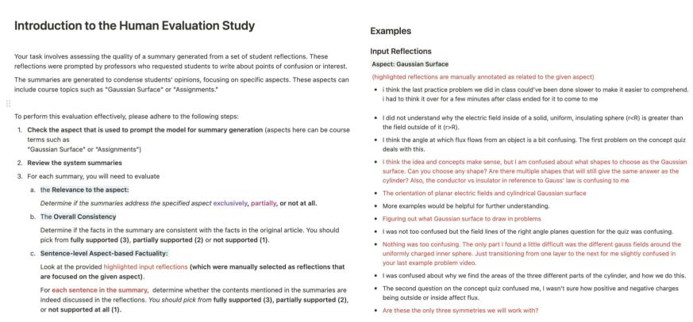  
Figure 12: A screenshot of the human annotation guideline to evaluate system generated aspect-based summaries. (1/3)

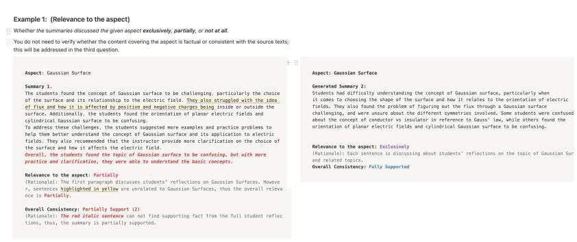

Figure 13: A screenshot of the human annotation guideline to evaluate system generated aspect-based summaries. (2/3)  
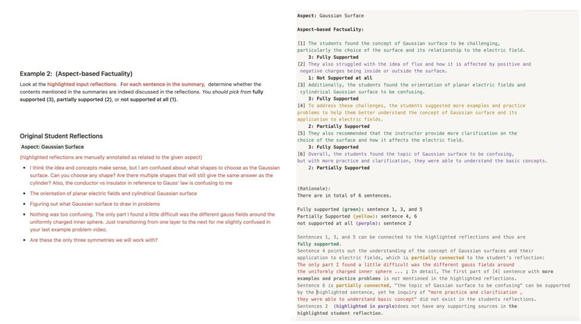  
Figure 14: A screenshot of the human annotation guideline to evaluate system generated aspect-based summaries. (3/3)

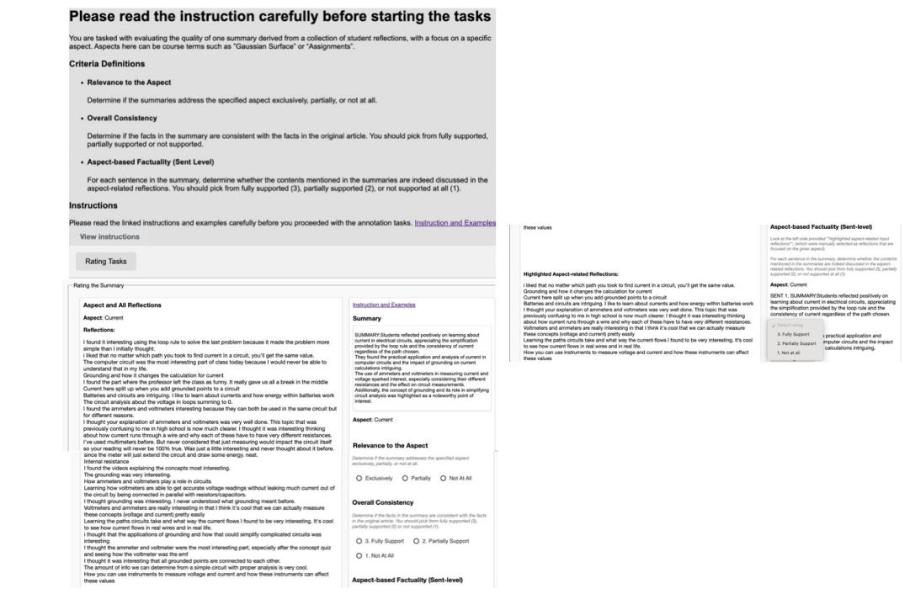  
Figure 15: A screenshot of MTurk HIT used to evaluate the quality of system generated aspect-based summaries.

We recommend the reader check the original paper for more details.

Pipelined Model We run the pipeline script from https://github.com/chaojiang06/ arXivEdits/tree/main/code/pipeline to predict edit and intention results.

## J.2 Suggestion Analysis

Besides directly analyzing the difference between versions of summaries, it is also crucial to inspect the suggestions provided by different refinement approaches. In Table 18, we present samples of suggestions for three systems (Self-Refine, DCR, and MC-Refine) on LLAMA3 and LLAMA3.1-70B outputs.

We find that different refinement approaches have distinct revision suggestions. For Self-Refine, the suggestions are presented in a structured list format (e.g., "1. Emphasize the interactive aspects: more illustration of the suggestion"). We examined the text preceding the colon and employed the NLTK toolkit (Bird et al., 2009) to identify the most common n-grams. Frequently observed strategies include "concise and focused," “focused on <AS-PECT>”, “use of more specific language,” and “incorporation of specific examples’, supported with model generated concrete revision demonstrations. DCR suggestions are also in the list format. Given that they are trained on a synthesized datasets, these suggestions follow the format of (1) evaluating the sentence in the context of full summary, (2) identifying the error span and (3) suggesting changes of a single sentence. Examples in the following paragraph demonstrate that DCR’s suggestions may focus on removing less confident details, which may not help improve the summarization quality. Lastly, the MC-Refine approach’s suggestion comes with a format: original\_sent, error\_span, and the revision suggestion. We also notice that stronger LLMs can provide reasoning on the revisions suggested.

Adhering to the findings in §5, we find that DCR’s suggestions focused on removing details from the original summary (highlighted in blue colors). For instance, in the second point of column 1 row 2, DCR’s suggestion is The error span is: ‘They appreciated the demonstration of how current flows through a circuit, including the role of grounding and how it affects the calculation.’ Tofix this, consider changing the span to ‘Studentsfound the concept of current to be fascinating’. Such removal, while improving the factuality metrics, did not help improve the quality of the aspect-based summaries. In contrast, Self-Refine employed diverse strategies to improve the specificity, removing non-related phrases, as well fusing contents to make it more concise. As for E2A w/ MC-Refine, leveraging high-quality extracted supporting reflections, and the fact-checker that help localize the errors, this approach made minimal edits and retain the contents that are deemed good quality.

<table><tr><td rowspan=1 colspan=1>Method</td><td rowspan=1 colspan=1>LLAMA3</td><td rowspan=1 colspan=1>LLAMA3.1-70B</td></tr><tr><td rowspan=1 colspan=1>Self-Refine</td><td rowspan=1 colspan=1>Suggestions:1. Focus on the most prominent points: While the original summarycovers a wide range of topics, it could be condensed to focus on themost prominent points. For example, the loop rule, grounding, andthe role of ammeters and voltmeters could be highlighted as the maintakeaways.2. Remove repetitive language: Some phrases, such as &quot;I found itinteresting&quot; or &quot;I thought it was interesting,&quot; are repeated throughoutthe reflections. These could be condensed or removed to make thesummary more concise.3. Emphasize the key concept: The topic of current is the mainfocus of the reflections, but the summary could be more explicit inhighlighting this concept. For example, the summary could start witha sentence like &quot;The concept of current was a central theme in today&#x27;slecture, with students exploring its calculation, measurement, andapplications.</td><td rowspan=1 colspan=1>Suggestions:1. To make the summary more concise, consider removing the phrase&quot;Additionally, students appreciated the simplicity of using the looprule to solve problems and how it can make complex circuits moremanageable&quot; as it slightly deviates from the focused topic of Currentand is not as directly relevant as the other points mentioned.2. To improve focus on the topic of Current, rephrase the sentence&quot;Many were interested in learning about how current flows througha wire and how it can be split when grounded points are added to acircuit&quot; to &quot;Students were interested in learning about how current flowsand splits in a circuit, particularly when grounded points are added&quot; tomake it more direct and concise.3. To make the summary more concise, consider combining the ideas ofthe first and third sentences into one sentence, such as &quot;Students foundthe concept of current in circuits to be intriguing, particularly how itcan be measured using ammeters and voltmeters, and the idea that allgrounded points are connected to each other.&quot;</td></tr><tr><td rowspan=2 colspan=1>DCR</td><td rowspan=2 colspan=1>1. The summary introduces specific details about the loop rule and itsapplication that are not present in the given reflections. This informa-tion is extrinsic and adds details not grounded in the document. Theerror span is: &#x27;the idea that the loop rule simplifies the calculation ofcurrent in a circuit&#x27; To fix this, consider changing the span to &#x27;Studentsfound the concept of current to be fascinating&#x27;2. The summary introduces specific details about the demonstrationof current flow and the role of grounding that are not mentioned inthe provided reflections. This information is extrinsic and adds detailsnot grounded in the document. The error span is: &#x27;They appreciatedthe demonstration of how current flows through a circuit, includingthe role of grounding and how it affects the calculation.&#x27; To fix this,consider changing the span to &#x27;Students found the concept of current tobe fascinating.&#x27;3. The summary introduces specific details about the use of ammetersand voltmeters that are not mentioned in the provided reflections. Thisinformation is extrinsic and adds details not grounded in the document.The error span is: &#x27;the use of ammeters and voltmeters’ To fix this,consider changing the span to &#x27;the importance of measuring voltage andcurrent&#x27;4. The summary introduces information about the internal resistance ofbatteries and its effect on current flow that is not present in the providedreflections. This information is extrinsic and adds details not groundedin the document. The error span is:&#x27;students found it interesting to learnabout the internal resistance of batteries and how it affects the flow ofcurrent&#x27; To fix this, consider changing the span to &#x27;students appreciatedthe demonstration of how current flows through a circuit, including therole of grounding and how it affects the calculation&#x27;5. The summary introduces information about students&#x27; enjoymentand exploration of the concept of current, which is not present in theprovided reflections. This information is extrinsic and adds new detailsnot grounded in the document. The error span is:&#x27;students enjoyedexploring the concept of current and its applications in real-life circuits.To fix this, consider changing the span to &#x27;Students found the conceptof current to be fascinating.</td><td rowspan=2 colspan=1>1. The summary introduces specific details about the measurement ofcurrent using ammeters and voltmeters and how these instruments affectthe circuit, which are not mentioned in the provided reflections. Thisinformation is extrinsic and adds details not grounded in the document.The error span is: &#x27;Students found the concept of current in circuits tobe intriguing, particularly how it can be measured using ammeters andvoltmeters, and how these instruments can affect the circuit itself.&#x27; Tofix this, consider changing the span to &#x27;Students found the concept ofcurrent in circuits to be intriguing.’2. The summary introduces specific details about how current flowsthrough a wire and how it can be split when grounded points are addedto a circuit, which are not mentioned in the provided reflections. Thisinformation is extrinsic and adds details not grounded in the documentThe error span is: &#x27;Many were interested in learning about how currentflows through a wire and how it can be split when grounded points areadded to a circuit.&#x27; To fix this, consider changing the span to &#x27;Studentsfound the concept of current in circuits to be intriguing.’3. The summary introduces specific details about the concept of currentin circuits that are not directly mentioned in the provided reflections.This information is extrinsic and adds details not grounded in thedocument. The error span is: &#x27;the concept of current in circuits to beintriguing, particularly how it can be measured using ammeters andvoltmeters, and how these instruments can affect the circuit itself&#x27; Tofix this, consider changing the span to &#x27;Students found the concept ofcurrent in circuits to be intriguing&#x27;4. The summary introduces information about the loop rule that is notpresent in the provided reflections. This information is extrinsic andadds details not grounded in the document. The error span is: &#x27;thesimplicity of using the loop rule to solve problems and how it can makecomplex circuits more manageable&#x27; To fix this, consider changing thespan to &#x27;the simplicity of using the loop rule to solve problems&#x27;</td></tr><tr><td rowspan=1 colspan=1>and adds</td></tr><tr><td rowspan=1 colspan=1>E2A w/MC-Refine*</td><td rowspan=1 colspan=1>Suggestions: {original_sent: Students found the concept of current tobe interesting and engaging, particuarly in the context of circuits andthe role of ammeters and voltmeters in measuring voltage and current.They appreciated the idea that current remains constant regardless ofthe path taken to find it, and were fascinated by the ways in whichgrounded points can affect the flow of current. Additionally, studentswere intrigued by the impact of measurement instruments on the circuititself and the importance of considering this when taking readings., theerror span: the last part of the sentence, the revision suggestion: Thestudents were also intrigued by the practical applications of current inreal-life circuits and the role of instruments in measuring it accurately.}</td><td rowspan=1 colspan=1>Suggestions: {original_sent: Students found the concept of currentin circuits fascinating, particularly how it flows through wires, splitswhen grounded points are added, and can be measured using ammetersand voltmeters., the error span: how it flows through wires, therevision suggestion: Students found the concept of current in circuitsfascinating, particularly how current splits when grounded points areadded, and how it can be measured using ammeters and voltmeters.Reasoning: The original sentence mentions &quot;how it flows throughwires&quot; which is not explicitly mentioned in the extracted list of reflec-tions. While it is a related concept, the reflections focus more on themeasurement and behavior of current in circuits. The revised sentencefocuses on the aspects of current that are directly mentioned in thereflections, such as splitting when grounded points are added and mea-surement using ammeters and voltmeters.}</td></tr></table>

Table 18: Suggestions generated by different refinement approaches using two backbones LLAMA3 and LLAMA3.1-70B. The examples remained the same to Fig 2. \* means that the original version for the E2A w/ MC-Refine is E2A generated summaries, while the former two are generated by the baseline.

## J.3 Linguistic Analysis on Different Model Summaries

Figure 16 presents a linguistic analysis of system diversity in relation to the original reflections. Each row represents the set of approaches operated on one backbone LLM. DCR demonstrates the most significant compression (for example, in row 1, the minimum compression ratio is 16:1 for DCR with LLAMA3, which is significantly higher than that of the other methods), which is consistent with the findings in §4.1. Notably, system-generated aspect-based summaries exhibit higher Novelty-N values compared to human-edited summaries (which are reported as 0.19/0.63/0.84 for Novelty-1/2/3, respectively, in Table 1), indicating that these systems incorporate vocabulary not present in the original reflections.

Additionally, the E2A approach expands the area of the plots, suggesting that the generated summaries have more diverse content compared to the baseline. This improvement can be attributed to the effective extraction of supporting reflections during the extraction phase.

A pairwise comparison between E2A and E2A w/ MC-Refine reveals that larger models tend to produce smaller plot areas, reflecting increased text diversity, which consequently enhances summary quality.

## K Other Domain Results

In addition to our REFLECTASP dataset, we additionally tested the proposed approaches on a out-ofdomain dataset, SPACE (Angelidis et al., 2021a). We used their testing split, which contains reviews about 25 unique hotels. Each set contains 100 real reviews, and aspect-based summaries on each of six popular aspects: building, cleanliness, food, location, rooms, and service.

## K.1 Baselines

We used the baseline system outputs released by Hosking et al. (2023), including QT asp(Angelidis et al., 2021b), HERCULESext and HERCULESabs (Hosking et al., 2023), as well as AceSumext and AceSum (Amplayo et al., 2021).

We include the following methods in our work: (1) Baseline, which uses the basic prompt, (2) Self-Refine, and (3) MC-Refine applied to the baseline outputs. Initial results show that LLMs struggled to process longer inputs (an average of 14k words for the combined length of all 100 reviews) and to follow instructions for generating E2A results. Thus, we exclude the E2A approach and replace the E2A with MC-Refine with the MC-Refine detector, utilizing the ground-truth clusters provided in the dataset.

## K.2 Evaluation

We report the same set of evaluation metrics as in §4.1. One difference is that we follow the ROUGE implementation in Hosking et al. (2023), which is the ‘jackknifing’ method for multiple references as implemented for the GEM benchmark (Gehrmann et al., 2021), to make the evaluation consistent with scores reported in prior papers.

## K.3 Result

Table 19 showed the results of different approaches. While the older baselines (rows 1–5) achieved higher ROUGE and BERTScore metrics, their factuality scores were lower than those of LLMs. We attribute this discrepancy to the lexical differences between the older supervised models and the zeroshot LLMs. As shown in Table 20, the outputs of the best baseline model, AceSum(abs), closely resemble human references, while LLM outputs tend to include more details from the original reviews.

Our proposed MC-Refine, combined with humanselected clusters for fact-checking, obtained substantial performance gains compared to the baseline and other methods. These improvements were more notable on the larger LLAMA3.1-70B model (row 16 vs. row 13). Meanwhile, the faithfulness of generated contents is also improved.

## K.4 Insights from Out-domain Experiments

Here we draw multiple insights from the experimental results above and additional analysis:

1. Our dataset’s high-quality annotation resolves the inconsistency between referencebased metrics and the Faithfulness Evaluation. Older datasets can suffer from noisy annotations or heuristic-based constructions (Goyal et al., 2022; Dahan and Stanovsky, 2025). Prior work (Goyal et al., 2022) found that LLM-generated summaries outperform those from older models, while Dahan and Stanovsky (2025) highlights that some reference summaries are low-quality and heuristicdriven. One key issue is the evaluation inconsistency we spotted in the prior dataset (SPACE for review summarization), where overly abstractive patterns and low quality of the reference summaries hinder the assessment of novel approaches in the LLM era:

• In Table 19, regarding ROUGE scores, the prior best-fine-tuned model, ACESUM, outperformed all LLM baselines by a large margin, but their faithfulness evaluation result tells a different story.

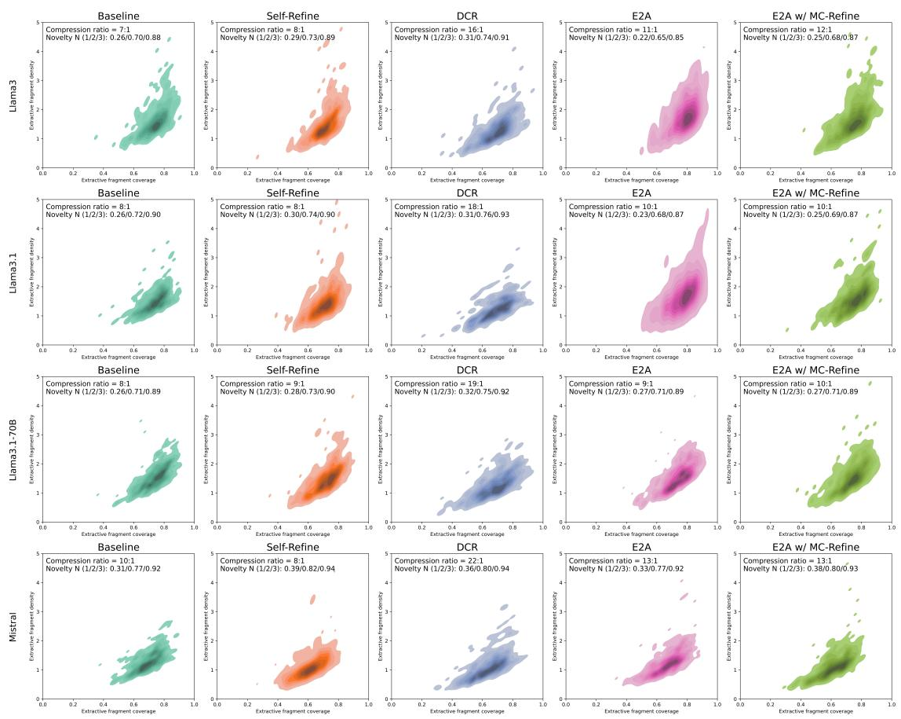  
Figure 16: Density and coverage distributions of generated summaries across different models and LLM backbones. We additionally report the compression ratio and novelty-n metrics on the top-left corner. Each box is a normalized bivariate density plot of extractive fragment coverage (x-axis) and density (y-axis), the two measures of extraction described in Section 2 and Appendix D.1.

• Our dataset analysis on the SPACE dataset reveals that human reference summaries often follow generic patterns (e.g., The staff was very friendly, helpful, and polite appeared multiple times for summaries focused on the aspect of staff ) that do not reflect actual user feedback. In one such data point’s annotated cluster, 11/37 reviews mention negative staff experiences (rude, busy, never answering the call. . . ), which the ACESUM fails to capture, leading to a low agreement between reference-based and automatic faithfulness evaluations. This discrepancy makes improving LLMs more challenging.

In contrast, our dataset provides human-edited summaries grounded in original reflections and aligned with aspect-specific clusters. As shown in Table 3, our dataset exhibits more consistent evaluation patterns when scaling up LLMs and testing different approaches, establishing a robust foundation for future aspect-based summarization research.

2. Summary Analysis Findings: Our dataset contains richer information in the summaries that well summarize the input.

The prior dataset’s high compression ratio also limits the aspect-based summary’s coverage (details in Table 1). Looking at the example in Table 20, the reference summary in SPACE “This charming hotel is located within steps of all the major sights” could not give any further information and would be misleading for a tourist who is interested in some specific sights that are far away from the hotel. Our dataset can also retain the diverse students’ opinions regarding the specific aspect of the lecture and serves as a good testbed for future work in the field. For instance, one potential extension is to make the aspect-based summaries more accountable by assigning different weights to the summarization details, on which the evaluation relied more for coverage of the summary.

3. Our dataset motivated innovations in faithfulness-guided approaches. Given the manageable scales of input size, our manual evaluation identified two major challenges in aspectbased summarizations: (1) the inclusion of aspectunrelated details and (2) the oversimplification of aspect-specific content, which in turn motivates us to develop the E2A and the Refinement approaches that can tailor them under a zero-shot setting. Prior datasets do not support this, as they either suffer from low-quality references (SPACE, OPOSUM+) or lack grounding texts for validation (OPENASP). Our extensive experiments find that LLMs can enhance their ability to generate better aspect-based summaries with these approaches. This improvement cannot be verified on other datasets due to their limitations.

## L Survey of Class Size

We annotated students’ reflections from the publicly available ReflectSumm dataset, which collects data via an application used by real classrooms. Our research into undergraduate courses at several public universities based on their released common data set indicates that over 92% of undergraduate classes have fewer than 100 students, and approximately 84% have 50 or fewer students (see Table 21). Given the self-volunteering nature of data collection and variations in attendance throughout the semester, we believe our ReflectASP dataset, with an average of 43 students’ reflections per lecture, represents the majority of real-world scenarios.

<table><tr><td>ID</td><td>Model</td><td>R-1</td><td>R-2</td><td>R-L</td><td>BS</td><td>MCEXT</td><td>MCINPUT</td><td># Sents</td><td># Words</td></tr><tr><td>1</td><td> $\mathbf { Q } \mathbf { T } _ { \mathrm { a s p } }$ </td><td>31.61</td><td>10.24</td><td>22.64</td><td>87.93</td><td>28.31</td><td>47.87</td><td>5.79</td><td>46.80</td></tr><tr><td>2345</td><td>AceSumext</td><td>35.09</td><td>12.10</td><td>27.15</td><td>88.95</td><td>29.10</td><td>44.82</td><td>1.99</td><td>29.56</td></tr><tr><td></td><td>HERCULESext</td><td>28.57</td><td>7.91</td><td>19.93</td><td>87.76</td><td>10.30</td><td>23.92</td><td>4.01</td><td>56.40</td></tr><tr><td></td><td>HERCULESabs</td><td>33.56</td><td>10.04</td><td>25.34</td><td>89.59</td><td>23.87</td><td>39.90</td><td>3.99</td><td>33.85</td></tr><tr><td></td><td>AceSum</td><td>36.38</td><td>12.65</td><td>29.08</td><td>89.65</td><td>26.59</td><td>40.79</td><td>2.21</td><td>27.84</td></tr><tr><td>6</td><td>MISTRAL</td><td>28.67</td><td>7.54</td><td>20.06</td><td>88.19</td><td>25.36</td><td>59.59</td><td>5.00</td><td>74.70</td></tr><tr><td>7</td><td>w/ Self-Refine</td><td>23.98</td><td>5.59</td><td>16.77</td><td>87.32</td><td>23.49</td><td>63.66</td><td>5.34</td><td>124.18</td></tr><tr><td>8</td><td>w/ MC-Refine</td><td>30.50*</td><td>7.52</td><td>22.00*</td><td>88.51*</td><td>34.63*</td><td>78.79*</td><td>2.73</td><td>55.16</td></tr><tr><td>9</td><td>LLAMA3.1</td><td>30.26</td><td>7.05</td><td>21.96</td><td>88.64</td><td>31.61</td><td>74.03</td><td></td><td></td></tr><tr><td>10</td><td>w/ Self-Refine</td><td>29.07</td><td>5.92</td><td>20.82</td><td>88.10</td><td>17.89</td><td>52.37</td><td>1.78 1.64</td><td>47.70 52.66</td></tr><tr><td>11</td><td>w/DČR</td><td>25.27</td><td>5.57</td><td>20.31</td><td>88.10</td><td>43.35</td><td>60.43</td><td>1.15</td><td>21.48</td></tr><tr><td>12</td><td>w/ MC-Refine</td><td>30.23</td><td>7.23</td><td>22.48</td><td>88.55</td><td>55.51*</td><td>76.54*</td><td>1.94</td><td>54.16</td></tr><tr><td>13</td><td>LLAMA3.1-70B</td><td>31.42</td><td>7.70</td><td>22.93</td><td>88.95</td><td>29.39</td><td>66.70</td><td></td><td></td></tr><tr><td>14</td><td>w/ Self-Refine</td><td>29.54</td><td>6.46</td><td>21.68</td><td>88.57</td><td>19.63</td><td>54.19</td><td>1.69 1.26</td><td>48.12 46.19</td></tr><tr><td>15</td><td>w/DČR</td><td>26.70</td><td>5.98</td><td>21.49</td><td>88.78</td><td>46.30</td><td>66.45</td><td>1.20</td><td>22.78</td></tr><tr><td>16</td><td>w/MC-Refine</td><td>32.88*</td><td>8.41*</td><td>24.85*</td><td>89.30*</td><td>50.06*</td><td>78.38*</td><td>1.24</td><td>39.71</td></tr></table>

Table 19: Experimental results on SPACE. All LLM results are averaged over three runs, and \* means the score is significantly better than the baseline models within each block. Gray rows indicate the baseline models, The best scores for each backbone and the prior baselines are bold.

<table><tr><td rowspan=1 colspan=2>Model             Summary</td></tr><tr><td rowspan=1 colspan=2>Human References        [’This charming hotel is located within steps of all the major sights&#x27;, &#x27;The hotelis perfectly situation a few steps away from all major sights to see in Rome.&#x27;,&#x27;Its in a great location with an available walking tour of Rome.&#x27;]</td></tr><tr><td rowspan=1 colspan=1>AceSum</td><td rowspan=1 colspan=1>the location is ideally located just 2 minutes walk from piazza navona and a 15minute walk to st. peter&#x27;s and the roman forum.</td></tr><tr><td rowspan=1 colspan=1>LLama3.1-70B</td><td rowspan=1 colspan=1>Hotel Navona&#x27;s location is excellent, within walking distance to major attrac-tions like Piazza Navona, Pantheon, Vatican, and Spanish Steps, making it anideal base for exploring Rome, with many restaurants and cafes nearby, andpublic transportation easily accessible.</td></tr><tr><td rowspan=1 colspan=1>LLama3.1-70B w/ Self-Refine</td><td rowspan=1 colspan=1>Hotel Navona is nestled in the heart of Rome&#x27;s historic center, steps away fromPiazza Navona and the Pantheon, with easy access to Vatican, Spanish Steps,and nearby restaurants, shops, and public transportation, making it an ideal basefor exploring Rome.</td></tr><tr><td rowspan=1 colspan=1>LLama3.1-70B w/ DCR</td><td rowspan=1 colspan=1>Hotel Navona&#x27;s location is ideal for exploring Rome, with many restaurants andcafes nearby, and public transportation easily accessible.</td></tr><tr><td rowspan=1 colspan=1>1lama3.1-70B w/ MC-Refine</td><td rowspan=1 colspan=1>Hotel Navona&#x27;s location is excellent, being only 2 minutes from the Pantheonand Piazza Navona and a 15 minute walk to St. Peter&#x27;s and the Roman Forum,making it an ideal base for exploring Rome.</td></tr></table>

Table 20: Example summaries of different approaches on SPACE.

<table><tr><td>School</td><td>% of classrooms &lt;100 students</td><td>% of classrooms &lt;50 students</td><td>Link</td></tr><tr><td>U Pittsburgh</td><td>94%</td><td>83%</td><td>Page 59</td></tr><tr><td>Penn State</td><td>92%</td><td>84%</td><td>Page 56</td></tr><tr><td>U Rochester</td><td>97%</td><td>88%</td><td>Page 57</td></tr></table>

Table 21: Statistics on undergraduate classroom size from three well-known schools in the northeast US. (REFLECTSUMM reports that the data is collected from one midwest and another northeast university.)