# Fusing Highly Specialized Language Models for Comprehensive Expertise

Ning Ding<sup>1</sup>\* , Yulin Chen<sup>2,3</sup>∗, Ganqu Cui<sup>2</sup>, Xingtai Lv<sup>1</sup>, Weilin Zhao<sup>2,4</sup>

Kaiyan Zhang<sup>1</sup>, Ruobing Xie<sup>5</sup>, Bowen Zhou<sup>1†</sup>, Zhiyuan Liu<sup>2,4</sup>†, Maosong Sun<sup>2,4</sup>†

<sup>1</sup>Department of Electronic Engineering,Tsinghua University

<sup>2</sup>Department of Computer Science and Technology, Tsinghua University

<sup>3</sup>Center for Data Science, New York University

<sup>4</sup> BNRIST, IAI, Tsinghua University, <sup>5</sup> Tencent

dingning@mail.tsinghua.edu.cn, yc7320@nyu.edu

## Abstract

Underlying data distributions of natural language, programming code, and mathematical symbols vary vastly, presenting a complex challenge for large language models (LLMs) that strive to achieve high performance across all three domains simultaneously. Achieving a very high level of proficiency for an LLM within a specific domain often requires extensive training with relevant corpora, which is typically accompanied by a sacrifice in performance in other domains. In this paper, we aim to “play the dealt cards well” and propose to fuse models that are already highly-specialized directly. The proposed fusing framework, UL-TRAFUSER, consists of different distinct specialists that are already sufficiently trained on different domains (we mainly focus on language, coding, and mathematics in this paper). A token-level gating mechanism is introduced to blend the specialists’ outputs. A two-stage training strategy accompanied by balanced sampling is designed to ensure stability. To effectively train the fused model, we further construct a high-quality supervised instruction tun ing dataset, ULTRACHAT 2, which includes text, code, and mathematical content. This dataset comprises approximately 300,000 instructions and covers a wide range of topics in each domain. Experiments show that our model could simultaneously achieve mastery of the three crucial domains.

## 1 Introduction

If a piece of information can be serialized and tokenized, it is likely to be handled by large language models (LLMs) (Bommasani et al., 2021; Brown et al., 2020; OpenAI, 2023). LLMs, as one of the most advanced manifestations of artificial intelligence, have demonstrated proficiency in three representative symbol systems that are essential to human progress: natural language (Ouyang et al., 2022; Bai et al., 2022), which forms the cornerstone of human interaction; programming code (Li et al., 2023a; Rozière et al., 2023), the backbone of our digital ecosystem; and mathematical reasoning, the framework underpinning scientific advancement (Luo et al., 2023a; Yang et al., 2023). The mastery of three domains would equip LLMs with unparalleled versatility. However, the intrinsic variability of data distribution across these domains presents a formidable challenge for an LLM to achieve consistently high performance at the same time. One awkward situation is that it is challenging to integrate professional-level coding and mathematical abilities into a general conversational language model without loss. That is, these skills are more often reflected in the numbers on related benchmarks rather than a real-world user interface.

Figure 1 (a-c) demonstrates such a struggle by presenting the performance of three specialized models on the aforementioned domains, all initially based on the Llama-2 (Touvron et al., 2023b) 13B architecture. Our findings reveal a clear trade-off: specialized training in one domain often comes at the expense of performance in the others, whereas training on all three types of data at the same time results in a simultaneous suboptimal situation. Delving into this situation, such an issue may be partially mitigated by careful designs of data engineering, training strategy, or prompt construction. However, in general, semantics in language, logic and structures in code, and abstract symbol manipulations in math intricately always create a situation of mutual weakening. To elaborate further, comparing highly specialized models (such as those for coding or mathematics) with general-purpose models capable of performing all tasks (like GPT-4) for their expertise is a trap that can easily lead to misinformation.

This paper hopes to integrate specialized abilities into a general chat language model with as little loss as possible. More specifically, we propose to leverage separate models that are already highly specialized via a fusing structure. In this fusing framework, namely ULTRAFUSER, we use three well-trained LLMs as initial specialist models in text, code, and math. <sup>1</sup> To ensure that the fused model benefits from the specialized knowledge of each specialist model, a dynamic gating mechanism is implemented, which sits on top of the three specialists and adaptively controls the contribution of each specialist to the final output logits based on the input data. Such a mechanism is adopted at the token level, which allows both the specialization of individual specialists and the generalization of the fused model. The key to functioning the model is to train the gating module. For example, when the model conducts code generation, we want the coding specialist to contribute more than the other two. This necessitates a mixed instruction tuning dataset that contains the three domains for the training. Unlike language data, high-quality instruction-tuning datasets for code and math are scarcer in the open-source community. Inspired by ULTRACHAT (Ding et al., 2023), we construct a comprehensive, diverse dataset with high quality, ULTRACHAT 2, to facilitate the development of advanced LLMs with the aforementioned expertise. ULTRACHAT 2 contains 300,000 diverse and highquality data (each part has 100,000), which are derived from 72 meta-topics and 1587 sub-topics.

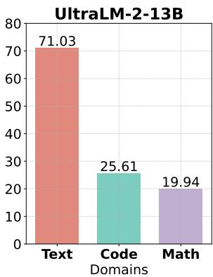  
(a) Text-specialized model.

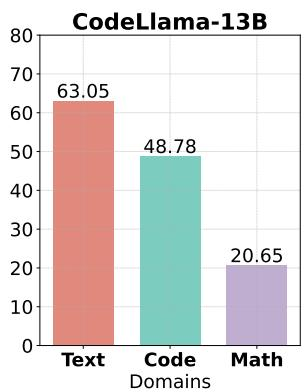  
(b) Code-specialized model.

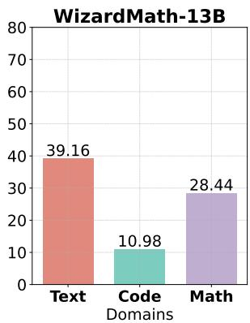  
(c) Math-specialized model.

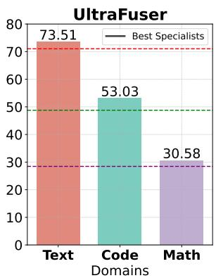  
(d) Fused model.  
Figure 1: Performance on different domains of specialized models and our ULTRAFUSER. The performance for the text domain is computed by the average results on TruthfulQA (Acc) (Lin et al., 2021) and AlpacaEval (Win Rate) (Li et al., 2023b) datasets; the performance for the code domain is Pass@1 of HumanEval (Chen et al., 2021); and the performance for the math domain is the average result of GSM8K (Pass@1) (Cobbe et al., 2021), MATH (Pass@1) (Hendrycks et al., 2021), SAT-Math (Acc) (Zhong et al., 2023), and AQuA-RAT (Acc) (Ling et al., 2017) datasets. All results are zero-shot.

Experiments show that highly specialized models may counter collapse if they are directly further trained, but we can effectively integrate their highly professional abilities into a general chat interface via ULTRAFUSER. By training a fused model with UltraLM-2-13B, CodeLlama-13B, and WizardMath-13B as the specialists for three domains, we achieve consistently effective performance on benchmarks across language understanding, code generation, and mathematical reasoning. Our proposed model, data, training, and inference frameworks will be publicly available.

## 2 Related Work

Large Language Models for Language. With the proliferation of model parameters, enhancements in training data augmentation both in terms of quantity and quality, and continuous refinements in training algorithms, LLMs have exhibited an enhancement in language understanding, generation, and generalization capabilities. These LLMs exhibit remarkable proficiency in accomplishing a wide array of natural language processing tasks, and showcase formidable capabilities in in-context learning and few-shot learning (Brown et al., 2020; Ouyang et al., 2022; OpenAI, 2023; Chowdhery et al., 2022; Zhang et al., 2022; Touvron et al., 2023b; Taori et al., 2023; Chiang et al., 2023; Xu et al., 2023; Ding et al., 2023; Jiang et al., 2023a). Despite originating from NLP tasks, as LLMs evolve, the boundaries between NLP tasks are gradually becoming blurred.

Large Language Models beyond Language. LLMs excel in processing various symbol systems including code, math symbols, DNA, and protein sequences. Models like StarCoder (Li et al., 2023a) and CodeLlama (Rozière et al., 2023), trained on vast code repositories and interactions, are adept at code generation, bug fixing, and explanation (Black et al., 2021; Wang and Komatsuzaki, 2021; Black et al., 2022; Wang et al., 2021; Chen et al., 2021; Li et al., 2022; Nijkamp et al., 2022, 2023; Fried et al., 2022; Gunasekar et al., 2023; Allal et al., 2023). Similarly, math-focused models, such as Minerva (Lewkowycz et al., 2022) and Math-GLM (Yang et al., 2023), have been developed through specialized training and fine-tuning strategies, including the use of external tools and Chain of Thought techniques (Jelassi et al., 2023; Liu and Low, 2023; Nye et al., 2022; Zhou et al., 2022a; Chen et al., 2022; Yang et al., 2023; Gao et al., 2023; Schick et al., 2023). These models, requiring extensive training, highlight the intensive data demands of LLMs in specialized domains. For example, CodeLlama uses 500 billion tokens for code training, 100 billion tokens for Python training, and more than 20 billion tokens for fine-tuning.

The Fusion of Large Language Models. Mixture-of-Experts (MoE) is the neural architecture that distributes tasks among multiple specialized networks (experts) and determines their responsibilities via a gating network (Jacobs et al., 1991). MoE enhances the capabilities of LLMs and has been extensively utilized (Clark et al., 2022; Lou et al., 2021; Kudugunta et al., 2021; Lepikhin et al., 2020; Mustafa et al., 2022; Zhou et al., 2022b; Riquelme et al., 2021; Shen et al., 2023b; Jiang et al., 2023b; Wan et al., 2024a; Jiang et al., 2024). Many studies have endeavored to comprehend the Mixture-of-Experts (MoE) from the perspective of computational cost, with a specific focus on its sparse nature (Shazeer et al., 2016; Zoph et al., 2022; Zuo et al., 2021; Du et al., 2022; Fedus et al., 2022; Komatsuzaki et al., 2023; Shen et al., 2023a). The prevailing belief is that the MoE approach can scale up model parameters without incurring an escalation in computational expense. Some work suggests that experts do not necessarily have distinct expertise (Jiang et al., 2024), while other work verifies the effectiveness of expert specialization (Dai et al., 2024). We believe both ways could achieve promising performance, unlike those that train MoE models from scratch, this paper seeks to fuse highly specialized models in the fine-tuning phase. Compared to methods like knowledge distillation and knowledge fusion (Wan et al., 2024a), our approach aims to achieve optimal performance by retaining the specialized models and learning to fuse the expertise directly, avoiding potential performance loss brought by inaccurate fashion weight estimation and further distillation training.

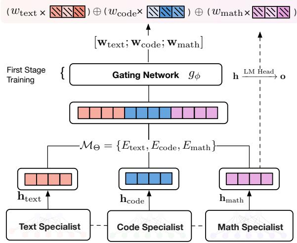  
Figure 2: Architecture of our proposed ULTRA-FUSERframework.

## 3 Our Approach

Compared to methods like Mixture-of-Experts (Shazeer et al., 2016), which expands the inner model structure to develop different expertise implicitly during training, our approach focuses on fusing specialist models explicitly aligned with different skill sets at the output level directly. This section first describes the constitution of the proposed model, ULTRAFUSER, and then introduces the construction of a mixed instruction tuning dataset, ULTRACHAT 2.

## 3.1 Model

The proposed fused model consists of n different specialized models (termed as specialists, and we mainly consider $n = 3$ in the paper), collectively denoted as $\mathcal { M } _ { \Theta } ~ = ~ \{ E _ { \mathrm { t e x t } } , E _ { \mathrm { c o d e } } , E _ { \mathrm { m a t h } } \}$ , where $E _ { \mathrm { t e x t } }$ is mainly trained on natural language text, $E _ { \mathrm { c o d e } }$ is trained on programming code, and $E _ { \mathrm { m a t h } }$ is trained on mathematical problems. Each specialist model is essentially a large language model. They share the same architectural framework and vocabulary space but are trained on distinct datasets that are representative of their expertise.

Architecture. As shown in Figure 2, the fused model aims to utilize the expertise of each specialist model appropriately based on the nature of the input data. The integration of specialized ability is realized by a shared gating layer $g$ that calculates the weight for each token per specialist. Specifically, during training, for the token $\bar { \boldsymbol { x } } ^ { ( i ) }$ concerned, the three specialists output token hidden states $\mathbf { h } ^ { ( i ) } = \{ \mathbf { h } _ { \mathrm { t e x t } } ^ { ( i ) } , \mathbf { h } _ { \mathrm { c o d e } } ^ { ( i ) } , \mathbf { h } _ { \mathrm { m a t h } } ^ { ( i ) } \}$ and corresponding logits $\mathbf { o } ^ { ( i ) } = \{ \mathbf { o } _ { \mathrm { t e x t } } ^ { ( i ) } , \mathbf { o } _ { \mathrm { c o d e } } ^ { ( i ) } , \mathbf { o } _ { \mathrm { m a t h } } ^ { ( i ) } \}$ as a native language model. Then, the gating layer $g _ { \Phi }$ is applied to each set of specialist outputs to obtain the final logits.

Practically, the gating layer is implemented as a linear network that calculates the weight for each token $x ^ { ( i ) }$ based on the last hidden states $\mathbf { h } ^ { ( i ) } =$ $E ( x ^ { ( 1 : i - 1 ) } )$ ). For each token $x ^ { ( i ) }$ , the final output logits from the fused model are computed as:

$$
\begin{array} { r l } & { g _ { \Phi } ( \mathcal { M } _ { \Theta } ( x ^ { ( i ) } ) ) = \mathbf { w } ^ { ( i ) T } ( \mathbf { o } _ { \mathrm { t e x t } } ^ { ( i ) } : \mathbf { o } _ { \mathrm { c o d e } } ^ { ( i ) } : \mathbf { o } _ { \mathrm { m a t h } } ^ { ( i ) } ) , } \\ & { \mathbf { w } ^ { ( i ) } = \mathrm { S o f t m a x } \big ( g ( \mathbf { h } _ { \mathrm { t e x t } } ^ { ( i ) } ) : g ( \mathbf { h } _ { \mathrm { c o d e } } ^ { ( i ) } ) : g ( \mathbf { h } _ { \mathrm { m a t h } } ^ { ( i ) } ) \big ) . } \end{array}\tag{1}
$$

Training. One possible approach to training the model is to train the gating network only, expecting it to allocate each token to its optimal distribution over the three specialists. Such training strategy highly relies on the gating module’s capacity in capturing the complex and diverse context in drastically different instructions. An easier way to boost the performance is to jointly fine-tune the three specialists along with the gating module. However, the specialists can be negatively impacted by gradients back-propagated from the gating module due to its poor performance at the early stage, which may cause irreversible damage to the specialist’s inherent ability.

To tackle the problem, we propose a two-stage training strategy to ensure training stability and mitigate potential specialist ability loss. The first stage trains only the gating module parameters for $N _ { 1 }$ steps and keeps specialists frozen. The purpose is to retain specialist capability while warming up the gating module. After the first stage of training, the gating network is expected to output reasonable token weights that favor over specific specialists according to data type. In our experiments, we use $N _ { 1 } = 4 0 0$ . The second stage continues to fine-tune all model parameters based on the first stage for $N _ { 2 }$ steps. At this stage, the specialist models are jointly optimized for a better overall performance. At both stages, the training loss is the cross-entropy loss given true labels y and the final model output.

$$
\mathcal { L } ( x , y ) = \sum _ { i } \mathcal { C } \mathcal { E } ( g _ { \Phi } ( \mathcal { M } _ { \Theta } ( x ^ { ( i ) } ) ) , y ^ { ( i ) } ) .\tag{2}
$$

The training proceeds by minimizing the total loss over all instances in the training set using a suitable optimization algorithm, such as AdamW. The gradients are back-propagated through both the specialist models and the gating networks, allowing the gating mechanism to learn how to distribute the inputs effectively among the specialists. The overall training process is shown in Algorithm 1.

Templates. Since all specialists are well aligned to one domain and trained with different templates, they may demonstrate different activation patterns that are highly sensitive to inputs. Therefore, to fully take advantage of the specialized ability, we use specialist-specific templates to format our training data (see Appendix B). Each training sample is wrapped up by three different templates and fed into the respective specialist model. Since the loss is only calculated for the model response part, the response tokens will still be aligned, and their logits can be fused together seamlessly.

Data-level Balancing. We also adopt a batch-level class-balance sampler during training. The sampler ensures that each training batch contains the same number of training instances from the three categories, balancing the gradient within each batch and preventing from biased training that favor over one specific specialist. As shown in Algorithm 1, each batch of data contains $n \times 3$ instances in total. We explain the reason to alleviate the imbalance issue in the data-level and validate the effectiveness of the class-balance sampler in Section 4.3.

Inference. The model design adopts post-specialist token-level gating, meaning that all specialists are activated during inference. For each token $x ^ { ( i ) }$ , the three specialist models $\mathcal { M } _ { \Theta }$ are queried, and their logits are fused using the gating module $g _ { \phi } ( \cdot )$ as in the training phase. The softmax is applied to the aggregated logits to generate probabilities for the next token. The selected token is then used as part of the input for the subsequent inference step in an autoregressive manner. Our design opens doors for sophisticated, real-time adaptability that monolithic models lack. For example, in a text string interwoven with mathematical equations and code snippets—common in scientific papers, the fused model can shift its “attention” between specialists within the same sequence, ensuring that each token is treated with the most appropriate domain expertise. But on the other hand, since all specialists are activated in inference, computational overheads are inevitably introduced. In experiments, we adapt the vLLM project (Kwon et al., 2023) to our fused model to accelerate inference, which is elaborated in Appendix C.

```latex
Algorithm 1 Algorithm for two-stage training with
balanced data sampler, where $S ( \mathcal { D } , n )$ means ran
domly sampling n examples from dataset . $N _ { 1 }$
and $N _ { 2 }$ are total training steps, and $\eta _ { 1 }$ and $\eta _ { 2 }$ are
the scheduled learning rate for the two stages, re
spectively.
Input: specialized models $\mathcal { M } _ { \Theta }$ , gating $g _ { \Phi }$ , train
ing data $\mathcal { D } _ { \mathrm { t e x t } } , \mathcal { D } _ { \mathrm { c o d e } } , \mathcal { D } _ { \mathrm { l } }$ math
for $i = 1$ to $N _ { 1 }$ do
$\begin{array} { r } { \mathcal { D } ^ { i } = \bigcup _ { t \in \{ \mathrm { t e x t , c o d e , m a t h } \} } \mathcal { D } _ { t } ^ { i } } \end{array}$
= $\begin{array} { r l } { } & { \bigcup _ { t \in \{ \mathrm { t e x t , c o d e , m a t h } \} } S ( \mathcal { D } _ { t } , n ) } \end{array}$
$\begin{array} { r } { g _ { \Phi } = g _ { \Phi } - \eta _ { 1 } \Delta _ { \Phi } \frac { 1 } { | D ^ { i } | } \sum _ { ( x , y ) \in { \mathcal { D } } ^ { i } } \mathcal { L } ( x , y ) } \end{array}$
end for
for $j = 1$ to $N _ { 2 }$ do
$\begin{array} { r } { \mathcal { D } ^ { j } = \bigcup _ { t \in \{ \mathrm { t e x t } , \mathrm { c o d e } , \mathrm { m a t h } \} } \mathcal { D } _ { t } ^ { j } } \end{array}$
$= \bigcup _ { t \in \{ \mathrm { t e x t , c o d e , m a t h } \} } S ( \mathcal { D } _ { t } , n )$
$\begin{array} { r } { g _ { \Phi } = g _ { \Phi } - \eta _ { 2 } \Delta _ { \Phi } \frac { 1 } { | \mathcal { D } ^ { j } | } \sum _ { ( x , y ) \in \mathcal { D } ^ { j } } \mathcal { L } ( x , y ) } \end{array}$
$\begin{array} { r } { \mathcal { M } _ { \Theta } = \mathcal { M } _ { \Theta } - \eta _ { 2 } \Delta _ { \Theta } \frac { 1 } { | \mathcal { D } ^ { j } | } \sum _ { ( x , y ) \in \mathcal { D } ^ { j } } \mathcal { L } ( x , y ) } \end{array}$
end for
```

## 3.2 Data Synthesis

Currently, within the open-source community, there are already multiple instruction-tuning datasets for text-based conversations. However, there is a relatively limited amount of systematic code and mathematical instruction tuning data available. In this section, we construct ULTRA-CHAT 2, a comprehensive dataset tailored for training our proposed model. ULTRACHAT 2 spans a wide range of subject matter, covering natural language, coding, and mathematical instructions. Following the spirit of UltraChat (Ding et al., 2023), We employ a multi-stage generation pipeline to generate a rich set of instructional data in cooperation with LLMs. First, we engage in multi-turn interactions with GPT-4 (OpenAI, 2023), collecting and refining a set of diverse meta-topics that best represent each domain. Then, sub-topics and concepts are generated for each meta-topic. For each sub-topic, GPT-4 is instructed to further generate diverse and detailed instructions. After obtaining these instructions, we continue with in-context learning, generating both strongly and weakly related instructions. Finally, we sample 30% of the instruction data and regenerate them with higher complexity. Once we have the complete pool of instructions, we distill the GPT-4 responses and construct the whole dataset. We provide more details about ULTRACHAT 2 in Appendix F.

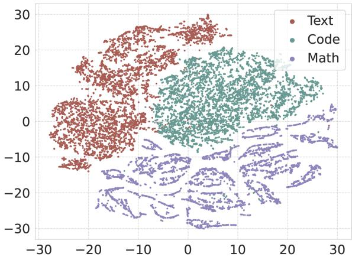  
Figure 3: t-SNE visualization of ULTRACHAT 2.

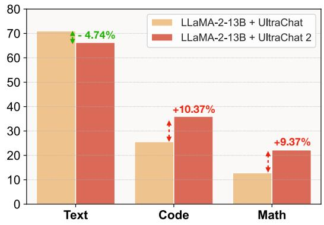  
Figure 4: Performance comparison of Llama-2 model trained on ULTRACHAT and ULTRACHAT 2. The performance for the text domain is computed by the average results on TruthfulQA (Acc) and AlpacaEval (Win Rate) datasets; the performance for the code domain is Pass@1 of HumanEval; and the performance for the math domain is the average result of GSM8K (Pass@1) and MATH (Pass@1).

Data Analysis. We randomly sample 5000 instructions from each category and visualize the data distribution in Figure 3. The representations are obtained by averaging the last layer of hidden states from Llama-2-13B, and dimensions are further reduced by the t-SNE algorithm (Van der Maaten and Hinton, 2008). The visualization clearly demonstrates the diversity and distinctiveness of different types of ULTRACHAT 2, which aligns with the intuition and discussion in Section 1. ULTRACHAT 2 provides high-quality resources for the facilitation of specialized models. We train a Llama-2-13B on ULTRACHAT 2 to give a glance at the effectiveness. As shown in Figure 4, in the text domain, the Llama-2-13B + UltraChat 2 configuration exhibits a 3.9% decrement in performance relative to the baseline only trained on the text domain. Conversely, in the code domain, there is a significant performance increment of 10.4% with the UltraChat 2 enhancement. The math domain also shows a performance increase of 9.4% with the UltraChat 2 integration, indicating a clear advantage of the updated system in code-related and mathematical reasoning tasks.

## 4 Experiments

We conduct extensive experiments to analyze the effectiveness and behaviors of ULTRAFUSER. Implementation details are reported in Appendix B.

## 4.1 Experimental Settings

Backbone Models. To validate the effectiveness of our approach, we adopt Llama-2-13B (Touvron et al., 2023b) as the backbone for experiments. Specifically, we use UltraLM-13B-V2.0 (Ding et al., 2023), CodeLlama-13B-instruct (Rozière et al., 2023), WizardMath-13B-V1.0 (Luo et al., 2023a) as the three specialist models. All model parameters are fine-tuned under the proposed ULTRAFUSER framework.

Baselines. We mainly gather three types of baseline methods for comparison: (1) Specialized Models: The original specialized backbone models are adopted to show the initial ability of separate specialized models and to validate the fusing ability of the proposed method. (2) Single Further-tuned Models: We also apply supervised fine-tuning with ULTRACHAT 2 on different backbone models. In order to comprehensively evaluate the advantage of the fused model design, both single specialized model and single model with similar parameter volume (Llama-30B (Touvron et al., 2023a)) are incorporated. (3) Model Merging: A large body of existing works merge specialized models into a single dense model with arithmetic operation on model parameters. Direct model merging methods include Average Merging (Wortsman et al.) and Task Arithmetic (Ilharco et al., 2023). FuseChat adopts pair-wise model merging and fine-tuning before final merging. BTX (Sukhbaatar et al., 2024) merges models with MoE structure at each linear layer and tunes with new data. For BTX and FuseChat (Wan et al., 2024b), we uniformly use ULTRACHAT 2 for further fine-tuning as our proposed method.

Evaluation. For the text domain, we use TruthfulQA (Lin et al., 2021) and AlpacaEval (Li et al., 2023b) for evaluation. The former is more focused on the truthfulness of LLMs, and the latter consists of more general natural language questions. For the code domain, we use HumanEval (Chen et al., 2021) for evaluation, which is a code completion task. For the math domain, we use GSM8K (Cobbe et al., 2021), MATH (Hendrycks et al., 2020), SAT-MATH (Zhong et al., 2023) and AQuA (Ling et al., 2017) for evaluation. For evaluation, we transform each dataset into instruction format, and use the consistent template as training for inference. Specifically, we evaluate under the MC2 setting in TruthfulQA, where each option is fed into the model independently and the model is queried for true or false judgment. For HumanEval, we use InstructHumanEval that transforms the original dataset into instruction format. All results are zeroshot and produced by our experiments. We do not use any chain-of-thought (CoT) techniques to boost the performance.

## 4.2 Results

Benchmark Results. Our approach involves further training already highly specialized models, but to what extent can this retraining be effective without the ULTRAFUSER framework? Comparing to the original specialist models as shown in Table 1, ULTRAFUSER can consistently produce on-a-par or even superior performance across benchmarks from different domains and achieves the highest overall results. Notably, ULTRAFUSER significantly outperforms respective specialists on TruthfulQA and HumanEval datasets by 5.86% and 4.25%, indicating that the three specialist models interact with each other in helpful ways to boost performance on more comprehensive datasets. The result demonstrates the effectiveness of directly fusing specialist models with the proposed framework in both retaining and potentially synthesizing expertise to achieve even better performance.

Furthermore, directly fine-tuning single models on our training data may not produce desirable performance, as shown in Table 1 and Figure 7. Results on further training a Llama 30B model, which is comparable to ULTRAFUSER in terms of parameter volume, highlights the importance of fusing existing models’ expertise. As for further training a specialist model, although it indeed boosts other expertise domains, it also severely harms the original expertise of the model. Among the three specialists, UltraLM-2 seems to benefit the most in terms of overall performance after further tuning, indicating that a “specialist” in text may be equipped with much broader expertise and have more potential in expanding to new expertise by further fine-tuning. Meanwhile, it should be aware that the three models also differ in the training stages they have gone through. Models directly instructiontuned based on Llama improve significantly on new domains. WizardMath improves up to 15.8% on coding tasks after further tuning, while UltraLM’s accuracy on solving math problems doubles. However, CodeLlama’s performance, unfortunately, degrades on every benchmark, especially in instruction following tasks like Alpaca. It is probably because CodeLlama has undergone thorough code infilling pre-training (500B tokens) before instruction fine-tuning. Further results on training on subset of ULTRACHAT 2 can be found in Appendix A.2.

<table><tr><td>Model</td><td>TruthfulQA Acc</td><td>AlpacaEval Win Rate</td><td>HumanEval Pass@1</td><td>GSM8K Pass@1</td><td>MATH Pass@1</td><td>SAT-Math Acc</td><td>AQuA Acc</td><td>Avg.</td></tr><tr><td>UltraLM-2</td><td>58.82</td><td>83.23</td><td>25.61</td><td>25.09</td><td>4.48</td><td>25.00</td><td>25.98</td><td>35.46</td></tr><tr><td>CodeLlama</td><td>56.89</td><td>69.21</td><td>48.78</td><td>23.12</td><td>6.16</td><td>27.73</td><td>25.59</td><td>36.78</td></tr><tr><td>WizardMath</td><td>26.81</td><td>51.50</td><td>10.98</td><td>56.18</td><td>12.2</td><td>29.55</td><td>22.05</td><td>29.91</td></tr><tr><td>Task-level  $B e s t ^ { \dagger }$ </td><td>58.82</td><td>83.23</td><td>48.78</td><td>56.18</td><td>12.20</td><td>29.55</td><td>25.98</td><td>44.96</td></tr><tr><td>★UltraLM-2 + FT</td><td>58.82</td><td>73.34</td><td>40.24</td><td>54.59</td><td>10.46</td><td>25.00</td><td>28.74</td><td>41.60</td></tr><tr><td>★CodeLlama + FT</td><td>41.02</td><td>17.90</td><td>31.71</td><td>13.42</td><td>5.34</td><td>17.73</td><td>25.20</td><td>21.76</td></tr><tr><td>★WizardMath + FT</td><td>50.17</td><td>61.25</td><td>26.83</td><td>52.08</td><td>9.98</td><td>29.55</td><td>28.74</td><td>36.94</td></tr><tr><td>Task-level  $B e s t ^ { \dagger }$ </td><td>58.82</td><td>73.34</td><td>40.24</td><td>54.59</td><td>10.46</td><td>29.55</td><td>28.74</td><td>42.25</td></tr><tr><td>★Llama  $3 0 \mathrm { B } + \mathrm { F T }$ </td><td>46.99</td><td>65.33</td><td>38.41</td><td>52.31</td><td>8.88</td><td>35.00</td><td>32.28</td><td>40.03</td></tr><tr><td> Task Arithmetic</td><td>12.99</td><td>1.75</td><td>0.00</td><td>3.71</td><td>1.46</td><td>3.64</td><td>0.79</td><td>3.48</td></tr><tr><td> Average Merging</td><td>53.62</td><td>67.08</td><td>25.00</td><td>51.48</td><td>12.06</td><td>25.91</td><td>18.90</td><td>36.29</td></tr><tr><td>★多BTX</td><td>34.82</td><td>9.76</td><td>20.73</td><td>11.14</td><td>4.14</td><td>21.82</td><td>20.47</td><td>17.55</td></tr><tr><td>★FuseChat</td><td>64.98</td><td>74.77</td><td>27.44</td><td>27.90</td><td>5.54</td><td>15.91</td><td>12.20</td><td>32.68</td></tr><tr><td>ULTRAFUSER</td><td>64.67</td><td>82.35</td><td>53.03</td><td>54.59</td><td>11.36</td><td>30.00</td><td>26.38</td><td>47.48</td></tr></table>

Table 1: Results of baselines and our proposed models across different benchmarks. All the numbers are zero-shot results produced by our experiments under the same inference framework. No Chain-of-thought (CoT) techniques are employed in evaluation. Results marked by ⋆ means use the same datasets with ours for fine-tuning, results marked by 	 means fusing or merging methods use the same specialized models. † means the best results for each task are taken across three specialized models.

The specialty of CodeLlama also impairs model merging methods. We find that Average Merging reports near zero on all benchmarks when merging all three models and merging only UltraLM and WizardMath has a clear performance drop (results in Table 1), meanwhile Task Arithmetic barely obtains scores. FuseChat and BTX are methods that involve the same further tuning stage on ULTRA-

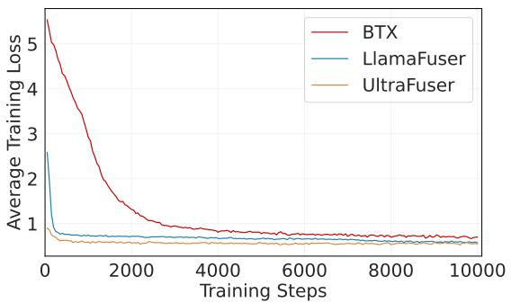  
Figure 5: Training loss changes for BTX, LlamaFuser, and UltraFuser over the first 10k steps.

CHAT 2 after merging the three models, and both cannot achieve satisfactory results on the benchmarks after adequate fine-tuning. This points to the fact that the outcome of different fusing methods for well-aligned models highly relies on the previous training data schedule and training strategy adopted, while the proposed framework could seamlessly bridge distinctive model expertise with simple tuning methods and mixed data. Note that although the proposed method involves both new model design and new training data, we show in data ablation study (see Appendix A.3) that UL-TRAFUSER also works effectively given other existing datasets from different domains. Further experimental results and analysis can be found in Appendix A.

Training Analysis. ULTRAFUSER involves both specialized backbone model initialization and new model fusing structure that requires further tuning. To inspect the effect of both components, we also implement a fuser model based on three identical raw Llama-13B model without specialization as LlamaFuser. Figure 5 compares the training loss curve for ULTRAFUSER, BTX, and LlamaFuser. It can be seen that our proposed Fuser structure has advantage over BTX’s design as loss decreases much faster in the early stage of training. Fuser structure can be trained to converge at around 5000 steps while BTX’s training loss keeps decreasing slowly after 9000 steps. Meanwhile, highly-specialized backbones also help learning. The loss of ULTRAFUSER is consistently smaller than LlamaFuser but does converge to similar level after adequate training. Overall, ULTRAFUSER’s success is attributed to both backbone model expertise and fusing structure design.

<table><tr><td>Strategy</td><td>Truth</td><td>H-Eval</td><td>GSM8K</td></tr><tr><td>Direct Training</td><td>51.17</td><td>46.95</td><td>53.83</td></tr><tr><td>+ Two-Stage</td><td>61.72</td><td>50.00</td><td>52.69</td></tr><tr><td>+ Two-Stage + Balanced</td><td>64.67</td><td>53.05</td><td>54.59</td></tr></table>

Table 2: Results across TruthfulQA (Truth), HumanEval (H-Eval), and GSM8K with different training strategies.

## 4.3 Ablation Study

Training fused models could cause load imbalance, leading to the collapse of the routing mechanism. A typical approach to mitigate this issue in MoE is to introduce a balance loss to prevent certain models from being over-selected or under-selected. In our framework, we do not introduce explicit balance loss based on a simple hypothesis: A model that has been highly specialized can automatically produce a lower loss on the in-domain data, which is verified in Table 3. It is thus undesirable to force each model to contribute equally in each sample.

We thereby seek to stabilize the training from other perspectives. Two key components of our framework are two-stage training and balanced sampler. The former plays a role similar to warmup, allowing the randomly initialized gating module to adapt to the current expert model. The latter, as mentioned, ensures load balance at the data level. In Table 2, we report the best performance under each training strategy. It can be observed that the beneficial effects of these two modules are obvious, and their use has improved the overall performance of the fused model considerably.

<table><tr><td>Model</td><td>AlpacaEval</td><td>HumanEval</td><td>GSM8K</td></tr><tr><td>UltraLM-2</td><td>0.046</td><td>0.055</td><td>0.063</td></tr><tr><td>CodeLlama</td><td>0.060</td><td>0.042</td><td>0.056</td></tr><tr><td>WizardMath</td><td>0.062</td><td>0.064</td><td>0.036</td></tr></table>

Table 3: Average losses on different tasks with different specialized models. This phenomenon supports our hypothesis, leading us to forgo the introduction of an objective function that explicitly balance the loss.

<table><tr><td>Strategy</td><td>Truth</td><td>H-Eval</td><td>GSM8K</td></tr><tr><td>w/o Balance</td><td>57.54±2.80</td><td>48.27±4.92</td><td>52.91±1.76</td></tr><tr><td>w/ Balance</td><td>59.91±1.96</td><td>53.68±2.74</td><td>53.77±1.74</td></tr></table>

Table 4: Mean results and standard deviation over 12 checkpoints with and without the balance sampler (twostage training are both applied).

We further investigate the impact on the training stability of the balance sampler. We train two versions of the model with the same dataset and sample 12 checkpoints, respectively, from 2000 steps to 9000 steps, and conduct evaluations. As shown in Table 4, with the help of the balance sampler, the fused model could achieve superior performance and lower standard deviations on all datasets. GSM8K is relatively stable during training, however, HumanEval may face larger fluctuations.

## 4.4 Analysis

Expertise Analysis. In our training, there is no explicit mechanism to make certain specialists “pay more attention” to the corresponding data. But as mentioned, we expect that the specializations could still be separated, and a type of data will receive different gating weights from the specialist models. We randomly sample 100 data instances from the three domains and conduct analysis by directly going through the inference to the fused model, and calculate the weight from three specialist models of each token. Table 6 shows the average weights of all the tokens in each set of data from three specialist models. And intuitively, each set of data is primarily driven by the corresponding specialist model. The prominence of code data is evident, with the corresponding expert models significantly outweighing the other two models. In mathematical data, code and mathematical models almost equally dominate inference, with a marginal difference. This is more distinctly observable in the sample-level distribution illustrated in Figure 6. Despite the fusion and further training of the models, it’s evident that these specialized models still retain their original functionalities and are now capable of synergistic performance.

<table><tr><td>Model</td><td>Writing</td><td>Roleplay</td><td>Reasoning</td><td>Math</td><td>Coding</td><td>Extraction</td><td>STEM</td><td>Humanities</td><td>Overall</td></tr><tr><td>ArmoRM Selection</td><td>8.23</td><td>7.79</td><td>4.13</td><td>4.45</td><td>4.75</td><td>7.55</td><td>8.53</td><td>9.43</td><td>6.84</td></tr><tr><td>GPT-4o Selection</td><td>8.35</td><td>7.90</td><td>5.30</td><td>4.00</td><td>5.13</td><td>6.65</td><td>8.38</td><td>8.99</td><td>6.84</td></tr><tr><td>ULTRAFUSER</td><td>8.60</td><td>8.11</td><td>5.00</td><td>5.15</td><td>5.10</td><td>6.53</td><td>8.23</td><td>9.43</td><td>7.02</td></tr></table>

Table 5: Results of post-generation selection on MT-Bench. The highest results are bold.  
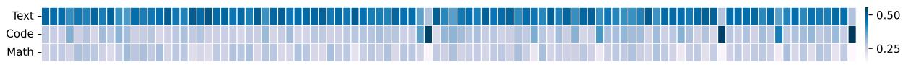  
(a) Weights distribution of three specialist models for 100 text data samples.

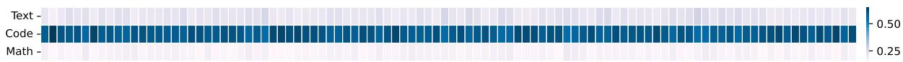  
(b) Weights distribution of three specialist models for 100 code data samples.

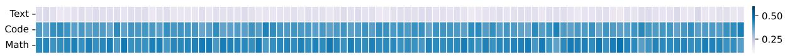  
(c) Weights distribution of three specialist models for 100 math data samples.  
Figure 6: Weight distributions of 300 data samples from text, code, and math domains. Each column is a data point, and each row is the average weight of one specialist model. The darker the color, the more average weight the model gives to the tokens of this data point.

<table><tr><td>Avg. Weight</td><td>Text Data</td><td>Code Data</td><td>Math Data</td></tr><tr><td>Wtext</td><td>0.45</td><td>0.23</td><td>0.18</td></tr><tr><td>Wcode</td><td>0.29</td><td>0.59</td><td>0.39</td></tr><tr><td>Wmath</td><td>0.26</td><td>0.18</td><td>0.43</td></tr></table>

Table 6: Average weights from three specialist models of different data.

Post-Generation Selection. While ULTRAFUSER merges specialist output at the token level, one intuitive method is post-generation selection, i.e. to choose one single output response for a specific sample out of three candidate answers produced by specialized models. Note that the selection technique is orthogonal to the ULTRAFUSER framework and presumably can be applied to any model-generated answers. In this part, we conduct response selection with the three specialist models’ respective generations as well. We use reward model ArmoRM (Wang et al., 2024) and GPT-4o to score and select response. As shown in Table 5, ULTRAFUSER outperforms answer selection methods in general instruction following. Closed-source reward model is better at selecting objectively correct answers for information extraction and STEM problems, but falls behind in judging reasoning problem. Overall, it suggests that post-generation response selection for general instruction following still faces great challenge and token-level merging methods is promising. Details regarding prompt used for answer selection can be found in Appendix B.

## 5 Conclusion

This paper aims to integrate coding and mathematical reasoning capabilities into a general language model with as little loss as possible. We present ULTRAFUSER, a simple framework to train high-specialized models with a token-level gating mechanism and a two-stage balanced training strategy. Accompanied by the goal, we construct a high-quality and diverse instruction tuning dataset, ULTRACHAT 2, that contains 300,000 instructions and responses from 3 domains, 72 meta-topics, and 1587 sub-topics. Our experiments demonstrate the effectiveness of the proposed framework by showing that fused models can be performative simultaneously in text understanding, code generation, and mathematical reasoning and superior efficiency over other fusing methods. In future work, the proposed ULTRAFUSER can also be adapted to domains beyond the mentioned ones, for example, to fuse language models that are specialized in different languages.

## Limitations

We regard the data distribution in training language models in three domains in this study according to the symbol systems and achieve promising empirical results in our experiments. However, the realistic situation is far more sophisticated. In the field of “text domain” alone, there are different tasks such as common sense knowledge, specialized knowledge, natural language reasoning, etc., not to mention the existence of multilingualism. Our fused model may yield less favorable results on other benchmarks. In our training, no explicit selection mechanism is introduced in order to make the method scalable (force specialist models to process certain types of data). We believe finer-grained models could be trained under the spirit of ULTRAFUSER; that is, the number of specialists is not necessarily three, and the domains are also necessarily divided as the same as the paper. For example, other symbol systems (like DNA sequences) may also be integrated into the framework. However, as more specialized models are included, this may bring unaffordable cost in terms of memory and time in both training and inference as our method does not display sparsity. More parameter-efficient training and inference methods are potential research directions under ULTRAFUSER’s framework. As for the dataset used in this work, the ULTRACHAT 2 dataset is fully synthetically generated and fully excludes human engagement. Besides efficiency and privacy benefits, the factuality and trustworthiness of generated content can not be guaranteed.

## Acknowledgements

This work is supported by the National Science and Technology Major Project (2023ZD0121403), the Young Elite Scientists Sponsorship Program by CAST (2023QNRC001), the National Natural Science Foundation of China (No.62406165), and the Beijing Natural Science Foundation (IS23059).

## References

Abien Fred Agarap. 2018. Deep learning using rectified linear units (relu). ArXiv, abs/1803.08375.

Loubna Ben Allal, Raymond Li, Denis Kocetkov, Chenghao Mou, Christopher Akiki, Carlos Munoz Ferrandis, Niklas Muennighoff, Mayank Mishra, Alex Gu, Manan Dey, et al. 2023. Santacoder: don’t reach for the stars! arXiv preprint arXiv:2301.03988.

Yuntao Bai, Saurav Kadavath, Sandipan Kundu, Amanda Askell, Jackson Kernion, Andy Jones, Anna Chen, Anna Goldie, Azalia Mirhoseini, Cameron McKinnon, et al. 2022. Constitutional ai: Harmlessness from ai feedback. arXiv preprint arXiv:2212.08073.

Rachit Bansal, Bidisha Samanta, Siddharth Dalmia, Nitish Gupta, Shikhar Vashishth, Sriram Ganapathy, Abhishek Bapna, Prateek Jain, and Partha Talukdar. 2024. Llm augmented llms: Expanding capabilities through composition. arXiv preprint arXiv:2401.02412.

Peter L Bartlett and Shahar Mendelson. 2002. Rademacher and gaussian complexities: Risk bounds and structural results. Journal of Machine Learning Research, 3(Nov):463–482.

Sid Black, Leo Gao, Phil Wang, Connor Leahy, and Stella Biderman. 2021. GPT-Neo: Large Scale Autoregressive Language Modeling with Mesh-Tensorflow. If you use this software, please cite it using these metadata.

Sidney Black, Stella Biderman, Eric Hallahan, Quentin Anthony, Leo Gao, Laurence Golding, Horace He, Connor Leahy, Kyle McDonell, Jason Phang, et al. 2022. Gpt-neox-20b: An open-source autoregressive language model. In Proceedings ofBigScience Episode# 5–Workshop on Challenges & Perspectives in Creating Large Language Models, pages 95–136.

Rishi Bommasani, Drew A Hudson, Ehsan Adeli, Russ Altman, Simran Arora, Sydney von Arx, Michael S Bernstein, Jeannette Bohg, Antoine Bosselut, Emma Brunskill, et al. 2021. On the opportunities and risks of foundation models. arXiv preprint arXiv:2108.07258.

Tom Brown, Benjamin Mann, Nick Ryder, Melanie Subbiah, Jared D Kaplan, Prafulla Dhariwal, Arvind Neelakantan, Pranav Shyam, Girish Sastry, Amanda Askell, et al. 2020. Language models are few-shot learners. In Proceedings ofNeurIPS.

Mark Chen, Jerry Tworek, Heewoo Jun, Qiming Yuan, Henrique Ponde de Oliveira Pinto, Jared Kaplan, Harri Edwards, Yuri Burda, Nicholas Joseph, Greg Brockman, et al. 2021. Evaluating large language models trained on code. arXiv preprint arXiv:2107.03374.

Wenhu Chen, Xueguang Ma, Xinyi Wang, and William W Cohen. 2022. Program of thoughts

prompting: Disentangling computation from reasoning for numerical reasoning tasks. arXiv preprint arXiv:2211.12588.

Wei-Lin Chiang, Zhuohan Li, Zi Lin, Ying Sheng, Zhanghao Wu, Hao Zhang, Lianmin Zheng, Siyuan Zhuang, Yonghao Zhuang, Joseph E. Gonzalez, Ion Stoica, and Eric P. Xing. 2023. Vicuna: An opensource chatbot impressing gpt-4 with 90%\* chatgpt quality.

Aakanksha Chowdhery, Sharan Narang, Jacob Devlin, Maarten Bosma, Gaurav Mishra, Adam Roberts, Paul Barham, Hyung Won Chung, Charles Sutton, Sebastian Gehrmann, et al. 2022. Palm: Scaling language modeling with pathways. arXiv preprint arXiv:2204.02311.

Aidan Clark, Diego De Las Casas, Aurelia Guy, Arthur Mensch, Michela Paganini, Jordan Hoffmann, Bogdan Damoc, Blake Hechtman, Trevor Cai, Sebastian Borgeaud, et al. 2022. Unified scaling laws for routed language models. In International Conference on Machine Learning, pages 4057–4086. PMLR.

Karl Cobbe, Vineet Kosaraju, Mohammad Bavarian, Mark Chen, Heewoo Jun, Lukasz Kaiser, Matthias Plappert, Jerry Tworek, Jacob Hilton, Reiichiro Nakano, et al. 2021. Training verifiers to solve math word problems. arXiv preprint arXiv:2110.14168.

Nico Daheim, Thomas Möllenhoff, Edoardo Maria Ponti, Iryna Gurevych, and Mohammad Emtiyaz Khan. 2023. Model merging by uncertainty-based gradient matching. Preprint, arXiv:2310.12808.

Damai Dai, Chengqi Deng, Chenggang Zhao, RX Xu, Huazuo Gao, Deli Chen, Jiashi Li, Wangding Zeng, Xingkai Yu, Y Wu, et al. 2024. Deepseekmoe: Towards ultimate expert specialization in mixture-of-experts language models. arXiv preprint arXiv:2401.06066.

Ning Ding, Yulin Chen, Bokai Xu, Yujia Qin, Zhi Zheng, Shengding Hu, Zhiyuan Liu, Maosong Sun, and Bowen Zhou. 2023. Enhancing chat language models by scaling high-quality instructional conversations. arXiv preprint arXiv:2305.14233.

Nan Du, Yanping Huang, Andrew M Dai, Simon Tong, Dmitry Lepikhin, Yuanzhong Xu, Maxim Krikun, Yanqi Zhou, Adams Wei Yu, Orhan Firat, et al. 2022. Glam: Efficient scaling of language models with mixture-of-experts. In International Conference on Machine Learning, pages 5547–5569. PMLR.

William Fedus, Barret Zoph, and Noam Shazeer. 2022. Switch transformers: Scaling to trillion parameter models with simple and efficient sparsity. The Journal ofMachine Learning Research, 23(1):5232– 5270.

Daniel Fried, Armen Aghajanyan, Jessy Lin, Sida Wang, Eric Wallace, Freda Shi, Ruiqi Zhong, Scott Yih, Luke Zettlemoyer, and Mike Lewis. 2022. Incoder: A generative model for code infilling and synthesis.

In The Eleventh International Conference on Learning Representations.

Luyu Gao, Aman Madaan, Shuyan Zhou, Uri Alon, Pengfei Liu, Yiming Yang, Jamie Callan, and Graham Neubig. 2023. Pal: Program-aided language models. In International Conference on Machine Learning, pages 10764–10799. PMLR.

Suriya Gunasekar, Yi Zhang, Jyoti Aneja, Caio César Teodoro Mendes, Allie Del Giorno, Sivakanth Gopi, Mojan Javaheripi, Piero Kauffmann, Gustavo de Rosa, Olli Saarikivi, et al. 2023. Textbooks are all you need. arXiv preprint arXiv:2306.11644.

Dan Hendrycks, Collin Burns, Steven Basart, Andy Zou, Mantas Mazeika, Dawn Song, and Jacob Steinhardt. 2020. Measuring massive multitask language understanding. arXiv preprint arXiv:2009.03300.

Dan Hendrycks, Collin Burns, Saurav Kadavath, Akul Arora, Steven Basart, Eric Tang, Dawn Song, and Jacob Steinhardt. 2021. Measuring mathematical problem solving with the math dataset. arXiv preprint arXiv:2103.03874.

Gabriel Ilharco, Marco Túlio Ribeiro, Mitchell Wortsman, Ludwig Schmidt, Hannaneh Hajishirzi, and Ali Farhadi. 2023. Editing models with task arithmetic. In The Eleventh International Conference on Learning Representations, ICLR 2023, Kigali, Rwanda, May 1-5, 2023. OpenReview.net.

Robert A Jacobs, Michael I Jordan, Steven J Nowlan, and Geoffrey E Hinton. 1991. Adaptive mixtures of local experts. Neural computation, 3(1):79–87.

Samy Jelassi, Stéphane d’Ascoli, Carles Domingo-Enrich, Yuhuai Wu, Yuanzhi Li, and François Charton. 2023. Length generalization in arithmetic transformers. arXiv preprint arXiv:2306.15400.

Albert Q. Jiang, Alexandre Sablayrolles, Arthur Mensch, Chris Bamford, Devendra Singh Chaplot, Diego de las Casas, Florian Bressand, Gianna Lengyel, Guillaume Lample, Lucile Saulnier, Lélio Renard Lavaud, Marie-Anne Lachaux, Pierre Stock, Teven Le Scao, Thibaut Lavril, Thomas Wang, Timothée Lacroix, and William El Sayed. 2023a. Mistral 7b. Preprint, arXiv:2310.06825.

Albert Q Jiang, Alexandre Sablayrolles, Antoine Roux, Arthur Mensch, Blanche Savary, Chris Bamford, Devendra Singh Chaplot, Diego de las Casas, Emma Bou Hanna, Florian Bressand, et al. 2024. Mixtral of experts. arXiv preprint arXiv:2401.04088.

Dongfu Jiang, Xiang Ren, and Bill Yuchen Lin. 2023b. Llm-blender: Ensembling large language models with pairwise ranking and generative fusion. arXiv preprint arXiv:2306.02561.

Aran Komatsuzaki, Joan Puigcerver, James Lee-Thorp, Carlos Riquelme Ruiz, Basil Mustafa, Joshua Ainslie, Yi Tay, Mostafa Dehghani, and Neil Houlsby. 2023. Sparse upcycling: Training mixture-of-experts from dense checkpoints. Preprint, arXiv:2212.05055.

Sneha Kudugunta, Yanping Huang, Ankur Bapna, Maxim Krikun, Dmitry Lepikhin, Minh-Thang Luong, and Orhan Firat. 2021. Beyond distillation: Task-level mixture-of-experts for efficient inference. In Findings of the Association for Computational Linguistics: EMNLP 2021, pages 3577–3599.

Woosuk Kwon, Zhuohan Li, Siyuan Zhuang, Ying Sheng, Lianmin Zheng, Cody Hao Yu, Joseph E. Gonzalez, Hao Zhang, and Ion Stoica. 2023. Efficient memory management for large language model serving with pagedattention. In Proceedings of the ACM SIGOPS 29th Symposium on Operating Systems Principles.

Dmitry Lepikhin, HyoukJoong Lee, Yuanzhong Xu, Dehao Chen, Orhan Firat, Yanping Huang, Maxim Krikun, Noam Shazeer, and Zhifeng Chen. 2020. Gshard: Scaling giant models with conditional computation and automatic sharding. arXiv preprint arXiv:2006.16668.

Aitor Lewkowycz, Anders Johan Andreassen, David Dohan, Ethan Dyer, Henryk Michalewski, Vinay Venkatesh Ramasesh, Ambrose Slone, Cem Anil, Imanol Schlag, Theo Gutman-Solo, et al. 2022. Solving quantitative reasoning problems with language models. In Advances in Neural Information Processing Systems.

Raymond Li, Loubna Ben Allal, Yangtian Zi, Niklas Muennighoff, Denis Kocetkov, Chenghao Mou, Marc Marone, Christopher Akiki, Jia Li, Jenny Chim, et al. 2023a. Starcoder: may the source be with you! arXiv preprint arXiv:2305.06161.

Xuechen Li, Tianyi Zhang, Yann Dubois, Rohan Taori, Ishaan Gulrajani, Carlos Guestrin, Percy Liang, and Tatsunori B. Hashimoto. 2023b. Alpacaeval: An automatic evaluator of instruction-following models.

Yujia Li, David Choi, Junyoung Chung, Nate Kushman, Julian Schrittwieser, Rémi Leblond, Tom Eccles, James Keeling, Felix Gimeno, Agustin Dal Lago, et al. 2022. Competition-level code generation with alphacode. Science, 378(6624):1092–1097.

Stephanie Lin, Jacob Hilton, and Owain Evans. 2021. Truthfulqa: Measuring how models mimic human falsehoods. arXiv preprint arXiv:2109.07958.

Wang Ling, Dani Yogatama, Chris Dyer, and Phil Blunsom. 2017. Program induction by rationale generation: Learning to solve and explain algebraic word problems. In Proceedings ofthe 55th Annual Meeting ofthe Associationfor Computational Linguistics (Volume 1: Long Papers), pages 158–167, Vancouver, Canada. Association for Computational Linguistics.

Tiedong Liu and Bryan Kian Hsiang Low. 2023. Goat: Fine-tuned llama outperforms gpt-4 on arithmetic tasks. arXiv preprint arXiv:2305.14201.

Ilya Loshchilov and Frank Hutter. 2017. Decoupled weight decay regularization. In International Conference on Learning Representations.

Yuxuan Lou, Fuzhao Xue, Zangwei Zheng, and Yang You. 2021. Cross-token modeling with conditional computation. arXiv preprint arXiv:2109.02008.

Haipeng Luo, Qingfeng Sun, Can Xu, Pu Zhao, Jianguang Lou, Chongyang Tao, Xiubo Geng, Qingwei Lin, Shifeng Chen, and Dongmei Zhang. 2023a. Wizardmath: Empowering mathematical reasoning for large language models via reinforced evol-instruct. arXiv preprint arXiv:2308.09583.

Ziyang Luo, Can Xu, Pu Zhao, Qingfeng Sun, Xiubo Geng, Wenxiang Hu, Chongyang Tao, Jing Ma, Qingwei Lin, and Daxin Jiang. 2023b. Wizardcoder: Empowering code large language models with evolinstruct. arXiv preprint arXiv:2306.08568.

Basil Mustafa, Carlos Riquelme, Joan Puigcerver, Rodolphe Jenatton, and Neil Houlsby. 2022. Multimodal contrastive learning with limoe: the languageimage mixture of experts. Advances in Neural Information Processing Systems, 35:9564–9576.

Erik Nijkamp, Hiroaki Hayashi, Caiming Xiong, Silvio Savarese, and Yingbo Zhou. 2023. Codegen2: Lessons for training llms on programming and natural languages. arXiv preprint arXiv:2305.02309.

Erik Nijkamp, Bo Pang, Hiroaki Hayashi, Lifu Tu, Huan Wang, Yingbo Zhou, Silvio Savarese, and Caiming Xiong. 2022. Codegen: An open large language model for code with multi-turn program synthesis. In The Eleventh International Conference on Learning Representations.

Maxwell Nye, Anders Johan Andreassen, Guy Gur-Ari, Henryk Michalewski, Jacob Austin, David Bieber, David Dohan, Aitor Lewkowycz, Maarten Bosma, David Luan, et al. 2022. Show your work: Scratchpads for intermediate computation with language models. In Deep Learning for Code Workshop.

OpenAI. 2023. Gpt-4 technical report. arXiv.

Long Ouyang, Jeffrey Wu, Xu Jiang, Diogo Almeida, Carroll Wainwright, Pamela Mishkin, Chong Zhang, Sandhini Agarwal, Katarina Slama, Alex Ray, et al. 2022. Training language models to follow instructions with human feedback. Advances in Neural Information Processing Systems, 35:27730–27744.

Carlos Riquelme, Joan Puigcerver, Basil Mustafa, Maxim Neumann, Rodolphe Jenatton, André Susano Pinto, Daniel Keysers, and Neil Houlsby. 2021. Scaling vision with sparse mixture of experts. Advances in Neural Information Processing Systems, 34:8583–8595.

Baptiste Rozière, Jonas Gehring, Fabian Gloeckle, Sten Sootla, Itai Gat, Xiaoqing Ellen Tan, Yossi Adi, Jingyu Liu, Tal Remez, Jérémy Rapin, et al. 2023. Code llama: Open foundation models for code. arXiv preprint arXiv:2308.12950.

Timo Schick, Jane Dwivedi-Yu, Roberto Dessì, Roberta Raileanu, Maria Lomeli, Luke Zettlemoyer, Nicola Cancedda, and Thomas Scialom. 2023. Toolformer: Language models can teach themselves to use tools. arXiv preprint arXiv:2302.04761.

Noam Shazeer, Azalia Mirhoseini, Krzysztof Maziarz, Andy Davis, Quoc Le, Geoffrey Hinton, and Jeff Dean. 2016. Outrageously large neural networks: The sparsely-gated mixture-of-experts layer. In International Conference on Learning Representations.

Sheng Shen, Le Hou, Yanqi Zhou, Nan Du, Shayne Longpre, Jason Wei, Hyung Won Chung, Barret Zoph, William Fedus, Xinyun Chen, Tu Vu, Yuexin Wu, Wuyang Chen, Albert Webson, Yunxuan Li, Vincent Zhao, Hongkun Yu, Kurt Keutzer, Trevor Darrell, and Denny Zhou. 2023a. Mixture-of-experts meets instruction tuning:a winning combination for large language models. Preprint, arXiv:2305.14705.

Sheng Shen, Zhewei Yao, Chunyuan Li, Trevor Darrell, Kurt Keutzer, and Yuxiong He. 2023b. Scaling vision-language models with sparse mixture of experts. arXiv preprint arXiv:2303.07226.

George Stoica, Daniel Bolya, Jakob Bjorner, Pratik Ramesh, Taylor Hearn, and Judy Hoffman. 2024. Zipit! merging models from different tasks without training. Preprint, arXiv:2305.03053.

Sainbayar Sukhbaatar, Olga Golovneva, Vasu Sharma, Hu Xu, Xi Victoria Lin, Baptiste Rozière, Jacob Kahn, Daniel Li, Wen-tau Yih, Jason Weston, and Xian Li. 2024. Branch-train-mix: Mixing expert llms into a mixture-of-experts LLM. CoRR, abs/2403.07816.

Rohan Taori, Ishaan Gulrajani, Tianyi Zhang, Yann Dubois, Xuechen Li, Carlos Guestrin, Percy Liang, and Tatsunori B Hashimoto. 2023. Alpaca: A strong, replicable instruction-following model. Stanford Centerfor Research on Foundation Models.

Hugo Touvron, Thibaut Lavril, Gautier Izacard, Xavier Martinet, Marie-Anne Lachaux, Timothée Lacroix, Baptiste Rozière, Naman Goyal, Eric Hambro, Faisal Azhar, Aurélien Rodriguez, Armand Joulin, Edouard Grave, and Guillaume Lample. 2023a. Llama: Open and efficient foundation language models. CoRR, abs/2302.13971.

Hugo Touvron, Louis Martin, Kevin Stone, Peter Albert, Amjad Almahairi, Yasmine Babaei, Nikolay Bashlykov, Soumya Batra, Prajjwal Bhargava, Shruti Bhosale, et al. 2023b. Llama 2: Open foundation and fine-tuned chat models. arXiv preprint arXiv:2307.09288.

Laurens Van der Maaten and Geoffrey Hinton. 2008. Visualizing data using t-sne. Journal of machine learning research, 9(11).

Fanqi Wan, Xinting Huang, Deng Cai, Xiaojun Quan, Wei Bi, and Shuming Shi. 2024a. Knowledge fusion of large language models. arXiv preprint arXiv:2401.10491.

Fanqi Wan, Ziyi Yang, Longguang Zhong, Xiaojun Quan, Xinting Huang, and Wei Bi. 2024b. Fusechat: Knowledge fusion of chat models. CoRR, abs/2402.16107.

Ben Wang and Aran Komatsuzaki. 2021. Gptj-6b: A 6 billion parameter autoregressive language model. https://github.com/kingoflolz/ mesh-transformer-jax.

Haoxiang Wang, Wei Xiong, Tengyang Xie, Han Zhao, and Tong Zhang. 2024. Interpretable preferences via multi-objective reward modeling and mixture-ofexperts. Preprint, arXiv:2406.12845.

Yue Wang, Weishi Wang, Shafiq Joty, and Steven CH Hoi. 2021. Codet5: Identifier-aware unified pretrained encoder-decoder models for code understanding and generation. In Proceedings ofthe 2021 Conference on Empirical Methods in Natural Language Processing, pages 8696–8708.

Jason Wei, Xuezhi Wang, Dale Schuurmans, Maarten Bosma, Brian Ichter, Fei Xia, Ed Chi, Quoc Le, and Denny Zhou. 2023. Chain-of-thought prompting elicits reasoning in large language models. Preprint, arXiv:2201.11903.

Mitchell Wortsman, Gabriel Ilharco, Samir Yitzhak Gadre, Rebecca Roelofs, Raphael Gontijo Lopes, Ari S. Morcos, Hongseok Namkoong, Ali Farhadi, Yair Carmon, Simon Kornblith, and Ludwig Schmidt. Model soups: averaging weights of multiple finetuned models improves accuracy without increasing inference time. In International Conference on Machine Learning, ICML 2022, 17-23 July 2022, Baltimore, Maryland, USA, volume 162 of Proceedings of Machine Learning Research, pages 23965–23998. PMLR.

Can Xu, Qingfeng Sun, Kai Zheng, Xiubo Geng, Pu Zhao, Jiazhan Feng, Chongyang Tao, and Daxin Jiang. 2023. Wizardlm: Empowering large language models to follow complex instructions.

Zhen Yang, Ming Ding, Qingsong Lv, Zhihuan Jiang, Zehai He, Yuyi Guo, Jinfeng Bai, and Jie Tang. 2023. Gpt can solve mathematical problems without a calculator. arXiv preprint arXiv:2309.03241.

Xiang Yue, Xingwei Qu, Ge Zhang, Yao Fu, Wenhao Huang, Huan Sun, Yu Su, and Wenhu Chen. 2023. Mammoth: Building math generalist models through hybrid instruction tuning. arXiv preprint arXiv:2309.05653.

Susan Zhang, Stephen Roller, Naman Goyal, Mikel Artetxe, Moya Chen, Shuohui Chen, Christopher Dewan, Mona Diab, Xian Li, Xi Victoria Lin, et al. 2022. Opt: Open pre-trained transformer language models. arXiv preprint arXiv:2205.01068.

Wanjun Zhong, Ruixiang Cui, Yiduo Guo, Yaobo Liang, Shuai Lu, Yanlin Wang, Amin Saied, Weizhu Chen, and Nan Duan. 2023. Agieval: A human-centric benchmark for evaluating foundation models. arXiv preprint arXiv:2304.06364.

Hattie Zhou, Azade Nova, Hugo Larochelle, Aaron Courville, Behnam Neyshabur, and Hanie Sedghi. 2022a. Teaching algorithmic reasoning via incontext learning. arXiv preprint arXiv:2211.09066.

Yanqi Zhou, Tao Lei, Hanxiao Liu, Nan Du, Yanping Huang, Vincent Y Zhao, Andrew M Dai, Zhifeng Chen, Quoc V Le, and James Laudon. 2022b. Mixture-of-experts with expert choice routing. In Advances in Neural Information Processing Systems.

Barret Zoph, Irwan Bello, Sameer Kumar, Nan Du, Yanping Huang, Jeff Dean, Noam Shazeer, and William Fedus. 2022. St-moe: Designing stable and transferable sparse expert models. arXiv preprint arXiv:2202.08906.

Simiao Zuo, Xiaodong Liu, Jian Jiao, Young Jin Kim, Hany Hassan, Ruofei Zhang, Tuo Zhao, and Jianfeng Gao. 2021. Taming sparsely activated transformer with stochastic experts. arXiv preprint arXiv:2110.04260.

## A Additional Experiments

## A.1 Results on MT-Bench.

Table 7 shows the results on MT-Bench. Overall, ULTRAFUSER achieves highest performance across different categories of tasks, demonstrating the effectiveness of our proposed expert fusing methods compared to direct further tuning on domain specialized model. It can also be seen that UltraLM and its further-tuned version still have advantage on some tasks like information extraction and STEM-related problem solving, while the code and math counterparts face significant performance drop after further tuning. What is worth noting is that all model merging methods seem unable to follow instructions well, even after further training on ULTRACHAT 2. The results indicate the better generalizability of a text specialized model over code and math domains in terms of direct further tuning, while ULTRAFUSER can successfully fuse them and enhance its general instruction-following ability.

## A.2 Impact of Further Tuning for Specialists

Figure 7 illustrates the effects after a single specialist model undergoes further training on UL-TRACHAT 2. The first conclusion is very intuitive: no model can achieve improvements or maintain the best performance across all benchmarks like UltraFuser can. Text and math specialized models improved in their weaker areas, but declined in their stronger areas. The performance of the code specialized model was quite unexpected, as it declined across all tasks, possibly due to an overexposure to pure code corpora during pre-training. From Figure 7 and Table 1, we can observe that the CodeLlama model almost collapse after further training. We hypothesize that extensive training on the full dataset would severely impact CodeLlama’s performance, possibly because it was trained on 500B code tokens, and too large a distributional shift could lead to a dramatic decline in model effectiveness. The result aligns with our motivation and intuition, indicating that the specialized abilities need to be reserved in a more effective way. We supplement results that code and math specialized models only trained on corresponding subsets, which is shown in Table 8. The subset performance shows that the abilities of specialized models can be enhanced by directly using more similar distributions of their own capabilities. And ULTRAFUSER could effectively reserve or even enhance the specialized performance.

## A.3 Data Ablation

To further disentangle the effect of ULTRACHAT 2 and ULTRAFUSER model fusing structure, we conduct ablational experiments by removing UL-TRACHAT 2from training. Specifically, we use UltraChat, MathInstruct training set (Yue et al., 2023), and Evol-Instruct (Luo et al., 2023b,a) datasets for training ULTRAFUSER and all baselines. Table 9 shows the results. Note that BTX in original paper requires 80B token of training for 7B model, and we find the method hardly converges under this ablation setting due to data insufficiency. It can be seen that ULTRAFUSER still outperforms all baselines, showcasing the effectiveness of the model design. Meanwhile, it shows that ULTRACHAT 2 is beneficial to domain performance, especially in code domain and general instruction following (AlpacaEval).

## A.4 Case Study

In Section 4.4, we analyze the model expertise at the sequence level and set level. In this section, we provide cases at the token level to illustrate the weight distributions of the three specialist models. Figure 8 and Figure 9 show two cases randomly extracted from ULTRACHAT 2 code data and GSM8K dataset. For coding data, almost all weights are assigned to code specialist model. For math data, there is considerable weight given to code model as well, given the fact that mathematical equation is much alike code snippets. The assumption can be validated by the fact that when it comes to nonmathematical notation, the token weight distribution clearly favors the math specialist more. The observation is in line with our expectation, that the fused model can implicitly learn to allocate tokens to suitable specialist to achieve better performance. Meanwhile, similarity between domains could be captured and their performance can be enhanced jointly by related specialists.

## A.5 Experiments with Chain-of-Thought

The resulting model after fusing the three specialist models is also equipped desirable features like CoT ability (Wei et al., 2023). We show in Table 10 that the performance on math benchmark can be further boosted with CoT technique by simply appending “Let’s think step by step.”

<table><tr><td>Model</td><td>Writing</td><td>Roleplay</td><td>Reasoning</td><td>Math</td><td>Coding</td><td>Extraction</td><td>STEM</td><td>Humanities</td><td>Overall</td></tr><tr><td>UltraLM-2</td><td>8.83</td><td>7.98</td><td>5.20</td><td>2.90</td><td>4.00</td><td>6.74</td><td>8.08</td><td>9.46</td><td>6.62</td></tr><tr><td>CodeLlama</td><td>5.80</td><td>7.10</td><td>3.80</td><td>3.05</td><td>3.43</td><td>5.36</td><td>5.65</td><td>7.05</td><td>5.16</td></tr><tr><td>WizardMath</td><td>7.75</td><td>7.03</td><td>4.80</td><td>3.85</td><td>3.50</td><td>4.65</td><td>7.65</td><td>9.13</td><td>6.04</td></tr><tr><td>UltraLM-2+Further Tune</td><td>7.85</td><td>7.60</td><td>4.30</td><td>4.48</td><td>5.20</td><td>5.78</td><td>8.32</td><td>9.40</td><td>6.62</td></tr><tr><td>CodeLlama+Further Tune</td><td>7.33</td><td>6.60</td><td>3.85</td><td>2.25</td><td>3.68</td><td>5.20</td><td>4.68</td><td>5.10</td><td>4.84</td></tr><tr><td>WizardMath+Further Tune</td><td>7.18</td><td>6.90</td><td>4.95</td><td>4.25</td><td>4.55</td><td>5.18</td><td>7.55</td><td>7.98</td><td>6.07</td></tr><tr><td>Llama 30B + Further Tune</td><td>5.45</td><td>4.70</td><td>4.75</td><td>3.55</td><td>3.05</td><td>2.95</td><td>4.00</td><td>5.40</td><td>4.24</td></tr><tr><td>Task Arithmetic</td><td>1.80</td><td>2.70</td><td>2.05</td><td>1.15</td><td>0.90</td><td>1.00</td><td>1.81</td><td>2.00</td><td>1.68</td></tr><tr><td>Average Merging</td><td>7.28</td><td>7.06</td><td>5.05</td><td>4.00</td><td>3.68</td><td>6.18</td><td>7.93</td><td>8.90</td><td>6.26</td></tr><tr><td>BTX</td><td>2.89</td><td>3.58</td><td>2.45</td><td>2.20</td><td>2.43</td><td>2.00</td><td>3.03</td><td>2.40</td><td>2.62</td></tr><tr><td>FuseChat</td><td>7.55</td><td>7.05</td><td>5.08</td><td>2.40</td><td>3.53</td><td>6.60</td><td>7.03</td><td>8.99</td><td>6.03</td></tr><tr><td>ULTRAFUSER</td><td>8.60</td><td>8.11</td><td>5.00</td><td>5.15</td><td>5.10</td><td>6.53</td><td>8.23</td><td>9.43</td><td>7.02</td></tr></table>

Table 7: Results on MT-Bench. The highest and second results are bold and underlined, respectively.
<table><tr><td>Model</td><td>Avg of Text Tasks</td><td>Avg of Code Tasks</td><td>Avg of Math Tasks</td><td>Avg of All Tasks</td></tr><tr><td>WizardMath</td><td>39.15</td><td>10.98</td><td>29.995</td><td>29.91</td></tr><tr><td>WizardMath + Math Subset</td><td>46.66</td><td>17.68</td><td>30.31</td><td>33.17</td></tr><tr><td>CodeLlama</td><td>63.05</td><td>48.78</td><td>20.65</td><td>36.78</td></tr><tr><td>CodeLlama + Code Subset</td><td>65.05</td><td>50.62</td><td>21.38</td><td>38.03</td></tr><tr><td>UltraFuser</td><td>73.51</td><td>53.03</td><td>30.58</td><td>47.48</td></tr></table>

Table 8: Results of specialized models trained on the corresponding subset.
<table><tr><td>Model</td><td>TruthfulQA Acc</td><td>AlpacaEval Win Rate</td><td>HumanEval Pass@1</td><td>GSM8K Pass@1</td><td>MATH Pass@1</td><td>SAT-Math Acc</td><td>AQuA Acc</td><td>Avg.</td></tr><tr><td>★UltraLM-2 + FT</td><td>59.72</td><td>75.79</td><td>27.44</td><td>39.04</td><td>4.80</td><td>23.18</td><td>28.74</td><td>36.96</td></tr><tr><td>★CodeLlama + FT</td><td>57.92</td><td>18.39</td><td>32.32</td><td>19.03</td><td>4.12</td><td>20.45</td><td>23.62</td><td>25.12</td></tr><tr><td>★WizardMath + FT</td><td>43.10</td><td>41.47</td><td>19.51</td><td>42.38</td><td>6.10</td><td>20.45</td><td>19.29</td><td>27.47</td></tr><tr><td>★Llama 30B + FT</td><td>54.13</td><td>62.55</td><td>29.88</td><td>49.36</td><td>8.98</td><td>30.91</td><td>31.50</td><td>38.19</td></tr><tr><td>★BTX†</td><td>13.52</td><td>6.35</td><td>15.85</td><td>6.97</td><td>3.04</td><td>12.73</td><td>14.17</td><td>10.38</td></tr><tr><td>ULTRAFUSER</td><td>65.35</td><td>72.68</td><td>45.73</td><td>57.16</td><td>11.64</td><td>32.73</td><td>30.71</td><td>45.14</td></tr></table>

Table 9: Data ablation results of baselines and our proposed models across different benchmarks. We use UltraChat (Ding et al., 2023), MathInstruct training set (Yue et al., 2023), and Evol-Instruct (Luo et al., 2023b,a) datasets for training. All the numbers are zero-shot results produced by our experiments under the same inference framework. No Chain-of-thought (CoT) techniques are employed in evaluation. Results marked by ⋆ means use the same datasets with ours for fine-tuning, results marked by 	 means fusing or merging methods use the same specialized models. † means the method fails to fully converge.

<table><tr><td>Model</td><td>GSM8K</td><td>MATH</td><td>SAT- MATH</td><td>AQuA</td><td>Avg</td></tr><tr><td>UltraFuser</td><td>54.59</td><td>11.36</td><td>30.00</td><td>26.38</td><td>30.58</td></tr><tr><td>UltraFuser (w/ CoT)</td><td>54.59</td><td>13.04</td><td>40.45</td><td>28.74</td><td>34.21</td></tr></table>

Table 10: Performance of applying CoT to ULTRA-FUSER on math benchmarks.

## B Implementation Details

ULTRAFUSER. The gating module is implemented as a two-layer linear model with ReLU (Agarap, 2018) activation in between. The hidden size of the module is set to 512. The gating layer is trained for $N _ { 1 } = 4 0 0$ steps at the first training stage with sample size n = 64 for all experiments and learning rate $\eta _ { 1 } = 2 e - 5$ is used with a cosine scheduler. For the second stage with Llama backbone, we use $\eta _ { 2 } = 2 e - 5$ , sample size $n = 3 2$ with cosine scheduler. Note that our framework requires the consistent tokenization strategy across all specialist models. Therefore, we use the original Llama-2- 13B tokenizer for ULTRAFUSER training.

Baselines. As for baselines, we use scaling coefficient 1.0 for Task Arithmetic method (Ilharco et al., 2023). All further-tuned baselines are finetuned with ULTRACHAT 2 under the same hyperparameter setting with ULTRAFUSER. All experiments are conducted on 16 80GB A100 GPUs and use AdamW optimizer (Loshchilov and Hutter,

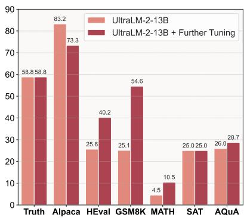  
(a) Text-specialized models.

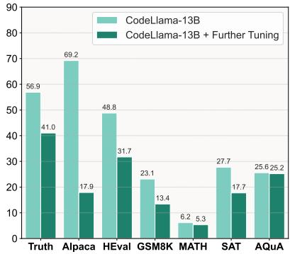  
(b) Code-specialized models.

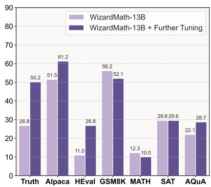  
(c) Math-specialized models.

Figure 7: Performance comparisons between specialist models and the further training versions of them.  
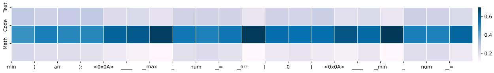  
(a) Case study: tokens and weights of code data (a).

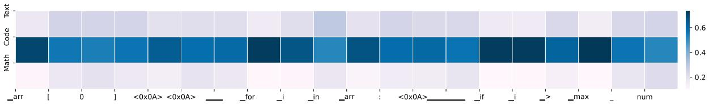  
(b) Case study: tokens and weights of code data (b).

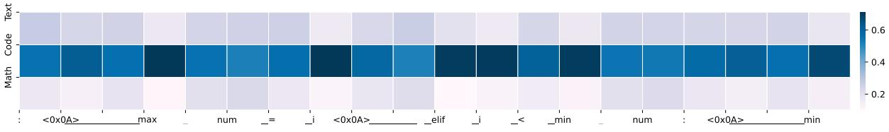  
(c) Case study: tokens and weights of code data (c).

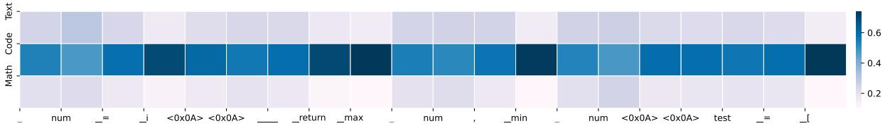  
(d) Case study: tokens and weights of code data (d).

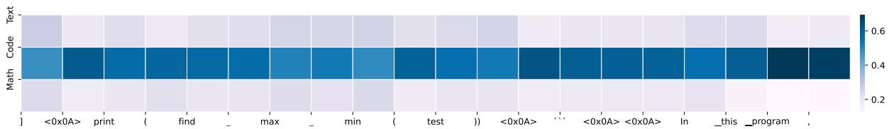  
(e) Case study: tokens and weights of code data (e).  
Figure 8: Weight distributions of some pieces of tokens from a sample of code data.

2017). We list the number of parameters involved in training and inference for each method in Table 11. Note that for ULTRAFUSER, the inference process can be parallelized to be equivalent to 13B with respect to time cost.

Training Data. Apart from the curated ULTRA-

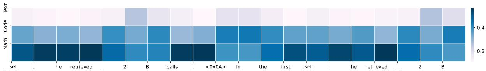  
(a) Case study: tokens and weights of math data (a).

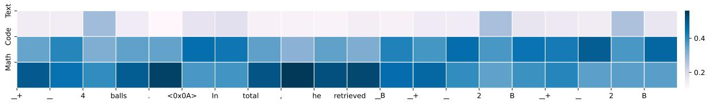  
(b) Case study: tokens and weights of math data (b).

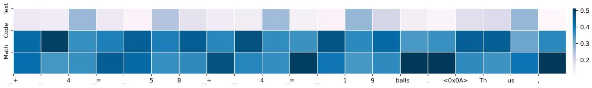  
(c) Case study: tokens and weights of math data (c).

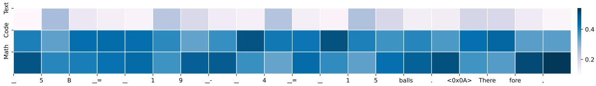  
(d) Case study: tokens and weights of math data (d).

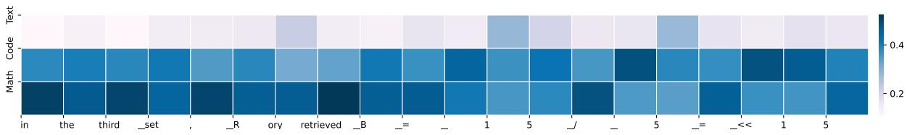  
(e) Case study: tokens and weights of math data (e).  
Figure 9: Weight distributions of some pieces of tokens from a sample of math data.

<table><tr><td>Model</td><td>Training #Params</td><td>Inference #Params</td></tr><tr><td>UltraLM-2 (and FT)</td><td>13B</td><td>13B</td></tr><tr><td>CodeLlama (and FT)</td><td>13B</td><td>13B</td></tr><tr><td>WizardMath (and FT)</td><td>13B</td><td>13B</td></tr><tr><td>Llama 30B + FT</td><td>30B</td><td>30B</td></tr><tr><td>Task Arithmetic</td><td>39B</td><td>13B</td></tr><tr><td>Average Merging</td><td>39B</td><td>13B</td></tr><tr><td>BTX</td><td>39B</td><td>30B</td></tr><tr><td>FuseChat</td><td>39B</td><td>13B</td></tr><tr><td>Specialists+RM</td><td>39B</td><td>(39+7)B</td></tr><tr><td>ULTRAFUSER</td><td>39B</td><td>39B</td></tr></table>

Table 11: Number of parameters involved in training (or fusing) and inference.

CHAT 2, we also employ extra instruction tuning datasets from both math and code domains to enrich instructional format diversity. Specifically, we use the Evol-Instruct dataset (Luo et al., 2023b,a) for programming and the MathInstruct training set (Yue et al., 2023) for math problems. We conduct comprehensive search and filtering (13 grams) against test data to avoid data contamination.

Prompts for Inference and Evaluation. Table 12 and Table 13 show the conversation templates we use for each specific specialist model and the prompt for converting datasets to instructions in evaluation. In training, each example is wrapped by three different conversation templates and fed into the respective model. In inference, dataset-specific prompt is used to wrap the example before conversation template (if applicable). Table 14 presents prompt for answer selection with GPT-4o. For each sample, answers from three specialist models are randomly shuffled to avoid position bias.

## C Efficient Inference

We implement the inference of our fused model on the existing inference framework, vLLM (Kwon et al., 2023). Unlike other MoE models supported by vLLM, such as Mixtral (Jiang et al., 2024), our fused model requires different input prompts and the maintenance of multiple key-value caches within multiple models. Modifying the model implementation within vLLM directly to accommodate these requirements can be complex and may conflict with the PageAttention mechanism (Kwon et al., 2023) due to the use of multiple key-value caches. Therefore, we instead partition the GPU memory into several parts, each running a single model using a vLLM instance, and then fusing the output to form a fused model.

vLLM inherently supports streaming output, which returns tokens to the user-end token-bytoken, and each token is produced by a sampler function applied on the hidden states of the LLM. We change the implementation: in each iteration, we return the hidden states instead of the token:

```python
1 # In model implementation
2 # change from outputting token = self .
model . sample ( hidden_states ,
sampling_metadata )
3 # to
4 return {
5 " sampler ": self . model .sample ,
6 " data ": {
7 " hidden_states ": hidden_states ,
8 " sampling_metadata ":
sampling_metadata ,
9 }
10 }
```

This allows us to pause the model generation, giving us control over when to predict the next token and when to continue generating future tokens. We then make the model instances communicate and fuse the logits:

```python
1 logits = [
2 llm. llm_engine . step ()
3 for llm in llms
4 ] # get logits for different LLMs
5 fused_logits = fuse_function (*[ logit ["
data "] for logit in logits ]) # apply
fuse function
```

The next token is predicted and sampled using the fused output, and we control the model instances to resume generation. While our system comprises a combination of three models, it is worth noting that the core computations of each model during the inference process are independent of one another. This allows for the backbone computations to be performed in parallel across four separate GPUs, with the results subsequently being merged.

## D Discussion

Discussion on ULTRAFUSER Framework. Comparing to the line of works on model merging that manipulates the inner parameters of existing models in either supervised or unsupervised manner (Daheim et al., 2023; Stoica et al., 2024; Wan et al., 2024a; Bansal et al., 2024), our framework tackles the problem in a more straightforward way by directly merging the output and training with mixed high-quality instructional dataset to further adapt the model. The proposed framework follows the spirit of instruction tuning, and the training is conducted with direct supervised fine-tuning. Employing a diverse set of instruction data, we show that the resulting model is equipped with desirable expertise and generalizes well to different domains of data. Moreover, our framework does not strictly require a similar model structure across specialists, and the structure design of the gating module on top of specialists can also be flexibly adjusted to match the desired learning capacity.

Why Not Sample-Level? One direct and simple approach to fusing specialized models is to train them in a sample-level manner. That is, freezing the specialist models and directly train a selector, letting one specialist respond to a whole query. This approach seems to safeguard the lower-bound performance for the model effectively, so why does this paper opt for token-level training rather than sample-level? The main reason is that, although this paper categorizes the data into three distinct symbolic systems, they may blend together in realworld queries (for instance, code data may contain extensive text intended for documentation). Similarly, while these three capabilities might weaken each other in some respects, they could also enhance one another in different contexts, which is demonstrated in Section 4.2. We choose to design the fused model to seek a higher performance ceiling.

<sup>and</sup> ∥

<table><tr><td>Model</td><td>Conversation Template</td></tr><tr><td>UltraLM-2</td><td>User: {instruction}\nAssistant:</td></tr><tr><td>CodeLlama</td><td>&lt;s&gt;[INST] {instruction} [/INST]</td></tr><tr><td>WizardMath</td><td>Below is an instruction that describes a task. Write a response that appropriately completes the request.\n\n ### Instruction:\n{instruction}\n\n### Response:</td></tr></table>

Table 12: Model-specific conversation templates for training and evaluation.

<table><tr><td rowspan=1 colspan=1>Dataset</td><td rowspan=1 colspan=1>Evaluation Prompt</td></tr><tr><td rowspan=1 colspan=1>TruthfulQA</td><td rowspan=1 colspan=1>Judge the correctness of a given answer. Question: {question}\nAnswer: {answer}\n Is the answer correct? Return Yes or No.</td></tr><tr><td rowspan=1 colspan=1>Alpaca</td><td rowspan=1 colspan=1>Please give helpful, very detailed, and polite answerto the user&#x27;s question below.\n Question: {question}</td></tr></table>

Table 13: Dataset-specific prompts used for evaluation.

Answer Selection Prompt for GPT-4o   
You are a helpful assistant in selecting the best response set for the instruction below.   
The best response is the most helpful, honest, and harmless one.   
Note that there are two consecutive instructions and one response for each.   
[Start of instruction]   
{instruction}   
[End of instruction]   
Below are the three responses.   
[Start of response set 1]   
{response1}   
[End of response set 1]   
[Start of response set 2]   
{response2}   
[End of response set 2]   
[Start of response set 3]   
{response3}   
[End of response set 3]   
Which response set is the best?   
Output "response set 1", "response set $2 "$ or "response set $3 ^ { \prime \prime }$ directly.  
Table 14: Answer selection prompt for GPT-4o on MT-Bench.

## E Gradient Flow Analysis

In this section, we provide a theoretical analysis of the ULTRAFUSER framework, focusing on the gradient flow during training. This analysis offers insights into the model’s learning dynamics and the interactions between specialist models and the gating mechanism.

## E.1 Model Formalization

Let $\mathcal { M } _ { \Theta } ~ = ~ \{ E _ { \mathrm { t e x t } } , E _ { \mathrm { c o d e } } , E _ { \mathrm { m a t h } } \}$ be the set of specialist models. For an input sequence $x =$ $( x ^ { ( 1 ) } , . . . , x ^ { ( T ) } )$ , each specialist $E _ { j }$ produces hidden states $h _ { j } ^ { ( i ) }$ and logits $\bar { o } _ { j } ^ { ( i ) }$ for each token $x ^ { ( i ) }$ . The gating network $g : \mathbb { R } ^ { d }  \mathbb { R } ^ { 3 }$ maps the hidden state to a 3-dimensional weight vector. The output of the fused model for token $x ^ { ( i ) }$ is defined as:

$$
\begin{array} { r } { y ^ { ( i ) } = g _ { \Phi } ( M _ { \Theta } ( x ^ { ( i ) } ) ) = ( w ^ { ( i ) } ) ^ { T } [ o _ { \mathrm { t e x t } } ^ { ( i ) } ; o _ { \mathrm { c o d e } } ^ { ( i ) } ; o _ { \mathrm { m a t h } } ^ { ( i ) } ] } \end{array}\tag{3}
$$

$$
\begin{array} { r l } & { \mathrm { ~ w h e r e ~ } } \\ & { \mathrm { S o f t m a x } ( g ( h _ { \mathrm { t e x t } } ^ { ( i ) } ) \| g ( h _ { \mathrm { c o d e } } ^ { ( i ) } ) \| g ( h _ { \mathrm { m a t h } } ^ { ( i ) } ) ) , } \end{array}
$$

<table><tr><td></td><td>Text Part</td><td>Code Part</td><td>Math Part</td></tr><tr><td rowspan="4"># Data # Topics # Tokens</td><td>100,000</td><td>100,000</td><td>110,000</td></tr><tr><td>30/1100</td><td>21/407</td><td>21/80</td></tr><tr><td>498.78</td><td>399.56</td><td>558.37</td></tr><tr><td>Technology Artificial Intelligence</td><td>二 Web Development HTML Basics</td><td>Algebra Polynomials</td></tr><tr><td rowspan="4">Examples</td><td>Smartphone Quantum Computing</td><td>Javascript Essentials Web Security</td><td>Factoring Quadratic Equations</td></tr><tr><td>A Education Inclusive education</td><td>Mobiel App Development</td><td>Discrete Mathematics</td></tr><tr><td>Classroom management</td><td>User Interface Design Responsive Design</td><td>Graph Theory Combinatorics</td></tr><tr><td>Critical thinking</td><td>Database Management</td><td>Number Theory</td></tr></table>

Table 15: Statistics of ULTRACHAT 2 dataset. # Topics are the number of meta-topics and sub-topics. # Tokens are average token count in one conversation, calculated by 1k random samples from each section.

denotes concatenation.

## E.2 Training Objective

The training objective is to minimize the crossentropy loss:

$$
L ( \theta , \Phi ) = \mathbb { E } _ { ( x , y ) \sim D } \left[ - \sum _ { i } y ^ { ( i ) } \log ( g _ { \Phi } ( M _ { \Theta } ( x ^ { ( i ) } ) ) ) \right]\tag{4}
$$

where D is the training distribution, and $y$ is the ground truth.

## E.3 Gradient Flow Analysis

We analyze the gradient flow to understand how the model learns and how information propagates through the network during training. Consider the loss $\bar { L } ^ { ( i ) }$ for a single token $x ^ { ( i ) }$ :

$$
L ^ { ( i ) } = - y ^ { ( i ) } \log ( g _ { \Phi } ( M _ { \Theta } ( x ^ { ( i ) } ) ) )\tag{5}
$$

The gradient with respect to the parameters of expert $j \left( \theta _ { j } \right)$ can be decomposed as:

$$
\frac { \partial L ^ { ( i ) } } { \partial \theta _ { j } } = \frac { \partial L ^ { ( i ) } } { \partial g _ { \Phi } ( M _ { \Theta } ( x ^ { ( i ) } ) ) } \cdot \frac { \partial g _ { \Phi } ( M _ { \Theta } ( x ^ { ( i ) } ) ) } { \partial o _ { j } ^ { ( i ) } } \cdot \frac { \partial o _ { j } ^ { ( i ) } } { \partial \theta _ { j } }\tag{6}
$$

We will give more details for each term. $\frac { \partial L ^ { ( i ) } } { \partial g \Phi ( M \Theta ^ { ( \boldsymbol { x } ^ { ( i ) } ) ) } ) }$ is the gradient of the loss with respect to the final output. It’s the same for all experts and doesn’t depend on the gating mechanism. $\begin{array} { r } { \dot { \frac { \partial g _ { \Phi } ( M _ { \Theta } ( x ^ { ( i ) } ) ) } { \partial o _ { i } ^ { ( i ) } } } = w _ { j } ^ { ( i ) } } \end{array}$ represents how changes in the expert’s output affect the final fused output. It equals the gating weight for expert $j . \ { \frac { \partial o _ { j } ^ { ( i ) } } { \partial \theta _ { j } } }$ represents how the expert’s output changes with respect to its parameters. It’s specific to each expert’s architecture.

The full gradient for expert j can thus be written as:

$$
\frac { \partial L ^ { ( i ) } } { \partial \theta _ { j } } = w _ { j } ^ { ( i ) } \cdot \left( \frac { \partial L ^ { ( i ) } } { \partial g _ { \Phi } ( M _ { \Theta } ( x ^ { ( i ) } ) ) } \right) \cdot \left( \frac { \partial o _ { j } ^ { ( i ) } } { \partial \theta _ { j } } \right)\tag{7}
$$

The gradient flow analysis of the model reveals several key insights into its learning dynamics and specialization mechanisms. The gating weight functions as an adaptive learning rate for each expert. This adaptive mechanism allows experts to receive stronger gradient signals for tokens they are more adept at handling, thereby encouraging the fusing over time. The modulation of gradient magnitudes by gating weights plays a crucial role in maintaining a balanced learning process. This modulation prevents any single expert from dominating, ensuring that each expert receives gradients proportional to its relevance. Consequently, the learning process exhibits stability, potentially leading to smoother convergence compared to training each expert independently. Moreover, the gating mechanism can be seen as an information bottleneck, compelling the model to make decisions about which expert’s knowledge is most relevant for each token. This forced decision-making process potentially results in more robust and interpretable representations within the model. The gating-weighted gradient flow also provides a form of implicit regularization, as it prevents experts from updating on tokens they’re not responsible for, potentially reducing the risk of overfitting.

Furthermore, we can approxiamate a generalization bound using the Rademacher complexity of the fused model:

$$
{ \mathcal R } ( { \mathcal F } _ { \mathrm { U L T R A F U S E R } } ) \leq L { \varsigma } \sum _ { j } \bar { w } _ { j } { \mathcal R } ( { \mathcal F } _ { j } ) ,\tag{8}
$$

where denotes Rademacher complexity (Bartlett and Mendelson, 2002), ${ \mathcal { F } } _ { j }$ is the function class of expert $j , L _ { \mathcal { G } }$ is the Lipschitz constant of the gating network, and $\bar { w } _ { j }$ is the average weight assigned to expert $j .$ . This bound suggests that the generalization capability of ULTRAFUSER is related to the weighted sum of the complexities of individual experts and the complexity of the gating network. This provides a justification for the model’s ability to combine specialized knowledge while maintaining good generalization performance.

## F Details for ULTRACHAT 2

ULTRACHAT 2 is curated in a stage-wise manner, leveraging mainly LLM’s instruction following and in-context learning power and minimal human effort. In this section, we provide more details regarding the example data we collected and specific prompts we used for GPT-4 generation.

Data. The statistics and example topics of the curated ULTRACHAT 2 dataset is shown in Table 15. In figures below, we provide example instructionresponse pair we collected for code domain in UL-TRACHAT 2.

Prompts. We provide the prompt templates for constructing ULTRACHAT 2 below (code part as an example). Throughout the process, we also manually check all the generated topics and sampled instructions to ensure plausibility.

## Example Data from ULTRACHAT 2 Code Part

Instruction: I’m trying to create a CSS class called ".highlight" that changes the background color   
of an element to yellow. How can I achieve this?   
Response: You can create the ".highlight" CSS class by adding the following code to your CSS   
file:   
.highlight {background-color: yellow;}   
Then, add the "highlight" class to any HTML element you want to have a yellow background. For   
example:   
<div class="highlight">This text will have a yellow background.</div>

## Example Data from ULTRACHAT 2 Code Part

Instruction: How do I apply the PageRank algorithm to a network graph in Python using the   
NetworkX library? Can you provide a code snippet?   
Response: Sure, using the NetworkX library, you can apply the PageRank algorithm to a network   
graph with the following way:   
1. First, you need to install the package using pip:   
pip install networkx   
or, if you’re using Anaconda:   
conda install -c anaconda networkx   
2. And here’s a sample Python code snippet:   
import networkx as nx   
# Create a directed graph   
G = nx.DiGraph()   
# Add some edges (with weights) to the graph   
G.add\_edge("A", "B", weight=1)   
G.add\_edge("B", "C", weight=1)   
G.add\_edge("C", "D", weight=1)   
G.add\_edge("D", "A", weight=1)   
G.add\_edge("E", "A", weight=1)   
G.add\_edge("A", "F", weight=1)   
G.add\_edge("F", "G", weight=1)   
G.add\_edge("G", "H", weight=1)   
G.add\_edge("H", "A", weight=1)   
# Compute the PageRank of G   
pr = nx.pagerank(G, alpha=0.9)   
# Print PageRank for each node   
for node, pagerank in pr.items():   
print(f"Node: {node}, PageRank: {pagerank}")   
# Or you can print as:   
print(pr)   
In this code, ‘alpha‘ is a damping factor and it is set to 0.9. It represents the probability of   
randomly jumping to any other node in the graph and generally it is set to a value between 0.85 to   
0.9.nx.pagerank(G, alpha=0.9) returns a dictionary where keys are nodes and values are the   
PageRank of each node. You can adjust weights for the edges and change alpha value if needed   
according to your data and preferences.

## Step 1: Prompt for Meta-topic Generation

Generate {number} different and representative topics about programming. Each topic should be a phrase describing a subfield that relies highly on coding and programming. Each topic should be a concise phrase or term describing a specific subfield, paradigm, or application area in programming. Ensure the selection covers a diverse range of specializations, from foundational concepts to emerging technologies.

## Step 2: Prompt for Sub-topic Generation

Generate {number} different sub-topics under "{meta-topic}". Each should be a representative component or technique required for {meta-topic}. Each sub-topic should be a specific, representative component, technique, or concept that is integral to {meta-topic}. Aim for a comprehensive overview that would be valuable for both newcomers and experienced practitioners in the field of {meta-topic}.

Ensure the selection:

\- Covers a range of fundamental to advanced elements.

\- Reflects current industry practices and academic research.

\- Includes both widely used and emerging approaches.

\- Represents various aspects (e.g., theoretical foundations, practical applications, tools, methodologies).

For each sub-topic:

\- Provide a concise name (2-5 words).

\- Include a brief (1-2 sentence) explanation of its relevance to {meta-topic}.

\- If applicable, mention a common use case or implementation example.

## Step 3: Prompt for Instruction Generation

Generate {number} distinct, comprehensive instructions related to "{sub-topic}" within the broader domain of {meta-topic}. Focus on addressing prevalent challenges, best practices, and advanced techniques in this field. Each instruction should be designed to elicit a programming-focused response, whether it involves writing new code, modifying existing code, or debugging given code snippets.

Ensure that each instruction is:

\- Self-contained, providing all necessary context and information required to formulate a complete response.

\- Specific and actionable, clearly defining the expected output or solution.

\- Technically accurate and up-to-date with current industry standards.

\- Scalable in complexity, suitable for various skill levels from beginners to advanced practitioners.

\- Relevant to real-world applications or scenarios in the {meta-topic} domain.

Present the instructions directly, without introductory text or numbering. Each instruction should stand alone as a comprehensive programming task or challenge.

## Step 4: Prompt for Instruction Complication

Modify the instruction below to make it more complex. Think about when and why people would give such instruction and how to make it more natural. You can add more detailed requirements or add more relevant usage contexts to enrich the instruction.

Consider the following aspects:

\- Potential scenarios or use cases where this instruction might be given.

\- The underlying motivations or goals of the person providing such an instruction.

\- Specific requirements or constraints that could be added to increase complexity.

\- Relevant industry standards, best practices, or methodologies that could be incorporated.

\- Possible variations or alternative approaches to the task.

{instruction}

Output the new instruction directly. Your output should be a single, cohesive instruction that incorporates these elements without explicitly listing them.

## Step 5 (Optional): User Simulation Prompt for Multi-turn Conversation

Above is a conversation between a user and an intelligent assistant. Now suppose you are the user, say something to continue the conversation based on the given context. Your message should be concise, informal, and consistent with the established tone and topic of the conversation. Aim to advance the discussion naturally, as if you were genuinely engaged in this exchange.