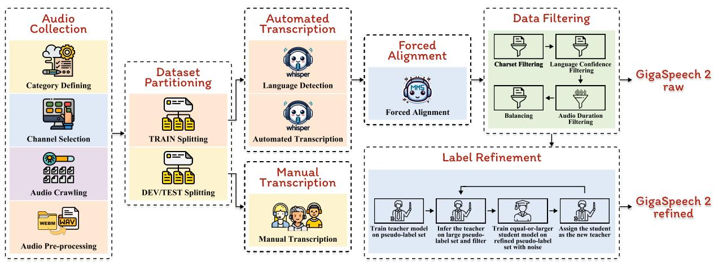
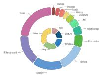
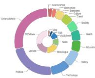
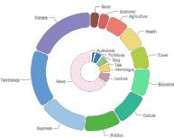
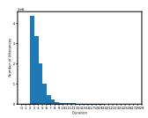
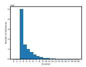
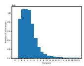
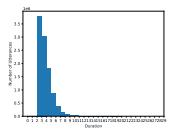
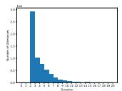
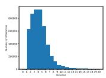

# GigaSpeech 2: An Evolving, Large-Scale and Multi-domain ASR Corpus for Low-Resource Languages with Automated Crawling, Transcription and Refinement

Yifan Yang1, Zheshu Song1, Jianheng Zhuo1, Mingyu Cui4 Jinpeng Li3, Bo Yang2, Yexing Du2,6, Ziyang Ma1, Xunying Liu4, Ziyuan Wang7   
Ke Li8, Shuai Fan9, Kai Yu1,9, Wei-Qiang Zhang3,11, Guoguo Chen10,11, Xie Chen1,5,11\*   
1X-LANCE Lab, SCS, MoE Key Lab of Artificial Intelligence, SJTU 2PCL 3Dept EE, THU   
4CUHK 5SII 6HIT 7Birch AI 8Dataocean AI 9AISpeech Ltd 10Seasalt AI Inc 11SpeechColab {yifanyeung,chenxie95}@sjtu.edu.cn gigaspeech@speechcolab.org

## Abstract

The evolution of speech technology has been spurred by the rapid increase in dataset sizes. Traditional speech models generally depend on a large amount of labeled training data, which is scarce for low-resource languages. This paper presents GigaSpeech 2, a large-scale, multidomain, multilingual speech recognition corpus. It is designed for low-resource languages and does not rely on paired speech and text data. GigaSpeech 2 comprises about 30,000 hours of automatically transcribed speech, including Thai, Indonesian, and Vietnamese, gathered from unlabeled YouTube videos. We also introduce an automated pipeline for data crawl ing, transcription, and label refinement. Specifically, this pipeline involves Whisper for initial transcription, MMS for forced alignment, and multi-dimensional filtering for data quality assurance. A modified Noisy Student Training is developed to further refine flawed pseudo labels iteratively, thereby enhancing model performance. Experimental results on our manu ally transcribed evaluation set and two public test sets from Common Voice and FLEURS confirm our corpus’s high quality and broad applicability. Notably, ASR models trained on GigaSpeech 2 can reduce the word error rate for Thai, Indonesian, and Vietnamese on our challenging and realistic YouTube test set by 25% to 40% compared to Whisper large-v3, with merely 10% model parameters. Furthermore, our ASR models trained on GigaSpeech 2 yield superior performance compared to commercial services. We hope that our newly introduced corpus and pipeline will open a new avenue for low-resource speech recognition and signif icantly facilitate research in this area.

## 1 Introduction

In recent years, the scaling of model parameters and data size has prevailed and proven effective in a range of areas, including language (Kaplan et al., 2020; Hoffmann et al., 2022), vision (Betker et al., 2023; Dehghani et al., 2023), as well as speech processing (Pratap et al., 2024; Zhang et al., 2023; Radford et al., 2023). Consequently, pursuing superior AI models is now closely associated with expanding model size and leveraging larger, high-quality datasets. In the realm of Automatic Speech Recognition (ASR), several largescale open-source labeled speech datasets (Chen et al., 2021; Kang et al., 2024; Zhang et al., 2022; Galvez et al., 2021; Pratap et al., 2020b; Ardila et al., 2020) have been proposed. However, these extensive datasets are only available for several mainstream languages, such as English and Mandarin, hindering speech recognition development for low-resource languages. Moreover, traditional ASR corpus (Ardila et al., 2020; Conneau et al., 2023; Bu et al., 2017; Du et al., 2018) construction relies heavily on human-labeled speech data, making it time-consuming and a major bottleneck in the fast-paced AI industry. Reducing dependence on vast labeled data is crucial when expanding to new languages and domains. YODAS (Li et al., 2023) attempts to address this issue by building multilingual datasets via scraping audio and transcriptions from YouTube. However, neither manual nor automatic subtitles accurately reflect the speech content, resulting in unguaranteed quality.

With this perspective in mind, we propose a new paradigm for constructing large-scale ASR datasets, focusing solely on audio content irrespective of the existence or quality of corresponding text pairs. This approach leverages the gigantic amount of unlabeled audio data, bypassing the constraints of scarce paired data. We introduce GigaSpeech 2, an evolving1, large-scale, multi-domain, multilingual ASR corpus for low-resource Southeast Asian languages. GigaSpeech 2 raw comprises about 30,000 hours of automatically transcribed speech, across Thai, Indonesian, and Vietnamese. GigaSpeech 2 refined consists of 10,000 hours of Thai, 6,000 hours each for Indonesian and Vietnamese. To achieve this, an automated pipeline is developed for data crawling, transcription, and filtering. Furthermore, a modified Noisy Student Training (NST) (Xie et al., 2020) method is proposed to refine labels from flawed data iteratively. Through comprehensive evaluations, ASR models trained on GigaSpeech 2 refined can reduce the word error rate for Thai, Indonesian, and Vietnamese on our YouTube test set by 25% to 40% compared to the powerful Whisper large-v3 model, with merely 10% model parameters.

Our contributions can be summarized as follows:

• We release GigaSpeech 2 with two versions: GigaSpeech 2 raw comprises about 30,000 hours of automatically transcribed speech across Thai, Indonesian, and Vietnamese. GigaSpeech 2 refined consists of 10,000 hours of Thai, 6,000 hours each for Indonesian and Vietnamese.

• We develop an automated pipeline for data crawling, transcription, and label refinement, enabling the creation of large-scale speech datasets without reliance on labeled data.

• We propose a modified NST method to iteratively refine flawed pseudo labels. Our modified NST performs scaling, relabeling, and filtering data within each iteration, significantly improving final data quality.

• We release a series of challenging and realistic speech recognition test sets, including Thai, Indonesian, and Vietnamese. Compared to previous public test sets, GigaSpeech 2 test sets more realistically reflect speech recognition scenarios and mirror the real performance of an ASR system for low-resource languages.

• Experimental results on our challenging GigaSpeech 2 test sets, as well as other competitive public test sets including Common Voice and FLEURS, demonstrate the superiority of the ASR models trained on GigaSpeech 2 over several competitive baselines, including Whisper large-v3 and commercial services.

## 2 Related Work

Multilingual Low-Resource Speech Datasets Several publicly available multilingual speech datasets have emerged for low-resource languages. BABEL (Gales et al., 2014), a pioneering dataset, includes conversational telephone data in 17 African and Asian languages. Common Voice (Ardila et al., 2020) offers 19,000 hours of validated recordings in over 100 languages. FLEURS (Conneau et al., 2023) covers 102 languages with 12 hours of supervised data per language. CMU Wilderness (Black, 2019) provides 20 hours of New Testament data for over 700 languages. VoxLingua107 (Valk and Alumäe, 2021) contains 6,628 hours of unlabeled YouTube data across 107 languages. However, most public multilingual speech datasets focus on high-resource languages, leaving low-resource languages with limited annotated speech data. As detailed in Table 1, the available open-source data for Thai, Indonesian, and Vietnamese is scarce. In contrast, industry-utilized speech models like Whisper (Radford et al., 2023), MMS (Pratap et al., 2024), Google USM (Zhang et al., 2023), and Universal-1 (Ramirez et al., 2024) are trained on massive industrial-grade datasets, the details of which remain undisclosed. To resolve the problem, YODAS (Li et al., 2023) attempts to crawl audio from YouTube, but neither manual nor automatic subtitles accurately reflect the speech content, resulting in unguaranteed quality. Moreover, widely used evaluation benchmarks for low-resource languages (Ardila et al., 2020; Conneau et al., 2023) only consist of read speech, which is relatively clean and mismatched with real-world speech data.

Multilingual Automatic Speech Recognition As the demand for communication between people worldwide grows, many works (Radford et al., 2023; Zhang et al., 2023; Pratap et al., 2024; Li et al., 2021; Lugosch et al., 2022; Toshniwal et al., 2018; Cho et al., 2018; Pratap et al., 2020a; Tjandra et al., 2023; Kannan et al., 2019; Conneau et al., 2021) have shifted attention to multilingual speech recognition. Whisper (Radford et al., 2023), built on 680,000 hours of web data, supports 99 languages. Google USM (Zhang et al., 2023), trained on YouTube audio, extends to 100+ languages. Massively Multilingual Speech (MMS) (Pratap et al., 2024), trained on religion data, further scales to 1,107 languages.

Noisy Student Training (NST) NST (Xie et al., 2020; Park et al., 2020; Xu et al., 2020; Zhang et al., 2020; Likhomanenko et al., 2021; Mehmood et al., 2022; Chen et al., 2023) is a self-training technique that leverages unlabeled data to enhance performance. Traditional NST methods start with training a teacher model on high-quality labeled data. Each student model then trains on both noisyaugmented labeled data and pseudo-labeled data generated by its teacher from the unlabeled data. One study (Chen et al., 2023) has explored using Character Error Rate (CER), calculated between pseudo-labeled data generated with and without language model, to perform data selection, suggesting a positive correlation between the CERs of different pseudo labels and their ground truth.

Table 1: Comparison of data size between GigaSpeech 2 and other common public multilingual speech datasets on Thai (th), Indonesian (id), and Vietnamese (vi).
<table><tr><td>Dataset</td><td>Language</td><td># Hours (h)</td><td colspan="4">Domain Speech Type Labeled Label Type</td></tr><tr><td rowspan="2">Common Voice (Ardila et al., 2020)</td><td>th</td><td>172.0</td><td rowspan="2">Open domain</td><td rowspan="2">Read</td><td rowspan="2">Yes</td><td rowspan="2">Manual</td></tr><tr><td>id</td><td>28.0</td></tr><tr><td rowspan="3">FLEURS (Conneau et al., 2023)</td><td>vi</td><td>6.0</td><td rowspan="3">Wikipedia</td><td rowspan="3">Read</td><td rowspan="3">Yes</td><td rowspan="3">Manual</td></tr><tr><td>th</td><td>13.3</td></tr><tr><td>id</td><td>12.6</td></tr><tr><td rowspan="3">VoxLingua107 (Valk and Alumäe, 2021)</td><td>vi</td><td>13.3</td><td rowspan="3">YouTube</td><td rowspan="3">Spontaneous</td><td rowspan="3">No</td><td rowspan="3"></td></tr><tr><td>th</td><td>61.0</td></tr><tr><td>id</td><td>40.0</td></tr><tr><td rowspan="3">CMU Wilderness (Black, 2019)</td><td>vi</td><td>64.0</td><td rowspan="3">Religion</td><td rowspan="3">Read</td><td rowspan="3">Yes</td><td rowspan="3">Manual</td></tr><tr><td>th</td><td>15.6</td></tr><tr><td>id</td><td>70.9</td></tr><tr><td>BABEL (Gales et al., 2014)</td><td>vi</td><td>9.2 87.1</td><td>Conversation Spontaneous</td><td></td><td>Yes</td><td>Manual</td></tr><tr><td>VietMed (Le-Duc, 2024)</td><td>vi vi</td><td>16.0</td><td>Medical</td><td>Spontaneous</td><td>Yes</td><td>Manual</td></tr><tr><td>Thai Dialect Corpus (Suwanbandit et al., 2023)</td><td>th</td><td>840.0</td><td>Open domain</td><td>Read</td><td>Yes</td><td>Manual</td></tr><tr><td>TITML-IDN (Shinoda and Furui, 2011)</td><td>id</td><td>14.5</td><td>News</td><td>Read</td><td>Yes</td><td>Manual</td></tr><tr><td>MEDISCO (Qorib and Adriani, 2018)</td><td>id</td><td>10.0</td><td>Medical</td><td>Read</td><td>Yes</td><td>Manual</td></tr><tr><td rowspan="3">YODAS manual (Li et al., 2023)</td><td>th</td><td>497.1</td><td rowspan="3">YouTube</td><td rowspan="3">Spontaneous</td><td rowspan="3">Yes</td><td rowspan="3">Manual</td></tr><tr><td>id</td><td>1420.1</td></tr><tr><td>vi</td><td>779.9</td></tr><tr><td rowspan="3">YODAS automatic (Li et al., 2023)</td><td>th</td><td>1.9</td><td rowspan="3">YouTube</td><td rowspan="3">Spontaneous</td><td rowspan="3">Yes</td><td rowspan="3">Pseudo</td></tr><tr><td>id</td><td>8463.6</td></tr><tr><td>vi</td><td>9203.1</td></tr><tr><td rowspan="3">GigaSpeech 2 raw</td><td>th</td><td>12901.8</td><td rowspan="3">YouTube</td><td rowspan="3">Spontaneous</td><td rowspan="3">Yes</td><td rowspan="3">Pseudo</td></tr><tr><td>id</td><td>8112.9</td></tr><tr><td>vi</td><td>7324.0</td></tr><tr><td rowspan="3">GigaSpeech 2 refined</td><td>th</td><td>10262.0</td><td rowspan="3"></td><td rowspan="3">YouTube Spontaneous</td><td rowspan="3">Yes</td><td rowspan="3">Pseudo</td></tr><tr><td>id</td><td>5714.0</td></tr><tr><td>vi</td><td>6039.0</td></tr><tr><td></td><td></td><td></td><td></td><td></td><td></td><td></td></tr></table>

## 3 Dataset Construction

Our proposed automated construction pipeline is illustrated in Fig. 1. Sec. 3.1 covers the stages involved in building GigaSpeech 2 raw and Sec. 3.2 further construct GigaSpeech 2 refined.

## 3.1 GigaSpeech 2 raw: Automated Crawling and Transcription

Audio Collection Due to the scarcity of humanlabeled data in low-resource languages, our dataset is collected with a focus solely on the audio content, irrespective of the existence or quality of corresponding text pairs. This strategy allows for leveraging a broader range of audio data. Given the scarcity and uneven distribution of resources for low-resource languages, we strategically crawl videos from YouTube channels based on two key considerations. First, prioritizing mainstream and popular channels helps ensure consistent domain characteristics and higher audio quality. Such content is widely viewed, and its creators are generally more mindful of ethical and legal considerations prior to publishing. Second, channels with huge differences in topics and content formats are less likely to have speaker overlap, which simplifies subsequent data partitioning. The data collection process starts by manually defining categories of interest. The selected topics include Agriculture, Art, Business, Climate, Culture, Economics, Education, Entertainment, Health, History, Literature, Music,

  
Figure 1: Automated construction pipeline of GigaSpeech 2, comprising (1) audio collection, (2) dataset partitioning, (3) automated transcription with Whisper, (4) forced alignment with TorchAudio, (5) transcription normalization, (6) data filtering, and (7) label refinement.

Politics, Relationships, Shopping, Society, Sport, Technology, and Travel. Alongside multiple topics, various content formats are also considered, including Audiobook, Commentary, Lecture, Monologue, Movie, News, Talk, and Vlog. This broad selection ensures the comprehensiveness of the dataset across multiple domains for research and analysis. Once the list of YouTube channels is prepared, we use yt-dlp2 toolkit to download all audio files in WebM format. These files are then converted to WAV format with a single channel and resampled at a 16 kHz sampling rate.

Creating TRAIN/DEV/TEST Splits To ensure no speaker overlap between the splits, we manually verify no speaker overlap between different channels and partition the data by allocating different YouTube channels to each subset. The dataset is divided into three distinct subsets: TRAIN, DEV, and TEST. The DEV and TEST sets each contain 10 hours and are manually transcribed by professionals, while the remainder is allocated to the TRAIN set. Table 1 shows the amount of data across these three languages. Detailed analysis of GigaSpeech 2 is illustrated in Appendix A.

Transcription with Whisper Whisper large-v3 model3 from OpenAI is used to transcribe audio files automatically. For each audio recording, a 30-second segment is selected from the middle to perform language detection by Whisper. Only audios that match the target languages are transcribed. Forced Alignment with TorchAudio Although Whisper can generate timestamps, inspection reveals they are not precise enough. We resort to the model4 from TorchAudio (Hwang et al., 2023) for forced alignment, which provides reliable alignment for noisy transcriptions, supports efficient processing on GPUs, and handles longer sequences more effectively (Pratap et al., 2024).

Text Normalization Text normalization on transcripts involves applying Normalization Form Compatibility Composition (NFKC), converting all characters to uppercase, removing punctuation, and mapping Arabic numerals to corresponding words in the respective languages.

Multi-dimensional Filtering A series of heuristic filtering rules across text and audio modalities are implemented to exclude relatively poor-quality samples. 1) Charset Filtering: Segments are retained if they only contain characters permitted by the charset of the respective language. 2) Language Confidence Filtering: The language identification (LID) model5 from fastText (Joulin et al., 2016) is used to filter based on the estimated language confidence score, retaining only segments with confidence scores above a predetermined threshold. This method effectively eliminates meaningless and repetitive segments. Note that language identification based on audio has already been performed before transcription. 3) Audio Duration Filtering: Segments are filtered based on duration, with only those retained within the predetermined minimum and maximum duration thresholds. 4) Balancing: We carefully control the duplication of transcripts caused by channel-specific content while preserving natural linguistic patterns.

## 3.2 GigaSpeech 2 refined: Iterative Label Refinement

Some samples remain low quality due to inaccuracies in Whisper transcriptions and imprecise forced alignment boundaries. To address this, we develop a modified NST method. As illustrated in the bot tom right corner of Fig. 1, it begins by training a teacher model on a subset of flawed pseudo la bels, iteratively expanding the training set, generating new pseudo labels, and filtering them. A student model, equal to or larger than the teacher, is trained on these refined pseudo labels and assigned as the new teacher. Unlike previous NST approaches that heavily rely on unchanged supervised data combined with additional unsupervised data, our method eliminates the need for any supervised data. Instead, we treat the flawed pseudo labels generated by Whisper as supervised data, refining all labels iteratively based on the Character Error Rate (CER) between those produced by Whisper and the teacher model. SpecAugment (Park et al., 2019), Bypass (Yao et al., 2024), and fea ture mask (Yao et al., 2024) introduce noise during each NST step. Bypass, a type of stochastic depth, learns channel-wise scalar weights to combine the module input and output. Feature mask performs dropout in the hidden dimension of the feedforward and convolution layer but shares across the time dimension. This deliberate noising enables the student model to learn consistency with the teacher model, which remains unaffected by noise when generating pseudo labels (Xie et al., 2020). This iterative process progressively enhances data quality. Algo. 1 illustrates the workflow of our proposed iterative label refinement.

## 4 Experiments

## 4.1 ASR Model Training on GigaSpeech 2

Our ASR systems are built on Zipformer Transducer (Graves et al., 2013). Two Zipformer (Yao et al., 2024) variants, namely Zipformer-M and Zipformer-L, are employed for each NST iteration. Specific configurations are provided in Appendix B.1. During Noisy Student Training, SpecAugment (Park et al., 2019) is used as input noise while Bypass (Yao et al., 2024) and feature mask (Yao et al., 2024) are used as model noise.

Table 2 presents the ASR results across different

Algorithm 1: Iterative Label Refinement   
Input: Pseudo-label set ${ \overline { { \mathcal { P } } } } .$ , Number of   
iterations n, Threshold $\tau$   
Output: Refined-label set $\mathcal { R }$   
Divide $\mathcal { P }$ into n splits $\mathcal { P } _ { 1 } , \mathcal { P } _ { 2 } , \ldots , \mathcal { P } _ { n } ;$   
$\mathcal { R }  \mathcal { P } _ { 1 } ;$   
Train teacher model $\mathcal { M } _ { 1 }$ on with noise;   
for $i \gets 1$ to n do   
$\mathcal { R }  \emptyset ;$   
if $i = = 1$ then   
// Filter $\mathcal { P } _ { i }$ by teacher model   
$\mathcal { M } _ { i }$ with CER $\leq \tau$   
$\mathcal { R }  \{ ( x , y ) \in \mathcal { P } _ { i } \mid$   
$\mathrm { C E R } ( y , \mathcal { M } _ { i } ( x ) ) \leq \tau \}$   
else   
for $j  1$ to i do   
// Relabel $\mathcal { P } _ { j }$ by teacher   
model $\mathcal { M } _ { i }$ and filter   
with CER $\leq \tau$   
$\mathcal { R } _ { t m p } \gets \{ ( x , \mathcal { M } _ { i } ( x ) ) \ |$   
$( x , y ) \in$   
$\mathcal { P } _ { j } , \mathrm { C E R } ( y , \mathcal { M } _ { i } ( x ) ) \leq \tau \}$   
$\mathcal { R }  \mathcal { R } \cup \mathcal { R } _ { t m p } ;$   
end   
end   
Train equal-or-larger student model   
$\mathcal { M } _ { i + 1 }$ on  with noise and assign as   
new teacher;   
end   
return ;

NST iterations on three evaluation sets, including the development and test sets from GigaSpeech 2 and the Common Voice 17.0 and FLEURS test set. Each iteration involves distinct modifications aimed at refining high-quality transcriptions. A subset of automatic transcriptions generated by Whisper large-v3 is used to train the initial teacher model (Iter. 1). The teacher model then filters the training utterances by applying a CER/WER threshold, using the original labels as references and the new labels generated by the teacher as the hypothesis. The student model is trained on this filtered set with noise injected (Iter. 2). The student model is then used as the teacher to generate new labels on a larger subset of raw automatic transcriptions, applying the same filter to refine the training data. This refined data is used to train the student model with noise injected (Iter. 3). The process repeats in subsequent iterations, and the model size is scaled up to a larger version in the final iteration (Iter. 3 of Indonesian & Vietnamese, Iter. 4 of Thai).

Table 2: Comparison of ASR performance across different NST iterations on various evaluation sets, including GigaSpeech 2 DEV and TEST, Common Voice 17.0 TEST, and FLEURS TEST. Reported details include training set size (#Hours), BPE vocabulary size (#Vocab), model size (#Params), CER for Thai, and WER for Indonesian and Vietnamese.
<table><tr><td rowspan="2">NST Iter</td><td rowspan="2">#Hours (h)</td><td rowspan="2">#Vocab</td><td rowspan="2">#Params (M)</td><td colspan="4">CER / WER</td></tr><tr><td>GigaSpeech 2 DEV TEST</td><td></td><td>Common Voice TEST</td><td>FLEURS TEST</td></tr><tr><td>Thai</td><td></td><td></td><td></td><td></td><td></td><td></td><td></td></tr><tr><td>1</td><td>4378</td><td>500</td><td>65.5</td><td>12.14</td><td>15.10</td><td>8.88</td><td>14.33</td></tr><tr><td>2</td><td>3497</td><td>500</td><td>65.5</td><td> $1 0 . 9 7 _ { - 9 . 6 \% }$ </td><td> $1 3 . 1 5 _ { - 1 2 . 9 \% }$ </td><td> $6 . 9 9 _ { - 2 1 . 3 \% }$ </td><td> $1 1 . 9 3 _ { - 1 6 . 7 \% }$ </td></tr><tr><td>3</td><td>7219</td><td>2000</td><td>68.6</td><td> $1 0 . 5 0 _ { - 4 . 3 \% }$ </td><td> $1 2 . 4 6 _ { - 5 . 2 \% }$ </td><td> $4 . 6 1 _ { - 3 4 . 0 \% }$ </td><td>10.94-8.3%</td></tr><tr><td>4</td><td>10262</td><td>2000</td><td>151.9</td><td> $1 0 . 4 5 _ { - 0 . 5 \% }$ </td><td> $1 2 . 4 6 _ { - 0 . 0 \% }$ </td><td> $4 . 1 5 _ { - 1 0 . 0 \% }$ </td><td> $1 0 . 5 4 _ { - 3 . 7 \% }$ </td></tr><tr><td>Indonesian</td><td></td><td></td><td></td><td></td><td></td><td></td><td></td></tr><tr><td>1</td><td>5765</td><td>2000</td><td>68.6</td><td>16.68</td><td>15.99</td><td>19.82</td><td>16.29</td></tr><tr><td>2</td><td>4534</td><td>2000</td><td>68.6</td><td> $1 5 . 6 0 _ { - 6 . 5 \% }$ </td><td> $1 5 . 2 3 _ { - 4 . 8 \% }$ </td><td> $1 5 . 8 3 _ { - 2 0 . 1 \% }$ </td><td> $1 4 . 3 0 _ { - 1 2 . 2 \% }$ </td></tr><tr><td>3</td><td>5714</td><td>2000</td><td>151.9</td><td> $1 4 . 5 8 _ { - 6 . 5 \% }$ </td><td> $1 4 . 9 2 _ { - 2 . 0 \% }$ </td><td> $1 3 . 8 3 _ { - 1 2 . 6 \% }$ </td><td> $\underline { { 1 3 . 7 7 _ { - 3 . 7 \% } } }$ </td></tr><tr><td>Vietnamese</td><td></td><td></td><td></td><td></td><td></td><td></td><td></td></tr><tr><td>1</td><td>2351</td><td>2000</td><td>68.6</td><td>16.08</td><td>16.95</td><td>24.63</td><td>17.86</td></tr><tr><td>2</td><td>1764</td><td>2000</td><td>68.6</td><td> $1 5 . 0 8 _ { - 6 . 2 \% }$ </td><td> $1 4 . 7 2 _ { - 1 3 . 2 \% }$ </td><td> $1 8 . 8 1 _ { - 2 3 . 6 \% }$ </td><td>13.50–24.4%</td></tr><tr><td>3</td><td>6039</td><td>2000</td><td>151.9</td><td> $1 4 . 0 9 _ { - 6 . 6 \% }$ </td><td> $1 2 . 8 3 _ { - 1 2 . 8 \% }$ </td><td> $1 4 . 4 3 _ { - 2 3 . 3 \% }$ </td><td> $1 1 . 5 9 _ { - 1 4 . 1 \% }$ </td></tr></table>

According to the results shown in Table 2, several noTable trends can be observed:

1) Across all three languages, iteratively scaling the training data size, adding noise, and filtering labels lead to consistent improvements in the WER performance on the evaluation sets until the final iteration. This indicates that the iterative approach of refining and scaling the training data is effective in enhancing the accuracy of the raw transcriptions.

2) The system trained on Thai consistently achieves the absolute lowest error rates consistently across iterations from 1 to 4, indicating the effectiveness of the NST approach for this particular language. The best NST model outperforms the standard transcription model data by WER reductions of 1.69%, 2.64%, 4.73%, and 3.79% absolute (13.92%, 17.48%, 53.27%, and 26.45% relative) respectively (Iter. 4 vs. 1).

Additional ablation studies on our modified NST in Appendix C Table 8 demonstrate the effectiveness of relabeling and discuss the detriment of enlarging noise when scaling the training data.

## 4.2 Comparison to Existing ASR Systems

To demonstrate the efficacy of our ASR models trained on GigaSpeech 2, several mainstream and competitive ASR systems, including Whisper (Radford et al., 2023) from OpenAI, MMS (Pratap et al., 2024) from Meta, and commercial services from Azure and Google, are used as benchmarks.

Whisper: Our work builds upon Whisper (Radford et al., 2023), a suite of large-scale, multitask, and multilingual speech models developed by OpenAI. It leverages the encoder-decoder Transformer architecture (Vaswani et al., 2017), with model sizes ranging from 39 million parameters (tiny) to 1.55 billion parameters (large). Additionally, Whisper offers variants spanning from an English-only version to a multilingual model capable of handling 99 languages. To conduct a comprehensive evaluation, we test three variants: Whisper base, Whisper large-v2, and Whisper large-v3 models.

MMS: The Massively Multilingual Speech (MMS) (Pratap et al., 2024) project leverages selfsupervised learning (SSL) techniques and a novel dataset to expand the language coverage of speech technology significantly. The core components include pre-trained wav2vec 2.0 (Baevski et al., 2020) models for 1,406 languages, a single multilingual ASR model supporting 1,107 languages, speech synthesis models for the same set of languages, and a language identification model capable of recognizing 4,017 languages. In this study, we employ the MMS L1107 configuration.

Azure AI Speech: Azure Speech CLI offers a convenient way to leverage Microsoft’s speech recognition capabilities directly from the command line. It not only supports a wide range of audio file formats but also possesses the ability to handle various streaming audio inputs. We utilize the Azure Speech CLI version 1.37 in this paper, which is the latest version available.

Table 3: Comparison of ASR results for models trained on GigaSpeech 2 with open-source multilingual ASR models and commercial ASR services, evaluated on three test sets from GigaSpeech 2, Common Voice 17.0, and FLEURS. The evaluation metrics include CER for Thai and WER for both Indonesian and Vietnamese. “ " denotes commercial services.
<table><tr><td rowspan="2">Model</td><td rowspan="2">#Params (M)</td><td colspan="3">CER / WER</td></tr><tr><td>GigaSpeech 2</td><td>Common Voice</td><td>FLEURS</td></tr><tr><td>Thai</td><td></td><td></td><td></td><td></td></tr><tr><td>Whisper large-v3</td><td>1542</td><td>20.44</td><td>6.02</td><td>11.55</td></tr><tr><td>Whisper large-v2</td><td>1541</td><td>22.47</td><td>8.79</td><td>15.50</td></tr><tr><td>Whisper base</td><td>72</td><td>46.47</td><td>32.59</td><td>42.28</td></tr><tr><td>MMS L1107</td><td>964</td><td>31.75</td><td>14.49</td><td>23.07</td></tr><tr><td>Azure Speech CLI 1.37.0†</td><td></td><td>17.25</td><td>10.20</td><td>13.35</td></tr><tr><td>Google USM Chirp v2†</td><td></td><td>49.70</td><td>14.75</td><td>63.35</td></tr><tr><td>GigaSpeech 2 (proposed)</td><td>151.9</td><td>12.46</td><td>4.15</td><td>10.54</td></tr><tr><td>Indonesian</td><td></td><td></td><td></td><td></td></tr><tr><td>Whisper large-v3</td><td>1542</td><td>20.03</td><td>7.43</td><td>7.85</td></tr><tr><td>Whisper large-v2</td><td>1541</td><td>21.44</td><td>8.93</td><td>8.95</td></tr><tr><td>Whisper base</td><td>72</td><td>39.37</td><td>34.70</td><td>33.76</td></tr><tr><td>MMS L1107</td><td>964</td><td>35.27</td><td>20.72</td><td>24.49</td></tr><tr><td>Azure Speech CLI 1.37.0†</td><td></td><td>18.07</td><td>10.33</td><td>11.18</td></tr><tr><td>Google USM Chirp v2†</td><td></td><td>19.63</td><td>9.70</td><td>7.23</td></tr><tr><td>GigaSpeech 2 (proposed)</td><td>151.9</td><td>14.92</td><td>13.83</td><td>13.77</td></tr><tr><td>+ Common Voice + FLEURS</td><td>151.9</td><td>14.95</td><td>7.33</td><td>12.74</td></tr><tr><td>Vietnamese</td><td></td><td></td><td></td><td></td></tr><tr><td>Whisper large-v3</td><td>1542</td><td>17.94</td><td>13.74</td><td>8.59</td></tr><tr><td>Whisper large-v2</td><td>1541</td><td>18.74</td><td>18.00</td><td>10.26</td></tr><tr><td>Whisper base</td><td>72</td><td>39.88</td><td>44.07</td><td>40.41</td></tr><tr><td>MMS L1107</td><td>964</td><td>46.62</td><td>43.88</td><td>55.35</td></tr><tr><td>Azure Speech CLI 1.37.0†</td><td></td><td>11.86</td><td>10.21</td><td>11.88</td></tr><tr><td>Google USM Chirp  $\mathrm { v 2 ^ { \dagger } }$ </td><td></td><td>13.28</td><td>12.46</td><td>11.75</td></tr><tr><td>GigaSpeech 2 (proposed)</td><td>151.9</td><td>12.83</td><td>14.43</td><td>11.59</td></tr><tr><td>+ Common Voice + FLEURS</td><td>151.9</td><td>12.39</td><td>11.47</td><td>9.94</td></tr></table>

Google USM: The Universal Speech Model (USM) (Zhang et al., 2023) is introduced as a single, largescale model that excels in ASR across over 100 languages. This achievement is made possible by pretraining the model’s encoder on a vast, unlabeled multilingual dataset of 12 million hours, covering more than 300 languages, followed by fine-tuning on a smaller labeled dataset. To conduct a thorough comparison, we utilize their Chirp Speech-to-Text v2 model for performance evaluation.

We compare the performance of our proposed approach trained on GigaSpeech 2 against these above-mentioned ASR models, including Whisper (base, large-v2, and large-v3), MMS L1107, Azure Speech CLI 1.37.0 and Google USM Chirp v26, across three languages: Thai, Indonesian, and Vietnamese. The ASR performance is evaluated regarding character error rate (CER) or word error rate (WER) on three distinct test sets from GigaSpeech

2, Common Voice 17.0, and FLEURS. According to the results shown in Table 3, there are several intriguing findings:

1) For the Thai language, our ASR model trained on GigaSpeech 2 (Table 3, Thai, Row 7) outperforms all competitors, including commercial services from Azure and Google, securing the top rank across all three test sets among the seven models. It outperforms Whisper large-v3 by relative WER reductions of 39.04%, 31.06%, and 8.74% (Table 3, Thai, Row 7 vs. 1). Remarkably, our model achieves such impressive performance with nearly one-tenth of the parameters compared to Whisper large-v3 (151.9 M vs. 1542 M).

2) For the Indonesian and Vietnamese languages, our system demonstrates competitive performance compared to existing baseline models. This highlights the efficacy of our pipeline in delivering highquality results with a lightweight model. Specifically, on the GigaSpeech 2 test set in the Indonesian language, our system (Table 3, Indonesian, Row

Table 4: Comparison of ASR results for models trained on YODAS and GigaSpeech 2, evaluated on test sets from GigaSpeech 2, Common Voice 17.0, and FLEURS. The evaluation metrics include CER for Thai and WER for both Indonesian and Vietnamese.
<table><tr><td>Training Set</td><td>#Params (M)</td><td>GigaSpeech 2</td><td>CER / WER Common Voice</td><td>FLEURS</td></tr><tr><td>Thai</td><td></td><td></td><td></td><td></td></tr><tr><td>YODAS manual</td><td>68.6</td><td>27.34</td><td>10.71</td><td>14.19</td></tr><tr><td>YODAS manual</td><td>151.9</td><td>28.76</td><td>10.96</td><td>16.11</td></tr><tr><td>GigaSpeech 2 refined</td><td>151.9</td><td>12.46</td><td>4.15</td><td>10.54</td></tr><tr><td>Indonesian</td><td></td><td></td><td></td><td></td></tr><tr><td>YODAS manual</td><td>68.6</td><td>25.77</td><td>10.82</td><td>14.63</td></tr><tr><td>YODAS manual + automatic</td><td>68.8</td><td>41.11</td><td>15.41</td><td>47.26</td></tr><tr><td>YODAS manual</td><td>151.9</td><td>25.11</td><td>11.05</td><td>12.67</td></tr><tr><td>GigaSpeech 2 refined</td><td>151.9</td><td>14.92</td><td>13.83</td><td>13.77</td></tr><tr><td>Vietnamese</td><td></td><td></td><td></td><td></td></tr><tr><td>YODAS manual</td><td>68.6</td><td>40.35</td><td>31.07</td><td>25.68</td></tr><tr><td>YODAS manual + automatic</td><td>68.6</td><td>71.91</td><td>25.73</td><td>61.38</td></tr><tr><td>YODAS manual</td><td>151.9</td><td>40.71</td><td>32.58</td><td>29.32</td></tr><tr><td>GigaSpeech 2 refined</td><td>151.9</td><td>12.83</td><td>14.43</td><td>11.59</td></tr></table>

Table 5: Comparison of ASR models trained on GigaSpeech 2 with Icefall and ESPnet toolkits, evaluated on GigaSpeech 2 TEST set. The evaluation metrics include CER for Thai (th) and WER for both Indonesian (id) and Vietnamese (vi).
<table><tr><td rowspan="2">Toolkit</td><td rowspan="2">Model</td><td rowspan="2">#Params (M)</td><td colspan="3">CER / WER</td></tr><tr><td>th</td><td>id</td><td>vi</td></tr><tr><td>Icefall</td><td>Zipformer/Stateless Pruned RNN-T</td><td>151.9</td><td>12.46</td><td>14.92</td><td>12.83</td></tr><tr><td>ESPnet</td><td>Conformer/Transformer CTC/AED</td><td>111.8</td><td>13.70</td><td>15.50</td><td>14.60</td></tr></table>

7) outperforms all baseline models, attaining the best performance. Compared to Whisper large-v3, the model trained on Indonesian achieves an absolute WER reduction of 5.11%, corresponding to a relative reduction of 25.51% (Table 3, Indonesian, Row 7 vs. 1). Similarly, the model trained on Vietnamese achieves an absolute WER reduction of 5.11%, corresponding to a relative reduction of 28.48% (Table 3, Vietnamese, Row 7 vs. 1).

3) Our model exhibits degraded performance compared to commercial ASR systems on the Common Voice and FLEURS test sets in Indonesian and Vietnamese, which can be attributed to the domain mismatch7. Contrastively, we observe a performance leap after adding Common Voice and FLEURS training data into GigaSpeech 2 (Table 3, Indonesian & Vietnamese, Row 7 vs. 8).

Although our training data size is smaller than that of industrial-scale models, our method achieves the best performance for the Thai language domain and delivers comparable results to commercial models for Indonesian and Vietnamese.

This remarkable accomplishment highlights the efficacy of our approach in leveraging limited, free, open-source, unlabeled data to train highly competitive speech recognition models. It showcases a promising path towards developing high-quality speech recognition systems without the need for extensive, proprietary datasets, thereby reducing the barrier to entry and enabling wider accessibility.

## 4.3 Comparison to the YODAS Corpus

Table 4 compares ASR performance across different models trained on YODAS (Li et al., 2023) and GigaSpeech 2 datasets evaluated on multiple test sets. Note that YODAS Thai automatic is not included due to insufficient data (only 1 hour). Despite variations in overall data volume, several general conclusions can be drawn from trend analysis: 1) The models trained on GigaSpeech 2 refined yield generally superior results compared to those trained on YODAS datasets for all three languages. 2) The YODAS manual may suffer from overfitting or noisy data issues due to simplistic filtering rules, leading to inconsistent performance in Indonesian (Table 4, Indonesian, Row 1 & 3).

3) Purely automatic generation of YODAS tends to degrade performance, as observed for Vietnamese (Table 4, Vietnamese, Row 1 vs. 2) and Indonesian (Table 4, Indonesian, Row 1 vs. 2), likely due to the inherent noise and errors in the automatically generated subtitles.

## 4.4 Training ASR Models within ESPnet and icefall on GigaSpeech 2

Icefall: We adopt the neural Transducer (Graves et al., 2013) architecture, using Zipformer-L as the encoder, the pruned RNN-T loss (Kuang et al., 2022) as the object function, and 2000-class Byte Pair Encoding (BPE) (Sennrich et al., 2016) word pieces. More details are provided in Appendix B.1. ESPnet: We employ Conformer (Gulati et al., 2020) CTC/AED (Kim et al., 2017) system from ESPnet (Watanabe et al., 2018), using Conformer-L as the encoder and 2000-class BPE word pieces. This model combines the localized sensitivity of convolutional neural networks with the long-range modeling capabilities of Transformers (Vaswani et al., 2017). Details are available in Appendix B.2.

Table 5 shows the results of ASR models trained with icefall and ESPnet. The models trained with ESPnet are slightly worse than icefall in all three languages, which is as expected and can be explained by the discrepancy in the number of model parameters (112M vs. 152M). It is worth noting that the results in Table 5 are intended to provide baseline systems for these two popular toolkits to demonstrate the universality of GigaSpeech 2 instead of pursuing state-of-the-art performance.

## 5 Conclusion

This paper introduces a new multilingual speech dataset, GigaSpeech 2, and a novel automated pipeline to boost speech recognition performance using in-the-wild audio-only data. GigaSpeech 2 aims to address the scarcity of labeled training data on low-resource languages by developing this largescale, multi-domain, and multilingual corpus. Extensive experiments are conducted to validate the efficacy of our newly introduced corpus. The ASR models trained in three languages, which are Thai, Indonesian, and Vietnamese within GigaSpeech 2, demonstrate superior and impressive performance compared to various powerful ASR models, including Whisper large v2/v3 from OpenAI, MMS from Meta, and even commercial services from Google and Azure. The related resources, including the corpus with curated test sets8, automated pipeline9, and recipes1011, are released to facilitate research in this direction. In the future, we are eager to extend our paradigm to more low-resource languages and are devoted to breaking down the language barrier.

## Limitations

In this paper, we propose GigaSpeech 2, a largescale, multi-domain, multilingual speech recognition corpus, and a novel automated pipeline to boost speech recognition performance using in-thewild audio-only data. We only conducted 3-4 iterations of the proposed NST method in our experiments, and we are optimistic that more iterations on large data will yield even better results. Moreover, we are actively extending our language coverage by incorporating additional languages, including Malay, Korean, Minnan, and Arabic. We will also expand our low-resource language family in our future investigation.

## Ethics Statement

All collected audio is sourced from materials released under a Creative Commons license. Personally identifiable information has been anonymized using rule-based scripts to remove identifiable content from the data. All annotators are compensated fairly by a professional data annotation company. Our dataset adopts the same terms as GigaSpeech (Chen et al., 2021) to resolve potential legal risks, restricting use to non-commercial research and educational purposes only. We are committed to ongoing maintenance of the dataset to address any potential risks in the future.

## Acknowledgement

This work was supported by the National Natural Science Foundation of China (No. U23B2018 and No. 62206171), Shanghai Municipal Science and Technology Major Project under Grant 2021SHZDZX0102 and Yangtze River Delta Science and Technology Innovation Community Joint Research Project (2024CSJGG01100). We gratefully acknowledge the support of DataOcean AI for manually annotating the evaluation sets.

## References

Rosana Ardila, Megan Branson, Kelly Davis, Michael Kohler, Josh Meyer, Michael Henretty, Reuben Morais, Lindsay Saunders, Francis M. Tyers, and Gregor Weber. 2020. Common voice: A massivelymultilingual speech corpus. In Proc. ACL, Seattle.

Alexei Baevski, Yuhao Zhou, Abdelrahman Mohamed, and Michael Auli. 2020. wav2vec 2.0: A framework for self-supervised learning of speech representations. In Proc. NeurIPS, Virtual.

James Betker, Gabriel Goh, Li Jing, TimBrooks, Jianfeng Wang, Linjie Li, Long Ouyang, Juntang Zhuang, Joyce Lee, Yufei Guo, Wesam Manassra, Prafulla Dhariwal, Casey Chu, Yunxin Jiao, and Aditya Ramesh. 2023. Improving image generation with better captions. Computer Science, 2.

Alan W. Black. 2019. CMU wilderness multilingual speech dataset. In Proc. ICASSP, Brighton.

Hui Bu, Jiayu Du, Xingyu Na, Bengu Wu, and Hao Zheng. 2017. AISHELL-1: An open-source mandarin speech corpus and a speech recognition baseline. In Proc. Oriental COCOSDA, Seoul.

Guoguo Chen, Shuzhou Chai, Guan-Bo Wang, Jiayu Du, Wei-Qiang Zhang, Chao Weng, Dan Su, Daniel Povey, Jan Trmal, Junbo Zhang, Mingjie Jin, Sanjeev Khudanpur, Shinji Watanabe, Shuaijiang Zhao, Wei Zou, Xiangang Li, Xuchen Yao, Yongqing Wang, Zhao You, and Zhiyong Yan. 2021. Gigaspeech: An evolving, multi-domain asr corpus with 10,000 hours of transcribed audio. In Proc. Interspeech, Brno.

Yu Chen, Wen Ding, and Junjie Lai. 2023. Improving noisy student training on non-target domain data for automatic speech recognition. In Proc. ICASSP, Rhodes Island.

Jaejin Cho, Murali Karthick Baskar, Ruizhi Li, Matthew Wiesner, Sri Harish Mallidi, Nelson Yalta, Martin Karafiát, Shinji Watanabe, and Takaaki Hori. 2018. Multilingual sequence-to-sequence speech recognition: Architecture, transfer learning, and language modeling. In Proc. SLT, Athens.

Alexis Conneau, Alexei Baevski, Ronan Collobert, Abdelrahman Mohamed, and Michael Auli. 2021. Unsupervised cross-lingual representation learning for speech recognition. In Proc. Interspeech, Brno.

Alexis Conneau, Min Ma, Simran Khanuja, Yu Zhang, Vera Axelrod, Siddharth Dalmia, Jason Riesa, Clara Rivera, and Ankur Bapna. 2023. FLEURS: few-shot learning evaluation of universal representations of speech. In Proc. SLT, Doha.

Mostafa Dehghani, Josip Djolonga, Basil Mustafa, Piotr Padlewski, Jonathan Heek, Justin Gilmer, Andreas Peter Steiner, Mathilde Caron, Robert Geirhos, Ibrahim Alabdulmohsin, Rodolphe Jenatton, Lucas Beyer, Michael Tschannen, Anurag Arnab, Xiao Wang, Carlos Riquelme Ruiz, Matthias Minderer,

Joan Puigcerver, Utku Evci, Manoj Kumar, Sjoerd van Steenkiste, Gamaleldin Fathy Elsayed, Aravindh Mahendran, Fisher Yu, Avital Oliver, Fantine Huot, Jasmijn Bastings, Mark Collier, Alexey A. Gritsenko, Vighnesh Birodkar, Cristina Nader Vasconcelos, Yi Tay, Thomas Mensink, Alexander Kolesnikov, Filip Pavetic, Dustin Tran, Thomas Kipf, Mario Lucic, Xiaohua Zhai, Daniel Keysers, Jeremiah J. Harmsen, and Neil Houlsby. 2023. Scaling vision transformers to 22 billion parameters. In Proc. ICML, Honolulu.

Jiayu Du, Xingyu Na, Xuechen Liu, and Hui Bu. 2018. AISHELL-2: Transforming Mandarin ASR research into industrial scale. arXiv preprint arXiv:1808.10583.

Mark J. F. Gales, Kate M. Knill, Anton Ragni, and Shakti P. Rath. 2014. Speech recognition and keyword spotting for low-resource languages: Babel project research at CUED. In Proc. SLTU, Saint Petersburg.

Daniel Galvez, Greg Diamos, Juan Torres, Keith Achorn, Juan Felipe Cerón, Anjali Gopi, David Kanter, Max Lam, Mark Mazumder, and Vijay Janapa Reddi. 2021. The People’s Speech: A large-scale diverse English speech recognition dataset for commercial usage. In Proc. NeurIPS Datasets and Benchmarks, Virtual.

Mohammadreza Ghodsi, Xiaofeng Liu, James Apfel, Rodrigo Cabrera, and Eugene Weinstein. 2020. RNN-Transducer with stateless prediction network. In Proc. ICASSP, Barcelona.

Alex Graves, Abdel-rahman Mohamed, and Geoffrey E. Hinton. 2013. Speech recognition with deep recurrent neural networks. In Proc. ICASSP, Vancouver.

Anmol Gulati, James Qin, Chung-Cheng Chiu, Niki Parmar, Yu Zhang, Jiahui Yu, Wei Han, Shibo Wang, Zhengdong Zhang, Yonghui Wu, and Ruoming Pang. 2020. Conformer: Convolution-augmented transformer for speech recognition. In Proc. Interspeech, Shanghai.

Jordan Hoffmann, Sebastian Borgeaud, Arthur Mensch, Elena Buchatskaya, Trevor Cai, Eliza Rutherford, Diego de Las Casas, Lisa Anne Hendricks, Johannes Welbl, Aidan Clark, Tom Hennigan, Eric Noland, Katie Millican, George van den Driessche, Bogdan Damoc, Aurelia Guy, Simon Osindero, Karen Simonyan, Erich Elsen, Jack W. Rae, Oriol Vinyals, and Laurent Sifre. 2022. Training compute-optimal large language models. arXiv preprint arXiv:2203.15556.

Jeff Hwang, Moto Hira, Caroline Chen, Xiaohui Zhang, Zhaoheng Ni, Guangzhi Sun, Pingchuan Ma, Ruizhe Huang, Vineel Pratap, Yuekai Zhang, Anurag Kumar, Chin-Yun Yu, Chuang Zhu, Chunxi Liu, Jacob Kahn, Mirco Ravanelli, Peng Sun, Shinji Watanabe, Yangyang Shi, and Yumeng Tao. 2023. TorchAudio 2.1: Advancing speech recognition, self-supervised learning, and audio processing components for Pytorch. In Proc. ASRU, Taipei.

Armand Joulin, Edouard Grave, Piotr Bojanowski, Matthijs Douze, Hervé Jégou, and Tomás Mikolov. 2016. FastText.zip: Compressing text classification models. arXiv preprint arXiv:1612.03651.

Wei Kang, Xiaoyu Yang, Zengwei Yao, Fangjun Kuang, Yifan Yang, Liyong Guo, Long Lin, and Daniel Povey. 2024. Libriheavy: a 50,000 hours asr corpus with punctuation casing and context. In Proc. ICASSP, Seoul.

Anjuli Kannan, Arindrima Datta, Tara N. Sainath, Eugene Weinstein, Bhuvana Ramabhadran, Yonghui Wu, Ankur Bapna, Zhifeng Chen, and Seungji Lee. 2019. Large-scale multilingual speech recognition with a streaming end-to-end model. In Proc. Interspeech, Graz.

Jared Kaplan, Sam McCandlish, Tom Henighan, Tom B. Brown, Benjamin Chess, Rewon Child, Scott Gray, Alec Radford, Jeffrey Wu, and Dario Amodei. 2020. Scaling laws for neural language models. arXiv preprint arXiv:2001.08361.

Suyoun Kim, Takaaki Hori, and Shinji Watanabe. 2017. Joint CTC-attention based end-to-end speech recognition using multi-task learning. In Proc. ICASSP, New Orleans.

Fangjun Kuang, Liyong Guo, Wei Kang, Long Lin, Mingshuang Luo, Zengwei Yao, and Daniel Povey. 2022. Pruned RNN-T for fast, memory-efficient ASR training. In Proc. Interspeech, Incheon.

Khai Le-Duc. 2024. Vietmed: A dataset and benchmark for automatic speech recognition of vietnamese in the medical domain. arXiv preprint arXiv:2404.05659.

Bo Li, Ruoming Pang, Tara N. Sainath, Anmol Gulati, Yu Zhang, James Qin, Parisa Haghani, W. Ronny Huang, Min Ma, and Junwen Bai. 2021. Scaling end-to-end models for large-scale multilingual ASR. In Proc. ASRU, Cartagena.

Xinjian Li, Shinnosuke Takamichi, Takaaki Saeki, William Chen, Sayaka Shiota, and Shinji Watanabe. 2023. Yodas: Youtube-oriented dataset for audio and speech. In Proc. ASRU, Taipei.

Tatiana Likhomanenko, Qiantong Xu, Jacob Kahn, Gabriel Synnaeve, and Ronan Collobert. 2021. slimipl: Language-model-free iterative pseudo-labeling. In Proc. Interspeech, Brno.

Loren Lugosch, Tatiana Likhomanenko, Gabriel Synnaeve, and Ronan Collobert. 2022. Pseudo-labeling for massively multilingual speech recognition. In Proc. ICASSP, Singapore.

Haaris Mehmood, Agnieszka Dobrowolska, Karthikeyan Saravanan, and Mete Ozay. 2022. Fednst: Federated noisy student training for automatic speech recognition. In Proc. Interspeech, Incheon.

Daniel S. Park, William Chan, Yu Zhang, Chung-Cheng Chiu, Barret Zoph, Ekin D. Cubuk, and Quoc V. Le. 2019. SpecAugment: A simple data augmentation method for automatic speech recognition. In Proc. Interspeech, Graz.

Daniel S. Park, Yu Zhang, Ye Jia, Wei Han, Chung-Cheng Chiu, Bo Li, Yonghui Wu, and Quoc V. Le. 2020. Improved noisy student training for automatic speech recognition. In Proc. Interspeech, Shanghai.

Vineel Pratap, Anuroop Sriram, Paden Tomasello, Awni Y. Hannun, Vitaliy Liptchinsky, Gabriel Synnaeve, and Ronan Collobert. 2020a. Massively multilingual ASR: 50 languages, 1 model, 1 billion parameters. In Proc. Interspeech, Shanghai.

Vineel Pratap, Andros Tjandra, Bowen Shi, Paden Tomasello, Arun Babu, Sayani Kundu, Ali Elkahky, Zhaoheng Ni, Apoorv Vyas, Maryam Fazel-Zarandi, Alexei Baevski, Yossi Adi, Xiaohui Zhang, Wei-Ning Hsu, Alexis Conneau, and Michael Auli. 2024. Scaling speech technology to 1,000+ languages. Journal ofMachine Learning Research, 25.

Vineel Pratap, Qiantong Xu, Anuroop Sriram, Gabriel Synnaeve, and Ronan Collobert. 2020b. MLS: A large-scale multilingual dataset for speech research. In Proc. Interspeech, Shanghai.

Muhammad Reza Qorib and Mirna Adriani. 2018. Building medisco: Indonesian speech corpus for medical domain. In Proc. IALP, Bandung.

Alec Radford, Jong Wook Kim, Tao Xu, Greg Brockman, Christine McLeavey, and Ilya Sutskever. 2023. Robust speech recognition via large-scale weak supervision. In Proc. ICML, Honolulu.

Francis McCann Ramirez, Luka Chkhetiani, Andrew Ehrenberg, Robert McHardy, Rami Botros, Yash Khare, Andrea Vanzo, Taufiquzzaman Peyash, Gabriel Oexle, Michael Liang, Ilya Sklyar, Enver Fakhan, Ahmed Etefy, Daniel McCrystal, Sam Flamini, Domenic Donato, and Takuya Yoshioka. 2024. Anatomy of industrial scale multilingual ASR. arXiv preprint arXiv:2404.09841.

Rico Sennrich, Barry Haddow, and Alexandra Birch. 2016. Neural machine translation of rare words with subword units. In Proc. ACL, Berlin.

Koichi Shinoda and Sadaoki Furui. 2011. Tokyo Institute of Technology Multilingual Speech Corpus - Indonesian (TITML-IDN). https://doi.org/10.32130/src.TITML-IDN.

Artit Suwanbandit, Burin Naowarat, Orathai Sangpetch, and Ekapol Chuangsuwanich. 2023. Thai dialect corpus and transfer-based curriculum learning investigation for dialect automatic speech recognition. In Proc. Interspeech, Dublin.

Andros Tjandra, Nayan Singhal, David Zhang, Ozlem Kalinli, Abdelrahman Mohamed, Duc Le, and Michael L. Seltzer. 2023. Massively multilingual

ASR on 70 languages: Tokenization, architecture, and generalization capabilities. In Proc. ICASSP, Rhodes Island.

Shubham Toshniwal, Tara N. Sainath, Ron J. Weiss, Bo Li, Pedro J. Moreno, Eugene Weinstein, and Kanishka Rao. 2018. Multilingual speech recognition with a single end-to-end model. In Proc. ICASSP, Calgary.

Jörgen Valk and Tanel Alumäe. 2021. VOXLIN-GUA107: A dataset for spoken language recognition. In Proc. SLT, Virtual.

Ashish Vaswani, Noam Shazeer, Niki Parmar, Jakob Uszkoreit, Llion Jones, Aidan N. Gomez, Lukasz Kaiser, and Illia Polosukhin. 2017. Attention is all you need. In Proc. NeurIPS, Long Beach.

Shinji Watanabe, Takaaki Hori, Shigeki Karita, Tomoki Hayashi, Jiro Nishitoba, Yuya Unno, Nelson Enrique Yalta Soplin, Jahn Heymann, Matthew Wiesner, Nanxin Chen, Adithya Renduchintala, and Tsubasa Ochiai. 2018. ESPnet: End-to-end speech processing toolkit. In Proc. Interspeech, Hyderabad.

Qizhe Xie, Minh-Thang Luong, Eduard H. Hovy, and Quoc V. Le. 2020. Self-training with noisy student improves imagenet classification. In Proc. CVPR, Seattle.

Qiantong Xu, Tatiana Likhomanenko, Jacob Kahn, Awni Y. Hannun, Gabriel Synnaeve, and Ronan Collobert. 2020. Iterative pseudo-labeling for speech recognition. In Proc. Interspeech, Shanghai.

Zengwei Yao, Liyong Guo, Xiaoyu Yang, Wei Kang, Fangjun Kuang, Yifan Yang, Zengrui Jin, Long Lin, and Daniel Povey. 2024. Zipformer: A faster and better encoder for automatic speech recognition. In Proc. ICLR, Vienna.

Binbin Zhang, Hang Lv, Pengcheng Guo, Qijie Shao, Chao Yang, Lei Xie, Xin Xu, Hui Bu, Xiaoyu Chen, Chenchen Zeng, Di Wu, and Zhendong Peng. 2022. Wenetspeech: A 10000+ hours multi-domain Mandarin corpus for speech recognition. In Proc. ICASSP, Singapore.

Yu Zhang, Wei Han, James Qin, Yongqiang Wang, Ankur Bapna, Zhehuai Chen, Nanxin Chen, Bo Li, Vera Axelrod, Gary Wang, Zhong Meng, Ke Hu, Andrew Rosenberg, Rohit Prabhavalkar, Daniel S. Park, Parisa Haghani, Jason Riesa, Ginger Perng, Hagen Soltau, Trevor Strohman, Bhuvana Ramabhadran, Tara N. Sainath, Pedro J. Moreno, Chung-Cheng Chiu, Johan Schalkwyk, Françoise Beaufays, and Yonghui Wu. 2023. Google USM: scaling automatic speech recognition beyond 100 languages. arXiv preprint arXiv:2303.01037.

Yu Zhang, James Qin, Daniel S. Park, Wei Han, Chung-Cheng Chiu, Ruoming Pang, Quoc V. Le, and Yonghui Wu. 2020. Pushing the limits of semisupervised learning for automatic speech recognition. arXiv preprint arXiv:2010.10504.

## A Detailed Analysis of GigaSpeech 2

## A.1 Manual Transcription Quality Assurance

The manual transcription process, carried out by a professional data annotation company, includes rigorous manual quality checks and secondary inspections to ensure that timestamp accuracy and transcription correctness exceed 97%. All manually transcribed results undergo a 100% manual quality inspection, where both timestamps and transcription accuracy are thoroughly checked. Any data that fails to meet the required standards is sent back for correction. Subsequently, 30% of each inspector’s reviewed data is re-evaluated. If this recheck confirms over 97% accuracy, the data passes; otherwise, the entire dataset inspected by that quality inspector is returned for full correction. For timestamp accuracy, an audio snippet tool is used to ensure that timestamps do not overlap with the waveform. If any timestamp does fall on the waveform, a manual inspection is conducted to confirm whether it corresponds to speech.

## A.2 Domain Distribution of Manual Evaluation Sets

The domain distribution of the manual evaluation sets is shown in Fig. 2. The domains are identified based on a predefined set of categories. Each sample is manually annotated at the individual video level, considering both the topic type and content format.

  
(a) th

  
(b) id

  
(c) vi  
Figure 2: Hours distribution of manual evaluation sets for Thai (th), Indonesian (id), and Vietnamese (vi). The inner circle represents the format, and the outer circle represents the topic.

## A.3 Duration Distribution of Training Sets

The utterance-level duration distribution of the training sets is illustrated in Fig. 3.

## A.4 Evaluation of Processing Time

The processing times for transcription, forced alignment, filtering, segmentation, and relabeling are measured on an idle single V100 32G GPU machine using a 100-hour subset of Thai audio. The processing time and the real-time factor (RTF) are detailed in Table 6.

  
(a) th raw

  
(c) id raw

  
(e) vi raw

  
(b) th refined

  
(d) id refined

  
(f) vi refined  
Figure 3: Utterance-level duration (second) distribution of training sets for Thai (th), Indonesian (id), and Vietnamese (vi).

Table 6: Evaluation of overall processing time and realtime factor (RTF) for each process in the construction of GigaSpeech 2. The processing times for transcription, forced alignment, filtering, segmentation, and relabeling are measured on an idle single V100 32G GPU machine using a 100-hour subset of Thai audio.

<table><tr><td>Process</td><td>Time Consumption</td><td>RTF</td></tr><tr><td>Transcription</td><td>19h 42min 13s</td><td> $\overline { { 1 . 9 7 \times 1 0 ^ { - } } }$  1</td></tr><tr><td>Forced Alignment</td><td>3h 27min 29s</td><td> $3 . 4 6 \times 1 0 ^ { - 2 }$ </td></tr><tr><td>Filter</td><td>3s</td><td> $8 . 0 0 \times 1 0 ^ { - 6 }$ </td></tr><tr><td>Segmentation</td><td>6min 58s</td><td> $1 . 1 6 \times 1 0 ^ { - 3 }$ </td></tr><tr><td>Relabel</td><td>40min 48s</td><td> $6 . 8 0 \times 1 0 ^ { - 3 }$ </td></tr></table>

## B Model Configurations

## B.1 Configuration of Zipformer

Two Zipformer-based models are used, following official configurations reported in icefall12. In each Zipformer stack, the hidden dimensions of the first and last feedforward modules are 3/4 and 5/4 of the middle one, respectively. Ahead of the encoder, a convolution subsampling module with a stride of 2 reduces the frame rate to 50 Hz. The input consists of 80-channel FBank features extracted over windows of 25ms, strided by 10ms. The label decoder utilizes a stateless decoder (Ghodsi et al., 2020). 8 V100 32G GPUs are used for training. Detailed configurations are provided in Table 7.

## B.2 Configuration of Conformer

A Conformer-based model is developed adhering to the official configurations outlined in ESPnet13.

Table 7: Configuration of Zipformer at two different scales
<table><tr><td></td><td>Zipformer-M</td><td>Zipformer-L</td></tr><tr><td>Encoder</td><td colspan="2"></td></tr><tr><td>number of stacks</td><td colspan="2">2,2,3,4,3,2</td></tr><tr><td>numbers of layers</td><td colspan="2"></td></tr><tr><td>downsampling factors</td><td colspan="2">1,2,4,8,4,2</td></tr><tr><td>output downsampling factor</td><td colspan="2">2</td></tr><tr><td>embedding dimensions</td><td>192,256,384,512,384,256</td><td>192,256,512,768,512,256</td></tr><tr><td>embedding unmasked dimensions</td><td>192,192,256,256,256,192</td><td>192,192,256,320,256,192</td></tr><tr><td>feedforward dimensions</td><td colspan="2">512,768,1024,1536,1024,768512,768,1536,2048,1536,768</td></tr><tr><td>convolution kernel sizes</td><td colspan="2">31,31,15,15,15,31</td></tr><tr><td>attention heads</td><td colspan="2">4,4,4,8,4,4</td></tr><tr><td>attention query dimension</td><td colspan="2">32</td></tr><tr><td>attention value dimension</td><td colspan="2">12</td></tr><tr><td>positional encoding embedding dimension</td><td colspan="2">48</td></tr><tr><td>projected positional encoding dimension per head</td><td colspan="2"></td></tr><tr><td>Decoder</td><td colspan="2"></td></tr><tr><td>embedding dimensions</td><td colspan="2">512</td></tr><tr><td>context size</td><td colspan="2">2</td></tr><tr><td>Joiner</td><td colspan="2"></td></tr><tr><td>embedding dimensions</td><td colspan="2">512</td></tr><tr><td>Criterion</td><td colspan="2"></td></tr><tr><td>use ctc head</td><td colspan="2">false</td></tr><tr><td>use transducer head</td><td colspan="2">true</td></tr><tr><td>pruned range</td><td colspan="2">5</td></tr><tr><td>loss smoothing lm scale</td><td colspan="2">0.25</td></tr><tr><td>loss smoothing am scale</td><td colspan="2">0.0</td></tr><tr><td>simple loss scale</td><td colspan="2">0.5</td></tr><tr><td>simple loss scale warmup steps</td><td colspan="2">2000</td></tr><tr><td>Frontend</td><td colspan="2"></td></tr><tr><td>n fft</td><td colspan="2">512</td></tr><tr><td>hop length</td><td colspan="2">256</td></tr><tr><td>feature dimension</td><td colspan="2">80</td></tr><tr><td>Training</td><td colspan="2"></td></tr><tr><td>use amp</td><td colspan="2">true</td></tr><tr><td>max epochs</td><td colspan="2">30</td></tr><tr><td>max duration per batch</td><td colspan="2">1000</td></tr><tr><td>ref duration</td><td colspan="2">600</td></tr><tr><td>seed</td><td colspan="2">42</td></tr><tr><td>Optimization</td><td colspan="2"></td></tr><tr><td>optimizer</td><td colspan="2">scaledadam</td></tr><tr><td>base learning rate</td><td colspan="2">0.045</td></tr><tr><td></td><td colspan="2">42</td></tr><tr><td>seed</td><td colspan="2"></td></tr><tr><td>Scheduler</td><td colspan="2">eden</td></tr><tr><td>scheduler lr batches</td><td colspan="2">7500</td></tr><tr><td></td><td colspan="2">10000 / training set hours</td></tr><tr><td>lr epochs</td><td colspan="2"></td></tr><tr><td>warmup batches</td><td colspan="2">500</td></tr><tr><td>warmup starting lr</td><td colspan="2">0.5</td></tr><tr><td>SpecAugment</td><td colspan="2"></td></tr><tr><td>time warping factor</td><td colspan="2">80</td></tr><tr><td>number of time masks</td><td colspan="2">10</td></tr><tr><td>time mask maximum width</td><td colspan="2">100</td></tr><tr><td></td><td colspan="2"></td></tr><tr><td>number of frequency masks frequency mask width range</td><td colspan="2">2 0 - 27</td></tr></table>

The model comprises an encoder that employs the Conformer architecture and a decoder that leverages the Transformer architecture. Moreover, the parameters for both the encoder and decoder components, the optimization process, the scheduling mechanism, and SpecAugment settings are carefully designed to ensure a comprehensive and efficient model setup. 4 A100 80G GPUs are used for training. The specifics of these configurations are detailed in Table 9.

## C Ablation Study on Noisy Student Training

Based on the ablation study of our proposed NST on the evaluation sets in Table 8, we can analyze the effects of different iterations and their impact on performance:

1) Relabeling the data during the transition from iteration 2 to 3 is crucial for improving performance (Sys.1 vs. Sys.2).

2) Larger augmentation applied in our NST process may hurt the performance (Sys.1 vs. Sys.3).

These findings suggest that careful consideration of the relabeling and augmentation strategies is crucial for optimizing the performance of the NST model across different evaluation sets and domains.

Table 8: Ablation study of NST on GigaSpeech 2 Thai, evaluated across various evaluation sets, including GigaSpeech 2 DEV and TEST, Common Voice 17.0 TEST, and FLEURS TEST.
<table><tr><td rowspan="3">NST method</td><td colspan="4">CER</td></tr><tr><td colspan="2">GigaSpeech 2</td><td>Common Voice</td><td>FLEURS</td></tr><tr><td>DEV TEST</td><td></td><td>TEST</td><td>TEST</td></tr><tr><td>Sys. 1 (Tab. 2, iter 2 → iter 3)</td><td>10.47</td><td>12.38</td><td>4.63</td><td>10.96</td></tr><tr><td>Sys. 2 (Tab. 2, iter 2 → iter 3, without relabeling)</td><td>10.77+2.9%</td><td>12.90+4.2%</td><td>5.23+13.0%</td><td>10.72-2.2%</td></tr><tr><td>Sys. 3 (Tab. 2, iter 2 → iter 3, larger augmentation)</td><td>10.65+1.7%</td><td>12.81+3.5%</td><td>5.36+15.8%</td><td>10.86-0.9%</td></tr></table>

Table 9: Configuration of Conformer at the large scale.
<table><tr><td colspan="4">Conformer-L</td></tr><tr><td colspan="4">Encoder</td></tr><tr><td>attention head</td><td>8</td><td>ctc weight</td><td>0.3</td></tr><tr><td>numbers of blocks</td><td>12</td><td>label smoothing</td><td>0.1</td></tr><tr><td>linear unit</td><td>2048 0.1</td><td>length normalized</td><td>false</td></tr><tr><td>dropout rate</td><td colspan="2">Frontend</td><td></td></tr><tr><td>positional dropout rate</td><td>0.1</td><td>n fft</td><td>512</td></tr><tr><td>attention dropout rate</td><td>0.1</td><td>hop length</td><td>256</td></tr><tr><td>input layer</td><td colspan="2">conv2d Training</td><td></td></tr><tr><td>normalize before</td><td>true</td><td>use amp</td><td>true</td></tr><tr><td>macaron style</td><td>true</td><td>gradient accumulation</td><td>4</td></tr><tr><td>relative position type</td><td>latest</td><td>max epochs</td><td>20</td></tr><tr><td>position encoding layer</td><td colspan="2">rel_pos Optimization</td><td></td></tr><tr><td>self-attention layer</td><td>rel_selfattn</td><td>optimizer</td><td>adam</td></tr><tr><td>activation type</td><td>swish</td><td>learning rate</td><td>0.0025</td></tr><tr><td>use cnn module</td><td>true</td><td>weight decay</td><td>0.000001</td></tr><tr><td>cnn module kernel</td><td colspan="2">31 Scheduler</td><td></td></tr><tr><td>Decoder</td><td></td><td>scheduler</td><td>warmuplr</td></tr><tr><td>attention heads</td><td>8</td><td>warmup steps</td><td>40000</td></tr><tr><td>linear units</td><td>2048</td><td>SpecAugment</td><td></td></tr><tr><td>number of blocks</td><td>6</td><td>time warp window</td><td>5</td></tr><tr><td>dropout rate</td><td>0.1</td><td>frequency mask width range 0 - 27</td><td></td></tr><tr><td>positional dropout rate</td><td>0.1</td><td>number of frequency masks</td><td>2</td></tr><tr><td>self-attention dropout rate</td><td>0.1</td><td>time mask width ratio range 0.0 - 0.05</td><td></td></tr><tr><td>source attention dropout rate</td><td>0.1</td><td>number of time masks</td><td>10</td></tr></table>

Table 10: ASR performance of Whisper Medium with/without fine-tuning on GigaSpeech 2 Thai, tested on GigaSpeech 2 TEST and Common Voice 17.0 TEST
<table><tr><td rowspan="2">Model</td><td colspan="2">CER</td></tr><tr><td>GigaSpeech 2</td><td>Common Voice</td></tr><tr><td>Whisper medium</td><td>37.55</td><td>16.41</td></tr><tr><td>+ GigaSpeech 2 Thai fine-tuned</td><td>14.15-62.3%</td><td>6.92-57.8%</td></tr></table>

## D Additional Results of Whisper Medium

We evaluated Whisper medium14 and its fine-tuned version15 on GigaSpeech 2 Thai, using the test sets from GigaSpeech 2 and Common Voice 17.0. As shown in Table 10, fine-tuning resulted in an approximate 60% relative CER reduction across two test sets, indicating the high quality of the GigaSpeech 2 Thai.