# HATEDAY: Insights from a Global Hate Speech Dataset Representative of a Day on Twitter

Manuel Tonneau1, 2, 3, Diyi Liu1, Niyati Malhotra2, Scott A. Hale1,4, Samuel P. Fraiberger2, 3, Victor Orozco-Olvera2, Paul Röttger5 1University of Oxford, 2World Bank, 3New York University, 4Meedan, 5Bocconi University

## Abstract

To address the global challenge of online hate speech, prior research has developed detection models to flag such content on social media. However, due to systematic biases in evaluation datasets, the real-world effectiveness of these models remains unclear, particularly across geographies. We introduce HATEDAY, the first global hate speech dataset representative of social media settings, constructed from a random sample of all tweets posted on September 21, 2022 and covering eight languages and four English-speaking countries. Using HATEDAY, we uncover substantial variation in the prevalence and composition of hate speech across languages and regions. We show that evaluations on academic datasets greatly overestimate real-world detection performance, which we find is very low, especially for non-European languages. Our analysis identifies key drivers of this gap, including models’ difficulty to distinguish hate from offensive speech and a mismatch between the target groups emphasized in academic datasets and those most frequently targeted in real-world settings. We argue that poor model performance makes public models ill-suited for automatic hate speech moderation and find that high moderation rates are only achievable with substantial human oversight. Our results underscore the need to evaluate detection systems on data that reflects the complexity and diversity of real-world social media.

Content warning: This article contains illustrative examples of hateful content.

## 1 Introduction

Social media users frequently encounter hate speech in their feeds (UNESCO, 2023), raising concerns about its potential to incite offline violence (Müller and Schwarz, 2021). In response, a substantial body of research has focused on developing automated hate speech detection models (Vidgen and Derczynski, 2020). However, prior work in this area suffers from three major limitations.

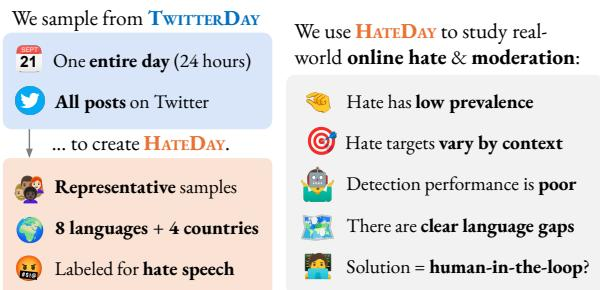  
Figure 1: HATEDAY consists of twelve annotated representative sets (N=20K each) randomly sampled from all tweets posted on September 21, 2022. The dataset covers eight languages (Arabic, English, French, German, Indonesian, Portuguese, Spanish, and Turkish) and four countries where English is the main language on Twitter (India, Kenya, Nigeria, and the United States).

First, the performance of hate speech detection systems in real-world social media settings remains largely unknown. Industry models are typically not publicly available, and platform transparency reports omit detailed performance metrics or present them in ways that can be misleading or difficult to interpret (Giansiracusa, 2021). Meanwhile, academic evaluations rely on biased datasets that diverge considerably from real-world distributions, especially regarding class imbalance and topic diversity (Nejadgholi and Kiritchenko, 2020). This raises concerns that reported performance may be substantially overestimated and not generalize well outside such controlled settings (Arango et al., 2019; Wiegand et al., 2019).

The second key limitation of academic research on automatic hate speech detection lies in its narrow language focus. Indeed, most available datasets and detection models have been developed for English (Poletto et al., 2021; Tonneau et al., 2024a). While such unequal resource allocation is likely to result in unequal performance across languages, the widespread use of customized datasets for evaluation hinders meaningful cross-lingual comparisons.

Finally, focusing on languages in hate speech detection can hide performance differences between countries sharing a language (Ghosh et al., 2021). Although recent work develops datasets based on geography rather than language (Maronikolakis et al., 2022; Castillo-lópez et al., 2023), crosscountry performance variations remain unclear. Addressing this limitation requires evaluation datasets providing a comparable evaluation setting across countries with a common language.

In this article, we address these three limitations by evaluating the performance of state-ofthe-art hate speech detection models on real-world social media data across multiple languages and countries. We introduce HATEDAY, a global Twitter dataset which consists of 240,000 tweets, randomly sampled from all tweets posted on September 21, 2022 and annotated for hate speech (Figure 1, left). Specifically, we sample 20,000 tweets each for eight widely used languages on Twitter: Arabic, English, French, German, Indonesian, Portuguese, Spanish, and Turkish. We also sample 20,000 tweets each for four English-speaking countries with a sizable Twitter presence: India, Kenya, Nigeria, and the United States.

Using HATEDAY, we provide insights on realworld online hate (Figure 1, right). We show that the prevalence and composition of hate vary significantly across languages and countries. We then evaluate publicly available hate speech detection models across this global landscape. Our findings reveal that detection performance is substantially overestimated when assessed on standard academic datasets and is strikingly low in real-world social media settings—especially for non-European languages. We identify several factors contributing to this poor performance, including models’ limited ability to distinguish hate from offensive speech, and a mismatch between the target categories prevalent in academic datasets and those prevalent in real-world discourse.

Given these results, we examine the feasibility of using public models for hate speech moderation. We argue that automatic moderation—where posts flagged as hateful are moderated without human oversight—is currently too error-prone to be a viable approach. In contrast, we find that humanin-the-loop systems, in which flagged content is reviewed by moderators, can achieve higher moderation rates across languages and countries, albeit at the cost of substantial human review.

In sum, our contributions are:

1. HATEDAY, the first global hate speech dataset representative of social media settings, composed of 240,000 annotated tweets covering eight languages and four countries1

2. a cross-lingual and cross-national comparison of hate prevalence and composition

3. an evaluation of real-world detection performance across languages and countries, along with a detailed analysis of the limitations of current detection models

4. an assessment of the feasibility of hate speech moderation using publicly available models, including a comparison of automatic and human-in-the-loop approaches

## 2 The HATEDAY Dataset

## 2.1 Data Collection

As a basis for creating HATEDAY, we use the TWITTERDAY dataset (Pfeffer et al., 2023), which contains all Twitter posts within a 24-hour period starting on September 21, 2022. This amounts to approximately 375 million tweets posted by 40 million users platform-wide.

We filter TWITTERDAY both at the language and country levels. At the language level, we focus on the eight most popular languages in the TWITTER-DAY dataset for which there exist hate speech detection resources (details in §A.1), namely Arabic, English, French, German, Indonesian, Portuguese, Spanish and Turkish. To assess differences between countries with a common language, we also filter at the country-level, focusing on four countries for which English is the main language on Twitter, namely India, Kenya, Nigeria, and the United States. We use the Google Geocoding API to infer user country location based on their selfprovided profile location, knowing this has limitations (Hecht et al., 2011). We drop retweets to focus on original content and randomly sample 20,000 tweets for each of the eight retained languages and each of the four countries, ensuring that each language-specific and country-specific sample is representative of real-world Twitter settings in that particular language or country. The HATEDAY dataset corresponds to the combination of all annotated random samples for each language and country, totaling 240,000 annotated tweets.

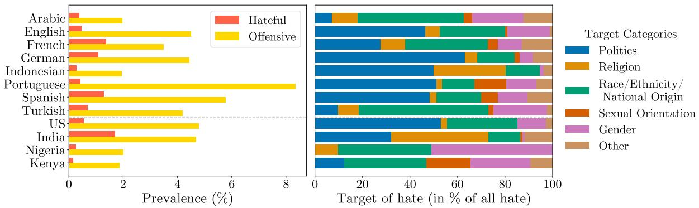  
Figure 2: Prevalence of harmful content (left) and targets of hate speech (right) in HATEDAY. The target category “Other” contains rare target labels such as “Caste”, “Age”, “Occupation”, “Disability” and “Social Class”.

## 2.2 Data Annotation

We recruit a team of 36 annotators, three per language or country. For languages that are spoken widely around the globe, such as English, Arabic or French, we maximize the diversity of annotator origins as much as possible (details in §B.1).

We follow a prescriptive approach to manage annotator subjectivity in our annotation task (Rottger et al., 2022) by instructing annotators to strictly adhere to extensive annotation guidelines that describe our taxonomy of hate speech (provided in §B.2). Following prior work (Davidson et al., 2017; Mathew et al., 2021), the annotation consists of assigning each tweet to one of three classes: (i) hateful, if it promotes violence or contains a direct attack, abuse or threat against an individual or a group based on the perceived belonging of a certain characteristic (e.g., gender, race), (ii) offensive, if it contains potentially objectionable language that is not hateful, including insults, threats, and posts containing profanity or swear words (Zampieri et al., 2019), or (iii) neutral if it is neither hateful nor offensive. For tweets labeled as hateful, we also ask annotators to specify the groups being targeted as a free-text label. We provide examples of tweets for each class in Table 1.

<table><tr><td>Class</td><td>Target Category</td><td>Examples</td><td>Split</td></tr><tr><td rowspan="5">Hateful</td><td>Politics</td><td>Greens are vermin</td><td>German</td></tr><tr><td>National Origin</td><td>Venezuelans are useless</td><td>Spanish</td></tr><tr><td>Gender</td><td>I hate women</td><td>Portuguese</td></tr><tr><td>Religion</td><td>Hunt these muslim b*stards</td><td>India</td></tr><tr><td>Sexual Orientation</td><td>F*ck these f*ggots</td><td>French</td></tr><tr><td>Offensive</td><td>n/a</td><td>Stop spewing rubbish, fool.</td><td>Nigeria</td></tr><tr><td>Neutral</td><td>n/a</td><td>Reunited by the mercy of God</td><td>Turkish</td></tr></table>

Table 1: Examples of tweets for each class and main target categories. Offensive tweets, by definition, have no target. English translations are displayed in italic.

For each language and country, we conduct a pilot annotation phase to train annotators on the task. Specifically, we have each annotator label 100 posts, sampled from a collection of all annotated hate speech datasets (Tonneau et al., 2024a), which have been open-sourced on Hugging Face. We repeat this task until the inter-annotator agreement, measured by Krippendorff’s α, reaches a threshold of 0.7. After completing the pilot, we then task each annotator with labeling the random sample of 20,000 tweets in their respective language or country. Each tweet is labeled by three annotators, and the final label is determined by a simple majority vote. Across all languages and countries, the three annotators agreed on 93.4% of all labeled tweets; two out of three agreed in a further 6.4% of cases, and all three disagreed in only 0.2% of cases.

## 2.3 Descriptive Statistics

Prevalence of harmful content We find that the prevalence of hate speech on Twitter on the day of analysis is very low, representing less than 2% of all posts across languages and countries, with an average prevalence of 0.7% (Figure 2, left). In contrast, offensive content is substantially more prevalent than hate speech across all considered languages and countries, ranging from 2.5 times more prevalent for French to 19 times more prevalent for Portuguese. We also find notable differences in the prevalence of hate speech between languages and countries. For instance, 1.0% of German tweets are hateful whereas only 0.3% of Indonesian tweets are hateful. We observe similar gaps at the country level, with the share of hateful posts being much higher in India—1.7%—compared to 0.2% in Kenya and 0.3% in Nigeria.

Main targets of hate speech We find that the most common targets of hate in HATEDAY are political as well as racial and gender groups (Figure 2, right). We also find notable differences across languages and countries. For instance, political hate speech is prevalent in English, German, Indonesian, Portuguese, and Spanish, as well as in the US national context, representing up to 66% of all hate in the German context. In contrast, it is less present in Turkish and Nigerian tweets, and not present at all in Arabic tweets. Also, religious hate speech represents 41% of all hate in India, mostly in the form of Islamophobia, whereas it is less prominent elsewhere and completely absent from the Kenyan sample. Finally, we note that some forms of hate speech are unique to specific contexts, such as casteism in India.

## 3 Experimental Setup

Across our experiments, we leverage the language and country-level representativeness of the HATE-DAY dataset to evaluate public hate speech detection models in real-world social media settings.

## 3.1 Models

We evaluate models that are either trained for the task of hate speech detection (supervised learning) or prompted for this task (zero-shot learning).

Supervised learning For each language and country, we identify and evaluate all hate speech detection models that are open-sourced on Hugging Face, and trained using supervised learning. In cases where there are more than five models, we limit our analysis to the five most downloaded models on Hugging Face at the time of analysis (August 2024). We provide the full list of open-source models that we evaluated in §D.1. Additionally, we include the Perspective API (Lees et al., 2022), a widely used toxic language detection system also based on supervised learning. Specifically, we use the API’s “Identity Attack” attribute, as it most closely aligns with our definition of hate speech.

Zero-shot learning We use Aya23 8B (Aryabumi et al., 2024) and Llama3.1 8B (Dubey et al., 2024) for zero-shot learning. We do so because Aya is designed to be multilingual, and Llama3.1 is one of the most capable open-source models available at the time of our analysis. We use small model sizes due to compute constraints. For the zero-shot prompt, see §D.2.

## 3.2 Evaluation

We evaluate models on the HATEDAY (HD) datasets to estimate real-world detection performance. For comparison, we also test models in two traditional evaluation settings, namely on academic hate speech datasets and functional tests.

Academic hate speech datasets (AD) We measure performance on academic hate speech datasets to understand how results from past work generalize to more realistic settings. We rely on supersets combining all existing hate speech datasets for all eight languages of interest (Tonneau et al., 2024a). Given that English hate speech datasets mostly originate from the US (Tonneau et al., 2024a), we use English hate speech datasets both for evaluating English- and US-centered models. In the absence of supersets for India, Nigeria and Kenya, we survey all existing datasets for each country and combine them to build the supersets (details in §C.2). We restrict the evaluation to a 10% random sample of all academic datasets for each language and country to limit inference costs (details in §C.1).

Functional tests (HC) We measure performance on functional tests to estimate the ability of models to handle known challenges in hate speech detection. We use HateCheck (Röttger et al., 2021, 2022), a suite of functional tests for hate speech detection models, which covers six of eight languages in HATEDAY, missing Indonesian and Turkish.

Evaluation metric We evaluate model performance using average precision, which corresponds to the area under the precision-recall curve, and is well suited when class imbalance is high.

## 4 Results

## 4.1 Detection Performance

We report the average precision of each model across the three aforementioned datasets, across languages (Table 2) and across countries (Table 3). We also provide results on individual open-source model performance in §E.2.

Performance across datasets Our most striking finding is that across the wide range of models, languages, and countries considered, detection performance is much lower on our representative HATE-DAY dataset (HD) than on academic hate speech datasets (AD) or functional tests (HC). Indeed, average precision is just 9.4% on HD, compared to 40% on AD and 87.2% on HC.

<table><tr><td></td><td colspan="2">Arabic</td><td colspan="2"></td><td colspan="2">English</td><td colspan="2"></td><td colspan="2">French</td><td colspan="2">German</td><td colspan="2"></td><td colspan="2">Indonesian</td><td colspan="2">Portuguese</td><td colspan="2">Spanish</td><td colspan="2"></td><td colspan="2">Turkish</td></tr><tr><td>Model Type</td><td>AD</td><td>HC</td><td>HD</td><td>AD</td><td>HC</td><td>HD</td><td>AD</td><td>HC</td><td>HD</td><td>AD</td><td>HC</td><td>HD</td><td>AD</td><td>HC</td><td>HD</td><td>AD</td><td>HC</td><td>HD</td><td>AD</td><td>HC</td><td>HD</td><td>AD</td><td>HC</td><td>HD</td></tr><tr><td>Llama 3.1</td><td>10</td><td>76.4</td><td>1.2</td><td>38.8</td><td>88.5</td><td>4.6</td><td>33.5</td><td>84.9</td><td>7.3</td><td>18.9</td><td>84.2</td><td>5.8</td><td>62.8</td><td></td><td>2.5</td><td>15.5</td><td>84.8</td><td>2.2</td><td>39.4</td><td>84.9</td><td>7.2</td><td>39.3</td><td></td><td>2.9</td></tr><tr><td>Aya 23</td><td>11.5</td><td>77.6</td><td>2</td><td>36.1</td><td>87.4</td><td>3.5</td><td>37.1</td><td>84</td><td>5.3</td><td>21.6</td><td>86</td><td>5.9</td><td>61.6</td><td></td><td>2.6</td><td>15.9</td><td>86.6</td><td>2.2</td><td>40.7</td><td>85.3</td><td>7.6</td><td>44.6</td><td></td><td>4.5</td></tr><tr><td>Best OS</td><td>25.8</td><td>76.9</td><td>5.8</td><td>38.2</td><td>82.2</td><td>9</td><td>35.7</td><td>89.9</td><td>16</td><td>64.3</td><td>97.2</td><td>19.3</td><td>90.2</td><td></td><td>3.5</td><td>18.7</td><td>85.8</td><td>3.1</td><td>54.9</td><td>82.3</td><td>11.6</td><td>32.1</td><td></td><td>1.9</td></tr><tr><td>Perspective</td><td>18.7</td><td>89.6</td><td>10.2</td><td>58.9</td><td>95.1</td><td>10.1</td><td>40.1</td><td>96.9</td><td>37.7</td><td>53.6</td><td>96</td><td>18.8</td><td>65.5</td><td></td><td>11.1</td><td>30.9</td><td>94.6</td><td>14.5</td><td>50.9</td><td>96</td><td>34.1</td><td>31.4</td><td></td><td>6.5*</td></tr></table>

Table 2: Model performance across languages and evaluation sets, as measured by average precision (%). We report performance on three evaluation sets: academic hate speech datasets (AD) combined for a given language, HateCheck functional tests (HC) and HATEDAY (HD) . HC does not cover Indonesian and Turkish. Asterisks indicate that the language of interest is not supported by the Perspective API.

Performance across model types We find that supervised learning consistently outperforms zeroshot learning across almost all combinations of language, country, and evaluation sets. Indeed, the best open-source model on HATEDAY has an average precision of 41.1% on average across all combinations of language or country and dataset, whereas Aya23 8B, which performs on par with Llama3.1 8B, scores 32.4% on average. Additionally, despite being originally developed to detect toxic rather than hateful content, we observe that the Perspective API (44.3% average precision on average) outperforms open-source hate speech detection models in all languages except German. At the country-level, open-source models perform best in Nigeria, but Perspective API has higher performance in the US and India. We did not find opensource supervised models to compare Perpective API to in the Kenyan context.

<table><tr><td rowspan="2">Model Type</td><td colspan="2">United States</td><td colspan="2">India</td><td colspan="2">Nigeria</td><td colspan="2">Kenya</td></tr><tr><td>AD</td><td>HD</td><td>AD</td><td>HD</td><td>AD</td><td>HD</td><td>AD</td><td>HD</td></tr><tr><td>Llama 3.1</td><td>38.8</td><td>4.9</td><td>50.9</td><td>13.4</td><td>32</td><td>2.6</td><td>24.3</td><td>1.5</td></tr><tr><td>Aya 23</td><td>36.1</td><td>4.7</td><td>52.7</td><td>10.4</td><td>30.7</td><td>1.6</td><td>23.9</td><td>0.8</td></tr><tr><td>Best OS Perspective</td><td>38.2 58.9</td><td>9.8 12.3</td><td>54.3 61.9</td><td>7.8 42.9</td><td>65.7 44.1</td><td>30.9 8.6</td><td>– 31.6</td><td>- 9.1</td></tr></table>

Table 3: Model performance across countries and evaluation sets, as measured by average precision (%). There are no open-source models specifically for Kenya.

Cross-lingual and geographic gaps We observe substantial performance differences in the real-world setting of HATEDAY across languages and countries. At the language level, average precision is higher for European languages—English, French, Spanish, Portuguese, and German—averaging 23.1%—than for non-European languages—Arabic, Indonesian, and Turkish—at 9.3% on average. At the country level, performance is highest on Indian tweets (42.9%), followed by Nigeria (30.9%), and lower in both the US (12.3%) and Kenya (9.1%).

## 4.2 Reasons for Low Performance

In the following, we conduct a more in-depth analysis into potential explanations for the poor hate speech detection performance as well as the crossgeographic performance gaps we observed in realworld settings in §4.1.

Low precision and recall As the average precision corresponds to the area under the precisionrecall curve, the same average precision may correspond to very different patterns in precision and recall. We therefore inspect the precision-recall curves of the best-performing models on HATE-DAY for each language and country (Figure 5 in the Appendix). We find that, while precision or recall may be higher depending on the context, both values remain very low and there are no situations where both values are above 50%, with the highest F1-score at 47% for India. This highlights the role of both false positives and negatives in the observed low performance. Next, we study the composition of these two types of errors.

Offensive false positives We find that offensive content constitutes a substantial share of the top of the hatefulness score distribution—32.3% of the top 50 (0.25%) scored tweets on average—for each language and country (Figure 3), thereby significantly hurting precision. For Arabic, English, Portuguese, and the US and Kenyan national contexts, offensive content even appears more frequently than hate speech at the very top of the score distribution. This problem is further aggravated by the fact that offensive content is more prevalent than hate speech (Figure 2). Indeed, we observe that as the prevalence ratio of offensive content to hate speech steadily increases, the share of offensive content at the top of the score distribution also gradually increases (Figure 7 in the Appendix), exacerbating the negative impact on precision.

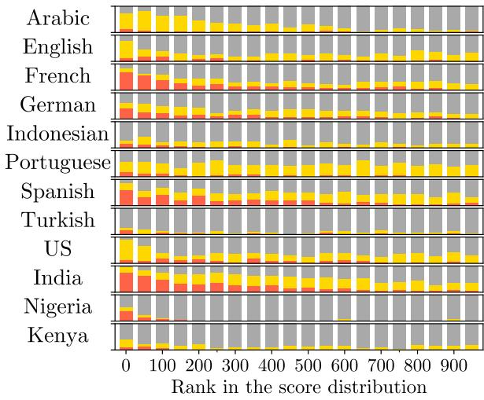  
Figure 3: Share of hateful offensive and neutral content in the top 5% scored tweets (N=1,000) in HATE-DAY for each language and country. We use the hatefulness score distribution of the best performing model on HATEDAY (Tables 2 and 3). The x-axis corresponds to the descending rank and each bar shows the distribution of content in a window of 50 tweets.

Qualitative analysis of false positives We further examine top-scored neutral tweets to identify other prominent features of false positives beyond offensiveness. We find that many such tweets contain mentions of hate speech (e.g., “was it the political scientist saying that Ukrainians are ‘subhumans’?”). We also find several cases of statements that are not hateful but would be with a few changes of letters (e.g., “emigration is a catastrophy”). Finally, we find that a substantial share of such tweets, usually replies, may be hateful but lack the context to conclude (e.g., “@USER illegal migrants, they say it themselves”).

Analysis of false negatives Next, we analyze false negatives, defined as hateful examples missing from the top 1% of the best model’s score distribution for each language and country. We first examine the targets of these tweets to compare their representation in false negatives to their overall prevalence in hate speech for each language or country. We find that politics and gender are overrepresented in false negatives, respectively in 10/12 and 7/12 of cases. Conversely, religion and race are underrepresented in 10/12 and 8/12 of cases. We also consider ambiguity, defining a hateful example as ambiguous if not all three annotators labeled it as hateful. We find that the share of ambiguous content is significantly higher in false negatives than in all hateful examples $( \mathrm { t } ( 1 1 ) = 3 . 7 6 ; p < 0 . 0 5 )$

Target academic focus and prevalence Motivated by the overrepresentation of certain targets in false negatives, we inspect the role of target-level academic focus, as a proxy for the distribution of hate targets seen by the model during training, on performance. We first examine differences at the target level between the prevalence of each target in academic datasets and its prevalence in HATE-DAY across languages and countries. We use data from a recent survey which documents the share of all hate speech datasets by target category and language (Yu et al., 2024). In the absence of data at the country level, we categorize all surveyed datasets in terms of the target focus for each country of interest (details in §C.2.2). For each language and country, we provide a comparison between the target-level shares of (i) all hate speech datasets and of (ii) all hate speech in HATEDAY in Figure 6 in the Appendix. Our most notable finding is that political hate speech is much more prevalent in HATEDAY for two-thirds of the 12 languages or countries than in academic datasets. To a lesser extent, we also find that gender-based hate is often more prevalent in HATEDAY than is studied while religion-based hate is less prevalent than is studied in existing hate speech datasets.

Target alignment and performance Finally, we explore the impact of the alignment between the target focus of academic work and the target prevalence in real-world social media data on performance. We estimate such alignment for each language and country by computing the cosine similarity between the vectors containing the share of all hate speech datasets by target focus and the share of all hate speech in HATEDAY by target. We find a strong and significant positive correlation between this alignment and detection performance (Pearson’s r: 0.76, p = 0.003). This indicates that the better hate speech detection resources reflect hate target coverage in real-world social media data for a given language or country, the higher the detection performance. In contrast, we do not find a significant correlation between the amount of annotated datapoints in the aforementioned supersets and performance on HATEDAY (Pearson’s r: -0.47, $p = 0 . 1 2 7 )$ . This indicates that the amount of detection resources may play a smaller role in crosslingual and geographic performance differences compared to the alignment between academic target focus and real-world target prevalence.

## 4.3 Feasibility of Hate Speech Moderation

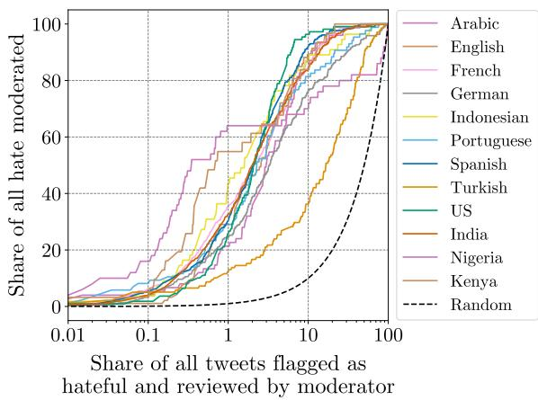  
Figure 4: Cost-recall tradeoff in human-in-the-loop moderation. Share of all HATEDAY tweets flagged as hateful and reviewed by moderators (%) versus share of all moderated hate in HATEDAY (%). We use the best model on HATEDAY for each language and country (Tables 2 and 3). The dashed line indicates performance of a model that flags tweets as hateful at random.

Most social media platforms prohibit hate speech (Singhal et al., 2023) and have done so since their inception (Gillespie, 2018). In light of our poor performance results (§4.1), we investigate the feasibility of hate speech moderation using publicly available hate speech detection models. Given the demonstrated low performance of hate speech detection in real-world social media settings, automatic moderation, whereby content flagged as hateful by a detection model is directly moderated, may be too error-prone. We therefore consider human-in-the-loop moderation, which is a more realistic approach used by large social media platforms (Avadhanula et al., 2022) whereby content likely to be hateful is flagged by detection models for review by human moderators. We study the trade-off between the amount of human reviewing required and the corresponding share of all hate successfully moderated (Figure 4, details in §E.3).

We find that successfully moderating a large share of all hateful content (>80%) using the best publicly available detection models would require human review of at least 10% of all daily tweets. For such a review workload, the total share of hate successfully moderated varies between 70% and 90% for most languages or countries, apart from Turkish where this share is only 40%. 10% of all daily tweets may represent a massive amount of posts depending on the context and ranges from 19,300 tweets for Kenya to 5.1 million for English.

A smaller share of human review would lead to most hate being left unmoderated: when flagging and reviewing 1% of all tweets posted in a given day, only 20-40% of all hate is moderated for most languages and countries.

## 5 Discussion

Hate speech prevalence We find that the proportion of hate speech relative to all social media content is very low, which is in line with past work (Gagliardone et al., 2016; Mondal et al., 2017; Park et al., 2022). This contrasts with recent survey results where two thirds of social media users report that they often encounter hate speech in their feeds (UNESCO, 2023) and points to the potential role of recommendation algorithms in amplifying harmful content (Milli et al., 2025).

Performance overestimation We find that traditional evaluation of detection models, on academic datasets and functional tests, largely overestimates performance in randomly drawn samples of real-world social media data. Performance on realworld data is very low, especially for non-European languages. While past work has discussed the risk of such overestimation (Arango et al., 2019), due to the biased nature of hate speech datasets (Wiegand et al., 2019; Nejadgholi and Kiritchenko, 2020), and quantified such risk in the Nigerian Twitter context (Tonneau et al., 2024b), we provide evidence of low and overestimated performance across many more linguistic and national contexts. Moreover, our results highlight the need to evaluate NLP tools in realistic settings, especially where human harm might arise. This applies more broadly to the detection of harmful content on social media, such as misinformation (Thorne et al., 2018; Magomere et al., 2025), as well as the evaluation of the bias and safety of generative large language models (Ibrahim et al., 2024; Lum et al., 2024; Röttger et al., 2024, 2025), both of which have relied so far on non-representative benchmarks for evaluation.

Supervised beats zero-shot Despite growing enthusiasm for decoder-based large language models (LLMs), we find that they underperform supervised learning for hate speech detection—echoing findings from prior work (Nozza, 2021). This also reinforces the conclusions of a recent survey of NLP practitioners, which highlights the continued importance of annotated data for maximizing model performance (Romberg et al., 2025).

Dominance of Perspective API We find that the Perspective API often outperforms other models in hate speech detection across languages, contradicting existing evaluations on traditional hate speech datasets, which showed that Perspective is outperformed by academic hate speech classi fiers (Wich et al., 2022; OFCOM, 2024). We attribute such dominance to the fact that Perspective is optimized for real-world performance and generalizability to unseen data (Lees et al., 2022), contrary to traditional hate speech detection models developed in academia. We also note that the Perspective API is periodically updated and that performance may have improved since the evaluations conducted in past work (Pozzobon et al., 2023). Still, we find that overall performance remains low, which echoes past evaluations of Perspective’s performance and biases (Nogara et al., 2023; Hartmann et al., 2025). Also, we observe that Perspective’s dominance does not always hold at the country level, with the open-source hate speech classifier outperforming Perspective in the case of Nigeria. This may be due to conceptual alignment: the HATEDAY annotation guidelines were partly based on the same definition and instructions used to train the Nigerian classifier (Tonneau et al., 2024b). This also highlights the limits of the language-level approach in developing Perspective and more generally hate speech classifiers (Tonneau et al., 2024a), which may not be tailored to national contexts where non-US English and code mixing is prevalent, as already demonstrated in past work (Ghosh et al., 2021; Haber et al., 2023).

The problem of offensive language We find that a major reason for the poor performance of hate speech classifiers on HATEDAY is the high prevalence of offensive content at the top of the hate score distribution, which reduces precision. While offensive content differs from hate speech because it does not target an individual or a group based on the perceived belonging of a particular characteristic (e.g., gender, race), it shares lexical features such as the use of swear words and profanities. These similarities likely explain the high hate scores given by classifiers to offensive content. While prior work initially documented this issue (Davidson et al., 2017), our findings demonstrate its heightened relevance in real-world social media settings, as it is aggravated by the substantially higher prevalence of offensive content compared to hate speech.

Unseen targets of hate Our findings reveal a misalignment between the targets of hate speech studied in academic work and their real-world prevalence in HATEDAY. Notably, political-related hate is understudied in academic work compared to its prevalence in HATEDAY, expanding past work that points to a low representation of certain targets in hate speech detection resources (Yu et al., 2024). We also find that the alignment between academic target coverage and real-world target prevalence has a significant positive correlation with detection performance in HATEDAY, contrary to the raw amount of detection resources. Improving such alignment, particularly for underrepresented hate types such as political-based hate, is therefore crucial for enhancing real-world detection performance. In the process, political criticism and hate speech must be clearly differentiated to avoid accusations of politically biased moderation (Vogels et al., 2020) and hate speech laws being misused for political censorship (Strossen, 2018).

Cross-geographic disparities Consistent with prior research (Röttger et al., 2022), we find that detection performance is generally lower for non-European languages, such as Arabic, Turkish and Indonesian. Our analysis extends this finding by offering one explanation mentioned in the past paragraph: performance disparities may stem less from varying amounts of annotated training data and more from a misalignment between the target categories prevalent in academic datasets and those that are prevalent in real-world content. This insight may also explain counterintuitive results such as the surprisingly low real-world performance for the English and US contexts and higher performance for India, despite English and the US having the most annotated resources (Tonneau et al., 2024a). In real-world English-speaking and US contexts, politically motivated hate is among the most prevalent forms of hate speech; yet, it is underrepresented in US-dominated English academic datasets. By contrast, in the Indian context, there is greater alignment between the types of hate emphasized in academic datasets and those commonly encountered in practice, which may help explain the observed performance differences. Furthermore, the overall prevalence of hate speech is significantly lower in English and US data (0.4% and 0.5% of posts, respectively) compared to Indian data (1.7%), suggesting that our estimate of model performance in English and US settings may be less robust.

Other challenges for hate speech detection We present further challenges for hate speech detection that have partly been identified in past work: First, the difficulty of distinguishing between the use and the mention of hate speech, for instance when slurs or hateful terms are quoted as part of counter speech or educational content (Röttger et al., 2021; Gligoric et al., 2024; Jin et al., 2024). Second, the inability of classifiers to capture subtle differences in wording and phrasing that can make a non-hateful statement become hateful (Sap et al., 2019). Third, the lack of context in many posts— especially replies—poses challenges to classification and calls for more contextualized hate speech detection (Pérez et al., 2023). Our analysis underlines the relevance of these challenges, given their prevalence in real-world settings, and highlights the need to address them as a priority.

Implications for hate speech moderation Our results indicate that fully automated hate speech moderation using public hate speech detection mod els is undesirable. Indeed, low real-world detection performance renders fully automated moderation ineffective and potentially harmful, as it fails to protect users from hate speech while likely removing non-hateful content, such as counter-speech. This reinforces concerns raised in earlier theoretical work (Gorwa et al., 2020) and complements past empirical findings highlighting the limitations of hate speech detection research for content moderation (Ye et al., 2023; Zheng et al., 2024). We also show that human-in-the-loop moderation based on public detection models can effectively moderate a large share of hate speech across our languages and countries of interest but that this implies having humans review a non-trivial share of all daily content, extending past results for the Nigerian Twitter context (Tonneau et al., 2024b) to more languages and countries. Beyond financial costs, the required scale of human review also raises concerns about potential reviewer harm from repeated exposure to harmful content (Roberts, 2016; Kirk et al., 2022). Our results support the claim that detection alone will not solve the hate speech problem (Parker and Ruths, 2023) and call for complementary solutions. These include preventive approaches that aim to reshape speech norms and have proven effective in curbing hate speech, for instance by prompting users to reconsider harmful posts (Katsaros et al., 2022) or by confronting hate speech with counter speech (Munger, 2017; Hangartner et al., 2021).

## 6 Conclusion

In this article, we introduced HATEDAY, the first global hate speech dataset representative of realworld social media settings. Using HATEDAY, we showed that evaluating hate speech detection models on standard academic datasets substantially overestimates their real-world performance, which is very low. We explored the implications of this finding for content moderation, concluding that relying on public detection models for automated moderation is currently ill-advised due to their high error rate. Accordingly, improving real-world model performance should be a key focus of future research. We also found that human-in-theloop moderation can be more accurate, but only if a substantial portion of daily content is manually reviewed—raising important questions about the feasibility and desirability of such an approach at scale, which merits further investigation. Ultimately, we urge researchers to evaluate future detection models within the real-world contexts where they are likely to be deployed. We also call on platforms to provide greater transparency about how their detection systems perform in real social media environments, to better assess moderation effectiveness. We hope that our dataset and findings will drive progress in both areas and contribute to addressing this pressing challenge.

## Limitations

Dataset Low number ofpositives: The random samples in HATEDAY used to evaluate hate speech detection in real-world settings contains a low number of hateful examples, ranging from 31 for Kenya to 430 for India. This low number is linked to the very low prevalence of hate speech in our dataset as well as our budget constraint, which impeded us from further expanding the annotation effort. While statistically significant, we acknowledge that our performance results on HATEDAY are necessarily more uncertain, as illustrated by the larger confidence intervals in Tables 5 and 6.

Limited generalizability to other platforms, timeframes, and linguistic domains: The entirety of our dataset was sampled from one single social media platform for a very bounded timeframe, namely 24 hours. This limits the generalizability of our performance results to data from other social media platforms and covering other timespans.

Online hate speech is multimodal: Our work focuses only on text-based hate to limit annotation costs, but we acknowledge that online hate speech is multimodal and that a non-trivial share of this phenomenon, which our analysis necessarily misses, is expressed through images, sounds, or videos (Botelho et al., 2021; Hee et al., 2024).

Limits to representativeness: The tools used to stratify the TWITTERDAY dataset into language or country-specific sets, namely language detection and user location inference, are imperfect (Hecht et al., 2011; Graham et al., 2014; Jurgens et al., 2017). This implies that the representativeness of HATEDAY may not be perfect, with language or country sets containing some posts in other languages or from other countries. We acknowledge this limitation, but argue that HATEDAY remains the most representative samples of Twitter possible with current stratification tools.

Moderation prior to data collection: Our analysis assumes that the hateful content in HATEDAY is representative of all hateful content posted on Twitter on the day of analysis. However, we recognize that some instances of hate speech may have been moderated by Twitter before the data was collected, making our estimates a lower bound. Nonetheless, since the posts were collected 10 minutes after they were posted (Pfeffer et al., 2023), we believe that the enforcement of moderation in such a short timeframe is likely to be minimal.

Experiments Other prompts could lead to different results: We craft a prompt using the terms “hateful” or “non-hateful” (see D.2 for details), which exhibit good performance in past research for hate speech detection using zero-shot learning (Plazadel arco et al., 2023). We do not test other prompts and acknowledge that using other prompts may have an impact on classification performance.

Moderation analysis We acknowledge that our analysis on the feasibility of moderation is limited in the sense that we operate with publicly available resources while platforms also rely on private models and data which may improve moderation performance for a given cost.

Private models While we evaluate publicly available detection models, we are aware that platforms have developed their own detection models, which are kept private and may perform better.

Private data Platforms also rely on several data sources to develop their moderation models, such as the user history, user-graph, conversational context, which we do not have access to. While we consider only public hate speech detection algorithms as a way to flag hate speech in the flow of social media content, we are also aware that platforms use other flagging mechanisms based on private data, such as user reporting or banned word lists, which may increase the share of all hate moderated for a given annotation cost. Finally, the metric platforms aim to reduce is the view count of harmful content such as hate speech, which is arguably more relevant than the sheer prevalence of it from a harm perspective. Unfortunately, such view data is unavailable to us for the considered timeframe.

## Ethical Considerations

Annotator wellbeing Annotators were provided with clear information regarding the nature of the annotation task before they began their work. They were made aware that they could stop the task at any time if necessary.

Data privacy To protect the identity of hateful users and their victims, we anonymize all tweets in our dataset upon release, replacing all usernames by a fixed token @USER.

Intended use The intended use of the HATEDAY dataset is for research purposes only.

## Acknowledgements

We thank the annotators for their excellent research assistance. The study was supported by funding from the United Kingdom’s Foreign Commonwealth and Development Office (FCDO), the World Bank’s Research Support Budget, and the Gates Foundation (INV057844). This work was also supported in part through the NYU IT High Performance Computing resources, services, and staff expertise. The findings, interpretations, and conclusions expressed in this article are entirely those of the authors. They do not necessarily represent the views of the International Bank for Reconstruction and Development/World Bank and its affiliated organizations or those of the Executive Directors of the World Bank or the governments they represent. Scott Hale was supported by the ESRC Digital Good Network (grant reference ES/X502352/1). Paul Röttger is a member of the Data and Marketing Insights research unit of the Bocconi Institute for Data Science and Analysis, and is supported by a MUR FARE 2020 initiative under grant agreement Prot. R20YSMBZ8S (INDOMITA).

## References

Ibrahim Ahmed, Mostafa Abbas, Rany Hatem, Andrew Ihab, and Mohamed Waleed Fahkr. 2022. Finetuning arabic pre-trained transformer models for egyptian-arabic dialect offensive language and hate speech detection and classification. In 2022 20th International Conference on Language Engineering (ESOLEC), volume 20, pages 170–174.

Saminu Mohammad Aliyu, Gregory Maksha Wajiga, Muhammad Murtala, Shamsuddeen Hassan Muhammad, Idris Abdulmumin, and Ibrahim Said Ahmad. 2022. Herdphobia: A dataset for hate speech against fulani in nigeria. arXiv preprint arXiv:2211.15262.

Sai Saket Aluru, Binny Mathew, Punyajoy Saha, and Animesh Mukherjee. 2020. Deep learning models for multilingual hate speech detection. arXiv preprint arXiv:2004.06465.

Aymé Arango, Jorge Pérez, and Barbara Poblete. 2019. Hate speech detection is not as easy as you may think: A closer look at model validation. In Proceedings of the 42nd international acm sigir conference on research and development in information retrieval, pages 45–54.

Viraat Aryabumi, John Dang, Dwarak Talupuru, Saurabh Dash, David Cairuz, Hangyu Lin, Bharat Venkitesh, Madeline Smith, Kelly Marchisio, Sebastian Ruder, et al. 2024. Aya 23: Open weight releases to further multilingual progress. arXiv preprint arXiv:2405.15032.

Vashist Avadhanula, Omar Abdul Baki, Hamsa Bastani, Osbert Bastani, Caner Gocmen, Daniel Haimovich, Darren Hwang, Dima Karamshuk, Thomas Leeper, Jiayuan Ma, et al. 2022. Bandits for online calibration: An application to content moderation on social media platforms. arXiv preprint arXiv:2211.06516.

Mohit Bhardwaj, Md Shad Akhtar, Asif Ekbal, Amitava Das, and Tanmoy Chakraborty. 2020. Hostility detection dataset in hindi. arXiv preprint arXiv:2011.03588.

Aditya Bohra, Deepanshu Vijay, Vinay Singh, Syed Sarfaraz Akhtar, and Manish Shrivastava. 2018. A dataset of Hindi-English code-mixed social media text for hate speech detection. In Proceedings of the Second Workshop on Computational Modeling ofPeople’s Opinions, Personality, and Emotions in Social Media, pages 36–41, New Orleans, Louisiana, USA. Association for Computational Linguistics.

Austin Botelho, Scott Hale, and Bertie Vidgen. 2021. Deciphering implicit hate: Evaluating automated detection algorithms for multimodal hate. In Findings of the Association for Computational Linguistics: ACL-IJCNLP 2021, pages 1896–1907, Online. Association for Computational Linguistics.

Galo Castillo-lópez, Arij Riabi, and Djamé Seddah. 2023. Analyzing zero-shot transfer scenarios across Spanish variants for hate speech detection. In Tenth

Workshop on NLPfor Similar Languages, Varieties and Dialects (VarDial 2023), pages 1–13, Dubrovnik, Croatia. Association for Computational Linguistics.

Mithun Das, Somnath Banerjee, and Animesh Mukherjee. 2022. Data bootstrapping approaches to improve low resource abusive language detection for indic languages. arXiv preprint arXiv:2204.12543.

Thomas Davidson, Dana Warmsley, Michael Macy, and Ingmar Weber. 2017. Automated hate speech detection and the problem of offensive language. Eleventh International AAAI Conference on Web and Social Media, 11(1).

Abhimanyu Dubey, Abhinav Jauhri, Abhinav Pandey, Abhishek Kadian, Ahmad Al-Dahle, Aiesha Letman, Akhil Mathur, Alan Schelten, Amy Yang, Angela Fan, et al. 2024. The llama 3 herd of models. arXiv preprint arXiv:2407.21783.

Iginio Gagliardone, Matti Pohjonen, Zenebe Beyene, Abdissa Zerai, Gerawork Aynekulu, Mesfin Bekalu, Jonathan Bright, Mulatu Alemayehu Moges, Michael Seifu, Nicole Stremlau, et al. 2016. Mechachal: Online debates and elections in ethiopia-from hate speech to engagement in social media. Available at SSRN 2831369.

Sayan Ghosh, Dylan Baker, David Jurgens, and Vinodkumar Prabhakaran. 2021. Detecting crossgeographic biases in toxicity modeling on social media. In Proceedings of the Seventh Workshop on Noisy User-generated Text (W-NUT 2021), pages 313–328, Online. Association for Computational Linguistics.

Noah Giansiracusa. 2021. Facebook uses deceptive math to hide its hate speech problem. Wired.

Tarleton Gillespie. 2018. Custodians of the Internet: Platforms, content moderation, and the hidden decisions that shape social media. Yale University Press.

Kristina Gligoric, Myra Cheng, Lucia Zheng, Esin Durmus, and Dan Jurafsky. 2024. NLP systems that can’t tell use from mention censor counterspeech, but teaching the distinction helps. In Proceedings of the 2024 Conference of the North American Chapter ofthe Associationfor Computational Linguistics: Human Language Technologies (Volume 1: Long Papers), pages 5942–5959, Mexico City, Mexico. Association for Computational Linguistics.

Janis Goldzycher, Paul Röttger, and Gerold Schneider. 2024. Improving adversarial data collection by supporting annotators: Lessons from GAHD, a German hate speech dataset. In Proceedings of the 2024 Conference of the North American Chapter of the Associationfor Computational Linguistics: Human Language Technologies (Volume 1: Long Papers), pages 4405–4424, Mexico City, Mexico. Association for Computational Linguistics.

Robert Gorwa, Reuben Binns, and Christian Katzenbach. 2020. Algorithmic content moderation: Technical and political challenges in the automation of platform governance. Big Data & Society, 7(1):2053951719897945.

Mark Graham, Scott A Hale, and Devin Gaffney. 2014. Where in the world are you? geolocation and language identification in twitter. The Professional Geographer, 66(4):568–578.

Janosch Haber, Bertie Vidgen, Matthew Chapman, Vibhor Agarwal, Roy Ka-Wei Lee, Yong Keong Yap, and Paul Röttger. 2023. Improving the detection of multilingual online attacks with rich social media data from Singapore. In Proceedings of the 61st Annual Meeting of the Association for Computational Linguistics (Volume 1: Long Papers), pages 12705– 12721, Toronto, Canada. Association for Computational Linguistics.

Dominik Hangartner, Gloria Gennaro, Sary Alasiri, Nicholas Bahrich, Alexandra Bornhoft, Joseph Boucher, Buket Buse Demirci, Laurenz Derksen, Aldo Hall, Matthias Jochum, et al. 2021. Empathy-based counterspeech can reduce racist hate speech in a social media field experiment. Proceedings of the National Academy of Sciences, 118(50):e2116310118.

David Hartmann, Amin Oueslati, Dimitri Staufer, Lena Pohlmann, Simon Munzert, and Hendrik Heuer. 2025. Lost in moderation: How commercial content moderation apis over- and under-moderate group-targeted hate speech and linguistic variations. In Proceedings of the 2025 CHI Conference on Human Factors in Computing Systems, CHI ’25, New York, NY, USA. Association for Computing Machinery.

Brent Hecht, Lichan Hong, Bongwon Suh, and Ed H Chi. 2011. Tweets from justin bieber’s heart: the dynamics of the location field in user profiles. In Proceedings of the SIGCHI conference on human factors in computing systems, pages 237–246.

Ming Shan Hee, Shivam Sharma, Rui Cao, Palash Nandi, Preslav Nakov, Tanmoy Chakraborty, and Roy Ka-Wei Lee. 2024. Recent advances in hate speech moderation: Multimodality and the role of large models. arXiv preprint arXiv:2401.16727.

Lujain Ibrahim, Saffron Huang, Lama Ahmad, and Markus Anderljung. 2024. Beyond static ai evaluations: advancing human interaction evaluations for llm harms and risks. arXiv preprint arXiv:2405.10632.

Comfort Ilevbare, Jesujoba Alabi, David Ifeoluwa Adelani, Firdous Bakare, Oluwatoyin Abiola, and Oluwaseyi Adeyemo. 2024. EkoHate: Abusive language and hate speech detection for code-switched political discussions on Nigerian Twitter. In Proceedings ofthe 8th Workshop on Online Abuse and Harms (WOAH 2024), pages 28–37, Mexico City, Mexico. Association for Computational Linguistics.

Farhan Ahmad Jafri, Mohammad Aman Siddiqui, Surendrabikram Thapa, Kritesh Rauniyar, Usman Naseem, and Imran Razzak. 2023. Uncovering political hate speech during indian election campaign: A new low-resource dataset and baselines. arXiv preprint arXiv:2306.14764.

Yiping Jin, Leo Wanner, and Aneesh Moideen Koya. 2024. Disentangling hate across target identities. arXiv preprint arXiv:2410.10332.

David Jurgens, Yulia Tsvetkov, and Dan Jurafsky. 2017. Incorporating dialectal variability for socially equitable language identification. In Proceedings ofthe 55th Annual Meeting of the Association for Computational Linguistics (Volume 2: Short Papers), pages 51–57, Vancouver, Canada. Association for Computational Linguistics.

Matthew Katsaros, Kathy Yang, and Lauren Fratamico. 2022. Reconsidering tweets: Intervening during tweet creation decreases offensive content. In Proceedings of the International AAAI Conference on Web and Social Media, volume 16, pages 477–487.

Hannah Kirk, Abeba Birhane, Bertie Vidgen, and Leon Derczynski. 2022. Handling and presenting harmful text in NLP research. In Findings of the Association for Computational Linguistics: EMNLP 2022, pages 497–510, Abu Dhabi, United Arab Emirates. Association for Computational Linguistics.

Petra Kralj Novak, Teresa Scantamburlo, Andraž Pelicon, Matteo Cinelli, Igor Mozetic, and Fabiana Zollo.ˇ 2022. Handling disagreement in hate speech modelling. In International Conference on Information Processing and Management of Uncertainty in Knowledge-Based Systems, pages 681–695. Springer.

Alyssa Lees, Vinh Q Tran, Yi Tay, Jeffrey Sorensen, Jai Gupta, Donald Metzler, and Lucy Vasserman. 2022. A new generation of perspective api: Efficient multilingual character-level transformers. In Proceedings of the 28th ACM SIGKDD conference on knowledge discovery and data mining, pages 3197–3207.

Kristian Lum, Jacy Reese Anthis, Chirag Nagpal, and Alexander D’Amour. 2024. Bias in language models: Beyond trick tests and toward ruted evaluation. arXiv preprint arXiv:2402.12649.

Jabez Magomere, Emanuele La Malfa, Manuel Tonneau, Ashkan Kazemi, and Scott Hale. 2025. When claims evolve: Evaluating and enhancing the robustness of embedding models against misinformation edits. arXiv preprint arXiv:2503.03417.

Thomas Mandl, Sandip Modha, Prasenjit Majumder, Daksh Patel, Mohana Dave, Chintak Mandlia, and Aditya Patel. 2019. Overview of the hasoc track at fire 2019: Hate speech and offensive content identification in indo-european languages. In Proceedings of the 11th annual meeting of the Forum for Information Retrieval Evaluation, pages 14–17.

Antonis Maronikolakis, Axel Wisiorek, Leah Nann, Haris Jabbar, Sahana Udupa, and Hinrich Schuetze. 2022. Listening to affected communities to define extreme speech: Dataset and experiments. In Findings of the Association for Computational Linguistics: ACL 2022, pages 1089–1104, Dublin, Ireland. Association for Computational Linguistics.

Binny Mathew, Punyajoy Saha, Seid Muhie Yimam, Chris Biemann, Pawan Goyal, and Animesh Mukherjee. 2021. HateXplain: A benchmark dataset for explainable hate speech detection. Proceedings of the AAAI Conference on Artificial Intelligence, 35(17):14867–14875.

Puneet Mathur, Ramit Sawhney, Meghna Ayyar, and Rajiv Shah. 2018. Did you offend me? classification of offensive tweets in Hinglish language. In Proceedings ofthe 2nd Workshop on Abusive Language Online (ALW2), pages 138–148, Brussels, Belgium. Association for Computational Linguistics.

Smitha Milli, Micah Carroll, Yike Wang, Sashrika Pandey, Sebastian Zhao, and Anca D Dragan. 2025. Engagement, user satisfaction, and the amplification of divisive content on social media. PNAS Nexus, 4(3):pgaf062.

Mainack Mondal, Leandro Araújo Silva, and Fabrício Benevenuto. 2017. A measurement study of hate speech in social media. In Proceedings of the 28th ACM conference on Hypertext and Social Media, pages 85–94.

Karsten Müller and Carlo Schwarz. 2021. Fanning the flames of hate: Social media and hate crime. Journal ofthe European Economic Association, 19(4):2131– 2167.

Kevin Munger. 2017. Tweetment effects on the tweeted: Experimentally reducing racist harassment. Political Behavior, 39:629–649.

Joseph Nda Ndabula, Oyenike Mary Olanrewaju, and Faith O Echobu. 2023. Detection of hate speech code mix involving english and other nigerian languages. Journal of Information Systems and Informatics, 5(4):1416–1431.

Isar Nejadgholi and Svetlana Kiritchenko. 2020. On cross-dataset generalization in automatic detection of online abuse. In Proceedings ofthe Fourth Workshop on Online Abuse and Harms, pages 173–183, Online. Association for Computational Linguistics.

Gianluca Nogara, Francesco Pierri, Stefano Cresci, Luca Luceri, Petter Törnberg, and Silvia Giordano. 2023. Toxic bias: Perspective api misreads german as more toxic. arXiv preprint arXiv:2312.12651.

Debora Nozza. 2021. Exposing the limits of zero-shot cross-lingual hate speech detection. In Proceedings of the 59th Annual Meeting of the Association for Computational Linguistics and the 11th International Joint Conference on Natural Language Processing (Volume 2: Short Papers), pages 907–914, Online. Association for Computational Linguistics.

OFCOM. 2024. Evaluation in online safety: a discussion of hate speech classification and safety measures. Technical report, OFCOM.

Edward Ombui, Lawrence Muchemi, and Peter Wagacha. 2021. Building and annotating a codeswitched hate speech corpora. International Journal of Information Technology and Computer Science (IJITCS), 3:33–52.

Joon Sung Park, Joseph Seering, and Michael S Bernstein. 2022. Measuring the prevalence of anti-social behavior in online communities. Proceedings ofthe ACM on Human-Computer Interaction, 6(CSCW2):1– 29.

Sara Parker and Derek Ruths. 2023. Is hate speech detection the solution the world wants? Proceedings of the National Academy of Sciences, 120(10):e2209384120.

Juan Manuel Pérez, Franco M Luque, Demian Zayat, Martín Kondratzky, Agustín Moro, Pablo Santiago Serrati, Joaquín Zajac, Paula Miguel, Natalia Debandi, Agustín Gravano, et al. 2023. Assessing the impact of contextual information in hate speech detection. IEEE Access, 11:30575–30590.

Juergen Pfeffer, Daniel Matter, Kokil Jaidka, Onur Varol, Afra Mashhadi, Jana Lasser, Dennis Assenmacher, Siqi Wu, Diyi Yang, Cornelia Brantner, et al. 2023. Just another day on twitter: a complete 24 hours of twitter data. In Proceedings of the international AAAI conference on web and social media, volume 17, pages 1073–1081.

Flor Miriam Plaza-del arco, Debora Nozza, and Dirk Hovy. 2023. Respectful or toxic? using zero-shot learning with language models to detect hate speech. In The 7th Workshop on Online Abuse and Harms (WOAH), pages 60–68, Toronto, Canada. Association for Computational Linguistics.

Fabio Poletto, Valerio Basile, Manuela Sanguinetti, Cristina Bosco, and Viviana Patti. 2021. Resources and benchmark corpora for hate speech detection: a systematic review. Language Resources and Evaluation, 55:477–523.

Luiza Pozzobon, Beyza Ermis, Patrick Lewis, and Sara Hooker. 2023. On the challenges of using black-box APIs for toxicity evaluation in research. In Proceedings of the 2023 Conference on Empirical Methods in Natural Language Processing, pages 7595–7609, Singapore. Association for Computational Linguistics.

Juan Manuel Pérez, Juan Carlos Giudici, and Franco Luque. 2021. pysentimiento: A python toolkit for sentiment analysis and socialnlp tasks.

Sarah T Roberts. 2016. Commercial content moderation: Digital laborers’ dirty work. In The Intersectional Internet: Race, Sex, Class and Culture Online, chapter 8. Peter Lang Publishing.

Julia Romberg, Christopher Schröder, Julius Gonsior, Katrin Tomanek, and Fredrik Olsson. 2025. Have llms made active learning obsolete? surveying the nlp community. arXiv preprint arXiv:2503.09701.

Paul Röttger, Musashi Hinck, Valentin Hofmann, Kobi Hackenburg, Valentina Pyatkin, Faeze Brahman, and Dirk Hovy. 2025. Issuebench: Millions of realistic prompts for measuring issue bias in llm writing assistance. arXiv preprint arXiv:2502.08395.

Paul Röttger, Valentin Hofmann, Valentina Pyatkin, Musashi Hinck, Hannah Kirk, Hinrich Schuetze, and Dirk Hovy. 2024. Political compass or spinning arrow? towards more meaningful evaluations for values and opinions in large language models. In Proceedings ofthe 62nd Annual Meeting ofthe Association for Computational Linguistics (Volume 1: Long Papers), pages 15295–15311, Bangkok, Thailand. Association for Computational Linguistics.

Paul Röttger, Haitham Seelawi, Debora Nozza, Zeerak Talat, and Bertie Vidgen. 2022. Multilingual Hate-Check: Functional tests for multilingual hate speech detection models. In Proceedings ofthe Sixth Workshop on Online Abuse and Harms (WOAH), pages 154–169, Seattle, Washington (Hybrid). Association for Computational Linguistics.

Paul Rottger, Bertie Vidgen, Dirk Hovy, and Janet Pierrehumbert. 2022. Two contrasting data annotation paradigms for subjective NLP tasks. In Proceedings ofthe 2022 Conference ofthe North American Chapter of the Association for Computational Linguistics: Human Language Technologies, pages 175–190, Seattle, United States. Association for Computational Linguistics.

Paul Röttger, Bertie Vidgen, Dong Nguyen, Zeerak Waseem, Helen Margetts, and Janet Pierrehumbert. 2021. HateCheck: Functional tests for hate speech detection models. In Proceedings of the 59th Annual Meeting ofthe Associationfor Computational Linguistics and the 11th International Joint Conference on Natural Language Processing (Volume 1: Long Papers), pages 41–58, Online. Association for Computational Linguistics.

Maarten Sap, Dallas Card, Saadia Gabriel, Yejin Choi, and Noah A. Smith. 2019. The risk of racial bias in hate speech detection. In Proceedings ofthe 57th Annual Meeting ofthe Associationfor Computational Linguistics, pages 1668–1678, Florence, Italy. Association for Computational Linguistics.

Anita Saroj and Sukomal Pal. 2020. An Indian language social media collection for hate and offensive speech. In Proceedings of the Workshop on Resources and Techniques for User and Author Profiling in Abusive Language, pages 2–8, Marseille, France. European Language Resources Association (ELRA).

Mohit Singhal, Chen Ling, Pujan Paudel, Poojitha Thota, Nihal Kumarswamy, Gianluca Stringhini, and Shirin Nilizadeh. 2023. Sok: Content moderation in

social media, from guidelines to enforcement, and research to practice. In 2023 IEEE 8th European Symposium on Security and Privacy (EuroS&P), pages 868–895. IEEE.

Nadine Strossen. 2018. Hate: Why we should resist it withfree speech, not censorship. Oxford University Press.

James Thorne, Andreas Vlachos, Christos Christodoulopoulos, and Arpit Mittal. 2018. FEVER: a large-scale dataset for fact extraction and VERification. In Proceedings of the 2018 Conference of the North American Chapter of the Association for Computational Linguistics: Human Language Technologies, Volume 1 (Long Papers), pages 809–819, New Orleans, Louisiana. Association for Computational Linguistics.

Manuel Tonneau, Diyi Liu, Samuel Fraiberger, Ralph Schroeder, Scott Hale, and Paul Röttger. 2024a. From languages to geographies: Towards evaluating cultural bias in hate speech datasets. In Proceedings of the 8th Workshop on Online Abuse and Harms (WOAH 2024), pages 283–311, Mexico City, Mexico. Association for Computational Linguistics.

Manuel Tonneau, Pedro Quinta De Castro, Karim Lasri, Ibrahim Farouq, Lakshmi Subramanian, Victor Orozco-Olvera, and Samuel Fraiberger. 2024b. NaijaHate: Evaluating hate speech detection on Nigerian Twitter using representative data. In Proceedings of the 62nd Annual Meeting of the Association for Computational Linguistics (Volume 1: Long Papers), pages 9020–9040, Bangkok, Thailand. Association for Computational Linguistics.

Cagri Toraman, Furkan ¸Sahinuç, and Eyup Yilmaz. 2022. Large-scale hate speech detection with crossdomain transfer. In Proceedings of the Thirteenth Language Resources and Evaluation Conference, pages 2215–2225, Marseille, France. European Language Resources Association.

UN. 2019. Plan of action on hate speech.(2019). Technical report.

UNESCO. 2023. Survey on the impact of online disinformation and hate speech. Technical report, UN-ESCO.

Bertie Vidgen and Leon Derczynski. 2020. Directions in abusive language training data, a systematic review: Garbage in, garbage out. Plos one, 15(12):e0243300.

Bertie Vidgen, Tristan Thrush, Zeerak Waseem, and Douwe Kiela. 2021. Learning from the worst: Dynamically generated datasets to improve online hate detection. In Proceedings ofthe 59th Annual Meeting ofthe Associationfor Computational Linguistics and the 11th International Joint Conference on Natural Language Processing (Volume 1: Long Papers), pages 1667–1682, Online. Association for Computational Linguistics.

Emily A. Vogels, Andrew Perrin, and Monica Anderson. 2020. Most Americans Think Social Media Sites Censor Political Viewpoints. Pew Research Center.

Maximilian Wich, Adrian Gorniak, Tobias Eder, Daniel Bartmann, Burak Enes Cakici, and Georg Groh. 2022. Introducing an abusive language classification framework for telegram to investigate the german hater community. In Proceedings of the International AAAI Conference on Web and Social Media, volume 16, pages 1133–1144.

Michael Wiegand, Josef Ruppenhofer, and Thomas Kleinbauer. 2019. Detection of Abusive Language: the Problem of Biased Datasets. In Proceedings of the 2019 Conference of the North American Chapter ofthe Associationfor Computational Linguistics: Human Language Technologies, Volume 1 (Long and Short Papers), pages 602–608, Minneapolis, Minnesota. Association for Computational Linguistics.

Meng Ye, Karan Sikka, Katherine Atwell, Sabit Hassan, Ajay Divakaran, and Malihe Alikhani. 2023. Multilingual content moderation: A case study on Reddit. In Proceedings ofthe 17th Conference ofthe European Chapter of the Association for Computational Linguistics, pages 3828–3844, Dubrovnik, Croatia. Association for Computational Linguistics.

Zehui Yu, Indira Sen, Dennis Assenmacher, Mattia Samory, Leon Fröhling, Christina Dahn, Debora Nozza, and Claudia Wagner. 2024. The unseen targets of hate: A systematic review of hateful communication datasets. Social Science Computer Review, page 08944393241258771.

Marcos Zampieri, Shervin Malmasi, Preslav Nakov, Sara Rosenthal, Noura Farra, and Ritesh Kumar. 2019. Predicting the type and target of offensive posts in social media. In Proceedings of the 2019 Conference of the North American Chapter of the Association for Computational Linguistics: Human Language Technologies, Volume 1 (Long and Short Papers), pages 1415–1420, Minneapolis, Minnesota. Association for Computational Linguistics.

Jiangrui Zheng, Xueqing Liu, Mirazul Haque, Xing Qian, Guanqun Yang, and Wei Yang. 2024. Hate-Moderate: Testing hate speech detectors against content moderation policies. In Findings ofthe Associationfor Computational Linguistics: NAACL 2024, pages 2691–2710, Mexico City, Mexico. Association for Computational Linguistics.

## A Twitter Day

## A.1 Language distribution

We provide the language share of all posts in TWITTERDAY (Pfeffer et al., 2023) in Table 4. We retain the languages for which there was one at least one academic hate speech dataset on https: //hatespeechdata.com/ at the time of the analysis (August 2024).

<table><tr><td>Language</td><td>Share (%)</td></tr><tr><td>English</td><td>27.6</td></tr><tr><td>Japanese</td><td>20.9</td></tr><tr><td>Spanish</td><td>6.7</td></tr><tr><td>Arabic</td><td>6.6</td></tr><tr><td>Portuguese</td><td>5.4</td></tr><tr><td>Indonesian</td><td>2.9</td></tr><tr><td>Korean</td><td>2.5</td></tr><tr><td>Turkish</td><td>2.2</td></tr><tr><td>Farsi</td><td>1.6</td></tr><tr><td>French</td><td>1.6</td></tr><tr><td>Thai</td><td>1.2</td></tr><tr><td>Tagalog</td><td>0.9</td></tr><tr><td>German</td><td>0.7</td></tr></table>

Table 4: Share of all original tweets (dropping retweets) in TWITTERDAY by language. Retained languages are bolded.

## B Annotation

## B.1 Annotator demographics

We recruit a team of 30 annotators, that is three for each language and country. We provide detailed demographics for each language and country below:

Arabic We recruit three Arabic-speaking male annotators. All three annotators are 18-29. Two annotators are educated to undergraduate level and the other one to taught masters. All three are native Arabic speakers respectively from Egypt, Tunisia and the United Arab Emirates.

English We recruit two English-speaking female annotators and one male. Two annotators out of three are 18-29 while the other one is 30-39. One annotator is educated to undergraduate level, another one to taught masters and the last one to research degree (i.e. PhD). Two are native English speakers, respectively from the United States and

Nigeria, and one is a non-native German citizen fluent in English.

French We recruit two French-speaking male annotators and one female. One annotator out of three is 18-29 while the other two are 30-39. All annotators are educated to taught masters level. All three are native French speakers. Two annotators are French citizens while the last one is Canadian.

German We recruit three German-speaking male annotators. Two annotators out of three are 18-29 while the other one is 30-39. Two annotators are educated to undergraduate level and the last one to research degree (i.e. PhD). All three are native German speakers, all from Germany.

Indonesian We recruit two Indonesian-speaking male annotators and one female. Two annotators out of three are 18-29 while the other one is 30- 39. Two annotators are educated to undergraduate level and the last one to research degree (i.e. PhD). All three are native Indonesian speakers, all from Indonesia.

Portuguese We recruit two Portuguese-speaking female annotators and one male. All annotators are 30-39 and are educated to taught masters level. Two are native Portuguese speakers from Brazil and one is a non-native Portuguese-speaking Mexican citizen fluent in Portuguese from Portugal.

Spanish We recruit two Spanish-speaking female annotators and one male. All annotators are 30-39. Two annotators are educated to undergraduate level and the last one to taught masters. All three are native Spanish speakers from Mexico.

Turkish We recruit two Turkish-speaking male annotators and one female. Two annotators are 18-29 and the last one is 30-39. One annotator is educated to undergraduate level and the other two to taught masters. All three are native Turkish speakers from Turkey.

United States We recruit two female annotators and one male. Two annotators out of three are 18- 29 while the other one is 30-39. Two annotators are educated to taught masters and the last one to research degree (i.e. PhD). Two annotators are American citizens while the last one is a German citizen residing in the United States for more than five years.

India We recruit two male annotators and one female. All three annotators are 18-29 and are educated to undergraduate level. All three annotators are Indian citizens.

Nigeria We recruit two female annotators and one male. All three annotators are 30-39 and are educated to undergraduate level. All three annotators are Nigerian citizens.

Kenya We recruit two female annotators and one male. All three annotators are 30-39 and are educated to undergraduate level. All three annotators are Kenyan citizens.

## B.2 Annotation guidelines

We provide a version of the annotation guidelines at https://github.com/manueltonneau/ hateday\_acl/blob/main/annotation\_

guidelines.pdf

## B.3 Recruitment and compensation

Annotators were recruited through email outreach. Net hourly rate ranged from 5 to 24 USD depending on country of residence, education and experience.

## C Academic Hate Speech Datasets

## C.1 Language-level Supersets

The language-level supersets are documented in Tonneau et al. (2024a) and obtained from Hugging Face.2 The number of annotated datapoints in these supersets for each language is:

• Arabic: 464,260

• English: 590,142

• French: 18,071

• German: 60,680

• Indonesian: 14,306

• Portuguese: 43,222

• Spanish: 34,811

• Turkish: 115,408

## C.2 Country-level Dataset Survey

In the absence of supersets at the country-level, we conduct a survey of hate speech datasets grounded geographically in India, Nigeria and Kenya.

## C.2.1 Surveying approach

To identify HS datasets, we rely on three data sources. First, we inspect the Hate Speech Data Catalogue3 (Vidgen and Derczynski, 2020). Second, we inspect the datasets listed in the latest survey of hate speech datasets (Poletto et al., 2021). Finally, we conduct a Google search for each country and inspect the links of the first three result pages in each case. We keep only the datasets that fit the following three criteria:

1. The dataset is documented, meaning it is attached to a research paper or a README file describing its construction.

2. The dataset is either publicly available or could be retrieved after contacting the authors.

3. The dataset focuses on hate speech, defined broadly as “any kind of communication in speech, writing or behavior, that attacks or uses pejorative or discriminatory language with reference to a person or a group on the basis of who they are, in other words, based on their religion, ethnicity, nationality, race, color, descent, gender or other identity factor” (UN, 2019).

## C.2.2 Target categorization

We categorize each surveyed dataset in terms of the target categories they focus on. To do so, we look for mentions of target focus in the data documentation. If it is absent, we inspect the sampling approach and specifically the keywords used for sampling and use these to determine the target focus.

## C.2.3 Surveyed datasets

We list below the retained datasets for each country, as well as their target focus:

## India

1. A Dataset of Hindi-English Code-Mixed Social Media Text for Hate Speech Detection (Bohra et al., 2018). Target focus: race/ethnicity/national origin, gender, caste, religion

2. Overview ofthe HASOC track at FIRE 2019: Hate Speech and Offensive Content Identification in Indo-European Languages (Mandl et al., 2019). Target focus: religion, caste, gender, politics

3. Hostility Detection Dataset in Hindi (Bhardwaj et al., 2020). Target focus: race/ethnicity/national origin, religion

4. Listening to Affected Communities to Define Extreme Speech: Dataset and Experiments (Maronikolakis et al., 2022). Target focus: religion, caste

5. Uncovering Political Hate Speech During Indian Election Campaign: A New Low-Resource Dataset and Baselines (Jafri et al., 2023). Target focus: politics

We identify two additional datasets (Mathur et al., 2018; Saroj and Pal, 2020) that we leave out of the analysis as we could not retrieve them.

## Nigeria

1. HERDPhobia: A Dataset for Hate Speech against Fulani in Nigeria (Aliyu et al., 2022). Target focus: race/ethnicity/national origin

2. Detection of Hate Speech Code Mix Involving English and Other Nigerian Languages (Ndabula et al., 2023). Target focus: race/ethnicity/national origin, religion, politics

3. EkoHate: Abusive Language and Hate Speech Detection for Code-switched Political Discussions on Nigerian Twitter (Ilevbare et al., 2024). Target focus: politics

4. NaijaHate: Evaluating Hate Speech Detection on Nigerian Twitter Using Representative Data (Tonneau et al., 2024b). Target focus: race/ethnicity/national origin, gender, sexual orientation, religion

## Kenya

1. Building and annotating a codeswitched hate speech corpora (Ombui et al., 2021). Target focus: race/ethnicity/national origin, politics

2. Listening to Affected Communities to Define Extreme Speech: Dataset and Experiments (Maronikolakis et al., 2022). Target focus: race/ethnicity/national origin, religion, politics

## D Models

## D.1 Hugging Face models

We list the Hugging Face models used as benchmark below for each language and country:

## Arabic

• IbrahimAmin-marbertv2-finetunedegyptian-hate-speech-detection (Ahmed et al., 2022)

• Hate-speech-CNERG/dehatebert-monoarabic (Aluru et al., 2020)

## English

• Hate-speech-CNERG/bert-base-uncasedhatexplain (Mathew et al., 2021)

• facebook/roberta-hate-speechdynabench-r4-target (Vidgen et al., 2021)

• Hate-speech-CNERG/dehatebert-monoenglish (Aluru et al., 2020)

• IMSyPP/hate\_speech\_en (Kralj Novak et al., 2022)

• pysentimiento/bertweet-hate-speech (Pérez et al., 2021)

## French

• Hate-speech-CNERG/dehatebert-monofrench (Aluru et al., 2020)

• Poulpidot/distilcamenbert-frenchhate-speech

• julio2027/French\_hate\_speech\_ CamemBERT\_v3

## German

• jagoldz/gahd (Goldzycher et al., 2024)

• deepset/bert-base-germancased-hatespeech-GermEval18Coarse

• jorgeortizv/BERT-hateSpeech Recognition-German

• Hate-speech-CNERG/dehatebertmono-german (Aluru et al., 2020)

• shahrukhx01/gbert-hasoc-german-2019

## Indonesian

• Hate-speech-CNERG/dehatebert-monoindonesian (Aluru et al., 2020)

## Portuguese

• knowhate/HateBERTimbau-yt-tt

• Hate-speech-CNERG/dehatebert-monoportugese (Aluru et al., 2020)

## Spanish

• Hate-speech-CNERG/dehatebert-mono -spanish (Aluru et al., 2020)

• pysentimiento/robertuito-hate-speech (Pérez et al., 2021)

• jorgeortizfuentes/chilean-spanishhate-speech

## Turkish

• ctoraman/hate-speech-berturk (Toraman et al., 2022)

United States We use the same models as for English for the United States.

## India

• Hate-speech-CNERG/kannada-codemixedabusive-MuRIL (Das et al., 2022)

• Hate-speech-CNERG/marathi-codemixedabusive-MuRIL (Das et al., 2022)

• Hate-speech-CNERG/bengali-abusive-MuRIL (Das et al., 2022)

• Hate-speech-CNERG/tamil-codemixedabusive-MuRIL (Das et al., 2022)

• Hate-speech-CNERG/english-abusive-MuRIL (Das et al., 2022)

## Nigeria

• worldbank/naija-xlm-twitter-base-hate (Tonneau et al., 2024b)

Kenya We have not found any hate speech detection models tailored to the Kenyan context on Hugging Face.

## D.2 Zero-shot learning

The prompt we use for zero-shot learning: “Here is a social media post: [POST]. Classify this post as “hateful” or “non-hateful”. Only return the predicted class.”.

The prompt is run three times for each tweet. We then define the hateful score as the share of the three times for which the model predicted that the tweet was hateful. We then use this score to compute the average precision. We use all default values for the main hyperparameters, including 1 for temperature.

## D.3 Computing infrastructure

For inference, we used either V100 (32GB) or RTX8000 (48GB) GPUs.

## D.4 Number of parameters

The supervised learning models are largely based on the BERT base architecture which has 110 million parameters. The decoder-based models (Aya and Llama3.1) both have 8 billion parameters.

## E Additional Results

## E.1 Figures

We provide additional figures representing respectively the precision-recall curves across languages and countries (Figure 5), the comparison between target-level academic focus and target-level share of all hate in HATEDAY (Figure 6) and the relationship between the offensive-to-hateful count ratio and the share of offensive content in top-scored tweets of HATEDAY (Figure 7).

## E.2 Individual open-source model performance

We provide detailed average precision results on the three evaluation sets for each individual opensource model (see D.1 for the full list) and across languages (Table 5) and countries (Table 6).

## E.3 Human-in-the-loop moderation

In the human-in-the-loop setting, we compute the proportion of all tweets to be reviewed by human annotators as follows. We first compute the number of predicted positives PP:

$$
P P = T P + F P = T P / \mathrm { p r e c i s i o n }
$$

$$
P P = ( \mathrm { r e c a l l } * ( T P + F N ) ) / \mathrm { p r e c i s i o n }
$$

$$
P P = ( { \mathrm { r e c a l l } } * { \mathrm { t o t a l } } \# { \mathrm { h a t e f u l ~ t w e e t s } } ) / { \mathrm { p r e c i s i o n } }
$$

## P P = (recall base rate total # tweets)/precision

We then derive the share S of all tweets that are predicted positive by a given model, that is the share of all tweets that will be reviewed by human moderators in a human-in-the-loop approach, by dividing PP by the total number of tweets:

$$
S = ( { \mathrm { r e c a l l } } * { \mathrm { b a s e ~ r a t e } } ) / { \mathrm { p r e c i s i o n } }
$$

with the base rate equal to the prevalence of hateful content in HATEDAY for that specific language. We finally use the precision and recall values from the precision-recall curve to derive the curve illustrating the relationship between recall and S.

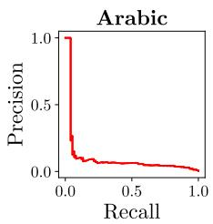

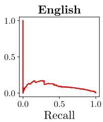

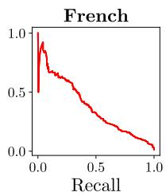

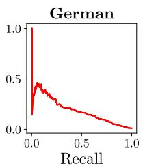

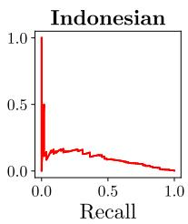

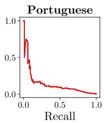

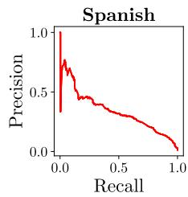

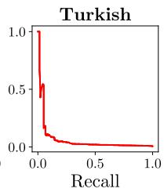

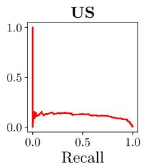

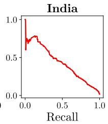

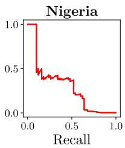  
Figure 5: Precision-recall curves for each language and country

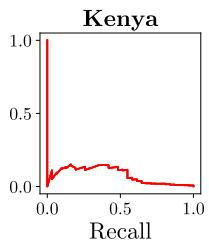

<table><tr><td>Language</td><td>Model</td><td>AD</td><td>HC</td><td>HD</td></tr><tr><td rowspan="4">Arabic</td><td>IbrahimAmin/marbertv2-finetuned-</td><td></td><td></td><td></td></tr><tr><td>egyptian-hate-speech-detection</td><td>25.8±0.6</td><td>76.9±2.0</td><td>5.8±3.0</td></tr><tr><td>Hate-speech-CNERG-dehatebert-mono-arabic</td><td>16.4±0.4</td><td>83.1±1.7</td><td>1.6±1.4</td></tr><tr><td>Perspective API Hate-speech-CNERG/bert-base-uncased-hatexplain</td><td>18.7±0.4</td><td>89.6±1.1</td><td>10.2±5.6</td></tr><tr><td rowspan="5">English</td><td>facebook/roberta-hate-speech-dynabench-r4-target</td><td>47.2±0.3 55.3±0.3</td><td>74.3±2.0 98.7±0.4</td><td>2.5±1.0 4.2±2.2</td></tr><tr><td>Hate-speech-CNERG/dehatebert-mono-english</td><td>48.7±0.3</td><td>75.0±2.0</td><td>7.2±4.4</td></tr><tr><td></td><td></td><td></td><td></td></tr><tr><td>IMSyPP/hate_speech_en</td><td>21.7±0.1</td><td>65.9±2.0</td><td>0.6±0.2</td></tr><tr><td>pysentimiento/bertweet-hate-speech Perspective API</td><td>38.2±0.3</td><td>82.2±1.7</td><td>9.0±3.9</td></tr><tr><td rowspan="4">French</td><td>Hate-speech-CNERG/dehatebert-mono-french</td><td>52.9±0.3 27.5±1.0</td><td>95.1±0.6 74.5±1.9</td><td>10.1±3.5 2.7±0.6</td></tr><tr><td>Poulpidot/distilcamenbert-french-hate-speech</td><td>27.6±0.9</td><td>87.2±1.5</td><td>4.2±0.9</td></tr><tr><td>julio2027/French_hate_speech_CamemBERT_v3</td><td>35.7±1.3</td><td>89.9±1.2</td><td></td></tr><tr><td>Perspective API</td><td>40.1±1.4</td><td>96.9±0.4</td><td>16.0±4.2 37.7±6.0</td></tr><tr><td rowspan="6">German</td><td>jagoldz-gahd</td><td>64.3±1.2</td><td>97.2±0.5</td><td>19.3±5.0</td></tr><tr><td>deepset/bert-base-german-cased-hatespeech- GermEval18Coarse</td><td></td><td></td><td></td></tr><tr><td>jorgeortizv/BERT-hateSpeechRecognition-German</td><td>22.6±0.8 19.9±0.7</td><td>82.1±1.9 76.8±2.0</td><td>8.5±2.6 3.4±1.1</td></tr><tr><td>Hate-speech-CNERG/dehatebert-mono-german</td><td>18.1±0.7</td><td>80.2±1.9</td><td></td></tr><tr><td>shahrukhx01-gbert-hasoc-german-2019</td><td></td><td>79.4±1.8</td><td>1.8±0.5</td></tr><tr><td>Perspective API</td><td>19.0±0.7 53.6±1.1</td><td>96.0±0.5</td><td>5.6±1.4 18.8±4.4</td></tr><tr><td>Indonesian</td><td>Hate-speech-CNERG-dehatebert-mono-indonesian Perspective API</td><td>90.2±0.7</td><td></td><td>3.5±2.3</td></tr><tr><td rowspan="3">Portuguese</td><td>knowhate/HateBERTimbau-yt-tt</td><td>65.5±1.3</td><td></td><td>11.1±5.9</td></tr><tr><td></td><td>18.7±0.9</td><td>85.8±1.6</td><td>3.1±1.7</td></tr><tr><td>Hate-speech-CNERG/dehatebert-mono-portugese</td><td>19.1±1.0</td><td>74.4±1.8</td><td>1.3±0.5</td></tr><tr><td rowspan="4">Spanish</td><td>Perspective API</td><td>30.9±1.5</td><td>94.6±0.7</td><td>14.5±6.9</td></tr><tr><td>Hate-speech-CNERG/dehatebert-mono-spanish</td><td>60.3±1.0</td><td>78.2±1.9</td><td>3.3±1.0</td></tr><tr><td>pysentimiento/robertuito-hate-speech</td><td>72.6±0.9</td><td>87.0±1.5</td><td>8.2±1.6</td></tr><tr><td>jorgeortizfuentes/chilean-spanish-hate-speech</td><td>54.9±1.1</td><td>82.3±1.6</td><td>11.6±3.3</td></tr><tr><td rowspan="2">Turkish</td><td>Perspective API ctoraman/hate-speech-berturk</td><td>50.9±1.1</td><td>96.0±0.5</td><td>34.1±6.2</td></tr><tr><td></td><td>32.1±0.4 31.4±0.4</td><td></td><td>1.9±0.6 6.5±3.8</td></tr><tr><td>Country</td><td>Model</td><td>AD</td><td>HD</td></tr><tr><td rowspan="4">United States</td><td>Hate-speech-CNERG/bert-base-uncased-hatexplain facebook/roberta-hate-speech-dynabench-r4-target</td><td>47.2±0.3 55.3±0.3</td><td>4.6±2.3 3.1±0.9</td></tr><tr><td>Hate-speech-CNERG/dehatebert-mono-english</td><td>48.7±0.3</td><td colspan="2"></td></tr><tr><td>IMSyPP/hate_speech_en</td><td>21.7±0.1</td><td colspan="2">4.6±2.3</td></tr><tr><td>pysentimiento/bertweet-hate-speech</td><td>38.2±0.3</td><td colspan="2">0.6±0.2 8.2±2.7</td></tr><tr><td rowspan="5">India</td><td>Perspective API Hate-speech-CNERG/kannada-codemixed-abusive-MuRIL</td><td>52.9±0.3 48.6±1.1</td><td>12.3±3.4</td></tr><tr><td>Hate-speech-CNERG/marathi-codemixed-abusive-MuRIL</td><td>43.4±1.0</td><td colspan="2">5.9±1.1</td></tr><tr><td>Hate-speech-CNERG/bengali-abusive-MuRIL</td><td></td><td colspan="2">3.7±0.9</td></tr><tr><td></td><td>40.0±1.0</td><td colspan="2">3.3±0.7</td></tr><tr><td>Hate-speech-CNERG/tamil-codemixed-abusive-MuRIL Hate-speech-CNERG/english-abusive-MuRIL</td><td>47.1±1.0 54.3±1.1</td><td colspan="2">6.2±1.2 7.8±1.6</td></tr><tr><td rowspan="2">Nigeria</td><td>Perspective API worldbank/naija-xlm-twitter-base-hate</td><td>61.9±1.1</td><td>42.9±5.8</td></tr><tr><td>Perspective API</td><td>65.7±1.4 44.1±1.6</td><td colspan="2">30.9±1.3</td></tr><tr><td>Kenya</td><td>Perspective API</td><td>31.6±0.9</td><td>8.6±6.5 9.1±6.1</td></tr></table>

Table 5: Detailed open-source and Perspective model performance across languages and evaluation sets, as measured by average precision (%). Metrics are reported with 95% bootstrapped confidence intervals. We report performance on three evaluation sets: academic hate speech datasets (AD) combined for a given language, HateCheck functional tests (HC) and HATEDAY (HD) . HC does not cover Indonesian and Turkish.

Table 6: Detailed open-source and Perspective model performance across countries and evaluation sets, as measured by average precision (%). Metrics are reported with 95% bootstrapped confidence intervals. We report performance on two evaluation sets: academic hate speech datasets (AD) combined for a given language and HATEDAY (HD) .

Share of all hate in HateDay

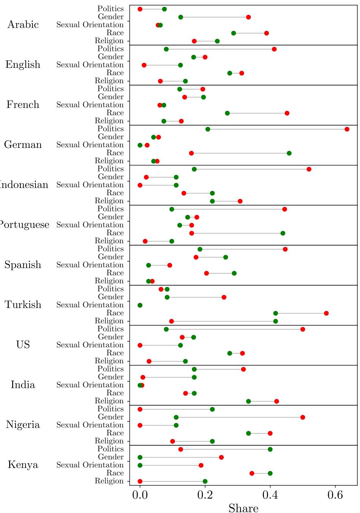  
Figure 6: Comparison between the target-level share of all hate in HATEDAY and the share of all hate speech datasets for each language or country and target combination. The language-level data for hate speech datasets is taken from Yu et al. (2024).

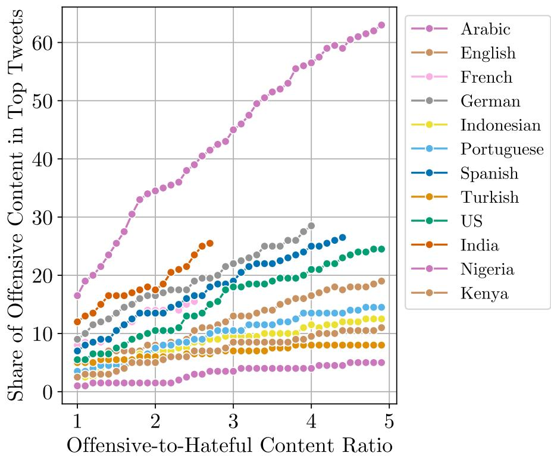  
Figure 7: Offensive-to-hateful count ratio versus the share of offensive content in top tweets (in %). Top tweets are defined as the 1% (N=200) top-scored tweets in HATEDAY using the best performing model on the dataset.