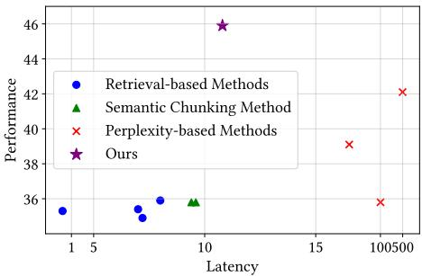
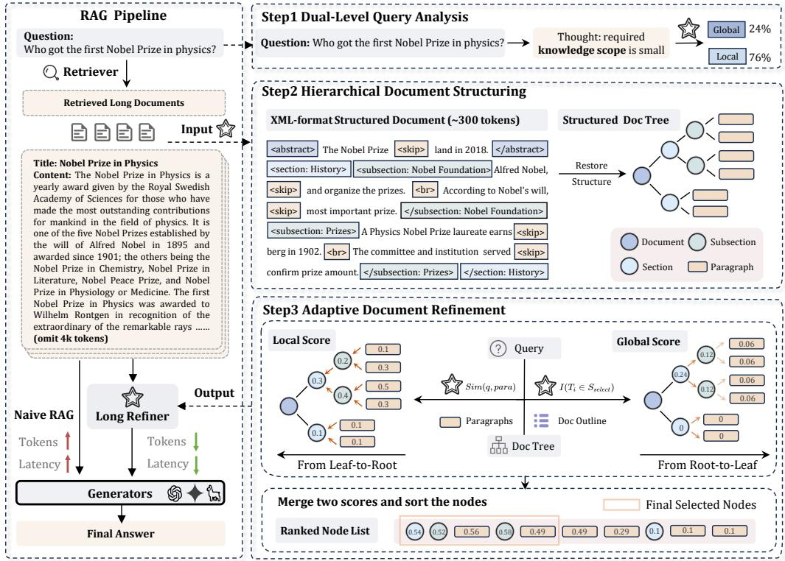
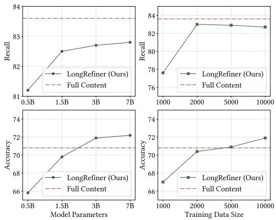
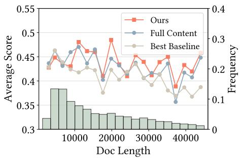

# Hierarchical Document Refinement for Long-context Retrieval-augmented Generation

Jiajie Jin1, Xiaoxi Li1, Guanting Dong1, Yuyao Zhang1

Yutao Zhu1,2∗, Yongkang Wu3, Zhonghua Li3, Qi Ye3, Zhicheng Dou1\*

1Gaoling School of Artificial Intelligence, Renmin University of China

2Engineering Research Center of Next-Generation Intelligent Search and Recommendation, MOE 3Huawei Poisson Lab

{jinjiajie, dou}@ruc.edu.cn, yutaozhu94@gmail.com

## Abstract

Real-world RAG applications often encounter long-context input scenarios, where redundant and noisy information results in higher inference costs and reduced performance. To address these challenges, we propose LongRefiner, an efficient plug-and-play refiner that leverages the inherent structural characteristics of long documents. LongRefiner employs dual-level query analysis, hierarchical document structuring, and adaptive refinement through multi-task learning on a single foundation model. Experiments on seven QA datasets demonstrate that LongRefiner achieves competitive performance in various scenarios while using 10x fewer computational costs and latency compared to the best baseline. Further analysis validates that LongRefiner is scalable, efficient, and effective, providing practical insights for real-world long-text RAG applications. Our code is available at https: //github.com/ignorejjj/LongRefiner.

## 1 Introduction

Large language models (LLMs) have demonstrated remarkable capabilities and achieved impressive results in various applications (Zhao et al., 2023; Zhu et al., 2023, 2024). However, due to their capabilities being limited to the training data, they are unable to update their knowledge in realtime (Li et al., 2025a), leading to poor performance in knowledge-intensive tasks (Petroni et al., 2021) and factual accuracy (Wang et al., 2023a; Li et al., 2025b). Retrieval-augmented generation (RAG) (Lewis et al., 2020; Borgeaud et al., 2022) addresses these limitations by combining information retrieval techniques with generative models, enabling access to external knowledge bases and significantly improving the accuracy and reliability of generated content (Zhou et al., 2024a; Zhang et al., 2025).

  
Figure 1: Comparison of different methods in terms of efficiency and effectiveness.

While the effectiveness of RAG systems critically depends on the quality and information density of retrieved content (Huang et al., 2023; Gao et al., 2024; Jin et al., 2024b), real-world scenarios present significant challenges when dealing with lengthy documents returned by retrievers such as search engines (Qian et al., 2024; Jiang et al., 2023a). Although these documents contain the necessary information for generating accurate responses, their extensive length poses two primary challenges for practical RAG deployments: (1) Signal-to-noise ratio: Long documents often contain substantial irrelevant content alongside pertinent information (Levy et al., 2025; Li et al., 2024a), making it difficult for models to focus on query-relevant details (Li et al., 2024c,b; Jin et al., 2024b). (2) Computational overhead: Processing complete documents significantly increases the input context length, resulting in higher computational costs and potential performance bottlenecks in production environments (Zhao et al., 2023; Zhou et al., 2024b).

To address these challenges, an intuitive approach is to refine long retrieved documents before LLM processing (Jiang et al., 2023a). Unfortunately, current refinement methods are typically either suitable for short text chunks or rely on crude metrics, such as perplexity, to assess token relevance (Li et al., 2023). As shown in Figure 1, these approaches fail to effectively utilize complete document information due to limited query understanding and a lack of global context awareness, resulting in performance degradation and high latency. However, we observe that complete documents contain rich structural information like logical connections and content organization, which can enable more precise information extraction than traditional chunk-based approaches.

Motivated by these observations, we aim to achieve efficient document refinement by modeling structural information in long documents. To this end, we propose LongRefiner, a plug-and-play efficient refinement system for long retrieved documents. LongRefiner integrates three key capabilities: dual-level query analysis, hierarchical document structuring, and adaptive refinement, combining them through multi-task LoRA (Hu et al., 2022) learning on a single foundation model to enhance overall usability. To improve system efficiency, we design a simplified XML-based syntax (Abiteboul, 1999; Levering and Cutler, 2006) for representing document structure, which significantly reduces the refinement model’s output token count. Furthermore, we developed an efficient inference paradigm that achieves low online latency by executing certain tasks offline. Our experiments across seven diverse QA datasets demonstrate superior performance over existing baselines across various query types while maintaining lower latency. We further validate practical feasibility through extensive experiments with different backbone models and training data scales.

Our main contributions are: (1) To address the challenges of noise and low information density in long retrieved documents, we propose LongRefiner, a universal document-level refinement framework that achieves efficient, low-latency long-text refinement by leveraging hierarchical textual information. LongRefiner introduces three key steps: dual-level query analysis, hierarchical document structuring, and adaptive document refinement, significantly optimizing RAG costs and response latency. (2) We develop an efficient training and inference paradigm, achieving low online latency through LoRA-based multi-task learning combined with offline and online task orchestration. (3) Experimental results demonstrate that our approach achieves superior generation quality with only 10% of the token budget compared to existing text compression methods while maintaining lower latency.

## 2 Problem Formulation

In a standard RAG pipeline, the retriever retrieves relevant documents from corpus based on a query $\mathcal { Q } .$ The system then constructs the input prompt by combining the retrieved documents, query, and instruction $\mathcal { T } .$ This prompt is input to the generation model to obtain the response. To enhance the signal-to-noise ratio, we introduce a refiner module to distill the retrieved documents.

Given a fixed retriever $\mathcal { R }$ , a corpus ${ \mathcal { C } } ,$ and a generator ${ \mathcal { G } } _ { : }$ with each query yielding a set of retrieved documents $\mathcal { D } _ { : }$ , we seek a mapping function $\mathcal { F }$ that transforms retrieved documents into refined content. The effectiveness of $\mathcal { F }$ can be measured through: (1) downstream performance, measured by $\mathcal { G } ( A | \mathcal { F } ( \mathcal { D } ) )$ , where $\mathcal { A }$ is the golden answer; (2) compression ratio $\gamma = | \mathcal { D } | / | \mathcal { F } ( \mathcal { D } ) |$ , defined as the token count ratio before and after mapping; and (3) computational latency $\tau .$ , which is the execution time of the mapping function itself. Our goal is to design an efficient mapping function that optimizes downstream performance while minimizing latency under a fixed compression ratio.

## 3 LongRefiner: a Long Document Refiner for RAG

To address the challenges of long-context RAG outlined in the introduction, our approach focuses on designing an efficient, query-aware long document refiner based on hierarchical modeling of long texts. In this section, we present three key steps of our method, followed by a comprehensive description of our training and inference process.

## 3.1 Dual-Level Query Analysis

In real-world scenarios, queries exhibit diverse information needs ranging from simple facts to complex reasoning (Tan et al., 2024a; Chan et al., 2024; Qiao et al., 2024). To characterize this diversity, we introduce two information levels: Local Level and Global Level. The Local Level refers to knowledge confined to specific contexts or localized information, involving a narrow knowledge scope such as a single passage or snippet. In contrast, the Global Level encompasses broad, comprehensive knowledge, involving a wide range of information and background context.

To quantify these levels, we construct a duallevel query analyzer. Specifically, we first prompt a teacher LLM with task-specific instructions to analyze each query in the training dataset and assign a corresponding information level, which is represented as a binary label.1 We then treat this label as a special token and finetune the refiner to generate the corresponding special token based on the input query. During inference, LongRefiner adaptively determines the amount of information required for each query by predicting the appropriate information-level token. The formula can be written as:

  
Figure 2: Overview of the LongRefiner Framework.

$$
\begin{array} { r l } & { P _ { l } = P _ { \cal M } ( \left[ \mathrm { L o c a l } \right] | \mathrm {  ~ q u e r y } ) } \\ & { P _ { g } = P _ { \cal M } ( \left[ \mathrm { G l o b a l } \right] | \mathrm {  ~ q u e r y } ) } \\ & { R _ { q } = \mathrm { S o f t m a x } ( P _ { l } , P _ { g } ) _ { g } . } \end{array}\tag{1}
$$

As shown in Equation 1, to achieve a more precise representation of the information scope rather than a simple binary label, we apply a softmax operation to the generation probabilities of the twolevel tokens, producing a continuous representation $r _ { q }$ as the information scope for the query.

## 3.2 Hierarchical Document Structuring

To facilitate efficient refinement, we convert unstructured retrieved documents into a hierarchical format with a clear article outline, hierarchical organization, and paragraph segmentation. The hierarchical structure is defined as follows.

Tree-based structured document definition. We model the structured document as a doc tree. Formally, the structured representation of a document D is denoted as $D _ { \mathrm { s t r } } = ( \mathcal { N } , \mathcal { R } )$ , where is the set of nodes in the document. As shown in the structured doc tree in Figure 2, each node represents a section, subsection, or paragraph, with its corresponding title and content. R denotes the set of relations, which capture the implication and hierarchical relationships between nodes.

To derive such a structured representation from the original long document, we leverage a longcontext window LLM as our backbone. However, this task still poses two significant challenges: (1) $\mathbf { A s } D _ { \mathrm { { s t r } } }$ introduces additional information such as titles and structural information, the number of tokens required to represent it is greater than the tokens in D itself, which results in an excessively long learning target. (2) The retrieved documents consist only of plain text without the full structure or outline, lacking the golden labels needed for training. To address these challenges, we propose two novel designs.

XML-format document structure representation. Inspired by XML syntax and web page representation, we design an XML-format doc structuring method to address the problem of a document being too long and difficult to learn. We first design a flat representation $D _ { \mathrm { x m l } }$ of $D _ { \mathrm { s t r } }$ , which corresponds to $D _ { \mathrm { s t r } }$ one-to-one, enabling the complete representation of the document’s overall structure with fewer tokens.

Table 1: XML-format tags and definitions. LongRefiner will use these tags to represent the structural information of the document during the generation process.
<table><tr><td>Tag Format</td><td>Definitions</td></tr><tr><td>&lt;section: {title}&gt;</td><td>Begin of the section with specific title</td></tr><tr><td>&lt;subsection: {title}&gt;</td><td>Begin of the subsection with specific title</td></tr><tr><td>&lt;skip&gt;</td><td>Placeholder for omitting middle content</td></tr><tr><td>&lt;br&gt;</td><td>Paragraph switching symbol</td></tr></table>

An example of $D _ { \mathrm { s t r } }$ is shown in Figure 2. Specifically, we design $D _ { \mathrm { x m l } }$ in an XML-like format with special tags to represent the hierarchical structure of the document. As shown in Table 1, we design three types of tags to denote the document structure: <section: {title}> , <subsection: {title}> and   . Each section’s content is enclosed within <section: {title}> and </subsection: {title}> , with a corresponding title that conveys the general meaning of the section. Within each section, there may be several subsections, each enclosed by <subsection: {title}> and </subsection: {title}> , with a corresponding subsection title. Additionally, each section and subsection may contain its content, which is also enclosed within the tags mentioned above. Within the content, we use   to denote paragraph segmentation. With this representation, we convert a structured document tree into a flat textual form. Furthermore, using parsing algorithms, we can easily convert this flat representation back into the original document tree without losing information.

Since most tokens in the flat representation are derived from the original document, we can omit redundant content and restore it during structure recovery. Therefore, we introduce a <skip> to represent omitted content, retaining only the first and last k tokens of each paragraph while replacing the omitted content with <skip> . This results in the final $D _ { \mathrm { x m l } }$ . The parameter k is a hyperparameter, where a smaller k reduces the token count but increases parsing errors. As shown in Figure 1, the XMLbased $D _ { \mathrm { x m l } }$ reduces the token count to approximately 1/10 of the original while preserving the original information. We then train a long-context LLM to learn the mapping from the original document $D$ to $D _ { \mathrm { x m l } }$ . Based on this learning objective, the model needs to learn how to segment, organize, and summarize the total document. Then in the inference stage, we can map predicted $D _ { \mathrm { x m l } }$ to $D _ { \mathrm { s t r } }$ by using the original document and parsing algorithm, obtaining the document tree.

The overall inference process can be described as follows:

$$
P _ { \cal M } ( D _ { \mathrm { x m l } } \mid D ) = \prod _ { t = 1 } ^ { T } P _ { \cal M } ( y _ { t } \mid y _ { 1 : t - 1 } , D ) .\tag{2}
$$

Based on the above training objective, the model’s generation is a coarse-to-fine process with two steps of iteration:

(1) Structure generation. The model first generates the hierarchical structure S (e.g., <section: {title}> with a suitable title):

$$
P _ { \mathcal { M } } ( _ { [ \mathrm { { < s e c t i o n : } \left\{ t i t l e \right\} > } ] } \mid D ) = \prod _ { t = 1 } ^ { T _ { s } } P _ { \mathcal { M } } ( y _ { t } \mid y _ { 1 : t - 1 } , D ) ,
$$

where the title is automatically generated and fully predicted by the model based on the document.

(2) Content filling based on structure Then the model generates the content $C _ { i }$ of each part based on the corresponding <section: {title}> and original document. The content generation probability can be expressed as:

$$
P _ { \mathcal M } ( C \mid _ { \mathrm { [ < s e c t i o n : ~ ( i t t l e ) > ] } , D ) } = P _ { \mathcal M } ( C ^ { : k } , \mathrm { [ < s k i p > ] } , C ^ { k : } ) .
$$

The model will dynamically skip the middle portion, preserving only the first k and last k tokens, and marking the skipped portion with <skip> .

Wikipedia-Based Label Collection In the previous process, the construction of training label $D _ { \mathrm { x m l } }$ requires structural information from the document, which is currently lacking. Considering that the majority of popular retrieval corpora are derived from Wikipedia, we construct document structure trees based on raw Wikipedia web pages. First, we collect webpage data for Wikipedia entries and remove irrelevant information such as images, links, and references. Then, we extract the entry’s core knowledge, obtaining its original structure such as sections and paragraphs, which is the desired document structure tree $D _ { \mathrm { s t r } }$ . We directly remove the structural information from $D _ { \mathrm { s t r } } .$ retaining only the raw textual content as $D$ . Using the $( D , D _ { \mathrm { s t r } } )$ pairs, we can derive the XML-based representation $D _ { \mathrm { x m l } }$ following the method described above. Thus, for each webpage, we construct a training dataset containing $( D , D _ { \mathrm { x m l } } )$ pairs, enabling the model to learn how to generate hierarchical document trees from raw plain text.

## 3.3 Adaptive Document Refinement

Based on the structured document tree, we then evaluate each node’s significance from both local and global perspectives to adapt to varying information requirements and identify the most relevant information.

Local Perspective. From a local standpoint, relevant information for addressing the query may comprise discrete pieces distributed across multiple paragraphs, which correspond to the leaf nodes of the document tree. As shown in Figure 2, we initiate the refinement process by computing local score(LS) starting at the leaf nodes and subsequently propagating these scores upward through the tree hierarchy.

The scoring mechanism is defined as follows:

$$
\begin{array} { r } { \mathbf { L S } ( n _ { i } ) = \left\{ \begin{array} { l l } { M ( \mathrm { q u e r y } , n _ { i } ) } & { \mathrm { i f } n _ { i } \in \mathscr { N } _ { L } , } \\ { \frac { 1 } { | \mathcal { C } ( n _ { i } ) | } \sum _ { n _ { j } \in \mathcal { C } ( n _ { i } ) } \mathbf { L S } ( n _ { j } ) } & { \mathrm { o t h e r w i s e } . } \end{array} \right. } \end{array}
$$

Here, M represents a universal scoring model used to calculate the similarity between the query and each leaf node, providing the initial local score. $\mathcal { N } _ { L }$ represents the set of all leaf nodes in the document tree. These local scores are then propagated to parent nodes by averaging the scores of their child nodes. This method ensures that a parent node’s score accurately reflects the overall quality of its content. Importantly, a parent node achieves a high local score only if all its child nodes maintain sufficiently high scores, thereby mitigating the risk of any single child node disproportionately affecting the parent’s score.

Global Perspective. For queries that require a comprehensive understanding of the document, it is crucial to evaluate the importance of information from a global perspective. This prevents an overemphasis on localized information points, which could lead to incomplete information retrieval. The computation of global scores is defined as follows:

$$
\mathbf { G S } ( n _ { i } ) = \left\{ \begin{array} { l l } { \mathbb { I } \left( n _ { i } \in \mathcal { M } ( q , \mathrm { o u t l i n e } ) \right) } & { \mathrm { i f } \ n _ { i } \in \mathcal { N } _ { S } , } \\ { \mathbf { G S } \left( \mathbf { P a } ( n _ { i } ) \right) } & { \mathrm { o t h e r w i s e } . } \end{array} \right.
$$

Here, $\mathbb { I } ( \cdot )$ is the indicator function, Pa represents the parent node， $\mathcal { N } _ { S }$ represents the set of all section nodes in the document tree. To assess the necessary information from a global standpoint, we fine-tuned the model to select relevant sections based on the query and the document’s outline. The document outline consists of the abstract and the titles of all sections. By providing only the outline instead of the entire text, we supply sufficient overall document information while preventing localized details from biasing the model’s selection process. From a global perspective, each child node contributes equally to its parent node. Therefore, we uniformly assign each child node to split its parent node’s score equally to ensure every child node is considered from a global view.

Combination. We utilize the information scope obtained from the first step as weight to combine each node’s local score (LS) and global score (GS), thereby deriving a final measure of each node’s contribution to answering the query. The formula is as follows:

$$
\mathrm { S c o r e } ( n _ { i } ) = \mathrm { L S } ( n _ { i } ) + R _ { q } \cdot \mathrm { G S } ( n _ { i } ) .
$$

In the final selection process, we sort all nodes based on their node scores and select them sequentially until the designated token budget is met. To maintain complete structural information in the final refined result, if a parent node is selected, all of its child nodes are automatically included. This ensures the preservation of the document’s structural integrity. Finally, all selected nodes are organized in their original order as they appear in the document and incorporated into the prompt.

## 3.4 Training and Inference

In order to improve the usability and efficiency of our method, we have made the following designs during the training and inference processes.

Training. Our approach involves three training tasks: query analysis, document structuring, and global selection, all trained on a single base model. Due to significant variations in the input token length of these tasks, mixed training will introduce excessive padding, reducing efficiency. To address this challenge, we employ task-specific LoRA modules for each task, with each module’s parameters accounting for only 0.03% of the total model parameters. This design enables LongRefiner to share the same backbone while switching between different tasks through plug-and-play taskspecific parameter loading. Notably, this approach maintains inference latency comparable to a shared module while preventing task interference.

Table 2: Overall performance on seven open-domain QA datasets using Llama3.1-8B-Instruct as a generator, including single-hop, multi-hop, and long-form QA tasks. The best results are in bold and the second are underlined. Baselines and our method are limited to 2k tokens, while the full content setting uses complete information without any token limitations and is annotated with gray.
<table><tr><td rowspan="2">Method</td><td colspan="2">NQ</td><td colspan="2">TriviaQA</td><td colspan="2">HotpotQA</td><td colspan="2">2Wiki</td><td>ASQA</td><td>ELI5</td><td colspan="2">PopQA</td><td rowspan="2">Tokens</td><td rowspan="2">Latency</td></tr><tr><td>Acc</td><td>F1</td><td>Acc</td><td>F1</td><td>Acc</td><td>F1</td><td>Acc</td><td>F1</td><td>F1</td><td>F1</td><td>Acc F1</td><td></td></tr><tr><td>Vanilla Method</td><td></td><td></td><td></td><td></td><td></td><td></td><td></td><td></td><td></td><td></td><td></td><td></td><td></td><td></td></tr><tr><td>Naive Generation</td><td>35.9</td><td>32.2</td><td>63.6</td><td>65.0</td><td>21.3</td><td>25.0</td><td>31.4</td><td>27.0</td><td>9.8</td><td>23.2</td><td>26.1</td><td>21.0</td><td>120</td><td>1.2</td></tr><tr><td>Full Content</td><td>53.8</td><td>48.1</td><td>70.8</td><td>72.7</td><td>36.0</td><td>42.4</td><td>35.7</td><td>35.7</td><td>34.1</td><td>23.8</td><td>64.1</td><td>49.6</td><td>19567</td><td>40.6</td></tr><tr><td colspan="10">Retrieval-based Method</td><td></td><td></td><td></td><td></td><td></td></tr><tr><td>BM25</td><td>38.1</td><td>36.0</td><td>60.3</td><td>62.2</td><td>24.7</td><td>28.9</td><td>31.8</td><td>31.5</td><td>31.1</td><td>23.7</td><td>37.5</td><td>30.6</td><td>2042</td><td>3.6</td></tr><tr><td>Bge-reranker</td><td>40.2</td><td>37.2</td><td>59.7</td><td>62.8</td><td>25.9</td><td>31.6</td><td>33.9</td><td>27.6</td><td>30.5</td><td>23.7</td><td>37.3</td><td>29.4</td><td>2056</td><td>8.0</td></tr><tr><td>SBERT</td><td>36.2</td><td>34.5</td><td>60.0</td><td>62.1</td><td>25.6</td><td>29.7</td><td>33.2</td><td>26.4</td><td>30.3</td><td>23.8</td><td>38.8</td><td>31.1</td><td>2054</td><td>7.0</td></tr><tr><td>Recomp-ext</td><td>38.0</td><td>35.0</td><td>59.4</td><td>61.3</td><td>25.7</td><td>30.3</td><td>30.4</td><td>26.2</td><td>30.8</td><td>23.8</td><td>36.2</td><td>28.9</td><td>1915</td><td>7.2</td></tr><tr><td colspan="10">Semantic Chunking Method</td><td></td><td></td><td></td><td></td><td></td></tr><tr><td>Jina-Segment</td><td>40.0</td><td>38.3</td><td>61.3</td><td>63.7</td><td>26.0</td><td>31.3</td><td>32.4</td><td>26.4</td><td>31.2</td><td>23.7</td><td>36.3</td><td>28.8</td><td>2148</td><td>8.4</td></tr><tr><td>Meta-Chunking</td><td>39.0</td><td>37.4</td><td>61.7</td><td>63.8</td><td>26.7</td><td>31.7</td><td>33.1</td><td>27.3</td><td>30.7</td><td>23.7</td><td>35.6</td><td>28.8</td><td>2181</td><td>8.6</td></tr><tr><td colspan="10">Perplexity-based Methods</td><td></td><td></td><td></td><td></td><td></td></tr><tr><td>Selective-Context</td><td>36.1</td><td>35.0</td><td>64.4</td><td>67.5</td><td>24.0</td><td>29.5</td><td>28.8</td><td>25.2</td><td>28.6</td><td>23.1</td><td>45.3</td><td>40.2</td><td>1841</td><td>100.6</td></tr><tr><td>LLMLingua2</td><td>44.4</td><td>43.0</td><td>66.9</td><td>69.8</td><td>28.3</td><td>36.9</td><td>29.4</td><td>32.2</td><td>29.9</td><td>23.4</td><td>51.1</td><td>39.9</td><td>2043</td><td>21.6</td></tr><tr><td>LongLLMLingua</td><td>45.4</td><td>42.4</td><td>67.6</td><td>69.8</td><td>34.7</td><td>41.7</td><td>33.1</td><td>34.5</td><td>33.6</td><td>23.7</td><td>56.8</td><td>43.6</td><td>1976</td><td>496.6</td></tr><tr><td colspan="10">Hierarchical Method</td><td></td><td></td><td></td><td></td><td></td><td></td></tr><tr><td>LongRefiner(Ours) 54.4</td><td></td><td>48.9</td><td>71.7</td><td>73.0</td><td>39.3</td><td>45.8</td><td>36.1</td><td>35.0</td><td>35.8</td><td>23.9</td><td>59.9</td><td>45.9</td><td>1933</td><td>10.8</td></tr></table>

Inference. To reduce latency, inference is split into offline and online stages. In the offline stage, the model will perform hierarchical document structuring tasks for the documents in the corpus. In the online stage, it performs an analysis of the user’s query, followed by adaptive refinement to generate the final output. Since the online stage only involves processing hundreds of input tokens and generating dozens of output tokens, the overall latency is only about 25% of the standard setting.

## 4 Experimental Settings

## 4.1 Datasets and Evaluation Metrics

We conduct experiments on seven widely used datasets in three types: Single-hop QA (NQ (Kwiatkowski et al., 2019), TriviaQA (Joshi et al., 2017), PopQA (Mallen et al., 2023)), Multihop QA(HotpotQA (Yang et al., 2018), 2Wiki-MultiHopQA (Ho et al., 2020)), and Long-form QA(ASQA (Stelmakh et al., 2022), ELI5 (Fan et al., 2019)). We use Accuracy and F1 Score as metrics for evaluation. Detailed information is provided in Appendix A.

## 4.2 Baselines

We compare our approach with three categories of baseline methods: (1) Retrieval-based Methods: BM25 (Robertson and Zaragoza, 2009), Bge-Reranker (Xiao et al., 2024), SBERT (Reimers and Gurevych, 2019), and Recomp (Xu et al., 2023); (2) Semantic Chunking Methods: Jina Segmenter (accessed via API) and Meta-Chunking (Zhao et al., 2024); (3) Perplexity-based Methods: Selective-Context (Li et al., 2023), LongLLMLingua (Jiang et al., 2023a), and LLMLingua2 (Pan et al., 2024). Detailed descriptions are provided in Appendix A.

## 4.3 Implementation Details

We use Llama3.1-8B-Instruct (Dubey et al., 2024) as the generator with a 64k context window size to accommodate all documents. We construct the corpus based on the full Wikipedia 2018 dump (Karpukhin et al., 2020) and follow the MaxP (Dai and Callan, 2019) design in LongRAG (Jiang et al., 2024) to retrieve the top-8 full documents for each query. Our refiner is based on the Qwen 2.5-3B-Instruct (Yang et al., 2024), and we train the model using the LoRA method. For additional details, please refer to Appendix A.

## 5 Experimental Results

## 5.1 Main Results

As shown in Table 2, we evaluate our method against various refinement approaches across seven diverse datasets under a fixed constraint of 2k tokens. We have several findings: (1) Our method achieves the best performance across all datasets while maintaining low latency, demonstrating the effectiveness of leveraging internal document structure for refinement. The consistent improvements across different query types validate the efficacy of our adaptive design. (2) While existing methods excel in either performance or latency, our approach maintains latency comparable to retrieval-based approaches while surpassing the performance of perplexity-based methods by more than 9%. (3) Compared to the vanilla approach using complete documents, our method demonstrates remarkable efficiency by achieving superior performance on six datasets while reducing token usage by 10x and latency by 4x. The exception is PopQA, where documents are relatively short with minimal noise, enabling effective LLM comprehension of complete documents. Our method’s potential information loss may slightly impact performance in such low-noise scenarios.

Table 3: Ablation study on three types of datasets.
<table><tr><td>Method</td><td>Single-hop (EM)</td><td>Multi-hop (Acc)</td><td>Long-form (F1)</td></tr><tr><td>LongRefiner</td><td>62.3</td><td>37.4</td><td>30.2</td></tr><tr><td>w/o Query Analysis</td><td>60.3</td><td>36.2</td><td>29.6</td></tr><tr><td>w/o Doc. Structuring</td><td>45.7</td><td>29.9</td><td>27.1</td></tr><tr><td>w/o Local Score</td><td>57.7</td><td>35.3</td><td>29.2</td></tr><tr><td>w/o Global Score</td><td>61.9</td><td>37.7</td><td>29.9</td></tr></table>

  
Figure 3: Analysis of scaling the base model size (left) and training data amount (right) in hierarchical document structuring step on TriviaQA. Recall represents the proportion of golden answers in the input prompt.

## 5.2 Ablation Study

To quantify the contributions of different components in our framework, we conduct ablation studies on the three key modules, yielding results in Table 3. The findings can be summarized as follows: (1) Removing any step results in significant performance degradation across all query types, demonstrating the necessity and effectiveness of all three components in our system. (2) The Hierarchical Structuring module proves most crucial, with its removal resulting in nearly 20% degradation. This substantial impact stems from its fundamental role in modeling document structure, without which the method degrades to basic chunking. (3) The performance decrements from removing either query analysis or adaptive refinement modules confirm the effectiveness of our dual-perspective approach in evaluating information quality from both global and local viewpoints.

  
Figure 4: The performance of LongRefiner across different document lengths, where Doc Length refers to the total number of tokens for all retrieved documents corresponding to a query.

## 5.3 Scaling Analysis of Document Structuring

Accurate hierarchical document structuring is crucial for refinement quality. To evaluate its practical applicability, we analyze our model’s scalability by evaluating the effects of model size and training data volume on performance.

Parameter Aspect. We finetune models of varying sizes from the Qwen series and measure both refinement recall and answer accuracy. As shown in Figure 3, performance improves with increased model parameters, though with diminishing returns. The experiments demonstrate that with sufficient training data, larger models can better capture document structure, approaching full-content baseline recall rates while achieving superior QA performance due to reduced noise.

Data Aspect. Training data scaling reveals an intriguing pattern: while QA performance consistently improves, recall shows an initial increase followed by a slight decline. Case analysis shows that the temporary recall increase stems from underfitting. With limited data, the model develops weaker structuring capabilities, resulting in fewer sections and larger content blocks. Although this approach mirrors the structure of the original document more closely, the structural information becomes less accurate and comprehensive, which hampers subsequent refinement. However, with sufficient training data, models can generate more authentic and complete document structures. In this case, although some recall loss occurs due to XML-format parsing errors, the improved structural accuracy compensates for this loss.

Table 4: Analysis of using different models to calculate local scores.
<table><tr><td rowspan="2">Scoring Model</td><td colspan="2">Single-hop</td><td colspan="2">Multi-hop</td><td>Long-form</td></tr><tr><td>Acc</td><td>F1</td><td>Acc</td><td>F1</td><td>F1</td></tr><tr><td>BM25</td><td>52.7</td><td>49.5</td><td>34.9</td><td>37.6</td><td>28.9</td></tr><tr><td>E5</td><td>60.8</td><td>55.0</td><td>36.4</td><td>38.7</td><td>29.5</td></tr><tr><td>SBERT</td><td>58.6</td><td>53.1</td><td>36.1</td><td>38.4</td><td>29.5</td></tr><tr><td>Bce-reranker</td><td>60.8</td><td>54.8</td><td>36.6</td><td>40.0</td><td>29.5</td></tr><tr><td>Bge-reranker</td><td>62.0</td><td>55.9</td><td>37.7</td><td>40.4</td><td>29.9</td></tr><tr><td>Best Baseline</td><td>56.6</td><td>51.9</td><td>33.9</td><td>38.1</td><td>28.7</td></tr></table>

## 5.4 Performance on Different Document Lengths

We evaluate the effectiveness of our method across varying document lengths, comparing it with the full content setting and the best baseline. As shown in Figure 4, we have two key findings: (1) While our method shows relatively lower performance on shorter documents compared to full-document methods, it significantly outperforms them on longer texts. This can be attributed to the lower noise levels in shorter documents, which minimally impact model generation. Notably, our method achieves this with 10x fewer tokens than the fullcontent approach, demonstrating its viability even for shorter texts. (2) Our method consistently and significantly outperforms LongLLMLingua across almost all document lengths, highlighting the substantial advantages of leveraging structural information for text refinement over perplexity-based approaches.

## 5.5 Impact of Different Scoring Model

We evaluate the impact of various scoring models for computing local scores, including term-based methods, embedding models, and rerankers. As shown in Table 4, all methods except term-based approaches outperform the best baseline. The reranker model achieves the best performance by accurately capturing relevance between local paragraphs and queries. While embedding-based scoring had slightly lower performance, it offers superior computational efficiency, making it a practical alternative. Notably, the choice of scoring model has the greatest impact on single-hop datasets, where local information is critical to overall performance.

## 6 Related Works

Retrieval-augmented Generation. Retrievalaugmented Generation (RAG) (Lewis et al., 2020; Borgeaud et al., 2022; Zhu et al., 2025a) enhances LLMs by incorporating retrieved knowledge into input prompts, reducing hallucination and knowledge limitations (Gao et al., 2024; Dong et al., 2023). While retrieving multiple documents ensures high recall, it introduces challenges: lengthy documents contain noise and irrelevant information, increasing both computational costs and potential output errors (Dong et al., 2025, 2024a). Current solutions either focus on improving LLMs’ long-text processing capabilities (Bai et al., 2024; Chen et al., 2024) or refining retrieved knowledge (Xu et al., 2023) for flexible deployment across different models.

Knowledge Refinement Methods. Knowledge refinement methods can be categorized into two approaches (Li et al., 2024c): (1) Hard Prompt Refinement, which directly processes text through token removal (Li et al., 2023; Jiang et al., 2023a,b; Pan et al., 2024), summarization (Jin et al., 2024b; Xu et al., 2023; Yang et al., 2023; Qian et al., 2024; Zhu et al., 2025b), or chunk-based selection (Yoon et al., 2024; Dong et al., 2024b; Wang et al., 2023b). This approach requires no model adaptation and offers better interpretability. (2) Soft Prompt Refinement, which encodes documents into vector or semantic spaces (Cheng et al., 2024; Tan et al., 2024b; Liu et al., 2024), but requires additional training. While existing methods struggle with long texts or lack comprehensive document understanding, our method addresses these limitations through structured document modeling.

## 7 Conclusion

In this paper, we presented LongRefiner, a document-level refinement framework that effectively addresses the challenges of processing long retrieved documents in RAG systems. By integrating dual-level query analysis, hierarchical document structuring, and adaptive refinement capabilities through multi-task LoRA learning, our approach significantly improves both the efficiency and accuracy of long document refinement. Experiments show that LongRefiner consistently outperforms existing baselines, achieving superior generation quality while having lower latency. These results validate the effectiveness of our documentlevel approach in leveraging hierarchical textual information for efficient RAG systems.

## Limitations

Although LongRefiner demonstrates strong performance and low latency across various datasets, there remain several limitations that warrant further exploration and improvement. First, enhancing support for diverse data types: In real-world scenarios, retrieved documents often contain not only plain text but also tables, images, and hyperlinks. How to model and refine such content with complex information structures remains an unsolved challenge. This may involve extending our XML-based syntax to accommodate these varied data types and training a more versatile refinement model using realworld data. Second, our current approach relies entirely on the general-domain Wikipedia corpus, making it challenging to directly transfer to vertical domains such as enterprise or finance, where document characteristics may differ significantly. In such scenarios, we may need to design and model specifically for their documents and use cases, potentially leveraging teacher LLMs for text structure annotation. This represents another important direction for future exploration.

## Acknowledgments

This work was supported by Beijing Municipal Science and Technology Project No. Z231100010323009, National Natural Science Foundation of China No. 62402497 and No. 62272467, Beijing Natural Science Foundation No. L233008, the fund for building world-class universities (disciplines) of Renmin University of China. The work was partially done at the Beijing Key Laboratory of Research on Large Models and Intelligent Governance.

## References

Serge Abiteboul. 1999. On views and XML. SIGMOD Rec., 28(4):30–38.

Yushi Bai, Xin Lv, Jiajie Zhang, Yuze He, Ji Qi, Lei Hou, Jie Tang, Yuxiao Dong, and Juanzi Li. 2024. Longalign: A recipe for long context alignment of large language models. In Findings of the Association for Computational Linguistics: EMNLP 2024, Miami, Florida, USA, November 12-16, 2024, pages 1376–1395. Association for Computational Linguistics.

Steven Bird. 2006. NLTK: the natural language toolkit. In ACL 2006, 21st International Conference on Computational Linguistics and 44th Annual Meeting of the Associationfor Computational Linguistics, Proceedings ofthe Conference, Sydney, Australia, 17-21 July 2006. The Association for Computer Linguistics.

Sebastian Borgeaud, Arthur Mensch, Jordan Hoffmann, Trevor Cai, Eliza Rutherford, Katie Millican, George van den Driessche, Jean-Baptiste Lespiau, Bogdan Damoc, Aidan Clark, Diego de Las Casas, Aurelia Guy, Jacob Menick, Roman Ring, Tom Hennigan, Saffron Huang, Loren Maggiore, Chris Jones, Albin Cassirer, Andy Brock, Michela Paganini, Geoffrey Irving, Oriol Vinyals, Simon Osindero, Karen Simonyan, Jack W. Rae, Erich Elsen, and Laurent Sifre. 2022. Improving language models by retrieving from trillions of tokens. In International Conference on Machine Learning, ICML 2022, 17-23 July 2022, Baltimore, Maryland, USA, volume 162 of Proceedings of Machine Learning Research, pages 2206–2240. PMLR.

Chi-Min Chan, Chunpu Xu, Ruibin Yuan, Hongyin Luo, Wei Xue, Yike Guo, and Jie Fu. 2024. RQ-RAG: learning to refine queries for retrieval augmented generation. CoRR, abs/2404.00610.

Yukang Chen, Shengju Qian, Haotian Tang, Xin Lai, Zhijian Liu, Song Han, and Jiaya Jia. 2024. Longlora: Efficient fine-tuning of long-context large language models. In The Twelfth International Conference on Learning Representations, ICLR 2024, Vienna, Austria, May 7-11, 2024. OpenReview.net.

Xin Cheng, Xun Wang, Xingxing Zhang, Tao Ge, Si-Qing Chen, Furu Wei, Huishuai Zhang, and Dongyan Zhao. 2024. xrag: Extreme context compression for retrieval-augmented generation with one token. CoRR, abs/2405.13792.

Zhuyun Dai and Jamie Callan. 2019. Deeper text understanding for IR with contextual neural language modeling. In Proceedings ofthe 42nd International ACM SIGIR Conference on Research and Development in Information Retrieval, SIGIR 2019, Paris, France, July 21-25, 2019, pages 985–988. ACM.

Guanting Dong, Yifei Chen, Xiaoxi Li, Jiajie Jin, Hongjin Qian, Yutao Zhu, Hangyu Mao, Guorui Zhou, Zhicheng Dou, and Ji-Rong Wen. 2025. Toolstar: Empowering llm-brained multi-tool reasoner via reinforcement learning. Preprint, arXiv:2505.16410.

Guanting Dong, Keming Lu, Chengpeng Li, Tingyu Xia, Bowen Yu, Chang Zhou, and Jingren Zhou. 2024a. Self-play with execution feedback: Improving instruction-following capabilities of large language models. arXiv preprint arXiv:2406.13542.

Guanting Dong, Hongyi Yuan, Keming Lu, Chengpeng Li, Mingfeng Xue, Dayiheng Liu, Wei Wang, Zheng Yuan, Chang Zhou, and Jingren Zhou. 2023. How abilities in large language models are affected by supervised fine-tuning data composition. arXiv preprint arXiv:2310.05492.

Guanting Dong, Yutao Zhu, Chenghao Zhang, Zechen Wang, Zhicheng Dou, and Ji-Rong Wen. 2024b. Understand what LLM needs: Dual preference alignment for retrieval-augmented generation. CoRR, abs/2406.18676.

Abhimanyu Dubey, Abhinav Jauhri, Abhinav Pandey, Abhishek Kadian, Ahmad Al-Dahle, Aiesha Letman, Akhil Mathur, Alan Schelten, Amy Yang, Angela Fan, Anirudh Goyal, Anthony Hartshorn, Aobo Yang, Archi Mitra, Archie Sravankumar, Artem Korenev, Arthur Hinsvark, Arun Rao, Aston Zhang, Aurélien Rodriguez, Austen Gregerson, Ava Spataru, Baptiste Rozière, Bethany Biron, Binh Tang, Bobbie Chern, Charlotte Caucheteux, Chaya Nayak, Chloe Bi, Chris Marra, Chris McConnell, Christian Keller, Christophe Touret, Chunyang Wu, Corinne Wong, Cristian Canton Ferrer, Cyrus Nikolaidis, Damien Allonsius, Daniel Song, Danielle Pintz, Danny Livshits, David Esiobu, Dhruv Choudhary, Dhruv Mahajan, Diego Garcia-Olano, Diego Perino, Dieuwke Hupkes, Egor Lakomkin, Ehab AlBadawy, Elina Lobanova, Emily Dinan, Eric Michael Smith, Filip Radenovic, Frank Zhang, Gabriel Synnaeve, Gabrielle Lee, Georgia Lewis Anderson, Graeme Nail, Grégoire Mialon, Guan Pang, Guillem Cucurell, Hailey Nguyen, Hannah Korevaar, Hu Xu, Hugo Touvron, Iliyan Zarov, Imanol Arrieta Ibarra, Isabel M. Kloumann, Ishan Misra, Ivan Evtimov, Jade Copet, Jaewon Lee, Jan Geffert, Jana Vranes, Jason Park, Jay Mahadeokar, Jeet Shah, Jelmer van der Linde, Jennifer Billock, Jenny Hong, Jenya Lee, Jeremy Fu, Jianfeng Chi, Jianyu Huang, Jiawen Liu, Jie Wang, Jiecao Yu, Joanna Bitton, Joe Spisak, Jongsoo Park, Joseph Rocca, Joshua Johnstun, Joshua Saxe, Junteng Jia, Kalyan Vasuden Alwala, Kartikeya Upasani, Kate Plawiak, Ke Li, Kenneth Heafield, Kevin Stone, and et al. 2024. The llama 3 herd of models. CoRR, abs/2407.21783.

Angela Fan, Yacine Jernite, Ethan Perez, David Grangier, Jason Weston, and Michael Auli. 2019. ELI5: Long form question answering. In ACL, pages 3558– 3567, Florence, Italy. Association for Computational Linguistics.

Yunfan Gao, Yun Xiong, Xinyu Gao, Kangxiang Jia, Jinliu Pan, Yuxi Bi, Yi Dai, Jiawei Sun, Qianyu Guo, Meng Wang, and Haofen Wang. 2024. Retrievalaugmented generation for large language models: A survey. Preprint, arXiv:2312.10997.

Xanh Ho, Anh-Khoa Duong Nguyen, Saku Sugawara, and Akiko Aizawa. 2020. Constructing A multi-hop QA dataset for comprehensive evaluation of reasoning steps. In Proceedings of the 28th International Conference on Computational Linguistics, COLING 2020, Barcelona, Spain (Online), December 8-13, 2020, pages 6609–6625. International Committee on Computational Linguistics.

Edward J. Hu, Yelong Shen, Phillip Wallis, Zeyuan Allen-Zhu, Yuanzhi Li, Shean Wang, Lu Wang, and Weizhu Chen. 2022. Lora: Low-rank adaptation of large language models. In The Tenth International Conference on Learning Representations, ICLR 2022, Virtual Event, April 25-29, 2022. OpenReview.net.

Lei Huang, Weijiang Yu, Weitao Ma, Weihong Zhong, Zhangyin Feng, Haotian Wang, Qianglong Chen, Weihua Peng, Xiaocheng Feng, Bing Qin, and Ting Liu. 2023. A survey on hallucination in large language models: Principles, taxonomy, challenges, and open questions. CoRR, abs/2311.05232.

Huiqiang Jiang, Qianhui Wu, , Xufang Luo, Dongsheng Li, Chin-Yew Lin, Yuqing Yang, and Lili Qiu. 2023a. Longllmlingua: Accelerating and enhancing llms in long context scenarios via prompt compression. ArXiv preprint, abs/2310.06839.

Huiqiang Jiang, Qianhui Wu, Chin-Yew Lin, Yuqing Yang, and Lili Qiu. 2023b. LLMLingua: Compressing prompts for accelerated inference of large language models. In Proceedings of the 2023 Conference on Empirical Methods in Natural Language Processing, pages 13358–13376. Association for Computational Linguistics.

Ziyan Jiang, Xueguang Ma, and Wenhu Chen. 2024. Longrag: Enhancing retrieval-augmented generation with long-context llms. CoRR, abs/2406.15319.

Jiajie Jin, Yutao Zhu, Xinyu Yang, Chenghao Zhang, and Zhicheng Dou. 2024a. Flashrag: A modular toolkit for efficient retrieval-augmented generation research. CoRR, abs/2405.13576.

Jiajie Jin, Yutao Zhu, Yujia Zhou, and Zhicheng Dou. 2024b. BIDER: bridging knowledge inconsistency for efficient retrieval-augmented llms via key supporting evidence. In Findings of the Association for Computational Linguistics, ACL 2024, Bangkok, Thailand and virtual meeting, August 11-16, 2024, pages 750–761. Association for Computational Linguistics.

Mandar Joshi, Eunsol Choi, Daniel Weld, and Luke Zettlemoyer. 2017. TriviaQA: A large scale distantly supervised challenge dataset for reading comprehension. In ACL, pages 1601–1611, Vancouver, Canada. Association for Computational Linguistics.

Vladimir Karpukhin, Barlas Oguz, Sewon Min, Patrick Lewis, Ledell Wu, Sergey Edunov, Danqi Chen, and Wen-tau Yih. 2020. Dense passage retrieval for opendomain question answering. In EMNLP, pages 6769– 6781.

Tom Kwiatkowski, Jennimaria Palomaki, Olivia Redfield, Michael Collins, Ankur Parikh, Chris Alberti, Danielle Epstein, Illia Polosukhin, Jacob Devlin, Kenton Lee, et al. 2019. Natural questions: a benchmark for question answering research. Transactions ofthe Association for Computational Linguistics, 7:453– 466.

Woosuk Kwon, Zhuohan Li, Siyuan Zhuang, Ying Sheng, Lianmin Zheng, Cody Hao Yu, Joseph Gonzalez, Hao Zhang, and Ion Stoica. 2023. Efficient memory management for large language model serving with pagedattention. In Proceedings ofthe 29th Symposium on Operating Systems Principles, SOSP 2023, Koblenz, Germany, October 23-26, 2023, pages 611– 626. ACM.

Ryan Levering and Michal Cutler. 2006. The portrait of a common HTML web page. In Proceedings ofthe 2006 ACM Symposium on Document Engineering, Amsterdam, The Netherlands, October 10-13, 2006, pages 198–204. ACM.

Shahar Levy, Nir Mazor, Lihi Shalmon, Michael Hassid, and Gabriel Stanovsky. 2025. More documents, same length: Isolating the challenge of multiple documents in RAG. CoRR, abs/2503.04388.

Patrick S. H. Lewis, Ethan Perez, Aleksandra Piktus, Fabio Petroni, Vladimir Karpukhin, Naman Goyal, Heinrich Küttler, Mike Lewis, Wen tau Yih, Tim Rocktäschel, Sebastian Riedel, and Douwe Kiela. 2020. Retrieval-augmented generation for knowledge-intensive NLP tasks. In Advances in Neural Information Processing Systems 33: Annual Conference on Neural Information Processing Systems 2020, NeurIPS 2020, December 6-12, 2020, virtual.

Xiaoxi Li, Guanting Dong, Jiajie Jin, Yuyao Zhang, Yujia Zhou, Yutao Zhu, Peitian Zhang, and Zhicheng Dou. 2025a. Search-o1: Agentic search-enhanced large reasoning models. CoRR, abs/2501.05366.

Xiaoxi Li, Jiajie Jin, Guanting Dong, Hongjin Qian, Yutao Zhu, Yongkang Wu, Ji-Rong Wen, and Zhicheng Dou. 2025b. Webthinker: Empowering large reasoning models with deep research capability. CoRR, abs/2504.21776.

Xiaoxi Li, Jiajie Jin, Yujia Zhou, Yongkang Wu, Zhonghua Li, Qi Ye, and Zhicheng Dou. 2024a. Retrollm: Empowering large language models to retrieve fine-grained evidence within generation. CoRR, abs/2412.11919.

Xiaoxi Li, Jiajie Jin, Yujia Zhou, Yuyao Zhang, Peitian Zhang, Yutao Zhu, and Zhicheng Dou. 2024b. From matching to generation: A survey on generative information retrieval. CoRR, abs/2404.14851.

Yucheng Li, Bo Dong, Frank Guerin, and Chenghua Lin. 2023. Compressing context to enhance inference efficiency of large language models. In Proceedings of the 2023 Conference on Empirical Methods in Natural Language Processing, EMNLP 2023, Singapore, December 6-10, 2023, pages 6342–6353. Association for Computational Linguistics.

Zongqian Li, Yinhong Liu, Yixuan Su, and Nigel Collier. 2024c. Prompt compression for large language models: A survey. CoRR, abs/2410.12388.

Zheng Liu, Chenyuan Wu, Ninglu Shao, Shitao Xiao, Chaozhuo Li, and Defu Lian. 2024. Lighter and better: Towards flexible context adaptation for retrieval augmented generation. CoRR, abs/2409.15699.

Alex Mallen, Akari Asai, Victor Zhong, Rajarshi Das, Daniel Khashabi, and Hannaneh Hajishirzi. 2023. When not to trust language models: Investigating effectiveness of parametric and non-parametric memories. In Proceedings ofthe 61st Annual Meeting of the Associationfor Computational Linguistics (Volume 1: Long Papers), ACL 2023, Toronto, Canada, July 9-14, 2023, pages 9802–9822. Association for Computational Linguistics.

Zhuoshi Pan, Qianhui Wu, Huiqiang Jiang, Menglin Xia, Xufang Luo, Jue Zhang, Qingwei Lin, Victor Rühle, Yuqing Yang, Chin-Yew Lin, H. Vicky Zhao, Lili Qiu, and Dongmei Zhang. 2024. Llmlingua-2: Data distillation for efficient and faithful task-agnostic prompt compression. In Findings of the Association for Computational Linguistics, ACL 2024, Bangkok, Thailand and virtual meeting, August 11-16, 2024, pages 963– 981. Association for Computational Linguistics.

Fabio Petroni, Aleksandra Piktus, Angela Fan, Patrick Lewis, Majid Yazdani, Nicola De Cao, James Thorne, Yacine Jernite, Vladimir Karpukhin, Jean Maillard, Vassilis Plachouras, Tim Rocktäschel, and Sebastian Riedel. 2021. KILT: a benchmark for knowledge intensive language tasks. In Proceedings ofthe 2021 Conference of the North American Chapter of the Associationfor Computational Linguistics: Human Language Technologies, pages 2523–2544, Online. Association for Computational Linguistics.

Hongjin Qian, Zheng Liu, Kelong Mao, Yujia Zhou, and Zhicheng Dou. 2024. Grounding language model with chunking-free in-context retrieval. In Proceedings ofthe 62nd Annual Meeting ofthe Association for Computational Linguistics (Volume 1: Long Papers), ACL 2024, Bangkok, Thailand, August 11-16, 2024, pages 1298–1311. Association for Computational Linguistics.

Runqi Qiao, Qiuna Tan, Guanting Dong, Minhui Wu, Chong Sun, Xiaoshuai Song, Zhuoma GongQue, Shanglin Lei, Zhe Wei, Miaoxuan Zhang, et al. 2024. We-math: Does your large multimodal model achieve human-like mathematical reasoning? arXiv preprint arXiv:2407.01284.

Nils Reimers and Iryna Gurevych. 2019. Sentence-bert: Sentence embeddings using siamese bert-networks. In Proceedings of the 2019 Conference on Empirical Methods in Natural Language Processing and the 9th International Joint Conference on Natural Language Processing, EMNLP-IJCNLP 2019, Hong Kong, China, November 3-7, 2019, pages 3980–3990. Association for Computational Linguistics.

Stephen E. Robertson and Hugo Zaragoza. 2009. The probabilistic relevance framework: BM25 and beyond. Found. Trends Inf. Retr., 3(4):333–389.

Ivan Stelmakh, Yi Luan, Bhuwan Dhingra, and Ming-Wei Chang. 2022. ASQA: factoid questions meet long-form answers. In Proceedings ofthe 2022 Conference on Empirical Methods in Natural Language Processing, EMNLP 2022, Abu Dhabi, United Arab Emirates, December 7-11, 2022, pages 8273–8288. Association for Computational Linguistics.

Jiejun Tan, Zhicheng Dou, Yutao Zhu, Peidong Guo, Kun Fang, and Ji-Rong Wen. 2024a. Small models, big insights: Leveraging slim proxy models to decide when and what to retrieve for llms. In Proceedings of the 62nd Annual Meeting of the Association for Computational Linguistics (Volume 1: Long Papers), ACL 2024, Bangkok, Thailand, August 11-16, 2024, pages 4420–4436. Association for Computational Linguistics.

Sijun Tan, Xiuyu Li, Shishir G. Patil, Ziyang Wu, Tianjun Zhang, Kurt Keutzer, Joseph Gonzalez, and Raluca A. Popa. 2024b. Lloco: Learning long contexts offline. In Proceedings of the 2024 Conference on Empirical Methods in Natural Language Processing, EMNLP 2024, Miami, FL, USA, November 12-16, 2024, pages 17605–17621. Association for Computational Linguistics.

Cunxiang Wang, Xiaoze Liu, Yuanhao Yue, Xiangru Tang, Tianhang Zhang, Jiayang Cheng, Yunzhi Yao, Wenyang Gao, Xuming Hu, Zehan Qi, Yidong Wang, Linyi Yang, Jindong Wang, Xing Xie, Zheng Zhang, and Yue Zhang. 2023a. Survey on factuality in large language models: Knowledge, retrieval and domainspecificity. CoRR, abs/2310.07521.

Zhiruo Wang, Jun Araki, Zhengbao Jiang, Md. Rizwan Parvez, and Graham Neubig. 2023b. Learning to filter context for retrieval-augmented generation. CoRR, abs/2311.08377.

Shitao Xiao, Zheng Liu, Peitian Zhang, Niklas Muennighoff, Defu Lian, and Jian-Yun Nie. 2024. C-pack: Packed resources for general chinese embeddings. In Proceedings of the 47th International ACM SIGIR Conference on Research and Development in Information Retrieval, SIGIR 2024, Washington DC, USA, July 14-18, 2024, pages 641–649. ACM.

Fangyuan Xu, Weijia Shi, and Eunsol Choi. 2023. RECOMP: improving retrieval-augmented lms with compression and selective augmentation. CoRR, abs/2310.04408.

An Yang, Baosong Yang, Beichen Zhang, Binyuan Hui, Bo Zheng, Bowen Yu, Chengyuan Li, Dayiheng Liu, Fei Huang, Haoran Wei, Huan Lin, Jian Yang, Jianhong Tu, Jianwei Zhang, Jianxin Yang, Jiaxi Yang, Jingren Zhou, Junyang Lin, Kai Dang, Keming Lu, Keqin Bao, Kexin Yang, Le Yu, Mei Li, Mingfeng Xue, Pei Zhang, Qin Zhu, Rui Men, Runji Lin, Tianhao Li, Tingyu Xia, Xingzhang Ren,

Xuancheng Ren, Yang Fan, Yang Su, Yichang Zhang, Yu Wan, Yuqiong Liu, Zeyu Cui, Zhenru Zhang, and Zihan Qiu. 2024. Qwen2.5 technical report. CoRR, abs/2412.15115.

Haoyan Yang, Zhitao Li, Yong Zhang, Jianzong Wang, Ning Cheng, Ming Li, and Jing Xiao. 2023. PRCA: fitting black-box large language models for retrieval question answering via pluggable reward-driven contextual adapter. In Proceedings of the 2023 Conference on Empirical Methods in Natural Language Processing, EMNLP 2023, Singapore, December 6-10, 2023, pages 5364–5375. Association for Computational Linguistics.

Zhilin Yang, Peng Qi, Saizheng Zhang, Yoshua Bengio, William Cohen, Ruslan Salakhutdinov, and Christopher D. Manning. 2018. HotpotQA: A dataset for diverse, explainable multi-hop question answering. In EMNLP, pages 2369–2380, Brussels, Belgium. Association for Computational Linguistics.

Chanwoong Yoon, Taewhoo Lee, Hyeon Hwang, Minbyul Jeong, and Jaewoo Kang. 2024. Compact: Compressing retrieved documents actively for question answering. In Proceedings ofthe 2024 Conference on Empirical Methods in Natural Language Processing, EMNLP 2024, Miami, FL, USA, November 12-16, 2024, pages 21424–21439. Association for Computational Linguistics.

Yuyao Zhang, Zhicheng Dou, Xiaoxi Li, Jiajie Jin, Yongkang Wu, Zhonghua Li, Qi Ye, and Ji-Rong Wen. 2025. Neuro-symbolic query compiler. Preprint, arXiv:2505.11932.

Jihao Zhao, Zhiyuan Ji, Pengnian Qi, Simin Niu, Bo Tang, Feiyu Xiong, and Zhiyu Li. 2024. Metachunking: Learning efficient text segmentation via logical perception. CoRR, abs/2410.12788.

Wayne Xin Zhao, Kun Zhou, Junyi Li, Tianyi Tang, Xiaolei Wang, Yupeng Hou, Yingqian Min, Beichen Zhang, Junjie Zhang, Zican Dong, Yifan Du, Chen Yang, Yushuo Chen, Zhipeng Chen, Jinhao Jiang, Ruiyang Ren, Yifan Li, Xinyu Tang, Zikang Liu, Peiyu Liu, Jian-Yun Nie, and Ji-Rong Wen. 2023. A survey of large language models. CoRR, abs/2303.18223.

Yaowei Zheng, Richong Zhang, Junhao Zhang, Yanhan Ye, Zheyan Luo, and Yongqiang Ma. 2024. Llamafactory: Unified efficient fine-tuning of 100+ language models. CoRR, abs/2403.13372.

Yujia Zhou, Yan Liu, Xiaoxi Li, Jiajie Jin, Hongjin Qian, Zheng Liu, Chaozhuo Li, Zhicheng Dou, Tsung-Yi Ho, and Philip S. Yu. 2024a. Trustworthiness in retrieval-augmented generation systems: A survey. CoRR, abs/2409.10102.

Yujia Zhou, Zheng Liu, Jiajie Jin, Jian-Yun Nie, and Zhicheng Dou. 2024b. Metacognitive retrievalaugmented large language models. In Proceedings of the ACM on Web Conference 2024, WWW 2024, Singapore, May 13-17, 2024, pages 1453–1463. ACM.

Yutao Zhu, Zhaoheng Huang, Zhicheng Dou, and Ji-Rong Wen. 2025a. One token can help! learning scalable and pluggable virtual tokens for retrievalaugmented large language models. In AAAI-25, Sponsored by the Associationfor the Advancement ofArtificial Intelligence, February 25 - March 4, 2025, Philadelphia, PA, USA, pages 26166–26174. AAAI Press.

Yutao Zhu, Jiajie Jin, Hongjin Qian, Zheng Liu, Zhicheng Dou, and Ji-Rong Wen. 2025b. Single llm, multiple roles: A unified retrieval-augmented generation framework using role-specific token optimization. Preprint, arXiv:2505.15444.

Yutao Zhu, Huaying Yuan, Shuting Wang, Jiongnan Liu, Wenhan Liu, Chenlong Deng, Zhicheng Dou, and Ji-Rong Wen. 2023. Large language models for information retrieval: A survey. CoRR, abs/2308.07107.

Yutao Zhu, Peitian Zhang, Chenghao Zhang, Yifei Chen, Binyu Xie, Zheng Liu, Ji-Rong Wen, and Zhicheng Dou. 2024. INTERS: unlocking the power of large language models in search with instruction tuning. In Proceedings of the 62nd Annual Meeting of the Associationfor Computational Linguistics (Volume 1: Long Papers), ACL 2024, Bangkok, Thailand, August 11-16, 2024, pages 2782–2809. Association for Computational Linguistics.

## Appendix

## A Implementation Details

## A.1 Dataset and Evaluation Metrics

To comprehensively evaluate the performance of our method across different query types, we selected seven widely used datasets categorized into three types: (1) Single-hop QA: NQ (Kwiatkowski et al., 2019), TriviaQA (Joshi et al., 2017), and PopQA (Mallen et al., 2023); (2) Multi-hop QA: HotpotQA (Yang et al., 2018) and 2WikiMulti-HopQA (Ho et al., 2020); (3) Long-form QA: ASQA (Stelmakh et al., 2022) and ELI5 (Fan et al., 2019). Notably, the PopQA dataset does not include a training set and is therefore utilized as outof-domain data to assess the generalization capability of our approach. For each question, we follow the retrieval approach in LongRAG (Jiang et al., 2024) to retrieve the top-8 full documents from the Wikipedia Dump 2018. For the five short-answer QA datasets, we used Accuracy and F1 Score as the evaluation metrics for the five short-answer datasets, and used F1 Score for the two long-form datasets. Additionally, we recorded the number of generator input tokens and the overall online latency to evaluate the efficiency of each method.

## A.2 Baseline Details

Our baseline approaches encompass various techniques for refining and compressing retrieved results in long-text scenarios, categorized into three types: (1) Retrieval-based: These methods segment the retrieved long documents into fixed-length chunks and utilize a scoring model to select the chunks with the highest similarity to the query. We employed four scoring models: BM25 (Robertson and Zaragoza, 2009), Bge-Reranker (Xiao et al., 2024), SBERT (Reimers and Gurevych, 2019), and Recomp (Xu et al., 2023). (2) Semantic Chunking: These techniques divide long texts into semantically coherent chunks and then select relevant chunks based on similarity. We used two methods for this purpose: Jina Segmenter (accessed via API) and Meta-Chunking (Zhao et al., 2024); (3) Perplexity-based: These methods focus on refining long texts by leveraging perplexity measures. The specific methods implemented include Selective-Context (Li et al., 2023), LongLLMLingua (Jiang et al., 2023a), and LLMLingua2 (Pan et al., 2024).

For all baselines, we employ Llama3.1-8B-Instruct (Dubey et al., 2024) as the generator model.

Both refinement and compression processes are consistently performed on the top 8 retrieved long documents for each query to ensure consistency and fairness. Additionally, the prompts used for the generator remain the same across all baselines and our proposed method, to ensure fairness in answer generation.

Retrieval-based Methods. For retrieval-based methods, we first segment each long document into chunks of six sentences using the nltk library (Bird, 2006). Sentence-based segmentation is chosen to preserve intra-chunk coherence, resulting in chunks of approximately 200 tokens each, which balances effectiveness and fairness. Subsequently, all chunks are ranked using the bge-reranker model, which achieves the best performance in our experiments. Chunks are selected sequentially based on a token budget. When incorporating a chunk, we also include its corresponding document title to enhance the model’s understanding of the context.

Semantic Chunking Methods. We employ two semantic chunking methods, which differ from retrieval-based methods in that they use automated, intelligent chunking instead of manually defined granularities. For the Jina-Segment method, we use the segmentation API provided by Jina-AI, setting the maximum chunk length to 500 tokens to avoid overly large chunks, with all other API parameters left at default values. For the Meta-Chunking method (Zhao et al., 2024), we use the official implementation with the ppl method and set the threshold to 0.5.

Perplexity-based Methods. These methods are implemented using the FlashRAG framework (Jin et al., 2024a), closely following the official implementation. For the Selective-Context method, we set the compression granularity to the token level. For the other two methods, we adhere to their default configurations. We adjust the compression ratio and target token count in all three methods to ensure the final number of tokens remains within the token budget.

## A.3 Training Details

Training Setup. The training process leverages Llama-Factory(Zheng et al., 2024) with LoRA finetuning. The base model used is Qwen2.5-3B-Instruct(Yang et al., 2024). The three steps in our method utilize maximum sequence lengths of 2k, 32k, and 4k, respectively. The per-device batch size is set to 1, gradient accumulation to 8, learning rate to $3 e ^ { - 5 }$ , and the warmup ratio to 0.1, with bf16 precision enabled. Each task is trained for 1 epoch.

Table 5: Overall performance on seven open-domain QA datasets, including single-hop, multi-hop, and long-form QA tasks. The best results are in bold and the second is underlined. Baselines and our method are limited to 2k tokens, while full content uses complete information and is annotated with gray. The generator is Qwen2.5-7B-Instruct.
<table><tr><td rowspan="2">Method</td><td colspan="2">NQ</td><td colspan="2">TriviaQA</td><td colspan="2">HotpotQA</td><td colspan="2">2Wiki</td><td>ASQA</td><td>ELI5</td><td colspan="2">PopQA</td><td rowspan="2">Tokens</td><td rowspan="2">Latency</td></tr><tr><td>Acc</td><td>F1</td><td>Acc</td><td>F1</td><td>Acc</td><td>F1</td><td>Acc</td><td>F1</td><td>F1</td><td>F1</td><td>Acc F1</td><td></td></tr><tr><td>Vanilla Method</td><td></td><td></td><td></td><td></td><td></td><td></td><td></td><td></td><td></td><td></td><td></td><td></td><td></td><td></td></tr><tr><td>Naive Generation</td><td>24.5</td><td>23.5</td><td>47.2</td><td>49.0</td><td>21.2</td><td>28.0</td><td>26.6</td><td>32.0</td><td>26.0</td><td>18.2</td><td>18.2</td><td>13.0</td><td>120.1</td><td>1.2</td></tr><tr><td>Full Content</td><td>47.6</td><td>32.5</td><td>65.6</td><td>53.2</td><td>37.5</td><td>31.6</td><td>36.5</td><td>27.9</td><td>26.5</td><td>24.2</td><td>59.8</td><td>35.3</td><td>19566.6</td><td>40.6</td></tr><tr><td colspan="10">Retrieval-based Method</td><td></td><td></td><td></td><td></td><td></td></tr><tr><td>BM25</td><td>31.9</td><td>25.9</td><td>53.8</td><td>53.2</td><td>23.3</td><td>27.9</td><td>29.3</td><td>30.1</td><td>31.6</td><td>25.0</td><td>34.2</td><td>21.0</td><td>2042.0</td><td>3.6</td></tr><tr><td>Bge-reranker</td><td>36.5</td><td>29.7</td><td>53.6</td><td>51.7</td><td>24.5</td><td>28.9</td><td>28.2</td><td>28.3</td><td>30.3</td><td>24.8</td><td>35.0</td><td>22.0</td><td>2055.6</td><td>8.0</td></tr><tr><td>SBERT</td><td>33.6</td><td>26.9</td><td>52.4</td><td>51.9</td><td>24.8</td><td>27.7</td><td>31.0</td><td>29.4</td><td>30.3</td><td>24.6</td><td>36.5</td><td>22.9</td><td>2054.3</td><td>7.0</td></tr><tr><td>Recomp-ext</td><td>31.6</td><td>25.4</td><td>54.4</td><td>53.1</td><td>24.2</td><td>28.6</td><td>27.2</td><td>27.4</td><td>31.0</td><td>24.9</td><td>31.6</td><td>20.8</td><td>1914.6</td><td>7.2</td></tr><tr><td colspan="10">Semantic Chunking Method</td><td></td><td></td><td></td><td></td><td></td></tr><tr><td>Jina-Segment</td><td>35.1</td><td>28.4</td><td>55.8</td><td>54.3</td><td>25.6</td><td>30.3</td><td>28.4</td><td>30.2</td><td>30.8</td><td>24.8</td><td>29.5</td><td>17.8</td><td>2148.0</td><td>8.4</td></tr><tr><td>Meta-Chunking</td><td>33.6</td><td>27.8</td><td>52.7</td><td>52.6</td><td>24.3</td><td>27.8</td><td>28.1</td><td>27.2</td><td>31.0</td><td>24.8</td><td>32.2</td><td>20.2</td><td>2180.6</td><td>8.6</td></tr><tr><td colspan="10">Perplexity-based Methods</td><td></td><td></td><td></td><td></td><td></td></tr><tr><td>Selective-Context</td><td>22.2</td><td>20.5</td><td>45.4</td><td>48.2</td><td>21.0</td><td>26.4</td><td>25.5</td><td>28.0</td><td>26.5</td><td>24.3</td><td>37.4</td><td>24.6</td><td>1841.0</td><td>100.6</td></tr><tr><td>LLMLingua2</td><td>33.4</td><td>29.9</td><td>54.3</td><td>55.6</td><td>25.8</td><td>33.4</td><td>28.4</td><td>30.8</td><td>32.5</td><td>24.6</td><td>43.6</td><td>26.5</td><td>2043.0</td><td>21.6</td></tr><tr><td>LongLLMLingua</td><td>40.4</td><td>33.9</td><td>60.1</td><td>60.0</td><td>32.7</td><td>38.2</td><td>30.8</td><td>32.9</td><td>34.6</td><td>25.0</td><td>55.1</td><td>33.9</td><td>1976.4</td><td>496.6</td></tr><tr><td colspan="10">Hierarchical Method</td><td></td><td></td><td></td><td></td><td></td><td></td></tr><tr><td>LongRefiner(Ours) 50.6</td><td></td><td>40.6</td><td>69.4</td><td>67.7</td><td>38.3</td><td>42.7</td><td>33.2</td><td>33.4</td><td>38.5</td><td>25.2</td><td>58.4</td><td>36.2</td><td>1933.0</td><td>10.8</td></tr></table>

Training Data. The training dataset is constructed using the version collected by FlashRAG. We use the first 10,000 samples from the training set of each dataset, which are merged to form the final dataset. For the Dual-Level Query Analysis and Adaptive Document Refinement tasks, training labels are generated using Llama3.1-70B-Instruct, with instructions provided in the appendix. For the Hierarchical Document Structuring task, we preprocess the Wikipedia dump provided by KILT (Petroni et al., 2021). Non-relevant information (e.g., references, external links) is removed, and scripts are written to extract structural information and text. These scripts are available in our code repository.

## A.4 Inference Details

Both LongRefinerand the generator inference are implemented using the VLLM framework (Kwon et al., 2023), with the temperature set to 0 for greedy decoding to eliminate randomness in results. The maximum number of output tokens is set to 500 to avoid truncation. In our method, local score computation utilizes the bge-reranker-v2-m3 (Xiao et al., 2024). To ensure fairness, we use the same prompts as the baselines, modifying only the refinement results accordingly. When structuring the input, we account for hierarchical relationships: if all child chunks of a parent chunk are selected, the parent chunk is also selected to ensure completeness. Similarly, if a parent chunk is selected, all its child chunks are included in the input.

## A.5 Latency Calculation Details

Our latency testing experiments are conducted on an A800 80G GPU using the first 50 queries from the NQ dataset. All time calculations exclude model initialization and dataset loading time, focusing solely on the overall inference running time. For all methods, latency calculation includes two components: the time spent on LLM generation and the time spent on the refinement step. When calculating LLM generation time, we used the VLLM framework for inference to ensure the overall time length approximates real-world scenarios. For the refinement step time, we directly used Python’s time function to calculate the processing time for each method. For our approach, most time is spent on offline text processing; the online phase only involves query understanding and score calculation, resulting in an overall latency comparable to retrieval-based methods.

## A.6 Details of Ablation Study

Our refinement method can be decomposed into the following five steps:

1. Compute the query score (denoted as $R _ { q }$ in the paper), which primarily uses the model to determine whether the query requires global or local information, resulting in a weighted score.

2. Generate document structure using our trained model (performed offline), obtaining a structured document tree.

3. Calculate local scores for each node in the document tree based on the query.

4. Calculate global scores for each node in the document tree based on the query.

5. Compute the total score for each node, rank all nodes, and select the top nodes according to the budget.

Among these steps, the first four involve model participation. We conducted ablation studies for each of these four components as follows:

1. Removing query score computation: Setting $R _ { q }$ to 1 when calculating the total node score (corresponding to the formula in line 363 of the paper).

2. Removing document structuring: This reduces the document tree to a flat structure, effectively degenerating our method into a simple chunk-and-score approach. In this scenario, the local score computation remains unchanged but operates directly on text chunks, while global scores become inapplicable due to the absence of hierarchical section concepts.

3. Removing local scores: Computing the total node score using only global scores (referred to as “w/o adaptive refinement” in our paper).

4. Removing global scores: Computing the total node score using only local scores.

## B Impact of Different Base Generator

To verify the robustness of our approach across different generators, we conducted additional experiments using Qwen2.5-7B-Instruct, keeping all other settings consistent with the main results. As shown in Table 5, our method also demonstrated strong performance on Qwen2.5-7B-Instruct, significantly outperforming all baseline methods across all datasets.

## C Case Study

We present a retrieved long document and its XMLbased refinement result. As shown in Table 6, the left column displays the original plain text, while the right column shows the model’s output, with each section condensed into a single line for clarity. The original document lacks structural information, making it difficult to quickly grasp its content or locate key information. In contrast, the refined result uses XML-based tags to reveal the document’s structure and employs <skip> to omit redundant details, resulting in a more concise output. Using our designed syntax, we can efficiently parse specific document fragments from the model’s output through regular expression matching.

## D Instructions

Annotation Instruction In both the dual-level query analysis and adaptive document refinement stages, we annotate training labels using Llama3.1- 70B-Instruct. The prompts used for annotation are provided in Prompt A and Prompt B. For global search annotation, the document abstracts and outlines are generated by our trained model rather than using golden data. This approach ensures a closer simulation of real-world inference scenarios.

Generation Instruction Our method and all baselines employ the same generation prompt to ensure fairness. The specific prompts are detailed in Prompt C.1 and Prompt C.2. For short-form datasets, we instruct the model to output responses with a fixed prefix (e.g. So the final answer is), and the corresponding short answers are extracted using regular expressions for evaluation. For longform datasets, where responses are inherently more extensive, the model’s generated outputs are directly used for final evaluation without additional processing.

Table 6: An example about the original document and the results of hierarchical modeling.
<table><tr><td>Document (Full Content) Bunk&#x27;d is an American comedy television series created by Pamela Eells O&#x27;Connell that premiered on Disney Channel on July 31, 2015, and is a spinoff of “Jessie&quot;. The series stars Peyton List, Karan Brar, and Skai Jackson from “Jessie&quot;, as well as Miranda May.</td><td>Refined Results &lt;abstract&gt; Bunk&#x27;d is an &lt;skip&gt; as well as Miranda May.&lt;/abstract&gt; &lt;section: Plot&gt; Emma, Ravi,</td></tr><tr><td>Emma, Ravi, and Zuri leave New York City and head off to Moose Rump, Maine, to spend the summer at Camp Kikiwaka, where their parents met as teenagers. The Ross children and their new friends try their best to adapt to their lives at the camp, which was founded by Jedediah Swearengen and is named after a legendary creature that lives in the nearby forest. In “We Didn&#x27;t Start the Fire&quot;, several cabins at Camp Kikiwaka are destroyed by a fire after a candle was left unattended. In the premiere of the third season, &quot;We Can&#x27;t Bear It&quot;, the Ross children return with a new generation of campers to find the cabins were never rebuilt and Gladys ran away with the insurance money. The Ross children then convince their parents to buy Camp Kikiwaka and put them in charge.</td><td>and Zuri &lt;skip&gt; creature that lives in the nearby forest.&lt;br&gt; In “We Didn&#x27;t Start the Fire&quot; &lt;skip&gt; waka and put them in charge. &lt;/section: Plot&gt;</td></tr><tr><td>A few cast members from &quot;Jessie&quot; reprise their roles in &quot;Bunk&#x27;d&quot;. Cameron Boyce appears as a special guest star in “Luke&#x27;s Back&quot; and &quot;Luke Out Below&quot;, reprising his role as Luke Ross. Kevin Chamberlin appears as a special guest star in “A Bad Case of the Weasels&quot;, reprising his role as Bertram, the butler. Christina Moore appears as a guest star in “Mother May I?&quot; reprising her role of Christina Ross.</td><td>&lt;section: Cast&gt;&lt;sub-section: Main cast&gt; A few cast mem- bers from “Jessie&quot; &lt;skip&gt; reprising her role of Christina Ross. &lt;/sub-section: Main cast&gt;&lt;/section: Cast&gt; &lt;section: Production&gt;&lt;sub-</td></tr><tr><td>The series is a spinoff of “Jessie&quot;. “Bunk&#x27;’d&quot; was renewed for a second season by Disney Channel on February 29, 2016. The second season premiered on August 23, 2016. The series was renewed for a third season by Disney Channel on August 31, 2017. On June 1, 2018, it was announced that Peyton List, Karan Brar, Skai Jackson, and Miranda May would be returning for the third season and that Raphael Alejandro, Will Buie Jr., and Mallory Mahoney would be joining the cast. The third season premiered on Disney Channel on June 18, 2018. In March 2018, actress Skai Jackson stated in an interview that she was leaving Disney and that Bunk&#x27;dwould end with the third season. In September 2018, it was confirmed in a report from The Hollywood Reporterthat Peyton List would also leave the series after the conclusion of its third season. On November 15, 2018, it was announced by Disney Channel that the series was renewed for a fourth season. Miranda May, Mallory James Mahoney, Raphael Alejandro, and Will Buie Jr. will be returning for the fourth season, with the new unannounced cast also set to star alongside them. Peyton List, Karan Brar, and Skai Jackson will not be returning for the fourth season. Additionally, Ändi Macks Phil Baker and Erin Dunlap will take over as executive producers in the fourth season. Production for the fourth season is scheduled to begin in March 2019.</td><td>section: Season 2&gt; “Bunk&#x27;d&quot; was renewed for a &lt;skip&gt; 3, 2016. &lt;/sub-section: Sea- son 2&gt; &lt;sub-section: Season 3&gt; The series was renewed for a third season &lt;skip&gt; 8, 2018. &lt;/sub-section: Season 3&gt; &lt;sub-section: Season 4&gt; In March 2018 &lt;skip&gt; after the conclusion of its third sea- son. &lt;br&gt; On November 15, 2 &lt;skip&gt; in March 2019.&lt;/sub- section: Season 4&gt; &lt;/section: Production&gt;</td></tr><tr><td>In Canada, the series premiered on Disney Channel Canada on the second day of the channel&#x27;s launch on September 2, 2015. The series premiered on Disney Channels in the United Kingdom and Ireland on November 20, 2015, and premiered in Australia and New Zealand on January 14, 2016.</td><td>&lt;section: Broadcast&gt; In Canada, the series premiered on Disney &lt;skip&gt; 4, 2016. &lt;/section: Broadcast&gt;</td></tr></table>

Prompt A: Annotate the required information types for the query   
You are an assistant that performs step-by-step analysis of user queries.   
\*\*Instructions for Query Analysis:\*\*   
When given a query, please \*\*understand the query intents\*\*, and classify the query as either   
\*\*[Local]\*\* or \*\*[Global]\*\*.   
\*\*[Global]\*\*: The query requires a broad or vague range of knowledge (e.g., summary or   
open-ended questions), and may require a comprehensive understanding of the document.   
\*\*[Local]\*\*: The query has a clear and fixed answer with a narrow scope of knowledge (e.g.,   
factual questions), and only a small amount of text fragments are needed to answer.   
\*\*Output Format:\*\*   
Please present the results in JSON format with the following keys:   
\*\*query\_type\*\*: [Local] or [Global]   
\*\*Demonstration\*\*   
{demonstrations}   
Query: {query}   
Results:

## Prompt B: Annotate the selected titles in global search

You will be provided with three inputs:   
1. A question.   
2. The abstract of a document.   
3. Outline of the document, contains titles of sections and subsections in the document.   
Your task is to understand the article based on its abstract and outline, and select all the parts that   
are helpful for answering questions (provide corresponding titles, or ‘abstract‘).   
\*\*Demonstration\*\*   
{demonstrations}   
Document abstract: {abstract}   
\*\*Document outline\*\*: {outline}   
\*\*Question\*\*:{question}   
Output:

## Prompt C.1: Prompt for generator to provide answer (for short-form dataset)

Find the useful content from the provided documents, then answer the question. Answer the   
question directly. Your response should be very concise. Please provide use ’So the final answer   
is:’ as a prefix for the final answer.   
Output format:   
{demonstrations}   
The following are given documents.   
{reference}   
Answer the question directly. Your response should be very concise. Please provide use ’So the   
final answer is:’ as a prefix for the final answer.   
\*\*Question\*\*: {question}   
\*\*Response\*\*:

## Prompt C.2: Prompt for generator to provide answer (for long-form dataset)

Find the useful content from the provided documents, then answer the question. Answer the   
question directly. Your response should be very detailed.   
Output format:   
{demonstrations}   
The following are given documents.   
{reference}   
Answer the question directly. Your response should be very detailed.   
\*\*Question\*\*: {question}   
\*\*Response\*\*: