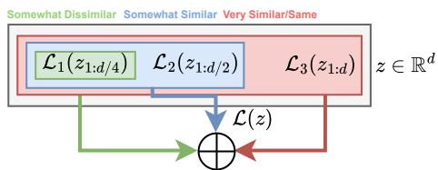
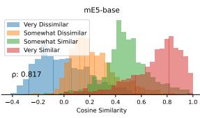
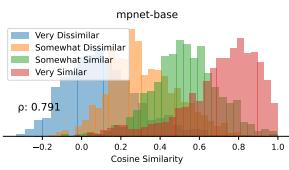
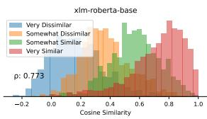
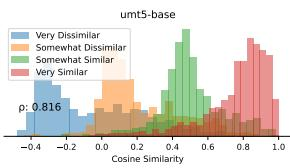
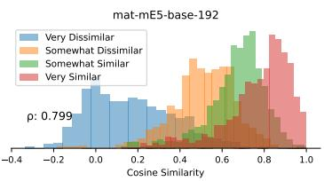
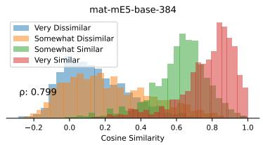
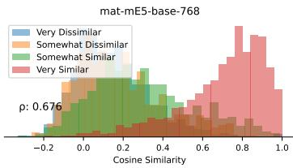

# Hierarchical Level-Wise News Article Clustering via Multilingual Matryoshka Embeddings

Hans W. A. Hanley Stanford University hhanley@cs.stanford.edu

Zakir Durumeric Stanford University zakir@cs.stanford.edu

## Abstract

Contextual large language model embeddings are increasingly utilized for topic modeling and clustering. However, current methods often scale poorly, rely on opaque similarity metrics, and struggle in multilingual settings. In this work, we present a novel, scalable, interpretable, hierarchical, and multilingual approach to clustering news articles and social media data. To do this, we first train multilingual Matryoshka embeddings that can determine story similarity at varying levels of granularity based on which subset of the dimensions of the embeddings is examined. This embedding model achieves state-of-the-art performance on the SemEval 2022 Task 8 test dataset (Pearson ρ = 0.816). Once trained, we develop an efficient hierarchical clustering algorithm that leverages the hierarchical nature of Matryoshka embeddings to identify unique news stories, narratives, and themes. We conclude by illustrating how our approach can identify and cluster stories, narratives, and overarching themes within real-world news datasets.

## 1 Introduction

The news ecosystem is increasingly globalized and fractured, with news stories and misinformation spreading across thousands of news websites and between countries’ news ecosystems (Rupnik et al., 2016). For example, during the Russian invasion of Ukraine, a propaganda story about the Nazi composition of the Ukrainian government published in Russia was covered extensively elsewhere — not just in Russia and Ukraine, but also in the US, China, and throughout the Global South (Blank, 2022; Hanley et al., 2023). Understanding how media outlets cover events is crucial for identifying biases in news platforms, gaps in coverage, and how news ecosystems interact and influence each other (Hanley et al., 2025; Bisandu et al., 2018).

Despite the importance of understanding news coverage in a multilingual and global setting (Chen et al., 2022b; Bisandu et al., 2018), most current approaches that use LLM-based text embeddings are monolingual, do no not scale, or are unable to differentiate between news stories and narratives at varying levels of granularity (i.e., identify different overarching themes, topics, and individual narratives) (Hanley et al., 2024; Chen et al., 2022b; Grootendorst, 2022; Nielsen and McConville, 2022; Xu et al., 2022; Abdelrazek et al., 2023). Beyond decoder-based large language models like OpenAI’s GPT-4 and Anthropic’s Claude, which remain prohibitively expensive for processing documents at scale, encoder-based models often simply identify the “similarity” overlap of two news articles via the cosine-similarity of their embeddings. Given that this similarity is usually weakly defined, identifying larger themes among documents with encoder-based models remains challenging (Chen et al., 2022b; Chambers and Jurafsky, 2009). Furthermore, even with highly interpretable and robust embeddings, clustering-based approaches to extract out different individual stories are often difficult to utilize because the number of news stories, topics, and themes reported is not known a priori (Monath et al., 2021; Hanley et al., 2024; Jiang et al., 2012; Dinari and Freifeld, 2022). As a result, developing algorithms that can automatically determine the number of news stories, topics, and themes within a dataset is essential, unlike traditional approaches such as LDA and K-means (Jelodar et al., 2019; Ahmed et al., 2020).

To address these challenges, in this work, we introduce a novel adaptation of multilingual hierarchical Matryoshka embeddings and a hierarchical clustering algorithm adapted for clustering semantically similar news articles. Our multilingual Matryoshka embeddings progressively learn additional detail in their upper dimensions, allowing for the identification and differentiation of multilingual news articles at varying granularities of similarity. In our approach, the upper dimensions of embeddings are used to determine if two news articles are about the same event, the middle dimensions to determine if they address the same topic, and the lower dimensions to determine if they address the same theme. Compared to traditional embeddings, our approach makes similarity calculations at varying levels more interpretable while also reducing the cost of similarity calculations. To then identify distinct news stories, topics, and themes, we develop a novel agglomerative clustering algorithm that leverages the naturally hierarchical structure of our Matryoshka embeddings based on the Reciprocal Nearest Neighbor algorithm (Monath et al., 2023). Our contributions are thus:

• The design of a multilingual Matryoshka embedding model capable of differentiating between news articles at varying levels of semantic similarity that achieves state-of-the-art performance on the SemEval 2022 Task 8 test dataset (Pearson $\rho = 0 . 8 1 6 )$ .

• The design of a hierarchical agglomerative clustering algorithm that exploits the hierarchical nature of our Matryoshka embeddings and a model capable of providing humaninterpretable summaries of clusters.

We release the weights and synthetic portions of our training datasets at https://github.com/h anshanley/multilingual-matryoshka-news.

## 2 Background and Related Work

Semantic Embeddings. Recent work has investigated models that encode texts into fixed-length embeddings that capture their semantic and syntactic meaning (Reimers and Gurevych, 2019; Li et al., 2024b; Cer et al., 2018). These embeddings are often used for classification, clustering (Hanley et al., 2024), semantic textual similarity (Gao et al., 2021), and retrieval-augmented generation (Gao et al., 2023). While initial work focused on word embeddings (Mikolov et al., 2013; Pennington et al., 2014), recent investigations have concentrated on sentence, paragraph, and document-level representations (Gao et al., 2021; Li et al., 2024b).

Several recent studies have utilized contrastive learning techniques to achieve state-of-the-art results in designing both monolingual and multilingual semantic embeddings (Gao et al., 2021). Contrastive learning objectives generally seek to bring items that have the same class or label close to each other in the embedding space while simultaneously distancing items that have different classes or labels. For example, Gao et al. (2021) use a contrastive loss objective, dropout, and natural language inference to learn monolingual embeddings on top of BERT and RoBERTa-based models. In a similar vein, Wang et al. (2022) utilize a dataset of text pairs and a student-teacher model to train high-quality embeddings.

Matryoshka Embeddings. Matryoshka representation learning (MRL) (Kusupati et al., 2022) is a recent embedding method that seeks to learn flexible nested representations. Namely, MRL optimizes the original loss function (i.e., contrastive loss) at $O ( l o g ( d ) )$ different representation sizes of the full embedding size d. Given a labeled dataset $\boldsymbol { D } = \{ ( x _ { 1 } , y _ { 1 } ) , \ldots , ( x _ { N } , y _ { N } ) \}$ , where H are the corresponding embeddings/d-dimensional representations of the datapoints X, and $\mathcal { L } ( \cdot )$ is the original function loss, MRL optimizes the loss across several nested truncated versions of the embedding. As shown by Kusupati et al. (2022), this advancement enables more compact representations but comparably accurate representations of semantic information for use cases when the storage size or the flexibility of embeddings is important.

Clustering. Clustering is an unsupervised algorithm that seeks to identify groups of similar items in a dataset (Bateni et al., 2024). Superficially, clustering consists of creating partition ${ \mathcal { S } } =$ $\{ C _ { 1 } , \cdots , C _ { k } \}$ of a dataset $\mathcal { X } = \{ x _ { i } \} _ { i = 1 } ^ { N }$ , such that $\textstyle \bigcup _ { C \in S } C = { \mathcal { X } }$ and C, $C ^ { \prime } \in \mathcal { C } , C \cap C ^ { \prime } = \emptyset$ . Clustering has been used for feature extraction (Zhang et al., 2006), visualization (Schwartz et al., 2020), and topic analysis (Grootendorst, 2022). In this work, we modify a hierarchical clustering algorithm called Reciprocal Agglomerative Clustering (RAC) to make use of Matryoshka embeddings. We give a brief overview here:

Reciprocal Agglomerative Clustering (RAC). Starting from all data points, RAC progressively merges clusters in distinct rounds if, among the current set, clusters are each other’s reciprocal nearest neighbor (RNN) (Sumengen et al., 2021). While requiring the computation of the distance matrix between clusters, which can be prohibitive, as shown by Sumengen et al. (2021), since clusters can be joined together in any particular order without affecting cluster quality, this algorithm is easily parallelizable. See Sumengen et al. (2021) for details.

## 3 Dataset

We primarily utilize an expanded version of the SemEval-2022 Task 8: Multilingual news article similarity dataset (SE-22-t8) (Chen et al., 2022b, 2024). This dataset consists of pairs of news articles from early 2020 that are graded across varying aspects of similarity, including their geographical focus, their narrative schemes, the time period in which they were written, and their tone. We specifically use OVERALL similarity specified in this dataset, which grades news article pairs on whether “the two articles cover the same substantive news story (excluding style, framing, and tone).” The OVERALL metric is based on human participants grading article pairs as being “Very Similar”, “Somewhat Similar”, “Somewhat Dissimilar”, and “Very Dissimilar.” For example, “Very Similar” news articles are about the same news event. We supplement this dataset with Miranda et al. (2018)’s news clustering dataset of multilingual articles. For this work, we treat articles about the same event as defined by Miranda et al. (2018) as “Very Similar.” We provide examples of article pairs of varying similarity in Appendix A; additional examples and the code book for grading article similarity can be found at https://zenodo.org/records/6507872 (Chen et al., 2022b, 2024).

Given that the published dataset does not include article text, we scraped each of the 37,394 URLs provided. After removing dead links, unavailable articles, and articles shorter than 500 characters, we were left with 24,871 articles in English, Chinese, Spanish, German, Arabic, Italian, Turkish, Polish, French, and Russian. As recommended by Chen et al. (2022b), we utilize the newspaper3k Python library to extract article contents and use the BeautifulSoup library to remove any HTML tags, JavaScript, URL hyperlinks, as well as newline (\n) and tab characters (\t).

Dataset Augmentations. After scraping the set of news articles from the expanded SE-22-t8 dataset, we augment the dataset with synthetic writing style alterations, entity replacements, and extend the dataset beyond the original 10 languages.

Stylistic Augmentations. To ensure that the dataset contains multiple stylistic variations of individual articles to enable our final trained embeddings to recognize that different writing styles about the same event, we use the Open AI model GPT-4o1 to rewrite each article in the original dataset three times with a different stylistic variation using the prompt: “Rewrite, in the article’s own language (e.g., Spanish, English, Finnish, etc...), the following news article with a different style as if it came from a different website while maintaining the original meaning ofthe article.” See Appendix B for examples.

Entity Sensitivity. We ensure that our final models are sensitive to the named entities within different texts, regardless of stylistic similarities between articles. To do this, as in Mitchell et al. (2023) and Hanley and Durumeric (2024), we utilize Spacy2 to identify named entities in 10,000 articles in the English subsection of the SemEval dataset and subsequently utilize a T5-based model T5-1.1-XL to replace these entities with generic replacements based on the surrounding text. As argued by Mitchell et al. (2023), genetic language models like T5 can create “meaningful variations” upon replacing parts of the text. In line with the definitions within the SemEval 22 dataset, we treat these variations as “Somewhat Similar” to their original versions. Upon replacing these entities, we additionally translate 500 of these texts to our 53 other leagues using GPT-4o. Altogether, we add an additional 27,000 examples to our dataset.

Additional Languages. To augment the SE-22-t8 dataset beyond the original 10 languages, for a random selection of article pairs in the original dataset, we query GPT-4o to rewrite the articles to a random subset of 28 additional languages from a set of 54 total languages including Latvian, Chinese, Japanese, and Albanian (full list in Appendix C).3 We utilize the following prompt: “Translate the following article into {language}.”

After querying GPT-4o to rewrite and translate individual article pairs, we take different combinations of translations of the original dataset to increase the size of our dataset. This is such that, for example, after gathering the 29 translations (28 queried + original article) of each article, we extend the original article pair from one data point to 841 data points (i.e., each data point can be paired with each of the different translations of the opposing data point). Similarly, after translation, where each article has 28 translations, we further augment our dataset by gathering each translation pair and treating them as a new pair of “Very Similar” articles. Altogether, after rewriting and translating the original set of articles, removing any errors returned by GPT-4o, we extend the original dataset to 4.10M article pairs. We utilize 10% (410K article pairs) of our SE-22-t8 dataset as validation.

Test Dataset. For our evaluation, in addition to the original 10-language SE-22-t8 (Chen et al., 2022b) test split of 3,958 article pairs and 7,842 unique articles, for each of the 54 languages in our dataset, we translate 1,300 random test instances. Altogether, these translations enable us to extend the original test split to 2.07M examples. In addition to extending our test set to include languages previously not within the original SE-22-t8 test dataset, this extension enables us to further test and ensure the isomorphism (Marchisio et al., 2022) (i.e., that the resulting embeddings are language-agnostic) of our embeddings. Namely, during the evaluation phase of our work, we estimate the relational similarity between each non-English language and English. See the Appendix F for details about the calculation of relational similarity.

## 4 Methodology

Our approach operates in two steps. First, we utilize the naturally hierarchical nature of Matryoshka representation learning (MRL) to train contextual embeddings that model the relationship from general textual concepts down to specific descriptions of particular events. Second, we use these embeddings in a level-wise hierarchical clustering algorithm (Monath et al., 2023) to identify specific news stories, topics, and themes. While several previous approaches have sought to build and label concept hierarchies utilizing embeddings (Le et al., 2019; Stein et al., 2019; Meng et al., 2020), we propose using MRL learning and a supervised approach to first encode generalized hierarchical information. This allows our clustering algorithm to directly use the embeddings to create a hierarchical representation of a text dataset.

Matryoshka Embeddings for Fine-Grained Similarity Calculations. As previously noted, Matryoshka representation learning (MRL) is a flexible alternative to traditional embedding approaches, which learns embeddings of varying capacities through the explicit optimization of lowerdimensional vectors in a nested fashion (Kusupati

Figure 1: Matryoshka Representation Learning for embedding hierarchical structure into the contextual embeddings of outputted by a semantic encoder.

et al., 2022). However, within this work, rather than learning the same representation at multiple dimensions, we use our Matryoshka embeddings to learn increasingly specific information about news articles by taking advantage of the similarity labels from the SE-22-t8 dataset.

Modified AngIE Loss for MRL. To train our Matryoshka embeddings, we utilize a modified version of contrastive AngIE loss (Li and Li, 2024), applying this loss at $O ( l o g ( d ) )$ different representation sizes of the full embedding size d (see Figure 1). We adapt AngIE loss, as it largely depends on the relative ranking between different datapoint pairs for calculating loss, allowing us to directly use the rankings of the similarities $( i . e .$ , “Very Similar” > “Very Dissimilar”) in the SE-22-t8 dataset. Specifically, given a dataset with set of embedding pairs $x _ { i } = \left( \mathbf { h } _ { \mathbf { m } } , \mathbf { h } _ { n } \right)$ that have labeled similarities $y _ { i } = s ( \mathbf { h } _ { m } , \mathbf { h } _ { n } )$ , AngIE loss consists the sum of a cosine objective function, (2) a contrastive in-batch negative objective (2), and finally (3) an angle objective:

$$
\begin{array} { c }  { { \mathcal { L } } _ { { \mathrm { A n g t } } } = { \displaystyle { \mathcal { L } } _ { { \mathrm { s n g t } } } = { \mathcal { L } } _ { { \mathrm { c n v } } } + { \mathcal { L } } _ { { \mathrm { c n v } } } { \mathrm { m a x } } + { \mathcal { L } } _ { { \mathrm { a n g t } } } } } \\ { { { \mathcal { L } } _ { { \mathrm { c n v } } } = { \displaystyle { \log } } \left[ 1 + \sum _ { { { \begin{array} { l } { { \mathrm { s } } \end{ } } \mathrm { t h } } _ { 0 } , h _ { \mathrm { b } } \end{array} } , { \mathrm { l } } } \right] } } \\ { { { \mathcal { L } } _ { { \mathrm { c n v } } } = { \mathrm { I m } } , { \mathrm { e } } } \\ { { { \mathcal { L } } _ { { \mathrm { c n v } } } = { \displaystyle { \sum } } _ { i } { \log } \frac { \sum _ { i \in \left( \sum _ { i = 1 } ^ { N } \epsilon _ { i } \right) - \cosh \left( \frac { \Delta \theta _ { i } } { \epsilon } \right) - \cosh \left( h _ { i } h _ { \mathrm { b } } \right) } } { \epsilon } } } \\ { { { \mathcal { L } } _ { { \mathrm { c n g t } } } = { \mathrm { I m } } } = - \displaystyle { \sum _ { i } ^ { N } } { \log } \frac { \sum _ { i \in \left( \sum _ { i = 1 } ^ { N } \epsilon _ { i } \right) - \cosh \left( h _ { i } h _ { i } ^ { - 1 } \right) / \tau } { \epsilon ^ { N } } } } \\ { { { \mathcal { L } } _ { { \mathrm { a n g t } } } = { \log } \left[ 1 + \sum _ { i \in \left( \sum _ { i = 1 } ^ { N } \epsilon _ { i } \right) - \cosh \left( \frac { \Delta \theta _ { i } } { \epsilon } - \frac { \Delta \theta _ { i } } { \epsilon } \right)  } } { \ep\right]silon ^ { N } \epsilon _ { i } h _ { i } h _ { i } ^ { - 1 } } } \end{array} } .
$$

where $\tau$ is the temperature hyperparameter, $c o s ( \cdot , \cdot )$ is the cosine similarity function, and $( \mathbf { h } _ { \mathbf { i } } , \mathbf { h } _ { k } ^ { + } )$ within a batch are pairs that have the same class, label, or are considered to be positives of high similarity. For details on how the complex representations of the contextual text representations are computed and how the normalized angle differences are determined, see Appendix D or Li and Li (2024).

To adapt the AngIE loss to the MRL setting and to identify multilingual articles of increasing similarity, we make two key changes to the AngIE objective: (1) at progressively higher dimensions, we increase the threshold for considering a news article pair as similar or as positives and (2) we incorporate SimCSE (Gao et al., 2021) for improved monolingual embedding spaces. This is such that for the loss applied at $d / \iota$ 4-dimensions we treat “Very Dissimilar” pairs as having a labeled cosine similarity of $0 ,$ and all other pairs as having a labeled cosine similarity of $1 ;$ then for the loss applied at $d / 2$ dimensions, we treat “Very Dissimilar” and “Somewhat Dissimilar” pairs as having a labeled cosine similarity of 0, and all other pairs as having a labeled cosine similarity of 1, etc... This forces the embedding to progressively learn to differentiate different levels of similarity, utilizing the lower dimensions to learn higher concepts and later dimensions to learn finer-grained details.

To incorporate SimCSE (Gao et al., 2021), during training, we encode each batch twice through our encoder with different dropout masks. As found by Gao et al. (2021), utilizing identical positive pairs that have independently sampled dropout masks by feeding the same input to the encoder twice can lead to higher quality embeddings. Given that we are training multilingual embeddings, this additional step to explicitly train each monolingual training instance with itself further leads to better individual language embedding spaces (Park et al., 2024). Our final MRL loss is thus:

$$
\begin{array} { r l } & { \mathcal { L } _ { m a t } = \mathcal { L } _ { \mathrm { A n g I E } _ { d i s s } } ( \mathbf { H } _ { d / 4 } ) } \\ & { ~ + \mathcal { L } _ { \mathrm { A n g I E } _ { s o m e w h a t } } ( \mathbf { H } _ { d / 2 } ) + \mathcal { L } _ { \mathrm { A n g I E } _ { s a m e } } ( \mathbf { H } _ { d } ) } \end{array}
$$

Hierarchical Clustering via Level-Wise Fine-Grained Similarity Calculations. To cluster our Matryoshka embeddings for news article data, we propose a modification to Reciprocal Agglomerative Clustering (RAC) (Sumengen et al., 2021). This is such that for the first round of merging reciprocal nearest neighbors (RNN)– points that are both the most similar to each other – in the RAC algorithm, we utilize the first $d / 4$ -dimensional representation for the top layer of $\ell = 1$ of our hierarchy that represent the themes present in the dataset. These merges continue as long as the centroid similarities for any given clusters $\mu _ { i } , \mu _ { j }$ are above a given threshold $\lambda _ { 1 }$ . Subsequently, after all of the themes are generated using the $d / 4$ dimensions, we again cluster the news stories within these clusters, creating the $\ell = 2$ layer of our clustering, representing the topics in the dataset. We again combine the nearest neighbors until the maximum similarity between any two clusters is below a given threshold $\lambda _ { 2 } ,$ except using the $d / 2 .$ -dimensional representation of the centroids from the first round (appropriately weighting for the number of data points within each cluster). To create the $\ell = 3$ layer of the hierarchical clustering, we repeat this to construct the bottom layer of the tree using the full representation with another threshold $\lambda _ { 3 }$ (see Appendix E). Throughout our work, we determine the $\lambda _ { \ell }$ thresholds for combining RNNs empirically based on the value that achieves the highest $F _ { 1 }$ score in differentiating news articles on the validation set from the SE-22-t8 dataset.

## 5 Benchmarking and Results

Having given an overview of our training scheme for our Matryoshka embeddings, we now benchmark their ability to differentiate news articles of varying similarity and evaluate the efficacy of our proposed clustering algorithm.

## 5.1 Embeddings Evaluation

As in past work, we evaluate our models using their Pearson’s correlation $\rho$ with the OVERALL labels on the test split of the SemEval 22 t8 dataset (Chen et al., 2022b). We evaluate our Matryoshka embedding approach against both fine-tuned and baseline versions of several popular multilingual encoder models with context windows of 512 tokens that were trained using the original unaltered AngIE objective function (Li and Li, 2024). We additionally benchmark our models against the best bi-encoder model submitted to the SE-22-t8 task, GateNLP-UShef (Singh et al., 2022).4

Training Setup. While training our embeddings, we set the learning rate to $2 \times 1 0 ^ { - 5 }$ and use AdamW as the optimizer (Kingma and Ba, 2015). Due to computational constraints, while training on an NVIDIA A6000 GPU, we use a batch size of 16. As in Li and Li (2024), while training our Matryoshka embeddings utilizing the modified AngIE objective, we set the temperature parameter τ to 0.05. We use a maximum length of 512 tokens. We utilize 10% (410K article pairs) of our SE-22-t8 dataset as validation. During training, we evaluate performance every 10K training steps and use a patience of 2 for ending training.

<table><tr><td rowspan=1 colspan=1>Model</td><td rowspan=1 colspan=1>SE-22</td><td rowspan=1 colspan=1>SE-22 Ext.</td></tr><tr><td rowspan=12 colspan=1>mE5-basefine-mE5-base (ours)mpnet-basefine-mpnet-base (ours)xlm-roberta-basefine-xlm-roberta-base (ours)umt5-basefine-umt5-base (ours)mat-mE5-base-192 (ours)mat-mE5-base-384 (ours)mat-mE5-base-768 (ours)GateNLP-UShef</td><td rowspan=1 colspan=1>0.604</td><td rowspan=1 colspan=1>0.582</td></tr><tr><td rowspan=1 colspan=1>0.817</td><td rowspan=1 colspan=1>0.812</td></tr><tr><td rowspan=1 colspan=1>0.513</td><td rowspan=1 colspan=1>0.520</td></tr><tr><td rowspan=1 colspan=1>0.791</td><td rowspan=1 colspan=1>0.801</td></tr><tr><td rowspan=1 colspan=1>0.225</td><td rowspan=1 colspan=1>0.119</td></tr><tr><td rowspan=1 colspan=1>0.773</td><td rowspan=1 colspan=1>0.796</td></tr><tr><td rowspan=1 colspan=1>0.262</td><td rowspan=1 colspan=1>0.119</td></tr><tr><td rowspan=1 colspan=1>0.815</td><td rowspan=1 colspan=1>0.582</td></tr><tr><td rowspan=1 colspan=1>0.799</td><td rowspan=1 colspan=1>0.808</td></tr><tr><td rowspan=1 colspan=1>0.792</td><td rowspan=1 colspan=1>0.816</td></tr><tr><td rowspan=1 colspan=1>0.676</td><td rowspan=1 colspan=1>0.776</td></tr><tr><td rowspan=1 colspan=1>0.801</td><td rowspan=1 colspan=1></td></tr></table>

Table 1: Comparison of different pre-trained bi-encoder models and our fine-tuned models on the SE-22-t8 test dataset in terms of Pearson correlation.

Evaluation Results. As seen in Table 1, our models trained with our modified AngIE objective achieve competitive scores for the former SE-22-t8 test set. Indeed, our models perform better than the previous state-of-the-art model, with our fine-tuned-mE5-base model achieving stateof-the-art results for bi-cross embedding models (embedding models can be utilized for clustering news articles) on the test split (0.817 vs. 0.801). Our embeddings further extend to the other added languages in our extended test dataset. Given the advantage of utilizing mE5-base in learning to differentiate between different news articles, we utilize the mE5-base encoder language model as our base model and focus on its Matryoshka-trained version for the remainder of our paper. This reinforces past work (Park et al., 2024; Wang et al., 2024) that suggests the mE5 model’s success over prior models in modeling multilingual texts. See Appendix H for additional bilingual results.

Plotting the cosine similarities for the different similarity pairs within the test split of the SE-22-t8 dataset in Figure 2, we observe a separation between the similarity pairs at different dimensions for our Matryoshka in comparison to the fine-tuned versions of our other embeddings, illustrating the ability of Matryoshka embeddings to learn increasingly detailed information about texts at higher dimensions. To further show this ability, we compute the AUROC for each of our models’ abilities to differentiate news article similarity at various similarity thresholds based on their cosine similarity. As seen in Table 2, across both the original test dataset and our extended 54-language test dataset, our Matryoshka embeddings largely perform the best at differentiating news articles at each similarity level compared to our traditionally trained embeddings.

## 5.2 Ablations and Relational Similarity

Identical Positive Pairs with Dropout. The inclusion of identical positive pairs with independently sampled dropout (Gao et al., 2021) is key to the success of our models. This approach forced our models to retain their language similarly to their similarities by ensuring slightly similar sentence embeddings in the same language were pushed towards each other. We note that this further enabled us during training to artificially increase our batch size (i.e., more positives and negatives within each batch). Indeed, training a model based on the mE5-base encoder without these artificial in-batch negatives, our Pearson ρ correlation on the SemEval 22-t8 dataset was $\rho = 0 . 6 9 3$ using the first 192 dimensions, $\rho = 0 . 7 0 2$ for the first 384 dimensions, and $\rho = 0 . 6 8 4$ for the full embedding. We find similar behavior on the extended 54-language SemEval 22-t8 dataset with $\rho = 0 . 7 3 3$ using the first 192 dimensions, $\rho = 0 . 7 4 5$ for the first 384 dimensions, and $\rho = 0 . 7 4 0$ for the full embedding. We further find that ridding our model of all in-batch negatives by removing $\mathcal { L } _ { c o n t r a s t }$ similarly hurts our model, with the Pearson correlation ρ decreasing to nearly zero. Data Aug mentation. We also find that our data augmentation approach enabled our work to extend to more languages and led to better performance overall. To show this, we perform another ablation where we train our Matryoshka mE5-base encoder using only the SemEval 22-t8 dataset. While we do achieve high performance on the original SemEval test set $\rho = 0 . 8 2 8$ using the first 192 dimensions, ρ = 0.835 for the first 384 dimensions and $\rho = 0 . 8 0 2$ for the full embedding, this lead to de graded performance on the extended 54-language test dataset $( \rho = 0 . 7 0 6$ using the first 192 dimensions, $\rho = 0 . 7 9 9$ for the first 384 dimensions and $\rho = 0 . 7 1 2 )$

Relational Similarity. Finally, to ensure that our Matryoshka embeddings were isomorphic, we determined the relational similarity between the language’s GP4o translated test set embeddings using our extended test SE-22 dataset. We observed an average of 0.753 relational similarity with English, with the lowest relational similarity being between English and Burmese at 0.452 (the highest being between English and Portuguese at 0.839). See

  
(a) fine-mE5-base

  
(b) fine-mpnet

  
(c) fine-xlm-roberta-base

  
(d) fine-umt5-base

  
(e) matryoshka-mE5-d/4 dimensions

  
(f) matryoshka-mE5-d/2 dimensions

  
(g) matryoshka-mE5-d dimensions

Figure 2: Cosine similarity of test split of the SE-22-t8 dataset article pair embeddings utilizing Matryoshka e5-base embeddings. As more dimensions are added, the Matryoshka embeddings can distinguish between greater article similarities.
<table><tr><td>Dataset</td><td>Model</td><td>≥ SD</td><td>≥ SS</td><td>≥vs</td></tr><tr><td>SE-22-t8</td><td>mat-mE5 (ours)</td><td>0.948</td><td>0.949</td><td>0.934</td></tr><tr><td></td><td>mE5-base</td><td>0.850</td><td>0.838</td><td>0.799</td></tr><tr><td></td><td>fine-mE5-base (ours)</td><td>0.917</td><td>0.939</td><td>0.911</td></tr><tr><td></td><td>mpnet-base</td><td>0.808</td><td>0.786</td><td>0.732</td></tr><tr><td></td><td>fine-mpnet-base (ours)</td><td>0.913</td><td>0.922</td><td>0.895</td></tr><tr><td></td><td>xlm-roberta-base</td><td>0.693</td><td>0.678</td><td>0.661</td></tr><tr><td></td><td>fine-xlm-roberta-base (ours)</td><td>0.905</td><td>0.914</td><td>0.882</td></tr><tr><td></td><td>umt5-base</td><td>0.715</td><td>0.704</td><td>0.670</td></tr><tr><td></td><td>fine-umt5-base (ours)</td><td>0.902</td><td>0.935</td><td>0.926</td></tr><tr><td>SE-22-t8-Ext.</td><td>mat-mE5 (ours)</td><td>0.960</td><td>0.967</td><td>0.962</td></tr><tr><td></td><td>mE5-base</td><td>0.890</td><td>0.879</td><td>0.860</td></tr><tr><td></td><td>fine-mE5-base (ours)</td><td>0.953</td><td>0.962</td><td>0.959</td></tr><tr><td></td><td>mpnet-base</td><td>0.847</td><td>0.838</td><td>0.813</td></tr><tr><td></td><td>fine-mpnet-base (ours)</td><td>0.952</td><td>0.961</td><td>0.949</td></tr><tr><td></td><td>xlm-roberta-base</td><td>0.626</td><td>0.617</td><td>0.610</td></tr><tr><td></td><td>fine-xlm-roberta-base</td><td>0.949</td><td>0.960</td><td>0.948</td></tr><tr><td></td><td>(ours)</td><td></td><td></td><td></td></tr><tr><td></td><td>umt5-base fine-umt5-base (ours)</td><td>0.676 0.893</td><td>0.668 0.878</td><td>0.652 0.859</td></tr></table>

Table 2: AUROC for differentiating news article pair similarities on the test split of the SE-22-t8 dataset.

Appendix F for additional details. Based on prior work, we thus achieve an acceptable average multilingual alignment across our embeddings (Lample et al., 2018; Marchisio et al., 2022). We leave to future work to translate additional texts in lowresource languages like Burmese, Kannada, and Malayalam to potentially improve our relational similarity for these languages.

## 5.3 Multilingual Clustering

Having observed that our models, in particular our Matryoshka model, are better able to differentiate news articles at varying levels of similarity, we now benchmark these embeddings using two common clustering techniques used for encoder embeddings: Mini-Batch K-Means5 and BERTopic (Grootendorst, 2022). BERTopic is a recent, widely used technique that utilizes the UMAP (McInnes et al.,

2018) and the HDBSCAN density-based clustering algorithm (McInnes et al., 2017) to group together documents from their embeddings. For both of these algorithms, we determine their performance on (Miranda et al., 2018)’s multilingual news article dataset and the 20 Group News dataset, which groups together documents by general theme. As in Miranda et al. (2018), we benchmark our embeddings by computing our embeddings’ $F _ { 1 }$ scores for correctly grouping documents using BERTopic and mini-batch K-Means.

As seen in Table 3, our models, particularly our Matryoshka model, perform largely the best in terms of differentiating news articles, both utilizing BERTopic and Mini-Batch K-Means. This is particularly true when utilizing BERTopic, where the Matryoshka model utilizing the first 192 dimensions achieves an $F _ { 1 }$ score of 0.8399 on the Miranda et al. (2018) dataset and an $F _ { 1 }$ score of 0.2730 on the 20 NewsGroup dataset using BERTopic. We note that our fine-tuned models largely outperform their generic counterparts.

Hierarchical Clustering. We additionally benchmark our approach for hierarchical clustering. Given the lack of hierarchical-level text clustering benchmarks to determine the performance of our hierarchical clustering algorithms we (1) cluster the test split of SE-22-t8 dataset at various similarity granularities utilizing our proposed hierarchical clustering algorithm as well as BERTopic and (2) subsequently again determine the $F _ { 1 }$ scores of these clustering algorithms in correcting grouping “Very Similar” articles together at the highest granularity, “Somewhat Similar” and higher articles the second highest granularity, and finally “Somewhat

<table><tr><td></td><td></td><td colspan="3">BERTopic</td><td colspan="3">MiniBatch-KMeans</td></tr><tr><td>Data</td><td>Model</td><td>Prec.</td><td>Recall</td><td> $\overline { { F _ { 1 } } }$ </td><td>Prec.</td><td>Recall</td><td>F1</td></tr><tr><td rowspan="9">Miranda et al. (2018)</td><td>xlm-roberta-base fine-xlm-roberta</td><td>0.3568</td><td>0.3641</td><td>0.3604 0.7406</td><td>0.5171 0.6432</td><td>0.0964 0.1293</td><td>0.1626 0.2153</td></tr><tr><td></td><td>0.6810</td><td>0.8116</td><td></td><td></td><td></td><td></td></tr><tr><td>mpnet-base</td><td>0.8388</td><td>0.6830</td><td>0.7529</td><td>0.6676</td><td>0.1424</td><td>0.2348</td></tr><tr><td>fine-mpnet-base</td><td>0.7071</td><td>0.8415</td><td>0.7685</td><td>0.6600</td><td>0.1305</td><td>0.2179</td></tr><tr><td>umt5-base</td><td>0.0665</td><td>0.2960</td><td>0.1086</td><td>0.1536</td><td>0.0638</td><td>0.0902</td></tr><tr><td>fine-umt5-base</td><td>0.4983</td><td>0.5360</td><td>0.5165</td><td>0.5692</td><td>0.0864</td><td>0.1501</td></tr><tr><td>mE5-base</td><td>0.8507</td><td>0.3715</td><td>0.5171</td><td>0.4919</td><td>0.1960</td><td>0.2803</td></tr><tr><td>fine-mE5-base mat-mE5-base-192</td><td>0.7791 0.7895</td><td>0.5735 0.8971</td><td>0.6607 0.8399</td><td>0.7111 0.6876</td><td>0.1468</td><td>0.2434</td></tr><tr><td>mat-mE5-base-384</td><td>0.7798</td><td>0.8496</td><td>0.8132</td><td>0.6761</td><td>0.1271 0.1232</td><td>0.2145 0.2083</td></tr><tr><td></td><td>mat-mE5-base-768</td><td>0.7661</td><td>0.8677</td><td>0.8137</td><td>0.6329</td><td>0.1338</td><td>0.2209</td></tr><tr><td rowspan="10">20 NewsGroup</td><td>xlm-roberta-base</td><td>0.0504</td><td>0.9372</td><td>0.0956</td><td>0.1004</td><td>0.1297</td><td>0.1132</td></tr><tr><td>fine-xlm-roberta</td><td>0.0967</td><td>0.6783</td><td>0.1693</td><td>0.1736</td><td>0.4480</td><td>0.2502</td></tr><tr><td>mpnet-base</td><td>0.0692</td><td>0.8415</td><td>0.1280</td><td>0.2086</td><td>0.5216</td><td>0.2980</td></tr><tr><td>fine-mpnet-base</td><td>0.1193</td><td>0.7057</td><td>0.2041</td><td>0.2009</td><td>0.4933</td><td>0.2855</td></tr><tr><td>umt5-base</td><td>0.0504</td><td>0.9374</td><td>0.0956</td><td>0.0617</td><td>0.1271</td><td>0.0831</td></tr><tr><td>fine-umt5-base</td><td>0.0505</td><td>0.8737</td><td>0.0955</td><td>0.1284</td><td>0.1688</td><td>0.1459</td></tr><tr><td>mE5-base</td><td>0.0644</td><td>0.8755</td><td>0.1199</td><td>0.1550</td><td>0.5724</td><td>0.2439</td></tr><tr><td>fine-mE5-base</td><td>0.1813</td><td>0.5589</td><td>0.2738</td><td>0.2258</td><td>0.4775</td><td>0.3066</td></tr><tr><td>mat-mE5-base-192</td><td>0.1711</td><td>0.6743</td><td>0.2730</td><td>0.2131</td><td>0.4642</td><td>0.2921</td></tr><tr><td>mat-mE5-base-384</td><td>0.1622</td><td>0.6027</td><td>0.2606</td><td>0.2131</td><td>0.5236</td><td>0.3044</td></tr><tr><td></td><td>mat-mE5-base-768</td><td>0.1521</td><td>0.2818</td><td>0.1976</td><td>0.0947</td><td>0.2310</td><td>0.1343</td></tr></table>

Table 3: Performance for clustering news articles on the Miranda and 20 NewsGroup datasets.

<table><tr><td>fine-mpnet-base</td><td>SD</td><td>SS</td><td>VS</td></tr><tr><td>BERTopic</td><td>0.817</td><td>0.693</td><td>0.616</td></tr><tr><td>Level wise RAC</td><td>0.822</td><td>0.775</td><td>0.724</td></tr><tr><td>fine-mE5-base</td><td>SD</td><td>SS</td><td>VS</td></tr><tr><td>BERTopic</td><td>0.802</td><td>0.648</td><td>0.579</td></tr><tr><td>Level wise RAC</td><td>0.822</td><td>0.775</td><td>0.752</td></tr><tr><td>mat-mE5</td><td>SD</td><td>SS</td><td>VS</td></tr><tr><td>BERTopic</td><td>0.819</td><td>0.738</td><td>0.608</td></tr><tr><td>Level wise RAC</td><td>0.849</td><td>0.816</td><td>0.795</td></tr></table>

Table 4: Comparison of the $F _ { 1 }$ score in clustering documents in the SE-22-t8 dataset at various levels of granularity using our approach versus BERTopic.

Dissimilar” news articles at the lowest granularity. We test our best-performing models, the Matryoshka embedding and our traditionally trained mE5-base and mpnet embeddings, on this task utilizing our RAC algorithm and BERTopic (Grootendorst, 2022). For our RAC algorithm, we utilize the optimal $\lambda _ { \ell }$ for differentiating news article similarities determined from the held-out validation set of the SE-22-t8 dataset.

As seen in Table 4, our level-wise RAC approach outperforms BERTopic in differentiating the SE-22- t8 dataset at every level of granularity. Similarly, our Matryoshka mE5 model outperforms our traditionally trained AngIE mE5 and mpnet models using our level-wise RAC approach.

Case Study: Interpretable Multilingual Clusters. While clustering multilingual news articles can identify different news stories amongst international news websites and social media data, these clusters can still be difficult to parse and understand. To create human-interpretable representations of the underlying clusters, we take two approaches: (1) English story-level summaries, and (2) representative English keyword extraction at each level of the hierarchical clustering.

For our story-level summaries, we fine-tune a LLaMA model6 to perform multilingual news article summarization and output English-language summaries (Dubey et al., 2024). Specifically, to train this model, we first translate documents for each language from the multiple-document summarization dataset Multi-News (Fabbri et al., 2019). We subsequently construct a dataset of 38,830 multilingual training examples, 7,726 validation examples, and 7,521 test examples, where individual training instances are made up of multiple documents in a variety of one of our 54 different languages. We subsequently fine-tune our LLaMa model to output English summaries from these multilingual multi-document examples (see Appendix G).

For our representative English keywords, for each identified news story cluster, we first extract keywords from each of these summaries using the class-based TF-IDF method proposed by (Grootendorst, 2022). This method essentially treats each English summary of each news story-level cluster as one document and performs traditional TF-IDF keyword extraction (we utilize this method rather than looking directly at the individual documents, given the multilingual setting) (Ramos et al., 2003). Upon extracting these keywords, we then extract keywords for the next level of clusters (the topics), by again performing class-based TF-IDF on the larger clusters that are groupings of the summaries of the lower fine-grained clusters. This is such that we treat the summaries of the news-story clusters that form the large topic-level cluster as one document, and again perform TF-IDF. We utilize the same method for the top-level theme clusters.

<table><tr><td>Story Keywords</td><td>Articles</td></tr><tr><td rowspan="5">emails, sony, interview, circulate, dumping, bitter choice, announce, senate, decision, attorney, inquiring aviation, icao, commercial, black, plane, global</td><td>872</td></tr><tr><td>669</td></tr><tr><td>407</td></tr><tr><td>359</td></tr><tr><td>294</td></tr><tr><td>Topic Keywords</td><td>Articles</td></tr><tr><td>isis, obama, syria, said, state</td><td>2,311</td></tr><tr><td>fifa, blatter, officials, corruption, soccer</td><td>1,953</td></tr><tr><td>messi, team, chelsea, coach, club</td><td>1,273</td></tr><tr><td>sony, movie, theaters, pictures, hackers</td><td>1,035</td></tr><tr><td>plane, pilot, flight, crashed, cockpit</td><td>972</td></tr><tr><td>Theme Keywords</td><td>Articles</td></tr><tr><td>fifa, blatter, officials, world, corruption</td><td>4,792</td></tr><tr><td>obama, president, said, state, isis</td><td>2,643</td></tr><tr><td>sony, apple, car, movie, film</td><td>1,903</td></tr><tr><td>plane, pilot, flight, crashed, airport</td><td>976</td></tr><tr><td>police, man, navalny, nisman, shot</td><td>796</td></tr></table>

Table 5: Miranda et al. (2018) — Top stories, topics and themes.
<table><tr><td>Story Keywords</td><td># Articles</td></tr><tr><td rowspan="5">rcn, strikes, ballot, members, chink chapman, intent, murder, christmas, elle sharp, loan, conflicts, chairman, potential contest, acerbic, lydon, clown, nora</td><td>139</td></tr><tr><td>97</td></tr><tr><td>96</td></tr><tr><td>90</td></tr><tr><td>88</td></tr><tr><td>Topic Keywords</td><td># Articles</td></tr><tr><td>police, old, murder, man, year</td><td>1,762</td></tr><tr><td>says, uk, police, government, company</td><td>1,748</td></tr><tr><td>israel, gaza, hamas, military, palestinian,</td><td>819</td></tr><tr><td>ukraine, russia, zelensky, president</td><td>710</td></tr><tr><td>people, boat, coast, turkey, city</td><td>565</td></tr><tr><td>Theme Keywords</td><td># Articles</td></tr><tr><td>says, uk, government, new, police</td><td>3,339</td></tr><tr><td>police, old, man, year, murder</td><td>3,136</td></tr><tr><td>ukraine, russia, russian, ukrainian, gaza</td><td>1,838</td></tr><tr><td>party, government, labour, election, minister team, world, cup, match, league</td><td>1,383 1,178</td></tr></table>

Table 6: BBC—Top stories, topics and themes.

To illustrate the use of our work in tracking news stories, we cluster all the BBC articles from 20237 and the Miranda et al. (2018) dataset using our Matryoshka embeddings and the Level-Wise RAC algorithm. We list the top news stories and their corresponding number of articles in Tables 5 and 6 and the top story summaries in Table 7. As qualitatively seen, our method can effectively extract different levels of granularity meaning in the form of individual stories, topics, and themes.

## 6 Conclusion

In this work, we introduce a novel application of multilingual Matryoshka embeddings that leverages their hierarchical structure to distinguish news articles at varying levels of granularity. Building on this, we propose a hierarchical clustering approach based on the Reciprocal Agglomerative Clustering algorithm to effectively identify individual news stories, broader topics, and overarching themes within news datasets.

<table><tr><td>Top Story</td><td>Articles</td></tr><tr><td>Miranda Story: The hackers who have been dumping Sonyś emails and documents online have now threatened violence against theaters showing the upcoming Seth Rogen and James Franco movie The Interview, which is about two Americans who plot to assassinate North Korean leader Kim Jong Un. The threat, written in broken English, was posted on file-sharing services that have been used to circulate internal Sony emails stolen in the cyberattack, reports Variety.</td><td>872</td></tr><tr><td>BBC Story: The Royal College of Nursing (RCN) has announced it will ballot its members for a further strike, with the unionś general secretary Pat Cullen saying there is a &quot;chink of optimism&quot; ahead of talks with the government. The RCN has not ruled out further strikes but says it will &quot;continue to engage in constructive dialogue&quot; with the government. The RCN has been in dispute over pay since last year and has held two strikes since the start of January.</td><td>139</td></tr></table>

Table 7: Top news story in each dataset.

## Limitations

We note the limitations of our approach here.

Use of GPT-4o to Extend our Dataset. While synthetic data has been shown to improve performance across various datasets (Gandhi et al., 2024; Hurst et al., 2024), as shown by Li et al. (2023), training solely on synthetic data can lead to subpar performance. However, as noted (Li et al., 2023), this is largely true for subjective tasks, and this can be mitigated by guiding large language models with realworld examples. For this reason, throughout this work, we mostly utilize GPT-4o for translations, depending largely on real-world articles rather than having GPT-4o construct articles for our dataset.

Small Batch Sizes. Due to hardware limitations (Nvidia RTX A6000), we train our models with a batch size of 16. As noted elsewhere (Chen et al., 2022a), large batch sizes are typically needed when performing contrastive learning; as such, some of our results could largely be improved utilizing a larger batch size.

## Ethics Statement

For scraping our dataset, we largely rely on the code provided by Chen et al. (2022b). While scraping, we limit the load that each news site experiences by scraping at a maximum rate of one request every 10 seconds. We further note that the hosts that we scrape from are identifiable through WHOIS, reverse DNS, and an HTTP landing page. This page explains how to reach us if the website wishes to opt-out of scraping. We received no requests from websites to opt out.

To respect the original authors of each news article, we release only the synthetic portions of our dataset. While we do not see any additional risks from releasing our work, we note that it could be utilized in works like Hanley et al. (2024) to understand the spread of narratives amongst news websites and potentially target websites that are influential in spreading specific narratives.

## References

Aly Abdelrazek, Yomna Eid, Eman Gawish, Walaa Medhat, and Ahmed Hassan. 2023. Topic modeling algorithms and applications: A survey. Information Systems, 112:102131.

Mohiuddin Ahmed, Raihan Seraj, and Syed Mohammed Shamsul Islam. 2020. The k-means algorithm: A comprehensive survey and performance evaluation. Electronics, 9(8):1295.

MohammadHossein Bateni, Laxman Dhulipala, Kishen N Gowda, D Ellis Hershkowitz, Rajesh Jayaram, and Jakub Ł ˛acki. 2024. It’s hard to hac average linkage! In 51st International Colloquium on Automata, Languages, and Programming (ICALP 2024), pages 18–1. Schloss Dagstuhl–Leibniz-Zentrum für Informatik.

Desmond Bala Bisandu, Rajesh Prasad, and Musa Muhammad Liman. 2018. Clustering news articles using efficient similarity measure and n-grams. International Journal of Knowledge Engineering and Data Mining, 5(4):333–348.

Stephen Blank. 2022. Russia, china, and information war against ukraine. The Journal of East Asian Affairs, pages 39–72.

Daniel Cer, Yinfei Yang, Sheng-yi Kong, Nan Hua, Nicole Limtiaco, Rhomni St John, Noah Constant, Mario Guajardo-Cespedes, Steve Yuan, Chris Tar, et al. 2018. Universal sentence encoder for english. In Proceedings of the 2018 conference on empirical methods in natural language processing: system demonstrations, pages 169–174.

Nathanael Chambers and Dan Jurafsky. 2009. Unsupervised learning of narrative schemas and their participants. In Proceedings of the Joint Conference ofthe 47th Annual Meeting ofthe ACL and the 4th International Joint Conference on Natural Language Processing ofthe AFNLP, pages 602–610.

Changyou Chen, Jianyi Zhang, Yi Xu, Liqun Chen, Jiali Duan, Yiran Chen, Son Tran, Belinda Zeng, and Trishul Chilimbi. 2022a. Why do we need large batchsizes in contrastive learning? a gradient-bias perspective. Advances in Neural Information Processing Systems, 35:33860–33875.

Xi Chen, Mattia Samory, Scott Hale, David Jurgens, and Przemyslaw A Grabowicz. 2024. A multilingual

similarity dataset for news article frame. In Proceedings of the International AAAI Conference on Web and Social Media, volume 18, pages 1913–1923.

Xi Chen, Ali Zeynali, Chico Camargo, Fabian Flöck, Devin Gaffney, Przemyslaw Grabowicz, Scott Hale, David Jurgens, and Mattia Samory. 2022b. Semeval-2022 task 8: Multilingual news article similarity. In Proceedings ofthe 16th International Workshop on Semantic Evaluation (SemEval-2022), pages 1094– 1106.

Or Dinari and Oren Freifeld. 2022. Revisiting dpmeans: fast scalable algorithms via parallelism and delayed cluster creation. In Uncertainty in Artificial Intelligence, pages 579–588. PMLR.

Abhimanyu Dubey, Abhinav Jauhri, Abhinav Pandey, Abhishek Kadian, Ahmad Al-Dahle, Aiesha Letman, Akhil Mathur, Alan Schelten, Amy Yang, Angela Fan, et al. 2024. The llama 3 herd of models. arXiv preprint arXiv:2407.21783.

Alexander Richard Fabbri, Irene Li, Tianwei She, Suyi Li, and Dragomir Radev. 2019. Multi-news: A largescale multi-document summarization dataset and abstractive hierarchical model. In Proceedings of the 57th Annual Meeting of the Association for Computational Linguistics, pages 1074–1084.

Saumya Gandhi, Ritu Gala, Vijay Viswanathan, Tongshuang Wu, and Graham Neubig. 2024. Better synthetic data by retrieving and transforming existing datasets. In Findings of the Association for Computational Linguistics ACL 2024, pages 6453–6466.

T Gao, X Yao, and Danqi Chen. 2021. Simcse: Simple contrastive learning of sentence embeddings. In EMNLP 2021-2021 Conference on Empirical Methods in Natural Language Processing, Proceedings.

Yunfan Gao, Yun Xiong, Xinyu Gao, Kangxiang Jia, Jinliu Pan, Yuxi Bi, Yi Dai, Jiawei Sun, and Haofen Wang. 2023. Retrieval-augmented generation for large language models: A survey. arXiv preprint arXiv:2312.10997.

Maarten Grootendorst. 2022. Bertopic: Neural topic modeling with a class-based tf-idf procedure. arXiv preprint arXiv:2203.05794.

Hans WA Hanley and Zakir Durumeric. 2024. Machinemade media: Monitoring the mobilization of machine-generated articles on misinformation and mainstream news websites. In Proceedings of the International AAAI Conference on Web and Social Media, volume 18, pages 542–556.

Hans WA Hanley, Deepak Kumar, and Zakir Durumeric. 2023. Happenstance: Utilizing semantic search to track russian state media narratives about the russoukrainian war on reddit. In Proceedings of the international AAAI conference on web and social media, volume 17, pages 327–338.

Hans WA Hanley, Deepak Kumar, and Zakir Durumeric. 2024. Specious sites: Tracking the spread and sway of spurious news stories at scale. In 2024 IEEE Symposium on Security and Privacy (SP), pages 180– 180. IEEE Computer Society.

Hans WA Hanley, Emily Okabe, and Zakir Durumeric. 2025. Tracking the takes and trajectories of englishlanguage news narratives across trustworthy and worrisome websites. 34th USENIX Security Symposium (USENIX Security 25).

Edward J Hu, Phillip Wallis, Zeyuan Allen-Zhu, Yuanzhi Li, Shean Wang, Lu Wang, Weizhu Chen, et al. 2021. Lora: Low-rank adaptation of large language models. In International Conference on Learning Representations.

Aaron Hurst, Adam Lerer, Adam P Goucher, Adam Perelman, Aditya Ramesh, Aidan Clark, AJ Ostrow, Akila Welihinda, Alan Hayes, Alec Radford, et al. 2024. Gpt-4o system card. arXiv preprint arXiv:2410.21276.

Hamed Jelodar, Yongli Wang, Chi Yuan, Xia Feng, Xiahui Jiang, Yanchao Li, and Liang Zhao. 2019. Latent dirichlet allocation (lda) and topic modeling: models, applications, a survey. Multimedia tools and applications, 78:15169–15211.

Ke Jiang, Brian Kulis, and Michael Jordan. 2012. Smallvariance asymptotics for exponential family dirichlet process mixture models. Advances in Neural Information Processing Systems, 25.

Diederik P Kingma and Jimmy Lei Ba. 2015. Adam: A method for stochastic gradient descent. In ICLR: international conference on learning representations, pages 1–15. ICLR US.

Aditya Kusupati, Gantavya Bhatt, Aniket Rege, Matthew Wallingford, Aditya Sinha, Vivek Ramanujan, William Howard-Snyder, Kaifeng Chen, Sham Kakade, Prateek Jain, et al. 2022. Matryoshka representation learning. Advances in Neural Information Processing Systems, 35:30233–30249.

Guillaume Lample, Alexis Conneau, Marc’Aurelio Ranzato, Ludovic Denoyer, and Hervé Jégou. 2018. Word translation without parallel data. In International conference on learning representations.

Matthew Le, Stephen Roller, Laetitia Papaxanthos, Douwe Kiela, and Maximilian Nickel. 2019. Inferring concept hierarchies from text corpora via hyperbolic embeddings. In Proceedings ofthe 57th Annual Meeting of the Association for Computational Linguistics, pages 3231–3241.

Chong Li, Shaonan Wang, Jiajun Zhang, and Chengqing Zong. 2024a. Improving in-context learning of multilingual generative language models with crosslingual alignment. In Proceedings ofthe 2024 Conference of the North American Chapter of the Association for Computational Linguistics: Human Language Technologies (Volume 1: Long Papers), pages 8051–8069.

Xianming Li and Jing Li. 2024. Aoe: Angle-optimized embeddings for semantic textual similarity. In Proceedings ofthe 62nd Annual Meeting ofthe Association for Computational Linguistics (Volume 1: Long Papers), pages 1825–1839.

Xianming Li, Zongxi Li, Jing Li, Haoran Xie, and Qing Li. 2024b. 2d matryoshka sentence embeddings. arXiv preprint arXiv:2402.14776.

Zhuoyan Li, Hangxiao Zhu, Zhuoran Lu, and Ming Yin. 2023. Synthetic data generation with large language models for text classification: Potential and limitations. In Proceedings of the 2023 Conference on Empirical Methods in Natural Language Processing, pages 10443–10461.

Kelly Marchisio, Neha Verma, Kevin Duh, and Philipp Koehn. 2022. Isovec: Controlling the relative isomorphism of word embedding spaces. In Proceedings of the 2022 Conference on Empirical Methods in Natural Language Processing, pages 6019–6033.

Leland McInnes, John Healy, Steve Astels, et al. 2017. hdbscan: Hierarchical density based clustering. J. Open Source Softw., 2(11):205.

Leland McInnes, John Healy, Nathaniel Saul, and Lukas Großberger. 2018. Umap: Uniform manifold approximation and projection. Journal of Open Source Software, 3(29).

Yu Meng, Yunyi Zhang, Jiaxin Huang, Yu Zhang, Chao Zhang, and Jiawei Han. 2020. Hierarchical topic mining via joint spherical tree and text embedding. In Proceedings ofthe 26th ACM SIGKDD international conference on knowledge discovery & data mining, pages 1908–1917.

Tomas Mikolov, Ilya Sutskever, Kai Chen, Greg S Corrado, and Jeff Dean. 2013. Distributed representations of words and phrases and their compositionality. Advances in neural information processing systems, 26.

Sebastião Miranda, Arturs Znotins, Shay B Cohen, and Guntis Barzdins. 2018. Multilingual clustering of streaming news. In Proceedings of the 2018 Conference on Empirical Methods in Natural Language Processing, pages 4535–4544.

Eric Mitchell, Yoonho Lee, Alexander Khazatsky, Christopher D Manning, and Chelsea Finn. 2023. Detectgpt: zero-shot machine-generated text detection using probability curvature. In Proceedings of the 40th International Conference on Machine Learning, pages 24950–24962.

Nicholas Monath, Kumar Avinava Dubey, Guru Guruganesh, Manzil Zaheer, Amr Ahmed, Andrew McCallum, Gokhan Mergen, Marc Najork, Mert Terzihan, Bryon Tjanaka, et al. 2021. Scalable hierarchical agglomerative clustering. In Proceedings of the 27th ACM SIGKDD Conference on knowledge discovery & data mining, pages 1245–1255.

Nicholas Monath, Manzil Zaheer, and Andrew McCallum. 2023. Online level-wise hierarchical clustering. In Proceedings ofthe 29th ACM SIGKDD Conference on Knowledge Discovery and Data Mining, pages 1733–1745.

Dan S Nielsen and Ryan McConville. 2022. Mumin: A large-scale multilingual multimodal fact-checked misinformation social network dataset. In Proceedings ofthe 45th international ACM SIGIR conference on research and development in information retrieval, pages 3141–3153.

Minsu Park, Seyeon Choi, Chanyeol Choi, Jun-Seong Kim, and Jy-Yong Sohn. 2024. Improving multilingual alignment through soft contrastive learning. In Proceedings of the 2024 Conference of the North American Chapter of the Association for Computational Linguistics: Human Language Technologies (Volume 4: Student Research Workshop), pages 138– 145.

Jeffrey Pennington, Richard Socher, and Christopher D Manning. 2014. Glove: Global vectors for word representation. In Proceedings of the 2014 conference on empirical methods in natural language processing (EMNLP), pages 1532–1543.

Juan Ramos et al. 2003. Using tf-idf to determine word relevance in document queries. In Proceedings ofthe first instructional conference on machine learning, volume 242, pages 29–48. Citeseer.

Nils Reimers and Iryna Gurevych. 2019. Sentence-bert: Sentence embeddings using siamese bert-networks. In Proceedings of the 2019 Conference on Empirical Methods in Natural Language Processing and the 9th International Joint Conference on Natural Language Processing (EMNLP-IJCNLP), pages 3982–3992.

Jan Rupnik, Andrej Muhic, Gregor Leban, Primoz Skraba, Blaz Fortuna, and Marko Grobelnik. 2016. News across languages-cross-lingual document similarity and event tracking. Journal ofArtificial Intelligence Research, 55:283–316.

Gregory W Schwartz, Yeqiao Zhou, Jelena Petrovic, Maria Fasolino, Lanwei Xu, Sydney M Shaffer, Warren S Pear, Golnaz Vahedi, and Robert B Faryabi. 2020. Toomanycells identifies and visualizes relationships of single-cell clades. Nature methods, 17(4):405–413.

Iknoor Singh, Yue Li, Melissa Thong, and Carolina Scarton. 2022. Gatenlp-ushef at semeval-2022 task 8: Entity-enriched siamese transformer for multilingual news article similarity. In Proceedings of the 16th International Workshop on Semantic Evaluation (SemEval-2022), pages 1121–1128.

Roger Alan Stein, Patricia A Jaques, and Joao Francisco Valiati. 2019. An analysis of hierarchical text classification using word embeddings. Information Sciences, 471:216–232.

Baris Sumengen, Anand Rajagopalan, Gui Citovsky, David Simcha, Olivier Bachem, Pradipta Mitra, Sam Blasiak, Mason Liang, and Sanjiv Kumar. 2021. Scaling hierarchical agglomerative clustering to billionsized datasets. arXiv preprint arXiv:2105.11653.

Zhiqing Sun, Zhi-Hong Deng, Jian-Yun Nie, and Jian Tang. 2019. Rotate: Knowledge graph embedding by relational rotation in complex space. In International Conference on Learning Representations.

Liang Wang, Nan Yang, Xiaolong Huang, Binxing Jiao, Linjun Yang, Daxin Jiang, Rangan Majumder, and Furu Wei. 2022. Text embeddings by weaklysupervised contrastive pre-training. arXiv preprint arXiv:2212.03533.

Liang Wang, Nan Yang, Xiaolong Huang, Linjun Yang, Rangan Majumder, and Furu Wei. 2024. Multilingual e5 text embeddings: A technical report. arXiv preprint arXiv:2402.05672.

Zihang Xu, Ziqing Yang, Yiming Cui, and Zhigang Chen. 2022. Hfl at semeval-2022 task 8: A linguistics-inspired regression model with data augmentation for multilingual news similarity. In Proceedings of the 16th International Workshop on Semantic Evaluation (SemEval-2022), pages 1114– 1120.

Hui Zhang, Tu Bao Ho, Yang Zhang, and M-S Lin. 2006. Unsupervised feature extraction for time series clustering using orthogonal wavelet transform. Informatica, 30(3).

Mozhi Zhang, Keyulu Xu, Ken-ichi Kawarabayashi, Stefanie Jegelka, and Jordan Boyd-Graber. 2019. Are girls neko or shojo? cross-lingual alignment of non-¯ isomorphic embeddings with iterative normalization. In Proceedings of the 57th Annual Meeting of the Associationfor Computational Linguistics, pages 3180– 3189.

# A News Paper Article Pairs at Each Level of Similarity

## Very Similar

Article 1: My Dear Kogites, It gives me great joy to welcome everyone to this New Year and I thank God Almighty for keeping us alive and healthy to witness it. 2020 is also the beginning of a new decade commencing today, being Wednesday, the 1st of January, 2020 and ending on Monday, the 31st day of December, 2029, making it a compelling point to set long term personal and state development goals. Article 2: A former gubernatorial aspirant on the platform of All Progressives Congress (APC) in Kogi State, Gen. Patrick Ademu Akpa has urged Nigerians to be positive about the new year.

## Somewhat Similar

Article 1: Lady Gaga got a midnight kiss from a mystery man.The "Shallow" singer, 33, was spotted kissing a man who wasn’t Dan Horton on New Year’s Eve in Las Vegas following her residency performance. Wearing a sequined gown, Gaga and her new beau passionately made out as confetti fell around them.

Article 2:LADY GAGA ’DEVASTATED’ AS SHE PULLS PLUG ON LAS VEGAS GIG AT LAST MINUTE. The pop star and actress celebrated the New Year in style following her recent split from fiance Christian Carino. Lady Gaga snogs mystery man as she rings in New Year as a single lady.

## Somewhat Dissimilar

Article 1: Shares of CBRE Group (CBRE) have been strong performers lately, with the stock up 8.8% over the past month. The stock hit a new 52-week high of \$61.54 in the previous session. CBRE Group has gained 53.1% since the start of the year compared to the 0% move for the Zacks Finance sector and the 0% return for the Zacks Real Estate - Operations industry.

Article 2: Investors seek growth stocks to capitalize on above-average growth in financials that help these securities grab the market’s attention and produce exceptional returns. But finding a great growth stock is not easy at all. By their very nature, these stocks carry above-average risk and volatility.

## Very Dissimilar

Article 1: Telepathy is the ability to transmit words, emotions, or images to someone else’s mind. Telekinesis is the ability to move objects through mind power. Teleportation refers to transporting yourself or your mind to a location miles away from you infraction of seconds.

Article 2: Every change begins with a leadership decision. Making the decision to institute changes is not always easy. Being prepared, planning well, and being surrounded by a good team will make that decision a lot easier. Begin by putting yourself in a positive frame of mind.

## B Example GPT-4o rewritten Articles

Original Article: Jewish groups have expressed shock and horror over the stabbings that occurred at a rabbi’s house in the New York City suburb of Monsey, N.Y., on the evening of Dec. 28.The attack occurred at Chabad of Suffern Rabbi Chaim Rottenberg’s home as he was lighting the candles on a menorah to celebrate the seventh night of Hanukkah. The attacker stabbed five people, including Rottenberg’s son.

Rewritten Article: Jewish Communities Devastated by Monsey Stabbings during Hanukkah Celebration. In a harrowing incident on the evening of December 28, a stabbing attack at Rabbi Chaim Rottenberg’s residence in Monsey, New York, left the Jewish community in shock. The brutal assault occurred as Rabbi Rottenberg was lighting the menorah candles for the seventh night of Hanukkah. Among the five victims, including Rottenberg’s own son, two remained in critical condition as of December 30, while the other three were discharged from the hospital.

Rewritten Article: In an alarming incident that has left the Jewish community in shock, an attacker stabbed five people at a rabbi’s residence in Monsey, New York, on December 28. The horrifying event took place during the lighting of Hanukkah candles at Rabbi Chaim Rottenberg’s home. Among the injured was Rabbi Rottenberg’s son. As of December 30, two of the victims remained in critical condition, while the remaining three were released from the hospital.

Original Article: The government on Wednesday slashed import duty on refined palmolein from 50 per cent to 45 per cent, while that on crude palm oil (CPO) from 40 per cent to 37.5 per cent with immediate effect, a move that the industry opposed saying it will hurt domestic refiners. A notification in this regard has been issued by the finance ministry. The duty cut has been made under the ASEAN agreement and the India-Malaysia Comprehensive Economic Cooperation Agreement (IMCECA), the notification added.

Rewritten Article:Import Duty Cuts Spark Controversy in Palm Oil Industry. In a significant policy shift, the government has reduced import duty on refined palmolein from 50% to 45%, and on crude palm oil (CPO) from 40% to 37.5%, according to a notification from the finance ministry issued Wednesday. This adjustment, rooted in the ASEAN agreement and the India-Malaysia Comprehensive Economic Cooperation Agreement (IMCECA), has met with strong opposition from domestic palm oil refiners on and intriguing novelty. This adjustment, rooted in the ASEAN agreement and the India-Malaysia Comprehensive Economic Cooperation Agreement (IMCECA), has met with strong opposition from domestic palm oil refiners.

Rewritten Article: Government Reduces Import Duties on Palm Oil, Sparks Industry Backlash. In a significant policy shift, the government announced on Wednesday a reduction in import duties on refined palmolein and crude palm oil (CPO), effective immediately. The duty on refined palmolein has been cut from 50% to 45%, and on CPO from 40% to 37.5%. This decision, issued by the Ministry of Finance, falls under the ASEAN agreement and the India-Malaysia Comprehensive Economic Cooperation Agreement (IMCECA).

## C Languages Utilized

We restrict our model to a subset of languages that OpenAI models support.8 These include the following: Albanian, Arabic, Armenian, Bulgarian, Burmese, Catalan, Simplified Chinese, Czech, Danish, Dutch, English, Estonian, Finnish, French, Georgian, German, Greek, Gujarati, Hindi, Hungarian, Icelandic, Indonesian, Italian, Japanese, Kannada, Kazakh, Korean, Latvian, Lithuanian, Macedonian, Malay, Malayalam, Marathi, Mongolian, Norwegian, Persian, Polish, Portuguese, Punjabi, Romanian, Russian, Serbian, Slovak, Slovenian, Somali, Spanish, Swedish, Tamil, Telugu, Thai, Turkish, Ukrainian, Urdu, Vietnamese,

## D Angle Objective

As discussed by Li et al. (Li and Li, 2024), while using contrastive learning has resulted in high-quality embeddings across semantic similarity tasks (Gao et al., 2021), a common issue in training embeddings using contrastive learning is vanishing gradients due to their reliance on cosine similarity. By incorporating angle optimization in the complex space between embeddings, Li and Li (2024) achieves improved results for embeddings on semantic similarity test datasets.

As in (Sun et al., 2019) and (Li et al., 2024a), we obtain the complex representations of contextual embeddings using the chunking strategy Namely, given the contextual representations of a text pair $( \mathbf { h } _ { i } \mathbf { h } _ { j } )$ , as originally calculated by Sun et al. (Sun et al., 2019; Li and Li, 2024), their representations in the complex space are defined as follows:

$$
z _ { \mathbf { h } _ { i } } = a + b i \in \mathbb { C } \quad \mathrm { a n d } \quad w _ { \mathbf { h } _ { j } } = c + d i \in \mathbb { C } ,\tag{1}
$$

where $a = \mathbf { h } _ { i } ^ { r e } \in \mathbb { R } , b = \mathbf { h } _ { i } ^ { i m } \in \mathbb { R } , c = \mathbf { h } _ { i } ^ { r e } \in$ R, and $d = \mathbf { h } _ { i } ^ { i m } \in \mathbb { R }$ . The angle between the complex representations of the

The angle difference between $z _ { \mathbf { h } _ { i } }$ and $w _ { \mathbf { h } _ { j } }$ , is calculated using polar coordinates as follows:

$$
\frac { z _ { \mathbf { h } _ { i } } } { w _ { \mathbf { h } _ { j } } } = \gamma e ^ { i \Delta \theta _ { z w } }\tag{2}
$$

$$
\gamma = { \frac { \vert z _ { \mathbf { h } _ { i } } \vert } { \vert w _ { \mathbf { h } _ { j } } \vert } } = { \frac { \sqrt { a ^ { 2 } + b ^ { 2 } } } { \sqrt { c ^ { 2 } + d ^ { 2 } } } } ,
$$

$$
\Delta \theta _ { z w } = \theta _ { z } - \theta _ { w } ,
$$

where $\theta _ { z }$ and $\theta _ { w }$ denote the respective angles of $z _ { \mathbf { h } _ { i } }$ and $w _ { \mathbf { h } _ { j } }$ . The value of of $\frac { z _ { \mathbf { h } _ { i } } } { w _ { \mathbf { h } _ { j } } }$ is further computed as

$$
{ \frac { z _ { \mathbf { h } _ { i } } } { w _ { \mathbf { h } _ { j } } } } = { \frac { a + b i } { c + d i } } = { \frac { ( a c + b d ) + ( b c - a d ) i } { c ^ { 2 } + d ^ { 2 } } } .\tag{3}
$$

Finally, the difference in the angle between $z _ { \mathbf { h } _ { i } }$ and $w _ { \mathbf { h } _ { j } }$ is:

$$
\begin{array} { r } { \Delta \theta _ { z w } = \mathrm { a b s } \left( \frac { z } { w } \times \frac { 1 } { \gamma } \right) \qquad } \\ { = \mathrm { a b s } \left[ \frac { ( a c + b d ) + ( b c - a d ) i } { \sqrt { ( c ^ { 2 } + d ^ { 2 } ) ( a ^ { 2 } + b ^ { 2 } ) } } \right] . } \end{array}\tag{4}
$$

## E Hierarchical RNN Algorithm

Algorithm 1 Level-Wise RAC   
1: Input: $\lambda , \mathbf { X } = \{ x _ { i } \} _ { i = 1 } ^ { N } \in \mathbb { R } ^ { d }$   
2: for $m \in \{ d / 4 , d / 2 , d \}$ do   
3: if $m = d / 4$ then   
4: $\phi _ { k } ^ { 1 : m } \gets x ^ { 1 : m }$   
5: end if   
6: while max(Cluster Similarities) $> \lambda _ { m }$ do   
▷ run the RAC algorithm   
7: Find Reciprocal Nearest Neighbors(ϕ)   
8: Update Cluster Similarities(ϕ′)   
9: Update Nearest Neighbors(ϕ′) }   
10: end while   
11: $n _ { k } ^ { m } \gets | \{ i : x _ { i } ^ { m } = k \} |$   
12: ${ \phi } _ { k } ^ { 1 : 2 m } \gets \frac { \sum _ { i : x _ { i } = k } x ^ { 1 : 2 m } } { n _ { k } }$   
13: end for

## F Cross-lingual Isomorphism Metric

Within this work, we determine the cross-lingual isomorphism between English and the 53 other languages within our dataset to ensure that our model is language agnostic. We utilize the relational similarity metric that determines the correlation between the pairwise examples in different languages.

Relational Similarity Given seed translation pairs $( x _ { 0 } , y _ { 0 } ) , ( x _ { 1 } , y _ { 1 } )$ , the relational similarity is computed as follows by calculating the Pearson correlation in the following list (Marchisio et al., 2022; Zhang et al., 2019):

$$
{ \begin{array} { r l } { \cos ( x _ { 0 } , x _ { 1 } ) } & { \cos ( y _ { 0 } , y _ { 1 } ) } \\ { \cos ( x _ { 0 } , x _ { 2 } ) } & { \cos ( y _ { 0 } , y _ { 2 } ) } \\ { \cos ( x _ { 0 } , x _ { 3 } ) } & { \cos ( y _ { 0 } , y _ { 3 } ) } \\ { \vdots } & { \vdots } \\ { \cos ( x _ { 1 } , x _ { 0 } ) } & { \cos ( y _ { 1 } , y _ { 0 } ) } \\ { \cos ( x _ { 1 } , x _ { 2 } ) } & { \cos ( y _ { 1 } , y _ { 2 } ) } \\ { \vdots } & { \vdots } \\ { \cos ( x _ { s } , x _ { t } ) } & { \cos ( y _ { s } , y _ { t } ) } \end{array} }
$$

<table><tr><td rowspan=1 colspan=2>Language Pair</td><td rowspan=1 colspan=4>Relational Similarity</td></tr><tr><td rowspan=2 colspan=2>English-AlbanianEnglish-ArabicEnglish-Armenian</td><td rowspan=2 colspan=4>0.7860.738</td></tr><tr><td rowspan=1 colspan=1>0.704</td></tr><tr><td rowspan=1 colspan=2>English-Bulgarian</td><td rowspan=1 colspan=3></td><td rowspan=1 colspan=1></td></tr><tr><td rowspan=1 colspan=2>English-BurmeseEnglish-Catalan</td><td rowspan=1 colspan=4>0.796</td></tr><tr><td rowspan=2 colspan=2>English-ChineseEnglish-CzechEnglish-DanishEnglish-DutchEnglish-EnglishEnglish-EstonianEnglish-Finnish</td><td rowspan=2 colspan=4>0.7430.8100.8310.8251.0000.770</td></tr><tr><td rowspan=1 colspan=2></td><td rowspan=4 colspan=2>0.775</td></tr><tr><td rowspan=3 colspan=2>English-French</td><td></td><td></td></tr><tr><td rowspan=2 colspan=3></td></tr><tr><td rowspan=1 colspan=1>0.819</td></tr><tr><td rowspan=2 colspan=2>English-GeorgianEnglish-German</td><td rowspan=1 colspan=3></td><td rowspan=1 colspan=1>0.709</td></tr><tr><td rowspan=9 colspan=4>0.7370.6310.7510.7830.7560.8140.8280.7070.6080.7400.7650.7690.7560.8190.6070.7060.7100.8290.8030.8390.6390.8240.7990.7970.7880.7880.7250.8020.8400.6500.6430.7550.7940.7750.7250.797</td></tr><tr><td rowspan=1 colspan=2>English-Greek</td><td rowspan=1 colspan=1></td></tr><tr><td rowspan=1 colspan=2>English-GujaratiEnglish-Hindi</td></tr><tr><td rowspan=1 colspan=2>English-Hungarian</td></tr><tr><td rowspan=5 colspan=2>English-IcelandicEnglish-IndonesianEnglish-ItalianEnglish-JapaneseEnglish-KannadaEnglish-KazakhEnglish-KoreanEnglish-LatvianEnglish-LithuanianEnglish-MacedonianEnglish-MalayEnglish-MalayalamEnglish-MarathiEnglish-MongolianEnglish-NorwegianEnglish-PersianEnglish-PolishEnglish-PortugueseEnglish-PunjabiEnglish-RomanianEnglish-RussianEnglish-SerbianEnglish-SlovakEnglish-SlovenianEnglish-SomaliEnglish-SpanishEnglish-SwedishEnglish-TamilEnglish-TeluguEnglish-ThaiEnglish-TurkishEnglish-UkrainianEnglish-UrduEnglish-Vietnamese</td></tr><tr><td rowspan=1 colspan=1>apanese</td></tr><tr><td rowspan=1 colspan=1>0.712</td></tr><tr><td rowspan=1 colspan=1></td></tr><tr><td rowspan=1 colspan=1>0.803</td></tr></table>

Table 8: Relational similarity scores for each of our languages.

## G Finetuning LLaMa-3.1 for Multilingual Multi-document Summarization

We fine-tune a LLaMa-3.1 model for multilingual multi-document English using a GPT-4o translated version of the Multi-News dataset (Fabbri et al., 2019). We fine-tune this model using Low-Rank Adaptation (LoRA) (Hu et al., 2021) and utilize a 38,830 example training set of articles translated by GPT-4o. We utilize 7,726 and 7,521 test examples. We check the validation loss every 1000 steps and choose the model with the lowest validation loss. We use a LoRA rank of $r \ = \ 1 6$ and $\alpha = 3 2$ , a dropout of 0.10, a learning rate of $2 \times 1 0 ^ { - 4 }$ , and a batch size of 8 due to memory constraints. We utilize the following prompt to query LLaMa-3.1 for a summary: You work for a news researcher and yourjob is to create an English summary ofmultilingual texts. Write a concise English-language summary of the following texts, where individual texts are separated by |||||:

Table 9: ROUGE Scores
<table><tr><td></td><td>ROUGE-1</td><td>ROUGE-2</td><td>ROUGE-L</td><td>ROUGE-Lsum</td></tr><tr><td>LLaMa 3.1</td><td>0.3324</td><td>0.0953</td><td>0.1616</td><td>0.1881</td></tr><tr><td>tuned-LLaMa 3.1</td><td>0.4138</td><td>0.1367</td><td>0.2180</td><td>0.2180</td></tr></table>

“‘Washington (CNN) – Yhdysvaltain Syyrian suurlähettiläs vieraili torstaina Haman taistelujen keskellä olevassa kaupungissa osana Yhdysvaltain tukea Syyrian demokratiataistelijoille. Suurlähettiläs Robert Ford vieraili Hamassa "tehdäkseen täysin selväksi fyysisellä läsnäolollaan, että tuemme niitä syyrialaisia, jotka ilmaisevat oikeuttaan puhua muutoksen puolesta, sanoi ulkoministeriön tiedottaja Victoria Nuland. Hamassa on ollut väkivaltaa ja yleislakko tällä viikolla sarjan rauhanomaisten mielenosoitusten jälkeen, mukaan lukien suuri hallituksen vastainen mielenosoitus viime perjantaina. Alueella seurasi raju tukahduttaminen, ja aktivistit sekä ihmisoikeusjärjestö Human Rights Watch raportoivat monista pidätyksistä ja kuolemista. Presidentti Bashar al-Assad erotti Haman maakunnan kuvernöörin lauantaina ja turvallisuusjoukot poistivat tankit kaupungin laitamille, mikä viittaa siihen, että jännitteet voisivat helpottua. Suurlähettiläs Ford tapasi yli tusinan verran Haman asukkaita ja vieraili sairaalassa, joka on hoitanut turvallisuusjoukkojen tukahduttamistoimien haavoittamia, Nuland sanoi ja lisäsi, että häntä tervehdittiin "erittäin lämpimästi". Valtiollinen uutistoimisto SANA raportoi ulkoministeriölähteen syyttäneen Fordia Hamaan menemisestä ilman hallituksen ennakkoon saamaa lupaa. Raportin mukaan ulkoministeriön virkailija sanoi, että Fordin vierailu oli "selvä todiste Yhdysvaltojen osallisuudesta käynnissä oleviin tapahtumiin Syyriassa ja sen pyrkimyksistä pahentaa tilanteita, jotka horjuttavat Syyriaa. Nuland kuitenkin sanoi, että Yhdysvaltain viranomaiset ilmoittivat Syyrian hallitukselle, että suurlähetystön tiimi oli matkalla Hamaan. "Suurlähetystö ilmoitti Syy ||||| Reports of biggest crowd in Syria so far in city at heart of opposition, as activists say 13 dead across country. More than 500,000 Syrians flooded through the city of Hama on Friday, according to activists, in what they claim was the single biggest protest yet against the embattled government of President Bashar al-Assad. The opposition reported 13 protesters killed, including five deaths in the central city of Homs, two in the capitals commercial neighbourhood Midan and six in the Dumair area,´ east of Damascus. Syrian state-run TV said the deaths in Damascus and Homs were caused by snipers from "armed gangs". An activist told Al Jazeera that Hama, where marchers were seen carrying olive branches, had become a "tangible example of resistance to injustice" in Syria. Hundreds of thousands also protested last Friday in Hama, prompting mass arrests and reports of several deaths when Syrian security forces stormed the city, Syrias third largest, and the surrounding area. "Hama, with all the support it´ is receiving from all over the country, is becoming a role model for peaceful demonstrations and we are protesting here for all of Syria," the local activist said. Western solidarity Fridays protests followed a visit to Hama by Robert´ Ford, the US ambassador to Syria, who toured the city on Thursday to show solidarity with residents, the US State Department said. Ford reached the city after passing checkpoints run by the military and Hama residents. A US official said Ford left Hama on Friday afternoon to avoid becoming a distraction during the weekly demonstrations. Diplomats said on Friday that French ambassador Eric Chevallier was also in Hama to show support. Damascus accused Washington of "interfering" in its affairs. "The presence of the US ambassador in Hama without previous permission is obvious proof of a clear evidence of the United Statesínvolvement in current events in Syria and its attempt to incite an escalation in the situation, which disturbs Syrias´ security and stability," the Syrian foreign ministry said in a statement. In response, the US state department said: "The fundamental intention was to make absolutely clear with his physical presence that we stand with those Syrians who are expressing their right to speak for change." In another development, Washington summoned the Syrian ambassador for talks this week after reports that embassy staff had filmed US protests against the crackdown in Syria. Ambassador Imad Mustapha was called in to meet with top State Department officials "to express a number of our concerns with the reported actions of certain Syrian embassy staff in the United States". Mustapha met with Assistant Secretary of State for Diplomatic Security Eric Boswell on Wednesday, according to a State Department statement. Fleeing Hama An estimated 1,000 Syrians have fled Hama in fear of another military crackdown on protests calling for Assad to quit and an end to the Baath Partys decades-long grip on power, a rights group said. The London-based ´ Syrian Observatory for Human Rights said the residents had evacuated to Salamiyah, a town 30km from Hama, on Thursday. The rights group claimed that security forces have killed at least 23 civilians there and conducted mass arrests since Tuesday.   
SUMMARY: The US has condemned the Syrian government for accusing its ambassador of interfering in the countrys affairs after he visited the city´ of Hama yesterday, reports the BBC. The ambassador, Robert Ford, was in Hama to show support for protesters, says the State Department. "The fundamental intention was to make absolutely clear with his physical presence that we stand with those Syrians who are expressing their right to speak for change," said a State Department official. Meanwhile, reports Al Jazeera, hundreds of thousands of people marched in Hama today, the biggest protest yet against President Bashar al-Assads government. Some 500,000 people´ marched through the city

Figure 3: Example summary of multilingual documents.

## H Pearson Correlation on SemEval 2022 Task 8 Dataset

Table 10: Comparison of different models’ respective performances on the bilingual STS task. We bold the best score in each row. We find across nearly all language-combinations tests, as well as overall, that our multilingual-e5-base model fine-tuned using our modified AngIE (Li and Li, 2024) objective achieves the best results.
<table><tr><td rowspan=1 colspan=1>Dataset</td><td rowspan=1 colspan=1>Lang.</td><td rowspan=1 colspan=1>multi-e5</td><td rowspan=1 colspan=1>multi-e5-finetuned</td><td rowspan=1 colspan=1>multi-mpnet</td><td rowspan=1 colspan=1>multi-mpnet-finetuned</td><td rowspan=1 colspan=1>XLM-R</td><td rowspan=1 colspan=2>XLM-R-finetuned</td><td rowspan=1 colspan=1>umt5-base</td><td rowspan=1 colspan=1>finetuned-umt5-base</td></tr><tr><td rowspan=19 colspan=1>STS-22</td><td rowspan=1 colspan=1>en</td><td rowspan=1 colspan=1>0.602</td><td rowspan=1 colspan=1>0.782</td><td rowspan=1 colspan=1>0.512</td><td rowspan=1 colspan=1>0.767</td><td rowspan=1 colspan=1>0.266</td><td rowspan=1 colspan=2>0.739</td><td rowspan=1 colspan=1>0.192</td><td rowspan=1 colspan=1>0.789</td></tr><tr><td rowspan=1 colspan=1>de</td><td rowspan=1 colspan=1>0.503</td><td rowspan=1 colspan=1>0.789</td><td rowspan=1 colspan=1>0.324</td><td rowspan=1 colspan=1>0.724</td><td rowspan=1 colspan=1>0.011</td><td rowspan=1 colspan=2>0.734</td><td rowspan=1 colspan=1>0.017</td><td rowspan=1 colspan=1>0.783</td></tr><tr><td rowspan=1 colspan=1>es</td><td rowspan=1 colspan=1>0.679</td><td rowspan=1 colspan=1>0.835</td><td rowspan=1 colspan=1>0.528</td><td rowspan=1 colspan=1>0.826</td><td rowspan=1 colspan=1>0.321</td><td rowspan=1 colspan=2>0.804</td><td rowspan=1 colspan=1>0.380</td><td rowspan=1 colspan=1>0.838</td></tr><tr><td rowspan=1 colspan=1>zh</td><td rowspan=1 colspan=1>0.701</td><td rowspan=1 colspan=1>0.777</td><td rowspan=1 colspan=1>0.647</td><td rowspan=1 colspan=1>0.767</td><td rowspan=1 colspan=1>0.449</td><td rowspan=1 colspan=2>0.765</td><td rowspan=1 colspan=1>0.466</td><td rowspan=1 colspan=1>0.767</td></tr><tr><td rowspan=1 colspan=1>de-en</td><td rowspan=1 colspan=1>0.586</td><td rowspan=1 colspan=1>0.693</td><td rowspan=1 colspan=1>0.548</td><td rowspan=1 colspan=1>0.606</td><td rowspan=1 colspan=1>0.167</td><td rowspan=1 colspan=2>0.600</td><td rowspan=1 colspan=1>0.067</td><td rowspan=1 colspan=1>3</td></tr><tr><td rowspan=1 colspan=1>tr</td><td rowspan=1 colspan=1>0.853</td><td rowspan=1 colspan=1>0.823</td><td rowspan=1 colspan=1>0.359</td><td rowspan=1 colspan=1>0.776</td><td rowspan=1 colspan=1>-0.119</td><td rowspan=1 colspan=2>0.780</td><td rowspan=1 colspan=1>0.165</td><td rowspan=1 colspan=1>2</td></tr><tr><td rowspan=1 colspan=1>pl</td><td rowspan=1 colspan=1>0.602</td><td rowspan=1 colspan=1>0.776</td><td rowspan=1 colspan=1>0.404</td><td rowspan=1 colspan=1>0.704</td><td rowspan=1 colspan=1>0.257</td><td rowspan=1 colspan=2>0.669</td><td rowspan=1 colspan=1>0.221</td><td rowspan=1 colspan=1>9</td></tr><tr><td rowspan=1 colspan=1>ar</td><td rowspan=1 colspan=1>0.498</td><td rowspan=1 colspan=1>0.730</td><td rowspan=1 colspan=1>0.459</td><td rowspan=1 colspan=1>0.739</td><td rowspan=1 colspan=1>0.087</td><td rowspan=1 colspan=2>0.719</td><td rowspan=1 colspan=1>0.210</td><td rowspan=1 colspan=1>0.722</td></tr><tr><td rowspan=1 colspan=1>es-en</td><td rowspan=1 colspan=1>0.698</td><td rowspan=1 colspan=1>0.859</td><td rowspan=1 colspan=1>0.597</td><td rowspan=1 colspan=1>0.842</td><td rowspan=1 colspan=1>0.328</td><td rowspan=1 colspan=2>0.802</td><td rowspan=1 colspan=1>0.302</td><td rowspan=1 colspan=1>0.847</td></tr><tr><td rowspan=1 colspan=1>it</td><td rowspan=1 colspan=1>0.732</td><td rowspan=1 colspan=1>0.882</td><td rowspan=1 colspan=1>0.489</td><td rowspan=1 colspan=1>0.862</td><td rowspan=1 colspan=1>0.370</td><td rowspan=1 colspan=2>0.821</td><td rowspan=1 colspan=1>0.345</td><td rowspan=1 colspan=1>0.884</td></tr><tr><td rowspan=1 colspan=1>es-it</td><td rowspan=1 colspan=1>0.615</td><td rowspan=1 colspan=1>0.866</td><td rowspan=1 colspan=1>0.405</td><td rowspan=1 colspan=1>0.827</td><td rowspan=1 colspan=1>0.331</td><td rowspan=1 colspan=2>0.802</td><td rowspan=1 colspan=1>0.345</td><td rowspan=1 colspan=1>0.876</td></tr><tr><td rowspan=1 colspan=1>ru</td><td rowspan=1 colspan=1>0.612</td><td rowspan=1 colspan=1>0.784</td><td rowspan=1 colspan=1>0.478</td><td rowspan=1 colspan=1>0.762</td><td rowspan=1 colspan=1>0.250</td><td rowspan=1 colspan=2>0.8745</td><td rowspan=1 colspan=1>0.167</td><td rowspan=1 colspan=1>0.772</td></tr><tr><td rowspan=1 colspan=1>fr</td><td rowspan=1 colspan=1>0.722</td><td rowspan=1 colspan=1>0.898</td><td rowspan=1 colspan=1>0.479</td><td rowspan=1 colspan=1>0.860</td><td rowspan=1 colspan=1>0.228</td><td rowspan=1 colspan=2>0.863</td><td rowspan=1 colspan=1>0.185</td><td rowspan=1 colspan=1>0.927</td></tr><tr><td rowspan=1 colspan=1>de-fr</td><td rowspan=1 colspan=1>0.466</td><td rowspan=1 colspan=1>0.803</td><td rowspan=1 colspan=1>0.417</td><td rowspan=1 colspan=1>0.623</td><td rowspan=1 colspan=1>0.041</td><td rowspan=1 colspan=1>0.681</td><td rowspan=1 colspan=1></td><td rowspan=1 colspan=1>0.127</td><td rowspan=1 colspan=1>0.873</td></tr><tr><td rowspan=1 colspan=1>pl-en</td><td rowspan=1 colspan=1>0.739</td><td rowspan=1 colspan=1>0.818</td><td rowspan=1 colspan=1>0.826</td><td rowspan=1 colspan=1>0.833</td><td rowspan=1 colspan=1>0.494</td><td rowspan=1 colspan=1>0.79</td><td rowspan=1 colspan=1>0</td><td rowspan=1 colspan=1>0.506</td><td rowspan=1 colspan=1>0.818</td></tr><tr><td rowspan=1 colspan=1>de-pl</td><td rowspan=1 colspan=1>0.164</td><td rowspan=1 colspan=1>0.676</td><td rowspan=1 colspan=1>0.172</td><td rowspan=1 colspan=1>0.656</td><td rowspan=1 colspan=1>-0.107</td><td rowspan=1 colspan=2>0.580</td><td rowspan=1 colspan=1>-0.021</td><td rowspan=1 colspan=1>0.871</td></tr><tr><td rowspan=1 colspan=1>fr-pl</td><td rowspan=1 colspan=1>0.596</td><td rowspan=1 colspan=1>0.687</td><td rowspan=1 colspan=1>0.521</td><td rowspan=1 colspan=1>0.852</td><td rowspan=1 colspan=1>0.672</td><td rowspan=1 colspan=2>0.714</td><td rowspan=1 colspan=1>0.289</td><td rowspan=1 colspan=1>0.868</td></tr><tr><td rowspan=1 colspan=1>zh-en</td><td rowspan=1 colspan=1>0.666</td><td rowspan=1 colspan=1>0.830</td><td rowspan=1 colspan=1>0.659</td><td rowspan=1 colspan=1>0.796</td><td rowspan=1 colspan=1>0.336</td><td rowspan=1 colspan=2>0.754</td><td rowspan=1 colspan=1>0.285</td><td rowspan=1 colspan=1>0.794</td></tr><tr><td rowspan=1 colspan=1>all</td><td rowspan=1 colspan=1>0.604</td><td rowspan=1 colspan=1>0.817</td><td rowspan=1 colspan=1>0.513</td><td rowspan=1 colspan=1>0.804</td><td rowspan=1 colspan=1>0.226</td><td rowspan=1 colspan=2>0.749</td><td rowspan=1 colspan=1>0.262</td><td rowspan=1 colspan=1>0.815</td></tr></table>