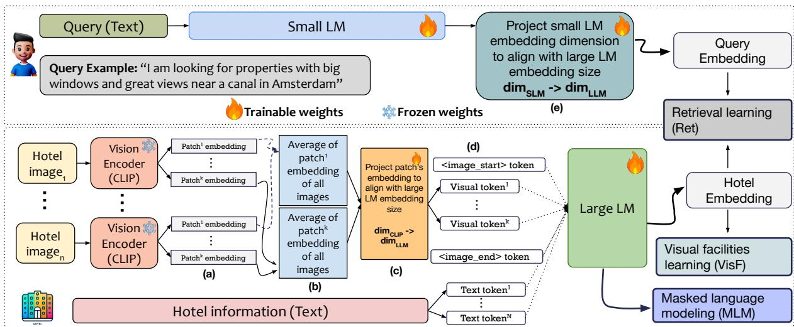
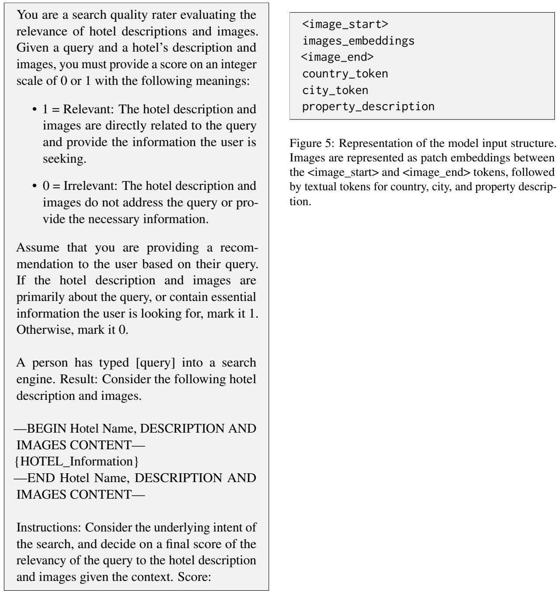

# HotelMatch-LLM: Joint Multi-Task Training of Small and Large Language Models for Efficient Multimodal Hotel Retrieval

Arian Askari1, Emmanouil Stergiadis2, Ilya Gusev2

Moran Beladev2

1Leiden University a.askari@liacs.leidenuniv.nl

2Booking.com {emmanouil.stergiadis,ilya.gusev,moran.beladev}@Booking.com

## Abstract

We present HotelMatch-LLM, a multimodal dense retrieval model for the travel domain that enables natural language property search, addressing the limitations of traditional travel search engines which require users to start with a destination and editing search parameters. HotelMatch-LLM features three key innovations: (1) Domain-specific multi-task op timization with three novel retrieval, visual, and language modeling objectives; (2) Asymmetrical dense retrieval architecture combining a small language model (SLM) for efficient online query processing and a large language model (LLM) for embedding hotel data; and (3) Extensive image processing to handle all property image galleries. Experiments on four diverse test sets show HotelMatch-LLM significantly outperforms state-of-the-art models, including VISTA and MARVEL. Specifically, on the test set—main query type—we achieve 0.681 for HotelMatch-LLM compared to 0.603 for the most effective baseline, MAR-VEL. Our analysis highlights the impact of our multi-task optimization, the generalizability of HotelMatch-LLM across LLM architectures, and its scalability for processing large image galleries.

## 1 Introduction

Online property search platforms are essential for modern travel, enabling millions of people to book accommodations with generating 667 billion in revenue in 2023 (TravelPerk) underscoring their importance. However, current systems1 are often limited to pre-defined filters, where users must first select a country and city before applying additional criteria like price, or star rating. This process limits flexibility, preventing users from expressing preferences in natural language or exploring options without a set destination. For example, searches like "hotels with pantone curtains" or "beachfront accommodations near a park" are unsupported.

To overcome these limitations, we propose HotelMatch-LLM,2 a multimodal retrieval model designed to support free-form natural language queries for hotel search. Our model features three novel components to enhance property search: (i) Domain-Specific Multi-Task Optimization: Multi-task optimization tailored to the travel domain, with objectives for retrieval alignment, masked language modeling (MLM) for contextual understanding, and visual facility learning for recognizing amenities in hotel images. (ii) Asymmetrical Dense Retriever Architecture: A novel architecture combining an SLM3 for efficient online query processing and an LLM for embedding of hotel data. This approach achieves near-LLM performance with SLM efficiency. (iii) Multiple Image Processing: A mean pooling strategy over patch-level embeddings enables processing an extensive, theoretically unlimited, number of images per property, creating a fixed-size representation that captures comprehensive visual context.

We train HotelMatch-LLM using synthetic relevance labels generated by GPT-4o given a pair of query and property, building on prior works demonstrating a strong correlation between GPT-4- generated labels and human annotations (Rahmani et al., 2024; Thomas et al., 2024; Upadhyay et al., 2024). We use the prompt shown in Figure 4 detailed in Section A.2. To evaluate performance, we use the HotelMatch dataset, which contains 3 million multimodal documents and four distinct test sets. Examples of these test sets are shown in Table 1, with descriptions in Section 4.

<table><tr><td>Multimodal (main). private room, pool, mountain view, and a cot available for a baby.</td></tr><tr><td>Text-driven. Central apartment near Serbian landmarks with quick access to Belgrade airport.</td></tr><tr><td>Vision-driven. Spacious rooms with white bedding and geometric headboards, modern meeting room with orange chairs, indoor pool, vibrant dining area with leaf- themed decor</td></tr><tr><td>Out-of-distribution. I&#x27;m looking for a 3-star or better hotel next to a subway station, no more than 30 minutes away from Tokyo station. If it&#x27;s 1 room, I need 2 or 3 beds, and if it&#x27;s 2 total rooms, then 1 bed in each room.</td></tr></table>

Table 1: Examples of query types in our dataset.

Our contributions are as follows: (i) We introduce HotelMatch-LLM, a novel multimodal dense retrieval model designed specifically for the travel domain, enabling natural language questions for property search, overcoming the limitations of existing systems. (ii) Our model outperforms state-of-the-art (SOTA) multimodal retrieval models designed for web search including VISTA and MARVEL models (Zhou et al., 2024a,b) on four distinct test sets. (iii) We propose a multi-task optimization framework that integrates textual and visual features. This includes retrieval optimization to align query and document embeddings, masked language modeling to enhance contextual understanding, and visual facility learning to identify key amenities from images. (iv) We conducted comprehensive ablation study, evaluating the contribution of each task in our multi-task optimization.

## 2 Related Work

Text-Driven Dense Retrievers. Dense retrieval systems for text-driven search have evolved significantly with the advent of LLMs. Early work on dense retrievers, such as DPR (Karpukhin et al., 2020) and ANCE (Xiong et al., 2021), focused on using embeddings to represent queries and documents for fast and accurate retrieval based on cosine similarity. More recent models, such as Col-BERT (Khattab and Zaharia, 2020) and GTR (Ni et al., 2022), have further optimized dense retrievers for efficiency and scalability. However, these systems often rely on LLMs for both query and document embedding, which can be computationally expensive for real-time search scenarios. To address this, our HotelMatch-LLM adopts a hybrid approach, using an SLM for online query embedding, while utilizing the larger LLM for offline hotel data embeddings.

Multimodal Dense Retrievers. Multimodal retrieval systems integrate text and visual data to enhance information retrieval. Models like CLIP (Radford et al., 2021) have proven effective for aligning these modalities. Recent advancements, such as MARVEL (Zhou et al., 2024b) and VISTA (Zhou et al., 2024a), achieve high performance but are limited to processing single images per document. In contrast, our HotelMatch-LLM enables processing multiple images per property, addressing the unique demands of the travel domain.

Multimodal LLMs. LLMs have increasingly been extended to multimodal tasks, enabling simultaneous text and image processing. Prominent examples include LLaVA (Liu et al., 2023), BLIP-2 (Li et al., 2023), and Flamingo (Alayrac et al., 2022), which excel in tasks like image captioning and visual question answering. However, our experiments showed that language models pre-fine-tuned for text retrieval achieve significantly faster convergence in optimizing multimodal retrieval within the travel domain. To address the computational challenges of fine-tuning from scratch, we leveraged such pre-fine-tuned models and further fine-tuned them for multimodal retrieval. Consequently, we excluded models like Qwen-VL (Bai et al., 2023), LLaVA, and Pixtral (Agrawal et al., 2024), which focus on multimodal generation but lack pre-finetuning for text retrieval.

## 3 Proposed Method: HotelMatch-LLM

We tackle the task of multimodal retrieval in the travel domain with our proposed method, HotelMatch-LLM. Given a query q, the task involves using a dense retrieval model to search for relevant documents from a collection D to address the user’s information needs (Zhou et al., 2024b; Xiong et al., 2021). We detail the components of HotelMatch-LLM in the following.

## 3.1 Extensive Number of Images

A key feature of HotelMatch-LLM is its ability to process a complete accommodation gallery in the form of an extensive number of images alongside the textual content of each accommodation. Unlike existing multimodal models designed for web search (Zhou et al., 2024a,b) that are restricted to single-image inputs, HotelMatch-LLM employs an effective method to aggregate information from all images, creating comprehensive embeddings. We formally elaborate below on this feature by starting with image-level embedding.

  
Figure 1: An illustration of the training setup for the proposed method, HotelMatch-LLM. The top part encodes the query text using a small LM and aligns its embedding with the large LM, while the bottom part processes hotel images using a vision encoder (CLIP) to extract patch embeddings, averages them, aligns them with the large LM embedding size, and jointly passes them through the large LM to obtain the final hotel embeddings. Finally, a multi-task optimization is applied to train the HotelMatch-LLM retriever. dimCLIP, dimSLM, and dimLLM refer to the embedding dimensions of the CLIP, small LM, and large LM, respectively.

Image-Level Embedding. Each image $j$ in a document, denoted as $d _ { \mathrm { i m g } _ { j } }$ , is processed through the CLIP encoder to obtain an image-level embedding. Formally:

$$
\begin{array} { r } { { \bf h } _ { \mathrm { i m g } _ { j } } = \mathrm { C L I P } ( d _ { \mathrm { i m g } _ { j } } ) , } \end{array}\tag{1}
$$

where $\mathbf { h } _ { \mathrm { i m g _ { \mathcal { I } } } }$ represents the embedding for the $j -$ th image in the document, and is divided into k patches, shown as step (a) in Figure 1, generating k patch embeddings. This representation is obtained by processing the j-th image through the CLIP visual encoder, specifically leveraging the grid features extracted from the last layer of the CLIP visual encoder, generating k patch embeddings:

$$
{ \bf h } _ { \mathrm { i m g } _ { j } } = \{ { \bf h } ^ { 1 } , { \bf h } ^ { 2 } , \ldots , { \bf h } ^ { \mathrm { k } } \} .\tag{2}
$$

We set k to 49 as we resize all images to 224 224 pixels cropped to the center, and use the CLIP model with a 32 × 32 window size.4

Mean Pooling Across Images. To handle an extensive, theoretically unlimited, number of images, a mean pooling operation is applied across the corresponding patches of all images, as shown in step (b) in Figure 1. Assuming a hotel with N images, each with k patch embeddings, pooling produces a tensor of dimensions (k embedding dimension). The mean pooling is performed as follows:

$$
\mathbf { \Delta } \mathbf { h } _ { \mathrm { p o o l e d } } ^ { i } = \frac { 1 } { N } \sum _ { j = 1 } ^ { N } \mathbf { h } _ { \mathrm { i m g } _ { j } } ^ { i } ,\tag{3}
$$

where $\mathbf { h } _ { \mathrm { p o o l e d } } ^ { i }$ is the pooled embedding for the i-th patch across all images in the document, and $\mathbf { h } _ { \mathrm { i m g } } ^ { i }$ denotes the embedding of the i-th patch for the j-th image of document d.

Fixed-Size Representation. The final representation for all images associated with a document is represented in k vectors and formed by concatenating these pooled embeddings:

$$
\mathbf { h } _ { d } = \{ \mathbf { h } _ { \mathrm { p o o l e d } } ^ { 1 } , \mathbf { h } _ { \mathrm { p o o l e d } } ^ { 2 } , \dots , \mathbf { h } _ { \mathrm { p o o l e d } } ^ { \mathrm { k } } \} ,\tag{4}
$$

where $\mathbf { h } _ { \mathrm { p o o l e d } } ^ { i }$ represents the pooled embedding for the $\dot { \iota } - t \dot { h }$ patch across all N images associated with document d. This operation is repeated for each of the k patches (k = 49), resulting in a representation of size (k  embedding dimension). This fixed size ensures scalability for any number of images, as the dimensions remain constant regardless of N.5

Projection into Textual Space. The fixed-size pooled representation is then projected into the same space as textual tokens of the pre-trained language model via a dense linear transformation, shown in step (c) in Figure 1:

$$
\mathbf { I } _ { \mathrm { p o o l e d } } ^ { i } = \operatorname* { l i n e a r } ( \mathbf { h } _ { \mathrm { p o o l e d } } ^ { i } ) ,\tag{5}
$$

producing embeddings $\mathbf { I } _ { \mathrm { p o o l e d } , \mathrm { i } }$ which can be concatenated with textual embeddings to form the final document representation since the input dimension of linear is embedding dimension of visual encoder of CLIP and the output dimension of linear layer is the dimension size of textual embedding of language model, shown in step (d) in Figure 1:

$$
\begin{array} { c } { { { \bf X } = { \bf e } ( < \mathrm { s t a r t } > ) ; { \bf I } _ { \mathrm { p o o l e d } } ^ { 1 } ; \ldots ; { \bf I } _ { \mathrm { p o o l e d } } ^ { k } } } \\ { { ; { \bf e } ( < \mathrm { e n d } > ) ; { \bf e } ^ { 1 } ; \ldots ; { \bf e } ^ { M } , } } \end{array}\tag{6}
$$

Here, X is the final input representation of the property, ; denotes concatenation operation, and $\mathbf { e } ( < \ s t a r t \ > )$ and $\mathbf { e } ( < \ e n d \ > )$ are the embedding of visual separator tokens that mark the start and end of the image feature representations. $\{ \mathbf { e } ^ { 1 } , \ldots , \mathbf { e } ^ { M } \}$ are the token embeddings of the text input sequence the hotel’s textual description. Finally, we pass X through the LLM to make the final representation of the property:

$$
\mathbf { d } = L L M ( \mathbf { X } )\tag{7}
$$

where d is representation of the property which is either the representation of the CLS token or the mean pooling over the input tokens, depending on the strategy suggested by the language model (LM) used as the backbone. This design integrates both visual and textual signal into the model and enables the representation of an unlimited number of images as k visual tokens, in contrast to previous studies, which support only a single image. To provide more insights, Figure 5, presented in the Appendix section, illustrates a detailed example of how the property information is structured and prompted to HotelMatch-LLM.

## 3.2 Joint training of SLM and LLM

LLMs demonstrate strong effectiveness as embedders (Lee et al., 2024; Wang et al., 2024; Li et al., 2024), and ranked as the top-10 most effective models in well-known benchmarks such as MTEB (Muennighoff et al., 2023). However, deploying LLMs for query embedding at inference time introduces significant computational overhead, making it a challenging and active area of research (Park et al., 2024). These challenges are particularly significant in property search systems, where millions of users submit queries daily, necessitating both efficiency and cost-effectiveness in embedding models. To overcome this, we introduce a novel asymmetrical architecture in HotelMatch-LLM. We use an LLM as the backbone for embedding documents (bottom part of Figure 1), while we use an SLM backbone for embedding queries (top part of Figure 1). As the embeddings of the query, denoted as q, and document, denoted as d, should have the same dimensional size to compute cosine similarity, we add a dense linear layer that projects the SLM’s embedding dimension, shown in step (e) in Figure 1, to match the LLM’s embedding dimension. Our experiments show that this setup is more effective than using SLM for embedding both queries and documents, while maintaining the same efficiency at inference time as using SLM for embedding both queries and documents at query time. This could be attributed to the greater complexity inherent in hotel data compared to query data, allowing an LLM to represent it more effectively in vector space than an SLM. We found the most important factor in this joint training is how learning rates (LR) are set. We apply distinct learning rates: a higher rate for the SLM and a lower rate for the LLM. This choice is made by our empirical observations and aligns with findings from previous research indicating that larger language models benefit from lower learning rates, whereas smaller models perform better with higher rates (Kaplan et al., 2020). Further analysis of this approach is provided in Section 6.

## 3.3 Domain-specific Multi-task Optimization

In the travel domain, geography (city and country) and facilities are key features for businesses, often mentioned in hotel descriptions or visible in property images. Our multi-task loss is designed to capture these features effectively. The visual facility learning (VisF) loss focuses on identifying facilities from property embeddings (denoted as d in Equation 7). The labels for this task are collected by passing all the images of a property to the MUMIC method (Wang et al., 2023) in order to identify facilities from property’s images. We follow MUMIC methodology and the list of 120 facility labels in the MUMIC paper. These labels include visually identifiable features such as swimming pools, gyms, and balconies. Meanwhile, the MLM loss predicts masked city and country tokens in descriptions, ensuring a strong textual understanding of geographic features. We next formally define our primary objective, retrieval learning, and introduce the two domain-specific losses.

Retrieval learning. The primary objective is to optimize the model for distinguishing relevant documents (hotels) from irrelevant ones using a contrastive learning approach. Following (Zhou et al., 2024b), for a query embedding q, a positive document $d ^ { + }$ , and a set of negative documents $\{ d _ { 1 } ^ { - } , \ldots , d _ { n } ^ { - } \}$ , the similarity score is defined as:

$$
S ( q , d ) = \mathrm { c o s i n e } ( { \bf q } , { \bf d } ) ,\tag{8}
$$

The probability of $d ^ { + }$ being relevant to $q$ is computed using the softmax function over the cosine scores, as follows:

$$
P ( d ^ { + } | q ) = \frac { \exp ( S ( q , d ^ { + } ) ) } { \sum _ { d \in \{ d ^ { + } , d _ { 1 } ^ { - } , \dots , d _ { n } ^ { - } \} } \exp ( S ( q , d ) ) } .\tag{9}
$$

The retrieval loss, formulated as cross-entropy, is expressed as:

$$
\mathcal { L } _ { \mathrm { R e t } } = - \log P ( d ^ { + } | q ) .\tag{10}
$$

Masked Language Modeling. Let $t \_ =$ $\{ t _ { 1 } , \ldots , t _ { N } \}$ represent the textual tokens of a document. After masking the city and country tokens, the model predicts logits $\hat { t } _ { i }$ for these masked positions, next the probability is computed using the softmax function, applied to the output of the model’s MLM head:

$$
P ( t _ { i } \mid h _ { i } ^ { \mathrm { m a s k e d } } ) = \frac { \exp ( \mathrm { M L M \_ H e a d } ( h _ { i } ^ { \mathrm { m a s k e d } } ) [ t _ { i } ] ) } { \sum _ { j = 1 } ^ { | \mathcal { V } | } \exp ( \mathrm { M L M \_ H e a d } ( h _ { i } ^ { \mathrm { m a s k e d } } ) [ j ] ) }\tag{11}
$$

where $P ( t _ { i } \ | \ h _ { i } ^ { \mathrm { m a s k e d } } )$ is the conditional probability of the token $t _ { i \cdot }$ , given the masked token’s hidden state $h _ { i } ^ { \mathrm { m a s k e d } }$ , and  refers to the size of the vocabulary. The MLM\_Head is a linear layer where the input has the same dimension as the token embeddings of the large language model, and the output dimension corresponds to the size of the vocabulary. The loss is computed as:

$$
\mathcal { L } _ { \mathrm { M L M } } = - \frac { 1 } { T } \sum _ { i = 1 } ^ { T } \log P ( t _ { i } | h _ { i } ^ { \mathrm { m a s k e d } } ) ,\tag{12}
$$

where $T$ is the total number of masked tokens. In our experiment, $T$ is dynamic and depends on the number of tokens required to represent the country and city of the hotel.

Visual Facility Learning. We optimize the model to predict the presence of facilities (e.g., pool, gym)

Table 2: Dataset statistics of our dataset, HotelMatch. $\mathbf { \bar { Q } } ^ { \prime }$ and $ { \mathbf { \hat { \rho } } } _ { \mathrm { Ḋ } } \mathrm { Ḋ }   { \mathbf { \vec { \rho } } } _ { \mathrm { Ḋ } } \mathrm { Ḋ }  ,$ refer to query and hotel.
<table><tr><td>Number of Documents (Hotels)</td><td>3.1M</td></tr><tr><td>Avg number of images per D Avg number of words per D Avg number of words per Q</td><td>44.6 185.9 5.4</td></tr><tr><td>Number of Train Queries Number of Validation Queries Number of Test Queries</td><td>57,884 500 1000</td></tr></table>

using hotel embeddings that are represented as d. A linear layer with $\mathcal { F }$ outputs (where $\mathcal { F }$ is the total number of facilities whose presence is identified using the MUMIC method (Wang et al., 2023), and $\mathcal { F } = 1 2 0$ , followed by a sigmoid activation function, computes the probability of each facility:

$$
\hat { f } _ { i } = \sigma ( W _ { f } \cdot \mathbf { d } + b _ { f } ) ,\tag{13}
$$

where d is the document embedding, and $W _ { f }$ and $b _ { f }$ are the learnable weights and biases. The binary cross-entropy loss for this task is:

$$
\mathcal { L } _ { \mathrm { V i s F } } = - \frac { 1 } { \mathcal { F } } \sum _ { i = 1 } ^ { F } \left[ f _ { i } \log \hat { f } _ { i } + ( 1 - f _ { i } ) \log ( 1 - \hat { f } _ { i } ) \right] ,
$$

where $f _ { i }$ is the ground-truth facility label.

(14)

Final Loss Aggregation. The final loss combines the three objectives, weighted by empirically determined values $( \lambda _ { 1 } = 0 . 7 , \lambda _ { 2 } = 0 . 2 .$ , and $\lambda _ { 3 } = 0 . 1 )$ . These weights were optimized through a grid search on the validation set, testing values in increments of 0.1 to achieve the best retrieval performance:

$$
\mathcal { L } _ { \mathrm { f i n a l } } = \lambda _ { 1 } \mathcal { L } _ { \mathrm { R e t } } + \lambda _ { 2 } \mathcal { L } _ { \mathrm { M L M } } + \lambda _ { 3 } \mathcal { L } _ { \mathrm { V i s F } } .\tag{15}
$$

## 4 Experimental Setup

Dataset. For our experiments, we utilize our Hotel-Match dataset, designed for multimodal hotel retrieval. Table 2 summarizes its statistics.6 Queries are categorized to four distinct query types (examples in Table 1): (1) Multimodal Queries: User queries have been synthesized making sure production distribution is preserved, by utilizing an

Table 3: The results of our model compared to the baselines. MRR and nDCG refer to MRR@10 and nDCG@10. Significance is shown with for the best result (HotelMatch-LLM) compared to most effective baseline, MARVEL. Statistical significance was measured with a paired t-test (p < 0.05) with Bonferroni correction for multiple testing.
<table><tr><td rowspan=1 colspan=1>Test Query Set Name</td><td rowspan=1 colspan=2>Real-world</td><td rowspan=1 colspan=2>Vision-driven</td><td rowspan=1 colspan=4>Text-driven    Out-of-distribution</td></tr><tr><td rowspan=1 colspan=1>Size</td><td rowspan=1 colspan=2>1000 queries</td><td rowspan=1 colspan=2>101 queries</td><td rowspan=1 colspan=2>101 queries</td><td rowspan=1 colspan=2>100 queries</td></tr><tr><td rowspan=1 colspan=1>Model</td><td rowspan=1 colspan=8>MRR nDCG MRR@  nDCG MRR nDCG MRR   nDCG</td></tr><tr><td rowspan=1 colspan=9>Setting: Text-only Modality</td></tr><tr><td rowspan=4 colspan=1>BM25CLIP-Text (Zero-Shot)GTR-base (Zero-Shot)GTR-large (Zero-Shot)</td><td rowspan=1 colspan=1>.506</td><td rowspan=1 colspan=1>.401</td><td rowspan=1 colspan=1>.138</td><td rowspan=1 colspan=1>.195</td><td rowspan=1 colspan=1>.798</td><td rowspan=1 colspan=1>.825</td><td rowspan=1 colspan=1>.588</td><td rowspan=1 colspan=1>.489</td></tr><tr><td rowspan=3 colspan=1>.452.547.545</td><td rowspan=1 colspan=1>.381</td><td rowspan=1 colspan=1>.140</td><td rowspan=1 colspan=1>.197</td><td rowspan=1 colspan=1>.541</td><td rowspan=1 colspan=1>.600</td><td rowspan=1 colspan=1>.559</td><td rowspan=1 colspan=1>.428</td></tr><tr><td rowspan=2 colspan=1>.426.429</td><td rowspan=2 colspan=1>.142.148</td><td rowspan=2 colspan=1>.219.224</td><td rowspan=2 colspan=1>.812.824</td><td rowspan=1 colspan=1>.843</td><td rowspan=2 colspan=1>.650.656</td><td rowspan=2 colspan=1>.521.534</td></tr><tr><td rowspan=1 colspan=1>.857</td></tr><tr><td rowspan=1 colspan=9>Setting: Multimodal (Image and text)</td></tr><tr><td rowspan=4 colspan=1>CLIP (Zero-Shot)MARVEL (Fine-tuned)VISTA (Fine-tuned)HotelMatch-LLM (Ours)</td><td rowspan=4 colspan=1>.460.603.582.681†</td><td rowspan=1 colspan=1>.402</td><td rowspan=1 colspan=1>.172</td><td rowspan=1 colspan=1>.254</td><td rowspan=1 colspan=1>.545</td><td rowspan=1 colspan=1>.609</td><td rowspan=1 colspan=1>.561</td><td rowspan=1 colspan=1>.439</td></tr><tr><td rowspan=1 colspan=1>.503</td><td rowspan=1 colspan=1>.219</td><td rowspan=1 colspan=1>.326</td><td rowspan=1 colspan=1>.810</td><td rowspan=1 colspan=1>.833</td><td rowspan=1 colspan=1>.660</td><td rowspan=1 colspan=1>.515</td></tr><tr><td rowspan=2 colspan=1>.465.600†</td><td rowspan=2 colspan=1>.216.247†</td><td rowspan=2 colspan=1>.321.362†</td><td rowspan=1 colspan=1>.802</td><td rowspan=1 colspan=1>.839</td><td rowspan=1 colspan=1>.662</td><td rowspan=1 colspan=1>.513</td></tr><tr><td rowspan=1 colspan=1>.863†</td><td rowspan=1 colspan=1>.884†</td><td rowspan=1 colspan=1>.704†</td><td rowspan=1 colspan=1>.558†</td></tr><tr><td rowspan=1 colspan=1>HotelMatch-LLM w/o vision</td><td rowspan=1 colspan=1>.595</td><td rowspan=1 colspan=1>.482</td><td rowspan=1 colspan=1>.154</td><td rowspan=1 colspan=1>.239</td><td rowspan=1 colspan=1>.829</td><td rowspan=1 colspan=1>.863</td><td rowspan=1 colspan=1>.658</td><td rowspan=1 colspan=1>.535</td></tr></table>

LLM to rephrase anonymized queries, (2) Vision– driven Queries: Synthesized from hotel images using the prompt illustrated in Figure 2, (3) Text-driven Queries: Synthesized from property descriptions using the prompt illustrated in Figure 3, (4) Out-of-distribution Queries: Travel queries from a significantly different distribution, see Table 1.

Evaluation. Our experiments focus on re-ranking 100 candidates retrieved by a fine-tuned CLIPbased model to manage computational costs. Irrelevant queries are excluded. The best-performing re-ranking models are extended to full-ranking, as shown in Tables 3 and 7. We utilize GPT-4o for synthetic annotations of top-100 candidates, using the prompt shown in Figure 4 detailed in Section A.2, reducing reliance on costly human labeling while maintaining high quality, and performance is evaluated using MRR and nDCG at top-10 results.

Baselines. We compare HotelMatch-LLM against SOTA multimodal retrieval models, including: (i) MARVEL: A leading multimodal retrieval model optimized for web search. (ii) VISTA: Another SOTA model known for its effectiveness in various multimodal tasks. (iii) GTR-base and GTR-large (Ni et al., 2022): Fine-tuned models specifically adapted for retrieval task. We also include unimodal baselines including Best Match 25 (BM25) (Robertson and Walker, 1994) and CLIP.

Implementation details. We implement HotelMatch-LLM in PyTorch (Paszke et al., 2017). In all of our training experiments, we fine-tune for 10 epochs with early stopping after five validation steps without improvement. We employ FAISS (Douze et al., 2024) for efficient k-Nearest Neighbor (KNN) retrieval. We generate embeddings following the methods recommended by their respective LM backbones (e.g., CLS token or mean pooling over input tokens). We use GTR-Base-110M as the SLM in all our experiments. For the LLM, we use GTR-Large-335M in the main experiments due to its competitive performance and fast convergence. To assess generalizability, we tested larger LMs, including Zeta-Alpha-E5-Mistral and Stella-en, with 7 billion and 1.5 billion parameters.We use learning rates (LR) as reported for MARVEL and VISTA, finding optimal LRs of 5e-4 for GTR-base and 5e-6 for GTR-large, Zeta-Alpha-E5-Mistral-7B (AI, 2024) and Stella-en-1.5B (Zhang, 2024) where they are used as LM backbone in HotelMatch-LLM.

## 5 Results

In this section, we answer the following research questions, evaluating the effectiveness of our proposed method, HotelMatch-LLM, from different perspectives:

• RQ1: What is the effectiveness of HotelMatch-LLM compared to existing SOTA multimodal retrievers?

• RQ2: What is the most optimal method to represent a long-image context compared to singleimage processing?

• RQ3: What is the impact of Multitask Optimization in HotelMatch-LLM and what is the impor-

tance of each task?

• RQ4: How well does our proposed method generalize to other LLM architectures?

Table 4: Analyzing impact of our approach for representing extensive number of images compared to alternative options. Our approach allows for an unlimited number of images in theory. In practice, the maximum number of images per property in our dataset is 306 images. 1TPI refers to "One Token per Image".
<table><tr><td>Method</td><td>Number of image</td><td>MRR</td><td>nDCG</td></tr><tr><td>MARVEL</td><td>Single</td><td>.603</td><td>.503</td></tr><tr><td colspan="4">Methods for processing multiple images (Ours)</td></tr><tr><td>HotelMatch</td><td>Multiple-unlimited</td><td>.681</td><td>.600</td></tr><tr><td>1TPI-Patch</td><td>Multiple-limited</td><td>.672</td><td>.585</td></tr><tr><td>1TPI-CLS</td><td>Multiple-limited</td><td>.652</td><td>.580</td></tr></table>

Table 5: Generalizability of HotelMatch-LLM, using different models as LLM backbone.
<table><tr><td>Query embedder</td><td>Hotel embedder</td><td>MRR</td><td>nDCG</td></tr><tr><td colspan="2">GTR-Large-335M</td><td>.687</td><td>.605</td></tr><tr><td>GTR-Base-110M GTR-Base-110M</td><td>GTR-Large- 335M Stella-en-1.5B</td><td>.681 .694</td><td>.600 .619</td></tr><tr><td>GTR-Base-110M</td><td>Zeta-Alpha-E5- Mistral-7B</td><td>.719</td><td>.631</td></tr><tr><td colspan="2">GTR-Base-110M</td><td>.649</td><td>.568</td></tr></table>

Main results (RQ1). The results presented in Table 3 demonstrate that our proposed HotelMatch-LLM model significantly outperforms all baseline models in all four test sets, including the previous SOTA multimodal dense retrievers MARVEL and VISTA models, in both text-only and multimodal settings; showcasing its superior capability to re-rank tasks for accommodation search. Additionally, when we ablate the vision component in HotelMatch-LLM (i.e., HotelMatch-LLM without vision), the performance notably decreases, highlighting the importance of multimodal integration in achieving optimal results. Furthermore, when focusing on unimodal baselines, text-driven GTR models and vision-driven CLIP variants fall short compared to our multimodal approach.

Extensive number of images (RQ2). To assess our method for representing an extensive number of images in greater depth, we propose two alternative methods for representing multiple images, both utilizing the CLIP encoder to generate imagelevel representations. Each image is transformed into a single embedding vector, which is then projected into the textual space of the LM using a dense linear layer. Since each image corresponds to a single embedding, it occupies one token in the language model’s input. This approach enables the representation of a limited number of images, constrained by the language model’s maximum input token capacity minus the tokens reserved for textual descriptions of properties. The first method, 1TPI-CLS, leverages the CLS token embedding from CLIP to represent the entire image. This representation is projected to align with the language model’s token dimension as a visual token. The second method, 1TPI-Patch, aggregates information by averaging the patch embeddings produced by CLIP and projects the resulting aggregated embedding as a visual token. We pass a maximum of 50 images, i.e., 50 visual tokens, in our experiments for the proposed alternative methods: 1TPI-Patch and 1TPI-CLS. Table 4 shows that our HotelMatch-LLM method archives the highest effectiveness compared to the SOTA baseline, MARVEL, and alternative methods.

Generalizability to other LLMS (RQ3). Table 5 demonstrates the generalizability of our proposed HotelMatch-LLM method across various LM architectures for query and hotel embeddings. Notably, using the GTR-base-110M model for both the query and hotel embedding yields the lowest effectiveness, suggesting that relying solely on a smaller model for both tasks limits the model’s ability to capture complex hotel information. However, when GTR-base-110M is employed as the query embedder and combined with larger models for hotel embeddings, such as Zeta-Alpha-E5-Mistral-7B or Stella-en-1.5B, the effectiveness improves significantly. The best results are achieved when using GTR-base-110M for query embeddings and Zeta-Alpha-E5-Mistral-7B for hotel embeddings, which provides the highest MRR and nDCG scores. This setup maintains the efficiency of GTR-base at query inference time while leveraging the more expressive capacity of larger models for encoding hotel information. This pattern suggests that larger language models are better suited for representing the more complex and diverse attributes of hotels, highlighting the scalability and generalizability of the HotelMatch-LLM approach across different architectures.

Impact of multi-task optimization. Table 6 presents the results of our ablation study, assessing the importance of each task in our multi-task optimization. By systematically removing losses, we evaluate their effects on model effectiveness. The full model achieves the highest effectiveness, while removing MLM or VisF causes declines, highlighting their complementary roles. The most significant drop occurs when MLM is removed, showcasing that geographical understanding has a greater impact on overall effectiveness.

Table 6: Analyzing importance of each task in our multitask optimization.
<table><tr><td>Model</td><td>MRR@10</td><td>nDCG@10</td></tr><tr><td>HotelMatch-LLM (Ours)</td><td></td><td></td></tr><tr><td>Full model</td><td>.681</td><td>.600</td></tr><tr><td>w/o VisF loss</td><td>.664</td><td>.575</td></tr><tr><td>w/o MLM</td><td>.650</td><td>.568</td></tr><tr><td>w/o VisF and MLM</td><td>.632</td><td>.552</td></tr></table>

Table 7: Results of full-ranking. Comparative analysis of our model, HotelMatch-LLM, and the most effective baselines, MARVEL.
<table><tr><td rowspan=1 colspan=1></td><td rowspan=1 colspan=1>MRR@10 |</td><td rowspan=1 colspan=1>nDCG@10</td></tr><tr><td rowspan=1 colspan=1>HotelMatch-LLM</td><td rowspan=1 colspan=1>.675</td><td rowspan=1 colspan=1>.592</td></tr><tr><td rowspan=1 colspan=1>MARVEL</td><td rowspan=1 colspan=1>.589</td><td rowspan=1 colspan=1>.498</td></tr></table>

## 6 Discussion

Full-ranking. Although this paper primarily focuses on re-ranking the top-100 results generated by the initial retriever, where the initial top-k retrieved items are ranked based on relevance and conversion, we also investigate the full-retrieval potential of our method. To achieve this, we evaluate the performance of our proposed method, HotelMatch-LLM, against the most effective baseline, MARVEL, in a full-ranking context where 3.1 Million documents are ranked given each query. To this end, we annotated the top-10 documents retrieved by each model using GPT-4o. Table 7 indicates that HotelMatch-LLM outperforms MAR-VEL in the full-ranking setup.

Efficiency. While the efficiency of our method is evident due to its architectural design, we measure the efficiency of it compared to VISTA, MARVEL, and HotelMatch without SLM, where the LLM backbone of HotelMatch-LLM embeds both query and document. GTR-Base-110M and GTR-Large-335 are SLM and LLM in this experiment. Table

Table 8: Latency of our model vs. top-2 most effective baselines. ‘ms’ refers to milliseconds.
<table><tr><td rowspan=1 colspan=1>Model</td><td rowspan=1 colspan=1>Latency (ms)</td><td rowspan=1 colspan=1>MRR</td><td rowspan=1 colspan=1>nDCG</td></tr><tr><td rowspan=1 colspan=1>VISTA</td><td rowspan=1 colspan=1> $1 6 . 1 7 \pm 0 . 3 3$ </td><td rowspan=1 colspan=1>.572</td><td rowspan=1 colspan=1>.465</td></tr><tr><td rowspan=1 colspan=1>MARVEL</td><td rowspan=1 colspan=1> $3 1 . 0 7 \pm 0 . 2 7$ </td><td rowspan=1 colspan=1>.603</td><td rowspan=1 colspan=1>.503</td></tr><tr><td rowspan=1 colspan=1>HotelMatch-LLM</td><td rowspan=1 colspan=1> $1 8 . 6 9 \pm 0 . 3 8$ </td><td rowspan=1 colspan=1>.681</td><td rowspan=1 colspan=1>.600</td></tr><tr><td rowspan=1 colspan=1>HotelMatch-LLMw/o SLM</td><td rowspan=1 colspan=1> $2 5 . 3 7 \pm 0 . 3 4$ </td><td rowspan=1 colspan=1>.687</td><td rowspan=1 colspan=1>.605</td></tr></table>

Table 9: Results of joint training for the SLM query embeddings and LLM hotel embeddings with various learning rate configurations. The optimal learning rate is reported, determined by training for 100 steps and selecting the rate that achieved the highest effectiveness on the validation set. The SLM and LLM backbones for this experiment are GTR-base and GTR-Large.
<table><tr><td rowspan=1 colspan=1>LR tuned for</td><td rowspan=1 colspan=2>SLM LR LLMLR</td><td rowspan=1 colspan=1>MRR</td><td rowspan=1 colspan=1>nDCG</td></tr><tr><td rowspan=1 colspan=1>SLM         一</td><td rowspan=1 colspan=2>5e-4</td><td rowspan=1 colspan=1>.278</td><td rowspan=1 colspan=1>.280</td></tr><tr><td rowspan=1 colspan=1>LLM         1</td><td rowspan=1 colspan=2>5e-6</td><td rowspan=1 colspan=1>.289</td><td rowspan=1 colspan=1>.302</td></tr><tr><td rowspan=1 colspan=1>SLM and LLM(Shared-LR)</td><td rowspan=1 colspan=2>1e-3</td><td rowspan=1 colspan=1>.315</td><td rowspan=1 colspan=1>.339</td></tr><tr><td rowspan=1 colspan=1>SLM and LLM(Separate-LR)</td><td rowspan=1 colspan=1>5e-4</td><td rowspan=1 colspan=1>5e-6</td><td rowspan=1 colspan=1>.681</td><td rowspan=1 colspan=1>.600</td></tr></table>

8 shows that while our efficiency is comparable to VISTA, it is two times higher than MARVEL and 1.4 times higher than using the LLM alone. The SLM for the experiment with HotelMatch w/o SLM is GTR-Large with 333M parameters. This demonstrates that our method not only achieves higher effectiveness but also efficient.

Asymmetrical architecture. Training dense retrieval models with separate encoders for query and document embeddings poses unique challenges. While the theoretical framework for joint training appears straightforward, we found that practical implementation reveals complexities that require careful consideration. Table 9 highlights the impact of different learning rate configurations on model effectiveness. Learning rates were systematically adjusted over 100 training steps, after which the configurations that yielded the highest effectiveness on the validation set were identified. This tuning process highlights the significance of using separate learning rates for the SLM for query embeddings and the LLM for hotel embeddings.

## 7 Conclusions

We introduced HotelMatch-LLM, a multimodal dense retrieval model for the travel domain. It enables natural language hotel searches, overcoming traditional filter-based limitations. Our multi-task optimization captures structured text and visual attributes from hotel images. By integrating an SLM for query processing and an LLM for embedding complex hotel data, the model delivers near-LLM performance with improved efficiency. Extensive evaluation on four test sets show HotelMatch-LLM surpasses SOTA models. Overall, HotelMatch-LLM represents a significant advancement in multimodal hotel retrieval systems, by allowing for contextually rich searches. While our study focuses on the travel domain, the challenges addressed are broadly applicable on multimodal corpora with extensive number of images.

## 8 Limitations

Despite the promising results and contributions of HotelMatch-LLM, several limitations warrant discussion. Firstly, while the model demonstrates superior performance in retrieval tasks, it relies heavily on the quality of the synthetic data generated by GPT-4o. If the annotations contain biases or inaccuracies, this could adversely affect the model’s learning process and its subsequent performance. Furthermore, the effectiveness of HotelMatch-LLM in real-world applications may be influenced by factors not accounted for during training, such as dynamic changes in hotel attributes or user preferences. Future work could explore adaptive learning techniques that allow the model to continuously update and refine its embeddings based on user feedback and evolving data. Additionally, while HotelMatch-LLM is designed to handle complex natural language queries, it is not trained to support multimodal queries where the query can have both text and image. The model may struggle to interpret such queries effectively, leading to suboptimal retrieval results. Finally, the current version of HotelMatch-LLM does not incorporate user personalization, which could enhance retrieval effectiveness by tailoring results based on individual user preferences, past interactions, or contextual factors. Integrating personalization mechanisms (Liu et al., 2020) could significantly improve user satisfaction and relevance of the search results.

## References

Pravesh Agrawal, Szymon Antoniak, Emma Bou Hanna, Baptiste Bout, Devendra Chaplot, Jessica Chudnovsky, Diogo Costa, Baudouin De Monicault, Saurabh Garg, Theophile Gervet, et al. 2024. Pixtral 12b. arXiv preprint arXiv:2410.07073.

Zeta Alpha AI. 2024. Zeta-alpha-e5-mistral. https://huggingface.co/zeta-alpha-ai/ Zeta-Alpha-E5-Mistral. Accessed: 2024-12-11.

Jean-Baptiste Alayrac, Jeff Donahue, Pauline Luc, Antoine Miech, Iain Barr, Yana Hasson, Karel Lenc, Arthur Mensch, Katherine Millican, Malcolm Reynolds, Roman Ring, Eliza Rutherford, Serkan Cabi, Tengda Han, Zhitao Gong, Sina Samangooei, Marianne Monteiro, Jacob Menick, Sebastian Borgeaud, Andrew Brock, Aida Nematzadeh, Sahand Sharifzadeh, Mikolaj Binkowski, Ricardo Barreira, Oriol Vinyals, Andrew Zisserman, and Karen Simonyan. 2022. Flamingo: a visual language model for few-shot learning. In Advances in Neural Information Processing Systems.

Jinze Bai, Shuai Bai, Shusheng Yang, Shijie Wang, Sinan Tan, Peng Wang, Junyang Lin, Chang Zhou, and Jingren Zhou. 2023. Qwen-vl: A versatile vision-language model for understanding, localization, text reading, and beyond. arXiv preprint arXiv:2308.12966, 1(2):3.

Aditi Chaudhary, Karthik Raman, and Michael Bendersky. 2024. It’s all relative! – a synthetic query generation approach for improving zero-shot relevance prediction. In Findings ofthe Associationfor Computational Linguistics: NAACL 2024, pages 1645–1664, Mexico City, Mexico. Association for Computational Linguistics.

Matthijs Douze, Alexandr Guzhva, Chengqi Deng, Jeff Johnson, Gergely Szilvasy, Pierre-Emmanuel Mazaré, Maria Lomeli, Lucas Hosseini, and Hervé Jégou. 2024. The faiss library.

Jared Kaplan, Sam McCandlish, Tom Henighan, Tom B Brown, Benjamin Chess, Rewon Child, Scott Gray, Alec Radford, Jeffrey Wu, and Dario Amodei. 2020. Scaling laws for neural language models. arXiv preprint arXiv:2001.08361.

Vladimir Karpukhin, Barlas Oguz, Sewon Min, Patrick Lewis, Ledell Wu, Sergey Edunov, Danqi Chen, and Wen-tau Yih. 2020. Dense passage retrieval for opendomain question answering. In Proceedings of the 2020 Conference on Empirical Methods in Natural Language Processing (EMNLP), pages 6769–6781, Online. Association for Computational Linguistics.

Omar Khattab and Matei Zaharia. 2020. Colbert: Efficient and effective passage search via contextualized late interaction over bert. In Proceedings ofthe 43rd International ACM SIGIR Conference on Research and Development in Information Retrieval, SIGIR ’20, page 39–48, New York, NY, USA. Association for Computing Machinery.

Chankyu Lee, Rajarshi Roy, Mengyao Xu, Jonathan Raiman, Mohammad Shoeybi, Bryan Catanzaro, and Wei Ping. 2024. Nv-embed: Improved techniques for training llms as generalist embedding models. arXiv preprint arXiv:2405.17428.

Chaofan Li, MingHao Qin, Shitao Xiao, Jianlyu Chen, Kun Luo, Yingxia Shao, Defu Lian, and Zheng Liu. 2024. Making text embedders few-shot learners. Preprint, arXiv:2409.15700.

Junnan Li, Dongxu Li, Silvio Savarese, and Steven Hoi. 2023. Blip-2: bootstrapping language-image pre-training with frozen image encoders and large language models. In Proceedings of the 40th International Conference on Machine Learning, ICML’23. JMLR.org.

Haotian Liu, Chunyuan Li, Qingyang Wu, and Yong Jae Lee. 2023. Visual instruction tuning. In Thirtyseventh Conference on Neural Information Processing Systems.

Jingjing Liu, Chang Liu, and Nicholas J Belkin. 2020. Personalization in text information retrieval: A survey. Journal ofthe Associationfor Information Science and Technology, 71(3):349–369.

Niklas Muennighoff, Nouamane Tazi, Loic Magne, and Nils Reimers. 2023. MTEB: Massive text embedding benchmark. In Proceedings ofthe 17th Conference ofthe European Chapter ofthe Associationfor Computational Linguistics, pages 2014–2037, Dubrovnik, Croatia. Association for Computational Linguistics.

Jianmo Ni, Chen Qu, Jing Lu, Zhuyun Dai, Gustavo Hernandez Abrego, Ji Ma, Vincent Zhao, Yi Luan, Keith Hall, Ming-Wei Chang, and Yinfei Yang. 2022. Large dual encoders are generalizable retrievers. In Proceedings of the 2022 Conference on Empirical Methods in Natural Language Processing, pages 9844–9855, Abu Dhabi, United Arab Emirates. Association for Computational Linguistics.

Yeonhong Park, Jake Hyun, SangLyul Cho, Bonggeun Sim, and Jae W. Lee. 2024. Any-precision llm: Lowcost deployment of multiple, different-sized llms. In Proceedings of the 41st International Conference on Machine Learning.

Adam Paszke, Sam Gross, Soumith Chintala, Gregory Chanan, Edward Yang, Zachary DeVito, Zeming Lin, Alban Desmaison, Luca Antiga, and Adam Lerer. 2017. Automatic differentiation in pytorch.

Alec Radford, Jong Wook Kim, Chris Hallacy, Aditya Ramesh, Gabriel Goh, Sandhini Agarwal, Girish Sastry, Amanda Askell, Pamela Mishkin, Jack Clark, et al. 2021. Learning transferable visual models from natural language supervision. In International conference on machine learning, pages 8748–8763. PMLR.

Hossein A. Rahmani, Nick Craswell, Emine Yilmaz, Bhaskar Mitra, and Daniel Campos. 2024. Synthetic test collections for retrieval evaluation. In Proceedings of the 47th International ACM SIGIR Conference on Research and Development in Information Retrieval, SIGIR ’24, page 2647–2651, New York, NY, USA. Association for Computing Machinery.

Stephen E Robertson and Steve Walker. 1994. Some simple effective approximations to the 2-poisson model for probabilistic weighted retrieval. In SI-GIR’94, pages 232–241. Springer.

Paul Thomas, Seth Spielman, Nick Craswell, and Bhaskar Mitra. 2024. Large language models can accurately predict searcher preferences. In Proceedings of the 47th International ACM SIGIR Conference on Research and Development in Information Retrieval, SIGIR ’24, page 1930–1940, New York, NY, USA. Association for Computing Machinery.

TravelPerk. Online travel booking statistics. https://www.travelperk.com/blog/ online-travel-booking-statistics/. Accessed: 2024-12-10.

Shivani Upadhyay, Ronak Pradeep, Nandan Thakur, Nick Craswell, and Jimmy Lin. 2024. Umbrela: Umbrela is the (open-source reproduction of the) bing relevance assessor. arXiv preprint arXiv:2406.06519.

Fengjun Wang, Sarai Mizrachi, Moran Beladev, Guy Nadav, Gil Amsalem, Karen Lastmann Assaraf, and Hadas Harush Boker. 2023. Mumic - multimodal embedding for multi-label image classification with tempered sigmoid. In Proceedings of the Thirty-Seventh AAAI Conference on Artificial Intelligence and Thirty-Fifth Conference on Innovative Applications ofArtificial Intelligence and Thirteenth Symposium on Educational Advances in Artificial Intelligence, AAAI’23/IAAI’23/EAAI’23. AAAI Press.

Liang Wang, Nan Yang, Xiaolong Huang, Linjun Yang, Rangan Majumder, and Furu Wei. 2024. Improving text embeddings with large language models. In Proceedings of the 62nd Annual Meeting of the Associationfor Computational Linguistics (Volume 1: Long Papers), pages 11897–11916, Bangkok, Thailand. Association for Computational Linguistics.

Lee Xiong, Chenyan Xiong, Ye Li, Kwok-Fung Tang, Jialin Liu, Paul N. Bennett, Junaid Ahmed, and Arnold Overwijk. 2021. Approximate nearest neighbor negative contrastive learning for dense text retrieval. In International Conference on Learning Representations.

Dun Zhang. 2024. Stella\_en\_1.5b\_v5. https:// huggingface.co/dunzhang/stella\_en\_1.5B\_v5. Accessed: 2024-12-11.

Junjie Zhou, Zheng Liu, Shitao Xiao, Bo Zhao, and Yongping Xiong. 2024a. VISTA: Visualized text embedding for universal multi-modal retrieval. In Proceedings ofthe 62nd Annual Meeting ofthe Association for Computational Linguistics (Volume 1: Long Papers), pages 3185–3200, Bangkok, Thailand. Association for Computational Linguistics.

Tianshuo Zhou, Sen Mei, Xinze Li, Zhenghao Liu, Chenyan Xiong, Zhiyuan Liu, Yu Gu, and Ge Yu. 2024b. MARVEL: Unlocking the multi-modal capability of dense retrieval via visual module plugin. In Proceedings of the 62nd Annual Meeting of the Associationfor Computational Linguistics (Volume 1: Long Papers), pages 14608–14624, Bangkok, Thailand. Association for Computational Linguistics.

Generate a concise, natural search query that describes the images, listing key features such as bed setup, unique design elements (like geometric headboards), furniture, window style, and overall decor.

Figure 2: The prompt for synthetical generating visiondriven queries where the source of query is images of the hotel.

## A Appendix

## A.1 Prompts

This section outlines the prompts used for synthetic query generation and categorized by their specific applications.

## A.1.1 Vision-Driven Queries

The prompt for generating vision-driven queries is illustrated in Figure 2. This approach involves attaching 20 randomly sampled images of the hotel alongside the prompt text, which are collectively passed to GPT-4o. The generated queries encapsulate key visual features, such as room layout, unique design elements, furniture styles, window structures, and overall decor. An example of a query produced using this prompt is provided in Table 1.

## A.1.2 Text-driven queries

The prompt for text-driven query generation is shown in Figure 3. This prompt was adapted from (Chaudhary et al., 2024), maintaining its original structure to avoid introducing biases in the generated queries. The queries are designed to be contextually specific and highlight the unique features of a hotel without explicitly mentioning its name. An example of a query generated with this prompt can be found in Table 1.

## A.2 Generating binary relevance judgement

Figure 4 illustrates the prompt used for generating binary relevance labels based on a query, the hotel’s textual content, and the facilities detected in the hotel’s images by MUMIC, represented as text. The detailed facilities identified by the MUMIC tags eliminates the need to pass all hotel images. To validate this, we compared annotations for 100 queries by using the hotel’s actual images versus using the facilities identified by MUMIC. We found a strong correlation, with a Pearson correlation coefficient of 0.95.

Given a hotel description from Booking.com, generate a search query for which the hotel description can be a perfect hotel. Generate a query that is distinct and contextually specific, avoiding unintended matches with other hotels in the dataset. The query should highlight unique attributes of the target hotel without including the hotel name. The query must fit semantically with the description but should not have much lexical word overlap.

A general example: description: Premature Ventricular Contractions (PVCs, PVC) Medical Definition of Cardiac stress testing, exercise. Cardiac stress testing, exercise: The exercise cardiac stress testing (EST) is the most widely used cardiac (heart) screening test. The patient exercises on a treadmill according to a standardized protocol, with progressive increases in the speed and elevation of the treadmill (typically changing at three-minute intervals). query: what is cardiac testing in medical terms   
description: {DESCRIPTION}   
query:

Figure 3: The prompt for synthetical generating textdriven queries where the source of query is textual content of the hotel.

## A.2.1 Domain-specific Multi-task Optimization

## A.2.2 A detailed example of input format

Figure 5 demonstrates an example of an property textual and visual content that is prompted to the HotelMatch-LLM to being embedded.  
  
Figure 4: The prompt for generating binary relevance label given a query and property.