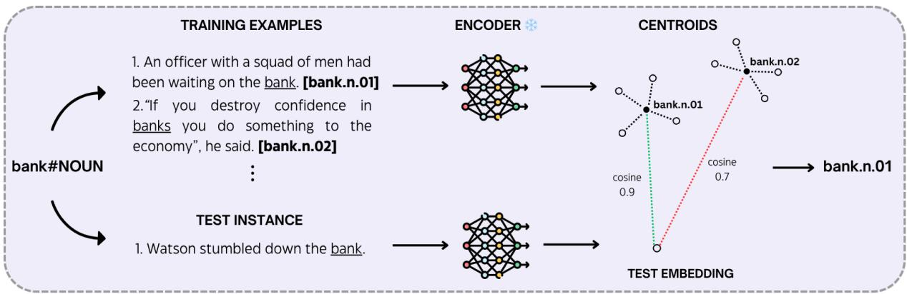
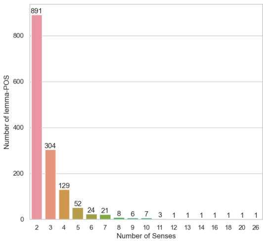
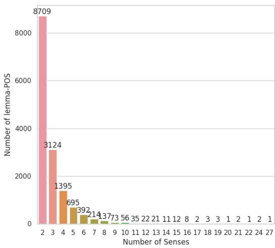

# How Much Do Encoder Models Know About Word Senses?

Simone Teglia1, Simone Tedeschi1,2 and Roberto Navigli1,2

1Sapienza University of Rome

2Babelscape, Italy

teglia@diag.uniroma1.it,

tedeschi@babelscape.com, navigli@diag.uniroma1.it

## Abstract

Word Sense Disambiguation (WSD) is a key task in Natural Language Processing (NLP), in volving selecting the correct meaning of a word based on its context. With Pretrained Language Models (PLMs) like BERT and DeBERTa now well established, significant progress has been made in understanding contextual semantics. Nevertheless, how well these models inherently disambiguate word senses remains uncertain. In this work, we evaluate several encoder-only PLMs across two popular inventories (i.e. WordNet and the Oxford Dictionary of English) by analyzing their ability to separate word senses without any task-specific finetuning. We compute centroids of word senses and measure similarity to assess performance across different layers. Our results show that DeBERTa-v3 delivers the best performance on the task, with the middle layers (specifically the 7th and 8th layers) achieving the highest accuracy, outperforming the output layer by approximately 15 percentage points. Our experiments also explore the inherent structure of Word-Net and ODE sense inventories, highlighting their influence on the overall model behavior and performance. Finally, based on our findings, we develop a small, efficient model for the WSD task that attains robust performance while significantly reducing the carbon foot print. We publicly release our software at http: //github.com/SapienzaNLP/wsd-probing.

## 1 Introduction

Language is inherently ambiguous, with many words denoting distinct meanings depending on the context. For example, the word wing can refer to a bird’s limb in "The white bird has a broken wing", or to a section of a building in "I visited the new museum’s wing about contemporary art". Capturing the correct meaning of a word in context – known as Word Sense Disambiguation (WSD, see Navigli (2009) and Bevilacqua et al. (2021) for surveys of the field) – is a long-standing challenge in

Natural Language Processing (NLP), essential in order to better understand and enhance applications like Machine Translation (Liu et al., 2018; Pu et al., 2018; Campolungo et al., 2022), Information Extraction (Moro and Navigli, 2013; Bovi et al., 2015; Martinelli et al., 2024) and Information Retrieval (Sinoara et al., 2019; Agosti et al., 2020; Blloshmi et al., 2021).

WSD is typically framed as a multi-label classification problem (Raganato et al., 2017a; Hadiwinoto et al., 2019) where the model must assign one or more senses chosen from a fixed inventory to each word to disambiguate. Most WSD approaches rely on WordNet (Miller, 1994) as an inventory of senses, and SemCor (Miller et al., 1993) as training corpus. With the advent of Transformer-based models, such as BERT (Devlin et al., 2019) or De-BERTa (He et al., 2021), there have been significant advancements in understanding contextual and semantic nuances, leading to improvements in benchmark results. Concurrently, probing studies have suggested that language models can capture linguistic knowledge during pretraining (Adi et al., 2017; Conneau et al., 2018), and that different Transformer layers specialize in different types of linguistic information (Tenney et al., 2019a). Nevertheless, it remains unclear how well these models separate word senses without explicit finetuning for WSD.

To investigate this, we conduct extensive experiments using the WordNet inventory and the Oxford Dictionary of English (Stevenson, 2010, ODE). Specifically, we investigate the disambiguation capabilities of several encoder-only pretrained language models (PLMs) by probing their latent representations and computing sense-specific centroids to select the correct word sense based on similarity metrics. We use this strategy to analyze the performance of each intermediate and output layer of the various models to find both the best model and its optimal layer for the WSD task. Additionally, we provide an extensive discussion of our results, examining the structural similarities and differences between WordNet and ODE. This analysis highlights potential shortcuts that PLMs might exploit when evaluated on these resources and identifies the challenges these resources pose. Our findings offer insights into how factors such as distribution, granularity, and homogeneity of word senses can impact WSD performance.

To summarize, we aim to answer the following three main research questions:

• (RQ1) To what extent can PLMs distinguish between word senses in their latent space without fine-tuning?

• (RQ2) Which PLM better captures semantic information, and which intermediate layer performs best for WSD?

• (RQ3) What are the main structural differences between the WordNet and ODE inventories, and how do they affect the WSD task?

Building on our findings, we also design a small, efficient model for the WSD task that delivers competitive performance while significantly reducing computational requirements and lowering the associated carbon footprint. Finally, to encourage further research on the analysis of PLMs on semantic tasks, we publicly release our software and data at https://https://github.com/ SapienzaNLP/wsd-probing.

## 2 Related Work

## 2.1 Approaches to WSD

Over the years, various approaches have been developed to tackle the WSD task, including knowledgebased (Lesk, 1986; Jeh and Widom, 2003; Moro et al., 2014; Scozzafava et al., 2020), unsupervised (Chen et al., 2009; Rahman and Borah, 2022), and supervised approaches (Raganato et al., 2017b; Hadiwinoto et al., 2019; Scarlini et al., 2020a; Wang and Wang, 2020; Barba et al., 2021). With the rise of pre-trained language models and increased computational power, the supervised learning paradigm has become the dominant approach. These systems typically employ neural architectures, frame the WSD task as a classification problem, and use annotated data to learn the association between words in context and their appropriate senses.

Beyond the underlying PLM, supervised approaches are often distinguished by the type of additional information the models are able to leverage. For instance, GlossBERT (Huang et al., 2019), SensEmBERT (Scarlini et al., 2020a), ARES (Scarlini et al., 2020b) and SREF (Wang and Wang, 2020) exploit sense definitions (also known as glosses) to perform WSD. Glosses provide a simple way to clarify word meanings by offering brief definitions or explanations, and can be encoded as vectors by averaging their tokens. Along the same lines, Barba et al. (2021) frame WSD as a textextraction problem, and use the glosses of neighboring words to enrich the context of a target word.

Another common recent trend is to exploit relations between senses to further enhance the disambiguation capabilities of the models. Specifically, Wang and Wang (2020, SREF) exploit the WordNet hypernymy and hyponymy relations, Bevilacqua and Navigli (2020) use a richer set of relations to compute "structured logits", while Vial et al. (2019) reduce the number of output classes by linking each sense to an ancestor in the WordNet taxonomy.

Other approaches have taken a different direction and, instead of exploiting sense definitions and relations, leverage translations to improve the output of an arbitrary WSD system (Luan et al., 2020), or use images to create multimodal gloss vectors (Calabrese et al., 2020).

## 2.2 Probing Pretrained Language Models for Lexical-Semantics Tasks

Although all the above-mentioned approaches represent valuable contributions to the field, the underlying PLMs are typically used as black boxes. Hence, it remains unclear to what extent the ability of these systems in disambiguating words comes from the fine-tuning phase – where the model has access to task-specific data, such as labeled data, glosses and relations – or from the pre-training stage of the PLM itself.

In this context, a widely used technique for gaining insights about a model’s internal representation and behavior is probing (Rogers et al., 2020). Early works on probing language models (Adi et al., 2017; Conneau et al., 2018) pointed out the possibility that models could capture linguistic knowledge before training, with encoders capable of capturing local and global syntactic and semantic information (Shi et al., 2016; Ettinger et al., 2016). Subsequent studies (Blevins et al., 2018; Hewitt and Manning, 2019; Peters et al.,

  
Figure 1: A graphical representation of the proposed methodology. Given a target lemma, we use its training examples to compute sense-level centroids by means of a frozen transformer encoder . Then, for disambiguating a test instance, we select the sense associated with the centroid that maximizes the cosine similarity score. Note that, for the sake of visualization, we focus only on the first two senses of bank#NOUN in this example.

2018; Tenney et al., 2019a; Ethayarajh, 2019; Tenney et al., 2019b) confirmed that these models possess rich internal representations of linguistic structures and can extract semantic features useful for a wide range of downstream tasks. Specifically, Tenney et al. (2019a) found that different layers of BERT specialize in different types of linguistic information, with syntactic information being more localized within specific initial layers, whereas semantic information is re-distributed across multiple intermediate layers. Along the same lines, Ethayarajh (2019) showed that upper layers produce more context-specific representations, while Liu et al. (2024) revealed that lower layer representations of Llama 2 encode lexical semantics. Gessler and Schneider (2021), instead, framed the WSD probing task as a query-by-example similarity ranking, showing that BERT outperforms RoBERTa on capturing rare word senses.

Even more relevant to the scope of our study, Coenen et al. (2019) found evidence of geometric representation of word senses by probing BERT. Similarly, Tripodi (2021) analyzed word sense representations, and found that even though contextualized models do not create one representation per word sense, their contextualization creates similar representations for the same word sense that can be easily clustered.

Moreover, Proietti et al. (2024) showed that PLMs are able to differentiate homonymous word senses with up to 95% accuracy scores without finetuning. Nevertheless, existing works focus either on probing a specific model (Coenen et al., 2019, BERT), or on a simplified version of the WSD task (Coenen et al., 2019; Proietti et al., 2024) – hence overlooking the well-known granularity issue – or do not look at the internal representations of the various Transformer layers (Proietti et al., 2024; Tripodi, 2021). To fill this gap, we extensively evaluate four different pre-trained encoders belonging to different models’ families according to their pretraining strategies, and measure how their individual layers perform on the WSD task. Furthermore, unlike previous works, we experiment with two sense inventories (WordNet and ODE) and extensively compare them in the context of WSD.

## 3 Methodology

As highlighted by previous studies (Coenen et al., 2019; Tripodi, 2021; Proietti et al., 2024), PLMs can distinguish between different senses of the same word, thus placing the corresponding contextualized word embeddings at different points in the latent space. The core objective of our work is to further investigate this phenomenon by quantifying the disambiguation capabilities of PLMs in a fine-grained setting, while aiming at identifying the optimal model and layer to represent word meanings (cf. RQ1 and RQ2 in Section 1).

To achieve this, we rely on an annotated corpus and divide it into $\mathcal { C } _ { t r a i n }$ and $\mathcal { C } _ { t e s t }$ splits. Before splitting the corpus, we filter out all the instances belonging to monosemous words (i.e. unambiguous words with just one meaning), and remove all the senses that have less than K examples in the corpora. The former filter is applied to focus on non-trivial disambiguation cases, while the latter is applied to include in our study only the senses whose number of examples in the corpora is sufficient to create reasonable and reliable representations. We then compute sense-specific centroids for each sense in the corpus, and select the correct word sense based on similarity metrics. We apply this strategy to each layer of the various models under evaluation. Formally, for each word sense in the corpus $\mathcal { C } _ { t r a i n } .$ , each with $\mathcal { N }$ associated training examples $\{ s _ { 1 } , . . . , s _ { \mathcal { N } } \}$ in which a word w is annotated with , we use a Transformer model to compute the contextualized word embeddings $E = \{ e ( s _ { 1 } ) , \ldots , e ( s _ { \mathcal { N } } ) \} = \{ e _ { 1 } , \ldots , e _ { \mathcal { N } } \}$ . If a word is split into multiple tokens, we average the embeddings of the tokens to obtain a single representation. Then, we compute the centroid of the cluster of embeddings E as follows:

$$
C e n t r o i d ( E ) = \frac { 1 } { N } \sum _ { i = 1 } ^ { N } e _ { i }\tag{1}
$$

Once the centroids for all the senses in $\mathcal { C } _ { t r a i n }$ have been computed, we can proceed by assessing the quality of the model in separating word senses using $\mathcal { C } _ { t e s t }$ . Specifically, for each test instance $t \in \mathcal { C } _ { t e s t } { } ^ { 1 }$ , we use to produce its embedding vector and compare it with the centroids constructed from $\mathcal { C } _ { t r a i n }$ having the same lemma and Part-of-Speech (POS) tag of t. We then verify whether the closest centroid $c ^ { * }$ is the centroid of the correct sense. For a given embedding vector e, the nearest centroid $c ^ { * } \in C$ is defined as the centroid that maximizes the cosine similarity with respect to $e ,$ where C is the set of all the centroids of senses that have the same lemma and POS of the target word:

$$
c ^ { * } = \arg \operatorname* { m a x } _ { c \in C } { \frac { c \cdot e } { \| c \| \| e \| } }\tag{2}
$$

We repeat this procedure by using any layer $\mathcal { M } _ { L }$ of the Transformer to generate both the centroids in $\mathcal { C } _ { t r a i n }$ as well as the embeddings of the test instances in $\mathcal { C } _ { t e s t }$ . This allows us to gain detailed insights into the model’s behavior and identify the optimal layers for the WSD task. The overall procedure is summarized in Figure 1.

## 4 Experimental Setup

In this section, we describe the data used for conducting our experiments (Section 4.1) and the models under evaluation (Section 4.2). All our experiments are carried out using the Hugging Face Transformers library (Wolf et al., 2020) and PyTorch2 to ensure the reusability of our code.

## 4.1 Data

We use two different corpora in our experiments:

• SemCor (Miller, 1994): It contains 33,362 senses and 226,036 instances annotated manually with senses from WordNet 3.0. The dataset is openly available.3

• ODE (Stevenson, 2010): We use the version introduced by Chang et al. (2018) containing 79,004 senses and around 785,000 instances from the Oxford Dictionary of English.

We run experiments using K = 5 and $K = 1 0 ,$ with K being the minimum number of examples for a given sense to be included in our study (cf. Section 3). We use both corpora as training and test sets, splitting them following the standard 80% - 20% ratio. SemCor test instances are disambiguated with the centroids constructed using the SemCor training split; an analogous process is carried out with the ODE instances.

## 4.2 Models

In order to have a broad overview of the capabilities of PLMs, we analyze the four most popular ones:

• BERT (Devlin et al., 2019): A Transformerbased encoder model trained using the Masked Language Modeling (MLM) objective, where certain tokens in the input are masked, and the model learns to predict them. BERT features an additional task called Next Sentence Prediction (NSP), where the model learns to determine whether two sentences follow each other. In our experiments, we use both the google-bert/bert-base-cased4 and google-bert/bert-base-uncased5 versions available on Hugging Face;

• RoBERTa (Liu et al., 2019): An improved variant of BERT, pre-trained with the same MLM task but with more data, longer training, and hyperparameter optimizations. It excludes BERT’s Next Sentence Prediction task and focuses on maximizing the effectiveness of MLM through better pretraining strategies. We use the FacebookAI/rober $\cdot \mathtt { t a } \mathtt { - b } \mathtt { a } \mathtt { s } \mathtt { e } ^ { 6 }$ model;

<table><tr><td></td><td>↓ Model \ Layer →</td><td>1</td><td>2</td><td>3</td><td>4</td><td>5</td><td>6</td><td>7</td><td>8</td><td>9</td><td>10</td><td>11</td><td>12</td></tr><tr><td rowspan="5">ODEE</td><td>bert-base-uncased</td><td>71.25</td><td>76.05</td><td>78.36</td><td>80.46</td><td>82.84</td><td>83.58</td><td>84.29</td><td>85.66</td><td>86.83</td><td>88.27</td><td>88.68</td><td>88.60</td></tr><tr><td>bert-base-cased</td><td>65.49</td><td>73.46</td><td>77.02</td><td>79.11</td><td>81.09</td><td>82.44</td><td>83.44</td><td>84.63</td><td>86.12</td><td>87.75</td><td>88.10</td><td>87.54</td></tr><tr><td>roberta-base</td><td>69.88</td><td>75.10</td><td>79.67</td><td>82.95</td><td>84.80</td><td>85.63</td><td>86.01</td><td>85.84</td><td>86.49</td><td>87.55</td><td>87.66</td><td>86.51</td></tr><tr><td>electra-base-discriminator</td><td>69.31</td><td>80.12</td><td>83.29</td><td>83.74</td><td>86.57</td><td>85.65</td><td>86.12</td><td>85.85</td><td>86.19</td><td>85.66</td><td>84.43</td><td>82.20</td></tr><tr><td>deberta-v3-base</td><td>72.77</td><td>81.26</td><td>86.28</td><td>88.39</td><td>89.74</td><td>90.13</td><td>90.46</td><td>90.26</td><td>89.47</td><td>88.80</td><td>87.20</td><td>75.94</td></tr><tr><td rowspan="5">Secor</td><td>bert-base-uncased</td><td>46.68</td><td>52.69</td><td>59.91</td><td>62.98</td><td>65.84</td><td>67.53</td><td>67.95</td><td>68.58</td><td>68.80</td><td>69.21</td><td>69.10</td><td>67.92</td></tr><tr><td>bert-base-cased</td><td>41.75</td><td>52.11</td><td>60.04</td><td>62.56</td><td>64.51</td><td>66.47</td><td>67.89</td><td>68.12</td><td>68.62</td><td>69.70</td><td>69.65</td><td>68.09</td></tr><tr><td>roberta-base</td><td>49.11</td><td>59.63</td><td>64.92</td><td>66.79</td><td>68.07</td><td>68.55</td><td>68.83</td><td>68.90</td><td>69.13</td><td>69.70</td><td>69.10</td><td>65.59</td></tr><tr><td>electra-base-discriminator</td><td>48.22</td><td>61.16</td><td>63.22</td><td>66.02</td><td>68.32</td><td>68.58</td><td>69.47</td><td>69.69</td><td>70.20</td><td>69.70</td><td>69.18</td><td>66.98</td></tr><tr><td>deberta-v3-base</td><td>49.03</td><td>62.01</td><td>67.28</td><td>68.61</td><td>69.87</td><td>70.55</td><td>71.05</td><td>71.05</td><td>70.26</td><td>69.57</td><td>68.00</td><td>55.15</td></tr></table>

(a) K = 5

<table><tr><td></td><td>↓ Model \ Layer →</td><td>1</td><td>2</td><td>3</td><td>4</td><td>5</td><td>6</td><td>7</td><td>8</td><td>9</td><td>10</td><td>11</td><td>12</td></tr><tr><td rowspan="5">OE</td><td>bert-base-uncased</td><td>72.94</td><td>77.57</td><td>79.98</td><td>81.98</td><td>84.28</td><td>85.00</td><td>85.60</td><td>86.87</td><td>87.89</td><td>89.25</td><td>89.64</td><td>89.52</td></tr><tr><td>bert-base-cased</td><td>67.33</td><td>75.18</td><td>78.72</td><td>80.81</td><td>82.65</td><td>83.95</td><td>84.94</td><td>85.95</td><td>87.31</td><td>88.79</td><td>89.08</td><td>88.55</td></tr><tr><td>roberta-base</td><td>72.07</td><td>77.34</td><td>81.67</td><td>84.65</td><td>86.28</td><td>86.99</td><td>87.29</td><td>87.10</td><td>87.70</td><td>88.64</td><td>88.67</td><td>87.52</td></tr><tr><td>electra-base-discriminator</td><td>71.37</td><td>81.84</td><td>84.92</td><td>85.50</td><td>87.99</td><td>87.24</td><td>87.60</td><td>87.24</td><td>87.43</td><td>86.94</td><td>85.78</td><td>83.48</td></tr><tr><td>deberta-v3-base</td><td>74.39</td><td>82.82</td><td>87.64</td><td>89.60</td><td>90.74</td><td>91.11</td><td>91.40</td><td>91.18</td><td>90.43</td><td>89.79</td><td>88.33</td><td>77.33</td></tr><tr><td rowspan="5">Secor</td><td>bert-base-uncased</td><td>46.07</td><td>51.36</td><td>60.18</td><td>63.09</td><td>65.95</td><td>67.70</td><td>68.08</td><td>68.77</td><td>69.08</td><td>69.11</td><td>68.65</td><td>67.18</td></tr><tr><td>bert-base-cased</td><td>41.94</td><td>51.99</td><td>60.34</td><td>63.40</td><td>65.61</td><td>67.19</td><td>68.50</td><td>68.66</td><td>69.07</td><td>69.69</td><td>69.70</td><td>68.18</td></tr><tr><td>roberta-base</td><td>48.70</td><td>59.88</td><td>65.25</td><td>66.89</td><td>67.98</td><td>68.76</td><td>69.16</td><td>68.99</td><td>69.63</td><td>70.05</td><td>69.34</td><td>65.50</td></tr><tr><td>electra-base-discriminator</td><td>48.50</td><td>60.85</td><td>62.74</td><td>66.49</td><td>68.51</td><td>68.90</td><td>69.67</td><td>69.52</td><td>69,91</td><td>69.70</td><td>69.44</td><td>67.15</td></tr><tr><td>deberta-v3-base</td><td>50.31</td><td>63.18</td><td>67.83</td><td>68.89</td><td>70.58</td><td>70.95</td><td>71.22</td><td>71.53</td><td>70.42</td><td>69.70</td><td>68.17</td><td>55.56</td></tr></table>

(b) K = 10  
Table 1 (a) and (b): Performance of the various Pretrained Language Models (PLMs) and their individual layers on the ODE and SemCor inventories with $K = 5$ and K = 10, respectively. The best layer for each PLM is highlighted in liliac , while the overall best layer across the various PLMs is marked in bold.

• ELECTRA (Clark et al., 2020): Introduces a novel pretraining task called Replaced Token Detection (RTD), where a generator replaces tokens in the input, and the model learns to detect whether a token has been replaced. This approach is more sample-efficient than MLM, allowing ELECTRA to perform well with less computational resources. We use google/electra-base-discriminator7;

• DeBERTa-v3 (He et al., 2021): Builds upon ELECTRA’s Replaced Token Detection task, but introduces further innovations such as disentangled attention and enhanced mask decoding. These improvements allow DeBERTa-v3 to better capture word relationships and outperform earlier models in representation learning. We use the microsoft/deberta-v3-base8 model.

Considering their different pretraining objectives and specificities, we expect their output representations to have different properties, which renders our analysis more robust and of greater generality.

## 5 Results

In Tables 1a and 1b, we report the F1 scores of the PLMs under evaluation on both ODE and SemCor datasets, using $K \geq 5$ and $K \geq 1 0$ , respectively.

The first key finding of our study is that different PLMs encode semantic information more effectively at distinct depths within their architectures. Specifically, models trained using the Masked Language Modeling (MLM) objective, such as BERT and RoBERTa, exhibit peak performance in the final layers, with the 10th and 11th layers being the most effective ones on SemCor and ODE, respectively. In marked contrast, models trained with the Replaced Token Detection (RTD) objective, like ELECTRA and DeBERTa-v3, achieve their highest scores in the intermediate layers – specifically, the layers between the 5th and 8th, depending on the dataset and value of K. This result is particularly interesting in the case of DeBERTa-v3, which exhibits a significant performance gap between its optimal layer (highlighted in liliac) and its final layer (i.e. the one usually used in the literature for classification tasks), with an average improvement of approximately 15 F1 score points.

Additionally, our results show how DeBERTav3 consistently outperforms its competitors across all settings, while ELECTRA – sharing the same training objective – is frequently outperformed by both BERT and RoBERTa models. However, this result is expected and aligned with the analysis of He et al. (2021), which showed that using the same token embeddings for the discriminator and the generator affects the model’s performance, because the losses of the two pull token embeddings in opposite directions. Specifically, the MLM objective used for training the generator pulls the tokens that are semantically similar close to each other, while the RTD objective of the discriminator tries to discriminate semantically similar tokens and pull their embeddings as far apart as possible in order to optimize the binary classification accuracy, causing a conflict between their training objectives, and, consequently, poor performance on semantic tasks. This finding emphasizes the importance of disentangled attention in the DeBERTa-v3 architecture, crucial for preventing tug-of-war dynamics (Hadsell et al., 2020) and enhancing contextual understanding.

With these results, we carefully addressed RQ2 (cf. Section 1), identifying the most suitable PLM and its optimal layer for the WSD task. Nevertheless, the extent to which PLMs can effectively differentiate between word senses (RQ1) remains unclear, as their performance appears to be highly dependent on the dataset used for evaluation. Indeed, PLMs attain scores of around 90 F1 score points on ODE, while they achieve just 70 F1 score points on SemCor, on average. This disparity suggests that RQ1 and RQ3 are strongly intertwined; therefore, we devote the next section to analyzing the structural differences between ODE and Sem-Cor.

## 6 Analysis and Discussion

As shown in Tables 1a and 1b, the scores of the various PLMs on the ODE dataset considerably exceed the ones on the SemCor dataset. To understand this discrepancy, we analyze several structural factors, namely: i) sense granularity, ii) sense frequency, and iii) the homogeneity of examples.

  
Figure 2: SemCor sense granularity.

  
Figure 3: ODE sense granularity.

## 6.1 Sense Granularity

Depending on the inventory (i.e. ODE or WordNet), a given lemma may have a different number of senses. In particular, the main criticisms that have been raised against WordNet over the years is that its fine granularity and subtle distinctions between nearly identical senses make it hard to select the most appropriate meaning of a given word, even for humans (Edmonds and Kilgarriff, 2002).

Based on this evidence, we hypothesize that WordNet may exhibit greater sense granularity compared to ODE, potentially making the disambiguation task more challenging. Hence, here we assess whether the two corpora offer comparable levels of sense granularity. To do so, we take all the polysemous lemmas in SemCor and ODE with at least K = 5 occurrences (i.e. the same setting as that of our experiments, cf. Table 1a), and plot the resulting distribution. Specifically, as we can see from Figures 2 and 3 – despite ODE having a larger set of lemmas – the two inventories have matching distributions with most lemmas having 2-6 meanings, suggesting a similar level of granularity. For completeness, we also compute the average polysemy degree D on the two inventories, and obtain $D _ { O D E } = 2 . 9 3 $ and $D _ { S e m C o r } = 2 . 8 2$ confirming our qualitative interpretation.

<table><tr><td>Dataset</td><td>↓Model \ Layer →</td><td>1</td><td>2</td><td>3</td><td>4</td><td>5</td><td>6</td><td>7</td><td>8</td><td>9</td><td>10</td><td>11</td><td>12</td></tr><tr><td>ODE</td><td>deberta-v3-base</td><td>69.45</td><td>77.50</td><td>82.89</td><td>85.34</td><td>87.04</td><td>87.71</td><td>88.07</td><td>87.43</td><td>86.06</td><td>84.96</td><td>82.79</td><td>70.12</td></tr><tr><td>SemCor</td><td>deberta-v3-base</td><td>53.91</td><td>61.94</td><td>66.67</td><td>67.67</td><td>68.96</td><td>70.10</td><td>70.79</td><td>70.86</td><td>69.30</td><td>68.37</td><td>66.08</td><td>55.50</td></tr></table>

Table 2: Performance of DeBERTa-v3 on SemCor and ODE with K = 5
<table><tr><td>Dataset</td><td>↓ Similarity \ Layer →</td><td>1</td><td>2</td><td>3</td><td>4</td><td>5</td><td>6</td><td>7</td><td>8</td><td>9</td><td>10</td><td>11</td><td>12</td></tr><tr><td rowspan="2">ODE</td><td>Internal</td><td>83.43</td><td>80.59</td><td>78.27</td><td>76.25</td><td>74.27</td><td>71.79</td><td>69.23</td><td>65.73</td><td>64.72</td><td>61.89</td><td>67.10</td><td>82.50</td></tr><tr><td>External</td><td>26.13</td><td>24.42</td><td>22.70</td><td>21.16</td><td>19.88</td><td>18.78</td><td>17.84</td><td>17.00</td><td>17.58</td><td>16.79</td><td>19.39</td><td>26.33</td></tr><tr><td rowspan="2">SemCor</td><td>Internal</td><td>83.44</td><td>79.35</td><td>74.99</td><td>71.41</td><td>68.31</td><td>64.64</td><td>60.91</td><td>57.57</td><td>57.85</td><td>53.82</td><td>60.77</td><td>81.93</td></tr><tr><td>External</td><td>80.29</td><td>74.19</td><td>67.17</td><td>61.43</td><td>56.59</td><td>52.11</td><td>48.08</td><td>45.57</td><td>48.11</td><td>44.40</td><td>53.22</td><td>78.70</td></tr></table>

Table 3: Internal and External similarity scores of DeBERTa-v3 and its layers on SemCor and ODE (K = 5).

Based on these findings, we can exclude the sense granularity from the factors contributing to the performance discrepancy between ODE and SemCor, and proceed with our investigation.

## 6.2 Sense Frequency

At this stage, we aim to assess how the number of training examples influences the formation of centroids, guided by the intuition that word senses with fewer examples may produce less accurate, noisier centroids. This issue is particularly relevant in SemCor as it exhibits highly imbalanced sense frequencies, with the most frequent sense (MFS) of a given word often being overrepresented in the corpus. As a result, the dominance of the MFS could skew the classification process, leading to errors in identifying less common, tail senses. This imbalance poses a challenge to accurate disambiguation, as the scarcity of training data for rare senses may cause the system to favor more frequent senses, thus reducing overall classification precision.

To investigate this factor, for a given lemma, we take exactly K = 5 examples for both ODE and SemCor, and repeat the experiments using the best model, i.e. DeBERTa-v3. However, when comparing the results in Table 2 against those in Table 1a, we still observe a notable discrepancy of approximately 18 points between ODE and Sem-

Cor. Notably, the results on SemCor remain stable, indicating that $K = 5$ examples are sufficient to produce accurate centroids, and suggesting that sense balancing is not the factor driving the performance gap. On the other hand, the results on ODE — where both frequent (top) and rare (tail) senses already had a similar number of examples — show a 2-point drop in F1 score. However, this outcome was expected, as the examples in ODE were already balanced, and the only change applied was the reduction in the total number of examples per sense, which negatively impacted the quality of the centroids created.

As a side note, we highlight that the 7th and 8th layers are still the best-performing ones, confirming that those layers are the most suitable for encoding semantic information, independently of the number of examples given.

## 6.3 Homogeneity of Examples

After excluding sense granularity (Section 6.1) and sense frequency (Section 6.2) as key factors characterizing the performance gap between ODE and SemCor, we proceed to analyze the homogeneity of examples within the two inventories. This additional study aims to determine whether the distinctions between word senses are more clearly reflected in their corresponding sentence examples.

To conduct our analysis, we compute the similarity scores between pairs of examples belonging to the same word sense and between pairs of examples belonging to different senses (within the same lemma). Specifically, following Tripodi (2021), we define the internal similarity as a measure to quantify how similar the instances within the same sense cluster are, while we define the external similarity as a measure to quantify how different the instances within different sense clusters are. Formally, given a lemma , with N sense clusters

$S = \{ S _ { 1 } , \ldots , S _ { N } \}$ , we define the internal similarity of the sense cluster $S _ { i }$ as:

$$
I n t S i m ( S _ { i } ) = \frac { 1 } { n ^ { 2 } - n } \sum _ { i } \sum _ { j \neq i } c o s ( e _ { i } , e _ { j } ) ,\tag{3}
$$

where n is the number of data points (i.e. embeddings of examples) in the sense cluster $S _ { i }$ , and cos $( e _ { i } , e _ { j } )$ is the cosine similarity between a pair of embeddings.

Similarly, we define the external similarity of a sense cluster $S _ { i }$ with all the other clusters in ${ \hat { S } } = S \setminus S _ { i }$ , as:

$$
\begin{array} { l } { { \displaystyle { E x t S i m } ( S _ { i } , \hat { S } ) = } } \\ { { \displaystyle { \frac { 1 } { n \cdot m } \sum _ { e _ { i } \in S _ { i } } \sum _ { S _ { k } \in \hat { S } } c o s ( e _ { i } , e _ { j } ) } } , } \end{array}\tag{4}
$$

where $m$ is the number of embeddings of all the other clusters $\hat { S }$ belonging to the lemma ${ \mathcal { L } } .$

Based on these metrics, we expect an easy disambiguation setting to have a high internal similarity (i.e. examples of the same word sense are near in the latent space) and low external similarity (i.e. examples of different word senses are far apart in the latent space), resulting in a large difference between the two scores. Conversely, we expect a hard disambiguation setting to have a less marked distinction between the internal and external similarity scores, indicating a higher difficulty in assigning a test instance to the correct sense cluster.

In Table 3, we report the average scores for each layer of DeBERTa-v3: ODE turns out to be an easier disambiguation benchmark than SemCor according to the above definitions. In particular, when evaluating on ODE, the best disambiguation layers (i.e. the 7th and 8th layers, according to Tables 1a, 1b and 2) have high internal similarity ( 70) and low external similarity ( 20). This result strongly suggests that the examples of a given sense are cohesive, while examples of different senses are easily distinguishable. In contrast, the scores on SemCor show both a high internal similarity as well as a high external similarity, indicating a higher semantic and contextual similarity between examples of different senses.

Importantly, we note that this result may be influenced by the nature of the examples provided in the ODE dictionary, which are potentially less varied and realistic than those from SemCor. Moreover, the SemCor examples originate from texts written in the 1960s.

<table><tr><td>System</td><td>F1</td><td>#Layers</td><td>Training Time</td></tr><tr><td>GlossBERT (Huang et al., 2019)</td><td>77.0</td><td>12</td><td>28:42h</td></tr><tr><td>GlossDeBERTa (Ours)</td><td>79.5</td><td>12</td><td>38:01h</td></tr><tr><td>GlossDeBERTa-small (Ours)</td><td>79.5</td><td>7</td><td>22:27h</td></tr></table>

Table 4: F1-score (%) for fine-grained English all-words WSD on the ALL dataset.

## 7 GlossDeBERTa-small

Based on our experiments (cf. Section 4), we identified that DeBERTa-v3 is the best-performing PLM for modeling semantic information, and that its 7th and 8th layers are the most effective ones. Using these findings, we now aim at creating a new WSD model that achieves competitive performance while having a limited number of parameters.

To achieve this, we place a classification layer on top of the 7th layer of DeBERTa-v3 and fine-tune this model on SemCor, following the methodology of GlossBERT9 (Huang et al., 2019), which involves the creation of sentence-gloss pairs with weak supervision on the target word. We train our model for 4 epochs on an NVIDIA GPU 1080 Ti with a dropout parameter set to 0.1, a learning rate of 2e-5, a batch size of 64, and use the development set (SE07) for selecting the optimal checkpoint.

We then evaluate the model on the ALL dataset to assess its performance. For completeness, we also train the same architecture using the full BERT and DeBERTa-v3 models, and report the results in Table 4. Notably, GlossDeBERTa-small attains the best score while boasting a training speedup of 28% and 70.6% compared to GlossBERT and GlossDe-BERTa, respectively, thus considerably reducing the carbon footprint of the resulting model.

## 8 Conclusions and Future Work

We presented a probing task with the goal of determining the extent to which pre-trained encoder models know about word senses before being finetuned. Specifically, we analyzed the performance of each intermediate and output layer of four different models using a centroid-based method, and compared their accuracy on the WordNet and ODE. We found that DeBERTa-v3 is the best model and that it surprisingly achieves its best scores with the 7th and 8th layers, outperforming the output layer by 15 percentage points.

Additionally, our results highlighted how the performance of the PLMs is strongly connected to the underlying inventory used to construct the centroids, with SemCor being more challenging than ODE. Hence, to further investigate the behavior of the PLMs, we performed an extensive analysis on the structure of the two inventories, and discovered that the performance gap is mostly due to the quality of examples present in the inventories. Finally, based on our findings, we proposed a small yet effective WSD model that achieves strong performance while considerably reducing training times and hardware requirements.

For future work, we plan to extend our study to multilingual PLMs as well as to Large Language Models (LLMs) such as ChatGPT (Bahrini et al., 2023), Llama (Touvron et al., 2023) or Mistral (Jiang et al., 2023) and investigate their behavior across a broader set of languages and tasks.

## 9 Limitations

Although we analyzed the four most popular Transformer models spanning the main pretraining strategies, other notable PLMs exist, like ALBERT (Lan et al., 2020), CamemBERT (Martin et al., 2020), SpanBERT (Joshi et al., 2020) and DistilBERT (Sanh et al., 2019). Additionally, due to hardware constraints, we focused on the base version of the PLMs (i.e. models with 12 layers) and did not include the large versions of the models (e.g. models with 24 layers). Finally, while our analysis focused on the English language, it would be interesting to extend this work to popular multilingual PLMs, such as mBERT (Libovicky et al.\` , 2019), XLM (Conneau and Lample, 2019), XLM-R (Conneau, 2019) and XLM-E (Chi et al., 2022) where similar analyses could yield valuable insights. We plan to address these limitations in future works.

## Acknowledgments

Roberto Navigli gratefully acknowledges the support of the CREATIVE project (CRoss-modal understanding and gEnerATIon of Visual and tExtual content), which is funded by the MUR Progetti di Rilevante Interesse Nazionale programme (PRIN 2020).

## References

Yossi Adi, Einat Kermany, Yonatan Belinkov, Ofer Lavi, and Yoav Goldberg. 2017. Fine-grained analysis of sentence embeddings using auxiliary prediction tasks.

Maristella Agosti, Stefano Marchesin, and Gianmaria Silvello. 2020. Learning unsupervised knowledgeenhanced representations to reduce the semantic gap in information retrieval. ACM Trans. Inf. Syst., 38(4).

Aram Bahrini, Mohammadsadra Khamoshifar, Hossein Abbasimehr, Robert J Riggs, Maryam Esmaeili, Rastin Mastali Majdabadkohne, and Morteza Pasehvar. 2023. Chatgpt: Applications, opportunities, and threats. In 2023 Systems and Information Engineering Design Symposium (SIEDS), pages 274–279. IEEE.

Edoardo Barba, Luigi Procopio, and Roberto Navigli. 2021. ConSeC: Word sense disambiguation as continuous sense comprehension. In Proceedings of the 2021 Conference on Empirical Methods in Natural Language Processing, pages 1492–1503, Online and Punta Cana, Dominican Republic. Association for Computational Linguistics.

Michele Bevilacqua and Roberto Navigli. 2020. Breaking through the 80% glass ceiling: Raising the state of the art in word sense disambiguation by incorporating knowledge graph information. In Proceedings of the 58th Annual Meeting of the Association for Computational Linguistics, ACL 2020, Online, July 5-10, 2020, pages 2854–2864. Association for Computational Linguistics.

Michele Bevilacqua, Tommaso Pasini, Alessandro Raganato, and Roberto Navigli. 2021. Recent trends in word sense disambiguation: A survey. In Proceedings ofthe Thirtieth International Joint Conference on Artificial Intelligence, IJCAI 2021, Virtual Event / Montreal, Canada, 19-27 August 2021, pages 4330– 4338. ijcai.org.

Terra Blevins, Omer Levy, and Luke Zettlemoyer. 2018. Deep RNNs encode soft hierarchical syntax. In Proceedings ofthe 56th Annual Meeting ofthe Associationfor Computational Linguistics (Volume 2: Short Papers), pages 14–19, Melbourne, Australia. Association for Computational Linguistics.

Rexhina Blloshmi, Tommaso Pasini, Niccolò Campolungo, Somnath Banerjee, Roberto Navigli, and Gabriella Pasi. 2021. IR like a SIR: Sense-enhanced Information Retrieval for Multiple Languages. In Proceedings of the 2021 Conference on Empirical Methods in Natural Language Processing, pages 1030–1041, Online and Punta Cana, Dominican Republic. Association for Computational Linguistics.

Claudio Delli Bovi, Luca Telesca, and Roberto Navigli. 2015. Large-scale information extraction from textual definitions through deep syntactic and semantic analysis. Transactions ofthe Associationfor Computational Linguistics, 3:529–543.

Agostina Calabrese, Michele Bevilacqua, and Roberto Navigli. 2020. Evilbert: Learning task-agnostic multimodal sense embeddings. In Proceedings of the

Twenty-Ninth International Joint Conference on Artificial Intelligence, IJCAI-20, pages 481–487. International Joint Conferences on Artificial Intelligence Organization. Main track.

Niccolò Campolungo, Federico Martelli, Francesco Saina, and Roberto Navigli. 2022. DiBiMT: A novel benchmark for measuring Word Sense Disambiguation biases in Machine Translation. In Proceedings of the 60th Annual Meeting of the Association for Computational Linguistics (Volume 1: Long Papers), pages 4331–4352, Dublin, Ireland. Association for Computational Linguistics.

Ting-Yun Chang, Ta-Chung Chi, Shang-Chi Tsai, and Yun-Nung Chen. 2018. xsense: Learning senseseparated sparse representations and textual definitions for explainable word sense networks.

Ping Chen, Wei Ding, Chris Bowes, and David Brown. 2009. A fully unsupervised word sense disambiguation method using dependency knowledge. In Proceedings of Human Language Technologies: The 2009 Annual Conference of the North American Chapter of the Association for Computational Linguistics, pages 28–36.

Zewen Chi, Shaohan Huang, Li Dong, Shuming Ma, Bo Zheng, Saksham Singhal, Payal Bajaj, Xia Song, Xian-Ling Mao, Heyan Huang, and Furu Wei. 2022. XLM-E: Cross-lingual language model pre-training via ELECTRA. In Proceedings of the 60th Annual Meeting of the Association for Computational Linguistics (Volume 1: Long Papers), pages 6170–6182, Dublin, Ireland. Association for Computational Linguistics.

Kevin Clark, Minh-Thang Luong, Quoc V. Le, and Christopher D. Manning. 2020. Electra: Pre-training text encoders as discriminators rather than generators.

Andy Coenen, Emily Reif, Ann Yuan, Been Kim, Adam Pearce, Fernanda Viégas, and Martin Wattenberg. 2019. Visualizing and measuring the geometry of bert.

A Conneau. 2019. Unsupervised cross-lingual representation learning at scale. arXiv preprint arXiv:1911.02116.

Alexis Conneau, German Kruszewski, Guillaume Lample, Loïc Barrault, and Marco Baroni. 2018. What you can cram into a single \$&!#\* vector: Probing sentence embeddings for linguistic properties. In Proceedings of the 56th Annual Meeting of the Associationfor Computational Linguistics (Volume 1: Long Papers), pages 2126–2136, Melbourne, Australia. Association for Computational Linguistics.

Alexis Conneau and Guillaume Lample. 2019. Crosslingual language model pretraining. Advances in neural information processing systems, 32.

Jacob Devlin, Ming-Wei Chang, Kenton Lee, and Kristina Toutanova. 2019. Bert: Pre-training of deep

bidirectional transformers for language understanding.

Philip Edmonds and Adam Kilgarriff. 2002. Introduction to the special issue on evaluating word sense disambiguation systems. Nat. Lang. Eng., 8(4):279–291.

Kawin Ethayarajh. 2019. How contextual are contextualized word representations? Comparing the geometry of BERT, ELMo, and GPT-2 embeddings. In Proceedings of the 2019 Conference on Empirical Methods in Natural Language Processing and the 9th International Joint Conference on Natural Language Processing (EMNLP-IJCNLP), pages 55–65, Hong Kong, China. Association for Computational Linguistics.

Allyson Ettinger, Ahmed Elgohary, and Philip Resnik. 2016. Probing for semantic evidence of composition by means of simple classification tasks. In Proceedings of the 1st Workshop on Evaluating Vector-Space Representationsfor NLP, pages 134–139, Berlin, Germany. Association for Computational Linguistics.

Luke Gessler and Nathan Schneider. 2021. BERT has uncommon sense: Similarity ranking for word sense BERTology. In Proceedings of the Fourth BlackboxNLP Workshop on Analyzing and Interpreting Neural Networks for NLP, pages 539–547, Punta Cana, Dominican Republic. Association for Computational Linguistics.

Christian Hadiwinoto, Hwee Tou Ng, and Wee Chung Gan. 2019. Improved word sense disambiguation using pre-trained contextualized word representations. In Proceedings ofthe 2019 Conference on Empirical Methods in Natural Language Processing and the 9th International Joint Conference on Natural Language Processing (EMNLP-IJCNLP), pages 5297– 5306, Hong Kong, China. Association for Computational Linguistics.

Raia Hadsell, Dushyant Rao, Andrei A. Rusu, and Razvan Pascanu. 2020. Embracing change: Continual learning in deep neural networks. Trends in Cognitive Sciences, 24(12):1028–1040.

Pengcheng He, Xiaodong Liu, Jianfeng Gao, and Weizhu Chen. 2021. Deberta: Decoding-enhanced bert with disentangled attention.

John Hewitt and Christopher D. Manning. 2019. A structural probe for finding syntax in word representations. In Proceedings of the 2019 Conference of the North American Chapter ofthe Associationfor Computational Linguistics: Human Language Technologies, Volume 1 (Long and Short Papers), pages 4129–4138, Minneapolis, Minnesota. Association for Computational Linguistics.

Luyao Huang, Chi Sun, Xipeng Qiu, and Xuanjing Huang. 2019. GlossBERT: BERT for word sense disambiguation with gloss knowledge. In Proceedings of the 2019 Conference on Empirical Methods in Natural Language Processing and the 9th International

Joint Conference on Natural Language Processing (EMNLP-IJCNLP), pages 3509–3514, Hong Kong, China. Association for Computational Linguistics.

Glen Jeh and Jennifer Widom. 2003. Scaling personalized web search. In Proceedings of the 12th international conference on World Wide Web, pages 271–279.

Albert Q. Jiang, Alexandre Sablayrolles, Arthur Mensch, Chris Bamford, Devendra Singh Chaplot, Diego de las Casas, Florian Bressand, Gianna Lengyel, Guillaume Lample, Lucile Saulnier, Lélio Renard Lavaud, Marie-Anne Lachaux, Pierre Stock, Teven Le Scao, Thibaut Lavril, Thomas Wang, Timothée Lacroix, and William El Sayed. 2023. Mistral 7b.

Mandar Joshi, Danqi Chen, Yinhan Liu, Daniel S. Weld, Luke Zettlemoyer, and Omer Levy. 2020. Span-BERT: Improving pre-training by representing and predicting spans. Transactions ofthe Associationfor Computational Linguistics, 8:64–77.

Zhenzhong Lan, Mingda Chen, Sebastian Goodman, Kevin Gimpel, Piyush Sharma, and Radu Soricut. 2020. Albert: A lite bert for self-supervised learning of language representations.

Michael Lesk. 1986. Automatic sense disambiguation using machine readable dictionaries: how to tell a pine cone from an ice cream cone. In Proceedings ofthe 5th Annual International Conference on Systems Documentation, SIGDOC ’86, page 24–26, New York, NY, USA. Association for Computing Machinery.

Jindˇrich Libovicky, Rudolf Rosa, and Alexander Fraser.\` 2019. How language-neutral is multilingual bert? arXiv preprint arXiv:1911.03310.

Frederick Liu, Han Lu, and Graham Neubig. 2018. Handling homographs in neural machine translation. In Proceedings of the 2018 Conference of the North American Chapter of the Association for Computational Linguistics: Human Language Technologies, Volume 1 (Long Papers), pages 1336–1345, New Orleans, Louisiana. Association for Computational Linguistics.

Yinhan Liu, Myle Ott, Naman Goyal, Jingfei Du, Mandar Joshi, Danqi Chen, Omer Levy, Mike Lewis, Luke Zettlemoyer, and Veselin Stoyanov. 2019. Roberta: A robustly optimized bert pretraining approach.

Zhu Liu, Cunliang Kong, Ying Liu, and Maosong Sun. 2024. Fantastic semantics and where to find them: Investigating which layers of generative llms reflect lexical semantics. arXiv preprint arXiv:2403.01509.

Yixing Luan, Bradley Hauer, Lili Mou, and Grzegorz Kondrak. 2020. Improving word sense disambiguation with translations. In Proceedings of the 2020 Conference on Empirical Methods in Natural Language Processing (EMNLP), pages 4055–4065, Online. Association for Computational Linguistics.

Louis Martin, Benjamin Muller, Pedro Javier Ortiz Suárez, Yoann Dupont, Laurent Romary, Éric de la Clergerie, Djamé Seddah, and Benoît Sagot. 2020. CamemBERT: a tasty French language model. In Proceedings ofthe 58th Annual Meeting ofthe Association for Computational Linguistics, pages 7203– 7219, Online. Association for Computational Linguistics.

Giuliano Martinelli, Francesco Molfese, Simone Tedeschi, Alberte Fernández-Castro, and Roberto Navigli. 2024. CNER: Concept and named entity recognition. In Proceedings ofthe 2024 Conference of the North American Chapter of the Association for Computational Linguistics: Human Language Technologies (Volume 1: Long Papers), pages 8336–8351, Mexico City, Mexico. Association for Computational Linguistics.

George A. Miller. 1994. WordNet: A lexical database for English. In Human Language Technology: Proceedings of a Workshop held at Plainsboro, New Jersey, March 8-11, 1994.

George A. Miller, Claudia Leacock, Randee Tengi, and Ross T. Bunker. 1993. A semantic concordance. In Human Language Technology: Proceedings of a Workshop Held at Plainsboro, New Jersey, March 21-24, 1993.

Andrea Moro and Roberto Navigli. 2013. Integrating syntactic and semantic analysis into the open information extraction paradigm. In Proceedings of the Twenty-Third International Joint Conference on Artificial Intelligence, IJCAI ’13, page 2148–2154. AAAI Press.

Andrea Moro, Alessandro Raganato, and Roberto Navigli. 2014. Entity linking meets word sense disambiguation: a unified approach. Trans. Assoc. Comput. Linguistics, 2:231–244.

Roberto Navigli. 2009. Word sense disambiguation: A survey. ACM computing surveys (CSUR), 41(2):1– 69.

Matthew E. Peters, Mark Neumann, Mohit Iyyer, Matt Gardner, Christopher Clark, Kenton Lee, and Luke Zettlemoyer. 2018. Deep contextualized word representations. In Proceedings of the 2018 Conference of the North American Chapter of the Association for Computational Linguistics: Human Language Technologies, Volume 1 (Long Papers), pages 2227–2237, New Orleans, Louisiana. Association for Computational Linguistics.

Lorenzo Proietti, Stefano Perrella, Simone Tedeschi, Giulia Vulpis, Leonardo Lavalle, Andrea Sanchietti, Andrea Ferrari, and Roberto Navigli. 2024. Analyzing homonymy disambiguation capabilities of pretrained language models. In Proceedings of the 2024 Joint International Conference on Computational Linguistics, Language Resources and Evaluation (LREC-COLING 2024), pages 924–938, Torino, Italia. ELRA and ICCL.

Xiao Pu, Nikolaos Pappas, James Henderson, and Andrei Popescu-Belis. 2018. Integrating Weakly Supervised Word Sense Disambiguation into Neural Machine Translation. Transactions of the Association for Computational Linguistics, 6:635–649.

Alessandro Raganato, Jose Camacho-Collados, and Roberto Navigli. 2017a. Word sense disambiguation: A unified evaluation framework and empirical comparison. In Proceedings ofthe 15th Conference ofthe European Chapter ofthe Associationfor Computational Linguistics: Volume 1, Long Papers, pages 99–110, Valencia, Spain. Association for Computational Linguistics.

Alessandro Raganato, Claudio Delli Bovi, and Roberto Navigli. 2017b. Neural sequence learning models for word sense disambiguation. In Proceedings of the 2017 Conference on Empirical Methods in Natural Language Processing, pages 1156–1167, Copenhagen, Denmark. Association for Computational Linguistics.

Nazreena Rahman and Bhogeswar Borah. 2022. An unsupervised method for word sense disambiguation. Journal of King Saud University-Computer and Information Sciences, 34(9):6643–6651.

Anna Rogers, Olga Kovaleva, and Anna Rumshisky. 2020. A primer in bertology: What we know about how bert works.

Victor Sanh, Lysandre Debut, Julien Chaumond, and Thomas Wolf. 2019. Distilbert, a distilled version of bert: smaller, faster, cheaper and lighter. ArXiv, abs/1910.01108.

Bianca Scarlini, Tommaso Pasini, and Roberto Navigli. 2020a. Sensembert: Context-enhanced sense embeddings for multilingual word sense disambiguation. volume 34.

Bianca Scarlini, Tommaso Pasini, and Roberto Navigli. 2020b. With more contexts comes better performance: Contextualized sense embeddings for allround word sense disambiguation. In Proceedings of the 2020 Conference on Empirical Methods in Natural Language Processing (EMNLP), pages 3528– 3539, Online. Association for Computational Linguistics.

Federico Scozzafava, Marco Maru, Fabrizio Brignone, Giovanni Torrisi, and Roberto Navigli. 2020. Personalized PageRank with syntagmatic information for multilingual word sense disambiguation. In Proceedings of the 58th Annual Meeting of the Association for Computational Linguistics: System Demonstrations, pages 37–46, Online. Association for Computational Linguistics.

Xing Shi, Inkit Padhi, and Kevin Knight. 2016. Does string-based neural mt learn source syntax? In Conference on Empirical Methods in Natural Language Processing.

Roberta A Sinoara, Jose Camacho-Collados, Rafael G Rossi, Roberto Navigli, and Solange O Rezende. 2019. Knowledge-enhanced document embeddings for text classification. Knowledge-Based Systems, 163:955–971.

Angus Stevenson. 2010. Oxford dictionary ofEnglish. Oxford University Press, USA.

Ian Tenney, Dipanjan Das, and Ellie Pavlick. 2019a. Bert rediscovers the classical nlp pipeline.

Ian Tenney, Dipanjan Das, and Ellie Pavlick. 2019b. Bert rediscovers the classical nlp pipeline. arXiv preprint arXiv:1905.05950.

Hugo Touvron, Thibaut Lavril, Gautier Izacard, Xavier Martinet, Marie-Anne Lachaux, Timothée Lacroix, Baptiste Rozière, Naman Goyal, Eric Hambro, Faisal Azhar, Aurelien Rodriguez, Armand Joulin, Edouard Grave, and Guillaume Lample. 2023. Llama: Open and efficient foundation language models.

Rocco Tripodi. 2021. How contextualized word embeddings represent word senses.

Loïc Vial, Benjamin Lecouteux, and Didier Schwab. 2019. Sense vocabulary compression through the semantic knowledge of WordNet for neural word sense disambiguation. In Proceedings of the 10th Global Wordnet Conference, pages 108–117, Wroclaw, Poland. Global Wordnet Association.

Ming Wang and Yinglin Wang. 2020. A synset relationenhanced framework with a try-again mechanism for word sense disambiguation. In Proceedings of the 2020 Conference on Empirical Methods in Natural Language Processing (EMNLP), pages 6229–6240, Online. Association for Computational Linguistics.

Thomas Wolf, Lysandre Debut, Victor Sanh, Julien Chaumond, Clement Delangue, Anthony Moi, Pierric Cistac, Tim Rault, Rémi Louf, Morgan Funtowicz, Joe Davison, Sam Shleifer, Patrick von Platen, Clara Ma, Yacine Jernite, Julien Plu, Canwen Xu, Teven Le Scao, Sylvain Gugger, Mariama Drame, Quentin Lhoest, and Alexander M. Rush. 2020. Huggingface’s transformers: State-of-the-art natural language processing.