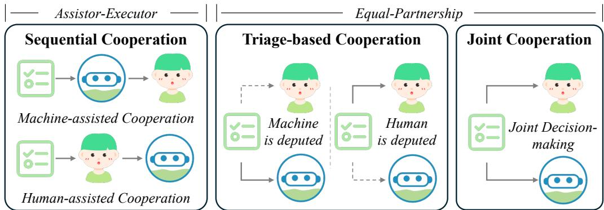
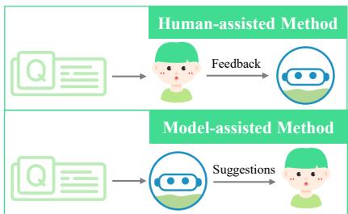
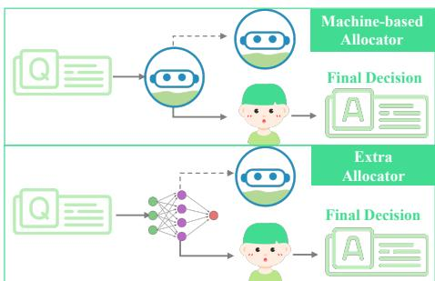
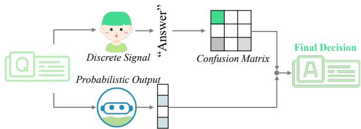
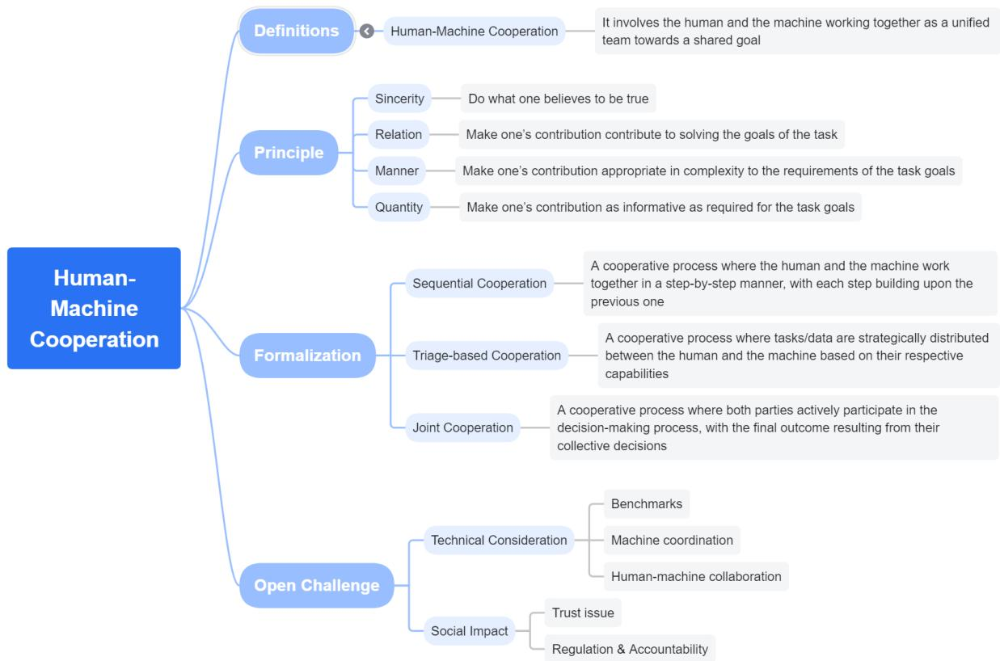
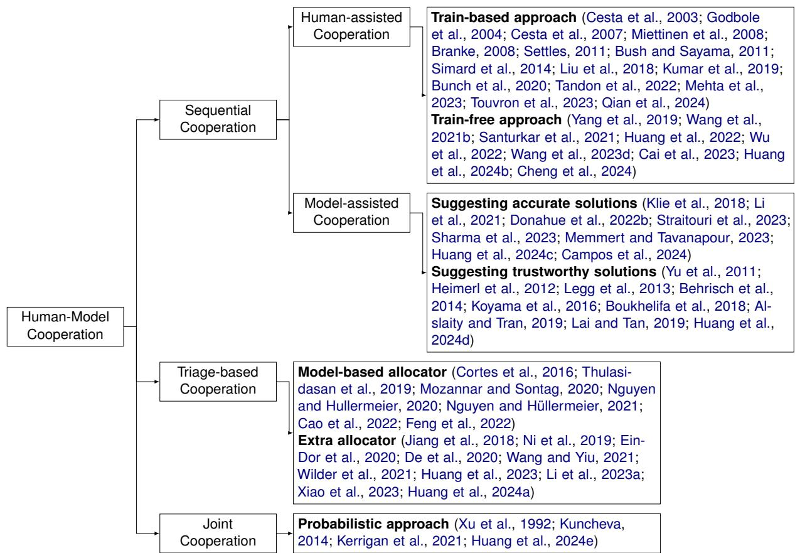
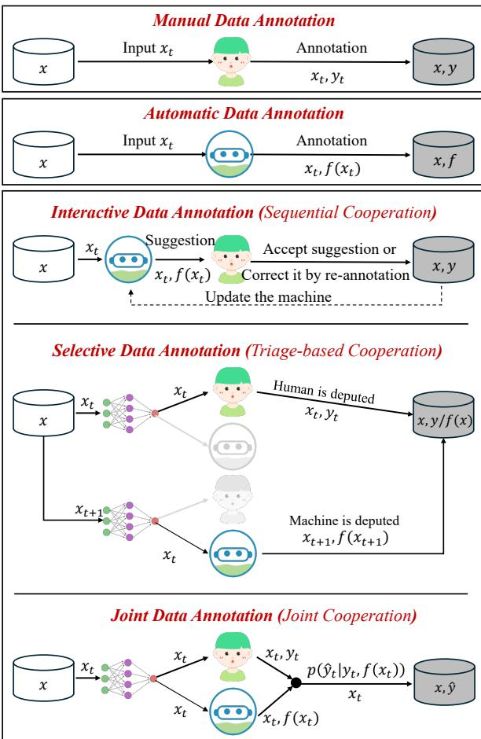
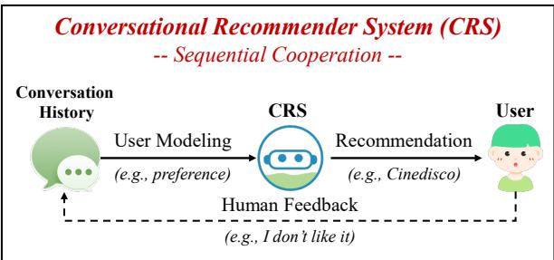
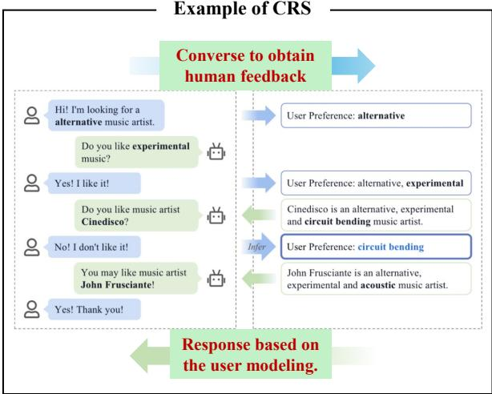

# How to Enable Effective Cooperation Between Humans and NLP Models: A Survey of Principles, Formalizations, and Beyond

Chen Huang♠♢, Yang Deng♭, Wenqiang Lei♠♢\*,

Jiancheng Lv♠♢, Tat-Seng Chua♡, Jimmy Xiangji Huang♣

Sichuan University ♭ Singapore Management University York University

Engineering Research Center of Machine Learning and Industry Intelligence,

Ministry of Education, China  National University of Singapore

{huangc.scu, dengyang17dydy}@gmail.com, wenqianglei@scu.edu.cn lvjiancheng@scu.edu.cn, chuats@comp.nus.edu.sg, jhuang@yorku.ca

## Abstract

With the advancement of large language models (LLMs), intelligent models have evolved from mere tools to autonomous agents with their own goals and strategies for cooperating with humans. This evolution has birthed a novel paradigm in NLP, i.e., human-model cooperation, that has yielded remarkable progress in numerous NLP tasks in recent years. In this paper, we take the first step to present a thorough review of human-model cooperation, exploring its principles, formalizations, and open challenges. In particular, we introduce a new taxonomy that provides a unified perspective to summarize existing approaches. Also, we discuss potential frontier areas and their corresponding challenges. We regard our work as an entry point, paving the way for more breakthrough research in this regard.

## 1 Introduction

Advancements in NLP research have been greatly propelled by large language models (LLMs), which have showcased exceptional abilities (Zhao et al., 2023; Laskar et al., 2024). These advancements are paving the way for the development of AI models that can behave as autonomous agents, working alongside humans to tackle intricate tasks. These models, for example, can cooperate with humans on data annotation (Klie et al., 2020; Li et al., 2023a; Huang et al., 2024c), information seeking (Deng et al., 2023a; Wang et al., 2023b; Zhang et al., 2024d), creative writing (Padmakumar and He, 2022; Akoury et al., 2020) and real-world problem solving (Mehta et al., 2023; Feng et al., 2024; Qian et al., 2024). This growing synergy between humans and models has fueled a surge of research into a new paradigm: Human-Model Cooperation. This paradigm, facilitated by diverse user interfaces ranging from natural language conversations (Ni et al., 2023) to action sequences like clicking buttons (Chen et al., 2023b; Rosset et al., 2020), holds promise for unlocking unprecedented levels of efficiency across various domains.

In fact, establishing intelligent models that can interact with humans has always been a longstanding research (Press, 1971; Wallenius, 1975; Milewski and Lewis, 1997; Dzindolet et al., 2003; Bahner et al., 2008; Chien et al., 2018; Touvron et al., 2023; Achiam et al., 2023). The realm of NLP tasks has seen a surge in methods for humanmodel cooperation (Wang et al., 2023e), particularly in the era of LLMs and agents (Xi et al., 2023). Recently, emergent surveys also have made commendable strides (Wang et al., 2021a, 2023e; Wu et al., 2023; Yang, 2024; Gao et al., 2024). However, they primarily focus on introducing key elements of human-model cooperation, such as user interfaces (e.g., dialogues), message understanding and fusion, cooperation system evaluation, and applications to NLP tasks (see Table 2 for details). Given all these elements, the information on particular details about how to formalize an effective human-model cooperation to achieve collective outputs is rather under-specified and scattered. Therefore, a comprehensive and systematic analysis of the underlying principles and formalizations of human-model cooperation is still absent. This gap in understanding presents a significant opportunity for advancement, enabling us to develop a deeper understanding of the fundamental basics that govern the effective cooperation between humans and intelligent models.

To fill this gap, in this survey, we take the first step to summarize the principles, formalizations, and open challenges of human-model cooperation1. We begin by introducing the definition and principles of this rapidly evolving field, providing a common ground for understanding. Next, we propose a new and systematic taxonomy for cooperation formalizations, offering a unified perspective to summarize existing approaches. This taxonomy, based on how cooperation takes place and who ultimately bears responsibility for decision-making, identifies three distinct types of cooperation, each with its own unique role framework defining the contributions of both cooperators to the overall task. Finally, we delve into potential research frontiers, highlighting both technical considerations and social impact. These frontiers identify opportunities and challenges for future investigation, paving the way for more advancements. As such, this survey seeks to stimulate further research and advance our understanding of human-model cooperation. This understanding is vital for harnessing the full potential of the cooperators and shaping a future where humans and intelligent models work together seamlessly. Our major contributions are as follows:

<table><tr><td rowspan=1 colspan=1>Cooperation Formalization</td><td rowspan=1 colspan=1>Who MakeFinal Decision</td><td rowspan=1 colspan=1>RoleFramework</td><td rowspan=1 colspan=1>Decision-makingIndependently</td><td rowspan=1 colspan=1>Representative Methods for Different Categories(Details are presented in Appendix D)</td></tr><tr><td rowspan=1 colspan=1>Sequential Cooperation,where two parties work togetherin a step-by-step manner,with each step buildingupon the previous one (Sec. 3.1)</td><td rowspan=1 colspan=1>Human or Model</td><td rowspan=1 colspan=1>Assistor-Executor</td><td rowspan=1 colspan=1>No</td><td rowspan=1 colspan=1>• Human-assisted method (Liu et al., 2018; Santurkaret al., 2021; Touvron et al., 2023; Mehta et al., 2023;Wang et al., 2023d)• Model-assisted method (Lai and Tan, 2019; Al-slaity and Tran, 2019; Li et al., 2021; Donahue et al.,2022b; Huang et al., 2024c)</td></tr><tr><td rowspan=1 colspan=1>Triage-based Cooperation,where tasks/data are strategicallydistributed between two parties(Sec. 3.2)</td><td rowspan=1 colspan=1>Human or Model</td><td rowspan=1 colspan=1>Equal-Partnership</td><td rowspan=1 colspan=1>Yes</td><td rowspan=1 colspan=1>• Model-based allocator (Thulasidasan et al., 2019;Mozannar and Sontag, 2020; Deng et al., 2022)• Extra allocator (Wang and Yiu, 2021; Huang et al.,2023; Li et al., 2023a; Huang et al., 2024a)</td></tr><tr><td rowspan=1 colspan=1>Joint Cooperation,where the final outcomeresulting from the collectivedecisions of two parties (Sec. 3.3)</td><td rowspan=1 colspan=1>Human and Model</td><td rowspan=1 colspan=1>Equal-Partnership</td><td rowspan=1 colspan=1>No</td><td rowspan=1 colspan=1>• Probabilistic approach (Kerrigan et al., 2021;Huang et al., 2024e)</td></tr></table>

Table 1: Overview of Human-Model Cooperation. Our taxonomy is based on how cooperation takes place and who ultimately takes responsibility for the final decision, identifying three main types of cooperation. For better understanding, we showcase typical applications of human-model cooperation in Appendix G.

• For the first time, we provide a comprehensive survey of the principles and formalizations of human-model cooperation.

• We introduce a novel and systematic taxonomy that offers a unified perspective on existing approaches to formalizing human-model cooperation, as illustrated in Table 1.

• We identify key research frontiers and their associated challenges, paving the way for groundbreaking research that will advance the field of human-model cooperation.

## 2 Definitions & Principles of Human-Model Cooperation

Definitions. Over the past few decades, various terms have been used to depict the concept of human-model cooperation. These terms often carry comparable meanings and are occasionally interchangeable. To address this issue, we establish clear definitions for human-model cooperation, carefully differentiating it from other terms. This provides a starting point for exploring this field.

Human-Model Cooperation involves the human and the model working together as a unified team, engaging in the decision-making process of shared tasks to achieve a shared goal.

Unlike non-cooperation (Deng et al., 2023a), shared or aligned goals form the foundation for effective human-model cooperation (Jiang et al., 2022; Wang et al., 2021a). However, cooperation doesn’t always mean sharing resources or information. Two parties can work independently to achieve a shared goal without mutual communication. However, human-model collaboration can go beyond cooperation (Hord, 1981). It involves an equal partnership, where both parties work together through bidirectional communication, shared decision-making, and interdependence. This often results in a more coordinated and efficient approach to achieving a shared goal. We focus on the cooperation, leaving discussions on collaboration for future work (cf. Section 4.1).

Principles. While many factors can affect how both parties behave, rational individuals usually aim to align their actions with principles to ensure effective and meaningful cooperation. Drawing inspiration from foundational work in conversational theory, our survey reinterprets the cooperative principles outlined by Grice (1975, 1989) to broaden their applicability beyond cooperative conversation and extend them to general cooperative applications. As evidenced by early studies (Grice, 1975, 1989; SARI, 2020), the cooperative principle can be split into the following four maxims2:

  
Figure 1: Unified taxonomy for categorizing the formalization of human-model cooperation. We also introduce two role frameworks, defining how the cooperators contribute to the overall task.

<table><tr><td rowspan=1 colspan=1>Surveys</td><td rowspan=1 colspan=1>EC FC PC</td><td rowspan=1 colspan=1>Remarks</td></tr><tr><td rowspan=1 colspan=1>Wang et al. (2021a)</td><td rowspan=1 colspan=1>√ 1  1</td><td rowspan=1 colspan=1>Human-model NLP tasks,Interation objectives,Types of human feedback,User interfaces</td></tr><tr><td rowspan=1 colspan=1>Gao et al. (2024)</td><td rowspan=1 colspan=1>√  1  1</td><td rowspan=1 colspan=1>Interaction modes(Prompting, User Interface,Context, and Agent Facilitator)</td></tr><tr><td rowspan=1 colspan=1>Wang et al. (2023e)</td><td rowspan=1 colspan=1>√ 1  1</td><td rowspan=1 colspan=1>Interactive objects,User interfaces,Message fusion strategies,Cooperation system evaluation</td></tr><tr><td rowspan=1 colspan=1>Wu et al. (2023)Yang (2024)</td><td rowspan=1 colspan=1>√  1  1</td><td rowspan=1 colspan=1>Cooperation system evaluation,User interfaces,Learn from human feedback</td></tr><tr><td rowspan=1 colspan=1>Xi et al. (2023)</td><td rowspan=1 colspan=1>√  1  1</td><td rowspan=1 colspan=1>Cooperator roleof human-agent cooperation</td></tr><tr><td rowspan=1 colspan=1>Wan et al. (2022)</td><td rowspan=1 colspan=1>1  xX  1</td><td rowspan=1 colspan=1>Detailed categories forone specific typeof cooperation form</td></tr><tr><td rowspan=1 colspan=1>Ours</td><td rowspan=1 colspan=1>V √</td><td rowspan=1 colspan=1>Cooperation principles,Taxonomy of cooperationforms (three types)</td></tr></table>

Table 2: Our differences to related surveys. ‘EC’, ‘FC’, and ‘PC’ refers to elements, formalizations, and principles of cooperation, respectively. A systematic analysis of the underlying principles and formalizations of human-model cooperation is still absent. Appendix B details our distinctions from related surveys.

• Sincerity—Do what one believes to be true. Each participant should act sincerely without deception and ensure that their responses are backed by sufficient evidence. Taking the conversational recommendation systems (CRS) as an example, it should provide credible recommendation explanations (Qin et al., 2024).

• Relation—Make one’s contribution contribute to solving the goals of the task. The actions of the participant need to be task-relevant or cooperation-relevant. For instance, the responses from CRS should contribute to identifying user preferences and making recommendations.

• Manner—Make one’s contribution appropriate in complexity to the requirements of the task goals. Each participant’s responses should be easily understood and clearly expressed. In this oles case, CRS’s responses should be lucid.

• Quantity—Make one’s contribution as informative as required for the task goals. Each participant should provide the necessary level of information without overwhelming the other with unnecessary details. In this case, recommendation explanations from CRS should avoid being lengthy and repetitive.

## 3 Formalization Taxonomy

Overview. We provide a fine-grained and unified taxonomy for categorizing the formalization of human-model cooperation methods, as illustrated in Figure 1 and Table 1. Our taxonomy is based on who ultimately takes responsibility for the final decision, identifying three main types of cooperation, including 1) sequential cooperation, 2) triage-based cooperation, and 3) joint cooperation. Each form of cooperation adheres to a specific role framework, defining how the cooperators contribute to the overall task. We also showcase typical applications of human-model cooperation in Appendix G for better understanding.

Adherence to Principles. Guided by the cooperative principle, existing methods for humanmodel cooperation fundamentally rely on the assumption that both parties act rationally. This implies that they try to take the best action toward achieving their goals instead of making decisions randomly and maliciously. For example, existing methods often rely on fully cooperative user simulators when conducting experiments on humanmachine cooperation. These simulators typically define the specifics of cooperation during interaction with the model through rules (Zhang and Balog, 2020; Lei et al., 2020a) or prompts (Sekulic´ et al., 2022; Wang et al., 2023b), such as instructing the simulator to provide truthful answers to model’s clarifying questions (Zhang et al., 2024d). Further details on the specific type of cooperation will be provided in the corresponding subsection.

Role Frameworks. Human-model cooperation encompasses a diverse range of roles, leading to two role frameworks (Zhang et al., 2021a; Xi et al., 2023): the assistor-executor framework and the equal-partnership framework. These frameworks are differentiated by the degree of shared responsibility for the final decision.

• Assistor-executor framework. This framework, the most prevalent one, reflects a hierarchical approach where one party holds primary decisionmaking power. In particular, one party acts as the assistant, providing guidance and information, while the other, the executor, retains the authority to make the final decision.

• Equal-partnership framework. Both parties contribute equally to decision-making in the equal-partnership framework, participating on an equal footing with two parties in cooperation. This framework may promote a more democratic approach to human-model interaction. However, regulation and accountability towards the humanmodel cooperation system become more complex in this framework as both parties share decisionmaking power (cf. Section 4.2 for discussion).

## 3.1 Sequential Cooperation

Sequential Cooperation refers to a cooperative process where the human and the model work together in a step-by-step manner, with each step building upon the previous one.

Overview. Sequential cooperation is the most prevalent form in NLP (Wang et al., 2021a; Wan et al., 2022). In this context, the actions or decisions of one party are influenced by the actions or decisions of the other participant in a sequential fashion (Brocas et al., 2018), primarily concerning increased efficiency and agency (Sperrle et al., 2021). Therefore, this type of cooperation often involves a series of interdependent tasks or actions that are carried out in a specific order to achieve a common goal or outcome. Notably, sequential cooperation mirrors the hierarchical structure of the assistor-executor framework. The first party in this sequence typically assumes the role of the assistant, providing suggestions or feedback that adhere to cooperative principles, while the second party, the executor, ultimately takes responsibility for the final decision. Due to the straightforward nature of this cooperation form, the NLP community has enthusiastically adopted this approach, achieving significant successes in various applications, including data collection and annotation (Fanton et al., 2021; Klie et al., 2020; Casanova et al., 2020; Li et al., 2021), technology-assisted manual document review workflows (Lewis et al., 2021; Cormack and Grossman, 2014, 2016), conversational information retrieval (Zamani et al., 2022), schema induction (Zhang et al., 2023), fact checking (Mendes et al., 2023), creative writing and summarization (Chen et al., 2023a; Padmakumar and He, 2022; Akoury et al., 2020), drug editing (Liu et al., 2024), cooperative agent (Zhang et al., 2024a), and many others (Gerlach et al., 2021; Sharma et al., 2023).

  
Figure 2: Two types of sequential cooperation based on whether the model or the human, respectively, takes on the role of the assistor.

Methods. Given the widespread use of sequential cooperation, we delve deeper into its two specific types: model-assisted and human-assisted method, as illustrated in Figure 2. These distinctions are based on whether the model or the human, respectively, takes on the role of the assistor.

• Human-assisted Method3 involves the model assuming the ultimate decision-making authority while leveraging human expertise to enhance its capabilities by providing feedback4 on the predicted or intermediate model results. This human feedback could extend throughout the model’s lifecycle – from data processing and model selection to optimization, alignment, and evaluation – with human assistance/feedback continuously shaping the model’s development (Wang et al.,

2021a; Touvron et al., 2023). As a result, humanassisted method can lead to more personalized models (Bae et al., 2020; Liu et al., 2020) and mitigate potential biases and errors inherent in automated processes (Mosqueira-Rey et al., 2023; Bai et al., 2022; Fails and Olsen Jr, 2003; Zhang et al., 2025). To achieve this, existing research can be categorized into two groups based on how to learn from human feedback: 1) Training-based approach translates human feedback into supervisions, which are used to train the task-specific model in either an offline (Qian et al., 2024; Touvron et al., 2023) or online fashion (Liu et al., 2018; Kumar et al., 2019); 2) Training-free approach resort to the in-context learning (Huang et al., 2022; Wang et al., 2023d; Cai et al., 2023; Wu et al., 2022), model editing (Santurkar et al., 2021; Huang et al., 2024b; Cheng et al., 2024), and rule learning (Yang et al., 2019) as more efficient alternatives to learn from human feedback.

• Model-assisted Method5 enhances human decision-making by leveraging model assistance (Green and Chen, 2020; Lai et al., 2021; Punzi et al., 2023). In this scenario, the two parties work autonomously, with the model performing specific tasks to assist the human’s duty and provide candidate solutions. The human, in turn, monitors the model’s work and ultimately makes the final decision based on the solutions. In practice, the model either proposes a single solution (Li et al., 2021; Sharma et al., 2023), which the human can then accept or reject6, or presents top-k solutions to to narrow down the possibilities, which the human can then either refine these solutions into a new one (Memmert and Tavanapour, 2023) or directly select the final solution from the presented list (Donahue et al., 2022b; Straitouri et al., 2023; Kilgarriff et al., 2008). As a result, compared to humans completing tasks from scratch, this form of cooperation is believed to significantly reduce the human workload. However, its effectiveness hings on both the accuracy and trustworthiness of model-generated solutions, encouraging human acceptance and ultimately minimizing workload while maximizing efficiency. To achieve this, there are two primary ways: 1) Suggesting accurate solutions. Researchers have employed various techniques, apart from using task-specific LMs/LLMs, including incorporating active learning strategies (Li et al., 2021; Klie et al., 2018), analogical reasoning (Huang et al., 2024c), and conformal prediction methods (Campos et al., 2024). 2) Suggesting trustworthy solutions. This involves informing humans about the model’s internal workings, the reasoning, and confidence level behind its solutions (Boukhelifa et al., 2018; Koyama et al., 2016; Behrisch et al., 2014), through, for example, visual representations and verbal explanations (Heimerl et al., 2012; Legg et al., 2013; Lai and Tan, 2019). However, recent work suggests that LLM struggles to express genuine responses without deceit during the interaction (Huang et al., 2024d), violating the cooperative principle of sincerity. In a boarder context, without trustworthiness, LLMs risk undermining the foundation of long-term trust with humans (Sun et al., 2024). This underscores the need for fostering trustworthy cooperation.

Notably, recent advancements have explored enhancing model-assisted method with humanassisted method, leveraging human feedback to refine model performance (Lertvittayakumjorn et al., 2020; Ribeiro and Lundberg, 2022; Tandon et al., 2022; Li et al., 2023b; Huang et al., 2024c). Some of them even empower the model to proactively seek human feedback (Huang et al., 2022; Wang et al., 2023d; Cai et al., 2023; Mehta et al., 2023; Zhang et al., 2024d). This creates a dynamic loop where the human helps improve the model’s decision-making process, potentially leading to better solutions. However, the ultimate decisionmaking authority remains with the human, placing this approach within the broader framework of model-assisted method.

## 3.2 Triage-based Cooperation

Triage-based Cooperation refers to a cooperative process where tasks/data are strategically distributed between the human and the model based on their respective capabilities.

Overview. Intuitively, humans excel at certain tasks while models demonstrate superiority in others, particularly repetitive and routine tasks (Fitts, 1951). This natural division of labor suggests an idea known as the "Humans Are Better At/Machines Are Better At" (HABA-MABA) (Press, 1971; Bradshaw et al., 2012; Dearden et al., 2000), which we term triage-based cooperation. Unlike the potential subordinate relationship observed in sequentialtion cooperation, triage-based cooperation embraces anMachine-assisted Coopera equal-partnership framework, taking responsibility for the tasks at hand and hence promoting a moreDeci balanced and cooperative dynamic. To date, thisTop-k solutions approach has proven effective across diverse do-Human-assisted Cooperati mains, including data annotation (Li et al., 2023a; Huang et al., 2024a), conversational informationDeciImplicit feedback retrieval evaluation (Huang et al., 2023), dialogue evaluation (Zhang et al., 2021b) and human-agent cooperation (Feng et al., 2024).

Methods. One of the challenges in triage-basedA cooperation is figuring out the best way to divide tasks. This requires accurately assessing the capabilities of both parties. Additionally, modeling human capabilities adds another layer of difficulty, as it involves understanding the intricate interplay of various factors such as emotions (Västfjäll et al., 2016) and self-control (Boureau et al., 2015). Therefore, current approaches primarily focus on evaluating the model’s capabilities and seamlessly handing over tasks beyond its scope to the human (Raghu et al., 2019a; Okati et al., 2021; Madras et al., 2018). This can be achieved through two primary allocators, illustrated in Figure 3.

• Model-based allocator. It seamlessly integrates triage as an additional class within the model’s decision-making process (Cortes et al., 2016; Mozannar and Sontag, 2020). For example, in a binary classification task, the model’s output can include a third category representing triage-tohuman. This approach implicitly estimates the model’s capabilities by leveraging a triage-aware cross-entropy loss (Thulasidasan et al., 2019), making it well-suited for classification tasks. A possible way to extend this to generation tasks involves incorporating special tokens in the generated output to signal specific task information (Deng et al., 2022), such as "[ToHuman] Why" or "[ToModel] Response".

• Extra allocator. It acts as a filter, explicitly assessing the model’s capabilities. It leverages metrics like prediction uncertainty (Ni et al., 2019; Li et al., 2023a; Ein-Dor et al., 2020; Xiao et al., 2023), prediction unreliability (Jiang et al., 2018), estimated error rate (Huang et al., 2024a), and data hardness (De et al., 2020; Wang and Yiu, 2021; Huang et al., 2023) to gauge the model’s ability to handle a specific task. Implementationwise, the extra allocator can be realized through automated evaluation metrics or any neural network. For example, Huang et al. (2024a) utilize a SolutionMLP to calculate the probability of model errors, while Huang et al. (2023) employ ChatGPT to estimate data hardness. Usually, If the model’s performance falls below a predefined threshold, the task is automatically handed over to a human. However, determining this threshold can be tricky. To this end, Wilder et al. (2021) propose a dynamic threshold that automatically considers the uncertainty of both the model’s predictions and the allocator’s assessment.

  
Figure 3: Triage-based cooperation allocates tasks based on capabilities of two parties, achieved by two types of allocators. It follows equal-partnership framework where cooperators are responsible for their own tasks.

Notably, in this form of cooperation, cooperators adhere to the cooperative principle of Relation, providing task-relevant outputs within a strictly defined division of labor. The model is solely responsible for making predictions, and the human is expected to blindly accept those predictions for any samples the model chooses not to triage to a human. Crucially, there’s no feedback loop in this cooperation: the model doesn’t receive any human input or corrections during the process. This setup effectively creates a scenario where the two parties operate independently, each handling their assigned tasks without direct interaction.

## 3.3 Joint Cooperation

Joint Cooperation refers to a cooperative process where both parties actively participate in the decision-making process, with the final outcome resulting from their collective decisions.

Overview. Joint cooperation distinguishes itself from the sequential cooperation and triage-based cooperation by typically combining the outputs of both parties to yield a better one. While both joint operation and triage-based operation adhere to the equal-partnership framework, joint cooperation uniquely prioritizes a cooperative decisionmaking process where the human and the model work together on a single shared task. For better understanding, joint cooperation is founded on the recognition that humans and models excel in different ways and make distinct types of errors (Rosenfeld et al., 2018; Geirhos et al., 2020). This diversity partially stems from their access to unique information, making joint cooperation that combines their perspectives particularly powerful for achieving more accurate and robust outcomes.

Methods. Despite the potential benefits, combining the outputs of humans and models poses significant challenges. This is due to the inherent differences in their output formats: probabilistic model output and discrete human signals7. To this end, current research, as illustrated in Figure 4, aims to merge the outputs of two parties in a probabilistic manner, which fits the discrete decision of the human into the confusion matrix (Xu et al., 1992; Kuncheva, 2014; Kerrigan et al., 2021), which is used to estimate the human decision confidence. This approach can be implemented through supervised learning, utilizing precollected labeled datasets to estimate the confusion matrix, or through unsupervised learning, employing the EM algorithm to estimate the matrix without ground truth (Kerrigan et al., 2021). Recent advancement on legal document matching task further enhances the EM estimation by employing cluster prototypes that record historical human decisions on the task (Huang et al., 2024e).

Notably, while significant progress has been made, current methods are predominantly limited to classification tasks. This lack of applicability to generative tasks significantly restricts the practical use of joint cooperation in more scenarios. Furthermore, while enabling effective communication between the human and the model is paramount for unlocking the full potential of joint cooperation, current efforts primarily focus on how to combine prediction results, neglecting the critical need for bi-directional communication. This oversight presents a crucial area for future research.

## 4 Open Challenges and Discussions

We close our survey by discussing some trends and challenges. We categorize these into the following two primary segments.

  
Figure 4: Joint cooperation combines outputs of both parties. Both parties take responsibility for the final outputs.

## 4.1 Technical Considerations

Which cooperation form is better? While numerous methods for human-model cooperation have been proposed, tailored for different applications, a standardized benchmark is lacking, hindering our ability to objectively compare their effectiveness. This lack of benchmark makes it difficult to answer the crucial question: Which cooperation form is preferred to achieve optimal task performance while minimizing costs? For example, triage-based cooperation emphasizes independent work by the human and model, limiting information exchange and potentially hindering overall task completion quality. While joint and sequential cooperation require greater human intervention than triage-based cooperation, this can lead to higher human interaction costs, and the overall benefits of these labor costs on promoting task performance remain unclear. To answer these questions, a comprehensive empirical benchmark is urgently needed. This may be achieved by, for example, conducting experiments on diverse NLP tasks using various user simulators (Wang et al., 2023c; Kocmi and Federmann, 2023; Tang et al., 2023; Huang et al., 2023) to achieve a comprehensive assessment of the strengths, weaknesses, and potential risks associated with different forms of cooperation.

Human Uncertainty Estimation. Uncertainty often plays a significant role in carrying out tasks in human-model cooperation. For example, accurate uncertainty estimation could improve task allocation in triage-based cooperation. However, human decision-making often lacks explicit uncertainty measurement (Yang et al., 2022; Kendall and Gal, 2017; Cha and Lee, 2021; Oh et al., 2020), suffering from epistemic uncertainty8. Technically, human uncertainty estimation is a significant challenge. Existing approaches, such as ensemble learning (Raghu et al., 2019b) or requiring the human to elicite uncertainty intervals (Zhang and Evans,

2021; Maadi et al., 2021), are often unreliable due to the stochastic nature of human brain in expressing uncertainty (Orbán et al., 2016; Berkes et al., 2011). Moreover, simulating human decisionmaking, while promising, requires extensive human decision data (Ma et al., 2023a; Bourgin et al., 2019), making it less practical. Therefore, a greater focus on human uncertainty estimation is critical.

Model Coordination. Recent studies have found that LLMs often exhibit a one-size-fits-all strategy, struggling to adapt their behavior to diverse users without prior coordination (Chen et al., 2024; Huang et al., 2024d). This highlights the need for building a model with post-hoc coordination. However, retraining the model for each user is impractical. The challenge lies in building models that can seamlessly integrate into the existing workflows of any user, even those previously unseen by the model. However, training models to interact with humans effectively is inherently difficult, as it’s often impossible to jointly train humans and models to coordinate their actions. Promising techniques may be the population-based training, which leverages diverse populations to improve the generalization ability of cooperative agents (Chen et al., 2024; Zhang et al., 2024c; Charakorn et al., 2020). An alternative approach involves developing selfevolving models (Tao et al., 2024), which hold the potential to autonomously acquire, refine, and learn from experiences gained through interactions with both humans and the surrounding environment.

Cooperative Principles & Behaviors. While existing research often focuses on the rational behavior of both humans and models in human-model collaboration (i.e., both parties strive for optimal outcomes based on their objectives, rather than engaging in arbitrary or harmful actions), it lacks a clear articulation of the cooperative principles guiding the design of these interactions. Nevertheless, we’ve observed literature suggesting that LLMs may exhibit behaviors during the cooperation process that deviate from cooperation principles. This includes instances of deception (Huang et al., 2024d), task-irrelevant responses (Li et al., 2024), and over-loaded responses (Wang et al., 2023a). Based on these findings, it is crucial to develop more fine-grained cooperation forms and behaviors grounded in these principles.

## 4.2 Social Impact

We underscore the practical value of the cooperation, extending beyond mere technical aspects.

Trust Issue. A common problem is trust calibration (Punzi et al., 2023), where humans either under-rely or over-rely on the model’s outputs. This can lead to misinterpretations, flawed decisions, and even amplified biases in fairness-related tasks. Even humans can fall victim to these issues, misjudging or misinterpreting model results due to misunderstandings or inappropriate reliance on the model’s suggestions (Lai and Tan, 2019; Englich et al., 2006). To foster trust and improve cooperation, explainable models are crucial, especially in tasks requiring ethical and unbiased outcomes. However, the challenges extend beyond just understanding the model. The issue of irony of automation (Bainbridge, 1983) also matters. Humans may misuse, disuse, or even abuse automation due to a lack of experience or understanding of its limitations. This is particularly true for nonprofessionals, who may have unrealistic expectations of the system’s capabilities.

Regulation & Accountability. We emphasize the need for careful consideration of ethical, regulatory, and risk management aspects as humanmodel interaction becomes increasingly commonplace. The increasing accessibility of these models raises crucial ethical concerns, particularly regarding public acceptance of autonomous agents (Złotowski et al., 2017) and the need to address security vulnerabilities like hacking (Ferreira and Teles, 2019; Chen et al., 2018; Zhang et al., 2024b). However, despite exploring various formalizations of human-model cooperation, the question of accountability in practical applications remains complex. Notably, the line of responsibility is blurred, making it difficult to determine who is ultimately responsible for the cooperation system’s actions, especially when dealing with the equal-partnership framework where the model contributes equally as the human. This ambiguity highlights the need for clearer regulatory frameworks and ethical guidelines to ensure the responsible and accountable use of human-model cooperation systems.

## 5 Conclusions

Intelligent models are expected to cooperate effectively within society for maximum productivity. In the era of LLMs, the moment has arrived to emphasize the advancement of human-model cooperation. While numerous methods for human-model cooperation have emerged, information on how to formalize a human-model team is rather under-specified and scattered. To this end, this survey takes a crucial first step towards understanding human-model cooperation by offering a comprehensive overview of its definition, principles, and formalizations. We also introduce a novel taxonomy to categorize existing research, identifying key research frontiers and their associated challenges. With our survey, we provide a foundation for future exploration and pioneering advancements.

## Limitations

Multi-party Human-Model Cooperation Human-model cooperation holds immense potential, but its complexity cannot be underestimated. While this survey focuses on the cooperation between a single human and a single model, real-world scenarios often involve multiple cooperators. These multi-party cooperation can involve a mix of different cooperation forms, e.g., triage-based and sequential cooperation, leading to intricate dynamics. Furthermore, human-human and model-model cooperation may also emerge within these teams, creating further layers of complexity. Instead, we chose to begin with a more simplified scenario (i.e., a single human and a single model), with the aim of bringing together the under-specified and scattered information about how to formalize an effective human-model cooperation to achieve collective outputs. Given the scope of our work, we will leave the exploration of multi-party human-model cooperation for future research.

Human-Model Collaboration Our survey solely focuses on human-model cooperation, excluding human-model collaboration. Human-model collaboration goes beyond the cooperation; it calls for the introduction of bidirectional communication and co-decision making that harnesses the potential of both human and model capabilities (Punzi et al., 2023). However, current methods on sequential cooperation, while effectively leveraging the language capabilities of LLMs for communication, such as in conversational information seeking (Zamani et al., 2022), fall short in facilitating the collaborative decision-making essential for true human-model collaboration. Additionally, methods on triage-based and joint cooperation often neglect the crucial aspect of communication between the two parties. Notably, establishing professional communication is paramount, as it allows both parties to validate their rationality, recognize each other’s limitations, and engage in a reciprocal learning process (Rabinowitz et al., 2018). However, while significant progress has been made in exploring the cooperation, a substantial gap persists between these concepts and the practical implementation of human-model collaboration systems.

Human-Model Non-cooperation Beyond the cooperation, models can also engage in noncooperative interactions with the human (Zhang et al., 2024c; Deng et al., 2023b, 2024). They can negotiate prices with users, employing strategic tactics to reach a favorable outcome (He et al., 2018). They can also attempt to persuade users to donate to charitable causes, leveraging their linguistic prowess to sway opinions and evoke generosity (Wang et al., 2019). Considering the large scope of human-model non-cooperation, we will dedicate future research to exploring this area in greater depth.

## Acknowledgments

This work was supported in part by the National Natural Science Foundation of China (No. 62272330 and No.U24A20328); in part by the Fundamental Research Funds for the Central Universities (No. YJ202219); in part by the Science Fund for Creative Research Groups of Sichuan Province Natural Science Foundation (No. 2024NSFTD0035); in part by the National Major Scientific Instruments and Equipments Development Project of Natural Science Foundation of China under Grant (No. 62427820); in part by the Natural Science Foundation of Sichuan (No. 2024YFHZ0233); in part by the Singapore Ministry of Education (MOE) Academic Research Fund (AcRF) Tier 1 grant (No. MSS24C012).

## References

Josh Achiam, Steven Adler, Sandhini Agarwal, Lama Ahmad, Ilge Akkaya, Florencia Leoni Aleman, Diogo Almeida, Janko Altenschmidt, Sam Altman, Shyamal Anadkat, et al. 2023. Gpt-4 technical report. arXiv preprint arXiv:2303.08774.

Nader Akoury, Shufan Wang, Josh Whiting, Stephen Hood, Nanyun Peng, and Mohit Iyyer. 2020. Storium: A dataset and evaluation platform for machine-in-the-loop story generation. arXiv preprint arXiv:2010.01717.

Alaa Alslaity and Thomas Tran. 2019. Towards persuasive recommender systems. In 2019 IEEE 2nd international conference on information and computer technologies (ICICT), pages 143–148. IEEE.

Muhammad Anshari, Muhammad Syafrudin, Abby Tan, Norma Latif Fitriyani, and Yabit Alas. 2023. Optimisation of knowledge management (km) with machine learning (ml) enabled. Information, 14(1):35.

Juhee Bae, Tove Helldin, Maria Riveiro, Sławomir Nowaczyk, Mohamed-Rafik Bouguelia, and Göran Falkman. 2020. Interactive clustering: A comprehensive review. ACM Computing Surveys (CSUR), 53(1):1–39.

J Elin Bahner, Anke-Dorothea Hüper, and Dietrich Manzey. 2008. Misuse of automated decision aids: Complacency, automation bias and the impact of training experience. International Journal of Human-Computer Studies, 66(9):688–699.

Yuntao Bai, Andy Jones, Kamal Ndousse, Amanda Askell, Anna Chen, Nova DasSarma, Dawn Drain, Stanislav Fort, Deep Ganguli, Tom Henighan, et al. 2022. Training a helpful and harmless assistant with reinforcement learning from human feedback. arXiv preprint arXiv:2204.05862.

Lisanne Bainbridge. 1983. Ironies of automation. In Analysis, design and evaluation of man–machine systems, pages 129–135. Elsevier.

Michael Behrisch, Fatih Korkmaz, Lin Shao, and Tobias Schreck. 2014. Feedback-driven interactive exploration of large multidimensional data supported by visual classifier. In 2014 IEEE Conference on Visual Analytics Science and Technology (VAST), pages 43– 52. IEEE.

Pietro Berkes, Gergo Orbán, Máté Lengyel, and József˝ Fiser. 2011. Spontaneous cortical activity reveals hallmarks of an optimal internal model of the environment. Science, 331(6013):83–87.

Amy R Bland and Alexandre Schaefer. 2012. Different varieties of uncertainty in human decision-making. Frontiers in neuroscience, 6:85.

Nadia Boukhelifa, Anastasia Bezerianos, and Evelyne Lutton. 2018. Evaluation of interactive machine learning systems. Human and machine learning: visible, explainable, trustworthy and transparent, pages 341–360.

Y-Lan Boureau, Peter Sokol-Hessner, and Nathaniel D Daw. 2015. Deciding how to decide: Self-control and meta-decision making. Trends in cognitive sciences, 19(11):700–710.

David D Bourgin, Joshua C Peterson, Daniel Reichman, Stuart J Russell, and Thomas L Griffiths. 2019. Cognitive model priors for predicting human decisions. In International conference on machine learning, pages 5133–5141. PMLR.

Jeffrey M Bradshaw, Virginia Dignum, Catholijn Jonker, and Maarten Sierhuis. 2012. Human-agent-robot teamwork. IEEE Intelligent Systems, 27(2):8–13.

Jürgen Branke. 2008. Consideration of partial user preferences in evolutionary multiobjective optimization. Multiobjective optimization: Interactive and evolutionary approaches, pages 157–178.

Isabelle Brocas, Juan D Carrillo, and Ashish Sachdeva. 2018. The path to equilibrium in sequential and simultaneous games: A mousetracking study. Journal ofEconomic Theory, 178:246–274.

Eric Bunch, Qian You, and Glenn Fung. 2020. Humanin-the-loop topic discovery with embedded text representations. In DaSH@ KDD.

Benjamin James Bush and Hiroki Sayama. 2011. Hyperinteractive evolutionary computation. IEEE Transactions on Evolutionary Computation, 15(3):424–433.

Zefan Cai, Baobao Chang, and Wenjuan Han. 2023. Human-in-the-loop through chain-of-thought. arXiv preprint arXiv:2306.07932.

Margarida M Campos, António Farinhas, Chrysoula Zerva, Mário AT Figueiredo, and André FT Martins. 2024. Conformal prediction for natural language processing: A survey. arXiv preprint arXiv:2405.01976.

Yuzhou Cao, Tianchi Cai, Lei Feng, Lihong Gu, Jinjie Gu, Bo An, Gang Niu, and Masashi Sugiyama. 2022. Generalizing consistent multi-class classification with rejection to be compatible with arbitrary losses. Advances in neural information processing systems, 35:521–534.

Arantxa Casanova, Pedro O Pinheiro, Negar Rostamzadeh, and Christopher J Pal. 2020. Reinforced active learning for image segmentation. arxiv.

Amedeo Cesta, Gabriella Cortellessa, Michel Denis, Alessandro Donati, Simone Fratini, Angelo Oddi, Nicola Policella, Erhard Rabenau, and Jonathan Schulster. 2007. Mexar2: Ai solves mission planner problems. IEEE Intelligent Systems, 22(4):12–19.

Amedeo Cesta, Gabriella Cortellessa, Angelo Oddi, and Nicola Policella. 2003. A csp-based interactive decision aid for space mission planning. In AI\* IA 2003: Advances in Artificial Intelligence: 8th Congress of the Italian Association for Artificial Intelligence, Pisa, Italy, September 2003. Proceedings 8, pages 511–522. Springer.

Yujin Cha and Sang Wan Lee. 2021. Human uncertainty inference via deterministic ensemble neural networks. In Proceedings of the AAAI Conference on Artificial Intelligence, volume 35, pages 5877–5886.

Rujikorn Charakorn, Poramate Manoonpong, and Nat Dilokthanakul. 2020. Investigating partner diversification methods in cooperative multi-agent deep reinforcement learning. In Neural Information Processing: 27th International Conference, ICONIP 2020, Bangkok, Thailand, November 18–22, 2020, Proceedings, Part V 27, pages 395–402. Springer.

Jiaao Chen, Mohan Dodda, and Diyi Yang. 2023a. Human-in-the-loop abstractive dialogue summarization. In Findings of the Association for Computational Linguistics: ACL 2023, pages 9176–9190, Toronto, Canada. Association for Computational Linguistics.

Jing Chen, Scott Mishler, Bin Hu, Ninghui Li, and Robert W Proctor. 2018. The description-experience gap in the effect of warning reliability on user trust and performance in a phishing-detection context. International Journal ofHuman-Computer Studies, 119:35–47.

Yue Chen, Chen Huang, Yang Deng, Wenqiang Lei, Dingnan Jin, Jia Liu, and Tat-Seng Chua. 2024. STYLE: Improving domain transferability of asking clarification questions in large language model powered conversational agents. In Findings of the Associationfor Computational Linguistics: ACL 2024, pages 10633–10649, Bangkok, Thailand. Association for Computational Linguistics.

Yue Chen, Dingnan Jin, Chen Huang, Jia Liu, and Wenqiang Lei. 2023b. TRAVEL: Tag-aware conversational FAQ retrieval via reinforcement learning. In Proceedings of the 2023 Conference on Empirical Methods in Natural Language Processing, pages 3861–3872, Singapore. Association for Computational Linguistics.

Siyuan Cheng, Ningyu Zhang, Bozhong Tian, Xi Chen, Qingbin Liu, and Huajun Chen. 2024. Editing language model-based knowledge graph embeddings. In Proceedings ofthe AAAI Conference on Artificial Intelligence, volume 38, pages 17835–17843.

Shih-Yi Chien, Yi-Ling Lin, Pei-Ju Lee, Shuguang Han, Michael Lewis, and Katia Sycara. 2018. Attention allocation for human multi-robot control: Cognitive analysis based on behavior data and hidden states. International Journal ofHuman-Computer Studies, 117:30–44.

C Chow. 1970. On optimum recognition error and reject tradeoff. IEEE Transactions on information theory, 16(1):41–46.

Gordon V. Cormack and Maura R. Grossman. 2014. Evaluation of machine-learning protocols for technology-assisted review in electronic discovery. In Proceedings ofthe 37th International ACM SIGIR Conference on Research & Development in Information Retrieval, SIGIR ’14, page 153–162, New York, NY, USA. Association for Computing Machinery.

Gordon V. Cormack and Maura R. Grossman. 2016. Engineering quality and reliability in technologyassisted review. In Proceedings of the 39th International ACM SIGIR Conference on Research and Development in Information Retrieval, SIGIR ’16, page 75–84, New York, NY, USA. Association for Computing Machinery.

Corinna Cortes, Giulia DeSalvo, and Mehryar Mohri. 2016. Learning with rejection. In Algorithmic Learning Theory: 27th International Conference, ALT 2016, Bari, Italy, October 19-21, 2016, Proceedings 27, pages 67–82. Springer.

Abir De, Paramita Koley, Niloy Ganguly, and Manuel Gomez-Rodriguez. 2020. Regression under human assistance. In Proceedings ofthe AAAI Conference on Artificial Intelligence, volume 34, pages 2611– 2620.

Andy Dearden, Michael Harrison, and Peter Wright. 2000. Allocation of function: scenarios, context and the economics of effort. International Journal of Human-Computer Studies, 52(2):289–318.

Yang Deng, Wenqiang Lei, Wai Lam, and Tat-Seng Chua. 2023a. A survey on proactive dialogue systems: problems, methods, and prospects. In Proceedings ofthe Thirty-Second International Joint Conference on Artificial Intelligence, IJCAI ’23.

Yang Deng, Wenqiang Lei, Wenxuan Zhang, Wai Lam, and Tat-Seng Chua. 2022. PACIFIC: Towards proactive conversational question answering over tabular and textual data in finance. In Proceedings of the 2022 Conference on Empirical Methods in Natural Language Processing, pages 6970–6984, Abu Dhabi, United Arab Emirates. Association for Computational Linguistics.

Yang Deng, Lizi Liao, Liang Chen, Hongru Wang, Wenqiang Lei, and Tat-Seng Chua. 2023b. Prompting and evaluating large language models for proactive dialogues: Clarification, target-guided, and noncollaboration. In Findings of the Association for Computational Linguistics: EMNLP 2023, pages 10602–10621, Singapore. Association for Computational Linguistics.

Yang Deng, Wenxuan Zhang, Wai Lam, See-Kiong Ng, and Tat-Seng Chua. 2024. Plug-and-play policy planner for large language model powered dialogue agents. In The Twelfth International Conference on Learning Representations.

Kate Donahue, Alexandra Chouldechova, and Krishnaram Kenthapadi. 2022a. Human-algorithm collaboration: Achieving complementarity and avoiding unfairness. In Proceedings ofthe 2022 ACM Conference on Fairness, Accountability, and Transparency, pages 1639–1656.

Kate Donahue, Sreenivas Gollapudi, and Kostas Kollias. 2022b. ’i pick you choose’: Joint human-algorithm decision making in multi-armed bandits. NeurIPS Workshop on Human in the Loop Learning (HiLL) Workshop.

Mary T Dzindolet, Scott A Peterson, Regina A Pomranky, Linda G Pierce, and Hall P Beck. 2003. The role of trust in automation reliance. International journal ofhuman-computer studies, 58(6):697–718.

Liat Ein-Dor, Alon Halfon, Ariel Gera, Eyal Shnarch, Lena Dankin, Leshem Choshen, Marina Danilevsky, Ranit Aharonov, Yoav Katz, and Noam Slonim. 2020. Active Learning for BERT: An Empirical Study. In Proceedings of the 2020 Conference on Empirical Methods in Natural Language Processing (EMNLP), pages 7949–7962, Online. Association for Computational Linguistics.

Birte Englich, Thomas Mussweiler, and Fritz Strack. 2006. Playing dice with criminal sentences: The influence of irrelevant anchors on experts’ judicial decision making. Personality and Social Psychology Bulletin, 32(2):188–200.

Jerry Alan Fails and Dan R Olsen Jr. 2003. Interactive machine learning. In Proceedings ofthe 8th international conference on Intelligent user interfaces, pages 39–45.

Margherita Fanton, Helena Bonaldi, Serra Sinem Tekiroglu, and Marco Guerini. 2021.˘ Human-in-theloop for data collection: a multi-target counter narrative dataset to fight online hate speech. In Proceedings ofthe 59th Annual Meeting ofthe Associationfor Computational Linguistics and the 11th International Joint Conference on Natural Language Processing (Volume 1: Long Papers), pages 3226–3240, Online. Association for Computational Linguistics.

Leo Feng, Mohamed Osama Ahmed, Hossein Hajimirsadeghi, and Amir Abdi. 2022. Towards better selective classification. arXiv preprint arXiv:2206.09034.

Xueyang Feng, Zhi-Yuan Chen, Yujia Qin, Yankai Lin, Xu Chen, Zhiyuan Liu, and Ji-Rong Wen. 2024. Large language model-based human-agent collaboration for complex task solving. arXiv preprint arXiv:2402.12914.

Ana Ferreira and Soraia Teles. 2019. Persuasion: How phishing emails can influence users and bypass security measures. International Journal of Human-Computer Studies, 125:19–31.

Paul M Fitts. 1951. Human engineering for an effective air-navigation and traffic-control system.

Chongming Gao, Wenqiang Lei, Xiangnan He, Maarten de Rijke, and Tat-Seng Chua. 2021. Advances and challenges in conversational recommender systems: A survey. AI open, 2:100–126.

Jie Gao, Simret Araya Gebreegziabher, Kenny Tsu Wei Choo, Toby Jia-Jun Li, Simon Tangi Perrault, and Thomas W Malone. 2024. A taxonomy for humanllm interaction modes: An initial exploration. In Extended Abstracts ofthe CHI Conference on Human Factors in Computing Systems, pages 1–11.

Jakob Gawlikowski, Cedrique Rovile Njieutcheu Tassi, Mohsin Ali, Jongseok Lee, Matthias Humt, Jianxiang Feng, Anna Kruspe, Rudolph Triebel, Peter Jung, Ribana Roscher, et al. 2023. A survey of uncertainty in deep neural networks. Artificial Intelligence Review, 56(Suppl 1):1513–1589.

Robert Geirhos, Kristof Meding, and Felix A Wichmann. 2020. Beyond accuracy: quantifying trial-bytrial behaviour of cnns and humans by measuring error consistency. Advances in Neural Information Processing Systems, 33:13890–13902.

Martin Gerlach, Marshall Miller, Rita Ho, Kosta Harlan, and Djellel Difallah. 2021. Multilingual entity linking system for wikipedia with a machine-in-the-loop approach. In Proceedings of the 30th ACM International Conference on Information & Knowledge Management, pages 3818–3827.

Shantanu Godbole, Abhay Harpale, Sunita Sarawagi, and Soumen Chakrabarti. 2004. Document classification through interactive supervision of document and term labels. In Knowledge Discovery in Databases: PKDD 2004: 8th European Conference on Principles and Practice ofKnowledge Discovery in Databases, Pisa, Italy, September 20-24, 2004. Proceedings 8, pages 185–196. Springer.

Ben Green and Yiling Chen. 2020. Algorithm-in-theloop decision making. In Proceedings of the AAAI Conference on Artificial Intelligence, volume 34, pages 13663–13664.

Herbert P Grice. 1975. Logic and conversation. In Speech acts, pages 41–58. Brill.

Paul Grice. 1989. Studies in the Way ofWords. Harvard University Press.

He He, Derek Chen, Anusha Balakrishnan, and Percy Liang. 2018. Decoupling strategy and generation in negotiation dialogues. arXiv preprint arXiv:1808.09637.

Florian Heimerl, Steffen Koch, Harald Bosch, and Thomas Ertl. 2012. Visual classifier training for text document retrieval. IEEE Transactions on Visualization and Computer Graphics, 18(12):2839–2848.

Martin E Hellman. 1970. The nearest neighbor classification rule with a reject option. IEEE Transactions on Systems Science and Cybernetics, 6(3):179–185.

Kilian Hendrickx, Lorenzo Perini, Dries Van der Plas, Wannes Meert, and Jesse Davis. 2024. Machine learning with a reject option: A survey. Machine Learning, 113(5):3073–3110.

Shirley M Hord. 1981. Working together: Cooperation or collaboration?.

Chen Huang, Yang Deng, Wenqiang Lei, Jiancheng Lv, and Ido Dagan. 2024a. Selective annotation via data allocation: These data should be triaged to experts for annotation rather than the model. In Findings ofthe Associationfor Computational Linguistics: EMNLP 2024, pages 301–320, Miami, Florida, USA. Association for Computational Linguistics.

Chen Huang, Duanyu Feng, Wenqiang Lei, and Jiancheng Lv. 2024b. Dreditor: An time-efficient approach for building a domain-specific dense retrieval model. Preprint, arXiv:2401.12540.

Chen Huang, Yiping Jin, Ilija Ilievski, Wenqiang Lei, and Jiancheng Lv. 2024c. ARAIDA: Analogical reasoning-augmented interactive data annotation. In Proceedings of the 62nd Annual Meeting of the Associationfor Computational Linguistics (Volume 1: Long Papers), pages 10660–10675, Bangkok, Thailand. Association for Computational Linguistics.

Chen Huang, Peixin Qin, Yang Deng, Wenqiang Lei, Jiancheng Lv, and Tat-Seng Chua. 2024d. Concept – an evaluation protocol on conversational recommender systems with system-centric and user-centric factors. Preprint, arXiv:2404.03304.

Chen Huang, Peixin Qin, Wenqiang Lei, and Jiancheng Lv. 2023. Reduce human labor on evaluating conversational information retrieval system: A humanmachine collaboration approach. In Proceedings of the 2023 Conference on Empirical Methods in Natural Language Processing, pages 10876–10891, Singapore. Association for Computational Linguistics.

Chen Huang, Xinwei Yang, Yang Deng, Wenqiang Lei, JianCheng Lv, and Tat-Seng Chua. 2024e. Comatching: Towards human-machine collaborative legal case matching. Preprint, arXiv:2405.10248.

Wenlong Huang, Fei Xia, Ted Xiao, Harris Chan, Jacky Liang, Pete Florence, Andy Zeng, Jonathan Tompson, Igor Mordatch, Yevgen Chebotar, et al. 2022. Inner monologue: Embodied reasoning through planning with language models. arXiv preprint arXiv:2207.05608.

Heinrich Jiang, Been Kim, Melody Guan, and Maya Gupta. 2018. To trust or not to trust a classifier. NeurIPS, 31.

Yue Jiang, Yuwen Lu, Jeffrey Nichols, Wolfgang Stuerzlinger, Chun Yu, Christof Lutteroth, Yang Li, Ranjitha Kumar, and Toby Jia-Jun Li. 2022. Computational approaches for understanding, generating, and adapting user interfaces. In CHI Conference on Human Factors in Computing Systems Extended Abstracts, pages 1–6.

Zhijing Jin, Jiarui Liu, Zhiheng Lyu, Spencer Poff, Mrinmaya Sachan, Rada Mihalcea, Mona Diab, and Bernhard Schölkopf. 2023. Can large language models infer causation from correlation? arXiv preprint arXiv:2306.05836.

Alex Kendall and Yarin Gal. 2017. What uncertainties do we need in bayesian deep learning for computer vision? Advances in neural information processing systems, 30.

Gavin Kerrigan, Padhraic Smyth, and Mark Steyvers. 2021. Combining human predictions with model probabilities via confusion matrices and calibration. Advances in Neural Information Processing Systems, 34:4421–4434.

Adam Kilgarriff, Milos Husák, Katy McAdam, Michael Rundell, and Pavel Rychly. 2008. Gdex: Automati-\` cally finding good dictionary examples in a corpus.

In Proceedings ofthe XIII EURALEX international congress, volume 1, pages 425–432. Institut Universitari de Linguistica Aplicada, Universitat Pompeu Fabra . . . .

Jan-Christoph Klie, Michael Bugert, Beto Boullosa, Richard Eckart de Castilho, and Iryna Gurevych. 2018. The INCEpTION platform: Machine-assisted and knowledge-oriented interactive annotation. In COLING: System Demonstrations, pages 5–9, Santa Fe, New Mexico. ACL.

Jan-Christoph Klie, Richard Eckart de Castilho, and Iryna Gurevych. 2020. From Zero to Hero: Human-In-The-Loop Entity Linking in Low Resource Domains. In ACL, pages 6982–6993, Online. ACL.

Tom Kocmi and Christian Federmann. 2023. Large language models are state-of-the-art evaluators of translation quality. arXiv preprint arXiv:2302.14520.

Yuki Koyama, Daisuke Sakamoto, and Takeo Igarashi. 2016. Selph: Progressive learning and support of manual photo color enhancement. In Proceedings of the 2016 CHI Conference on Human Factors in Computing Systems, pages 2520–2532.

Varun Kumar, Alison Smith-Renner, Leah Findlater, Kevin Seppi, and Jordan Boyd-Graber. 2019. Why didn’t you listen to me? comparing user control of human-in-the-loop topic models. In Proceedings of the 57th Annual Meeting of the Association for Computational Linguistics. Association for Computational Linguistics.

Ludmila I Kuncheva. 2014. Combining pattern classifiers: methods and algorithms. John Wiley & Sons.

Vivian Lai, Chacha Chen, Q Vera Liao, Alison Smith-Renner, and Chenhao Tan. 2021. Towards a science of human-ai decision making: a survey of empirical studies. arXiv preprint arXiv:2112.11471.

Vivian Lai and Chenhao Tan. 2019. On human predictions with explanations and predictions of machine learning models: A case study on deception detection. In Proceedings of the conference on fairness, accountability, and transparency, pages 29–38.

Md Tahmid Rahman Laskar, Sawsan Alqahtani, M Saiful Bari, Mizanur Rahman, Mohammad Abdullah Matin Khan, Haidar Khan, Israt Jahan, Amran Bhuiyan, Chee Wei Tan, Md Rizwan Parvez, Enamul Hoque, Shafiq Joty, and Jimmy Huang. 2024. A systematic survey and critical review on evaluating large language models: Challenges, limitations, and recommendations. Proceedings ofthe 2024 Conference on Empirical Methods in Natural Language Processing (EMNLP 2024).

Trung-Nghia Le, Tam V Nguyen, Quoc-Cuong Tran, Lam Nguyen, Trung-Hieu Hoang, Minh-Quan Le, and Minh-Triet Tran. 2021. Interactive video object mask annotation. In AAAI, volume 35, pages 16067– 16070.

Philip A Legg, David HS Chung, Matthew L Parry, Rhodri Bown, Mark W Jones, Iwan W Griffiths, and Min Chen. 2013. Transformation of an uncertain video search pipeline to a sketch-based visual analytics loop. IEEE transactions on Visualization and Computer Graphics, 19(12):2109–2118.

Wenqiang Lei, Xiangnan He, Yisong Miao, Qingyun Wu, Richang Hong, Min-Yen Kan, and Tat-Seng Chua. 2020a. Estimation-action-reflection: Towards deep interaction between conversational and recommender systems. In Proceedings ofthe 13th International Conference on Web Search and Data Mining, pages 304–312.

Wenqiang Lei, Gangyi Zhang, Xiangnan He, Yisong Miao, Xiang Wang, Liang Chen, and Tat-Seng Chua. 2020b. Interactive path reasoning on graph for conversational recommendation. In Proceedings ofthe 26th ACM SIGKDD international conference on knowledge discovery & data mining, pages 2073– 2083.

Piyawat Lertvittayakumjorn, Lucia Specia, and Francesca Toni. 2020. Find: Human-in-the-loop debugging deep text classifiers. In Proceedings of the 2020 Conference on Empirical Methods in Natural Language Processing (EMNLP), pages 332–348.

David D. Lewis, Eugene Yang, and Ophir Frieder. 2021. Certifying one-phase technology-assisted reviews. In Proceedings ofthe 30th ACM International Conference on Information & Knowledge Management, CIKM ’21, page 893–902, New York, NY, USA. Association for Computing Machinery.

Guohao Li, Hasan Abed Al Kader Hammoud, Hani Itani, Dmitrii Khizbullin, and Bernard Ghanem. 2024. Camel: communicative agents for "mind" exploration of large language model society. In Proceedings of the 37th International Conference on Neural Information Processing Systems, NIPS ’23, Red Hook, NY, USA. Curran Associates Inc.

Minzhi Li, Taiwei Shi, Caleb Ziems, Min-Yen Kan, Nancy F. Chen, Zhengyuan Liu, and Diyi Yang. 2023a. Coannotating: Uncertainty-guided work allocation between human and large language models for data annotation. Preprint, arXiv:2310.15638.

Yanzeng Li, Bowen Yu, Li Quangang, and Tingwen Liu. 2021. Fitannotator: A flexible and intelligent text annotation system. In Proceedings ofthe 2021 Conference of the North American Chapter of the Associationfor Computational Linguistics: Human Language Technologies: Demonstrations, pages 35– 41.

Yuliang Li, Nitin Kamra, Ruta Desai, and Alon Halevy. 2023b. Human-centered planning. arXiv preprint arXiv:2311.04403.

Bing Liu, Gokhan Tur, Dilek Hakkani-Tur, Pararth Shah, and Larry Heck. 2018. Dialogue learning with human teaching and feedback in end-to-end trainable task-oriented dialogue systems. arXiv preprint arXiv:1804.06512.

Fei Liu et al. 2020. Learning to summarize from human feedback. In NeurIPS.

Leqi Liu, Rastogi Charvi, Holstein Ken, and Heidari Hoda. 2022. A taxonomy characterizing human and ml predictive decision-making. ICML Workshop on Human-Machine Collaboration and Teaming.

Shengchao Liu, Jiongxiao Wang, Yijin Yang, Chengpeng Wang, Ling Liu, Hongyu Guo, and Chaowei Xiao. 2024. Chatgpt-powered conversational drug editing using retrieval and domain feedback.

Shuai Ma, Ying Lei, Xinru Wang, Chengbo Zheng, Chuhan Shi, Ming Yin, and Xiaojuan Ma. 2023a. Who should i trust: Ai or myself? leveraging human and ai correctness likelihood to promote appropriate trust in ai-assisted decision-making. In Proceedings of the 2023 CHI Conference on Human Factors in Computing Systems, pages 1–19.

Yuxi Ma, Chi Zhang, and Song-Chun Zhu. 2023b. Brain in a vat: On missing pieces towards artificial general intelligence in large language models. arXiv preprint arXiv:2307.03762.

Mansoureh Maadi, Hadi Akbarzadeh Khorshidi, and Uwe Aickelin. 2021. Collaborative human-ml decision making using experts’ privileged information under uncertainty. In HUMAN@ AAAI Fall Symposium.

David Madras, Toni Pitassi, and Richard Zemel. 2018. Predict responsibly: improving fairness and accuracy by learning to defer. NeurIPS, 31.

Nikhil Mehta, Milagro Teruel, Patricio Figueroa Sanz, Xin Deng, Ahmed Hassan Awadallah, and Julia Kiseleva. 2023. Improving grounded language understanding in a collaborative environment by interacting with agents through help feedback. arXiv preprint arXiv:2304.10750.

Lucas Memmert and Navid Tavanapour. 2023. Towards human-ai-collaboration in brainstorming: empirical insights into the perception of working with a generative ai.

Ethan Mendes, Yang Chen, Wei Xu, and Alan Ritter. 2023. Human-in-the-loop evaluation for early misinformation detection: A case study of COVID-19 treatments. In Proceedings ofthe 61st Annual Meeting of the Associationfor Computational Linguistics (Volume 1: Long Papers), pages 15817–15835, Toronto, Canada. Association for Computational Linguistics.

Kaisa Miettinen, Francisco Ruiz, and Andrzej P Wierzbicki. 2008. Introduction to multiobjective optimization: interactive approaches. In Multiobjective optimization: interactive and evolutionary approaches, pages 27–57. Springer.

Allen E Milewski and Steven H Lewis. 1997. Delegating to software agents. International Journal of Human-Computer Studies, 46(4):485–500.

Eduardo Mosqueira-Rey, Elena Hernández-Pereira, David Alonso-Ríos, José Bobes-Bascarán, and Ángel Fernández-Leal. 2023. Human-in-the-loop machine learning: a state of the art. Artificial Intelligence Review, 56(4):3005–3054.

Hussein Mozannar and David Sontag. 2020. Consistent estimators for learning to defer to an expert. In International Conference on Machine Learning, pages 7076–7087. PMLR.

Michael Muller, Ingrid Lange, Dakuo Wang, David Piorkowski, Jason Tsay, Q Vera Liao, Casey Dugan, and Thomas Erickson. 2019. How data science workers work with data: Discovery, capture, curation, design, creation. In Proceedings of the 2019 CHI conference on human factors in computing systems, pages 1–15.

Vu-Linh Nguyen and Eyke Hullermeier. 2020. Reliable multilabel classification: Prediction with partial ab stention. In Proceedings of the AAAI Conference on Artificial Intelligence, volume 34, pages 5264–5271.

Vu-Linh Nguyen and Eyke Hüllermeier. 2021. Multilabel classification with partial abstention: Bayesoptimal prediction under label independence. Journal ofArtificial Intelligence Research, 72:613–665.

Chenri Ni, Nontawat Charoenphakdee, Junya Honda, and Masashi Sugiyama. 2019. On the calibration of multiclass classification with rejection. NeurIPS, 32.

Jinjie Ni, Tom Young, Vlad Pandelea, Fuzhao Xue, and Erik Cambria. 2023. Recent advances in deep learning based dialogue systems: A systematic survey. Artificial intelligence review, 56(4):3055–3155.

Min-hwan Oh, Peder Olsen, and Karthikeyan Natesan Ramamurthy. 2020. Crowd counting with decomposed uncertainty. In Proceedings ofthe AAAI conference on artificial intelligence, volume 34, pages 11799–11806.

Nastaran Okati, Abir De, and Manuel Rodriguez. 2021. Differentiable learning under triage. NeurIPS, 34.

Gergo Orbán, Pietro Berkes, József Fiser, and Máté˝ Lengyel. 2016. Neural variability and samplingbased probabilistic representations in the visual cortex. Neuron, 92(2):530–543.

Vishakh Padmakumar and He He. 2022. Machinein-the-loop rewriting for creative image captioning. pages 573–586.

Baolin Peng, Michel Galley, Pengcheng He, Chris Brockett, Lars Liden, Elnaz Nouri, Zhou Yu, Bill Dolan, and Jianfeng Gao. 2022. Godel: Large-scale pre-training for goal-directed dialog. arXiv preprint arXiv:2206.11309.

Larry Press. 1971. Toward balanced man-machine systems. International Journal ofMan-Machine Studies, 3(1):61–73.

Clara Punzi, Mattia Setzu, Roberto Pellungrini, Fosca Giannotti, and Dino Pedreschi. 2023. Towards synergistic human-ai collaboration in hybrid decisionmaking systems.

Cheng Qian, Bingxiang He, Zhong Zhuang, Jia Deng, Yujia Qin, Xin Cong, Yankai Lin, Zhong Zhang, Zhiyuan Liu, and Maosong Sun. 2024. Tell me more! towards implicit user intention understanding of language model driven agents. arXiv preprint arXiv:2402.09205.

Peixin Qin, Chen Huang, Yang Deng, Wenqiang Lei, and Tat-Seng Chua. 2024. Beyond persuasion: Towards conversational recommender system with credible explanations. In Proceedings ofthe 2024 Conference on Empirical Methods in Natural Language Processing. Association for Computational Linguistics.

Neil Rabinowitz, Frank Perbet, Francis Song, Chiyuan Zhang, SM Ali Eslami, and Matthew Botvinick. 2018. Machine theory of mind. In International conference on machine learning, pages 4218–4227. PMLR.

Maithra Raghu, Katy Blumer, Greg Corrado, Jon Kleinberg, Ziad Obermeyer, and Sendhil Mullainathan. 2019a. The algorithmic automation problem: Prediction, triage, and human effort. arXiv preprint arXiv:1903.12220.

Maithra Raghu, Katy Blumer, Rory Sayres, Ziad Obermeyer, Bobby Kleinberg, Sendhil Mullainathan, and Jon Kleinberg. 2019b. Direct uncertainty prediction for medical second opinions. In International Conference on Machine Learning, pages 5281–5290. PMLR.

Siva Reddy, Danqi Chen, and Christopher D Manning. 2019. Coqa: A conversational question answering challenge. Transactions ofthe Associationfor Computational Linguistics, 7:249–266.

Marco Tulio Ribeiro and Scott Lundberg. 2022. Adaptive testing and debugging of nlp models. In Proceedings ofthe 60th Annual Meeting ofthe Associationfor Computational Linguistics (Volume 1: Long Papers), pages 3253–3267.

Amir Rosenfeld, Markus D Solbach, and John K Tsotsos. 2018. Totally looks like-how humans compare, compared to machines. In Proceedings ofthe IEEE Conference on Computer Vision and Pattern Recognition Workshops, pages 1961–1964.

Corbin Rosset, Chenyan Xiong, Xia Song, Daniel Campos, Nick Craswell, Saurabh Tiwary, and Paul Bennett. 2020. Leading conversational search by suggesting useful questions. In Proceedings of the web conference 2020, pages 1160–1170.

Gilbert Ryle. 1945. Knowing how and knowing that: The presidential address. In Proceedings of the Aristotelian society, volume 46, pages 1–16. JSTOR.

Shibani Santurkar, Dimitris Tsipras, Mahalaxmi Elango, David Bau, Antonio Torralba, and Aleksander Madry. 2021. Editing a classifier by rewriting its prediction rules. Advances in Neural Information Processing Systems, 34:23359–23373.

WINDA SARI. 2020. FLOUTING MAXIMS ON SOCIAL MEDIA INSTAGRAM: FOLLOW-ERS’COMMENTS OF DONALD TRUMP’S CAP-TIONS. Ph.D. thesis, STKIP PGRI PACITAN.

Ivan Sekulic, Mohammad Aliannejadi, and Fabio´ Crestani. 2022. Evaluating mixed-initiative conversational search systems via user simulation. In Proceedings of the Fifteenth ACM International Conference on Web Search and Data Mining, pages 888–896.

Burr Settles. 2011. Closing the loop: Fast, interactive semi-supervised annotation with queries on features and instances. In Proceedings ofthe 2011 conference on empirical methods in natural language processing, pages 1467–1478.

Ashish Sharma, Inna W Lin, Adam S Miner, David C Atkins, and Tim Althoff. 2023. Human–ai collaboration enables more empathic conversations in textbased peer-to-peer mental health support. Nature Machine Intelligence, 5(1):46–57.

Patrice Simard, David Chickering, Aparna Lakshmiratan, Denis Charles, Léon Bottou, Carlos Garcia Jurado Suarez, David Grangier, Saleema Amershi, Johan Verwey, and Jina Suh. 2014. Ice: enabling nonexperts to build models interactively for large-scale lopsided problems. arXiv preprint arXiv:1409.4814.

Fabian Sperrle, Mennatallah El-Assady, Grace Guo, Rita Borgo, D Horng Chau, Alex Endert, and Daniel Keim. 2021. A survey of human-centered evaluations in human-centered machine learning. In Computer Graphics Forum, volume 40, pages 543–568. Wiley Online Library.

Eleni Straitouri, Lequn Wang, Nastaran Okati, and Manuel Gomez Rodriguez. 2023. Improving expert predictions with conformal prediction. ICML 2023 Poster.

Lichao Sun, Yue Huang, Haoran Wang, Siyuan Wu, Qihui Zhang, Chujie Gao, Yixin Huang, Wenhan Lyu, Yixuan Zhang, Xiner Li, et al. 2024. Trustllm: Trustworthiness in large language models. arXiv preprint arXiv:2401.05561.

Niket Tandon, Aman Madaan, Peter Clark, and Yiming Yang. 2022. Learning to repair: Repairing model output errors after deployment using a dynamic memory of feedback. In Findings of the Association for Computational Linguistics: NAACL 2022, pages 339– 352.

Tianyi Tang, Hongyuan Lu, Yuchen Eleanor Jiang, Haoyang Huang, Dongdong Zhang, Wayne Xin Zhao, and Furu Wei. 2023. Not all metrics are guilty: Improving nlg evaluation with llm paraphrasing. arXiv preprint arXiv:2305.15067.

Zhengwei Tao, Ting-En Lin, Xiancai Chen, Hangyu Li, Yuchuan Wu, Yongbin Li, Zhi Jin, Fei Huang, Dacheng Tao, and Jingren Zhou. 2024. A survey on self-evolution of large language models. Preprint, arXiv:2404.14387.

Sunil Thulasidasan, Tanmoy Bhattacharya, Jeff Bilmes, Gopinath Chennupati, and Jamal Mohd-Yusof. 2019. Combating label noise in deep learning using abstention. In International Conference on Machine Learning, pages 6234–6243. PMLR.

Hugo Touvron, Thibaut Lavril, Gautier Izacard, Xavier Martinet, Marie-Anne Lachaux, Timothée Lacroix, Baptiste Rozière, Naman Goyal, Eric Hambro, Faisal Azhar, et al. 2023. Llama: Open and efficient foundation language models. arXiv preprint arXiv:2302.13971.

Daniel Västfjäll, Paul Slovic, William J Burns, Arvid Erlandsson, Lina Koppel, Erkin Asutay, and Gustav Tinghög. 2016. The arithmetic of emotion: Integration of incidental and integral affect in judgments and decisions. Frontiers in psychology, 7:325.

Jyrki Wallenius. 1975. Comparative evaluation of some interactive approaches to multicriterion optimization. Management science, 21(12):1387–1396.

Ruyuan Wan, Naome Etori, Karla Badillo-Urquiola, and Dongyeop Kang. 2022. User or labor: An interaction framework for human-machine relationships in nlp. In Proceedings ofthe Fourth Workshop on Data Science with Human-in-the-Loop (Language Advances), pages 112–121.

Peiyi Wang, Lei Li, Liang Chen, Dawei Zhu, Binghuai Lin, Yunbo Cao, Qi Liu, Tianyu Liu, and Zhifang Sui. 2023a. Large language models are not fair evaluators. arXiv preprint arXiv:2305.17926.

Xiaolei Wang, Xinyu Tang, Wayne Xin Zhao, Jingyuan Wang, and Ji-Rong Wen. 2023b. Rethinking the evaluation for conversational recommendation in the era of large language models. arXiv preprint arXiv:2305.13112.

Xiaolei Wang, Xinyu Tang, Xin Zhao, Jingyuan Wang, and Ji-Rong Wen. 2023c. Rethinking the evaluation for conversational recommendation in the era of large language models. In Proceedings ofthe 2023 Conference on Empirical Methods in Natural Language Processing, pages 10052–10065, Singapore. Association for Computational Linguistics.

Xin Wang and Siu Ming Yiu. 2021. Classification with rejection: scaling generative classifiers with supervised deep infomax. In Proceedings of the Twenty-Ninth International Conference on International Joint Conferences on Artificial Intelligence, pages 2980–2986.

Xingyao Wang, Zihan Wang, Jiateng Liu, Yangyi Chen, Lifan Yuan, Hao Peng, and Heng Ji. 2023d. Mint: Evaluating llms in multi-turn interaction with tools and language feedback. arXiv preprint arXiv:2309.10691.

Xuewei Wang, Weiyan Shi, Richard Kim, Yoojung Oh, Sijia Yang, Jingwen Zhang, and Zhou Yu. 2019. Persuasion for good: Towards a personalized persuasive dialogue system for social good. In Proceedings of the 57th Annual Meeting ofthe Associationfor Computational Linguistics, pages 5635–5649, Florence, Italy. Association for Computational Linguistics.

Zekun Wang, Ge Zhang, Kexin Yang, Ning Shi, Wangchunshu Zhou, Shaochun Hao, Guangzheng Xiong, Yizhi Li, Mong Yuan Sim, Xiuying Chen, et al. 2023e. Interactive natural language processing. arXiv preprint arXiv:2305.13246.

Zijie J. Wang, Dongjin Choi, Shenyu Xu, and Diyi Yang. 2021a. Putting humans in the natural language processing loop: A survey. In Proceedings of the First Workshop on Bridging Human–Computer Interaction and Natural Language Processing, pages 47–52, Online. Association for Computational Linguistics.

Zijie J Wang, Alex Kale, Harsha Nori, Peter Stella, Mark Nunnally, Duen Horng Chau, Mihaela Vorvoreanu, Jennifer Wortman Vaughan, and Rich Caruana. 2021b. Gam changer: Editing generalized additive models with interactive visualization. arXiv preprint arXiv:2112.03245.

Bryan Wilder, Eric Horvitz, and Ece Kamar. 2021. Learning to complement humans. In Proceedings of the Twenty-Ninth International Conference on International Joint Conferences on Artificial Intelligence, pages 1526–1533.

Natnael A Wondimu, Cédric Buche, and Ubbo Visser. 2022. Interactive machine learning: A state of the art review. arXiv preprint arXiv:2207.06196.

Tongshuang Wu, Michael Terry, and Carrie Jun Cai. 2022. Ai chains: Transparent and controllable human-ai interaction by chaining large language model prompts. In Proceedings of the 2022 CHI conference on humanfactors in computing systems, pages 1–22.

Tongshuang Wu, Diyi Yang, and Sebastin Santy. 2023. Designing, evaluating, and learning from humans interacting with nlp models. In Proceedings of the 2023 Conference on Empirical Methods in Natural Language Processing: Tutorial Abstracts, pages 13– 18.

Zhiheng Xi, Wenxiang Chen, Xin Guo, Wei He, Yiwen Ding, Boyang Hong, Ming Zhang, Junzhe Wang, Senjie Jin, Enyu Zhou, et al. 2023. The rise and potential of large language model based agents: A survey. arXiv preprint arXiv:2309.07864.

Ruixuan Xiao, Yiwen Dong, Junbo Zhao, Runze Wu, Minmin Lin, Gang Chen, and Haobo Wang. 2023. FreeAL: Towards human-free active learning in the era of large language models. In Proceedings ofthe 2023 Conference on Empirical Methods in Natural Language Processing, pages 14520–14535, Singapore. Association for Computational Linguistics.

Fangzhi Xu, Qika Lin, Jiawei Han, Tianzhe Zhao, Jun Liu, and Erik Cambria. 2023. Are large language models really good logical reasoners? a comprehensive evaluation from deductive, inductive and abductive views. arXiv preprint arXiv:2306.09841.

Lei Xu, Adam Krzyzak, and Ching Y Suen. 1992. Methods of combining multiple classifiers and their applications to handwriting recognition. IEEE transactions on systems, man, and cybernetics, 22(3):418– 435.

Diyi Yang. 2024. Human-ai interaction in the age of large language models. In Proceedings ofthe AAAI Symposium Series, volume 3, pages 66–67.

Mesut Yang, Micah Carroll, and Anca Dragan. 2022. Optimal behavior prior: Data-efficient human models for improved human-ai collaboration. arXiv preprint arXiv:2211.01602.

Yiwei Yang, Eser Kandogan, Yunyao Li, Prithviraj Sen, and Walter S Lasecki. 2019. A study on interaction in human-in-the-loop machine learning for text analytics. In IUI Workshops.

Tian Yu, Izak Benbasat, and Ronald Cenfetelli. 2011. Toward deep understanding of persuasive product recommendation agents.

Hamed Zamani, Johanne R Trippas, Jeff Dalton, and Filip Radlinski. 2022. Conversational information seeking: An introduction to conversational search, recommendation, and question answering.

Ceyao Zhang, Kaijie Yang, Siyi Hu, Zihao Wang, Guanghe Li, Yihang Sun, Cheng Zhang, Zhaowei Zhang, Anji Liu, Song-Chun Zhu, Xiaojun Chang, Junge Zhang, Feng Yin, Yitao Liang, and Yaodong Yang. 2024a. Proagent: Building proactive cooperative agents with large language models. Preprint, arXiv:2308.11339.

Jie Zhang, Haoyu Bu, Hui Wen, Yu Chen, Lun Li, and Hongsong Zhu. 2024b. When llms meet cybersecurity: A systematic literature review. arXiv preprint arXiv:2405.03644.

Rui Zhang, Nathan J McNeese, Guo Freeman, and Geoff Musick. 2021a. "an ideal human" expectations of ai teammates in human-ai teaming. Proceedings of the ACM on Human-Computer Interaction, 4(CSCW3):1–25.

Shuo Zhang and Krisztian Balog. 2020. Evaluating conversational recommender systems via user simulation. In Proceedings of the 26th acm sigkdd international conference on knowledge discovery & data mining, pages 1512–1520.

Tianyi Zhang, Isaac Tham, Zhaoyi Hou, Jiaxuan Ren, Leon Zhou, Hainiu Xu, Li Zhang, Lara Martin, Rotem Dror, Sha Li, Heng Ji, Martha Palmer, Susan Windisch Brown, Reece Suchocki, and Chris Callison-Burch. 2023. Human-in-the-loop schema

induction. In Proceedings ofthe 61st Annual Meeting of the Association for Computational Linguistics (Volume 3: System Demonstrations), pages 1–10, Toronto, Canada. Association for Computational Linguistics.

Tong Zhang, Chen Huang, Yang Deng, Hongru Liang, Jia Liu, Zujie Wen, Wenqiang Lei, and Tat-Seng Chua. 2024c. Strength lies in differences! improving strategy planning for non-collaborative dialogues via diversified user simulation. In Proceedings of the 2024 Conference on Empirical Methods in Natural Language Processing, pages 424–444, Miami, Florida, USA. Association for Computational Linguistics.

Tong Zhang, Peixin Qin, Yang Deng, Chen Huang, Wenqiang Lei, Junhong Liu, Dingnan Jin, Hongru Liang, and Tat-Seng Chua. 2024d. CLAMBER: A benchmark of identifying and clarifying ambiguous information needs in large language models. In Proceedings of the 62nd Annual Meeting of the Association for Computational Linguistics (Volume 1: Long Papers), pages 10746–10766, Bangkok, Thailand. Association for Computational Linguistics.

Xiao Zhang and David Evans. 2021. Understanding intrinsic robustness using label uncertainty. In International Conference on Learning Representations.

Yangjun Zhang, Pengjie Ren, and Maarten de Rijke. 2021b. A human-machine collaborative framework for evaluating malevolence in dialogues. In Proceedings ofthe 59th Annual Meeting ofthe Associationfor Computational Linguistics and the 11th International Joint Conference on Natural Language Processing (Volume 1: Long Papers), pages 5612–5623.

Yifan Zhang, Chen Huang, Zachary Karas, Dung Thuy Nguyen, Kevin Leach, and Yu Huang. 2025. Enhancing code llm training with programmer attention. Preprint, arXiv:2503.14936.

Yongfeng Zhang, Xu Chen, Qingyao Ai, Liu Yang, and W Bruce Croft. 2018. Towards conversational search and recommendation: System ask, user respond. In Proceedings ofthe 27th acm international conference on information and knowledge management, pages 177–186.

Wayne Xin Zhao, Kun Zhou, Junyi Li, Tianyi Tang, Xiaolei Wang, Yupeng Hou, Yingqian Min, Beichen Zhang, Junjie Zhang, Zican Dong, Yifan Du, Chen Yang, Yushuo Chen, Zhipeng Chen, Jinhao Jiang, Ruiyang Ren, Yifan Li, Xinyu Tang, Zikang Liu, Peiyu Liu, Jian-Yun Nie, and Ji-Rong Wen. 2023. A survey of large language models. Preprint, arXiv:2303.18223.

Jakub Złotowski, Kumar Yogeeswaran, and Christoph Bartneck. 2017. Can we control it? autonomous robots threaten human identity, uniqueness, safety, and resources. International Journal of Human-Computer Studies, 100:48–54.

## A Systematic Literature Review Process

This systematic review examines a broad range of research in Natural Language Processing (NLP), Human-Computer Interaction, and Machine Learning, with a particular interest on the groundbreaking advancements in Large Language Models (LLMs). We introduce the details below.

• Identification with Keywords. Our research began with a collection of papers published in the fields of Natural Language Processing and Machine Learning. To achieve this, we applied a rigorous keyword-based screening process using a carefully curated list of keywords and their combinations and variations. To expand our understanding of this literature, we then gathered the papers that cited these selected papers, as well as the papers they cited themselves. This resulted in a final set of 1007 papers. Our keywords include human-model, human-AI, human-model, human-agent, cooperation, collaboration, interaction/interactive, teaming, codecision making, human-in-the-loop, machine-inthe-loop, algorithm-in-the-loop, active learning, conversational information seeking, conversational search, conversational recommender system, interactive machine learning, interactive NLP, dialogue system, and human feedback.

• Inclusion and Exclusion Criteria. We narrowed down our initial set of 1007 papers based on carefully defined inclusion and exclusion criteria. These criteria were directly aligned with our core research question: how toformalize an effective human-model cooperation to achieve collective outputs. We selected papers that offered potential answers to this question, while excluding those that did not meet our criteria. This process resulted in a corpus of 147 papers for further analysis.

## B Related Survey

The pursuit of AI systems capable of interacting and cooperating effectively with humans has long been a central focus of research. While numerous surveys have explored this topic from various perspectives, such as Machine Learning and Human-Computer Interaction (Fails and Olsen Jr, 2003; Bland and Schaefer, 2012; Zhang et al., 2021a; Liu et al., 2022; Donahue et al., 2022a; Wondimu et al., 2022; Punzi et al., 2023), recent advancements in deep learning and large language models have spurred significant interest in human-model/humanmodel cooperation within NLP community (Wang et al., 2023e). This leads to a growing body of dedicated NLP surveys (Wang et al., 2021a; Wan et al., 2022; Wang et al., 2023e; Wu et al., 2023; Yang, 2024; Xi et al., 2023; Gao et al., 2024). How ever, those surveys focus more on introducing key elements of cooperation, such as cooperation inter faces, message understanding and utilization, and applications to NLP tasks. In particular, Gao et al. (2024) propose a comprehensive framework encompassing four key phases – planning, facilitating, iterating, and testing. and develop a taxonomy of four primary interaction modes: Standard Prompting, User Interface, Context-based, and Agent Fa cilitator. Additionally, Wang et al. (2021a) summarize the NLP tasks, goals, types of human feedback and user interfaces of exiting human-model coop eration methods, while Wang et al. (2023e) delve deeper into the intricacies of cooperation systems, focusing on the characteristics of interactive ob jects, interaction interfaces, and message fusion strategies. Furthermore, Wu et al. (2023); Yang (2024) provide practical insights through four case studies, demonstrating best practices for evaluating human-model cooperation systems, designing user friendly interfaces, and leveraging human interaction to enhance the performance of NLP models. Finally, Xi et al. (2023) explore the diverse land scape of human-Agent collaboration, drawing upon existing research to re-examine the distinct roles assumed by humans and agents during cooperative endeavors. This exploration builds upon the frame work proposed by (Zhang et al., 2021a), which distinguishes between two primary models: the assistor-executor and the equal-partnership frameworks. While significant strides have been made in understanding human-model interaction, current research largely focuses on sequential cooperation and neglects the exploration of fundamental prin ciples and formalizations for achieving effective human-model collaboration. Existing work, such as that by Wan et al. (2022), try to formalize differ ent types of human-model interactions but remain limited in scope, focusing on only sequential cooperation setting. This gap highlights the need for a more comprehensive and systematic analysis of the underlying principles and formalizations governing human-model cooperation. In this paper, we take the first step to present a thorough review of human-model cooperation, exploring its principles, formalizations, and open challenges. Further, we introduce a new taxonomy that provides a unified perspective to summarize existing approaches on enabling effective human-model cooperation in decision-making.

## C Formal Definition of Human-Model Cooperation

This section aims to enables a formal perspective towards the human-model cooperation.

Notations. Considering a task T and a 2- participant interaction, we define the participants set as $N = \{ H , M \}$ , where H denotes the human participant and M denotes the model participant. Additionally, the decision or action variable of participant $i \in N$ is represented as $a _ { i } \in A _ { i } .$ , where $A _ { i }$ is the action $\mathrm { s e t } ^ { 9 }$ of participant i. We can express the 2-tuple of action variables of all players as $a = ( a _ { H } , a _ { M } )$ . Introducing possibly coupled constraints, let $\Omega = \{ \Omega _ { H } , \Omega _ { M } \} \in A$ be the constraint set that records the interaction-oriented or task-oriented constraints for human-model interaction, where $A = A _ { H } \times A _ { M }$ . For example, a constraint could demand actions that result in high time efficiency or reduced cognitive workload (Zhang et al., 2021b). Therefore, for a 2-tuple of action variables a to be feasible, it is necessary for $a \in \Omega$ Additionally, each participant i have a policy πi that returns the probability distribution over the set of possible actions $A _ { i }$

Formal Definition. Human-model cooperation involves the human and the model working together as a unified team, engaging in the decision-making process of shared tasks to achieve a shared goal. This shared goal could be measured by a shared utility function U (e.g., the task success rate, or an individual’s subjective evaluation of the desirability or satisfaction) when both the human and the model act according to their respective policies. In this case, the primary objective of human-model cooperation could be formalized as the following optimization problem:

$$
\begin{array} { r l } { \underset { a _ { i } } { \operatorname* { m a x } } \underset { a _ { - i } } { \operatorname* { m a x } } } & { U ( a _ { i } , a _ { - i } ) } \\ { s . t . } & { a _ { i } \in \Omega _ { i } , i \in N } \\ & { a _ { i } \sim \pi _ { i } ( a | a _ { - i } , T , \Omega , G _ { i } ) , } \end{array}
$$

where $a _ { - i }$ stands for the action variable of other participant except i. When the both parties work independently, we have $a _ { i } \sim$ $\pi _ { i } ( a | T , \Omega , G _ { i } )$

## D Overview of the Survey

We present the overview of this survey in Figure 5 and the literature survey tree in Figure 6. This visually illustrates the scope and structure of our research, offering a clear understanding of the key areas covered in our survey.

## E History of Cooperation Forms

This section aims to offer a brief overview of the history and evolutionary of different cooperation forms. In particular, in terms of cooperative complexity, sequential and triage-based cooperation are generally considered simpler than joint cooperation. This is reflected in their historical development, with the former two emerging as early as the 1970s (Press, 1971; Wallenius, 1975) and continuously becoming two mainstream forms, while joint cooperation has only gained prominence in recent years (Kerrigan et al., 2021; Huang et al., 2024e). This shift is attributed to significant technological advancements that have enabled the seamless integration of human and model decision-making algorithms, paving the way for more sophisticated joint cooperative models. As for the sequential cooperation, it has consistently been a focal point of research in human-model cooperation, whose representatives include human-in-the-loop (Wang et al., 2021a) and machine-in-the-loop (Green and Chen, 2020) approaches. As for the triage-based cooperation, research community start this research topic since 1970s (Chow, 1970; Hellman, 1970), where the model has the option to abstain from making a prediction when they are likely to make a mistake. This approach gained further traction in the 2000s (Hendrickx et al., 2024), highlighting the importance of allowing models to acknowledge their limitations. More recently, the NLP community, starting around the 2020s (Zhang et al., 2021b; Feng et al., 2024), has embraced this form of cooperation, recognizing that LLMs and LMs are not omnipotent and that humans and models possess complementary strengths.

## F Why Human-Model Cooperation Matters

Overall. Both humans and models possess unique strengths and weaknesses. While models excel at processing vast amounts of explicit knowledge (i.e., formalized and codified knowledge like documents), humans often possess crucial insights that are difficult to codify for models (Liu et al., 2022). For example, a judge gains valuable knowledge about a defendant through interaction, a skill that current models struggle to replicate. This inherent complementarity between human and model intelligence motivates the development of collaborative systems, where each party contributes their unique strengths to enhance task performance.

Humans possess human intelligence. Human intelligence is a multifaceted and dynamic aspect of human nature, encompassing a broad spectrum of mental abilities and skills. It involves the capacity to learn, understand complex concepts, and apply logic and reasoning to solve problems. Furthermore, human intelligence is intrinsically linked to motivation and self-awareness, as individuals with high intelligence often demonstrate a strong drive to achieve their goals and possess a deep understanding of their own thoughts, emotions, and behaviors. On the contrary, models lack essential human capabilities required to attain human-level general intelligence (Ma et al., 2023b), such as logic reasoning (Xu et al., 2023) and causal reasoning (Jin et al., 2023). While GPT-4 and o1 represent significant advancements in model capabilities, it remains uncertain whether they will ever fully eclipse human intelligence.

Humans are rich in tacit knowledge, encompassing practical expertise that enables them to perform specific actions (Ryle, 1945). In contrast to formalized, codified, or explicit knowledge, tacit knowledge (or implicit knowledge) is information that is challenging to articulate and is embedded in individual experiences in forms such as motor skills, personal wisdom, intuitions and hunches. Consequently, it is difficult to convey to others through writing or verbalization, and is only evident in human behaviors (Liu et al., 2022). While tacit knowledge has been examined in various fields (Anshari et al., 2023; Muller et al., 2019), integrating it into AI models has always posed a challenge.

  
Figure 5: Overview of the survey.

  
Figure 6: Literature survey tree. We list more representative methods for different categories of human-model cooperation methods.

In this context, involving human experts directly in the model decision-making process through interactions offers a promising approach to incorporate human tacit knowledge, ultimately enhancing the effectiveness of tasks performed by the humanmodel team.

Social Impact. Ultimately, NLP models are designed to serve human needs. However, the lack of human involvement in model predictions can lead to a lack of trust in its outcomes (Punzi et al., 2023), as previously observed. This challenge is particularly acute in high-stakes domains, where trust in AI is paramount. Consider, for example, a doctor’s reliance on an LLM’s diagnosis. The potential for skepticism is amplified by the fact that LLMs often lack clear explainability and reliable uncertainty quantification (Gawlikowski et al., 2023), raising concerns about their reliability and transparency. This fundamental issue presents a significant barrier to wider adoption of LLMs in critical applications. In this case, it’s essential to involve humans in the decision-making process through effective human-model cooperation. This can be achieved by presenting humans with multiple options for review or by assigning models to simpler tasks (like diagnosing colds) while humans handle more complex ones (like diagnosing depression).

## G Typical Applications of Human-Model Cooperation

This section explores the practical applications of human-model cooperation, including data annotation and information seeking. Each of these areas exemplifies how humans and models can work together effectively, leveraging their unique strengths to achieve common goals. By examining these examples, we can gain a better understanding of the diverse ways in which humans and models can complement each other, leading to innovative and impactful outcomes.

## G.1 Human-Model Cooperation for Data Annotation

Data annotation is a challenging (and somehow trivial) task in managing the trade-off between data quality and human resource investment. To touch upon this challenge, existing studies resort to human-model cooperation as follows:

Interactive Data Annotation –Sequential Cooperation. Interactive data annotation, also known as semi-automatic annotation, streamlines the labeling process by introducing an annotation model that proposes suggestions (model annotations, denoted as f(x)) to a human annotator. As illustrated in Figure 7, the human annotator reviews each suggested label and either accepts it if correct or manually corrects it. Compared to traditional manual annotation, this interactive approach significantly reduces human effort by eliminating the need to generate labels from scratch. Research by (Klie et al., 2018, 2020; Le et al., 2021; Huang et al., 2024c) has shown the potential for interactive annotation to accelerate data labeling. The annotation process concludes when all available unlabeled data has been reviewed and annotated.

  
Figure 7: Typical applications of human-model cooperation in data annotation, including manual data annotation, automatic data annotation, and human-model data annotation.

Selective Data Annotation – Triage-based Cooperation. In this scenario, the data annotation process can be conceptualized as a data triage problem. A specialized data triage module dynamically assigns data points to either a human annotator or an annotation model on the fly. This module generates a binary triage signal (0 or 1) to determine the annotation responsibility. The annotation process concludes upon the exhaustion of available resources or the successful annotation of all data. This dynamic approach, as explored by Li� � et al. (2023a); Ein-Dor et al. (2020); Huang et al.Automatic Data Annotation (2024a), optimizes the collaboration between hu-t � Annotation man expertise and model learning capabilities in�, � data annotation.

Joint Data Annotation – Joint Cooperation. Annotation (Sequential Cooperation) There are mainly two reasons for limited work on data annotation in this setting. Firstly, integrating discrete human annotations with probabilistic� � model annotations is complex. Secondly, this form of collaboration necessitates continuous human involvement, making it expensive. Despite these obstacles, certain task-specified algorithms demonstrate the potential for combining human and model outputs, particularly for tasks where human cost is acceptable. Notably, Huang et al. (2024e) focus on legal case matching, a domain where legal professionals prioritize accuracy and are willing to invest significant effort. Their approach involves both legal practitioners and models cooperatively�� annotating key sentences within lengthy legal documents. A probabilistic method then combines these annotations, enabling a joint human-model decision-making process that minimizes errors.� ��, ��

## G.2 Human-Model Cooperation for�, ��� Information Seeking��, �(��)

Conversational Information Seeking – Sequential Cooperation. One prominent example is conversational information seeking (CIK), which involves an information retrieval system that utilizes a conversational interface to understand and adapt to users’ dynamic preferences, providing real-time retrieval of information based on estimated user needs during (multi-turn) conversations (Zamani et al., 2022; Gao et al., 2021). CIK allows models to gather relevant information about user behavior, intentions, and preferences through verbal communication. Specifically, CIK encompasses three primary research areas: conversational search (Zhang et al., 2018; Rosset et al., 2020), conversational recommender system (Lei et al., 2020b; Huang et al., 2024d), and conversational question answering (Reddy et al., 2019; Peng et al., 2022). Notably, information seeking inherently presents a clear division of labor between the human and the model, with a hierarchical structure where the model serves the human by retrieving desired information. This natural division of roles typically leads to sequential cooperation in conversational information seeking tasks, where the model act as an assistant. In this framework, the human guides the process by providing search queries or feedback, while the model leverages its computational power to efficiently locate relevant information. For better understanding, we illustrate the conversational recommender system (CRS) in Figure 8.

  
Figure 8: Typical applications of human-model cooperation in information seeking. One prominent example is the conversational recommender system (CRS), where the system and the user engage in sequential cooperation, effectively forming the assistant-executor framework. This dynamic interaction allows the system to assist the user in identifying preferred items by incorporating user feedback. Note that this figure draws inspiration from the work of Lei et al. (2020b).