# Influences on LLM Calibration: A Study of Response Agreement, Loss Functions, and Prompt Styles

Yuxi Xia1,2\*, Pedro Henrique Luz de Araujo1,2, Klim Zaporojets³ Benjamin Roth1,4

3Department of Computer Science, Aarhus University, Aarhus, Denmark 4Faculty of Philological and Cultural Studies, University of Vienna, Vienna, Austria \*yuxi.xia@univie.ac.at

## Abstract

Calibration, the alignment between model confidence and prediction accuracy, is critical for the reliable deployment of large language models (LLMs). Existing works neglect to measure the generalization of their methods to other prompt styles and different sizes of LLMs. To address this, we define a controlled experimental setting covering 12 LLMs and four prompt styles. We additionally investigate if incorporating the response agreement of multiple LLMs and an appropriate loss function can improve calibration performance. Concretely, we build Calib-n, a novel framework that trains an auxiliary model for confidence estimation that aggregates responses from multiple LLMs to capture inter-model agreement. To optimize calibration, we integrate focal and AUC surrogate losses alongside binary cross-entropy. Experiments across four datasets demonstrate that both response agreement and focal loss improve calibration from baselines. We find that few-shot prompts are the most effective for auxiliary model-based methods, and auxiliary models demonstrate robust calibration performance across accuracy variations, outperforming LLMs’ internal probabilities and verbalized confidences. 1

## 1 Introduction

Improving the calibration of Large Language Models (LLMs), i.e., aligning the model's confidence with the accuracy of its predictions, can maintain their reliability, usability, and ethical deployment in domains like medicine, law, and education (Guo et al., 2017a; Jiang et al., 2021; Geng et al., 2024). As LLMs are increasingly integrated into decisionmaking processes, poor calibration can amplify risks of misinformation, propagate biases, and foster over-reliance among users (Raji et al., 2020).

Recent study (Ni et al., 2024) indicates that LLMs struggle to accurately express their internal confidence in natural language, particularly in the form of verbalized confidence (Tian et al., 2023). Liu et al. (2024) addresses this issue by training a linear layer to adjust the hidden states of the LLM's final layer for confidence prediction, but this approach only applies to LLMs with accessible weights. In contrast, Ulmer et al. (2024) introduces an auxiliary model for confidence estimation using only the generations of the target LLM but is constrained by its evaluation on just two LLMs and two prompt styles. These narrow experimental setups limit the generalization of their findings.

Our study tackles this limitation by comprehensively examining the generalization of different methods over 12 LLMs and four prompt styles. Additionally, we investigate new influence factors on the calibration of LLMs, which includes response agreements among LLMs, loss functions, and prompt styles. Concretely, we introduce Calibn (illustrated in Fig. 1), a novel framework aggregating responses from multiple LLMs (n indicates the number of LLMs) to train a single auxiliary model for confidence estimation. Calib-n captures inter-model agreement, mitigating overfitting and reducing overconfidence associated with individual LLMs for calibration (Kim et al., 2023). Except for standard binary cross-entropy (BCE) loss, we incorporate focal (FL) (Lin et al., 2017) and AUC surrogate (AUC) (Yuan et al., 2021) loss functions that are effective for improving the calibration of non-transformer type of neural networks (Mukhoti et al., 2020; Moon et al., 2020). Finally, we systematically study the effects of prompt styles, testing four diverse prompt types: Verbalized (Tian et al., 2023), Chain-of-Thought (CoT) (Wei et al., 2022), Zero-shot, and Few-shot prompts.

Our experiments span four open-ended question answering datasets and 12 LLMs, including seven small models (2-9B parameters) and five large models (27–72B parameters) from five distinct model families. The results indicate that no single method consistently outperforms all others across the various models, datasets, and prompt configurations. Yet, after aggregating the results and counting the number of overall wins for each method, we uncover new insights regarding the calibration factors of the analyzed settings:

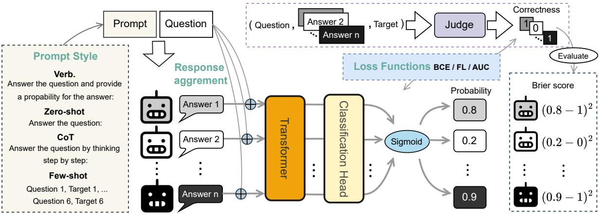  
Figure 1: Overview of calibration training of Calib-n (n indicates the number of target LLMs that provide responses). We consider the effect of different prompt styles on calibration and design four diverse prompts to query n target LLMs to provide answers to a question. n joint strings of the question with each answer presenting the response agreement of LLMs are passed to the auxiliary model to generate probabilities for each answer. The auxiliary model is optimized with three loss functions respectively on the correctness of the LLM answers. Brier score (one of four metrics) is used to evaluate the calibration performance of the auxiliary model.

• Response Agreement: By leveraging intermodel response agreement, Calib-n outperforms the state-of-the-art baselines.

• Loss Function: FL loss improves calibration compared to BCE and AUC losses, demonstrating its effectiveness for both Calib-1 (i.e., using responses from one LLM) and Calib-n. Calib-1 trained with FL yields the best results.

• Prompt Style: We find that the effectiveness of methods is highly influenced by the prompt styles, with few-shot prompts proving to be the most beneficial in improving calibration.

• Accuracy-Calibration Correlation: With accuracy variances caused by different dataset complexities, prompt styles and models, we find that auxiliary models maintain robust calibration performance across accuracy changes, in contrast to the fluctuating calibration of LLMs that rely on internal probabilities and verbalized confidences.

Our findings underscore the importance of reexamining calibration strategies for LLMs. Specifically, we suggest using response agreement (Calib-n) to prevent overconfidence and reduce computational costs by training a single auxiliary model for calibrating multiple target LLMs. In the case of one target LLM, we recommend incorporating focal loss over BCE (Calib-1 with FL).

## 2 Related Work

Calibration The concept of calibration of neural networks was introduced by Guo et al. (2017b). Lin et al. (2022) show that GPT-3 can learn to express uncertainty about its own answers without the use of logits. Later, Tian et al. (2023) demonstrate that verbalized confidence is generally better calibrated than the conditional probabilities w.r.t the consistency of the LLMs. However, Zhang et al. (2024) show that LLM probabilities and verbalized confidence tend to overly concentrate within a fixed range. Similarly, Ni et al. (2024) analyze and compare probabilistic and verbalized perceptions of the knowledge boundaries of LLM, highlighting their challenges in confidence estimation. To address these issues, Liu et al. (2024) train a linear layer to adjust the last layer's hidden states of LLMs for confidence generation. Ulmer et al. (2024) propose a method to estimate LLM confidence based only on textual input and output. However, none of these works perform a comprehensive analysis of different influence factors in LLM calibration. These factors can be loss functions, response agreement and prompt styles. Mukhoti et al. (2020) demonstrate that focal loss (Lin et al., 2017) can improve the calibration of neural networks. AUC surrogate loss (Yuan et al., 2021) and correctness ranking loss (Moon et al., 2020) calibrate models by adjusting the ranking of logits to ensure positive samples are ranked higher than negative samples. Kim et al. (2023) propose that ensemble methods promoting prediction diversity can enhance calibration performance, particularly in scenarios with limited data. Min et al. (2022); Wang et al. (2023); Chen et al. (2023) showcase that LLMs output is highly dependent on the prompt and different prompt styles can significantly influence the performance of LLMs. However, these works either do not perform on LLMs or only study individual influence factors. Additionally, the impact of prompts and model agreement has never been explored in calibration. Our work comprehensively studies the influence of response agreement achieved with the ensemble method from Xia et al. (2024), three loss functions, and four prompt styles with 12 LLMs.

## 3 Methodology

Fig. 1 demonstrates our framework, which includes four prompt styles, assessment of the correctness of LLM generation, and calibration training of auxiliary models for confidence estimation and calibration evaluation for these models.

## 3.1 Prompt Styles

Prompt styles significantly impact LLMs’ performance (Chen et al., 2023). Liu et al. (2024) use Few-shot prompts to query LLM answers for calibration experiments. Tian et al. (2023) employ verbalized prompts to elicit probability estimates from LLMs regarding their responses. Ulmer et al. (2024) evaluate their methods on both CoT and verbalized prompts. However, these studies either evaluate their methods against baselines using inconsistent prompt styles or fail to provide a comprehensive comparison across diverse prompt styles. For example, Liu et al. (2024) use verbalized prompts to generate verbalized probabilities as a baseline, but apply few-shot prompts to their method, which ignores the potential influence of prompts in calibration evaluation. Our work comprehensively studies the impact of prompt styles in LLM calibration and employs the most commonly used prompts: Verbalized (Verb.), Zero-shot, CoT and Few-shot prompts. The detailed prompts are shown in Appendix A.1. Given a question q with one of the prompts, we process the answers generated by n target LLMs with regular expressionbased text processing.

## 3.2 Correctness of LLM Generation

We employ a Judge model J, Prometheus-8x7bv2.0 (Kim et al., 2024), to assess the correctness of generated answers w.r.t target answers. We selected this model because it is open-source and its judgments have been shown to strongly correlate with those of human evaluators and large proprietary models (Kim et al., 2024). Given an input question $q ,$ a target answer $y ,$ and a generated answer $a _ { i }$ by the i-th target LLM $\mathcal { M } _ { i } , \mathcal { I }$ is prompted to provide a binary correctness score $c _ { i }$ that reflects the semantical equivalence between $a _ { i }$ and $y$ The specific prompt is shown in Appendix A.2.

$$
c _ { i } = \mathcal { I } ( a _ { i } \overset { \mathrm { s e m a n t i c } } { = } y | q , y , a _ { i } ) , c _ { i } \in \{ 0 , 1 \}\tag{1}
$$

## 3.3 Response Agreements of Multiple LLMs

Different from previous work (Liu et al., 2024; U1- mer et al., 2024; Tian et al., 2023) that estimate confidence using the information from a single target LLM, Calib-n leverages the responses from n target LLMs to train an auxiliary model for jointly estimating the confidence for each LLM. This setting is inspired by Kim et al. (2023), which suggests that combining predictions can mitigate overfitting and reduce overconfidence inherent to individual models for confidence estimation. By having access to the responses of $n$ LLMs, the auxiliary model can infer cases of low consensus among models, signaling increased uncertainty. We verify the effectiveness of this setting by comprehensively comparing the results of using the generations produced by one LLM (Calib-1) to using the generations from multiple LLMs (Calib-n).

The auxiliary model, $f ( \cdot )$ , is composed of a transformer backbone (bert-base-uncased (Devlin et al., 2019)), a classification head $( n * 7 6 8 $ n) and a sigmoid activation function, which outputs probabilities P for LLM answers $\{ a _ { i } \} _ { i = 1 } ^ { n } .$ The input to $f ( \cdot )$ consists of n concatenated question-answer pairs of the form $q [ \mathrm { S E P } ] a _ { i }$ (e.g., “What is the capital of France?[SEP]Paris"), denoted as $\{ q + a _ { i } \} _ { i = 1 } ^ { n }$

$$
P = f ( \{ q + a _ { i } \} _ { i = 1 } ^ { n } ) = \{ p _ { i } \} _ { i = 1 } ^ { n } , \ : p _ { i } \in [ 0 , 1 ]\tag{2}
$$

Specifically, when the auxiliary model processes the input $\{ q + a _ { 1 } , q + a _ { 2 } , \ldots , q + a _ { n } \}$ , each pair of question and LLM response $( q + a _ { i } )$ is treated as an independent input sequence. This enables the model to solve a binary classification task predicting whether a LLM's response is correct w.r.t the target answer. The auxiliary model outputs logits for each LLM response, which are then transformed as corresponding confidence scores $\{ p _ { 1 } , p _ { 2 } , \dots , p _ { n } \}$ . This approach allows the auxiliary model to evaluate each LLM's response individually while still capturing inter-model agreement through the aggregation of results.

Training objective. The goal is to optimize the predicted probability to align with the correctness of the input answer. Given k questions, we minimize the average BCE loss of each LLM answer:

$$
\mathcal { L } _ { B C E } = - \frac { 1 } { k \cdot n } \sum _ { j = 1 } ^ { k } \sum _ { i = 1 } ^ { n } \left( c _ { i } ^ { ( j ) } \log ( p _ { i } ^ { ( j ) } ) + \right.\tag{3}
$$

Evaluation. A target LLM $\mathcal { M } _ { i }$ achieves a low calibration Brier score if $p _ { i }$ accurately reflects the reliability of $a _ { i } .$ which is the correctness $c _ { i } .$ Specifically, for all k generated answers of $\mathcal { M } _ { i }$ regarding k questions, the Brier score (Brier, 1950) of $\mathcal { M } _ { i }$ average squared error between all predicted probabilities and the correctness of these answers:

$$
B r i e r ( \mathcal { M } _ { i } ) = \frac { 1 } { k } \sum _ { j = 1 } ^ { k } ( p _ { i } ^ { ( j ) } - c _ { i } ^ { ( j ) } ) ^ { 2 }\tag{4}
$$

Following Tian et al. (2023), we also evaluate all methods with three other metrics (details in Section 4.3).

## 3.4 Loss Functions

To further improve the calibration, we experiment with focal and AUC losses in addition to BCE loss.

Focal loss (FL) (Lin et al., 2017; Mukhoti et al., 2020) focuses on hard-to-classify examples, reducing the weight of correctly classified samples and encouraging the model to focus on predictions with high BCE loss. This loss is commonly used in imbalanced datasets but can benefit calibration since it emphasizes predictions with a large discrepancy between confidence and correctness. The FL is defined as follows:

$$
\mathcal { L } _ { \mathrm { F L } } = - \frac { 1 } { k } \sum _ { j = 1 } ^ { k } \left( \alpha ( 1 - e ^ { - \mathcal { L } _ { B C E _ { j } } } ) ^ { \gamma } \cdot \mathcal { L } _ { B C E _ { j } } \right)\tag{5}
$$

Where $\mathcal { L } _ { B C E _ { j } }$ is the BCE loss of the data sample $j .$ We use the default parameters from Lin et al. (2017) to set $\alpha = 0 . 2 5$ and $\gamma = 2 . 0$

AUC Surrogate loss (AUC) (Yuan et al., 2021) uses a logistic loss to maximize the differences between true and false answers’ scores (logits x generated by the classification head). The equation is:

$$
\mathcal { L } _ { \mathrm { A U C } } = \frac { 1 } { \left| T \right| \cdot \left| F \right| } \sum _ { t \in T } \sum _ { f \in F } \sigma \left( x _ { f } - x _ { t } \right)\tag{6}
$$

Where T and F are the indexes set for all true and false answers respectively. $\sigma$ stands for sigmoid function.

In the end, we propose the following methods to integrate the techniques mentioned above and validate their effectiveness with comprehensive experiments across different models, datasets and prompts.

(BCE)/(FL)/(AUC)Calib-1: calibration training using the generations from one target LLM and optimizing with BCE/FL/AUC loss function.

(BCE)/(FL)/(AUC)Calib-n: calibration training using the generations from n target LLM and optimizing with BCE/FL/AUC loss function.

(BCE)/(FL)/(AUC)Calib-n+PS: Platt Scaling (PS) (Platt, 1999) (explained in Section 4.4) rescales the probabilities of test data by learning on the probabilities of validation data. Those probabilities are generated by corresponding Calib-n models.

## 4 Experiments

To comprehensively compare confidence estimation methods, we include diverse datasets, LLMs, and state-of-the-art baselines in our experimental setting.

## 4.1 Datasets

We cover four open-ended quenstion-answering datasets: TriviaQA (Joshi et al., 2017), Sciq (Welbl et al., 2017), WikiQA (Yang et al., 2015), and NQ (Kwiatkowski et al., 2019). We adopt the setting from Liu et al. (2024), where 2k/1k samples are selected as training/test data for TriviaQA, Sciq, and NQ, and 1040/293 for WikiQA.

## 4.2 Models

We include 12 models from five families: Llama (Grattafiori et al., 2024; Touvron et al., 2023), Phi (Abdin et al., 2024), Gemma (Team et al., 2024), Qwen (Yang et al., 2024), and Mixtral (Jiang et al., 2024).2 In our analyses, we cluster the models based on their number of parameters:

Small models (2-9B parameters): Llama-2- 7b-chat-hf (referred as Llama2-7b), Llama-3.1- 8B-Instruct (Llama3.1-8b), Llama-3-8B-Instruct (Llama3-8b), Phi-3-small-128k-instruct (Phi3-7b), Phi-3.5-mini-instruct (Phi3-4b), gemma-2-2b-it (Gemma2-2b), gemma-2-9b-it (Gemma2-9b).

Large models (27-72B parameters): Qwen2- 72B-Instruct (Qwen2-72b), Llama-3-70B-Instruct (Llama3-72b), Llama-3.1-70B-Instruct (Llama3.1- 70b), Mixtral-8x7B-Instruct-v0.1 (Mixtral-8x7b), gemma-2-27b-it (Gemma2-27b).

Calib-n models are trained with all LLMs inside the same group and provide confidence scores for each model in that group.

## 4.3 Evaluation Metrics

We report four metrics for calibration evaluation. ECE: The expected calibration error (Guo et al., 2017b) is computed by partitioning the predictions into 10 bins based on their confidence and then taking the weighted (by the number of samples in a bin) average of the squared difference between bin average accuracy and confidence. ECEt: The temperature-scaled expected calibration error (Tian et al., 2023) finds a single temperature scaling parameter $\beta$ that minimizes the negative log-likelihood between model confidences and answer correctness. Then, $\beta$ is used to scale the confidences before the ECE is computed. Brier: The Brier Score (Brier, 1950) is the average squared error between predictions’ confidence and correctness (see Eq. 4). AUC: The area under the receiver operating characteristic curve used in Ulmer et al. (2024).

Aggregate analysis. We aggregate the performance of different confidence estimation methods by counting their number of wins: given each metric above, we count the number of times a method outperforms the others in all possible combinations of prompt style, dataset, and model.

## 4.4 Baseline Methods

We compare Calib-\* with standard baselines and the state-of-the-art confidence estimation methods:

LLM Probabilities (LLM Prob.): The conditional sequence probability $P _ { \theta } \left( y | x \right)$ of an answer y given an input $x ,$ according to the model parametrized by $\theta .$

LLM Prob. + Platt scaling (PS): This method applies Platt scaling (Platt, 1999) to the previous baseline. That is, two scalars a, $b \in \mathcal { R }$ are used to scale the original LLM probability $p \colon p _ { \mathrm { p s } } ~ =$ $\sigma \left( a p + b \right)$ , where σ is the sigmoid function. We obtain parameters a and b by minimizing the meansquared error between model confidences and answer correctness.

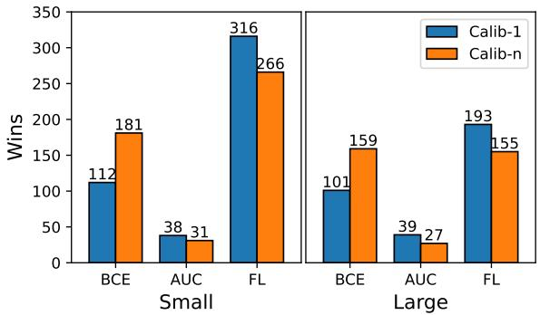  
Figure 2: Comparison of Calib-1 and Calib-n methods based on the number of wins across different loss functions for calibrating small (left) and large (right) LLMs.

Verbalized confidences (Verbalized %) (Tian et al., 2023): The probability of correctness expressed in models’(text) responses given the Verb. prompts.

APRICOT (Ulmer et al., 2024): A recent method for calibrating LLMs. It consists of clustering related questions and measuring the per-cluster accuracies given answers from a target LLM. Then the cluster accuracies are used as the references to train an auxiliary transformer model that outputs confidence values for the target LLM.

## 5 Results and Analysis

The detailed results (Table 1-9) indicate that no single method consistently outperforms all others across various models, datasets, and prompt configurations. Therefore, we first present the aggregated results, which summarize all the results, followed by a more detailed discussion.

## 5.1 Aggregated Result

What is the best loss function for improving calibration? In Fig. 2, we compare the performance of Calib-1 and Calib-n when optimizing with different loss functions. We observe that FL loss wins in most settings, followed by BCE loss. Additionally, we notice that BCE outperforms FL loss when applied in the Calib-n method for large models. This is because focal loss is designed for imbalanced datasets, while Calib-n which utilizes model responses from multiple models improves the balance of the training data (moderate the overall accuracy in this dataset) for the auxiliary model.

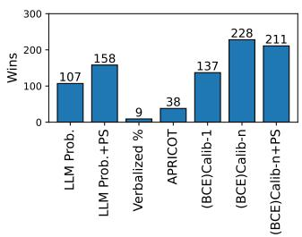  
(a) (BCE)Calib-\* vs Baselines

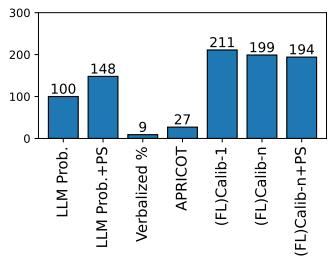  
(b) (FL)Calib-\* vs Baselines

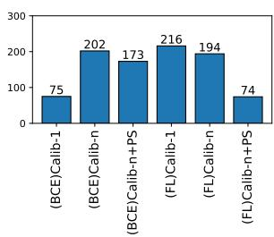  
(c) (BCE) vs (FL)Calib-\*

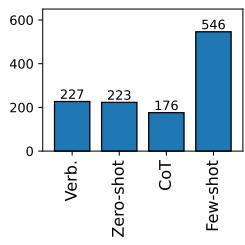  
(d) Prompts

Figure 3: The winning comparison results of different methods and prompts: 3a and 3b sub-figures present the superior results of Calib-\* methods using BCE and FL loss respectively when against baselines. 3c shows the comparison results among all Calib-\* methods, demonstrating that (FL)Calib-1 achieves the best overall performance. 3d compares the winning result of prompt styles and shows that few-shot prompting yields the most effective calibration across diverse configurations.  
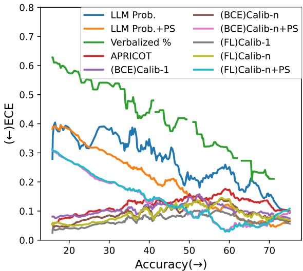  
Figure 4: The correlation between accuracies achieved by different configurations (i.e., prompts, models, datasets) and corresponding ECE scores evaluated on different methods. The line of Verbalized % is not continuous because it can only be obtained using Verb. prompts and thus has fewer accuracy points than other methods. The result indicates that Calib-\* and APRI-COT are robust to accuracy variations. Different methods achieve the lowest ECE scores in different accuracy ranges.

What is the best overall method? Fig. 3a and 3b present the winning comparison results of (BCE)Calib-\* and (FL)Calib-\* methods against baseline methods respectively. The results demonstrate that Calib-\* methods gain more wins than baselines in both sub-figures. Verbalized confidences get the lowest number of wins. Applying Platt Scaling can further improve the calibration performance of LLM probabilities but this technique is not generalizable to enhance the calibration of Calib-n. Fig. 3a shows that (BCE)Calib-n gains the highest wins against the baseline methods. While (FL)Calib-1 accrues more wins in Fig. 3b. To identify the best method, we present Fig. 3c to compare the performance among our Calib-\* methods, demonstrating that (FL)Calib-1 exhibits the best overall performance.

Which prompt style is most effective? The differences in prompt styles are well-known for their impact on the performance of LLMs. Fig. 3d showcases that prompt styles can also impact calibration performance. The results indicate that few-shot is the most beneficial prompt contributing to the highest wins among all other prompt styles.

Which calibration methods maintain robustness to accuracy variations? Previous work (Zhang et al., 2024) reveals that confidence estimation methods like LLM probabilities and Verbalized confidence excessively concentrate on a fixed range (tend to be overconfident) and remain unchanged regardless of the dataset's complexity To analyze this issue, we test all the confidence estimation methods with different datasets, prompts, and models. Each setting combination (e.g., using Zero-shot prompts to test the TriviaQA dataset on Gemma2-27b model) can result in one single accuracy value and multiple ECE scores—one for each confidence estimation method. We sort the accuracy values from all setting combinations and analyze the correlation between the accuracies and ECE scores. The results are presented in Fig. 4. We observe that ECE scores of LLM probabilities, LLM Prob.+PS, Verbalized confidences and (BCE)Calib-n+PS are highly correlated with accuracies, i.e., the ECE scores decrease when the accuracies get higher which verified the findings of Zhang et al. (2024). APRICOT, Calib-1 and Calib-n are robust to the accuracy changes, the ECE scores of these methods remain relatively stable across different accuracies. Verbalized confidence consistently shows the lowest performance across all accuracy levels.

<table><tr><td rowspan=2 colspan=2>Method</td><td rowspan=1 colspan=16>Verb.                  Zero-shot                   CoT                   Few-shot</td></tr><tr><td rowspan=1 colspan=3>ECE↓ECE-t↓ Brier</td><td rowspan=1 colspan=1>↓ AUC↑</td><td rowspan=1 colspan=3>ECE↓ECE-t↓ Brier</td><td rowspan=1 colspan=1>↓ AUC↑</td><td rowspan=1 colspan=3>ECE↓ECE-t↓ Brier</td><td rowspan=1 colspan=1>↓ AUC↑</td><td rowspan=1 colspan=4>ECE↓ECE-t↓ Brier ↓AUC↑</td></tr><tr><td rowspan=1 colspan=2>LLM Prob.</td><td rowspan=1 colspan=3>0.4450.2490.417</td><td rowspan=1 colspan=1>0.704</td><td rowspan=1 colspan=3>0.4470.2550.419</td><td rowspan=1 colspan=1>0.713</td><td rowspan=1 colspan=3>0.3950.2680.392</td><td rowspan=1 colspan=1>0.671</td><td rowspan=1 colspan=3>0.2350.1840.308</td><td rowspan=1 colspan=1>0.584</td></tr><tr><td rowspan=1 colspan=2>LLM Prob.+PS</td><td rowspan=1 colspan=3>0.2820.0520.293</td><td rowspan=1 colspan=1>0.690</td><td rowspan=1 colspan=3>0.2760.0640.288</td><td rowspan=1 colspan=1>0.713</td><td rowspan=1 colspan=4>0.2260.0590.2830.672</td><td rowspan=1 colspan=3>0.1330.0110.264</td><td rowspan=1 colspan=1>0.584</td></tr><tr><td rowspan=1 colspan=2>Verbalized %</td><td rowspan=1 colspan=3>0.5120.1870.471</td><td rowspan=1 colspan=1>0.685</td><td rowspan=1 colspan=3></td><td rowspan=1 colspan=1></td><td rowspan=1 colspan=4></td><td rowspan=1 colspan=4></td></tr><tr><td rowspan=1 colspan=2>APRICOT</td><td rowspan=1 colspan=3>0.1110.0940.228</td><td rowspan=1 colspan=1>0.607</td><td rowspan=1 colspan=3>0.1100.1150.232</td><td rowspan=1 colspan=1>0.627</td><td rowspan=1 colspan=4>0.087 0.0770.2260.678</td><td rowspan=1 colspan=4>0.0920.0900.2350.678</td></tr><tr><td rowspan=1 colspan=2>(BCE)Calib-1</td><td rowspan=1 colspan=2>0.0660.068</td><td rowspan=1 colspan=1>0.220</td><td rowspan=1 colspan=1>0.596</td><td rowspan=1 colspan=3>0.0640.0660.223</td><td rowspan=1 colspan=1>0.590</td><td rowspan=1 colspan=4>0.0460.0450.2240.666</td><td rowspan=1 colspan=3>0.1460.1470.232</td><td rowspan=1 colspan=1>0.717</td></tr><tr><td rowspan=1 colspan=2>(BCE)Calib-n</td><td rowspan=1 colspan=1>0.069</td><td rowspan=1 colspan=1>0.066</td><td rowspan=1 colspan=1>0.212</td><td rowspan=1 colspan=1>0.648</td><td rowspan=1 colspan=3>0.0560.0410.216</td><td rowspan=1 colspan=1>0.651</td><td rowspan=1 colspan=4>0.0950.0810.2260.695</td><td rowspan=1 colspan=3>0.0880.0670.220</td><td rowspan=1 colspan=1>0.713</td></tr><tr><td rowspan=1 colspan=2>(BCE)Calib-n+PS</td><td rowspan=1 colspan=1>0.202</td><td rowspan=1 colspan=1>0.062</td><td rowspan=1 colspan=1>0.255</td><td rowspan=1 colspan=1>0.637</td><td rowspan=1 colspan=3>0.1980.0460.257</td><td rowspan=1 colspan=1>0.651</td><td rowspan=1 colspan=4>0.1700.0760.2550.695</td><td rowspan=1 colspan=3>0.1030.1220.241</td><td rowspan=1 colspan=1>0.713</td></tr><tr><td rowspan=1 colspan=2>(FL)Calib-1</td><td rowspan=1 colspan=1>0.038</td><td rowspan=1 colspan=1>0.038</td><td rowspan=1 colspan=1>0.215</td><td rowspan=1 colspan=1>0.597</td><td rowspan=1 colspan=3>0.0560.0580.219</td><td rowspan=1 colspan=1>0.607</td><td rowspan=1 colspan=4>0.051 0.0490.2280.65</td><td rowspan=1 colspan=3>00.1230.1230.227</td><td rowspan=1 colspan=1>0.717</td></tr><tr><td rowspan=1 colspan=2>(FL)Calib-n</td><td rowspan=1 colspan=1>0.083</td><td rowspan=1 colspan=1>0.083</td><td rowspan=1 colspan=1>0.217</td><td rowspan=1 colspan=1>0.642</td><td rowspan=1 colspan=1>0.070</td><td rowspan=1 colspan=2>0.0570.219</td><td rowspan=1 colspan=1>0.645</td><td rowspan=1 colspan=4>0.0840.0830.2260.692</td><td rowspan=1 colspan=3>0.0850.0800.220</td><td rowspan=1 colspan=1>0.710</td></tr><tr><td rowspan=1 colspan=2>(FL)Calib-n+PS</td><td rowspan=1 colspan=1>0.203</td><td rowspan=1 colspan=2>0.0570.254</td><td rowspan=1 colspan=1>0.642</td><td rowspan=1 colspan=1>0.191</td><td rowspan=1 colspan=2>0.0560.255</td><td rowspan=1 colspan=1>0.645</td><td rowspan=1 colspan=4>0.1670.0790.2540.692</td><td rowspan=1 colspan=3>0.1010.1200.241</td><td rowspan=1 colspan=1>0.710</td></tr><tr><td rowspan=1 colspan=2>LLM Prob.</td><td rowspan=1 colspan=1>0.445</td><td rowspan=1 colspan=2>0.3020.430</td><td rowspan=1 colspan=1>0.712</td><td rowspan=1 colspan=1>0.458</td><td rowspan=1 colspan=2>0.2590.426</td><td rowspan=1 colspan=1>0.747</td><td rowspan=1 colspan=4>0.4120.2510.4160.612</td><td rowspan=1 colspan=3>0.3360.1170.364</td><td rowspan=1 colspan=1>0.532</td></tr><tr><td rowspan=1 colspan=1></td><td rowspan=1 colspan=1>LLM Prob.+PS</td><td rowspan=1 colspan=1>0.355</td><td rowspan=1 colspan=1>0.113</td><td rowspan=1 colspan=1>0.350</td><td rowspan=1 colspan=1>0.703</td><td rowspan=1 colspan=1>0.266</td><td rowspan=1 colspan=2>0.1320.291</td><td rowspan=1 colspan=1>0.747</td><td rowspan=1 colspan=4>0.2240.0230.2890.612</td><td rowspan=1 colspan=3>0.2240.0090.298</td><td rowspan=1 colspan=1>0.532</td></tr><tr><td rowspan=1 colspan=1></td><td rowspan=1 colspan=1>Verbalized %</td><td rowspan=1 colspan=1>0.406</td><td rowspan=1 colspan=1>0.084</td><td rowspan=1 colspan=1>0.380</td><td rowspan=1 colspan=1>0.698</td><td rowspan=1 colspan=3></td><td rowspan=1 colspan=1></td><td rowspan=1 colspan=4></td><td rowspan=1 colspan=3></td><td rowspan=1 colspan=1></td></tr><tr><td rowspan=1 colspan=1>70</td><td rowspan=1 colspan=1>APRICOT</td><td rowspan=1 colspan=1>0.137</td><td rowspan=1 colspan=1>0.130</td><td rowspan=1 colspan=1>0.255</td><td rowspan=1 colspan=1>0.596</td><td rowspan=1 colspan=3>0.1110.1160.239</td><td rowspan=1 colspan=1>0.635</td><td rowspan=1 colspan=4>0.1140.1170.2440.656</td><td rowspan=1 colspan=3>0.1060.0680.236</td><td rowspan=1 colspan=1>0.683</td></tr><tr><td rowspan=1 colspan=1>3</td><td rowspan=1 colspan=1>(BCE)Calib-1</td><td rowspan=1 colspan=1>0.075</td><td rowspan=1 colspan=1>0.071</td><td rowspan=1 colspan=1>0.231</td><td rowspan=1 colspan=1>0.610</td><td rowspan=1 colspan=1>0.066</td><td rowspan=1 colspan=1>0.067</td><td rowspan=1 colspan=1>0.225</td><td rowspan=1 colspan=1>0.641</td><td rowspan=1 colspan=1>0.066</td><td rowspan=1 colspan=3>0.0450.2320.662</td><td rowspan=1 colspan=2>0.1190.121</td><td rowspan=1 colspan=1>0.232</td><td rowspan=1 colspan=1>0.709</td></tr><tr><td rowspan=1 colspan=1>m</td><td rowspan=1 colspan=1>(BCE)Calib-n</td><td rowspan=1 colspan=1>0.058</td><td rowspan=1 colspan=1>0.062</td><td rowspan=1 colspan=1>0.223</td><td rowspan=1 colspan=1>0.644</td><td rowspan=1 colspan=1>0.040</td><td rowspan=1 colspan=1>0.025</td><td rowspan=1 colspan=1>0.215</td><td rowspan=1 colspan=1>0.670</td><td rowspan=1 colspan=1>0.096</td><td rowspan=1 colspan=2>0.0880.229</td><td rowspan=1 colspan=1>0.690</td><td rowspan=1 colspan=2>0.061 0.062</td><td rowspan=1 colspan=1>0.213</td><td rowspan=1 colspan=1>0.730</td></tr><tr><td rowspan=1 colspan=1>L</td><td rowspan=1 colspan=1>(BCE)Calib-n+PS</td><td rowspan=1 colspan=1>0.171</td><td rowspan=1 colspan=1>0.038</td><td rowspan=1 colspan=1>0.255</td><td rowspan=1 colspan=1>0.632</td><td rowspan=1 colspan=1>0.179</td><td rowspan=1 colspan=2>0.0500.256</td><td rowspan=1 colspan=1>0.670</td><td rowspan=1 colspan=1>0.163</td><td rowspan=1 colspan=2>0.0810.256</td><td rowspan=1 colspan=1>0.690</td><td rowspan=1 colspan=2>0.1340.107</td><td rowspan=1 colspan=1>0.238</td><td rowspan=1 colspan=1>0.730</td></tr><tr><td rowspan=1 colspan=1></td><td rowspan=1 colspan=1>(FL)Calib-1</td><td rowspan=1 colspan=1>0.079</td><td rowspan=1 colspan=1>0.065</td><td rowspan=1 colspan=1>0.228</td><td rowspan=1 colspan=1>0.625</td><td rowspan=1 colspan=1>0.080</td><td rowspan=1 colspan=1>0.080</td><td rowspan=1 colspan=1>0.229</td><td rowspan=1 colspan=1>0.630</td><td rowspan=1 colspan=1>0.057</td><td rowspan=1 colspan=2>0.0370.234</td><td rowspan=1 colspan=1>0.647</td><td rowspan=1 colspan=2>0.1050.111</td><td rowspan=1 colspan=1>0.225</td><td rowspan=1 colspan=1>0.713</td></tr><tr><td rowspan=1 colspan=1></td><td rowspan=1 colspan=1>(FL)Calib-n</td><td rowspan=1 colspan=1>0.080</td><td rowspan=1 colspan=1>0.093</td><td rowspan=1 colspan=1>0.228</td><td rowspan=1 colspan=1>0.638</td><td rowspan=1 colspan=1>0.040</td><td rowspan=1 colspan=1>0.022</td><td rowspan=1 colspan=1>0.215</td><td rowspan=1 colspan=1>0.675</td><td rowspan=1 colspan=1>0.096</td><td rowspan=1 colspan=2>0.0950.231</td><td rowspan=1 colspan=1>0.686</td><td rowspan=1 colspan=2>0.0660.058</td><td rowspan=1 colspan=1>0.216</td><td rowspan=1 colspan=1>0.725</td></tr><tr><td rowspan=1 colspan=2>(FL)Calib-n+PS</td><td rowspan=1 colspan=1>0.182</td><td rowspan=1 colspan=1>0.046</td><td rowspan=1 colspan=1>0.259</td><td rowspan=1 colspan=1>0.638</td><td rowspan=1 colspan=1>0.176</td><td rowspan=1 colspan=2>0.0600.254</td><td rowspan=1 colspan=1>0.675</td><td rowspan=1 colspan=1>0.168</td><td rowspan=1 colspan=3>0.0700.2580.686</td><td rowspan=1 colspan=2>0.1340.110</td><td rowspan=1 colspan=1>0.240</td><td rowspan=1 colspan=1>0.725</td></tr><tr><td rowspan=1 colspan=1></td><td rowspan=1 colspan=1>LLM Prob.</td><td rowspan=1 colspan=1>0.301</td><td rowspan=1 colspan=1>0.231</td><td rowspan=1 colspan=1>0.326</td><td rowspan=1 colspan=1>0.704</td><td rowspan=1 colspan=1>0.308</td><td rowspan=1 colspan=1>0.237</td><td rowspan=1 colspan=1>0.326</td><td rowspan=1 colspan=1>0.722</td><td rowspan=1 colspan=1>0.274</td><td rowspan=1 colspan=3>0.2210.3300.619</td><td rowspan=1 colspan=2>0.1720.098</td><td rowspan=1 colspan=1>0.266</td><td rowspan=1 colspan=1>0.640</td></tr><tr><td rowspan=1 colspan=1></td><td rowspan=1 colspan=1>LLM Prob.+PS</td><td rowspan=1 colspan=1>0.254</td><td rowspan=1 colspan=1>0.116</td><td rowspan=1 colspan=1>0.293</td><td rowspan=1 colspan=1>0.690</td><td rowspan=1 colspan=1>0.236</td><td rowspan=1 colspan=1>0.066</td><td rowspan=1 colspan=1>0.279</td><td rowspan=1 colspan=1>0.722</td><td rowspan=1 colspan=1>0.195</td><td rowspan=1 colspan=3>0.0230.2750.619</td><td rowspan=1 colspan=2>0.1350.064</td><td rowspan=1 colspan=1>0.258</td><td rowspan=1 colspan=1>0.640</td></tr><tr><td rowspan=1 colspan=1></td><td rowspan=1 colspan=1>Verbalized %</td><td rowspan=1 colspan=1>0.435</td><td rowspan=1 colspan=1>0.122</td><td rowspan=1 colspan=1>0.405</td><td rowspan=1 colspan=1>0.711</td><td rowspan=1 colspan=1>-</td><td rowspan=1 colspan=1></td><td rowspan=1 colspan=1></td><td rowspan=1 colspan=1></td><td rowspan=1 colspan=1></td><td rowspan=1 colspan=3></td><td rowspan=1 colspan=2></td><td rowspan=1 colspan=1></td><td rowspan=1 colspan=1></td></tr><tr><td rowspan=1 colspan=1>70</td><td rowspan=1 colspan=1>APRICOT</td><td rowspan=1 colspan=1>0.120</td><td rowspan=1 colspan=1>0.115</td><td rowspan=1 colspan=1>0.248</td><td rowspan=1 colspan=1>0.621</td><td rowspan=1 colspan=1>0.080</td><td rowspan=1 colspan=1>0.078</td><td rowspan=1 colspan=1>0.239</td><td rowspan=1 colspan=1>0.635</td><td rowspan=1 colspan=1>0.083</td><td rowspan=1 colspan=3>0.0800.2300.688</td><td rowspan=1 colspan=2>0.0970.075</td><td rowspan=1 colspan=1>0.234</td><td rowspan=1 colspan=1>0.687</td></tr><tr><td rowspan=1 colspan=2>(BCE)Calib-1</td><td rowspan=1 colspan=1>0.130</td><td rowspan=1 colspan=1>0.123</td><td rowspan=1 colspan=1>0.249</td><td rowspan=1 colspan=1>0.602</td><td rowspan=1 colspan=1>0.089</td><td rowspan=1 colspan=1>0.088</td><td rowspan=1 colspan=1>0.244</td><td rowspan=1 colspan=1>0.580</td><td rowspan=1 colspan=1>0.073</td><td rowspan=1 colspan=3>0.0580.2110.733</td><td rowspan=1 colspan=2>0.1050.102</td><td rowspan=1 colspan=1>0.221</td><td rowspan=1 colspan=1>0.726</td></tr><tr><td rowspan=1 colspan=1>m</td><td rowspan=1 colspan=1>(BCE)Calib-n</td><td rowspan=1 colspan=1>0.062</td><td rowspan=1 colspan=1>0.055</td><td rowspan=1 colspan=1>0.224</td><td rowspan=1 colspan=1>0.656</td><td rowspan=1 colspan=1>0.058</td><td rowspan=1 colspan=2>0.0470.230</td><td rowspan=1 colspan=1>0.637</td><td rowspan=1 colspan=1>0.049</td><td rowspan=1 colspan=3>0.0540.2110.730</td><td rowspan=1 colspan=2>0.081 0.080</td><td rowspan=1 colspan=1>0.217</td><td rowspan=1 colspan=1>0.719</td></tr><tr><td rowspan=1 colspan=1>u</td><td rowspan=1 colspan=1>(BCE)Calib-n+PS</td><td rowspan=1 colspan=1>0.157</td><td rowspan=1 colspan=1>0.015</td><td rowspan=1 colspan=1>0.258</td><td rowspan=1 colspan=1>0.606</td><td rowspan=1 colspan=3>0.1430.0780.254</td><td rowspan=1 colspan=1>0.637</td><td rowspan=1 colspan=3>0.1380.1210.246</td><td rowspan=1 colspan=1>0.730</td><td rowspan=1 colspan=2>0.0840.099</td><td rowspan=1 colspan=1>0.237</td><td rowspan=1 colspan=1>0.719</td></tr><tr><td rowspan=1 colspan=1></td><td rowspan=1 colspan=1>(FL)Calib-1</td><td rowspan=1 colspan=1>0.041</td><td rowspan=1 colspan=1>0.034</td><td rowspan=1 colspan=1>0.223</td><td rowspan=1 colspan=1>0.660</td><td rowspan=1 colspan=1>0.047</td><td rowspan=1 colspan=1>0.046</td><td rowspan=1 colspan=1>0.236</td><td rowspan=1 colspan=1>0.596</td><td rowspan=1 colspan=1>0.060</td><td rowspan=1 colspan=2>0.0500.206</td><td rowspan=1 colspan=1>0.742</td><td rowspan=1 colspan=1>0.074</td><td rowspan=1 colspan=1>0.075</td><td rowspan=1 colspan=1>0.216</td><td rowspan=1 colspan=1>0.724</td></tr><tr><td rowspan=1 colspan=1></td><td rowspan=1 colspan=1>(FL)Calib-n</td><td rowspan=1 colspan=1>0.077</td><td rowspan=1 colspan=1>0.079</td><td rowspan=1 colspan=1>0.227</td><td rowspan=1 colspan=1>0.657</td><td rowspan=1 colspan=1>0.055</td><td rowspan=1 colspan=1>0.049</td><td rowspan=1 colspan=1>0.229</td><td rowspan=1 colspan=1>0.643</td><td rowspan=1 colspan=1>0.055</td><td rowspan=1 colspan=2>0.0530.210</td><td rowspan=1 colspan=1>0.732</td><td rowspan=1 colspan=1>0.068</td><td rowspan=1 colspan=1>0.072</td><td rowspan=1 colspan=1>0.217</td><td rowspan=1 colspan=1>0.714</td></tr><tr><td rowspan=1 colspan=2>(FL)Calib-n+PS</td><td rowspan=1 colspan=1>0.169</td><td rowspan=1 colspan=1>0.051</td><td rowspan=1 colspan=1>0.257</td><td rowspan=1 colspan=1>0.657</td><td rowspan=1 colspan=1>0.147</td><td rowspan=1 colspan=2>0.0600.255</td><td rowspan=1 colspan=1>0.643</td><td rowspan=1 colspan=3>0.1420.1170.248</td><td rowspan=1 colspan=1>0.732</td><td rowspan=1 colspan=2>0.0920.104</td><td rowspan=1 colspan=1>0.238</td><td rowspan=1 colspan=1>0.714</td></tr><tr><td rowspan=1 colspan=1></td><td rowspan=1 colspan=1>LLM Prob.</td><td rowspan=1 colspan=1>0.470</td><td rowspan=1 colspan=1>0.321</td><td rowspan=1 colspan=1>0.455</td><td rowspan=1 colspan=1>0.692</td><td rowspan=1 colspan=1>0.483</td><td rowspan=1 colspan=2>0.2800.450</td><td rowspan=1 colspan=1>0.734</td><td rowspan=1 colspan=4>0.3800.2760.3930.62</td><td rowspan=1 colspan=1>00.220</td><td rowspan=1 colspan=1>0.092</td><td rowspan=1 colspan=1>0.280</td><td rowspan=1 colspan=1>0.645</td></tr><tr><td rowspan=1 colspan=1></td><td rowspan=1 colspan=1>LLM Prob.+PS</td><td rowspan=1 colspan=1>0.259</td><td rowspan=1 colspan=1>0.120</td><td rowspan=1 colspan=1>0.289</td><td rowspan=1 colspan=1>0.745</td><td rowspan=1 colspan=1>0.270</td><td rowspan=1 colspan=2>0.0570.292</td><td rowspan=1 colspan=1>0.734</td><td rowspan=1 colspan=4>0.2020.0210.2820.620</td><td rowspan=1 colspan=1>0.203</td><td rowspan=1 colspan=1>0.085</td><td rowspan=1 colspan=1>0.281</td><td rowspan=1 colspan=1>0.645</td></tr><tr><td rowspan=1 colspan=1></td><td rowspan=1 colspan=1>Verbalized %</td><td rowspan=1 colspan=1>0.433</td><td rowspan=1 colspan=1>0.065</td><td rowspan=1 colspan=1>0.404</td><td rowspan=1 colspan=1>0.734</td><td rowspan=1 colspan=1>-</td><td rowspan=1 colspan=2></td><td rowspan=1 colspan=1></td><td rowspan=1 colspan=4></td><td rowspan=1 colspan=1></td><td rowspan=1 colspan=1></td><td rowspan=1 colspan=1></td><td rowspan=1 colspan=1></td></tr><tr><td rowspan=1 colspan=1>272</td><td rowspan=1 colspan=1>APRICOT</td><td rowspan=1 colspan=1>0.114</td><td rowspan=1 colspan=1>0.113</td><td rowspan=1 colspan=1>0.241</td><td rowspan=1 colspan=1>0.614</td><td rowspan=1 colspan=1>0.096</td><td rowspan=1 colspan=1>0.085</td><td rowspan=1 colspan=1>0.227</td><td rowspan=1 colspan=1>0.647</td><td rowspan=1 colspan=1>0.113</td><td rowspan=1 colspan=1>0.112</td><td rowspan=1 colspan=2>0.2470.641</td><td rowspan=1 colspan=1>0.086</td><td rowspan=1 colspan=1>0.078</td><td rowspan=1 colspan=1>0.230</td><td rowspan=1 colspan=1>0.694</td></tr><tr><td rowspan=1 colspan=1>2</td><td rowspan=1 colspan=1>(BCE)Calib-1</td><td rowspan=1 colspan=1>0.038</td><td rowspan=1 colspan=1>0.039</td><td rowspan=1 colspan=1>0.230</td><td rowspan=1 colspan=1>0.586</td><td rowspan=1 colspan=1>0.027</td><td rowspan=1 colspan=1>0.029</td><td rowspan=1 colspan=1>0.217</td><td rowspan=1 colspan=1>0.638</td><td rowspan=1 colspan=1>0.092</td><td rowspan=1 colspan=1>0.092</td><td rowspan=1 colspan=2>0.2340.668</td><td rowspan=1 colspan=1>0.115</td><td rowspan=1 colspan=1>0.117</td><td rowspan=1 colspan=1>0.229</td><td rowspan=1 colspan=1>0.714</td></tr><tr><td rowspan=1 colspan=1></td><td rowspan=1 colspan=1>(BCE)Calib-n</td><td rowspan=1 colspan=1>0.063</td><td rowspan=1 colspan=1>0.064</td><td rowspan=1 colspan=1>0.225</td><td rowspan=1 colspan=1>0.635</td><td rowspan=1 colspan=1>0.046</td><td rowspan=1 colspan=1>0.020</td><td rowspan=1 colspan=1>0.215</td><td rowspan=1 colspan=1>0.664</td><td rowspan=1 colspan=1>0.083</td><td rowspan=1 colspan=1>0.084</td><td rowspan=1 colspan=2>0.2310.682</td><td rowspan=1 colspan=1>0.076</td><td rowspan=1 colspan=1>0.078</td><td rowspan=1 colspan=1>0.222</td><td rowspan=1 colspan=1>0.712</td></tr><tr><td rowspan=1 colspan=1>Q</td><td rowspan=1 colspan=1>(BCE)Calib-n+PS</td><td rowspan=1 colspan=1>0.166</td><td rowspan=1 colspan=1>0.039</td><td rowspan=1 colspan=1>0.255</td><td rowspan=1 colspan=1>0.625</td><td rowspan=1 colspan=1>0.185</td><td rowspan=1 colspan=1>0.047</td><td rowspan=1 colspan=1>0.256</td><td rowspan=1 colspan=1>0.664</td><td rowspan=1 colspan=1>0.137</td><td rowspan=1 colspan=3>0.0840.2520.682</td><td rowspan=1 colspan=1>0.117</td><td rowspan=1 colspan=1>0.091</td><td rowspan=1 colspan=1>0.244</td><td rowspan=1 colspan=1>0.712</td></tr><tr><td rowspan=1 colspan=1></td><td rowspan=1 colspan=1>(FL)Calib-1</td><td rowspan=1 colspan=1>0.051</td><td rowspan=1 colspan=1>0.050</td><td rowspan=1 colspan=1>0.231</td><td rowspan=1 colspan=1>0.595</td><td rowspan=1 colspan=1>0.031</td><td rowspan=1 colspan=1>0.020</td><td rowspan=1 colspan=1>0.219</td><td rowspan=1 colspan=1>0.627</td><td rowspan=1 colspan=1>0.077</td><td rowspan=1 colspan=3>0.0840.2300.671</td><td rowspan=1 colspan=1>0.089</td><td rowspan=1 colspan=1>0.087</td><td rowspan=1 colspan=1>0.223</td><td rowspan=1 colspan=1>0.712</td></tr><tr><td rowspan=1 colspan=1></td><td rowspan=1 colspan=1>(FL)Calib-n</td><td rowspan=1 colspan=1>0.095</td><td rowspan=1 colspan=1>0.095</td><td rowspan=1 colspan=1>0.233</td><td rowspan=1 colspan=1>0.622</td><td rowspan=1 colspan=1>0.051</td><td rowspan=1 colspan=1>0.040</td><td rowspan=1 colspan=1>0.217</td><td rowspan=1 colspan=1>0.664</td><td rowspan=1 colspan=1>0.083</td><td rowspan=1 colspan=3>0.0860.2300.683</td><td rowspan=1 colspan=1>0.071</td><td rowspan=1 colspan=1>0.074</td><td rowspan=1 colspan=1>0.221</td><td rowspan=1 colspan=1>0.712</td></tr><tr><td rowspan=1 colspan=2>(FL)Calib-n+PS</td><td rowspan=1 colspan=1>0.183</td><td rowspan=1 colspan=1>0.032</td><td rowspan=1 colspan=1>0.261</td><td rowspan=1 colspan=1>0.622</td><td rowspan=1 colspan=1>0.188</td><td rowspan=1 colspan=2>0.0480.257</td><td rowspan=1 colspan=1>0.664</td><td rowspan=1 colspan=1>0.135</td><td rowspan=1 colspan=3>0.0830.2510.683</td><td rowspan=1 colspan=2>0.1160.090</td><td rowspan=1 colspan=1>0.244</td><td rowspan=1 colspan=1>0.712</td></tr><tr><td rowspan=1 colspan=2>LLM Prob.</td><td rowspan=1 colspan=1>0.513</td><td rowspan=1 colspan=1>0.269</td><td rowspan=1 colspan=1>0.479</td><td rowspan=1 colspan=1>0.703</td><td rowspan=1 colspan=3>0.4120.1550.401</td><td rowspan=1 colspan=1>0.637</td><td rowspan=1 colspan=4>0.4520.2700.4470.627</td><td rowspan=1 colspan=2>0.3690.075</td><td rowspan=1 colspan=1>0.380</td><td rowspan=1 colspan=1>0.574</td></tr><tr><td rowspan=1 colspan=2>LLM Prob.+PS</td><td rowspan=1 colspan=1>0.264</td><td rowspan=1 colspan=1>0.015</td><td rowspan=1 colspan=1>0.292</td><td rowspan=1 colspan=1>0.653</td><td rowspan=1 colspan=3>0.2330.0660.290</td><td rowspan=1 colspan=1>0.637</td><td rowspan=1 colspan=4>0.2450.0130.3050.627</td><td rowspan=1 colspan=2>0.1410.001</td><td rowspan=1 colspan=1>0.267</td><td rowspan=1 colspan=1>0.574</td></tr><tr><td rowspan=1 colspan=2>Verbalized %</td><td rowspan=1 colspan=1>0.472</td><td rowspan=1 colspan=1>0.167</td><td rowspan=1 colspan=1>0.447</td><td rowspan=1 colspan=1>0.655</td><td rowspan=1 colspan=3></td><td rowspan=1 colspan=1></td><td rowspan=1 colspan=4></td><td rowspan=1 colspan=3></td><td rowspan=1 colspan=1></td></tr><tr><td rowspan=1 colspan=2>APRICOT</td><td rowspan=1 colspan=1>0.124</td><td rowspan=1 colspan=1>0.120</td><td rowspan=1 colspan=1>0.247</td><td rowspan=1 colspan=1>0.602</td><td rowspan=1 colspan=3>0.0920.0880.239</td><td rowspan=1 colspan=1>0.646</td><td rowspan=1 colspan=4>0.115 0.1130.2520.620</td><td rowspan=1 colspan=4>0.161 0.0700.2630.640</td></tr><tr><td rowspan=1 colspan=2>(BCE)Calib-1</td><td rowspan=1 colspan=1>0.040</td><td rowspan=1 colspan=1>0.031</td><td rowspan=1 colspan=1>0.224</td><td rowspan=1 colspan=1>0.605</td><td rowspan=1 colspan=1>0.037</td><td rowspan=1 colspan=1>0.037</td><td rowspan=1 colspan=1>0.225</td><td rowspan=1 colspan=1>0.658</td><td rowspan=1 colspan=1>0.082</td><td rowspan=1 colspan=3>0.083 0.2490.607</td><td rowspan=1 colspan=1>0.14</td><td rowspan=1 colspan=1>50.097</td><td rowspan=1 colspan=2>0.2690.618</td></tr><tr><td rowspan=1 colspan=2>(BCE)Calib-n</td><td rowspan=1 colspan=1>0.082</td><td rowspan=1 colspan=1>0.061</td><td rowspan=1 colspan=1>0.227</td><td rowspan=1 colspan=1>0.619</td><td rowspan=1 colspan=1>0.032</td><td rowspan=1 colspan=1>0.021</td><td rowspan=1 colspan=1>0.229</td><td rowspan=1 colspan=1>0.634</td><td rowspan=1 colspan=1>0.064</td><td rowspan=1 colspan=3>0.0680.2410.631</td><td rowspan=1 colspan=1>0.085</td><td rowspan=1 colspan=1>0.085</td><td rowspan=1 colspan=2>0.2300.686</td></tr><tr><td rowspan=1 colspan=2>(BCE)Calib-n+PS</td><td rowspan=1 colspan=1>0.188</td><td rowspan=1 colspan=1>0.022</td><td rowspan=1 colspan=1>0.260</td><td rowspan=1 colspan=1>0.610</td><td rowspan=1 colspan=3>0.1430.0700.255</td><td rowspan=1 colspan=1>0.634</td><td rowspan=1 colspan=1>0.116</td><td rowspan=1 colspan=3>0.0600.2540.631</td><td rowspan=1 colspan=1>0.101</td><td rowspan=1 colspan=1>0.078</td><td rowspan=1 colspan=2>0.2440.686</td></tr><tr><td rowspan=1 colspan=2>(FL)Calib-1</td><td rowspan=1 colspan=2>0.0310.025</td><td rowspan=1 colspan=1>0.226</td><td rowspan=1 colspan=1>0.580</td><td rowspan=1 colspan=3>0.0330.0350.224</td><td rowspan=1 colspan=1>0.662</td><td rowspan=1 colspan=1>0.077</td><td rowspan=1 colspan=3>0.0460.2470.59</td><td rowspan=1 colspan=1>8 0.121</td><td rowspan=1 colspan=1>0.098</td><td rowspan=1 colspan=2>0.2620.619</td></tr><tr><td rowspan=1 colspan=2>(FL)Calib-n</td><td rowspan=1 colspan=2>0.0930.083</td><td rowspan=1 colspan=1>0.231</td><td rowspan=1 colspan=1>0.618</td><td rowspan=1 colspan=3>0.0240.0250.227</td><td rowspan=1 colspan=1>0.643</td><td rowspan=1 colspan=1>0.078</td><td rowspan=1 colspan=3>0.0760.2420.631</td><td rowspan=1 colspan=1>0.07</td><td rowspan=1 colspan=1>20.077</td><td rowspan=1 colspan=2>0.2300.682</td></tr><tr><td rowspan=1 colspan=2>(FL)Calib-n+PS</td><td rowspan=1 colspan=3>0.1830.0340.256</td><td rowspan=1 colspan=1>0.618</td><td rowspan=1 colspan=4>0.1470.0740.2550.643</td><td rowspan=1 colspan=4>0.129 0.0540.2570.631</td><td rowspan=1 colspan=2>0.1040.068</td><td rowspan=1 colspan=2>0.2440.682</td></tr></table>

Table 1: Test performance of our methods (Calib-\*) and baseline methods on NQ dataset using four different prompts (Verb., Zero-shot, CoT, Few-shot). Calib-n is trained with the responses of all LLMs in the table. Only the Verb. prompt requests the LLM to provide a probability for a given answer and thus has the results for Verbalized % performance. We color the text with a scale normalized by the values gap in each column, with darker shades indicating better performance. The results of the other three datasets and seven models are shown in Appendix A.8

What is the best method for different accuracy levels? The optimal goal of current stateof-the-art confidence estimation methods should not only focus on achieving a low calibration error at a narrow accuracy range but also analyze the performance of the method across different accuracy levels. We perform this analysis in Fig. 4. We observe that (FL)Calib-1 performs the best in low accuracy ranges up to 50%, and Calib-n+PS achieves the lowest ECE scores for accuracies between 50% and 70%. LLM Prob.+PS works the best for high accuracy (>70%) settings mainly because LLM probabilities are usually overconfident.

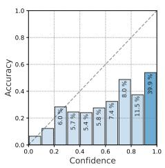  
(a) LLM Prob.

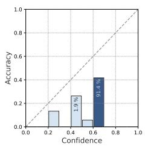  
(b) LLM Prob.+PS

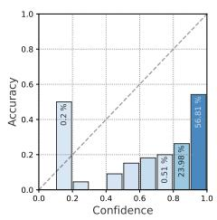

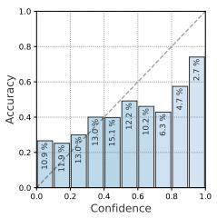

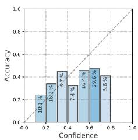

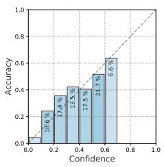  
(f) (BCE)Calib-n

(c) Verbalized %  
(e) (BCE)Calib-1  
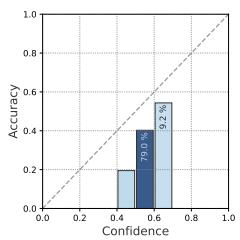  
(g) (BCE)Calib-n+PS

(d) APRICOT  
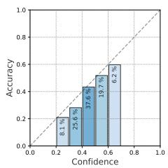  
(h) (FL)Calib-1

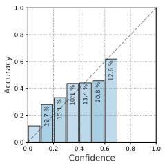  
(i) (FL)Calib-n

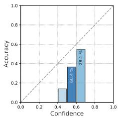  
(j) (FL)Calib-n+PS  
Figure 5: Reliability diagrams for our different methods using 10 bins each for Llama3.1-70b on NQ. The color and the percentage number within each bar present the proportion of total data samples contained in each bin. More figures of other models and datasets are shown in Appendix A.6.

## 5.2 Detailed Fraction Results

Table 1 presents the test results of our methods and baselines on the NQ dataset when evaluated on five large-size LLMs. We analyze the performance of all methods across prompts, models, and evaluation metrics. The results reveal that the effectiveness of methods is highly influenced by the prompt styles and models. However, our proposed methods (Calib-\*) achieve better calibration than baselines on most prompts and models.

Across Methods: LLM probabilities and Verbalized confidence show poor performance, exhibiting high ECE, ECE-t, and Brier scores across all prompts. Adding Platt Scaling (LLM Prob.+PS) improves calibration but is still outperformed by our proposed Calib-\* methods. Among baselines, APRICOT performs better than Verbalized confidence, although it does not achieve the best results in most settings. Across all evaluation metrics, our Calib-\* methods outperform others. For example, (BCE)Calib-n achieves the lowest ECE and Brier scores, particularly with the CoT and fewshot prompts, e.g., ECE of 0.049 on Llama3.1- 70b. PS only helps decrease the ECE-t scores but can not enhance overall performance, this is because PS is similar to ECE-t which is a posthoc method for scaling probabilities. Across Prompts: Calibration quality improves with few-shot and CoT prompts compared to the verb. and zero-shot prompts. For instance, (BCE)Calib-1 achieves an ECE-t of 0.045 with the CoT prompts compared to 0.068 with the verb. prompts on Gemma2-27b. Across Models: Larger models (e.g., Qwen2-72b and Llama3.1-70b) generally exhibit better calibration when using Calib-\* methods, reflecting their better alignment with calibration techniques. For instance, (FL)Calib-n+PS achieves an ECE of 0.071 on Qwen2-72b compared to 0.095 on smaller models like Mixtral-8x7b.

Reliability diagrams analysis. Fig. 5 shows that PS produces a narrow range of confidence scores, indicating limited diversity in the emitted confidence levels. LLM probabilities and Verbalized confidence often exhibit overconfidence, even when applied to datasets with low accuracy (<40%, reported in Fig. 8 in Appendix). In contrast, our Calib-\* methods show a more conservative approach, aligning their confidence levels more closely with the true accuracy of the model, reflecting improved calibration and reliability.

## 6 Conclusion

Previous studies (Ulmer et al., 2024; Tian et al., 2023) have assessed calibration methods within limited settings, overlooking their generalization across diverse model sizes and prompt styles. This study addresses this limitation by conducting experiments on 12 LLMs with parameters ranging from 2B-72B and four prompt styles. We also comprehensively analyze the influence of response agreement and loss functions in LLM calibration. Experimental results show that both response agreement and FL loss enhance calibration from baselines, with (FL)Calib-1 achieving the best performance. We also find that few-shot prompts improve LLM accuracy and calibration, and auxiliary-based methods show robust performance across diverse settings—maintaining stable calibration regardless of accuracy levels. These findings highlight the effectiveness of various calibration strategies and encourage future methods to re-evaluate the importance of our explored factors for achieving reliable confidence estimation.

## Limitations

Although our work covers a wide range of factors, there are potentially more factors worth exploring. For example, we analyze a wide range of prompt types, including Few-shot and Chainof-Thought, the influence of fine-grained prompt variations or automatically generated prompts remains unexplored. The interplay between prompt engineering and calibration could warrant deeper investigation.

Our study focuses on calibration performance metrics like ECE, ECE-t, and Brier scores. While these metrics are widely used, they may not fully capture all aspects of calibration quality, such as user-perceived confidence or task-specific utility.

Existing works use various ways of determining the accuracy of LLM generations. For instance, some works (Tian et al., 2023; Liu et al., 2024) use LLMs as a Judge, other works (Ulmer et al., 2024; Xiong et al., 2024) use certain metrics such as extract match or ROUGE score. While the optimal solution is underexplored, we choose the more commonly used and cost-efficient method.

Future work can address these limitations by testing broader LLMs and tasks, automating prompt optimization, and developing hybrid approaches that adapt to varying accuracy levels and application constraints.

## Acknowledgments

This research has been funded by the Vienna Science and Technology Fund (WWTF)[10.47379/VRG19008]“Knowledge infused Deep Learning for Natural Language Processing", and co-funded by the European Union.

## References

Marah Abdin et al. 2024. Phi-3 technical report: A highly capable language model locally on your phone. ArXiv preprint, abs/2404.14219.

Glenn W. Brier. 1950. Verification of forecasts expressed in terms of probability. Monthly Weather Review, 78(1):1 – 3.

Banghao Chen, Zhaofeng Zhang, Nicolas Langrené, and Shengxin Zhu. 2023. Unleashing the potential of prompt engineering in large language models: a comprehensive review.

Jacob Devlin, Ming-Wei Chang, Kenton Lee, and Kristina Toutanova. 2019. BERT: Pre-training of deep bidirectional transformers for language understanding. In Proceedings of the 2019 Conference of the North American Chapter of the Association for Computational Linguistics: Human Language Technologies, Volume 1 (Long and Short Papers), pages 4171–4186, Minneapolis, Minnesota. Association for Computational Linguistics.

Jiahui Geng, Fengyu Cai, Yuxia Wang, Heinz Koeppl, Preslav Nakov, and Iryna Gurevych. 2024. A survey of confidence estimation and calibration in large language models. In Proceedings of the 2024 Conference of the North American Chapter of the Association for Computational Linguistics: Human Language Technologies (Volume 1: Long Papers), pages 6577–6595, Mexico City, Mexico. Association for Computational Linguistics.

Aaron Grattafiori et al. 2024. The llama 3 herd of models. ArXiv preprint, abs/2407.21783.

Chuan Guo, Geoff Pleiss, Yu Sun, and Kilian Q. Weinberger. 2017a. On calibration of modern neural networks. In Proceedings of the 34th International Conference on Machine Learning, ICML 2017, Sydney, NSW, Australia, 6-11 August 2017, volume 70 of Proceedings of Machine Learning Research, pages 1321–1330. PMLR.

Chuan Guo, Geoff Pleiss, Yu Sun, and Kilian Q. Weinberger. 2017b. On calibration of modern neural networks. In Proceedings of the 34th International Conference on Machine Learning, ICML 2017, Sydney, NSW, Australia, 6-11 August 2017, volume 70 of Proceedings of Machine Learning Research, pages 1321–1330. PMLR.

Albert Q. Jiang, Alexandre Sablayrolles, Antoine Roux, Arthur Mensch, Blanche Savary, Chris Bamford, Devendra Singh Chaplot, Diego de las Casas, Emma Bou Hanna, Florian Bressand, Gianna Lengyel, Guillaume Bour, Guillaume Lample, Lélio Renard Lavaud, Lucile Saulnier, Marie-Anne Lachaux, Pierre Stock, Sandeep Subramanian, Sophia Yang, Szymon Antoniak, Teven Le Scao, Théophile Gervet, Thibaut Lavril, Thomas Wang, Timothée Lacroix, and William El Sayed. 2024. Mixtral of experts.

Zhengbao Jiang, Jun Araki, Haibo Ding, and Graham Neubig. 2021. How can we know when language models know? on the calibration of language models for question answering. Transactions of the Association for Computational Linguistics, 9:962–977.

Mandar Joshi, Eunsol Choi, Daniel Weld, and Luke Zettlemoyer. 2017. TriviaQA: A large scale distantly supervised challenge dataset for reading comprehension. In Proceedings of the 55th Annual Meeting of the Association for Computational Linguistics (Volume 1: Long Papers), pages 1601–1611, Vancouver, Canada. Association for Computational Linguistics.

Jaeyoung Kim, Dongbin Na, Sungchul Choi, and Sungbin Lim. 2023. Bag of tricks for in-distribution calibration of pretrained transformers. In Findings of the Association for Computational Linguistics: EACL 2023, pages 551–563, Dubrovnik, Croatia. Association for Computational Linguistics.

Seungone Kim, Juyoung Suk, Shayne Longpre, Bill Yuchen Lin, Jamin Shin, Sean Welleck, Graham Neubig, Moontae Lee, Kyungjae Lee, and Minjoon Seo. 2024. Prometheus 2: An open source language model specialized in evaluating other language models.

Tom Kwiatkowski, Jennimaria Palomaki, Olivia Redfield, Michael Collins, Ankur Parikh, Chris Alberti, Danielle Epstein, Illia Polosukhin, Jacob Devlin, Kenton Lee, Kristina Toutanova, Llion Jones, Matthew Kelcey, Ming-Wei Chang, Andrew M. Dai, Jakob Uszkoreit, Quoc Le, and Slav Petrov. 2019. Natural questions: A benchmark for question answering research. Transactions of the Association for Computational Linguistics, 7:452–466.

Stephanie Lin, Jacob Hilton, and Owain Evans. 2022. Teaching models to express their uncertainty in words. Transactions on Machine Learning Research.

Tsung-Yi Lin, Priya Goyal, Ross B. Girshick, Kaiming He, and Piotr Dollár. 2017. Focal loss for dense object detection. In IEEE International Conference on Computer Vision, ICCV 2017, Venice, Italy, October 22-29, 2017, pages 2999–3007. IEEE Computer Society.

Xin Liu, Muhammad Khalifa, and Lu Wang. 2024. Litcab: Lightweight language model calibration over short- and long-form responses. In The Twelfth International Conference on Learning Representations, ICLR 2024, Vienna, Austria, May 7-11, 2024. Open-Review.net.

Sewon Min, Xinxi Lyu, Ari Holtzman, Mikel Artetxe, Mike Lewis, Hannaneh Hajishirzi, and Luke Zettlemoyer. 2022. Rethinking the role of demonstrations: What makes in-context learning work? In Proceedings of the 2022 Conference on Empirical Methods in Natural Language Processing, pages 11048–11064, Abu Dhabi, United Arab Emirates. Association for Computational Linguistics.

Jooyoung Moon, Jihyo Kim, Younghak Shin, and Sangheum Hwang. 2020. Confidence-aware learning for deep neural networks. In Proceedings of the 37th International Conference on Machine Learning, ICML 2020, 13-18 July 2020, Virtual Event, volume 119 of Proceedings of Machine Learning Research, pages 7034–7044. PMLR.

Jishnu Mukhoti, Viveka Kulharia, Amartya Sanyal, Stuart Golodetz, Philip H. S. Torr, and Puneet K. Dokania. 2020. Calibrating deep neural networks using focal loss. In Advances in Neural Information Processing Systems 33: Annual Conference on Neural Information Processing Systems 2020, NeurIPS 2020, December 6-12, 2020, virtual.

Shiyu Ni, Keping Bi, Lulu Yu, and Jiafeng Guo. 2024. Are large language models more honest in their probabilistic or verbalized confidence?

John Platt. 1999. Probabilistic outputs for support vector machines and comparisons to regularized likelihood methods. Advances in Large Margin Classifiers, 10(3):61–74.

Inioluwa Deborah Raji, Andrew Smart, Rebecca N White, Margaret Mitchell, Timnit Gebru, Ben Hutchinson, Jamila Smith-Loud, Daniel Theron, and Parker Barnes. 2020. Closing the ai accountability gap: Defining an end-to-end framework for internal algorithmic auditing. In Proceedings of the 2020 conference on fairness, accountability, and transparency, pages 33–44.

Gemma Team et al. 2024. Gemma 2: Improving open language models at a practical size. ArXiv preprint, abs/2408.00118.

Katherine Tian, Eric Mitchell, Allan Zhou, Archit Sharma, Rafael Rafailov, Huaxiu Yao, Chelsea Finn, and Christopher Manning. 2023. Just ask for calibration: Strategies for eliciting calibrated confidence scores from language models fine-tuned with human feedback. In Proceedings of the 2023 Conference on Empirical Methods in Natural Language Processing, pages 5433–5442, Singapore. Association for Computational Linguistics.

Hugo Touvron, Louis Martin, Kevin Stone, Peter Albert, Amjad Almahairi, Yasmine Babaei, Nikolay Bashlykov, Soumya Batra, Prajjwal Bhargava, Shruti Bhosale, Dan Bikel, Lukas Blecher, Cristian Canton Ferrer, Moya Chen, Guillem Cucurull, David Esiobu, Jude Fernandes, Jeremy Fu, Wenyin Fu, Brian Fuller, Cynthia Gao, Vedanuj Goswami, Naman Goyal, Anthony Hartshorn, Saghar Hosseini, Rui Hou, Hakan Inan, Marcin Kardas, Viktor Kerkez, Madian Khabsa, Isabel Kloumann, Artem Korenev, Punit Singh Koura, Marie-Anne Lachaux, Thibaut Lavril, Jenya Lee, Diana Liskovich, Yinghai Lu, Yuning Mao, Xavier Martinet, Todor Mihaylov, Pushkar Mishra, Igor Molybog, Yixin Nie, Andrew Poulton, Jeremy Reizenstein, Rashi Rungta, Kalyan Saladi, Alan Schelten, Ruan Silva, Eric Michael Smith, Ranjan Subramanian, Xiaoqing Ellen Tan, Binh Tang, Ross Taylor, Adina Williams, Jian Xiang Kuan, Puxin Xu,

Zheng Yan, Iliyan Zarov, Yuchen Zhang, Angela Fan, Melanie Kambadur, Sharan Narang, Aurelien Rodriguez, Robert Stojnic, Sergey Edunov, and Thomas Scialom. 2023. Llama 2: Open foundation and finetuned chat models.

Dennis Ulmer, Martin Gubri, Hwaran Lee, Sangdoo Yun, and Seong Oh. 2024. Calibrating large language models using their generations only. In Proceedings of the 62nd Annual Meeting of the Association for Computational Linguistics (Volume 1: Long Papers), pages 15440–15459, Bangkok, Thailand. Association for Computational Linguistics.

Lean Wang, Lei Li, Damai Dai, Deli Chen, Hao Zhou, Fandong Meng, Jie Zhou, and Xu Sun. 2023. Label words are anchors: An information flow perspective for understanding in-context learning. In Proceedings of the 2023 Conference on Empirical Methods in Natural Language Processing, pages 9840–9855, Singapore. Association for Computational Linguistics.

Jason Wei, Xuezhi Wang, Dale Schuurmans, Maarten Bosma, Brian Ichter, Fei Xia, Ed H. Chi, Quoc V. Le, and Denny Zhou. 2022. Chain-of-thought prompting elicits reasoning in large language models. In Advances in Neural Information Processing Systems 35: Annual Conference on Neural Information Processing Systems 2022, NeurIPS 2022, New Orleans, LA, USA, November 28 - December 9, 2022.

Johannes Welbl, Nelson F. Liu, and Matt Gardner. 2017. Crowdsourcing multiple choice science questions. In Proceedings of the 3rd Workshop on Noisy Usergenerated Text, pages 94–106, Copenhagen, Denmark. Association for Computational Linguistics.

Yuxi Xia, Kilm Zaporojets, and Benjamin Roth. 2024. Black-box model ensembling for textual and visual question answering via information fusion

Miao Xiong, Zhiyuan Hu, Xinyang Lu, Yifei Li, Jie Fu, Junxian He, and Bryan Hooi. 2024. Can llms express their uncertainty? an empirical evaluation of confidence elicitation in llms. In The Twelfth International Conference on Learning Representations, ICLR 2024, Vienna, Austria, May 7-11, 2024. OpenReview.net.

An Yang, Baosong Yang, Binyuan Hui, Bo Zheng, Bowen Yu, Chang Zhou, Chengpeng Li, Chengyuan Li, Dayiheng Liu, Fei Huang, Guanting Dong, Haoran Wei, Huan Lin, Jialong Tang, Jialin Wang, Jian Yang, Jianhong Tu, Jianwei Zhang, Jianxin Ma, Jianxin Yang, Jin Xu, Jingren Zhou, Jinze Bai, Jinzheng He, Junyang Lin, Kai Dang, Keming Lu, Keqin Chen, Kexin Yang, Mei Li, Mingfeng Xue, Na Ni, Pei Zhang, Peng Wang, Ru Peng, Rui Men, Ruize Gao, Runji Lin, Shijie Wang, Shuai Bai, Sinan Tan, Tianhang Zhu, Tianhao Li, Tianyu Liu, Wenbin Ge, Xiaodong Deng, Xiaohuan Zhou, Xingzhang Ren, Xinyu Zhang, Xipin Wei, Xuancheng Ren, Xuejing Liu, Yang Fan, Yang Yao, Yichang Zhang, Yu Wan, Yunfei Chu, Yuqiong Liu, Zeyu Cui, Zhenru Zhang, Zhifang Guo, and Zhihao Fan. 2024. Qwen2 technical report.

Yi Yang, Wen-tau Yih, and Christopher Meek. 2015. WikiQA: A challenge dataset for open-domain question answering. In Proceedings of the 2015 Conference on Empirical Methods in Natural Language Processing, pages 2013–2018, Lisbon, Portugal. Association for Computational Linguistics.

Zhuoning Yuan, Yan Yan, Milan Sonka, and Tianbao Yang. 2021. Large-scale robust deep AUC maximization: A new surrogate loss and empirical studies on medical image classification. In 2021 IEEE/CVF International Conference on Computer Vision, ICCV 2021, Montreal, QC, Canada, October 10-17, 2021, pages 3020–3029. IEEE.

Min Zhang, Jianfeng He, Taoran Ji, and Chang-Tien Lu. 2024. Don't go to extremes: Revealing the excessive sensitivity and calibration limitations of LLMs in implicit hate speech detection. In Proceedings of the 62nd Annual Meeting of the Association for Computational Linguistics (Volume 1: Long Papers), pages 12073–12086, Bangkok, Thailand. Association for Computational Linguistics.

## A Appendix

## A.1 Prompts for target LLM

## A.1.1 Verb. prompt

Provide your best guess and the probability that it is correct (0.0 to 1.0) for the following question. Give ONLY the guess and probability, no other words or explanation. For example: \n\n Guess: <most likely guess, as short as possible; not a complete sentence, just the guess!>\n "Probability: <the probability between 0.0 and 1.0 that your guess is correct, without any extra commentary whatsoever; just the probability!>\n\n The question is: [Question]

## A.1.2 Zero-shot prompt

Provide your best guess for the following question. Give ONLY the guess, no other words or explanations, as short as possible; not a complete sentence, just the guess! \n\n The question is: [Question]

## A.1.3 CoT prompt

Briefly answer the following question by thinking step by step. Give the final answer (start with ’Answer:’) with minimal words at the end. \n\n The question is: [Question]

## A.1.4 Few-shot prompt

user: [Question 1] assistant: [Target 1]

user: [Question 2] assistant: [Target 2]

user: [Question 6] assistant: [Target 6]

user: [Question] assistant:

## A.2 Prompt for Judge

Task Description: \n An instruction (might include an Input inside it), a response to evaluate, a reference answer that gets a score of 1, and a score rubric representing a evaluation criteria are given.

1. Write detailed feedback that assesses the quality of the response strictly based on the given score rubric, not evaluating in general.

2. After writing feedback, write a score that is an integer between 0 and 1. You should refer to the score rubric.

3. The output format should look as follows: "Feedback: (write a feedback for criteria) [RESULT] (an integer number between 0 and 1)"

4. Please do not generate any other opening, closing, and explanations.

The instruction to evaluate:[Question] Response to evaluate: [LLM Answer] Reference Answer (Score 1): [Target] Score Rubrics:\n Score 0: the response and reference answer to the instruction are not semantically equivalent.\n Score 1: the response and reference answer to the instruction are semantically equivalent. Feedback:

## A.3 Technical Details

After a grid search of hyperparameters, we trained our auxiliary models (BERT-base, 110M parameters) using a learning rate of 1e-5 and a batch size of 16 for five epochs. All experiments, including LLM inferences, are performed on a maximum of 2 NVIDIA H100 GPUs. The training time for one epoch of 2k samples is around 200 seconds on one GPU, this time can be different depends on the dataset size and number of joint LLMs in training.

## A.4 Aggregated Results Across Different Configurations

Fig. 6 shows the calibration performances of different methods across different configurations such as prompt styles, model sizes and datasets. We observe that the best method is highly dependent on these factors.

Prompt specific performance. The first row of Fig. 6 presents the prompt specific performance for different methods. We observe that Calib-n always outperforms Calib-1 across different prompt styles when both are optimized with BCE loss. When FL loss is applied, Calib-n only outperforms Calib-1 in few-shot prompts. We hypothesize that the longer LLM answers generated with few-shot prompts usually lead to higher response agreement and thus enhance the performance of Calib-n.

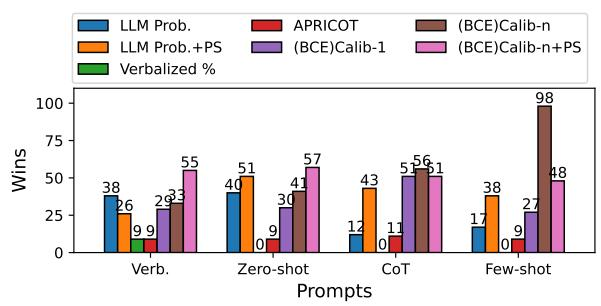

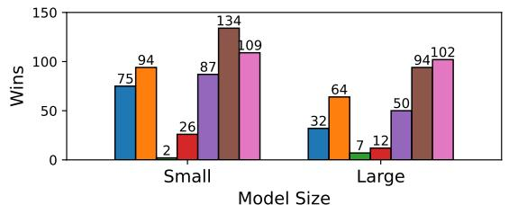

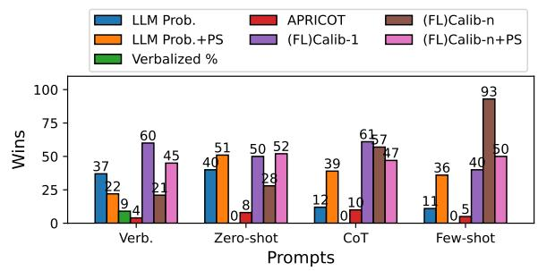

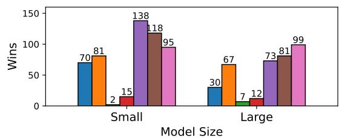

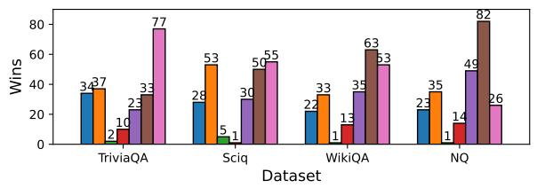

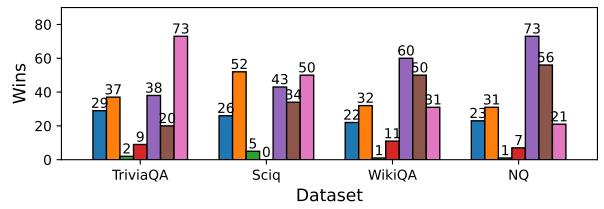  
Figure 6: Performance Comparison results of different methods against baselines across three setting configurations (prompt styles, model sizes and datasets).

Model size specific performance. The second row of Fig. 6 presents the model-size specific performance for different methods. We find that Calibn outperforms Calib-1 on large-size models. However, (FL)Calib-1 performs better for small-size models. We also observe that the best method is model size dependent.

Dataset specific performance. The second row of Fig. 6 presents the dataset specific performance for different methods. (BCE)Calib-n consistently achieves better performances than (BCE)Calib-1 over all datasets. In contrast, (FL)Calib-1 always outperform (FL)Calib-n.

## A.5 Accuracy Statistics of LLMs

We present Fig. 7 and 8 to demonstrate the accuracy performance of LLMs across different prompts and datasets. Large size models typically yield better performance than small size models. Few shot prompts improve the performance more than other prompt styles. Most LLMs achieve their highest accuracy on the Sciq dataset, while the NQ dataset proves to be the most challenging.

## A.6 Reliability Diagrams

Similar to Fig. 5, Fig. 9-11 show the reliability diagrams of other three datasets for Llama3.1-70 with Verb. prompts. We find that for high accuracy (>50%) datasets (TriviaQA and Sciq), Calib-\* using BCE and FL loss is less conservative and more likely to predict high confidence.

## A.7 Out-domain Generalization

Table 2 presents the generalization results for the best two settings in our paper ((FL)Calib-1 and (BCE)Calib-n). We observe performance drops in the out-of-distribution (OOD) setting, but no catastrophic degradation. In some settings, the OOD auxiliary models perform on par with or better than the in-domain models.

## A.8 Detailed Results of LLM Calibration

Similar to Table 1, Table 3 -9 show the rest of the detailed calibration results of different methods.

<table><tr><td>Method</td><td>Train</td><td>Test</td><td>ECE↓</td><td>ECE-t↓</td><td>Brier↓</td><td>AUC↑</td></tr><tr><td>(FL)Calib-1</td><td>TriviaQA</td><td>TriviaQA</td><td>0.042</td><td>0.053</td><td>0.181</td><td>0.708</td></tr><tr><td>(FL)Calib-1</td><td>WikiQA+NQ+Sciq</td><td>TriviaQA</td><td>0.097</td><td>0.090</td><td>0.171</td><td>0.733</td></tr><tr><td>(BCE)Calib-n</td><td>TriviaQA</td><td>TriviaQA</td><td>0.068</td><td>0.065</td><td>0.178</td><td>0.715</td></tr><tr><td>(BCE)Calib-n</td><td>WikiQA+NQ+Sciq</td><td>TriviaQA</td><td>0.089</td><td>0.074</td><td>0.173</td><td>0.707</td></tr><tr><td>(FL)Calib-1</td><td>WikiQA</td><td>WikiQA</td><td>0.073</td><td>0.068</td><td>0.193</td><td>0.574</td></tr><tr><td>(FL)Calib-1</td><td>TriviaQA+NQ+Sciq</td><td>WikiQA</td><td>0.250</td><td>0.100</td><td>0.280</td><td>0.628</td></tr><tr><td>(BCE)Calib-n</td><td>WikiQA</td><td>WikiQA</td><td>0.085</td><td>0.033</td><td>0.194</td><td>0.576</td></tr><tr><td>(BCE)Calib-n</td><td>TriviaQA+NQ+Sciq</td><td>WikiQA</td><td>0.311</td><td>0.084</td><td>0.317</td><td>0.616</td></tr><tr><td>(FL)Calib-1</td><td>NQ</td><td>NQ</td><td>0.074</td><td>0.075</td><td>0.216</td><td>0.724</td></tr><tr><td>(FL)Calib-1</td><td>TriviaQA+Sciq+WikiQA</td><td>NQ</td><td>0.149</td><td>0.118</td><td>0.249</td><td>0.682</td></tr><tr><td>(BCE)Calib-n</td><td>NQ</td><td>NQ</td><td>0.081</td><td>0.080</td><td>0.217</td><td>0.719</td></tr><tr><td>(BCE)Calib-n</td><td>TriviaQA+Sciq+WikiQA</td><td>NQ</td><td>0.119</td><td>0.101</td><td>0.239</td><td>0.686</td></tr><tr><td>(FL)Calib-1</td><td>Sciq</td><td>Sciq</td><td>0.023</td><td>0.017</td><td>0.144</td><td>0.738</td></tr><tr><td>(FL)Calib-1</td><td>TriviaQA+WikiQA+NQ</td><td>Sciq</td><td>0.057</td><td>0.053</td><td>0.152</td><td>0.707</td></tr><tr><td>(BCE)Calib-n</td><td>Sciq</td><td>Sciq</td><td>0.038</td><td>0.042</td><td>0.146</td><td>0.745</td></tr><tr><td>(BCE)Calib-n</td><td>TriviaQA+WikiQA+NQ</td><td>Sciq</td><td>0.018</td><td>0.021</td><td>0.147</td><td>0.696</td></tr></table>

Table 2: Generalization results test on Llama3.1-70b model using few-shot prompt. We bold the results when the out-domain outperforms in-domain performance.

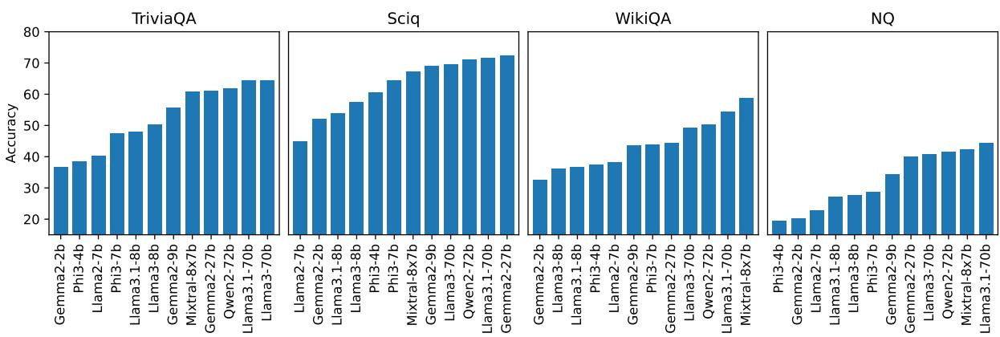  
Figure 7: Model performance ranking across different datasets, performance is averaged over four prompt styles.

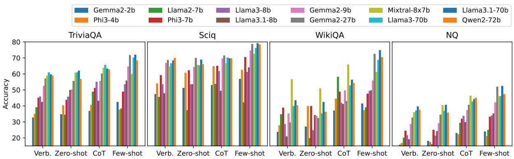  
Figure 8: Model performance across different prompts and datasets.

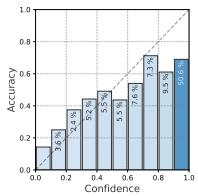  
(a) LLM Prob.

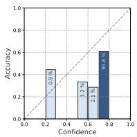  
(b) LLM Prob.+PS

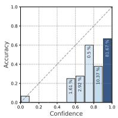

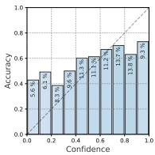

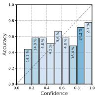

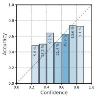  
(g) (BCE)Calib-1

(c) Verbalized %  
(h) (BCE)Calib-n  
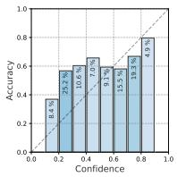

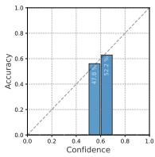  
(d) APRICOT

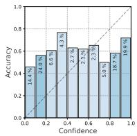

(i) (BCE)Calib-n+PS  
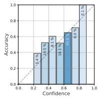  
(j) (FL)Calib-1

(e) (AUC)Calib-1  
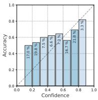  
(k) (FL)Calib-n

(f) AUC)Calib-n  
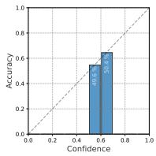  
(1) (FL)Calib-n+PS  
Figure 9: Reliability diagrams for Llama3.1-70b on TriviaQA with Verb. prompts.

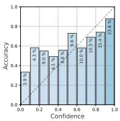  
(a) LLM Prob.

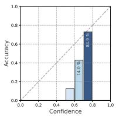  
(b) LLM Prob.+PS

(g) (BCE)Calib-1  
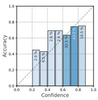

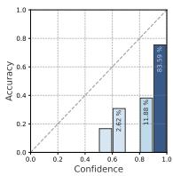

(h) (BCE)Calib-n  
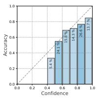  
(c) Verbalized %

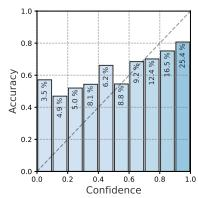

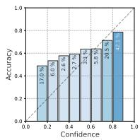

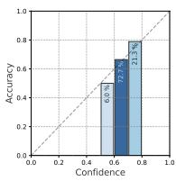  
(i) (BCE)Calib-n+PS

(d) APRICOT  
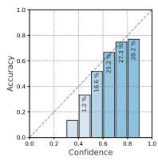  
(j) (FL)Calib-1

(e) (AUC)Calib-1  
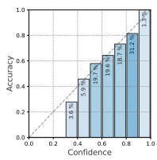  
(k) (FL)Calib-n

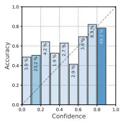

(f) AUC)Calib-n  
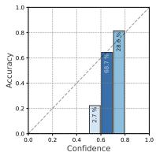  
(1) (FL)Calib-n+PS  
Figure 10: Reliability diagrams for Llama3.1-70b on Sciq with Verb. prompts.

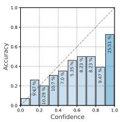  
(a) LLM Prob.

  
(b) LLM Prob.+PS

(g) (BCE)Calib-1  
(c) Verbalized %  
(h) (BCE)Calib-n  
  
(d) APRICOT

  
(e) (AUC)Calib-1

(i) (BCE)Calib-n+PS  
  
(j) (FL)Calib-1

  
(k) (FL)Calib-n

(f) AUC)Calib-n  
  
(1) (FL)Calib-n+PS  
Figure 11: Reliability diagrams for Llama3.1-70b on WikiQA with Verb. prompts.

<table><tr><td rowspan=2 colspan=2>Method</td><td rowspan=1 colspan=19></td><td rowspan=1 colspan=1></td></tr><tr><td rowspan=1 colspan=1>ECE↓</td><td rowspan=1 colspan=1>ECE-t</td><td rowspan=1 colspan=1> Brier ↓</td><td rowspan=1 colspan=3>AUC↑</td><td rowspan=1 colspan=3>ECE ↓ ECE-t↓ Brier</td><td rowspan=1 colspan=1> AUC↑</td><td rowspan=1 colspan=3>ECE ↓ ECE-t↓ Brier</td><td rowspan=1 colspan=1> AUC↑</td><td rowspan=1 colspan=1>ECE</td><td rowspan=1 colspan=4> ECE-t↓ Brier</td><td rowspan=1 colspan=1>AUC↑</td></tr><tr><td rowspan=3 colspan=1></td><td rowspan=1 colspan=1>LLM Prob.</td><td rowspan=1 colspan=1>0.437</td><td rowspan=1 colspan=1>0.239</td><td rowspan=1 colspan=1>0.401</td><td rowspan=1 colspan=3>0.737</td><td rowspan=1 colspan=1>0.296</td><td rowspan=1 colspan=2>0.1700.291</td><td rowspan=1 colspan=1>0.746</td><td rowspan=1 colspan=3>0.3140.1800.324</td><td rowspan=1 colspan=1>0.693</td><td rowspan=1 colspan=1>0.419</td><td rowspan=1 colspan=3>0.042</td><td rowspan=1 colspan=1>0.400</td><td></td></tr><tr><td rowspan=2 colspan=1>LLM Prob.+PS</td><td rowspan=2 colspan=1>0.256</td><td rowspan=2 colspan=1>0.065</td><td rowspan=2 colspan=1>0.299</td><td rowspan=2 colspan=3>0.613</td><td rowspan=2 colspan=1>0.246</td><td rowspan=2 colspan=2>0.092 0.266</td><td rowspan=2 colspan=1>0.746</td><td rowspan=2 colspan=3>0.165 0.113 0.261</td><td rowspan=2 colspan=1>0.708</td><td rowspan=2 colspan=1>0.249</td><td rowspan=2 colspan=3>0.054</td><td rowspan=2 colspan=1>0.295</td><td></td></tr><tr><td rowspan=1 colspan=1>0.643</td></tr><tr><td rowspan=2 colspan=1></td><td rowspan=1 colspan=1>Verblized %</td><td rowspan=1 colspan=1>0.395</td><td rowspan=1 colspan=1>0.049</td><td rowspan=1 colspan=1>0.384</td><td rowspan=1 colspan=3>0.618</td><td rowspan=1 colspan=1></td><td rowspan=1 colspan=2></td><td rowspan=1 colspan=1></td><td rowspan=1 colspan=3></td><td rowspan=1 colspan=1></td><td rowspan=1 colspan=1></td><td rowspan=1 colspan=3></td><td rowspan=1 colspan=1></td><td rowspan=1 colspan=1></td></tr><tr><td rowspan=1 colspan=1>APRICOT</td><td rowspan=1 colspan=1>0.140</td><td rowspan=1 colspan=1>0.087</td><td rowspan=1 colspan=1>0.236</td><td rowspan=1 colspan=3>0.685</td><td rowspan=1 colspan=1>0.146</td><td rowspan=1 colspan=2>0.1090.232</td><td rowspan=1 colspan=1>0.658</td><td rowspan=1 colspan=3>0.141 0.122 0.253</td><td rowspan=1 colspan=1>0.673</td><td rowspan=1 colspan=1>0.118</td><td rowspan=1 colspan=3>0.073</td><td rowspan=1 colspan=1>0.232</td><td rowspan=1 colspan=1>0.667</td></tr><tr><td rowspan=2 colspan=1>2</td><td rowspan=1 colspan=1>(AUC)Calib-1</td><td rowspan=1 colspan=1>0.179</td><td rowspan=1 colspan=1>0.180</td><td rowspan=1 colspan=1>0.267</td><td rowspan=1 colspan=3>0.636</td><td rowspan=1 colspan=1>0.163</td><td rowspan=1 colspan=1>0.165</td><td rowspan=1 colspan=1>0.257</td><td rowspan=1 colspan=1>0.620</td><td rowspan=1 colspan=2>0.239 0.238</td><td rowspan=1 colspan=1>0.302</td><td rowspan=1 colspan=1>0.599</td><td rowspan=1 colspan=1>0.328</td><td rowspan=1 colspan=3>0.201</td><td rowspan=1 colspan=1>0.326</td><td rowspan=1 colspan=1>0.693</td></tr><tr><td rowspan=1 colspan=1>(AUC)Calib-n</td><td rowspan=1 colspan=1>0.259</td><td rowspan=1 colspan=1>0.250</td><td rowspan=1 colspan=1>0.308</td><td rowspan=1 colspan=3>0.610</td><td rowspan=1 colspan=1>0.256</td><td rowspan=1 colspan=1>0.256</td><td rowspan=1 colspan=1>0.298</td><td rowspan=1 colspan=1>0.635</td><td rowspan=1 colspan=1>0.226</td><td rowspan=1 colspan=1>0.222</td><td rowspan=1 colspan=1>0.298</td><td rowspan=1 colspan=1>0.634</td><td rowspan=1 colspan=1>0.251</td><td rowspan=1 colspan=3>0.202</td><td rowspan=1 colspan=1>0.286</td><td rowspan=1 colspan=1>0.717</td></tr><tr><td rowspan=5 colspan=1></td><td rowspan=1 colspan=1>(BCE)Calib-1</td><td rowspan=1 colspan=1>0.092</td><td rowspan=1 colspan=1>0.036</td><td rowspan=1 colspan=1>0.227</td><td rowspan=1 colspan=3>0.664</td><td rowspan=1 colspan=1>0.117</td><td rowspan=1 colspan=1>0.045</td><td rowspan=1 colspan=1>0.234</td><td rowspan=1 colspan=1>0.612</td><td rowspan=1 colspan=1>0.089</td><td rowspan=1 colspan=1>0.080</td><td rowspan=1 colspan=1>0.252</td><td rowspan=1 colspan=1>0.617</td><td rowspan=1 colspan=1>0.116</td><td rowspan=1 colspan=3>0.093</td><td rowspan=5 colspan=1>0.224</td><td rowspan=5 colspan=1>0.705</td></tr><tr><td rowspan=1 colspan=1>(BCE)Calib-n</td><td rowspan=1 colspan=1>0.124</td><td rowspan=1 colspan=1>0.091</td><td rowspan=1 colspan=1>0.240</td><td rowspan=1 colspan=3>0.637</td><td></td><td></td><td></td><td></td><td></td><td></td><td></td><td></td><td></td><td></td><td></td><td></td></tr><tr><td rowspan=3 colspan=1>(BCE)Calib-n+PS</td><td rowspan=3 colspan=1>0.134</td><td rowspan=3 colspan=1>0.032</td><td></td><td></td><td></td><td></td><td></td><td></td><td></td><td></td><td></td><td></td><td></td><td></td><td></td><td></td><td></td><td></td></tr><tr><td></td><td></td><td></td><td></td><td rowspan=2 colspan=1>0.1%28</td><td rowspan=2 colspan=2>0.03570.249</td><td rowspan=2 colspan=1>0.6322</td><td rowspan=2 colspan=1>0.099</td><td rowspan=2 colspan=1>0.076</td><td rowspan=2 colspan=1>0.245</td><td rowspan=2 colspan=1>0.654</td><td rowspan=2 colspan=1>0.0932</td><td rowspan=2 colspan=3>0.0815</td></tr><tr><td rowspan=1 colspan=1>0.246</td><td rowspan=1 colspan=3>0.629</td></tr><tr><td rowspan=1 colspan=1></td><td rowspan=1 colspan=1>(FL)Calib-1</td><td rowspan=1 colspan=1>0.073</td><td rowspan=1 colspan=1>0.041</td><td rowspan=1 colspan=1>0.227</td><td rowspan=1 colspan=3>0.652</td><td rowspan=1 colspan=1>0.084</td><td rowspan=1 colspan=2>0.0510.223</td><td rowspan=1 colspan=1>0.606</td><td rowspan=1 colspan=1>0.091</td><td rowspan=1 colspan=1>0.086</td><td rowspan=1 colspan=1>0.254</td><td rowspan=1 colspan=1>0.602</td><td rowspan=1 colspan=1>0.086</td><td rowspan=1 colspan=3>0.078</td><td rowspan=1 colspan=1>0.221</td><td rowspan=1 colspan=1>0.683</td></tr><tr><td rowspan=1 colspan=1></td><td rowspan=1 colspan=1>(FL)Calib-n</td><td rowspan=1 colspan=1>0.121</td><td rowspan=1 colspan=1>0.093</td><td rowspan=1 colspan=1>0.243</td><td rowspan=1 colspan=3>0.617</td><td rowspan=1 colspan=1>0.098</td><td rowspan=1 colspan=2>0.0790.226</td><td rowspan=1 colspan=1>0.620</td><td rowspan=1 colspan=1>0.093</td><td rowspan=1 colspan=1>0.065</td><td rowspan=1 colspan=1>0.241</td><td rowspan=1 colspan=1>0.662</td><td rowspan=1 colspan=1>0.098</td><td rowspan=1 colspan=3>0.080</td><td rowspan=1 colspan=1>0.216</td><td></td></tr><tr><td></td><td></td><td></td><td></td><td></td><td></td><td></td><td></td><td></td><td></td><td></td><td></td><td></td><td></td><td></td><td></td><td rowspan=3 colspan=1>0.164</td><td></td><td></td><td></td><td rowspan=3 colspan=1>0.241</td><td></td></tr><tr><td></td><td></td><td></td><td></td><td></td><td></td><td></td><td></td><td></td><td></td><td></td><td></td><td></td><td></td><td></td><td></td><td></td><td></td><td></td><td rowspan=2 colspan=1>0.702</td></tr><tr><td rowspan=1 colspan=1></td><td rowspan=1 colspan=1>(FL)Calib-n+PS</td><td rowspan=1 colspan=1>0.138</td><td rowspan=1 colspan=1>0.034</td><td rowspan=1 colspan=1>0.249</td><td rowspan=1 colspan=3>0.617</td><td rowspan=1 colspan=1>0.156</td><td rowspan=1 colspan=2>0.030 0.243</td><td rowspan=1 colspan=1>0.620</td><td rowspan=1 colspan=1>0.105</td><td rowspan=1 colspan=1>0.068</td><td rowspan=1 colspan=1>0.245</td><td rowspan=1 colspan=1>0.662</td><td rowspan=1 colspan=3>0.067</td></tr><tr><td rowspan=1 colspan=1></td><td rowspan=1 colspan=1>LLM Prob.</td><td rowspan=1 colspan=1>0.274</td><td rowspan=1 colspan=1>0.165</td><td rowspan=1 colspan=1>0.277</td><td rowspan=1 colspan=3>0.751</td><td rowspan=1 colspan=1>0.336</td><td rowspan=1 colspan=2>0.222 0.325</td><td rowspan=1 colspan=1>0.739</td><td rowspan=1 colspan=1>0.246</td><td rowspan=1 colspan=1>0.181</td><td rowspan=1 colspan=1>0.296</td><td rowspan=1 colspan=1>0.638</td><td rowspan=1 colspan=1>0.251</td><td rowspan=1 colspan=3>0.048</td><td rowspan=1 colspan=1>0.286</td><td rowspan=1 colspan=1>0.691</td></tr><tr><td rowspan=1 colspan=1></td><td rowspan=1 colspan=1>LLM Prob.+PS</td><td rowspan=1 colspan=1>0.192</td><td rowspan=1 colspan=1>0.037</td><td rowspan=1 colspan=1>0.279</td><td rowspan=1 colspan=3>0.623</td><td rowspan=1 colspan=1>0.188</td><td rowspan=1 colspan=2>0.129 0.264</td><td rowspan=1 colspan=1>0.739</td><td rowspan=1 colspan=1>0.130</td><td rowspan=1 colspan=1>0.058</td><td rowspan=1 colspan=1>0.254</td><td rowspan=1 colspan=1>0.638</td><td rowspan=1 colspan=1>0.160</td><td rowspan=1 colspan=3>0.073</td><td rowspan=1 colspan=1>0.264</td><td rowspan=1 colspan=1>0.691</td></tr><tr><td rowspan=1 colspan=1></td><td rowspan=1 colspan=1>Verblized %</td><td rowspan=1 colspan=1>0.385</td><td rowspan=1 colspan=1>0.089</td><td rowspan=1 colspan=1>0.381</td><td rowspan=1 colspan=3>0.642</td><td rowspan=1 colspan=1></td><td rowspan=1 colspan=1></td><td rowspan=1 colspan=1></td><td rowspan=1 colspan=1></td><td rowspan=1 colspan=1></td><td rowspan=1 colspan=1></td><td rowspan=1 colspan=1></td><td rowspan=1 colspan=1></td><td rowspan=1 colspan=1></td><td rowspan=1 colspan=3></td><td rowspan=1 colspan=1></td><td rowspan=1 colspan=1></td></tr><tr><td rowspan=1 colspan=1></td><td rowspan=1 colspan=1>APRICOT</td><td rowspan=1 colspan=1>0.172</td><td rowspan=1 colspan=1>0.089</td><td rowspan=1 colspan=1>0.259</td><td rowspan=1 colspan=3>0.663</td><td rowspan=1 colspan=1>0.152</td><td rowspan=1 colspan=1>0.140</td><td rowspan=1 colspan=1>0.257</td><td rowspan=1 colspan=1>0.661</td><td rowspan=1 colspan=1>0.169</td><td rowspan=1 colspan=1>0.127</td><td rowspan=1 colspan=1>0.263</td><td rowspan=1 colspan=1>0.657</td><td rowspan=1 colspan=1>0.131</td><td rowspan=1 colspan=3>0.073</td><td rowspan=1 colspan=1>0.240</td><td rowspan=1 colspan=1>0.701</td></tr><tr><td rowspan=1 colspan=1>8</td><td rowspan=1 colspan=1>(AUC)Calib-1</td><td rowspan=1 colspan=1>0.248</td><td rowspan=1 colspan=1>0.235</td><td rowspan=1 colspan=1>0.302</td><td rowspan=1 colspan=3>0.636</td><td rowspan=1 colspan=1>0.277</td><td rowspan=1 colspan=1>0.254</td><td rowspan=1 colspan=1>0.316</td><td rowspan=1 colspan=1>0.609</td><td rowspan=1 colspan=1>0.250</td><td rowspan=1 colspan=1>0.229</td><td rowspan=1 colspan=1>0.308</td><td rowspan=1 colspan=1>0.591</td><td rowspan=1 colspan=1>0.198</td><td rowspan=1 colspan=3>0.153</td><td rowspan=1 colspan=1>0.251</td><td rowspan=1 colspan=1>0.727</td></tr><tr><td rowspan=1 colspan=1>a</td><td rowspan=1 colspan=1>(AUC)Calib-n</td><td rowspan=1 colspan=1>0.239</td><td rowspan=1 colspan=1>0.176</td><td rowspan=1 colspan=1>0.288</td><td rowspan=1 colspan=3>0.665</td><td rowspan=1 colspan=1>0.248</td><td rowspan=1 colspan=1>0.206</td><td rowspan=1 colspan=1>0.304</td><td rowspan=1 colspan=1>0.629</td><td rowspan=1 colspan=1>0.220</td><td rowspan=1 colspan=1>0.223</td><td rowspan=1 colspan=1>0.289</td><td rowspan=1 colspan=1>0.635</td><td rowspan=1 colspan=1>0.257</td><td rowspan=1 colspan=3>0.208</td><td rowspan=1 colspan=1>0.275</td><td rowspan=1 colspan=1>0.757</td></tr><tr><td rowspan=2 colspan=1></td><td rowspan=2 colspan=1>BCECalib-1</td><td rowspan=1 colspan=1>0.123</td><td rowspan=1 colspan=1>0.098</td><td rowspan=1 colspan=1>0.252</td><td rowspan=1 colspan=3>0.637</td><td rowspan=2 colspan=1>0.14</td><td rowspan=2 colspan=1>0.073</td><td rowspan=2 colspan=1>0.2561</td><td rowspan=2 colspan=1>0.6249</td><td rowspan=2 colspan=1>0.127</td><td rowspan=2 colspan=1></td><td rowspan=2 colspan=1>0.260</td><td rowspan=2 colspan=1>0.6046</td><td rowspan=2 colspan=1>0.0950</td><td rowspan=2 colspan=3>0.049</td><td rowspan=2 colspan=1>0.20</td><td rowspan=2 colspan=1>0.7481</td></tr><tr><td rowspan=1 colspan=1>0.168</td><td rowspan=1 colspan=1>0.070</td><td rowspan=1 colspan=1>0.256</td><td rowspan=1 colspan=3>0.676</td></tr><tr><td rowspan=1 colspan=1></td><td rowspan=1 colspan=1>(BCE)Calib-n+PS</td><td rowspan=1 colspan=1>0.100</td><td rowspan=1 colspan=1>0.051</td><td rowspan=1 colspan=1>0.243</td><td rowspan=1 colspan=3>0.635</td><td rowspan=1 colspan=1>0.088</td><td rowspan=1 colspan=2>0.052 0.244</td><td rowspan=1 colspan=1>0.649</td><td rowspan=1 colspan=1>0.068</td><td rowspan=1 colspan=1>0.048</td><td rowspan=1 colspan=1>0.237</td><td rowspan=1 colspan=1>0.647</td><td rowspan=1 colspan=1>0.100</td><td rowspan=1 colspan=3>0.111</td><td rowspan=1 colspan=1>0.233</td><td rowspan=1 colspan=1>0.741</td></tr><tr><td rowspan=1 colspan=1></td><td rowspan=1 colspan=1>(FL)Calib-1</td><td rowspan=1 colspan=1>0.090</td><td rowspan=1 colspan=1>0.076</td><td rowspan=1 colspan=1>0.238</td><td rowspan=1 colspan=3>0.660</td><td rowspan=1 colspan=1>0.112</td><td rowspan=1 colspan=2>0.0980.252</td><td rowspan=1 colspan=1>0.626</td><td rowspan=1 colspan=1>0.102</td><td rowspan=1 colspan=1>0.081</td><td rowspan=1 colspan=1>0.258</td><td rowspan=1 colspan=1>0.603</td><td rowspan=1 colspan=1>0.075</td><td rowspan=1 colspan=3>0.047</td><td rowspan=1 colspan=1>0.212</td><td></td></tr><tr><td rowspan=2 colspan=1></td><td rowspan=2 colspan=1>(FL)Calib-n</td><td rowspan=2 colspan=1>0.165</td><td rowspan=2 colspan=1>0.070</td><td rowspan=2 colspan=1>0.268</td><td rowspan=2 colspan=3>0.618</td><td rowspan=2 colspan=1>0.149</td><td rowspan=2 colspan=2>0.0750.260</td><td rowspan=2 colspan=1>0.640</td><td rowspan=2 colspan=1>0.135</td><td rowspan=2 colspan=1>0.058</td><td rowspan=2 colspan=1>0.255</td><td rowspan=2 colspan=1>0.655</td><td rowspan=2 colspan=1>0.052</td><td></td><td></td><td></td><td></td><td></td></tr><tr><td></td><td></td><td></td><td></td><td rowspan=2 colspan=1>0.743</td></tr><tr><td rowspan=1 colspan=1></td><td rowspan=1 colspan=1>(FL)Calib-n+PS</td><td rowspan=1 colspan=1>0.094</td><td rowspan=1 colspan=1>0.034</td><td rowspan=1 colspan=1>0.245</td><td rowspan=1 colspan=3>0.618</td><td rowspan=1 colspan=1>0.080</td><td rowspan=1 colspan=1>0.048</td><td rowspan=1 colspan=1>0.243</td><td rowspan=1 colspan=1>0.640</td><td rowspan=1 colspan=1>0.071</td><td rowspan=1 colspan=1>0.054</td><td rowspan=1 colspan=1>0.237</td><td rowspan=1 colspan=1>0.655</td><td rowspan=1 colspan=1>0.108</td><td rowspan=1 colspan=3>0.109</td><td rowspan=1 colspan=1>0.232</td></tr><tr><td rowspan=2 colspan=1></td><td rowspan=1 colspan=1>LLM Prob.</td><td rowspan=1 colspan=1>0.255</td><td rowspan=1 colspan=1>0.129</td><td rowspan=1 colspan=1>0.256</td><td rowspan=1 colspan=3>0.786</td><td rowspan=1 colspan=1>0.167</td><td rowspan=1 colspan=1>0.127</td><td rowspan=1 colspan=1>0.234</td><td rowspan=1 colspan=1>0.750</td><td rowspan=1 colspan=1>0.298</td><td rowspan=1 colspan=1>0.154</td><td rowspan=1 colspan=1>0.315</td><td rowspan=1 colspan=1>0.685</td><td rowspan=1 colspan=1>0.107</td><td rowspan=1 colspan=3>0.037</td><td rowspan=1 colspan=1>0.204</td><td rowspan=2 colspan=1>0.7740.775</td></tr><tr><td rowspan=1 colspan=1>LLM Prob.+PS</td><td rowspan=1 colspan=1>0.223</td><td rowspan=1 colspan=1>0.050</td><td rowspan=1 colspan=1>0.286</td><td rowspan=1 colspan=3>0.610</td><td rowspan=1 colspan=1>0.169</td><td rowspan=1 colspan=1>0.140</td><td rowspan=1 colspan=1>0.237</td><td rowspan=1 colspan=1>0.810</td><td rowspan=1 colspan=1>0.209</td><td rowspan=1 colspan=1>0.053</td><td rowspan=1 colspan=1>0.277</td><td rowspan=1 colspan=1>0.685</td><td rowspan=1 colspan=1>0.158</td><td rowspan=1 colspan=3>0.117</td><td rowspan=1 colspan=1>0.238</td></tr><tr><td rowspan=1 colspan=1></td><td rowspan=1 colspan=1>Verblized %</td><td rowspan=1 colspan=1>0.440</td><td rowspan=1 colspan=1>0.175</td><td rowspan=1 colspan=1>0.429</td><td rowspan=1 colspan=3>0.604</td><td rowspan=1 colspan=1></td><td rowspan=1 colspan=1></td><td rowspan=1 colspan=1></td><td rowspan=1 colspan=1></td><td rowspan=1 colspan=1></td><td rowspan=1 colspan=1></td><td rowspan=1 colspan=1></td><td rowspan=1 colspan=1></td><td rowspan=1 colspan=1></td><td rowspan=1 colspan=3></td><td rowspan=1 colspan=1></td><td rowspan=1 colspan=1></td></tr><tr><td rowspan=1 colspan=1>1-8-6</td><td rowspan=1 colspan=1>APRICOT</td><td rowspan=1 colspan=1>0.154</td><td rowspan=1 colspan=1>0.122</td><td rowspan=1 colspan=1>0.245</td><td rowspan=1 colspan=3>0.661</td><td rowspan=1 colspan=1>0.126</td><td rowspan=1 colspan=1>0.066</td><td rowspan=1 colspan=1>0.226</td><td rowspan=1 colspan=1>0.725</td><td rowspan=1 colspan=1>0.115</td><td rowspan=1 colspan=1>0.061</td><td rowspan=1 colspan=1>0.207</td><td rowspan=1 colspan=1>0.771</td><td rowspan=1 colspan=1>0.119</td><td rowspan=1 colspan=3>0.089</td><td rowspan=1 colspan=1>0.232</td><td rowspan=1 colspan=1>0.703</td></tr><tr><td rowspan=1 colspan=1></td><td rowspan=1 colspan=1>(AUC)Calib-1</td><td rowspan=1 colspan=1>0.251</td><td rowspan=1 colspan=1>0.251</td><td rowspan=1 colspan=1>0.292</td><td rowspan=1 colspan=3>0.687</td><td rowspan=1 colspan=1>0.256</td><td rowspan=1 colspan=1>0.260</td><td rowspan=1 colspan=1>0.291</td><td rowspan=1 colspan=1>0.699</td><td rowspan=1 colspan=1>0.236</td><td rowspan=1 colspan=1>0.166</td><td rowspan=1 colspan=1>0.245</td><td rowspan=1 colspan=1>0.789</td><td rowspan=1 colspan=1>0.126</td><td rowspan=1 colspan=3>0.137</td><td rowspan=1 colspan=1>0.201</td><td rowspan=2 colspan=1>0.7780.780</td></tr><tr><td rowspan=1 colspan=1>3.</td><td rowspan=1 colspan=1>(AUC)Calib-n</td><td rowspan=1 colspan=1>0.203</td><td rowspan=1 colspan=1>0.189</td><td rowspan=1 colspan=1>0.258</td><td rowspan=1 colspan=3>0.705</td><td rowspan=1 colspan=1>0.215</td><td rowspan=1 colspan=1>0.186</td><td rowspan=1 colspan=1>0.268</td><td rowspan=1 colspan=1>0.706</td><td rowspan=1 colspan=1>0.190</td><td rowspan=1 colspan=1>0.165</td><td rowspan=1 colspan=1>0.240</td><td rowspan=1 colspan=1>0.733</td><td rowspan=1 colspan=1>0.255</td><td rowspan=1 colspan=3>0.203</td><td rowspan=1 colspan=1>0.255</td></tr><tr><td rowspan=1 colspan=1>LI1a31</td><td rowspan=1 colspan=1>(BCE)Calib-1(BCE)Calib-n</td><td rowspan=1 colspan=1>0.1070.126</td><td rowspan=1 colspan=1>0.0830.069</td><td rowspan=1 colspan=1>0.2200.226</td><td rowspan=1 colspan=3>0.6920.704</td><td rowspan=1 colspan=1>0.1210.127</td><td rowspan=1 colspan=1>0.1340.063</td><td rowspan=1 colspan=1>0.2370.232</td><td rowspan=1 colspan=1>0.7030.723</td><td rowspan=1 colspan=1>0.0830.074</td><td rowspan=1 colspan=1>0.0570.042</td><td rowspan=1 colspan=1>0.1780.197</td><td rowspan=1 colspan=1>0.8060.779</td><td rowspan=1 colspan=1>0.0620.041</td><td rowspan=1 colspan=3>0.0670.038</td><td rowspan=1 colspan=1>0.1870.185</td><td rowspan=4 colspan=1>0.7770.7830.7830.7720.780</td></tr><tr><td rowspan=1 colspan=1></td><td rowspan=1 colspan=1>(BCE)Calib-n+PS</td><td rowspan=1 colspan=1>0.146</td><td rowspan=1 colspan=1>0.060</td><td rowspan=1 colspan=1>0.244</td><td rowspan=1 colspan=3>0.643</td><td rowspan=1 colspan=1>0.119</td><td rowspan=1 colspan=1>0.122</td><td rowspan=1 colspan=1>0.238</td><td rowspan=1 colspan=1>0.723</td><td rowspan=1 colspan=1>0.176</td><td rowspan=1 colspan=1>0.140</td><td rowspan=1 colspan=1>0.234</td><td rowspan=3 colspan=1>0.7790.7960.790</td><td rowspan=3 colspan=1>0.1350.0550.042</td><td rowspan=1 colspan=3>0.155</td><td rowspan=1 colspan=1>0.224</td></tr><tr><td rowspan=1 colspan=1></td><td rowspan=1 colspan=1>(FL)Calib-1</td><td rowspan=2 colspan=1>0.0960.117</td><td rowspan=2 colspan=1>0.0890.070</td><td rowspan=2 colspan=1>0.2170.238</td><td rowspan=1 colspan=3>0.686</td><td rowspan=2 colspan=1>0.0880.122</td><td rowspan=2 colspan=1>0.1120.077</td><td rowspan=2 colspan=1>0.2250.231</td><td rowspan=2 colspan=1>0.7080.720</td><td rowspan=2 colspan=1>0.0650.084</td><td rowspan=2 colspan=1>0.0470.053</td><td rowspan=2 colspan=1>0.1800.193</td><td rowspan=2 colspan=3>0.0520.032</td><td rowspan=2 colspan=1>0.1890.186</td></tr><tr><td rowspan=1 colspan=1></td><td rowspan=1 colspan=1>(FL)Calib-n</td><td rowspan=1 colspan=2>0.640</td><td rowspan=1 colspan=1>40</td></tr><tr><td rowspan=1 colspan=1></td><td rowspan=1 colspan=1>(FL)Calib-n+PS</td><td rowspan=1 colspan=1>0.148</td><td rowspan=1 colspan=1>0.057</td><td rowspan=1 colspan=1>0.244</td><td rowspan=1 colspan=2>0.</td><td rowspan=1 colspan=1>0.640</td><td rowspan=1 colspan=1>0.116</td><td rowspan=1 colspan=1>0.117</td><td rowspan=1 colspan=1>0.240</td><td rowspan=1 colspan=1>0.720</td><td rowspan=1 colspan=1>0.178</td><td rowspan=1 colspan=1>0.157</td><td rowspan=1 colspan=1>0.234</td><td rowspan=1 colspan=1>0.790</td><td rowspan=1 colspan=1>0.137</td><td rowspan=1 colspan=3>0.152</td><td rowspan=1 colspan=1>0.224</td><td rowspan=1 colspan=1>0.780</td></tr><tr><td rowspan=2 colspan=1></td><td rowspan=1 colspan=1>LLM Prob.</td><td rowspan=1 colspan=1>0.185</td><td rowspan=1 colspan=1>0.114</td><td rowspan=1 colspan=1>0.209</td><td rowspan=1 colspan=3>0.801</td><td rowspan=1 colspan=1>0.195</td><td rowspan=1 colspan=1>0.111</td><td rowspan=1 colspan=1>0.211</td><td rowspan=1 colspan=1>0.822</td><td rowspan=1 colspan=1>0.142</td><td rowspan=1 colspan=1>0.107</td><td rowspan=1 colspan=1>0.222</td><td rowspan=1 colspan=1>0.751</td><td rowspan=1 colspan=1>0.209</td><td rowspan=1 colspan=3>0.225</td><td rowspan=1 colspan=1>0.303</td><td rowspan=2 colspan=1>0.6200.620</td></tr><tr><td rowspan=1 colspan=1>LLM Prob.+PS</td><td rowspan=1 colspan=1>0.272</td><td rowspan=1 colspan=1>0.025</td><td rowspan=1 colspan=1>0.286</td><td rowspan=1 colspan=3>0.635</td><td rowspan=1 colspan=1>0.244</td><td rowspan=1 colspan=1>0.140</td><td rowspan=1 colspan=1>0.253</td><td rowspan=1 colspan=1>0.822</td><td rowspan=1 colspan=1>0.203</td><td rowspan=1 colspan=1>0.099</td><td rowspan=1 colspan=1>0.250</td><td rowspan=1 colspan=1>0.751</td><td rowspan=1 colspan=1>0.155</td><td rowspan=1 colspan=3>0.025</td><td rowspan=1 colspan=1>0.260</td></tr><tr><td rowspan=1 colspan=1></td><td rowspan=1 colspan=1>Verblized %</td><td rowspan=1 colspan=1>0.526</td><td rowspan=1 colspan=1>0.099</td><td rowspan=1 colspan=1>0.493</td><td rowspan=1 colspan=3>0.667</td><td rowspan=1 colspan=1></td><td rowspan=1 colspan=1></td><td rowspan=1 colspan=1></td><td rowspan=1 colspan=1></td><td rowspan=1 colspan=1></td><td rowspan=1 colspan=1></td><td rowspan=1 colspan=1></td><td rowspan=1 colspan=1></td><td rowspan=1 colspan=1></td><td rowspan=1 colspan=3></td><td rowspan=1 colspan=1></td><td rowspan=1 colspan=1></td></tr><tr><td rowspan=1 colspan=1>b</td><td rowspan=1 colspan=1>APRICOT</td><td rowspan=1 colspan=1>0.150</td><td rowspan=1 colspan=1>0.073</td><td rowspan=1 colspan=1>0.221</td><td rowspan=1 colspan=3>0.691</td><td rowspan=1 colspan=1>0.143</td><td rowspan=1 colspan=1>0.129</td><td rowspan=1 colspan=1>0.236</td><td rowspan=1 colspan=1>0.658</td><td rowspan=1 colspan=1>0.148</td><td rowspan=1 colspan=1>0.097</td><td rowspan=1 colspan=1>0.232</td><td rowspan=1 colspan=1>0.685</td><td rowspan=1 colspan=1>0.145</td><td rowspan=1 colspan=3>0.093</td><td rowspan=1 colspan=1>0.247</td><td rowspan=1 colspan=1>0.671</td></tr><tr><td rowspan=7 colspan=1>22</td><td rowspan=7 colspan=1>(AUC)Calib-1(AUC)Calib-n</td><td rowspan=7 colspan=1>0.1890.240</td><td rowspan=7 colspan=1>0.2030.251</td><td rowspan=7 colspan=1>0.2680.296</td><td></td><td></td><td></td><td></td><td></td><td></td><td></td><td></td><td></td><td></td><td></td><td></td><td></td><td></td><td></td><td></td><td></td></tr><tr><td rowspan=6 colspan=3>0.644</td><td></td><td></td><td></td><td></td><td></td><td></td><td></td><td></td><td></td><td></td><td></td><td></td><td></td><td></td></tr><tr><td rowspan=5 colspan=1>0.2080.269</td><td rowspan=5 colspan=1>0.2080.270</td><td></td><td></td><td></td><td></td><td></td><td></td><td></td><td></td><td></td><td></td><td></td><td></td></tr><tr><td rowspan=4 colspan=1>0.311</td><td rowspan=4 colspan=1>0.637</td><td rowspan=4 colspan=1>0.251</td><td rowspan=4 colspan=1>0.234</td><td></td><td></td><td></td><td></td><td></td><td></td><td></td><td></td></tr><tr><td rowspan=3 colspan=1>0.2800.303</td><td rowspan=3 colspan=1>0.6540.672</td><td rowspan=3 colspan=1>0.2910.394</td><td></td><td></td><td></td><td></td><td></td></tr><tr><td rowspan=2 colspan=3>0.303</td><td rowspan=2 colspan=1>0.393</td><td></td></tr><tr><td rowspan=1 colspan=1>0.6770.690</td></tr><tr><td rowspan=1 colspan=1></td><td rowspan=1 colspan=1>(BCE)Calib-1(BCE)Calib-n</td><td rowspan=1 colspan=1>0.1200.094</td><td rowspan=1 colspan=1>0.0810.099</td><td rowspan=1 colspan=1>0.2210.213</td><td rowspan=1 colspan=3>0.6350.653</td><td rowspan=1 colspan=1>0.1030.104</td><td rowspan=1 colspan=1>0.0700.094</td><td rowspan=1 colspan=1>0.2260.227</td><td rowspan=1 colspan=1>0.6390.629</td><td rowspan=1 colspan=1>0.1140.073</td><td rowspan=2 colspan=1>0.0460.0740.081</td><td rowspan=3 colspan=1>0.2260.2130.2490.216</td><td rowspan=2 colspan=1>0.6710.6870.687</td><td rowspan=2 colspan=1>0.0920.1280.163</td><td rowspan=2 colspan=3>0.1010.1060.066</td><td rowspan=2 colspan=1>0.2330.2400.257</td><td rowspan=3 colspan=1>0.6650.6850.6850.645</td></tr><tr><td rowspan=1 colspan=1></td><td rowspan=1 colspan=1>(BCE)Calib-n+PS</td><td rowspan=1 colspan=1>0.184</td><td rowspan=1 colspan=1>0.052</td><td rowspan=1 colspan=1>0.242</td><td rowspan=1 colspan=3>0.651</td><td rowspan=1 colspan=1>0.185</td><td rowspan=1 colspan=1>0.037</td><td rowspan=1 colspan=1>0.253</td><td rowspan=1 colspan=1>0.629</td><td rowspan=1 colspan=1>0.176</td></tr><tr><td rowspan=1 colspan=1></td><td rowspan=1 colspan=1>(FL)Calib-1</td><td rowspan=1 colspan=1>0.049</td><td rowspan=1 colspan=1>0.027</td><td rowspan=1 colspan=1>0.203</td><td rowspan=1 colspan=3>0.658</td><td rowspan=1 colspan=1>0.068</td><td rowspan=1 colspan=1>0.049</td><td rowspan=1 colspan=1>0.219</td><td rowspan=1 colspan=1>0.637</td><td rowspan=1 colspan=1>0.067</td><td rowspan=1 colspan=1>0.035</td><td rowspan=1 colspan=1>0.680</td><td rowspan=1 colspan=1>0.084</td><td rowspan=1 colspan=3>0.090</td><td rowspan=1 colspan=1>0.238</td></tr><tr><td rowspan=4 colspan=1></td><td rowspan=1 colspan=1>(FL)Calib-n</td><td rowspan=1 colspan=1>0.088</td><td rowspan=1 colspan=1>0.072</td><td rowspan=1 colspan=1>0.211</td><td rowspan=1 colspan=3>0.644</td><td rowspan=1 colspan=1>0.098</td><td rowspan=1 colspan=1>0.096</td><td rowspan=1 colspan=1>0.227</td><td rowspan=1 colspan=1>0.621</td><td rowspan=1 colspan=1>0.065</td><td rowspan=1 colspan=1>0.062</td><td></td><td></td><td></td><td></td><td></td><td></td><td></td><td></td></tr><tr><td rowspan=3 colspan=1>(FL)Calib-n+PS</td><td rowspan=3 colspan=1>0.195</td><td></td><td></td><td></td><td></td><td></td><td></td><td></td><td></td><td></td><td></td><td></td><td></td><td></td><td></td><td></td><td></td><td></td><td></td><td></td></tr><tr><td></td><td></td><td></td><td></td><td></td><td></td><td></td><td></td><td></td><td></td><td></td><td rowspan=2 colspan=1>0.2090.244</td><td rowspan=2 colspan=1>0.6970.697</td><td rowspan=2 colspan=4>0.1290.1050.1620.067</td><td rowspan=2 colspan=1>0.2400.257</td><td rowspan=2 colspan=1>0.6830.683</td></tr><tr><td rowspan=1 colspan=1>0.055</td><td rowspan=1 colspan=1>0.246</td><td rowspan=1 colspan=3>0.644</td><td rowspan=1 colspan=1>0.178</td><td rowspan=1 colspan=1>0.033</td><td rowspan=1 colspan=1>0.248</td><td rowspan=1 colspan=1>0.621</td><td rowspan=1 colspan=1>0.160</td><td rowspan=1 colspan=1>0.082</td></tr><tr><td rowspan=2 colspan=1></td><td rowspan=1 colspan=1>LLM Prob.</td><td rowspan=1 colspan=1>0.244</td><td rowspan=1 colspan=1>0.180</td><td rowspan=1 colspan=1>0.265</td><td rowspan=1 colspan=3>0.767</td><td rowspan=1 colspan=1>0.276</td><td rowspan=1 colspan=1>0.207</td><td rowspan=1 colspan=1>0.289</td><td rowspan=1 colspan=1>0.762</td><td rowspan=1 colspan=1>0.217</td><td rowspan=1 colspan=1>0.165</td><td rowspan=1 colspan=1>0.269</td><td rowspan=1 colspan=1>0.688</td><td rowspan=1 colspan=4>0.1760.177</td><td rowspan=1 colspan=1>0.260</td><td rowspan=2 colspan=1>0.5890.589</td></tr><tr><td rowspan=1 colspan=1>LLM Prob.+PS</td><td rowspan=1 colspan=1>0.126</td><td rowspan=1 colspan=1>0.042</td><td rowspan=1 colspan=1>0.260</td><td rowspan=1 colspan=3>0.679</td><td rowspan=1 colspan=1>0.177</td><td rowspan=1 colspan=1>0.119</td><td rowspan=1 colspan=1>0.258</td><td rowspan=1 colspan=1>0.762</td><td rowspan=1 colspan=1>0.120</td><td rowspan=1 colspan=1>0.072</td><td rowspan=1 colspan=1>0.245</td><td rowspan=1 colspan=1>0.689</td><td rowspan=1 colspan=4>0.042 0.039</td><td rowspan=1 colspan=1>0.225</td></tr><tr><td rowspan=2 colspan=1></td><td rowspan=1 colspan=1>Verblized %</td><td rowspan=1 colspan=1>0.406</td><td rowspan=1 colspan=1>0.118</td><td rowspan=1 colspan=1>0.395</td><td rowspan=1 colspan=3>0.697</td><td rowspan=1 colspan=1></td><td rowspan=1 colspan=1></td><td rowspan=1 colspan=1></td><td rowspan=1 colspan=1></td><td rowspan=1 colspan=1></td><td rowspan=1 colspan=1></td><td rowspan=1 colspan=1></td><td rowspan=1 colspan=1></td><td rowspan=1 colspan=1></td><td rowspan=1 colspan=3></td><td rowspan=1 colspan=1></td><td rowspan=1 colspan=1></td></tr><tr><td rowspan=1 colspan=1>APRICOT</td><td rowspan=1 colspan=1>0.168</td><td rowspan=1 colspan=1>0.106</td><td rowspan=1 colspan=1>0.264</td><td rowspan=1 colspan=3>0.675</td><td rowspan=1 colspan=1>0.183</td><td rowspan=1 colspan=1>0.144</td><td rowspan=1 colspan=1>0.279</td><td rowspan=1 colspan=1>0.633</td><td rowspan=1 colspan=1>0.179</td><td rowspan=1 colspan=1>0.142</td><td rowspan=1 colspan=1>0.271</td><td rowspan=1 colspan=1>0.655</td><td rowspan=1 colspan=1>0.164</td><td rowspan=1 colspan=3>0.111</td><td rowspan=1 colspan=1>0.246</td><td rowspan=1 colspan=1>0.661</td></tr><tr><td rowspan=2 colspan=1></td><td rowspan=2 colspan=1>(AUC)Calib-1(AUC)Calib-n</td><td rowspan=2 colspan=1>0.2480.284</td><td rowspan=2 colspan=1>0.2100.193</td><td rowspan=2 colspan=1>0.3100.327</td><td rowspan=2 colspan=3>0.5900.604</td><td rowspan=2 colspan=1>0.2470.266</td><td rowspan=2 colspan=1>0.2280.205</td><td rowspan=2 colspan=1>0.3040.315</td><td rowspan=2 colspan=1>0.6030.617</td><td rowspan=2 colspan=1>0.2380.218</td><td rowspan=2 colspan=1>0.2390.225</td><td rowspan=2 colspan=1>0.2980.289</td><td rowspan=2 colspan=1>0.6040.635</td><td rowspan=2 colspan=1>0.1600.266</td><td rowspan=2 colspan=3>0.1640.229</td><td rowspan=1 colspan=1>0.240</td><td rowspan=2 colspan=1>0.6700.685</td></tr><tr><td rowspan=1 colspan=1>0.283</td></tr><tr><td rowspan=1 colspan=1>m</td><td rowspan=1 colspan=1>(BCE)Calib-1</td><td rowspan=1 colspan=1>0.146</td><td rowspan=1 colspan=1>0.106</td><td rowspan=1 colspan=1>0.268</td><td rowspan=1 colspan=3>0.606</td><td rowspan=1 colspan=1>0.101</td><td rowspan=1 colspan=1>0.097</td><td rowspan=6 colspan=1>0.2580.279</td><td rowspan=6 colspan=1>0.5980.618</td><td rowspan=6 colspan=1>0.0900.145</td><td rowspan=1 colspan=1>0.053</td><td rowspan=6 colspan=1>0.2490.260</td><td rowspan=6 colspan=1>0.613</td><td rowspan=1 colspan=1>0.099</td><td rowspan=1 colspan=2>0.08</td><td></td><td></td><td></td></tr><tr><td rowspan=5 colspan=1>ge</td><td rowspan=5 colspan=1>(BCE)Calib-n</td><td></td><td></td><td></td><td></td><td></td><td></td><td></td><td></td><td></td><td></td><td></td><td></td><td></td><td></td><td></td></tr><tr><td></td><td></td><td></td><td></td><td></td><td></td><td></td><td></td><td></td><td></td><td rowspan=7 colspan=3>0.0870.0780.037</td><td rowspan=7 colspan=1>0.2250.2180.218</td><td></td></tr><tr><td></td><td></td><td></td><td></td><td></td><td></td><td></td><td></td><td rowspan=3 colspan=1>0.080</td><td rowspan=6 colspan=1>0.0680.035</td><td></td></tr><tr><td></td><td></td><td></td><td></td><td></td><td></td><td></td><td></td><td rowspan=5 colspan=1>0.6520.6790.679</td></tr><tr><td rowspan=1 colspan=1>0.230</td><td rowspan=1 colspan=1>0.078</td><td rowspan=1 colspan=1>0.304</td><td rowspan=1 colspan=3>0.609</td><td rowspan=1 colspan=1>0.176</td><td rowspan=1 colspan=1>0.088</td></tr><tr><td></td><td></td><td></td><td></td><td></td><td></td><td></td><td></td><td></td><td></td><td></td><td></td><td></td><td rowspan=3 colspan=1>0.054</td><td rowspan=3 colspan=1>0.237</td><td></td></tr><tr><td></td><td></td><td></td><td></td><td></td><td></td><td></td><td></td><td></td><td></td><td></td><td></td><td></td><td rowspan=2 colspan=1>0.648</td></tr><tr><td rowspan=2 colspan=1></td><td rowspan=2 colspan=1>(BCE)Calib-n+PS(FL)Calib-1</td><td rowspan=1 colspan=1>0.048</td><td rowspan=1 colspan=1>0.039</td><td rowspan=1 colspan=1>0.241</td><td rowspan=1 colspan=3>0.625</td><td rowspan=1 colspan=1>0.069</td><td rowspan=1 colspan=1>0.038</td><td rowspan=1 colspan=1>0.243</td><td rowspan=1 colspan=1>0.618</td><td rowspan=1 colspan=1>0.056</td></tr><tr><td rowspan=1 colspan=1>0.126</td><td rowspan=1 colspan=1>0.102</td><td rowspan=1 colspan=1>0.264</td><td rowspan=1 colspan=3>0.600</td><td rowspan=1 colspan=1>0.102</td><td rowspan=1 colspan=1>0.103</td><td rowspan=1 colspan=1>0.258</td><td rowspan=1 colspan=1>0.602</td><td rowspan=1 colspan=1>0.090</td><td rowspan=1 colspan=1>0.074</td><td rowspan=5 colspan=1>0.2510.2560.238</td><td rowspan=5 colspan=1>0.6210.6530.653</td><td rowspan=5 colspan=1>0.0980.0700.034</td><td rowspan=5 colspan=3>0.0730.0790.034</td><td rowspan=5 colspan=1>0.2240.2180.218</td><td></td></tr><tr><td></td><td></td><td></td><td></td><td></td><td></td><td></td><td></td><td></td><td></td><td></td><td></td><td></td><td rowspan=4 colspan=1>0.0610.048</td><td></td></tr><tr><td></td><td></td><td></td><td></td><td></td><td></td><td></td><td></td><td></td><td></td><td></td><td></td><td></td><td rowspan=3 colspan=1>0.6570.6780.678</td></tr><tr><td rowspan=1 colspan=1></td><td rowspan=1 colspan=1>(FL)Calib-n</td><td rowspan=1 colspan=1>0.224</td><td rowspan=1 colspan=1>0.061</td><td rowspan=1 colspan=1>0.299</td><td rowspan=1 colspan=3>0.609</td><td rowspan=1 colspan=1>0.175</td><td rowspan=1 colspan=1>0.082</td><td rowspan=1 colspan=1>0.279</td><td rowspan=1 colspan=1>0.610</td><td rowspan=1 colspan=1>0.141</td></tr><tr><td rowspan=1 colspan=1></td><td rowspan=1 colspan=1>(FL)Calib-n+PS</td><td rowspan=1 colspan=1>0.039</td><td rowspan=1 colspan=1>0.039</td><td rowspan=1 colspan=1>0.243</td><td rowspan=1 colspan=3>0.609</td><td rowspan=1 colspan=1>0.082</td><td rowspan=1 colspan=1>0.043</td><td rowspan=1 colspan=1>0.244</td><td rowspan=1 colspan=1>0.610</td><td rowspan=1 colspan=1>0.067</td></tr><tr><td rowspan=2 colspan=1></td><td rowspan=1 colspan=1>LLM Prob.</td><td rowspan=1 colspan=1>0.331</td><td rowspan=1 colspan=1>0.140</td><td rowspan=1 colspan=1>0.287</td><td rowspan=1 colspan=3>0.832</td><td rowspan=1 colspan=1>0.321</td><td rowspan=1 colspan=1>0.137</td><td rowspan=1 colspan=1>0.277</td><td rowspan=1 colspan=1>0.832</td><td rowspan=1 colspan=1>0.301</td><td rowspan=1 colspan=1>0.155</td><td rowspan=1 colspan=1>0.289</td><td rowspan=1 colspan=1>0.776</td><td rowspan=1 colspan=1>0.135</td><td rowspan=1 colspan=3>0.041</td><td rowspan=1 colspan=1>0.233</td><td rowspan=2 colspan=1>0.6740.674</td></tr><tr><td rowspan=1 colspan=1>LLM Prob.+PS</td><td rowspan=1 colspan=1>0.273</td><td rowspan=1 colspan=1>0.051</td><td rowspan=1 colspan=1>0.266</td><td rowspan=1 colspan=3>0.801</td><td rowspan=1 colspan=1>0.232</td><td rowspan=1 colspan=1>0.177</td><td rowspan=1 colspan=1>0.266</td><td rowspan=1 colspan=1>0.832</td><td rowspan=1 colspan=1>0.223</td><td rowspan=1 colspan=1>0.135</td><td rowspan=1 colspan=1>0.267</td><td rowspan=1 colspan=1>0.776</td><td rowspan=1 colspan=1>0.212</td><td rowspan=1 colspan=3>0.040</td><td rowspan=1 colspan=1>0.272</td></tr><tr><td rowspan=4 colspan=1></td><td rowspan=1 colspan=1>Verblized %</td><td rowspan=1 colspan=1>0.472</td><td rowspan=1 colspan=1>0.066</td><td rowspan=1 colspan=1>0.437</td><td rowspan=1 colspan=3>0.753</td><td rowspan=1 colspan=1></td><td rowspan=1 colspan=1></td><td rowspan=1 colspan=1></td><td rowspan=1 colspan=1></td><td rowspan=1 colspan=1></td><td rowspan=1 colspan=1></td><td rowspan=1 colspan=1></td><td rowspan=1 colspan=1></td><td rowspan=1 colspan=1></td><td rowspan=1 colspan=3></td><td rowspan=1 colspan=1></td><td></td></tr><tr><td></td><td></td><td></td><td></td><td></td><td></td><td></td><td></td><td></td><td></td><td></td><td></td><td rowspan=3 colspan=1>0.116</td><td></td><td></td><td></td><td></td><td></td><td></td><td rowspan=3 colspan=1>0.251</td><td></td></tr><tr><td></td><td></td><td></td><td></td><td></td><td></td><td></td><td></td><td></td><td></td><td></td><td></td><td></td><td></td><td></td><td></td><td></td><td></td><td rowspan=2 colspan=1>0.636</td></tr><tr><td rowspan=1 colspan=1>APRICOT</td><td rowspan=1 colspan=1>0.139</td><td rowspan=1 colspan=1>0.068</td><td rowspan=1 colspan=1>0.205</td><td rowspan=1 colspan=3>0.728</td><td rowspan=1 colspan=1>0.125</td><td rowspan=1 colspan=1>0.114</td><td rowspan=1 colspan=1>0.226</td><td rowspan=1 colspan=1>0.712</td><td rowspan=1 colspan=1>0.164</td><td rowspan=1 colspan=1>0.249</td><td rowspan=1 colspan=1>0.674</td><td rowspan=1 colspan=1>0.161</td><td rowspan=1 colspan=3>0.070</td></tr><tr><td rowspan=1 colspan=1>P4i3-4b</td><td rowspan=1 colspan=1>(AUC)Calib-1(AUC)Calib-n</td><td rowspan=1 colspan=1>0.1830.219</td><td rowspan=1 colspan=1>0.1760.222</td><td rowspan=1 colspan=1>0.2360.269</td><td rowspan=1 colspan=3>0.7110.696</td><td rowspan=1 colspan=1>0.2150.277</td><td rowspan=1 colspan=1>0.2310.287</td><td rowspan=1 colspan=1>0.2900.319</td><td rowspan=1 colspan=1>0.6550.637</td><td rowspan=1 colspan=1>0.2180.238</td><td rowspan=1 colspan=1>0.2200.217</td><td rowspan=1 colspan=1>0.2850.296</td><td rowspan=1 colspan=1>0.6360.667</td><td rowspan=1 colspan=1>0.2770.276</td><td rowspan=1 colspan=4>0.1880.2950.1950.289</td><td rowspan=1 colspan=1>0.7170.731</td></tr><tr><td rowspan=1 colspan=1>h</td><td rowspan=1 colspan=1>(BCE)Calib-1</td><td rowspan=1 colspan=1>0.133</td><td rowspan=2 colspan=1>0.0810.097</td><td rowspan=2 colspan=1>0.2100.199</td><td rowspan=2 colspan=3>0.7120.714</td><td rowspan=2 colspan=1>0.1030.110</td><td rowspan=2 colspan=1>0.0490.108</td><td rowspan=2 colspan=1>0.2290.238</td><td rowspan=2 colspan=1>0.6820.641</td><td rowspan=2 colspan=1>0.1220.084</td><td rowspan=2 colspan=1>0.0590.065</td><td rowspan=2 colspan=1>0.2430.224</td><td rowspan=2 colspan=1>0.6480.677</td><td rowspan=1 colspan=1>0.156</td><td rowspan=2 colspan=4>0.0460.2430.049 0.203</td><td rowspan=2 colspan=1>0.6730.728</td></tr><tr><td rowspan=1 colspan=1></td><td rowspan=1 colspan=1>(BCE)Calib-n</td><td rowspan=1 colspan=1>0.098</td><td></td></tr><tr><td rowspan=3 colspan=1></td><td rowspan=3 colspan=1>(BCE)Calib-n+PS</td><td rowspan=3 colspan=1>0.199</td><td rowspan=3 colspan=1>0.060</td><td rowspan=3 colspan=1>0.239</td><td rowspan=3 colspan=3>0.708</td><td rowspan=3 colspan=1>0.151</td><td rowspan=3 colspan=1>0.041</td><td rowspan=3 colspan=1>0.249</td><td rowspan=3 colspan=1>0.641</td><td rowspan=3 colspan=1>0.139</td><td rowspan=3 colspan=1>0.071</td><td></td><td></td><td></td><td></td><td></td><td></td><td></td><td></td></tr><tr><td></td><td rowspan=2 colspan=1>0.677</td><td rowspan=2 colspan=1>0.0530.160</td><td></td><td></td><td></td><td></td><td rowspan=2 colspan=1>0.728</td></tr><tr><td rowspan=2 colspan=1>0.2460.236</td><td rowspan=1 colspan=4>0.0860.240</td></tr><tr><td rowspan=1 colspan=1></td><td rowspan=1 colspan=1>(FL)Calib-1</td><td rowspan=1 colspan=1>0.107</td><td rowspan=1 colspan=1>0.089</td><td rowspan=1 colspan=1>0.203</td><td rowspan=1 colspan=3>0.706</td><td rowspan=1 colspan=1>0.084</td><td rowspan=1 colspan=1>0.040</td><td rowspan=1 colspan=1>0.222</td><td rowspan=1 colspan=1>0.693</td><td rowspan=1 colspan=1>0.103</td><td rowspan=1 colspan=1>0.057</td><td rowspan=1 colspan=1>0.648</td><td rowspan=1 colspan=1>0.124</td><td rowspan=1 colspan=3>0.052</td><td rowspan=1 colspan=1>0.232</td><td rowspan=1 colspan=1>0.666</td></tr><tr><td rowspan=1 colspan=1></td><td rowspan=1 colspan=1>(FL)Calib-n</td><td rowspan=1 colspan=1>0.101</td><td rowspan=1 colspan=1>0.093</td><td rowspan=1 colspan=1>0.201</td><td rowspan=1 colspan=3>0.699</td><td rowspan=1 colspan=1>0.104</td><td rowspan=1 colspan=1>0.099</td><td rowspan=1 colspan=1>0.239</td><td rowspan=1 colspan=1>0.631</td><td rowspan=1 colspan=1>0.070</td><td rowspan=1 colspan=1>0.057</td><td rowspan=1 colspan=1>0.222</td><td rowspan=1 colspan=1>0.678</td><td rowspan=1 colspan=1>0.052</td><td rowspan=1 colspan=3>0.046</td><td rowspan=1 colspan=1>0.203</td><td rowspan=2 colspan=1>0.7260.726</td></tr><tr><td rowspan=1 colspan=1></td><td rowspan=1 colspan=1>(FL)Calib-n+PS</td><td rowspan=1 colspan=1>0.205</td><td rowspan=1 colspan=1>0.064</td><td rowspan=1 colspan=1>0.241</td><td rowspan=1 colspan=3>0.699</td><td rowspan=1 colspan=1>0.167</td><td rowspan=1 colspan=1>0.025</td><td rowspan=1 colspan=1>0.261</td><td rowspan=1 colspan=1>0.631</td><td rowspan=1 colspan=1>0.148</td><td rowspan=1 colspan=1>0.082</td><td rowspan=1 colspan=1>0.248</td><td rowspan=1 colspan=1>0.678</td><td rowspan=1 colspan=4>0.161 0.087</td><td rowspan=1 colspan=1>0.240</td></tr><tr><td rowspan=2 colspan=1></td><td rowspan=2 colspan=1>LLM Prob.LLM Prob.+PS</td><td rowspan=2 colspan=1>0.2340.227</td><td rowspan=2 colspan=1>0.1760.053</td><td rowspan=2 colspan=1>0.2610.278</td><td rowspan=2 colspan=3>0.7830.727</td><td rowspan=1 colspan=1>0.276</td><td rowspan=1 colspan=1>0.186</td><td rowspan=1 colspan=1>0.272</td><td rowspan=1 colspan=1>0.798</td><td rowspan=1 colspan=1>0.182</td><td rowspan=2 colspan=1>0.1710.067</td><td rowspan=2 colspan=1>0.2690.250</td><td rowspan=2 colspan=1>0.6810.681</td><td rowspan=2 colspan=1>0.0850.123</td><td rowspan=2 colspan=3>0.0570.043</td><td rowspan=2 colspan=1>0.2420.256</td><td rowspan=2 colspan=1>0.6360.636</td></tr><tr><td rowspan=1 colspan=1>0.196</td><td rowspan=1 colspan=1>0.128</td><td rowspan=1 colspan=1>0.256</td><td rowspan=1 colspan=1>0.798</td><td rowspan=1 colspan=1>0.131</td></tr><tr><td rowspan=1 colspan=1></td><td rowspan=1 colspan=1>Verblized %</td><td rowspan=1 colspan=1>0.369</td><td rowspan=1 colspan=1>0.150</td><td rowspan=1 colspan=1>113.60</td><td rowspan=1 colspan=3>0.724</td><td rowspan=1 colspan=1></td><td rowspan=1 colspan=1></td><td rowspan=1 colspan=1></td><td rowspan=1 colspan=1></td><td rowspan=1 colspan=1></td><td rowspan=1 colspan=1></td><td rowspan=1 colspan=1></td><td rowspan=1 colspan=1></td><td rowspan=1 colspan=1></td><td rowspan=1 colspan=3></td><td rowspan=1 colspan=1></td><td rowspan=1 colspan=1></td></tr><tr><td rowspan=1 colspan=1></td><td rowspan=1 colspan=1>APRICOT</td><td rowspan=1 colspan=1>0.126</td><td rowspan=1 colspan=1>0.121</td><td rowspan=1 colspan=1>0.247</td><td rowspan=1 colspan=3>0.672</td><td rowspan=1 colspan=1>0.120</td><td rowspan=1 colspan=1>0.097</td><td rowspan=1 colspan=1>0.239</td><td rowspan=1 colspan=1>0.683</td><td rowspan=1 colspan=1>0.174</td><td rowspan=1 colspan=1>0.138</td><td rowspan=1 colspan=1>0.268</td><td rowspan=1 colspan=1>0.660</td><td rowspan=1 colspan=1>0.196</td><td rowspan=1 colspan=3>0.073</td><td rowspan=1 colspan=1>0.274</td><td rowspan=1 colspan=1>0.650</td></tr><tr><td rowspan=2 colspan=1>7</td><td rowspan=2 colspan=1>(AUC)Calib-1(AUC)Calib-n</td><td rowspan=1 colspan=1>0.249</td><td rowspan=1 colspan=1>0.238</td><td rowspan=1 colspan=1>0.302</td><td rowspan=1 colspan=3>0.612</td><td rowspan=1 colspan=1>0.292</td><td rowspan=1 colspan=1>0.281</td><td rowspan=1 colspan=1>0.330</td><td rowspan=1 colspan=1>0.568</td><td rowspan=1 colspan=1>0.249</td><td rowspan=1 colspan=1>0.250</td><td rowspan=1 colspan=1>0.303</td><td rowspan=1 colspan=1>0.621</td><td rowspan=1 colspan=1>0.185</td><td rowspan=1 colspan=3>0.206</td><td rowspan=1 colspan=1>0.273</td><td rowspan=2 colspan=1>0.6810.699</td></tr><tr><td rowspan=1 colspan=1>0.260</td><td rowspan=1 colspan=1>0.230</td><td rowspan=1 colspan=1>0.314</td><td rowspan=1 colspan=3>0.602</td><td rowspan=1 colspan=1>0.283</td><td rowspan=1 colspan=1>0.274</td><td rowspan=1 colspan=1>0.325</td><td rowspan=1 colspan=1>0.609</td><td rowspan=1 colspan=1>0.191</td><td rowspan=1 colspan=1>0.198</td><td rowspan=1 colspan=1>0.276</td><td rowspan=1 colspan=1>0.653</td><td rowspan=1 colspan=1>0.263</td><td rowspan=1 colspan=3>0.223</td><td rowspan=1 colspan=1>0.297</td></tr><tr><td rowspan=2 colspan=1>P</td><td rowspan=2 colspan=1>(BCE)Calib-1(BCE)Calib-n</td><td rowspan=2 colspan=1>0.1040.148</td><td rowspan=2 colspan=1>0.0840.083</td><td rowspan=2 colspan=1>0.2490.262</td><td rowspan=2 colspan=3>0.6230.636</td><td></td><td rowspan=2 colspan=1>0.0980.104</td><td rowspan=2 colspan=1>0.2520.256</td><td rowspan=2 colspan=1>0.5930.623</td><td rowspan=2 colspan=1>0.0820.137</td><td rowspan=2 colspan=1>0.0720.059</td><td rowspan=2 colspan=1>0.2450.252</td><td rowspan=3 colspan=1>0.6410.6650.6650.639</td><td rowspan=3 colspan=1>0.1060.091</td><td rowspan=1 colspan=3>0.090</td><td rowspan=1 colspan=1>0.247</td><td rowspan=1 colspan=1>0.655</td></tr><tr><td rowspan=1 colspan=1>0.137</td><td rowspan=4 colspan=6>0.6900.6900.089       0.2340.6740.0880.0680.2300.6890.090 0.0690.241 0.689</td><td rowspan=2 colspan=4>0 .02 0.224</td></tr><tr><td rowspan=1 colspan=1></td><td rowspan=1 colspan=1>(BCE)Calib-n+PS(FL)Calib-1</td><td rowspan=1 colspan=1>0.0920.090</td><td rowspan=1 colspan=1>0.0610.092</td><td rowspan=1 colspan=1>0.2440.247</td><td rowspan=1 colspan=3>0.6380.615</td><td rowspan=1 colspan=1>0.1140.062</td><td rowspan=1 colspan=1>0.0470.052</td><td rowspan=1 colspan=1>0.2480.242</td><td rowspan=1 colspan=1>0.6230.602</td><td rowspan=1 colspan=1>0.0910.077</td><td rowspan=1 colspan=1>0.0650.065</td><td rowspan=1 colspan=1>0.2400.245</td></tr><tr><td rowspan=2 colspan=1></td><td rowspan=2 colspan=1>(FL)Calib-n(FL)Calib-n+PS</td><td rowspan=2 colspan=2>0.1480.0820.0990.038</td><td rowspan=1 colspan=1>0.262</td><td rowspan=1 colspan=3>0.624</td><td rowspan=1 colspan=1>0.130</td><td rowspan=1 colspan=1>0.109</td><td rowspan=1 colspan=1>0.258</td><td rowspan=2 colspan=1>0.6090.609</td><td rowspan=2 colspan=2>0.1390.0470.0950.080</td><td rowspan=2 colspan=1>0.2500.240</td><td rowspan=2 colspan=1>0.6670.667</td><td rowspan=1 colspan=1>0.230</td></tr><tr><td rowspan=1 colspan=1>0.246</td><td rowspan=1 colspan=3>0.624</td><td rowspan=1 colspan=2>0.103 0.041</td><td rowspan=1 colspan=1>0.248</td></tr></table>

Table 3: Test results of small-size models on TriviaQA dataset.

<table><tr><td rowspan=2 colspan=2>Method</td><td rowspan=1 colspan=15>Verb.                  Zero-shot                  CoT                   Few-shot</td><td rowspan=1 colspan=1></td></tr><tr><td rowspan=1 colspan=3>ECE↓ECE-t↓ Brier</td><td rowspan=1 colspan=1>↓ AUC↑</td><td rowspan=1 colspan=2>ECE↓ECE-t↓</td><td rowspan=1 colspan=1>Brier</td><td rowspan=1 colspan=1>↓AUC↑</td><td rowspan=1 colspan=1>ECE↓</td><td rowspan=1 colspan=2>ECE-t↓ Brier</td><td rowspan=1 colspan=1>↓AUC↑</td><td rowspan=1 colspan=1>ECE↓</td><td rowspan=1 colspan=1>ECE-t↓</td><td rowspan=1 colspan=1>Brier</td><td rowspan=1 colspan=1>↓AUC↑</td></tr><tr><td rowspan=2 colspan=2>LLM Prob.LLM Prob.+PS</td><td rowspan=1 colspan=1>0.294</td><td rowspan=1 colspan=2>0.2510.308</td><td rowspan=1 colspan=1>0.700</td><td rowspan=1 colspan=2>0.315 0.227</td><td rowspan=1 colspan=1>0.312</td><td rowspan=1 colspan=1>0.729</td><td rowspan=1 colspan=1>0.257</td><td rowspan=1 colspan=2>0.254 0.307</td><td rowspan=1 colspan=1>0.593</td><td rowspan=1 colspan=1>0.136</td><td rowspan=1 colspan=1>0.173</td><td rowspan=1 colspan=1>0.226</td><td rowspan=1 colspan=1>0.563</td></tr><tr><td rowspan=1 colspan=1>0.100</td><td rowspan=1 colspan=2>0.0160.249</td><td rowspan=1 colspan=1>0.679</td><td rowspan=1 colspan=2>0.1440.091</td><td rowspan=1 colspan=1>0.250</td><td rowspan=1 colspan=1>0.729</td><td rowspan=1 colspan=1>0.087</td><td rowspan=1 colspan=2>0.0180.242</td><td rowspan=1 colspan=1>0.594</td><td rowspan=1 colspan=1>0.013</td><td rowspan=1 colspan=1>0.020</td><td rowspan=1 colspan=1>0.200</td><td rowspan=1 colspan=1>0.563</td></tr><tr><td rowspan=1 colspan=2>Verblized %</td><td rowspan=1 colspan=1>0.347</td><td rowspan=1 colspan=2>0.1220.345</td><td rowspan=1 colspan=1>0.689</td><td rowspan=1 colspan=2></td><td rowspan=1 colspan=1></td><td rowspan=1 colspan=1></td><td rowspan=1 colspan=1></td><td rowspan=1 colspan=2></td><td rowspan=1 colspan=1></td><td rowspan=1 colspan=2></td><td rowspan=1 colspan=1></td><td rowspan=1 colspan=1></td></tr><tr><td rowspan=1 colspan=1>7</td><td rowspan=1 colspan=1>APRICOT</td><td rowspan=1 colspan=1>0.195</td><td rowspan=1 colspan=2>0.1680.288</td><td rowspan=1 colspan=1>0.605</td><td rowspan=1 colspan=2>0.1830.152</td><td rowspan=1 colspan=1>0.277</td><td rowspan=1 colspan=1>0.622</td><td rowspan=1 colspan=1>0.175</td><td rowspan=1 colspan=2>0.133 0.268</td><td rowspan=1 colspan=1>0.639</td><td rowspan=1 colspan=1>0.096</td><td rowspan=1 colspan=1>0.095</td><td rowspan=1 colspan=1>0.209</td><td rowspan=1 colspan=1>0.637</td></tr><tr><td rowspan=1 colspan=1>2</td><td rowspan=1 colspan=1>(AUC)Calib-1</td><td rowspan=1 colspan=1>0.243</td><td rowspan=1 colspan=2>0.2090.302</td><td rowspan=1 colspan=1>0.596</td><td rowspan=1 colspan=2>0.2170.204</td><td rowspan=1 colspan=1>0.295</td><td rowspan=1 colspan=1>0.588</td><td rowspan=1 colspan=1>0.242</td><td rowspan=1 colspan=2>0.2030.298</td><td rowspan=1 colspan=1>0.587</td><td rowspan=1 colspan=1>0.171</td><td rowspan=1 colspan=1>0.152</td><td rowspan=1 colspan=1>0.241</td><td rowspan=1 colspan=1>0.630</td></tr><tr><td rowspan=1 colspan=1>(</td><td rowspan=1 colspan=1>AUC)Calib-n</td><td rowspan=1 colspan=1>0.304</td><td rowspan=1 colspan=2>0.2190.337</td><td rowspan=1 colspan=1>0.589</td><td rowspan=1 colspan=3>0.284 0.2200.321</td><td rowspan=1 colspan=1>0.604</td><td rowspan=1 colspan=1>0.261</td><td rowspan=1 colspan=2>0.213 0.310</td><td rowspan=1 colspan=1>0.585</td><td rowspan=1 colspan=1>0.217</td><td rowspan=1 colspan=1>0.211</td><td rowspan=1 colspan=1>0.241</td><td rowspan=1 colspan=1>0.626</td></tr><tr><td rowspan=1 colspan=1>(</td><td rowspan=1 colspan=1>BCE)Calib-1</td><td rowspan=1 colspan=1>0.135</td><td rowspan=1 colspan=2>0.1040.262</td><td rowspan=1 colspan=1>0.625</td><td rowspan=1 colspan=3>0.1070.1090.259</td><td rowspan=1 colspan=1>0.594</td><td rowspan=1 colspan=1>0.097</td><td rowspan=1 colspan=2>0.081 0.252</td><td rowspan=1 colspan=1>0.591</td><td rowspan=1 colspan=1>0.098</td><td rowspan=1 colspan=1>0.085</td><td rowspan=1 colspan=1>0.207</td><td rowspan=1 colspan=1>0.621</td></tr><tr><td rowspan=2 colspan=1>C</td><td rowspan=1 colspan=1>(BCE)Calib-n</td><td rowspan=1 colspan=1>0.163</td><td rowspan=1 colspan=2>0.1140.270</td><td rowspan=1 colspan=1>0.598</td><td rowspan=1 colspan=2>0.1200.098</td><td rowspan=1 colspan=1>0.257</td><td rowspan=1 colspan=1>0.603</td><td rowspan=1 colspan=1>0.102</td><td rowspan=1 colspan=2>0.0970.250</td><td rowspan=1 colspan=1>0.591</td><td rowspan=1 colspan=1>0.107</td><td rowspan=1 colspan=1>0.101</td><td rowspan=1 colspan=1>0.212</td><td rowspan=1 colspan=1>0.605</td></tr><tr><td rowspan=1 colspan=1>(BCE)Calib-n+PS</td><td rowspan=1 colspan=1>0.018</td><td rowspan=1 colspan=1>0.029</td><td rowspan=1 colspan=1>0.240</td><td rowspan=1 colspan=1>0.594</td><td rowspan=1 colspan=1>0.055</td><td rowspan=1 colspan=1>0.033</td><td rowspan=1 colspan=1>0.244</td><td rowspan=1 colspan=1>0.603</td><td rowspan=1 colspan=1>0.022</td><td rowspan=1 colspan=2>0.0070.236</td><td rowspan=1 colspan=1>0.591</td><td rowspan=1 colspan=1>0.048</td><td rowspan=1 colspan=1>0.012</td><td rowspan=1 colspan=1>0.201</td><td rowspan=1 colspan=1>0.605</td></tr><tr><td rowspan=1 colspan=1></td><td rowspan=1 colspan=1>(FL)Calib-1</td><td rowspan=1 colspan=1>0.118</td><td rowspan=1 colspan=1>0.059</td><td rowspan=1 colspan=1>0.254</td><td rowspan=1 colspan=1>0.621</td><td rowspan=1 colspan=1>0.111</td><td rowspan=1 colspan=1>0.093</td><td rowspan=1 colspan=1>0.258</td><td rowspan=1 colspan=1>0.593</td><td rowspan=1 colspan=1>0.080</td><td rowspan=1 colspan=2>0.0490.240</td><td rowspan=1 colspan=1>0.589</td><td rowspan=1 colspan=1>0.095</td><td rowspan=1 colspan=1>0.053</td><td rowspan=1 colspan=1>0.206</td><td rowspan=1 colspan=1>0.614</td></tr><tr><td rowspan=1 colspan=1></td><td rowspan=1 colspan=1>(FL)Calib-n</td><td rowspan=1 colspan=1>0.162</td><td rowspan=1 colspan=1>0.122</td><td rowspan=1 colspan=1>0.275</td><td rowspan=1 colspan=1>0.593</td><td rowspan=1 colspan=1>0.105</td><td rowspan=1 colspan=1>0.077</td><td rowspan=1 colspan=1>0.250</td><td rowspan=1 colspan=1>0.623</td><td rowspan=1 colspan=1>0.109</td><td rowspan=1 colspan=2>0.0970.251</td><td rowspan=1 colspan=1>0.594</td><td rowspan=1 colspan=1>0.121</td><td rowspan=1 colspan=1>0.109</td><td rowspan=1 colspan=1>0.216</td><td rowspan=1 colspan=1>0.601</td></tr><tr><td rowspan=1 colspan=1></td><td rowspan=1 colspan=1>(FL)Calib-n+PS</td><td rowspan=1 colspan=1>0.031</td><td rowspan=1 colspan=1>0.015</td><td rowspan=1 colspan=1>0.240</td><td rowspan=1 colspan=1>0.593</td><td rowspan=1 colspan=1>0.042</td><td rowspan=1 colspan=1>0.042</td><td rowspan=1 colspan=1>0.242</td><td rowspan=1 colspan=1>0.623</td><td rowspan=1 colspan=1>0.013</td><td rowspan=1 colspan=1>0.012</td><td rowspan=1 colspan=1>0.235</td><td rowspan=1 colspan=1>0.594</td><td rowspan=1 colspan=1>0.051</td><td rowspan=1 colspan=1>0.016</td><td rowspan=1 colspan=1>0.201</td><td rowspan=1 colspan=1>0.601</td></tr><tr><td rowspan=1 colspan=1></td><td rowspan=1 colspan=1>LLM Prob.</td><td rowspan=1 colspan=1>0.308</td><td rowspan=1 colspan=1>0.278</td><td rowspan=1 colspan=1>0.324</td><td rowspan=1 colspan=1>0.659</td><td rowspan=1 colspan=1>0.308</td><td rowspan=1 colspan=1>0.295</td><td rowspan=1 colspan=1>0.327</td><td rowspan=1 colspan=1>0.649</td><td rowspan=1 colspan=1>0.254</td><td rowspan=1 colspan=1>0.230</td><td rowspan=1 colspan=1>0.289</td><td rowspan=1 colspan=1>0.569</td><td rowspan=1 colspan=1>0.149</td><td rowspan=1 colspan=1>0.095</td><td rowspan=1 colspan=1>0.227</td><td rowspan=1 colspan=1>0.601</td></tr><tr><td rowspan=1 colspan=1></td><td rowspan=1 colspan=1>LLM Prob.+PS</td><td rowspan=1 colspan=1>0.109</td><td rowspan=1 colspan=1>0.091</td><td rowspan=1 colspan=1>0.239</td><td rowspan=1 colspan=1>0.665</td><td rowspan=1 colspan=1>0.098</td><td rowspan=1 colspan=1>0.040</td><td rowspan=1 colspan=1>0.241</td><td rowspan=1 colspan=1>0.649</td><td rowspan=1 colspan=1>0.048</td><td rowspan=1 colspan=1>0.002</td><td rowspan=1 colspan=1>0.225</td><td rowspan=1 colspan=1>0.569</td><td rowspan=1 colspan=1>0.028</td><td rowspan=1 colspan=1>0.029</td><td rowspan=1 colspan=1>0.207</td><td rowspan=1 colspan=1>0.601</td></tr><tr><td rowspan=1 colspan=1></td><td rowspan=1 colspan=1>Verblized %</td><td rowspan=1 colspan=1>0.282</td><td rowspan=1 colspan=1>0.069</td><td rowspan=1 colspan=1>0.298</td><td rowspan=1 colspan=1>0.673</td><td rowspan=1 colspan=1></td><td rowspan=1 colspan=1></td><td rowspan=1 colspan=1></td><td rowspan=1 colspan=1></td><td rowspan=1 colspan=1></td><td rowspan=1 colspan=1></td><td rowspan=1 colspan=1></td><td rowspan=1 colspan=1></td><td rowspan=1 colspan=1></td><td rowspan=1 colspan=1></td><td rowspan=1 colspan=1></td><td rowspan=1 colspan=1></td></tr><tr><td rowspan=1 colspan=1>b</td><td rowspan=1 colspan=1>APRICOT</td><td rowspan=1 colspan=1>0.178</td><td rowspan=1 colspan=1>0.150</td><td rowspan=1 colspan=1>0.278</td><td rowspan=1 colspan=1>0.589</td><td rowspan=1 colspan=1>0.176</td><td rowspan=1 colspan=1>0.134</td><td rowspan=1 colspan=1>0.279</td><td rowspan=1 colspan=1>0.593</td><td rowspan=1 colspan=1>0.184</td><td rowspan=1 colspan=2>0.124 0.267</td><td rowspan=1 colspan=1>0.610</td><td rowspan=1 colspan=1>0.118</td><td rowspan=1 colspan=1>0.094</td><td rowspan=1 colspan=1>0.213</td><td rowspan=1 colspan=1>0.677</td></tr><tr><td rowspan=1 colspan=1>70</td><td rowspan=1 colspan=1>(AUC)Calib-1</td><td rowspan=1 colspan=1>0.244</td><td rowspan=1 colspan=1>0.219</td><td rowspan=1 colspan=1>0.306</td><td rowspan=1 colspan=1>0.575</td><td rowspan=1 colspan=1>0.209</td><td rowspan=1 colspan=1>0.172</td><td rowspan=1 colspan=1>0.285</td><td rowspan=1 colspan=1>0.611</td><td rowspan=1 colspan=1>0.210</td><td rowspan=1 colspan=1>0.179</td><td rowspan=1 colspan=1>0.286</td><td rowspan=1 colspan=1>0.577</td><td rowspan=1 colspan=1>0.145</td><td rowspan=1 colspan=1>0.154</td><td rowspan=1 colspan=1>0.210</td><td rowspan=1 colspan=1>0.680</td></tr><tr><td rowspan=1 colspan=1>3</td><td rowspan=1 colspan=1>(AUC)Calib-n</td><td rowspan=1 colspan=1>0.314</td><td rowspan=1 colspan=1>0.210</td><td rowspan=1 colspan=1>0.344</td><td rowspan=1 colspan=1>0.578</td><td rowspan=1 colspan=1>0.283</td><td rowspan=1 colspan=1>0.190</td><td rowspan=1 colspan=1>0.318</td><td rowspan=1 colspan=1>0.611</td><td rowspan=1 colspan=1>0.282</td><td rowspan=1 colspan=1>0.227</td><td rowspan=1 colspan=1>0.311</td><td rowspan=1 colspan=1>0.570</td><td rowspan=1 colspan=1>0.147</td><td rowspan=1 colspan=1>0.149</td><td rowspan=1 colspan=1>0.204</td><td rowspan=1 colspan=1>0.706</td></tr><tr><td rowspan=1 colspan=1>m</td><td rowspan=1 colspan=1>(BCE)Calib-1</td><td rowspan=1 colspan=1>0.113</td><td rowspan=1 colspan=1>0.084</td><td rowspan=1 colspan=1>0.252</td><td rowspan=1 colspan=1>0.595</td><td rowspan=1 colspan=1>0.114</td><td rowspan=1 colspan=1>0.101</td><td rowspan=1 colspan=1>0.252</td><td rowspan=1 colspan=1>0.614</td><td rowspan=1 colspan=1>0.137</td><td rowspan=1 colspan=1>0.098</td><td rowspan=1 colspan=1>0.254</td><td rowspan=1 colspan=1>0.559</td><td rowspan=1 colspan=1>0.081</td><td rowspan=1 colspan=1>0.062</td><td rowspan=1 colspan=1>0.194</td><td rowspan=1 colspan=1>0.697</td></tr><tr><td rowspan=1 colspan=1>u</td><td rowspan=1 colspan=1>(BCE)Calib-n</td><td rowspan=1 colspan=1>0.176</td><td rowspan=1 colspan=1>0.124</td><td rowspan=1 colspan=1>0.277</td><td rowspan=1 colspan=1>0.590</td><td rowspan=1 colspan=1>0.148</td><td rowspan=1 colspan=1>0.087</td><td rowspan=1 colspan=1>0.262</td><td rowspan=1 colspan=1>0.608</td><td rowspan=1 colspan=1>0.121</td><td rowspan=1 colspan=1>0.107</td><td rowspan=1 colspan=1>0.247</td><td rowspan=1 colspan=1>0.578</td><td rowspan=1 colspan=1>0.123</td><td rowspan=1 colspan=1>0.072</td><td rowspan=1 colspan=1>0.209</td><td rowspan=1 colspan=1>0.693</td></tr><tr><td rowspan=1 colspan=1></td><td rowspan=1 colspan=1>(BCE)Calib-n+PS</td><td rowspan=1 colspan=1>0.021</td><td rowspan=1 colspan=1>0.001</td><td rowspan=1 colspan=1>0.234</td><td rowspan=1 colspan=1>0.596</td><td rowspan=1 colspan=1>0.030</td><td rowspan=1 colspan=1>0.029</td><td rowspan=1 colspan=1>0.233</td><td rowspan=1 colspan=1>0.608</td><td rowspan=1 colspan=1>0.023</td><td rowspan=1 colspan=1>0.036</td><td rowspan=1 colspan=1>0.223</td><td rowspan=1 colspan=1>0.578</td><td rowspan=1 colspan=1>0.101</td><td rowspan=1 colspan=1>0.077</td><td rowspan=1 colspan=1>0.202</td><td rowspan=1 colspan=1>0.693</td></tr><tr><td rowspan=1 colspan=1></td><td rowspan=1 colspan=1>(FL)Calib-1</td><td rowspan=1 colspan=1>0.098</td><td rowspan=1 colspan=1>0.104</td><td rowspan=1 colspan=1>0.257</td><td rowspan=1 colspan=1>0.571</td><td rowspan=1 colspan=1>0.123</td><td rowspan=1 colspan=1>0.088</td><td rowspan=1 colspan=1>0.254</td><td rowspan=1 colspan=1>0.609</td><td rowspan=1 colspan=1>0.124</td><td rowspan=1 colspan=1>0.099</td><td rowspan=1 colspan=1>0.255</td><td rowspan=1 colspan=1>0.573</td><td rowspan=1 colspan=1>0.095</td><td rowspan=1 colspan=1>0.062</td><td rowspan=1 colspan=1>0.199</td><td rowspan=1 colspan=1>0.687</td></tr><tr><td rowspan=1 colspan=1></td><td rowspan=1 colspan=1>(FL)Calib-n</td><td rowspan=1 colspan=1>0.180</td><td rowspan=1 colspan=1>0.126</td><td rowspan=1 colspan=1>0.282</td><td rowspan=1 colspan=1>0.584</td><td rowspan=1 colspan=1>0.138</td><td rowspan=1 colspan=1>0.061</td><td rowspan=1 colspan=1>0.253</td><td rowspan=1 colspan=1>0.625</td><td rowspan=1 colspan=1>0.136</td><td rowspan=1 colspan=1>0.092</td><td rowspan=1 colspan=1>0.251</td><td rowspan=1 colspan=1>0.578</td><td rowspan=1 colspan=1>0.139</td><td rowspan=1 colspan=1>0.063</td><td rowspan=1 colspan=1>0.214</td><td rowspan=1 colspan=1>0.692</td></tr><tr><td rowspan=1 colspan=1></td><td rowspan=1 colspan=1>(FL)Calib-n+PS</td><td rowspan=1 colspan=1>0.012</td><td rowspan=1 colspan=1>0.010</td><td rowspan=1 colspan=1>0.234</td><td rowspan=1 colspan=1>0.584</td><td rowspan=1 colspan=1>0.039</td><td rowspan=1 colspan=1>0.042</td><td rowspan=1 colspan=1>0.232</td><td rowspan=1 colspan=1>0.625</td><td rowspan=1 colspan=1>0.028</td><td rowspan=1 colspan=1>0.031</td><td rowspan=1 colspan=1>0.223</td><td rowspan=1 colspan=1>0.578</td><td rowspan=1 colspan=1>0.108</td><td rowspan=1 colspan=1>0.073</td><td rowspan=1 colspan=1>0.203</td><td rowspan=1 colspan=1>0.692</td></tr><tr><td rowspan=2 colspan=1></td><td rowspan=1 colspan=1>LLM Prob.</td><td rowspan=1 colspan=1>0.203</td><td rowspan=1 colspan=1>0.215</td><td rowspan=1 colspan=1>0.271</td><td rowspan=1 colspan=1>0.659</td><td rowspan=1 colspan=1>0.212</td><td rowspan=1 colspan=1>0.234</td><td rowspan=1 colspan=1>0.267</td><td rowspan=1 colspan=1>0.670</td><td rowspan=1 colspan=1>0.168</td><td rowspan=1 colspan=1>0.150</td><td rowspan=1 colspan=1>0.254</td><td rowspan=1 colspan=1>0.619</td><td rowspan=1 colspan=1>0.065</td><td rowspan=1 colspan=1>0.064</td><td rowspan=1 colspan=1>0.172</td><td rowspan=1 colspan=1>0.716</td></tr><tr><td rowspan=1 colspan=1>LLM Prob.+PS</td><td rowspan=1 colspan=1>0.163</td><td rowspan=1 colspan=1>0.096</td><td rowspan=1 colspan=1>0.262</td><td rowspan=1 colspan=1>0.657</td><td rowspan=1 colspan=1>0.073</td><td rowspan=1 colspan=1>0.046</td><td rowspan=1 colspan=1>0.225</td><td rowspan=1 colspan=1>0.670</td><td rowspan=1 colspan=1>0.039</td><td rowspan=1 colspan=1>0.048</td><td rowspan=1 colspan=1>0.224</td><td rowspan=1 colspan=1>0.619</td><td rowspan=1 colspan=1>0.105</td><td rowspan=1 colspan=1>0.087</td><td rowspan=1 colspan=1>0.188</td><td rowspan=1 colspan=1>0.716</td></tr><tr><td rowspan=1 colspan=1></td><td rowspan=1 colspan=1>Verblized %</td><td rowspan=1 colspan=1>0.306</td><td rowspan=1 colspan=1>0.131</td><td rowspan=1 colspan=1>0.311</td><td rowspan=1 colspan=1>0.661</td><td rowspan=1 colspan=1></td><td rowspan=1 colspan=1></td><td rowspan=1 colspan=1></td><td rowspan=1 colspan=1></td><td rowspan=1 colspan=1></td><td rowspan=1 colspan=1></td><td rowspan=1 colspan=1></td><td rowspan=1 colspan=1></td><td rowspan=1 colspan=1></td><td rowspan=1 colspan=1></td><td rowspan=1 colspan=1></td><td rowspan=1 colspan=1></td></tr><tr><td rowspan=1 colspan=1>b</td><td rowspan=1 colspan=1>APRICOT</td><td rowspan=1 colspan=1>0.149</td><td rowspan=1 colspan=1>0.123</td><td rowspan=1 colspan=1>0.261</td><td rowspan=1 colspan=1>0.611</td><td rowspan=1 colspan=1>0.164</td><td rowspan=1 colspan=1>0.134</td><td rowspan=1 colspan=1>0.266</td><td rowspan=1 colspan=1>0.605</td><td rowspan=1 colspan=1>0.161</td><td rowspan=1 colspan=1>0.109</td><td rowspan=1 colspan=1>0.244</td><td rowspan=1 colspan=1>0.653</td><td rowspan=1 colspan=1>0.087</td><td rowspan=1 colspan=1>0.082</td><td rowspan=1 colspan=1>0.183</td><td rowspan=1 colspan=1>0.692</td></tr><tr><td rowspan=1 colspan=1>7</td><td rowspan=1 colspan=1>(AUC)Calib-1</td><td rowspan=1 colspan=1>0.206</td><td rowspan=1 colspan=1>0.195</td><td rowspan=1 colspan=1>0.278</td><td rowspan=1 colspan=1>0.609</td><td rowspan=1 colspan=1>0.216</td><td rowspan=1 colspan=1>0.201</td><td rowspan=1 colspan=1>0.283</td><td rowspan=1 colspan=1>0.587</td><td rowspan=1 colspan=1>0.219</td><td rowspan=1 colspan=1>0.188</td><td rowspan=1 colspan=1>0.272</td><td rowspan=1 colspan=1>0.596</td><td rowspan=1 colspan=1>0.113</td><td rowspan=1 colspan=1>0.120</td><td rowspan=1 colspan=1>0.177</td><td rowspan=1 colspan=1>0.714</td></tr><tr><td rowspan=2 colspan=1></td><td rowspan=1 colspan=1>(AUC)Calib-n</td><td rowspan=1 colspan=1>0.310</td><td rowspan=1 colspan=1>0.225</td><td rowspan=1 colspan=1>0.340</td><td rowspan=1 colspan=1>0.585</td><td rowspan=1 colspan=1>0.294</td><td rowspan=1 colspan=1>0.223</td><td rowspan=1 colspan=1>0.327</td><td rowspan=1 colspan=1>0.586</td><td rowspan=1 colspan=1>0.269</td><td rowspan=1 colspan=1>0.229</td><td rowspan=1 colspan=1>0.307</td><td rowspan=1 colspan=1>0.572</td><td rowspan=1 colspan=1>0.157</td><td rowspan=1 colspan=1>0.162</td><td rowspan=1 colspan=1>0.195</td><td rowspan=1 colspan=1>0.725</td></tr><tr><td rowspan=1 colspan=1>(BCE)Calib-1</td><td rowspan=1 colspan=1>0.066</td><td rowspan=1 colspan=1>0.067</td><td rowspan=1 colspan=1>0.244</td><td rowspan=1 colspan=1>0.583</td><td rowspan=1 colspan=1>0.070</td><td rowspan=1 colspan=1>0.053</td><td rowspan=1 colspan=1>0.236</td><td rowspan=1 colspan=1>0.592</td><td rowspan=1 colspan=1>0.047</td><td rowspan=1 colspan=1>0.027</td><td rowspan=1 colspan=1>0.225</td><td rowspan=1 colspan=1>0.620</td><td rowspan=1 colspan=1>0.072</td><td rowspan=1 colspan=1>0.072</td><td rowspan=1 colspan=1>0.179</td><td rowspan=1 colspan=1>0.710</td></tr><tr><td rowspan=1 colspan=1>a</td><td rowspan=1 colspan=1>(BCE)Calib-n</td><td rowspan=1 colspan=1>0.172</td><td rowspan=1 colspan=1>0.129</td><td rowspan=1 colspan=1>0.274</td><td rowspan=1 colspan=1>0.590</td><td rowspan=1 colspan=1>0.147</td><td rowspan=1 colspan=1>0.106</td><td rowspan=1 colspan=1>0.266</td><td rowspan=1 colspan=1>0.583</td><td rowspan=1 colspan=1>0.100</td><td rowspan=1 colspan=1>0.094</td><td rowspan=1 colspan=1>0.245</td><td rowspan=1 colspan=1>0.591</td><td rowspan=1 colspan=1>0.068</td><td rowspan=1 colspan=1>0.065</td><td rowspan=1 colspan=1>0.178</td><td rowspan=1 colspan=1>0.715</td></tr><tr><td rowspan=1 colspan=1></td><td rowspan=1 colspan=1>(BCE)Calib-n+PS</td><td rowspan=1 colspan=1>0.010</td><td rowspan=1 colspan=1>0.011</td><td rowspan=1 colspan=1>0.237</td><td rowspan=1 colspan=1>0.584</td><td rowspan=1 colspan=1>0.031</td><td rowspan=1 colspan=1>0.001</td><td rowspan=1 colspan=1>0.233</td><td rowspan=1 colspan=1>0.583</td><td rowspan=1 colspan=1>0.004</td><td rowspan=1 colspan=1>0.004</td><td rowspan=1 colspan=1>0.228</td><td rowspan=1 colspan=1>0.591</td><td rowspan=1 colspan=1>0.115</td><td rowspan=1 colspan=1>0.096</td><td rowspan=1 colspan=1>0.191</td><td rowspan=1 colspan=1>0.715</td></tr><tr><td rowspan=1 colspan=1></td><td rowspan=1 colspan=1>(FL)Calib-1</td><td rowspan=1 colspan=1>0.055</td><td rowspan=1 colspan=1>0.064</td><td rowspan=1 colspan=1>0.241</td><td rowspan=1 colspan=1>0.602</td><td rowspan=1 colspan=1>0.092</td><td rowspan=1 colspan=1>0.090</td><td rowspan=1 colspan=1>0.248</td><td rowspan=1 colspan=1>0.580</td><td rowspan=1 colspan=1>0.048</td><td rowspan=1 colspan=1>0.033</td><td rowspan=1 colspan=1>0.225</td><td rowspan=1 colspan=1>0.624</td><td rowspan=1 colspan=1>0.042</td><td rowspan=1 colspan=1>0.053</td><td rowspan=1 colspan=1>0.181</td><td rowspan=1 colspan=1>0.708</td></tr><tr><td rowspan=1 colspan=1></td><td rowspan=1 colspan=1>(FL)Calib-n</td><td rowspan=1 colspan=1>0.177</td><td rowspan=1 colspan=1>0.125</td><td rowspan=1 colspan=1>0.278</td><td rowspan=1 colspan=1>0.586</td><td rowspan=1 colspan=1>0.135</td><td rowspan=1 colspan=1>0.092</td><td rowspan=1 colspan=1>0.261</td><td rowspan=1 colspan=1>0.592</td><td rowspan=1 colspan=1>0.110</td><td rowspan=1 colspan=1>0.083</td><td rowspan=1 colspan=1>0.246</td><td rowspan=1 colspan=1>0.603</td><td rowspan=1 colspan=1>0.067</td><td rowspan=1 colspan=1>0.063</td><td rowspan=1 colspan=1>0.181</td><td rowspan=1 colspan=1>0.714</td></tr><tr><td rowspan=1 colspan=1></td><td rowspan=1 colspan=1>(FL)Calib-n+PS</td><td rowspan=1 colspan=1>0.001</td><td rowspan=1 colspan=1>0.001</td><td rowspan=1 colspan=1>0.236</td><td rowspan=1 colspan=1>0.586</td><td rowspan=1 colspan=1>0.024</td><td rowspan=1 colspan=1>0.006</td><td rowspan=1 colspan=1>0.232</td><td rowspan=1 colspan=1>0.592</td><td rowspan=1 colspan=1>0.022</td><td rowspan=1 colspan=1>0.014</td><td rowspan=1 colspan=1>0.227</td><td rowspan=1 colspan=1>0.603</td><td rowspan=1 colspan=1>0.126</td><td rowspan=1 colspan=1>0.098</td><td rowspan=1 colspan=1>0.192</td><td rowspan=1 colspan=1>0.714</td></tr><tr><td rowspan=1 colspan=1></td><td rowspan=1 colspan=1>LLM Prob.</td><td rowspan=1 colspan=1>0.305</td><td rowspan=1 colspan=1>0.253</td><td rowspan=1 colspan=1>0.316</td><td rowspan=1 colspan=1>0.708</td><td rowspan=1 colspan=1>0.341</td><td rowspan=1 colspan=1>0.261</td><td rowspan=1 colspan=1>0.340</td><td rowspan=1 colspan=1>0.697</td><td rowspan=1 colspan=1>0.228</td><td rowspan=1 colspan=1>0.222</td><td rowspan=1 colspan=1>0.282</td><td rowspan=1 colspan=1>0.603</td><td rowspan=1 colspan=1>0.074</td><td rowspan=1 colspan=1>0.062</td><td rowspan=1 colspan=1>0.207</td><td rowspan=1 colspan=1>0.661</td></tr><tr><td rowspan=1 colspan=1></td><td rowspan=1 colspan=1>LLM Prob.+PS</td><td rowspan=1 colspan=1>0.116</td><td rowspan=1 colspan=1>0.053</td><td rowspan=1 colspan=1>0.242</td><td rowspan=1 colspan=1>0.682</td><td rowspan=1 colspan=1>0.137</td><td rowspan=1 colspan=1>0.056</td><td rowspan=1 colspan=1>0.253</td><td rowspan=1 colspan=1>0.697</td><td rowspan=1 colspan=1>0.068</td><td rowspan=1 colspan=1>0.046</td><td rowspan=1 colspan=1>0.231</td><td rowspan=1 colspan=1>0.603</td><td rowspan=1 colspan=1>0.067</td><td rowspan=1 colspan=1>0.053</td><td rowspan=1 colspan=1>0.209</td><td rowspan=1 colspan=1>0.661</td></tr><tr><td rowspan=1 colspan=1></td><td rowspan=1 colspan=1>Verblized %</td><td rowspan=1 colspan=1>0.314</td><td rowspan=1 colspan=1>0.077</td><td rowspan=1 colspan=1>0.317</td><td rowspan=1 colspan=1>0.684</td><td rowspan=1 colspan=1></td><td rowspan=1 colspan=1></td><td rowspan=1 colspan=1></td><td rowspan=1 colspan=1></td><td rowspan=1 colspan=1></td><td rowspan=1 colspan=1></td><td rowspan=1 colspan=1></td><td rowspan=1 colspan=1></td><td rowspan=1 colspan=1></td><td rowspan=1 colspan=1></td><td rowspan=1 colspan=1></td><td rowspan=1 colspan=1></td></tr><tr><td rowspan=1 colspan=1></td><td rowspan=1 colspan=1>APRICOT</td><td rowspan=1 colspan=1>0.194</td><td rowspan=1 colspan=1>0.156</td><td rowspan=1 colspan=1>0.281</td><td rowspan=1 colspan=1>0.602</td><td rowspan=1 colspan=1>0.176</td><td rowspan=1 colspan=1>0.136</td><td rowspan=1 colspan=1>0.279</td><td rowspan=1 colspan=1>0.615</td><td rowspan=1 colspan=1>0.145</td><td rowspan=1 colspan=1>0.134</td><td rowspan=1 colspan=1>0.251</td><td rowspan=1 colspan=1>0.632</td><td rowspan=1 colspan=1>0.095</td><td rowspan=1 colspan=1>0.090</td><td rowspan=1 colspan=1>0.218</td><td rowspan=1 colspan=1>0.632</td></tr><tr><td rowspan=1 colspan=1>72</td><td rowspan=1 colspan=1>(AUC)Calib-1</td><td rowspan=1 colspan=1>0.224</td><td rowspan=1 colspan=1>0.203</td><td rowspan=1 colspan=1>0.292</td><td rowspan=1 colspan=1>0.591</td><td rowspan=1 colspan=1>0.172</td><td rowspan=1 colspan=1>0.170</td><td rowspan=1 colspan=1>0.271</td><td rowspan=1 colspan=1>0.579</td><td rowspan=1 colspan=1>0.168</td><td rowspan=1 colspan=1>0.174</td><td rowspan=1 colspan=1>0.260</td><td rowspan=1 colspan=1>0.605</td><td rowspan=1 colspan=1>0.146</td><td rowspan=1 colspan=1>0.175</td><td rowspan=1 colspan=1>0.222</td><td rowspan=1 colspan=1>0.672</td></tr><tr><td rowspan=1 colspan=1>2</td><td rowspan=1 colspan=1>(AUC)Calib-n</td><td rowspan=1 colspan=1>0.293</td><td rowspan=1 colspan=1>0.234</td><td rowspan=1 colspan=1>0.334</td><td rowspan=1 colspan=1>0.584</td><td rowspan=1 colspan=1>0.274</td><td rowspan=1 colspan=1>0.220</td><td rowspan=1 colspan=1>0.316</td><td rowspan=1 colspan=1>0.605</td><td rowspan=1 colspan=1>0.260</td><td rowspan=1 colspan=1>0.231</td><td rowspan=1 colspan=1>0.303</td><td rowspan=1 colspan=1>0.586</td><td rowspan=1 colspan=1>0.154</td><td rowspan=1 colspan=1>0.168</td><td rowspan=1 colspan=1>0.216</td><td rowspan=1 colspan=1>0.691</td></tr><tr><td rowspan=1 colspan=1>e</td><td rowspan=1 colspan=1>(BCE)Calib-1</td><td rowspan=1 colspan=1>0.099</td><td rowspan=1 colspan=1>0.080</td><td rowspan=1 colspan=1>0.249</td><td rowspan=1 colspan=1>0.594</td><td rowspan=1 colspan=1>0.062</td><td rowspan=1 colspan=1>0.015</td><td rowspan=1 colspan=1>0.238</td><td rowspan=1 colspan=1>0.625</td><td rowspan=1 colspan=1>0.045</td><td rowspan=1 colspan=1>0.025</td><td rowspan=1 colspan=1>0.225</td><td rowspan=1 colspan=1>0.627</td><td rowspan=1 colspan=1>0.094</td><td rowspan=1 colspan=1>0.077</td><td rowspan=1 colspan=1>0.208</td><td rowspan=1 colspan=1>0.674</td></tr><tr><td rowspan=1 colspan=1>Q</td><td rowspan=1 colspan=1>(BCE)Calib-n</td><td rowspan=1 colspan=1>0.150</td><td rowspan=1 colspan=1>0.130</td><td rowspan=1 colspan=1>0.269</td><td rowspan=1 colspan=1>0.592</td><td rowspan=1 colspan=1>0.112</td><td rowspan=1 colspan=1>0.096</td><td rowspan=1 colspan=1>0.257</td><td rowspan=1 colspan=1>0.607</td><td rowspan=1 colspan=1>0.091</td><td rowspan=1 colspan=1>0.087</td><td rowspan=1 colspan=1>0.242</td><td rowspan=1 colspan=1>0.597</td><td rowspan=1 colspan=1>0.120</td><td rowspan=1 colspan=1>0.060</td><td rowspan=1 colspan=1>0.216</td><td rowspan=1 colspan=1>0.680</td></tr><tr><td rowspan=1 colspan=1></td><td rowspan=1 colspan=1>(BCE)Calib-n+PS</td><td rowspan=1 colspan=1>0.031</td><td rowspan=1 colspan=1>0.014</td><td rowspan=1 colspan=1>0.238</td><td rowspan=1 colspan=1>0.595</td><td rowspan=1 colspan=1>0.034</td><td rowspan=1 colspan=1>0.034</td><td rowspan=1 colspan=1>0.240</td><td rowspan=1 colspan=1>0.607</td><td rowspan=1 colspan=1>0.014</td><td rowspan=1 colspan=1>0.013</td><td rowspan=1 colspan=1>0.229</td><td rowspan=1 colspan=1>0.597</td><td rowspan=1 colspan=1>0.088</td><td rowspan=1 colspan=1>0.059</td><td rowspan=1 colspan=1>0.208</td><td rowspan=1 colspan=1>0.680</td></tr><tr><td rowspan=1 colspan=1></td><td rowspan=1 colspan=1>(FL)Calib-1</td><td rowspan=1 colspan=1>0.120</td><td rowspan=1 colspan=1>0.092</td><td rowspan=1 colspan=1>0.259</td><td rowspan=1 colspan=1>0.584</td><td rowspan=1 colspan=1>0.069</td><td rowspan=1 colspan=1>0.015</td><td rowspan=1 colspan=1>0.239</td><td rowspan=1 colspan=1>0.619</td><td rowspan=1 colspan=1>0.060</td><td rowspan=1 colspan=1>0.020</td><td rowspan=1 colspan=1>0.228</td><td rowspan=1 colspan=1>0.625</td><td rowspan=1 colspan=1>0.101</td><td rowspan=1 colspan=1>0.070</td><td rowspan=1 colspan=1>0.210</td><td rowspan=1 colspan=1>0.676</td></tr><tr><td rowspan=1 colspan=1></td><td rowspan=1 colspan=1>(FL)Calib-n</td><td rowspan=1 colspan=1>0.158</td><td rowspan=1 colspan=1>0.130</td><td rowspan=1 colspan=1>0.273</td><td rowspan=1 colspan=1>0.591</td><td rowspan=1 colspan=1>0.096</td><td rowspan=1 colspan=1>0.079</td><td rowspan=1 colspan=1>0.249</td><td rowspan=1 colspan=1>0.622</td><td rowspan=1 colspan=1>0.104</td><td rowspan=1 colspan=1>0.095</td><td rowspan=1 colspan=1>0.248</td><td rowspan=1 colspan=1>0.588</td><td rowspan=1 colspan=1>0.136</td><td rowspan=1 colspan=1>0.083</td><td rowspan=1 colspan=1>0.222</td><td rowspan=1 colspan=1>0.678</td></tr><tr><td rowspan=1 colspan=1></td><td rowspan=1 colspan=1>(FL)Calib-n+PS</td><td rowspan=1 colspan=1>0.011</td><td rowspan=1 colspan=1>0.007</td><td rowspan=1 colspan=1>0.238</td><td rowspan=1 colspan=1>0.591</td><td rowspan=1 colspan=1>0.048</td><td rowspan=1 colspan=1>0.056</td><td rowspan=1 colspan=1>0.239</td><td rowspan=1 colspan=1>0.622</td><td rowspan=1 colspan=1>0.013</td><td rowspan=1 colspan=1>0.016</td><td rowspan=1 colspan=1>0.230</td><td rowspan=1 colspan=1>0.588</td><td rowspan=1 colspan=1>0.080</td><td rowspan=1 colspan=1>0.059</td><td rowspan=1 colspan=1>0.209</td><td rowspan=1 colspan=1>0.678</td></tr><tr><td rowspan=2 colspan=2>LLM Prob.LLM Prob.+PS</td><td rowspan=1 colspan=2>0.3420.273</td><td rowspan=1 colspan=1>0.342</td><td rowspan=1 colspan=1>0.683</td><td rowspan=1 colspan=1>0.280</td><td rowspan=1 colspan=1>0.212</td><td rowspan=1 colspan=1>0.303</td><td rowspan=1 colspan=1>0.654</td><td rowspan=1 colspan=1>0.296</td><td rowspan=1 colspan=2>0.2460.315</td><td rowspan=1 colspan=1>0.585</td><td rowspan=1 colspan=1>0.194</td><td rowspan=1 colspan=1>0.085</td><td rowspan=1 colspan=1>0.276</td><td rowspan=1 colspan=1>0.535</td></tr><tr><td rowspan=1 colspan=1>0.088</td><td rowspan=1 colspan=1>0.015</td><td rowspan=1 colspan=1>0.244</td><td rowspan=1 colspan=1>0.607</td><td rowspan=1 colspan=1>0.142</td><td rowspan=1 colspan=1>0.075</td><td rowspan=1 colspan=1>0.252</td><td rowspan=1 colspan=1>0.655</td><td rowspan=1 colspan=1>0.075</td><td rowspan=1 colspan=2>0.0150.234</td><td rowspan=1 colspan=1>0.585</td><td rowspan=1 colspan=1>0.131</td><td rowspan=1 colspan=1>0.004</td><td rowspan=1 colspan=1>0.257</td><td rowspan=1 colspan=1>0.535</td></tr><tr><td rowspan=1 colspan=2>Verblized %</td><td rowspan=1 colspan=1>0.318</td><td rowspan=1 colspan=1>0.052</td><td rowspan=1 colspan=1>0.324</td><td rowspan=1 colspan=1>0.624</td><td rowspan=1 colspan=1>-</td><td rowspan=1 colspan=2></td><td rowspan=1 colspan=1></td><td rowspan=1 colspan=1></td><td rowspan=1 colspan=2></td><td rowspan=1 colspan=1></td><td rowspan=1 colspan=1></td><td rowspan=1 colspan=1></td><td rowspan=1 colspan=1></td><td rowspan=1 colspan=1></td></tr><tr><td rowspan=7 colspan=1>Miix-t887b</td><td rowspan=1 colspan=1>APRICOT</td><td rowspan=1 colspan=1>0.215</td><td rowspan=1 colspan=1>0.166</td><td rowspan=1 colspan=1>0.300</td><td rowspan=1 colspan=1>0.584</td><td rowspan=1 colspan=1>0.153</td><td rowspan=1 colspan=1>0.153</td><td rowspan=1 colspan=1>0.261</td><td rowspan=1 colspan=1>0.603</td><td rowspan=1 colspan=1>0.149</td><td rowspan=1 colspan=1>0.132</td><td rowspan=1 colspan=1>0.262</td><td rowspan=1 colspan=1>0.606</td><td rowspan=1 colspan=1>0.242</td><td rowspan=1 colspan=1>0.141</td><td rowspan=1 colspan=1>0.319</td><td rowspan=1 colspan=1>0.531</td></tr><tr><td rowspan=1 colspan=1>(AUC)Calib-1</td><td rowspan=1 colspan=1>0.215</td><td rowspan=1 colspan=1>0.210</td><td rowspan=1 colspan=1>0.290</td><td rowspan=1 colspan=1>0.581</td><td rowspan=1 colspan=1>0.157</td><td rowspan=1 colspan=1>0.144</td><td rowspan=1 colspan=1>0.253</td><td rowspan=1 colspan=1>0.647</td><td rowspan=1 colspan=1>0.142</td><td rowspan=1 colspan=1>0.146</td><td rowspan=1 colspan=1>0.255</td><td rowspan=1 colspan=1>0.583</td><td rowspan=1 colspan=1>0.105</td><td rowspan=1 colspan=1>0.117</td><td rowspan=1 colspan=1>0.257</td><td rowspan=1 colspan=1>0.560</td></tr><tr><td rowspan=1 colspan=1>(AUC)Calib-n</td><td rowspan=1 colspan=1>0.305</td><td rowspan=1 colspan=1>0.263</td><td rowspan=1 colspan=1>0.341</td><td rowspan=1 colspan=1>0.565</td><td rowspan=1 colspan=1>0.291</td><td rowspan=1 colspan=1>0.292</td><td rowspan=1 colspan=1>0.327</td><td rowspan=1 colspan=1>0.552</td><td rowspan=1 colspan=1>0.192</td><td rowspan=1 colspan=1>0.196</td><td rowspan=1 colspan=1>0.274</td><td rowspan=1 colspan=1>0.573</td><td rowspan=1 colspan=1>0.184</td><td rowspan=1 colspan=1>0.192</td><td rowspan=1 colspan=1>0.271</td><td rowspan=1 colspan=1>0.597</td></tr><tr><td rowspan=1 colspan=1>(BCE)Calib-1</td><td rowspan=1 colspan=1>0.093</td><td rowspan=1 colspan=1>0.079</td><td rowspan=1 colspan=1>0.253</td><td rowspan=1 colspan=1>0.582</td><td rowspan=1 colspan=1>0.061</td><td rowspan=1 colspan=1>0.057</td><td rowspan=1 colspan=1>0.226</td><td rowspan=1 colspan=1>0.658</td><td rowspan=1 colspan=1>0.057</td><td rowspan=1 colspan=1>0.051</td><td rowspan=1 colspan=1>0.232</td><td rowspan=1 colspan=1>0.588</td><td rowspan=1 colspan=1>0.172</td><td rowspan=1 colspan=1>0.052</td><td rowspan=1 colspan=1>0.271</td><td rowspan=1 colspan=1>0.567</td></tr><tr><td rowspan=1 colspan=1>(BCE)Calib-n</td><td rowspan=1 colspan=2>0.1540.142</td><td rowspan=1 colspan=1>0.270</td><td rowspan=1 colspan=1>0.580</td><td rowspan=1 colspan=1>0.121</td><td rowspan=1 colspan=2>0.1340.260</td><td rowspan=1 colspan=1>0.561</td><td rowspan=1 colspan=1>0.085</td><td rowspan=1 colspan=1>0.055</td><td rowspan=1 colspan=1>0.239</td><td rowspan=1 colspan=1>0.576</td><td rowspan=1 colspan=1>0.143</td><td rowspan=1 colspan=1>0.064</td><td rowspan=1 colspan=1>0.256</td><td rowspan=1 colspan=1>0.594</td></tr><tr><td rowspan=1 colspan=1></td><td rowspan=1 colspan=1>(BCE)Calib-n+PS</td><td rowspan=1 colspan=2>0.0180.011</td><td rowspan=1 colspan=1>0.239</td><td rowspan=1 colspan=1>0.587</td><td rowspan=1 colspan=1>0.037</td><td rowspan=1 colspan=1>0.042</td><td rowspan=1 colspan=1>0.238</td><td rowspan=1 colspan=1>0.561</td><td rowspan=1 colspan=1>0.026</td><td rowspan=1 colspan=1>0.021</td><td rowspan=1 colspan=1>0.228</td><td rowspan=1 colspan=1>0.576</td><td rowspan=1 colspan=1>0.015</td><td rowspan=1 colspan=1>0.020</td><td rowspan=1 colspan=1>0.236</td><td rowspan=1 colspan=1>0.594</td></tr><tr><td rowspan=1 colspan=2>(FL)Calib-1</td><td rowspan=1 colspan=2>0.0710.044</td><td rowspan=1 colspan=1>0.243</td><td rowspan=1 colspan=1>0.580</td><td rowspan=1 colspan=1>0.068</td><td rowspan=1 colspan=1>0.062</td><td rowspan=1 colspan=1>0.227</td><td rowspan=1 colspan=1>0.660</td><td rowspan=1 colspan=1>0.054</td><td rowspan=1 colspan=1>0.024</td><td rowspan=1 colspan=1>0.230</td><td rowspan=1 colspan=1>0.593</td><td rowspan=1 colspan=1>0.165</td><td rowspan=1 colspan=1>0.054</td><td rowspan=1 colspan=1>0.271</td><td rowspan=1 colspan=1>0.555</td></tr><tr><td rowspan=1 colspan=2>(FL)Calib-n</td><td rowspan=1 colspan=2>0.1690.160</td><td rowspan=1 colspan=1>0.279</td><td rowspan=1 colspan=1>0.568</td><td rowspan=1 colspan=1>0.106</td><td rowspan=1 colspan=1>0.110</td><td rowspan=1 colspan=1>0.254</td><td rowspan=1 colspan=1>0.572</td><td rowspan=1 colspan=1>0.099</td><td rowspan=1 colspan=1>0.043</td><td rowspan=1 colspan=1>0.239</td><td rowspan=1 colspan=1>0.603</td><td rowspan=1 colspan=1>0.151</td><td rowspan=1 colspan=1>0.070</td><td rowspan=1 colspan=1>0.260</td><td rowspan=1 colspan=1>0.589</td></tr><tr><td rowspan=1 colspan=2>(FL)Calib-n+PS</td><td rowspan=1 colspan=3>0.0250.0140.240</td><td rowspan=1 colspan=1>0.568</td><td rowspan=1 colspan=1>0.007</td><td rowspan=1 colspan=2>0.0100.236</td><td rowspan=1 colspan=1>0.572</td><td rowspan=1 colspan=1>0.045</td><td rowspan=1 colspan=1>0.020</td><td rowspan=1 colspan=1>0.228</td><td rowspan=1 colspan=1>0.603</td><td rowspan=1 colspan=1>0.023</td><td rowspan=1 colspan=1>0.018</td><td rowspan=1 colspan=1>0.237</td><td rowspan=1 colspan=1>0.589</td></tr></table>

Table 4: Test results of large-size models on TriviaQA dataset.

<table><tr><td rowspan=2 colspan=3>Method</td><td rowspan=1 colspan=22></td><td></td></tr><tr><td rowspan=1 colspan=9>ECE↓ ECE-t↓ Brier ↓ AUC↑</td><td rowspan=1 colspan=3>ECE ↓ ECE-t↓ Brier</td><td rowspan=1 colspan=1>AUC↑</td><td rowspan=1 colspan=4> ECE ↓ ECE-t↓ Brier ↓ AUC↑</td><td rowspan=1 colspan=5>ECE ↓ ECE-t↓ Brier ↓ AUC↑</td><td></td></tr><tr><td rowspan=2 colspan=1></td><td></td><td rowspan=1 colspan=1></td><td rowspan=1 colspan=9>0.323 0.196 0.3290.712</td><td rowspan=1 colspan=1>0.238</td><td rowspan=1 colspan=2>0.152 0.270</td><td rowspan=1 colspan=1>0.735</td><td rowspan=1 colspan=4>0.2400.147 0.286 0.661</td><td rowspan=1 colspan=4>0.3980.045 0.394</td><td rowspan=1 colspan=1>0.604</td><td></td></tr><tr><td rowspan=1 colspan=2>LLM Prob.+PS</td><td rowspan=1 colspan=4>0.3130.012</td><td rowspan=1 colspan=2>0.341</td><td rowspan=1 colspan=3>0.599</td><td rowspan=1 colspan=1>0.234</td><td rowspan=1 colspan=2>0.093 0.268</td><td rowspan=1 colspan=1>0.736</td><td rowspan=1 colspan=4>0.164 0.087 0.253 0.722</td><td rowspan=1 colspan=4>0.2030.022 0.282</td><td rowspan=1 colspan=1>0.606</td><td></td></tr><tr><td rowspan=2 colspan=1></td><td rowspan=1 colspan=2>Verblized %</td><td rowspan=1 colspan=4>0.3690.026</td><td rowspan=1 colspan=2>0.375</td><td rowspan=1 colspan=3>0.616</td><td rowspan=1 colspan=1></td><td rowspan=1 colspan=2></td><td rowspan=1 colspan=1></td><td rowspan=1 colspan=4></td><td></td><td></td><td></td><td></td><td></td><td></td></tr><tr><td rowspan=1 colspan=2>APRICOT</td><td rowspan=1 colspan=4>0.130 0.118</td><td rowspan=1 colspan=2>0.259</td><td rowspan=1 colspan=3>0.630</td><td rowspan=1 colspan=1>0.118</td><td rowspan=1 colspan=2>0.1080.231</td><td rowspan=1 colspan=1>0.666</td><td rowspan=1 colspan=4>0.120 0.125 0.244 0.675</td><td rowspan=1 colspan=4>0.121 0.088 0.237</td><td rowspan=1 colspan=1>0.682</td><td></td></tr><tr><td rowspan=4 colspan=1>2</td><td rowspan=1 colspan=2>(AUC)Calib-1</td><td rowspan=1 colspan=4>0.216 0.216</td><td rowspan=4 colspan=2>0.340</td><td rowspan=4 colspan=3>0.654</td><td rowspan=4 colspan=1>0.2595</td><td rowspan=1 colspan=2>0.255 0.297</td><td rowspan=1 colspan=1>0.652</td><td rowspan=1 colspan=2>0.2220.162</td><td rowspan=4 colspan=2>0.27530.654</td><td rowspan=4 colspan=3>0.2170.2055</td><td rowspan=1 colspan=1>0.259</td><td></td><td></td></tr><tr><td rowspan=3 colspan=2>(AUC)Calib-n</td><td rowspan=3 colspan=4>0.304 0.308</td><td></td><td></td><td></td><td></td><td></td><td rowspan=3 colspan=1>0.256</td><td></td><td></td></tr><tr><td></td><td></td><td></td><td></td><td></td><td rowspan=2 colspan=1>0.7385</td><td></td></tr><tr><td rowspan=1 colspan=2>0.294 0.324</td><td rowspan=1 colspan=1>0.674</td><td rowspan=1 colspan=2>0.2280.224</td><td rowspan=1 colspan=2>215 0.205</td><td></td></tr><tr><td rowspan=3 colspan=1></td><td rowspan=1 colspan=2>(BCE)Calib-1</td><td rowspan=1 colspan=4>0.0650.063</td><td rowspan=1 colspan=2>0.242</td><td rowspan=1 colspan=3>0.624</td><td rowspan=1 colspan=3>0.0810.080 0.222</td><td rowspan=1 colspan=1>0.673</td><td rowspan=1 colspan=2>0.0880.085</td><td rowspan=1 colspan=2>0.233 0.659</td><td rowspan=1 colspan=2>0.073</td><td rowspan=1 colspan=1>0.071</td><td rowspan=1 colspan=1>0.216</td><td rowspan=3 colspan=1></td><td></td></tr><tr><td rowspan=2 colspan=2>(BCE)Calib-n+PS</td><td rowspan=2 colspan=4>0.126 0.032</td><td rowspan=2 colspan=2>0.256</td><td rowspan=2 colspan=3>0.615</td><td rowspan=2 colspan=3>0.194 0.066 0.257</td><td rowspan=2 colspan=1>0.689</td><td></td><td></td><td></td><td></td><td></td><td></td><td></td><td></td><td></td></tr><tr><td rowspan=1 colspan=4>0.134000.04 0.253 0.694</td><td rowspan=1 colspan=4>0.153 0.092 0.242</td><td></td></tr><tr><td rowspan=1 colspan=1></td><td rowspan=1 colspan=2>(FL)Calib-1</td><td rowspan=1 colspan=4>0.040 0.012</td><td rowspan=1 colspan=2>0.236</td><td rowspan=1 colspan=3>0.636</td><td rowspan=1 colspan=3>0.0690.0670.222</td><td rowspan=1 colspan=1>0.661</td><td rowspan=1 colspan=4>0.0570.080 0.229 0.660</td><td rowspan=1 colspan=4>0.0860.0480.218</td><td rowspan=1 colspan=1>0.710</td><td></td></tr><tr><td rowspan=1 colspan=1></td><td rowspan=1 colspan=2>(FL)Calib-n</td><td rowspan=1 colspan=4>0.198 0.173</td><td rowspan=1 colspan=2>0.278</td><td rowspan=1 colspan=3>0.617</td><td rowspan=1 colspan=1>0.184</td><td rowspan=1 colspan=2>0.1310.257</td><td rowspan=1 colspan=1>0.689</td><td rowspan=1 colspan=2>0.1260.107</td><td rowspan=1 colspan=2>0.2350.689</td><td rowspan=1 colspan=4>0.094 0.092 0.211</td><td></td><td></td></tr><tr><td></td><td></td><td></td><td></td><td></td><td></td><td></td><td></td><td></td><td></td><td></td><td></td><td></td><td></td><td></td><td></td><td></td><td></td><td rowspan=3 colspan=2>0.251 0.689</td><td></td><td></td><td></td><td></td><td></td><td></td></tr><tr><td></td><td></td><td></td><td></td><td></td><td></td><td></td><td></td><td></td><td></td><td></td><td></td><td></td><td></td><td></td><td></td><td></td><td></td><td></td><td></td><td></td><td></td><td rowspan=2 colspan=1>0.734</td><td></td></tr><tr><td rowspan=1 colspan=1></td><td rowspan=1 colspan=2>(FL)Calib-n+PS</td><td rowspan=1 colspan=4>0.136 0.039</td><td rowspan=1 colspan=2>0.259</td><td rowspan=1 colspan=3>0.617</td><td rowspan=1 colspan=1>0.203</td><td rowspan=1 colspan=2>0.065 0.261</td><td rowspan=1 colspan=1>0.689</td><td rowspan=1 colspan=2>0.123 0.084</td><td rowspan=1 colspan=4>0.165 0.097 0.240</td><td></td></tr><tr><td rowspan=2 colspan=1></td><td rowspan=2 colspan=2>LLM Prob. PS</td><td rowspan=2 colspan=4>0.197 0.059</td><td rowspan=1 colspan=2>0.229</td><td rowspan=1 colspan=3>0.752</td><td rowspan=1 colspan=3>0.232 0.172 0.265</td><td rowspan=1 colspan=1>0.737</td><td rowspan=1 colspan=4>0.201 0.182 0.277 0.603</td><td rowspan=1 colspan=4>0.165 0.045 0.255</td><td rowspan=2 colspan=1>0.612</td><td></td></tr><tr><td rowspan=1 colspan=2>0.277</td><td rowspan=1 colspan=3>0.621</td><td rowspan=1 colspan=3>0.136 0.104 0.246</td><td rowspan=1 colspan=1>0.737</td><td rowspan=1 colspan=4>0.074 0.028 0.236 0.603</td><td rowspan=1 colspan=4>0.095 0.042 0.243</td><td></td></tr><tr><td rowspan=2 colspan=1></td><td rowspan=1 colspan=2>Verblized %</td><td rowspan=1 colspan=4>0.3210.070</td><td rowspan=1 colspan=2>0.340</td><td rowspan=1 colspan=3>0.626</td><td rowspan=1 colspan=3></td><td rowspan=1 colspan=1></td><td rowspan=1 colspan=2></td><td rowspan=1 colspan=2></td><td rowspan=1 colspan=4></td><td rowspan=1 colspan=1></td><td></td></tr><tr><td rowspan=1 colspan=2>APRICOT</td><td rowspan=1 colspan=4>0.1850.187</td><td rowspan=1 colspan=2>0.286</td><td rowspan=1 colspan=3>0.587</td><td rowspan=1 colspan=3>0.146 0.146 0.259</td><td rowspan=1 colspan=1>0.636</td><td rowspan=1 colspan=1>0.163</td><td rowspan=1 colspan=1>0.147</td><td rowspan=1 colspan=2>0.2540.639</td><td rowspan=1 colspan=4>0.115 0.111 0.225</td><td rowspan=1 colspan=1>0.691</td><td></td></tr><tr><td rowspan=2 colspan=1></td><td rowspan=2 colspan=2></td><td rowspan=2 colspan=4>0.237 0.256</td><td rowspan=2 colspan=2>0.290</td><td rowspan=1 colspan=3>0.646</td><td rowspan=1 colspan=2>0.2240.223</td><td rowspan=1 colspan=1>0.290</td><td rowspan=1 colspan=1>0.615</td><td rowspan=1 colspan=1>0.201</td><td rowspan=1 colspan=1>0.201</td><td rowspan=1 colspan=2>0.269 0.634</td><td rowspan=1 colspan=4>0.212 0.211 0.245</td><td rowspan=1 colspan=1>0.730</td><td rowspan=8 colspan=1></td></tr><tr><td rowspan=1 colspan=3>0.697</td><td rowspan=1 colspan=2>0.280 0.276</td><td rowspan=1 colspan=1>0.315</td><td rowspan=1 colspan=1>0.654</td><td rowspan=1 colspan=1>0.224</td><td rowspan=1 colspan=1>0.218</td><td rowspan=1 colspan=2>0.2700.650</td><td rowspan=1 colspan=4>0.202 0.208 0.238</td><td rowspan=1 colspan=1>0.753</td></tr><tr><td rowspan=1 colspan=1></td><td rowspan=1 colspan=2>BCECalib-1</td><td rowspan=1 colspan=4>0.120.120</td><td rowspan=1 colspan=2>0.2333</td><td rowspan=1 colspan=3>0.734</td><td rowspan=1 colspan=3>0.147 0.140.255</td><td rowspan=1 colspan=1>0.616</td><td rowspan=1 colspan=1>0.112</td><td rowspan=1 colspan=1>0.097</td><td rowspan=1 colspan=1>0.239 0.639</td><td></td><td rowspan=1 colspan=4>8.188 8.183 8.21</td><td rowspan=1 colspan=1>0.73532</td></tr><tr><td rowspan=1 colspan=1></td><td rowspan=1 colspan=2>(BCE)Calib-n+PS</td><td rowspan=1 colspan=4>0.110 0.022</td><td rowspan=1 colspan=2>0.256</td><td rowspan=1 colspan=3>0.600</td><td rowspan=1 colspan=2>0.0910.042</td><td rowspan=1 colspan=1>0.246</td><td rowspan=1 colspan=1>0.660</td><td rowspan=1 colspan=1>0.081</td><td rowspan=1 colspan=3>0.067 0.227 0.669</td><td rowspan=1 colspan=4>0.103 0.115 0.214</td><td rowspan=1 colspan=1>0.752</td></tr><tr><td rowspan=1 colspan=1></td><td rowspan=1 colspan=2>(FL)Calib-1</td><td rowspan=1 colspan=4>0.112 0.105</td><td rowspan=1 colspan=2>0.237</td><td rowspan=1 colspan=3>0.676</td><td rowspan=1 colspan=2>0.094 0.088</td><td rowspan=1 colspan=1>0.249</td><td rowspan=1 colspan=1>0.610</td><td rowspan=1 colspan=1>0.075</td><td rowspan=1 colspan=1>0.079</td><td rowspan=1 colspan=2>0.230 0.644</td><td rowspan=1 colspan=4>0.089 0.084 0.207</td><td rowspan=1 colspan=1>0.731</td></tr><tr><td rowspan=1 colspan=1></td><td rowspan=1 colspan=2>(FL)Calib-n</td><td rowspan=1 colspan=4>0.2030.213</td><td rowspan=1 colspan=2>0.289</td><td rowspan=1 colspan=3>0.598</td><td rowspan=1 colspan=2>0.136 0.135</td><td rowspan=1 colspan=1>0.251</td><td rowspan=1 colspan=1>0.661</td><td rowspan=1 colspan=1>0.091</td><td rowspan=1 colspan=1>0.087</td><td rowspan=1 colspan=2>0.2260.658</td><td rowspan=1 colspan=4>0.0750.0710.199</td><td></td></tr><tr><td rowspan=2 colspan=1></td><td rowspan=2 colspan=2>(FL)Calib-n+PS</td><td rowspan=2 colspan=4>0.094 0.029</td><td rowspan=2 colspan=2>0.253</td><td rowspan=2 colspan=3>0.598</td><td rowspan=2 colspan=2>0.087 0.050</td><td rowspan=2 colspan=1>0.245</td><td rowspan=2 colspan=1>0.661</td><td rowspan=2 colspan=2>0.045 0.061</td><td rowspan=2 colspan=2>0.227 0.658</td><td rowspan=2 colspan=4>0.104 0.1170.215</td><td></td></tr><tr><td rowspan=1 colspan=1>0.7500.750</td></tr><tr><td rowspan=2 colspan=1>L</td><td rowspan=1 colspan=2>LLM Prob.</td><td rowspan=1 colspan=4>0.1450.103</td><td rowspan=1 colspan=2>0.223</td><td rowspan=1 colspan=3>0.762</td><td rowspan=1 colspan=2>0.086 0.072</td><td rowspan=1 colspan=1>0.235</td><td rowspan=1 colspan=1>0.682</td><td rowspan=1 colspan=2>0.2630.157</td><td rowspan=1 colspan=2>0.3020.674</td><td rowspan=1 colspan=4>0.070 0.031 0.212</td><td rowspan=1 colspan=1>0.689</td><td rowspan=3 colspan=1></td></tr><tr><td rowspan=1 colspan=2>LM Prob.+PS</td><td rowspan=1 colspan=4>0.2520.098</td><td rowspan=1 colspan=2>0.308</td><td rowspan=1 colspan=3>0.588</td><td rowspan=1 colspan=2>0.1800.147</td><td rowspan=1 colspan=1>0.229</td><td rowspan=1 colspan=1>0.803</td><td rowspan=1 colspan=2>0.1860.085</td><td rowspan=1 colspan=2>0.2690.674</td><td rowspan=1 colspan=4>0.1000.0490.222</td><td rowspan=1 colspan=1>0.689</td></tr><tr><td rowspan=1 colspan=1></td><td rowspan=1 colspan=2>Verblized %</td><td rowspan=1 colspan=4>0.4150.184</td><td rowspan=1 colspan=2>0.413</td><td rowspan=1 colspan=3>0.587</td><td rowspan=1 colspan=1></td><td rowspan=1 colspan=1></td><td rowspan=1 colspan=1></td><td rowspan=1 colspan=1></td><td rowspan=1 colspan=2></td><td rowspan=1 colspan=2></td><td rowspan=1 colspan=4></td><td rowspan=1 colspan=1></td></tr><tr><td rowspan=1 colspan=1>1-8-6</td><td rowspan=1 colspan=2>APRICOT</td><td rowspan=1 colspan=4>0.1820.179</td><td rowspan=1 colspan=2>0.273</td><td rowspan=1 colspan=3>0.590</td><td rowspan=1 colspan=1>0.108</td><td rowspan=1 colspan=1>0.103</td><td rowspan=1 colspan=1>0.216</td><td rowspan=1 colspan=1>0.734</td><td rowspan=1 colspan=2>0.092 0.084</td><td rowspan=1 colspan=2>0.2240.721</td><td rowspan=1 colspan=4>0.101 0.082 0.202</td><td rowspan=1 colspan=1>0.738</td><td></td></tr><tr><td></td><td></td><td></td><td></td><td></td><td></td><td></td><td></td><td></td><td></td><td></td><td></td><td></td><td></td><td></td><td></td><td rowspan=4 colspan=2>0.233 0.1970.2230.182</td><td rowspan=4 colspan=2>0.253 0.7610.2510.763</td><td></td><td></td><td rowspan=3 colspan=2>0.1780.214</td><td></td><td></td></tr><tr><td></td><td></td><td></td><td></td><td></td><td></td><td></td><td></td><td></td><td></td><td></td><td></td><td></td><td></td><td></td><td></td><td></td><td></td><td></td><td rowspan=8 colspan=1></td></tr><tr><td rowspan=1 colspan=1></td><td rowspan=2 colspan=2>(AUC)Calib-1(AUC)Calib-n</td><td rowspan=2 colspan=4>0.2510.2110.2230.224</td><td rowspan=2 colspan=2>0.2760.258</td><td rowspan=2 colspan=3>0.7290.755</td><td rowspan=1 colspan=1>0.240</td><td rowspan=1 colspan=1>0.221</td><td rowspan=1 colspan=1>0.268</td><td rowspan=1 colspan=1>0.753</td><td rowspan=1 colspan=2>0.180</td><td rowspan=1 colspan=1>0.740</td></tr><tr><td rowspan=1 colspan=1>3.</td><td rowspan=1 colspan=1>0.200</td><td rowspan=1 colspan=1>0.193</td><td rowspan=1 colspan=1>0.243</td><td rowspan=1 colspan=1>0.782</td><td rowspan=1 colspan=2>0.192</td><td rowspan=1 colspan=2>0.1930.224</td><td rowspan=1 colspan=1>0.758</td></tr><tr><td rowspan=1 colspan=1>I1m31(</td><td rowspan=1 colspan=2>BCE)Calib-1(BCE)Calib-n</td><td rowspan=1 colspan=4>0.0840.1060.118 0.116</td><td rowspan=1 colspan=2>0.1990.206</td><td rowspan=1 colspan=3>0.7700.758</td><td rowspan=1 colspan=3>0.118 0.1330.2070.117 0.104 0.198</td><td rowspan=1 colspan=1>0.7710.788</td><td rowspan=1 colspan=1>0.0890.106</td><td rowspan=1 colspan=1>0.0910.073</td><td rowspan=1 colspan=2>0.1960.7810.192 0.793</td><td rowspan=1 colspan=2>0.0820.081</td><td rowspan=1 colspan=2>0.0900.1920.082 0.192</td><td rowspan=1 colspan=1>0.7440.756</td></tr><tr><td rowspan=1 colspan=1></td><td rowspan=1 colspan=2>(BCE)Calib-n+PS</td><td rowspan=1 colspan=4>0.173 0.008</td><td rowspan=1 colspan=2>0.263</td><td rowspan=1 colspan=3>0.587</td><td rowspan=1 colspan=2>0.1660.121</td><td rowspan=1 colspan=1>0.243</td><td rowspan=1 colspan=1>0.788</td><td rowspan=1 colspan=1>0.126</td><td rowspan=1 colspan=1>0.158</td><td rowspan=1 colspan=2>0.2360.793</td><td rowspan=1 colspan=4>0.115 0.1270.206</td><td rowspan=1 colspan=1>0.756</td></tr><tr><td rowspan=1 colspan=1>(</td><td rowspan=1 colspan=2>FL)Calib-1</td><td rowspan=1 colspan=4>0.0680.091</td><td rowspan=1 colspan=2>0.198</td><td rowspan=1 colspan=3>0.757</td><td rowspan=1 colspan=2>0.0930.101</td><td rowspan=1 colspan=1>0.202</td><td rowspan=1 colspan=1>0.759</td><td rowspan=1 colspan=1>0.074</td><td rowspan=1 colspan=1>0.077</td><td rowspan=1 colspan=2>0.1920.774</td><td rowspan=1 colspan=4>0.0610.0690.190</td><td rowspan=1 colspan=1>0.741</td></tr><tr><td rowspan=1 colspan=1></td><td rowspan=1 colspan=2>(FL)Calib-n</td><td rowspan=1 colspan=4>0.2400.245</td><td rowspan=1 colspan=2>0.295</td><td rowspan=1 colspan=3>0.584</td><td rowspan=1 colspan=2>0.119 0.103</td><td rowspan=1 colspan=1>0.196</td><td rowspan=1 colspan=1>0.787</td><td rowspan=1 colspan=1>0.110</td><td rowspan=1 colspan=1>0.074</td><td rowspan=1 colspan=2>0.197 0.780</td><td rowspan=1 colspan=4>0.075 0.0680.191</td><td rowspan=1 colspan=1>0.755</td></tr><tr><td rowspan=1 colspan=1></td><td rowspan=1 colspan=2>(FL)Calib-n+PS</td><td rowspan=1 colspan=4>0.1660.017</td><td rowspan=1 colspan=2>0.261</td><td rowspan=1 colspan=3>0.584</td><td rowspan=1 colspan=2>0.155 0.126</td><td rowspan=1 colspan=1>0.240</td><td rowspan=1 colspan=1>0.787</td><td rowspan=1 colspan=1>0.151</td><td rowspan=1 colspan=1>0.150</td><td rowspan=1 colspan=2>0.2350.780</td><td rowspan=1 colspan=4>0.110 0.1170.207</td><td rowspan=1 colspan=1>0.755</td></tr><tr><td rowspan=2 colspan=1></td><td rowspan=1 colspan=2>LLM Prob.</td><td rowspan=1 colspan=4>0.0600.065</td><td rowspan=1 colspan=2>0.196</td><td rowspan=1 colspan=3>0.774</td><td rowspan=1 colspan=2>0.069 0.067</td><td rowspan=1 colspan=1>0.192</td><td rowspan=1 colspan=1>0.791</td><td rowspan=1 colspan=1>0.104</td><td rowspan=1 colspan=1>0.097</td><td rowspan=1 colspan=2>0.236 0.691</td><td rowspan=1 colspan=4>0.141 0.1450.260</td><td rowspan=2 colspan=1>0.6330.633</td><td rowspan=2 colspan=1></td></tr><tr><td rowspan=1 colspan=2>LLM Prob.+PS</td><td rowspan=1 colspan=4>0.1790.001</td><td rowspan=1 colspan=2>0.279</td><td rowspan=1 colspan=3>0.586</td><td rowspan=1 colspan=2>0.1560.151</td><td rowspan=1 colspan=1>0.229</td><td rowspan=1 colspan=1>0.791</td><td rowspan=1 colspan=1>0.083</td><td rowspan=1 colspan=1>0.080</td><td rowspan=1 colspan=2>0.237 0.691</td><td rowspan=1 colspan=3>0.0600.033</td><td rowspan=1 colspan=1>0.238</td></tr><tr><td rowspan=1 colspan=1></td><td rowspan=1 colspan=2>Verblized %</td><td rowspan=1 colspan=4>0.4240.108</td><td rowspan=1 colspan=2>0.420</td><td rowspan=1 colspan=3>0.629</td><td rowspan=1 colspan=1></td><td rowspan=1 colspan=1></td><td rowspan=1 colspan=1></td><td rowspan=1 colspan=1></td><td rowspan=1 colspan=1></td><td rowspan=1 colspan=1></td><td rowspan=1 colspan=2></td><td rowspan=1 colspan=3></td><td rowspan=1 colspan=1></td><td rowspan=1 colspan=1></td><td rowspan=1 colspan=1></td></tr><tr><td rowspan=1 colspan=1>b</td><td rowspan=1 colspan=2>APRICOT</td><td rowspan=1 colspan=4>0.1580.172</td><td rowspan=1 colspan=2>0.277</td><td rowspan=1 colspan=3>0.602</td><td rowspan=1 colspan=1>0.164</td><td rowspan=1 colspan=1>0.159</td><td rowspan=1 colspan=1>0.266</td><td rowspan=1 colspan=1>0.632</td><td rowspan=1 colspan=1>0.150</td><td rowspan=1 colspan=1>0.153</td><td rowspan=1 colspan=2>0.261 0.641</td><td rowspan=1 colspan=3>0.1100.105</td><td rowspan=1 colspan=1>0.228</td><td rowspan=1 colspan=1>0.704</td><td rowspan=11 colspan=1></td></tr><tr><td rowspan=3 colspan=1>22</td><td></td><td></td><td></td><td></td><td></td><td></td><td></td><td></td><td></td><td></td><td></td><td></td><td></td><td></td><td></td><td></td><td></td><td></td><td></td><td></td><td></td><td></td><td></td><td></td></tr><tr><td rowspan=2 colspan=2>(AUC)Calib-n</td><td rowspan=2 colspan=4>0.2770.282</td><td rowspan=2 colspan=2>0.319</td><td rowspan=2 colspan=3>0.662</td><td rowspan=2 colspan=1>0.300</td><td rowspan=2 colspan=1>0.294</td><td rowspan=2 colspan=1>0.331</td><td rowspan=2 colspan=1>0.630</td><td rowspan=2 colspan=1>0.236</td><td rowspan=2 colspan=1>0.229</td><td rowspan=2 colspan=2>0.293 0.674</td><td rowspan=2 colspan=3>0.2580.258</td><td rowspan=2 colspan=1>0.282</td><td></td></tr><tr><td rowspan=1 colspan=1>0.7080.716</td></tr><tr><td rowspan=3 colspan=1>(</td><td rowspan=1 colspan=2>(BCE)Calib-1</td><td rowspan=1 colspan=4>0.061 0.070</td><td rowspan=1 colspan=2>0.240</td><td rowspan=1 colspan=3>0.635</td><td rowspan=1 colspan=1>0.109</td><td rowspan=1 colspan=1>0.110</td><td rowspan=1 colspan=1>0.255</td><td rowspan=1 colspan=1>0.604</td><td rowspan=1 colspan=1>0.076</td><td rowspan=1 colspan=1>0.073</td><td></td><td></td><td></td><td></td><td></td><td></td><td></td></tr><tr><td rowspan=2 colspan=2>BCE)Calib-n</td><td rowspan=2 colspan=4>0.1420.124</td><td rowspan=2 colspan=2>0.247</td><td rowspan=2 colspan=1>0.6</td><td rowspan=2 colspan=1>80</td><td></td><td rowspan=2 colspan=1>0.167</td><td rowspan=2 colspan=1>0.167</td><td rowspan=2 colspan=1>0.265</td><td rowspan=2 colspan=1>0.640</td><td rowspan=2 colspan=1>0.119</td><td rowspan=3 colspan=1>0.1000.073</td><td></td><td></td><td></td><td></td><td></td><td></td><td></td></tr><tr><td></td><td rowspan=3 colspan=2>0.235 0.6590.240 0.6870.245 0.6870.236 0.653</td><td rowspan=2 colspan=4>0.129 0.134 0.2250.1220.1090.2240.111 0.0990.233</td><td rowspan=2 colspan=1>0.7160.7230.723</td></tr><tr><td rowspan=2 colspan=1></td><td rowspan=1 colspan=2>(BCE)Calib-n+PS</td><td rowspan=1 colspan=4>0.1430.041</td><td rowspan=1 colspan=2>0.261</td><td rowspan=1 colspan=2>0.630</td><td rowspan=1 colspan=1>30</td><td rowspan=1 colspan=1>0.131</td><td rowspan=1 colspan=1>0.021</td><td rowspan=1 colspan=1>0.257</td><td rowspan=1 colspan=1>0.640</td><td rowspan=1 colspan=1>0.098</td></tr><tr><td rowspan=1 colspan=2>(FL)Calib-1</td><td rowspan=1 colspan=4>0.0240.036</td><td rowspan=1 colspan=2>0.235</td><td rowspan=1 colspan=2>0.637</td><td rowspan=1 colspan=1>.637</td><td></td><td rowspan=1 colspan=1>0.113</td><td rowspan=1 colspan=1>0.109</td><td rowspan=1 colspan=1>0.256</td><td rowspan=1 colspan=1>0.613</td><td rowspan=1 colspan=1>0.066</td><td rowspan=1 colspan=1>0.066</td><td rowspan=1 colspan=4>0.0920.0880.215</td><td rowspan=3 colspan=1>0.7160.7200.720</td></tr><tr><td rowspan=2 colspan=1>(</td><td rowspan=1 colspan=2>FL)Calib-n</td><td rowspan=1 colspan=4>0.177 0.175</td><td rowspan=1 colspan=2>0.271</td><td rowspan=1 colspan=2>0.6</td><td rowspan=1 colspan=1>0.627</td><td rowspan=1 colspan=2>0.1730.169</td><td rowspan=1 colspan=1>0.265</td><td rowspan=1 colspan=1>0.640</td><td rowspan=1 colspan=1>0.103</td><td rowspan=2 colspan=1>0.0740.081</td><td rowspan=2 colspan=2>0.235 0.6820.2450.682</td><td rowspan=2 colspan=4>0.1110.0960.2210.1020.1070.232</td></tr><tr><td rowspan=1 colspan=2>(FL)Calib-n+PS</td><td rowspan=1 colspan=4>0.137 0.034</td><td rowspan=1 colspan=2>0.260</td><td rowspan=1 colspan=2>0.6</td><td rowspan=1 colspan=1>.627</td><td></td><td rowspan=1 colspan=2>0.099 0.013</td><td rowspan=1 colspan=1>0.251</td><td rowspan=1 colspan=1>0.640</td><td rowspan=1 colspan=1>0.094</td></tr><tr><td rowspan=2 colspan=1></td><td rowspan=1 colspan=2>LLM Prob.</td><td rowspan=1 colspan=4>0.1640.165</td><td rowspan=1 colspan=2>0.242</td><td></td><td rowspan=1 colspan=2>0.655</td><td rowspan=1 colspan=3>0.163 0.146 0.227</td><td rowspan=1 colspan=1>0.722</td><td rowspan=1 colspan=2>0.138 0.120</td><td rowspan=1 colspan=2>0.215 0.669</td><td rowspan=1 colspan=4>0.097 0.0930.195</td><td rowspan=2 colspan=1>0.6140.614</td><td rowspan=2 colspan=1></td></tr><tr><td rowspan=1 colspan=2>LLM Prob.+PS</td><td rowspan=1 colspan=4>0.0560.023</td><td rowspan=1 colspan=3>0.220</td><td rowspan=1 colspan=1>0.675</td><td></td><td rowspan=1 colspan=2>0.098 0.075</td><td rowspan=1 colspan=1>0.21</td><td rowspan=1 colspan=1>0.722</td><td rowspan=1 colspan=2>0.064 0.059</td><td rowspan=1 colspan=2>0.202 0.669</td><td rowspan=1 colspan=4>0.053 0.0130.187</td></tr><tr><td rowspan=2 colspan=1></td><td></td><td></td><td></td><td></td><td></td><td></td><td></td><td></td><td rowspan=1 colspan=3>0.698</td><td rowspan=1 colspan=2></td><td rowspan=1 colspan=1></td><td rowspan=1 colspan=1></td><td rowspan=1 colspan=1></td><td rowspan=1 colspan=1></td><td rowspan=1 colspan=2></td><td rowspan=1 colspan=4></td><td rowspan=1 colspan=1></td><td rowspan=1 colspan=1></td></tr><tr><td rowspan=1 colspan=2>APRICOT</td><td rowspan=1 colspan=4>0.1530.149</td><td rowspan=1 colspan=2>0.250</td><td rowspan=1 colspan=3>0.590</td><td rowspan=1 colspan=2>0.141 0.135</td><td rowspan=1 colspan=1>0.248</td><td rowspan=1 colspan=1>0.607</td><td rowspan=1 colspan=1>0.145</td><td rowspan=1 colspan=1>0.144</td><td rowspan=1 colspan=2>0.231 0.642</td><td rowspan=1 colspan=4>0.0960.0870.179</td><td rowspan=1 colspan=1>0.693</td><td rowspan=11 colspan=1></td></tr><tr><td rowspan=2 colspan=1>(</td><td rowspan=2 colspan=2>(AUC)Calib-1AUC)Calib-n</td><td rowspan=2 colspan=4>0.1190.1320.2620.229</td><td rowspan=2 colspan=2>0.2410.296</td><td rowspan=2 colspan=3>0.5960.620</td><td rowspan=2 colspan=2>0.1190.1230.282 0.248</td><td rowspan=1 colspan=1>0.244</td><td rowspan=1 colspan=1>0.620</td><td rowspan=1 colspan=1>0.200</td><td rowspan=1 colspan=1>0.175</td><td rowspan=1 colspan=2>0.245 0.648</td><td rowspan=1 colspan=4>0.1860.1670.214</td><td rowspan=1 colspan=1>0.690</td></tr><tr><td rowspan=1 colspan=1>0.312</td><td rowspan=1 colspan=1>0.618</td><td rowspan=1 colspan=1>0.176</td><td rowspan=1 colspan=1>0.172</td><td rowspan=1 colspan=2>0.2260.672</td><td rowspan=1 colspan=4>0.1700.1750.191</td><td rowspan=1 colspan=1>0.726</td></tr><tr><td rowspan=2 colspan=1></td><td rowspan=1 colspan=2>(BCE)Calib-1</td><td rowspan=1 colspan=4>0.078 0.044</td><td rowspan=1 colspan=2>0.223</td><td rowspan=1 colspan=3>0.590</td><td rowspan=1 colspan=2>0.083 0.063</td><td rowspan=1 colspan=1>0.233</td><td rowspan=1 colspan=1>0.598</td><td rowspan=1 colspan=1>0.057</td><td rowspan=1 colspan=1>0.052</td><td rowspan=1 colspan=2>0.2000.659</td><td rowspan=1 colspan=4>0.091 0.081 0.173</td><td rowspan=1 colspan=1>0.700</td></tr><tr><td rowspan=1 colspan=2>(BCE)Calib-n</td><td rowspan=1 colspan=4>0.1160.115</td><td rowspan=4 colspan=2>0.2440.218</td><td rowspan=4 colspan=3>0.6370.615</td><td rowspan=1 colspan=2>0.1420.137</td><td rowspan=1 colspan=1>0.247</td><td rowspan=1 colspan=1>0.631</td><td rowspan=1 colspan=1>0.060</td><td rowspan=1 colspan=1>0.062</td><td rowspan=1 colspan=2>0.193 0.688</td><td rowspan=1 colspan=4>0.0590.0610.165</td><td></td></tr><tr><td></td><td></td><td></td><td rowspan=3 colspan=4>0.0410.036</td><td></td><td></td><td></td><td></td><td></td><td></td><td></td><td></td><td rowspan=3 colspan=4>0.1080.0860.177</td><td></td></tr><tr><td></td><td></td><td></td><td></td><td></td><td></td><td></td><td></td><td></td><td></td><td></td><td rowspan=2 colspan=1>0.7320.732</td></tr><tr><td rowspan=2 colspan=1></td><td rowspan=1 colspan=2>(BCE)Calib-n+PS</td><td rowspan=1 colspan=2>0.0160.020</td><td rowspan=1 colspan=1>0.222</td><td rowspan=1 colspan=1>0.631</td><td rowspan=1 colspan=1>0.082</td><td rowspan=1 colspan=1>0.077</td><td rowspan=1 colspan=2>0.200 0.688</td></tr><tr><td rowspan=1 colspan=2>(FL)Calib-1</td><td rowspan=1 colspan=4>0.0370.032</td><td rowspan=1 colspan=2>0.218</td><td rowspan=1 colspan=3>0.597</td><td rowspan=1 colspan=2>0.060 0.044</td><td rowspan=1 colspan=1>0.224</td><td rowspan=1 colspan=1>0.617</td><td rowspan=1 colspan=1>0.039</td><td rowspan=1 colspan=1>0.033</td><td rowspan=2 colspan=2>0.200 0.6510.1950.678</td><td rowspan=1 colspan=4>0.0680.0580.170</td><td rowspan=3 colspan=1>0.6980.7280.728</td></tr><tr><td rowspan=2 colspan=1></td><td rowspan=1 colspan=2>(FL)Calib-n</td><td rowspan=1 colspan=4>0.1420.131</td><td rowspan=1 colspan=2>0.258</td><td rowspan=1 colspan=3>0.611</td><td rowspan=1 colspan=2>0.1260.137</td><td rowspan=1 colspan=1>0.245</td><td rowspan=1 colspan=1>0.634</td><td rowspan=1 colspan=1>0.055</td><td rowspan=1 colspan=1>0.050</td><td rowspan=1 colspan=4>0.056 0.052 0.165</td></tr><tr><td rowspan=1 colspan=2>(FL)Calib-n+PS</td><td rowspan=1 colspan=4>0.0300.023</td><td rowspan=1 colspan=2>0.217</td><td rowspan=1 colspan=3>0.611</td><td rowspan=1 colspan=2>0.029 0.030</td><td rowspan=1 colspan=1>0.221</td><td rowspan=1 colspan=1>0.634</td><td rowspan=1 colspan=1>0.091</td><td rowspan=1 colspan=1>0.077</td><td rowspan=1 colspan=2>0.203 0.678</td><td rowspan=1 colspan=4>0.1130.0800.178</td></tr><tr><td rowspan=2 colspan=1></td><td rowspan=2 colspan=2>LLM Prob.LLM Prob.+PS</td><td rowspan=2 colspan=4>0.1870.1210.1540.092</td><td rowspan=2 colspan=2>0.2260.201</td><td rowspan=2 colspan=3>0.7960.835</td><td rowspan=2 colspan=2>0.186 0.1210.1500.138</td><td rowspan=1 colspan=1>0.225</td><td rowspan=1 colspan=1>0.785</td><td rowspan=1 colspan=1>0.142</td><td rowspan=2 colspan=1>0.1190.054</td><td rowspan=2 colspan=2>0.220 0.7200.2160.720</td><td rowspan=2 colspan=4>0.039 0.020 0.2250.0220.0510.230</td><td rowspan=2 colspan=1>0.6240.624</td><td rowspan=2 colspan=1></td></tr><tr><td rowspan=1 colspan=3>0.154</td><td rowspan=1 colspan=1>0.226</td><td rowspan=1 colspan=1>0.785</td><td rowspan=1 colspan=1>0.104</td></tr><tr><td rowspan=4 colspan=1></td><td rowspan=4 colspan=2>Verblized %APRICOT</td><td rowspan=1 colspan=3>0.322</td><td rowspan=4 colspan=1>0.034</td><td rowspan=4 colspan=2>0.3240.204</td><td rowspan=4 colspan=3>0.7030.755</td><td rowspan=1 colspan=2></td><td rowspan=1 colspan=1></td><td rowspan=1 colspan=1></td><td rowspan=1 colspan=1></td><td rowspan=1 colspan=1></td><td rowspan=1 colspan=2></td><td rowspan=1 colspan=4></td><td rowspan=1 colspan=1></td><td></td></tr><tr><td></td><td></td><td></td><td rowspan=3 colspan=1>0.059</td><td></td><td></td><td></td><td></td><td></td><td></td><td></td><td></td><td></td><td></td><td></td><td></td><td></td><td></td></tr><tr><td></td><td></td><td></td><td></td><td></td><td></td><td></td><td></td><td></td><td></td><td></td><td></td><td></td><td></td><td></td><td></td><td rowspan=10 colspan=1></td></tr><tr><td rowspan=1 colspan=3>0.064</td><td rowspan=1 colspan=1>0.143</td><td rowspan=1 colspan=1>0.132</td><td rowspan=1 colspan=1>0.247</td><td rowspan=1 colspan=1>0.672</td><td rowspan=1 colspan=1>0.127</td><td rowspan=1 colspan=1>0.133</td><td rowspan=1 colspan=2>0.2380.643</td><td rowspan=1 colspan=4>0.1250.1200.231</td><td rowspan=1 colspan=1>0.685</td></tr><tr><td rowspan=2 colspan=1>Ph3-b(</td><td rowspan=2 colspan=2>(AUC)Calib-1AUC)Calib-n</td><td rowspan=2 colspan=3>0.2050.178</td><td rowspan=2 colspan=1>0.1470.182</td><td rowspan=2 colspan=2>0.216</td><td rowspan=1 colspan=2>0.228</td><td rowspan=1 colspan=2>0.810</td><td rowspan=1 colspan=1>0.161</td><td rowspan=1 colspan=1>0.151</td><td rowspan=1 colspan=1>0.240</td><td rowspan=1 colspan=1>0.709</td><td rowspan=1 colspan=1>0.140</td><td rowspan=1 colspan=1>0.121</td><td rowspan=2 colspan=3>0.239 0.7110.2440.690</td><td rowspan=2 colspan=3>0.237 0.1740.2620.2030.1840.240</td><td rowspan=2 colspan=1>0.7320.740</td></tr><tr><td rowspan=1 colspan=3>0.814</td><td rowspan=1 colspan=1>0.238</td><td rowspan=1 colspan=1>0.182</td><td rowspan=1 colspan=1>0.278</td><td rowspan=1 colspan=1>0.686</td><td rowspan=1 colspan=1>0.182</td><td rowspan=1 colspan=1>0.181</td><td rowspan=1 colspan=1>0.2440.69</td></tr><tr><td rowspan=1 colspan=1></td><td rowspan=1 colspan=2>(BCE)Calib-1(BCE)Calib-n</td><td rowspan=1 colspan=4>0.0720.0890.0790.077</td><td rowspan=1 colspan=2>0.1770.174</td><td rowspan=1 colspan=3>0.8280.826</td><td rowspan=1 colspan=1>0.0860.110</td><td rowspan=1 colspan=1>0.0830.103</td><td rowspan=1 colspan=1>0.2170.232</td><td rowspan=1 colspan=1>0.7110.691</td><td rowspan=1 colspan=1>0.068</td><td rowspan=1 colspan=1>0.065</td><td rowspan=1 colspan=2>0.2100.6970.212</td><td rowspan=1 colspan=4>0.1320.1160.219</td><td rowspan=1 colspan=1>0.723</td></tr><tr><td rowspan=2 colspan=1></td><td rowspan=2 colspan=2>(BCE)Calib-n+PS</td><td rowspan=2 colspan=4>0.1690.163</td><td rowspan=2 colspan=2>0.228</td><td rowspan=2 colspan=3>0.823</td><td rowspan=2 colspan=2>0.0720.082</td><td rowspan=2 colspan=1>0.224</td><td rowspan=2 colspan=1>0.691</td><td></td><td></td><td></td><td></td><td></td><td></td><td></td><td></td><td></td></tr><tr><td rowspan=1 colspan=4>0.0750.079 0.213 0.7050.041 0.042 0.2020.707</td><td rowspan=1 colspan=4>0.0920.0750.2050.1090.1120.2120.1000.0970.212</td><td rowspan=1 colspan=1>0.7460.7460.720</td></tr><tr><td rowspan=1 colspan=1></td><td rowspan=1 colspan=2>(FL)Calib-1(FL)Calib-n</td><td rowspan=1 colspan=4>0.0400.045</td><td rowspan=1 colspan=2>0.168</td><td rowspan=1 colspan=3>0.827</td><td rowspan=1 colspan=2>0.0620.063</td><td rowspan=1 colspan=1>0.215</td><td rowspan=1 colspan=1>0.703</td><td></td><td></td><td></td><td></td><td></td><td></td><td></td><td></td><td></td></tr><tr><td rowspan=2 colspan=1></td><td rowspan=2 colspan=2>(FL)Calib-n+PS</td><td rowspan=2 colspan=4>0.1730.163</td><td rowspan=2 colspan=5>0.2270.821</td><td rowspan=2 colspan=2>0.0820.088</td><td rowspan=2 colspan=1>0.223</td><td rowspan=2 colspan=1>0.695</td><td></td><td></td><td></td><td></td><td></td><td></td><td></td><td></td><td></td></tr><tr><td rowspan=1 colspan=4>0.060 0.041 0.208 0.7030.0900.0690.2150.703</td><td rowspan=1 colspan=4>0.0820.0670.2030.1150.1130.212</td><td rowspan=1 colspan=1>0.7460.746</td></tr><tr><td rowspan=3 colspan=1></td><td rowspan=2 colspan=2>LLM Prob.LLM Prob.+PS</td><td rowspan=1 colspan=4>0.1330.123</td><td rowspan=2 colspan=2>0.2190.234</td><td rowspan=2 colspan=3>0.7370.691</td><td rowspan=1 colspan=2>0.1180.128</td><td rowspan=1 colspan=1>0.217</td><td rowspan=1 colspan=1>0.730</td><td rowspan=2 colspan=2>0.122 0.1250.022 0.034</td><td rowspan=2 colspan=2>0.2360.6250.2190.625</td><td rowspan=1 colspan=4>0.092 0.021 0.205</td><td rowspan=2 colspan=1>0.6380.638</td><td rowspan=2 colspan=1></td></tr><tr><td rowspan=1 colspan=4>0.0860.052</td><td rowspan=1 colspan=3>0.1080.091 0.216</td><td rowspan=1 colspan=1>0.729</td><td rowspan=1 colspan=4>0.081 0.0500.207</td></tr><tr><td rowspan=1 colspan=2>Verblized %</td><td rowspan=1 colspan=4>0.3140.055</td><td rowspan=1 colspan=2>0.324</td><td rowspan=1 colspan=3>0.670</td><td rowspan=1 colspan=3></td><td rowspan=1 colspan=1></td><td rowspan=1 colspan=2></td><td rowspan=1 colspan=2></td><td rowspan=1 colspan=4></td><td rowspan=1 colspan=1></td><td rowspan=1 colspan=1></td></tr><tr><td rowspan=1 colspan=1></td><td rowspan=1 colspan=2>APRICOT</td><td rowspan=1 colspan=4>0.1130.109</td><td rowspan=1 colspan=2>0.236</td><td rowspan=1 colspan=3>0.689</td><td rowspan=1 colspan=3>0.1290.137 0.243</td><td rowspan=1 colspan=1>0.654</td><td rowspan=1 colspan=2>0.130 0.137</td><td rowspan=1 colspan=2>0.227 0.654</td><td rowspan=1 colspan=4>0.101 0.0990.209</td><td rowspan=1 colspan=1>0.654</td><td rowspan=12 colspan=1></td></tr><tr><td rowspan=2 colspan=1>7(</td><td rowspan=2 colspan=2>(AUC)Calib-1AUC)Calib-n</td><td rowspan=2 colspan=4>0.1520.1590.235 0.206</td><td rowspan=1 colspan=2>0.236</td><td rowspan=1 colspan=3>0.712</td><td rowspan=1 colspan=3>0.190 0.201 0.260</td><td rowspan=1 colspan=1>0.666</td><td rowspan=1 colspan=2>0.217 0.195</td><td rowspan=1 colspan=2>0.255 0.676</td><td rowspan=1 colspan=4>0.2290.2020.256</td><td rowspan=1 colspan=1>0.676</td></tr><tr><td rowspan=1 colspan=2>0.275</td><td rowspan=1 colspan=3>0.697</td><td rowspan=1 colspan=3>0.268 0.227 0.296</td><td rowspan=1 colspan=1>0.664</td><td rowspan=1 colspan=2>0.174 0.172</td><td rowspan=1 colspan=2>0.233 0.697</td><td rowspan=1 colspan=4>0.1940.2030.222</td><td rowspan=1 colspan=1>0.706</td></tr><tr><td rowspan=4 colspan=1>(</td><td rowspan=4 colspan=2>BCE)Calib-1(BCE)Calib-n</td><td rowspan=1 colspan=4>0.071 0.071</td><td rowspan=4 colspan=2>0.2160.228</td><td rowspan=4 colspan=3>0.7040.708</td><td rowspan=4 colspan=3>0.088 0.081 0.2240.1000.0950.232</td><td rowspan=1 colspan=1>0.674</td><td rowspan=1 colspan=2>0.094 0.065</td><td rowspan=1 colspan=2>0.2100.692</td><td></td><td></td><td></td><td></td><td></td></tr><tr><td></td><td></td><td></td><td></td><td rowspan=3 colspan=1>0.682</td><td rowspan=3 colspan=1>0.064</td><td rowspan=3 colspan=1>0.067</td><td rowspan=5 colspan=2>0.2050.7070.212 0.7070.2050.691</td><td></td><td></td><td></td><td></td><td></td></tr><tr><td></td><td></td><td></td><td></td><td rowspan=3 colspan=5>0.1190.1280.2070.6660.0900.0880.1920.7110.0940.0790.1930.711</td></tr><tr><td rowspan=1 colspan=2>0.0</td><td rowspan=1 colspan=3>0.092</td></tr><tr><td rowspan=5 colspan=3>(FL)Calib-n(FL)Calib-n+PS</td><td rowspan=2 colspan=5></td><td rowspan=2 colspan=4>0.0840.0540.062</td><td rowspan=1 colspan=1>4 0.084</td><td rowspan=2 colspan=2>0.2260.7060.2150.701</td><td rowspan=1 colspan=1>0.2</td><td rowspan=2 colspan=2>0.050 0.0580.2220.0760.0850.223</td><td rowspan=2 colspan=1>0.6820.664</td><td rowspan=1 colspan=2>0.072</td><td rowspan=1 colspan=2>0.077</td><td rowspan=2 colspan=1>10</td></tr><tr><td></td><td></td><td rowspan=1 colspan=1>0.063</td><td rowspan=1 colspan=1>0.042</td><td rowspan=1 colspan=5>0.1250.1240.2080.662</td></tr><tr><td rowspan=3 colspan=9>0.1270.1000.0820.0760.227 0.700</td><td rowspan=1 colspan=4>0.2370.700</td><td></td><td></td><td></td><td></td><td></td><td></td><td></td><td></td><td></td><td></td><td></td><td></td></tr><tr><td rowspan=2 colspan=4>0.053 0.057 0.222 0.681</td><td></td><td></td><td></td><td></td><td></td><td></td><td></td><td></td><td></td></tr><tr><td rowspan=1 colspan=4>0.0670.0580.2050.7000.100 0.089 0.214 0.700</td><td rowspan=1 colspan=5>0.073 0.077 0.1900.7110.093 0.0800.1930.711</td></tr></table>

Table 5: Test results of small-size models on Sciq dataset.

<table><tr><td rowspan=2 colspan=2>Method</td><td rowspan=1 colspan=16>Verb.                  Zero-shot                  CoT                   Few-shot</td></tr><tr><td rowspan=1 colspan=2>ECE↓ECE-t↓</td><td rowspan=1 colspan=1>Brier</td><td rowspan=1 colspan=1>↓ AUC↑</td><td rowspan=1 colspan=2>ECE↓ECE-t↓</td><td rowspan=1 colspan=1>Brier</td><td rowspan=1 colspan=1>↓AUC↑</td><td rowspan=1 colspan=3>ECE↓ECE-t↓ Brier</td><td rowspan=1 colspan=1>↓AUC↑</td><td rowspan=1 colspan=1>ECE↓</td><td rowspan=1 colspan=2>ECE-t↓ Brier</td><td rowspan=1 colspan=1>↓AUC↑</td></tr><tr><td rowspan=2 colspan=2>LLM Prob.LLM Prob.+PS</td><td rowspan=1 colspan=1>0.193</td><td rowspan=1 colspan=1>0.181</td><td rowspan=1 colspan=1>0.236</td><td rowspan=1 colspan=1>0.705</td><td rowspan=1 colspan=2>0.2040.179</td><td rowspan=1 colspan=1>0.229</td><td rowspan=1 colspan=1>0.713</td><td rowspan=1 colspan=3>0.161 0.158 0.227</td><td rowspan=1 colspan=1>0.630</td><td rowspan=1 colspan=1>0.080</td><td rowspan=1 colspan=2>0.0880.172</td><td rowspan=2 colspan=1>0.6160.616</td></tr><tr><td rowspan=1 colspan=1>LLM Prob.+PS</td><td rowspan=1 colspan=1>0.077</td><td rowspan=1 colspan=1>0.038</td><td rowspan=1 colspan=1>0.216</td><td rowspan=1 colspan=1>0.658</td><td rowspan=1 colspan=2>0.0680.081</td><td rowspan=1 colspan=1>0.199</td><td rowspan=1 colspan=1>0.713</td><td rowspan=1 colspan=3>0.0280.0350.199</td><td rowspan=1 colspan=1>0.630</td><td rowspan=1 colspan=1>0.080</td><td rowspan=1 colspan=2>0.0260.170</td></tr><tr><td rowspan=1 colspan=1></td><td rowspan=1 colspan=1>Verblized Prob.</td><td rowspan=1 colspan=1>0.224</td><td rowspan=1 colspan=1>0.071</td><td rowspan=1 colspan=1>0.247</td><td rowspan=1 colspan=1>0.685</td><td rowspan=1 colspan=2></td><td rowspan=1 colspan=1></td><td rowspan=1 colspan=1></td><td rowspan=1 colspan=3></td><td rowspan=1 colspan=1></td><td rowspan=1 colspan=1></td><td rowspan=1 colspan=2></td><td rowspan=1 colspan=1></td></tr><tr><td rowspan=3 colspan=1>Gemm-7b</td><td rowspan=1 colspan=1>APRICOT</td><td rowspan=1 colspan=1>0.140</td><td rowspan=1 colspan=1>0.139</td><td rowspan=1 colspan=1>0.239</td><td rowspan=1 colspan=1>0.594</td><td rowspan=1 colspan=2>0.1650.163</td><td rowspan=1 colspan=1>0.236</td><td rowspan=1 colspan=1>0.595</td><td rowspan=1 colspan=3>0.111 0.11  0.215</td><td rowspan=1 colspan=1>0.618</td><td rowspan=1 colspan=1>0.092</td><td rowspan=1 colspan=2>0.097 0.171</td><td rowspan=1 colspan=1>0.621</td></tr><tr><td rowspan=1 colspan=1>(AUC)Calib-1</td><td rowspan=1 colspan=1>0.127</td><td rowspan=1 colspan=1>0.137</td><td rowspan=1 colspan=1>0.245</td><td rowspan=1 colspan=1>0.606</td><td rowspan=1 colspan=2>0.1180.152</td><td rowspan=1 colspan=1>0.254</td><td rowspan=1 colspan=1>0.589</td><td rowspan=1 colspan=3>0.122 0.122 0.212</td><td rowspan=1 colspan=1>0.624</td><td rowspan=1 colspan=1>0.147</td><td rowspan=1 colspan=2>0.1400.181</td><td rowspan=1 colspan=1>0.683</td></tr><tr><td rowspan=1 colspan=1>(AUC)Calib-n</td><td rowspan=1 colspan=1>0.201</td><td rowspan=1 colspan=1>0.188</td><td rowspan=1 colspan=1>0.275</td><td rowspan=1 colspan=1>0.598</td><td rowspan=1 colspan=2>0.231 0.207</td><td rowspan=1 colspan=1>0.289</td><td rowspan=1 colspan=1>0.583</td><td rowspan=1 colspan=3>0.217 0.2070.250</td><td rowspan=1 colspan=1>0.637</td><td rowspan=1 colspan=1>0.168</td><td rowspan=1 colspan=2>0.1500.193</td><td rowspan=1 colspan=1>0.684</td></tr><tr><td rowspan=3 colspan=1></td><td rowspan=1 colspan=1>(BCE)Calib-1</td><td rowspan=1 colspan=1>0.101</td><td rowspan=1 colspan=1>0.099</td><td rowspan=1 colspan=1>0.223</td><td rowspan=1 colspan=1>0.598</td><td rowspan=1 colspan=2>0.0980.098</td><td rowspan=1 colspan=1>0.221</td><td rowspan=1 colspan=1>0.571</td><td rowspan=1 colspan=3>0.059 0.0590.200</td><td rowspan=1 colspan=1>0.621</td><td rowspan=1 colspan=1>0.065</td><td rowspan=1 colspan=2>0.0450.157</td><td rowspan=1 colspan=1>0.675</td></tr><tr><td rowspan=1 colspan=1>(BCE)Calib-n</td><td rowspan=1 colspan=2>0.0950.103</td><td rowspan=1 colspan=1>0.222</td><td rowspan=1 colspan=1>0.585</td><td rowspan=1 colspan=2>0.1130.114</td><td rowspan=1 colspan=1>0.224</td><td rowspan=1 colspan=1>0.577</td><td rowspan=1 colspan=3>0.065 0.0600.197</td><td rowspan=1 colspan=1>0.643</td><td rowspan=1 colspan=1>0.052</td><td rowspan=1 colspan=1>0.037</td><td rowspan=1 colspan=1>0.153</td><td rowspan=1 colspan=1>0.673</td></tr><tr><td rowspan=1 colspan=1>(BCE)Calib-n+PS</td><td rowspan=1 colspan=1>0.021</td><td rowspan=1 colspan=1>0.024</td><td rowspan=1 colspan=1>0.213</td><td rowspan=1 colspan=1>0.578</td><td rowspan=1 colspan=2>0.0260.023</td><td rowspan=1 colspan=1>0.208</td><td rowspan=1 colspan=1>0.577</td><td rowspan=1 colspan=3>0.0540.061 0.199</td><td rowspan=1 colspan=1>0.643</td><td rowspan=1 colspan=1>0.092</td><td rowspan=1 colspan=1>0.060</td><td rowspan=1 colspan=1>0.162</td><td rowspan=1 colspan=1>0.673</td></tr><tr><td rowspan=1 colspan=1></td><td rowspan=1 colspan=1>(FL)Calib-1</td><td rowspan=1 colspan=1>0.081</td><td rowspan=1 colspan=1>0.077</td><td rowspan=1 colspan=1>0.219</td><td rowspan=1 colspan=1>0.599</td><td rowspan=1 colspan=2>0.0660.075</td><td rowspan=1 colspan=1>0.214</td><td rowspan=1 colspan=1>0.594</td><td rowspan=1 colspan=3>0.0580.0590.199</td><td rowspan=1 colspan=1>0.625</td><td rowspan=1 colspan=1>0.038</td><td rowspan=1 colspan=1>0.037</td><td rowspan=1 colspan=1>0.155</td><td rowspan=1 colspan=1>0.662</td></tr><tr><td rowspan=1 colspan=1></td><td rowspan=1 colspan=1>(FL)Calib-n</td><td rowspan=1 colspan=1>0.064</td><td rowspan=1 colspan=1>0.073</td><td rowspan=1 colspan=1>0.216</td><td rowspan=1 colspan=1>0.597</td><td rowspan=1 colspan=2>0.0940.098</td><td rowspan=1 colspan=1>0.221</td><td rowspan=1 colspan=1>0.576</td><td rowspan=1 colspan=3>0.061 0.0630.195</td><td rowspan=1 colspan=1>0.649</td><td rowspan=1 colspan=1>0.040</td><td rowspan=1 colspan=1>0.041</td><td rowspan=1 colspan=1>0.155</td><td rowspan=1 colspan=1>0.664</td></tr><tr><td rowspan=1 colspan=1></td><td rowspan=1 colspan=1>(FL)Calib-n+PS</td><td rowspan=1 colspan=1>0.041</td><td rowspan=1 colspan=1>0.042</td><td rowspan=1 colspan=1>0.211</td><td rowspan=1 colspan=1>0.597</td><td rowspan=1 colspan=2>0.0200.017</td><td rowspan=1 colspan=1>0.208</td><td rowspan=1 colspan=1>0.576</td><td rowspan=1 colspan=3>0.058 0.0630.199</td><td rowspan=1 colspan=1>0.649</td><td rowspan=1 colspan=1>0.092</td><td rowspan=1 colspan=2>0.0600.163</td><td rowspan=1 colspan=1>0.664</td></tr><tr><td rowspan=1 colspan=1></td><td rowspan=1 colspan=1>LLM Prob.</td><td rowspan=1 colspan=1>0.172</td><td rowspan=1 colspan=1>0.177</td><td rowspan=1 colspan=1>0.251</td><td rowspan=1 colspan=1>0.626</td><td rowspan=1 colspan=2>0.2120.223</td><td rowspan=1 colspan=1>0.261</td><td rowspan=1 colspan=1>0.660</td><td rowspan=1 colspan=3>0.1820.1680.233</td><td rowspan=1 colspan=1>0.664</td><td rowspan=1 colspan=1>0.062</td><td rowspan=1 colspan=2>0.0420.184</td><td rowspan=1 colspan=1>0.571</td></tr><tr><td rowspan=1 colspan=1></td><td rowspan=1 colspan=1>LLM Prob.+PS</td><td rowspan=1 colspan=1>0.104</td><td rowspan=1 colspan=1>0.018</td><td rowspan=1 colspan=1>0.219</td><td rowspan=1 colspan=1>0.680</td><td rowspan=1 colspan=2>0.0440.020</td><td rowspan=1 colspan=1>0.219</td><td rowspan=1 colspan=1>0.661</td><td rowspan=1 colspan=3>0.0330.0500.204</td><td rowspan=1 colspan=1>0.664</td><td rowspan=1 colspan=1>0.048</td><td rowspan=1 colspan=2>0.0000.182</td><td rowspan=1 colspan=1>0.571</td></tr><tr><td rowspan=1 colspan=1></td><td rowspan=1 colspan=1>Verblized Prob.</td><td rowspan=1 colspan=1>0.203</td><td rowspan=1 colspan=1>0.021</td><td rowspan=1 colspan=1>0.244</td><td rowspan=1 colspan=1>0.685</td><td rowspan=1 colspan=2></td><td rowspan=1 colspan=1></td><td rowspan=1 colspan=1></td><td rowspan=1 colspan=3></td><td rowspan=1 colspan=1></td><td rowspan=1 colspan=1></td><td rowspan=1 colspan=2></td><td rowspan=1 colspan=1></td></tr><tr><td rowspan=3 colspan=1>1am-0b</td><td rowspan=1 colspan=1>APRICOT</td><td rowspan=1 colspan=1>0.155</td><td rowspan=1 colspan=1>0.156</td><td rowspan=1 colspan=1>0.250</td><td rowspan=1 colspan=1>0.580</td><td rowspan=1 colspan=2>0.1390.142</td><td rowspan=1 colspan=1>0.244</td><td rowspan=1 colspan=1>0.614</td><td rowspan=1 colspan=3>0.108 0.112 0.215</td><td rowspan=1 colspan=1>0.630</td><td rowspan=1 colspan=1>0.105</td><td rowspan=1 colspan=2>0.0840.181</td><td rowspan=1 colspan=1>0.715</td></tr><tr><td rowspan=1 colspan=1>(AUC)Calib-1</td><td rowspan=1 colspan=1>0.156</td><td rowspan=1 colspan=1>0.168</td><td rowspan=1 colspan=1>0.254</td><td rowspan=1 colspan=1>0.575</td><td rowspan=1 colspan=2>0.1440.151</td><td rowspan=1 colspan=1>0.254</td><td rowspan=1 colspan=1>0.599</td><td rowspan=1 colspan=3>0.1700.1770.223</td><td rowspan=1 colspan=1>0.655</td><td rowspan=1 colspan=1>0.172</td><td rowspan=1 colspan=2>0.0920.214</td><td rowspan=1 colspan=1>0.738</td></tr><tr><td rowspan=1 colspan=1>(AUC)Calib-n</td><td rowspan=1 colspan=1>0.203</td><td rowspan=1 colspan=1>0.188</td><td rowspan=1 colspan=1>0.271</td><td rowspan=1 colspan=1>0.610</td><td rowspan=1 colspan=2>0.2430.227</td><td rowspan=1 colspan=1>0.295</td><td rowspan=1 colspan=1>0.602</td><td rowspan=1 colspan=3>0.237 0.2280.253</td><td rowspan=1 colspan=1>0.645</td><td rowspan=1 colspan=1>0.209</td><td rowspan=1 colspan=2>0.1000.227</td><td rowspan=1 colspan=1>0.766</td></tr><tr><td rowspan=2 colspan=1></td><td rowspan=1 colspan=1>(BCE)Calib-1</td><td rowspan=1 colspan=1>0.094</td><td rowspan=1 colspan=1>0.087</td><td rowspan=1 colspan=1>0.232</td><td rowspan=1 colspan=1>0.536</td><td rowspan=1 colspan=2>0.1220.120</td><td rowspan=1 colspan=1>0.243</td><td rowspan=1 colspan=1>0.563</td><td rowspan=1 colspan=3>0.073 0.066 0.201</td><td rowspan=1 colspan=1>0.654</td><td rowspan=1 colspan=1>0.057</td><td rowspan=1 colspan=2>0.064 0.163</td><td rowspan=1 colspan=1>0.738</td></tr><tr><td rowspan=1 colspan=1>(BCE)Calib-n</td><td rowspan=1 colspan=1>0.081</td><td rowspan=1 colspan=1>0.091</td><td rowspan=1 colspan=1>0.224</td><td rowspan=1 colspan=1>0.612</td><td rowspan=1 colspan=2>0.1230.122</td><td rowspan=1 colspan=1>0.236</td><td rowspan=1 colspan=1>0.601</td><td rowspan=1 colspan=1>0.074</td><td rowspan=1 colspan=2>0.0710.199</td><td rowspan=1 colspan=1>0.660</td><td rowspan=1 colspan=1>0.038</td><td rowspan=1 colspan=1>0.031</td><td rowspan=1 colspan=1>0.158</td><td rowspan=1 colspan=1>0.744</td></tr><tr><td rowspan=1 colspan=1></td><td rowspan=1 colspan=1>(BCE)Calib-n+PS</td><td rowspan=1 colspan=1>0.036</td><td rowspan=1 colspan=1>0.016</td><td rowspan=1 colspan=1>0.219</td><td rowspan=1 colspan=1>0.593</td><td rowspan=1 colspan=2>0.0410.017</td><td rowspan=1 colspan=1>0.222</td><td rowspan=1 colspan=1>0.601</td><td rowspan=1 colspan=1>0.068</td><td rowspan=1 colspan=2>0.0770.202</td><td rowspan=1 colspan=1>0.660</td><td rowspan=1 colspan=1>0.113</td><td rowspan=1 colspan=1>0.081</td><td rowspan=1 colspan=1>0.173</td><td rowspan=1 colspan=1>0.744</td></tr><tr><td rowspan=1 colspan=1></td><td rowspan=1 colspan=1>(FL)Calib-1</td><td rowspan=1 colspan=1>0.052</td><td rowspan=1 colspan=1>0.051</td><td rowspan=1 colspan=1>0.225</td><td rowspan=1 colspan=1>0.557</td><td rowspan=1 colspan=2>0.0790.071</td><td rowspan=1 colspan=1>0.226</td><td rowspan=1 colspan=1>0.615</td><td rowspan=1 colspan=1>0.055</td><td rowspan=1 colspan=2>0.0530.198</td><td rowspan=1 colspan=1>0.655</td><td rowspan=1 colspan=1>0.049</td><td rowspan=1 colspan=1>0.021</td><td rowspan=1 colspan=1>0.159</td><td rowspan=1 colspan=1>0.739</td></tr><tr><td rowspan=1 colspan=1></td><td rowspan=1 colspan=1>(FL)Calib-n</td><td rowspan=1 colspan=1>0.067</td><td rowspan=1 colspan=1>0.073</td><td rowspan=1 colspan=1>0.220</td><td rowspan=1 colspan=1>0.613</td><td rowspan=1 colspan=2>0.1100.115</td><td rowspan=1 colspan=1>0.233</td><td rowspan=1 colspan=1>0.598</td><td rowspan=1 colspan=1>0.072</td><td rowspan=1 colspan=2>0.0670.197</td><td rowspan=1 colspan=1>0.665</td><td rowspan=1 colspan=1>0.062</td><td rowspan=1 colspan=1>0.021</td><td rowspan=1 colspan=1>0.162</td><td rowspan=1 colspan=1>0.741</td></tr><tr><td rowspan=1 colspan=1></td><td rowspan=1 colspan=1>(FL)Calib-n+PS</td><td rowspan=1 colspan=1>0.047</td><td rowspan=1 colspan=1>0.022</td><td rowspan=1 colspan=1>0.218</td><td rowspan=1 colspan=1>0.613</td><td rowspan=1 colspan=2>0.037 0.014</td><td rowspan=1 colspan=1>0.223</td><td rowspan=1 colspan=1>0.598</td><td rowspan=1 colspan=1>0.060</td><td rowspan=1 colspan=1>0.083</td><td rowspan=1 colspan=1>0.201</td><td rowspan=1 colspan=1>0.665</td><td rowspan=1 colspan=1>0.132</td><td rowspan=1 colspan=1>0.081</td><td rowspan=1 colspan=1>0.176</td><td rowspan=1 colspan=1>0.741</td></tr><tr><td rowspan=2 colspan=1></td><td rowspan=1 colspan=1>LLM Prob.</td><td rowspan=1 colspan=1>0.133</td><td rowspan=1 colspan=1>0.119</td><td rowspan=1 colspan=1>0.220</td><td rowspan=1 colspan=1>0.688</td><td rowspan=1 colspan=2>0.1200.101</td><td rowspan=1 colspan=1>0.205</td><td rowspan=1 colspan=1>0.704</td><td rowspan=1 colspan=1>0.125</td><td rowspan=1 colspan=1>0.119</td><td rowspan=1 colspan=1>0.213</td><td rowspan=1 colspan=1>0.671</td><td rowspan=1 colspan=1>0.062</td><td rowspan=1 colspan=1>0.047</td><td rowspan=1 colspan=1>0.154</td><td rowspan=1 colspan=1>0.692</td></tr><tr><td rowspan=1 colspan=1>LLM Prob.+PS</td><td rowspan=1 colspan=1>0.054</td><td rowspan=1 colspan=1>0.009</td><td rowspan=1 colspan=1>0.212</td><td rowspan=1 colspan=1>0.698</td><td rowspan=1 colspan=2>0.0780.063</td><td rowspan=1 colspan=1>0.199</td><td rowspan=1 colspan=1>0.705</td><td rowspan=1 colspan=1>0.073</td><td rowspan=1 colspan=1>0.070</td><td rowspan=1 colspan=1>0.202</td><td rowspan=1 colspan=1>0.671</td><td rowspan=1 colspan=1>0.105</td><td rowspan=1 colspan=1>0.058</td><td rowspan=1 colspan=1>0.165</td><td rowspan=1 colspan=1>0.692</td></tr><tr><td rowspan=1 colspan=1></td><td rowspan=1 colspan=1>Verblized Prob.</td><td rowspan=1 colspan=1>0.231</td><td rowspan=1 colspan=1>0.066</td><td rowspan=1 colspan=1>0.246</td><td rowspan=1 colspan=1>0.709</td><td rowspan=1 colspan=2></td><td rowspan=1 colspan=1></td><td rowspan=1 colspan=1></td><td rowspan=1 colspan=1></td><td rowspan=1 colspan=1></td><td rowspan=1 colspan=1></td><td rowspan=1 colspan=1></td><td rowspan=1 colspan=1></td><td rowspan=1 colspan=2></td><td rowspan=1 colspan=1></td></tr><tr><td rowspan=2 colspan=1>70</td><td rowspan=1 colspan=1>APRICOT</td><td rowspan=1 colspan=1>0.136</td><td rowspan=1 colspan=1>0.129</td><td rowspan=1 colspan=1>0.236</td><td rowspan=1 colspan=1>0.636</td><td rowspan=1 colspan=1>0.146</td><td rowspan=1 colspan=1>0.147</td><td rowspan=1 colspan=1>0.239</td><td rowspan=1 colspan=1>0.574</td><td rowspan=1 colspan=1>0.134</td><td rowspan=1 colspan=1>0.132</td><td rowspan=1 colspan=1>0.215</td><td rowspan=1 colspan=1>0.644</td><td rowspan=1 colspan=1>0.076</td><td rowspan=1 colspan=1>0.070</td><td rowspan=1 colspan=1>0.160</td><td rowspan=1 colspan=1>0.700</td></tr><tr><td rowspan=1 colspan=1>(AUC)Calib-1</td><td rowspan=1 colspan=1>0.113</td><td rowspan=1 colspan=1>0.118</td><td rowspan=1 colspan=1>0.231</td><td rowspan=1 colspan=1>0.650</td><td rowspan=1 colspan=1>0.167</td><td rowspan=1 colspan=1>0.093</td><td rowspan=1 colspan=1>0.253</td><td rowspan=1 colspan=1>0.622</td><td rowspan=1 colspan=1>0.157</td><td rowspan=1 colspan=1>0.112</td><td rowspan=1 colspan=1>0.246</td><td rowspan=1 colspan=1>0.658</td><td rowspan=1 colspan=1>0.138</td><td rowspan=1 colspan=1>0.117</td><td rowspan=1 colspan=1>0.178</td><td rowspan=1 colspan=1>0.732</td></tr><tr><td rowspan=1 colspan=1>3</td><td rowspan=1 colspan=1>(AUC)Calib-n</td><td rowspan=1 colspan=1>0.179</td><td rowspan=1 colspan=1>0.144</td><td rowspan=1 colspan=1>0.250</td><td rowspan=1 colspan=1>0.664</td><td rowspan=1 colspan=1>0.232</td><td rowspan=1 colspan=1>0.189</td><td rowspan=1 colspan=1>0.289</td><td rowspan=1 colspan=1>0.605</td><td rowspan=1 colspan=2>0.209 0.203</td><td rowspan=1 colspan=1>0.245</td><td rowspan=1 colspan=1>0.681</td><td rowspan=1 colspan=1>0.188</td><td rowspan=1 colspan=1>0.131</td><td rowspan=1 colspan=1>0.206</td><td rowspan=1 colspan=1>0.740</td></tr><tr><td rowspan=3 colspan=1>1am-0b6</td><td rowspan=1 colspan=1>(BCE)Calib-1</td><td rowspan=1 colspan=1>0.037</td><td rowspan=1 colspan=1>0.039</td><td rowspan=1 colspan=1>0.212</td><td rowspan=1 colspan=1>0.602</td><td rowspan=1 colspan=1>0.082</td><td rowspan=1 colspan=1>0.081</td><td rowspan=1 colspan=1>0.214</td><td rowspan=1 colspan=1>0.617</td><td rowspan=1 colspan=1>0.098</td><td rowspan=1 colspan=1>0.095</td><td rowspan=1 colspan=1>0.199</td><td rowspan=1 colspan=1>0.674</td><td rowspan=1 colspan=1>0.041</td><td rowspan=1 colspan=1>0.040</td><td rowspan=1 colspan=1>0.145</td><td rowspan=1 colspan=1>0.751</td></tr><tr><td rowspan=1 colspan=1>(BCE)Calib-n</td><td rowspan=1 colspan=1>0.054</td><td rowspan=1 colspan=1>0.061</td><td rowspan=1 colspan=1>0.204</td><td rowspan=1 colspan=1>0.666</td><td rowspan=1 colspan=1>0.089</td><td rowspan=1 colspan=1>0.089</td><td rowspan=1 colspan=1>0.221</td><td rowspan=1 colspan=1>0.597</td><td rowspan=1 colspan=1>0.056</td><td rowspan=1 colspan=1>0.057</td><td rowspan=1 colspan=1>0.193</td><td rowspan=1 colspan=1>0.691</td><td rowspan=1 colspan=1>0.038</td><td rowspan=1 colspan=1>0.042</td><td rowspan=1 colspan=1>0.146</td><td rowspan=1 colspan=1>0.745</td></tr><tr><td rowspan=1 colspan=1>(BCE)Calib-n+PS</td><td rowspan=1 colspan=1>0.023</td><td rowspan=1 colspan=1>0.038</td><td rowspan=1 colspan=1>0.213</td><td rowspan=1 colspan=1>0.619</td><td rowspan=1 colspan=1>0.033</td><td rowspan=1 colspan=1>0.036</td><td rowspan=1 colspan=1>0.211</td><td rowspan=1 colspan=1>0.597</td><td rowspan=1 colspan=1>0.079</td><td rowspan=1 colspan=1>0.087</td><td rowspan=1 colspan=1>0.202</td><td rowspan=1 colspan=1>0.691</td><td rowspan=1 colspan=1>0.129</td><td rowspan=1 colspan=1>0.103</td><td rowspan=1 colspan=1>0.161</td><td rowspan=1 colspan=1>0.745</td></tr><tr><td rowspan=1 colspan=1></td><td rowspan=1 colspan=1>(FL)Calib-1</td><td rowspan=1 colspan=1>0.036</td><td rowspan=1 colspan=1>0.035</td><td rowspan=1 colspan=1>0.206</td><td rowspan=1 colspan=1>0.636</td><td rowspan=1 colspan=1>0.057</td><td rowspan=1 colspan=1>0.064</td><td rowspan=1 colspan=1>0.213</td><td rowspan=1 colspan=1>0.624</td><td rowspan=1 colspan=1>0.079</td><td rowspan=1 colspan=1>0.092</td><td rowspan=1 colspan=1>0.198</td><td rowspan=1 colspan=1>0.666</td><td rowspan=1 colspan=1>0.023</td><td rowspan=1 colspan=1>0.017</td><td rowspan=1 colspan=1>0.144</td><td rowspan=1 colspan=1>0.738</td></tr><tr><td rowspan=1 colspan=1></td><td rowspan=1 colspan=1>(FL)Calib-n</td><td rowspan=1 colspan=1>0.027</td><td rowspan=1 colspan=1>0.040</td><td rowspan=1 colspan=1>0.200</td><td rowspan=1 colspan=1>0.669</td><td rowspan=1 colspan=1>0.079</td><td rowspan=1 colspan=1>0.082</td><td rowspan=1 colspan=1>0.220</td><td rowspan=1 colspan=1>0.592</td><td rowspan=1 colspan=1>0.065</td><td rowspan=1 colspan=1>0.053</td><td rowspan=1 colspan=1>0.193</td><td rowspan=1 colspan=1>0.690</td><td rowspan=1 colspan=1>0.036</td><td rowspan=1 colspan=1>0.038</td><td rowspan=1 colspan=1>0.147</td><td rowspan=1 colspan=1>0.742</td></tr><tr><td rowspan=1 colspan=1></td><td rowspan=1 colspan=1>(FL)Calib-n+PS</td><td rowspan=1 colspan=1>0.051</td><td rowspan=1 colspan=1>0.070</td><td rowspan=1 colspan=1>0.210</td><td rowspan=1 colspan=1>0.669</td><td rowspan=1 colspan=2>0.0400.029</td><td rowspan=1 colspan=1>0.212</td><td rowspan=1 colspan=1>0.592</td><td rowspan=1 colspan=1>0.078</td><td rowspan=1 colspan=1>0.085</td><td rowspan=1 colspan=1>0.202</td><td rowspan=1 colspan=1>0.690</td><td rowspan=1 colspan=1>0.133</td><td rowspan=1 colspan=1>0.099</td><td rowspan=1 colspan=1>0.163</td><td rowspan=1 colspan=1>0.742</td></tr><tr><td rowspan=2 colspan=1></td><td rowspan=1 colspan=1>LLM Prob.</td><td rowspan=1 colspan=1>0.177</td><td rowspan=1 colspan=1>0.167</td><td rowspan=1 colspan=1>0.231</td><td rowspan=1 colspan=1>0.666</td><td rowspan=1 colspan=2>0.2310.185</td><td rowspan=1 colspan=1>0.254</td><td rowspan=1 colspan=1>0.743</td><td rowspan=1 colspan=1>0.191</td><td rowspan=1 colspan=1>0.172</td><td rowspan=1 colspan=1>0.242</td><td rowspan=1 colspan=1>0.623</td><td rowspan=1 colspan=1>0.093</td><td rowspan=1 colspan=1>0.021</td><td rowspan=1 colspan=1>0.166</td><td rowspan=1 colspan=1>0.687</td></tr><tr><td rowspan=1 colspan=1>LLM Prob.+PS</td><td rowspan=1 colspan=1>0.065</td><td rowspan=1 colspan=1>0.117</td><td rowspan=1 colspan=1>0.205</td><td rowspan=1 colspan=1>0.697</td><td rowspan=1 colspan=2>0.0560.056</td><td rowspan=1 colspan=1>0.216</td><td rowspan=1 colspan=1>0.743</td><td rowspan=1 colspan=1>0.037</td><td rowspan=1 colspan=1>0.052</td><td rowspan=1 colspan=1>0.207</td><td rowspan=1 colspan=1>0.623</td><td rowspan=1 colspan=1>0.120</td><td rowspan=1 colspan=1>0.045</td><td rowspan=1 colspan=1>0.176</td><td rowspan=1 colspan=1>0.687</td></tr><tr><td rowspan=1 colspan=1></td><td rowspan=1 colspan=1>Verblized Prob.</td><td rowspan=1 colspan=1>0.211</td><td rowspan=1 colspan=1>0.051</td><td rowspan=1 colspan=1>0.232</td><td rowspan=1 colspan=1>0.715</td><td rowspan=1 colspan=2></td><td rowspan=1 colspan=1></td><td rowspan=1 colspan=1></td><td rowspan=1 colspan=1></td><td rowspan=1 colspan=1></td><td rowspan=1 colspan=1></td><td rowspan=1 colspan=1></td><td rowspan=1 colspan=1></td><td rowspan=1 colspan=1></td><td rowspan=1 colspan=1></td><td rowspan=1 colspan=1></td></tr><tr><td rowspan=3 colspan=1>Owen72b</td><td rowspan=1 colspan=1>APRICOT</td><td rowspan=1 colspan=1>0.145</td><td rowspan=1 colspan=1>0.146</td><td rowspan=1 colspan=1>0.227</td><td rowspan=1 colspan=1>0.623</td><td rowspan=1 colspan=2>0.1490.150</td><td rowspan=1 colspan=1>0.241</td><td rowspan=1 colspan=1>0.607</td><td rowspan=1 colspan=1>0.125</td><td rowspan=1 colspan=1>0.121</td><td rowspan=1 colspan=1>0.222</td><td rowspan=1 colspan=1>0.613</td><td rowspan=1 colspan=1>0.094</td><td rowspan=1 colspan=1>0.102</td><td rowspan=1 colspan=1>0.184</td><td rowspan=1 colspan=1>0.653</td></tr><tr><td rowspan=1 colspan=1>(AUC)Calib-1</td><td rowspan=1 colspan=1>0.189</td><td rowspan=1 colspan=1>0.163</td><td rowspan=1 colspan=1>0.255</td><td rowspan=1 colspan=1>0.616</td><td rowspan=1 colspan=2>0.1560.153</td><td rowspan=1 colspan=1>0.244</td><td rowspan=1 colspan=1>0.601</td><td rowspan=1 colspan=1>0.139</td><td rowspan=1 colspan=1>0.163</td><td rowspan=1 colspan=1>0.216</td><td rowspan=1 colspan=1>0.665</td><td rowspan=1 colspan=1>0.210</td><td rowspan=1 colspan=1>0.131</td><td rowspan=1 colspan=1>0.237</td><td rowspan=1 colspan=1>0.721</td></tr><tr><td rowspan=1 colspan=1>(AUC)Calib-n</td><td rowspan=1 colspan=1>0.187</td><td rowspan=1 colspan=1>0.172</td><td rowspan=1 colspan=1>0.267</td><td rowspan=1 colspan=1>0.638</td><td rowspan=1 colspan=2>0.2300.220</td><td rowspan=1 colspan=1>0.290</td><td rowspan=1 colspan=1>0.608</td><td rowspan=1 colspan=1>0.223</td><td rowspan=1 colspan=1>0.199</td><td rowspan=1 colspan=1>0.246</td><td rowspan=1 colspan=1>0.688</td><td rowspan=1 colspan=1>0.209</td><td rowspan=1 colspan=1>0.119</td><td rowspan=1 colspan=1>0.234</td><td rowspan=1 colspan=1>0.750</td></tr><tr><td rowspan=1 colspan=1>e</td><td rowspan=1 colspan=1>(BCE)Calib-1</td><td rowspan=1 colspan=1>0.068</td><td rowspan=1 colspan=1>0.079</td><td rowspan=1 colspan=1>0.208</td><td rowspan=1 colspan=1>0.620</td><td rowspan=1 colspan=2>0.1010.100</td><td rowspan=1 colspan=1>0.233</td><td rowspan=1 colspan=1>0.596</td><td rowspan=1 colspan=1>0.088</td><td rowspan=1 colspan=1>0.097</td><td rowspan=1 colspan=1>0.200</td><td rowspan=1 colspan=1>0.680</td><td rowspan=1 colspan=1>0.077</td><td rowspan=1 colspan=1>0.060</td><td rowspan=1 colspan=1>0.160</td><td rowspan=1 colspan=1>0.717</td></tr><tr><td rowspan=1 colspan=1>Q</td><td rowspan=1 colspan=1>(BCE)Calib-n</td><td rowspan=1 colspan=1>0.043</td><td rowspan=1 colspan=1>0.057</td><td rowspan=1 colspan=1>0.203</td><td rowspan=1 colspan=1>0.638</td><td rowspan=1 colspan=2>0.1140.102</td><td rowspan=1 colspan=1>0.232</td><td rowspan=1 colspan=1>0.610</td><td rowspan=1 colspan=1>0.063</td><td rowspan=1 colspan=1>0.072</td><td rowspan=1 colspan=1>0.194</td><td rowspan=1 colspan=1>0.687</td><td rowspan=1 colspan=1>0.052</td><td rowspan=1 colspan=1>0.035</td><td rowspan=1 colspan=1>0.151</td><td rowspan=1 colspan=1>0.750</td></tr><tr><td rowspan=1 colspan=1></td><td rowspan=1 colspan=1>(BCE)Calib-n+PS</td><td rowspan=1 colspan=1>0.035</td><td rowspan=1 colspan=1>0.035</td><td rowspan=1 colspan=1>0.207</td><td rowspan=1 colspan=1>0.604</td><td rowspan=1 colspan=2>0.0580.011</td><td rowspan=1 colspan=1>0.221</td><td rowspan=1 colspan=1>0.610</td><td rowspan=1 colspan=1>0.079</td><td rowspan=1 colspan=1>0.076</td><td rowspan=1 colspan=1>0.202</td><td rowspan=1 colspan=1>0.687</td><td rowspan=1 colspan=1>0.114</td><td rowspan=1 colspan=1>0.092</td><td rowspan=1 colspan=1>0.165</td><td rowspan=1 colspan=1>0.750</td></tr><tr><td rowspan=1 colspan=1></td><td rowspan=1 colspan=1>(FL)Calib-1</td><td rowspan=1 colspan=1>0.054</td><td rowspan=1 colspan=1>0.055</td><td rowspan=1 colspan=1>0.205</td><td rowspan=1 colspan=1>0.625</td><td rowspan=1 colspan=1>0.065</td><td rowspan=1 colspan=1>0.061</td><td rowspan=1 colspan=1>0.226</td><td rowspan=1 colspan=1>0.584</td><td rowspan=1 colspan=1>0.074</td><td rowspan=1 colspan=1>0.072</td><td rowspan=1 colspan=1>0.197</td><td rowspan=1 colspan=1>0.679</td><td rowspan=1 colspan=1>0.062</td><td rowspan=1 colspan=1>0.045</td><td rowspan=1 colspan=1>0.162</td><td rowspan=1 colspan=1>0.715</td></tr><tr><td rowspan=2 colspan=1></td><td rowspan=1 colspan=1>(FL)Calib-n</td><td rowspan=1 colspan=1>0.051</td><td rowspan=1 colspan=1>0.053</td><td rowspan=1 colspan=1>0.205</td><td rowspan=1 colspan=1>0.623</td><td rowspan=1 colspan=1>0.099</td><td rowspan=1 colspan=1>0.093</td><td rowspan=1 colspan=1>0.229</td><td rowspan=1 colspan=1>0.611</td><td rowspan=1 colspan=2>0.053 0.062</td><td rowspan=1 colspan=1>0.194</td><td rowspan=1 colspan=1>0.683</td><td rowspan=1 colspan=1>0.061</td><td rowspan=1 colspan=1>0.025</td><td rowspan=1 colspan=1>0.152</td><td rowspan=1 colspan=1>0.746</td></tr><tr><td rowspan=1 colspan=1>(FL)Calib-n+PS</td><td rowspan=1 colspan=1>0.046</td><td rowspan=1 colspan=1>0.048</td><td rowspan=1 colspan=1>0.206</td><td rowspan=1 colspan=1>0.623</td><td rowspan=1 colspan=1>0.050</td><td rowspan=1 colspan=1>0.012</td><td rowspan=1 colspan=1>0.221</td><td rowspan=1 colspan=1>0.611</td><td rowspan=1 colspan=2>0.0700.088</td><td rowspan=1 colspan=1>0.202</td><td rowspan=1 colspan=1>0.683</td><td rowspan=1 colspan=1>0.126</td><td rowspan=1 colspan=1>0.095</td><td rowspan=1 colspan=1>0.167</td><td rowspan=1 colspan=1>0.746</td></tr><tr><td rowspan=2 colspan=1></td><td rowspan=1 colspan=1>LLM Prob.</td><td rowspan=1 colspan=1>0.261</td><td rowspan=1 colspan=1>0.216</td><td rowspan=1 colspan=1>0.286</td><td rowspan=1 colspan=1>0.675</td><td rowspan=1 colspan=2>0.2040.163</td><td rowspan=1 colspan=1>0.256</td><td rowspan=1 colspan=1>0.660</td><td rowspan=1 colspan=2>0.2580.214</td><td rowspan=1 colspan=1>0.289</td><td rowspan=1 colspan=1>0.582</td><td rowspan=1 colspan=1>0.097</td><td rowspan=1 colspan=1>0.071</td><td rowspan=1 colspan=1>0.209</td><td rowspan=1 colspan=1>0.528</td></tr><tr><td rowspan=1 colspan=1>LLM Prob.+PS</td><td rowspan=1 colspan=1>0.058</td><td rowspan=1 colspan=1>0.024</td><td rowspan=1 colspan=1>0.228</td><td rowspan=1 colspan=1>0.603</td><td rowspan=1 colspan=2>0.0520.024</td><td rowspan=1 colspan=1>0.223</td><td rowspan=1 colspan=1>0.660</td><td rowspan=1 colspan=2>0.0660.005</td><td rowspan=1 colspan=1>0.225</td><td rowspan=1 colspan=1>0.582</td><td rowspan=1 colspan=1>0.011</td><td rowspan=1 colspan=1>0.001</td><td rowspan=1 colspan=1>0.199</td><td rowspan=1 colspan=1>0.528</td></tr><tr><td rowspan=1 colspan=1></td><td rowspan=1 colspan=1>Verblized Prob.</td><td rowspan=1 colspan=1>0.273</td><td rowspan=1 colspan=1>0.059</td><td rowspan=1 colspan=1>0.288</td><td rowspan=1 colspan=1>0.611</td><td rowspan=1 colspan=2>-</td><td rowspan=1 colspan=1></td><td rowspan=1 colspan=1></td><td rowspan=1 colspan=2></td><td rowspan=1 colspan=1></td><td rowspan=1 colspan=1></td><td rowspan=1 colspan=1></td><td rowspan=1 colspan=1></td><td rowspan=1 colspan=1></td><td rowspan=1 colspan=1></td></tr><tr><td rowspan=7 colspan=1>ix-t87b</td><td rowspan=1 colspan=1>APRICOT</td><td rowspan=1 colspan=1>0.157</td><td rowspan=1 colspan=1>0.152</td><td rowspan=1 colspan=1>0.254</td><td rowspan=1 colspan=1>0.609</td><td rowspan=1 colspan=2>0.1200.117</td><td rowspan=1 colspan=1>0.230</td><td rowspan=1 colspan=1>0.640</td><td rowspan=1 colspan=2>0.098 0.101</td><td rowspan=1 colspan=1>0.218</td><td rowspan=1 colspan=1>0.661</td><td rowspan=1 colspan=1>0.101</td><td rowspan=1 colspan=1>0.095</td><td rowspan=1 colspan=1>0.211</td><td rowspan=1 colspan=1>0.605</td></tr><tr><td rowspan=2 colspan=1>(AUC)Calib-1(AUC)Calib-n</td><td rowspan=1 colspan=1>0.206</td><td rowspan=1 colspan=1>0.231</td><td rowspan=1 colspan=1>0.263</td><td rowspan=1 colspan=1>0.631</td><td rowspan=1 colspan=2>0.1830.188</td><td rowspan=1 colspan=1>0.237</td><td rowspan=1 colspan=1>0.687</td><td rowspan=1 colspan=1>0.175</td><td rowspan=1 colspan=1>0.156</td><td rowspan=1 colspan=1>0.240</td><td rowspan=1 colspan=1>0.677</td><td rowspan=1 colspan=1>0.343</td><td rowspan=1 colspan=1>0.097</td><td rowspan=1 colspan=1>0.339</td><td rowspan=1 colspan=1>0.636</td></tr><tr><td rowspan=1 colspan=1>0.199</td><td rowspan=1 colspan=1>0.182</td><td rowspan=1 colspan=1>0.277</td><td rowspan=1 colspan=1>0.634</td><td rowspan=1 colspan=2>0.1770.157</td><td rowspan=1 colspan=1>0.266</td><td rowspan=1 colspan=1>0.654</td><td rowspan=1 colspan=1>0.276</td><td rowspan=1 colspan=1>0.098</td><td rowspan=1 colspan=1>0.297</td><td rowspan=1 colspan=1>0.636</td><td rowspan=1 colspan=1>0.273</td><td rowspan=1 colspan=1>0.136</td><td rowspan=1 colspan=1>0.295</td><td rowspan=1 colspan=1>0.698</td></tr><tr><td rowspan=1 colspan=1>(BCE)Calib-1</td><td rowspan=1 colspan=1>0.071</td><td rowspan=1 colspan=1>0.078</td><td rowspan=1 colspan=1>0.224</td><td rowspan=1 colspan=1>0.633</td><td rowspan=1 colspan=2>0.0790.087</td><td rowspan=1 colspan=1>0.211</td><td rowspan=1 colspan=1>0.678</td><td rowspan=1 colspan=1>0.079</td><td rowspan=1 colspan=1>0.085</td><td rowspan=1 colspan=1>0.213</td><td rowspan=1 colspan=1>0.671</td><td rowspan=1 colspan=1>0.087</td><td rowspan=1 colspan=1>0.083</td><td rowspan=1 colspan=1>0.196</td><td rowspan=1 colspan=1>0.654</td></tr><tr><td rowspan=1 colspan=1>(BCE)Calib-n</td><td rowspan=1 colspan=1>0.053</td><td rowspan=1 colspan=1>0.059</td><td rowspan=1 colspan=1>0.220</td><td rowspan=1 colspan=1>0.647</td><td rowspan=1 colspan=2>0.0600.041</td><td rowspan=1 colspan=1>0.219</td><td rowspan=1 colspan=1>0.632</td><td rowspan=1 colspan=1>0.014</td><td rowspan=1 colspan=1>0.016</td><td rowspan=1 colspan=1>0.207</td><td rowspan=1 colspan=1>0.660</td><td rowspan=1 colspan=1>0.053</td><td rowspan=1 colspan=1>0.053</td><td rowspan=1 colspan=1>0.184</td><td rowspan=1 colspan=1>0.701</td></tr><tr><td rowspan=1 colspan=1>(BCE)Calib-n+PS</td><td rowspan=1 colspan=1>0.050</td><td rowspan=1 colspan=1>0.008</td><td rowspan=1 colspan=1>0.226</td><td rowspan=1 colspan=1>0.609</td><td rowspan=1 colspan=2>0.0360.014</td><td rowspan=1 colspan=1>0.221</td><td rowspan=1 colspan=1>0.632</td><td rowspan=1 colspan=2>0.061 0.053</td><td rowspan=1 colspan=1>0.215</td><td rowspan=1 colspan=1>0.660</td><td rowspan=1 colspan=1>0.094</td><td rowspan=1 colspan=1>0.070</td><td rowspan=1 colspan=1>0.192</td><td rowspan=1 colspan=1>0.701</td></tr><tr><td rowspan=1 colspan=1>(FL)Calib-1</td><td rowspan=1 colspan=1>0.072</td><td rowspan=1 colspan=1>0.091</td><td rowspan=1 colspan=1>0.224</td><td rowspan=1 colspan=1>0.642</td><td rowspan=1 colspan=2>0.0430.043</td><td rowspan=1 colspan=1>0.205</td><td rowspan=1 colspan=1>0.684</td><td rowspan=1 colspan=2>0.051 0.067</td><td rowspan=1 colspan=1>0.210</td><td rowspan=1 colspan=1>0.669</td><td rowspan=1 colspan=1>0.075</td><td rowspan=1 colspan=1>0.056</td><td rowspan=1 colspan=1>0.194</td><td rowspan=1 colspan=1>0.676</td></tr><tr><td rowspan=2 colspan=2>(FL)Calib-n+PS</td><td rowspan=1 colspan=2>(FL)Calib-n</td><td rowspan=1 colspan=1>0.042</td><td rowspan=1 colspan=1>0.042</td><td rowspan=1 colspan=1>0.221</td><td rowspan=1 colspan=1>0.631</td><td rowspan=1 colspan=2>0.0380.029</td><td rowspan=1 colspan=1>0.217</td><td rowspan=1 colspan=1>0.631</td><td rowspan=1 colspan=2>0.032 0.020</td><td rowspan=1 colspan=1>0.208</td><td rowspan=1 colspan=1>0.657</td><td rowspan=1 colspan=1>0.049</td><td rowspan=1 colspan=1>0.044</td></tr><tr><td rowspan=1 colspan=1>0.051</td><td rowspan=1 colspan=1>0.004</td><td rowspan=1 colspan=1>0.224</td><td rowspan=1 colspan=1>0.631</td><td rowspan=1 colspan=2>0.033 0.012</td><td rowspan=1 colspan=1>0.221</td><td rowspan=1 colspan=1>0.631</td><td rowspan=1 colspan=2>0.052 0.060</td><td rowspan=1 colspan=1>0.215</td><td rowspan=1 colspan=1>0.657</td><td rowspan=1 colspan=1>0.095</td><td rowspan=1 colspan=1>0.066</td><td rowspan=1 colspan=1>0.194</td><td rowspan=1 colspan=1>0.696</td></tr></table>

Table 6: Test results of large-size models on Sciq dataset.

<table><tr><td rowspan=2 colspan=3>Method</td><td rowspan=1 colspan=30></td><td></td></tr><tr><td rowspan=1 colspan=5>ECE↓ ECE-t↓ Brier</td><td rowspan=1 colspan=3>AUC↑</td><td rowspan=1 colspan=5>ECE ↓ ECE-t↓ Brier</td><td></td><td rowspan=1 colspan=13> ECE ↓ ECE-t↓ Brier ↓ AUC↑</td><td rowspan=1 colspan=3> ECE ↓ ECE-t↓ Brier ↓ AUC↑</td><td></td></tr><tr><td rowspan=2 colspan=1></td><td rowspan=1 colspan=2>LLM Prob.</td><td rowspan=1 colspan=4>0.4260.207</td><td rowspan=1 colspan=1>0.392</td><td rowspan=1 colspan=3>0.692</td><td rowspan=1 colspan=1>0.369</td><td></td><td></td><td></td><td></td><td></td><td rowspan=1 colspan=13>0.2480.153 0.2910.620</td><td rowspan=1 colspan=3>0.4090.117 0.402 0.578</td><td></td></tr><tr><td rowspan=1 colspan=2>LLM Prob.+PS</td><td rowspan=1 colspan=4>0.269 0.039</td><td rowspan=1 colspan=1>0.274</td><td rowspan=1 colspan=3>0.720</td><td rowspan=1 colspan=1>0.344</td><td></td><td></td><td></td><td></td><td></td><td rowspan=1 colspan=13>0.155 0.090 0.248 0.716</td><td rowspan=1 colspan=3>0.2650.044 0.306 0.581</td><td></td></tr><tr><td rowspan=2 colspan=1></td><td rowspan=1 colspan=2>Verblized Prob.</td><td rowspan=1 colspan=4>0.4320.047</td><td rowspan=1 colspan=1>0.398</td><td rowspan=1 colspan=3>0.666</td><td rowspan=1 colspan=1></td><td></td><td></td><td></td><td></td><td></td><td rowspan=1 colspan=13></td><td rowspan=1 colspan=2></td><td rowspan=1 colspan=1></td><td></td></tr><tr><td rowspan=1 colspan=2>APRICOT</td><td rowspan=1 colspan=4>0.180 0.117</td><td rowspan=1 colspan=1>0.256</td><td rowspan=1 colspan=3>0.590</td><td rowspan=1 colspan=1>0.139</td><td></td><td></td><td></td><td></td><td></td><td rowspan=1 colspan=13>0.153 0.117 0.262 0.634</td><td rowspan=1 colspan=2>0.145 0.075 0.231</td><td rowspan=1 colspan=1>0.688</td><td></td></tr><tr><td rowspan=2 colspan=1></td><td rowspan=2 colspan=2></td><td rowspan=2 colspan=4>0.2133 0.233</td><td rowspan=2 colspan=1>0.2938</td><td rowspan=1 colspan=3>0.534</td><td rowspan=1 colspan=1>0.178</td><td></td><td></td><td></td><td></td><td></td><td rowspan=1 colspan=13>0.233 0.190 0.274 0.651</td><td rowspan=1 colspan=2>0.273 0.121 0.297</td><td rowspan=1 colspan=1>0.663</td><td></td></tr><tr><td rowspan=1 colspan=3>0.615</td><td rowspan=1 colspan=1>0.245</td><td></td><td></td><td></td><td></td><td></td><td rowspan=1 colspan=13>0.186 0.1710.266 0.651</td><td rowspan=1 colspan=2>0.2260.2330.267</td><td rowspan=1 colspan=1>0.730</td><td></td></tr><tr><td rowspan=2 colspan=1></td><td rowspan=1 colspan=2>(BCE)Calib-1</td><td rowspan=1 colspan=2>0.158</td><td rowspan=1 colspan=2>0.100</td><td rowspan=1 colspan=1>0.252</td><td rowspan=1 colspan=3>0.565</td><td rowspan=1 colspan=1>0.086</td><td></td><td></td><td></td><td></td><td></td><td rowspan=1 colspan=3>0.1470.061</td><td rowspan=1 colspan=10>0.249 0.648</td><td rowspan=1 colspan=2>0.146 0.057 0.242</td><td rowspan=1 colspan=1>0.646</td><td></td></tr><tr><td rowspan=1 colspan=2>(BCE)Calib-n</td><td rowspan=1 colspan=2>0.112</td><td rowspan=1 colspan=2>0.089</td><td rowspan=1 colspan=1>0.229</td><td rowspan=1 colspan=3>0.616</td><td rowspan=1 colspan=1>0.034</td><td></td><td></td><td></td><td></td><td></td><td rowspan=1 colspan=3>0.1280.058</td><td rowspan=1 colspan=10>0.2330.684</td><td rowspan=1 colspan=2>0.0680.0500.216</td><td rowspan=1 colspan=1>0.693</td><td></td></tr><tr><td rowspan=1 colspan=1></td><td rowspan=1 colspan=2>(BCE)Calib-n+PS</td><td rowspan=1 colspan=2>0.133</td><td rowspan=1 colspan=2>0.015</td><td rowspan=1 colspan=1>0.239</td><td rowspan=1 colspan=3>0.588</td><td rowspan=1 colspan=1>0.246</td><td></td><td></td><td></td><td></td><td></td><td rowspan=1 colspan=1>0.049</td><td rowspan=1 colspan=2>0.120</td><td rowspan=1 colspan=10>0.242 0.684</td><td rowspan=1 colspan=2>0.126 0.107 0.242</td><td rowspan=1 colspan=1>0.693</td><td></td></tr><tr><td rowspan=1 colspan=1></td><td rowspan=1 colspan=2>(FL)Calib-1</td><td rowspan=1 colspan=2>0.113</td><td rowspan=1 colspan=2>0.072</td><td rowspan=1 colspan=1>0.237</td><td rowspan=1 colspan=3>0.574</td><td rowspan=1 colspan=1>0.058</td><td></td><td></td><td></td><td></td><td></td><td rowspan=1 colspan=1>0.133</td><td rowspan=1 colspan=2>0.081</td><td rowspan=1 colspan=10>0.2360.649</td><td rowspan=1 colspan=2>0.0730.0240.230</td><td rowspan=1 colspan=1>0.648</td><td></td></tr><tr><td rowspan=1 colspan=1></td><td rowspan=1 colspan=2>(FL)Calib-n</td><td rowspan=1 colspan=2>0.109</td><td rowspan=1 colspan=2>0.089</td><td rowspan=1 colspan=1>0.232</td><td rowspan=1 colspan=3>0.589</td><td rowspan=1 colspan=1>0.040</td><td></td><td></td><td></td><td></td><td></td><td rowspan=1 colspan=1>0.141</td><td rowspan=1 colspan=12>0.090 0.229 0.696</td><td rowspan=1 colspan=2>0.086 0.054 0.213</td><td rowspan=1 colspan=1>0.704</td><td></td></tr><tr><td rowspan=1 colspan=1></td><td rowspan=1 colspan=2>(FL)Calib-n+PS</td><td rowspan=1 colspan=2>0.143</td><td rowspan=1 colspan=2>0.022</td><td rowspan=1 colspan=1>0.242</td><td rowspan=1 colspan=3>0.589</td><td rowspan=1 colspan=1>0.256</td><td></td><td></td><td></td><td></td><td></td><td rowspan=1 colspan=1>0.046</td><td rowspan=1 colspan=12>0.1510.241 0.696</td><td rowspan=1 colspan=2>0.121 0.125 0.241</td><td rowspan=1 colspan=1>0.704</td><td></td></tr><tr><td rowspan=2 colspan=1></td><td rowspan=2 colspan=2>LLM Prob.+PS</td><td rowspan=2 colspan=2></td><td rowspan=1 colspan=2>0.125</td><td rowspan=1 colspan=1>0.290</td><td rowspan=1 colspan=3>0.795</td><td rowspan=1 colspan=1>0.422</td><td></td><td></td><td></td><td></td><td></td><td rowspan=1 colspan=13>0.357 0.182 0.355 0.667</td><td rowspan=1 colspan=2>0.271 0.121 0.326</td><td rowspan=1 colspan=1>0.529</td><td></td></tr><tr><td rowspan=1 colspan=2>0.134</td><td rowspan=1 colspan=1>0.288</td><td rowspan=1 colspan=3>0.664</td><td rowspan=1 colspan=1>0.316</td><td></td><td></td><td></td><td></td><td></td><td rowspan=1 colspan=13>0.1910.053 0.2710.667</td><td rowspan=1 colspan=2>0.1840.009 0.283</td><td rowspan=1 colspan=1>0.529</td><td></td></tr><tr><td rowspan=1 colspan=1></td><td rowspan=1 colspan=2>Verblized Prob.</td><td rowspan=1 colspan=4>0.4940.089</td><td rowspan=1 colspan=1>0.436</td><td rowspan=1 colspan=3>0.694</td><td rowspan=1 colspan=1></td><td></td><td></td><td></td><td></td><td></td><td rowspan=1 colspan=13></td><td rowspan=1 colspan=2></td><td rowspan=1 colspan=1></td><td></td></tr><tr><td rowspan=1 colspan=1></td><td rowspan=1 colspan=2>APRICOT</td><td rowspan=1 colspan=4>0.1500.089</td><td rowspan=1 colspan=1>0.210</td><td rowspan=1 colspan=3>0.639</td><td rowspan=1 colspan=1>0.106</td><td></td><td></td><td></td><td></td><td></td><td rowspan=1 colspan=1>0.156</td><td rowspan=1 colspan=12>0.1510.258 0.598</td><td rowspan=1 colspan=2>0.1480.0600.229</td><td rowspan=1 colspan=1>0.739</td><td></td></tr><tr><td rowspan=2 colspan=1></td><td rowspan=2 colspan=2></td><td rowspan=2 colspan=4>0.13340.136</td><td rowspan=1 colspan=1>0.210</td><td rowspan=1 colspan=3>0.693</td><td rowspan=1 colspan=1>0.142</td><td></td><td></td><td rowspan=1 colspan=2>0.210</td><td></td><td rowspan=1 colspan=1>0.138</td><td rowspan=1 colspan=12>0.123 0.2570.602</td><td rowspan=1 colspan=2>0.238 0.060 0.261</td><td rowspan=1 colspan=1>0.756</td><td></td></tr><tr><td rowspan=1 colspan=1>0.194</td><td rowspan=1 colspan=3>0.721</td><td rowspan=1 colspan=1>0.161</td><td></td><td></td><td rowspan=1 colspan=2>0.235</td><td></td><td rowspan=1 colspan=1>0.252</td><td rowspan=1 colspan=12>0.253 0.305 0.570</td><td rowspan=1 colspan=2>0.177 0.1660.215</td><td rowspan=1 colspan=1>0.809</td><td></td></tr><tr><td rowspan=1 colspan=1></td><td rowspan=1 colspan=2>(BCE)Calib-1</td><td rowspan=1 colspan=4>0.10 0.05303</td><td rowspan=1 colspan=1>0.182</td><td rowspan=1 colspan=3></td><td rowspan=1 colspan=1>0.082</td><td></td><td></td><td rowspan=1 colspan=2>0.177</td><td></td><td rowspan=1 colspan=1>0.0244</td><td rowspan=1 colspan=12></td><td rowspan=1 colspan=2>8.108 0.0958.214</td><td rowspan=1 colspan=1>0.762</td><td></td></tr><tr><td rowspan=1 colspan=1></td><td rowspan=1 colspan=2>(BCE)Calib-n+PS</td><td rowspan=1 colspan=2>0.195</td><td rowspan=1 colspan=2>0.065</td><td rowspan=1 colspan=1>0.221</td><td rowspan=1 colspan=3>0.627</td><td rowspan=1 colspan=1>0.226</td><td></td><td></td><td rowspan=1 colspan=2>0.225</td><td></td><td rowspan=1 colspan=1>0.124</td><td rowspan=1 colspan=12>0.060 0.253 0.641</td><td rowspan=1 colspan=2>0.144 0.148 0.237</td><td rowspan=1 colspan=1>0.762</td><td></td></tr><tr><td rowspan=1 colspan=1></td><td rowspan=1 colspan=2>(FL)Calib-1</td><td rowspan=1 colspan=2>0.074</td><td rowspan=1 colspan=2>0.063</td><td rowspan=1 colspan=1>0.184</td><td rowspan=1 colspan=3>0.691</td><td rowspan=1 colspan=1>0.068</td><td></td><td></td><td rowspan=1 colspan=2>0.176</td><td></td><td rowspan=1 colspan=1>0.019</td><td rowspan=1 colspan=12>0.0110.240 0.578</td><td rowspan=1 colspan=2>0.132 0.090 0.241</td><td rowspan=1 colspan=1>0.667</td><td></td></tr><tr><td rowspan=1 colspan=1></td><td rowspan=1 colspan=2>(FL)Calib-n</td><td rowspan=1 colspan=2>0.085</td><td rowspan=1 colspan=2>0.050</td><td rowspan=1 colspan=1>0.185</td><td rowspan=1 colspan=3>0.661</td><td rowspan=1 colspan=1>0.038</td><td></td><td></td><td rowspan=1 colspan=2>0.171</td><td></td><td rowspan=1 colspan=1>0.032</td><td rowspan=1 colspan=12>0.038 0.227 0.656</td><td rowspan=1 colspan=2>0.1100.0670.213</td><td></td><td></td></tr><tr><td rowspan=2 colspan=1></td><td rowspan=2 colspan=2>(FL)Calib-n+PS</td><td rowspan=2 colspan=2>0.214</td><td rowspan=2 colspan=2>0.072</td><td rowspan=2 colspan=1>0.225</td><td rowspan=2 colspan=3>0.661</td><td rowspan=2 colspan=1>0.231</td><td></td><td></td><td rowspan=2 colspan=2>0.233</td><td></td><td rowspan=2 colspan=1>0.134</td><td rowspan=2 colspan=12>0.075 0.254 0.656</td><td rowspan=2 colspan=2>0.144 0.1650.237</td><td></td><td></td></tr><tr><td></td><td></td><td></td><td rowspan=1 colspan=1>0.7660.766</td><td></td></tr><tr><td rowspan=2 colspan=1>L</td><td rowspan=2 colspan=2>LLM Prob.LM Prob.+PS</td><td rowspan=1 colspan=4>0.3060.119</td><td rowspan=1 colspan=1>0.244</td><td rowspan=1 colspan=3>0.788</td><td rowspan=1 colspan=1>0.176</td><td></td><td></td><td rowspan=1 colspan=2>0.246</td><td></td><td rowspan=1 colspan=1>0.276</td><td rowspan=1 colspan=12>0.1590.3190.617</td><td rowspan=1 colspan=2>0.183 0.096 0.273</td><td rowspan=2 colspan=1>0.5940.594</td><td></td></tr><tr><td rowspan=1 colspan=2>0.344</td><td rowspan=1 colspan=2>0.029</td><td rowspan=1 colspan=1>0.276</td><td rowspan=1 colspan=3>0.638</td><td rowspan=1 colspan=1>0.234</td><td></td><td></td><td rowspan=1 colspan=2>0.253</td><td></td><td rowspan=1 colspan=1>0.189</td><td rowspan=1 colspan=12>0.0190.271 0.617</td><td rowspan=1 colspan=2>0.1660.0100.269</td><td></td></tr><tr><td rowspan=1 colspan=1></td><td rowspan=1 colspan=2>Verblized Prob.</td><td rowspan=1 colspan=2>0.629</td><td rowspan=1 colspan=2>0.143</td><td rowspan=1 colspan=1>0.560</td><td rowspan=1 colspan=3>0.676</td><td rowspan=1 colspan=1></td><td></td><td></td><td rowspan=1 colspan=2></td><td></td><td rowspan=1 colspan=1></td><td rowspan=1 colspan=12></td><td rowspan=1 colspan=2></td><td rowspan=1 colspan=1></td><td></td></tr><tr><td rowspan=1 colspan=1>b</td><td rowspan=1 colspan=2>APRICOT</td><td rowspan=1 colspan=2>0.098</td><td rowspan=1 colspan=2>0.053</td><td rowspan=1 colspan=1>0.148</td><td rowspan=1 colspan=3>0.756</td><td rowspan=1 colspan=1>0.148</td><td></td><td></td><td rowspan=1 colspan=2>0.218</td><td></td><td rowspan=1 colspan=1>0.123</td><td rowspan=1 colspan=12>0.089 0.234 0.683</td><td rowspan=1 colspan=2>0.151 0.0880.259</td><td rowspan=1 colspan=1>0.652</td><td></td></tr><tr><td rowspan=1 colspan=1></td><td rowspan=1 colspan=2>(AUC)Calib-1</td><td rowspan=1 colspan=2>0.209</td><td rowspan=1 colspan=2>0.129</td><td rowspan=1 colspan=1>0.206</td><td rowspan=1 colspan=3>0.727</td><td rowspan=1 colspan=1>0.212</td><td></td><td></td><td rowspan=1 colspan=2>0.254</td><td></td><td rowspan=1 colspan=1>0.298</td><td rowspan=1 colspan=2>0.127</td><td rowspan=1 colspan=10>0.315 0.672</td><td rowspan=1 colspan=2>0.027 0.0620.244</td><td rowspan=1 colspan=1>0.588</td><td></td></tr><tr><td rowspan=1 colspan=1>3</td><td rowspan=1 colspan=2>(AUC)Calib-n</td><td rowspan=1 colspan=4>0.1820.142</td><td rowspan=1 colspan=1>0.191</td><td rowspan=1 colspan=3>0.760</td><td rowspan=1 colspan=1>0.170</td><td></td><td></td><td rowspan=1 colspan=2>0.255</td><td></td><td rowspan=1 colspan=1>0.294</td><td rowspan=1 colspan=2>0.287</td><td rowspan=1 colspan=10>0.3290.546</td><td rowspan=1 colspan=1>0.262</td><td rowspan=1 colspan=1>0.2550.282</td><td rowspan=1 colspan=1>0.700</td><td></td></tr><tr><td rowspan=4 colspan=1>I1m31</td><td rowspan=4 colspan=2>(BCE)Calib-1(BCE)Calib-n</td><td rowspan=4 colspan=4>0.0470.0370.0540.050</td><td rowspan=4 colspan=1>0.1350.133</td><td rowspan=4 colspan=3>0.7600.769</td><td rowspan=4 colspan=1>0.1060.115</td><td></td><td></td><td rowspan=4 colspan=2>0.2100.215</td><td></td><td rowspan=1 colspan=1>0.076</td><td rowspan=4 colspan=2>0.0310.034</td><td rowspan=4 colspan=10>0.217 0.7100.222 0.685</td><td rowspan=4 colspan=1>0.1350.104</td><td rowspan=1 colspan=1>0.0540.265</td><td></td><td></td></tr><tr><td></td><td></td><td></td><td rowspan=3 colspan=1>0.075</td><td rowspan=3 colspan=1>0.660</td><td></td><td></td><td></td></tr><tr><td></td><td></td><td></td><td></td><td rowspan=3 colspan=1>0.5840.6540.654</td><td></td></tr><tr><td></td><td></td><td></td><td rowspan=1 colspan=1>0.0470.244</td><td></td></tr><tr><td rowspan=1 colspan=1></td><td rowspan=1 colspan=2>(BCE)Calib-n+PS</td><td rowspan=1 colspan=2>0.255</td><td rowspan=1 colspan=2>0.052</td><td rowspan=1 colspan=1>0.212</td><td rowspan=1 colspan=3>0.676</td><td rowspan=1 colspan=1>0.167</td><td></td><td></td><td rowspan=1 colspan=2>0.233</td><td></td><td rowspan=1 colspan=1>0.102</td><td rowspan=1 colspan=2>0.090</td><td rowspan=1 colspan=10>0.2440.685</td><td rowspan=1 colspan=1>0.052</td><td rowspan=1 colspan=1>0.0910.242</td><td></td></tr><tr><td rowspan=1 colspan=1>(</td><td rowspan=1 colspan=2>FL)Calib-1</td><td rowspan=1 colspan=2>0.030</td><td rowspan=1 colspan=2>0.040</td><td rowspan=1 colspan=1>0.134</td><td rowspan=1 colspan=3>0.766</td><td rowspan=1 colspan=1>0.062</td><td></td><td></td><td rowspan=1 colspan=2>0.203</td><td></td><td rowspan=1 colspan=1>0.064</td><td rowspan=1 colspan=2>0.026</td><td rowspan=1 colspan=10>0.2180.702</td><td rowspan=1 colspan=1>0.096</td><td rowspan=1 colspan=1>0.0320.252</td><td rowspan=1 colspan=1>0.593</td><td></td></tr><tr><td rowspan=1 colspan=1></td><td rowspan=1 colspan=2>(FL)Calib-n</td><td rowspan=1 colspan=2>0.046</td><td rowspan=1 colspan=2>0.049</td><td rowspan=1 colspan=1>0.143</td><td rowspan=1 colspan=3>0.674</td><td rowspan=1 colspan=1>0.086</td><td></td><td></td><td rowspan=1 colspan=2>0.211</td><td></td><td rowspan=1 colspan=1>0.119</td><td rowspan=1 colspan=2>0.061</td><td rowspan=1 colspan=10>0.2230.672</td><td rowspan=2 colspan=2>0.112 0.0520.2410.0870.0880.243</td><td rowspan=2 colspan=1>0.6640.664</td><td></td></tr><tr><td rowspan=1 colspan=1></td><td rowspan=1 colspan=2>(FL)Calib-n+PS</td><td rowspan=1 colspan=2>0.264</td><td rowspan=1 colspan=2>0.051</td><td rowspan=1 colspan=1>0.218</td><td rowspan=1 colspan=3>0.674</td><td rowspan=1 colspan=1>0.163</td><td></td><td></td><td rowspan=1 colspan=2>0.236</td><td></td><td rowspan=1 colspan=1>0.134</td><td rowspan=1 colspan=2>0.078</td><td rowspan=1 colspan=10>0.2520.672</td><td></td></tr><tr><td rowspan=2 colspan=1></td><td rowspan=2 colspan=2>LLM Prob.LLM Prob.+PS</td><td rowspan=2 colspan=2>0.2040.309</td><td rowspan=2 colspan=2>0.0890.025</td><td rowspan=2 colspan=1>0.2030.272</td><td rowspan=2 colspan=3>0.7690.625</td><td rowspan=2 colspan=1>0.2100.277</td><td></td><td></td><td rowspan=1 colspan=2>0.196</td><td></td><td rowspan=1 colspan=1>0.184</td><td rowspan=1 colspan=2>0.141</td><td rowspan=2 colspan=10>0.261 0.6670.2640.667</td><td rowspan=2 colspan=2>0.107 0.0900.2250.1890.0560.252</td><td rowspan=2 colspan=1>0.6650.665</td><td></td></tr><tr><td></td><td></td><td rowspan=1 colspan=2>0.249</td><td></td><td rowspan=1 colspan=1>0.208</td><td rowspan=1 colspan=2>0.047</td><td rowspan=1 colspan=1>0.125</td><td rowspan=1 colspan=1>0.825</td><td></td></tr><tr><td rowspan=1 colspan=1></td><td rowspan=1 colspan=2>Verblized Prob.</td><td rowspan=1 colspan=2>0.623</td><td rowspan=1 colspan=2>0.155</td><td rowspan=1 colspan=1>0.571</td><td rowspan=1 colspan=3>0.622</td><td rowspan=1 colspan=1></td><td></td><td></td><td rowspan=1 colspan=2></td><td></td><td rowspan=1 colspan=1></td><td rowspan=1 colspan=2></td><td rowspan=1 colspan=10></td><td rowspan=1 colspan=2></td><td rowspan=1 colspan=1></td><td></td></tr><tr><td rowspan=1 colspan=1>b</td><td rowspan=1 colspan=2>APRICOT</td><td rowspan=1 colspan=2>0.163</td><td rowspan=1 colspan=2>0.073</td><td rowspan=1 colspan=1>0.193</td><td rowspan=1 colspan=3>0.665</td><td rowspan=1 colspan=1>0.124</td><td></td><td></td><td rowspan=1 colspan=2>0.201</td><td></td><td rowspan=1 colspan=1>0.191</td><td rowspan=1 colspan=2>0.141</td><td rowspan=1 colspan=10>0.2620.552</td><td rowspan=1 colspan=2>0.133 0.0920.240</td><td rowspan=1 colspan=1>0.676</td><td></td></tr><tr><td rowspan=5 colspan=1>(</td><td rowspan=1 colspan=2>AUC)Calib-1</td><td></td><td></td><td></td><td></td><td></td><td></td><td></td><td></td><td></td><td></td><td></td><td></td><td></td><td></td><td></td><td></td><td></td><td></td><td></td><td></td><td></td><td></td><td></td><td></td><td></td><td></td><td></td><td></td><td></td><td></td><td></td></tr><tr><td rowspan=4 colspan=2>(AUC)Calib-n</td><td></td><td></td><td></td><td></td><td></td><td></td><td></td><td></td><td></td><td></td><td></td><td></td><td></td><td></td><td></td><td></td><td></td><td></td><td></td><td></td><td></td><td></td><td></td><td></td><td></td><td></td><td></td><td></td><td></td><td></td><td></td></tr><tr><td rowspan=3 colspan=4>0.3090.1220.2480.243</td><td></td><td></td><td></td><td></td><td></td><td></td><td></td><td></td><td></td><td></td><td></td><td></td><td></td><td></td><td></td><td></td><td></td><td></td><td></td><td></td><td></td><td></td><td></td><td></td><td></td><td></td><td></td></tr><tr><td rowspan=2 colspan=1>0.285</td><td rowspan=2 colspan=3>0.598</td><td rowspan=2 colspan=1>0.218</td><td></td><td></td><td rowspan=2 colspan=2>0.267</td><td></td><td rowspan=2 colspan=1>0.274</td><td rowspan=2 colspan=2>0.249</td><td rowspan=2 colspan=10>0.3260.555</td><td rowspan=2 colspan=2>0.234 0.261 0.288</td><td rowspan=2 colspan=1>0.711</td><td></td></tr><tr><td></td><td></td><td></td><td rowspan=1 colspan=1></td></tr><tr><td rowspan=3 colspan=1></td><td rowspan=3 colspan=2>(BCE)Calib-1</td><td></td><td></td><td></td><td></td><td></td><td></td><td></td><td></td><td></td><td></td><td></td><td></td><td></td><td></td><td></td><td></td><td></td><td></td><td></td><td></td><td></td><td></td><td></td><td></td><td></td><td></td><td></td><td></td><td></td><td></td><td></td></tr><tr><td rowspan=2 colspan=1>(BCE)Calib-n</td><td></td><td></td><td></td><td></td><td></td><td></td><td></td><td></td><td></td><td></td><td></td><td></td><td></td><td></td><td></td><td></td><td></td><td></td><td></td><td></td><td></td><td></td><td></td><td></td><td></td><td></td><td></td><td></td><td></td><td></td><td></td></tr><tr><td rowspan=1 colspan=4>0.0940.0330.0820.071</td><td rowspan=1 colspan=1>0.1840.175</td><td rowspan=1 colspan=3>0.6130.643</td><td rowspan=1 colspan=1>0.1080.072</td><td></td><td></td><td rowspan=1 colspan=2>0.1920.187</td><td></td><td rowspan=1 colspan=1>0.0960.064</td><td rowspan=1 colspan=2>0.0410.077</td><td rowspan=1 colspan=10>0.2340.5600.230 0.581</td><td rowspan=1 colspan=2>0.118 0.043 0.2360.0490.0550.219</td><td rowspan=4 colspan=1>0.6780.6910.691</td><td rowspan=10 colspan=1></td></tr><tr><td rowspan=9 colspan=1></td><td rowspan=8 colspan=1></td><td></td><td></td><td></td><td></td><td></td><td></td><td></td><td></td><td></td><td></td><td></td><td></td><td></td><td></td><td></td><td></td><td></td><td></td><td></td><td></td><td></td><td></td><td></td><td></td><td></td><td></td><td></td><td></td><td></td><td></td></tr><tr><td rowspan=2 colspan=2>(BCE)Calib-n+PS</td><td></td><td></td><td></td><td></td><td></td><td></td><td></td><td></td><td></td><td></td><td></td><td></td><td></td><td></td><td></td><td></td><td></td><td></td><td></td><td></td><td></td><td></td><td></td><td></td><td></td><td></td><td></td><td></td><td></td></tr><tr><td rowspan=1 colspan=1>PS</td><td rowspan=3 colspan=2>0.2170.051</td><td rowspan=3 colspan=2>0.0040.031</td><td rowspan=3 colspan=1>0.2230.175</td><td rowspan=3 colspan=3>0.6390.623</td><td rowspan=3 colspan=1>0.2090.074</td><td></td><td></td><td rowspan=3 colspan=2>0.2280.188</td><td></td><td rowspan=3 colspan=1>0.1780.050</td><td rowspan=1 colspan=2>0.008</td><td rowspan=7 colspan=10>0.2620.5810.2290.5730.228 0.5950.2640.595</td><td rowspan=1 colspan=2>0.1520.1150.252</td></tr><tr><td rowspan=2 colspan=2>(FL)Calib-1</td><td></td><td></td><td></td><td rowspan=5 colspan=2>0.060</td><td></td><td></td><td></td></tr><tr><td></td><td></td><td></td><td rowspan=5 colspan=2>0.1040.0480.2330.062 0.0680.2190.1290.1130.249</td><td></td></tr><tr><td rowspan=3 colspan=2>(FL)Calib-n</td><td></td><td></td><td></td><td></td><td></td><td></td><td></td><td></td><td></td><td></td><td></td><td></td><td></td><td></td><td></td><td rowspan=3 colspan=1>0.669</td><td></td></tr><tr><td></td><td></td><td></td><td></td><td></td><td></td><td></td><td></td><td></td><td></td><td></td><td></td><td></td><td></td><td></td><td rowspan=3 colspan=1>0.6790.6880.688</td></tr><tr><td rowspan=1 colspan=2>0.063</td><td rowspan=1 colspan=2>0.036</td><td rowspan=1 colspan=1>0.174</td><td rowspan=1 colspan=3>0.656</td><td rowspan=1 colspan=1>0.043</td><td></td><td></td><td rowspan=1 colspan=2>0.184</td><td></td><td rowspan=1 colspan=1>0.054</td><td rowspan=1 colspan=1>0.049</td></tr><tr><td rowspan=1 colspan=2>(FL)Calib-n+PS</td><td rowspan=1 colspan=2>0.227</td><td rowspan=1 colspan=2>0.011</td><td rowspan=1 colspan=1>0.227</td><td rowspan=1 colspan=3>0.656</td><td rowspan=1 colspan=1>0.207</td><td></td><td></td><td rowspan=1 colspan=2>0.230</td><td></td><td rowspan=1 colspan=1>0.184</td><td rowspan=1 colspan=2>0.003</td><td rowspan=1 colspan=1>0.067</td><td rowspan=1 colspan=1>0.669</td></tr><tr><td rowspan=2 colspan=1></td><td rowspan=1 colspan=2>LLM Prob.</td><td rowspan=1 colspan=2>0.316</td><td rowspan=1 colspan=2>0.203</td><td rowspan=2 colspan=1>0.3080.271</td><td rowspan=2 colspan=3>0.7530.739</td><td rowspan=1 colspan=1>0.338</td><td></td><td></td><td rowspan=1 colspan=2>0.303</td><td></td><td rowspan=1 colspan=1>0.275</td><td rowspan=1 colspan=12>0.182 0.303 0.674</td><td rowspan=2 colspan=2>0.177 0.1660.2680.121 0.0560.249</td><td rowspan=2 colspan=1>0.6180.618</td><td rowspan=2 colspan=1></td></tr><tr><td rowspan=1 colspan=2>LLM Prob.+PS</td><td rowspan=1 colspan=2>0.221</td><td rowspan=1 colspan=2>0.022</td><td rowspan=1 colspan=1>0.238</td><td></td><td></td><td rowspan=1 colspan=2>0.258</td><td></td><td rowspan=1 colspan=1>0.121</td><td rowspan=1 colspan=12>0.083 0.254 0.676</td></tr><tr><td rowspan=1 colspan=1></td><td rowspan=1 colspan=2>Verblized Prob.</td><td rowspan=1 colspan=2>0.531</td><td rowspan=1 colspan=2>0.147</td><td rowspan=1 colspan=1>0.490</td><td rowspan=1 colspan=3>0.732</td><td rowspan=1 colspan=1></td><td></td><td></td><td rowspan=1 colspan=2></td><td></td><td rowspan=1 colspan=1></td><td rowspan=1 colspan=2></td><td></td><td></td><td></td><td rowspan=1 colspan=1></td><td></td><td rowspan=1 colspan=1></td><td></td><td></td><td></td><td></td><td></td><td></td><td></td><td></td></tr><tr><td rowspan=1 colspan=1>b</td><td rowspan=1 colspan=2>APRICOT</td><td rowspan=1 colspan=2>0.186</td><td rowspan=1 colspan=2>0.085</td><td rowspan=1 colspan=1>0.243</td><td rowspan=1 colspan=3>0.672</td><td rowspan=1 colspan=1>0.114</td><td rowspan=1 colspan=2>0.054</td><td rowspan=1 colspan=2>0.209</td><td></td><td rowspan=1 colspan=1>0.190</td><td rowspan=1 colspan=2>0.122</td><td rowspan=1 colspan=10>0.2820.593</td><td rowspan=1 colspan=2>0.145 0.1190.249</td><td rowspan=1 colspan=1>0.654</td><td rowspan=14 colspan=1></td></tr><tr><td rowspan=4 colspan=1>(</td><td rowspan=4 colspan=2>(AUC)Calib-1AUC)Calib-n</td><td rowspan=4 colspan=2>0.1310.106</td><td rowspan=4 colspan=2>0.1200.110</td><td rowspan=4 colspan=1>0.2460.220</td><td rowspan=4 colspan=3>0.6380.691</td><td rowspan=1 colspan=1>0.152</td><td rowspan=1 colspan=2>0.119</td><td rowspan=4 colspan=2>0.234</td><td></td><td rowspan=1 colspan=1>0.124</td><td rowspan=1 colspan=2>0.118</td><td rowspan=4 colspan=10>0.262 0.5490.317 0.509</td><td rowspan=1 colspan=2>0.1990.1450.265</td><td></td></tr><tr><td></td><td></td><td></td><td></td><td></td><td></td><td></td><td rowspan=3 colspan=1>0.247</td><td rowspan=3 colspan=1>0.696</td><td></td><td></td><td></td></tr><tr><td></td><td></td><td></td><td></td><td></td><td></td><td></td><td></td><td></td><td rowspan=2 colspan=1>0.6840.703</td></tr><tr><td rowspan=1 colspan=1>0.179</td><td rowspan=1 colspan=2>0.187</td><td></td><td rowspan=1 colspan=1>0.245</td><td rowspan=1 colspan=2>0.249</td><td rowspan=1 colspan=1>0.509</td><td rowspan=1 colspan=2>0.2360.2470.271</td></tr><tr><td rowspan=1 colspan=1></td><td rowspan=1 colspan=2>(BCE)Calib-1(BCE)Calib-n</td><td rowspan=1 colspan=2>0.1590.176</td><td rowspan=1 colspan=2>0.0550.042</td><td rowspan=1 colspan=1>0.2310.230</td><td rowspan=1 colspan=3>0.6740.714</td><td rowspan=1 colspan=1>0.123</td><td rowspan=1 colspan=2>0.032</td><td rowspan=1 colspan=1></td><td></td><td></td><td rowspan=1 colspan=1>0.116</td><td rowspan=1 colspan=2>0.024</td><td rowspan=1 colspan=9>0.262</td><td rowspan=1 colspan=1></td><td rowspan=1 colspan=1>0.1450.118</td><td rowspan=1 colspan=1>0.0240.004</td><td rowspan=1 colspan=1>0.224</td><td rowspan=1 colspan=1>0.690</td><td rowspan=1 colspan=1>0.128</td><td rowspan=1 colspan=1>0.059</td></tr><tr><td rowspan=5 colspan=1></td><td rowspan=1 colspan=1></td><td rowspan=1 colspan=4>(BCE)Calib-n+PS</td><td rowspan=1 colspan=1>0.150</td><td rowspan=1 colspan=1>0.081</td><td rowspan=1 colspan=3>0.229</td><td rowspan=1 colspan=1>0.6</td><td rowspan=1 colspan=1>0.691</td><td></td><td rowspan=1 colspan=2>0.230</td><td></td><td rowspan=1 colspan=1>0.033</td><td rowspan=1 colspan=2>0.018</td><td></td><td></td><td></td><td></td><td></td><td rowspan=1 colspan=1>0.690</td><td></td><td></td><td></td><td></td><td></td><td></td><td></td></tr><tr><td rowspan=4 colspan=2>(FL)Calib-1(FL)Calib-n</td><td rowspan=1 colspan=2>0.122</td><td rowspan=1 colspan=1>0.</td><td></td><td rowspan=1 colspan=1>0.222</td><td rowspan=1 colspan=3>0.677</td><td rowspan=1 colspan=1>0.092</td><td rowspan=4 colspan=2>0.0480.032</td><td rowspan=4 colspan=2>0.2140.216</td><td></td><td rowspan=4 colspan=1>0.0960.119</td><td></td><td></td><td></td><td></td><td></td><td></td><td></td><td rowspan=4 colspan=1>0.6760.690</td><td></td><td></td><td></td><td></td><td></td><td></td><td></td></tr><tr><td></td><td></td><td rowspan=6 colspan=2>0.0570.065</td><td rowspan=6 colspan=1>0.2240.230</td><td rowspan=3 colspan=3>0.712</td><td rowspan=3 colspan=1>0.114</td><td></td><td></td><td></td><td></td><td></td><td></td><td></td><td></td><td></td><td></td><td></td><td></td><td></td><td></td><td></td></tr><tr><td></td><td></td><td></td><td rowspan=5 colspan=12>0.025 0.255 0.5750.0420.2600.5730.028 0.2490.573</td><td rowspan=5 colspan=2>0.094 0.0550.2200.1370.0770.2340.0900.0880.235</td><td rowspan=5 colspan=1>0.7020.6930.693</td></tr><tr><td rowspan=4 colspan=2>0.1610.170</td><td></td></tr><tr><td rowspan=3 colspan=1></td><td rowspan=3 colspan=2>(FL)Calib-n+PS</td><td></td><td></td><td></td><td></td><td></td><td></td><td></td><td></td><td></td><td></td></tr><tr><td rowspan=2 colspan=3>0.712</td><td></td><td></td><td></td><td></td><td></td><td></td><td></td></tr><tr><td rowspan=1 colspan=1>0.140</td><td rowspan=1 colspan=2>0.022</td><td rowspan=1 colspan=2>0.233</td><td></td><td rowspan=1 colspan=1>0.038</td><td rowspan=1 colspan=1>0.690</td></tr><tr><td rowspan=1 colspan=1></td><td rowspan=1 colspan=2>LLM Prob.LLM Prob.+PS</td><td rowspan=1 colspan=2>0.3740.310</td><td rowspan=1 colspan=2>0.1870.054</td><td rowspan=1 colspan=1>0.3320.279</td><td rowspan=1 colspan=3>0.7420.768</td><td rowspan=1 colspan=1>0.2450.192</td><td></td><td></td><td rowspan=1 colspan=2>0.2530.257</td><td></td><td rowspan=1 colspan=1>0.2090.170</td><td rowspan=1 colspan=2>0.1000.096</td><td rowspan=1 colspan=10>0.249 0.7390.257 0.739</td><td rowspan=1 colspan=2>0.181 0.084 0.2430.2230.0860.277</td><td rowspan=1 colspan=1>0.6650.665</td><td rowspan=1 colspan=1></td></tr><tr><td rowspan=3 colspan=1></td><td rowspan=1 colspan=2>Verblized Prob.</td><td rowspan=1 colspan=2>0.546</td><td rowspan=1 colspan=2>0.088</td><td rowspan=1 colspan=1>0.489</td><td rowspan=1 colspan=3>0.749</td><td rowspan=1 colspan=1></td><td rowspan=1 colspan=2></td><td rowspan=1 colspan=2></td><td></td><td rowspan=1 colspan=1></td><td rowspan=1 colspan=2></td><td rowspan=1 colspan=10></td><td rowspan=1 colspan=2></td><td rowspan=1 colspan=1></td><td></td></tr><tr><td rowspan=2 colspan=2>APRICOT</td><td rowspan=2 colspan=2>0.135</td><td rowspan=2 colspan=2>0.095</td><td rowspan=2 colspan=1>0.195</td><td rowspan=2 colspan=3>0.631</td><td rowspan=2 colspan=1>0.141</td><td rowspan=2 colspan=2>0.076</td><td rowspan=2 colspan=2>0.238</td><td></td><td rowspan=2 colspan=1>0.133</td><td rowspan=2 colspan=2>0.135</td><td rowspan=2 colspan=10>0.2580.609</td><td rowspan=2 colspan=2>0.103 0.0480.228</td><td rowspan=2 colspan=1>0.661</td><td></td></tr><tr><td></td><td rowspan=1 colspan=1></td></tr><tr><td rowspan=2 colspan=1>Ph3-b(</td><td rowspan=2 colspan=2>(AUC)Calib-1AUC)Calib-n</td><td rowspan=2 colspan=2>0.2000.186</td><td rowspan=2 colspan=2>0.1820.202</td><td rowspan=2 colspan=1>0.2550.256</td><td rowspan=2 colspan=3>0.5720.616</td><td rowspan=1 colspan=1>0.196</td><td rowspan=1 colspan=2>0.059</td><td rowspan=1 colspan=2>0.273</td><td></td><td rowspan=1 colspan=1>0.127</td><td rowspan=1 colspan=2>0.120</td><td rowspan=1 colspan=10>0.2400.639</td><td rowspan=1 colspan=2>0.314 0.1230.313</td><td rowspan=2 colspan=1>0.6780.694</td><td rowspan=2 colspan=1></td></tr><tr><td rowspan=1 colspan=1>0.313</td><td rowspan=1 colspan=2>0.311</td><td rowspan=1 colspan=2>0.345</td><td></td><td rowspan=1 colspan=1>0.205</td><td rowspan=1 colspan=2>0.204</td><td rowspan=1 colspan=10>0.2840.596</td><td rowspan=1 colspan=2>0.2560.2670.297</td></tr><tr><td rowspan=1 colspan=1></td><td rowspan=1 colspan=2>(BCE)Calib-1(BCE)Calib-n</td><td rowspan=1 colspan=4>0.0640.0540.1000.071</td><td rowspan=1 colspan=1>0.1910.189</td><td rowspan=1 colspan=3>0.6140.645</td><td rowspan=1 colspan=1>0.1240.163</td><td rowspan=1 colspan=2>0.0040.063</td><td rowspan=1 colspan=2>0.2510.262</td><td></td><td rowspan=1 colspan=1>0.0560.061</td><td rowspan=1 colspan=2>0.0430.052</td><td rowspan=1 colspan=10>0.2420.6070.2360.638</td><td rowspan=1 colspan=2>0.0830.0770.2260.0540.0650.220</td><td rowspan=1 colspan=1>0.6520.665</td><td rowspan=3 colspan=1></td></tr><tr><td rowspan=1 colspan=1></td><td rowspan=1 colspan=2>(BCE)Calib-n+PS</td><td rowspan=1 colspan=4>0.2050.058</td><td rowspan=1 colspan=1>0.230</td><td rowspan=1 colspan=3>0.653</td><td rowspan=1 colspan=1>0.085</td><td rowspan=1 colspan=2>0.044</td><td rowspan=1 colspan=2>0.245</td><td></td><td rowspan=1 colspan=1>0.098</td><td rowspan=2 colspan=12>0.0160.251 0.6380.011 0.2420.596</td><td rowspan=2 colspan=2>0.1510.0540.2480.0820.0550.221</td><td rowspan=2 colspan=1>0.6650.662</td></tr><tr><td rowspan=1 colspan=1></td><td rowspan=1 colspan=2>(FL)Calib-1</td><td rowspan=1 colspan=4>0.0520.029</td><td rowspan=1 colspan=1>0.189</td><td rowspan=1 colspan=3>0.584</td><td rowspan=1 colspan=1>0.090</td><td rowspan=1 colspan=2>0.037</td><td rowspan=1 colspan=2>0.239</td><td></td><td rowspan=1 colspan=1>0.039</td><td rowspan=1 colspan=1>0.625</td></tr><tr><td rowspan=1 colspan=1></td><td rowspan=1 colspan=2>(FL)Calib-n</td><td rowspan=1 colspan=4>0.0710.070</td><td rowspan=1 colspan=1>0.185</td><td rowspan=1 colspan=3>0.652</td><td rowspan=1 colspan=1>0.125</td><td rowspan=1 colspan=2>0.056</td><td rowspan=1 colspan=2>0.251</td><td></td><td rowspan=1 colspan=1>0.053</td><td rowspan=2 colspan=12>0.046 0.233 0.6470.013 0.2530.647</td><td rowspan=2 colspan=2>0.0480.0810.2160.1540.0580.248</td><td rowspan=2 colspan=1>0.6760.676</td><td rowspan=2 colspan=1></td></tr><tr><td rowspan=1 colspan=1></td><td rowspan=1 colspan=2>(FL)Calib-n+PS</td><td rowspan=1 colspan=4>0.2080.052</td><td rowspan=1 colspan=1>0.231</td><td rowspan=1 colspan=3>0.652</td><td rowspan=1 colspan=1>0.101</td><td rowspan=1 colspan=2>0.055</td><td rowspan=1 colspan=2>0.247</td><td></td><td rowspan=1 colspan=1>0.122</td><td rowspan=1 colspan=1>0.590</td></tr><tr><td rowspan=2 colspan=1></td><td rowspan=2 colspan=2>LLM Prob.LLM Prob.+PS</td><td rowspan=1 colspan=4>0.1650.138</td><td rowspan=1 colspan=1>0.230</td><td rowspan=1 colspan=3>0.751</td><td rowspan=1 colspan=1>0.194</td><td rowspan=1 colspan=2>0.139</td><td rowspan=1 colspan=2>0.235</td><td></td><td rowspan=1 colspan=1>0.206</td><td rowspan=2 colspan=12>0.153 0.287 0.6400.043 0.258 0.640</td><td rowspan=2 colspan=2>0.077 0.0820.2470.124 0.0310.260</td><td rowspan=2 colspan=1>0.6030.603</td><td rowspan=2 colspan=1></td></tr><tr><td rowspan=1 colspan=4>0.1930.139</td><td rowspan=1 colspan=1>0.257</td><td rowspan=1 colspan=3>0.720</td><td rowspan=1 colspan=1>0.182</td><td rowspan=1 colspan=4>0.1130.251</td><td></td><td rowspan=1 colspan=1>0.136</td><td rowspan=1 colspan=1>0.744</td></tr><tr><td rowspan=1 colspan=1></td><td rowspan=1 colspan=2>Verblized Prob.</td><td rowspan=1 colspan=4>0.4440.097</td><td rowspan=1 colspan=1>0.415</td><td rowspan=1 colspan=3>0.702</td><td rowspan=1 colspan=1></td><td rowspan=1 colspan=4></td><td></td><td rowspan=1 colspan=1></td><td rowspan=1 colspan=12></td><td rowspan=1 colspan=2></td><td rowspan=1 colspan=1></td><td rowspan=1 colspan=1></td></tr><tr><td rowspan=1 colspan=1></td><td rowspan=1 colspan=2>APRICOT</td><td rowspan=1 colspan=4>0.1430.091</td><td rowspan=1 colspan=1>0.227</td><td rowspan=1 colspan=3>0.717</td><td rowspan=1 colspan=5>0.131 0.077 0.242</td><td></td><td rowspan=1 colspan=1>0.094</td><td rowspan=1 colspan=12>0.132 0.247 0.641</td><td rowspan=1 colspan=2>0.1320.1220.254</td><td rowspan=1 colspan=1>0.628</td><td></td></tr><tr><td></td><td></td><td></td><td></td><td></td><td></td><td></td><td></td><td></td><td></td><td></td><td></td><td></td><td></td><td></td><td></td><td></td><td></td><td></td><td></td><td></td><td></td><td></td><td></td><td></td><td></td><td></td><td></td><td></td><td></td><td rowspan=3 colspan=1>0.107</td><td rowspan=3 colspan=1>0.075 0.260</td><td rowspan=3 colspan=1>0.585</td><td></td></tr><tr><td></td><td></td><td></td><td></td><td></td><td></td><td></td><td></td><td></td><td></td><td></td><td></td><td></td><td></td><td></td><td></td><td></td><td></td><td></td><td></td><td></td><td></td><td></td><td></td><td></td><td></td><td></td><td></td><td></td><td></td><td rowspan=2 colspan=1></td></tr><tr><td rowspan=2 colspan=1>76(</td><td rowspan=2 colspan=2>(AUC)Calib-1AUC)Calib-n</td><td rowspan=2 colspan=4>0.1640.1680.1780.180</td><td rowspan=1 colspan=1>0.263</td><td rowspan=1 colspan=3>0.587</td><td rowspan=1 colspan=1>0.205</td><td rowspan=1 colspan=2>0.197</td><td rowspan=1 colspan=2>0.285</td><td></td><td rowspan=1 colspan=1>0.174</td><td rowspan=1 colspan=12>0.175 0.277 0.564</td></tr><tr><td rowspan=1 colspan=1>0.257</td><td rowspan=1 colspan=3>0.680</td><td rowspan=1 colspan=1>0.252</td><td rowspan=1 colspan=2>0.259</td><td rowspan=1 colspan=2>0.310</td><td></td><td rowspan=1 colspan=1>0.209</td><td rowspan=1 colspan=12>0.204 0.293 0.574</td><td rowspan=1 colspan=1>0.288</td><td rowspan=1 colspan=2>0.271 0.316 0.695</td><td rowspan=2 colspan=1></td></tr><tr><td rowspan=2 colspan=1>(</td><td rowspan=2 colspan=2>BCE)Calib-1(BCE)Calib-n</td><td rowspan=2 colspan=4>0.1250.0410.1740.056</td><td rowspan=2 colspan=1>0.2370.242</td><td rowspan=2 colspan=3>0.6490.682</td><td rowspan=2 colspan=1>0.1240.166</td><td></td><td></td><td rowspan=1 colspan=2>0.260</td><td></td><td rowspan=1 colspan=1>0.114</td><td rowspan=2 colspan=12>0.068 0.2540.5700.0700.2520.605</td><td rowspan=2 colspan=1>0.0860.078</td><td rowspan=1 colspan=2>0.050 0.2480.613</td></tr><tr><td></td><td></td><td rowspan=1 colspan=2>0.265</td><td></td><td rowspan=1 colspan=1>0.113</td><td rowspan=1 colspan=1>0.576</td><td rowspan=7 colspan=2>0.0460.2390.6660.0840.2460.6660.0450.2460.615</td><td></td></tr><tr><td rowspan=6 colspan=1></td><td rowspan=3 colspan=2>(BCE)Calib-n+PS</td><td rowspan=3 colspan=4>0.1560.103</td><td rowspan=3 colspan=1>0.234</td><td rowspan=3 colspan=3>0.692</td><td rowspan=3 colspan=1>0.086</td><td></td><td></td><td rowspan=3 colspan=2>0.244</td><td></td><td></td><td></td><td></td><td></td><td></td><td></td><td rowspan=3 colspan=1>0.003</td><td></td><td></td><td></td><td></td><td></td><td></td><td></td><td></td></tr><tr><td></td><td></td><td></td><td></td><td></td><td></td><td></td><td></td><td></td><td></td><td></td><td></td><td></td><td></td><td></td><td></td><td rowspan=8 colspan=1></td></tr><tr><td></td><td></td><td rowspan=1 colspan=1>244</td><td></td><td></td><td></td><td></td><td></td><td></td><td></td><td></td><td></td><td></td><td></td><td></td><td></td><td></td></tr><tr><td rowspan=3 colspan=2>(FL)Calib-1</td><td></td><td></td><td></td><td></td><td></td><td></td><td></td><td></td><td></td><td></td><td></td><td></td><td></td><td></td><td></td><td></td><td></td><td></td><td></td><td></td><td></td><td></td><td></td><td></td><td></td><td></td><td></td><td></td></tr><tr><td></td><td></td><td></td><td></td><td></td><td></td><td></td><td></td><td></td><td></td><td></td><td></td><td></td><td></td><td rowspan=2 colspan=1>0.0980.079</td><td rowspan=2 colspan=12>0.010 0.2500.6050.0820.2480.606</td><td rowspan=2 colspan=1>0.0700.072</td></tr><tr><td rowspan=1 colspan=4>0.0960.029</td><td rowspan=1 colspan=1>0.232</td><td rowspan=1 colspan=3>0.646</td><td rowspan=1 colspan=5>0.0810.091 0.253</td><td></td></tr><tr><td rowspan=3 colspan=3>(FL)Calib-n(FL)Calib-n+PS</td><td rowspan=1 colspan=1></td><td rowspan=1 colspan=1>0.1</td><td rowspan=1 colspan=3>0.050</td><td rowspan=1 colspan=3>0.238</td><td rowspan=1 colspan=1>0.687</td><td rowspan=1 colspan=5>0.1320.100 0.258</td><td></td><td rowspan=1 colspan=2>0.107</td><td></td><td></td><td></td><td></td><td></td><td rowspan=1 colspan=1>0.565</td><td></td><td></td><td></td><td></td><td></td><td></td><td></td></tr><tr><td rowspan=2 colspan=4>0.1500.105</td><td rowspan=2 colspan=4>0.2360.687</td><td rowspan=2 colspan=5>0.0960.011 0.247</td><td></td><td rowspan=2 colspan=1>0.092</td><td></td><td></td><td></td><td></td><td></td><td></td><td></td><td rowspan=2 colspan=1>0.565</td><td></td><td></td><td></td><td></td><td></td><td></td><td></td></tr><tr><td></td><td rowspan=1 colspan=12>0.0440.2480.6070.016 0.250 0.607</td><td rowspan=1 colspan=3>0.067 0.0350.2360.6760.071 0.0900.2460.676</td></tr></table>

Table 7: Test results of small-size models on WikiQA dataset.

<table><tr><td rowspan=2 colspan=2>Method</td><td rowspan=1 colspan=16>Verb.                  Zero-shot                  CoT                   Few-shot</td></tr><tr><td rowspan=1 colspan=2>ECE↓ECE-t↓</td><td rowspan=1 colspan=1>Brier</td><td rowspan=1 colspan=1>↓ AUC↑</td><td rowspan=1 colspan=1>ECE↓</td><td rowspan=1 colspan=1>ECE-t↓</td><td rowspan=1 colspan=1>Brier</td><td rowspan=1 colspan=1>↓AUC↑</td><td rowspan=1 colspan=1>ECE↓</td><td rowspan=1 colspan=1>ECE-t↓</td><td rowspan=1 colspan=1>Brier</td><td rowspan=1 colspan=1>↓AUC↑</td><td rowspan=1 colspan=1>ECE↓</td><td rowspan=1 colspan=1>ECE-t↓</td><td rowspan=1 colspan=1>Brier</td><td rowspan=1 colspan=1>↓AUC↑</td></tr><tr><td rowspan=2 colspan=2>LLM Prob.LLM Prob.+PS</td><td rowspan=1 colspan=1>0.423</td><td rowspan=1 colspan=1>0.258</td><td rowspan=1 colspan=1>0.382</td><td rowspan=1 colspan=1>0.775</td><td rowspan=1 colspan=1>0.448</td><td rowspan=1 colspan=1>0.259</td><td rowspan=1 colspan=1>0.410</td><td rowspan=1 colspan=1>0.730</td><td rowspan=1 colspan=1>0.359</td><td rowspan=1 colspan=1>0.222</td><td rowspan=1 colspan=1>0.356</td><td rowspan=1 colspan=1>0.654</td><td rowspan=1 colspan=1>0.158</td><td rowspan=1 colspan=1>0.164</td><td rowspan=1 colspan=1>0.226</td><td rowspan=1 colspan=1>0.501</td></tr><tr><td rowspan=1 colspan=1>0.285</td><td rowspan=1 colspan=1>0.101</td><td rowspan=1 colspan=1>0.284</td><td rowspan=1 colspan=1>0.712</td><td rowspan=1 colspan=1>0.234</td><td rowspan=1 colspan=1>0.078</td><td rowspan=1 colspan=1>0.261</td><td rowspan=1 colspan=1>0.730</td><td rowspan=1 colspan=1>0.160</td><td rowspan=1 colspan=1>0.095</td><td rowspan=1 colspan=1>0.261</td><td rowspan=1 colspan=1>0.656</td><td rowspan=1 colspan=1>0.057</td><td rowspan=1 colspan=1>0.065</td><td rowspan=1 colspan=1>0.204</td><td rowspan=1 colspan=1>0.501</td></tr><tr><td rowspan=1 colspan=2>Verblized Prob.</td><td rowspan=1 colspan=1>0.578</td><td rowspan=1 colspan=1>0.132</td><td rowspan=1 colspan=1>0.519</td><td rowspan=1 colspan=1>0.752</td><td rowspan=1 colspan=1></td><td rowspan=1 colspan=2></td><td rowspan=1 colspan=1></td><td rowspan=1 colspan=1></td><td rowspan=1 colspan=1></td><td rowspan=1 colspan=1></td><td rowspan=1 colspan=1></td><td rowspan=1 colspan=1></td><td rowspan=1 colspan=1></td><td rowspan=1 colspan=1></td><td rowspan=1 colspan=1></td></tr><tr><td rowspan=1 colspan=2>APRICOT</td><td rowspan=1 colspan=1>0.114</td><td rowspan=1 colspan=1>0.070</td><td rowspan=1 colspan=1>0.186</td><td rowspan=1 colspan=1>0.749</td><td rowspan=1 colspan=1>0.127</td><td rowspan=1 colspan=1>0.071</td><td rowspan=1 colspan=1>0.201</td><td rowspan=1 colspan=1>0.734</td><td rowspan=1 colspan=1>0.152</td><td rowspan=1 colspan=1>0.095</td><td rowspan=1 colspan=1>0.244</td><td rowspan=1 colspan=1>0.679</td><td rowspan=1 colspan=1>0.109</td><td rowspan=1 colspan=1>0.103</td><td rowspan=1 colspan=1>0.216</td><td rowspan=1 colspan=1>0.619</td></tr><tr><td rowspan=2 colspan=2>(AUC)Calib-1(AUC)Calib-n</td><td rowspan=1 colspan=1>0.171</td><td rowspan=1 colspan=1>0.157</td><td rowspan=1 colspan=1>0.240</td><td rowspan=1 colspan=1>0.650</td><td rowspan=1 colspan=1>0.104</td><td rowspan=1 colspan=1>0.112</td><td rowspan=1 colspan=1>0.217</td><td rowspan=1 colspan=1>0.709</td><td rowspan=1 colspan=1>0.098</td><td rowspan=1 colspan=1>0.108</td><td rowspan=1 colspan=1>0.236</td><td rowspan=1 colspan=1>0.692</td><td rowspan=1 colspan=1>0.075</td><td rowspan=1 colspan=1>0.063</td><td rowspan=1 colspan=1>0.204</td><td rowspan=1 colspan=1>0.621</td></tr><tr><td rowspan=1 colspan=1>0.170</td><td rowspan=1 colspan=1>0.157</td><td rowspan=1 colspan=1>0.230</td><td rowspan=1 colspan=1>0.705</td><td rowspan=1 colspan=1>0.085</td><td rowspan=1 colspan=1>0.086</td><td rowspan=1 colspan=1>0.192</td><td rowspan=1 colspan=1>0.752</td><td rowspan=1 colspan=2>0.200 0.169</td><td rowspan=1 colspan=1>0.261</td><td rowspan=1 colspan=1>0.640</td><td rowspan=1 colspan=1>0.093</td><td rowspan=1 colspan=1>0.124</td><td rowspan=1 colspan=1>0.205</td><td rowspan=1 colspan=1>0.615</td></tr><tr><td rowspan=1 colspan=2>(BCE)Calib-1</td><td rowspan=1 colspan=1>0.099</td><td rowspan=1 colspan=1>0.039</td><td rowspan=1 colspan=1>0.191</td><td rowspan=1 colspan=1>0.725</td><td rowspan=1 colspan=1>0.129</td><td rowspan=1 colspan=1>0.038</td><td rowspan=1 colspan=1>0.204</td><td rowspan=1 colspan=1>0.735</td><td rowspan=1 colspan=2>0.1320.059</td><td rowspan=1 colspan=1>0.230</td><td rowspan=1 colspan=1>0.719</td><td rowspan=1 colspan=1>0.052</td><td rowspan=1 colspan=1>0.052</td><td rowspan=1 colspan=1>0.186</td><td rowspan=1 colspan=1>0.660</td></tr><tr><td rowspan=2 colspan=2>(BCE)Calib-n(BCE)Calib-n+PS</td><td rowspan=1 colspan=1>0.042</td><td rowspan=1 colspan=1>0.052</td><td rowspan=1 colspan=1>0.182</td><td rowspan=1 colspan=1>0.718</td><td rowspan=1 colspan=1>0.102</td><td rowspan=1 colspan=1>0.052</td><td rowspan=1 colspan=1>0.187</td><td rowspan=1 colspan=1>0.778</td><td rowspan=1 colspan=1>0.084</td><td rowspan=1 colspan=1>0.086</td><td rowspan=1 colspan=1>0.230</td><td rowspan=1 colspan=1>0.650</td><td rowspan=1 colspan=1>0.092</td><td rowspan=1 colspan=1>0.026</td><td rowspan=1 colspan=1>0.198</td><td rowspan=1 colspan=1>0.618</td></tr><tr><td rowspan=1 colspan=1>0.174</td><td rowspan=1 colspan=1>0.131</td><td rowspan=1 colspan=1>0.228</td><td rowspan=1 colspan=1>0.721</td><td rowspan=1 colspan=1>0.193</td><td rowspan=1 colspan=1>0.120</td><td rowspan=1 colspan=1>0.226</td><td rowspan=1 colspan=1>0.778</td><td rowspan=1 colspan=1>0.109</td><td rowspan=1 colspan=1>0.090</td><td rowspan=1 colspan=1>0.250</td><td rowspan=1 colspan=1>0.650</td><td rowspan=1 colspan=1>0.066</td><td rowspan=1 colspan=1>0.050</td><td rowspan=1 colspan=1>0.201</td><td rowspan=1 colspan=1>0.618</td></tr><tr><td rowspan=1 colspan=2>(FL)Calib-1</td><td rowspan=1 colspan=1>0.070</td><td rowspan=1 colspan=1>0.041</td><td rowspan=1 colspan=1>0.192</td><td rowspan=1 colspan=1>0.689</td><td rowspan=1 colspan=1>0.103</td><td rowspan=1 colspan=1>0.074</td><td rowspan=1 colspan=1>0.197</td><td rowspan=1 colspan=1>0.745</td><td rowspan=1 colspan=1>0.105</td><td rowspan=1 colspan=1>0.067</td><td rowspan=1 colspan=1>0.227</td><td rowspan=1 colspan=1>0.715</td><td rowspan=1 colspan=1>0.040</td><td rowspan=1 colspan=1>0.028</td><td rowspan=1 colspan=1>0.185</td><td rowspan=1 colspan=1>0.669</td></tr><tr><td rowspan=1 colspan=2>(FL)Calib-n</td><td rowspan=1 colspan=1>0.064</td><td rowspan=1 colspan=1>0.049</td><td rowspan=1 colspan=1>0.183</td><td rowspan=1 colspan=1>0.715</td><td rowspan=1 colspan=1>0.095</td><td rowspan=1 colspan=1>0.069</td><td rowspan=1 colspan=1>0.186</td><td rowspan=1 colspan=1>0.780</td><td rowspan=1 colspan=1>0.114</td><td rowspan=1 colspan=1>0.098</td><td rowspan=1 colspan=1>0.224</td><td rowspan=1 colspan=1>0.674</td><td rowspan=1 colspan=1>0.102</td><td rowspan=1 colspan=1>0.043</td><td rowspan=1 colspan=1>0.203</td><td rowspan=1 colspan=1>0.612</td></tr><tr><td rowspan=1 colspan=2>(FL)Calib-n+PS</td><td rowspan=1 colspan=1>0.184</td><td rowspan=1 colspan=1>0.104</td><td rowspan=1 colspan=1>0.231</td><td rowspan=1 colspan=1>0.715</td><td rowspan=1 colspan=1>0.189</td><td rowspan=1 colspan=1>0.133</td><td rowspan=1 colspan=1>0.226</td><td rowspan=1 colspan=1>0.780</td><td rowspan=1 colspan=1>0.094</td><td rowspan=1 colspan=1>0.112</td><td rowspan=1 colspan=1>0.246</td><td rowspan=1 colspan=1>0.674</td><td rowspan=1 colspan=1>0.122</td><td rowspan=1 colspan=1>0.052</td><td rowspan=1 colspan=1>0.206</td><td rowspan=1 colspan=1>0.612</td></tr><tr><td rowspan=1 colspan=2>LLM Prob.</td><td rowspan=1 colspan=1>0.359</td><td rowspan=1 colspan=1>0.245</td><td rowspan=1 colspan=1>0.353</td><td rowspan=1 colspan=1>0.727</td><td rowspan=1 colspan=1>0.424</td><td rowspan=1 colspan=1>0.234</td><td rowspan=1 colspan=1>0.385</td><td rowspan=1 colspan=1>0.752</td><td rowspan=1 colspan=1>0.319</td><td rowspan=1 colspan=1>0.239</td><td rowspan=1 colspan=1>0.351</td><td rowspan=1 colspan=1>0.582</td><td rowspan=1 colspan=1>0.125</td><td rowspan=1 colspan=1>0.111</td><td rowspan=1 colspan=1>0.230</td><td rowspan=1 colspan=1>0.512</td></tr><tr><td rowspan=1 colspan=2>LLM Prob.+PS</td><td rowspan=1 colspan=1>0.207</td><td rowspan=1 colspan=1>0.136</td><td rowspan=1 colspan=1>0.278</td><td rowspan=1 colspan=1>0.673</td><td rowspan=1 colspan=1>0.219</td><td rowspan=1 colspan=1>0.071</td><td rowspan=1 colspan=1>0.263</td><td rowspan=1 colspan=1>0.752</td><td rowspan=1 colspan=1>0.091</td><td rowspan=1 colspan=1>0.008</td><td rowspan=1 colspan=1>0.254</td><td rowspan=1 colspan=1>0.582</td><td rowspan=1 colspan=1>0.024</td><td rowspan=1 colspan=1>0.043</td><td rowspan=1 colspan=1>0.214</td><td rowspan=1 colspan=1>0.512</td></tr><tr><td rowspan=1 colspan=2>Verblized Prob.</td><td rowspan=1 colspan=1>0.439</td><td rowspan=1 colspan=1>0.098</td><td rowspan=1 colspan=1>0.415</td><td rowspan=1 colspan=1>0.686</td><td rowspan=1 colspan=1>一</td><td rowspan=1 colspan=1></td><td rowspan=1 colspan=1></td><td rowspan=1 colspan=1></td><td rowspan=1 colspan=1></td><td rowspan=1 colspan=1></td><td rowspan=1 colspan=1></td><td rowspan=1 colspan=1></td><td rowspan=1 colspan=1></td><td rowspan=1 colspan=1></td><td rowspan=1 colspan=1></td><td rowspan=1 colspan=1></td></tr><tr><td rowspan=1 colspan=1>b</td><td rowspan=1 colspan=1>APRICOT</td><td rowspan=1 colspan=1>0.181</td><td rowspan=1 colspan=1>0.077</td><td rowspan=1 colspan=1>0.234</td><td rowspan=1 colspan=1>0.700</td><td rowspan=1 colspan=1>0.151</td><td rowspan=1 colspan=1>0.081</td><td rowspan=1 colspan=1>0.207</td><td rowspan=1 colspan=1>0.744</td><td rowspan=1 colspan=1>0.174</td><td rowspan=1 colspan=1>0.099</td><td rowspan=1 colspan=1>0.274</td><td rowspan=1 colspan=1>0.614</td><td rowspan=1 colspan=1>0.125</td><td rowspan=1 colspan=1>0.114</td><td rowspan=1 colspan=1>0.239</td><td rowspan=1 colspan=1>0.620</td></tr><tr><td rowspan=1 colspan=1>70</td><td rowspan=1 colspan=1>(AUC)Calib-1</td><td rowspan=1 colspan=1>0.127</td><td rowspan=1 colspan=1>0.133</td><td rowspan=1 colspan=1>0.245</td><td rowspan=1 colspan=1>0.650</td><td rowspan=1 colspan=1>0.111</td><td rowspan=1 colspan=1>0.114</td><td rowspan=1 colspan=1>0.228</td><td rowspan=1 colspan=1>0.690</td><td rowspan=1 colspan=1>0.121</td><td rowspan=1 colspan=1>0.119</td><td rowspan=1 colspan=1>0.251</td><td rowspan=1 colspan=1>0.628</td><td rowspan=1 colspan=1>0.087</td><td rowspan=1 colspan=1>0.057</td><td rowspan=1 colspan=1>0.199</td><td rowspan=1 colspan=1>0.699</td></tr><tr><td rowspan=1 colspan=1>3</td><td rowspan=1 colspan=1>(AUC)Calib-n</td><td rowspan=1 colspan=1>0.156</td><td rowspan=1 colspan=1>0.158</td><td rowspan=1 colspan=1>0.242</td><td rowspan=1 colspan=1>0.679</td><td rowspan=1 colspan=1>0.122</td><td rowspan=1 colspan=1>0.124</td><td rowspan=1 colspan=1>0.216</td><td rowspan=1 colspan=1>0.719</td><td rowspan=1 colspan=1>0.181</td><td rowspan=1 colspan=1>0.115</td><td rowspan=1 colspan=1>0.264</td><td rowspan=1 colspan=1>0.638</td><td rowspan=1 colspan=1>0.123</td><td rowspan=1 colspan=1>0.120</td><td rowspan=1 colspan=1>0.212</td><td rowspan=1 colspan=1>0.669</td></tr><tr><td rowspan=1 colspan=1>m</td><td rowspan=1 colspan=1>(BCE)Calib-1</td><td rowspan=1 colspan=1>0.165</td><td rowspan=1 colspan=1>0.069</td><td rowspan=1 colspan=1>0.244</td><td rowspan=1 colspan=1>0.669</td><td rowspan=1 colspan=1>0.131</td><td rowspan=1 colspan=1>0.041</td><td rowspan=1 colspan=1>0.213</td><td rowspan=1 colspan=1>0.729</td><td rowspan=1 colspan=1>0.147</td><td rowspan=1 colspan=1>0.095</td><td rowspan=1 colspan=1>0.261</td><td rowspan=1 colspan=1>0.626</td><td rowspan=1 colspan=1>0.042</td><td rowspan=1 colspan=1>0.030</td><td rowspan=1 colspan=1>0.201</td><td rowspan=1 colspan=1>0.666</td></tr><tr><td rowspan=1 colspan=1>u</td><td rowspan=1 colspan=1>(BCE)Calib-n</td><td rowspan=1 colspan=1>0.123</td><td rowspan=1 colspan=1>0.095</td><td rowspan=1 colspan=1>0.221</td><td rowspan=1 colspan=1>0.717</td><td rowspan=1 colspan=1>0.108</td><td rowspan=1 colspan=1>0.024</td><td rowspan=1 colspan=1>0.201</td><td rowspan=1 colspan=1>0.746</td><td rowspan=1 colspan=1>0.125</td><td rowspan=1 colspan=1>0.055</td><td rowspan=1 colspan=1>0.244</td><td rowspan=1 colspan=1>0.668</td><td rowspan=1 colspan=1>0.072</td><td rowspan=1 colspan=1>0.036</td><td rowspan=1 colspan=1>0.200</td><td rowspan=1 colspan=1>0.670</td></tr><tr><td rowspan=1 colspan=1></td><td rowspan=1 colspan=1>(BCE)Calib-n+PS</td><td rowspan=1 colspan=1>0.140</td><td rowspan=1 colspan=1>0.125</td><td rowspan=1 colspan=1>0.237</td><td rowspan=1 colspan=1>0.672</td><td rowspan=1 colspan=1>0.179</td><td rowspan=1 colspan=1>0.098</td><td rowspan=1 colspan=1>0.229</td><td rowspan=1 colspan=1>0.746</td><td rowspan=1 colspan=1>0.029</td><td rowspan=1 colspan=1>0.048</td><td rowspan=1 colspan=1>0.241</td><td rowspan=1 colspan=1>0.668</td><td rowspan=1 colspan=1>0.039</td><td rowspan=1 colspan=1>0.075</td><td rowspan=1 colspan=1>0.211</td><td rowspan=1 colspan=1>0.670</td></tr><tr><td rowspan=1 colspan=1></td><td rowspan=1 colspan=1>(FL)Calib-1</td><td rowspan=1 colspan=1>0.147</td><td rowspan=1 colspan=1>0.069</td><td rowspan=1 colspan=1>0.241</td><td rowspan=1 colspan=1>0.667</td><td rowspan=1 colspan=1>0.095</td><td rowspan=1 colspan=1>0.054</td><td rowspan=1 colspan=1>0.206</td><td rowspan=1 colspan=1>0.729</td><td rowspan=1 colspan=1>0.132</td><td rowspan=1 colspan=1>0.072</td><td rowspan=1 colspan=1>0.255</td><td rowspan=1 colspan=1>0.632</td><td rowspan=1 colspan=1>0.045</td><td rowspan=1 colspan=1>0.019</td><td rowspan=1 colspan=1>0.202</td><td rowspan=1 colspan=1>0.662</td></tr><tr><td rowspan=1 colspan=1></td><td rowspan=1 colspan=1>(FL)Calib-n</td><td rowspan=1 colspan=1>0.109</td><td rowspan=1 colspan=1>0.049</td><td rowspan=1 colspan=1>0.219</td><td rowspan=1 colspan=1>0.715</td><td rowspan=1 colspan=1>0.097</td><td rowspan=1 colspan=1>0.034</td><td rowspan=1 colspan=1>0.202</td><td rowspan=1 colspan=1>0.737</td><td rowspan=1 colspan=1>0.111</td><td rowspan=1 colspan=1>0.049</td><td rowspan=1 colspan=1>0.240</td><td rowspan=1 colspan=1>0.675</td><td rowspan=1 colspan=1>0.081</td><td rowspan=1 colspan=1>0.016</td><td rowspan=1 colspan=1>0.208</td><td rowspan=1 colspan=1>0.631</td></tr><tr><td rowspan=1 colspan=1></td><td rowspan=1 colspan=1>(FL)Calib-n+PS</td><td rowspan=1 colspan=1>0.155</td><td rowspan=1 colspan=1>0.135</td><td rowspan=1 colspan=1>0.236</td><td rowspan=1 colspan=1>0.715</td><td rowspan=1 colspan=1>0.176</td><td rowspan=1 colspan=1>0.076</td><td rowspan=1 colspan=1>0.230</td><td rowspan=1 colspan=1>0.737</td><td rowspan=1 colspan=1>0.019</td><td rowspan=1 colspan=1>0.068</td><td rowspan=1 colspan=1>0.241</td><td rowspan=1 colspan=1>0.675</td><td rowspan=1 colspan=1>0.032</td><td rowspan=1 colspan=1>0.077</td><td rowspan=1 colspan=1>0.211</td><td rowspan=1 colspan=1>0.631</td></tr><tr><td rowspan=2 colspan=1></td><td rowspan=2 colspan=1>LLM Prob.LLM Prob.+PS</td><td rowspan=1 colspan=1>0.174</td><td rowspan=1 colspan=1>0.179</td><td rowspan=1 colspan=1>0.250</td><td rowspan=1 colspan=1>0.729</td><td rowspan=1 colspan=1>0.229</td><td rowspan=1 colspan=1>0.182</td><td rowspan=1 colspan=1>0.273</td><td rowspan=1 colspan=1>0.706</td><td rowspan=1 colspan=1>0.156</td><td rowspan=1 colspan=1>0.177</td><td rowspan=1 colspan=1>0.260</td><td rowspan=1 colspan=1>0.634</td><td rowspan=1 colspan=1>0.085</td><td rowspan=1 colspan=1>0.074</td><td rowspan=1 colspan=1>0.194</td><td rowspan=1 colspan=1>0.570</td></tr><tr><td rowspan=1 colspan=1>0.168</td><td rowspan=1 colspan=1>0.023</td><td rowspan=1 colspan=1>0.269</td><td rowspan=1 colspan=1>0.687</td><td rowspan=1 colspan=1>0.152</td><td rowspan=1 colspan=1>0.073</td><td rowspan=1 colspan=1>0.250</td><td rowspan=1 colspan=1>0.706</td><td rowspan=1 colspan=1>0.037</td><td rowspan=1 colspan=1>0.063</td><td rowspan=1 colspan=1>0.237</td><td rowspan=1 colspan=1>0.634</td><td rowspan=1 colspan=1>0.078</td><td rowspan=1 colspan=1>0.004</td><td rowspan=1 colspan=1>0.191</td><td rowspan=1 colspan=1>0.570</td></tr><tr><td rowspan=1 colspan=1></td><td rowspan=1 colspan=1>Verblized Prob.</td><td rowspan=1 colspan=1>0.453</td><td rowspan=1 colspan=1>0.130</td><td rowspan=1 colspan=1>0.432</td><td rowspan=1 colspan=1>0.708</td><td rowspan=1 colspan=1>-</td><td rowspan=1 colspan=1></td><td rowspan=1 colspan=1></td><td rowspan=1 colspan=1></td><td rowspan=1 colspan=1></td><td rowspan=1 colspan=1></td><td rowspan=1 colspan=1></td><td rowspan=1 colspan=1></td><td rowspan=1 colspan=1></td><td rowspan=1 colspan=1></td><td rowspan=1 colspan=1></td><td rowspan=1 colspan=1></td></tr><tr><td rowspan=1 colspan=1>b</td><td rowspan=1 colspan=1>APRICOT</td><td rowspan=1 colspan=1>0.135</td><td rowspan=1 colspan=1>0.103</td><td rowspan=1 colspan=1>0.228</td><td rowspan=1 colspan=1>0.718</td><td rowspan=1 colspan=1>0.195</td><td rowspan=1 colspan=1>0.131</td><td rowspan=1 colspan=1>0.277</td><td rowspan=1 colspan=1>0.619</td><td rowspan=1 colspan=1>0.162</td><td rowspan=1 colspan=1>0.108</td><td rowspan=1 colspan=1>0.264</td><td rowspan=1 colspan=1>0.644</td><td rowspan=1 colspan=1>0.142</td><td rowspan=1 colspan=1>0.120</td><td rowspan=1 colspan=1>0.204</td><td rowspan=1 colspan=1>0.589</td></tr><tr><td rowspan=1 colspan=1>7</td><td rowspan=1 colspan=1>(AUC)Calib-1</td><td rowspan=1 colspan=1>0.093</td><td rowspan=1 colspan=1>0.092</td><td rowspan=1 colspan=1>0.227</td><td rowspan=1 colspan=1>0.695</td><td rowspan=1 colspan=1>0.098</td><td rowspan=1 colspan=1>0.098</td><td rowspan=1 colspan=1>0.242</td><td rowspan=1 colspan=1>0.622</td><td rowspan=1 colspan=1>0.209</td><td rowspan=1 colspan=1>0.203</td><td rowspan=1 colspan=1>0.270</td><td rowspan=1 colspan=1>0.573</td><td rowspan=1 colspan=1>0.148</td><td rowspan=1 colspan=1>0.152</td><td rowspan=1 colspan=1>0.223</td><td rowspan=1 colspan=1>0.566</td></tr><tr><td rowspan=2 colspan=1></td><td rowspan=1 colspan=1>(AUC)Calib-n</td><td rowspan=1 colspan=1>0.150</td><td rowspan=1 colspan=1>0.151</td><td rowspan=1 colspan=1>0.234</td><td rowspan=1 colspan=1>0.704</td><td rowspan=1 colspan=1>0.154</td><td rowspan=1 colspan=1>0.151</td><td rowspan=1 colspan=1>0.247</td><td rowspan=1 colspan=1>0.657</td><td rowspan=1 colspan=1>0.278</td><td rowspan=1 colspan=1>0.228</td><td rowspan=1 colspan=1>0.316</td><td rowspan=1 colspan=1>0.532</td><td rowspan=1 colspan=1>0.111</td><td rowspan=1 colspan=1>0.126</td><td rowspan=1 colspan=1>0.197</td><td rowspan=1 colspan=1>0.598</td></tr><tr><td rowspan=1 colspan=1>(BCE)Calib-1</td><td rowspan=1 colspan=1>0.140</td><td rowspan=1 colspan=1>0.054</td><td rowspan=1 colspan=1>0.236</td><td rowspan=1 colspan=1>0.694</td><td rowspan=1 colspan=1>0.159</td><td rowspan=1 colspan=1>0.041</td><td rowspan=1 colspan=1>0.253</td><td rowspan=1 colspan=1>0.644</td><td rowspan=1 colspan=1>0.150</td><td rowspan=1 colspan=1>0.077</td><td rowspan=1 colspan=1>0.266</td><td rowspan=1 colspan=1>0.582</td><td rowspan=1 colspan=1>0.064</td><td rowspan=1 colspan=1>0.062</td><td rowspan=1 colspan=1>0.193</td><td rowspan=1 colspan=1>0.565</td></tr><tr><td rowspan=2 colspan=1></td><td rowspan=1 colspan=1>(BCE)Calib-n</td><td rowspan=1 colspan=1>0.130</td><td rowspan=1 colspan=1>0.033</td><td rowspan=1 colspan=1>0.228</td><td rowspan=1 colspan=1>0.716</td><td rowspan=1 colspan=1>0.155</td><td rowspan=1 colspan=1>0.049</td><td rowspan=1 colspan=1>0.241</td><td rowspan=1 colspan=1>0.690</td><td rowspan=1 colspan=1>0.144</td><td rowspan=1 colspan=1>0.092</td><td rowspan=1 colspan=1>0.270</td><td rowspan=1 colspan=1>0.584</td><td rowspan=1 colspan=1>0.085</td><td rowspan=1 colspan=1>0.033</td><td rowspan=1 colspan=1>0.194</td><td rowspan=1 colspan=1>0.576</td></tr><tr><td rowspan=1 colspan=1>(BCE)Calib-n+PS</td><td rowspan=1 colspan=1>0.122</td><td rowspan=1 colspan=1>0.072</td><td rowspan=1 colspan=1>0.239</td><td rowspan=1 colspan=1>0.685</td><td rowspan=1 colspan=1>0.132</td><td rowspan=1 colspan=1>0.089</td><td rowspan=1 colspan=1>0.237</td><td rowspan=1 colspan=1>0.690</td><td rowspan=1 colspan=1>0.027</td><td rowspan=1 colspan=1>0.059</td><td rowspan=1 colspan=1>0.244</td><td rowspan=1 colspan=1>0.584</td><td rowspan=1 colspan=1>0.087</td><td rowspan=1 colspan=1>0.000</td><td rowspan=1 colspan=1>0.194</td><td rowspan=1 colspan=1>0.576</td></tr><tr><td rowspan=1 colspan=1></td><td rowspan=1 colspan=1>(FL)Calib-1</td><td rowspan=1 colspan=1>0.117</td><td rowspan=1 colspan=1>0.070</td><td rowspan=1 colspan=1>0.234</td><td rowspan=1 colspan=1>0.689</td><td rowspan=1 colspan=1>0.123</td><td rowspan=1 colspan=1>0.009</td><td rowspan=1 colspan=1>0.249</td><td rowspan=1 colspan=1>0.612</td><td rowspan=1 colspan=1>0.142</td><td rowspan=1 colspan=1>0.037</td><td rowspan=1 colspan=1>0.261</td><td rowspan=1 colspan=1>0.587</td><td rowspan=1 colspan=1>0.073</td><td rowspan=1 colspan=1>0.068</td><td rowspan=1 colspan=1>0.193</td><td rowspan=1 colspan=1>0.574</td></tr><tr><td rowspan=1 colspan=1></td><td rowspan=1 colspan=1>(FL)Calib-n</td><td rowspan=1 colspan=1>0.120</td><td rowspan=1 colspan=1>0.050</td><td rowspan=1 colspan=1>0.228</td><td rowspan=1 colspan=1>0.712</td><td rowspan=1 colspan=1>0.141</td><td rowspan=1 colspan=1>0.057</td><td rowspan=1 colspan=1>0.243</td><td rowspan=1 colspan=1>0.668</td><td rowspan=1 colspan=1>0.145</td><td rowspan=1 colspan=1>0.120</td><td rowspan=1 colspan=1>0.265</td><td rowspan=1 colspan=1>0.598</td><td rowspan=1 colspan=1>0.090</td><td rowspan=1 colspan=1>0.051</td><td rowspan=1 colspan=1>0.198</td><td rowspan=1 colspan=1>0.575</td></tr><tr><td rowspan=1 colspan=2>(FL)Calib-n+PS</td><td rowspan=1 colspan=1>0.123</td><td rowspan=1 colspan=1>0.105</td><td rowspan=1 colspan=1>0.239</td><td rowspan=1 colspan=1>0.712</td><td rowspan=1 colspan=1>0.110</td><td rowspan=1 colspan=1>0.067</td><td rowspan=1 colspan=1>0.240</td><td rowspan=1 colspan=1>0.668</td><td rowspan=1 colspan=1>0.015</td><td rowspan=1 colspan=1>0.057</td><td rowspan=1 colspan=1>0.243</td><td rowspan=1 colspan=1>0.598</td><td rowspan=1 colspan=1>0.091</td><td rowspan=1 colspan=1>0.000</td><td rowspan=1 colspan=1>0.194</td><td rowspan=1 colspan=1>0.575</td></tr><tr><td rowspan=1 colspan=1></td><td rowspan=1 colspan=1>LLM Prob.</td><td rowspan=1 colspan=1>0.403</td><td rowspan=1 colspan=1>0.249</td><td rowspan=1 colspan=1>0.389</td><td rowspan=1 colspan=1>0.693</td><td rowspan=1 colspan=1>0.500</td><td rowspan=1 colspan=1>0.235</td><td rowspan=1 colspan=1>0.459</td><td rowspan=1 colspan=1>0.750</td><td rowspan=1 colspan=1>0.301</td><td rowspan=1 colspan=1>0.246</td><td rowspan=1 colspan=1>0.345</td><td rowspan=1 colspan=1>0.542</td><td rowspan=1 colspan=1>0.127</td><td rowspan=1 colspan=1>0.133</td><td rowspan=1 colspan=1>0.225</td><td rowspan=1 colspan=1>0.551</td></tr><tr><td rowspan=1 colspan=1></td><td rowspan=1 colspan=1>LLM Prob.+PS</td><td rowspan=1 colspan=1>0.196</td><td rowspan=1 colspan=1>0.100</td><td rowspan=1 colspan=1>0.272</td><td rowspan=1 colspan=1>0.716</td><td rowspan=1 colspan=1>0.227</td><td rowspan=1 colspan=1>0.032</td><td rowspan=1 colspan=1>0.273</td><td rowspan=1 colspan=1>0.749</td><td rowspan=1 colspan=1>0.079</td><td rowspan=1 colspan=1>0.002</td><td rowspan=1 colspan=1>0.253</td><td rowspan=1 colspan=1>0.542</td><td rowspan=1 colspan=1>0.049</td><td rowspan=1 colspan=1>0.037</td><td rowspan=1 colspan=1>0.209</td><td rowspan=1 colspan=1>0.551</td></tr><tr><td rowspan=1 colspan=1></td><td rowspan=1 colspan=1>Verblized Prob.</td><td rowspan=1 colspan=1>0.480</td><td rowspan=1 colspan=1>0.042</td><td rowspan=1 colspan=1>0.449</td><td rowspan=1 colspan=1>0.745</td><td rowspan=1 colspan=1>=</td><td rowspan=1 colspan=1></td><td rowspan=1 colspan=1></td><td rowspan=1 colspan=1></td><td rowspan=1 colspan=1></td><td rowspan=1 colspan=1></td><td rowspan=1 colspan=1></td><td rowspan=1 colspan=1></td><td rowspan=1 colspan=1></td><td rowspan=1 colspan=1></td><td rowspan=1 colspan=1></td><td rowspan=1 colspan=1></td></tr><tr><td rowspan=2 colspan=1></td><td rowspan=1 colspan=1>APRICOT</td><td rowspan=1 colspan=1>0.159</td><td rowspan=1 colspan=1>0.120</td><td rowspan=1 colspan=1>0.251</td><td rowspan=1 colspan=1>0.645</td><td rowspan=1 colspan=1>0.118</td><td rowspan=1 colspan=1>0.096</td><td rowspan=1 colspan=1>0.226</td><td rowspan=1 colspan=1>0.665</td><td rowspan=1 colspan=1>0.169</td><td rowspan=1 colspan=1>0.135</td><td rowspan=1 colspan=1>0.267</td><td rowspan=1 colspan=1>0.628</td><td rowspan=1 colspan=1>0.070</td><td rowspan=1 colspan=1>0.070</td><td rowspan=1 colspan=1>0.215</td><td rowspan=1 colspan=1>0.581</td></tr><tr><td rowspan=1 colspan=1>(AUC)Calib-1</td><td rowspan=1 colspan=1>0.185</td><td rowspan=1 colspan=1>0.169</td><td rowspan=1 colspan=1>0.283</td><td rowspan=1 colspan=1>0.563</td><td rowspan=1 colspan=1>0.139</td><td rowspan=1 colspan=1>0.145</td><td rowspan=1 colspan=1>0.248</td><td rowspan=1 colspan=1>0.615</td><td rowspan=1 colspan=1>0.102</td><td rowspan=1 colspan=1>0.110</td><td rowspan=1 colspan=1>0.250</td><td rowspan=1 colspan=1>0.612</td><td rowspan=1 colspan=1>0.066</td><td rowspan=1 colspan=1>0.101</td><td rowspan=1 colspan=1>0.208</td><td rowspan=1 colspan=1>0.608</td></tr><tr><td rowspan=1 colspan=1>2</td><td rowspan=1 colspan=1>(AUC)Calib-n</td><td rowspan=1 colspan=1>0.270</td><td rowspan=1 colspan=1>0.279</td><td rowspan=1 colspan=1>0.318</td><td rowspan=1 colspan=1>0.557</td><td rowspan=1 colspan=1>0.194</td><td rowspan=1 colspan=1>0.201</td><td rowspan=1 colspan=1>0.264</td><td rowspan=1 colspan=1>0.638</td><td rowspan=1 colspan=1>0.172</td><td rowspan=1 colspan=1>0.152</td><td rowspan=1 colspan=1>0.271</td><td rowspan=1 colspan=1>0.629</td><td rowspan=1 colspan=1>0.126</td><td rowspan=1 colspan=1>0.160</td><td rowspan=1 colspan=1>0.218</td><td rowspan=1 colspan=1>0.635</td></tr><tr><td rowspan=1 colspan=1>e</td><td rowspan=1 colspan=1>(BCE)Calib-1</td><td rowspan=1 colspan=1>0.108</td><td rowspan=1 colspan=1>0.044</td><td rowspan=1 colspan=1>0.247</td><td rowspan=1 colspan=1>0.564</td><td rowspan=1 colspan=1>0.118</td><td rowspan=1 colspan=1>0.029</td><td rowspan=1 colspan=1>0.235</td><td rowspan=1 colspan=1>0.631</td><td rowspan=1 colspan=1>0.103</td><td rowspan=1 colspan=1>0.081</td><td rowspan=1 colspan=1>0.248</td><td rowspan=1 colspan=1>0.627</td><td rowspan=1 colspan=1>0.065</td><td rowspan=1 colspan=1>0.063</td><td rowspan=1 colspan=1>0.207</td><td rowspan=1 colspan=1>0.592</td></tr><tr><td rowspan=1 colspan=1>Q</td><td rowspan=1 colspan=1>(BCE)Calib-n</td><td rowspan=1 colspan=1>0.106</td><td rowspan=1 colspan=1>0.092</td><td rowspan=1 colspan=1>0.249</td><td rowspan=1 colspan=1>0.593</td><td rowspan=1 colspan=1>0.095</td><td rowspan=1 colspan=1>0.061</td><td rowspan=1 colspan=1>0.226</td><td rowspan=1 colspan=1>0.648</td><td rowspan=1 colspan=1>0.118</td><td rowspan=1 colspan=1>0.056</td><td rowspan=1 colspan=1>0.243</td><td rowspan=1 colspan=1>0.662</td><td rowspan=1 colspan=1>0.062</td><td rowspan=1 colspan=1>0.025</td><td rowspan=1 colspan=1>0.199</td><td rowspan=1 colspan=1>0.635</td></tr><tr><td rowspan=1 colspan=1></td><td rowspan=1 colspan=1>(BCE)Calib-n+PS</td><td rowspan=1 colspan=1>0.098</td><td rowspan=1 colspan=1>0.023</td><td rowspan=1 colspan=1>0.246</td><td rowspan=1 colspan=1>0.586</td><td rowspan=1 colspan=1>0.119</td><td rowspan=1 colspan=1>0.078</td><td rowspan=1 colspan=1>0.237</td><td rowspan=1 colspan=1>0.648</td><td rowspan=1 colspan=1>0.047</td><td rowspan=1 colspan=1>0.046</td><td rowspan=1 colspan=1>0.240</td><td rowspan=1 colspan=1>0.662</td><td rowspan=1 colspan=1>0.042</td><td rowspan=1 colspan=1>0.082</td><td rowspan=1 colspan=1>0.206</td><td rowspan=1 colspan=1>0.635</td></tr><tr><td rowspan=1 colspan=1></td><td rowspan=1 colspan=1>(FL)Calib-1</td><td rowspan=1 colspan=1>0.068</td><td rowspan=1 colspan=1>0.056</td><td rowspan=1 colspan=1>0.244</td><td rowspan=1 colspan=1>0.553</td><td rowspan=1 colspan=1>0.072</td><td rowspan=1 colspan=1>0.042</td><td rowspan=1 colspan=1>0.226</td><td rowspan=1 colspan=1>0.631</td><td rowspan=1 colspan=1>0.095</td><td rowspan=1 colspan=1>0.043</td><td rowspan=1 colspan=1>0.248</td><td rowspan=1 colspan=1>0.621</td><td rowspan=1 colspan=1>0.069</td><td rowspan=1 colspan=1>0.064</td><td rowspan=1 colspan=1>0.211</td><td rowspan=1 colspan=1>0.581</td></tr><tr><td rowspan=1 colspan=1></td><td rowspan=1 colspan=1>(FL)Calib-n</td><td rowspan=1 colspan=1>0.105</td><td rowspan=1 colspan=1>0.091</td><td rowspan=1 colspan=1>0.246</td><td rowspan=1 colspan=1>0.593</td><td rowspan=1 colspan=1>0.082</td><td rowspan=1 colspan=1>0.074</td><td rowspan=1 colspan=1>0.228</td><td rowspan=1 colspan=1>0.636</td><td rowspan=1 colspan=1>0.107</td><td rowspan=1 colspan=1>0.088</td><td rowspan=1 colspan=1>0.238</td><td rowspan=1 colspan=1>0.669</td><td rowspan=1 colspan=1>0.069</td><td rowspan=1 colspan=1>0.020</td><td rowspan=1 colspan=1>0.200</td><td rowspan=1 colspan=1>0.628</td></tr><tr><td rowspan=1 colspan=2>(FL)Calib-n+PS</td><td rowspan=1 colspan=1>0.119</td><td rowspan=1 colspan=1>0.027</td><td rowspan=1 colspan=1>0.251</td><td rowspan=1 colspan=1>0.593</td><td rowspan=1 colspan=1>0.124</td><td rowspan=1 colspan=1>0.061</td><td rowspan=1 colspan=1>0.239</td><td rowspan=1 colspan=1>0.636</td><td rowspan=1 colspan=1>0.063</td><td rowspan=1 colspan=1>0.067</td><td rowspan=1 colspan=1>0.240</td><td rowspan=1 colspan=1>0.669</td><td rowspan=1 colspan=1>0.040</td><td rowspan=1 colspan=1>0.069</td><td rowspan=1 colspan=1>0.205</td><td rowspan=1 colspan=1>0.628</td></tr><tr><td rowspan=2 colspan=2>LLM Prob.LLM Prob.+PS</td><td rowspan=1 colspan=1>0.306</td><td rowspan=1 colspan=1>0.264</td><td rowspan=1 colspan=1>0.340</td><td rowspan=1 colspan=1>0.590</td><td rowspan=1 colspan=1>0.297</td><td rowspan=1 colspan=1>0.137</td><td rowspan=1 colspan=1>0.317</td><td rowspan=1 colspan=1>0.664</td><td rowspan=1 colspan=1>0.268</td><td rowspan=1 colspan=1>0.195</td><td rowspan=1 colspan=1>0.295</td><td rowspan=1 colspan=1>0.614</td><td rowspan=1 colspan=1>0.222</td><td rowspan=1 colspan=1>0.093</td><td rowspan=1 colspan=1>0.286</td><td rowspan=1 colspan=1>0.529</td></tr><tr><td rowspan=1 colspan=1>0.099</td><td rowspan=1 colspan=1>0.036</td><td rowspan=1 colspan=1>0.254</td><td rowspan=1 colspan=1>0.574</td><td rowspan=1 colspan=1>0.113</td><td rowspan=1 colspan=1>0.091</td><td rowspan=1 colspan=1>0.255</td><td rowspan=1 colspan=1>0.664</td><td rowspan=1 colspan=1>0.061</td><td rowspan=1 colspan=1>0.018</td><td rowspan=1 colspan=1>0.227</td><td rowspan=1 colspan=1>0.614</td><td rowspan=1 colspan=1>0.078</td><td rowspan=1 colspan=1>0.039</td><td rowspan=1 colspan=1>0.243</td><td rowspan=1 colspan=1>0.529</td></tr><tr><td rowspan=1 colspan=2>Verblized Prob.</td><td rowspan=1 colspan=1>0.327</td><td rowspan=1 colspan=1>0.151</td><td rowspan=1 colspan=1>0.336</td><td rowspan=1 colspan=1>0.615</td><td rowspan=1 colspan=1>-</td><td rowspan=1 colspan=1></td><td rowspan=1 colspan=1></td><td rowspan=1 colspan=1></td><td rowspan=1 colspan=1></td><td rowspan=1 colspan=1></td><td rowspan=1 colspan=2></td><td rowspan=1 colspan=1></td><td rowspan=1 colspan=1></td><td rowspan=1 colspan=1></td><td rowspan=1 colspan=1></td></tr><tr><td rowspan=6 colspan=2>Miix-t887b(AUC)Calib-1(AUC)Calib-n(BCE)Calib-1(BCE)Calib-n(BCE)Calib-n+PS</td><td rowspan=1 colspan=3>6APRICOT</td><td rowspan=1 colspan=1>0.123</td><td rowspan=1 colspan=1>0.107</td><td rowspan=1 colspan=1>0.258</td><td rowspan=1 colspan=1>0.617</td><td rowspan=1 colspan=1>0.165</td><td rowspan=1 colspan=1>0.126</td><td rowspan=1 colspan=1>0.274</td><td rowspan=1 colspan=1>0.584</td><td rowspan=1 colspan=1>0.080</td><td rowspan=1 colspan=1>0.085</td><td rowspan=1 colspan=2>0.228 0.612</td><td rowspan=1 colspan=1>0.106</td></tr><tr><td rowspan=1 colspan=1>0.187</td><td rowspan=1 colspan=1>0.187</td><td rowspan=1 colspan=1>0.284</td><td rowspan=1 colspan=1>0.522</td><td rowspan=1 colspan=1>0.098</td><td rowspan=1 colspan=1>0.113</td><td rowspan=1 colspan=1>0.258</td><td rowspan=1 colspan=1>0.588</td><td rowspan=1 colspan=1>0.049</td><td rowspan=1 colspan=1>0.030</td><td rowspan=1 colspan=2>0.2200.609</td><td rowspan=1 colspan=1>0.030</td><td rowspan=1 colspan=1>0.028</td><td rowspan=1 colspan=1>0.220</td><td rowspan=1 colspan=1>0.665</td></tr><tr><td rowspan=1 colspan=1>0.252</td><td rowspan=1 colspan=1>0.252</td><td rowspan=1 colspan=1>0.301</td><td rowspan=1 colspan=1>0.546</td><td rowspan=1 colspan=1>0.254</td><td rowspan=1 colspan=1>0.228</td><td rowspan=1 colspan=1>0.304</td><td rowspan=1 colspan=1>0.561</td><td rowspan=1 colspan=1>0.173</td><td rowspan=1 colspan=1>0.191</td><td rowspan=1 colspan=2>0.2740.484</td><td rowspan=1 colspan=1>0.221</td><td rowspan=1 colspan=1>0.165</td><td rowspan=1 colspan=1>0.269</td><td rowspan=1 colspan=1>0.639</td></tr><tr><td rowspan=1 colspan=1>0.119</td><td rowspan=1 colspan=1>0.032</td><td rowspan=1 colspan=1>0.263</td><td rowspan=1 colspan=1>0.520</td><td rowspan=1 colspan=1>0.099</td><td rowspan=1 colspan=1>0.038</td><td rowspan=1 colspan=1>0.257</td><td rowspan=1 colspan=1>0.576</td><td rowspan=1 colspan=1>0.046</td><td rowspan=1 colspan=1>0.037</td><td rowspan=1 colspan=2>0.2140.638</td><td rowspan=1 colspan=1>0.054</td><td rowspan=1 colspan=1>0.047</td><td rowspan=1 colspan=1>0.221</td><td rowspan=1 colspan=1>0.666</td></tr><tr><td rowspan=1 colspan=1>0.170</td><td rowspan=1 colspan=1>0.076</td><td rowspan=1 colspan=1>0.278</td><td rowspan=1 colspan=1>0.567</td><td rowspan=1 colspan=1>0.106</td><td rowspan=1 colspan=1>0.101</td><td rowspan=1 colspan=1>0.267</td><td rowspan=1 colspan=1>0.552</td><td rowspan=1 colspan=2>0.121 0.104</td><td rowspan=1 colspan=2>0.2530.533</td><td rowspan=1 colspan=1>0.068</td><td rowspan=1 colspan=1>0.017</td><td rowspan=1 colspan=1>0.229</td><td rowspan=1 colspan=1>0.636</td></tr><tr><td rowspan=1 colspan=2>(BCE)Calib-n+PS</td><td rowspan=1 colspan=1>0.015</td><td rowspan=1 colspan=1>0.022</td><td rowspan=1 colspan=1>0.247</td><td rowspan=1 colspan=1>0.516</td><td rowspan=1 colspan=1>0.038</td><td rowspan=1 colspan=1>0.002</td><td rowspan=1 colspan=1>0.249</td><td rowspan=1 colspan=1>0.552</td><td rowspan=1 colspan=2>0.0480.014</td><td rowspan=1 colspan=1>0.229</td><td rowspan=1 colspan=1>0.533</td><td rowspan=1 colspan=1>0.060</td><td rowspan=1 colspan=1>0.052</td><td rowspan=1 colspan=1>0.233</td><td rowspan=1 colspan=1>0.636</td></tr><tr><td rowspan=1 colspan=2>(FL)Calib-1</td><td rowspan=1 colspan=1>0.110</td><td rowspan=1 colspan=1>0.014</td><td rowspan=1 colspan=1>0.257</td><td rowspan=1 colspan=1>0.551</td><td rowspan=1 colspan=1>0.088</td><td rowspan=1 colspan=1>0.042</td><td rowspan=1 colspan=1>0.257</td><td rowspan=1 colspan=1>0.561</td><td rowspan=1 colspan=1>0.013</td><td rowspan=1 colspan=1>0.014</td><td rowspan=1 colspan=1>0.217</td><td rowspan=1 colspan=1>0.613</td><td rowspan=1 colspan=1>0.064</td><td rowspan=1 colspan=1>0.055</td><td rowspan=1 colspan=1>0.219</td><td rowspan=1 colspan=1>0.683</td></tr><tr><td rowspan=1 colspan=2>(FL)Calib-n</td><td rowspan=1 colspan=1>0.163</td><td rowspan=1 colspan=1>0.078</td><td rowspan=1 colspan=1>0.275</td><td rowspan=1 colspan=1>0.566</td><td rowspan=1 colspan=1>0.096</td><td rowspan=1 colspan=1>0.087</td><td rowspan=1 colspan=1>0.264</td><td rowspan=1 colspan=1>0.552</td><td rowspan=1 colspan=1>0.115</td><td rowspan=1 colspan=1>0.150</td><td rowspan=1 colspan=1>0.248</td><td rowspan=1 colspan=1>0.554</td><td rowspan=1 colspan=1>0.061</td><td rowspan=1 colspan=1>0.055</td><td rowspan=1 colspan=1>0.226</td><td rowspan=1 colspan=1>0.645</td></tr><tr><td rowspan=1 colspan=2>(FL)Calib-n+PS</td><td rowspan=1 colspan=2>0.0240.025</td><td rowspan=1 colspan=1>0.244</td><td rowspan=1 colspan=1>0.566</td><td rowspan=1 colspan=1>0.045</td><td rowspan=1 colspan=1>0.007</td><td rowspan=1 colspan=1>0.249</td><td rowspan=1 colspan=1>0.552</td><td rowspan=1 colspan=2>0.0400.006</td><td rowspan=1 colspan=1>0.228</td><td rowspan=1 colspan=1>0.554</td><td rowspan=1 colspan=1>0.030</td><td rowspan=1 colspan=1>0.077</td><td rowspan=1 colspan=1>0.232</td><td rowspan=1 colspan=1>0.645</td></tr></table>

Table 8: Test results of large-size models on WikiQA dataset.

<table><tr><td rowspan=2 colspan=4>Method</td><td rowspan=1 colspan=19></td><td></td></tr><tr><td rowspan=1 colspan=4>ECE↓ ECE-t↓ Brier、</td><td rowspan=1 colspan=1>AUC↑</td><td rowspan=1 colspan=3>ECE ↓ ECE-t↓ Brier</td><td rowspan=1 colspan=1>AUC↑</td><td rowspan=1 colspan=7> ECE ↓ ECE-t↓ Brier ↓ AUC↑</td><td rowspan=1 colspan=3>ECE ↓ ECE-t↓ Brier ↓ AUC↑</td><td></td></tr><tr><td rowspan=2 colspan=1></td><td rowspan=1 colspan=3>LLM Prob.</td><td rowspan=1 colspan=3>0.5540.248</td><td rowspan=1 colspan=1>0.480</td><td rowspan=1 colspan=1>0.700</td><td rowspan=1 colspan=1>0.436</td><td rowspan=1 colspan=2>0.182 0.356</td><td rowspan=1 colspan=1>0.719</td><td rowspan=1 colspan=7>0.488 0.182 0.445 0.647</td><td rowspan=1 colspan=1>0.543</td><td rowspan=1 colspan=2>0.047 0.4770.628</td><td></td></tr><tr><td rowspan=1 colspan=3>LLM Prob.+PS</td><td rowspan=1 colspan=3>0.5130.020</td><td rowspan=1 colspan=1>0.420</td><td rowspan=1 colspan=1>0.640</td><td rowspan=1 colspan=1>0.397</td><td rowspan=1 colspan=2>0.0320.283</td><td rowspan=1 colspan=1>0.721</td><td rowspan=1 colspan=7>0.328 0.050 0.297 0.680</td><td rowspan=1 colspan=1>0.333</td><td rowspan=1 colspan=2>0.002 0.297 0.628</td><td></td></tr><tr><td rowspan=2 colspan=1></td><td rowspan=1 colspan=3>Verblized Prob.</td><td rowspan=1 colspan=3>0.5490.056</td><td rowspan=1 colspan=1>0.467</td><td rowspan=1 colspan=1>0.638</td><td rowspan=1 colspan=1></td><td rowspan=1 colspan=2></td><td rowspan=1 colspan=1></td><td rowspan=1 colspan=7></td><td rowspan=1 colspan=1></td><td rowspan=1 colspan=2></td><td></td></tr><tr><td rowspan=1 colspan=3>APRICOT</td><td rowspan=1 colspan=3>0.0660.066</td><td rowspan=1 colspan=1>0.155</td><td rowspan=1 colspan=1>0.655</td><td rowspan=1 colspan=1>0.050</td><td rowspan=1 colspan=2>0.0550.123</td><td rowspan=1 colspan=1>0.712</td><td rowspan=1 colspan=5>0.0860.076</td><td rowspan=1 colspan=2>0.2000.646</td><td rowspan=1 colspan=1>0.071</td><td rowspan=1 colspan=2>0.0440.1800.681</td><td></td></tr><tr><td rowspan=3 colspan=1>20</td><td></td><td></td><td></td><td rowspan=2 colspan=3>0.2660.249</td><td rowspan=2 colspan=1>0.2584</td><td rowspan=2 colspan=1>0.6436</td><td rowspan=2 colspan=1>0.17468</td><td rowspan=1 colspan=1>0.178</td><td rowspan=1 colspan=1>0.208</td><td rowspan=1 colspan=1>0.649</td><td rowspan=1 colspan=5>0.2230.211</td><td rowspan=1 colspan=2>0.271 0.654</td><td rowspan=1 colspan=1>0.193</td><td rowspan=1 colspan=1>0.1930.240</td><td rowspan=1 colspan=1>0.686</td><td></td></tr><tr><td rowspan=1 colspan=3>(AUC)Calib-n</td><td rowspan=1 colspan=1>0.228</td><td rowspan=1 colspan=1>0.257</td><td rowspan=1 colspan=1>0.680</td><td rowspan=1 colspan=5>0.2900.235</td><td rowspan=1 colspan=2>0.3190.651</td><td rowspan=1 colspan=1>0.200</td><td rowspan=1 colspan=1>0.1970.231</td><td rowspan=1 colspan=1>0.722</td><td></td></tr><tr><td rowspan=1 colspan=3>BCECalib-1</td><td rowspan=1 colspan=3></td><td rowspan=1 colspan=1>0.156</td><td rowspan=1 colspan=1>0.651</td><td rowspan=1 colspan=1>0.047</td><td rowspan=1 colspan=1>0.049</td><td rowspan=1 colspan=1>0.128</td><td rowspan=1 colspan=1>0.670</td><td rowspan=1 colspan=5>0.052 0.060</td><td rowspan=1 colspan=2>0.191 0.657</td><td rowspan=1 colspan=1>0.093</td><td rowspan=1 colspan=1>0.060 0.181</td><td rowspan=1 colspan=1>0.687</td><td></td></tr><tr><td rowspan=2 colspan=1></td><td rowspan=2 colspan=3>(BCE)Calib-n+PS</td><td rowspan=2 colspan=1>0.278</td><td rowspan=2 colspan=2>0.048</td><td rowspan=2 colspan=1>0.232</td><td rowspan=2 colspan=1>0.667</td><td rowspan=2 colspan=1>0.305</td><td rowspan=2 colspan=2>0.013 0.221</td><td rowspan=2 colspan=1>0.714</td><td rowspan=2 colspan=5>0.233 0.037</td><td></td><td></td><td></td><td></td><td></td><td></td></tr><tr><td rowspan=1 colspan=2>0.2460.657</td><td rowspan=1 colspan=1>0.229</td><td rowspan=1 colspan=1>0.062 0.227</td><td rowspan=1 colspan=1>0.727</td><td></td></tr><tr><td rowspan=1 colspan=1></td><td rowspan=1 colspan=3>(FL)Calib-1</td><td rowspan=1 colspan=1>0.026</td><td rowspan=1 colspan=2>0.039</td><td rowspan=1 colspan=1>0.153</td><td rowspan=1 colspan=1>0.653</td><td rowspan=1 colspan=1>0.060</td><td rowspan=1 colspan=2>0.0380.130</td><td rowspan=1 colspan=1>0.660</td><td rowspan=1 colspan=5>0.0500.049</td><td rowspan=1 colspan=2>0.1900.655</td><td rowspan=1 colspan=1>0.061</td><td rowspan=1 colspan=1>0.0430.176</td><td rowspan=1 colspan=1>0.691</td><td></td></tr><tr><td rowspan=1 colspan=1></td><td rowspan=1 colspan=3>(FL)Calib-n</td><td rowspan=1 colspan=1>0.051</td><td rowspan=1 colspan=2>0.049</td><td rowspan=1 colspan=1>0.156</td><td rowspan=1 colspan=1>0.663</td><td rowspan=1 colspan=1>0.068</td><td rowspan=1 colspan=1>0.037</td><td rowspan=1 colspan=1>0.133</td><td rowspan=1 colspan=1>0.710</td><td rowspan=1 colspan=2>0.048</td><td rowspan=1 colspan=5>0.048 0.193 0.644</td><td rowspan=1 colspan=1>0.060</td><td rowspan=1 colspan=1>0.0540.170</td><td rowspan=2 colspan=1>0.730</td><td></td></tr><tr><td rowspan=1 colspan=1></td><td rowspan=1 colspan=3>(FL)Calib-n+PS</td><td rowspan=1 colspan=3>0.2700.050</td><td rowspan=1 colspan=1>0.228</td><td rowspan=1 colspan=1>0.663</td><td rowspan=1 colspan=1>0.307</td><td rowspan=1 colspan=1>0.022</td><td rowspan=1 colspan=1>0.223</td><td rowspan=1 colspan=1>0.710</td><td rowspan=1 colspan=2>0.227</td><td rowspan=1 colspan=5>0.021 0.245 0.644</td><td rowspan=1 colspan=1>0.228</td><td rowspan=1 colspan=1>0.0520.228</td><td></td></tr><tr><td rowspan=2 colspan=1></td><td rowspan=1 colspan=3>LLM Prob.</td><td rowspan=1 colspan=1>0.398</td><td rowspan=1 colspan=2>0.150</td><td rowspan=1 colspan=1>0.328</td><td rowspan=1 colspan=1>0.755</td><td rowspan=1 colspan=1>0.435</td><td rowspan=1 colspan=1>0.199</td><td rowspan=1 colspan=1>0.366</td><td rowspan=1 colspan=1>0.737</td><td rowspan=1 colspan=2>0.415</td><td rowspan=1 colspan=5>0.211 0.392 0.653</td><td rowspan=1 colspan=1>0.408</td><td rowspan=1 colspan=1>0.046 0.380</td><td rowspan=2 colspan=1>0.639</td><td></td></tr><tr><td rowspan=1 colspan=3>LLM Prob.+PS</td><td rowspan=1 colspan=1>0.353</td><td rowspan=1 colspan=2>0.042</td><td rowspan=1 colspan=1>0.280</td><td rowspan=1 colspan=1>0.712</td><td rowspan=1 colspan=1>0.378</td><td rowspan=1 colspan=1>0.059</td><td rowspan=1 colspan=1>0.298</td><td rowspan=1 colspan=1>0.737</td><td rowspan=1 colspan=2>0.290</td><td rowspan=1 colspan=5>0.051 0.298 0.653</td><td rowspan=1 colspan=1>0.318</td><td rowspan=1 colspan=1>0.011 0.322</td><td></td></tr><tr><td rowspan=2 colspan=1></td><td rowspan=1 colspan=3>Verblized Prob.</td><td rowspan=1 colspan=1>0.517</td><td rowspan=1 colspan=2>0.084</td><td rowspan=1 colspan=1>0.437</td><td rowspan=1 colspan=1>0.686</td><td rowspan=1 colspan=1></td><td rowspan=1 colspan=1></td><td rowspan=1 colspan=1></td><td rowspan=1 colspan=1></td><td rowspan=1 colspan=2></td><td rowspan=1 colspan=5></td><td rowspan=1 colspan=1></td><td rowspan=1 colspan=1></td><td rowspan=1 colspan=1></td><td></td></tr><tr><td rowspan=1 colspan=3>APRICOT</td><td rowspan=1 colspan=1>0.065</td><td rowspan=1 colspan=2>0.055</td><td rowspan=1 colspan=1>0.156</td><td rowspan=1 colspan=1>0.689</td><td rowspan=1 colspan=1>0.075</td><td rowspan=1 colspan=1>0.072</td><td rowspan=1 colspan=1>0.169</td><td rowspan=1 colspan=1>0.639</td><td rowspan=1 colspan=2>0.073</td><td rowspan=1 colspan=5>0.0810.220 0.641</td><td rowspan=1 colspan=1>0.089</td><td rowspan=1 colspan=1>0.0590.213</td><td rowspan=1 colspan=1>0.682</td><td></td></tr><tr><td rowspan=2 colspan=1></td><td rowspan=2 colspan=3></td><td rowspan=2 colspan=1>0.22</td><td rowspan=2 colspan=2>0.1232</td><td rowspan=2 colspan=1>0.2353</td><td rowspan=1 colspan=1>0.656</td><td rowspan=1 colspan=1>0.145</td><td rowspan=1 colspan=1>0.146</td><td rowspan=1 colspan=1>0.201</td><td rowspan=1 colspan=1>0.619</td><td rowspan=1 colspan=2>0.306</td><td rowspan=1 colspan=3>0.120</td><td rowspan=1 colspan=2>0.3040.679</td><td rowspan=1 colspan=1>0.213</td><td rowspan=1 colspan=1>0.2200.274</td><td rowspan=1 colspan=1>0.706</td><td></td></tr><tr><td rowspan=1 colspan=1>0.676</td><td rowspan=1 colspan=1>0.218</td><td rowspan=1 colspan=1>0.227</td><td rowspan=1 colspan=1>0.264</td><td rowspan=1 colspan=1>0.654</td><td rowspan=1 colspan=2>0.280</td><td rowspan=1 colspan=3>0.273</td><td rowspan=1 colspan=2>0.323 0.671</td><td rowspan=1 colspan=1>0.233</td><td rowspan=1 colspan=1>0.2330.267</td><td rowspan=1 colspan=1>0.734</td><td></td></tr><tr><td rowspan=1 colspan=1></td><td rowspan=1 colspan=3>BCECalib-1</td><td rowspan=1 colspan=3>0.055 0.0433</td><td rowspan=1 colspan=1>0.158</td><td rowspan=1 colspan=1>0.6480</td><td rowspan=1 colspan=1>0.076</td><td rowspan=1 colspan=1>0.0735</td><td rowspan=1 colspan=1>0.164</td><td rowspan=1 colspan=1>0.638</td><td rowspan=1 colspan=2>0.01647</td><td rowspan=1 colspan=3>0.0134</td><td rowspan=1 colspan=2></td><td rowspan=1 colspan=1>0.091</td><td rowspan=1 colspan=1>0.0848.19</td><td rowspan=1 colspan=1>0.733</td><td></td></tr><tr><td rowspan=1 colspan=1></td><td rowspan=1 colspan=3>(BCE)Calib-n+PS</td><td rowspan=1 colspan=1>0.260</td><td rowspan=1 colspan=2>0.055</td><td rowspan=1 colspan=1>0.224</td><td rowspan=1 colspan=1>0.683</td><td rowspan=1 colspan=1>0.257</td><td rowspan=1 colspan=1>0.063</td><td rowspan=1 colspan=1>0.228</td><td rowspan=1 colspan=1>0.668</td><td rowspan=1 colspan=2>0.196</td><td rowspan=1 colspan=3>0.076</td><td rowspan=1 colspan=2>0.250 0.683</td><td rowspan=1 colspan=1>0.184</td><td rowspan=1 colspan=1>0.110 0.240</td><td rowspan=1 colspan=1>0.733</td><td></td></tr><tr><td rowspan=1 colspan=1></td><td rowspan=1 colspan=3>(FL)Calib-1</td><td rowspan=1 colspan=1>0.049</td><td rowspan=1 colspan=2>0.035</td><td rowspan=1 colspan=1>0.159</td><td rowspan=1 colspan=1>0.628</td><td rowspan=1 colspan=1>0.073</td><td rowspan=1 colspan=1>0.068</td><td rowspan=1 colspan=1>0.173</td><td rowspan=1 colspan=1>0.605</td><td rowspan=1 colspan=2>0.029</td><td rowspan=1 colspan=3>0.022</td><td rowspan=1 colspan=2>0.213 0.639</td><td rowspan=2 colspan=1>0.061</td><td rowspan=1 colspan=1>0.0650.202</td><td rowspan=1 colspan=1>0.702</td><td></td></tr><tr><td rowspan=1 colspan=1></td><td rowspan=1 colspan=3>(FL)Calib-n</td><td rowspan=1 colspan=1>0.039</td><td rowspan=1 colspan=2>0.037</td><td rowspan=1 colspan=1>0.153</td><td rowspan=1 colspan=1>0.682</td><td rowspan=1 colspan=1>0.046</td><td rowspan=1 colspan=1>0.046</td><td rowspan=1 colspan=1>0.163</td><td rowspan=1 colspan=1>0.664</td><td rowspan=1 colspan=2>0.053</td><td></td><td></td><td></td><td></td><td></td><td rowspan=1 colspan=1>0.0610.194</td><td rowspan=1 colspan=1>0.738</td><td></td></tr><tr><td rowspan=1 colspan=1></td><td rowspan=1 colspan=3>(FL)Calib-n+PS</td><td rowspan=1 colspan=1>0.262</td><td rowspan=1 colspan=2>0.059</td><td rowspan=1 colspan=1>0.226</td><td rowspan=1 colspan=1>0.682</td><td rowspan=1 colspan=1>0.269</td><td rowspan=1 colspan=1>0.054</td><td rowspan=1 colspan=1>0.234</td><td rowspan=1 colspan=1>0.664</td><td rowspan=1 colspan=7>0.1930.075 0.252 0.666</td><td rowspan=1 colspan=1>0.183</td><td rowspan=1 colspan=1>0.1170.240</td><td rowspan=1 colspan=1>0.738</td><td></td></tr><tr><td rowspan=2 colspan=1>L</td><td rowspan=2 colspan=3>LLM Prob.LM Prob.+PS</td><td rowspan=1 colspan=1>0.335</td><td rowspan=2 colspan=2>0.1040.038</td><td rowspan=2 colspan=1>0.2550.279</td><td rowspan=1 colspan=1>0.808</td><td rowspan=1 colspan=1>0.303</td><td rowspan=1 colspan=1>0.146</td><td rowspan=1 colspan=1>0.272</td><td rowspan=1 colspan=1>0.737</td><td rowspan=2 colspan=7>0.4280.1820.3950.6300.3200.0500.3060.630</td><td rowspan=1 colspan=1>0.278</td><td rowspan=1 colspan=1>0.0290.277</td><td rowspan=2 colspan=1>0.7160.716</td><td></td></tr><tr><td rowspan=1 colspan=1>0.363</td><td rowspan=1 colspan=1>0.621</td><td rowspan=1 colspan=1>0.340</td><td rowspan=1 colspan=1>0.068</td><td rowspan=1 colspan=1>0.280</td><td rowspan=1 colspan=1>0.747</td><td rowspan=1 colspan=2>0.320</td><td rowspan=1 colspan=1>0.283</td><td rowspan=1 colspan=1>0.0590.296</td><td></td></tr><tr><td rowspan=1 colspan=1></td><td rowspan=1 colspan=3>Verblized Prob.</td><td rowspan=1 colspan=1>0.597</td><td rowspan=1 colspan=2>0.132</td><td rowspan=1 colspan=1>0.518</td><td rowspan=1 colspan=1>0.684</td><td rowspan=1 colspan=1></td><td rowspan=1 colspan=1></td><td rowspan=1 colspan=1></td><td rowspan=1 colspan=1></td><td rowspan=1 colspan=2></td><td rowspan=1 colspan=3></td><td rowspan=1 colspan=2></td><td rowspan=1 colspan=1></td><td rowspan=1 colspan=1></td><td rowspan=1 colspan=1></td><td></td></tr><tr><td rowspan=1 colspan=1>1-8-6</td><td rowspan=1 colspan=3>APRICOT</td><td rowspan=1 colspan=1>0.068</td><td rowspan=1 colspan=2>0.067</td><td rowspan=1 colspan=1>0.143</td><td rowspan=1 colspan=1>0.646</td><td rowspan=1 colspan=1>0.074</td><td rowspan=1 colspan=1>0.078</td><td rowspan=1 colspan=1>0.175</td><td rowspan=1 colspan=1>0.674</td><td rowspan=1 colspan=2>0.071</td><td rowspan=1 colspan=3>0.055</td><td rowspan=1 colspan=2>0.194 0.699</td><td rowspan=1 colspan=1>0.071</td><td rowspan=1 colspan=1>0.0260.200</td><td rowspan=1 colspan=1>0.732</td><td rowspan=11 colspan=1></td></tr><tr><td rowspan=1 colspan=1></td><td rowspan=2 colspan=3>(AUC)Calib-1(AUC)Calib-n</td><td rowspan=2 colspan=3>0.1680.1890.2280.224</td><td rowspan=2 colspan=1>0.2210.247</td><td rowspan=1 colspan=1>0.681</td><td rowspan=1 colspan=1>0.215</td><td rowspan=1 colspan=1>0.226</td><td rowspan=1 colspan=1>0.266</td><td rowspan=1 colspan=1>0.607</td><td rowspan=1 colspan=2>0.401</td><td rowspan=1 colspan=3>0.218</td><td rowspan=1 colspan=2>0.355 0.712</td><td rowspan=1 colspan=1>0.175</td><td rowspan=1 colspan=1>0.1660.224</td><td rowspan=1 colspan=1>0.760</td></tr><tr><td rowspan=1 colspan=1>3</td><td rowspan=1 colspan=1>0.692</td><td rowspan=1 colspan=1>0.242</td><td rowspan=1 colspan=1>0.248</td><td rowspan=1 colspan=1>0.282</td><td rowspan=1 colspan=1>0.641</td><td rowspan=1 colspan=2>0.276</td><td rowspan=1 colspan=3>0.259</td><td rowspan=1 colspan=2>0.3060.675</td><td rowspan=1 colspan=1>0.212</td><td rowspan=1 colspan=1>0.2070.242</td><td rowspan=1 colspan=1>0.775</td></tr><tr><td rowspan=2 colspan=1>I1m31</td><td rowspan=2 colspan=3>(BCE)Calib-1(BCE)Calib-n</td><td rowspan=2 colspan=3>0.0540.0560.0430.040</td><td rowspan=2 colspan=1>0.1370.136</td><td rowspan=2 colspan=1>0.6950.704</td><td rowspan=2 colspan=1>0.0600.047</td><td rowspan=2 colspan=1>0.0500.044</td><td rowspan=1 colspan=1>0.174</td><td rowspan=1 colspan=1>0.640</td><td rowspan=1 colspan=2>0.075</td><td rowspan=2 colspan=3>0.0710.051</td><td rowspan=2 colspan=2>0.1900.7190.1860.729</td><td rowspan=1 colspan=1>0.080</td><td rowspan=1 colspan=1>0.0560.196</td><td rowspan=1 colspan=1>0.751</td></tr><tr><td rowspan=1 colspan=1>0.168</td><td rowspan=1 colspan=1>0.683</td><td rowspan=1 colspan=2>0.056</td><td rowspan=1 colspan=1>0.064</td><td rowspan=1 colspan=1>0.0550.184</td><td rowspan=1 colspan=1>0.777</td></tr><tr><td rowspan=2 colspan=1>(</td><td rowspan=1 colspan=3>(BCE)Calib-n+PS</td><td rowspan=1 colspan=1>0.282</td><td rowspan=1 colspan=2>0.019</td><td rowspan=1 colspan=1>0.218</td><td rowspan=1 colspan=1>0.636</td><td rowspan=1 colspan=1>0.238</td><td rowspan=1 colspan=1>0.043</td><td rowspan=1 colspan=1>0.229</td><td rowspan=1 colspan=1>0.683</td><td rowspan=1 colspan=2>0.221</td><td rowspan=1 colspan=3>0.086</td><td rowspan=1 colspan=2>0.2440.729</td><td rowspan=1 colspan=1>0.193</td><td rowspan=1 colspan=1>0.1380.238</td><td rowspan=1 colspan=1>0.777</td></tr><tr><td rowspan=1 colspan=3>FL)Calib-1</td><td rowspan=1 colspan=1>0.044</td><td rowspan=4 colspan=2>0.0340.063</td><td rowspan=4 colspan=1>0.1370.143</td><td rowspan=4 colspan=1>0.6920.632</td><td rowspan=4 colspan=1>0.0400.043</td><td rowspan=4 colspan=1>0.0420.042</td><td rowspan=4 colspan=1>0.1740.167</td><td rowspan=1 colspan=1>0.629</td><td></td><td></td><td></td><td></td><td></td><td></td><td></td><td></td><td></td><td></td></tr><tr><td rowspan=3 colspan=1></td><td rowspan=3 colspan=3>(FL)Calib-n</td><td rowspan=3 colspan=1>0.063</td><td></td><td></td><td></td><td></td><td></td><td></td><td></td><td></td><td></td><td></td><td></td></tr><tr><td></td><td rowspan=2 colspan=2>0.0580.038</td><td rowspan=2 colspan=3>0.0570.034</td><td rowspan=2 colspan=2>0.1870.7150.183 0.728</td><td rowspan=2 colspan=1>0.0550.053</td><td rowspan=2 colspan=1>0.0290.1900.0500.184</td><td rowspan=2 colspan=1>0.7570.769</td></tr><tr><td rowspan=1 colspan=1>0.684</td><td rowspan=1 colspan=1>0.0</td></tr><tr><td rowspan=1 colspan=1></td><td rowspan=1 colspan=3>(FL)Calib-n+PS</td><td rowspan=1 colspan=1>0.286</td><td rowspan=1 colspan=2>0.030</td><td rowspan=1 colspan=1>0.221</td><td rowspan=1 colspan=1>0.632</td><td rowspan=1 colspan=1>0.256</td><td rowspan=1 colspan=1>0.044</td><td rowspan=1 colspan=1>0.238</td><td rowspan=1 colspan=1>0.684</td><td rowspan=1 colspan=2>0.210</td><td rowspan=1 colspan=3>0.106</td><td rowspan=1 colspan=2>0.241 0.728</td><td rowspan=1 colspan=1>0.196</td><td rowspan=1 colspan=1>0.1330.236</td><td rowspan=1 colspan=1>0.769</td></tr><tr><td rowspan=3 colspan=1></td><td rowspan=3 colspan=3>LLM Prob.LLM Prob.+PS</td><td rowspan=3 colspan=1>0.2790.382</td><td rowspan=3 colspan=2>0.1240.013</td><td rowspan=3 colspan=1>0.2290.273</td><td rowspan=3 colspan=1>0.7580.705</td><td rowspan=3 colspan=1>0.2900.367</td><td rowspan=3 colspan=1>0.1300.049</td><td rowspan=3 colspan=1>0.2440.270</td><td rowspan=3 colspan=1>0.7550.756</td><td rowspan=3 colspan=2>0.2610.318</td><td rowspan=1 colspan=1>0</td><td rowspan=3 colspan=2>0.1520.052</td><td rowspan=3 colspan=2>0.2600.7010.2660.701</td><td rowspan=3 colspan=1>0.2400.301</td><td rowspan=1 colspan=1>0.1340.256</td><td></td><td></td></tr><tr><td></td><td rowspan=2 colspan=1>0.0260.265</td><td></td><td></td></tr><tr><td></td><td rowspan=1 colspan=1>0.6460.646</td><td rowspan=1 colspan=1></td></tr><tr><td rowspan=1 colspan=1></td><td rowspan=1 colspan=3>Verblized Prob.</td><td rowspan=1 colspan=1>0.628</td><td rowspan=1 colspan=2>0.099</td><td rowspan=1 colspan=1>0.551</td><td rowspan=1 colspan=1>0.700</td><td rowspan=1 colspan=1></td><td rowspan=1 colspan=1></td><td rowspan=1 colspan=1></td><td rowspan=1 colspan=1></td><td rowspan=1 colspan=2></td><td rowspan=1 colspan=3></td><td rowspan=1 colspan=2></td><td rowspan=1 colspan=1></td><td rowspan=1 colspan=1></td><td rowspan=1 colspan=1></td><td rowspan=1 colspan=1></td></tr><tr><td rowspan=1 colspan=1>b</td><td rowspan=1 colspan=3>APRICOT</td><td rowspan=1 colspan=1>0.056</td><td rowspan=1 colspan=2>0.039</td><td rowspan=1 colspan=1>0.127</td><td rowspan=1 colspan=1>0.694</td><td rowspan=1 colspan=1>0.059</td><td rowspan=1 colspan=1>0.048</td><td rowspan=1 colspan=1>0.142</td><td rowspan=1 colspan=1>0.693</td><td rowspan=1 colspan=2>0.086</td><td rowspan=1 colspan=3>0.042</td><td rowspan=1 colspan=2>0.171 0.687</td><td rowspan=1 colspan=1>0.071</td><td rowspan=1 colspan=1>0.021 0.156</td><td rowspan=1 colspan=1>0.755</td><td rowspan=11 colspan=1></td></tr><tr><td rowspan=2 colspan=1></td><td></td><td></td><td></td><td rowspan=2 colspan=3>0.2150.1560.2690.211</td><td rowspan=2 colspan=1>0.2080.269</td><td rowspan=1 colspan=1>0.716</td><td rowspan=1 colspan=1>0.185</td><td rowspan=1 colspan=1>0.174</td><td rowspan=1 colspan=1>0.220</td><td rowspan=1 colspan=1>0.666</td><td rowspan=1 colspan=2>0.225</td><td rowspan=1 colspan=3>0.199</td><td rowspan=1 colspan=2>0.263 0.642</td><td rowspan=1 colspan=1>0.167</td><td rowspan=1 colspan=1>0.1830.219</td><td rowspan=1 colspan=1>0.763</td></tr><tr><td rowspan=1 colspan=3>(AUC)Calib-n</td><td rowspan=1 colspan=1>0.714</td><td rowspan=1 colspan=1>0.254</td><td rowspan=1 colspan=1>0.224</td><td rowspan=1 colspan=1>0.269</td><td rowspan=1 colspan=1>0.692</td><td rowspan=1 colspan=2>0.289</td><td rowspan=1 colspan=3>0.259</td><td rowspan=1 colspan=2>0.312 0.663</td><td rowspan=1 colspan=1>0.267</td><td rowspan=1 colspan=1>0.241 0.267</td><td rowspan=1 colspan=1>0.785</td></tr><tr><td rowspan=3 colspan=1></td><td rowspan=3 colspan=3>(BCE)Calib-1(BCE)Calib-n</td><td rowspan=3 colspan=3>0.0430.0320.0540.041</td><td rowspan=3 colspan=1>0.1270.130</td><td rowspan=3 colspan=1>0.6830.688</td><td rowspan=3 colspan=1>0.0650.050</td><td rowspan=3 colspan=1>0.0600.043</td><td rowspan=3 colspan=1>0.1460.144</td><td rowspan=3 colspan=1>0.6500.705</td><td rowspan=3 colspan=2>0.0540.072</td><td rowspan=3 colspan=3>0.0320.068</td><td rowspan=3 colspan=2>0.6430.174 0.688</td><td rowspan=3 colspan=1>0.0710.096</td><td></td><td></td></tr><tr><td rowspan=2 colspan=1>0.0690.166</td><td></td></tr><tr><td rowspan=1 colspan=1>0.7650.782</td></tr><tr><td rowspan=5 colspan=1>(</td><td rowspan=1 colspan=3>(BCE)Calib-n+PS</td><td rowspan=1 colspan=1>0.309</td><td rowspan=1 colspan=2>0.015</td><td rowspan=1 colspan=1>0.222</td><td rowspan=1 colspan=1>0.679</td><td rowspan=1 colspan=1>0.293</td><td rowspan=1 colspan=1>0.041</td><td rowspan=1 colspan=1>0.227</td><td rowspan=1 colspan=1>0.705</td><td rowspan=1 colspan=2>0.259</td><td rowspan=1 colspan=3>0.065</td><td rowspan=1 colspan=2>0.235 0.688</td><td rowspan=1 colspan=1>0.265</td><td rowspan=1 colspan=1>0.0940.234</td><td rowspan=1 colspan=1>0.782</td></tr><tr><td rowspan=1 colspan=3>(FL)Calib-1</td><td rowspan=1 colspan=1>0.025</td><td rowspan=1 colspan=2>0.034</td><td rowspan=1 colspan=1>0.126</td><td rowspan=1 colspan=1>0.665</td><td rowspan=1 colspan=1>0.040</td><td rowspan=1 colspan=1>0.036</td><td rowspan=1 colspan=1>0.145</td><td rowspan=1 colspan=1>0.645</td><td rowspan=1 colspan=2>0.026</td><td rowspan=3 colspan=3>0.0270.045</td><td rowspan=3 colspan=2>0.1690.6390.169 0.682</td><td rowspan=3 colspan=1>0.0320.089</td><td rowspan=1 colspan=1>0.0330.154</td><td></td></tr><tr><td rowspan=2 colspan=3>FL)Calib-n</td><td rowspan=2 colspan=1>0.053</td><td rowspan=2 colspan=2>0.037</td><td rowspan=2 colspan=1>0.130</td><td rowspan=2 colspan=1>0.688</td><td rowspan=2 colspan=1>0.064</td><td rowspan=2 colspan=1>0.033</td><td rowspan=2 colspan=1>0.143</td><td rowspan=2 colspan=1>0.708</td><td rowspan=2 colspan=2>0.044</td><td rowspan=2 colspan=1>0.0560.163</td><td></td></tr><tr><td rowspan=1 colspan=1>0.7610.776</td></tr><tr><td rowspan=1 colspan=3>(FL)Calib-n+PS</td><td rowspan=1 colspan=1>0.312</td><td rowspan=1 colspan=2>0.019</td><td rowspan=1 colspan=1>0.223</td><td rowspan=1 colspan=1>0.688</td><td rowspan=1 colspan=1>0.294</td><td rowspan=1 colspan=1>0.052</td><td rowspan=1 colspan=1>0.228</td><td rowspan=1 colspan=1>0.708</td><td rowspan=1 colspan=2>0.272</td><td rowspan=1 colspan=3>0.068</td><td rowspan=1 colspan=2>0.2440.682</td><td rowspan=1 colspan=1>0.273</td><td rowspan=1 colspan=1>0.1020.240</td><td rowspan=1 colspan=1>0.776</td></tr><tr><td rowspan=2 colspan=1></td><td rowspan=1 colspan=3>LLM Prob.</td><td rowspan=1 colspan=1>0.390</td><td rowspan=1 colspan=2>0.230</td><td rowspan=1 colspan=1>0.368</td><td rowspan=1 colspan=1>0.716</td><td rowspan=1 colspan=1>0.396</td><td rowspan=1 colspan=1>0.201</td><td rowspan=1 colspan=1>0.355</td><td rowspan=1 colspan=1>0.746</td><td rowspan=1 colspan=2>0.374</td><td rowspan=1 colspan=3>0.232</td><td rowspan=1 colspan=2>0.377 0.641</td><td rowspan=1 colspan=1>0.298</td><td rowspan=1 colspan=1>0.2070.341</td><td rowspan=1 colspan=1>0.594</td><td rowspan=2 colspan=1></td></tr><tr><td rowspan=1 colspan=3>LLM Prob.+PS</td><td rowspan=1 colspan=1>0.306</td><td rowspan=1 colspan=2>0.095</td><td rowspan=1 colspan=1>0.289</td><td rowspan=1 colspan=1>0.696</td><td rowspan=1 colspan=1>0.309</td><td rowspan=1 colspan=1>0.100</td><td rowspan=1 colspan=1>0.285</td><td rowspan=1 colspan=1>0.746</td><td rowspan=1 colspan=2>0.243</td><td rowspan=1 colspan=3>0.046</td><td rowspan=1 colspan=2>0.2840.641</td><td rowspan=1 colspan=1>0.213</td><td rowspan=1 colspan=1>0.0290.284</td><td rowspan=1 colspan=1>0.594</td></tr><tr><td rowspan=1 colspan=1></td><td rowspan=1 colspan=3>Verblized Prob.</td><td rowspan=1 colspan=1>0.547</td><td rowspan=1 colspan=2>0.196</td><td rowspan=1 colspan=1>0.496</td><td rowspan=1 colspan=1>0.695</td><td rowspan=1 colspan=1></td><td rowspan=1 colspan=1></td><td rowspan=1 colspan=1></td><td rowspan=1 colspan=1></td><td rowspan=1 colspan=2></td><td rowspan=1 colspan=3></td><td rowspan=1 colspan=2></td><td rowspan=1 colspan=1></td><td rowspan=1 colspan=1></td><td rowspan=1 colspan=1></td><td rowspan=1 colspan=1></td></tr><tr><td rowspan=1 colspan=1>b</td><td rowspan=1 colspan=3>APRICOT</td><td rowspan=1 colspan=1>0.096</td><td rowspan=1 colspan=2>0.099</td><td rowspan=1 colspan=1>0.210</td><td rowspan=1 colspan=1>0.626</td><td rowspan=1 colspan=1>0.084</td><td rowspan=1 colspan=1>0.073</td><td rowspan=1 colspan=1>0.206</td><td rowspan=1 colspan=1>0.646</td><td rowspan=1 colspan=2>0.097</td><td rowspan=1 colspan=3>0.088</td><td rowspan=1 colspan=2>0.638</td><td rowspan=1 colspan=1>0.077</td><td rowspan=1 colspan=1>0.0760.226</td><td rowspan=1 colspan=1>0.689</td><td rowspan=16 colspan=1></td></tr><tr><td rowspan=3 colspan=1>(</td><td rowspan=3 colspan=3>(AUC)Calib-1AUC)Calib-n</td><td rowspan=3 colspan=3>0.2100.2180.2560.257</td><td rowspan=3 colspan=1>0.2790.287</td><td rowspan=3 colspan=1>0.5940.642</td><td rowspan=3 colspan=1>0.1920.219</td><td rowspan=3 colspan=1>0.2030.230</td><td rowspan=3 colspan=1>0.2650.275</td><td></td><td rowspan=1 colspan=2>0.227</td><td rowspan=1 colspan=3>0.223</td><td rowspan=3 colspan=2>0.2990.6210.311 0.662</td><td rowspan=3 colspan=1>0.2400.273</td><td rowspan=1 colspan=1>0.2360.287</td><td></td></tr><tr><td rowspan=2 colspan=1>0.649</td><td rowspan=2 colspan=1>0.270</td><td rowspan=2 colspan=1>270</td><td rowspan=2 colspan=3>0.268</td><td rowspan=2 colspan=1>0.3</td><td rowspan=2 colspan=1>0.2720.296</td><td></td></tr><tr><td rowspan=1 colspan=1>0.7270.740</td></tr><tr><td rowspan=12 colspan=1></td><td rowspan=3 colspan=1></td><td rowspan=3 colspan=4>(BCE)Calib-1(BCE)Calib-n</td><td rowspan=3 colspan=1>0.0980.108</td><td rowspan=3 colspan=1>0.0870.075</td><td rowspan=6 colspan=1>0.2060.2090.230</td><td rowspan=6 colspan=1>0.5970.6290.631</td><td rowspan=3 colspan=1>0.0480.093</td><td rowspan=3 colspan=1>0.0400.040</td><td rowspan=3 colspan=1>0.2030.201</td><td></td><td></td><td></td><td></td><td></td><td></td><td></td><td></td><td></td><td></td></tr><tr><td rowspan=2 colspan=1>0.674</td><td rowspan=2 colspan=2>0.092</td><td rowspan=5 colspan=3>0.0640.052</td><td rowspan=2 colspan=1>0.06</td><td></td><td></td><td></td><td></td><td></td></tr><tr><td rowspan=4 colspan=2>0.223 0.6370.224 0.6670.247 0.667</td><td rowspan=4 colspan=1>0.1220.0670.148</td><td></td><td></td></tr><tr><td></td><td></td><td></td><td rowspan=3 colspan=1>0.178</td><td rowspan=3 colspan=2>0.035</td><td></td><td></td><td></td><td></td><td></td><td></td><td></td><td></td></tr><tr><td></td><td></td><td></td><td></td><td></td><td></td><td></td><td></td><td></td><td rowspan=2 colspan=1>0.0720.2080.1070.246</td><td rowspan=2 colspan=1>0.7420.742</td></tr><tr><td rowspan=1 colspan=1></td><td rowspan=1 colspan=2>(BCE)Calib-n+PS</td><td rowspan=1 colspan=1>n+PS</td><td></td><td rowspan=1 colspan=1>0.180</td><td rowspan=1 colspan=1>0.064</td><td rowspan=1 colspan=1>0.231</td><td rowspan=1 colspan=1>0.674</td><td rowspan=1 colspan=2>0.155</td></tr><tr><td rowspan=3 colspan=3>(FL)Calib-1(FL)Calib-n</td><td rowspan=1 colspan=1>0.057</td><td rowspan=1 colspan=2>0.064</td><td rowspan=1 colspan=1>0.203</td><td rowspan=1 colspan=1>0.604</td><td rowspan=1 colspan=1>0.046</td><td rowspan=3 colspan=1>0.0420.051</td><td rowspan=3 colspan=1>0.2040.196</td><td rowspan=3 colspan=1>0.5990.677</td><td rowspan=3 colspan=2>0.0240.083</td><td rowspan=6 colspan=3>0.0240.0440.048</td><td rowspan=6 colspan=2>0.223 0.6340.2240.6550.249 0.655</td><td rowspan=6 colspan=1>0.1080.0670.152</td><td rowspan=1 colspan=1>0.0970.221</td><td></td></tr><tr><td rowspan=5 colspan=1>0.0910.182</td><td rowspan=5 colspan=2>0.0630.030</td><td rowspan=2 colspan=1>0.063</td><td rowspan=2 colspan=1>0.206</td><td rowspan=2 colspan=1>0.621</td><td rowspan=2 colspan=1>0.066</td><td rowspan=2 colspan=1>0.0820.210</td><td></td></tr><tr><td rowspan=4 colspan=1>0.7180.7360.736</td></tr><tr><td rowspan=3 colspan=3>(FL)Calib-n+PS</td><td></td><td></td><td></td><td></td><td></td><td></td><td></td><td></td><td></td></tr><tr><td rowspan=2 colspan=1></td><td></td><td></td><td></td><td></td><td></td><td></td><td></td><td></td><td></td></tr><tr><td rowspan=1 colspan=1>0.232</td><td rowspan=1 colspan=1>0.621</td><td rowspan=1 colspan=1>0.199</td><td rowspan=1 colspan=1>0.071</td><td rowspan=1 colspan=1>0.239</td><td rowspan=1 colspan=1>0.677</td><td rowspan=1 colspan=2>0.157</td><td rowspan=1 colspan=1>0.0960.248</td></tr><tr><td rowspan=1 colspan=1></td><td rowspan=1 colspan=2>LLM Prob.</td><td rowspan=1 colspan=4>LLM Prob.+PS</td><td rowspan=1 colspan=1>0.4670.389</td><td rowspan=1 colspan=1>0.1450.017</td><td rowspan=1 colspan=1>0.3670.279</td><td rowspan=1 colspan=1>0.7880.768</td><td rowspan=1 colspan=1>0.4360.400</td><td rowspan=1 colspan=1>0.1430.061</td><td rowspan=1 colspan=1>0.3370.292</td><td rowspan=1 colspan=2>0.7670.767</td><td rowspan=1 colspan=3>0.3850.368</td><td rowspan=1 colspan=1>0.1430.059</td><td rowspan=1 colspan=1>0.3190.7340.2960.734</td><td rowspan=1 colspan=2>0.3060.0260.2440.3780.0770.303</td><td rowspan=1 colspan=1>0.7140.714</td></tr><tr><td rowspan=2 colspan=1></td><td rowspan=1 colspan=3>Verblized Prob.</td><td rowspan=1 colspan=1>0.593</td><td rowspan=1 colspan=2>0.077</td><td rowspan=1 colspan=1>0.505</td><td rowspan=1 colspan=1>0.751</td><td rowspan=1 colspan=1></td><td rowspan=1 colspan=1></td><td rowspan=1 colspan=1></td><td rowspan=1 colspan=1></td><td rowspan=1 colspan=2></td><td rowspan=1 colspan=3></td><td rowspan=1 colspan=2></td><td rowspan=1 colspan=2></td><td rowspan=1 colspan=1></td><td rowspan=1 colspan=1></td></tr><tr><td rowspan=1 colspan=3>APRICOT</td><td rowspan=1 colspan=1>0.068</td><td rowspan=1 colspan=2>0.038</td><td rowspan=1 colspan=1>0.131</td><td rowspan=1 colspan=1>0.722</td><td rowspan=1 colspan=1>0.066</td><td rowspan=1 colspan=1>0.040</td><td rowspan=1 colspan=1>0.133</td><td rowspan=1 colspan=1>0.758</td><td rowspan=1 colspan=2>0.061</td><td rowspan=1 colspan=3>0.059</td><td rowspan=1 colspan=2>0.162 0.718</td><td rowspan=1 colspan=2>0.070 0.0280.147</td><td rowspan=1 colspan=1>0.761</td><td rowspan=3 colspan=1></td></tr><tr><td rowspan=2 colspan=1>Ph3-b(</td><td rowspan=2 colspan=3>(AUC)Calib-1AUC)Calib-n</td><td rowspan=2 colspan=1>0.1340.230</td><td rowspan=2 colspan=2>0.1480.215</td><td rowspan=2 colspan=1>0.1850.252</td><td rowspan=1 colspan=1>0.705</td><td rowspan=1 colspan=1>0.129</td><td rowspan=1 colspan=1>0.128</td><td rowspan=1 colspan=1>0.175</td><td rowspan=1 colspan=1>0.732</td><td rowspan=1 colspan=2>0.147</td><td rowspan=1 colspan=3>0.161</td><td rowspan=1 colspan=2>0.2040.709</td><td rowspan=1 colspan=2>0.158 0.1530.187</td><td rowspan=1 colspan=1>0.753</td></tr><tr><td rowspan=1 colspan=1>0.712</td><td rowspan=1 colspan=1>0.273</td><td rowspan=1 colspan=1>0.228</td><td rowspan=1 colspan=1>0.278</td><td rowspan=1 colspan=1>0.699</td><td rowspan=1 colspan=2>0.275</td><td rowspan=1 colspan=3>0.209</td><td rowspan=1 colspan=2>0.2820.703</td><td rowspan=1 colspan=2>0.1480.1460.172</td><td rowspan=1 colspan=1>0.803</td></tr><tr><td rowspan=3 colspan=1></td><td rowspan=3 colspan=3>(BCE)Calib-1(BCE)Calib-n</td><td rowspan=3 colspan=3>0.0780.0490.0300.032</td><td rowspan=3 colspan=1>0.1310.126</td><td rowspan=3 colspan=1>0.7170.729</td><td rowspan=3 colspan=1>0.0500.062</td><td rowspan=3 colspan=1>0.0310.038</td><td rowspan=3 colspan=1>0.1300.138</td><td rowspan=3 colspan=1>0.7560.731</td><td rowspan=3 colspan=2>0.0550.072</td><td rowspan=3 colspan=3>0.0430.065</td><td rowspan=3 colspan=2>0.1610.7050.171 0.694</td><td rowspan=1 colspan=2>0.078 0.0500.150</td><td rowspan=1 colspan=1>0.760</td><td></td></tr><tr><td rowspan=2 colspan=2>0.038 0.0380.134</td><td></td><td></td></tr><tr><td></td><td rowspan=2 colspan=1></td></tr><tr><td rowspan=1 colspan=1></td><td rowspan=1 colspan=3>(BCE)Calib-n+PS</td><td rowspan=1 colspan=3>0.2970.030</td><td rowspan=1 colspan=1>0.216</td><td rowspan=1 colspan=1>0.715</td><td rowspan=1 colspan=1>0.297</td><td rowspan=1 colspan=2>0.0450.224</td><td rowspan=1 colspan=1>0.731</td><td rowspan=1 colspan=2>0.278</td><td rowspan=1 colspan=3>0.060</td><td rowspan=1 colspan=2>0.2420.694</td><td rowspan=1 colspan=2>0.283 0.1130.226</td><td rowspan=1 colspan=1>0.806</td></tr><tr><td rowspan=2 colspan=1></td><td rowspan=1 colspan=3>(FL)Calib-1</td><td rowspan=2 colspan=3>0.0270.0290.0400.036</td><td rowspan=2 colspan=1>0.1240.129</td><td rowspan=2 colspan=1>0.7250.712</td><td rowspan=1 colspan=1>0.024</td><td rowspan=1 colspan=2>0.0160.128</td><td rowspan=1 colspan=1>0.750</td><td rowspan=1 colspan=2>0.020</td><td rowspan=1 colspan=3>0.012</td><td rowspan=1 colspan=2>0.1580.704</td><td rowspan=1 colspan=2>0.037 0.0350.144</td><td rowspan=1 colspan=1>0.760</td><td rowspan=3 colspan=1></td></tr><tr><td rowspan=1 colspan=3>(FL)Calib-n</td><td rowspan=1 colspan=1>0.079</td><td rowspan=1 colspan=2>0.034 0.139</td><td rowspan=1 colspan=1>0.727</td><td rowspan=1 colspan=2>0.057</td><td rowspan=1 colspan=3>0.050</td><td rowspan=1 colspan=2>0.1660.687</td><td rowspan=1 colspan=2>0.041 0.0350.133</td><td rowspan=1 colspan=1>0.812</td></tr><tr><td rowspan=1 colspan=1>_</td><td rowspan=1 colspan=3>(FL)Calib-n+PS</td><td rowspan=1 colspan=3>0.2970.022</td><td rowspan=1 colspan=1>0.216</td><td rowspan=1 colspan=1>0.712</td><td rowspan=1 colspan=1>0.309</td><td rowspan=1 colspan=2>0.0540.232</td><td rowspan=1 colspan=1>0.727</td><td rowspan=1 colspan=7>0.2610.0790.2350.687</td><td rowspan=1 colspan=2>0.252 0.1070.214</td><td rowspan=1 colspan=1>0.812</td></tr><tr><td rowspan=2 colspan=1></td><td rowspan=2 colspan=3>LLM Prob.LLM Prob.+PS</td><td rowspan=2 colspan=3>0.2940.1660.3580.023</td><td rowspan=2 colspan=1>0.2720.303</td><td rowspan=1 colspan=1>0.747</td><td rowspan=1 colspan=1>0.303</td><td rowspan=1 colspan=2>0.1480.272</td><td rowspan=1 colspan=1>0.758</td><td rowspan=1 colspan=7>0.3120.1590.310 0.693</td><td rowspan=1 colspan=2>0.165 0.0360.228</td><td rowspan=2 colspan=1>0.6790.679</td><td rowspan=3 colspan=1></td></tr><tr><td rowspan=1 colspan=1>0.713</td><td rowspan=1 colspan=1>0.333</td><td rowspan=1 colspan=2>0.0810.280</td><td rowspan=1 colspan=1>0.758</td><td rowspan=1 colspan=7>0.2860.0650.2860.693</td><td rowspan=1 colspan=2>0.2580.0740.280</td></tr><tr><td rowspan=1 colspan=1></td><td rowspan=1 colspan=3>Verblized Prob.</td><td rowspan=1 colspan=3>0.4840.198</td><td rowspan=1 colspan=1>0.441</td><td rowspan=1 colspan=1>0.710</td><td rowspan=1 colspan=1></td><td rowspan=1 colspan=2></td><td rowspan=1 colspan=1></td><td rowspan=1 colspan=7></td><td rowspan=1 colspan=2></td><td rowspan=1 colspan=1></td></tr><tr><td rowspan=1 colspan=1></td><td rowspan=1 colspan=3>APRICOT</td><td rowspan=1 colspan=3>0.0780.073</td><td rowspan=1 colspan=1>0.176</td><td rowspan=1 colspan=1>0.696</td><td rowspan=1 colspan=1>0.079</td><td rowspan=1 colspan=2>0.066 0.178</td><td rowspan=1 colspan=1>0.702</td><td rowspan=1 colspan=2>0.084</td><td rowspan=1 colspan=5>0.089 0.212 0.679</td><td rowspan=1 colspan=2>0.093 0.067 0.208</td><td rowspan=1 colspan=1>0.690</td><td rowspan=2 colspan=1></td></tr><tr><td rowspan=2 colspan=1>76(</td><td rowspan=2 colspan=3>(AUC)Calib-1AUC)Calib-n</td><td rowspan=2 colspan=3>0.207 0.2090.256 0.253</td><td rowspan=2 colspan=1>0.2560.280</td><td rowspan=2 colspan=1>0.6500.657</td><td rowspan=1 colspan=1>0.224</td><td rowspan=1 colspan=2>0.233 0.272</td><td rowspan=1 colspan=1>0.656</td><td rowspan=1 colspan=2>0.207</td><td rowspan=1 colspan=5>0.204 0.2740.659</td><td rowspan=1 colspan=2>0.180 0.1710.242</td><td rowspan=1 colspan=1>0.692</td></tr><tr><td rowspan=1 colspan=1>0.263</td><td rowspan=1 colspan=1>0.265</td><td rowspan=1 colspan=1>0.297</td><td rowspan=1 colspan=1>0.639</td><td rowspan=1 colspan=2>0.253</td><td rowspan=1 colspan=3>0.248</td><td rowspan=1 colspan=2>0.295 0.671</td><td rowspan=1 colspan=2>0.256 0.2560.286</td><td rowspan=1 colspan=1>0.717</td><td rowspan=7 colspan=1></td></tr><tr><td rowspan=2 colspan=1>(</td><td rowspan=2 colspan=3>BCE)Calib-1(BCE)Calib-n</td><td rowspan=2 colspan=3>0.051 0.0570.0690.058</td><td rowspan=2 colspan=1>0.1770.176</td><td rowspan=2 colspan=1>0.6600.670</td><td rowspan=1 colspan=1>0.030</td><td rowspan=1 colspan=1>0.018</td><td rowspan=1 colspan=1>0.173</td><td rowspan=1 colspan=1>0.688</td><td rowspan=1 colspan=2>0.063</td><td rowspan=1 colspan=3>0.059</td><td rowspan=1 colspan=2>0.2090.663</td><td rowspan=1 colspan=1>0.096</td><td rowspan=1 colspan=1>0.078 0.207</td><td rowspan=1 colspan=1>0.700</td></tr><tr><td rowspan=1 colspan=1>0.052</td><td rowspan=1 colspan=1>0.046</td><td rowspan=1 colspan=1>0.176</td><td rowspan=1 colspan=1>0.682</td><td rowspan=1 colspan=2>0.084</td><td rowspan=1 colspan=3>0.063</td><td rowspan=1 colspan=2>0.2050.676</td><td rowspan=1 colspan=1>0.105</td><td rowspan=1 colspan=1>0.1030.207</td><td rowspan=1 colspan=1>0.711</td></tr><tr><td rowspan=4 colspan=4>(FL)Calib-1(FL)Calib-n(FL)Calib-n+PS</td><td rowspan=1 colspan=3>(BCE)Calib-n+PS</td><td rowspan=1 colspan=2>0.2230.021</td><td rowspan=1 colspan=1>0.227</td><td rowspan=1 colspan=1>0.666</td><td rowspan=1 colspan=1>0.227</td><td rowspan=1 colspan=1>0.035</td><td rowspan=1 colspan=1>0.231</td><td rowspan=1 colspan=2>0.682</td><td rowspan=1 colspan=3>0.194</td><td rowspan=1 colspan=1>0.081</td><td rowspan=1 colspan=1>0.243 0.676</td><td rowspan=1 colspan=1>0.200</td><td rowspan=1 colspan=2>0.0760.247</td></tr><tr><td rowspan=1 colspan=3>0.0440.039</td><td rowspan=1 colspan=1>0.177</td><td rowspan=1 colspan=1>0.647</td><td rowspan=1 colspan=1>0.022</td><td rowspan=1 colspan=2>0.007 0.173</td><td rowspan=1 colspan=1>0.682</td><td rowspan=1 colspan=2>0.035</td><td rowspan=1 colspan=3>0.034</td><td rowspan=1 colspan=2>0.2060.655</td><td rowspan=1 colspan=1>0.074</td><td rowspan=1 colspan=1>0.0630.205</td><td rowspan=1 colspan=1>0.697</td></tr><tr><td rowspan=1 colspan=3>0.0590.056</td><td rowspan=1 colspan=1>0.177</td><td rowspan=1 colspan=1>0.658</td><td rowspan=1 colspan=1>0.047</td><td rowspan=1 colspan=3>0.052 0.1760.676</td><td rowspan=1 colspan=2>0.074</td><td rowspan=1 colspan=5>0.0520.2080.655</td><td rowspan=2 colspan=3>0.0900.0890.2030.7140.192 0.0750.2440.714</td></tr><tr><td rowspan=1 colspan=3>0.2240.021</td><td rowspan=1 colspan=1>0.228</td><td rowspan=1 colspan=1>0.658</td><td rowspan=1 colspan=1>0.241</td><td rowspan=1 colspan=3>0.0320.2380.676</td><td rowspan=1 colspan=2>0.191</td><td rowspan=1 colspan=5>0.081 0.247 0.655</td></tr></table>

Table 9: Test results of small-size models on NQ dataset.