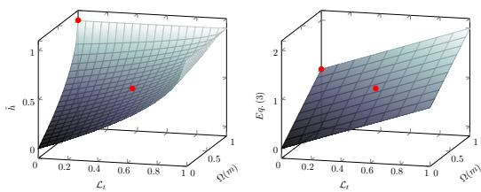
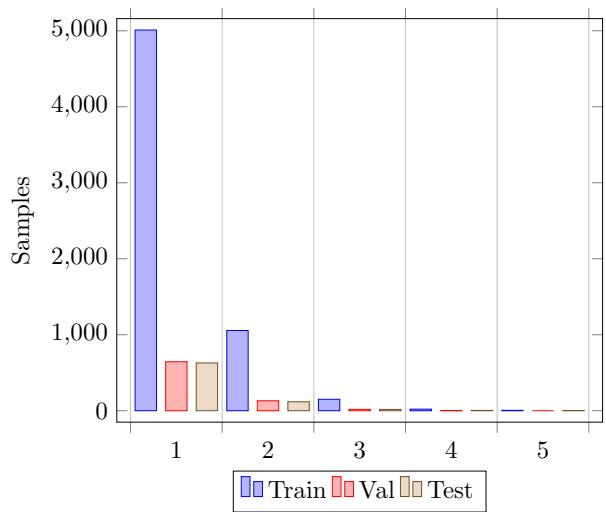

# Interlocking-free Selective Rationalization Through Genetic-based Learning

Federico Ruggeri and Gaetano Signorelli DISI, University of Bologna {federico.ruggeri6, gaetano.signorelli2}@unibo.it

## Abstract

A popular end-to-end architecture for selective rationalization is the select-then-predict pipeline, comprising a generator to extract highlights fed to a predictor. Such a cooperative system suffers from suboptimal equilibrium minima due to the dominance of one of the two modules, a phenomenon known as interlock ing. While several contributions aimed at addressing interlocking, they only mitigate its effect, often by introducing feature-based heuristics, sampling, and ad-hoc regularizations. We present GenSPP, the first interlocking-free architecture for selective rationalization that does not require any learning overhead, as the abovementioned. GenSPP avoids interlocking by performing disjoint training of the generator and predictor via genetic global search. Experiments on a synthetic and a real-world benchmark show that our model outperforms several state-of-the-art competitors.

## 1 Introduction

Selective rationalization is the process of learning by providing highlights (or rationales) as explanation, a type of explainable AI approach that has gained momentum in high-stakes scenarios (Wiegreffe and Marasovic, 2021), such as fact-checking and legal analytics. Highlights are a subset of input texts meant to be interpretable by a user and faithfully describe the inference process of a classification model (Herrewijnen et al., 2024). Among the several contributions, the select-then-predict (SPP) selective rationalization framework of Lei et al. (2016) has gained popularity due to its inherent property of defining a faithful self-explainable model. In SPP, a classification model comprises a generator and a predictor. The generator generates highlights from input texts, i.e., it selects a portion of input text tokens, which are fed to the predictor to address a task. To define interpretable highlights, the generator performs discrete selections of input tokens while regularization objectives control the quality of generated highlights.

This discretization process introduces an optimization issue between the generator and the predictor, hindering training stability and increasing the chances of falling into local minima, a phenomenon denoted as interlocking (Yu et al., 2021). To account for this issue, several contributions have been proposed to facilitate information flow between the generator and predictor and avoid overfitting on sub-optimal highlights. Notable examples include differentiable discretization via sampling (Bao et al., 2018; Bastings et al., 2019), weight sharing between generator and predictor (Liu et al., 2022), and external guidance via soft rationalization (Yu et al., 2021; Huang et al., 2021; Sha et al., 2023; Hu and Yu, 2024). However, these methods only mitigate interlocking by introducing ad-hoc regularization.

A few attempts have been proposed to eliminate interlocking. These solutions either rely on featurebased heuristics to pre-train the generator (Jain et al., 2020) or partially address interlocking by introducing multiple independent training stages (Li et al., 2022). However, these methods present several limitations, including the use of heuristics for guiding the generator, limited information flow between the generator and the predictor, and introduce additional optimization issues.

We propose Genetic-SPP (GenSPP), the first selective rationalization framework that eliminates interlocking without requiring heuristics and architectural changes. GenSPP breaks interlocking by splitting the optimization process into two stages, optimized via genetic-based search. First, a generator instance is defined independently of a given predictor. Second, a predictor is trained from scratch while keeping the defined generator frozen. By doing so, the generator instance is evaluated only via the training objective, without the need for additional regularizations to guide its learning to avoid interlocking. Genetic-based search allows for local and global exploration of the generator’s parameters, significantly reducing the risk of getting stuck into local minima. Furthermore, genetic-based search does not require differentiable learning objectives, allowing for a more accurate model evaluation accounting for both classification performance and highlight quality.

We evaluate GenSPP on two benchmarks: a controlled synthetic dataset that we introduce to assess selective rationalization frameworks and a popular real-world dataset on hate speech. Experimental results show that GenSPP achieves superior highlight quality while maintaining comparable classification performance.

To summarize, our contributions are:

• We introduce GenSPP, the first interlockingfree selective rationalization framework that does not require sub-optimal heuristics and additional regularizations.

• We design a robust evaluation objective to account for classification and rationalization capabilities equally.

• We build a novel controlled synthetic dataset to study selective rationalization frameworks.

• We carry out an extensive, robust, and reproducible experimental setting to compare Gen-SPP with several competitive selective rationalization frameworks.

We make our data and code available for research.1

## 2 Preliminaries

We overview two fundamental concepts to understand our method: (i) selective rationalization and (ii) genetic-based search.

## 2.1 Selective Rationalization

Selective rationalization denotes a self-explainable classification model capable of extracting discrete highlights from an input text. The typical architecture for selective rationalization is based on the select-then-predict (SPP) architecture (Lei et al., 2016). In SPP, the classification model is split into a generator (gθ) and a predictor $( f _ { \omega } )$ , where θ and ω are the parameter sets. Given an input text $x = \{ x ^ { 1 } , x ^ { 2 } , \ldots , x ^ { n } \}$ comprising n tokens and its corresponding ground-truth label y, the generator $g _ { \boldsymbol { \theta } }$ produces a binary mask $m = g _ { \theta } ( x ) =$ $\{ m ^ { 1 } , m ^ { 2 } , \ldots , m ^ { n } \}$ where $m ^ { i } \in \{ 0 , 1 \}$ . The mask m indicates which tokens of x are selected. We denote the mask generation process as rationalization. A masked input text x˜ is then defined by applying m on x as follows: $\tilde { x } = x \odot m$ . The masked text x˜ is fed to the predictor $f _ { \omega }$ for classification. Generally, the selective rationalization architecture is trained to minimize the classification empirical error on an annotated dataset, without providing supervision on generated $m$ . This setting is often denoted as unsupervised rationalization, which is formalized as follows:

$$
\mathcal { L } _ { t } = \operatorname* { m i n } _ { \theta , \omega } \frac { 1 } { | \mathcal { D } | } \sum _ { ( \boldsymbol { x } , \boldsymbol { y } ) \in \mathcal { D } } \mathcal { L } _ { c e } \big ( f _ { \omega } ( g _ { \theta } ( \boldsymbol { x } ) \odot \boldsymbol { x } ) , \boldsymbol { y } \big ) ,\tag{1}
$$

where $\mathcal { D }$ is a textual dataset annotated for classification and $\mathcal { L } _ { c e }$ is the classification loss.

Controlled Rationalization. A self-explainable model should produce meaningful highlights in addition to accurate predictions. Lei et al. (2016) introduced regularization objectives to prefer sparse and coherent highlights for better interpretability. Formally, the regularizer is denoted as follows:

$$
\Omega ( m ) = \lambda _ { s } \underbrace { \sum _ { i = 0 } ^ { n } m } _ { \mathcal { L } _ { s } } ^ { i } + \lambda _ { c } \underbrace { \sum _ { i = 1 } ^ { n } | m ^ { i } - m ^ { i - 1 } | } _ { \mathcal { L } _ { c } } ,\tag{2}
$$

where $\mathcal { L } _ { s }$ controls the level of sparsity (sparsity constraint), $\mathcal { L } _ { c }$ reduces highlights fragmentation (contiguity constraint), and $\lambda _ { s } , \lambda _ { c } \in \mathbb { R }$ are scalar coefficients that balance the regularization. Effectively, controlling the regularization effect of $\mathcal { L } _ { s }$ to not outweigh $\mathcal { L } _ { t }$ is non-trivial. To simplify the optimization process, Chang et al. (2020) relax the sparsity constraint to achieve a specific sparsity level: $\begin{array} { r } { \mathcal { L } _ { s } = | \alpha - \frac { 1 } { n } \sum _ { i = 0 } ^ { n } m ^ { i } | } \end{array}$ , where $\alpha \in [ 0 , 1 ]$ regulates the degree of sparsity. By including the regularizer, Eq. 1 can then be rewritten as follows:

$$
\mathcal { L } = \mathcal { L } _ { t } + \Omega ( m )\tag{3}
$$

Interlocking. Yu et al. (2021) showed that when performing unsupervised rationalization in an endto-end fashion, the selective rationalization architecture suffers from sub-optimal equilibrium minima. This occurs when either the generator $g _ { \theta }$ or the predictor $f _ { \omega }$ are in a sub-optimal state. If $g _ { \theta }$ is stuck on generating a sub-optimal $m , f _ { \omega }$ is finetuned on that $m ,$ further enforcing $g _ { \boldsymbol { \theta } }$ to maintain that selection. Similarly, if $f _ { \omega }$ is a remarkably bad predictor, it is further encouraged to exhibit lower classification error on a sub-optimal m compared to the ground-truth one $m ^ { * }$

## 2.2 Genetic Algorithms

Genetic Algorithms (GAs) constitute a class of search algorithms for finding optima in optimization problems. They are based on population-based search relying on the concept of survival of the fittest (Katoch et al., 2021a). Formally, a population  contains a set of I individuals, $\mathcal { P } =$ $\{ c _ { 1 } , c _ { 2 } , \ldots , c _ { I } \}$ , where each individual $c \in \mathbb { R } ^ { d }$ is a parameter vector representing a candidate solution to the problem of interest.

Initially, a population $\mathcal { P } _ { 0 }$ of I individuals is initialized randomly to cover the solution search space. The individuals are evaluated by a fitness function $\textit { h } : \mathbb { R } ^ { d } $ R that is the optimization objective of GAs. A portion of individuals is then selected based on their fitness scores with selection probability $p ^ { s l }$ . An intermediate population $\mathcal { \tilde { P } } _ { 0 }$ is built by generating individuals from selected ones, either by modifying a portion of individual parameters (mutation) or by mixing parameters between individual pairs (crossover). We denote $p ^ { m }$ and $p ^ { c }$ the mutation and crossover probabilities, respectively. The population for the next iteration $\mathcal { P } _ { i }$ is built by performing a second individual selection phase, denoted as survival selection, to keep the number of individuals equal to I across generations. We denote $p ^ { s u }$ the survival probability of each individual. The population-based search is iterated for G generations or stopped preemptively if a certain fitness score is reached.

Neuroevolution. GAs have been successfully applied to solve a wide variety of tasks (Alhijawi and Awajan, 2024), including agent exploration (Conti et al., 2018), image processing, scheduling, clustering, natural language processing (Katoch et al., 2021b), training large neural networks (Miikkulainen et al., 2019), and, in particular, neural network optimization, known as neuroevolution (Galván and Mooney, 2021). Neuroevolution denotes the process of (i) neural network architecture search and (ii) parameter optimization by employing genetic algorithms. In the second scenario, each individual c in a population $\mathcal { P }$ denotes the parameters of a neural network. In addition to having interesting properties, such as parallel computation and reduced likelihood of getting stuck into local minima, neuroevolution also shows correspondence with gradient descent, as proved by Whitelam et al. (2021).

## 3 Related Work

Lei et al. (2016) introduce Rationalizing Neural Predictions (RNP), the first SPP framework, whereby the generator and predictor components are trained via reinforcement learning (Williams, 1992). Several contributions have explored ways to improve RNP, including end-to-end optimizations, external guidance to mitigate spurious correlations, regularizations for faithful rationalization, and attempts to break interlocking.

Improved Optimization. Bao et al. (2018) propose an end-to-end architecture by leveraging the Gumbel softmax trick (Jang et al., 2017) for generating differentiable discrete masks $m .$ . Similarly, Bastings et al. (2019) adopt rectified Kumaraswamy distributions to replace sampling from Bernoulli distributions. Parameterized sampling provides a regularization effect to mitigate interlocking, but it requires additional calibration effort to find the best trade-off between sampling stability and exploration. In contrast, genetic-based search does not require sampling to define discrete selection masks and has superior optimization stability with respect to standard reinforcement learning algorithms (Salimans et al., 2017). Contributions have also explored solutions to ease the learning process. Liu et al. (2022) propose to share embedding weights between the generator and predictor to increase information flow between the two modules. Liu et al. (2023d) employ different learning rates for $g _ { \theta }$ and $f _ { \omega }$ to mitigate selection mask overfitting. Liu et al. (2023b) use multiple generators to improve rationalization exploration to reduce the chance of interlocking. While, in principle, some of these design choices, like weight sharing, may be included in our framework, they are not required as GenSPP avoids interlocking.

External Guidance. Another class of contributions leverages information from the input text to guide selective rationalization. Yu et al. (2021) define an attention-based predictor that performs soft selections to mitigate interlocking. Chang et al. (2019) propose a generator-discriminator adversarial training to learn class-wise highlights. Paranjape et al. (2020) propose a sparsity regularization objective based on information bottleneck to tradeoff performance accuracy and highlight coherence. Huang et al. (2021) define a guider module that acts as a teacher for $f _ { \omega }$ and propose an embeddingbased regularization between the embedded input x and the generated highlight x˜ to guide $g _ { \theta }$ . Yue et al. (2022) propose a mutual information regularization to exploit information from non-selected tokens by leveraging an additional predictor. Sha et al. (2023) introduce the InfoCal framework, where an additional predictor trained on the input text x provides guidance through a regularization objective based on the information bottleneck principle. Liu et al. (2023a) use an additional predictor trained on the original texts and fixed during rationalization to guide $f _ { \omega }$ . Hu and Yu (2024) employ an end-toend guidance module with information from the original input text to guide $f _ { \omega }$ while also providing importance scores for weighting tokens to guide $g _ { \theta }$ . Liu et al. (2024) propose an alternative to maximum mutual information, treating spurious features that correlate with class labels as noise. In contrast to all these approaches, GenSPP does not require the integration of additional neural modules and regularizations to guide $g _ { \theta }$ since genetic-based search alleviates selective rationalization from getting stuck into sub-optimal minima.

Breaking Interlocking. Few attempts have explored breaking interlocking. Jain et al. (2020) employ importance score features derived from posthoc explainable tools like LIME (Ribeiro et al., 2016) to first pre-train $g _ { \theta }$ . Subsequently, $f _ { \omega }$ is trained on the dataset produced in the previous stage. Compared to our work, the solution of Jain et al. (2020) has two limitations. First, it requires external feature extraction tools that act as heuristics for training $g _ { \boldsymbol { \theta } }$ in a supervised fashion. Second, information learned when training $f _ { \omega }$ does not flow to $g _ { \boldsymbol { \theta } }$ for improvement. In contrast, the generator $g _ { \theta }$ in GenSPP is trained via a heuristic fitness function that only involves learning objectives concerning classification performance and highlight quality ( Eq. 3). A recent contribution is the 3-stage framework of Li et al. (2022) for multi-aspect rationalization (Antognini et al., 2021; Antognini and Faltings, 2021). In the first stage, $g _ { \boldsymbol { \theta } }$ and $f _ { \omega }$ are first trained end-to-end, and then $g _ { \theta }$ is discarded. In the second stage, $f _ { \omega }$ is frozen, and a new generator is trained. Likewise, in the third stage, the trained new generator is frozen while $f _ { \omega }$ is fine-tuned. While this framework avoids interlocking by iteratively freezing g or $f _ { \omega } ,$ it presents two main limitations. First, it is not completely interlocking-free since interlocking may still occur in the first stage, leading to a sub-optimal $f _ { \omega }$ . Second, it does not offer good guarantees for reaching an optimal solution due to two independent training stages. In contrast, Gen-SPP is interlocking-free, characterized by stable convergence properties due to global search.

## 4 Motivation

We motivate our work by discussing how existing contributions only mitigate interlocking. The analysis of (Yu et al., 2021) underlines that the quality of the selective rationalization solution strongly depends on the system’s capability to avoid the interlocking effect, thus reducing the probability of incurring local minima during training. Interlocking affects the following optimization problem:

$$
\operatorname* { m i n } _ { \theta } \operatorname* { m i n } _ { \omega } \mathcal { L } ( f _ { \omega } ( g _ { \theta } ( x ) \odot x ) , y )\tag{4}
$$

A major cause of interlocking is the generation of a discrete binary mask m to define a faithful and interpretable model. The discretization of m induces a discrepancy in how $g _ { \boldsymbol { \theta } }$ and $f _ { \omega }$ learn during training. As pointed out by Yu et al. (2021), $f _ { \omega }$ tends to overfit to a certain sub-optimal mask $m ,$ causing the interlocking. More precisely, while the predictor’s parameters $\omega$ change smoothly at each gradient step thanks to the continuous nature of the learning objective, the generator $g _ { \boldsymbol { \theta } }$ contains a discrete function (i.e., rounding) that makes its policy a piecewise constant function with respect to its parameters θ. Even by applying smoothing techniques (e.g., sampling) to mitigate the issue and achieve differentiability, the generated binary mask m might remain unchanged (or change too slowly) over multiple gradient steps, thus, leading $f _ { \omega }$ to overfit on m.

To address this issue, contributions have proposed sampling-based methods to allow for differentiable discretization (Bao et al., 2018; Bastings et al., 2019), external guidance by introducing an additional soft rationalization system (Chang et al., 2019; Yu et al., 2021; Sha et al., 2023; Liu et al., 2023a; Hu and Yu, 2024), multi-stage training procedures (Liu et al., 2023b), and weight sharing between $g _ { \theta }$ and $f _ { \omega }$ for increased information flow (Liu et al., 2022). However, none of these methods solves interlocking, and the likelihood of rapidly falling into a local optimum is only mitigated at the cost of added optimization issues, such as increased variance.

Given the side effect caused by the unequal joint training of the two models via stochastic gradient descent (SGD), a logical and straightforward way to break the interlocking between $g _ { \theta }$ and $f _ { \omega }$ is to split the dual minimization problem of Eq. 4. Formally, let $\omega ^ { * }$ be the optimal predictor’s parameters, and let l be its optimal solution:

$$
l = \mathcal { L } ( f _ { \omega ^ { * } } ( x ) , y )\tag{5}
$$

Eq. 4 can be reformulated as a disjoint training by minimizing:

$$
\begin{array} { c } { \displaystyle \operatorname* { m i n } _ { \theta } \Omega ( m ) } \\ { s . t . \operatorname* { m i n } _ { \omega } \mathcal { L } \big ( f _ { \omega } ( g _ { \theta } ( x ) \odot x ) , y \big ) \leq l + \epsilon } \end{array}\tag{6}
$$

for a tolerance ϵ. This formulation is equivalent to finding the optimal highlight (according to the applied regularization), such that $f _ { \omega }$ achieves a comparable performance to a predictor trained on x, up to a certain level of approximation regulated by ϵ. Equivalently, $g _ { \theta }$ is trained to filter out uninformative information from input text x. Given the structure of Eq. 6, the disjoint optimization cannot be addressed via SGD and, therefore, we propose genetic algorithms to address the minimization problem.

## 5 The GenSPP Framework

We introduce GenSPP, a novel SPP framework optimized via genetic-based search. GenSPP presents several advantages over selective rationalization based on SGD. First, GenSPP is interlocking-free by splitting the optimization process into two stages (Eq. 6): each individual c embodies a different generator $g _ { \theta }$ , which is then evaluated through a unique predictor $f _ { \omega }$ . Second, GenSPP leverages geneticbased search, allowing for both local (via mutation) and global (via crossover) search in the θ parameter space to avoid local minima. Third, geneticbased search does not require a differentiable learning objective, allowing for more accurate training regularizations. We describe GenSPP and discuss its advantages over other selective rationalization frameworks in detail.

## 5.1 Method

GenSPP follows the same architecture of Lei et al. (2016) where hard rationalization is performed via rounding and is trained via neuroevolution. In particular, individual evaluation is a two-stage process.

Algorithm 1 GenSPP Algorithm   
Input: Population , fitness function h, selection   
probability $p ^ { s l }$ , crossover probability $p ^ { c }$ , mu  
tation probability $p ^ { m }$ , survival probability $p ^ { s u }$   
G generations, task threshold l.   
Output: Optimal individual $c ^ { * }$   
1: Initialize $\mathcal { P } _ { 0 } = \{ c _ { 1 } , . . . , c _ { I } \}$ of I individuals   
2: Initialize memory weights $p _ { | M | } = p _ { | M | } ^ { 0 }$   
3: for individual $c \in \mathcal { P } _ { 0 }$ do   
4: Train a predictor $f _ { \omega }$ to minimize $\mathcal { L } _ { t }$   
5: Evaluate c via fitness function h   
6: end for   
7: while current generation $g < G$ do   
8: Determine crossover pairs with selection   
probability $\begin{array} { r } { p _ { i } ^ { c } = \frac { h ( c _ { i } \bar { ) } } { \sum _ { j } ^ { I } h ( c _ { j } ) } } \end{array}$   
9: Generate $\frac { I } { 2 }$ new individuals via one-point   
crossover   
10: Perform mutation on newly generated indi  
viduals with mutation probability $p ^ { m }$   
11: for individual c in generated individuals do   
12: Train a predictor $f _ { \omega }$ to minimize $\mathcal { L } _ { t }$   
13: Evaluate c via fitness function h   
14: end for   
15: Perform survival selection to obtain $\mathcal { P } _ { g + 1 }$   
16: end while

First, a population  of individuals, each representing a configuration of the generator’s parameters, is defined. Second, each individual is evaluated via a fitness function h. In particular, a predictor is initialized from scratch for each individual c and trained to minimize the task classification loss via SGD while keeping the parameters of c frozen to avoid interlocking. We compute h on each trained model, and we build a new population by selecting individuals based on their fitness scores. The process is iterated until convergence or a fixed budget of generations G is reached. Algorithm 1 summarizes GenSPP algorithm.

## 5.2 Individual Evaluation

We identify two major issues in Eq. 3 for model evaluation. First, finding a balance between $\mathcal { L } _ { t }$ and $\Omega ( m )$ is non-trivial, potentially leading to suboptimal solutions that only minimize one of the two. Second, the joint learning formulation is not a reasonable candidate for optimization, collapsing substantially different solutions to the same cost value. Consider two instances of the learning problem, one with $\mathcal { L } _ { t } = 0 . 0$ and $\Omega ( m ) = 1 . 0$ , and another with $\mathcal { L } _ { t } = 0 . 5$ and $\Omega ( m ) = 0 . 5$ . Notably, both instances have the same average cost of 0.5, but the first does not satisfy our objective of defining a faithful rationalization framework. Fig. 1 compares the landscape of Eq. 7 to Eq. 3. Therefore, the two instances should be evaluated differently to favor solutions that are both accurate and interpretable.

  
Figure 1: Loss landscape comparison between our fitness function $\tilde { h }$ (left) and the regularized selective rationalization objective (Eq. 3). Red markers denote points (0.0, 1.0) and (0.5, 0.5), highlighting the difference between the two losses.

To allow for more robust individual evaluation, we propose the following objective function:

$$
\tilde { h } = \left\{ \begin{array} { l l } { 1 - \mathcal { L } , } & { \mathrm { i f } \ \mathcal { L } _ { t } < l + \epsilon } \\ { 0 , } & { \mathrm { o t h e r w i s e } } \end{array} \right.\tag{7}
$$

where $\mathcal { L } \ = \ \sqrt { ( 1 - \Omega ( m ) ) \times ( 1 - m i n ( \mathcal { L } _ { t } , 1 ) ) }$ To account for the maximization problem in genetic search, we define the fitness function h in GenSPP as follows:

$$
h = \frac { 1 } { \tilde { h } + \hat { \epsilon } } ,\tag{8}
$$

where ϵˆ is a small constant to ensure computational stability. Eq. 7 guides the learning process by initially favoring $\scriptstyle { \mathcal { L } } _ { t }$ and progressively shifting toward a state where $\mathcal { L } _ { t }$ is stable while $\Omega ( m )$ is optimized. We do not require weight balancing since learning objectives are normalized and equally important.

## 5.3 GenSPP Genetic Algorithm

We describe the genetic algorithm for training Gen-SPP. Given a population $\mathcal { P } _ { 0 }$ of I individuals, each representing a different generator instance, we perform individual selection and recombination as follows. We initially evaluate $\mathcal { P } _ { 0 }$ by computing the fitness score of each individual in the population. We apply the roulette-wheel selection strategy, a stochastic process where individuals are sampled proportionally to their fitness score (Lipowski and Lipowska, 2012), to pair individuals for recombination. In total, $\frac { I } { 2 }$ pairs are selected. We employ one-point crossover (Poli and Langdon, 1998)

to generate I new individuals from selected pairs. This crossover strategy swaps parameters between two individuals by randomly choosing a swap point from a uniform distribution. We then mutate each generated individual parameter with probability $p ^ { m }$ by inserting Gaussian noise. The intermediate population $\mathcal { \tilde { P } } _ { 0 }$ comprises the original I individuals and the I newly generated ones. To build the population $\mathcal { P } _ { 1 }$ of I individuals for the next generation, we evaluate the fitness score of $\mathcal { \tilde { P } } _ { 0 }$ and then perform survival selection via the half-elitism strategy (Michalewicz, 1996). In particular, we select the $\frac { I } { 2 }$ with the highest fitness score, while the remaining $\frac { I } { 2 }$ is sampled via roulette-wheel selection.

## 5.4 Advantages

Optimizing Eq. 6 via GAs introduces several advantages over selective rationalization based on SGD, which we discuss in detail.

Disjoint Training. A joint training of the selective rationalization system based on SGD involves a dependency between $g _ { \theta }$ and $f _ { \omega } { : }$ the quality of a highlight mask m is also dependent on the quality of the current employed $f _ { \omega }$ (e.g., good masks may be evaluated badly if $f _ { \omega }$ has already overfitted to a previously generated mask). In contrast, the proposed disjoint training allows the optimization of g by searching in the space of parameters that minimize Ω, while yielding the highest performance in classification. More precisely, the $f _ { \omega }$ depends on $g _ { \boldsymbol { \theta } } .$ , while the opposite does not hold.

Global Search. Population-based search in GAs reduces the chances of converging towards local minima, a common issue in optimization independently from interlocking. Mutation and crossover offer two ways to perform local and global search space, respectively, alleviating the risk of getting stuck into a local optimum.

Non-differentiable Objective. Differentiable sampling (e.g., via Gumbel softmax (Jang et al., 2017)) introduces noise, potentially making the optimization process of $g _ { \theta }$ unstable depending on the chosen sampling hyper-parameters. In contrast, genetic-based search does not require gradient computation for optimization, ensuring a more robust training procedure. Additionally, the optimization objective of GenSPP (Eq. 8) can be designed without defining surrogate losses (Eq. 7). This is a crucial advantage of GenSPP since it is not subject to dataset-specific hyperparameter-tuning (e.g., α in $\mathcal { L } _ { s } )$ . In contrast, SGD-based approaches require heavy fine-tuning to find a reasonable α value.

## 6 Experimental Settings

We compare GenSPP to several competitors for unsupervised selective rationalization2 on two benchmarks. We describe the data, models, and evaluation metrics in detail. See Appendix A for additional details.

Toy Dataset. We build and release a controlled toy dataset of random strings. We define three classification classes, each corresponding to a unique character-based highlight: aba, baa, abc. We design highlights to ensure that all their characters have to be selected in order to determine the corresponding class. To avoid degenerate solutions in which only a portion of the highlight is sufficient for classification, we contaminate generated strings with randomly sampled chunks of other class highlights. Lastly, we enforce that a single highlight is contained in each string. Generated strings not compliant with the aforementioned rules are discarded. We set the generated string length to 20 characters. In total, we generate 10k random strings and split them into train (6.4k), validation (1.6k), and test (2k) partitions.

HateXplain Dataset. A dataset of 20k English posts from social media platforms like X and Gab (Mathew et al., 2021). Each post is annotated from three different perspectives: hate speech (hate, offensive, normal), the target community victim of hate speech, and the rationales which the labeling decision about hate speech is based on. To account for annotation subjectivity, each post is annotated by at least three annotators (Waseem, 2016; Sap et al., 2022). We notice that annotations vary significantly among annotators regarding the number of selected tokens. This might hinder rationalization evaluation since longer highlights might be preferred. For this reason, we employ a majority voting strategy to merge annotators’ highlights and identify top relevance tokens. As a side effect, extracted ground-truth highlights are less cohesive. We filter out texts longer than 30 tokens to reduce the computational overhead. The dataset is split into train ( 10k), validation ( 1.3k), and test ( 1.3k) partitions. We consider hate speech as a binary classification problem by merging hate and offensive classes.

Models. We consider the architecture of Yu et al. (2021) for all models, including ours, described as follows. An input text x is encoded via a frozen pretrained embedding layer. We use one-hot encoding for Toy and 25-dimension GloVe embeddings (Pennington et al., 2014) pre-trained on Twitter for HateXplain. The generator g comprises a RNN layer with a dense layer on top for token selection. The predictor $f _ { \omega }$ comprises a RNN layer followed by a max-pooling layer and a final linear layer for classification. We set the RNN layer to a biGRU for baselines and GRU for GenSPP, respectively. We consider the following baselines. FR (Liu et al., 2022), an end-to-end SPP framework using Gumbel softmax for discrete mask generation, where g and $f _ { \omega }$ share the same RNN layers. MGR (Liu et al., 2023b), an SPP framework where multiple generators are considered to extract distinct highlights that are fed to a single predictor. At inference time, only the first generator is considered since all generators eventually align on the same mask m. MCD (Liu et al., 2023c), a guidance-based SPP framework, where an additional predictor trained using the original input text x is used to guide selective rationalization towards better highlights. G-RAT (Hu and Yu, 2024), a recent guidance-based SPP framework, where an attention-based soft SPP framework is used as guidance.

Evaluation Metrics. We focus on classification performance and rationalization quality (Chang et al., 2019; Yu et al., 2021). Regarding classification performance, we report macro F1-score averaged over all classes (Clf-F1). Regarding generated highlights, we report binary token-level F1- score (Hl-F1), selection ratio (R), and selection size (S).

## 7 Results

We consider two sets of experiments. The first evaluates models when trained from scratch to assess their capability to avoid local minima. The second measures how good a method is at recovering from interlocking. See Appendix B for additional results.

Benchmark Evaluation. Table 1 reports results. We observe that GenSPP significantly outperforms all competitors in selecting high-quality highlights (+10.3% Hl-F1 in Toy and +6.5% Hl-F1 in HateXplain), while reporting comparable classification performance. Additionally, GenSPP shows reduced variance across seed runs compared to competitors, especially in the Toy dataset, where MGR and G-RAT present notable instability. Regarding highlight regularization, GenSPP selects highlights that are more sparse and accurate compared to baseline models. Interestingly, GenSPP learns to not select any highlight for negative examples in HateXplain, while keeping valuable selections for positive examples, a flexibility that baseline models cannot achieve since they are subject to satisfy a certain sparsity threshold. Overall, these results show the advantage of GenSPP in performing a disjoint optimization problem via genetic-based search to break interlocking.

<table><tr><td rowspan="2">Model</td><td colspan="4">Toy</td><td colspan="4">HateXplain</td></tr><tr><td>Clf-F1↑</td><td> $_ \mathrm { H l - F 1 } \uparrow$ </td><td> $R \downarrow$ </td><td> $S \downarrow$ </td><td>Clf-F1 ↑</td><td>Hl-F1 ↑</td><td>R↓</td><td> $S \downarrow$ </td></tr><tr><td>FR</td><td> $9 9 . 7 8 { \scriptstyle \pm 0 . 2 0 }$ </td><td> $5 4 . 0 7 { \scriptstyle \pm 4 . 0 2 }$ </td><td> $1 4 . 8 0 { \scriptstyle \pm 0 . 2 4 }$ </td><td> $2 . 9 6 _ { \pm 0 . 0 5 }$ </td><td> $7 2 . 1 4 { \scriptstyle \pm 1 . 1 2 }$ </td><td> $3 1 . 1 5 { \scriptstyle \pm 2 . 5 6 }$ </td><td> $2 5 . 5 5 { \scriptstyle \pm 0 . 7 2 }$ </td><td> $3 . 4 6 _ { \pm 0 . 1 1 }$ </td></tr><tr><td>MGR</td><td> $\mathbf { 9 9 . 9 2 _ { \pm 0 . 0 4 } }$ </td><td> $5 0 . 3 4 _ { \pm 1 1 . 2 3 }$ </td><td> $1 5 . 0 5 { \scriptstyle \pm 0 . 8 0 }$ </td><td> $3 . 0 1 _ { \pm 0 . 1 6 }$ </td><td> $7 1 . 1 4 _ { \pm 1 . 1 6 }$ </td><td> $2 9 . 3 8 _ { \pm 4 . 8 3 }$ </td><td> $2 5 . 3 0 { \scriptstyle \pm 1 . 0 4 }$ </td><td> $3 . 4 2 _ { \pm 0 . 0 6 }$ </td></tr><tr><td>MCD</td><td> $9 9 . 9 0 { \scriptstyle \pm 0 . 0 4 }$ </td><td> $6 5 . 7 0 { \scriptstyle \pm 3 . 7 6 }$ </td><td> $1 5 . 1 8 { \scriptstyle \pm 0 . 1 7 }$ </td><td> $3 . 0 4 _ { \pm 0 . 0 3 }$ </td><td> $7 0 . 3 7 { \scriptstyle \pm 1 . 0 6 }$ </td><td> $2 7 . 9 2 { \scriptstyle \pm 1 . 6 6 }$ </td><td> $2 5 . 0 7 { \scriptstyle \pm 1 . 5 2 }$ </td><td> $3 . 5 0 { \scriptstyle \pm 0 . 2 0 }$ </td></tr><tr><td>G-RAT</td><td> $9 9 . 3 6 _ { \pm 0 . 8 2 }$ </td><td> $5 0 . 2 2 { \scriptstyle \pm 7 . 7 8 }$ </td><td> $1 4 . 8 1 _ { \pm 0 . 5 1 }$ </td><td> $2 . 9 6 _ { \pm 0 . 1 0 }$ </td><td> $\mathbf { 7 3 . 8 5 { \scriptstyle \pm 1 . 0 5 } }$ </td><td> $3 6 . 1 7 _ { \pm 1 . 6 2 }$ </td><td> $2 4 . 6 8 _ { \pm 0 . 8 6 }$ </td><td> $3 . 3 4 _ { \pm 0 . 0 8 }$ </td></tr><tr><td>GenSPP (Ours)</td><td> $9 9 . 0 0 { \scriptstyle \pm 0 . 2 5 }$ </td><td> $\mathbf { \overline { { \mathbf { \sigma } } } } ^ { \ast \ast } 7 \mathbf { 6 . 0 2 } _ { \pm 0 . 6 4 }$ </td><td> $\mathbf { 1 1 . 4 7 { \scriptstyle \pm 0 . 4 9 } }$ </td><td> $\mathbf { 2 . 2 9 _ { \pm 0 . 0 8 } }$ </td><td> $6 9 . 7 1 { \scriptstyle \pm 0 . 4 0 }$ </td><td> $\mathbf { \lambda ^ { * } } \mathbf { 4 2 . 6 2 } _ { \pm 0 . 7 3 } ^ { - }$ </td><td> ${ \bf 6 . 5 1 { \scriptstyle \pm 0 . 5 8 } }$ </td><td> $\mathbf { 0 . 7 5 { \scriptstyle \pm 0 . 0 5 } }$ </td></tr></table>

Table 1: Benchmark evaluation test results. We report average macro F1-score (Clf-F1) for classification, while we report binary token-level F1-score (Hl-F1), selection rate (R) and size (S) for rationalization. Best results are highlighted in bold.  
(∗∗) ≤ 0.01 denotes Wilcoxon statistical significance on the best baseline.

<table><tr><td rowspan="2">Model</td><td colspan="4">Toy</td><td colspan="4">HateXplain</td></tr><tr><td>Clf-F1 ↑</td><td> $_ \mathrm { H l - F 1 } \uparrow$ </td><td> $R \downarrow$ </td><td> $S \downarrow$ </td><td>Clf-F1 ↑</td><td>Hl-F1 ↑</td><td> $R \downarrow$ </td><td> $S \downarrow$ </td></tr><tr><td>FR</td><td> $9 9 . 8 5 { \scriptstyle \pm 0 . 1 1 }$ </td><td> $5 8 . 9 1 _ { \pm 3 . 1 8 }$ </td><td> $1 4 . 5 7 { \scriptstyle \pm 0 . 1 2 }$ </td><td> $2 . 9 1 _ { \pm 0 . 0 2 }$ </td><td> $7 1 . 0 0 { \scriptstyle \pm 0 . 7 6 }$ </td><td> $7 . 2 2 { \scriptstyle \pm 2 . 2 9 }$ </td><td> $2 6 . 8 5 { \scriptstyle \pm 0 . 9 2 }$ </td><td> $3 . 4 7 _ { \pm 0 . 0 8 }$ </td></tr><tr><td>MGR</td><td> $9 7 . 7 5 { \scriptstyle \pm 4 . 2 5 }$ </td><td> $3 7 . 4 5 _ { \pm 1 2 . 3 3 }$ </td><td> $1 4 . 9 9 _ { \pm 0 . 4 2 }$ </td><td> $3 . 0 0 _ { \pm 0 . 0 8 }$ </td><td> $7 1 . 0 9 _ { \pm 1 . 0 0 }$ </td><td> $1 4 . 4 5 _ { \pm 4 . 8 4 }$ </td><td> $2 7 . 7 5 { \scriptstyle \pm 1 . 3 6 }$ </td><td> $3 . 5 7 _ { \pm 0 . 1 1 }$ </td></tr><tr><td>MCD</td><td> $\mathbf { 9 9 . 9 3 { \scriptstyle \pm 0 . 0 6 } }$ </td><td> $6 2 . 9 4 { \scriptstyle \pm 2 . 3 9 }$ </td><td> $1 5 . 1 0 { \scriptstyle \pm 0 . 6 6 }$ </td><td> $3 . 0 2 _ { \pm 0 . 1 3 }$ </td><td> $7 0 . 9 3 { \scriptstyle \pm 0 . 9 5 }$ </td><td> $1 3 . 8 8 { \scriptstyle \pm 1 0 . 1 3 }$ </td><td> $2 5 . 8 4 _ { \pm 1 . 8 7 }$ </td><td> $3 . 4 6 _ { \pm 0 . 1 6 }$ </td></tr><tr><td>G-RAT</td><td> $9 9 . 8 5 { \scriptstyle \pm 0 . 1 4 }$ </td><td> $4 7 . 5 3 { \scriptstyle \pm 1 2 . 7 7 }$ </td><td> $1 4 . 5 6 { \scriptstyle \pm 0 . 3 6 }$ </td><td> $2 . 9 1 _ { \pm 0 . 0 7 }$ </td><td> $\mathbf { 7 3 . 1 5 { \scriptstyle \pm 0 . 3 5 } }$ </td><td> $3 4 . 3 3 { \scriptstyle \pm 1 . 2 2 }$ </td><td> $2 5 . 4 3 { \scriptstyle \pm 0 . 8 7 }$ </td><td> $3 . 4 0 { \scriptstyle \pm 0 . 0 9 }$ </td></tr><tr><td>GenSPP  $( G = 1 0 0 )$ </td><td> $9 8 . 9 3 { \scriptstyle \pm 0 . 4 7 }$ </td><td> $7 0 . 5 2 { \scriptstyle \pm 0 . 1 5 }$ </td><td> $1 3 . 0 4 { \scriptstyle \pm 0 . 1 2 }$ </td><td> $2 . 6 0 { \scriptstyle \pm 0 . 0 2 }$ </td><td> $6 7 . 0 2 { \scriptstyle \pm 0 . 5 7 }$ </td><td> $3 9 . 8 9 { \scriptstyle \pm 0 . 7 3 }$ </td><td> $7 . 4 5 { \scriptstyle \pm 0 . 4 8 }$ </td><td> $0 . 9 6 { \scriptstyle \pm 0 . 0 5 }$ </td></tr><tr><td>GenSPP  $( G = 1 5 0 )$ </td><td> $9 9 . 4 6 { \scriptstyle \pm 0 . 3 6 }$ </td><td> $\mathbf { \overline { { \mathbf { \sigma } } } } \mathbf { * } \mathbf { \sigma } _ { 7 4 . 2 8 \pm 0 . 6 1 }$ </td><td> $1 0 . 1 1 { \scriptstyle \pm 0 . 4 2 }$ </td><td> $1 . 9 9 2 0 . 0 4$ </td><td> $6 9 . 8 9 { \scriptstyle \pm 0 . 4 3 }$ </td><td> $\mathbf { \bar { \mathbf { \Sigma } } } ^ { * * } 4 \mathbf { 2 } . 8 \mathbf { 1 } _ { \pm 0 . 6 5 }$ </td><td> ${ \bf 6 . 7 4 { \scriptstyle \pm 0 . 6 7 } }$ </td><td> $\mathbf { 0 . 8 7 _ { \pm 0 . 0 7 } }$ </td></tr><tr><td> ${ \mathrm { G e n S P P } } _ { s k } \left( G = 1 0 0 \right)$ </td><td> $9 8 . 7 4 _ { \pm 0 . 4 3 }$ </td><td> $6 3 . 4 5 { \scriptstyle \pm 0 . 3 6 }$ </td><td> $\mathbf { 8 . 0 3 _ { \pm 0 . 4 0 } }$ </td><td> $\mathbf { 1 . 5 8 _ { \pm 0 . 0 6 } }$ </td><td> $6 6 . 4 1 _ { \pm 0 . 3 5 }$ </td><td> $3 5 . 5 2 _ { \pm 0 . 4 6 }$ </td><td> $8 . 1 7 _ { \pm 0 . 6 2 }$ </td><td> $1 . 0 6 _ { \pm 0 . 0 7 }$ </td></tr></table>

Table 2: Synthetic skew test set results. We report average macro F1-score (Clf-F1) for classification, while we report binary token-level F1-score (Hl-F1) and selection rate (R) and size (S) for rationalization. Best results are highlighted in bold.  
$( ^ { \ast \ast } ) \leq \overline { { 0 } } . 0 1$ denotes Wilcoxon statistical significance on the best baseline.

$\operatorname { S P P } _ { s k }$ . Table 2 reports results conducted on both datasets. We observe that G-RAT and MCD are the best-performing baselines on HateXplain and Toy datasets, respectively. In general, baseline models suffer from high variance, showing that these methods are not able to break the interlocking state in many seed runs. In contrast, GenSPP recovers from the degenerated state and outperforms baseline models, achieving comparable performance to the one reported in Table 1. In particular, performing a parameter search with an increased budget $( \mathbf { e . g . } , G = 1 5 0 )$ leads to the best results.

## 8 Discussion

Synthetic Skewing. We follow Liu et al. (2022) and train a skewed $g _ { \theta }$ for $K = 1 0$ epochs using the classification label as supervision for selecting the first token $x ^ { 1 }$ . To evaluate GenSPP on this experiment, we include one skewed individual in the initial population ${ \mathcal { P } } _ { 0 } ,$ , while randomly initializing the remaining individuals. We experiment with G  [100, 150] since convergence may require more time due to recombinations with the skewed individual in the earlier generations. Additionally, to stress test GenSPP, we consider a more degenerated setting where we initialize $\mathcal { P } _ { 0 }$ with variants of the skew individual by adding Gaussian noise. We denote this configuration as Gen-

Computational Comparison. Breaking interlocking in GenSPP comes with some limitations. Intuitively, genetic-based search requires more computational time than solutions based on SGD since I predictors are trained at each generation. On average, a seed run of GenSPP takes 36min in Toy and 78min in HateXplain. In contrast, a seed run for baseline models requires 8min and 4min, respectively. Nonetheless, we remark on two aspects regarding our implementation: (i) individuals are evaluated sequentially, and (ii) we make use of standard genetic operations for individual evaluation and selection. More efficient implementations (e.g., allowing parallel computation of individuals) and advanced algorithms, such as the CMA-ES (Hansen and Ostermeier, 2001), can significantly reduce convergence time. We leave these improvements as future work. This drawback is mitigated by two main properties of GenSPP. First, GenSPP has low variance, avoiding, in principle, multiple seed runs for evaluation. Second, global search via crossover allows for employing lighter and yet more efficient models. Compared to competitors, GenSPP has the same size as the smallest model (i.e., FR), which is 2-4x smaller than other baselines.

Genetic Search. Genetic search can be more time-consuming than other approaches like gradient-based methods. Since scalability issues are attributable to model complexity (number of parameters) rather than dataset size, they can be mitigated via parallel and efficient implementations (Cantú-Paz and Goldberg, 2000). Model complexity is correlated with task complexity and is often addressed by increasing model parameterization. Genetic-based search can help reduce overparameterization. Indeed, we shot that GenSPP outperforms competitors despite having a smaller number of parameters, independently of the size of the dataset. Regarding text length (i.e., the number of tokens), token-level rationalization has O(n) time complexity (i.e., time scales linearly with tokens). However, we point out that selective rationalization for longer sequences is often accomplished at the sentence level to reduce task complexity (Antognini et al., 2021; Hu et al., 2022).

Rationale Evaluation. In comparing models, sparsity and performance are equally important (Lei et al., 2016). In particular, there is a preference for sparser models inspired by studies on human cognition (Hoefler et al., 2021). The novelty of GenSPP over gradient-based methods is that it does not require a specific sparsity threshold. In contrast, these methods present such a limitation to avoid unstable training regimes (Chang et al., 2020). Like gradient-based methods, GenSPP can be optimized for a certain sparsity threshold (see Tables 6 and 7). Additionally, GenSPP can be optimized for sparser solutions while maintaining high accuracy without additional constraints.

## 9 Conclusions

We have introduced GenSPP, the first selective rationalization framework that breaks interlocking via genetic-based search. GenSPP does not require differentiable surrogate learning objectives, additional regularization tuning, and architectural changes. Our results on two benchmarks, a controlled synthetic one that we curate, and a realworld dataset for hate speech, show the advantage of GenSPP, outperforming several competitors. Furthermore, our robust evaluation underlines the increased variance that affects competitors’ models, a phenomenon that was not sufficiently explored in selective rationalization. Future research directions regard exploring more efficient genetic algorithms and implementations to reduce computational overhead and scale to more complex neural architectures.

## Limitations

Data. This study is based on two datasets, one of which is synthetic. Some widely adopted datasets like Hotel Reviews (Wang et al., 2010) and Beer Reviews (McAuley et al., 2012) could be considered. However, after a curated analysis, we excluded these datasets due to (i) data leakage between train, development and test splits; (ii) limited test set size (200-800 samples) which limits a robust and extensive evaluation of models; and (iii) single human annotations despite rationale selection being inherently subjective in these tasks. Despite our efforts, we could not find other high-quality datasets for text classification with a relatively sufficient number of samples and multiple annotations for robust evaluation. A broader analysis of GenSPP on several datasets, including tasks other than text classification as in the ERASER benchmark (DeYoung et al., 2020), could strengthen our contribution.

Models. All models follow a specific architecture, which is not the only possible one. Our study could include other backbone architectures for a more exhaustive evaluation of selective rationalization frameworks. However, while some existing contributions have explored more complex architectures like transformers (Hu and Yu, 2024), their effectiveness is still a matter of debate due to their sensitivity to interlocking (Liu et al., 2023b, 2024).

Algorithm Implementation. Our GenSPP implementation does not leverage several optimizations available for genetic algorithms like parallel evaluation of individuals and distributed computing (Cantú-Paz and Goldberg, 2000). Consequently, we observed a notable computational overhead compared to gradient-based baselines. More efficient implementations could be considered to reduce the overhead.

Task Complexity. The datasets used in this paper presented selective rationalization tasks where the number of tokens that could be selected is relatively small (up to 30 tokens). More complex settings could be considered to further corroborate the advantages of genetic search for selective rationalization. However, we remark that the aim of our work is to propose a sound methodology to solve interlocking, and not to account for the limitations of genetic algorithms in large scale problems, which deserve a separate study.

## Acknowledgments

F. Ruggeri is partially supported by the project European Commission’s NextGeneration EU programme, PNRR – M4C2 – Investimento 1.3, Partenariato Esteso, PE00000013 - “FAIR - Future Artificial Intelligence Research” – Spoke 8 “Pervasive AI” and by the European Union’s Justice Programme under Grant Agreement No. 101087342 for the project “Principles Of Law In National and European VAT”.

## References

Bushra Alhijawi and Arafat Awajan. 2024. Genetic algorithms: theory, genetic operators, solutions, and applications. Evol. Intell., 17(3):1245–1256.

Diego Antognini and Boi Faltings. 2021. Rationalization through concepts. In Findings of the Association for Computational Linguistics: ACL/IJCNLP 2021, Online Event, August 1-6, 2021, volume ACL/IJCNLP 2021 of Findings of ACL, pages 761– 775. Association for Computational Linguistics.

Diego Antognini, Claudiu Musat, and Boi Faltings. 2021. Multi-dimensional explanation of target variables from documents. In Thirty-Fifth AAAI Conference on Artificial Intelligence, AAAI 2021, Thirty-Third Conference on Innovative Applications of Artificial Intelligence, IAAI 2021, The Eleventh Symposium on Educational Advances in Artificial Intelligence, EAAI 2021, Virtual Event, February 2-9, 2021, pages 12507–12515. AAAI Press.

Lei Jimmy Ba, Jamie Ryan Kiros, and Geoffrey E. Hinton. 2016. Layer normalization. CoRR, abs/1607.06450.

Yujia Bao, Shiyu Chang, Mo Yu, and Regina Barzilay. 2018. Deriving machine attention from human rationales. In Proceedings ofthe 2018 Conference on Empirical Methods in Natural Language Processing, pages 1903–1913, Brussels, Belgium. Association for Computational Linguistics.

Jasmijn Bastings, Wilker Aziz, and Ivan Titov. 2019. Interpretable neural predictions with differentiable

binary variables. In Proceedings ofthe 57th Annual Meeting of the Association for Computational Linguistics, pages 2963–2977, Florence, Italy. Association for Computational Linguistics.

Erick Cantú-Paz and David E. Goldberg. 2000. Efficient parallel genetic algorithms: theory and practice. Computer Methods in Applied Mechanics and Engineering, 186(2):221–238.

Shiyu Chang, Yang Zhang, Mo Yu, and Tommi S. Jaakkola. 2019. A game theoretic approach to classwise selective rationalization. In Advances in Neural Information Processing Systems 32: Annual Conference on Neural Information Processing Systems 2019, NeurIPS 2019, December 8-14, 2019, Vancouver, BC, Canada, pages 10055–10065.

Shiyu Chang, Yang Zhang, Mo Yu, and Tommi S. Jaakkola. 2020. Invariant rationalization. In Proceedings of the 37th International Conference on Machine Learning, ICML 2020, 13-18 July 2020, Virtual Event, volume 119 of Proceedings of Machine Learning Research, pages 1448–1458. PMLR.

Edoardo Conti, Vashisht Madhavan, Felipe Petroski Such, Joel Lehman, Kenneth O. Stanley, and Jeff Clune. 2018. Improving exploration in evolution strategies for deep reinforcement learning via a population of novelty-seeking agents. In Advances in Neural Information Processing Systems 31: Annual Conference on Neural Information Processing Systems 2018, NeurIPS 2018, December 3-8, 2018, Montréal, Canada, pages 5032–5043.

Jay DeYoung, Sarthak Jain, Nazneen Fatema Rajani, Eric Lehman, Caiming Xiong, Richard Socher, and Byron C. Wallace. 2020. ERASER: A benchmark to evaluate rationalized NLP models. In Proceedings of the 58th Annual Meeting of the Association for Computational Linguistics, pages 4443–4458, Online. Association for Computational Linguistics.

William Falcon and The PyTorch Lightning team. 2019. PyTorch Lightning.

Edgar Galván and Peter Mooney. 2021. Neuroevolution in deep neural networks: Current trends and future challenges. IEEE Trans. Artif. Intell., 2(6):476–493.

Nikolaus Hansen and Andreas Ostermeier. 2001. Completely derandomized self-adaptation in evolution strategies. Evolutionary Computation.

Elize Herrewijnen, Dong Nguyen, Floris Bex, and Kees van Deemter. 2024. Human-annotated rationales and explainable text classification: a survey. Frontiers Artif. Intell., 7.

Torsten Hoefler, Dan Alistarh, Tal Ben-Nun, Nikoli Dryden, and Alexandra Peste. 2021. Sparsity in deep learning: Pruning and growth for efficient inference and training in neural networks. Journal ofMachine Learning Research, 22(241):1–124.

Shuaibo Hu and Kui Yu. 2024. Learning robust rationales for model explainability: A guidance-based approach. In Thirty-Eighth AAAI Conference on Artificial Intelligence, AAAI 2024, Thirty-Sixth Conference on Innovative Applications ofArtificial Intelligence, IAAI 2024, Fourteenth Symposium on Educational Advances in Artificial Intelligence, EAAI 2014, February 20-27, 2024, Vancouver, Canada, pages 18243–18251. AAAI Press.

Xuming Hu, Zhijiang Guo, GuanYu Wu, Aiwei Liu, Lijie Wen, and Philip Yu. 2022. CHEF: A pilot Chinese dataset for evidence-based fact-checking. In Proceedings of the 2022 Conference of the North American Chapter of the Association for Computational Linguistics: Human Language Technologies, pages 3362–3376, Seattle, United States. Association for Computational Linguistics.

Yongfeng Huang, Yujun Chen, Yulun Du, and Zhilin Yang. 2021. Distribution matching for rationalization. In Thirty-Fifth AAAI Conference on Artificial Intelligence, AAAI 2021, Thirty-Third Conference on Innovative Applications ofArtificial Intelligence, IAAI 2021, The Eleventh Symposium on Educational Advances in Artificial Intelligence, EAAI 2021, Virtual Event, February 2-9, 2021, pages 13090–13097. AAAI Press.

Sarthak Jain, Sarah Wiegreffe, Yuval Pinter, and Byron C. Wallace. 2020. Learning to faithfully rationalize by construction. In Proceedings of the 58th Annual Meeting of the Association for Computational Linguistics, pages 4459–4473, Online. Association for Computational Linguistics.

Eric Jang, Shixiang Gu, and Ben Poole. 2017. Categorical reparameterization with gumbel-softmax. In ICLR.

Sourabh Katoch, Sumit Singh Chauhan, and Vijay Kumar. 2021a. A review on genetic algorithm: past, present, and future. Multim. Tools Appl., 80(5):8091– 8126.

Sourabh Katoch, Sumit Singh Chauhan, and Vijay Kumar. 2021b. A review on genetic algorithm: past, present, and future. Multim. Tools Appl., 80(5):8091– 8126.

Diederik P. Kingma and Jimmy Ba. 2015. Adam: A method for stochastic optimization. In 3rd International Conference on Learning Representations, ICLR 2015, San Diego, CA, USA, May 7-9, 2015, Conference Track Proceedings.

Tao Lei, Regina Barzilay, and Tommi Jaakkola. 2016. Rationalizing neural predictions. In Proceedings of the 2016 Conference on Empirical Methods in Natural Language Processing, pages 107–117, Austin, Texas. Association for Computational Linguistics.

Shuangqi Li, Diego Antognini, and Boi Faltings. 2022. Interlock-free multi-aspect rationalization for text classification. CoRR, abs/2205.06756.

Adam Lipowski and Dorota Lipowska. 2012. Roulettewheel selection via stochastic acceptance. Physica A: Statistical Mechanics and its Applications, 391(6):2193–2196.

Wei Liu, Zhiying Deng, Zhongyu Niu, Jun Wang, Haozhao Wang, YuanKai Zhang, and Ruixuan Li. 2024. Is the mmi criterion necessary for interpretability? degenerating non-causal features to plain noise for self-rationalization. In Advances in Neural Information Processing Systems, volume 37, pages 117636–117656. Curran Associates, Inc.

Wei Liu, Haozhao Wang, Jun Wang, Zhiying Deng, Yuankai Zhang, Cheng Wang, and Ruixuan Li. 2023a. Enhancing the rationale-input alignment for selfexplaining rationalization. CoRR, abs/2312.04103.

Wei Liu, Haozhao Wang, Jun Wang, Ruixuan Li, Xinyang Li, Yuankai Zhang, and Yang Qiu. 2023b. MGR: multi-generator based rationalization. In Proceedings of the 61st Annual Meeting of the Association for Computational Linguistics (Volume 1: Long Papers), ACL 2023, Toronto, Canada, July 9-14, 2023, pages 12771–12787. Association for Computational Linguistics.

Wei Liu, Haozhao Wang, Jun Wang, Ruixuan Li, Chao Yue, and Yuankai Zhang. 2022. FR: folded rationalization with a unified encoder. In Advances in Neural Information Processing Systems 35: Annual Conference on Neural Information Processing Systems 2022, NeurIPS 2022, New Orleans, LA, USA, November 28 - December 9, 2022.

Wei Liu, Jun Wang, Haozhao Wang, Ruixuan Li, Zhiying Deng, Yuankai Zhang, and Yang Qiu. 2023c. Dseparation for causal self-explanation. In Advances in Neural Information Processing Systems 36: Annual Conference on Neural Information Processing Systems 2023, NeurIPS 2023, New Orleans, LA, USA, December 10 - 16, 2023.

Wei Liu, Jun Wang, Haozhao Wang, Ruixuan Li, Yang Qiu, Yuankai Zhang, Jie Han, and Yixiong Zou. 2023d. Decoupled rationalization with asymmetric learning rates: A flexible lipschitz restraint. In Proceedings ofthe 29th ACM SIGKDD Conference on Knowledge Discovery and Data Mining, KDD 2023, Long Beach, CA, USA, August 6-10, 2023, pages 1535–1547. ACM.

Binny Mathew, Punyajoy Saha, Seid Muhie Yimam, Chris Biemann, Pawan Goyal, and Animesh Mukherjee. 2021. Hatexplain: A benchmark dataset for explainable hate speech detection. In Thirty-Fifth AAAI Conference on Artificial Intelligence, AAAI 2021, Thirty-Third Conference on Innovative Applications of Artificial Intelligence, IAAI 2021, The Eleventh Symposium on Educational Advances in Artificial Intelligence, EAAI 2021, Virtual Event, February 2-9, 2021, pages 14867–14875. AAAI Press.

Julian McAuley, Jure Leskovec, and Dan Jurafsky. 2012. Learning attitudes and attributes from multi-aspect re-

views. In 2012 IEEE 12th International Conference on Data Mining, pages 1020–1025.

Zbigniew Michalewicz. 1996. Genetic Algorithms + Data Structures = Evolution Programs, Third Revised and Extended Edition. Springer.

Risto Miikkulainen, Jason Liang, Elliot Meyerson, Aditya Rawal, Daniel Fink, Olivier Francon, Bala Raju, Hormoz Shahrzad, Arshak Navruzyan, Nigel Duffy, and Babak Hodjat. 2019. Chapter 15 - evolving deep neural networks. In Robert Kozma, Cesare Alippi, Yoonsuck Choe, and Francesco Carlo Morabito, editors, Artificial Intelligence in the Age ofNeural Networks and Brain Computing, pages 293–312. Academic Press.

Bhargavi Paranjape, Mandar Joshi, John Thickstun, Hannaneh Hajishirzi, and Luke Zettlemoyer. 2020. An information bottleneck approach for controlling conciseness in rationale extraction. In Proceedings of the 2020 Conference on Empirical Methods in Natural Language Processing (EMNLP), pages 1938– 1952, Online. Association for Computational Linguistics.

Adam Paszke, Sam Gross, Francisco Massa, Adam Lerer, James Bradbury, Gregory Chanan, Trevor Killeen, Zeming Lin, Natalia Gimelshein, Luca Antiga, Alban Desmaison, Andreas Köpf, Edward Z. Yang, Zachary DeVito, Martin Raison, Alykhan Tejani, Sasank Chilamkurthy, Benoit Steiner, Lu Fang, Junjie Bai, and Soumith Chintala. 2019. Pytorch: An imperative style, high-performance deep learning library. In Advances in Neural Information Processing Systems 32: Annual Conference on Neural Information Processing Systems 2019, NeurIPS 2019, December 8-14, 2019, Vancouver, BC, Canada, pages 8024–8035.

Jeffrey Pennington, Richard Socher, and Christopher D. Manning. 2014. Glove: Global vectors for word representation. In Proceedings of the 2014 Conference on Empirical Methods in Natural Language Processing, EMNLP 2014, October 25-29, 2014, Doha, Qatar, A meeting ofSIGDAT, a Special Interest Group ofthe ACL, pages 1532–1543. ACL.

Riccardo Poli and W. B. Langdon. 1998. Genetic programming with one-point crossover. In Soft Computing in Engineering Design and Manufacturing, pages 180–189, London. Springer London.

Marco Túlio Ribeiro, Sameer Singh, and Carlos Guestrin. 2016. "why should I trust you?": Explaining the predictions of any classifier. In Proceedings ofthe 22nd ACM SIGKDD International Conference on Knowledge Discovery and Data Mining, San Francisco, CA, USA, August 13-17, 2016, pages 1135– 1144. ACM.

Tim Salimans, Jonathan Ho, Xi Chen, and Ilya Sutskever. 2017. Evolution strategies as a scalable alternative to reinforcement learning. CoRR, abs/1703.03864.

Maarten Sap, Swabha Swayamdipta, Laura Vianna, Xuhui Zhou, Yejin Choi, and Noah A. Smith. 2022. Annotators with attitudes: How annotator beliefs and identities bias toxic language detection. In Proceedings ofthe 2022 Conference ofthe North American Chapter ofthe Associationfor Computational Linguistics: Human Language Technologies, pages 5884–5906, Seattle, United States. Association for Computational Linguistics.

Lei Sha, Oana-Maria Camburu, and Thomas Lukasiewicz. 2023. Rationalizing predictions by adversarial information calibration. Artif. Intell., 315:103828.

Hongning Wang, Yue Lu, and Chengxiang Zhai. 2010. Latent aspect rating analysis on review text data: a rating regression approach. In Proceedings ofthe 16th ACM SIGKDD International Conference on Knowledge Discovery and Data Mining, Washington, DC, USA, July 25-28, 2010, pages 783–792. ACM.

Zeerak Waseem. 2016. Are you a racist or am I seeing things? annotator influence on hate speech detection on Twitter. In Proceedings ofthe First Workshop on NLP and Computational Social Science, pages 138– 142, Austin, Texas. Association for Computational Linguistics.

Stephen Whitelam, Viktor Selin, Sang-Won Park, and Isaac Tamblyn. 2021. Correspondence between neuroevolution and gradient descent. Nature Communications.

Sarah Wiegreffe and Ana Marasovic. 2021. Teach me to explain: A review of datasets for explainable natural language processing. In Proceedings of the Neural Information Processing Systems Track on Datasets and Benchmarks 1, NeurIPS Datasets and Benchmarks 2021, December 2021, virtual.

Ronald J. Williams. 1992. Simple statistical gradientfollowing algorithms for connectionist reinforcement learning. Mach. Learn., 8:229–256.

Mo Yu, Yang Zhang, Shiyu Chang, and Tommi S. Jaakkola. 2021. Understanding interlocking dynamics of cooperative rationalization. In Advances in Neural Information Processing Systems 34: Annual Conference on Neural Information Processing Systems 2021, NeurIPS 2021, December 6-14, 2021, virtual, pages 12822–12835.

Linan Yue, Qi Liu, Yichao Du, Yanqing An, Li Wang, and Enhong Chen. 2022. DARE: disentanglementaugmented rationale extraction. In Advances in Neural Information Processing Systems 35: Annual Conference on Neural Information Processing Systems 2022, NeurIPS 2022, New Orleans, LA, USA, November 28 - December 9, 2022.

## A Experimental Settings

## A.1 Data

We report additional details regarding the presented datasets.

  
Figure 2: Number of contiguous highlights (i.e., connected token groups) in HateXplain.

Toy Dataset. To assess the quality of our toy dataset, we evaluate string-matching baselines for selective rationalization. Intuitively, the baseline that selects the right highlight for each class should achieve perfect rationalization performance. In contrast, other selections should lead to much lower selection performance. We consider the following string-matching baselines: {aba, baa, abc}, {abc, 1baa, aba}, and {ba, aa, bc}. The baselines achieve 100%, 33.33% and 53.57% Hl-F1 score, respectively.

HateXplain Dataset. Aggregating annotators provided highlights via majority voting produces fragmented highlights. Therefore, the contiguity constraint $\mathcal { L } _ { c }$ may lead to sub-optimal solutions. We compute the number of contiguous highlights in each example x to systematically analyze the impact of our design choice (see Fig. 2). Additionally, we compute the average highlight size and sparsity percentage. On average, $S = 1 . 5 7 _ { \pm 2 } .$ 52 which corresponds to $R = 0 . 1 2 _ { \pm 0 . 1 7 }$

## A.2 Training Setup

We carry out a repeated train-and-test evaluation routine using the provided dataset partitions. We evaluate models in five distinct seed runs. We consider layer norm (Ba et al., 2016), and early stopping on validation loss with patience set to 30 epochs as regularization methods. We train models using batch size 64 and Adam optimizer (Kingma and Ba, 2015) with learning rate set to 10−3. All baseline models are trained with SGD following

Eq. 3 as training objective, where $\mathcal { L } _ { c e }$ is the categorical cross-entropy. We set $\lambda _ { s } = 1 . 0$ and $\lambda _ { c } = 2 . 0$ in the Toy dataset, while we set $\lambda _ { c } = 0$ for HateXplain since highlights are inherently more fragmented (Fig. 2). We set the sparsity threshold $\alpha = 0 . 1 5$ in the Toy dataset. This value of α encourages $\textstyle \sum _ { i = 0 } ^ { n } m ^ { i } = 3$ , which is the length of all character-based highlights in the Toy dataset. Conversely, we set $\alpha = 0 . 2 2$ in HateXplain based on training data statistics of ground-truth highlights.

Regarding GenSPP, we set $G = 1 0 0 \mathrm { a n d } I = 5 0 $ with mutation and crossover probabilities $p ^ { m } =$ $p ^ { c } = 1 . 0$ and selection and survival rates $p ^ { s l } =$ $p ^ { s u } = 0 . 5$ . We perform mutation by adding a Gaussian noise sample from $\mathcal { N } ( 0 . 0 , 0 . 0 5 )$ . We train predictors during the genetic-based search for 3 epochs with batch size 64 and learning rate of $1 0 ^ { - \bar { 2 } }$ . We set evaluation tolerance l + ϵ equal to 0.1 and 0.6 for Toy and HateXplain case studies, respectively.

## A.3 Model Details

Table 3 reports the full list of model hyperparameters employed in our experiments, while Table 4 and Table 5 report model configurations in Toy and HateXplain datasets, respectively.

## A.4 Hardware and Implementation Details

For our experiments, we implemented all baselines and methods in PyTorch (Paszke et al., 2019), relying on open-source frameworks like PyTorch Lightning (Falcon and The PyTorch Lightning team, 2019). We will release all of the code and data to reproduce our experiments in an MIT-licensed public repository. All experiments were run on a private machine with an NVIDIA 3060Ti GPU with 8 GB dedicated VRAM.

## B Results

We report additional experimental results for each presented experiment.

Benchmark Evaluation. Table 6 and Table 7 report extensive results conducted on Toy and HateXplain datasets, respectively. In addition to baseline models, we consider a random baseline to assess the complexity of the rationalization task.

Synthetic Skewing. Table 8 reports synthetic skew results when considering $K \in [ 5 , 1 0 , 1 5 , 2 0 ]$

<table><tr><td rowspan=1 colspan=1>Name</td><td rowspan=1 colspan=1>Description</td></tr><tr><td rowspan=1 colspan=1>emb_dimemb_type</td><td rowspan=2 colspan=1>Input embedding dimensionPre-trained embedding matrix typeNumber of classification classes</td></tr><tr><td rowspan=1 colspan=1>num_classes</td></tr><tr><td rowspan=1 colspan=1>hidden_sizecell_type</td><td rowspan=2 colspan=1>Number of units in RNN layersType of RNN layer for encodingNumber of generators in MGR</td></tr><tr><td rowspan=1 colspan=1>num_generators</td></tr><tr><td rowspan=1 colspan=1> $\lambda _ { s }$ </td><td rowspan=14 colspan=1>Coefficient for sparsity regularization $\mathcal { L } _ { s }$ Coefficient for contiguity regularization $\mathcal { L } _ { c }$ Kullback-Lieber divergence coefficient in MCDJensen-Shannon divergence coefficient in G-RATGuider coefficient in G-RATNumber of guider pre-training epochs in G-RATGuider regularization decay coefficient in G-RATAttention noise in guider model in G-RATNumber of genetic-based search generations in GenSPPPopulation size in GenSPPMutation probability in GenSPPCrossover probability in GenSPPSelection probability in GenSPPSurvival probability in GenSPP</td></tr><tr><td rowspan=1 colspan=1> $\lambda _ { c }$ </td></tr><tr><td rowspan=1 colspan=1> $\lambda _ { k l }$ </td></tr><tr><td rowspan=1 colspan=1> $\lambda _ { j s d }$ </td></tr><tr><td rowspan=1 colspan=1> $\lambda _ { g }$ </td></tr><tr><td rowspan=1 colspan=1>pretrain</td></tr><tr><td rowspan=1 colspan=1>g_decay</td></tr><tr><td rowspan=1 colspan=1> $\sigma$ </td></tr><tr><td rowspan=1 colspan=1> $G$ </td></tr><tr><td rowspan=1 colspan=1> $I$ </td></tr><tr><td rowspan=1 colspan=1> $p ^ { m }$ </td></tr><tr><td rowspan=1 colspan=1> $p ^ { c }$ </td></tr><tr><td rowspan=1 colspan=1> $p ^ { s l }$ </td></tr><tr><td rowspan=1 colspan=1> $p ^ { s u }$ </td></tr></table>

Table 3: List of hyper-parameters in employed selective rationalize models.
<table><tr><td colspan="1" rowspan="1">Model</td><td colspan="1" rowspan="1">General</td><td colspan="1" rowspan="1">gθ</td><td colspan="1" rowspan="1"> $f _ { \omega }$ </td><td colspan="1" rowspan="1">Learning</td></tr><tr><td colspan="1" rowspan="1">FR</td><td colspan="1" rowspan="1">emb_dim: 25emb_type: 1-hotnum_classes: 3</td><td colspan="1" rowspan="1">hidden_size: 8cell_type: biGRU</td><td colspan="1" rowspan="1">hidden_size: 8cell_type: biGRU</td><td colspan="1" rowspan="1"> $\lambda _ { s } \colon 1 . 0$  $\lambda _ { c } \colon 1 . 0$ </td></tr><tr><td colspan="1" rowspan="1">MGR</td><td colspan="1" rowspan="1">emb_dim: 25emb_type: 1-hotnum_classes: 3</td><td colspan="1" rowspan="1">hidden_size: 8cell: biGRUnum_generators: 3</td><td colspan="1" rowspan="1">hidden_size: 8cell: biGRU</td><td colspan="1" rowspan="1"> $\lambda _ { s } \colon 1 . 0$  $\lambda _ { c } \colon 1 . 0$ </td></tr><tr><td colspan="1" rowspan="1">MCD</td><td colspan="1" rowspan="1">emb_dim: 25emb_type: 1-hotnum_classes: 3</td><td colspan="1" rowspan="1">hidden_size: 8cell_type: biGRU</td><td colspan="1" rowspan="1">hidden_size: 8cell_type: biGRU</td><td colspan="1" rowspan="1"> $\lambda _ { s } \colon 1 . 0$  $\lambda _ { c } \colon 1 . 0$  $\lambda _ { k l } \colon 1 . 0$ </td></tr><tr><td colspan="1" rowspan="1">G-RAT</td><td colspan="1" rowspan="1">emb_dim: 25emb_type: 1-hotnum_classes: 3</td><td colspan="1" rowspan="1">hidden_size: 8cell_type: biGRU</td><td colspan="1" rowspan="1">hidden_size: 8cell_type: biGRU</td><td colspan="1" rowspan="1"> $\lambda _ { s } \colon 1 . 0$  $\lambda _ { c } \colon 1 . 0$  $\lambda _ { j s d } \colon 1 . 0$  $\lambda _ { g } \colon 1 . 0$ pretrain: 10 $\mathtt { g \_ d e c a y : } 1 e ^ { - 0 5 }$ σ: 1.0</td></tr><tr><td colspan="1" rowspan="1">GenSPP</td><td colspan="1" rowspan="1">emb_dim: 25emb_type: 1-hotnum_classes: 3</td><td colspan="1" rowspan="1">hidden_size: 8cell_type: GRU</td><td colspan="1" rowspan="1">hidden_size: 8cell: GRU</td><td colspan="1" rowspan="1">G: 100I: 50 $p ^ { m } { : } 1 . 0$ pc: 1.0 $p ^ { s l } \colon 0 . 5$  $p ^ { s u . }$ 0.5</td></tr><tr><td colspan="1" rowspan="1">FR</td><td colspan="1" rowspan="1"> $\mathsf { e m b \_ d i m : 2 5 }$  $\mathsf { e m b \_ t y p e : G l o V e }$  $\mathsf { n u m \_ c l a s s e s : 2 }$ </td><td colspan="1" rowspan="1">hidden_size: 16cell_type: biGRU</td><td colspan="1" rowspan="1">hidden_size: 16cell: biGRU</td><td colspan="1" rowspan="1"> $\lambda _ { s } \colon 1 . 0$  $\lambda _ { c } \colon 0 . 0$ </td></tr><tr><td colspan="1" rowspan="1">MGR</td><td colspan="1" rowspan="1"> $\mathsf { e m b \_ d i m : 2 5 }$ emb_type: GloVe $\mathsf { n u m \_ c l a s s e s : 2 }$ </td><td colspan="1" rowspan="1">hidden_size: 16 $\mathsf { c e l l \_ t y p e : b i G R U }$  $\mathsf { n u m \_ g e n e r a t o r s : 3 }$ </td><td colspan="1" rowspan="1">hidden_size: 16cell: biGRU</td><td colspan="1" rowspan="1"> $\lambda _ { s } \colon 1 . 0$  $\lambda _ { c } \colon 0 . 0$ </td></tr><tr><td colspan="1" rowspan="1">MCD</td><td colspan="1" rowspan="1"> $\mathsf { e m b \_ d i m : 2 5 }$  $\mathsf { e m b \_ t y p e : G l o V e }$ num_classes: 2</td><td colspan="1" rowspan="1"> $\mathsf { h i d d e n } _ { - } s \mathrm { i } z \mathrm { e } \colon 1 6$ cell_type: biGRU</td><td colspan="1" rowspan="1">hidden_size: 16cell_type: biGRU</td><td colspan="1" rowspan="1"> $\lambda _ { s } \colon 1 . 0$  $\lambda _ { c } \colon 0 . 0$  $\lambda _ { k l } \colon 1 . 0$ </td></tr><tr><td colspan="1" rowspan="1">G-RAT</td><td colspan="1" rowspan="1"> $\mathsf { e m b \_ d i m : 2 5 }$ emb_type: GloVenum_classes: 2</td><td colspan="1" rowspan="1">hidden_size: 16cell_type: biGRU</td><td colspan="1" rowspan="1">hidden_size: 16cell_type: biGRU</td><td colspan="1" rowspan="1"> $\lambda _ { s } \colon 1 . 0$  $\lambda _ { c } \colon 0 . 0$  $\lambda _ { j s d } \colon 1 . 0$  $\lambda _ { g } \colon 2 . 5$ pretrain: 10 $\dot { \mathtt { g \_ d e c a y } } : 1 e ^ { - 0 5 }$ σ: 1.0</td></tr><tr><td colspan="1" rowspan="1">GenSPP</td><td colspan="1" rowspan="1">emb_dim: 25emb_type: GloVenum_classes: 2</td><td colspan="1" rowspan="1">hidden_size: 16cell_type: GRU</td><td colspan="1" rowspan="1">hidden_size: 16cell: GRU</td><td colspan="1" rowspan="1">G: 100I: 50 $p ^ { m } \colon 1 . 0$  $p ^ { c } \colon 1 . 0$  $p ^ { s l } \colon 0 . 5$  $\bar { p } ^ { s u . } \colon 0 . 5$ </td></tr></table>

Table 4: Model hyper-parameters for Toy dataset.

Table 5: Model hyper-parameters for HateXplain dataset.
<table><tr><td>Model</td><td>Clf-F1 ↑</td><td>Hl-F1 ↑</td><td>R↓</td><td>S↓</td></tr><tr><td>FR  $( \alpha = 0 . 1 0 )$   $\mathbf { M G R } \left( \alpha = 0 . 1 0 \right)$ </td><td> $9 9 . 1 4 { \scriptstyle \pm 1 . 2 3 }$ </td><td> $5 0 . 2 3 { \scriptstyle \pm 8 . 3 2 }$ </td><td> $9 . 7 4 _ { \pm 0 . 4 7 }$ </td><td> $1 . 9 5 { \scriptstyle \pm 0 . 0 9 }$ </td></tr><tr><td>MCD (α = 0.10)</td><td> $9 9 . 5 6 { \scriptstyle \pm 0 . 2 1 }$   $9 9 . 8 9 { \scriptstyle \pm 0 . 0 5 }$ </td><td> $4 0 . 0 2 { \scriptstyle \pm 8 . 9 0 }$   $6 2 . 8 9 _ { \pm 2 . 2 0 }$ </td><td> $1 0 . 0 3 { \scriptstyle \pm 0 . 4 0 }$   $1 0 . 1 2 _ { \pm 0 . 3 8 }$ </td><td> $2 . 0 1 { \scriptstyle \pm 0 . 0 8 }$   $2 . 0 2 _ { \pm 0 . 0 8 }$ </td></tr><tr><td> $\mathbf { G } { \cdot } \mathbf { R } \mathbf { A } \mathrm { T } \left( \alpha = 0 . 1 0 \right)$ </td><td> $9 9 . 4 2 _ { \pm 0 . 9 4 }$ </td><td> $5 0 . 3 3 { \scriptstyle \pm 1 0 . 3 4 }$ </td><td> $9 . 9 8 _ { \pm 0 . 2 1 }$ </td><td> $2 . 0 0 { \scriptstyle \pm 0 . 0 4 }$ </td></tr><tr><td></td><td></td><td></td><td></td><td></td></tr><tr><td> $\mathrm { F R } \left( \alpha = 0 . 1 5 \right)$ </td><td> $9 9 . 7 8 { \scriptstyle \pm 0 . 2 0 }$ </td><td> $5 4 . 0 7 { \scriptstyle \pm 4 . 0 2 }$ </td><td> $1 4 . 8 0 { \scriptstyle \pm 0 . 2 4 }$ </td><td> $2 . 9 6 { \scriptstyle \pm 0 . 0 5 }$ </td></tr><tr><td>MGR (α = 0.15)</td><td> $9 9 . 9 2 _ { \pm 0 . 0 4 }$ </td><td> $5 0 . 3 4 { \scriptstyle \pm 1 1 . 2 3 }$ </td><td> $1 5 . 0 5 { \scriptstyle \pm 0 . 8 0 }$ </td><td> $3 . 0 1 _ { \pm 0 . 1 6 }$ </td></tr><tr><td> $\mathrm { M C D } \left( \alpha = 0 . 1 5 \right)$ </td><td> $9 9 . 9 0 { \scriptstyle \pm 0 . 0 4 }$ </td><td> $6 5 . 7 0 { \scriptstyle \pm 3 . 7 6 }$ </td><td> $1 5 . 1 8 _ { \pm 0 . 1 7 }$ </td><td> $3 . 0 4 _ { \pm 0 . 0 3 }$ </td></tr><tr><td> $\mathrm { G - R A T } \left( \alpha = 0 . 1 5 \right)$ </td><td> $9 9 . 3 6 { \scriptstyle \pm 0 . 8 2 }$ </td><td> $5 0 . 2 2 { \scriptstyle \pm 7 . 7 8 }$ </td><td> $1 4 . 8 1 { \scriptstyle \pm 0 . 5 1 }$ </td><td> $2 . 9 6 { \scriptstyle \pm 0 . 1 0 }$ </td></tr></table>

Table 6: Test results on Toy when varying sparsity threshold α.
<table><tr><td>Model</td><td>Clf-F1 ↑</td><td>Hl-F1 ↑</td><td>R↓</td><td>S↓</td></tr><tr><td> $\mathrm { F R } \left( \alpha = 0 . 1 0 \right)$   $\mathbf { M G R } \left( \alpha = 0 . 1 0 \right)$ </td><td> $7 0 . 8 0 { \scriptstyle \pm 1 . 1 5 }$ </td><td> $2 2 . 5 2 _ { \pm 1 4 . 6 4 }$ </td><td> $1 3 . 0 2 _ { \pm 0 . 8 7 }$   $1 3 . 7 6 { \scriptstyle \pm 0 . 5 8 }$ </td><td> $1 . 5 7 _ { \pm 0 . 0 7 }$   $1 . 6 4 _ { \pm 0 . 0 6 }$ </td></tr><tr><td> $\mathrm { M C D } \left( \alpha = 0 . 1 0 \right)$ </td><td> $6 9 . 7 4 { \scriptstyle \pm 1 . 8 1 }$   $6 8 . 5 2 { \scriptstyle \pm 2 . 7 9 }$ </td><td> $2 8 . 1 3 { \scriptstyle \pm 1 0 . 9 9 }$   $2 1 . 1 7 _ { \pm 1 5 . 0 3 }$ </td><td> $1 2 . 9 6 _ { \pm 0 . 5 7 }$ </td><td> $1 . 6 5 { \scriptstyle \pm 0 . 0 3 }$ </td></tr><tr><td> $\mathbf { G } { \cdot } \mathbf { R } \mathbf { A } \mathrm { T } \left( \alpha = 0 . 1 0 \right)$ </td><td> $7 1 . 3 3 { \scriptstyle \pm 1 . 1 4 }$ </td><td> $4 0 . 4 0 { \scriptstyle \pm 3 . 2 5 }$ </td><td> $1 3 . 0 0 { \scriptstyle \pm 0 . 5 0 }$ </td><td> $1 . 5 8 _ { \pm 0 . 0 7 }$ </td></tr><tr><td> $\mathrm { F R } \left( \alpha = 0 . 1 6 \right)$ </td><td> $7 1 . 9 0 { \scriptstyle \pm 1 . 4 7 }$ </td><td> $2 7 . 3 4 { \scriptstyle \pm 1 3 . 4 1 }$ </td><td> $1 9 . 3 1 { \scriptstyle \pm 1 . 3 5 }$ </td><td> $2 . 4 9 { \scriptstyle \pm 0 . 1 2 }$ </td></tr><tr><td> $\mathsf { M G R } \left( \alpha = 0 . 1 6 \right)$ </td><td> $7 1 . 0 3 { \scriptstyle \pm 0 . 7 0 }$ </td><td> $3 1 . 5 7 { \scriptstyle \pm 5 . 6 0 }$ </td><td> $2 0 . 2 8 { \scriptstyle \pm 1 . 2 5 }$ </td><td> $2 . 5 4 _ { \pm 0 . 0 8 }$ </td></tr><tr><td> $\mathrm { M C D } \left( \alpha = 0 . 1 6 \right)$ </td><td></td><td></td><td></td><td></td></tr><tr><td> $\mathrm { G - R A T } \left( \alpha = 0 . 1 6 \right)$ </td><td> $7 0 . 0 3 { \scriptstyle \pm 0 . 9 7 }$ </td><td> $2 5 . 6 0 { \scriptstyle \pm 6 . 9 8 }$ </td><td> $1 9 . 6 5 _ { \pm 0 . 8 7 }$ </td><td> $2 . 6 0 _ { \pm 0 . 0 7 }$ </td></tr><tr><td></td><td> $7 1 . 6 8 { \scriptstyle \pm 1 . 2 3 }$ </td><td> $3 8 . 4 5 { \scriptstyle \pm 2 . 3 1 }$ </td><td> $1 9 . 7 3 { \scriptstyle \pm 0 . 7 8 }$ </td><td> $2 . 5 2 { \scriptstyle \pm 0 . 0 4 }$ </td></tr><tr><td> $\mathrm { F R } \left( \alpha = 0 . 2 2 \right)$ </td><td> $7 2 . 1 4 { \scriptstyle \pm 1 . 1 2 }$ </td><td> $3 1 . 1 5 { \scriptstyle \pm 2 . 5 6 }$ </td><td> $2 5 . 5 5 { \scriptstyle \pm 0 . 7 2 }$ </td><td> $3 . 4 6 _ { \pm 0 . 1 1 }$ </td></tr><tr><td>MGR (α = 0.22)</td><td> $7 1 . 1 4 { \scriptstyle \pm 1 . 1 6 }$ </td><td> $2 9 . 3 8 { \scriptstyle \pm 4 . 8 3 }$ </td><td> $2 5 . 3 0 { \scriptstyle \pm 1 . 0 4 }$ </td><td> $3 . 4 2 _ { \pm 0 . 0 6 }$ </td></tr><tr><td> $\mathrm { M C D } \left( \alpha = 0 . 2 2 \right)$ </td><td> $7 0 . 3 7 { \scriptstyle \pm 1 . 0 6 }$ </td><td> $2 7 . 9 2 { \scriptstyle \pm 1 . 6 6 }$ </td><td> $2 5 . 0 7 { \scriptstyle \pm 1 . 5 2 }$ </td><td> $3 . 5 0 { \scriptstyle \pm 0 . 2 0 }$ </td></tr><tr><td> $\mathrm { G - R A T } \left( \alpha = 0 . 2 2 \right)$ </td><td> $7 3 . 8 5 { \scriptstyle \pm 1 . 0 5 }$ </td><td> $3 6 . 1 7 _ { \pm 1 . 6 2 }$ </td><td> $2 4 . 6 8 _ { \pm 0 . 8 6 }$ </td><td> $3 . 3 4 _ { \pm 0 . 0 8 }$ </td></tr><tr><td></td><td></td><td></td><td></td><td></td></tr><tr><td> $\mathrm { F R } \left( \alpha = 0 . 2 8 \right)$ </td><td> $7 3 . 0 9 { \scriptstyle \pm 0 . 7 5 }$ </td><td> $2 9 . 4 1 _ { \pm 1 . 3 2 }$ </td><td> $3 1 . 0 8 { \scriptstyle \pm 1 . 7 5 }$ </td><td> $4 . 3 5 { \scriptstyle \pm 0 . 1 4 }$ </td></tr><tr><td>MGR (α = 0.28)</td><td> $7 2 . 4 1 { \scriptstyle \pm 0 . 9 5 }$ </td><td> $2 7 . 0 3 { \scriptstyle \pm 3 . 2 8 }$ </td><td> $3 1 . 1 1 { \scriptstyle \pm 1 . 7 2 }$ </td><td> $4 . 3 3 { \scriptstyle \pm 0 . 1 2 }$ </td></tr><tr><td> $\mathrm { M C D } \left( \alpha = 0 . 2 8 \right)$ </td><td> $7 0 . 2 6 _ { \pm 1 . 1 5 }$ </td><td> $2 5 . 9 8 { \scriptstyle \pm 0 . 7 6 }$ </td><td> $3 0 . 2 9 _ { \pm 0 . 7 1 }$ </td><td> $4 . 3 4 _ { \pm 0 . 1 4 }$ </td></tr><tr><td> $\mathrm { G - R A T } \left( \alpha = 0 . 2 8 \right)$ </td><td> $7 3 . 6 0 { \scriptstyle \pm 0 . 7 1 }$ </td><td> $3 2 . 2 0 { \scriptstyle \pm 0 . 9 6 }$ </td><td> $3 1 . 2 6 _ { \pm 0 . 8 0 }$ </td><td> $4 . 3 6 _ { \pm 0 . 1 1 }$ </td></tr></table>

Table 7: Test results on HateXplain when varying sparsity threshold α.

Running Time and Model Size. Table 9 reports training running time and model size for each selective rationalization evaluated in our experiments. It is worth noting that for GenSPP, we only report $f _ { \omega }$ trainable parameters, which are the only ones trained during individual evaluation. If we consider gθ parameters, the GenSPP size equals the one of FR.

<table><tr><td rowspan="2">Model</td><td rowspan="2"></td><td colspan="4">Toy</td><td colspan="4">HateXplain</td></tr><tr><td>Clf-F1 ↑</td><td>Hl-F1 ↑</td><td>R↓</td><td>S↓</td><td>Clf-F1 ↑</td><td>Hl-F1 ↑</td><td>R↓</td><td>S↓</td></tr><tr><td>5</td><td>FR</td><td> $9 9 . 9 4 _ { \pm 0 . 0 6 }$ </td><td> $5 0 . 3 2 { \scriptstyle \pm 9 . 8 1 }$ </td><td> $1 4 . 6 2 _ { \pm 0 . 3 2 }$ </td><td> $2 . 9 2 _ { \pm 0 . 0 6 }$ </td><td> $7 0 . 8 6 _ { \pm 1 . 4 5 }$ </td><td> $1 4 . 9 1 _ { \pm 7 . 5 0 }$ </td><td> $2 7 . 3 5 { \scriptstyle \pm 1 . 0 1 }$ </td><td> $3 . 4 8 _ { \pm 0 . 0 8 }$ </td></tr><tr><td>ⅡI</td><td>MGR</td><td> $9 9 . 0 8 _ { \pm 1 . 5 4 }$ </td><td> $4 1 . 2 6 _ { \pm 1 8 . 5 8 }$ </td><td> $1 4 . 9 6 _ { \pm 0 . 6 8 }$ </td><td> $2 . 9 9 _ { \pm 0 . 1 4 }$ </td><td> $7 2 . 8 5 { \scriptstyle \pm 0 . 7 7 }$ </td><td> $2 1 . 8 4 { \scriptstyle \pm 9 . 5 6 }$ </td><td> $2 7 . 6 2 _ { \pm 1 . 1 3 }$ </td><td> $3 . 4 2 _ { \pm 0 . 1 2 }$ </td></tr><tr><td>K</td><td>MCD</td><td> $9 9 . 9 4 _ { \pm 0 . 0 4 }$ </td><td> $6 5 . 1 8 { \scriptstyle \pm 5 . 4 3 }$ </td><td> $1 5 . 1 2 _ { \pm 0 . 4 5 }$ </td><td> $3 . 0 2 _ { \pm 0 . 0 9 }$ </td><td> $7 0 . 0 2 { \scriptstyle \pm 1 . 5 6 }$ </td><td> $2 2 . 7 2 _ { \pm 9 . 0 3 }$ </td><td> $2 5 . 5 4 { \scriptstyle \pm 1 . 3 2 }$ </td><td> $3 . 5 3 { \scriptstyle \pm 0 . 0 9 }$ </td></tr><tr><td></td><td>G-RAT</td><td> $9 9 . 2 0 _ { \pm 1 . 3 7 }$ </td><td> $4 6 . 7 9 _ { \pm 1 2 . 3 7 }$ </td><td> $1 4 . 9 1 _ { \pm 0 . 1 3 }$ </td><td> $2 . 9 8 _ { \pm 0 . 0 3 }$ </td><td> $7 3 . 3 4 { \scriptstyle \pm 0 . 3 4 }$ </td><td> $3 3 . 5 1 _ { \pm 1 . 2 0 }$ </td><td> $2 6 . 3 1 _ { \pm 0 . 9 9 }$ </td><td> $3 . 4 5 _ { \pm 0 . 1 1 }$ </td></tr><tr><td>00</td><td>FR</td><td> $9 9 . 8 5 { \scriptstyle \pm 0 . 1 1 }$ </td><td> $5 8 . 9 1 { \scriptstyle \pm 3 . 1 8 }$ </td><td> $1 4 . 5 7 { \scriptstyle \pm 0 . 1 2 }$ </td><td> $2 . 9 1 _ { \pm 0 . 0 2 }$ </td><td> $7 1 . 0 0 { \scriptstyle \pm 0 . 7 6 }$ </td><td> $7 . 2 2 { \scriptstyle \pm 2 . 2 9 }$ </td><td> $2 6 . 8 5 { \scriptstyle \pm 0 . 9 2 }$ </td><td> $3 . 4 7 _ { \pm 0 . 0 8 }$ </td></tr><tr><td></td><td>MGR</td><td> $9 7 . 7 5 { \scriptstyle \pm 4 . 2 5 }$ </td><td> $3 7 . 4 5 { \scriptstyle \pm 1 2 . 3 3 }$ </td><td> $1 4 . 9 9 2 0 . 4 2 $ </td><td> $3 . 0 0 { \scriptstyle \pm 0 . 0 8 }$ </td><td> $7 1 . 0 9 { \scriptstyle \pm 1 . 0 0 }$ </td><td> $1 4 . 4 5 { \scriptstyle \pm 4 . 8 4 }$ </td><td> $2 7 . 7 5 { \scriptstyle \pm 1 . 3 6 }$ </td><td> $3 . 5 7 { \scriptstyle \pm 0 . 1 1 }$ </td></tr><tr><td>K</td><td>MCD</td><td> $9 9 . 9 3 { \scriptstyle \pm 0 . 0 6 }$ </td><td> $6 2 . 9 4 { \scriptstyle \pm 2 . 3 9 }$ </td><td> $1 5 . 1 0 { \scriptstyle \pm 0 . 6 6 }$ </td><td> $3 . 0 2 _ { \pm 0 . 1 3 }$ </td><td> $7 0 . 9 3 { \scriptstyle \pm 0 . 9 5 }$ </td><td> $1 3 . 8 8 { \scriptstyle \pm 1 0 . 1 3 }$ </td><td> $2 5 . 8 4 { \scriptstyle \pm 1 . 8 7 }$ </td><td> $3 . 4 6 _ { \pm 0 . 1 6 }$ </td></tr><tr><td></td><td>G-RAT</td><td> $9 9 . 8 5 { \scriptstyle \pm 0 . 1 4 }$ </td><td> $4 7 . 5 3 { \scriptstyle \pm 1 2 . 7 7 }$ </td><td> $1 4 . 5 6 { \scriptstyle \pm 0 . 3 6 }$ </td><td> $2 . 9 1 _ { \pm 0 . 0 7 }$ </td><td> $7 3 . 1 5 { \scriptstyle \pm 0 . 3 5 }$ </td><td> $3 4 . 3 3 { \scriptstyle \pm 1 . 2 2 }$ </td><td> $2 5 . 4 3 { \scriptstyle \pm 0 . 8 7 }$ </td><td> $3 . 4 0 { \scriptstyle \pm 0 . 0 9 }$ </td></tr><tr><td></td><td>FR</td><td> $9 9 . 8 5 { \scriptstyle \pm 0 . 1 5 }$ </td><td> $5 1 . 4 4 _ { \pm 1 0 . 0 6 }$ </td><td> $1 4 . 9 0 { \scriptstyle \pm 0 . 5 9 }$ </td><td> $2 . 9 8 _ { \pm 0 . 1 2 }$ </td><td> $7 0 . 9 5 { \scriptstyle \pm 1 . 5 1 }$ </td><td> $8 . 2 1 _ { \pm 1 . 4 9 }$ </td><td> $2 5 . 8 5 { \scriptstyle \pm 1 . 5 4 }$ </td><td> $3 . 3 9 _ { \pm 0 . 1 3 }$ </td></tr><tr><td>K = 15</td><td>MGR</td><td> $9 3 . 2 9 _ { \pm 1 1 . 1 4 }$ </td><td> $2 2 . 1 0 { \scriptstyle \pm 8 . 7 9 }$ </td><td> $1 5 . 0 4 _ { \pm 0 . 4 8 }$ </td><td> $3 . 0 1 _ { \pm 0 . 1 0 }$ </td><td> $7 2 . 3 5 { \scriptstyle \pm 0 . 6 9 }$ </td><td> $1 0 . 9 0 { \scriptstyle \pm 5 . 5 1 }$ </td><td> $2 5 . 9 9 _ { \pm 1 . 6 6 }$ </td><td> $3 . 4 2 _ { \pm 0 . 0 7 }$ </td></tr><tr><td></td><td>MCD</td><td> $9 9 . 9 1 _ { \pm 0 . 0 7 }$ </td><td> $6 2 . 7 8 { \scriptstyle \pm 2 . 0 1 }$ </td><td> $1 4 . 9 4 _ { \pm 0 . 3 3 }$ </td><td> $2 . 9 9 _ { \pm 0 . 0 7 }$ </td><td> $6 9 . 5 8 { \scriptstyle \pm 0 . 8 1 }$ </td><td> $1 1 . 0 4 _ { \pm 8 . 0 3 }$ </td><td> $2 5 . 3 7 { \scriptstyle \pm 1 . 4 0 }$ </td><td> $3 . 4 1 _ { \pm 0 . 0 6 }$ </td></tr><tr><td></td><td>G-RAT</td><td> $9 9 . 8 4 _ { \pm 0 . 2 1 }$ </td><td> $4 2 . 8 4 _ { \pm 8 . 1 7 }$ </td><td> $1 4 . 7 5 { \scriptstyle \pm 0 . 4 7 }$ </td><td> $2 . 9 5 { \scriptstyle \pm 0 . 0 9 }$ </td><td> $7 3 . 5 5 { \scriptstyle \pm 0 . 3 2 }$ </td><td> $3 3 . 4 3 _ { \pm 2 . 2 5 }$ </td><td> $2 6 . 1 2 _ { \pm 1 . 8 0 }$ </td><td> $3 . 3 6 _ { \pm 0 . 1 3 }$ </td></tr><tr><td>=2 </td><td>FR</td><td> $9 9 . 6 3 { \scriptstyle \pm 0 . 4 5 }$ </td><td> $4 8 . 5 1 { \scriptstyle \pm 1 3 . 5 2 }$ </td><td> $1 4 . 4 9 { \scriptstyle \pm 0 . 3 6 }$ </td><td> $2 . 9 0 { \scriptstyle \pm 0 . 0 7 }$ </td><td> $7 1 . 3 0 { \scriptstyle \pm 1 . 2 5 }$ </td><td> $8 . 5 3 { \scriptstyle \pm 2 . 2 1 }$ </td><td> $2 7 . 1 8 { \scriptstyle \pm 0 . 8 7 }$ </td><td> $3 . 5 4 { \scriptstyle \pm 0 . 0 8 }$ </td></tr><tr><td></td><td>MGR</td><td> $8 9 . 0 5 { \scriptstyle \pm 1 1 . 1 5 }$ </td><td> $1 8 . 5 3 { \scriptstyle \pm 5 . 1 9 }$ </td><td> $1 6 . 0 7 { \scriptstyle \pm 0 . 6 4 }$ </td><td> $3 . 2 1 { \scriptstyle \pm 0 . 1 3 }$ </td><td> $7 1 . 3 0 { \scriptstyle \pm 1 . 1 1 }$ </td><td> $1 3 . 2 6 { \scriptstyle \pm 4 . 3 1 }$ </td><td> $2 7 . 3 1 { \scriptstyle \pm 0 . 4 2 }$ </td><td> $3 . 5 3 { \scriptstyle \pm 0 . 1 1 }$ </td></tr><tr><td></td><td>MCD</td><td> $9 9 . 9 1 _ { \pm 0 . 0 8 }$ </td><td> $6 2 . 2 6 { \scriptstyle \pm 2 . 5 0 }$ </td><td> $1 4 . 8 0 { \scriptstyle \pm 0 . 3 5 }$ </td><td> $2 . 9 6 _ { \pm 0 . 0 7 }$ </td><td> $6 9 . 7 5 { \scriptstyle \pm 1 . 3 5 }$ </td><td> $1 6 . 5 8 { \scriptstyle \pm 9 . 5 4 }$ </td><td> $2 6 . 4 4 _ { \pm 2 . 4 0 }$ </td><td> $3 . 4 8 _ { \pm 0 . 2 0 }$ </td></tr><tr><td>K</td><td>G-RAT</td><td> $6 6 . 9 5 { \scriptstyle \pm 4 0 . 2 8 }$ </td><td> $2 9 . 4 3 _ { \pm 1 0 . 2 1 }$ </td><td> $2 1 . 4 3 _ { \pm 8 . 7 2 }$ </td><td> $4 . 2 9 _ { \pm 1 . 7 4 }$ </td><td> $7 3 . 5 7 { \scriptstyle \pm 0 . 5 5 }$ </td><td> $3 3 . 7 1 _ { \pm 1 . 0 6 }$ </td><td> $2 6 . 5 3 { \scriptstyle \pm 0 . 8 8 }$ </td><td> $3 . 4 7 _ { \pm 0 . 0 7 }$ </td></tr></table>

Table 8: Synthetic skew experiment results when varying skew pre-training epochs K.

<table><tr><td>Model</td><td>Single (min.)</td><td>Total (min.)</td><td>No. Parameters</td><td>Memory (MB)</td></tr><tr><td colspan="5">Toy</td></tr><tr><td>FR</td><td> $7 . 4 1 _ { \pm 2 . 6 8 }$ </td><td>38.42</td><td>1797</td><td>0.010</td></tr><tr><td>MGR</td><td> $8 . 9 4 { \scriptstyle \pm 2 . 6 7 }$ </td><td>46.04</td><td>7001</td><td>0.039</td></tr><tr><td>MCD</td><td> $6 . 5 5 { \scriptstyle \pm 0 . 9 9 }$ </td><td>34.07</td><td>3477</td><td>0.020</td></tr><tr><td>G-RAT</td><td> $8 . 4 5 { \scriptstyle \pm 4 . 0 8 }$ </td><td>43.19</td><td>6538</td><td>0.037</td></tr><tr><td>GenSPP</td><td> ${ \sim } 3 6 . 0 0$ </td><td>~180.00</td><td>891 (fω)</td><td>0.005</td></tr><tr><td colspan="5">HateXplain</td></tr><tr><td>FR</td><td> $2 . 5 2 { \scriptstyle \pm 0 . 3 0 }$ </td><td>13.49</td><td>4324</td><td>122.0</td></tr><tr><td>MGR</td><td> $3 . 3 4 { \scriptstyle \pm 0 . 1 3 }$ </td><td>18.11</td><td>17032</td><td>480.6</td></tr><tr><td>MCD</td><td> $2 . 8 4 _ { \pm 0 . 2 9 }$ </td><td>15.11</td><td>8452</td><td>238.5</td></tr><tr><td>G-RAT</td><td> $4 . 8 0 { \scriptstyle \pm 0 . 4 3 }$ </td><td>25.39</td><td>16840</td><td>475.2</td></tr><tr><td>GenSPP</td><td> ${ \sim } 7 8 . 0 0$ </td><td>~390.00</td><td>2098 (fω)</td><td>59.2</td></tr></table>

Table 9: Training running time and model size. We report single seed run running time (Single) and total running time over five seed runs (Total). Running time is measured in minutes. Additionally, we report the total number of trainable parameters and memory size.