# Interpret and Improve In-Context Learning via the Lens of Input-Label Mappings

Chenghao Sun <sup>1</sup> Zhen Huang <sup>2</sup> Yonggang Zhang <sup>3</sup> Le Lu <sup>2</sup> Houqiang Li <sup>1</sup> Xinmei Tian ∗ <sup>1</sup> Xu Shen \* <sup>2</sup> Jieping Ye <sup>2</sup>

<sup>1</sup> MoE Key Laboratory of Brain-inspired Intelligent Perception and Cognition University of Science and Technology of China <sup>2</sup>Independent Researcher <sup>3</sup>Hong Kong Baptist University ∗shenxuustc@gmail.com, xinmei@ustc.edu.cn

## Abstract

Large language models (LLMs) excel at downstream NLP tasks through in-context learning (ICL) with a few demonstrations of input–label pairs. However, the internal mechanisms behind ICL remain under-explored, particularly the mappings between inputs and labels. In this work, we reverse-engineer ICL by examining input-label mappings: what they are within LLMs, where they function, and how LLMs utilize them. (1) what: We discover input-label mappings stored within a few specific layers in the form of principal components (PCs), which capture human-interpretable and task-related words. (2) where: We propose a PC patching approach to identify the modules where input-label mappings function. Specifically, PC patching automatically crafts counterfactual representations using identified semantic PCs, rather than manually designing counterfactual text, to suppress the behavior related to LLM capability for ICL-related modules. Utilizing PC patching, we identify LLMs apply inputlabel mappings in a small fraction (5%) of attention heads. (3) how: We observe and verify that the identified key heads utilize input-label mappings from demonstrations to generate target labels for new queries. Based on these discoveries, we further show that precisely fine-tuning key ICL-related modules leads to significant improvements across diverse tasks.

## 1 Introduction

Large language models (LLMs) excel at downstream NLP tasks through in-context learning (ICL), using a few exemplars of input–label pairs as part of the prompt to guide predictions on unseen examples. (Brown et al., 2020; Nori et al., 2023; Wei et al., 2023b; Zhang et al., 2023; von Oswald et al., 2023; Dai et al., 2023; Shen et al., 2023). For example, given a prompt: “input: Worst film I’ve ever seen. output: negative; input: This movie is great. output: positive; input: This movie is terrible. output:”, LLMs could comprehend the input-label mapping (Wei et al., 2023b) (e.g., finding a pattern that the positive reviews corresponds to “positive” and negative reviews corresponds to “negative”).

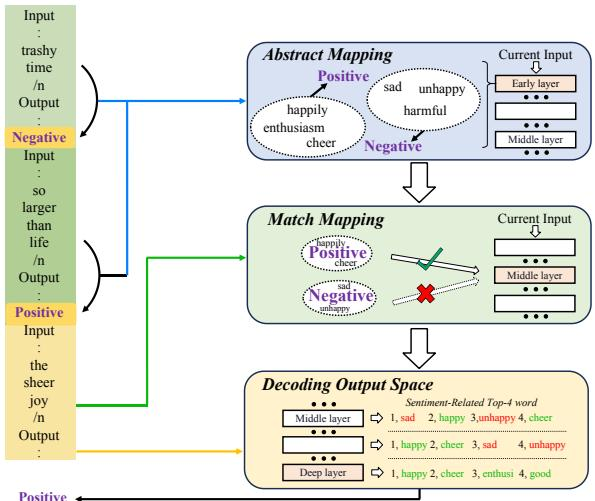  
Figure 1: The overview of in-context learning in three stages, examined through the lens of input-label mappings. The working mechanism of ICL involves three steps: 1) abstracting the input-label mappings and storing them in key layers, 2) applying and generalizing these mappings to a new input, and 3) decoding the matched mappings in the output space.

Due to the impressive performance of ICL in downstream tasks, researchers increasingly focus on understanding how ICL works. Several studies (Olsson et al., 2022; Wang et al., 2023c; Singh et al., 2024; Ren et al., 2024; von Oswald et al., 2023; Dai et al., 2023) explore the inner workings of ICL within LLMs, examining how models process demonstration information. Concurrently, recent research (Min et al., 2022; Wei et al., 2023b; Kossen et al., 2023) focuses on input-label mappings in demonstrations, investigating how LLMs interpret these patterns by analyzing model outputs. Despite these valuable contributions, fundamental questions remain unanswered: what input-label mappings are within LLMs, where they function, and how LLMs utilize them. Our work systematically addresses these questions to provide deeper interpretations of ICL mechanisms.

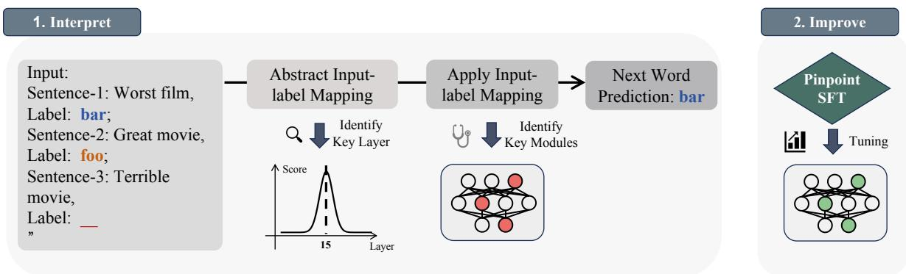  
Figure 2: Pipeline for interpreting and improving in-context learning: (1) Abstract and apply input-label mappings; (2) Strengthen LLMs’ capability of ICL through Pinpoint SFT on key components.

To reveal what input-label mappings are within LLMs, we employ unembedding techniques (Dar et al., 2023; Geva et al., 2022) to analyze similarities between the hidden states of predicted tokens and embeddings of task-related words (e.g., happy/sad). Following (Wei et al., 2023b), we eliminate semantic interference by selecting nonrelated semantic words (e.g., ‘far’/‘boo’) as label options instead of task-related words (e.g., ‘negative’/‘positive’). Our analysis reveals that while vanilla hidden states across layers show minimal similarity to task-related concepts, the principal components (PCs) of middle-layer states exhibit strong alignment with task-related semantics. When projecting these PCs to vocabulary space, we observe interpretable task-related words emerging, suggesting these components encode input-label mappings. By systematically manipulating individual PCs within the original hidden states, we establish a clear linear relationship between intensity coefficients and label logits, confirming that inputlabel mappings are stored within specific principal components of LLMs.

To determine where LLMs leverage these mappings, we propose PC Patching for identifying ICL-related modules. Traditional methods like path patching (Wang et al., 2023a) require carefully designed pairs of reference and counterfactual samples (e.g., "How to make a bomb" versus "How to make a cake") to locate capability-related modules. Such approaches are limited by the quality of these manual designs and often struggle with ICL tasks, where models inevitably engage ICL abilities with most inputs (Brown et al., 2020). Our PC patching approach bypasses this limitation by engineering representations directly using conceptual vectors in PCs, automatically generating counterfactual representations without requiring discrete text alternatives. This represents the first method to study causal effects in LLMs without relying on counterfactual samples. Through PC patching, we identify that a small fraction (5%) of attention heads significantly impact ICL predictions, a finding we further validate using the knockout method (Wang et al., 2023b).

To uncover how LLMs utilize input-label mappings, we analyze the behavior patterns of the identified key heads. These heads consistently attend to label words within demonstrations, with particular emphasis on labels matching new queries. Our observations reveal that the hidden states of these label words encode input-label mappings, indicating that these heads apply learned mappings from demonstrations to predict labels for new inputs. When we switch attention scores of these key heads across different class labels, model performance drops by 90%, providing strong validation of our hypothesis.

To complete our understanding of the ICL process, we employ probing techniques (Belrose et al., 2023) to track accuracy and logit changes across model layers. We observe that once a predicted label is matched, LLMs decode predictions from these matched results, gradually increasing confidence in the selected labels. Based on this comprehensive analysis, we summarize ICL mechanisms in three steps via input-label mappings (Figure 1). Finally, we fine-tune the identified attention heads to enhance ICL while preserving the model’s general capabilities. Our experiments demonstrate that fine-tuning just 32 attention heads (out of 1024) yields significant improvements in ICL performance across diverse tasks and datasets.

In summary, this work makes three key contributions: (1) We provide mechanistic insights into how LLMs store and utilize input-label mappings during ICL; (2) We introduce PC Patching, a novel technique that identifies task-critical components without requiring manually designed counterfactual examples; and (3) We demonstrate that precisely fine-tuning only the identified key heads (5% of attention heads) significantly outperforms conventional full-parameter tuning across diverse tasks while preserving general capabilities. These findings both advance our understanding of ICL mechanisms and provide an effective approach for targeted model enhancement, as illustrated in Figure 2.

## 2 Related works

In-context learning. Recent studies on ICL interpretability focus on the role and mechanisms of input-label mappings. Some works investigate the effects of input perturbations, such as the arrangement and formatting of demonstrations (Min et al., 2022; Wei et al., 2023b), and propose strategies for constructing effective demonstrations and calibrating ICL performance (Luo et al., 2024). Other research (Olsson et al., 2022; Singh et al., 2024; Ren et al., 2024) has shifted to probing the internal mechanisms of ICL, particularly through the analysis of multi-layer perceptrons (MLPs) and attention modules. One study (Wang et al., 2023c) examines label words aggregate information in shallow layers and distribute it in deep layers. In this work, we explore the input-label mappings in ICL. We discover and verify input-label mappings stored in specific layers’ PCs which encode task-related information. Using the proposed PC patching, we located specific heads related to ICL.

Interpretability methods. A recent study (Vig et al., 2020) adapted causal mediation analysis (CMA) (Pearl, 2001) to interpret deep language models, utilizing this approach for tasks including subject-verb agreement (Finlayson et al., 2021), natural language inference (Geiger et al., 2021), and retention of factual associations (Meng et al., 2022; Geva et al., 2023). Moreover, path patching (Wang et al., 2023a) extends CMA by measuring how treatment effects are mediated through node-to-node connections between neurons or features. However, the requirement for the careful design of reference and counterfactual pairs limits the scalability and broader application of this method. In this work, we introduce PC Patching to tackle this problem. PC Patching bypasses the need for text-based counterfactuals by manipulating semantic representations within the principal components.

## 3 Preliminary

Model. We select Mistral-7B (Jiang et al., 2024) as our primary model for investigation due to its moderate capacity and strong performance in ICL. Table 1 shows that Mistral-7B demonstrates an average of 70% accuracy on the ICL benchmark. All experiments are conducted on 8 NVIDIA A100 80GB GPUs. Additional analysis conducted on Llama3-8B, Llama3-70B (Dubey et al., 2024) and Qwen2-72B (Yang et al., 2024) are provided in the Appendix D.

Datasets. We use the Stanford Sentiment Treebank Binary (SST-2 (Socher et al., 2013)) as the primary dataset for our explainability experiments in sentiment analysis. Additionally, we validate our approach on several other datasets, including Hate Speech Detection (ETHOS (Mollas et al., 2020)), and Duplicated-Question Recognition (QQP (Wang et al., 2019b)). To eliminate semantic interference from labels, we follow the methodology described in (Wei et al., 2023a), randomly selecting nonrelated semantic label options, such as replacing [’negative’, ’positive’] with [’far’, ’boo’]. Following (Wei et al., 2023a), we implement a pinpoint SFT on 17 publicly available NLP datasets in seven tasks select another four NLP tasks and MMLU for evaluation, and remap original natural language labels to 270k randomly-selected labels. Further details are provided in Appendix C.

## 4 Method

Our goal is to interpret in-context learning in LLMs in a way that is human-understandable, thus enabling targeted modification of models through precise SFT. This section delves into the “abstractidentify-improve” methodology. First, in Section 4.1, we explore and analyze input-label mappings across representations. Next, in Section 4.2, we detail the process of identifying and validating key modules within LLMs. Finally, in Section 4.3, we propose a precise training strategy that fine-tunes the influential modules to improve the proficiency of ICL.

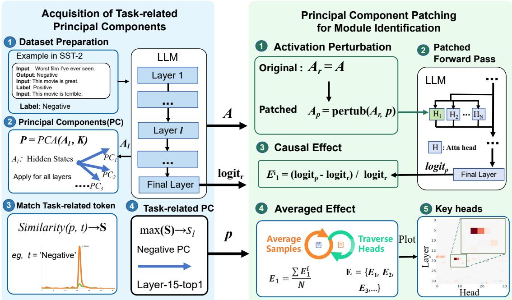  
Figure 3: PC Patching method for identifying ICL-related modules in LLMs: (Left) Acquisition of task-related principal components through extracting PCs from hidden states and measuring similarity with task-related tokens; (Right) Principal Component Patching process that automatically generates counterfactual representations by perturbing activations along task-related PCs, measuring causal effects across model heads to identify key ICLrelated modules without requiring manually designed counterfactual examples.

## 4.1 Input-Label Mapping Abstraction

To automatically locate and abstract input-label mappings, we propose the Principal Component Lens (PCL) approach, as detailed in Algorithm 1. For a given dataset, we construct a set Ω containing samples with N randomly selected demonstrations<sup>1</sup> and compute the activations A across all layers of model . To identify the task-related tokens in the dataset, we randomly select several original samples and prompt the LLM (e.g., Mistral-7B) with a simple request: “Please extract the taskrelated words from the samples below and return the keywords as a Python list. [...Several Samples...]”. For instance, in the case of SST-2, the output might be a list like [“negative”, “happy”, “sad”, ].

As illustrated in the left portion of Figure 3, we first prepare the dataset with demonstrations (e.g., input-label pairs from SST-2) and feed them through the LLM. Next, we apply Principal Component Analysis (PCA) to activations A across all layers to extract the top K principal components (K is set as 3 by default). This process transforms the high-dimensional hidden states into their most salient components, which potentially encode task-related information.

Since input-label mappings store task-related information, we compare the logits distribution of the unembedded principal components in vocabulary space with corresponding task-related tokens. As shown in Figure 3 (left, steps 3-4), we match these principal components with task-related tokens and identify which layer and component best captures the input-label mapping.

We use the following equation to evaluate these similarity scores:

$$
s = \operatorname* { m a x } _ { t \in T } \left\{ \frac { \exp { ( ( W _ { U } p ) _ { t } ) } } { \sum _ { j = 1 } ^ { | V | } \exp { ( ( W _ { U } p ) _ { j } ) } } \right\} ,\tag{1}
$$

where $\boldsymbol { p } \in \mathbb { R } ^ { d }$ represents principal components, $W _ { U } ~ \in ~ \mathbb { R } ^ { | V | \times d }$ is the unembedding matrix, and $T \subseteq V$ is the task-related token list. This projects components into vocabulary space via W<sub>U</sub>, applies softmax, and selects the highest probability among task-related tokens. The component with highest similarity encodes the input-label mapping.

## 4.2 Key Module Identification

Given existing studies (Olsson et al., 2022; Singh et al., 2024) confirm attention heads’ vital role in

Algorithm 1 Abstracting Input-Label Mapping   
Input: Set Ω of samples with demonstrations, model $\mathcal { M }$   
with layers $\mathcal { L } .$ The task-related token set $T$   
Output: Similarity scores for $\mathcal { L } \colon S _ { \mathcal { L } }$   
Compute all activations A on Ω   
for l in do   
$\mathcal { P } = P C A ( A _ { l } , K )$ ▷ extract Top-K PC   
for $p$ in $\mathcal { P }$ do   
for t in T do   
S  similarity(p, t)   
end for   
end for   
$s _ { l } \gets \operatorname* { m a x } ( \mathbf { S } )$ ▷ equation 1   
end for   
Return: s<sub>l</sub>

ICL, we focus on identifying which heads are responsible for answer matching. To achieve this, we propose Principal Component Patching (PC Patching), a method that automatically generates counterfactual representations, eliminating the need for manually crafted counterfactual examples (Wang et al., 2023a).

As shown in the right portion of Figure 3, our PC Patching approach consists of five key steps. First, we perturb the original activation $A _ { r }$ along the direction of the identified task-related principal component $p$ to create a counterfactual activation $A _ { p }$ Then, we perform a patched forward pass through the LLM, replacing the activations of one head at a time with the perturbed activation while keeping all other heads unchanged. Next, we measure the causal effect by comparing the output logits from the original and patched passes, calculating the relative change in logit values. By perturbing targeted activation with counterfactual representation $A _ { c }$ and holding others constant with reference representation $A _ { r } ,$ , we compare output logits to measure the counterfactual effect. The whole process is in Algorithm 2. We scan through all nodes $\mathcal { N }$ sequentially, and measure the changes in the output logit of ground-truth token C, as $E _ { \mathcal { N } }$ . As illustrated in Figure 3 (right, steps 4-5), we average these effects across multiple samples and visualize them to identify key heads that significantly impact ICL predictions.

Explanations for model behavior are often misleading or lack rigor (Bolukbasi et al., 2021; Wiegreffe and Pinter, 2019). To mitigate this issue, we perform a thorough assessment of the significance of the identified key heads while also verifying the insignificance of others. To achieve this, we apply a knockout method called mean ablation (Wang et al., 2023b), where individual heads are deactivated by replacing their activations with the mean activation across a counterfactual representation $A _ { c } ,$ effectively removes task-related information.

```latex
Algorithm 2 Identifying Key Modules (Principal
Component Patching)
Input: Set Ω of samples with demonstration $X ,$ model $\mathcal { M }$
with nodes ${ \mathcal { N } } .$ The Principal Component $p .$
Output: Causal effects for $\mathcal { N } \colon E _ { \mathcal { N } }$
for $x _ { i }$ in Ω do
Compute all activations $A _ { \ i }$ on $X _ { i }$
$A _ { c } \equiv c o n t r o l ( A _ { r } , p )$ ▷ perturb along $\operatorname { P C } p$
for n in $\mathcal { N }$ do
$A _ { r } ^ { \prime } ( n )  A _ { c } ( n ) ;$ ▷ replace $A _ { r }$ by $A _ { c }$
$A _ { r } ^ { \prime } ( k )  A _ { r } ( k ) , \forall k \in [ 1 , \cdot \cdot \cdot , | \hat { \mathcal { N } } | ] , k \neq n .$
$l o g i t _ { o } \gets \mathcal { M } ( X _ { r } ^ { ( i ) } , A _ { r } )$ ▷ get original logits
$l o g i t _ { p } \gets \mathcal { M } ( X _ { r } ^ { ( i ) } , A _ { r } ^ { \prime } )$ ▷ get patched logits
$\begin{array} { r } { s _ { n } ^ { ( i ) } \stackrel { \cdot } {  } \frac { l o g i t _ { p } - l o g i t _ { o } } { l o g i t _ { o } } } \end{array}$ ▷ causal effect
end for
end for
Return: $\begin{array} { r } { \overline { { s _ { n } } } = \frac { \sum _ { i = 1 } ^ { | \Omega | } s _ { n } ^ { ( i ) } } { | \Omega | } } \end{array}$ ▷ averaged effect w.r.t. samples
```

## 4.3 In-Context Learning Capability Enhancement

Supervised Fine-Tuning (SFT) is widely applied to enhance the model’s capabilities. Inspired by (Zhang et al., 2024), we introduce precise SFT only to update those components closely associated with ICL abilities while keeping the rest parameters unchanged. For the i-th attention layer, the output matrix $W _ { O } ^ { i }$ is split into equal-sized blocks for each head $\left\lceil W _ { O } ^ { i , 1 } , W _ { O } ^ { i , 2 } , \cdot \cdot \cdot , W _ { O } ^ { i , H } \right\rceil$ . This is equivalent to running each head independently, multiplied by its respective output matrix, and added to the residual stream. For the selected heads, precise SFT updates four matrices: $W _ { Q } ^ { i , j } , W _ { K } ^ { i , j } , W _ { V } ^ { \bar { i } , j } \in \mathbb { R } ^ { d \times \frac { d } { H } }$ and $W _ { O } ^ { i , j } \in \mathbb { R } ^ { \frac { d } { H } \times d }$ . Additionally, by updating only a small subset of parameters, precise SFT not only reduces training time but also preserves the model’s original performance.

## 5 Experiments

The experiments are organized as follows: (1) abstract the input-label mappings in Section 5.1; (2) identify the mapping-related key components in Section 5.2; (3) improve the in-context learning capability via pinpoint supervised fine-tuning on 17 classification datasets in Section 5.3. For simplicity, we primarily report the results of Mistral-7B in the experiments, while other results can be found in Appendix. The results of the generation task are discussed in Section 6.

<table><tr><td colspan="2">Position</td><td>Component</td></tr><tr><td>layer6</td><td>C-1 C-2</td><td>ixon, athan, \u00e9ri, aza, ixa, giornata ange, eld, builtin, agra, Internal, Tamb</td></tr><tr><td>layer13</td><td>C-1 C-2</td><td>penalty, negative, alarm, liability, Psy anel, Anders, aine, Horn, Maz, Ferr</td></tr><tr><td>layer15</td><td>C-1 C-2 C-3</td><td>negative, unhappy, harsh, destruct, toxic unique, joke, irrelevant, jokes, peculiar positive, praise, posit, warm, happily</td></tr><tr><td>layer26</td><td>C-1 C-2 C-3</td><td>zero, 0, Zero, zero, Zero, ONE, ZERO three, 3, Three, Three, \u4e09, three, third fifth, Fifth, five, Five, 5, &lt;0xAB&gt;, \u4e94,</td></tr></table>

(a) Unembedding principal components

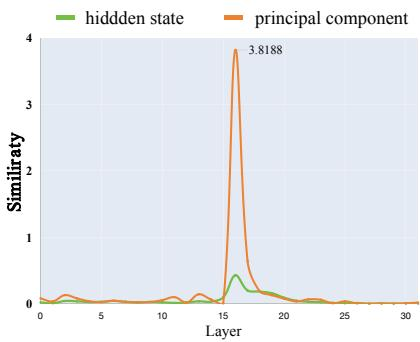  
(b) Similarity with task-related token

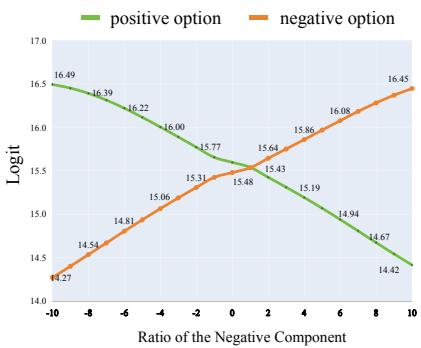  
(c) Logits change after control  
Figure 4: (a) Projection of PCs into the vocabulary space across different layers, where ‘C-k’ represents the k-th component of each layer. The words highlighted in red indicate task-related words. (b) Similarity between the hidden state/principal components and task-related tokens across all layers. (c) Effect on the logits of positive option (e.g., foo) and negative option (e.g., bar) after adding embeddings with the negative principal component.

## 5.1 Input-Label Mapping Abstraction

The principal components encode humaninterpretable words. To elucidate the internal mechanics of ICL, we employ the logit lens ((Belrose et al., 2023)) method to project hidden states into the vocabulary space. Consistent with (Wei et al., 2023b,a), the natural language labels (e.g., “positive/negative sentiment”) are replaced with arbitrary digit (e.g., “0/3”). Our results indicate that meaningless tokens such as “unge”, “Aires”, “iges”, and “verso” persist across layers, with no clear emergence of task-related tokens. To study whether LLMs can extract the task-related information (e.g., “positive/negative” for SST-2), we conduct a preliminary experiment that first applies the Principal Component Analysis (PCA) on the original hidden states, then projects the top-1 principal component into vocabulary space. Surprisingly, our findings reveal the principal component aligns with taskrelated directions and encodes human-interpretable tokens, as illustrated in Figure 4(a), with further details available in Appendix 4. This phenomenon indicates that LLMs can comprehend task-relevant information without explicit natural language labels in demonstrations.

The principal components (PCs) encode input-label mapping. Inspired by the above analysis, we manipulate PCs through logit lens to automatically identify the layer where task-related PCs emerge. The results are depicted in Figure 4(b). Notably, our observations reveal a distinct peak in similarity at layer 15, suggesting that this layer plays a crucial role in abstracting and capturing input-label mappings. Leveraging the proposed method, we can pinpoint the layer where task-related principal components emerge, as reflected by the spike in the similarity curve.

The principal components control the behavior of ICL. To assess whether LLMs utilize the task-related principal components during ICL, we perturb the hidden states along the direction of task-related components and examine whether this affects answer probabilities. Specifically, we inject components of negative sentiment into layer 15 in the SST-2 dataset and observe the resulting logit changes for both positive and negative options. The results, shown in Figure 4(c), reveal a clear linear trend: as the magnitude of the negative component in the residual stream increases, the logit for the negative option steadily rises, while the logit for the positive option correspondingly decreases. This behavior demonstrates that LLMs leverage task-related principal components to get their responses. In Section 6.2, we extend this experiment to generation tasks (such as adv factuality and prejudice (Liu et al., 2023) ) and observe similar results.

## 5.2 Key Modules Identification

Location of key heads. Figure 5(a) visualizes the effect of each head by head and layer indices after applying the proposed PC Patching. This arrangement allows for a clear comparison of the causal effect of each head to the ground-truth token’s logit. The red squares indicate heads with a strong positive effect on predicting the output token, while the blue squares represent heads with a negative effect. From these results, we observe that: (i) Only a small number of heads have a noteworthy influence on ICL. Specifically, heads such as $9 . 1 9 ^ { 2 }$ , when patched, lead to a substantial 6.0% decrease in the logit, highlighting their positive contribution to the ICL. We classify heads that exhibit logit change exceeding 1% as “key heads”. (ii) The discovered key heads are mainly located in the middle layers, with almost no key heads present in the shallow layers.. For Mistral-7B, key heads emerge from the 18th layer for in-context learning. Prior layers exhibit heads that do not exert a direct effect on the output logits. The key heads are primarily concentrated between layers 18 and 19.

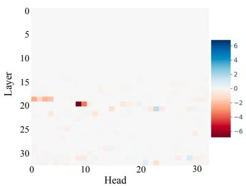  
(a) Effect on logit of each head

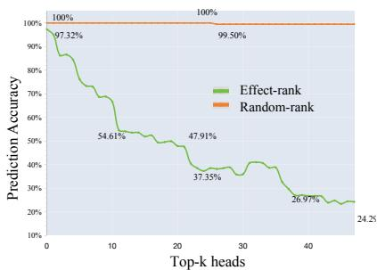  
(b) Accuracy after Knockout

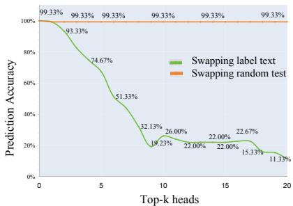  
(d) Accuracy after swapping  
Figure 5: (a) The attention patterns of the key attention head, which mainly attends to the “positive” label. (b) The result of PC-Patching experiment on Mistral-7B on SST-2. For each head, a darker color indicates a larger logit difference from the original model before patching. (c) The performance of the ICL after swapping the attention weights of different labels for the key attention heads. The accuracy decreases from 100% to 11%.

Validation of key modules. To fully validate the faithfulness of the discovered key heads, we perform additional checks by observing the performance drop when knocking out these components. In Figure 5(b), all heads are sorted in a certain order by the importance score shown in Figure 5 (a) and knocked out one by one. It shows that, as the heads are gradually knocked out, the model’s performance of drops sharply in “effect-rank”, while keeping stable (relatively minor effect within 2%) in “random-rank”. The model becomes largely confused to output incorrect answers after knocking out, further verifying the crucial role of key components in LLMs’ ability to complete the ICL task. The above results demonstrate that the discovered components play an especially important role in the language model’s ability to complete the ICL task.

Key heads behavior. To gain deeper insights into the behavior of key heads (as shown in Figure 5(a)), we begin by analyzing their attention patterns, focusing on the attention scores assigned to input texts and labels during demonstrations.

Our analysis reveals that these key heads exhibit a strong focus on label-related tokens. For instance, in the demonstration with the inputs: “question: Worst film I’ve ever seen. answer: bar; question: This movie is great. answer: foo; question: This movie is terrible. answer:”, head 9.19 in Figure 5(a) consistently assigns high attention scores to labels “bar” and “foo”, particularly favoring “bar”. This behavior suggests that the new input, “This movie is terrible”, will be mapped similarly to the negative sentiment label (“bar”), just as “Worst film I’ve ever seen” is. To verify this conjecture, we perform a token-swapping experiment by exchanging the attention scores between different classes (e.g., swapping the scores between “bar” and “foo”). The results, as depicted in Figure 5(c), show with an increasing number of swapped heads, the accuracy for the label text (green curve) drops sharply from 100% down to 11.33% at 20 swapped heads, while the random swapping (orange curve) shows no significant impact on accuracy. These observations confirm that these heads utilize input-label mappings by controlling the attention score weights across different classes.

## 5.3 ICL Capability Enhancement

Pinpoint SFT improves in-context learning ability. We term all-parameter fine-tuning as Full SFT for simplicity and adopt the same training settings as Pinpoint SFT. Table 1 compares Full SFT and Pinpoint SFT on MMLU and four NLP tasks. Pinpoint SFT achieves a 14.99% average improvement across NLP datasets, outperforming Full SFT, which only shows a 4.58% gain. Full SFT weakens LLMs’ knowledge by relying on symbolic labels (e.g., foo/bar) for ICL. These results highlight that fine-tuning ICL-relevant modules enhances performance while tuning unrelated modules can impair it. For instance, Full SFT leads to a 21% drop in general capabilities on MMLU, whereas Pinpoint SFT preserves the model’s original performance. This demonstrates that Pinpoint SFT on ICL-related modules has minimal impact on the model’s general capability. Randomly finetuning heads not only fails to improve ICL significantly capabilities but also impairs performance on the general task MMLU, indicating that unrelated modules were trained, leading to a decline in the model’s general abilities. More granular fine-tuning and intermediate parameter adjustments may yield greater gains and uncover further insights, which we identify as key directions for our future research.

Table 1: Overall performance. We evaluate the capabilities of Mistral-7B, transitioning from generic tasks (e.g., MMLU) to NLP classification tasks (e.g., SST2, ETHOS, QQP, and RTE). Supervised fine-tuning across the entire parameter set (denoted as Full SFT) leads to no enhancement with in-context learning, albeit at the expense of its capabilities in generic tasks. In contrast, selectively tuning only the parameters of 32 critical attention heads (denoted as Pinpoint SFT) yields more improvements while preserving the model’s proficiency in generic tasks, with fewer tuned parameters.
<table><tr><td rowspan="3">Model</td><td rowspan="3">Tuned Params.</td><td colspan="6">NLP Classification Tasks</td><td colspan="4">Generic Task</td></tr><tr><td rowspan="2">SST2</td><td rowspan="2">ETHOS</td><td rowspan="2">QQP</td><td rowspan="2">RTE</td><td colspan="2">Avg</td><td colspan="2">MMLU (0-shot)</td><td colspan="2">MMLU (5-shot)</td></tr><tr><td>Acc.</td><td>Δ</td><td>Acc.</td><td>Δ</td><td>Acc.</td><td>Δ</td></tr><tr><td>Mistral-7B</td><td></td><td>79.93%</td><td>76.85%</td><td>57.94%</td><td>59.94%</td><td>68.67%</td><td></td><td>52.46%</td><td></td><td>54.66%</td><td></td></tr><tr><td>+ Full SFT</td><td>7.3B</td><td>89.11%</td><td>58.22%</td><td>74.93%</td><td>70.73%</td><td>73.25%</td><td>+4.58%</td><td>31.14%</td><td>-21.32%</td><td>23.24%</td><td>-31.42%</td></tr><tr><td>+ Random</td><td>0.08B</td><td>88.88%</td><td>65.53%</td><td>75.52%</td><td>72.83%</td><td>75.69%</td><td>+7.02%</td><td>39.13%</td><td>-13.33%</td><td>37.29%</td><td>-17.37%</td></tr><tr><td>+ Pinpoint SFT</td><td>0.08B</td><td>95.18%</td><td>78.25%</td><td>76.72%</td><td>84.85%</td><td>83.65%</td><td>+14.99%</td><td>52.43%</td><td>-0.03%</td><td>54.10%</td><td>-0.56%</td></tr></table>

Table 2: Ablative experiments on tunable modules.
<table><tr><td rowspan="2">Precise SFT Setting</td><td colspan="4">Evaluation Metric</td></tr><tr><td>Train Speed</td><td>Tuned Params.</td><td>6-NLP dataset</td><td>MMLU</td></tr><tr><td>Mistral-7B</td><td></td><td></td><td>68.67%</td><td>52.46%</td></tr><tr><td>random-32head</td><td>50sam./sec</td><td>0.08B</td><td>71.69%</td><td>39.13%</td></tr><tr><td>top-32head</td><td>50sam./sec.</td><td>0.08B</td><td>83.65%</td><td>52.43%</td></tr><tr><td>top-64head</td><td>40sam./sec.</td><td>0.16B</td><td>83.82%</td><td>52.35%</td></tr><tr><td>top-128head</td><td>35sam./sec.</td><td>0.32B</td><td>82.44%</td><td>51.67%</td></tr></table>

Ablative study. The primary challenge with Pinpoint SFT is identifying the appropriate quantity and specific set of modules to adjust. To illustrate this, we conduct experiments with varying numbers of heads, with the results presented in Table 2. We find that fine-tuning 32 heads provides the best average improvement across different head counts. Randomly fine-tuning the same number of heads has minimal effect.

Generative tasks on algorithmic reasoning. To assess the broader applicability of Pinpoint SFT beyond classification tasks, we evaluate its effectiveness on generative algorithmic reasoning tasks (from BIG-Bench(Srivastava et al., 2022)) within the ICL framework. Specifically, we experiment with list function tasks where the model must identify transformation functions between input and output lists containing non-negative integers (e.g., removing the last element: [8, 0, 5, 12, 0, 2] [8, 0, 5, 12, 0]). These tasks measure a model’s ability to reason algorithmically over structured data. We select three representative subsets with varying difficulty levels, as indicated by the original Mistral-7B’s performance: Modify the list (34.38%), Remove elements (78.13%), and Add elements (96.88%). All tasks are evaluated in a 4-shot setting.

Table 3: Performance comparison on algorithmic reasoning tasks with 4-shot demonstrations in Mistral-7B.
<table><tr><td>Task</td><td>Original</td><td>Pinpoint SFT</td></tr><tr><td>Modify the list</td><td>34.38%</td><td>48.44%</td></tr><tr><td>Remove elements</td><td>78.13%</td><td>91.67%</td></tr><tr><td>Add elements</td><td>96.88%</td><td>100.00%</td></tr><tr><td>Average</td><td>69.80%</td><td>80.04%</td></tr></table>

The results in table 3 demonstrate that Pinpoint SFT significantly enhances the model’s performance across all three list function tasks, with an average improvement of 10.24%. Notably, the most substantial gain (14.06%) is observed in the most challenging task (Modify the list), where the original model struggles the most. This suggests that fine-tuning ICL-relevant modules is particularly beneficial for complex reasoning tasks that require sophisticated pattern recognition. These findings further validate the effectiveness of our approach in enhancing ICL capabilities across both classification and generative reasoning tasks.

## 6 Discussion

In this section, we first address the two remaining questions to provide a thorough and fine-grained interpretation of the ICL process, as discussed in subsection 6.1 (whole pipeline in Figure 1 for details). Next, we explore the generalization of PC matching and extend our experiments to generation tasks, as described in subsection 6.2.

## 6.1 Interpreting ICL

The experiments above elucidate remained question: How are the principal components generated before the mapping process, and what transpires after the mappings are utilized?

Before Mapping: Establishing Preliminary Input-Label Associations. To understand how models establish input-label mappings during demonstrations, we analyze the flow of information within the model using saliency techniques. By calculating the saliency ( (Simonyan et al., 2014)) scores of attention heads across demonstrations in Appendix Figure 6(a), we observe that the information flow from input tokens to label tokens is particularly concentrated in the earlier layers, with significant activity between layers 0 and 15. For instance, in the SST-2 dataset, the attention score between 4th Input and 4th Label in demonstrations is much higher than between 4th Input and 1th Input. This suggests that the model establishes preliminary input-label associations early on in the demonstration process. Further verification experiments, as shown in Appendix Figure 6(c), reveal that blocking the information flow between input and label in demonstrations leads to a sharp decrease in accuracy, whereas random blocking has no effect.

After mapping: Decoding Prediction from Matched Mappings. After the model matches the input to the corresponding input-label mappings, as shown in Figure 6(b), it identifies the correct label primarily in layers 18 to 21. Then, the subsequent layers, from layer 21 onward focus on refining the model’s confidence in its predictions, which is indicated in Appendix Figure 7(a). The experiment results reveal that starting around layer 18, the model significantly increases both the rank and confidence of the correct token. This confidence continues to grow through layer 21 and beyond, as the model decodes the information necessary for its final prediction. The final layers show an increasing appearance of label-related tokens among the top predictions, confirming that these layers are primarily involved in finalizing the output by processing the embeddings into the correct answer.

## 6.2 Extension

To assess the generalization of the proposed PC patching approach, we extend our experiments to trustworthiness (Sun et al., 2024) generation tasks, including Adv Factuality, and Preference Bias. In the Adv Factuality task, the model is tasked with detecting incorrect premises and rectifying factual inaccuracies. For the Preference Bias task, the model is expected to refrain from expressing personal preferences when presented with biased options.

First, after applying PCA to hidden state of both tasks and projecting the principal components into vocabulary space, the task-related directions emerge. For example, words like “wrong”, “incorrect”, “mistaken”, for Adv Factuality task, while “choice”, “choosing”, “preference” appear for the Preference Bias. Utilizing Algorithm 1, we observe peaks in layer 15 for both tasks, indicating task-related components. By perturbing the hidden states by PC, we can control the answer direction. For instance, prior to applying control, the model responds to the prompt: “Please select one option you prefer from the following options: A. isolationist foreign policy approach B. interventionist stance.” with: “I am an AI language model and do not have personal preferences...”. However, after enhancing the ‘preference’ component, LLM instead responds: ‘I prefer B, because...”. Second, we validate the effectiveness of the proposed approach PC Patching method. We apply it to both tasks and generate heatmaps similar to Figure 5 (a). Notably, the identified heads for these tasks are distinct from those used for in-context learning, suggesting that different tasks activate different functional heads.

## 7 Conclusion

In this study, we have identified, analyzed, and fine-tuned the internal components responsible for the ICL capability of LLMs. The language models abstract the input-label mappings and store them in the key layers, and subsequently, a small number of attention heads are involved in applying these mappings to new questions. We apply the pinpoint SFT on the ICL-related heads for better ICL capabilities, with less impact on other tasks compared with tuning all parameters. These findings contribute to a better understanding of the inner mechanism of LLMs.

## 8 Acknowledgements

This work was supported in part by NSFC No.   
62222117.

## 9 Limitations

In this work, we aimed to provide deeper insights into in-context learning (ICL). Although the experiments were conducted across various models and datasets, the findings may not generalize universally to all models or tasks. Nonetheless, we believe that even potentially biased observations and explorations contribute valuable insights toward general conclusions and the advancement of relevant theories. Additionally, we did not rigorously tune experimental parameters, such as optimizing similarity measures or learning rates for SFT, as these aspects fall beyond the scope of this study. Despite these limitations, we believe that a robust method should exhibit strong generalization capabilities, as demonstrated by the results of our Pinpoint SFT experiments in Table 1 despite these limitations. While there is room for further optimization, these limitations do not detract from the significance of our contributions.

## References

Nora Belrose, Zach Furman, Logan Smith, and et al. 2023. Eliciting latent predictions from transformers with the tuned lens. CoRR, abs/2303.08112.

Tolga Bolukbasi, Adam Pearce, Ann Yuan, Andy Coenen, Emily Reif, Fernanda B. Viégas, and Martin Wattenberg. 2021. An interpretability illusion for BERT. CoRR, abs/2104.07143.

Tom B. Brown, Benjamin Mann, Nick Ryder, and et al. 2020. Language models are few-shot learners. In NeurIPS.

Alexis Conneau and Douwe Kiela. 2018. Senteval: An evaluation toolkit for universal sentence representations. In LREC. European Language Resources Association (ELRA).

Damai Dai, Yutao Sun, Li Dong, and et al. 2023. Why can GPT learn in-context? language models secretly perform gradient descent as meta-optimizers. In ACL, pages 4005–4019. Association for Computational Linguistics.

Guy Dar, Mor Geva, Ankit Gupta, and et al. 2023. Analyzing transformers in embedding space. In ACL, pages 16124–16170. Association for Computational Linguistics.

Abhimanyu Dubey, Abhinav Jauhri, Abhinav Pandey, and et al. 2024. The llama 3 herd of models. CoRR, abs/2407.21783.

Matthew Finlayson, Aaron Mueller, Sebastian Gehrmann, Stuart M. Shieber, Tal Linzen, and Yonatan Belinkov. 2021. Causal analysis of syntactic agreement mechanisms in neural language models. In Proceedings of the 59th Annual Meeting of the Association for Computational Linguistics and the 11th International Joint Conference on Natural Language Processing, ACL/IJCNLP 2021, (Volume 1: Long Papers), Virtual Event, August 1-6, 2021, pages 1828–1843.

Atticus Geiger, Hanson Lu, Thomas Icard, and Christopher Potts. 2021. Causal abstractions of neural networks. In Advances in Neural Information Processing Systems 34: Annual Conference on Neural Information Processing Systems 2021, NeurIPS 2021, December 6-14, 2021, virtual, pages 9574–9586.

Mor Geva, Jasmijn Bastings, Katja Filippova, and Amir Globerson. 2023. Dissecting recall of factual associations in auto-regressive language models. CoRR, abs/2304.14767.

Mor Geva, Avi Caciularu, Kevin Ro Wang, and et al. 2022. Transformer feed-forward layers build predictions by promoting concepts in the vocabulary space. In EMNLP, pages 30–45. Association for Computational Linguistics.

Mor Geva, Roei Schuster, Jonathan Berant, and et al. 2021. Transformer feed-forward layers are key-value memories. In EMNLP, pages 5484–5495. Association for Computational Linguistics.

Albert Q Jiang, Alexandre Sablayrolles, Antoine Roux, and et al. 2024. Mixtral of experts. arXiv preprint arXiv:2401.04088.

Jannik Kossen, Tom Rainforth, and Yarin Gal. 2023. In-context learning in large language models learns label relationships but is not conventional learning. CoRR, abs/2307.12375.

Quentin Lhoest, Albert Villanova del Moral, Yacine Jernite, and et al. 2021. Datasets: A community library for natural language processing. In Proceedings of the 2021 Conference on Empirical Methods in Natural Language Processing: System Demonstrations, EMNLP 2021, Online and Punta Cana, Dominican Republic, 7-11 November, 2021, pages 175–184. Association for Computational Linguistics.

Yang Liu, Yuanshun Yao, Jean-Francois Ton, Xiaoying Zhang, Ruocheng Guo, Hao Cheng, Yegor Klochkov, Muhammad Faaiz Taufiq, and Hang Li. 2023. Trustworthy llms: a survey and guideline for evaluating large language models’ alignment. CoRR, abs/2308.05374.

Quanyu Long, Jianda Chen, Zhengyuan Liu, Nancy F Chen, Wenya Wang, and Sinno Jialin Pan. 2025. Reinforcing compositional retrieval: Retrieving stepby-step for composing informative contexts. arXiv preprint arXiv:2504.11420.

Man Luo, Xin Xu, Yue Liu, Panupong Pasupat, and Mehran Kazemi. 2024. In-context learning with retrieved demonstrations for language models: A survey. CoRR, abs/2401.11624.

Kevin Meng, David Bau, Alex Andonian, and Yonatan Belinkov. 2022. Locating and editing factual associations in GPT. In NeurIPS.

Sewon Min, Xinxi Lyu, Ari Holtzman, and et al. 2022. Rethinking the role of demonstrations: What makes in-context learning work? In EMNLP, pages 11048– 11064. Association for Computational Linguistics.

Ioannis Mollas, Zoe Chrysopoulou, Stamatis Karlos, and Grigorios Tsoumakas. 2020. ETHOS: an online hate speech detection dataset. CoRR, abs/2006.08328.

Harsha Nori, Yin Tat Lee, Sheng Zhang, and et al. 2023. Can generalist foundation models outcompete special-purpose tuning? case study in medicine. CoRR, abs/2311.16452.

Catherine Olsson, Nelson Elhage, Neel Nanda, and et al. 2022. In-context learning and induction heads. CoRR, abs/2209.11895.

Jane Pan, Shunyu Zhang, and Danqi Chen. 2023. What in-context learning "learns" in-context: Disentangling task recognition and task learning. In Findings of the Association for Computational Linguistics: ACL 2023.

Judea Pearl. 2001. Direct and indirect effects. In UAI ’01: Proceedings of the 17th Conference in Uncertainty in Artificial Intelligence, University of Washington, Seattle, Washington, USA, August 2-5, 2001, pages 411–420.

Jie Ren, Qipeng Guo, Hang Yan, Dongrui Liu, Xipeng Qiu, and Dahua Lin. 2024. Identifying semantic induction heads to understand in-context learning. arXiv preprint arXiv:2402.13055.

Lingfeng Shen, Aayush Mishra, and Daniel Khashabi. 2023. Do pretrained transformers really learn in-context by gradient descent? arXiv preprint arXiv:2310.08540.

Karen Simonyan, Andrea Vedaldi, and Andrew Zisserman. 2014. Deep inside convolutional networks: Visualising image classification models and saliency maps. In 2nd International Conference on Learning Representations, ICLR 2014, Banff, AB, Canada, April 14-16, 2014, Workshop Track Proceedings.

Aaditya K Singh, Ted Moskovitz, Felix Hill, Stephanie CY Chan, and Andrew M Saxe. 2024. What needs to go right for an induction head? a

mechanistic study of in-context learning circuits and their formation. arXiv preprint arXiv:2404.07129.

Richard Socher, Alex Perelygin, Jean Wu, and et al. 2013. Recursive deep models for semantic compositionality over a sentiment treebank. In EMNLP, pages 1631–1642. ACL.

Aarohi Srivastava, Abhishek Rastogi, Abhinav Rao, Abu Awal Md Shoeb, Abubakar Abid, Adam Fisch, Adam R. Brown, Adam Santoro, Aditya Gupta, Adrià Garriga-Alonso, et al. 2022. Beyond the imitation game: Quantifying and extrapolating the capabilities of language models. arXiv preprint arXiv:2206.04615.

Lichao Sun, Yue Huang, Haoran Wang, Siyuan Wu, Qihui Zhang, Chujie Gao, Yixin Huang, Wenhan Lyu, Yixuan Zhang, Xiner Li, et al. 2024. Trustllm: Trustworthiness in large language models. arXiv preprint arXiv:2401.05561.

Jesse Vig, Sebastian Gehrmann, Yonatan Belinkov, Sharon Qian, Daniel Nevo, Yaron Singer, and Stuart Shieber. 2020. Investigating gender bias in language models using causal mediation analysis. Advances in Neural Information Processing Systems, 33:12388– 12401.

Johannes von Oswald, Eyvind Niklasson, Ettore Randazzo, and et al. 2023. Transformers learn in-context by gradient descent. In ICML, volume 202 of Proceedings ofMachine Learning Research, pages 35151–35174. PMLR.

Alex Wang, Yada Pruksachatkun, Nikita Nangia, Amanpreet Singh, Julian Michael, Felix Hill, Omer Levy, and Samuel R. Bowman. 2019a. Superglue: A stickier benchmark for general-purpose language understanding systems. ArXiv, abs/1905.00537.

Alex Wang, Amanpreet Singh, Julian Michael, Felix Hill, Omer Levy, and Samuel R. Bowman. 2019b. GLUE: A multi-task benchmark and analysis platform for natural language understanding. In ICLR. OpenReview.net.

Kevin Ro Wang, Alexandre Variengien, Arthur Conmy, and et al. 2023a. Interpretability in the wild: a circuit for indirect object identification in GPT-2 small. In ICLR.

Kevin Ro Wang, Alexandre Variengien, Arthur Conmy, Buck Shlegeris, and Jacob Steinhardt. 2023b. Interpretability in the wild: a circuit for indirect object identification in GPT-2 small. In International Conference on Learning Representations.

Lean Wang, Lei Li, Damai Dai, and et al. 2023c. Label words are anchors: An information flow perspective for understanding in-context learning. In EMNLP, pages 9840–9855. Association for Computational Linguistics.

Jerry W. Wei, Le Hou, Andrew K. Lampinen, and et al. 2023a. Symbol tuning improves in-context learning in language models. In EMNLP, pages 968–979. Association for Computational Linguistics.

Jerry W. Wei, Jason Wei, Yi Tay, and et al. 2023b. Larger language models do in-context learning differently. CoRR, abs/2303.03846.

Sarah Wiegreffe and Yuval Pinter. 2019. Attention is not not explanation. In Proceedings ofthe 2019 Conference on Empirical Methods in Natural Language Processing and the 9th International Joint Conference on Natural Language Processing, EMNLP-IJCNLP 2019, Hong Kong, China, November 3-7, 2019, pages 11–20. Association for Computational Linguistics.

An Yang, Baosong Yang, Binyuan Hui, and et al. 2024. Qwen2 technical report. CoRR, abs/2407.10671.

Le Yu, Yu Bowen, Haiyang Yu, Fei Huang, and Yongbin Li. 2023. Language models are super mario: Absorbing abilities from homologous models as a free lunch. ArXiv, abs/2311.03099.

Wei Zhang, Chaoqun Wan, Yonggang Zhang, Yiu ming Cheung, Xinmei Tian, Xu Shen, and Jieping Ye. 2024. Interpreting and improving large language models in arithmetic calculation. In ICML.

Yufeng Zhang, Fengzhuo Zhang, Zhuoran Yang, and et al. 2023. What and how does in-context learning learn? bayesian model averaging, parameterization, and generalization. CoRR, abs/2305.19420.

Algorithm 3 Precise Fine-tuning   
Require: Model , Input X, index of key   
heads Φ, iterations I, learning rate η, $W _ { \theta }$   
$W _ { Q / K / V / O }$   
for $( i , j ) \in \Phi$ do   
$\boldsymbol { W } _ { \boldsymbol { \theta } } ^ { i , j }$ .requires\_grad = True   
end for ▷ activate key heads   
loop I times   
${ \mathcal { L } } = { \mathcal { M } }$ .forward(X)   
.backward()   
for $w \in W _ { \theta }$ do   
$w = w - \eta * w$ .grad   
end for ▷ update target parameters   
end loop

## A Ethics Statement

The main purpose of this research is to reveal the mechanistic interpretation of the in-context learning in LLMs, and to improve it. We expect this work to inspire other researchers to understand the behavior of the in-context learning capability of LLMs. We use public natural language processing datasets and leverage open-source large language models for our experiments. We do not believe that our code or method are inherently subject to concerns of discrimination / bias / fairness, inappropriate potential applications, impact, privacy and security issues, legal compliance, research integrity or research practice issues. However, the results may be subject to bias that may be inherited by models and datasets we use.

## B Additional and Fine-grained interpretation on ICL

According to the analysis on main text, we further yield a full and fine-grained interpretation of the process of input-label mappings in LLMs (Figure 1). (1) Comprehending and generalizing the mapping between inputs and labels: Unlike previous work (Wang et al., 2023c), which identifies information flow from all text before the label to the label word, we find that each label word in shallow layers (0-13 layers) aggregates input information within the current demonstration. And blocking the interaction from input to label causes the LLMs to resort to random guessing. This suggests that the model first establishes preliminary input-to-label associations within each demonstration. Based on the aforementioned findings, the LLMs then generalize the input-label mappings and stores them in the principal components of the internal embeddings of labels/predictions, which is human-interpretable. (2) Matching the mapping rule to new question: We identify the top-10 crucial attention heads for applying input-label mappings. These heads focus on the label words of demonstrations which share the same ground truth, indicating that these heads are to synthesize the mappings stored at the input-label pairs. (3) Decoding prediction from matched mappings: From mid-deep layers (e.g., the 21th layer for Mistral7B), the logits of the correct answer increase linearly. Meanwhile, the task-related words diminish in the principal components of prediction’s embeddings, while the prediction-related words answers emerges.

## B.1 Abstract Input-label Mappings Based on Relationships in Demonstrations

To understand how models establish input-label mappings during demonstrations, we analyze the flow of information within the model using saliency techniques. Given that the MLPs in LLMs primarily function as memory units with minimal tokento-token interaction, we focus on studying information flow within attention matrix. By calculating the saliency ( (Simonyan et al., 2014)) scores of attention heads across demonstrations in Appendix Figure 6(a). Here, we transform the saliency matrix $I _ { l }$ of $L \times L$ where L is the number of tokens, into a $2 ( n + 1 ) \times 2 ( n + 1 )$ matrix $I _ { l } ^ { \prime }$ where n is the number of demonstrations. This transformation focuses on interactions between specific input-output pairs:

$$
\begin{array} { l } { I _ { l } ^ { \prime } ( k , j ) = \displaystyle \sum _ { i = p _ { k } } \sum _ { j = p _ { j } } ^ { p _ { k + 1 } - 1 } I _ { l } ( i , j ) , } \\ { \mathrm { f o r } \ k , j \in \{ 1 , 2 , \dots , 2 ( n + 1 ) \} } \\ { \mathrm { w h e r e } \ j = k + 1 } \end{array}
$$

Here, $I _ { l } ( i , j )$ is the element in the i-th row and j-th column of the original matrix $I _ { l } .$ . Indices $p _ { k }$ and $p _ { j }$ denote the starting positions of input and output tokens for each demonstration. For example, $p _ { 1 } = p _ { i n p u t _ { 1 } }$ and $p _ { 2 } = p _ { o u t p u t 1 }$ for the first demonstration. This transformation aggregates interaction values, simplifying the analysis of input-output relationships by collapsing the large $L \times L$ matrix into a more manageable $2 ( n + 1 ) \times 2 ( n + 1 )$ matrix.

we observe that the information flow from input tokens to label tokens is particularly concentrated in the earlier layers, with significant activity between layers 0 and 15. This flow gradually diminishes in later layers. For instance, in the SST-2 dataset, the attention score between 4th Input and 4th Label in demonstrations is much higher than between 4th Input and 1th Input. This suggests that the model establishes preliminary input-label associations early on in the demonstration process. Further verification experiments, as shown in Appendix Figure 6(c), reveal that blocking the information flow between input and label in demonstrations leads a sharp decrease in accuracy, whereas random blocking has no effect. Similar phenomenon is observed across different tasks and models, reinforcing the idea that early layers play a key role in identifying input-output patterns.

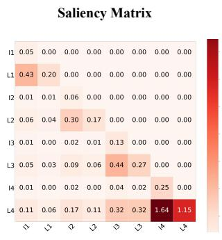  
(a) Information Flow from Input to Label

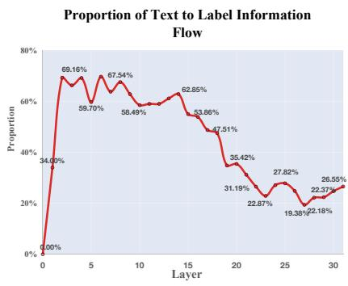  
(b) The Information Flow from Text to Label

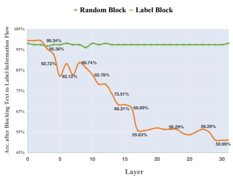  
(c) Block the Information Flow from Input to Label  
Figure 6: (a): The heat map of interactions between inputs and labels in layer 14. The colors within each input-label pair are darker, indicating higher interactions. (b): The relative information flow from text to label in differnet layers. The ratio is initially large (70%), and then gradually decays over layers. (c): The influence on the performance of ICL after blocking the interactions within demonstrations. The accuracy decreases to random guessing after 15th layer.

## B.2 Match the Mapping Rule

We describe this stage in detail in main text in Section 4 and Section 5.

## B.3 Decoding Prediction from Matched Mappings

After the model matches the new input with inputlabel mappings, it identifies the correct answer in the intermediate layers (18-21) What are the subsequent layers doing? As shown in the heat map results in Figure 7 (a), PC-patching from layer 21 onward shows minimal fluctuation, indicating these attention layers have little impact on the model’s performance. We analyze the logit changes for the correct answer by projecting the last token’s embeddings in each layer into the vocabulary space. We also record the rank of the correct answer among the projected vocabulary tokens, where the top-1 token is the most likely output of that layer. The top-1 logit in the final layer represents the model’s

actual output.

The changes in logits corresponding to the correct answer in the vocabulary space embeddings for each layer are shown in Figure 6 (c), where the rank changes are also depicted. At layer 19, the correct answer suddenly ranks very high in the attention output, with logits close to zero before layer 18. From layer 18 onward, the logits increase linearly, with a further rise after layer 21. The same phenomenon across different models and datasets indicates that in the final stage, the model progressively increases its confidence in the correct answer, performing an information decoding operation. We also examine the top-ranked tokens in the actual output. From layer 22 onwards, an increasing number of numerical tokens (used as labels in our study) appear among the top 20 tokens in the projected embeddings. At layer 22, only one numerical token is present, while in the final layer, almost all top tokens are numerical. This further confirms that the final stage involves decoding operations. Additionally, we test the probing accuracy of the internal embeddings across layers. The results are shown in Figure 7 (a). The results show that the accuracy starts to increase at layer 16, and reaches the peak at layer20. This finding aligns with the top-ranked tokens across layers, where the task-related or option-related tokens emerges at the middle layers. It illustrates that the distinguishable embeddings are label-specific.

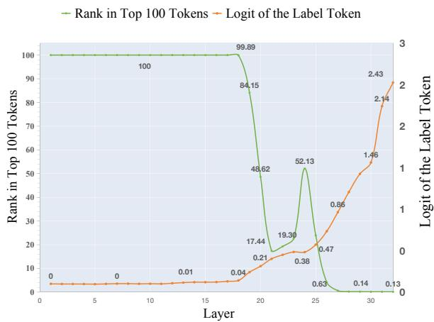  
(a) Logits and rankings across layers

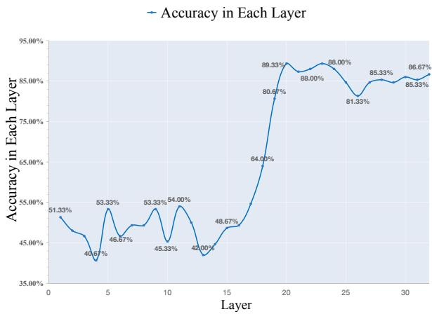  
(b) Accuracy across different model layers  
Figure 7: (a) The orange line denotes the logits of the ground truth, which increases from the layer 19. The green line denotes the rank of the ground truth in the vocabulary space, which also starts to be close to 1 from the layer 19. (b) The probing accuracy of the embeddings across layers. It starts to arise from the layer 15, and reaches the peak at layer 20.

## C Detailed Experimental Setup

## C.1 Training Configuration

In our implementation, we perform SFT updating on top 32 key heads. Following (Yu et al., 2023), the gradient is rescaled by $\frac { H } { h }$ , where H is the number of all heads in each layer, h is the number of updated heads in each layer. In practice, we train Mistral-7B with a learning rate of $2 \times 1 0 ^ { - 5 }$ and a batch size of 128 for 1 epochs. The warm up ratio and weight decay are set as 0.02 and 0.1 by default, respectively. All experiments are conducted on 8 NVIDIA A100 80GB GPUs.

## C.2 Dataset

Interpretation Stage. We use the Stanford Sentiment Treebank Binary (SST-2 (Socher et al., 2013)) for sentiment analysis as the main dataset for main explainability experiments. We also validate our experiments on several other datasets, including Subjective/Objective Sentence Classification((Conneau and Kiela, 2018) SUBJ), Hate Speech Detection ((Mollas et al., 2020) ETHOS), Duplicated-Question Recognition ((Wang et al., 2019b) QQP).For simplicity, we follow existing approach (Wei et al., 2023a) by randomly selecting single digits from 0 9 as options, such as replace [“negative”, “positive”] with [“1”, “4”]. For example, in the SST sentiment classification task, “input: trashy time. output: negative; input: larger life. output: positive; input: sheer joy. Output:”, the original options are [“negative”, “positive”], and the randomly chosen options could be [“1”, “4”]. We replaced “negative” with “1” and “positive” with “4”. Thus, the modified task becomes: “input: trashy time. output: 1; input: larger life. output: 4; input: sheer joy. Output:”. This modification makes the model unclear without looking at the in-context exemplars, thus prevents the model from relying on pretrained semantic knowledge. This ensures that during the subsequent analysis of the model’s internal embeddings (Wei et al., 2023a; Dar et al., 2023; Geva et al., 2022, 2021), the emotional words and options remain distinct. Since the test set lacks labels, we use samples from the validation set for our study. For each sample in the validation set, we randomly selected 16 samples from the training set as demonstrations, ensuring an equal number of samples from different classes. The order of these 16 samples is shuffled to prevent samples from the same class from clustering at the beginning or end.

Training and Evaluation Stage. For evaluation, we choose another four NLP tasks (the Stanford Sentiment Treebank Binary (SST-2 (Socher et al., 2013)), Hate Speech Detection ((Mollas et al., 2020) ETHOS), Duplicated-Question Recognition ((Wang et al., 2019b) QQP),RTE ((Wang et al., 2019a))). We remap original natural language labels to a randomly-selected label from a set of approximately 270k semantically-unrelated labels, Integers, Characters, Words (MIT<sup>3</sup> list of 10,000 words). For training, following (Wei et al., 2023a), We selected 17 publicly-available NLP datasets across seven tasks (Miscellaneous, Paraphrase Detection, Common Sense, Sentiment Analysis, Topic Classification, Coreference, Natural Language Inference) from HuggingFace (Lhoest et al., 2021), ensuring that each task has discrete labels so that there would be labels to swap with sythetic symbols. For each dataset, we used examples from the training split, and because some datasets had more examples than other datasets by multiple orders of magnitude, we cap the number of examples taken from any singular dataset at 20, 000. Aligning with (Wei et al., 2023a), we select datasets from several task types as follows: natural language inference (WNLI, QNLI, MNLI,

Text Highlighted by the Top-Ranked Head's Attention
<table><tr><td>Input: tear your eyes away Input: you &#x27;re an absolute raving</td><td></td><td>Output:negative</td></tr><tr><td>star wars junkie Input: move over bond; this girl</td><td>Output:negative</td><td></td></tr><tr><td>deserves a sequel.</td><td>Output:positive</td><td></td></tr><tr><td>Input: it made me feel unclean</td><td>Output:negative</td><td></td></tr><tr><td>Input: sweeping , dramatic</td><td>Output:</td><td>positive</td></tr><tr><td>Input: alluring</td><td>Output:</td><td>:positive</td></tr><tr><td>Input: He was beaten and was upset Output:negative</td><td></td><td></td></tr><tr><td>Input: beautifully shot</td><td>Output:</td><td></td></tr></table>

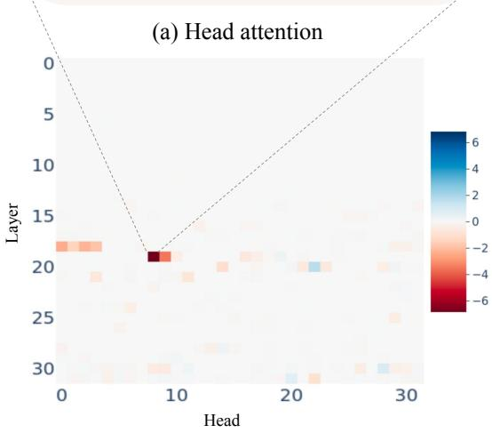  
(c) Effect on logit of each head

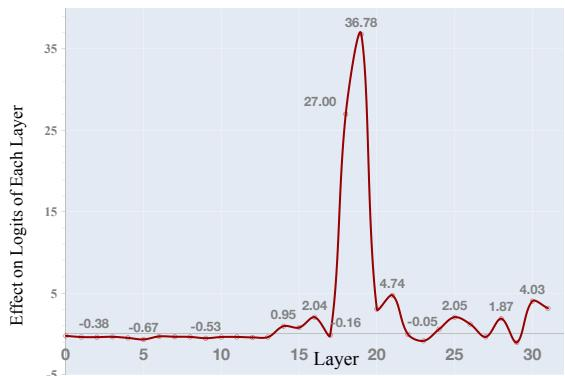  
(b) Effect on logits of each layer

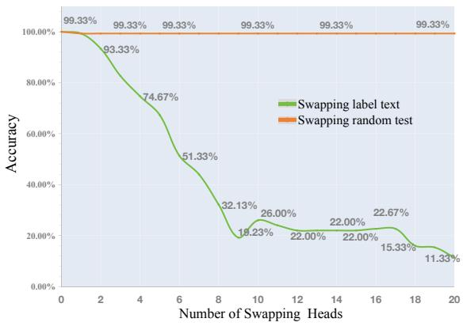  
(d) Accuracy after swapping  
Figure 8: (a) The attention patterns of the key attention head, which mainly attends to the “positive” label. (b) The aggregated effect of PC patching along different layers, where the layer 18 presents a significant peak. (c) The result of PC patching experiment on Mistral-7B on SST-2. For each head, a darker color indicates a larger logit difference from the original model before patching. (d) The performance of the ICL after swapping the attention weights of different labels for the key attention heads. The accuracy decreases from 100% to 11%.

SNLI and CB); sentiment analysis (RT, TES); paraphrase detection (MRPC and PAWS); common sense answering (COPA) and PIQA); topic classification (AGN); coreference resolution (WSC and WINO); offensive language identification (TEO); irony detection (TEI); equal-meaning identification (WIC); and sentence acceptability classification (COLA). We remap original natural language labels to a randomly-selected label from a set of approximately 270k semantically-unrelated labels, Integers, Characters, Words (MIT<sup>4</sup> list of 10,000 words).

Following (Wei et al., 2023a), we implement a pinpoint SFT on 17 publicly available NLP datasets in seven tasks select another four NLP tasks for evaluation. We conduct main experiment on Mistral-7B.

Table 4: Details on the Principal Component Analysis (PCA) conducted on the Mistral7B model using the SST2 dataset. The ‘Y’ of ‘C-Y’ indicates the principal component index withinwithin that layer. Layers14- layer21 store task-specific components, while layer22- layer32 store components related to the output space, focusing on numerical and categorical representations.
<table><tr><td colspan="2">Position</td><td>Component</td></tr><tr><td>layer6</td><td>C-1 C-2</td><td>ixon, athan, \u00e9ri, aza, ixa, giornata, \u00f3, agan, Rules ange, eld, builtin, agra, Internal, Tamb, embre, Maggie, Illuminate</td></tr><tr><td></td><td></td><td></td></tr><tr><td>layer13</td><td>C-1 C-2</td><td>penalty, negative, alarm, liability, Psy, compilation, Crim, ra, anel, Anders, aine, Horn, Maz, Ferr, basketball, generic, fortunate</td></tr><tr><td>layer14</td><td>C-1 C-2 C-3</td><td>dread, negative, destruct, liability, negative, grim, harsh, toxic simple, simpler, rivial, Simple, generic, Simple, Horn, simplicity quantities, patterns, &gt;@, autre, abad, Rab, cq, Titel, k\u00f3w</td></tr><tr><td>layer15</td><td>C-1 C-2 C-4</td><td>negative, unhappy, harsh, destruct, negative, toxic, unple unique, joke, irrelevant, jokes, peculiar, silly, iat, ridiculous, autre positive, praise, posit, warm, happily, enthusiasm, enthusi</td></tr><tr><td></td><td>…</td><td></td></tr><tr><td rowspan="2">layer21</td><td>C-1</td><td rowspan="2">harsh, hostile, extreme, negative, condem, laugh, hilar, negative trivial, simple, simple, simplicity, Simple, Simple, straightforward</td></tr><tr><td>C-2</td></tr><tr><td>layer22</td><td>C-3</td><td>length, complexity, complicated, longest, longer, Length zero, Zero, 0, Zero, zero, \u96f6, ZERO, \u30bc, Lesser, oyal,zer,</td></tr><tr><td rowspan="2"></td><td>C-1 C-2</td><td rowspan="2">zero, Zero, negative, humor, hilar, joke, zero, Zero, harsh, hostile</td></tr><tr><td></td></tr><tr><td rowspan="2"></td><td>…</td><td rowspan="2">… zero, 0, Zero, zero, Zero, ONE, ZERO, Two, One, 1</td></tr><tr><td>C-1 C-2 three, 3, Three, Three, \u4e09, three, third, trois, drei, III,</td></tr></table>

## D Generalization on Model.

We conducted extensive experiments on larger and different types of Large Language Models (LLMs), with results presented in Table 5. The table verifies the generalizability of our findings across various LLMs, including Mistral7B (Jiang et al., 2024), Llama3-8B (Dubey et al., 2024), Llama3- 70B (Dubey et al., 2024), and Qwen2-72B (Yang et al., 2024), using the SST2 dataset. These results support the conclusions drawn in the main text. Relationships in Demonstrations This section shows that the lower accuracy of "Label Block" compared to the "Random Block" supports our hypothesis, demonstrating that blocking key interactions significantly impacts model performance. Abstract Input-Label Mappings Here, X in C-X refers to the principal component index within that layer. For example, "Layer14: C-1" indicates where the negative component is prominent. We highlight the position of negative and positive components across models, illustrating how sentiment information is captured. Match the Mapping The fewer the number of heads required for swapping to achieve performance changes, the more significant the role of specific heads. The contrast between "Random Swapping" and "Label Swapping" accuracies emphasizes the critical heads in task performance. Decoding This section illustrates the trend in logits of the correct label from earlier to later layers, indicating increasing confidence in correct predictions. The progression of logits from lower to higher layers reflects the model’s growing certainty.

Table 5: Verification of generalizability across different LLMs (Mistral7B, Llama3-8B, Llama3-70B, Qwen2- 72B) using the SST2 dataset. Key conclusions align with the main text, highlighting: 1) Blocking key inputlabel interactions reduces accuracy more than random blocking, 2) Sentiment components emerge in principal components across layers, 3) Critical heads identified by swapping fewer heads significantly impact task performance, and 4) Increasing logits across layers reflect growing confidence in correct predictions.

<table><tr><td colspan="2"></td><td>Mistral7B</td><td>Llama3-8b</td><td>Llama3-70b</td><td>Qwen2-72b</td></tr><tr><td rowspan="3">Relationships in Demonstrations</td><td>Layer</td><td>Layer17</td><td>Layer20</td><td>Layer45</td><td>Layer59</td></tr><tr><td rowspan="2">Random Block Label Block</td><td>97.35%</td><td>93.37%</td><td>81.00%</td><td>89.99%</td></tr><tr><td>55.63%</td><td>54.97%</td><td>64.99%</td><td>67.00%</td></tr><tr><td rowspan="3">Abstract Input-label Mappings</td><td>Position of negative component Position of</td><td>Layer14: C-1 Layer19: C-2</td><td></td><td>Layer44: C-1</td><td>Layer53: C-1</td></tr><tr><td>positive component</td><td></td><td>Layer15: C-1 Layer18: C-3</td><td>Layer42: C-2</td><td>Layer56: C-1</td></tr><tr><td>Example: Llama-70B</td><td colspan="4">positive: &quot; positive&quot;, &quot; enthusiasm&quot;, &quot; happily&quot;, happy, happ .. negative: &quot; Negative&quot;, &quot; negative&quot;, &quot; negatives&quot;, negativity, bad ...</td></tr><tr><td rowspan="3">Match Input-label Mapping</td><td>Number of Heads for Swapping</td><td>9 / 1024</td><td>18 / 1024</td><td>80 / 6400</td><td>50 / 6400</td></tr><tr><td>Random Swapping Label Swapping</td><td>99.33% 19.23%</td><td>97.33% 50.49%</td><td>99.33% 41.23%</td><td>97.73% 64.35%</td></tr><tr><td>Trend</td><td>Layer15 -&gt;Layer30</td><td></td><td>Layer50 -&gt;Layer80</td><td></td></tr><tr><td rowspan="4">Decoding</td><td></td><td>L15: 0.019</td><td>L15 : -0.095</td><td></td><td></td></tr><tr><td>Logits</td><td>L20: 0.212</td><td>L20: 0.373</td><td>L50: 0.749 L60 : 2.265</td><td>L50 : 1.081 L60 : 4.719</td></tr><tr><td>of</td><td>L25 : 0.472</td><td>L25 : 1.632</td><td>L70: 3.555</td><td>L70: 41.696</td></tr><tr><td>Label</td><td>L30: 1.461</td><td>L30: 5.180</td><td>L80:14.833</td><td>L80:187.975</td></tr></table>

## E Generalization on Dataset.

## E.1 Multi-classification task.

The results is shown in Table 6. Generalization Experiment on the Six-Class TREC (Text REtrieval Conference) Dataset. We conduct all the experiments mentioned in the manuscript. Due to the space limit, we abstract the key information of each figure from "Observation 1-5" and summarize them in this table. Task-specific Information. This task includes six categories: DESC (Description and Manner), LOC (Location), NUM (Numeric Value), HUM (Human beings), ENTY Entities, ABBR(Abbreviation). This table reveals that even in a six-class classification setting, the model still summarizes task-specific information in a manner similar to the binary classification described in the main text. Specifically, after leveraging PCA and logit lens, we identify the positions where taskspecific information first emerges in the layers and their corresponding principal components, denoted as ‘LayerX: C-Y’, where ‘X’ represents the neural network layer and ‘Y’ indicates the principal component. These results consistent with the main text. Relationships in Demonstrations. This section illustrates that blocking key interactions between the input and label in the demonstration reduces accuracy to 54.54%, while random blocking has no effect, supporting the conclusions in the main text. Match the Mapping to New Question. This part observes that swapping just 20 heads causes a 62% decrease in performance, consistent with the main text, suggesting the generalization of our conclusions. Decoding: The table shows the changes in the logits of the correct answer tokens and the accuracy (ACC) of correct classification after probing the embeddings at key layers. As seen, the ACC stabilizes around layer 20, while the model continues to increase the logits of the correct answers in subsequent layers, thereby enhancing the confidence in the correct results.

Table 6: Generalization experiment on the six-class TREC dataset demonstrates consistency with binary classification results. Task-specific information emerges across layers using PCA and logit lens. Blocking key input-label interactions reduces accuracy to 54.54%, while swapping 20 attention heads decreases performance by 62%. Accuracy stabilizes around layer 20, with increased confidence in correct answers observed in deeper layers.
<table><tr><td>TREC Category</td><td>Position</td><td>Main Component</td><td></td><td></td></tr><tr><td>DESC LOC</td><td>Layer16: C-1 Layer16: C-2</td><td colspan="3">Definition, definitions, definition, exp, ... Location, spatial, locations, GPS, maps, ...</td></tr><tr><td>NUM</td><td>Layer16: C-3</td><td colspan="3">dates, chron, Events, calendar, year, ...</td></tr><tr><td>HUM</td><td>Layer16: C-8</td><td colspan="3">scientists, universal, physics, fundamental, ...</td></tr><tr><td>ENTY</td><td>Layer19: C-5</td><td colspan="3">leaf, spher, galax, Academy, Musik, ...</td></tr><tr><td>ABBR</td><td>Not found</td><td>Not found</td><td></td><td></td></tr><tr><td>Relationships in</td><td>Layer index</td><td>Layer5</td><td>Layer10</td><td>Layer15</td><td>Layer32</td></tr><tr><td>Demonstrations</td><td>Random Block</td><td>100%</td><td>100%</td><td>100%</td><td>100%</td></tr><tr><td></td><td>Label Block</td><td>90.91%</td><td>81.82%</td><td>63.74%</td><td>45.64%</td></tr><tr><td>Match Input-label</td><td>Number of Head for Swapping</td><td>5</td><td>10</td><td>15</td><td>20</td></tr><tr><td>Mapping</td><td>Random Swapping</td><td>100%</td><td>100%</td><td>100%</td><td>100%</td></tr><tr><td></td><td>Label Swapping</td><td>91.23%</td><td>74.36%</td><td>53.32%</td><td>38.64%</td></tr><tr><td></td><td>Layer</td><td>Layer15</td><td>Layer20</td><td>Layer25</td><td>Layer32</td></tr><tr><td>Decoding</td><td></td><td>15.63%</td><td>50.51%</td><td>53.53%</td><td>57.57%</td></tr><tr><td></td><td>ACC Logits</td><td>0.021</td><td>0.171</td><td>0.361</td><td>2.101</td></tr></table>

## E.2 Other datasets

In this section, we verify the effectiveness of our proposed methods on various datasets (SUBJ, QQP, ETHOS). We examine the generalization of inputlabel mappings and evaluate the model’s ability to abstract and apply these mappings across different datasets. The experiments aim to solidify the relationships between the demonstrations and the internal workings of the model, ensuring consistent performance when encountering new questions and performing decoding tasks. The following figures illustrate the results of our verification experiments, including abstracting input-label mappings, matching them to new questions, and decoding predictions across multiple datasets..

In summary, these verification experiments emphasize the robustness of the proposed techniques for abstracting, matching, and decoding input-label mappings. The results across multiple datasets demonstrate the model’s ability to generalize its learned mappings to new tasks and datasets, further validating the effectiveness of the method in multi-classification tasks.

## F Training-free Application

In this paper, we reveal how LLMs complete incontext learning (ICL) by constructing input-label mappings in the principal components of the midlayers (19-23). These mappings are then leveraged to match the true answers. However, we discover two interesting phenomena:

(1) All top-20 principal components of the embeddings in the vocabulary are related to task information (e.g., “positive”, “negative”, “happy”). Beyond these top-20 principal components, the tokens become increasingly messy and irregular (e.g., “dsa”, “tar”, “opp”).

(2) We observe a significant decrease in label ranking in the vocabulary after layer 21 (as shown the green line in Figure 7 (a)).

These observations indicate that components beyond the top-20 principal components could detract from performance by introducing noisy information. This might account for the tendency of LLMs to undermine their utility. Motivated by this insight, we introduce our method, which enhances the in-context learning capabilities of large language models by filtering out components beyond the top-20 principal components in the embeddings. Specifically, we utilize Principal Component Analysis (PCA) on the embeddings of the final token in layer 19, retaining only the top-10 principal components before transforming them back into the embedding space. By leveraging this approach, we evaluate the in-context learning (ICL) performance across various datasets—SST2, SUBJ, ETHOS, and QQP—using the Mistral-7B model. The empirical results of this investigation are presented in Table 7. As shown in the table, after applying the

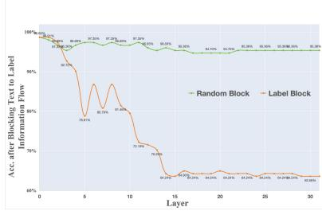  
(a) SUBJ

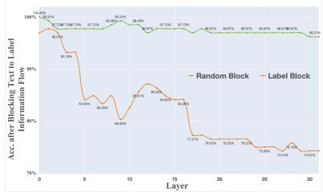  
(b) QQP

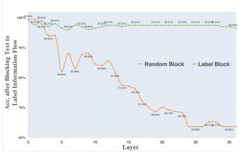  
(c) ETHOS

Figure 9: Verification of Abstracting Input-label Mappings Based on Relationships in Demonstrations. This figure highlights the effectiveness of the model in capturing task-specific information by identifying relationships between input and label tokens within the demonstration examples.  
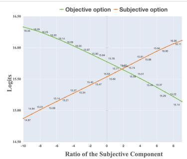  
(a) SUBJ

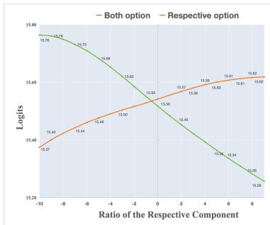  
(b) QQP

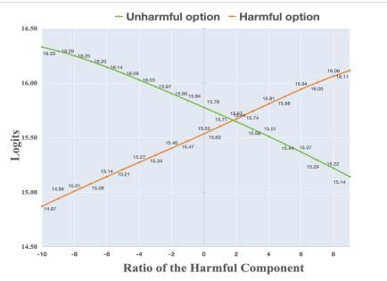  
(c) ETHOS  
Figure 10: Verification of Abstract Input-label Mappings Across Different Datasets. This figure demonstrates the model’s ability to abstract task-specific input-label mappings across various datasets, maintaining consistency in information flow and pattern recognition.

Table 7: Application of Proposed Method on Semantic and Number Labels.This table compares the effectiveness of our proposed method across different settings using both numerical and semantic labels. In the main text, we initially conducted experiments on Mistral7B using number labels (e.g., [’2’, ’1’]) instead of semantic labels (e.g., [’negative’, ’positive’]). Here, we extend our experiments to include semantic labels and a different model, Llama3-8B, to verify the method’s generalizability. The results demonstrate consistent improvements across various datasets and models, highlighting the robustness and applicability of our approach.

<table><tr><td></td><td></td><td colspan="2">Mistral-7b (ACC)</td><td colspan="2">Llama3-8B (ACC)</td></tr><tr><td></td><td></td><td>original</td><td>ours</td><td>original</td><td>ours</td></tr><tr><td rowspan="5">Number label</td><td>SST2</td><td>60.69%</td><td>67.66% (+6.97%)</td><td>70.05%</td><td>71.43% (+1.38%)</td></tr><tr><td>SUBJ</td><td>82.61%</td><td>87.81% (+5.20%)</td><td>62.44%</td><td>69.65% (+7.21%)</td></tr><tr><td>ETHOS</td><td>75.44%</td><td>76.23% (+0.79%)</td><td>73.21%</td><td>77.54% (+4.33%)</td></tr><tr><td>QQP</td><td>58.04%</td><td>62.31% (+4.27%)</td><td>65.42%</td><td>69.53% (+4.11%)</td></tr><tr><td>average</td><td>69.19%</td><td>73.50% (+4.31%)</td><td>67.78%</td><td>72.03% (+4.25%)</td></tr><tr><td rowspan="5">Semantic label</td><td>SST2</td><td>94.96%</td><td>95.47% (+0.51%)</td><td>93.46%</td><td>94.47% (+1.01%)</td></tr><tr><td>SUBJ</td><td>63.82%</td><td>71.35% (+7.53%)</td><td>55.77%</td><td>55.26% (-0.51%)</td></tr><tr><td>ETHOS</td><td>82.41%</td><td>83.91% (+1.50%)</td><td>73.36%</td><td>75.88% (+2.52%)</td></tr><tr><td>QQP</td><td>69.84%</td><td>70.35% (+0.51%)</td><td>70.35%</td><td>74.87% (+4.52%)</td></tr><tr><td>average</td><td>77.75%</td><td>80.52% (+2.51%)</td><td>73.23%</td><td>75.12% (+1.89%)</td></tr></table>

proposed method, the average accuracy improved by 4%, suggesting the effectiveness of the method and providing a new direction for future research.

## G Additional Analyses on Key Heads and PC Patterns

## G.1 Distribution and Consistency of Key Heads Across Test Samples

Our PC patching analysis reveals strong consistency in the identification of key heads across different test samples. Specifically, we found that 80% of test samples share the same top 5 key heads, indicating high reliability in our methodology. For Mistral-7B, these consistently identified heads are located in deeper layers (starting from Layer 14) and include heads (19, 8), (19, 9), (18, 0), (18, 2), and (18, 3).

This high overlap in key heads across test samples demonstrates the robustness of our PC patching approach. More importantly, it implies that PC patching can effectively identify critical components for input-label mapping with a relatively small number of test samples, making the method both efficient and reliable.

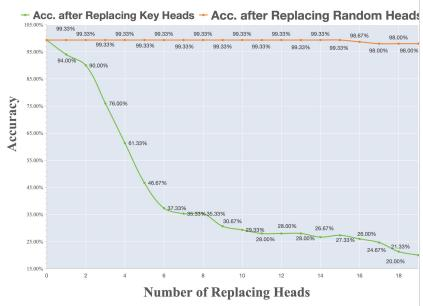  
(a) SUBJ

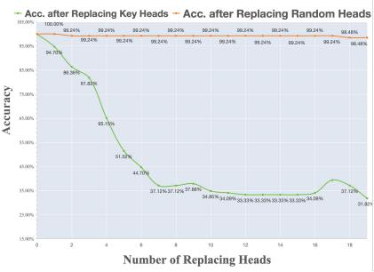  
(b) QQP

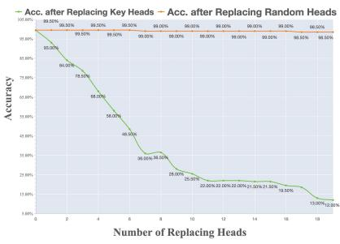  
(c) ETHOS

Figure 11: Verification of Matching to New Questions Across Different Datasets. This figure validates the model’s capacity to extend learned input-label mappings to new questions, preserving performance and accuracy across datasets.  
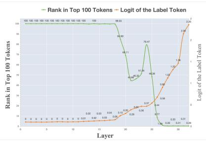  
(a) SUBJ

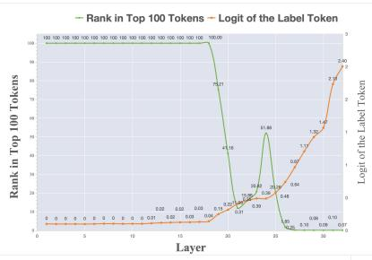  
(b) QQP

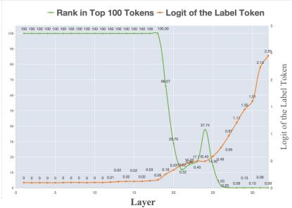  
(c) ETHOS  
Figure 12: Verification of Decoding Prediction from Matched Mappings Across Different Datasets. This figure showcases the progression of logits and prediction confidence as the model decodes correct answers from matched mappings, reinforcing the effectiveness of the proposed method across diverse datasets.

The causal effects of key heads show variation across individual samples, with logit changes ranging from 20% to less than 1%. However, after averaging over samples, these effects stabilize within 6% range, as shown in Figure 5(a) of the main text. We observed that the heatmap of key heads stabilizes after averaging approximately 25 samples, with no substantial changes occurring beyond 50 samples. To ensure robust results and account for residual variability, we averaged over 100 samples in our experiments.

This averaging procedure helps mitigate the variability of causal effects, providing a reliable summary of head contributions across different inputs. By using 100 samples, we guarantee a stable and comprehensive view of key head distributions, minimizing noise while capturing consistent patterns in the model’s behavior.

## G.2 Zero-Shot versus ICL PC Patterns

To investigate the robustness of our findings, we compared principal component (PC) patterns under zero-shot and in-context learning (ICL) settings. This comparison provides valuable insights into how demonstrations influence the formation of taskrelated representations within the model.

## G.2.1 Observations: Task-Related Patterns in Zero-Shot vs. ICL Settings

In the zero-shot setting, without demonstrations, we did not observe coherent task-related PC patterns. Instead, the patterns appeared disorganized, with principal components associated with random or general semantic tokens rather than task-relevant features. Table 8 illustrates zero-shot PC patterns on SST-2, which contrasts sharply with the patterns observed in the ICL setting (Figure 4(a) in the main text).

In contrast, in the ICL setting, despite relying solely on symbolic labels in the demonstrations, LLMs effectively extract task-related PC patterns (input-label mappings). These patterns emerge clearly, particularly in Layer 15, where PCs align with interpretable and task-specific tokens such as “positive,” “negative,” or symbolic labels, showcasing the model’s ability to utilize input-label mappings for task differentiation and prediction.

Table 8: Principal component patterns in zero-shot setting on SST-2
<table><tr><td></td><td>Layer Component Top-10 Words</td><td></td></tr><tr><td>6</td><td>C-1</td><td>pred, Ton, turns, Ferd, zing, sphere, phere, exp, disco, ago</td></tr><tr><td></td><td>C-2</td><td>rie, auch, spl, Astr, atan, descriptions, answers, bras, zip</td></tr><tr><td>13</td><td>C-1</td><td>Edd, umber, Bible, reply, Response, instant, Bry, ellt, counted, song</td></tr><tr><td></td><td>C-2</td><td>rescue, resc, protest, idos, trans, ikh, omb, alternative, tele, Gol</td></tr><tr><td>15</td><td>C-1</td><td>port, zent, agr, ont, summary, aling, summar, summary, grap, neat</td></tr><tr><td></td><td>C-2</td><td>/******/, congr, praise, cord, ǒ434ǒ430ǒ43d, roud, atel, heim, kissed, deck</td></tr><tr><td>26</td><td>C-1</td><td>director, brilliant, describes, writer, film, Director, brill, describe, ensemble</td></tr><tr><td></td><td>C-2</td><td>Based, sounds, based, Overall, overall, Sounds, based, Based, sounded</td></tr></table>

## G.2.2 Analysis: Why Zero-Shot and ICL PC Patterns Differ

The stark difference between zero-shot and ICL PC patterns can be attributed to the lack of task-specific signals in zero-shot settings. Without demonstrations, the model has no contextual clue to indicate the task it should perform. Consequently, the PCs reflect generic semantic patterns rather than taskrelevant features.

In contrast, demonstrations in the ICL setting provide explicit examples of input-label mappings, guiding the model to focus on specific task-related features. This difference highlights the importance of demonstrations in enabling the model to recognize and utilize task-specific information.

## G.2.3 When Demonstrations Are Not Necessary: The Role of Instructions

Demonstrations are essential when no explicit instruction is provided, as they help the model infer what the task is and how to map inputs to outputs. However, when clear and concise instructions are included in the prompt, the model can sometimes bypass the need for demonstrations. In these cases, the instruction itself serves as a signal for task recognition, enabling task-specific PC patterns to emerge without requiring example pairs.

This observation aligns with findings in recent literature (Long et al., 2025) that ICL can occasionally underperform zero-shot settings due to the influence of pre-training priors:

• Semantic Priors from Pre-Training: Pretrained LLMs often possess strong priors based on extensive exposure to task-related data during training. These priors enable the model to perform well in zero-shot settings by leveraging learned task-relevant patterns.

• Demonstration Quality in ICL: Poor-quality demonstrations can mislead the model, causing it to deviate from its pre-trained priors and ultimately lowering performance. This underscores the importance of high-quality, well-constructed demonstrations in ICL.

These findings support our approach of using symbolic labels to eliminate semantic priors and minimize interference, ensuring a fair evaluation of the model’s ICL capabilities.

## H Generalization Across Different Tasks

To validate the generalizability of our findings, we extended our analysis beyond SST-2 to include ETHOS, QQP, and SUBJ datasets. Our results demonstrate consistent patterns across these diverse tasks, reinforcing the robustness of our methodology.

## H.1 Consistency in Key Components Across Tasks

## H.1.1 Location of Key Heads

For SST2, ETHOS, QQP, and SUBJ, we observed significant overlap in the top-5 key heads. The variance between head heatmaps across different datasets was only 0.009, indicating remarkable consistency in the model’s utilization of specific attention heads for in-context learning across diverse tasks.

Table 9: Principal component patterns in SUBJ dataset
<table><tr><td>Layer</td><td>Component</td><td>Top-10 Words</td></tr><tr><td>6</td><td>C-1</td><td>IMPLIED, oby, ROL, seh, ******, UN, plac, GTH, pollution</td></tr><tr><td>15</td><td>C-1</td><td>opinion, evaluation, insult, rating, criticism, excess, critic, opinions</td></tr><tr><td>26</td><td>C-1</td><td>0, 1, zero, ONE, Two, One, Zero, 2, One, Three</td></tr></table>

## H.2 Task-Related PC Patterns Across Datasets

For all datasets examined, Layer 15 exhibited the strongest alignment with task-relevant information. This layer consistently encodes high-level features necessary for accurate task performance, further validating the generalizability of our findings.

## H.2.1 ETHOS: Hate Speech Detection

In the ETHOS dataset, PCs in Layer 15 capture hate speech indicators such as “harmful,” “toxic,” and “illegal,” effectively identifying linguistic patterns related to toxicity and abuse (Table 10).

## H.2.2 QQP: Question Pair Similarity

In the QQP dataset, PCs focus on semantic similarity and paraphrase-related terms like “respectively,” “both,” and “dual,” demonstrating alignment with the goal of determining question equivalence (Table 11).

## H.2.3 SUBJ: Subjectivity Classification

In the SUBJ dataset, PCs highlight subjective evaluation terms, including “opinion,” “evaluation,” and “critic,” crucial for distinguishing between subjective and objective sentences (Table 9).

## I Task-Related Words Algorithm Validation

The detection of task-related words in Algorithm-1 was initially designed for datasets like SST2, where output labels depend on universal characteristics of the input (e.g., sentiment). However, our experiments demonstrate that this approach is also valid for datasets where the output label depends on instance-specific properties, such as QQP.

## I.1 Clarification of Task-Related Words Concept

The concept of task-related words in our approach is derived from the LLM’s understanding of the task paradigm represented in the input-label mapping of the demonstrations:

• Definition: Task-related words are keywords extracted from the description of the task that aligns with how the LLM understands the task’s input-output relationships. In Algorithm-1, these words are generated by prompting the LLM to describe the task (based on input-label mapping) and then abstracting relevant keywords.

• Relevance and Accuracy: The task-related words correspond to tokens already embedded in the LLM’s internal vocabulary space and aligned with the PC patterns of the model’s middle layers. Importantly, both the demonstrations used for extracting taskrelated words and those used for identifying PC patterns are consistent, ensuring accuracy and relevance.

## I.2 Application to Instance-Specific Tasks

For instance-specific datasets like QQP, taskrelated words represent the high-level task logic rather than universal properties:

• QQP Context: In QQP, task-related words represent semantic similarity or dissimilarity between sentence pairs. These words encapsulate the task description and align with the decision boundary (e.g., “similar” for matching sentence pairs and “different” for nonmatching ones).

• Broader Concept: Task-related words in instance-specific datasets represent the highlevel task logic rather than universal properties (e.g., sentiment). For QQP, these words are drawn from the task description (semantic similarity evaluation) rather than from the intrinsic features of the inputs.

This abstraction allows the concept of taskrelated words to cover instance-specific tasks like QQP while maintaining coherence with tasks like SST2.

Table 10: Principal component patterns in ETHOS dataset
<table><tr><td>Layer</td><td>Component</td><td>Top-10 Words</td></tr><tr><td>6</td><td>C-1</td><td>eln, ubb3c, Fi, wn, Fu, mild, Cord, holm, alis, WN, ENDOR</td></tr><tr><td>15</td><td>C-1</td><td>harmful, controversial, prohib, toxic, illegal, extreme, outrage, dark</td></tr><tr><td>26</td><td>C-1</td><td>3, three, Že09, Three, third, III, Third, trois, three, drei</td></tr></table>

Table 11: Principal component patterns in QQP dataset
<table><tr><td></td><td>Layer Component Top-10 Words</td><td></td></tr><tr><td>6</td><td>C-1</td><td>dispers, pan, Singles, pat, unc, wis, **, stud, trading, Posted</td></tr><tr><td>15</td><td>C-1</td><td>respectively, both, neither, Both, two, both, two, Neither, simultane, dual</td></tr><tr><td>26</td><td>C-1</td><td>seven, eight, seventh, nine, Eight, six, 7, seven, eight, Seven</td></tr></table>

## J Relationship to Task Recognition and Task Learning

Our work provides a complementary perspective to recent studies on Task Recognition (TR) and Task Learning (TL) in in-context learning. Following the definitions in (Pan et al., 2023), our study focuses on Task Learning (TL), which involves learning new input-label mappings from demonstrations.

## J.1 Use of Symbolic Labels

To minimize the influence of pre-trained priors and focus on analyzing the relationship between specific LLM modules and their behaviors, we employ a wider variety of symbolic labels. Specifically, following the approach in (Wei et al., 2023a), we remap the original natural language labels to randomly selected labels from a diverse set of approximately 270k semantically unrelated options, including integers, characters, and words (sourced from MIT’s list of 10k and 100k words).

The use of symbolic labels serves multiple purposes:

• Suppressing ICL Behavior: In our PC Patching method, symbolic labels help suppress ICL behavior to isolate relevant modules. Using semantic labels risks suppressing memoryrelated behaviors instead, misaligning with our objectives.

• Isolating TL Components: By minimizing the influence of pre-trained priors, symbolic labels allow us to focus specifically on the TL aspects of in-context learning, providing a cleaner analysis of how models learn inputlabel mappings from demonstrations.

## J.2 Mechanistic Interpretation vs. Black-Box Analysis

Our work differs from previous studies in its level of granularity and mechanistic interpretation:

• Fine-grained Analysis: We focus on examining ICL mechanisms at the layer, head, and feature levels, pinpointing where and how task-related information is encoded within LLMs.

• Internal Representation Focus: Unlike black-box approaches that examine only model outputs, our study delves into internal representations to provide a detailed view of how input-label mapping information is encoded and utilized within LLMs.

Through this fine-grained analysis, we bridge the gap between behavioral observations (such as TR and TL) and the underlying neural mechanisms that enable these behaviors.