# KV-Latent: Dimensional-level KV Cache Reduction with Frequency-aware Rotary Positional Embedding

Luohe Shi<sup>1</sup>, Zuchao Li<sup>2</sup>\*, Lefei Zhang<sup>1</sup>, Guoming Liu<sup>3</sup>, Baoyuan Qi<sup>3</sup>, Hai Zhao<sup>4</sup>

<sup>1</sup>School of Computer Science, Wuhan University, Wuhan, China <sup>2</sup>School of Artificial Intelligence, Wuhan University, Wuhan, China; <sup>3</sup>Xiaomi, Beijing, China <sup>4</sup>School of Computer Science, Shanghai Jiao Tong University, Shanghai, China {shiuohe, zcli-charlie, zhanglefei}@whu.edu.cn {qibaoyuan, liuguomin}@xiaomi.com zhaohai@cs.sjtu.edu.cn

## Abstract

Large language models (LLMs) based on Transformer Decoders have become the preferred choice for conversational generative AI. Despite the overall superiority of the Decoder architecture, the gradually increasing Key-Value (KV) cache during inference has emerged as a primary efficiency bottleneck, both in aspects of memory consumption and data transfer bandwidth limitations. To address these challenges, we propose a paradigm called KV-Latent. By down-sampling the Key-Value vector dimensions into a latent space, we can significantly reduce the KV Cache footprint and improve inference speed, only with a small amount of extra training, less than 1% of pretraining takes. Besides, we enhanced the stability of Rotary Positional Embedding applied on lower-dimensional vectors by modifying its frequency sampling mechanism, avoiding noise introduced by higher frequencies while retaining position attenuation. Our experiments, including both models with Grouped Query Attention and those without, have yielded satisfactory results. Finally, we conducted comparative experiments to study the impact of separately reducing Key and Value components on model’s performance. Our approach allows for the construction of more efficient language model systems, and opens the new possibility on KV Cache saving and efficient LLMs. Our code is available at https://github.com/ShiLuohe/KV-Latent.

## 1 Introduction

The release of ChatGPT (Brown et al., 2020) launched an generative AI trend, and as the core architecture behind these state-of-the-art models, the Transformer decoder (Vaswani et al., 2017)

has gain many attention. There capabilities are spectacular (Anil et al., 2023; Tang et al., 2025a; Anthropic, 2024, 2025; Yang et al., 2025; Shi et al., 2024). Undeniably, as large language models (LLMs) become more integrated into people’s lives, the costs associated with training and inference are increasingly impossible to ignore (Yan et al., 2024). While training costs remain relatively fixed and centralized, inference costs grow linearly with user adoption and are often distributed across different spaces and timeframes, making the optimization of model inference costs increasingly urgent. The Transformer decoder architecture, employed by LLMs, operates as a causal model, avoiding the need to recompute most intermediate states during a autoregressive generation. However, it still requires retaining certain intermediate states. Specifically, as a self-attention-based architecture, it necessitates preserving the key and value (KV) states corresponding to each token, and commonly referred to as the KV Cache. The time complexity of the self-attention mechanism is uniformly $O ( n ^ { 2 } )$ , meaning that for each additional token in a sequence, the computational workload increases at least by $O \left( ( n ^ { 2 } ) ^ { \prime } \right) = O ( n )$ . Consequently, in typical situations, we need to interact with O(n) cached states. In other words, the required storage for the KV Cache grows linearly with the generation of tokens. This poses a significant challenge.

The KV Cache faces two primary challenges: growing volume and non-friendly access pattern. The large volume necessitates increasingly expensive hardware for efficient KV Cache storage and retrieval, furthermore, because each inference request maintains its own dedicated KV Cache, accelerate the system with batch processing is impossible, leading to RAM bandwidth bottlenecks and wasted computational resources on chips (Williams et al., 2009). Meanwhile, the non-friendly memory access arises due to the cache size frequently fluctuating. The latter challenge can be significantly mitigated through more scientifically organized cache structures, such as paged attention (Kwon et al., 2023) or heterogeneous inference systems like fastdecode (He and Zhai, 2024). However, the former challenge remains more intricate.

To address the issue of KV Cache size, several methods have been proposed. At attentionhead-level, Multi-Query Attention (MQA, Shazeer, 2019), Grouped Query Attention (GQA, Ainslie et al., 2023) are effective and widely proved methods. At layer-level, cross-layer reuse methods has been proposed, such as You Only Cache Once (Sun et al., 2024) and Cross Layer Attention (Brandon et al., 2024). At token-level, researchers have focused on eviction and merging, methods include Heavy Hitter Oracle (Zhang et al., 2023), PyramidInfer (Yang et al., 2024b), SirLLM (Yao et al., 2024), and $L _ { 2 }$ Norm method proposed by Devoto et al..

Despite the substantial progress made by previous research, directly reducing the size of Key and Value heads remains a less explored area. In the context of MHA, each attention head is a combination of two low-rank transformations, the first is the pair of K and $Q ^ { \top }$ , the second is the pair of V and O. We define dimension of each attention head is $d _ { h }$ , the number of heads is $n _ { h } .$ , and the model’s hidden dimension is $d .$ We observe that K and V represent two linear transformations that downsample d-dimensional hidden state h to two $d _ { h }$ -dimensional vector k and v. Correspondingly, $Q ^ { - }$ and O perform up-sampling from $d _ { h }$ to d dimensions. The KV Cache stores the latent vectors resulting from these two low-rank transformations.

Typically, we assume that $d _ { h } \times n _ { h } = h .$ , but when considering an individual head, $d _ { h }$ and h do not necessarily need to adhere to this predefined relationship. The work of MQA and GQA, and other recent works (Yu et al., 2024; DeepSeek-AI et al., 2024; Saxena et al., 2024a), has already demonstrated that the retained KV Cache does not require complete d-dimensional vectors; low-rank representations suffice for transmitting information between tokens. However, we aim to go further by decoupling the constraint $d _ { h } * n _ { h } = h$ . Our approach involves directly reducing the head size from existing models, then restore model’s performance by a minimal amount of additional training with a 2-stage strategy, achieving the goal of KV Cache reduction. Since we essentially map the Key and Value into a latent space then directly decode from it by Query-transpose and Output, we name our proposed method KV-Latent.

Furthermore, we observe that even within individual attention heads, the low-rank transformations of $K Q ^ { \top }$ and $V O$ do not necessarily require the same dimension. Specifically, we can separate $d _ { h }$ into $d _ { q k }$ and $d _ { v o } .$ , and these dimensions need not be equal. Building upon this insight, we explore various reduction strategies with different value of $d _ { q k }$ and $d _ { v o }$ , to investigate their impact on training time, inference efficiency, and, the most important aspect, model’s capabilities.

Lastly, in our experiments, we discovered that the stability of Rotary Position Embedding (RoPE, Su et al.) diminishes at lower dimensions, affecting long-range ability. By analyzing RoPE’s sampling mechanism, we identified that noise from high-frequency features dominate when the dimensionality is low. Consequently, we refined our approach by modifying RoPE’s sampling method in a frequency-aware way to maintain stability even at lower dimensions.

Out contribution includes:

• We’ve proved that by a small amount of additional training with 2-stage strategy, we can fit the KV Cache into a latent space, thus directly reduces the space occupation and bandwidth requirement of KV Cache.

• By using different combinations of $d _ { q k }$ and $d _ { v o } .$ we observed that model’s performance is more sensitive to $d _ { v o }$ comparing to $d _ { q k }$ , which reveals how LLMs are affect by different parts of self-attention, providing insights to optimize LLMs’ model structure.

• By modifying RoPE’s sampling mechanism in a frequency-aware way, excluding high frequency portions and amplifying low frequency portions, we successfully make RoPE more stable when applied on lowerdimensional Query and Key.

## 2 Backgrounds and Related Works

## 2.1 Transformer Decoder

Our primary focus lies on the masked self-attention of Transformer (Vaswani et al., 2017) decoder. We define h as the hidden vector of the input at l-th layer, token-wise, and H for the whole sequence. Our goal is to compute $h ^ { \prime }$ , which represents the output of the attention module. The process is described by Formula 1, where $W _ { \{ Q , K , V , O \} } ^ { ( i ) }$ corresponds to the parameter matrices for the Q, K, V, and O transformations of the i-th head. And the <sup>(i)</sup>, <sup>(i)</sup> represents the KV Cache of the i-th head. We apply right multiplication in this context.

$$
\begin{array} { l } { { \displaystyle h ^ { \prime } = \sum _ { i = 1 } ^ { n _ { h } } \left[ \mathrm { s o f t m a x } \left( \frac { q ^ { ( i ) } K ^ { ( i ) ^ { \top } } } { \sqrt { d _ { q k } } } \right) { \mathcal V } ^ { ( i ) } { \boldsymbol W } _ { O } ^ { ( i ) } \right] } } \\ { { \displaystyle q ^ { ( i ) } = h W _ { Q } ^ { ( i ) } , ~ K ^ { ( i ) } = H W _ { K } ^ { ( i ) } , ~ { \mathcal V } ^ { ( i ) } = H W _ { V } ^ { ( i ) } } } \end{array}\tag{1}
$$

## 2.2 KV Cache Reduction Methods

## 2.2.1 Head-level

MQA(Shazeer, 2019) combines all Key and Value heads into two single heads and queries the single Key head multiple times using various Query heads. Building upon this, GQA (Ainslie et al., 2023) pregroups all attention heads. Within each group, multiple Query heads share a single Key head and correspondingly single Value heads. GQA introduces a tunable variable, the number of groups $n _ { g }$ and the corresponding number of heads within each group, finding a new trade-off method between MQA and MHA (Multi-Head Attention). This approach provides a fine-grained balance between efficiency and performance, boosts the operational intensity, and has been widely adopted in models like LLaMA2 (Touvron et al., 2023), LLaMA3 (Dubey et al., 2024), Mistral (Jiang et al., 2023, 2024), and Qwen (Yang et al., 2024a). These works have proved the low-rank nature of KV Cache, which guaranteed the effectiveness of our method.

## 2.2.2 Layer-level

Cross-layer reuse is another hot topic. Methods like You Only Cache Once (Sun et al., 2024) and Cross Layer Attention (Brandon et al., 2024) have successfully reduced KV Cache size by reusing the same KV Cache states across different decoder layer. However, Due to the non-continuous nature of reused content over time, cross-layer reuse cannot optimize computational intensity effectively, and bandwidth limitations from data exchanges persist, limiting inference speed improvement.

## 2.2.3 Token-level

In token level, eviction (Liu et al., 2023) and merging (Pang et al., 2024; Tang et al., 2025b) are the most essential methods, for which the core idea is to evict less attend tokens or to merge states from multiple tokens into one. Popular works includes

Heavy Hitter Oracle (Zhang et al., 2023), PyramidInfer (Yang et al., 2024b), SirLLM (Yao et al., 2024), and $L _ { 2 }$ Norm method proposed by Devoto et al.. Possible problem for token level reduction lies in the reliance on the attention score, making them cannot be combined with prefill acceleration methods, for example flash attention (Dao et al., 2022). Other methods that do not rely on attention often lacks fine granularity, risking critical information loss. Achieving practical large-scale usage remains a challenge.

## 2.3 Rotary Positional Embedding

Rotary Position Embedding (RoPE), proposed by Su et al. in 2021, is a method that enhances position encoding for Decoder models. This type of position encoding has gained widespread adoption due to its various desirable properties. First, it adheres to the characteristic of long-range attenuation: the farther apart two identical vectors are in a sequence, the weaker their attention connection becomes. Second, RoPE is a form of relative position encoding, meaning that the attenuation remains consistent for the same relative distances. This property contributes to better generalization. Finally, RoPE achieves its encoding through sparse matrices, resulting in computational efficiency. These favorable properties make it nearly the sole choice for modern LLMs. However, our experiments revealed that RoPE exhibits instability at lower dimensions due to high periodic noise. We mitigated this issue by modifying its frequency sampling approach.

## 3 Methods

## 3.1 Preliminary and Notations

Applying RoPE to Formula 1, we achieve For-mula 2.

$$
\begin{array} { r l } & { { \boldsymbol { h } } ^ { \prime } = \displaystyle \sum _ { i = 1 } ^ { n _ { h } } \left[ \mathrm { s o f t m a x } \left( \frac { { \boldsymbol { q } } ^ { ( i ) } \mathcal { R } _ { x } ^ { \theta , \delta } \mathcal { K } ^ { ( i ) } } { \sqrt { d _ { q k } } } \right) { \boldsymbol { \mathcal { V } } } ^ { ( i ) } { \boldsymbol { W } } _ { O } ^ { ( i ) } \right] } \\ & { { \boldsymbol { q } } ^ { ( i ) } = h W _ { Q } ^ { ( i ) } , { \boldsymbol { \mathcal { K } } } ^ { ( i ) } = H W _ { K } ^ { ( i ) } \mathcal { R } , { \boldsymbol { \mathcal { V } } } ^ { ( i ) } = H W _ { V } ^ { ( i ) } } \end{array}\tag{2}
$$

In which h refers to the hidden state of a single token, correspondingly, H as the hidden states of the whole sequence. The parameter of four linear transformation of self-attention is given by $W _ { \{ Q , K , V , O \} }$ and the transformation here is in the form of right matrix multiplication. We define $d _ { q k }$ as the dimension of each Query and Key head, and $d _ { v o }$ as Value and Output head here. With $n _ { h }$ as the amount of heads, we can get $W _ { \{ Q , K \} } \in \mathbb { R } ^ { d \times n _ { h } d _ { q k } }$ and $W _ { V } \in \mathbb { R } ^ { d \times n _ { h } d _ { v o } } , \ W _ { O } \in \mathbb { R } ^ { n _ { h } d _ { v o } \times d }$ . In this case, we define $W _ { \{ Q , K , V , O \} } ^ { ( i ) }$ as the parameter that corresponds to the i-th head, $i \in [ 1 , 2 , \ldots , n _ { h } ]$ , as Formula 3.

$$
\begin{array} { r l } & { W _ { Q } ^ { ( i ) } = W _ { Q } [ : , ( i - 1 ) d _ { q k } : i d _ { q k } ] \in \mathbb { R } ^ { d \times d _ { q k } } } \\ & { W _ { K } ^ { ( i ) } = W _ { K } [ : , ( i - 1 ) d _ { q k } : i d _ { q k } ] \in \mathbb { R } ^ { d \times d _ { q k } } } \\ & { W _ { V } ^ { ( i ) } = W _ { V } [ : , ( i - 1 ) d _ { v o } : i d _ { v o } ] \in \mathbb { R } ^ { d \times d _ { v o } } } \\ & { W _ { O } ^ { ( i ) } = W _ { O } [ ( i - 1 ) d _ { v o } : i d _ { v o } , : ] \in \mathbb { R } ^ { d _ { v o } \times d } } \end{array}\tag{3}
$$

We additional define x as the position of current token, $\mathcal { R } _ { \theta , \delta } ( x )$ as the rotary matrix defined in RoPE for the x-th position, $\begin{array} { r } { \delta = \frac { d } { 2 } } \end{array}$ . More precisely, according to RoPE, is given out in Formula 4.

$$
\begin{array} { r } { \mathcal { R } _ { \theta , \delta } ( x ) = \left[ \begin{array} { c c c c } { \mathbf { R } _ { \theta , 1 } ( x ) } & { 0 } & { \cdots } & { 0 } \\ { 0 } & { \mathbf { R } _ { \theta , 2 } ( x ) } & { \cdots } & { 0 } \\ { \vdots } & { \vdots } & { \ddots } & { \vdots } \\ { 0 } & { 0 } & { \cdots } & { \mathbf { R } _ { \theta , \delta } ( x ) } \end{array} \right] } \\ { \mathbf { R } _ { \theta , j } ( x ) = \left[ \begin{array} { c c c c } { \cos x \theta _ { j } } & { - \sin x \theta _ { j } } \\ { \sin x \theta _ { j } } & { \cos x \theta _ { j } } \end{array} \right] , \ \theta _ { j } = \theta ^ { - ( j - 1 ) / \delta } } \end{array}\tag{4}
$$

## 3.2 KV-Latent with Two-Stage Training

We propose the KV-Latent paradigm, which aims to reduce KV Cache by directly modifying the shape of pre-trained model’s $W _ { K }$ and $W _ { V }$ . Subsequently, we restore model performance through fine-tuning with a smaller amount of data. The paradigm involves a RoPE compatible attention down-sampling strategy and a two-stage continuation training.

## 3.2.1 Model Preparation

Before training, we need to initialize a copy of the model after dimensionality reduction of the attention heads (Ma et al., 2025). For any given attention model, random sampling alone is sufficient to retain the information in the attention matrix in an adequately balanced manner, as the channels within each attention head exhibit rotational symmetry. This means that it suffices to preserve the same channels for both $Q K ^ { \top }$ and $V O$

However, the introduction of RoPE failed this approach, as RoPE involves rotating pairs of channels at different frequencies. The specific implementation, which includes sparse matrix multiplication and the modern channel grouping approach found in GPT-NeoX (Black et al., 2022), is detailed in Appendix C, in which uniform down-sampling is enough for weight initializing. Leveraging this methodology, an example of shrinking $d _ { v o }$ by half and $d _ { q k }$ by three quarters is described in Formula 5.

$$
\begin{array} { r l } & { \tilde { W _ { Q } ^ { ( i ) } } = W _ { Q } ^ { ( i ) } [ : , : : 4 ] = W _ { Q } [ : , ( i - 1 ) d _ { q k } : i d _ { q k } : 4 ] } \\ & { \tilde { W _ { K } ^ { ( i ) } } = W _ { K } ^ { ( i ) } [ : , : : 4 ] = W _ { K } [ : , ( i - 1 ) d _ { q k } : i d _ { q k } : 4 ] } \\ & { \tilde { W _ { V } ^ { ( i ) } } = W _ { V } ^ { ( i ) } [ : , : 2 ] = W _ { V } [ : , ( i - 1 ) d _ { v o } : i d _ { v o } : 2 ] } \\ & { \tilde { W _ { O } ^ { ( i ) } } = W _ { O } ^ { ( i ) } [ : : 2 , : ] = W _ { O } [ ( i - 1 ) d _ { v o } : i d _ { v o } : 2 , : ] } \end{array}\tag{5}
$$

Recent works also apply the singular value decomposition (SVD) for down-sampling (Saxena et al., 2024b; Zhang et al., 2024), however, these methods faces major difficulties since the matrix multiplication does not satisfy the commutative property, which can’t be applied here.

After the down-sampling step, we also hope to train FFNs to better let the model fit to it’s modified attention, but not entirely forget what it has learnt in pre-training, so we apply Low Rank Adaption (LoRA, Hu et al., 2022) to FFNs’ transformations, includes Up, Down, and Gate in a LLM which typically adapt Gated Linear Unit (GLU) as FFN. Figure 1 describes our down-sampling and model building process.

## 3.2.2 Stage I - In Layer Distillation

In the first stage of training, we aim to maintain maximum consistency between the hidden states $H ^ { ( l ) }$ within two decoder layers. This approach ensures that we preserve the model’s initial capabilities to the greatest extent. To achieve this, we employ an in layer distillation method, depicted in Figure 2.

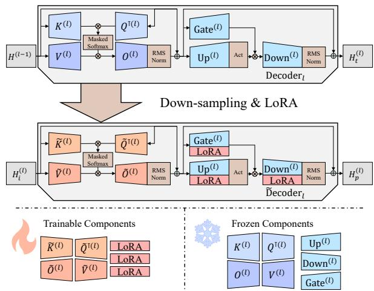  
Figure 1: Model preparation process and trainable parameters of KV-Latent.

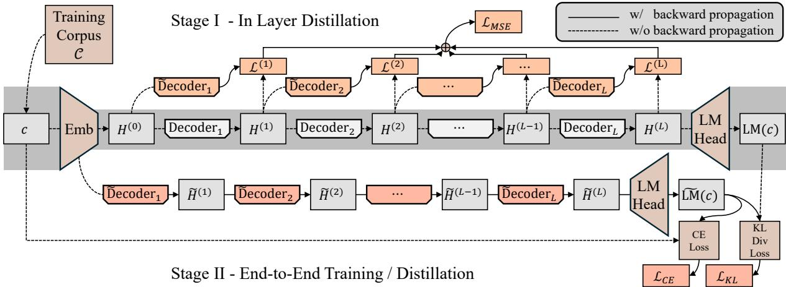  
Figure 2: Dataflow of two stage training in KV-Latent.

We define $H ^ { ( l + 1 ) }$ = Decoder $\left( H ^ { ( l ) } \right)$ as the operation of l-th Transformer decoder block of the initial model, and Decoder<sup>˜</sup> <sub>l</sub>( ) as the modified version of it with a reduced Q, K, V, O head size that utilize KV-Latent. We first perform inference using the original Decoder( ), retaining the intermediate hidden states $H _ { \{ 0 , 1 , \ldots , L \} }$ between every two layers. For the l-th layer, we define three hidden states with identical shapes: $H _ { i } ^ { ( l ) } , H _ { t } ^ { ( l ) } , H _ { p } ^ { ( l ) }$ , as obtained from Formula 6,

$$
\begin{array} { r l } & { H _ { i } ^ { ( l ) } = H ^ { ( l - 1 ) } , H _ { t } ^ { ( l ) } = \mathrm { D e c o d e r } _ { l } ( H _ { i } ^ { ( l ) } ) = H ^ { ( l ) } } \\ & { ~ H _ { p } ^ { ( l ) } = \tilde { \mathrm { D e c o d e r } _ { l } } ( H _ { i } ^ { ( l ) } ) } \end{array}\tag{6}
$$

serves as the input, target, and predicted hidden states. We want to maximize the similarity between $H _ { t } ^ { ( l ) }$ and $H _ { p } ^ { ( l ) }$ . To achieve this, we use Mean Squared Error (MSE) loss. We define $W _ { \mathrm { d e c } }$ as the trainable weights of Decoder( <sup>˜</sup> ). Our optimization objective is described in Formula 7.

$$
\operatorname* { m i n } _ { W _ { \mathrm { d e c } } } \frac { 1 } { L } \cdot \sum _ { l = 1 } ^ { L } \frac { | | \ H _ { t } ^ { ( l ) } - H _ { p } ^ { ( l ) } | | _ { 2 } } { x \cdot h }\tag{7}
$$

## 3.2.3 Stage II - End-to-End Training / Distillation

Despite performing intra-layer distillation, to apply KV-Latent on modern LLMs still faces challenges due to LLMs’ depth. Even minor perturbations can be amplified layer by layer, potentially compromising their model’s language capabilities. To address this, we need to train the model end-to-end. In this stage, we have two choices, Next-Token-Prediction (NTP) training and Distillation. We firstly define the original model $\operatorname { L M } ( \cdot )$ and our KV-Latent model LM( <sup>˜</sup> ), and $\mathcal { C } = \{ c _ { 1 } , c _ { 2 } , \ldots , c _ { | \mathcal { C } | } \}$ as the corpus we use for training, where $c _ { i } = \{ { i } _ { 1 } , { t } _ { 2 } , \ldots { t } _ { | { c } _ { i } | } \}$

NTP training is part of the model’s pre-training and employs cross-entropy loss, described in Formula 8. It requires minimal resources, however, cross-entropy loss provides limited information.

$$
\operatorname* { m i n } _ { W _ { \mathrm { d e c } } } \sum _ { c \in \mathcal { C } } \sum _ { x = 1 } ^ { | c | - 1 } \frac { \mathrm { C E L o s s } \left( \mathrm { L \tilde { M } } ( c ) [ x ] , c [ x + 1 ] \right) } { | \mathcal { C } | \cdot \left( | c | - 1 \right) }\tag{8}
$$

Distillation based on predicted probability distributions is commonly used for model recovery, this method relies on KL divergence loss, described in Formula 9. Distillation helps model to learn more with same amount of data. However, distillation involves an additional forward pass to compute the probability distributions and requires maintaining an extra set of parameters.

$$
\operatorname* { m i n } _ { W _ { \mathrm { d e c } } } \sum _ { c \in \mathcal { C } } \sum _ { x = 1 } ^ { | c | } \frac { \mathrm { K L L o s s } \left( \mathrm { L \tilde { M } } ( c ) [ x ] , \mathrm { L M } ( c ) [ x ] \right) } { | \mathcal { C } | \cdot | c | }\tag{9}
$$

## 3.3 Frequency-aware RoPE for Variable Dimensions

## 3.3.1 Motivation

RoPE introduces positional information into the $Q$ and $K ^ { \top }$ components of the attention heads. In our preliminary experiments, we observed that RoPE exhibits significant numerical instability when applied to lower-dimensional vectors, as shown in Figure 3. Specifically, when the dimension d is smaller than 32, the range of oscillation is comparable with intended attenuation, indicating the loss of positional encoding capability. According to Su et al., vectors encoded by RoPE should maintain a certain degree of similarity with itself, even at large distances. We can measure this by using special vector $\mathbb { 1 } ^ { d } = ( 1 , 1 , \cdots , 1 ) \in \mathbb { R } ^ { d }$ . We define $\mathrm { R o P E } _ { \theta , d } ( x )$ in Formula 10 as a representation of the similarity of two same vector across difference distance x, whose value ideally should always be positive to be more similar than two random vector.

$$
\mathrm { R o P E } _ { \theta , d } ( x ) = \mathbb { 1 } _ { d } \cdot \mathcal { R } _ { \theta , \frac { d } { 2 } } ( x ) \cdot \mathbb { 1 } _ { d } ^ { \top }\tag{10}
$$

## 3.3.2 Pattern Finding

We investigated the impact of different values of d on ${ \mathrm { R o P E } } _ { \theta , d } .$ , as shown in Figure 3. We observed smaller values of d result in greater noise, along with an increased occurrence of negative values. We decomposed the vector by channels. Based on the 256-dimensional case, Figures 4 and 5 illustrate the scenarios where low-numbered and high-numbered channels are retained, respectively, while Figure 6 depicts the RoPE function for retaining different sets of 64 consecutive channels (one-quarter of the total). Our findings suggest that the low-numbered channels of the RoPE function contribute the majority of the noise, while the high-numbered channels, despite a slower decay, remain relatively stable. Aligned with some previous works (bloc97, 2023; Peng et al., 2024).

## 3.3.3 Frequency-aware Modification

We implemented a frequency-aware modification strategy, which involves densifying the sampling of low-frequency rotations and avoiding highfrequency rotation sampling, as described in Formula 11, since that lower-numbered channels correspond to high-frequency rotations and highernumbered channels correspond to low-frequency rotations The results, presented in Figures 7, 8, 9, and 10, demonstrate that our approach achieves enhanced stability while also reducing the occurrence of negative values.

$$
\theta _ { j } = \left\{ \begin{array} { l l } { \theta ^ { - 2 ( j - 1 + d / 8 ) / d } , } \\ { \quad \quad \quad \quad \quad \quad \quad \quad \quad \quad \quad \quad \quad \quad } \\ { \quad \quad \quad \quad \quad \quad \quad \quad \quad \quad \quad \quad \quad \quad \quad \quad \quad } \\ { \theta ^ { - ( j - 1 + 3 d / 4 ) / d } , } \\ { \quad \quad \quad \quad \quad \quad \quad \quad \quad \mathrm { f o r ~ } j \in [ d / 4 + 1 , d / 4 + 2 , \dots , d / 2 ] } \end{array} \right.\tag{11}
$$

## 3.4 Effectiveness Analysis

To explain why our method is effective, we present the following derivation. From the ideal curve in Figure 3, it is evident that as d increases, RoPE approaches a smooth decay curve. The calculation of this curve is given by Formula 12, detailed in Appendix D.1.

$$
\operatorname* { l i m } _ { d  + \infty } { \frac { 1 } { d } } \mathrm { R o P E } _ { \theta , d } ( x ) = \int _ { \log _ { \theta } x - 1 } ^ { \log _ { \theta } x } \cos ( \theta ^ { p } ) d p\tag{12}
$$

At this point, we transform the stability issue of RoPE into a problem of numerical approximation of an integral. Specifically, for the integral of the function cos $\left( \theta ^ { p } \right)$ over an interval of size 1 (as shown in Figure 11), we approximate the solution by performing $d / 2$ samples. The function exhibits sharp oscillations when p takes larger values, and as x increases, the integration window slides to the right, inevitably entering regions of these intense oscillations. Therefore, to accurately solve the integral, d must be big enough for increased x. If d is too small, the sampling interval may be shorter than the oscillation period, causing the numerical approximation to lose validity and introducing substantial noise. We provided a code block to simulate this in Appendix E.

Furthermore, our modifications, by discarding certain sampling points on the right side, increased the overall sampling density while delaying the integration window’s entry into the region of intense oscillations, enhancing the stability of the RoPE, thereby reducing noise amplitude. Additionally, the values of the extra sampling points are typically close to 1, while the discarded points oscillate between 1 and 1. As a result, the frequency-aware RoPE values are almost always greater than the original RoPE values, as detailed in Appendix D.2.

## 4 Experiments

## 4.1 Training

We utilized FineWeb-edu (Lozhkov et al., 2024), which is derived from FineWeb (Penedo et al., 2024), a web dataset based on open-access web pages consists 15 trillion token. We used a 1 billion token subset from FineWeb-edu, a common size also utilized by other well-known datasets, such as minipile (Kaddour, 2023; Gao et al., 2020). Our training hyperparameters are detailed in Appendix A. We’ve conduct our training on a single node with 8 NVIDIA A100 80G SXM4 GPU.

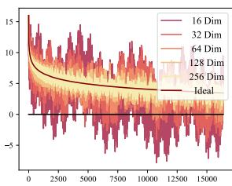

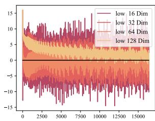

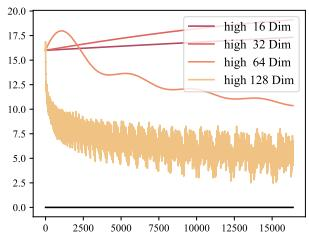

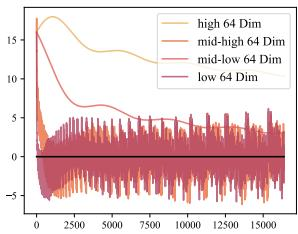  
Figure 3: RoPE Diminish Figure 4: Lower dims only Figure 5: Higher dims only Figure 6: Quarter dims

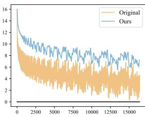  
Figure 7: 128 dim

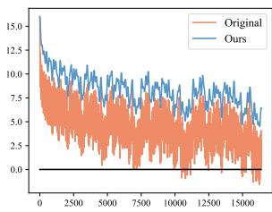  
Figure 8: 64 dim

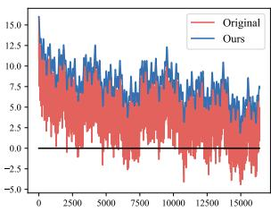  
Figure 9: 32 dim  
Figure 10: 16 dim

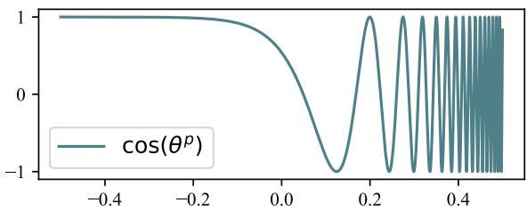

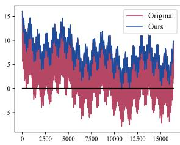  
Figure 11: The cos(θ<sup>p</sup>) where θ = 10000

Model wise, we’ve trained two versions of KV-Latent on LLaMA-3-8B(L3-8B), with $( d _ { q k } , d _ { v o } ) =$ (64, 64) and (16, 16) as a GQA examples, one version on LLaMA-2-7B(L2-7B) with $( d _ { q k } , d _ { v o } ) =$ (64, 64), as an MHA example.

## 4.2 Evaluation

We conducted tests on the KV-Latent model from two perspectives: performance and efficiency. For performance, we used 0-shot MMLU (Hendrycks et al., 2021), OBQA (Mihaylov et al., 2018), and AI2ARC (Clark et al., 2018), as benches. Additionally, we performed a needle in a haystack (NIH) test to assess the ability of information retrieval. We put a short sentence randomly in a 3,840 tokens context, and check whether the model could retell it, repeat 50 times and calculate the pass ratio. Regarding efficiency, we measured the KV Cache size $s _ { \mathrm { k v } }$ (MB) during the NIH experiment and the latency to the first token $t _ { \mathrm { t t f t } }$ (ms). We’ve also calculate the improve ratio $r _ { \mathrm { s } }$ and $r _ { \mathrm { t } }$ . Results are shown in Table 1 with several key observations. Firstly, KV-Latent allows the model to achieve satisfactory performance while reducing the KV Cache size. Secondly, despite distillation transfer more information, the limited training volume unables it to fully recover model’s proficiency. Thirdly, when $d _ { q k } = d _ { v o } = 1 6$ , the model’s performance failed to be recovered, suggesting a lower bound of KV Cache size. Lastly, LLaMA2, which does not utilize GQA, relatively outperforms LLaMA3 when trained on fewer tokens, indicating that for models already trained with GQA, adopting KV-Latent presents additional challenges.

## 4.3 Impact of Parameter Selection

We investigated the impact of different $d _ { q k } , d _ { v o } ,$ and LoRA rank, on model’s performance. We conducted experiments using the LLaMA-3-8B base model and trained multiple versions of KV-Latent with varying configurations. By default, we set $d _ { q k } = d _ { v o } = 6 4$ and LoRA rank= 256. For efficiency-related tests, we generated 256 tokens based on a context length of 2048, repeating the process 15 times and averaging the results.

## 4.3.1 Combinations of QK and VO Head Size

We test different combinations $d _ { q k }$ and $d _ { v o }$ on model performance and efficiency. We encompass three aspects: logarithmic perplexity (log PPL), reflecting model’s language modeling ability; training speed $t _ { \mathrm { t r a i n } }$ , measuring the training efficiency; and inference speed, includes time to the first token $t _ { \mathrm { t t f t } }$ , and millisecond per new token $t _ { \mathrm { m s p t } }$ . In terms of space KV Cache size $s _ { \mathrm { k v } }$ for the 4,000 token length sequence under bfloat16. For a more intuitive representation, we calculated the maximum KV Cache size $n _ { \mathrm { m a x } }$ supported with 60GB of memory, as an 80GB compute card scenario, excludes approximately 15GB for model parameters and 5GB as buffer. Results are shown in Table 2.

<table><tr><td>Model</td><td> $d _ { q k }$ </td><td> $d _ { v o }$ </td><td>Method</td><td>mmlu</td><td>obqa</td><td>arc</td><td>Avg</td><td>NIH</td><td> $s _ { \mathrm { k v } }$ </td><td> $r _ { \mathrm { s } }$ </td><td> $t _ { \mathrm { t t f t } }$ </td><td> $r _ { \mathrm { t } }$ </td></tr><tr><td rowspan="4">L3-8B</td><td>128</td><td>128</td><td>Base</td><td>35.3</td><td>35.5</td><td>55.5</td><td>42.1</td><td>92%</td><td>491</td><td></td><td>670</td><td></td></tr><tr><td>64</td><td>64</td><td>Train</td><td>35.0</td><td>35.1</td><td>53.8</td><td>41.3</td><td>92%</td><td>245</td><td>↓50%</td><td>622</td><td>↓8%</td></tr><tr><td>64</td><td>64</td><td>Distill</td><td>31.0</td><td>29.1</td><td>39.1</td><td>33.1</td><td>94%</td><td>245</td><td>↓50%</td><td>622</td><td>↓8%</td></tr><tr><td>16</td><td>16</td><td>Train</td><td>31.0</td><td>29.5</td><td>38.5</td><td>33.0</td><td>6%</td><td>64</td><td>↓87%</td><td>595</td><td>↓13%</td></tr><tr><td rowspan="3">L2-7B</td><td>128</td><td>128</td><td>Base</td><td>28.9</td><td>29.4</td><td>30.7</td><td>29.7</td><td>32%</td><td>1966</td><td>1</td><td>668</td><td></td></tr><tr><td>64</td><td>64</td><td>Train</td><td>28.1</td><td>29.3</td><td>27.5</td><td>28.3</td><td>24%</td><td>983</td><td>↓50%</td><td>573</td><td>↓17%</td></tr><tr><td>64</td><td>64</td><td>Distill</td><td>26.2</td><td>28.6</td><td>27.0</td><td>27.3</td><td>4%</td><td>983</td><td>↓50%</td><td>573</td><td>↓17%</td></tr></table>

Table 1: KV-Latent model’s performance on benchmarks. NIH refers to Needle in haystack testing result.
<table><tr><td colspan="2"> $d _ { q k }$   $d _ { v o }$ </td><td>128 128</td><td>64 64</td><td>32 32</td><td>16 16</td><td>64 128</td><td>32 128</td><td>16 128</td><td>128 64</td><td>128 32</td><td>128 16</td></tr><tr><td colspan="2">LogPPL</td><td>-</td><td>2.74</td><td>3.03</td><td>3.78</td><td>2.47</td><td>2.67</td><td>2.83</td><td>2.80</td><td>2.91</td><td>3.01</td></tr><tr><td rowspan="3"> $t _ { \mathrm { t r a i n } }$   $t _ { \mathrm { t t f t } }$   $t _ { \mathrm { m s p t } }$ </td><td>hour</td><td>-</td><td>18.0</td><td>16.6</td><td>16.1</td><td>20.1</td><td>19.1</td><td>19.1</td><td>20.3</td><td>19.6</td><td>19.4</td></tr><tr><td>ms</td><td>303</td><td>256</td><td>243</td><td>238</td><td>262</td><td>252</td><td>260</td><td>296</td><td>264</td><td>238</td></tr><tr><td>ms</td><td>35.9</td><td>36.4</td><td>35.2</td><td>34.7</td><td>35.9</td><td>35.1</td><td>35.9</td><td>34.9</td><td>37.2</td><td>34.7</td></tr><tr><td> $s _ { \mathrm { k v } }$   $n _ { \mathrm { m a x } }$ </td><td>MB  $1 0 ^ { 6 }$  token</td><td>256 0.40</td><td>128 0.81</td><td>64 1.63</td><td>32 3.27</td><td>172 0.61</td><td>160 0.65</td><td>144 0.72</td><td>172 0.61</td><td>160 0.65</td><td>144 0.72</td></tr></table>

Table 2: General performance of different $d _ { q k }$ and $d _ { v o }$

<table><tr><td>Rank</td><td>16</td><td>32</td><td>64</td><td>128</td><td>256</td></tr><tr><td> $t _ { \mathrm { t r a i n } } ( \mathrm { H } )$ </td><td>16.9</td><td>16.8</td><td>17.1</td><td>17.5</td><td>18.0</td></tr><tr><td>LogPPL</td><td>2.49</td><td>2.47</td><td>2.46</td><td>2.46</td><td>2.45</td></tr></table>

Table 3: KV-Latent with different LoRA rank.

<table><tr><td>Method</td><td>Log PPL</td><td> $\operatorname { A v g } s _ { \mathrm { k v } }$ </td></tr><tr><td>KV-L</td><td>2.509</td><td>128 ↓50%</td></tr><tr><td> $\mathrm { K V - L + P y I }$ </td><td>2.499</td><td>64 ↓75%</td></tr></table>

Table 4: KV-Latent(KV-L) with PyrimaidInfer(PyI).

We find that, firstly, the efficiency related to the KV Cache aligns with it’s size: the smaller the overall volume, the faster both pre-filling and generation speeds. However, when comparing the results of reducing $d _ { q k }$ versus $d _ { v o } ,$ in Table 6 Appendix B, we noticed that allocating more resources to $d _ { v o }$ consistently yields better efficiency and effectiveness, suggesting that Keys carry less essential information than Values within the KV Cache, making them more amenable to compression.

## 4.3.2 LoRA Rank

LoRA rank may impact KV-Latent’s performance and efficiency. We focused on evaluating training efficiency and log PPL since LoRA possess no extra cost in inference. Shown in Table 3, increasing the rank corresponds to increase in training time. However, we noticed that the change in log PPL is less significant. It’s important to note that LoRA rank might have a more substantial effect in largerscale training scenarios.

## 4.3.3 Cross-method Feasibility

In terms of compatibility with other methods, KV-Latent works well with Head-Level, as evidenced by the tests on LLaMA-3. It is also compatible with Layer-Level, although the higher training resource requirements. Finally, our method is also compatible with Token-Level. Table 4 shows the results when used in conjunction with Pyramid-Infer with 50% compress rate, as one of the popular token-level reduction methods, proving our statement. KV-Latent is orthogonal with all mainstream methods.

## 5 Conclusion

We propose KV-Latent, a paradigm that directly reduces the model’s attention head dimensionally, thus KV Cache size, through a two-step training process. This approach achieves cache reduction and enhancing inference speed while using only a small number of additional tokens for training. We have demonstrated that decoupling the relationships of $n _ { h } \cdot d _ { h }$ = d and $d _ { h } = d _ { q k } = d _ { v o }$ is feasible. Notably, we found that $d _ { v o }$ has a greater impact on model performance, revealing an information imbalance between values and keys within the KV Cache. Finally, by modifying the frequency sampling method, we enhance RoPE’s stability while preserving its attenuation properties. Out work may contribute to the study of optimizing model structure.

## Limitations

Currently, we are unable to perform a direct comparison with certain related methods, such as Cross Layer Attention (CLA) mentioned earlier. Our approach only requires a limited amount of additional training, the outcome is still based on an existing model. Comparing it to CLA, which necessitates complete retraining, would be unfair and would exaggerate the effectiveness of our method, rendering the comparison meaningless.

Another potential direction for extension is the integration of SVD into the KV-Latent, which could provide the model with additional initial information. However, due to the inherent properties of RoPE and matrix multiplication, while this remains a possibility, it is overall highly challenging and would require substantial modifications to the model.

Additionally, our paper’s discussion predominantly focuses on the pre-training phase of the model, without delving deeply into the aspects of Supervised Fine-Tuning and Reinforcement Learning from Human Feedback and their potential impacts. But currently, there is no evidence to suggest that our method presents any compatibility issues with SFT or RLHF.

Finally, our method aims to accelerate the inference of LLM without introducing security concerns greater than those inherent to the LLM itself.

## References

Joshua Ainslie, James Lee-Thorp, Michiel de Jong, Yury Zemlyanskiy, Federico Lebrón, and Sumit Sanghai. 2023. GQA: training generalized multi-query transformer models from multi-head checkpoints. In Proceedings ofthe 2023 Conference on Empirical Methods in Natural Language Processing, EMNLP 2023, Singapore, December 6-10, 2023, pages 4895–4901. Association for Computational Linguistics.

Rohan Anil, Sebastian Borgeaud, Yonghui Wu, Jean-Baptiste Alayrac, Jiahui Yu, Radu Soricut, Johan Schalkwyk, Andrew M. Dai, Anja Hauth, Katie Millican, David Silver, Slav Petrov, Melvin Johnson, Ioannis Antonoglou, Julian Schrittwieser, Amelia Glaese, Jilin Chen, Emily Pitler, Timothy P. Lillicrap, Angeliki Lazaridou, Orhan Firat, James Molloy, Michael Isard, Paul Ronald Barham, Tom Hennigan, Benjamin Lee, Fabio Viola, Malcolm Reynolds, Yuanzhong Xu, Ryan Doherty, Eli Collins, Clemens Meyer, Eliza Rutherford, Erica Moreira, Kareem Ayoub, Megha Goel, George Tucker, Enrique Piqueras, Maxim Krikun, Iain Barr, Nikolay Savinov, Ivo Danihelka, Becca Roelofs, Anaïs White, Anders Andreassen, Tamara von Glehn, Lakshman Yagati, Mehran Kazemi, Lucas Gonzalez, Misha Khalman, Jakub Sygnowski, and et al. 2023. Gemini: A family of highly capable multimodal models. CoRR, abs/2312.11805.

Anthropic. 2024. The claude 3 model family: Opus, sonnet, haiku. Accessed: 2025-05-26.

Anthropic. 2025. Introducing claude 4. Accessed: 2025-05-26.

Sidney Black, Stella Biderman, Eric Hallahan, Quentin Anthony, Leo Gao, Laurence Golding, Horace He, Connor Leahy, Kyle McDonell, Jason Phang, Michael Pieler, Usvsn Sai Prashanth, Shivanshu Purohit, Laria Reynolds, Jonathan Tow, Ben Wang, and Samuel Weinbach. 2022. GPT-NeoX-20B: An opensource autoregressive language model. In Proceedings ofBigScience Episode #5 – Workshop on Challenges & Perspectives in Creating Large Language Models, pages 95–136, virtual+Dublin. Association for Computational Linguistics.

bloc97. 2023. NTK-Aware Scaled RoPE allows LLaMA models to have extended (8k+) context size without any fine-tuning and minimal perplexity degradation.

William Brandon, Mayank Mishra, Aniruddha Nrusimha, Rameswar Panda, and Jonathan Ragan-Kelley. 2024. Reducing transformer key-value cache size with cross-layer attention. CoRR, abs/2405.12981.

Tom Brown, Benjamin Mann, Nick Ryder, Melanie Subbiah, Jared D Kaplan, Prafulla Dhariwal, Arvind Neelakantan, Pranav Shyam, Girish Sastry, Amanda Askell, Sandhini Agarwal, Ariel Herbert-Voss, Gretchen Krueger, Tom Henighan, Rewon Child, Aditya Ramesh, Daniel Ziegler, Jeffrey Wu, Clemens

Winter, Chris Hesse, Mark Chen, Eric Sigler, Mateusz Litwin, Scott Gray, Benjamin Chess, Jack Clark, Christopher Berner, Sam McCandlish, Alec Radford, Ilya Sutskever, and Dario Amodei. 2020. Language models are few-shot learners. In Advances in Neural Information Processing Systems, volume 33, pages 1877–1901. Curran Associates, Inc.

Peter Clark, Isaac Cowhey, Oren Etzioni, Tushar Khot, Ashish Sabharwal, Carissa Schoenick, and Oyvind Tafjord. 2018. Think you have solved question answering? try arc, the AI2 reasoning challenge. CoRR, abs/1803.05457.

Tri Dao, Dan Fu, Stefano Ermon, Atri Rudra, and Christopher Ré. 2022. Flashattention: Fast and memory-efficient exact attention with io-awareness. In Advances in Neural Information Processing Systems, volume 35, pages 16344–16359. Curran Associates, Inc.

DeepSeek-AI, Aixin Liu, Bei Feng, Bin Wang, Bingxuan Wang, Bo Liu, Chenggang Zhao, Chengqi Dengr, Chong Ruan, Damai Dai, Daya Guo, Dejian Yang, Deli Chen, Dongjie Ji, Erhang Li, Fangyun Lin, Fuli Luo, Guangbo Hao, Guanting Chen, Guowei Li, H. Zhang, Hanwei Xu, Hao Yang, Haowei Zhang, Honghui Ding, Huajian Xin, Huazuo Gao, Hui Li, Hui Qu, J. L. Cai, Jian Liang, Jianzhong Guo, Jiaqi Ni, Jiashi Li, Jin Chen, Jingyang Yuan, Junjie Qiu, Junxiao Song, Kai Dong, Kaige Gao, Kang Guan, Lean Wang, Lecong Zhang, Lei Xu, Leyi Xia, Liang Zhao, Liyue Zhang, Meng Li, Miaojun Wang, Mingchuan Zhang, Minghua Zhang, Minghui Tang, Mingming Li, Ning Tian, Panpan Huang, Peiyi Wang, Peng Zhang, Qihao Zhu, Qinyu Chen, Qiushi Du, R. J. Chen, R. L. Jin, Ruiqi Ge, Ruizhe Pan, Runxin Xu, Ruyi Chen, S. S. Li, Shanghao Lu, Shangyan Zhou, Shanhuang Chen, Shaoqing Wu, Shengfeng Ye, Shirong Ma, Shiyu Wang, Shuang Zhou, Shuiping Yu, Shunfeng Zhou, Size Zheng, T. Wang, Tian Pei, Tian Yuan, Tianyu Sun, W. L. Xiao, Wangding Zeng, Wei An, Wen Liu, Wenfeng Liang, Wenjun Gao, Wentao Zhang, X. Q. Li, Xiangyue Jin, Xianzu Wang, Xiao Bi, Xiaodong Liu, Xiaohan Wang, Xiaojin Shen, Xiaokang Chen, Xiaosha Chen, Xiaotao Nie, Xiaowen Sun, Xiaoxiang Wang, Xin Liu, Xin Xie, Xingkai Yu, Xinnan Song, Xinyi Zhou, Xinyu Yang, Xuan Lu, Xuecheng Su, Y. Wu, Y. K. Li, Y. X. Wei, Y. X. Zhu, Yanhong Xu, Yanping Huang, Yao Li, Yao Zhao, Yaofeng Sun, Yaohui Li, Yaohui Wang, Yi Zheng, Yichao Zhang, Yiliang Xiong, Yilong Zhao, Ying He, Ying Tang, Yishi Piao, Yixin Dong, Yixuan Tan, Yiyuan Liu, Yongji Wang, Yongqiang Guo, Yuchen Zhu, Yuduan Wang, Yuheng Zou, Yukun Zha, Yunxian Ma, Yuting Yan, Yuxiang You, Yuxuan Liu, Z. Z. Ren, Zehui Ren, Zhangli Sha, Zhe Fu, Zhen Huang, Zhen Zhang, Zhenda Xie, Zhewen Hao, Zhihong Shao, Zhiniu Wen, Zhipeng Xu, Zhongyu Zhang, Zhuoshu Li, Zihan Wang, Zihui Gu, Zilin Li, and Ziwei Xie. 2024. Deepseek-v2: A strong, economical, and efficient mixture-of-experts language model. Preprint, arXiv:2405.04434.

Alessio Devoto, Yu Zhao, Simone Scardapane, and Pasquale Minervini. 2024. A simple and effective l norm-based strategy for KV cache compression. CoRR, abs/2406.11430.

Abhimanyu Dubey, Abhinav Jauhri, Abhinav Pandey, Abhishek Kadian, Ahmad Al-Dahle, Aiesha Letman, Akhil Mathur, Alan Schelten, Amy Yang, Angela Fan, Anirudh Goyal, Anthony Hartshorn, Aobo Yang, Archi Mitra, Archie Sravankumar, Artem Korenev, Arthur Hinsvark, Arun Rao, Aston Zhang, Aurelien Rodriguez, Austen Gregerson, Ava Spataru, Bap tiste Roziere, Bethany Biron, Binh Tang, Bobbie Chern, Charlotte Caucheteux, Chaya Nayak, Chloe Bi, Chris Marra, Chris McConnell, Christian Keller, Christophe Touret, Chunyang Wu, Corinne Wong, Cristian Canton Ferrer, Cyrus Nikolaidis, Damien Al lonsius, Daniel Song, Danielle Pintz, Danny Livshits, David Esiobu, Dhruv Choudhary, Dhruv Mahajan, Diego Garcia-Olano, Diego Perino, Dieuwke Hupkes, Egor Lakomkin, Ehab AlBadawy, Elina Lobanova, Emily Dinan, Eric Michael Smith, Filip Radenovic, Frank Zhang, Gabriel Synnaeve, Gabrielle Lee, Georgia Lewis Anderson, Graeme Nail, Gregoire Mi alon, Guan Pang, Guillem Cucurell, Hailey Nguyen, Hannah Korevaar, Hu Xu, Hugo Touvron, Iliyan Zarov, Imanol Arrieta Ibarra, Isabel Kloumann, Ishan Misra, Ivan Evtimov, Jade Copet, Jaewon Lee, Jan Geffert, Jana Vranes, Jason Park, Jay Mahadeokar, Jeet Shah, Jelmer van der Linde, Jennifer Billock, Jenny Hong, Jenya Lee, Jeremy Fu, Jianfeng Chi, Jianyu Huang, Jiawen Liu, Jie Wang, Jiecao Yu, Joanna Bitton, Joe Spisak, Jongsoo Park, Joseph Rocca, Joshua Johnstun, Joshua Saxe, Junteng Jia, Kalyan Vasuden Alwala, Kartikeya Upasani, Kate Plawiak, Ke Li, Kenneth Heafield, Kevin Stone, Khalid El-Arini, Krithika Iyer, Kshitiz Malik, Kuen ley Chiu, Kunal Bhalla, Lauren Rantala-Yeary, Laurens van der Maaten, Lawrence Chen, Liang Tan, Liz Jenkins, Louis Martin, Lovish Madaan, Lubo Malo, Lukas Blecher, Lukas Landzaat, Luke de Oliveira, Madeline Muzzi, Mahesh Pasupuleti, Mannat Singh, Manohar Paluri, Marcin Kardas, Mathew Oldham, Mathieu Rita, Maya Pavlova, Melanie Kambadur, Mike Lewis, Min Si, Mitesh Kumar Singh, Mona Hassan, Naman Goyal, Narjes Torabi, Nikolay Bash lykov, Nikolay Bogoychev, Niladri Chatterji, Olivier Duchenne, Onur Çelebi, Patrick Alrassy, Pengchuan Zhang, Pengwei Li, Petar Vasic, Peter Weng, Pra jjwal Bhargava, Pratik Dubal, Praveen Krishnan, Punit Singh Koura, Puxin Xu, Qing He, Qingxiao Dong, Ragavan Srinivasan, Raj Ganapathy, Ramon Calderer, Ricardo Silveira Cabral, Robert Stojnic, Roberta Raileanu, Rohit Girdhar, Rohit Patel, Ro main Sauvestre, Ronnie Polidoro, Roshan Sumbaly, Ross Taylor, Ruan Silva, Rui Hou, Rui Wang, Saghar Hosseini, Sahana Chennabasappa, Sanjay Singh, Sean Bell, Seohyun Sonia Kim, Sergey Edunov, Shaoliang Nie, Sharan Narang, Sharath Raparthy, Sheng Shen, Shengye Wan, Shruti Bhosale, Shun Zhang, Simon Vandenhende, Soumya Batra, Spencer Whitman, Sten Sootla, Stephane Collot, Suchin Gu rurangan, Sydney Borodinsky, Tamar Herman, Tara Fowler, Tarek Sheasha, Thomas Georgiou, Thomas

Scialom, Tobias Speckbacher, Todor Mihaylov, Tong Xiao, Ujjwal Karn, Vedanuj Goswami, Vibhor Gupta, Vignesh Ramanathan, Viktor Kerkez, Vincent Gonguet, Virginie Do, Vish Vogeti, Vladan Petro vic, Weiwei Chu, Wenhan Xiong, Wenyin Fu, Whit ney Meers, Xavier Martinet, Xiaodong Wang, Xiao qing Ellen Tan, Xinfeng Xie, Xuchao Jia, Xuewei Wang, Yaelle Goldschlag, Yashesh Gaur, Yasmine Babaei, Yi Wen, Yiwen Song, Yuchen Zhang, Yue Li, Yuning Mao, Zacharie Delpierre Coudert, Zheng Yan, Zhengxing Chen, Zoe Papakipos, Aaditya Singh, Aaron Grattafiori, Abha Jain, Adam Kelsey, Adam Shajnfeld, Adithya Gangidi, Adolfo Victoria, Ahuva Goldstand, Ajay Menon, Ajay Sharma, Alex Boesen berg, Alex Vaughan, Alexei Baevski, Allie Feinstein, Amanda Kallet, Amit Sangani, Anam Yunus, An drei Lupu, Andres Alvarado, Andrew Caples, Andrew Gu, Andrew Ho, Andrew Poulton, Andrew Ryan, Ankit Ramchandani, Annie Franco, Apara jita Saraf, Arkabandhu Chowdhury, Ashley Gabriel, Ashwin Bharambe, Assaf Eisenman, Azadeh Yaz dan, Beau James, Ben Maurer, Benjamin Leonhardi, Bernie Huang, Beth Loyd, Beto De Paola, Bhargavi Paranjape, Bing Liu, Bo Wu, Boyu Ni, Braden Han cock, Bram Wasti, Brandon Spence, Brani Stojkovic, Brian Gamido, Britt Montalvo, Carl Parker, Carly Burton, Catalina Mejia, Changhan Wang, Changkyu Kim, Chao Zhou, Chester Hu, Ching-Hsiang Chu, Chris Cai, Chris Tindal, Christoph Feichtenhofer, Da mon Civin, Dana Beaty, Daniel Kreymer, Daniel Li, Danny Wyatt, David Adkins, David Xu, Davide Testuggine, Delia David, Devi Parikh, Diana Liskovich, Didem Foss, Dingkang Wang, Duc Le, Dustin Hol land, Edward Dowling, Eissa Jamil, Elaine Mont gomery, Eleonora Presani, Emily Hahn, Emily Wood, Erik Brinkman, Esteban Arcaute, Evan Dunbar, Evan Smothers, Fei Sun, Felix Kreuk, Feng Tian, Firat Ozgenel, Francesco Caggioni, Francisco Guzmán, Frank Kanayet, Frank Seide, Gabriela Medina Flo rez, Gabriella Schwarz, Gada Badeer, Georgia Swee, Gil Halpern, Govind Thattai, Grant Herman, Grigory Sizov, Guangyi, Zhang, Guna Lakshminarayanan, Hamid Shojanazeri, Han Zou, Hannah Wang, Han wen Zha, Haroun Habeeb, Harrison Rudolph, He len Suk, Henry Aspegren, Hunter Goldman, Igor Molybog, Igor Tufanov, Irina-Elena Veliche, Itai Gat, Jake Weissman, James Geboski, James Kohli, Japhet Asher, Jean-Baptiste Gaya, Jeff Marcus, Jeff Tang, Jennifer Chan, Jenny Zhen, Jeremy Reizen stein, Jeremy Teboul, Jessica Zhong, Jian Jin, Jingyi Yang, Joe Cummings, Jon Carvill, Jon Shepard, Jonathan McPhie, Jonathan Torres, Josh Ginsburg, Junjie Wang, Kai Wu, Kam Hou U, Karan Sax ena, Karthik Prasad, Kartikay Khandelwal, Katay oun Zand, Kathy Matosich, Kaushik Veeraragha van, Kelly Michelena, Keqian Li, Kun Huang, Ku nal Chawla, Kushal Lakhotia, Kyle Huang, Lailin Chen, Lakshya Garg, Lavender A, Leandro Silva, Lee Bell, Lei Zhang, Liangpeng Guo, Licheng Yu, Liron Moshkovich, Luca Wehrstedt, Madian Khabsa, Manav Avalani, Manish Bhatt, Maria Tsim poukelli, Martynas Mankus, Matan Hasson, Matthew Lennie, Matthias Reso, Maxim Groshev, Maxim Naumov, Maya Lathi, Meghan Keneally, Michael L

Seltzer, Michal Valko, Michelle Restrepo, Mihir Patel, Mik Vyatskov, Mikayel Samvelyan, Mike Clark, Mike Macey, Mike Wang, Miquel Jubert Hermoso, Mo Metanat, Mohammad Rastegari, Munish Bansal, Nandhini Santhanam, Natascha Parks, Natasha White, Navyata Bawa, Nayan Singhal, Nick Egebo, Nicolas Usunier, Nikolay Pavlovich Laptev, Ning Dong, Ning Zhang, Norman Cheng, Oleg Chernoguz, Olivia Hart, Omkar Salpekar, Ozlem Kalinli, Parkin Kent, Parth Parekh, Paul Saab, Pavan Balaji, Pedro Rittner, Philip Bontrager, Pierre Roux, Piotr Dollar, Polina Zvyagina, Prashant Ratanchandani, Pritish Yuvraj, Qian Liang, Rachad Alao, Rachel Rodriguez, Rafi Ayub, Raghotham Murthy, Raghu Nayani, Rahul Mitra, Raymond Li, Rebekkah Hogan, Robin Battey, Rocky Wang, Rohan Maheswari, Russ Howes, Ruty Rinott, Sai Jayesh Bondu, Samyak Datta, Sara Chugh, Sara Hunt, Sargun Dhillon, Sasha Sidorov, Satadru Pan, Saurabh Verma, Seiji Yamamoto, Sharadh Ramaswamy, Shaun Lind say, Shaun Lindsay, Sheng Feng, Shenghao Lin, Shengxin Cindy Zha, Shiva Shankar, Shuqiang Zhang, Shuqiang Zhang, Sinong Wang, Sneha Agarwal, Soji Sajuyigbe, Soumith Chintala, Stephanie Max, Stephen Chen, Steve Kehoe, Steve Satterfield, Sudarshan Govindaprasad, Sumit Gupta, Sungmin Cho, Sunny Virk, Suraj Subramanian, Sy Choudhury, Sydney Goldman, Tal Remez, Tamar Glaser, Tamara Best, Thilo Kohler, Thomas Robinson, Tianhe Li, Tianjun Zhang, Tim Matthews, Timothy Chou, Tzook Shaked, Varun Vontimitta, Victoria Ajayi, Victoria Montanez, Vijai Mohan, Vinay Satish Kumar, Vishal Mangla, Vlad Ionescu, Vlad Poenaru, Vlad Tiberiu Mihailescu, Vladimir Ivanov, Wei Li, Wenchen Wang, Wenwen Jiang, Wes Bouaziz, Will Constable, Xiaocheng Tang, Xiaofang Wang, Xiaojian Wu, Xiaolan Wang, Xide Xia, Xilun Wu, Xinbo Gao, Yanjun Chen, Ye Hu, Ye Jia, Ye Qi, Yenda Li, Yilin Zhang, Ying Zhang, Yossi Adi, Youngjin Nam, Yu, Wang, Yuchen Hao, Yundi Qian, Yuzi He, Zach Rait, Zachary DeVito, Zef Rosnbrick, Zhaoduo Wen, Zhenyu Yang, and Zhiwei Zhao. 2024. The llama 3 herd of models. Preprint, arXiv:2407.21783.

Leo Gao, Stella Biderman, Sid Black, Laurence Golding, Travis Hoppe, Charles Foster, Jason Phang, Horace He, Anish Thite, Noa Nabeshima, et al. 2020. The Pile: An 800GB dataset of diverse text for language modeling. arXiv preprint arXiv:2101.00027.

Jiaao He and Jidong Zhai. 2024. Fastdecode: Highthroughput gpu-efficient llm serving using heterogeneous pipelines. Preprint, arXiv:2403.11421.

Dan Hendrycks, Collin Burns, Steven Basart, Andy Zou, Mantas Mazeika, Dawn Song, and Jacob Steinhardt. 2021. Measuring massive multitask language understanding. In 9th International Conference on Learning Representations, ICLR 2021, Virtual Event, Austria, May 3-7, 2021. OpenReview.net.

Edward J. Hu, Yelong Shen, Phillip Wallis, Zeyuan Allen-Zhu, Yuanzhi Li, Shean Wang, Lu Wang, and Weizhu Chen. 2022. Lora: Low-rank adaptation of large language models. In The Tenth International

Conference on Learning Representations, ICLR 2022, Virtual Event, April 25-29, 2022. OpenReview.net.

Albert Q. Jiang, Alexandre Sablayrolles, Arthur Mensch, Chris Bamford, Devendra Singh Chaplot, Diego de Las Casas, Florian Bressand, Gianna Lengyel, Guillaume Lample, Lucile Saulnier, Lélio Renard Lavaud, Marie-Anne Lachaux, Pierre Stock, Teven Le Scao, Thibaut Lavril, Thomas Wang, Timothée Lacroix, and William El Sayed. 2023. Mistral 7b. CoRR, abs/2310.06825.

Albert Q. Jiang, Alexandre Sablayrolles, Antoine Roux, Arthur Mensch, Blanche Savary, Chris Bamford, Devendra Singh Chaplot, Diego de Las Casas, Emma Bou Hanna, Florian Bressand, Gianna Lengyel, Guillaume Bour, Guillaume Lample, Lélio Renard Lavaud, Lucile Saulnier, Marie-Anne Lachaux, Pierre Stock, Sandeep Subramanian, Sophia Yang, Szymon Antoniak, Teven Le Scao, Théophile Gervet, Thibaut Lavril, Thomas Wang, Timothée Lacroix, and William El Sayed. 2024. Mixtral of experts. CoRR, abs/2401.04088.

Jean Kaddour. 2023. The minipile challenge for data-efficient language models. arXiv preprint arXiv:2304.08442.

Woosuk Kwon, Zhuohan Li, Siyuan Zhuang, Ying Sheng, Lianmin Zheng, Cody Hao Yu, Joseph Gonzalez, Hao Zhang, and Ion Stoica. 2023. Efficient memory management for large language model serving with pagedattention. In Proceedings of the 29th Symposium on Operating Systems Principles, SOSP ’23, page 611–626, New York, NY, USA. Association for Computing Machinery.

Zichang Liu, Aditya Desai, Fangshuo Liao, Weitao Wang, Victor Xie, Zhaozhuo Xu, Anastasios Kyrillidis, and Anshumali Shrivastava. 2023. Scissorhands: Exploiting the persistence of importance hypothesis for llm kv cache compression at test time. In Advances in Neural Information Processing Systems, volume 36, pages 52342–52364. Curran Associates, Inc.

Anton Lozhkov, Loubna Ben Allal, Leandro von Werra, and Thomas Wolf. 2024. Fineweb-edu.

Ziyang Ma, Zuchao Li, Lefei Zhang, Gui-Song Xia, Bo Du, Liangpei Zhang, and Dacheng Tao. 2025. Model hemorrhage and the robustness limits of large language models. CoRR, abs/2503.23924.

Todor Mihaylov, Peter Clark, Tushar Khot, and Ashish Sabharwal. 2018. Can a suit of armor conduct electricity? a new dataset for open book question answering. In Proceedings ofthe 2018 Conference on Empirical Methods in Natural Language Processing, pages 2381–2391, Brussels, Belgium. Association for Computational Linguistics.

Jianhui Pang, Fanghua Ye, Derek F. Wong, and Longyue Wang. 2024. Anchor-based large language models. CoRR, abs/2402.07616.

Guilherme Penedo, Hynek Kydlícek, Loubna Ben Allal, Anton Lozhkov, Margaret Mitchell, Colin Raffel, Leandro von Werra, and Thomas Wolf. 2024. The fineweb datasets: Decanting the web for the finest text data at scale. CoRR, abs/2406.17557.

Bowen Peng, Jeffrey Quesnelle, Honglu Fan, and Enrico Shippole. 2024. YaRN: Efficient context window extension of large language models. In The Twelfth International Conference on Learning Representations.

Utkarsh Saxena, Gobinda Saha, Sakshi Choudhary, and Kaushik Roy. 2024a. Eigen attention: Attention in low-rank space for kv cache compression. Preprint, arXiv:2408.05646.

Utkarsh Saxena, Gobinda Saha, Sakshi Choudhary, and Kaushik Roy. 2024b. Eigen attention: Attention in low-rank space for KV cache compression. CoRR, abs/2408.05646.

Noam Shazeer. 2019. Fast transformer decoding: One write-head is all you need. CoRR, abs/1911.02150.

Luohe Shi, Yao Yao, Zuchao Li, Lefei Zhang, and Hai Zhao. 2024. Reference trustable decoding: A training-free augmentation paradigm for large language models. In Advances in Neural Information Processing Systems 38: Annual Conference on Neural Information Processing Systems 2024, NeurIPS 2024, Vancouver, BC, Canada, December 10 - 15, 2024.

Jianlin Su, Murtadha Ahmed, Yu Lu, Shengfeng Pan, Wen Bo, and Yunfeng Liu. 2024. Roformer: Enhanced transformer with rotary position embedding. Neurocomputing, 568:127063.

Yutao Sun, Li Dong, Yi Zhu, Shaohan Huang, Wenhui Wang, Shuming Ma, Quanlu Zhang, Jianyong Wang, and Furu Wei. 2024. You only cache once: Decoderdecoder architectures for language models. CoRR, abs/2405.05254.

Mingni Tang, Jiajia Li, Lu Yang, Zhiqiang Zhang, Jinhao Tian, Zuchao Li, Lefei Zhang, and Ping Wang. 2025a. NOTA: Multimodal music notation understanding for visual large language model. In Findings of the Association for Computational Linguistics: NAACL 2025, pages 7160–7173, Albuquerque, New Mexico. Association for Computational Linguistics.

Zicong Tang, Luohe Shi, Zuchao Li, Baoyuan Qi, Guoming Liu, Lefei Zhang, and Ping Wang. 2025b. SpindleKV: A novel KV cache reduction method balancing both shallow and deep layers. In The 63rd Annual Meeting of the Association for Computational Linguistics.

Hugo Touvron, Louis Martin, Kevin Stone, Peter Albert, Amjad Almahairi, Yasmine Babaei, Nikolay Bashlykov, Soumya Batra, Prajjwal Bhargava, Shruti Bhosale, Dan Bikel, Lukas Blecher, Cristian Canton-Ferrer, Moya Chen, Guillem Cucurull, David Esiobu, Jude Fernandes, Jeremy Fu, Wenyin Fu, Brian Fuller,

Cynthia Gao, Vedanuj Goswami, Naman Goyal, Anthony Hartshorn, Saghar Hosseini, Rui Hou, Hakan Inan, Marcin Kardas, Viktor Kerkez, Madian Khabsa, Isabel Kloumann, Artem Korenev, Punit Singh Koura, Marie-Anne Lachaux, Thibaut Lavril, Jenya Lee, Diana Liskovich, Yinghai Lu, Yuning Mao, Xavier Martinet, Todor Mihaylov, Pushkar Mishra, Igor Molybog, Yixin Nie, Andrew Poulton, Jeremy Reizenstein, Rashi Rungta, Kalyan Saladi, Alan Schelten, Ruan Silva, Eric Michael Smith, Ranjan Subramanian, Xiaoqing Ellen Tan, Binh Tang, Ross Taylor, Adina Williams, Jian Xiang Kuan, Puxin Xu, Zheng Yan, Iliyan Zarov, Yuchen Zhang, Angela Fan, Melanie Kambadur, Sharan Narang, Aurélien Rodriguez, Robert Stojnic, Sergey Edunov, and Thomas Scialom. 2023. Llama 2: Open foundation and finetuned chat models. CoRR, abs/2307.09288.

Ashish Vaswani, Noam Shazeer, Niki Parmar, Jakob Uszkoreit, Llion Jones, Aidan N Gomez, Ł ukasz Kaiser, and Illia Polosukhin. 2017. Attention is all you need. In Advances in Neural Information Processing Systems, volume 30. Curran Associates, Inc.

Samuel Williams, Andrew Waterman, and David Patterson. 2009. Roofline: an insightful visual performance model for multicore architectures. Commun. ACM, 52(4):65–76.

Thomas Wolf, Lysandre Debut, Victor Sanh, Julien Chaumond, Clement Delangue, Anthony Moi, Pierric Cistac, Tim Rault, Rémi Louf, Morgan Funtowicz, Joe Davison, Sam Shleifer, Patrick von Platen, Clara Ma, Yacine Jernite, Julien Plu, Canwen Xu, Teven Le Scao, Sylvain Gugger, Mariama Drame, Quentin Lhoest, and Alexander M. Rush. 2020. Transformers: State-of-the-art natural language processing. In Proceedings of the 2020 Conference on Empirical Methods in Natural Language Processing: System Demonstrations, pages 38–45, Online. Association for Computational Linguistics.

Xin Yan, Zuchao Li, and Lefei Zhang. 2024. Centroidcentered modeling for efficient vision transformer pre-training. In Pattern Recognition and Computer Vision - 7th Chinese Conference, PRCV 2024 Urumqi, China, October 18-20, 2024 Proceedings, Part IV, volume 15034 of Lecture Notes in Computer Science, pages 466–480. Springer.

An Yang, Baosong Yang, Binyuan Hui, Bo Zheng, Bowen Yu, Chang Zhou, Chengpeng Li, Chengyuan Li, Dayiheng Liu, Fei Huang, Guanting Dong, Haoran Wei, Huan Lin, Jialong Tang, Jialin Wang, Jian Yang, Jianhong Tu, Jianwei Zhang, Jianxin Ma, Jianxin Yang, Jin Xu, Jingren Zhou, Jinze Bai, Jinzheng He, Junyang Lin, Kai Dang, Keming Lu, Keqin Chen, Kexin Yang, Mei Li, Mingfeng Xue, Na Ni, Pei Zhang, Peng Wang, Ru Peng, Rui Men, Ruize Gao, Runji Lin, Shijie Wang, Shuai Bai, Sinan Tan, Tianhang Zhu, Tianhao Li, Tianyu Liu, Wenbin Ge, Xiaodong Deng, Xiaohuan Zhou, Xingzhang Ren, Xinyu Zhang, Xipin Wei, Xuancheng Ren, Xuejing Liu, Yang Fan, Yang Yao, Yichang Zhang, Yu Wan, Yunfei Chu, Yuqiong Liu, Zeyu Cui, Zhenru Zhang,

Zhifang Guo, and Zhihao Fan. 2024a. Qwen2 technical report. Preprint, arXiv:2407.10671.

Dongjie Yang, Xiaodong Han, Yan Gao, Yao Hu, Shilin Zhang, and Hai Zhao. 2024b. Pyramidinfer: Pyramid KV cache compression for high-throughput LLM inference. CoRR, abs/2405.12532.

Lu Yang, Jiajia Li, En Ci, Lefei Zhang, Zuchao Li, and Ping Wang. 2025. Label drop for multi-aspect relation modeling in universal information extraction. In Proceedings of the 2025 Conference of the Nations ofthe Americas Chapter ofthe Associationfor Computational Linguistics: Human Language Technologies (Volume 1: Long Papers), pages 5021–5040, Albuquerque, New Mexico. Association for Computational Linguistics.

Yao Yao, Zuchao Li, and Hai Zhao. 2024. Sirllm: Streaming infinite retentive LLM. CoRR, abs/2405.12528.

Hao Yu, Zelan Yang, Shen Li, Yong Li, and Jianxin Wu. 2024. Effectively compress KV heads for LLM. CoRR, abs/2406.07056.

Rongzhi Zhang, Kuang Wang, Liyuan Liu, Shuohang Wang, Hao Cheng, Chao Zhang, and Yelong Shen. 2024. Lorc: Low-rank compression for llms kv cache with a progressive compression strategy. Preprint, arXiv:2410.03111.

Zhenyu Zhang, Ying Sheng, Tianyi Zhou, Tianlong Chen, Lianmin Zheng, Ruisi Cai, Zhao Song, Yuandong Tian, Christopher Ré, Clark Barrett, Zhangyang "Atlas" Wang, and Beidi Chen. 2023. H2o: Heavy-hitter oracle for efficient generative inference of large language models. In Advances in Neural Information Processing Systems, volume 36, pages 34661–34710. Curran Associates, Inc.

## A Training Hyper-parameters

Due to computing resource limitations, we can only use a limited amount of tokens for some training.

## B Other Combinations of QK&VO Heads

<table><tr><td>Hyperparameter</td><td>Value</td></tr><tr><td> $( d _ { q k } , d _ { v o } )$  LoRA Rank</td><td>(64, 64), (16, 16) 256</td></tr><tr><td>LoRA α</td><td>512</td></tr><tr><td>Batch Size Max Seq. Length</td><td>8 4096</td></tr><tr><td>Learning Rate</td><td>2e-5 (Training) 2e-7 (Distillation)</td></tr><tr><td>Token Used</td><td>0.1B (Stage I) 0.25B (Stage II Distill) 1B (Stage II Train)</td></tr><tr><td>Optimizer Adam € Adam  $\beta \mathbf { s }$  Weight Decay</td><td>0.25B (Param Selection) AdamW 2e-4 (0.9, 0.999) 0.01</td></tr></table>

Table 5: Hyperparameters used for training.

<table><tr><td> $d _ { q k }$   $d _ { v o }$ </td><td>64 32</td><td>32 64</td><td>64 16</td><td>16 64</td></tr><tr><td>LogPPL</td><td>2.86</td><td>2.79</td><td>3.12</td><td>3.00</td></tr><tr><td> $t _ { \mathrm { t r a i n } }$ </td><td>17.5</td><td>17.3</td><td>17.2</td><td>17.0</td></tr><tr><td> $t _ { \mathrm { t t f t } }$ </td><td>252</td><td>245</td><td>246</td><td>246</td></tr><tr><td> $t _ { \mathrm { m s p t } }$ </td><td>35.7</td><td>35.0</td><td>34.9</td><td>35.2</td></tr><tr><td> $s _ { \mathrm { k v } }$ </td><td>96</td><td>96</td><td>80</td><td>80</td></tr><tr><td> $n _ { \mathrm { m a x } }$ </td><td>1.09</td><td>1.09</td><td>1.31</td><td>1.31</td></tr></table>

Table 6: Same budget, high $d _ { v o }$ gives better result.

## C RoPE Implementations

According to Formula 4, RoPE is represented by a sparse matrix, and its computation in the sparse state is described by Formula 13.

$$
\begin{array} { r l } & { \mathcal { R } _ { \theta , \frac { d } { 2 } } ( x ) y = } \\ & { \left( \begin{array} { l } { y _ { 1 } } \\ { y _ { 2 } } \\ { y _ { 3 } } \\ { y _ { 4 } } \\ { \vdots } \\ { y _ { d - 1 } } \\ { y _ { d } } \end{array} \right) \left[ \begin{array} { l } { \cos x \theta _ { 1 } } \\ { \cos x \theta _ { 1 } } \\ { \cos x \theta _ { 2 } } \\ { \cos x \theta _ { 2 } } \\ { \vdots } \\ { \cos x \theta _ { \delta } } \\ { \cos x \theta _ { \delta } } \end{array} \right] + \left( \begin{array} { l } { - y _ { 2 } } \\ { y _ { 1 } } \\ { - y _ { 4 } } \\ { y _ { 3 } } \\ { \vdots } \\ { - y _ { d } } \\ { y _ { d - 1 } } \end{array} \right) \otimes \left[ \begin{array} { l } { \sin x \theta _ { 1 } } \\ { \sin x \theta _ { 1 } } \\ { \sin x \theta _ { 2 } } \\ { \sin x \theta _ { 2 } } \\ { \vdots } \\ { \sin x \theta _ { \delta } } \\ { \sin x \theta _ { \delta } } \end{array} \right] } \end{array}\tag{13}
$$

In default RoPE strategy, each dimension of a head is paired, or shares the same $\theta _ { j } .$ , with its neighbor, 2j-th dimension is paired with $2 j + 1 \mathsf { - } \mathrm { t h }$ mathematically. However, in popular frameworks like Transformers (Wolf et al., 2020), this process is achieved using Formula 14, which is firstly proposed in GPT-NeoX (Black et al., 2022).

$$
\begin{array} { r } { \mathcal { R } _ { \theta , \frac { d } { 2 } } ( x ) y = \qquad } \\ { \left( \begin{array} { c } { y _ { 1 } } \\ { y _ { 2 } } \\ { \vdots } \\ { y _ { \delta } } \\ { y _ { \delta + 1 } } \\ { y _ { \delta + 2 } } \\ { \vdots } \\ { y _ { \delta } } \end{array} \right) \left( \begin{array} { c } { \cos x \theta _ { 1 } } \\ { \cos x \theta _ { 2 } } \\ { \vdots } \\ { \cos x \theta _ { \delta } } \\ { \cos x \theta _ { 1 } } \\ { \cos x \theta _ { 2 } } \\ { \vdots } \\ { \cos x \theta _ { \delta } } \end{array} \right) + \left( \begin{array} { c } { - y _ { \delta + 1 } } \\ { - y _ { \delta + 2 } } \\ { \vdots } \\ { - y _ { \delta } } \\ { \gamma _ { 1 } } \\ { y _ { 2 } } \\ { \vdots } \\ { \gamma _ { \delta } } \end{array} \right) \otimes \left( \begin{array} { c } { \sin x \theta _ { 1 } } \\ { \sin x \theta _ { 2 } } \\ { \vdots } \\ { \sin x \theta _ { \delta } } \\ { \sin x \theta _ { \delta } } \\ { \sin x \theta _ { 1 } } \\ { \sin x \theta _ { 2 } } \\ { \vdots } \\ { \sin x \theta _ { \delta } } \end{array} \right) } \end{array}\tag{14}
$$

The actual RoPE matrix involved in computations pairs the dimensions $j$ and $j + \textstyle { \frac { d } { 2 } }$ . Consequently, we need to simultaneously select dimensions $j$ and $j +$ $\frac { d } { 2 } .$ . To address this, we employ uniform sampling, which effectively satisfies this characteristic.

## D Detailed Formulas

D.1 Derivation of Ideal RoPE Curve

$$
\begin{array} { r l } { \underset { \mathrm { \ r { \ r { \ r { \ r + 1 } \ r { \ r { \rho } } } } } } { \overset { 1 } { \underset { \ r { \ r { \rho } } } { \mathrm { \ r { \ r { \rho } } } } } } \mathbb { \mathbb { E } } \mathbb { P } \mathbb { E } _ { \lambda } ( \hat { \textbf { \ r } } ) - \underset { \ r { \rho } \ r _ { \eta } } { \overset { 1 } { \underset { \ r { \rho } } { \mathrm {  } } } } \frac { \hat { \lambda } } { 2 } ( \hat { \textbf { \ r } } _ { \lambda } ; \hat { \mathcal { R } } _ { \underline { { \sigma } } _ { 2 } } ( \hat { \textbf { \ r } } ) + \lambda _ { \underline { { \sigma } } } \hat { \textbf { \ r } } ) } \\ & { \quad - \underset { \ r { \rho } \ r _ { \eta } } { \overset { 1 } { \underset { \ r { \rho } } { \mathrm {  } } } } \frac { \hat { \lambda } } { 2 } ( \underset { \ r { \rho } \ r _ { \eta } } { \overset { 1 } { \underset { \ r { \ r } } { \mathrm {  } } } } \frac { \hat { \lambda } } { 2 } ( \underset { \ r { \rho } \ r _ { \eta } } { \overset { 1 } { \underset {  } { \mathrm {  } } } } \frac { \lambda } { 2 } ( \underset { \ r { \rho } \ r _ { \eta } } { \overset { 1 } { \underset {  } { \mathrm {  } } } } \frac { \lambda } { 2 } ( \underset { \ r { \rho } \ r { \rho } } { \overset { 1 } { \underset {  } { \mathrm {  } } } } ) ^ { 2 } \hat { \lambda _ { \underline { \sigma } } } ) + \hat { \textbf { \ r } } ) ) - 1 \mathrm { r } _ { \ r } ^ { 2 } } \\ &  \quad - \underset { \ r _ { \eta } } { \overset { 1 } { \underset { \ r { \rho } } { \mathrm {  } } } } \frac  \sum _ { \ r } \ r _  \end{array}
$$

D.2 Proof of Frequency-aware RoPE is Always Larger in Value Firstly,

$$
\begin{array} { r } { \left\{ \begin{array} { l l } { \displaystyle { \mathrm { R o P E } = \sum _ { j = 1 } ^ { d / 2 } \cos ( x \theta ^ { - 2 j / d } ) \frac { 2 } { d } } } & { \displaystyle { \mathrm { ( } } } \\ { \displaystyle { \mathrm { R o P E } _ { \mathrm { M o d } } = \sum _ { j = d / 8 + 1 } ^ { 3 d / 8 } \cos ( x \theta ^ { - 2 j / d } ) \frac { 2 } { d } + \sum _ { j = 3 d / 8 + 1 } ^ { d / 2 } \cos ( x \theta ^ { - 2 j / d } ) \frac { 2 } { d } } } & { \displaystyle { \mathrm { ( } } } \\ { \displaystyle { \longrightarrow \mathrm { R o P E } _ { \mathrm { M o d } } - \mathrm { R o P E } = \sum _ { j = 3 d / 8 + 1 } ^ { d / 2 } \cos ( x \theta ^ { - 2 j / d } ) \frac { 2 } { d } - \sum _ { j = 1 } ^ { d / 8 } \cos ( x \theta ^ { - 2 j / d } ) \frac { 2 } { d } } } \end{array} \right. } \end{array}\tag{1}
$$

(2)

And

$$
\begin{array} { c l c r } { { j \in ( \displaystyle \frac { 3 d } { 8 } + 1 , \displaystyle \frac { d } { 2 } ) \Rightarrow - \displaystyle \frac { 2 j } { d } \in ( - 1 , - \displaystyle \frac { 3 } { 4 } , ) } } \\ { { \Rightarrow x \theta ^ { - 2 j / d } \approx 0 \quad ( \theta \gg x ) } } \\ { { \Rightarrow \cos ( x \theta ^ { - 2 j / d } ) \approx 1 } } \end{array}
$$

Moreover

$$
\cos ( x \theta ^ { - 2 j / d } ) \leq 1
$$

So

$$
\mathrm { R o P E } _ { \mathrm { M o d } } - \mathrm { R o P E } > 0
$$

## E RoPE Decay Curve Drawer Code

A code piece to generate the rope decay curve with python, pytorch, and matplotlib. You can tune theta and d to see how RoPE<sub>θ,d</sub>(x) is affected by it’s two hyper-parameters. Commonly, set d = 64 or 128 to get the curve of most common models like LLaMAs (Dubey et al., 2024). Or set d to a very large value, i.e. 100000, to draw the ideal curve.

```python
import torch
from tqdm import tqdm
import matplotlib.pyplot as plt
device = torch.device("cuda" if torch.cuda.is_available() else "cpu")
theta = 10000. # RoPE theta.
d = 100000 # Head dim.
steps = torch.arange(0, 1, 1 / d, device=device)
vals = []
MAX_POS_ID = 8192
for pos in tqdm(range(MAX_POS_ID)):
with torch.no_grad():
val = (((theta ** -steps) * pos).cos() / d).sum(dim=-1)
vals.append(val.cpu().item())
plt.plot(torch.arange(MAX_POS_ID), vals)
plt.show()
```