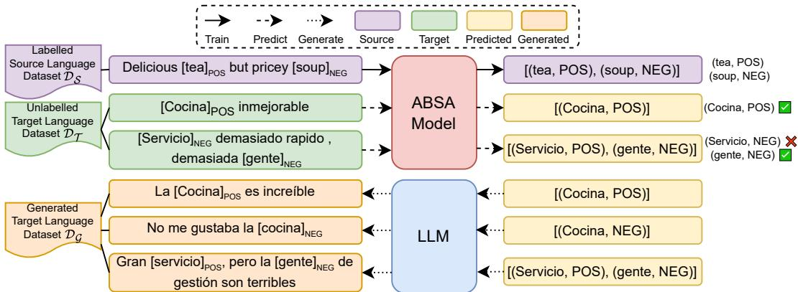
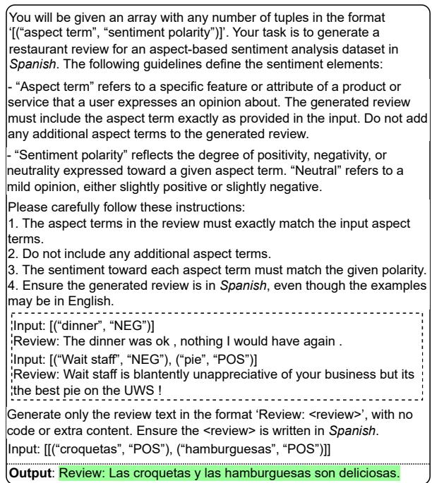
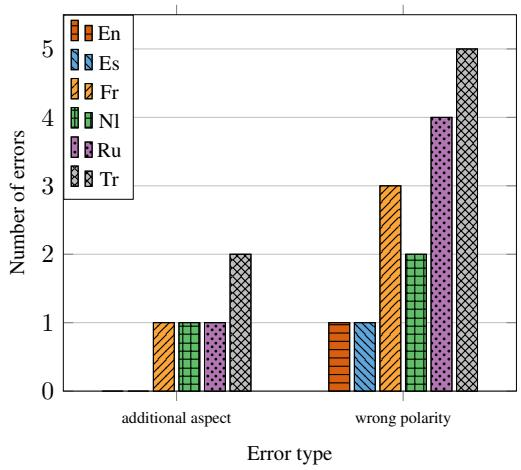
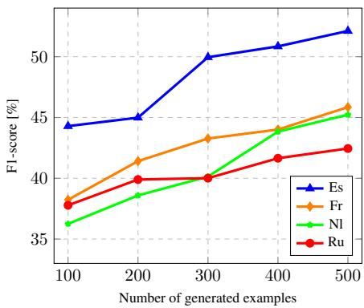
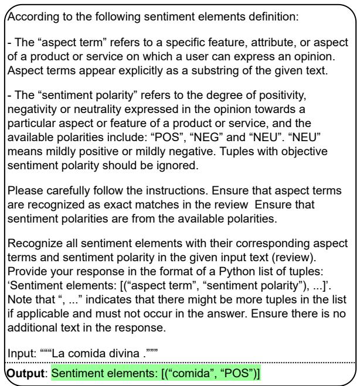
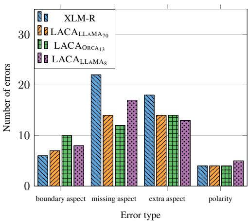
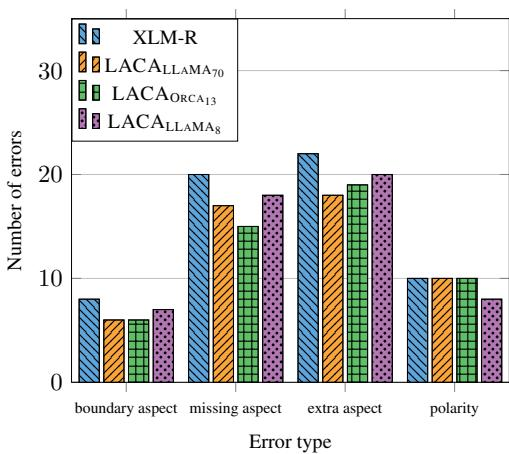
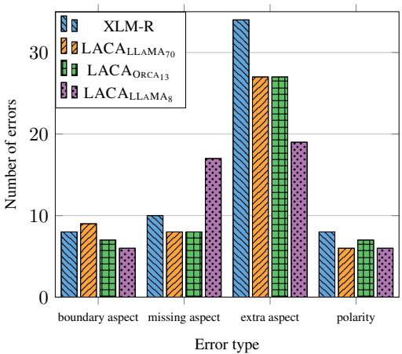
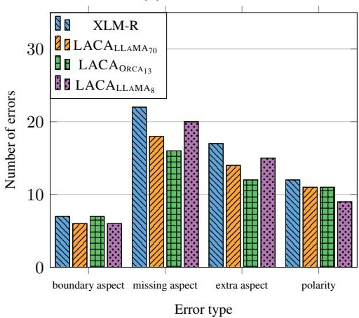

# LACA: Improving Cross-lingual Aspect-Based Sentiment Analysis with LLM Data Augmentation

Jakub Šmíd\*, † and Pavel Pribᡠnˇ\* and Pavel Král\*, †

\*Department of Computer Science and Engineering †NTIS – New Technologies for the Information Society University of West Bohemia in Pilsen, Faculty of Applied Sciences Univerzitní 2732/8, 301 00 Pilsen, Czech Republic {jaksmid,pribanp,pkral}@kiv.zcu.cz https://nlp.kiv.zcu.cz

## Abstract

Cross-lingual aspect-based sentiment analysis (ABSA) involves detailed sentiment analysis in a target language by transferring knowledge from a source language with available annotated data. Most existing methods depend heavily on often unreliable translation tools to bridge the language gap. In this paper, we propose a new approach that leverages a large language model (LLM) to generate highquality pseudo-labelled data in the target language without the need for translation tools. First, the framework trains an ABSA model to obtain predictions for unlabelled target language data. Next, LLM is prompted to generate natural sentences that better represent these noisy predictions than the original text. The ABSA model is then further fine-tuned on the resulting pseudo-labelled dataset. We demonstrate the effectiveness of this method across six languages and five backbone models, surpassing previous state-of-the-art translation-based approaches. The proposed framework also supports generative models, and we show that finetuned LLMs outperform smaller multilingual models.

## 1 Introduction

Aspect-based sentiment analysis (ABSA) is a natural language processing (NLP) task that identifies sentiments linked to specific aspects within a sentence (Liu, 2010), often used to evaluate products or services. For example, in the sentence “Great tea but terrible service”, the aspect terms are “tea” with positive sentiment and “service” with negative sentiment. E2E-ABSA aims to extract aspect terms and their associated sentiment polarities together. The wide-ranging applications of ABSA have garnered substantial interest in recent years (Zhang et al., 2022). Nevertheless, research has primarily focused on English, leaving other languages largely unexplored due to the lack of annotated data. However, manual labelling is and time-consuming and costly, especially for low-resource languages, making cross-lingual ABSA a valuable research area. This work explores zero-shot cross-language ABSA, which leverages annotated source language data to transfer knowledge to target languages without labelled data.

Early cross-lingual ABSA research used machine translation with alignment algorithms (Lambert, 2015; Zhou et al., 2015) and cross-lingual word embeddings (Barnes et al., 2016; Akhtar et al., 2018) to transfer knowledge between languages. Multilingual pre-trained language models (mPLMs) like mBERT (Devlin et al., 2019) and XLM-R (Conneau et al., 2020) have become standard in capturing cross-lingual syntactic and semantic patterns, forming the basis for recent advancements (Zhang et al., 2021; Lin et al., 2023, 2024), though challenges persist in zero-shot transfer due to language-specific aspect terms, slang, and abbreviations in real-world texts (Li et al., 2020).

Cross-lingual ABSA faces challenges, especially in zero-shot settings, as models fine-tuned on source language data can struggle with languagespecific aspect terms and informal language (Šmíd and Kral, 2025). Additionally, many low-resource languages are underrepresented in mPLMs’ pretraining corpora (Conneau et al., 2020), and manual annotation for ABSA is time and resourceintensive. While translation-based methods offer a solution, they often introduce noise by misaligning aspect terms, leading to partial or missing terms in the target language (Li et al., 2020). This misalignment disrupts the model’s ability to correctly identify aspect terms in the target language, reducing cross-lingual ABSA accuracy.

Recent advances in large language models (LLMs) open new possibilities for cross-lingual ABSA. LLM-based data augmentation, which generates diverse examples in the target language without translation, is a promising yet underexplored alternative to machine translation for cross-lingual

ABSA. Similarly, fine-tuning LLMs for crosslingual ABSA remains largely unexplored, despite their success in English (Šmíd et al., 2024). This paper addresses these gaps by proposing a novel LLM-based data augmentation approach leveraging unlabelled target language data as an alternative to machine translation and exploring LLM finetuning for cross-lingual ABSA.

To this end, we propose the LLM Augmented Cross-lingual ABSA (LACA) framework, which leverages unlabelled target language data to improve cross-lingual ABSA performance. The framework begins by fine-tuning an ABSA model on labelled source language data $\mathcal { D } _ { \mathcal { S } }$ . The model then predicts a label $\breve { y } ^ { \mathcal { T } }$ for each unlabelled sentence $\mathbf { \pmb { x } } ^ { \mathcal { T } }$ from the target language dataset $\mathcal { D } _ { \mathcal { T } }$ . To reduce prediction noise caused by language differences, we prompt an LLM with each predicted label $\hat { y } ^ { \mathcal { T } }$ to generate a corresponding target language sentence $\hat { \pmb x } ^ { T }$ . This step ensures the generated data better aligns with the predicted labels than the original unlabelled data, thereby reducing prediction noise. Next, we pair each generated target language sentence $\hat { \pmb x } ^ { T }$ with its corresponding predicted label $\hat { y } ^ { \mathcal { T } }$ to form a new pseudo-labelled dataset $\mathcal { D } _ { \mathcal { G } }$ . Finally, this dataset is combined with the source language dataset $\mathcal { D } _ { \mathcal { S } }$ to train a final model. Our proposed approach provides a powerful alternative to traditional translation-based methods, fully utilizes unlabelled target language data, and effectively addresses the language gap issue by transforming noisy predictions into more accurate text-label pairs. By generating target language sentences that explicitly align with predicted labels, our framework reduces inconsistencies caused by direct cross-lingual prediction, ensuring better adaptation to linguistic nuances. LACA boosts cross-lingual ABSA performance, achieving 1.50% and 2.62% average improvements over previous state-of-the-art methods across two models.

Our key contributions are: 1) We introduce a novel LACA framework, which enhances crosslingual ABSA by generating high-quality pseudolabelled target language data using LLMs, effectively avoiding the language gap problems by generating coherent natural sentences given noisy predicted labels. 2) We demonstrate the effectiveness and robustness of the proposed approach across six languages and five backbone models, achieving new state-of-the-art results. 3) We show that the proposed framework is adaptable to generative models, highlighting its versatility. 4) We find that fine-tuned LLMs outperform smaller multilingual models, being the first to underscore the advantages of LLMs for cross-lingual ABSA.

## 2 Related Work

Early cross-lingual ABSA research primarily targets simple tasks, focusing on a single sentiment element. Common approaches to cross-lingual transfer include machine translation (Lambert, 2015; Klinger and Cimiano, 2015; Zhou et al., 2015) and cross-lingual word embeddings (Wang and Pan, 2018; Jebbara and Cimiano, 2019; Akhtar et al., 2018; Barnes et al., 2016).

Recent research mainly targets E2E-ABSA and utilizes mPLMs such as mBERT (Devlin et al., 2019) and XLM-R (Conneau et al., 2020), often in combination with machine translation. Techniques to further improve performance include parameter warm-up (Li et al., 2020), alignment-free label projection with distillation on unlabelled data (Zhang et al., 2021), contrastive learning for semantic alignment (Lin et al., 2023), and dynamic weighted loss to address class imbalances (Lin et al., 2024).

LLMs tend to underperform compared to smaller models fine-tuned for ABSA (Gou et al., 2023; Zhang et al., 2024), though fine-tuned LLaMA models achieve state-of-the-art results in monolingual ABSA (Šmíd et al., 2024, 2025). Several studies leverage LLMs for data augmentation (Li et al., 2022; Møller et al., 2024; Ding et al., 2024), including for English ABSA (Zhong et al., 2024).

## 3 Methodology

This section describes our LLM Augmented Crosslingual ABSA (LACA) framework. Figure 1 illustrates its two main stages: first, fine-tuning the ABSA model on labelled source language data to make predictions on unlabelled target language data (top part); second, using an LLM to generate high quality data to match these predictions to create pseudo-labelled target language dataset (bottom part), which is then used for further training of the ABSA model.

## 3.1 Problem Formulation

ABSA involves analyzing a sentence ${ \pmb x } = ( x _ { i } ) _ { i = 1 } ^ { n }$ containing n tokens. This task can be framed as a sequence labelling problem. The model predicts a sequence of labels $\pmb { y } ~ = ~ ( y _ { i } ) _ { i = 1 } ^ { n }$ , where $y _ { i } ~ \in ~ \mathcal { V }$ is selected from the label space  = $\{ \mathsf { B } , \mathsf { I } \} \mathrm { - } \{ \mathsf { P O S } , \mathtt { N E G } , \mathtt { N E U } \} \cup \{ \boldsymbol { 0 } \}$ . These labels capture the boundaries and sentiment of aspect terms in the sentence, such as $y _ { i } = \mathtt { B \mathrm { - N E U } }$ for the beginning of a neutral aspect term.

  
Figure 1: The proposed LACA framework integrates fine-tuning and predictions with the ABSA model and pseudo-labelled data generated by an LLM. Square brackets denote gold aspect terms and their polarities. Gold labels for the target language (Spanish) are included for illustration purposes only. The generated dataset is later merged with the labelled source dataset for the final ABSA model training.

Alternatively, the ABSA task can be formulated as a text generation problem, where the model predicts a set of sentiment tuples $\pmb { y } = \{ ( a _ { i } , p _ { i } ) \} _ { i = 1 } ^ { T } ,$ where each tuple consists of an aspect term $a _ { i }$ and its corresponding sentiment polarity $p _ { i }$ . The number of tuples T depends on the input sentence.

In cross-lingual settings, the goal is to predict a label $y ^ { \mathcal { T } }$ for a sentence $\mathbf { \boldsymbol { x } } ^ { \mathcal { T } }$ in the target language $\tau$ using only sentence-label pairs $( \boldsymbol { x } ^ { \bar { S } } , \boldsymbol { y } ^ { \bar { S } } )$ from the source language $s$ in the dataset $\mathcal { D } _ { \mathcal { S } }$ , without access to labelled data from the target language. However, unlabelled target language sentences from the dataset $\mathcal { D } _ { T } = \{ \mathbf { x } _ { i } \} _ { i = 1 } ^ { | \mathcal { D } _ { T } | }$ can assist the task.

## 3.2 ABSA Models

We use pre-trained multilingual models as the backbone of our ABSA model, denoting the parameters as Θ, which includes task-specific parameters W and b, all fine-tuned during training.

For sequence labelling, we employ encoderbased models that convert the input sequence ${ \pmb x } = ( x _ { i } ) _ { i = 1 } ^ { n }$ into hidden vectors $\mathbf { h } = ( \mathbf { h } _ { i } ) _ { i = 1 } ^ { n }$ . A linear classification layer produces token-level predictions from hidden vectors using BIO tagging for aspect boundaries and sentiment polarities. The label distribution for each token $x _ { i }$ is computed as

$$
P _ { \Theta } ( y _ { i } | x _ { i } ) = \mathrm { s o f t m a x } ( \mathbf { W } \mathbf { h } _ { i } + \mathbf { b } ) .\tag{1}
$$

We minimize the cross-entropy loss $\mathcal { L }$ between the predicted and true labels as

$$
\mathcal { L } = \frac { 1 } { | \mathcal { D } | } \sum _ { ( \pmb { x } , \pmb { y } ) \in \mathcal { D } } \left[ - \frac { 1 } { n } \sum _ { i = 1 } ^ { n } y _ { i } \log P _ { \Theta } ( y _ { i } | x _ { i } ) \right] .\tag{2}
$$

We also explore the ABSA task as a textgeneration problem, using sequence-to-sequence (encoder-decoder) and decoder-only models. In sequence-to-sequence models, the encoder processes the input sequence x into a contextualized representation e. The decoder generates the output sequence y token by token, with each token $y _ { i }$ predicted based on the previous tokens $y _ { 1 } ^ { i - 1 }$ and the encoded input e. We format the output as $^ { * } [ A ]$ a [P] $p ^ { \prime \prime }$ , where a represents the aspect term and $p$ its corresponding sentiment polarity, concatenating multiple outputs with [;]. During fine-tuning, we minimize the cross-entropy as

$$
\mathcal { L } = \frac { 1 } { | \mathcal { D } | } \sum _ { ( \pmb { x } , \pmb { y } ) \in \mathcal { D } } \left[ - \frac { 1 } { n } \sum _ { i = 1 } ^ { n } \log P _ { \Theta } \big ( y _ { i } | \mathbf { e } , y _ { 1 } ^ { i - 1 } \big ) \right] .\tag{3}
$$

Decoder-only models function similarly, except they generate tokens solely based on previously generated tokens, without relying on encoded input sequences.

## 3.3 Pseudo-Labelled Data Generation

While the ABSA model can make predictions directly in the target language, research has shown that pseudo-labelled target language data improves cross-lingual ABSA performance (Zhang et al., 2021). A straightforward method for generating pseudo-labels without machine translation is to pair each target language sentence $\mathbf { \pmb { x } } ^ { \mathcal { T } }$ with its corresponding model prediction $\hat { y } ^ { \mathcal { T } }$ . However, this selftraining approach can be hindered by noise in the predictions. To address this, we propose employing LLMs for data augmentation, generating sentences that align better with the predicted labels.

Specifically, we input the predicted label $\hat { y } ^ { \mathcal { T } }$ into the LLM, prompting it to generate a sentence $\hat { \pmb x } ^ { T }$ that matches the label. As a result, the LLM generates a pseudo-labelled dataset $\mathcal { D } _ { \mathcal { G } }$ consisting of $( \hat { \pmb x } _ { i } ^ { T } , \hat { \pmb y } _ { i } ^ { T } )$ pairs. As discussed, the gap between the source and target languages introduces noise into the ABSA model’s predictions on unlabelled target language data. Instead of refining the ABSA model, our LLM-based augmentation creates more reliable pseudo-labelled training samples, where each sentence $\hat { \pmb x } ^ { T }$ accurately reflects the predicted label $\hat { y } ^ { \mathcal { T } }$ , thereby minimizing the impact of the noise in the predictions.

Pseudo-labels are crucial for exposing the model to language-specific elements like slang and aspect terms in the target language, which pre-training alone cannot fully address. They help bridge the gap between source and target languages by encouraging the model to learn and adapt to the target language’s nuances.

We improve the LLM’s understanding by providing ten few-shot examples from the source language training data, rotating these examples randomly to ensure the diversity of the output. Due to the limited number of sentiment polarities and the natural diversity of aspect terms, this random selection is sufficient to produce varied and representative examples. Additionally, we can modify the input examples as needed to address imbalances in the source language training set. For instance, if certain sentiment polarities are underrepresented, we can create new inputs that reflect different sentiment polarities while preserving the aspect term. This strategy helps generate more diverse examples and also aids in mitigating class imbalances within the dataset.

Unlike machine translation methods that translate source language data directly into the target language – often resulting in semantically similar examples – our LLM-based approach is designed to generate a more diverse set of target language examples. While translation methods yield two linguistically distinct datasets, the underlying semantics remain largely unchanged. In contrast, the proposed LLM augmentation introduces a wide range of semantically distinct examples, enhancing the model’s generalization and robustness by exposing it to a broader spectrum of meanings. Furthermore, we can adjust the LLM inputs to address label imbalances, generating data for less frequent sentiment polarities as needed.

## 3.4 Training

To ensure the quality of the generated dataset $\mathcal { D } _ { \mathcal { G } }$ it should meet several key criteria: generated sentences should accurately reflect all sentiment elements in the tuples, include only the specified sentiment elements, and be in the target language.

  
Figure 2: LLM prompt illustration for review generation, with two few-shot demonstrations in the dashed box and the expected output in the green box. The example uses Spanish but is adaptable to other languages.

To achieve the quality of ${ \mathcal { D } } _ { { \mathcal { G } } } ,$ we pre-process the predicted labels $\hat { y } ^ { \mathcal { T } }$ to guarantee that at least one sentiment element is present. We also craft the generation prompt to specify that the text must be in the target language and not introduce additional sentiment elements, as shown in Figure 2. After generating pairs $( \hat { \pmb x } ^ { T } , \hat { \pmb y } ^ { T } )$ , we post-process them by filtering out instances where $\hat { \pmb x } ^ { T }$ lacks aspect terms from $\hat { y } ^ { \mathcal { T } }$ . We also discard pairs where the ABSA model’s prediction on $\hat { \pmb x } ^ { T }$ differs from $\hat { y } ^ { \mathcal { T } }$

Finally, we combine the source language dataset $\mathcal { D } _ { \mathcal { S } }$ with the generated dataset $\mathcal { D } _ { \mathcal { G } }$ to form the final training set, continuing the training of the same model as described in Section 3.2.

## 4 Experimental Setup

We conduct experiments on the E2E-ABSA task.

## 4.1 Dataset

We evaluate the proposed framework on the SemEval-2016 dataset (Pontiki et al., 2016), which includes real user restaurant reviews in English (en), Spanish (es), French (fr), Dutch (nl), Russian (ru), and Turkish (tr). We use the data splits provided by Zhang et al. (2021) for a fair comparison. Table 1 shows the dataset statistics.

<table><tr><td colspan="2"></td><td>En</td><td>Es</td><td>Fr</td><td>NI</td><td>Ru</td><td>Tr</td></tr><tr><td rowspan="2">Train</td><td>No. sentences</td><td>1,600</td><td>1,656</td><td>1,332</td><td>1,378</td><td>2,924</td><td>986</td></tr><tr><td>No. aspects</td><td>1,377</td><td>1,500</td><td>1,294</td><td>956</td><td>2,439</td><td>1,083</td></tr><tr><td>Dev</td><td>No. sentences</td><td>400</td><td>414</td><td>322</td><td>344</td><td>731</td><td>246</td></tr><tr><td rowspan="2"></td><td>No. aspects</td><td>365</td><td>353</td><td>345</td><td>274</td><td>629</td><td>271</td></tr><tr><td>No. sentences</td><td>676</td><td>881</td><td>668</td><td>575</td><td>1,209</td><td>144</td></tr><tr><td>Test</td><td>No. aspects</td><td>612</td><td>713</td><td>649</td><td>373</td><td>945</td><td>148</td></tr></table>

Table 1: Data statistics for each language.

In all experiments, we use the source language validation set for model selection to ensure true unsupervised settings (Jebbara and Cimiano, 2019).

## 4.2 Implementation Details

We employ base mBERT (Devlin et al., 2019) and XLM-R (Conneau et al., 2020) for the encoder models based on related work (Li et al., 2020; Zhang et al., 2021; Lin et al., 2023, 2024), base mT5 (Xue et al., 2021) for sequence-to-sequence models, and Orca 2 13B (Mitra et al., 2023) and LLaMA 3.1 8B (Dubey et al., 2024) for decoder-only models.

For the LLMs generating the pseudo-labelled examples, we employ Orca 2 13B and LLaMA 3.1 8B and 70B. To diversify the dataset and reduce sentiment imbalance, we modify 20% of overrepresented positive sentiment examples by generating new instances, with a 60% chance of neutral and 40% of negative sentiment. Appendix A presents the detailed experimental details.

## 4.3 Evaluation Metrics

We employ micro-F1 as the evaluation metric, consistent with related work (Zhang et al., 2021; Lin et al., 2023, 2024), where a prediction is deemed correct only if both its boundary and sentiment polarity are accurate. We report average F1 scores across five runs with different random seeds.

## 4.4 Compared Methods

We compare our approach against the ZERO-SHOT method, which fine-tunes the model using only labelled source language data, a strong baseline for cross-lingual tasks (Conneau et al., 2020; Wu and Dredze, 2019), and several translationbased approaches. TRANSLATION-TA employs the Translate-then-Align paradigm (Li et al., 2020) for fine-tuning using translated data, while

BILINGUAL-TA combines this translated data with the original source data. ACS (Zhang et al., 2021) uses an alignment-free projection method and aspect code-switching to interchange aspect terms between languages. ACS-DISTILL enhances this by applying distillation on unlabelled target language data. CL-XABSA (Lin et al., 2023) incorporates contrastive learning at both the sentiment (SL) and token levels (TL). EQUI-XABSA (Lin et al., 2024) employs a dynamically weighted loss to address class imbalances and anti-decoupling to enhance semantic information utilization.

## 5 Results

Table 2 presents the cross-lingual ABSA results using mBERT and XLM-R as backbone models. Key observations include:

1) XLM-R is a strong baseline in ZERO-SHOT settings, while mBERT underperforms.

2) TRANSLATION-TA and BILINGUAL-TA perform similarly or worse than ZERO-SHOT.

3) The leading translation-based approaches are ACS-DISTILL, which uses distillation on unlabelled target data, and EQUI-XABSA, which addresses class imbalances.

4) Our framework with LLaMA 3.1 8B $( \mathbf { L A C A _ { L L A M A _ { 8 } } } )$ surpasses the best results of translation-based methods by around 0.5% with mBERT and over 1% with XLM-R on average.

5) The proposed method using Orca 2 13B $( \mathbf { L A C A _ { O R C A _ { 1 3 } } } )$ outperforms prior methods in all languages except Russian with mBERT, showing a 1.28% improvement over the best translation-based methods with mBERT and 2.45% with XLM-R, while enhancing ZERO-SHOT by 11.39% and 5.83% on average, respectively. It sets new state-of-the-art results for Dutch with both models and Russian with XLM-R. Despite being Englishcentric1, Orca 2 13B for LACA outperforms the smaller multilingual LLaMA 3.1 8B and nearly matches the larger LLaMA 3.1 70B, surpassing it on Russian and Dutch, languages not officially supported by LLaMA 3.1. This ability to rival the larger multilingual model may stem from Orca 2’s advanced reasoning capabilities. Additionally, Orca 2 tends to generate shorter reviews, potentially reducing errors such as introducing aspect terms not present in predicted labels, which can harm the ABSA model performance.

<table><tr><td rowspan="2">Method</td><td colspan="4">mBERT</td><td colspan="6">XLM-R</td></tr><tr><td>Es</td><td>Fr</td><td>NI</td><td>Ru</td><td>Avg</td><td>Es</td><td>Fr</td><td>NI</td><td>Ru</td><td>Avg</td></tr><tr><td>SUPERVISED (Zhang et al., 2021)</td><td>67.88</td><td>61.80</td><td>56.80</td><td>58.87</td><td>61.34</td><td>71.93</td><td>67.44</td><td>64.28</td><td>64.93</td><td>67.15</td></tr><tr><td>ZERO-SHOT</td><td>56.90</td><td>45.80</td><td>45.97</td><td>34.06</td><td>45.68</td><td>67.48</td><td>58.87</td><td>58.95</td><td>56.10</td><td>60.35</td></tr><tr><td>TRANSLATION-TA (Li et al., 2020)</td><td>50.71</td><td>40.76</td><td>47.13</td><td>41.67</td><td>45.08</td><td>58.10</td><td>47.00</td><td>56.19</td><td>50.34</td><td>52.91</td></tr><tr><td>BILINGUAL-TA (Li et al., 2020)</td><td>51.23</td><td>41.00</td><td>49.72</td><td>43.67</td><td>46.41</td><td>61.87</td><td>49.34</td><td>58.64</td><td>52.89</td><td>55.69</td></tr><tr><td>ACS (Zhang et al., 2021)</td><td>59.99</td><td>49.65</td><td>51.19</td><td>52.09</td><td>53.23</td><td>67.32</td><td>59.39</td><td>62.83</td><td>60.81</td><td>62.59</td></tr><tr><td>ACS-DISTILL (Zhang et al., 2021)</td><td>62.91</td><td>52.25</td><td>53.40</td><td>54.58</td><td>55.79</td><td>69.24</td><td>59.90</td><td>63.74</td><td>62.02</td><td>63.73</td></tr><tr><td>CL-XABSA (TL) (Lin et al., 2023)</td><td>60.64</td><td>48.53</td><td>50.96</td><td>50.77</td><td>52.73</td><td>64.85</td><td>58.10</td><td>59.75</td><td>58.84</td><td>60.39</td></tr><tr><td>CL-XABSA (SL) (Lin et al., 2023)</td><td>61.62</td><td>49.50</td><td>50.64</td><td>50.65</td><td>53.10</td><td>64.63</td><td>59.47</td><td>59.40</td><td>61.13</td><td>61.16</td></tr><tr><td>EQUI-XABSA (Lin et al., 2024)</td><td>63.08</td><td>50.08</td><td>51.85</td><td>52.59</td><td>54.40</td><td>69.56</td><td>60.68</td><td>61.31</td><td>62.34</td><td>63.47</td></tr><tr><td> $\mathbf { L A C A _ { L L A M A _ { 7 0 } } }$ </td><td>65.23</td><td>54.90</td><td>55.29</td><td>53.72</td><td>57.29</td><td>71.89</td><td>64.97</td><td>65.35</td><td>63.20</td><td>66.35</td></tr><tr><td> $\mathbf { L A C A _ { O R C A _ { 1 3 } } }$ </td><td>64.80</td><td>54.21</td><td>55.41</td><td>53.86</td><td>57.07</td><td>71.61</td><td>64.25</td><td>65.41</td><td>63.46</td><td>66.18</td></tr><tr><td> $\mathbf { L A C A _ { L L A M A _ { 8 } } }$ </td><td>64.33</td><td>53.74</td><td>54.56</td><td>52.36</td><td>56.25</td><td>71.17</td><td>63.81</td><td>64.29</td><td>61.46</td><td>65.18</td></tr></table>

Table 2: Average F1 scores over five runs with different random seeds for cross-lingual E2E-ABSA using English as the source language, compared with supervised (monolingual) results in the “SUPERVISED” row and cross-lingual results from other studies. The best scores are highlighted in bold, and the second-best scores are underlined.

6) LACA with LLaMA 3.1 70B $( \mathbf { L A C A _ { L L A M A _ { 7 0 } } } )$ achieves new state-of-theart results with mBERT and XLM-R in Spanish, French, and on average. It surpasses the previous best methods by 1.50% with mBERT and 2.62% with XLM-R while improving the ZERO-SHOT baseline by 11.61% with mBERT and 6% with XLM-R. The 70B version of LLaMA 3.1 outperforms the 8B version by more than 1% on average, demonstrating that larger models offer better performance but at the expense of slower inference and higher memory usage.

7) Notably, XLM-R with $\mathbf { L A C A _ { O R C A _ { 1 3 } } }$ and $\mathrm { L A C A _ { L L A M A _ { 7 0 } } }$ matches the performance of supervised settings in Spanish and exceeds it in Dutch, while being less than 1% below average performance across all languages. Crucially, our approach achieves this without the need for external translation tools.

8) Spanish performs best as the target language, likely due to its similarity to English, which leads to better-aligned embeddings in pre-trained models. The LLMs also tend to generate higher-quality examples in Spanish due to their stronger representation in that language.

9) Though strong, our performance in Russian is slightly lower than in other languages, likely due to its greater dissimilarity to English and the lack of official LLaMA 3.1 support, which may reduce the quality of generated examples. In contrast, Dutch benefits from its similarity to supported languages like English and German, despite not being officially supported by LLaMA 3.1.

Table 3 shows the results of our approach with five different backbone models. The mT5 model performs similarly to XLM-R, indicating that the sequence-to-sequence approach can effectively serve as an alternative to sequence labelling methods. LLaMA 3.1 and Orca 2 consistently yield the best results across languages, except for Russian, likely due to the lower support for Russian in these LLMs. The LACA framework improves the performance of LLaMA 3.1 and Orca 2 by nearly 5% compared to the zero-shot approach. On average, LACA with LLMs as backbone models outperforms XLM-R by more than 2%, highlighting the potential of fine-tuned LLMs for cross-lingual ABSA tasks. However, the larger parameter count of LLaMA 3.1 (about 30 times larger than XLM-R) and Orca 2 (about 50 times larger than XLM-R) results in slower inference times and higher GPU memory requirements, presenting a trade-off when opting for LLMs over smaller models.

<table><tr><td></td><td>Es</td><td>Fr</td><td>NI</td><td>Ru</td><td>Avg</td></tr><tr><td>mBERT</td><td>56.90</td><td>45.80</td><td>45.97</td><td>34.06</td><td>45.68</td></tr><tr><td> $\mathbf { + L A C A _ { L L A M A _ { 7 0 } } }$ </td><td>65.23</td><td>54.90</td><td>55.29</td><td>53.72</td><td>57.29</td></tr><tr><td> $\mathbf { + L A C A _ { O R C A _ { 1 3 } } }$ </td><td>64.80</td><td>54.21</td><td>55.41</td><td>53.86</td><td>57.07</td></tr><tr><td> $\mathbf { + L A C A _ { L L A M A _ { 8 } } }$ </td><td>64.33</td><td>53.74</td><td>54.56</td><td>52.36</td><td>56.25</td></tr><tr><td>XLM-R</td><td>67.48</td><td>58.87</td><td>58.95</td><td>56.10</td><td>60.35</td></tr><tr><td> $\mathbf { + L A C A _ { L L A M A 7 0 } }$ </td><td>71.89</td><td>64.97</td><td>65.35</td><td>63.20</td><td>66.35</td></tr><tr><td> $\mathbf { + L A C A _ { O R C A _ { 1 3 } } }$ </td><td>71.61</td><td>64.25</td><td>65.41</td><td>63.46</td><td>66.18</td></tr><tr><td> $\mathbf { + L A C A _ { L L A M A _ { 8 } } }$ </td><td>71.17</td><td>63.81</td><td>64.29</td><td>61.46</td><td>65.18</td></tr><tr><td>mT5</td><td>66.85</td><td>58.12</td><td>58.47</td><td>55.65</td><td>59.77</td></tr><tr><td> $\mathbf { + L A C A _ { L L A M A _ { 7 0 } } }$ </td><td>72.03</td><td>63.92</td><td>64.95</td><td>62.71</td><td>65.90</td></tr><tr><td> $\mathbf { + L A C A _ { O R C A _ { 1 3 } } }$ </td><td>71.56</td><td>63.49</td><td>65.70</td><td>62.92</td><td>65.92</td></tr><tr><td> $\mathbf { + L A C A _ { L L A M A _ { 8 } } }$ </td><td>70.56</td><td>62.99</td><td>63.70</td><td>60.92</td><td>64.54</td></tr><tr><td> $\mathrm { L L a M A } 3 . 1 $ </td><td>69.24</td><td>66.02</td><td>64.74</td><td>55.14</td><td>63.79</td></tr><tr><td> $\mathbf { + L A C A _ { L L A M A _ { 7 0 } } }$ </td><td>73.74</td><td>70.73</td><td>68.04</td><td>62.49</td><td>68.75</td></tr><tr><td> $\mathbf { + L A C A _ { O R C A _ { 1 3 } } }$ </td><td>73.75</td><td>70.39</td><td>67.95</td><td>62.68</td><td>68.69</td></tr><tr><td> $\mathbf { + L A C A _ { L L A M A _ { 8 } } }$ </td><td>73.20</td><td>69.89</td><td>67.95</td><td>60.92</td><td>67.81</td></tr><tr><td>Orca 2</td><td>69.35</td><td></td><td></td><td></td><td></td></tr><tr><td> $\mathbf { + L A C A _ { L L A M A _ { 7 0 } } }$ </td><td>74.27</td><td>65.93 70.13</td><td>64.85 68.25</td><td>55.21 62.38</td><td>63.84 68.76</td></tr><tr><td> $\mathbf { + L A C A _ { O R C A _ { 1 3 } } }$ </td><td>73.80</td><td>69.89</td><td>68.47</td><td>62.49</td><td>68.66</td></tr><tr><td></td><td></td><td></td><td></td><td></td><td></td></tr><tr><td> $\mathbf { + L A C A _ { L L A M A _ { 8 } } }$ </td><td>73.21</td><td>69.30</td><td>67.48</td><td>60.09</td><td>67.52</td></tr></table>

Table 3: Results for different fine-tuned models in zeroshot settings and with LACA. The best results for each model are underlined, and the best overall are in bold.

## 5.1 Results for Turkish

Table 4 presents the results for Turkish as the target language. Most prior research (Zhang et al., 2021; Lin et al., 2023, 2024) has excluded Turkish due to the very small test set, containing fewer than 150 examples. Despite this limitation, the proposed LACA framework demonstrates significant improvements for both mBERT and XLM-R models compared to ZERO-SHOT and translation-based approaches. These results highlight the framework’s adaptability and effectiveness for languages outside the Indo-European family.

<table><tr><td>Method</td><td>mBERT</td><td>XLM-R</td></tr><tr><td>SUPERVISED</td><td>47.74</td><td>60.93</td></tr><tr><td>ZERO-SHOT</td><td>27.04</td><td>46.53</td></tr><tr><td>TRANSLATION-TA (Li et al., 2020)</td><td>22.04</td><td>40.24</td></tr><tr><td>BILINGUAL-TA (Li et al., 2020)</td><td>22.64</td><td>41.44</td></tr><tr><td> $\mathbf { L A C A _ { L L A M A _ { 7 0 } } }$ </td><td>31.98</td><td>50.02</td></tr><tr><td> $\mathbf { L A C A _ { O R C A _ { 1 3 } } }$ </td><td>33.16</td><td>51.15</td></tr><tr><td> $\mathbf { L A C A _ { L L A M A _ { 8 } } }$ </td><td>31.13</td><td>49.71</td></tr></table>

Table 4: Results for Turkish as the target language with English as the source language. The best results for each model are in bold; the second best are underlined.

## 5.2 Additional Results

Appendix B shows additional results with smaller LLMs (LLaMA 3.2 1B and 3B) and different source-target language combinations, further showcasing the effectiveness of the proposed method.

## 5.3 Ablation Study

Table 5 shows an ablation study of LACA, highlighting the impact of its key components.

Effect of additional examples creation To investigate the effectiveness of creating additional examples by replacing sentiment polarity, we remove this step and denote it as “w/o extra example creation”. The results indicate a small improvement (0.5–1.2% on average) when additional examples are included, suggesting further gains might be possible with more example creation. In preliminary experiments, increasing the sentiment polarity modification ratio from 20% to 50% did not improve performance but significantly increased generation time. Researchers should carefully consider the trade-offs between computational cost, practicality, and potential performance gains when modifying sentiment combinations.

<table><tr><td></td><td>Es</td><td>Fr</td><td>NI</td><td>Ru</td><td>Avg</td></tr><tr><td></td><td>mBERT</td><td></td><td></td><td></td><td></td></tr><tr><td> $\mathbf { L A C A _ { L L A M A _ { 7 0 } } }$ </td><td>65.23</td><td>54.90</td><td>55.29</td><td>53.72</td><td>57.29</td></tr><tr><td>– w/o extra example creation</td><td>64.73</td><td>54.32</td><td>53.76</td><td>51.50</td><td>56.08</td></tr><tr><td>– w/o dynamic few-shot</td><td>63.87</td><td>52.46</td><td>52.29</td><td>49.01</td><td>54.41</td></tr><tr><td>LLaMA 70B text &amp; label gen.</td><td>57.32</td><td>43.62</td><td>46.08</td><td>39.15</td><td>46.54</td></tr><tr><td>LLaMA 70B translation gen.</td><td>63.02</td><td>52.15</td><td>52.68</td><td>51.54</td><td>54.85</td></tr><tr><td> $\mathbf { L A C A _ { O R C A _ { 1 3 } } }$ </td><td>64.80</td><td>54.21</td><td>55.41</td><td>53.86</td><td>57.07</td></tr><tr><td>– w/o extra example creation</td><td>63.72</td><td>53.28</td><td>53.74</td><td>51.98</td><td>55.68</td></tr><tr><td>– w/o dynamic few-shot</td><td>62.77</td><td>52.08</td><td>52.97</td><td>49.46</td><td>54.32</td></tr><tr><td>Orca 13B text &amp; label gen.</td><td>56.87</td><td>42.12</td><td>46.31</td><td>39.94</td><td>46.31</td></tr><tr><td>Orca 13B translation gen.</td><td>62.83</td><td>52.17</td><td>52.99</td><td>51.81</td><td>54.95</td></tr><tr><td> $\mathbf { L A C A _ { L L A M A _ { 8 } } }$ </td><td>64.33</td><td>53.74</td><td>54.56</td><td>52.36</td><td>56.25</td></tr><tr><td>– w/o extra example creation</td><td>63.72</td><td>53.28</td><td>53.74</td><td>52.60</td><td>55.84</td></tr><tr><td>– w/o dynamic few-shot</td><td>62.77</td><td>52.08</td><td>52.97</td><td>49.46</td><td>54.32</td></tr><tr><td>LLaMA 8B text &amp; label gen.</td><td>56.17</td><td>40.23</td><td>44.64</td><td>35.27</td><td>44.07</td></tr><tr><td>LLaMA 8B translation gen.</td><td>62.43</td><td>51.91</td><td>52.29</td><td>51.12</td><td>54.44</td></tr><tr><td>Continue (MLM pre-train)</td><td>57.26</td><td>46.02</td><td>47.21</td><td>37.56</td><td>47.01</td></tr><tr><td>Self-training</td><td>53.84</td><td>38.97</td><td>36.77</td><td>25.04</td><td>38.66</td></tr><tr><td colspan="6">XLM-R</td></tr><tr><td> $\mathbf { L A C A _ { L L A M A _ { 7 0 } } }$ </td><td>71.89</td><td>64.97</td><td>65.35</td><td>63.20</td><td>66.35</td></tr><tr><td>– w/o extra example creation</td><td>71.35</td><td>64.18</td><td>64.25</td><td>62.07</td><td>65.46</td></tr><tr><td>– w/o dynamic few-shot</td><td>70.12</td><td>62.98</td><td>63.34</td><td>59.52</td><td>63.99</td></tr><tr><td>LLaMA 70B text &amp; label gen.</td><td>66.50</td><td>59.12</td><td>58.29</td><td>57.01</td><td>60.23</td></tr><tr><td>LLaMA 70B translation gen.</td><td>70.09</td><td>61.69</td><td>62.88</td><td>61.20</td><td>63.97</td></tr><tr><td> $\mathbf { L A C A _ { O R C A _ { 1 3 } } }$ </td><td>71.61</td><td>64.25</td><td>65.41</td><td>63.46</td><td>66.18</td></tr><tr><td>– w/o extra example creation</td><td>70.48</td><td>63.09</td><td>64.48</td><td>62.63</td><td>65.17</td></tr><tr><td>– w/o dynamic few-shot</td><td>69.81</td><td>63.34</td><td>62.27</td><td>60.36</td><td>63.63</td></tr><tr><td>Orca 13B text &amp; label gen.</td><td>64.28</td><td>58.12</td><td>58.99</td><td>58.28</td><td>59.92</td></tr><tr><td>Orca 13B translation gen.</td><td>69.69</td><td>61.21</td><td>62.84</td><td>61.45</td><td>63.80</td></tr><tr><td> $\mathbf { L A C A _ { L L A M A _ { 8 } } }$ </td><td>71.17</td><td>63.81</td><td>64.29</td><td>61.46</td><td>65.18</td></tr><tr><td>– w/o extra example creation</td><td>70.48</td><td>63.09</td><td>63.48</td><td>60.63</td><td>64.42</td></tr><tr><td>– w/o dynamic few-shot</td><td>69.81</td><td>62.34</td><td>62.27</td><td>59.11</td><td>63.38</td></tr><tr><td>LLaMA 8B text &amp; label gen.</td><td>64.28</td><td>58.12</td><td>58.99</td><td>54.28</td><td>58.92</td></tr><tr><td>LLaMA 8B translation gen.</td><td>69.71</td><td>61.03</td><td>61.91</td><td>60.97</td><td>63.41</td></tr><tr><td>Continue (MLM pre-train)</td><td>68.95</td><td>59.12</td><td>58.94</td><td>58.74</td><td>61.44</td></tr><tr><td>Self-training</td><td>65.67</td><td>53.63</td><td>57.57</td><td>51.48</td><td>57.09</td></tr></table>

Table 5: Ablation study of the LACA framework, with the best results in bold and the second best underlined.

Effect of few-shot examples switching We also evaluate the impact of maintaining static few-shot examples instead of switching them for each generated sample (“w/o dynamic few-shot”). Results show a clear performance drop of about 2% without dynamic examples, confirming that variety in few-shot samples improves generation quality.

Effect of label generation To examine the impact of utilizing predicted labels, we replace the pseudo-labelling process with LLMs prompted to generate both text and labels rather than generating text based on provided labels (“text & label gen.”). This approach, which does not leverage unlabelled target data, leads to a significant performance drop of around 11% for mBERT and 6% for XLM-R. Several factors contribute to this decline. First, the generated labels often have incorrect formats, such as producing B-NEUT instead of the correct B-NEU, leading to discarded examples. Second, while the ABSA model in LACA provides diverse aspect terms for the LLM to generate text, prompting the LLM to generate both text and labels leads to repetitive, single-word aspects, reducing accuracy and diversity. Additionally, the LLM sometimes assigns incorrect sentiments or mislabels aspects, compounding noise in predictions. Research indicates that LLaMA-based models tend to underperform in ABSA in zero-shot and few-shot scenarios (Šmíd et al., 2024), suggesting that they are ill-suited for generating coherent examples that include both text and labels.

Effect of prediction-based label generation To assess the importance of the initial training and prediction phase, we replaced it with directly translating aspect terms from the English dataset using the Google Translate API and generating pseudolabelled data with LLMs (“translation gen.”) from the translations. This approach performed approximately 2% worse than our method. We attribute this to the prediction phase’s ability to identify language-specific aspect terms in the unlabelled target dataset, which may lack direct equivalents in the source dataset. By generating sentences based on these unique terms, our method produces more diverse, target-language-specific data, capturing nuances that simple translation overlooks and enhancing the quality of pseudo-labelled data.

Effect of unlabelled data utilization Additional (continued) pre-training on domain-specific corpora has proven effective for leveraging unlabelled data (Xu et al., 2019). We compare this approach – labelled as “Continue” – with our method to analyze the use of unlabelled data for cross-lingual ABSA. In this setup, we replace the LLM-based generation with masked language model (MLM) pre-training on unlabelled target language data, following the original pre-training objectives of mBERT and XLM-R. Results show that continued pre-training performs 10% worse with mBERT and 5% worse with XLM-R than our method. This performance gap is likely attributed to the substantial amount of data required for effective continued pretraining, which is often impractical in cross-lingual ABSA scenarios.

<table><tr><td>Spanish Dataset Sentence</td><td>Prediction</td><td>LACA Generation</td></tr><tr><td>el [servicio]pos impecable.</td><td>(servicio, POS)</td><td>El [servicio]Pos fue excelente, rápido y agradable.</td></tr><tr><td>(impeccable service.)</td><td></td><td>(The service was excellent, fast and friendly.)</td></tr><tr><td>Magnifíca [atención]Pos, buena [carta de vinos]Pos,</td><td>(carta, POS),</td><td>Buen [carta]PoS,</td></tr><tr><td>muy buen [paella]pos. (Great service, good wine</td><td>(paella, POS)</td><td>[paella]pos deliciosa.</td></tr><tr><td>list, very good paella.) El [servicio]Neu era</td><td></td><td>(Good menu, delicious paella.)</td></tr><tr><td>eficiente pero no</td><td>(servicio, NEG)</td><td>El [servicio]eG era terrible</td></tr><tr><td>especialmente amable. (The service was efficient</td><td></td><td></td></tr></table>

Table 6: Examples of data generation for Spanish, with gold aspect terms marked with square brackets.

Effect of pseudo-labelled data generation Finally, we replace the proposed method with selftraining, fine-tuning the model on pseudo-labelled data generated directly by the ABSA model. This approach leads to significant performance drops (up to 20% for mBERT and 9% for XLM-R), primarily due to the noisy predictions in zero-shot settings. Our method, which employs LLM-based generation, successfully mitigates this issue by reducing noise in pseudo-labelled data. We manually reviewed several generated samples across different languages, with a few examples in Spanish presented in Table 6. The gold data for the target language is provided solely for investigation purposes and is not available during training. The second example is missing one aspect term and has one incomplete aspect term, while the third example has incorrectly assigned sentiment polarity. Nevertheless, the LLM can generate accurate sentences that effectively describe the predictions, even if they do not match the original input. These instances illustrate how this stage can address noisy predictions and produce high-quality target language data.

## 5.4 Analysis of the Generated Samples

We analyzed 50 randomly generated examples from the LLaMA 3.1 model with 70B parameters for each target language. To streamline the process, we focused on one model and a limited number of samples, as this analysis is time-intensive. Since we are not native speakers of any of the target languages, we utilized the Google Translate $\Delta \bar { \mathrm { P I } } ^ { 2 }$ to translate the generated examples (except for English) and input aspect terms into English, acknowledging that this might introduce some noise. Notably, the authors have prior experience annotating datasets for ABSA, which enhances their understanding of the task. For all target languages, English served as the source language. However, for English itself, we used Spanish as the source language.

From the reviewed examples, none were missing the requested aspect term (verified in the original language before translation), except for Turkish, where one instance contained a slightly modified version of the requested term rather than an exact match. We focused on two potential error types:

1. Introduction of new aspect terms: Instances where the model generated additional aspect terms that were not requested.

2. Incorrect sentiment polarity: Cases where the sentiment polarity of the generated text did not align with the expected polarity.

  
Figure 3: Number of error types in 50 samples generated by LLaMA 3.1 70B for different languages.

Figure 3 summarizes the results of this analysis. New aspect term errors were minimal across all languages, while errors related to incorrect sentiment polarity occurred slightly more often but remained rare overall. Most polarity errors involved the neutral sentiment class, where neutral polarity is expected to indicate slightly positive or slightly negative sentiment. However, some samples that should have been positive or negative were misclassified as neutral, and vice versa. Since the neutral sentiment class accounts for only about 5% of the samples in each test set, these errors have a negligible impact on the overall performance. The highest number of errors occurred in Turkish, followed by Russian – both languages that are not officially supported by the model.

During the analysis, we have noticed that the model do not tend to produce similar sentences for same sentiment elements and similar aspect terms, likely due to the use of sampling and different fewshot examples for each generated sample.

## 5.5 Further Analysis

Figure 4 illustrates the results using XLM-R with varying numbers of generated samples. By excluding source training data and relying solely on generated samples for final training, we observe a clear trend: performance improves as the number of generated samples increases, highlighting their effectiveness in enhancing cross-lingual capabilities.

  
Figure 4: Impact of the number of target language samples generated by our method on XLM-R performance.

## 5.6 Error Analysis

Appendix C provides an error analysis, offering additional insights into potential improvements and identifying limitations.

## 6 Conclusion

In this paper, we introduce the LACA framework to enhance cross-lingual ABSA. The proposed approach utilizes a large language model to generate high-quality pseudo-labelled data for the target language based on the predictions provided by the ABSA model. We establish new state-of-theart results, surpassing translation-based methods, and demonstrate the effectiveness of the proposed framework across six languages and five backbone models. Additionally, we show that sequence-tosequence approaches, supported by our framework, can serve as a viable alternative to traditional sequence labelling methods. Furthermore, we demonstrate that fine-tuned LLMs consistently outperform smaller multilingual models.

## Limitations

Despite achieving state-of-the-art performance in cross-lingual ABSA, the proposed framework has some limitations. First, while the experiments confirmed its effectiveness for cross-lingual ABSA, it could be extended to tasks like named entity recognition. Second, the performance of our method improves with larger LLMs, but this also increases training time and demands more computational resources, although it does not affect inference. Smaller LLMs can perform significantly worse than larger ones, especially for unsupported languages. Additionally, performance may be influenced by the target language support of the employed LLM, as unsupported languages may result in lower-quality pseudo-labelled data. This issue can be mitigated by selecting an LLM that explicitly supports the target language, making model choice a crucial factor in achieving strong performance. Another potential issue is that the models may struggle to generate neutral polarity reliably, which could be problematic for datasets where neutral sentiment is more prevalent. Next, budget constraints prevented evaluation with closed-source LLMs. Finally, limited annotated datasets in various languages restrict our evaluation to the restaurant domain.

## Ethics Statement

We conduct experiments on widely used datasets from previous scientific studies, ensuring a fair and transparent analysis of results. Our work is carried out ethically, with no harm to individuals. However, models used in this study may exhibit unintended biases related to race or gender due to the large pre-training corpus sourced from the Internet.

## Acknowledgements

The work of Jakub Šmíd has been supported by the Grant No. SGS-2025-022 – New Data Processing Methods in Current Areas of Computer Science. The work of the other authors has been supported by the project R&D of Technologies for Advanced Digitalization in the Pilsen Metropolitan Area (DigiTech) No. CZ.02.01.01/00/23\_021/0008436. Computational resources were provided by the e-INFRA CZ project (ID:90254), supported by the Ministry of Education, Youth and Sports of the Czech Republic.

## References

Md Shad Akhtar, Palaash Sawant, Sukanta Sen, Asif Ekbal, and Pushpak Bhattacharyya. 2018. Solving data sparsity for aspect based sentiment analysis using cross-linguality and multi-linguality. In Proceedings of the 2018 Conference of the North American Chapter of the Association for Computational Linguistics: Human Language Technologies, Volume 1 (Long Papers), pages 572–582, New Orleans, Louisiana. Association for Computational Linguistics.

Jeremy Barnes, Patrik Lambert, and Toni Badia. 2016. Exploring distributional representations and machine translation for aspect-based cross-lingual sentiment classification. In Proceedings ofCOLING 2016, the 26th International Conference on Computational Linguistics: Technical Papers, pages 1613–1623, Osaka, Japan. The COLING 2016 Organizing Committee.

Alexis Conneau, Kartikay Khandelwal, Naman Goyal, Vishrav Chaudhary, Guillaume Wenzek, Francisco Guzmán, Edouard Grave, Myle Ott, Luke Zettlemoyer, and Veselin Stoyanov. 2020. Unsupervised cross-lingual representation learning at scale. In Proceedings of the 58th Annual Meeting of the Associationfor Computational Linguistics, pages 8440– 8451, Online. Association for Computational Linguistics.

Tim Dettmers, Artidoro Pagnoni, Ari Holtzman, and Luke Zettlemoyer. 2023. Qlora: efficient finetuning of quantized llms. In Proceedings of the 37th International Conference on Neural Information Processing Systems, NIPS ’23, Red Hook, NY, USA. Curran Associates Inc.

Jacob Devlin, Ming-Wei Chang, Kenton Lee, and Kristina Toutanova. 2019. BERT: Pre-training of deep bidirectional transformers for language understanding. In Proceedings of the 2019 Conference of the North American Chapter of the Association for Computational Linguistics: Human Language Technologies, Volume 1 (Long and Short Papers), pages 4171–4186, Minneapolis, Minnesota. Association for Computational Linguistics.

Bosheng Ding, Chengwei Qin, Ruochen Zhao, Tianze Luo, Xinze Li, Guizhen Chen, Wenhan Xia, Junjie Hu, Anh Tuan Luu, and Shafiq Joty. 2024. Data augmentation using LLMs: Data perspectives, learning paradigms and challenges. In Findings ofthe Association for Computational Linguistics: ACL 2024, pages 1679–1705, Bangkok, Thailand. Association for Computational Linguistics.

Abhimanyu Dubey et al. 2024. The llama 3 herd of models. Preprint, arXiv:2407.21783.

Zhibin Gou, Qingyan Guo, and Yujiu Yang. 2023. MvP: Multi-view prompting improves aspect sentiment tuple prediction. In Proceedings of the 61st Annual Meeting of the Association for Computational Linguistics (Volume 1: Long Papers), pages 4380–4397, Toronto, Canada. Association for Computational Linguistics.

Ari Holtzman, Jan Buys, Li Du, Maxwell Forbes, and Yejin Choi. 2020. The curious case of neural text degeneration. In 8th International Conference on Learning Representations, ICLR 2020, Addis Ababa, Ethiopia, April 26-30, 2020. OpenReview.net.

Edward J. Hu, Yelong Shen, Phillip Wallis, Zeyuan Allen-Zhu, Yuanzhi Li, Shean Wang, Lu Wang, and Weizhu Chen. 2022. Lora: Low-rank adaptation of large language models. In The Tenth International Conference on Learning Representations, ICLR 2022, Virtual Event, April 25-29, 2022. OpenReview.net.

Soufian Jebbara and Philipp Cimiano. 2019. Zero-shot cross-lingual opinion target extraction. In Proceed ings of the 2019 Conference of the North American Chapter of the Association for Computational Linguistics: Human Language Technologies, Volume 1 (Long and Short Papers), pages 2486–2495, Minneapolis, Minnesota. Association for Computational Linguistics.

Roman Klinger and Philipp Cimiano. 2015. Instance selection improves cross-lingual model training for fine-grained sentiment analysis. In Proceedings of the Nineteenth Conference on Computational Natural Language Learning, pages 153–163, Beijing, China. Association for Computational Linguistics.

Patrik Lambert. 2015. Aspect-level cross-lingual sentiment classification with constrained SMT. In Proceedings of the 53rd Annual Meeting of the Association for Computational Linguistics and the 7th International Joint Conference on Natural Language Processing (Volume 2: Short Papers), pages 781– 787, Beijing, China. Association for Computational Linguistics.

Xin Li, Lidong Bing, Wenxuan Zhang, Zheng Li, and Wai Lam. 2020. Unsupervised cross-lingual adaptation for sequence tagging and beyond. arXiv preprint arXiv:2010.12405.

Zekun Li, Wenhu Chen, Shiyang Li, Hong Wang, Jing Qian, and Xifeng Yan. 2022. Controllable dialogue simulation with in-context learning. In Findings of the Association for Computational Linguistics: EMNLP 2022, pages 4330–4347, Abu Dhabi, United Arab Emirates. Association for Computational Linguistics.

Nankai Lin, Yingwen Fu, Xiaotian Lin, Dong Zhou, Aimin Yang, and Shengyi Jiang. 2023. Cl-xabsa: Contrastive learning for cross-lingual aspect-based sentiment analysis. IEEE/ACM Transactions on Audio, Speech, and Language Processing.

Nankai Lin, Meiyu Zeng, Xingming Liao, Weizhong Liu, Aimin Yang, and Dong Zhou. 2024. Addressing class-imbalance challenges in cross-lingual aspectbased sentiment analysis: Dynamic weighted loss and anti-decoupling. Expert Systems with Applications, 257:125059.

Bing Liu. 2010. Sentiment analysis and subjectivity. Handbook of natural language processing, 2(2010):627–666.

Ilya Loshchilov and Frank Hutter. 2019. Decoupled weight decay regularization. In 7th International Conference on Learning Representations, ICLR 2019, New Orleans, LA, USA, May 6-9, 2019. OpenReview.net.

Arindam Mitra, Luciano Del Corro, Shweti Mahajan, Andres Codas, Clarisse Simoes, Sahaj Agarwal, Xuxi Chen, Anastasia Razdaibiedina, Erik Jones, Kriti Aggarwal, Hamid Palangi, Guoqing Zheng, Corby Rosset, Hamed Khanpour, and Ahmed Awadallah. 2023. Orca 2: Teaching small language models how to reason. Preprint, arXiv:2311.11045.

Anders Giovanni Møller, Arianna Pera, Jacob Dalsgaard, and Luca Aiello. 2024. The parrot dilemma: Human-labeled vs. LLM-augmented data in classification tasks. In Proceedings of the 18th Conference ofthe European Chapter ofthe Associationfor Computational Linguistics (Volume 2: Short Papers), pages 179–192, St. Julian’s, Malta. Association for Computational Linguistics.

Maria Pontiki, Dimitris Galanis, Haris Papageorgiou, Ion Androutsopoulos, Suresh Manandhar, Mohammad AL-Smadi, Mahmoud Al-Ayyoub, Yanyan Zhao, Bing Qin, Orphée De Clercq, Véronique Hoste, Marianna Apidianaki, Xavier Tannier, Natalia Loukachevitch, Evgeniy Kotelnikov, Nuria Bel, Salud María Jiménez-Zafra, and Gül¸sen Eryigit.˘ 2016. SemEval-2016 task 5: Aspect based sentiment analysis. In Proceedings of the 10th International Workshop on Semantic Evaluation (SemEval-2016), pages 19–30, San Diego, California. Association for Computational Linguistics.

Jakub Šmíd and Pavel Kral. 2025. Cross-lingual aspect-based sentiment analysis: A survey on tasks, approaches, and challenges. Information Fusion, 120:103073.

Jakub Šmíd, Pavel Priban, and Pavel Kral. 2024. LLaMA-based models for aspect-based sentiment analysis. In Proceedings of the 14th Workshop on Computational Approaches to Subjectivity, Sentiment, & Social Media Analysis, pages 63–70, Bangkok, Thailand. Association for Computational Linguistics.

Jakub Šmíd, Pavel Priban, and Pavel Kral. 2025. Advancing cross-lingual aspect-based sentiment analysis with llms and constrained decoding for sequenceto-sequence models. In Proceedings of the 17th International Conference on Agents and Artificial Intelligence - Volume 2: ICAART, pages 757–766. INSTICC, SciTePress.

Hugo Touvron, Louis Martin, Kevin Stone, Peter Albert, Amjad Almahairi, Yasmine Babaei, Nikolay Bashlykov, Soumya Batra, Prajjwal Bhargava, Shruti Bhosale, Dan Bikel, Lukas Blecher, Cristian Canton Ferrer, Moya Chen, Guillem Cucurull, David Esiobu, Jude Fernandes, Jeremy Fu, Wenyin Fu, Brian Fuller, Cynthia Gao, Vedanuj Goswami, Naman Goyal, Anthony Hartshorn, Saghar Hosseini, Rui Hou, Hakan Inan, Marcin Kardas, Viktor Kerkez, Madian Khabsa,

Isabel Kloumann, Artem Korenev, Punit Singh Koura, Marie-Anne Lachaux, Thibaut Lavril, Jenya Lee, Diana Liskovich, Yinghai Lu, Yuning Mao, Xavier Martinet, Todor Mihaylov, Pushkar Mishra, Igor Molybog, Yixin Nie, Andrew Poulton, Jeremy Reizenstein, Rashi Rungta, Kalyan Saladi, Alan Schelten, Ruan Silva, Eric Michael Smith, Ranjan Subramanian, Xiaoqing Ellen Tan, Binh Tang, Ross Taylor, Adina Williams, Jian Xiang Kuan, Puxin Xu, Zheng Yan, Iliyan Zarov, Yuchen Zhang, Angela Fan, Melanie Kambadur, Sharan Narang, Aurelien Rodriguez, Robert Stojnic, Sergey Edunov, and Thomas Scialom. 2023. Llama 2: Open foundation and finetuned chat models. Preprint, arXiv:2307.09288.

Wenya Wang and Sinno Jialin Pan. 2018. Transitionbased adversarial network for cross-lingual aspect extraction. In IJCAI, pages 4475–4481.

Thomas Wolf, Lysandre Debut, Victor Sanh, Julien Chaumond, Clement Delangue, Anthony Moi, Pierric Cistac, Tim Rault, Remi Louf, Morgan Funtowicz, Joe Davison, Sam Shleifer, Patrick von Platen, Clara Ma, Yacine Jernite, Julien Plu, Canwen Xu, Teven Le Scao, Sylvain Gugger, Mariama Drame, Quentin Lhoest, and Alexander Rush. 2020. Transformers: State-of-the-art natural language processing. In Proceedings ofthe 2020 Conference on Empirical Methods in Natural Language Processing: System Demonstrations, pages 38–45, Online. Association for Computational Linguistics.

Shijie Wu and Mark Dredze. 2019. Beto, bentz, becas: The surprising cross-lingual effectiveness of BERT. In Proceedings ofthe 2019 Conference on Empirical Methods in Natural Language Processing and the 9th International Joint Conference on Natural Language Processing (EMNLP-IJCNLP), pages 833–844, Hong Kong, China. Association for Computational Linguistics.

Hu Xu, Bing Liu, Lei Shu, and Philip Yu. 2019. BERT post-training for review reading comprehension and aspect-based sentiment analysis. In Proceedings of the 2019 Conference of the North American Chapter of the Association for Computational Linguistics: Human Language Technologies, Volume 1 (Long and Short Papers), pages 2324–2335, Minneapolis, Minnesota. Association for Computational Linguistics.

Linting Xue, Noah Constant, Adam Roberts, Mihir Kale, Rami Al-Rfou, Aditya Siddhant, Aditya Barua, and Colin Raffel. 2021. mT5: A massively multilingual pre-trained text-to-text transformer. In Proceedings ofthe 2021 Conference ofthe North American Chapter of the Association for Computational Linguistics: Human Language Technologies, pages 483–498, Online. Association for Computational Linguistics.

Wenxuan Zhang, Yue Deng, Bing Liu, Sinno Pan, and Lidong Bing. 2024. Sentiment analysis in the era of large language models: A reality check. In Findings of the Association for Computational Linguistics: NAACL 2024, pages 3881–3906, Mexico City, Mexico. Association for Computational Linguistics.

Wenxuan Zhang, Ruidan He, Haiyun Peng, Lidong Bing, and Wai Lam. 2021. Cross-lingual aspectbased sentiment analysis with aspect term codeswitching. In Proceedings of the 2021 Conference on Empirical Methods in Natural Language Processing, pages 9220–9230, Online and Punta Cana, Dominican Republic. Association for Computational Linguistics.

Wenxuan Zhang, Xin Li, Yang Deng, Lidong Bing, and Wai Lam. 2022. A survey on aspect-based sentiment analysis: Tasks, methods, and challenges. IEEE Transactions on Knowledge and Data Engineering.

Qihuang Zhong, Haiyun Li, Luyao Zhuang, Juhua Liu, and Bo Du. 2024. Iterative data generation with large language models for aspect-based sentiment analysis. Preprint, arXiv:2407.00341.

Xinjie Zhou, Xiaojun Wan, and Jianguo Xiao. 2015. Clopinionminer: Opinion target extraction in a crosslanguage scenario. IEEE/ACM Transactions on Audio, Speech, and Language Processing, 23(4):619– 630.

## A Experiments Details

For all experiments, we use models from the HuggingFace Transformers library3 (Wolf et al., 2020), the AdamW optimizer (Loshchilov and Hutter, 2019), a batch size of 16, and a single NVIDIA L40 GPU with 48 GB memory.

For encoder-based models, we use base versions of mBERT (Devlin et al., 2019) and XLM-R (Conneau et al., 2020), following prior works (Li et al., 2020; Zhang et al., 2021; Lin et al., 2023, 2024). The learning rates are set to 5e-5 for mBERT and 2e-5 for XLM-R, with optimal epochs searched within {10, 15, 20, 25, 30}.

For sequence-to-sequence models, we use base mT5 (Xue et al., 2021) with a learning rate of 3e-4, epochs searched within {15, 20, 25}, employing greedy search as the decoding algorithm.

For decoder-only models, we fine-tune the 8B version of LLaMA 3.1 (Dubey et al., 2024) and the 13B version of Orca 2 (Mitra et al., 2023) using QLoRA (Dettmers et al., 2023) with 4-bit NormalFloat quantization. Following recommendations, we use a constant learning rate of 2e-4 and apply LoRA adapters (Hu et al., 2022) on all linear transformer block layers, with LoRA parameters r = 64 and α = 16. We fine-tune the model for up to 5 epochs with the greedy search for decoding. Figure 5 shows the prompt for fine-tuning.

We employ 4-bit quantized 70B and 8B versions of LLaMA 3.1 and the 13B version of Orca 2 as

  
Figure 5: Illustration of the classification LLM prompt, including the expected output in the green box.

LLMs for generating pseudo-labelled data. For additional analysis, we also employ 1B and 3B versions of LLaMA 3.2. We use top-p sampling (Holtzman et al., 2020) with $p = 0 . 8$ and a temperature of 0.8 to encourage more diverse outputs. When generating new input tuples, we specifically target over-represented positive sentiment examples, modifying 20% by generating new instances, assigning neutral sentiment with a 60% chance and negative sentiment with a 40% chance. This strategy diversifies the dataset and partly addresses sentiment distribution imbalances.

## B Additional Results

This section provides additional results using smaller LLMs for generation and for different source–target language combinations.

## B.1 Result with Smaller LLMs

Table 7 presents additional results with smaller LLMs, specifically, the 1B and 3B versions of LLaMA 3.2 $( \mathbf { L A C A _ { L L A M A _ { 1 } } }$ and $\mathbf { L A C A _ { L L A M A _ { 3 } } } )$ compared to the main results with larger models. While smaller models still improve over ZERO-SHOT results in all cases, they exhibit performance drops compared to larger LLMs.

For instance, relative to LACA with the 8B LLaMA 3.1 model, $\mathbf { L A C A _ { L L A M A _ { 3 } } }$ shows an average performance drop of approximately 4% for mBERT and approximately 1% for XLM-

<table><tr><td>Method</td><td>Es</td><td>Fr</td><td>NI</td><td>Ru</td><td>Tr</td><td>Avg</td></tr><tr><td colspan="7">mBERT</td></tr><tr><td>ZERO-SHOT</td><td>56.90</td><td>45.80</td><td>45.97</td><td>34.06</td><td>27.04</td><td>41.95</td></tr><tr><td> $\mathbf { L A C A _ { L L A M A _ { 7 0 } } }$ </td><td>65.23</td><td>54.90</td><td>55.29</td><td>53.72</td><td>31.98</td><td>52.22</td></tr><tr><td> $\mathbf { L A C A _ { O R C A _ { 1 3 } } }$ </td><td>64.80</td><td>54.21</td><td>55.41</td><td>53.86</td><td>33.16</td><td>52.29</td></tr><tr><td> $\mathbf { L A C A _ { L L A M A _ { 8 } } }$ </td><td>64.33</td><td>53.74</td><td>54.56</td><td>52.36</td><td>31.13</td><td>51.22</td></tr><tr><td> $\mathbf { L A C A _ { L L A M A _ { 3 } } }$ </td><td>59.15</td><td>48.83</td><td>49.94</td><td>49.99</td><td>27.59</td><td>47.10</td></tr><tr><td> $\mathbf { L A C A _ { L L A M A _ { 1 } } }$ </td><td>58.37</td><td>47.02</td><td>48.29</td><td>45.52</td><td>27.09</td><td>45.26</td></tr><tr><td colspan="7">XLM-R</td></tr><tr><td>ZERO-SHOT</td><td>67.48</td><td>58.87</td><td>58.95</td><td>56.10</td><td>46.53</td><td>57.59</td></tr><tr><td> $\mathbf { L A C A _ { L L A M A _ { 7 0 } } }$ </td><td>71.89</td><td>64.97</td><td>65.35</td><td>63.20</td><td>50.02</td><td>63.09</td></tr><tr><td> $\mathbf { L A C A _ { O R C A _ { 1 3 } } }$ </td><td>71.61</td><td>64.25</td><td>65.41</td><td>63.46</td><td>51.15</td><td>63.18</td></tr><tr><td> $\mathbf { L A C A _ { L L A M A _ { 8 } } }$ </td><td>71.17</td><td>63.81</td><td>64.29</td><td>61.46</td><td>49.71</td><td>62.09</td></tr><tr><td></td><td>69.19</td><td>62.32</td><td>62.23</td><td>58.93</td><td>47.02</td><td>59.94</td></tr><tr><td> $\mathbf { L A C A _ { L L A M A _ { 3 } } }$ </td><td></td><td></td><td></td><td></td><td></td><td></td></tr><tr><td> $\mathbf { L A C A _ { L L A M A _ { 1 } } }$ </td><td>69.00</td><td>60.72</td><td>61.79</td><td>56.79</td><td>46.61</td><td>58.98</td></tr></table>

Table 7: Results with different LLMs for generation with English as the source language and other languages as the target ones compared to ZERO-SHOT results. The best result for each model and target language is in bold; the second best is underlined.

R. $\mathbf { L A C A _ { L L A M A _ { 1 } } }$ performs about 6% worse for mBERT and 3% worse for XLM-R. The largest declines occur for Russian and Turkish – languages not officially supported by LLaMA or closely related to those supported – highlighting the importance of LLM size for underrepresented languages.

Interestingly, the gap between the 8B and 70B LLaMA models is smaller than the gap between the 3B and 8B models, suggesting diminishing returns with larger sizes. For resource-constrained scenarios, smaller models remain a viable option, though their limitations should be considered. Balancing size, computational requirements, and language coverage is crucial for optimal performance when selecting an LLM.

## B.2 Results by Source-Target Language Combinations

Table 8 presents the results for different combinations of source and target languages, highlighting the effectiveness of the proposed LACA approach. Across all language combinations, LACA significantly improves upon the ZERO-SHOT results, demonstrating its robust performance. The results confirm the strong potential of all three employed LLMs for generating pseudo-labelled data, further enhancing the cross-lingual performance.

The results reveal that English is the most effective source language in most cases. Additionally, selecting source languages from the same language branch appears advantageous. For example, the combination of French and Spanish, both Romance (Latin) languages, yields excellent results.

<table><tr><td rowspan="2">Source Language</td><td rowspan="2">Method</td><td colspan="6">mBERT</td><td colspan="6">XLM-R</td></tr><tr><td>En</td><td>Es</td><td>Fr</td><td>Nl</td><td>Ru</td><td>Tr</td><td>En</td><td>Es</td><td>Fr</td><td>NI</td><td>Ru</td><td>Tr</td></tr><tr><td></td><td>SUPERVISED</td><td>65.39</td><td>67.88</td><td>61.80</td><td>56.80</td><td>58.87</td><td>47.74</td><td>73.81</td><td>71.93</td><td>67.44</td><td>64.28</td><td>64.93</td><td>60.93</td></tr><tr><td rowspan="4">En</td><td>ZERO-SHOT</td><td></td><td>56.90</td><td>45.80</td><td>45.97</td><td>34.06</td><td>27.04</td><td></td><td>67.48</td><td>58.87</td><td>58.95</td><td>56.10</td><td>46.53</td></tr><tr><td> $\mathbf { L A C A _ { L L A M A _ { 7 0 } } }$ </td><td></td><td>65.23</td><td>54.90</td><td>55.29</td><td>53.72</td><td>31.98</td><td></td><td>71.89</td><td>64.97</td><td>65.35</td><td>63.20</td><td>50.02</td></tr><tr><td> $\mathbf { L A C A _ { O R C A _ { 1 3 } } }$ </td><td></td><td>64.80</td><td>54.21</td><td>55.41</td><td>53.86</td><td>33.16</td><td></td><td>71.61</td><td>64.25</td><td>65.41</td><td>63.46</td><td>51.15</td></tr><tr><td> $\mathbf { L A C A _ { L L A M A _ { 8 } } }$ </td><td></td><td>64.33</td><td>53.74</td><td>54.56</td><td>52.36</td><td>31.13</td><td></td><td>71.17</td><td>63.81</td><td>64.29</td><td>61.46</td><td>49.71</td></tr><tr><td rowspan="4">Es</td><td>ZERO-SHOT</td><td>45.76</td><td></td><td>42.70</td><td>38.29</td><td>25.25</td><td>16.24</td><td>56.86</td><td></td><td>56.10</td><td>59.41</td><td>56.43</td><td>41.20</td></tr><tr><td> $\mathbf { L A C A _ { L L A M A _ { 7 0 } } }$ </td><td>56.12</td><td></td><td>53.79</td><td>48.25</td><td>41.28</td><td>21.15</td><td>69.71</td><td></td><td>59.99</td><td>63.52</td><td>58.00</td><td>45.31</td></tr><tr><td> $\mathbf { L A C A _ { O R C A _ { 1 3 } } }$ </td><td>57.45</td><td></td><td>51.71</td><td>52.17</td><td>40.52</td><td>23.29</td><td>68.77</td><td></td><td>60.46</td><td>65.47</td><td>58.36</td><td>45.47</td></tr><tr><td> $\mathbf { L A C A _ { L L A M A _ { 8 } } }$ </td><td>55.84</td><td></td><td>50.83</td><td>47.20</td><td>40.52</td><td>21.54</td><td>70.17</td><td></td><td>59.73</td><td>62.57</td><td>57.29</td><td>45.08</td></tr><tr><td rowspan="4">Fr</td><td> $Z _ { \mathrm { E R O - S H O T } }$ </td><td>44.10</td><td>54.46</td><td></td><td>37.79</td><td>29.95</td><td>19.42</td><td>51.62</td><td>67.43</td><td></td><td>59.60</td><td>52.82</td><td>36.60</td></tr><tr><td> $\mathbf { L A C A _ { L L A M A _ { 7 0 } } }$ </td><td>53.82</td><td>63.32</td><td></td><td>49.32</td><td>37.85</td><td>22.32</td><td>59.14</td><td>73.09</td><td></td><td>63.71</td><td>55.60</td><td>39.85</td></tr><tr><td> $\mathbf { L A C A _ { O R C A _ { 1 3 } } }$ </td><td>53.88</td><td>63.97</td><td></td><td>50.11</td><td>38.89</td><td>22.38</td><td>57.82</td><td>74.54</td><td></td><td>64.62</td><td>56.43</td><td>40.02</td></tr><tr><td> $\mathbf { L A C A _ { L L A M A _ { 8 } } }$ </td><td>52.96</td><td>63.49</td><td></td><td>49.11</td><td>38.27</td><td>21.78</td><td>57.50</td><td>72.99</td><td></td><td>64.62</td><td>55.27</td><td>39.41</td></tr><tr><td rowspan="4">Nl</td><td>ZERO-SHOT</td><td>45.68</td><td>45.53</td><td>36.20</td><td></td><td>27.62</td><td>28.32</td><td>62.30</td><td>65.69</td><td>54.43</td><td></td><td>56.19</td><td>43.90</td></tr><tr><td> $\mathbf { L A C A _ { L L A M A _ { 7 0 } } }$ </td><td>53.77</td><td>57.83</td><td>47.81</td><td></td><td>38.52</td><td>31.44</td><td>66.07</td><td>70.16</td><td>62.04</td><td></td><td>59.00</td><td>48.31</td></tr><tr><td> $\mathbf { L A C A _ { O R C A _ { 1 3 } } }$ </td><td>53.06</td><td>58.72</td><td>47.56</td><td></td><td>39.10</td><td>31.28</td><td>67.39</td><td>69.49</td><td>63.62</td><td></td><td>60.62</td><td>48.27</td></tr><tr><td> $\mathbf { L A C A _ { L L A M A _ { 8 } } }$ </td><td>53.36</td><td>58.14</td><td>48.16</td><td></td><td>38.03</td><td>31.00</td><td>66.73</td><td>68.07</td><td>60.42</td><td></td><td>58.58</td><td>47.74</td></tr><tr><td rowspan="4">Ru</td><td> $Z _ { \mathrm { E R O - S H O T } }$ </td><td>37.42</td><td>49.62</td><td>33.00</td><td>35.77</td><td></td><td>24.24</td><td>65.09</td><td>63.20</td><td>57.60</td><td>59.39</td><td></td><td>44.62</td></tr><tr><td> $\mathbf { L A C A _ { L L A M A _ { 7 0 } } }$ </td><td>53.36</td><td>57.43</td><td>44.25</td><td>46.29</td><td></td><td>29.14</td><td>70.45</td><td>69.02</td><td>62.71</td><td>65.53</td><td></td><td>48.99</td></tr><tr><td> $\mathbf { L A C A _ { O R C A _ { 1 3 } } }$ </td><td>55.75</td><td>57.18</td><td>43.06</td><td>46.68</td><td></td><td>29.57</td><td>71.18</td><td>67.41</td><td>63.39</td><td>65.17</td><td></td><td>49.21</td></tr><tr><td> $\mathbf { L A C A _ { L L A M A _ { 8 } } }$ </td><td>52.65</td><td>58.12</td><td>41.63</td><td>45.25</td><td></td><td>28.97</td><td>70.25</td><td>68.93</td><td>61.79</td><td>65.12</td><td></td><td>49.02</td></tr><tr><td rowspan="4">Tr</td><td> $Z _ { \mathrm { E R O - S H O T } }$ </td><td></td><td></td><td></td><td></td><td></td><td></td><td></td><td>49.84</td><td></td><td>49.90</td><td>46.26</td><td></td></tr><tr><td></td><td>38.67</td><td>41.54</td><td>29.01</td><td>28.53</td><td>34.19</td><td></td><td>56.33</td><td></td><td>48.08</td><td></td><td></td><td></td></tr><tr><td> $\mathbf { L A C A _ { L L A M A _ { 7 0 } } }$ </td><td>49.42</td><td>51.94</td><td>40.77</td><td>40.47</td><td>40.98</td><td></td><td>62.45</td><td>54.17</td><td>54.94</td><td>54.58</td><td>53.26</td><td></td></tr><tr><td> $\mathbf { L A C A _ { O R C A _ { 1 3 } } }$   $\mathbf { L A C A _ { L L A M A _ { 8 } } }$ </td><td>49.11 49.20</td><td>50.02 49.53</td><td>39.64 39.81</td><td>41.08 40.92</td><td>41.29 40.59</td><td></td><td>61.43 60.34</td><td>53.82 54.50</td><td>55.34 53.89</td><td>53.50 52.92</td><td>53.47 52.89</td><td></td></tr></table>

Table 8: Results for different combinations of source and target languages. The best result for each target language is in bold; the second best is underlined.

Conversely, Turkish performs the worst, both as a source and a target language. This poor performance could be attributed to Turkish’s status as the only language from the Turkic family, making it distinct from the Indo-European languages, and its limited proximity to the languages officially supported by LLaMA 3.1.

Interestingly, especially for XLM-R, Russian is an effective source language despite its use of the Cyrillic alphabet, in contrast to the Latin alphabet used by most other languages. Furthermore, Russian does not belong to the same branch of the Indo-European language family as any of the other languages used. We speculate that this effectiveness might stem from the larger size of its training dataset compared to other languages, as even ZERO-SHOT results are often better with Russian as the source language.

## C Error Analysis

We performed a detailed error analysis to gain insight into the most common errors made by the models. We manually examined 100 samples from the test sets of four languages using the bestperforming model trained on English, with XLM-R as the backbone. The analysis focused on four main types of errors:

1. Boundary aspect errors: These occur when the model either misses part of an aspect term or includes extra words.

2. Missing aspects: These errors arise when the model entirely fails to detect an aspect term present in the gold labels.

3. Extra aspects: These occur when the model predicts an aspect term that is not present in the gold labels.

4. Sentiment polarity errors: These involve incorrect sentiment classification for correctly identified aspects or boundary aspect errors.

  
(a) Spanish

  
(c) Dutch

(b) French  
  
(d) Russian  
Figure 6: Number of error types in 100 samples for different languages with English as the source language and XLM-R as the backbone model.

The results, shown in Figure 6, indicate that boundary aspect errors and sentiment polarity errors are relatively less frequent. Interestingly, error distribution varies across languages. For instance, extra aspect errors are significantly more common in Dutch than other error types. In contrast, for other languages, errors are more balanced. These differences may be influenced by the distribution of labels in the datasets; in the Dutch test set, there are fewer aspects per sentence than in other languages.

The proposed LACA framework reduces the total number of errors by decreasing missing and extra aspect errors. However, for Spanish, it slightly increased boundary aspect errors. This minor increase may not be entirely negative, as boundary aspect errors often indicate predictions closer to the gold labels than missing or extra aspect errors.

An interesting observation was made for $\mathtt { L A C A } _ { \mathtt { L L A M A } _ { 8 } }$ in Dutch. This model notably increased the number of missing aspect errors but significantly reduced extra aspect errors, highlighting a trade-off in its error patterns.