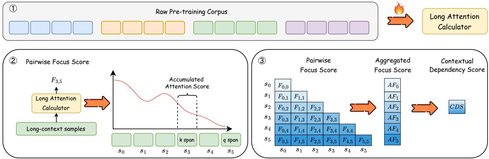
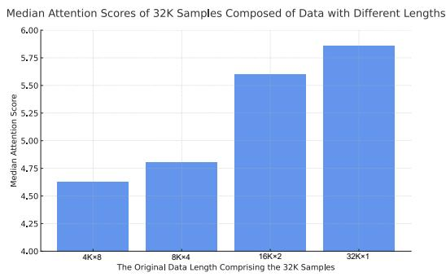
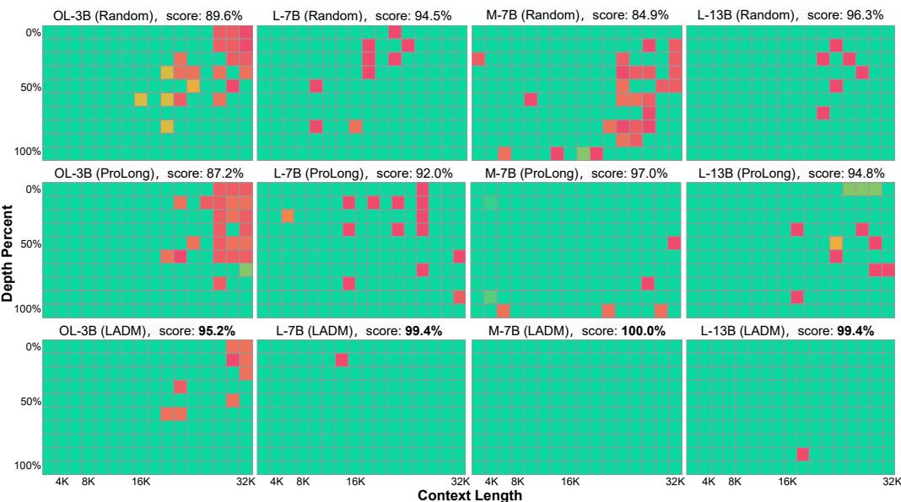
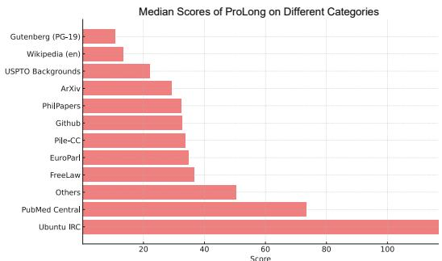
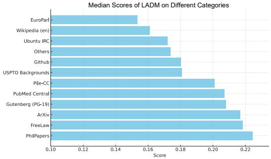
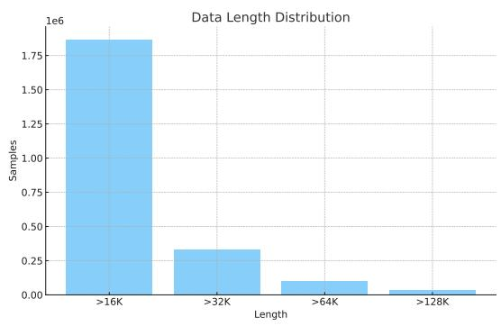
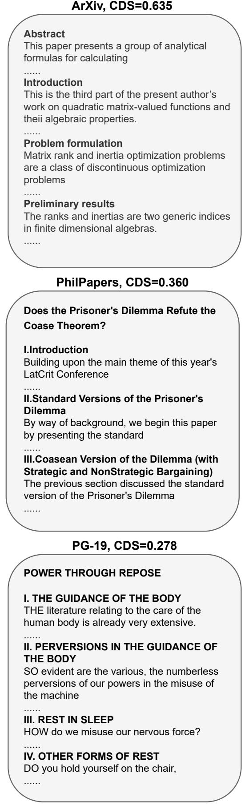
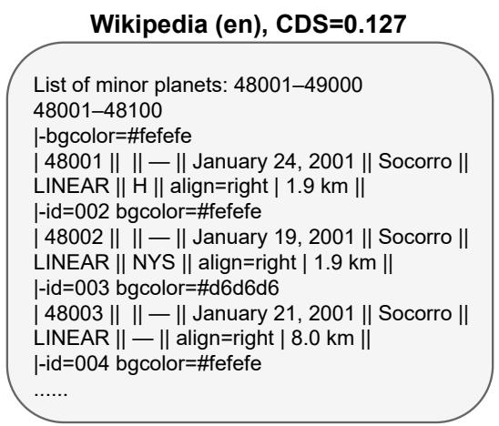
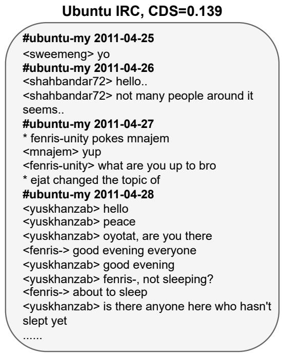

# LADM: Long-context Training Data Selection with Attention-based Dependency Measurement for LLMs

Jianghao Chen1,2,3, Junhong Wu1,2, Yangyifan Xu1,2, Jiajun Zhang1,2,4\*

1Institute of Automation, Chinese Academy of Sciences

2School of Artificial Intelligence, University of Chinese Academy of Sciences

3Zhongguancun Academy, Beijing, China 4Wuhan AI Research {chenjianghao2022, wujunhong2021, xuyangyifan2021}@ia.ac.cn jjzhang@nlpr.ia.ac.cn

## Abstract

Long-context modeling has drawn more and more attention in the area of Large Language Models (LLMs). Continual training with long-context data becomes the de-facto method to equip LLMs with the ability to process long inputs. However, it still remains an open challenge to measure the quality of long-context training data. To address this issue, we propose a Long-context data selection framework with Attention-based Dependency Measurement (LADM), which can efficiently identify high-quality long-context data from a large-scale, multi-domain pre-training corpus. LADM leverages the retrieval capabilities of the attention mechanism to capture contextual dependencies, ensuring a comprehensive quality measurement of long-context data. Experimental results show that our LADM framework significantly boosts the performance of LLMs on multiple long-context tasks with only 1B tokens for continual training. 1

## 1 Introduction

Long-context modeling for Large Language Models (LLMs) has recently drawn more and more attention. The maximum context window of current LLMs has been significantly extended to 128K tokens for GPT-4 (Achiam et al., 2023) and 1M tokens for Gemini 1.5 (Reid et al., 2024). The long-context modeling ability greatly contributes to more sophisticated applications of LLMs in various fields such as long-context retrieval (Kamradt, 2023; Xu et al., 2023; An et al., 2024b), question answering (Kociskˇ y et al.\` , 2018; Dasigi et al., 2021; Bai et al., 2023), and summarization (Huang et al., 2021; Zhong et al., 2021; Fabbri et al., 2019).

Preparing long-context dataset and performing continual training has become the de-facto framework to enrich LLMs with the ability to process long inputs. However, quality measurement of the long-context training data has not received enough attention. Previous studies show that if the training data is composed of concatenated short samples or lacking dependencies over long contexts (Ding et al., 2024; Fu et al., 2024; Chen et al., 2024a), models may fail to learn how to handle long-range and diverse contextual dependencies. These lowquality training samples can aggravate the tendency of LLMs to ignore valuable distant contextual information, further limiting their performance on longcontext tasks. Therefore, measuring the quality of long-context training data and mining high-quality training samples become crucial for enhancing the long-context modeling capability of LLMs.

The dependency between segments within context is the key indicator of high-quality longcontext data. Recent studies have proposed several methods to take long-context dependencies into consideration when constructing pre-training data. Staniszewski et al. (2023) enhance long-range semantic dependencies by integrating relevant documents into one sample. Chen et al. (2024a) split long-context data into segments and measure dependencies through delta perplexity scores between individual segments. However, these methods ignore the inherent structures and relationships within long contexts, leading to inaccurate measurement of long-range contextual dependencies.

To address the above issue, we propose a Longcontext data selection framework with Attentionbased Dependency Measurement (LADM), which measures the long-context dependency with spanlevel attention scores. Inspired by the inherent retrieval operations of the attention mechanism (Mittal et al., 2022; Wu et al., 2024), LADM aims to leverage the attention distribution to measure the relationship within long contexts. Specifically, we first train a tiny model with long-context modeling capability named Long Attention Calculator. Then, to measure the dependency of a single long-context sample, we feed the sample into the Long Attention Calculator and compute the Pairwise Focus Score (PFS) between different spans by the accumulated attention scores. Subsequently, the Aggregated Focus Score (AFS) for each span is derived by incorporating all PFS between this span and its preceding ones. Finally, we define the samplelevel Contextual Dependency Score (CDS) by a weighted sum of all AFS and select samples with high CDS for continual pre-training. Experimental results show that LADM outperforms other data selection methods on various long-context tasks, achieving an average performance improvement of 2.16% for four models across different sizes and architectures on the LongBench dataset.

Our contributions are summarized as follows: 1) We propose an efficient data selection framework LADM, which can identify high-quality longcontext data with long-range and diverse contextual dependencies from a large-scale pre-training corpus. 2) We introduce a novel method for dependency measurement through the attention mechanism, effectively capturing long-range and diverse relationships within the complete contextual information. 3) Experimental results demonstrate the superiority of our method. We achieve better performance with only half of the pre-training tokens than the random sampling approach.

## 2 Related Work

## 2.1 Long-context Modeling for LLMs

Enhanced long-context modeling in LLMs can drive substantial progress in artificial intelligence across various domains, such as long-chain reasoning (Chen et al., 2025b; Yeo et al., 2025; Sun et al., 2025a,b), long video and image processing (Weng et al., 2024; Zhang et al., 2024; Guan et al., 2025; Jian et al., 2024), and long-form generation (Chen et al., 2025a; Bai et al., 2024; Pham et al., 2024). To enable better long-context processing capability of LLMs, recent studies have explored both training-free and training-augmented methods. For training-free methods, Xiao et al. (2024) and Han et al. (2024) focus on retaining the attention on the initial and local tokens while masking those at greater distances, thereby enhancing the length generalization ability of LLMs. DCA (An et al., 2024a) and SelfExtend (Jin et al., 2024) rearrange position indices of long-context inputs and get impressive length extrapolation capability without fine-tuning. Training-augmented methods involve continuing to pre-train LLMs on longer contexts with modified positional encoding. Positional Interpolation (PI) (Chen et al., 2023), NTK (bloc97, 2023), and YaRN (Peng et al., 2024) effectively achieve context window extension through the interpolation and extrapolation of RoPE positional embedding (Su et al., 2024). Moreover, LongLoRA (Chen et al., 2024b) combines PI with $\mathsf { S } ^ { 2 } .$ -Attn and LoRA (Hu et al., 2021), enabling more efficient training. Zhu et al. (2024) ensure a collinear constraint between query and key vectors when integrating RoPE into self-attention and pre-train LLMs with better long-context extrapolation ability. To fully leverage these methods, it is essential to construct high-quality long-context training data.

## 2.2 Long-context Training Data for LLMs

Training data quality is crucial for the long-context modeling capability of LLMs. Fu et al. (2024) focuses on domain balance and length up-sampling for long-context training data. Staniszewski et al. (2023) and Gao et al. (2024a) propose similaritybased approaches of grouping documents to construct long-context training data. He et al. (2024) designs synthesized multi-doc QA tasks and improves the long-context information searching and reflection ability. To alleviate the "lost-in-themiddle" (Liu et al., 2024) phenomenon, An et al. (2024b) introduces Information-Intensive training on long-context QA tasks and Xiong et al. (2024) designs key-value retrieval tasks for fine-tuning.

Our approach characterizes the contextual dependencies within long-context samples based on the attention mechanism and effectively identifies high-quality long-context data from a large pretraining corpus. Concurrently with our work, Chen et al. (2024a) proposes a framework ProLong that divides a long-context sample into segments and calculates the delta perplexity scores between individual segments as Dependency Strength without the original context. However, we capture dependencies within the complete context, providing a more comprehensive view of the contextual relationships. Moreover, our experiments are conducted on a more diverse pre-training corpus, proving the robustness and applicability of our method.

## 3 Method

## 3.1 Problem Formulation

The long-context modeling capability of LLMs is obtained by continual pre-training on long-context samples. Given a dataset  of long-context samples with different quality levels, we aim to select a high-quality subset $\mathcal { D } _ { s } .$ . Specifically, we define a scoring function s to measure the quality of each data sample $x \in \mathcal { D }$ . Then we rank all the samples according to their scores $s ( x )$ and select the top N samples to construct the subset $\mathcal { D } _ { s }$ as follows:

  
Figure 1: The overall framework of LADM. We first train a Long Attention Calculator, then calculate the Pairwise Focus Score (PFS) to measure the dependency between spans. Then, we compute the Aggregated Focus Score (AFS) of each span and merge them as the Contextual Dependency Score (CDS) of a single long-context sample.

$$
\mathcal { D } _ { s } = \{ x \in \mathcal { D } \mid \mathrm { r a n k } ( s ( x ) ) \leq N \}\tag{1}
$$

## 3.2 Preliminary Analysis

<table><tr><td rowspan="2">Data Length</td><td colspan="8">Evaluation Context length</td></tr><tr><td>4K</td><td>8K</td><td>12K</td><td>16K</td><td>20K</td><td>24K</td><td>28K</td><td>32K</td><td>Avg</td></tr><tr><td>4K</td><td>1.00</td><td>0.80</td><td>0.90</td><td>0.76</td><td>0.22</td><td>0.40</td><td>0.20</td><td>0.30</td><td>0.57</td></tr><tr><td>8K</td><td>1.00</td><td>0.60</td><td>0.80</td><td>1.00</td><td>0.53</td><td>0.66</td><td>0.50</td><td>0.43</td><td>0.69</td></tr><tr><td>16K</td><td>1.00</td><td>1.00</td><td>0.60</td><td>0.90</td><td>0.70</td><td>1.00</td><td>0.90</td><td>0.70</td><td>0.85</td></tr><tr><td>32K</td><td>1.00</td><td>0.90</td><td>0.80</td><td>0.60</td><td>0.90</td><td>0.90</td><td>0.90</td><td>1.00</td><td>0.88</td></tr></table>

Table 1: The "Needle-in-the-Haystack" performance on models trained with data concatenated at different lengths. For each evaluation context length, the result is the average of all performances across needle insertion depths, ranging from 0 to 1.

We first conduct a preliminary experiment to analyze the impact of contextual dependencies on LLMs’ long-context modeling capability. We train the Llama2-7B model with 32K-token sequences concatenated by 4K 8, 8K 4, and 16K 2-token samples, respectively, and compare them with one trained with samples exceeding 32K. The total number of training tokens amounts to 0.5B.

As shown in Table 1, we can observe that the average retrieval accuracy decreases as the original length of training data becomes shorter. This trend indicates that models trained with concatenated and contextually unrelated data may focus more on local information and lack retrieval ability across long contexts. Consequently, training data with strong contextual dependencies is essential for enhancing the long-context modeling capability of LLMs. These findings align with recent studies (Staniszewski et al., 2023; Chen et al., 2024a).

Building on this analysis, we further explore how to measure the contextual dependencies within long-context data. Wu et al. (2024) reveal that LLMs incorporate retrieval ability within the attention mechanism, which can be reflected in the attention distribution, with higher weights assigned to previous tokens more related to the current token. Inspired by this, we propose LADM framework to quantify the contextual dependencies by analyzing the attention distribution over long contexts.

## 3.3 LADM Framework

Figure 1 illustrates the overall framework of LADM. We first train a Long Attention Calculator with basic long-context modeling capability and use it to calculate the Pairwise Focus Score (PFS), which measures the dependency between spans within long contexts. Then, the Aggregated Focus Score (AFS) for each span is derived by incorporating all PFS between this span and previous spans. Finally, the sample-level Contextual Dependency Score (CDS) is computed by merging all the AFS of different spans.

Long Attention Calculator To leverage the intrinsic retrieval capability of the attention mechanism for detecting dependency within long contexts, we present Long Attention Calculator, a compact model with basic long-context modeling capability. Specifically, we choose the TinyLlama-1.1B-v1.1 2 for subsequent data filtering efficiency and train it with randomly sampled 32K-token sequences. To demonstrate the Long Attention Calculator’s ability to capture dependencies within long contexts, we use it to calculate the median value of accumulated attention scores between long-range spans on 1,000 32K samples concatenated by data with different lengths. As shown in Figure 2, the results indicate that the Long Attention Calculator can distinguish samples with varied dependencies via attention scores over long contexts, as the complete 32K samples exhibit higher attention scores on distant previous tokens than concatenated ones. Therefore, we can design metrics based on attention scores to measure the dependency within longcontext data.

  
Figure 2: The median attention scores under different 32K data sample construction methods.

Pairwise Focus Score Given a long-context sample S consisting of N spans of length $l \colon$ $S = \left\{ s _ { 0 } , s _ { 1 } , . . . , s _ { N - 1 } \right\}$ , the Pairwise Focus Score $\mathrm { P F S } ( i , j )$ between $s _ { i }$ and $s _ { j }$ (where $j > i )$ is defined as follows:

$$
\begin{array} { r } { \mathrm { P F S } ( i , j ) = \mathrm { S u m } \left( \mathrm { S o f t m a x } \left( \frac { Q _ { j } K _ { 0 : j } ^ { T } } { \sqrt { d _ { k } } } \right) [ : , i ] \right) } \end{array}\tag{2}
$$

where $Q _ { j }$ is the query states of $s _ { j }$ $K _ { 0 : j }$ is the key states of $s _ { 0 }$ to $s _ { j }$ and $\frac { 1 } { \sqrt { d _ { k } } }$ is the scaling factor. $\mathrm { P F S } ( i , j )$ calculates the accumulated attention weights that $s _ { j }$ assigns to $s _ { i } ,$ quantifying the influence of $s _ { i }$ on the final representation of $s _ { j }$ in the attention mechanism. Therefore, we can effectively detect spans that exhibit strong dependencies within long contexts by calculating PFS with the Long Attention Calculator.

To comprehensively evaluate the contextual dependencies of a long-context sample, it is essential to aggregate PFS between different spans. This approach can help us gain a deeper understanding of the complex relationships between various parts of the long-context data. We consider the following criteria for aggregating multiple PFS:

Aggregated Focus Score For each span $s _ { j }$ we calculate PFS at varied intervals, including $\mathrm { P F S } ( 0 , j ) , \mathrm { P F S } ( 1 , j ) , . . . , \mathrm { P F S } ( j - 1 , j )$ . This aids in understanding how the influence of previous spans varies with increasing intervals, revealing both short-range and long-range dependencies. Notably, recent studies (Xiao et al., 2024; Hsieh et al., 2024) have shown that initial and recent tokens often receive disproportionate attention weights, suggesting a predominance of the beginning and local dependencies. Therefore, we exclude scores for the first m spans $( s _ { 0 } , . . . , s _ { m - 1 } )$ and the local n spans $( s _ { j - n } , . . . , s _ { j - 1 } )$ . We select previous spans at a stride of d for further computational efficiency.

We apply weights to these scores based on the lengths of the intervals, thus encouraging longerdistance dependencies. Additionally, we incorporate the variance of these scores. A higher variance indicates that $s _ { j }$ exhibits more diverse dependencies from its previous context, reflecting a complex dependency pattern and rich structural information within the long-context sample. Therefore, we define the Aggregated Focus Score (AFS) of span $s _ { j }$ as follows (omitting stride sampling for clarity):

$$
\sigma _ { j } = \sigma \left( \mathrm { P F S } ( m , j ) , . . . , \mathrm { P F S } ( j - n - 1 , j ) \right)\tag{3}
$$

$$
\operatorname { A F S } ( j ) = \sigma _ { j } \sum _ { i = m } ^ { j - n - 1 } { \frac { j - i } { N } } \cdot \operatorname { P F S } ( i , j )\tag{4}
$$

where $\sigma _ { j }$ is the standard deviation of all PFS.

Contextual Dependency Score While AFS(j) provides a measurement of the dependencies for a single span $s _ { j } ,$ , we should further consider the contributions of all spans to accurately represent the overall dependencies of a long-context sample. To achieve this, we sum all AFS and apply a weight based on index j to highlight the contributions of spans with larger positions. This approach aligns with our focus on long-range dependencies, as spans with larger indices have the potential to consider previous spans at greater distances. The sample-level Contextual Dependency Score (CDS) is therefore defined as follows:

$$
\mathrm { C D S } ( S ) = \sum _ { j = n _ { 0 } } ^ { N - 1 } \frac { j } { N } \cdot \mathrm { A F S } ( j )\tag{5}
$$

where $n _ { 0 }$ is the index of the first span and d is the stride. We exclude the initial spans’ $\mathrm { A F S } ( j < n _ { 0 } )$ as these early spans have fewer previous spans to depend on, resulting in a less informative measurement of dependencies. For computational efficiency, we calculate AFS at a stride of d (omitted from Eq.5 for clarity).

## 4 Experiments Settings

## 4.1 Pre-training Dataset

We use the Pile (Gao et al., 2020) corpus for longcontext continual pre-training. Our experiments are conducted on data samples with 32K tokens due to the scarcity of longer samples. We remove samples with lengths less than 32K measured by LlamaTokenizer. The detailed information of our pre-training dataset is provided in Appendix A.

## 4.2 Baselines

We compare LADM with the following methods:

Random Sampling We randomly sample longcontext data from the dataset for continual training.

ProLong Chen et al. (2024a) propose a framework filtering long-context data with delta perplexity scores between individual segments. We follow all settings of Prolong except changing the model to TinyLlama-1.1B-v1.1 for a fair comparison.

## 4.3 Implementation Details

Hyper-parameters When calculating PFS, we truncate all samples to 32K-token sequences for batch operation. The span size is set to l = 128, resulting in N = 256 spans per sample. Spanlevel AFS uses m = 1, n = d = 4, excluding the first and recent four spans and selecting previous spans at a stride of four. Sample-level CDS uses $n _ { 0 } = 1 6 , d = 4 .$ , excluding the initial 16 spans AFS and calculating AFS at a stride of four.

Data Selection We rank all samples with their CDS and select the top-ranking samples from each data domain, maintaining the original domain distribution. All methods use 1B tokens selected from the dataset for continual training.

Training Configuration We increase the base of RoPE from 10,000 to 500,000 following (Xiong et al., 2023). For the Long Attention Calculator, since the original context length of TinyLlama is 2K, we use 5B randomly sampled training tokens to ensure better long-context dependencies measurement. We also provide experimental results using the Long Attention Calculator trained with 1B tokens in Appendix E for comparison. We continually pre-train OpenLlama-3B-v2 (Geng and Liu, 2023), Llama2-7B/13B (Touvron et al., 2023) and Mistral-7B-v0.1 (Jiang et al., 2023) with 32K-token sequences for 1B tokens. More training details are displayed in Appendix B.

## 4.4 Evaluation Tasks and datasets

We take the following tasks to evaluate the longcontext capability of LLMs:

Perplexity Evaluation We evaluate the language modeling capability of LLMs by measuring the perplexity (PPL) on real-world long-context data. We collect samples exceeding 32K from the test split of the Proof-Pile (Azerbayev et al., 2022) dataset and calculate the average PPL across different context window sizes.

Synthetic Tasks Evaluation We test the longcontext retrieval ability of LLMs on the "Needlein-the-Haystack" task (Kamradt, 2023). This synthetic task is designed to evaluate LLMs’ capability to locate essential information across varying positions and context lengths.

Real-World Tasks Evaluation Evaluation on perplexity or synthetic retrieval tasks can not truly reflect the performance of LLMs under real-world scenarios (Hu et al., 2024; Fang et al., 2024). Therefore, we select different types of tasks from Long-Bench (Bai et al., 2023) for further evaluation.

## 5 Experimental Results

We evaluate LADM with OpenLlama-3B-v2, Llama2-7B/13B and Mistral-7B-v0.1 on language modeling tasks, synthetic long-context tasks and real-world long-context tasks. We use "OL-3B", "L-7B", "L-13B", and "M-7B" to denote these models for short.

## 5.1 Perplexity Evaluation

Table 2 shows the perplexity of long-context samples from Proof-Pile across various context window sizes. The perplexity differences among the three methods are minimal due to the same domain distribution of the training data. Our proposed LADM outperforms other methods under all model and context window size settings. This demonstrates the superiority of our models on long-context language modeling tasks.

  
Figure 3: The "Needle-in-the-Haystack" task performance of different data selection methods. The x-axis denotes the evaluation context length, and the y-axis denotes insertion depths of the "needle".

## 5.2 Synthetic Tasks Evaluation

In Figure 3, we compare the retrieval accuracy of our models with other baseline models on the "Needle-in-the-Haystack" task. Notably, our models show higher average retrieval accuracy and even achieve nearly 100% retrieval rate for Llama2- 7B/13B and Mistral-7B with only 1B training tokens. Compared to our method, other methods exhibit inferior performance, particularly in scenarios involving greater retrieval distances or when the "needle" is located in the middle of the context.

## 5.3 Real-World Tasks Evaluation

We report the experimental results on real-world long-context tasks in Table 3. For the randomly sampling method, we conduct three experiments with different random sampling seeds and calculate the average performance. Our LADM framework outperforms other methods across nearly all types of tasks and all models. Specifically, our method achieves an average performance improvement of 2.16% on four models over ProLong. Notably, for Mistral-7B, LADM achieves a substantial improvement of 10.09% on single-document QA and 4.66% on multi-document QA. These results highlight the strong capability of our models in handling real-world tasks and validate the effectiveness of our data selection framework, indicating the importance of incorporating long-range contextual dependencies into training data. Experimental results in Appendix F also show that our method enhances LLMs’ long-context capabilities while preserving short-context performance.

<table><tr><td rowspan="2">Model Method</td><td rowspan="2"></td><td colspan="3">Context Window Size</td></tr><tr><td>2K</td><td>4K</td><td>8K 16K 32K</td></tr><tr><td>OL-3B</td><td>Random ProLong LADM</td><td>4.951 4.941 4.910</td><td>4.268 3.562 4.271 3.573 4.247 3.553</td><td>3.026 2.685 3.040 2.701 3.022 2.683</td></tr><tr><td>L-7B</td><td>Random ProLong LADM</td><td>4.515 4.516 4.481</td><td>3.900 3.906 3.878 3.252</td><td>3.264 2.780 2.458 3.275 2.792 2.470</td></tr><tr><td>M-7B</td><td>Random ProLong LADM</td><td>4.620 4.293 4.266</td><td>3.936 3.267 3.696 3.095 3.673 3.076</td><td>2.773 2.453 2.775 2.455 2.644 2.346</td></tr><tr><td>L-13B</td><td>Random ProLong LADM</td><td>4.200 4.200 4.176 3.637</td><td>3.657 3.084 3.659 3.090 3.070</td><td>2.629 2.332 2.645 2.349 2.651 2.356 2.636 2.342</td></tr></table>

Table 2: Perplexity of long-context samples from the test split of the Proof-Pile dataset. Each sample is truncated to the corresponding context window size.

## 6 Analysis

## 6.1 Training Efficiency of LADM

We compare the performance of our method with baseline methods under different training budgets. As shown in Table 4, our method surpasses the baseline even with half of the training tokens. Specifically, LADM achieves slight improvements over OpenLlama-3B and Llama2-13B, exceeding the baseline by 1.31% for Llama2-7B and 2.27% for Mistral-7B. Even when the training tokens amount to 3B and 4B for random sampling, our method can still demonstrate superior performance, as illustrated in Appendix C. These results highlight that our proposed data selection framework can effectively extract high-quality data with strong contextual dependencies from large-scale pre-training corpora, thus enhancing the long-context modeling capability of LLMs while reducing training costs.

<table><tr><td rowspan="2">Model</td><td rowspan="2">Method</td><td colspan="4">Single-Document QA</td><td colspan="4">Multi-Document QA</td></tr><tr><td>NarrativeQA</td><td></td><td>Qasper MultiFieldQA</td><td>AVG</td><td>HotpotQA</td><td>2WikiMQA MuSiQue</td><td></td><td>AVG</td></tr><tr><td>GPT-3.5-Turbo</td><td></td><td>23.6</td><td>43.3</td><td>52.3</td><td>39.8</td><td>51.6</td><td>37.7</td><td>26.9</td><td>38.7</td></tr><tr><td rowspan="3">OL-3B</td><td>Random</td><td>18.65</td><td>24.07</td><td>31.44</td><td>24.72</td><td>26.80</td><td>21.00</td><td>11.80</td><td>19.87</td></tr><tr><td>ProLong</td><td>17.04</td><td>25.97</td><td>32.62</td><td>25.21</td><td>27.30</td><td>23.30</td><td>10.50</td><td>20.37</td></tr><tr><td>LADM</td><td>17.09</td><td>28.84</td><td>33.97</td><td>26.63</td><td>29.01</td><td>23.71</td><td>9.15</td><td>20.62</td></tr><tr><td rowspan="3">L-7B</td><td>Random</td><td>24.06</td><td>33.27</td><td>33.05</td><td>30.13</td><td>35.29</td><td>26.79</td><td>15.31</td><td>25.80</td></tr><tr><td>ProLong</td><td>25.00</td><td>28.23</td><td>35.27</td><td>29.50</td><td>40.30</td><td>28.91</td><td>17.91</td><td>29.04</td></tr><tr><td>LADM</td><td>26.34</td><td>32.28</td><td>38.11</td><td>32.24</td><td>43.42</td><td>31.85</td><td>18.03</td><td>31.10</td></tr><tr><td rowspan="3">M-7B</td><td>Random</td><td>17.30</td><td>21.39</td><td>33.56</td><td>24.08</td><td>30.67</td><td>28.85</td><td>14.37</td><td>24.63</td></tr><tr><td>ProLong</td><td>14.32</td><td>26.41</td><td>30.55</td><td>23.76</td><td>34.29</td><td>23.50</td><td>15.51</td><td>24.43</td></tr><tr><td>LADM</td><td>24.05</td><td>34.77</td><td>42.72</td><td>33.85</td><td>39.43</td><td>28.81</td><td>19.04</td><td>29.09</td></tr><tr><td rowspan="3">L-13B</td><td>Random</td><td>24.07</td><td>31.31</td><td>29.32</td><td>28.23</td><td>44.88</td><td>32.36</td><td>18.82</td><td>32.02</td></tr><tr><td>ProLong</td><td>25.06</td><td>31.42</td><td>30.34</td><td>28.94</td><td>44.37</td><td>34.20</td><td>21.02</td><td>33.20</td></tr><tr><td>LADM</td><td>24.98</td><td>33.79</td><td>28.33</td><td>29.03</td><td>47.21</td><td>36.29</td><td>23.09</td><td>35.53</td></tr><tr><td rowspan="3">Model</td><td></td><td></td><td>Summarization</td><td></td><td></td><td></td><td></td><td></td><td></td></tr><tr><td>Method</td><td>GovReport</td><td>QMSum</td><td>MultiNews</td><td></td><td></td><td>Code</td><td></td><td>Overall</td></tr><tr><td></td><td>29.5</td><td>23.4</td><td>26.7</td><td>AVG 26.5</td><td>LCC</td><td>RepoBench-P</td><td>AVG</td><td></td></tr><tr><td rowspan="3">OL-3B</td><td>Random</td><td>24.33</td><td>13.83</td><td></td><td></td><td>54.7</td><td>53.6</td><td>54.1</td><td>39.8</td></tr><tr><td>ProLong</td><td>25.06</td><td>12.89</td><td>14.01 8.13</td><td>17.39 15.36</td><td>61.21 58.90</td><td>48.69 48.44</td><td>54.95</td><td>29.23</td></tr><tr><td>LADM</td><td>24.04</td><td>15.00</td><td>15.91</td><td>18.32</td><td>61.33</td><td>49.78</td><td>53.67 55.56</td><td>28.65 30.28</td></tr><tr><td rowspan="3">L-7B</td><td>Random</td><td></td><td></td><td></td><td></td><td></td><td></td><td></td><td></td></tr><tr><td></td><td>29.56 29.54</td><td>21.26</td><td>23.66</td><td>24.83</td><td>59.32</td><td>56.51</td><td>57.92</td><td>34.67</td></tr><tr><td>ProLong LADM</td><td>29.77</td><td>20.49 21.75</td><td>23.35 26.02</td><td>24.46 25.85</td><td>62.78 65.78</td><td>55.30 58.46</td><td>59.04</td><td>35.51 37.83</td></tr><tr><td rowspan="3">M-7B</td><td></td><td></td><td></td><td></td><td></td><td></td><td></td><td>62.12</td><td></td></tr><tr><td>Random</td><td>24.68</td><td>19.93</td><td>22.91</td><td>22.51</td><td>62.95</td><td>58.74</td><td>60.85</td><td>33.02</td></tr><tr><td>ProLong LADM</td><td>24.43 28.38</td><td>18.92 20.64</td><td>25.01 24.40</td><td>22.73 24.47</td><td>65.12 65.41</td><td>58.51 55.74</td><td>61.82 60.58</td><td>33.18 37.00</td></tr><tr><td rowspan="3">L-13B</td><td>Random</td><td></td><td>22.14</td><td>26.80</td><td></td><td></td><td></td><td></td><td>37.67</td></tr><tr><td>ProLong</td><td>28.07 27.31</td><td>22.97</td><td>26.59</td><td>25.67 25.62</td><td>67.65 67.73</td><td>61.85 61.10</td><td>64.75 64.42</td><td>38.04</td></tr><tr><td>LADM</td><td>27.43</td><td>22.24</td><td>27.80</td><td>25.82</td><td>67.77</td><td>62.79</td><td>65.28</td><td>38.92</td></tr></table>

Table 3: Performance of models trained with different data selection methods on single-document QA, multidocument QA, summarization and code completion from the LongBench dataset.

<table><tr><td>Model</td><td>Method</td><td>Tokens</td><td>SD-QA</td><td>MD-QA</td><td>SUM</td><td>CODE</td><td>AVG</td></tr><tr><td rowspan="5">OL-3B</td><td rowspan="3">Random</td><td>1B</td><td>24.72</td><td>19.87</td><td>17.39</td><td>54.95</td><td>29.23</td></tr><tr><td>2B</td><td>25.16</td><td>20.59</td><td>19.11</td><td>55.14</td><td>30.00</td></tr><tr><td>1B</td><td>25.21</td><td>20.37</td><td>15.36</td><td>53.67</td><td>28.65</td></tr><tr><td>ProLong</td><td>2B</td><td>27.38</td><td>18.32</td><td>19.20</td><td>55.26</td><td>30.04</td></tr><tr><td>LADM</td><td>1B</td><td>26.63</td><td>20.62</td><td>18.32</td><td>55.56</td><td>30.28</td></tr><tr><td rowspan="5">L-7B</td><td>Random</td><td>1B</td><td>30.13</td><td>25.80</td><td>24.83</td><td>57.92</td><td>34.67</td></tr><tr><td rowspan="2"></td><td>2B</td><td>31.91</td><td>29.12</td><td>25.18</td><td>59.86</td><td>36.52</td></tr><tr><td>1B</td><td>29.50</td><td>29.04</td><td>24.46</td><td>59.04</td><td>35.51</td></tr><tr><td>ProLong</td><td>2B</td><td>30.10</td><td>30.58</td><td>25.84</td><td>59.52</td><td>36.51</td></tr><tr><td>LADM</td><td>1B</td><td>32.24</td><td>31.10</td><td>25.85</td><td>62.12</td><td>37.83</td></tr><tr><td rowspan="5">M-7B</td><td rowspan="2">Random</td><td>1B</td><td>24.08</td><td>24.63</td><td>22.51</td><td>60.85</td><td>33.02</td></tr><tr><td>2B</td><td>29.89</td><td>26.60</td><td>23.61</td><td>58.84</td><td>34.73</td></tr><tr><td rowspan="2">ProLong</td><td>1B</td><td>23.76</td><td>24.43</td><td>22.73</td><td>61.82</td><td>33.18</td></tr><tr><td>2B</td><td>27.41</td><td>28.85</td><td>24.29</td><td>63.36</td><td>35.98</td></tr><tr><td>LADM</td><td>1B</td><td>33.85</td><td>29.09</td><td>24.47</td><td>60.58</td><td>37.00</td></tr><tr><td rowspan="5">L-13B</td><td rowspan="2">Random</td><td>1B</td><td>28.23</td><td>32.02</td><td>25.67</td><td></td><td></td></tr><tr><td>2B</td><td>27.93</td><td>34.87</td><td>25.00</td><td>64.75 66.13</td><td>37.67 38.48</td></tr><tr><td rowspan="2">ProLong</td><td></td><td>28.94</td><td>33.20</td><td>25.62</td><td>64.62</td><td></td></tr><tr><td>1B</td><td>33.55</td><td>34.37</td><td>24.84</td><td>62.37</td><td>38.04 38.78</td></tr><tr><td>LADM</td><td>2B 1B</td><td>29.03</td><td>35.53</td><td>25.82</td><td>65.28</td><td>38.92</td></tr></table>

Table 4: Performance comparison of random sampling and our LADM method on the LongBench dataset.

## 6.2 Data Selection Efficiency of LADM

We first analyze the computational complexity of each stage in the LADM framework. Each PFS calculation has a complexity of $O ( l ^ { 2 } \cdot d _ { k } )$ . The complexity for AFS is $\begin{array} { r } { O \left( \frac { N \cdot l ^ { 2 } \cdot d _ { k } } { d _ { A F S } } \right) } \end{array}$ and for the overall CDS is $\begin{array} { r } { O \left( \frac { N ^ { 2 } \cdot l ^ { 2 } \cdot d _ { k } } { d _ { C D S } \cdot d _ { A F S } } \right) = O \left( \frac { L ^ { 2 } \cdot d _ { k } } { d _ { C D F } \cdot d _ { A F S } } \right) } \end{array}$ , where $l = 1 2 8 , \ : N \dot { = } 2 5 6 , \ : L = \mathrm { 3 2 k }$ , and $d _ { A F S } , d _ { C D S }$ are the strides for calculating AFS and CDS. The two parameters decide the number of PFS calculations required and reduce the cost of full attention calculation with complexity $O ( L ^ { 2 } \cdot d _ { k } )$ , thus affecting the data selection efficiency.

<table><tr><td>Method</td><td> $d _ { A F S }$ </td><td> $d _ { C D S }$ </td><td>Sec/sample Correlation</td><td></td></tr><tr><td rowspan="4">LADM</td><td>4</td><td>4</td><td>2.46</td><td>1.000</td></tr><tr><td>2</td><td>4</td><td>2.47</td><td>0.719</td></tr><tr><td>4</td><td>2</td><td>3.95</td><td>0.721</td></tr><tr><td>2</td><td>2</td><td>3.98</td><td>0.719</td></tr><tr><td>ProLong</td><td>-</td><td>-</td><td>2.46</td><td>-</td></tr></table>

Table 5: The efficiency and Pearson Correlation under different hyper-parameter settings and methods.

We conducted experiments on a randomly selected set of 5,000 samples from our pre-training dataset under different hyper-parameter settings. We compare both the computational overhead and the impact on the sample-level CDS. We use the Pearson Correlation Coefficient to measure the consistency of CDS across different configurations. As shown in Table 5, all the coefficient values are greater than 0.7, indicating the consistent results of data selection. For computation efficiency, since we can get all PFS of the current span and its previous spans through multiplication of the query and key matrices, a smaller $d _ { A F S }$ does not significantly increase computation overhead. However, smaller dCDS requires calculating additional AFS for new spans, resulting in a notable increase in time overhead. Based on these analyses, we select the setting $d _ { A F S } = d _ { C D S } = 4$ to minimize the computational cost. We also present the data selection efficiency of ProLong in Table 5. With comparable efficiency, LADM can achieve better performance, as shown in Section 5, demonstrating the effectiveness and applicability of our method.

## 6.3 Ablation Study on LADM

<table><tr><td>Method</td><td>SD-QA</td><td>MD-QA</td><td>SUM</td><td>CODE</td><td>AVG</td></tr><tr><td>LADM</td><td>32.24</td><td>31.10</td><td>25.85</td><td>62.12</td><td>37.83</td></tr><tr><td>w/o std</td><td>30.71</td><td>30.10</td><td>25.34</td><td>61.38</td><td>36.88</td></tr><tr><td>w/o length</td><td>31.60</td><td>30.90</td><td>25.38</td><td>58.08</td><td>36.49</td></tr></table>

Table 6: Ablation study of contextual dependency measurement in LADM.

To validate the effectiveness of the contextual dependency measurement in LADM, we conduct additional ablation studies on the standard deviation weights $\sigma _ { j }$ in Eq. 4 and the length weights $\textstyle { \frac { j - i } { N } }$ and $\textstyle { \frac { j } { N } }$ in Eq. 4 and Eq. 5. Experimental results of Llama2-7B on the LongBench dataset are shown in Table 6. Higher standard deviation weights indicate more diverse dependency patterns within longcontext samples and higher length weights focus more on span pairs with greater distances, making them crucial for long-range contextual dependency measurement. Therefore, we observe a significant performance drop without these weights.

  
Figure 4: Median scores for various data categories from the Pile dataset under ProLong and LADM framework.

## 6.4 Observations and Findings

We conduct a series of statistical analyses on the sample-level CDS derived by our LADM framework. To mitigate the influence of outliers, we calculate the median scores for each category from the pre-training data.

In Figure 4, we show the median scores of ProLong and LADM framework on different categories. The results show that articles (PhilPapers, ArXiv, and PubMed Central), legal documents (FreeLaw), and books (PG-19) tend to receive higher scores in our method. This is likely due to their coherent logic and strong interrelations between paragraphs, indicating complex and varied dependencies within these data types.

Moreover, we analyze the features of data with lower scores. Wikipedia data samples often manifest as concatenated paragraphs that may only share a theme but exhibit weak connectivity between paragraphs. Similarly, the Ubuntu IRC dataset is composed of group chat discussions. These conversations show duplicated patterns and different sections involve different users, time points and topics, resulting in weak contextual coherence. We show samples from different categories in Appendix D.

Compared to our method, ProLong tends to give much higher scores to samples from the Ubuntu IRC dataset containing segments with similar patterns, despite low relevance between them. Moreover, samples from the PG-19 dataset get the lowest score, which indicates that ProLong may struggle to capture the deeper contextual relationships between seemingly unrelated sections within books. These sections may be connected through narrative development, which is not apparent through analysis of isolated segments. This highlights the importance of measuring the dependencies within the full context rather than just assessing the relationship between individual segments.

## 7 Conclusion

This paper introduces LADM, a novel and efficient long-context data selection framework to identify high-quality long-context data with long-range and diverse contextual dependencies from a large-scale, multi-domain pre-training corpus. LADM utilizes the accumulated attention scores over long contexts to quantify the dependencies between spans and aggregate them as a metric for sample-level contextual dependency measurement. The experimental results on various long-context tasks further demonstrate that our method can significantly enhance the long-context modeling capability of LLMs.

## Limitations

The limitations of our work can be summarized as follows: Firstly, to measure the long-range contextual dependency, we use a tiny model for data selection. This may introduce additional computational overhead. Secondly, we do not conduct experiments on LLMs exceeding 13B parameters, due to the great cost of training long-context LLMs. Thirdly, due to the scarcity of long-context data resources, we only conduct experiments on 32K context length. It is worthwhile to explore ways to construct high-quality data with longer context.

## Acknowledgments

We thank our colleagues Chen Wang, Chong Li, Zixuan Ren, Yaochen Zhu, and Pu Jian for their insightful and constructive feedback. Furthermore, we thank all reviewers for their detailed reviews and valuable comments. This work is supported by the National Key R&D Program of China No.2022ZD0160602 and the Strategic Priority Research Program of Chinese Academy of Sciences under Grant No.XDA04080400. This work is also supported by Zhongguancun Academy Project No.20240103.

## References

Josh Achiam, Steven Adler, Sandhini Agarwal, Lama Ahmad, Ilge Akkaya, Florencia Leoni Aleman, Diogo Almeida, Janko Altenschmidt, Sam Altman, Shyamal Anadkat, et al. 2023. Gpt-4 technical report. arXiv preprint arXiv:2303.08774.

Chenxin An, Fei Huang, Jun Zhang, Shansan Gong, Xipeng Qiu, Chang Zhou, and Lingpeng Kong. 2024a. Training-free long-context scaling of large language models. In Forty-first International Conference on Machine Learning.

Shengnan An, Zexiong Ma, Zeqi Lin, Nanning Zheng, and Jian-Guang Lou. 2024b. Make your llm fully utilize the context. arXiv preprint arXiv:2404.16811.

Zhangir Azerbayev, Edward Ayers, and Bartosz Piotrowski. 2022. Proof-pile.

Yushi Bai, Xin Lv, Jiajie Zhang, Hongchang Lyu, Jiankai Tang, Zhidian Huang, Zhengxiao Du, Xiao Liu, Aohan Zeng, Lei Hou, et al. 2023. Longbench: A bilingual, multitask benchmark for long context understanding. arXiv preprint arXiv:2308.14508.

Yushi Bai, Jiajie Zhang, Xin Lv, Linzhi Zheng, Siqi Zhu, Lei Hou, Yuxiao Dong, Jie Tang, and Juanzi Li. 2024. Longwriter: Unleashing 10,000+ word generation from long context llms. arXiv preprint arXiv:2408.07055.

bloc97. 2023. Ntk-aware scaled rope allows llama models to have extended (8k+) context size without any fine-tuning and minimal perplexity degradation.

Guanzheng Chen, Xin Li, Michael Shieh, and Lidong Bing. 2025a. LongPO: Long context self-evolution of large language models through short-to-long preference optimization. In The Thirteenth International Conference on Learning Representations.

Jianghao Chen, Zhenlin Wei, Zhenjiang Ren, Ziyong Li, and Jiajun Zhang. 2025b. LrΘ2 bench: Evaluating long-chain reflective reasoning capabilities of large language models via constraint satisfaction problems. arXiv preprint arXiv:2502.17848.

Longze Chen, Ziqiang Liu, Wanwei He, Yinhe Zheng, Hao Sun, Yunshui Li, Run Luo, and Min Yang. 2024a. Long context is not long at all: A prospector of longdependency data for large language models. In Proceedings ofthe 62nd Annual Meeting ofthe Associationfor Computational Linguistics (Volume 1: Long Papers), pages 8222–8234, Bangkok, Thailand. Association for Computational Linguistics.

Shouyuan Chen, Sherman Wong, Liangjian Chen, and Yuandong Tian. 2023. Extending context window of large language models via positional interpolation. arXiv preprint arXiv:2306.15595.

Yukang Chen, Shengju Qian, Haotian Tang, Xin Lai, Zhijian Liu, Song Han, and Jiaya Jia. 2024b. LongloRA: Efficient fine-tuning of long-context large language models. In The Twelfth International Conference on Learning Representations.

Peter Clark, Isaac Cowhey, Oren Etzioni, Tushar Khot, Ashish Sabharwal, Carissa Schoenick, and Oyvind Tafjord. 2018. Think you have solved question answering? try arc, the ai2 reasoning challenge. arXiv preprint arXiv:1803.05457.

Tri Dao. 2024. FlashAttention-2: Faster attention with better parallelism and work partitioning. In International Conference on Learning Representations (ICLR).

Pradeep Dasigi, Kyle Lo, Iz Beltagy, Arman Cohan, Noah A Smith, and Matt Gardner. 2021. A dataset of information-seeking questions and answers anchored in research papers. In Proceedings of the 2021 Conference of the North American Chapter of the Associationfor Computational Linguistics: Human Language Technologies, pages 4599–4610.

Hantian Ding, Zijian Wang, Giovanni Paolini, Varun Kumar, Anoop Deoras, Dan Roth, and Stefano Soatto. 2024. Fewer truncations improve language modeling. In Forty-first International Conference on Machine Learning.

Alexander Richard Fabbri, Irene Li, Tianwei She, Suyi Li, and Dragomir Radev. 2019. Multi-news: A largescale multi-document summarization dataset and abstractive hierarchical model. In Proceedings of the 57th Annual Meeting of the Association for Computational Linguistics, pages 1074–1084.

Lizhe Fang, Yifei Wang, Zhaoyang Liu, Chenheng Zhang, Stefanie Jegelka, Jinyang Gao, Bolin Ding, and Yisen Wang. 2024. What is wrong with perplexity for long-context language modeling? arXiv preprint arXiv:2410.23771.

Yao Fu, Rameswar Panda, Xinyao Niu, Xiang Yue, Hannaneh Hajishirzi, Yoon Kim, and Hao Peng. 2024. Data engineering for scaling language models to 128k context. In Forty-first International Conference on Machine Learning.

Chaochen Gao, Xing Wu, Qi Fu, and Songlin Hu. 2024a. Quest: Query-centric data synthesis approach for long-context scaling of large language model. arXiv preprint arXiv:2405.19846.

Leo Gao, Stella Biderman, Sid Black, Laurence Golding, Travis Hoppe, Charles Foster, Jason Phang, Horace He, Anish Thite, Noa Nabeshima, et al. 2020. The pile: An 800gb dataset of diverse text for language modeling. arXiv preprint arXiv:2101.00027.

Leo Gao, Jonathan Tow, Baber Abbasi, Stella Biderman, Sid Black, Anthony DiPofi, Charles Foster, Laurence Golding, Jeffrey Hsu, Alain Le Noac’h, Haonan Li, Kyle McDonell, Niklas Muennighoff, Chris Ociepa, Jason Phang, Laria Reynolds, Hailey Schoelkopf,

Aviya Skowron, Lintang Sutawika, Eric Tang, Anish Thite, Ben Wang, Kevin Wang, and Andy Zou. 2024b. A framework for few-shot language model evaluation.

Xinyang Geng and Hao Liu. 2023. Openllama: An open reproduction of llama.

Boyu Guan, Yining Zhang, Yang Zhao, and Chengqing Zong. 2025. TriFine: A large-scale dataset of visionaudio-subtitle for tri-modal machine translation and benchmark with fine-grained annotated tags. In Proceedings of the 31st International Conference on Computational Linguistics, Abu Dhabi, UAE. Association for Computational Linguistics.

Chi Han, Qifan Wang, Hao Peng, Wenhan Xiong, Yu Chen, Heng Ji, and Sinong Wang. 2024. Lminfinite: Zero-shot extreme length generalization for large language models. In Proceedings of the 2024 Conference of the North American Chapter of the Associationfor Computational Linguistics: Human Language Technologies (Volume 1: Long Papers), pages 3991–4008.

Junqing He, Kunhao Pan, Xiaoqun Dong, Zhuoyang Song, LiuYiBo LiuYiBo, Qianguosun Qianguosun, Yuxin Liang, Hao Wang, Enming Zhang, and Jiaxing Zhang. 2024. Never lost in the middle: Mastering long-context question answering with positionagnostic decompositional training. In Proceedings of the 62nd Annual Meeting of the Association for Computational Linguistics (Volume 1: Long Papers), pages 13628–13642, Bangkok, Thailand. Association for Computational Linguistics.

Dan Hendrycks, Collin Burns, Steven Basart, Andy Zou, Mantas Mazeika, Dawn Song, and Jacob Steinhardt. 2021. Measuring massive multitask language understanding. In International Conference on Learning Representations.

Cheng-Yu Hsieh, Yung-Sung Chuang, Chun-Liang Li, Zifeng Wang, Long Le, Abhishek Kumar, James Glass, Alexander Ratner, Chen-Yu Lee, Ranjay Krishna, et al. 2024. Found in the middle: Calibrating positional attention bias improves long context utilization. In Findings of the Association for Computational Linguistics ACL 2024, pages 14982–14995.

Edward J. Hu, Yelong Shen, Phillip Wallis, Zeyuan Allen-Zhu, Yuanzhi Li, Shean Wang, Lu Wang, and Weizhu Chen. 2021. Lora: Low-rank adaptation of large language models. Preprint, arXiv:2106.09685.

Yutong Hu, Quzhe Huang, Mingxu Tao, Chen Zhang, and Yansong Feng. 2024. Can perplexity reflect large language model’s ability in long text understanding? In The Second Tiny Papers Track at ICLR 2024.

Luyang Huang, Shuyang Cao, Nikolaus Parulian, Heng Ji, and Lu Wang. 2021. Efficient attentions for long document summarization. In Proceedings of the 2021 Conference of the North American Chapter of the Association for Computational Linguistics: Human Language Technologies, pages 1419–1436.

Pu Jian, Donglei Yu, and Jiajun Zhang. 2024. Large language models know what is key visual entity: An llm-assisted multimodal retrieval for vqa. In Proceedings of the 2024 Conference on Empirical Methods in Natural Language Processing, pages 10939–10956.

Albert Q Jiang, Alexandre Sablayrolles, Arthur Mensch, Chris Bamford, Devendra Singh Chaplot, Diego de las Casas, Florian Bressand, Gianna Lengyel, Guillaume Lample, Lucile Saulnier, et al. 2023. Mistral 7b. arXiv preprint arXiv:2310.06825.

Hongye Jin, Xiaotian Han, Jingfeng Yang, Zhimeng Jiang, Zirui Liu, Chia-Yuan Chang, Huiyuan Chen, and Xia Hu. 2024. LLM maybe longLM: Selfextend LLM context window without tuning. In Forty-first International Conference on Machine Learning.

Greg Kamradt. 2023. Needle in a haystack - pressure testing llms. https://github.com/gkamradt/ LLMTest\_NeedleInAHaystack.

Tomáš Kociskˇ y, Jonathan Schwarz, Phil Blunsom, Chris\` Dyer, Karl Moritz Hermann, Gábor Melis, and Edward Grefenstette. 2018. The narrativeqa reading comprehension challenge. Transactions ofthe Associationfor Computational Linguistics, 6:317–328.

Stephanie Lin, Jacob Hilton, and Owain Evans. 2022. Truthfulqa: Measuring how models mimic human falsehoods. In Proceedings of the 60th Annual Meeting of the Association for Computational Linguistics (Volume 1: Long Papers), pages 3214–3252.

Nelson F Liu, Kevin Lin, John Hewitt, Ashwin Paranjape, Michele Bevilacqua, Fabio Petroni, and Percy Liang. 2024. Lost in the middle: How language models use long contexts. Transactions ofthe Association for Computational Linguistics, 12:157–173.

Ilya Loshchilov and Frank Hutter. 2017. Decoupled weight decay regularization. arXiv preprint arXiv:1711.05101.

Sarthak Mittal, Sharath Chandra Raparthy, Irina Rish, Yoshua Bengio, and Guillaume Lajoie. 2022. Compositional attention: Disentangling search and retrieval. In International Conference on Learning Representations.

Bowen Peng, Jeffrey Quesnelle, Honglu Fan, and Enrico Shippole. 2024. YaRN: Efficient context window extension of large language models. In The Twelfth International Conference on Learning Representations.

Chau Pham, Simeng Sun, and Mohit Iyyer. 2024. Suri: Multi-constraint instruction following in long-form text generation. In Findings of the Association for Computational Linguistics: EMNLP 2024, pages 1722–1753.

Samyam Rajbhandari, Jeff Rasley, Olatunji Ruwase, and Yuxiong He. 2020. Zero: Memory optimizations toward training trillion parameter models. In SC20:

International Conferencefor High Performance Computing, Networking, Storage and Analysis, pages 1– 16. IEEE.

Machel Reid, Nikolay Savinov, Denis Teplyashin, Dmitry Lepikhin, Timothy Lillicrap, Jean-baptiste Alayrac, Radu Soricut, Angeliki Lazaridou, Orhan Firat, Julian Schrittwieser, et al. 2024. Gemini 1.5: Unlocking multimodal understanding across millions of tokens of context. arXiv preprint arXiv:2403.05530.

Konrad Staniszewski, Szymon Tworkowski, Sebastian Jaszczur, Henryk Michalewski, Łukasz Kucinski, and´ Piotr Miłos. 2023. Structured packing in llm training´ improves long context utilization. arXiv preprint arXiv:2312.17296.

Jianlin Su, Murtadha Ahmed, Yu Lu, Shengfeng Pan, Wen Bo, and Yunfeng Liu. 2024. Roformer: Enhanced transformer with rotary position embedding. Neurocomputing, 568:127063.

Wei Sun, Qianlong Du, Fuwei Cui, and Jiajun Zhang. 2025a. An efficient and precise training data construction framework for process-supervised reward model in mathematical reasoning. arXiv preprint arXiv:2503.02382.

Wei Sun, Wen Yang, Pu Jian, Qianlong Du, Fuwei Cui, Shuo Ren, and Jiajun Zhang. 2025b. Ktae: A model-free algorithm to key-tokens advantage estimation in mathematical reasoning. arXiv preprint arXiv:2505.16826.

Hugo Touvron, Louis Martin, Kevin Stone, Peter Albert, Amjad Almahairi, Yasmine Babaei, Nikolay Bashlykov, Soumya Batra, Prajjwal Bhargava, Shruti Bhosale, et al. 2023. Llama 2: Open foundation and fine-tuned chat models. arXiv preprint arXiv:2307.09288.

Yuetian Weng, Mingfei Han, Haoyu He, Xiaojun Chang, and Bohan Zhuang. 2024. Longvlm: Efficient long video understanding via large language models. In European Conference on Computer Vision, pages 453–470. Springer.

Thomas Wolf, Lysandre Debut, Victor Sanh, Julien Chaumond, Clement Delangue, Anthony Moi, Pierric Cistac, Tim Rault, Rémi Louf, Morgan Funtowicz, Joe Davison, Sam Shleifer, Patrick von Platen, Clara Ma, Yacine Jernite, Julien Plu, Canwen Xu, Teven Le Scao, Sylvain Gugger, Mariama Drame, Quentin Lhoest, and Alexander M. Rush. 2020. Transformers: State-of-the-art natural language processing. In Proceedings of the 2020 Conference on Empirical Methods in Natural Language Processing: System Demonstrations, pages 38–45, Online. Association for Computational Linguistics.

Wenhao Wu, Yizhong Wang, Guangxuan Xiao, Hao Peng, and Yao Fu. 2024. Retrieval head mechanistically explains long-context factuality. arXiv preprint arXiv:2404.15574.

Guangxuan Xiao, Yuandong Tian, Beidi Chen, Song Han, and Mike Lewis. 2024. Efficient streaming language models with attention sinks. In The Twelfth International Conference on Learning Representations.

Wenhan Xiong, Jingyu Liu, Igor Molybog, Hejia Zhang, Prajjwal Bhargava, Rui Hou, Louis Martin, Rashi Rungta, Karthik Abinav Sankararaman, Barlas Oguz, et al. 2023. Effective long-context scaling of foundation models. arXiv preprint arXiv:2309.16039.

Zheyang Xiong, Vasilis Papageorgiou, Kangwook Lee, and Dimitris Papailiopoulos. 2024. From artificial needles to real haystacks: Improving retrieval capabilities in llms by finetuning on synthetic data. arXiv preprint arXiv:2406.19292.

Peng Xu, Wei Ping, Xianchao Wu, Lawrence McAfee, Chen Zhu, Zihan Liu, Sandeep Subramanian, Evelina Bakhturina, Mohammad Shoeybi, and Bryan Catanzaro. 2023. Retrieval meets long context large language models. arXiv preprint arXiv:2310.03025.

Edward Yeo, Yuxuan Tong, Morry Niu, Graham Neubig, and Xiang Yue. 2025. Demystifying long chain-of-thought reasoning in llms. arXiv preprint arXiv:2502.03373.

Rowan Zellers, Ari Holtzman, Yonatan Bisk, Ali Farhadi, and Yejin Choi. 2019. Hellaswag: Can a machine really finish your sentence? In Proceedings of the 57th Annual Meeting of the Association for Computational Linguistics.

Ce Zhang, Taixi Lu, Md Mohaiminul Islam, Ziyang Wang, Shoubin Yu, Mohit Bansal, and Gedas Bertasius. 2024. A simple llm framework for long-range video question-answering. In Proceedings of the 2024 Conference on Empirical Methods in Natural Language Processing, pages 21715–21737.

Ming Zhong, Da Yin, Tao Yu, Ahmad Zaidi, Mutethia Mutuma, Rahul Jha, Ahmed Hassan, Asli Celikyilmaz, Yang Liu, Xipeng Qiu, et al. 2021. Qmsum: A new benchmark for query-based multi-domain meeting summarization. In Proceedings of the 2021 Conference ofthe North American Chapter ofthe Associationfor Computational Linguistics: Human Language Technologies, pages 5905–5921.

Shiyi Zhu, Jing Ye, Wei Jiang, Siqiao Xue, Qi Zhang, Yifan Wu, and Jianguo Li. 2024. Coca: Fusing position embedding with collinear constrained attention in transformers for long context window extending. In Proceedings of the 62nd Annual Meeting of the Association for Computational Linguistics (Volume 1: Long Papers), pages 4247–4262.

## A Pre-training Datasets

  
Figure 5: Data length distribution of the Pile dataset.

Figure 5 shows the data length distribution of the Pile dataset. Due to the scarcity of long-context data resources, we conduct experiments on 32K samples without extending to longer data samples. We present the detailed composition of the Pile dataset after removing samples shorter than 32k in Table 7. All subsequent data selection processes are based on this refined dataset.

<table><tr><td>Type</td><td>Samples</td><td>Length</td></tr><tr><td>ArXiv</td><td>216,616</td><td>49,207</td></tr><tr><td>EuroParl</td><td>17,340</td><td>71,646</td></tr><tr><td>FreeLaw</td><td>27,663</td><td>47,264</td></tr><tr><td>Github</td><td>54,844</td><td>44,336</td></tr><tr><td>Gutenberg (PG-19)</td><td>34,037</td><td>80,471</td></tr><tr><td>Others</td><td>1,091</td><td>50,221</td></tr><tr><td>PhilPapers</td><td>3,777</td><td>69,045</td></tr><tr><td>Pile-CC</td><td>60,066</td><td>56,367</td></tr><tr><td>PubMed Central</td><td>46,293</td><td>46,890</td></tr><tr><td>USPTO Backgrounds</td><td>3,762</td><td>51,124</td></tr><tr><td>Ubuntu IRC</td><td>4,607</td><td>84,491</td></tr><tr><td>Wikipedia (en)</td><td>4,348</td><td>52,711</td></tr></table>

Table 7: Composition of the pre-training dataset. "Samples" denotes the number of samples and "Length" denotes the average length of samples measured by LlamaTokenizer.

## B Training Details

We train all models using the language modeling cross-entropy loss and set batch size to 1M tokens and learning rate to $2 \times 1 0 ^ { - 5 }$ without weight decay. We employ a linear learning rate scheduler with a warm-up period of 20 steps and use the AdamW optimizer (Loshchilov and Hutter, 2017) with $\beta _ { 1 } = 0 . 9$ and $\beta _ { 2 } = 0 . 9 9 9$ . All models are trained with BF16 precision, Flash Attention 2 (Dao, 2024), HuggingFace Trainer (Wolf et al., 2020), and Deepspeed engine (Rajbhandari et al., 2020).

  
Figure 6: Data samples with high CDS scores from ArXiv, PhilPapers and PG-19.

## C Training Efficiency

In Table 8, we show the performance comparison of LADM with random sampling baseline under different training budgets on Llama2-7B.

<table><tr><td>Model</td><td>Method</td><td>Tokens</td><td>SD-QA</td><td>MD-QA</td><td>SUM</td><td>CODE</td><td>AVG</td></tr><tr><td rowspan="5">L-7B</td><td rowspan="5">Random</td><td>1B</td><td>30.13</td><td>25.80</td><td>24.83</td><td>57.92</td><td>34.67</td></tr><tr><td>2B</td><td>31.91</td><td>29.12</td><td>25.18</td><td>59.86</td><td>36.52</td></tr><tr><td>3B</td><td>30.28</td><td>30.83</td><td>25.33</td><td>61.91</td><td>37.09</td></tr><tr><td>4B</td><td>31.81</td><td>29.86</td><td>25.37</td><td>60.37</td><td>36.85</td></tr><tr><td>LADM 1B</td><td>32.24</td><td>31.10</td><td>25.85</td><td>62.12</td><td>37.83</td></tr></table>

Table 8: Performance comparison between random sampling with additional training tokens and our LADM method on the LongBench dataset.

## D Data samples

As shown in Figure 6, data samples with high CDS scores are characterized by rich content, coherent logic, and good readability. These samples exhibit interrelations between paragraphs, demonstrating strong long-range contextual dependencies.

  
Figure 7: Data sample with low CDS scores from Wikipedia (en).

We also present samples with low CDS scores. Data from Wikipedia in Figure 7 exhibits a repetitive structure, primarily consisting of numbers and brief descriptions, lacking detailed information. Chat records Data from Ubuntu IRC in Figure 8 contains a lot of abbreviations and informal expressions. The conversations are composed of content in different time periods, making it difficult to form a coherent information flow. We also observe samples concatenated from completely unrelated data without any logical connection, as shown in Figure 9. Therefore, these data samples receive lower CDS due to the lack of long-range contextual dependency.

Figure 8: Data sample with low CDS scores from Ubuntu IRC.  
  
Figure 9: Data sample with low CDS scores from Pile-CC.

## E Long Attention Calculator trained with fewer tokens

In Table 9, we provide the performance of Llama2- 7B on the LongBench dataset using Long Attention

<table><tr><td rowspan="2"></td><td rowspan="2"></td><td rowspan="2">Model Method LAC-Tokens</td><td colspan="4">Single-Document QA</td><td colspan="4">Multi-Document QA</td></tr><tr><td>NarrativeQA</td><td>Qasper</td><td>MultiFieldQA</td><td>AVG</td><td>HotpotQA</td><td>2WikiMQA</td><td>MuSiQue</td><td>AVG</td></tr><tr><td rowspan="4">L-7B</td><td>Random</td><td>1</td><td>24.06</td><td>33.27</td><td>33.05</td><td>30.13</td><td>35.29</td><td>26.79</td><td>15.31</td><td>25.80</td></tr><tr><td>ProLong</td><td>一</td><td>25.00</td><td>28.23</td><td>35.27</td><td>29.50</td><td>40.30</td><td>28.91</td><td>17.91</td><td>29.04</td></tr><tr><td>LADM</td><td>1B</td><td>26.30</td><td>34.97</td><td>39.56</td><td>33.61</td><td>41.65</td><td>30.72</td><td>19.22</td><td>30.53</td></tr><tr><td></td><td>5B</td><td>26.34</td><td>32.28</td><td>38.11</td><td>32.24</td><td>43.42</td><td>31.85</td><td>18.03</td><td>31.10</td></tr></table>

<table><tr><td rowspan="2"></td><td rowspan="2"></td><td rowspan="2">Model Method LAC-Tokens</td><td colspan="4">Summarization</td><td colspan="3">Code</td><td rowspan="2">Overall</td></tr><tr><td>GovReport</td><td></td><td>QMSum MultiNews</td><td>AVG</td><td>LCC</td><td>RepoBench-P</td><td>AVG</td></tr><tr><td rowspan="4">L-7B</td><td>Random</td><td>一</td><td>29.56</td><td>21.26</td><td>23.66</td><td>24.83</td><td>59.32</td><td>56.51</td><td>57.92</td><td>34.67</td></tr><tr><td>ProLong</td><td>-</td><td>29.54</td><td>20.49</td><td>23.35</td><td>24.46</td><td>62.78</td><td>55.30</td><td>59.04</td><td>35.51</td></tr><tr><td>LADM</td><td>1B</td><td>29.44</td><td>21.97</td><td>24.89</td><td>25.43</td><td>58.81</td><td>51.65</td><td>55.23</td><td>36.20</td></tr><tr><td></td><td>5B</td><td>29.77</td><td>21.75</td><td>26.02</td><td>25.85</td><td>65.78</td><td>58.46</td><td>62.12</td><td>37.83</td></tr></table>

Table 9: Performance comparison of baseline methods and our LADM method using Long Attention Calculator trained with different numbers of tokens (denoted as "LAC-Tokens").
<table><tr><td>Model</td><td>Method</td><td>MMLU</td><td>ARC-c</td><td>ARC-e</td><td>HellaSwag</td><td>TruthfulQA</td><td>AVG</td></tr><tr><td rowspan="4">OL-3B</td><td></td><td>25.26</td><td>36.52</td><td>63.80</td><td>69.91</td><td>21.30</td><td>43.36</td></tr><tr><td>Random</td><td>24.89</td><td>34.04</td><td>62.63</td><td>68.36</td><td>21.18</td><td>42.22 (-1.14)</td></tr><tr><td>ProLong</td><td>26.11</td><td>35.84</td><td>63.68</td><td>68.46</td><td>20.56</td><td>42.93 (-0.43)</td></tr><tr><td>LADM</td><td>25.33</td><td>36.26</td><td>64.44</td><td>68.64</td><td>20.69</td><td>43.07 (-0.29)</td></tr><tr><td rowspan="4">L-7B</td><td></td><td>40.83</td><td>46.25</td><td>74.41</td><td>76.06</td><td>25.21</td><td>52.55</td></tr><tr><td>Random</td><td>37.83</td><td>44.97</td><td>74.41</td><td>75.15</td><td>26.32</td><td>51.74 (-0.81)</td></tr><tr><td>ProLong</td><td>39.63</td><td>44.80</td><td>74.83</td><td>75.95</td><td>24.97</td><td>52.04 (-0.51)</td></tr><tr><td>LADM</td><td>40.96</td><td>45.14</td><td>74.07</td><td>76.06</td><td>26.19</td><td>52.49 (-0.06)</td></tr><tr><td rowspan="4">M-7B</td><td></td><td>59.59</td><td>53.92</td><td>79.55</td><td>81.03</td><td>28.15</td><td>60.45</td></tr><tr><td>Random</td><td>38.17</td><td>43.09</td><td>69.40</td><td>74.65</td><td>24.72</td><td>50.01 (-10.44)</td></tr><tr><td>ProLong</td><td>44.37</td><td>49.40</td><td>77.23</td><td>78.05</td><td>25.09</td><td>54.83 (-5.62)</td></tr><tr><td>LADM</td><td>52.76</td><td>48.12</td><td>75.34</td><td>78.51</td><td>25.46</td><td>56.04 (-4.41)</td></tr><tr><td rowspan="4">L-13B</td><td></td><td>52.09</td><td>49.40</td><td>77.61</td><td>79.37</td><td>25.34</td><td>56.76</td></tr><tr><td>Random</td><td>50.53</td><td>50.60</td><td>76.77</td><td>79.36</td><td>25.46</td><td>56.54 (-0.22)</td></tr><tr><td>ProLong</td><td>50.61</td><td>50.00</td><td>77.31</td><td>79.44</td><td>25.95</td><td>56.66 (-0.10)</td></tr><tr><td>LADM</td><td>50.37</td><td>49.66</td><td>77.57</td><td>79.92</td><td>26.44</td><td>56.79 (+0.03)</td></tr></table>

Table 10: Performance comparison of different models on short-context tasks.

Calculator trained with different numbers of tokens. The results show that even with fewer training tokens, the Long Attention Calculator can still capture the long-range contextual dependencies and select high-quality data, resulting in the better average performance than baseline methods. This demonstrates the efficiency and robustness of our data selection method.

## F Performance on short-context tasks

In Table 10, we present performance of different models on short-context tasks, including MMLU (Hendrycks et al., 2021), ARC (Clark et al., 2018),

HellaSwag (Zellers et al., 2019) and TruthfulQA (Lin et al., 2022). We use the lm-evaluation-harness (Gao et al., 2024b) for evaluation. Method "-" denotes the original short-context models. For OpenLlama-3B-v2 and Llama2-7B/13B, LADM maintains strong performance on all types of shorttext tasks and even shows slight improvement over baseline methods. For Mistral-7B-v0.1, we observe performance decline on all methods, but LADM exhibits the least performance drop compared to other methods.