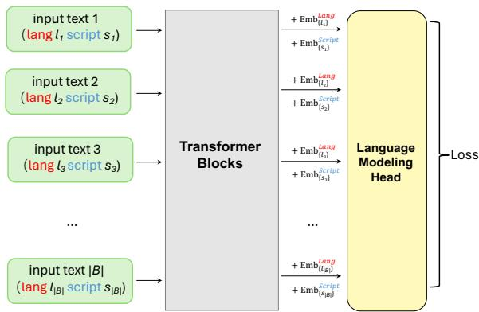
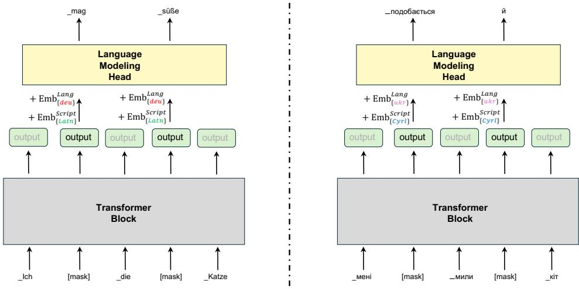
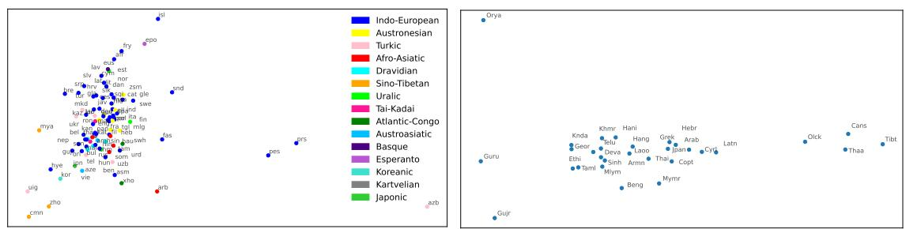
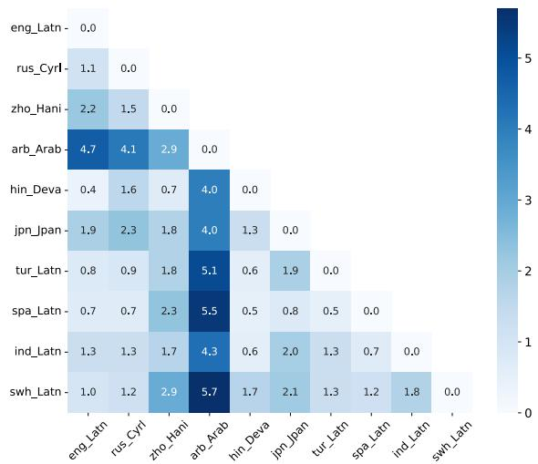
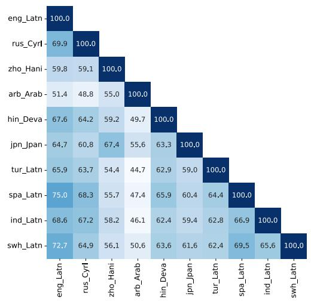
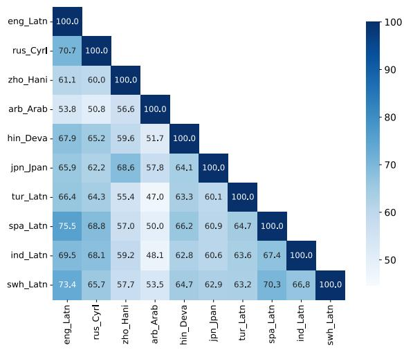

# LANGSAMP: Language-Script Aware Multilingual Pretraining

Yihong Liu1,2,\*, Haotian Ye1,2,\*, Chunlan Ma1,2, Mingyang Wang1,2,3, and Hinrich Schütze1,2

1Center for Information and Language Processing, LMU Munich 2Munich Center for Machine Learning (MCML) 3Bosch Center for Artificial Intelligence {yihong, yehao, chunlan, mingyang}@cis.lmu.de

## Abstract

Recent multilingual pretrained language models (mPLMs) often avoid using language embeddings – learnable vectors assigned to individual languages. However, this places a significant burden on token representations to encode all language-specific information, which may hinder language neutrality. To address this limitation, we propose Language-Script Aware Multilingual Pretraining (LANGSAMP), a method that incorporates both language and script embeddings to enhance representation learning. Specifically, we integrate these embeddings into the output of the Transformer blocks before passing the final representations to the language modeling head for prediction. We apply LANGSAMP to the continual pretraining of XLM-R (Conneau et al., 2020) on a highly multilingual corpus covering more than 500 languages. The resulting model consistently outperforms the baseline in zero-shot crosslingual transfer across diverse downstream tasks. Extensive analysis reveals that language and script embeddings capture language- and script-specific nuances, which benefits more language-neutral representations, proven by improved pairwise cosine similarity. In our case study, we also show that language and script embeddings can be used to select better source languages for crosslingual transfer. We make our code and models publicly available at https://github. com/cisnlp/LangSAMP.

## 1 Introduction

Encoder-only mPLMs are often regarded as universal text encoders (Cer et al., 2018; Huang et al., 2019; Yang et al., 2020), where the sentence-level or token-level representations are applied to various downstream tasks across different languages (Wei et al., 2021). One of the most attractive aspects of these representations is their utility in crosslingual transfer (Zoph et al., 2016; Wu and Dredze, 2019; Artetxe et al., 2020a). That is, representations from a single source language can be used to fine-tune a multilingual task-specific model (e.g., an mPLM + a task-specific classifier). The fine-tuned model can be applied directly to other languages, without further training. Such a pipeline is particularly useful for low-resource languages, where training data is often scarce (Artetxe et al., 2020b).

  
Figure 1: An illustration of LANGSAMP for a single batch. Each text may come from different languages and different scripts. Language and script embeddings are added to the transformer output before feeding into the language modeling head. This setup improves the language neutrality of the representations as the auxiliary embeddings share the burden by encoding some language- and script-specific information useful for decoding specific tokens in masked language modeling.

The effectiveness of this pipeline depends on the transferability of crosslingual representations. However, previous studies have shown that the representations from recent mPLMs encode a lot of language- and script-specific information (Datta et al., 2020; Chang et al., 2022; Wen-Yi and Mimno, 2023). This is generally not advantageous, as language neutrality, i.e., representations from different languages share a unified subspace, is important for effective crosslingual transfer (Libovický et al., 2020; Chang et al., 2022; Hua et al., 2024). While some approaches attempt to post-align these representations (Cao et al., 2020; Pan et al., 2021; Liu et al., 2024b; Xhelili et al., 2024), limited efforts have focused on enhancing language neutrality from the architectural perspective of mPLMs during pretraining.

Early mPLMs, such as XLM (Conneau and Lample, 2019), leverage language embeddings – learnable vectors assigned to different languages. These embeddings are added to the token embeddings before being fed into the transformer (Vaswani et al., 2017) blocks, aiming to alleviate the burden of encoding language-specific information within the token embeddings. Language embeddings can also guide generation toward the correct target language in machine translation (Conneau and Lample, 2019; Song et al., 2019; Liu et al., 2022). However, more recent mPLMs, such as XLM-R (Conneau et al., 2020) and mBERT (Devlin et al., 2019), have discarded these embeddings. The two primary reasons are that (1) mPLMs are expected to have a single, unified parameter set for all languages, and (2) they need to function seamlessly as universal text encoders without requiring language IDs as input. However, the removal inevitably reduces the language neutrality of token embeddings and representations (contextual token embeddings), which may negatively impact crosslingual transfer.

To address this limitation, this work proposes Language-Script Aware Multilingual Pretraining (LANGSAMP), a method that incorporates both language and script embeddings to facilitate better representation learning. Instead of adding these embeddings to the token embeddings before feeding them into the transformer blocks, we add them to the output of the transformer blocks (final contextual token embeddings) before feeding them into the language modeling head, as shown in Figure 1. In the pretraining phase, language and script IDs are required to obtain language and script embeddings, offloading the burden and helping decode specific tokens in masked language modeling. After pretraining, the backbone (token embeddings and transformer blocks) can function seamlessly as a universal text encoder, which can be fine-tuned together with a task-specific classifier for downstream tasks, without any language or script IDs as input, which are the same as most recent mPLMs.

To validate our approach, we continually pretrain XLM-R (Conneau et al., 2020) using LANGSAMP on Glot500-c (ImaniGooghari et al., 2023), a multilingual dataset containing over 500 languages. We evaluate the resulting model across a diverse set of downstream tasks, including sentence retrieval, text classification, and sequence labeling, consistently achieving superior performance compared to the baseline. We show that better language neutrality is achieved – LANGSAMP improves the pairwise cosine similarity across languages. Additionally, we observe that language and script embeddings encapsulate typological features, making their similarities a useful resource for selecting optimal source languages in crosslingual transfer.

Our main contributions are as follows: (i) We propose LANGSAMP, an effective multilingual pretraining method to improve the language neutrality of representations. (ii) We conduct extensive experiments across a spectrum of downstream tasks, demonstrating that our method consistently improves crosslingual transfer performance. (iii) Our case study shows that language embeddings, as a byproduct, can effectively assist in selecting the optimal source language for crosslingual transfer.

## 2 Related Work

## 2.1 Multilingual Pretrained Language Models

Multilingual pretrained language models (mPLMs) are models that are trained on many languages, with one or multiple self-supervised objectives, such as masked language modeling (MLM) (Devlin et al., 2019) or causal language modeling (Radford et al., 2019). These models can be generally classified as encoder-only (Devlin et al., 2019; Conneau et al., 2020; Liang et al., 2023), encoder-decoder (Liu et al., 2020; Fan et al., 2021; Xue et al., 2021), and decoder-only models (Lin et al., 2022; Shliazhko et al., 2022; Scao et al., 2022). Decoder-only models that have considerably many parameters and are pretrained on a lot of data are also referred to as large language models (LLMs) (Achiam et al., 2023; Touvron et al., 2023; Üstün et al., 2024), which are good at natural language generation tasks, typically for high- and medium-resource languages. In parallel, some recent encoder-only models attempt to scale horizontally, i.e., cover more languages, especially low-resource ones (Ogueji et al., 2021; Alabi et al., 2022; ImaniGooghari et al., 2023; Liu et al., 2024a). These highly multilingual encoder-only models are particularly good at understanding tasks in a zero-shot crosslingual fashion.

## 2.2 Language Embeddings

Language embeddings are vectors that explicitly or implicitly capture the linguistic characteristics of languages. Early works construct such embeddings using prior knowledge of the languages, resulting in vectors where each dimension encodes a specific linguistic feature (Östling, 2015; Ammar et al., 2016; Littell et al., 2017). However, such features have to be manually defined and may be unavailable for less-studied languages (Yu et al., 2021). Therefore, researchers also explore learning language embeddings directly from parallel corpora (Malaviya et al., 2017; Östling and Tiedemann, 2017; Bjerva and Augenstein, 2018; Tan et al., 2019; Liu et al., 2023; Chen et al., 2023) or monolingual corpora (Conneau and Lample, 2019; Yu et al., 2021). This is usually done by assigning an ID to each language, initializing a fixed-length learnable vector, and integrating the vector into the input from that language. The embeddings can capture linguistic features and help crosslingual tasks, e.g., guiding language-specific generation in machine translation in XLM (Conneau and Lample, 2019). This line of approaches requires language IDs as input for both pretraining and downstream fine-tuning. In contrast, language embeddings are only leveraged in our pretraining. The backbone can be used as a universal text encoder without language IDs for fine-tuning on downstream tasks.

## 3 Methodology

We present LANGSAMP, an approach that incorporates both language and script embeddings to facilitate learning more language-neutral representations in multilingual pretraining. LANGSAMP preserves the same architecture as the most recent multilingual encoder-only models, except for requiring auxiliary language and script IDs/embeddings in pretraining. In the fine-tuning stage, these auxiliary IDs and embeddings are not required. We introduce the key components in the following.

## 3.1 Language and Script Embeddings

Language and script embeddings are introduced to share the token representations’ burden of encoding language- and script-specific information. Let $\mathbf { \sigma } _ { E ^ { \mathit { L a n g } } } \in \mathbf { \bar { \mathbb { R } } } ^ { \mathit { L } \times D }$ and $\hat { \pmb { E } } ^ { S c \hat { r } i p t } \in \mathbb { R } ^ { S \times D }$ be the language and script embeddings, respectively, where $L$ is the number of languages, $S$ is the number of scripts, and D is the embedding dimension of the model. We use $\pmb { E } _ { l } ^ { L a n g }$ (resp. $\mathbf { \delta E } _ { s } ^ { S c r i p t } )$ to denote the embedding of a specific language l (resp. script s). Similar to token embeddings (which represent relations between tokens in vector space), the language/script embeddings are also expected to capture structural and typological similarities of languages (§5.2) and be useful for selecting good source language for crosslingual transfer (§5.4).

## 3.2 Language-Script Aware Modeling

In the standard MLM pretraining, Transformer blocks generate the final representation at a masked position. Subsequently, this representation is fed to the language modeling head to reconstruct the original token. Since the original token is used by a specific language and written in a specific script, language- or script-specific information is particularly necessary to decode this token. From this perspective, the Transformer output used for decoding is not language-neutral by nature. Our intuition is that we can ease the decoding by giving hints (e.g., the token should be generated in a specific language or script) to the language modeling head. In this way, the output of the Transformer blocks does not need to encode much languageand script-specific information, and can thus be more language-neutral. Inspired by this, we add language and script embeddings to the output of Transformer blocks and feed the resulting representations to the language modeling head for decoding, as shown in Figure 2.

Formally, let a training instance (an input sentence) be $X = [ x _ { 1 } , x _ { 2 } , \cdot \cdot \cdot , x _ { n } ]$ that comes from language l and is written in script s. We feed $X$ into Transformer blocks and obtain the final contextualized embeddings from the last layer: $\pmb { H } = [ h _ { 1 } , h _ { 2 } , \cdots , h _ { n } ]$ . We then add the language and script embedding to these outputs to form the final representations: $\overset { \cdot } { o _ { i } } = h _ { i } + \overset { \cdot } { E _ { l } } { } ^ { L a n g } + E _ { s } ^ { S c r i p t }$ The final representations at the masked positions are used to decode the original tokens in MLM:

$$
\mathcal { L } _ { M L M } = - \sum _ { i \in \mathcal { M } } \log P _ { M L M } ( x _ { i } | \pmb { o _ { i } } )
$$

where $\mathcal { M }$ is the set of masked positions in X and $P _ { M L M } ( x _ { i } | \mathbf { o } _ { i } )$ is the probability of decoding the original token $x _ { i }$ given the final representation $\mathbf { \delta } _ { o _ { i } }$ which is computed by the language modeling head. Since $\pmb { E } _ { l } ^ { L a n j }$ and $\dot { E } _ { s } ^ { S c r i p t }$ provide language and script-specific information, we expect that $\boldsymbol { h } _ { i }$ will be more language-neutral (§5.3), which is beneficial to zero-shot crosslingual transfer (§4.3).

  
Figure 2: Illustration of LANGSAMP applied to a German sentence (left) and a Ukrainian sentence (right), both meaning “I like the cute cat". Language and script embeddings are added to the outputs from the transformer block. The resulting representation is used to predict the original tokens at the [mask] positions in MLM training.

## 3.3 Fine-tuning on Downstream tasks

Since we only leverage language and script embedding in the pretraining for MLM, the core architecture (token embeddings + Transformer blocks) remains the same as most mainstream mPLMs, such as XLM-R. In this way, we do not need any language or script IDs as input to obtain the Transformer output, i.e., the final contextualized embeddings H. This means our pretrained model can be fine-tuned in the standard way in the NLP pipeline. Specifically, for any downstream tasks that require a task-specific classifier (either tokenlevel or sequence-level tasks), we can feed the final contextualized embeddings $\pmb { H } = [ h _ { 1 } , h _ { 2 } , \cdots , h _ { n } ]$ to the classifier and update the model parameters according to the fine-tuning objective, where language or script embeddings are not participating at all. In addition, as H is more language-neutral thanks to LANGSAMP, we expect the representations to boost zero-shot crosslingual transfer (§4.3).

It is important to note that we do not increase the number of parameters used to compute token or sentence representations, as the auxiliary language/script embeddings are employed only during pretraining. This contrasts with prior work, which often introduces additional components – such as Adapters – during downstream fine-tuning (Pfeiffer et al., 2022; Balne et al., 2024). Consequently, any improvements in downstream task performance can only be attributed to enhanced representations learned by the Transformer itself, rather than to added model capacity because of more parameters.

## 4 Experiments

## 4.1 Setups

Training Corpora and Tokenizer We use Glot500-c (ImaniGooghari et al., 2023), a corpus that has monolingual data from more than 500 languages written in 30 different scripts. We treat each language-script as a separate entity and refer to those covered by XLM-R (Conneau et al., 2020) as head languages, whereas the remaining are tail languages (also low-resource languages). We use the tokenizer of Glot500-m (ImaniGooghari et al., 2023), which is a SentencePiece Unigram tokenizer (Kudo and Richardson, 2018; Kudo, 2018) whose vocabulary is merged from the subwords in XLM-R and new subwords learned from Glot500-c.

Continued pretraining We use the weights from XLM-R to initialize our LANGSAMP model for MLM pretraining. Language and script embeddings are randomly initialized with dimensions R610×768 and R30×768 respectively. We continually train our model on Glot500-c, where we sample data from a multinomial distribution with a temperature of 0.3, to increase the amount of training instances of low- and medium-resource languages. We use AdamW optimizer (Kingma and Ba, 2015; Loshchilov and Hutter, 2019) with $( \beta _ { 1 } , \beta _ { 2 } ) = ( 0 . 9 , 0 . 9 9 9 )$ and ϵ = 1e-6. The initial learning rate is set to 5e-5. The effective batch size is 1,024 in each training step, where the gradient accumulation is 8 and the per-GPU batch size is 32. We train the model on 4 NVIDIA RTX6000 GPUs. Each training instance in a batch contains sentences from the same language-script which are concatenated to a chunk of 512 tokens. Each batch contains instances from different languagescripts. We store checkpoints every 5K steps and apply early stopping with the best average performance on downstream tasks. We set the maximum steps to 150K. The training takes about 4 weeks.

<table><tr><td rowspan="2"></td><td colspan="2">tail</td><td colspan="2">head</td><td colspan="2">Latn</td><td colspan="2">non-Latn</td><td colspan="2">all</td></tr><tr><td>Baseline</td><td>LANGSAMP</td><td>Baseline</td><td>LANGSAMP</td><td>Baseline</td><td>LANGSAMP|</td><td>|Baseline</td><td>LANGSAMP</td><td>Baseline</td><td>LANGSAMP</td></tr><tr><td>SR-B</td><td>36.9 (0.0)</td><td>39.5 (0.0)</td><td>|60.6 (0.0)</td><td>61.3 (0.0)</td><td>|40.7 (0.0)</td><td>42.8 (0.0)</td><td>|51.2 (0.0)</td><td>53.5 (0.0)</td><td>|42.9 (0.0)</td><td>45.1 (0.0)</td></tr><tr><td>SR-T</td><td>56.9 (0.0)</td><td>58.6 (0.0)</td><td>74.8 (0.0)</td><td>76.1 (0.0)</td><td>67.5 (0.0)</td><td>68.7 (0.0)</td><td>73.7 (0.0)</td><td>75.6 (0.0)</td><td>69.7 (0.0)</td><td>71.1 (0.0)</td></tr><tr><td></td><td>Taxi1500 47.1 (4.8)</td><td>50.8 (2.4)</td><td>59.9 (2.9)</td><td>61.2 (1.2)</td><td>48.2 (4.6)</td><td>51.7 (2.1)</td><td>58.8 (3.1)</td><td>60.1 (1.7)</td><td>50.3 (4.2)</td><td>53.4 (2.0)</td></tr><tr><td>SIB200</td><td>69.0 (1.4)</td><td>70.2 (1.9)</td><td>82.2 (1.4)</td><td>82.6 (1.2)</td><td>72.1 (1.3)</td><td>73.1 (1.8)</td><td>81.1 (1.5)</td><td>81.7 (1.2)</td><td>75.0 (1.3)</td><td>75.9 (1.6)</td></tr><tr><td>NER</td><td>60.1 (0.6)</td><td>60.8 (0.8)</td><td>64.0 (0.6)</td><td>64.1 (0.6)</td><td>67.0 (0.5)</td><td>67.6 (0.6)</td><td>53.9 (0.7)</td><td>53.9 (0.5)</td><td>62.2 (0.5)</td><td>62.6 (0.6)</td></tr><tr><td>POS</td><td>61.3 (1.0)</td><td>61.4 (0.9)</td><td>76.0 (0.4)</td><td>76.2 (0.4)</td><td>74.6 (0.5)</td><td>74.5 (0.4)</td><td>66.2 (1.0)</td><td>66.8 (0.8)</td><td>71.5 (0.6)</td><td>71.6 (0.5)</td></tr></table>

Table 1: Performance of LANGSAMP and baseline on six downstream tasks across five random seeds. We report the performance by grouping languages according to two characteristics: (1) whether it is a head or a tail language, and (2) whether it is written in Latin script or non-Latin script. The average performance within each group and the standard deviation (in parentheses) are computed. LANGSAMP consistently achieves on-par performance or outperforms the baseline across all groups and downstream tasks. Bold: best result for each group in each task.

Baseline To validate LANGSAMP, we create a baseline where language and script embeddings are not used. This baseline can be regarded as a reproduction of Glot500-m (ImaniGooghari et al., 2023). For a fair comparison, the training hyperparameters and training data (100% data of Glot500-c) are the same as LANGSAMP. However, in our ablation study §5.1, due to a constrained computing budget, we cannot continually pretrain model variants on full Glot500-c for validating each component individually (with/without language or script embeddings). Instead, we create such variants and pretrain them using a small portion (5%) of Glot500-c. As a result, the baseline model in Table 1 is different from the vanilla model in Table 2.

## 4.2 Downstream Tasks

We consider the following three evaluation types, with two datasets for each type. The evaluation is done in an English-centric zero-shot crosslingual transfer style for evaluation types that require finetuning. That is, we first fine-tune the pretrained model on the English train set, then select the best checkpoint on the English development set, and finally evaluate the best checkpoint on the test sets of all other languages. For Sentence Retrieval, which does not involve any fine-tuning, we simply use English as the retrieval query language. For all tasks, only a subset of languages (head and tail languages) supported by Glot500-c are considered. We show the detailed information of the used dataset and hyperparameter settings in §A. We introduce the evaluation types and datasets in the following.

Sentence Retrieval. We use Bible (SR-B) and Tatoeba (Artetxe and Schwenk, 2019) (SR-T). The pairwise similarity for retrieving the target sentences is calculated using the mean pooling of contextualized word embeddings at the 8th layer.

Text Classification. We use Taxi1500 (Ma et al., 2023) and SIB200 (Adelani et al., 2024). The former is a dataset based on the Bible, whereas the latter is based on FLORES-200 (Costa-jussà et al., 2022) with more modern genres like technology.

Sequence Labeling. We use WikiANN for named entity recognition (NER) (Pan et al., 2017) and Universal Dependencies (de Marneffe et al., 2021) for Part-Of-Speech (POS) tagging.

## 4.3 Results and Discussion

We evaluate the LANGSAMP model and baseline to understand how the integration of language and script embeddings influences crosslingual transfer. We group the transfer target languages based on two characteristics: (1) whether it is a head or tail language, and (2) whether it is written in Latin or a non-Latin script. This grouping aims to directly identify the effectiveness of LANGSAMP on lowresource languages and languages written in a less common script. The results are shown in Table 1.

Both tail and head languages benefit. We observe consistent improvements in tail and head languages across tasks. The enhancement is more obvious in tail languages. For example, LANGSAMP improves the performance by 7% for tail languages vs 1% for head languages in SR-B. A similar phenomenon can also be seen for other tasks. This pattern indicates that LANGSAMP can be more helpful for those tail languages, for which the training data is scarce. With the help of language embeddings sharing the burden, the LANGSAMP model can have more language-neutral representations for these languages, resulting in better performance.

<table><tr><td></td><td colspan="3">SR-B</td><td colspan="3">SR-T</td><td colspan="3">Taxi1500</td><td colspan="3">SIB200</td><td colspan="3">NER</td><td colspan="3">POS</td></tr><tr><td></td><td>tail</td><td>head</td><td>all</td><td>tail</td><td>head</td><td>all</td><td>tail</td><td>head</td><td>all</td><td>tail</td><td>head</td><td>all</td><td>tail</td><td>head</td><td>all</td><td>tail</td><td>head</td><td>all</td></tr><tr><td>vanilla model</td><td>11.9</td><td>56.4</td><td>23.2</td><td>46.0</td><td>77.7</td><td>68.6</td><td>18.1</td><td>58.6</td><td>28.4</td><td>56.1</td><td>83.0</td><td>68.3</td><td>55.1</td><td>62.8</td><td>59.3</td><td>49.9</td><td>75.7</td><td>67.8</td></tr><tr><td>w/  $E ^ { L a n g }$ </td><td>13.1</td><td>57.9</td><td>24.5</td><td>49.1</td><td>79.0</td><td>70.5</td><td>18.3</td><td>58.5</td><td>28.5</td><td>57.2</td><td>82.7</td><td>68.8</td><td>55.2</td><td>63.0</td><td>59.5</td><td>49.9</td><td>75.8</td><td>67.8</td></tr><tr><td>w/  $E ^ { S c r i p t }$ </td><td>12.5</td><td>57.4</td><td>23.9</td><td>48.3</td><td>78.4</td><td>69.8</td><td>18.5</td><td>57.0</td><td>28.2</td><td>56.6</td><td>82.1</td><td>68.2</td><td>55.1</td><td>62.4</td><td>59.0</td><td>50.8</td><td>76.2</td><td>68.4</td></tr><tr><td>w/  ${ \pmb E } ^ { L a n g }$  and  $E ^ { S c r i p t }$ </td><td>13.4</td><td>58.7</td><td>24.9</td><td>49.1</td><td>79.5</td><td>70.8</td><td>20.6</td><td>58.8</td><td>30.3</td><td>57.9</td><td>83.0</td><td>69.3</td><td>54.9</td><td>61.6</td><td>58.6</td><td>49.7</td><td>75.6</td><td>67.6</td></tr></table>

Table 2: Ablation study. We investigate the effectiveness of language and script embeddings on downstream performance. Note that the vanilla model and $\mathbf { w } / E ^ { L a n g }$ and $E ^ { S c r i p t }$ are different from Baseline and LANGSAMP in Table 1 because of the smaller pretraining data size. By including both types of embeddings, the model achieves the overall best performance among all variants. Bold (underlined): best (second-best) result for each column.

Both non-Latin and Latin languages benefit. We observe similar consistent improvements when grouping languages into Latin or non-Latin languages. Different from the trend seen in tail/head groups, we see that no group shows an obvious larger enhancement compared to the other group. This can be explained by the fact that head and tail languages are distributed more equally in Latn and non-Latn groups. In addition, the improvements indicate the incorporation of script embeddings is helpful. By decoupling some script-specific information from the representations, the output generated by the backbone is more script-neutral, leading to better crosslingual transfer across scripts.

Improvements can vary slightly across tasks. We observe more consistent large improvements for sequence-level tasks – retrieval and classification – where LANGSAMP outperforms the baseline in all groups. However, on sequence labeling tasks, LANGSAMP achieves very close performance to the baseline. For example, LANGSAMP scores are 0.1 less compared to the baseline on NER. This could be related to the difficulty of the tasks: both NER and POS are relatively easy tasks, and models can transfer well in prevalent classes, e.g., nouns, through shared vocabulary (ImaniGooghari et al., 2023; Liu et al., 2024a). Therefore, decoupling language- or script-specific information from the Transformer output can be less helpful for these tasks. Nevertheless, the overall improvements across tasks indicate the superiority of LANGSAMP compared with the baseline.

## 5 Analysis

## 5.1 Ablation Study

In the ablation study, we want to explore the effectiveness of language embeddings and script embeddings individually. However, due to a limited computation budget, we cannot run experiments on the full corpora for each variant. Therefore, we select 5% data for each language from Glot500-c and continually pretrain XLM-R using the same hyperparameters used in the main experiments described in §4.1. Specifically, we consider four variants: a) model without language/script embeddings; b) model with only language embeddings; c) model with only script embeddings; and d) model with both language and script embeddings. The performance of each variant is shown in Table 2.

Either language or script embeddings help. The vanilla model achieves the overall worst performance among all model variants. As long as language or script embeddings are included, we generally observe a consistent improvement across all downstream tasks. This indicates that both language and script embeddings can share the burden of encoding too much language- and script-specific information in the token representations. As a result, the representations generated by the model variants with language or script embeddings are more language-neutral, benefiting the crosslingual transfer. The best overall performance is achieved when both language and script embeddings are used, suggesting that decoupling both languageand script-specific information would be the best option for improving crosslingual transfer.

Improvement varies across task types. Similar to the findings in §4.3, we observe that including the auxiliary embeddings is very helpful for sequence-level tasks, especially sentence retrieval, where we observe the highest enhancement, while less helpful for token-level tasks. It is also noticeable that including language embeddings is the most effective for sentence retrieval (either best or the second best per column). On the other hand, the sequence labeling task does not enjoy large improvements: most model variants achieve on-par performance with each other. The reason has been discussed in §4.3: NER and POS are relatively simple tasks since models can transfer easily in prevalent classes. Nevertheless, the overall results show the effectiveness of the auxiliary embeddings.

  
Figure 3: PCA visualizations of head language embeddings (left) and script embeddings (right). We see that some related languages and scripts are close to each other, indicating that they encode language- and script-specific information. Data imbalance may have caused some languages/scripts with limited data to appear as outliers.

## 5.2 Qualitative Exploration: Visualization

We visualize language and script embeddings in Figure 3. Only head language embeddings are chosen for better readability. We observe that similar or related languages are located close to each other. For example, cmn and zho (simplified and traditional Chinese, lower left) are closest to each other, as are pes (Iranian Persian) and prs (Dari). The languages that are mutually influenced by Chinese to a large extent, jpn, kor, and vie, are also close to each other. Most European languages, as well as Indian languages that belong to the Indo-European family, form a rather dense cluster in the middle.

In the plot on the right, most scripts of the Indian subcontinent are found close to each other (Deva, Telu, Mlym, Taml, Knda, Sinh, Beng), despite some outliers (e.g., Gujr and Guru), probably due to the small amount of data that is written in these scripts. Hani and scripts of languages that are mutually influenced (Hang and Jpan) are not far from each other. The same is true for two very related scripts, Thai and Laoo. In summary, the learnable language and script embeddings can capture language- and script-specific information in the training, which can be helpful for the languageneutrality of the output of transformer blocks.

  
Figure 4: Similarity improvement (by percentage) from baseline to LANGSAMP in terms of the pairwise cosine similarity. Similarity is increased for each pair, indicating better language neutrality of the representations.

## 5.3 Quantitative Exploration: Similarity

We expect that LANGSAMP can generate more language-neutral representations, meaning that representations of semantically equivalent sentences from different languages are similar. To evaluate this, we selected 10 high-resource languages that differ typologically and use a diverse set of scripts: eng\_Latn, rus\_Cyrl, zho\_Hani, arb\_Arab, hin\_Deva, jpn\_Jpan, tur\_Latn, spa\_Latn, ind\_Latn, and swa\_Latn. We calculated the pairwise cosine similarity of sentence representations using 100 randomly sampled parallel sentences from SR-B. Sentence representations are obtained by mean-pooling the token representations at the 8th layer, followed by subtracting the language centroid (the average of all 100 sentence representations for that language). We report the pairwise cosine similarity in Figure 5 in §B and show the improvement (by percentage) in Figure 4.

We can observe that the similarity between any two languages is improved in LANGSAMP. The enhancement is especially noticeable for typologically distinct languages using different scripts. For example, arb\_Arab is in a different language family and written in a different script compared to the other 9 languages; the similarity involving arb\_Arab is greatly improved: 4.7% for eng\_Latn and 4.1% rus\_Cyrl. Importantly, since LANGSAMP does not incorporate additional parallel data, this improvement is solely attributed to the inclusion of language and script embeddings during pretraining. This indicates that LANGSAMP effectively generates more language-neutral representations by decoupling language- and script-specific features into auxiliary embeddings.

<table><tr><td rowspan="2"></td><td colspan="2">tail</td><td colspan="2">head</td><td colspan="2">Latn</td><td colspan="2">non-Latn</td><td colspan="2">all</td></tr><tr><td>English</td><td>Donor</td><td>English</td><td>Donor</td><td>English</td><td>Donor</td><td>English</td><td>Donor</td><td>English</td><td>Donor</td></tr><tr><td>Taxi1500</td><td>47.3</td><td>48.3</td><td>59.1</td><td>60.3</td><td>48.4</td><td>49.0</td><td>58.1</td><td>60.5</td><td>50.2</td><td>51.2</td></tr><tr><td>SIB200</td><td>67.9</td><td>67.9</td><td>81.2</td><td>81.6</td><td>71.0</td><td>71.1</td><td>80.3</td><td>80.6</td><td>74.0</td><td>74.2</td></tr><tr><td>NER</td><td>61.2</td><td>61.7</td><td>64.1</td><td>65.6</td><td>67.5</td><td>66.9</td><td>54.6</td><td>58.5</td><td>62.8</td><td>63.8</td></tr><tr><td>POS</td><td>63.2</td><td>53.8</td><td>77.0</td><td>72.3</td><td>75.5</td><td>68.4</td><td>68.1</td><td>63.6</td><td>72.8</td><td>66.6</td></tr></table>

Table 3: Performance of LANGSAMP, using English vs the closest donor language (based on cosine similarity induced from language embeddings) as the source language for zero-shot crosslingual transfer. Each number is the average over all target languages in a class. Bold: the result that is better for an English/Donor comparison.

<table><tr><td></td><td>Taxi1500</td><td></td><td>SIB200</td><td></td><td>NER</td><td></td><td>POS</td><td></td></tr><tr><td>tha</td><td>eng 63.8</td><td>jpn 63.8</td><td>eng 85.4</td><td>jpn 85.7</td><td>eng 2.1</td><td>jpn 10.2</td><td>eng 58.3</td><td>jpn 27.5</td></tr><tr><td>yue</td><td>eng 55.4</td><td>zho 67.7</td><td>eng -</td><td>zho -</td><td>eng 25.7</td><td>zho 73.5</td><td>eng 42.6</td><td>zho 80.9</td></tr><tr><td>san</td><td>eng 1</td><td>hin -</td><td>eng 72.9</td><td>hin 76.6</td><td>eng 38.4</td><td>hin 53.4</td><td>eng 25.5</td><td>hin 32.7</td></tr><tr><td>urd</td><td>eng -</td><td>hin 1</td><td>eng 79.1</td><td>hin 80.6</td><td>eng 65.1</td><td>hin 76.8</td><td>eng 69.7</td><td>hin 89.7</td></tr><tr><td>lin</td><td>eng 47.1</td><td>swh 54.7</td><td>eng 68.2</td><td>swh 73.3</td><td>eng 47.6</td><td>swh 55.9</td><td>eng -</td><td>swh -</td></tr><tr><td>run</td><td>eng 48.0</td><td>swh 55.2</td><td>eng 65.2</td><td>swh 72.7</td><td>eng -</td><td>swh 一</td><td>eng -</td><td>swh</td></tr></table>

Table 4: Languages with large improvements when using the closest donor language. In each task, the first/second column indicates results using English/the donor language as the source language. “-” indicates the language is not covered by the task. Bold: best result for each language in each task.

## 5.4 Case Study: Source Language Selection

Previous studies show language similarities have been useful for selecting good source languages for crosslingual transfer (Lin et al., 2019; Lauscher et al., 2020; Nie et al., 2023; Wang et al., 2023b,a;

Lin et al., 2024). We expect this to also apply to the similarities induced by our language embeddings. Therefore, we conduct a case study and use the languages mentioned in §5.3 as the donor languages. When performing the downstream task for a specific target language, instead of always using English as the source language, we select the donor language that is the most cosine-similar to the target language. We evaluate the LANGSAMP model on Taxi1500, SIB200, NER, and POS in a zero-shot crosslingual transfer style. The aggregated results are reported in Table 3, and we select representative target languages that benefit from choosing a good donor language in Table 4.

Effects of donor vary across tasks. Our results suggest that the performance gain from using a donor language varies across tasks. The gain in the text classification task is more consistent than in the sequence labeling task. We assume the primary reason is that the training data for NER and POS are not parallel, and the size of the training data is highly variable across languages. For example, English has much more data than some of the other donor languages for these two tasks.

Non-Latin languages benefit more. For the text classification task, greater improvements can be observed in non-Latin script languages than in Latin script languages. This reflects previous findings that non-Latin script languages are less represented in mPLMs (Muller et al., 2021) and indicates the effectiveness of leveraging language embeddings in selecting better donor languages for them.

Donor is frequently from the same family. We find that language embeddings frequently identify a donor language of the same family as the target language, leading to a large performance improvement over English as the source. For example, as shown in Table 4, zho\_Hani as a donor language for yue\_Hani leads to large performance gains on all three tasks. Similar gains are seen using hin\_Deva for san\_Deva. Positive effects can also be found across scripts, as in the case of using hin\_Deva for urd\_Arab, two very similar languages written in different scripts.

Interesting cases of unrelated donors. We also notice some interesting cases where the closest donor language is not or only partially related to the target language, but nevertheless aids transfer performance as shown in Table 4. For example, jpn\_Jpan has a positive effect for tha\_Thai. Similarly, for tuk\_Latn, using rus\_Cyrl as the source achieves better transfer performance than English.

## 6 Conclusion

We propose LANGSAMP, a multilingual pretraining approach that leverages auxiliary language and script embeddings to facilitate more languageneutral representations by offloading the burden of encoding language- and script-specific information within the Transformer outputs. These embeddings are added to the output of the transformer blocks before being fed into the language modeling head for decoding. In this way, we keep the model structure simple, allowing it to function as a universal text encoder, without requiring language or script IDs as input, while easing the burden of the output encoding too much language- and script-specific information. Through extensive experiments, we show LANGSAMP consistently outperforms the baseline on various downstream tasks, especially in sequence-level tasks. Our ablation study confirms the effectiveness of both language and script embeddings. LANGSAMP exhibits improved language neutrality, as reflected by increased pairwise similarity across all donor languages. Furthermore, our case study demonstrates that the byproducts – auxiliary language/script embeddings – encode language- and script-specific information, which can facilitate the selection of optimal source languages for more effective crosslingual transfer.

## 7 Future Direction

Looking ahead, a promising research direction is to further explore and refine the use of auxiliary language/script embeddings to guide language-neutral representation learning, particularly in the middle layers of multilingual models. Prior studies have shown that intermediate layers of encoder-only or decoder-only models often exhibit higher language neutrality (Jalili Sabet et al., 2020; ImaniGooghari et al., 2023; Zhao et al., 2024; Li et al., 2025).

Future work could investigate ways to explicitly steer middle-layer representations toward greater neutrality, for example, by combining auxiliary embeddings with layer-specific objectives or contrastive learning alignment techniques.

Furthermore, language and script embeddings hold potential for enhancing controlled multilingual generation in decoder-only and encoderdecoder models, enabling more accurate and consistent generation in the target language based on instructions provided in the prompt.

## Limitations

Due to the constraints of computing resources, we are not able to continue pretraining the model using the full Glot500-c data in our ablation study. However, as all variants are trained in a strictly controlled environment, their results can be compared in a fair way, and the consistent improvement suggests the effectiveness of the language embeddings.

In addition, we do not consider the possibility of introducing language and script embeddings before the Transformer blocks. Although this is also a possible architecture, it does not fulfill our aim and therefore is not relevant to us. Our primary prerequisite is that the resulting model can work as a universal text encoder without any language or script IDs as input, just like most highly multilingual models (e.g., XLM-R (Conneau et al., 2020) and mBERT (Devlin et al., 2019)). LANGSAMP only requires language or script IDs in the pretraining stage. After that, the backbone (token embeddings + the Transformer blocks) acts exactly as a universal text encoder. Investigating whether architectures that integrate language/script embeddings before the Transformer could improve language representations at scale is outside the scope of our work, but we consider it a promising direction for future research.

Another potential limitation is the coverage of languages and scripts. Our model uses 610 languages and 30 scripts from Glot500-c. For lowresource languages not supported by our model, we can still generate representations since language IDs are not required as input. However, without a corresponding language embedding, it becomes challenging to select the optimal donor language for crosslingual transfer. Nonetheless, when adapting to these languages, the language embeddings can be expanded, similar to the approach commonly used for vocabulary extension.

Finally, while our results support a strong correlation between improved language neutrality and enhanced crosslingual transfer, we acknowledge that this relationship is not necessarily causal. However, prior studies have shown that improved language neutrality or alignment does not always yield better downstream outcomes (Gaschi et al., 2023; Hua et al., 2024; Liu et al., 2025), suggesting that language neutrality alone may not be a sufficient condition. We believe further research is needed to understand when and how language-neutral representations contribute effectively to transfer, which remains an open and important question for the multilingual NLP community.

## Acknowledgments

This work was funded by Deutsche Forschungsgemeinschaft (project SCHU 2246/14-1) and The European Research Council (NonSequeToR, grant #740516).

## References

Josh Achiam, Steven Adler, Sandhini Agarwal, Lama Ahmad, Ilge Akkaya, Florencia Leoni Aleman, Diogo Almeida, Janko Altenschmidt, Sam Altman, Shyamal Anadkat, et al. 2023. Gpt-4 technical report. arXiv preprint arXiv:2303.08774.

David Adelani, Hannah Liu, Xiaoyu Shen, Nikita Vassilyev, Jesujoba Alabi, Yanke Mao, Haonan Gao, and En-Shiun Lee. 2024. SIB-200: A simple, inclusive, and big evaluation dataset for topic classification in 200+ languages and dialects. In Proceedings ofthe 18th Conference ofthe European Chapter ofthe Associationfor Computational Linguistics (Volume 1: Long Papers), pages 226–245, St. Julian’s, Malta. Association for Computational Linguistics.

Jesujoba O. Alabi, David Ifeoluwa Adelani, Marius Mosbach, and Dietrich Klakow. 2022. Adapting pretrained language models to African languages via multilingual adaptive fine-tuning. In Proceedings of the 29th International Conference on Computational Linguistics, pages 4336–4349, Gyeongju, Republic of Korea. International Committee on Computational Linguistics.

Waleed Ammar, George Mulcaire, Miguel Ballesteros, Chris Dyer, and Noah A. Smith. 2016. Many languages, one parser. Transactions of the Association for Computational Linguistics, 4:431–444.

Mikel Artetxe, Sebastian Ruder, and Dani Yogatama. 2020a. On the cross-lingual transferability of monolingual representations. In Proceedings of the 58th

Annual Meeting ofthe Associationfor Computational Linguistics, pages 4623–4637, Online. Association for Computational Linguistics.

Mikel Artetxe, Sebastian Ruder, Dani Yogatama, Gorka Labaka, and Eneko Agirre. 2020b. A call for more rigor in unsupervised cross-lingual learning. In Proceedings of the 58th Annual Meeting of the Associationfor Computational Linguistics, pages 7375– 7388, Online. Association for Computational Linguistics.

Mikel Artetxe and Holger Schwenk. 2019. Massively multilingual sentence embeddings for zeroshot cross-lingual transfer and beyond. Transactions of the Association for Computational Linguistics, 7:597–610.

Charith Chandra Sai Balne, Sreyoshi Bhaduri, Tamoghna Roy, Vinija Jain, and Aman Chadha. 2024. Parameter efficient fine tuning: A comprehensive analysis across applications. Preprint, arXiv:2404.13506.

Johannes Bjerva and Isabelle Augenstein. 2018. From phonology to syntax: Unsupervised linguistic typology at different levels with language embeddings. In Proceedings ofthe 2018 Conference ofthe North American Chapter ofthe Association for Computational Linguistics: Human Language Technologies, Volume 1 (Long Papers), pages 907–916, New Orleans, Louisiana. Association for Computational Linguistics.

Steven Cao, Nikita Kitaev, and Dan Klein. 2020. Multilingual alignment of contextual word representations. In 8th International Conference on Learning Representations, ICLR 2020, Addis Ababa, Ethiopia, April 26-30, 2020. OpenReview.net.

Daniel Cer, Yinfei Yang, Sheng-yi Kong, Nan Hua, Nicole Limtiaco, Rhomni St John, Noah Constant, Mario Guajardo-Cespedes, Steve Yuan, Chris Tar, et al. 2018. Universal sentence encoder. arXiv preprint arXiv:1803.11175.

Tyler Chang, Zhuowen Tu, and Benjamin Bergen. 2022. The geometry of multilingual language model representations. In Proceedings ofthe 2022 Conference on Empirical Methods in Natural Language Processing, pages 119–136, Abu Dhabi, United Arab Emirates. Association for Computational Linguistics.

Yiyi Chen, Russa Biswas, and Johannes Bjerva. 2023. Colex2Lang: Language embeddings from semantic typology. In Proceedings of the 24th Nordic Conference on Computational Linguistics (NoDaLiDa), pages 673–684, Tórshavn, Faroe Islands. University of Tartu Library.

Alexis Conneau, Kartikay Khandelwal, Naman Goyal, Vishrav Chaudhary, Guillaume Wenzek, Francisco Guzmán, Edouard Grave, Myle Ott, Luke Zettlemoyer, and Veselin Stoyanov. 2020. Unsupervised

cross-lingual representation learning at scale. In Proceedings of the 58th Annual Meeting of the Associationfor Computational Linguistics, pages 8440– 8451, Online. Association for Computational Linguistics.

Alexis Conneau and Guillaume Lample. 2019. Crosslingual language model pretraining. In Advances in Neural Information Processing Systems, volume 32. Curran Associates, Inc.

Marta R Costa-jussà, James Cross, Onur Çelebi, Maha Elbayad, Kenneth Heafield, Kevin Heffernan, Elahe Kalbassi, Janice Lam, Daniel Licht, Jean Maillard, et al. 2022. No language left behind: Scaling human-centered machine translation. arXiv preprint arXiv:2207.04672.

Arindrima Datta, Bhuvana Ramabhadran, Jesse Emond, Anjuli Kannan, and Brian Roark. 2020. Languageagnostic multilingual modeling. In ICASSP 2020 - 2020 IEEE International Conference on Acoustics, Speech and Signal Processing (ICASSP), pages 8239– 8243.

Marie-Catherine de Marneffe, Christopher D. Manning, Joakim Nivre, and Daniel Zeman. 2021. Universal Dependencies. Computational Linguistics, 47(2):255–308.

Jacob Devlin, Ming-Wei Chang, Kenton Lee, and Kristina Toutanova. 2019. BERT: Pre-training of deep bidirectional transformers for language understanding. In Proceedings ofthe 2019 Conference of the North American Chapter of the Association for Computational Linguistics: Human Language Technologies, Volume 1 (Long and Short Papers), pages 4171–4186, Minneapolis, Minnesota. Association for Computational Linguistics.

Angela Fan, Shruti Bhosale, Holger Schwenk, Zhiyi Ma, Ahmed El-Kishky, Siddharth Goyal, Mandeep Baines, Onur Celebi, Guillaume Wenzek, Vishrav Chaudhary, et al. 2021. Beyond english-centric multilingual machine translation. Journal of Machine Learning Research, 22(107):1–48.

Felix Gaschi, Patricio Cerda, Parisa Rastin, and Yannick Toussaint. 2023. Exploring the relationship between alignment and cross-lingual transfer in multilingual transformers. In Findings ofthe Associationfor Computational Linguistics: ACL 2023, pages 3020–3042, Toronto, Canada. Association for Computational Linguistics.

Tianze Hua, Tian Yun, and Ellie Pavlick. 2024. mOth ello: When do cross-lingual representation alignment and cross-lingual transfer emerge in multilingual models? In Findings ofthe Associationfor Computational Linguistics: NAACL 2024, pages 1585–1598, Mexico City, Mexico. Association for Computational Linguistics.

Haoyang Huang, Yaobo Liang, Nan Duan, Ming Gong, Linjun Shou, Daxin Jiang, and Ming Zhou. 2019.

Unicoder: A universal language encoder by pretraining with multiple cross-lingual tasks. In Proceedings ofthe 2019 Conference on Empirical Methods in Natural Language Processing and the 9th International Joint Conference on Natural Language Processing (EMNLP-IJCNLP), pages 2485–2494, Hong Kong, China. Association for Computational Linguistics.

Ayyoob ImaniGooghari, Peiqin Lin, Amir Hossein Kargaran, Silvia Severini, Masoud Jalili Sabet, Nora Kassner, Chunlan Ma, Helmut Schmid, André Martins, François Yvon, and Hinrich Schütze. 2023. Glot500: Scaling multilingual corpora and language models to 500 languages. In Proceedings ofthe 61st Annual Meeting ofthe Associationfor Computational Linguistics (Volume 1: Long Papers), pages 1082– 1117, Toronto, Canada. Association for Computational Linguistics.

Masoud Jalili Sabet, Philipp Dufter, François Yvon, and Hinrich Schütze. 2020. SimAlign: High quality word alignments without parallel training data using static and contextualized embeddings. In Findings ofthe Associationfor Computational Linguistics: EMNLP 2020, pages 1627–1643, Online. Association for Computational Linguistics.

Diederik P. Kingma and Jimmy Ba. 2015. Adam: A method for stochastic optimization. In 3rd International Conference on Learning Representations, ICLR 2015, San Diego, CA, USA, May 7-9, 2015, Conference Track Proceedings.

Taku Kudo. 2018. Subword regularization: Improving neural network translation models with multiple subword candidates. In Proceedings of the 56th Annual Meeting of the Association for Computational Linguistics (Volume 1: Long Papers), pages 66–75, Melbourne, Australia. Association for Computational Linguistics.

Taku Kudo and John Richardson. 2018. SentencePiece: A simple and language independent subword tokenizer and detokenizer for neural text processing. In Proceedings of the 2018 Conference on Empirical Methods in Natural Language Processing: System Demonstrations, pages 66–71, Brussels, Belgium. Association for Computational Linguistics.

Anne Lauscher, Vinit Ravishankar, Ivan Vulic, and´ Goran Glavaš. 2020. From zero to hero: On the limitations of zero-shot language transfer with multilingual Transformers. In Proceedings of the 2020 Conference on Empirical Methods in Natural Language Processing (EMNLP), pages 4483–4499, Online. Association for Computational Linguistics.

Daoyang Li, Haiyan Zhao, Qingcheng Zeng, and Mengnan Du. 2025. Exploring multilingual probing in large language models: A cross-language analysis. Preprint, arXiv:2409.14459.

Davis Liang, Hila Gonen, Yuning Mao, Rui Hou, Naman Goyal, Marjan Ghazvininejad, Luke Zettle-

moyer, and Madian Khabsa. 2023. XLM-V: Overcoming the vocabulary bottleneck in multilingual masked language models. In Proceedings ofthe 2023 Conference on Empirical Methods in Natural Language Processing, pages 13142–13152, Singapore. Association for Computational Linguistics.

Jindˇrich Libovický, Rudolf Rosa, and Alexander Fraser. 2020. On the language neutrality of pre-trained multilingual representations. In Findings ofthe Associationfor Computational Linguistics: EMNLP 2020, pages 1663–1674, Online. Association for Computational Linguistics.

Peiqin Lin, Chengzhi Hu, Zheyu Zhang, Andre Martins, and Hinrich Schuetze. 2024. mPLM-sim: Better cross-lingual similarity and transfer in multilingual pretrained language models. In Findings of the Association for Computational Linguistics: EACL 2024, pages 276–310, St. Julian’s, Malta. Association for Computational Linguistics.

Xi Victoria Lin, Todor Mihaylov, Mikel Artetxe, Tianlu Wang, Shuohui Chen, Daniel Simig, Myle Ott, Naman Goyal, Shruti Bhosale, Jingfei Du, Ramakanth Pasunuru, Sam Shleifer, Punit Singh Koura, Vishrav Chaudhary, Brian O’Horo, Jeff Wang, Luke Zettlemoyer, Zornitsa Kozareva, Mona Diab, Veselin Stoyanov, and Xian Li. 2022. Few-shot learning with multilingual generative language models. In Proceedings of the 2022 Conference on Empirical Methods in Natural Language Processing, pages 9019–9052, Abu Dhabi, United Arab Emirates. Association for Computational Linguistics.

Yu-Hsiang Lin, Chian-Yu Chen, Jean Lee, Zirui Li, Yuyan Zhang, Mengzhou Xia, Shruti Rijhwani, Junxian He, Zhisong Zhang, Xuezhe Ma, Antonios Anastasopoulos, Patrick Littell, and Graham Neubig. 2019. Choosing transfer languages for cross-lingual learning. In Proceedings of the 57th Annual Meeting of the Associationfor Computational Linguistics, pages 3125–3135, Florence, Italy. Association for Computational Linguistics.

Patrick Littell, David R. Mortensen, Ke Lin, Katherine Kairis, Carlisle Turner, and Lori Levin. 2017. URIEL and lang2vec: Representing languages as typological, geographical, and phylogenetic vectors. In Proceedings of the 15th Conference of the European Chapter ofthe Associationfor Computational Linguistics: Volume 2, Short Papers, pages 8–14, Valencia, Spain. Association for Computational Linguistics.

Yihong Liu, Haris Jabbar, and Hinrich Schuetze. 2022. Flow-adapter architecture for unsupervised machine translation. In Proceedings of the 60th Annual Meeting of the Association for Computational Linguistics (Volume 1: Long Papers), pages 1253–1266, Dublin, Ireland. Association for Computational Linguistics.

Yihong Liu, Peiqin Lin, Mingyang Wang, and Hinrich Schuetze. 2024a. OFA: A framework of initializing unseen subword embeddings for efficient large-scale multilingual continued pretraining. In Findings ofthe

Associationfor Computational Linguistics: NAACL 2024, pages 1067–1097, Mexico City, Mexico. Association for Computational Linguistics.

Yihong Liu, Chunlan Ma, Haotian Ye, and Hinrich Schuetze. 2024b. TransliCo: A contrastive learning framework to address the script barrier in multilingual pretrained language models. In Proceedings of the 62nd Annual Meeting of the Association for Computational Linguistics (Volume 1: Long Papers), pages 2476–2499, Bangkok, Thailand. Association for Computational Linguistics.

Yihong Liu, Mingyang Wang, Amir Hossein Kargaran, Ayyoob ImaniGooghari, Orgest Xhelili, Haotian Ye, Chunlan Ma, François Yvon, and Hinrich Schütze. 2025. How transliterations improve crosslingual alignment. In Proceedings ofthe 31st International Conference on Computational Linguistics, pages 2417–2433, Abu Dhabi, UAE. Association for Computational Linguistics.

Yihong Liu, Haotian Ye, Leonie Weissweiler, Philipp Wicke, Renhao Pei, Robert Zangenfeind, and Hinrich Schütze. 2023. A crosslingual investigation of conceptualization in 1335 languages. In Proceedings of the 61st Annual Meeting of the Association for Computational Linguistics (Volume 1: Long Papers), pages 12969–13000, Toronto, Canada. Association for Computational Linguistics.

Yinhan Liu, Jiatao Gu, Naman Goyal, Xian Li, Sergey Edunov, Marjan Ghazvininejad, Mike Lewis, and Luke Zettlemoyer. 2020. Multilingual denoising pretraining for neural machine translation. Transactions ofthe Associationfor Computational Linguistics, 8:726–742.

Ilya Loshchilov and Frank Hutter. 2019. Decoupled weight decay regularization. In 7th International Conference on Learning Representations, ICLR 2019, New Orleans, LA, USA, May 6-9, 2019. OpenReview.net.

Chunlan Ma, Ayyoob ImaniGooghari, Haotian Ye, Ehsaneddin Asgari, and Hinrich Schütze. 2023. Taxi1500: A multilingual dataset for text classification in 1500 languages. arXiv preprint arXiv:2305.08487.

Chaitanya Malaviya, Graham Neubig, and Patrick Littell. 2017. Learning language representations for typology prediction. In Proceedings of the 2017 Conference on Empirical Methods in Natural Language Processing, pages 2529–2535, Copenhagen, Denmark. Association for Computational Linguistics.

Benjamin Muller, Antonios Anastasopoulos, Benoît Sagot, and Djamé Seddah. 2021. When being unseen from mBERT is just the beginning: Handling new languages with multilingual language models. In Proceedings ofthe 2021 Conference ofthe North American Chapter ofthe Association for Computational Linguistics: Human Language Technologies, pages 448–462, Online. Association for Computational Linguistics.

Ercong Nie, Sheng Liang, Helmut Schmid, and Hinrich Schütze. 2023. Cross-lingual retrieval augmented prompt for low-resource languages. In Findings of the Associationfor Computational Linguistics: ACL 2023, pages 8320–8340, Toronto, Canada. Association for Computational Linguistics.

Kelechi Ogueji, Yuxin Zhu, and Jimmy Lin. 2021. Small data? no problem! exploring the viability of pretrained multilingual language models for lowresourced languages. In Proceedings ofthe 1st Workshop on Multilingual Representation Learning, pages 116–126, Punta Cana, Dominican Republic. Association for Computational Linguistics.

Robert Östling. 2015. Word order typology through multilingual word alignment. In Proceedings ofthe 53rd Annual Meeting ofthe Associationfor Computational Linguistics and the 7th International Joint Conference on Natural Language Processing (Volume 2: Short Papers), pages 205–211, Beijing, China. Association for Computational Linguistics.

Robert Östling and Jörg Tiedemann. 2017. Continuous multilinguality with language vectors. In Proceedings of the 15th Conference of the European Chapter of the Association for Computational Linguistics: Volume 2, Short Papers, pages 644–649, Valencia, Spain. Association for Computational Linguistics.

Lin Pan, Chung-Wei Hang, Haode Qi, Abhishek Shah, Saloni Potdar, and Mo Yu. 2021. Multilingual BERT post-pretraining alignment. In Proceedings of the 2021 Conference of the North American Chapter of the Associationfor Computational Linguistics: Human Language Technologies, pages 210–219, Online. Association for Computational Linguistics.

Xiaoman Pan, Boliang Zhang, Jonathan May, Joel Nothman, Kevin Knight, and Heng Ji. 2017. Cross-lingual name tagging and linking for 282 languages. In Proceedings ofthe 55th Annual Meeting ofthe Associationfor Computational Linguistics (Volume 1: Long Papers), pages 1946–1958, Vancouver, Canada. Association for Computational Linguistics.

Jonas Pfeiffer, Naman Goyal, Xi Lin, Xian Li, James Cross, Sebastian Riedel, and Mikel Artetxe. 2022. Lifting the curse of multilinguality by pre-training modular transformers. In Proceedings of the 2022 Conference of the North American Chapter of the Association for Computational Linguistics: Human Language Technologies, pages 3479–3495, Seattle, United States. Association for Computational Linguistics.

Alec Radford, Jeffrey Wu, Rewon Child, David Luan, Dario Amodei, Ilya Sutskever, et al. 2019. Language models are unsupervised multitask learners. OpenAI blog, 1(8):9.

Teven Le Scao, Angela Fan, Christopher Akiki, Ellie Pavlick, Suzana Ilic, Daniel Hesslow, Roman´ Castagné, Alexandra Sasha Luccioni, François Yvon,

Matthias Gallé, et al. 2022. Bloom: A 176bparameter open-access multilingual language model. arXiv preprint arXiv:2211.05100.

Oleh Shliazhko, Alena Fenogenova, Maria Tikhonova, Vladislav Mikhailov, Anastasia Kozlova, and Tatiana Shavrina. 2022. mgpt: Few-shot learners go multilingual. arXiv preprint arXiv:2204.07580.

Kaitao Song, Xu Tan, Tao Qin, Jianfeng Lu, and Tie-Yan Liu. 2019. MASS: masked sequence to sequence pre-training for language generation. In Proceedings of the 36th International Conference on Machine Learning, ICML 2019, 9-15 June 2019, Long Beach, California, USA, volume 97 of Proceedings of Machine Learning Research, pages 5926–5936. PMLR.

Xu Tan, Jiale Chen, Di He, Yingce Xia, Tao Qin, and Tie-Yan Liu. 2019. Multilingual neural machine translation with language clustering. In Proceedings ofthe 2019 Conference on Empirical Methods in Natural Language Processing and the 9th International Joint Conference on Natural Language Processing (EMNLP-IJCNLP), pages 963–973, Hong Kong, China. Association for Computational Linguistics.

Hugo Touvron, Louis Martin, Kevin Stone, Peter Albert, Amjad Almahairi, Yasmine Babaei, Nikolay Bashlykov, Soumya Batra, Prajjwal Bhargava, Shruti Bhosale, et al. 2023. Llama 2: Open foundation and fine-tuned chat models. arXiv preprint arXiv:2307.09288.

Ahmet Üstün, Viraat Aryabumi, Zheng-Xin Yong, Wei-Yin Ko, Daniel D’souza, Gbemileke Onilude, Neel Bhandari, Shivalika Singh, Hui-Lee Ooi, Amr Kayid, et al. 2024. Aya model: An instruction finetuned open-access multilingual language model. arXiv preprint arXiv:2402.07827.

Ashish Vaswani, Noam Shazeer, Niki Parmar, Jakob Uszkoreit, Llion Jones, Aidan N. Gomez, Lukasz Kaiser, and Illia Polosukhin. 2017. Attention is all you need. In Advances in Neural Information Processing Systems 30: Annual Conference on Neural Information Processing Systems 2017, December 4-9, 2017, Long Beach, CA, USA, pages 5998–6008.

Mingyang Wang, Heike Adel, Lukas Lange, Jannik Strötgen, and Hinrich Schuetze. 2023a. GradSim: Gradient-based language grouping for effective multilingual training. In Proceedings of the 2023 Conference on Empirical Methods in Natural Language Processing, pages 4631–4646, Singapore. Association for Computational Linguistics.

Mingyang Wang, Heike Adel, Lukas Lange, Jannik Strötgen, and Hinrich Schütze. 2023b. NLNDE at SemEval-2023 task 12: Adaptive pretraining and source language selection for low-resource multilingual sentiment analysis. In Proceedings of the 17th International Workshop on Semantic Evaluation (SemEval-2023), pages 488–497, Toronto, Canada. Association for Computational Linguistics.

Xiangpeng Wei, Rongxiang Weng, Yue Hu, Luxi Xing, Heng Yu, and Weihua Luo. 2021. On learning universal representations across languages. In 9th International Conference on Learning Representations, ICLR 2021, Virtual Event, Austria, May 3-7, 2021. OpenReview.net.

Andrea W Wen-Yi and David Mimno. 2023. Hyperpolyglot LLMs: Cross-lingual interpretability in token embeddings. In Proceedings ofthe 2023 Conference on Empirical Methods in Natural Language Processing, pages 1124–1131, Singapore. Association for Computational Linguistics.

Shijie Wu and Mark Dredze. 2019. Beto, bentz, becas: The surprising cross-lingual effectiveness of BERT. In Proceedings of the 2019 Conference on Empirical Methods in Natural Language Processing and the 9th International Joint Conference on Natural Language Processing (EMNLP-IJCNLP), pages 833–844, Hong Kong, China. Association for Computational Linguistics.

Orgest Xhelili, Yihong Liu, and Hinrich Schuetze. 2024. Breaking the script barrier in multilingual pretrained language models with transliteration-based post-training alignment. In Findings of the Associationfor Computational Linguistics: EMNLP 2024, pages 11283–11296, Miami, Florida, USA. Association for Computational Linguistics.

Linting Xue, Noah Constant, Adam Roberts, Mihir Kale, Rami Al-Rfou, Aditya Siddhant, Aditya Barua, and Colin Raffel. 2021. mT5: A massively multilingual pre-trained text-to-text transformer. In Proceedings ofthe 2021 Conference ofthe North American Chapter of the Association for Computational Linguistics: Human Language Technologies, pages 483–498, Online. Association for Computational Linguistics.

Yinfei Yang, Daniel Cer, Amin Ahmad, Mandy Guo, Jax Law, Noah Constant, Gustavo Hernandez Abrego, Steve Yuan, Chris Tar, Yun-hsuan Sung, Brian Strope, and Ray Kurzweil. 2020. Multilingual universal sentence encoder for semantic retrieval. In Proceedings of the 58th Annual Meeting of the Association for Computational Linguistics: System Demonstrations, pages 87–94, Online. Association for Computational Linguistics.

Dian Yu, Taiqi He, and Kenji Sagae. 2021. Language embeddings for typology and cross-lingual transfer learning. In Proceedings of the 59th Annual Meeting ofthe Associationfor Computational Linguistics and the 11th International Joint Conference on Natural Language Processing (Volume 1: Long Papers), pages 7210–7225, Online. Association for Computational Linguistics.

Yiran Zhao, Wenxuan Zhang, Guizhen Chen, Kenji Kawaguchi, and Lidong Bing. 2024. How do large language models handle multilingualism? In Advances in Neural Information Processing Systems 38: Annual Conference on Neural Information Processing Systems 2024, NeurIPS 2024, Vancouver, BC, Canada, December 10 - 15, 2024.

Barret Zoph, Deniz Yuret, Jonathan May, and Kevin Knight. 2016. Transfer learning for low-resource neural machine translation. In Proceedings ofthe 2016 Conference on Empirical Methods in Natural Language Processing, pages 1568–1575, Austin, Texas. Association for Computational Linguistics.

## A Settings and Hyperparameters

We show the information of the evaluation datasets and used measures in Table 5 and introduce the detailed settings and hyperparameters as follows.

Sentence Retrieval We use English-aligned sentences (up to 500 and 1000 for SR-B and SR-T, respectively) from languages covered by Glot500- c (ImaniGooghari et al., 2023). No fine-tuning is needed for this evaluation type: we directly use each model as a text encoder and generate the sentence-level representation by averaging the contextual token embeddings at the 8th layer, similar to previous work (Jalili Sabet et al., 2020; Imani-Googhari et al., 2023; Liu et al., 2024a). We perform retrieval by sorting the pairwise similarities.

Text Classification We add a 6-class or 7-class (for Taxi1500 and SIB200, respectively) sequencelevel classification head onto the backbone model (no language or script IDs are required as input since the language modeling head is not needed in this sequence-level classification model). By default, we train the model on the English train set and store the best checkpoint on the English validation set. We train all models using AdamW optimizer (Kingma and Ba, 2015; Loshchilov and Hutter, 2019) for a maximum of 40 epochs, with a learning rate of 1e-5 and an effective batch size of 16 (batch size of 8, gradient accumulation of 2). We use a single GTX 1080 Ti GPU for training. The evaluation is done in zero-shot transfer: we directly apply the best checkpoint to the test sets of all other languages.

Sequence Labeling We add a 7-class or 18-class (for NER and POS, respectively) token-level classification head onto the backbone model (no language or script IDs are required as input since the language modeling head is not needed in this tokenlevel classification model). Similarly, we train the model on the English train set and store the best checkpoint on the English validation set by default. We train all models using the AdamW optimizer (Kingma and Ba, 2015; Loshchilov and Hutter, 2019) for a maximum of 10 epochs. The learning rate is set to 2e-5, and the effective batch size is set to 32 (batch size of 8, gradient accumulation of 4). The training is done on a single GTX 1080 Ti GPU. The evaluation is done in zero-shot transfer: we directly apply the best checkpoint to the test sets of all other languages.

<table><tr><td colspan="5">|lheadl Itail ILatnl Inon-Latnl #class measure (%)</td></tr><tr><td>SR-B</td><td>94 275</td><td>290</td><td>79</td><td>- top-10 Acc.</td></tr><tr><td>SR-T</td><td>70 28</td><td>64</td><td>34</td><td>- top-10 Acc.</td></tr><tr><td>Taxi1500</td><td>89 262</td><td>281</td><td>70</td><td>6 F1 score</td></tr><tr><td>SIB200</td><td>78 94</td><td>117</td><td>55</td><td>7 F1 score</td></tr><tr><td>NER</td><td>89 75</td><td>104</td><td>60</td><td>7 F1 score</td></tr><tr><td>POS</td><td>63 28</td><td>57</td><td>34</td><td>18 F1 score</td></tr></table>

Table 5: Information of the evaluation datasets and used measures. |head| (resp. |tail|): number of head (resp. tail) language-scripts. |Latn| (resp. |non-Latn|): number of languages written in Latin script (resp. non-Latn scripts). #class: the number of the categories if it belongs to a text classification or sequence labeling task.

## B Pairwise Cosine Similarity

As introduced in §5.3, we select 10 topologically different languages that are written in diverse scripts to assess the language neutrality: eng\_Latn, rus\_Cyrl, zho\_Hani, arb\_Arab, hin\_Deva, jpn\_Jpan, tur\_Latn, spa\_Latn, ind\_Latn, and swa\_Latn. We report the pairwise cosine similarity for the baseline and LANGSAMP in Figure 5.

It can be observed that the similarity between any two languages in LANGSAMP is consistently higher than in the baseline. The absolute increase is small in general, due to the fact that (1) without the introduction of the auxiliary language and script embeddings, the baseline already assigns good similarity to translations and (2) LANGSAMP does not introduce any additional parallel data in the pretraining, which is usually regarded as important to improve the similarity. Nevertheless, the consistent improvement indicates that LANGSAMP effectively improves the language neutrality by decoupling language- and script-specific features into auxiliary embeddings.

## C Results for Each Language Family

We report the aggregated results for each language family for each task in Table 6. We see consistent improvement for all language families in sentence retrieval and text classification tasks. For sequence tagging tasks, LANGSAMP achieves similar performance compared with the baseline. This trend is similar to the main results we report in §4.3.

## D Complete Crosslingual Transfer Results

We report the complete results of English-centric zero-shot crosslingual performance of baseline and LANGSAMP for all tasks and languages in Table 7, 8 (SR-B), Table 9 (SR-T), Table 10, 11(Taxi1500), 12 (SIB200), Table 13 (NER), and Table 14 (POS). Each result is the average over fine-tuning the baseline or LANGSAMP under five random seeds.

## E Transfer Results Using English and Closest Donor Language

We report the complete results of the zero-shot crosslingual performance of LANGSAMP when using English and the closest donor language as the source language in Table 15, 16 (Taxi1500), 17 (SIB200), Table 18 (NER), and Table 19 (POS). Each result is directly obtained from a single run. We fine-tune the LANGSAMP using different donor languages under the same random seed.

  
Figure 5: Comparison between baseline (left) and LANGSAMP (right) in terms of the pairwise cosine similarity. LANGSAMP achieves better similarity for each pair, indicating improved language neutrality of the representations.

<table><tr><td colspan="10">SR-B</td></tr><tr><td colspan="10">(indo1319, 93) (atla1278, 69) (aust1307,55) (turk1311,23) (sino1245, 23)</td></tr><tr><td>Baseline</td><td>61.4</td><td>37.3</td><td>42.9</td><td>60.9</td><td>31.6</td><td>15.5</td><td>29.5</td><td>31.3</td><td>42.9</td></tr><tr><td>LANGSAMP</td><td>62.0</td><td>40.2</td><td>45.1</td><td>63.3</td><td>34.8</td><td>15.7</td><td>32.0</td><td>34.6</td><td>45.1</td></tr><tr><td colspan="10">SR-T</td></tr><tr><td>(indo1319, 54)</td><td></td><td>(atla1278,2)</td><td>(aust1307,7)</td><td>(turk1311,7)</td><td>(sino1245, 3)</td><td>(maya1287,0)</td><td>(afro1255, 5) (other, 20)</td><td></td><td>(all, 98)</td></tr><tr><td>Baseline</td><td>74.2</td><td>50.0</td><td>48.7</td><td>71.3</td><td>81.7</td><td></td><td>52.1</td><td>68.7</td><td>69.7</td></tr><tr><td>LANGSAMP</td><td>75.2</td><td>50.6</td><td>50.2</td><td>74.6</td><td>83.0</td><td></td><td>54.2</td><td>70.5</td><td>71.1</td></tr><tr><td colspan="10">Taxi1500</td></tr><tr><td>(indo1319,87)</td><td></td><td>(atla1278, 68)</td><td>(aust1307,51)</td><td>(turk1311,18)</td><td>(sino1245, 22)</td><td>(maya1287,15)</td><td>(afro1255, 11)</td><td>(other, 79)</td><td>(all, 351)</td></tr><tr><td>Baseline</td><td>60.8</td><td>42.6</td><td>51.6</td><td>60.3</td><td>49.5</td><td>42.4</td><td>35.7</td><td>46.1</td><td>50.3</td></tr><tr><td>LANGSAMP</td><td>62.6</td><td>46.8</td><td>55.2</td><td>62.7</td><td>53.6</td><td>45.5</td><td>38.8</td><td>49.1</td><td>53.4</td></tr><tr><td colspan="10">SIB200</td></tr><tr><td></td><td>(indo1319, 71)</td><td>(atla1278,33)</td><td>(aust1307,17)</td><td>(turk1311, 10)</td><td>(sino1245, 5)</td><td>(maya1287,0)</td><td>(afro1255, 13)</td><td>(other, 23)</td><td>(all, 172)</td></tr><tr><td>Baseline</td><td>82.1</td><td>59.0</td><td>76.4</td><td>80.5</td><td>67.4</td><td></td><td>73.0</td><td>75.1</td><td>75.0</td></tr><tr><td>LANGSAMP</td><td>82.7</td><td>60.5</td><td>78.0</td><td>81.8</td><td>68.7</td><td></td><td>73.1</td><td>75.7</td><td>75.9</td></tr><tr><td colspan="10">NER</td></tr><tr><td></td><td>(indo1319, 94)</td><td>(atla1278,5) (aust1307, 12)</td><td></td><td>(turk1311,12)</td><td>(sino1245, 7)</td><td>(maya1287,0)</td><td>(afro1255,6)</td><td>(other, 28)</td><td>(all, 164)</td></tr><tr><td>Baseline LANGSAMP</td><td>66.8</td><td>60.4</td><td>58.8</td><td>62.1</td><td>37.1</td><td></td><td>53.8</td><td>56.7</td><td>62.2</td></tr><tr><td></td><td>67.2</td><td>61.2</td><td>59.5</td><td>61.3</td><td>36.6</td><td></td><td>55.5</td><td>57.2</td><td>62.6</td></tr><tr><td colspan="10">POS</td></tr><tr><td></td><td>(indo1319, 54)</td><td>(atla1278, 2)</td><td>(aust1307, 4)</td><td>(turk1311,5)</td><td>(sino1245, 3)</td><td>(maya1287,1)</td><td>(afro1255, 6) (other, 16)</td><td></td><td>(all, 91)</td></tr><tr><td>Baseline LANGSAMP</td><td>78.0 78.0</td><td>61.9 61.0</td><td>74.4</td><td>72.1 71.9</td><td>33.3 35.8</td><td>61.1 58.8</td><td>64.1 64.9</td><td>60.3 60.6</td><td>71.5 71.6</td></tr><tr><td></td><td></td><td></td><td>74.4</td><td></td><td></td><td></td><td></td><td></td><td></td></tr></table>

Table 6: Aggregated performance of the baseline and LANGSAMP for 7 major language families on all tasks. We report the average performance for indo1319 (Indo-European), atla1278 (Atlantic-Congo), aust1307 (Austronesian), turk1311 (Turkic), sino1245 (Sino-Tibetan), maya1287 (Mayan), and afro1255 (Afro-Asiatic). We classify the remaining languages into the group “other”. In addition, we report the average over all languages (group “all”). The number of languages in that family is shown in parentheses. Bold: best result for each task.

<table><tr><td rowspan=1 colspan=4>LanguageBaseline LANGSAMP|L</td><td rowspan=1 colspan=5>anguageBaseline LANGSAMP|L</td><td rowspan=1 colspan=4>anguageBaseline LANGSAMP|L</td><td rowspan=1 colspan=4>anguageBaseline LANGSAMP</td></tr><tr><td rowspan=1 colspan=4>ace_Latn     43.8       49.4</td><td rowspan=1 colspan=5>ach_Latn    37.6       40.6</td><td rowspan=1 colspan=4>acr_Latn    17.6       18.6|a</td><td rowspan=1 colspan=4>fr_Latn    74.2       72.4</td></tr><tr><td rowspan=1 colspan=4>agw_Latn    31.0       38.2</td><td rowspan=1 colspan=5>ahk_Latn     3.4        3.8</td><td rowspan=1 colspan=4>aka_Latn    41.8       48.44</td><td rowspan=1 colspan=4>aln_Latn    70.0       70.0</td></tr><tr><td rowspan=1 colspan=4>als_Latn     54.4       54.4a</td><td rowspan=1 colspan=5>lt_Cyrl     53.8       57.0a</td><td rowspan=1 colspan=4>lz_Latn    36.2       37.4</td><td rowspan=1 colspan=4>amh_Ethi    44.4       51.2</td></tr><tr><td rowspan=1 colspan=4>aoj_Latn     15.6       18.6</td><td rowspan=1 colspan=5>arb_Arab     9.6       11.6</td><td rowspan=1 colspan=4>arn_Latn    18.2       23.0</td><td rowspan=1 colspan=4>ary_Arab    11.2       13.0</td></tr><tr><td rowspan=1 colspan=4>arz_Arab    15.2       15.2</td><td rowspan=1 colspan=5>asm_Beng   59.2       59.0</td><td rowspan=1 colspan=4>ayr_Latn    37.6       46.0</td><td rowspan=1 colspan=4>azb_Arab    55.6      59.0</td></tr><tr><td rowspan=1 colspan=4>aze_Latn    73.4       75.4</td><td rowspan=1 colspan=5>bak_Cyrl    58.8       62.2</td><td rowspan=1 colspan=4>bam_Latn   38.4       44.8</td><td rowspan=1 colspan=4>ban_Latn    33.0       33.2</td></tr><tr><td rowspan=1 colspan=4>bar_Latn    32.2       34.0</td><td rowspan=1 colspan=5>bba_Latn    26.2       31.0</td><td rowspan=1 colspan=4>bbc_Latn    60.8       58.8b</td><td rowspan=1 colspan=4>ci_Latn    12.0       11.8</td></tr><tr><td rowspan=1 colspan=3>bcl_Latn    75.4</td><td rowspan=1 colspan=1>79.0</td><td rowspan=1 colspan=4>bel_Cyrl     70.6</td><td rowspan=1 colspan=1>69.6</td><td rowspan=1 colspan=3>bem_Latn   51.0</td><td rowspan=1 colspan=1>54.4b</td><td rowspan=1 colspan=4>en_Beng   53.4       55.4</td></tr><tr><td rowspan=1 colspan=3>bhw_Latn    28.4</td><td rowspan=1 colspan=1>30.6</td><td rowspan=1 colspan=4>bim_Latn    31.4</td><td rowspan=1 colspan=1>42.8</td><td rowspan=1 colspan=3>bis_Latn    45.2</td><td rowspan=1 colspan=1>50.8</td><td rowspan=1 colspan=4>bod_Tibt    29.6       33.6</td></tr><tr><td rowspan=1 colspan=3>bqc_Latn    27.4</td><td rowspan=1 colspan=1>29.2</td><td rowspan=1 colspan=4>bre_Latn    31.8</td><td rowspan=1 colspan=1>30.0</td><td rowspan=1 colspan=3>bts_Latn    62.4</td><td rowspan=1 colspan=1>62.0</td><td rowspan=1 colspan=1>btx_Latn</td><td rowspan=1 colspan=2>57.2</td><td rowspan=1 colspan=1>55.8</td></tr><tr><td rowspan=1 colspan=3>bul_Cyrl    79.8</td><td rowspan=1 colspan=1>80.0</td><td rowspan=1 colspan=4>bum_Latn   32.8</td><td rowspan=1 colspan=1>35.2</td><td rowspan=1 colspan=3>bzj_Latn    69.8</td><td rowspan=1 colspan=1>70.2</td><td rowspan=1 colspan=1>cab_Latn</td><td rowspan=1 colspan=2>11.6</td><td rowspan=1 colspan=1>11.8</td></tr><tr><td rowspan=1 colspan=3>cac_Latn    10.8</td><td rowspan=1 colspan=1>11.8</td><td rowspan=1 colspan=2>cak_Latn</td><td rowspan=1 colspan=2>17.8</td><td rowspan=1 colspan=1>16.6</td><td rowspan=1 colspan=3>caq_Latn    26.0</td><td rowspan=1 colspan=1>29.8</td><td rowspan=1 colspan=1>cat_Latn</td><td rowspan=1 colspan=2>85.4</td><td rowspan=1 colspan=1>83.2</td></tr><tr><td rowspan=1 colspan=3>cbk_Latn    54.8</td><td rowspan=1 colspan=1>56.2</td><td rowspan=1 colspan=2>cce_Latn</td><td rowspan=1 colspan=2>41.8</td><td rowspan=1 colspan=1>45.4</td><td rowspan=1 colspan=3>ceb_Latn    70.4</td><td rowspan=1 colspan=1>70.6</td><td rowspan=1 colspan=1>ces_Latn</td><td rowspan=1 colspan=2>68.2</td><td rowspan=1 colspan=1>67.0</td></tr><tr><td rowspan=1 colspan=3>cfm_Latn    34.4</td><td rowspan=1 colspan=1>38.8</td><td rowspan=1 colspan=2>che_Cyrl</td><td rowspan=1 colspan=2>10.2</td><td rowspan=1 colspan=1>11.2</td><td rowspan=1 colspan=3>chk_Latn   35.2</td><td rowspan=1 colspan=1>43.0</td><td rowspan=1 colspan=1>|chv_Cyrl</td><td rowspan=1 colspan=2>45.0</td><td rowspan=1 colspan=1>54.4</td></tr><tr><td rowspan=1 colspan=3>ckb_Arab    31.2</td><td rowspan=1 colspan=1>32.8</td><td rowspan=1 colspan=4>cmn_Hani   41.4</td><td rowspan=1 colspan=1>40.8</td><td rowspan=1 colspan=3>cnh_Latn   38.2</td><td rowspan=1 colspan=1>43.2</td><td rowspan=1 colspan=1>crh_Cyrl</td><td rowspan=1 colspan=2>67.2</td><td rowspan=1 colspan=1>70.0</td></tr><tr><td rowspan=1 colspan=3>crs_Latn    85.6</td><td rowspan=1 colspan=1>84.4</td><td rowspan=1 colspan=4>csy_Latn    40.2</td><td rowspan=1 colspan=1>49.6</td><td rowspan=1 colspan=3>ctd_Latn    44.4</td><td rowspan=1 colspan=1>50.6 c</td><td rowspan=1 colspan=1>tu_Latn</td><td rowspan=1 colspan=2>16.6</td><td rowspan=1 colspan=1>16.0</td></tr><tr><td rowspan=1 colspan=3>cuk_Latn    17.0</td><td rowspan=1 colspan=1>17.0</td><td rowspan=1 colspan=4>cym_Latn    45.6</td><td rowspan=1 colspan=1>43.8</td><td rowspan=1 colspan=3>dan_Latn    72.4</td><td rowspan=1 colspan=1>71.8</td><td rowspan=1 colspan=1>deu_Latn</td><td rowspan=1 colspan=2>73.8</td><td rowspan=1 colspan=1>74.0</td></tr><tr><td rowspan=1 colspan=3>djk_Latn    38.0</td><td rowspan=1 colspan=1>38.0</td><td rowspan=1 colspan=1>dln_Latn</td><td rowspan=1 colspan=1></td><td rowspan=1 colspan=1>46.6</td><td rowspan=1 colspan=1></td><td rowspan=1 colspan=1>51.4</td><td rowspan=1 colspan=1>dtp_Latn</td><td rowspan=1 colspan=2>17.0</td><td rowspan=1 colspan=1>17.8</td><td rowspan=1 colspan=1>dyu_Latn</td><td rowspan=1 colspan=2>33.0</td><td rowspan=1 colspan=1>40.2</td></tr><tr><td rowspan=1 colspan=3>dzo_Tibt    28.4</td><td rowspan=1 colspan=1>33.0</td><td rowspan=1 colspan=1>efi_Latn</td><td rowspan=1 colspan=1></td><td rowspan=1 colspan=1>41.6</td><td rowspan=1 colspan=1></td><td rowspan=1 colspan=1>53.6</td><td rowspan=1 colspan=1>eli_Grek</td><td rowspan=1 colspan=2>48.2</td><td rowspan=1 colspan=1>49.2</td><td rowspan=1 colspan=1>enm_Latn</td><td rowspan=1 colspan=2>69.4</td><td rowspan=1 colspan=1>69.4</td></tr><tr><td rowspan=1 colspan=3>epo_Latn    67.4</td><td rowspan=1 colspan=1>65.8</td><td rowspan=1 colspan=1>est_Latn</td><td rowspan=1 colspan=1></td><td rowspan=1 colspan=1>66.4</td><td rowspan=1 colspan=1></td><td rowspan=1 colspan=1>66.0</td><td rowspan=1 colspan=1>eus_Latn</td><td rowspan=1 colspan=2>23.8</td><td rowspan=1 colspan=1>24.2</td><td rowspan=1 colspan=1>ewe_Latn</td><td rowspan=1 colspan=2>33.2</td><td rowspan=1 colspan=1>34.8</td></tr><tr><td rowspan=1 colspan=3>fao_Latn    79.8</td><td rowspan=1 colspan=1>78.4</td><td rowspan=1 colspan=2>fas_Arab</td><td rowspan=1 colspan=1>80.2</td><td rowspan=1 colspan=1></td><td rowspan=1 colspan=1>84.2</td><td rowspan=1 colspan=1>fij_Latn</td><td rowspan=1 colspan=2>30.0</td><td rowspan=1 colspan=1>31.0</td><td rowspan=1 colspan=1>l_Latn</td><td rowspan=1 colspan=2>77.6</td><td rowspan=1 colspan=1>77.2</td></tr><tr><td rowspan=1 colspan=1>fin_Latn</td><td rowspan=1 colspan=2>65.4</td><td rowspan=1 colspan=1>66.0</td><td rowspan=1 colspan=1>fon_Latn</td><td rowspan=1 colspan=1></td><td rowspan=1 colspan=1>20.2</td><td rowspan=1 colspan=1></td><td rowspan=1 colspan=1>25.2</td><td rowspan=1 colspan=1>fra_Latn</td><td rowspan=1 colspan=1>87.4</td><td rowspan=1 colspan=1></td><td rowspan=1 colspan=1>87.2</td><td rowspan=1 colspan=1>fry_Latn</td><td rowspan=1 colspan=2>47.0</td><td rowspan=1 colspan=1>44.0</td></tr><tr><td rowspan=1 colspan=1>gaa_Latn</td><td rowspan=1 colspan=2>34.4</td><td rowspan=1 colspan=1>40.6</td><td rowspan=1 colspan=1>gil_Latn</td><td rowspan=1 colspan=1></td><td rowspan=1 colspan=1>30.0</td><td rowspan=1 colspan=1></td><td rowspan=1 colspan=1>31.6</td><td rowspan=1 colspan=1>giz_Latn</td><td rowspan=1 colspan=1>32.4</td><td rowspan=1 colspan=1></td><td rowspan=1 colspan=1>36.4</td><td rowspan=1 colspan=1>gkn_Latn</td><td rowspan=1 colspan=1>20.4</td><td rowspan=1 colspan=1></td><td rowspan=1 colspan=1>24.2</td></tr><tr><td rowspan=1 colspan=1>gkp_Latn</td><td rowspan=1 colspan=1>13.2</td><td rowspan=1 colspan=1></td><td rowspan=1 colspan=1>14.6</td><td rowspan=1 colspan=1>gla_Latn</td><td rowspan=1 colspan=1></td><td rowspan=1 colspan=1>39.0</td><td rowspan=1 colspan=1></td><td rowspan=1 colspan=1>38.0</td><td rowspan=1 colspan=1>gle_Latn</td><td rowspan=1 colspan=1>41.2</td><td rowspan=1 colspan=1></td><td rowspan=1 colspan=1>38.4</td><td rowspan=1 colspan=1>glv_Latn</td><td rowspan=1 colspan=1>37.2</td><td rowspan=1 colspan=1></td><td rowspan=1 colspan=1>38.6</td></tr><tr><td rowspan=1 colspan=1>gom_Latn</td><td rowspan=1 colspan=1>33.2</td><td rowspan=1 colspan=1></td><td rowspan=1 colspan=1>36.0</td><td rowspan=1 colspan=1>gor_Latn</td><td rowspan=1 colspan=1></td><td rowspan=1 colspan=1>21.8</td><td rowspan=1 colspan=1></td><td rowspan=1 colspan=1>23.0</td><td rowspan=1 colspan=1>grc_Grek</td><td rowspan=1 colspan=1>44.4</td><td rowspan=1 colspan=1></td><td rowspan=1 colspan=1>47.0</td><td rowspan=1 colspan=1>guc_Latn</td><td rowspan=1 colspan=1>9.8</td><td rowspan=1 colspan=1></td><td rowspan=1 colspan=1>8.2</td></tr><tr><td rowspan=1 colspan=1>gug_Latn</td><td rowspan=1 colspan=2>28.2</td><td rowspan=1 colspan=1>31.2</td><td rowspan=1 colspan=1>guj_Gujr</td><td rowspan=1 colspan=1></td><td rowspan=1 colspan=1>69.8</td><td rowspan=1 colspan=1></td><td rowspan=1 colspan=1>67.6</td><td rowspan=1 colspan=1>gur_Latn</td><td rowspan=1 colspan=1>17.6</td><td rowspan=1 colspan=1></td><td rowspan=1 colspan=1>18.2</td><td rowspan=1 colspan=1>guw_Latn</td><td rowspan=1 colspan=1>36.8</td><td rowspan=1 colspan=1></td><td rowspan=1 colspan=1>45.4</td></tr><tr><td rowspan=1 colspan=1>gya_Latn</td><td rowspan=1 colspan=2>27.6</td><td rowspan=1 colspan=1>32.6</td><td rowspan=1 colspan=1>gym_Latn</td><td rowspan=1 colspan=1></td><td rowspan=1 colspan=1>13.6</td><td rowspan=1 colspan=1></td><td rowspan=1 colspan=1>13.0</td><td rowspan=1 colspan=1>hat_Latn</td><td rowspan=1 colspan=1>76.4</td><td rowspan=1 colspan=1></td><td rowspan=1 colspan=1>74.6h</td><td rowspan=1 colspan=1>au_Latn</td><td rowspan=1 colspan=1>57.6</td><td rowspan=1 colspan=1></td><td rowspan=1 colspan=1>59.6</td></tr><tr><td rowspan=1 colspan=1>haw_Latn</td><td rowspan=1 colspan=2>28.0</td><td rowspan=1 colspan=1>30.4</td><td rowspan=1 colspan=1>heb_Hebr</td><td rowspan=1 colspan=1></td><td rowspan=1 colspan=1>21.6</td><td rowspan=1 colspan=1></td><td rowspan=1 colspan=1>23.0</td><td rowspan=1 colspan=1>hif_Latn</td><td rowspan=1 colspan=1>33.2</td><td rowspan=1 colspan=1></td><td rowspan=1 colspan=1>34.6|h</td><td rowspan=1 colspan=1>il_Latn</td><td rowspan=1 colspan=1>74.0</td><td rowspan=1 colspan=1></td><td rowspan=1 colspan=1>79.8</td></tr><tr><td rowspan=1 colspan=1>hin_Deva</td><td rowspan=1 colspan=2>75.6</td><td rowspan=1 colspan=1>74.6h</td><td rowspan=1 colspan=1>in_Latn</td><td rowspan=1 colspan=1></td><td rowspan=1 colspan=1>34.2</td><td rowspan=1 colspan=1></td><td rowspan=1 colspan=1>36.2</td><td rowspan=1 colspan=1>hmo_Latn</td><td rowspan=1 colspan=1>44.2</td><td rowspan=1 colspan=1></td><td rowspan=1 colspan=1>57.0h</td><td rowspan=1 colspan=1>ne_Deva</td><td rowspan=1 colspan=1>71.6</td><td rowspan=1 colspan=1></td><td rowspan=1 colspan=1>73.6</td></tr><tr><td rowspan=1 colspan=1>hnj_Latn</td><td rowspan=1 colspan=2>39.6</td><td rowspan=1 colspan=1>46.6h</td><td rowspan=1 colspan=1>ra_Latn</td><td rowspan=1 colspan=1></td><td rowspan=1 colspan=1>43.4</td><td rowspan=1 colspan=1></td><td rowspan=1 colspan=1>46.4h</td><td rowspan=1 colspan=1>rv_Latn</td><td rowspan=1 colspan=1>80.4</td><td rowspan=1 colspan=1></td><td rowspan=1 colspan=1>79.8h</td><td rowspan=1 colspan=1>ui_Latn</td><td rowspan=1 colspan=1>19.8</td><td rowspan=1 colspan=1></td><td rowspan=1 colspan=1>22.0</td></tr><tr><td rowspan=1 colspan=1>hun_Latn</td><td rowspan=1 colspan=2>65.6</td><td rowspan=1 colspan=1>69.0</td><td rowspan=1 colspan=1>hus_Latn</td><td rowspan=1 colspan=1></td><td rowspan=1 colspan=1>14.8</td><td rowspan=1 colspan=1></td><td rowspan=1 colspan=1>16.2</td><td rowspan=1 colspan=1>hye_Armn</td><td rowspan=1 colspan=1>62.8</td><td rowspan=1 colspan=1></td><td rowspan=1 colspan=1>65.6</td><td rowspan=1 colspan=1>iba_Latn</td><td rowspan=1 colspan=1>70.2</td><td rowspan=1 colspan=1></td><td rowspan=1 colspan=1>71.6</td></tr><tr><td rowspan=1 colspan=1>ibo_Latn</td><td rowspan=1 colspan=2>32.4</td><td rowspan=1 colspan=1>31.6</td><td rowspan=1 colspan=1>ifa_Latn</td><td rowspan=1 colspan=1></td><td rowspan=1 colspan=1>26.2</td><td rowspan=1 colspan=1></td><td rowspan=1 colspan=1>29.0</td><td rowspan=1 colspan=1>ifb_Latn</td><td rowspan=1 colspan=1>28.6</td><td rowspan=1 colspan=1></td><td rowspan=1 colspan=1>28.6i</td><td rowspan=1 colspan=1>kk_Latn</td><td rowspan=1 colspan=1>30.2</td><td rowspan=1 colspan=1></td><td rowspan=1 colspan=1>46.4</td></tr><tr><td rowspan=1 colspan=1>ilo_Latn</td><td rowspan=1 colspan=2>53.4</td><td rowspan=1 colspan=1>54.4i</td><td rowspan=1 colspan=1>nd_Latn</td><td rowspan=1 colspan=1></td><td rowspan=1 colspan=1>78.4</td><td rowspan=1 colspan=1></td><td rowspan=1 colspan=1>78.6</td><td rowspan=1 colspan=1>isl_Latn</td><td rowspan=1 colspan=1>71.0</td><td rowspan=1 colspan=1></td><td rowspan=1 colspan=1>71.8i</td><td rowspan=1 colspan=1>ta_Latn</td><td rowspan=1 colspan=1>76.2</td><td rowspan=1 colspan=1></td><td rowspan=1 colspan=1>76.8</td></tr><tr><td rowspan=1 colspan=1>ium_Latn</td><td rowspan=1 colspan=2>20.0</td><td rowspan=1 colspan=1>23.2</td><td rowspan=1 colspan=1>ixl_Latn</td><td rowspan=1 colspan=1></td><td rowspan=1 colspan=1>13.8</td><td rowspan=1 colspan=1></td><td rowspan=1 colspan=1>14.4</td><td rowspan=1 colspan=1>izz_Latn</td><td rowspan=1 colspan=1>19.6</td><td rowspan=1 colspan=1></td><td rowspan=1 colspan=1>22.6|</td><td rowspan=1 colspan=1>jam_Latn</td><td rowspan=1 colspan=1>61.0</td><td rowspan=1 colspan=1></td><td rowspan=1 colspan=1>59.2</td></tr><tr><td rowspan=1 colspan=1>jav_Latn</td><td rowspan=1 colspan=2>55.4</td><td rowspan=1 colspan=1>52.0j</td><td rowspan=1 colspan=2>pn_Jpan</td><td rowspan=1 colspan=1>65.8</td><td rowspan=1 colspan=1></td><td rowspan=1 colspan=1>67.6</td><td rowspan=1 colspan=1>kaa_Cyrl</td><td rowspan=1 colspan=1>71.2</td><td rowspan=1 colspan=1></td><td rowspan=1 colspan=1>75.0k</td><td rowspan=1 colspan=1>aa_Latn</td><td rowspan=1 colspan=1>32.0</td><td rowspan=1 colspan=1></td><td rowspan=1 colspan=1>37.6</td></tr><tr><td rowspan=1 colspan=3>kab_Latn    12.2</td><td rowspan=1 colspan=1>13.4</td><td rowspan=1 colspan=2>kac_Latn</td><td rowspan=1 colspan=1>22.2</td><td rowspan=1 colspan=1></td><td rowspan=1 colspan=1>27.0</td><td rowspan=1 colspan=1>kal_Latn</td><td rowspan=1 colspan=1>12.6</td><td rowspan=1 colspan=1></td><td rowspan=1 colspan=1>16.8</td><td rowspan=1 colspan=1>kan_Knda</td><td rowspan=1 colspan=1>50.0</td><td rowspan=1 colspan=1></td><td rowspan=1 colspan=1>52.8</td></tr><tr><td rowspan=1 colspan=3>kat_Geor    49.6</td><td rowspan=1 colspan=1>52.4k</td><td rowspan=1 colspan=2>az_Cyrl</td><td rowspan=1 colspan=1>69.4</td><td rowspan=1 colspan=1></td><td rowspan=1 colspan=1>70.4</td><td rowspan=1 colspan=1>kbp_Latn</td><td rowspan=1 colspan=1>21.8</td><td rowspan=1 colspan=1></td><td rowspan=1 colspan=1>26.8k</td><td rowspan=1 colspan=1>ek_Latn</td><td rowspan=1 colspan=1>16.6</td><td rowspan=1 colspan=1></td><td rowspan=1 colspan=1>18.6</td></tr><tr><td rowspan=1 colspan=3>khm_Khmr   39.4</td><td rowspan=1 colspan=1>43.0k</td><td rowspan=1 colspan=2>ia_Latn</td><td rowspan=1 colspan=1>24.6</td><td rowspan=1 colspan=1></td><td rowspan=1 colspan=1>28.8</td><td rowspan=1 colspan=1>kik_Latn</td><td rowspan=1 colspan=1>44.4</td><td rowspan=1 colspan=1></td><td rowspan=1 colspan=1>48.4 k</td><td rowspan=1 colspan=1>in_Latn</td><td rowspan=1 colspan=1>56.6</td><td rowspan=1 colspan=1></td><td rowspan=1 colspan=1>60.2</td></tr><tr><td rowspan=1 colspan=3>kir_Čyrl     69.8</td><td rowspan=1 colspan=1>70.2</td><td rowspan=1 colspan=2>kjb_Latn</td><td rowspan=1 colspan=1>23.4</td><td rowspan=1 colspan=1></td><td rowspan=1 colspan=1>26.0</td><td rowspan=1 colspan=1>kjh_Cyrl</td><td rowspan=1 colspan=1>45.6</td><td rowspan=1 colspan=1></td><td rowspan=1 colspan=1>50.6k</td><td rowspan=1 colspan=1>mm_Latn</td><td rowspan=1 colspan=2>33.8</td><td rowspan=1 colspan=1>38.0</td></tr><tr><td rowspan=1 colspan=3>kmr_Cyrl    42.0</td><td rowspan=1 colspan=1>40.2</td><td rowspan=1 colspan=2>kmr_Latn</td><td rowspan=1 colspan=1>60.2</td><td rowspan=1 colspan=1></td><td rowspan=1 colspan=1>60.4</td><td rowspan=1 colspan=1>knv_Latn</td><td rowspan=1 colspan=1>7.0</td><td rowspan=1 colspan=1></td><td rowspan=1 colspan=1>8.4</td><td rowspan=1 colspan=1>kor_Hang</td><td rowspan=1 colspan=2>60.8</td><td rowspan=1 colspan=1>64.0</td></tr><tr><td rowspan=1 colspan=3>kpg_Latn    42.6</td><td rowspan=1 colspan=1>48.8k</td><td rowspan=1 colspan=2>rc_Cyrl</td><td rowspan=1 colspan=1>59.8</td><td rowspan=1 colspan=1></td><td rowspan=1 colspan=1>62.2</td><td rowspan=1 colspan=1>kri_Latn</td><td rowspan=1 colspan=1>61.4</td><td rowspan=1 colspan=1></td><td rowspan=1 colspan=1>62.6k</td><td rowspan=1 colspan=1>sd_Latn</td><td rowspan=1 colspan=2>31.4</td><td rowspan=1 colspan=1>41.0</td></tr><tr><td rowspan=1 colspan=3>kss_Latn     5.2</td><td rowspan=1 colspan=1>6.0</td><td rowspan=1 colspan=2>ksw_Mymr</td><td rowspan=1 colspan=1>26.2</td><td rowspan=1 colspan=1></td><td rowspan=1 colspan=1>28.0</td><td rowspan=1 colspan=1>kua_Latn</td><td rowspan=1 colspan=1>43.0</td><td rowspan=1 colspan=1></td><td rowspan=1 colspan=1>43.8</td><td rowspan=1 colspan=1>lam_Latn</td><td rowspan=1 colspan=2>20.4</td><td rowspan=1 colspan=1>22.8</td></tr><tr><td rowspan=1 colspan=3>lao_Laoo    41.6</td><td rowspan=1 colspan=1>47.2</td><td rowspan=1 colspan=2>lat_Latn</td><td rowspan=1 colspan=2>56.6</td><td rowspan=1 colspan=1>58.0</td><td rowspan=1 colspan=1>lav_Latn</td><td rowspan=1 colspan=1>69.8</td><td rowspan=1 colspan=1></td><td rowspan=1 colspan=1>71.21</td><td rowspan=1 colspan=1>di_Latn</td><td rowspan=1 colspan=2>22.4</td><td rowspan=1 colspan=1>22.0</td></tr><tr><td rowspan=1 colspan=3>leh_Latn    46.8</td><td rowspan=1 colspan=1>45.8l</td><td rowspan=1 colspan=2>hu_Latn</td><td rowspan=1 colspan=1>4.4</td><td rowspan=1 colspan=1></td><td rowspan=1 colspan=1>4.2</td><td rowspan=1 colspan=1>lin_Latn</td><td rowspan=1 colspan=1>64.6</td><td rowspan=1 colspan=1></td><td rowspan=1 colspan=1>71.0l</td><td rowspan=1 colspan=1>it_Latn</td><td rowspan=1 colspan=2>67.0</td><td rowspan=1 colspan=1>66.6</td></tr><tr><td rowspan=1 colspan=3>loz_Latn     46.8</td><td rowspan=1 colspan=1>45.6l</td><td rowspan=1 colspan=2>tz_Latn</td><td rowspan=1 colspan=1>63.8</td><td rowspan=1 colspan=1></td><td rowspan=1 colspan=1>63.2</td><td rowspan=1 colspan=1>lug_Latn</td><td rowspan=1 colspan=1>37.2</td><td rowspan=1 colspan=1></td><td rowspan=1 colspan=1>40.8l</td><td rowspan=1 colspan=1>uo_Latn</td><td rowspan=1 colspan=2>42.8</td><td rowspan=1 colspan=1>42.6</td></tr><tr><td rowspan=1 colspan=3>lus_Latn    46.6</td><td rowspan=1 colspan=1>53.2</td><td rowspan=1 colspan=2>lzh_Hani</td><td rowspan=1 colspan=1>59.8</td><td rowspan=1 colspan=1></td><td rowspan=1 colspan=1>62.4</td><td rowspan=1 colspan=1>mad_Latn</td><td rowspan=1 colspan=1>42.6</td><td rowspan=1 colspan=1></td><td rowspan=1 colspan=1>44.6 m</td><td rowspan=1 colspan=1>ah_Latn</td><td rowspan=1 colspan=2>30.4</td><td rowspan=1 colspan=1>33.8</td></tr><tr><td rowspan=1 colspan=3>mai_Deva   52.6</td><td rowspan=1 colspan=1>56.0</td><td rowspan=1 colspan=2>mal_Mlym</td><td rowspan=1 colspan=2>51.6</td><td rowspan=1 colspan=1>57.4</td><td rowspan=1 colspan=1>mam_Latn</td><td rowspan=1 colspan=1>10.2</td><td rowspan=1 colspan=1></td><td rowspan=1 colspan=1>10.2</td><td rowspan=1 colspan=1>mar_Deva</td><td rowspan=1 colspan=3>68.4      71.4</td></tr><tr><td rowspan=1 colspan=3>mau_Latn    2.8</td><td rowspan=1 colspan=1>3.4</td><td rowspan=1 colspan=2>mbb_Latn</td><td rowspan=1 colspan=2>22.0</td><td rowspan=1 colspan=1>29.8</td><td rowspan=1 colspan=1>mck_Latn</td><td rowspan=1 colspan=1>55.6</td><td rowspan=1 colspan=1></td><td rowspan=1 colspan=1>53.4 m</td><td rowspan=1 colspan=1>cn_Latn</td><td rowspan=1 colspan=3>34.2       40.8</td></tr><tr><td rowspan=1 colspan=4>mco_Latn     6.6        6.4m</td><td rowspan=1 colspan=5>dy_Ethi    21.4       30.6 m</td><td rowspan=1 colspan=4>eu_Latn   48.8       52.0|</td><td rowspan=1 colspan=4>mfe_Latn    77.4       77.4</td></tr></table>

Table 7: Top-10 accuracy of models on SR-B (Part I).

<table><tr><td></td><td>Language Baseline LANGSAMP|Language</td><td></td><td></td><td>Baseline LANGSAMP|Language Baseline LANGSAMP|Language</td><td></td><td></td><td></td><td>Baseline LANGSAMP</td><td></td></tr><tr><td>mgh_Latn</td><td>17.4</td><td></td><td>20.8|mgr_Latn</td><td>48.6</td><td>47.2|mhr_Cyrl</td><td>37.4</td><td>43.2 |min_Latn</td><td>32.4</td><td>29.6</td></tr><tr><td>miq_Latn</td><td>28.8</td><td>36.8</td><td>mkd_Cyrl</td><td>78.4</td><td>78.8mlg_Latn</td><td>60.2</td><td>61.2 mlt_Latn</td><td>48.0</td><td>50.4</td></tr><tr><td>mos_Latn</td><td>32.2</td><td>32.8</td><td>mps_Latn</td><td>16.4</td><td>20.6 mri_Latn</td><td>45.6</td><td>55.0 mrw_Latn</td><td>34.0</td><td>40.6</td></tr><tr><td>msa_Latn</td><td>43.6</td><td>44.2</td><td>mwm_Latn</td><td>24.0</td><td>25.6|mxv_Latn</td><td>7.0</td><td>7.0 mya_Mymr</td><td>25.8</td><td>28.0</td></tr><tr><td>myv_Cyrl</td><td>26.6</td><td>30.6</td><td>mzh_Latn</td><td>24.6</td><td>25.4 nan_Latn</td><td>13.2</td><td>13.6 naq_Latn</td><td>16.8</td><td>26.8</td></tr><tr><td>nav_Latn</td><td>8.6</td><td></td><td>8.6 nbl_Latn</td><td>49.4</td><td>48.4nch_Latn</td><td>21.6</td><td>21.6 ncj_Latn</td><td>18.8</td><td>19.4</td></tr><tr><td>ndc_Latn</td><td>32.4</td><td>36.2</td><td>nde_Latn</td><td>51.0</td><td>54.8ndo_Latn</td><td>41.0</td><td>44.0 nds_Latn</td><td>38.4</td><td>38.4</td></tr><tr><td>nep_Deva</td><td>56.4</td><td>59.0</td><td>ngu_Latn</td><td>26.2</td><td>26.0|nia_Latn</td><td>25.6</td><td>28.0 nld_Latn</td><td>78.4</td><td>78.0</td></tr><tr><td>nmf_Latn</td><td>25.6</td><td>28.2</td><td>nnb_Latn</td><td>33.2</td><td>38.8|nno_Latn</td><td>76.8</td><td>75.8 nob_Latn</td><td>85.4</td><td>85.0</td></tr><tr><td>nor_Latn</td><td>85.8</td><td>83.4</td><td>npi_Deva</td><td>77.4</td><td>80.8nse_Latn</td><td>48.4</td><td>51.8 nso_Latn</td><td>46.2</td><td>50.2</td></tr><tr><td>nya_Latn</td><td>57.6</td><td>57.6</td><td>nyn_Latn</td><td>48.8</td><td>47.4 nyy_Latn</td><td>23.4</td><td>24.6 nzi_Latn</td><td>29.2</td><td>34.4</td></tr><tr><td>ori_Orya</td><td>51.2</td><td>53.4</td><td>ory_Orya</td><td>46.4</td><td>49.8oss_Cyrl</td><td>41.4</td><td>56.4 ote_Latn</td><td>12.0</td><td>13.2</td></tr><tr><td>pag_Latn</td><td>55.2</td><td>52.2</td><td>pam_Latn</td><td>37.4</td><td>41.2 pan_Guru</td><td>46.2</td><td>45.4 pap_Latn</td><td>72.8</td><td>75.0</td></tr><tr><td>pau_Latn</td><td>17.0</td><td>23.4</td><td>pcm_Latn</td><td>69.8</td><td>69.4pdt_Latn</td><td>69.4</td><td>66.0 pes_Arab</td><td>74.2</td><td>75.2</td></tr><tr><td>pis_Latn</td><td>51.4</td><td>54.8</td><td>pls_Latn</td><td>27.0</td><td>31.8plt_Latn</td><td>60.2</td><td>60.8 poh_Latn</td><td>10.6</td><td>11.4</td></tr><tr><td>pol_Latn</td><td>73.8</td><td>75.6</td><td>pon_Latn</td><td>21.4</td><td>24.0por_Latn</td><td>81.8</td><td>81.0 prk_Latn</td><td>42.0</td><td>47.4</td></tr><tr><td>prs_Arab</td><td>84.6</td><td>87.0</td><td>pxm_Latn</td><td>18.2</td><td>19.8 qub_Latn</td><td>30.6</td><td>35.6 quc_Latn</td><td>18.6</td><td>17.4</td></tr><tr><td>qug_Latn</td><td>53.6</td><td>59.2</td><td>quh_Latn</td><td>40.2</td><td>43.8 quw_Latn</td><td>46.2</td><td>50.4 quy_Latn</td><td>47.4</td><td>54.4</td></tr><tr><td>quz_Latn</td><td>59.4</td><td>63.6</td><td>qvi_Latn</td><td>49.2</td><td>57.6 rap_Latn</td><td>17.0</td><td>17.8 rar_Latn</td><td>20.4</td><td>19.8</td></tr><tr><td>rmy_Latn</td><td>30.4</td><td>32.2</td><td>ron_Latn</td><td>69.4</td><td>69.0|rop_Latn</td><td>35.8</td><td>41.4 rug_Latn</td><td>37.8</td><td>38.4</td></tr><tr><td>run_Latn</td><td>48.2</td><td>52.4</td><td>rus_Cyrl</td><td>74.6</td><td>76.4 sag_Latn</td><td>39.6</td><td>45.4 sah_Cyrl</td><td>43.4</td><td>45.8</td></tr><tr><td>san_Deva</td><td>24.2</td><td>23.6</td><td>san_Latn</td><td>7.8</td><td>7.4 sba_Latn</td><td>28.0</td><td>29.2 seh_Latn</td><td>67.4</td><td>69.4</td></tr><tr><td>sin_Sinh</td><td>45.6</td><td></td><td>49.0 slk_Latn</td><td>69.8</td><td>69.2 slv_Latn</td><td>61.2</td><td>60.8 sme_Latn</td><td>35.0</td><td>37.6</td></tr><tr><td>smo_Latn</td><td>27.6</td><td>28.8</td><td>sna_Latn</td><td>38.4</td><td>41.2 snd_Arab</td><td>67.2</td><td>65.0 som_Latn</td><td>35.0</td><td>34.8</td></tr><tr><td>sop_Latn</td><td>32.4</td><td>28.8</td><td>sot_Latn</td><td>48.4</td><td>52.4 spa_Latn</td><td>80.8</td><td>81.4 sqi_Latn</td><td>62.2</td><td>64.8</td></tr><tr><td>srm_Latn</td><td>28.2</td><td>26.6</td><td>srn_Latn</td><td>75.4</td><td>75.6 srp_Cyrl</td><td>87.2</td><td>85.8 srp_Latn</td><td>85.8</td><td>85.4</td></tr><tr><td>ssw_Latn</td><td>42.8</td><td>47.0</td><td>sun_Latn</td><td>52.0</td><td>54.0suz_Deva</td><td>21.0</td><td>22.6 swe_Latn</td><td>78.6</td><td>77.0</td></tr><tr><td>swh_Latn</td><td>71.6</td><td>71.4</td><td>sxn_Latn</td><td>20.6</td><td>20.8|tam_Taml</td><td>47.0</td><td>50.6 tat_Cyrl</td><td>68.2</td><td>70.4</td></tr><tr><td>tbz_Latn</td><td>13.2</td><td>18.2</td><td>tca_Latn</td><td>10.0</td><td>13.8|tdt_Latn</td><td>50.0</td><td>53.6 tel_Telu</td><td>48.0</td><td>50.2</td></tr><tr><td>teo_Latn</td><td>19.4</td><td></td><td>19.6|tgk_Cyrl</td><td>69.2</td><td>69.4tgl_Latn</td><td>79.6</td><td>78.0 tha_Thai</td><td>33.8</td><td>38.0</td></tr><tr><td>tih_Latn</td><td>42.2</td><td></td><td>46.4 tir_Ethi</td><td>32.2</td><td>34.8tlh_Latn</td><td>62.0</td><td>66.4 tob_Latn</td><td>11.6</td><td>11.4</td></tr><tr><td>toh_Latn</td><td>36.8</td><td></td><td>41.8toi_Latn</td><td>39.4</td><td>39.4 toj_Latn</td><td>14.8</td><td>12.6 ton_Latn</td><td>16.0</td><td>16.6</td></tr><tr><td>top_Latn</td><td>6.6</td><td></td><td>6.0tpi_Latn</td><td>58.0</td><td>62.2tpm_Latn</td><td>27.4</td><td>23.0 tsn_Latn</td><td>32.6</td><td>34.6</td></tr><tr><td>tso_Latn</td><td>50.0</td><td></td><td>51.0tsz_Latn</td><td>21.2</td><td>25.8tuc_Latn</td><td>25.6</td><td>32.4 tui_Latn</td><td>29.8</td><td>31.0</td></tr><tr><td>tuk_Cyrl</td><td>67.4</td><td></td><td>69.4tuk_Latn</td><td>67.6</td><td>70.0tum_Latn</td><td>58.4</td><td>57.0 tur_Latn</td><td>70.2</td><td>70.4</td></tr><tr><td>twi_Latn</td><td>35.0</td><td></td><td>42.0tyv_Cyrl</td><td>44.2</td><td>43.4tzh_Latn</td><td>19.0</td><td>19.8 tzo_Latn</td><td>14.2</td><td>13.6</td></tr><tr><td>udm_Cyrl</td><td>41.6</td><td>45.2</td><td>uig_Arab</td><td>47.4</td><td>50.8 uig_Latn</td><td>57.2</td><td>58.8 ukr_Cyrl</td><td>67.0</td><td>68.0</td></tr><tr><td>urd_Arab</td><td>60.4</td><td></td><td>61.4 uzb_Cyrl</td><td>80.6</td><td>81.2uzb_Latn</td><td>70.0</td><td>68.2 uzn_Cyrl</td><td>82.4</td><td>83.0</td></tr><tr><td>ven_Latn</td><td>37.2</td><td>42.0</td><td>vie_Latn</td><td>68.0</td><td>69.4 wal_Latn</td><td>35.0</td><td>43.4 war_Latn</td><td>42.6</td><td>44.0</td></tr><tr><td>wbm_Latn</td><td>37.6</td><td>46.2</td><td>wol_Latn</td><td>31.8</td><td>33.2 xav_Latn</td><td>3.8</td><td>4.0 xho_Latn 19.6 yom_Latn</td><td>42.6 37.6</td><td>44.2 40.0</td></tr><tr><td>yan_Latn yor_Latn</td><td>16.4 27.4</td><td>27.2 28.8</td><td>yao_Latn yua_Latn</td><td>37.4 13.2</td><td>37.6 yap_Latn 12.8 yue_Hani</td><td>15.8 17.2</td></table>

Table 8: Top-10 accuracy of models on SR-B (Part II).

<table><tr><td>Language</td><td>Baseline LANGSAMP|Language</td><td></td><td>Baseline LANGSAMP|Language</td><td></td><td>Baseline LANGSAMP|Language Baseline LANGSAMP</td><td></td><td></td><td></td></tr><tr><td>afr_Latn</td><td>77.9</td><td>80.4 amh_Ethi</td><td>47.0</td><td>52.4| |ara_Arab</td><td>69.4</td><td>68.7| |arz_Arab</td><td>61.8</td><td>63.9</td></tr><tr><td>ast_Latn</td><td>80.3</td><td>84.3 aze_Latn</td><td>82.6</td><td>84.1 bel_Cyrl</td><td>83.6</td><td>83.0 ben_Beng</td><td>72.1</td><td>74.9</td></tr><tr><td>bos_Latn</td><td>90.1</td><td>90.4 bre_Latn</td><td>17.4</td><td>18.2 bul_Cyrl</td><td>87.5</td><td>89.2 cat_Latn</td><td>78.2</td><td>78.6</td></tr><tr><td>cbk_Latn</td><td>49.4</td><td>48.0 ceb_Latn</td><td>39.0</td><td>42.5 ces_Latn</td><td>75.7</td><td>73.5 cmn_Hani</td><td>87.1</td><td>87.4</td></tr><tr><td>csb_Latn</td><td>38.3</td><td>38.7 cym_Latn</td><td>52.2</td><td>55.0 dan_Latn</td><td>91.7</td><td>92.9 deu_Latn</td><td>95.5</td><td>95.7</td></tr><tr><td>dtp_Latn</td><td>17.0</td><td>19.3 ell_Grek</td><td>79.3</td><td>82.7 epo_Latn</td><td>71.8</td><td>74.8 est_Latn</td><td>68.2</td><td>69.9</td></tr><tr><td>eus_Latn</td><td>52.2</td><td>55.4 fao_Latn</td><td>77.1</td><td>75.6 fin_Latn</td><td>72.3</td><td>74.2 fra_Latn</td><td>85.3</td><td>85.2</td></tr><tr><td>fry_Latn</td><td>75.1</td><td>79.2 gla_Latn</td><td>38.4</td><td>38.6 |gle_Latn</td><td>44.8</td><td>48.3 glg_Latn</td><td>77.1</td><td>76.4</td></tr><tr><td>gsw_Latn</td><td>58.1</td><td>63.2 heb_Hebr</td><td>71.4</td><td>74.9 hin_Deva</td><td>88.1</td><td>87.3 hrv_Latn</td><td>87.9</td><td>87.5</td></tr><tr><td>hsb_Latn</td><td>49.7</td><td>49.7 hun_Latn</td><td>71.5</td><td>73.2 [hye_Armn</td><td>79.1</td><td>81.3 ido_Latn</td><td>54.6</td><td>55.8</td></tr><tr><td>ile_Latn</td><td>71.2</td><td>71.5 ina_Latn</td><td>89.2</td><td>90.7 ind_Latn</td><td>88.1</td><td>88.9 isl_Latn</td><td>84.0</td><td>84.5</td></tr><tr><td>ita_Latn</td><td>84.1</td><td>85.7 jpn_Jpan</td><td>77.2</td><td>77.1 |kab_Latn</td><td>10.8</td><td>11.0 kat_Geor</td><td>71.2</td><td>72.4</td></tr><tr><td>kaz_Cyrl</td><td>74.6</td><td>77.7 [khm_Khmr</td><td>57.5</td><td>63.0 [kor_Hang</td><td>80.8</td><td>81.1 kur_Latn</td><td>49.8</td><td>52.4</td></tr><tr><td>lat_Latn</td><td>39.2</td><td>42.1 1fn_Latn</td><td>55.8</td><td>56.8 lit_Latn</td><td>70.4</td><td>72.9 lvs_Latn</td><td>76.2</td><td>78.1</td></tr><tr><td>mal_Mlym</td><td>87.5</td><td>91.6 mar_Deva</td><td>79.8</td><td>81.6 [mhr_Cyrl</td><td>27.7</td><td>33.4 mkd_Cyrl</td><td>79.6</td><td>79.4</td></tr><tr><td>mon_Cyrl</td><td>78.2</td><td>80.5 nds_Latn</td><td>71.3</td><td>72.5 nld_Latn</td><td>92.4</td><td>93.4 nno_Latn</td><td>85.5</td><td>87.4</td></tr><tr><td>nob_Latn</td><td>94.5</td><td>95.3 oci_Latn</td><td>46.6</td><td>44.9 pam_Latn</td><td>10.2</td><td>10.2 pes_Arab</td><td>86.7</td><td>86.9</td></tr><tr><td>pms_Latn</td><td>49.5</td><td>50.9 pol_Latn</td><td>84.3</td><td>83.4 por_Latn</td><td>90.2</td><td>90.7 ron_Latn</td><td>86.0</td><td>86.9</td></tr><tr><td>rus_Cyrl</td><td>91.6</td><td>92.1 slk_Latn</td><td>77.9</td><td>78.2 slv_Latn</td><td>76.2</td><td>75.9 spa_Latn</td><td>88.6</td><td>88.3</td></tr><tr><td>sqi_Latn</td><td>84.1</td><td>85.2 srp_Latn</td><td>89.7</td><td>89.6 swe_Latn</td><td>89.4</td><td>89.6 swh_Latn</td><td>45.1</td><td>44.9</td></tr><tr><td>tam_Taml</td><td>50.2</td><td>45.0 tat_Cyrl</td><td>71.2</td><td>74.6 tel_Telu</td><td>72.6</td><td>74.8 tgl_Latn</td><td>73.9</td><td>74.2</td></tr><tr><td>tha_Thai</td><td>75.4</td><td>79.2 tuk_Latn</td><td>62.1</td><td>68.0 tur_Latn</td><td>79.1</td><td>82.0 uig_Arab</td><td>64.7</td><td>68.4</td></tr><tr><td>ukr_Cyrl</td><td>84.9</td><td>86.5 urd_Arab</td><td>78.5</td><td>81.7 uzb_Cyrl</td><td>65.0</td><td>67.3 vie_Latn</td><td>88.9</td><td>88.8</td></tr><tr><td>war_Latn</td><td>22.7</td><td>25.2 wuu_Hani</td><td>79.0</td><td>82.4 xho_Latn</td><td>54.9</td><td>56.3yid_Hebr</td><td>65.8</td><td>67.6</td></tr><tr><td>yue_Hani</td><td>79.0</td><td>79.3 zsm_Latn</td><td>90.2</td><td>91.0</td><td></td><td></td><td></td><td></td></tr></table>

Table 9: Top-10 accuracy of models on SR-T.

<table><tr><td rowspan=1 colspan=4>LanguageBaseline LANGSAMP|L</td><td rowspan=1 colspan=4>anguageBaseline LANGSAMP|L</td><td rowspan=1 colspan=4>anguage Baseline LANGSAMP|L</td><td rowspan=1 colspan=3>anguageBaseline LANGSAMP</td></tr><tr><td rowspan=1 colspan=4>ace_Latn    66.6       64.5|</td><td rowspan=1 colspan=4>|ach_Latn    36.6       40.5</td><td rowspan=1 colspan=4>acr_Latn    45.6       51.4|a</td><td rowspan=1 colspan=3>fr_Latn     60.7       58.9</td></tr><tr><td rowspan=1 colspan=4>agw_Latn    53.6       55.8</td><td rowspan=1 colspan=4>ahk_Latn    7.6       7.3</td><td rowspan=1 colspan=4>aka_Latn   43.3       47.4a</td><td rowspan=1 colspan=3>ln_Latn    56.0       57.4</td></tr><tr><td rowspan=1 colspan=4>als_Latn     56.6       57.1a</td><td rowspan=1 colspan=4>lt_Cyrl    48.5       49.9</td><td rowspan=1 colspan=4>alz_Latn   31.9       39.1</td><td rowspan=1 colspan=3>amh_Ethi     8.7        7.9</td></tr><tr><td rowspan=1 colspan=4>aoj_Latn     36.8       42.5</td><td rowspan=1 colspan=4>arn_Latn    41.9       45.1</td><td rowspan=1 colspan=4>ary_Arab   33.8       34.3</td><td rowspan=1 colspan=3>arz_Arab    36.2      40.5</td></tr><tr><td rowspan=1 colspan=4>asm_Beng   63.2       62.4</td><td rowspan=1 colspan=4>ayr_Latn    55.9       57.3</td><td rowspan=1 colspan=4>azb_Arab   63.7       62.8</td><td rowspan=1 colspan=3>aze_Latn    67.3      70.3</td></tr><tr><td rowspan=1 colspan=3>bak_Cyrl    60.8</td><td rowspan=1 colspan=1>58.9</td><td rowspan=1 colspan=4>bam_Latn   43.8       49.6</td><td rowspan=1 colspan=1>ban_Latn</td><td rowspan=1 colspan=3>42.6       47.7|b</td><td rowspan=1 colspan=3>ar_Latn    46.2       49.7</td></tr><tr><td rowspan=1 colspan=3>bba_Latn    40.9</td><td rowspan=1 colspan=1>43.3</td><td rowspan=1 colspan=4>bci_Latn    31.3       33.7</td><td rowspan=1 colspan=1>bcl_Latn</td><td rowspan=1 colspan=3>55.0       61.7|b</td><td rowspan=1 colspan=3>el_Cyrl    59.8       59.8</td></tr><tr><td rowspan=1 colspan=3>bem_Latn    45.5</td><td rowspan=1 colspan=1>50.6</td><td rowspan=1 colspan=3>ben_Beng   62.4</td><td rowspan=1 colspan=1>65.9</td><td rowspan=1 colspan=1>bhw_Latn</td><td rowspan=1 colspan=3>45.3       53.2</td><td rowspan=1 colspan=3>bim_Latn    49.4      49.8</td></tr><tr><td rowspan=1 colspan=3>bis_Latn     67.2</td><td rowspan=1 colspan=1>71.8</td><td rowspan=1 colspan=3>bqc_Latn   32.3</td><td rowspan=1 colspan=1>36.7</td><td rowspan=1 colspan=1>bre_Latn</td><td rowspan=1 colspan=3>37.3       44.0b</td><td rowspan=1 colspan=3>tx_Latn    54.0       64.6</td></tr><tr><td rowspan=1 colspan=3>bul_Cyrl     65.3</td><td rowspan=1 colspan=1>65.3</td><td rowspan=1 colspan=3>bum_Latn   39.5</td><td rowspan=1 colspan=1>45.3</td><td rowspan=1 colspan=1>bzj_Latn</td><td rowspan=1 colspan=3>66.2       67.7</td><td rowspan=1 colspan=2>cab_Latn    24.5</td><td rowspan=1 colspan=1>31.0</td></tr><tr><td rowspan=1 colspan=3>cac_Latn    44.8</td><td rowspan=1 colspan=1>45.9</td><td rowspan=1 colspan=3>cak_Latn    53.2</td><td rowspan=1 colspan=1>54.4</td><td rowspan=1 colspan=1>caq_Latn</td><td rowspan=1 colspan=3>39.9       45.7</td><td rowspan=1 colspan=2>cat_Latn    63.6</td><td rowspan=1 colspan=1>61.6</td></tr><tr><td rowspan=1 colspan=3>cbk_Latn    62.2</td><td rowspan=1 colspan=1>68.4</td><td rowspan=1 colspan=3>cce_Latn    42.5</td><td rowspan=1 colspan=1>48.3</td><td rowspan=1 colspan=1>ceb_Latn</td><td rowspan=1 colspan=3>53.1       56.0</td><td rowspan=1 colspan=2>ces_Latn    61.6</td><td rowspan=1 colspan=1>66.3</td></tr><tr><td rowspan=1 colspan=3>cfm_Latn    55.3</td><td rowspan=1 colspan=1>64.8</td><td rowspan=1 colspan=3>che_Cyrl    17.6</td><td rowspan=1 colspan=1>23.2</td><td rowspan=1 colspan=1>chv_Cyrl</td><td rowspan=1 colspan=3>56.7       61.7</td><td rowspan=1 colspan=3>cmn_Hani   67.8       69.2</td></tr><tr><td rowspan=1 colspan=3>cnh_Latn    61.9</td><td rowspan=1 colspan=1>64.5</td><td rowspan=1 colspan=3>crh_Cyrl    61.2</td><td rowspan=1 colspan=1>64.3</td><td rowspan=1 colspan=1>crs_Latn</td><td rowspan=1 colspan=2>65.9</td><td rowspan=1 colspan=1>64.3</td><td rowspan=1 colspan=3>csy_Latn    53.6       62.8</td></tr><tr><td rowspan=1 colspan=3>ctd_Latn    53.5</td><td rowspan=1 colspan=1>58.5</td><td rowspan=1 colspan=3>ctu_Latn    52.2</td><td rowspan=1 colspan=1>51.8</td><td rowspan=1 colspan=1>cuk_Latn</td><td rowspan=1 colspan=2>40.2</td><td rowspan=1 colspan=1>43.3</td><td rowspan=1 colspan=3>cym_Latn   50.1       49.4</td></tr><tr><td rowspan=1 colspan=3>dan_Latn    62.4</td><td rowspan=1 colspan=1>63.6</td><td rowspan=1 colspan=3>deu_Latn   53.4</td><td rowspan=1 colspan=1>56.7</td><td rowspan=1 colspan=1>djk_Latn</td><td rowspan=1 colspan=2>46.5</td><td rowspan=1 colspan=1>54.7</td><td rowspan=1 colspan=2>dln_Latn    49.3</td><td rowspan=1 colspan=1>61.4</td></tr><tr><td rowspan=1 colspan=3>dtp_Latn    50.2</td><td rowspan=1 colspan=1>51.8</td><td rowspan=1 colspan=3>dyu_Latn    48.0</td><td rowspan=1 colspan=1>57.1</td><td rowspan=1 colspan=1>dzo_Tibt</td><td rowspan=1 colspan=2>55.9</td><td rowspan=1 colspan=1>57.8</td><td rowspan=1 colspan=2>efi_Latn    52.4</td><td rowspan=1 colspan=1>56.2</td></tr><tr><td rowspan=1 colspan=3>ell_Grek     59.8</td><td rowspan=1 colspan=1>61.3</td><td rowspan=1 colspan=3>eng_Latn    74.3</td><td rowspan=1 colspan=1>75.3</td><td rowspan=1 colspan=1>enm_Latn</td><td rowspan=1 colspan=2>72.2</td><td rowspan=1 colspan=1>70.7</td><td rowspan=1 colspan=1>epo_Latn</td><td rowspan=1 colspan=1>57.6</td><td rowspan=1 colspan=1>58.8</td></tr><tr><td rowspan=1 colspan=3>est_Latn     56.8</td><td rowspan=1 colspan=1>57.5</td><td rowspan=1 colspan=3>eus_Latn    23.3</td><td rowspan=1 colspan=1>27.8</td><td rowspan=1 colspan=1>ewe_Latn</td><td rowspan=1 colspan=2>43.6</td><td rowspan=1 colspan=1>52.4</td><td rowspan=1 colspan=1>fao_Latn</td><td rowspan=1 colspan=1>57.5</td><td rowspan=1 colspan=1>59.5</td></tr><tr><td rowspan=1 colspan=3>fas_Arab     71.7</td><td rowspan=1 colspan=1>70.3</td><td rowspan=1 colspan=1>fij_Latn</td><td rowspan=1 colspan=2>44.2</td><td rowspan=1 colspan=1>48.5</td><td rowspan=1 colspan=1>fil_Latn</td><td rowspan=1 colspan=2>57.5</td><td rowspan=1 colspan=1>58.8</td><td rowspan=1 colspan=1>fin_Latn</td><td rowspan=1 colspan=1>58.3</td><td rowspan=1 colspan=1>59.2</td></tr><tr><td rowspan=1 colspan=3>fon_Latn    42.9</td><td rowspan=1 colspan=1>44.0</td><td rowspan=1 colspan=1>fra_Latn</td><td rowspan=1 colspan=2>65.4</td><td rowspan=1 colspan=1>70.4</td><td rowspan=1 colspan=1>fry_Latn</td><td rowspan=1 colspan=2>40.0</td><td rowspan=1 colspan=1>43.1</td><td rowspan=1 colspan=1>gaa_Latn</td><td rowspan=1 colspan=1>40.2</td><td rowspan=1 colspan=1>41.8</td></tr><tr><td rowspan=1 colspan=3>gil_Latn     42.0</td><td rowspan=1 colspan=1>44.5</td><td rowspan=1 colspan=1>|giz_Latn</td><td rowspan=1 colspan=2>45.1</td><td rowspan=1 colspan=1>49.7</td><td rowspan=1 colspan=1>gkn_Latn</td><td rowspan=1 colspan=2>38.3</td><td rowspan=1 colspan=1>43.7</td><td rowspan=1 colspan=1>gkp_Latn</td><td rowspan=1 colspan=1>32.1</td><td rowspan=1 colspan=1>37.5</td></tr><tr><td rowspan=1 colspan=1>gla_Latn</td><td rowspan=1 colspan=1>48.3</td><td rowspan=1 colspan=1></td><td rowspan=1 colspan=1>49.4</td><td rowspan=1 colspan=1>gle_Latn</td><td rowspan=1 colspan=2>42.9</td><td rowspan=1 colspan=1>44.9</td><td rowspan=1 colspan=1>glv_Latn</td><td rowspan=1 colspan=1>39.7</td><td rowspan=1 colspan=1></td><td rowspan=1 colspan=1>43.5</td><td rowspan=1 colspan=1>gom_Latn</td><td rowspan=1 colspan=1>35.5</td><td rowspan=1 colspan=1>38.2</td></tr><tr><td rowspan=1 colspan=1>gor_Latn</td><td rowspan=1 colspan=1>42.5</td><td rowspan=1 colspan=1></td><td rowspan=1 colspan=1>50.8</td><td rowspan=1 colspan=1>guc_Latn</td><td rowspan=1 colspan=2>33.4</td><td rowspan=1 colspan=1>38.4g</td><td rowspan=1 colspan=1>ug_Latn</td><td rowspan=1 colspan=1>36.2</td><td rowspan=1 colspan=1></td><td rowspan=1 colspan=1>41.2</td><td rowspan=1 colspan=1>guj_Gujr</td><td rowspan=1 colspan=1>68.8</td><td rowspan=1 colspan=1>70.3</td></tr><tr><td rowspan=1 colspan=1>gur_Latn</td><td rowspan=1 colspan=1>34.1</td><td rowspan=1 colspan=1></td><td rowspan=1 colspan=1>43.3</td><td rowspan=1 colspan=1>guw_Latn</td><td rowspan=1 colspan=1>48.4</td><td rowspan=1 colspan=1></td><td rowspan=1 colspan=1>52.1</td><td rowspan=1 colspan=1>gya_Latn</td><td rowspan=1 colspan=1>40.6</td><td rowspan=1 colspan=1></td><td rowspan=1 colspan=1>39.9</td><td rowspan=1 colspan=1>gym_Latn</td><td rowspan=1 colspan=1>41.1</td><td rowspan=1 colspan=1>47.2</td></tr><tr><td rowspan=1 colspan=1>hat_Latn</td><td rowspan=1 colspan=1>62.8</td><td rowspan=1 colspan=1></td><td rowspan=1 colspan=1>65.2</td><td rowspan=1 colspan=1>hau_Latn</td><td rowspan=1 colspan=1>54.2</td><td rowspan=1 colspan=1></td><td rowspan=1 colspan=1>58.6</td><td rowspan=1 colspan=1>haw_Latn</td><td rowspan=1 colspan=1>30.2</td><td rowspan=1 colspan=1></td><td rowspan=1 colspan=1>38.3h</td><td rowspan=1 colspan=1>eb_Hebr</td><td rowspan=1 colspan=1>18.7</td><td rowspan=1 colspan=1>21.7</td></tr><tr><td rowspan=1 colspan=1>hif_Latn</td><td rowspan=1 colspan=1>46.2</td><td rowspan=1 colspan=1></td><td rowspan=1 colspan=1>47.9</td><td rowspan=1 colspan=1>hil_Latn</td><td rowspan=1 colspan=1>65.1</td><td rowspan=1 colspan=1></td><td rowspan=1 colspan=1>67.3</td><td rowspan=1 colspan=1>hin_Deva</td><td rowspan=1 colspan=1>66.2</td><td rowspan=1 colspan=1></td><td rowspan=1 colspan=1>69.0|</td><td rowspan=1 colspan=1>hmo_Latn</td><td rowspan=1 colspan=1>60.7</td><td rowspan=1 colspan=1>65.3</td></tr><tr><td rowspan=1 colspan=1>hne_Deva</td><td rowspan=1 colspan=1>66.3</td><td rowspan=1 colspan=1></td><td rowspan=1 colspan=1>67.4h</td><td rowspan=1 colspan=1>nj_Latn</td><td rowspan=1 colspan=1>63.4</td><td rowspan=1 colspan=1></td><td rowspan=1 colspan=1>66.3</td><td rowspan=1 colspan=1>hra_Latn</td><td rowspan=1 colspan=1>51.5</td><td rowspan=1 colspan=1></td><td rowspan=1 colspan=1>56.0|h</td><td rowspan=1 colspan=1>rv_Latn</td><td rowspan=1 colspan=1>63.4</td><td rowspan=1 colspan=1>67.3</td></tr><tr><td rowspan=1 colspan=1>hui_Latn</td><td rowspan=1 colspan=1>46.5</td><td rowspan=1 colspan=1></td><td rowspan=1 colspan=1>50.2</td><td rowspan=1 colspan=1>hun_Latn</td><td rowspan=1 colspan=1>64.2</td><td rowspan=1 colspan=1></td><td rowspan=1 colspan=1>67.5</td><td rowspan=1 colspan=1>hus_Latn</td><td rowspan=1 colspan=1>38.0</td><td rowspan=1 colspan=1></td><td rowspan=1 colspan=1>42.3|</td><td rowspan=1 colspan=1>hye_Armn</td><td rowspan=1 colspan=1>70.0</td><td rowspan=1 colspan=1>70.9</td></tr><tr><td rowspan=1 colspan=1>iba_Latn</td><td rowspan=1 colspan=1>57.6</td><td rowspan=1 colspan=1></td><td rowspan=1 colspan=1>61.3</td><td rowspan=1 colspan=1>ibo_Latn</td><td rowspan=1 colspan=1>58.2</td><td rowspan=1 colspan=1></td><td rowspan=1 colspan=1>56.8</td><td rowspan=1 colspan=1>ifa_Latn</td><td rowspan=1 colspan=1>49.1</td><td rowspan=1 colspan=1></td><td rowspan=1 colspan=1>55.0i</td><td rowspan=1 colspan=1>fb_Latn</td><td rowspan=1 colspan=1>50.3</td><td rowspan=1 colspan=1>50.7</td></tr><tr><td rowspan=1 colspan=1>ikk_Latn</td><td rowspan=1 colspan=1>47.8</td><td rowspan=1 colspan=1></td><td rowspan=1 colspan=1>51.8</td><td rowspan=1 colspan=1>ilo_Latn</td><td rowspan=1 colspan=1>53.2</td><td rowspan=1 colspan=1></td><td rowspan=1 colspan=1>60.5</td><td rowspan=1 colspan=1>ind_Latn</td><td rowspan=1 colspan=1>76.4</td><td rowspan=1 colspan=1></td><td rowspan=1 colspan=1>78.0i</td><td rowspan=1 colspan=1>sl_Latn</td><td rowspan=1 colspan=1>50.4</td><td rowspan=1 colspan=1>59.3</td></tr><tr><td rowspan=1 colspan=1>ita_Latn</td><td rowspan=1 colspan=1>64.8</td><td rowspan=1 colspan=1></td><td rowspan=1 colspan=1>66.3</td><td rowspan=1 colspan=1>ium_Latn</td><td rowspan=1 colspan=2>57.5</td><td rowspan=1 colspan=1>58.9</td><td rowspan=1 colspan=1>ixl_Latn</td><td rowspan=1 colspan=1>32.2</td><td rowspan=1 colspan=1></td><td rowspan=1 colspan=1>38.3i</td><td rowspan=1 colspan=1>zz_Latn</td><td rowspan=1 colspan=1>42.4</td><td rowspan=1 colspan=1>49.4</td></tr><tr><td rowspan=1 colspan=1>jam_Latn</td><td rowspan=1 colspan=1>64.2</td><td rowspan=1 colspan=1></td><td rowspan=1 colspan=1>68.5</td><td rowspan=1 colspan=1>jav_Latn</td><td rowspan=1 colspan=2>45.9</td><td rowspan=1 colspan=1>50.5</td><td rowspan=1 colspan=1>jpn_Jpan</td><td rowspan=1 colspan=1>64.9</td><td rowspan=1 colspan=1></td><td rowspan=1 colspan=1>63.1 k</td><td rowspan=1 colspan=1>aa_Cyrl</td><td rowspan=1 colspan=1>59.3</td><td rowspan=1 colspan=1>66.8</td></tr><tr><td rowspan=1 colspan=1>kab_Latn</td><td rowspan=1 colspan=2>23.0</td><td rowspan=1 colspan=1>29.9</td><td rowspan=1 colspan=1>[kac_Latn</td><td rowspan=1 colspan=2>49.0</td><td rowspan=1 colspan=1>45.6</td><td rowspan=1 colspan=1>kal_Latn</td><td rowspan=1 colspan=1>32.1</td><td rowspan=1 colspan=1></td><td rowspan=1 colspan=1>37.2|</td><td rowspan=1 colspan=1>kan_Knda</td><td rowspan=1 colspan=1>67.1</td><td rowspan=1 colspan=1>65.2</td></tr><tr><td rowspan=1 colspan=1>kat_Geor</td><td rowspan=1 colspan=2>60.0</td><td rowspan=1 colspan=1>57.2</td><td rowspan=1 colspan=1>kaz_Cyrl</td><td rowspan=1 colspan=2>65.2</td><td rowspan=1 colspan=1>62.8</td><td rowspan=1 colspan=1>kbp_Latn</td><td rowspan=1 colspan=1>35.3</td><td rowspan=1 colspan=1></td><td rowspan=1 colspan=1>38.0|k</td><td rowspan=1 colspan=1>ek_Latn</td><td rowspan=1 colspan=1>45.5</td><td rowspan=1 colspan=1>47.4</td></tr><tr><td rowspan=1 colspan=1>khm_Khmr</td><td rowspan=1 colspan=2>69.0</td><td rowspan=1 colspan=1>66.5</td><td rowspan=1 colspan=1>kia_Latn</td><td rowspan=1 colspan=2>41.3</td><td rowspan=1 colspan=1>52.7</td><td rowspan=1 colspan=1>kik_Latn</td><td rowspan=1 colspan=1>42.7</td><td rowspan=1 colspan=1></td><td rowspan=1 colspan=1>46.4k</td><td rowspan=1 colspan=1>in_Latn</td><td rowspan=1 colspan=1>44.7</td><td rowspan=1 colspan=1>56.7</td></tr><tr><td rowspan=1 colspan=1>kir_Cyrl</td><td rowspan=1 colspan=2>67.4</td><td rowspan=1 colspan=1>67.9</td><td rowspan=1 colspan=1>kjb_Latn</td><td rowspan=1 colspan=2>46.8</td><td rowspan=1 colspan=1>48.5k</td><td rowspan=1 colspan=1>jh_Cyrl</td><td rowspan=1 colspan=2>50.9</td><td rowspan=1 colspan=1>55.8k</td><td rowspan=1 colspan=1>mm_Latn</td><td rowspan=1 colspan=1>46.2</td><td rowspan=1 colspan=1>57.4</td></tr><tr><td rowspan=1 colspan=1>kmr_Cyrl</td><td rowspan=1 colspan=2>49.9</td><td rowspan=1 colspan=1>51.7</td><td rowspan=1 colspan=1>knv_Latn</td><td rowspan=1 colspan=2>44.5</td><td rowspan=1 colspan=1>45.8</td><td rowspan=1 colspan=1>kor_Hang</td><td rowspan=1 colspan=1>70.2</td><td rowspan=1 colspan=1></td><td rowspan=1 colspan=1>71.6|</td><td rowspan=1 colspan=1>kpg_Latn</td><td rowspan=1 colspan=1>64.4</td><td rowspan=1 colspan=1>65.4</td></tr><tr><td rowspan=1 colspan=1>krc_Cyrl</td><td rowspan=1 colspan=2>57.6</td><td rowspan=1 colspan=1>61.8</td><td rowspan=1 colspan=1>kri_Latn</td><td rowspan=1 colspan=2>59.4</td><td rowspan=1 colspan=1>62.8</td><td rowspan=1 colspan=1>ksd_Latn</td><td rowspan=1 colspan=1>54.8</td><td rowspan=1 colspan=1></td><td rowspan=1 colspan=1>52.9k</td><td rowspan=1 colspan=1>ss_Latn</td><td rowspan=1 colspan=1>23.7</td><td rowspan=1 colspan=1>18.9</td></tr><tr><td rowspan=1 colspan=1>ksw_Mymr</td><td rowspan=1 colspan=2>49.0</td><td rowspan=1 colspan=1>50.8</td><td rowspan=1 colspan=3>kua_Latn    42.6</td><td rowspan=1 colspan=1>45.4</td><td rowspan=1 colspan=1>lam_Latn</td><td rowspan=1 colspan=1>33.3</td><td rowspan=1 colspan=1></td><td rowspan=1 colspan=1>38.1l</td><td rowspan=1 colspan=1>ao_Laoo</td><td rowspan=1 colspan=1>72.7</td><td rowspan=1 colspan=1>70.7</td></tr><tr><td rowspan=1 colspan=1>lat_Latn</td><td rowspan=1 colspan=2>58.5</td><td rowspan=1 colspan=1>63.0</td><td rowspan=1 colspan=3>lav_Latn    62.8</td><td rowspan=1 colspan=1>63.8l</td><td rowspan=1 colspan=1>di_Latn</td><td rowspan=1 colspan=1>27.6</td><td rowspan=1 colspan=1></td><td rowspan=1 colspan=1>35.8</td><td rowspan=1 colspan=1>leh_Latn</td><td rowspan=1 colspan=1>45.1</td><td rowspan=1 colspan=1>46.9</td></tr><tr><td rowspan=1 colspan=1>lhu_Latn</td><td rowspan=1 colspan=2>24.0</td><td rowspan=1 colspan=1>25.9l</td><td rowspan=1 colspan=3>in_Latn    47.6</td><td rowspan=1 colspan=1>54.7</td><td rowspan=1 colspan=1>lit_Latn</td><td rowspan=1 colspan=1>61.2</td><td rowspan=1 colspan=1></td><td rowspan=1 colspan=1>61.7l</td><td rowspan=1 colspan=1>oz_Latn</td><td rowspan=1 colspan=1>51.2</td><td rowspan=1 colspan=1>52.6</td></tr><tr><td rowspan=1 colspan=1>ltz_Latn</td><td rowspan=1 colspan=2>53.3</td><td rowspan=1 colspan=1>51.9</td><td rowspan=1 colspan=3>lug_Latn    44.0</td><td rowspan=1 colspan=1>52.6</td><td rowspan=1 colspan=1>luo_Latn</td><td rowspan=1 colspan=2>38.7</td><td rowspan=1 colspan=1>43.5|l</td><td rowspan=1 colspan=1>us_Latn</td><td rowspan=1 colspan=1>48.1</td><td rowspan=1 colspan=1>53.9</td></tr><tr><td rowspan=1 colspan=3>lzh_Hani    61.5</td><td rowspan=1 colspan=1>67.2</td><td rowspan=1 colspan=3>mad_Latn   60.6</td><td rowspan=1 colspan=1>62.5</td><td rowspan=1 colspan=1>mah_Latn</td><td rowspan=1 colspan=2>34.3</td><td rowspan=1 colspan=1>45.3m</td><td rowspan=1 colspan=1>ai_Deva</td><td rowspan=1 colspan=1>65.1</td><td rowspan=1 colspan=1>64.8</td></tr><tr><td rowspan=1 colspan=3>mal_Mlym    7.2</td><td rowspan=1 colspan=1>6.1</td><td rowspan=1 colspan=3>mam_Latn  29.2</td><td rowspan=1 colspan=1>34.9</td><td rowspan=1 colspan=1>mar_Deva</td><td rowspan=1 colspan=1>62.4</td><td rowspan=1 colspan=1></td><td rowspan=1 colspan=1>62.6</td><td rowspan=1 colspan=1>mau_Latn</td><td rowspan=1 colspan=1>7.0</td><td rowspan=1 colspan=1>5.7</td></tr><tr><td rowspan=1 colspan=3>mbb_Latn    52.0</td><td rowspan=1 colspan=1>54.4</td><td rowspan=1 colspan=3>mck_Latn   41.1</td><td rowspan=1 colspan=1>46.0m</td><td rowspan=1 colspan=1>cn_Latn</td><td rowspan=1 colspan=1>36.6</td><td rowspan=1 colspan=1></td><td rowspan=1 colspan=1>42.8</td><td rowspan=1 colspan=1>mco_Latn</td><td rowspan=1 colspan=2>24.4       26.8</td></tr><tr><td rowspan=1 colspan=3>mdy_Ethi    49.1</td><td rowspan=1 colspan=1>54.4</td><td rowspan=1 colspan=3>meu_Latn   49.4</td><td rowspan=1 colspan=1>57.8</td><td rowspan=1 colspan=1>mfe_Latn</td><td rowspan=1 colspan=1>68.8</td><td rowspan=1 colspan=1></td><td rowspan=1 colspan=1>68.5</td><td rowspan=1 colspan=1>mgh_Latn</td><td rowspan=1 colspan=2>32.9       34.8</td></tr><tr><td rowspan=1 colspan=3>mgr_Latn    47.3</td><td rowspan=1 colspan=1>50.9</td><td rowspan=1 colspan=3>mhr_Cyrl   41.6</td><td rowspan=1 colspan=1>40.9</td><td rowspan=1 colspan=1>min_Latn</td><td rowspan=1 colspan=1>51.2</td><td rowspan=1 colspan=1></td><td rowspan=1 colspan=1>53.2</td><td rowspan=1 colspan=1>miq_Latn</td><td rowspan=1 colspan=2>52.1       52.7</td></tr><tr><td rowspan=1 colspan=4>mkd_Cyrl    68.8       71.77</td><td rowspan=1 colspan=4>mlg_Latn    48.3       51.9m</td><td rowspan=1 colspan=4>lt_Latn   51.3       53.2</td><td rowspan=1 colspan=3>mos_Latn    36.4       44.4</td></tr></table>

Table 10: F1 scores of models on Taxi1500 (Part I).

<table><tr><td>Language</td><td></td><td>Baseline LANGSAMP|Language Baseline LANGSAMP|Language</td><td></td><td></td><td></td><td>Baseline LANGSAMP|Language Baseline LANGSAMP</td><td></td><td></td><td></td></tr><tr><td>mps_Latn</td><td>51.6</td><td>56.2| mri_Latn</td><td>43.2</td><td>49.8</td><td>mrw_Latn</td><td>48.7</td><td>47.9| |msa_Latn</td><td>46.7</td><td>48.9</td></tr><tr><td>mwm_Latn</td><td>52.5</td><td>58.5</td><td>mxv_Latn 16.0</td><td>27.6</td><td>mya_Mymr</td><td>57.2</td><td>57.8 myv_Cyrl</td><td>42.9</td><td>48.1</td></tr><tr><td>mzh_Latn</td><td>39.2</td><td>41.9 nan_Latn</td><td>26.2</td><td>33.7</td><td>naq_Latn</td><td>40.3</td><td>45.5 nav_Latn</td><td>22.2</td><td>25.7</td></tr><tr><td>nbl_Latn</td><td>46.7</td><td>52.9 nch_Latn</td><td>41.8</td><td>46.0</td><td>ncj_Latn</td><td>36.2</td><td>42.2 ndc_Latn</td><td>39.3</td><td>44.6</td></tr><tr><td>nde_Latn</td><td>46.7</td><td>52.9 ndo_Latn</td><td>47.3</td><td>51.2</td><td>nds_Latn</td><td>39.1</td><td>48.6 nep_Deva</td><td>70.7</td><td>72.5</td></tr><tr><td>ngu_Latn</td><td>41.5</td><td>44.1 nld_Latn</td><td>62.7</td><td>62.1</td><td>nmf_Latn</td><td>43.1</td><td>47.8 nnb_Latn</td><td>38.5</td><td>46.0</td></tr><tr><td>nno_Latn</td><td>63.1</td><td>65.5 nob_Latn</td><td>60.6</td><td>60.0</td><td>nor_Latn</td><td>61.7</td><td>60.8 npi_Deva</td><td>69.7</td><td>70.1</td></tr><tr><td>nse_Latn</td><td>43.9</td><td>45.1 nso_Latn</td><td>53.6</td><td>52.4</td><td>nya_Latn</td><td>55.4</td><td>61.9 nyn_Latn</td><td>43.6</td><td>47.0</td></tr><tr><td>nyy_Latn</td><td>31.1</td><td>37.7 nzi_Latn</td><td>34.4</td><td>38.3</td><td>ori_Orya</td><td>70.3</td><td>69.5 ory_Orya</td><td>71.4</td><td>69.3</td></tr><tr><td>oss_Cyrl</td><td>48.0</td><td>57.6 ote_Latn</td><td>35.6</td><td>35.7</td><td>pag_Latn</td><td>52.0</td><td>54.3 pam_Latn</td><td>40.1</td><td>45.4</td></tr><tr><td>pan_Guru</td><td>67.8</td><td>66.4 pap_Latn</td><td>65.5</td><td>66.2</td><td>pau_Latn</td><td>42.0</td><td>43.3 pcm_Latn</td><td>63.8</td><td>67.1</td></tr><tr><td>pdt_Latn</td><td>58.1</td><td>58.7 pes_Arab</td><td>70.5</td><td>69.6</td><td>pis_Latn</td><td>67.5</td><td>67.9 pls_Latn</td><td>46.5</td><td>49.1</td></tr><tr><td>plt_Latn</td><td>52.6</td><td>50.1 poh_Latn</td><td>47.2</td><td>48.2</td><td>pol_Latn</td><td>64.8</td><td>68.8 pon_Latn</td><td>53.1</td><td>53.9</td></tr><tr><td>por_Latn</td><td>68.0</td><td>72.3 prk_Latn</td><td>56.4</td><td>56.4</td><td>prs_Arab</td><td>68.9</td><td>68.9 pxm_Latn</td><td>40.6</td><td>40.2</td></tr><tr><td>qub_Latn</td><td>58.3</td><td>59.1 quc_Latn</td><td>51.0</td><td>53.3</td><td>qug_Latn</td><td>64.5</td><td>68.2 quh_Latn</td><td>62.4</td><td>68.6</td></tr><tr><td>quw_Latn</td><td>53.5</td><td>55.6 quy_Latn</td><td>71.6</td><td>70.6</td><td>quz_Latn</td><td>64.8</td><td>67.6 qvi_Latn</td><td>63.2</td><td>65.2</td></tr><tr><td>rap_Latn</td><td>47.9</td><td>49.4 rar_Latn</td><td>45.8</td><td>52.7</td><td>rmy_Latn</td><td>45.0</td><td>47.9 ron_Latn</td><td>59.4</td><td>66.7</td></tr><tr><td>rop_Latn</td><td>57.0</td><td>58.1 rug_Latn</td><td>51.2</td><td>55.1</td><td>run_Latn</td><td>48.2</td><td>53.6 rus_Cyrl</td><td>69.4</td><td>72.3</td></tr><tr><td>sag_Latn</td><td>44.7</td><td>47.1 sah_Cyrl</td><td>59.0</td><td>61.6</td><td>sba_Latn</td><td>38.7</td><td>41.0 seh_Latn</td><td>47.5</td><td>49.9</td></tr><tr><td>sin_Sinh</td><td>67.5</td><td>66.6 slk_Latn</td><td>60.3</td><td>60.6</td><td>slv_Latn</td><td>62.4</td><td>62.6 sme_Latn</td><td>36.8</td><td>48.8</td></tr><tr><td>smo_Latn</td><td>56.2</td><td>61.6 6sna_Latn</td><td>40.9</td><td>45.4</td><td>snd_Arab</td><td>67.7</td><td>68.7 som_Latn</td><td>33.6</td><td>35.8</td></tr><tr><td>sop_Latn</td><td>34.1</td><td>39.0 sot_Latn</td><td>45.2</td><td>48.6</td><td>spa_Latn</td><td>64.2</td><td>67.5 sqi_Latn</td><td>70.8</td><td>70.3</td></tr><tr><td>srm_Latn</td><td>48.7</td><td>52.4 srn_Latn</td><td>64.0</td><td>64.4</td><td>srp_Latn</td><td>64.9</td><td>69.0 ssw_Latn</td><td>38.0</td><td>46.9</td></tr><tr><td>sun_Latn</td><td>54.0</td><td>56.6 suz_Deva</td><td>58.2</td><td>60.3</td><td>swe_Latn</td><td>67.8</td><td>69.0 swh_Latn</td><td>62.1</td><td>64.2</td></tr><tr><td>sxn_Latn</td><td>49.0</td><td>51.8 tam_Taml</td><td>72.6</td><td>73.7</td><td>tat_Cyrl</td><td>65.5</td><td>68.0 tbz_Latn</td><td>36.0</td><td>42.7</td></tr><tr><td>tca_Latn</td><td>42.2</td><td>48.3 tdt_Latn</td><td>58.2</td><td>66.0</td><td>tel_Telu</td><td>70.9</td><td>71.4 teo_Latn</td><td>24.0</td><td>26.6</td></tr><tr><td>tgk_Cyrl</td><td>64.0</td><td>65.7 tgl_Latn</td><td>57.5</td><td>58.8</td><td>tha_Thai</td><td>65.3</td><td>65.5 tih_Latn</td><td>56.6</td><td>60.3</td></tr><tr><td>tir_Ethi</td><td>51.9</td><td>52.5 tlh_Latn</td><td>64.0</td><td>65.3</td><td>tob_Latn</td><td>44.3</td><td>44.0 toh_Latn</td><td>38.1</td><td>40.3</td></tr><tr><td>toi_Latn</td><td>39.5</td><td>49.4 toj_Latn</td><td>36.7</td><td>39.2</td><td>ton_Latn</td><td>48.2</td><td>50.9 top_Latn</td><td>22.9</td><td>26.6</td></tr><tr><td>tpi_Latn</td><td>68.4</td><td>69.7 tpm_Latn</td><td>45.8</td><td>51.4</td><td>tsn_Latn</td><td>45.6</td><td>46.5 tsz_Latn</td><td>37.3</td><td>42.8</td></tr><tr><td>tuc_Latn</td><td>56.3</td><td>62.2 tui_Latn</td><td>45.6</td><td>48.1</td><td>tuk_Latn</td><td>56.9</td><td>63.5 tum_Latn</td><td>48.1</td><td>50.1</td></tr><tr><td>tur_Latn</td><td>62.6</td><td>65.8 twi_Latn</td><td>42.1</td><td>47.5</td><td>|tyv_Cyrl</td><td>58.2</td><td>63.0 tzh_Latn</td><td>38.8</td><td>44.2</td></tr><tr><td>tzo_Latn</td><td>38.3</td><td>42.5 udm_Cyrl</td><td>53.8</td><td>54.2</td><td>ukr_Cyrl</td><td>65.3</td><td>67.5 urd_Arab</td><td>61.3</td><td>60.4</td></tr><tr><td>uzb_Latn</td><td>59.7</td><td>58.0 uzn_Cyrl</td><td>65.3</td><td>65.8</td><td>ven_Latn</td><td>43.4</td><td>46.3 vie_Latn</td><td>70.0</td><td>69.3</td></tr><tr><td>wal_Latn</td><td>42.1</td><td>49.0 war_Latn</td><td>45.6</td><td>52.4</td><td>wbm_Latn</td><td>57.5</td><td>56.1 wol_Latn</td><td>34.0</td><td>40.4</td></tr><tr><td>xav_Latn</td><td>29.9</td><td>33.1 xho_Latn</td><td>45.3</td><td>48.5</td><td>yan_Latn</td><td>51.2</td><td>53.6 yao_Latn</td><td>40.0</td><td>46.5</td></tr><tr><td>yap_Latn</td><td>39.3</td><td>42.0 yom_Latn</td><td>36.2</td><td>37.8</td><td>yor_Latn</td><td>47.4</td><td>46.9 yua_Latn</td><td>36.7</td><td>39.8</td></tr><tr><td>yue_Hani</td><td>58.4</td><td>60.4 zai_Latn</td><td>39.3</td><td>44.2</td><td>zho_Hani</td><td>64.6</td><td>67.0 zlm_Latn</td><td>70.3</td><td>69.7</td></tr><tr><td>zom_Latn</td><td>47.2</td><td>49.9 zsm_Latn</td><td>69.7</td><td>68.0</td><td>zul_Latn</td><td>50.6</td><td>53.4</td><td></td><td></td></tr><tr><td>Language Baseline LANGSAMP|Language</td><td></td><td></td><td></td><td>Baseline LANGSAMP|Language</td><td></td><td>Baseline LANGSAMP|Language Baseline LANGSAMP</td><td></td><td></td><td></td></tr><tr><td>ace_Latn</td><td>71.5</td><td></td><td>73.6|acm_Arab</td><td>82.2</td><td>83.0|afr_Latn</td><td>82.3</td><td>82.7| |ajp_Arab</td><td>83.4</td><td>81.8</td></tr><tr><td>aka_Latn</td><td>62.2</td><td>67.2</td><td>als_Latn</td><td>82.4</td><td>84.4 amh_Ethi</td><td>74.2</td><td>73.6 apc_Arab</td><td>83.9</td><td>82.9</td></tr><tr><td>arb_Arab</td><td>83.8</td><td>82.9</td><td>ary_Arab</td><td>81.5</td><td>80.2 arz_Arab</td><td>84.5</td><td>84.1 asm_Beng</td><td>83.6</td><td>84.2</td></tr><tr><td>ast_Latn</td><td>88.4</td><td>88.0</td><td>ayr_Latn</td><td>51.1</td><td>53.8 azb_Arab</td><td>71.5</td><td>74.7 azj_Latn</td><td>87.0</td><td>88.0</td></tr><tr><td>bak_Cyrl</td><td>84.6</td><td></td><td>86.6 bam_Latn</td><td>47.9</td><td>47.6 |ban_Latn</td><td>80.3</td><td>83.0bel_Cyrl</td><td>83.7</td><td>83.4</td></tr><tr><td>bem_Latn</td><td>63.0</td><td>63.9 ben_Beng</td><td></td><td>83.3</td><td>84.3 bjn_Latn</td><td>77.1</td><td>78.5 bod_Tibt</td><td>73.5</td><td>69.2</td></tr><tr><td>bos_Latn</td><td>86.5</td><td>88.2bul_Cyrl</td><td></td><td>86.1</td><td>87.5 cat_Latn</td><td>84.8</td><td>86.4 ceb_Latn</td><td>81.8</td><td>84.6</td></tr><tr><td>ces_Latn</td><td>89.1</td><td>86.9</td><td>cjk_Latn</td><td>46.6</td><td>48.1 ckb_Arab</td><td>83.9</td><td>80.2 crh_Latn</td><td>74.0</td><td>76.2</td></tr><tr><td>cym_Latn</td><td>75.9</td><td>75.4</td><td>dan_Latn</td><td>86.8</td><td>87.4 deu_Latn</td><td>86.5</td><td>87.8 dyu_Latn</td><td>42.6</td><td>44.5</td></tr><tr><td>dzo_Tibt</td><td>68.7</td><td>72.6</td><td>ell_Grek</td><td>79.5</td><td>80.0 eng_Latn</td><td>90.8</td><td>90.0 epo_Latn</td><td>83.8</td><td>82.2</td></tr><tr><td>est_Latn</td><td>80.6</td><td>81.6</td><td>eus_Latn</td><td>82.1</td><td>82.2 ewe_Latn</td><td>49.3</td><td>51.5 fao_Latn</td><td>83.7</td><td>84.9</td></tr><tr><td>fij_Latn</td><td>56.1</td><td>58.0</td><td>fin_Latn</td><td>82.1</td><td>82.9 fon_Latn</td><td>41.7</td><td>44.6 fra_Latn</td><td>87.9</td><td>89.6</td></tr><tr><td>fur_Latn</td><td>77.6</td><td>80.2</td><td>gla_Latn</td><td>57.6</td><td>54.3 gle_Latn</td><td>62.2</td><td>64.1 glg_Latn</td><td>87.8</td><td>89.0</td></tr><tr><td>grn_Latn</td><td>75.0</td><td>74.5</td><td>guj_Gujr</td><td>83.9</td><td>84.7 hat_Latn</td><td>77.4</td><td>79.1 hau_Latn</td><td>62.7</td><td>62.1</td></tr><tr><td>heb_Hebr</td><td>77.9</td><td>79.2</td><td>hin_Deva</td><td>84.1</td><td>84.4hne_Deva</td><td>77.9</td><td>80.1 hrv_Latn</td><td>87.3</td><td>89.0</td></tr><tr><td>hun_Latn</td><td>86.8</td><td></td><td>87.6hye_Armn</td><td>83.0</td><td>82.5 ibo_Latn</td><td>72.3</td><td>74.1ilo_Latn</td><td>75.8</td><td>79.6</td></tr><tr><td>ind_Latn</td><td>88.7</td><td>89.1</td><td>isl_Latn</td><td>78.5</td><td>79.1 ita_Latn</td><td>87.7</td><td>89.2 2jav_Latn</td><td>80.2</td><td>80.3</td></tr><tr><td>jpn_Jpan</td><td>87.1</td><td>87.9 kab_Latn</td><td></td><td>31.1</td><td>36.9 kac_Latn</td><td>49.3</td><td>52.3 kam_Latn</td><td>49.1</td><td>49.5</td></tr><tr><td>kan_Knda</td><td>83.2</td><td>82.0kat_Geor</td><td></td><td>81.8</td><td>83.7 kaz_Cyrl</td><td>84.2</td><td>84.9 kbp_Latn</td><td>45.1</td><td>44.2</td></tr><tr><td>kea_Latn</td><td>75.4</td><td></td><td>77.0khm_Khmr</td><td>84.3</td><td>84.4kik_Latn</td><td>57.1</td><td>59.9kin_Latn</td><td>69.5</td><td>70.5</td></tr><tr><td>kir_Cyrl</td><td>80.7</td><td></td><td>80.3kmb_Latn</td><td>48.2</td><td>49.5 [kmr_Latn</td><td>70.7</td><td>70.0kon_Latn</td><td>65.3</td><td>69.2</td></tr><tr><td>kor_Hang</td><td>85.2</td><td>83.91ao_Laoo</td><td></td><td>85.1</td><td>84.2 lij_Latn</td><td>77.7</td><td>79.6lim_Latn</td><td>74.7</td><td>75.2</td></tr><tr><td>lin_Latn</td><td>69.3</td><td>71.4lit_Latn</td><td></td><td>86.5</td><td>84.7 lmo_Latn</td><td>77.7</td><td>79.1ltz_Latn</td><td>76.6</td><td>79.1</td></tr><tr><td>lua_Latn</td><td>59.1</td><td></td><td>56.4lug_Latn</td><td>55.5</td><td>59.1 luo_Latn</td><td>52.6</td><td>53.0lus_Latn</td><td>65.3</td><td>67.9</td></tr><tr><td>lvs_Latn</td><td>84.4</td><td>83.6</td><td>mai_Deva</td><td>83.4</td><td>84.0 mal_Mlym</td><td>80.6</td><td>79.9 mar_Deva</td><td>84.1</td><td>82.5</td></tr><tr><td>min_Latn</td><td>77.7</td><td>79.6</td><td>mkd_Cyrl</td><td>83.3</td><td>84.6 mlt_Latn</td><td>82.9</td><td>83.0 mos_Latn</td><td>44.9</td><td>46.6</td></tr><tr><td>mri_Latn</td><td>54.4</td><td>59.3</td><td>mya_Mymr</td><td>80.1</td><td>81.6 nld_Latn</td><td>86.5</td><td>85.8nno_Latn</td><td>86.6</td><td>86.4</td></tr><tr><td>nob_Latn</td><td>85.8</td><td>86.1</td><td>npi_Deva</td><td>86.8</td><td>86.0nso_Latn</td><td>61.3</td><td>61.9 nya_Latn</td><td>71.1</td><td>72.7</td></tr><tr><td>oci_Latn</td><td>83.1</td><td>84.9</td><td>ory_Orya</td><td>79.7</td><td>80.3 pag_Latn</td><td>78.7</td><td>79.7 pan_Guru</td><td>77.4</td><td>79.0</td></tr><tr><td>pap_Latn</td><td>77.2</td><td>79.0</td><td>pes_Arab</td><td>87.6</td><td>89.2 plt_Latn</td><td>68.4</td><td>68.5 pol_Latn</td><td>86.4</td><td>86.7</td></tr><tr><td>por_Latn</td><td>87.3</td><td>88.6</td><td>prs_Arab</td><td>85.8</td><td>88.4 quy_Latn</td><td>63.7</td><td>64.0ron_Latn</td><td>86.4</td><td>84.5</td></tr><tr><td>run_Latn</td><td>68.3</td><td>67.2</td><td>rus_Cyrl</td><td>87.6</td><td>87.9 sag_Latn</td><td>52.4</td><td>55.1 san_Deva</td><td>77.9</td><td>77.8</td></tr><tr><td>sat_Olck</td><td>53.0</td><td>57.4</td><td>scn_Latn</td><td>77.6</td><td>78.2 sin_Sinh</td><td>84.5</td><td>84.1 slk_Latn</td><td>86.1</td><td>87.0</td></tr><tr><td>slv_Latn</td><td>86.4</td><td>85.5</td><td>smo_Latn</td><td>73.4</td><td>74.1 sna_Latn</td><td>59.3</td><td>58.0 snd_Arab</td><td>72.1</td><td>76.9</td></tr><tr><td>som_Latn</td><td>61.8</td><td>59.8</td><td>sot_Latn</td><td>65.3</td><td>67.6 spa_Latn</td><td>86.4</td><td>86.2 srd_Latn</td><td>74.0</td><td>75.8</td></tr><tr><td>srp_Cyrl</td><td>85.8</td><td>85.2</td><td>ssw_Latn</td><td>67.5</td><td>68.1 sun_Latn</td><td>84.0</td><td>85.2 swe_Latn</td><td>86.6</td><td>87.3</td></tr><tr><td>swh_Latn</td><td>76.0</td><td>78.6</td><td>szl_Latn</td><td>74.3</td><td>75.5 tam_Taml</td><td>80.6</td><td>84.3 tat_Cyrl</td><td>84.0</td><td>85.2</td></tr><tr><td>tel_Telu</td><td>85.3</td><td>85.7</td><td>tgk_Cyrl</td><td>81.6</td><td>80.9 |tgl_Latn</td><td>81.9</td><td>83.0tha_Thai</td><td>87.4</td><td>88.9</td></tr><tr><td>tir_Ethi</td><td>59.9</td><td>61.4</td><td>tpi_Latn</td><td>80.6</td><td>82.3 tsn_Latn</td><td>59.1</td><td>55.2 tso_Latn</td><td>59.3</td><td>61.2</td></tr><tr><td>tuk_Latn</td><td>78.3</td><td>78.2</td><td>tum_Latn</td><td>70.3</td><td>70.8 tur_Latn</td><td>82.9</td><td>83.6 twi_Latn 45.8urd_Arab</td><td>61.4 81.3</td><td>68.0 81.9</td></tr><tr><td>uig_Arab vec_Latn</td><td>77.7 82.0</td><td></td><td>80.0ukr_Cyrl 81.1 vie_Latn</td><td>84.7 84.9</td><td>84.5 umb_Latn 85.8 war_Latn</td><td>45.9 81.7</td></tr><tr><td>Language</td><td>Baseline LANGSAMP|Language</td><td></td><td>Baseline LANGSAMP|Language</td><td></td><td></td><td>Baseline LANGSAMP|Language Baseline LANGSAMP</td><td></td><td></td><td></td></tr><tr><td>ace_Latn</td><td>42.8</td><td>42.6|afr_Latn</td><td>76.4</td><td>76.8</td><td>als_Latn</td><td>81.7</td><td>82.2 amh_Ethi</td><td>40.8</td><td>39.0</td></tr><tr><td>ara_Arab</td><td>55.9</td><td>56.5 arg_Latn</td><td>78.9</td><td>80.0</td><td>arz_Arab</td><td>56.8</td><td>58.4 asm_Beng</td><td>66.0</td><td>64.8</td></tr><tr><td>ast_Latn</td><td>82.3</td><td>84.5 aym_Latn</td><td>45.9</td><td>43.8</td><td>aze_Latn</td><td>65.4</td><td>65.9 bak_Cyrl</td><td>61.3</td><td>60.2</td></tr><tr><td>bar_Latn</td><td>68.2</td><td>70.0bel_Cyrl</td><td>74.4</td><td>74.6</td><td>ben_Beng</td><td>71.1</td><td>70.5 bih_Deva</td><td>55.9</td><td>55.2</td></tr><tr><td>bod_Tibt</td><td>27.1</td><td>35.0bos_Latn</td><td>73.0</td><td>72.6</td><td>bre_Latn</td><td>64.6</td><td>63.9 bul_Cyrl</td><td>75.6</td><td>75.2</td></tr><tr><td>cat_Latn</td><td>83.8</td><td>83.8 cbk_Latn</td><td>53.9</td><td>51.6</td><td>ceb_Latn</td><td>54.0</td><td>57.5 ces_Latn</td><td>78.6</td><td>78.7</td></tr><tr><td>che_Cyrl</td><td>45.6</td><td>55.7 chv_Cyrl</td><td>77.4</td><td>75.2</td><td>ckb_Arab</td><td>73.2</td><td>73.3 cos_Latn</td><td>59.1</td><td>59.7</td></tr><tr><td>crh_Latn</td><td>51.9</td><td>50.2 csb_Latn</td><td>61.9</td><td>62.0</td><td>cym_Latn</td><td>62.2</td><td>60.2 dan_Latn</td><td>81.7</td><td>81.7</td></tr><tr><td>deu_Latn</td><td>76.0</td><td>76.7 diq_Latn</td><td>51.7</td><td>53.4</td><td>div_Thaa</td><td>48.2</td><td>55.2 ell_Grek</td><td>73.0</td><td>72.9</td></tr><tr><td>eml_Latn</td><td>42.0</td><td>42.1 eng_Latn</td><td>83.5</td><td>83.4</td><td>epo_Latn</td><td>68.1</td><td>69.0 est_Latn</td><td>72.9</td><td>73.6</td></tr><tr><td>eus_Latn</td><td>57.5</td><td>59.1 ext_Latn</td><td>45.0</td><td>46.2</td><td>fao_Latn</td><td>70.9</td><td>69.6 fas_Arab</td><td>52.7</td><td>51.5</td></tr><tr><td>fin_Latn</td><td>75.0</td><td>75.4 fra_Latn</td><td>76.4</td><td>76.8</td><td>frr_Latn</td><td>55.3</td><td>54.5 fry_Latn</td><td>77.2</td><td>76.3</td></tr><tr><td>fur_Latn</td><td>57.5</td><td>57.1 |gla_Latn</td><td>59.5</td><td>65.4</td><td>gle_Latn</td><td>72.7</td><td>72.8 glg_Latn</td><td>79.9</td><td>80.4</td></tr><tr><td>grn_Latn</td><td>54.0</td><td>54.1 guj_Gujr</td><td>58.8</td><td>59.2</td><td>hbs_Latn</td><td>62.7</td><td>65.5 heb_Hebr</td><td>50.4</td><td>51.7</td></tr><tr><td>hin_Deva</td><td>68.4</td><td>68.9 hrv_Latn</td><td>77.1</td><td>77.8</td><td>hsb_Latn</td><td>74.2</td><td>75.9 hun_Latn</td><td>76.2</td><td>76.7</td></tr><tr><td>hye_Armn</td><td>54.1</td><td>57.2 ibo_Latn</td><td>57.3</td><td>57.3</td><td>ido_Latn</td><td>79.0</td><td>79.9 ilo_Latn</td><td>73.6</td><td>76.8</td></tr><tr><td>ina_Latn</td><td>57.8</td><td>58.5 ind_Latn</td><td>62.2</td><td>64.0</td><td>isl_Latn</td><td>72.4</td><td>72.1 ita_Latn</td><td>78.4</td><td>78.6</td></tr><tr><td>jav_Latn</td><td>58.9</td><td>57.8 jbo_Latn</td><td>25.0</td><td>25.1</td><td>jpn_Jpan</td><td>21.0</td><td>17.5 kan_Knda</td><td>58.5</td><td>58.7</td></tr><tr><td>kat_Geor</td><td>67.5</td><td>68.2 kaz_Cyrl</td><td>50.0</td><td>51.1</td><td>khm_Khmr</td><td>42.4</td><td>43.1 kin_Latn</td><td>63.5</td><td>69.0</td></tr><tr><td>kir_Cyrl</td><td>45.4</td><td>44.2 2|kor_Hang</td><td>52.7</td><td>51.2</td><td>ksh_Latn</td><td>58.0</td><td>59.2 kur_Latn</td><td>63.1</td><td>64.8</td></tr><tr><td>lat_Latn</td><td>75.7</td><td>74.7 7lav_Latn</td><td>72.4</td><td>74.9</td><td>lij_Latn</td><td>42.7</td><td>46.3 lim_Latn</td><td>70.3</td><td>71.0</td></tr><tr><td>lin_Latn</td><td>51.5</td><td>49.2 lit_Latn</td><td>75.0</td><td>74.6</td><td>lmo_Latn</td><td>75.3</td><td>74.1 ltz_Latn</td><td>68.6</td><td>69.0</td></tr><tr><td>lzh_Hani</td><td>14.6</td><td>11.5 mal_Mlym</td><td>62.8</td><td>61.7</td><td>mar_Deva</td><td>63.0</td><td>62.0 mhr_Cyrl</td><td>60.6</td><td>61.9</td></tr><tr><td>min_Latn</td><td>41.5</td><td>42.9 9mkd_Cyrl</td><td>75.7</td><td>76.3</td><td>mlg_Latn</td><td>57.8</td><td>58.7 mlt_Latn</td><td>66.9</td><td>71.3</td></tr><tr><td>mon_Cyrl</td><td>66.0</td><td>68.9 mri_Latn</td><td>49.5</td><td>48.0</td><td>msa_Latn</td><td>68.7</td><td>69.0 mwl_Latn</td><td>48.9</td><td>51.1</td></tr><tr><td>mya_Mymr</td><td>53.8</td><td>53.6|mzn_Arab</td><td>44.9</td><td>47.4</td><td>nan_Latn</td><td>83.6</td><td>85.0 nap_Latn</td><td>59.0</td><td>59.3</td></tr><tr><td>nds_Latn</td><td>77.8</td><td>77.0 nep_Deva</td><td>63.1</td><td>61.7</td><td>nld_Latn</td><td>81.4</td><td>81.1 nno_Latn</td><td>76.5</td><td>77.3</td></tr><tr><td>nor_Latn</td><td>76.6</td><td>77.7 7oci_Latn</td><td>68.6</td><td>70.7</td><td>ori_Orya</td><td>31.7</td><td>31.9 oss_Cyrl</td><td>53.5</td><td>51.3</td></tr><tr><td>pan_Guru</td><td>49.7</td><td>48.1 pms_Latn</td><td>78.9</td><td>80.3</td><td>pnb_Arab</td><td>65.1</td><td>64.7 pol_Latn</td><td>78.0</td><td>78.1</td></tr><tr><td>por_Latn</td><td>77.6</td><td>78.7 7pus_Arab</td><td>40.5</td><td>42.0</td><td>que_Latn</td><td>66.1</td><td>67.41 4roh_Latn</td><td>62.0</td><td>58.8</td></tr><tr><td>ron_Latn</td><td>76.0</td><td>75.6rus_Cyrl</td><td>69.0</td><td>69.1</td><td>sah_Cyrl</td><td>75.3</td><td>69.3 san_Deva</td><td>35.5</td><td>37.1</td></tr><tr><td>scn_Latn</td><td>65.4</td><td>66.0 sco_Latn</td><td>84.5</td><td>87.3</td><td>sgs_Latn</td><td>60.7</td><td>64.0 sin_Sinh</td><td>53.0</td><td>49.4</td></tr><tr><td>slk_Latn</td><td>77.9</td><td>77.3 slv_Latn</td><td>80.2</td><td>80.1</td><td>snd_Arab</td><td>44.3</td><td>41.9 som_Latn</td><td>52.2</td><td>55.8</td></tr><tr><td>spa_Latn</td><td>74.0</td><td>76.5 sqi_Latn</td><td>77.7</td><td>77.6</td><td>srp_Cyrl</td><td>63.5</td><td>64.3 sun_Latn</td><td>55.4</td><td>53.8</td></tr><tr><td>swa_Latn</td><td>69.1</td><td>69.0|swe_Latn</td><td>70.3</td><td>73.0</td><td>szl_Latn</td><td>68.1</td><td>70.8t tam_Taml</td><td>54.9</td><td>55.3</td></tr><tr><td>tat_Cyrl</td><td>65.9</td><td>63.0tel_Telu</td><td>50.2</td><td>49.1</td><td>tgk_Cyrl</td><td>63.0</td><td>66.0 tgl_Latn</td><td>75.5</td><td>76.8</td></tr><tr><td>tha_Thai</td><td>4.6</td><td>2.2 tuk_Latn</td><td>56.3</td><td>56.5</td><td>tur_Latn</td><td>76.1</td><td>76.6 uig_Arab</td><td>47.8</td><td>48.6</td></tr><tr><td>ukr_Cyrl</td><td>76.6</td><td>76.6urd_Arab</td><td>66.2</td><td>65.1</td><td>uzb_Latn</td><td>73.1</td><td>74.5 vec_Latn</td><td>68.6</td><td>67.7</td></tr><tr><td>vep_Latn</td><td>71.1</td><td>71.2 vie_Latn</td><td>73.0</td><td>73.1</td><td>vls_Latn</td><td>75.5</td><td>76.5 vol_Latn</td><td>59.6</td><td>59.7</td></tr><tr><td>war_Latn</td><td>66.4</td><td>66.6 wuu_Hani</td><td>32.3</td><td>28.5</td><td>xmf_Geor</td><td>63.6</td><td>65.7 yid_Hebr 63.7 zho_Hani</td><td>50.4 24.7</td><td>55.7 20.9</td></tr><tr><td>yor_Latn</td><td>60.7</td><td>61.6yue_Hani</td><td>23.7</td><td></td><td>21.6zea_Latn</td><td>66.8</td></tr><tr><td>Language</td><td>Baseline LANGSAMP|Language Baseline LANGSAMP|Language</td><td></td><td></td><td></td><td>Baseline LANGSAMP|Language Baseline LANGSAMP</td><td></td><td></td><td></td><td></td></tr><tr><td>afr_Latn</td><td>87.8</td><td>88.2 |ajp_Arab</td><td>70.4</td><td>69.2|aln_Latn</td><td>52.9</td><td>50.7</td><td>|amh_Ethi</td><td>65.9</td><td>67.0</td></tr><tr><td>ara_Arab</td><td>66.5</td><td>66.5 bam_Latn</td><td>42.2</td><td>41.5 bel_Cyrl</td><td></td><td>86.0 85.5</td><td>ben_Beng</td><td>83.2</td><td>83.0</td></tr><tr><td>bre_Latn</td><td>61.0</td><td>60.0bul_Cyrl</td><td>88.1</td><td>88.2 cat_Latn</td><td></td><td>86.5</td><td>86.7 ceb_Latn</td><td>65.2</td><td>65.2</td></tr><tr><td>ces_Latn</td><td>84.7</td><td>84.7 cym_Latn</td><td>65.7</td><td>64.6 dan_Latn</td><td></td><td>90.4</td><td>90.4 deu_Latn</td><td>87.9</td><td>87.6</td></tr><tr><td>ell_Grek</td><td>86.1</td><td>84.9 eng_Latn</td><td>96.0</td><td>96.0est_Latn</td><td></td><td>83.7 83.7</td><td>eus_Latn</td><td>65.2</td><td>64.2</td></tr><tr><td>fao_Latn</td><td>88.8</td><td>88.3 fas_Arab</td><td>71.3</td><td>71.9 fin_Latn</td><td></td><td>82.1</td><td>81.7 fra_Latn</td><td>86.2</td><td>85.8</td></tr><tr><td>gla_Latn</td><td>57.9</td><td>57.5 gle_Latn</td><td>64.0</td><td>64.0 glg_Latn</td><td></td><td>83.1</td><td>83.5 glv_Latn</td><td>51.7</td><td>51.0</td></tr><tr><td>grc_Grek</td><td>71.7</td><td>71.0 grn_Latn</td><td>19.7</td><td>21.3 gsw_Latn</td><td></td><td>79.7</td><td>80.0 hbo_Hebr</td><td>34.0</td><td>38.6</td></tr><tr><td>heb_Hebr</td><td>68.5</td><td>68.0hin_Deva</td><td>70.4</td><td>71.8hrv_Latn</td><td></td><td>85.6</td><td>85.5 hsb_Latn</td><td>83.2</td><td>82.9</td></tr><tr><td>hun_Latn</td><td>81.5</td><td>82.3 hye_Armn</td><td>84.0</td><td>84.4hyw_Armn</td><td></td><td>81.2</td><td>81.4ind_Latn</td><td>83.6</td><td>83.3</td></tr><tr><td>isl_Latn</td><td>82.9</td><td>82.7 ita_Latn</td><td>87.8</td><td>88.7 7jav_Latn</td><td></td><td>73.4</td><td>74.0jpn_Jpan</td><td>22.6</td><td>28.9</td></tr><tr><td>kaz_Cyrl</td><td>76.5</td><td>76.0 kmr_Latn</td><td>74.1</td><td>74.2 kor_Hang</td><td></td><td>52.8</td><td>52.2 lat_Latn</td><td>72.8</td><td>71.7</td></tr><tr><td>lav_Latn</td><td>83.6</td><td>83.6 lij_Latn</td><td>76.4</td><td>75.6lit_Latn</td><td></td><td>81.5</td><td>81.3 lzh_Hani</td><td>23.7</td><td>21.3</td></tr><tr><td>mal_Mlym</td><td>86.4</td><td>86.1 mar_Deva</td><td>81.4</td><td>80.7 7mlt_Latn</td><td></td><td>79.5</td><td>80.0 myv_Cyrl</td><td>64.4</td><td>64.6</td></tr><tr><td>nap_Latn</td><td>70.6</td><td>75.9 nds_Latn</td><td>77.0</td><td>77.8 nld_Latn</td><td></td><td>88.2</td><td>88.3 nor_Latn</td><td>88.2</td><td>88.2</td></tr><tr><td>pcm_Latn</td><td>57.3</td><td>57.3 pol_Latn</td><td>83.5</td><td>83.2 por_Latn</td><td></td><td>88.0</td><td>88.1 quc_Latn</td><td>61.1</td><td>58.8</td></tr><tr><td>ron_Latn</td><td>81.4</td><td>81.7 rus_Cyrl</td><td>88.9</td><td>88.5 sah_Cyrl</td><td></td><td>74.0</td><td>73.0 san_Deva</td><td>25.7</td><td>24.2</td></tr><tr><td>sin_Sinh</td><td>56.0</td><td>56.5 slk_Latn</td><td>84.3</td><td>84.9 slv_Latn</td><td></td><td>77.2</td><td>77.0 sme_Latn</td><td>73.0</td><td>73.1</td></tr><tr><td>spa_Latn</td><td>87.6</td><td>87.8 sqi_Latn</td><td>76.3</td><td>76.9 srp_Latn</td><td></td><td>85.3</td><td>85.3 swe_Latn</td><td>92.5</td><td>92.6</td></tr><tr><td>tam_Taml</td><td>73.6</td><td>73.7 tat_Cyrl</td><td>70.2</td><td>71.1tel_Telu</td><td></td><td>81.8</td><td>81.7 tgl_Latn</td><td>75.5</td><td>75.0</td></tr><tr><td>tha_Thai</td><td>55.9</td><td>56.7 tur_Latn</td><td>71.3</td><td>71.1 uig_Arab</td><td></td><td>68.2</td><td>68.2 ukr_Cyrl</td><td>85.0</td><td>85.2</td></tr><tr><td>urd_Arab</td><td>62.0</td><td>64.6 vie_Latn</td><td>68.3</td><td>67.4</td><td>wol_Latn</td><td>61.6</td><td>59.5 xav_Latn</td><td>11.8</td><td>10.5</td></tr><tr><td>yor_Latn</td><td>62.3</td><td>62.6 yue_Hani</td><td>37.4</td><td>41.3 zho_Hani</td><td></td><td>38.7</td><td>44.8</td><td></td><td></td></tr></table>

Table 11: F1 scores of models on Taxi1500 (Part II).

Table 12: F1 scores of models on SIB200.

Table 13: F1 scores of models on NER.

Table 14: F1 scores of models on POS.

<table><tr><td>Language English Closest donor|Language</td><td></td><td></td><td></td><td>English Closest donor|Language</td><td></td><td></td><td>English Closest donor|Language</td><td></td><td>English Closest donor</td><td></td></tr><tr><td>ace_Latn</td><td>63.3</td><td>60.1</td><td>|ach_Latn</td><td>35.6</td><td>48.1</td><td>|acr_Latn</td><td>48.8 46.7</td><td>|afr_Latn</td><td>58.6</td><td>58.5</td></tr><tr><td>ahk_Latn</td><td>5.4</td><td>8.3</td><td>aka_Latn</td><td>44.9</td><td>41.2</td><td>aln_Latn</td><td>56.2 54.7</td><td>als_Latn</td><td>57.1</td><td>57.1</td></tr><tr><td>alz_Latn</td><td>34.1</td><td>43.0</td><td>aoj_Latn</td><td>40.9</td><td>46.2</td><td>arb_Arab</td><td>55.4 55.4</td><td>arn_Latn</td><td>43.1</td><td>44.4</td></tr><tr><td>arz_Arab</td><td>33.7</td><td>40.3</td><td>asm_Beng</td><td>53.4</td><td>61.5</td><td>ayr_Latn</td><td>52.7 62.2</td><td>azb_Arab</td><td>61.0</td><td>61.0</td></tr><tr><td>bak_Cyrl</td><td>54.7</td><td>59.7</td><td>bam_Latn</td><td>48.9</td><td>55.6</td><td>ban_Latn</td><td>43.0 42.5</td><td>bar_Latn</td><td>47.8</td><td>43.3</td></tr><tr><td>bci_Latn</td><td>34.6</td><td>37.1</td><td>bcl_Latn</td><td>54.2</td><td>60.5 bel_Cyrl</td><td></td><td>59.1 61.5</td><td>bem_Latn</td><td>44.2</td><td>49.4</td></tr><tr><td>bhw_Latn</td><td>50.2</td><td>46.9</td><td>bim_Latn</td><td>47.3</td><td>55.1 bis_Latn</td><td></td><td>68.4 68.1</td><td>bqc_Latn</td><td>33.2</td><td>41.6</td></tr><tr><td>btx_Latn</td><td>56.7</td><td>53.8</td><td>bul_Cyrl</td><td>62.5</td><td>62.6</td><td>bum_Latn</td><td>39.6 42.2</td><td>bzj_Latn</td><td>65.7</td><td>60.3</td></tr><tr><td>cac_Latn</td><td>43.8</td><td>46.0</td><td>cak_Latn</td><td>51.0</td><td>57.9</td><td>|caq_Latn</td><td>42.7 51.0</td><td>cat_Latn</td><td>61.2</td><td>62.3</td></tr><tr><td>cce_Latn</td><td>43.8</td><td>38.0</td><td>ceb_Latn</td><td>49.8</td><td>49.1</td><td>ces_Latn</td><td>63.3</td><td>63.7 cfm_Latn</td><td>58.3</td><td>57.1</td></tr><tr><td>chk_Latn</td><td>42.8</td><td>38.9</td><td>chv_Cyrl</td><td>60.3</td><td>64.3</td><td>ckb_Arab</td><td>58.3</td><td>67.0 cmn_Hani</td><td>60.8</td><td>73.0</td></tr><tr><td>crh_Cyrl</td><td>61.4</td><td>67.7</td><td>crs_Latn</td><td>62.3</td><td>63.5</td><td>csy_Latn</td><td>58.3</td><td>56.7 ctd_Latn</td><td>56.6</td><td>55.8</td></tr><tr><td>cuk_Latn</td><td>39.1</td><td>40.8</td><td>cym_Latn</td><td>51.9</td><td>46.0</td><td>dan_Latn</td><td>58.1</td><td>54.0 deu_Latn</td><td>51.5</td><td>51.5</td></tr><tr><td>dln_Latn</td><td>54.4</td><td>54.4</td><td>dtp_Latn</td><td>51.5</td><td>51.6</td><td>dyu_Latn</td><td>55.6</td><td>48.2 dzo_Tibt</td><td>50.6</td><td>58.1</td></tr><tr><td>ell_Grek</td><td>56.9</td><td>53.9</td><td>eng_Latn</td><td>78.0</td><td>78.0</td><td>enm_Latn</td><td>70.8</td><td>67.0 epo_Latn</td><td>58.3</td><td>58.3</td></tr><tr><td>eus_Latn</td><td>25.2</td><td>21.4</td><td>ewe_Latn</td><td>46.4</td><td>52.1</td><td>fao_Latn</td><td>56.5</td><td>64.8 fas_Arab</td><td>69.6</td><td>70.2</td></tr><tr><td>fil_Latn</td><td>56.7</td><td>58.7</td><td>fin_Latn</td><td>56.4</td><td>55.7</td><td>fon_Latn</td><td>36.8</td><td>35.4 fra_Latn</td><td>66.8</td><td>66.8</td></tr><tr><td>gaa_Latn</td><td>36.9</td><td>47.7</td><td>gil_Latn</td><td>40.4</td><td>47.2</td><td>|giz_Latn</td><td>48.4</td><td>48.5 gkn_Latn</td><td>40.0</td><td>34.1</td></tr><tr><td>gla_Latn</td><td>45.6</td><td>45.6</td><td>gle_Latn</td><td>41.8</td><td>45.1</td><td>glv_Latn</td><td>37.3</td><td>48.7 gom_Latn</td><td>34.8</td><td>41.6</td></tr><tr><td>guc_Latn</td><td>39.6</td><td>37.6</td><td>gug_Latn</td><td>39.0</td><td>46.0</td><td>guj_Gujr</td><td>67.1</td><td>70.4 gur_Latn</td><td>37.0</td><td>44.2</td></tr><tr><td>gya_Latn</td><td>39.6</td><td>41.8</td><td>|gym_Latn</td><td>45.4</td><td>52.9</td><td>hat_Latn</td><td>63.0</td><td>60.0 hau_Latn</td><td>54.0</td><td>59.6</td></tr><tr><td>heb_Hebr</td><td>16.7</td><td>15.2</td><td>hif_Latn</td><td>42.4</td><td>53.6</td><td>hil_Latn</td><td>63.7</td><td>61.6 hin_Deva</td><td>64.8</td><td>64.8</td></tr><tr><td>hne_Deva</td><td>64.1</td><td>67.5</td><td>hnj_Latn</td><td>61.5</td><td>63.2</td><td>hra_Latn</td><td>48.2</td><td>53.1 hrv_Latn</td><td>62.7</td><td>60.7</td></tr><tr><td>hun_Latn</td><td>65.2</td><td>65.9</td><td>hus_Latn</td><td>37.6</td><td>40.7</td><td>hye_Armn</td><td>67.2</td><td>69.3 iba_Latn</td><td>57.9</td><td>59.2</td></tr><tr><td>ifa_Latn</td><td>49.7</td><td>51.5</td><td>ifb_Latn</td><td>48.3</td><td>48.1</td><td>ikk_Latn</td><td>46.6</td><td>52.5 ilo_Latn</td><td>58.8</td><td>55.7</td></tr><tr><td>isl_Latn</td><td>53.5</td><td>61.2</td><td>ita_Latn</td><td>62.8</td><td>67.1</td><td>ium_Latn</td><td>51.4</td><td>58.0 ixl_Latn</td><td>36.6</td><td>38.2</td></tr><tr><td>jam_Latn</td><td>66.1</td><td>61.0</td><td>jav_Latn</td><td>43.9</td><td>47.6</td><td>jpn_Jpan</td><td>58.6</td><td>58.6 kaa_Latn</td><td>57.7</td><td>62.6</td></tr><tr><td>kac_Latn</td><td>44.5</td><td>47.3</td><td>kal_Latn</td><td>31.5</td><td>34.5</td><td>kan_Knda</td><td>60.6</td><td>67.5 kat_Geor</td><td>55.2</td><td>62.2</td></tr><tr><td>kbp_Latn</td><td>34.9</td><td>39.5</td><td>kek_Latn</td><td>41.5</td><td>40.3</td><td>[khm_Khmr</td><td>64.7</td><td>64.7 kia_Latn</td><td>48.0</td><td>51.7</td></tr><tr><td>kin_Latn</td><td>47.2</td><td>52.5</td><td>[kir_Cyrl</td><td>61.1</td><td>64.7</td><td>kjb_Latn</td><td>44.7</td><td>48.1 kjh_Cyrl</td><td>52.3</td><td>51.1</td></tr><tr><td>kmr_Cyrl</td><td>45.5</td><td>53.1</td><td>knv_Latn</td><td>42.6</td><td>40.5</td><td>kor_Hang</td><td>69.8</td><td>71.3 kpg_Latn</td><td>64.1</td><td>57.4</td></tr><tr><td>kri_Latn</td><td>63.2</td><td>56.0</td><td>ksd_Latn</td><td>54.2</td><td>54.4</td><td>kss_Latn</td><td>16.2</td><td>21.6 ksw_Mymr</td><td>50.4</td><td>50.3</td></tr><tr><td>lam_Latn</td><td>34.7</td><td>35.6</td><td>lao_Laoo</td><td>69.1</td><td>72.7</td><td>lat_Latn</td><td>57.2</td><td>62.9 lav_Latn</td><td>60.4</td><td>57.7</td></tr><tr><td>leh_Latn</td><td>43.5</td><td>37.2</td><td>lhu_Latn</td><td>22.3</td><td>29.0</td><td>lin_Latn</td><td>47.1</td><td>54.7 lit_Latn</td><td>58.3</td><td>59.7</td></tr><tr><td>ltz_Latn</td><td>48.2</td><td>48.2</td><td>lug_Latn</td><td>46.1</td><td>39.0</td><td>luo_Latn</td><td>40.6</td><td>41.2 lus_Latn</td><td>51.6</td><td>51.6</td></tr><tr><td>mad_Latn</td><td>55.3</td><td>63.0</td><td>mah_Latn</td><td>41.6</td><td>38.3</td><td>mai_Deva</td><td>62.7</td><td>60.5 mam_Latn</td><td>33.9</td><td>33.2</td></tr><tr><td>mau_Latn</td><td>5.5</td><td>8.4</td><td>mbb_Latn</td><td>52.6</td><td>53.1 55.8</td><td>mck_Latn mfe_Latn</td><td>41.9 66.0</td><td>41.2 mcn_Latn 66.2 mgh_Latn</td><td>37.7 30.3</td><td>39.3 33.1</td></tr><tr><td>mdy_Ethi mhr_Cyrl</td><td>51.6 36.0</td><td>57.6 38.5</td><td>meu_Latn min_Latn</td><td>54.9 49.9</td></tr><tr><td>Language English Closest donor|Language</td><td></td><td></td><td></td><td>English Closest donor|Language English Closest donor|Language</td><td></td><td></td><td></td><td></td><td>English Closest donor</td><td></td></tr><tr><td>msa_Latn</td><td>41.7</td><td></td><td>42.0|mwm_Latn</td><td>55.1</td><td>55.0|mxv_Latn</td><td>29.6</td><td></td><td>27.4|mya_Mymr</td><td>54.4</td><td>53.4</td></tr><tr><td>mzh_Latn</td><td>39.7</td><td>45.1</td><td>nan_Latn</td><td>31.5</td><td>31.8 naq_Latn</td><td>41.7</td><td>43.7</td><td>nav_Latn</td><td>21.1</td><td>29.5</td></tr><tr><td>nch_Latn</td><td>44.0</td><td>36.6</td><td>ncj_Latn</td><td>38.6</td><td>39.1 ndc_Latn</td><td>34.7</td><td>36.6</td><td>nde_Latn</td><td>45.7</td><td>49.8</td></tr><tr><td>nds_Latn</td><td>49.6</td><td>44.0</td><td>nep_Deva</td><td>68.0</td><td>72.1 ngu_Latn</td><td>43.4</td><td>48.2</td><td>nld_Latn</td><td>61.1</td><td>53.7</td></tr><tr><td>nnb_Latn</td><td>40.7</td><td>46.1</td><td>nno_Latn</td><td>63.1</td><td>63.1 nob_Latn</td><td>57.2</td><td>58.2</td><td>nor_Latn</td><td>56.4</td><td>57.8</td></tr><tr><td>nse_Latn</td><td>45.9</td><td>48.5</td><td>nso_Latn</td><td>48.6</td><td>48.6 nya_Latn</td><td>56.0</td><td>47.4</td><td>nyn_Latn</td><td>43.0</td><td>44.1</td></tr><tr><td>nzi_Latn</td><td>33.0</td><td>33.8</td><td>ori_Orya</td><td>67.3</td><td>67.3 ory_Orya</td><td>66.9</td><td>70.7</td><td>oss_Cyrl</td><td>55.5</td><td>57.5</td></tr><tr><td>pag_Latn</td><td>55.5</td><td>52.5</td><td>pam_Latn</td><td>42.0</td><td>37.8 pan_Guru</td><td>64.1</td><td>64.1</td><td>|pap_Latn</td><td>65.6</td><td>59.8</td></tr><tr><td>pcm_Latn</td><td>66.1</td><td>65.9</td><td>pdt_Latn</td><td>60.0</td><td>56.5 pes_Arab</td><td></td><td>69.0 69.0</td><td>pis_Latn</td><td>64.3</td><td>65.0</td></tr><tr><td>plt_Latn</td><td>46.8</td><td>52.9</td><td>poh_Latn</td><td>44.3</td><td>45.5 pol_Latn</td><td>64.8</td><td>65.1</td><td>pon_Latn</td><td>50.5</td><td>52.2</td></tr><tr><td>prk_Latn</td><td>52.9</td><td>53.0</td><td>prs_Arab</td><td>69.2</td><td>70.0 pxm_Latn</td><td>34.5</td><td>41.5</td><td>qub_Latn</td><td>51.5</td><td>56.3</td></tr><tr><td>qug_Latn</td><td>65.0</td><td>61.3</td><td>quh_Latn</td><td>66.7</td><td>58.8</td><td>quw_Latn 55.9</td><td>56.0</td><td>quy_Latn</td><td>65.5</td><td>67.7</td></tr><tr><td>qvi_Latn</td><td>62.0</td><td>58.5</td><td>rap_Latn</td><td>48.9</td><td>49.3 rar_Latn</td><td>48.9</td><td>51.9</td><td>rmy_Latn</td><td>45.4</td><td>49.1</td></tr><tr><td>rop_Latn</td><td>56.6</td><td>54.7</td><td>rug_Latn</td><td>53.8</td><td>55.1 run_Latn</td><td>48.0</td><td>55.2</td><td>rus_Cyrl</td><td>68.1</td><td>68.1</td></tr><tr><td>sah_Cyrl</td><td>55.1</td><td>57.6</td><td>sba_Latn</td><td>39.1</td><td>41.4 seh_Latn</td><td></td><td>45.0 46.7</td><td>sin_Sinh</td><td>64.1</td><td>66.9</td></tr><tr><td>slv_Latn</td><td>63.8</td><td>60.7</td><td>sme_Latn</td><td>42.8</td><td>37.6</td><td>smo_Latn</td><td>60.8 54.2</td><td>sna_Latn</td><td>42.6</td><td>44.9</td></tr><tr><td>som_Latn</td><td>33.9</td><td>35.5</td><td>sop_Latn</td><td>36.4</td><td>36.0 sot_Latn</td><td></td><td>43.5 45.5</td><td>spa_Latn</td><td>64.2</td><td>64.2</td></tr><tr><td>srm_Latn</td><td>48.1</td><td>48.4</td><td>srn_Latn</td><td>63.7</td><td>62.8 srp_Latn</td><td></td><td>64.9</td><td>65.2 ssw_Latn</td><td>43.7</td><td>37.7</td></tr><tr><td>suz_Deva</td><td>58.0</td><td>57.8</td><td>swe_Latn</td><td>66.8</td><td>65.3</td><td>swh_Latn</td><td>59.8</td><td>59.8 sxn_Latn</td><td>46.6</td><td>40.2</td></tr><tr><td>tat_Cyrl</td><td>62.2</td><td>68.2</td><td>tbz_Latn</td><td>36.4</td><td>39.5 tca_Latn</td><td></td><td>43.3</td><td>50.3 tdt_Latn</td><td>60.3</td><td>55.1</td></tr><tr><td>teo_Latn</td><td>23.7</td><td>23.1</td><td>tgk_Cyrl</td><td>60.9</td><td>60.9 tgl_Latn</td><td></td><td>56.7</td><td>58.7 tha_Thai</td><td>63.8</td><td>63.8</td></tr><tr><td>tir_Ethi</td><td>50.1</td><td>50.1</td><td>tlh_Latn</td><td>65.0</td><td>65.0</td><td>tob_Latn</td><td>43.3</td><td>50.4 toh_Latn</td><td>37.1</td><td>39.0</td></tr><tr><td>toj_Latn</td><td>36.6</td><td>34.1</td><td>ton_Latn</td><td>47.3</td><td>51.5</td><td>top_Latn</td><td>21.9</td><td>21.3 tpi_Latn</td><td>63.8</td><td>67.6</td></tr><tr><td>tsn_Latn</td><td>39.8</td><td>44.1</td><td>tsz_Latn</td><td>40.4</td><td>41.0</td><td>tuc_Latn</td><td>57.4</td><td>56.9 tui_Latn</td><td>43.7</td><td>43.7</td></tr><tr><td>tum_Latn</td><td>47.6</td><td>43.2</td><td>tur_Latn</td><td>62.1</td><td>62.1</td><td>twi_Latn</td><td>41.4</td><td>38.9 tyv_Cyrl</td><td>59.8</td><td>60.3</td></tr><tr><td>tzo_Latn</td><td>39.5</td><td>39.5</td><td>udm_Cyrl</td><td>49.6</td><td>49.9</td><td>ukr_Cyrl</td><td>62.4</td><td>62.2 uzb_Latn</td><td>53.5</td><td>57.7</td></tr><tr><td>ven_Latn</td><td>41.9</td><td>48.6</td><td>vie_Latn</td><td>62.4</td><td>65.4</td><td>wal_Latn</td><td>48.9</td><td>42.7 war_Latn</td><td>47.7</td><td>54.5</td></tr><tr><td>wol_Latn</td><td>37.2</td><td>33.9</td><td>xav_Latn</td><td>25.5</td><td>23.7</td><td>xho_Latn</td><td>44.9</td><td>44.4 yan_Latn</td><td>50.3</td><td>53.5</td></tr><tr><td>yap_Latn</td><td>42.8</td><td>42.9</td><td>yom_Latn</td><td>37.6</td><td>34.1</td><td>yor_Latn</td><td>41.8</td><td>35.4 yua_Latn</td><td>40.1</td><td>43.2</td></tr><tr><td>zai_Latn</td><td>42.6</td><td></td><td>41.4 zho_Hani</td><td>60.7</td><td>60.7|zlm_Latn</td><td></td><td>68.4</td><td>65.5 5zom_Latn</td><td>44.6</td><td>44.4</td></tr><tr><td>zul_Latn</td><td>51.9</td><td>52.2</td><td></td><td></td><td></td><td></td><td></td><td></td><td></td><td></td></tr></table>

Table 15: F1 scores of LANGSAMP on Taxi1500 using English and the closest donor language as source (Part I).

Table 16: F1 scores of LANGSAMP on Taxi1500 using English and the closest donor language as source (Part II).

<table><tr><td>Language</td><td></td><td></td><td></td><td>English Closest donor|Language English Closest donor|Language</td><td></td><td>English Closest donor|Language</td><td></td><td>English Closest donor</td><td></td></tr><tr><td>ace_Latn</td><td>69.9</td><td>72.4|</td><td>acm_Arab</td><td>80.6</td><td>81.4|afr_Latn</td><td>81.4 81.8|</td><td>ajp_Arab</td><td>81.4</td><td>83.0</td></tr><tr><td>als_Latn</td><td>82.3</td><td>82.3</td><td>amh_Ethi</td><td>72.6</td><td>72.6 apc_Arab</td><td>81.7 83.2</td><td>arb_Arab</td><td>81.5</td><td>81.5</td></tr><tr><td>arz_Arab</td><td>82.1</td><td>84.4</td><td>asm_Beng</td><td>83.0</td><td>83.0 ast_Latn</td><td>87.1</td><td>87.6 ayr_Latn</td><td>48.6</td><td>51.1</td></tr><tr><td>azj_Latn</td><td>86.5</td><td>84.0bak_Cyrl</td><td></td><td>84.3</td><td>86.5 bam_Latn</td><td>46.5</td><td>42.2 ban_Latn</td><td>79.5</td><td>81.3</td></tr><tr><td>bem_Latn</td><td>61.1</td><td>51.4 ben_Beng</td><td></td><td>83.7</td><td>84.0 bjn_Latn</td><td>75.9</td><td>77.9 bod_Tibt</td><td>65.7</td><td>71.0</td></tr><tr><td>bul_Cyrl</td><td>86.3</td><td>86.6</td><td>cat_Latn</td><td>85.7</td><td>85.2 ceb_Latn</td><td>81.2</td><td>83.2 ces_Latn</td><td>86.3</td><td>85.6</td></tr><tr><td>ckb_Arab</td><td>80.0</td><td>76.8</td><td>crh_Latn</td><td>76.8</td><td>75.7 cym_Latn</td><td>73.6</td><td>76.6 dan_Latn</td><td>85.0</td><td>86.0</td></tr><tr><td>dyu_Latn</td><td>43.6</td><td>42.4</td><td>dzo_Tibt</td><td>68.2</td><td>59.8 ell_Grek</td><td>79.5</td><td>78.8 eng_Latn</td><td>88.9</td><td>88.9</td></tr><tr><td>est_Latn</td><td>78.9</td><td>78.1</td><td>eus_Latn</td><td>78.8</td><td>80.7 ewe_Latn</td><td>49.9</td><td>46.7 fao_Latn</td><td>84.4</td><td>83.6</td></tr><tr><td>fin_Latn</td><td>80.9</td><td>81.5</td><td>fon_Latn</td><td>40.8</td><td>38.1 fra_Latn</td><td>87.8</td><td>87.8 fur_Latn</td><td>77.4</td><td>77.9</td></tr><tr><td>gle_Latn</td><td>61.5</td><td>64.4</td><td>glg_Latn</td><td>87.6</td><td>87.6 grn_Latn</td><td>71.6</td><td>73.2 guj_Gujr</td><td>82.1</td><td>83.4</td></tr><tr><td>hau_Latn</td><td>59.3</td><td>64.2</td><td>heb_Hebr</td><td>76.8</td><td>80.2 hin_Deva</td><td>82.8</td><td>82.8 hne_Deva</td><td>77.9</td><td>79.5</td></tr><tr><td>hun_Latn</td><td>86.6</td><td>87.5</td><td>hye_Armn</td><td>81.3</td><td>80.3 ibo_Latn</td><td>71.4</td><td>71.3 ilo_Latn</td><td>76.1</td><td>76.7</td></tr><tr><td>isl_Latn</td><td>78.0</td><td>78.3</td><td>ita_Latn</td><td>86.4</td><td>87.5 jav_Latn</td><td>79.9</td><td>79.7 jpn_Jpan</td><td>86.8</td><td>86.8</td></tr><tr><td>kac_Latn</td><td>48.9</td><td>46.6kam_Latn</td><td></td><td>45.8</td><td>48.3 |kan_Knda</td><td>82.9</td><td>83.0 kat_Geor</td><td>83.7</td><td>81.0</td></tr><tr><td>kbp_Latn</td><td>42.8</td><td>42.2</td><td>kea_Latn</td><td>73.1</td><td>73.1 khm_Khmr</td><td>82.7</td><td>82.7 kik_Latn</td><td>55.1</td><td>56.7</td></tr><tr><td>kir_Cyrl</td><td>79.3</td><td>80.1</td><td>kmb_Latn</td><td>46.2</td><td>42.6 kmr_Latn</td><td>69.8</td><td>68.9 kon_Latn</td><td>65.2</td><td>63.4</td></tr><tr><td>lao_Laoo</td><td>83.4</td><td>82.9</td><td>lij_Latn</td><td>76.4</td><td>74.9 lim_Latn</td><td>74.1</td><td>73.0|lin_Latn</td><td>68.2</td><td>73.3</td></tr><tr><td>lmo_Latn</td><td>77.0</td><td>78.3</td><td>ltz_Latn</td><td>76.4</td><td>76.4 lua_Latn</td><td>54.4</td><td>54.3 lug_Latn</td><td>58.2</td><td>55.8</td></tr><tr><td>lus_Latn</td><td>64.8</td><td>64.8</td><td>lvs_Latn</td><td>83.2</td><td>83.0mai_Deva</td><td>82.9</td><td>82.1 mal_Mlym</td><td>79.8</td><td>79.3</td></tr><tr><td>min_Latn</td><td>76.7</td><td>79.8</td><td>mkd_Cyrl</td><td>83.6</td><td>82.8 mlt_Latn</td><td>81.3</td><td>81.3 mos_Latn</td><td>44.7</td><td>40.9</td></tr><tr><td>mya_Mymr</td><td>80.5</td><td>78.8</td><td>3nld_Latn</td><td>85.1</td><td>86.4 nno_Latn</td><td>86.0</td><td>86.0 nob_Latn</td><td>84.8</td><td>84.4</td></tr><tr><td>nso_Latn</td><td>57.6</td><td>57.6</td><td>nya_Latn</td><td>69.2</td><td>70.9 oci_Latn</td><td>85.0</td><td>84.1 ory_Orya</td><td>78.6</td><td>79.0</td></tr><tr><td>pan_Guru</td><td>76.4</td><td>76.4</td><td>pap_Latn</td><td>76.9</td><td>78.1 pes_Arab</td><td>87.5</td><td>87.3 plt_Latn</td><td>67.5</td><td>69.3</td></tr><tr><td>por_Latn</td><td>85.3</td><td>86.8</td><td>prs_Arab</td><td>85.0</td><td>85.5 quy_Latn</td><td>62.6</td><td>59.7 ron_Latn</td><td>84.0</td><td>84.4</td></tr><tr><td>rus_Cyrl</td><td>86.8</td><td>86.8</td><td>sag_Latn</td><td>51.3</td><td>50.2 san_Deva</td><td>72.9</td><td>76.6 sat_Olck</td><td>56.4</td><td>53.5</td></tr><tr><td>sin_Sinh</td><td>82.7</td><td>82.7</td><td>7slk_Latn</td><td>85.4</td><td>85.1 slv_Latn</td><td>84.2</td><td>87.4 smo_Latn</td><td>74.2</td><td>75.3</td></tr><tr><td>snd_Arab</td><td>70.4</td><td>70.4</td><td>som_Latn</td><td>58.9</td><td>61.1 sot_Latn</td><td>64.1</td><td>63.2 spa_Latn</td><td>84.4</td><td>84.4</td></tr><tr><td>srp_Cyrl</td><td>84.8</td><td>85.0</td><td>ssw_Latn</td><td>64.1</td><td>65.2 sun_Latn</td><td>82.6</td><td>85.2 swe_Latn</td><td>84.2</td><td>86.2</td></tr><tr><td>szl_Latn</td><td>72.4</td><td></td><td>72.4 tam_Taml</td><td>81.2</td><td>81.2 tat_Cyrl</td><td>83.6</td><td>83.6 tel_Telu</td><td>84.0</td><td>85.4</td></tr><tr><td>tgl_Latn</td><td>82.1</td><td>81.7</td><td>7tha_Thai</td><td>85.4</td><td>85.7 tir_Ethi</td><td>60.3</td><td>60.3 tpi_Latn</td><td>80.3</td><td>75.7</td></tr><tr><td>tso_Latn</td><td>57.3</td><td>60.3</td><td>tuk_Latn</td><td>78.1</td><td>78.5 tum_Latn</td><td>65.4</td><td>68.5 tur_Latn</td><td>80.4</td><td>80.4</td></tr><tr><td>uig_Arab</td><td>75.5</td><td>75.5</td><td>ukr_Cyrl</td><td>84.3</td><td>83.8 umb_Latn</td><td>41.0</td><td>46.5 urd_Arab</td><td>79.1</td><td>80.6</td></tr><tr><td>vie_Latn</td><td>86.2</td><td>83.9</td><td>war_Latn</td><td>80.7</td><td>81.3 wol_Latn</td><td>50.5</td><td>46.4 xho_Latn</td><td>60.1</td><td>59.8</td></tr><tr><td>zho_Hans</td><td>89.6</td><td></td><td>89.2 zho_Hant</td><td>88.8</td><td>88.8 zsm_Latn</td><td>86.4</td><td>86.0 zul_Latn</td><td>68.1</td><td>69.8</td></tr></table>

Table 17: F1 scores of LANGSAMP on SIB200. using English and the closest donor language as source.

<table><tr><td>English Closest donor|Language English Closest donor|Language English Closest donor|Language English Closest donor</td></tr><tr><td>Language 41.5</td><td>56.9 afr_Latn</td><td>75.8</td><td>80.3|als_Latn</td><td>80.9</td><td></td><td>80.9|amh_Ethi</td><td>39.7</td><td>39.7</td></tr><tr><td>ace_Latn arg_Latn</td><td>82.2</td><td>88.8 arz_Arab</td><td>55.1</td><td>82.6 asm_Beng</td><td>69.0</td><td>45.9 ast_Latn</td><td>84.6</td><td>85.8</td></tr><tr><td>aze_Latn</td><td>65.0</td><td>74.0 bak_Cyrl</td><td>62.5</td><td>72.2 bar_Latn</td><td>68.2</td><td>62.8|bel_Cyrl</td><td>74.9</td><td>79.7</td></tr><tr><td>bih_Deva</td><td>56.2</td><td>67.6 bod_Tibt</td><td>35.2</td><td>35.7 bos_Latn</td><td>70.1</td><td>75.2 bre_Latn</td><td>63.3</td><td>66.0</td></tr><tr><td>cat_Latn</td><td>83.8</td><td>85.1 cbk_Latn</td><td>53.7</td><td>48.9 ceb_Latn</td><td>56.0</td><td>26.8 ces_Latn</td><td>77.9</td><td>69.6</td></tr><tr><td>chv_Cyrl</td><td>73.6</td><td>84.3 ckb_Arab</td><td>76.0</td><td>60.6 cos_Latn</td><td>63.0</td><td>61.9 crh_Latn</td><td>52.7</td><td>59.4</td></tr><tr><td>cym_Latn</td><td>61.7</td><td>62.1 dan_Latn</td><td>81.4</td><td>81.3 deu_Latn</td><td>74.6</td><td>74.6 diq_Latn</td><td>54.0</td><td>72.2</td></tr><tr><td>ell_Grek</td><td>71.9</td><td>72.0 eml_Latn</td><td>41.3</td><td>41.3 eng_Latn</td><td>83.5</td><td>83.5 epo_Latn</td><td>68.3</td><td>68.3</td></tr><tr><td>eus_Latn</td><td>60.9</td><td>65.1 ext_Latn</td><td>44.2</td><td>48.6 fao_Latn</td><td>68.7</td><td>79.2 fas_Arab</td><td>55.0</td><td>53.6</td></tr><tr><td>fra_Latn</td><td>76.5</td><td>76.5 frr_Latn</td><td>52.0</td><td>52.0 fry_Latn</td><td>74.6</td><td>73.9 fur_Latn</td><td>58.2</td><td>54.0</td></tr><tr><td>gle_Latn</td><td>72.6</td><td>69.6 glg_Latn</td><td>80.7</td><td>86.1 grn_Latn</td><td>55.1</td><td>59.8 guj_Gujr</td><td>61.2</td><td>61.0</td></tr><tr><td>heb_Hebr</td><td>52.0</td><td>52.9 hin_Deva</td><td>69.4</td><td>69.4 hrv_Latn</td><td>77.2</td><td>79.8 hsb_Latn</td><td>74.3</td><td>69.7</td></tr><tr><td>hye_Armn</td><td>53.0</td><td>62.2 ibo_Latn</td><td>58.1</td><td>58.4 ido_Latn</td><td>82.6</td><td>81.5 ilo_Latn</td><td>80.0</td><td>74.9</td></tr><tr><td>ind_Latn</td><td>67.6</td><td>67.6 isl_Latn</td><td>70.1</td><td>75.4 ita_Latn</td><td>78.2</td><td>79.5 jav_Latn</td><td>56.0</td><td>86.4</td></tr><tr><td>jpn_Jpan</td><td>22.0</td><td>22.0 kan_Knda</td><td>57.5</td><td>61.8 kat_Geor</td><td>68.7</td><td>60.1 kaz_Cyrl</td><td>50.5</td><td>57.1</td></tr><tr><td>kin_Latn</td><td>69.6</td><td>67.3 kir_Cyrl</td><td>44.3</td><td>60.9 9kor_Hang</td><td>50.4</td><td>51.2 ksh_Latn</td><td>59.7</td><td>51.4</td></tr><tr><td>lat_Latn</td><td>71.9</td><td>81.4 lav_Latn</td><td>74.4</td><td>69.0lij_Latn</td><td>45.2</td><td>54.2 lim_Latn</td><td>69.3</td><td>61.2</td></tr><tr><td>lit_Latn</td><td>74.2</td><td>76.1 lmo_Latn</td><td>73.6</td><td>65.5 ltz_Latn</td><td>67.9</td><td>67.9 lzh_Hani</td><td>14.8</td><td>14.8</td></tr><tr><td>mar_Deva</td><td>62.5</td><td>76.6 mhr_Cyrl</td><td>60.6</td><td>72.3 min_Latn</td><td>42.6</td><td>57.5 mkd_Cyrl</td><td>72.2</td><td>73.1</td></tr><tr><td>mlt_Latn</td><td>75.9</td><td>75.9 mon_Cyrl</td><td>68.7</td><td>60.9 mri_Latn</td><td>50.0</td><td>47.0 msa_Latn</td><td>67.6</td><td>73.0</td></tr><tr><td>mya_Mymr</td><td>55.3</td><td>56.3 mzn_Arab</td><td>43.3</td><td>47.2 nan_Latn</td><td>88.1</td><td>36.6 nap_Latn</td><td>63.0</td><td>55.3</td></tr><tr><td>nep_Deva</td><td>56.9</td><td>60.4 nld_Latn</td><td>80.8</td><td>80.0 nno_Latn</td><td>77.6</td><td>77.6 nor_Latn</td><td>77.9</td><td>80.4</td></tr><tr><td>ori_Orya</td><td>34.2</td><td>34.2 oss_Cyrl</td><td>50.6</td><td>59.1 pan_Guru</td><td>51.5</td><td>51.5 pms_Latn</td><td>80.9</td><td>78.4</td></tr><tr><td>pol_Latn</td><td>77.7</td><td>71.1 por_Latn</td><td>78.9</td><td>84.9 pus_Arab</td><td>42.6</td><td>45.3 que_Latn</td><td>70.4</td><td>55.5</td></tr><tr><td>ron_Latn</td><td>77.8</td><td>75.5 [rus_Cyrl</td><td>67.5</td><td>67.5 sah_Cyrl</td><td>71.9</td><td>77.9 san_Deva</td><td>38.4</td><td>53.4</td></tr><tr><td>sco_Latn</td><td>86.4</td><td>84.5 sgs_Latn</td><td>66.4</td><td>69.8 sin_Sinh</td><td>53.0</td><td>51.2 slk_Latn</td><td>76.4</td><td>55.9</td></tr><tr><td>snd_Arab</td><td>41.8</td><td>41.8 som_Latn</td><td>57.5</td><td>56.2 spa_Latn</td><td>77.6</td><td>77.6 sqi_Latn</td><td>76.8</td><td>78.7</td></tr><tr><td>sun_Latn</td><td>50.8</td><td>75.1 swa_Latn</td><td>71.8</td><td>71.8 swe_Latn</td><td>70.9</td><td>65.8 szl_Latn</td><td>70.9</td><td>70.9</td></tr><tr><td>tat_Cyrl</td><td>63.8</td><td>76.5 tel_Telu</td><td>48.1</td><td>49.0 tgk_Cyrl</td><td>68.4</td><td>68.4 tgl_Latn</td><td>71.9</td><td>73.7</td></tr><tr><td>tuk_Latn</td><td>54.4</td><td>57.3 tur_Latn</td><td>77.1</td><td>77.1 uig_Arab</td><td>47.7</td><td>62.3 ukr_Cyrl</td><td>76.6</td><td>85.3</td></tr><tr><td>uzb_Latn</td><td>73.2</td><td>76.0 vec_Latn</td><td>68.0</td><td>75.1 vep_Latn</td><td>72.0</td><td>63.0 vie_Latn</td><td>72.3</td><td>49.7</td></tr><tr><td>vol_Latn</td><td>61.0</td><td>36.5 war_Latn</td><td>64.9</td><td>56.1 wuu_Hani</td><td>35.7</td><td>66.7 xmf_Geor</td><td>69.3</td><td>55.7</td></tr><tr><td>yor_Latn</td><td>69.3</td><td>41.7 yue_Hani</td><td>25.7</td><td>73.5 zea_Latn</td><td>62.9</td><td>75.4 zho_Hani</td><td>25.2</td><td>25.2</td></tr></table>

Table 18: F1 scores of LANGSAMP on NER using English and the closest donor language as source.

<table><tr><td>Language English Closest donor|Language English Closest donor|Language</td><td></td><td></td><td></td><td></td><td></td><td></td><td>English Closest donor|Language</td><td></td><td>English Closest donor</td><td></td></tr><tr><td>afr_Latn</td><td>88.5</td><td>79.5|</td><td>|ajp_Arab</td><td>71.1</td><td>41.9|aln_Latn</td><td></td><td>53.4</td><td>45.1|amh_Ethi</td><td>66.8</td><td>66.8</td></tr><tr><td>bam_Latn</td><td>43.0</td><td>31.2</td><td>bel_Cyrl</td><td>86.4</td><td>93.8</td><td>ben_Beng</td><td>87.5 80.2</td><td>bre_Latn</td><td>61.1</td><td>62.3</td></tr><tr><td>cat_Latn</td><td>86.8</td><td>95.8</td><td>ceb_Latn</td><td>66.7</td><td>32.5</td><td>ces_Latn</td><td>85.4 73.3</td><td>cym_Latn</td><td>65.5</td><td>60.4</td></tr><tr><td>deu_Latn</td><td>88.2</td><td>88.2</td><td>ell_Grek</td><td>84.9</td><td>75.5</td><td>eng_Latn</td><td>96.0 96.0</td><td>est_Latn</td><td>84.7</td><td>77.4</td></tr><tr><td>fao_Latn</td><td>88.7</td><td>67.5</td><td>fas_Arab</td><td>72.2</td><td>69.1</td><td>fin_Latn</td><td>82.2 75.8</td><td>fra_Latn</td><td>85.8</td><td>85.8</td></tr><tr><td>gle_Latn</td><td>64.6</td><td>65.5</td><td>glg_Latn</td><td>83.6</td><td>87.8</td><td>glv_Latn</td><td>51.9 57.8</td><td>grc_Grek</td><td>71.6</td><td>71.6</td></tr><tr><td>gsw_Latn</td><td>82.7</td><td>82.7</td><td>hbo_Hebr</td><td>38.9</td><td>37.4</td><td>heb_Hebr</td><td>67.9 69.3</td><td>hin_Deva</td><td>77.2</td><td>77.2</td></tr><tr><td>hsb_Latn</td><td>83.7</td><td>73.4</td><td>hun_Latn</td><td>82.2</td><td>42.0</td><td>hye_Armn</td><td>85.1 84.9</td><td>hyw_Armn</td><td>83.0</td><td>56.8</td></tr><tr><td>isl_Latn</td><td>82.7</td><td>81.2</td><td>ita_Latn</td><td>88.9</td><td>92.4</td><td>jav_Latn</td><td>75.4</td><td>78.8 jpn_Jpan</td><td>33.1</td><td>33.1</td></tr><tr><td>kmr_Latn</td><td>76.6</td><td>61.6</td><td>kor_Hang</td><td>52.7</td><td>45.3</td><td>lat_Latn</td><td>72.8 74.2</td><td>lav_Latn</td><td>83.7</td><td>78.4</td></tr><tr><td>lit_Latn</td><td>82.1</td><td>80.7</td><td>lzh_Hani</td><td>24.5</td><td>24.5</td><td>mal_Mlym</td><td>86.0 52.1</td><td>mar_Deva</td><td>84.1</td><td>81.7</td></tr><tr><td>myv_Cyrl</td><td>65.9</td><td>58.4</td><td>nap_Latn</td><td>82.4</td><td>70.6</td><td>nds_Latn</td><td>79.1</td><td>34.0 nld_Latn</td><td>88.2</td><td>82.2</td></tr><tr><td>pcm_Latn</td><td>58.2</td><td>48.1</td><td>pol_Latn</td><td>84.2</td><td>89.1</td><td>por_Latn</td><td>87.9</td><td>92.0 quc_Latn</td><td>63.3</td><td>52.6</td></tr><tr><td>rus_Cyrl</td><td>88.7</td><td>88.7</td><td>sah_Cyrl</td><td>74.2</td><td>74.5</td><td>san_Deva</td><td>25.5</td><td>32.7 sin_Sinh</td><td>56.2</td><td>34.4</td></tr><tr><td>slv_Latn</td><td>77.6</td><td>79.0</td><td>sme_Latn</td><td>74.8</td><td>60.6</td><td>spa_Latn</td><td>87.8</td><td>87.8 sqi_Latn</td><td>77.5</td><td>72.7</td></tr><tr><td>swe_Latn</td><td>92.7</td><td>83.2</td><td>tam_Taml</td><td>74.6</td><td>74.6</td><td>tat_Cyrl</td><td>72.4</td><td>70.9 tel_Telu</td><td>80.9</td><td>55.9</td></tr><tr><td>tha_Thai</td><td>58.3</td><td>27.5</td><td>tur_Latn</td><td>71.2</td><td>71.2</td><td>uig_Arab</td><td>68.2</td><td>48.3 ukr_Cyrl</td><td>85.6</td><td>91.7</td></tr><tr><td>vie_Latn</td><td>68.4</td><td></td><td>32.4 wol_Latn</td><td>61.6</td><td>57.4|xav_Latn</td><td></td><td>16.7</td><td>11.2|yor_Latn</td><td>62.7</td><td>46.5</td></tr><tr><td>zho_Hani</td><td>47.4</td><td>47.4</td><td></td><td></td><td></td><td></td><td></td><td></td><td></td><td></td></tr></table>

Table 19: F1 scores of LANGSAMP on POS using English and the closest donor language as source.